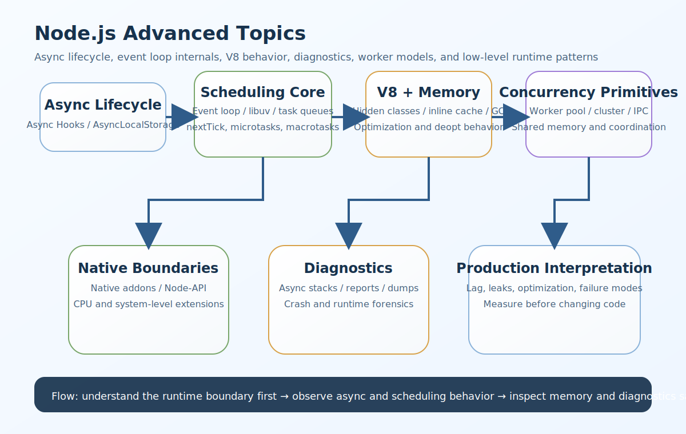

# Node.js Advanced Topics Interview Questions


This guide covers advanced Node.js topics from interview basics to tricky production scenarios. It follows the corrected format of **100 interview questions for each subtopic**, and every answer includes a real Node.js code example plus a real-time example so the scenarios and snippets do not repeat verbatim.

## How To Use This Page

- Questions 1-100 cover Async Hooks.
- Questions 101-200 cover Domains (Deprecated but Asked).
- Questions 201-300 cover Native Addons (C++ Bindings).
- Questions 301-400 cover Worker Pools.
- Questions 401-500 cover EventEmitter Internals.
- Questions 501-600 cover Event loop phases.
- Questions 601-700 cover libuv internals.
- Questions 701-800 cover Microtasks vs Macrotasks.
- Questions 801-900 cover process.nextTick vs setImmediate.
- Questions 901-1000 cover V8 engine basics.
- Questions 1001-1100 cover Hidden classes.
- Questions 1101-1200 cover Inline caching.
- Questions 1201-1300 cover Garbage collection internals.
- Questions 1301-1400 cover Cluster module.
- Questions 1401-1500 cover IPC (Inter-process communication).
- Questions 1501-1600 cover Shared memory (worker threads).
- Questions 1601-1700 cover Async stack traces.
- Questions 1701-1800 cover Diagnostic reports.
- Questions 1801-1900 cover Core dumps.

## 1. Async Hooks

### Q1.1 What is async hooks basics in advanced Node.js internals and architecture?

**Answer:**

Async Hooks basics matters in advanced Node.js work because it affects how the runtime behaves under real async load, how reliably teams can trace and optimize complex behavior, and how safely they can handle performance, diagnostics, and low-level concurrency concerns. In a real system like a high-throughput Node.js platform where observability, context propagation, and async boundaries matter during live incidents, a strong answer should connect the concept to runtime internals, observability, latency, memory behavior, and operational safety. A more senior answer also explains the practical trade-off so the answer stays grounded in real runtime and diagnostics trade-offs instead of only naming internals.

**Code Example:**

```js
const async_hooks = require('async_hooks');
const hook1 = async_hooks.createHook({ init(asyncId, type, triggerAsyncId) { console.log({ asyncId, type, triggerAsyncId, q: 1 }); } });
hook1.enable();
```

**Real-Time Example:** In a high-throughput Node.js platform where observability, context propagation, and async boundaries matter during live incidents, the team used this concept so the answer stays grounded in real runtime and diagnostics trade-offs instead of only naming internals.

### Q1.2 Why does async resource lifecycle matter in real production systems?

**Answer:**

Async resource lifecycle matters in advanced Node.js work because it affects how the runtime behaves under real async load, how reliably teams can trace and optimize complex behavior, and how safely they can handle performance, diagnostics, and low-level concurrency concerns. In a real system like a production API where CPU-heavy tasks, worker threads, and native integrations affect responsiveness and scaling decisions, a strong answer should connect the concept to runtime internals, observability, latency, memory behavior, and operational safety. A more senior answer also explains the practical trade-off so teams can connect Node internals to performance, debugging, and production safety decisions.

**Code Example:**

```js
const { AsyncLocalStorage } = require('async_hooks');
const storage2 = new AsyncLocalStorage();
storage2.run({ requestId: 'req-2' }, () => console.log(storage2.getStore()));
```

**Real-Time Example:** In a production API where CPU-heavy tasks, worker threads, and native integrations affect responsiveness and scaling decisions, the team used this concept so teams can connect Node internals to performance, debugging, and production safety decisions.

### Q1.3 When should a backend team care about asyncid and triggerasyncid?

**Answer:**

asyncId and triggerAsyncId matters in advanced Node.js work because it affects how the runtime behaves under real async load, how reliably teams can trace and optimize complex behavior, and how safely they can handle performance, diagnostics, and low-level concurrency concerns. In a real system like a microservices environment where event loop behavior and scheduling order influence request latency and debugging, a strong answer should connect the concept to runtime internals, observability, latency, memory behavior, and operational safety. A more senior answer also explains the practical trade-off so async lifecycle, scheduling, and low-level behavior become easier to reason about.

**Code Example:**

```js
const contextPlan3 = { useAsyncHooks: true, purpose: 'request-tracing', requestId: 'req-3' };
console.log(contextPlan3);
```

**Real-Time Example:** In a microservices environment where event loop behavior and scheduling order influence request latency and debugging, the team used this concept so async lifecycle, scheduling, and low-level behavior become easier to reason about.

### Q1.4 How would you explain context propagation in an interview?

**Answer:**

Context propagation matters in advanced Node.js work because it affects how the runtime behaves under real async load, how reliably teams can trace and optimize complex behavior, and how safely they can handle performance, diagnostics, and low-level concurrency concerns. In a real system like a runtime investigation where leaks, deoptimizations, and GC pressure appear only under sustained traffic, a strong answer should connect the concept to runtime internals, observability, latency, memory behavior, and operational safety. A more senior answer also explains the practical trade-off so the examples sound like production Node.js troubleshooting instead of textbook internals notes.

**Code Example:**

```js
function contextReason4() { return 'thread local storage does not exist in normal Node request flow'; }
```

**Real-Time Example:** In a runtime investigation where leaks, deoptimizations, and GC pressure appear only under sustained traffic, the team used this concept so the examples sound like production Node.js troubleshooting instead of textbook internals notes.

### Q1.5 What is a common interview trap around asynclocalstorage usage?

**Answer:**

AsyncLocalStorage usage matters in advanced Node.js work because it affects how the runtime behaves under real async load, how reliably teams can trace and optimize complex behavior, and how safely they can handle performance, diagnostics, and low-level concurrency concerns. In a real system like a senior-level Node.js codebase where internal event systems and async lifecycle tracking support diagnostics and tracing, a strong answer should connect the concept to runtime internals, observability, latency, memory behavior, and operational safety. A more senior answer also explains the practical trade-off so trade-offs between control, complexity, performance, and safety become clearer.

**Code Example:**

```js
const hookLifecycle5 = ['init', 'before', 'after', 'destroy'];
console.log(hookLifecycle5);
```

**Real-Time Example:** In a senior-level Node.js codebase where internal event systems and async lifecycle tracking support diagnostics and tracing, the team used this concept so trade-offs between control, complexity, performance, and safety become clearer.

### Q1.6 How is async hooks basics used safely in Node.js systems?

**Answer:**

Async Hooks basics matters in advanced Node.js work because it affects how the runtime behaves under real async load, how reliably teams can trace and optimize complex behavior, and how safely they can handle performance, diagnostics, and low-level concurrency concerns. In a real system like a system with heavy file, crypto, and compression workloads where libuv thread-pool behavior becomes operationally important, a strong answer should connect the concept to runtime internals, observability, latency, memory behavior, and operational safety. A more senior answer also explains the practical trade-off so runtime behavior is tied to concrete operational symptoms such as lag, crashes, and memory pressure.

**Code Example:**

```js
const async_hooks = require('async_hooks');
const hook6 = async_hooks.createHook({ init(asyncId, type, triggerAsyncId) { console.log({ asyncId, type, triggerAsyncId, q: 6 }); } });
hook6.enable();
```

**Real-Time Example:** In a system with heavy file, crypto, and compression workloads where libuv thread-pool behavior becomes operationally important, the team used this concept so runtime behavior is tied to concrete operational symptoms such as lag, crashes, and memory pressure.

### Q1.7 What production problem usually exposes weak understanding of async resource lifecycle?

**Answer:**

Async resource lifecycle matters in advanced Node.js work because it affects how the runtime behaves under real async load, how reliably teams can trace and optimize complex behavior, and how safely they can handle performance, diagnostics, and low-level concurrency concerns. In a real system like a multi-core deployment where cluster, IPC, and worker-thread coordination affect throughput and fault isolation, a strong answer should connect the concept to runtime internals, observability, latency, memory behavior, and operational safety. A more senior answer also explains the practical trade-off so tool choice and architecture decisions can be justified by actual workload behavior.

**Code Example:**

```js
const { AsyncLocalStorage } = require('async_hooks');
const storage7 = new AsyncLocalStorage();
storage7.run({ requestId: 'req-7' }, () => console.log(storage7.getStore()));
```

**Real-Time Example:** In a multi-core deployment where cluster, IPC, and worker-thread coordination affect throughput and fault isolation, the team used this concept so tool choice and architecture decisions can be justified by actual workload behavior.

### Q1.8 How would a senior engineer justify asyncid and triggerasyncid to a team?

**Answer:**

asyncId and triggerAsyncId matters in advanced Node.js work because it affects how the runtime behaves under real async load, how reliably teams can trace and optimize complex behavior, and how safely they can handle performance, diagnostics, and low-level concurrency concerns. In a real system like a debugging session where async stacks, diagnostic reports, and startup/runtime internals all shape the root-cause path, a strong answer should connect the concept to runtime internals, observability, latency, memory behavior, and operational safety. A more senior answer also explains the practical trade-off so advanced internals are positioned as practical engineering knowledge, not trivia.

**Code Example:**

```js
const contextPlan8 = { useAsyncHooks: true, purpose: 'request-tracing', requestId: 'req-8' };
console.log(contextPlan8);
```

**Real-Time Example:** In a debugging session where async stacks, diagnostic reports, and startup/runtime internals all shape the root-cause path, the team used this concept so advanced internals are positioned as practical engineering knowledge, not trivia.

### Q1.9 What trade-off does context propagation introduce?

**Answer:**

Context propagation matters in advanced Node.js work because it affects how the runtime behaves under real async load, how reliably teams can trace and optimize complex behavior, and how safely they can handle performance, diagnostics, and low-level concurrency concerns. In a real system like a performance incident where object shapes, inline caching, and V8 optimization behavior become relevant, a strong answer should connect the concept to runtime internals, observability, latency, memory behavior, and operational safety. A more senior answer also explains the practical trade-off so debugging and optimization paths become more systematic and less guess-based.

**Code Example:**

```js
function contextReason9() { return 'thread local storage does not exist in normal Node request flow'; }
```

**Real-Time Example:** In a performance incident where object shapes, inline caching, and V8 optimization behavior become relevant, the team used this concept so debugging and optimization paths become more systematic and less guess-based.

### Q1.10 How do you answer a tricky follow-up about asynclocalstorage usage?

**Answer:**

AsyncLocalStorage usage matters in advanced Node.js work because it affects how the runtime behaves under real async load, how reliably teams can trace and optimize complex behavior, and how safely they can handle performance, diagnostics, and low-level concurrency concerns. In a real system like a crash analysis workflow where diagnostic artifacts and low-level runtime signals are needed to understand failure safely, a strong answer should connect the concept to runtime internals, observability, latency, memory behavior, and operational safety. A more senior answer also explains the practical trade-off so the answer reflects senior-level thinking about internals, observability, and failure modes.

**Code Example:**

```js
const hookLifecycle10 = ['init', 'before', 'after', 'destroy'];
console.log(hookLifecycle10);
```

**Real-Time Example:** In a crash analysis workflow where diagnostic artifacts and low-level runtime signals are needed to understand failure safely, the team used this concept so the answer reflects senior-level thinking about internals, observability, and failure modes.

### Q1.11 What is async hooks basics in advanced Node.js internals and architecture?

**Answer:**

Async Hooks basics matters in advanced Node.js work because it affects how the runtime behaves under real async load, how reliably teams can trace and optimize complex behavior, and how safely they can handle performance, diagnostics, and low-level concurrency concerns. In a real system like a high-throughput Node.js platform where observability, context propagation, and async boundaries matter during live incidents, a strong answer should connect the concept to runtime internals, observability, latency, memory behavior, and operational safety. A more senior answer also explains the practical trade-off so the answer stays grounded in real runtime and diagnostics trade-offs instead of only naming internals.

**Code Example:**

```js
const async_hooks = require('async_hooks');
const hook11 = async_hooks.createHook({ init(asyncId, type, triggerAsyncId) { console.log({ asyncId, type, triggerAsyncId, q: 11 }); } });
hook11.enable();
```

**Real-Time Example:** In a high-throughput Node.js platform where observability, context propagation, and async boundaries matter during live incidents, the team used this concept so the answer stays grounded in real runtime and diagnostics trade-offs instead of only naming internals.

### Q1.12 Why does async resource lifecycle matter in real production systems?

**Answer:**

Async resource lifecycle matters in advanced Node.js work because it affects how the runtime behaves under real async load, how reliably teams can trace and optimize complex behavior, and how safely they can handle performance, diagnostics, and low-level concurrency concerns. In a real system like a production API where CPU-heavy tasks, worker threads, and native integrations affect responsiveness and scaling decisions, a strong answer should connect the concept to runtime internals, observability, latency, memory behavior, and operational safety. A more senior answer also explains the practical trade-off so teams can connect Node internals to performance, debugging, and production safety decisions.

**Code Example:**

```js
const { AsyncLocalStorage } = require('async_hooks');
const storage12 = new AsyncLocalStorage();
storage12.run({ requestId: 'req-12' }, () => console.log(storage12.getStore()));
```

**Real-Time Example:** In a production API where CPU-heavy tasks, worker threads, and native integrations affect responsiveness and scaling decisions, the team used this concept so teams can connect Node internals to performance, debugging, and production safety decisions.

### Q1.13 When should a backend team care about asyncid and triggerasyncid?

**Answer:**

asyncId and triggerAsyncId matters in advanced Node.js work because it affects how the runtime behaves under real async load, how reliably teams can trace and optimize complex behavior, and how safely they can handle performance, diagnostics, and low-level concurrency concerns. In a real system like a microservices environment where event loop behavior and scheduling order influence request latency and debugging, a strong answer should connect the concept to runtime internals, observability, latency, memory behavior, and operational safety. A more senior answer also explains the practical trade-off so async lifecycle, scheduling, and low-level behavior become easier to reason about.

**Code Example:**

```js
const contextPlan13 = { useAsyncHooks: true, purpose: 'request-tracing', requestId: 'req-13' };
console.log(contextPlan13);
```

**Real-Time Example:** In a microservices environment where event loop behavior and scheduling order influence request latency and debugging, the team used this concept so async lifecycle, scheduling, and low-level behavior become easier to reason about.

### Q1.14 How would you explain context propagation in an interview?

**Answer:**

Context propagation matters in advanced Node.js work because it affects how the runtime behaves under real async load, how reliably teams can trace and optimize complex behavior, and how safely they can handle performance, diagnostics, and low-level concurrency concerns. In a real system like a runtime investigation where leaks, deoptimizations, and GC pressure appear only under sustained traffic, a strong answer should connect the concept to runtime internals, observability, latency, memory behavior, and operational safety. A more senior answer also explains the practical trade-off so the examples sound like production Node.js troubleshooting instead of textbook internals notes.

**Code Example:**

```js
function contextReason14() { return 'thread local storage does not exist in normal Node request flow'; }
```

**Real-Time Example:** In a runtime investigation where leaks, deoptimizations, and GC pressure appear only under sustained traffic, the team used this concept so the examples sound like production Node.js troubleshooting instead of textbook internals notes.

### Q1.15 What is a common interview trap around asynclocalstorage usage?

**Answer:**

AsyncLocalStorage usage matters in advanced Node.js work because it affects how the runtime behaves under real async load, how reliably teams can trace and optimize complex behavior, and how safely they can handle performance, diagnostics, and low-level concurrency concerns. In a real system like a senior-level Node.js codebase where internal event systems and async lifecycle tracking support diagnostics and tracing, a strong answer should connect the concept to runtime internals, observability, latency, memory behavior, and operational safety. A more senior answer also explains the practical trade-off so trade-offs between control, complexity, performance, and safety become clearer.

**Code Example:**

```js
const hookLifecycle15 = ['init', 'before', 'after', 'destroy'];
console.log(hookLifecycle15);
```

**Real-Time Example:** In a senior-level Node.js codebase where internal event systems and async lifecycle tracking support diagnostics and tracing, the team used this concept so trade-offs between control, complexity, performance, and safety become clearer.

### Q1.16 How is async hooks basics used safely in Node.js systems?

**Answer:**

Async Hooks basics matters in advanced Node.js work because it affects how the runtime behaves under real async load, how reliably teams can trace and optimize complex behavior, and how safely they can handle performance, diagnostics, and low-level concurrency concerns. In a real system like a system with heavy file, crypto, and compression workloads where libuv thread-pool behavior becomes operationally important, a strong answer should connect the concept to runtime internals, observability, latency, memory behavior, and operational safety. A more senior answer also explains the practical trade-off so runtime behavior is tied to concrete operational symptoms such as lag, crashes, and memory pressure.

**Code Example:**

```js
const async_hooks = require('async_hooks');
const hook16 = async_hooks.createHook({ init(asyncId, type, triggerAsyncId) { console.log({ asyncId, type, triggerAsyncId, q: 16 }); } });
hook16.enable();
```

**Real-Time Example:** In a system with heavy file, crypto, and compression workloads where libuv thread-pool behavior becomes operationally important, the team used this concept so runtime behavior is tied to concrete operational symptoms such as lag, crashes, and memory pressure.

### Q1.17 What production problem usually exposes weak understanding of async resource lifecycle?

**Answer:**

Async resource lifecycle matters in advanced Node.js work because it affects how the runtime behaves under real async load, how reliably teams can trace and optimize complex behavior, and how safely they can handle performance, diagnostics, and low-level concurrency concerns. In a real system like a multi-core deployment where cluster, IPC, and worker-thread coordination affect throughput and fault isolation, a strong answer should connect the concept to runtime internals, observability, latency, memory behavior, and operational safety. A more senior answer also explains the practical trade-off so tool choice and architecture decisions can be justified by actual workload behavior.

**Code Example:**

```js
const { AsyncLocalStorage } = require('async_hooks');
const storage17 = new AsyncLocalStorage();
storage17.run({ requestId: 'req-17' }, () => console.log(storage17.getStore()));
```

**Real-Time Example:** In a multi-core deployment where cluster, IPC, and worker-thread coordination affect throughput and fault isolation, the team used this concept so tool choice and architecture decisions can be justified by actual workload behavior.

### Q1.18 How would a senior engineer justify asyncid and triggerasyncid to a team?

**Answer:**

asyncId and triggerAsyncId matters in advanced Node.js work because it affects how the runtime behaves under real async load, how reliably teams can trace and optimize complex behavior, and how safely they can handle performance, diagnostics, and low-level concurrency concerns. In a real system like a debugging session where async stacks, diagnostic reports, and startup/runtime internals all shape the root-cause path, a strong answer should connect the concept to runtime internals, observability, latency, memory behavior, and operational safety. A more senior answer also explains the practical trade-off so advanced internals are positioned as practical engineering knowledge, not trivia.

**Code Example:**

```js
const contextPlan18 = { useAsyncHooks: true, purpose: 'request-tracing', requestId: 'req-18' };
console.log(contextPlan18);
```

**Real-Time Example:** In a debugging session where async stacks, diagnostic reports, and startup/runtime internals all shape the root-cause path, the team used this concept so advanced internals are positioned as practical engineering knowledge, not trivia.

### Q1.19 What trade-off does context propagation introduce?

**Answer:**

Context propagation matters in advanced Node.js work because it affects how the runtime behaves under real async load, how reliably teams can trace and optimize complex behavior, and how safely they can handle performance, diagnostics, and low-level concurrency concerns. In a real system like a performance incident where object shapes, inline caching, and V8 optimization behavior become relevant, a strong answer should connect the concept to runtime internals, observability, latency, memory behavior, and operational safety. A more senior answer also explains the practical trade-off so debugging and optimization paths become more systematic and less guess-based.

**Code Example:**

```js
function contextReason19() { return 'thread local storage does not exist in normal Node request flow'; }
```

**Real-Time Example:** In a performance incident where object shapes, inline caching, and V8 optimization behavior become relevant, the team used this concept so debugging and optimization paths become more systematic and less guess-based.

### Q1.20 How do you answer a tricky follow-up about asynclocalstorage usage?

**Answer:**

AsyncLocalStorage usage matters in advanced Node.js work because it affects how the runtime behaves under real async load, how reliably teams can trace and optimize complex behavior, and how safely they can handle performance, diagnostics, and low-level concurrency concerns. In a real system like a crash analysis workflow where diagnostic artifacts and low-level runtime signals are needed to understand failure safely, a strong answer should connect the concept to runtime internals, observability, latency, memory behavior, and operational safety. A more senior answer also explains the practical trade-off so the answer reflects senior-level thinking about internals, observability, and failure modes.

**Code Example:**

```js
const hookLifecycle20 = ['init', 'before', 'after', 'destroy'];
console.log(hookLifecycle20);
```

**Real-Time Example:** In a crash analysis workflow where diagnostic artifacts and low-level runtime signals are needed to understand failure safely, the team used this concept so the answer reflects senior-level thinking about internals, observability, and failure modes.

### Q1.21 What is async hooks basics in advanced Node.js internals and architecture?

**Answer:**

Async Hooks basics matters in advanced Node.js work because it affects how the runtime behaves under real async load, how reliably teams can trace and optimize complex behavior, and how safely they can handle performance, diagnostics, and low-level concurrency concerns. In a real system like a high-throughput Node.js platform where observability, context propagation, and async boundaries matter during live incidents, a strong answer should connect the concept to runtime internals, observability, latency, memory behavior, and operational safety. A more senior answer also explains the practical trade-off so the answer stays grounded in real runtime and diagnostics trade-offs instead of only naming internals.

**Code Example:**

```js
const async_hooks = require('async_hooks');
const hook21 = async_hooks.createHook({ init(asyncId, type, triggerAsyncId) { console.log({ asyncId, type, triggerAsyncId, q: 21 }); } });
hook21.enable();
```

**Real-Time Example:** In a high-throughput Node.js platform where observability, context propagation, and async boundaries matter during live incidents, the team used this concept so the answer stays grounded in real runtime and diagnostics trade-offs instead of only naming internals.

### Q1.22 Why does async resource lifecycle matter in real production systems?

**Answer:**

Async resource lifecycle matters in advanced Node.js work because it affects how the runtime behaves under real async load, how reliably teams can trace and optimize complex behavior, and how safely they can handle performance, diagnostics, and low-level concurrency concerns. In a real system like a production API where CPU-heavy tasks, worker threads, and native integrations affect responsiveness and scaling decisions, a strong answer should connect the concept to runtime internals, observability, latency, memory behavior, and operational safety. A more senior answer also explains the practical trade-off so teams can connect Node internals to performance, debugging, and production safety decisions.

**Code Example:**

```js
const { AsyncLocalStorage } = require('async_hooks');
const storage22 = new AsyncLocalStorage();
storage22.run({ requestId: 'req-22' }, () => console.log(storage22.getStore()));
```

**Real-Time Example:** In a production API where CPU-heavy tasks, worker threads, and native integrations affect responsiveness and scaling decisions, the team used this concept so teams can connect Node internals to performance, debugging, and production safety decisions.

### Q1.23 When should a backend team care about asyncid and triggerasyncid?

**Answer:**

asyncId and triggerAsyncId matters in advanced Node.js work because it affects how the runtime behaves under real async load, how reliably teams can trace and optimize complex behavior, and how safely they can handle performance, diagnostics, and low-level concurrency concerns. In a real system like a microservices environment where event loop behavior and scheduling order influence request latency and debugging, a strong answer should connect the concept to runtime internals, observability, latency, memory behavior, and operational safety. A more senior answer also explains the practical trade-off so async lifecycle, scheduling, and low-level behavior become easier to reason about.

**Code Example:**

```js
const contextPlan23 = { useAsyncHooks: true, purpose: 'request-tracing', requestId: 'req-23' };
console.log(contextPlan23);
```

**Real-Time Example:** In a microservices environment where event loop behavior and scheduling order influence request latency and debugging, the team used this concept so async lifecycle, scheduling, and low-level behavior become easier to reason about.

### Q1.24 How would you explain context propagation in an interview?

**Answer:**

Context propagation matters in advanced Node.js work because it affects how the runtime behaves under real async load, how reliably teams can trace and optimize complex behavior, and how safely they can handle performance, diagnostics, and low-level concurrency concerns. In a real system like a runtime investigation where leaks, deoptimizations, and GC pressure appear only under sustained traffic, a strong answer should connect the concept to runtime internals, observability, latency, memory behavior, and operational safety. A more senior answer also explains the practical trade-off so the examples sound like production Node.js troubleshooting instead of textbook internals notes.

**Code Example:**

```js
function contextReason24() { return 'thread local storage does not exist in normal Node request flow'; }
```

**Real-Time Example:** In a runtime investigation where leaks, deoptimizations, and GC pressure appear only under sustained traffic, the team used this concept so the examples sound like production Node.js troubleshooting instead of textbook internals notes.

### Q1.25 What is a common interview trap around asynclocalstorage usage?

**Answer:**

AsyncLocalStorage usage matters in advanced Node.js work because it affects how the runtime behaves under real async load, how reliably teams can trace and optimize complex behavior, and how safely they can handle performance, diagnostics, and low-level concurrency concerns. In a real system like a senior-level Node.js codebase where internal event systems and async lifecycle tracking support diagnostics and tracing, a strong answer should connect the concept to runtime internals, observability, latency, memory behavior, and operational safety. A more senior answer also explains the practical trade-off so trade-offs between control, complexity, performance, and safety become clearer.

**Code Example:**

```js
const hookLifecycle25 = ['init', 'before', 'after', 'destroy'];
console.log(hookLifecycle25);
```

**Real-Time Example:** In a senior-level Node.js codebase where internal event systems and async lifecycle tracking support diagnostics and tracing, the team used this concept so trade-offs between control, complexity, performance, and safety become clearer.

### Q1.26 How is async hooks basics used safely in Node.js systems?

**Answer:**

Async Hooks basics matters in advanced Node.js work because it affects how the runtime behaves under real async load, how reliably teams can trace and optimize complex behavior, and how safely they can handle performance, diagnostics, and low-level concurrency concerns. In a real system like a system with heavy file, crypto, and compression workloads where libuv thread-pool behavior becomes operationally important, a strong answer should connect the concept to runtime internals, observability, latency, memory behavior, and operational safety. A more senior answer also explains the practical trade-off so runtime behavior is tied to concrete operational symptoms such as lag, crashes, and memory pressure.

**Code Example:**

```js
const async_hooks = require('async_hooks');
const hook26 = async_hooks.createHook({ init(asyncId, type, triggerAsyncId) { console.log({ asyncId, type, triggerAsyncId, q: 26 }); } });
hook26.enable();
```

**Real-Time Example:** In a system with heavy file, crypto, and compression workloads where libuv thread-pool behavior becomes operationally important, the team used this concept so runtime behavior is tied to concrete operational symptoms such as lag, crashes, and memory pressure.

### Q1.27 What production problem usually exposes weak understanding of async resource lifecycle?

**Answer:**

Async resource lifecycle matters in advanced Node.js work because it affects how the runtime behaves under real async load, how reliably teams can trace and optimize complex behavior, and how safely they can handle performance, diagnostics, and low-level concurrency concerns. In a real system like a multi-core deployment where cluster, IPC, and worker-thread coordination affect throughput and fault isolation, a strong answer should connect the concept to runtime internals, observability, latency, memory behavior, and operational safety. A more senior answer also explains the practical trade-off so tool choice and architecture decisions can be justified by actual workload behavior.

**Code Example:**

```js
const { AsyncLocalStorage } = require('async_hooks');
const storage27 = new AsyncLocalStorage();
storage27.run({ requestId: 'req-27' }, () => console.log(storage27.getStore()));
```

**Real-Time Example:** In a multi-core deployment where cluster, IPC, and worker-thread coordination affect throughput and fault isolation, the team used this concept so tool choice and architecture decisions can be justified by actual workload behavior.

### Q1.28 How would a senior engineer justify asyncid and triggerasyncid to a team?

**Answer:**

asyncId and triggerAsyncId matters in advanced Node.js work because it affects how the runtime behaves under real async load, how reliably teams can trace and optimize complex behavior, and how safely they can handle performance, diagnostics, and low-level concurrency concerns. In a real system like a debugging session where async stacks, diagnostic reports, and startup/runtime internals all shape the root-cause path, a strong answer should connect the concept to runtime internals, observability, latency, memory behavior, and operational safety. A more senior answer also explains the practical trade-off so advanced internals are positioned as practical engineering knowledge, not trivia.

**Code Example:**

```js
const contextPlan28 = { useAsyncHooks: true, purpose: 'request-tracing', requestId: 'req-28' };
console.log(contextPlan28);
```

**Real-Time Example:** In a debugging session where async stacks, diagnostic reports, and startup/runtime internals all shape the root-cause path, the team used this concept so advanced internals are positioned as practical engineering knowledge, not trivia.

### Q1.29 What trade-off does context propagation introduce?

**Answer:**

Context propagation matters in advanced Node.js work because it affects how the runtime behaves under real async load, how reliably teams can trace and optimize complex behavior, and how safely they can handle performance, diagnostics, and low-level concurrency concerns. In a real system like a performance incident where object shapes, inline caching, and V8 optimization behavior become relevant, a strong answer should connect the concept to runtime internals, observability, latency, memory behavior, and operational safety. A more senior answer also explains the practical trade-off so debugging and optimization paths become more systematic and less guess-based.

**Code Example:**

```js
function contextReason29() { return 'thread local storage does not exist in normal Node request flow'; }
```

**Real-Time Example:** In a performance incident where object shapes, inline caching, and V8 optimization behavior become relevant, the team used this concept so debugging and optimization paths become more systematic and less guess-based.

### Q1.30 How do you answer a tricky follow-up about asynclocalstorage usage?

**Answer:**

AsyncLocalStorage usage matters in advanced Node.js work because it affects how the runtime behaves under real async load, how reliably teams can trace and optimize complex behavior, and how safely they can handle performance, diagnostics, and low-level concurrency concerns. In a real system like a crash analysis workflow where diagnostic artifacts and low-level runtime signals are needed to understand failure safely, a strong answer should connect the concept to runtime internals, observability, latency, memory behavior, and operational safety. A more senior answer also explains the practical trade-off so the answer reflects senior-level thinking about internals, observability, and failure modes.

**Code Example:**

```js
const hookLifecycle30 = ['init', 'before', 'after', 'destroy'];
console.log(hookLifecycle30);
```

**Real-Time Example:** In a crash analysis workflow where diagnostic artifacts and low-level runtime signals are needed to understand failure safely, the team used this concept so the answer reflects senior-level thinking about internals, observability, and failure modes.

### Q1.31 What is async hooks basics in advanced Node.js internals and architecture?

**Answer:**

Async Hooks basics matters in advanced Node.js work because it affects how the runtime behaves under real async load, how reliably teams can trace and optimize complex behavior, and how safely they can handle performance, diagnostics, and low-level concurrency concerns. In a real system like a high-throughput Node.js platform where observability, context propagation, and async boundaries matter during live incidents, a strong answer should connect the concept to runtime internals, observability, latency, memory behavior, and operational safety. A more senior answer also explains the practical trade-off so the answer stays grounded in real runtime and diagnostics trade-offs instead of only naming internals.

**Code Example:**

```js
const async_hooks = require('async_hooks');
const hook31 = async_hooks.createHook({ init(asyncId, type, triggerAsyncId) { console.log({ asyncId, type, triggerAsyncId, q: 31 }); } });
hook31.enable();
```

**Real-Time Example:** In a high-throughput Node.js platform where observability, context propagation, and async boundaries matter during live incidents, the team used this concept so the answer stays grounded in real runtime and diagnostics trade-offs instead of only naming internals.

### Q1.32 Why does async resource lifecycle matter in real production systems?

**Answer:**

Async resource lifecycle matters in advanced Node.js work because it affects how the runtime behaves under real async load, how reliably teams can trace and optimize complex behavior, and how safely they can handle performance, diagnostics, and low-level concurrency concerns. In a real system like a production API where CPU-heavy tasks, worker threads, and native integrations affect responsiveness and scaling decisions, a strong answer should connect the concept to runtime internals, observability, latency, memory behavior, and operational safety. A more senior answer also explains the practical trade-off so teams can connect Node internals to performance, debugging, and production safety decisions.

**Code Example:**

```js
const { AsyncLocalStorage } = require('async_hooks');
const storage32 = new AsyncLocalStorage();
storage32.run({ requestId: 'req-32' }, () => console.log(storage32.getStore()));
```

**Real-Time Example:** In a production API where CPU-heavy tasks, worker threads, and native integrations affect responsiveness and scaling decisions, the team used this concept so teams can connect Node internals to performance, debugging, and production safety decisions.

### Q1.33 When should a backend team care about asyncid and triggerasyncid?

**Answer:**

asyncId and triggerAsyncId matters in advanced Node.js work because it affects how the runtime behaves under real async load, how reliably teams can trace and optimize complex behavior, and how safely they can handle performance, diagnostics, and low-level concurrency concerns. In a real system like a microservices environment where event loop behavior and scheduling order influence request latency and debugging, a strong answer should connect the concept to runtime internals, observability, latency, memory behavior, and operational safety. A more senior answer also explains the practical trade-off so async lifecycle, scheduling, and low-level behavior become easier to reason about.

**Code Example:**

```js
const contextPlan33 = { useAsyncHooks: true, purpose: 'request-tracing', requestId: 'req-33' };
console.log(contextPlan33);
```

**Real-Time Example:** In a microservices environment where event loop behavior and scheduling order influence request latency and debugging, the team used this concept so async lifecycle, scheduling, and low-level behavior become easier to reason about.

### Q1.34 How would you explain context propagation in an interview?

**Answer:**

Context propagation matters in advanced Node.js work because it affects how the runtime behaves under real async load, how reliably teams can trace and optimize complex behavior, and how safely they can handle performance, diagnostics, and low-level concurrency concerns. In a real system like a runtime investigation where leaks, deoptimizations, and GC pressure appear only under sustained traffic, a strong answer should connect the concept to runtime internals, observability, latency, memory behavior, and operational safety. A more senior answer also explains the practical trade-off so the examples sound like production Node.js troubleshooting instead of textbook internals notes.

**Code Example:**

```js
function contextReason34() { return 'thread local storage does not exist in normal Node request flow'; }
```

**Real-Time Example:** In a runtime investigation where leaks, deoptimizations, and GC pressure appear only under sustained traffic, the team used this concept so the examples sound like production Node.js troubleshooting instead of textbook internals notes.

### Q1.35 What is a common interview trap around asynclocalstorage usage?

**Answer:**

AsyncLocalStorage usage matters in advanced Node.js work because it affects how the runtime behaves under real async load, how reliably teams can trace and optimize complex behavior, and how safely they can handle performance, diagnostics, and low-level concurrency concerns. In a real system like a senior-level Node.js codebase where internal event systems and async lifecycle tracking support diagnostics and tracing, a strong answer should connect the concept to runtime internals, observability, latency, memory behavior, and operational safety. A more senior answer also explains the practical trade-off so trade-offs between control, complexity, performance, and safety become clearer.

**Code Example:**

```js
const hookLifecycle35 = ['init', 'before', 'after', 'destroy'];
console.log(hookLifecycle35);
```

**Real-Time Example:** In a senior-level Node.js codebase where internal event systems and async lifecycle tracking support diagnostics and tracing, the team used this concept so trade-offs between control, complexity, performance, and safety become clearer.

### Q1.36 How is async hooks basics used safely in Node.js systems?

**Answer:**

Async Hooks basics matters in advanced Node.js work because it affects how the runtime behaves under real async load, how reliably teams can trace and optimize complex behavior, and how safely they can handle performance, diagnostics, and low-level concurrency concerns. In a real system like a system with heavy file, crypto, and compression workloads where libuv thread-pool behavior becomes operationally important, a strong answer should connect the concept to runtime internals, observability, latency, memory behavior, and operational safety. A more senior answer also explains the practical trade-off so runtime behavior is tied to concrete operational symptoms such as lag, crashes, and memory pressure.

**Code Example:**

```js
const async_hooks = require('async_hooks');
const hook36 = async_hooks.createHook({ init(asyncId, type, triggerAsyncId) { console.log({ asyncId, type, triggerAsyncId, q: 36 }); } });
hook36.enable();
```

**Real-Time Example:** In a system with heavy file, crypto, and compression workloads where libuv thread-pool behavior becomes operationally important, the team used this concept so runtime behavior is tied to concrete operational symptoms such as lag, crashes, and memory pressure.

### Q1.37 What production problem usually exposes weak understanding of async resource lifecycle?

**Answer:**

Async resource lifecycle matters in advanced Node.js work because it affects how the runtime behaves under real async load, how reliably teams can trace and optimize complex behavior, and how safely they can handle performance, diagnostics, and low-level concurrency concerns. In a real system like a multi-core deployment where cluster, IPC, and worker-thread coordination affect throughput and fault isolation, a strong answer should connect the concept to runtime internals, observability, latency, memory behavior, and operational safety. A more senior answer also explains the practical trade-off so tool choice and architecture decisions can be justified by actual workload behavior.

**Code Example:**

```js
const { AsyncLocalStorage } = require('async_hooks');
const storage37 = new AsyncLocalStorage();
storage37.run({ requestId: 'req-37' }, () => console.log(storage37.getStore()));
```

**Real-Time Example:** In a multi-core deployment where cluster, IPC, and worker-thread coordination affect throughput and fault isolation, the team used this concept so tool choice and architecture decisions can be justified by actual workload behavior.

### Q1.38 How would a senior engineer justify asyncid and triggerasyncid to a team?

**Answer:**

asyncId and triggerAsyncId matters in advanced Node.js work because it affects how the runtime behaves under real async load, how reliably teams can trace and optimize complex behavior, and how safely they can handle performance, diagnostics, and low-level concurrency concerns. In a real system like a debugging session where async stacks, diagnostic reports, and startup/runtime internals all shape the root-cause path, a strong answer should connect the concept to runtime internals, observability, latency, memory behavior, and operational safety. A more senior answer also explains the practical trade-off so advanced internals are positioned as practical engineering knowledge, not trivia.

**Code Example:**

```js
const contextPlan38 = { useAsyncHooks: true, purpose: 'request-tracing', requestId: 'req-38' };
console.log(contextPlan38);
```

**Real-Time Example:** In a debugging session where async stacks, diagnostic reports, and startup/runtime internals all shape the root-cause path, the team used this concept so advanced internals are positioned as practical engineering knowledge, not trivia.

### Q1.39 What trade-off does context propagation introduce?

**Answer:**

Context propagation matters in advanced Node.js work because it affects how the runtime behaves under real async load, how reliably teams can trace and optimize complex behavior, and how safely they can handle performance, diagnostics, and low-level concurrency concerns. In a real system like a performance incident where object shapes, inline caching, and V8 optimization behavior become relevant, a strong answer should connect the concept to runtime internals, observability, latency, memory behavior, and operational safety. A more senior answer also explains the practical trade-off so debugging and optimization paths become more systematic and less guess-based.

**Code Example:**

```js
function contextReason39() { return 'thread local storage does not exist in normal Node request flow'; }
```

**Real-Time Example:** In a performance incident where object shapes, inline caching, and V8 optimization behavior become relevant, the team used this concept so debugging and optimization paths become more systematic and less guess-based.

### Q1.40 How do you answer a tricky follow-up about asynclocalstorage usage?

**Answer:**

AsyncLocalStorage usage matters in advanced Node.js work because it affects how the runtime behaves under real async load, how reliably teams can trace and optimize complex behavior, and how safely they can handle performance, diagnostics, and low-level concurrency concerns. In a real system like a crash analysis workflow where diagnostic artifacts and low-level runtime signals are needed to understand failure safely, a strong answer should connect the concept to runtime internals, observability, latency, memory behavior, and operational safety. A more senior answer also explains the practical trade-off so the answer reflects senior-level thinking about internals, observability, and failure modes.

**Code Example:**

```js
const hookLifecycle40 = ['init', 'before', 'after', 'destroy'];
console.log(hookLifecycle40);
```

**Real-Time Example:** In a crash analysis workflow where diagnostic artifacts and low-level runtime signals are needed to understand failure safely, the team used this concept so the answer reflects senior-level thinking about internals, observability, and failure modes.

### Q1.41 What is async hooks basics in advanced Node.js internals and architecture?

**Answer:**

Async Hooks basics matters in advanced Node.js work because it affects how the runtime behaves under real async load, how reliably teams can trace and optimize complex behavior, and how safely they can handle performance, diagnostics, and low-level concurrency concerns. In a real system like a high-throughput Node.js platform where observability, context propagation, and async boundaries matter during live incidents, a strong answer should connect the concept to runtime internals, observability, latency, memory behavior, and operational safety. A more senior answer also explains the practical trade-off so the answer stays grounded in real runtime and diagnostics trade-offs instead of only naming internals.

**Code Example:**

```js
const async_hooks = require('async_hooks');
const hook41 = async_hooks.createHook({ init(asyncId, type, triggerAsyncId) { console.log({ asyncId, type, triggerAsyncId, q: 41 }); } });
hook41.enable();
```

**Real-Time Example:** In a high-throughput Node.js platform where observability, context propagation, and async boundaries matter during live incidents, the team used this concept so the answer stays grounded in real runtime and diagnostics trade-offs instead of only naming internals.

### Q1.42 Why does async resource lifecycle matter in real production systems?

**Answer:**

Async resource lifecycle matters in advanced Node.js work because it affects how the runtime behaves under real async load, how reliably teams can trace and optimize complex behavior, and how safely they can handle performance, diagnostics, and low-level concurrency concerns. In a real system like a production API where CPU-heavy tasks, worker threads, and native integrations affect responsiveness and scaling decisions, a strong answer should connect the concept to runtime internals, observability, latency, memory behavior, and operational safety. A more senior answer also explains the practical trade-off so teams can connect Node internals to performance, debugging, and production safety decisions.

**Code Example:**

```js
const { AsyncLocalStorage } = require('async_hooks');
const storage42 = new AsyncLocalStorage();
storage42.run({ requestId: 'req-42' }, () => console.log(storage42.getStore()));
```

**Real-Time Example:** In a production API where CPU-heavy tasks, worker threads, and native integrations affect responsiveness and scaling decisions, the team used this concept so teams can connect Node internals to performance, debugging, and production safety decisions.

### Q1.43 When should a backend team care about asyncid and triggerasyncid?

**Answer:**

asyncId and triggerAsyncId matters in advanced Node.js work because it affects how the runtime behaves under real async load, how reliably teams can trace and optimize complex behavior, and how safely they can handle performance, diagnostics, and low-level concurrency concerns. In a real system like a microservices environment where event loop behavior and scheduling order influence request latency and debugging, a strong answer should connect the concept to runtime internals, observability, latency, memory behavior, and operational safety. A more senior answer also explains the practical trade-off so async lifecycle, scheduling, and low-level behavior become easier to reason about.

**Code Example:**

```js
const contextPlan43 = { useAsyncHooks: true, purpose: 'request-tracing', requestId: 'req-43' };
console.log(contextPlan43);
```

**Real-Time Example:** In a microservices environment where event loop behavior and scheduling order influence request latency and debugging, the team used this concept so async lifecycle, scheduling, and low-level behavior become easier to reason about.

### Q1.44 How would you explain context propagation in an interview?

**Answer:**

Context propagation matters in advanced Node.js work because it affects how the runtime behaves under real async load, how reliably teams can trace and optimize complex behavior, and how safely they can handle performance, diagnostics, and low-level concurrency concerns. In a real system like a runtime investigation where leaks, deoptimizations, and GC pressure appear only under sustained traffic, a strong answer should connect the concept to runtime internals, observability, latency, memory behavior, and operational safety. A more senior answer also explains the practical trade-off so the examples sound like production Node.js troubleshooting instead of textbook internals notes.

**Code Example:**

```js
function contextReason44() { return 'thread local storage does not exist in normal Node request flow'; }
```

**Real-Time Example:** In a runtime investigation where leaks, deoptimizations, and GC pressure appear only under sustained traffic, the team used this concept so the examples sound like production Node.js troubleshooting instead of textbook internals notes.

### Q1.45 What is a common interview trap around asynclocalstorage usage?

**Answer:**

AsyncLocalStorage usage matters in advanced Node.js work because it affects how the runtime behaves under real async load, how reliably teams can trace and optimize complex behavior, and how safely they can handle performance, diagnostics, and low-level concurrency concerns. In a real system like a senior-level Node.js codebase where internal event systems and async lifecycle tracking support diagnostics and tracing, a strong answer should connect the concept to runtime internals, observability, latency, memory behavior, and operational safety. A more senior answer also explains the practical trade-off so trade-offs between control, complexity, performance, and safety become clearer.

**Code Example:**

```js
const hookLifecycle45 = ['init', 'before', 'after', 'destroy'];
console.log(hookLifecycle45);
```

**Real-Time Example:** In a senior-level Node.js codebase where internal event systems and async lifecycle tracking support diagnostics and tracing, the team used this concept so trade-offs between control, complexity, performance, and safety become clearer.

### Q1.46 How is async hooks basics used safely in Node.js systems?

**Answer:**

Async Hooks basics matters in advanced Node.js work because it affects how the runtime behaves under real async load, how reliably teams can trace and optimize complex behavior, and how safely they can handle performance, diagnostics, and low-level concurrency concerns. In a real system like a system with heavy file, crypto, and compression workloads where libuv thread-pool behavior becomes operationally important, a strong answer should connect the concept to runtime internals, observability, latency, memory behavior, and operational safety. A more senior answer also explains the practical trade-off so runtime behavior is tied to concrete operational symptoms such as lag, crashes, and memory pressure.

**Code Example:**

```js
const async_hooks = require('async_hooks');
const hook46 = async_hooks.createHook({ init(asyncId, type, triggerAsyncId) { console.log({ asyncId, type, triggerAsyncId, q: 46 }); } });
hook46.enable();
```

**Real-Time Example:** In a system with heavy file, crypto, and compression workloads where libuv thread-pool behavior becomes operationally important, the team used this concept so runtime behavior is tied to concrete operational symptoms such as lag, crashes, and memory pressure.

### Q1.47 What production problem usually exposes weak understanding of async resource lifecycle?

**Answer:**

Async resource lifecycle matters in advanced Node.js work because it affects how the runtime behaves under real async load, how reliably teams can trace and optimize complex behavior, and how safely they can handle performance, diagnostics, and low-level concurrency concerns. In a real system like a multi-core deployment where cluster, IPC, and worker-thread coordination affect throughput and fault isolation, a strong answer should connect the concept to runtime internals, observability, latency, memory behavior, and operational safety. A more senior answer also explains the practical trade-off so tool choice and architecture decisions can be justified by actual workload behavior.

**Code Example:**

```js
const { AsyncLocalStorage } = require('async_hooks');
const storage47 = new AsyncLocalStorage();
storage47.run({ requestId: 'req-47' }, () => console.log(storage47.getStore()));
```

**Real-Time Example:** In a multi-core deployment where cluster, IPC, and worker-thread coordination affect throughput and fault isolation, the team used this concept so tool choice and architecture decisions can be justified by actual workload behavior.

### Q1.48 How would a senior engineer justify asyncid and triggerasyncid to a team?

**Answer:**

asyncId and triggerAsyncId matters in advanced Node.js work because it affects how the runtime behaves under real async load, how reliably teams can trace and optimize complex behavior, and how safely they can handle performance, diagnostics, and low-level concurrency concerns. In a real system like a debugging session where async stacks, diagnostic reports, and startup/runtime internals all shape the root-cause path, a strong answer should connect the concept to runtime internals, observability, latency, memory behavior, and operational safety. A more senior answer also explains the practical trade-off so advanced internals are positioned as practical engineering knowledge, not trivia.

**Code Example:**

```js
const contextPlan48 = { useAsyncHooks: true, purpose: 'request-tracing', requestId: 'req-48' };
console.log(contextPlan48);
```

**Real-Time Example:** In a debugging session where async stacks, diagnostic reports, and startup/runtime internals all shape the root-cause path, the team used this concept so advanced internals are positioned as practical engineering knowledge, not trivia.

### Q1.49 What trade-off does context propagation introduce?

**Answer:**

Context propagation matters in advanced Node.js work because it affects how the runtime behaves under real async load, how reliably teams can trace and optimize complex behavior, and how safely they can handle performance, diagnostics, and low-level concurrency concerns. In a real system like a performance incident where object shapes, inline caching, and V8 optimization behavior become relevant, a strong answer should connect the concept to runtime internals, observability, latency, memory behavior, and operational safety. A more senior answer also explains the practical trade-off so debugging and optimization paths become more systematic and less guess-based.

**Code Example:**

```js
function contextReason49() { return 'thread local storage does not exist in normal Node request flow'; }
```

**Real-Time Example:** In a performance incident where object shapes, inline caching, and V8 optimization behavior become relevant, the team used this concept so debugging and optimization paths become more systematic and less guess-based.

### Q1.50 How do you answer a tricky follow-up about asynclocalstorage usage?

**Answer:**

AsyncLocalStorage usage matters in advanced Node.js work because it affects how the runtime behaves under real async load, how reliably teams can trace and optimize complex behavior, and how safely they can handle performance, diagnostics, and low-level concurrency concerns. In a real system like a crash analysis workflow where diagnostic artifacts and low-level runtime signals are needed to understand failure safely, a strong answer should connect the concept to runtime internals, observability, latency, memory behavior, and operational safety. A more senior answer also explains the practical trade-off so the answer reflects senior-level thinking about internals, observability, and failure modes.

**Code Example:**

```js
const hookLifecycle50 = ['init', 'before', 'after', 'destroy'];
console.log(hookLifecycle50);
```

**Real-Time Example:** In a crash analysis workflow where diagnostic artifacts and low-level runtime signals are needed to understand failure safely, the team used this concept so the answer reflects senior-level thinking about internals, observability, and failure modes.

### Q1.51 What is async hooks basics in advanced Node.js internals and architecture?

**Answer:**

Async Hooks basics matters in advanced Node.js work because it affects how the runtime behaves under real async load, how reliably teams can trace and optimize complex behavior, and how safely they can handle performance, diagnostics, and low-level concurrency concerns. In a real system like a high-throughput Node.js platform where observability, context propagation, and async boundaries matter during live incidents, a strong answer should connect the concept to runtime internals, observability, latency, memory behavior, and operational safety. A more senior answer also explains the practical trade-off so the answer stays grounded in real runtime and diagnostics trade-offs instead of only naming internals.

**Code Example:**

```js
const async_hooks = require('async_hooks');
const hook51 = async_hooks.createHook({ init(asyncId, type, triggerAsyncId) { console.log({ asyncId, type, triggerAsyncId, q: 51 }); } });
hook51.enable();
```

**Real-Time Example:** In a high-throughput Node.js platform where observability, context propagation, and async boundaries matter during live incidents, the team used this concept so the answer stays grounded in real runtime and diagnostics trade-offs instead of only naming internals.

### Q1.52 Why does async resource lifecycle matter in real production systems?

**Answer:**

Async resource lifecycle matters in advanced Node.js work because it affects how the runtime behaves under real async load, how reliably teams can trace and optimize complex behavior, and how safely they can handle performance, diagnostics, and low-level concurrency concerns. In a real system like a production API where CPU-heavy tasks, worker threads, and native integrations affect responsiveness and scaling decisions, a strong answer should connect the concept to runtime internals, observability, latency, memory behavior, and operational safety. A more senior answer also explains the practical trade-off so teams can connect Node internals to performance, debugging, and production safety decisions.

**Code Example:**

```js
const { AsyncLocalStorage } = require('async_hooks');
const storage52 = new AsyncLocalStorage();
storage52.run({ requestId: 'req-52' }, () => console.log(storage52.getStore()));
```

**Real-Time Example:** In a production API where CPU-heavy tasks, worker threads, and native integrations affect responsiveness and scaling decisions, the team used this concept so teams can connect Node internals to performance, debugging, and production safety decisions.

### Q1.53 When should a backend team care about asyncid and triggerasyncid?

**Answer:**

asyncId and triggerAsyncId matters in advanced Node.js work because it affects how the runtime behaves under real async load, how reliably teams can trace and optimize complex behavior, and how safely they can handle performance, diagnostics, and low-level concurrency concerns. In a real system like a microservices environment where event loop behavior and scheduling order influence request latency and debugging, a strong answer should connect the concept to runtime internals, observability, latency, memory behavior, and operational safety. A more senior answer also explains the practical trade-off so async lifecycle, scheduling, and low-level behavior become easier to reason about.

**Code Example:**

```js
const contextPlan53 = { useAsyncHooks: true, purpose: 'request-tracing', requestId: 'req-53' };
console.log(contextPlan53);
```

**Real-Time Example:** In a microservices environment where event loop behavior and scheduling order influence request latency and debugging, the team used this concept so async lifecycle, scheduling, and low-level behavior become easier to reason about.

### Q1.54 How would you explain context propagation in an interview?

**Answer:**

Context propagation matters in advanced Node.js work because it affects how the runtime behaves under real async load, how reliably teams can trace and optimize complex behavior, and how safely they can handle performance, diagnostics, and low-level concurrency concerns. In a real system like a runtime investigation where leaks, deoptimizations, and GC pressure appear only under sustained traffic, a strong answer should connect the concept to runtime internals, observability, latency, memory behavior, and operational safety. A more senior answer also explains the practical trade-off so the examples sound like production Node.js troubleshooting instead of textbook internals notes.

**Code Example:**

```js
function contextReason54() { return 'thread local storage does not exist in normal Node request flow'; }
```

**Real-Time Example:** In a runtime investigation where leaks, deoptimizations, and GC pressure appear only under sustained traffic, the team used this concept so the examples sound like production Node.js troubleshooting instead of textbook internals notes.

### Q1.55 What is a common interview trap around asynclocalstorage usage?

**Answer:**

AsyncLocalStorage usage matters in advanced Node.js work because it affects how the runtime behaves under real async load, how reliably teams can trace and optimize complex behavior, and how safely they can handle performance, diagnostics, and low-level concurrency concerns. In a real system like a senior-level Node.js codebase where internal event systems and async lifecycle tracking support diagnostics and tracing, a strong answer should connect the concept to runtime internals, observability, latency, memory behavior, and operational safety. A more senior answer also explains the practical trade-off so trade-offs between control, complexity, performance, and safety become clearer.

**Code Example:**

```js
const hookLifecycle55 = ['init', 'before', 'after', 'destroy'];
console.log(hookLifecycle55);
```

**Real-Time Example:** In a senior-level Node.js codebase where internal event systems and async lifecycle tracking support diagnostics and tracing, the team used this concept so trade-offs between control, complexity, performance, and safety become clearer.

### Q1.56 How is async hooks basics used safely in Node.js systems?

**Answer:**

Async Hooks basics matters in advanced Node.js work because it affects how the runtime behaves under real async load, how reliably teams can trace and optimize complex behavior, and how safely they can handle performance, diagnostics, and low-level concurrency concerns. In a real system like a system with heavy file, crypto, and compression workloads where libuv thread-pool behavior becomes operationally important, a strong answer should connect the concept to runtime internals, observability, latency, memory behavior, and operational safety. A more senior answer also explains the practical trade-off so runtime behavior is tied to concrete operational symptoms such as lag, crashes, and memory pressure.

**Code Example:**

```js
const async_hooks = require('async_hooks');
const hook56 = async_hooks.createHook({ init(asyncId, type, triggerAsyncId) { console.log({ asyncId, type, triggerAsyncId, q: 56 }); } });
hook56.enable();
```

**Real-Time Example:** In a system with heavy file, crypto, and compression workloads where libuv thread-pool behavior becomes operationally important, the team used this concept so runtime behavior is tied to concrete operational symptoms such as lag, crashes, and memory pressure.

### Q1.57 What production problem usually exposes weak understanding of async resource lifecycle?

**Answer:**

Async resource lifecycle matters in advanced Node.js work because it affects how the runtime behaves under real async load, how reliably teams can trace and optimize complex behavior, and how safely they can handle performance, diagnostics, and low-level concurrency concerns. In a real system like a multi-core deployment where cluster, IPC, and worker-thread coordination affect throughput and fault isolation, a strong answer should connect the concept to runtime internals, observability, latency, memory behavior, and operational safety. A more senior answer also explains the practical trade-off so tool choice and architecture decisions can be justified by actual workload behavior.

**Code Example:**

```js
const { AsyncLocalStorage } = require('async_hooks');
const storage57 = new AsyncLocalStorage();
storage57.run({ requestId: 'req-57' }, () => console.log(storage57.getStore()));
```

**Real-Time Example:** In a multi-core deployment where cluster, IPC, and worker-thread coordination affect throughput and fault isolation, the team used this concept so tool choice and architecture decisions can be justified by actual workload behavior.

### Q1.58 How would a senior engineer justify asyncid and triggerasyncid to a team?

**Answer:**

asyncId and triggerAsyncId matters in advanced Node.js work because it affects how the runtime behaves under real async load, how reliably teams can trace and optimize complex behavior, and how safely they can handle performance, diagnostics, and low-level concurrency concerns. In a real system like a debugging session where async stacks, diagnostic reports, and startup/runtime internals all shape the root-cause path, a strong answer should connect the concept to runtime internals, observability, latency, memory behavior, and operational safety. A more senior answer also explains the practical trade-off so advanced internals are positioned as practical engineering knowledge, not trivia.

**Code Example:**

```js
const contextPlan58 = { useAsyncHooks: true, purpose: 'request-tracing', requestId: 'req-58' };
console.log(contextPlan58);
```

**Real-Time Example:** In a debugging session where async stacks, diagnostic reports, and startup/runtime internals all shape the root-cause path, the team used this concept so advanced internals are positioned as practical engineering knowledge, not trivia.

### Q1.59 What trade-off does context propagation introduce?

**Answer:**

Context propagation matters in advanced Node.js work because it affects how the runtime behaves under real async load, how reliably teams can trace and optimize complex behavior, and how safely they can handle performance, diagnostics, and low-level concurrency concerns. In a real system like a performance incident where object shapes, inline caching, and V8 optimization behavior become relevant, a strong answer should connect the concept to runtime internals, observability, latency, memory behavior, and operational safety. A more senior answer also explains the practical trade-off so debugging and optimization paths become more systematic and less guess-based.

**Code Example:**

```js
function contextReason59() { return 'thread local storage does not exist in normal Node request flow'; }
```

**Real-Time Example:** In a performance incident where object shapes, inline caching, and V8 optimization behavior become relevant, the team used this concept so debugging and optimization paths become more systematic and less guess-based.

### Q1.60 How do you answer a tricky follow-up about asynclocalstorage usage?

**Answer:**

AsyncLocalStorage usage matters in advanced Node.js work because it affects how the runtime behaves under real async load, how reliably teams can trace and optimize complex behavior, and how safely they can handle performance, diagnostics, and low-level concurrency concerns. In a real system like a crash analysis workflow where diagnostic artifacts and low-level runtime signals are needed to understand failure safely, a strong answer should connect the concept to runtime internals, observability, latency, memory behavior, and operational safety. A more senior answer also explains the practical trade-off so the answer reflects senior-level thinking about internals, observability, and failure modes.

**Code Example:**

```js
const hookLifecycle60 = ['init', 'before', 'after', 'destroy'];
console.log(hookLifecycle60);
```

**Real-Time Example:** In a crash analysis workflow where diagnostic artifacts and low-level runtime signals are needed to understand failure safely, the team used this concept so the answer reflects senior-level thinking about internals, observability, and failure modes.

### Q1.61 What is async hooks basics in advanced Node.js internals and architecture?

**Answer:**

Async Hooks basics matters in advanced Node.js work because it affects how the runtime behaves under real async load, how reliably teams can trace and optimize complex behavior, and how safely they can handle performance, diagnostics, and low-level concurrency concerns. In a real system like a high-throughput Node.js platform where observability, context propagation, and async boundaries matter during live incidents, a strong answer should connect the concept to runtime internals, observability, latency, memory behavior, and operational safety. A more senior answer also explains the practical trade-off so the answer stays grounded in real runtime and diagnostics trade-offs instead of only naming internals.

**Code Example:**

```js
const async_hooks = require('async_hooks');
const hook61 = async_hooks.createHook({ init(asyncId, type, triggerAsyncId) { console.log({ asyncId, type, triggerAsyncId, q: 61 }); } });
hook61.enable();
```

**Real-Time Example:** In a high-throughput Node.js platform where observability, context propagation, and async boundaries matter during live incidents, the team used this concept so the answer stays grounded in real runtime and diagnostics trade-offs instead of only naming internals.

### Q1.62 Why does async resource lifecycle matter in real production systems?

**Answer:**

Async resource lifecycle matters in advanced Node.js work because it affects how the runtime behaves under real async load, how reliably teams can trace and optimize complex behavior, and how safely they can handle performance, diagnostics, and low-level concurrency concerns. In a real system like a production API where CPU-heavy tasks, worker threads, and native integrations affect responsiveness and scaling decisions, a strong answer should connect the concept to runtime internals, observability, latency, memory behavior, and operational safety. A more senior answer also explains the practical trade-off so teams can connect Node internals to performance, debugging, and production safety decisions.

**Code Example:**

```js
const { AsyncLocalStorage } = require('async_hooks');
const storage62 = new AsyncLocalStorage();
storage62.run({ requestId: 'req-62' }, () => console.log(storage62.getStore()));
```

**Real-Time Example:** In a production API where CPU-heavy tasks, worker threads, and native integrations affect responsiveness and scaling decisions, the team used this concept so teams can connect Node internals to performance, debugging, and production safety decisions.

### Q1.63 When should a backend team care about asyncid and triggerasyncid?

**Answer:**

asyncId and triggerAsyncId matters in advanced Node.js work because it affects how the runtime behaves under real async load, how reliably teams can trace and optimize complex behavior, and how safely they can handle performance, diagnostics, and low-level concurrency concerns. In a real system like a microservices environment where event loop behavior and scheduling order influence request latency and debugging, a strong answer should connect the concept to runtime internals, observability, latency, memory behavior, and operational safety. A more senior answer also explains the practical trade-off so async lifecycle, scheduling, and low-level behavior become easier to reason about.

**Code Example:**

```js
const contextPlan63 = { useAsyncHooks: true, purpose: 'request-tracing', requestId: 'req-63' };
console.log(contextPlan63);
```

**Real-Time Example:** In a microservices environment where event loop behavior and scheduling order influence request latency and debugging, the team used this concept so async lifecycle, scheduling, and low-level behavior become easier to reason about.

### Q1.64 How would you explain context propagation in an interview?

**Answer:**

Context propagation matters in advanced Node.js work because it affects how the runtime behaves under real async load, how reliably teams can trace and optimize complex behavior, and how safely they can handle performance, diagnostics, and low-level concurrency concerns. In a real system like a runtime investigation where leaks, deoptimizations, and GC pressure appear only under sustained traffic, a strong answer should connect the concept to runtime internals, observability, latency, memory behavior, and operational safety. A more senior answer also explains the practical trade-off so the examples sound like production Node.js troubleshooting instead of textbook internals notes.

**Code Example:**

```js
function contextReason64() { return 'thread local storage does not exist in normal Node request flow'; }
```

**Real-Time Example:** In a runtime investigation where leaks, deoptimizations, and GC pressure appear only under sustained traffic, the team used this concept so the examples sound like production Node.js troubleshooting instead of textbook internals notes.

### Q1.65 What is a common interview trap around asynclocalstorage usage?

**Answer:**

AsyncLocalStorage usage matters in advanced Node.js work because it affects how the runtime behaves under real async load, how reliably teams can trace and optimize complex behavior, and how safely they can handle performance, diagnostics, and low-level concurrency concerns. In a real system like a senior-level Node.js codebase where internal event systems and async lifecycle tracking support diagnostics and tracing, a strong answer should connect the concept to runtime internals, observability, latency, memory behavior, and operational safety. A more senior answer also explains the practical trade-off so trade-offs between control, complexity, performance, and safety become clearer.

**Code Example:**

```js
const hookLifecycle65 = ['init', 'before', 'after', 'destroy'];
console.log(hookLifecycle65);
```

**Real-Time Example:** In a senior-level Node.js codebase where internal event systems and async lifecycle tracking support diagnostics and tracing, the team used this concept so trade-offs between control, complexity, performance, and safety become clearer.

### Q1.66 How is async hooks basics used safely in Node.js systems?

**Answer:**

Async Hooks basics matters in advanced Node.js work because it affects how the runtime behaves under real async load, how reliably teams can trace and optimize complex behavior, and how safely they can handle performance, diagnostics, and low-level concurrency concerns. In a real system like a system with heavy file, crypto, and compression workloads where libuv thread-pool behavior becomes operationally important, a strong answer should connect the concept to runtime internals, observability, latency, memory behavior, and operational safety. A more senior answer also explains the practical trade-off so runtime behavior is tied to concrete operational symptoms such as lag, crashes, and memory pressure.

**Code Example:**

```js
const async_hooks = require('async_hooks');
const hook66 = async_hooks.createHook({ init(asyncId, type, triggerAsyncId) { console.log({ asyncId, type, triggerAsyncId, q: 66 }); } });
hook66.enable();
```

**Real-Time Example:** In a system with heavy file, crypto, and compression workloads where libuv thread-pool behavior becomes operationally important, the team used this concept so runtime behavior is tied to concrete operational symptoms such as lag, crashes, and memory pressure.

### Q1.67 What production problem usually exposes weak understanding of async resource lifecycle?

**Answer:**

Async resource lifecycle matters in advanced Node.js work because it affects how the runtime behaves under real async load, how reliably teams can trace and optimize complex behavior, and how safely they can handle performance, diagnostics, and low-level concurrency concerns. In a real system like a multi-core deployment where cluster, IPC, and worker-thread coordination affect throughput and fault isolation, a strong answer should connect the concept to runtime internals, observability, latency, memory behavior, and operational safety. A more senior answer also explains the practical trade-off so tool choice and architecture decisions can be justified by actual workload behavior.

**Code Example:**

```js
const { AsyncLocalStorage } = require('async_hooks');
const storage67 = new AsyncLocalStorage();
storage67.run({ requestId: 'req-67' }, () => console.log(storage67.getStore()));
```

**Real-Time Example:** In a multi-core deployment where cluster, IPC, and worker-thread coordination affect throughput and fault isolation, the team used this concept so tool choice and architecture decisions can be justified by actual workload behavior.

### Q1.68 How would a senior engineer justify asyncid and triggerasyncid to a team?

**Answer:**

asyncId and triggerAsyncId matters in advanced Node.js work because it affects how the runtime behaves under real async load, how reliably teams can trace and optimize complex behavior, and how safely they can handle performance, diagnostics, and low-level concurrency concerns. In a real system like a debugging session where async stacks, diagnostic reports, and startup/runtime internals all shape the root-cause path, a strong answer should connect the concept to runtime internals, observability, latency, memory behavior, and operational safety. A more senior answer also explains the practical trade-off so advanced internals are positioned as practical engineering knowledge, not trivia.

**Code Example:**

```js
const contextPlan68 = { useAsyncHooks: true, purpose: 'request-tracing', requestId: 'req-68' };
console.log(contextPlan68);
```

**Real-Time Example:** In a debugging session where async stacks, diagnostic reports, and startup/runtime internals all shape the root-cause path, the team used this concept so advanced internals are positioned as practical engineering knowledge, not trivia.

### Q1.69 What trade-off does context propagation introduce?

**Answer:**

Context propagation matters in advanced Node.js work because it affects how the runtime behaves under real async load, how reliably teams can trace and optimize complex behavior, and how safely they can handle performance, diagnostics, and low-level concurrency concerns. In a real system like a performance incident where object shapes, inline caching, and V8 optimization behavior become relevant, a strong answer should connect the concept to runtime internals, observability, latency, memory behavior, and operational safety. A more senior answer also explains the practical trade-off so debugging and optimization paths become more systematic and less guess-based.

**Code Example:**

```js
function contextReason69() { return 'thread local storage does not exist in normal Node request flow'; }
```

**Real-Time Example:** In a performance incident where object shapes, inline caching, and V8 optimization behavior become relevant, the team used this concept so debugging and optimization paths become more systematic and less guess-based.

### Q1.70 How do you answer a tricky follow-up about asynclocalstorage usage?

**Answer:**

AsyncLocalStorage usage matters in advanced Node.js work because it affects how the runtime behaves under real async load, how reliably teams can trace and optimize complex behavior, and how safely they can handle performance, diagnostics, and low-level concurrency concerns. In a real system like a crash analysis workflow where diagnostic artifacts and low-level runtime signals are needed to understand failure safely, a strong answer should connect the concept to runtime internals, observability, latency, memory behavior, and operational safety. A more senior answer also explains the practical trade-off so the answer reflects senior-level thinking about internals, observability, and failure modes.

**Code Example:**

```js
const hookLifecycle70 = ['init', 'before', 'after', 'destroy'];
console.log(hookLifecycle70);
```

**Real-Time Example:** In a crash analysis workflow where diagnostic artifacts and low-level runtime signals are needed to understand failure safely, the team used this concept so the answer reflects senior-level thinking about internals, observability, and failure modes.

### Q1.71 What is async hooks basics in advanced Node.js internals and architecture?

**Answer:**

Async Hooks basics matters in advanced Node.js work because it affects how the runtime behaves under real async load, how reliably teams can trace and optimize complex behavior, and how safely they can handle performance, diagnostics, and low-level concurrency concerns. In a real system like a high-throughput Node.js platform where observability, context propagation, and async boundaries matter during live incidents, a strong answer should connect the concept to runtime internals, observability, latency, memory behavior, and operational safety. A more senior answer also explains the practical trade-off so the answer stays grounded in real runtime and diagnostics trade-offs instead of only naming internals.

**Code Example:**

```js
const async_hooks = require('async_hooks');
const hook71 = async_hooks.createHook({ init(asyncId, type, triggerAsyncId) { console.log({ asyncId, type, triggerAsyncId, q: 71 }); } });
hook71.enable();
```

**Real-Time Example:** In a high-throughput Node.js platform where observability, context propagation, and async boundaries matter during live incidents, the team used this concept so the answer stays grounded in real runtime and diagnostics trade-offs instead of only naming internals.

### Q1.72 Why does async resource lifecycle matter in real production systems?

**Answer:**

Async resource lifecycle matters in advanced Node.js work because it affects how the runtime behaves under real async load, how reliably teams can trace and optimize complex behavior, and how safely they can handle performance, diagnostics, and low-level concurrency concerns. In a real system like a production API where CPU-heavy tasks, worker threads, and native integrations affect responsiveness and scaling decisions, a strong answer should connect the concept to runtime internals, observability, latency, memory behavior, and operational safety. A more senior answer also explains the practical trade-off so teams can connect Node internals to performance, debugging, and production safety decisions.

**Code Example:**

```js
const { AsyncLocalStorage } = require('async_hooks');
const storage72 = new AsyncLocalStorage();
storage72.run({ requestId: 'req-72' }, () => console.log(storage72.getStore()));
```

**Real-Time Example:** In a production API where CPU-heavy tasks, worker threads, and native integrations affect responsiveness and scaling decisions, the team used this concept so teams can connect Node internals to performance, debugging, and production safety decisions.

### Q1.73 When should a backend team care about asyncid and triggerasyncid?

**Answer:**

asyncId and triggerAsyncId matters in advanced Node.js work because it affects how the runtime behaves under real async load, how reliably teams can trace and optimize complex behavior, and how safely they can handle performance, diagnostics, and low-level concurrency concerns. In a real system like a microservices environment where event loop behavior and scheduling order influence request latency and debugging, a strong answer should connect the concept to runtime internals, observability, latency, memory behavior, and operational safety. A more senior answer also explains the practical trade-off so async lifecycle, scheduling, and low-level behavior become easier to reason about.

**Code Example:**

```js
const contextPlan73 = { useAsyncHooks: true, purpose: 'request-tracing', requestId: 'req-73' };
console.log(contextPlan73);
```

**Real-Time Example:** In a microservices environment where event loop behavior and scheduling order influence request latency and debugging, the team used this concept so async lifecycle, scheduling, and low-level behavior become easier to reason about.

### Q1.74 How would you explain context propagation in an interview?

**Answer:**

Context propagation matters in advanced Node.js work because it affects how the runtime behaves under real async load, how reliably teams can trace and optimize complex behavior, and how safely they can handle performance, diagnostics, and low-level concurrency concerns. In a real system like a runtime investigation where leaks, deoptimizations, and GC pressure appear only under sustained traffic, a strong answer should connect the concept to runtime internals, observability, latency, memory behavior, and operational safety. A more senior answer also explains the practical trade-off so the examples sound like production Node.js troubleshooting instead of textbook internals notes.

**Code Example:**

```js
function contextReason74() { return 'thread local storage does not exist in normal Node request flow'; }
```

**Real-Time Example:** In a runtime investigation where leaks, deoptimizations, and GC pressure appear only under sustained traffic, the team used this concept so the examples sound like production Node.js troubleshooting instead of textbook internals notes.

### Q1.75 What is a common interview trap around asynclocalstorage usage?

**Answer:**

AsyncLocalStorage usage matters in advanced Node.js work because it affects how the runtime behaves under real async load, how reliably teams can trace and optimize complex behavior, and how safely they can handle performance, diagnostics, and low-level concurrency concerns. In a real system like a senior-level Node.js codebase where internal event systems and async lifecycle tracking support diagnostics and tracing, a strong answer should connect the concept to runtime internals, observability, latency, memory behavior, and operational safety. A more senior answer also explains the practical trade-off so trade-offs between control, complexity, performance, and safety become clearer.

**Code Example:**

```js
const hookLifecycle75 = ['init', 'before', 'after', 'destroy'];
console.log(hookLifecycle75);
```

**Real-Time Example:** In a senior-level Node.js codebase where internal event systems and async lifecycle tracking support diagnostics and tracing, the team used this concept so trade-offs between control, complexity, performance, and safety become clearer.

### Q1.76 How is async hooks basics used safely in Node.js systems?

**Answer:**

Async Hooks basics matters in advanced Node.js work because it affects how the runtime behaves under real async load, how reliably teams can trace and optimize complex behavior, and how safely they can handle performance, diagnostics, and low-level concurrency concerns. In a real system like a system with heavy file, crypto, and compression workloads where libuv thread-pool behavior becomes operationally important, a strong answer should connect the concept to runtime internals, observability, latency, memory behavior, and operational safety. A more senior answer also explains the practical trade-off so runtime behavior is tied to concrete operational symptoms such as lag, crashes, and memory pressure.

**Code Example:**

```js
const async_hooks = require('async_hooks');
const hook76 = async_hooks.createHook({ init(asyncId, type, triggerAsyncId) { console.log({ asyncId, type, triggerAsyncId, q: 76 }); } });
hook76.enable();
```

**Real-Time Example:** In a system with heavy file, crypto, and compression workloads where libuv thread-pool behavior becomes operationally important, the team used this concept so runtime behavior is tied to concrete operational symptoms such as lag, crashes, and memory pressure.

### Q1.77 What production problem usually exposes weak understanding of async resource lifecycle?

**Answer:**

Async resource lifecycle matters in advanced Node.js work because it affects how the runtime behaves under real async load, how reliably teams can trace and optimize complex behavior, and how safely they can handle performance, diagnostics, and low-level concurrency concerns. In a real system like a multi-core deployment where cluster, IPC, and worker-thread coordination affect throughput and fault isolation, a strong answer should connect the concept to runtime internals, observability, latency, memory behavior, and operational safety. A more senior answer also explains the practical trade-off so tool choice and architecture decisions can be justified by actual workload behavior.

**Code Example:**

```js
const { AsyncLocalStorage } = require('async_hooks');
const storage77 = new AsyncLocalStorage();
storage77.run({ requestId: 'req-77' }, () => console.log(storage77.getStore()));
```

**Real-Time Example:** In a multi-core deployment where cluster, IPC, and worker-thread coordination affect throughput and fault isolation, the team used this concept so tool choice and architecture decisions can be justified by actual workload behavior.

### Q1.78 How would a senior engineer justify asyncid and triggerasyncid to a team?

**Answer:**

asyncId and triggerAsyncId matters in advanced Node.js work because it affects how the runtime behaves under real async load, how reliably teams can trace and optimize complex behavior, and how safely they can handle performance, diagnostics, and low-level concurrency concerns. In a real system like a debugging session where async stacks, diagnostic reports, and startup/runtime internals all shape the root-cause path, a strong answer should connect the concept to runtime internals, observability, latency, memory behavior, and operational safety. A more senior answer also explains the practical trade-off so advanced internals are positioned as practical engineering knowledge, not trivia.

**Code Example:**

```js
const contextPlan78 = { useAsyncHooks: true, purpose: 'request-tracing', requestId: 'req-78' };
console.log(contextPlan78);
```

**Real-Time Example:** In a debugging session where async stacks, diagnostic reports, and startup/runtime internals all shape the root-cause path, the team used this concept so advanced internals are positioned as practical engineering knowledge, not trivia.

### Q1.79 What trade-off does context propagation introduce?

**Answer:**

Context propagation matters in advanced Node.js work because it affects how the runtime behaves under real async load, how reliably teams can trace and optimize complex behavior, and how safely they can handle performance, diagnostics, and low-level concurrency concerns. In a real system like a performance incident where object shapes, inline caching, and V8 optimization behavior become relevant, a strong answer should connect the concept to runtime internals, observability, latency, memory behavior, and operational safety. A more senior answer also explains the practical trade-off so debugging and optimization paths become more systematic and less guess-based.

**Code Example:**

```js
function contextReason79() { return 'thread local storage does not exist in normal Node request flow'; }
```

**Real-Time Example:** In a performance incident where object shapes, inline caching, and V8 optimization behavior become relevant, the team used this concept so debugging and optimization paths become more systematic and less guess-based.

### Q1.80 How do you answer a tricky follow-up about asynclocalstorage usage?

**Answer:**

AsyncLocalStorage usage matters in advanced Node.js work because it affects how the runtime behaves under real async load, how reliably teams can trace and optimize complex behavior, and how safely they can handle performance, diagnostics, and low-level concurrency concerns. In a real system like a crash analysis workflow where diagnostic artifacts and low-level runtime signals are needed to understand failure safely, a strong answer should connect the concept to runtime internals, observability, latency, memory behavior, and operational safety. A more senior answer also explains the practical trade-off so the answer reflects senior-level thinking about internals, observability, and failure modes.

**Code Example:**

```js
const hookLifecycle80 = ['init', 'before', 'after', 'destroy'];
console.log(hookLifecycle80);
```

**Real-Time Example:** In a crash analysis workflow where diagnostic artifacts and low-level runtime signals are needed to understand failure safely, the team used this concept so the answer reflects senior-level thinking about internals, observability, and failure modes.

### Q1.81 What is async hooks basics in advanced Node.js internals and architecture?

**Answer:**

Async Hooks basics matters in advanced Node.js work because it affects how the runtime behaves under real async load, how reliably teams can trace and optimize complex behavior, and how safely they can handle performance, diagnostics, and low-level concurrency concerns. In a real system like a high-throughput Node.js platform where observability, context propagation, and async boundaries matter during live incidents, a strong answer should connect the concept to runtime internals, observability, latency, memory behavior, and operational safety. A more senior answer also explains the practical trade-off so the answer stays grounded in real runtime and diagnostics trade-offs instead of only naming internals.

**Code Example:**

```js
const async_hooks = require('async_hooks');
const hook81 = async_hooks.createHook({ init(asyncId, type, triggerAsyncId) { console.log({ asyncId, type, triggerAsyncId, q: 81 }); } });
hook81.enable();
```

**Real-Time Example:** In a high-throughput Node.js platform where observability, context propagation, and async boundaries matter during live incidents, the team used this concept so the answer stays grounded in real runtime and diagnostics trade-offs instead of only naming internals.

### Q1.82 Why does async resource lifecycle matter in real production systems?

**Answer:**

Async resource lifecycle matters in advanced Node.js work because it affects how the runtime behaves under real async load, how reliably teams can trace and optimize complex behavior, and how safely they can handle performance, diagnostics, and low-level concurrency concerns. In a real system like a production API where CPU-heavy tasks, worker threads, and native integrations affect responsiveness and scaling decisions, a strong answer should connect the concept to runtime internals, observability, latency, memory behavior, and operational safety. A more senior answer also explains the practical trade-off so teams can connect Node internals to performance, debugging, and production safety decisions.

**Code Example:**

```js
const { AsyncLocalStorage } = require('async_hooks');
const storage82 = new AsyncLocalStorage();
storage82.run({ requestId: 'req-82' }, () => console.log(storage82.getStore()));
```

**Real-Time Example:** In a production API where CPU-heavy tasks, worker threads, and native integrations affect responsiveness and scaling decisions, the team used this concept so teams can connect Node internals to performance, debugging, and production safety decisions.

### Q1.83 When should a backend team care about asyncid and triggerasyncid?

**Answer:**

asyncId and triggerAsyncId matters in advanced Node.js work because it affects how the runtime behaves under real async load, how reliably teams can trace and optimize complex behavior, and how safely they can handle performance, diagnostics, and low-level concurrency concerns. In a real system like a microservices environment where event loop behavior and scheduling order influence request latency and debugging, a strong answer should connect the concept to runtime internals, observability, latency, memory behavior, and operational safety. A more senior answer also explains the practical trade-off so async lifecycle, scheduling, and low-level behavior become easier to reason about.

**Code Example:**

```js
const contextPlan83 = { useAsyncHooks: true, purpose: 'request-tracing', requestId: 'req-83' };
console.log(contextPlan83);
```

**Real-Time Example:** In a microservices environment where event loop behavior and scheduling order influence request latency and debugging, the team used this concept so async lifecycle, scheduling, and low-level behavior become easier to reason about.

### Q1.84 How would you explain context propagation in an interview?

**Answer:**

Context propagation matters in advanced Node.js work because it affects how the runtime behaves under real async load, how reliably teams can trace and optimize complex behavior, and how safely they can handle performance, diagnostics, and low-level concurrency concerns. In a real system like a runtime investigation where leaks, deoptimizations, and GC pressure appear only under sustained traffic, a strong answer should connect the concept to runtime internals, observability, latency, memory behavior, and operational safety. A more senior answer also explains the practical trade-off so the examples sound like production Node.js troubleshooting instead of textbook internals notes.

**Code Example:**

```js
function contextReason84() { return 'thread local storage does not exist in normal Node request flow'; }
```

**Real-Time Example:** In a runtime investigation where leaks, deoptimizations, and GC pressure appear only under sustained traffic, the team used this concept so the examples sound like production Node.js troubleshooting instead of textbook internals notes.

### Q1.85 What is a common interview trap around asynclocalstorage usage?

**Answer:**

AsyncLocalStorage usage matters in advanced Node.js work because it affects how the runtime behaves under real async load, how reliably teams can trace and optimize complex behavior, and how safely they can handle performance, diagnostics, and low-level concurrency concerns. In a real system like a senior-level Node.js codebase where internal event systems and async lifecycle tracking support diagnostics and tracing, a strong answer should connect the concept to runtime internals, observability, latency, memory behavior, and operational safety. A more senior answer also explains the practical trade-off so trade-offs between control, complexity, performance, and safety become clearer.

**Code Example:**

```js
const hookLifecycle85 = ['init', 'before', 'after', 'destroy'];
console.log(hookLifecycle85);
```

**Real-Time Example:** In a senior-level Node.js codebase where internal event systems and async lifecycle tracking support diagnostics and tracing, the team used this concept so trade-offs between control, complexity, performance, and safety become clearer.

### Q1.86 How is async hooks basics used safely in Node.js systems?

**Answer:**

Async Hooks basics matters in advanced Node.js work because it affects how the runtime behaves under real async load, how reliably teams can trace and optimize complex behavior, and how safely they can handle performance, diagnostics, and low-level concurrency concerns. In a real system like a system with heavy file, crypto, and compression workloads where libuv thread-pool behavior becomes operationally important, a strong answer should connect the concept to runtime internals, observability, latency, memory behavior, and operational safety. A more senior answer also explains the practical trade-off so runtime behavior is tied to concrete operational symptoms such as lag, crashes, and memory pressure.

**Code Example:**

```js
const async_hooks = require('async_hooks');
const hook86 = async_hooks.createHook({ init(asyncId, type, triggerAsyncId) { console.log({ asyncId, type, triggerAsyncId, q: 86 }); } });
hook86.enable();
```

**Real-Time Example:** In a system with heavy file, crypto, and compression workloads where libuv thread-pool behavior becomes operationally important, the team used this concept so runtime behavior is tied to concrete operational symptoms such as lag, crashes, and memory pressure.

### Q1.87 What production problem usually exposes weak understanding of async resource lifecycle?

**Answer:**

Async resource lifecycle matters in advanced Node.js work because it affects how the runtime behaves under real async load, how reliably teams can trace and optimize complex behavior, and how safely they can handle performance, diagnostics, and low-level concurrency concerns. In a real system like a multi-core deployment where cluster, IPC, and worker-thread coordination affect throughput and fault isolation, a strong answer should connect the concept to runtime internals, observability, latency, memory behavior, and operational safety. A more senior answer also explains the practical trade-off so tool choice and architecture decisions can be justified by actual workload behavior.

**Code Example:**

```js
const { AsyncLocalStorage } = require('async_hooks');
const storage87 = new AsyncLocalStorage();
storage87.run({ requestId: 'req-87' }, () => console.log(storage87.getStore()));
```

**Real-Time Example:** In a multi-core deployment where cluster, IPC, and worker-thread coordination affect throughput and fault isolation, the team used this concept so tool choice and architecture decisions can be justified by actual workload behavior.

### Q1.88 How would a senior engineer justify asyncid and triggerasyncid to a team?

**Answer:**

asyncId and triggerAsyncId matters in advanced Node.js work because it affects how the runtime behaves under real async load, how reliably teams can trace and optimize complex behavior, and how safely they can handle performance, diagnostics, and low-level concurrency concerns. In a real system like a debugging session where async stacks, diagnostic reports, and startup/runtime internals all shape the root-cause path, a strong answer should connect the concept to runtime internals, observability, latency, memory behavior, and operational safety. A more senior answer also explains the practical trade-off so advanced internals are positioned as practical engineering knowledge, not trivia.

**Code Example:**

```js
const contextPlan88 = { useAsyncHooks: true, purpose: 'request-tracing', requestId: 'req-88' };
console.log(contextPlan88);
```

**Real-Time Example:** In a debugging session where async stacks, diagnostic reports, and startup/runtime internals all shape the root-cause path, the team used this concept so advanced internals are positioned as practical engineering knowledge, not trivia.

### Q1.89 What trade-off does context propagation introduce?

**Answer:**

Context propagation matters in advanced Node.js work because it affects how the runtime behaves under real async load, how reliably teams can trace and optimize complex behavior, and how safely they can handle performance, diagnostics, and low-level concurrency concerns. In a real system like a performance incident where object shapes, inline caching, and V8 optimization behavior become relevant, a strong answer should connect the concept to runtime internals, observability, latency, memory behavior, and operational safety. A more senior answer also explains the practical trade-off so debugging and optimization paths become more systematic and less guess-based.

**Code Example:**

```js
function contextReason89() { return 'thread local storage does not exist in normal Node request flow'; }
```

**Real-Time Example:** In a performance incident where object shapes, inline caching, and V8 optimization behavior become relevant, the team used this concept so debugging and optimization paths become more systematic and less guess-based.

### Q1.90 How do you answer a tricky follow-up about asynclocalstorage usage?

**Answer:**

AsyncLocalStorage usage matters in advanced Node.js work because it affects how the runtime behaves under real async load, how reliably teams can trace and optimize complex behavior, and how safely they can handle performance, diagnostics, and low-level concurrency concerns. In a real system like a crash analysis workflow where diagnostic artifacts and low-level runtime signals are needed to understand failure safely, a strong answer should connect the concept to runtime internals, observability, latency, memory behavior, and operational safety. A more senior answer also explains the practical trade-off so the answer reflects senior-level thinking about internals, observability, and failure modes.

**Code Example:**

```js
const hookLifecycle90 = ['init', 'before', 'after', 'destroy'];
console.log(hookLifecycle90);
```

**Real-Time Example:** In a crash analysis workflow where diagnostic artifacts and low-level runtime signals are needed to understand failure safely, the team used this concept so the answer reflects senior-level thinking about internals, observability, and failure modes.

### Q1.91 What is async hooks basics in advanced Node.js internals and architecture?

**Answer:**

Async Hooks basics matters in advanced Node.js work because it affects how the runtime behaves under real async load, how reliably teams can trace and optimize complex behavior, and how safely they can handle performance, diagnostics, and low-level concurrency concerns. In a real system like a high-throughput Node.js platform where observability, context propagation, and async boundaries matter during live incidents, a strong answer should connect the concept to runtime internals, observability, latency, memory behavior, and operational safety. A more senior answer also explains the practical trade-off so the answer stays grounded in real runtime and diagnostics trade-offs instead of only naming internals.

**Code Example:**

```js
const async_hooks = require('async_hooks');
const hook91 = async_hooks.createHook({ init(asyncId, type, triggerAsyncId) { console.log({ asyncId, type, triggerAsyncId, q: 91 }); } });
hook91.enable();
```

**Real-Time Example:** In a high-throughput Node.js platform where observability, context propagation, and async boundaries matter during live incidents, the team used this concept so the answer stays grounded in real runtime and diagnostics trade-offs instead of only naming internals.

### Q1.92 Why does async resource lifecycle matter in real production systems?

**Answer:**

Async resource lifecycle matters in advanced Node.js work because it affects how the runtime behaves under real async load, how reliably teams can trace and optimize complex behavior, and how safely they can handle performance, diagnostics, and low-level concurrency concerns. In a real system like a production API where CPU-heavy tasks, worker threads, and native integrations affect responsiveness and scaling decisions, a strong answer should connect the concept to runtime internals, observability, latency, memory behavior, and operational safety. A more senior answer also explains the practical trade-off so teams can connect Node internals to performance, debugging, and production safety decisions.

**Code Example:**

```js
const { AsyncLocalStorage } = require('async_hooks');
const storage92 = new AsyncLocalStorage();
storage92.run({ requestId: 'req-92' }, () => console.log(storage92.getStore()));
```

**Real-Time Example:** In a production API where CPU-heavy tasks, worker threads, and native integrations affect responsiveness and scaling decisions, the team used this concept so teams can connect Node internals to performance, debugging, and production safety decisions.

### Q1.93 When should a backend team care about asyncid and triggerasyncid?

**Answer:**

asyncId and triggerAsyncId matters in advanced Node.js work because it affects how the runtime behaves under real async load, how reliably teams can trace and optimize complex behavior, and how safely they can handle performance, diagnostics, and low-level concurrency concerns. In a real system like a microservices environment where event loop behavior and scheduling order influence request latency and debugging, a strong answer should connect the concept to runtime internals, observability, latency, memory behavior, and operational safety. A more senior answer also explains the practical trade-off so async lifecycle, scheduling, and low-level behavior become easier to reason about.

**Code Example:**

```js
const contextPlan93 = { useAsyncHooks: true, purpose: 'request-tracing', requestId: 'req-93' };
console.log(contextPlan93);
```

**Real-Time Example:** In a microservices environment where event loop behavior and scheduling order influence request latency and debugging, the team used this concept so async lifecycle, scheduling, and low-level behavior become easier to reason about.

### Q1.94 How would you explain context propagation in an interview?

**Answer:**

Context propagation matters in advanced Node.js work because it affects how the runtime behaves under real async load, how reliably teams can trace and optimize complex behavior, and how safely they can handle performance, diagnostics, and low-level concurrency concerns. In a real system like a runtime investigation where leaks, deoptimizations, and GC pressure appear only under sustained traffic, a strong answer should connect the concept to runtime internals, observability, latency, memory behavior, and operational safety. A more senior answer also explains the practical trade-off so the examples sound like production Node.js troubleshooting instead of textbook internals notes.

**Code Example:**

```js
function contextReason94() { return 'thread local storage does not exist in normal Node request flow'; }
```

**Real-Time Example:** In a runtime investigation where leaks, deoptimizations, and GC pressure appear only under sustained traffic, the team used this concept so the examples sound like production Node.js troubleshooting instead of textbook internals notes.

### Q1.95 What is a common interview trap around asynclocalstorage usage?

**Answer:**

AsyncLocalStorage usage matters in advanced Node.js work because it affects how the runtime behaves under real async load, how reliably teams can trace and optimize complex behavior, and how safely they can handle performance, diagnostics, and low-level concurrency concerns. In a real system like a senior-level Node.js codebase where internal event systems and async lifecycle tracking support diagnostics and tracing, a strong answer should connect the concept to runtime internals, observability, latency, memory behavior, and operational safety. A more senior answer also explains the practical trade-off so trade-offs between control, complexity, performance, and safety become clearer.

**Code Example:**

```js
const hookLifecycle95 = ['init', 'before', 'after', 'destroy'];
console.log(hookLifecycle95);
```

**Real-Time Example:** In a senior-level Node.js codebase where internal event systems and async lifecycle tracking support diagnostics and tracing, the team used this concept so trade-offs between control, complexity, performance, and safety become clearer.

### Q1.96 How is async hooks basics used safely in Node.js systems?

**Answer:**

Async Hooks basics matters in advanced Node.js work because it affects how the runtime behaves under real async load, how reliably teams can trace and optimize complex behavior, and how safely they can handle performance, diagnostics, and low-level concurrency concerns. In a real system like a system with heavy file, crypto, and compression workloads where libuv thread-pool behavior becomes operationally important, a strong answer should connect the concept to runtime internals, observability, latency, memory behavior, and operational safety. A more senior answer also explains the practical trade-off so runtime behavior is tied to concrete operational symptoms such as lag, crashes, and memory pressure.

**Code Example:**

```js
const async_hooks = require('async_hooks');
const hook96 = async_hooks.createHook({ init(asyncId, type, triggerAsyncId) { console.log({ asyncId, type, triggerAsyncId, q: 96 }); } });
hook96.enable();
```

**Real-Time Example:** In a system with heavy file, crypto, and compression workloads where libuv thread-pool behavior becomes operationally important, the team used this concept so runtime behavior is tied to concrete operational symptoms such as lag, crashes, and memory pressure.

### Q1.97 What production problem usually exposes weak understanding of async resource lifecycle?

**Answer:**

Async resource lifecycle matters in advanced Node.js work because it affects how the runtime behaves under real async load, how reliably teams can trace and optimize complex behavior, and how safely they can handle performance, diagnostics, and low-level concurrency concerns. In a real system like a multi-core deployment where cluster, IPC, and worker-thread coordination affect throughput and fault isolation, a strong answer should connect the concept to runtime internals, observability, latency, memory behavior, and operational safety. A more senior answer also explains the practical trade-off so tool choice and architecture decisions can be justified by actual workload behavior.

**Code Example:**

```js
const { AsyncLocalStorage } = require('async_hooks');
const storage97 = new AsyncLocalStorage();
storage97.run({ requestId: 'req-97' }, () => console.log(storage97.getStore()));
```

**Real-Time Example:** In a multi-core deployment where cluster, IPC, and worker-thread coordination affect throughput and fault isolation, the team used this concept so tool choice and architecture decisions can be justified by actual workload behavior.

### Q1.98 How would a senior engineer justify asyncid and triggerasyncid to a team?

**Answer:**

asyncId and triggerAsyncId matters in advanced Node.js work because it affects how the runtime behaves under real async load, how reliably teams can trace and optimize complex behavior, and how safely they can handle performance, diagnostics, and low-level concurrency concerns. In a real system like a debugging session where async stacks, diagnostic reports, and startup/runtime internals all shape the root-cause path, a strong answer should connect the concept to runtime internals, observability, latency, memory behavior, and operational safety. A more senior answer also explains the practical trade-off so advanced internals are positioned as practical engineering knowledge, not trivia.

**Code Example:**

```js
const contextPlan98 = { useAsyncHooks: true, purpose: 'request-tracing', requestId: 'req-98' };
console.log(contextPlan98);
```

**Real-Time Example:** In a debugging session where async stacks, diagnostic reports, and startup/runtime internals all shape the root-cause path, the team used this concept so advanced internals are positioned as practical engineering knowledge, not trivia.

### Q1.99 What trade-off does context propagation introduce?

**Answer:**

Context propagation matters in advanced Node.js work because it affects how the runtime behaves under real async load, how reliably teams can trace and optimize complex behavior, and how safely they can handle performance, diagnostics, and low-level concurrency concerns. In a real system like a performance incident where object shapes, inline caching, and V8 optimization behavior become relevant, a strong answer should connect the concept to runtime internals, observability, latency, memory behavior, and operational safety. A more senior answer also explains the practical trade-off so debugging and optimization paths become more systematic and less guess-based.

**Code Example:**

```js
function contextReason99() { return 'thread local storage does not exist in normal Node request flow'; }
```

**Real-Time Example:** In a performance incident where object shapes, inline caching, and V8 optimization behavior become relevant, the team used this concept so debugging and optimization paths become more systematic and less guess-based.

### Q1.100 How do you answer a tricky follow-up about asynclocalstorage usage?

**Answer:**

AsyncLocalStorage usage matters in advanced Node.js work because it affects how the runtime behaves under real async load, how reliably teams can trace and optimize complex behavior, and how safely they can handle performance, diagnostics, and low-level concurrency concerns. In a real system like a crash analysis workflow where diagnostic artifacts and low-level runtime signals are needed to understand failure safely, a strong answer should connect the concept to runtime internals, observability, latency, memory behavior, and operational safety. A more senior answer also explains the practical trade-off so the answer reflects senior-level thinking about internals, observability, and failure modes.

**Code Example:**

```js
const hookLifecycle100 = ['init', 'before', 'after', 'destroy'];
console.log(hookLifecycle100);
```

**Real-Time Example:** In a crash analysis workflow where diagnostic artifacts and low-level runtime signals are needed to understand failure safely, the team used this concept so the answer reflects senior-level thinking about internals, observability, and failure modes.

## 2. Domains (Deprecated but Asked)

### Q2.1 What is domains basics in advanced Node.js internals and architecture?

**Answer:**

Domains basics matters in advanced Node.js work because it affects how the runtime behaves under real async load, how reliably teams can trace and optimize complex behavior, and how safely they can handle performance, diagnostics, and low-level concurrency concerns. In a real system like a high-throughput Node.js platform where observability, context propagation, and async boundaries matter during live incidents, a strong answer should connect the concept to runtime internals, observability, latency, memory behavior, and operational safety. A more senior answer also explains the practical trade-off so the answer stays grounded in real runtime and diagnostics trade-offs instead of only naming internals.

**Code Example:**

```js
const domain = require('domain');
const d101 = domain.create();
d101.run(() => console.log('deprecated-domain-101'));
```

**Real-Time Example:** In a high-throughput Node.js platform where observability, context propagation, and async boundaries matter during live incidents, the team used this concept so the answer stays grounded in real runtime and diagnostics trade-offs instead of only naming internals.

### Q2.2 Why does deprecated async error handling matter in real production systems?

**Answer:**

Deprecated async error handling matters in advanced Node.js work because it affects how the runtime behaves under real async load, how reliably teams can trace and optimize complex behavior, and how safely they can handle performance, diagnostics, and low-level concurrency concerns. In a real system like a production API where CPU-heavy tasks, worker threads, and native integrations affect responsiveness and scaling decisions, a strong answer should connect the concept to runtime internals, observability, latency, memory behavior, and operational safety. A more senior answer also explains the practical trade-off so teams can connect Node internals to performance, debugging, and production safety decisions.

**Code Example:**

```js
const replacement102 = { useTryCatch: true, useMiddleware: true, useUnhandledHandlers: true };
console.log(replacement102);
```

**Real-Time Example:** In a production API where CPU-heavy tasks, worker threads, and native integrations affect responsiveness and scaling decisions, the team used this concept so teams can connect Node internals to performance, debugging, and production safety decisions.

### Q2.3 When should a backend team care about why domains were removed?

**Answer:**

Why domains were removed matters in advanced Node.js work because it affects how the runtime behaves under real async load, how reliably teams can trace and optimize complex behavior, and how safely they can handle performance, diagnostics, and low-level concurrency concerns. In a real system like a microservices environment where event loop behavior and scheduling order influence request latency and debugging, a strong answer should connect the concept to runtime internals, observability, latency, memory behavior, and operational safety. A more senior answer also explains the practical trade-off so async lifecycle, scheduling, and low-level behavior become easier to reason about.

**Code Example:**

```js
function domainWhyBad103() { return 'implicit async error boundaries made control flow harder to reason about'; }
```

**Real-Time Example:** In a microservices environment where event loop behavior and scheduling order influence request latency and debugging, the team used this concept so async lifecycle, scheduling, and low-level behavior become easier to reason about.

### Q2.4 How would you explain explicit error boundaries in an interview?

**Answer:**

Explicit error boundaries matters in advanced Node.js work because it affects how the runtime behaves under real async load, how reliably teams can trace and optimize complex behavior, and how safely they can handle performance, diagnostics, and low-level concurrency concerns. In a real system like a runtime investigation where leaks, deoptimizations, and GC pressure appear only under sustained traffic, a strong answer should connect the concept to runtime internals, observability, latency, memory behavior, and operational safety. A more senior answer also explains the practical trade-off so the examples sound like production Node.js troubleshooting instead of textbook internals notes.

**Code Example:**

```js
const deprecationNote104 = ['unpredictable', 'hidden error handling', 'hard to maintain'];
console.log(deprecationNote104);
```

**Real-Time Example:** In a runtime investigation where leaks, deoptimizations, and GC pressure appear only under sustained traffic, the team used this concept so the examples sound like production Node.js troubleshooting instead of textbook internals notes.

### Q2.5 What is a common interview trap around replacement patterns?

**Answer:**

Replacement patterns matters in advanced Node.js work because it affects how the runtime behaves under real async load, how reliably teams can trace and optimize complex behavior, and how safely they can handle performance, diagnostics, and low-level concurrency concerns. In a real system like a senior-level Node.js codebase where internal event systems and async lifecycle tracking support diagnostics and tracing, a strong answer should connect the concept to runtime internals, observability, latency, memory behavior, and operational safety. A more senior answer also explains the practical trade-off so trade-offs between control, complexity, performance, and safety become clearer.

**Code Example:**

```js
const saferPattern105 = { explicitErrorHandling: true, routeMiddleware: true, requestId: 'req-105' };
console.log(saferPattern105);
```

**Real-Time Example:** In a senior-level Node.js codebase where internal event systems and async lifecycle tracking support diagnostics and tracing, the team used this concept so trade-offs between control, complexity, performance, and safety become clearer.

### Q2.6 How is domains basics used safely in Node.js systems?

**Answer:**

Domains basics matters in advanced Node.js work because it affects how the runtime behaves under real async load, how reliably teams can trace and optimize complex behavior, and how safely they can handle performance, diagnostics, and low-level concurrency concerns. In a real system like a system with heavy file, crypto, and compression workloads where libuv thread-pool behavior becomes operationally important, a strong answer should connect the concept to runtime internals, observability, latency, memory behavior, and operational safety. A more senior answer also explains the practical trade-off so runtime behavior is tied to concrete operational symptoms such as lag, crashes, and memory pressure.

**Code Example:**

```js
const domain = require('domain');
const d106 = domain.create();
d106.run(() => console.log('deprecated-domain-106'));
```

**Real-Time Example:** In a system with heavy file, crypto, and compression workloads where libuv thread-pool behavior becomes operationally important, the team used this concept so runtime behavior is tied to concrete operational symptoms such as lag, crashes, and memory pressure.

### Q2.7 What production problem usually exposes weak understanding of deprecated async error handling?

**Answer:**

Deprecated async error handling matters in advanced Node.js work because it affects how the runtime behaves under real async load, how reliably teams can trace and optimize complex behavior, and how safely they can handle performance, diagnostics, and low-level concurrency concerns. In a real system like a multi-core deployment where cluster, IPC, and worker-thread coordination affect throughput and fault isolation, a strong answer should connect the concept to runtime internals, observability, latency, memory behavior, and operational safety. A more senior answer also explains the practical trade-off so tool choice and architecture decisions can be justified by actual workload behavior.

**Code Example:**

```js
const replacement107 = { useTryCatch: true, useMiddleware: true, useUnhandledHandlers: true };
console.log(replacement107);
```

**Real-Time Example:** In a multi-core deployment where cluster, IPC, and worker-thread coordination affect throughput and fault isolation, the team used this concept so tool choice and architecture decisions can be justified by actual workload behavior.

### Q2.8 How would a senior engineer justify why domains were removed to a team?

**Answer:**

Why domains were removed matters in advanced Node.js work because it affects how the runtime behaves under real async load, how reliably teams can trace and optimize complex behavior, and how safely they can handle performance, diagnostics, and low-level concurrency concerns. In a real system like a debugging session where async stacks, diagnostic reports, and startup/runtime internals all shape the root-cause path, a strong answer should connect the concept to runtime internals, observability, latency, memory behavior, and operational safety. A more senior answer also explains the practical trade-off so advanced internals are positioned as practical engineering knowledge, not trivia.

**Code Example:**

```js
function domainWhyBad108() { return 'implicit async error boundaries made control flow harder to reason about'; }
```

**Real-Time Example:** In a debugging session where async stacks, diagnostic reports, and startup/runtime internals all shape the root-cause path, the team used this concept so advanced internals are positioned as practical engineering knowledge, not trivia.

### Q2.9 What trade-off does explicit error boundaries introduce?

**Answer:**

Explicit error boundaries matters in advanced Node.js work because it affects how the runtime behaves under real async load, how reliably teams can trace and optimize complex behavior, and how safely they can handle performance, diagnostics, and low-level concurrency concerns. In a real system like a performance incident where object shapes, inline caching, and V8 optimization behavior become relevant, a strong answer should connect the concept to runtime internals, observability, latency, memory behavior, and operational safety. A more senior answer also explains the practical trade-off so debugging and optimization paths become more systematic and less guess-based.

**Code Example:**

```js
const deprecationNote109 = ['unpredictable', 'hidden error handling', 'hard to maintain'];
console.log(deprecationNote109);
```

**Real-Time Example:** In a performance incident where object shapes, inline caching, and V8 optimization behavior become relevant, the team used this concept so debugging and optimization paths become more systematic and less guess-based.

### Q2.10 How do you answer a tricky follow-up about replacement patterns?

**Answer:**

Replacement patterns matters in advanced Node.js work because it affects how the runtime behaves under real async load, how reliably teams can trace and optimize complex behavior, and how safely they can handle performance, diagnostics, and low-level concurrency concerns. In a real system like a crash analysis workflow where diagnostic artifacts and low-level runtime signals are needed to understand failure safely, a strong answer should connect the concept to runtime internals, observability, latency, memory behavior, and operational safety. A more senior answer also explains the practical trade-off so the answer reflects senior-level thinking about internals, observability, and failure modes.

**Code Example:**

```js
const saferPattern110 = { explicitErrorHandling: true, routeMiddleware: true, requestId: 'req-110' };
console.log(saferPattern110);
```

**Real-Time Example:** In a crash analysis workflow where diagnostic artifacts and low-level runtime signals are needed to understand failure safely, the team used this concept so the answer reflects senior-level thinking about internals, observability, and failure modes.

### Q2.11 What is domains basics in advanced Node.js internals and architecture?

**Answer:**

Domains basics matters in advanced Node.js work because it affects how the runtime behaves under real async load, how reliably teams can trace and optimize complex behavior, and how safely they can handle performance, diagnostics, and low-level concurrency concerns. In a real system like a high-throughput Node.js platform where observability, context propagation, and async boundaries matter during live incidents, a strong answer should connect the concept to runtime internals, observability, latency, memory behavior, and operational safety. A more senior answer also explains the practical trade-off so the answer stays grounded in real runtime and diagnostics trade-offs instead of only naming internals.

**Code Example:**

```js
const domain = require('domain');
const d111 = domain.create();
d111.run(() => console.log('deprecated-domain-111'));
```

**Real-Time Example:** In a high-throughput Node.js platform where observability, context propagation, and async boundaries matter during live incidents, the team used this concept so the answer stays grounded in real runtime and diagnostics trade-offs instead of only naming internals.

### Q2.12 Why does deprecated async error handling matter in real production systems?

**Answer:**

Deprecated async error handling matters in advanced Node.js work because it affects how the runtime behaves under real async load, how reliably teams can trace and optimize complex behavior, and how safely they can handle performance, diagnostics, and low-level concurrency concerns. In a real system like a production API where CPU-heavy tasks, worker threads, and native integrations affect responsiveness and scaling decisions, a strong answer should connect the concept to runtime internals, observability, latency, memory behavior, and operational safety. A more senior answer also explains the practical trade-off so teams can connect Node internals to performance, debugging, and production safety decisions.

**Code Example:**

```js
const replacement112 = { useTryCatch: true, useMiddleware: true, useUnhandledHandlers: true };
console.log(replacement112);
```

**Real-Time Example:** In a production API where CPU-heavy tasks, worker threads, and native integrations affect responsiveness and scaling decisions, the team used this concept so teams can connect Node internals to performance, debugging, and production safety decisions.

### Q2.13 When should a backend team care about why domains were removed?

**Answer:**

Why domains were removed matters in advanced Node.js work because it affects how the runtime behaves under real async load, how reliably teams can trace and optimize complex behavior, and how safely they can handle performance, diagnostics, and low-level concurrency concerns. In a real system like a microservices environment where event loop behavior and scheduling order influence request latency and debugging, a strong answer should connect the concept to runtime internals, observability, latency, memory behavior, and operational safety. A more senior answer also explains the practical trade-off so async lifecycle, scheduling, and low-level behavior become easier to reason about.

**Code Example:**

```js
function domainWhyBad113() { return 'implicit async error boundaries made control flow harder to reason about'; }
```

**Real-Time Example:** In a microservices environment where event loop behavior and scheduling order influence request latency and debugging, the team used this concept so async lifecycle, scheduling, and low-level behavior become easier to reason about.

### Q2.14 How would you explain explicit error boundaries in an interview?

**Answer:**

Explicit error boundaries matters in advanced Node.js work because it affects how the runtime behaves under real async load, how reliably teams can trace and optimize complex behavior, and how safely they can handle performance, diagnostics, and low-level concurrency concerns. In a real system like a runtime investigation where leaks, deoptimizations, and GC pressure appear only under sustained traffic, a strong answer should connect the concept to runtime internals, observability, latency, memory behavior, and operational safety. A more senior answer also explains the practical trade-off so the examples sound like production Node.js troubleshooting instead of textbook internals notes.

**Code Example:**

```js
const deprecationNote114 = ['unpredictable', 'hidden error handling', 'hard to maintain'];
console.log(deprecationNote114);
```

**Real-Time Example:** In a runtime investigation where leaks, deoptimizations, and GC pressure appear only under sustained traffic, the team used this concept so the examples sound like production Node.js troubleshooting instead of textbook internals notes.

### Q2.15 What is a common interview trap around replacement patterns?

**Answer:**

Replacement patterns matters in advanced Node.js work because it affects how the runtime behaves under real async load, how reliably teams can trace and optimize complex behavior, and how safely they can handle performance, diagnostics, and low-level concurrency concerns. In a real system like a senior-level Node.js codebase where internal event systems and async lifecycle tracking support diagnostics and tracing, a strong answer should connect the concept to runtime internals, observability, latency, memory behavior, and operational safety. A more senior answer also explains the practical trade-off so trade-offs between control, complexity, performance, and safety become clearer.

**Code Example:**

```js
const saferPattern115 = { explicitErrorHandling: true, routeMiddleware: true, requestId: 'req-115' };
console.log(saferPattern115);
```

**Real-Time Example:** In a senior-level Node.js codebase where internal event systems and async lifecycle tracking support diagnostics and tracing, the team used this concept so trade-offs between control, complexity, performance, and safety become clearer.

### Q2.16 How is domains basics used safely in Node.js systems?

**Answer:**

Domains basics matters in advanced Node.js work because it affects how the runtime behaves under real async load, how reliably teams can trace and optimize complex behavior, and how safely they can handle performance, diagnostics, and low-level concurrency concerns. In a real system like a system with heavy file, crypto, and compression workloads where libuv thread-pool behavior becomes operationally important, a strong answer should connect the concept to runtime internals, observability, latency, memory behavior, and operational safety. A more senior answer also explains the practical trade-off so runtime behavior is tied to concrete operational symptoms such as lag, crashes, and memory pressure.

**Code Example:**

```js
const domain = require('domain');
const d116 = domain.create();
d116.run(() => console.log('deprecated-domain-116'));
```

**Real-Time Example:** In a system with heavy file, crypto, and compression workloads where libuv thread-pool behavior becomes operationally important, the team used this concept so runtime behavior is tied to concrete operational symptoms such as lag, crashes, and memory pressure.

### Q2.17 What production problem usually exposes weak understanding of deprecated async error handling?

**Answer:**

Deprecated async error handling matters in advanced Node.js work because it affects how the runtime behaves under real async load, how reliably teams can trace and optimize complex behavior, and how safely they can handle performance, diagnostics, and low-level concurrency concerns. In a real system like a multi-core deployment where cluster, IPC, and worker-thread coordination affect throughput and fault isolation, a strong answer should connect the concept to runtime internals, observability, latency, memory behavior, and operational safety. A more senior answer also explains the practical trade-off so tool choice and architecture decisions can be justified by actual workload behavior.

**Code Example:**

```js
const replacement117 = { useTryCatch: true, useMiddleware: true, useUnhandledHandlers: true };
console.log(replacement117);
```

**Real-Time Example:** In a multi-core deployment where cluster, IPC, and worker-thread coordination affect throughput and fault isolation, the team used this concept so tool choice and architecture decisions can be justified by actual workload behavior.

### Q2.18 How would a senior engineer justify why domains were removed to a team?

**Answer:**

Why domains were removed matters in advanced Node.js work because it affects how the runtime behaves under real async load, how reliably teams can trace and optimize complex behavior, and how safely they can handle performance, diagnostics, and low-level concurrency concerns. In a real system like a debugging session where async stacks, diagnostic reports, and startup/runtime internals all shape the root-cause path, a strong answer should connect the concept to runtime internals, observability, latency, memory behavior, and operational safety. A more senior answer also explains the practical trade-off so advanced internals are positioned as practical engineering knowledge, not trivia.

**Code Example:**

```js
function domainWhyBad118() { return 'implicit async error boundaries made control flow harder to reason about'; }
```

**Real-Time Example:** In a debugging session where async stacks, diagnostic reports, and startup/runtime internals all shape the root-cause path, the team used this concept so advanced internals are positioned as practical engineering knowledge, not trivia.

### Q2.19 What trade-off does explicit error boundaries introduce?

**Answer:**

Explicit error boundaries matters in advanced Node.js work because it affects how the runtime behaves under real async load, how reliably teams can trace and optimize complex behavior, and how safely they can handle performance, diagnostics, and low-level concurrency concerns. In a real system like a performance incident where object shapes, inline caching, and V8 optimization behavior become relevant, a strong answer should connect the concept to runtime internals, observability, latency, memory behavior, and operational safety. A more senior answer also explains the practical trade-off so debugging and optimization paths become more systematic and less guess-based.

**Code Example:**

```js
const deprecationNote119 = ['unpredictable', 'hidden error handling', 'hard to maintain'];
console.log(deprecationNote119);
```

**Real-Time Example:** In a performance incident where object shapes, inline caching, and V8 optimization behavior become relevant, the team used this concept so debugging and optimization paths become more systematic and less guess-based.

### Q2.20 How do you answer a tricky follow-up about replacement patterns?

**Answer:**

Replacement patterns matters in advanced Node.js work because it affects how the runtime behaves under real async load, how reliably teams can trace and optimize complex behavior, and how safely they can handle performance, diagnostics, and low-level concurrency concerns. In a real system like a crash analysis workflow where diagnostic artifacts and low-level runtime signals are needed to understand failure safely, a strong answer should connect the concept to runtime internals, observability, latency, memory behavior, and operational safety. A more senior answer also explains the practical trade-off so the answer reflects senior-level thinking about internals, observability, and failure modes.

**Code Example:**

```js
const saferPattern120 = { explicitErrorHandling: true, routeMiddleware: true, requestId: 'req-120' };
console.log(saferPattern120);
```

**Real-Time Example:** In a crash analysis workflow where diagnostic artifacts and low-level runtime signals are needed to understand failure safely, the team used this concept so the answer reflects senior-level thinking about internals, observability, and failure modes.

### Q2.21 What is domains basics in advanced Node.js internals and architecture?

**Answer:**

Domains basics matters in advanced Node.js work because it affects how the runtime behaves under real async load, how reliably teams can trace and optimize complex behavior, and how safely they can handle performance, diagnostics, and low-level concurrency concerns. In a real system like a high-throughput Node.js platform where observability, context propagation, and async boundaries matter during live incidents, a strong answer should connect the concept to runtime internals, observability, latency, memory behavior, and operational safety. A more senior answer also explains the practical trade-off so the answer stays grounded in real runtime and diagnostics trade-offs instead of only naming internals.

**Code Example:**

```js
const domain = require('domain');
const d121 = domain.create();
d121.run(() => console.log('deprecated-domain-121'));
```

**Real-Time Example:** In a high-throughput Node.js platform where observability, context propagation, and async boundaries matter during live incidents, the team used this concept so the answer stays grounded in real runtime and diagnostics trade-offs instead of only naming internals.

### Q2.22 Why does deprecated async error handling matter in real production systems?

**Answer:**

Deprecated async error handling matters in advanced Node.js work because it affects how the runtime behaves under real async load, how reliably teams can trace and optimize complex behavior, and how safely they can handle performance, diagnostics, and low-level concurrency concerns. In a real system like a production API where CPU-heavy tasks, worker threads, and native integrations affect responsiveness and scaling decisions, a strong answer should connect the concept to runtime internals, observability, latency, memory behavior, and operational safety. A more senior answer also explains the practical trade-off so teams can connect Node internals to performance, debugging, and production safety decisions.

**Code Example:**

```js
const replacement122 = { useTryCatch: true, useMiddleware: true, useUnhandledHandlers: true };
console.log(replacement122);
```

**Real-Time Example:** In a production API where CPU-heavy tasks, worker threads, and native integrations affect responsiveness and scaling decisions, the team used this concept so teams can connect Node internals to performance, debugging, and production safety decisions.

### Q2.23 When should a backend team care about why domains were removed?

**Answer:**

Why domains were removed matters in advanced Node.js work because it affects how the runtime behaves under real async load, how reliably teams can trace and optimize complex behavior, and how safely they can handle performance, diagnostics, and low-level concurrency concerns. In a real system like a microservices environment where event loop behavior and scheduling order influence request latency and debugging, a strong answer should connect the concept to runtime internals, observability, latency, memory behavior, and operational safety. A more senior answer also explains the practical trade-off so async lifecycle, scheduling, and low-level behavior become easier to reason about.

**Code Example:**

```js
function domainWhyBad123() { return 'implicit async error boundaries made control flow harder to reason about'; }
```

**Real-Time Example:** In a microservices environment where event loop behavior and scheduling order influence request latency and debugging, the team used this concept so async lifecycle, scheduling, and low-level behavior become easier to reason about.

### Q2.24 How would you explain explicit error boundaries in an interview?

**Answer:**

Explicit error boundaries matters in advanced Node.js work because it affects how the runtime behaves under real async load, how reliably teams can trace and optimize complex behavior, and how safely they can handle performance, diagnostics, and low-level concurrency concerns. In a real system like a runtime investigation where leaks, deoptimizations, and GC pressure appear only under sustained traffic, a strong answer should connect the concept to runtime internals, observability, latency, memory behavior, and operational safety. A more senior answer also explains the practical trade-off so the examples sound like production Node.js troubleshooting instead of textbook internals notes.

**Code Example:**

```js
const deprecationNote124 = ['unpredictable', 'hidden error handling', 'hard to maintain'];
console.log(deprecationNote124);
```

**Real-Time Example:** In a runtime investigation where leaks, deoptimizations, and GC pressure appear only under sustained traffic, the team used this concept so the examples sound like production Node.js troubleshooting instead of textbook internals notes.

### Q2.25 What is a common interview trap around replacement patterns?

**Answer:**

Replacement patterns matters in advanced Node.js work because it affects how the runtime behaves under real async load, how reliably teams can trace and optimize complex behavior, and how safely they can handle performance, diagnostics, and low-level concurrency concerns. In a real system like a senior-level Node.js codebase where internal event systems and async lifecycle tracking support diagnostics and tracing, a strong answer should connect the concept to runtime internals, observability, latency, memory behavior, and operational safety. A more senior answer also explains the practical trade-off so trade-offs between control, complexity, performance, and safety become clearer.

**Code Example:**

```js
const saferPattern125 = { explicitErrorHandling: true, routeMiddleware: true, requestId: 'req-125' };
console.log(saferPattern125);
```

**Real-Time Example:** In a senior-level Node.js codebase where internal event systems and async lifecycle tracking support diagnostics and tracing, the team used this concept so trade-offs between control, complexity, performance, and safety become clearer.

### Q2.26 How is domains basics used safely in Node.js systems?

**Answer:**

Domains basics matters in advanced Node.js work because it affects how the runtime behaves under real async load, how reliably teams can trace and optimize complex behavior, and how safely they can handle performance, diagnostics, and low-level concurrency concerns. In a real system like a system with heavy file, crypto, and compression workloads where libuv thread-pool behavior becomes operationally important, a strong answer should connect the concept to runtime internals, observability, latency, memory behavior, and operational safety. A more senior answer also explains the practical trade-off so runtime behavior is tied to concrete operational symptoms such as lag, crashes, and memory pressure.

**Code Example:**

```js
const domain = require('domain');
const d126 = domain.create();
d126.run(() => console.log('deprecated-domain-126'));
```

**Real-Time Example:** In a system with heavy file, crypto, and compression workloads where libuv thread-pool behavior becomes operationally important, the team used this concept so runtime behavior is tied to concrete operational symptoms such as lag, crashes, and memory pressure.

### Q2.27 What production problem usually exposes weak understanding of deprecated async error handling?

**Answer:**

Deprecated async error handling matters in advanced Node.js work because it affects how the runtime behaves under real async load, how reliably teams can trace and optimize complex behavior, and how safely they can handle performance, diagnostics, and low-level concurrency concerns. In a real system like a multi-core deployment where cluster, IPC, and worker-thread coordination affect throughput and fault isolation, a strong answer should connect the concept to runtime internals, observability, latency, memory behavior, and operational safety. A more senior answer also explains the practical trade-off so tool choice and architecture decisions can be justified by actual workload behavior.

**Code Example:**

```js
const replacement127 = { useTryCatch: true, useMiddleware: true, useUnhandledHandlers: true };
console.log(replacement127);
```

**Real-Time Example:** In a multi-core deployment where cluster, IPC, and worker-thread coordination affect throughput and fault isolation, the team used this concept so tool choice and architecture decisions can be justified by actual workload behavior.

### Q2.28 How would a senior engineer justify why domains were removed to a team?

**Answer:**

Why domains were removed matters in advanced Node.js work because it affects how the runtime behaves under real async load, how reliably teams can trace and optimize complex behavior, and how safely they can handle performance, diagnostics, and low-level concurrency concerns. In a real system like a debugging session where async stacks, diagnostic reports, and startup/runtime internals all shape the root-cause path, a strong answer should connect the concept to runtime internals, observability, latency, memory behavior, and operational safety. A more senior answer also explains the practical trade-off so advanced internals are positioned as practical engineering knowledge, not trivia.

**Code Example:**

```js
function domainWhyBad128() { return 'implicit async error boundaries made control flow harder to reason about'; }
```

**Real-Time Example:** In a debugging session where async stacks, diagnostic reports, and startup/runtime internals all shape the root-cause path, the team used this concept so advanced internals are positioned as practical engineering knowledge, not trivia.

### Q2.29 What trade-off does explicit error boundaries introduce?

**Answer:**

Explicit error boundaries matters in advanced Node.js work because it affects how the runtime behaves under real async load, how reliably teams can trace and optimize complex behavior, and how safely they can handle performance, diagnostics, and low-level concurrency concerns. In a real system like a performance incident where object shapes, inline caching, and V8 optimization behavior become relevant, a strong answer should connect the concept to runtime internals, observability, latency, memory behavior, and operational safety. A more senior answer also explains the practical trade-off so debugging and optimization paths become more systematic and less guess-based.

**Code Example:**

```js
const deprecationNote129 = ['unpredictable', 'hidden error handling', 'hard to maintain'];
console.log(deprecationNote129);
```

**Real-Time Example:** In a performance incident where object shapes, inline caching, and V8 optimization behavior become relevant, the team used this concept so debugging and optimization paths become more systematic and less guess-based.

### Q2.30 How do you answer a tricky follow-up about replacement patterns?

**Answer:**

Replacement patterns matters in advanced Node.js work because it affects how the runtime behaves under real async load, how reliably teams can trace and optimize complex behavior, and how safely they can handle performance, diagnostics, and low-level concurrency concerns. In a real system like a crash analysis workflow where diagnostic artifacts and low-level runtime signals are needed to understand failure safely, a strong answer should connect the concept to runtime internals, observability, latency, memory behavior, and operational safety. A more senior answer also explains the practical trade-off so the answer reflects senior-level thinking about internals, observability, and failure modes.

**Code Example:**

```js
const saferPattern130 = { explicitErrorHandling: true, routeMiddleware: true, requestId: 'req-130' };
console.log(saferPattern130);
```

**Real-Time Example:** In a crash analysis workflow where diagnostic artifacts and low-level runtime signals are needed to understand failure safely, the team used this concept so the answer reflects senior-level thinking about internals, observability, and failure modes.

### Q2.31 What is domains basics in advanced Node.js internals and architecture?

**Answer:**

Domains basics matters in advanced Node.js work because it affects how the runtime behaves under real async load, how reliably teams can trace and optimize complex behavior, and how safely they can handle performance, diagnostics, and low-level concurrency concerns. In a real system like a high-throughput Node.js platform where observability, context propagation, and async boundaries matter during live incidents, a strong answer should connect the concept to runtime internals, observability, latency, memory behavior, and operational safety. A more senior answer also explains the practical trade-off so the answer stays grounded in real runtime and diagnostics trade-offs instead of only naming internals.

**Code Example:**

```js
const domain = require('domain');
const d131 = domain.create();
d131.run(() => console.log('deprecated-domain-131'));
```

**Real-Time Example:** In a high-throughput Node.js platform where observability, context propagation, and async boundaries matter during live incidents, the team used this concept so the answer stays grounded in real runtime and diagnostics trade-offs instead of only naming internals.

### Q2.32 Why does deprecated async error handling matter in real production systems?

**Answer:**

Deprecated async error handling matters in advanced Node.js work because it affects how the runtime behaves under real async load, how reliably teams can trace and optimize complex behavior, and how safely they can handle performance, diagnostics, and low-level concurrency concerns. In a real system like a production API where CPU-heavy tasks, worker threads, and native integrations affect responsiveness and scaling decisions, a strong answer should connect the concept to runtime internals, observability, latency, memory behavior, and operational safety. A more senior answer also explains the practical trade-off so teams can connect Node internals to performance, debugging, and production safety decisions.

**Code Example:**

```js
const replacement132 = { useTryCatch: true, useMiddleware: true, useUnhandledHandlers: true };
console.log(replacement132);
```

**Real-Time Example:** In a production API where CPU-heavy tasks, worker threads, and native integrations affect responsiveness and scaling decisions, the team used this concept so teams can connect Node internals to performance, debugging, and production safety decisions.

### Q2.33 When should a backend team care about why domains were removed?

**Answer:**

Why domains were removed matters in advanced Node.js work because it affects how the runtime behaves under real async load, how reliably teams can trace and optimize complex behavior, and how safely they can handle performance, diagnostics, and low-level concurrency concerns. In a real system like a microservices environment where event loop behavior and scheduling order influence request latency and debugging, a strong answer should connect the concept to runtime internals, observability, latency, memory behavior, and operational safety. A more senior answer also explains the practical trade-off so async lifecycle, scheduling, and low-level behavior become easier to reason about.

**Code Example:**

```js
function domainWhyBad133() { return 'implicit async error boundaries made control flow harder to reason about'; }
```

**Real-Time Example:** In a microservices environment where event loop behavior and scheduling order influence request latency and debugging, the team used this concept so async lifecycle, scheduling, and low-level behavior become easier to reason about.

### Q2.34 How would you explain explicit error boundaries in an interview?

**Answer:**

Explicit error boundaries matters in advanced Node.js work because it affects how the runtime behaves under real async load, how reliably teams can trace and optimize complex behavior, and how safely they can handle performance, diagnostics, and low-level concurrency concerns. In a real system like a runtime investigation where leaks, deoptimizations, and GC pressure appear only under sustained traffic, a strong answer should connect the concept to runtime internals, observability, latency, memory behavior, and operational safety. A more senior answer also explains the practical trade-off so the examples sound like production Node.js troubleshooting instead of textbook internals notes.

**Code Example:**

```js
const deprecationNote134 = ['unpredictable', 'hidden error handling', 'hard to maintain'];
console.log(deprecationNote134);
```

**Real-Time Example:** In a runtime investigation where leaks, deoptimizations, and GC pressure appear only under sustained traffic, the team used this concept so the examples sound like production Node.js troubleshooting instead of textbook internals notes.

### Q2.35 What is a common interview trap around replacement patterns?

**Answer:**

Replacement patterns matters in advanced Node.js work because it affects how the runtime behaves under real async load, how reliably teams can trace and optimize complex behavior, and how safely they can handle performance, diagnostics, and low-level concurrency concerns. In a real system like a senior-level Node.js codebase where internal event systems and async lifecycle tracking support diagnostics and tracing, a strong answer should connect the concept to runtime internals, observability, latency, memory behavior, and operational safety. A more senior answer also explains the practical trade-off so trade-offs between control, complexity, performance, and safety become clearer.

**Code Example:**

```js
const saferPattern135 = { explicitErrorHandling: true, routeMiddleware: true, requestId: 'req-135' };
console.log(saferPattern135);
```

**Real-Time Example:** In a senior-level Node.js codebase where internal event systems and async lifecycle tracking support diagnostics and tracing, the team used this concept so trade-offs between control, complexity, performance, and safety become clearer.

### Q2.36 How is domains basics used safely in Node.js systems?

**Answer:**

Domains basics matters in advanced Node.js work because it affects how the runtime behaves under real async load, how reliably teams can trace and optimize complex behavior, and how safely they can handle performance, diagnostics, and low-level concurrency concerns. In a real system like a system with heavy file, crypto, and compression workloads where libuv thread-pool behavior becomes operationally important, a strong answer should connect the concept to runtime internals, observability, latency, memory behavior, and operational safety. A more senior answer also explains the practical trade-off so runtime behavior is tied to concrete operational symptoms such as lag, crashes, and memory pressure.

**Code Example:**

```js
const domain = require('domain');
const d136 = domain.create();
d136.run(() => console.log('deprecated-domain-136'));
```

**Real-Time Example:** In a system with heavy file, crypto, and compression workloads where libuv thread-pool behavior becomes operationally important, the team used this concept so runtime behavior is tied to concrete operational symptoms such as lag, crashes, and memory pressure.

### Q2.37 What production problem usually exposes weak understanding of deprecated async error handling?

**Answer:**

Deprecated async error handling matters in advanced Node.js work because it affects how the runtime behaves under real async load, how reliably teams can trace and optimize complex behavior, and how safely they can handle performance, diagnostics, and low-level concurrency concerns. In a real system like a multi-core deployment where cluster, IPC, and worker-thread coordination affect throughput and fault isolation, a strong answer should connect the concept to runtime internals, observability, latency, memory behavior, and operational safety. A more senior answer also explains the practical trade-off so tool choice and architecture decisions can be justified by actual workload behavior.

**Code Example:**

```js
const replacement137 = { useTryCatch: true, useMiddleware: true, useUnhandledHandlers: true };
console.log(replacement137);
```

**Real-Time Example:** In a multi-core deployment where cluster, IPC, and worker-thread coordination affect throughput and fault isolation, the team used this concept so tool choice and architecture decisions can be justified by actual workload behavior.

### Q2.38 How would a senior engineer justify why domains were removed to a team?

**Answer:**

Why domains were removed matters in advanced Node.js work because it affects how the runtime behaves under real async load, how reliably teams can trace and optimize complex behavior, and how safely they can handle performance, diagnostics, and low-level concurrency concerns. In a real system like a debugging session where async stacks, diagnostic reports, and startup/runtime internals all shape the root-cause path, a strong answer should connect the concept to runtime internals, observability, latency, memory behavior, and operational safety. A more senior answer also explains the practical trade-off so advanced internals are positioned as practical engineering knowledge, not trivia.

**Code Example:**

```js
function domainWhyBad138() { return 'implicit async error boundaries made control flow harder to reason about'; }
```

**Real-Time Example:** In a debugging session where async stacks, diagnostic reports, and startup/runtime internals all shape the root-cause path, the team used this concept so advanced internals are positioned as practical engineering knowledge, not trivia.

### Q2.39 What trade-off does explicit error boundaries introduce?

**Answer:**

Explicit error boundaries matters in advanced Node.js work because it affects how the runtime behaves under real async load, how reliably teams can trace and optimize complex behavior, and how safely they can handle performance, diagnostics, and low-level concurrency concerns. In a real system like a performance incident where object shapes, inline caching, and V8 optimization behavior become relevant, a strong answer should connect the concept to runtime internals, observability, latency, memory behavior, and operational safety. A more senior answer also explains the practical trade-off so debugging and optimization paths become more systematic and less guess-based.

**Code Example:**

```js
const deprecationNote139 = ['unpredictable', 'hidden error handling', 'hard to maintain'];
console.log(deprecationNote139);
```

**Real-Time Example:** In a performance incident where object shapes, inline caching, and V8 optimization behavior become relevant, the team used this concept so debugging and optimization paths become more systematic and less guess-based.

### Q2.40 How do you answer a tricky follow-up about replacement patterns?

**Answer:**

Replacement patterns matters in advanced Node.js work because it affects how the runtime behaves under real async load, how reliably teams can trace and optimize complex behavior, and how safely they can handle performance, diagnostics, and low-level concurrency concerns. In a real system like a crash analysis workflow where diagnostic artifacts and low-level runtime signals are needed to understand failure safely, a strong answer should connect the concept to runtime internals, observability, latency, memory behavior, and operational safety. A more senior answer also explains the practical trade-off so the answer reflects senior-level thinking about internals, observability, and failure modes.

**Code Example:**

```js
const saferPattern140 = { explicitErrorHandling: true, routeMiddleware: true, requestId: 'req-140' };
console.log(saferPattern140);
```

**Real-Time Example:** In a crash analysis workflow where diagnostic artifacts and low-level runtime signals are needed to understand failure safely, the team used this concept so the answer reflects senior-level thinking about internals, observability, and failure modes.

### Q2.41 What is domains basics in advanced Node.js internals and architecture?

**Answer:**

Domains basics matters in advanced Node.js work because it affects how the runtime behaves under real async load, how reliably teams can trace and optimize complex behavior, and how safely they can handle performance, diagnostics, and low-level concurrency concerns. In a real system like a high-throughput Node.js platform where observability, context propagation, and async boundaries matter during live incidents, a strong answer should connect the concept to runtime internals, observability, latency, memory behavior, and operational safety. A more senior answer also explains the practical trade-off so the answer stays grounded in real runtime and diagnostics trade-offs instead of only naming internals.

**Code Example:**

```js
const domain = require('domain');
const d141 = domain.create();
d141.run(() => console.log('deprecated-domain-141'));
```

**Real-Time Example:** In a high-throughput Node.js platform where observability, context propagation, and async boundaries matter during live incidents, the team used this concept so the answer stays grounded in real runtime and diagnostics trade-offs instead of only naming internals.

### Q2.42 Why does deprecated async error handling matter in real production systems?

**Answer:**

Deprecated async error handling matters in advanced Node.js work because it affects how the runtime behaves under real async load, how reliably teams can trace and optimize complex behavior, and how safely they can handle performance, diagnostics, and low-level concurrency concerns. In a real system like a production API where CPU-heavy tasks, worker threads, and native integrations affect responsiveness and scaling decisions, a strong answer should connect the concept to runtime internals, observability, latency, memory behavior, and operational safety. A more senior answer also explains the practical trade-off so teams can connect Node internals to performance, debugging, and production safety decisions.

**Code Example:**

```js
const replacement142 = { useTryCatch: true, useMiddleware: true, useUnhandledHandlers: true };
console.log(replacement142);
```

**Real-Time Example:** In a production API where CPU-heavy tasks, worker threads, and native integrations affect responsiveness and scaling decisions, the team used this concept so teams can connect Node internals to performance, debugging, and production safety decisions.

### Q2.43 When should a backend team care about why domains were removed?

**Answer:**

Why domains were removed matters in advanced Node.js work because it affects how the runtime behaves under real async load, how reliably teams can trace and optimize complex behavior, and how safely they can handle performance, diagnostics, and low-level concurrency concerns. In a real system like a microservices environment where event loop behavior and scheduling order influence request latency and debugging, a strong answer should connect the concept to runtime internals, observability, latency, memory behavior, and operational safety. A more senior answer also explains the practical trade-off so async lifecycle, scheduling, and low-level behavior become easier to reason about.

**Code Example:**

```js
function domainWhyBad143() { return 'implicit async error boundaries made control flow harder to reason about'; }
```

**Real-Time Example:** In a microservices environment where event loop behavior and scheduling order influence request latency and debugging, the team used this concept so async lifecycle, scheduling, and low-level behavior become easier to reason about.

### Q2.44 How would you explain explicit error boundaries in an interview?

**Answer:**

Explicit error boundaries matters in advanced Node.js work because it affects how the runtime behaves under real async load, how reliably teams can trace and optimize complex behavior, and how safely they can handle performance, diagnostics, and low-level concurrency concerns. In a real system like a runtime investigation where leaks, deoptimizations, and GC pressure appear only under sustained traffic, a strong answer should connect the concept to runtime internals, observability, latency, memory behavior, and operational safety. A more senior answer also explains the practical trade-off so the examples sound like production Node.js troubleshooting instead of textbook internals notes.

**Code Example:**

```js
const deprecationNote144 = ['unpredictable', 'hidden error handling', 'hard to maintain'];
console.log(deprecationNote144);
```

**Real-Time Example:** In a runtime investigation where leaks, deoptimizations, and GC pressure appear only under sustained traffic, the team used this concept so the examples sound like production Node.js troubleshooting instead of textbook internals notes.

### Q2.45 What is a common interview trap around replacement patterns?

**Answer:**

Replacement patterns matters in advanced Node.js work because it affects how the runtime behaves under real async load, how reliably teams can trace and optimize complex behavior, and how safely they can handle performance, diagnostics, and low-level concurrency concerns. In a real system like a senior-level Node.js codebase where internal event systems and async lifecycle tracking support diagnostics and tracing, a strong answer should connect the concept to runtime internals, observability, latency, memory behavior, and operational safety. A more senior answer also explains the practical trade-off so trade-offs between control, complexity, performance, and safety become clearer.

**Code Example:**

```js
const saferPattern145 = { explicitErrorHandling: true, routeMiddleware: true, requestId: 'req-145' };
console.log(saferPattern145);
```

**Real-Time Example:** In a senior-level Node.js codebase where internal event systems and async lifecycle tracking support diagnostics and tracing, the team used this concept so trade-offs between control, complexity, performance, and safety become clearer.

### Q2.46 How is domains basics used safely in Node.js systems?

**Answer:**

Domains basics matters in advanced Node.js work because it affects how the runtime behaves under real async load, how reliably teams can trace and optimize complex behavior, and how safely they can handle performance, diagnostics, and low-level concurrency concerns. In a real system like a system with heavy file, crypto, and compression workloads where libuv thread-pool behavior becomes operationally important, a strong answer should connect the concept to runtime internals, observability, latency, memory behavior, and operational safety. A more senior answer also explains the practical trade-off so runtime behavior is tied to concrete operational symptoms such as lag, crashes, and memory pressure.

**Code Example:**

```js
const domain = require('domain');
const d146 = domain.create();
d146.run(() => console.log('deprecated-domain-146'));
```

**Real-Time Example:** In a system with heavy file, crypto, and compression workloads where libuv thread-pool behavior becomes operationally important, the team used this concept so runtime behavior is tied to concrete operational symptoms such as lag, crashes, and memory pressure.

### Q2.47 What production problem usually exposes weak understanding of deprecated async error handling?

**Answer:**

Deprecated async error handling matters in advanced Node.js work because it affects how the runtime behaves under real async load, how reliably teams can trace and optimize complex behavior, and how safely they can handle performance, diagnostics, and low-level concurrency concerns. In a real system like a multi-core deployment where cluster, IPC, and worker-thread coordination affect throughput and fault isolation, a strong answer should connect the concept to runtime internals, observability, latency, memory behavior, and operational safety. A more senior answer also explains the practical trade-off so tool choice and architecture decisions can be justified by actual workload behavior.

**Code Example:**

```js
const replacement147 = { useTryCatch: true, useMiddleware: true, useUnhandledHandlers: true };
console.log(replacement147);
```

**Real-Time Example:** In a multi-core deployment where cluster, IPC, and worker-thread coordination affect throughput and fault isolation, the team used this concept so tool choice and architecture decisions can be justified by actual workload behavior.

### Q2.48 How would a senior engineer justify why domains were removed to a team?

**Answer:**

Why domains were removed matters in advanced Node.js work because it affects how the runtime behaves under real async load, how reliably teams can trace and optimize complex behavior, and how safely they can handle performance, diagnostics, and low-level concurrency concerns. In a real system like a debugging session where async stacks, diagnostic reports, and startup/runtime internals all shape the root-cause path, a strong answer should connect the concept to runtime internals, observability, latency, memory behavior, and operational safety. A more senior answer also explains the practical trade-off so advanced internals are positioned as practical engineering knowledge, not trivia.

**Code Example:**

```js
function domainWhyBad148() { return 'implicit async error boundaries made control flow harder to reason about'; }
```

**Real-Time Example:** In a debugging session where async stacks, diagnostic reports, and startup/runtime internals all shape the root-cause path, the team used this concept so advanced internals are positioned as practical engineering knowledge, not trivia.

### Q2.49 What trade-off does explicit error boundaries introduce?

**Answer:**

Explicit error boundaries matters in advanced Node.js work because it affects how the runtime behaves under real async load, how reliably teams can trace and optimize complex behavior, and how safely they can handle performance, diagnostics, and low-level concurrency concerns. In a real system like a performance incident where object shapes, inline caching, and V8 optimization behavior become relevant, a strong answer should connect the concept to runtime internals, observability, latency, memory behavior, and operational safety. A more senior answer also explains the practical trade-off so debugging and optimization paths become more systematic and less guess-based.

**Code Example:**

```js
const deprecationNote149 = ['unpredictable', 'hidden error handling', 'hard to maintain'];
console.log(deprecationNote149);
```

**Real-Time Example:** In a performance incident where object shapes, inline caching, and V8 optimization behavior become relevant, the team used this concept so debugging and optimization paths become more systematic and less guess-based.

### Q2.50 How do you answer a tricky follow-up about replacement patterns?

**Answer:**

Replacement patterns matters in advanced Node.js work because it affects how the runtime behaves under real async load, how reliably teams can trace and optimize complex behavior, and how safely they can handle performance, diagnostics, and low-level concurrency concerns. In a real system like a crash analysis workflow where diagnostic artifacts and low-level runtime signals are needed to understand failure safely, a strong answer should connect the concept to runtime internals, observability, latency, memory behavior, and operational safety. A more senior answer also explains the practical trade-off so the answer reflects senior-level thinking about internals, observability, and failure modes.

**Code Example:**

```js
const saferPattern150 = { explicitErrorHandling: true, routeMiddleware: true, requestId: 'req-150' };
console.log(saferPattern150);
```

**Real-Time Example:** In a crash analysis workflow where diagnostic artifacts and low-level runtime signals are needed to understand failure safely, the team used this concept so the answer reflects senior-level thinking about internals, observability, and failure modes.

### Q2.51 What is domains basics in advanced Node.js internals and architecture?

**Answer:**

Domains basics matters in advanced Node.js work because it affects how the runtime behaves under real async load, how reliably teams can trace and optimize complex behavior, and how safely they can handle performance, diagnostics, and low-level concurrency concerns. In a real system like a high-throughput Node.js platform where observability, context propagation, and async boundaries matter during live incidents, a strong answer should connect the concept to runtime internals, observability, latency, memory behavior, and operational safety. A more senior answer also explains the practical trade-off so the answer stays grounded in real runtime and diagnostics trade-offs instead of only naming internals.

**Code Example:**

```js
const domain = require('domain');
const d151 = domain.create();
d151.run(() => console.log('deprecated-domain-151'));
```

**Real-Time Example:** In a high-throughput Node.js platform where observability, context propagation, and async boundaries matter during live incidents, the team used this concept so the answer stays grounded in real runtime and diagnostics trade-offs instead of only naming internals.

### Q2.52 Why does deprecated async error handling matter in real production systems?

**Answer:**

Deprecated async error handling matters in advanced Node.js work because it affects how the runtime behaves under real async load, how reliably teams can trace and optimize complex behavior, and how safely they can handle performance, diagnostics, and low-level concurrency concerns. In a real system like a production API where CPU-heavy tasks, worker threads, and native integrations affect responsiveness and scaling decisions, a strong answer should connect the concept to runtime internals, observability, latency, memory behavior, and operational safety. A more senior answer also explains the practical trade-off so teams can connect Node internals to performance, debugging, and production safety decisions.

**Code Example:**

```js
const replacement152 = { useTryCatch: true, useMiddleware: true, useUnhandledHandlers: true };
console.log(replacement152);
```

**Real-Time Example:** In a production API where CPU-heavy tasks, worker threads, and native integrations affect responsiveness and scaling decisions, the team used this concept so teams can connect Node internals to performance, debugging, and production safety decisions.

### Q2.53 When should a backend team care about why domains were removed?

**Answer:**

Why domains were removed matters in advanced Node.js work because it affects how the runtime behaves under real async load, how reliably teams can trace and optimize complex behavior, and how safely they can handle performance, diagnostics, and low-level concurrency concerns. In a real system like a microservices environment where event loop behavior and scheduling order influence request latency and debugging, a strong answer should connect the concept to runtime internals, observability, latency, memory behavior, and operational safety. A more senior answer also explains the practical trade-off so async lifecycle, scheduling, and low-level behavior become easier to reason about.

**Code Example:**

```js
function domainWhyBad153() { return 'implicit async error boundaries made control flow harder to reason about'; }
```

**Real-Time Example:** In a microservices environment where event loop behavior and scheduling order influence request latency and debugging, the team used this concept so async lifecycle, scheduling, and low-level behavior become easier to reason about.

### Q2.54 How would you explain explicit error boundaries in an interview?

**Answer:**

Explicit error boundaries matters in advanced Node.js work because it affects how the runtime behaves under real async load, how reliably teams can trace and optimize complex behavior, and how safely they can handle performance, diagnostics, and low-level concurrency concerns. In a real system like a runtime investigation where leaks, deoptimizations, and GC pressure appear only under sustained traffic, a strong answer should connect the concept to runtime internals, observability, latency, memory behavior, and operational safety. A more senior answer also explains the practical trade-off so the examples sound like production Node.js troubleshooting instead of textbook internals notes.

**Code Example:**

```js
const deprecationNote154 = ['unpredictable', 'hidden error handling', 'hard to maintain'];
console.log(deprecationNote154);
```

**Real-Time Example:** In a runtime investigation where leaks, deoptimizations, and GC pressure appear only under sustained traffic, the team used this concept so the examples sound like production Node.js troubleshooting instead of textbook internals notes.

### Q2.55 What is a common interview trap around replacement patterns?

**Answer:**

Replacement patterns matters in advanced Node.js work because it affects how the runtime behaves under real async load, how reliably teams can trace and optimize complex behavior, and how safely they can handle performance, diagnostics, and low-level concurrency concerns. In a real system like a senior-level Node.js codebase where internal event systems and async lifecycle tracking support diagnostics and tracing, a strong answer should connect the concept to runtime internals, observability, latency, memory behavior, and operational safety. A more senior answer also explains the practical trade-off so trade-offs between control, complexity, performance, and safety become clearer.

**Code Example:**

```js
const saferPattern155 = { explicitErrorHandling: true, routeMiddleware: true, requestId: 'req-155' };
console.log(saferPattern155);
```

**Real-Time Example:** In a senior-level Node.js codebase where internal event systems and async lifecycle tracking support diagnostics and tracing, the team used this concept so trade-offs between control, complexity, performance, and safety become clearer.

### Q2.56 How is domains basics used safely in Node.js systems?

**Answer:**

Domains basics matters in advanced Node.js work because it affects how the runtime behaves under real async load, how reliably teams can trace and optimize complex behavior, and how safely they can handle performance, diagnostics, and low-level concurrency concerns. In a real system like a system with heavy file, crypto, and compression workloads where libuv thread-pool behavior becomes operationally important, a strong answer should connect the concept to runtime internals, observability, latency, memory behavior, and operational safety. A more senior answer also explains the practical trade-off so runtime behavior is tied to concrete operational symptoms such as lag, crashes, and memory pressure.

**Code Example:**

```js
const domain = require('domain');
const d156 = domain.create();
d156.run(() => console.log('deprecated-domain-156'));
```

**Real-Time Example:** In a system with heavy file, crypto, and compression workloads where libuv thread-pool behavior becomes operationally important, the team used this concept so runtime behavior is tied to concrete operational symptoms such as lag, crashes, and memory pressure.

### Q2.57 What production problem usually exposes weak understanding of deprecated async error handling?

**Answer:**

Deprecated async error handling matters in advanced Node.js work because it affects how the runtime behaves under real async load, how reliably teams can trace and optimize complex behavior, and how safely they can handle performance, diagnostics, and low-level concurrency concerns. In a real system like a multi-core deployment where cluster, IPC, and worker-thread coordination affect throughput and fault isolation, a strong answer should connect the concept to runtime internals, observability, latency, memory behavior, and operational safety. A more senior answer also explains the practical trade-off so tool choice and architecture decisions can be justified by actual workload behavior.

**Code Example:**

```js
const replacement157 = { useTryCatch: true, useMiddleware: true, useUnhandledHandlers: true };
console.log(replacement157);
```

**Real-Time Example:** In a multi-core deployment where cluster, IPC, and worker-thread coordination affect throughput and fault isolation, the team used this concept so tool choice and architecture decisions can be justified by actual workload behavior.

### Q2.58 How would a senior engineer justify why domains were removed to a team?

**Answer:**

Why domains were removed matters in advanced Node.js work because it affects how the runtime behaves under real async load, how reliably teams can trace and optimize complex behavior, and how safely they can handle performance, diagnostics, and low-level concurrency concerns. In a real system like a debugging session where async stacks, diagnostic reports, and startup/runtime internals all shape the root-cause path, a strong answer should connect the concept to runtime internals, observability, latency, memory behavior, and operational safety. A more senior answer also explains the practical trade-off so advanced internals are positioned as practical engineering knowledge, not trivia.

**Code Example:**

```js
function domainWhyBad158() { return 'implicit async error boundaries made control flow harder to reason about'; }
```

**Real-Time Example:** In a debugging session where async stacks, diagnostic reports, and startup/runtime internals all shape the root-cause path, the team used this concept so advanced internals are positioned as practical engineering knowledge, not trivia.

### Q2.59 What trade-off does explicit error boundaries introduce?

**Answer:**

Explicit error boundaries matters in advanced Node.js work because it affects how the runtime behaves under real async load, how reliably teams can trace and optimize complex behavior, and how safely they can handle performance, diagnostics, and low-level concurrency concerns. In a real system like a performance incident where object shapes, inline caching, and V8 optimization behavior become relevant, a strong answer should connect the concept to runtime internals, observability, latency, memory behavior, and operational safety. A more senior answer also explains the practical trade-off so debugging and optimization paths become more systematic and less guess-based.

**Code Example:**

```js
const deprecationNote159 = ['unpredictable', 'hidden error handling', 'hard to maintain'];
console.log(deprecationNote159);
```

**Real-Time Example:** In a performance incident where object shapes, inline caching, and V8 optimization behavior become relevant, the team used this concept so debugging and optimization paths become more systematic and less guess-based.

### Q2.60 How do you answer a tricky follow-up about replacement patterns?

**Answer:**

Replacement patterns matters in advanced Node.js work because it affects how the runtime behaves under real async load, how reliably teams can trace and optimize complex behavior, and how safely they can handle performance, diagnostics, and low-level concurrency concerns. In a real system like a crash analysis workflow where diagnostic artifacts and low-level runtime signals are needed to understand failure safely, a strong answer should connect the concept to runtime internals, observability, latency, memory behavior, and operational safety. A more senior answer also explains the practical trade-off so the answer reflects senior-level thinking about internals, observability, and failure modes.

**Code Example:**

```js
const saferPattern160 = { explicitErrorHandling: true, routeMiddleware: true, requestId: 'req-160' };
console.log(saferPattern160);
```

**Real-Time Example:** In a crash analysis workflow where diagnostic artifacts and low-level runtime signals are needed to understand failure safely, the team used this concept so the answer reflects senior-level thinking about internals, observability, and failure modes.

### Q2.61 What is domains basics in advanced Node.js internals and architecture?

**Answer:**

Domains basics matters in advanced Node.js work because it affects how the runtime behaves under real async load, how reliably teams can trace and optimize complex behavior, and how safely they can handle performance, diagnostics, and low-level concurrency concerns. In a real system like a high-throughput Node.js platform where observability, context propagation, and async boundaries matter during live incidents, a strong answer should connect the concept to runtime internals, observability, latency, memory behavior, and operational safety. A more senior answer also explains the practical trade-off so the answer stays grounded in real runtime and diagnostics trade-offs instead of only naming internals.

**Code Example:**

```js
const domain = require('domain');
const d161 = domain.create();
d161.run(() => console.log('deprecated-domain-161'));
```

**Real-Time Example:** In a high-throughput Node.js platform where observability, context propagation, and async boundaries matter during live incidents, the team used this concept so the answer stays grounded in real runtime and diagnostics trade-offs instead of only naming internals.

### Q2.62 Why does deprecated async error handling matter in real production systems?

**Answer:**

Deprecated async error handling matters in advanced Node.js work because it affects how the runtime behaves under real async load, how reliably teams can trace and optimize complex behavior, and how safely they can handle performance, diagnostics, and low-level concurrency concerns. In a real system like a production API where CPU-heavy tasks, worker threads, and native integrations affect responsiveness and scaling decisions, a strong answer should connect the concept to runtime internals, observability, latency, memory behavior, and operational safety. A more senior answer also explains the practical trade-off so teams can connect Node internals to performance, debugging, and production safety decisions.

**Code Example:**

```js
const replacement162 = { useTryCatch: true, useMiddleware: true, useUnhandledHandlers: true };
console.log(replacement162);
```

**Real-Time Example:** In a production API where CPU-heavy tasks, worker threads, and native integrations affect responsiveness and scaling decisions, the team used this concept so teams can connect Node internals to performance, debugging, and production safety decisions.

### Q2.63 When should a backend team care about why domains were removed?

**Answer:**

Why domains were removed matters in advanced Node.js work because it affects how the runtime behaves under real async load, how reliably teams can trace and optimize complex behavior, and how safely they can handle performance, diagnostics, and low-level concurrency concerns. In a real system like a microservices environment where event loop behavior and scheduling order influence request latency and debugging, a strong answer should connect the concept to runtime internals, observability, latency, memory behavior, and operational safety. A more senior answer also explains the practical trade-off so async lifecycle, scheduling, and low-level behavior become easier to reason about.

**Code Example:**

```js
function domainWhyBad163() { return 'implicit async error boundaries made control flow harder to reason about'; }
```

**Real-Time Example:** In a microservices environment where event loop behavior and scheduling order influence request latency and debugging, the team used this concept so async lifecycle, scheduling, and low-level behavior become easier to reason about.

### Q2.64 How would you explain explicit error boundaries in an interview?

**Answer:**

Explicit error boundaries matters in advanced Node.js work because it affects how the runtime behaves under real async load, how reliably teams can trace and optimize complex behavior, and how safely they can handle performance, diagnostics, and low-level concurrency concerns. In a real system like a runtime investigation where leaks, deoptimizations, and GC pressure appear only under sustained traffic, a strong answer should connect the concept to runtime internals, observability, latency, memory behavior, and operational safety. A more senior answer also explains the practical trade-off so the examples sound like production Node.js troubleshooting instead of textbook internals notes.

**Code Example:**

```js
const deprecationNote164 = ['unpredictable', 'hidden error handling', 'hard to maintain'];
console.log(deprecationNote164);
```

**Real-Time Example:** In a runtime investigation where leaks, deoptimizations, and GC pressure appear only under sustained traffic, the team used this concept so the examples sound like production Node.js troubleshooting instead of textbook internals notes.

### Q2.65 What is a common interview trap around replacement patterns?

**Answer:**

Replacement patterns matters in advanced Node.js work because it affects how the runtime behaves under real async load, how reliably teams can trace and optimize complex behavior, and how safely they can handle performance, diagnostics, and low-level concurrency concerns. In a real system like a senior-level Node.js codebase where internal event systems and async lifecycle tracking support diagnostics and tracing, a strong answer should connect the concept to runtime internals, observability, latency, memory behavior, and operational safety. A more senior answer also explains the practical trade-off so trade-offs between control, complexity, performance, and safety become clearer.

**Code Example:**

```js
const saferPattern165 = { explicitErrorHandling: true, routeMiddleware: true, requestId: 'req-165' };
console.log(saferPattern165);
```

**Real-Time Example:** In a senior-level Node.js codebase where internal event systems and async lifecycle tracking support diagnostics and tracing, the team used this concept so trade-offs between control, complexity, performance, and safety become clearer.

### Q2.66 How is domains basics used safely in Node.js systems?

**Answer:**

Domains basics matters in advanced Node.js work because it affects how the runtime behaves under real async load, how reliably teams can trace and optimize complex behavior, and how safely they can handle performance, diagnostics, and low-level concurrency concerns. In a real system like a system with heavy file, crypto, and compression workloads where libuv thread-pool behavior becomes operationally important, a strong answer should connect the concept to runtime internals, observability, latency, memory behavior, and operational safety. A more senior answer also explains the practical trade-off so runtime behavior is tied to concrete operational symptoms such as lag, crashes, and memory pressure.

**Code Example:**

```js
const domain = require('domain');
const d166 = domain.create();
d166.run(() => console.log('deprecated-domain-166'));
```

**Real-Time Example:** In a system with heavy file, crypto, and compression workloads where libuv thread-pool behavior becomes operationally important, the team used this concept so runtime behavior is tied to concrete operational symptoms such as lag, crashes, and memory pressure.

### Q2.67 What production problem usually exposes weak understanding of deprecated async error handling?

**Answer:**

Deprecated async error handling matters in advanced Node.js work because it affects how the runtime behaves under real async load, how reliably teams can trace and optimize complex behavior, and how safely they can handle performance, diagnostics, and low-level concurrency concerns. In a real system like a multi-core deployment where cluster, IPC, and worker-thread coordination affect throughput and fault isolation, a strong answer should connect the concept to runtime internals, observability, latency, memory behavior, and operational safety. A more senior answer also explains the practical trade-off so tool choice and architecture decisions can be justified by actual workload behavior.

**Code Example:**

```js
const replacement167 = { useTryCatch: true, useMiddleware: true, useUnhandledHandlers: true };
console.log(replacement167);
```

**Real-Time Example:** In a multi-core deployment where cluster, IPC, and worker-thread coordination affect throughput and fault isolation, the team used this concept so tool choice and architecture decisions can be justified by actual workload behavior.

### Q2.68 How would a senior engineer justify why domains were removed to a team?

**Answer:**

Why domains were removed matters in advanced Node.js work because it affects how the runtime behaves under real async load, how reliably teams can trace and optimize complex behavior, and how safely they can handle performance, diagnostics, and low-level concurrency concerns. In a real system like a debugging session where async stacks, diagnostic reports, and startup/runtime internals all shape the root-cause path, a strong answer should connect the concept to runtime internals, observability, latency, memory behavior, and operational safety. A more senior answer also explains the practical trade-off so advanced internals are positioned as practical engineering knowledge, not trivia.

**Code Example:**

```js
function domainWhyBad168() { return 'implicit async error boundaries made control flow harder to reason about'; }
```

**Real-Time Example:** In a debugging session where async stacks, diagnostic reports, and startup/runtime internals all shape the root-cause path, the team used this concept so advanced internals are positioned as practical engineering knowledge, not trivia.

### Q2.69 What trade-off does explicit error boundaries introduce?

**Answer:**

Explicit error boundaries matters in advanced Node.js work because it affects how the runtime behaves under real async load, how reliably teams can trace and optimize complex behavior, and how safely they can handle performance, diagnostics, and low-level concurrency concerns. In a real system like a performance incident where object shapes, inline caching, and V8 optimization behavior become relevant, a strong answer should connect the concept to runtime internals, observability, latency, memory behavior, and operational safety. A more senior answer also explains the practical trade-off so debugging and optimization paths become more systematic and less guess-based.

**Code Example:**

```js
const deprecationNote169 = ['unpredictable', 'hidden error handling', 'hard to maintain'];
console.log(deprecationNote169);
```

**Real-Time Example:** In a performance incident where object shapes, inline caching, and V8 optimization behavior become relevant, the team used this concept so debugging and optimization paths become more systematic and less guess-based.

### Q2.70 How do you answer a tricky follow-up about replacement patterns?

**Answer:**

Replacement patterns matters in advanced Node.js work because it affects how the runtime behaves under real async load, how reliably teams can trace and optimize complex behavior, and how safely they can handle performance, diagnostics, and low-level concurrency concerns. In a real system like a crash analysis workflow where diagnostic artifacts and low-level runtime signals are needed to understand failure safely, a strong answer should connect the concept to runtime internals, observability, latency, memory behavior, and operational safety. A more senior answer also explains the practical trade-off so the answer reflects senior-level thinking about internals, observability, and failure modes.

**Code Example:**

```js
const saferPattern170 = { explicitErrorHandling: true, routeMiddleware: true, requestId: 'req-170' };
console.log(saferPattern170);
```

**Real-Time Example:** In a crash analysis workflow where diagnostic artifacts and low-level runtime signals are needed to understand failure safely, the team used this concept so the answer reflects senior-level thinking about internals, observability, and failure modes.

### Q2.71 What is domains basics in advanced Node.js internals and architecture?

**Answer:**

Domains basics matters in advanced Node.js work because it affects how the runtime behaves under real async load, how reliably teams can trace and optimize complex behavior, and how safely they can handle performance, diagnostics, and low-level concurrency concerns. In a real system like a high-throughput Node.js platform where observability, context propagation, and async boundaries matter during live incidents, a strong answer should connect the concept to runtime internals, observability, latency, memory behavior, and operational safety. A more senior answer also explains the practical trade-off so the answer stays grounded in real runtime and diagnostics trade-offs instead of only naming internals.

**Code Example:**

```js
const domain = require('domain');
const d171 = domain.create();
d171.run(() => console.log('deprecated-domain-171'));
```

**Real-Time Example:** In a high-throughput Node.js platform where observability, context propagation, and async boundaries matter during live incidents, the team used this concept so the answer stays grounded in real runtime and diagnostics trade-offs instead of only naming internals.

### Q2.72 Why does deprecated async error handling matter in real production systems?

**Answer:**

Deprecated async error handling matters in advanced Node.js work because it affects how the runtime behaves under real async load, how reliably teams can trace and optimize complex behavior, and how safely they can handle performance, diagnostics, and low-level concurrency concerns. In a real system like a production API where CPU-heavy tasks, worker threads, and native integrations affect responsiveness and scaling decisions, a strong answer should connect the concept to runtime internals, observability, latency, memory behavior, and operational safety. A more senior answer also explains the practical trade-off so teams can connect Node internals to performance, debugging, and production safety decisions.

**Code Example:**

```js
const replacement172 = { useTryCatch: true, useMiddleware: true, useUnhandledHandlers: true };
console.log(replacement172);
```

**Real-Time Example:** In a production API where CPU-heavy tasks, worker threads, and native integrations affect responsiveness and scaling decisions, the team used this concept so teams can connect Node internals to performance, debugging, and production safety decisions.

### Q2.73 When should a backend team care about why domains were removed?

**Answer:**

Why domains were removed matters in advanced Node.js work because it affects how the runtime behaves under real async load, how reliably teams can trace and optimize complex behavior, and how safely they can handle performance, diagnostics, and low-level concurrency concerns. In a real system like a microservices environment where event loop behavior and scheduling order influence request latency and debugging, a strong answer should connect the concept to runtime internals, observability, latency, memory behavior, and operational safety. A more senior answer also explains the practical trade-off so async lifecycle, scheduling, and low-level behavior become easier to reason about.

**Code Example:**

```js
function domainWhyBad173() { return 'implicit async error boundaries made control flow harder to reason about'; }
```

**Real-Time Example:** In a microservices environment where event loop behavior and scheduling order influence request latency and debugging, the team used this concept so async lifecycle, scheduling, and low-level behavior become easier to reason about.

### Q2.74 How would you explain explicit error boundaries in an interview?

**Answer:**

Explicit error boundaries matters in advanced Node.js work because it affects how the runtime behaves under real async load, how reliably teams can trace and optimize complex behavior, and how safely they can handle performance, diagnostics, and low-level concurrency concerns. In a real system like a runtime investigation where leaks, deoptimizations, and GC pressure appear only under sustained traffic, a strong answer should connect the concept to runtime internals, observability, latency, memory behavior, and operational safety. A more senior answer also explains the practical trade-off so the examples sound like production Node.js troubleshooting instead of textbook internals notes.

**Code Example:**

```js
const deprecationNote174 = ['unpredictable', 'hidden error handling', 'hard to maintain'];
console.log(deprecationNote174);
```

**Real-Time Example:** In a runtime investigation where leaks, deoptimizations, and GC pressure appear only under sustained traffic, the team used this concept so the examples sound like production Node.js troubleshooting instead of textbook internals notes.

### Q2.75 What is a common interview trap around replacement patterns?

**Answer:**

Replacement patterns matters in advanced Node.js work because it affects how the runtime behaves under real async load, how reliably teams can trace and optimize complex behavior, and how safely they can handle performance, diagnostics, and low-level concurrency concerns. In a real system like a senior-level Node.js codebase where internal event systems and async lifecycle tracking support diagnostics and tracing, a strong answer should connect the concept to runtime internals, observability, latency, memory behavior, and operational safety. A more senior answer also explains the practical trade-off so trade-offs between control, complexity, performance, and safety become clearer.

**Code Example:**

```js
const saferPattern175 = { explicitErrorHandling: true, routeMiddleware: true, requestId: 'req-175' };
console.log(saferPattern175);
```

**Real-Time Example:** In a senior-level Node.js codebase where internal event systems and async lifecycle tracking support diagnostics and tracing, the team used this concept so trade-offs between control, complexity, performance, and safety become clearer.

### Q2.76 How is domains basics used safely in Node.js systems?

**Answer:**

Domains basics matters in advanced Node.js work because it affects how the runtime behaves under real async load, how reliably teams can trace and optimize complex behavior, and how safely they can handle performance, diagnostics, and low-level concurrency concerns. In a real system like a system with heavy file, crypto, and compression workloads where libuv thread-pool behavior becomes operationally important, a strong answer should connect the concept to runtime internals, observability, latency, memory behavior, and operational safety. A more senior answer also explains the practical trade-off so runtime behavior is tied to concrete operational symptoms such as lag, crashes, and memory pressure.

**Code Example:**

```js
const domain = require('domain');
const d176 = domain.create();
d176.run(() => console.log('deprecated-domain-176'));
```

**Real-Time Example:** In a system with heavy file, crypto, and compression workloads where libuv thread-pool behavior becomes operationally important, the team used this concept so runtime behavior is tied to concrete operational symptoms such as lag, crashes, and memory pressure.

### Q2.77 What production problem usually exposes weak understanding of deprecated async error handling?

**Answer:**

Deprecated async error handling matters in advanced Node.js work because it affects how the runtime behaves under real async load, how reliably teams can trace and optimize complex behavior, and how safely they can handle performance, diagnostics, and low-level concurrency concerns. In a real system like a multi-core deployment where cluster, IPC, and worker-thread coordination affect throughput and fault isolation, a strong answer should connect the concept to runtime internals, observability, latency, memory behavior, and operational safety. A more senior answer also explains the practical trade-off so tool choice and architecture decisions can be justified by actual workload behavior.

**Code Example:**

```js
const replacement177 = { useTryCatch: true, useMiddleware: true, useUnhandledHandlers: true };
console.log(replacement177);
```

**Real-Time Example:** In a multi-core deployment where cluster, IPC, and worker-thread coordination affect throughput and fault isolation, the team used this concept so tool choice and architecture decisions can be justified by actual workload behavior.

### Q2.78 How would a senior engineer justify why domains were removed to a team?

**Answer:**

Why domains were removed matters in advanced Node.js work because it affects how the runtime behaves under real async load, how reliably teams can trace and optimize complex behavior, and how safely they can handle performance, diagnostics, and low-level concurrency concerns. In a real system like a debugging session where async stacks, diagnostic reports, and startup/runtime internals all shape the root-cause path, a strong answer should connect the concept to runtime internals, observability, latency, memory behavior, and operational safety. A more senior answer also explains the practical trade-off so advanced internals are positioned as practical engineering knowledge, not trivia.

**Code Example:**

```js
function domainWhyBad178() { return 'implicit async error boundaries made control flow harder to reason about'; }
```

**Real-Time Example:** In a debugging session where async stacks, diagnostic reports, and startup/runtime internals all shape the root-cause path, the team used this concept so advanced internals are positioned as practical engineering knowledge, not trivia.

### Q2.79 What trade-off does explicit error boundaries introduce?

**Answer:**

Explicit error boundaries matters in advanced Node.js work because it affects how the runtime behaves under real async load, how reliably teams can trace and optimize complex behavior, and how safely they can handle performance, diagnostics, and low-level concurrency concerns. In a real system like a performance incident where object shapes, inline caching, and V8 optimization behavior become relevant, a strong answer should connect the concept to runtime internals, observability, latency, memory behavior, and operational safety. A more senior answer also explains the practical trade-off so debugging and optimization paths become more systematic and less guess-based.

**Code Example:**

```js
const deprecationNote179 = ['unpredictable', 'hidden error handling', 'hard to maintain'];
console.log(deprecationNote179);
```

**Real-Time Example:** In a performance incident where object shapes, inline caching, and V8 optimization behavior become relevant, the team used this concept so debugging and optimization paths become more systematic and less guess-based.

### Q2.80 How do you answer a tricky follow-up about replacement patterns?

**Answer:**

Replacement patterns matters in advanced Node.js work because it affects how the runtime behaves under real async load, how reliably teams can trace and optimize complex behavior, and how safely they can handle performance, diagnostics, and low-level concurrency concerns. In a real system like a crash analysis workflow where diagnostic artifacts and low-level runtime signals are needed to understand failure safely, a strong answer should connect the concept to runtime internals, observability, latency, memory behavior, and operational safety. A more senior answer also explains the practical trade-off so the answer reflects senior-level thinking about internals, observability, and failure modes.

**Code Example:**

```js
const saferPattern180 = { explicitErrorHandling: true, routeMiddleware: true, requestId: 'req-180' };
console.log(saferPattern180);
```

**Real-Time Example:** In a crash analysis workflow where diagnostic artifacts and low-level runtime signals are needed to understand failure safely, the team used this concept so the answer reflects senior-level thinking about internals, observability, and failure modes.

### Q2.81 What is domains basics in advanced Node.js internals and architecture?

**Answer:**

Domains basics matters in advanced Node.js work because it affects how the runtime behaves under real async load, how reliably teams can trace and optimize complex behavior, and how safely they can handle performance, diagnostics, and low-level concurrency concerns. In a real system like a high-throughput Node.js platform where observability, context propagation, and async boundaries matter during live incidents, a strong answer should connect the concept to runtime internals, observability, latency, memory behavior, and operational safety. A more senior answer also explains the practical trade-off so the answer stays grounded in real runtime and diagnostics trade-offs instead of only naming internals.

**Code Example:**

```js
const domain = require('domain');
const d181 = domain.create();
d181.run(() => console.log('deprecated-domain-181'));
```

**Real-Time Example:** In a high-throughput Node.js platform where observability, context propagation, and async boundaries matter during live incidents, the team used this concept so the answer stays grounded in real runtime and diagnostics trade-offs instead of only naming internals.

### Q2.82 Why does deprecated async error handling matter in real production systems?

**Answer:**

Deprecated async error handling matters in advanced Node.js work because it affects how the runtime behaves under real async load, how reliably teams can trace and optimize complex behavior, and how safely they can handle performance, diagnostics, and low-level concurrency concerns. In a real system like a production API where CPU-heavy tasks, worker threads, and native integrations affect responsiveness and scaling decisions, a strong answer should connect the concept to runtime internals, observability, latency, memory behavior, and operational safety. A more senior answer also explains the practical trade-off so teams can connect Node internals to performance, debugging, and production safety decisions.

**Code Example:**

```js
const replacement182 = { useTryCatch: true, useMiddleware: true, useUnhandledHandlers: true };
console.log(replacement182);
```

**Real-Time Example:** In a production API where CPU-heavy tasks, worker threads, and native integrations affect responsiveness and scaling decisions, the team used this concept so teams can connect Node internals to performance, debugging, and production safety decisions.

### Q2.83 When should a backend team care about why domains were removed?

**Answer:**

Why domains were removed matters in advanced Node.js work because it affects how the runtime behaves under real async load, how reliably teams can trace and optimize complex behavior, and how safely they can handle performance, diagnostics, and low-level concurrency concerns. In a real system like a microservices environment where event loop behavior and scheduling order influence request latency and debugging, a strong answer should connect the concept to runtime internals, observability, latency, memory behavior, and operational safety. A more senior answer also explains the practical trade-off so async lifecycle, scheduling, and low-level behavior become easier to reason about.

**Code Example:**

```js
function domainWhyBad183() { return 'implicit async error boundaries made control flow harder to reason about'; }
```

**Real-Time Example:** In a microservices environment where event loop behavior and scheduling order influence request latency and debugging, the team used this concept so async lifecycle, scheduling, and low-level behavior become easier to reason about.

### Q2.84 How would you explain explicit error boundaries in an interview?

**Answer:**

Explicit error boundaries matters in advanced Node.js work because it affects how the runtime behaves under real async load, how reliably teams can trace and optimize complex behavior, and how safely they can handle performance, diagnostics, and low-level concurrency concerns. In a real system like a runtime investigation where leaks, deoptimizations, and GC pressure appear only under sustained traffic, a strong answer should connect the concept to runtime internals, observability, latency, memory behavior, and operational safety. A more senior answer also explains the practical trade-off so the examples sound like production Node.js troubleshooting instead of textbook internals notes.

**Code Example:**

```js
const deprecationNote184 = ['unpredictable', 'hidden error handling', 'hard to maintain'];
console.log(deprecationNote184);
```

**Real-Time Example:** In a runtime investigation where leaks, deoptimizations, and GC pressure appear only under sustained traffic, the team used this concept so the examples sound like production Node.js troubleshooting instead of textbook internals notes.

### Q2.85 What is a common interview trap around replacement patterns?

**Answer:**

Replacement patterns matters in advanced Node.js work because it affects how the runtime behaves under real async load, how reliably teams can trace and optimize complex behavior, and how safely they can handle performance, diagnostics, and low-level concurrency concerns. In a real system like a senior-level Node.js codebase where internal event systems and async lifecycle tracking support diagnostics and tracing, a strong answer should connect the concept to runtime internals, observability, latency, memory behavior, and operational safety. A more senior answer also explains the practical trade-off so trade-offs between control, complexity, performance, and safety become clearer.

**Code Example:**

```js
const saferPattern185 = { explicitErrorHandling: true, routeMiddleware: true, requestId: 'req-185' };
console.log(saferPattern185);
```

**Real-Time Example:** In a senior-level Node.js codebase where internal event systems and async lifecycle tracking support diagnostics and tracing, the team used this concept so trade-offs between control, complexity, performance, and safety become clearer.

### Q2.86 How is domains basics used safely in Node.js systems?

**Answer:**

Domains basics matters in advanced Node.js work because it affects how the runtime behaves under real async load, how reliably teams can trace and optimize complex behavior, and how safely they can handle performance, diagnostics, and low-level concurrency concerns. In a real system like a system with heavy file, crypto, and compression workloads where libuv thread-pool behavior becomes operationally important, a strong answer should connect the concept to runtime internals, observability, latency, memory behavior, and operational safety. A more senior answer also explains the practical trade-off so runtime behavior is tied to concrete operational symptoms such as lag, crashes, and memory pressure.

**Code Example:**

```js
const domain = require('domain');
const d186 = domain.create();
d186.run(() => console.log('deprecated-domain-186'));
```

**Real-Time Example:** In a system with heavy file, crypto, and compression workloads where libuv thread-pool behavior becomes operationally important, the team used this concept so runtime behavior is tied to concrete operational symptoms such as lag, crashes, and memory pressure.

### Q2.87 What production problem usually exposes weak understanding of deprecated async error handling?

**Answer:**

Deprecated async error handling matters in advanced Node.js work because it affects how the runtime behaves under real async load, how reliably teams can trace and optimize complex behavior, and how safely they can handle performance, diagnostics, and low-level concurrency concerns. In a real system like a multi-core deployment where cluster, IPC, and worker-thread coordination affect throughput and fault isolation, a strong answer should connect the concept to runtime internals, observability, latency, memory behavior, and operational safety. A more senior answer also explains the practical trade-off so tool choice and architecture decisions can be justified by actual workload behavior.

**Code Example:**

```js
const replacement187 = { useTryCatch: true, useMiddleware: true, useUnhandledHandlers: true };
console.log(replacement187);
```

**Real-Time Example:** In a multi-core deployment where cluster, IPC, and worker-thread coordination affect throughput and fault isolation, the team used this concept so tool choice and architecture decisions can be justified by actual workload behavior.

### Q2.88 How would a senior engineer justify why domains were removed to a team?

**Answer:**

Why domains were removed matters in advanced Node.js work because it affects how the runtime behaves under real async load, how reliably teams can trace and optimize complex behavior, and how safely they can handle performance, diagnostics, and low-level concurrency concerns. In a real system like a debugging session where async stacks, diagnostic reports, and startup/runtime internals all shape the root-cause path, a strong answer should connect the concept to runtime internals, observability, latency, memory behavior, and operational safety. A more senior answer also explains the practical trade-off so advanced internals are positioned as practical engineering knowledge, not trivia.

**Code Example:**

```js
function domainWhyBad188() { return 'implicit async error boundaries made control flow harder to reason about'; }
```

**Real-Time Example:** In a debugging session where async stacks, diagnostic reports, and startup/runtime internals all shape the root-cause path, the team used this concept so advanced internals are positioned as practical engineering knowledge, not trivia.

### Q2.89 What trade-off does explicit error boundaries introduce?

**Answer:**

Explicit error boundaries matters in advanced Node.js work because it affects how the runtime behaves under real async load, how reliably teams can trace and optimize complex behavior, and how safely they can handle performance, diagnostics, and low-level concurrency concerns. In a real system like a performance incident where object shapes, inline caching, and V8 optimization behavior become relevant, a strong answer should connect the concept to runtime internals, observability, latency, memory behavior, and operational safety. A more senior answer also explains the practical trade-off so debugging and optimization paths become more systematic and less guess-based.

**Code Example:**

```js
const deprecationNote189 = ['unpredictable', 'hidden error handling', 'hard to maintain'];
console.log(deprecationNote189);
```

**Real-Time Example:** In a performance incident where object shapes, inline caching, and V8 optimization behavior become relevant, the team used this concept so debugging and optimization paths become more systematic and less guess-based.

### Q2.90 How do you answer a tricky follow-up about replacement patterns?

**Answer:**

Replacement patterns matters in advanced Node.js work because it affects how the runtime behaves under real async load, how reliably teams can trace and optimize complex behavior, and how safely they can handle performance, diagnostics, and low-level concurrency concerns. In a real system like a crash analysis workflow where diagnostic artifacts and low-level runtime signals are needed to understand failure safely, a strong answer should connect the concept to runtime internals, observability, latency, memory behavior, and operational safety. A more senior answer also explains the practical trade-off so the answer reflects senior-level thinking about internals, observability, and failure modes.

**Code Example:**

```js
const saferPattern190 = { explicitErrorHandling: true, routeMiddleware: true, requestId: 'req-190' };
console.log(saferPattern190);
```

**Real-Time Example:** In a crash analysis workflow where diagnostic artifacts and low-level runtime signals are needed to understand failure safely, the team used this concept so the answer reflects senior-level thinking about internals, observability, and failure modes.

### Q2.91 What is domains basics in advanced Node.js internals and architecture?

**Answer:**

Domains basics matters in advanced Node.js work because it affects how the runtime behaves under real async load, how reliably teams can trace and optimize complex behavior, and how safely they can handle performance, diagnostics, and low-level concurrency concerns. In a real system like a high-throughput Node.js platform where observability, context propagation, and async boundaries matter during live incidents, a strong answer should connect the concept to runtime internals, observability, latency, memory behavior, and operational safety. A more senior answer also explains the practical trade-off so the answer stays grounded in real runtime and diagnostics trade-offs instead of only naming internals.

**Code Example:**

```js
const domain = require('domain');
const d191 = domain.create();
d191.run(() => console.log('deprecated-domain-191'));
```

**Real-Time Example:** In a high-throughput Node.js platform where observability, context propagation, and async boundaries matter during live incidents, the team used this concept so the answer stays grounded in real runtime and diagnostics trade-offs instead of only naming internals.

### Q2.92 Why does deprecated async error handling matter in real production systems?

**Answer:**

Deprecated async error handling matters in advanced Node.js work because it affects how the runtime behaves under real async load, how reliably teams can trace and optimize complex behavior, and how safely they can handle performance, diagnostics, and low-level concurrency concerns. In a real system like a production API where CPU-heavy tasks, worker threads, and native integrations affect responsiveness and scaling decisions, a strong answer should connect the concept to runtime internals, observability, latency, memory behavior, and operational safety. A more senior answer also explains the practical trade-off so teams can connect Node internals to performance, debugging, and production safety decisions.

**Code Example:**

```js
const replacement192 = { useTryCatch: true, useMiddleware: true, useUnhandledHandlers: true };
console.log(replacement192);
```

**Real-Time Example:** In a production API where CPU-heavy tasks, worker threads, and native integrations affect responsiveness and scaling decisions, the team used this concept so teams can connect Node internals to performance, debugging, and production safety decisions.

### Q2.93 When should a backend team care about why domains were removed?

**Answer:**

Why domains were removed matters in advanced Node.js work because it affects how the runtime behaves under real async load, how reliably teams can trace and optimize complex behavior, and how safely they can handle performance, diagnostics, and low-level concurrency concerns. In a real system like a microservices environment where event loop behavior and scheduling order influence request latency and debugging, a strong answer should connect the concept to runtime internals, observability, latency, memory behavior, and operational safety. A more senior answer also explains the practical trade-off so async lifecycle, scheduling, and low-level behavior become easier to reason about.

**Code Example:**

```js
function domainWhyBad193() { return 'implicit async error boundaries made control flow harder to reason about'; }
```

**Real-Time Example:** In a microservices environment where event loop behavior and scheduling order influence request latency and debugging, the team used this concept so async lifecycle, scheduling, and low-level behavior become easier to reason about.

### Q2.94 How would you explain explicit error boundaries in an interview?

**Answer:**

Explicit error boundaries matters in advanced Node.js work because it affects how the runtime behaves under real async load, how reliably teams can trace and optimize complex behavior, and how safely they can handle performance, diagnostics, and low-level concurrency concerns. In a real system like a runtime investigation where leaks, deoptimizations, and GC pressure appear only under sustained traffic, a strong answer should connect the concept to runtime internals, observability, latency, memory behavior, and operational safety. A more senior answer also explains the practical trade-off so the examples sound like production Node.js troubleshooting instead of textbook internals notes.

**Code Example:**

```js
const deprecationNote194 = ['unpredictable', 'hidden error handling', 'hard to maintain'];
console.log(deprecationNote194);
```

**Real-Time Example:** In a runtime investigation where leaks, deoptimizations, and GC pressure appear only under sustained traffic, the team used this concept so the examples sound like production Node.js troubleshooting instead of textbook internals notes.

### Q2.95 What is a common interview trap around replacement patterns?

**Answer:**

Replacement patterns matters in advanced Node.js work because it affects how the runtime behaves under real async load, how reliably teams can trace and optimize complex behavior, and how safely they can handle performance, diagnostics, and low-level concurrency concerns. In a real system like a senior-level Node.js codebase where internal event systems and async lifecycle tracking support diagnostics and tracing, a strong answer should connect the concept to runtime internals, observability, latency, memory behavior, and operational safety. A more senior answer also explains the practical trade-off so trade-offs between control, complexity, performance, and safety become clearer.

**Code Example:**

```js
const saferPattern195 = { explicitErrorHandling: true, routeMiddleware: true, requestId: 'req-195' };
console.log(saferPattern195);
```

**Real-Time Example:** In a senior-level Node.js codebase where internal event systems and async lifecycle tracking support diagnostics and tracing, the team used this concept so trade-offs between control, complexity, performance, and safety become clearer.

### Q2.96 How is domains basics used safely in Node.js systems?

**Answer:**

Domains basics matters in advanced Node.js work because it affects how the runtime behaves under real async load, how reliably teams can trace and optimize complex behavior, and how safely they can handle performance, diagnostics, and low-level concurrency concerns. In a real system like a system with heavy file, crypto, and compression workloads where libuv thread-pool behavior becomes operationally important, a strong answer should connect the concept to runtime internals, observability, latency, memory behavior, and operational safety. A more senior answer also explains the practical trade-off so runtime behavior is tied to concrete operational symptoms such as lag, crashes, and memory pressure.

**Code Example:**

```js
const domain = require('domain');
const d196 = domain.create();
d196.run(() => console.log('deprecated-domain-196'));
```

**Real-Time Example:** In a system with heavy file, crypto, and compression workloads where libuv thread-pool behavior becomes operationally important, the team used this concept so runtime behavior is tied to concrete operational symptoms such as lag, crashes, and memory pressure.

### Q2.97 What production problem usually exposes weak understanding of deprecated async error handling?

**Answer:**

Deprecated async error handling matters in advanced Node.js work because it affects how the runtime behaves under real async load, how reliably teams can trace and optimize complex behavior, and how safely they can handle performance, diagnostics, and low-level concurrency concerns. In a real system like a multi-core deployment where cluster, IPC, and worker-thread coordination affect throughput and fault isolation, a strong answer should connect the concept to runtime internals, observability, latency, memory behavior, and operational safety. A more senior answer also explains the practical trade-off so tool choice and architecture decisions can be justified by actual workload behavior.

**Code Example:**

```js
const replacement197 = { useTryCatch: true, useMiddleware: true, useUnhandledHandlers: true };
console.log(replacement197);
```

**Real-Time Example:** In a multi-core deployment where cluster, IPC, and worker-thread coordination affect throughput and fault isolation, the team used this concept so tool choice and architecture decisions can be justified by actual workload behavior.

### Q2.98 How would a senior engineer justify why domains were removed to a team?

**Answer:**

Why domains were removed matters in advanced Node.js work because it affects how the runtime behaves under real async load, how reliably teams can trace and optimize complex behavior, and how safely they can handle performance, diagnostics, and low-level concurrency concerns. In a real system like a debugging session where async stacks, diagnostic reports, and startup/runtime internals all shape the root-cause path, a strong answer should connect the concept to runtime internals, observability, latency, memory behavior, and operational safety. A more senior answer also explains the practical trade-off so advanced internals are positioned as practical engineering knowledge, not trivia.

**Code Example:**

```js
function domainWhyBad198() { return 'implicit async error boundaries made control flow harder to reason about'; }
```

**Real-Time Example:** In a debugging session where async stacks, diagnostic reports, and startup/runtime internals all shape the root-cause path, the team used this concept so advanced internals are positioned as practical engineering knowledge, not trivia.

### Q2.99 What trade-off does explicit error boundaries introduce?

**Answer:**

Explicit error boundaries matters in advanced Node.js work because it affects how the runtime behaves under real async load, how reliably teams can trace and optimize complex behavior, and how safely they can handle performance, diagnostics, and low-level concurrency concerns. In a real system like a performance incident where object shapes, inline caching, and V8 optimization behavior become relevant, a strong answer should connect the concept to runtime internals, observability, latency, memory behavior, and operational safety. A more senior answer also explains the practical trade-off so debugging and optimization paths become more systematic and less guess-based.

**Code Example:**

```js
const deprecationNote199 = ['unpredictable', 'hidden error handling', 'hard to maintain'];
console.log(deprecationNote199);
```

**Real-Time Example:** In a performance incident where object shapes, inline caching, and V8 optimization behavior become relevant, the team used this concept so debugging and optimization paths become more systematic and less guess-based.

### Q2.100 How do you answer a tricky follow-up about replacement patterns?

**Answer:**

Replacement patterns matters in advanced Node.js work because it affects how the runtime behaves under real async load, how reliably teams can trace and optimize complex behavior, and how safely they can handle performance, diagnostics, and low-level concurrency concerns. In a real system like a crash analysis workflow where diagnostic artifacts and low-level runtime signals are needed to understand failure safely, a strong answer should connect the concept to runtime internals, observability, latency, memory behavior, and operational safety. A more senior answer also explains the practical trade-off so the answer reflects senior-level thinking about internals, observability, and failure modes.

**Code Example:**

```js
const saferPattern200 = { explicitErrorHandling: true, routeMiddleware: true, requestId: 'req-200' };
console.log(saferPattern200);
```

**Real-Time Example:** In a crash analysis workflow where diagnostic artifacts and low-level runtime signals are needed to understand failure safely, the team used this concept so the answer reflects senior-level thinking about internals, observability, and failure modes.

## 3. Native Addons (C++ Bindings)

### Q3.1 What is native addon basics in advanced Node.js internals and architecture?

**Answer:**

Native addon basics matters in advanced Node.js work because it affects how the runtime behaves under real async load, how reliably teams can trace and optimize complex behavior, and how safely they can handle performance, diagnostics, and low-level concurrency concerns. In a real system like a high-throughput Node.js platform where observability, context propagation, and async boundaries matter during live incidents, a strong answer should connect the concept to runtime internals, observability, latency, memory behavior, and operational safety. A more senior answer also explains the practical trade-off so the answer stays grounded in real runtime and diagnostics trade-offs instead of only naming internals.

**Code Example:**

```cpp
#include <node.h>
void Method(const v8::FunctionCallbackInfo<v8::Value>& args) { args.GetReturnValue().Set(42); }
```

**Real-Time Example:** In a high-throughput Node.js platform where observability, context propagation, and async boundaries matter during live incidents, the team used this concept so the answer stays grounded in real runtime and diagnostics trade-offs instead of only naming internals.

### Q3.2 Why does node-api matter in real production systems?

**Answer:**

Node-API matters in advanced Node.js work because it affects how the runtime behaves under real async load, how reliably teams can trace and optimize complex behavior, and how safely they can handle performance, diagnostics, and low-level concurrency concerns. In a real system like a production API where CPU-heavy tasks, worker threads, and native integrations affect responsiveness and scaling decisions, a strong answer should connect the concept to runtime internals, observability, latency, memory behavior, and operational safety. A more senior answer also explains the practical trade-off so teams can connect Node internals to performance, debugging, and production safety decisions.

**Code Example:**

```js
const nativeAddonUse202 = { tool: 'N-API', reason: 'cpu-heavy-task', q: 202 };
console.log(nativeAddonUse202);
```

**Real-Time Example:** In a production API where CPU-heavy tasks, worker threads, and native integrations affect responsiveness and scaling decisions, the team used this concept so teams can connect Node internals to performance, debugging, and production safety decisions.

### Q3.3 When should a backend team care about node-gyp?

**Answer:**

node-gyp matters in advanced Node.js work because it affects how the runtime behaves under real async load, how reliably teams can trace and optimize complex behavior, and how safely they can handle performance, diagnostics, and low-level concurrency concerns. In a real system like a microservices environment where event loop behavior and scheduling order influence request latency and debugging, a strong answer should connect the concept to runtime internals, observability, latency, memory behavior, and operational safety. A more senior answer also explains the practical trade-off so async lifecycle, scheduling, and low-level behavior become easier to reason about.

**Code Example:**

```js
const addonTradeoff203 = ['speed', 'build complexity', 'memory safety'];
console.log(addonTradeoff203);
```

**Real-Time Example:** In a microservices environment where event loop behavior and scheduling order influence request latency and debugging, the team used this concept so async lifecycle, scheduling, and low-level behavior become easier to reason about.

### Q3.4 How would you explain cpu-heavy native code in an interview?

**Answer:**

CPU-heavy native code matters in advanced Node.js work because it affects how the runtime behaves under real async load, how reliably teams can trace and optimize complex behavior, and how safely they can handle performance, diagnostics, and low-level concurrency concerns. In a real system like a runtime investigation where leaks, deoptimizations, and GC pressure appear only under sustained traffic, a strong answer should connect the concept to runtime internals, observability, latency, memory behavior, and operational safety. A more senior answer also explains the practical trade-off so the examples sound like production Node.js troubleshooting instead of textbook internals notes.

**Code Example:**

```js
function chooseAddon204(needsNativeSpeed) { return needsNativeSpeed ? 'native-addon-or-wasm' : 'pure-js'; }
```

**Real-Time Example:** In a runtime investigation where leaks, deoptimizations, and GC pressure appear only under sustained traffic, the team used this concept so the examples sound like production Node.js troubleshooting instead of textbook internals notes.

### Q3.5 What is a common interview trap around cross-platform addon risks?

**Answer:**

Cross-platform addon risks matters in advanced Node.js work because it affects how the runtime behaves under real async load, how reliably teams can trace and optimize complex behavior, and how safely they can handle performance, diagnostics, and low-level concurrency concerns. In a real system like a senior-level Node.js codebase where internal event systems and async lifecycle tracking support diagnostics and tracing, a strong answer should connect the concept to runtime internals, observability, latency, memory behavior, and operational safety. A more senior answer also explains the practical trade-off so trade-offs between control, complexity, performance, and safety become clearer.

**Code Example:**

```js
const addonUseCase205 = { imageProcessing: true, crypto: true, compression: true };
console.log(addonUseCase205);
```

**Real-Time Example:** In a senior-level Node.js codebase where internal event systems and async lifecycle tracking support diagnostics and tracing, the team used this concept so trade-offs between control, complexity, performance, and safety become clearer.

### Q3.6 How is native addon basics used safely in Node.js systems?

**Answer:**

Native addon basics matters in advanced Node.js work because it affects how the runtime behaves under real async load, how reliably teams can trace and optimize complex behavior, and how safely they can handle performance, diagnostics, and low-level concurrency concerns. In a real system like a system with heavy file, crypto, and compression workloads where libuv thread-pool behavior becomes operationally important, a strong answer should connect the concept to runtime internals, observability, latency, memory behavior, and operational safety. A more senior answer also explains the practical trade-off so runtime behavior is tied to concrete operational symptoms such as lag, crashes, and memory pressure.

**Code Example:**

```cpp
#include <node.h>
void Method(const v8::FunctionCallbackInfo<v8::Value>& args) { args.GetReturnValue().Set(42); }
```

**Real-Time Example:** In a system with heavy file, crypto, and compression workloads where libuv thread-pool behavior becomes operationally important, the team used this concept so runtime behavior is tied to concrete operational symptoms such as lag, crashes, and memory pressure.

### Q3.7 What production problem usually exposes weak understanding of node-api?

**Answer:**

Node-API matters in advanced Node.js work because it affects how the runtime behaves under real async load, how reliably teams can trace and optimize complex behavior, and how safely they can handle performance, diagnostics, and low-level concurrency concerns. In a real system like a multi-core deployment where cluster, IPC, and worker-thread coordination affect throughput and fault isolation, a strong answer should connect the concept to runtime internals, observability, latency, memory behavior, and operational safety. A more senior answer also explains the practical trade-off so tool choice and architecture decisions can be justified by actual workload behavior.

**Code Example:**

```js
const nativeAddonUse207 = { tool: 'N-API', reason: 'cpu-heavy-task', q: 207 };
console.log(nativeAddonUse207);
```

**Real-Time Example:** In a multi-core deployment where cluster, IPC, and worker-thread coordination affect throughput and fault isolation, the team used this concept so tool choice and architecture decisions can be justified by actual workload behavior.

### Q3.8 How would a senior engineer justify node-gyp to a team?

**Answer:**

node-gyp matters in advanced Node.js work because it affects how the runtime behaves under real async load, how reliably teams can trace and optimize complex behavior, and how safely they can handle performance, diagnostics, and low-level concurrency concerns. In a real system like a debugging session where async stacks, diagnostic reports, and startup/runtime internals all shape the root-cause path, a strong answer should connect the concept to runtime internals, observability, latency, memory behavior, and operational safety. A more senior answer also explains the practical trade-off so advanced internals are positioned as practical engineering knowledge, not trivia.

**Code Example:**

```js
const addonTradeoff208 = ['speed', 'build complexity', 'memory safety'];
console.log(addonTradeoff208);
```

**Real-Time Example:** In a debugging session where async stacks, diagnostic reports, and startup/runtime internals all shape the root-cause path, the team used this concept so advanced internals are positioned as practical engineering knowledge, not trivia.

### Q3.9 What trade-off does cpu-heavy native code introduce?

**Answer:**

CPU-heavy native code matters in advanced Node.js work because it affects how the runtime behaves under real async load, how reliably teams can trace and optimize complex behavior, and how safely they can handle performance, diagnostics, and low-level concurrency concerns. In a real system like a performance incident where object shapes, inline caching, and V8 optimization behavior become relevant, a strong answer should connect the concept to runtime internals, observability, latency, memory behavior, and operational safety. A more senior answer also explains the practical trade-off so debugging and optimization paths become more systematic and less guess-based.

**Code Example:**

```js
function chooseAddon209(needsNativeSpeed) { return needsNativeSpeed ? 'native-addon-or-wasm' : 'pure-js'; }
```

**Real-Time Example:** In a performance incident where object shapes, inline caching, and V8 optimization behavior become relevant, the team used this concept so debugging and optimization paths become more systematic and less guess-based.

### Q3.10 How do you answer a tricky follow-up about cross-platform addon risks?

**Answer:**

Cross-platform addon risks matters in advanced Node.js work because it affects how the runtime behaves under real async load, how reliably teams can trace and optimize complex behavior, and how safely they can handle performance, diagnostics, and low-level concurrency concerns. In a real system like a crash analysis workflow where diagnostic artifacts and low-level runtime signals are needed to understand failure safely, a strong answer should connect the concept to runtime internals, observability, latency, memory behavior, and operational safety. A more senior answer also explains the practical trade-off so the answer reflects senior-level thinking about internals, observability, and failure modes.

**Code Example:**

```js
const addonUseCase210 = { imageProcessing: true, crypto: true, compression: true };
console.log(addonUseCase210);
```

**Real-Time Example:** In a crash analysis workflow where diagnostic artifacts and low-level runtime signals are needed to understand failure safely, the team used this concept so the answer reflects senior-level thinking about internals, observability, and failure modes.

### Q3.11 What is native addon basics in advanced Node.js internals and architecture?

**Answer:**

Native addon basics matters in advanced Node.js work because it affects how the runtime behaves under real async load, how reliably teams can trace and optimize complex behavior, and how safely they can handle performance, diagnostics, and low-level concurrency concerns. In a real system like a high-throughput Node.js platform where observability, context propagation, and async boundaries matter during live incidents, a strong answer should connect the concept to runtime internals, observability, latency, memory behavior, and operational safety. A more senior answer also explains the practical trade-off so the answer stays grounded in real runtime and diagnostics trade-offs instead of only naming internals.

**Code Example:**

```cpp
#include <node.h>
void Method(const v8::FunctionCallbackInfo<v8::Value>& args) { args.GetReturnValue().Set(42); }
```

**Real-Time Example:** In a high-throughput Node.js platform where observability, context propagation, and async boundaries matter during live incidents, the team used this concept so the answer stays grounded in real runtime and diagnostics trade-offs instead of only naming internals.

### Q3.12 Why does node-api matter in real production systems?

**Answer:**

Node-API matters in advanced Node.js work because it affects how the runtime behaves under real async load, how reliably teams can trace and optimize complex behavior, and how safely they can handle performance, diagnostics, and low-level concurrency concerns. In a real system like a production API where CPU-heavy tasks, worker threads, and native integrations affect responsiveness and scaling decisions, a strong answer should connect the concept to runtime internals, observability, latency, memory behavior, and operational safety. A more senior answer also explains the practical trade-off so teams can connect Node internals to performance, debugging, and production safety decisions.

**Code Example:**

```js
const nativeAddonUse212 = { tool: 'N-API', reason: 'cpu-heavy-task', q: 212 };
console.log(nativeAddonUse212);
```

**Real-Time Example:** In a production API where CPU-heavy tasks, worker threads, and native integrations affect responsiveness and scaling decisions, the team used this concept so teams can connect Node internals to performance, debugging, and production safety decisions.

### Q3.13 When should a backend team care about node-gyp?

**Answer:**

node-gyp matters in advanced Node.js work because it affects how the runtime behaves under real async load, how reliably teams can trace and optimize complex behavior, and how safely they can handle performance, diagnostics, and low-level concurrency concerns. In a real system like a microservices environment where event loop behavior and scheduling order influence request latency and debugging, a strong answer should connect the concept to runtime internals, observability, latency, memory behavior, and operational safety. A more senior answer also explains the practical trade-off so async lifecycle, scheduling, and low-level behavior become easier to reason about.

**Code Example:**

```js
const addonTradeoff213 = ['speed', 'build complexity', 'memory safety'];
console.log(addonTradeoff213);
```

**Real-Time Example:** In a microservices environment where event loop behavior and scheduling order influence request latency and debugging, the team used this concept so async lifecycle, scheduling, and low-level behavior become easier to reason about.

### Q3.14 How would you explain cpu-heavy native code in an interview?

**Answer:**

CPU-heavy native code matters in advanced Node.js work because it affects how the runtime behaves under real async load, how reliably teams can trace and optimize complex behavior, and how safely they can handle performance, diagnostics, and low-level concurrency concerns. In a real system like a runtime investigation where leaks, deoptimizations, and GC pressure appear only under sustained traffic, a strong answer should connect the concept to runtime internals, observability, latency, memory behavior, and operational safety. A more senior answer also explains the practical trade-off so the examples sound like production Node.js troubleshooting instead of textbook internals notes.

**Code Example:**

```js
function chooseAddon214(needsNativeSpeed) { return needsNativeSpeed ? 'native-addon-or-wasm' : 'pure-js'; }
```

**Real-Time Example:** In a runtime investigation where leaks, deoptimizations, and GC pressure appear only under sustained traffic, the team used this concept so the examples sound like production Node.js troubleshooting instead of textbook internals notes.

### Q3.15 What is a common interview trap around cross-platform addon risks?

**Answer:**

Cross-platform addon risks matters in advanced Node.js work because it affects how the runtime behaves under real async load, how reliably teams can trace and optimize complex behavior, and how safely they can handle performance, diagnostics, and low-level concurrency concerns. In a real system like a senior-level Node.js codebase where internal event systems and async lifecycle tracking support diagnostics and tracing, a strong answer should connect the concept to runtime internals, observability, latency, memory behavior, and operational safety. A more senior answer also explains the practical trade-off so trade-offs between control, complexity, performance, and safety become clearer.

**Code Example:**

```js
const addonUseCase215 = { imageProcessing: true, crypto: true, compression: true };
console.log(addonUseCase215);
```

**Real-Time Example:** In a senior-level Node.js codebase where internal event systems and async lifecycle tracking support diagnostics and tracing, the team used this concept so trade-offs between control, complexity, performance, and safety become clearer.

### Q3.16 How is native addon basics used safely in Node.js systems?

**Answer:**

Native addon basics matters in advanced Node.js work because it affects how the runtime behaves under real async load, how reliably teams can trace and optimize complex behavior, and how safely they can handle performance, diagnostics, and low-level concurrency concerns. In a real system like a system with heavy file, crypto, and compression workloads where libuv thread-pool behavior becomes operationally important, a strong answer should connect the concept to runtime internals, observability, latency, memory behavior, and operational safety. A more senior answer also explains the practical trade-off so runtime behavior is tied to concrete operational symptoms such as lag, crashes, and memory pressure.

**Code Example:**

```cpp
#include <node.h>
void Method(const v8::FunctionCallbackInfo<v8::Value>& args) { args.GetReturnValue().Set(42); }
```

**Real-Time Example:** In a system with heavy file, crypto, and compression workloads where libuv thread-pool behavior becomes operationally important, the team used this concept so runtime behavior is tied to concrete operational symptoms such as lag, crashes, and memory pressure.

### Q3.17 What production problem usually exposes weak understanding of node-api?

**Answer:**

Node-API matters in advanced Node.js work because it affects how the runtime behaves under real async load, how reliably teams can trace and optimize complex behavior, and how safely they can handle performance, diagnostics, and low-level concurrency concerns. In a real system like a multi-core deployment where cluster, IPC, and worker-thread coordination affect throughput and fault isolation, a strong answer should connect the concept to runtime internals, observability, latency, memory behavior, and operational safety. A more senior answer also explains the practical trade-off so tool choice and architecture decisions can be justified by actual workload behavior.

**Code Example:**

```js
const nativeAddonUse217 = { tool: 'N-API', reason: 'cpu-heavy-task', q: 217 };
console.log(nativeAddonUse217);
```

**Real-Time Example:** In a multi-core deployment where cluster, IPC, and worker-thread coordination affect throughput and fault isolation, the team used this concept so tool choice and architecture decisions can be justified by actual workload behavior.

### Q3.18 How would a senior engineer justify node-gyp to a team?

**Answer:**

node-gyp matters in advanced Node.js work because it affects how the runtime behaves under real async load, how reliably teams can trace and optimize complex behavior, and how safely they can handle performance, diagnostics, and low-level concurrency concerns. In a real system like a debugging session where async stacks, diagnostic reports, and startup/runtime internals all shape the root-cause path, a strong answer should connect the concept to runtime internals, observability, latency, memory behavior, and operational safety. A more senior answer also explains the practical trade-off so advanced internals are positioned as practical engineering knowledge, not trivia.

**Code Example:**

```js
const addonTradeoff218 = ['speed', 'build complexity', 'memory safety'];
console.log(addonTradeoff218);
```

**Real-Time Example:** In a debugging session where async stacks, diagnostic reports, and startup/runtime internals all shape the root-cause path, the team used this concept so advanced internals are positioned as practical engineering knowledge, not trivia.

### Q3.19 What trade-off does cpu-heavy native code introduce?

**Answer:**

CPU-heavy native code matters in advanced Node.js work because it affects how the runtime behaves under real async load, how reliably teams can trace and optimize complex behavior, and how safely they can handle performance, diagnostics, and low-level concurrency concerns. In a real system like a performance incident where object shapes, inline caching, and V8 optimization behavior become relevant, a strong answer should connect the concept to runtime internals, observability, latency, memory behavior, and operational safety. A more senior answer also explains the practical trade-off so debugging and optimization paths become more systematic and less guess-based.

**Code Example:**

```js
function chooseAddon219(needsNativeSpeed) { return needsNativeSpeed ? 'native-addon-or-wasm' : 'pure-js'; }
```

**Real-Time Example:** In a performance incident where object shapes, inline caching, and V8 optimization behavior become relevant, the team used this concept so debugging and optimization paths become more systematic and less guess-based.

### Q3.20 How do you answer a tricky follow-up about cross-platform addon risks?

**Answer:**

Cross-platform addon risks matters in advanced Node.js work because it affects how the runtime behaves under real async load, how reliably teams can trace and optimize complex behavior, and how safely they can handle performance, diagnostics, and low-level concurrency concerns. In a real system like a crash analysis workflow where diagnostic artifacts and low-level runtime signals are needed to understand failure safely, a strong answer should connect the concept to runtime internals, observability, latency, memory behavior, and operational safety. A more senior answer also explains the practical trade-off so the answer reflects senior-level thinking about internals, observability, and failure modes.

**Code Example:**

```js
const addonUseCase220 = { imageProcessing: true, crypto: true, compression: true };
console.log(addonUseCase220);
```

**Real-Time Example:** In a crash analysis workflow where diagnostic artifacts and low-level runtime signals are needed to understand failure safely, the team used this concept so the answer reflects senior-level thinking about internals, observability, and failure modes.

### Q3.21 What is native addon basics in advanced Node.js internals and architecture?

**Answer:**

Native addon basics matters in advanced Node.js work because it affects how the runtime behaves under real async load, how reliably teams can trace and optimize complex behavior, and how safely they can handle performance, diagnostics, and low-level concurrency concerns. In a real system like a high-throughput Node.js platform where observability, context propagation, and async boundaries matter during live incidents, a strong answer should connect the concept to runtime internals, observability, latency, memory behavior, and operational safety. A more senior answer also explains the practical trade-off so the answer stays grounded in real runtime and diagnostics trade-offs instead of only naming internals.

**Code Example:**

```cpp
#include <node.h>
void Method(const v8::FunctionCallbackInfo<v8::Value>& args) { args.GetReturnValue().Set(42); }
```

**Real-Time Example:** In a high-throughput Node.js platform where observability, context propagation, and async boundaries matter during live incidents, the team used this concept so the answer stays grounded in real runtime and diagnostics trade-offs instead of only naming internals.

### Q3.22 Why does node-api matter in real production systems?

**Answer:**

Node-API matters in advanced Node.js work because it affects how the runtime behaves under real async load, how reliably teams can trace and optimize complex behavior, and how safely they can handle performance, diagnostics, and low-level concurrency concerns. In a real system like a production API where CPU-heavy tasks, worker threads, and native integrations affect responsiveness and scaling decisions, a strong answer should connect the concept to runtime internals, observability, latency, memory behavior, and operational safety. A more senior answer also explains the practical trade-off so teams can connect Node internals to performance, debugging, and production safety decisions.

**Code Example:**

```js
const nativeAddonUse222 = { tool: 'N-API', reason: 'cpu-heavy-task', q: 222 };
console.log(nativeAddonUse222);
```

**Real-Time Example:** In a production API where CPU-heavy tasks, worker threads, and native integrations affect responsiveness and scaling decisions, the team used this concept so teams can connect Node internals to performance, debugging, and production safety decisions.

### Q3.23 When should a backend team care about node-gyp?

**Answer:**

node-gyp matters in advanced Node.js work because it affects how the runtime behaves under real async load, how reliably teams can trace and optimize complex behavior, and how safely they can handle performance, diagnostics, and low-level concurrency concerns. In a real system like a microservices environment where event loop behavior and scheduling order influence request latency and debugging, a strong answer should connect the concept to runtime internals, observability, latency, memory behavior, and operational safety. A more senior answer also explains the practical trade-off so async lifecycle, scheduling, and low-level behavior become easier to reason about.

**Code Example:**

```js
const addonTradeoff223 = ['speed', 'build complexity', 'memory safety'];
console.log(addonTradeoff223);
```

**Real-Time Example:** In a microservices environment where event loop behavior and scheduling order influence request latency and debugging, the team used this concept so async lifecycle, scheduling, and low-level behavior become easier to reason about.

### Q3.24 How would you explain cpu-heavy native code in an interview?

**Answer:**

CPU-heavy native code matters in advanced Node.js work because it affects how the runtime behaves under real async load, how reliably teams can trace and optimize complex behavior, and how safely they can handle performance, diagnostics, and low-level concurrency concerns. In a real system like a runtime investigation where leaks, deoptimizations, and GC pressure appear only under sustained traffic, a strong answer should connect the concept to runtime internals, observability, latency, memory behavior, and operational safety. A more senior answer also explains the practical trade-off so the examples sound like production Node.js troubleshooting instead of textbook internals notes.

**Code Example:**

```js
function chooseAddon224(needsNativeSpeed) { return needsNativeSpeed ? 'native-addon-or-wasm' : 'pure-js'; }
```

**Real-Time Example:** In a runtime investigation where leaks, deoptimizations, and GC pressure appear only under sustained traffic, the team used this concept so the examples sound like production Node.js troubleshooting instead of textbook internals notes.

### Q3.25 What is a common interview trap around cross-platform addon risks?

**Answer:**

Cross-platform addon risks matters in advanced Node.js work because it affects how the runtime behaves under real async load, how reliably teams can trace and optimize complex behavior, and how safely they can handle performance, diagnostics, and low-level concurrency concerns. In a real system like a senior-level Node.js codebase where internal event systems and async lifecycle tracking support diagnostics and tracing, a strong answer should connect the concept to runtime internals, observability, latency, memory behavior, and operational safety. A more senior answer also explains the practical trade-off so trade-offs between control, complexity, performance, and safety become clearer.

**Code Example:**

```js
const addonUseCase225 = { imageProcessing: true, crypto: true, compression: true };
console.log(addonUseCase225);
```

**Real-Time Example:** In a senior-level Node.js codebase where internal event systems and async lifecycle tracking support diagnostics and tracing, the team used this concept so trade-offs between control, complexity, performance, and safety become clearer.

### Q3.26 How is native addon basics used safely in Node.js systems?

**Answer:**

Native addon basics matters in advanced Node.js work because it affects how the runtime behaves under real async load, how reliably teams can trace and optimize complex behavior, and how safely they can handle performance, diagnostics, and low-level concurrency concerns. In a real system like a system with heavy file, crypto, and compression workloads where libuv thread-pool behavior becomes operationally important, a strong answer should connect the concept to runtime internals, observability, latency, memory behavior, and operational safety. A more senior answer also explains the practical trade-off so runtime behavior is tied to concrete operational symptoms such as lag, crashes, and memory pressure.

**Code Example:**

```cpp
#include <node.h>
void Method(const v8::FunctionCallbackInfo<v8::Value>& args) { args.GetReturnValue().Set(42); }
```

**Real-Time Example:** In a system with heavy file, crypto, and compression workloads where libuv thread-pool behavior becomes operationally important, the team used this concept so runtime behavior is tied to concrete operational symptoms such as lag, crashes, and memory pressure.

### Q3.27 What production problem usually exposes weak understanding of node-api?

**Answer:**

Node-API matters in advanced Node.js work because it affects how the runtime behaves under real async load, how reliably teams can trace and optimize complex behavior, and how safely they can handle performance, diagnostics, and low-level concurrency concerns. In a real system like a multi-core deployment where cluster, IPC, and worker-thread coordination affect throughput and fault isolation, a strong answer should connect the concept to runtime internals, observability, latency, memory behavior, and operational safety. A more senior answer also explains the practical trade-off so tool choice and architecture decisions can be justified by actual workload behavior.

**Code Example:**

```js
const nativeAddonUse227 = { tool: 'N-API', reason: 'cpu-heavy-task', q: 227 };
console.log(nativeAddonUse227);
```

**Real-Time Example:** In a multi-core deployment where cluster, IPC, and worker-thread coordination affect throughput and fault isolation, the team used this concept so tool choice and architecture decisions can be justified by actual workload behavior.

### Q3.28 How would a senior engineer justify node-gyp to a team?

**Answer:**

node-gyp matters in advanced Node.js work because it affects how the runtime behaves under real async load, how reliably teams can trace and optimize complex behavior, and how safely they can handle performance, diagnostics, and low-level concurrency concerns. In a real system like a debugging session where async stacks, diagnostic reports, and startup/runtime internals all shape the root-cause path, a strong answer should connect the concept to runtime internals, observability, latency, memory behavior, and operational safety. A more senior answer also explains the practical trade-off so advanced internals are positioned as practical engineering knowledge, not trivia.

**Code Example:**

```js
const addonTradeoff228 = ['speed', 'build complexity', 'memory safety'];
console.log(addonTradeoff228);
```

**Real-Time Example:** In a debugging session where async stacks, diagnostic reports, and startup/runtime internals all shape the root-cause path, the team used this concept so advanced internals are positioned as practical engineering knowledge, not trivia.

### Q3.29 What trade-off does cpu-heavy native code introduce?

**Answer:**

CPU-heavy native code matters in advanced Node.js work because it affects how the runtime behaves under real async load, how reliably teams can trace and optimize complex behavior, and how safely they can handle performance, diagnostics, and low-level concurrency concerns. In a real system like a performance incident where object shapes, inline caching, and V8 optimization behavior become relevant, a strong answer should connect the concept to runtime internals, observability, latency, memory behavior, and operational safety. A more senior answer also explains the practical trade-off so debugging and optimization paths become more systematic and less guess-based.

**Code Example:**

```js
function chooseAddon229(needsNativeSpeed) { return needsNativeSpeed ? 'native-addon-or-wasm' : 'pure-js'; }
```

**Real-Time Example:** In a performance incident where object shapes, inline caching, and V8 optimization behavior become relevant, the team used this concept so debugging and optimization paths become more systematic and less guess-based.

### Q3.30 How do you answer a tricky follow-up about cross-platform addon risks?

**Answer:**

Cross-platform addon risks matters in advanced Node.js work because it affects how the runtime behaves under real async load, how reliably teams can trace and optimize complex behavior, and how safely they can handle performance, diagnostics, and low-level concurrency concerns. In a real system like a crash analysis workflow where diagnostic artifacts and low-level runtime signals are needed to understand failure safely, a strong answer should connect the concept to runtime internals, observability, latency, memory behavior, and operational safety. A more senior answer also explains the practical trade-off so the answer reflects senior-level thinking about internals, observability, and failure modes.

**Code Example:**

```js
const addonUseCase230 = { imageProcessing: true, crypto: true, compression: true };
console.log(addonUseCase230);
```

**Real-Time Example:** In a crash analysis workflow where diagnostic artifacts and low-level runtime signals are needed to understand failure safely, the team used this concept so the answer reflects senior-level thinking about internals, observability, and failure modes.

### Q3.31 What is native addon basics in advanced Node.js internals and architecture?

**Answer:**

Native addon basics matters in advanced Node.js work because it affects how the runtime behaves under real async load, how reliably teams can trace and optimize complex behavior, and how safely they can handle performance, diagnostics, and low-level concurrency concerns. In a real system like a high-throughput Node.js platform where observability, context propagation, and async boundaries matter during live incidents, a strong answer should connect the concept to runtime internals, observability, latency, memory behavior, and operational safety. A more senior answer also explains the practical trade-off so the answer stays grounded in real runtime and diagnostics trade-offs instead of only naming internals.

**Code Example:**

```cpp
#include <node.h>
void Method(const v8::FunctionCallbackInfo<v8::Value>& args) { args.GetReturnValue().Set(42); }
```

**Real-Time Example:** In a high-throughput Node.js platform where observability, context propagation, and async boundaries matter during live incidents, the team used this concept so the answer stays grounded in real runtime and diagnostics trade-offs instead of only naming internals.

### Q3.32 Why does node-api matter in real production systems?

**Answer:**

Node-API matters in advanced Node.js work because it affects how the runtime behaves under real async load, how reliably teams can trace and optimize complex behavior, and how safely they can handle performance, diagnostics, and low-level concurrency concerns. In a real system like a production API where CPU-heavy tasks, worker threads, and native integrations affect responsiveness and scaling decisions, a strong answer should connect the concept to runtime internals, observability, latency, memory behavior, and operational safety. A more senior answer also explains the practical trade-off so teams can connect Node internals to performance, debugging, and production safety decisions.

**Code Example:**

```js
const nativeAddonUse232 = { tool: 'N-API', reason: 'cpu-heavy-task', q: 232 };
console.log(nativeAddonUse232);
```

**Real-Time Example:** In a production API where CPU-heavy tasks, worker threads, and native integrations affect responsiveness and scaling decisions, the team used this concept so teams can connect Node internals to performance, debugging, and production safety decisions.

### Q3.33 When should a backend team care about node-gyp?

**Answer:**

node-gyp matters in advanced Node.js work because it affects how the runtime behaves under real async load, how reliably teams can trace and optimize complex behavior, and how safely they can handle performance, diagnostics, and low-level concurrency concerns. In a real system like a microservices environment where event loop behavior and scheduling order influence request latency and debugging, a strong answer should connect the concept to runtime internals, observability, latency, memory behavior, and operational safety. A more senior answer also explains the practical trade-off so async lifecycle, scheduling, and low-level behavior become easier to reason about.

**Code Example:**

```js
const addonTradeoff233 = ['speed', 'build complexity', 'memory safety'];
console.log(addonTradeoff233);
```

**Real-Time Example:** In a microservices environment where event loop behavior and scheduling order influence request latency and debugging, the team used this concept so async lifecycle, scheduling, and low-level behavior become easier to reason about.

### Q3.34 How would you explain cpu-heavy native code in an interview?

**Answer:**

CPU-heavy native code matters in advanced Node.js work because it affects how the runtime behaves under real async load, how reliably teams can trace and optimize complex behavior, and how safely they can handle performance, diagnostics, and low-level concurrency concerns. In a real system like a runtime investigation where leaks, deoptimizations, and GC pressure appear only under sustained traffic, a strong answer should connect the concept to runtime internals, observability, latency, memory behavior, and operational safety. A more senior answer also explains the practical trade-off so the examples sound like production Node.js troubleshooting instead of textbook internals notes.

**Code Example:**

```js
function chooseAddon234(needsNativeSpeed) { return needsNativeSpeed ? 'native-addon-or-wasm' : 'pure-js'; }
```

**Real-Time Example:** In a runtime investigation where leaks, deoptimizations, and GC pressure appear only under sustained traffic, the team used this concept so the examples sound like production Node.js troubleshooting instead of textbook internals notes.

### Q3.35 What is a common interview trap around cross-platform addon risks?

**Answer:**

Cross-platform addon risks matters in advanced Node.js work because it affects how the runtime behaves under real async load, how reliably teams can trace and optimize complex behavior, and how safely they can handle performance, diagnostics, and low-level concurrency concerns. In a real system like a senior-level Node.js codebase where internal event systems and async lifecycle tracking support diagnostics and tracing, a strong answer should connect the concept to runtime internals, observability, latency, memory behavior, and operational safety. A more senior answer also explains the practical trade-off so trade-offs between control, complexity, performance, and safety become clearer.

**Code Example:**

```js
const addonUseCase235 = { imageProcessing: true, crypto: true, compression: true };
console.log(addonUseCase235);
```

**Real-Time Example:** In a senior-level Node.js codebase where internal event systems and async lifecycle tracking support diagnostics and tracing, the team used this concept so trade-offs between control, complexity, performance, and safety become clearer.

### Q3.36 How is native addon basics used safely in Node.js systems?

**Answer:**

Native addon basics matters in advanced Node.js work because it affects how the runtime behaves under real async load, how reliably teams can trace and optimize complex behavior, and how safely they can handle performance, diagnostics, and low-level concurrency concerns. In a real system like a system with heavy file, crypto, and compression workloads where libuv thread-pool behavior becomes operationally important, a strong answer should connect the concept to runtime internals, observability, latency, memory behavior, and operational safety. A more senior answer also explains the practical trade-off so runtime behavior is tied to concrete operational symptoms such as lag, crashes, and memory pressure.

**Code Example:**

```cpp
#include <node.h>
void Method(const v8::FunctionCallbackInfo<v8::Value>& args) { args.GetReturnValue().Set(42); }
```

**Real-Time Example:** In a system with heavy file, crypto, and compression workloads where libuv thread-pool behavior becomes operationally important, the team used this concept so runtime behavior is tied to concrete operational symptoms such as lag, crashes, and memory pressure.

### Q3.37 What production problem usually exposes weak understanding of node-api?

**Answer:**

Node-API matters in advanced Node.js work because it affects how the runtime behaves under real async load, how reliably teams can trace and optimize complex behavior, and how safely they can handle performance, diagnostics, and low-level concurrency concerns. In a real system like a multi-core deployment where cluster, IPC, and worker-thread coordination affect throughput and fault isolation, a strong answer should connect the concept to runtime internals, observability, latency, memory behavior, and operational safety. A more senior answer also explains the practical trade-off so tool choice and architecture decisions can be justified by actual workload behavior.

**Code Example:**

```js
const nativeAddonUse237 = { tool: 'N-API', reason: 'cpu-heavy-task', q: 237 };
console.log(nativeAddonUse237);
```

**Real-Time Example:** In a multi-core deployment where cluster, IPC, and worker-thread coordination affect throughput and fault isolation, the team used this concept so tool choice and architecture decisions can be justified by actual workload behavior.

### Q3.38 How would a senior engineer justify node-gyp to a team?

**Answer:**

node-gyp matters in advanced Node.js work because it affects how the runtime behaves under real async load, how reliably teams can trace and optimize complex behavior, and how safely they can handle performance, diagnostics, and low-level concurrency concerns. In a real system like a debugging session where async stacks, diagnostic reports, and startup/runtime internals all shape the root-cause path, a strong answer should connect the concept to runtime internals, observability, latency, memory behavior, and operational safety. A more senior answer also explains the practical trade-off so advanced internals are positioned as practical engineering knowledge, not trivia.

**Code Example:**

```js
const addonTradeoff238 = ['speed', 'build complexity', 'memory safety'];
console.log(addonTradeoff238);
```

**Real-Time Example:** In a debugging session where async stacks, diagnostic reports, and startup/runtime internals all shape the root-cause path, the team used this concept so advanced internals are positioned as practical engineering knowledge, not trivia.

### Q3.39 What trade-off does cpu-heavy native code introduce?

**Answer:**

CPU-heavy native code matters in advanced Node.js work because it affects how the runtime behaves under real async load, how reliably teams can trace and optimize complex behavior, and how safely they can handle performance, diagnostics, and low-level concurrency concerns. In a real system like a performance incident where object shapes, inline caching, and V8 optimization behavior become relevant, a strong answer should connect the concept to runtime internals, observability, latency, memory behavior, and operational safety. A more senior answer also explains the practical trade-off so debugging and optimization paths become more systematic and less guess-based.

**Code Example:**

```js
function chooseAddon239(needsNativeSpeed) { return needsNativeSpeed ? 'native-addon-or-wasm' : 'pure-js'; }
```

**Real-Time Example:** In a performance incident where object shapes, inline caching, and V8 optimization behavior become relevant, the team used this concept so debugging and optimization paths become more systematic and less guess-based.

### Q3.40 How do you answer a tricky follow-up about cross-platform addon risks?

**Answer:**

Cross-platform addon risks matters in advanced Node.js work because it affects how the runtime behaves under real async load, how reliably teams can trace and optimize complex behavior, and how safely they can handle performance, diagnostics, and low-level concurrency concerns. In a real system like a crash analysis workflow where diagnostic artifacts and low-level runtime signals are needed to understand failure safely, a strong answer should connect the concept to runtime internals, observability, latency, memory behavior, and operational safety. A more senior answer also explains the practical trade-off so the answer reflects senior-level thinking about internals, observability, and failure modes.

**Code Example:**

```js
const addonUseCase240 = { imageProcessing: true, crypto: true, compression: true };
console.log(addonUseCase240);
```

**Real-Time Example:** In a crash analysis workflow where diagnostic artifacts and low-level runtime signals are needed to understand failure safely, the team used this concept so the answer reflects senior-level thinking about internals, observability, and failure modes.

### Q3.41 What is native addon basics in advanced Node.js internals and architecture?

**Answer:**

Native addon basics matters in advanced Node.js work because it affects how the runtime behaves under real async load, how reliably teams can trace and optimize complex behavior, and how safely they can handle performance, diagnostics, and low-level concurrency concerns. In a real system like a high-throughput Node.js platform where observability, context propagation, and async boundaries matter during live incidents, a strong answer should connect the concept to runtime internals, observability, latency, memory behavior, and operational safety. A more senior answer also explains the practical trade-off so the answer stays grounded in real runtime and diagnostics trade-offs instead of only naming internals.

**Code Example:**

```cpp
#include <node.h>
void Method(const v8::FunctionCallbackInfo<v8::Value>& args) { args.GetReturnValue().Set(42); }
```

**Real-Time Example:** In a high-throughput Node.js platform where observability, context propagation, and async boundaries matter during live incidents, the team used this concept so the answer stays grounded in real runtime and diagnostics trade-offs instead of only naming internals.

### Q3.42 Why does node-api matter in real production systems?

**Answer:**

Node-API matters in advanced Node.js work because it affects how the runtime behaves under real async load, how reliably teams can trace and optimize complex behavior, and how safely they can handle performance, diagnostics, and low-level concurrency concerns. In a real system like a production API where CPU-heavy tasks, worker threads, and native integrations affect responsiveness and scaling decisions, a strong answer should connect the concept to runtime internals, observability, latency, memory behavior, and operational safety. A more senior answer also explains the practical trade-off so teams can connect Node internals to performance, debugging, and production safety decisions.

**Code Example:**

```js
const nativeAddonUse242 = { tool: 'N-API', reason: 'cpu-heavy-task', q: 242 };
console.log(nativeAddonUse242);
```

**Real-Time Example:** In a production API where CPU-heavy tasks, worker threads, and native integrations affect responsiveness and scaling decisions, the team used this concept so teams can connect Node internals to performance, debugging, and production safety decisions.

### Q3.43 When should a backend team care about node-gyp?

**Answer:**

node-gyp matters in advanced Node.js work because it affects how the runtime behaves under real async load, how reliably teams can trace and optimize complex behavior, and how safely they can handle performance, diagnostics, and low-level concurrency concerns. In a real system like a microservices environment where event loop behavior and scheduling order influence request latency and debugging, a strong answer should connect the concept to runtime internals, observability, latency, memory behavior, and operational safety. A more senior answer also explains the practical trade-off so async lifecycle, scheduling, and low-level behavior become easier to reason about.

**Code Example:**

```js
const addonTradeoff243 = ['speed', 'build complexity', 'memory safety'];
console.log(addonTradeoff243);
```

**Real-Time Example:** In a microservices environment where event loop behavior and scheduling order influence request latency and debugging, the team used this concept so async lifecycle, scheduling, and low-level behavior become easier to reason about.

### Q3.44 How would you explain cpu-heavy native code in an interview?

**Answer:**

CPU-heavy native code matters in advanced Node.js work because it affects how the runtime behaves under real async load, how reliably teams can trace and optimize complex behavior, and how safely they can handle performance, diagnostics, and low-level concurrency concerns. In a real system like a runtime investigation where leaks, deoptimizations, and GC pressure appear only under sustained traffic, a strong answer should connect the concept to runtime internals, observability, latency, memory behavior, and operational safety. A more senior answer also explains the practical trade-off so the examples sound like production Node.js troubleshooting instead of textbook internals notes.

**Code Example:**

```js
function chooseAddon244(needsNativeSpeed) { return needsNativeSpeed ? 'native-addon-or-wasm' : 'pure-js'; }
```

**Real-Time Example:** In a runtime investigation where leaks, deoptimizations, and GC pressure appear only under sustained traffic, the team used this concept so the examples sound like production Node.js troubleshooting instead of textbook internals notes.

### Q3.45 What is a common interview trap around cross-platform addon risks?

**Answer:**

Cross-platform addon risks matters in advanced Node.js work because it affects how the runtime behaves under real async load, how reliably teams can trace and optimize complex behavior, and how safely they can handle performance, diagnostics, and low-level concurrency concerns. In a real system like a senior-level Node.js codebase where internal event systems and async lifecycle tracking support diagnostics and tracing, a strong answer should connect the concept to runtime internals, observability, latency, memory behavior, and operational safety. A more senior answer also explains the practical trade-off so trade-offs between control, complexity, performance, and safety become clearer.

**Code Example:**

```js
const addonUseCase245 = { imageProcessing: true, crypto: true, compression: true };
console.log(addonUseCase245);
```

**Real-Time Example:** In a senior-level Node.js codebase where internal event systems and async lifecycle tracking support diagnostics and tracing, the team used this concept so trade-offs between control, complexity, performance, and safety become clearer.

### Q3.46 How is native addon basics used safely in Node.js systems?

**Answer:**

Native addon basics matters in advanced Node.js work because it affects how the runtime behaves under real async load, how reliably teams can trace and optimize complex behavior, and how safely they can handle performance, diagnostics, and low-level concurrency concerns. In a real system like a system with heavy file, crypto, and compression workloads where libuv thread-pool behavior becomes operationally important, a strong answer should connect the concept to runtime internals, observability, latency, memory behavior, and operational safety. A more senior answer also explains the practical trade-off so runtime behavior is tied to concrete operational symptoms such as lag, crashes, and memory pressure.

**Code Example:**

```cpp
#include <node.h>
void Method(const v8::FunctionCallbackInfo<v8::Value>& args) { args.GetReturnValue().Set(42); }
```

**Real-Time Example:** In a system with heavy file, crypto, and compression workloads where libuv thread-pool behavior becomes operationally important, the team used this concept so runtime behavior is tied to concrete operational symptoms such as lag, crashes, and memory pressure.

### Q3.47 What production problem usually exposes weak understanding of node-api?

**Answer:**

Node-API matters in advanced Node.js work because it affects how the runtime behaves under real async load, how reliably teams can trace and optimize complex behavior, and how safely they can handle performance, diagnostics, and low-level concurrency concerns. In a real system like a multi-core deployment where cluster, IPC, and worker-thread coordination affect throughput and fault isolation, a strong answer should connect the concept to runtime internals, observability, latency, memory behavior, and operational safety. A more senior answer also explains the practical trade-off so tool choice and architecture decisions can be justified by actual workload behavior.

**Code Example:**

```js
const nativeAddonUse247 = { tool: 'N-API', reason: 'cpu-heavy-task', q: 247 };
console.log(nativeAddonUse247);
```

**Real-Time Example:** In a multi-core deployment where cluster, IPC, and worker-thread coordination affect throughput and fault isolation, the team used this concept so tool choice and architecture decisions can be justified by actual workload behavior.

### Q3.48 How would a senior engineer justify node-gyp to a team?

**Answer:**

node-gyp matters in advanced Node.js work because it affects how the runtime behaves under real async load, how reliably teams can trace and optimize complex behavior, and how safely they can handle performance, diagnostics, and low-level concurrency concerns. In a real system like a debugging session where async stacks, diagnostic reports, and startup/runtime internals all shape the root-cause path, a strong answer should connect the concept to runtime internals, observability, latency, memory behavior, and operational safety. A more senior answer also explains the practical trade-off so advanced internals are positioned as practical engineering knowledge, not trivia.

**Code Example:**

```js
const addonTradeoff248 = ['speed', 'build complexity', 'memory safety'];
console.log(addonTradeoff248);
```

**Real-Time Example:** In a debugging session where async stacks, diagnostic reports, and startup/runtime internals all shape the root-cause path, the team used this concept so advanced internals are positioned as practical engineering knowledge, not trivia.

### Q3.49 What trade-off does cpu-heavy native code introduce?

**Answer:**

CPU-heavy native code matters in advanced Node.js work because it affects how the runtime behaves under real async load, how reliably teams can trace and optimize complex behavior, and how safely they can handle performance, diagnostics, and low-level concurrency concerns. In a real system like a performance incident where object shapes, inline caching, and V8 optimization behavior become relevant, a strong answer should connect the concept to runtime internals, observability, latency, memory behavior, and operational safety. A more senior answer also explains the practical trade-off so debugging and optimization paths become more systematic and less guess-based.

**Code Example:**

```js
function chooseAddon249(needsNativeSpeed) { return needsNativeSpeed ? 'native-addon-or-wasm' : 'pure-js'; }
```

**Real-Time Example:** In a performance incident where object shapes, inline caching, and V8 optimization behavior become relevant, the team used this concept so debugging and optimization paths become more systematic and less guess-based.

### Q3.50 How do you answer a tricky follow-up about cross-platform addon risks?

**Answer:**

Cross-platform addon risks matters in advanced Node.js work because it affects how the runtime behaves under real async load, how reliably teams can trace and optimize complex behavior, and how safely they can handle performance, diagnostics, and low-level concurrency concerns. In a real system like a crash analysis workflow where diagnostic artifacts and low-level runtime signals are needed to understand failure safely, a strong answer should connect the concept to runtime internals, observability, latency, memory behavior, and operational safety. A more senior answer also explains the practical trade-off so the answer reflects senior-level thinking about internals, observability, and failure modes.

**Code Example:**

```js
const addonUseCase250 = { imageProcessing: true, crypto: true, compression: true };
console.log(addonUseCase250);
```

**Real-Time Example:** In a crash analysis workflow where diagnostic artifacts and low-level runtime signals are needed to understand failure safely, the team used this concept so the answer reflects senior-level thinking about internals, observability, and failure modes.

### Q3.51 What is native addon basics in advanced Node.js internals and architecture?

**Answer:**

Native addon basics matters in advanced Node.js work because it affects how the runtime behaves under real async load, how reliably teams can trace and optimize complex behavior, and how safely they can handle performance, diagnostics, and low-level concurrency concerns. In a real system like a high-throughput Node.js platform where observability, context propagation, and async boundaries matter during live incidents, a strong answer should connect the concept to runtime internals, observability, latency, memory behavior, and operational safety. A more senior answer also explains the practical trade-off so the answer stays grounded in real runtime and diagnostics trade-offs instead of only naming internals.

**Code Example:**

```cpp
#include <node.h>
void Method(const v8::FunctionCallbackInfo<v8::Value>& args) { args.GetReturnValue().Set(42); }
```

**Real-Time Example:** In a high-throughput Node.js platform where observability, context propagation, and async boundaries matter during live incidents, the team used this concept so the answer stays grounded in real runtime and diagnostics trade-offs instead of only naming internals.

### Q3.52 Why does node-api matter in real production systems?

**Answer:**

Node-API matters in advanced Node.js work because it affects how the runtime behaves under real async load, how reliably teams can trace and optimize complex behavior, and how safely they can handle performance, diagnostics, and low-level concurrency concerns. In a real system like a production API where CPU-heavy tasks, worker threads, and native integrations affect responsiveness and scaling decisions, a strong answer should connect the concept to runtime internals, observability, latency, memory behavior, and operational safety. A more senior answer also explains the practical trade-off so teams can connect Node internals to performance, debugging, and production safety decisions.

**Code Example:**

```js
const nativeAddonUse252 = { tool: 'N-API', reason: 'cpu-heavy-task', q: 252 };
console.log(nativeAddonUse252);
```

**Real-Time Example:** In a production API where CPU-heavy tasks, worker threads, and native integrations affect responsiveness and scaling decisions, the team used this concept so teams can connect Node internals to performance, debugging, and production safety decisions.

### Q3.53 When should a backend team care about node-gyp?

**Answer:**

node-gyp matters in advanced Node.js work because it affects how the runtime behaves under real async load, how reliably teams can trace and optimize complex behavior, and how safely they can handle performance, diagnostics, and low-level concurrency concerns. In a real system like a microservices environment where event loop behavior and scheduling order influence request latency and debugging, a strong answer should connect the concept to runtime internals, observability, latency, memory behavior, and operational safety. A more senior answer also explains the practical trade-off so async lifecycle, scheduling, and low-level behavior become easier to reason about.

**Code Example:**

```js
const addonTradeoff253 = ['speed', 'build complexity', 'memory safety'];
console.log(addonTradeoff253);
```

**Real-Time Example:** In a microservices environment where event loop behavior and scheduling order influence request latency and debugging, the team used this concept so async lifecycle, scheduling, and low-level behavior become easier to reason about.

### Q3.54 How would you explain cpu-heavy native code in an interview?

**Answer:**

CPU-heavy native code matters in advanced Node.js work because it affects how the runtime behaves under real async load, how reliably teams can trace and optimize complex behavior, and how safely they can handle performance, diagnostics, and low-level concurrency concerns. In a real system like a runtime investigation where leaks, deoptimizations, and GC pressure appear only under sustained traffic, a strong answer should connect the concept to runtime internals, observability, latency, memory behavior, and operational safety. A more senior answer also explains the practical trade-off so the examples sound like production Node.js troubleshooting instead of textbook internals notes.

**Code Example:**

```js
function chooseAddon254(needsNativeSpeed) { return needsNativeSpeed ? 'native-addon-or-wasm' : 'pure-js'; }
```

**Real-Time Example:** In a runtime investigation where leaks, deoptimizations, and GC pressure appear only under sustained traffic, the team used this concept so the examples sound like production Node.js troubleshooting instead of textbook internals notes.

### Q3.55 What is a common interview trap around cross-platform addon risks?

**Answer:**

Cross-platform addon risks matters in advanced Node.js work because it affects how the runtime behaves under real async load, how reliably teams can trace and optimize complex behavior, and how safely they can handle performance, diagnostics, and low-level concurrency concerns. In a real system like a senior-level Node.js codebase where internal event systems and async lifecycle tracking support diagnostics and tracing, a strong answer should connect the concept to runtime internals, observability, latency, memory behavior, and operational safety. A more senior answer also explains the practical trade-off so trade-offs between control, complexity, performance, and safety become clearer.

**Code Example:**

```js
const addonUseCase255 = { imageProcessing: true, crypto: true, compression: true };
console.log(addonUseCase255);
```

**Real-Time Example:** In a senior-level Node.js codebase where internal event systems and async lifecycle tracking support diagnostics and tracing, the team used this concept so trade-offs between control, complexity, performance, and safety become clearer.

### Q3.56 How is native addon basics used safely in Node.js systems?

**Answer:**

Native addon basics matters in advanced Node.js work because it affects how the runtime behaves under real async load, how reliably teams can trace and optimize complex behavior, and how safely they can handle performance, diagnostics, and low-level concurrency concerns. In a real system like a system with heavy file, crypto, and compression workloads where libuv thread-pool behavior becomes operationally important, a strong answer should connect the concept to runtime internals, observability, latency, memory behavior, and operational safety. A more senior answer also explains the practical trade-off so runtime behavior is tied to concrete operational symptoms such as lag, crashes, and memory pressure.

**Code Example:**

```cpp
#include <node.h>
void Method(const v8::FunctionCallbackInfo<v8::Value>& args) { args.GetReturnValue().Set(42); }
```

**Real-Time Example:** In a system with heavy file, crypto, and compression workloads where libuv thread-pool behavior becomes operationally important, the team used this concept so runtime behavior is tied to concrete operational symptoms such as lag, crashes, and memory pressure.

### Q3.57 What production problem usually exposes weak understanding of node-api?

**Answer:**

Node-API matters in advanced Node.js work because it affects how the runtime behaves under real async load, how reliably teams can trace and optimize complex behavior, and how safely they can handle performance, diagnostics, and low-level concurrency concerns. In a real system like a multi-core deployment where cluster, IPC, and worker-thread coordination affect throughput and fault isolation, a strong answer should connect the concept to runtime internals, observability, latency, memory behavior, and operational safety. A more senior answer also explains the practical trade-off so tool choice and architecture decisions can be justified by actual workload behavior.

**Code Example:**

```js
const nativeAddonUse257 = { tool: 'N-API', reason: 'cpu-heavy-task', q: 257 };
console.log(nativeAddonUse257);
```

**Real-Time Example:** In a multi-core deployment where cluster, IPC, and worker-thread coordination affect throughput and fault isolation, the team used this concept so tool choice and architecture decisions can be justified by actual workload behavior.

### Q3.58 How would a senior engineer justify node-gyp to a team?

**Answer:**

node-gyp matters in advanced Node.js work because it affects how the runtime behaves under real async load, how reliably teams can trace and optimize complex behavior, and how safely they can handle performance, diagnostics, and low-level concurrency concerns. In a real system like a debugging session where async stacks, diagnostic reports, and startup/runtime internals all shape the root-cause path, a strong answer should connect the concept to runtime internals, observability, latency, memory behavior, and operational safety. A more senior answer also explains the practical trade-off so advanced internals are positioned as practical engineering knowledge, not trivia.

**Code Example:**

```js
const addonTradeoff258 = ['speed', 'build complexity', 'memory safety'];
console.log(addonTradeoff258);
```

**Real-Time Example:** In a debugging session where async stacks, diagnostic reports, and startup/runtime internals all shape the root-cause path, the team used this concept so advanced internals are positioned as practical engineering knowledge, not trivia.

### Q3.59 What trade-off does cpu-heavy native code introduce?

**Answer:**

CPU-heavy native code matters in advanced Node.js work because it affects how the runtime behaves under real async load, how reliably teams can trace and optimize complex behavior, and how safely they can handle performance, diagnostics, and low-level concurrency concerns. In a real system like a performance incident where object shapes, inline caching, and V8 optimization behavior become relevant, a strong answer should connect the concept to runtime internals, observability, latency, memory behavior, and operational safety. A more senior answer also explains the practical trade-off so debugging and optimization paths become more systematic and less guess-based.

**Code Example:**

```js
function chooseAddon259(needsNativeSpeed) { return needsNativeSpeed ? 'native-addon-or-wasm' : 'pure-js'; }
```

**Real-Time Example:** In a performance incident where object shapes, inline caching, and V8 optimization behavior become relevant, the team used this concept so debugging and optimization paths become more systematic and less guess-based.

### Q3.60 How do you answer a tricky follow-up about cross-platform addon risks?

**Answer:**

Cross-platform addon risks matters in advanced Node.js work because it affects how the runtime behaves under real async load, how reliably teams can trace and optimize complex behavior, and how safely they can handle performance, diagnostics, and low-level concurrency concerns. In a real system like a crash analysis workflow where diagnostic artifacts and low-level runtime signals are needed to understand failure safely, a strong answer should connect the concept to runtime internals, observability, latency, memory behavior, and operational safety. A more senior answer also explains the practical trade-off so the answer reflects senior-level thinking about internals, observability, and failure modes.

**Code Example:**

```js
const addonUseCase260 = { imageProcessing: true, crypto: true, compression: true };
console.log(addonUseCase260);
```

**Real-Time Example:** In a crash analysis workflow where diagnostic artifacts and low-level runtime signals are needed to understand failure safely, the team used this concept so the answer reflects senior-level thinking about internals, observability, and failure modes.

### Q3.61 What is native addon basics in advanced Node.js internals and architecture?

**Answer:**

Native addon basics matters in advanced Node.js work because it affects how the runtime behaves under real async load, how reliably teams can trace and optimize complex behavior, and how safely they can handle performance, diagnostics, and low-level concurrency concerns. In a real system like a high-throughput Node.js platform where observability, context propagation, and async boundaries matter during live incidents, a strong answer should connect the concept to runtime internals, observability, latency, memory behavior, and operational safety. A more senior answer also explains the practical trade-off so the answer stays grounded in real runtime and diagnostics trade-offs instead of only naming internals.

**Code Example:**

```cpp
#include <node.h>
void Method(const v8::FunctionCallbackInfo<v8::Value>& args) { args.GetReturnValue().Set(42); }
```

**Real-Time Example:** In a high-throughput Node.js platform where observability, context propagation, and async boundaries matter during live incidents, the team used this concept so the answer stays grounded in real runtime and diagnostics trade-offs instead of only naming internals.

### Q3.62 Why does node-api matter in real production systems?

**Answer:**

Node-API matters in advanced Node.js work because it affects how the runtime behaves under real async load, how reliably teams can trace and optimize complex behavior, and how safely they can handle performance, diagnostics, and low-level concurrency concerns. In a real system like a production API where CPU-heavy tasks, worker threads, and native integrations affect responsiveness and scaling decisions, a strong answer should connect the concept to runtime internals, observability, latency, memory behavior, and operational safety. A more senior answer also explains the practical trade-off so teams can connect Node internals to performance, debugging, and production safety decisions.

**Code Example:**

```js
const nativeAddonUse262 = { tool: 'N-API', reason: 'cpu-heavy-task', q: 262 };
console.log(nativeAddonUse262);
```

**Real-Time Example:** In a production API where CPU-heavy tasks, worker threads, and native integrations affect responsiveness and scaling decisions, the team used this concept so teams can connect Node internals to performance, debugging, and production safety decisions.

### Q3.63 When should a backend team care about node-gyp?

**Answer:**

node-gyp matters in advanced Node.js work because it affects how the runtime behaves under real async load, how reliably teams can trace and optimize complex behavior, and how safely they can handle performance, diagnostics, and low-level concurrency concerns. In a real system like a microservices environment where event loop behavior and scheduling order influence request latency and debugging, a strong answer should connect the concept to runtime internals, observability, latency, memory behavior, and operational safety. A more senior answer also explains the practical trade-off so async lifecycle, scheduling, and low-level behavior become easier to reason about.

**Code Example:**

```js
const addonTradeoff263 = ['speed', 'build complexity', 'memory safety'];
console.log(addonTradeoff263);
```

**Real-Time Example:** In a microservices environment where event loop behavior and scheduling order influence request latency and debugging, the team used this concept so async lifecycle, scheduling, and low-level behavior become easier to reason about.

### Q3.64 How would you explain cpu-heavy native code in an interview?

**Answer:**

CPU-heavy native code matters in advanced Node.js work because it affects how the runtime behaves under real async load, how reliably teams can trace and optimize complex behavior, and how safely they can handle performance, diagnostics, and low-level concurrency concerns. In a real system like a runtime investigation where leaks, deoptimizations, and GC pressure appear only under sustained traffic, a strong answer should connect the concept to runtime internals, observability, latency, memory behavior, and operational safety. A more senior answer also explains the practical trade-off so the examples sound like production Node.js troubleshooting instead of textbook internals notes.

**Code Example:**

```js
function chooseAddon264(needsNativeSpeed) { return needsNativeSpeed ? 'native-addon-or-wasm' : 'pure-js'; }
```

**Real-Time Example:** In a runtime investigation where leaks, deoptimizations, and GC pressure appear only under sustained traffic, the team used this concept so the examples sound like production Node.js troubleshooting instead of textbook internals notes.

### Q3.65 What is a common interview trap around cross-platform addon risks?

**Answer:**

Cross-platform addon risks matters in advanced Node.js work because it affects how the runtime behaves under real async load, how reliably teams can trace and optimize complex behavior, and how safely they can handle performance, diagnostics, and low-level concurrency concerns. In a real system like a senior-level Node.js codebase where internal event systems and async lifecycle tracking support diagnostics and tracing, a strong answer should connect the concept to runtime internals, observability, latency, memory behavior, and operational safety. A more senior answer also explains the practical trade-off so trade-offs between control, complexity, performance, and safety become clearer.

**Code Example:**

```js
const addonUseCase265 = { imageProcessing: true, crypto: true, compression: true };
console.log(addonUseCase265);
```

**Real-Time Example:** In a senior-level Node.js codebase where internal event systems and async lifecycle tracking support diagnostics and tracing, the team used this concept so trade-offs between control, complexity, performance, and safety become clearer.

### Q3.66 How is native addon basics used safely in Node.js systems?

**Answer:**

Native addon basics matters in advanced Node.js work because it affects how the runtime behaves under real async load, how reliably teams can trace and optimize complex behavior, and how safely they can handle performance, diagnostics, and low-level concurrency concerns. In a real system like a system with heavy file, crypto, and compression workloads where libuv thread-pool behavior becomes operationally important, a strong answer should connect the concept to runtime internals, observability, latency, memory behavior, and operational safety. A more senior answer also explains the practical trade-off so runtime behavior is tied to concrete operational symptoms such as lag, crashes, and memory pressure.

**Code Example:**

```cpp
#include <node.h>
void Method(const v8::FunctionCallbackInfo<v8::Value>& args) { args.GetReturnValue().Set(42); }
```

**Real-Time Example:** In a system with heavy file, crypto, and compression workloads where libuv thread-pool behavior becomes operationally important, the team used this concept so runtime behavior is tied to concrete operational symptoms such as lag, crashes, and memory pressure.

### Q3.67 What production problem usually exposes weak understanding of node-api?

**Answer:**

Node-API matters in advanced Node.js work because it affects how the runtime behaves under real async load, how reliably teams can trace and optimize complex behavior, and how safely they can handle performance, diagnostics, and low-level concurrency concerns. In a real system like a multi-core deployment where cluster, IPC, and worker-thread coordination affect throughput and fault isolation, a strong answer should connect the concept to runtime internals, observability, latency, memory behavior, and operational safety. A more senior answer also explains the practical trade-off so tool choice and architecture decisions can be justified by actual workload behavior.

**Code Example:**

```js
const nativeAddonUse267 = { tool: 'N-API', reason: 'cpu-heavy-task', q: 267 };
console.log(nativeAddonUse267);
```

**Real-Time Example:** In a multi-core deployment where cluster, IPC, and worker-thread coordination affect throughput and fault isolation, the team used this concept so tool choice and architecture decisions can be justified by actual workload behavior.

### Q3.68 How would a senior engineer justify node-gyp to a team?

**Answer:**

node-gyp matters in advanced Node.js work because it affects how the runtime behaves under real async load, how reliably teams can trace and optimize complex behavior, and how safely they can handle performance, diagnostics, and low-level concurrency concerns. In a real system like a debugging session where async stacks, diagnostic reports, and startup/runtime internals all shape the root-cause path, a strong answer should connect the concept to runtime internals, observability, latency, memory behavior, and operational safety. A more senior answer also explains the practical trade-off so advanced internals are positioned as practical engineering knowledge, not trivia.

**Code Example:**

```js
const addonTradeoff268 = ['speed', 'build complexity', 'memory safety'];
console.log(addonTradeoff268);
```

**Real-Time Example:** In a debugging session where async stacks, diagnostic reports, and startup/runtime internals all shape the root-cause path, the team used this concept so advanced internals are positioned as practical engineering knowledge, not trivia.

### Q3.69 What trade-off does cpu-heavy native code introduce?

**Answer:**

CPU-heavy native code matters in advanced Node.js work because it affects how the runtime behaves under real async load, how reliably teams can trace and optimize complex behavior, and how safely they can handle performance, diagnostics, and low-level concurrency concerns. In a real system like a performance incident where object shapes, inline caching, and V8 optimization behavior become relevant, a strong answer should connect the concept to runtime internals, observability, latency, memory behavior, and operational safety. A more senior answer also explains the practical trade-off so debugging and optimization paths become more systematic and less guess-based.

**Code Example:**

```js
function chooseAddon269(needsNativeSpeed) { return needsNativeSpeed ? 'native-addon-or-wasm' : 'pure-js'; }
```

**Real-Time Example:** In a performance incident where object shapes, inline caching, and V8 optimization behavior become relevant, the team used this concept so debugging and optimization paths become more systematic and less guess-based.

### Q3.70 How do you answer a tricky follow-up about cross-platform addon risks?

**Answer:**

Cross-platform addon risks matters in advanced Node.js work because it affects how the runtime behaves under real async load, how reliably teams can trace and optimize complex behavior, and how safely they can handle performance, diagnostics, and low-level concurrency concerns. In a real system like a crash analysis workflow where diagnostic artifacts and low-level runtime signals are needed to understand failure safely, a strong answer should connect the concept to runtime internals, observability, latency, memory behavior, and operational safety. A more senior answer also explains the practical trade-off so the answer reflects senior-level thinking about internals, observability, and failure modes.

**Code Example:**

```js
const addonUseCase270 = { imageProcessing: true, crypto: true, compression: true };
console.log(addonUseCase270);
```

**Real-Time Example:** In a crash analysis workflow where diagnostic artifacts and low-level runtime signals are needed to understand failure safely, the team used this concept so the answer reflects senior-level thinking about internals, observability, and failure modes.

### Q3.71 What is native addon basics in advanced Node.js internals and architecture?

**Answer:**

Native addon basics matters in advanced Node.js work because it affects how the runtime behaves under real async load, how reliably teams can trace and optimize complex behavior, and how safely they can handle performance, diagnostics, and low-level concurrency concerns. In a real system like a high-throughput Node.js platform where observability, context propagation, and async boundaries matter during live incidents, a strong answer should connect the concept to runtime internals, observability, latency, memory behavior, and operational safety. A more senior answer also explains the practical trade-off so the answer stays grounded in real runtime and diagnostics trade-offs instead of only naming internals.

**Code Example:**

```cpp
#include <node.h>
void Method(const v8::FunctionCallbackInfo<v8::Value>& args) { args.GetReturnValue().Set(42); }
```

**Real-Time Example:** In a high-throughput Node.js platform where observability, context propagation, and async boundaries matter during live incidents, the team used this concept so the answer stays grounded in real runtime and diagnostics trade-offs instead of only naming internals.

### Q3.72 Why does node-api matter in real production systems?

**Answer:**

Node-API matters in advanced Node.js work because it affects how the runtime behaves under real async load, how reliably teams can trace and optimize complex behavior, and how safely they can handle performance, diagnostics, and low-level concurrency concerns. In a real system like a production API where CPU-heavy tasks, worker threads, and native integrations affect responsiveness and scaling decisions, a strong answer should connect the concept to runtime internals, observability, latency, memory behavior, and operational safety. A more senior answer also explains the practical trade-off so teams can connect Node internals to performance, debugging, and production safety decisions.

**Code Example:**

```js
const nativeAddonUse272 = { tool: 'N-API', reason: 'cpu-heavy-task', q: 272 };
console.log(nativeAddonUse272);
```

**Real-Time Example:** In a production API where CPU-heavy tasks, worker threads, and native integrations affect responsiveness and scaling decisions, the team used this concept so teams can connect Node internals to performance, debugging, and production safety decisions.

### Q3.73 When should a backend team care about node-gyp?

**Answer:**

node-gyp matters in advanced Node.js work because it affects how the runtime behaves under real async load, how reliably teams can trace and optimize complex behavior, and how safely they can handle performance, diagnostics, and low-level concurrency concerns. In a real system like a microservices environment where event loop behavior and scheduling order influence request latency and debugging, a strong answer should connect the concept to runtime internals, observability, latency, memory behavior, and operational safety. A more senior answer also explains the practical trade-off so async lifecycle, scheduling, and low-level behavior become easier to reason about.

**Code Example:**

```js
const addonTradeoff273 = ['speed', 'build complexity', 'memory safety'];
console.log(addonTradeoff273);
```

**Real-Time Example:** In a microservices environment where event loop behavior and scheduling order influence request latency and debugging, the team used this concept so async lifecycle, scheduling, and low-level behavior become easier to reason about.

### Q3.74 How would you explain cpu-heavy native code in an interview?

**Answer:**

CPU-heavy native code matters in advanced Node.js work because it affects how the runtime behaves under real async load, how reliably teams can trace and optimize complex behavior, and how safely they can handle performance, diagnostics, and low-level concurrency concerns. In a real system like a runtime investigation where leaks, deoptimizations, and GC pressure appear only under sustained traffic, a strong answer should connect the concept to runtime internals, observability, latency, memory behavior, and operational safety. A more senior answer also explains the practical trade-off so the examples sound like production Node.js troubleshooting instead of textbook internals notes.

**Code Example:**

```js
function chooseAddon274(needsNativeSpeed) { return needsNativeSpeed ? 'native-addon-or-wasm' : 'pure-js'; }
```

**Real-Time Example:** In a runtime investigation where leaks, deoptimizations, and GC pressure appear only under sustained traffic, the team used this concept so the examples sound like production Node.js troubleshooting instead of textbook internals notes.

### Q3.75 What is a common interview trap around cross-platform addon risks?

**Answer:**

Cross-platform addon risks matters in advanced Node.js work because it affects how the runtime behaves under real async load, how reliably teams can trace and optimize complex behavior, and how safely they can handle performance, diagnostics, and low-level concurrency concerns. In a real system like a senior-level Node.js codebase where internal event systems and async lifecycle tracking support diagnostics and tracing, a strong answer should connect the concept to runtime internals, observability, latency, memory behavior, and operational safety. A more senior answer also explains the practical trade-off so trade-offs between control, complexity, performance, and safety become clearer.

**Code Example:**

```js
const addonUseCase275 = { imageProcessing: true, crypto: true, compression: true };
console.log(addonUseCase275);
```

**Real-Time Example:** In a senior-level Node.js codebase where internal event systems and async lifecycle tracking support diagnostics and tracing, the team used this concept so trade-offs between control, complexity, performance, and safety become clearer.

### Q3.76 How is native addon basics used safely in Node.js systems?

**Answer:**

Native addon basics matters in advanced Node.js work because it affects how the runtime behaves under real async load, how reliably teams can trace and optimize complex behavior, and how safely they can handle performance, diagnostics, and low-level concurrency concerns. In a real system like a system with heavy file, crypto, and compression workloads where libuv thread-pool behavior becomes operationally important, a strong answer should connect the concept to runtime internals, observability, latency, memory behavior, and operational safety. A more senior answer also explains the practical trade-off so runtime behavior is tied to concrete operational symptoms such as lag, crashes, and memory pressure.

**Code Example:**

```cpp
#include <node.h>
void Method(const v8::FunctionCallbackInfo<v8::Value>& args) { args.GetReturnValue().Set(42); }
```

**Real-Time Example:** In a system with heavy file, crypto, and compression workloads where libuv thread-pool behavior becomes operationally important, the team used this concept so runtime behavior is tied to concrete operational symptoms such as lag, crashes, and memory pressure.

### Q3.77 What production problem usually exposes weak understanding of node-api?

**Answer:**

Node-API matters in advanced Node.js work because it affects how the runtime behaves under real async load, how reliably teams can trace and optimize complex behavior, and how safely they can handle performance, diagnostics, and low-level concurrency concerns. In a real system like a multi-core deployment where cluster, IPC, and worker-thread coordination affect throughput and fault isolation, a strong answer should connect the concept to runtime internals, observability, latency, memory behavior, and operational safety. A more senior answer also explains the practical trade-off so tool choice and architecture decisions can be justified by actual workload behavior.

**Code Example:**

```js
const nativeAddonUse277 = { tool: 'N-API', reason: 'cpu-heavy-task', q: 277 };
console.log(nativeAddonUse277);
```

**Real-Time Example:** In a multi-core deployment where cluster, IPC, and worker-thread coordination affect throughput and fault isolation, the team used this concept so tool choice and architecture decisions can be justified by actual workload behavior.

### Q3.78 How would a senior engineer justify node-gyp to a team?

**Answer:**

node-gyp matters in advanced Node.js work because it affects how the runtime behaves under real async load, how reliably teams can trace and optimize complex behavior, and how safely they can handle performance, diagnostics, and low-level concurrency concerns. In a real system like a debugging session where async stacks, diagnostic reports, and startup/runtime internals all shape the root-cause path, a strong answer should connect the concept to runtime internals, observability, latency, memory behavior, and operational safety. A more senior answer also explains the practical trade-off so advanced internals are positioned as practical engineering knowledge, not trivia.

**Code Example:**

```js
const addonTradeoff278 = ['speed', 'build complexity', 'memory safety'];
console.log(addonTradeoff278);
```

**Real-Time Example:** In a debugging session where async stacks, diagnostic reports, and startup/runtime internals all shape the root-cause path, the team used this concept so advanced internals are positioned as practical engineering knowledge, not trivia.

### Q3.79 What trade-off does cpu-heavy native code introduce?

**Answer:**

CPU-heavy native code matters in advanced Node.js work because it affects how the runtime behaves under real async load, how reliably teams can trace and optimize complex behavior, and how safely they can handle performance, diagnostics, and low-level concurrency concerns. In a real system like a performance incident where object shapes, inline caching, and V8 optimization behavior become relevant, a strong answer should connect the concept to runtime internals, observability, latency, memory behavior, and operational safety. A more senior answer also explains the practical trade-off so debugging and optimization paths become more systematic and less guess-based.

**Code Example:**

```js
function chooseAddon279(needsNativeSpeed) { return needsNativeSpeed ? 'native-addon-or-wasm' : 'pure-js'; }
```

**Real-Time Example:** In a performance incident where object shapes, inline caching, and V8 optimization behavior become relevant, the team used this concept so debugging and optimization paths become more systematic and less guess-based.

### Q3.80 How do you answer a tricky follow-up about cross-platform addon risks?

**Answer:**

Cross-platform addon risks matters in advanced Node.js work because it affects how the runtime behaves under real async load, how reliably teams can trace and optimize complex behavior, and how safely they can handle performance, diagnostics, and low-level concurrency concerns. In a real system like a crash analysis workflow where diagnostic artifacts and low-level runtime signals are needed to understand failure safely, a strong answer should connect the concept to runtime internals, observability, latency, memory behavior, and operational safety. A more senior answer also explains the practical trade-off so the answer reflects senior-level thinking about internals, observability, and failure modes.

**Code Example:**

```js
const addonUseCase280 = { imageProcessing: true, crypto: true, compression: true };
console.log(addonUseCase280);
```

**Real-Time Example:** In a crash analysis workflow where diagnostic artifacts and low-level runtime signals are needed to understand failure safely, the team used this concept so the answer reflects senior-level thinking about internals, observability, and failure modes.

### Q3.81 What is native addon basics in advanced Node.js internals and architecture?

**Answer:**

Native addon basics matters in advanced Node.js work because it affects how the runtime behaves under real async load, how reliably teams can trace and optimize complex behavior, and how safely they can handle performance, diagnostics, and low-level concurrency concerns. In a real system like a high-throughput Node.js platform where observability, context propagation, and async boundaries matter during live incidents, a strong answer should connect the concept to runtime internals, observability, latency, memory behavior, and operational safety. A more senior answer also explains the practical trade-off so the answer stays grounded in real runtime and diagnostics trade-offs instead of only naming internals.

**Code Example:**

```cpp
#include <node.h>
void Method(const v8::FunctionCallbackInfo<v8::Value>& args) { args.GetReturnValue().Set(42); }
```

**Real-Time Example:** In a high-throughput Node.js platform where observability, context propagation, and async boundaries matter during live incidents, the team used this concept so the answer stays grounded in real runtime and diagnostics trade-offs instead of only naming internals.

### Q3.82 Why does node-api matter in real production systems?

**Answer:**

Node-API matters in advanced Node.js work because it affects how the runtime behaves under real async load, how reliably teams can trace and optimize complex behavior, and how safely they can handle performance, diagnostics, and low-level concurrency concerns. In a real system like a production API where CPU-heavy tasks, worker threads, and native integrations affect responsiveness and scaling decisions, a strong answer should connect the concept to runtime internals, observability, latency, memory behavior, and operational safety. A more senior answer also explains the practical trade-off so teams can connect Node internals to performance, debugging, and production safety decisions.

**Code Example:**

```js
const nativeAddonUse282 = { tool: 'N-API', reason: 'cpu-heavy-task', q: 282 };
console.log(nativeAddonUse282);
```

**Real-Time Example:** In a production API where CPU-heavy tasks, worker threads, and native integrations affect responsiveness and scaling decisions, the team used this concept so teams can connect Node internals to performance, debugging, and production safety decisions.

### Q3.83 When should a backend team care about node-gyp?

**Answer:**

node-gyp matters in advanced Node.js work because it affects how the runtime behaves under real async load, how reliably teams can trace and optimize complex behavior, and how safely they can handle performance, diagnostics, and low-level concurrency concerns. In a real system like a microservices environment where event loop behavior and scheduling order influence request latency and debugging, a strong answer should connect the concept to runtime internals, observability, latency, memory behavior, and operational safety. A more senior answer also explains the practical trade-off so async lifecycle, scheduling, and low-level behavior become easier to reason about.

**Code Example:**

```js
const addonTradeoff283 = ['speed', 'build complexity', 'memory safety'];
console.log(addonTradeoff283);
```

**Real-Time Example:** In a microservices environment where event loop behavior and scheduling order influence request latency and debugging, the team used this concept so async lifecycle, scheduling, and low-level behavior become easier to reason about.

### Q3.84 How would you explain cpu-heavy native code in an interview?

**Answer:**

CPU-heavy native code matters in advanced Node.js work because it affects how the runtime behaves under real async load, how reliably teams can trace and optimize complex behavior, and how safely they can handle performance, diagnostics, and low-level concurrency concerns. In a real system like a runtime investigation where leaks, deoptimizations, and GC pressure appear only under sustained traffic, a strong answer should connect the concept to runtime internals, observability, latency, memory behavior, and operational safety. A more senior answer also explains the practical trade-off so the examples sound like production Node.js troubleshooting instead of textbook internals notes.

**Code Example:**

```js
function chooseAddon284(needsNativeSpeed) { return needsNativeSpeed ? 'native-addon-or-wasm' : 'pure-js'; }
```

**Real-Time Example:** In a runtime investigation where leaks, deoptimizations, and GC pressure appear only under sustained traffic, the team used this concept so the examples sound like production Node.js troubleshooting instead of textbook internals notes.

### Q3.85 What is a common interview trap around cross-platform addon risks?

**Answer:**

Cross-platform addon risks matters in advanced Node.js work because it affects how the runtime behaves under real async load, how reliably teams can trace and optimize complex behavior, and how safely they can handle performance, diagnostics, and low-level concurrency concerns. In a real system like a senior-level Node.js codebase where internal event systems and async lifecycle tracking support diagnostics and tracing, a strong answer should connect the concept to runtime internals, observability, latency, memory behavior, and operational safety. A more senior answer also explains the practical trade-off so trade-offs between control, complexity, performance, and safety become clearer.

**Code Example:**

```js
const addonUseCase285 = { imageProcessing: true, crypto: true, compression: true };
console.log(addonUseCase285);
```

**Real-Time Example:** In a senior-level Node.js codebase where internal event systems and async lifecycle tracking support diagnostics and tracing, the team used this concept so trade-offs between control, complexity, performance, and safety become clearer.

### Q3.86 How is native addon basics used safely in Node.js systems?

**Answer:**

Native addon basics matters in advanced Node.js work because it affects how the runtime behaves under real async load, how reliably teams can trace and optimize complex behavior, and how safely they can handle performance, diagnostics, and low-level concurrency concerns. In a real system like a system with heavy file, crypto, and compression workloads where libuv thread-pool behavior becomes operationally important, a strong answer should connect the concept to runtime internals, observability, latency, memory behavior, and operational safety. A more senior answer also explains the practical trade-off so runtime behavior is tied to concrete operational symptoms such as lag, crashes, and memory pressure.

**Code Example:**

```cpp
#include <node.h>
void Method(const v8::FunctionCallbackInfo<v8::Value>& args) { args.GetReturnValue().Set(42); }
```

**Real-Time Example:** In a system with heavy file, crypto, and compression workloads where libuv thread-pool behavior becomes operationally important, the team used this concept so runtime behavior is tied to concrete operational symptoms such as lag, crashes, and memory pressure.

### Q3.87 What production problem usually exposes weak understanding of node-api?

**Answer:**

Node-API matters in advanced Node.js work because it affects how the runtime behaves under real async load, how reliably teams can trace and optimize complex behavior, and how safely they can handle performance, diagnostics, and low-level concurrency concerns. In a real system like a multi-core deployment where cluster, IPC, and worker-thread coordination affect throughput and fault isolation, a strong answer should connect the concept to runtime internals, observability, latency, memory behavior, and operational safety. A more senior answer also explains the practical trade-off so tool choice and architecture decisions can be justified by actual workload behavior.

**Code Example:**

```js
const nativeAddonUse287 = { tool: 'N-API', reason: 'cpu-heavy-task', q: 287 };
console.log(nativeAddonUse287);
```

**Real-Time Example:** In a multi-core deployment where cluster, IPC, and worker-thread coordination affect throughput and fault isolation, the team used this concept so tool choice and architecture decisions can be justified by actual workload behavior.

### Q3.88 How would a senior engineer justify node-gyp to a team?

**Answer:**

node-gyp matters in advanced Node.js work because it affects how the runtime behaves under real async load, how reliably teams can trace and optimize complex behavior, and how safely they can handle performance, diagnostics, and low-level concurrency concerns. In a real system like a debugging session where async stacks, diagnostic reports, and startup/runtime internals all shape the root-cause path, a strong answer should connect the concept to runtime internals, observability, latency, memory behavior, and operational safety. A more senior answer also explains the practical trade-off so advanced internals are positioned as practical engineering knowledge, not trivia.

**Code Example:**

```js
const addonTradeoff288 = ['speed', 'build complexity', 'memory safety'];
console.log(addonTradeoff288);
```

**Real-Time Example:** In a debugging session where async stacks, diagnostic reports, and startup/runtime internals all shape the root-cause path, the team used this concept so advanced internals are positioned as practical engineering knowledge, not trivia.

### Q3.89 What trade-off does cpu-heavy native code introduce?

**Answer:**

CPU-heavy native code matters in advanced Node.js work because it affects how the runtime behaves under real async load, how reliably teams can trace and optimize complex behavior, and how safely they can handle performance, diagnostics, and low-level concurrency concerns. In a real system like a performance incident where object shapes, inline caching, and V8 optimization behavior become relevant, a strong answer should connect the concept to runtime internals, observability, latency, memory behavior, and operational safety. A more senior answer also explains the practical trade-off so debugging and optimization paths become more systematic and less guess-based.

**Code Example:**

```js
function chooseAddon289(needsNativeSpeed) { return needsNativeSpeed ? 'native-addon-or-wasm' : 'pure-js'; }
```

**Real-Time Example:** In a performance incident where object shapes, inline caching, and V8 optimization behavior become relevant, the team used this concept so debugging and optimization paths become more systematic and less guess-based.

### Q3.90 How do you answer a tricky follow-up about cross-platform addon risks?

**Answer:**

Cross-platform addon risks matters in advanced Node.js work because it affects how the runtime behaves under real async load, how reliably teams can trace and optimize complex behavior, and how safely they can handle performance, diagnostics, and low-level concurrency concerns. In a real system like a crash analysis workflow where diagnostic artifacts and low-level runtime signals are needed to understand failure safely, a strong answer should connect the concept to runtime internals, observability, latency, memory behavior, and operational safety. A more senior answer also explains the practical trade-off so the answer reflects senior-level thinking about internals, observability, and failure modes.

**Code Example:**

```js
const addonUseCase290 = { imageProcessing: true, crypto: true, compression: true };
console.log(addonUseCase290);
```

**Real-Time Example:** In a crash analysis workflow where diagnostic artifacts and low-level runtime signals are needed to understand failure safely, the team used this concept so the answer reflects senior-level thinking about internals, observability, and failure modes.

### Q3.91 What is native addon basics in advanced Node.js internals and architecture?

**Answer:**

Native addon basics matters in advanced Node.js work because it affects how the runtime behaves under real async load, how reliably teams can trace and optimize complex behavior, and how safely they can handle performance, diagnostics, and low-level concurrency concerns. In a real system like a high-throughput Node.js platform where observability, context propagation, and async boundaries matter during live incidents, a strong answer should connect the concept to runtime internals, observability, latency, memory behavior, and operational safety. A more senior answer also explains the practical trade-off so the answer stays grounded in real runtime and diagnostics trade-offs instead of only naming internals.

**Code Example:**

```cpp
#include <node.h>
void Method(const v8::FunctionCallbackInfo<v8::Value>& args) { args.GetReturnValue().Set(42); }
```

**Real-Time Example:** In a high-throughput Node.js platform where observability, context propagation, and async boundaries matter during live incidents, the team used this concept so the answer stays grounded in real runtime and diagnostics trade-offs instead of only naming internals.

### Q3.92 Why does node-api matter in real production systems?

**Answer:**

Node-API matters in advanced Node.js work because it affects how the runtime behaves under real async load, how reliably teams can trace and optimize complex behavior, and how safely they can handle performance, diagnostics, and low-level concurrency concerns. In a real system like a production API where CPU-heavy tasks, worker threads, and native integrations affect responsiveness and scaling decisions, a strong answer should connect the concept to runtime internals, observability, latency, memory behavior, and operational safety. A more senior answer also explains the practical trade-off so teams can connect Node internals to performance, debugging, and production safety decisions.

**Code Example:**

```js
const nativeAddonUse292 = { tool: 'N-API', reason: 'cpu-heavy-task', q: 292 };
console.log(nativeAddonUse292);
```

**Real-Time Example:** In a production API where CPU-heavy tasks, worker threads, and native integrations affect responsiveness and scaling decisions, the team used this concept so teams can connect Node internals to performance, debugging, and production safety decisions.

### Q3.93 When should a backend team care about node-gyp?

**Answer:**

node-gyp matters in advanced Node.js work because it affects how the runtime behaves under real async load, how reliably teams can trace and optimize complex behavior, and how safely they can handle performance, diagnostics, and low-level concurrency concerns. In a real system like a microservices environment where event loop behavior and scheduling order influence request latency and debugging, a strong answer should connect the concept to runtime internals, observability, latency, memory behavior, and operational safety. A more senior answer also explains the practical trade-off so async lifecycle, scheduling, and low-level behavior become easier to reason about.

**Code Example:**

```js
const addonTradeoff293 = ['speed', 'build complexity', 'memory safety'];
console.log(addonTradeoff293);
```

**Real-Time Example:** In a microservices environment where event loop behavior and scheduling order influence request latency and debugging, the team used this concept so async lifecycle, scheduling, and low-level behavior become easier to reason about.

### Q3.94 How would you explain cpu-heavy native code in an interview?

**Answer:**

CPU-heavy native code matters in advanced Node.js work because it affects how the runtime behaves under real async load, how reliably teams can trace and optimize complex behavior, and how safely they can handle performance, diagnostics, and low-level concurrency concerns. In a real system like a runtime investigation where leaks, deoptimizations, and GC pressure appear only under sustained traffic, a strong answer should connect the concept to runtime internals, observability, latency, memory behavior, and operational safety. A more senior answer also explains the practical trade-off so the examples sound like production Node.js troubleshooting instead of textbook internals notes.

**Code Example:**

```js
function chooseAddon294(needsNativeSpeed) { return needsNativeSpeed ? 'native-addon-or-wasm' : 'pure-js'; }
```

**Real-Time Example:** In a runtime investigation where leaks, deoptimizations, and GC pressure appear only under sustained traffic, the team used this concept so the examples sound like production Node.js troubleshooting instead of textbook internals notes.

### Q3.95 What is a common interview trap around cross-platform addon risks?

**Answer:**

Cross-platform addon risks matters in advanced Node.js work because it affects how the runtime behaves under real async load, how reliably teams can trace and optimize complex behavior, and how safely they can handle performance, diagnostics, and low-level concurrency concerns. In a real system like a senior-level Node.js codebase where internal event systems and async lifecycle tracking support diagnostics and tracing, a strong answer should connect the concept to runtime internals, observability, latency, memory behavior, and operational safety. A more senior answer also explains the practical trade-off so trade-offs between control, complexity, performance, and safety become clearer.

**Code Example:**

```js
const addonUseCase295 = { imageProcessing: true, crypto: true, compression: true };
console.log(addonUseCase295);
```

**Real-Time Example:** In a senior-level Node.js codebase where internal event systems and async lifecycle tracking support diagnostics and tracing, the team used this concept so trade-offs between control, complexity, performance, and safety become clearer.

### Q3.96 How is native addon basics used safely in Node.js systems?

**Answer:**

Native addon basics matters in advanced Node.js work because it affects how the runtime behaves under real async load, how reliably teams can trace and optimize complex behavior, and how safely they can handle performance, diagnostics, and low-level concurrency concerns. In a real system like a system with heavy file, crypto, and compression workloads where libuv thread-pool behavior becomes operationally important, a strong answer should connect the concept to runtime internals, observability, latency, memory behavior, and operational safety. A more senior answer also explains the practical trade-off so runtime behavior is tied to concrete operational symptoms such as lag, crashes, and memory pressure.

**Code Example:**

```cpp
#include <node.h>
void Method(const v8::FunctionCallbackInfo<v8::Value>& args) { args.GetReturnValue().Set(42); }
```

**Real-Time Example:** In a system with heavy file, crypto, and compression workloads where libuv thread-pool behavior becomes operationally important, the team used this concept so runtime behavior is tied to concrete operational symptoms such as lag, crashes, and memory pressure.

### Q3.97 What production problem usually exposes weak understanding of node-api?

**Answer:**

Node-API matters in advanced Node.js work because it affects how the runtime behaves under real async load, how reliably teams can trace and optimize complex behavior, and how safely they can handle performance, diagnostics, and low-level concurrency concerns. In a real system like a multi-core deployment where cluster, IPC, and worker-thread coordination affect throughput and fault isolation, a strong answer should connect the concept to runtime internals, observability, latency, memory behavior, and operational safety. A more senior answer also explains the practical trade-off so tool choice and architecture decisions can be justified by actual workload behavior.

**Code Example:**

```js
const nativeAddonUse297 = { tool: 'N-API', reason: 'cpu-heavy-task', q: 297 };
console.log(nativeAddonUse297);
```

**Real-Time Example:** In a multi-core deployment where cluster, IPC, and worker-thread coordination affect throughput and fault isolation, the team used this concept so tool choice and architecture decisions can be justified by actual workload behavior.

### Q3.98 How would a senior engineer justify node-gyp to a team?

**Answer:**

node-gyp matters in advanced Node.js work because it affects how the runtime behaves under real async load, how reliably teams can trace and optimize complex behavior, and how safely they can handle performance, diagnostics, and low-level concurrency concerns. In a real system like a debugging session where async stacks, diagnostic reports, and startup/runtime internals all shape the root-cause path, a strong answer should connect the concept to runtime internals, observability, latency, memory behavior, and operational safety. A more senior answer also explains the practical trade-off so advanced internals are positioned as practical engineering knowledge, not trivia.

**Code Example:**

```js
const addonTradeoff298 = ['speed', 'build complexity', 'memory safety'];
console.log(addonTradeoff298);
```

**Real-Time Example:** In a debugging session where async stacks, diagnostic reports, and startup/runtime internals all shape the root-cause path, the team used this concept so advanced internals are positioned as practical engineering knowledge, not trivia.

### Q3.99 What trade-off does cpu-heavy native code introduce?

**Answer:**

CPU-heavy native code matters in advanced Node.js work because it affects how the runtime behaves under real async load, how reliably teams can trace and optimize complex behavior, and how safely they can handle performance, diagnostics, and low-level concurrency concerns. In a real system like a performance incident where object shapes, inline caching, and V8 optimization behavior become relevant, a strong answer should connect the concept to runtime internals, observability, latency, memory behavior, and operational safety. A more senior answer also explains the practical trade-off so debugging and optimization paths become more systematic and less guess-based.

**Code Example:**

```js
function chooseAddon299(needsNativeSpeed) { return needsNativeSpeed ? 'native-addon-or-wasm' : 'pure-js'; }
```

**Real-Time Example:** In a performance incident where object shapes, inline caching, and V8 optimization behavior become relevant, the team used this concept so debugging and optimization paths become more systematic and less guess-based.

### Q3.100 How do you answer a tricky follow-up about cross-platform addon risks?

**Answer:**

Cross-platform addon risks matters in advanced Node.js work because it affects how the runtime behaves under real async load, how reliably teams can trace and optimize complex behavior, and how safely they can handle performance, diagnostics, and low-level concurrency concerns. In a real system like a crash analysis workflow where diagnostic artifacts and low-level runtime signals are needed to understand failure safely, a strong answer should connect the concept to runtime internals, observability, latency, memory behavior, and operational safety. A more senior answer also explains the practical trade-off so the answer reflects senior-level thinking about internals, observability, and failure modes.

**Code Example:**

```js
const addonUseCase300 = { imageProcessing: true, crypto: true, compression: true };
console.log(addonUseCase300);
```

**Real-Time Example:** In a crash analysis workflow where diagnostic artifacts and low-level runtime signals are needed to understand failure safely, the team used this concept so the answer reflects senior-level thinking about internals, observability, and failure modes.

## 4. Worker Pools

### Q4.1 What is libuv worker pool basics in advanced Node.js internals and architecture?

**Answer:**

libuv worker pool basics matters in advanced Node.js work because it affects how the runtime behaves under real async load, how reliably teams can trace and optimize complex behavior, and how safely they can handle performance, diagnostics, and low-level concurrency concerns. In a real system like a high-throughput Node.js platform where observability, context propagation, and async boundaries matter during live incidents, a strong answer should connect the concept to runtime internals, observability, latency, memory behavior, and operational safety. A more senior answer also explains the practical trade-off so the answer stays grounded in real runtime and diagnostics trade-offs instead of only naming internals.

**Code Example:**

```js
const poolInfo301 = { defaultSize: 4, tunedSize: 5, workload: 'crypto' };
console.log(poolInfo301);
```

**Real-Time Example:** In a high-throughput Node.js platform where observability, context propagation, and async boundaries matter during live incidents, the team used this concept so the answer stays grounded in real runtime and diagnostics trade-offs instead of only naming internals.

### Q4.2 Why does thread pool size matter in real production systems?

**Answer:**

Thread pool size matters in advanced Node.js work because it affects how the runtime behaves under real async load, how reliably teams can trace and optimize complex behavior, and how safely they can handle performance, diagnostics, and low-level concurrency concerns. In a real system like a production API where CPU-heavy tasks, worker threads, and native integrations affect responsiveness and scaling decisions, a strong answer should connect the concept to runtime internals, observability, latency, memory behavior, and operational safety. A more senior answer also explains the practical trade-off so teams can connect Node internals to performance, debugging, and production safety decisions.

**Code Example:**

```js
process.env.UV_THREADPOOL_SIZE = '10';
console.log(process.env.UV_THREADPOOL_SIZE);
```

**Real-Time Example:** In a production API where CPU-heavy tasks, worker threads, and native integrations affect responsiveness and scaling decisions, the team used this concept so teams can connect Node internals to performance, debugging, and production safety decisions.

### Q4.3 When should a backend team care about i/o offload behavior?

**Answer:**

I/O offload behavior matters in advanced Node.js work because it affects how the runtime behaves under real async load, how reliably teams can trace and optimize complex behavior, and how safely they can handle performance, diagnostics, and low-level concurrency concerns. In a real system like a microservices environment where event loop behavior and scheduling order influence request latency and debugging, a strong answer should connect the concept to runtime internals, observability, latency, memory behavior, and operational safety. A more senior answer also explains the practical trade-off so async lifecycle, scheduling, and low-level behavior become easier to reason about.

**Code Example:**

```js
const poolVsWorkers303 = { libuvPool: 'i/o and native tasks', workerThreads: 'js cpu tasks' };
console.log(poolVsWorkers303);
```

**Real-Time Example:** In a microservices environment where event loop behavior and scheduling order influence request latency and debugging, the team used this concept so async lifecycle, scheduling, and low-level behavior become easier to reason about.

### Q4.4 How would you explain worker pool vs worker threads in an interview?

**Answer:**

Worker pool vs worker threads matters in advanced Node.js work because it affects how the runtime behaves under real async load, how reliably teams can trace and optimize complex behavior, and how safely they can handle performance, diagnostics, and low-level concurrency concerns. In a real system like a runtime investigation where leaks, deoptimizations, and GC pressure appear only under sustained traffic, a strong answer should connect the concept to runtime internals, observability, latency, memory behavior, and operational safety. A more senior answer also explains the practical trade-off so the examples sound like production Node.js troubleshooting instead of textbook internals notes.

**Code Example:**

```js
function poolDecision304(workload) { return workload === 'pbkdf2' ? 'thread-pool' : 'depends'; }
```

**Real-Time Example:** In a runtime investigation where leaks, deoptimizations, and GC pressure appear only under sustained traffic, the team used this concept so the examples sound like production Node.js troubleshooting instead of textbook internals notes.

### Q4.5 What is a common interview trap around uv_threadpool_size tuning?

**Answer:**

UV_THREADPOOL_SIZE tuning matters in advanced Node.js work because it affects how the runtime behaves under real async load, how reliably teams can trace and optimize complex behavior, and how safely they can handle performance, diagnostics, and low-level concurrency concerns. In a real system like a senior-level Node.js codebase where internal event systems and async lifecycle tracking support diagnostics and tracing, a strong answer should connect the concept to runtime internals, observability, latency, memory behavior, and operational safety. A more senior answer also explains the practical trade-off so trade-offs between control, complexity, performance, and safety become clearer.

**Code Example:**

```js
const offloadTargets305 = ['fs', 'dns', 'crypto', 'zlib'];
console.log(offloadTargets305);
```

**Real-Time Example:** In a senior-level Node.js codebase where internal event systems and async lifecycle tracking support diagnostics and tracing, the team used this concept so trade-offs between control, complexity, performance, and safety become clearer.

### Q4.6 How is libuv worker pool basics used safely in Node.js systems?

**Answer:**

libuv worker pool basics matters in advanced Node.js work because it affects how the runtime behaves under real async load, how reliably teams can trace and optimize complex behavior, and how safely they can handle performance, diagnostics, and low-level concurrency concerns. In a real system like a system with heavy file, crypto, and compression workloads where libuv thread-pool behavior becomes operationally important, a strong answer should connect the concept to runtime internals, observability, latency, memory behavior, and operational safety. A more senior answer also explains the practical trade-off so runtime behavior is tied to concrete operational symptoms such as lag, crashes, and memory pressure.

**Code Example:**

```js
const poolInfo306 = { defaultSize: 4, tunedSize: 5, workload: 'crypto' };
console.log(poolInfo306);
```

**Real-Time Example:** In a system with heavy file, crypto, and compression workloads where libuv thread-pool behavior becomes operationally important, the team used this concept so runtime behavior is tied to concrete operational symptoms such as lag, crashes, and memory pressure.

### Q4.7 What production problem usually exposes weak understanding of thread pool size?

**Answer:**

Thread pool size matters in advanced Node.js work because it affects how the runtime behaves under real async load, how reliably teams can trace and optimize complex behavior, and how safely they can handle performance, diagnostics, and low-level concurrency concerns. In a real system like a multi-core deployment where cluster, IPC, and worker-thread coordination affect throughput and fault isolation, a strong answer should connect the concept to runtime internals, observability, latency, memory behavior, and operational safety. A more senior answer also explains the practical trade-off so tool choice and architecture decisions can be justified by actual workload behavior.

**Code Example:**

```js
process.env.UV_THREADPOOL_SIZE = '7';
console.log(process.env.UV_THREADPOOL_SIZE);
```

**Real-Time Example:** In a multi-core deployment where cluster, IPC, and worker-thread coordination affect throughput and fault isolation, the team used this concept so tool choice and architecture decisions can be justified by actual workload behavior.

### Q4.8 How would a senior engineer justify i/o offload behavior to a team?

**Answer:**

I/O offload behavior matters in advanced Node.js work because it affects how the runtime behaves under real async load, how reliably teams can trace and optimize complex behavior, and how safely they can handle performance, diagnostics, and low-level concurrency concerns. In a real system like a debugging session where async stacks, diagnostic reports, and startup/runtime internals all shape the root-cause path, a strong answer should connect the concept to runtime internals, observability, latency, memory behavior, and operational safety. A more senior answer also explains the practical trade-off so advanced internals are positioned as practical engineering knowledge, not trivia.

**Code Example:**

```js
const poolVsWorkers308 = { libuvPool: 'i/o and native tasks', workerThreads: 'js cpu tasks' };
console.log(poolVsWorkers308);
```

**Real-Time Example:** In a debugging session where async stacks, diagnostic reports, and startup/runtime internals all shape the root-cause path, the team used this concept so advanced internals are positioned as practical engineering knowledge, not trivia.

### Q4.9 What trade-off does worker pool vs worker threads introduce?

**Answer:**

Worker pool vs worker threads matters in advanced Node.js work because it affects how the runtime behaves under real async load, how reliably teams can trace and optimize complex behavior, and how safely they can handle performance, diagnostics, and low-level concurrency concerns. In a real system like a performance incident where object shapes, inline caching, and V8 optimization behavior become relevant, a strong answer should connect the concept to runtime internals, observability, latency, memory behavior, and operational safety. A more senior answer also explains the practical trade-off so debugging and optimization paths become more systematic and less guess-based.

**Code Example:**

```js
function poolDecision309(workload) { return workload === 'pbkdf2' ? 'thread-pool' : 'depends'; }
```

**Real-Time Example:** In a performance incident where object shapes, inline caching, and V8 optimization behavior become relevant, the team used this concept so debugging and optimization paths become more systematic and less guess-based.

### Q4.10 How do you answer a tricky follow-up about uv_threadpool_size tuning?

**Answer:**

UV_THREADPOOL_SIZE tuning matters in advanced Node.js work because it affects how the runtime behaves under real async load, how reliably teams can trace and optimize complex behavior, and how safely they can handle performance, diagnostics, and low-level concurrency concerns. In a real system like a crash analysis workflow where diagnostic artifacts and low-level runtime signals are needed to understand failure safely, a strong answer should connect the concept to runtime internals, observability, latency, memory behavior, and operational safety. A more senior answer also explains the practical trade-off so the answer reflects senior-level thinking about internals, observability, and failure modes.

**Code Example:**

```js
const offloadTargets310 = ['fs', 'dns', 'crypto', 'zlib'];
console.log(offloadTargets310);
```

**Real-Time Example:** In a crash analysis workflow where diagnostic artifacts and low-level runtime signals are needed to understand failure safely, the team used this concept so the answer reflects senior-level thinking about internals, observability, and failure modes.

### Q4.11 What is libuv worker pool basics in advanced Node.js internals and architecture?

**Answer:**

libuv worker pool basics matters in advanced Node.js work because it affects how the runtime behaves under real async load, how reliably teams can trace and optimize complex behavior, and how safely they can handle performance, diagnostics, and low-level concurrency concerns. In a real system like a high-throughput Node.js platform where observability, context propagation, and async boundaries matter during live incidents, a strong answer should connect the concept to runtime internals, observability, latency, memory behavior, and operational safety. A more senior answer also explains the practical trade-off so the answer stays grounded in real runtime and diagnostics trade-offs instead of only naming internals.

**Code Example:**

```js
const poolInfo311 = { defaultSize: 4, tunedSize: 5, workload: 'crypto' };
console.log(poolInfo311);
```

**Real-Time Example:** In a high-throughput Node.js platform where observability, context propagation, and async boundaries matter during live incidents, the team used this concept so the answer stays grounded in real runtime and diagnostics trade-offs instead of only naming internals.

### Q4.12 Why does thread pool size matter in real production systems?

**Answer:**

Thread pool size matters in advanced Node.js work because it affects how the runtime behaves under real async load, how reliably teams can trace and optimize complex behavior, and how safely they can handle performance, diagnostics, and low-level concurrency concerns. In a real system like a production API where CPU-heavy tasks, worker threads, and native integrations affect responsiveness and scaling decisions, a strong answer should connect the concept to runtime internals, observability, latency, memory behavior, and operational safety. A more senior answer also explains the practical trade-off so teams can connect Node internals to performance, debugging, and production safety decisions.

**Code Example:**

```js
process.env.UV_THREADPOOL_SIZE = '4';
console.log(process.env.UV_THREADPOOL_SIZE);
```

**Real-Time Example:** In a production API where CPU-heavy tasks, worker threads, and native integrations affect responsiveness and scaling decisions, the team used this concept so teams can connect Node internals to performance, debugging, and production safety decisions.

### Q4.13 When should a backend team care about i/o offload behavior?

**Answer:**

I/O offload behavior matters in advanced Node.js work because it affects how the runtime behaves under real async load, how reliably teams can trace and optimize complex behavior, and how safely they can handle performance, diagnostics, and low-level concurrency concerns. In a real system like a microservices environment where event loop behavior and scheduling order influence request latency and debugging, a strong answer should connect the concept to runtime internals, observability, latency, memory behavior, and operational safety. A more senior answer also explains the practical trade-off so async lifecycle, scheduling, and low-level behavior become easier to reason about.

**Code Example:**

```js
const poolVsWorkers313 = { libuvPool: 'i/o and native tasks', workerThreads: 'js cpu tasks' };
console.log(poolVsWorkers313);
```

**Real-Time Example:** In a microservices environment where event loop behavior and scheduling order influence request latency and debugging, the team used this concept so async lifecycle, scheduling, and low-level behavior become easier to reason about.

### Q4.14 How would you explain worker pool vs worker threads in an interview?

**Answer:**

Worker pool vs worker threads matters in advanced Node.js work because it affects how the runtime behaves under real async load, how reliably teams can trace and optimize complex behavior, and how safely they can handle performance, diagnostics, and low-level concurrency concerns. In a real system like a runtime investigation where leaks, deoptimizations, and GC pressure appear only under sustained traffic, a strong answer should connect the concept to runtime internals, observability, latency, memory behavior, and operational safety. A more senior answer also explains the practical trade-off so the examples sound like production Node.js troubleshooting instead of textbook internals notes.

**Code Example:**

```js
function poolDecision314(workload) { return workload === 'pbkdf2' ? 'thread-pool' : 'depends'; }
```

**Real-Time Example:** In a runtime investigation where leaks, deoptimizations, and GC pressure appear only under sustained traffic, the team used this concept so the examples sound like production Node.js troubleshooting instead of textbook internals notes.

### Q4.15 What is a common interview trap around uv_threadpool_size tuning?

**Answer:**

UV_THREADPOOL_SIZE tuning matters in advanced Node.js work because it affects how the runtime behaves under real async load, how reliably teams can trace and optimize complex behavior, and how safely they can handle performance, diagnostics, and low-level concurrency concerns. In a real system like a senior-level Node.js codebase where internal event systems and async lifecycle tracking support diagnostics and tracing, a strong answer should connect the concept to runtime internals, observability, latency, memory behavior, and operational safety. A more senior answer also explains the practical trade-off so trade-offs between control, complexity, performance, and safety become clearer.

**Code Example:**

```js
const offloadTargets315 = ['fs', 'dns', 'crypto', 'zlib'];
console.log(offloadTargets315);
```

**Real-Time Example:** In a senior-level Node.js codebase where internal event systems and async lifecycle tracking support diagnostics and tracing, the team used this concept so trade-offs between control, complexity, performance, and safety become clearer.

### Q4.16 How is libuv worker pool basics used safely in Node.js systems?

**Answer:**

libuv worker pool basics matters in advanced Node.js work because it affects how the runtime behaves under real async load, how reliably teams can trace and optimize complex behavior, and how safely they can handle performance, diagnostics, and low-level concurrency concerns. In a real system like a system with heavy file, crypto, and compression workloads where libuv thread-pool behavior becomes operationally important, a strong answer should connect the concept to runtime internals, observability, latency, memory behavior, and operational safety. A more senior answer also explains the practical trade-off so runtime behavior is tied to concrete operational symptoms such as lag, crashes, and memory pressure.

**Code Example:**

```js
const poolInfo316 = { defaultSize: 4, tunedSize: 5, workload: 'crypto' };
console.log(poolInfo316);
```

**Real-Time Example:** In a system with heavy file, crypto, and compression workloads where libuv thread-pool behavior becomes operationally important, the team used this concept so runtime behavior is tied to concrete operational symptoms such as lag, crashes, and memory pressure.

### Q4.17 What production problem usually exposes weak understanding of thread pool size?

**Answer:**

Thread pool size matters in advanced Node.js work because it affects how the runtime behaves under real async load, how reliably teams can trace and optimize complex behavior, and how safely they can handle performance, diagnostics, and low-level concurrency concerns. In a real system like a multi-core deployment where cluster, IPC, and worker-thread coordination affect throughput and fault isolation, a strong answer should connect the concept to runtime internals, observability, latency, memory behavior, and operational safety. A more senior answer also explains the practical trade-off so tool choice and architecture decisions can be justified by actual workload behavior.

**Code Example:**

```js
process.env.UV_THREADPOOL_SIZE = '9';
console.log(process.env.UV_THREADPOOL_SIZE);
```

**Real-Time Example:** In a multi-core deployment where cluster, IPC, and worker-thread coordination affect throughput and fault isolation, the team used this concept so tool choice and architecture decisions can be justified by actual workload behavior.

### Q4.18 How would a senior engineer justify i/o offload behavior to a team?

**Answer:**

I/O offload behavior matters in advanced Node.js work because it affects how the runtime behaves under real async load, how reliably teams can trace and optimize complex behavior, and how safely they can handle performance, diagnostics, and low-level concurrency concerns. In a real system like a debugging session where async stacks, diagnostic reports, and startup/runtime internals all shape the root-cause path, a strong answer should connect the concept to runtime internals, observability, latency, memory behavior, and operational safety. A more senior answer also explains the practical trade-off so advanced internals are positioned as practical engineering knowledge, not trivia.

**Code Example:**

```js
const poolVsWorkers318 = { libuvPool: 'i/o and native tasks', workerThreads: 'js cpu tasks' };
console.log(poolVsWorkers318);
```

**Real-Time Example:** In a debugging session where async stacks, diagnostic reports, and startup/runtime internals all shape the root-cause path, the team used this concept so advanced internals are positioned as practical engineering knowledge, not trivia.

### Q4.19 What trade-off does worker pool vs worker threads introduce?

**Answer:**

Worker pool vs worker threads matters in advanced Node.js work because it affects how the runtime behaves under real async load, how reliably teams can trace and optimize complex behavior, and how safely they can handle performance, diagnostics, and low-level concurrency concerns. In a real system like a performance incident where object shapes, inline caching, and V8 optimization behavior become relevant, a strong answer should connect the concept to runtime internals, observability, latency, memory behavior, and operational safety. A more senior answer also explains the practical trade-off so debugging and optimization paths become more systematic and less guess-based.

**Code Example:**

```js
function poolDecision319(workload) { return workload === 'pbkdf2' ? 'thread-pool' : 'depends'; }
```

**Real-Time Example:** In a performance incident where object shapes, inline caching, and V8 optimization behavior become relevant, the team used this concept so debugging and optimization paths become more systematic and less guess-based.

### Q4.20 How do you answer a tricky follow-up about uv_threadpool_size tuning?

**Answer:**

UV_THREADPOOL_SIZE tuning matters in advanced Node.js work because it affects how the runtime behaves under real async load, how reliably teams can trace and optimize complex behavior, and how safely they can handle performance, diagnostics, and low-level concurrency concerns. In a real system like a crash analysis workflow where diagnostic artifacts and low-level runtime signals are needed to understand failure safely, a strong answer should connect the concept to runtime internals, observability, latency, memory behavior, and operational safety. A more senior answer also explains the practical trade-off so the answer reflects senior-level thinking about internals, observability, and failure modes.

**Code Example:**

```js
const offloadTargets320 = ['fs', 'dns', 'crypto', 'zlib'];
console.log(offloadTargets320);
```

**Real-Time Example:** In a crash analysis workflow where diagnostic artifacts and low-level runtime signals are needed to understand failure safely, the team used this concept so the answer reflects senior-level thinking about internals, observability, and failure modes.

### Q4.21 What is libuv worker pool basics in advanced Node.js internals and architecture?

**Answer:**

libuv worker pool basics matters in advanced Node.js work because it affects how the runtime behaves under real async load, how reliably teams can trace and optimize complex behavior, and how safely they can handle performance, diagnostics, and low-level concurrency concerns. In a real system like a high-throughput Node.js platform where observability, context propagation, and async boundaries matter during live incidents, a strong answer should connect the concept to runtime internals, observability, latency, memory behavior, and operational safety. A more senior answer also explains the practical trade-off so the answer stays grounded in real runtime and diagnostics trade-offs instead of only naming internals.

**Code Example:**

```js
const poolInfo321 = { defaultSize: 4, tunedSize: 5, workload: 'crypto' };
console.log(poolInfo321);
```

**Real-Time Example:** In a high-throughput Node.js platform where observability, context propagation, and async boundaries matter during live incidents, the team used this concept so the answer stays grounded in real runtime and diagnostics trade-offs instead of only naming internals.

### Q4.22 Why does thread pool size matter in real production systems?

**Answer:**

Thread pool size matters in advanced Node.js work because it affects how the runtime behaves under real async load, how reliably teams can trace and optimize complex behavior, and how safely they can handle performance, diagnostics, and low-level concurrency concerns. In a real system like a production API where CPU-heavy tasks, worker threads, and native integrations affect responsiveness and scaling decisions, a strong answer should connect the concept to runtime internals, observability, latency, memory behavior, and operational safety. A more senior answer also explains the practical trade-off so teams can connect Node internals to performance, debugging, and production safety decisions.

**Code Example:**

```js
process.env.UV_THREADPOOL_SIZE = '6';
console.log(process.env.UV_THREADPOOL_SIZE);
```

**Real-Time Example:** In a production API where CPU-heavy tasks, worker threads, and native integrations affect responsiveness and scaling decisions, the team used this concept so teams can connect Node internals to performance, debugging, and production safety decisions.

### Q4.23 When should a backend team care about i/o offload behavior?

**Answer:**

I/O offload behavior matters in advanced Node.js work because it affects how the runtime behaves under real async load, how reliably teams can trace and optimize complex behavior, and how safely they can handle performance, diagnostics, and low-level concurrency concerns. In a real system like a microservices environment where event loop behavior and scheduling order influence request latency and debugging, a strong answer should connect the concept to runtime internals, observability, latency, memory behavior, and operational safety. A more senior answer also explains the practical trade-off so async lifecycle, scheduling, and low-level behavior become easier to reason about.

**Code Example:**

```js
const poolVsWorkers323 = { libuvPool: 'i/o and native tasks', workerThreads: 'js cpu tasks' };
console.log(poolVsWorkers323);
```

**Real-Time Example:** In a microservices environment where event loop behavior and scheduling order influence request latency and debugging, the team used this concept so async lifecycle, scheduling, and low-level behavior become easier to reason about.

### Q4.24 How would you explain worker pool vs worker threads in an interview?

**Answer:**

Worker pool vs worker threads matters in advanced Node.js work because it affects how the runtime behaves under real async load, how reliably teams can trace and optimize complex behavior, and how safely they can handle performance, diagnostics, and low-level concurrency concerns. In a real system like a runtime investigation where leaks, deoptimizations, and GC pressure appear only under sustained traffic, a strong answer should connect the concept to runtime internals, observability, latency, memory behavior, and operational safety. A more senior answer also explains the practical trade-off so the examples sound like production Node.js troubleshooting instead of textbook internals notes.

**Code Example:**

```js
function poolDecision324(workload) { return workload === 'pbkdf2' ? 'thread-pool' : 'depends'; }
```

**Real-Time Example:** In a runtime investigation where leaks, deoptimizations, and GC pressure appear only under sustained traffic, the team used this concept so the examples sound like production Node.js troubleshooting instead of textbook internals notes.

### Q4.25 What is a common interview trap around uv_threadpool_size tuning?

**Answer:**

UV_THREADPOOL_SIZE tuning matters in advanced Node.js work because it affects how the runtime behaves under real async load, how reliably teams can trace and optimize complex behavior, and how safely they can handle performance, diagnostics, and low-level concurrency concerns. In a real system like a senior-level Node.js codebase where internal event systems and async lifecycle tracking support diagnostics and tracing, a strong answer should connect the concept to runtime internals, observability, latency, memory behavior, and operational safety. A more senior answer also explains the practical trade-off so trade-offs between control, complexity, performance, and safety become clearer.

**Code Example:**

```js
const offloadTargets325 = ['fs', 'dns', 'crypto', 'zlib'];
console.log(offloadTargets325);
```

**Real-Time Example:** In a senior-level Node.js codebase where internal event systems and async lifecycle tracking support diagnostics and tracing, the team used this concept so trade-offs between control, complexity, performance, and safety become clearer.

### Q4.26 How is libuv worker pool basics used safely in Node.js systems?

**Answer:**

libuv worker pool basics matters in advanced Node.js work because it affects how the runtime behaves under real async load, how reliably teams can trace and optimize complex behavior, and how safely they can handle performance, diagnostics, and low-level concurrency concerns. In a real system like a system with heavy file, crypto, and compression workloads where libuv thread-pool behavior becomes operationally important, a strong answer should connect the concept to runtime internals, observability, latency, memory behavior, and operational safety. A more senior answer also explains the practical trade-off so runtime behavior is tied to concrete operational symptoms such as lag, crashes, and memory pressure.

**Code Example:**

```js
const poolInfo326 = { defaultSize: 4, tunedSize: 5, workload: 'crypto' };
console.log(poolInfo326);
```

**Real-Time Example:** In a system with heavy file, crypto, and compression workloads where libuv thread-pool behavior becomes operationally important, the team used this concept so runtime behavior is tied to concrete operational symptoms such as lag, crashes, and memory pressure.

### Q4.27 What production problem usually exposes weak understanding of thread pool size?

**Answer:**

Thread pool size matters in advanced Node.js work because it affects how the runtime behaves under real async load, how reliably teams can trace and optimize complex behavior, and how safely they can handle performance, diagnostics, and low-level concurrency concerns. In a real system like a multi-core deployment where cluster, IPC, and worker-thread coordination affect throughput and fault isolation, a strong answer should connect the concept to runtime internals, observability, latency, memory behavior, and operational safety. A more senior answer also explains the practical trade-off so tool choice and architecture decisions can be justified by actual workload behavior.

**Code Example:**

```js
process.env.UV_THREADPOOL_SIZE = '11';
console.log(process.env.UV_THREADPOOL_SIZE);
```

**Real-Time Example:** In a multi-core deployment where cluster, IPC, and worker-thread coordination affect throughput and fault isolation, the team used this concept so tool choice and architecture decisions can be justified by actual workload behavior.

### Q4.28 How would a senior engineer justify i/o offload behavior to a team?

**Answer:**

I/O offload behavior matters in advanced Node.js work because it affects how the runtime behaves under real async load, how reliably teams can trace and optimize complex behavior, and how safely they can handle performance, diagnostics, and low-level concurrency concerns. In a real system like a debugging session where async stacks, diagnostic reports, and startup/runtime internals all shape the root-cause path, a strong answer should connect the concept to runtime internals, observability, latency, memory behavior, and operational safety. A more senior answer also explains the practical trade-off so advanced internals are positioned as practical engineering knowledge, not trivia.

**Code Example:**

```js
const poolVsWorkers328 = { libuvPool: 'i/o and native tasks', workerThreads: 'js cpu tasks' };
console.log(poolVsWorkers328);
```

**Real-Time Example:** In a debugging session where async stacks, diagnostic reports, and startup/runtime internals all shape the root-cause path, the team used this concept so advanced internals are positioned as practical engineering knowledge, not trivia.

### Q4.29 What trade-off does worker pool vs worker threads introduce?

**Answer:**

Worker pool vs worker threads matters in advanced Node.js work because it affects how the runtime behaves under real async load, how reliably teams can trace and optimize complex behavior, and how safely they can handle performance, diagnostics, and low-level concurrency concerns. In a real system like a performance incident where object shapes, inline caching, and V8 optimization behavior become relevant, a strong answer should connect the concept to runtime internals, observability, latency, memory behavior, and operational safety. A more senior answer also explains the practical trade-off so debugging and optimization paths become more systematic and less guess-based.

**Code Example:**

```js
function poolDecision329(workload) { return workload === 'pbkdf2' ? 'thread-pool' : 'depends'; }
```

**Real-Time Example:** In a performance incident where object shapes, inline caching, and V8 optimization behavior become relevant, the team used this concept so debugging and optimization paths become more systematic and less guess-based.

### Q4.30 How do you answer a tricky follow-up about uv_threadpool_size tuning?

**Answer:**

UV_THREADPOOL_SIZE tuning matters in advanced Node.js work because it affects how the runtime behaves under real async load, how reliably teams can trace and optimize complex behavior, and how safely they can handle performance, diagnostics, and low-level concurrency concerns. In a real system like a crash analysis workflow where diagnostic artifacts and low-level runtime signals are needed to understand failure safely, a strong answer should connect the concept to runtime internals, observability, latency, memory behavior, and operational safety. A more senior answer also explains the practical trade-off so the answer reflects senior-level thinking about internals, observability, and failure modes.

**Code Example:**

```js
const offloadTargets330 = ['fs', 'dns', 'crypto', 'zlib'];
console.log(offloadTargets330);
```

**Real-Time Example:** In a crash analysis workflow where diagnostic artifacts and low-level runtime signals are needed to understand failure safely, the team used this concept so the answer reflects senior-level thinking about internals, observability, and failure modes.

### Q4.31 What is libuv worker pool basics in advanced Node.js internals and architecture?

**Answer:**

libuv worker pool basics matters in advanced Node.js work because it affects how the runtime behaves under real async load, how reliably teams can trace and optimize complex behavior, and how safely they can handle performance, diagnostics, and low-level concurrency concerns. In a real system like a high-throughput Node.js platform where observability, context propagation, and async boundaries matter during live incidents, a strong answer should connect the concept to runtime internals, observability, latency, memory behavior, and operational safety. A more senior answer also explains the practical trade-off so the answer stays grounded in real runtime and diagnostics trade-offs instead of only naming internals.

**Code Example:**

```js
const poolInfo331 = { defaultSize: 4, tunedSize: 5, workload: 'crypto' };
console.log(poolInfo331);
```

**Real-Time Example:** In a high-throughput Node.js platform where observability, context propagation, and async boundaries matter during live incidents, the team used this concept so the answer stays grounded in real runtime and diagnostics trade-offs instead of only naming internals.

### Q4.32 Why does thread pool size matter in real production systems?

**Answer:**

Thread pool size matters in advanced Node.js work because it affects how the runtime behaves under real async load, how reliably teams can trace and optimize complex behavior, and how safely they can handle performance, diagnostics, and low-level concurrency concerns. In a real system like a production API where CPU-heavy tasks, worker threads, and native integrations affect responsiveness and scaling decisions, a strong answer should connect the concept to runtime internals, observability, latency, memory behavior, and operational safety. A more senior answer also explains the practical trade-off so teams can connect Node internals to performance, debugging, and production safety decisions.

**Code Example:**

```js
process.env.UV_THREADPOOL_SIZE = '8';
console.log(process.env.UV_THREADPOOL_SIZE);
```

**Real-Time Example:** In a production API where CPU-heavy tasks, worker threads, and native integrations affect responsiveness and scaling decisions, the team used this concept so teams can connect Node internals to performance, debugging, and production safety decisions.

### Q4.33 When should a backend team care about i/o offload behavior?

**Answer:**

I/O offload behavior matters in advanced Node.js work because it affects how the runtime behaves under real async load, how reliably teams can trace and optimize complex behavior, and how safely they can handle performance, diagnostics, and low-level concurrency concerns. In a real system like a microservices environment where event loop behavior and scheduling order influence request latency and debugging, a strong answer should connect the concept to runtime internals, observability, latency, memory behavior, and operational safety. A more senior answer also explains the practical trade-off so async lifecycle, scheduling, and low-level behavior become easier to reason about.

**Code Example:**

```js
const poolVsWorkers333 = { libuvPool: 'i/o and native tasks', workerThreads: 'js cpu tasks' };
console.log(poolVsWorkers333);
```

**Real-Time Example:** In a microservices environment where event loop behavior and scheduling order influence request latency and debugging, the team used this concept so async lifecycle, scheduling, and low-level behavior become easier to reason about.

### Q4.34 How would you explain worker pool vs worker threads in an interview?

**Answer:**

Worker pool vs worker threads matters in advanced Node.js work because it affects how the runtime behaves under real async load, how reliably teams can trace and optimize complex behavior, and how safely they can handle performance, diagnostics, and low-level concurrency concerns. In a real system like a runtime investigation where leaks, deoptimizations, and GC pressure appear only under sustained traffic, a strong answer should connect the concept to runtime internals, observability, latency, memory behavior, and operational safety. A more senior answer also explains the practical trade-off so the examples sound like production Node.js troubleshooting instead of textbook internals notes.

**Code Example:**

```js
function poolDecision334(workload) { return workload === 'pbkdf2' ? 'thread-pool' : 'depends'; }
```

**Real-Time Example:** In a runtime investigation where leaks, deoptimizations, and GC pressure appear only under sustained traffic, the team used this concept so the examples sound like production Node.js troubleshooting instead of textbook internals notes.

### Q4.35 What is a common interview trap around uv_threadpool_size tuning?

**Answer:**

UV_THREADPOOL_SIZE tuning matters in advanced Node.js work because it affects how the runtime behaves under real async load, how reliably teams can trace and optimize complex behavior, and how safely they can handle performance, diagnostics, and low-level concurrency concerns. In a real system like a senior-level Node.js codebase where internal event systems and async lifecycle tracking support diagnostics and tracing, a strong answer should connect the concept to runtime internals, observability, latency, memory behavior, and operational safety. A more senior answer also explains the practical trade-off so trade-offs between control, complexity, performance, and safety become clearer.

**Code Example:**

```js
const offloadTargets335 = ['fs', 'dns', 'crypto', 'zlib'];
console.log(offloadTargets335);
```

**Real-Time Example:** In a senior-level Node.js codebase where internal event systems and async lifecycle tracking support diagnostics and tracing, the team used this concept so trade-offs between control, complexity, performance, and safety become clearer.

### Q4.36 How is libuv worker pool basics used safely in Node.js systems?

**Answer:**

libuv worker pool basics matters in advanced Node.js work because it affects how the runtime behaves under real async load, how reliably teams can trace and optimize complex behavior, and how safely they can handle performance, diagnostics, and low-level concurrency concerns. In a real system like a system with heavy file, crypto, and compression workloads where libuv thread-pool behavior becomes operationally important, a strong answer should connect the concept to runtime internals, observability, latency, memory behavior, and operational safety. A more senior answer also explains the practical trade-off so runtime behavior is tied to concrete operational symptoms such as lag, crashes, and memory pressure.

**Code Example:**

```js
const poolInfo336 = { defaultSize: 4, tunedSize: 5, workload: 'crypto' };
console.log(poolInfo336);
```

**Real-Time Example:** In a system with heavy file, crypto, and compression workloads where libuv thread-pool behavior becomes operationally important, the team used this concept so runtime behavior is tied to concrete operational symptoms such as lag, crashes, and memory pressure.

### Q4.37 What production problem usually exposes weak understanding of thread pool size?

**Answer:**

Thread pool size matters in advanced Node.js work because it affects how the runtime behaves under real async load, how reliably teams can trace and optimize complex behavior, and how safely they can handle performance, diagnostics, and low-level concurrency concerns. In a real system like a multi-core deployment where cluster, IPC, and worker-thread coordination affect throughput and fault isolation, a strong answer should connect the concept to runtime internals, observability, latency, memory behavior, and operational safety. A more senior answer also explains the practical trade-off so tool choice and architecture decisions can be justified by actual workload behavior.

**Code Example:**

```js
process.env.UV_THREADPOOL_SIZE = '5';
console.log(process.env.UV_THREADPOOL_SIZE);
```

**Real-Time Example:** In a multi-core deployment where cluster, IPC, and worker-thread coordination affect throughput and fault isolation, the team used this concept so tool choice and architecture decisions can be justified by actual workload behavior.

### Q4.38 How would a senior engineer justify i/o offload behavior to a team?

**Answer:**

I/O offload behavior matters in advanced Node.js work because it affects how the runtime behaves under real async load, how reliably teams can trace and optimize complex behavior, and how safely they can handle performance, diagnostics, and low-level concurrency concerns. In a real system like a debugging session where async stacks, diagnostic reports, and startup/runtime internals all shape the root-cause path, a strong answer should connect the concept to runtime internals, observability, latency, memory behavior, and operational safety. A more senior answer also explains the practical trade-off so advanced internals are positioned as practical engineering knowledge, not trivia.

**Code Example:**

```js
const poolVsWorkers338 = { libuvPool: 'i/o and native tasks', workerThreads: 'js cpu tasks' };
console.log(poolVsWorkers338);
```

**Real-Time Example:** In a debugging session where async stacks, diagnostic reports, and startup/runtime internals all shape the root-cause path, the team used this concept so advanced internals are positioned as practical engineering knowledge, not trivia.

### Q4.39 What trade-off does worker pool vs worker threads introduce?

**Answer:**

Worker pool vs worker threads matters in advanced Node.js work because it affects how the runtime behaves under real async load, how reliably teams can trace and optimize complex behavior, and how safely they can handle performance, diagnostics, and low-level concurrency concerns. In a real system like a performance incident where object shapes, inline caching, and V8 optimization behavior become relevant, a strong answer should connect the concept to runtime internals, observability, latency, memory behavior, and operational safety. A more senior answer also explains the practical trade-off so debugging and optimization paths become more systematic and less guess-based.

**Code Example:**

```js
function poolDecision339(workload) { return workload === 'pbkdf2' ? 'thread-pool' : 'depends'; }
```

**Real-Time Example:** In a performance incident where object shapes, inline caching, and V8 optimization behavior become relevant, the team used this concept so debugging and optimization paths become more systematic and less guess-based.

### Q4.40 How do you answer a tricky follow-up about uv_threadpool_size tuning?

**Answer:**

UV_THREADPOOL_SIZE tuning matters in advanced Node.js work because it affects how the runtime behaves under real async load, how reliably teams can trace and optimize complex behavior, and how safely they can handle performance, diagnostics, and low-level concurrency concerns. In a real system like a crash analysis workflow where diagnostic artifacts and low-level runtime signals are needed to understand failure safely, a strong answer should connect the concept to runtime internals, observability, latency, memory behavior, and operational safety. A more senior answer also explains the practical trade-off so the answer reflects senior-level thinking about internals, observability, and failure modes.

**Code Example:**

```js
const offloadTargets340 = ['fs', 'dns', 'crypto', 'zlib'];
console.log(offloadTargets340);
```

**Real-Time Example:** In a crash analysis workflow where diagnostic artifacts and low-level runtime signals are needed to understand failure safely, the team used this concept so the answer reflects senior-level thinking about internals, observability, and failure modes.

### Q4.41 What is libuv worker pool basics in advanced Node.js internals and architecture?

**Answer:**

libuv worker pool basics matters in advanced Node.js work because it affects how the runtime behaves under real async load, how reliably teams can trace and optimize complex behavior, and how safely they can handle performance, diagnostics, and low-level concurrency concerns. In a real system like a high-throughput Node.js platform where observability, context propagation, and async boundaries matter during live incidents, a strong answer should connect the concept to runtime internals, observability, latency, memory behavior, and operational safety. A more senior answer also explains the practical trade-off so the answer stays grounded in real runtime and diagnostics trade-offs instead of only naming internals.

**Code Example:**

```js
const poolInfo341 = { defaultSize: 4, tunedSize: 5, workload: 'crypto' };
console.log(poolInfo341);
```

**Real-Time Example:** In a high-throughput Node.js platform where observability, context propagation, and async boundaries matter during live incidents, the team used this concept so the answer stays grounded in real runtime and diagnostics trade-offs instead of only naming internals.

### Q4.42 Why does thread pool size matter in real production systems?

**Answer:**

Thread pool size matters in advanced Node.js work because it affects how the runtime behaves under real async load, how reliably teams can trace and optimize complex behavior, and how safely they can handle performance, diagnostics, and low-level concurrency concerns. In a real system like a production API where CPU-heavy tasks, worker threads, and native integrations affect responsiveness and scaling decisions, a strong answer should connect the concept to runtime internals, observability, latency, memory behavior, and operational safety. A more senior answer also explains the practical trade-off so teams can connect Node internals to performance, debugging, and production safety decisions.

**Code Example:**

```js
process.env.UV_THREADPOOL_SIZE = '10';
console.log(process.env.UV_THREADPOOL_SIZE);
```

**Real-Time Example:** In a production API where CPU-heavy tasks, worker threads, and native integrations affect responsiveness and scaling decisions, the team used this concept so teams can connect Node internals to performance, debugging, and production safety decisions.

### Q4.43 When should a backend team care about i/o offload behavior?

**Answer:**

I/O offload behavior matters in advanced Node.js work because it affects how the runtime behaves under real async load, how reliably teams can trace and optimize complex behavior, and how safely they can handle performance, diagnostics, and low-level concurrency concerns. In a real system like a microservices environment where event loop behavior and scheduling order influence request latency and debugging, a strong answer should connect the concept to runtime internals, observability, latency, memory behavior, and operational safety. A more senior answer also explains the practical trade-off so async lifecycle, scheduling, and low-level behavior become easier to reason about.

**Code Example:**

```js
const poolVsWorkers343 = { libuvPool: 'i/o and native tasks', workerThreads: 'js cpu tasks' };
console.log(poolVsWorkers343);
```

**Real-Time Example:** In a microservices environment where event loop behavior and scheduling order influence request latency and debugging, the team used this concept so async lifecycle, scheduling, and low-level behavior become easier to reason about.

### Q4.44 How would you explain worker pool vs worker threads in an interview?

**Answer:**

Worker pool vs worker threads matters in advanced Node.js work because it affects how the runtime behaves under real async load, how reliably teams can trace and optimize complex behavior, and how safely they can handle performance, diagnostics, and low-level concurrency concerns. In a real system like a runtime investigation where leaks, deoptimizations, and GC pressure appear only under sustained traffic, a strong answer should connect the concept to runtime internals, observability, latency, memory behavior, and operational safety. A more senior answer also explains the practical trade-off so the examples sound like production Node.js troubleshooting instead of textbook internals notes.

**Code Example:**

```js
function poolDecision344(workload) { return workload === 'pbkdf2' ? 'thread-pool' : 'depends'; }
```

**Real-Time Example:** In a runtime investigation where leaks, deoptimizations, and GC pressure appear only under sustained traffic, the team used this concept so the examples sound like production Node.js troubleshooting instead of textbook internals notes.

### Q4.45 What is a common interview trap around uv_threadpool_size tuning?

**Answer:**

UV_THREADPOOL_SIZE tuning matters in advanced Node.js work because it affects how the runtime behaves under real async load, how reliably teams can trace and optimize complex behavior, and how safely they can handle performance, diagnostics, and low-level concurrency concerns. In a real system like a senior-level Node.js codebase where internal event systems and async lifecycle tracking support diagnostics and tracing, a strong answer should connect the concept to runtime internals, observability, latency, memory behavior, and operational safety. A more senior answer also explains the practical trade-off so trade-offs between control, complexity, performance, and safety become clearer.

**Code Example:**

```js
const offloadTargets345 = ['fs', 'dns', 'crypto', 'zlib'];
console.log(offloadTargets345);
```

**Real-Time Example:** In a senior-level Node.js codebase where internal event systems and async lifecycle tracking support diagnostics and tracing, the team used this concept so trade-offs between control, complexity, performance, and safety become clearer.

### Q4.46 How is libuv worker pool basics used safely in Node.js systems?

**Answer:**

libuv worker pool basics matters in advanced Node.js work because it affects how the runtime behaves under real async load, how reliably teams can trace and optimize complex behavior, and how safely they can handle performance, diagnostics, and low-level concurrency concerns. In a real system like a system with heavy file, crypto, and compression workloads where libuv thread-pool behavior becomes operationally important, a strong answer should connect the concept to runtime internals, observability, latency, memory behavior, and operational safety. A more senior answer also explains the practical trade-off so runtime behavior is tied to concrete operational symptoms such as lag, crashes, and memory pressure.

**Code Example:**

```js
const poolInfo346 = { defaultSize: 4, tunedSize: 5, workload: 'crypto' };
console.log(poolInfo346);
```

**Real-Time Example:** In a system with heavy file, crypto, and compression workloads where libuv thread-pool behavior becomes operationally important, the team used this concept so runtime behavior is tied to concrete operational symptoms such as lag, crashes, and memory pressure.

### Q4.47 What production problem usually exposes weak understanding of thread pool size?

**Answer:**

Thread pool size matters in advanced Node.js work because it affects how the runtime behaves under real async load, how reliably teams can trace and optimize complex behavior, and how safely they can handle performance, diagnostics, and low-level concurrency concerns. In a real system like a multi-core deployment where cluster, IPC, and worker-thread coordination affect throughput and fault isolation, a strong answer should connect the concept to runtime internals, observability, latency, memory behavior, and operational safety. A more senior answer also explains the practical trade-off so tool choice and architecture decisions can be justified by actual workload behavior.

**Code Example:**

```js
process.env.UV_THREADPOOL_SIZE = '7';
console.log(process.env.UV_THREADPOOL_SIZE);
```

**Real-Time Example:** In a multi-core deployment where cluster, IPC, and worker-thread coordination affect throughput and fault isolation, the team used this concept so tool choice and architecture decisions can be justified by actual workload behavior.

### Q4.48 How would a senior engineer justify i/o offload behavior to a team?

**Answer:**

I/O offload behavior matters in advanced Node.js work because it affects how the runtime behaves under real async load, how reliably teams can trace and optimize complex behavior, and how safely they can handle performance, diagnostics, and low-level concurrency concerns. In a real system like a debugging session where async stacks, diagnostic reports, and startup/runtime internals all shape the root-cause path, a strong answer should connect the concept to runtime internals, observability, latency, memory behavior, and operational safety. A more senior answer also explains the practical trade-off so advanced internals are positioned as practical engineering knowledge, not trivia.

**Code Example:**

```js
const poolVsWorkers348 = { libuvPool: 'i/o and native tasks', workerThreads: 'js cpu tasks' };
console.log(poolVsWorkers348);
```

**Real-Time Example:** In a debugging session where async stacks, diagnostic reports, and startup/runtime internals all shape the root-cause path, the team used this concept so advanced internals are positioned as practical engineering knowledge, not trivia.

### Q4.49 What trade-off does worker pool vs worker threads introduce?

**Answer:**

Worker pool vs worker threads matters in advanced Node.js work because it affects how the runtime behaves under real async load, how reliably teams can trace and optimize complex behavior, and how safely they can handle performance, diagnostics, and low-level concurrency concerns. In a real system like a performance incident where object shapes, inline caching, and V8 optimization behavior become relevant, a strong answer should connect the concept to runtime internals, observability, latency, memory behavior, and operational safety. A more senior answer also explains the practical trade-off so debugging and optimization paths become more systematic and less guess-based.

**Code Example:**

```js
function poolDecision349(workload) { return workload === 'pbkdf2' ? 'thread-pool' : 'depends'; }
```

**Real-Time Example:** In a performance incident where object shapes, inline caching, and V8 optimization behavior become relevant, the team used this concept so debugging and optimization paths become more systematic and less guess-based.

### Q4.50 How do you answer a tricky follow-up about uv_threadpool_size tuning?

**Answer:**

UV_THREADPOOL_SIZE tuning matters in advanced Node.js work because it affects how the runtime behaves under real async load, how reliably teams can trace and optimize complex behavior, and how safely they can handle performance, diagnostics, and low-level concurrency concerns. In a real system like a crash analysis workflow where diagnostic artifacts and low-level runtime signals are needed to understand failure safely, a strong answer should connect the concept to runtime internals, observability, latency, memory behavior, and operational safety. A more senior answer also explains the practical trade-off so the answer reflects senior-level thinking about internals, observability, and failure modes.

**Code Example:**

```js
const offloadTargets350 = ['fs', 'dns', 'crypto', 'zlib'];
console.log(offloadTargets350);
```

**Real-Time Example:** In a crash analysis workflow where diagnostic artifacts and low-level runtime signals are needed to understand failure safely, the team used this concept so the answer reflects senior-level thinking about internals, observability, and failure modes.

### Q4.51 What is libuv worker pool basics in advanced Node.js internals and architecture?

**Answer:**

libuv worker pool basics matters in advanced Node.js work because it affects how the runtime behaves under real async load, how reliably teams can trace and optimize complex behavior, and how safely they can handle performance, diagnostics, and low-level concurrency concerns. In a real system like a high-throughput Node.js platform where observability, context propagation, and async boundaries matter during live incidents, a strong answer should connect the concept to runtime internals, observability, latency, memory behavior, and operational safety. A more senior answer also explains the practical trade-off so the answer stays grounded in real runtime and diagnostics trade-offs instead of only naming internals.

**Code Example:**

```js
const poolInfo351 = { defaultSize: 4, tunedSize: 5, workload: 'crypto' };
console.log(poolInfo351);
```

**Real-Time Example:** In a high-throughput Node.js platform where observability, context propagation, and async boundaries matter during live incidents, the team used this concept so the answer stays grounded in real runtime and diagnostics trade-offs instead of only naming internals.

### Q4.52 Why does thread pool size matter in real production systems?

**Answer:**

Thread pool size matters in advanced Node.js work because it affects how the runtime behaves under real async load, how reliably teams can trace and optimize complex behavior, and how safely they can handle performance, diagnostics, and low-level concurrency concerns. In a real system like a production API where CPU-heavy tasks, worker threads, and native integrations affect responsiveness and scaling decisions, a strong answer should connect the concept to runtime internals, observability, latency, memory behavior, and operational safety. A more senior answer also explains the practical trade-off so teams can connect Node internals to performance, debugging, and production safety decisions.

**Code Example:**

```js
process.env.UV_THREADPOOL_SIZE = '4';
console.log(process.env.UV_THREADPOOL_SIZE);
```

**Real-Time Example:** In a production API where CPU-heavy tasks, worker threads, and native integrations affect responsiveness and scaling decisions, the team used this concept so teams can connect Node internals to performance, debugging, and production safety decisions.

### Q4.53 When should a backend team care about i/o offload behavior?

**Answer:**

I/O offload behavior matters in advanced Node.js work because it affects how the runtime behaves under real async load, how reliably teams can trace and optimize complex behavior, and how safely they can handle performance, diagnostics, and low-level concurrency concerns. In a real system like a microservices environment where event loop behavior and scheduling order influence request latency and debugging, a strong answer should connect the concept to runtime internals, observability, latency, memory behavior, and operational safety. A more senior answer also explains the practical trade-off so async lifecycle, scheduling, and low-level behavior become easier to reason about.

**Code Example:**

```js
const poolVsWorkers353 = { libuvPool: 'i/o and native tasks', workerThreads: 'js cpu tasks' };
console.log(poolVsWorkers353);
```

**Real-Time Example:** In a microservices environment where event loop behavior and scheduling order influence request latency and debugging, the team used this concept so async lifecycle, scheduling, and low-level behavior become easier to reason about.

### Q4.54 How would you explain worker pool vs worker threads in an interview?

**Answer:**

Worker pool vs worker threads matters in advanced Node.js work because it affects how the runtime behaves under real async load, how reliably teams can trace and optimize complex behavior, and how safely they can handle performance, diagnostics, and low-level concurrency concerns. In a real system like a runtime investigation where leaks, deoptimizations, and GC pressure appear only under sustained traffic, a strong answer should connect the concept to runtime internals, observability, latency, memory behavior, and operational safety. A more senior answer also explains the practical trade-off so the examples sound like production Node.js troubleshooting instead of textbook internals notes.

**Code Example:**

```js
function poolDecision354(workload) { return workload === 'pbkdf2' ? 'thread-pool' : 'depends'; }
```

**Real-Time Example:** In a runtime investigation where leaks, deoptimizations, and GC pressure appear only under sustained traffic, the team used this concept so the examples sound like production Node.js troubleshooting instead of textbook internals notes.

### Q4.55 What is a common interview trap around uv_threadpool_size tuning?

**Answer:**

UV_THREADPOOL_SIZE tuning matters in advanced Node.js work because it affects how the runtime behaves under real async load, how reliably teams can trace and optimize complex behavior, and how safely they can handle performance, diagnostics, and low-level concurrency concerns. In a real system like a senior-level Node.js codebase where internal event systems and async lifecycle tracking support diagnostics and tracing, a strong answer should connect the concept to runtime internals, observability, latency, memory behavior, and operational safety. A more senior answer also explains the practical trade-off so trade-offs between control, complexity, performance, and safety become clearer.

**Code Example:**

```js
const offloadTargets355 = ['fs', 'dns', 'crypto', 'zlib'];
console.log(offloadTargets355);
```

**Real-Time Example:** In a senior-level Node.js codebase where internal event systems and async lifecycle tracking support diagnostics and tracing, the team used this concept so trade-offs between control, complexity, performance, and safety become clearer.

### Q4.56 How is libuv worker pool basics used safely in Node.js systems?

**Answer:**

libuv worker pool basics matters in advanced Node.js work because it affects how the runtime behaves under real async load, how reliably teams can trace and optimize complex behavior, and how safely they can handle performance, diagnostics, and low-level concurrency concerns. In a real system like a system with heavy file, crypto, and compression workloads where libuv thread-pool behavior becomes operationally important, a strong answer should connect the concept to runtime internals, observability, latency, memory behavior, and operational safety. A more senior answer also explains the practical trade-off so runtime behavior is tied to concrete operational symptoms such as lag, crashes, and memory pressure.

**Code Example:**

```js
const poolInfo356 = { defaultSize: 4, tunedSize: 5, workload: 'crypto' };
console.log(poolInfo356);
```

**Real-Time Example:** In a system with heavy file, crypto, and compression workloads where libuv thread-pool behavior becomes operationally important, the team used this concept so runtime behavior is tied to concrete operational symptoms such as lag, crashes, and memory pressure.

### Q4.57 What production problem usually exposes weak understanding of thread pool size?

**Answer:**

Thread pool size matters in advanced Node.js work because it affects how the runtime behaves under real async load, how reliably teams can trace and optimize complex behavior, and how safely they can handle performance, diagnostics, and low-level concurrency concerns. In a real system like a multi-core deployment where cluster, IPC, and worker-thread coordination affect throughput and fault isolation, a strong answer should connect the concept to runtime internals, observability, latency, memory behavior, and operational safety. A more senior answer also explains the practical trade-off so tool choice and architecture decisions can be justified by actual workload behavior.

**Code Example:**

```js
process.env.UV_THREADPOOL_SIZE = '9';
console.log(process.env.UV_THREADPOOL_SIZE);
```

**Real-Time Example:** In a multi-core deployment where cluster, IPC, and worker-thread coordination affect throughput and fault isolation, the team used this concept so tool choice and architecture decisions can be justified by actual workload behavior.

### Q4.58 How would a senior engineer justify i/o offload behavior to a team?

**Answer:**

I/O offload behavior matters in advanced Node.js work because it affects how the runtime behaves under real async load, how reliably teams can trace and optimize complex behavior, and how safely they can handle performance, diagnostics, and low-level concurrency concerns. In a real system like a debugging session where async stacks, diagnostic reports, and startup/runtime internals all shape the root-cause path, a strong answer should connect the concept to runtime internals, observability, latency, memory behavior, and operational safety. A more senior answer also explains the practical trade-off so advanced internals are positioned as practical engineering knowledge, not trivia.

**Code Example:**

```js
const poolVsWorkers358 = { libuvPool: 'i/o and native tasks', workerThreads: 'js cpu tasks' };
console.log(poolVsWorkers358);
```

**Real-Time Example:** In a debugging session where async stacks, diagnostic reports, and startup/runtime internals all shape the root-cause path, the team used this concept so advanced internals are positioned as practical engineering knowledge, not trivia.

### Q4.59 What trade-off does worker pool vs worker threads introduce?

**Answer:**

Worker pool vs worker threads matters in advanced Node.js work because it affects how the runtime behaves under real async load, how reliably teams can trace and optimize complex behavior, and how safely they can handle performance, diagnostics, and low-level concurrency concerns. In a real system like a performance incident where object shapes, inline caching, and V8 optimization behavior become relevant, a strong answer should connect the concept to runtime internals, observability, latency, memory behavior, and operational safety. A more senior answer also explains the practical trade-off so debugging and optimization paths become more systematic and less guess-based.

**Code Example:**

```js
function poolDecision359(workload) { return workload === 'pbkdf2' ? 'thread-pool' : 'depends'; }
```

**Real-Time Example:** In a performance incident where object shapes, inline caching, and V8 optimization behavior become relevant, the team used this concept so debugging and optimization paths become more systematic and less guess-based.

### Q4.60 How do you answer a tricky follow-up about uv_threadpool_size tuning?

**Answer:**

UV_THREADPOOL_SIZE tuning matters in advanced Node.js work because it affects how the runtime behaves under real async load, how reliably teams can trace and optimize complex behavior, and how safely they can handle performance, diagnostics, and low-level concurrency concerns. In a real system like a crash analysis workflow where diagnostic artifacts and low-level runtime signals are needed to understand failure safely, a strong answer should connect the concept to runtime internals, observability, latency, memory behavior, and operational safety. A more senior answer also explains the practical trade-off so the answer reflects senior-level thinking about internals, observability, and failure modes.

**Code Example:**

```js
const offloadTargets360 = ['fs', 'dns', 'crypto', 'zlib'];
console.log(offloadTargets360);
```

**Real-Time Example:** In a crash analysis workflow where diagnostic artifacts and low-level runtime signals are needed to understand failure safely, the team used this concept so the answer reflects senior-level thinking about internals, observability, and failure modes.

### Q4.61 What is libuv worker pool basics in advanced Node.js internals and architecture?

**Answer:**

libuv worker pool basics matters in advanced Node.js work because it affects how the runtime behaves under real async load, how reliably teams can trace and optimize complex behavior, and how safely they can handle performance, diagnostics, and low-level concurrency concerns. In a real system like a high-throughput Node.js platform where observability, context propagation, and async boundaries matter during live incidents, a strong answer should connect the concept to runtime internals, observability, latency, memory behavior, and operational safety. A more senior answer also explains the practical trade-off so the answer stays grounded in real runtime and diagnostics trade-offs instead of only naming internals.

**Code Example:**

```js
const poolInfo361 = { defaultSize: 4, tunedSize: 5, workload: 'crypto' };
console.log(poolInfo361);
```

**Real-Time Example:** In a high-throughput Node.js platform where observability, context propagation, and async boundaries matter during live incidents, the team used this concept so the answer stays grounded in real runtime and diagnostics trade-offs instead of only naming internals.

### Q4.62 Why does thread pool size matter in real production systems?

**Answer:**

Thread pool size matters in advanced Node.js work because it affects how the runtime behaves under real async load, how reliably teams can trace and optimize complex behavior, and how safely they can handle performance, diagnostics, and low-level concurrency concerns. In a real system like a production API where CPU-heavy tasks, worker threads, and native integrations affect responsiveness and scaling decisions, a strong answer should connect the concept to runtime internals, observability, latency, memory behavior, and operational safety. A more senior answer also explains the practical trade-off so teams can connect Node internals to performance, debugging, and production safety decisions.

**Code Example:**

```js
process.env.UV_THREADPOOL_SIZE = '6';
console.log(process.env.UV_THREADPOOL_SIZE);
```

**Real-Time Example:** In a production API where CPU-heavy tasks, worker threads, and native integrations affect responsiveness and scaling decisions, the team used this concept so teams can connect Node internals to performance, debugging, and production safety decisions.

### Q4.63 When should a backend team care about i/o offload behavior?

**Answer:**

I/O offload behavior matters in advanced Node.js work because it affects how the runtime behaves under real async load, how reliably teams can trace and optimize complex behavior, and how safely they can handle performance, diagnostics, and low-level concurrency concerns. In a real system like a microservices environment where event loop behavior and scheduling order influence request latency and debugging, a strong answer should connect the concept to runtime internals, observability, latency, memory behavior, and operational safety. A more senior answer also explains the practical trade-off so async lifecycle, scheduling, and low-level behavior become easier to reason about.

**Code Example:**

```js
const poolVsWorkers363 = { libuvPool: 'i/o and native tasks', workerThreads: 'js cpu tasks' };
console.log(poolVsWorkers363);
```

**Real-Time Example:** In a microservices environment where event loop behavior and scheduling order influence request latency and debugging, the team used this concept so async lifecycle, scheduling, and low-level behavior become easier to reason about.

### Q4.64 How would you explain worker pool vs worker threads in an interview?

**Answer:**

Worker pool vs worker threads matters in advanced Node.js work because it affects how the runtime behaves under real async load, how reliably teams can trace and optimize complex behavior, and how safely they can handle performance, diagnostics, and low-level concurrency concerns. In a real system like a runtime investigation where leaks, deoptimizations, and GC pressure appear only under sustained traffic, a strong answer should connect the concept to runtime internals, observability, latency, memory behavior, and operational safety. A more senior answer also explains the practical trade-off so the examples sound like production Node.js troubleshooting instead of textbook internals notes.

**Code Example:**

```js
function poolDecision364(workload) { return workload === 'pbkdf2' ? 'thread-pool' : 'depends'; }
```

**Real-Time Example:** In a runtime investigation where leaks, deoptimizations, and GC pressure appear only under sustained traffic, the team used this concept so the examples sound like production Node.js troubleshooting instead of textbook internals notes.

### Q4.65 What is a common interview trap around uv_threadpool_size tuning?

**Answer:**

UV_THREADPOOL_SIZE tuning matters in advanced Node.js work because it affects how the runtime behaves under real async load, how reliably teams can trace and optimize complex behavior, and how safely they can handle performance, diagnostics, and low-level concurrency concerns. In a real system like a senior-level Node.js codebase where internal event systems and async lifecycle tracking support diagnostics and tracing, a strong answer should connect the concept to runtime internals, observability, latency, memory behavior, and operational safety. A more senior answer also explains the practical trade-off so trade-offs between control, complexity, performance, and safety become clearer.

**Code Example:**

```js
const offloadTargets365 = ['fs', 'dns', 'crypto', 'zlib'];
console.log(offloadTargets365);
```

**Real-Time Example:** In a senior-level Node.js codebase where internal event systems and async lifecycle tracking support diagnostics and tracing, the team used this concept so trade-offs between control, complexity, performance, and safety become clearer.

### Q4.66 How is libuv worker pool basics used safely in Node.js systems?

**Answer:**

libuv worker pool basics matters in advanced Node.js work because it affects how the runtime behaves under real async load, how reliably teams can trace and optimize complex behavior, and how safely they can handle performance, diagnostics, and low-level concurrency concerns. In a real system like a system with heavy file, crypto, and compression workloads where libuv thread-pool behavior becomes operationally important, a strong answer should connect the concept to runtime internals, observability, latency, memory behavior, and operational safety. A more senior answer also explains the practical trade-off so runtime behavior is tied to concrete operational symptoms such as lag, crashes, and memory pressure.

**Code Example:**

```js
const poolInfo366 = { defaultSize: 4, tunedSize: 5, workload: 'crypto' };
console.log(poolInfo366);
```

**Real-Time Example:** In a system with heavy file, crypto, and compression workloads where libuv thread-pool behavior becomes operationally important, the team used this concept so runtime behavior is tied to concrete operational symptoms such as lag, crashes, and memory pressure.

### Q4.67 What production problem usually exposes weak understanding of thread pool size?

**Answer:**

Thread pool size matters in advanced Node.js work because it affects how the runtime behaves under real async load, how reliably teams can trace and optimize complex behavior, and how safely they can handle performance, diagnostics, and low-level concurrency concerns. In a real system like a multi-core deployment where cluster, IPC, and worker-thread coordination affect throughput and fault isolation, a strong answer should connect the concept to runtime internals, observability, latency, memory behavior, and operational safety. A more senior answer also explains the practical trade-off so tool choice and architecture decisions can be justified by actual workload behavior.

**Code Example:**

```js
process.env.UV_THREADPOOL_SIZE = '11';
console.log(process.env.UV_THREADPOOL_SIZE);
```

**Real-Time Example:** In a multi-core deployment where cluster, IPC, and worker-thread coordination affect throughput and fault isolation, the team used this concept so tool choice and architecture decisions can be justified by actual workload behavior.

### Q4.68 How would a senior engineer justify i/o offload behavior to a team?

**Answer:**

I/O offload behavior matters in advanced Node.js work because it affects how the runtime behaves under real async load, how reliably teams can trace and optimize complex behavior, and how safely they can handle performance, diagnostics, and low-level concurrency concerns. In a real system like a debugging session where async stacks, diagnostic reports, and startup/runtime internals all shape the root-cause path, a strong answer should connect the concept to runtime internals, observability, latency, memory behavior, and operational safety. A more senior answer also explains the practical trade-off so advanced internals are positioned as practical engineering knowledge, not trivia.

**Code Example:**

```js
const poolVsWorkers368 = { libuvPool: 'i/o and native tasks', workerThreads: 'js cpu tasks' };
console.log(poolVsWorkers368);
```

**Real-Time Example:** In a debugging session where async stacks, diagnostic reports, and startup/runtime internals all shape the root-cause path, the team used this concept so advanced internals are positioned as practical engineering knowledge, not trivia.

### Q4.69 What trade-off does worker pool vs worker threads introduce?

**Answer:**

Worker pool vs worker threads matters in advanced Node.js work because it affects how the runtime behaves under real async load, how reliably teams can trace and optimize complex behavior, and how safely they can handle performance, diagnostics, and low-level concurrency concerns. In a real system like a performance incident where object shapes, inline caching, and V8 optimization behavior become relevant, a strong answer should connect the concept to runtime internals, observability, latency, memory behavior, and operational safety. A more senior answer also explains the practical trade-off so debugging and optimization paths become more systematic and less guess-based.

**Code Example:**

```js
function poolDecision369(workload) { return workload === 'pbkdf2' ? 'thread-pool' : 'depends'; }
```

**Real-Time Example:** In a performance incident where object shapes, inline caching, and V8 optimization behavior become relevant, the team used this concept so debugging and optimization paths become more systematic and less guess-based.

### Q4.70 How do you answer a tricky follow-up about uv_threadpool_size tuning?

**Answer:**

UV_THREADPOOL_SIZE tuning matters in advanced Node.js work because it affects how the runtime behaves under real async load, how reliably teams can trace and optimize complex behavior, and how safely they can handle performance, diagnostics, and low-level concurrency concerns. In a real system like a crash analysis workflow where diagnostic artifacts and low-level runtime signals are needed to understand failure safely, a strong answer should connect the concept to runtime internals, observability, latency, memory behavior, and operational safety. A more senior answer also explains the practical trade-off so the answer reflects senior-level thinking about internals, observability, and failure modes.

**Code Example:**

```js
const offloadTargets370 = ['fs', 'dns', 'crypto', 'zlib'];
console.log(offloadTargets370);
```

**Real-Time Example:** In a crash analysis workflow where diagnostic artifacts and low-level runtime signals are needed to understand failure safely, the team used this concept so the answer reflects senior-level thinking about internals, observability, and failure modes.

### Q4.71 What is libuv worker pool basics in advanced Node.js internals and architecture?

**Answer:**

libuv worker pool basics matters in advanced Node.js work because it affects how the runtime behaves under real async load, how reliably teams can trace and optimize complex behavior, and how safely they can handle performance, diagnostics, and low-level concurrency concerns. In a real system like a high-throughput Node.js platform where observability, context propagation, and async boundaries matter during live incidents, a strong answer should connect the concept to runtime internals, observability, latency, memory behavior, and operational safety. A more senior answer also explains the practical trade-off so the answer stays grounded in real runtime and diagnostics trade-offs instead of only naming internals.

**Code Example:**

```js
const poolInfo371 = { defaultSize: 4, tunedSize: 5, workload: 'crypto' };
console.log(poolInfo371);
```

**Real-Time Example:** In a high-throughput Node.js platform where observability, context propagation, and async boundaries matter during live incidents, the team used this concept so the answer stays grounded in real runtime and diagnostics trade-offs instead of only naming internals.

### Q4.72 Why does thread pool size matter in real production systems?

**Answer:**

Thread pool size matters in advanced Node.js work because it affects how the runtime behaves under real async load, how reliably teams can trace and optimize complex behavior, and how safely they can handle performance, diagnostics, and low-level concurrency concerns. In a real system like a production API where CPU-heavy tasks, worker threads, and native integrations affect responsiveness and scaling decisions, a strong answer should connect the concept to runtime internals, observability, latency, memory behavior, and operational safety. A more senior answer also explains the practical trade-off so teams can connect Node internals to performance, debugging, and production safety decisions.

**Code Example:**

```js
process.env.UV_THREADPOOL_SIZE = '8';
console.log(process.env.UV_THREADPOOL_SIZE);
```

**Real-Time Example:** In a production API where CPU-heavy tasks, worker threads, and native integrations affect responsiveness and scaling decisions, the team used this concept so teams can connect Node internals to performance, debugging, and production safety decisions.

### Q4.73 When should a backend team care about i/o offload behavior?

**Answer:**

I/O offload behavior matters in advanced Node.js work because it affects how the runtime behaves under real async load, how reliably teams can trace and optimize complex behavior, and how safely they can handle performance, diagnostics, and low-level concurrency concerns. In a real system like a microservices environment where event loop behavior and scheduling order influence request latency and debugging, a strong answer should connect the concept to runtime internals, observability, latency, memory behavior, and operational safety. A more senior answer also explains the practical trade-off so async lifecycle, scheduling, and low-level behavior become easier to reason about.

**Code Example:**

```js
const poolVsWorkers373 = { libuvPool: 'i/o and native tasks', workerThreads: 'js cpu tasks' };
console.log(poolVsWorkers373);
```

**Real-Time Example:** In a microservices environment where event loop behavior and scheduling order influence request latency and debugging, the team used this concept so async lifecycle, scheduling, and low-level behavior become easier to reason about.

### Q4.74 How would you explain worker pool vs worker threads in an interview?

**Answer:**

Worker pool vs worker threads matters in advanced Node.js work because it affects how the runtime behaves under real async load, how reliably teams can trace and optimize complex behavior, and how safely they can handle performance, diagnostics, and low-level concurrency concerns. In a real system like a runtime investigation where leaks, deoptimizations, and GC pressure appear only under sustained traffic, a strong answer should connect the concept to runtime internals, observability, latency, memory behavior, and operational safety. A more senior answer also explains the practical trade-off so the examples sound like production Node.js troubleshooting instead of textbook internals notes.

**Code Example:**

```js
function poolDecision374(workload) { return workload === 'pbkdf2' ? 'thread-pool' : 'depends'; }
```

**Real-Time Example:** In a runtime investigation where leaks, deoptimizations, and GC pressure appear only under sustained traffic, the team used this concept so the examples sound like production Node.js troubleshooting instead of textbook internals notes.

### Q4.75 What is a common interview trap around uv_threadpool_size tuning?

**Answer:**

UV_THREADPOOL_SIZE tuning matters in advanced Node.js work because it affects how the runtime behaves under real async load, how reliably teams can trace and optimize complex behavior, and how safely they can handle performance, diagnostics, and low-level concurrency concerns. In a real system like a senior-level Node.js codebase where internal event systems and async lifecycle tracking support diagnostics and tracing, a strong answer should connect the concept to runtime internals, observability, latency, memory behavior, and operational safety. A more senior answer also explains the practical trade-off so trade-offs between control, complexity, performance, and safety become clearer.

**Code Example:**

```js
const offloadTargets375 = ['fs', 'dns', 'crypto', 'zlib'];
console.log(offloadTargets375);
```

**Real-Time Example:** In a senior-level Node.js codebase where internal event systems and async lifecycle tracking support diagnostics and tracing, the team used this concept so trade-offs between control, complexity, performance, and safety become clearer.

### Q4.76 How is libuv worker pool basics used safely in Node.js systems?

**Answer:**

libuv worker pool basics matters in advanced Node.js work because it affects how the runtime behaves under real async load, how reliably teams can trace and optimize complex behavior, and how safely they can handle performance, diagnostics, and low-level concurrency concerns. In a real system like a system with heavy file, crypto, and compression workloads where libuv thread-pool behavior becomes operationally important, a strong answer should connect the concept to runtime internals, observability, latency, memory behavior, and operational safety. A more senior answer also explains the practical trade-off so runtime behavior is tied to concrete operational symptoms such as lag, crashes, and memory pressure.

**Code Example:**

```js
const poolInfo376 = { defaultSize: 4, tunedSize: 5, workload: 'crypto' };
console.log(poolInfo376);
```

**Real-Time Example:** In a system with heavy file, crypto, and compression workloads where libuv thread-pool behavior becomes operationally important, the team used this concept so runtime behavior is tied to concrete operational symptoms such as lag, crashes, and memory pressure.

### Q4.77 What production problem usually exposes weak understanding of thread pool size?

**Answer:**

Thread pool size matters in advanced Node.js work because it affects how the runtime behaves under real async load, how reliably teams can trace and optimize complex behavior, and how safely they can handle performance, diagnostics, and low-level concurrency concerns. In a real system like a multi-core deployment where cluster, IPC, and worker-thread coordination affect throughput and fault isolation, a strong answer should connect the concept to runtime internals, observability, latency, memory behavior, and operational safety. A more senior answer also explains the practical trade-off so tool choice and architecture decisions can be justified by actual workload behavior.

**Code Example:**

```js
process.env.UV_THREADPOOL_SIZE = '5';
console.log(process.env.UV_THREADPOOL_SIZE);
```

**Real-Time Example:** In a multi-core deployment where cluster, IPC, and worker-thread coordination affect throughput and fault isolation, the team used this concept so tool choice and architecture decisions can be justified by actual workload behavior.

### Q4.78 How would a senior engineer justify i/o offload behavior to a team?

**Answer:**

I/O offload behavior matters in advanced Node.js work because it affects how the runtime behaves under real async load, how reliably teams can trace and optimize complex behavior, and how safely they can handle performance, diagnostics, and low-level concurrency concerns. In a real system like a debugging session where async stacks, diagnostic reports, and startup/runtime internals all shape the root-cause path, a strong answer should connect the concept to runtime internals, observability, latency, memory behavior, and operational safety. A more senior answer also explains the practical trade-off so advanced internals are positioned as practical engineering knowledge, not trivia.

**Code Example:**

```js
const poolVsWorkers378 = { libuvPool: 'i/o and native tasks', workerThreads: 'js cpu tasks' };
console.log(poolVsWorkers378);
```

**Real-Time Example:** In a debugging session where async stacks, diagnostic reports, and startup/runtime internals all shape the root-cause path, the team used this concept so advanced internals are positioned as practical engineering knowledge, not trivia.

### Q4.79 What trade-off does worker pool vs worker threads introduce?

**Answer:**

Worker pool vs worker threads matters in advanced Node.js work because it affects how the runtime behaves under real async load, how reliably teams can trace and optimize complex behavior, and how safely they can handle performance, diagnostics, and low-level concurrency concerns. In a real system like a performance incident where object shapes, inline caching, and V8 optimization behavior become relevant, a strong answer should connect the concept to runtime internals, observability, latency, memory behavior, and operational safety. A more senior answer also explains the practical trade-off so debugging and optimization paths become more systematic and less guess-based.

**Code Example:**

```js
function poolDecision379(workload) { return workload === 'pbkdf2' ? 'thread-pool' : 'depends'; }
```

**Real-Time Example:** In a performance incident where object shapes, inline caching, and V8 optimization behavior become relevant, the team used this concept so debugging and optimization paths become more systematic and less guess-based.

### Q4.80 How do you answer a tricky follow-up about uv_threadpool_size tuning?

**Answer:**

UV_THREADPOOL_SIZE tuning matters in advanced Node.js work because it affects how the runtime behaves under real async load, how reliably teams can trace and optimize complex behavior, and how safely they can handle performance, diagnostics, and low-level concurrency concerns. In a real system like a crash analysis workflow where diagnostic artifacts and low-level runtime signals are needed to understand failure safely, a strong answer should connect the concept to runtime internals, observability, latency, memory behavior, and operational safety. A more senior answer also explains the practical trade-off so the answer reflects senior-level thinking about internals, observability, and failure modes.

**Code Example:**

```js
const offloadTargets380 = ['fs', 'dns', 'crypto', 'zlib'];
console.log(offloadTargets380);
```

**Real-Time Example:** In a crash analysis workflow where diagnostic artifacts and low-level runtime signals are needed to understand failure safely, the team used this concept so the answer reflects senior-level thinking about internals, observability, and failure modes.

### Q4.81 What is libuv worker pool basics in advanced Node.js internals and architecture?

**Answer:**

libuv worker pool basics matters in advanced Node.js work because it affects how the runtime behaves under real async load, how reliably teams can trace and optimize complex behavior, and how safely they can handle performance, diagnostics, and low-level concurrency concerns. In a real system like a high-throughput Node.js platform where observability, context propagation, and async boundaries matter during live incidents, a strong answer should connect the concept to runtime internals, observability, latency, memory behavior, and operational safety. A more senior answer also explains the practical trade-off so the answer stays grounded in real runtime and diagnostics trade-offs instead of only naming internals.

**Code Example:**

```js
const poolInfo381 = { defaultSize: 4, tunedSize: 5, workload: 'crypto' };
console.log(poolInfo381);
```

**Real-Time Example:** In a high-throughput Node.js platform where observability, context propagation, and async boundaries matter during live incidents, the team used this concept so the answer stays grounded in real runtime and diagnostics trade-offs instead of only naming internals.

### Q4.82 Why does thread pool size matter in real production systems?

**Answer:**

Thread pool size matters in advanced Node.js work because it affects how the runtime behaves under real async load, how reliably teams can trace and optimize complex behavior, and how safely they can handle performance, diagnostics, and low-level concurrency concerns. In a real system like a production API where CPU-heavy tasks, worker threads, and native integrations affect responsiveness and scaling decisions, a strong answer should connect the concept to runtime internals, observability, latency, memory behavior, and operational safety. A more senior answer also explains the practical trade-off so teams can connect Node internals to performance, debugging, and production safety decisions.

**Code Example:**

```js
process.env.UV_THREADPOOL_SIZE = '10';
console.log(process.env.UV_THREADPOOL_SIZE);
```

**Real-Time Example:** In a production API where CPU-heavy tasks, worker threads, and native integrations affect responsiveness and scaling decisions, the team used this concept so teams can connect Node internals to performance, debugging, and production safety decisions.

### Q4.83 When should a backend team care about i/o offload behavior?

**Answer:**

I/O offload behavior matters in advanced Node.js work because it affects how the runtime behaves under real async load, how reliably teams can trace and optimize complex behavior, and how safely they can handle performance, diagnostics, and low-level concurrency concerns. In a real system like a microservices environment where event loop behavior and scheduling order influence request latency and debugging, a strong answer should connect the concept to runtime internals, observability, latency, memory behavior, and operational safety. A more senior answer also explains the practical trade-off so async lifecycle, scheduling, and low-level behavior become easier to reason about.

**Code Example:**

```js
const poolVsWorkers383 = { libuvPool: 'i/o and native tasks', workerThreads: 'js cpu tasks' };
console.log(poolVsWorkers383);
```

**Real-Time Example:** In a microservices environment where event loop behavior and scheduling order influence request latency and debugging, the team used this concept so async lifecycle, scheduling, and low-level behavior become easier to reason about.

### Q4.84 How would you explain worker pool vs worker threads in an interview?

**Answer:**

Worker pool vs worker threads matters in advanced Node.js work because it affects how the runtime behaves under real async load, how reliably teams can trace and optimize complex behavior, and how safely they can handle performance, diagnostics, and low-level concurrency concerns. In a real system like a runtime investigation where leaks, deoptimizations, and GC pressure appear only under sustained traffic, a strong answer should connect the concept to runtime internals, observability, latency, memory behavior, and operational safety. A more senior answer also explains the practical trade-off so the examples sound like production Node.js troubleshooting instead of textbook internals notes.

**Code Example:**

```js
function poolDecision384(workload) { return workload === 'pbkdf2' ? 'thread-pool' : 'depends'; }
```

**Real-Time Example:** In a runtime investigation where leaks, deoptimizations, and GC pressure appear only under sustained traffic, the team used this concept so the examples sound like production Node.js troubleshooting instead of textbook internals notes.

### Q4.85 What is a common interview trap around uv_threadpool_size tuning?

**Answer:**

UV_THREADPOOL_SIZE tuning matters in advanced Node.js work because it affects how the runtime behaves under real async load, how reliably teams can trace and optimize complex behavior, and how safely they can handle performance, diagnostics, and low-level concurrency concerns. In a real system like a senior-level Node.js codebase where internal event systems and async lifecycle tracking support diagnostics and tracing, a strong answer should connect the concept to runtime internals, observability, latency, memory behavior, and operational safety. A more senior answer also explains the practical trade-off so trade-offs between control, complexity, performance, and safety become clearer.

**Code Example:**

```js
const offloadTargets385 = ['fs', 'dns', 'crypto', 'zlib'];
console.log(offloadTargets385);
```

**Real-Time Example:** In a senior-level Node.js codebase where internal event systems and async lifecycle tracking support diagnostics and tracing, the team used this concept so trade-offs between control, complexity, performance, and safety become clearer.

### Q4.86 How is libuv worker pool basics used safely in Node.js systems?

**Answer:**

libuv worker pool basics matters in advanced Node.js work because it affects how the runtime behaves under real async load, how reliably teams can trace and optimize complex behavior, and how safely they can handle performance, diagnostics, and low-level concurrency concerns. In a real system like a system with heavy file, crypto, and compression workloads where libuv thread-pool behavior becomes operationally important, a strong answer should connect the concept to runtime internals, observability, latency, memory behavior, and operational safety. A more senior answer also explains the practical trade-off so runtime behavior is tied to concrete operational symptoms such as lag, crashes, and memory pressure.

**Code Example:**

```js
const poolInfo386 = { defaultSize: 4, tunedSize: 5, workload: 'crypto' };
console.log(poolInfo386);
```

**Real-Time Example:** In a system with heavy file, crypto, and compression workloads where libuv thread-pool behavior becomes operationally important, the team used this concept so runtime behavior is tied to concrete operational symptoms such as lag, crashes, and memory pressure.

### Q4.87 What production problem usually exposes weak understanding of thread pool size?

**Answer:**

Thread pool size matters in advanced Node.js work because it affects how the runtime behaves under real async load, how reliably teams can trace and optimize complex behavior, and how safely they can handle performance, diagnostics, and low-level concurrency concerns. In a real system like a multi-core deployment where cluster, IPC, and worker-thread coordination affect throughput and fault isolation, a strong answer should connect the concept to runtime internals, observability, latency, memory behavior, and operational safety. A more senior answer also explains the practical trade-off so tool choice and architecture decisions can be justified by actual workload behavior.

**Code Example:**

```js
process.env.UV_THREADPOOL_SIZE = '7';
console.log(process.env.UV_THREADPOOL_SIZE);
```

**Real-Time Example:** In a multi-core deployment where cluster, IPC, and worker-thread coordination affect throughput and fault isolation, the team used this concept so tool choice and architecture decisions can be justified by actual workload behavior.

### Q4.88 How would a senior engineer justify i/o offload behavior to a team?

**Answer:**

I/O offload behavior matters in advanced Node.js work because it affects how the runtime behaves under real async load, how reliably teams can trace and optimize complex behavior, and how safely they can handle performance, diagnostics, and low-level concurrency concerns. In a real system like a debugging session where async stacks, diagnostic reports, and startup/runtime internals all shape the root-cause path, a strong answer should connect the concept to runtime internals, observability, latency, memory behavior, and operational safety. A more senior answer also explains the practical trade-off so advanced internals are positioned as practical engineering knowledge, not trivia.

**Code Example:**

```js
const poolVsWorkers388 = { libuvPool: 'i/o and native tasks', workerThreads: 'js cpu tasks' };
console.log(poolVsWorkers388);
```

**Real-Time Example:** In a debugging session where async stacks, diagnostic reports, and startup/runtime internals all shape the root-cause path, the team used this concept so advanced internals are positioned as practical engineering knowledge, not trivia.

### Q4.89 What trade-off does worker pool vs worker threads introduce?

**Answer:**

Worker pool vs worker threads matters in advanced Node.js work because it affects how the runtime behaves under real async load, how reliably teams can trace and optimize complex behavior, and how safely they can handle performance, diagnostics, and low-level concurrency concerns. In a real system like a performance incident where object shapes, inline caching, and V8 optimization behavior become relevant, a strong answer should connect the concept to runtime internals, observability, latency, memory behavior, and operational safety. A more senior answer also explains the practical trade-off so debugging and optimization paths become more systematic and less guess-based.

**Code Example:**

```js
function poolDecision389(workload) { return workload === 'pbkdf2' ? 'thread-pool' : 'depends'; }
```

**Real-Time Example:** In a performance incident where object shapes, inline caching, and V8 optimization behavior become relevant, the team used this concept so debugging and optimization paths become more systematic and less guess-based.

### Q4.90 How do you answer a tricky follow-up about uv_threadpool_size tuning?

**Answer:**

UV_THREADPOOL_SIZE tuning matters in advanced Node.js work because it affects how the runtime behaves under real async load, how reliably teams can trace and optimize complex behavior, and how safely they can handle performance, diagnostics, and low-level concurrency concerns. In a real system like a crash analysis workflow where diagnostic artifacts and low-level runtime signals are needed to understand failure safely, a strong answer should connect the concept to runtime internals, observability, latency, memory behavior, and operational safety. A more senior answer also explains the practical trade-off so the answer reflects senior-level thinking about internals, observability, and failure modes.

**Code Example:**

```js
const offloadTargets390 = ['fs', 'dns', 'crypto', 'zlib'];
console.log(offloadTargets390);
```

**Real-Time Example:** In a crash analysis workflow where diagnostic artifacts and low-level runtime signals are needed to understand failure safely, the team used this concept so the answer reflects senior-level thinking about internals, observability, and failure modes.

### Q4.91 What is libuv worker pool basics in advanced Node.js internals and architecture?

**Answer:**

libuv worker pool basics matters in advanced Node.js work because it affects how the runtime behaves under real async load, how reliably teams can trace and optimize complex behavior, and how safely they can handle performance, diagnostics, and low-level concurrency concerns. In a real system like a high-throughput Node.js platform where observability, context propagation, and async boundaries matter during live incidents, a strong answer should connect the concept to runtime internals, observability, latency, memory behavior, and operational safety. A more senior answer also explains the practical trade-off so the answer stays grounded in real runtime and diagnostics trade-offs instead of only naming internals.

**Code Example:**

```js
const poolInfo391 = { defaultSize: 4, tunedSize: 5, workload: 'crypto' };
console.log(poolInfo391);
```

**Real-Time Example:** In a high-throughput Node.js platform where observability, context propagation, and async boundaries matter during live incidents, the team used this concept so the answer stays grounded in real runtime and diagnostics trade-offs instead of only naming internals.

### Q4.92 Why does thread pool size matter in real production systems?

**Answer:**

Thread pool size matters in advanced Node.js work because it affects how the runtime behaves under real async load, how reliably teams can trace and optimize complex behavior, and how safely they can handle performance, diagnostics, and low-level concurrency concerns. In a real system like a production API where CPU-heavy tasks, worker threads, and native integrations affect responsiveness and scaling decisions, a strong answer should connect the concept to runtime internals, observability, latency, memory behavior, and operational safety. A more senior answer also explains the practical trade-off so teams can connect Node internals to performance, debugging, and production safety decisions.

**Code Example:**

```js
process.env.UV_THREADPOOL_SIZE = '4';
console.log(process.env.UV_THREADPOOL_SIZE);
```

**Real-Time Example:** In a production API where CPU-heavy tasks, worker threads, and native integrations affect responsiveness and scaling decisions, the team used this concept so teams can connect Node internals to performance, debugging, and production safety decisions.

### Q4.93 When should a backend team care about i/o offload behavior?

**Answer:**

I/O offload behavior matters in advanced Node.js work because it affects how the runtime behaves under real async load, how reliably teams can trace and optimize complex behavior, and how safely they can handle performance, diagnostics, and low-level concurrency concerns. In a real system like a microservices environment where event loop behavior and scheduling order influence request latency and debugging, a strong answer should connect the concept to runtime internals, observability, latency, memory behavior, and operational safety. A more senior answer also explains the practical trade-off so async lifecycle, scheduling, and low-level behavior become easier to reason about.

**Code Example:**

```js
const poolVsWorkers393 = { libuvPool: 'i/o and native tasks', workerThreads: 'js cpu tasks' };
console.log(poolVsWorkers393);
```

**Real-Time Example:** In a microservices environment where event loop behavior and scheduling order influence request latency and debugging, the team used this concept so async lifecycle, scheduling, and low-level behavior become easier to reason about.

### Q4.94 How would you explain worker pool vs worker threads in an interview?

**Answer:**

Worker pool vs worker threads matters in advanced Node.js work because it affects how the runtime behaves under real async load, how reliably teams can trace and optimize complex behavior, and how safely they can handle performance, diagnostics, and low-level concurrency concerns. In a real system like a runtime investigation where leaks, deoptimizations, and GC pressure appear only under sustained traffic, a strong answer should connect the concept to runtime internals, observability, latency, memory behavior, and operational safety. A more senior answer also explains the practical trade-off so the examples sound like production Node.js troubleshooting instead of textbook internals notes.

**Code Example:**

```js
function poolDecision394(workload) { return workload === 'pbkdf2' ? 'thread-pool' : 'depends'; }
```

**Real-Time Example:** In a runtime investigation where leaks, deoptimizations, and GC pressure appear only under sustained traffic, the team used this concept so the examples sound like production Node.js troubleshooting instead of textbook internals notes.

### Q4.95 What is a common interview trap around uv_threadpool_size tuning?

**Answer:**

UV_THREADPOOL_SIZE tuning matters in advanced Node.js work because it affects how the runtime behaves under real async load, how reliably teams can trace and optimize complex behavior, and how safely they can handle performance, diagnostics, and low-level concurrency concerns. In a real system like a senior-level Node.js codebase where internal event systems and async lifecycle tracking support diagnostics and tracing, a strong answer should connect the concept to runtime internals, observability, latency, memory behavior, and operational safety. A more senior answer also explains the practical trade-off so trade-offs between control, complexity, performance, and safety become clearer.

**Code Example:**

```js
const offloadTargets395 = ['fs', 'dns', 'crypto', 'zlib'];
console.log(offloadTargets395);
```

**Real-Time Example:** In a senior-level Node.js codebase where internal event systems and async lifecycle tracking support diagnostics and tracing, the team used this concept so trade-offs between control, complexity, performance, and safety become clearer.

### Q4.96 How is libuv worker pool basics used safely in Node.js systems?

**Answer:**

libuv worker pool basics matters in advanced Node.js work because it affects how the runtime behaves under real async load, how reliably teams can trace and optimize complex behavior, and how safely they can handle performance, diagnostics, and low-level concurrency concerns. In a real system like a system with heavy file, crypto, and compression workloads where libuv thread-pool behavior becomes operationally important, a strong answer should connect the concept to runtime internals, observability, latency, memory behavior, and operational safety. A more senior answer also explains the practical trade-off so runtime behavior is tied to concrete operational symptoms such as lag, crashes, and memory pressure.

**Code Example:**

```js
const poolInfo396 = { defaultSize: 4, tunedSize: 5, workload: 'crypto' };
console.log(poolInfo396);
```

**Real-Time Example:** In a system with heavy file, crypto, and compression workloads where libuv thread-pool behavior becomes operationally important, the team used this concept so runtime behavior is tied to concrete operational symptoms such as lag, crashes, and memory pressure.

### Q4.97 What production problem usually exposes weak understanding of thread pool size?

**Answer:**

Thread pool size matters in advanced Node.js work because it affects how the runtime behaves under real async load, how reliably teams can trace and optimize complex behavior, and how safely they can handle performance, diagnostics, and low-level concurrency concerns. In a real system like a multi-core deployment where cluster, IPC, and worker-thread coordination affect throughput and fault isolation, a strong answer should connect the concept to runtime internals, observability, latency, memory behavior, and operational safety. A more senior answer also explains the practical trade-off so tool choice and architecture decisions can be justified by actual workload behavior.

**Code Example:**

```js
process.env.UV_THREADPOOL_SIZE = '9';
console.log(process.env.UV_THREADPOOL_SIZE);
```

**Real-Time Example:** In a multi-core deployment where cluster, IPC, and worker-thread coordination affect throughput and fault isolation, the team used this concept so tool choice and architecture decisions can be justified by actual workload behavior.

### Q4.98 How would a senior engineer justify i/o offload behavior to a team?

**Answer:**

I/O offload behavior matters in advanced Node.js work because it affects how the runtime behaves under real async load, how reliably teams can trace and optimize complex behavior, and how safely they can handle performance, diagnostics, and low-level concurrency concerns. In a real system like a debugging session where async stacks, diagnostic reports, and startup/runtime internals all shape the root-cause path, a strong answer should connect the concept to runtime internals, observability, latency, memory behavior, and operational safety. A more senior answer also explains the practical trade-off so advanced internals are positioned as practical engineering knowledge, not trivia.

**Code Example:**

```js
const poolVsWorkers398 = { libuvPool: 'i/o and native tasks', workerThreads: 'js cpu tasks' };
console.log(poolVsWorkers398);
```

**Real-Time Example:** In a debugging session where async stacks, diagnostic reports, and startup/runtime internals all shape the root-cause path, the team used this concept so advanced internals are positioned as practical engineering knowledge, not trivia.

### Q4.99 What trade-off does worker pool vs worker threads introduce?

**Answer:**

Worker pool vs worker threads matters in advanced Node.js work because it affects how the runtime behaves under real async load, how reliably teams can trace and optimize complex behavior, and how safely they can handle performance, diagnostics, and low-level concurrency concerns. In a real system like a performance incident where object shapes, inline caching, and V8 optimization behavior become relevant, a strong answer should connect the concept to runtime internals, observability, latency, memory behavior, and operational safety. A more senior answer also explains the practical trade-off so debugging and optimization paths become more systematic and less guess-based.

**Code Example:**

```js
function poolDecision399(workload) { return workload === 'pbkdf2' ? 'thread-pool' : 'depends'; }
```

**Real-Time Example:** In a performance incident where object shapes, inline caching, and V8 optimization behavior become relevant, the team used this concept so debugging and optimization paths become more systematic and less guess-based.

### Q4.100 How do you answer a tricky follow-up about uv_threadpool_size tuning?

**Answer:**

UV_THREADPOOL_SIZE tuning matters in advanced Node.js work because it affects how the runtime behaves under real async load, how reliably teams can trace and optimize complex behavior, and how safely they can handle performance, diagnostics, and low-level concurrency concerns. In a real system like a crash analysis workflow where diagnostic artifacts and low-level runtime signals are needed to understand failure safely, a strong answer should connect the concept to runtime internals, observability, latency, memory behavior, and operational safety. A more senior answer also explains the practical trade-off so the answer reflects senior-level thinking about internals, observability, and failure modes.

**Code Example:**

```js
const offloadTargets400 = ['fs', 'dns', 'crypto', 'zlib'];
console.log(offloadTargets400);
```

**Real-Time Example:** In a crash analysis workflow where diagnostic artifacts and low-level runtime signals are needed to understand failure safely, the team used this concept so the answer reflects senior-level thinking about internals, observability, and failure modes.

## 5. EventEmitter Internals

### Q5.1 What is eventemitter basics in advanced Node.js internals and architecture?

**Answer:**

EventEmitter basics matters in advanced Node.js work because it affects how the runtime behaves under real async load, how reliably teams can trace and optimize complex behavior, and how safely they can handle performance, diagnostics, and low-level concurrency concerns. In a real system like a high-throughput Node.js platform where observability, context propagation, and async boundaries matter during live incidents, a strong answer should connect the concept to runtime internals, observability, latency, memory behavior, and operational safety. A more senior answer also explains the practical trade-off so the answer stays grounded in real runtime and diagnostics trade-offs instead of only naming internals.

**Code Example:**

```js
const EventEmitter = require('events');
const emitter401 = new EventEmitter();
emitter401.on('event', () => console.log('listener-1-401'));
emitter401.emit('event');
```

**Real-Time Example:** In a high-throughput Node.js platform where observability, context propagation, and async boundaries matter during live incidents, the team used this concept so the answer stays grounded in real runtime and diagnostics trade-offs instead of only naming internals.

### Q5.2 Why does synchronous listener execution matter in real production systems?

**Answer:**

Synchronous listener execution matters in advanced Node.js work because it affects how the runtime behaves under real async load, how reliably teams can trace and optimize complex behavior, and how safely they can handle performance, diagnostics, and low-level concurrency concerns. In a real system like a production API where CPU-heavy tasks, worker threads, and native integrations affect responsiveness and scaling decisions, a strong answer should connect the concept to runtime internals, observability, latency, memory behavior, and operational safety. A more senior answer also explains the practical trade-off so teams can connect Node internals to performance, debugging, and production safety decisions.

**Code Example:**

```js
const emitterOrder402 = ['listener-1', 'listener-2', 'listener-3'];
console.log(emitterOrder402);
```

**Real-Time Example:** In a production API where CPU-heavy tasks, worker threads, and native integrations affect responsiveness and scaling decisions, the team used this concept so teams can connect Node internals to performance, debugging, and production safety decisions.

### Q5.3 When should a backend team care about listener ordering?

**Answer:**

Listener ordering matters in advanced Node.js work because it affects how the runtime behaves under real async load, how reliably teams can trace and optimize complex behavior, and how safely they can handle performance, diagnostics, and low-level concurrency concerns. In a real system like a microservices environment where event loop behavior and scheduling order influence request latency and debugging, a strong answer should connect the concept to runtime internals, observability, latency, memory behavior, and operational safety. A more senior answer also explains the practical trade-off so async lifecycle, scheduling, and low-level behavior become easier to reason about.

**Code Example:**

```js
const listenerPlan403 = { maxListeners: 10, setHigherIfNeeded: true };
console.log(listenerPlan403);
```

**Real-Time Example:** In a microservices environment where event loop behavior and scheduling order influence request latency and debugging, the team used this concept so async lifecycle, scheduling, and low-level behavior become easier to reason about.

### Q5.4 How would you explain maxlisteners warning in an interview?

**Answer:**

MaxListeners warning matters in advanced Node.js work because it affects how the runtime behaves under real async load, how reliably teams can trace and optimize complex behavior, and how safely they can handle performance, diagnostics, and low-level concurrency concerns. In a real system like a runtime investigation where leaks, deoptimizations, and GC pressure appear only under sustained traffic, a strong answer should connect the concept to runtime internals, observability, latency, memory behavior, and operational safety. A more senior answer also explains the practical trade-off so the examples sound like production Node.js troubleshooting instead of textbook internals notes.

**Code Example:**

```js
function errorEventRule404() { return 'always handle error events on custom emitters'; }
```

**Real-Time Example:** In a runtime investigation where leaks, deoptimizations, and GC pressure appear only under sustained traffic, the team used this concept so the examples sound like production Node.js troubleshooting instead of textbook internals notes.

### Q5.5 What is a common interview trap around error event handling?

**Answer:**

error event handling matters in advanced Node.js work because it affects how the runtime behaves under real async load, how reliably teams can trace and optimize complex behavior, and how safely they can handle performance, diagnostics, and low-level concurrency concerns. In a real system like a senior-level Node.js codebase where internal event systems and async lifecycle tracking support diagnostics and tracing, a strong answer should connect the concept to runtime internals, observability, latency, memory behavior, and operational safety. A more senior answer also explains the practical trade-off so trade-offs between control, complexity, performance, and safety become clearer.

**Code Example:**

```js
const emitterRisk405 = ['retained listeners', 'forgotten cleanup', 'memory growth'];
console.log(emitterRisk405);
```

**Real-Time Example:** In a senior-level Node.js codebase where internal event systems and async lifecycle tracking support diagnostics and tracing, the team used this concept so trade-offs between control, complexity, performance, and safety become clearer.

### Q5.6 How is eventemitter basics used safely in Node.js systems?

**Answer:**

EventEmitter basics matters in advanced Node.js work because it affects how the runtime behaves under real async load, how reliably teams can trace and optimize complex behavior, and how safely they can handle performance, diagnostics, and low-level concurrency concerns. In a real system like a system with heavy file, crypto, and compression workloads where libuv thread-pool behavior becomes operationally important, a strong answer should connect the concept to runtime internals, observability, latency, memory behavior, and operational safety. A more senior answer also explains the practical trade-off so runtime behavior is tied to concrete operational symptoms such as lag, crashes, and memory pressure.

**Code Example:**

```js
const EventEmitter = require('events');
const emitter406 = new EventEmitter();
emitter406.on('event', () => console.log('listener-1-406'));
emitter406.emit('event');
```

**Real-Time Example:** In a system with heavy file, crypto, and compression workloads where libuv thread-pool behavior becomes operationally important, the team used this concept so runtime behavior is tied to concrete operational symptoms such as lag, crashes, and memory pressure.

### Q5.7 What production problem usually exposes weak understanding of synchronous listener execution?

**Answer:**

Synchronous listener execution matters in advanced Node.js work because it affects how the runtime behaves under real async load, how reliably teams can trace and optimize complex behavior, and how safely they can handle performance, diagnostics, and low-level concurrency concerns. In a real system like a multi-core deployment where cluster, IPC, and worker-thread coordination affect throughput and fault isolation, a strong answer should connect the concept to runtime internals, observability, latency, memory behavior, and operational safety. A more senior answer also explains the practical trade-off so tool choice and architecture decisions can be justified by actual workload behavior.

**Code Example:**

```js
const emitterOrder407 = ['listener-1', 'listener-2', 'listener-3'];
console.log(emitterOrder407);
```

**Real-Time Example:** In a multi-core deployment where cluster, IPC, and worker-thread coordination affect throughput and fault isolation, the team used this concept so tool choice and architecture decisions can be justified by actual workload behavior.

### Q5.8 How would a senior engineer justify listener ordering to a team?

**Answer:**

Listener ordering matters in advanced Node.js work because it affects how the runtime behaves under real async load, how reliably teams can trace and optimize complex behavior, and how safely they can handle performance, diagnostics, and low-level concurrency concerns. In a real system like a debugging session where async stacks, diagnostic reports, and startup/runtime internals all shape the root-cause path, a strong answer should connect the concept to runtime internals, observability, latency, memory behavior, and operational safety. A more senior answer also explains the practical trade-off so advanced internals are positioned as practical engineering knowledge, not trivia.

**Code Example:**

```js
const listenerPlan408 = { maxListeners: 10, setHigherIfNeeded: true };
console.log(listenerPlan408);
```

**Real-Time Example:** In a debugging session where async stacks, diagnostic reports, and startup/runtime internals all shape the root-cause path, the team used this concept so advanced internals are positioned as practical engineering knowledge, not trivia.

### Q5.9 What trade-off does maxlisteners warning introduce?

**Answer:**

MaxListeners warning matters in advanced Node.js work because it affects how the runtime behaves under real async load, how reliably teams can trace and optimize complex behavior, and how safely they can handle performance, diagnostics, and low-level concurrency concerns. In a real system like a performance incident where object shapes, inline caching, and V8 optimization behavior become relevant, a strong answer should connect the concept to runtime internals, observability, latency, memory behavior, and operational safety. A more senior answer also explains the practical trade-off so debugging and optimization paths become more systematic and less guess-based.

**Code Example:**

```js
function errorEventRule409() { return 'always handle error events on custom emitters'; }
```

**Real-Time Example:** In a performance incident where object shapes, inline caching, and V8 optimization behavior become relevant, the team used this concept so debugging and optimization paths become more systematic and less guess-based.

### Q5.10 How do you answer a tricky follow-up about error event handling?

**Answer:**

error event handling matters in advanced Node.js work because it affects how the runtime behaves under real async load, how reliably teams can trace and optimize complex behavior, and how safely they can handle performance, diagnostics, and low-level concurrency concerns. In a real system like a crash analysis workflow where diagnostic artifacts and low-level runtime signals are needed to understand failure safely, a strong answer should connect the concept to runtime internals, observability, latency, memory behavior, and operational safety. A more senior answer also explains the practical trade-off so the answer reflects senior-level thinking about internals, observability, and failure modes.

**Code Example:**

```js
const emitterRisk410 = ['retained listeners', 'forgotten cleanup', 'memory growth'];
console.log(emitterRisk410);
```

**Real-Time Example:** In a crash analysis workflow where diagnostic artifacts and low-level runtime signals are needed to understand failure safely, the team used this concept so the answer reflects senior-level thinking about internals, observability, and failure modes.

### Q5.11 What is eventemitter basics in advanced Node.js internals and architecture?

**Answer:**

EventEmitter basics matters in advanced Node.js work because it affects how the runtime behaves under real async load, how reliably teams can trace and optimize complex behavior, and how safely they can handle performance, diagnostics, and low-level concurrency concerns. In a real system like a high-throughput Node.js platform where observability, context propagation, and async boundaries matter during live incidents, a strong answer should connect the concept to runtime internals, observability, latency, memory behavior, and operational safety. A more senior answer also explains the practical trade-off so the answer stays grounded in real runtime and diagnostics trade-offs instead of only naming internals.

**Code Example:**

```js
const EventEmitter = require('events');
const emitter411 = new EventEmitter();
emitter411.on('event', () => console.log('listener-1-411'));
emitter411.emit('event');
```

**Real-Time Example:** In a high-throughput Node.js platform where observability, context propagation, and async boundaries matter during live incidents, the team used this concept so the answer stays grounded in real runtime and diagnostics trade-offs instead of only naming internals.

### Q5.12 Why does synchronous listener execution matter in real production systems?

**Answer:**

Synchronous listener execution matters in advanced Node.js work because it affects how the runtime behaves under real async load, how reliably teams can trace and optimize complex behavior, and how safely they can handle performance, diagnostics, and low-level concurrency concerns. In a real system like a production API where CPU-heavy tasks, worker threads, and native integrations affect responsiveness and scaling decisions, a strong answer should connect the concept to runtime internals, observability, latency, memory behavior, and operational safety. A more senior answer also explains the practical trade-off so teams can connect Node internals to performance, debugging, and production safety decisions.

**Code Example:**

```js
const emitterOrder412 = ['listener-1', 'listener-2', 'listener-3'];
console.log(emitterOrder412);
```

**Real-Time Example:** In a production API where CPU-heavy tasks, worker threads, and native integrations affect responsiveness and scaling decisions, the team used this concept so teams can connect Node internals to performance, debugging, and production safety decisions.

### Q5.13 When should a backend team care about listener ordering?

**Answer:**

Listener ordering matters in advanced Node.js work because it affects how the runtime behaves under real async load, how reliably teams can trace and optimize complex behavior, and how safely they can handle performance, diagnostics, and low-level concurrency concerns. In a real system like a microservices environment where event loop behavior and scheduling order influence request latency and debugging, a strong answer should connect the concept to runtime internals, observability, latency, memory behavior, and operational safety. A more senior answer also explains the practical trade-off so async lifecycle, scheduling, and low-level behavior become easier to reason about.

**Code Example:**

```js
const listenerPlan413 = { maxListeners: 10, setHigherIfNeeded: true };
console.log(listenerPlan413);
```

**Real-Time Example:** In a microservices environment where event loop behavior and scheduling order influence request latency and debugging, the team used this concept so async lifecycle, scheduling, and low-level behavior become easier to reason about.

### Q5.14 How would you explain maxlisteners warning in an interview?

**Answer:**

MaxListeners warning matters in advanced Node.js work because it affects how the runtime behaves under real async load, how reliably teams can trace and optimize complex behavior, and how safely they can handle performance, diagnostics, and low-level concurrency concerns. In a real system like a runtime investigation where leaks, deoptimizations, and GC pressure appear only under sustained traffic, a strong answer should connect the concept to runtime internals, observability, latency, memory behavior, and operational safety. A more senior answer also explains the practical trade-off so the examples sound like production Node.js troubleshooting instead of textbook internals notes.

**Code Example:**

```js
function errorEventRule414() { return 'always handle error events on custom emitters'; }
```

**Real-Time Example:** In a runtime investigation where leaks, deoptimizations, and GC pressure appear only under sustained traffic, the team used this concept so the examples sound like production Node.js troubleshooting instead of textbook internals notes.

### Q5.15 What is a common interview trap around error event handling?

**Answer:**

error event handling matters in advanced Node.js work because it affects how the runtime behaves under real async load, how reliably teams can trace and optimize complex behavior, and how safely they can handle performance, diagnostics, and low-level concurrency concerns. In a real system like a senior-level Node.js codebase where internal event systems and async lifecycle tracking support diagnostics and tracing, a strong answer should connect the concept to runtime internals, observability, latency, memory behavior, and operational safety. A more senior answer also explains the practical trade-off so trade-offs between control, complexity, performance, and safety become clearer.

**Code Example:**

```js
const emitterRisk415 = ['retained listeners', 'forgotten cleanup', 'memory growth'];
console.log(emitterRisk415);
```

**Real-Time Example:** In a senior-level Node.js codebase where internal event systems and async lifecycle tracking support diagnostics and tracing, the team used this concept so trade-offs between control, complexity, performance, and safety become clearer.

### Q5.16 How is eventemitter basics used safely in Node.js systems?

**Answer:**

EventEmitter basics matters in advanced Node.js work because it affects how the runtime behaves under real async load, how reliably teams can trace and optimize complex behavior, and how safely they can handle performance, diagnostics, and low-level concurrency concerns. In a real system like a system with heavy file, crypto, and compression workloads where libuv thread-pool behavior becomes operationally important, a strong answer should connect the concept to runtime internals, observability, latency, memory behavior, and operational safety. A more senior answer also explains the practical trade-off so runtime behavior is tied to concrete operational symptoms such as lag, crashes, and memory pressure.

**Code Example:**

```js
const EventEmitter = require('events');
const emitter416 = new EventEmitter();
emitter416.on('event', () => console.log('listener-1-416'));
emitter416.emit('event');
```

**Real-Time Example:** In a system with heavy file, crypto, and compression workloads where libuv thread-pool behavior becomes operationally important, the team used this concept so runtime behavior is tied to concrete operational symptoms such as lag, crashes, and memory pressure.

### Q5.17 What production problem usually exposes weak understanding of synchronous listener execution?

**Answer:**

Synchronous listener execution matters in advanced Node.js work because it affects how the runtime behaves under real async load, how reliably teams can trace and optimize complex behavior, and how safely they can handle performance, diagnostics, and low-level concurrency concerns. In a real system like a multi-core deployment where cluster, IPC, and worker-thread coordination affect throughput and fault isolation, a strong answer should connect the concept to runtime internals, observability, latency, memory behavior, and operational safety. A more senior answer also explains the practical trade-off so tool choice and architecture decisions can be justified by actual workload behavior.

**Code Example:**

```js
const emitterOrder417 = ['listener-1', 'listener-2', 'listener-3'];
console.log(emitterOrder417);
```

**Real-Time Example:** In a multi-core deployment where cluster, IPC, and worker-thread coordination affect throughput and fault isolation, the team used this concept so tool choice and architecture decisions can be justified by actual workload behavior.

### Q5.18 How would a senior engineer justify listener ordering to a team?

**Answer:**

Listener ordering matters in advanced Node.js work because it affects how the runtime behaves under real async load, how reliably teams can trace and optimize complex behavior, and how safely they can handle performance, diagnostics, and low-level concurrency concerns. In a real system like a debugging session where async stacks, diagnostic reports, and startup/runtime internals all shape the root-cause path, a strong answer should connect the concept to runtime internals, observability, latency, memory behavior, and operational safety. A more senior answer also explains the practical trade-off so advanced internals are positioned as practical engineering knowledge, not trivia.

**Code Example:**

```js
const listenerPlan418 = { maxListeners: 10, setHigherIfNeeded: true };
console.log(listenerPlan418);
```

**Real-Time Example:** In a debugging session where async stacks, diagnostic reports, and startup/runtime internals all shape the root-cause path, the team used this concept so advanced internals are positioned as practical engineering knowledge, not trivia.

### Q5.19 What trade-off does maxlisteners warning introduce?

**Answer:**

MaxListeners warning matters in advanced Node.js work because it affects how the runtime behaves under real async load, how reliably teams can trace and optimize complex behavior, and how safely they can handle performance, diagnostics, and low-level concurrency concerns. In a real system like a performance incident where object shapes, inline caching, and V8 optimization behavior become relevant, a strong answer should connect the concept to runtime internals, observability, latency, memory behavior, and operational safety. A more senior answer also explains the practical trade-off so debugging and optimization paths become more systematic and less guess-based.

**Code Example:**

```js
function errorEventRule419() { return 'always handle error events on custom emitters'; }
```

**Real-Time Example:** In a performance incident where object shapes, inline caching, and V8 optimization behavior become relevant, the team used this concept so debugging and optimization paths become more systematic and less guess-based.

### Q5.20 How do you answer a tricky follow-up about error event handling?

**Answer:**

error event handling matters in advanced Node.js work because it affects how the runtime behaves under real async load, how reliably teams can trace and optimize complex behavior, and how safely they can handle performance, diagnostics, and low-level concurrency concerns. In a real system like a crash analysis workflow where diagnostic artifacts and low-level runtime signals are needed to understand failure safely, a strong answer should connect the concept to runtime internals, observability, latency, memory behavior, and operational safety. A more senior answer also explains the practical trade-off so the answer reflects senior-level thinking about internals, observability, and failure modes.

**Code Example:**

```js
const emitterRisk420 = ['retained listeners', 'forgotten cleanup', 'memory growth'];
console.log(emitterRisk420);
```

**Real-Time Example:** In a crash analysis workflow where diagnostic artifacts and low-level runtime signals are needed to understand failure safely, the team used this concept so the answer reflects senior-level thinking about internals, observability, and failure modes.

### Q5.21 What is eventemitter basics in advanced Node.js internals and architecture?

**Answer:**

EventEmitter basics matters in advanced Node.js work because it affects how the runtime behaves under real async load, how reliably teams can trace and optimize complex behavior, and how safely they can handle performance, diagnostics, and low-level concurrency concerns. In a real system like a high-throughput Node.js platform where observability, context propagation, and async boundaries matter during live incidents, a strong answer should connect the concept to runtime internals, observability, latency, memory behavior, and operational safety. A more senior answer also explains the practical trade-off so the answer stays grounded in real runtime and diagnostics trade-offs instead of only naming internals.

**Code Example:**

```js
const EventEmitter = require('events');
const emitter421 = new EventEmitter();
emitter421.on('event', () => console.log('listener-1-421'));
emitter421.emit('event');
```

**Real-Time Example:** In a high-throughput Node.js platform where observability, context propagation, and async boundaries matter during live incidents, the team used this concept so the answer stays grounded in real runtime and diagnostics trade-offs instead of only naming internals.

### Q5.22 Why does synchronous listener execution matter in real production systems?

**Answer:**

Synchronous listener execution matters in advanced Node.js work because it affects how the runtime behaves under real async load, how reliably teams can trace and optimize complex behavior, and how safely they can handle performance, diagnostics, and low-level concurrency concerns. In a real system like a production API where CPU-heavy tasks, worker threads, and native integrations affect responsiveness and scaling decisions, a strong answer should connect the concept to runtime internals, observability, latency, memory behavior, and operational safety. A more senior answer also explains the practical trade-off so teams can connect Node internals to performance, debugging, and production safety decisions.

**Code Example:**

```js
const emitterOrder422 = ['listener-1', 'listener-2', 'listener-3'];
console.log(emitterOrder422);
```

**Real-Time Example:** In a production API where CPU-heavy tasks, worker threads, and native integrations affect responsiveness and scaling decisions, the team used this concept so teams can connect Node internals to performance, debugging, and production safety decisions.

### Q5.23 When should a backend team care about listener ordering?

**Answer:**

Listener ordering matters in advanced Node.js work because it affects how the runtime behaves under real async load, how reliably teams can trace and optimize complex behavior, and how safely they can handle performance, diagnostics, and low-level concurrency concerns. In a real system like a microservices environment where event loop behavior and scheduling order influence request latency and debugging, a strong answer should connect the concept to runtime internals, observability, latency, memory behavior, and operational safety. A more senior answer also explains the practical trade-off so async lifecycle, scheduling, and low-level behavior become easier to reason about.

**Code Example:**

```js
const listenerPlan423 = { maxListeners: 10, setHigherIfNeeded: true };
console.log(listenerPlan423);
```

**Real-Time Example:** In a microservices environment where event loop behavior and scheduling order influence request latency and debugging, the team used this concept so async lifecycle, scheduling, and low-level behavior become easier to reason about.

### Q5.24 How would you explain maxlisteners warning in an interview?

**Answer:**

MaxListeners warning matters in advanced Node.js work because it affects how the runtime behaves under real async load, how reliably teams can trace and optimize complex behavior, and how safely they can handle performance, diagnostics, and low-level concurrency concerns. In a real system like a runtime investigation where leaks, deoptimizations, and GC pressure appear only under sustained traffic, a strong answer should connect the concept to runtime internals, observability, latency, memory behavior, and operational safety. A more senior answer also explains the practical trade-off so the examples sound like production Node.js troubleshooting instead of textbook internals notes.

**Code Example:**

```js
function errorEventRule424() { return 'always handle error events on custom emitters'; }
```

**Real-Time Example:** In a runtime investigation where leaks, deoptimizations, and GC pressure appear only under sustained traffic, the team used this concept so the examples sound like production Node.js troubleshooting instead of textbook internals notes.

### Q5.25 What is a common interview trap around error event handling?

**Answer:**

error event handling matters in advanced Node.js work because it affects how the runtime behaves under real async load, how reliably teams can trace and optimize complex behavior, and how safely they can handle performance, diagnostics, and low-level concurrency concerns. In a real system like a senior-level Node.js codebase where internal event systems and async lifecycle tracking support diagnostics and tracing, a strong answer should connect the concept to runtime internals, observability, latency, memory behavior, and operational safety. A more senior answer also explains the practical trade-off so trade-offs between control, complexity, performance, and safety become clearer.

**Code Example:**

```js
const emitterRisk425 = ['retained listeners', 'forgotten cleanup', 'memory growth'];
console.log(emitterRisk425);
```

**Real-Time Example:** In a senior-level Node.js codebase where internal event systems and async lifecycle tracking support diagnostics and tracing, the team used this concept so trade-offs between control, complexity, performance, and safety become clearer.

### Q5.26 How is eventemitter basics used safely in Node.js systems?

**Answer:**

EventEmitter basics matters in advanced Node.js work because it affects how the runtime behaves under real async load, how reliably teams can trace and optimize complex behavior, and how safely they can handle performance, diagnostics, and low-level concurrency concerns. In a real system like a system with heavy file, crypto, and compression workloads where libuv thread-pool behavior becomes operationally important, a strong answer should connect the concept to runtime internals, observability, latency, memory behavior, and operational safety. A more senior answer also explains the practical trade-off so runtime behavior is tied to concrete operational symptoms such as lag, crashes, and memory pressure.

**Code Example:**

```js
const EventEmitter = require('events');
const emitter426 = new EventEmitter();
emitter426.on('event', () => console.log('listener-1-426'));
emitter426.emit('event');
```

**Real-Time Example:** In a system with heavy file, crypto, and compression workloads where libuv thread-pool behavior becomes operationally important, the team used this concept so runtime behavior is tied to concrete operational symptoms such as lag, crashes, and memory pressure.

### Q5.27 What production problem usually exposes weak understanding of synchronous listener execution?

**Answer:**

Synchronous listener execution matters in advanced Node.js work because it affects how the runtime behaves under real async load, how reliably teams can trace and optimize complex behavior, and how safely they can handle performance, diagnostics, and low-level concurrency concerns. In a real system like a multi-core deployment where cluster, IPC, and worker-thread coordination affect throughput and fault isolation, a strong answer should connect the concept to runtime internals, observability, latency, memory behavior, and operational safety. A more senior answer also explains the practical trade-off so tool choice and architecture decisions can be justified by actual workload behavior.

**Code Example:**

```js
const emitterOrder427 = ['listener-1', 'listener-2', 'listener-3'];
console.log(emitterOrder427);
```

**Real-Time Example:** In a multi-core deployment where cluster, IPC, and worker-thread coordination affect throughput and fault isolation, the team used this concept so tool choice and architecture decisions can be justified by actual workload behavior.

### Q5.28 How would a senior engineer justify listener ordering to a team?

**Answer:**

Listener ordering matters in advanced Node.js work because it affects how the runtime behaves under real async load, how reliably teams can trace and optimize complex behavior, and how safely they can handle performance, diagnostics, and low-level concurrency concerns. In a real system like a debugging session where async stacks, diagnostic reports, and startup/runtime internals all shape the root-cause path, a strong answer should connect the concept to runtime internals, observability, latency, memory behavior, and operational safety. A more senior answer also explains the practical trade-off so advanced internals are positioned as practical engineering knowledge, not trivia.

**Code Example:**

```js
const listenerPlan428 = { maxListeners: 10, setHigherIfNeeded: true };
console.log(listenerPlan428);
```

**Real-Time Example:** In a debugging session where async stacks, diagnostic reports, and startup/runtime internals all shape the root-cause path, the team used this concept so advanced internals are positioned as practical engineering knowledge, not trivia.

### Q5.29 What trade-off does maxlisteners warning introduce?

**Answer:**

MaxListeners warning matters in advanced Node.js work because it affects how the runtime behaves under real async load, how reliably teams can trace and optimize complex behavior, and how safely they can handle performance, diagnostics, and low-level concurrency concerns. In a real system like a performance incident where object shapes, inline caching, and V8 optimization behavior become relevant, a strong answer should connect the concept to runtime internals, observability, latency, memory behavior, and operational safety. A more senior answer also explains the practical trade-off so debugging and optimization paths become more systematic and less guess-based.

**Code Example:**

```js
function errorEventRule429() { return 'always handle error events on custom emitters'; }
```

**Real-Time Example:** In a performance incident where object shapes, inline caching, and V8 optimization behavior become relevant, the team used this concept so debugging and optimization paths become more systematic and less guess-based.

### Q5.30 How do you answer a tricky follow-up about error event handling?

**Answer:**

error event handling matters in advanced Node.js work because it affects how the runtime behaves under real async load, how reliably teams can trace and optimize complex behavior, and how safely they can handle performance, diagnostics, and low-level concurrency concerns. In a real system like a crash analysis workflow where diagnostic artifacts and low-level runtime signals are needed to understand failure safely, a strong answer should connect the concept to runtime internals, observability, latency, memory behavior, and operational safety. A more senior answer also explains the practical trade-off so the answer reflects senior-level thinking about internals, observability, and failure modes.

**Code Example:**

```js
const emitterRisk430 = ['retained listeners', 'forgotten cleanup', 'memory growth'];
console.log(emitterRisk430);
```

**Real-Time Example:** In a crash analysis workflow where diagnostic artifacts and low-level runtime signals are needed to understand failure safely, the team used this concept so the answer reflects senior-level thinking about internals, observability, and failure modes.

### Q5.31 What is eventemitter basics in advanced Node.js internals and architecture?

**Answer:**

EventEmitter basics matters in advanced Node.js work because it affects how the runtime behaves under real async load, how reliably teams can trace and optimize complex behavior, and how safely they can handle performance, diagnostics, and low-level concurrency concerns. In a real system like a high-throughput Node.js platform where observability, context propagation, and async boundaries matter during live incidents, a strong answer should connect the concept to runtime internals, observability, latency, memory behavior, and operational safety. A more senior answer also explains the practical trade-off so the answer stays grounded in real runtime and diagnostics trade-offs instead of only naming internals.

**Code Example:**

```js
const EventEmitter = require('events');
const emitter431 = new EventEmitter();
emitter431.on('event', () => console.log('listener-1-431'));
emitter431.emit('event');
```

**Real-Time Example:** In a high-throughput Node.js platform where observability, context propagation, and async boundaries matter during live incidents, the team used this concept so the answer stays grounded in real runtime and diagnostics trade-offs instead of only naming internals.

### Q5.32 Why does synchronous listener execution matter in real production systems?

**Answer:**

Synchronous listener execution matters in advanced Node.js work because it affects how the runtime behaves under real async load, how reliably teams can trace and optimize complex behavior, and how safely they can handle performance, diagnostics, and low-level concurrency concerns. In a real system like a production API where CPU-heavy tasks, worker threads, and native integrations affect responsiveness and scaling decisions, a strong answer should connect the concept to runtime internals, observability, latency, memory behavior, and operational safety. A more senior answer also explains the practical trade-off so teams can connect Node internals to performance, debugging, and production safety decisions.

**Code Example:**

```js
const emitterOrder432 = ['listener-1', 'listener-2', 'listener-3'];
console.log(emitterOrder432);
```

**Real-Time Example:** In a production API where CPU-heavy tasks, worker threads, and native integrations affect responsiveness and scaling decisions, the team used this concept so teams can connect Node internals to performance, debugging, and production safety decisions.

### Q5.33 When should a backend team care about listener ordering?

**Answer:**

Listener ordering matters in advanced Node.js work because it affects how the runtime behaves under real async load, how reliably teams can trace and optimize complex behavior, and how safely they can handle performance, diagnostics, and low-level concurrency concerns. In a real system like a microservices environment where event loop behavior and scheduling order influence request latency and debugging, a strong answer should connect the concept to runtime internals, observability, latency, memory behavior, and operational safety. A more senior answer also explains the practical trade-off so async lifecycle, scheduling, and low-level behavior become easier to reason about.

**Code Example:**

```js
const listenerPlan433 = { maxListeners: 10, setHigherIfNeeded: true };
console.log(listenerPlan433);
```

**Real-Time Example:** In a microservices environment where event loop behavior and scheduling order influence request latency and debugging, the team used this concept so async lifecycle, scheduling, and low-level behavior become easier to reason about.

### Q5.34 How would you explain maxlisteners warning in an interview?

**Answer:**

MaxListeners warning matters in advanced Node.js work because it affects how the runtime behaves under real async load, how reliably teams can trace and optimize complex behavior, and how safely they can handle performance, diagnostics, and low-level concurrency concerns. In a real system like a runtime investigation where leaks, deoptimizations, and GC pressure appear only under sustained traffic, a strong answer should connect the concept to runtime internals, observability, latency, memory behavior, and operational safety. A more senior answer also explains the practical trade-off so the examples sound like production Node.js troubleshooting instead of textbook internals notes.

**Code Example:**

```js
function errorEventRule434() { return 'always handle error events on custom emitters'; }
```

**Real-Time Example:** In a runtime investigation where leaks, deoptimizations, and GC pressure appear only under sustained traffic, the team used this concept so the examples sound like production Node.js troubleshooting instead of textbook internals notes.

### Q5.35 What is a common interview trap around error event handling?

**Answer:**

error event handling matters in advanced Node.js work because it affects how the runtime behaves under real async load, how reliably teams can trace and optimize complex behavior, and how safely they can handle performance, diagnostics, and low-level concurrency concerns. In a real system like a senior-level Node.js codebase where internal event systems and async lifecycle tracking support diagnostics and tracing, a strong answer should connect the concept to runtime internals, observability, latency, memory behavior, and operational safety. A more senior answer also explains the practical trade-off so trade-offs between control, complexity, performance, and safety become clearer.

**Code Example:**

```js
const emitterRisk435 = ['retained listeners', 'forgotten cleanup', 'memory growth'];
console.log(emitterRisk435);
```

**Real-Time Example:** In a senior-level Node.js codebase where internal event systems and async lifecycle tracking support diagnostics and tracing, the team used this concept so trade-offs between control, complexity, performance, and safety become clearer.

### Q5.36 How is eventemitter basics used safely in Node.js systems?

**Answer:**

EventEmitter basics matters in advanced Node.js work because it affects how the runtime behaves under real async load, how reliably teams can trace and optimize complex behavior, and how safely they can handle performance, diagnostics, and low-level concurrency concerns. In a real system like a system with heavy file, crypto, and compression workloads where libuv thread-pool behavior becomes operationally important, a strong answer should connect the concept to runtime internals, observability, latency, memory behavior, and operational safety. A more senior answer also explains the practical trade-off so runtime behavior is tied to concrete operational symptoms such as lag, crashes, and memory pressure.

**Code Example:**

```js
const EventEmitter = require('events');
const emitter436 = new EventEmitter();
emitter436.on('event', () => console.log('listener-1-436'));
emitter436.emit('event');
```

**Real-Time Example:** In a system with heavy file, crypto, and compression workloads where libuv thread-pool behavior becomes operationally important, the team used this concept so runtime behavior is tied to concrete operational symptoms such as lag, crashes, and memory pressure.

### Q5.37 What production problem usually exposes weak understanding of synchronous listener execution?

**Answer:**

Synchronous listener execution matters in advanced Node.js work because it affects how the runtime behaves under real async load, how reliably teams can trace and optimize complex behavior, and how safely they can handle performance, diagnostics, and low-level concurrency concerns. In a real system like a multi-core deployment where cluster, IPC, and worker-thread coordination affect throughput and fault isolation, a strong answer should connect the concept to runtime internals, observability, latency, memory behavior, and operational safety. A more senior answer also explains the practical trade-off so tool choice and architecture decisions can be justified by actual workload behavior.

**Code Example:**

```js
const emitterOrder437 = ['listener-1', 'listener-2', 'listener-3'];
console.log(emitterOrder437);
```

**Real-Time Example:** In a multi-core deployment where cluster, IPC, and worker-thread coordination affect throughput and fault isolation, the team used this concept so tool choice and architecture decisions can be justified by actual workload behavior.

### Q5.38 How would a senior engineer justify listener ordering to a team?

**Answer:**

Listener ordering matters in advanced Node.js work because it affects how the runtime behaves under real async load, how reliably teams can trace and optimize complex behavior, and how safely they can handle performance, diagnostics, and low-level concurrency concerns. In a real system like a debugging session where async stacks, diagnostic reports, and startup/runtime internals all shape the root-cause path, a strong answer should connect the concept to runtime internals, observability, latency, memory behavior, and operational safety. A more senior answer also explains the practical trade-off so advanced internals are positioned as practical engineering knowledge, not trivia.

**Code Example:**

```js
const listenerPlan438 = { maxListeners: 10, setHigherIfNeeded: true };
console.log(listenerPlan438);
```

**Real-Time Example:** In a debugging session where async stacks, diagnostic reports, and startup/runtime internals all shape the root-cause path, the team used this concept so advanced internals are positioned as practical engineering knowledge, not trivia.

### Q5.39 What trade-off does maxlisteners warning introduce?

**Answer:**

MaxListeners warning matters in advanced Node.js work because it affects how the runtime behaves under real async load, how reliably teams can trace and optimize complex behavior, and how safely they can handle performance, diagnostics, and low-level concurrency concerns. In a real system like a performance incident where object shapes, inline caching, and V8 optimization behavior become relevant, a strong answer should connect the concept to runtime internals, observability, latency, memory behavior, and operational safety. A more senior answer also explains the practical trade-off so debugging and optimization paths become more systematic and less guess-based.

**Code Example:**

```js
function errorEventRule439() { return 'always handle error events on custom emitters'; }
```

**Real-Time Example:** In a performance incident where object shapes, inline caching, and V8 optimization behavior become relevant, the team used this concept so debugging and optimization paths become more systematic and less guess-based.

### Q5.40 How do you answer a tricky follow-up about error event handling?

**Answer:**

error event handling matters in advanced Node.js work because it affects how the runtime behaves under real async load, how reliably teams can trace and optimize complex behavior, and how safely they can handle performance, diagnostics, and low-level concurrency concerns. In a real system like a crash analysis workflow where diagnostic artifacts and low-level runtime signals are needed to understand failure safely, a strong answer should connect the concept to runtime internals, observability, latency, memory behavior, and operational safety. A more senior answer also explains the practical trade-off so the answer reflects senior-level thinking about internals, observability, and failure modes.

**Code Example:**

```js
const emitterRisk440 = ['retained listeners', 'forgotten cleanup', 'memory growth'];
console.log(emitterRisk440);
```

**Real-Time Example:** In a crash analysis workflow where diagnostic artifacts and low-level runtime signals are needed to understand failure safely, the team used this concept so the answer reflects senior-level thinking about internals, observability, and failure modes.

### Q5.41 What is eventemitter basics in advanced Node.js internals and architecture?

**Answer:**

EventEmitter basics matters in advanced Node.js work because it affects how the runtime behaves under real async load, how reliably teams can trace and optimize complex behavior, and how safely they can handle performance, diagnostics, and low-level concurrency concerns. In a real system like a high-throughput Node.js platform where observability, context propagation, and async boundaries matter during live incidents, a strong answer should connect the concept to runtime internals, observability, latency, memory behavior, and operational safety. A more senior answer also explains the practical trade-off so the answer stays grounded in real runtime and diagnostics trade-offs instead of only naming internals.

**Code Example:**

```js
const EventEmitter = require('events');
const emitter441 = new EventEmitter();
emitter441.on('event', () => console.log('listener-1-441'));
emitter441.emit('event');
```

**Real-Time Example:** In a high-throughput Node.js platform where observability, context propagation, and async boundaries matter during live incidents, the team used this concept so the answer stays grounded in real runtime and diagnostics trade-offs instead of only naming internals.

### Q5.42 Why does synchronous listener execution matter in real production systems?

**Answer:**

Synchronous listener execution matters in advanced Node.js work because it affects how the runtime behaves under real async load, how reliably teams can trace and optimize complex behavior, and how safely they can handle performance, diagnostics, and low-level concurrency concerns. In a real system like a production API where CPU-heavy tasks, worker threads, and native integrations affect responsiveness and scaling decisions, a strong answer should connect the concept to runtime internals, observability, latency, memory behavior, and operational safety. A more senior answer also explains the practical trade-off so teams can connect Node internals to performance, debugging, and production safety decisions.

**Code Example:**

```js
const emitterOrder442 = ['listener-1', 'listener-2', 'listener-3'];
console.log(emitterOrder442);
```

**Real-Time Example:** In a production API where CPU-heavy tasks, worker threads, and native integrations affect responsiveness and scaling decisions, the team used this concept so teams can connect Node internals to performance, debugging, and production safety decisions.

### Q5.43 When should a backend team care about listener ordering?

**Answer:**

Listener ordering matters in advanced Node.js work because it affects how the runtime behaves under real async load, how reliably teams can trace and optimize complex behavior, and how safely they can handle performance, diagnostics, and low-level concurrency concerns. In a real system like a microservices environment where event loop behavior and scheduling order influence request latency and debugging, a strong answer should connect the concept to runtime internals, observability, latency, memory behavior, and operational safety. A more senior answer also explains the practical trade-off so async lifecycle, scheduling, and low-level behavior become easier to reason about.

**Code Example:**

```js
const listenerPlan443 = { maxListeners: 10, setHigherIfNeeded: true };
console.log(listenerPlan443);
```

**Real-Time Example:** In a microservices environment where event loop behavior and scheduling order influence request latency and debugging, the team used this concept so async lifecycle, scheduling, and low-level behavior become easier to reason about.

### Q5.44 How would you explain maxlisteners warning in an interview?

**Answer:**

MaxListeners warning matters in advanced Node.js work because it affects how the runtime behaves under real async load, how reliably teams can trace and optimize complex behavior, and how safely they can handle performance, diagnostics, and low-level concurrency concerns. In a real system like a runtime investigation where leaks, deoptimizations, and GC pressure appear only under sustained traffic, a strong answer should connect the concept to runtime internals, observability, latency, memory behavior, and operational safety. A more senior answer also explains the practical trade-off so the examples sound like production Node.js troubleshooting instead of textbook internals notes.

**Code Example:**

```js
function errorEventRule444() { return 'always handle error events on custom emitters'; }
```

**Real-Time Example:** In a runtime investigation where leaks, deoptimizations, and GC pressure appear only under sustained traffic, the team used this concept so the examples sound like production Node.js troubleshooting instead of textbook internals notes.

### Q5.45 What is a common interview trap around error event handling?

**Answer:**

error event handling matters in advanced Node.js work because it affects how the runtime behaves under real async load, how reliably teams can trace and optimize complex behavior, and how safely they can handle performance, diagnostics, and low-level concurrency concerns. In a real system like a senior-level Node.js codebase where internal event systems and async lifecycle tracking support diagnostics and tracing, a strong answer should connect the concept to runtime internals, observability, latency, memory behavior, and operational safety. A more senior answer also explains the practical trade-off so trade-offs between control, complexity, performance, and safety become clearer.

**Code Example:**

```js
const emitterRisk445 = ['retained listeners', 'forgotten cleanup', 'memory growth'];
console.log(emitterRisk445);
```

**Real-Time Example:** In a senior-level Node.js codebase where internal event systems and async lifecycle tracking support diagnostics and tracing, the team used this concept so trade-offs between control, complexity, performance, and safety become clearer.

### Q5.46 How is eventemitter basics used safely in Node.js systems?

**Answer:**

EventEmitter basics matters in advanced Node.js work because it affects how the runtime behaves under real async load, how reliably teams can trace and optimize complex behavior, and how safely they can handle performance, diagnostics, and low-level concurrency concerns. In a real system like a system with heavy file, crypto, and compression workloads where libuv thread-pool behavior becomes operationally important, a strong answer should connect the concept to runtime internals, observability, latency, memory behavior, and operational safety. A more senior answer also explains the practical trade-off so runtime behavior is tied to concrete operational symptoms such as lag, crashes, and memory pressure.

**Code Example:**

```js
const EventEmitter = require('events');
const emitter446 = new EventEmitter();
emitter446.on('event', () => console.log('listener-1-446'));
emitter446.emit('event');
```

**Real-Time Example:** In a system with heavy file, crypto, and compression workloads where libuv thread-pool behavior becomes operationally important, the team used this concept so runtime behavior is tied to concrete operational symptoms such as lag, crashes, and memory pressure.

### Q5.47 What production problem usually exposes weak understanding of synchronous listener execution?

**Answer:**

Synchronous listener execution matters in advanced Node.js work because it affects how the runtime behaves under real async load, how reliably teams can trace and optimize complex behavior, and how safely they can handle performance, diagnostics, and low-level concurrency concerns. In a real system like a multi-core deployment where cluster, IPC, and worker-thread coordination affect throughput and fault isolation, a strong answer should connect the concept to runtime internals, observability, latency, memory behavior, and operational safety. A more senior answer also explains the practical trade-off so tool choice and architecture decisions can be justified by actual workload behavior.

**Code Example:**

```js
const emitterOrder447 = ['listener-1', 'listener-2', 'listener-3'];
console.log(emitterOrder447);
```

**Real-Time Example:** In a multi-core deployment where cluster, IPC, and worker-thread coordination affect throughput and fault isolation, the team used this concept so tool choice and architecture decisions can be justified by actual workload behavior.

### Q5.48 How would a senior engineer justify listener ordering to a team?

**Answer:**

Listener ordering matters in advanced Node.js work because it affects how the runtime behaves under real async load, how reliably teams can trace and optimize complex behavior, and how safely they can handle performance, diagnostics, and low-level concurrency concerns. In a real system like a debugging session where async stacks, diagnostic reports, and startup/runtime internals all shape the root-cause path, a strong answer should connect the concept to runtime internals, observability, latency, memory behavior, and operational safety. A more senior answer also explains the practical trade-off so advanced internals are positioned as practical engineering knowledge, not trivia.

**Code Example:**

```js
const listenerPlan448 = { maxListeners: 10, setHigherIfNeeded: true };
console.log(listenerPlan448);
```

**Real-Time Example:** In a debugging session where async stacks, diagnostic reports, and startup/runtime internals all shape the root-cause path, the team used this concept so advanced internals are positioned as practical engineering knowledge, not trivia.

### Q5.49 What trade-off does maxlisteners warning introduce?

**Answer:**

MaxListeners warning matters in advanced Node.js work because it affects how the runtime behaves under real async load, how reliably teams can trace and optimize complex behavior, and how safely they can handle performance, diagnostics, and low-level concurrency concerns. In a real system like a performance incident where object shapes, inline caching, and V8 optimization behavior become relevant, a strong answer should connect the concept to runtime internals, observability, latency, memory behavior, and operational safety. A more senior answer also explains the practical trade-off so debugging and optimization paths become more systematic and less guess-based.

**Code Example:**

```js
function errorEventRule449() { return 'always handle error events on custom emitters'; }
```

**Real-Time Example:** In a performance incident where object shapes, inline caching, and V8 optimization behavior become relevant, the team used this concept so debugging and optimization paths become more systematic and less guess-based.

### Q5.50 How do you answer a tricky follow-up about error event handling?

**Answer:**

error event handling matters in advanced Node.js work because it affects how the runtime behaves under real async load, how reliably teams can trace and optimize complex behavior, and how safely they can handle performance, diagnostics, and low-level concurrency concerns. In a real system like a crash analysis workflow where diagnostic artifacts and low-level runtime signals are needed to understand failure safely, a strong answer should connect the concept to runtime internals, observability, latency, memory behavior, and operational safety. A more senior answer also explains the practical trade-off so the answer reflects senior-level thinking about internals, observability, and failure modes.

**Code Example:**

```js
const emitterRisk450 = ['retained listeners', 'forgotten cleanup', 'memory growth'];
console.log(emitterRisk450);
```

**Real-Time Example:** In a crash analysis workflow where diagnostic artifacts and low-level runtime signals are needed to understand failure safely, the team used this concept so the answer reflects senior-level thinking about internals, observability, and failure modes.

### Q5.51 What is eventemitter basics in advanced Node.js internals and architecture?

**Answer:**

EventEmitter basics matters in advanced Node.js work because it affects how the runtime behaves under real async load, how reliably teams can trace and optimize complex behavior, and how safely they can handle performance, diagnostics, and low-level concurrency concerns. In a real system like a high-throughput Node.js platform where observability, context propagation, and async boundaries matter during live incidents, a strong answer should connect the concept to runtime internals, observability, latency, memory behavior, and operational safety. A more senior answer also explains the practical trade-off so the answer stays grounded in real runtime and diagnostics trade-offs instead of only naming internals.

**Code Example:**

```js
const EventEmitter = require('events');
const emitter451 = new EventEmitter();
emitter451.on('event', () => console.log('listener-1-451'));
emitter451.emit('event');
```

**Real-Time Example:** In a high-throughput Node.js platform where observability, context propagation, and async boundaries matter during live incidents, the team used this concept so the answer stays grounded in real runtime and diagnostics trade-offs instead of only naming internals.

### Q5.52 Why does synchronous listener execution matter in real production systems?

**Answer:**

Synchronous listener execution matters in advanced Node.js work because it affects how the runtime behaves under real async load, how reliably teams can trace and optimize complex behavior, and how safely they can handle performance, diagnostics, and low-level concurrency concerns. In a real system like a production API where CPU-heavy tasks, worker threads, and native integrations affect responsiveness and scaling decisions, a strong answer should connect the concept to runtime internals, observability, latency, memory behavior, and operational safety. A more senior answer also explains the practical trade-off so teams can connect Node internals to performance, debugging, and production safety decisions.

**Code Example:**

```js
const emitterOrder452 = ['listener-1', 'listener-2', 'listener-3'];
console.log(emitterOrder452);
```

**Real-Time Example:** In a production API where CPU-heavy tasks, worker threads, and native integrations affect responsiveness and scaling decisions, the team used this concept so teams can connect Node internals to performance, debugging, and production safety decisions.

### Q5.53 When should a backend team care about listener ordering?

**Answer:**

Listener ordering matters in advanced Node.js work because it affects how the runtime behaves under real async load, how reliably teams can trace and optimize complex behavior, and how safely they can handle performance, diagnostics, and low-level concurrency concerns. In a real system like a microservices environment where event loop behavior and scheduling order influence request latency and debugging, a strong answer should connect the concept to runtime internals, observability, latency, memory behavior, and operational safety. A more senior answer also explains the practical trade-off so async lifecycle, scheduling, and low-level behavior become easier to reason about.

**Code Example:**

```js
const listenerPlan453 = { maxListeners: 10, setHigherIfNeeded: true };
console.log(listenerPlan453);
```

**Real-Time Example:** In a microservices environment where event loop behavior and scheduling order influence request latency and debugging, the team used this concept so async lifecycle, scheduling, and low-level behavior become easier to reason about.

### Q5.54 How would you explain maxlisteners warning in an interview?

**Answer:**

MaxListeners warning matters in advanced Node.js work because it affects how the runtime behaves under real async load, how reliably teams can trace and optimize complex behavior, and how safely they can handle performance, diagnostics, and low-level concurrency concerns. In a real system like a runtime investigation where leaks, deoptimizations, and GC pressure appear only under sustained traffic, a strong answer should connect the concept to runtime internals, observability, latency, memory behavior, and operational safety. A more senior answer also explains the practical trade-off so the examples sound like production Node.js troubleshooting instead of textbook internals notes.

**Code Example:**

```js
function errorEventRule454() { return 'always handle error events on custom emitters'; }
```

**Real-Time Example:** In a runtime investigation where leaks, deoptimizations, and GC pressure appear only under sustained traffic, the team used this concept so the examples sound like production Node.js troubleshooting instead of textbook internals notes.

### Q5.55 What is a common interview trap around error event handling?

**Answer:**

error event handling matters in advanced Node.js work because it affects how the runtime behaves under real async load, how reliably teams can trace and optimize complex behavior, and how safely they can handle performance, diagnostics, and low-level concurrency concerns. In a real system like a senior-level Node.js codebase where internal event systems and async lifecycle tracking support diagnostics and tracing, a strong answer should connect the concept to runtime internals, observability, latency, memory behavior, and operational safety. A more senior answer also explains the practical trade-off so trade-offs between control, complexity, performance, and safety become clearer.

**Code Example:**

```js
const emitterRisk455 = ['retained listeners', 'forgotten cleanup', 'memory growth'];
console.log(emitterRisk455);
```

**Real-Time Example:** In a senior-level Node.js codebase where internal event systems and async lifecycle tracking support diagnostics and tracing, the team used this concept so trade-offs between control, complexity, performance, and safety become clearer.

### Q5.56 How is eventemitter basics used safely in Node.js systems?

**Answer:**

EventEmitter basics matters in advanced Node.js work because it affects how the runtime behaves under real async load, how reliably teams can trace and optimize complex behavior, and how safely they can handle performance, diagnostics, and low-level concurrency concerns. In a real system like a system with heavy file, crypto, and compression workloads where libuv thread-pool behavior becomes operationally important, a strong answer should connect the concept to runtime internals, observability, latency, memory behavior, and operational safety. A more senior answer also explains the practical trade-off so runtime behavior is tied to concrete operational symptoms such as lag, crashes, and memory pressure.

**Code Example:**

```js
const EventEmitter = require('events');
const emitter456 = new EventEmitter();
emitter456.on('event', () => console.log('listener-1-456'));
emitter456.emit('event');
```

**Real-Time Example:** In a system with heavy file, crypto, and compression workloads where libuv thread-pool behavior becomes operationally important, the team used this concept so runtime behavior is tied to concrete operational symptoms such as lag, crashes, and memory pressure.

### Q5.57 What production problem usually exposes weak understanding of synchronous listener execution?

**Answer:**

Synchronous listener execution matters in advanced Node.js work because it affects how the runtime behaves under real async load, how reliably teams can trace and optimize complex behavior, and how safely they can handle performance, diagnostics, and low-level concurrency concerns. In a real system like a multi-core deployment where cluster, IPC, and worker-thread coordination affect throughput and fault isolation, a strong answer should connect the concept to runtime internals, observability, latency, memory behavior, and operational safety. A more senior answer also explains the practical trade-off so tool choice and architecture decisions can be justified by actual workload behavior.

**Code Example:**

```js
const emitterOrder457 = ['listener-1', 'listener-2', 'listener-3'];
console.log(emitterOrder457);
```

**Real-Time Example:** In a multi-core deployment where cluster, IPC, and worker-thread coordination affect throughput and fault isolation, the team used this concept so tool choice and architecture decisions can be justified by actual workload behavior.

### Q5.58 How would a senior engineer justify listener ordering to a team?

**Answer:**

Listener ordering matters in advanced Node.js work because it affects how the runtime behaves under real async load, how reliably teams can trace and optimize complex behavior, and how safely they can handle performance, diagnostics, and low-level concurrency concerns. In a real system like a debugging session where async stacks, diagnostic reports, and startup/runtime internals all shape the root-cause path, a strong answer should connect the concept to runtime internals, observability, latency, memory behavior, and operational safety. A more senior answer also explains the practical trade-off so advanced internals are positioned as practical engineering knowledge, not trivia.

**Code Example:**

```js
const listenerPlan458 = { maxListeners: 10, setHigherIfNeeded: true };
console.log(listenerPlan458);
```

**Real-Time Example:** In a debugging session where async stacks, diagnostic reports, and startup/runtime internals all shape the root-cause path, the team used this concept so advanced internals are positioned as practical engineering knowledge, not trivia.

### Q5.59 What trade-off does maxlisteners warning introduce?

**Answer:**

MaxListeners warning matters in advanced Node.js work because it affects how the runtime behaves under real async load, how reliably teams can trace and optimize complex behavior, and how safely they can handle performance, diagnostics, and low-level concurrency concerns. In a real system like a performance incident where object shapes, inline caching, and V8 optimization behavior become relevant, a strong answer should connect the concept to runtime internals, observability, latency, memory behavior, and operational safety. A more senior answer also explains the practical trade-off so debugging and optimization paths become more systematic and less guess-based.

**Code Example:**

```js
function errorEventRule459() { return 'always handle error events on custom emitters'; }
```

**Real-Time Example:** In a performance incident where object shapes, inline caching, and V8 optimization behavior become relevant, the team used this concept so debugging and optimization paths become more systematic and less guess-based.

### Q5.60 How do you answer a tricky follow-up about error event handling?

**Answer:**

error event handling matters in advanced Node.js work because it affects how the runtime behaves under real async load, how reliably teams can trace and optimize complex behavior, and how safely they can handle performance, diagnostics, and low-level concurrency concerns. In a real system like a crash analysis workflow where diagnostic artifacts and low-level runtime signals are needed to understand failure safely, a strong answer should connect the concept to runtime internals, observability, latency, memory behavior, and operational safety. A more senior answer also explains the practical trade-off so the answer reflects senior-level thinking about internals, observability, and failure modes.

**Code Example:**

```js
const emitterRisk460 = ['retained listeners', 'forgotten cleanup', 'memory growth'];
console.log(emitterRisk460);
```

**Real-Time Example:** In a crash analysis workflow where diagnostic artifacts and low-level runtime signals are needed to understand failure safely, the team used this concept so the answer reflects senior-level thinking about internals, observability, and failure modes.

### Q5.61 What is eventemitter basics in advanced Node.js internals and architecture?

**Answer:**

EventEmitter basics matters in advanced Node.js work because it affects how the runtime behaves under real async load, how reliably teams can trace and optimize complex behavior, and how safely they can handle performance, diagnostics, and low-level concurrency concerns. In a real system like a high-throughput Node.js platform where observability, context propagation, and async boundaries matter during live incidents, a strong answer should connect the concept to runtime internals, observability, latency, memory behavior, and operational safety. A more senior answer also explains the practical trade-off so the answer stays grounded in real runtime and diagnostics trade-offs instead of only naming internals.

**Code Example:**

```js
const EventEmitter = require('events');
const emitter461 = new EventEmitter();
emitter461.on('event', () => console.log('listener-1-461'));
emitter461.emit('event');
```

**Real-Time Example:** In a high-throughput Node.js platform where observability, context propagation, and async boundaries matter during live incidents, the team used this concept so the answer stays grounded in real runtime and diagnostics trade-offs instead of only naming internals.

### Q5.62 Why does synchronous listener execution matter in real production systems?

**Answer:**

Synchronous listener execution matters in advanced Node.js work because it affects how the runtime behaves under real async load, how reliably teams can trace and optimize complex behavior, and how safely they can handle performance, diagnostics, and low-level concurrency concerns. In a real system like a production API where CPU-heavy tasks, worker threads, and native integrations affect responsiveness and scaling decisions, a strong answer should connect the concept to runtime internals, observability, latency, memory behavior, and operational safety. A more senior answer also explains the practical trade-off so teams can connect Node internals to performance, debugging, and production safety decisions.

**Code Example:**

```js
const emitterOrder462 = ['listener-1', 'listener-2', 'listener-3'];
console.log(emitterOrder462);
```

**Real-Time Example:** In a production API where CPU-heavy tasks, worker threads, and native integrations affect responsiveness and scaling decisions, the team used this concept so teams can connect Node internals to performance, debugging, and production safety decisions.

### Q5.63 When should a backend team care about listener ordering?

**Answer:**

Listener ordering matters in advanced Node.js work because it affects how the runtime behaves under real async load, how reliably teams can trace and optimize complex behavior, and how safely they can handle performance, diagnostics, and low-level concurrency concerns. In a real system like a microservices environment where event loop behavior and scheduling order influence request latency and debugging, a strong answer should connect the concept to runtime internals, observability, latency, memory behavior, and operational safety. A more senior answer also explains the practical trade-off so async lifecycle, scheduling, and low-level behavior become easier to reason about.

**Code Example:**

```js
const listenerPlan463 = { maxListeners: 10, setHigherIfNeeded: true };
console.log(listenerPlan463);
```

**Real-Time Example:** In a microservices environment where event loop behavior and scheduling order influence request latency and debugging, the team used this concept so async lifecycle, scheduling, and low-level behavior become easier to reason about.

### Q5.64 How would you explain maxlisteners warning in an interview?

**Answer:**

MaxListeners warning matters in advanced Node.js work because it affects how the runtime behaves under real async load, how reliably teams can trace and optimize complex behavior, and how safely they can handle performance, diagnostics, and low-level concurrency concerns. In a real system like a runtime investigation where leaks, deoptimizations, and GC pressure appear only under sustained traffic, a strong answer should connect the concept to runtime internals, observability, latency, memory behavior, and operational safety. A more senior answer also explains the practical trade-off so the examples sound like production Node.js troubleshooting instead of textbook internals notes.

**Code Example:**

```js
function errorEventRule464() { return 'always handle error events on custom emitters'; }
```

**Real-Time Example:** In a runtime investigation where leaks, deoptimizations, and GC pressure appear only under sustained traffic, the team used this concept so the examples sound like production Node.js troubleshooting instead of textbook internals notes.

### Q5.65 What is a common interview trap around error event handling?

**Answer:**

error event handling matters in advanced Node.js work because it affects how the runtime behaves under real async load, how reliably teams can trace and optimize complex behavior, and how safely they can handle performance, diagnostics, and low-level concurrency concerns. In a real system like a senior-level Node.js codebase where internal event systems and async lifecycle tracking support diagnostics and tracing, a strong answer should connect the concept to runtime internals, observability, latency, memory behavior, and operational safety. A more senior answer also explains the practical trade-off so trade-offs between control, complexity, performance, and safety become clearer.

**Code Example:**

```js
const emitterRisk465 = ['retained listeners', 'forgotten cleanup', 'memory growth'];
console.log(emitterRisk465);
```

**Real-Time Example:** In a senior-level Node.js codebase where internal event systems and async lifecycle tracking support diagnostics and tracing, the team used this concept so trade-offs between control, complexity, performance, and safety become clearer.

### Q5.66 How is eventemitter basics used safely in Node.js systems?

**Answer:**

EventEmitter basics matters in advanced Node.js work because it affects how the runtime behaves under real async load, how reliably teams can trace and optimize complex behavior, and how safely they can handle performance, diagnostics, and low-level concurrency concerns. In a real system like a system with heavy file, crypto, and compression workloads where libuv thread-pool behavior becomes operationally important, a strong answer should connect the concept to runtime internals, observability, latency, memory behavior, and operational safety. A more senior answer also explains the practical trade-off so runtime behavior is tied to concrete operational symptoms such as lag, crashes, and memory pressure.

**Code Example:**

```js
const EventEmitter = require('events');
const emitter466 = new EventEmitter();
emitter466.on('event', () => console.log('listener-1-466'));
emitter466.emit('event');
```

**Real-Time Example:** In a system with heavy file, crypto, and compression workloads where libuv thread-pool behavior becomes operationally important, the team used this concept so runtime behavior is tied to concrete operational symptoms such as lag, crashes, and memory pressure.

### Q5.67 What production problem usually exposes weak understanding of synchronous listener execution?

**Answer:**

Synchronous listener execution matters in advanced Node.js work because it affects how the runtime behaves under real async load, how reliably teams can trace and optimize complex behavior, and how safely they can handle performance, diagnostics, and low-level concurrency concerns. In a real system like a multi-core deployment where cluster, IPC, and worker-thread coordination affect throughput and fault isolation, a strong answer should connect the concept to runtime internals, observability, latency, memory behavior, and operational safety. A more senior answer also explains the practical trade-off so tool choice and architecture decisions can be justified by actual workload behavior.

**Code Example:**

```js
const emitterOrder467 = ['listener-1', 'listener-2', 'listener-3'];
console.log(emitterOrder467);
```

**Real-Time Example:** In a multi-core deployment where cluster, IPC, and worker-thread coordination affect throughput and fault isolation, the team used this concept so tool choice and architecture decisions can be justified by actual workload behavior.

### Q5.68 How would a senior engineer justify listener ordering to a team?

**Answer:**

Listener ordering matters in advanced Node.js work because it affects how the runtime behaves under real async load, how reliably teams can trace and optimize complex behavior, and how safely they can handle performance, diagnostics, and low-level concurrency concerns. In a real system like a debugging session where async stacks, diagnostic reports, and startup/runtime internals all shape the root-cause path, a strong answer should connect the concept to runtime internals, observability, latency, memory behavior, and operational safety. A more senior answer also explains the practical trade-off so advanced internals are positioned as practical engineering knowledge, not trivia.

**Code Example:**

```js
const listenerPlan468 = { maxListeners: 10, setHigherIfNeeded: true };
console.log(listenerPlan468);
```

**Real-Time Example:** In a debugging session where async stacks, diagnostic reports, and startup/runtime internals all shape the root-cause path, the team used this concept so advanced internals are positioned as practical engineering knowledge, not trivia.

### Q5.69 What trade-off does maxlisteners warning introduce?

**Answer:**

MaxListeners warning matters in advanced Node.js work because it affects how the runtime behaves under real async load, how reliably teams can trace and optimize complex behavior, and how safely they can handle performance, diagnostics, and low-level concurrency concerns. In a real system like a performance incident where object shapes, inline caching, and V8 optimization behavior become relevant, a strong answer should connect the concept to runtime internals, observability, latency, memory behavior, and operational safety. A more senior answer also explains the practical trade-off so debugging and optimization paths become more systematic and less guess-based.

**Code Example:**

```js
function errorEventRule469() { return 'always handle error events on custom emitters'; }
```

**Real-Time Example:** In a performance incident where object shapes, inline caching, and V8 optimization behavior become relevant, the team used this concept so debugging and optimization paths become more systematic and less guess-based.

### Q5.70 How do you answer a tricky follow-up about error event handling?

**Answer:**

error event handling matters in advanced Node.js work because it affects how the runtime behaves under real async load, how reliably teams can trace and optimize complex behavior, and how safely they can handle performance, diagnostics, and low-level concurrency concerns. In a real system like a crash analysis workflow where diagnostic artifacts and low-level runtime signals are needed to understand failure safely, a strong answer should connect the concept to runtime internals, observability, latency, memory behavior, and operational safety. A more senior answer also explains the practical trade-off so the answer reflects senior-level thinking about internals, observability, and failure modes.

**Code Example:**

```js
const emitterRisk470 = ['retained listeners', 'forgotten cleanup', 'memory growth'];
console.log(emitterRisk470);
```

**Real-Time Example:** In a crash analysis workflow where diagnostic artifacts and low-level runtime signals are needed to understand failure safely, the team used this concept so the answer reflects senior-level thinking about internals, observability, and failure modes.

### Q5.71 What is eventemitter basics in advanced Node.js internals and architecture?

**Answer:**

EventEmitter basics matters in advanced Node.js work because it affects how the runtime behaves under real async load, how reliably teams can trace and optimize complex behavior, and how safely they can handle performance, diagnostics, and low-level concurrency concerns. In a real system like a high-throughput Node.js platform where observability, context propagation, and async boundaries matter during live incidents, a strong answer should connect the concept to runtime internals, observability, latency, memory behavior, and operational safety. A more senior answer also explains the practical trade-off so the answer stays grounded in real runtime and diagnostics trade-offs instead of only naming internals.

**Code Example:**

```js
const EventEmitter = require('events');
const emitter471 = new EventEmitter();
emitter471.on('event', () => console.log('listener-1-471'));
emitter471.emit('event');
```

**Real-Time Example:** In a high-throughput Node.js platform where observability, context propagation, and async boundaries matter during live incidents, the team used this concept so the answer stays grounded in real runtime and diagnostics trade-offs instead of only naming internals.

### Q5.72 Why does synchronous listener execution matter in real production systems?

**Answer:**

Synchronous listener execution matters in advanced Node.js work because it affects how the runtime behaves under real async load, how reliably teams can trace and optimize complex behavior, and how safely they can handle performance, diagnostics, and low-level concurrency concerns. In a real system like a production API where CPU-heavy tasks, worker threads, and native integrations affect responsiveness and scaling decisions, a strong answer should connect the concept to runtime internals, observability, latency, memory behavior, and operational safety. A more senior answer also explains the practical trade-off so teams can connect Node internals to performance, debugging, and production safety decisions.

**Code Example:**

```js
const emitterOrder472 = ['listener-1', 'listener-2', 'listener-3'];
console.log(emitterOrder472);
```

**Real-Time Example:** In a production API where CPU-heavy tasks, worker threads, and native integrations affect responsiveness and scaling decisions, the team used this concept so teams can connect Node internals to performance, debugging, and production safety decisions.

### Q5.73 When should a backend team care about listener ordering?

**Answer:**

Listener ordering matters in advanced Node.js work because it affects how the runtime behaves under real async load, how reliably teams can trace and optimize complex behavior, and how safely they can handle performance, diagnostics, and low-level concurrency concerns. In a real system like a microservices environment where event loop behavior and scheduling order influence request latency and debugging, a strong answer should connect the concept to runtime internals, observability, latency, memory behavior, and operational safety. A more senior answer also explains the practical trade-off so async lifecycle, scheduling, and low-level behavior become easier to reason about.

**Code Example:**

```js
const listenerPlan473 = { maxListeners: 10, setHigherIfNeeded: true };
console.log(listenerPlan473);
```

**Real-Time Example:** In a microservices environment where event loop behavior and scheduling order influence request latency and debugging, the team used this concept so async lifecycle, scheduling, and low-level behavior become easier to reason about.

### Q5.74 How would you explain maxlisteners warning in an interview?

**Answer:**

MaxListeners warning matters in advanced Node.js work because it affects how the runtime behaves under real async load, how reliably teams can trace and optimize complex behavior, and how safely they can handle performance, diagnostics, and low-level concurrency concerns. In a real system like a runtime investigation where leaks, deoptimizations, and GC pressure appear only under sustained traffic, a strong answer should connect the concept to runtime internals, observability, latency, memory behavior, and operational safety. A more senior answer also explains the practical trade-off so the examples sound like production Node.js troubleshooting instead of textbook internals notes.

**Code Example:**

```js
function errorEventRule474() { return 'always handle error events on custom emitters'; }
```

**Real-Time Example:** In a runtime investigation where leaks, deoptimizations, and GC pressure appear only under sustained traffic, the team used this concept so the examples sound like production Node.js troubleshooting instead of textbook internals notes.

### Q5.75 What is a common interview trap around error event handling?

**Answer:**

error event handling matters in advanced Node.js work because it affects how the runtime behaves under real async load, how reliably teams can trace and optimize complex behavior, and how safely they can handle performance, diagnostics, and low-level concurrency concerns. In a real system like a senior-level Node.js codebase where internal event systems and async lifecycle tracking support diagnostics and tracing, a strong answer should connect the concept to runtime internals, observability, latency, memory behavior, and operational safety. A more senior answer also explains the practical trade-off so trade-offs between control, complexity, performance, and safety become clearer.

**Code Example:**

```js
const emitterRisk475 = ['retained listeners', 'forgotten cleanup', 'memory growth'];
console.log(emitterRisk475);
```

**Real-Time Example:** In a senior-level Node.js codebase where internal event systems and async lifecycle tracking support diagnostics and tracing, the team used this concept so trade-offs between control, complexity, performance, and safety become clearer.

### Q5.76 How is eventemitter basics used safely in Node.js systems?

**Answer:**

EventEmitter basics matters in advanced Node.js work because it affects how the runtime behaves under real async load, how reliably teams can trace and optimize complex behavior, and how safely they can handle performance, diagnostics, and low-level concurrency concerns. In a real system like a system with heavy file, crypto, and compression workloads where libuv thread-pool behavior becomes operationally important, a strong answer should connect the concept to runtime internals, observability, latency, memory behavior, and operational safety. A more senior answer also explains the practical trade-off so runtime behavior is tied to concrete operational symptoms such as lag, crashes, and memory pressure.

**Code Example:**

```js
const EventEmitter = require('events');
const emitter476 = new EventEmitter();
emitter476.on('event', () => console.log('listener-1-476'));
emitter476.emit('event');
```

**Real-Time Example:** In a system with heavy file, crypto, and compression workloads where libuv thread-pool behavior becomes operationally important, the team used this concept so runtime behavior is tied to concrete operational symptoms such as lag, crashes, and memory pressure.

### Q5.77 What production problem usually exposes weak understanding of synchronous listener execution?

**Answer:**

Synchronous listener execution matters in advanced Node.js work because it affects how the runtime behaves under real async load, how reliably teams can trace and optimize complex behavior, and how safely they can handle performance, diagnostics, and low-level concurrency concerns. In a real system like a multi-core deployment where cluster, IPC, and worker-thread coordination affect throughput and fault isolation, a strong answer should connect the concept to runtime internals, observability, latency, memory behavior, and operational safety. A more senior answer also explains the practical trade-off so tool choice and architecture decisions can be justified by actual workload behavior.

**Code Example:**

```js
const emitterOrder477 = ['listener-1', 'listener-2', 'listener-3'];
console.log(emitterOrder477);
```

**Real-Time Example:** In a multi-core deployment where cluster, IPC, and worker-thread coordination affect throughput and fault isolation, the team used this concept so tool choice and architecture decisions can be justified by actual workload behavior.

### Q5.78 How would a senior engineer justify listener ordering to a team?

**Answer:**

Listener ordering matters in advanced Node.js work because it affects how the runtime behaves under real async load, how reliably teams can trace and optimize complex behavior, and how safely they can handle performance, diagnostics, and low-level concurrency concerns. In a real system like a debugging session where async stacks, diagnostic reports, and startup/runtime internals all shape the root-cause path, a strong answer should connect the concept to runtime internals, observability, latency, memory behavior, and operational safety. A more senior answer also explains the practical trade-off so advanced internals are positioned as practical engineering knowledge, not trivia.

**Code Example:**

```js
const listenerPlan478 = { maxListeners: 10, setHigherIfNeeded: true };
console.log(listenerPlan478);
```

**Real-Time Example:** In a debugging session where async stacks, diagnostic reports, and startup/runtime internals all shape the root-cause path, the team used this concept so advanced internals are positioned as practical engineering knowledge, not trivia.

### Q5.79 What trade-off does maxlisteners warning introduce?

**Answer:**

MaxListeners warning matters in advanced Node.js work because it affects how the runtime behaves under real async load, how reliably teams can trace and optimize complex behavior, and how safely they can handle performance, diagnostics, and low-level concurrency concerns. In a real system like a performance incident where object shapes, inline caching, and V8 optimization behavior become relevant, a strong answer should connect the concept to runtime internals, observability, latency, memory behavior, and operational safety. A more senior answer also explains the practical trade-off so debugging and optimization paths become more systematic and less guess-based.

**Code Example:**

```js
function errorEventRule479() { return 'always handle error events on custom emitters'; }
```

**Real-Time Example:** In a performance incident where object shapes, inline caching, and V8 optimization behavior become relevant, the team used this concept so debugging and optimization paths become more systematic and less guess-based.

### Q5.80 How do you answer a tricky follow-up about error event handling?

**Answer:**

error event handling matters in advanced Node.js work because it affects how the runtime behaves under real async load, how reliably teams can trace and optimize complex behavior, and how safely they can handle performance, diagnostics, and low-level concurrency concerns. In a real system like a crash analysis workflow where diagnostic artifacts and low-level runtime signals are needed to understand failure safely, a strong answer should connect the concept to runtime internals, observability, latency, memory behavior, and operational safety. A more senior answer also explains the practical trade-off so the answer reflects senior-level thinking about internals, observability, and failure modes.

**Code Example:**

```js
const emitterRisk480 = ['retained listeners', 'forgotten cleanup', 'memory growth'];
console.log(emitterRisk480);
```

**Real-Time Example:** In a crash analysis workflow where diagnostic artifacts and low-level runtime signals are needed to understand failure safely, the team used this concept so the answer reflects senior-level thinking about internals, observability, and failure modes.

### Q5.81 What is eventemitter basics in advanced Node.js internals and architecture?

**Answer:**

EventEmitter basics matters in advanced Node.js work because it affects how the runtime behaves under real async load, how reliably teams can trace and optimize complex behavior, and how safely they can handle performance, diagnostics, and low-level concurrency concerns. In a real system like a high-throughput Node.js platform where observability, context propagation, and async boundaries matter during live incidents, a strong answer should connect the concept to runtime internals, observability, latency, memory behavior, and operational safety. A more senior answer also explains the practical trade-off so the answer stays grounded in real runtime and diagnostics trade-offs instead of only naming internals.

**Code Example:**

```js
const EventEmitter = require('events');
const emitter481 = new EventEmitter();
emitter481.on('event', () => console.log('listener-1-481'));
emitter481.emit('event');
```

**Real-Time Example:** In a high-throughput Node.js platform where observability, context propagation, and async boundaries matter during live incidents, the team used this concept so the answer stays grounded in real runtime and diagnostics trade-offs instead of only naming internals.

### Q5.82 Why does synchronous listener execution matter in real production systems?

**Answer:**

Synchronous listener execution matters in advanced Node.js work because it affects how the runtime behaves under real async load, how reliably teams can trace and optimize complex behavior, and how safely they can handle performance, diagnostics, and low-level concurrency concerns. In a real system like a production API where CPU-heavy tasks, worker threads, and native integrations affect responsiveness and scaling decisions, a strong answer should connect the concept to runtime internals, observability, latency, memory behavior, and operational safety. A more senior answer also explains the practical trade-off so teams can connect Node internals to performance, debugging, and production safety decisions.

**Code Example:**

```js
const emitterOrder482 = ['listener-1', 'listener-2', 'listener-3'];
console.log(emitterOrder482);
```

**Real-Time Example:** In a production API where CPU-heavy tasks, worker threads, and native integrations affect responsiveness and scaling decisions, the team used this concept so teams can connect Node internals to performance, debugging, and production safety decisions.

### Q5.83 When should a backend team care about listener ordering?

**Answer:**

Listener ordering matters in advanced Node.js work because it affects how the runtime behaves under real async load, how reliably teams can trace and optimize complex behavior, and how safely they can handle performance, diagnostics, and low-level concurrency concerns. In a real system like a microservices environment where event loop behavior and scheduling order influence request latency and debugging, a strong answer should connect the concept to runtime internals, observability, latency, memory behavior, and operational safety. A more senior answer also explains the practical trade-off so async lifecycle, scheduling, and low-level behavior become easier to reason about.

**Code Example:**

```js
const listenerPlan483 = { maxListeners: 10, setHigherIfNeeded: true };
console.log(listenerPlan483);
```

**Real-Time Example:** In a microservices environment where event loop behavior and scheduling order influence request latency and debugging, the team used this concept so async lifecycle, scheduling, and low-level behavior become easier to reason about.

### Q5.84 How would you explain maxlisteners warning in an interview?

**Answer:**

MaxListeners warning matters in advanced Node.js work because it affects how the runtime behaves under real async load, how reliably teams can trace and optimize complex behavior, and how safely they can handle performance, diagnostics, and low-level concurrency concerns. In a real system like a runtime investigation where leaks, deoptimizations, and GC pressure appear only under sustained traffic, a strong answer should connect the concept to runtime internals, observability, latency, memory behavior, and operational safety. A more senior answer also explains the practical trade-off so the examples sound like production Node.js troubleshooting instead of textbook internals notes.

**Code Example:**

```js
function errorEventRule484() { return 'always handle error events on custom emitters'; }
```

**Real-Time Example:** In a runtime investigation where leaks, deoptimizations, and GC pressure appear only under sustained traffic, the team used this concept so the examples sound like production Node.js troubleshooting instead of textbook internals notes.

### Q5.85 What is a common interview trap around error event handling?

**Answer:**

error event handling matters in advanced Node.js work because it affects how the runtime behaves under real async load, how reliably teams can trace and optimize complex behavior, and how safely they can handle performance, diagnostics, and low-level concurrency concerns. In a real system like a senior-level Node.js codebase where internal event systems and async lifecycle tracking support diagnostics and tracing, a strong answer should connect the concept to runtime internals, observability, latency, memory behavior, and operational safety. A more senior answer also explains the practical trade-off so trade-offs between control, complexity, performance, and safety become clearer.

**Code Example:**

```js
const emitterRisk485 = ['retained listeners', 'forgotten cleanup', 'memory growth'];
console.log(emitterRisk485);
```

**Real-Time Example:** In a senior-level Node.js codebase where internal event systems and async lifecycle tracking support diagnostics and tracing, the team used this concept so trade-offs between control, complexity, performance, and safety become clearer.

### Q5.86 How is eventemitter basics used safely in Node.js systems?

**Answer:**

EventEmitter basics matters in advanced Node.js work because it affects how the runtime behaves under real async load, how reliably teams can trace and optimize complex behavior, and how safely they can handle performance, diagnostics, and low-level concurrency concerns. In a real system like a system with heavy file, crypto, and compression workloads where libuv thread-pool behavior becomes operationally important, a strong answer should connect the concept to runtime internals, observability, latency, memory behavior, and operational safety. A more senior answer also explains the practical trade-off so runtime behavior is tied to concrete operational symptoms such as lag, crashes, and memory pressure.

**Code Example:**

```js
const EventEmitter = require('events');
const emitter486 = new EventEmitter();
emitter486.on('event', () => console.log('listener-1-486'));
emitter486.emit('event');
```

**Real-Time Example:** In a system with heavy file, crypto, and compression workloads where libuv thread-pool behavior becomes operationally important, the team used this concept so runtime behavior is tied to concrete operational symptoms such as lag, crashes, and memory pressure.

### Q5.87 What production problem usually exposes weak understanding of synchronous listener execution?

**Answer:**

Synchronous listener execution matters in advanced Node.js work because it affects how the runtime behaves under real async load, how reliably teams can trace and optimize complex behavior, and how safely they can handle performance, diagnostics, and low-level concurrency concerns. In a real system like a multi-core deployment where cluster, IPC, and worker-thread coordination affect throughput and fault isolation, a strong answer should connect the concept to runtime internals, observability, latency, memory behavior, and operational safety. A more senior answer also explains the practical trade-off so tool choice and architecture decisions can be justified by actual workload behavior.

**Code Example:**

```js
const emitterOrder487 = ['listener-1', 'listener-2', 'listener-3'];
console.log(emitterOrder487);
```

**Real-Time Example:** In a multi-core deployment where cluster, IPC, and worker-thread coordination affect throughput and fault isolation, the team used this concept so tool choice and architecture decisions can be justified by actual workload behavior.

### Q5.88 How would a senior engineer justify listener ordering to a team?

**Answer:**

Listener ordering matters in advanced Node.js work because it affects how the runtime behaves under real async load, how reliably teams can trace and optimize complex behavior, and how safely they can handle performance, diagnostics, and low-level concurrency concerns. In a real system like a debugging session where async stacks, diagnostic reports, and startup/runtime internals all shape the root-cause path, a strong answer should connect the concept to runtime internals, observability, latency, memory behavior, and operational safety. A more senior answer also explains the practical trade-off so advanced internals are positioned as practical engineering knowledge, not trivia.

**Code Example:**

```js
const listenerPlan488 = { maxListeners: 10, setHigherIfNeeded: true };
console.log(listenerPlan488);
```

**Real-Time Example:** In a debugging session where async stacks, diagnostic reports, and startup/runtime internals all shape the root-cause path, the team used this concept so advanced internals are positioned as practical engineering knowledge, not trivia.

### Q5.89 What trade-off does maxlisteners warning introduce?

**Answer:**

MaxListeners warning matters in advanced Node.js work because it affects how the runtime behaves under real async load, how reliably teams can trace and optimize complex behavior, and how safely they can handle performance, diagnostics, and low-level concurrency concerns. In a real system like a performance incident where object shapes, inline caching, and V8 optimization behavior become relevant, a strong answer should connect the concept to runtime internals, observability, latency, memory behavior, and operational safety. A more senior answer also explains the practical trade-off so debugging and optimization paths become more systematic and less guess-based.

**Code Example:**

```js
function errorEventRule489() { return 'always handle error events on custom emitters'; }
```

**Real-Time Example:** In a performance incident where object shapes, inline caching, and V8 optimization behavior become relevant, the team used this concept so debugging and optimization paths become more systematic and less guess-based.

### Q5.90 How do you answer a tricky follow-up about error event handling?

**Answer:**

error event handling matters in advanced Node.js work because it affects how the runtime behaves under real async load, how reliably teams can trace and optimize complex behavior, and how safely they can handle performance, diagnostics, and low-level concurrency concerns. In a real system like a crash analysis workflow where diagnostic artifacts and low-level runtime signals are needed to understand failure safely, a strong answer should connect the concept to runtime internals, observability, latency, memory behavior, and operational safety. A more senior answer also explains the practical trade-off so the answer reflects senior-level thinking about internals, observability, and failure modes.

**Code Example:**

```js
const emitterRisk490 = ['retained listeners', 'forgotten cleanup', 'memory growth'];
console.log(emitterRisk490);
```

**Real-Time Example:** In a crash analysis workflow where diagnostic artifacts and low-level runtime signals are needed to understand failure safely, the team used this concept so the answer reflects senior-level thinking about internals, observability, and failure modes.

### Q5.91 What is eventemitter basics in advanced Node.js internals and architecture?

**Answer:**

EventEmitter basics matters in advanced Node.js work because it affects how the runtime behaves under real async load, how reliably teams can trace and optimize complex behavior, and how safely they can handle performance, diagnostics, and low-level concurrency concerns. In a real system like a high-throughput Node.js platform where observability, context propagation, and async boundaries matter during live incidents, a strong answer should connect the concept to runtime internals, observability, latency, memory behavior, and operational safety. A more senior answer also explains the practical trade-off so the answer stays grounded in real runtime and diagnostics trade-offs instead of only naming internals.

**Code Example:**

```js
const EventEmitter = require('events');
const emitter491 = new EventEmitter();
emitter491.on('event', () => console.log('listener-1-491'));
emitter491.emit('event');
```

**Real-Time Example:** In a high-throughput Node.js platform where observability, context propagation, and async boundaries matter during live incidents, the team used this concept so the answer stays grounded in real runtime and diagnostics trade-offs instead of only naming internals.

### Q5.92 Why does synchronous listener execution matter in real production systems?

**Answer:**

Synchronous listener execution matters in advanced Node.js work because it affects how the runtime behaves under real async load, how reliably teams can trace and optimize complex behavior, and how safely they can handle performance, diagnostics, and low-level concurrency concerns. In a real system like a production API where CPU-heavy tasks, worker threads, and native integrations affect responsiveness and scaling decisions, a strong answer should connect the concept to runtime internals, observability, latency, memory behavior, and operational safety. A more senior answer also explains the practical trade-off so teams can connect Node internals to performance, debugging, and production safety decisions.

**Code Example:**

```js
const emitterOrder492 = ['listener-1', 'listener-2', 'listener-3'];
console.log(emitterOrder492);
```

**Real-Time Example:** In a production API where CPU-heavy tasks, worker threads, and native integrations affect responsiveness and scaling decisions, the team used this concept so teams can connect Node internals to performance, debugging, and production safety decisions.

### Q5.93 When should a backend team care about listener ordering?

**Answer:**

Listener ordering matters in advanced Node.js work because it affects how the runtime behaves under real async load, how reliably teams can trace and optimize complex behavior, and how safely they can handle performance, diagnostics, and low-level concurrency concerns. In a real system like a microservices environment where event loop behavior and scheduling order influence request latency and debugging, a strong answer should connect the concept to runtime internals, observability, latency, memory behavior, and operational safety. A more senior answer also explains the practical trade-off so async lifecycle, scheduling, and low-level behavior become easier to reason about.

**Code Example:**

```js
const listenerPlan493 = { maxListeners: 10, setHigherIfNeeded: true };
console.log(listenerPlan493);
```

**Real-Time Example:** In a microservices environment where event loop behavior and scheduling order influence request latency and debugging, the team used this concept so async lifecycle, scheduling, and low-level behavior become easier to reason about.

### Q5.94 How would you explain maxlisteners warning in an interview?

**Answer:**

MaxListeners warning matters in advanced Node.js work because it affects how the runtime behaves under real async load, how reliably teams can trace and optimize complex behavior, and how safely they can handle performance, diagnostics, and low-level concurrency concerns. In a real system like a runtime investigation where leaks, deoptimizations, and GC pressure appear only under sustained traffic, a strong answer should connect the concept to runtime internals, observability, latency, memory behavior, and operational safety. A more senior answer also explains the practical trade-off so the examples sound like production Node.js troubleshooting instead of textbook internals notes.

**Code Example:**

```js
function errorEventRule494() { return 'always handle error events on custom emitters'; }
```

**Real-Time Example:** In a runtime investigation where leaks, deoptimizations, and GC pressure appear only under sustained traffic, the team used this concept so the examples sound like production Node.js troubleshooting instead of textbook internals notes.

### Q5.95 What is a common interview trap around error event handling?

**Answer:**

error event handling matters in advanced Node.js work because it affects how the runtime behaves under real async load, how reliably teams can trace and optimize complex behavior, and how safely they can handle performance, diagnostics, and low-level concurrency concerns. In a real system like a senior-level Node.js codebase where internal event systems and async lifecycle tracking support diagnostics and tracing, a strong answer should connect the concept to runtime internals, observability, latency, memory behavior, and operational safety. A more senior answer also explains the practical trade-off so trade-offs between control, complexity, performance, and safety become clearer.

**Code Example:**

```js
const emitterRisk495 = ['retained listeners', 'forgotten cleanup', 'memory growth'];
console.log(emitterRisk495);
```

**Real-Time Example:** In a senior-level Node.js codebase where internal event systems and async lifecycle tracking support diagnostics and tracing, the team used this concept so trade-offs between control, complexity, performance, and safety become clearer.

### Q5.96 How is eventemitter basics used safely in Node.js systems?

**Answer:**

EventEmitter basics matters in advanced Node.js work because it affects how the runtime behaves under real async load, how reliably teams can trace and optimize complex behavior, and how safely they can handle performance, diagnostics, and low-level concurrency concerns. In a real system like a system with heavy file, crypto, and compression workloads where libuv thread-pool behavior becomes operationally important, a strong answer should connect the concept to runtime internals, observability, latency, memory behavior, and operational safety. A more senior answer also explains the practical trade-off so runtime behavior is tied to concrete operational symptoms such as lag, crashes, and memory pressure.

**Code Example:**

```js
const EventEmitter = require('events');
const emitter496 = new EventEmitter();
emitter496.on('event', () => console.log('listener-1-496'));
emitter496.emit('event');
```

**Real-Time Example:** In a system with heavy file, crypto, and compression workloads where libuv thread-pool behavior becomes operationally important, the team used this concept so runtime behavior is tied to concrete operational symptoms such as lag, crashes, and memory pressure.

### Q5.97 What production problem usually exposes weak understanding of synchronous listener execution?

**Answer:**

Synchronous listener execution matters in advanced Node.js work because it affects how the runtime behaves under real async load, how reliably teams can trace and optimize complex behavior, and how safely they can handle performance, diagnostics, and low-level concurrency concerns. In a real system like a multi-core deployment where cluster, IPC, and worker-thread coordination affect throughput and fault isolation, a strong answer should connect the concept to runtime internals, observability, latency, memory behavior, and operational safety. A more senior answer also explains the practical trade-off so tool choice and architecture decisions can be justified by actual workload behavior.

**Code Example:**

```js
const emitterOrder497 = ['listener-1', 'listener-2', 'listener-3'];
console.log(emitterOrder497);
```

**Real-Time Example:** In a multi-core deployment where cluster, IPC, and worker-thread coordination affect throughput and fault isolation, the team used this concept so tool choice and architecture decisions can be justified by actual workload behavior.

### Q5.98 How would a senior engineer justify listener ordering to a team?

**Answer:**

Listener ordering matters in advanced Node.js work because it affects how the runtime behaves under real async load, how reliably teams can trace and optimize complex behavior, and how safely they can handle performance, diagnostics, and low-level concurrency concerns. In a real system like a debugging session where async stacks, diagnostic reports, and startup/runtime internals all shape the root-cause path, a strong answer should connect the concept to runtime internals, observability, latency, memory behavior, and operational safety. A more senior answer also explains the practical trade-off so advanced internals are positioned as practical engineering knowledge, not trivia.

**Code Example:**

```js
const listenerPlan498 = { maxListeners: 10, setHigherIfNeeded: true };
console.log(listenerPlan498);
```

**Real-Time Example:** In a debugging session where async stacks, diagnostic reports, and startup/runtime internals all shape the root-cause path, the team used this concept so advanced internals are positioned as practical engineering knowledge, not trivia.

### Q5.99 What trade-off does maxlisteners warning introduce?

**Answer:**

MaxListeners warning matters in advanced Node.js work because it affects how the runtime behaves under real async load, how reliably teams can trace and optimize complex behavior, and how safely they can handle performance, diagnostics, and low-level concurrency concerns. In a real system like a performance incident where object shapes, inline caching, and V8 optimization behavior become relevant, a strong answer should connect the concept to runtime internals, observability, latency, memory behavior, and operational safety. A more senior answer also explains the practical trade-off so debugging and optimization paths become more systematic and less guess-based.

**Code Example:**

```js
function errorEventRule499() { return 'always handle error events on custom emitters'; }
```

**Real-Time Example:** In a performance incident where object shapes, inline caching, and V8 optimization behavior become relevant, the team used this concept so debugging and optimization paths become more systematic and less guess-based.

### Q5.100 How do you answer a tricky follow-up about error event handling?

**Answer:**

error event handling matters in advanced Node.js work because it affects how the runtime behaves under real async load, how reliably teams can trace and optimize complex behavior, and how safely they can handle performance, diagnostics, and low-level concurrency concerns. In a real system like a crash analysis workflow where diagnostic artifacts and low-level runtime signals are needed to understand failure safely, a strong answer should connect the concept to runtime internals, observability, latency, memory behavior, and operational safety. A more senior answer also explains the practical trade-off so the answer reflects senior-level thinking about internals, observability, and failure modes.

**Code Example:**

```js
const emitterRisk500 = ['retained listeners', 'forgotten cleanup', 'memory growth'];
console.log(emitterRisk500);
```

**Real-Time Example:** In a crash analysis workflow where diagnostic artifacts and low-level runtime signals are needed to understand failure safely, the team used this concept so the answer reflects senior-level thinking about internals, observability, and failure modes.

## 6. Event loop phases

### Q6.1 What is event loop phase model in advanced Node.js internals and architecture?

**Answer:**

Event loop phase model matters in advanced Node.js work because it affects how the runtime behaves under real async load, how reliably teams can trace and optimize complex behavior, and how safely they can handle performance, diagnostics, and low-level concurrency concerns. In a real system like a high-throughput Node.js platform where observability, context propagation, and async boundaries matter during live incidents, a strong answer should connect the concept to runtime internals, observability, latency, memory behavior, and operational safety. A more senior answer also explains the practical trade-off so the answer stays grounded in real runtime and diagnostics trade-offs instead of only naming internals.

**Code Example:**

```js
const runtimeNote501 = { section: 6, question: 501, focus: 'internals' };
console.log(runtimeNote501);
```

**Real-Time Example:** In a high-throughput Node.js platform where observability, context propagation, and async boundaries matter during live incidents, the team used this concept so the answer stays grounded in real runtime and diagnostics trade-offs instead of only naming internals.

### Q6.2 Why does timers phase matter in real production systems?

**Answer:**

Timers phase matters in advanced Node.js work because it affects how the runtime behaves under real async load, how reliably teams can trace and optimize complex behavior, and how safely they can handle performance, diagnostics, and low-level concurrency concerns. In a real system like a production API where CPU-heavy tasks, worker threads, and native integrations affect responsiveness and scaling decisions, a strong answer should connect the concept to runtime internals, observability, latency, memory behavior, and operational safety. A more senior answer also explains the practical trade-off so teams can connect Node internals to performance, debugging, and production safety decisions.

**Code Example:**

```js
function advancedChoice502(input) { return input ? 'analyze' : 'skip'; }
console.log(advancedChoice502(true));
```

**Real-Time Example:** In a production API where CPU-heavy tasks, worker threads, and native integrations affect responsiveness and scaling decisions, the team used this concept so teams can connect Node internals to performance, debugging, and production safety decisions.

### Q6.3 When should a backend team care about poll and check phases?

**Answer:**

Poll and check phases matters in advanced Node.js work because it affects how the runtime behaves under real async load, how reliably teams can trace and optimize complex behavior, and how safely they can handle performance, diagnostics, and low-level concurrency concerns. In a real system like a microservices environment where event loop behavior and scheduling order influence request latency and debugging, a strong answer should connect the concept to runtime internals, observability, latency, memory behavior, and operational safety. A more senior answer also explains the practical trade-off so async lifecycle, scheduling, and low-level behavior become easier to reason about.

**Code Example:**

```js
const advancedTerms503 = ['timers', 'poll', 'microtasks', 'gc', 'trace'];
console.log(advancedTerms503);
```

**Real-Time Example:** In a microservices environment where event loop behavior and scheduling order influence request latency and debugging, the team used this concept so async lifecycle, scheduling, and low-level behavior become easier to reason about.

### Q6.4 How would you explain close callbacks in an interview?

**Answer:**

Close callbacks matters in advanced Node.js work because it affects how the runtime behaves under real async load, how reliably teams can trace and optimize complex behavior, and how safely they can handle performance, diagnostics, and low-level concurrency concerns. In a real system like a runtime investigation where leaks, deoptimizations, and GC pressure appear only under sustained traffic, a strong answer should connect the concept to runtime internals, observability, latency, memory behavior, and operational safety. A more senior answer also explains the practical trade-off so the examples sound like production Node.js troubleshooting instead of textbook internals notes.

**Code Example:**

```js
const advancedTradeoff504 = { performance: true, complexity: 'higher', visibility: 'important' };
console.log(advancedTradeoff504);
```

**Real-Time Example:** In a runtime investigation where leaks, deoptimizations, and GC pressure appear only under sustained traffic, the team used this concept so the examples sound like production Node.js troubleshooting instead of textbook internals notes.

### Q6.5 What is a common interview trap around phase-order debugging?

**Answer:**

Phase-order debugging matters in advanced Node.js work because it affects how the runtime behaves under real async load, how reliably teams can trace and optimize complex behavior, and how safely they can handle performance, diagnostics, and low-level concurrency concerns. In a real system like a senior-level Node.js codebase where internal event systems and async lifecycle tracking support diagnostics and tracing, a strong answer should connect the concept to runtime internals, observability, latency, memory behavior, and operational safety. A more senior answer also explains the practical trade-off so trade-offs between control, complexity, performance, and safety become clearer.

**Code Example:**

```js
const advancedChecklist505 = ['measure', 'trace', 'verify', 'avoid guesswork'];
console.log(advancedChecklist505);
```

**Real-Time Example:** In a senior-level Node.js codebase where internal event systems and async lifecycle tracking support diagnostics and tracing, the team used this concept so trade-offs between control, complexity, performance, and safety become clearer.

### Q6.6 How is event loop phase model used safely in Node.js systems?

**Answer:**

Event loop phase model matters in advanced Node.js work because it affects how the runtime behaves under real async load, how reliably teams can trace and optimize complex behavior, and how safely they can handle performance, diagnostics, and low-level concurrency concerns. In a real system like a system with heavy file, crypto, and compression workloads where libuv thread-pool behavior becomes operationally important, a strong answer should connect the concept to runtime internals, observability, latency, memory behavior, and operational safety. A more senior answer also explains the practical trade-off so runtime behavior is tied to concrete operational symptoms such as lag, crashes, and memory pressure.

**Code Example:**

```js
const runtimeNote506 = { section: 6, question: 506, focus: 'internals' };
console.log(runtimeNote506);
```

**Real-Time Example:** In a system with heavy file, crypto, and compression workloads where libuv thread-pool behavior becomes operationally important, the team used this concept so runtime behavior is tied to concrete operational symptoms such as lag, crashes, and memory pressure.

### Q6.7 What production problem usually exposes weak understanding of timers phase?

**Answer:**

Timers phase matters in advanced Node.js work because it affects how the runtime behaves under real async load, how reliably teams can trace and optimize complex behavior, and how safely they can handle performance, diagnostics, and low-level concurrency concerns. In a real system like a multi-core deployment where cluster, IPC, and worker-thread coordination affect throughput and fault isolation, a strong answer should connect the concept to runtime internals, observability, latency, memory behavior, and operational safety. A more senior answer also explains the practical trade-off so tool choice and architecture decisions can be justified by actual workload behavior.

**Code Example:**

```js
function advancedChoice507(input) { return input ? 'analyze' : 'skip'; }
console.log(advancedChoice507(true));
```

**Real-Time Example:** In a multi-core deployment where cluster, IPC, and worker-thread coordination affect throughput and fault isolation, the team used this concept so tool choice and architecture decisions can be justified by actual workload behavior.

### Q6.8 How would a senior engineer justify poll and check phases to a team?

**Answer:**

Poll and check phases matters in advanced Node.js work because it affects how the runtime behaves under real async load, how reliably teams can trace and optimize complex behavior, and how safely they can handle performance, diagnostics, and low-level concurrency concerns. In a real system like a debugging session where async stacks, diagnostic reports, and startup/runtime internals all shape the root-cause path, a strong answer should connect the concept to runtime internals, observability, latency, memory behavior, and operational safety. A more senior answer also explains the practical trade-off so advanced internals are positioned as practical engineering knowledge, not trivia.

**Code Example:**

```js
const advancedTerms508 = ['timers', 'poll', 'microtasks', 'gc', 'trace'];
console.log(advancedTerms508);
```

**Real-Time Example:** In a debugging session where async stacks, diagnostic reports, and startup/runtime internals all shape the root-cause path, the team used this concept so advanced internals are positioned as practical engineering knowledge, not trivia.

### Q6.9 What trade-off does close callbacks introduce?

**Answer:**

Close callbacks matters in advanced Node.js work because it affects how the runtime behaves under real async load, how reliably teams can trace and optimize complex behavior, and how safely they can handle performance, diagnostics, and low-level concurrency concerns. In a real system like a performance incident where object shapes, inline caching, and V8 optimization behavior become relevant, a strong answer should connect the concept to runtime internals, observability, latency, memory behavior, and operational safety. A more senior answer also explains the practical trade-off so debugging and optimization paths become more systematic and less guess-based.

**Code Example:**

```js
const advancedTradeoff509 = { performance: true, complexity: 'higher', visibility: 'important' };
console.log(advancedTradeoff509);
```

**Real-Time Example:** In a performance incident where object shapes, inline caching, and V8 optimization behavior become relevant, the team used this concept so debugging and optimization paths become more systematic and less guess-based.

### Q6.10 How do you answer a tricky follow-up about phase-order debugging?

**Answer:**

Phase-order debugging matters in advanced Node.js work because it affects how the runtime behaves under real async load, how reliably teams can trace and optimize complex behavior, and how safely they can handle performance, diagnostics, and low-level concurrency concerns. In a real system like a crash analysis workflow where diagnostic artifacts and low-level runtime signals are needed to understand failure safely, a strong answer should connect the concept to runtime internals, observability, latency, memory behavior, and operational safety. A more senior answer also explains the practical trade-off so the answer reflects senior-level thinking about internals, observability, and failure modes.

**Code Example:**

```js
const advancedChecklist510 = ['measure', 'trace', 'verify', 'avoid guesswork'];
console.log(advancedChecklist510);
```

**Real-Time Example:** In a crash analysis workflow where diagnostic artifacts and low-level runtime signals are needed to understand failure safely, the team used this concept so the answer reflects senior-level thinking about internals, observability, and failure modes.

### Q6.11 What is event loop phase model in advanced Node.js internals and architecture?

**Answer:**

Event loop phase model matters in advanced Node.js work because it affects how the runtime behaves under real async load, how reliably teams can trace and optimize complex behavior, and how safely they can handle performance, diagnostics, and low-level concurrency concerns. In a real system like a high-throughput Node.js platform where observability, context propagation, and async boundaries matter during live incidents, a strong answer should connect the concept to runtime internals, observability, latency, memory behavior, and operational safety. A more senior answer also explains the practical trade-off so the answer stays grounded in real runtime and diagnostics trade-offs instead of only naming internals.

**Code Example:**

```js
const runtimeNote511 = { section: 6, question: 511, focus: 'internals' };
console.log(runtimeNote511);
```

**Real-Time Example:** In a high-throughput Node.js platform where observability, context propagation, and async boundaries matter during live incidents, the team used this concept so the answer stays grounded in real runtime and diagnostics trade-offs instead of only naming internals.

### Q6.12 Why does timers phase matter in real production systems?

**Answer:**

Timers phase matters in advanced Node.js work because it affects how the runtime behaves under real async load, how reliably teams can trace and optimize complex behavior, and how safely they can handle performance, diagnostics, and low-level concurrency concerns. In a real system like a production API where CPU-heavy tasks, worker threads, and native integrations affect responsiveness and scaling decisions, a strong answer should connect the concept to runtime internals, observability, latency, memory behavior, and operational safety. A more senior answer also explains the practical trade-off so teams can connect Node internals to performance, debugging, and production safety decisions.

**Code Example:**

```js
function advancedChoice512(input) { return input ? 'analyze' : 'skip'; }
console.log(advancedChoice512(true));
```

**Real-Time Example:** In a production API where CPU-heavy tasks, worker threads, and native integrations affect responsiveness and scaling decisions, the team used this concept so teams can connect Node internals to performance, debugging, and production safety decisions.

### Q6.13 When should a backend team care about poll and check phases?

**Answer:**

Poll and check phases matters in advanced Node.js work because it affects how the runtime behaves under real async load, how reliably teams can trace and optimize complex behavior, and how safely they can handle performance, diagnostics, and low-level concurrency concerns. In a real system like a microservices environment where event loop behavior and scheduling order influence request latency and debugging, a strong answer should connect the concept to runtime internals, observability, latency, memory behavior, and operational safety. A more senior answer also explains the practical trade-off so async lifecycle, scheduling, and low-level behavior become easier to reason about.

**Code Example:**

```js
const advancedTerms513 = ['timers', 'poll', 'microtasks', 'gc', 'trace'];
console.log(advancedTerms513);
```

**Real-Time Example:** In a microservices environment where event loop behavior and scheduling order influence request latency and debugging, the team used this concept so async lifecycle, scheduling, and low-level behavior become easier to reason about.

### Q6.14 How would you explain close callbacks in an interview?

**Answer:**

Close callbacks matters in advanced Node.js work because it affects how the runtime behaves under real async load, how reliably teams can trace and optimize complex behavior, and how safely they can handle performance, diagnostics, and low-level concurrency concerns. In a real system like a runtime investigation where leaks, deoptimizations, and GC pressure appear only under sustained traffic, a strong answer should connect the concept to runtime internals, observability, latency, memory behavior, and operational safety. A more senior answer also explains the practical trade-off so the examples sound like production Node.js troubleshooting instead of textbook internals notes.

**Code Example:**

```js
const advancedTradeoff514 = { performance: true, complexity: 'higher', visibility: 'important' };
console.log(advancedTradeoff514);
```

**Real-Time Example:** In a runtime investigation where leaks, deoptimizations, and GC pressure appear only under sustained traffic, the team used this concept so the examples sound like production Node.js troubleshooting instead of textbook internals notes.

### Q6.15 What is a common interview trap around phase-order debugging?

**Answer:**

Phase-order debugging matters in advanced Node.js work because it affects how the runtime behaves under real async load, how reliably teams can trace and optimize complex behavior, and how safely they can handle performance, diagnostics, and low-level concurrency concerns. In a real system like a senior-level Node.js codebase where internal event systems and async lifecycle tracking support diagnostics and tracing, a strong answer should connect the concept to runtime internals, observability, latency, memory behavior, and operational safety. A more senior answer also explains the practical trade-off so trade-offs between control, complexity, performance, and safety become clearer.

**Code Example:**

```js
const advancedChecklist515 = ['measure', 'trace', 'verify', 'avoid guesswork'];
console.log(advancedChecklist515);
```

**Real-Time Example:** In a senior-level Node.js codebase where internal event systems and async lifecycle tracking support diagnostics and tracing, the team used this concept so trade-offs between control, complexity, performance, and safety become clearer.

### Q6.16 How is event loop phase model used safely in Node.js systems?

**Answer:**

Event loop phase model matters in advanced Node.js work because it affects how the runtime behaves under real async load, how reliably teams can trace and optimize complex behavior, and how safely they can handle performance, diagnostics, and low-level concurrency concerns. In a real system like a system with heavy file, crypto, and compression workloads where libuv thread-pool behavior becomes operationally important, a strong answer should connect the concept to runtime internals, observability, latency, memory behavior, and operational safety. A more senior answer also explains the practical trade-off so runtime behavior is tied to concrete operational symptoms such as lag, crashes, and memory pressure.

**Code Example:**

```js
const runtimeNote516 = { section: 6, question: 516, focus: 'internals' };
console.log(runtimeNote516);
```

**Real-Time Example:** In a system with heavy file, crypto, and compression workloads where libuv thread-pool behavior becomes operationally important, the team used this concept so runtime behavior is tied to concrete operational symptoms such as lag, crashes, and memory pressure.

### Q6.17 What production problem usually exposes weak understanding of timers phase?

**Answer:**

Timers phase matters in advanced Node.js work because it affects how the runtime behaves under real async load, how reliably teams can trace and optimize complex behavior, and how safely they can handle performance, diagnostics, and low-level concurrency concerns. In a real system like a multi-core deployment where cluster, IPC, and worker-thread coordination affect throughput and fault isolation, a strong answer should connect the concept to runtime internals, observability, latency, memory behavior, and operational safety. A more senior answer also explains the practical trade-off so tool choice and architecture decisions can be justified by actual workload behavior.

**Code Example:**

```js
function advancedChoice517(input) { return input ? 'analyze' : 'skip'; }
console.log(advancedChoice517(true));
```

**Real-Time Example:** In a multi-core deployment where cluster, IPC, and worker-thread coordination affect throughput and fault isolation, the team used this concept so tool choice and architecture decisions can be justified by actual workload behavior.

### Q6.18 How would a senior engineer justify poll and check phases to a team?

**Answer:**

Poll and check phases matters in advanced Node.js work because it affects how the runtime behaves under real async load, how reliably teams can trace and optimize complex behavior, and how safely they can handle performance, diagnostics, and low-level concurrency concerns. In a real system like a debugging session where async stacks, diagnostic reports, and startup/runtime internals all shape the root-cause path, a strong answer should connect the concept to runtime internals, observability, latency, memory behavior, and operational safety. A more senior answer also explains the practical trade-off so advanced internals are positioned as practical engineering knowledge, not trivia.

**Code Example:**

```js
const advancedTerms518 = ['timers', 'poll', 'microtasks', 'gc', 'trace'];
console.log(advancedTerms518);
```

**Real-Time Example:** In a debugging session where async stacks, diagnostic reports, and startup/runtime internals all shape the root-cause path, the team used this concept so advanced internals are positioned as practical engineering knowledge, not trivia.

### Q6.19 What trade-off does close callbacks introduce?

**Answer:**

Close callbacks matters in advanced Node.js work because it affects how the runtime behaves under real async load, how reliably teams can trace and optimize complex behavior, and how safely they can handle performance, diagnostics, and low-level concurrency concerns. In a real system like a performance incident where object shapes, inline caching, and V8 optimization behavior become relevant, a strong answer should connect the concept to runtime internals, observability, latency, memory behavior, and operational safety. A more senior answer also explains the practical trade-off so debugging and optimization paths become more systematic and less guess-based.

**Code Example:**

```js
const advancedTradeoff519 = { performance: true, complexity: 'higher', visibility: 'important' };
console.log(advancedTradeoff519);
```

**Real-Time Example:** In a performance incident where object shapes, inline caching, and V8 optimization behavior become relevant, the team used this concept so debugging and optimization paths become more systematic and less guess-based.

### Q6.20 How do you answer a tricky follow-up about phase-order debugging?

**Answer:**

Phase-order debugging matters in advanced Node.js work because it affects how the runtime behaves under real async load, how reliably teams can trace and optimize complex behavior, and how safely they can handle performance, diagnostics, and low-level concurrency concerns. In a real system like a crash analysis workflow where diagnostic artifacts and low-level runtime signals are needed to understand failure safely, a strong answer should connect the concept to runtime internals, observability, latency, memory behavior, and operational safety. A more senior answer also explains the practical trade-off so the answer reflects senior-level thinking about internals, observability, and failure modes.

**Code Example:**

```js
const advancedChecklist520 = ['measure', 'trace', 'verify', 'avoid guesswork'];
console.log(advancedChecklist520);
```

**Real-Time Example:** In a crash analysis workflow where diagnostic artifacts and low-level runtime signals are needed to understand failure safely, the team used this concept so the answer reflects senior-level thinking about internals, observability, and failure modes.

### Q6.21 What is event loop phase model in advanced Node.js internals and architecture?

**Answer:**

Event loop phase model matters in advanced Node.js work because it affects how the runtime behaves under real async load, how reliably teams can trace and optimize complex behavior, and how safely they can handle performance, diagnostics, and low-level concurrency concerns. In a real system like a high-throughput Node.js platform where observability, context propagation, and async boundaries matter during live incidents, a strong answer should connect the concept to runtime internals, observability, latency, memory behavior, and operational safety. A more senior answer also explains the practical trade-off so the answer stays grounded in real runtime and diagnostics trade-offs instead of only naming internals.

**Code Example:**

```js
const runtimeNote521 = { section: 6, question: 521, focus: 'internals' };
console.log(runtimeNote521);
```

**Real-Time Example:** In a high-throughput Node.js platform where observability, context propagation, and async boundaries matter during live incidents, the team used this concept so the answer stays grounded in real runtime and diagnostics trade-offs instead of only naming internals.

### Q6.22 Why does timers phase matter in real production systems?

**Answer:**

Timers phase matters in advanced Node.js work because it affects how the runtime behaves under real async load, how reliably teams can trace and optimize complex behavior, and how safely they can handle performance, diagnostics, and low-level concurrency concerns. In a real system like a production API where CPU-heavy tasks, worker threads, and native integrations affect responsiveness and scaling decisions, a strong answer should connect the concept to runtime internals, observability, latency, memory behavior, and operational safety. A more senior answer also explains the practical trade-off so teams can connect Node internals to performance, debugging, and production safety decisions.

**Code Example:**

```js
function advancedChoice522(input) { return input ? 'analyze' : 'skip'; }
console.log(advancedChoice522(true));
```

**Real-Time Example:** In a production API where CPU-heavy tasks, worker threads, and native integrations affect responsiveness and scaling decisions, the team used this concept so teams can connect Node internals to performance, debugging, and production safety decisions.

### Q6.23 When should a backend team care about poll and check phases?

**Answer:**

Poll and check phases matters in advanced Node.js work because it affects how the runtime behaves under real async load, how reliably teams can trace and optimize complex behavior, and how safely they can handle performance, diagnostics, and low-level concurrency concerns. In a real system like a microservices environment where event loop behavior and scheduling order influence request latency and debugging, a strong answer should connect the concept to runtime internals, observability, latency, memory behavior, and operational safety. A more senior answer also explains the practical trade-off so async lifecycle, scheduling, and low-level behavior become easier to reason about.

**Code Example:**

```js
const advancedTerms523 = ['timers', 'poll', 'microtasks', 'gc', 'trace'];
console.log(advancedTerms523);
```

**Real-Time Example:** In a microservices environment where event loop behavior and scheduling order influence request latency and debugging, the team used this concept so async lifecycle, scheduling, and low-level behavior become easier to reason about.

### Q6.24 How would you explain close callbacks in an interview?

**Answer:**

Close callbacks matters in advanced Node.js work because it affects how the runtime behaves under real async load, how reliably teams can trace and optimize complex behavior, and how safely they can handle performance, diagnostics, and low-level concurrency concerns. In a real system like a runtime investigation where leaks, deoptimizations, and GC pressure appear only under sustained traffic, a strong answer should connect the concept to runtime internals, observability, latency, memory behavior, and operational safety. A more senior answer also explains the practical trade-off so the examples sound like production Node.js troubleshooting instead of textbook internals notes.

**Code Example:**

```js
const advancedTradeoff524 = { performance: true, complexity: 'higher', visibility: 'important' };
console.log(advancedTradeoff524);
```

**Real-Time Example:** In a runtime investigation where leaks, deoptimizations, and GC pressure appear only under sustained traffic, the team used this concept so the examples sound like production Node.js troubleshooting instead of textbook internals notes.

### Q6.25 What is a common interview trap around phase-order debugging?

**Answer:**

Phase-order debugging matters in advanced Node.js work because it affects how the runtime behaves under real async load, how reliably teams can trace and optimize complex behavior, and how safely they can handle performance, diagnostics, and low-level concurrency concerns. In a real system like a senior-level Node.js codebase where internal event systems and async lifecycle tracking support diagnostics and tracing, a strong answer should connect the concept to runtime internals, observability, latency, memory behavior, and operational safety. A more senior answer also explains the practical trade-off so trade-offs between control, complexity, performance, and safety become clearer.

**Code Example:**

```js
const advancedChecklist525 = ['measure', 'trace', 'verify', 'avoid guesswork'];
console.log(advancedChecklist525);
```

**Real-Time Example:** In a senior-level Node.js codebase where internal event systems and async lifecycle tracking support diagnostics and tracing, the team used this concept so trade-offs between control, complexity, performance, and safety become clearer.

### Q6.26 How is event loop phase model used safely in Node.js systems?

**Answer:**

Event loop phase model matters in advanced Node.js work because it affects how the runtime behaves under real async load, how reliably teams can trace and optimize complex behavior, and how safely they can handle performance, diagnostics, and low-level concurrency concerns. In a real system like a system with heavy file, crypto, and compression workloads where libuv thread-pool behavior becomes operationally important, a strong answer should connect the concept to runtime internals, observability, latency, memory behavior, and operational safety. A more senior answer also explains the practical trade-off so runtime behavior is tied to concrete operational symptoms such as lag, crashes, and memory pressure.

**Code Example:**

```js
const runtimeNote526 = { section: 6, question: 526, focus: 'internals' };
console.log(runtimeNote526);
```

**Real-Time Example:** In a system with heavy file, crypto, and compression workloads where libuv thread-pool behavior becomes operationally important, the team used this concept so runtime behavior is tied to concrete operational symptoms such as lag, crashes, and memory pressure.

### Q6.27 What production problem usually exposes weak understanding of timers phase?

**Answer:**

Timers phase matters in advanced Node.js work because it affects how the runtime behaves under real async load, how reliably teams can trace and optimize complex behavior, and how safely they can handle performance, diagnostics, and low-level concurrency concerns. In a real system like a multi-core deployment where cluster, IPC, and worker-thread coordination affect throughput and fault isolation, a strong answer should connect the concept to runtime internals, observability, latency, memory behavior, and operational safety. A more senior answer also explains the practical trade-off so tool choice and architecture decisions can be justified by actual workload behavior.

**Code Example:**

```js
function advancedChoice527(input) { return input ? 'analyze' : 'skip'; }
console.log(advancedChoice527(true));
```

**Real-Time Example:** In a multi-core deployment where cluster, IPC, and worker-thread coordination affect throughput and fault isolation, the team used this concept so tool choice and architecture decisions can be justified by actual workload behavior.

### Q6.28 How would a senior engineer justify poll and check phases to a team?

**Answer:**

Poll and check phases matters in advanced Node.js work because it affects how the runtime behaves under real async load, how reliably teams can trace and optimize complex behavior, and how safely they can handle performance, diagnostics, and low-level concurrency concerns. In a real system like a debugging session where async stacks, diagnostic reports, and startup/runtime internals all shape the root-cause path, a strong answer should connect the concept to runtime internals, observability, latency, memory behavior, and operational safety. A more senior answer also explains the practical trade-off so advanced internals are positioned as practical engineering knowledge, not trivia.

**Code Example:**

```js
const advancedTerms528 = ['timers', 'poll', 'microtasks', 'gc', 'trace'];
console.log(advancedTerms528);
```

**Real-Time Example:** In a debugging session where async stacks, diagnostic reports, and startup/runtime internals all shape the root-cause path, the team used this concept so advanced internals are positioned as practical engineering knowledge, not trivia.

### Q6.29 What trade-off does close callbacks introduce?

**Answer:**

Close callbacks matters in advanced Node.js work because it affects how the runtime behaves under real async load, how reliably teams can trace and optimize complex behavior, and how safely they can handle performance, diagnostics, and low-level concurrency concerns. In a real system like a performance incident where object shapes, inline caching, and V8 optimization behavior become relevant, a strong answer should connect the concept to runtime internals, observability, latency, memory behavior, and operational safety. A more senior answer also explains the practical trade-off so debugging and optimization paths become more systematic and less guess-based.

**Code Example:**

```js
const advancedTradeoff529 = { performance: true, complexity: 'higher', visibility: 'important' };
console.log(advancedTradeoff529);
```

**Real-Time Example:** In a performance incident where object shapes, inline caching, and V8 optimization behavior become relevant, the team used this concept so debugging and optimization paths become more systematic and less guess-based.

### Q6.30 How do you answer a tricky follow-up about phase-order debugging?

**Answer:**

Phase-order debugging matters in advanced Node.js work because it affects how the runtime behaves under real async load, how reliably teams can trace and optimize complex behavior, and how safely they can handle performance, diagnostics, and low-level concurrency concerns. In a real system like a crash analysis workflow where diagnostic artifacts and low-level runtime signals are needed to understand failure safely, a strong answer should connect the concept to runtime internals, observability, latency, memory behavior, and operational safety. A more senior answer also explains the practical trade-off so the answer reflects senior-level thinking about internals, observability, and failure modes.

**Code Example:**

```js
const advancedChecklist530 = ['measure', 'trace', 'verify', 'avoid guesswork'];
console.log(advancedChecklist530);
```

**Real-Time Example:** In a crash analysis workflow where diagnostic artifacts and low-level runtime signals are needed to understand failure safely, the team used this concept so the answer reflects senior-level thinking about internals, observability, and failure modes.

### Q6.31 What is event loop phase model in advanced Node.js internals and architecture?

**Answer:**

Event loop phase model matters in advanced Node.js work because it affects how the runtime behaves under real async load, how reliably teams can trace and optimize complex behavior, and how safely they can handle performance, diagnostics, and low-level concurrency concerns. In a real system like a high-throughput Node.js platform where observability, context propagation, and async boundaries matter during live incidents, a strong answer should connect the concept to runtime internals, observability, latency, memory behavior, and operational safety. A more senior answer also explains the practical trade-off so the answer stays grounded in real runtime and diagnostics trade-offs instead of only naming internals.

**Code Example:**

```js
const runtimeNote531 = { section: 6, question: 531, focus: 'internals' };
console.log(runtimeNote531);
```

**Real-Time Example:** In a high-throughput Node.js platform where observability, context propagation, and async boundaries matter during live incidents, the team used this concept so the answer stays grounded in real runtime and diagnostics trade-offs instead of only naming internals.

### Q6.32 Why does timers phase matter in real production systems?

**Answer:**

Timers phase matters in advanced Node.js work because it affects how the runtime behaves under real async load, how reliably teams can trace and optimize complex behavior, and how safely they can handle performance, diagnostics, and low-level concurrency concerns. In a real system like a production API where CPU-heavy tasks, worker threads, and native integrations affect responsiveness and scaling decisions, a strong answer should connect the concept to runtime internals, observability, latency, memory behavior, and operational safety. A more senior answer also explains the practical trade-off so teams can connect Node internals to performance, debugging, and production safety decisions.

**Code Example:**

```js
function advancedChoice532(input) { return input ? 'analyze' : 'skip'; }
console.log(advancedChoice532(true));
```

**Real-Time Example:** In a production API where CPU-heavy tasks, worker threads, and native integrations affect responsiveness and scaling decisions, the team used this concept so teams can connect Node internals to performance, debugging, and production safety decisions.

### Q6.33 When should a backend team care about poll and check phases?

**Answer:**

Poll and check phases matters in advanced Node.js work because it affects how the runtime behaves under real async load, how reliably teams can trace and optimize complex behavior, and how safely they can handle performance, diagnostics, and low-level concurrency concerns. In a real system like a microservices environment where event loop behavior and scheduling order influence request latency and debugging, a strong answer should connect the concept to runtime internals, observability, latency, memory behavior, and operational safety. A more senior answer also explains the practical trade-off so async lifecycle, scheduling, and low-level behavior become easier to reason about.

**Code Example:**

```js
const advancedTerms533 = ['timers', 'poll', 'microtasks', 'gc', 'trace'];
console.log(advancedTerms533);
```

**Real-Time Example:** In a microservices environment where event loop behavior and scheduling order influence request latency and debugging, the team used this concept so async lifecycle, scheduling, and low-level behavior become easier to reason about.

### Q6.34 How would you explain close callbacks in an interview?

**Answer:**

Close callbacks matters in advanced Node.js work because it affects how the runtime behaves under real async load, how reliably teams can trace and optimize complex behavior, and how safely they can handle performance, diagnostics, and low-level concurrency concerns. In a real system like a runtime investigation where leaks, deoptimizations, and GC pressure appear only under sustained traffic, a strong answer should connect the concept to runtime internals, observability, latency, memory behavior, and operational safety. A more senior answer also explains the practical trade-off so the examples sound like production Node.js troubleshooting instead of textbook internals notes.

**Code Example:**

```js
const advancedTradeoff534 = { performance: true, complexity: 'higher', visibility: 'important' };
console.log(advancedTradeoff534);
```

**Real-Time Example:** In a runtime investigation where leaks, deoptimizations, and GC pressure appear only under sustained traffic, the team used this concept so the examples sound like production Node.js troubleshooting instead of textbook internals notes.

### Q6.35 What is a common interview trap around phase-order debugging?

**Answer:**

Phase-order debugging matters in advanced Node.js work because it affects how the runtime behaves under real async load, how reliably teams can trace and optimize complex behavior, and how safely they can handle performance, diagnostics, and low-level concurrency concerns. In a real system like a senior-level Node.js codebase where internal event systems and async lifecycle tracking support diagnostics and tracing, a strong answer should connect the concept to runtime internals, observability, latency, memory behavior, and operational safety. A more senior answer also explains the practical trade-off so trade-offs between control, complexity, performance, and safety become clearer.

**Code Example:**

```js
const advancedChecklist535 = ['measure', 'trace', 'verify', 'avoid guesswork'];
console.log(advancedChecklist535);
```

**Real-Time Example:** In a senior-level Node.js codebase where internal event systems and async lifecycle tracking support diagnostics and tracing, the team used this concept so trade-offs between control, complexity, performance, and safety become clearer.

### Q6.36 How is event loop phase model used safely in Node.js systems?

**Answer:**

Event loop phase model matters in advanced Node.js work because it affects how the runtime behaves under real async load, how reliably teams can trace and optimize complex behavior, and how safely they can handle performance, diagnostics, and low-level concurrency concerns. In a real system like a system with heavy file, crypto, and compression workloads where libuv thread-pool behavior becomes operationally important, a strong answer should connect the concept to runtime internals, observability, latency, memory behavior, and operational safety. A more senior answer also explains the practical trade-off so runtime behavior is tied to concrete operational symptoms such as lag, crashes, and memory pressure.

**Code Example:**

```js
const runtimeNote536 = { section: 6, question: 536, focus: 'internals' };
console.log(runtimeNote536);
```

**Real-Time Example:** In a system with heavy file, crypto, and compression workloads where libuv thread-pool behavior becomes operationally important, the team used this concept so runtime behavior is tied to concrete operational symptoms such as lag, crashes, and memory pressure.

### Q6.37 What production problem usually exposes weak understanding of timers phase?

**Answer:**

Timers phase matters in advanced Node.js work because it affects how the runtime behaves under real async load, how reliably teams can trace and optimize complex behavior, and how safely they can handle performance, diagnostics, and low-level concurrency concerns. In a real system like a multi-core deployment where cluster, IPC, and worker-thread coordination affect throughput and fault isolation, a strong answer should connect the concept to runtime internals, observability, latency, memory behavior, and operational safety. A more senior answer also explains the practical trade-off so tool choice and architecture decisions can be justified by actual workload behavior.

**Code Example:**

```js
function advancedChoice537(input) { return input ? 'analyze' : 'skip'; }
console.log(advancedChoice537(true));
```

**Real-Time Example:** In a multi-core deployment where cluster, IPC, and worker-thread coordination affect throughput and fault isolation, the team used this concept so tool choice and architecture decisions can be justified by actual workload behavior.

### Q6.38 How would a senior engineer justify poll and check phases to a team?

**Answer:**

Poll and check phases matters in advanced Node.js work because it affects how the runtime behaves under real async load, how reliably teams can trace and optimize complex behavior, and how safely they can handle performance, diagnostics, and low-level concurrency concerns. In a real system like a debugging session where async stacks, diagnostic reports, and startup/runtime internals all shape the root-cause path, a strong answer should connect the concept to runtime internals, observability, latency, memory behavior, and operational safety. A more senior answer also explains the practical trade-off so advanced internals are positioned as practical engineering knowledge, not trivia.

**Code Example:**

```js
const advancedTerms538 = ['timers', 'poll', 'microtasks', 'gc', 'trace'];
console.log(advancedTerms538);
```

**Real-Time Example:** In a debugging session where async stacks, diagnostic reports, and startup/runtime internals all shape the root-cause path, the team used this concept so advanced internals are positioned as practical engineering knowledge, not trivia.

### Q6.39 What trade-off does close callbacks introduce?

**Answer:**

Close callbacks matters in advanced Node.js work because it affects how the runtime behaves under real async load, how reliably teams can trace and optimize complex behavior, and how safely they can handle performance, diagnostics, and low-level concurrency concerns. In a real system like a performance incident where object shapes, inline caching, and V8 optimization behavior become relevant, a strong answer should connect the concept to runtime internals, observability, latency, memory behavior, and operational safety. A more senior answer also explains the practical trade-off so debugging and optimization paths become more systematic and less guess-based.

**Code Example:**

```js
const advancedTradeoff539 = { performance: true, complexity: 'higher', visibility: 'important' };
console.log(advancedTradeoff539);
```

**Real-Time Example:** In a performance incident where object shapes, inline caching, and V8 optimization behavior become relevant, the team used this concept so debugging and optimization paths become more systematic and less guess-based.

### Q6.40 How do you answer a tricky follow-up about phase-order debugging?

**Answer:**

Phase-order debugging matters in advanced Node.js work because it affects how the runtime behaves under real async load, how reliably teams can trace and optimize complex behavior, and how safely they can handle performance, diagnostics, and low-level concurrency concerns. In a real system like a crash analysis workflow where diagnostic artifacts and low-level runtime signals are needed to understand failure safely, a strong answer should connect the concept to runtime internals, observability, latency, memory behavior, and operational safety. A more senior answer also explains the practical trade-off so the answer reflects senior-level thinking about internals, observability, and failure modes.

**Code Example:**

```js
const advancedChecklist540 = ['measure', 'trace', 'verify', 'avoid guesswork'];
console.log(advancedChecklist540);
```

**Real-Time Example:** In a crash analysis workflow where diagnostic artifacts and low-level runtime signals are needed to understand failure safely, the team used this concept so the answer reflects senior-level thinking about internals, observability, and failure modes.

### Q6.41 What is event loop phase model in advanced Node.js internals and architecture?

**Answer:**

Event loop phase model matters in advanced Node.js work because it affects how the runtime behaves under real async load, how reliably teams can trace and optimize complex behavior, and how safely they can handle performance, diagnostics, and low-level concurrency concerns. In a real system like a high-throughput Node.js platform where observability, context propagation, and async boundaries matter during live incidents, a strong answer should connect the concept to runtime internals, observability, latency, memory behavior, and operational safety. A more senior answer also explains the practical trade-off so the answer stays grounded in real runtime and diagnostics trade-offs instead of only naming internals.

**Code Example:**

```js
const runtimeNote541 = { section: 6, question: 541, focus: 'internals' };
console.log(runtimeNote541);
```

**Real-Time Example:** In a high-throughput Node.js platform where observability, context propagation, and async boundaries matter during live incidents, the team used this concept so the answer stays grounded in real runtime and diagnostics trade-offs instead of only naming internals.

### Q6.42 Why does timers phase matter in real production systems?

**Answer:**

Timers phase matters in advanced Node.js work because it affects how the runtime behaves under real async load, how reliably teams can trace and optimize complex behavior, and how safely they can handle performance, diagnostics, and low-level concurrency concerns. In a real system like a production API where CPU-heavy tasks, worker threads, and native integrations affect responsiveness and scaling decisions, a strong answer should connect the concept to runtime internals, observability, latency, memory behavior, and operational safety. A more senior answer also explains the practical trade-off so teams can connect Node internals to performance, debugging, and production safety decisions.

**Code Example:**

```js
function advancedChoice542(input) { return input ? 'analyze' : 'skip'; }
console.log(advancedChoice542(true));
```

**Real-Time Example:** In a production API where CPU-heavy tasks, worker threads, and native integrations affect responsiveness and scaling decisions, the team used this concept so teams can connect Node internals to performance, debugging, and production safety decisions.

### Q6.43 When should a backend team care about poll and check phases?

**Answer:**

Poll and check phases matters in advanced Node.js work because it affects how the runtime behaves under real async load, how reliably teams can trace and optimize complex behavior, and how safely they can handle performance, diagnostics, and low-level concurrency concerns. In a real system like a microservices environment where event loop behavior and scheduling order influence request latency and debugging, a strong answer should connect the concept to runtime internals, observability, latency, memory behavior, and operational safety. A more senior answer also explains the practical trade-off so async lifecycle, scheduling, and low-level behavior become easier to reason about.

**Code Example:**

```js
const advancedTerms543 = ['timers', 'poll', 'microtasks', 'gc', 'trace'];
console.log(advancedTerms543);
```

**Real-Time Example:** In a microservices environment where event loop behavior and scheduling order influence request latency and debugging, the team used this concept so async lifecycle, scheduling, and low-level behavior become easier to reason about.

### Q6.44 How would you explain close callbacks in an interview?

**Answer:**

Close callbacks matters in advanced Node.js work because it affects how the runtime behaves under real async load, how reliably teams can trace and optimize complex behavior, and how safely they can handle performance, diagnostics, and low-level concurrency concerns. In a real system like a runtime investigation where leaks, deoptimizations, and GC pressure appear only under sustained traffic, a strong answer should connect the concept to runtime internals, observability, latency, memory behavior, and operational safety. A more senior answer also explains the practical trade-off so the examples sound like production Node.js troubleshooting instead of textbook internals notes.

**Code Example:**

```js
const advancedTradeoff544 = { performance: true, complexity: 'higher', visibility: 'important' };
console.log(advancedTradeoff544);
```

**Real-Time Example:** In a runtime investigation where leaks, deoptimizations, and GC pressure appear only under sustained traffic, the team used this concept so the examples sound like production Node.js troubleshooting instead of textbook internals notes.

### Q6.45 What is a common interview trap around phase-order debugging?

**Answer:**

Phase-order debugging matters in advanced Node.js work because it affects how the runtime behaves under real async load, how reliably teams can trace and optimize complex behavior, and how safely they can handle performance, diagnostics, and low-level concurrency concerns. In a real system like a senior-level Node.js codebase where internal event systems and async lifecycle tracking support diagnostics and tracing, a strong answer should connect the concept to runtime internals, observability, latency, memory behavior, and operational safety. A more senior answer also explains the practical trade-off so trade-offs between control, complexity, performance, and safety become clearer.

**Code Example:**

```js
const advancedChecklist545 = ['measure', 'trace', 'verify', 'avoid guesswork'];
console.log(advancedChecklist545);
```

**Real-Time Example:** In a senior-level Node.js codebase where internal event systems and async lifecycle tracking support diagnostics and tracing, the team used this concept so trade-offs between control, complexity, performance, and safety become clearer.

### Q6.46 How is event loop phase model used safely in Node.js systems?

**Answer:**

Event loop phase model matters in advanced Node.js work because it affects how the runtime behaves under real async load, how reliably teams can trace and optimize complex behavior, and how safely they can handle performance, diagnostics, and low-level concurrency concerns. In a real system like a system with heavy file, crypto, and compression workloads where libuv thread-pool behavior becomes operationally important, a strong answer should connect the concept to runtime internals, observability, latency, memory behavior, and operational safety. A more senior answer also explains the practical trade-off so runtime behavior is tied to concrete operational symptoms such as lag, crashes, and memory pressure.

**Code Example:**

```js
const runtimeNote546 = { section: 6, question: 546, focus: 'internals' };
console.log(runtimeNote546);
```

**Real-Time Example:** In a system with heavy file, crypto, and compression workloads where libuv thread-pool behavior becomes operationally important, the team used this concept so runtime behavior is tied to concrete operational symptoms such as lag, crashes, and memory pressure.

### Q6.47 What production problem usually exposes weak understanding of timers phase?

**Answer:**

Timers phase matters in advanced Node.js work because it affects how the runtime behaves under real async load, how reliably teams can trace and optimize complex behavior, and how safely they can handle performance, diagnostics, and low-level concurrency concerns. In a real system like a multi-core deployment where cluster, IPC, and worker-thread coordination affect throughput and fault isolation, a strong answer should connect the concept to runtime internals, observability, latency, memory behavior, and operational safety. A more senior answer also explains the practical trade-off so tool choice and architecture decisions can be justified by actual workload behavior.

**Code Example:**

```js
function advancedChoice547(input) { return input ? 'analyze' : 'skip'; }
console.log(advancedChoice547(true));
```

**Real-Time Example:** In a multi-core deployment where cluster, IPC, and worker-thread coordination affect throughput and fault isolation, the team used this concept so tool choice and architecture decisions can be justified by actual workload behavior.

### Q6.48 How would a senior engineer justify poll and check phases to a team?

**Answer:**

Poll and check phases matters in advanced Node.js work because it affects how the runtime behaves under real async load, how reliably teams can trace and optimize complex behavior, and how safely they can handle performance, diagnostics, and low-level concurrency concerns. In a real system like a debugging session where async stacks, diagnostic reports, and startup/runtime internals all shape the root-cause path, a strong answer should connect the concept to runtime internals, observability, latency, memory behavior, and operational safety. A more senior answer also explains the practical trade-off so advanced internals are positioned as practical engineering knowledge, not trivia.

**Code Example:**

```js
const advancedTerms548 = ['timers', 'poll', 'microtasks', 'gc', 'trace'];
console.log(advancedTerms548);
```

**Real-Time Example:** In a debugging session where async stacks, diagnostic reports, and startup/runtime internals all shape the root-cause path, the team used this concept so advanced internals are positioned as practical engineering knowledge, not trivia.

### Q6.49 What trade-off does close callbacks introduce?

**Answer:**

Close callbacks matters in advanced Node.js work because it affects how the runtime behaves under real async load, how reliably teams can trace and optimize complex behavior, and how safely they can handle performance, diagnostics, and low-level concurrency concerns. In a real system like a performance incident where object shapes, inline caching, and V8 optimization behavior become relevant, a strong answer should connect the concept to runtime internals, observability, latency, memory behavior, and operational safety. A more senior answer also explains the practical trade-off so debugging and optimization paths become more systematic and less guess-based.

**Code Example:**

```js
const advancedTradeoff549 = { performance: true, complexity: 'higher', visibility: 'important' };
console.log(advancedTradeoff549);
```

**Real-Time Example:** In a performance incident where object shapes, inline caching, and V8 optimization behavior become relevant, the team used this concept so debugging and optimization paths become more systematic and less guess-based.

### Q6.50 How do you answer a tricky follow-up about phase-order debugging?

**Answer:**

Phase-order debugging matters in advanced Node.js work because it affects how the runtime behaves under real async load, how reliably teams can trace and optimize complex behavior, and how safely they can handle performance, diagnostics, and low-level concurrency concerns. In a real system like a crash analysis workflow where diagnostic artifacts and low-level runtime signals are needed to understand failure safely, a strong answer should connect the concept to runtime internals, observability, latency, memory behavior, and operational safety. A more senior answer also explains the practical trade-off so the answer reflects senior-level thinking about internals, observability, and failure modes.

**Code Example:**

```js
const advancedChecklist550 = ['measure', 'trace', 'verify', 'avoid guesswork'];
console.log(advancedChecklist550);
```

**Real-Time Example:** In a crash analysis workflow where diagnostic artifacts and low-level runtime signals are needed to understand failure safely, the team used this concept so the answer reflects senior-level thinking about internals, observability, and failure modes.

### Q6.51 What is event loop phase model in advanced Node.js internals and architecture?

**Answer:**

Event loop phase model matters in advanced Node.js work because it affects how the runtime behaves under real async load, how reliably teams can trace and optimize complex behavior, and how safely they can handle performance, diagnostics, and low-level concurrency concerns. In a real system like a high-throughput Node.js platform where observability, context propagation, and async boundaries matter during live incidents, a strong answer should connect the concept to runtime internals, observability, latency, memory behavior, and operational safety. A more senior answer also explains the practical trade-off so the answer stays grounded in real runtime and diagnostics trade-offs instead of only naming internals.

**Code Example:**

```js
const runtimeNote551 = { section: 6, question: 551, focus: 'internals' };
console.log(runtimeNote551);
```

**Real-Time Example:** In a high-throughput Node.js platform where observability, context propagation, and async boundaries matter during live incidents, the team used this concept so the answer stays grounded in real runtime and diagnostics trade-offs instead of only naming internals.

### Q6.52 Why does timers phase matter in real production systems?

**Answer:**

Timers phase matters in advanced Node.js work because it affects how the runtime behaves under real async load, how reliably teams can trace and optimize complex behavior, and how safely they can handle performance, diagnostics, and low-level concurrency concerns. In a real system like a production API where CPU-heavy tasks, worker threads, and native integrations affect responsiveness and scaling decisions, a strong answer should connect the concept to runtime internals, observability, latency, memory behavior, and operational safety. A more senior answer also explains the practical trade-off so teams can connect Node internals to performance, debugging, and production safety decisions.

**Code Example:**

```js
function advancedChoice552(input) { return input ? 'analyze' : 'skip'; }
console.log(advancedChoice552(true));
```

**Real-Time Example:** In a production API where CPU-heavy tasks, worker threads, and native integrations affect responsiveness and scaling decisions, the team used this concept so teams can connect Node internals to performance, debugging, and production safety decisions.

### Q6.53 When should a backend team care about poll and check phases?

**Answer:**

Poll and check phases matters in advanced Node.js work because it affects how the runtime behaves under real async load, how reliably teams can trace and optimize complex behavior, and how safely they can handle performance, diagnostics, and low-level concurrency concerns. In a real system like a microservices environment where event loop behavior and scheduling order influence request latency and debugging, a strong answer should connect the concept to runtime internals, observability, latency, memory behavior, and operational safety. A more senior answer also explains the practical trade-off so async lifecycle, scheduling, and low-level behavior become easier to reason about.

**Code Example:**

```js
const advancedTerms553 = ['timers', 'poll', 'microtasks', 'gc', 'trace'];
console.log(advancedTerms553);
```

**Real-Time Example:** In a microservices environment where event loop behavior and scheduling order influence request latency and debugging, the team used this concept so async lifecycle, scheduling, and low-level behavior become easier to reason about.

### Q6.54 How would you explain close callbacks in an interview?

**Answer:**

Close callbacks matters in advanced Node.js work because it affects how the runtime behaves under real async load, how reliably teams can trace and optimize complex behavior, and how safely they can handle performance, diagnostics, and low-level concurrency concerns. In a real system like a runtime investigation where leaks, deoptimizations, and GC pressure appear only under sustained traffic, a strong answer should connect the concept to runtime internals, observability, latency, memory behavior, and operational safety. A more senior answer also explains the practical trade-off so the examples sound like production Node.js troubleshooting instead of textbook internals notes.

**Code Example:**

```js
const advancedTradeoff554 = { performance: true, complexity: 'higher', visibility: 'important' };
console.log(advancedTradeoff554);
```

**Real-Time Example:** In a runtime investigation where leaks, deoptimizations, and GC pressure appear only under sustained traffic, the team used this concept so the examples sound like production Node.js troubleshooting instead of textbook internals notes.

### Q6.55 What is a common interview trap around phase-order debugging?

**Answer:**

Phase-order debugging matters in advanced Node.js work because it affects how the runtime behaves under real async load, how reliably teams can trace and optimize complex behavior, and how safely they can handle performance, diagnostics, and low-level concurrency concerns. In a real system like a senior-level Node.js codebase where internal event systems and async lifecycle tracking support diagnostics and tracing, a strong answer should connect the concept to runtime internals, observability, latency, memory behavior, and operational safety. A more senior answer also explains the practical trade-off so trade-offs between control, complexity, performance, and safety become clearer.

**Code Example:**

```js
const advancedChecklist555 = ['measure', 'trace', 'verify', 'avoid guesswork'];
console.log(advancedChecklist555);
```

**Real-Time Example:** In a senior-level Node.js codebase where internal event systems and async lifecycle tracking support diagnostics and tracing, the team used this concept so trade-offs between control, complexity, performance, and safety become clearer.

### Q6.56 How is event loop phase model used safely in Node.js systems?

**Answer:**

Event loop phase model matters in advanced Node.js work because it affects how the runtime behaves under real async load, how reliably teams can trace and optimize complex behavior, and how safely they can handle performance, diagnostics, and low-level concurrency concerns. In a real system like a system with heavy file, crypto, and compression workloads where libuv thread-pool behavior becomes operationally important, a strong answer should connect the concept to runtime internals, observability, latency, memory behavior, and operational safety. A more senior answer also explains the practical trade-off so runtime behavior is tied to concrete operational symptoms such as lag, crashes, and memory pressure.

**Code Example:**

```js
const runtimeNote556 = { section: 6, question: 556, focus: 'internals' };
console.log(runtimeNote556);
```

**Real-Time Example:** In a system with heavy file, crypto, and compression workloads where libuv thread-pool behavior becomes operationally important, the team used this concept so runtime behavior is tied to concrete operational symptoms such as lag, crashes, and memory pressure.

### Q6.57 What production problem usually exposes weak understanding of timers phase?

**Answer:**

Timers phase matters in advanced Node.js work because it affects how the runtime behaves under real async load, how reliably teams can trace and optimize complex behavior, and how safely they can handle performance, diagnostics, and low-level concurrency concerns. In a real system like a multi-core deployment where cluster, IPC, and worker-thread coordination affect throughput and fault isolation, a strong answer should connect the concept to runtime internals, observability, latency, memory behavior, and operational safety. A more senior answer also explains the practical trade-off so tool choice and architecture decisions can be justified by actual workload behavior.

**Code Example:**

```js
function advancedChoice557(input) { return input ? 'analyze' : 'skip'; }
console.log(advancedChoice557(true));
```

**Real-Time Example:** In a multi-core deployment where cluster, IPC, and worker-thread coordination affect throughput and fault isolation, the team used this concept so tool choice and architecture decisions can be justified by actual workload behavior.

### Q6.58 How would a senior engineer justify poll and check phases to a team?

**Answer:**

Poll and check phases matters in advanced Node.js work because it affects how the runtime behaves under real async load, how reliably teams can trace and optimize complex behavior, and how safely they can handle performance, diagnostics, and low-level concurrency concerns. In a real system like a debugging session where async stacks, diagnostic reports, and startup/runtime internals all shape the root-cause path, a strong answer should connect the concept to runtime internals, observability, latency, memory behavior, and operational safety. A more senior answer also explains the practical trade-off so advanced internals are positioned as practical engineering knowledge, not trivia.

**Code Example:**

```js
const advancedTerms558 = ['timers', 'poll', 'microtasks', 'gc', 'trace'];
console.log(advancedTerms558);
```

**Real-Time Example:** In a debugging session where async stacks, diagnostic reports, and startup/runtime internals all shape the root-cause path, the team used this concept so advanced internals are positioned as practical engineering knowledge, not trivia.

### Q6.59 What trade-off does close callbacks introduce?

**Answer:**

Close callbacks matters in advanced Node.js work because it affects how the runtime behaves under real async load, how reliably teams can trace and optimize complex behavior, and how safely they can handle performance, diagnostics, and low-level concurrency concerns. In a real system like a performance incident where object shapes, inline caching, and V8 optimization behavior become relevant, a strong answer should connect the concept to runtime internals, observability, latency, memory behavior, and operational safety. A more senior answer also explains the practical trade-off so debugging and optimization paths become more systematic and less guess-based.

**Code Example:**

```js
const advancedTradeoff559 = { performance: true, complexity: 'higher', visibility: 'important' };
console.log(advancedTradeoff559);
```

**Real-Time Example:** In a performance incident where object shapes, inline caching, and V8 optimization behavior become relevant, the team used this concept so debugging and optimization paths become more systematic and less guess-based.

### Q6.60 How do you answer a tricky follow-up about phase-order debugging?

**Answer:**

Phase-order debugging matters in advanced Node.js work because it affects how the runtime behaves under real async load, how reliably teams can trace and optimize complex behavior, and how safely they can handle performance, diagnostics, and low-level concurrency concerns. In a real system like a crash analysis workflow where diagnostic artifacts and low-level runtime signals are needed to understand failure safely, a strong answer should connect the concept to runtime internals, observability, latency, memory behavior, and operational safety. A more senior answer also explains the practical trade-off so the answer reflects senior-level thinking about internals, observability, and failure modes.

**Code Example:**

```js
const advancedChecklist560 = ['measure', 'trace', 'verify', 'avoid guesswork'];
console.log(advancedChecklist560);
```

**Real-Time Example:** In a crash analysis workflow where diagnostic artifacts and low-level runtime signals are needed to understand failure safely, the team used this concept so the answer reflects senior-level thinking about internals, observability, and failure modes.

### Q6.61 What is event loop phase model in advanced Node.js internals and architecture?

**Answer:**

Event loop phase model matters in advanced Node.js work because it affects how the runtime behaves under real async load, how reliably teams can trace and optimize complex behavior, and how safely they can handle performance, diagnostics, and low-level concurrency concerns. In a real system like a high-throughput Node.js platform where observability, context propagation, and async boundaries matter during live incidents, a strong answer should connect the concept to runtime internals, observability, latency, memory behavior, and operational safety. A more senior answer also explains the practical trade-off so the answer stays grounded in real runtime and diagnostics trade-offs instead of only naming internals.

**Code Example:**

```js
const runtimeNote561 = { section: 6, question: 561, focus: 'internals' };
console.log(runtimeNote561);
```

**Real-Time Example:** In a high-throughput Node.js platform where observability, context propagation, and async boundaries matter during live incidents, the team used this concept so the answer stays grounded in real runtime and diagnostics trade-offs instead of only naming internals.

### Q6.62 Why does timers phase matter in real production systems?

**Answer:**

Timers phase matters in advanced Node.js work because it affects how the runtime behaves under real async load, how reliably teams can trace and optimize complex behavior, and how safely they can handle performance, diagnostics, and low-level concurrency concerns. In a real system like a production API where CPU-heavy tasks, worker threads, and native integrations affect responsiveness and scaling decisions, a strong answer should connect the concept to runtime internals, observability, latency, memory behavior, and operational safety. A more senior answer also explains the practical trade-off so teams can connect Node internals to performance, debugging, and production safety decisions.

**Code Example:**

```js
function advancedChoice562(input) { return input ? 'analyze' : 'skip'; }
console.log(advancedChoice562(true));
```

**Real-Time Example:** In a production API where CPU-heavy tasks, worker threads, and native integrations affect responsiveness and scaling decisions, the team used this concept so teams can connect Node internals to performance, debugging, and production safety decisions.

### Q6.63 When should a backend team care about poll and check phases?

**Answer:**

Poll and check phases matters in advanced Node.js work because it affects how the runtime behaves under real async load, how reliably teams can trace and optimize complex behavior, and how safely they can handle performance, diagnostics, and low-level concurrency concerns. In a real system like a microservices environment where event loop behavior and scheduling order influence request latency and debugging, a strong answer should connect the concept to runtime internals, observability, latency, memory behavior, and operational safety. A more senior answer also explains the practical trade-off so async lifecycle, scheduling, and low-level behavior become easier to reason about.

**Code Example:**

```js
const advancedTerms563 = ['timers', 'poll', 'microtasks', 'gc', 'trace'];
console.log(advancedTerms563);
```

**Real-Time Example:** In a microservices environment where event loop behavior and scheduling order influence request latency and debugging, the team used this concept so async lifecycle, scheduling, and low-level behavior become easier to reason about.

### Q6.64 How would you explain close callbacks in an interview?

**Answer:**

Close callbacks matters in advanced Node.js work because it affects how the runtime behaves under real async load, how reliably teams can trace and optimize complex behavior, and how safely they can handle performance, diagnostics, and low-level concurrency concerns. In a real system like a runtime investigation where leaks, deoptimizations, and GC pressure appear only under sustained traffic, a strong answer should connect the concept to runtime internals, observability, latency, memory behavior, and operational safety. A more senior answer also explains the practical trade-off so the examples sound like production Node.js troubleshooting instead of textbook internals notes.

**Code Example:**

```js
const advancedTradeoff564 = { performance: true, complexity: 'higher', visibility: 'important' };
console.log(advancedTradeoff564);
```

**Real-Time Example:** In a runtime investigation where leaks, deoptimizations, and GC pressure appear only under sustained traffic, the team used this concept so the examples sound like production Node.js troubleshooting instead of textbook internals notes.

### Q6.65 What is a common interview trap around phase-order debugging?

**Answer:**

Phase-order debugging matters in advanced Node.js work because it affects how the runtime behaves under real async load, how reliably teams can trace and optimize complex behavior, and how safely they can handle performance, diagnostics, and low-level concurrency concerns. In a real system like a senior-level Node.js codebase where internal event systems and async lifecycle tracking support diagnostics and tracing, a strong answer should connect the concept to runtime internals, observability, latency, memory behavior, and operational safety. A more senior answer also explains the practical trade-off so trade-offs between control, complexity, performance, and safety become clearer.

**Code Example:**

```js
const advancedChecklist565 = ['measure', 'trace', 'verify', 'avoid guesswork'];
console.log(advancedChecklist565);
```

**Real-Time Example:** In a senior-level Node.js codebase where internal event systems and async lifecycle tracking support diagnostics and tracing, the team used this concept so trade-offs between control, complexity, performance, and safety become clearer.

### Q6.66 How is event loop phase model used safely in Node.js systems?

**Answer:**

Event loop phase model matters in advanced Node.js work because it affects how the runtime behaves under real async load, how reliably teams can trace and optimize complex behavior, and how safely they can handle performance, diagnostics, and low-level concurrency concerns. In a real system like a system with heavy file, crypto, and compression workloads where libuv thread-pool behavior becomes operationally important, a strong answer should connect the concept to runtime internals, observability, latency, memory behavior, and operational safety. A more senior answer also explains the practical trade-off so runtime behavior is tied to concrete operational symptoms such as lag, crashes, and memory pressure.

**Code Example:**

```js
const runtimeNote566 = { section: 6, question: 566, focus: 'internals' };
console.log(runtimeNote566);
```

**Real-Time Example:** In a system with heavy file, crypto, and compression workloads where libuv thread-pool behavior becomes operationally important, the team used this concept so runtime behavior is tied to concrete operational symptoms such as lag, crashes, and memory pressure.

### Q6.67 What production problem usually exposes weak understanding of timers phase?

**Answer:**

Timers phase matters in advanced Node.js work because it affects how the runtime behaves under real async load, how reliably teams can trace and optimize complex behavior, and how safely they can handle performance, diagnostics, and low-level concurrency concerns. In a real system like a multi-core deployment where cluster, IPC, and worker-thread coordination affect throughput and fault isolation, a strong answer should connect the concept to runtime internals, observability, latency, memory behavior, and operational safety. A more senior answer also explains the practical trade-off so tool choice and architecture decisions can be justified by actual workload behavior.

**Code Example:**

```js
function advancedChoice567(input) { return input ? 'analyze' : 'skip'; }
console.log(advancedChoice567(true));
```

**Real-Time Example:** In a multi-core deployment where cluster, IPC, and worker-thread coordination affect throughput and fault isolation, the team used this concept so tool choice and architecture decisions can be justified by actual workload behavior.

### Q6.68 How would a senior engineer justify poll and check phases to a team?

**Answer:**

Poll and check phases matters in advanced Node.js work because it affects how the runtime behaves under real async load, how reliably teams can trace and optimize complex behavior, and how safely they can handle performance, diagnostics, and low-level concurrency concerns. In a real system like a debugging session where async stacks, diagnostic reports, and startup/runtime internals all shape the root-cause path, a strong answer should connect the concept to runtime internals, observability, latency, memory behavior, and operational safety. A more senior answer also explains the practical trade-off so advanced internals are positioned as practical engineering knowledge, not trivia.

**Code Example:**

```js
const advancedTerms568 = ['timers', 'poll', 'microtasks', 'gc', 'trace'];
console.log(advancedTerms568);
```

**Real-Time Example:** In a debugging session where async stacks, diagnostic reports, and startup/runtime internals all shape the root-cause path, the team used this concept so advanced internals are positioned as practical engineering knowledge, not trivia.

### Q6.69 What trade-off does close callbacks introduce?

**Answer:**

Close callbacks matters in advanced Node.js work because it affects how the runtime behaves under real async load, how reliably teams can trace and optimize complex behavior, and how safely they can handle performance, diagnostics, and low-level concurrency concerns. In a real system like a performance incident where object shapes, inline caching, and V8 optimization behavior become relevant, a strong answer should connect the concept to runtime internals, observability, latency, memory behavior, and operational safety. A more senior answer also explains the practical trade-off so debugging and optimization paths become more systematic and less guess-based.

**Code Example:**

```js
const advancedTradeoff569 = { performance: true, complexity: 'higher', visibility: 'important' };
console.log(advancedTradeoff569);
```

**Real-Time Example:** In a performance incident where object shapes, inline caching, and V8 optimization behavior become relevant, the team used this concept so debugging and optimization paths become more systematic and less guess-based.

### Q6.70 How do you answer a tricky follow-up about phase-order debugging?

**Answer:**

Phase-order debugging matters in advanced Node.js work because it affects how the runtime behaves under real async load, how reliably teams can trace and optimize complex behavior, and how safely they can handle performance, diagnostics, and low-level concurrency concerns. In a real system like a crash analysis workflow where diagnostic artifacts and low-level runtime signals are needed to understand failure safely, a strong answer should connect the concept to runtime internals, observability, latency, memory behavior, and operational safety. A more senior answer also explains the practical trade-off so the answer reflects senior-level thinking about internals, observability, and failure modes.

**Code Example:**

```js
const advancedChecklist570 = ['measure', 'trace', 'verify', 'avoid guesswork'];
console.log(advancedChecklist570);
```

**Real-Time Example:** In a crash analysis workflow where diagnostic artifacts and low-level runtime signals are needed to understand failure safely, the team used this concept so the answer reflects senior-level thinking about internals, observability, and failure modes.

### Q6.71 What is event loop phase model in advanced Node.js internals and architecture?

**Answer:**

Event loop phase model matters in advanced Node.js work because it affects how the runtime behaves under real async load, how reliably teams can trace and optimize complex behavior, and how safely they can handle performance, diagnostics, and low-level concurrency concerns. In a real system like a high-throughput Node.js platform where observability, context propagation, and async boundaries matter during live incidents, a strong answer should connect the concept to runtime internals, observability, latency, memory behavior, and operational safety. A more senior answer also explains the practical trade-off so the answer stays grounded in real runtime and diagnostics trade-offs instead of only naming internals.

**Code Example:**

```js
const runtimeNote571 = { section: 6, question: 571, focus: 'internals' };
console.log(runtimeNote571);
```

**Real-Time Example:** In a high-throughput Node.js platform where observability, context propagation, and async boundaries matter during live incidents, the team used this concept so the answer stays grounded in real runtime and diagnostics trade-offs instead of only naming internals.

### Q6.72 Why does timers phase matter in real production systems?

**Answer:**

Timers phase matters in advanced Node.js work because it affects how the runtime behaves under real async load, how reliably teams can trace and optimize complex behavior, and how safely they can handle performance, diagnostics, and low-level concurrency concerns. In a real system like a production API where CPU-heavy tasks, worker threads, and native integrations affect responsiveness and scaling decisions, a strong answer should connect the concept to runtime internals, observability, latency, memory behavior, and operational safety. A more senior answer also explains the practical trade-off so teams can connect Node internals to performance, debugging, and production safety decisions.

**Code Example:**

```js
function advancedChoice572(input) { return input ? 'analyze' : 'skip'; }
console.log(advancedChoice572(true));
```

**Real-Time Example:** In a production API where CPU-heavy tasks, worker threads, and native integrations affect responsiveness and scaling decisions, the team used this concept so teams can connect Node internals to performance, debugging, and production safety decisions.

### Q6.73 When should a backend team care about poll and check phases?

**Answer:**

Poll and check phases matters in advanced Node.js work because it affects how the runtime behaves under real async load, how reliably teams can trace and optimize complex behavior, and how safely they can handle performance, diagnostics, and low-level concurrency concerns. In a real system like a microservices environment where event loop behavior and scheduling order influence request latency and debugging, a strong answer should connect the concept to runtime internals, observability, latency, memory behavior, and operational safety. A more senior answer also explains the practical trade-off so async lifecycle, scheduling, and low-level behavior become easier to reason about.

**Code Example:**

```js
const advancedTerms573 = ['timers', 'poll', 'microtasks', 'gc', 'trace'];
console.log(advancedTerms573);
```

**Real-Time Example:** In a microservices environment where event loop behavior and scheduling order influence request latency and debugging, the team used this concept so async lifecycle, scheduling, and low-level behavior become easier to reason about.

### Q6.74 How would you explain close callbacks in an interview?

**Answer:**

Close callbacks matters in advanced Node.js work because it affects how the runtime behaves under real async load, how reliably teams can trace and optimize complex behavior, and how safely they can handle performance, diagnostics, and low-level concurrency concerns. In a real system like a runtime investigation where leaks, deoptimizations, and GC pressure appear only under sustained traffic, a strong answer should connect the concept to runtime internals, observability, latency, memory behavior, and operational safety. A more senior answer also explains the practical trade-off so the examples sound like production Node.js troubleshooting instead of textbook internals notes.

**Code Example:**

```js
const advancedTradeoff574 = { performance: true, complexity: 'higher', visibility: 'important' };
console.log(advancedTradeoff574);
```

**Real-Time Example:** In a runtime investigation where leaks, deoptimizations, and GC pressure appear only under sustained traffic, the team used this concept so the examples sound like production Node.js troubleshooting instead of textbook internals notes.

### Q6.75 What is a common interview trap around phase-order debugging?

**Answer:**

Phase-order debugging matters in advanced Node.js work because it affects how the runtime behaves under real async load, how reliably teams can trace and optimize complex behavior, and how safely they can handle performance, diagnostics, and low-level concurrency concerns. In a real system like a senior-level Node.js codebase where internal event systems and async lifecycle tracking support diagnostics and tracing, a strong answer should connect the concept to runtime internals, observability, latency, memory behavior, and operational safety. A more senior answer also explains the practical trade-off so trade-offs between control, complexity, performance, and safety become clearer.

**Code Example:**

```js
const advancedChecklist575 = ['measure', 'trace', 'verify', 'avoid guesswork'];
console.log(advancedChecklist575);
```

**Real-Time Example:** In a senior-level Node.js codebase where internal event systems and async lifecycle tracking support diagnostics and tracing, the team used this concept so trade-offs between control, complexity, performance, and safety become clearer.

### Q6.76 How is event loop phase model used safely in Node.js systems?

**Answer:**

Event loop phase model matters in advanced Node.js work because it affects how the runtime behaves under real async load, how reliably teams can trace and optimize complex behavior, and how safely they can handle performance, diagnostics, and low-level concurrency concerns. In a real system like a system with heavy file, crypto, and compression workloads where libuv thread-pool behavior becomes operationally important, a strong answer should connect the concept to runtime internals, observability, latency, memory behavior, and operational safety. A more senior answer also explains the practical trade-off so runtime behavior is tied to concrete operational symptoms such as lag, crashes, and memory pressure.

**Code Example:**

```js
const runtimeNote576 = { section: 6, question: 576, focus: 'internals' };
console.log(runtimeNote576);
```

**Real-Time Example:** In a system with heavy file, crypto, and compression workloads where libuv thread-pool behavior becomes operationally important, the team used this concept so runtime behavior is tied to concrete operational symptoms such as lag, crashes, and memory pressure.

### Q6.77 What production problem usually exposes weak understanding of timers phase?

**Answer:**

Timers phase matters in advanced Node.js work because it affects how the runtime behaves under real async load, how reliably teams can trace and optimize complex behavior, and how safely they can handle performance, diagnostics, and low-level concurrency concerns. In a real system like a multi-core deployment where cluster, IPC, and worker-thread coordination affect throughput and fault isolation, a strong answer should connect the concept to runtime internals, observability, latency, memory behavior, and operational safety. A more senior answer also explains the practical trade-off so tool choice and architecture decisions can be justified by actual workload behavior.

**Code Example:**

```js
function advancedChoice577(input) { return input ? 'analyze' : 'skip'; }
console.log(advancedChoice577(true));
```

**Real-Time Example:** In a multi-core deployment where cluster, IPC, and worker-thread coordination affect throughput and fault isolation, the team used this concept so tool choice and architecture decisions can be justified by actual workload behavior.

### Q6.78 How would a senior engineer justify poll and check phases to a team?

**Answer:**

Poll and check phases matters in advanced Node.js work because it affects how the runtime behaves under real async load, how reliably teams can trace and optimize complex behavior, and how safely they can handle performance, diagnostics, and low-level concurrency concerns. In a real system like a debugging session where async stacks, diagnostic reports, and startup/runtime internals all shape the root-cause path, a strong answer should connect the concept to runtime internals, observability, latency, memory behavior, and operational safety. A more senior answer also explains the practical trade-off so advanced internals are positioned as practical engineering knowledge, not trivia.

**Code Example:**

```js
const advancedTerms578 = ['timers', 'poll', 'microtasks', 'gc', 'trace'];
console.log(advancedTerms578);
```

**Real-Time Example:** In a debugging session where async stacks, diagnostic reports, and startup/runtime internals all shape the root-cause path, the team used this concept so advanced internals are positioned as practical engineering knowledge, not trivia.

### Q6.79 What trade-off does close callbacks introduce?

**Answer:**

Close callbacks matters in advanced Node.js work because it affects how the runtime behaves under real async load, how reliably teams can trace and optimize complex behavior, and how safely they can handle performance, diagnostics, and low-level concurrency concerns. In a real system like a performance incident where object shapes, inline caching, and V8 optimization behavior become relevant, a strong answer should connect the concept to runtime internals, observability, latency, memory behavior, and operational safety. A more senior answer also explains the practical trade-off so debugging and optimization paths become more systematic and less guess-based.

**Code Example:**

```js
const advancedTradeoff579 = { performance: true, complexity: 'higher', visibility: 'important' };
console.log(advancedTradeoff579);
```

**Real-Time Example:** In a performance incident where object shapes, inline caching, and V8 optimization behavior become relevant, the team used this concept so debugging and optimization paths become more systematic and less guess-based.

### Q6.80 How do you answer a tricky follow-up about phase-order debugging?

**Answer:**

Phase-order debugging matters in advanced Node.js work because it affects how the runtime behaves under real async load, how reliably teams can trace and optimize complex behavior, and how safely they can handle performance, diagnostics, and low-level concurrency concerns. In a real system like a crash analysis workflow where diagnostic artifacts and low-level runtime signals are needed to understand failure safely, a strong answer should connect the concept to runtime internals, observability, latency, memory behavior, and operational safety. A more senior answer also explains the practical trade-off so the answer reflects senior-level thinking about internals, observability, and failure modes.

**Code Example:**

```js
const advancedChecklist580 = ['measure', 'trace', 'verify', 'avoid guesswork'];
console.log(advancedChecklist580);
```

**Real-Time Example:** In a crash analysis workflow where diagnostic artifacts and low-level runtime signals are needed to understand failure safely, the team used this concept so the answer reflects senior-level thinking about internals, observability, and failure modes.

### Q6.81 What is event loop phase model in advanced Node.js internals and architecture?

**Answer:**

Event loop phase model matters in advanced Node.js work because it affects how the runtime behaves under real async load, how reliably teams can trace and optimize complex behavior, and how safely they can handle performance, diagnostics, and low-level concurrency concerns. In a real system like a high-throughput Node.js platform where observability, context propagation, and async boundaries matter during live incidents, a strong answer should connect the concept to runtime internals, observability, latency, memory behavior, and operational safety. A more senior answer also explains the practical trade-off so the answer stays grounded in real runtime and diagnostics trade-offs instead of only naming internals.

**Code Example:**

```js
const runtimeNote581 = { section: 6, question: 581, focus: 'internals' };
console.log(runtimeNote581);
```

**Real-Time Example:** In a high-throughput Node.js platform where observability, context propagation, and async boundaries matter during live incidents, the team used this concept so the answer stays grounded in real runtime and diagnostics trade-offs instead of only naming internals.

### Q6.82 Why does timers phase matter in real production systems?

**Answer:**

Timers phase matters in advanced Node.js work because it affects how the runtime behaves under real async load, how reliably teams can trace and optimize complex behavior, and how safely they can handle performance, diagnostics, and low-level concurrency concerns. In a real system like a production API where CPU-heavy tasks, worker threads, and native integrations affect responsiveness and scaling decisions, a strong answer should connect the concept to runtime internals, observability, latency, memory behavior, and operational safety. A more senior answer also explains the practical trade-off so teams can connect Node internals to performance, debugging, and production safety decisions.

**Code Example:**

```js
function advancedChoice582(input) { return input ? 'analyze' : 'skip'; }
console.log(advancedChoice582(true));
```

**Real-Time Example:** In a production API where CPU-heavy tasks, worker threads, and native integrations affect responsiveness and scaling decisions, the team used this concept so teams can connect Node internals to performance, debugging, and production safety decisions.

### Q6.83 When should a backend team care about poll and check phases?

**Answer:**

Poll and check phases matters in advanced Node.js work because it affects how the runtime behaves under real async load, how reliably teams can trace and optimize complex behavior, and how safely they can handle performance, diagnostics, and low-level concurrency concerns. In a real system like a microservices environment where event loop behavior and scheduling order influence request latency and debugging, a strong answer should connect the concept to runtime internals, observability, latency, memory behavior, and operational safety. A more senior answer also explains the practical trade-off so async lifecycle, scheduling, and low-level behavior become easier to reason about.

**Code Example:**

```js
const advancedTerms583 = ['timers', 'poll', 'microtasks', 'gc', 'trace'];
console.log(advancedTerms583);
```

**Real-Time Example:** In a microservices environment where event loop behavior and scheduling order influence request latency and debugging, the team used this concept so async lifecycle, scheduling, and low-level behavior become easier to reason about.

### Q6.84 How would you explain close callbacks in an interview?

**Answer:**

Close callbacks matters in advanced Node.js work because it affects how the runtime behaves under real async load, how reliably teams can trace and optimize complex behavior, and how safely they can handle performance, diagnostics, and low-level concurrency concerns. In a real system like a runtime investigation where leaks, deoptimizations, and GC pressure appear only under sustained traffic, a strong answer should connect the concept to runtime internals, observability, latency, memory behavior, and operational safety. A more senior answer also explains the practical trade-off so the examples sound like production Node.js troubleshooting instead of textbook internals notes.

**Code Example:**

```js
const advancedTradeoff584 = { performance: true, complexity: 'higher', visibility: 'important' };
console.log(advancedTradeoff584);
```

**Real-Time Example:** In a runtime investigation where leaks, deoptimizations, and GC pressure appear only under sustained traffic, the team used this concept so the examples sound like production Node.js troubleshooting instead of textbook internals notes.

### Q6.85 What is a common interview trap around phase-order debugging?

**Answer:**

Phase-order debugging matters in advanced Node.js work because it affects how the runtime behaves under real async load, how reliably teams can trace and optimize complex behavior, and how safely they can handle performance, diagnostics, and low-level concurrency concerns. In a real system like a senior-level Node.js codebase where internal event systems and async lifecycle tracking support diagnostics and tracing, a strong answer should connect the concept to runtime internals, observability, latency, memory behavior, and operational safety. A more senior answer also explains the practical trade-off so trade-offs between control, complexity, performance, and safety become clearer.

**Code Example:**

```js
const advancedChecklist585 = ['measure', 'trace', 'verify', 'avoid guesswork'];
console.log(advancedChecklist585);
```

**Real-Time Example:** In a senior-level Node.js codebase where internal event systems and async lifecycle tracking support diagnostics and tracing, the team used this concept so trade-offs between control, complexity, performance, and safety become clearer.

### Q6.86 How is event loop phase model used safely in Node.js systems?

**Answer:**

Event loop phase model matters in advanced Node.js work because it affects how the runtime behaves under real async load, how reliably teams can trace and optimize complex behavior, and how safely they can handle performance, diagnostics, and low-level concurrency concerns. In a real system like a system with heavy file, crypto, and compression workloads where libuv thread-pool behavior becomes operationally important, a strong answer should connect the concept to runtime internals, observability, latency, memory behavior, and operational safety. A more senior answer also explains the practical trade-off so runtime behavior is tied to concrete operational symptoms such as lag, crashes, and memory pressure.

**Code Example:**

```js
const runtimeNote586 = { section: 6, question: 586, focus: 'internals' };
console.log(runtimeNote586);
```

**Real-Time Example:** In a system with heavy file, crypto, and compression workloads where libuv thread-pool behavior becomes operationally important, the team used this concept so runtime behavior is tied to concrete operational symptoms such as lag, crashes, and memory pressure.

### Q6.87 What production problem usually exposes weak understanding of timers phase?

**Answer:**

Timers phase matters in advanced Node.js work because it affects how the runtime behaves under real async load, how reliably teams can trace and optimize complex behavior, and how safely they can handle performance, diagnostics, and low-level concurrency concerns. In a real system like a multi-core deployment where cluster, IPC, and worker-thread coordination affect throughput and fault isolation, a strong answer should connect the concept to runtime internals, observability, latency, memory behavior, and operational safety. A more senior answer also explains the practical trade-off so tool choice and architecture decisions can be justified by actual workload behavior.

**Code Example:**

```js
function advancedChoice587(input) { return input ? 'analyze' : 'skip'; }
console.log(advancedChoice587(true));
```

**Real-Time Example:** In a multi-core deployment where cluster, IPC, and worker-thread coordination affect throughput and fault isolation, the team used this concept so tool choice and architecture decisions can be justified by actual workload behavior.

### Q6.88 How would a senior engineer justify poll and check phases to a team?

**Answer:**

Poll and check phases matters in advanced Node.js work because it affects how the runtime behaves under real async load, how reliably teams can trace and optimize complex behavior, and how safely they can handle performance, diagnostics, and low-level concurrency concerns. In a real system like a debugging session where async stacks, diagnostic reports, and startup/runtime internals all shape the root-cause path, a strong answer should connect the concept to runtime internals, observability, latency, memory behavior, and operational safety. A more senior answer also explains the practical trade-off so advanced internals are positioned as practical engineering knowledge, not trivia.

**Code Example:**

```js
const advancedTerms588 = ['timers', 'poll', 'microtasks', 'gc', 'trace'];
console.log(advancedTerms588);
```

**Real-Time Example:** In a debugging session where async stacks, diagnostic reports, and startup/runtime internals all shape the root-cause path, the team used this concept so advanced internals are positioned as practical engineering knowledge, not trivia.

### Q6.89 What trade-off does close callbacks introduce?

**Answer:**

Close callbacks matters in advanced Node.js work because it affects how the runtime behaves under real async load, how reliably teams can trace and optimize complex behavior, and how safely they can handle performance, diagnostics, and low-level concurrency concerns. In a real system like a performance incident where object shapes, inline caching, and V8 optimization behavior become relevant, a strong answer should connect the concept to runtime internals, observability, latency, memory behavior, and operational safety. A more senior answer also explains the practical trade-off so debugging and optimization paths become more systematic and less guess-based.

**Code Example:**

```js
const advancedTradeoff589 = { performance: true, complexity: 'higher', visibility: 'important' };
console.log(advancedTradeoff589);
```

**Real-Time Example:** In a performance incident where object shapes, inline caching, and V8 optimization behavior become relevant, the team used this concept so debugging and optimization paths become more systematic and less guess-based.

### Q6.90 How do you answer a tricky follow-up about phase-order debugging?

**Answer:**

Phase-order debugging matters in advanced Node.js work because it affects how the runtime behaves under real async load, how reliably teams can trace and optimize complex behavior, and how safely they can handle performance, diagnostics, and low-level concurrency concerns. In a real system like a crash analysis workflow where diagnostic artifacts and low-level runtime signals are needed to understand failure safely, a strong answer should connect the concept to runtime internals, observability, latency, memory behavior, and operational safety. A more senior answer also explains the practical trade-off so the answer reflects senior-level thinking about internals, observability, and failure modes.

**Code Example:**

```js
const advancedChecklist590 = ['measure', 'trace', 'verify', 'avoid guesswork'];
console.log(advancedChecklist590);
```

**Real-Time Example:** In a crash analysis workflow where diagnostic artifacts and low-level runtime signals are needed to understand failure safely, the team used this concept so the answer reflects senior-level thinking about internals, observability, and failure modes.

### Q6.91 What is event loop phase model in advanced Node.js internals and architecture?

**Answer:**

Event loop phase model matters in advanced Node.js work because it affects how the runtime behaves under real async load, how reliably teams can trace and optimize complex behavior, and how safely they can handle performance, diagnostics, and low-level concurrency concerns. In a real system like a high-throughput Node.js platform where observability, context propagation, and async boundaries matter during live incidents, a strong answer should connect the concept to runtime internals, observability, latency, memory behavior, and operational safety. A more senior answer also explains the practical trade-off so the answer stays grounded in real runtime and diagnostics trade-offs instead of only naming internals.

**Code Example:**

```js
const runtimeNote591 = { section: 6, question: 591, focus: 'internals' };
console.log(runtimeNote591);
```

**Real-Time Example:** In a high-throughput Node.js platform where observability, context propagation, and async boundaries matter during live incidents, the team used this concept so the answer stays grounded in real runtime and diagnostics trade-offs instead of only naming internals.

### Q6.92 Why does timers phase matter in real production systems?

**Answer:**

Timers phase matters in advanced Node.js work because it affects how the runtime behaves under real async load, how reliably teams can trace and optimize complex behavior, and how safely they can handle performance, diagnostics, and low-level concurrency concerns. In a real system like a production API where CPU-heavy tasks, worker threads, and native integrations affect responsiveness and scaling decisions, a strong answer should connect the concept to runtime internals, observability, latency, memory behavior, and operational safety. A more senior answer also explains the practical trade-off so teams can connect Node internals to performance, debugging, and production safety decisions.

**Code Example:**

```js
function advancedChoice592(input) { return input ? 'analyze' : 'skip'; }
console.log(advancedChoice592(true));
```

**Real-Time Example:** In a production API where CPU-heavy tasks, worker threads, and native integrations affect responsiveness and scaling decisions, the team used this concept so teams can connect Node internals to performance, debugging, and production safety decisions.

### Q6.93 When should a backend team care about poll and check phases?

**Answer:**

Poll and check phases matters in advanced Node.js work because it affects how the runtime behaves under real async load, how reliably teams can trace and optimize complex behavior, and how safely they can handle performance, diagnostics, and low-level concurrency concerns. In a real system like a microservices environment where event loop behavior and scheduling order influence request latency and debugging, a strong answer should connect the concept to runtime internals, observability, latency, memory behavior, and operational safety. A more senior answer also explains the practical trade-off so async lifecycle, scheduling, and low-level behavior become easier to reason about.

**Code Example:**

```js
const advancedTerms593 = ['timers', 'poll', 'microtasks', 'gc', 'trace'];
console.log(advancedTerms593);
```

**Real-Time Example:** In a microservices environment where event loop behavior and scheduling order influence request latency and debugging, the team used this concept so async lifecycle, scheduling, and low-level behavior become easier to reason about.

### Q6.94 How would you explain close callbacks in an interview?

**Answer:**

Close callbacks matters in advanced Node.js work because it affects how the runtime behaves under real async load, how reliably teams can trace and optimize complex behavior, and how safely they can handle performance, diagnostics, and low-level concurrency concerns. In a real system like a runtime investigation where leaks, deoptimizations, and GC pressure appear only under sustained traffic, a strong answer should connect the concept to runtime internals, observability, latency, memory behavior, and operational safety. A more senior answer also explains the practical trade-off so the examples sound like production Node.js troubleshooting instead of textbook internals notes.

**Code Example:**

```js
const advancedTradeoff594 = { performance: true, complexity: 'higher', visibility: 'important' };
console.log(advancedTradeoff594);
```

**Real-Time Example:** In a runtime investigation where leaks, deoptimizations, and GC pressure appear only under sustained traffic, the team used this concept so the examples sound like production Node.js troubleshooting instead of textbook internals notes.

### Q6.95 What is a common interview trap around phase-order debugging?

**Answer:**

Phase-order debugging matters in advanced Node.js work because it affects how the runtime behaves under real async load, how reliably teams can trace and optimize complex behavior, and how safely they can handle performance, diagnostics, and low-level concurrency concerns. In a real system like a senior-level Node.js codebase where internal event systems and async lifecycle tracking support diagnostics and tracing, a strong answer should connect the concept to runtime internals, observability, latency, memory behavior, and operational safety. A more senior answer also explains the practical trade-off so trade-offs between control, complexity, performance, and safety become clearer.

**Code Example:**

```js
const advancedChecklist595 = ['measure', 'trace', 'verify', 'avoid guesswork'];
console.log(advancedChecklist595);
```

**Real-Time Example:** In a senior-level Node.js codebase where internal event systems and async lifecycle tracking support diagnostics and tracing, the team used this concept so trade-offs between control, complexity, performance, and safety become clearer.

### Q6.96 How is event loop phase model used safely in Node.js systems?

**Answer:**

Event loop phase model matters in advanced Node.js work because it affects how the runtime behaves under real async load, how reliably teams can trace and optimize complex behavior, and how safely they can handle performance, diagnostics, and low-level concurrency concerns. In a real system like a system with heavy file, crypto, and compression workloads where libuv thread-pool behavior becomes operationally important, a strong answer should connect the concept to runtime internals, observability, latency, memory behavior, and operational safety. A more senior answer also explains the practical trade-off so runtime behavior is tied to concrete operational symptoms such as lag, crashes, and memory pressure.

**Code Example:**

```js
const runtimeNote596 = { section: 6, question: 596, focus: 'internals' };
console.log(runtimeNote596);
```

**Real-Time Example:** In a system with heavy file, crypto, and compression workloads where libuv thread-pool behavior becomes operationally important, the team used this concept so runtime behavior is tied to concrete operational symptoms such as lag, crashes, and memory pressure.

### Q6.97 What production problem usually exposes weak understanding of timers phase?

**Answer:**

Timers phase matters in advanced Node.js work because it affects how the runtime behaves under real async load, how reliably teams can trace and optimize complex behavior, and how safely they can handle performance, diagnostics, and low-level concurrency concerns. In a real system like a multi-core deployment where cluster, IPC, and worker-thread coordination affect throughput and fault isolation, a strong answer should connect the concept to runtime internals, observability, latency, memory behavior, and operational safety. A more senior answer also explains the practical trade-off so tool choice and architecture decisions can be justified by actual workload behavior.

**Code Example:**

```js
function advancedChoice597(input) { return input ? 'analyze' : 'skip'; }
console.log(advancedChoice597(true));
```

**Real-Time Example:** In a multi-core deployment where cluster, IPC, and worker-thread coordination affect throughput and fault isolation, the team used this concept so tool choice and architecture decisions can be justified by actual workload behavior.

### Q6.98 How would a senior engineer justify poll and check phases to a team?

**Answer:**

Poll and check phases matters in advanced Node.js work because it affects how the runtime behaves under real async load, how reliably teams can trace and optimize complex behavior, and how safely they can handle performance, diagnostics, and low-level concurrency concerns. In a real system like a debugging session where async stacks, diagnostic reports, and startup/runtime internals all shape the root-cause path, a strong answer should connect the concept to runtime internals, observability, latency, memory behavior, and operational safety. A more senior answer also explains the practical trade-off so advanced internals are positioned as practical engineering knowledge, not trivia.

**Code Example:**

```js
const advancedTerms598 = ['timers', 'poll', 'microtasks', 'gc', 'trace'];
console.log(advancedTerms598);
```

**Real-Time Example:** In a debugging session where async stacks, diagnostic reports, and startup/runtime internals all shape the root-cause path, the team used this concept so advanced internals are positioned as practical engineering knowledge, not trivia.

### Q6.99 What trade-off does close callbacks introduce?

**Answer:**

Close callbacks matters in advanced Node.js work because it affects how the runtime behaves under real async load, how reliably teams can trace and optimize complex behavior, and how safely they can handle performance, diagnostics, and low-level concurrency concerns. In a real system like a performance incident where object shapes, inline caching, and V8 optimization behavior become relevant, a strong answer should connect the concept to runtime internals, observability, latency, memory behavior, and operational safety. A more senior answer also explains the practical trade-off so debugging and optimization paths become more systematic and less guess-based.

**Code Example:**

```js
const advancedTradeoff599 = { performance: true, complexity: 'higher', visibility: 'important' };
console.log(advancedTradeoff599);
```

**Real-Time Example:** In a performance incident where object shapes, inline caching, and V8 optimization behavior become relevant, the team used this concept so debugging and optimization paths become more systematic and less guess-based.

### Q6.100 How do you answer a tricky follow-up about phase-order debugging?

**Answer:**

Phase-order debugging matters in advanced Node.js work because it affects how the runtime behaves under real async load, how reliably teams can trace and optimize complex behavior, and how safely they can handle performance, diagnostics, and low-level concurrency concerns. In a real system like a crash analysis workflow where diagnostic artifacts and low-level runtime signals are needed to understand failure safely, a strong answer should connect the concept to runtime internals, observability, latency, memory behavior, and operational safety. A more senior answer also explains the practical trade-off so the answer reflects senior-level thinking about internals, observability, and failure modes.

**Code Example:**

```js
const advancedChecklist600 = ['measure', 'trace', 'verify', 'avoid guesswork'];
console.log(advancedChecklist600);
```

**Real-Time Example:** In a crash analysis workflow where diagnostic artifacts and low-level runtime signals are needed to understand failure safely, the team used this concept so the answer reflects senior-level thinking about internals, observability, and failure modes.

## 7. libuv internals

### Q7.1 What is libuv basics in advanced Node.js internals and architecture?

**Answer:**

libuv basics matters in advanced Node.js work because it affects how the runtime behaves under real async load, how reliably teams can trace and optimize complex behavior, and how safely they can handle performance, diagnostics, and low-level concurrency concerns. In a real system like a high-throughput Node.js platform where observability, context propagation, and async boundaries matter during live incidents, a strong answer should connect the concept to runtime internals, observability, latency, memory behavior, and operational safety. A more senior answer also explains the practical trade-off so the answer stays grounded in real runtime and diagnostics trade-offs instead of only naming internals.

**Code Example:**

```js
const runtimeNote601 = { section: 7, question: 601, focus: 'internals' };
console.log(runtimeNote601);
```

**Real-Time Example:** In a high-throughput Node.js platform where observability, context propagation, and async boundaries matter during live incidents, the team used this concept so the answer stays grounded in real runtime and diagnostics trade-offs instead of only naming internals.

### Q7.2 Why does i/o delegation matter in real production systems?

**Answer:**

I/O delegation matters in advanced Node.js work because it affects how the runtime behaves under real async load, how reliably teams can trace and optimize complex behavior, and how safely they can handle performance, diagnostics, and low-level concurrency concerns. In a real system like a production API where CPU-heavy tasks, worker threads, and native integrations affect responsiveness and scaling decisions, a strong answer should connect the concept to runtime internals, observability, latency, memory behavior, and operational safety. A more senior answer also explains the practical trade-off so teams can connect Node internals to performance, debugging, and production safety decisions.

**Code Example:**

```js
function advancedChoice602(input) { return input ? 'analyze' : 'skip'; }
console.log(advancedChoice602(true));
```

**Real-Time Example:** In a production API where CPU-heavy tasks, worker threads, and native integrations affect responsiveness and scaling decisions, the team used this concept so teams can connect Node internals to performance, debugging, and production safety decisions.

### Q7.3 When should a backend team care about os interaction?

**Answer:**

OS interaction matters in advanced Node.js work because it affects how the runtime behaves under real async load, how reliably teams can trace and optimize complex behavior, and how safely they can handle performance, diagnostics, and low-level concurrency concerns. In a real system like a microservices environment where event loop behavior and scheduling order influence request latency and debugging, a strong answer should connect the concept to runtime internals, observability, latency, memory behavior, and operational safety. A more senior answer also explains the practical trade-off so async lifecycle, scheduling, and low-level behavior become easier to reason about.

**Code Example:**

```js
const advancedTerms603 = ['timers', 'poll', 'microtasks', 'gc', 'trace'];
console.log(advancedTerms603);
```

**Real-Time Example:** In a microservices environment where event loop behavior and scheduling order influence request latency and debugging, the team used this concept so async lifecycle, scheduling, and low-level behavior become easier to reason about.

### Q7.4 How would you explain event loop implementation in an interview?

**Answer:**

Event loop implementation matters in advanced Node.js work because it affects how the runtime behaves under real async load, how reliably teams can trace and optimize complex behavior, and how safely they can handle performance, diagnostics, and low-level concurrency concerns. In a real system like a runtime investigation where leaks, deoptimizations, and GC pressure appear only under sustained traffic, a strong answer should connect the concept to runtime internals, observability, latency, memory behavior, and operational safety. A more senior answer also explains the practical trade-off so the examples sound like production Node.js troubleshooting instead of textbook internals notes.

**Code Example:**

```js
const advancedTradeoff604 = { performance: true, complexity: 'higher', visibility: 'important' };
console.log(advancedTradeoff604);
```

**Real-Time Example:** In a runtime investigation where leaks, deoptimizations, and GC pressure appear only under sustained traffic, the team used this concept so the examples sound like production Node.js troubleshooting instead of textbook internals notes.

### Q7.5 What is a common interview trap around background worker internals?

**Answer:**

Background worker internals matters in advanced Node.js work because it affects how the runtime behaves under real async load, how reliably teams can trace and optimize complex behavior, and how safely they can handle performance, diagnostics, and low-level concurrency concerns. In a real system like a senior-level Node.js codebase where internal event systems and async lifecycle tracking support diagnostics and tracing, a strong answer should connect the concept to runtime internals, observability, latency, memory behavior, and operational safety. A more senior answer also explains the practical trade-off so trade-offs between control, complexity, performance, and safety become clearer.

**Code Example:**

```js
const advancedChecklist605 = ['measure', 'trace', 'verify', 'avoid guesswork'];
console.log(advancedChecklist605);
```

**Real-Time Example:** In a senior-level Node.js codebase where internal event systems and async lifecycle tracking support diagnostics and tracing, the team used this concept so trade-offs between control, complexity, performance, and safety become clearer.

### Q7.6 How is libuv basics used safely in Node.js systems?

**Answer:**

libuv basics matters in advanced Node.js work because it affects how the runtime behaves under real async load, how reliably teams can trace and optimize complex behavior, and how safely they can handle performance, diagnostics, and low-level concurrency concerns. In a real system like a system with heavy file, crypto, and compression workloads where libuv thread-pool behavior becomes operationally important, a strong answer should connect the concept to runtime internals, observability, latency, memory behavior, and operational safety. A more senior answer also explains the practical trade-off so runtime behavior is tied to concrete operational symptoms such as lag, crashes, and memory pressure.

**Code Example:**

```js
const runtimeNote606 = { section: 7, question: 606, focus: 'internals' };
console.log(runtimeNote606);
```

**Real-Time Example:** In a system with heavy file, crypto, and compression workloads where libuv thread-pool behavior becomes operationally important, the team used this concept so runtime behavior is tied to concrete operational symptoms such as lag, crashes, and memory pressure.

### Q7.7 What production problem usually exposes weak understanding of i/o delegation?

**Answer:**

I/O delegation matters in advanced Node.js work because it affects how the runtime behaves under real async load, how reliably teams can trace and optimize complex behavior, and how safely they can handle performance, diagnostics, and low-level concurrency concerns. In a real system like a multi-core deployment where cluster, IPC, and worker-thread coordination affect throughput and fault isolation, a strong answer should connect the concept to runtime internals, observability, latency, memory behavior, and operational safety. A more senior answer also explains the practical trade-off so tool choice and architecture decisions can be justified by actual workload behavior.

**Code Example:**

```js
function advancedChoice607(input) { return input ? 'analyze' : 'skip'; }
console.log(advancedChoice607(true));
```

**Real-Time Example:** In a multi-core deployment where cluster, IPC, and worker-thread coordination affect throughput and fault isolation, the team used this concept so tool choice and architecture decisions can be justified by actual workload behavior.

### Q7.8 How would a senior engineer justify os interaction to a team?

**Answer:**

OS interaction matters in advanced Node.js work because it affects how the runtime behaves under real async load, how reliably teams can trace and optimize complex behavior, and how safely they can handle performance, diagnostics, and low-level concurrency concerns. In a real system like a debugging session where async stacks, diagnostic reports, and startup/runtime internals all shape the root-cause path, a strong answer should connect the concept to runtime internals, observability, latency, memory behavior, and operational safety. A more senior answer also explains the practical trade-off so advanced internals are positioned as practical engineering knowledge, not trivia.

**Code Example:**

```js
const advancedTerms608 = ['timers', 'poll', 'microtasks', 'gc', 'trace'];
console.log(advancedTerms608);
```

**Real-Time Example:** In a debugging session where async stacks, diagnostic reports, and startup/runtime internals all shape the root-cause path, the team used this concept so advanced internals are positioned as practical engineering knowledge, not trivia.

### Q7.9 What trade-off does event loop implementation introduce?

**Answer:**

Event loop implementation matters in advanced Node.js work because it affects how the runtime behaves under real async load, how reliably teams can trace and optimize complex behavior, and how safely they can handle performance, diagnostics, and low-level concurrency concerns. In a real system like a performance incident where object shapes, inline caching, and V8 optimization behavior become relevant, a strong answer should connect the concept to runtime internals, observability, latency, memory behavior, and operational safety. A more senior answer also explains the practical trade-off so debugging and optimization paths become more systematic and less guess-based.

**Code Example:**

```js
const advancedTradeoff609 = { performance: true, complexity: 'higher', visibility: 'important' };
console.log(advancedTradeoff609);
```

**Real-Time Example:** In a performance incident where object shapes, inline caching, and V8 optimization behavior become relevant, the team used this concept so debugging and optimization paths become more systematic and less guess-based.

### Q7.10 How do you answer a tricky follow-up about background worker internals?

**Answer:**

Background worker internals matters in advanced Node.js work because it affects how the runtime behaves under real async load, how reliably teams can trace and optimize complex behavior, and how safely they can handle performance, diagnostics, and low-level concurrency concerns. In a real system like a crash analysis workflow where diagnostic artifacts and low-level runtime signals are needed to understand failure safely, a strong answer should connect the concept to runtime internals, observability, latency, memory behavior, and operational safety. A more senior answer also explains the practical trade-off so the answer reflects senior-level thinking about internals, observability, and failure modes.

**Code Example:**

```js
const advancedChecklist610 = ['measure', 'trace', 'verify', 'avoid guesswork'];
console.log(advancedChecklist610);
```

**Real-Time Example:** In a crash analysis workflow where diagnostic artifacts and low-level runtime signals are needed to understand failure safely, the team used this concept so the answer reflects senior-level thinking about internals, observability, and failure modes.

### Q7.11 What is libuv basics in advanced Node.js internals and architecture?

**Answer:**

libuv basics matters in advanced Node.js work because it affects how the runtime behaves under real async load, how reliably teams can trace and optimize complex behavior, and how safely they can handle performance, diagnostics, and low-level concurrency concerns. In a real system like a high-throughput Node.js platform where observability, context propagation, and async boundaries matter during live incidents, a strong answer should connect the concept to runtime internals, observability, latency, memory behavior, and operational safety. A more senior answer also explains the practical trade-off so the answer stays grounded in real runtime and diagnostics trade-offs instead of only naming internals.

**Code Example:**

```js
const runtimeNote611 = { section: 7, question: 611, focus: 'internals' };
console.log(runtimeNote611);
```

**Real-Time Example:** In a high-throughput Node.js platform where observability, context propagation, and async boundaries matter during live incidents, the team used this concept so the answer stays grounded in real runtime and diagnostics trade-offs instead of only naming internals.

### Q7.12 Why does i/o delegation matter in real production systems?

**Answer:**

I/O delegation matters in advanced Node.js work because it affects how the runtime behaves under real async load, how reliably teams can trace and optimize complex behavior, and how safely they can handle performance, diagnostics, and low-level concurrency concerns. In a real system like a production API where CPU-heavy tasks, worker threads, and native integrations affect responsiveness and scaling decisions, a strong answer should connect the concept to runtime internals, observability, latency, memory behavior, and operational safety. A more senior answer also explains the practical trade-off so teams can connect Node internals to performance, debugging, and production safety decisions.

**Code Example:**

```js
function advancedChoice612(input) { return input ? 'analyze' : 'skip'; }
console.log(advancedChoice612(true));
```

**Real-Time Example:** In a production API where CPU-heavy tasks, worker threads, and native integrations affect responsiveness and scaling decisions, the team used this concept so teams can connect Node internals to performance, debugging, and production safety decisions.

### Q7.13 When should a backend team care about os interaction?

**Answer:**

OS interaction matters in advanced Node.js work because it affects how the runtime behaves under real async load, how reliably teams can trace and optimize complex behavior, and how safely they can handle performance, diagnostics, and low-level concurrency concerns. In a real system like a microservices environment where event loop behavior and scheduling order influence request latency and debugging, a strong answer should connect the concept to runtime internals, observability, latency, memory behavior, and operational safety. A more senior answer also explains the practical trade-off so async lifecycle, scheduling, and low-level behavior become easier to reason about.

**Code Example:**

```js
const advancedTerms613 = ['timers', 'poll', 'microtasks', 'gc', 'trace'];
console.log(advancedTerms613);
```

**Real-Time Example:** In a microservices environment where event loop behavior and scheduling order influence request latency and debugging, the team used this concept so async lifecycle, scheduling, and low-level behavior become easier to reason about.

### Q7.14 How would you explain event loop implementation in an interview?

**Answer:**

Event loop implementation matters in advanced Node.js work because it affects how the runtime behaves under real async load, how reliably teams can trace and optimize complex behavior, and how safely they can handle performance, diagnostics, and low-level concurrency concerns. In a real system like a runtime investigation where leaks, deoptimizations, and GC pressure appear only under sustained traffic, a strong answer should connect the concept to runtime internals, observability, latency, memory behavior, and operational safety. A more senior answer also explains the practical trade-off so the examples sound like production Node.js troubleshooting instead of textbook internals notes.

**Code Example:**

```js
const advancedTradeoff614 = { performance: true, complexity: 'higher', visibility: 'important' };
console.log(advancedTradeoff614);
```

**Real-Time Example:** In a runtime investigation where leaks, deoptimizations, and GC pressure appear only under sustained traffic, the team used this concept so the examples sound like production Node.js troubleshooting instead of textbook internals notes.

### Q7.15 What is a common interview trap around background worker internals?

**Answer:**

Background worker internals matters in advanced Node.js work because it affects how the runtime behaves under real async load, how reliably teams can trace and optimize complex behavior, and how safely they can handle performance, diagnostics, and low-level concurrency concerns. In a real system like a senior-level Node.js codebase where internal event systems and async lifecycle tracking support diagnostics and tracing, a strong answer should connect the concept to runtime internals, observability, latency, memory behavior, and operational safety. A more senior answer also explains the practical trade-off so trade-offs between control, complexity, performance, and safety become clearer.

**Code Example:**

```js
const advancedChecklist615 = ['measure', 'trace', 'verify', 'avoid guesswork'];
console.log(advancedChecklist615);
```

**Real-Time Example:** In a senior-level Node.js codebase where internal event systems and async lifecycle tracking support diagnostics and tracing, the team used this concept so trade-offs between control, complexity, performance, and safety become clearer.

### Q7.16 How is libuv basics used safely in Node.js systems?

**Answer:**

libuv basics matters in advanced Node.js work because it affects how the runtime behaves under real async load, how reliably teams can trace and optimize complex behavior, and how safely they can handle performance, diagnostics, and low-level concurrency concerns. In a real system like a system with heavy file, crypto, and compression workloads where libuv thread-pool behavior becomes operationally important, a strong answer should connect the concept to runtime internals, observability, latency, memory behavior, and operational safety. A more senior answer also explains the practical trade-off so runtime behavior is tied to concrete operational symptoms such as lag, crashes, and memory pressure.

**Code Example:**

```js
const runtimeNote616 = { section: 7, question: 616, focus: 'internals' };
console.log(runtimeNote616);
```

**Real-Time Example:** In a system with heavy file, crypto, and compression workloads where libuv thread-pool behavior becomes operationally important, the team used this concept so runtime behavior is tied to concrete operational symptoms such as lag, crashes, and memory pressure.

### Q7.17 What production problem usually exposes weak understanding of i/o delegation?

**Answer:**

I/O delegation matters in advanced Node.js work because it affects how the runtime behaves under real async load, how reliably teams can trace and optimize complex behavior, and how safely they can handle performance, diagnostics, and low-level concurrency concerns. In a real system like a multi-core deployment where cluster, IPC, and worker-thread coordination affect throughput and fault isolation, a strong answer should connect the concept to runtime internals, observability, latency, memory behavior, and operational safety. A more senior answer also explains the practical trade-off so tool choice and architecture decisions can be justified by actual workload behavior.

**Code Example:**

```js
function advancedChoice617(input) { return input ? 'analyze' : 'skip'; }
console.log(advancedChoice617(true));
```

**Real-Time Example:** In a multi-core deployment where cluster, IPC, and worker-thread coordination affect throughput and fault isolation, the team used this concept so tool choice and architecture decisions can be justified by actual workload behavior.

### Q7.18 How would a senior engineer justify os interaction to a team?

**Answer:**

OS interaction matters in advanced Node.js work because it affects how the runtime behaves under real async load, how reliably teams can trace and optimize complex behavior, and how safely they can handle performance, diagnostics, and low-level concurrency concerns. In a real system like a debugging session where async stacks, diagnostic reports, and startup/runtime internals all shape the root-cause path, a strong answer should connect the concept to runtime internals, observability, latency, memory behavior, and operational safety. A more senior answer also explains the practical trade-off so advanced internals are positioned as practical engineering knowledge, not trivia.

**Code Example:**

```js
const advancedTerms618 = ['timers', 'poll', 'microtasks', 'gc', 'trace'];
console.log(advancedTerms618);
```

**Real-Time Example:** In a debugging session where async stacks, diagnostic reports, and startup/runtime internals all shape the root-cause path, the team used this concept so advanced internals are positioned as practical engineering knowledge, not trivia.

### Q7.19 What trade-off does event loop implementation introduce?

**Answer:**

Event loop implementation matters in advanced Node.js work because it affects how the runtime behaves under real async load, how reliably teams can trace and optimize complex behavior, and how safely they can handle performance, diagnostics, and low-level concurrency concerns. In a real system like a performance incident where object shapes, inline caching, and V8 optimization behavior become relevant, a strong answer should connect the concept to runtime internals, observability, latency, memory behavior, and operational safety. A more senior answer also explains the practical trade-off so debugging and optimization paths become more systematic and less guess-based.

**Code Example:**

```js
const advancedTradeoff619 = { performance: true, complexity: 'higher', visibility: 'important' };
console.log(advancedTradeoff619);
```

**Real-Time Example:** In a performance incident where object shapes, inline caching, and V8 optimization behavior become relevant, the team used this concept so debugging and optimization paths become more systematic and less guess-based.

### Q7.20 How do you answer a tricky follow-up about background worker internals?

**Answer:**

Background worker internals matters in advanced Node.js work because it affects how the runtime behaves under real async load, how reliably teams can trace and optimize complex behavior, and how safely they can handle performance, diagnostics, and low-level concurrency concerns. In a real system like a crash analysis workflow where diagnostic artifacts and low-level runtime signals are needed to understand failure safely, a strong answer should connect the concept to runtime internals, observability, latency, memory behavior, and operational safety. A more senior answer also explains the practical trade-off so the answer reflects senior-level thinking about internals, observability, and failure modes.

**Code Example:**

```js
const advancedChecklist620 = ['measure', 'trace', 'verify', 'avoid guesswork'];
console.log(advancedChecklist620);
```

**Real-Time Example:** In a crash analysis workflow where diagnostic artifacts and low-level runtime signals are needed to understand failure safely, the team used this concept so the answer reflects senior-level thinking about internals, observability, and failure modes.

### Q7.21 What is libuv basics in advanced Node.js internals and architecture?

**Answer:**

libuv basics matters in advanced Node.js work because it affects how the runtime behaves under real async load, how reliably teams can trace and optimize complex behavior, and how safely they can handle performance, diagnostics, and low-level concurrency concerns. In a real system like a high-throughput Node.js platform where observability, context propagation, and async boundaries matter during live incidents, a strong answer should connect the concept to runtime internals, observability, latency, memory behavior, and operational safety. A more senior answer also explains the practical trade-off so the answer stays grounded in real runtime and diagnostics trade-offs instead of only naming internals.

**Code Example:**

```js
const runtimeNote621 = { section: 7, question: 621, focus: 'internals' };
console.log(runtimeNote621);
```

**Real-Time Example:** In a high-throughput Node.js platform where observability, context propagation, and async boundaries matter during live incidents, the team used this concept so the answer stays grounded in real runtime and diagnostics trade-offs instead of only naming internals.

### Q7.22 Why does i/o delegation matter in real production systems?

**Answer:**

I/O delegation matters in advanced Node.js work because it affects how the runtime behaves under real async load, how reliably teams can trace and optimize complex behavior, and how safely they can handle performance, diagnostics, and low-level concurrency concerns. In a real system like a production API where CPU-heavy tasks, worker threads, and native integrations affect responsiveness and scaling decisions, a strong answer should connect the concept to runtime internals, observability, latency, memory behavior, and operational safety. A more senior answer also explains the practical trade-off so teams can connect Node internals to performance, debugging, and production safety decisions.

**Code Example:**

```js
function advancedChoice622(input) { return input ? 'analyze' : 'skip'; }
console.log(advancedChoice622(true));
```

**Real-Time Example:** In a production API where CPU-heavy tasks, worker threads, and native integrations affect responsiveness and scaling decisions, the team used this concept so teams can connect Node internals to performance, debugging, and production safety decisions.

### Q7.23 When should a backend team care about os interaction?

**Answer:**

OS interaction matters in advanced Node.js work because it affects how the runtime behaves under real async load, how reliably teams can trace and optimize complex behavior, and how safely they can handle performance, diagnostics, and low-level concurrency concerns. In a real system like a microservices environment where event loop behavior and scheduling order influence request latency and debugging, a strong answer should connect the concept to runtime internals, observability, latency, memory behavior, and operational safety. A more senior answer also explains the practical trade-off so async lifecycle, scheduling, and low-level behavior become easier to reason about.

**Code Example:**

```js
const advancedTerms623 = ['timers', 'poll', 'microtasks', 'gc', 'trace'];
console.log(advancedTerms623);
```

**Real-Time Example:** In a microservices environment where event loop behavior and scheduling order influence request latency and debugging, the team used this concept so async lifecycle, scheduling, and low-level behavior become easier to reason about.

### Q7.24 How would you explain event loop implementation in an interview?

**Answer:**

Event loop implementation matters in advanced Node.js work because it affects how the runtime behaves under real async load, how reliably teams can trace and optimize complex behavior, and how safely they can handle performance, diagnostics, and low-level concurrency concerns. In a real system like a runtime investigation where leaks, deoptimizations, and GC pressure appear only under sustained traffic, a strong answer should connect the concept to runtime internals, observability, latency, memory behavior, and operational safety. A more senior answer also explains the practical trade-off so the examples sound like production Node.js troubleshooting instead of textbook internals notes.

**Code Example:**

```js
const advancedTradeoff624 = { performance: true, complexity: 'higher', visibility: 'important' };
console.log(advancedTradeoff624);
```

**Real-Time Example:** In a runtime investigation where leaks, deoptimizations, and GC pressure appear only under sustained traffic, the team used this concept so the examples sound like production Node.js troubleshooting instead of textbook internals notes.

### Q7.25 What is a common interview trap around background worker internals?

**Answer:**

Background worker internals matters in advanced Node.js work because it affects how the runtime behaves under real async load, how reliably teams can trace and optimize complex behavior, and how safely they can handle performance, diagnostics, and low-level concurrency concerns. In a real system like a senior-level Node.js codebase where internal event systems and async lifecycle tracking support diagnostics and tracing, a strong answer should connect the concept to runtime internals, observability, latency, memory behavior, and operational safety. A more senior answer also explains the practical trade-off so trade-offs between control, complexity, performance, and safety become clearer.

**Code Example:**

```js
const advancedChecklist625 = ['measure', 'trace', 'verify', 'avoid guesswork'];
console.log(advancedChecklist625);
```

**Real-Time Example:** In a senior-level Node.js codebase where internal event systems and async lifecycle tracking support diagnostics and tracing, the team used this concept so trade-offs between control, complexity, performance, and safety become clearer.

### Q7.26 How is libuv basics used safely in Node.js systems?

**Answer:**

libuv basics matters in advanced Node.js work because it affects how the runtime behaves under real async load, how reliably teams can trace and optimize complex behavior, and how safely they can handle performance, diagnostics, and low-level concurrency concerns. In a real system like a system with heavy file, crypto, and compression workloads where libuv thread-pool behavior becomes operationally important, a strong answer should connect the concept to runtime internals, observability, latency, memory behavior, and operational safety. A more senior answer also explains the practical trade-off so runtime behavior is tied to concrete operational symptoms such as lag, crashes, and memory pressure.

**Code Example:**

```js
const runtimeNote626 = { section: 7, question: 626, focus: 'internals' };
console.log(runtimeNote626);
```

**Real-Time Example:** In a system with heavy file, crypto, and compression workloads where libuv thread-pool behavior becomes operationally important, the team used this concept so runtime behavior is tied to concrete operational symptoms such as lag, crashes, and memory pressure.

### Q7.27 What production problem usually exposes weak understanding of i/o delegation?

**Answer:**

I/O delegation matters in advanced Node.js work because it affects how the runtime behaves under real async load, how reliably teams can trace and optimize complex behavior, and how safely they can handle performance, diagnostics, and low-level concurrency concerns. In a real system like a multi-core deployment where cluster, IPC, and worker-thread coordination affect throughput and fault isolation, a strong answer should connect the concept to runtime internals, observability, latency, memory behavior, and operational safety. A more senior answer also explains the practical trade-off so tool choice and architecture decisions can be justified by actual workload behavior.

**Code Example:**

```js
function advancedChoice627(input) { return input ? 'analyze' : 'skip'; }
console.log(advancedChoice627(true));
```

**Real-Time Example:** In a multi-core deployment where cluster, IPC, and worker-thread coordination affect throughput and fault isolation, the team used this concept so tool choice and architecture decisions can be justified by actual workload behavior.

### Q7.28 How would a senior engineer justify os interaction to a team?

**Answer:**

OS interaction matters in advanced Node.js work because it affects how the runtime behaves under real async load, how reliably teams can trace and optimize complex behavior, and how safely they can handle performance, diagnostics, and low-level concurrency concerns. In a real system like a debugging session where async stacks, diagnostic reports, and startup/runtime internals all shape the root-cause path, a strong answer should connect the concept to runtime internals, observability, latency, memory behavior, and operational safety. A more senior answer also explains the practical trade-off so advanced internals are positioned as practical engineering knowledge, not trivia.

**Code Example:**

```js
const advancedTerms628 = ['timers', 'poll', 'microtasks', 'gc', 'trace'];
console.log(advancedTerms628);
```

**Real-Time Example:** In a debugging session where async stacks, diagnostic reports, and startup/runtime internals all shape the root-cause path, the team used this concept so advanced internals are positioned as practical engineering knowledge, not trivia.

### Q7.29 What trade-off does event loop implementation introduce?

**Answer:**

Event loop implementation matters in advanced Node.js work because it affects how the runtime behaves under real async load, how reliably teams can trace and optimize complex behavior, and how safely they can handle performance, diagnostics, and low-level concurrency concerns. In a real system like a performance incident where object shapes, inline caching, and V8 optimization behavior become relevant, a strong answer should connect the concept to runtime internals, observability, latency, memory behavior, and operational safety. A more senior answer also explains the practical trade-off so debugging and optimization paths become more systematic and less guess-based.

**Code Example:**

```js
const advancedTradeoff629 = { performance: true, complexity: 'higher', visibility: 'important' };
console.log(advancedTradeoff629);
```

**Real-Time Example:** In a performance incident where object shapes, inline caching, and V8 optimization behavior become relevant, the team used this concept so debugging and optimization paths become more systematic and less guess-based.

### Q7.30 How do you answer a tricky follow-up about background worker internals?

**Answer:**

Background worker internals matters in advanced Node.js work because it affects how the runtime behaves under real async load, how reliably teams can trace and optimize complex behavior, and how safely they can handle performance, diagnostics, and low-level concurrency concerns. In a real system like a crash analysis workflow where diagnostic artifacts and low-level runtime signals are needed to understand failure safely, a strong answer should connect the concept to runtime internals, observability, latency, memory behavior, and operational safety. A more senior answer also explains the practical trade-off so the answer reflects senior-level thinking about internals, observability, and failure modes.

**Code Example:**

```js
const advancedChecklist630 = ['measure', 'trace', 'verify', 'avoid guesswork'];
console.log(advancedChecklist630);
```

**Real-Time Example:** In a crash analysis workflow where diagnostic artifacts and low-level runtime signals are needed to understand failure safely, the team used this concept so the answer reflects senior-level thinking about internals, observability, and failure modes.

### Q7.31 What is libuv basics in advanced Node.js internals and architecture?

**Answer:**

libuv basics matters in advanced Node.js work because it affects how the runtime behaves under real async load, how reliably teams can trace and optimize complex behavior, and how safely they can handle performance, diagnostics, and low-level concurrency concerns. In a real system like a high-throughput Node.js platform where observability, context propagation, and async boundaries matter during live incidents, a strong answer should connect the concept to runtime internals, observability, latency, memory behavior, and operational safety. A more senior answer also explains the practical trade-off so the answer stays grounded in real runtime and diagnostics trade-offs instead of only naming internals.

**Code Example:**

```js
const runtimeNote631 = { section: 7, question: 631, focus: 'internals' };
console.log(runtimeNote631);
```

**Real-Time Example:** In a high-throughput Node.js platform where observability, context propagation, and async boundaries matter during live incidents, the team used this concept so the answer stays grounded in real runtime and diagnostics trade-offs instead of only naming internals.

### Q7.32 Why does i/o delegation matter in real production systems?

**Answer:**

I/O delegation matters in advanced Node.js work because it affects how the runtime behaves under real async load, how reliably teams can trace and optimize complex behavior, and how safely they can handle performance, diagnostics, and low-level concurrency concerns. In a real system like a production API where CPU-heavy tasks, worker threads, and native integrations affect responsiveness and scaling decisions, a strong answer should connect the concept to runtime internals, observability, latency, memory behavior, and operational safety. A more senior answer also explains the practical trade-off so teams can connect Node internals to performance, debugging, and production safety decisions.

**Code Example:**

```js
function advancedChoice632(input) { return input ? 'analyze' : 'skip'; }
console.log(advancedChoice632(true));
```

**Real-Time Example:** In a production API where CPU-heavy tasks, worker threads, and native integrations affect responsiveness and scaling decisions, the team used this concept so teams can connect Node internals to performance, debugging, and production safety decisions.

### Q7.33 When should a backend team care about os interaction?

**Answer:**

OS interaction matters in advanced Node.js work because it affects how the runtime behaves under real async load, how reliably teams can trace and optimize complex behavior, and how safely they can handle performance, diagnostics, and low-level concurrency concerns. In a real system like a microservices environment where event loop behavior and scheduling order influence request latency and debugging, a strong answer should connect the concept to runtime internals, observability, latency, memory behavior, and operational safety. A more senior answer also explains the practical trade-off so async lifecycle, scheduling, and low-level behavior become easier to reason about.

**Code Example:**

```js
const advancedTerms633 = ['timers', 'poll', 'microtasks', 'gc', 'trace'];
console.log(advancedTerms633);
```

**Real-Time Example:** In a microservices environment where event loop behavior and scheduling order influence request latency and debugging, the team used this concept so async lifecycle, scheduling, and low-level behavior become easier to reason about.

### Q7.34 How would you explain event loop implementation in an interview?

**Answer:**

Event loop implementation matters in advanced Node.js work because it affects how the runtime behaves under real async load, how reliably teams can trace and optimize complex behavior, and how safely they can handle performance, diagnostics, and low-level concurrency concerns. In a real system like a runtime investigation where leaks, deoptimizations, and GC pressure appear only under sustained traffic, a strong answer should connect the concept to runtime internals, observability, latency, memory behavior, and operational safety. A more senior answer also explains the practical trade-off so the examples sound like production Node.js troubleshooting instead of textbook internals notes.

**Code Example:**

```js
const advancedTradeoff634 = { performance: true, complexity: 'higher', visibility: 'important' };
console.log(advancedTradeoff634);
```

**Real-Time Example:** In a runtime investigation where leaks, deoptimizations, and GC pressure appear only under sustained traffic, the team used this concept so the examples sound like production Node.js troubleshooting instead of textbook internals notes.

### Q7.35 What is a common interview trap around background worker internals?

**Answer:**

Background worker internals matters in advanced Node.js work because it affects how the runtime behaves under real async load, how reliably teams can trace and optimize complex behavior, and how safely they can handle performance, diagnostics, and low-level concurrency concerns. In a real system like a senior-level Node.js codebase where internal event systems and async lifecycle tracking support diagnostics and tracing, a strong answer should connect the concept to runtime internals, observability, latency, memory behavior, and operational safety. A more senior answer also explains the practical trade-off so trade-offs between control, complexity, performance, and safety become clearer.

**Code Example:**

```js
const advancedChecklist635 = ['measure', 'trace', 'verify', 'avoid guesswork'];
console.log(advancedChecklist635);
```

**Real-Time Example:** In a senior-level Node.js codebase where internal event systems and async lifecycle tracking support diagnostics and tracing, the team used this concept so trade-offs between control, complexity, performance, and safety become clearer.

### Q7.36 How is libuv basics used safely in Node.js systems?

**Answer:**

libuv basics matters in advanced Node.js work because it affects how the runtime behaves under real async load, how reliably teams can trace and optimize complex behavior, and how safely they can handle performance, diagnostics, and low-level concurrency concerns. In a real system like a system with heavy file, crypto, and compression workloads where libuv thread-pool behavior becomes operationally important, a strong answer should connect the concept to runtime internals, observability, latency, memory behavior, and operational safety. A more senior answer also explains the practical trade-off so runtime behavior is tied to concrete operational symptoms such as lag, crashes, and memory pressure.

**Code Example:**

```js
const runtimeNote636 = { section: 7, question: 636, focus: 'internals' };
console.log(runtimeNote636);
```

**Real-Time Example:** In a system with heavy file, crypto, and compression workloads where libuv thread-pool behavior becomes operationally important, the team used this concept so runtime behavior is tied to concrete operational symptoms such as lag, crashes, and memory pressure.

### Q7.37 What production problem usually exposes weak understanding of i/o delegation?

**Answer:**

I/O delegation matters in advanced Node.js work because it affects how the runtime behaves under real async load, how reliably teams can trace and optimize complex behavior, and how safely they can handle performance, diagnostics, and low-level concurrency concerns. In a real system like a multi-core deployment where cluster, IPC, and worker-thread coordination affect throughput and fault isolation, a strong answer should connect the concept to runtime internals, observability, latency, memory behavior, and operational safety. A more senior answer also explains the practical trade-off so tool choice and architecture decisions can be justified by actual workload behavior.

**Code Example:**

```js
function advancedChoice637(input) { return input ? 'analyze' : 'skip'; }
console.log(advancedChoice637(true));
```

**Real-Time Example:** In a multi-core deployment where cluster, IPC, and worker-thread coordination affect throughput and fault isolation, the team used this concept so tool choice and architecture decisions can be justified by actual workload behavior.

### Q7.38 How would a senior engineer justify os interaction to a team?

**Answer:**

OS interaction matters in advanced Node.js work because it affects how the runtime behaves under real async load, how reliably teams can trace and optimize complex behavior, and how safely they can handle performance, diagnostics, and low-level concurrency concerns. In a real system like a debugging session where async stacks, diagnostic reports, and startup/runtime internals all shape the root-cause path, a strong answer should connect the concept to runtime internals, observability, latency, memory behavior, and operational safety. A more senior answer also explains the practical trade-off so advanced internals are positioned as practical engineering knowledge, not trivia.

**Code Example:**

```js
const advancedTerms638 = ['timers', 'poll', 'microtasks', 'gc', 'trace'];
console.log(advancedTerms638);
```

**Real-Time Example:** In a debugging session where async stacks, diagnostic reports, and startup/runtime internals all shape the root-cause path, the team used this concept so advanced internals are positioned as practical engineering knowledge, not trivia.

### Q7.39 What trade-off does event loop implementation introduce?

**Answer:**

Event loop implementation matters in advanced Node.js work because it affects how the runtime behaves under real async load, how reliably teams can trace and optimize complex behavior, and how safely they can handle performance, diagnostics, and low-level concurrency concerns. In a real system like a performance incident where object shapes, inline caching, and V8 optimization behavior become relevant, a strong answer should connect the concept to runtime internals, observability, latency, memory behavior, and operational safety. A more senior answer also explains the practical trade-off so debugging and optimization paths become more systematic and less guess-based.

**Code Example:**

```js
const advancedTradeoff639 = { performance: true, complexity: 'higher', visibility: 'important' };
console.log(advancedTradeoff639);
```

**Real-Time Example:** In a performance incident where object shapes, inline caching, and V8 optimization behavior become relevant, the team used this concept so debugging and optimization paths become more systematic and less guess-based.

### Q7.40 How do you answer a tricky follow-up about background worker internals?

**Answer:**

Background worker internals matters in advanced Node.js work because it affects how the runtime behaves under real async load, how reliably teams can trace and optimize complex behavior, and how safely they can handle performance, diagnostics, and low-level concurrency concerns. In a real system like a crash analysis workflow where diagnostic artifacts and low-level runtime signals are needed to understand failure safely, a strong answer should connect the concept to runtime internals, observability, latency, memory behavior, and operational safety. A more senior answer also explains the practical trade-off so the answer reflects senior-level thinking about internals, observability, and failure modes.

**Code Example:**

```js
const advancedChecklist640 = ['measure', 'trace', 'verify', 'avoid guesswork'];
console.log(advancedChecklist640);
```

**Real-Time Example:** In a crash analysis workflow where diagnostic artifacts and low-level runtime signals are needed to understand failure safely, the team used this concept so the answer reflects senior-level thinking about internals, observability, and failure modes.

### Q7.41 What is libuv basics in advanced Node.js internals and architecture?

**Answer:**

libuv basics matters in advanced Node.js work because it affects how the runtime behaves under real async load, how reliably teams can trace and optimize complex behavior, and how safely they can handle performance, diagnostics, and low-level concurrency concerns. In a real system like a high-throughput Node.js platform where observability, context propagation, and async boundaries matter during live incidents, a strong answer should connect the concept to runtime internals, observability, latency, memory behavior, and operational safety. A more senior answer also explains the practical trade-off so the answer stays grounded in real runtime and diagnostics trade-offs instead of only naming internals.

**Code Example:**

```js
const runtimeNote641 = { section: 7, question: 641, focus: 'internals' };
console.log(runtimeNote641);
```

**Real-Time Example:** In a high-throughput Node.js platform where observability, context propagation, and async boundaries matter during live incidents, the team used this concept so the answer stays grounded in real runtime and diagnostics trade-offs instead of only naming internals.

### Q7.42 Why does i/o delegation matter in real production systems?

**Answer:**

I/O delegation matters in advanced Node.js work because it affects how the runtime behaves under real async load, how reliably teams can trace and optimize complex behavior, and how safely they can handle performance, diagnostics, and low-level concurrency concerns. In a real system like a production API where CPU-heavy tasks, worker threads, and native integrations affect responsiveness and scaling decisions, a strong answer should connect the concept to runtime internals, observability, latency, memory behavior, and operational safety. A more senior answer also explains the practical trade-off so teams can connect Node internals to performance, debugging, and production safety decisions.

**Code Example:**

```js
function advancedChoice642(input) { return input ? 'analyze' : 'skip'; }
console.log(advancedChoice642(true));
```

**Real-Time Example:** In a production API where CPU-heavy tasks, worker threads, and native integrations affect responsiveness and scaling decisions, the team used this concept so teams can connect Node internals to performance, debugging, and production safety decisions.

### Q7.43 When should a backend team care about os interaction?

**Answer:**

OS interaction matters in advanced Node.js work because it affects how the runtime behaves under real async load, how reliably teams can trace and optimize complex behavior, and how safely they can handle performance, diagnostics, and low-level concurrency concerns. In a real system like a microservices environment where event loop behavior and scheduling order influence request latency and debugging, a strong answer should connect the concept to runtime internals, observability, latency, memory behavior, and operational safety. A more senior answer also explains the practical trade-off so async lifecycle, scheduling, and low-level behavior become easier to reason about.

**Code Example:**

```js
const advancedTerms643 = ['timers', 'poll', 'microtasks', 'gc', 'trace'];
console.log(advancedTerms643);
```

**Real-Time Example:** In a microservices environment where event loop behavior and scheduling order influence request latency and debugging, the team used this concept so async lifecycle, scheduling, and low-level behavior become easier to reason about.

### Q7.44 How would you explain event loop implementation in an interview?

**Answer:**

Event loop implementation matters in advanced Node.js work because it affects how the runtime behaves under real async load, how reliably teams can trace and optimize complex behavior, and how safely they can handle performance, diagnostics, and low-level concurrency concerns. In a real system like a runtime investigation where leaks, deoptimizations, and GC pressure appear only under sustained traffic, a strong answer should connect the concept to runtime internals, observability, latency, memory behavior, and operational safety. A more senior answer also explains the practical trade-off so the examples sound like production Node.js troubleshooting instead of textbook internals notes.

**Code Example:**

```js
const advancedTradeoff644 = { performance: true, complexity: 'higher', visibility: 'important' };
console.log(advancedTradeoff644);
```

**Real-Time Example:** In a runtime investigation where leaks, deoptimizations, and GC pressure appear only under sustained traffic, the team used this concept so the examples sound like production Node.js troubleshooting instead of textbook internals notes.

### Q7.45 What is a common interview trap around background worker internals?

**Answer:**

Background worker internals matters in advanced Node.js work because it affects how the runtime behaves under real async load, how reliably teams can trace and optimize complex behavior, and how safely they can handle performance, diagnostics, and low-level concurrency concerns. In a real system like a senior-level Node.js codebase where internal event systems and async lifecycle tracking support diagnostics and tracing, a strong answer should connect the concept to runtime internals, observability, latency, memory behavior, and operational safety. A more senior answer also explains the practical trade-off so trade-offs between control, complexity, performance, and safety become clearer.

**Code Example:**

```js
const advancedChecklist645 = ['measure', 'trace', 'verify', 'avoid guesswork'];
console.log(advancedChecklist645);
```

**Real-Time Example:** In a senior-level Node.js codebase where internal event systems and async lifecycle tracking support diagnostics and tracing, the team used this concept so trade-offs between control, complexity, performance, and safety become clearer.

### Q7.46 How is libuv basics used safely in Node.js systems?

**Answer:**

libuv basics matters in advanced Node.js work because it affects how the runtime behaves under real async load, how reliably teams can trace and optimize complex behavior, and how safely they can handle performance, diagnostics, and low-level concurrency concerns. In a real system like a system with heavy file, crypto, and compression workloads where libuv thread-pool behavior becomes operationally important, a strong answer should connect the concept to runtime internals, observability, latency, memory behavior, and operational safety. A more senior answer also explains the practical trade-off so runtime behavior is tied to concrete operational symptoms such as lag, crashes, and memory pressure.

**Code Example:**

```js
const runtimeNote646 = { section: 7, question: 646, focus: 'internals' };
console.log(runtimeNote646);
```

**Real-Time Example:** In a system with heavy file, crypto, and compression workloads where libuv thread-pool behavior becomes operationally important, the team used this concept so runtime behavior is tied to concrete operational symptoms such as lag, crashes, and memory pressure.

### Q7.47 What production problem usually exposes weak understanding of i/o delegation?

**Answer:**

I/O delegation matters in advanced Node.js work because it affects how the runtime behaves under real async load, how reliably teams can trace and optimize complex behavior, and how safely they can handle performance, diagnostics, and low-level concurrency concerns. In a real system like a multi-core deployment where cluster, IPC, and worker-thread coordination affect throughput and fault isolation, a strong answer should connect the concept to runtime internals, observability, latency, memory behavior, and operational safety. A more senior answer also explains the practical trade-off so tool choice and architecture decisions can be justified by actual workload behavior.

**Code Example:**

```js
function advancedChoice647(input) { return input ? 'analyze' : 'skip'; }
console.log(advancedChoice647(true));
```

**Real-Time Example:** In a multi-core deployment where cluster, IPC, and worker-thread coordination affect throughput and fault isolation, the team used this concept so tool choice and architecture decisions can be justified by actual workload behavior.

### Q7.48 How would a senior engineer justify os interaction to a team?

**Answer:**

OS interaction matters in advanced Node.js work because it affects how the runtime behaves under real async load, how reliably teams can trace and optimize complex behavior, and how safely they can handle performance, diagnostics, and low-level concurrency concerns. In a real system like a debugging session where async stacks, diagnostic reports, and startup/runtime internals all shape the root-cause path, a strong answer should connect the concept to runtime internals, observability, latency, memory behavior, and operational safety. A more senior answer also explains the practical trade-off so advanced internals are positioned as practical engineering knowledge, not trivia.

**Code Example:**

```js
const advancedTerms648 = ['timers', 'poll', 'microtasks', 'gc', 'trace'];
console.log(advancedTerms648);
```

**Real-Time Example:** In a debugging session where async stacks, diagnostic reports, and startup/runtime internals all shape the root-cause path, the team used this concept so advanced internals are positioned as practical engineering knowledge, not trivia.

### Q7.49 What trade-off does event loop implementation introduce?

**Answer:**

Event loop implementation matters in advanced Node.js work because it affects how the runtime behaves under real async load, how reliably teams can trace and optimize complex behavior, and how safely they can handle performance, diagnostics, and low-level concurrency concerns. In a real system like a performance incident where object shapes, inline caching, and V8 optimization behavior become relevant, a strong answer should connect the concept to runtime internals, observability, latency, memory behavior, and operational safety. A more senior answer also explains the practical trade-off so debugging and optimization paths become more systematic and less guess-based.

**Code Example:**

```js
const advancedTradeoff649 = { performance: true, complexity: 'higher', visibility: 'important' };
console.log(advancedTradeoff649);
```

**Real-Time Example:** In a performance incident where object shapes, inline caching, and V8 optimization behavior become relevant, the team used this concept so debugging and optimization paths become more systematic and less guess-based.

### Q7.50 How do you answer a tricky follow-up about background worker internals?

**Answer:**

Background worker internals matters in advanced Node.js work because it affects how the runtime behaves under real async load, how reliably teams can trace and optimize complex behavior, and how safely they can handle performance, diagnostics, and low-level concurrency concerns. In a real system like a crash analysis workflow where diagnostic artifacts and low-level runtime signals are needed to understand failure safely, a strong answer should connect the concept to runtime internals, observability, latency, memory behavior, and operational safety. A more senior answer also explains the practical trade-off so the answer reflects senior-level thinking about internals, observability, and failure modes.

**Code Example:**

```js
const advancedChecklist650 = ['measure', 'trace', 'verify', 'avoid guesswork'];
console.log(advancedChecklist650);
```

**Real-Time Example:** In a crash analysis workflow where diagnostic artifacts and low-level runtime signals are needed to understand failure safely, the team used this concept so the answer reflects senior-level thinking about internals, observability, and failure modes.

### Q7.51 What is libuv basics in advanced Node.js internals and architecture?

**Answer:**

libuv basics matters in advanced Node.js work because it affects how the runtime behaves under real async load, how reliably teams can trace and optimize complex behavior, and how safely they can handle performance, diagnostics, and low-level concurrency concerns. In a real system like a high-throughput Node.js platform where observability, context propagation, and async boundaries matter during live incidents, a strong answer should connect the concept to runtime internals, observability, latency, memory behavior, and operational safety. A more senior answer also explains the practical trade-off so the answer stays grounded in real runtime and diagnostics trade-offs instead of only naming internals.

**Code Example:**

```js
const runtimeNote651 = { section: 7, question: 651, focus: 'internals' };
console.log(runtimeNote651);
```

**Real-Time Example:** In a high-throughput Node.js platform where observability, context propagation, and async boundaries matter during live incidents, the team used this concept so the answer stays grounded in real runtime and diagnostics trade-offs instead of only naming internals.

### Q7.52 Why does i/o delegation matter in real production systems?

**Answer:**

I/O delegation matters in advanced Node.js work because it affects how the runtime behaves under real async load, how reliably teams can trace and optimize complex behavior, and how safely they can handle performance, diagnostics, and low-level concurrency concerns. In a real system like a production API where CPU-heavy tasks, worker threads, and native integrations affect responsiveness and scaling decisions, a strong answer should connect the concept to runtime internals, observability, latency, memory behavior, and operational safety. A more senior answer also explains the practical trade-off so teams can connect Node internals to performance, debugging, and production safety decisions.

**Code Example:**

```js
function advancedChoice652(input) { return input ? 'analyze' : 'skip'; }
console.log(advancedChoice652(true));
```

**Real-Time Example:** In a production API where CPU-heavy tasks, worker threads, and native integrations affect responsiveness and scaling decisions, the team used this concept so teams can connect Node internals to performance, debugging, and production safety decisions.

### Q7.53 When should a backend team care about os interaction?

**Answer:**

OS interaction matters in advanced Node.js work because it affects how the runtime behaves under real async load, how reliably teams can trace and optimize complex behavior, and how safely they can handle performance, diagnostics, and low-level concurrency concerns. In a real system like a microservices environment where event loop behavior and scheduling order influence request latency and debugging, a strong answer should connect the concept to runtime internals, observability, latency, memory behavior, and operational safety. A more senior answer also explains the practical trade-off so async lifecycle, scheduling, and low-level behavior become easier to reason about.

**Code Example:**

```js
const advancedTerms653 = ['timers', 'poll', 'microtasks', 'gc', 'trace'];
console.log(advancedTerms653);
```

**Real-Time Example:** In a microservices environment where event loop behavior and scheduling order influence request latency and debugging, the team used this concept so async lifecycle, scheduling, and low-level behavior become easier to reason about.

### Q7.54 How would you explain event loop implementation in an interview?

**Answer:**

Event loop implementation matters in advanced Node.js work because it affects how the runtime behaves under real async load, how reliably teams can trace and optimize complex behavior, and how safely they can handle performance, diagnostics, and low-level concurrency concerns. In a real system like a runtime investigation where leaks, deoptimizations, and GC pressure appear only under sustained traffic, a strong answer should connect the concept to runtime internals, observability, latency, memory behavior, and operational safety. A more senior answer also explains the practical trade-off so the examples sound like production Node.js troubleshooting instead of textbook internals notes.

**Code Example:**

```js
const advancedTradeoff654 = { performance: true, complexity: 'higher', visibility: 'important' };
console.log(advancedTradeoff654);
```

**Real-Time Example:** In a runtime investigation where leaks, deoptimizations, and GC pressure appear only under sustained traffic, the team used this concept so the examples sound like production Node.js troubleshooting instead of textbook internals notes.

### Q7.55 What is a common interview trap around background worker internals?

**Answer:**

Background worker internals matters in advanced Node.js work because it affects how the runtime behaves under real async load, how reliably teams can trace and optimize complex behavior, and how safely they can handle performance, diagnostics, and low-level concurrency concerns. In a real system like a senior-level Node.js codebase where internal event systems and async lifecycle tracking support diagnostics and tracing, a strong answer should connect the concept to runtime internals, observability, latency, memory behavior, and operational safety. A more senior answer also explains the practical trade-off so trade-offs between control, complexity, performance, and safety become clearer.

**Code Example:**

```js
const advancedChecklist655 = ['measure', 'trace', 'verify', 'avoid guesswork'];
console.log(advancedChecklist655);
```

**Real-Time Example:** In a senior-level Node.js codebase where internal event systems and async lifecycle tracking support diagnostics and tracing, the team used this concept so trade-offs between control, complexity, performance, and safety become clearer.

### Q7.56 How is libuv basics used safely in Node.js systems?

**Answer:**

libuv basics matters in advanced Node.js work because it affects how the runtime behaves under real async load, how reliably teams can trace and optimize complex behavior, and how safely they can handle performance, diagnostics, and low-level concurrency concerns. In a real system like a system with heavy file, crypto, and compression workloads where libuv thread-pool behavior becomes operationally important, a strong answer should connect the concept to runtime internals, observability, latency, memory behavior, and operational safety. A more senior answer also explains the practical trade-off so runtime behavior is tied to concrete operational symptoms such as lag, crashes, and memory pressure.

**Code Example:**

```js
const runtimeNote656 = { section: 7, question: 656, focus: 'internals' };
console.log(runtimeNote656);
```

**Real-Time Example:** In a system with heavy file, crypto, and compression workloads where libuv thread-pool behavior becomes operationally important, the team used this concept so runtime behavior is tied to concrete operational symptoms such as lag, crashes, and memory pressure.

### Q7.57 What production problem usually exposes weak understanding of i/o delegation?

**Answer:**

I/O delegation matters in advanced Node.js work because it affects how the runtime behaves under real async load, how reliably teams can trace and optimize complex behavior, and how safely they can handle performance, diagnostics, and low-level concurrency concerns. In a real system like a multi-core deployment where cluster, IPC, and worker-thread coordination affect throughput and fault isolation, a strong answer should connect the concept to runtime internals, observability, latency, memory behavior, and operational safety. A more senior answer also explains the practical trade-off so tool choice and architecture decisions can be justified by actual workload behavior.

**Code Example:**

```js
function advancedChoice657(input) { return input ? 'analyze' : 'skip'; }
console.log(advancedChoice657(true));
```

**Real-Time Example:** In a multi-core deployment where cluster, IPC, and worker-thread coordination affect throughput and fault isolation, the team used this concept so tool choice and architecture decisions can be justified by actual workload behavior.

### Q7.58 How would a senior engineer justify os interaction to a team?

**Answer:**

OS interaction matters in advanced Node.js work because it affects how the runtime behaves under real async load, how reliably teams can trace and optimize complex behavior, and how safely they can handle performance, diagnostics, and low-level concurrency concerns. In a real system like a debugging session where async stacks, diagnostic reports, and startup/runtime internals all shape the root-cause path, a strong answer should connect the concept to runtime internals, observability, latency, memory behavior, and operational safety. A more senior answer also explains the practical trade-off so advanced internals are positioned as practical engineering knowledge, not trivia.

**Code Example:**

```js
const advancedTerms658 = ['timers', 'poll', 'microtasks', 'gc', 'trace'];
console.log(advancedTerms658);
```

**Real-Time Example:** In a debugging session where async stacks, diagnostic reports, and startup/runtime internals all shape the root-cause path, the team used this concept so advanced internals are positioned as practical engineering knowledge, not trivia.

### Q7.59 What trade-off does event loop implementation introduce?

**Answer:**

Event loop implementation matters in advanced Node.js work because it affects how the runtime behaves under real async load, how reliably teams can trace and optimize complex behavior, and how safely they can handle performance, diagnostics, and low-level concurrency concerns. In a real system like a performance incident where object shapes, inline caching, and V8 optimization behavior become relevant, a strong answer should connect the concept to runtime internals, observability, latency, memory behavior, and operational safety. A more senior answer also explains the practical trade-off so debugging and optimization paths become more systematic and less guess-based.

**Code Example:**

```js
const advancedTradeoff659 = { performance: true, complexity: 'higher', visibility: 'important' };
console.log(advancedTradeoff659);
```

**Real-Time Example:** In a performance incident where object shapes, inline caching, and V8 optimization behavior become relevant, the team used this concept so debugging and optimization paths become more systematic and less guess-based.

### Q7.60 How do you answer a tricky follow-up about background worker internals?

**Answer:**

Background worker internals matters in advanced Node.js work because it affects how the runtime behaves under real async load, how reliably teams can trace and optimize complex behavior, and how safely they can handle performance, diagnostics, and low-level concurrency concerns. In a real system like a crash analysis workflow where diagnostic artifacts and low-level runtime signals are needed to understand failure safely, a strong answer should connect the concept to runtime internals, observability, latency, memory behavior, and operational safety. A more senior answer also explains the practical trade-off so the answer reflects senior-level thinking about internals, observability, and failure modes.

**Code Example:**

```js
const advancedChecklist660 = ['measure', 'trace', 'verify', 'avoid guesswork'];
console.log(advancedChecklist660);
```

**Real-Time Example:** In a crash analysis workflow where diagnostic artifacts and low-level runtime signals are needed to understand failure safely, the team used this concept so the answer reflects senior-level thinking about internals, observability, and failure modes.

### Q7.61 What is libuv basics in advanced Node.js internals and architecture?

**Answer:**

libuv basics matters in advanced Node.js work because it affects how the runtime behaves under real async load, how reliably teams can trace and optimize complex behavior, and how safely they can handle performance, diagnostics, and low-level concurrency concerns. In a real system like a high-throughput Node.js platform where observability, context propagation, and async boundaries matter during live incidents, a strong answer should connect the concept to runtime internals, observability, latency, memory behavior, and operational safety. A more senior answer also explains the practical trade-off so the answer stays grounded in real runtime and diagnostics trade-offs instead of only naming internals.

**Code Example:**

```js
const runtimeNote661 = { section: 7, question: 661, focus: 'internals' };
console.log(runtimeNote661);
```

**Real-Time Example:** In a high-throughput Node.js platform where observability, context propagation, and async boundaries matter during live incidents, the team used this concept so the answer stays grounded in real runtime and diagnostics trade-offs instead of only naming internals.

### Q7.62 Why does i/o delegation matter in real production systems?

**Answer:**

I/O delegation matters in advanced Node.js work because it affects how the runtime behaves under real async load, how reliably teams can trace and optimize complex behavior, and how safely they can handle performance, diagnostics, and low-level concurrency concerns. In a real system like a production API where CPU-heavy tasks, worker threads, and native integrations affect responsiveness and scaling decisions, a strong answer should connect the concept to runtime internals, observability, latency, memory behavior, and operational safety. A more senior answer also explains the practical trade-off so teams can connect Node internals to performance, debugging, and production safety decisions.

**Code Example:**

```js
function advancedChoice662(input) { return input ? 'analyze' : 'skip'; }
console.log(advancedChoice662(true));
```

**Real-Time Example:** In a production API where CPU-heavy tasks, worker threads, and native integrations affect responsiveness and scaling decisions, the team used this concept so teams can connect Node internals to performance, debugging, and production safety decisions.

### Q7.63 When should a backend team care about os interaction?

**Answer:**

OS interaction matters in advanced Node.js work because it affects how the runtime behaves under real async load, how reliably teams can trace and optimize complex behavior, and how safely they can handle performance, diagnostics, and low-level concurrency concerns. In a real system like a microservices environment where event loop behavior and scheduling order influence request latency and debugging, a strong answer should connect the concept to runtime internals, observability, latency, memory behavior, and operational safety. A more senior answer also explains the practical trade-off so async lifecycle, scheduling, and low-level behavior become easier to reason about.

**Code Example:**

```js
const advancedTerms663 = ['timers', 'poll', 'microtasks', 'gc', 'trace'];
console.log(advancedTerms663);
```

**Real-Time Example:** In a microservices environment where event loop behavior and scheduling order influence request latency and debugging, the team used this concept so async lifecycle, scheduling, and low-level behavior become easier to reason about.

### Q7.64 How would you explain event loop implementation in an interview?

**Answer:**

Event loop implementation matters in advanced Node.js work because it affects how the runtime behaves under real async load, how reliably teams can trace and optimize complex behavior, and how safely they can handle performance, diagnostics, and low-level concurrency concerns. In a real system like a runtime investigation where leaks, deoptimizations, and GC pressure appear only under sustained traffic, a strong answer should connect the concept to runtime internals, observability, latency, memory behavior, and operational safety. A more senior answer also explains the practical trade-off so the examples sound like production Node.js troubleshooting instead of textbook internals notes.

**Code Example:**

```js
const advancedTradeoff664 = { performance: true, complexity: 'higher', visibility: 'important' };
console.log(advancedTradeoff664);
```

**Real-Time Example:** In a runtime investigation where leaks, deoptimizations, and GC pressure appear only under sustained traffic, the team used this concept so the examples sound like production Node.js troubleshooting instead of textbook internals notes.

### Q7.65 What is a common interview trap around background worker internals?

**Answer:**

Background worker internals matters in advanced Node.js work because it affects how the runtime behaves under real async load, how reliably teams can trace and optimize complex behavior, and how safely they can handle performance, diagnostics, and low-level concurrency concerns. In a real system like a senior-level Node.js codebase where internal event systems and async lifecycle tracking support diagnostics and tracing, a strong answer should connect the concept to runtime internals, observability, latency, memory behavior, and operational safety. A more senior answer also explains the practical trade-off so trade-offs between control, complexity, performance, and safety become clearer.

**Code Example:**

```js
const advancedChecklist665 = ['measure', 'trace', 'verify', 'avoid guesswork'];
console.log(advancedChecklist665);
```

**Real-Time Example:** In a senior-level Node.js codebase where internal event systems and async lifecycle tracking support diagnostics and tracing, the team used this concept so trade-offs between control, complexity, performance, and safety become clearer.

### Q7.66 How is libuv basics used safely in Node.js systems?

**Answer:**

libuv basics matters in advanced Node.js work because it affects how the runtime behaves under real async load, how reliably teams can trace and optimize complex behavior, and how safely they can handle performance, diagnostics, and low-level concurrency concerns. In a real system like a system with heavy file, crypto, and compression workloads where libuv thread-pool behavior becomes operationally important, a strong answer should connect the concept to runtime internals, observability, latency, memory behavior, and operational safety. A more senior answer also explains the practical trade-off so runtime behavior is tied to concrete operational symptoms such as lag, crashes, and memory pressure.

**Code Example:**

```js
const runtimeNote666 = { section: 7, question: 666, focus: 'internals' };
console.log(runtimeNote666);
```

**Real-Time Example:** In a system with heavy file, crypto, and compression workloads where libuv thread-pool behavior becomes operationally important, the team used this concept so runtime behavior is tied to concrete operational symptoms such as lag, crashes, and memory pressure.

### Q7.67 What production problem usually exposes weak understanding of i/o delegation?

**Answer:**

I/O delegation matters in advanced Node.js work because it affects how the runtime behaves under real async load, how reliably teams can trace and optimize complex behavior, and how safely they can handle performance, diagnostics, and low-level concurrency concerns. In a real system like a multi-core deployment where cluster, IPC, and worker-thread coordination affect throughput and fault isolation, a strong answer should connect the concept to runtime internals, observability, latency, memory behavior, and operational safety. A more senior answer also explains the practical trade-off so tool choice and architecture decisions can be justified by actual workload behavior.

**Code Example:**

```js
function advancedChoice667(input) { return input ? 'analyze' : 'skip'; }
console.log(advancedChoice667(true));
```

**Real-Time Example:** In a multi-core deployment where cluster, IPC, and worker-thread coordination affect throughput and fault isolation, the team used this concept so tool choice and architecture decisions can be justified by actual workload behavior.

### Q7.68 How would a senior engineer justify os interaction to a team?

**Answer:**

OS interaction matters in advanced Node.js work because it affects how the runtime behaves under real async load, how reliably teams can trace and optimize complex behavior, and how safely they can handle performance, diagnostics, and low-level concurrency concerns. In a real system like a debugging session where async stacks, diagnostic reports, and startup/runtime internals all shape the root-cause path, a strong answer should connect the concept to runtime internals, observability, latency, memory behavior, and operational safety. A more senior answer also explains the practical trade-off so advanced internals are positioned as practical engineering knowledge, not trivia.

**Code Example:**

```js
const advancedTerms668 = ['timers', 'poll', 'microtasks', 'gc', 'trace'];
console.log(advancedTerms668);
```

**Real-Time Example:** In a debugging session where async stacks, diagnostic reports, and startup/runtime internals all shape the root-cause path, the team used this concept so advanced internals are positioned as practical engineering knowledge, not trivia.

### Q7.69 What trade-off does event loop implementation introduce?

**Answer:**

Event loop implementation matters in advanced Node.js work because it affects how the runtime behaves under real async load, how reliably teams can trace and optimize complex behavior, and how safely they can handle performance, diagnostics, and low-level concurrency concerns. In a real system like a performance incident where object shapes, inline caching, and V8 optimization behavior become relevant, a strong answer should connect the concept to runtime internals, observability, latency, memory behavior, and operational safety. A more senior answer also explains the practical trade-off so debugging and optimization paths become more systematic and less guess-based.

**Code Example:**

```js
const advancedTradeoff669 = { performance: true, complexity: 'higher', visibility: 'important' };
console.log(advancedTradeoff669);
```

**Real-Time Example:** In a performance incident where object shapes, inline caching, and V8 optimization behavior become relevant, the team used this concept so debugging and optimization paths become more systematic and less guess-based.

### Q7.70 How do you answer a tricky follow-up about background worker internals?

**Answer:**

Background worker internals matters in advanced Node.js work because it affects how the runtime behaves under real async load, how reliably teams can trace and optimize complex behavior, and how safely they can handle performance, diagnostics, and low-level concurrency concerns. In a real system like a crash analysis workflow where diagnostic artifacts and low-level runtime signals are needed to understand failure safely, a strong answer should connect the concept to runtime internals, observability, latency, memory behavior, and operational safety. A more senior answer also explains the practical trade-off so the answer reflects senior-level thinking about internals, observability, and failure modes.

**Code Example:**

```js
const advancedChecklist670 = ['measure', 'trace', 'verify', 'avoid guesswork'];
console.log(advancedChecklist670);
```

**Real-Time Example:** In a crash analysis workflow where diagnostic artifacts and low-level runtime signals are needed to understand failure safely, the team used this concept so the answer reflects senior-level thinking about internals, observability, and failure modes.

### Q7.71 What is libuv basics in advanced Node.js internals and architecture?

**Answer:**

libuv basics matters in advanced Node.js work because it affects how the runtime behaves under real async load, how reliably teams can trace and optimize complex behavior, and how safely they can handle performance, diagnostics, and low-level concurrency concerns. In a real system like a high-throughput Node.js platform where observability, context propagation, and async boundaries matter during live incidents, a strong answer should connect the concept to runtime internals, observability, latency, memory behavior, and operational safety. A more senior answer also explains the practical trade-off so the answer stays grounded in real runtime and diagnostics trade-offs instead of only naming internals.

**Code Example:**

```js
const runtimeNote671 = { section: 7, question: 671, focus: 'internals' };
console.log(runtimeNote671);
```

**Real-Time Example:** In a high-throughput Node.js platform where observability, context propagation, and async boundaries matter during live incidents, the team used this concept so the answer stays grounded in real runtime and diagnostics trade-offs instead of only naming internals.

### Q7.72 Why does i/o delegation matter in real production systems?

**Answer:**

I/O delegation matters in advanced Node.js work because it affects how the runtime behaves under real async load, how reliably teams can trace and optimize complex behavior, and how safely they can handle performance, diagnostics, and low-level concurrency concerns. In a real system like a production API where CPU-heavy tasks, worker threads, and native integrations affect responsiveness and scaling decisions, a strong answer should connect the concept to runtime internals, observability, latency, memory behavior, and operational safety. A more senior answer also explains the practical trade-off so teams can connect Node internals to performance, debugging, and production safety decisions.

**Code Example:**

```js
function advancedChoice672(input) { return input ? 'analyze' : 'skip'; }
console.log(advancedChoice672(true));
```

**Real-Time Example:** In a production API where CPU-heavy tasks, worker threads, and native integrations affect responsiveness and scaling decisions, the team used this concept so teams can connect Node internals to performance, debugging, and production safety decisions.

### Q7.73 When should a backend team care about os interaction?

**Answer:**

OS interaction matters in advanced Node.js work because it affects how the runtime behaves under real async load, how reliably teams can trace and optimize complex behavior, and how safely they can handle performance, diagnostics, and low-level concurrency concerns. In a real system like a microservices environment where event loop behavior and scheduling order influence request latency and debugging, a strong answer should connect the concept to runtime internals, observability, latency, memory behavior, and operational safety. A more senior answer also explains the practical trade-off so async lifecycle, scheduling, and low-level behavior become easier to reason about.

**Code Example:**

```js
const advancedTerms673 = ['timers', 'poll', 'microtasks', 'gc', 'trace'];
console.log(advancedTerms673);
```

**Real-Time Example:** In a microservices environment where event loop behavior and scheduling order influence request latency and debugging, the team used this concept so async lifecycle, scheduling, and low-level behavior become easier to reason about.

### Q7.74 How would you explain event loop implementation in an interview?

**Answer:**

Event loop implementation matters in advanced Node.js work because it affects how the runtime behaves under real async load, how reliably teams can trace and optimize complex behavior, and how safely they can handle performance, diagnostics, and low-level concurrency concerns. In a real system like a runtime investigation where leaks, deoptimizations, and GC pressure appear only under sustained traffic, a strong answer should connect the concept to runtime internals, observability, latency, memory behavior, and operational safety. A more senior answer also explains the practical trade-off so the examples sound like production Node.js troubleshooting instead of textbook internals notes.

**Code Example:**

```js
const advancedTradeoff674 = { performance: true, complexity: 'higher', visibility: 'important' };
console.log(advancedTradeoff674);
```

**Real-Time Example:** In a runtime investigation where leaks, deoptimizations, and GC pressure appear only under sustained traffic, the team used this concept so the examples sound like production Node.js troubleshooting instead of textbook internals notes.

### Q7.75 What is a common interview trap around background worker internals?

**Answer:**

Background worker internals matters in advanced Node.js work because it affects how the runtime behaves under real async load, how reliably teams can trace and optimize complex behavior, and how safely they can handle performance, diagnostics, and low-level concurrency concerns. In a real system like a senior-level Node.js codebase where internal event systems and async lifecycle tracking support diagnostics and tracing, a strong answer should connect the concept to runtime internals, observability, latency, memory behavior, and operational safety. A more senior answer also explains the practical trade-off so trade-offs between control, complexity, performance, and safety become clearer.

**Code Example:**

```js
const advancedChecklist675 = ['measure', 'trace', 'verify', 'avoid guesswork'];
console.log(advancedChecklist675);
```

**Real-Time Example:** In a senior-level Node.js codebase where internal event systems and async lifecycle tracking support diagnostics and tracing, the team used this concept so trade-offs between control, complexity, performance, and safety become clearer.

### Q7.76 How is libuv basics used safely in Node.js systems?

**Answer:**

libuv basics matters in advanced Node.js work because it affects how the runtime behaves under real async load, how reliably teams can trace and optimize complex behavior, and how safely they can handle performance, diagnostics, and low-level concurrency concerns. In a real system like a system with heavy file, crypto, and compression workloads where libuv thread-pool behavior becomes operationally important, a strong answer should connect the concept to runtime internals, observability, latency, memory behavior, and operational safety. A more senior answer also explains the practical trade-off so runtime behavior is tied to concrete operational symptoms such as lag, crashes, and memory pressure.

**Code Example:**

```js
const runtimeNote676 = { section: 7, question: 676, focus: 'internals' };
console.log(runtimeNote676);
```

**Real-Time Example:** In a system with heavy file, crypto, and compression workloads where libuv thread-pool behavior becomes operationally important, the team used this concept so runtime behavior is tied to concrete operational symptoms such as lag, crashes, and memory pressure.

### Q7.77 What production problem usually exposes weak understanding of i/o delegation?

**Answer:**

I/O delegation matters in advanced Node.js work because it affects how the runtime behaves under real async load, how reliably teams can trace and optimize complex behavior, and how safely they can handle performance, diagnostics, and low-level concurrency concerns. In a real system like a multi-core deployment where cluster, IPC, and worker-thread coordination affect throughput and fault isolation, a strong answer should connect the concept to runtime internals, observability, latency, memory behavior, and operational safety. A more senior answer also explains the practical trade-off so tool choice and architecture decisions can be justified by actual workload behavior.

**Code Example:**

```js
function advancedChoice677(input) { return input ? 'analyze' : 'skip'; }
console.log(advancedChoice677(true));
```

**Real-Time Example:** In a multi-core deployment where cluster, IPC, and worker-thread coordination affect throughput and fault isolation, the team used this concept so tool choice and architecture decisions can be justified by actual workload behavior.

### Q7.78 How would a senior engineer justify os interaction to a team?

**Answer:**

OS interaction matters in advanced Node.js work because it affects how the runtime behaves under real async load, how reliably teams can trace and optimize complex behavior, and how safely they can handle performance, diagnostics, and low-level concurrency concerns. In a real system like a debugging session where async stacks, diagnostic reports, and startup/runtime internals all shape the root-cause path, a strong answer should connect the concept to runtime internals, observability, latency, memory behavior, and operational safety. A more senior answer also explains the practical trade-off so advanced internals are positioned as practical engineering knowledge, not trivia.

**Code Example:**

```js
const advancedTerms678 = ['timers', 'poll', 'microtasks', 'gc', 'trace'];
console.log(advancedTerms678);
```

**Real-Time Example:** In a debugging session where async stacks, diagnostic reports, and startup/runtime internals all shape the root-cause path, the team used this concept so advanced internals are positioned as practical engineering knowledge, not trivia.

### Q7.79 What trade-off does event loop implementation introduce?

**Answer:**

Event loop implementation matters in advanced Node.js work because it affects how the runtime behaves under real async load, how reliably teams can trace and optimize complex behavior, and how safely they can handle performance, diagnostics, and low-level concurrency concerns. In a real system like a performance incident where object shapes, inline caching, and V8 optimization behavior become relevant, a strong answer should connect the concept to runtime internals, observability, latency, memory behavior, and operational safety. A more senior answer also explains the practical trade-off so debugging and optimization paths become more systematic and less guess-based.

**Code Example:**

```js
const advancedTradeoff679 = { performance: true, complexity: 'higher', visibility: 'important' };
console.log(advancedTradeoff679);
```

**Real-Time Example:** In a performance incident where object shapes, inline caching, and V8 optimization behavior become relevant, the team used this concept so debugging and optimization paths become more systematic and less guess-based.

### Q7.80 How do you answer a tricky follow-up about background worker internals?

**Answer:**

Background worker internals matters in advanced Node.js work because it affects how the runtime behaves under real async load, how reliably teams can trace and optimize complex behavior, and how safely they can handle performance, diagnostics, and low-level concurrency concerns. In a real system like a crash analysis workflow where diagnostic artifacts and low-level runtime signals are needed to understand failure safely, a strong answer should connect the concept to runtime internals, observability, latency, memory behavior, and operational safety. A more senior answer also explains the practical trade-off so the answer reflects senior-level thinking about internals, observability, and failure modes.

**Code Example:**

```js
const advancedChecklist680 = ['measure', 'trace', 'verify', 'avoid guesswork'];
console.log(advancedChecklist680);
```

**Real-Time Example:** In a crash analysis workflow where diagnostic artifacts and low-level runtime signals are needed to understand failure safely, the team used this concept so the answer reflects senior-level thinking about internals, observability, and failure modes.

### Q7.81 What is libuv basics in advanced Node.js internals and architecture?

**Answer:**

libuv basics matters in advanced Node.js work because it affects how the runtime behaves under real async load, how reliably teams can trace and optimize complex behavior, and how safely they can handle performance, diagnostics, and low-level concurrency concerns. In a real system like a high-throughput Node.js platform where observability, context propagation, and async boundaries matter during live incidents, a strong answer should connect the concept to runtime internals, observability, latency, memory behavior, and operational safety. A more senior answer also explains the practical trade-off so the answer stays grounded in real runtime and diagnostics trade-offs instead of only naming internals.

**Code Example:**

```js
const runtimeNote681 = { section: 7, question: 681, focus: 'internals' };
console.log(runtimeNote681);
```

**Real-Time Example:** In a high-throughput Node.js platform where observability, context propagation, and async boundaries matter during live incidents, the team used this concept so the answer stays grounded in real runtime and diagnostics trade-offs instead of only naming internals.

### Q7.82 Why does i/o delegation matter in real production systems?

**Answer:**

I/O delegation matters in advanced Node.js work because it affects how the runtime behaves under real async load, how reliably teams can trace and optimize complex behavior, and how safely they can handle performance, diagnostics, and low-level concurrency concerns. In a real system like a production API where CPU-heavy tasks, worker threads, and native integrations affect responsiveness and scaling decisions, a strong answer should connect the concept to runtime internals, observability, latency, memory behavior, and operational safety. A more senior answer also explains the practical trade-off so teams can connect Node internals to performance, debugging, and production safety decisions.

**Code Example:**

```js
function advancedChoice682(input) { return input ? 'analyze' : 'skip'; }
console.log(advancedChoice682(true));
```

**Real-Time Example:** In a production API where CPU-heavy tasks, worker threads, and native integrations affect responsiveness and scaling decisions, the team used this concept so teams can connect Node internals to performance, debugging, and production safety decisions.

### Q7.83 When should a backend team care about os interaction?

**Answer:**

OS interaction matters in advanced Node.js work because it affects how the runtime behaves under real async load, how reliably teams can trace and optimize complex behavior, and how safely they can handle performance, diagnostics, and low-level concurrency concerns. In a real system like a microservices environment where event loop behavior and scheduling order influence request latency and debugging, a strong answer should connect the concept to runtime internals, observability, latency, memory behavior, and operational safety. A more senior answer also explains the practical trade-off so async lifecycle, scheduling, and low-level behavior become easier to reason about.

**Code Example:**

```js
const advancedTerms683 = ['timers', 'poll', 'microtasks', 'gc', 'trace'];
console.log(advancedTerms683);
```

**Real-Time Example:** In a microservices environment where event loop behavior and scheduling order influence request latency and debugging, the team used this concept so async lifecycle, scheduling, and low-level behavior become easier to reason about.

### Q7.84 How would you explain event loop implementation in an interview?

**Answer:**

Event loop implementation matters in advanced Node.js work because it affects how the runtime behaves under real async load, how reliably teams can trace and optimize complex behavior, and how safely they can handle performance, diagnostics, and low-level concurrency concerns. In a real system like a runtime investigation where leaks, deoptimizations, and GC pressure appear only under sustained traffic, a strong answer should connect the concept to runtime internals, observability, latency, memory behavior, and operational safety. A more senior answer also explains the practical trade-off so the examples sound like production Node.js troubleshooting instead of textbook internals notes.

**Code Example:**

```js
const advancedTradeoff684 = { performance: true, complexity: 'higher', visibility: 'important' };
console.log(advancedTradeoff684);
```

**Real-Time Example:** In a runtime investigation where leaks, deoptimizations, and GC pressure appear only under sustained traffic, the team used this concept so the examples sound like production Node.js troubleshooting instead of textbook internals notes.

### Q7.85 What is a common interview trap around background worker internals?

**Answer:**

Background worker internals matters in advanced Node.js work because it affects how the runtime behaves under real async load, how reliably teams can trace and optimize complex behavior, and how safely they can handle performance, diagnostics, and low-level concurrency concerns. In a real system like a senior-level Node.js codebase where internal event systems and async lifecycle tracking support diagnostics and tracing, a strong answer should connect the concept to runtime internals, observability, latency, memory behavior, and operational safety. A more senior answer also explains the practical trade-off so trade-offs between control, complexity, performance, and safety become clearer.

**Code Example:**

```js
const advancedChecklist685 = ['measure', 'trace', 'verify', 'avoid guesswork'];
console.log(advancedChecklist685);
```

**Real-Time Example:** In a senior-level Node.js codebase where internal event systems and async lifecycle tracking support diagnostics and tracing, the team used this concept so trade-offs between control, complexity, performance, and safety become clearer.

### Q7.86 How is libuv basics used safely in Node.js systems?

**Answer:**

libuv basics matters in advanced Node.js work because it affects how the runtime behaves under real async load, how reliably teams can trace and optimize complex behavior, and how safely they can handle performance, diagnostics, and low-level concurrency concerns. In a real system like a system with heavy file, crypto, and compression workloads where libuv thread-pool behavior becomes operationally important, a strong answer should connect the concept to runtime internals, observability, latency, memory behavior, and operational safety. A more senior answer also explains the practical trade-off so runtime behavior is tied to concrete operational symptoms such as lag, crashes, and memory pressure.

**Code Example:**

```js
const runtimeNote686 = { section: 7, question: 686, focus: 'internals' };
console.log(runtimeNote686);
```

**Real-Time Example:** In a system with heavy file, crypto, and compression workloads where libuv thread-pool behavior becomes operationally important, the team used this concept so runtime behavior is tied to concrete operational symptoms such as lag, crashes, and memory pressure.

### Q7.87 What production problem usually exposes weak understanding of i/o delegation?

**Answer:**

I/O delegation matters in advanced Node.js work because it affects how the runtime behaves under real async load, how reliably teams can trace and optimize complex behavior, and how safely they can handle performance, diagnostics, and low-level concurrency concerns. In a real system like a multi-core deployment where cluster, IPC, and worker-thread coordination affect throughput and fault isolation, a strong answer should connect the concept to runtime internals, observability, latency, memory behavior, and operational safety. A more senior answer also explains the practical trade-off so tool choice and architecture decisions can be justified by actual workload behavior.

**Code Example:**

```js
function advancedChoice687(input) { return input ? 'analyze' : 'skip'; }
console.log(advancedChoice687(true));
```

**Real-Time Example:** In a multi-core deployment where cluster, IPC, and worker-thread coordination affect throughput and fault isolation, the team used this concept so tool choice and architecture decisions can be justified by actual workload behavior.

### Q7.88 How would a senior engineer justify os interaction to a team?

**Answer:**

OS interaction matters in advanced Node.js work because it affects how the runtime behaves under real async load, how reliably teams can trace and optimize complex behavior, and how safely they can handle performance, diagnostics, and low-level concurrency concerns. In a real system like a debugging session where async stacks, diagnostic reports, and startup/runtime internals all shape the root-cause path, a strong answer should connect the concept to runtime internals, observability, latency, memory behavior, and operational safety. A more senior answer also explains the practical trade-off so advanced internals are positioned as practical engineering knowledge, not trivia.

**Code Example:**

```js
const advancedTerms688 = ['timers', 'poll', 'microtasks', 'gc', 'trace'];
console.log(advancedTerms688);
```

**Real-Time Example:** In a debugging session where async stacks, diagnostic reports, and startup/runtime internals all shape the root-cause path, the team used this concept so advanced internals are positioned as practical engineering knowledge, not trivia.

### Q7.89 What trade-off does event loop implementation introduce?

**Answer:**

Event loop implementation matters in advanced Node.js work because it affects how the runtime behaves under real async load, how reliably teams can trace and optimize complex behavior, and how safely they can handle performance, diagnostics, and low-level concurrency concerns. In a real system like a performance incident where object shapes, inline caching, and V8 optimization behavior become relevant, a strong answer should connect the concept to runtime internals, observability, latency, memory behavior, and operational safety. A more senior answer also explains the practical trade-off so debugging and optimization paths become more systematic and less guess-based.

**Code Example:**

```js
const advancedTradeoff689 = { performance: true, complexity: 'higher', visibility: 'important' };
console.log(advancedTradeoff689);
```

**Real-Time Example:** In a performance incident where object shapes, inline caching, and V8 optimization behavior become relevant, the team used this concept so debugging and optimization paths become more systematic and less guess-based.

### Q7.90 How do you answer a tricky follow-up about background worker internals?

**Answer:**

Background worker internals matters in advanced Node.js work because it affects how the runtime behaves under real async load, how reliably teams can trace and optimize complex behavior, and how safely they can handle performance, diagnostics, and low-level concurrency concerns. In a real system like a crash analysis workflow where diagnostic artifacts and low-level runtime signals are needed to understand failure safely, a strong answer should connect the concept to runtime internals, observability, latency, memory behavior, and operational safety. A more senior answer also explains the practical trade-off so the answer reflects senior-level thinking about internals, observability, and failure modes.

**Code Example:**

```js
const advancedChecklist690 = ['measure', 'trace', 'verify', 'avoid guesswork'];
console.log(advancedChecklist690);
```

**Real-Time Example:** In a crash analysis workflow where diagnostic artifacts and low-level runtime signals are needed to understand failure safely, the team used this concept so the answer reflects senior-level thinking about internals, observability, and failure modes.

### Q7.91 What is libuv basics in advanced Node.js internals and architecture?

**Answer:**

libuv basics matters in advanced Node.js work because it affects how the runtime behaves under real async load, how reliably teams can trace and optimize complex behavior, and how safely they can handle performance, diagnostics, and low-level concurrency concerns. In a real system like a high-throughput Node.js platform where observability, context propagation, and async boundaries matter during live incidents, a strong answer should connect the concept to runtime internals, observability, latency, memory behavior, and operational safety. A more senior answer also explains the practical trade-off so the answer stays grounded in real runtime and diagnostics trade-offs instead of only naming internals.

**Code Example:**

```js
const runtimeNote691 = { section: 7, question: 691, focus: 'internals' };
console.log(runtimeNote691);
```

**Real-Time Example:** In a high-throughput Node.js platform where observability, context propagation, and async boundaries matter during live incidents, the team used this concept so the answer stays grounded in real runtime and diagnostics trade-offs instead of only naming internals.

### Q7.92 Why does i/o delegation matter in real production systems?

**Answer:**

I/O delegation matters in advanced Node.js work because it affects how the runtime behaves under real async load, how reliably teams can trace and optimize complex behavior, and how safely they can handle performance, diagnostics, and low-level concurrency concerns. In a real system like a production API where CPU-heavy tasks, worker threads, and native integrations affect responsiveness and scaling decisions, a strong answer should connect the concept to runtime internals, observability, latency, memory behavior, and operational safety. A more senior answer also explains the practical trade-off so teams can connect Node internals to performance, debugging, and production safety decisions.

**Code Example:**

```js
function advancedChoice692(input) { return input ? 'analyze' : 'skip'; }
console.log(advancedChoice692(true));
```

**Real-Time Example:** In a production API where CPU-heavy tasks, worker threads, and native integrations affect responsiveness and scaling decisions, the team used this concept so teams can connect Node internals to performance, debugging, and production safety decisions.

### Q7.93 When should a backend team care about os interaction?

**Answer:**

OS interaction matters in advanced Node.js work because it affects how the runtime behaves under real async load, how reliably teams can trace and optimize complex behavior, and how safely they can handle performance, diagnostics, and low-level concurrency concerns. In a real system like a microservices environment where event loop behavior and scheduling order influence request latency and debugging, a strong answer should connect the concept to runtime internals, observability, latency, memory behavior, and operational safety. A more senior answer also explains the practical trade-off so async lifecycle, scheduling, and low-level behavior become easier to reason about.

**Code Example:**

```js
const advancedTerms693 = ['timers', 'poll', 'microtasks', 'gc', 'trace'];
console.log(advancedTerms693);
```

**Real-Time Example:** In a microservices environment where event loop behavior and scheduling order influence request latency and debugging, the team used this concept so async lifecycle, scheduling, and low-level behavior become easier to reason about.

### Q7.94 How would you explain event loop implementation in an interview?

**Answer:**

Event loop implementation matters in advanced Node.js work because it affects how the runtime behaves under real async load, how reliably teams can trace and optimize complex behavior, and how safely they can handle performance, diagnostics, and low-level concurrency concerns. In a real system like a runtime investigation where leaks, deoptimizations, and GC pressure appear only under sustained traffic, a strong answer should connect the concept to runtime internals, observability, latency, memory behavior, and operational safety. A more senior answer also explains the practical trade-off so the examples sound like production Node.js troubleshooting instead of textbook internals notes.

**Code Example:**

```js
const advancedTradeoff694 = { performance: true, complexity: 'higher', visibility: 'important' };
console.log(advancedTradeoff694);
```

**Real-Time Example:** In a runtime investigation where leaks, deoptimizations, and GC pressure appear only under sustained traffic, the team used this concept so the examples sound like production Node.js troubleshooting instead of textbook internals notes.

### Q7.95 What is a common interview trap around background worker internals?

**Answer:**

Background worker internals matters in advanced Node.js work because it affects how the runtime behaves under real async load, how reliably teams can trace and optimize complex behavior, and how safely they can handle performance, diagnostics, and low-level concurrency concerns. In a real system like a senior-level Node.js codebase where internal event systems and async lifecycle tracking support diagnostics and tracing, a strong answer should connect the concept to runtime internals, observability, latency, memory behavior, and operational safety. A more senior answer also explains the practical trade-off so trade-offs between control, complexity, performance, and safety become clearer.

**Code Example:**

```js
const advancedChecklist695 = ['measure', 'trace', 'verify', 'avoid guesswork'];
console.log(advancedChecklist695);
```

**Real-Time Example:** In a senior-level Node.js codebase where internal event systems and async lifecycle tracking support diagnostics and tracing, the team used this concept so trade-offs between control, complexity, performance, and safety become clearer.

### Q7.96 How is libuv basics used safely in Node.js systems?

**Answer:**

libuv basics matters in advanced Node.js work because it affects how the runtime behaves under real async load, how reliably teams can trace and optimize complex behavior, and how safely they can handle performance, diagnostics, and low-level concurrency concerns. In a real system like a system with heavy file, crypto, and compression workloads where libuv thread-pool behavior becomes operationally important, a strong answer should connect the concept to runtime internals, observability, latency, memory behavior, and operational safety. A more senior answer also explains the practical trade-off so runtime behavior is tied to concrete operational symptoms such as lag, crashes, and memory pressure.

**Code Example:**

```js
const runtimeNote696 = { section: 7, question: 696, focus: 'internals' };
console.log(runtimeNote696);
```

**Real-Time Example:** In a system with heavy file, crypto, and compression workloads where libuv thread-pool behavior becomes operationally important, the team used this concept so runtime behavior is tied to concrete operational symptoms such as lag, crashes, and memory pressure.

### Q7.97 What production problem usually exposes weak understanding of i/o delegation?

**Answer:**

I/O delegation matters in advanced Node.js work because it affects how the runtime behaves under real async load, how reliably teams can trace and optimize complex behavior, and how safely they can handle performance, diagnostics, and low-level concurrency concerns. In a real system like a multi-core deployment where cluster, IPC, and worker-thread coordination affect throughput and fault isolation, a strong answer should connect the concept to runtime internals, observability, latency, memory behavior, and operational safety. A more senior answer also explains the practical trade-off so tool choice and architecture decisions can be justified by actual workload behavior.

**Code Example:**

```js
function advancedChoice697(input) { return input ? 'analyze' : 'skip'; }
console.log(advancedChoice697(true));
```

**Real-Time Example:** In a multi-core deployment where cluster, IPC, and worker-thread coordination affect throughput and fault isolation, the team used this concept so tool choice and architecture decisions can be justified by actual workload behavior.

### Q7.98 How would a senior engineer justify os interaction to a team?

**Answer:**

OS interaction matters in advanced Node.js work because it affects how the runtime behaves under real async load, how reliably teams can trace and optimize complex behavior, and how safely they can handle performance, diagnostics, and low-level concurrency concerns. In a real system like a debugging session where async stacks, diagnostic reports, and startup/runtime internals all shape the root-cause path, a strong answer should connect the concept to runtime internals, observability, latency, memory behavior, and operational safety. A more senior answer also explains the practical trade-off so advanced internals are positioned as practical engineering knowledge, not trivia.

**Code Example:**

```js
const advancedTerms698 = ['timers', 'poll', 'microtasks', 'gc', 'trace'];
console.log(advancedTerms698);
```

**Real-Time Example:** In a debugging session where async stacks, diagnostic reports, and startup/runtime internals all shape the root-cause path, the team used this concept so advanced internals are positioned as practical engineering knowledge, not trivia.

### Q7.99 What trade-off does event loop implementation introduce?

**Answer:**

Event loop implementation matters in advanced Node.js work because it affects how the runtime behaves under real async load, how reliably teams can trace and optimize complex behavior, and how safely they can handle performance, diagnostics, and low-level concurrency concerns. In a real system like a performance incident where object shapes, inline caching, and V8 optimization behavior become relevant, a strong answer should connect the concept to runtime internals, observability, latency, memory behavior, and operational safety. A more senior answer also explains the practical trade-off so debugging and optimization paths become more systematic and less guess-based.

**Code Example:**

```js
const advancedTradeoff699 = { performance: true, complexity: 'higher', visibility: 'important' };
console.log(advancedTradeoff699);
```

**Real-Time Example:** In a performance incident where object shapes, inline caching, and V8 optimization behavior become relevant, the team used this concept so debugging and optimization paths become more systematic and less guess-based.

### Q7.100 How do you answer a tricky follow-up about background worker internals?

**Answer:**

Background worker internals matters in advanced Node.js work because it affects how the runtime behaves under real async load, how reliably teams can trace and optimize complex behavior, and how safely they can handle performance, diagnostics, and low-level concurrency concerns. In a real system like a crash analysis workflow where diagnostic artifacts and low-level runtime signals are needed to understand failure safely, a strong answer should connect the concept to runtime internals, observability, latency, memory behavior, and operational safety. A more senior answer also explains the practical trade-off so the answer reflects senior-level thinking about internals, observability, and failure modes.

**Code Example:**

```js
const advancedChecklist700 = ['measure', 'trace', 'verify', 'avoid guesswork'];
console.log(advancedChecklist700);
```

**Real-Time Example:** In a crash analysis workflow where diagnostic artifacts and low-level runtime signals are needed to understand failure safely, the team used this concept so the answer reflects senior-level thinking about internals, observability, and failure modes.

## 8. Microtasks vs Macrotasks

### Q8.1 What is microtask queue in advanced Node.js internals and architecture?

**Answer:**

Microtask queue matters in advanced Node.js work because it affects how the runtime behaves under real async load, how reliably teams can trace and optimize complex behavior, and how safely they can handle performance, diagnostics, and low-level concurrency concerns. In a real system like a high-throughput Node.js platform where observability, context propagation, and async boundaries matter during live incidents, a strong answer should connect the concept to runtime internals, observability, latency, memory behavior, and operational safety. A more senior answer also explains the practical trade-off so the answer stays grounded in real runtime and diagnostics trade-offs instead of only naming internals.

**Code Example:**

```js
const runtimeNote701 = { section: 8, question: 701, focus: 'internals' };
console.log(runtimeNote701);
```

**Real-Time Example:** In a high-throughput Node.js platform where observability, context propagation, and async boundaries matter during live incidents, the team used this concept so the answer stays grounded in real runtime and diagnostics trade-offs instead of only naming internals.

### Q8.2 Why does macrotask queue matter in real production systems?

**Answer:**

Macrotask queue matters in advanced Node.js work because it affects how the runtime behaves under real async load, how reliably teams can trace and optimize complex behavior, and how safely they can handle performance, diagnostics, and low-level concurrency concerns. In a real system like a production API where CPU-heavy tasks, worker threads, and native integrations affect responsiveness and scaling decisions, a strong answer should connect the concept to runtime internals, observability, latency, memory behavior, and operational safety. A more senior answer also explains the practical trade-off so teams can connect Node internals to performance, debugging, and production safety decisions.

**Code Example:**

```js
function advancedChoice702(input) { return input ? 'analyze' : 'skip'; }
console.log(advancedChoice702(true));
```

**Real-Time Example:** In a production API where CPU-heavy tasks, worker threads, and native integrations affect responsiveness and scaling decisions, the team used this concept so teams can connect Node internals to performance, debugging, and production safety decisions.

### Q8.3 When should a backend team care about promise callbacks?

**Answer:**

Promise callbacks matters in advanced Node.js work because it affects how the runtime behaves under real async load, how reliably teams can trace and optimize complex behavior, and how safely they can handle performance, diagnostics, and low-level concurrency concerns. In a real system like a microservices environment where event loop behavior and scheduling order influence request latency and debugging, a strong answer should connect the concept to runtime internals, observability, latency, memory behavior, and operational safety. A more senior answer also explains the practical trade-off so async lifecycle, scheduling, and low-level behavior become easier to reason about.

**Code Example:**

```js
const advancedTerms703 = ['timers', 'poll', 'microtasks', 'gc', 'trace'];
console.log(advancedTerms703);
```

**Real-Time Example:** In a microservices environment where event loop behavior and scheduling order influence request latency and debugging, the team used this concept so async lifecycle, scheduling, and low-level behavior become easier to reason about.

### Q8.4 How would you explain task ordering in an interview?

**Answer:**

Task ordering matters in advanced Node.js work because it affects how the runtime behaves under real async load, how reliably teams can trace and optimize complex behavior, and how safely they can handle performance, diagnostics, and low-level concurrency concerns. In a real system like a runtime investigation where leaks, deoptimizations, and GC pressure appear only under sustained traffic, a strong answer should connect the concept to runtime internals, observability, latency, memory behavior, and operational safety. A more senior answer also explains the practical trade-off so the examples sound like production Node.js troubleshooting instead of textbook internals notes.

**Code Example:**

```js
const advancedTradeoff704 = { performance: true, complexity: 'higher', visibility: 'important' };
console.log(advancedTradeoff704);
```

**Real-Time Example:** In a runtime investigation where leaks, deoptimizations, and GC pressure appear only under sustained traffic, the team used this concept so the examples sound like production Node.js troubleshooting instead of textbook internals notes.

### Q8.5 What is a common interview trap around scheduling trade-offs?

**Answer:**

Scheduling trade-offs matters in advanced Node.js work because it affects how the runtime behaves under real async load, how reliably teams can trace and optimize complex behavior, and how safely they can handle performance, diagnostics, and low-level concurrency concerns. In a real system like a senior-level Node.js codebase where internal event systems and async lifecycle tracking support diagnostics and tracing, a strong answer should connect the concept to runtime internals, observability, latency, memory behavior, and operational safety. A more senior answer also explains the practical trade-off so trade-offs between control, complexity, performance, and safety become clearer.

**Code Example:**

```js
const advancedChecklist705 = ['measure', 'trace', 'verify', 'avoid guesswork'];
console.log(advancedChecklist705);
```

**Real-Time Example:** In a senior-level Node.js codebase where internal event systems and async lifecycle tracking support diagnostics and tracing, the team used this concept so trade-offs between control, complexity, performance, and safety become clearer.

### Q8.6 How is microtask queue used safely in Node.js systems?

**Answer:**

Microtask queue matters in advanced Node.js work because it affects how the runtime behaves under real async load, how reliably teams can trace and optimize complex behavior, and how safely they can handle performance, diagnostics, and low-level concurrency concerns. In a real system like a system with heavy file, crypto, and compression workloads where libuv thread-pool behavior becomes operationally important, a strong answer should connect the concept to runtime internals, observability, latency, memory behavior, and operational safety. A more senior answer also explains the practical trade-off so runtime behavior is tied to concrete operational symptoms such as lag, crashes, and memory pressure.

**Code Example:**

```js
const runtimeNote706 = { section: 8, question: 706, focus: 'internals' };
console.log(runtimeNote706);
```

**Real-Time Example:** In a system with heavy file, crypto, and compression workloads where libuv thread-pool behavior becomes operationally important, the team used this concept so runtime behavior is tied to concrete operational symptoms such as lag, crashes, and memory pressure.

### Q8.7 What production problem usually exposes weak understanding of macrotask queue?

**Answer:**

Macrotask queue matters in advanced Node.js work because it affects how the runtime behaves under real async load, how reliably teams can trace and optimize complex behavior, and how safely they can handle performance, diagnostics, and low-level concurrency concerns. In a real system like a multi-core deployment where cluster, IPC, and worker-thread coordination affect throughput and fault isolation, a strong answer should connect the concept to runtime internals, observability, latency, memory behavior, and operational safety. A more senior answer also explains the practical trade-off so tool choice and architecture decisions can be justified by actual workload behavior.

**Code Example:**

```js
function advancedChoice707(input) { return input ? 'analyze' : 'skip'; }
console.log(advancedChoice707(true));
```

**Real-Time Example:** In a multi-core deployment where cluster, IPC, and worker-thread coordination affect throughput and fault isolation, the team used this concept so tool choice and architecture decisions can be justified by actual workload behavior.

### Q8.8 How would a senior engineer justify promise callbacks to a team?

**Answer:**

Promise callbacks matters in advanced Node.js work because it affects how the runtime behaves under real async load, how reliably teams can trace and optimize complex behavior, and how safely they can handle performance, diagnostics, and low-level concurrency concerns. In a real system like a debugging session where async stacks, diagnostic reports, and startup/runtime internals all shape the root-cause path, a strong answer should connect the concept to runtime internals, observability, latency, memory behavior, and operational safety. A more senior answer also explains the practical trade-off so advanced internals are positioned as practical engineering knowledge, not trivia.

**Code Example:**

```js
const advancedTerms708 = ['timers', 'poll', 'microtasks', 'gc', 'trace'];
console.log(advancedTerms708);
```

**Real-Time Example:** In a debugging session where async stacks, diagnostic reports, and startup/runtime internals all shape the root-cause path, the team used this concept so advanced internals are positioned as practical engineering knowledge, not trivia.

### Q8.9 What trade-off does task ordering introduce?

**Answer:**

Task ordering matters in advanced Node.js work because it affects how the runtime behaves under real async load, how reliably teams can trace and optimize complex behavior, and how safely they can handle performance, diagnostics, and low-level concurrency concerns. In a real system like a performance incident where object shapes, inline caching, and V8 optimization behavior become relevant, a strong answer should connect the concept to runtime internals, observability, latency, memory behavior, and operational safety. A more senior answer also explains the practical trade-off so debugging and optimization paths become more systematic and less guess-based.

**Code Example:**

```js
const advancedTradeoff709 = { performance: true, complexity: 'higher', visibility: 'important' };
console.log(advancedTradeoff709);
```

**Real-Time Example:** In a performance incident where object shapes, inline caching, and V8 optimization behavior become relevant, the team used this concept so debugging and optimization paths become more systematic and less guess-based.

### Q8.10 How do you answer a tricky follow-up about scheduling trade-offs?

**Answer:**

Scheduling trade-offs matters in advanced Node.js work because it affects how the runtime behaves under real async load, how reliably teams can trace and optimize complex behavior, and how safely they can handle performance, diagnostics, and low-level concurrency concerns. In a real system like a crash analysis workflow where diagnostic artifacts and low-level runtime signals are needed to understand failure safely, a strong answer should connect the concept to runtime internals, observability, latency, memory behavior, and operational safety. A more senior answer also explains the practical trade-off so the answer reflects senior-level thinking about internals, observability, and failure modes.

**Code Example:**

```js
const advancedChecklist710 = ['measure', 'trace', 'verify', 'avoid guesswork'];
console.log(advancedChecklist710);
```

**Real-Time Example:** In a crash analysis workflow where diagnostic artifacts and low-level runtime signals are needed to understand failure safely, the team used this concept so the answer reflects senior-level thinking about internals, observability, and failure modes.

### Q8.11 What is microtask queue in advanced Node.js internals and architecture?

**Answer:**

Microtask queue matters in advanced Node.js work because it affects how the runtime behaves under real async load, how reliably teams can trace and optimize complex behavior, and how safely they can handle performance, diagnostics, and low-level concurrency concerns. In a real system like a high-throughput Node.js platform where observability, context propagation, and async boundaries matter during live incidents, a strong answer should connect the concept to runtime internals, observability, latency, memory behavior, and operational safety. A more senior answer also explains the practical trade-off so the answer stays grounded in real runtime and diagnostics trade-offs instead of only naming internals.

**Code Example:**

```js
const runtimeNote711 = { section: 8, question: 711, focus: 'internals' };
console.log(runtimeNote711);
```

**Real-Time Example:** In a high-throughput Node.js platform where observability, context propagation, and async boundaries matter during live incidents, the team used this concept so the answer stays grounded in real runtime and diagnostics trade-offs instead of only naming internals.

### Q8.12 Why does macrotask queue matter in real production systems?

**Answer:**

Macrotask queue matters in advanced Node.js work because it affects how the runtime behaves under real async load, how reliably teams can trace and optimize complex behavior, and how safely they can handle performance, diagnostics, and low-level concurrency concerns. In a real system like a production API where CPU-heavy tasks, worker threads, and native integrations affect responsiveness and scaling decisions, a strong answer should connect the concept to runtime internals, observability, latency, memory behavior, and operational safety. A more senior answer also explains the practical trade-off so teams can connect Node internals to performance, debugging, and production safety decisions.

**Code Example:**

```js
function advancedChoice712(input) { return input ? 'analyze' : 'skip'; }
console.log(advancedChoice712(true));
```

**Real-Time Example:** In a production API where CPU-heavy tasks, worker threads, and native integrations affect responsiveness and scaling decisions, the team used this concept so teams can connect Node internals to performance, debugging, and production safety decisions.

### Q8.13 When should a backend team care about promise callbacks?

**Answer:**

Promise callbacks matters in advanced Node.js work because it affects how the runtime behaves under real async load, how reliably teams can trace and optimize complex behavior, and how safely they can handle performance, diagnostics, and low-level concurrency concerns. In a real system like a microservices environment where event loop behavior and scheduling order influence request latency and debugging, a strong answer should connect the concept to runtime internals, observability, latency, memory behavior, and operational safety. A more senior answer also explains the practical trade-off so async lifecycle, scheduling, and low-level behavior become easier to reason about.

**Code Example:**

```js
const advancedTerms713 = ['timers', 'poll', 'microtasks', 'gc', 'trace'];
console.log(advancedTerms713);
```

**Real-Time Example:** In a microservices environment where event loop behavior and scheduling order influence request latency and debugging, the team used this concept so async lifecycle, scheduling, and low-level behavior become easier to reason about.

### Q8.14 How would you explain task ordering in an interview?

**Answer:**

Task ordering matters in advanced Node.js work because it affects how the runtime behaves under real async load, how reliably teams can trace and optimize complex behavior, and how safely they can handle performance, diagnostics, and low-level concurrency concerns. In a real system like a runtime investigation where leaks, deoptimizations, and GC pressure appear only under sustained traffic, a strong answer should connect the concept to runtime internals, observability, latency, memory behavior, and operational safety. A more senior answer also explains the practical trade-off so the examples sound like production Node.js troubleshooting instead of textbook internals notes.

**Code Example:**

```js
const advancedTradeoff714 = { performance: true, complexity: 'higher', visibility: 'important' };
console.log(advancedTradeoff714);
```

**Real-Time Example:** In a runtime investigation where leaks, deoptimizations, and GC pressure appear only under sustained traffic, the team used this concept so the examples sound like production Node.js troubleshooting instead of textbook internals notes.

### Q8.15 What is a common interview trap around scheduling trade-offs?

**Answer:**

Scheduling trade-offs matters in advanced Node.js work because it affects how the runtime behaves under real async load, how reliably teams can trace and optimize complex behavior, and how safely they can handle performance, diagnostics, and low-level concurrency concerns. In a real system like a senior-level Node.js codebase where internal event systems and async lifecycle tracking support diagnostics and tracing, a strong answer should connect the concept to runtime internals, observability, latency, memory behavior, and operational safety. A more senior answer also explains the practical trade-off so trade-offs between control, complexity, performance, and safety become clearer.

**Code Example:**

```js
const advancedChecklist715 = ['measure', 'trace', 'verify', 'avoid guesswork'];
console.log(advancedChecklist715);
```

**Real-Time Example:** In a senior-level Node.js codebase where internal event systems and async lifecycle tracking support diagnostics and tracing, the team used this concept so trade-offs between control, complexity, performance, and safety become clearer.

### Q8.16 How is microtask queue used safely in Node.js systems?

**Answer:**

Microtask queue matters in advanced Node.js work because it affects how the runtime behaves under real async load, how reliably teams can trace and optimize complex behavior, and how safely they can handle performance, diagnostics, and low-level concurrency concerns. In a real system like a system with heavy file, crypto, and compression workloads where libuv thread-pool behavior becomes operationally important, a strong answer should connect the concept to runtime internals, observability, latency, memory behavior, and operational safety. A more senior answer also explains the practical trade-off so runtime behavior is tied to concrete operational symptoms such as lag, crashes, and memory pressure.

**Code Example:**

```js
const runtimeNote716 = { section: 8, question: 716, focus: 'internals' };
console.log(runtimeNote716);
```

**Real-Time Example:** In a system with heavy file, crypto, and compression workloads where libuv thread-pool behavior becomes operationally important, the team used this concept so runtime behavior is tied to concrete operational symptoms such as lag, crashes, and memory pressure.

### Q8.17 What production problem usually exposes weak understanding of macrotask queue?

**Answer:**

Macrotask queue matters in advanced Node.js work because it affects how the runtime behaves under real async load, how reliably teams can trace and optimize complex behavior, and how safely they can handle performance, diagnostics, and low-level concurrency concerns. In a real system like a multi-core deployment where cluster, IPC, and worker-thread coordination affect throughput and fault isolation, a strong answer should connect the concept to runtime internals, observability, latency, memory behavior, and operational safety. A more senior answer also explains the practical trade-off so tool choice and architecture decisions can be justified by actual workload behavior.

**Code Example:**

```js
function advancedChoice717(input) { return input ? 'analyze' : 'skip'; }
console.log(advancedChoice717(true));
```

**Real-Time Example:** In a multi-core deployment where cluster, IPC, and worker-thread coordination affect throughput and fault isolation, the team used this concept so tool choice and architecture decisions can be justified by actual workload behavior.

### Q8.18 How would a senior engineer justify promise callbacks to a team?

**Answer:**

Promise callbacks matters in advanced Node.js work because it affects how the runtime behaves under real async load, how reliably teams can trace and optimize complex behavior, and how safely they can handle performance, diagnostics, and low-level concurrency concerns. In a real system like a debugging session where async stacks, diagnostic reports, and startup/runtime internals all shape the root-cause path, a strong answer should connect the concept to runtime internals, observability, latency, memory behavior, and operational safety. A more senior answer also explains the practical trade-off so advanced internals are positioned as practical engineering knowledge, not trivia.

**Code Example:**

```js
const advancedTerms718 = ['timers', 'poll', 'microtasks', 'gc', 'trace'];
console.log(advancedTerms718);
```

**Real-Time Example:** In a debugging session where async stacks, diagnostic reports, and startup/runtime internals all shape the root-cause path, the team used this concept so advanced internals are positioned as practical engineering knowledge, not trivia.

### Q8.19 What trade-off does task ordering introduce?

**Answer:**

Task ordering matters in advanced Node.js work because it affects how the runtime behaves under real async load, how reliably teams can trace and optimize complex behavior, and how safely they can handle performance, diagnostics, and low-level concurrency concerns. In a real system like a performance incident where object shapes, inline caching, and V8 optimization behavior become relevant, a strong answer should connect the concept to runtime internals, observability, latency, memory behavior, and operational safety. A more senior answer also explains the practical trade-off so debugging and optimization paths become more systematic and less guess-based.

**Code Example:**

```js
const advancedTradeoff719 = { performance: true, complexity: 'higher', visibility: 'important' };
console.log(advancedTradeoff719);
```

**Real-Time Example:** In a performance incident where object shapes, inline caching, and V8 optimization behavior become relevant, the team used this concept so debugging and optimization paths become more systematic and less guess-based.

### Q8.20 How do you answer a tricky follow-up about scheduling trade-offs?

**Answer:**

Scheduling trade-offs matters in advanced Node.js work because it affects how the runtime behaves under real async load, how reliably teams can trace and optimize complex behavior, and how safely they can handle performance, diagnostics, and low-level concurrency concerns. In a real system like a crash analysis workflow where diagnostic artifacts and low-level runtime signals are needed to understand failure safely, a strong answer should connect the concept to runtime internals, observability, latency, memory behavior, and operational safety. A more senior answer also explains the practical trade-off so the answer reflects senior-level thinking about internals, observability, and failure modes.

**Code Example:**

```js
const advancedChecklist720 = ['measure', 'trace', 'verify', 'avoid guesswork'];
console.log(advancedChecklist720);
```

**Real-Time Example:** In a crash analysis workflow where diagnostic artifacts and low-level runtime signals are needed to understand failure safely, the team used this concept so the answer reflects senior-level thinking about internals, observability, and failure modes.

### Q8.21 What is microtask queue in advanced Node.js internals and architecture?

**Answer:**

Microtask queue matters in advanced Node.js work because it affects how the runtime behaves under real async load, how reliably teams can trace and optimize complex behavior, and how safely they can handle performance, diagnostics, and low-level concurrency concerns. In a real system like a high-throughput Node.js platform where observability, context propagation, and async boundaries matter during live incidents, a strong answer should connect the concept to runtime internals, observability, latency, memory behavior, and operational safety. A more senior answer also explains the practical trade-off so the answer stays grounded in real runtime and diagnostics trade-offs instead of only naming internals.

**Code Example:**

```js
const runtimeNote721 = { section: 8, question: 721, focus: 'internals' };
console.log(runtimeNote721);
```

**Real-Time Example:** In a high-throughput Node.js platform where observability, context propagation, and async boundaries matter during live incidents, the team used this concept so the answer stays grounded in real runtime and diagnostics trade-offs instead of only naming internals.

### Q8.22 Why does macrotask queue matter in real production systems?

**Answer:**

Macrotask queue matters in advanced Node.js work because it affects how the runtime behaves under real async load, how reliably teams can trace and optimize complex behavior, and how safely they can handle performance, diagnostics, and low-level concurrency concerns. In a real system like a production API where CPU-heavy tasks, worker threads, and native integrations affect responsiveness and scaling decisions, a strong answer should connect the concept to runtime internals, observability, latency, memory behavior, and operational safety. A more senior answer also explains the practical trade-off so teams can connect Node internals to performance, debugging, and production safety decisions.

**Code Example:**

```js
function advancedChoice722(input) { return input ? 'analyze' : 'skip'; }
console.log(advancedChoice722(true));
```

**Real-Time Example:** In a production API where CPU-heavy tasks, worker threads, and native integrations affect responsiveness and scaling decisions, the team used this concept so teams can connect Node internals to performance, debugging, and production safety decisions.

### Q8.23 When should a backend team care about promise callbacks?

**Answer:**

Promise callbacks matters in advanced Node.js work because it affects how the runtime behaves under real async load, how reliably teams can trace and optimize complex behavior, and how safely they can handle performance, diagnostics, and low-level concurrency concerns. In a real system like a microservices environment where event loop behavior and scheduling order influence request latency and debugging, a strong answer should connect the concept to runtime internals, observability, latency, memory behavior, and operational safety. A more senior answer also explains the practical trade-off so async lifecycle, scheduling, and low-level behavior become easier to reason about.

**Code Example:**

```js
const advancedTerms723 = ['timers', 'poll', 'microtasks', 'gc', 'trace'];
console.log(advancedTerms723);
```

**Real-Time Example:** In a microservices environment where event loop behavior and scheduling order influence request latency and debugging, the team used this concept so async lifecycle, scheduling, and low-level behavior become easier to reason about.

### Q8.24 How would you explain task ordering in an interview?

**Answer:**

Task ordering matters in advanced Node.js work because it affects how the runtime behaves under real async load, how reliably teams can trace and optimize complex behavior, and how safely they can handle performance, diagnostics, and low-level concurrency concerns. In a real system like a runtime investigation where leaks, deoptimizations, and GC pressure appear only under sustained traffic, a strong answer should connect the concept to runtime internals, observability, latency, memory behavior, and operational safety. A more senior answer also explains the practical trade-off so the examples sound like production Node.js troubleshooting instead of textbook internals notes.

**Code Example:**

```js
const advancedTradeoff724 = { performance: true, complexity: 'higher', visibility: 'important' };
console.log(advancedTradeoff724);
```

**Real-Time Example:** In a runtime investigation where leaks, deoptimizations, and GC pressure appear only under sustained traffic, the team used this concept so the examples sound like production Node.js troubleshooting instead of textbook internals notes.

### Q8.25 What is a common interview trap around scheduling trade-offs?

**Answer:**

Scheduling trade-offs matters in advanced Node.js work because it affects how the runtime behaves under real async load, how reliably teams can trace and optimize complex behavior, and how safely they can handle performance, diagnostics, and low-level concurrency concerns. In a real system like a senior-level Node.js codebase where internal event systems and async lifecycle tracking support diagnostics and tracing, a strong answer should connect the concept to runtime internals, observability, latency, memory behavior, and operational safety. A more senior answer also explains the practical trade-off so trade-offs between control, complexity, performance, and safety become clearer.

**Code Example:**

```js
const advancedChecklist725 = ['measure', 'trace', 'verify', 'avoid guesswork'];
console.log(advancedChecklist725);
```

**Real-Time Example:** In a senior-level Node.js codebase where internal event systems and async lifecycle tracking support diagnostics and tracing, the team used this concept so trade-offs between control, complexity, performance, and safety become clearer.

### Q8.26 How is microtask queue used safely in Node.js systems?

**Answer:**

Microtask queue matters in advanced Node.js work because it affects how the runtime behaves under real async load, how reliably teams can trace and optimize complex behavior, and how safely they can handle performance, diagnostics, and low-level concurrency concerns. In a real system like a system with heavy file, crypto, and compression workloads where libuv thread-pool behavior becomes operationally important, a strong answer should connect the concept to runtime internals, observability, latency, memory behavior, and operational safety. A more senior answer also explains the practical trade-off so runtime behavior is tied to concrete operational symptoms such as lag, crashes, and memory pressure.

**Code Example:**

```js
const runtimeNote726 = { section: 8, question: 726, focus: 'internals' };
console.log(runtimeNote726);
```

**Real-Time Example:** In a system with heavy file, crypto, and compression workloads where libuv thread-pool behavior becomes operationally important, the team used this concept so runtime behavior is tied to concrete operational symptoms such as lag, crashes, and memory pressure.

### Q8.27 What production problem usually exposes weak understanding of macrotask queue?

**Answer:**

Macrotask queue matters in advanced Node.js work because it affects how the runtime behaves under real async load, how reliably teams can trace and optimize complex behavior, and how safely they can handle performance, diagnostics, and low-level concurrency concerns. In a real system like a multi-core deployment where cluster, IPC, and worker-thread coordination affect throughput and fault isolation, a strong answer should connect the concept to runtime internals, observability, latency, memory behavior, and operational safety. A more senior answer also explains the practical trade-off so tool choice and architecture decisions can be justified by actual workload behavior.

**Code Example:**

```js
function advancedChoice727(input) { return input ? 'analyze' : 'skip'; }
console.log(advancedChoice727(true));
```

**Real-Time Example:** In a multi-core deployment where cluster, IPC, and worker-thread coordination affect throughput and fault isolation, the team used this concept so tool choice and architecture decisions can be justified by actual workload behavior.

### Q8.28 How would a senior engineer justify promise callbacks to a team?

**Answer:**

Promise callbacks matters in advanced Node.js work because it affects how the runtime behaves under real async load, how reliably teams can trace and optimize complex behavior, and how safely they can handle performance, diagnostics, and low-level concurrency concerns. In a real system like a debugging session where async stacks, diagnostic reports, and startup/runtime internals all shape the root-cause path, a strong answer should connect the concept to runtime internals, observability, latency, memory behavior, and operational safety. A more senior answer also explains the practical trade-off so advanced internals are positioned as practical engineering knowledge, not trivia.

**Code Example:**

```js
const advancedTerms728 = ['timers', 'poll', 'microtasks', 'gc', 'trace'];
console.log(advancedTerms728);
```

**Real-Time Example:** In a debugging session where async stacks, diagnostic reports, and startup/runtime internals all shape the root-cause path, the team used this concept so advanced internals are positioned as practical engineering knowledge, not trivia.

### Q8.29 What trade-off does task ordering introduce?

**Answer:**

Task ordering matters in advanced Node.js work because it affects how the runtime behaves under real async load, how reliably teams can trace and optimize complex behavior, and how safely they can handle performance, diagnostics, and low-level concurrency concerns. In a real system like a performance incident where object shapes, inline caching, and V8 optimization behavior become relevant, a strong answer should connect the concept to runtime internals, observability, latency, memory behavior, and operational safety. A more senior answer also explains the practical trade-off so debugging and optimization paths become more systematic and less guess-based.

**Code Example:**

```js
const advancedTradeoff729 = { performance: true, complexity: 'higher', visibility: 'important' };
console.log(advancedTradeoff729);
```

**Real-Time Example:** In a performance incident where object shapes, inline caching, and V8 optimization behavior become relevant, the team used this concept so debugging and optimization paths become more systematic and less guess-based.

### Q8.30 How do you answer a tricky follow-up about scheduling trade-offs?

**Answer:**

Scheduling trade-offs matters in advanced Node.js work because it affects how the runtime behaves under real async load, how reliably teams can trace and optimize complex behavior, and how safely they can handle performance, diagnostics, and low-level concurrency concerns. In a real system like a crash analysis workflow where diagnostic artifacts and low-level runtime signals are needed to understand failure safely, a strong answer should connect the concept to runtime internals, observability, latency, memory behavior, and operational safety. A more senior answer also explains the practical trade-off so the answer reflects senior-level thinking about internals, observability, and failure modes.

**Code Example:**

```js
const advancedChecklist730 = ['measure', 'trace', 'verify', 'avoid guesswork'];
console.log(advancedChecklist730);
```

**Real-Time Example:** In a crash analysis workflow where diagnostic artifacts and low-level runtime signals are needed to understand failure safely, the team used this concept so the answer reflects senior-level thinking about internals, observability, and failure modes.

### Q8.31 What is microtask queue in advanced Node.js internals and architecture?

**Answer:**

Microtask queue matters in advanced Node.js work because it affects how the runtime behaves under real async load, how reliably teams can trace and optimize complex behavior, and how safely they can handle performance, diagnostics, and low-level concurrency concerns. In a real system like a high-throughput Node.js platform where observability, context propagation, and async boundaries matter during live incidents, a strong answer should connect the concept to runtime internals, observability, latency, memory behavior, and operational safety. A more senior answer also explains the practical trade-off so the answer stays grounded in real runtime and diagnostics trade-offs instead of only naming internals.

**Code Example:**

```js
const runtimeNote731 = { section: 8, question: 731, focus: 'internals' };
console.log(runtimeNote731);
```

**Real-Time Example:** In a high-throughput Node.js platform where observability, context propagation, and async boundaries matter during live incidents, the team used this concept so the answer stays grounded in real runtime and diagnostics trade-offs instead of only naming internals.

### Q8.32 Why does macrotask queue matter in real production systems?

**Answer:**

Macrotask queue matters in advanced Node.js work because it affects how the runtime behaves under real async load, how reliably teams can trace and optimize complex behavior, and how safely they can handle performance, diagnostics, and low-level concurrency concerns. In a real system like a production API where CPU-heavy tasks, worker threads, and native integrations affect responsiveness and scaling decisions, a strong answer should connect the concept to runtime internals, observability, latency, memory behavior, and operational safety. A more senior answer also explains the practical trade-off so teams can connect Node internals to performance, debugging, and production safety decisions.

**Code Example:**

```js
function advancedChoice732(input) { return input ? 'analyze' : 'skip'; }
console.log(advancedChoice732(true));
```

**Real-Time Example:** In a production API where CPU-heavy tasks, worker threads, and native integrations affect responsiveness and scaling decisions, the team used this concept so teams can connect Node internals to performance, debugging, and production safety decisions.

### Q8.33 When should a backend team care about promise callbacks?

**Answer:**

Promise callbacks matters in advanced Node.js work because it affects how the runtime behaves under real async load, how reliably teams can trace and optimize complex behavior, and how safely they can handle performance, diagnostics, and low-level concurrency concerns. In a real system like a microservices environment where event loop behavior and scheduling order influence request latency and debugging, a strong answer should connect the concept to runtime internals, observability, latency, memory behavior, and operational safety. A more senior answer also explains the practical trade-off so async lifecycle, scheduling, and low-level behavior become easier to reason about.

**Code Example:**

```js
const advancedTerms733 = ['timers', 'poll', 'microtasks', 'gc', 'trace'];
console.log(advancedTerms733);
```

**Real-Time Example:** In a microservices environment where event loop behavior and scheduling order influence request latency and debugging, the team used this concept so async lifecycle, scheduling, and low-level behavior become easier to reason about.

### Q8.34 How would you explain task ordering in an interview?

**Answer:**

Task ordering matters in advanced Node.js work because it affects how the runtime behaves under real async load, how reliably teams can trace and optimize complex behavior, and how safely they can handle performance, diagnostics, and low-level concurrency concerns. In a real system like a runtime investigation where leaks, deoptimizations, and GC pressure appear only under sustained traffic, a strong answer should connect the concept to runtime internals, observability, latency, memory behavior, and operational safety. A more senior answer also explains the practical trade-off so the examples sound like production Node.js troubleshooting instead of textbook internals notes.

**Code Example:**

```js
const advancedTradeoff734 = { performance: true, complexity: 'higher', visibility: 'important' };
console.log(advancedTradeoff734);
```

**Real-Time Example:** In a runtime investigation where leaks, deoptimizations, and GC pressure appear only under sustained traffic, the team used this concept so the examples sound like production Node.js troubleshooting instead of textbook internals notes.

### Q8.35 What is a common interview trap around scheduling trade-offs?

**Answer:**

Scheduling trade-offs matters in advanced Node.js work because it affects how the runtime behaves under real async load, how reliably teams can trace and optimize complex behavior, and how safely they can handle performance, diagnostics, and low-level concurrency concerns. In a real system like a senior-level Node.js codebase where internal event systems and async lifecycle tracking support diagnostics and tracing, a strong answer should connect the concept to runtime internals, observability, latency, memory behavior, and operational safety. A more senior answer also explains the practical trade-off so trade-offs between control, complexity, performance, and safety become clearer.

**Code Example:**

```js
const advancedChecklist735 = ['measure', 'trace', 'verify', 'avoid guesswork'];
console.log(advancedChecklist735);
```

**Real-Time Example:** In a senior-level Node.js codebase where internal event systems and async lifecycle tracking support diagnostics and tracing, the team used this concept so trade-offs between control, complexity, performance, and safety become clearer.

### Q8.36 How is microtask queue used safely in Node.js systems?

**Answer:**

Microtask queue matters in advanced Node.js work because it affects how the runtime behaves under real async load, how reliably teams can trace and optimize complex behavior, and how safely they can handle performance, diagnostics, and low-level concurrency concerns. In a real system like a system with heavy file, crypto, and compression workloads where libuv thread-pool behavior becomes operationally important, a strong answer should connect the concept to runtime internals, observability, latency, memory behavior, and operational safety. A more senior answer also explains the practical trade-off so runtime behavior is tied to concrete operational symptoms such as lag, crashes, and memory pressure.

**Code Example:**

```js
const runtimeNote736 = { section: 8, question: 736, focus: 'internals' };
console.log(runtimeNote736);
```

**Real-Time Example:** In a system with heavy file, crypto, and compression workloads where libuv thread-pool behavior becomes operationally important, the team used this concept so runtime behavior is tied to concrete operational symptoms such as lag, crashes, and memory pressure.

### Q8.37 What production problem usually exposes weak understanding of macrotask queue?

**Answer:**

Macrotask queue matters in advanced Node.js work because it affects how the runtime behaves under real async load, how reliably teams can trace and optimize complex behavior, and how safely they can handle performance, diagnostics, and low-level concurrency concerns. In a real system like a multi-core deployment where cluster, IPC, and worker-thread coordination affect throughput and fault isolation, a strong answer should connect the concept to runtime internals, observability, latency, memory behavior, and operational safety. A more senior answer also explains the practical trade-off so tool choice and architecture decisions can be justified by actual workload behavior.

**Code Example:**

```js
function advancedChoice737(input) { return input ? 'analyze' : 'skip'; }
console.log(advancedChoice737(true));
```

**Real-Time Example:** In a multi-core deployment where cluster, IPC, and worker-thread coordination affect throughput and fault isolation, the team used this concept so tool choice and architecture decisions can be justified by actual workload behavior.

### Q8.38 How would a senior engineer justify promise callbacks to a team?

**Answer:**

Promise callbacks matters in advanced Node.js work because it affects how the runtime behaves under real async load, how reliably teams can trace and optimize complex behavior, and how safely they can handle performance, diagnostics, and low-level concurrency concerns. In a real system like a debugging session where async stacks, diagnostic reports, and startup/runtime internals all shape the root-cause path, a strong answer should connect the concept to runtime internals, observability, latency, memory behavior, and operational safety. A more senior answer also explains the practical trade-off so advanced internals are positioned as practical engineering knowledge, not trivia.

**Code Example:**

```js
const advancedTerms738 = ['timers', 'poll', 'microtasks', 'gc', 'trace'];
console.log(advancedTerms738);
```

**Real-Time Example:** In a debugging session where async stacks, diagnostic reports, and startup/runtime internals all shape the root-cause path, the team used this concept so advanced internals are positioned as practical engineering knowledge, not trivia.

### Q8.39 What trade-off does task ordering introduce?

**Answer:**

Task ordering matters in advanced Node.js work because it affects how the runtime behaves under real async load, how reliably teams can trace and optimize complex behavior, and how safely they can handle performance, diagnostics, and low-level concurrency concerns. In a real system like a performance incident where object shapes, inline caching, and V8 optimization behavior become relevant, a strong answer should connect the concept to runtime internals, observability, latency, memory behavior, and operational safety. A more senior answer also explains the practical trade-off so debugging and optimization paths become more systematic and less guess-based.

**Code Example:**

```js
const advancedTradeoff739 = { performance: true, complexity: 'higher', visibility: 'important' };
console.log(advancedTradeoff739);
```

**Real-Time Example:** In a performance incident where object shapes, inline caching, and V8 optimization behavior become relevant, the team used this concept so debugging and optimization paths become more systematic and less guess-based.

### Q8.40 How do you answer a tricky follow-up about scheduling trade-offs?

**Answer:**

Scheduling trade-offs matters in advanced Node.js work because it affects how the runtime behaves under real async load, how reliably teams can trace and optimize complex behavior, and how safely they can handle performance, diagnostics, and low-level concurrency concerns. In a real system like a crash analysis workflow where diagnostic artifacts and low-level runtime signals are needed to understand failure safely, a strong answer should connect the concept to runtime internals, observability, latency, memory behavior, and operational safety. A more senior answer also explains the practical trade-off so the answer reflects senior-level thinking about internals, observability, and failure modes.

**Code Example:**

```js
const advancedChecklist740 = ['measure', 'trace', 'verify', 'avoid guesswork'];
console.log(advancedChecklist740);
```

**Real-Time Example:** In a crash analysis workflow where diagnostic artifacts and low-level runtime signals are needed to understand failure safely, the team used this concept so the answer reflects senior-level thinking about internals, observability, and failure modes.

### Q8.41 What is microtask queue in advanced Node.js internals and architecture?

**Answer:**

Microtask queue matters in advanced Node.js work because it affects how the runtime behaves under real async load, how reliably teams can trace and optimize complex behavior, and how safely they can handle performance, diagnostics, and low-level concurrency concerns. In a real system like a high-throughput Node.js platform where observability, context propagation, and async boundaries matter during live incidents, a strong answer should connect the concept to runtime internals, observability, latency, memory behavior, and operational safety. A more senior answer also explains the practical trade-off so the answer stays grounded in real runtime and diagnostics trade-offs instead of only naming internals.

**Code Example:**

```js
const runtimeNote741 = { section: 8, question: 741, focus: 'internals' };
console.log(runtimeNote741);
```

**Real-Time Example:** In a high-throughput Node.js platform where observability, context propagation, and async boundaries matter during live incidents, the team used this concept so the answer stays grounded in real runtime and diagnostics trade-offs instead of only naming internals.

### Q8.42 Why does macrotask queue matter in real production systems?

**Answer:**

Macrotask queue matters in advanced Node.js work because it affects how the runtime behaves under real async load, how reliably teams can trace and optimize complex behavior, and how safely they can handle performance, diagnostics, and low-level concurrency concerns. In a real system like a production API where CPU-heavy tasks, worker threads, and native integrations affect responsiveness and scaling decisions, a strong answer should connect the concept to runtime internals, observability, latency, memory behavior, and operational safety. A more senior answer also explains the practical trade-off so teams can connect Node internals to performance, debugging, and production safety decisions.

**Code Example:**

```js
function advancedChoice742(input) { return input ? 'analyze' : 'skip'; }
console.log(advancedChoice742(true));
```

**Real-Time Example:** In a production API where CPU-heavy tasks, worker threads, and native integrations affect responsiveness and scaling decisions, the team used this concept so teams can connect Node internals to performance, debugging, and production safety decisions.

### Q8.43 When should a backend team care about promise callbacks?

**Answer:**

Promise callbacks matters in advanced Node.js work because it affects how the runtime behaves under real async load, how reliably teams can trace and optimize complex behavior, and how safely they can handle performance, diagnostics, and low-level concurrency concerns. In a real system like a microservices environment where event loop behavior and scheduling order influence request latency and debugging, a strong answer should connect the concept to runtime internals, observability, latency, memory behavior, and operational safety. A more senior answer also explains the practical trade-off so async lifecycle, scheduling, and low-level behavior become easier to reason about.

**Code Example:**

```js
const advancedTerms743 = ['timers', 'poll', 'microtasks', 'gc', 'trace'];
console.log(advancedTerms743);
```

**Real-Time Example:** In a microservices environment where event loop behavior and scheduling order influence request latency and debugging, the team used this concept so async lifecycle, scheduling, and low-level behavior become easier to reason about.

### Q8.44 How would you explain task ordering in an interview?

**Answer:**

Task ordering matters in advanced Node.js work because it affects how the runtime behaves under real async load, how reliably teams can trace and optimize complex behavior, and how safely they can handle performance, diagnostics, and low-level concurrency concerns. In a real system like a runtime investigation where leaks, deoptimizations, and GC pressure appear only under sustained traffic, a strong answer should connect the concept to runtime internals, observability, latency, memory behavior, and operational safety. A more senior answer also explains the practical trade-off so the examples sound like production Node.js troubleshooting instead of textbook internals notes.

**Code Example:**

```js
const advancedTradeoff744 = { performance: true, complexity: 'higher', visibility: 'important' };
console.log(advancedTradeoff744);
```

**Real-Time Example:** In a runtime investigation where leaks, deoptimizations, and GC pressure appear only under sustained traffic, the team used this concept so the examples sound like production Node.js troubleshooting instead of textbook internals notes.

### Q8.45 What is a common interview trap around scheduling trade-offs?

**Answer:**

Scheduling trade-offs matters in advanced Node.js work because it affects how the runtime behaves under real async load, how reliably teams can trace and optimize complex behavior, and how safely they can handle performance, diagnostics, and low-level concurrency concerns. In a real system like a senior-level Node.js codebase where internal event systems and async lifecycle tracking support diagnostics and tracing, a strong answer should connect the concept to runtime internals, observability, latency, memory behavior, and operational safety. A more senior answer also explains the practical trade-off so trade-offs between control, complexity, performance, and safety become clearer.

**Code Example:**

```js
const advancedChecklist745 = ['measure', 'trace', 'verify', 'avoid guesswork'];
console.log(advancedChecklist745);
```

**Real-Time Example:** In a senior-level Node.js codebase where internal event systems and async lifecycle tracking support diagnostics and tracing, the team used this concept so trade-offs between control, complexity, performance, and safety become clearer.

### Q8.46 How is microtask queue used safely in Node.js systems?

**Answer:**

Microtask queue matters in advanced Node.js work because it affects how the runtime behaves under real async load, how reliably teams can trace and optimize complex behavior, and how safely they can handle performance, diagnostics, and low-level concurrency concerns. In a real system like a system with heavy file, crypto, and compression workloads where libuv thread-pool behavior becomes operationally important, a strong answer should connect the concept to runtime internals, observability, latency, memory behavior, and operational safety. A more senior answer also explains the practical trade-off so runtime behavior is tied to concrete operational symptoms such as lag, crashes, and memory pressure.

**Code Example:**

```js
const runtimeNote746 = { section: 8, question: 746, focus: 'internals' };
console.log(runtimeNote746);
```

**Real-Time Example:** In a system with heavy file, crypto, and compression workloads where libuv thread-pool behavior becomes operationally important, the team used this concept so runtime behavior is tied to concrete operational symptoms such as lag, crashes, and memory pressure.

### Q8.47 What production problem usually exposes weak understanding of macrotask queue?

**Answer:**

Macrotask queue matters in advanced Node.js work because it affects how the runtime behaves under real async load, how reliably teams can trace and optimize complex behavior, and how safely they can handle performance, diagnostics, and low-level concurrency concerns. In a real system like a multi-core deployment where cluster, IPC, and worker-thread coordination affect throughput and fault isolation, a strong answer should connect the concept to runtime internals, observability, latency, memory behavior, and operational safety. A more senior answer also explains the practical trade-off so tool choice and architecture decisions can be justified by actual workload behavior.

**Code Example:**

```js
function advancedChoice747(input) { return input ? 'analyze' : 'skip'; }
console.log(advancedChoice747(true));
```

**Real-Time Example:** In a multi-core deployment where cluster, IPC, and worker-thread coordination affect throughput and fault isolation, the team used this concept so tool choice and architecture decisions can be justified by actual workload behavior.

### Q8.48 How would a senior engineer justify promise callbacks to a team?

**Answer:**

Promise callbacks matters in advanced Node.js work because it affects how the runtime behaves under real async load, how reliably teams can trace and optimize complex behavior, and how safely they can handle performance, diagnostics, and low-level concurrency concerns. In a real system like a debugging session where async stacks, diagnostic reports, and startup/runtime internals all shape the root-cause path, a strong answer should connect the concept to runtime internals, observability, latency, memory behavior, and operational safety. A more senior answer also explains the practical trade-off so advanced internals are positioned as practical engineering knowledge, not trivia.

**Code Example:**

```js
const advancedTerms748 = ['timers', 'poll', 'microtasks', 'gc', 'trace'];
console.log(advancedTerms748);
```

**Real-Time Example:** In a debugging session where async stacks, diagnostic reports, and startup/runtime internals all shape the root-cause path, the team used this concept so advanced internals are positioned as practical engineering knowledge, not trivia.

### Q8.49 What trade-off does task ordering introduce?

**Answer:**

Task ordering matters in advanced Node.js work because it affects how the runtime behaves under real async load, how reliably teams can trace and optimize complex behavior, and how safely they can handle performance, diagnostics, and low-level concurrency concerns. In a real system like a performance incident where object shapes, inline caching, and V8 optimization behavior become relevant, a strong answer should connect the concept to runtime internals, observability, latency, memory behavior, and operational safety. A more senior answer also explains the practical trade-off so debugging and optimization paths become more systematic and less guess-based.

**Code Example:**

```js
const advancedTradeoff749 = { performance: true, complexity: 'higher', visibility: 'important' };
console.log(advancedTradeoff749);
```

**Real-Time Example:** In a performance incident where object shapes, inline caching, and V8 optimization behavior become relevant, the team used this concept so debugging and optimization paths become more systematic and less guess-based.

### Q8.50 How do you answer a tricky follow-up about scheduling trade-offs?

**Answer:**

Scheduling trade-offs matters in advanced Node.js work because it affects how the runtime behaves under real async load, how reliably teams can trace and optimize complex behavior, and how safely they can handle performance, diagnostics, and low-level concurrency concerns. In a real system like a crash analysis workflow where diagnostic artifacts and low-level runtime signals are needed to understand failure safely, a strong answer should connect the concept to runtime internals, observability, latency, memory behavior, and operational safety. A more senior answer also explains the practical trade-off so the answer reflects senior-level thinking about internals, observability, and failure modes.

**Code Example:**

```js
const advancedChecklist750 = ['measure', 'trace', 'verify', 'avoid guesswork'];
console.log(advancedChecklist750);
```

**Real-Time Example:** In a crash analysis workflow where diagnostic artifacts and low-level runtime signals are needed to understand failure safely, the team used this concept so the answer reflects senior-level thinking about internals, observability, and failure modes.

### Q8.51 What is microtask queue in advanced Node.js internals and architecture?

**Answer:**

Microtask queue matters in advanced Node.js work because it affects how the runtime behaves under real async load, how reliably teams can trace and optimize complex behavior, and how safely they can handle performance, diagnostics, and low-level concurrency concerns. In a real system like a high-throughput Node.js platform where observability, context propagation, and async boundaries matter during live incidents, a strong answer should connect the concept to runtime internals, observability, latency, memory behavior, and operational safety. A more senior answer also explains the practical trade-off so the answer stays grounded in real runtime and diagnostics trade-offs instead of only naming internals.

**Code Example:**

```js
const runtimeNote751 = { section: 8, question: 751, focus: 'internals' };
console.log(runtimeNote751);
```

**Real-Time Example:** In a high-throughput Node.js platform where observability, context propagation, and async boundaries matter during live incidents, the team used this concept so the answer stays grounded in real runtime and diagnostics trade-offs instead of only naming internals.

### Q8.52 Why does macrotask queue matter in real production systems?

**Answer:**

Macrotask queue matters in advanced Node.js work because it affects how the runtime behaves under real async load, how reliably teams can trace and optimize complex behavior, and how safely they can handle performance, diagnostics, and low-level concurrency concerns. In a real system like a production API where CPU-heavy tasks, worker threads, and native integrations affect responsiveness and scaling decisions, a strong answer should connect the concept to runtime internals, observability, latency, memory behavior, and operational safety. A more senior answer also explains the practical trade-off so teams can connect Node internals to performance, debugging, and production safety decisions.

**Code Example:**

```js
function advancedChoice752(input) { return input ? 'analyze' : 'skip'; }
console.log(advancedChoice752(true));
```

**Real-Time Example:** In a production API where CPU-heavy tasks, worker threads, and native integrations affect responsiveness and scaling decisions, the team used this concept so teams can connect Node internals to performance, debugging, and production safety decisions.

### Q8.53 When should a backend team care about promise callbacks?

**Answer:**

Promise callbacks matters in advanced Node.js work because it affects how the runtime behaves under real async load, how reliably teams can trace and optimize complex behavior, and how safely they can handle performance, diagnostics, and low-level concurrency concerns. In a real system like a microservices environment where event loop behavior and scheduling order influence request latency and debugging, a strong answer should connect the concept to runtime internals, observability, latency, memory behavior, and operational safety. A more senior answer also explains the practical trade-off so async lifecycle, scheduling, and low-level behavior become easier to reason about.

**Code Example:**

```js
const advancedTerms753 = ['timers', 'poll', 'microtasks', 'gc', 'trace'];
console.log(advancedTerms753);
```

**Real-Time Example:** In a microservices environment where event loop behavior and scheduling order influence request latency and debugging, the team used this concept so async lifecycle, scheduling, and low-level behavior become easier to reason about.

### Q8.54 How would you explain task ordering in an interview?

**Answer:**

Task ordering matters in advanced Node.js work because it affects how the runtime behaves under real async load, how reliably teams can trace and optimize complex behavior, and how safely they can handle performance, diagnostics, and low-level concurrency concerns. In a real system like a runtime investigation where leaks, deoptimizations, and GC pressure appear only under sustained traffic, a strong answer should connect the concept to runtime internals, observability, latency, memory behavior, and operational safety. A more senior answer also explains the practical trade-off so the examples sound like production Node.js troubleshooting instead of textbook internals notes.

**Code Example:**

```js
const advancedTradeoff754 = { performance: true, complexity: 'higher', visibility: 'important' };
console.log(advancedTradeoff754);
```

**Real-Time Example:** In a runtime investigation where leaks, deoptimizations, and GC pressure appear only under sustained traffic, the team used this concept so the examples sound like production Node.js troubleshooting instead of textbook internals notes.

### Q8.55 What is a common interview trap around scheduling trade-offs?

**Answer:**

Scheduling trade-offs matters in advanced Node.js work because it affects how the runtime behaves under real async load, how reliably teams can trace and optimize complex behavior, and how safely they can handle performance, diagnostics, and low-level concurrency concerns. In a real system like a senior-level Node.js codebase where internal event systems and async lifecycle tracking support diagnostics and tracing, a strong answer should connect the concept to runtime internals, observability, latency, memory behavior, and operational safety. A more senior answer also explains the practical trade-off so trade-offs between control, complexity, performance, and safety become clearer.

**Code Example:**

```js
const advancedChecklist755 = ['measure', 'trace', 'verify', 'avoid guesswork'];
console.log(advancedChecklist755);
```

**Real-Time Example:** In a senior-level Node.js codebase where internal event systems and async lifecycle tracking support diagnostics and tracing, the team used this concept so trade-offs between control, complexity, performance, and safety become clearer.

### Q8.56 How is microtask queue used safely in Node.js systems?

**Answer:**

Microtask queue matters in advanced Node.js work because it affects how the runtime behaves under real async load, how reliably teams can trace and optimize complex behavior, and how safely they can handle performance, diagnostics, and low-level concurrency concerns. In a real system like a system with heavy file, crypto, and compression workloads where libuv thread-pool behavior becomes operationally important, a strong answer should connect the concept to runtime internals, observability, latency, memory behavior, and operational safety. A more senior answer also explains the practical trade-off so runtime behavior is tied to concrete operational symptoms such as lag, crashes, and memory pressure.

**Code Example:**

```js
const runtimeNote756 = { section: 8, question: 756, focus: 'internals' };
console.log(runtimeNote756);
```

**Real-Time Example:** In a system with heavy file, crypto, and compression workloads where libuv thread-pool behavior becomes operationally important, the team used this concept so runtime behavior is tied to concrete operational symptoms such as lag, crashes, and memory pressure.

### Q8.57 What production problem usually exposes weak understanding of macrotask queue?

**Answer:**

Macrotask queue matters in advanced Node.js work because it affects how the runtime behaves under real async load, how reliably teams can trace and optimize complex behavior, and how safely they can handle performance, diagnostics, and low-level concurrency concerns. In a real system like a multi-core deployment where cluster, IPC, and worker-thread coordination affect throughput and fault isolation, a strong answer should connect the concept to runtime internals, observability, latency, memory behavior, and operational safety. A more senior answer also explains the practical trade-off so tool choice and architecture decisions can be justified by actual workload behavior.

**Code Example:**

```js
function advancedChoice757(input) { return input ? 'analyze' : 'skip'; }
console.log(advancedChoice757(true));
```

**Real-Time Example:** In a multi-core deployment where cluster, IPC, and worker-thread coordination affect throughput and fault isolation, the team used this concept so tool choice and architecture decisions can be justified by actual workload behavior.

### Q8.58 How would a senior engineer justify promise callbacks to a team?

**Answer:**

Promise callbacks matters in advanced Node.js work because it affects how the runtime behaves under real async load, how reliably teams can trace and optimize complex behavior, and how safely they can handle performance, diagnostics, and low-level concurrency concerns. In a real system like a debugging session where async stacks, diagnostic reports, and startup/runtime internals all shape the root-cause path, a strong answer should connect the concept to runtime internals, observability, latency, memory behavior, and operational safety. A more senior answer also explains the practical trade-off so advanced internals are positioned as practical engineering knowledge, not trivia.

**Code Example:**

```js
const advancedTerms758 = ['timers', 'poll', 'microtasks', 'gc', 'trace'];
console.log(advancedTerms758);
```

**Real-Time Example:** In a debugging session where async stacks, diagnostic reports, and startup/runtime internals all shape the root-cause path, the team used this concept so advanced internals are positioned as practical engineering knowledge, not trivia.

### Q8.59 What trade-off does task ordering introduce?

**Answer:**

Task ordering matters in advanced Node.js work because it affects how the runtime behaves under real async load, how reliably teams can trace and optimize complex behavior, and how safely they can handle performance, diagnostics, and low-level concurrency concerns. In a real system like a performance incident where object shapes, inline caching, and V8 optimization behavior become relevant, a strong answer should connect the concept to runtime internals, observability, latency, memory behavior, and operational safety. A more senior answer also explains the practical trade-off so debugging and optimization paths become more systematic and less guess-based.

**Code Example:**

```js
const advancedTradeoff759 = { performance: true, complexity: 'higher', visibility: 'important' };
console.log(advancedTradeoff759);
```

**Real-Time Example:** In a performance incident where object shapes, inline caching, and V8 optimization behavior become relevant, the team used this concept so debugging and optimization paths become more systematic and less guess-based.

### Q8.60 How do you answer a tricky follow-up about scheduling trade-offs?

**Answer:**

Scheduling trade-offs matters in advanced Node.js work because it affects how the runtime behaves under real async load, how reliably teams can trace and optimize complex behavior, and how safely they can handle performance, diagnostics, and low-level concurrency concerns. In a real system like a crash analysis workflow where diagnostic artifacts and low-level runtime signals are needed to understand failure safely, a strong answer should connect the concept to runtime internals, observability, latency, memory behavior, and operational safety. A more senior answer also explains the practical trade-off so the answer reflects senior-level thinking about internals, observability, and failure modes.

**Code Example:**

```js
const advancedChecklist760 = ['measure', 'trace', 'verify', 'avoid guesswork'];
console.log(advancedChecklist760);
```

**Real-Time Example:** In a crash analysis workflow where diagnostic artifacts and low-level runtime signals are needed to understand failure safely, the team used this concept so the answer reflects senior-level thinking about internals, observability, and failure modes.

### Q8.61 What is microtask queue in advanced Node.js internals and architecture?

**Answer:**

Microtask queue matters in advanced Node.js work because it affects how the runtime behaves under real async load, how reliably teams can trace and optimize complex behavior, and how safely they can handle performance, diagnostics, and low-level concurrency concerns. In a real system like a high-throughput Node.js platform where observability, context propagation, and async boundaries matter during live incidents, a strong answer should connect the concept to runtime internals, observability, latency, memory behavior, and operational safety. A more senior answer also explains the practical trade-off so the answer stays grounded in real runtime and diagnostics trade-offs instead of only naming internals.

**Code Example:**

```js
const runtimeNote761 = { section: 8, question: 761, focus: 'internals' };
console.log(runtimeNote761);
```

**Real-Time Example:** In a high-throughput Node.js platform where observability, context propagation, and async boundaries matter during live incidents, the team used this concept so the answer stays grounded in real runtime and diagnostics trade-offs instead of only naming internals.

### Q8.62 Why does macrotask queue matter in real production systems?

**Answer:**

Macrotask queue matters in advanced Node.js work because it affects how the runtime behaves under real async load, how reliably teams can trace and optimize complex behavior, and how safely they can handle performance, diagnostics, and low-level concurrency concerns. In a real system like a production API where CPU-heavy tasks, worker threads, and native integrations affect responsiveness and scaling decisions, a strong answer should connect the concept to runtime internals, observability, latency, memory behavior, and operational safety. A more senior answer also explains the practical trade-off so teams can connect Node internals to performance, debugging, and production safety decisions.

**Code Example:**

```js
function advancedChoice762(input) { return input ? 'analyze' : 'skip'; }
console.log(advancedChoice762(true));
```

**Real-Time Example:** In a production API where CPU-heavy tasks, worker threads, and native integrations affect responsiveness and scaling decisions, the team used this concept so teams can connect Node internals to performance, debugging, and production safety decisions.

### Q8.63 When should a backend team care about promise callbacks?

**Answer:**

Promise callbacks matters in advanced Node.js work because it affects how the runtime behaves under real async load, how reliably teams can trace and optimize complex behavior, and how safely they can handle performance, diagnostics, and low-level concurrency concerns. In a real system like a microservices environment where event loop behavior and scheduling order influence request latency and debugging, a strong answer should connect the concept to runtime internals, observability, latency, memory behavior, and operational safety. A more senior answer also explains the practical trade-off so async lifecycle, scheduling, and low-level behavior become easier to reason about.

**Code Example:**

```js
const advancedTerms763 = ['timers', 'poll', 'microtasks', 'gc', 'trace'];
console.log(advancedTerms763);
```

**Real-Time Example:** In a microservices environment where event loop behavior and scheduling order influence request latency and debugging, the team used this concept so async lifecycle, scheduling, and low-level behavior become easier to reason about.

### Q8.64 How would you explain task ordering in an interview?

**Answer:**

Task ordering matters in advanced Node.js work because it affects how the runtime behaves under real async load, how reliably teams can trace and optimize complex behavior, and how safely they can handle performance, diagnostics, and low-level concurrency concerns. In a real system like a runtime investigation where leaks, deoptimizations, and GC pressure appear only under sustained traffic, a strong answer should connect the concept to runtime internals, observability, latency, memory behavior, and operational safety. A more senior answer also explains the practical trade-off so the examples sound like production Node.js troubleshooting instead of textbook internals notes.

**Code Example:**

```js
const advancedTradeoff764 = { performance: true, complexity: 'higher', visibility: 'important' };
console.log(advancedTradeoff764);
```

**Real-Time Example:** In a runtime investigation where leaks, deoptimizations, and GC pressure appear only under sustained traffic, the team used this concept so the examples sound like production Node.js troubleshooting instead of textbook internals notes.

### Q8.65 What is a common interview trap around scheduling trade-offs?

**Answer:**

Scheduling trade-offs matters in advanced Node.js work because it affects how the runtime behaves under real async load, how reliably teams can trace and optimize complex behavior, and how safely they can handle performance, diagnostics, and low-level concurrency concerns. In a real system like a senior-level Node.js codebase where internal event systems and async lifecycle tracking support diagnostics and tracing, a strong answer should connect the concept to runtime internals, observability, latency, memory behavior, and operational safety. A more senior answer also explains the practical trade-off so trade-offs between control, complexity, performance, and safety become clearer.

**Code Example:**

```js
const advancedChecklist765 = ['measure', 'trace', 'verify', 'avoid guesswork'];
console.log(advancedChecklist765);
```

**Real-Time Example:** In a senior-level Node.js codebase where internal event systems and async lifecycle tracking support diagnostics and tracing, the team used this concept so trade-offs between control, complexity, performance, and safety become clearer.

### Q8.66 How is microtask queue used safely in Node.js systems?

**Answer:**

Microtask queue matters in advanced Node.js work because it affects how the runtime behaves under real async load, how reliably teams can trace and optimize complex behavior, and how safely they can handle performance, diagnostics, and low-level concurrency concerns. In a real system like a system with heavy file, crypto, and compression workloads where libuv thread-pool behavior becomes operationally important, a strong answer should connect the concept to runtime internals, observability, latency, memory behavior, and operational safety. A more senior answer also explains the practical trade-off so runtime behavior is tied to concrete operational symptoms such as lag, crashes, and memory pressure.

**Code Example:**

```js
const runtimeNote766 = { section: 8, question: 766, focus: 'internals' };
console.log(runtimeNote766);
```

**Real-Time Example:** In a system with heavy file, crypto, and compression workloads where libuv thread-pool behavior becomes operationally important, the team used this concept so runtime behavior is tied to concrete operational symptoms such as lag, crashes, and memory pressure.

### Q8.67 What production problem usually exposes weak understanding of macrotask queue?

**Answer:**

Macrotask queue matters in advanced Node.js work because it affects how the runtime behaves under real async load, how reliably teams can trace and optimize complex behavior, and how safely they can handle performance, diagnostics, and low-level concurrency concerns. In a real system like a multi-core deployment where cluster, IPC, and worker-thread coordination affect throughput and fault isolation, a strong answer should connect the concept to runtime internals, observability, latency, memory behavior, and operational safety. A more senior answer also explains the practical trade-off so tool choice and architecture decisions can be justified by actual workload behavior.

**Code Example:**

```js
function advancedChoice767(input) { return input ? 'analyze' : 'skip'; }
console.log(advancedChoice767(true));
```

**Real-Time Example:** In a multi-core deployment where cluster, IPC, and worker-thread coordination affect throughput and fault isolation, the team used this concept so tool choice and architecture decisions can be justified by actual workload behavior.

### Q8.68 How would a senior engineer justify promise callbacks to a team?

**Answer:**

Promise callbacks matters in advanced Node.js work because it affects how the runtime behaves under real async load, how reliably teams can trace and optimize complex behavior, and how safely they can handle performance, diagnostics, and low-level concurrency concerns. In a real system like a debugging session where async stacks, diagnostic reports, and startup/runtime internals all shape the root-cause path, a strong answer should connect the concept to runtime internals, observability, latency, memory behavior, and operational safety. A more senior answer also explains the practical trade-off so advanced internals are positioned as practical engineering knowledge, not trivia.

**Code Example:**

```js
const advancedTerms768 = ['timers', 'poll', 'microtasks', 'gc', 'trace'];
console.log(advancedTerms768);
```

**Real-Time Example:** In a debugging session where async stacks, diagnostic reports, and startup/runtime internals all shape the root-cause path, the team used this concept so advanced internals are positioned as practical engineering knowledge, not trivia.

### Q8.69 What trade-off does task ordering introduce?

**Answer:**

Task ordering matters in advanced Node.js work because it affects how the runtime behaves under real async load, how reliably teams can trace and optimize complex behavior, and how safely they can handle performance, diagnostics, and low-level concurrency concerns. In a real system like a performance incident where object shapes, inline caching, and V8 optimization behavior become relevant, a strong answer should connect the concept to runtime internals, observability, latency, memory behavior, and operational safety. A more senior answer also explains the practical trade-off so debugging and optimization paths become more systematic and less guess-based.

**Code Example:**

```js
const advancedTradeoff769 = { performance: true, complexity: 'higher', visibility: 'important' };
console.log(advancedTradeoff769);
```

**Real-Time Example:** In a performance incident where object shapes, inline caching, and V8 optimization behavior become relevant, the team used this concept so debugging and optimization paths become more systematic and less guess-based.

### Q8.70 How do you answer a tricky follow-up about scheduling trade-offs?

**Answer:**

Scheduling trade-offs matters in advanced Node.js work because it affects how the runtime behaves under real async load, how reliably teams can trace and optimize complex behavior, and how safely they can handle performance, diagnostics, and low-level concurrency concerns. In a real system like a crash analysis workflow where diagnostic artifacts and low-level runtime signals are needed to understand failure safely, a strong answer should connect the concept to runtime internals, observability, latency, memory behavior, and operational safety. A more senior answer also explains the practical trade-off so the answer reflects senior-level thinking about internals, observability, and failure modes.

**Code Example:**

```js
const advancedChecklist770 = ['measure', 'trace', 'verify', 'avoid guesswork'];
console.log(advancedChecklist770);
```

**Real-Time Example:** In a crash analysis workflow where diagnostic artifacts and low-level runtime signals are needed to understand failure safely, the team used this concept so the answer reflects senior-level thinking about internals, observability, and failure modes.

### Q8.71 What is microtask queue in advanced Node.js internals and architecture?

**Answer:**

Microtask queue matters in advanced Node.js work because it affects how the runtime behaves under real async load, how reliably teams can trace and optimize complex behavior, and how safely they can handle performance, diagnostics, and low-level concurrency concerns. In a real system like a high-throughput Node.js platform where observability, context propagation, and async boundaries matter during live incidents, a strong answer should connect the concept to runtime internals, observability, latency, memory behavior, and operational safety. A more senior answer also explains the practical trade-off so the answer stays grounded in real runtime and diagnostics trade-offs instead of only naming internals.

**Code Example:**

```js
const runtimeNote771 = { section: 8, question: 771, focus: 'internals' };
console.log(runtimeNote771);
```

**Real-Time Example:** In a high-throughput Node.js platform where observability, context propagation, and async boundaries matter during live incidents, the team used this concept so the answer stays grounded in real runtime and diagnostics trade-offs instead of only naming internals.

### Q8.72 Why does macrotask queue matter in real production systems?

**Answer:**

Macrotask queue matters in advanced Node.js work because it affects how the runtime behaves under real async load, how reliably teams can trace and optimize complex behavior, and how safely they can handle performance, diagnostics, and low-level concurrency concerns. In a real system like a production API where CPU-heavy tasks, worker threads, and native integrations affect responsiveness and scaling decisions, a strong answer should connect the concept to runtime internals, observability, latency, memory behavior, and operational safety. A more senior answer also explains the practical trade-off so teams can connect Node internals to performance, debugging, and production safety decisions.

**Code Example:**

```js
function advancedChoice772(input) { return input ? 'analyze' : 'skip'; }
console.log(advancedChoice772(true));
```

**Real-Time Example:** In a production API where CPU-heavy tasks, worker threads, and native integrations affect responsiveness and scaling decisions, the team used this concept so teams can connect Node internals to performance, debugging, and production safety decisions.

### Q8.73 When should a backend team care about promise callbacks?

**Answer:**

Promise callbacks matters in advanced Node.js work because it affects how the runtime behaves under real async load, how reliably teams can trace and optimize complex behavior, and how safely they can handle performance, diagnostics, and low-level concurrency concerns. In a real system like a microservices environment where event loop behavior and scheduling order influence request latency and debugging, a strong answer should connect the concept to runtime internals, observability, latency, memory behavior, and operational safety. A more senior answer also explains the practical trade-off so async lifecycle, scheduling, and low-level behavior become easier to reason about.

**Code Example:**

```js
const advancedTerms773 = ['timers', 'poll', 'microtasks', 'gc', 'trace'];
console.log(advancedTerms773);
```

**Real-Time Example:** In a microservices environment where event loop behavior and scheduling order influence request latency and debugging, the team used this concept so async lifecycle, scheduling, and low-level behavior become easier to reason about.

### Q8.74 How would you explain task ordering in an interview?

**Answer:**

Task ordering matters in advanced Node.js work because it affects how the runtime behaves under real async load, how reliably teams can trace and optimize complex behavior, and how safely they can handle performance, diagnostics, and low-level concurrency concerns. In a real system like a runtime investigation where leaks, deoptimizations, and GC pressure appear only under sustained traffic, a strong answer should connect the concept to runtime internals, observability, latency, memory behavior, and operational safety. A more senior answer also explains the practical trade-off so the examples sound like production Node.js troubleshooting instead of textbook internals notes.

**Code Example:**

```js
const advancedTradeoff774 = { performance: true, complexity: 'higher', visibility: 'important' };
console.log(advancedTradeoff774);
```

**Real-Time Example:** In a runtime investigation where leaks, deoptimizations, and GC pressure appear only under sustained traffic, the team used this concept so the examples sound like production Node.js troubleshooting instead of textbook internals notes.

### Q8.75 What is a common interview trap around scheduling trade-offs?

**Answer:**

Scheduling trade-offs matters in advanced Node.js work because it affects how the runtime behaves under real async load, how reliably teams can trace and optimize complex behavior, and how safely they can handle performance, diagnostics, and low-level concurrency concerns. In a real system like a senior-level Node.js codebase where internal event systems and async lifecycle tracking support diagnostics and tracing, a strong answer should connect the concept to runtime internals, observability, latency, memory behavior, and operational safety. A more senior answer also explains the practical trade-off so trade-offs between control, complexity, performance, and safety become clearer.

**Code Example:**

```js
const advancedChecklist775 = ['measure', 'trace', 'verify', 'avoid guesswork'];
console.log(advancedChecklist775);
```

**Real-Time Example:** In a senior-level Node.js codebase where internal event systems and async lifecycle tracking support diagnostics and tracing, the team used this concept so trade-offs between control, complexity, performance, and safety become clearer.

### Q8.76 How is microtask queue used safely in Node.js systems?

**Answer:**

Microtask queue matters in advanced Node.js work because it affects how the runtime behaves under real async load, how reliably teams can trace and optimize complex behavior, and how safely they can handle performance, diagnostics, and low-level concurrency concerns. In a real system like a system with heavy file, crypto, and compression workloads where libuv thread-pool behavior becomes operationally important, a strong answer should connect the concept to runtime internals, observability, latency, memory behavior, and operational safety. A more senior answer also explains the practical trade-off so runtime behavior is tied to concrete operational symptoms such as lag, crashes, and memory pressure.

**Code Example:**

```js
const runtimeNote776 = { section: 8, question: 776, focus: 'internals' };
console.log(runtimeNote776);
```

**Real-Time Example:** In a system with heavy file, crypto, and compression workloads where libuv thread-pool behavior becomes operationally important, the team used this concept so runtime behavior is tied to concrete operational symptoms such as lag, crashes, and memory pressure.

### Q8.77 What production problem usually exposes weak understanding of macrotask queue?

**Answer:**

Macrotask queue matters in advanced Node.js work because it affects how the runtime behaves under real async load, how reliably teams can trace and optimize complex behavior, and how safely they can handle performance, diagnostics, and low-level concurrency concerns. In a real system like a multi-core deployment where cluster, IPC, and worker-thread coordination affect throughput and fault isolation, a strong answer should connect the concept to runtime internals, observability, latency, memory behavior, and operational safety. A more senior answer also explains the practical trade-off so tool choice and architecture decisions can be justified by actual workload behavior.

**Code Example:**

```js
function advancedChoice777(input) { return input ? 'analyze' : 'skip'; }
console.log(advancedChoice777(true));
```

**Real-Time Example:** In a multi-core deployment where cluster, IPC, and worker-thread coordination affect throughput and fault isolation, the team used this concept so tool choice and architecture decisions can be justified by actual workload behavior.

### Q8.78 How would a senior engineer justify promise callbacks to a team?

**Answer:**

Promise callbacks matters in advanced Node.js work because it affects how the runtime behaves under real async load, how reliably teams can trace and optimize complex behavior, and how safely they can handle performance, diagnostics, and low-level concurrency concerns. In a real system like a debugging session where async stacks, diagnostic reports, and startup/runtime internals all shape the root-cause path, a strong answer should connect the concept to runtime internals, observability, latency, memory behavior, and operational safety. A more senior answer also explains the practical trade-off so advanced internals are positioned as practical engineering knowledge, not trivia.

**Code Example:**

```js
const advancedTerms778 = ['timers', 'poll', 'microtasks', 'gc', 'trace'];
console.log(advancedTerms778);
```

**Real-Time Example:** In a debugging session where async stacks, diagnostic reports, and startup/runtime internals all shape the root-cause path, the team used this concept so advanced internals are positioned as practical engineering knowledge, not trivia.

### Q8.79 What trade-off does task ordering introduce?

**Answer:**

Task ordering matters in advanced Node.js work because it affects how the runtime behaves under real async load, how reliably teams can trace and optimize complex behavior, and how safely they can handle performance, diagnostics, and low-level concurrency concerns. In a real system like a performance incident where object shapes, inline caching, and V8 optimization behavior become relevant, a strong answer should connect the concept to runtime internals, observability, latency, memory behavior, and operational safety. A more senior answer also explains the practical trade-off so debugging and optimization paths become more systematic and less guess-based.

**Code Example:**

```js
const advancedTradeoff779 = { performance: true, complexity: 'higher', visibility: 'important' };
console.log(advancedTradeoff779);
```

**Real-Time Example:** In a performance incident where object shapes, inline caching, and V8 optimization behavior become relevant, the team used this concept so debugging and optimization paths become more systematic and less guess-based.

### Q8.80 How do you answer a tricky follow-up about scheduling trade-offs?

**Answer:**

Scheduling trade-offs matters in advanced Node.js work because it affects how the runtime behaves under real async load, how reliably teams can trace and optimize complex behavior, and how safely they can handle performance, diagnostics, and low-level concurrency concerns. In a real system like a crash analysis workflow where diagnostic artifacts and low-level runtime signals are needed to understand failure safely, a strong answer should connect the concept to runtime internals, observability, latency, memory behavior, and operational safety. A more senior answer also explains the practical trade-off so the answer reflects senior-level thinking about internals, observability, and failure modes.

**Code Example:**

```js
const advancedChecklist780 = ['measure', 'trace', 'verify', 'avoid guesswork'];
console.log(advancedChecklist780);
```

**Real-Time Example:** In a crash analysis workflow where diagnostic artifacts and low-level runtime signals are needed to understand failure safely, the team used this concept so the answer reflects senior-level thinking about internals, observability, and failure modes.

### Q8.81 What is microtask queue in advanced Node.js internals and architecture?

**Answer:**

Microtask queue matters in advanced Node.js work because it affects how the runtime behaves under real async load, how reliably teams can trace and optimize complex behavior, and how safely they can handle performance, diagnostics, and low-level concurrency concerns. In a real system like a high-throughput Node.js platform where observability, context propagation, and async boundaries matter during live incidents, a strong answer should connect the concept to runtime internals, observability, latency, memory behavior, and operational safety. A more senior answer also explains the practical trade-off so the answer stays grounded in real runtime and diagnostics trade-offs instead of only naming internals.

**Code Example:**

```js
const runtimeNote781 = { section: 8, question: 781, focus: 'internals' };
console.log(runtimeNote781);
```

**Real-Time Example:** In a high-throughput Node.js platform where observability, context propagation, and async boundaries matter during live incidents, the team used this concept so the answer stays grounded in real runtime and diagnostics trade-offs instead of only naming internals.

### Q8.82 Why does macrotask queue matter in real production systems?

**Answer:**

Macrotask queue matters in advanced Node.js work because it affects how the runtime behaves under real async load, how reliably teams can trace and optimize complex behavior, and how safely they can handle performance, diagnostics, and low-level concurrency concerns. In a real system like a production API where CPU-heavy tasks, worker threads, and native integrations affect responsiveness and scaling decisions, a strong answer should connect the concept to runtime internals, observability, latency, memory behavior, and operational safety. A more senior answer also explains the practical trade-off so teams can connect Node internals to performance, debugging, and production safety decisions.

**Code Example:**

```js
function advancedChoice782(input) { return input ? 'analyze' : 'skip'; }
console.log(advancedChoice782(true));
```

**Real-Time Example:** In a production API where CPU-heavy tasks, worker threads, and native integrations affect responsiveness and scaling decisions, the team used this concept so teams can connect Node internals to performance, debugging, and production safety decisions.

### Q8.83 When should a backend team care about promise callbacks?

**Answer:**

Promise callbacks matters in advanced Node.js work because it affects how the runtime behaves under real async load, how reliably teams can trace and optimize complex behavior, and how safely they can handle performance, diagnostics, and low-level concurrency concerns. In a real system like a microservices environment where event loop behavior and scheduling order influence request latency and debugging, a strong answer should connect the concept to runtime internals, observability, latency, memory behavior, and operational safety. A more senior answer also explains the practical trade-off so async lifecycle, scheduling, and low-level behavior become easier to reason about.

**Code Example:**

```js
const advancedTerms783 = ['timers', 'poll', 'microtasks', 'gc', 'trace'];
console.log(advancedTerms783);
```

**Real-Time Example:** In a microservices environment where event loop behavior and scheduling order influence request latency and debugging, the team used this concept so async lifecycle, scheduling, and low-level behavior become easier to reason about.

### Q8.84 How would you explain task ordering in an interview?

**Answer:**

Task ordering matters in advanced Node.js work because it affects how the runtime behaves under real async load, how reliably teams can trace and optimize complex behavior, and how safely they can handle performance, diagnostics, and low-level concurrency concerns. In a real system like a runtime investigation where leaks, deoptimizations, and GC pressure appear only under sustained traffic, a strong answer should connect the concept to runtime internals, observability, latency, memory behavior, and operational safety. A more senior answer also explains the practical trade-off so the examples sound like production Node.js troubleshooting instead of textbook internals notes.

**Code Example:**

```js
const advancedTradeoff784 = { performance: true, complexity: 'higher', visibility: 'important' };
console.log(advancedTradeoff784);
```

**Real-Time Example:** In a runtime investigation where leaks, deoptimizations, and GC pressure appear only under sustained traffic, the team used this concept so the examples sound like production Node.js troubleshooting instead of textbook internals notes.

### Q8.85 What is a common interview trap around scheduling trade-offs?

**Answer:**

Scheduling trade-offs matters in advanced Node.js work because it affects how the runtime behaves under real async load, how reliably teams can trace and optimize complex behavior, and how safely they can handle performance, diagnostics, and low-level concurrency concerns. In a real system like a senior-level Node.js codebase where internal event systems and async lifecycle tracking support diagnostics and tracing, a strong answer should connect the concept to runtime internals, observability, latency, memory behavior, and operational safety. A more senior answer also explains the practical trade-off so trade-offs between control, complexity, performance, and safety become clearer.

**Code Example:**

```js
const advancedChecklist785 = ['measure', 'trace', 'verify', 'avoid guesswork'];
console.log(advancedChecklist785);
```

**Real-Time Example:** In a senior-level Node.js codebase where internal event systems and async lifecycle tracking support diagnostics and tracing, the team used this concept so trade-offs between control, complexity, performance, and safety become clearer.

### Q8.86 How is microtask queue used safely in Node.js systems?

**Answer:**

Microtask queue matters in advanced Node.js work because it affects how the runtime behaves under real async load, how reliably teams can trace and optimize complex behavior, and how safely they can handle performance, diagnostics, and low-level concurrency concerns. In a real system like a system with heavy file, crypto, and compression workloads where libuv thread-pool behavior becomes operationally important, a strong answer should connect the concept to runtime internals, observability, latency, memory behavior, and operational safety. A more senior answer also explains the practical trade-off so runtime behavior is tied to concrete operational symptoms such as lag, crashes, and memory pressure.

**Code Example:**

```js
const runtimeNote786 = { section: 8, question: 786, focus: 'internals' };
console.log(runtimeNote786);
```

**Real-Time Example:** In a system with heavy file, crypto, and compression workloads where libuv thread-pool behavior becomes operationally important, the team used this concept so runtime behavior is tied to concrete operational symptoms such as lag, crashes, and memory pressure.

### Q8.87 What production problem usually exposes weak understanding of macrotask queue?

**Answer:**

Macrotask queue matters in advanced Node.js work because it affects how the runtime behaves under real async load, how reliably teams can trace and optimize complex behavior, and how safely they can handle performance, diagnostics, and low-level concurrency concerns. In a real system like a multi-core deployment where cluster, IPC, and worker-thread coordination affect throughput and fault isolation, a strong answer should connect the concept to runtime internals, observability, latency, memory behavior, and operational safety. A more senior answer also explains the practical trade-off so tool choice and architecture decisions can be justified by actual workload behavior.

**Code Example:**

```js
function advancedChoice787(input) { return input ? 'analyze' : 'skip'; }
console.log(advancedChoice787(true));
```

**Real-Time Example:** In a multi-core deployment where cluster, IPC, and worker-thread coordination affect throughput and fault isolation, the team used this concept so tool choice and architecture decisions can be justified by actual workload behavior.

### Q8.88 How would a senior engineer justify promise callbacks to a team?

**Answer:**

Promise callbacks matters in advanced Node.js work because it affects how the runtime behaves under real async load, how reliably teams can trace and optimize complex behavior, and how safely they can handle performance, diagnostics, and low-level concurrency concerns. In a real system like a debugging session where async stacks, diagnostic reports, and startup/runtime internals all shape the root-cause path, a strong answer should connect the concept to runtime internals, observability, latency, memory behavior, and operational safety. A more senior answer also explains the practical trade-off so advanced internals are positioned as practical engineering knowledge, not trivia.

**Code Example:**

```js
const advancedTerms788 = ['timers', 'poll', 'microtasks', 'gc', 'trace'];
console.log(advancedTerms788);
```

**Real-Time Example:** In a debugging session where async stacks, diagnostic reports, and startup/runtime internals all shape the root-cause path, the team used this concept so advanced internals are positioned as practical engineering knowledge, not trivia.

### Q8.89 What trade-off does task ordering introduce?

**Answer:**

Task ordering matters in advanced Node.js work because it affects how the runtime behaves under real async load, how reliably teams can trace and optimize complex behavior, and how safely they can handle performance, diagnostics, and low-level concurrency concerns. In a real system like a performance incident where object shapes, inline caching, and V8 optimization behavior become relevant, a strong answer should connect the concept to runtime internals, observability, latency, memory behavior, and operational safety. A more senior answer also explains the practical trade-off so debugging and optimization paths become more systematic and less guess-based.

**Code Example:**

```js
const advancedTradeoff789 = { performance: true, complexity: 'higher', visibility: 'important' };
console.log(advancedTradeoff789);
```

**Real-Time Example:** In a performance incident where object shapes, inline caching, and V8 optimization behavior become relevant, the team used this concept so debugging and optimization paths become more systematic and less guess-based.

### Q8.90 How do you answer a tricky follow-up about scheduling trade-offs?

**Answer:**

Scheduling trade-offs matters in advanced Node.js work because it affects how the runtime behaves under real async load, how reliably teams can trace and optimize complex behavior, and how safely they can handle performance, diagnostics, and low-level concurrency concerns. In a real system like a crash analysis workflow where diagnostic artifacts and low-level runtime signals are needed to understand failure safely, a strong answer should connect the concept to runtime internals, observability, latency, memory behavior, and operational safety. A more senior answer also explains the practical trade-off so the answer reflects senior-level thinking about internals, observability, and failure modes.

**Code Example:**

```js
const advancedChecklist790 = ['measure', 'trace', 'verify', 'avoid guesswork'];
console.log(advancedChecklist790);
```

**Real-Time Example:** In a crash analysis workflow where diagnostic artifacts and low-level runtime signals are needed to understand failure safely, the team used this concept so the answer reflects senior-level thinking about internals, observability, and failure modes.

### Q8.91 What is microtask queue in advanced Node.js internals and architecture?

**Answer:**

Microtask queue matters in advanced Node.js work because it affects how the runtime behaves under real async load, how reliably teams can trace and optimize complex behavior, and how safely they can handle performance, diagnostics, and low-level concurrency concerns. In a real system like a high-throughput Node.js platform where observability, context propagation, and async boundaries matter during live incidents, a strong answer should connect the concept to runtime internals, observability, latency, memory behavior, and operational safety. A more senior answer also explains the practical trade-off so the answer stays grounded in real runtime and diagnostics trade-offs instead of only naming internals.

**Code Example:**

```js
const runtimeNote791 = { section: 8, question: 791, focus: 'internals' };
console.log(runtimeNote791);
```

**Real-Time Example:** In a high-throughput Node.js platform where observability, context propagation, and async boundaries matter during live incidents, the team used this concept so the answer stays grounded in real runtime and diagnostics trade-offs instead of only naming internals.

### Q8.92 Why does macrotask queue matter in real production systems?

**Answer:**

Macrotask queue matters in advanced Node.js work because it affects how the runtime behaves under real async load, how reliably teams can trace and optimize complex behavior, and how safely they can handle performance, diagnostics, and low-level concurrency concerns. In a real system like a production API where CPU-heavy tasks, worker threads, and native integrations affect responsiveness and scaling decisions, a strong answer should connect the concept to runtime internals, observability, latency, memory behavior, and operational safety. A more senior answer also explains the practical trade-off so teams can connect Node internals to performance, debugging, and production safety decisions.

**Code Example:**

```js
function advancedChoice792(input) { return input ? 'analyze' : 'skip'; }
console.log(advancedChoice792(true));
```

**Real-Time Example:** In a production API where CPU-heavy tasks, worker threads, and native integrations affect responsiveness and scaling decisions, the team used this concept so teams can connect Node internals to performance, debugging, and production safety decisions.

### Q8.93 When should a backend team care about promise callbacks?

**Answer:**

Promise callbacks matters in advanced Node.js work because it affects how the runtime behaves under real async load, how reliably teams can trace and optimize complex behavior, and how safely they can handle performance, diagnostics, and low-level concurrency concerns. In a real system like a microservices environment where event loop behavior and scheduling order influence request latency and debugging, a strong answer should connect the concept to runtime internals, observability, latency, memory behavior, and operational safety. A more senior answer also explains the practical trade-off so async lifecycle, scheduling, and low-level behavior become easier to reason about.

**Code Example:**

```js
const advancedTerms793 = ['timers', 'poll', 'microtasks', 'gc', 'trace'];
console.log(advancedTerms793);
```

**Real-Time Example:** In a microservices environment where event loop behavior and scheduling order influence request latency and debugging, the team used this concept so async lifecycle, scheduling, and low-level behavior become easier to reason about.

### Q8.94 How would you explain task ordering in an interview?

**Answer:**

Task ordering matters in advanced Node.js work because it affects how the runtime behaves under real async load, how reliably teams can trace and optimize complex behavior, and how safely they can handle performance, diagnostics, and low-level concurrency concerns. In a real system like a runtime investigation where leaks, deoptimizations, and GC pressure appear only under sustained traffic, a strong answer should connect the concept to runtime internals, observability, latency, memory behavior, and operational safety. A more senior answer also explains the practical trade-off so the examples sound like production Node.js troubleshooting instead of textbook internals notes.

**Code Example:**

```js
const advancedTradeoff794 = { performance: true, complexity: 'higher', visibility: 'important' };
console.log(advancedTradeoff794);
```

**Real-Time Example:** In a runtime investigation where leaks, deoptimizations, and GC pressure appear only under sustained traffic, the team used this concept so the examples sound like production Node.js troubleshooting instead of textbook internals notes.

### Q8.95 What is a common interview trap around scheduling trade-offs?

**Answer:**

Scheduling trade-offs matters in advanced Node.js work because it affects how the runtime behaves under real async load, how reliably teams can trace and optimize complex behavior, and how safely they can handle performance, diagnostics, and low-level concurrency concerns. In a real system like a senior-level Node.js codebase where internal event systems and async lifecycle tracking support diagnostics and tracing, a strong answer should connect the concept to runtime internals, observability, latency, memory behavior, and operational safety. A more senior answer also explains the practical trade-off so trade-offs between control, complexity, performance, and safety become clearer.

**Code Example:**

```js
const advancedChecklist795 = ['measure', 'trace', 'verify', 'avoid guesswork'];
console.log(advancedChecklist795);
```

**Real-Time Example:** In a senior-level Node.js codebase where internal event systems and async lifecycle tracking support diagnostics and tracing, the team used this concept so trade-offs between control, complexity, performance, and safety become clearer.

### Q8.96 How is microtask queue used safely in Node.js systems?

**Answer:**

Microtask queue matters in advanced Node.js work because it affects how the runtime behaves under real async load, how reliably teams can trace and optimize complex behavior, and how safely they can handle performance, diagnostics, and low-level concurrency concerns. In a real system like a system with heavy file, crypto, and compression workloads where libuv thread-pool behavior becomes operationally important, a strong answer should connect the concept to runtime internals, observability, latency, memory behavior, and operational safety. A more senior answer also explains the practical trade-off so runtime behavior is tied to concrete operational symptoms such as lag, crashes, and memory pressure.

**Code Example:**

```js
const runtimeNote796 = { section: 8, question: 796, focus: 'internals' };
console.log(runtimeNote796);
```

**Real-Time Example:** In a system with heavy file, crypto, and compression workloads where libuv thread-pool behavior becomes operationally important, the team used this concept so runtime behavior is tied to concrete operational symptoms such as lag, crashes, and memory pressure.

### Q8.97 What production problem usually exposes weak understanding of macrotask queue?

**Answer:**

Macrotask queue matters in advanced Node.js work because it affects how the runtime behaves under real async load, how reliably teams can trace and optimize complex behavior, and how safely they can handle performance, diagnostics, and low-level concurrency concerns. In a real system like a multi-core deployment where cluster, IPC, and worker-thread coordination affect throughput and fault isolation, a strong answer should connect the concept to runtime internals, observability, latency, memory behavior, and operational safety. A more senior answer also explains the practical trade-off so tool choice and architecture decisions can be justified by actual workload behavior.

**Code Example:**

```js
function advancedChoice797(input) { return input ? 'analyze' : 'skip'; }
console.log(advancedChoice797(true));
```

**Real-Time Example:** In a multi-core deployment where cluster, IPC, and worker-thread coordination affect throughput and fault isolation, the team used this concept so tool choice and architecture decisions can be justified by actual workload behavior.

### Q8.98 How would a senior engineer justify promise callbacks to a team?

**Answer:**

Promise callbacks matters in advanced Node.js work because it affects how the runtime behaves under real async load, how reliably teams can trace and optimize complex behavior, and how safely they can handle performance, diagnostics, and low-level concurrency concerns. In a real system like a debugging session where async stacks, diagnostic reports, and startup/runtime internals all shape the root-cause path, a strong answer should connect the concept to runtime internals, observability, latency, memory behavior, and operational safety. A more senior answer also explains the practical trade-off so advanced internals are positioned as practical engineering knowledge, not trivia.

**Code Example:**

```js
const advancedTerms798 = ['timers', 'poll', 'microtasks', 'gc', 'trace'];
console.log(advancedTerms798);
```

**Real-Time Example:** In a debugging session where async stacks, diagnostic reports, and startup/runtime internals all shape the root-cause path, the team used this concept so advanced internals are positioned as practical engineering knowledge, not trivia.

### Q8.99 What trade-off does task ordering introduce?

**Answer:**

Task ordering matters in advanced Node.js work because it affects how the runtime behaves under real async load, how reliably teams can trace and optimize complex behavior, and how safely they can handle performance, diagnostics, and low-level concurrency concerns. In a real system like a performance incident where object shapes, inline caching, and V8 optimization behavior become relevant, a strong answer should connect the concept to runtime internals, observability, latency, memory behavior, and operational safety. A more senior answer also explains the practical trade-off so debugging and optimization paths become more systematic and less guess-based.

**Code Example:**

```js
const advancedTradeoff799 = { performance: true, complexity: 'higher', visibility: 'important' };
console.log(advancedTradeoff799);
```

**Real-Time Example:** In a performance incident where object shapes, inline caching, and V8 optimization behavior become relevant, the team used this concept so debugging and optimization paths become more systematic and less guess-based.

### Q8.100 How do you answer a tricky follow-up about scheduling trade-offs?

**Answer:**

Scheduling trade-offs matters in advanced Node.js work because it affects how the runtime behaves under real async load, how reliably teams can trace and optimize complex behavior, and how safely they can handle performance, diagnostics, and low-level concurrency concerns. In a real system like a crash analysis workflow where diagnostic artifacts and low-level runtime signals are needed to understand failure safely, a strong answer should connect the concept to runtime internals, observability, latency, memory behavior, and operational safety. A more senior answer also explains the practical trade-off so the answer reflects senior-level thinking about internals, observability, and failure modes.

**Code Example:**

```js
const advancedChecklist800 = ['measure', 'trace', 'verify', 'avoid guesswork'];
console.log(advancedChecklist800);
```

**Real-Time Example:** In a crash analysis workflow where diagnostic artifacts and low-level runtime signals are needed to understand failure safely, the team used this concept so the answer reflects senior-level thinking about internals, observability, and failure modes.

## 9. process.nextTick vs setImmediate

### Q9.1 What is process.nexttick basics in advanced Node.js internals and architecture?

**Answer:**

process.nextTick basics matters in advanced Node.js work because it affects how the runtime behaves under real async load, how reliably teams can trace and optimize complex behavior, and how safely they can handle performance, diagnostics, and low-level concurrency concerns. In a real system like a high-throughput Node.js platform where observability, context propagation, and async boundaries matter during live incidents, a strong answer should connect the concept to runtime internals, observability, latency, memory behavior, and operational safety. A more senior answer also explains the practical trade-off so the answer stays grounded in real runtime and diagnostics trade-offs instead of only naming internals.

**Code Example:**

```js
const runtimeNote801 = { section: 9, question: 801, focus: 'internals' };
console.log(runtimeNote801);
```

**Real-Time Example:** In a high-throughput Node.js platform where observability, context propagation, and async boundaries matter during live incidents, the team used this concept so the answer stays grounded in real runtime and diagnostics trade-offs instead of only naming internals.

### Q9.2 Why does setimmediate basics matter in real production systems?

**Answer:**

setImmediate basics matters in advanced Node.js work because it affects how the runtime behaves under real async load, how reliably teams can trace and optimize complex behavior, and how safely they can handle performance, diagnostics, and low-level concurrency concerns. In a real system like a production API where CPU-heavy tasks, worker threads, and native integrations affect responsiveness and scaling decisions, a strong answer should connect the concept to runtime internals, observability, latency, memory behavior, and operational safety. A more senior answer also explains the practical trade-off so teams can connect Node internals to performance, debugging, and production safety decisions.

**Code Example:**

```js
function advancedChoice802(input) { return input ? 'analyze' : 'skip'; }
console.log(advancedChoice802(true));
```

**Real-Time Example:** In a production API where CPU-heavy tasks, worker threads, and native integrations affect responsiveness and scaling decisions, the team used this concept so teams can connect Node internals to performance, debugging, and production safety decisions.

### Q9.3 When should a backend team care about priority differences?

**Answer:**

Priority differences matters in advanced Node.js work because it affects how the runtime behaves under real async load, how reliably teams can trace and optimize complex behavior, and how safely they can handle performance, diagnostics, and low-level concurrency concerns. In a real system like a microservices environment where event loop behavior and scheduling order influence request latency and debugging, a strong answer should connect the concept to runtime internals, observability, latency, memory behavior, and operational safety. A more senior answer also explains the practical trade-off so async lifecycle, scheduling, and low-level behavior become easier to reason about.

**Code Example:**

```js
const advancedTerms803 = ['timers', 'poll', 'microtasks', 'gc', 'trace'];
console.log(advancedTerms803);
```

**Real-Time Example:** In a microservices environment where event loop behavior and scheduling order influence request latency and debugging, the team used this concept so async lifecycle, scheduling, and low-level behavior become easier to reason about.

### Q9.4 How would you explain starvation risks in an interview?

**Answer:**

Starvation risks matters in advanced Node.js work because it affects how the runtime behaves under real async load, how reliably teams can trace and optimize complex behavior, and how safely they can handle performance, diagnostics, and low-level concurrency concerns. In a real system like a runtime investigation where leaks, deoptimizations, and GC pressure appear only under sustained traffic, a strong answer should connect the concept to runtime internals, observability, latency, memory behavior, and operational safety. A more senior answer also explains the practical trade-off so the examples sound like production Node.js troubleshooting instead of textbook internals notes.

**Code Example:**

```js
const advancedTradeoff804 = { performance: true, complexity: 'higher', visibility: 'important' };
console.log(advancedTradeoff804);
```

**Real-Time Example:** In a runtime investigation where leaks, deoptimizations, and GC pressure appear only under sustained traffic, the team used this concept so the examples sound like production Node.js troubleshooting instead of textbook internals notes.

### Q9.5 What is a common interview trap around when to use each?

**Answer:**

When to use each matters in advanced Node.js work because it affects how the runtime behaves under real async load, how reliably teams can trace and optimize complex behavior, and how safely they can handle performance, diagnostics, and low-level concurrency concerns. In a real system like a senior-level Node.js codebase where internal event systems and async lifecycle tracking support diagnostics and tracing, a strong answer should connect the concept to runtime internals, observability, latency, memory behavior, and operational safety. A more senior answer also explains the practical trade-off so trade-offs between control, complexity, performance, and safety become clearer.

**Code Example:**

```js
const advancedChecklist805 = ['measure', 'trace', 'verify', 'avoid guesswork'];
console.log(advancedChecklist805);
```

**Real-Time Example:** In a senior-level Node.js codebase where internal event systems and async lifecycle tracking support diagnostics and tracing, the team used this concept so trade-offs between control, complexity, performance, and safety become clearer.

### Q9.6 How is process.nexttick basics used safely in Node.js systems?

**Answer:**

process.nextTick basics matters in advanced Node.js work because it affects how the runtime behaves under real async load, how reliably teams can trace and optimize complex behavior, and how safely they can handle performance, diagnostics, and low-level concurrency concerns. In a real system like a system with heavy file, crypto, and compression workloads where libuv thread-pool behavior becomes operationally important, a strong answer should connect the concept to runtime internals, observability, latency, memory behavior, and operational safety. A more senior answer also explains the practical trade-off so runtime behavior is tied to concrete operational symptoms such as lag, crashes, and memory pressure.

**Code Example:**

```js
const runtimeNote806 = { section: 9, question: 806, focus: 'internals' };
console.log(runtimeNote806);
```

**Real-Time Example:** In a system with heavy file, crypto, and compression workloads where libuv thread-pool behavior becomes operationally important, the team used this concept so runtime behavior is tied to concrete operational symptoms such as lag, crashes, and memory pressure.

### Q9.7 What production problem usually exposes weak understanding of setimmediate basics?

**Answer:**

setImmediate basics matters in advanced Node.js work because it affects how the runtime behaves under real async load, how reliably teams can trace and optimize complex behavior, and how safely they can handle performance, diagnostics, and low-level concurrency concerns. In a real system like a multi-core deployment where cluster, IPC, and worker-thread coordination affect throughput and fault isolation, a strong answer should connect the concept to runtime internals, observability, latency, memory behavior, and operational safety. A more senior answer also explains the practical trade-off so tool choice and architecture decisions can be justified by actual workload behavior.

**Code Example:**

```js
function advancedChoice807(input) { return input ? 'analyze' : 'skip'; }
console.log(advancedChoice807(true));
```

**Real-Time Example:** In a multi-core deployment where cluster, IPC, and worker-thread coordination affect throughput and fault isolation, the team used this concept so tool choice and architecture decisions can be justified by actual workload behavior.

### Q9.8 How would a senior engineer justify priority differences to a team?

**Answer:**

Priority differences matters in advanced Node.js work because it affects how the runtime behaves under real async load, how reliably teams can trace and optimize complex behavior, and how safely they can handle performance, diagnostics, and low-level concurrency concerns. In a real system like a debugging session where async stacks, diagnostic reports, and startup/runtime internals all shape the root-cause path, a strong answer should connect the concept to runtime internals, observability, latency, memory behavior, and operational safety. A more senior answer also explains the practical trade-off so advanced internals are positioned as practical engineering knowledge, not trivia.

**Code Example:**

```js
const advancedTerms808 = ['timers', 'poll', 'microtasks', 'gc', 'trace'];
console.log(advancedTerms808);
```

**Real-Time Example:** In a debugging session where async stacks, diagnostic reports, and startup/runtime internals all shape the root-cause path, the team used this concept so advanced internals are positioned as practical engineering knowledge, not trivia.

### Q9.9 What trade-off does starvation risks introduce?

**Answer:**

Starvation risks matters in advanced Node.js work because it affects how the runtime behaves under real async load, how reliably teams can trace and optimize complex behavior, and how safely they can handle performance, diagnostics, and low-level concurrency concerns. In a real system like a performance incident where object shapes, inline caching, and V8 optimization behavior become relevant, a strong answer should connect the concept to runtime internals, observability, latency, memory behavior, and operational safety. A more senior answer also explains the practical trade-off so debugging and optimization paths become more systematic and less guess-based.

**Code Example:**

```js
const advancedTradeoff809 = { performance: true, complexity: 'higher', visibility: 'important' };
console.log(advancedTradeoff809);
```

**Real-Time Example:** In a performance incident where object shapes, inline caching, and V8 optimization behavior become relevant, the team used this concept so debugging and optimization paths become more systematic and less guess-based.

### Q9.10 How do you answer a tricky follow-up about when to use each?

**Answer:**

When to use each matters in advanced Node.js work because it affects how the runtime behaves under real async load, how reliably teams can trace and optimize complex behavior, and how safely they can handle performance, diagnostics, and low-level concurrency concerns. In a real system like a crash analysis workflow where diagnostic artifacts and low-level runtime signals are needed to understand failure safely, a strong answer should connect the concept to runtime internals, observability, latency, memory behavior, and operational safety. A more senior answer also explains the practical trade-off so the answer reflects senior-level thinking about internals, observability, and failure modes.

**Code Example:**

```js
const advancedChecklist810 = ['measure', 'trace', 'verify', 'avoid guesswork'];
console.log(advancedChecklist810);
```

**Real-Time Example:** In a crash analysis workflow where diagnostic artifacts and low-level runtime signals are needed to understand failure safely, the team used this concept so the answer reflects senior-level thinking about internals, observability, and failure modes.

### Q9.11 What is process.nexttick basics in advanced Node.js internals and architecture?

**Answer:**

process.nextTick basics matters in advanced Node.js work because it affects how the runtime behaves under real async load, how reliably teams can trace and optimize complex behavior, and how safely they can handle performance, diagnostics, and low-level concurrency concerns. In a real system like a high-throughput Node.js platform where observability, context propagation, and async boundaries matter during live incidents, a strong answer should connect the concept to runtime internals, observability, latency, memory behavior, and operational safety. A more senior answer also explains the practical trade-off so the answer stays grounded in real runtime and diagnostics trade-offs instead of only naming internals.

**Code Example:**

```js
const runtimeNote811 = { section: 9, question: 811, focus: 'internals' };
console.log(runtimeNote811);
```

**Real-Time Example:** In a high-throughput Node.js platform where observability, context propagation, and async boundaries matter during live incidents, the team used this concept so the answer stays grounded in real runtime and diagnostics trade-offs instead of only naming internals.

### Q9.12 Why does setimmediate basics matter in real production systems?

**Answer:**

setImmediate basics matters in advanced Node.js work because it affects how the runtime behaves under real async load, how reliably teams can trace and optimize complex behavior, and how safely they can handle performance, diagnostics, and low-level concurrency concerns. In a real system like a production API where CPU-heavy tasks, worker threads, and native integrations affect responsiveness and scaling decisions, a strong answer should connect the concept to runtime internals, observability, latency, memory behavior, and operational safety. A more senior answer also explains the practical trade-off so teams can connect Node internals to performance, debugging, and production safety decisions.

**Code Example:**

```js
function advancedChoice812(input) { return input ? 'analyze' : 'skip'; }
console.log(advancedChoice812(true));
```

**Real-Time Example:** In a production API where CPU-heavy tasks, worker threads, and native integrations affect responsiveness and scaling decisions, the team used this concept so teams can connect Node internals to performance, debugging, and production safety decisions.

### Q9.13 When should a backend team care about priority differences?

**Answer:**

Priority differences matters in advanced Node.js work because it affects how the runtime behaves under real async load, how reliably teams can trace and optimize complex behavior, and how safely they can handle performance, diagnostics, and low-level concurrency concerns. In a real system like a microservices environment where event loop behavior and scheduling order influence request latency and debugging, a strong answer should connect the concept to runtime internals, observability, latency, memory behavior, and operational safety. A more senior answer also explains the practical trade-off so async lifecycle, scheduling, and low-level behavior become easier to reason about.

**Code Example:**

```js
const advancedTerms813 = ['timers', 'poll', 'microtasks', 'gc', 'trace'];
console.log(advancedTerms813);
```

**Real-Time Example:** In a microservices environment where event loop behavior and scheduling order influence request latency and debugging, the team used this concept so async lifecycle, scheduling, and low-level behavior become easier to reason about.

### Q9.14 How would you explain starvation risks in an interview?

**Answer:**

Starvation risks matters in advanced Node.js work because it affects how the runtime behaves under real async load, how reliably teams can trace and optimize complex behavior, and how safely they can handle performance, diagnostics, and low-level concurrency concerns. In a real system like a runtime investigation where leaks, deoptimizations, and GC pressure appear only under sustained traffic, a strong answer should connect the concept to runtime internals, observability, latency, memory behavior, and operational safety. A more senior answer also explains the practical trade-off so the examples sound like production Node.js troubleshooting instead of textbook internals notes.

**Code Example:**

```js
const advancedTradeoff814 = { performance: true, complexity: 'higher', visibility: 'important' };
console.log(advancedTradeoff814);
```

**Real-Time Example:** In a runtime investigation where leaks, deoptimizations, and GC pressure appear only under sustained traffic, the team used this concept so the examples sound like production Node.js troubleshooting instead of textbook internals notes.

### Q9.15 What is a common interview trap around when to use each?

**Answer:**

When to use each matters in advanced Node.js work because it affects how the runtime behaves under real async load, how reliably teams can trace and optimize complex behavior, and how safely they can handle performance, diagnostics, and low-level concurrency concerns. In a real system like a senior-level Node.js codebase where internal event systems and async lifecycle tracking support diagnostics and tracing, a strong answer should connect the concept to runtime internals, observability, latency, memory behavior, and operational safety. A more senior answer also explains the practical trade-off so trade-offs between control, complexity, performance, and safety become clearer.

**Code Example:**

```js
const advancedChecklist815 = ['measure', 'trace', 'verify', 'avoid guesswork'];
console.log(advancedChecklist815);
```

**Real-Time Example:** In a senior-level Node.js codebase where internal event systems and async lifecycle tracking support diagnostics and tracing, the team used this concept so trade-offs between control, complexity, performance, and safety become clearer.

### Q9.16 How is process.nexttick basics used safely in Node.js systems?

**Answer:**

process.nextTick basics matters in advanced Node.js work because it affects how the runtime behaves under real async load, how reliably teams can trace and optimize complex behavior, and how safely they can handle performance, diagnostics, and low-level concurrency concerns. In a real system like a system with heavy file, crypto, and compression workloads where libuv thread-pool behavior becomes operationally important, a strong answer should connect the concept to runtime internals, observability, latency, memory behavior, and operational safety. A more senior answer also explains the practical trade-off so runtime behavior is tied to concrete operational symptoms such as lag, crashes, and memory pressure.

**Code Example:**

```js
const runtimeNote816 = { section: 9, question: 816, focus: 'internals' };
console.log(runtimeNote816);
```

**Real-Time Example:** In a system with heavy file, crypto, and compression workloads where libuv thread-pool behavior becomes operationally important, the team used this concept so runtime behavior is tied to concrete operational symptoms such as lag, crashes, and memory pressure.

### Q9.17 What production problem usually exposes weak understanding of setimmediate basics?

**Answer:**

setImmediate basics matters in advanced Node.js work because it affects how the runtime behaves under real async load, how reliably teams can trace and optimize complex behavior, and how safely they can handle performance, diagnostics, and low-level concurrency concerns. In a real system like a multi-core deployment where cluster, IPC, and worker-thread coordination affect throughput and fault isolation, a strong answer should connect the concept to runtime internals, observability, latency, memory behavior, and operational safety. A more senior answer also explains the practical trade-off so tool choice and architecture decisions can be justified by actual workload behavior.

**Code Example:**

```js
function advancedChoice817(input) { return input ? 'analyze' : 'skip'; }
console.log(advancedChoice817(true));
```

**Real-Time Example:** In a multi-core deployment where cluster, IPC, and worker-thread coordination affect throughput and fault isolation, the team used this concept so tool choice and architecture decisions can be justified by actual workload behavior.

### Q9.18 How would a senior engineer justify priority differences to a team?

**Answer:**

Priority differences matters in advanced Node.js work because it affects how the runtime behaves under real async load, how reliably teams can trace and optimize complex behavior, and how safely they can handle performance, diagnostics, and low-level concurrency concerns. In a real system like a debugging session where async stacks, diagnostic reports, and startup/runtime internals all shape the root-cause path, a strong answer should connect the concept to runtime internals, observability, latency, memory behavior, and operational safety. A more senior answer also explains the practical trade-off so advanced internals are positioned as practical engineering knowledge, not trivia.

**Code Example:**

```js
const advancedTerms818 = ['timers', 'poll', 'microtasks', 'gc', 'trace'];
console.log(advancedTerms818);
```

**Real-Time Example:** In a debugging session where async stacks, diagnostic reports, and startup/runtime internals all shape the root-cause path, the team used this concept so advanced internals are positioned as practical engineering knowledge, not trivia.

### Q9.19 What trade-off does starvation risks introduce?

**Answer:**

Starvation risks matters in advanced Node.js work because it affects how the runtime behaves under real async load, how reliably teams can trace and optimize complex behavior, and how safely they can handle performance, diagnostics, and low-level concurrency concerns. In a real system like a performance incident where object shapes, inline caching, and V8 optimization behavior become relevant, a strong answer should connect the concept to runtime internals, observability, latency, memory behavior, and operational safety. A more senior answer also explains the practical trade-off so debugging and optimization paths become more systematic and less guess-based.

**Code Example:**

```js
const advancedTradeoff819 = { performance: true, complexity: 'higher', visibility: 'important' };
console.log(advancedTradeoff819);
```

**Real-Time Example:** In a performance incident where object shapes, inline caching, and V8 optimization behavior become relevant, the team used this concept so debugging and optimization paths become more systematic and less guess-based.

### Q9.20 How do you answer a tricky follow-up about when to use each?

**Answer:**

When to use each matters in advanced Node.js work because it affects how the runtime behaves under real async load, how reliably teams can trace and optimize complex behavior, and how safely they can handle performance, diagnostics, and low-level concurrency concerns. In a real system like a crash analysis workflow where diagnostic artifacts and low-level runtime signals are needed to understand failure safely, a strong answer should connect the concept to runtime internals, observability, latency, memory behavior, and operational safety. A more senior answer also explains the practical trade-off so the answer reflects senior-level thinking about internals, observability, and failure modes.

**Code Example:**

```js
const advancedChecklist820 = ['measure', 'trace', 'verify', 'avoid guesswork'];
console.log(advancedChecklist820);
```

**Real-Time Example:** In a crash analysis workflow where diagnostic artifacts and low-level runtime signals are needed to understand failure safely, the team used this concept so the answer reflects senior-level thinking about internals, observability, and failure modes.

### Q9.21 What is process.nexttick basics in advanced Node.js internals and architecture?

**Answer:**

process.nextTick basics matters in advanced Node.js work because it affects how the runtime behaves under real async load, how reliably teams can trace and optimize complex behavior, and how safely they can handle performance, diagnostics, and low-level concurrency concerns. In a real system like a high-throughput Node.js platform where observability, context propagation, and async boundaries matter during live incidents, a strong answer should connect the concept to runtime internals, observability, latency, memory behavior, and operational safety. A more senior answer also explains the practical trade-off so the answer stays grounded in real runtime and diagnostics trade-offs instead of only naming internals.

**Code Example:**

```js
const runtimeNote821 = { section: 9, question: 821, focus: 'internals' };
console.log(runtimeNote821);
```

**Real-Time Example:** In a high-throughput Node.js platform where observability, context propagation, and async boundaries matter during live incidents, the team used this concept so the answer stays grounded in real runtime and diagnostics trade-offs instead of only naming internals.

### Q9.22 Why does setimmediate basics matter in real production systems?

**Answer:**

setImmediate basics matters in advanced Node.js work because it affects how the runtime behaves under real async load, how reliably teams can trace and optimize complex behavior, and how safely they can handle performance, diagnostics, and low-level concurrency concerns. In a real system like a production API where CPU-heavy tasks, worker threads, and native integrations affect responsiveness and scaling decisions, a strong answer should connect the concept to runtime internals, observability, latency, memory behavior, and operational safety. A more senior answer also explains the practical trade-off so teams can connect Node internals to performance, debugging, and production safety decisions.

**Code Example:**

```js
function advancedChoice822(input) { return input ? 'analyze' : 'skip'; }
console.log(advancedChoice822(true));
```

**Real-Time Example:** In a production API where CPU-heavy tasks, worker threads, and native integrations affect responsiveness and scaling decisions, the team used this concept so teams can connect Node internals to performance, debugging, and production safety decisions.

### Q9.23 When should a backend team care about priority differences?

**Answer:**

Priority differences matters in advanced Node.js work because it affects how the runtime behaves under real async load, how reliably teams can trace and optimize complex behavior, and how safely they can handle performance, diagnostics, and low-level concurrency concerns. In a real system like a microservices environment where event loop behavior and scheduling order influence request latency and debugging, a strong answer should connect the concept to runtime internals, observability, latency, memory behavior, and operational safety. A more senior answer also explains the practical trade-off so async lifecycle, scheduling, and low-level behavior become easier to reason about.

**Code Example:**

```js
const advancedTerms823 = ['timers', 'poll', 'microtasks', 'gc', 'trace'];
console.log(advancedTerms823);
```

**Real-Time Example:** In a microservices environment where event loop behavior and scheduling order influence request latency and debugging, the team used this concept so async lifecycle, scheduling, and low-level behavior become easier to reason about.

### Q9.24 How would you explain starvation risks in an interview?

**Answer:**

Starvation risks matters in advanced Node.js work because it affects how the runtime behaves under real async load, how reliably teams can trace and optimize complex behavior, and how safely they can handle performance, diagnostics, and low-level concurrency concerns. In a real system like a runtime investigation where leaks, deoptimizations, and GC pressure appear only under sustained traffic, a strong answer should connect the concept to runtime internals, observability, latency, memory behavior, and operational safety. A more senior answer also explains the practical trade-off so the examples sound like production Node.js troubleshooting instead of textbook internals notes.

**Code Example:**

```js
const advancedTradeoff824 = { performance: true, complexity: 'higher', visibility: 'important' };
console.log(advancedTradeoff824);
```

**Real-Time Example:** In a runtime investigation where leaks, deoptimizations, and GC pressure appear only under sustained traffic, the team used this concept so the examples sound like production Node.js troubleshooting instead of textbook internals notes.

### Q9.25 What is a common interview trap around when to use each?

**Answer:**

When to use each matters in advanced Node.js work because it affects how the runtime behaves under real async load, how reliably teams can trace and optimize complex behavior, and how safely they can handle performance, diagnostics, and low-level concurrency concerns. In a real system like a senior-level Node.js codebase where internal event systems and async lifecycle tracking support diagnostics and tracing, a strong answer should connect the concept to runtime internals, observability, latency, memory behavior, and operational safety. A more senior answer also explains the practical trade-off so trade-offs between control, complexity, performance, and safety become clearer.

**Code Example:**

```js
const advancedChecklist825 = ['measure', 'trace', 'verify', 'avoid guesswork'];
console.log(advancedChecklist825);
```

**Real-Time Example:** In a senior-level Node.js codebase where internal event systems and async lifecycle tracking support diagnostics and tracing, the team used this concept so trade-offs between control, complexity, performance, and safety become clearer.

### Q9.26 How is process.nexttick basics used safely in Node.js systems?

**Answer:**

process.nextTick basics matters in advanced Node.js work because it affects how the runtime behaves under real async load, how reliably teams can trace and optimize complex behavior, and how safely they can handle performance, diagnostics, and low-level concurrency concerns. In a real system like a system with heavy file, crypto, and compression workloads where libuv thread-pool behavior becomes operationally important, a strong answer should connect the concept to runtime internals, observability, latency, memory behavior, and operational safety. A more senior answer also explains the practical trade-off so runtime behavior is tied to concrete operational symptoms such as lag, crashes, and memory pressure.

**Code Example:**

```js
const runtimeNote826 = { section: 9, question: 826, focus: 'internals' };
console.log(runtimeNote826);
```

**Real-Time Example:** In a system with heavy file, crypto, and compression workloads where libuv thread-pool behavior becomes operationally important, the team used this concept so runtime behavior is tied to concrete operational symptoms such as lag, crashes, and memory pressure.

### Q9.27 What production problem usually exposes weak understanding of setimmediate basics?

**Answer:**

setImmediate basics matters in advanced Node.js work because it affects how the runtime behaves under real async load, how reliably teams can trace and optimize complex behavior, and how safely they can handle performance, diagnostics, and low-level concurrency concerns. In a real system like a multi-core deployment where cluster, IPC, and worker-thread coordination affect throughput and fault isolation, a strong answer should connect the concept to runtime internals, observability, latency, memory behavior, and operational safety. A more senior answer also explains the practical trade-off so tool choice and architecture decisions can be justified by actual workload behavior.

**Code Example:**

```js
function advancedChoice827(input) { return input ? 'analyze' : 'skip'; }
console.log(advancedChoice827(true));
```

**Real-Time Example:** In a multi-core deployment where cluster, IPC, and worker-thread coordination affect throughput and fault isolation, the team used this concept so tool choice and architecture decisions can be justified by actual workload behavior.

### Q9.28 How would a senior engineer justify priority differences to a team?

**Answer:**

Priority differences matters in advanced Node.js work because it affects how the runtime behaves under real async load, how reliably teams can trace and optimize complex behavior, and how safely they can handle performance, diagnostics, and low-level concurrency concerns. In a real system like a debugging session where async stacks, diagnostic reports, and startup/runtime internals all shape the root-cause path, a strong answer should connect the concept to runtime internals, observability, latency, memory behavior, and operational safety. A more senior answer also explains the practical trade-off so advanced internals are positioned as practical engineering knowledge, not trivia.

**Code Example:**

```js
const advancedTerms828 = ['timers', 'poll', 'microtasks', 'gc', 'trace'];
console.log(advancedTerms828);
```

**Real-Time Example:** In a debugging session where async stacks, diagnostic reports, and startup/runtime internals all shape the root-cause path, the team used this concept so advanced internals are positioned as practical engineering knowledge, not trivia.

### Q9.29 What trade-off does starvation risks introduce?

**Answer:**

Starvation risks matters in advanced Node.js work because it affects how the runtime behaves under real async load, how reliably teams can trace and optimize complex behavior, and how safely they can handle performance, diagnostics, and low-level concurrency concerns. In a real system like a performance incident where object shapes, inline caching, and V8 optimization behavior become relevant, a strong answer should connect the concept to runtime internals, observability, latency, memory behavior, and operational safety. A more senior answer also explains the practical trade-off so debugging and optimization paths become more systematic and less guess-based.

**Code Example:**

```js
const advancedTradeoff829 = { performance: true, complexity: 'higher', visibility: 'important' };
console.log(advancedTradeoff829);
```

**Real-Time Example:** In a performance incident where object shapes, inline caching, and V8 optimization behavior become relevant, the team used this concept so debugging and optimization paths become more systematic and less guess-based.

### Q9.30 How do you answer a tricky follow-up about when to use each?

**Answer:**

When to use each matters in advanced Node.js work because it affects how the runtime behaves under real async load, how reliably teams can trace and optimize complex behavior, and how safely they can handle performance, diagnostics, and low-level concurrency concerns. In a real system like a crash analysis workflow where diagnostic artifacts and low-level runtime signals are needed to understand failure safely, a strong answer should connect the concept to runtime internals, observability, latency, memory behavior, and operational safety. A more senior answer also explains the practical trade-off so the answer reflects senior-level thinking about internals, observability, and failure modes.

**Code Example:**

```js
const advancedChecklist830 = ['measure', 'trace', 'verify', 'avoid guesswork'];
console.log(advancedChecklist830);
```

**Real-Time Example:** In a crash analysis workflow where diagnostic artifacts and low-level runtime signals are needed to understand failure safely, the team used this concept so the answer reflects senior-level thinking about internals, observability, and failure modes.

### Q9.31 What is process.nexttick basics in advanced Node.js internals and architecture?

**Answer:**

process.nextTick basics matters in advanced Node.js work because it affects how the runtime behaves under real async load, how reliably teams can trace and optimize complex behavior, and how safely they can handle performance, diagnostics, and low-level concurrency concerns. In a real system like a high-throughput Node.js platform where observability, context propagation, and async boundaries matter during live incidents, a strong answer should connect the concept to runtime internals, observability, latency, memory behavior, and operational safety. A more senior answer also explains the practical trade-off so the answer stays grounded in real runtime and diagnostics trade-offs instead of only naming internals.

**Code Example:**

```js
const runtimeNote831 = { section: 9, question: 831, focus: 'internals' };
console.log(runtimeNote831);
```

**Real-Time Example:** In a high-throughput Node.js platform where observability, context propagation, and async boundaries matter during live incidents, the team used this concept so the answer stays grounded in real runtime and diagnostics trade-offs instead of only naming internals.

### Q9.32 Why does setimmediate basics matter in real production systems?

**Answer:**

setImmediate basics matters in advanced Node.js work because it affects how the runtime behaves under real async load, how reliably teams can trace and optimize complex behavior, and how safely they can handle performance, diagnostics, and low-level concurrency concerns. In a real system like a production API where CPU-heavy tasks, worker threads, and native integrations affect responsiveness and scaling decisions, a strong answer should connect the concept to runtime internals, observability, latency, memory behavior, and operational safety. A more senior answer also explains the practical trade-off so teams can connect Node internals to performance, debugging, and production safety decisions.

**Code Example:**

```js
function advancedChoice832(input) { return input ? 'analyze' : 'skip'; }
console.log(advancedChoice832(true));
```

**Real-Time Example:** In a production API where CPU-heavy tasks, worker threads, and native integrations affect responsiveness and scaling decisions, the team used this concept so teams can connect Node internals to performance, debugging, and production safety decisions.

### Q9.33 When should a backend team care about priority differences?

**Answer:**

Priority differences matters in advanced Node.js work because it affects how the runtime behaves under real async load, how reliably teams can trace and optimize complex behavior, and how safely they can handle performance, diagnostics, and low-level concurrency concerns. In a real system like a microservices environment where event loop behavior and scheduling order influence request latency and debugging, a strong answer should connect the concept to runtime internals, observability, latency, memory behavior, and operational safety. A more senior answer also explains the practical trade-off so async lifecycle, scheduling, and low-level behavior become easier to reason about.

**Code Example:**

```js
const advancedTerms833 = ['timers', 'poll', 'microtasks', 'gc', 'trace'];
console.log(advancedTerms833);
```

**Real-Time Example:** In a microservices environment where event loop behavior and scheduling order influence request latency and debugging, the team used this concept so async lifecycle, scheduling, and low-level behavior become easier to reason about.

### Q9.34 How would you explain starvation risks in an interview?

**Answer:**

Starvation risks matters in advanced Node.js work because it affects how the runtime behaves under real async load, how reliably teams can trace and optimize complex behavior, and how safely they can handle performance, diagnostics, and low-level concurrency concerns. In a real system like a runtime investigation where leaks, deoptimizations, and GC pressure appear only under sustained traffic, a strong answer should connect the concept to runtime internals, observability, latency, memory behavior, and operational safety. A more senior answer also explains the practical trade-off so the examples sound like production Node.js troubleshooting instead of textbook internals notes.

**Code Example:**

```js
const advancedTradeoff834 = { performance: true, complexity: 'higher', visibility: 'important' };
console.log(advancedTradeoff834);
```

**Real-Time Example:** In a runtime investigation where leaks, deoptimizations, and GC pressure appear only under sustained traffic, the team used this concept so the examples sound like production Node.js troubleshooting instead of textbook internals notes.

### Q9.35 What is a common interview trap around when to use each?

**Answer:**

When to use each matters in advanced Node.js work because it affects how the runtime behaves under real async load, how reliably teams can trace and optimize complex behavior, and how safely they can handle performance, diagnostics, and low-level concurrency concerns. In a real system like a senior-level Node.js codebase where internal event systems and async lifecycle tracking support diagnostics and tracing, a strong answer should connect the concept to runtime internals, observability, latency, memory behavior, and operational safety. A more senior answer also explains the practical trade-off so trade-offs between control, complexity, performance, and safety become clearer.

**Code Example:**

```js
const advancedChecklist835 = ['measure', 'trace', 'verify', 'avoid guesswork'];
console.log(advancedChecklist835);
```

**Real-Time Example:** In a senior-level Node.js codebase where internal event systems and async lifecycle tracking support diagnostics and tracing, the team used this concept so trade-offs between control, complexity, performance, and safety become clearer.

### Q9.36 How is process.nexttick basics used safely in Node.js systems?

**Answer:**

process.nextTick basics matters in advanced Node.js work because it affects how the runtime behaves under real async load, how reliably teams can trace and optimize complex behavior, and how safely they can handle performance, diagnostics, and low-level concurrency concerns. In a real system like a system with heavy file, crypto, and compression workloads where libuv thread-pool behavior becomes operationally important, a strong answer should connect the concept to runtime internals, observability, latency, memory behavior, and operational safety. A more senior answer also explains the practical trade-off so runtime behavior is tied to concrete operational symptoms such as lag, crashes, and memory pressure.

**Code Example:**

```js
const runtimeNote836 = { section: 9, question: 836, focus: 'internals' };
console.log(runtimeNote836);
```

**Real-Time Example:** In a system with heavy file, crypto, and compression workloads where libuv thread-pool behavior becomes operationally important, the team used this concept so runtime behavior is tied to concrete operational symptoms such as lag, crashes, and memory pressure.

### Q9.37 What production problem usually exposes weak understanding of setimmediate basics?

**Answer:**

setImmediate basics matters in advanced Node.js work because it affects how the runtime behaves under real async load, how reliably teams can trace and optimize complex behavior, and how safely they can handle performance, diagnostics, and low-level concurrency concerns. In a real system like a multi-core deployment where cluster, IPC, and worker-thread coordination affect throughput and fault isolation, a strong answer should connect the concept to runtime internals, observability, latency, memory behavior, and operational safety. A more senior answer also explains the practical trade-off so tool choice and architecture decisions can be justified by actual workload behavior.

**Code Example:**

```js
function advancedChoice837(input) { return input ? 'analyze' : 'skip'; }
console.log(advancedChoice837(true));
```

**Real-Time Example:** In a multi-core deployment where cluster, IPC, and worker-thread coordination affect throughput and fault isolation, the team used this concept so tool choice and architecture decisions can be justified by actual workload behavior.

### Q9.38 How would a senior engineer justify priority differences to a team?

**Answer:**

Priority differences matters in advanced Node.js work because it affects how the runtime behaves under real async load, how reliably teams can trace and optimize complex behavior, and how safely they can handle performance, diagnostics, and low-level concurrency concerns. In a real system like a debugging session where async stacks, diagnostic reports, and startup/runtime internals all shape the root-cause path, a strong answer should connect the concept to runtime internals, observability, latency, memory behavior, and operational safety. A more senior answer also explains the practical trade-off so advanced internals are positioned as practical engineering knowledge, not trivia.

**Code Example:**

```js
const advancedTerms838 = ['timers', 'poll', 'microtasks', 'gc', 'trace'];
console.log(advancedTerms838);
```

**Real-Time Example:** In a debugging session where async stacks, diagnostic reports, and startup/runtime internals all shape the root-cause path, the team used this concept so advanced internals are positioned as practical engineering knowledge, not trivia.

### Q9.39 What trade-off does starvation risks introduce?

**Answer:**

Starvation risks matters in advanced Node.js work because it affects how the runtime behaves under real async load, how reliably teams can trace and optimize complex behavior, and how safely they can handle performance, diagnostics, and low-level concurrency concerns. In a real system like a performance incident where object shapes, inline caching, and V8 optimization behavior become relevant, a strong answer should connect the concept to runtime internals, observability, latency, memory behavior, and operational safety. A more senior answer also explains the practical trade-off so debugging and optimization paths become more systematic and less guess-based.

**Code Example:**

```js
const advancedTradeoff839 = { performance: true, complexity: 'higher', visibility: 'important' };
console.log(advancedTradeoff839);
```

**Real-Time Example:** In a performance incident where object shapes, inline caching, and V8 optimization behavior become relevant, the team used this concept so debugging and optimization paths become more systematic and less guess-based.

### Q9.40 How do you answer a tricky follow-up about when to use each?

**Answer:**

When to use each matters in advanced Node.js work because it affects how the runtime behaves under real async load, how reliably teams can trace and optimize complex behavior, and how safely they can handle performance, diagnostics, and low-level concurrency concerns. In a real system like a crash analysis workflow where diagnostic artifacts and low-level runtime signals are needed to understand failure safely, a strong answer should connect the concept to runtime internals, observability, latency, memory behavior, and operational safety. A more senior answer also explains the practical trade-off so the answer reflects senior-level thinking about internals, observability, and failure modes.

**Code Example:**

```js
const advancedChecklist840 = ['measure', 'trace', 'verify', 'avoid guesswork'];
console.log(advancedChecklist840);
```

**Real-Time Example:** In a crash analysis workflow where diagnostic artifacts and low-level runtime signals are needed to understand failure safely, the team used this concept so the answer reflects senior-level thinking about internals, observability, and failure modes.

### Q9.41 What is process.nexttick basics in advanced Node.js internals and architecture?

**Answer:**

process.nextTick basics matters in advanced Node.js work because it affects how the runtime behaves under real async load, how reliably teams can trace and optimize complex behavior, and how safely they can handle performance, diagnostics, and low-level concurrency concerns. In a real system like a high-throughput Node.js platform where observability, context propagation, and async boundaries matter during live incidents, a strong answer should connect the concept to runtime internals, observability, latency, memory behavior, and operational safety. A more senior answer also explains the practical trade-off so the answer stays grounded in real runtime and diagnostics trade-offs instead of only naming internals.

**Code Example:**

```js
const runtimeNote841 = { section: 9, question: 841, focus: 'internals' };
console.log(runtimeNote841);
```

**Real-Time Example:** In a high-throughput Node.js platform where observability, context propagation, and async boundaries matter during live incidents, the team used this concept so the answer stays grounded in real runtime and diagnostics trade-offs instead of only naming internals.

### Q9.42 Why does setimmediate basics matter in real production systems?

**Answer:**

setImmediate basics matters in advanced Node.js work because it affects how the runtime behaves under real async load, how reliably teams can trace and optimize complex behavior, and how safely they can handle performance, diagnostics, and low-level concurrency concerns. In a real system like a production API where CPU-heavy tasks, worker threads, and native integrations affect responsiveness and scaling decisions, a strong answer should connect the concept to runtime internals, observability, latency, memory behavior, and operational safety. A more senior answer also explains the practical trade-off so teams can connect Node internals to performance, debugging, and production safety decisions.

**Code Example:**

```js
function advancedChoice842(input) { return input ? 'analyze' : 'skip'; }
console.log(advancedChoice842(true));
```

**Real-Time Example:** In a production API where CPU-heavy tasks, worker threads, and native integrations affect responsiveness and scaling decisions, the team used this concept so teams can connect Node internals to performance, debugging, and production safety decisions.

### Q9.43 When should a backend team care about priority differences?

**Answer:**

Priority differences matters in advanced Node.js work because it affects how the runtime behaves under real async load, how reliably teams can trace and optimize complex behavior, and how safely they can handle performance, diagnostics, and low-level concurrency concerns. In a real system like a microservices environment where event loop behavior and scheduling order influence request latency and debugging, a strong answer should connect the concept to runtime internals, observability, latency, memory behavior, and operational safety. A more senior answer also explains the practical trade-off so async lifecycle, scheduling, and low-level behavior become easier to reason about.

**Code Example:**

```js
const advancedTerms843 = ['timers', 'poll', 'microtasks', 'gc', 'trace'];
console.log(advancedTerms843);
```

**Real-Time Example:** In a microservices environment where event loop behavior and scheduling order influence request latency and debugging, the team used this concept so async lifecycle, scheduling, and low-level behavior become easier to reason about.

### Q9.44 How would you explain starvation risks in an interview?

**Answer:**

Starvation risks matters in advanced Node.js work because it affects how the runtime behaves under real async load, how reliably teams can trace and optimize complex behavior, and how safely they can handle performance, diagnostics, and low-level concurrency concerns. In a real system like a runtime investigation where leaks, deoptimizations, and GC pressure appear only under sustained traffic, a strong answer should connect the concept to runtime internals, observability, latency, memory behavior, and operational safety. A more senior answer also explains the practical trade-off so the examples sound like production Node.js troubleshooting instead of textbook internals notes.

**Code Example:**

```js
const advancedTradeoff844 = { performance: true, complexity: 'higher', visibility: 'important' };
console.log(advancedTradeoff844);
```

**Real-Time Example:** In a runtime investigation where leaks, deoptimizations, and GC pressure appear only under sustained traffic, the team used this concept so the examples sound like production Node.js troubleshooting instead of textbook internals notes.

### Q9.45 What is a common interview trap around when to use each?

**Answer:**

When to use each matters in advanced Node.js work because it affects how the runtime behaves under real async load, how reliably teams can trace and optimize complex behavior, and how safely they can handle performance, diagnostics, and low-level concurrency concerns. In a real system like a senior-level Node.js codebase where internal event systems and async lifecycle tracking support diagnostics and tracing, a strong answer should connect the concept to runtime internals, observability, latency, memory behavior, and operational safety. A more senior answer also explains the practical trade-off so trade-offs between control, complexity, performance, and safety become clearer.

**Code Example:**

```js
const advancedChecklist845 = ['measure', 'trace', 'verify', 'avoid guesswork'];
console.log(advancedChecklist845);
```

**Real-Time Example:** In a senior-level Node.js codebase where internal event systems and async lifecycle tracking support diagnostics and tracing, the team used this concept so trade-offs between control, complexity, performance, and safety become clearer.

### Q9.46 How is process.nexttick basics used safely in Node.js systems?

**Answer:**

process.nextTick basics matters in advanced Node.js work because it affects how the runtime behaves under real async load, how reliably teams can trace and optimize complex behavior, and how safely they can handle performance, diagnostics, and low-level concurrency concerns. In a real system like a system with heavy file, crypto, and compression workloads where libuv thread-pool behavior becomes operationally important, a strong answer should connect the concept to runtime internals, observability, latency, memory behavior, and operational safety. A more senior answer also explains the practical trade-off so runtime behavior is tied to concrete operational symptoms such as lag, crashes, and memory pressure.

**Code Example:**

```js
const runtimeNote846 = { section: 9, question: 846, focus: 'internals' };
console.log(runtimeNote846);
```

**Real-Time Example:** In a system with heavy file, crypto, and compression workloads where libuv thread-pool behavior becomes operationally important, the team used this concept so runtime behavior is tied to concrete operational symptoms such as lag, crashes, and memory pressure.

### Q9.47 What production problem usually exposes weak understanding of setimmediate basics?

**Answer:**

setImmediate basics matters in advanced Node.js work because it affects how the runtime behaves under real async load, how reliably teams can trace and optimize complex behavior, and how safely they can handle performance, diagnostics, and low-level concurrency concerns. In a real system like a multi-core deployment where cluster, IPC, and worker-thread coordination affect throughput and fault isolation, a strong answer should connect the concept to runtime internals, observability, latency, memory behavior, and operational safety. A more senior answer also explains the practical trade-off so tool choice and architecture decisions can be justified by actual workload behavior.

**Code Example:**

```js
function advancedChoice847(input) { return input ? 'analyze' : 'skip'; }
console.log(advancedChoice847(true));
```

**Real-Time Example:** In a multi-core deployment where cluster, IPC, and worker-thread coordination affect throughput and fault isolation, the team used this concept so tool choice and architecture decisions can be justified by actual workload behavior.

### Q9.48 How would a senior engineer justify priority differences to a team?

**Answer:**

Priority differences matters in advanced Node.js work because it affects how the runtime behaves under real async load, how reliably teams can trace and optimize complex behavior, and how safely they can handle performance, diagnostics, and low-level concurrency concerns. In a real system like a debugging session where async stacks, diagnostic reports, and startup/runtime internals all shape the root-cause path, a strong answer should connect the concept to runtime internals, observability, latency, memory behavior, and operational safety. A more senior answer also explains the practical trade-off so advanced internals are positioned as practical engineering knowledge, not trivia.

**Code Example:**

```js
const advancedTerms848 = ['timers', 'poll', 'microtasks', 'gc', 'trace'];
console.log(advancedTerms848);
```

**Real-Time Example:** In a debugging session where async stacks, diagnostic reports, and startup/runtime internals all shape the root-cause path, the team used this concept so advanced internals are positioned as practical engineering knowledge, not trivia.

### Q9.49 What trade-off does starvation risks introduce?

**Answer:**

Starvation risks matters in advanced Node.js work because it affects how the runtime behaves under real async load, how reliably teams can trace and optimize complex behavior, and how safely they can handle performance, diagnostics, and low-level concurrency concerns. In a real system like a performance incident where object shapes, inline caching, and V8 optimization behavior become relevant, a strong answer should connect the concept to runtime internals, observability, latency, memory behavior, and operational safety. A more senior answer also explains the practical trade-off so debugging and optimization paths become more systematic and less guess-based.

**Code Example:**

```js
const advancedTradeoff849 = { performance: true, complexity: 'higher', visibility: 'important' };
console.log(advancedTradeoff849);
```

**Real-Time Example:** In a performance incident where object shapes, inline caching, and V8 optimization behavior become relevant, the team used this concept so debugging and optimization paths become more systematic and less guess-based.

### Q9.50 How do you answer a tricky follow-up about when to use each?

**Answer:**

When to use each matters in advanced Node.js work because it affects how the runtime behaves under real async load, how reliably teams can trace and optimize complex behavior, and how safely they can handle performance, diagnostics, and low-level concurrency concerns. In a real system like a crash analysis workflow where diagnostic artifacts and low-level runtime signals are needed to understand failure safely, a strong answer should connect the concept to runtime internals, observability, latency, memory behavior, and operational safety. A more senior answer also explains the practical trade-off so the answer reflects senior-level thinking about internals, observability, and failure modes.

**Code Example:**

```js
const advancedChecklist850 = ['measure', 'trace', 'verify', 'avoid guesswork'];
console.log(advancedChecklist850);
```

**Real-Time Example:** In a crash analysis workflow where diagnostic artifacts and low-level runtime signals are needed to understand failure safely, the team used this concept so the answer reflects senior-level thinking about internals, observability, and failure modes.

### Q9.51 What is process.nexttick basics in advanced Node.js internals and architecture?

**Answer:**

process.nextTick basics matters in advanced Node.js work because it affects how the runtime behaves under real async load, how reliably teams can trace and optimize complex behavior, and how safely they can handle performance, diagnostics, and low-level concurrency concerns. In a real system like a high-throughput Node.js platform where observability, context propagation, and async boundaries matter during live incidents, a strong answer should connect the concept to runtime internals, observability, latency, memory behavior, and operational safety. A more senior answer also explains the practical trade-off so the answer stays grounded in real runtime and diagnostics trade-offs instead of only naming internals.

**Code Example:**

```js
const runtimeNote851 = { section: 9, question: 851, focus: 'internals' };
console.log(runtimeNote851);
```

**Real-Time Example:** In a high-throughput Node.js platform where observability, context propagation, and async boundaries matter during live incidents, the team used this concept so the answer stays grounded in real runtime and diagnostics trade-offs instead of only naming internals.

### Q9.52 Why does setimmediate basics matter in real production systems?

**Answer:**

setImmediate basics matters in advanced Node.js work because it affects how the runtime behaves under real async load, how reliably teams can trace and optimize complex behavior, and how safely they can handle performance, diagnostics, and low-level concurrency concerns. In a real system like a production API where CPU-heavy tasks, worker threads, and native integrations affect responsiveness and scaling decisions, a strong answer should connect the concept to runtime internals, observability, latency, memory behavior, and operational safety. A more senior answer also explains the practical trade-off so teams can connect Node internals to performance, debugging, and production safety decisions.

**Code Example:**

```js
function advancedChoice852(input) { return input ? 'analyze' : 'skip'; }
console.log(advancedChoice852(true));
```

**Real-Time Example:** In a production API where CPU-heavy tasks, worker threads, and native integrations affect responsiveness and scaling decisions, the team used this concept so teams can connect Node internals to performance, debugging, and production safety decisions.

### Q9.53 When should a backend team care about priority differences?

**Answer:**

Priority differences matters in advanced Node.js work because it affects how the runtime behaves under real async load, how reliably teams can trace and optimize complex behavior, and how safely they can handle performance, diagnostics, and low-level concurrency concerns. In a real system like a microservices environment where event loop behavior and scheduling order influence request latency and debugging, a strong answer should connect the concept to runtime internals, observability, latency, memory behavior, and operational safety. A more senior answer also explains the practical trade-off so async lifecycle, scheduling, and low-level behavior become easier to reason about.

**Code Example:**

```js
const advancedTerms853 = ['timers', 'poll', 'microtasks', 'gc', 'trace'];
console.log(advancedTerms853);
```

**Real-Time Example:** In a microservices environment where event loop behavior and scheduling order influence request latency and debugging, the team used this concept so async lifecycle, scheduling, and low-level behavior become easier to reason about.

### Q9.54 How would you explain starvation risks in an interview?

**Answer:**

Starvation risks matters in advanced Node.js work because it affects how the runtime behaves under real async load, how reliably teams can trace and optimize complex behavior, and how safely they can handle performance, diagnostics, and low-level concurrency concerns. In a real system like a runtime investigation where leaks, deoptimizations, and GC pressure appear only under sustained traffic, a strong answer should connect the concept to runtime internals, observability, latency, memory behavior, and operational safety. A more senior answer also explains the practical trade-off so the examples sound like production Node.js troubleshooting instead of textbook internals notes.

**Code Example:**

```js
const advancedTradeoff854 = { performance: true, complexity: 'higher', visibility: 'important' };
console.log(advancedTradeoff854);
```

**Real-Time Example:** In a runtime investigation where leaks, deoptimizations, and GC pressure appear only under sustained traffic, the team used this concept so the examples sound like production Node.js troubleshooting instead of textbook internals notes.

### Q9.55 What is a common interview trap around when to use each?

**Answer:**

When to use each matters in advanced Node.js work because it affects how the runtime behaves under real async load, how reliably teams can trace and optimize complex behavior, and how safely they can handle performance, diagnostics, and low-level concurrency concerns. In a real system like a senior-level Node.js codebase where internal event systems and async lifecycle tracking support diagnostics and tracing, a strong answer should connect the concept to runtime internals, observability, latency, memory behavior, and operational safety. A more senior answer also explains the practical trade-off so trade-offs between control, complexity, performance, and safety become clearer.

**Code Example:**

```js
const advancedChecklist855 = ['measure', 'trace', 'verify', 'avoid guesswork'];
console.log(advancedChecklist855);
```

**Real-Time Example:** In a senior-level Node.js codebase where internal event systems and async lifecycle tracking support diagnostics and tracing, the team used this concept so trade-offs between control, complexity, performance, and safety become clearer.

### Q9.56 How is process.nexttick basics used safely in Node.js systems?

**Answer:**

process.nextTick basics matters in advanced Node.js work because it affects how the runtime behaves under real async load, how reliably teams can trace and optimize complex behavior, and how safely they can handle performance, diagnostics, and low-level concurrency concerns. In a real system like a system with heavy file, crypto, and compression workloads where libuv thread-pool behavior becomes operationally important, a strong answer should connect the concept to runtime internals, observability, latency, memory behavior, and operational safety. A more senior answer also explains the practical trade-off so runtime behavior is tied to concrete operational symptoms such as lag, crashes, and memory pressure.

**Code Example:**

```js
const runtimeNote856 = { section: 9, question: 856, focus: 'internals' };
console.log(runtimeNote856);
```

**Real-Time Example:** In a system with heavy file, crypto, and compression workloads where libuv thread-pool behavior becomes operationally important, the team used this concept so runtime behavior is tied to concrete operational symptoms such as lag, crashes, and memory pressure.

### Q9.57 What production problem usually exposes weak understanding of setimmediate basics?

**Answer:**

setImmediate basics matters in advanced Node.js work because it affects how the runtime behaves under real async load, how reliably teams can trace and optimize complex behavior, and how safely they can handle performance, diagnostics, and low-level concurrency concerns. In a real system like a multi-core deployment where cluster, IPC, and worker-thread coordination affect throughput and fault isolation, a strong answer should connect the concept to runtime internals, observability, latency, memory behavior, and operational safety. A more senior answer also explains the practical trade-off so tool choice and architecture decisions can be justified by actual workload behavior.

**Code Example:**

```js
function advancedChoice857(input) { return input ? 'analyze' : 'skip'; }
console.log(advancedChoice857(true));
```

**Real-Time Example:** In a multi-core deployment where cluster, IPC, and worker-thread coordination affect throughput and fault isolation, the team used this concept so tool choice and architecture decisions can be justified by actual workload behavior.

### Q9.58 How would a senior engineer justify priority differences to a team?

**Answer:**

Priority differences matters in advanced Node.js work because it affects how the runtime behaves under real async load, how reliably teams can trace and optimize complex behavior, and how safely they can handle performance, diagnostics, and low-level concurrency concerns. In a real system like a debugging session where async stacks, diagnostic reports, and startup/runtime internals all shape the root-cause path, a strong answer should connect the concept to runtime internals, observability, latency, memory behavior, and operational safety. A more senior answer also explains the practical trade-off so advanced internals are positioned as practical engineering knowledge, not trivia.

**Code Example:**

```js
const advancedTerms858 = ['timers', 'poll', 'microtasks', 'gc', 'trace'];
console.log(advancedTerms858);
```

**Real-Time Example:** In a debugging session where async stacks, diagnostic reports, and startup/runtime internals all shape the root-cause path, the team used this concept so advanced internals are positioned as practical engineering knowledge, not trivia.

### Q9.59 What trade-off does starvation risks introduce?

**Answer:**

Starvation risks matters in advanced Node.js work because it affects how the runtime behaves under real async load, how reliably teams can trace and optimize complex behavior, and how safely they can handle performance, diagnostics, and low-level concurrency concerns. In a real system like a performance incident where object shapes, inline caching, and V8 optimization behavior become relevant, a strong answer should connect the concept to runtime internals, observability, latency, memory behavior, and operational safety. A more senior answer also explains the practical trade-off so debugging and optimization paths become more systematic and less guess-based.

**Code Example:**

```js
const advancedTradeoff859 = { performance: true, complexity: 'higher', visibility: 'important' };
console.log(advancedTradeoff859);
```

**Real-Time Example:** In a performance incident where object shapes, inline caching, and V8 optimization behavior become relevant, the team used this concept so debugging and optimization paths become more systematic and less guess-based.

### Q9.60 How do you answer a tricky follow-up about when to use each?

**Answer:**

When to use each matters in advanced Node.js work because it affects how the runtime behaves under real async load, how reliably teams can trace and optimize complex behavior, and how safely they can handle performance, diagnostics, and low-level concurrency concerns. In a real system like a crash analysis workflow where diagnostic artifacts and low-level runtime signals are needed to understand failure safely, a strong answer should connect the concept to runtime internals, observability, latency, memory behavior, and operational safety. A more senior answer also explains the practical trade-off so the answer reflects senior-level thinking about internals, observability, and failure modes.

**Code Example:**

```js
const advancedChecklist860 = ['measure', 'trace', 'verify', 'avoid guesswork'];
console.log(advancedChecklist860);
```

**Real-Time Example:** In a crash analysis workflow where diagnostic artifacts and low-level runtime signals are needed to understand failure safely, the team used this concept so the answer reflects senior-level thinking about internals, observability, and failure modes.

### Q9.61 What is process.nexttick basics in advanced Node.js internals and architecture?

**Answer:**

process.nextTick basics matters in advanced Node.js work because it affects how the runtime behaves under real async load, how reliably teams can trace and optimize complex behavior, and how safely they can handle performance, diagnostics, and low-level concurrency concerns. In a real system like a high-throughput Node.js platform where observability, context propagation, and async boundaries matter during live incidents, a strong answer should connect the concept to runtime internals, observability, latency, memory behavior, and operational safety. A more senior answer also explains the practical trade-off so the answer stays grounded in real runtime and diagnostics trade-offs instead of only naming internals.

**Code Example:**

```js
const runtimeNote861 = { section: 9, question: 861, focus: 'internals' };
console.log(runtimeNote861);
```

**Real-Time Example:** In a high-throughput Node.js platform where observability, context propagation, and async boundaries matter during live incidents, the team used this concept so the answer stays grounded in real runtime and diagnostics trade-offs instead of only naming internals.

### Q9.62 Why does setimmediate basics matter in real production systems?

**Answer:**

setImmediate basics matters in advanced Node.js work because it affects how the runtime behaves under real async load, how reliably teams can trace and optimize complex behavior, and how safely they can handle performance, diagnostics, and low-level concurrency concerns. In a real system like a production API where CPU-heavy tasks, worker threads, and native integrations affect responsiveness and scaling decisions, a strong answer should connect the concept to runtime internals, observability, latency, memory behavior, and operational safety. A more senior answer also explains the practical trade-off so teams can connect Node internals to performance, debugging, and production safety decisions.

**Code Example:**

```js
function advancedChoice862(input) { return input ? 'analyze' : 'skip'; }
console.log(advancedChoice862(true));
```

**Real-Time Example:** In a production API where CPU-heavy tasks, worker threads, and native integrations affect responsiveness and scaling decisions, the team used this concept so teams can connect Node internals to performance, debugging, and production safety decisions.

### Q9.63 When should a backend team care about priority differences?

**Answer:**

Priority differences matters in advanced Node.js work because it affects how the runtime behaves under real async load, how reliably teams can trace and optimize complex behavior, and how safely they can handle performance, diagnostics, and low-level concurrency concerns. In a real system like a microservices environment where event loop behavior and scheduling order influence request latency and debugging, a strong answer should connect the concept to runtime internals, observability, latency, memory behavior, and operational safety. A more senior answer also explains the practical trade-off so async lifecycle, scheduling, and low-level behavior become easier to reason about.

**Code Example:**

```js
const advancedTerms863 = ['timers', 'poll', 'microtasks', 'gc', 'trace'];
console.log(advancedTerms863);
```

**Real-Time Example:** In a microservices environment where event loop behavior and scheduling order influence request latency and debugging, the team used this concept so async lifecycle, scheduling, and low-level behavior become easier to reason about.

### Q9.64 How would you explain starvation risks in an interview?

**Answer:**

Starvation risks matters in advanced Node.js work because it affects how the runtime behaves under real async load, how reliably teams can trace and optimize complex behavior, and how safely they can handle performance, diagnostics, and low-level concurrency concerns. In a real system like a runtime investigation where leaks, deoptimizations, and GC pressure appear only under sustained traffic, a strong answer should connect the concept to runtime internals, observability, latency, memory behavior, and operational safety. A more senior answer also explains the practical trade-off so the examples sound like production Node.js troubleshooting instead of textbook internals notes.

**Code Example:**

```js
const advancedTradeoff864 = { performance: true, complexity: 'higher', visibility: 'important' };
console.log(advancedTradeoff864);
```

**Real-Time Example:** In a runtime investigation where leaks, deoptimizations, and GC pressure appear only under sustained traffic, the team used this concept so the examples sound like production Node.js troubleshooting instead of textbook internals notes.

### Q9.65 What is a common interview trap around when to use each?

**Answer:**

When to use each matters in advanced Node.js work because it affects how the runtime behaves under real async load, how reliably teams can trace and optimize complex behavior, and how safely they can handle performance, diagnostics, and low-level concurrency concerns. In a real system like a senior-level Node.js codebase where internal event systems and async lifecycle tracking support diagnostics and tracing, a strong answer should connect the concept to runtime internals, observability, latency, memory behavior, and operational safety. A more senior answer also explains the practical trade-off so trade-offs between control, complexity, performance, and safety become clearer.

**Code Example:**

```js
const advancedChecklist865 = ['measure', 'trace', 'verify', 'avoid guesswork'];
console.log(advancedChecklist865);
```

**Real-Time Example:** In a senior-level Node.js codebase where internal event systems and async lifecycle tracking support diagnostics and tracing, the team used this concept so trade-offs between control, complexity, performance, and safety become clearer.

### Q9.66 How is process.nexttick basics used safely in Node.js systems?

**Answer:**

process.nextTick basics matters in advanced Node.js work because it affects how the runtime behaves under real async load, how reliably teams can trace and optimize complex behavior, and how safely they can handle performance, diagnostics, and low-level concurrency concerns. In a real system like a system with heavy file, crypto, and compression workloads where libuv thread-pool behavior becomes operationally important, a strong answer should connect the concept to runtime internals, observability, latency, memory behavior, and operational safety. A more senior answer also explains the practical trade-off so runtime behavior is tied to concrete operational symptoms such as lag, crashes, and memory pressure.

**Code Example:**

```js
const runtimeNote866 = { section: 9, question: 866, focus: 'internals' };
console.log(runtimeNote866);
```

**Real-Time Example:** In a system with heavy file, crypto, and compression workloads where libuv thread-pool behavior becomes operationally important, the team used this concept so runtime behavior is tied to concrete operational symptoms such as lag, crashes, and memory pressure.

### Q9.67 What production problem usually exposes weak understanding of setimmediate basics?

**Answer:**

setImmediate basics matters in advanced Node.js work because it affects how the runtime behaves under real async load, how reliably teams can trace and optimize complex behavior, and how safely they can handle performance, diagnostics, and low-level concurrency concerns. In a real system like a multi-core deployment where cluster, IPC, and worker-thread coordination affect throughput and fault isolation, a strong answer should connect the concept to runtime internals, observability, latency, memory behavior, and operational safety. A more senior answer also explains the practical trade-off so tool choice and architecture decisions can be justified by actual workload behavior.

**Code Example:**

```js
function advancedChoice867(input) { return input ? 'analyze' : 'skip'; }
console.log(advancedChoice867(true));
```

**Real-Time Example:** In a multi-core deployment where cluster, IPC, and worker-thread coordination affect throughput and fault isolation, the team used this concept so tool choice and architecture decisions can be justified by actual workload behavior.

### Q9.68 How would a senior engineer justify priority differences to a team?

**Answer:**

Priority differences matters in advanced Node.js work because it affects how the runtime behaves under real async load, how reliably teams can trace and optimize complex behavior, and how safely they can handle performance, diagnostics, and low-level concurrency concerns. In a real system like a debugging session where async stacks, diagnostic reports, and startup/runtime internals all shape the root-cause path, a strong answer should connect the concept to runtime internals, observability, latency, memory behavior, and operational safety. A more senior answer also explains the practical trade-off so advanced internals are positioned as practical engineering knowledge, not trivia.

**Code Example:**

```js
const advancedTerms868 = ['timers', 'poll', 'microtasks', 'gc', 'trace'];
console.log(advancedTerms868);
```

**Real-Time Example:** In a debugging session where async stacks, diagnostic reports, and startup/runtime internals all shape the root-cause path, the team used this concept so advanced internals are positioned as practical engineering knowledge, not trivia.

### Q9.69 What trade-off does starvation risks introduce?

**Answer:**

Starvation risks matters in advanced Node.js work because it affects how the runtime behaves under real async load, how reliably teams can trace and optimize complex behavior, and how safely they can handle performance, diagnostics, and low-level concurrency concerns. In a real system like a performance incident where object shapes, inline caching, and V8 optimization behavior become relevant, a strong answer should connect the concept to runtime internals, observability, latency, memory behavior, and operational safety. A more senior answer also explains the practical trade-off so debugging and optimization paths become more systematic and less guess-based.

**Code Example:**

```js
const advancedTradeoff869 = { performance: true, complexity: 'higher', visibility: 'important' };
console.log(advancedTradeoff869);
```

**Real-Time Example:** In a performance incident where object shapes, inline caching, and V8 optimization behavior become relevant, the team used this concept so debugging and optimization paths become more systematic and less guess-based.

### Q9.70 How do you answer a tricky follow-up about when to use each?

**Answer:**

When to use each matters in advanced Node.js work because it affects how the runtime behaves under real async load, how reliably teams can trace and optimize complex behavior, and how safely they can handle performance, diagnostics, and low-level concurrency concerns. In a real system like a crash analysis workflow where diagnostic artifacts and low-level runtime signals are needed to understand failure safely, a strong answer should connect the concept to runtime internals, observability, latency, memory behavior, and operational safety. A more senior answer also explains the practical trade-off so the answer reflects senior-level thinking about internals, observability, and failure modes.

**Code Example:**

```js
const advancedChecklist870 = ['measure', 'trace', 'verify', 'avoid guesswork'];
console.log(advancedChecklist870);
```

**Real-Time Example:** In a crash analysis workflow where diagnostic artifacts and low-level runtime signals are needed to understand failure safely, the team used this concept so the answer reflects senior-level thinking about internals, observability, and failure modes.

### Q9.71 What is process.nexttick basics in advanced Node.js internals and architecture?

**Answer:**

process.nextTick basics matters in advanced Node.js work because it affects how the runtime behaves under real async load, how reliably teams can trace and optimize complex behavior, and how safely they can handle performance, diagnostics, and low-level concurrency concerns. In a real system like a high-throughput Node.js platform where observability, context propagation, and async boundaries matter during live incidents, a strong answer should connect the concept to runtime internals, observability, latency, memory behavior, and operational safety. A more senior answer also explains the practical trade-off so the answer stays grounded in real runtime and diagnostics trade-offs instead of only naming internals.

**Code Example:**

```js
const runtimeNote871 = { section: 9, question: 871, focus: 'internals' };
console.log(runtimeNote871);
```

**Real-Time Example:** In a high-throughput Node.js platform where observability, context propagation, and async boundaries matter during live incidents, the team used this concept so the answer stays grounded in real runtime and diagnostics trade-offs instead of only naming internals.

### Q9.72 Why does setimmediate basics matter in real production systems?

**Answer:**

setImmediate basics matters in advanced Node.js work because it affects how the runtime behaves under real async load, how reliably teams can trace and optimize complex behavior, and how safely they can handle performance, diagnostics, and low-level concurrency concerns. In a real system like a production API where CPU-heavy tasks, worker threads, and native integrations affect responsiveness and scaling decisions, a strong answer should connect the concept to runtime internals, observability, latency, memory behavior, and operational safety. A more senior answer also explains the practical trade-off so teams can connect Node internals to performance, debugging, and production safety decisions.

**Code Example:**

```js
function advancedChoice872(input) { return input ? 'analyze' : 'skip'; }
console.log(advancedChoice872(true));
```

**Real-Time Example:** In a production API where CPU-heavy tasks, worker threads, and native integrations affect responsiveness and scaling decisions, the team used this concept so teams can connect Node internals to performance, debugging, and production safety decisions.

### Q9.73 When should a backend team care about priority differences?

**Answer:**

Priority differences matters in advanced Node.js work because it affects how the runtime behaves under real async load, how reliably teams can trace and optimize complex behavior, and how safely they can handle performance, diagnostics, and low-level concurrency concerns. In a real system like a microservices environment where event loop behavior and scheduling order influence request latency and debugging, a strong answer should connect the concept to runtime internals, observability, latency, memory behavior, and operational safety. A more senior answer also explains the practical trade-off so async lifecycle, scheduling, and low-level behavior become easier to reason about.

**Code Example:**

```js
const advancedTerms873 = ['timers', 'poll', 'microtasks', 'gc', 'trace'];
console.log(advancedTerms873);
```

**Real-Time Example:** In a microservices environment where event loop behavior and scheduling order influence request latency and debugging, the team used this concept so async lifecycle, scheduling, and low-level behavior become easier to reason about.

### Q9.74 How would you explain starvation risks in an interview?

**Answer:**

Starvation risks matters in advanced Node.js work because it affects how the runtime behaves under real async load, how reliably teams can trace and optimize complex behavior, and how safely they can handle performance, diagnostics, and low-level concurrency concerns. In a real system like a runtime investigation where leaks, deoptimizations, and GC pressure appear only under sustained traffic, a strong answer should connect the concept to runtime internals, observability, latency, memory behavior, and operational safety. A more senior answer also explains the practical trade-off so the examples sound like production Node.js troubleshooting instead of textbook internals notes.

**Code Example:**

```js
const advancedTradeoff874 = { performance: true, complexity: 'higher', visibility: 'important' };
console.log(advancedTradeoff874);
```

**Real-Time Example:** In a runtime investigation where leaks, deoptimizations, and GC pressure appear only under sustained traffic, the team used this concept so the examples sound like production Node.js troubleshooting instead of textbook internals notes.

### Q9.75 What is a common interview trap around when to use each?

**Answer:**

When to use each matters in advanced Node.js work because it affects how the runtime behaves under real async load, how reliably teams can trace and optimize complex behavior, and how safely they can handle performance, diagnostics, and low-level concurrency concerns. In a real system like a senior-level Node.js codebase where internal event systems and async lifecycle tracking support diagnostics and tracing, a strong answer should connect the concept to runtime internals, observability, latency, memory behavior, and operational safety. A more senior answer also explains the practical trade-off so trade-offs between control, complexity, performance, and safety become clearer.

**Code Example:**

```js
const advancedChecklist875 = ['measure', 'trace', 'verify', 'avoid guesswork'];
console.log(advancedChecklist875);
```

**Real-Time Example:** In a senior-level Node.js codebase where internal event systems and async lifecycle tracking support diagnostics and tracing, the team used this concept so trade-offs between control, complexity, performance, and safety become clearer.

### Q9.76 How is process.nexttick basics used safely in Node.js systems?

**Answer:**

process.nextTick basics matters in advanced Node.js work because it affects how the runtime behaves under real async load, how reliably teams can trace and optimize complex behavior, and how safely they can handle performance, diagnostics, and low-level concurrency concerns. In a real system like a system with heavy file, crypto, and compression workloads where libuv thread-pool behavior becomes operationally important, a strong answer should connect the concept to runtime internals, observability, latency, memory behavior, and operational safety. A more senior answer also explains the practical trade-off so runtime behavior is tied to concrete operational symptoms such as lag, crashes, and memory pressure.

**Code Example:**

```js
const runtimeNote876 = { section: 9, question: 876, focus: 'internals' };
console.log(runtimeNote876);
```

**Real-Time Example:** In a system with heavy file, crypto, and compression workloads where libuv thread-pool behavior becomes operationally important, the team used this concept so runtime behavior is tied to concrete operational symptoms such as lag, crashes, and memory pressure.

### Q9.77 What production problem usually exposes weak understanding of setimmediate basics?

**Answer:**

setImmediate basics matters in advanced Node.js work because it affects how the runtime behaves under real async load, how reliably teams can trace and optimize complex behavior, and how safely they can handle performance, diagnostics, and low-level concurrency concerns. In a real system like a multi-core deployment where cluster, IPC, and worker-thread coordination affect throughput and fault isolation, a strong answer should connect the concept to runtime internals, observability, latency, memory behavior, and operational safety. A more senior answer also explains the practical trade-off so tool choice and architecture decisions can be justified by actual workload behavior.

**Code Example:**

```js
function advancedChoice877(input) { return input ? 'analyze' : 'skip'; }
console.log(advancedChoice877(true));
```

**Real-Time Example:** In a multi-core deployment where cluster, IPC, and worker-thread coordination affect throughput and fault isolation, the team used this concept so tool choice and architecture decisions can be justified by actual workload behavior.

### Q9.78 How would a senior engineer justify priority differences to a team?

**Answer:**

Priority differences matters in advanced Node.js work because it affects how the runtime behaves under real async load, how reliably teams can trace and optimize complex behavior, and how safely they can handle performance, diagnostics, and low-level concurrency concerns. In a real system like a debugging session where async stacks, diagnostic reports, and startup/runtime internals all shape the root-cause path, a strong answer should connect the concept to runtime internals, observability, latency, memory behavior, and operational safety. A more senior answer also explains the practical trade-off so advanced internals are positioned as practical engineering knowledge, not trivia.

**Code Example:**

```js
const advancedTerms878 = ['timers', 'poll', 'microtasks', 'gc', 'trace'];
console.log(advancedTerms878);
```

**Real-Time Example:** In a debugging session where async stacks, diagnostic reports, and startup/runtime internals all shape the root-cause path, the team used this concept so advanced internals are positioned as practical engineering knowledge, not trivia.

### Q9.79 What trade-off does starvation risks introduce?

**Answer:**

Starvation risks matters in advanced Node.js work because it affects how the runtime behaves under real async load, how reliably teams can trace and optimize complex behavior, and how safely they can handle performance, diagnostics, and low-level concurrency concerns. In a real system like a performance incident where object shapes, inline caching, and V8 optimization behavior become relevant, a strong answer should connect the concept to runtime internals, observability, latency, memory behavior, and operational safety. A more senior answer also explains the practical trade-off so debugging and optimization paths become more systematic and less guess-based.

**Code Example:**

```js
const advancedTradeoff879 = { performance: true, complexity: 'higher', visibility: 'important' };
console.log(advancedTradeoff879);
```

**Real-Time Example:** In a performance incident where object shapes, inline caching, and V8 optimization behavior become relevant, the team used this concept so debugging and optimization paths become more systematic and less guess-based.

### Q9.80 How do you answer a tricky follow-up about when to use each?

**Answer:**

When to use each matters in advanced Node.js work because it affects how the runtime behaves under real async load, how reliably teams can trace and optimize complex behavior, and how safely they can handle performance, diagnostics, and low-level concurrency concerns. In a real system like a crash analysis workflow where diagnostic artifacts and low-level runtime signals are needed to understand failure safely, a strong answer should connect the concept to runtime internals, observability, latency, memory behavior, and operational safety. A more senior answer also explains the practical trade-off so the answer reflects senior-level thinking about internals, observability, and failure modes.

**Code Example:**

```js
const advancedChecklist880 = ['measure', 'trace', 'verify', 'avoid guesswork'];
console.log(advancedChecklist880);
```

**Real-Time Example:** In a crash analysis workflow where diagnostic artifacts and low-level runtime signals are needed to understand failure safely, the team used this concept so the answer reflects senior-level thinking about internals, observability, and failure modes.

### Q9.81 What is process.nexttick basics in advanced Node.js internals and architecture?

**Answer:**

process.nextTick basics matters in advanced Node.js work because it affects how the runtime behaves under real async load, how reliably teams can trace and optimize complex behavior, and how safely they can handle performance, diagnostics, and low-level concurrency concerns. In a real system like a high-throughput Node.js platform where observability, context propagation, and async boundaries matter during live incidents, a strong answer should connect the concept to runtime internals, observability, latency, memory behavior, and operational safety. A more senior answer also explains the practical trade-off so the answer stays grounded in real runtime and diagnostics trade-offs instead of only naming internals.

**Code Example:**

```js
const runtimeNote881 = { section: 9, question: 881, focus: 'internals' };
console.log(runtimeNote881);
```

**Real-Time Example:** In a high-throughput Node.js platform where observability, context propagation, and async boundaries matter during live incidents, the team used this concept so the answer stays grounded in real runtime and diagnostics trade-offs instead of only naming internals.

### Q9.82 Why does setimmediate basics matter in real production systems?

**Answer:**

setImmediate basics matters in advanced Node.js work because it affects how the runtime behaves under real async load, how reliably teams can trace and optimize complex behavior, and how safely they can handle performance, diagnostics, and low-level concurrency concerns. In a real system like a production API where CPU-heavy tasks, worker threads, and native integrations affect responsiveness and scaling decisions, a strong answer should connect the concept to runtime internals, observability, latency, memory behavior, and operational safety. A more senior answer also explains the practical trade-off so teams can connect Node internals to performance, debugging, and production safety decisions.

**Code Example:**

```js
function advancedChoice882(input) { return input ? 'analyze' : 'skip'; }
console.log(advancedChoice882(true));
```

**Real-Time Example:** In a production API where CPU-heavy tasks, worker threads, and native integrations affect responsiveness and scaling decisions, the team used this concept so teams can connect Node internals to performance, debugging, and production safety decisions.

### Q9.83 When should a backend team care about priority differences?

**Answer:**

Priority differences matters in advanced Node.js work because it affects how the runtime behaves under real async load, how reliably teams can trace and optimize complex behavior, and how safely they can handle performance, diagnostics, and low-level concurrency concerns. In a real system like a microservices environment where event loop behavior and scheduling order influence request latency and debugging, a strong answer should connect the concept to runtime internals, observability, latency, memory behavior, and operational safety. A more senior answer also explains the practical trade-off so async lifecycle, scheduling, and low-level behavior become easier to reason about.

**Code Example:**

```js
const advancedTerms883 = ['timers', 'poll', 'microtasks', 'gc', 'trace'];
console.log(advancedTerms883);
```

**Real-Time Example:** In a microservices environment where event loop behavior and scheduling order influence request latency and debugging, the team used this concept so async lifecycle, scheduling, and low-level behavior become easier to reason about.

### Q9.84 How would you explain starvation risks in an interview?

**Answer:**

Starvation risks matters in advanced Node.js work because it affects how the runtime behaves under real async load, how reliably teams can trace and optimize complex behavior, and how safely they can handle performance, diagnostics, and low-level concurrency concerns. In a real system like a runtime investigation where leaks, deoptimizations, and GC pressure appear only under sustained traffic, a strong answer should connect the concept to runtime internals, observability, latency, memory behavior, and operational safety. A more senior answer also explains the practical trade-off so the examples sound like production Node.js troubleshooting instead of textbook internals notes.

**Code Example:**

```js
const advancedTradeoff884 = { performance: true, complexity: 'higher', visibility: 'important' };
console.log(advancedTradeoff884);
```

**Real-Time Example:** In a runtime investigation where leaks, deoptimizations, and GC pressure appear only under sustained traffic, the team used this concept so the examples sound like production Node.js troubleshooting instead of textbook internals notes.

### Q9.85 What is a common interview trap around when to use each?

**Answer:**

When to use each matters in advanced Node.js work because it affects how the runtime behaves under real async load, how reliably teams can trace and optimize complex behavior, and how safely they can handle performance, diagnostics, and low-level concurrency concerns. In a real system like a senior-level Node.js codebase where internal event systems and async lifecycle tracking support diagnostics and tracing, a strong answer should connect the concept to runtime internals, observability, latency, memory behavior, and operational safety. A more senior answer also explains the practical trade-off so trade-offs between control, complexity, performance, and safety become clearer.

**Code Example:**

```js
const advancedChecklist885 = ['measure', 'trace', 'verify', 'avoid guesswork'];
console.log(advancedChecklist885);
```

**Real-Time Example:** In a senior-level Node.js codebase where internal event systems and async lifecycle tracking support diagnostics and tracing, the team used this concept so trade-offs between control, complexity, performance, and safety become clearer.

### Q9.86 How is process.nexttick basics used safely in Node.js systems?

**Answer:**

process.nextTick basics matters in advanced Node.js work because it affects how the runtime behaves under real async load, how reliably teams can trace and optimize complex behavior, and how safely they can handle performance, diagnostics, and low-level concurrency concerns. In a real system like a system with heavy file, crypto, and compression workloads where libuv thread-pool behavior becomes operationally important, a strong answer should connect the concept to runtime internals, observability, latency, memory behavior, and operational safety. A more senior answer also explains the practical trade-off so runtime behavior is tied to concrete operational symptoms such as lag, crashes, and memory pressure.

**Code Example:**

```js
const runtimeNote886 = { section: 9, question: 886, focus: 'internals' };
console.log(runtimeNote886);
```

**Real-Time Example:** In a system with heavy file, crypto, and compression workloads where libuv thread-pool behavior becomes operationally important, the team used this concept so runtime behavior is tied to concrete operational symptoms such as lag, crashes, and memory pressure.

### Q9.87 What production problem usually exposes weak understanding of setimmediate basics?

**Answer:**

setImmediate basics matters in advanced Node.js work because it affects how the runtime behaves under real async load, how reliably teams can trace and optimize complex behavior, and how safely they can handle performance, diagnostics, and low-level concurrency concerns. In a real system like a multi-core deployment where cluster, IPC, and worker-thread coordination affect throughput and fault isolation, a strong answer should connect the concept to runtime internals, observability, latency, memory behavior, and operational safety. A more senior answer also explains the practical trade-off so tool choice and architecture decisions can be justified by actual workload behavior.

**Code Example:**

```js
function advancedChoice887(input) { return input ? 'analyze' : 'skip'; }
console.log(advancedChoice887(true));
```

**Real-Time Example:** In a multi-core deployment where cluster, IPC, and worker-thread coordination affect throughput and fault isolation, the team used this concept so tool choice and architecture decisions can be justified by actual workload behavior.

### Q9.88 How would a senior engineer justify priority differences to a team?

**Answer:**

Priority differences matters in advanced Node.js work because it affects how the runtime behaves under real async load, how reliably teams can trace and optimize complex behavior, and how safely they can handle performance, diagnostics, and low-level concurrency concerns. In a real system like a debugging session where async stacks, diagnostic reports, and startup/runtime internals all shape the root-cause path, a strong answer should connect the concept to runtime internals, observability, latency, memory behavior, and operational safety. A more senior answer also explains the practical trade-off so advanced internals are positioned as practical engineering knowledge, not trivia.

**Code Example:**

```js
const advancedTerms888 = ['timers', 'poll', 'microtasks', 'gc', 'trace'];
console.log(advancedTerms888);
```

**Real-Time Example:** In a debugging session where async stacks, diagnostic reports, and startup/runtime internals all shape the root-cause path, the team used this concept so advanced internals are positioned as practical engineering knowledge, not trivia.

### Q9.89 What trade-off does starvation risks introduce?

**Answer:**

Starvation risks matters in advanced Node.js work because it affects how the runtime behaves under real async load, how reliably teams can trace and optimize complex behavior, and how safely they can handle performance, diagnostics, and low-level concurrency concerns. In a real system like a performance incident where object shapes, inline caching, and V8 optimization behavior become relevant, a strong answer should connect the concept to runtime internals, observability, latency, memory behavior, and operational safety. A more senior answer also explains the practical trade-off so debugging and optimization paths become more systematic and less guess-based.

**Code Example:**

```js
const advancedTradeoff889 = { performance: true, complexity: 'higher', visibility: 'important' };
console.log(advancedTradeoff889);
```

**Real-Time Example:** In a performance incident where object shapes, inline caching, and V8 optimization behavior become relevant, the team used this concept so debugging and optimization paths become more systematic and less guess-based.

### Q9.90 How do you answer a tricky follow-up about when to use each?

**Answer:**

When to use each matters in advanced Node.js work because it affects how the runtime behaves under real async load, how reliably teams can trace and optimize complex behavior, and how safely they can handle performance, diagnostics, and low-level concurrency concerns. In a real system like a crash analysis workflow where diagnostic artifacts and low-level runtime signals are needed to understand failure safely, a strong answer should connect the concept to runtime internals, observability, latency, memory behavior, and operational safety. A more senior answer also explains the practical trade-off so the answer reflects senior-level thinking about internals, observability, and failure modes.

**Code Example:**

```js
const advancedChecklist890 = ['measure', 'trace', 'verify', 'avoid guesswork'];
console.log(advancedChecklist890);
```

**Real-Time Example:** In a crash analysis workflow where diagnostic artifacts and low-level runtime signals are needed to understand failure safely, the team used this concept so the answer reflects senior-level thinking about internals, observability, and failure modes.

### Q9.91 What is process.nexttick basics in advanced Node.js internals and architecture?

**Answer:**

process.nextTick basics matters in advanced Node.js work because it affects how the runtime behaves under real async load, how reliably teams can trace and optimize complex behavior, and how safely they can handle performance, diagnostics, and low-level concurrency concerns. In a real system like a high-throughput Node.js platform where observability, context propagation, and async boundaries matter during live incidents, a strong answer should connect the concept to runtime internals, observability, latency, memory behavior, and operational safety. A more senior answer also explains the practical trade-off so the answer stays grounded in real runtime and diagnostics trade-offs instead of only naming internals.

**Code Example:**

```js
const runtimeNote891 = { section: 9, question: 891, focus: 'internals' };
console.log(runtimeNote891);
```

**Real-Time Example:** In a high-throughput Node.js platform where observability, context propagation, and async boundaries matter during live incidents, the team used this concept so the answer stays grounded in real runtime and diagnostics trade-offs instead of only naming internals.

### Q9.92 Why does setimmediate basics matter in real production systems?

**Answer:**

setImmediate basics matters in advanced Node.js work because it affects how the runtime behaves under real async load, how reliably teams can trace and optimize complex behavior, and how safely they can handle performance, diagnostics, and low-level concurrency concerns. In a real system like a production API where CPU-heavy tasks, worker threads, and native integrations affect responsiveness and scaling decisions, a strong answer should connect the concept to runtime internals, observability, latency, memory behavior, and operational safety. A more senior answer also explains the practical trade-off so teams can connect Node internals to performance, debugging, and production safety decisions.

**Code Example:**

```js
function advancedChoice892(input) { return input ? 'analyze' : 'skip'; }
console.log(advancedChoice892(true));
```

**Real-Time Example:** In a production API where CPU-heavy tasks, worker threads, and native integrations affect responsiveness and scaling decisions, the team used this concept so teams can connect Node internals to performance, debugging, and production safety decisions.

### Q9.93 When should a backend team care about priority differences?

**Answer:**

Priority differences matters in advanced Node.js work because it affects how the runtime behaves under real async load, how reliably teams can trace and optimize complex behavior, and how safely they can handle performance, diagnostics, and low-level concurrency concerns. In a real system like a microservices environment where event loop behavior and scheduling order influence request latency and debugging, a strong answer should connect the concept to runtime internals, observability, latency, memory behavior, and operational safety. A more senior answer also explains the practical trade-off so async lifecycle, scheduling, and low-level behavior become easier to reason about.

**Code Example:**

```js
const advancedTerms893 = ['timers', 'poll', 'microtasks', 'gc', 'trace'];
console.log(advancedTerms893);
```

**Real-Time Example:** In a microservices environment where event loop behavior and scheduling order influence request latency and debugging, the team used this concept so async lifecycle, scheduling, and low-level behavior become easier to reason about.

### Q9.94 How would you explain starvation risks in an interview?

**Answer:**

Starvation risks matters in advanced Node.js work because it affects how the runtime behaves under real async load, how reliably teams can trace and optimize complex behavior, and how safely they can handle performance, diagnostics, and low-level concurrency concerns. In a real system like a runtime investigation where leaks, deoptimizations, and GC pressure appear only under sustained traffic, a strong answer should connect the concept to runtime internals, observability, latency, memory behavior, and operational safety. A more senior answer also explains the practical trade-off so the examples sound like production Node.js troubleshooting instead of textbook internals notes.

**Code Example:**

```js
const advancedTradeoff894 = { performance: true, complexity: 'higher', visibility: 'important' };
console.log(advancedTradeoff894);
```

**Real-Time Example:** In a runtime investigation where leaks, deoptimizations, and GC pressure appear only under sustained traffic, the team used this concept so the examples sound like production Node.js troubleshooting instead of textbook internals notes.

### Q9.95 What is a common interview trap around when to use each?

**Answer:**

When to use each matters in advanced Node.js work because it affects how the runtime behaves under real async load, how reliably teams can trace and optimize complex behavior, and how safely they can handle performance, diagnostics, and low-level concurrency concerns. In a real system like a senior-level Node.js codebase where internal event systems and async lifecycle tracking support diagnostics and tracing, a strong answer should connect the concept to runtime internals, observability, latency, memory behavior, and operational safety. A more senior answer also explains the practical trade-off so trade-offs between control, complexity, performance, and safety become clearer.

**Code Example:**

```js
const advancedChecklist895 = ['measure', 'trace', 'verify', 'avoid guesswork'];
console.log(advancedChecklist895);
```

**Real-Time Example:** In a senior-level Node.js codebase where internal event systems and async lifecycle tracking support diagnostics and tracing, the team used this concept so trade-offs between control, complexity, performance, and safety become clearer.

### Q9.96 How is process.nexttick basics used safely in Node.js systems?

**Answer:**

process.nextTick basics matters in advanced Node.js work because it affects how the runtime behaves under real async load, how reliably teams can trace and optimize complex behavior, and how safely they can handle performance, diagnostics, and low-level concurrency concerns. In a real system like a system with heavy file, crypto, and compression workloads where libuv thread-pool behavior becomes operationally important, a strong answer should connect the concept to runtime internals, observability, latency, memory behavior, and operational safety. A more senior answer also explains the practical trade-off so runtime behavior is tied to concrete operational symptoms such as lag, crashes, and memory pressure.

**Code Example:**

```js
const runtimeNote896 = { section: 9, question: 896, focus: 'internals' };
console.log(runtimeNote896);
```

**Real-Time Example:** In a system with heavy file, crypto, and compression workloads where libuv thread-pool behavior becomes operationally important, the team used this concept so runtime behavior is tied to concrete operational symptoms such as lag, crashes, and memory pressure.

### Q9.97 What production problem usually exposes weak understanding of setimmediate basics?

**Answer:**

setImmediate basics matters in advanced Node.js work because it affects how the runtime behaves under real async load, how reliably teams can trace and optimize complex behavior, and how safely they can handle performance, diagnostics, and low-level concurrency concerns. In a real system like a multi-core deployment where cluster, IPC, and worker-thread coordination affect throughput and fault isolation, a strong answer should connect the concept to runtime internals, observability, latency, memory behavior, and operational safety. A more senior answer also explains the practical trade-off so tool choice and architecture decisions can be justified by actual workload behavior.

**Code Example:**

```js
function advancedChoice897(input) { return input ? 'analyze' : 'skip'; }
console.log(advancedChoice897(true));
```

**Real-Time Example:** In a multi-core deployment where cluster, IPC, and worker-thread coordination affect throughput and fault isolation, the team used this concept so tool choice and architecture decisions can be justified by actual workload behavior.

### Q9.98 How would a senior engineer justify priority differences to a team?

**Answer:**

Priority differences matters in advanced Node.js work because it affects how the runtime behaves under real async load, how reliably teams can trace and optimize complex behavior, and how safely they can handle performance, diagnostics, and low-level concurrency concerns. In a real system like a debugging session where async stacks, diagnostic reports, and startup/runtime internals all shape the root-cause path, a strong answer should connect the concept to runtime internals, observability, latency, memory behavior, and operational safety. A more senior answer also explains the practical trade-off so advanced internals are positioned as practical engineering knowledge, not trivia.

**Code Example:**

```js
const advancedTerms898 = ['timers', 'poll', 'microtasks', 'gc', 'trace'];
console.log(advancedTerms898);
```

**Real-Time Example:** In a debugging session where async stacks, diagnostic reports, and startup/runtime internals all shape the root-cause path, the team used this concept so advanced internals are positioned as practical engineering knowledge, not trivia.

### Q9.99 What trade-off does starvation risks introduce?

**Answer:**

Starvation risks matters in advanced Node.js work because it affects how the runtime behaves under real async load, how reliably teams can trace and optimize complex behavior, and how safely they can handle performance, diagnostics, and low-level concurrency concerns. In a real system like a performance incident where object shapes, inline caching, and V8 optimization behavior become relevant, a strong answer should connect the concept to runtime internals, observability, latency, memory behavior, and operational safety. A more senior answer also explains the practical trade-off so debugging and optimization paths become more systematic and less guess-based.

**Code Example:**

```js
const advancedTradeoff899 = { performance: true, complexity: 'higher', visibility: 'important' };
console.log(advancedTradeoff899);
```

**Real-Time Example:** In a performance incident where object shapes, inline caching, and V8 optimization behavior become relevant, the team used this concept so debugging and optimization paths become more systematic and less guess-based.

### Q9.100 How do you answer a tricky follow-up about when to use each?

**Answer:**

When to use each matters in advanced Node.js work because it affects how the runtime behaves under real async load, how reliably teams can trace and optimize complex behavior, and how safely they can handle performance, diagnostics, and low-level concurrency concerns. In a real system like a crash analysis workflow where diagnostic artifacts and low-level runtime signals are needed to understand failure safely, a strong answer should connect the concept to runtime internals, observability, latency, memory behavior, and operational safety. A more senior answer also explains the practical trade-off so the answer reflects senior-level thinking about internals, observability, and failure modes.

**Code Example:**

```js
const advancedChecklist900 = ['measure', 'trace', 'verify', 'avoid guesswork'];
console.log(advancedChecklist900);
```

**Real-Time Example:** In a crash analysis workflow where diagnostic artifacts and low-level runtime signals are needed to understand failure safely, the team used this concept so the answer reflects senior-level thinking about internals, observability, and failure modes.

## 10. V8 engine basics

### Q10.1 What is v8 execution model in advanced Node.js internals and architecture?

**Answer:**

V8 execution model matters in advanced Node.js work because it affects how the runtime behaves under real async load, how reliably teams can trace and optimize complex behavior, and how safely they can handle performance, diagnostics, and low-level concurrency concerns. In a real system like a high-throughput Node.js platform where observability, context propagation, and async boundaries matter during live incidents, a strong answer should connect the concept to runtime internals, observability, latency, memory behavior, and operational safety. A more senior answer also explains the practical trade-off so the answer stays grounded in real runtime and diagnostics trade-offs instead of only naming internals.

**Code Example:**

```js
const runtimeNote901 = { section: 10, question: 901, focus: 'internals' };
console.log(runtimeNote901);
```

**Real-Time Example:** In a high-throughput Node.js platform where observability, context propagation, and async boundaries matter during live incidents, the team used this concept so the answer stays grounded in real runtime and diagnostics trade-offs instead of only naming internals.

### Q10.2 Why does jit basics matter in real production systems?

**Answer:**

JIT basics matters in advanced Node.js work because it affects how the runtime behaves under real async load, how reliably teams can trace and optimize complex behavior, and how safely they can handle performance, diagnostics, and low-level concurrency concerns. In a real system like a production API where CPU-heavy tasks, worker threads, and native integrations affect responsiveness and scaling decisions, a strong answer should connect the concept to runtime internals, observability, latency, memory behavior, and operational safety. A more senior answer also explains the practical trade-off so teams can connect Node internals to performance, debugging, and production safety decisions.

**Code Example:**

```js
function advancedChoice902(input) { return input ? 'analyze' : 'skip'; }
console.log(advancedChoice902(true));
```

**Real-Time Example:** In a production API where CPU-heavy tasks, worker threads, and native integrations affect responsiveness and scaling decisions, the team used this concept so teams can connect Node internals to performance, debugging, and production safety decisions.

### Q10.3 When should a backend team care about interpreter and optimizer?

**Answer:**

Interpreter and optimizer matters in advanced Node.js work because it affects how the runtime behaves under real async load, how reliably teams can trace and optimize complex behavior, and how safely they can handle performance, diagnostics, and low-level concurrency concerns. In a real system like a microservices environment where event loop behavior and scheduling order influence request latency and debugging, a strong answer should connect the concept to runtime internals, observability, latency, memory behavior, and operational safety. A more senior answer also explains the practical trade-off so async lifecycle, scheduling, and low-level behavior become easier to reason about.

**Code Example:**

```js
const advancedTerms903 = ['timers', 'poll', 'microtasks', 'gc', 'trace'];
console.log(advancedTerms903);
```

**Real-Time Example:** In a microservices environment where event loop behavior and scheduling order influence request latency and debugging, the team used this concept so async lifecycle, scheduling, and low-level behavior become easier to reason about.

### Q10.4 How would you explain js to machine code in an interview?

**Answer:**

JS to machine code matters in advanced Node.js work because it affects how the runtime behaves under real async load, how reliably teams can trace and optimize complex behavior, and how safely they can handle performance, diagnostics, and low-level concurrency concerns. In a real system like a runtime investigation where leaks, deoptimizations, and GC pressure appear only under sustained traffic, a strong answer should connect the concept to runtime internals, observability, latency, memory behavior, and operational safety. A more senior answer also explains the practical trade-off so the examples sound like production Node.js troubleshooting instead of textbook internals notes.

**Code Example:**

```js
const advancedTradeoff904 = { performance: true, complexity: 'higher', visibility: 'important' };
console.log(advancedTradeoff904);
```

**Real-Time Example:** In a runtime investigation where leaks, deoptimizations, and GC pressure appear only under sustained traffic, the team used this concept so the examples sound like production Node.js troubleshooting instead of textbook internals notes.

### Q10.5 What is a common interview trap around runtime performance implications?

**Answer:**

Runtime performance implications matters in advanced Node.js work because it affects how the runtime behaves under real async load, how reliably teams can trace and optimize complex behavior, and how safely they can handle performance, diagnostics, and low-level concurrency concerns. In a real system like a senior-level Node.js codebase where internal event systems and async lifecycle tracking support diagnostics and tracing, a strong answer should connect the concept to runtime internals, observability, latency, memory behavior, and operational safety. A more senior answer also explains the practical trade-off so trade-offs between control, complexity, performance, and safety become clearer.

**Code Example:**

```js
const advancedChecklist905 = ['measure', 'trace', 'verify', 'avoid guesswork'];
console.log(advancedChecklist905);
```

**Real-Time Example:** In a senior-level Node.js codebase where internal event systems and async lifecycle tracking support diagnostics and tracing, the team used this concept so trade-offs between control, complexity, performance, and safety become clearer.

### Q10.6 How is v8 execution model used safely in Node.js systems?

**Answer:**

V8 execution model matters in advanced Node.js work because it affects how the runtime behaves under real async load, how reliably teams can trace and optimize complex behavior, and how safely they can handle performance, diagnostics, and low-level concurrency concerns. In a real system like a system with heavy file, crypto, and compression workloads where libuv thread-pool behavior becomes operationally important, a strong answer should connect the concept to runtime internals, observability, latency, memory behavior, and operational safety. A more senior answer also explains the practical trade-off so runtime behavior is tied to concrete operational symptoms such as lag, crashes, and memory pressure.

**Code Example:**

```js
const runtimeNote906 = { section: 10, question: 906, focus: 'internals' };
console.log(runtimeNote906);
```

**Real-Time Example:** In a system with heavy file, crypto, and compression workloads where libuv thread-pool behavior becomes operationally important, the team used this concept so runtime behavior is tied to concrete operational symptoms such as lag, crashes, and memory pressure.

### Q10.7 What production problem usually exposes weak understanding of jit basics?

**Answer:**

JIT basics matters in advanced Node.js work because it affects how the runtime behaves under real async load, how reliably teams can trace and optimize complex behavior, and how safely they can handle performance, diagnostics, and low-level concurrency concerns. In a real system like a multi-core deployment where cluster, IPC, and worker-thread coordination affect throughput and fault isolation, a strong answer should connect the concept to runtime internals, observability, latency, memory behavior, and operational safety. A more senior answer also explains the practical trade-off so tool choice and architecture decisions can be justified by actual workload behavior.

**Code Example:**

```js
function advancedChoice907(input) { return input ? 'analyze' : 'skip'; }
console.log(advancedChoice907(true));
```

**Real-Time Example:** In a multi-core deployment where cluster, IPC, and worker-thread coordination affect throughput and fault isolation, the team used this concept so tool choice and architecture decisions can be justified by actual workload behavior.

### Q10.8 How would a senior engineer justify interpreter and optimizer to a team?

**Answer:**

Interpreter and optimizer matters in advanced Node.js work because it affects how the runtime behaves under real async load, how reliably teams can trace and optimize complex behavior, and how safely they can handle performance, diagnostics, and low-level concurrency concerns. In a real system like a debugging session where async stacks, diagnostic reports, and startup/runtime internals all shape the root-cause path, a strong answer should connect the concept to runtime internals, observability, latency, memory behavior, and operational safety. A more senior answer also explains the practical trade-off so advanced internals are positioned as practical engineering knowledge, not trivia.

**Code Example:**

```js
const advancedTerms908 = ['timers', 'poll', 'microtasks', 'gc', 'trace'];
console.log(advancedTerms908);
```

**Real-Time Example:** In a debugging session where async stacks, diagnostic reports, and startup/runtime internals all shape the root-cause path, the team used this concept so advanced internals are positioned as practical engineering knowledge, not trivia.

### Q10.9 What trade-off does js to machine code introduce?

**Answer:**

JS to machine code matters in advanced Node.js work because it affects how the runtime behaves under real async load, how reliably teams can trace and optimize complex behavior, and how safely they can handle performance, diagnostics, and low-level concurrency concerns. In a real system like a performance incident where object shapes, inline caching, and V8 optimization behavior become relevant, a strong answer should connect the concept to runtime internals, observability, latency, memory behavior, and operational safety. A more senior answer also explains the practical trade-off so debugging and optimization paths become more systematic and less guess-based.

**Code Example:**

```js
const advancedTradeoff909 = { performance: true, complexity: 'higher', visibility: 'important' };
console.log(advancedTradeoff909);
```

**Real-Time Example:** In a performance incident where object shapes, inline caching, and V8 optimization behavior become relevant, the team used this concept so debugging and optimization paths become more systematic and less guess-based.

### Q10.10 How do you answer a tricky follow-up about runtime performance implications?

**Answer:**

Runtime performance implications matters in advanced Node.js work because it affects how the runtime behaves under real async load, how reliably teams can trace and optimize complex behavior, and how safely they can handle performance, diagnostics, and low-level concurrency concerns. In a real system like a crash analysis workflow where diagnostic artifacts and low-level runtime signals are needed to understand failure safely, a strong answer should connect the concept to runtime internals, observability, latency, memory behavior, and operational safety. A more senior answer also explains the practical trade-off so the answer reflects senior-level thinking about internals, observability, and failure modes.

**Code Example:**

```js
const advancedChecklist910 = ['measure', 'trace', 'verify', 'avoid guesswork'];
console.log(advancedChecklist910);
```

**Real-Time Example:** In a crash analysis workflow where diagnostic artifacts and low-level runtime signals are needed to understand failure safely, the team used this concept so the answer reflects senior-level thinking about internals, observability, and failure modes.

### Q10.11 What is v8 execution model in advanced Node.js internals and architecture?

**Answer:**

V8 execution model matters in advanced Node.js work because it affects how the runtime behaves under real async load, how reliably teams can trace and optimize complex behavior, and how safely they can handle performance, diagnostics, and low-level concurrency concerns. In a real system like a high-throughput Node.js platform where observability, context propagation, and async boundaries matter during live incidents, a strong answer should connect the concept to runtime internals, observability, latency, memory behavior, and operational safety. A more senior answer also explains the practical trade-off so the answer stays grounded in real runtime and diagnostics trade-offs instead of only naming internals.

**Code Example:**

```js
const runtimeNote911 = { section: 10, question: 911, focus: 'internals' };
console.log(runtimeNote911);
```

**Real-Time Example:** In a high-throughput Node.js platform where observability, context propagation, and async boundaries matter during live incidents, the team used this concept so the answer stays grounded in real runtime and diagnostics trade-offs instead of only naming internals.

### Q10.12 Why does jit basics matter in real production systems?

**Answer:**

JIT basics matters in advanced Node.js work because it affects how the runtime behaves under real async load, how reliably teams can trace and optimize complex behavior, and how safely they can handle performance, diagnostics, and low-level concurrency concerns. In a real system like a production API where CPU-heavy tasks, worker threads, and native integrations affect responsiveness and scaling decisions, a strong answer should connect the concept to runtime internals, observability, latency, memory behavior, and operational safety. A more senior answer also explains the practical trade-off so teams can connect Node internals to performance, debugging, and production safety decisions.

**Code Example:**

```js
function advancedChoice912(input) { return input ? 'analyze' : 'skip'; }
console.log(advancedChoice912(true));
```

**Real-Time Example:** In a production API where CPU-heavy tasks, worker threads, and native integrations affect responsiveness and scaling decisions, the team used this concept so teams can connect Node internals to performance, debugging, and production safety decisions.

### Q10.13 When should a backend team care about interpreter and optimizer?

**Answer:**

Interpreter and optimizer matters in advanced Node.js work because it affects how the runtime behaves under real async load, how reliably teams can trace and optimize complex behavior, and how safely they can handle performance, diagnostics, and low-level concurrency concerns. In a real system like a microservices environment where event loop behavior and scheduling order influence request latency and debugging, a strong answer should connect the concept to runtime internals, observability, latency, memory behavior, and operational safety. A more senior answer also explains the practical trade-off so async lifecycle, scheduling, and low-level behavior become easier to reason about.

**Code Example:**

```js
const advancedTerms913 = ['timers', 'poll', 'microtasks', 'gc', 'trace'];
console.log(advancedTerms913);
```

**Real-Time Example:** In a microservices environment where event loop behavior and scheduling order influence request latency and debugging, the team used this concept so async lifecycle, scheduling, and low-level behavior become easier to reason about.

### Q10.14 How would you explain js to machine code in an interview?

**Answer:**

JS to machine code matters in advanced Node.js work because it affects how the runtime behaves under real async load, how reliably teams can trace and optimize complex behavior, and how safely they can handle performance, diagnostics, and low-level concurrency concerns. In a real system like a runtime investigation where leaks, deoptimizations, and GC pressure appear only under sustained traffic, a strong answer should connect the concept to runtime internals, observability, latency, memory behavior, and operational safety. A more senior answer also explains the practical trade-off so the examples sound like production Node.js troubleshooting instead of textbook internals notes.

**Code Example:**

```js
const advancedTradeoff914 = { performance: true, complexity: 'higher', visibility: 'important' };
console.log(advancedTradeoff914);
```

**Real-Time Example:** In a runtime investigation where leaks, deoptimizations, and GC pressure appear only under sustained traffic, the team used this concept so the examples sound like production Node.js troubleshooting instead of textbook internals notes.

### Q10.15 What is a common interview trap around runtime performance implications?

**Answer:**

Runtime performance implications matters in advanced Node.js work because it affects how the runtime behaves under real async load, how reliably teams can trace and optimize complex behavior, and how safely they can handle performance, diagnostics, and low-level concurrency concerns. In a real system like a senior-level Node.js codebase where internal event systems and async lifecycle tracking support diagnostics and tracing, a strong answer should connect the concept to runtime internals, observability, latency, memory behavior, and operational safety. A more senior answer also explains the practical trade-off so trade-offs between control, complexity, performance, and safety become clearer.

**Code Example:**

```js
const advancedChecklist915 = ['measure', 'trace', 'verify', 'avoid guesswork'];
console.log(advancedChecklist915);
```

**Real-Time Example:** In a senior-level Node.js codebase where internal event systems and async lifecycle tracking support diagnostics and tracing, the team used this concept so trade-offs between control, complexity, performance, and safety become clearer.

### Q10.16 How is v8 execution model used safely in Node.js systems?

**Answer:**

V8 execution model matters in advanced Node.js work because it affects how the runtime behaves under real async load, how reliably teams can trace and optimize complex behavior, and how safely they can handle performance, diagnostics, and low-level concurrency concerns. In a real system like a system with heavy file, crypto, and compression workloads where libuv thread-pool behavior becomes operationally important, a strong answer should connect the concept to runtime internals, observability, latency, memory behavior, and operational safety. A more senior answer also explains the practical trade-off so runtime behavior is tied to concrete operational symptoms such as lag, crashes, and memory pressure.

**Code Example:**

```js
const runtimeNote916 = { section: 10, question: 916, focus: 'internals' };
console.log(runtimeNote916);
```

**Real-Time Example:** In a system with heavy file, crypto, and compression workloads where libuv thread-pool behavior becomes operationally important, the team used this concept so runtime behavior is tied to concrete operational symptoms such as lag, crashes, and memory pressure.

### Q10.17 What production problem usually exposes weak understanding of jit basics?

**Answer:**

JIT basics matters in advanced Node.js work because it affects how the runtime behaves under real async load, how reliably teams can trace and optimize complex behavior, and how safely they can handle performance, diagnostics, and low-level concurrency concerns. In a real system like a multi-core deployment where cluster, IPC, and worker-thread coordination affect throughput and fault isolation, a strong answer should connect the concept to runtime internals, observability, latency, memory behavior, and operational safety. A more senior answer also explains the practical trade-off so tool choice and architecture decisions can be justified by actual workload behavior.

**Code Example:**

```js
function advancedChoice917(input) { return input ? 'analyze' : 'skip'; }
console.log(advancedChoice917(true));
```

**Real-Time Example:** In a multi-core deployment where cluster, IPC, and worker-thread coordination affect throughput and fault isolation, the team used this concept so tool choice and architecture decisions can be justified by actual workload behavior.

### Q10.18 How would a senior engineer justify interpreter and optimizer to a team?

**Answer:**

Interpreter and optimizer matters in advanced Node.js work because it affects how the runtime behaves under real async load, how reliably teams can trace and optimize complex behavior, and how safely they can handle performance, diagnostics, and low-level concurrency concerns. In a real system like a debugging session where async stacks, diagnostic reports, and startup/runtime internals all shape the root-cause path, a strong answer should connect the concept to runtime internals, observability, latency, memory behavior, and operational safety. A more senior answer also explains the practical trade-off so advanced internals are positioned as practical engineering knowledge, not trivia.

**Code Example:**

```js
const advancedTerms918 = ['timers', 'poll', 'microtasks', 'gc', 'trace'];
console.log(advancedTerms918);
```

**Real-Time Example:** In a debugging session where async stacks, diagnostic reports, and startup/runtime internals all shape the root-cause path, the team used this concept so advanced internals are positioned as practical engineering knowledge, not trivia.

### Q10.19 What trade-off does js to machine code introduce?

**Answer:**

JS to machine code matters in advanced Node.js work because it affects how the runtime behaves under real async load, how reliably teams can trace and optimize complex behavior, and how safely they can handle performance, diagnostics, and low-level concurrency concerns. In a real system like a performance incident where object shapes, inline caching, and V8 optimization behavior become relevant, a strong answer should connect the concept to runtime internals, observability, latency, memory behavior, and operational safety. A more senior answer also explains the practical trade-off so debugging and optimization paths become more systematic and less guess-based.

**Code Example:**

```js
const advancedTradeoff919 = { performance: true, complexity: 'higher', visibility: 'important' };
console.log(advancedTradeoff919);
```

**Real-Time Example:** In a performance incident where object shapes, inline caching, and V8 optimization behavior become relevant, the team used this concept so debugging and optimization paths become more systematic and less guess-based.

### Q10.20 How do you answer a tricky follow-up about runtime performance implications?

**Answer:**

Runtime performance implications matters in advanced Node.js work because it affects how the runtime behaves under real async load, how reliably teams can trace and optimize complex behavior, and how safely they can handle performance, diagnostics, and low-level concurrency concerns. In a real system like a crash analysis workflow where diagnostic artifacts and low-level runtime signals are needed to understand failure safely, a strong answer should connect the concept to runtime internals, observability, latency, memory behavior, and operational safety. A more senior answer also explains the practical trade-off so the answer reflects senior-level thinking about internals, observability, and failure modes.

**Code Example:**

```js
const advancedChecklist920 = ['measure', 'trace', 'verify', 'avoid guesswork'];
console.log(advancedChecklist920);
```

**Real-Time Example:** In a crash analysis workflow where diagnostic artifacts and low-level runtime signals are needed to understand failure safely, the team used this concept so the answer reflects senior-level thinking about internals, observability, and failure modes.

### Q10.21 What is v8 execution model in advanced Node.js internals and architecture?

**Answer:**

V8 execution model matters in advanced Node.js work because it affects how the runtime behaves under real async load, how reliably teams can trace and optimize complex behavior, and how safely they can handle performance, diagnostics, and low-level concurrency concerns. In a real system like a high-throughput Node.js platform where observability, context propagation, and async boundaries matter during live incidents, a strong answer should connect the concept to runtime internals, observability, latency, memory behavior, and operational safety. A more senior answer also explains the practical trade-off so the answer stays grounded in real runtime and diagnostics trade-offs instead of only naming internals.

**Code Example:**

```js
const runtimeNote921 = { section: 10, question: 921, focus: 'internals' };
console.log(runtimeNote921);
```

**Real-Time Example:** In a high-throughput Node.js platform where observability, context propagation, and async boundaries matter during live incidents, the team used this concept so the answer stays grounded in real runtime and diagnostics trade-offs instead of only naming internals.

### Q10.22 Why does jit basics matter in real production systems?

**Answer:**

JIT basics matters in advanced Node.js work because it affects how the runtime behaves under real async load, how reliably teams can trace and optimize complex behavior, and how safely they can handle performance, diagnostics, and low-level concurrency concerns. In a real system like a production API where CPU-heavy tasks, worker threads, and native integrations affect responsiveness and scaling decisions, a strong answer should connect the concept to runtime internals, observability, latency, memory behavior, and operational safety. A more senior answer also explains the practical trade-off so teams can connect Node internals to performance, debugging, and production safety decisions.

**Code Example:**

```js
function advancedChoice922(input) { return input ? 'analyze' : 'skip'; }
console.log(advancedChoice922(true));
```

**Real-Time Example:** In a production API where CPU-heavy tasks, worker threads, and native integrations affect responsiveness and scaling decisions, the team used this concept so teams can connect Node internals to performance, debugging, and production safety decisions.

### Q10.23 When should a backend team care about interpreter and optimizer?

**Answer:**

Interpreter and optimizer matters in advanced Node.js work because it affects how the runtime behaves under real async load, how reliably teams can trace and optimize complex behavior, and how safely they can handle performance, diagnostics, and low-level concurrency concerns. In a real system like a microservices environment where event loop behavior and scheduling order influence request latency and debugging, a strong answer should connect the concept to runtime internals, observability, latency, memory behavior, and operational safety. A more senior answer also explains the practical trade-off so async lifecycle, scheduling, and low-level behavior become easier to reason about.

**Code Example:**

```js
const advancedTerms923 = ['timers', 'poll', 'microtasks', 'gc', 'trace'];
console.log(advancedTerms923);
```

**Real-Time Example:** In a microservices environment where event loop behavior and scheduling order influence request latency and debugging, the team used this concept so async lifecycle, scheduling, and low-level behavior become easier to reason about.

### Q10.24 How would you explain js to machine code in an interview?

**Answer:**

JS to machine code matters in advanced Node.js work because it affects how the runtime behaves under real async load, how reliably teams can trace and optimize complex behavior, and how safely they can handle performance, diagnostics, and low-level concurrency concerns. In a real system like a runtime investigation where leaks, deoptimizations, and GC pressure appear only under sustained traffic, a strong answer should connect the concept to runtime internals, observability, latency, memory behavior, and operational safety. A more senior answer also explains the practical trade-off so the examples sound like production Node.js troubleshooting instead of textbook internals notes.

**Code Example:**

```js
const advancedTradeoff924 = { performance: true, complexity: 'higher', visibility: 'important' };
console.log(advancedTradeoff924);
```

**Real-Time Example:** In a runtime investigation where leaks, deoptimizations, and GC pressure appear only under sustained traffic, the team used this concept so the examples sound like production Node.js troubleshooting instead of textbook internals notes.

### Q10.25 What is a common interview trap around runtime performance implications?

**Answer:**

Runtime performance implications matters in advanced Node.js work because it affects how the runtime behaves under real async load, how reliably teams can trace and optimize complex behavior, and how safely they can handle performance, diagnostics, and low-level concurrency concerns. In a real system like a senior-level Node.js codebase where internal event systems and async lifecycle tracking support diagnostics and tracing, a strong answer should connect the concept to runtime internals, observability, latency, memory behavior, and operational safety. A more senior answer also explains the practical trade-off so trade-offs between control, complexity, performance, and safety become clearer.

**Code Example:**

```js
const advancedChecklist925 = ['measure', 'trace', 'verify', 'avoid guesswork'];
console.log(advancedChecklist925);
```

**Real-Time Example:** In a senior-level Node.js codebase where internal event systems and async lifecycle tracking support diagnostics and tracing, the team used this concept so trade-offs between control, complexity, performance, and safety become clearer.

### Q10.26 How is v8 execution model used safely in Node.js systems?

**Answer:**

V8 execution model matters in advanced Node.js work because it affects how the runtime behaves under real async load, how reliably teams can trace and optimize complex behavior, and how safely they can handle performance, diagnostics, and low-level concurrency concerns. In a real system like a system with heavy file, crypto, and compression workloads where libuv thread-pool behavior becomes operationally important, a strong answer should connect the concept to runtime internals, observability, latency, memory behavior, and operational safety. A more senior answer also explains the practical trade-off so runtime behavior is tied to concrete operational symptoms such as lag, crashes, and memory pressure.

**Code Example:**

```js
const runtimeNote926 = { section: 10, question: 926, focus: 'internals' };
console.log(runtimeNote926);
```

**Real-Time Example:** In a system with heavy file, crypto, and compression workloads where libuv thread-pool behavior becomes operationally important, the team used this concept so runtime behavior is tied to concrete operational symptoms such as lag, crashes, and memory pressure.

### Q10.27 What production problem usually exposes weak understanding of jit basics?

**Answer:**

JIT basics matters in advanced Node.js work because it affects how the runtime behaves under real async load, how reliably teams can trace and optimize complex behavior, and how safely they can handle performance, diagnostics, and low-level concurrency concerns. In a real system like a multi-core deployment where cluster, IPC, and worker-thread coordination affect throughput and fault isolation, a strong answer should connect the concept to runtime internals, observability, latency, memory behavior, and operational safety. A more senior answer also explains the practical trade-off so tool choice and architecture decisions can be justified by actual workload behavior.

**Code Example:**

```js
function advancedChoice927(input) { return input ? 'analyze' : 'skip'; }
console.log(advancedChoice927(true));
```

**Real-Time Example:** In a multi-core deployment where cluster, IPC, and worker-thread coordination affect throughput and fault isolation, the team used this concept so tool choice and architecture decisions can be justified by actual workload behavior.

### Q10.28 How would a senior engineer justify interpreter and optimizer to a team?

**Answer:**

Interpreter and optimizer matters in advanced Node.js work because it affects how the runtime behaves under real async load, how reliably teams can trace and optimize complex behavior, and how safely they can handle performance, diagnostics, and low-level concurrency concerns. In a real system like a debugging session where async stacks, diagnostic reports, and startup/runtime internals all shape the root-cause path, a strong answer should connect the concept to runtime internals, observability, latency, memory behavior, and operational safety. A more senior answer also explains the practical trade-off so advanced internals are positioned as practical engineering knowledge, not trivia.

**Code Example:**

```js
const advancedTerms928 = ['timers', 'poll', 'microtasks', 'gc', 'trace'];
console.log(advancedTerms928);
```

**Real-Time Example:** In a debugging session where async stacks, diagnostic reports, and startup/runtime internals all shape the root-cause path, the team used this concept so advanced internals are positioned as practical engineering knowledge, not trivia.

### Q10.29 What trade-off does js to machine code introduce?

**Answer:**

JS to machine code matters in advanced Node.js work because it affects how the runtime behaves under real async load, how reliably teams can trace and optimize complex behavior, and how safely they can handle performance, diagnostics, and low-level concurrency concerns. In a real system like a performance incident where object shapes, inline caching, and V8 optimization behavior become relevant, a strong answer should connect the concept to runtime internals, observability, latency, memory behavior, and operational safety. A more senior answer also explains the practical trade-off so debugging and optimization paths become more systematic and less guess-based.

**Code Example:**

```js
const advancedTradeoff929 = { performance: true, complexity: 'higher', visibility: 'important' };
console.log(advancedTradeoff929);
```

**Real-Time Example:** In a performance incident where object shapes, inline caching, and V8 optimization behavior become relevant, the team used this concept so debugging and optimization paths become more systematic and less guess-based.

### Q10.30 How do you answer a tricky follow-up about runtime performance implications?

**Answer:**

Runtime performance implications matters in advanced Node.js work because it affects how the runtime behaves under real async load, how reliably teams can trace and optimize complex behavior, and how safely they can handle performance, diagnostics, and low-level concurrency concerns. In a real system like a crash analysis workflow where diagnostic artifacts and low-level runtime signals are needed to understand failure safely, a strong answer should connect the concept to runtime internals, observability, latency, memory behavior, and operational safety. A more senior answer also explains the practical trade-off so the answer reflects senior-level thinking about internals, observability, and failure modes.

**Code Example:**

```js
const advancedChecklist930 = ['measure', 'trace', 'verify', 'avoid guesswork'];
console.log(advancedChecklist930);
```

**Real-Time Example:** In a crash analysis workflow where diagnostic artifacts and low-level runtime signals are needed to understand failure safely, the team used this concept so the answer reflects senior-level thinking about internals, observability, and failure modes.

### Q10.31 What is v8 execution model in advanced Node.js internals and architecture?

**Answer:**

V8 execution model matters in advanced Node.js work because it affects how the runtime behaves under real async load, how reliably teams can trace and optimize complex behavior, and how safely they can handle performance, diagnostics, and low-level concurrency concerns. In a real system like a high-throughput Node.js platform where observability, context propagation, and async boundaries matter during live incidents, a strong answer should connect the concept to runtime internals, observability, latency, memory behavior, and operational safety. A more senior answer also explains the practical trade-off so the answer stays grounded in real runtime and diagnostics trade-offs instead of only naming internals.

**Code Example:**

```js
const runtimeNote931 = { section: 10, question: 931, focus: 'internals' };
console.log(runtimeNote931);
```

**Real-Time Example:** In a high-throughput Node.js platform where observability, context propagation, and async boundaries matter during live incidents, the team used this concept so the answer stays grounded in real runtime and diagnostics trade-offs instead of only naming internals.

### Q10.32 Why does jit basics matter in real production systems?

**Answer:**

JIT basics matters in advanced Node.js work because it affects how the runtime behaves under real async load, how reliably teams can trace and optimize complex behavior, and how safely they can handle performance, diagnostics, and low-level concurrency concerns. In a real system like a production API where CPU-heavy tasks, worker threads, and native integrations affect responsiveness and scaling decisions, a strong answer should connect the concept to runtime internals, observability, latency, memory behavior, and operational safety. A more senior answer also explains the practical trade-off so teams can connect Node internals to performance, debugging, and production safety decisions.

**Code Example:**

```js
function advancedChoice932(input) { return input ? 'analyze' : 'skip'; }
console.log(advancedChoice932(true));
```

**Real-Time Example:** In a production API where CPU-heavy tasks, worker threads, and native integrations affect responsiveness and scaling decisions, the team used this concept so teams can connect Node internals to performance, debugging, and production safety decisions.

### Q10.33 When should a backend team care about interpreter and optimizer?

**Answer:**

Interpreter and optimizer matters in advanced Node.js work because it affects how the runtime behaves under real async load, how reliably teams can trace and optimize complex behavior, and how safely they can handle performance, diagnostics, and low-level concurrency concerns. In a real system like a microservices environment where event loop behavior and scheduling order influence request latency and debugging, a strong answer should connect the concept to runtime internals, observability, latency, memory behavior, and operational safety. A more senior answer also explains the practical trade-off so async lifecycle, scheduling, and low-level behavior become easier to reason about.

**Code Example:**

```js
const advancedTerms933 = ['timers', 'poll', 'microtasks', 'gc', 'trace'];
console.log(advancedTerms933);
```

**Real-Time Example:** In a microservices environment where event loop behavior and scheduling order influence request latency and debugging, the team used this concept so async lifecycle, scheduling, and low-level behavior become easier to reason about.

### Q10.34 How would you explain js to machine code in an interview?

**Answer:**

JS to machine code matters in advanced Node.js work because it affects how the runtime behaves under real async load, how reliably teams can trace and optimize complex behavior, and how safely they can handle performance, diagnostics, and low-level concurrency concerns. In a real system like a runtime investigation where leaks, deoptimizations, and GC pressure appear only under sustained traffic, a strong answer should connect the concept to runtime internals, observability, latency, memory behavior, and operational safety. A more senior answer also explains the practical trade-off so the examples sound like production Node.js troubleshooting instead of textbook internals notes.

**Code Example:**

```js
const advancedTradeoff934 = { performance: true, complexity: 'higher', visibility: 'important' };
console.log(advancedTradeoff934);
```

**Real-Time Example:** In a runtime investigation where leaks, deoptimizations, and GC pressure appear only under sustained traffic, the team used this concept so the examples sound like production Node.js troubleshooting instead of textbook internals notes.

### Q10.35 What is a common interview trap around runtime performance implications?

**Answer:**

Runtime performance implications matters in advanced Node.js work because it affects how the runtime behaves under real async load, how reliably teams can trace and optimize complex behavior, and how safely they can handle performance, diagnostics, and low-level concurrency concerns. In a real system like a senior-level Node.js codebase where internal event systems and async lifecycle tracking support diagnostics and tracing, a strong answer should connect the concept to runtime internals, observability, latency, memory behavior, and operational safety. A more senior answer also explains the practical trade-off so trade-offs between control, complexity, performance, and safety become clearer.

**Code Example:**

```js
const advancedChecklist935 = ['measure', 'trace', 'verify', 'avoid guesswork'];
console.log(advancedChecklist935);
```

**Real-Time Example:** In a senior-level Node.js codebase where internal event systems and async lifecycle tracking support diagnostics and tracing, the team used this concept so trade-offs between control, complexity, performance, and safety become clearer.

### Q10.36 How is v8 execution model used safely in Node.js systems?

**Answer:**

V8 execution model matters in advanced Node.js work because it affects how the runtime behaves under real async load, how reliably teams can trace and optimize complex behavior, and how safely they can handle performance, diagnostics, and low-level concurrency concerns. In a real system like a system with heavy file, crypto, and compression workloads where libuv thread-pool behavior becomes operationally important, a strong answer should connect the concept to runtime internals, observability, latency, memory behavior, and operational safety. A more senior answer also explains the practical trade-off so runtime behavior is tied to concrete operational symptoms such as lag, crashes, and memory pressure.

**Code Example:**

```js
const runtimeNote936 = { section: 10, question: 936, focus: 'internals' };
console.log(runtimeNote936);
```

**Real-Time Example:** In a system with heavy file, crypto, and compression workloads where libuv thread-pool behavior becomes operationally important, the team used this concept so runtime behavior is tied to concrete operational symptoms such as lag, crashes, and memory pressure.

### Q10.37 What production problem usually exposes weak understanding of jit basics?

**Answer:**

JIT basics matters in advanced Node.js work because it affects how the runtime behaves under real async load, how reliably teams can trace and optimize complex behavior, and how safely they can handle performance, diagnostics, and low-level concurrency concerns. In a real system like a multi-core deployment where cluster, IPC, and worker-thread coordination affect throughput and fault isolation, a strong answer should connect the concept to runtime internals, observability, latency, memory behavior, and operational safety. A more senior answer also explains the practical trade-off so tool choice and architecture decisions can be justified by actual workload behavior.

**Code Example:**

```js
function advancedChoice937(input) { return input ? 'analyze' : 'skip'; }
console.log(advancedChoice937(true));
```

**Real-Time Example:** In a multi-core deployment where cluster, IPC, and worker-thread coordination affect throughput and fault isolation, the team used this concept so tool choice and architecture decisions can be justified by actual workload behavior.

### Q10.38 How would a senior engineer justify interpreter and optimizer to a team?

**Answer:**

Interpreter and optimizer matters in advanced Node.js work because it affects how the runtime behaves under real async load, how reliably teams can trace and optimize complex behavior, and how safely they can handle performance, diagnostics, and low-level concurrency concerns. In a real system like a debugging session where async stacks, diagnostic reports, and startup/runtime internals all shape the root-cause path, a strong answer should connect the concept to runtime internals, observability, latency, memory behavior, and operational safety. A more senior answer also explains the practical trade-off so advanced internals are positioned as practical engineering knowledge, not trivia.

**Code Example:**

```js
const advancedTerms938 = ['timers', 'poll', 'microtasks', 'gc', 'trace'];
console.log(advancedTerms938);
```

**Real-Time Example:** In a debugging session where async stacks, diagnostic reports, and startup/runtime internals all shape the root-cause path, the team used this concept so advanced internals are positioned as practical engineering knowledge, not trivia.

### Q10.39 What trade-off does js to machine code introduce?

**Answer:**

JS to machine code matters in advanced Node.js work because it affects how the runtime behaves under real async load, how reliably teams can trace and optimize complex behavior, and how safely they can handle performance, diagnostics, and low-level concurrency concerns. In a real system like a performance incident where object shapes, inline caching, and V8 optimization behavior become relevant, a strong answer should connect the concept to runtime internals, observability, latency, memory behavior, and operational safety. A more senior answer also explains the practical trade-off so debugging and optimization paths become more systematic and less guess-based.

**Code Example:**

```js
const advancedTradeoff939 = { performance: true, complexity: 'higher', visibility: 'important' };
console.log(advancedTradeoff939);
```

**Real-Time Example:** In a performance incident where object shapes, inline caching, and V8 optimization behavior become relevant, the team used this concept so debugging and optimization paths become more systematic and less guess-based.

### Q10.40 How do you answer a tricky follow-up about runtime performance implications?

**Answer:**

Runtime performance implications matters in advanced Node.js work because it affects how the runtime behaves under real async load, how reliably teams can trace and optimize complex behavior, and how safely they can handle performance, diagnostics, and low-level concurrency concerns. In a real system like a crash analysis workflow where diagnostic artifacts and low-level runtime signals are needed to understand failure safely, a strong answer should connect the concept to runtime internals, observability, latency, memory behavior, and operational safety. A more senior answer also explains the practical trade-off so the answer reflects senior-level thinking about internals, observability, and failure modes.

**Code Example:**

```js
const advancedChecklist940 = ['measure', 'trace', 'verify', 'avoid guesswork'];
console.log(advancedChecklist940);
```

**Real-Time Example:** In a crash analysis workflow where diagnostic artifacts and low-level runtime signals are needed to understand failure safely, the team used this concept so the answer reflects senior-level thinking about internals, observability, and failure modes.

### Q10.41 What is v8 execution model in advanced Node.js internals and architecture?

**Answer:**

V8 execution model matters in advanced Node.js work because it affects how the runtime behaves under real async load, how reliably teams can trace and optimize complex behavior, and how safely they can handle performance, diagnostics, and low-level concurrency concerns. In a real system like a high-throughput Node.js platform where observability, context propagation, and async boundaries matter during live incidents, a strong answer should connect the concept to runtime internals, observability, latency, memory behavior, and operational safety. A more senior answer also explains the practical trade-off so the answer stays grounded in real runtime and diagnostics trade-offs instead of only naming internals.

**Code Example:**

```js
const runtimeNote941 = { section: 10, question: 941, focus: 'internals' };
console.log(runtimeNote941);
```

**Real-Time Example:** In a high-throughput Node.js platform where observability, context propagation, and async boundaries matter during live incidents, the team used this concept so the answer stays grounded in real runtime and diagnostics trade-offs instead of only naming internals.

### Q10.42 Why does jit basics matter in real production systems?

**Answer:**

JIT basics matters in advanced Node.js work because it affects how the runtime behaves under real async load, how reliably teams can trace and optimize complex behavior, and how safely they can handle performance, diagnostics, and low-level concurrency concerns. In a real system like a production API where CPU-heavy tasks, worker threads, and native integrations affect responsiveness and scaling decisions, a strong answer should connect the concept to runtime internals, observability, latency, memory behavior, and operational safety. A more senior answer also explains the practical trade-off so teams can connect Node internals to performance, debugging, and production safety decisions.

**Code Example:**

```js
function advancedChoice942(input) { return input ? 'analyze' : 'skip'; }
console.log(advancedChoice942(true));
```

**Real-Time Example:** In a production API where CPU-heavy tasks, worker threads, and native integrations affect responsiveness and scaling decisions, the team used this concept so teams can connect Node internals to performance, debugging, and production safety decisions.

### Q10.43 When should a backend team care about interpreter and optimizer?

**Answer:**

Interpreter and optimizer matters in advanced Node.js work because it affects how the runtime behaves under real async load, how reliably teams can trace and optimize complex behavior, and how safely they can handle performance, diagnostics, and low-level concurrency concerns. In a real system like a microservices environment where event loop behavior and scheduling order influence request latency and debugging, a strong answer should connect the concept to runtime internals, observability, latency, memory behavior, and operational safety. A more senior answer also explains the practical trade-off so async lifecycle, scheduling, and low-level behavior become easier to reason about.

**Code Example:**

```js
const advancedTerms943 = ['timers', 'poll', 'microtasks', 'gc', 'trace'];
console.log(advancedTerms943);
```

**Real-Time Example:** In a microservices environment where event loop behavior and scheduling order influence request latency and debugging, the team used this concept so async lifecycle, scheduling, and low-level behavior become easier to reason about.

### Q10.44 How would you explain js to machine code in an interview?

**Answer:**

JS to machine code matters in advanced Node.js work because it affects how the runtime behaves under real async load, how reliably teams can trace and optimize complex behavior, and how safely they can handle performance, diagnostics, and low-level concurrency concerns. In a real system like a runtime investigation where leaks, deoptimizations, and GC pressure appear only under sustained traffic, a strong answer should connect the concept to runtime internals, observability, latency, memory behavior, and operational safety. A more senior answer also explains the practical trade-off so the examples sound like production Node.js troubleshooting instead of textbook internals notes.

**Code Example:**

```js
const advancedTradeoff944 = { performance: true, complexity: 'higher', visibility: 'important' };
console.log(advancedTradeoff944);
```

**Real-Time Example:** In a runtime investigation where leaks, deoptimizations, and GC pressure appear only under sustained traffic, the team used this concept so the examples sound like production Node.js troubleshooting instead of textbook internals notes.

### Q10.45 What is a common interview trap around runtime performance implications?

**Answer:**

Runtime performance implications matters in advanced Node.js work because it affects how the runtime behaves under real async load, how reliably teams can trace and optimize complex behavior, and how safely they can handle performance, diagnostics, and low-level concurrency concerns. In a real system like a senior-level Node.js codebase where internal event systems and async lifecycle tracking support diagnostics and tracing, a strong answer should connect the concept to runtime internals, observability, latency, memory behavior, and operational safety. A more senior answer also explains the practical trade-off so trade-offs between control, complexity, performance, and safety become clearer.

**Code Example:**

```js
const advancedChecklist945 = ['measure', 'trace', 'verify', 'avoid guesswork'];
console.log(advancedChecklist945);
```

**Real-Time Example:** In a senior-level Node.js codebase where internal event systems and async lifecycle tracking support diagnostics and tracing, the team used this concept so trade-offs between control, complexity, performance, and safety become clearer.

### Q10.46 How is v8 execution model used safely in Node.js systems?

**Answer:**

V8 execution model matters in advanced Node.js work because it affects how the runtime behaves under real async load, how reliably teams can trace and optimize complex behavior, and how safely they can handle performance, diagnostics, and low-level concurrency concerns. In a real system like a system with heavy file, crypto, and compression workloads where libuv thread-pool behavior becomes operationally important, a strong answer should connect the concept to runtime internals, observability, latency, memory behavior, and operational safety. A more senior answer also explains the practical trade-off so runtime behavior is tied to concrete operational symptoms such as lag, crashes, and memory pressure.

**Code Example:**

```js
const runtimeNote946 = { section: 10, question: 946, focus: 'internals' };
console.log(runtimeNote946);
```

**Real-Time Example:** In a system with heavy file, crypto, and compression workloads where libuv thread-pool behavior becomes operationally important, the team used this concept so runtime behavior is tied to concrete operational symptoms such as lag, crashes, and memory pressure.

### Q10.47 What production problem usually exposes weak understanding of jit basics?

**Answer:**

JIT basics matters in advanced Node.js work because it affects how the runtime behaves under real async load, how reliably teams can trace and optimize complex behavior, and how safely they can handle performance, diagnostics, and low-level concurrency concerns. In a real system like a multi-core deployment where cluster, IPC, and worker-thread coordination affect throughput and fault isolation, a strong answer should connect the concept to runtime internals, observability, latency, memory behavior, and operational safety. A more senior answer also explains the practical trade-off so tool choice and architecture decisions can be justified by actual workload behavior.

**Code Example:**

```js
function advancedChoice947(input) { return input ? 'analyze' : 'skip'; }
console.log(advancedChoice947(true));
```

**Real-Time Example:** In a multi-core deployment where cluster, IPC, and worker-thread coordination affect throughput and fault isolation, the team used this concept so tool choice and architecture decisions can be justified by actual workload behavior.

### Q10.48 How would a senior engineer justify interpreter and optimizer to a team?

**Answer:**

Interpreter and optimizer matters in advanced Node.js work because it affects how the runtime behaves under real async load, how reliably teams can trace and optimize complex behavior, and how safely they can handle performance, diagnostics, and low-level concurrency concerns. In a real system like a debugging session where async stacks, diagnostic reports, and startup/runtime internals all shape the root-cause path, a strong answer should connect the concept to runtime internals, observability, latency, memory behavior, and operational safety. A more senior answer also explains the practical trade-off so advanced internals are positioned as practical engineering knowledge, not trivia.

**Code Example:**

```js
const advancedTerms948 = ['timers', 'poll', 'microtasks', 'gc', 'trace'];
console.log(advancedTerms948);
```

**Real-Time Example:** In a debugging session where async stacks, diagnostic reports, and startup/runtime internals all shape the root-cause path, the team used this concept so advanced internals are positioned as practical engineering knowledge, not trivia.

### Q10.49 What trade-off does js to machine code introduce?

**Answer:**

JS to machine code matters in advanced Node.js work because it affects how the runtime behaves under real async load, how reliably teams can trace and optimize complex behavior, and how safely they can handle performance, diagnostics, and low-level concurrency concerns. In a real system like a performance incident where object shapes, inline caching, and V8 optimization behavior become relevant, a strong answer should connect the concept to runtime internals, observability, latency, memory behavior, and operational safety. A more senior answer also explains the practical trade-off so debugging and optimization paths become more systematic and less guess-based.

**Code Example:**

```js
const advancedTradeoff949 = { performance: true, complexity: 'higher', visibility: 'important' };
console.log(advancedTradeoff949);
```

**Real-Time Example:** In a performance incident where object shapes, inline caching, and V8 optimization behavior become relevant, the team used this concept so debugging and optimization paths become more systematic and less guess-based.

### Q10.50 How do you answer a tricky follow-up about runtime performance implications?

**Answer:**

Runtime performance implications matters in advanced Node.js work because it affects how the runtime behaves under real async load, how reliably teams can trace and optimize complex behavior, and how safely they can handle performance, diagnostics, and low-level concurrency concerns. In a real system like a crash analysis workflow where diagnostic artifacts and low-level runtime signals are needed to understand failure safely, a strong answer should connect the concept to runtime internals, observability, latency, memory behavior, and operational safety. A more senior answer also explains the practical trade-off so the answer reflects senior-level thinking about internals, observability, and failure modes.

**Code Example:**

```js
const advancedChecklist950 = ['measure', 'trace', 'verify', 'avoid guesswork'];
console.log(advancedChecklist950);
```

**Real-Time Example:** In a crash analysis workflow where diagnostic artifacts and low-level runtime signals are needed to understand failure safely, the team used this concept so the answer reflects senior-level thinking about internals, observability, and failure modes.

### Q10.51 What is v8 execution model in advanced Node.js internals and architecture?

**Answer:**

V8 execution model matters in advanced Node.js work because it affects how the runtime behaves under real async load, how reliably teams can trace and optimize complex behavior, and how safely they can handle performance, diagnostics, and low-level concurrency concerns. In a real system like a high-throughput Node.js platform where observability, context propagation, and async boundaries matter during live incidents, a strong answer should connect the concept to runtime internals, observability, latency, memory behavior, and operational safety. A more senior answer also explains the practical trade-off so the answer stays grounded in real runtime and diagnostics trade-offs instead of only naming internals.

**Code Example:**

```js
const runtimeNote951 = { section: 10, question: 951, focus: 'internals' };
console.log(runtimeNote951);
```

**Real-Time Example:** In a high-throughput Node.js platform where observability, context propagation, and async boundaries matter during live incidents, the team used this concept so the answer stays grounded in real runtime and diagnostics trade-offs instead of only naming internals.

### Q10.52 Why does jit basics matter in real production systems?

**Answer:**

JIT basics matters in advanced Node.js work because it affects how the runtime behaves under real async load, how reliably teams can trace and optimize complex behavior, and how safely they can handle performance, diagnostics, and low-level concurrency concerns. In a real system like a production API where CPU-heavy tasks, worker threads, and native integrations affect responsiveness and scaling decisions, a strong answer should connect the concept to runtime internals, observability, latency, memory behavior, and operational safety. A more senior answer also explains the practical trade-off so teams can connect Node internals to performance, debugging, and production safety decisions.

**Code Example:**

```js
function advancedChoice952(input) { return input ? 'analyze' : 'skip'; }
console.log(advancedChoice952(true));
```

**Real-Time Example:** In a production API where CPU-heavy tasks, worker threads, and native integrations affect responsiveness and scaling decisions, the team used this concept so teams can connect Node internals to performance, debugging, and production safety decisions.

### Q10.53 When should a backend team care about interpreter and optimizer?

**Answer:**

Interpreter and optimizer matters in advanced Node.js work because it affects how the runtime behaves under real async load, how reliably teams can trace and optimize complex behavior, and how safely they can handle performance, diagnostics, and low-level concurrency concerns. In a real system like a microservices environment where event loop behavior and scheduling order influence request latency and debugging, a strong answer should connect the concept to runtime internals, observability, latency, memory behavior, and operational safety. A more senior answer also explains the practical trade-off so async lifecycle, scheduling, and low-level behavior become easier to reason about.

**Code Example:**

```js
const advancedTerms953 = ['timers', 'poll', 'microtasks', 'gc', 'trace'];
console.log(advancedTerms953);
```

**Real-Time Example:** In a microservices environment where event loop behavior and scheduling order influence request latency and debugging, the team used this concept so async lifecycle, scheduling, and low-level behavior become easier to reason about.

### Q10.54 How would you explain js to machine code in an interview?

**Answer:**

JS to machine code matters in advanced Node.js work because it affects how the runtime behaves under real async load, how reliably teams can trace and optimize complex behavior, and how safely they can handle performance, diagnostics, and low-level concurrency concerns. In a real system like a runtime investigation where leaks, deoptimizations, and GC pressure appear only under sustained traffic, a strong answer should connect the concept to runtime internals, observability, latency, memory behavior, and operational safety. A more senior answer also explains the practical trade-off so the examples sound like production Node.js troubleshooting instead of textbook internals notes.

**Code Example:**

```js
const advancedTradeoff954 = { performance: true, complexity: 'higher', visibility: 'important' };
console.log(advancedTradeoff954);
```

**Real-Time Example:** In a runtime investigation where leaks, deoptimizations, and GC pressure appear only under sustained traffic, the team used this concept so the examples sound like production Node.js troubleshooting instead of textbook internals notes.

### Q10.55 What is a common interview trap around runtime performance implications?

**Answer:**

Runtime performance implications matters in advanced Node.js work because it affects how the runtime behaves under real async load, how reliably teams can trace and optimize complex behavior, and how safely they can handle performance, diagnostics, and low-level concurrency concerns. In a real system like a senior-level Node.js codebase where internal event systems and async lifecycle tracking support diagnostics and tracing, a strong answer should connect the concept to runtime internals, observability, latency, memory behavior, and operational safety. A more senior answer also explains the practical trade-off so trade-offs between control, complexity, performance, and safety become clearer.

**Code Example:**

```js
const advancedChecklist955 = ['measure', 'trace', 'verify', 'avoid guesswork'];
console.log(advancedChecklist955);
```

**Real-Time Example:** In a senior-level Node.js codebase where internal event systems and async lifecycle tracking support diagnostics and tracing, the team used this concept so trade-offs between control, complexity, performance, and safety become clearer.

### Q10.56 How is v8 execution model used safely in Node.js systems?

**Answer:**

V8 execution model matters in advanced Node.js work because it affects how the runtime behaves under real async load, how reliably teams can trace and optimize complex behavior, and how safely they can handle performance, diagnostics, and low-level concurrency concerns. In a real system like a system with heavy file, crypto, and compression workloads where libuv thread-pool behavior becomes operationally important, a strong answer should connect the concept to runtime internals, observability, latency, memory behavior, and operational safety. A more senior answer also explains the practical trade-off so runtime behavior is tied to concrete operational symptoms such as lag, crashes, and memory pressure.

**Code Example:**

```js
const runtimeNote956 = { section: 10, question: 956, focus: 'internals' };
console.log(runtimeNote956);
```

**Real-Time Example:** In a system with heavy file, crypto, and compression workloads where libuv thread-pool behavior becomes operationally important, the team used this concept so runtime behavior is tied to concrete operational symptoms such as lag, crashes, and memory pressure.

### Q10.57 What production problem usually exposes weak understanding of jit basics?

**Answer:**

JIT basics matters in advanced Node.js work because it affects how the runtime behaves under real async load, how reliably teams can trace and optimize complex behavior, and how safely they can handle performance, diagnostics, and low-level concurrency concerns. In a real system like a multi-core deployment where cluster, IPC, and worker-thread coordination affect throughput and fault isolation, a strong answer should connect the concept to runtime internals, observability, latency, memory behavior, and operational safety. A more senior answer also explains the practical trade-off so tool choice and architecture decisions can be justified by actual workload behavior.

**Code Example:**

```js
function advancedChoice957(input) { return input ? 'analyze' : 'skip'; }
console.log(advancedChoice957(true));
```

**Real-Time Example:** In a multi-core deployment where cluster, IPC, and worker-thread coordination affect throughput and fault isolation, the team used this concept so tool choice and architecture decisions can be justified by actual workload behavior.

### Q10.58 How would a senior engineer justify interpreter and optimizer to a team?

**Answer:**

Interpreter and optimizer matters in advanced Node.js work because it affects how the runtime behaves under real async load, how reliably teams can trace and optimize complex behavior, and how safely they can handle performance, diagnostics, and low-level concurrency concerns. In a real system like a debugging session where async stacks, diagnostic reports, and startup/runtime internals all shape the root-cause path, a strong answer should connect the concept to runtime internals, observability, latency, memory behavior, and operational safety. A more senior answer also explains the practical trade-off so advanced internals are positioned as practical engineering knowledge, not trivia.

**Code Example:**

```js
const advancedTerms958 = ['timers', 'poll', 'microtasks', 'gc', 'trace'];
console.log(advancedTerms958);
```

**Real-Time Example:** In a debugging session where async stacks, diagnostic reports, and startup/runtime internals all shape the root-cause path, the team used this concept so advanced internals are positioned as practical engineering knowledge, not trivia.

### Q10.59 What trade-off does js to machine code introduce?

**Answer:**

JS to machine code matters in advanced Node.js work because it affects how the runtime behaves under real async load, how reliably teams can trace and optimize complex behavior, and how safely they can handle performance, diagnostics, and low-level concurrency concerns. In a real system like a performance incident where object shapes, inline caching, and V8 optimization behavior become relevant, a strong answer should connect the concept to runtime internals, observability, latency, memory behavior, and operational safety. A more senior answer also explains the practical trade-off so debugging and optimization paths become more systematic and less guess-based.

**Code Example:**

```js
const advancedTradeoff959 = { performance: true, complexity: 'higher', visibility: 'important' };
console.log(advancedTradeoff959);
```

**Real-Time Example:** In a performance incident where object shapes, inline caching, and V8 optimization behavior become relevant, the team used this concept so debugging and optimization paths become more systematic and less guess-based.

### Q10.60 How do you answer a tricky follow-up about runtime performance implications?

**Answer:**

Runtime performance implications matters in advanced Node.js work because it affects how the runtime behaves under real async load, how reliably teams can trace and optimize complex behavior, and how safely they can handle performance, diagnostics, and low-level concurrency concerns. In a real system like a crash analysis workflow where diagnostic artifacts and low-level runtime signals are needed to understand failure safely, a strong answer should connect the concept to runtime internals, observability, latency, memory behavior, and operational safety. A more senior answer also explains the practical trade-off so the answer reflects senior-level thinking about internals, observability, and failure modes.

**Code Example:**

```js
const advancedChecklist960 = ['measure', 'trace', 'verify', 'avoid guesswork'];
console.log(advancedChecklist960);
```

**Real-Time Example:** In a crash analysis workflow where diagnostic artifacts and low-level runtime signals are needed to understand failure safely, the team used this concept so the answer reflects senior-level thinking about internals, observability, and failure modes.

### Q10.61 What is v8 execution model in advanced Node.js internals and architecture?

**Answer:**

V8 execution model matters in advanced Node.js work because it affects how the runtime behaves under real async load, how reliably teams can trace and optimize complex behavior, and how safely they can handle performance, diagnostics, and low-level concurrency concerns. In a real system like a high-throughput Node.js platform where observability, context propagation, and async boundaries matter during live incidents, a strong answer should connect the concept to runtime internals, observability, latency, memory behavior, and operational safety. A more senior answer also explains the practical trade-off so the answer stays grounded in real runtime and diagnostics trade-offs instead of only naming internals.

**Code Example:**

```js
const runtimeNote961 = { section: 10, question: 961, focus: 'internals' };
console.log(runtimeNote961);
```

**Real-Time Example:** In a high-throughput Node.js platform where observability, context propagation, and async boundaries matter during live incidents, the team used this concept so the answer stays grounded in real runtime and diagnostics trade-offs instead of only naming internals.

### Q10.62 Why does jit basics matter in real production systems?

**Answer:**

JIT basics matters in advanced Node.js work because it affects how the runtime behaves under real async load, how reliably teams can trace and optimize complex behavior, and how safely they can handle performance, diagnostics, and low-level concurrency concerns. In a real system like a production API where CPU-heavy tasks, worker threads, and native integrations affect responsiveness and scaling decisions, a strong answer should connect the concept to runtime internals, observability, latency, memory behavior, and operational safety. A more senior answer also explains the practical trade-off so teams can connect Node internals to performance, debugging, and production safety decisions.

**Code Example:**

```js
function advancedChoice962(input) { return input ? 'analyze' : 'skip'; }
console.log(advancedChoice962(true));
```

**Real-Time Example:** In a production API where CPU-heavy tasks, worker threads, and native integrations affect responsiveness and scaling decisions, the team used this concept so teams can connect Node internals to performance, debugging, and production safety decisions.

### Q10.63 When should a backend team care about interpreter and optimizer?

**Answer:**

Interpreter and optimizer matters in advanced Node.js work because it affects how the runtime behaves under real async load, how reliably teams can trace and optimize complex behavior, and how safely they can handle performance, diagnostics, and low-level concurrency concerns. In a real system like a microservices environment where event loop behavior and scheduling order influence request latency and debugging, a strong answer should connect the concept to runtime internals, observability, latency, memory behavior, and operational safety. A more senior answer also explains the practical trade-off so async lifecycle, scheduling, and low-level behavior become easier to reason about.

**Code Example:**

```js
const advancedTerms963 = ['timers', 'poll', 'microtasks', 'gc', 'trace'];
console.log(advancedTerms963);
```

**Real-Time Example:** In a microservices environment where event loop behavior and scheduling order influence request latency and debugging, the team used this concept so async lifecycle, scheduling, and low-level behavior become easier to reason about.

### Q10.64 How would you explain js to machine code in an interview?

**Answer:**

JS to machine code matters in advanced Node.js work because it affects how the runtime behaves under real async load, how reliably teams can trace and optimize complex behavior, and how safely they can handle performance, diagnostics, and low-level concurrency concerns. In a real system like a runtime investigation where leaks, deoptimizations, and GC pressure appear only under sustained traffic, a strong answer should connect the concept to runtime internals, observability, latency, memory behavior, and operational safety. A more senior answer also explains the practical trade-off so the examples sound like production Node.js troubleshooting instead of textbook internals notes.

**Code Example:**

```js
const advancedTradeoff964 = { performance: true, complexity: 'higher', visibility: 'important' };
console.log(advancedTradeoff964);
```

**Real-Time Example:** In a runtime investigation where leaks, deoptimizations, and GC pressure appear only under sustained traffic, the team used this concept so the examples sound like production Node.js troubleshooting instead of textbook internals notes.

### Q10.65 What is a common interview trap around runtime performance implications?

**Answer:**

Runtime performance implications matters in advanced Node.js work because it affects how the runtime behaves under real async load, how reliably teams can trace and optimize complex behavior, and how safely they can handle performance, diagnostics, and low-level concurrency concerns. In a real system like a senior-level Node.js codebase where internal event systems and async lifecycle tracking support diagnostics and tracing, a strong answer should connect the concept to runtime internals, observability, latency, memory behavior, and operational safety. A more senior answer also explains the practical trade-off so trade-offs between control, complexity, performance, and safety become clearer.

**Code Example:**

```js
const advancedChecklist965 = ['measure', 'trace', 'verify', 'avoid guesswork'];
console.log(advancedChecklist965);
```

**Real-Time Example:** In a senior-level Node.js codebase where internal event systems and async lifecycle tracking support diagnostics and tracing, the team used this concept so trade-offs between control, complexity, performance, and safety become clearer.

### Q10.66 How is v8 execution model used safely in Node.js systems?

**Answer:**

V8 execution model matters in advanced Node.js work because it affects how the runtime behaves under real async load, how reliably teams can trace and optimize complex behavior, and how safely they can handle performance, diagnostics, and low-level concurrency concerns. In a real system like a system with heavy file, crypto, and compression workloads where libuv thread-pool behavior becomes operationally important, a strong answer should connect the concept to runtime internals, observability, latency, memory behavior, and operational safety. A more senior answer also explains the practical trade-off so runtime behavior is tied to concrete operational symptoms such as lag, crashes, and memory pressure.

**Code Example:**

```js
const runtimeNote966 = { section: 10, question: 966, focus: 'internals' };
console.log(runtimeNote966);
```

**Real-Time Example:** In a system with heavy file, crypto, and compression workloads where libuv thread-pool behavior becomes operationally important, the team used this concept so runtime behavior is tied to concrete operational symptoms such as lag, crashes, and memory pressure.

### Q10.67 What production problem usually exposes weak understanding of jit basics?

**Answer:**

JIT basics matters in advanced Node.js work because it affects how the runtime behaves under real async load, how reliably teams can trace and optimize complex behavior, and how safely they can handle performance, diagnostics, and low-level concurrency concerns. In a real system like a multi-core deployment where cluster, IPC, and worker-thread coordination affect throughput and fault isolation, a strong answer should connect the concept to runtime internals, observability, latency, memory behavior, and operational safety. A more senior answer also explains the practical trade-off so tool choice and architecture decisions can be justified by actual workload behavior.

**Code Example:**

```js
function advancedChoice967(input) { return input ? 'analyze' : 'skip'; }
console.log(advancedChoice967(true));
```

**Real-Time Example:** In a multi-core deployment where cluster, IPC, and worker-thread coordination affect throughput and fault isolation, the team used this concept so tool choice and architecture decisions can be justified by actual workload behavior.

### Q10.68 How would a senior engineer justify interpreter and optimizer to a team?

**Answer:**

Interpreter and optimizer matters in advanced Node.js work because it affects how the runtime behaves under real async load, how reliably teams can trace and optimize complex behavior, and how safely they can handle performance, diagnostics, and low-level concurrency concerns. In a real system like a debugging session where async stacks, diagnostic reports, and startup/runtime internals all shape the root-cause path, a strong answer should connect the concept to runtime internals, observability, latency, memory behavior, and operational safety. A more senior answer also explains the practical trade-off so advanced internals are positioned as practical engineering knowledge, not trivia.

**Code Example:**

```js
const advancedTerms968 = ['timers', 'poll', 'microtasks', 'gc', 'trace'];
console.log(advancedTerms968);
```

**Real-Time Example:** In a debugging session where async stacks, diagnostic reports, and startup/runtime internals all shape the root-cause path, the team used this concept so advanced internals are positioned as practical engineering knowledge, not trivia.

### Q10.69 What trade-off does js to machine code introduce?

**Answer:**

JS to machine code matters in advanced Node.js work because it affects how the runtime behaves under real async load, how reliably teams can trace and optimize complex behavior, and how safely they can handle performance, diagnostics, and low-level concurrency concerns. In a real system like a performance incident where object shapes, inline caching, and V8 optimization behavior become relevant, a strong answer should connect the concept to runtime internals, observability, latency, memory behavior, and operational safety. A more senior answer also explains the practical trade-off so debugging and optimization paths become more systematic and less guess-based.

**Code Example:**

```js
const advancedTradeoff969 = { performance: true, complexity: 'higher', visibility: 'important' };
console.log(advancedTradeoff969);
```

**Real-Time Example:** In a performance incident where object shapes, inline caching, and V8 optimization behavior become relevant, the team used this concept so debugging and optimization paths become more systematic and less guess-based.

### Q10.70 How do you answer a tricky follow-up about runtime performance implications?

**Answer:**

Runtime performance implications matters in advanced Node.js work because it affects how the runtime behaves under real async load, how reliably teams can trace and optimize complex behavior, and how safely they can handle performance, diagnostics, and low-level concurrency concerns. In a real system like a crash analysis workflow where diagnostic artifacts and low-level runtime signals are needed to understand failure safely, a strong answer should connect the concept to runtime internals, observability, latency, memory behavior, and operational safety. A more senior answer also explains the practical trade-off so the answer reflects senior-level thinking about internals, observability, and failure modes.

**Code Example:**

```js
const advancedChecklist970 = ['measure', 'trace', 'verify', 'avoid guesswork'];
console.log(advancedChecklist970);
```

**Real-Time Example:** In a crash analysis workflow where diagnostic artifacts and low-level runtime signals are needed to understand failure safely, the team used this concept so the answer reflects senior-level thinking about internals, observability, and failure modes.

### Q10.71 What is v8 execution model in advanced Node.js internals and architecture?

**Answer:**

V8 execution model matters in advanced Node.js work because it affects how the runtime behaves under real async load, how reliably teams can trace and optimize complex behavior, and how safely they can handle performance, diagnostics, and low-level concurrency concerns. In a real system like a high-throughput Node.js platform where observability, context propagation, and async boundaries matter during live incidents, a strong answer should connect the concept to runtime internals, observability, latency, memory behavior, and operational safety. A more senior answer also explains the practical trade-off so the answer stays grounded in real runtime and diagnostics trade-offs instead of only naming internals.

**Code Example:**

```js
const runtimeNote971 = { section: 10, question: 971, focus: 'internals' };
console.log(runtimeNote971);
```

**Real-Time Example:** In a high-throughput Node.js platform where observability, context propagation, and async boundaries matter during live incidents, the team used this concept so the answer stays grounded in real runtime and diagnostics trade-offs instead of only naming internals.

### Q10.72 Why does jit basics matter in real production systems?

**Answer:**

JIT basics matters in advanced Node.js work because it affects how the runtime behaves under real async load, how reliably teams can trace and optimize complex behavior, and how safely they can handle performance, diagnostics, and low-level concurrency concerns. In a real system like a production API where CPU-heavy tasks, worker threads, and native integrations affect responsiveness and scaling decisions, a strong answer should connect the concept to runtime internals, observability, latency, memory behavior, and operational safety. A more senior answer also explains the practical trade-off so teams can connect Node internals to performance, debugging, and production safety decisions.

**Code Example:**

```js
function advancedChoice972(input) { return input ? 'analyze' : 'skip'; }
console.log(advancedChoice972(true));
```

**Real-Time Example:** In a production API where CPU-heavy tasks, worker threads, and native integrations affect responsiveness and scaling decisions, the team used this concept so teams can connect Node internals to performance, debugging, and production safety decisions.

### Q10.73 When should a backend team care about interpreter and optimizer?

**Answer:**

Interpreter and optimizer matters in advanced Node.js work because it affects how the runtime behaves under real async load, how reliably teams can trace and optimize complex behavior, and how safely they can handle performance, diagnostics, and low-level concurrency concerns. In a real system like a microservices environment where event loop behavior and scheduling order influence request latency and debugging, a strong answer should connect the concept to runtime internals, observability, latency, memory behavior, and operational safety. A more senior answer also explains the practical trade-off so async lifecycle, scheduling, and low-level behavior become easier to reason about.

**Code Example:**

```js
const advancedTerms973 = ['timers', 'poll', 'microtasks', 'gc', 'trace'];
console.log(advancedTerms973);
```

**Real-Time Example:** In a microservices environment where event loop behavior and scheduling order influence request latency and debugging, the team used this concept so async lifecycle, scheduling, and low-level behavior become easier to reason about.

### Q10.74 How would you explain js to machine code in an interview?

**Answer:**

JS to machine code matters in advanced Node.js work because it affects how the runtime behaves under real async load, how reliably teams can trace and optimize complex behavior, and how safely they can handle performance, diagnostics, and low-level concurrency concerns. In a real system like a runtime investigation where leaks, deoptimizations, and GC pressure appear only under sustained traffic, a strong answer should connect the concept to runtime internals, observability, latency, memory behavior, and operational safety. A more senior answer also explains the practical trade-off so the examples sound like production Node.js troubleshooting instead of textbook internals notes.

**Code Example:**

```js
const advancedTradeoff974 = { performance: true, complexity: 'higher', visibility: 'important' };
console.log(advancedTradeoff974);
```

**Real-Time Example:** In a runtime investigation where leaks, deoptimizations, and GC pressure appear only under sustained traffic, the team used this concept so the examples sound like production Node.js troubleshooting instead of textbook internals notes.

### Q10.75 What is a common interview trap around runtime performance implications?

**Answer:**

Runtime performance implications matters in advanced Node.js work because it affects how the runtime behaves under real async load, how reliably teams can trace and optimize complex behavior, and how safely they can handle performance, diagnostics, and low-level concurrency concerns. In a real system like a senior-level Node.js codebase where internal event systems and async lifecycle tracking support diagnostics and tracing, a strong answer should connect the concept to runtime internals, observability, latency, memory behavior, and operational safety. A more senior answer also explains the practical trade-off so trade-offs between control, complexity, performance, and safety become clearer.

**Code Example:**

```js
const advancedChecklist975 = ['measure', 'trace', 'verify', 'avoid guesswork'];
console.log(advancedChecklist975);
```

**Real-Time Example:** In a senior-level Node.js codebase where internal event systems and async lifecycle tracking support diagnostics and tracing, the team used this concept so trade-offs between control, complexity, performance, and safety become clearer.

### Q10.76 How is v8 execution model used safely in Node.js systems?

**Answer:**

V8 execution model matters in advanced Node.js work because it affects how the runtime behaves under real async load, how reliably teams can trace and optimize complex behavior, and how safely they can handle performance, diagnostics, and low-level concurrency concerns. In a real system like a system with heavy file, crypto, and compression workloads where libuv thread-pool behavior becomes operationally important, a strong answer should connect the concept to runtime internals, observability, latency, memory behavior, and operational safety. A more senior answer also explains the practical trade-off so runtime behavior is tied to concrete operational symptoms such as lag, crashes, and memory pressure.

**Code Example:**

```js
const runtimeNote976 = { section: 10, question: 976, focus: 'internals' };
console.log(runtimeNote976);
```

**Real-Time Example:** In a system with heavy file, crypto, and compression workloads where libuv thread-pool behavior becomes operationally important, the team used this concept so runtime behavior is tied to concrete operational symptoms such as lag, crashes, and memory pressure.

### Q10.77 What production problem usually exposes weak understanding of jit basics?

**Answer:**

JIT basics matters in advanced Node.js work because it affects how the runtime behaves under real async load, how reliably teams can trace and optimize complex behavior, and how safely they can handle performance, diagnostics, and low-level concurrency concerns. In a real system like a multi-core deployment where cluster, IPC, and worker-thread coordination affect throughput and fault isolation, a strong answer should connect the concept to runtime internals, observability, latency, memory behavior, and operational safety. A more senior answer also explains the practical trade-off so tool choice and architecture decisions can be justified by actual workload behavior.

**Code Example:**

```js
function advancedChoice977(input) { return input ? 'analyze' : 'skip'; }
console.log(advancedChoice977(true));
```

**Real-Time Example:** In a multi-core deployment where cluster, IPC, and worker-thread coordination affect throughput and fault isolation, the team used this concept so tool choice and architecture decisions can be justified by actual workload behavior.

### Q10.78 How would a senior engineer justify interpreter and optimizer to a team?

**Answer:**

Interpreter and optimizer matters in advanced Node.js work because it affects how the runtime behaves under real async load, how reliably teams can trace and optimize complex behavior, and how safely they can handle performance, diagnostics, and low-level concurrency concerns. In a real system like a debugging session where async stacks, diagnostic reports, and startup/runtime internals all shape the root-cause path, a strong answer should connect the concept to runtime internals, observability, latency, memory behavior, and operational safety. A more senior answer also explains the practical trade-off so advanced internals are positioned as practical engineering knowledge, not trivia.

**Code Example:**

```js
const advancedTerms978 = ['timers', 'poll', 'microtasks', 'gc', 'trace'];
console.log(advancedTerms978);
```

**Real-Time Example:** In a debugging session where async stacks, diagnostic reports, and startup/runtime internals all shape the root-cause path, the team used this concept so advanced internals are positioned as practical engineering knowledge, not trivia.

### Q10.79 What trade-off does js to machine code introduce?

**Answer:**

JS to machine code matters in advanced Node.js work because it affects how the runtime behaves under real async load, how reliably teams can trace and optimize complex behavior, and how safely they can handle performance, diagnostics, and low-level concurrency concerns. In a real system like a performance incident where object shapes, inline caching, and V8 optimization behavior become relevant, a strong answer should connect the concept to runtime internals, observability, latency, memory behavior, and operational safety. A more senior answer also explains the practical trade-off so debugging and optimization paths become more systematic and less guess-based.

**Code Example:**

```js
const advancedTradeoff979 = { performance: true, complexity: 'higher', visibility: 'important' };
console.log(advancedTradeoff979);
```

**Real-Time Example:** In a performance incident where object shapes, inline caching, and V8 optimization behavior become relevant, the team used this concept so debugging and optimization paths become more systematic and less guess-based.

### Q10.80 How do you answer a tricky follow-up about runtime performance implications?

**Answer:**

Runtime performance implications matters in advanced Node.js work because it affects how the runtime behaves under real async load, how reliably teams can trace and optimize complex behavior, and how safely they can handle performance, diagnostics, and low-level concurrency concerns. In a real system like a crash analysis workflow where diagnostic artifacts and low-level runtime signals are needed to understand failure safely, a strong answer should connect the concept to runtime internals, observability, latency, memory behavior, and operational safety. A more senior answer also explains the practical trade-off so the answer reflects senior-level thinking about internals, observability, and failure modes.

**Code Example:**

```js
const advancedChecklist980 = ['measure', 'trace', 'verify', 'avoid guesswork'];
console.log(advancedChecklist980);
```

**Real-Time Example:** In a crash analysis workflow where diagnostic artifacts and low-level runtime signals are needed to understand failure safely, the team used this concept so the answer reflects senior-level thinking about internals, observability, and failure modes.

### Q10.81 What is v8 execution model in advanced Node.js internals and architecture?

**Answer:**

V8 execution model matters in advanced Node.js work because it affects how the runtime behaves under real async load, how reliably teams can trace and optimize complex behavior, and how safely they can handle performance, diagnostics, and low-level concurrency concerns. In a real system like a high-throughput Node.js platform where observability, context propagation, and async boundaries matter during live incidents, a strong answer should connect the concept to runtime internals, observability, latency, memory behavior, and operational safety. A more senior answer also explains the practical trade-off so the answer stays grounded in real runtime and diagnostics trade-offs instead of only naming internals.

**Code Example:**

```js
const runtimeNote981 = { section: 10, question: 981, focus: 'internals' };
console.log(runtimeNote981);
```

**Real-Time Example:** In a high-throughput Node.js platform where observability, context propagation, and async boundaries matter during live incidents, the team used this concept so the answer stays grounded in real runtime and diagnostics trade-offs instead of only naming internals.

### Q10.82 Why does jit basics matter in real production systems?

**Answer:**

JIT basics matters in advanced Node.js work because it affects how the runtime behaves under real async load, how reliably teams can trace and optimize complex behavior, and how safely they can handle performance, diagnostics, and low-level concurrency concerns. In a real system like a production API where CPU-heavy tasks, worker threads, and native integrations affect responsiveness and scaling decisions, a strong answer should connect the concept to runtime internals, observability, latency, memory behavior, and operational safety. A more senior answer also explains the practical trade-off so teams can connect Node internals to performance, debugging, and production safety decisions.

**Code Example:**

```js
function advancedChoice982(input) { return input ? 'analyze' : 'skip'; }
console.log(advancedChoice982(true));
```

**Real-Time Example:** In a production API where CPU-heavy tasks, worker threads, and native integrations affect responsiveness and scaling decisions, the team used this concept so teams can connect Node internals to performance, debugging, and production safety decisions.

### Q10.83 When should a backend team care about interpreter and optimizer?

**Answer:**

Interpreter and optimizer matters in advanced Node.js work because it affects how the runtime behaves under real async load, how reliably teams can trace and optimize complex behavior, and how safely they can handle performance, diagnostics, and low-level concurrency concerns. In a real system like a microservices environment where event loop behavior and scheduling order influence request latency and debugging, a strong answer should connect the concept to runtime internals, observability, latency, memory behavior, and operational safety. A more senior answer also explains the practical trade-off so async lifecycle, scheduling, and low-level behavior become easier to reason about.

**Code Example:**

```js
const advancedTerms983 = ['timers', 'poll', 'microtasks', 'gc', 'trace'];
console.log(advancedTerms983);
```

**Real-Time Example:** In a microservices environment where event loop behavior and scheduling order influence request latency and debugging, the team used this concept so async lifecycle, scheduling, and low-level behavior become easier to reason about.

### Q10.84 How would you explain js to machine code in an interview?

**Answer:**

JS to machine code matters in advanced Node.js work because it affects how the runtime behaves under real async load, how reliably teams can trace and optimize complex behavior, and how safely they can handle performance, diagnostics, and low-level concurrency concerns. In a real system like a runtime investigation where leaks, deoptimizations, and GC pressure appear only under sustained traffic, a strong answer should connect the concept to runtime internals, observability, latency, memory behavior, and operational safety. A more senior answer also explains the practical trade-off so the examples sound like production Node.js troubleshooting instead of textbook internals notes.

**Code Example:**

```js
const advancedTradeoff984 = { performance: true, complexity: 'higher', visibility: 'important' };
console.log(advancedTradeoff984);
```

**Real-Time Example:** In a runtime investigation where leaks, deoptimizations, and GC pressure appear only under sustained traffic, the team used this concept so the examples sound like production Node.js troubleshooting instead of textbook internals notes.

### Q10.85 What is a common interview trap around runtime performance implications?

**Answer:**

Runtime performance implications matters in advanced Node.js work because it affects how the runtime behaves under real async load, how reliably teams can trace and optimize complex behavior, and how safely they can handle performance, diagnostics, and low-level concurrency concerns. In a real system like a senior-level Node.js codebase where internal event systems and async lifecycle tracking support diagnostics and tracing, a strong answer should connect the concept to runtime internals, observability, latency, memory behavior, and operational safety. A more senior answer also explains the practical trade-off so trade-offs between control, complexity, performance, and safety become clearer.

**Code Example:**

```js
const advancedChecklist985 = ['measure', 'trace', 'verify', 'avoid guesswork'];
console.log(advancedChecklist985);
```

**Real-Time Example:** In a senior-level Node.js codebase where internal event systems and async lifecycle tracking support diagnostics and tracing, the team used this concept so trade-offs between control, complexity, performance, and safety become clearer.

### Q10.86 How is v8 execution model used safely in Node.js systems?

**Answer:**

V8 execution model matters in advanced Node.js work because it affects how the runtime behaves under real async load, how reliably teams can trace and optimize complex behavior, and how safely they can handle performance, diagnostics, and low-level concurrency concerns. In a real system like a system with heavy file, crypto, and compression workloads where libuv thread-pool behavior becomes operationally important, a strong answer should connect the concept to runtime internals, observability, latency, memory behavior, and operational safety. A more senior answer also explains the practical trade-off so runtime behavior is tied to concrete operational symptoms such as lag, crashes, and memory pressure.

**Code Example:**

```js
const runtimeNote986 = { section: 10, question: 986, focus: 'internals' };
console.log(runtimeNote986);
```

**Real-Time Example:** In a system with heavy file, crypto, and compression workloads where libuv thread-pool behavior becomes operationally important, the team used this concept so runtime behavior is tied to concrete operational symptoms such as lag, crashes, and memory pressure.

### Q10.87 What production problem usually exposes weak understanding of jit basics?

**Answer:**

JIT basics matters in advanced Node.js work because it affects how the runtime behaves under real async load, how reliably teams can trace and optimize complex behavior, and how safely they can handle performance, diagnostics, and low-level concurrency concerns. In a real system like a multi-core deployment where cluster, IPC, and worker-thread coordination affect throughput and fault isolation, a strong answer should connect the concept to runtime internals, observability, latency, memory behavior, and operational safety. A more senior answer also explains the practical trade-off so tool choice and architecture decisions can be justified by actual workload behavior.

**Code Example:**

```js
function advancedChoice987(input) { return input ? 'analyze' : 'skip'; }
console.log(advancedChoice987(true));
```

**Real-Time Example:** In a multi-core deployment where cluster, IPC, and worker-thread coordination affect throughput and fault isolation, the team used this concept so tool choice and architecture decisions can be justified by actual workload behavior.

### Q10.88 How would a senior engineer justify interpreter and optimizer to a team?

**Answer:**

Interpreter and optimizer matters in advanced Node.js work because it affects how the runtime behaves under real async load, how reliably teams can trace and optimize complex behavior, and how safely they can handle performance, diagnostics, and low-level concurrency concerns. In a real system like a debugging session where async stacks, diagnostic reports, and startup/runtime internals all shape the root-cause path, a strong answer should connect the concept to runtime internals, observability, latency, memory behavior, and operational safety. A more senior answer also explains the practical trade-off so advanced internals are positioned as practical engineering knowledge, not trivia.

**Code Example:**

```js
const advancedTerms988 = ['timers', 'poll', 'microtasks', 'gc', 'trace'];
console.log(advancedTerms988);
```

**Real-Time Example:** In a debugging session where async stacks, diagnostic reports, and startup/runtime internals all shape the root-cause path, the team used this concept so advanced internals are positioned as practical engineering knowledge, not trivia.

### Q10.89 What trade-off does js to machine code introduce?

**Answer:**

JS to machine code matters in advanced Node.js work because it affects how the runtime behaves under real async load, how reliably teams can trace and optimize complex behavior, and how safely they can handle performance, diagnostics, and low-level concurrency concerns. In a real system like a performance incident where object shapes, inline caching, and V8 optimization behavior become relevant, a strong answer should connect the concept to runtime internals, observability, latency, memory behavior, and operational safety. A more senior answer also explains the practical trade-off so debugging and optimization paths become more systematic and less guess-based.

**Code Example:**

```js
const advancedTradeoff989 = { performance: true, complexity: 'higher', visibility: 'important' };
console.log(advancedTradeoff989);
```

**Real-Time Example:** In a performance incident where object shapes, inline caching, and V8 optimization behavior become relevant, the team used this concept so debugging and optimization paths become more systematic and less guess-based.

### Q10.90 How do you answer a tricky follow-up about runtime performance implications?

**Answer:**

Runtime performance implications matters in advanced Node.js work because it affects how the runtime behaves under real async load, how reliably teams can trace and optimize complex behavior, and how safely they can handle performance, diagnostics, and low-level concurrency concerns. In a real system like a crash analysis workflow where diagnostic artifacts and low-level runtime signals are needed to understand failure safely, a strong answer should connect the concept to runtime internals, observability, latency, memory behavior, and operational safety. A more senior answer also explains the practical trade-off so the answer reflects senior-level thinking about internals, observability, and failure modes.

**Code Example:**

```js
const advancedChecklist990 = ['measure', 'trace', 'verify', 'avoid guesswork'];
console.log(advancedChecklist990);
```

**Real-Time Example:** In a crash analysis workflow where diagnostic artifacts and low-level runtime signals are needed to understand failure safely, the team used this concept so the answer reflects senior-level thinking about internals, observability, and failure modes.

### Q10.91 What is v8 execution model in advanced Node.js internals and architecture?

**Answer:**

V8 execution model matters in advanced Node.js work because it affects how the runtime behaves under real async load, how reliably teams can trace and optimize complex behavior, and how safely they can handle performance, diagnostics, and low-level concurrency concerns. In a real system like a high-throughput Node.js platform where observability, context propagation, and async boundaries matter during live incidents, a strong answer should connect the concept to runtime internals, observability, latency, memory behavior, and operational safety. A more senior answer also explains the practical trade-off so the answer stays grounded in real runtime and diagnostics trade-offs instead of only naming internals.

**Code Example:**

```js
const runtimeNote991 = { section: 10, question: 991, focus: 'internals' };
console.log(runtimeNote991);
```

**Real-Time Example:** In a high-throughput Node.js platform where observability, context propagation, and async boundaries matter during live incidents, the team used this concept so the answer stays grounded in real runtime and diagnostics trade-offs instead of only naming internals.

### Q10.92 Why does jit basics matter in real production systems?

**Answer:**

JIT basics matters in advanced Node.js work because it affects how the runtime behaves under real async load, how reliably teams can trace and optimize complex behavior, and how safely they can handle performance, diagnostics, and low-level concurrency concerns. In a real system like a production API where CPU-heavy tasks, worker threads, and native integrations affect responsiveness and scaling decisions, a strong answer should connect the concept to runtime internals, observability, latency, memory behavior, and operational safety. A more senior answer also explains the practical trade-off so teams can connect Node internals to performance, debugging, and production safety decisions.

**Code Example:**

```js
function advancedChoice992(input) { return input ? 'analyze' : 'skip'; }
console.log(advancedChoice992(true));
```

**Real-Time Example:** In a production API where CPU-heavy tasks, worker threads, and native integrations affect responsiveness and scaling decisions, the team used this concept so teams can connect Node internals to performance, debugging, and production safety decisions.

### Q10.93 When should a backend team care about interpreter and optimizer?

**Answer:**

Interpreter and optimizer matters in advanced Node.js work because it affects how the runtime behaves under real async load, how reliably teams can trace and optimize complex behavior, and how safely they can handle performance, diagnostics, and low-level concurrency concerns. In a real system like a microservices environment where event loop behavior and scheduling order influence request latency and debugging, a strong answer should connect the concept to runtime internals, observability, latency, memory behavior, and operational safety. A more senior answer also explains the practical trade-off so async lifecycle, scheduling, and low-level behavior become easier to reason about.

**Code Example:**

```js
const advancedTerms993 = ['timers', 'poll', 'microtasks', 'gc', 'trace'];
console.log(advancedTerms993);
```

**Real-Time Example:** In a microservices environment where event loop behavior and scheduling order influence request latency and debugging, the team used this concept so async lifecycle, scheduling, and low-level behavior become easier to reason about.

### Q10.94 How would you explain js to machine code in an interview?

**Answer:**

JS to machine code matters in advanced Node.js work because it affects how the runtime behaves under real async load, how reliably teams can trace and optimize complex behavior, and how safely they can handle performance, diagnostics, and low-level concurrency concerns. In a real system like a runtime investigation where leaks, deoptimizations, and GC pressure appear only under sustained traffic, a strong answer should connect the concept to runtime internals, observability, latency, memory behavior, and operational safety. A more senior answer also explains the practical trade-off so the examples sound like production Node.js troubleshooting instead of textbook internals notes.

**Code Example:**

```js
const advancedTradeoff994 = { performance: true, complexity: 'higher', visibility: 'important' };
console.log(advancedTradeoff994);
```

**Real-Time Example:** In a runtime investigation where leaks, deoptimizations, and GC pressure appear only under sustained traffic, the team used this concept so the examples sound like production Node.js troubleshooting instead of textbook internals notes.

### Q10.95 What is a common interview trap around runtime performance implications?

**Answer:**

Runtime performance implications matters in advanced Node.js work because it affects how the runtime behaves under real async load, how reliably teams can trace and optimize complex behavior, and how safely they can handle performance, diagnostics, and low-level concurrency concerns. In a real system like a senior-level Node.js codebase where internal event systems and async lifecycle tracking support diagnostics and tracing, a strong answer should connect the concept to runtime internals, observability, latency, memory behavior, and operational safety. A more senior answer also explains the practical trade-off so trade-offs between control, complexity, performance, and safety become clearer.

**Code Example:**

```js
const advancedChecklist995 = ['measure', 'trace', 'verify', 'avoid guesswork'];
console.log(advancedChecklist995);
```

**Real-Time Example:** In a senior-level Node.js codebase where internal event systems and async lifecycle tracking support diagnostics and tracing, the team used this concept so trade-offs between control, complexity, performance, and safety become clearer.

### Q10.96 How is v8 execution model used safely in Node.js systems?

**Answer:**

V8 execution model matters in advanced Node.js work because it affects how the runtime behaves under real async load, how reliably teams can trace and optimize complex behavior, and how safely they can handle performance, diagnostics, and low-level concurrency concerns. In a real system like a system with heavy file, crypto, and compression workloads where libuv thread-pool behavior becomes operationally important, a strong answer should connect the concept to runtime internals, observability, latency, memory behavior, and operational safety. A more senior answer also explains the practical trade-off so runtime behavior is tied to concrete operational symptoms such as lag, crashes, and memory pressure.

**Code Example:**

```js
const runtimeNote996 = { section: 10, question: 996, focus: 'internals' };
console.log(runtimeNote996);
```

**Real-Time Example:** In a system with heavy file, crypto, and compression workloads where libuv thread-pool behavior becomes operationally important, the team used this concept so runtime behavior is tied to concrete operational symptoms such as lag, crashes, and memory pressure.

### Q10.97 What production problem usually exposes weak understanding of jit basics?

**Answer:**

JIT basics matters in advanced Node.js work because it affects how the runtime behaves under real async load, how reliably teams can trace and optimize complex behavior, and how safely they can handle performance, diagnostics, and low-level concurrency concerns. In a real system like a multi-core deployment where cluster, IPC, and worker-thread coordination affect throughput and fault isolation, a strong answer should connect the concept to runtime internals, observability, latency, memory behavior, and operational safety. A more senior answer also explains the practical trade-off so tool choice and architecture decisions can be justified by actual workload behavior.

**Code Example:**

```js
function advancedChoice997(input) { return input ? 'analyze' : 'skip'; }
console.log(advancedChoice997(true));
```

**Real-Time Example:** In a multi-core deployment where cluster, IPC, and worker-thread coordination affect throughput and fault isolation, the team used this concept so tool choice and architecture decisions can be justified by actual workload behavior.

### Q10.98 How would a senior engineer justify interpreter and optimizer to a team?

**Answer:**

Interpreter and optimizer matters in advanced Node.js work because it affects how the runtime behaves under real async load, how reliably teams can trace and optimize complex behavior, and how safely they can handle performance, diagnostics, and low-level concurrency concerns. In a real system like a debugging session where async stacks, diagnostic reports, and startup/runtime internals all shape the root-cause path, a strong answer should connect the concept to runtime internals, observability, latency, memory behavior, and operational safety. A more senior answer also explains the practical trade-off so advanced internals are positioned as practical engineering knowledge, not trivia.

**Code Example:**

```js
const advancedTerms998 = ['timers', 'poll', 'microtasks', 'gc', 'trace'];
console.log(advancedTerms998);
```

**Real-Time Example:** In a debugging session where async stacks, diagnostic reports, and startup/runtime internals all shape the root-cause path, the team used this concept so advanced internals are positioned as practical engineering knowledge, not trivia.

### Q10.99 What trade-off does js to machine code introduce?

**Answer:**

JS to machine code matters in advanced Node.js work because it affects how the runtime behaves under real async load, how reliably teams can trace and optimize complex behavior, and how safely they can handle performance, diagnostics, and low-level concurrency concerns. In a real system like a performance incident where object shapes, inline caching, and V8 optimization behavior become relevant, a strong answer should connect the concept to runtime internals, observability, latency, memory behavior, and operational safety. A more senior answer also explains the practical trade-off so debugging and optimization paths become more systematic and less guess-based.

**Code Example:**

```js
const advancedTradeoff999 = { performance: true, complexity: 'higher', visibility: 'important' };
console.log(advancedTradeoff999);
```

**Real-Time Example:** In a performance incident where object shapes, inline caching, and V8 optimization behavior become relevant, the team used this concept so debugging and optimization paths become more systematic and less guess-based.

### Q10.100 How do you answer a tricky follow-up about runtime performance implications?

**Answer:**

Runtime performance implications matters in advanced Node.js work because it affects how the runtime behaves under real async load, how reliably teams can trace and optimize complex behavior, and how safely they can handle performance, diagnostics, and low-level concurrency concerns. In a real system like a crash analysis workflow where diagnostic artifacts and low-level runtime signals are needed to understand failure safely, a strong answer should connect the concept to runtime internals, observability, latency, memory behavior, and operational safety. A more senior answer also explains the practical trade-off so the answer reflects senior-level thinking about internals, observability, and failure modes.

**Code Example:**

```js
const advancedChecklist1000 = ['measure', 'trace', 'verify', 'avoid guesswork'];
console.log(advancedChecklist1000);
```

**Real-Time Example:** In a crash analysis workflow where diagnostic artifacts and low-level runtime signals are needed to understand failure safely, the team used this concept so the answer reflects senior-level thinking about internals, observability, and failure modes.

## 11. Hidden classes

### Q11.1 What is hidden classes basics in advanced Node.js internals and architecture?

**Answer:**

Hidden classes basics matters in advanced Node.js work because it affects how the runtime behaves under real async load, how reliably teams can trace and optimize complex behavior, and how safely they can handle performance, diagnostics, and low-level concurrency concerns. In a real system like a high-throughput Node.js platform where observability, context propagation, and async boundaries matter during live incidents, a strong answer should connect the concept to runtime internals, observability, latency, memory behavior, and operational safety. A more senior answer also explains the practical trade-off so the answer stays grounded in real runtime and diagnostics trade-offs instead of only naming internals.

**Code Example:**

```js
const runtimeNote1001 = { section: 11, question: 1001, focus: 'internals' };
console.log(runtimeNote1001);
```

**Real-Time Example:** In a high-throughput Node.js platform where observability, context propagation, and async boundaries matter during live incidents, the team used this concept so the answer stays grounded in real runtime and diagnostics trade-offs instead of only naming internals.

### Q11.2 Why does object shape stability matter in real production systems?

**Answer:**

Object shape stability matters in advanced Node.js work because it affects how the runtime behaves under real async load, how reliably teams can trace and optimize complex behavior, and how safely they can handle performance, diagnostics, and low-level concurrency concerns. In a real system like a production API where CPU-heavy tasks, worker threads, and native integrations affect responsiveness and scaling decisions, a strong answer should connect the concept to runtime internals, observability, latency, memory behavior, and operational safety. A more senior answer also explains the practical trade-off so teams can connect Node internals to performance, debugging, and production safety decisions.

**Code Example:**

```js
function advancedChoice1002(input) { return input ? 'analyze' : 'skip'; }
console.log(advancedChoice1002(true));
```

**Real-Time Example:** In a production API where CPU-heavy tasks, worker threads, and native integrations affect responsiveness and scaling decisions, the team used this concept so teams can connect Node internals to performance, debugging, and production safety decisions.

### Q11.3 When should a backend team care about inline optimization support?

**Answer:**

Inline optimization support matters in advanced Node.js work because it affects how the runtime behaves under real async load, how reliably teams can trace and optimize complex behavior, and how safely they can handle performance, diagnostics, and low-level concurrency concerns. In a real system like a microservices environment where event loop behavior and scheduling order influence request latency and debugging, a strong answer should connect the concept to runtime internals, observability, latency, memory behavior, and operational safety. A more senior answer also explains the practical trade-off so async lifecycle, scheduling, and low-level behavior become easier to reason about.

**Code Example:**

```js
const advancedTerms1003 = ['timers', 'poll', 'microtasks', 'gc', 'trace'];
console.log(advancedTerms1003);
```

**Real-Time Example:** In a microservices environment where event loop behavior and scheduling order influence request latency and debugging, the team used this concept so async lifecycle, scheduling, and low-level behavior become easier to reason about.

### Q11.4 How would you explain shape deoptimization in an interview?

**Answer:**

Shape deoptimization matters in advanced Node.js work because it affects how the runtime behaves under real async load, how reliably teams can trace and optimize complex behavior, and how safely they can handle performance, diagnostics, and low-level concurrency concerns. In a real system like a runtime investigation where leaks, deoptimizations, and GC pressure appear only under sustained traffic, a strong answer should connect the concept to runtime internals, observability, latency, memory behavior, and operational safety. A more senior answer also explains the practical trade-off so the examples sound like production Node.js troubleshooting instead of textbook internals notes.

**Code Example:**

```js
const advancedTradeoff1004 = { performance: true, complexity: 'higher', visibility: 'important' };
console.log(advancedTradeoff1004);
```

**Real-Time Example:** In a runtime investigation where leaks, deoptimizations, and GC pressure appear only under sustained traffic, the team used this concept so the examples sound like production Node.js troubleshooting instead of textbook internals notes.

### Q11.5 What is a common interview trap around property-order effects?

**Answer:**

Property-order effects matters in advanced Node.js work because it affects how the runtime behaves under real async load, how reliably teams can trace and optimize complex behavior, and how safely they can handle performance, diagnostics, and low-level concurrency concerns. In a real system like a senior-level Node.js codebase where internal event systems and async lifecycle tracking support diagnostics and tracing, a strong answer should connect the concept to runtime internals, observability, latency, memory behavior, and operational safety. A more senior answer also explains the practical trade-off so trade-offs between control, complexity, performance, and safety become clearer.

**Code Example:**

```js
const advancedChecklist1005 = ['measure', 'trace', 'verify', 'avoid guesswork'];
console.log(advancedChecklist1005);
```

**Real-Time Example:** In a senior-level Node.js codebase where internal event systems and async lifecycle tracking support diagnostics and tracing, the team used this concept so trade-offs between control, complexity, performance, and safety become clearer.

### Q11.6 How is hidden classes basics used safely in Node.js systems?

**Answer:**

Hidden classes basics matters in advanced Node.js work because it affects how the runtime behaves under real async load, how reliably teams can trace and optimize complex behavior, and how safely they can handle performance, diagnostics, and low-level concurrency concerns. In a real system like a system with heavy file, crypto, and compression workloads where libuv thread-pool behavior becomes operationally important, a strong answer should connect the concept to runtime internals, observability, latency, memory behavior, and operational safety. A more senior answer also explains the practical trade-off so runtime behavior is tied to concrete operational symptoms such as lag, crashes, and memory pressure.

**Code Example:**

```js
const runtimeNote1006 = { section: 11, question: 1006, focus: 'internals' };
console.log(runtimeNote1006);
```

**Real-Time Example:** In a system with heavy file, crypto, and compression workloads where libuv thread-pool behavior becomes operationally important, the team used this concept so runtime behavior is tied to concrete operational symptoms such as lag, crashes, and memory pressure.

### Q11.7 What production problem usually exposes weak understanding of object shape stability?

**Answer:**

Object shape stability matters in advanced Node.js work because it affects how the runtime behaves under real async load, how reliably teams can trace and optimize complex behavior, and how safely they can handle performance, diagnostics, and low-level concurrency concerns. In a real system like a multi-core deployment where cluster, IPC, and worker-thread coordination affect throughput and fault isolation, a strong answer should connect the concept to runtime internals, observability, latency, memory behavior, and operational safety. A more senior answer also explains the practical trade-off so tool choice and architecture decisions can be justified by actual workload behavior.

**Code Example:**

```js
function advancedChoice1007(input) { return input ? 'analyze' : 'skip'; }
console.log(advancedChoice1007(true));
```

**Real-Time Example:** In a multi-core deployment where cluster, IPC, and worker-thread coordination affect throughput and fault isolation, the team used this concept so tool choice and architecture decisions can be justified by actual workload behavior.

### Q11.8 How would a senior engineer justify inline optimization support to a team?

**Answer:**

Inline optimization support matters in advanced Node.js work because it affects how the runtime behaves under real async load, how reliably teams can trace and optimize complex behavior, and how safely they can handle performance, diagnostics, and low-level concurrency concerns. In a real system like a debugging session where async stacks, diagnostic reports, and startup/runtime internals all shape the root-cause path, a strong answer should connect the concept to runtime internals, observability, latency, memory behavior, and operational safety. A more senior answer also explains the practical trade-off so advanced internals are positioned as practical engineering knowledge, not trivia.

**Code Example:**

```js
const advancedTerms1008 = ['timers', 'poll', 'microtasks', 'gc', 'trace'];
console.log(advancedTerms1008);
```

**Real-Time Example:** In a debugging session where async stacks, diagnostic reports, and startup/runtime internals all shape the root-cause path, the team used this concept so advanced internals are positioned as practical engineering knowledge, not trivia.

### Q11.9 What trade-off does shape deoptimization introduce?

**Answer:**

Shape deoptimization matters in advanced Node.js work because it affects how the runtime behaves under real async load, how reliably teams can trace and optimize complex behavior, and how safely they can handle performance, diagnostics, and low-level concurrency concerns. In a real system like a performance incident where object shapes, inline caching, and V8 optimization behavior become relevant, a strong answer should connect the concept to runtime internals, observability, latency, memory behavior, and operational safety. A more senior answer also explains the practical trade-off so debugging and optimization paths become more systematic and less guess-based.

**Code Example:**

```js
const advancedTradeoff1009 = { performance: true, complexity: 'higher', visibility: 'important' };
console.log(advancedTradeoff1009);
```

**Real-Time Example:** In a performance incident where object shapes, inline caching, and V8 optimization behavior become relevant, the team used this concept so debugging and optimization paths become more systematic and less guess-based.

### Q11.10 How do you answer a tricky follow-up about property-order effects?

**Answer:**

Property-order effects matters in advanced Node.js work because it affects how the runtime behaves under real async load, how reliably teams can trace and optimize complex behavior, and how safely they can handle performance, diagnostics, and low-level concurrency concerns. In a real system like a crash analysis workflow where diagnostic artifacts and low-level runtime signals are needed to understand failure safely, a strong answer should connect the concept to runtime internals, observability, latency, memory behavior, and operational safety. A more senior answer also explains the practical trade-off so the answer reflects senior-level thinking about internals, observability, and failure modes.

**Code Example:**

```js
const advancedChecklist1010 = ['measure', 'trace', 'verify', 'avoid guesswork'];
console.log(advancedChecklist1010);
```

**Real-Time Example:** In a crash analysis workflow where diagnostic artifacts and low-level runtime signals are needed to understand failure safely, the team used this concept so the answer reflects senior-level thinking about internals, observability, and failure modes.

### Q11.11 What is hidden classes basics in advanced Node.js internals and architecture?

**Answer:**

Hidden classes basics matters in advanced Node.js work because it affects how the runtime behaves under real async load, how reliably teams can trace and optimize complex behavior, and how safely they can handle performance, diagnostics, and low-level concurrency concerns. In a real system like a high-throughput Node.js platform where observability, context propagation, and async boundaries matter during live incidents, a strong answer should connect the concept to runtime internals, observability, latency, memory behavior, and operational safety. A more senior answer also explains the practical trade-off so the answer stays grounded in real runtime and diagnostics trade-offs instead of only naming internals.

**Code Example:**

```js
const runtimeNote1011 = { section: 11, question: 1011, focus: 'internals' };
console.log(runtimeNote1011);
```

**Real-Time Example:** In a high-throughput Node.js platform where observability, context propagation, and async boundaries matter during live incidents, the team used this concept so the answer stays grounded in real runtime and diagnostics trade-offs instead of only naming internals.

### Q11.12 Why does object shape stability matter in real production systems?

**Answer:**

Object shape stability matters in advanced Node.js work because it affects how the runtime behaves under real async load, how reliably teams can trace and optimize complex behavior, and how safely they can handle performance, diagnostics, and low-level concurrency concerns. In a real system like a production API where CPU-heavy tasks, worker threads, and native integrations affect responsiveness and scaling decisions, a strong answer should connect the concept to runtime internals, observability, latency, memory behavior, and operational safety. A more senior answer also explains the practical trade-off so teams can connect Node internals to performance, debugging, and production safety decisions.

**Code Example:**

```js
function advancedChoice1012(input) { return input ? 'analyze' : 'skip'; }
console.log(advancedChoice1012(true));
```

**Real-Time Example:** In a production API where CPU-heavy tasks, worker threads, and native integrations affect responsiveness and scaling decisions, the team used this concept so teams can connect Node internals to performance, debugging, and production safety decisions.

### Q11.13 When should a backend team care about inline optimization support?

**Answer:**

Inline optimization support matters in advanced Node.js work because it affects how the runtime behaves under real async load, how reliably teams can trace and optimize complex behavior, and how safely they can handle performance, diagnostics, and low-level concurrency concerns. In a real system like a microservices environment where event loop behavior and scheduling order influence request latency and debugging, a strong answer should connect the concept to runtime internals, observability, latency, memory behavior, and operational safety. A more senior answer also explains the practical trade-off so async lifecycle, scheduling, and low-level behavior become easier to reason about.

**Code Example:**

```js
const advancedTerms1013 = ['timers', 'poll', 'microtasks', 'gc', 'trace'];
console.log(advancedTerms1013);
```

**Real-Time Example:** In a microservices environment where event loop behavior and scheduling order influence request latency and debugging, the team used this concept so async lifecycle, scheduling, and low-level behavior become easier to reason about.

### Q11.14 How would you explain shape deoptimization in an interview?

**Answer:**

Shape deoptimization matters in advanced Node.js work because it affects how the runtime behaves under real async load, how reliably teams can trace and optimize complex behavior, and how safely they can handle performance, diagnostics, and low-level concurrency concerns. In a real system like a runtime investigation where leaks, deoptimizations, and GC pressure appear only under sustained traffic, a strong answer should connect the concept to runtime internals, observability, latency, memory behavior, and operational safety. A more senior answer also explains the practical trade-off so the examples sound like production Node.js troubleshooting instead of textbook internals notes.

**Code Example:**

```js
const advancedTradeoff1014 = { performance: true, complexity: 'higher', visibility: 'important' };
console.log(advancedTradeoff1014);
```

**Real-Time Example:** In a runtime investigation where leaks, deoptimizations, and GC pressure appear only under sustained traffic, the team used this concept so the examples sound like production Node.js troubleshooting instead of textbook internals notes.

### Q11.15 What is a common interview trap around property-order effects?

**Answer:**

Property-order effects matters in advanced Node.js work because it affects how the runtime behaves under real async load, how reliably teams can trace and optimize complex behavior, and how safely they can handle performance, diagnostics, and low-level concurrency concerns. In a real system like a senior-level Node.js codebase where internal event systems and async lifecycle tracking support diagnostics and tracing, a strong answer should connect the concept to runtime internals, observability, latency, memory behavior, and operational safety. A more senior answer also explains the practical trade-off so trade-offs between control, complexity, performance, and safety become clearer.

**Code Example:**

```js
const advancedChecklist1015 = ['measure', 'trace', 'verify', 'avoid guesswork'];
console.log(advancedChecklist1015);
```

**Real-Time Example:** In a senior-level Node.js codebase where internal event systems and async lifecycle tracking support diagnostics and tracing, the team used this concept so trade-offs between control, complexity, performance, and safety become clearer.

### Q11.16 How is hidden classes basics used safely in Node.js systems?

**Answer:**

Hidden classes basics matters in advanced Node.js work because it affects how the runtime behaves under real async load, how reliably teams can trace and optimize complex behavior, and how safely they can handle performance, diagnostics, and low-level concurrency concerns. In a real system like a system with heavy file, crypto, and compression workloads where libuv thread-pool behavior becomes operationally important, a strong answer should connect the concept to runtime internals, observability, latency, memory behavior, and operational safety. A more senior answer also explains the practical trade-off so runtime behavior is tied to concrete operational symptoms such as lag, crashes, and memory pressure.

**Code Example:**

```js
const runtimeNote1016 = { section: 11, question: 1016, focus: 'internals' };
console.log(runtimeNote1016);
```

**Real-Time Example:** In a system with heavy file, crypto, and compression workloads where libuv thread-pool behavior becomes operationally important, the team used this concept so runtime behavior is tied to concrete operational symptoms such as lag, crashes, and memory pressure.

### Q11.17 What production problem usually exposes weak understanding of object shape stability?

**Answer:**

Object shape stability matters in advanced Node.js work because it affects how the runtime behaves under real async load, how reliably teams can trace and optimize complex behavior, and how safely they can handle performance, diagnostics, and low-level concurrency concerns. In a real system like a multi-core deployment where cluster, IPC, and worker-thread coordination affect throughput and fault isolation, a strong answer should connect the concept to runtime internals, observability, latency, memory behavior, and operational safety. A more senior answer also explains the practical trade-off so tool choice and architecture decisions can be justified by actual workload behavior.

**Code Example:**

```js
function advancedChoice1017(input) { return input ? 'analyze' : 'skip'; }
console.log(advancedChoice1017(true));
```

**Real-Time Example:** In a multi-core deployment where cluster, IPC, and worker-thread coordination affect throughput and fault isolation, the team used this concept so tool choice and architecture decisions can be justified by actual workload behavior.

### Q11.18 How would a senior engineer justify inline optimization support to a team?

**Answer:**

Inline optimization support matters in advanced Node.js work because it affects how the runtime behaves under real async load, how reliably teams can trace and optimize complex behavior, and how safely they can handle performance, diagnostics, and low-level concurrency concerns. In a real system like a debugging session where async stacks, diagnostic reports, and startup/runtime internals all shape the root-cause path, a strong answer should connect the concept to runtime internals, observability, latency, memory behavior, and operational safety. A more senior answer also explains the practical trade-off so advanced internals are positioned as practical engineering knowledge, not trivia.

**Code Example:**

```js
const advancedTerms1018 = ['timers', 'poll', 'microtasks', 'gc', 'trace'];
console.log(advancedTerms1018);
```

**Real-Time Example:** In a debugging session where async stacks, diagnostic reports, and startup/runtime internals all shape the root-cause path, the team used this concept so advanced internals are positioned as practical engineering knowledge, not trivia.

### Q11.19 What trade-off does shape deoptimization introduce?

**Answer:**

Shape deoptimization matters in advanced Node.js work because it affects how the runtime behaves under real async load, how reliably teams can trace and optimize complex behavior, and how safely they can handle performance, diagnostics, and low-level concurrency concerns. In a real system like a performance incident where object shapes, inline caching, and V8 optimization behavior become relevant, a strong answer should connect the concept to runtime internals, observability, latency, memory behavior, and operational safety. A more senior answer also explains the practical trade-off so debugging and optimization paths become more systematic and less guess-based.

**Code Example:**

```js
const advancedTradeoff1019 = { performance: true, complexity: 'higher', visibility: 'important' };
console.log(advancedTradeoff1019);
```

**Real-Time Example:** In a performance incident where object shapes, inline caching, and V8 optimization behavior become relevant, the team used this concept so debugging and optimization paths become more systematic and less guess-based.

### Q11.20 How do you answer a tricky follow-up about property-order effects?

**Answer:**

Property-order effects matters in advanced Node.js work because it affects how the runtime behaves under real async load, how reliably teams can trace and optimize complex behavior, and how safely they can handle performance, diagnostics, and low-level concurrency concerns. In a real system like a crash analysis workflow where diagnostic artifacts and low-level runtime signals are needed to understand failure safely, a strong answer should connect the concept to runtime internals, observability, latency, memory behavior, and operational safety. A more senior answer also explains the practical trade-off so the answer reflects senior-level thinking about internals, observability, and failure modes.

**Code Example:**

```js
const advancedChecklist1020 = ['measure', 'trace', 'verify', 'avoid guesswork'];
console.log(advancedChecklist1020);
```

**Real-Time Example:** In a crash analysis workflow where diagnostic artifacts and low-level runtime signals are needed to understand failure safely, the team used this concept so the answer reflects senior-level thinking about internals, observability, and failure modes.

### Q11.21 What is hidden classes basics in advanced Node.js internals and architecture?

**Answer:**

Hidden classes basics matters in advanced Node.js work because it affects how the runtime behaves under real async load, how reliably teams can trace and optimize complex behavior, and how safely they can handle performance, diagnostics, and low-level concurrency concerns. In a real system like a high-throughput Node.js platform where observability, context propagation, and async boundaries matter during live incidents, a strong answer should connect the concept to runtime internals, observability, latency, memory behavior, and operational safety. A more senior answer also explains the practical trade-off so the answer stays grounded in real runtime and diagnostics trade-offs instead of only naming internals.

**Code Example:**

```js
const runtimeNote1021 = { section: 11, question: 1021, focus: 'internals' };
console.log(runtimeNote1021);
```

**Real-Time Example:** In a high-throughput Node.js platform where observability, context propagation, and async boundaries matter during live incidents, the team used this concept so the answer stays grounded in real runtime and diagnostics trade-offs instead of only naming internals.

### Q11.22 Why does object shape stability matter in real production systems?

**Answer:**

Object shape stability matters in advanced Node.js work because it affects how the runtime behaves under real async load, how reliably teams can trace and optimize complex behavior, and how safely they can handle performance, diagnostics, and low-level concurrency concerns. In a real system like a production API where CPU-heavy tasks, worker threads, and native integrations affect responsiveness and scaling decisions, a strong answer should connect the concept to runtime internals, observability, latency, memory behavior, and operational safety. A more senior answer also explains the practical trade-off so teams can connect Node internals to performance, debugging, and production safety decisions.

**Code Example:**

```js
function advancedChoice1022(input) { return input ? 'analyze' : 'skip'; }
console.log(advancedChoice1022(true));
```

**Real-Time Example:** In a production API where CPU-heavy tasks, worker threads, and native integrations affect responsiveness and scaling decisions, the team used this concept so teams can connect Node internals to performance, debugging, and production safety decisions.

### Q11.23 When should a backend team care about inline optimization support?

**Answer:**

Inline optimization support matters in advanced Node.js work because it affects how the runtime behaves under real async load, how reliably teams can trace and optimize complex behavior, and how safely they can handle performance, diagnostics, and low-level concurrency concerns. In a real system like a microservices environment where event loop behavior and scheduling order influence request latency and debugging, a strong answer should connect the concept to runtime internals, observability, latency, memory behavior, and operational safety. A more senior answer also explains the practical trade-off so async lifecycle, scheduling, and low-level behavior become easier to reason about.

**Code Example:**

```js
const advancedTerms1023 = ['timers', 'poll', 'microtasks', 'gc', 'trace'];
console.log(advancedTerms1023);
```

**Real-Time Example:** In a microservices environment where event loop behavior and scheduling order influence request latency and debugging, the team used this concept so async lifecycle, scheduling, and low-level behavior become easier to reason about.

### Q11.24 How would you explain shape deoptimization in an interview?

**Answer:**

Shape deoptimization matters in advanced Node.js work because it affects how the runtime behaves under real async load, how reliably teams can trace and optimize complex behavior, and how safely they can handle performance, diagnostics, and low-level concurrency concerns. In a real system like a runtime investigation where leaks, deoptimizations, and GC pressure appear only under sustained traffic, a strong answer should connect the concept to runtime internals, observability, latency, memory behavior, and operational safety. A more senior answer also explains the practical trade-off so the examples sound like production Node.js troubleshooting instead of textbook internals notes.

**Code Example:**

```js
const advancedTradeoff1024 = { performance: true, complexity: 'higher', visibility: 'important' };
console.log(advancedTradeoff1024);
```

**Real-Time Example:** In a runtime investigation where leaks, deoptimizations, and GC pressure appear only under sustained traffic, the team used this concept so the examples sound like production Node.js troubleshooting instead of textbook internals notes.

### Q11.25 What is a common interview trap around property-order effects?

**Answer:**

Property-order effects matters in advanced Node.js work because it affects how the runtime behaves under real async load, how reliably teams can trace and optimize complex behavior, and how safely they can handle performance, diagnostics, and low-level concurrency concerns. In a real system like a senior-level Node.js codebase where internal event systems and async lifecycle tracking support diagnostics and tracing, a strong answer should connect the concept to runtime internals, observability, latency, memory behavior, and operational safety. A more senior answer also explains the practical trade-off so trade-offs between control, complexity, performance, and safety become clearer.

**Code Example:**

```js
const advancedChecklist1025 = ['measure', 'trace', 'verify', 'avoid guesswork'];
console.log(advancedChecklist1025);
```

**Real-Time Example:** In a senior-level Node.js codebase where internal event systems and async lifecycle tracking support diagnostics and tracing, the team used this concept so trade-offs between control, complexity, performance, and safety become clearer.

### Q11.26 How is hidden classes basics used safely in Node.js systems?

**Answer:**

Hidden classes basics matters in advanced Node.js work because it affects how the runtime behaves under real async load, how reliably teams can trace and optimize complex behavior, and how safely they can handle performance, diagnostics, and low-level concurrency concerns. In a real system like a system with heavy file, crypto, and compression workloads where libuv thread-pool behavior becomes operationally important, a strong answer should connect the concept to runtime internals, observability, latency, memory behavior, and operational safety. A more senior answer also explains the practical trade-off so runtime behavior is tied to concrete operational symptoms such as lag, crashes, and memory pressure.

**Code Example:**

```js
const runtimeNote1026 = { section: 11, question: 1026, focus: 'internals' };
console.log(runtimeNote1026);
```

**Real-Time Example:** In a system with heavy file, crypto, and compression workloads where libuv thread-pool behavior becomes operationally important, the team used this concept so runtime behavior is tied to concrete operational symptoms such as lag, crashes, and memory pressure.

### Q11.27 What production problem usually exposes weak understanding of object shape stability?

**Answer:**

Object shape stability matters in advanced Node.js work because it affects how the runtime behaves under real async load, how reliably teams can trace and optimize complex behavior, and how safely they can handle performance, diagnostics, and low-level concurrency concerns. In a real system like a multi-core deployment where cluster, IPC, and worker-thread coordination affect throughput and fault isolation, a strong answer should connect the concept to runtime internals, observability, latency, memory behavior, and operational safety. A more senior answer also explains the practical trade-off so tool choice and architecture decisions can be justified by actual workload behavior.

**Code Example:**

```js
function advancedChoice1027(input) { return input ? 'analyze' : 'skip'; }
console.log(advancedChoice1027(true));
```

**Real-Time Example:** In a multi-core deployment where cluster, IPC, and worker-thread coordination affect throughput and fault isolation, the team used this concept so tool choice and architecture decisions can be justified by actual workload behavior.

### Q11.28 How would a senior engineer justify inline optimization support to a team?

**Answer:**

Inline optimization support matters in advanced Node.js work because it affects how the runtime behaves under real async load, how reliably teams can trace and optimize complex behavior, and how safely they can handle performance, diagnostics, and low-level concurrency concerns. In a real system like a debugging session where async stacks, diagnostic reports, and startup/runtime internals all shape the root-cause path, a strong answer should connect the concept to runtime internals, observability, latency, memory behavior, and operational safety. A more senior answer also explains the practical trade-off so advanced internals are positioned as practical engineering knowledge, not trivia.

**Code Example:**

```js
const advancedTerms1028 = ['timers', 'poll', 'microtasks', 'gc', 'trace'];
console.log(advancedTerms1028);
```

**Real-Time Example:** In a debugging session where async stacks, diagnostic reports, and startup/runtime internals all shape the root-cause path, the team used this concept so advanced internals are positioned as practical engineering knowledge, not trivia.

### Q11.29 What trade-off does shape deoptimization introduce?

**Answer:**

Shape deoptimization matters in advanced Node.js work because it affects how the runtime behaves under real async load, how reliably teams can trace and optimize complex behavior, and how safely they can handle performance, diagnostics, and low-level concurrency concerns. In a real system like a performance incident where object shapes, inline caching, and V8 optimization behavior become relevant, a strong answer should connect the concept to runtime internals, observability, latency, memory behavior, and operational safety. A more senior answer also explains the practical trade-off so debugging and optimization paths become more systematic and less guess-based.

**Code Example:**

```js
const advancedTradeoff1029 = { performance: true, complexity: 'higher', visibility: 'important' };
console.log(advancedTradeoff1029);
```

**Real-Time Example:** In a performance incident where object shapes, inline caching, and V8 optimization behavior become relevant, the team used this concept so debugging and optimization paths become more systematic and less guess-based.

### Q11.30 How do you answer a tricky follow-up about property-order effects?

**Answer:**

Property-order effects matters in advanced Node.js work because it affects how the runtime behaves under real async load, how reliably teams can trace and optimize complex behavior, and how safely they can handle performance, diagnostics, and low-level concurrency concerns. In a real system like a crash analysis workflow where diagnostic artifacts and low-level runtime signals are needed to understand failure safely, a strong answer should connect the concept to runtime internals, observability, latency, memory behavior, and operational safety. A more senior answer also explains the practical trade-off so the answer reflects senior-level thinking about internals, observability, and failure modes.

**Code Example:**

```js
const advancedChecklist1030 = ['measure', 'trace', 'verify', 'avoid guesswork'];
console.log(advancedChecklist1030);
```

**Real-Time Example:** In a crash analysis workflow where diagnostic artifacts and low-level runtime signals are needed to understand failure safely, the team used this concept so the answer reflects senior-level thinking about internals, observability, and failure modes.

### Q11.31 What is hidden classes basics in advanced Node.js internals and architecture?

**Answer:**

Hidden classes basics matters in advanced Node.js work because it affects how the runtime behaves under real async load, how reliably teams can trace and optimize complex behavior, and how safely they can handle performance, diagnostics, and low-level concurrency concerns. In a real system like a high-throughput Node.js platform where observability, context propagation, and async boundaries matter during live incidents, a strong answer should connect the concept to runtime internals, observability, latency, memory behavior, and operational safety. A more senior answer also explains the practical trade-off so the answer stays grounded in real runtime and diagnostics trade-offs instead of only naming internals.

**Code Example:**

```js
const runtimeNote1031 = { section: 11, question: 1031, focus: 'internals' };
console.log(runtimeNote1031);
```

**Real-Time Example:** In a high-throughput Node.js platform where observability, context propagation, and async boundaries matter during live incidents, the team used this concept so the answer stays grounded in real runtime and diagnostics trade-offs instead of only naming internals.

### Q11.32 Why does object shape stability matter in real production systems?

**Answer:**

Object shape stability matters in advanced Node.js work because it affects how the runtime behaves under real async load, how reliably teams can trace and optimize complex behavior, and how safely they can handle performance, diagnostics, and low-level concurrency concerns. In a real system like a production API where CPU-heavy tasks, worker threads, and native integrations affect responsiveness and scaling decisions, a strong answer should connect the concept to runtime internals, observability, latency, memory behavior, and operational safety. A more senior answer also explains the practical trade-off so teams can connect Node internals to performance, debugging, and production safety decisions.

**Code Example:**

```js
function advancedChoice1032(input) { return input ? 'analyze' : 'skip'; }
console.log(advancedChoice1032(true));
```

**Real-Time Example:** In a production API where CPU-heavy tasks, worker threads, and native integrations affect responsiveness and scaling decisions, the team used this concept so teams can connect Node internals to performance, debugging, and production safety decisions.

### Q11.33 When should a backend team care about inline optimization support?

**Answer:**

Inline optimization support matters in advanced Node.js work because it affects how the runtime behaves under real async load, how reliably teams can trace and optimize complex behavior, and how safely they can handle performance, diagnostics, and low-level concurrency concerns. In a real system like a microservices environment where event loop behavior and scheduling order influence request latency and debugging, a strong answer should connect the concept to runtime internals, observability, latency, memory behavior, and operational safety. A more senior answer also explains the practical trade-off so async lifecycle, scheduling, and low-level behavior become easier to reason about.

**Code Example:**

```js
const advancedTerms1033 = ['timers', 'poll', 'microtasks', 'gc', 'trace'];
console.log(advancedTerms1033);
```

**Real-Time Example:** In a microservices environment where event loop behavior and scheduling order influence request latency and debugging, the team used this concept so async lifecycle, scheduling, and low-level behavior become easier to reason about.

### Q11.34 How would you explain shape deoptimization in an interview?

**Answer:**

Shape deoptimization matters in advanced Node.js work because it affects how the runtime behaves under real async load, how reliably teams can trace and optimize complex behavior, and how safely they can handle performance, diagnostics, and low-level concurrency concerns. In a real system like a runtime investigation where leaks, deoptimizations, and GC pressure appear only under sustained traffic, a strong answer should connect the concept to runtime internals, observability, latency, memory behavior, and operational safety. A more senior answer also explains the practical trade-off so the examples sound like production Node.js troubleshooting instead of textbook internals notes.

**Code Example:**

```js
const advancedTradeoff1034 = { performance: true, complexity: 'higher', visibility: 'important' };
console.log(advancedTradeoff1034);
```

**Real-Time Example:** In a runtime investigation where leaks, deoptimizations, and GC pressure appear only under sustained traffic, the team used this concept so the examples sound like production Node.js troubleshooting instead of textbook internals notes.

### Q11.35 What is a common interview trap around property-order effects?

**Answer:**

Property-order effects matters in advanced Node.js work because it affects how the runtime behaves under real async load, how reliably teams can trace and optimize complex behavior, and how safely they can handle performance, diagnostics, and low-level concurrency concerns. In a real system like a senior-level Node.js codebase where internal event systems and async lifecycle tracking support diagnostics and tracing, a strong answer should connect the concept to runtime internals, observability, latency, memory behavior, and operational safety. A more senior answer also explains the practical trade-off so trade-offs between control, complexity, performance, and safety become clearer.

**Code Example:**

```js
const advancedChecklist1035 = ['measure', 'trace', 'verify', 'avoid guesswork'];
console.log(advancedChecklist1035);
```

**Real-Time Example:** In a senior-level Node.js codebase where internal event systems and async lifecycle tracking support diagnostics and tracing, the team used this concept so trade-offs between control, complexity, performance, and safety become clearer.

### Q11.36 How is hidden classes basics used safely in Node.js systems?

**Answer:**

Hidden classes basics matters in advanced Node.js work because it affects how the runtime behaves under real async load, how reliably teams can trace and optimize complex behavior, and how safely they can handle performance, diagnostics, and low-level concurrency concerns. In a real system like a system with heavy file, crypto, and compression workloads where libuv thread-pool behavior becomes operationally important, a strong answer should connect the concept to runtime internals, observability, latency, memory behavior, and operational safety. A more senior answer also explains the practical trade-off so runtime behavior is tied to concrete operational symptoms such as lag, crashes, and memory pressure.

**Code Example:**

```js
const runtimeNote1036 = { section: 11, question: 1036, focus: 'internals' };
console.log(runtimeNote1036);
```

**Real-Time Example:** In a system with heavy file, crypto, and compression workloads where libuv thread-pool behavior becomes operationally important, the team used this concept so runtime behavior is tied to concrete operational symptoms such as lag, crashes, and memory pressure.

### Q11.37 What production problem usually exposes weak understanding of object shape stability?

**Answer:**

Object shape stability matters in advanced Node.js work because it affects how the runtime behaves under real async load, how reliably teams can trace and optimize complex behavior, and how safely they can handle performance, diagnostics, and low-level concurrency concerns. In a real system like a multi-core deployment where cluster, IPC, and worker-thread coordination affect throughput and fault isolation, a strong answer should connect the concept to runtime internals, observability, latency, memory behavior, and operational safety. A more senior answer also explains the practical trade-off so tool choice and architecture decisions can be justified by actual workload behavior.

**Code Example:**

```js
function advancedChoice1037(input) { return input ? 'analyze' : 'skip'; }
console.log(advancedChoice1037(true));
```

**Real-Time Example:** In a multi-core deployment where cluster, IPC, and worker-thread coordination affect throughput and fault isolation, the team used this concept so tool choice and architecture decisions can be justified by actual workload behavior.

### Q11.38 How would a senior engineer justify inline optimization support to a team?

**Answer:**

Inline optimization support matters in advanced Node.js work because it affects how the runtime behaves under real async load, how reliably teams can trace and optimize complex behavior, and how safely they can handle performance, diagnostics, and low-level concurrency concerns. In a real system like a debugging session where async stacks, diagnostic reports, and startup/runtime internals all shape the root-cause path, a strong answer should connect the concept to runtime internals, observability, latency, memory behavior, and operational safety. A more senior answer also explains the practical trade-off so advanced internals are positioned as practical engineering knowledge, not trivia.

**Code Example:**

```js
const advancedTerms1038 = ['timers', 'poll', 'microtasks', 'gc', 'trace'];
console.log(advancedTerms1038);
```

**Real-Time Example:** In a debugging session where async stacks, diagnostic reports, and startup/runtime internals all shape the root-cause path, the team used this concept so advanced internals are positioned as practical engineering knowledge, not trivia.

### Q11.39 What trade-off does shape deoptimization introduce?

**Answer:**

Shape deoptimization matters in advanced Node.js work because it affects how the runtime behaves under real async load, how reliably teams can trace and optimize complex behavior, and how safely they can handle performance, diagnostics, and low-level concurrency concerns. In a real system like a performance incident where object shapes, inline caching, and V8 optimization behavior become relevant, a strong answer should connect the concept to runtime internals, observability, latency, memory behavior, and operational safety. A more senior answer also explains the practical trade-off so debugging and optimization paths become more systematic and less guess-based.

**Code Example:**

```js
const advancedTradeoff1039 = { performance: true, complexity: 'higher', visibility: 'important' };
console.log(advancedTradeoff1039);
```

**Real-Time Example:** In a performance incident where object shapes, inline caching, and V8 optimization behavior become relevant, the team used this concept so debugging and optimization paths become more systematic and less guess-based.

### Q11.40 How do you answer a tricky follow-up about property-order effects?

**Answer:**

Property-order effects matters in advanced Node.js work because it affects how the runtime behaves under real async load, how reliably teams can trace and optimize complex behavior, and how safely they can handle performance, diagnostics, and low-level concurrency concerns. In a real system like a crash analysis workflow where diagnostic artifacts and low-level runtime signals are needed to understand failure safely, a strong answer should connect the concept to runtime internals, observability, latency, memory behavior, and operational safety. A more senior answer also explains the practical trade-off so the answer reflects senior-level thinking about internals, observability, and failure modes.

**Code Example:**

```js
const advancedChecklist1040 = ['measure', 'trace', 'verify', 'avoid guesswork'];
console.log(advancedChecklist1040);
```

**Real-Time Example:** In a crash analysis workflow where diagnostic artifacts and low-level runtime signals are needed to understand failure safely, the team used this concept so the answer reflects senior-level thinking about internals, observability, and failure modes.

### Q11.41 What is hidden classes basics in advanced Node.js internals and architecture?

**Answer:**

Hidden classes basics matters in advanced Node.js work because it affects how the runtime behaves under real async load, how reliably teams can trace and optimize complex behavior, and how safely they can handle performance, diagnostics, and low-level concurrency concerns. In a real system like a high-throughput Node.js platform where observability, context propagation, and async boundaries matter during live incidents, a strong answer should connect the concept to runtime internals, observability, latency, memory behavior, and operational safety. A more senior answer also explains the practical trade-off so the answer stays grounded in real runtime and diagnostics trade-offs instead of only naming internals.

**Code Example:**

```js
const runtimeNote1041 = { section: 11, question: 1041, focus: 'internals' };
console.log(runtimeNote1041);
```

**Real-Time Example:** In a high-throughput Node.js platform where observability, context propagation, and async boundaries matter during live incidents, the team used this concept so the answer stays grounded in real runtime and diagnostics trade-offs instead of only naming internals.

### Q11.42 Why does object shape stability matter in real production systems?

**Answer:**

Object shape stability matters in advanced Node.js work because it affects how the runtime behaves under real async load, how reliably teams can trace and optimize complex behavior, and how safely they can handle performance, diagnostics, and low-level concurrency concerns. In a real system like a production API where CPU-heavy tasks, worker threads, and native integrations affect responsiveness and scaling decisions, a strong answer should connect the concept to runtime internals, observability, latency, memory behavior, and operational safety. A more senior answer also explains the practical trade-off so teams can connect Node internals to performance, debugging, and production safety decisions.

**Code Example:**

```js
function advancedChoice1042(input) { return input ? 'analyze' : 'skip'; }
console.log(advancedChoice1042(true));
```

**Real-Time Example:** In a production API where CPU-heavy tasks, worker threads, and native integrations affect responsiveness and scaling decisions, the team used this concept so teams can connect Node internals to performance, debugging, and production safety decisions.

### Q11.43 When should a backend team care about inline optimization support?

**Answer:**

Inline optimization support matters in advanced Node.js work because it affects how the runtime behaves under real async load, how reliably teams can trace and optimize complex behavior, and how safely they can handle performance, diagnostics, and low-level concurrency concerns. In a real system like a microservices environment where event loop behavior and scheduling order influence request latency and debugging, a strong answer should connect the concept to runtime internals, observability, latency, memory behavior, and operational safety. A more senior answer also explains the practical trade-off so async lifecycle, scheduling, and low-level behavior become easier to reason about.

**Code Example:**

```js
const advancedTerms1043 = ['timers', 'poll', 'microtasks', 'gc', 'trace'];
console.log(advancedTerms1043);
```

**Real-Time Example:** In a microservices environment where event loop behavior and scheduling order influence request latency and debugging, the team used this concept so async lifecycle, scheduling, and low-level behavior become easier to reason about.

### Q11.44 How would you explain shape deoptimization in an interview?

**Answer:**

Shape deoptimization matters in advanced Node.js work because it affects how the runtime behaves under real async load, how reliably teams can trace and optimize complex behavior, and how safely they can handle performance, diagnostics, and low-level concurrency concerns. In a real system like a runtime investigation where leaks, deoptimizations, and GC pressure appear only under sustained traffic, a strong answer should connect the concept to runtime internals, observability, latency, memory behavior, and operational safety. A more senior answer also explains the practical trade-off so the examples sound like production Node.js troubleshooting instead of textbook internals notes.

**Code Example:**

```js
const advancedTradeoff1044 = { performance: true, complexity: 'higher', visibility: 'important' };
console.log(advancedTradeoff1044);
```

**Real-Time Example:** In a runtime investigation where leaks, deoptimizations, and GC pressure appear only under sustained traffic, the team used this concept so the examples sound like production Node.js troubleshooting instead of textbook internals notes.

### Q11.45 What is a common interview trap around property-order effects?

**Answer:**

Property-order effects matters in advanced Node.js work because it affects how the runtime behaves under real async load, how reliably teams can trace and optimize complex behavior, and how safely they can handle performance, diagnostics, and low-level concurrency concerns. In a real system like a senior-level Node.js codebase where internal event systems and async lifecycle tracking support diagnostics and tracing, a strong answer should connect the concept to runtime internals, observability, latency, memory behavior, and operational safety. A more senior answer also explains the practical trade-off so trade-offs between control, complexity, performance, and safety become clearer.

**Code Example:**

```js
const advancedChecklist1045 = ['measure', 'trace', 'verify', 'avoid guesswork'];
console.log(advancedChecklist1045);
```

**Real-Time Example:** In a senior-level Node.js codebase where internal event systems and async lifecycle tracking support diagnostics and tracing, the team used this concept so trade-offs between control, complexity, performance, and safety become clearer.

### Q11.46 How is hidden classes basics used safely in Node.js systems?

**Answer:**

Hidden classes basics matters in advanced Node.js work because it affects how the runtime behaves under real async load, how reliably teams can trace and optimize complex behavior, and how safely they can handle performance, diagnostics, and low-level concurrency concerns. In a real system like a system with heavy file, crypto, and compression workloads where libuv thread-pool behavior becomes operationally important, a strong answer should connect the concept to runtime internals, observability, latency, memory behavior, and operational safety. A more senior answer also explains the practical trade-off so runtime behavior is tied to concrete operational symptoms such as lag, crashes, and memory pressure.

**Code Example:**

```js
const runtimeNote1046 = { section: 11, question: 1046, focus: 'internals' };
console.log(runtimeNote1046);
```

**Real-Time Example:** In a system with heavy file, crypto, and compression workloads where libuv thread-pool behavior becomes operationally important, the team used this concept so runtime behavior is tied to concrete operational symptoms such as lag, crashes, and memory pressure.

### Q11.47 What production problem usually exposes weak understanding of object shape stability?

**Answer:**

Object shape stability matters in advanced Node.js work because it affects how the runtime behaves under real async load, how reliably teams can trace and optimize complex behavior, and how safely they can handle performance, diagnostics, and low-level concurrency concerns. In a real system like a multi-core deployment where cluster, IPC, and worker-thread coordination affect throughput and fault isolation, a strong answer should connect the concept to runtime internals, observability, latency, memory behavior, and operational safety. A more senior answer also explains the practical trade-off so tool choice and architecture decisions can be justified by actual workload behavior.

**Code Example:**

```js
function advancedChoice1047(input) { return input ? 'analyze' : 'skip'; }
console.log(advancedChoice1047(true));
```

**Real-Time Example:** In a multi-core deployment where cluster, IPC, and worker-thread coordination affect throughput and fault isolation, the team used this concept so tool choice and architecture decisions can be justified by actual workload behavior.

### Q11.48 How would a senior engineer justify inline optimization support to a team?

**Answer:**

Inline optimization support matters in advanced Node.js work because it affects how the runtime behaves under real async load, how reliably teams can trace and optimize complex behavior, and how safely they can handle performance, diagnostics, and low-level concurrency concerns. In a real system like a debugging session where async stacks, diagnostic reports, and startup/runtime internals all shape the root-cause path, a strong answer should connect the concept to runtime internals, observability, latency, memory behavior, and operational safety. A more senior answer also explains the practical trade-off so advanced internals are positioned as practical engineering knowledge, not trivia.

**Code Example:**

```js
const advancedTerms1048 = ['timers', 'poll', 'microtasks', 'gc', 'trace'];
console.log(advancedTerms1048);
```

**Real-Time Example:** In a debugging session where async stacks, diagnostic reports, and startup/runtime internals all shape the root-cause path, the team used this concept so advanced internals are positioned as practical engineering knowledge, not trivia.

### Q11.49 What trade-off does shape deoptimization introduce?

**Answer:**

Shape deoptimization matters in advanced Node.js work because it affects how the runtime behaves under real async load, how reliably teams can trace and optimize complex behavior, and how safely they can handle performance, diagnostics, and low-level concurrency concerns. In a real system like a performance incident where object shapes, inline caching, and V8 optimization behavior become relevant, a strong answer should connect the concept to runtime internals, observability, latency, memory behavior, and operational safety. A more senior answer also explains the practical trade-off so debugging and optimization paths become more systematic and less guess-based.

**Code Example:**

```js
const advancedTradeoff1049 = { performance: true, complexity: 'higher', visibility: 'important' };
console.log(advancedTradeoff1049);
```

**Real-Time Example:** In a performance incident where object shapes, inline caching, and V8 optimization behavior become relevant, the team used this concept so debugging and optimization paths become more systematic and less guess-based.

### Q11.50 How do you answer a tricky follow-up about property-order effects?

**Answer:**

Property-order effects matters in advanced Node.js work because it affects how the runtime behaves under real async load, how reliably teams can trace and optimize complex behavior, and how safely they can handle performance, diagnostics, and low-level concurrency concerns. In a real system like a crash analysis workflow where diagnostic artifacts and low-level runtime signals are needed to understand failure safely, a strong answer should connect the concept to runtime internals, observability, latency, memory behavior, and operational safety. A more senior answer also explains the practical trade-off so the answer reflects senior-level thinking about internals, observability, and failure modes.

**Code Example:**

```js
const advancedChecklist1050 = ['measure', 'trace', 'verify', 'avoid guesswork'];
console.log(advancedChecklist1050);
```

**Real-Time Example:** In a crash analysis workflow where diagnostic artifacts and low-level runtime signals are needed to understand failure safely, the team used this concept so the answer reflects senior-level thinking about internals, observability, and failure modes.

### Q11.51 What is hidden classes basics in advanced Node.js internals and architecture?

**Answer:**

Hidden classes basics matters in advanced Node.js work because it affects how the runtime behaves under real async load, how reliably teams can trace and optimize complex behavior, and how safely they can handle performance, diagnostics, and low-level concurrency concerns. In a real system like a high-throughput Node.js platform where observability, context propagation, and async boundaries matter during live incidents, a strong answer should connect the concept to runtime internals, observability, latency, memory behavior, and operational safety. A more senior answer also explains the practical trade-off so the answer stays grounded in real runtime and diagnostics trade-offs instead of only naming internals.

**Code Example:**

```js
const runtimeNote1051 = { section: 11, question: 1051, focus: 'internals' };
console.log(runtimeNote1051);
```

**Real-Time Example:** In a high-throughput Node.js platform where observability, context propagation, and async boundaries matter during live incidents, the team used this concept so the answer stays grounded in real runtime and diagnostics trade-offs instead of only naming internals.

### Q11.52 Why does object shape stability matter in real production systems?

**Answer:**

Object shape stability matters in advanced Node.js work because it affects how the runtime behaves under real async load, how reliably teams can trace and optimize complex behavior, and how safely they can handle performance, diagnostics, and low-level concurrency concerns. In a real system like a production API where CPU-heavy tasks, worker threads, and native integrations affect responsiveness and scaling decisions, a strong answer should connect the concept to runtime internals, observability, latency, memory behavior, and operational safety. A more senior answer also explains the practical trade-off so teams can connect Node internals to performance, debugging, and production safety decisions.

**Code Example:**

```js
function advancedChoice1052(input) { return input ? 'analyze' : 'skip'; }
console.log(advancedChoice1052(true));
```

**Real-Time Example:** In a production API where CPU-heavy tasks, worker threads, and native integrations affect responsiveness and scaling decisions, the team used this concept so teams can connect Node internals to performance, debugging, and production safety decisions.

### Q11.53 When should a backend team care about inline optimization support?

**Answer:**

Inline optimization support matters in advanced Node.js work because it affects how the runtime behaves under real async load, how reliably teams can trace and optimize complex behavior, and how safely they can handle performance, diagnostics, and low-level concurrency concerns. In a real system like a microservices environment where event loop behavior and scheduling order influence request latency and debugging, a strong answer should connect the concept to runtime internals, observability, latency, memory behavior, and operational safety. A more senior answer also explains the practical trade-off so async lifecycle, scheduling, and low-level behavior become easier to reason about.

**Code Example:**

```js
const advancedTerms1053 = ['timers', 'poll', 'microtasks', 'gc', 'trace'];
console.log(advancedTerms1053);
```

**Real-Time Example:** In a microservices environment where event loop behavior and scheduling order influence request latency and debugging, the team used this concept so async lifecycle, scheduling, and low-level behavior become easier to reason about.

### Q11.54 How would you explain shape deoptimization in an interview?

**Answer:**

Shape deoptimization matters in advanced Node.js work because it affects how the runtime behaves under real async load, how reliably teams can trace and optimize complex behavior, and how safely they can handle performance, diagnostics, and low-level concurrency concerns. In a real system like a runtime investigation where leaks, deoptimizations, and GC pressure appear only under sustained traffic, a strong answer should connect the concept to runtime internals, observability, latency, memory behavior, and operational safety. A more senior answer also explains the practical trade-off so the examples sound like production Node.js troubleshooting instead of textbook internals notes.

**Code Example:**

```js
const advancedTradeoff1054 = { performance: true, complexity: 'higher', visibility: 'important' };
console.log(advancedTradeoff1054);
```

**Real-Time Example:** In a runtime investigation where leaks, deoptimizations, and GC pressure appear only under sustained traffic, the team used this concept so the examples sound like production Node.js troubleshooting instead of textbook internals notes.

### Q11.55 What is a common interview trap around property-order effects?

**Answer:**

Property-order effects matters in advanced Node.js work because it affects how the runtime behaves under real async load, how reliably teams can trace and optimize complex behavior, and how safely they can handle performance, diagnostics, and low-level concurrency concerns. In a real system like a senior-level Node.js codebase where internal event systems and async lifecycle tracking support diagnostics and tracing, a strong answer should connect the concept to runtime internals, observability, latency, memory behavior, and operational safety. A more senior answer also explains the practical trade-off so trade-offs between control, complexity, performance, and safety become clearer.

**Code Example:**

```js
const advancedChecklist1055 = ['measure', 'trace', 'verify', 'avoid guesswork'];
console.log(advancedChecklist1055);
```

**Real-Time Example:** In a senior-level Node.js codebase where internal event systems and async lifecycle tracking support diagnostics and tracing, the team used this concept so trade-offs between control, complexity, performance, and safety become clearer.

### Q11.56 How is hidden classes basics used safely in Node.js systems?

**Answer:**

Hidden classes basics matters in advanced Node.js work because it affects how the runtime behaves under real async load, how reliably teams can trace and optimize complex behavior, and how safely they can handle performance, diagnostics, and low-level concurrency concerns. In a real system like a system with heavy file, crypto, and compression workloads where libuv thread-pool behavior becomes operationally important, a strong answer should connect the concept to runtime internals, observability, latency, memory behavior, and operational safety. A more senior answer also explains the practical trade-off so runtime behavior is tied to concrete operational symptoms such as lag, crashes, and memory pressure.

**Code Example:**

```js
const runtimeNote1056 = { section: 11, question: 1056, focus: 'internals' };
console.log(runtimeNote1056);
```

**Real-Time Example:** In a system with heavy file, crypto, and compression workloads where libuv thread-pool behavior becomes operationally important, the team used this concept so runtime behavior is tied to concrete operational symptoms such as lag, crashes, and memory pressure.

### Q11.57 What production problem usually exposes weak understanding of object shape stability?

**Answer:**

Object shape stability matters in advanced Node.js work because it affects how the runtime behaves under real async load, how reliably teams can trace and optimize complex behavior, and how safely they can handle performance, diagnostics, and low-level concurrency concerns. In a real system like a multi-core deployment where cluster, IPC, and worker-thread coordination affect throughput and fault isolation, a strong answer should connect the concept to runtime internals, observability, latency, memory behavior, and operational safety. A more senior answer also explains the practical trade-off so tool choice and architecture decisions can be justified by actual workload behavior.

**Code Example:**

```js
function advancedChoice1057(input) { return input ? 'analyze' : 'skip'; }
console.log(advancedChoice1057(true));
```

**Real-Time Example:** In a multi-core deployment where cluster, IPC, and worker-thread coordination affect throughput and fault isolation, the team used this concept so tool choice and architecture decisions can be justified by actual workload behavior.

### Q11.58 How would a senior engineer justify inline optimization support to a team?

**Answer:**

Inline optimization support matters in advanced Node.js work because it affects how the runtime behaves under real async load, how reliably teams can trace and optimize complex behavior, and how safely they can handle performance, diagnostics, and low-level concurrency concerns. In a real system like a debugging session where async stacks, diagnostic reports, and startup/runtime internals all shape the root-cause path, a strong answer should connect the concept to runtime internals, observability, latency, memory behavior, and operational safety. A more senior answer also explains the practical trade-off so advanced internals are positioned as practical engineering knowledge, not trivia.

**Code Example:**

```js
const advancedTerms1058 = ['timers', 'poll', 'microtasks', 'gc', 'trace'];
console.log(advancedTerms1058);
```

**Real-Time Example:** In a debugging session where async stacks, diagnostic reports, and startup/runtime internals all shape the root-cause path, the team used this concept so advanced internals are positioned as practical engineering knowledge, not trivia.

### Q11.59 What trade-off does shape deoptimization introduce?

**Answer:**

Shape deoptimization matters in advanced Node.js work because it affects how the runtime behaves under real async load, how reliably teams can trace and optimize complex behavior, and how safely they can handle performance, diagnostics, and low-level concurrency concerns. In a real system like a performance incident where object shapes, inline caching, and V8 optimization behavior become relevant, a strong answer should connect the concept to runtime internals, observability, latency, memory behavior, and operational safety. A more senior answer also explains the practical trade-off so debugging and optimization paths become more systematic and less guess-based.

**Code Example:**

```js
const advancedTradeoff1059 = { performance: true, complexity: 'higher', visibility: 'important' };
console.log(advancedTradeoff1059);
```

**Real-Time Example:** In a performance incident where object shapes, inline caching, and V8 optimization behavior become relevant, the team used this concept so debugging and optimization paths become more systematic and less guess-based.

### Q11.60 How do you answer a tricky follow-up about property-order effects?

**Answer:**

Property-order effects matters in advanced Node.js work because it affects how the runtime behaves under real async load, how reliably teams can trace and optimize complex behavior, and how safely they can handle performance, diagnostics, and low-level concurrency concerns. In a real system like a crash analysis workflow where diagnostic artifacts and low-level runtime signals are needed to understand failure safely, a strong answer should connect the concept to runtime internals, observability, latency, memory behavior, and operational safety. A more senior answer also explains the practical trade-off so the answer reflects senior-level thinking about internals, observability, and failure modes.

**Code Example:**

```js
const advancedChecklist1060 = ['measure', 'trace', 'verify', 'avoid guesswork'];
console.log(advancedChecklist1060);
```

**Real-Time Example:** In a crash analysis workflow where diagnostic artifacts and low-level runtime signals are needed to understand failure safely, the team used this concept so the answer reflects senior-level thinking about internals, observability, and failure modes.

### Q11.61 What is hidden classes basics in advanced Node.js internals and architecture?

**Answer:**

Hidden classes basics matters in advanced Node.js work because it affects how the runtime behaves under real async load, how reliably teams can trace and optimize complex behavior, and how safely they can handle performance, diagnostics, and low-level concurrency concerns. In a real system like a high-throughput Node.js platform where observability, context propagation, and async boundaries matter during live incidents, a strong answer should connect the concept to runtime internals, observability, latency, memory behavior, and operational safety. A more senior answer also explains the practical trade-off so the answer stays grounded in real runtime and diagnostics trade-offs instead of only naming internals.

**Code Example:**

```js
const runtimeNote1061 = { section: 11, question: 1061, focus: 'internals' };
console.log(runtimeNote1061);
```

**Real-Time Example:** In a high-throughput Node.js platform where observability, context propagation, and async boundaries matter during live incidents, the team used this concept so the answer stays grounded in real runtime and diagnostics trade-offs instead of only naming internals.

### Q11.62 Why does object shape stability matter in real production systems?

**Answer:**

Object shape stability matters in advanced Node.js work because it affects how the runtime behaves under real async load, how reliably teams can trace and optimize complex behavior, and how safely they can handle performance, diagnostics, and low-level concurrency concerns. In a real system like a production API where CPU-heavy tasks, worker threads, and native integrations affect responsiveness and scaling decisions, a strong answer should connect the concept to runtime internals, observability, latency, memory behavior, and operational safety. A more senior answer also explains the practical trade-off so teams can connect Node internals to performance, debugging, and production safety decisions.

**Code Example:**

```js
function advancedChoice1062(input) { return input ? 'analyze' : 'skip'; }
console.log(advancedChoice1062(true));
```

**Real-Time Example:** In a production API where CPU-heavy tasks, worker threads, and native integrations affect responsiveness and scaling decisions, the team used this concept so teams can connect Node internals to performance, debugging, and production safety decisions.

### Q11.63 When should a backend team care about inline optimization support?

**Answer:**

Inline optimization support matters in advanced Node.js work because it affects how the runtime behaves under real async load, how reliably teams can trace and optimize complex behavior, and how safely they can handle performance, diagnostics, and low-level concurrency concerns. In a real system like a microservices environment where event loop behavior and scheduling order influence request latency and debugging, a strong answer should connect the concept to runtime internals, observability, latency, memory behavior, and operational safety. A more senior answer also explains the practical trade-off so async lifecycle, scheduling, and low-level behavior become easier to reason about.

**Code Example:**

```js
const advancedTerms1063 = ['timers', 'poll', 'microtasks', 'gc', 'trace'];
console.log(advancedTerms1063);
```

**Real-Time Example:** In a microservices environment where event loop behavior and scheduling order influence request latency and debugging, the team used this concept so async lifecycle, scheduling, and low-level behavior become easier to reason about.

### Q11.64 How would you explain shape deoptimization in an interview?

**Answer:**

Shape deoptimization matters in advanced Node.js work because it affects how the runtime behaves under real async load, how reliably teams can trace and optimize complex behavior, and how safely they can handle performance, diagnostics, and low-level concurrency concerns. In a real system like a runtime investigation where leaks, deoptimizations, and GC pressure appear only under sustained traffic, a strong answer should connect the concept to runtime internals, observability, latency, memory behavior, and operational safety. A more senior answer also explains the practical trade-off so the examples sound like production Node.js troubleshooting instead of textbook internals notes.

**Code Example:**

```js
const advancedTradeoff1064 = { performance: true, complexity: 'higher', visibility: 'important' };
console.log(advancedTradeoff1064);
```

**Real-Time Example:** In a runtime investigation where leaks, deoptimizations, and GC pressure appear only under sustained traffic, the team used this concept so the examples sound like production Node.js troubleshooting instead of textbook internals notes.

### Q11.65 What is a common interview trap around property-order effects?

**Answer:**

Property-order effects matters in advanced Node.js work because it affects how the runtime behaves under real async load, how reliably teams can trace and optimize complex behavior, and how safely they can handle performance, diagnostics, and low-level concurrency concerns. In a real system like a senior-level Node.js codebase where internal event systems and async lifecycle tracking support diagnostics and tracing, a strong answer should connect the concept to runtime internals, observability, latency, memory behavior, and operational safety. A more senior answer also explains the practical trade-off so trade-offs between control, complexity, performance, and safety become clearer.

**Code Example:**

```js
const advancedChecklist1065 = ['measure', 'trace', 'verify', 'avoid guesswork'];
console.log(advancedChecklist1065);
```

**Real-Time Example:** In a senior-level Node.js codebase where internal event systems and async lifecycle tracking support diagnostics and tracing, the team used this concept so trade-offs between control, complexity, performance, and safety become clearer.

### Q11.66 How is hidden classes basics used safely in Node.js systems?

**Answer:**

Hidden classes basics matters in advanced Node.js work because it affects how the runtime behaves under real async load, how reliably teams can trace and optimize complex behavior, and how safely they can handle performance, diagnostics, and low-level concurrency concerns. In a real system like a system with heavy file, crypto, and compression workloads where libuv thread-pool behavior becomes operationally important, a strong answer should connect the concept to runtime internals, observability, latency, memory behavior, and operational safety. A more senior answer also explains the practical trade-off so runtime behavior is tied to concrete operational symptoms such as lag, crashes, and memory pressure.

**Code Example:**

```js
const runtimeNote1066 = { section: 11, question: 1066, focus: 'internals' };
console.log(runtimeNote1066);
```

**Real-Time Example:** In a system with heavy file, crypto, and compression workloads where libuv thread-pool behavior becomes operationally important, the team used this concept so runtime behavior is tied to concrete operational symptoms such as lag, crashes, and memory pressure.

### Q11.67 What production problem usually exposes weak understanding of object shape stability?

**Answer:**

Object shape stability matters in advanced Node.js work because it affects how the runtime behaves under real async load, how reliably teams can trace and optimize complex behavior, and how safely they can handle performance, diagnostics, and low-level concurrency concerns. In a real system like a multi-core deployment where cluster, IPC, and worker-thread coordination affect throughput and fault isolation, a strong answer should connect the concept to runtime internals, observability, latency, memory behavior, and operational safety. A more senior answer also explains the practical trade-off so tool choice and architecture decisions can be justified by actual workload behavior.

**Code Example:**

```js
function advancedChoice1067(input) { return input ? 'analyze' : 'skip'; }
console.log(advancedChoice1067(true));
```

**Real-Time Example:** In a multi-core deployment where cluster, IPC, and worker-thread coordination affect throughput and fault isolation, the team used this concept so tool choice and architecture decisions can be justified by actual workload behavior.

### Q11.68 How would a senior engineer justify inline optimization support to a team?

**Answer:**

Inline optimization support matters in advanced Node.js work because it affects how the runtime behaves under real async load, how reliably teams can trace and optimize complex behavior, and how safely they can handle performance, diagnostics, and low-level concurrency concerns. In a real system like a debugging session where async stacks, diagnostic reports, and startup/runtime internals all shape the root-cause path, a strong answer should connect the concept to runtime internals, observability, latency, memory behavior, and operational safety. A more senior answer also explains the practical trade-off so advanced internals are positioned as practical engineering knowledge, not trivia.

**Code Example:**

```js
const advancedTerms1068 = ['timers', 'poll', 'microtasks', 'gc', 'trace'];
console.log(advancedTerms1068);
```

**Real-Time Example:** In a debugging session where async stacks, diagnostic reports, and startup/runtime internals all shape the root-cause path, the team used this concept so advanced internals are positioned as practical engineering knowledge, not trivia.

### Q11.69 What trade-off does shape deoptimization introduce?

**Answer:**

Shape deoptimization matters in advanced Node.js work because it affects how the runtime behaves under real async load, how reliably teams can trace and optimize complex behavior, and how safely they can handle performance, diagnostics, and low-level concurrency concerns. In a real system like a performance incident where object shapes, inline caching, and V8 optimization behavior become relevant, a strong answer should connect the concept to runtime internals, observability, latency, memory behavior, and operational safety. A more senior answer also explains the practical trade-off so debugging and optimization paths become more systematic and less guess-based.

**Code Example:**

```js
const advancedTradeoff1069 = { performance: true, complexity: 'higher', visibility: 'important' };
console.log(advancedTradeoff1069);
```

**Real-Time Example:** In a performance incident where object shapes, inline caching, and V8 optimization behavior become relevant, the team used this concept so debugging and optimization paths become more systematic and less guess-based.

### Q11.70 How do you answer a tricky follow-up about property-order effects?

**Answer:**

Property-order effects matters in advanced Node.js work because it affects how the runtime behaves under real async load, how reliably teams can trace and optimize complex behavior, and how safely they can handle performance, diagnostics, and low-level concurrency concerns. In a real system like a crash analysis workflow where diagnostic artifacts and low-level runtime signals are needed to understand failure safely, a strong answer should connect the concept to runtime internals, observability, latency, memory behavior, and operational safety. A more senior answer also explains the practical trade-off so the answer reflects senior-level thinking about internals, observability, and failure modes.

**Code Example:**

```js
const advancedChecklist1070 = ['measure', 'trace', 'verify', 'avoid guesswork'];
console.log(advancedChecklist1070);
```

**Real-Time Example:** In a crash analysis workflow where diagnostic artifacts and low-level runtime signals are needed to understand failure safely, the team used this concept so the answer reflects senior-level thinking about internals, observability, and failure modes.

### Q11.71 What is hidden classes basics in advanced Node.js internals and architecture?

**Answer:**

Hidden classes basics matters in advanced Node.js work because it affects how the runtime behaves under real async load, how reliably teams can trace and optimize complex behavior, and how safely they can handle performance, diagnostics, and low-level concurrency concerns. In a real system like a high-throughput Node.js platform where observability, context propagation, and async boundaries matter during live incidents, a strong answer should connect the concept to runtime internals, observability, latency, memory behavior, and operational safety. A more senior answer also explains the practical trade-off so the answer stays grounded in real runtime and diagnostics trade-offs instead of only naming internals.

**Code Example:**

```js
const runtimeNote1071 = { section: 11, question: 1071, focus: 'internals' };
console.log(runtimeNote1071);
```

**Real-Time Example:** In a high-throughput Node.js platform where observability, context propagation, and async boundaries matter during live incidents, the team used this concept so the answer stays grounded in real runtime and diagnostics trade-offs instead of only naming internals.

### Q11.72 Why does object shape stability matter in real production systems?

**Answer:**

Object shape stability matters in advanced Node.js work because it affects how the runtime behaves under real async load, how reliably teams can trace and optimize complex behavior, and how safely they can handle performance, diagnostics, and low-level concurrency concerns. In a real system like a production API where CPU-heavy tasks, worker threads, and native integrations affect responsiveness and scaling decisions, a strong answer should connect the concept to runtime internals, observability, latency, memory behavior, and operational safety. A more senior answer also explains the practical trade-off so teams can connect Node internals to performance, debugging, and production safety decisions.

**Code Example:**

```js
function advancedChoice1072(input) { return input ? 'analyze' : 'skip'; }
console.log(advancedChoice1072(true));
```

**Real-Time Example:** In a production API where CPU-heavy tasks, worker threads, and native integrations affect responsiveness and scaling decisions, the team used this concept so teams can connect Node internals to performance, debugging, and production safety decisions.

### Q11.73 When should a backend team care about inline optimization support?

**Answer:**

Inline optimization support matters in advanced Node.js work because it affects how the runtime behaves under real async load, how reliably teams can trace and optimize complex behavior, and how safely they can handle performance, diagnostics, and low-level concurrency concerns. In a real system like a microservices environment where event loop behavior and scheduling order influence request latency and debugging, a strong answer should connect the concept to runtime internals, observability, latency, memory behavior, and operational safety. A more senior answer also explains the practical trade-off so async lifecycle, scheduling, and low-level behavior become easier to reason about.

**Code Example:**

```js
const advancedTerms1073 = ['timers', 'poll', 'microtasks', 'gc', 'trace'];
console.log(advancedTerms1073);
```

**Real-Time Example:** In a microservices environment where event loop behavior and scheduling order influence request latency and debugging, the team used this concept so async lifecycle, scheduling, and low-level behavior become easier to reason about.

### Q11.74 How would you explain shape deoptimization in an interview?

**Answer:**

Shape deoptimization matters in advanced Node.js work because it affects how the runtime behaves under real async load, how reliably teams can trace and optimize complex behavior, and how safely they can handle performance, diagnostics, and low-level concurrency concerns. In a real system like a runtime investigation where leaks, deoptimizations, and GC pressure appear only under sustained traffic, a strong answer should connect the concept to runtime internals, observability, latency, memory behavior, and operational safety. A more senior answer also explains the practical trade-off so the examples sound like production Node.js troubleshooting instead of textbook internals notes.

**Code Example:**

```js
const advancedTradeoff1074 = { performance: true, complexity: 'higher', visibility: 'important' };
console.log(advancedTradeoff1074);
```

**Real-Time Example:** In a runtime investigation where leaks, deoptimizations, and GC pressure appear only under sustained traffic, the team used this concept so the examples sound like production Node.js troubleshooting instead of textbook internals notes.

### Q11.75 What is a common interview trap around property-order effects?

**Answer:**

Property-order effects matters in advanced Node.js work because it affects how the runtime behaves under real async load, how reliably teams can trace and optimize complex behavior, and how safely they can handle performance, diagnostics, and low-level concurrency concerns. In a real system like a senior-level Node.js codebase where internal event systems and async lifecycle tracking support diagnostics and tracing, a strong answer should connect the concept to runtime internals, observability, latency, memory behavior, and operational safety. A more senior answer also explains the practical trade-off so trade-offs between control, complexity, performance, and safety become clearer.

**Code Example:**

```js
const advancedChecklist1075 = ['measure', 'trace', 'verify', 'avoid guesswork'];
console.log(advancedChecklist1075);
```

**Real-Time Example:** In a senior-level Node.js codebase where internal event systems and async lifecycle tracking support diagnostics and tracing, the team used this concept so trade-offs between control, complexity, performance, and safety become clearer.

### Q11.76 How is hidden classes basics used safely in Node.js systems?

**Answer:**

Hidden classes basics matters in advanced Node.js work because it affects how the runtime behaves under real async load, how reliably teams can trace and optimize complex behavior, and how safely they can handle performance, diagnostics, and low-level concurrency concerns. In a real system like a system with heavy file, crypto, and compression workloads where libuv thread-pool behavior becomes operationally important, a strong answer should connect the concept to runtime internals, observability, latency, memory behavior, and operational safety. A more senior answer also explains the practical trade-off so runtime behavior is tied to concrete operational symptoms such as lag, crashes, and memory pressure.

**Code Example:**

```js
const runtimeNote1076 = { section: 11, question: 1076, focus: 'internals' };
console.log(runtimeNote1076);
```

**Real-Time Example:** In a system with heavy file, crypto, and compression workloads where libuv thread-pool behavior becomes operationally important, the team used this concept so runtime behavior is tied to concrete operational symptoms such as lag, crashes, and memory pressure.

### Q11.77 What production problem usually exposes weak understanding of object shape stability?

**Answer:**

Object shape stability matters in advanced Node.js work because it affects how the runtime behaves under real async load, how reliably teams can trace and optimize complex behavior, and how safely they can handle performance, diagnostics, and low-level concurrency concerns. In a real system like a multi-core deployment where cluster, IPC, and worker-thread coordination affect throughput and fault isolation, a strong answer should connect the concept to runtime internals, observability, latency, memory behavior, and operational safety. A more senior answer also explains the practical trade-off so tool choice and architecture decisions can be justified by actual workload behavior.

**Code Example:**

```js
function advancedChoice1077(input) { return input ? 'analyze' : 'skip'; }
console.log(advancedChoice1077(true));
```

**Real-Time Example:** In a multi-core deployment where cluster, IPC, and worker-thread coordination affect throughput and fault isolation, the team used this concept so tool choice and architecture decisions can be justified by actual workload behavior.

### Q11.78 How would a senior engineer justify inline optimization support to a team?

**Answer:**

Inline optimization support matters in advanced Node.js work because it affects how the runtime behaves under real async load, how reliably teams can trace and optimize complex behavior, and how safely they can handle performance, diagnostics, and low-level concurrency concerns. In a real system like a debugging session where async stacks, diagnostic reports, and startup/runtime internals all shape the root-cause path, a strong answer should connect the concept to runtime internals, observability, latency, memory behavior, and operational safety. A more senior answer also explains the practical trade-off so advanced internals are positioned as practical engineering knowledge, not trivia.

**Code Example:**

```js
const advancedTerms1078 = ['timers', 'poll', 'microtasks', 'gc', 'trace'];
console.log(advancedTerms1078);
```

**Real-Time Example:** In a debugging session where async stacks, diagnostic reports, and startup/runtime internals all shape the root-cause path, the team used this concept so advanced internals are positioned as practical engineering knowledge, not trivia.

### Q11.79 What trade-off does shape deoptimization introduce?

**Answer:**

Shape deoptimization matters in advanced Node.js work because it affects how the runtime behaves under real async load, how reliably teams can trace and optimize complex behavior, and how safely they can handle performance, diagnostics, and low-level concurrency concerns. In a real system like a performance incident where object shapes, inline caching, and V8 optimization behavior become relevant, a strong answer should connect the concept to runtime internals, observability, latency, memory behavior, and operational safety. A more senior answer also explains the practical trade-off so debugging and optimization paths become more systematic and less guess-based.

**Code Example:**

```js
const advancedTradeoff1079 = { performance: true, complexity: 'higher', visibility: 'important' };
console.log(advancedTradeoff1079);
```

**Real-Time Example:** In a performance incident where object shapes, inline caching, and V8 optimization behavior become relevant, the team used this concept so debugging and optimization paths become more systematic and less guess-based.

### Q11.80 How do you answer a tricky follow-up about property-order effects?

**Answer:**

Property-order effects matters in advanced Node.js work because it affects how the runtime behaves under real async load, how reliably teams can trace and optimize complex behavior, and how safely they can handle performance, diagnostics, and low-level concurrency concerns. In a real system like a crash analysis workflow where diagnostic artifacts and low-level runtime signals are needed to understand failure safely, a strong answer should connect the concept to runtime internals, observability, latency, memory behavior, and operational safety. A more senior answer also explains the practical trade-off so the answer reflects senior-level thinking about internals, observability, and failure modes.

**Code Example:**

```js
const advancedChecklist1080 = ['measure', 'trace', 'verify', 'avoid guesswork'];
console.log(advancedChecklist1080);
```

**Real-Time Example:** In a crash analysis workflow where diagnostic artifacts and low-level runtime signals are needed to understand failure safely, the team used this concept so the answer reflects senior-level thinking about internals, observability, and failure modes.

### Q11.81 What is hidden classes basics in advanced Node.js internals and architecture?

**Answer:**

Hidden classes basics matters in advanced Node.js work because it affects how the runtime behaves under real async load, how reliably teams can trace and optimize complex behavior, and how safely they can handle performance, diagnostics, and low-level concurrency concerns. In a real system like a high-throughput Node.js platform where observability, context propagation, and async boundaries matter during live incidents, a strong answer should connect the concept to runtime internals, observability, latency, memory behavior, and operational safety. A more senior answer also explains the practical trade-off so the answer stays grounded in real runtime and diagnostics trade-offs instead of only naming internals.

**Code Example:**

```js
const runtimeNote1081 = { section: 11, question: 1081, focus: 'internals' };
console.log(runtimeNote1081);
```

**Real-Time Example:** In a high-throughput Node.js platform where observability, context propagation, and async boundaries matter during live incidents, the team used this concept so the answer stays grounded in real runtime and diagnostics trade-offs instead of only naming internals.

### Q11.82 Why does object shape stability matter in real production systems?

**Answer:**

Object shape stability matters in advanced Node.js work because it affects how the runtime behaves under real async load, how reliably teams can trace and optimize complex behavior, and how safely they can handle performance, diagnostics, and low-level concurrency concerns. In a real system like a production API where CPU-heavy tasks, worker threads, and native integrations affect responsiveness and scaling decisions, a strong answer should connect the concept to runtime internals, observability, latency, memory behavior, and operational safety. A more senior answer also explains the practical trade-off so teams can connect Node internals to performance, debugging, and production safety decisions.

**Code Example:**

```js
function advancedChoice1082(input) { return input ? 'analyze' : 'skip'; }
console.log(advancedChoice1082(true));
```

**Real-Time Example:** In a production API where CPU-heavy tasks, worker threads, and native integrations affect responsiveness and scaling decisions, the team used this concept so teams can connect Node internals to performance, debugging, and production safety decisions.

### Q11.83 When should a backend team care about inline optimization support?

**Answer:**

Inline optimization support matters in advanced Node.js work because it affects how the runtime behaves under real async load, how reliably teams can trace and optimize complex behavior, and how safely they can handle performance, diagnostics, and low-level concurrency concerns. In a real system like a microservices environment where event loop behavior and scheduling order influence request latency and debugging, a strong answer should connect the concept to runtime internals, observability, latency, memory behavior, and operational safety. A more senior answer also explains the practical trade-off so async lifecycle, scheduling, and low-level behavior become easier to reason about.

**Code Example:**

```js
const advancedTerms1083 = ['timers', 'poll', 'microtasks', 'gc', 'trace'];
console.log(advancedTerms1083);
```

**Real-Time Example:** In a microservices environment where event loop behavior and scheduling order influence request latency and debugging, the team used this concept so async lifecycle, scheduling, and low-level behavior become easier to reason about.

### Q11.84 How would you explain shape deoptimization in an interview?

**Answer:**

Shape deoptimization matters in advanced Node.js work because it affects how the runtime behaves under real async load, how reliably teams can trace and optimize complex behavior, and how safely they can handle performance, diagnostics, and low-level concurrency concerns. In a real system like a runtime investigation where leaks, deoptimizations, and GC pressure appear only under sustained traffic, a strong answer should connect the concept to runtime internals, observability, latency, memory behavior, and operational safety. A more senior answer also explains the practical trade-off so the examples sound like production Node.js troubleshooting instead of textbook internals notes.

**Code Example:**

```js
const advancedTradeoff1084 = { performance: true, complexity: 'higher', visibility: 'important' };
console.log(advancedTradeoff1084);
```

**Real-Time Example:** In a runtime investigation where leaks, deoptimizations, and GC pressure appear only under sustained traffic, the team used this concept so the examples sound like production Node.js troubleshooting instead of textbook internals notes.

### Q11.85 What is a common interview trap around property-order effects?

**Answer:**

Property-order effects matters in advanced Node.js work because it affects how the runtime behaves under real async load, how reliably teams can trace and optimize complex behavior, and how safely they can handle performance, diagnostics, and low-level concurrency concerns. In a real system like a senior-level Node.js codebase where internal event systems and async lifecycle tracking support diagnostics and tracing, a strong answer should connect the concept to runtime internals, observability, latency, memory behavior, and operational safety. A more senior answer also explains the practical trade-off so trade-offs between control, complexity, performance, and safety become clearer.

**Code Example:**

```js
const advancedChecklist1085 = ['measure', 'trace', 'verify', 'avoid guesswork'];
console.log(advancedChecklist1085);
```

**Real-Time Example:** In a senior-level Node.js codebase where internal event systems and async lifecycle tracking support diagnostics and tracing, the team used this concept so trade-offs between control, complexity, performance, and safety become clearer.

### Q11.86 How is hidden classes basics used safely in Node.js systems?

**Answer:**

Hidden classes basics matters in advanced Node.js work because it affects how the runtime behaves under real async load, how reliably teams can trace and optimize complex behavior, and how safely they can handle performance, diagnostics, and low-level concurrency concerns. In a real system like a system with heavy file, crypto, and compression workloads where libuv thread-pool behavior becomes operationally important, a strong answer should connect the concept to runtime internals, observability, latency, memory behavior, and operational safety. A more senior answer also explains the practical trade-off so runtime behavior is tied to concrete operational symptoms such as lag, crashes, and memory pressure.

**Code Example:**

```js
const runtimeNote1086 = { section: 11, question: 1086, focus: 'internals' };
console.log(runtimeNote1086);
```

**Real-Time Example:** In a system with heavy file, crypto, and compression workloads where libuv thread-pool behavior becomes operationally important, the team used this concept so runtime behavior is tied to concrete operational symptoms such as lag, crashes, and memory pressure.

### Q11.87 What production problem usually exposes weak understanding of object shape stability?

**Answer:**

Object shape stability matters in advanced Node.js work because it affects how the runtime behaves under real async load, how reliably teams can trace and optimize complex behavior, and how safely they can handle performance, diagnostics, and low-level concurrency concerns. In a real system like a multi-core deployment where cluster, IPC, and worker-thread coordination affect throughput and fault isolation, a strong answer should connect the concept to runtime internals, observability, latency, memory behavior, and operational safety. A more senior answer also explains the practical trade-off so tool choice and architecture decisions can be justified by actual workload behavior.

**Code Example:**

```js
function advancedChoice1087(input) { return input ? 'analyze' : 'skip'; }
console.log(advancedChoice1087(true));
```

**Real-Time Example:** In a multi-core deployment where cluster, IPC, and worker-thread coordination affect throughput and fault isolation, the team used this concept so tool choice and architecture decisions can be justified by actual workload behavior.

### Q11.88 How would a senior engineer justify inline optimization support to a team?

**Answer:**

Inline optimization support matters in advanced Node.js work because it affects how the runtime behaves under real async load, how reliably teams can trace and optimize complex behavior, and how safely they can handle performance, diagnostics, and low-level concurrency concerns. In a real system like a debugging session where async stacks, diagnostic reports, and startup/runtime internals all shape the root-cause path, a strong answer should connect the concept to runtime internals, observability, latency, memory behavior, and operational safety. A more senior answer also explains the practical trade-off so advanced internals are positioned as practical engineering knowledge, not trivia.

**Code Example:**

```js
const advancedTerms1088 = ['timers', 'poll', 'microtasks', 'gc', 'trace'];
console.log(advancedTerms1088);
```

**Real-Time Example:** In a debugging session where async stacks, diagnostic reports, and startup/runtime internals all shape the root-cause path, the team used this concept so advanced internals are positioned as practical engineering knowledge, not trivia.

### Q11.89 What trade-off does shape deoptimization introduce?

**Answer:**

Shape deoptimization matters in advanced Node.js work because it affects how the runtime behaves under real async load, how reliably teams can trace and optimize complex behavior, and how safely they can handle performance, diagnostics, and low-level concurrency concerns. In a real system like a performance incident where object shapes, inline caching, and V8 optimization behavior become relevant, a strong answer should connect the concept to runtime internals, observability, latency, memory behavior, and operational safety. A more senior answer also explains the practical trade-off so debugging and optimization paths become more systematic and less guess-based.

**Code Example:**

```js
const advancedTradeoff1089 = { performance: true, complexity: 'higher', visibility: 'important' };
console.log(advancedTradeoff1089);
```

**Real-Time Example:** In a performance incident where object shapes, inline caching, and V8 optimization behavior become relevant, the team used this concept so debugging and optimization paths become more systematic and less guess-based.

### Q11.90 How do you answer a tricky follow-up about property-order effects?

**Answer:**

Property-order effects matters in advanced Node.js work because it affects how the runtime behaves under real async load, how reliably teams can trace and optimize complex behavior, and how safely they can handle performance, diagnostics, and low-level concurrency concerns. In a real system like a crash analysis workflow where diagnostic artifacts and low-level runtime signals are needed to understand failure safely, a strong answer should connect the concept to runtime internals, observability, latency, memory behavior, and operational safety. A more senior answer also explains the practical trade-off so the answer reflects senior-level thinking about internals, observability, and failure modes.

**Code Example:**

```js
const advancedChecklist1090 = ['measure', 'trace', 'verify', 'avoid guesswork'];
console.log(advancedChecklist1090);
```

**Real-Time Example:** In a crash analysis workflow where diagnostic artifacts and low-level runtime signals are needed to understand failure safely, the team used this concept so the answer reflects senior-level thinking about internals, observability, and failure modes.

### Q11.91 What is hidden classes basics in advanced Node.js internals and architecture?

**Answer:**

Hidden classes basics matters in advanced Node.js work because it affects how the runtime behaves under real async load, how reliably teams can trace and optimize complex behavior, and how safely they can handle performance, diagnostics, and low-level concurrency concerns. In a real system like a high-throughput Node.js platform where observability, context propagation, and async boundaries matter during live incidents, a strong answer should connect the concept to runtime internals, observability, latency, memory behavior, and operational safety. A more senior answer also explains the practical trade-off so the answer stays grounded in real runtime and diagnostics trade-offs instead of only naming internals.

**Code Example:**

```js
const runtimeNote1091 = { section: 11, question: 1091, focus: 'internals' };
console.log(runtimeNote1091);
```

**Real-Time Example:** In a high-throughput Node.js platform where observability, context propagation, and async boundaries matter during live incidents, the team used this concept so the answer stays grounded in real runtime and diagnostics trade-offs instead of only naming internals.

### Q11.92 Why does object shape stability matter in real production systems?

**Answer:**

Object shape stability matters in advanced Node.js work because it affects how the runtime behaves under real async load, how reliably teams can trace and optimize complex behavior, and how safely they can handle performance, diagnostics, and low-level concurrency concerns. In a real system like a production API where CPU-heavy tasks, worker threads, and native integrations affect responsiveness and scaling decisions, a strong answer should connect the concept to runtime internals, observability, latency, memory behavior, and operational safety. A more senior answer also explains the practical trade-off so teams can connect Node internals to performance, debugging, and production safety decisions.

**Code Example:**

```js
function advancedChoice1092(input) { return input ? 'analyze' : 'skip'; }
console.log(advancedChoice1092(true));
```

**Real-Time Example:** In a production API where CPU-heavy tasks, worker threads, and native integrations affect responsiveness and scaling decisions, the team used this concept so teams can connect Node internals to performance, debugging, and production safety decisions.

### Q11.93 When should a backend team care about inline optimization support?

**Answer:**

Inline optimization support matters in advanced Node.js work because it affects how the runtime behaves under real async load, how reliably teams can trace and optimize complex behavior, and how safely they can handle performance, diagnostics, and low-level concurrency concerns. In a real system like a microservices environment where event loop behavior and scheduling order influence request latency and debugging, a strong answer should connect the concept to runtime internals, observability, latency, memory behavior, and operational safety. A more senior answer also explains the practical trade-off so async lifecycle, scheduling, and low-level behavior become easier to reason about.

**Code Example:**

```js
const advancedTerms1093 = ['timers', 'poll', 'microtasks', 'gc', 'trace'];
console.log(advancedTerms1093);
```

**Real-Time Example:** In a microservices environment where event loop behavior and scheduling order influence request latency and debugging, the team used this concept so async lifecycle, scheduling, and low-level behavior become easier to reason about.

### Q11.94 How would you explain shape deoptimization in an interview?

**Answer:**

Shape deoptimization matters in advanced Node.js work because it affects how the runtime behaves under real async load, how reliably teams can trace and optimize complex behavior, and how safely they can handle performance, diagnostics, and low-level concurrency concerns. In a real system like a runtime investigation where leaks, deoptimizations, and GC pressure appear only under sustained traffic, a strong answer should connect the concept to runtime internals, observability, latency, memory behavior, and operational safety. A more senior answer also explains the practical trade-off so the examples sound like production Node.js troubleshooting instead of textbook internals notes.

**Code Example:**

```js
const advancedTradeoff1094 = { performance: true, complexity: 'higher', visibility: 'important' };
console.log(advancedTradeoff1094);
```

**Real-Time Example:** In a runtime investigation where leaks, deoptimizations, and GC pressure appear only under sustained traffic, the team used this concept so the examples sound like production Node.js troubleshooting instead of textbook internals notes.

### Q11.95 What is a common interview trap around property-order effects?

**Answer:**

Property-order effects matters in advanced Node.js work because it affects how the runtime behaves under real async load, how reliably teams can trace and optimize complex behavior, and how safely they can handle performance, diagnostics, and low-level concurrency concerns. In a real system like a senior-level Node.js codebase where internal event systems and async lifecycle tracking support diagnostics and tracing, a strong answer should connect the concept to runtime internals, observability, latency, memory behavior, and operational safety. A more senior answer also explains the practical trade-off so trade-offs between control, complexity, performance, and safety become clearer.

**Code Example:**

```js
const advancedChecklist1095 = ['measure', 'trace', 'verify', 'avoid guesswork'];
console.log(advancedChecklist1095);
```

**Real-Time Example:** In a senior-level Node.js codebase where internal event systems and async lifecycle tracking support diagnostics and tracing, the team used this concept so trade-offs between control, complexity, performance, and safety become clearer.

### Q11.96 How is hidden classes basics used safely in Node.js systems?

**Answer:**

Hidden classes basics matters in advanced Node.js work because it affects how the runtime behaves under real async load, how reliably teams can trace and optimize complex behavior, and how safely they can handle performance, diagnostics, and low-level concurrency concerns. In a real system like a system with heavy file, crypto, and compression workloads where libuv thread-pool behavior becomes operationally important, a strong answer should connect the concept to runtime internals, observability, latency, memory behavior, and operational safety. A more senior answer also explains the practical trade-off so runtime behavior is tied to concrete operational symptoms such as lag, crashes, and memory pressure.

**Code Example:**

```js
const runtimeNote1096 = { section: 11, question: 1096, focus: 'internals' };
console.log(runtimeNote1096);
```

**Real-Time Example:** In a system with heavy file, crypto, and compression workloads where libuv thread-pool behavior becomes operationally important, the team used this concept so runtime behavior is tied to concrete operational symptoms such as lag, crashes, and memory pressure.

### Q11.97 What production problem usually exposes weak understanding of object shape stability?

**Answer:**

Object shape stability matters in advanced Node.js work because it affects how the runtime behaves under real async load, how reliably teams can trace and optimize complex behavior, and how safely they can handle performance, diagnostics, and low-level concurrency concerns. In a real system like a multi-core deployment where cluster, IPC, and worker-thread coordination affect throughput and fault isolation, a strong answer should connect the concept to runtime internals, observability, latency, memory behavior, and operational safety. A more senior answer also explains the practical trade-off so tool choice and architecture decisions can be justified by actual workload behavior.

**Code Example:**

```js
function advancedChoice1097(input) { return input ? 'analyze' : 'skip'; }
console.log(advancedChoice1097(true));
```

**Real-Time Example:** In a multi-core deployment where cluster, IPC, and worker-thread coordination affect throughput and fault isolation, the team used this concept so tool choice and architecture decisions can be justified by actual workload behavior.

### Q11.98 How would a senior engineer justify inline optimization support to a team?

**Answer:**

Inline optimization support matters in advanced Node.js work because it affects how the runtime behaves under real async load, how reliably teams can trace and optimize complex behavior, and how safely they can handle performance, diagnostics, and low-level concurrency concerns. In a real system like a debugging session where async stacks, diagnostic reports, and startup/runtime internals all shape the root-cause path, a strong answer should connect the concept to runtime internals, observability, latency, memory behavior, and operational safety. A more senior answer also explains the practical trade-off so advanced internals are positioned as practical engineering knowledge, not trivia.

**Code Example:**

```js
const advancedTerms1098 = ['timers', 'poll', 'microtasks', 'gc', 'trace'];
console.log(advancedTerms1098);
```

**Real-Time Example:** In a debugging session where async stacks, diagnostic reports, and startup/runtime internals all shape the root-cause path, the team used this concept so advanced internals are positioned as practical engineering knowledge, not trivia.

### Q11.99 What trade-off does shape deoptimization introduce?

**Answer:**

Shape deoptimization matters in advanced Node.js work because it affects how the runtime behaves under real async load, how reliably teams can trace and optimize complex behavior, and how safely they can handle performance, diagnostics, and low-level concurrency concerns. In a real system like a performance incident where object shapes, inline caching, and V8 optimization behavior become relevant, a strong answer should connect the concept to runtime internals, observability, latency, memory behavior, and operational safety. A more senior answer also explains the practical trade-off so debugging and optimization paths become more systematic and less guess-based.

**Code Example:**

```js
const advancedTradeoff1099 = { performance: true, complexity: 'higher', visibility: 'important' };
console.log(advancedTradeoff1099);
```

**Real-Time Example:** In a performance incident where object shapes, inline caching, and V8 optimization behavior become relevant, the team used this concept so debugging and optimization paths become more systematic and less guess-based.

### Q11.100 How do you answer a tricky follow-up about property-order effects?

**Answer:**

Property-order effects matters in advanced Node.js work because it affects how the runtime behaves under real async load, how reliably teams can trace and optimize complex behavior, and how safely they can handle performance, diagnostics, and low-level concurrency concerns. In a real system like a crash analysis workflow where diagnostic artifacts and low-level runtime signals are needed to understand failure safely, a strong answer should connect the concept to runtime internals, observability, latency, memory behavior, and operational safety. A more senior answer also explains the practical trade-off so the answer reflects senior-level thinking about internals, observability, and failure modes.

**Code Example:**

```js
const advancedChecklist1100 = ['measure', 'trace', 'verify', 'avoid guesswork'];
console.log(advancedChecklist1100);
```

**Real-Time Example:** In a crash analysis workflow where diagnostic artifacts and low-level runtime signals are needed to understand failure safely, the team used this concept so the answer reflects senior-level thinking about internals, observability, and failure modes.

## 12. Inline caching

### Q12.1 What is inline caching basics in advanced Node.js internals and architecture?

**Answer:**

Inline caching basics matters in advanced Node.js work because it affects how the runtime behaves under real async load, how reliably teams can trace and optimize complex behavior, and how safely they can handle performance, diagnostics, and low-level concurrency concerns. In a real system like a high-throughput Node.js platform where observability, context propagation, and async boundaries matter during live incidents, a strong answer should connect the concept to runtime internals, observability, latency, memory behavior, and operational safety. A more senior answer also explains the practical trade-off so the answer stays grounded in real runtime and diagnostics trade-offs instead of only naming internals.

**Code Example:**

```js
const runtimeNote1101 = { section: 12, question: 1101, focus: 'internals' };
console.log(runtimeNote1101);
```

**Real-Time Example:** In a high-throughput Node.js platform where observability, context propagation, and async boundaries matter during live incidents, the team used this concept so the answer stays grounded in real runtime and diagnostics trade-offs instead of only naming internals.

### Q12.2 Why does monomorphic vs polymorphic access matter in real production systems?

**Answer:**

Monomorphic vs polymorphic access matters in advanced Node.js work because it affects how the runtime behaves under real async load, how reliably teams can trace and optimize complex behavior, and how safely they can handle performance, diagnostics, and low-level concurrency concerns. In a real system like a production API where CPU-heavy tasks, worker threads, and native integrations affect responsiveness and scaling decisions, a strong answer should connect the concept to runtime internals, observability, latency, memory behavior, and operational safety. A more senior answer also explains the practical trade-off so teams can connect Node internals to performance, debugging, and production safety decisions.

**Code Example:**

```js
function advancedChoice1102(input) { return input ? 'analyze' : 'skip'; }
console.log(advancedChoice1102(true));
```

**Real-Time Example:** In a production API where CPU-heavy tasks, worker threads, and native integrations affect responsiveness and scaling decisions, the team used this concept so teams can connect Node internals to performance, debugging, and production safety decisions.

### Q12.3 When should a backend team care about property access optimization?

**Answer:**

Property access optimization matters in advanced Node.js work because it affects how the runtime behaves under real async load, how reliably teams can trace and optimize complex behavior, and how safely they can handle performance, diagnostics, and low-level concurrency concerns. In a real system like a microservices environment where event loop behavior and scheduling order influence request latency and debugging, a strong answer should connect the concept to runtime internals, observability, latency, memory behavior, and operational safety. A more senior answer also explains the practical trade-off so async lifecycle, scheduling, and low-level behavior become easier to reason about.

**Code Example:**

```js
const advancedTerms1103 = ['timers', 'poll', 'microtasks', 'gc', 'trace'];
console.log(advancedTerms1103);
```

**Real-Time Example:** In a microservices environment where event loop behavior and scheduling order influence request latency and debugging, the team used this concept so async lifecycle, scheduling, and low-level behavior become easier to reason about.

### Q12.4 How would you explain deopt triggers in an interview?

**Answer:**

Deopt triggers matters in advanced Node.js work because it affects how the runtime behaves under real async load, how reliably teams can trace and optimize complex behavior, and how safely they can handle performance, diagnostics, and low-level concurrency concerns. In a real system like a runtime investigation where leaks, deoptimizations, and GC pressure appear only under sustained traffic, a strong answer should connect the concept to runtime internals, observability, latency, memory behavior, and operational safety. A more senior answer also explains the practical trade-off so the examples sound like production Node.js troubleshooting instead of textbook internals notes.

**Code Example:**

```js
const advancedTradeoff1104 = { performance: true, complexity: 'higher', visibility: 'important' };
console.log(advancedTradeoff1104);
```

**Real-Time Example:** In a runtime investigation where leaks, deoptimizations, and GC pressure appear only under sustained traffic, the team used this concept so the examples sound like production Node.js troubleshooting instead of textbook internals notes.

### Q12.5 What is a common interview trap around performance-sensitive object access?

**Answer:**

Performance-sensitive object access matters in advanced Node.js work because it affects how the runtime behaves under real async load, how reliably teams can trace and optimize complex behavior, and how safely they can handle performance, diagnostics, and low-level concurrency concerns. In a real system like a senior-level Node.js codebase where internal event systems and async lifecycle tracking support diagnostics and tracing, a strong answer should connect the concept to runtime internals, observability, latency, memory behavior, and operational safety. A more senior answer also explains the practical trade-off so trade-offs between control, complexity, performance, and safety become clearer.

**Code Example:**

```js
const advancedChecklist1105 = ['measure', 'trace', 'verify', 'avoid guesswork'];
console.log(advancedChecklist1105);
```

**Real-Time Example:** In a senior-level Node.js codebase where internal event systems and async lifecycle tracking support diagnostics and tracing, the team used this concept so trade-offs between control, complexity, performance, and safety become clearer.

### Q12.6 How is inline caching basics used safely in Node.js systems?

**Answer:**

Inline caching basics matters in advanced Node.js work because it affects how the runtime behaves under real async load, how reliably teams can trace and optimize complex behavior, and how safely they can handle performance, diagnostics, and low-level concurrency concerns. In a real system like a system with heavy file, crypto, and compression workloads where libuv thread-pool behavior becomes operationally important, a strong answer should connect the concept to runtime internals, observability, latency, memory behavior, and operational safety. A more senior answer also explains the practical trade-off so runtime behavior is tied to concrete operational symptoms such as lag, crashes, and memory pressure.

**Code Example:**

```js
const runtimeNote1106 = { section: 12, question: 1106, focus: 'internals' };
console.log(runtimeNote1106);
```

**Real-Time Example:** In a system with heavy file, crypto, and compression workloads where libuv thread-pool behavior becomes operationally important, the team used this concept so runtime behavior is tied to concrete operational symptoms such as lag, crashes, and memory pressure.

### Q12.7 What production problem usually exposes weak understanding of monomorphic vs polymorphic access?

**Answer:**

Monomorphic vs polymorphic access matters in advanced Node.js work because it affects how the runtime behaves under real async load, how reliably teams can trace and optimize complex behavior, and how safely they can handle performance, diagnostics, and low-level concurrency concerns. In a real system like a multi-core deployment where cluster, IPC, and worker-thread coordination affect throughput and fault isolation, a strong answer should connect the concept to runtime internals, observability, latency, memory behavior, and operational safety. A more senior answer also explains the practical trade-off so tool choice and architecture decisions can be justified by actual workload behavior.

**Code Example:**

```js
function advancedChoice1107(input) { return input ? 'analyze' : 'skip'; }
console.log(advancedChoice1107(true));
```

**Real-Time Example:** In a multi-core deployment where cluster, IPC, and worker-thread coordination affect throughput and fault isolation, the team used this concept so tool choice and architecture decisions can be justified by actual workload behavior.

### Q12.8 How would a senior engineer justify property access optimization to a team?

**Answer:**

Property access optimization matters in advanced Node.js work because it affects how the runtime behaves under real async load, how reliably teams can trace and optimize complex behavior, and how safely they can handle performance, diagnostics, and low-level concurrency concerns. In a real system like a debugging session where async stacks, diagnostic reports, and startup/runtime internals all shape the root-cause path, a strong answer should connect the concept to runtime internals, observability, latency, memory behavior, and operational safety. A more senior answer also explains the practical trade-off so advanced internals are positioned as practical engineering knowledge, not trivia.

**Code Example:**

```js
const advancedTerms1108 = ['timers', 'poll', 'microtasks', 'gc', 'trace'];
console.log(advancedTerms1108);
```

**Real-Time Example:** In a debugging session where async stacks, diagnostic reports, and startup/runtime internals all shape the root-cause path, the team used this concept so advanced internals are positioned as practical engineering knowledge, not trivia.

### Q12.9 What trade-off does deopt triggers introduce?

**Answer:**

Deopt triggers matters in advanced Node.js work because it affects how the runtime behaves under real async load, how reliably teams can trace and optimize complex behavior, and how safely they can handle performance, diagnostics, and low-level concurrency concerns. In a real system like a performance incident where object shapes, inline caching, and V8 optimization behavior become relevant, a strong answer should connect the concept to runtime internals, observability, latency, memory behavior, and operational safety. A more senior answer also explains the practical trade-off so debugging and optimization paths become more systematic and less guess-based.

**Code Example:**

```js
const advancedTradeoff1109 = { performance: true, complexity: 'higher', visibility: 'important' };
console.log(advancedTradeoff1109);
```

**Real-Time Example:** In a performance incident where object shapes, inline caching, and V8 optimization behavior become relevant, the team used this concept so debugging and optimization paths become more systematic and less guess-based.

### Q12.10 How do you answer a tricky follow-up about performance-sensitive object access?

**Answer:**

Performance-sensitive object access matters in advanced Node.js work because it affects how the runtime behaves under real async load, how reliably teams can trace and optimize complex behavior, and how safely they can handle performance, diagnostics, and low-level concurrency concerns. In a real system like a crash analysis workflow where diagnostic artifacts and low-level runtime signals are needed to understand failure safely, a strong answer should connect the concept to runtime internals, observability, latency, memory behavior, and operational safety. A more senior answer also explains the practical trade-off so the answer reflects senior-level thinking about internals, observability, and failure modes.

**Code Example:**

```js
const advancedChecklist1110 = ['measure', 'trace', 'verify', 'avoid guesswork'];
console.log(advancedChecklist1110);
```

**Real-Time Example:** In a crash analysis workflow where diagnostic artifacts and low-level runtime signals are needed to understand failure safely, the team used this concept so the answer reflects senior-level thinking about internals, observability, and failure modes.

### Q12.11 What is inline caching basics in advanced Node.js internals and architecture?

**Answer:**

Inline caching basics matters in advanced Node.js work because it affects how the runtime behaves under real async load, how reliably teams can trace and optimize complex behavior, and how safely they can handle performance, diagnostics, and low-level concurrency concerns. In a real system like a high-throughput Node.js platform where observability, context propagation, and async boundaries matter during live incidents, a strong answer should connect the concept to runtime internals, observability, latency, memory behavior, and operational safety. A more senior answer also explains the practical trade-off so the answer stays grounded in real runtime and diagnostics trade-offs instead of only naming internals.

**Code Example:**

```js
const runtimeNote1111 = { section: 12, question: 1111, focus: 'internals' };
console.log(runtimeNote1111);
```

**Real-Time Example:** In a high-throughput Node.js platform where observability, context propagation, and async boundaries matter during live incidents, the team used this concept so the answer stays grounded in real runtime and diagnostics trade-offs instead of only naming internals.

### Q12.12 Why does monomorphic vs polymorphic access matter in real production systems?

**Answer:**

Monomorphic vs polymorphic access matters in advanced Node.js work because it affects how the runtime behaves under real async load, how reliably teams can trace and optimize complex behavior, and how safely they can handle performance, diagnostics, and low-level concurrency concerns. In a real system like a production API where CPU-heavy tasks, worker threads, and native integrations affect responsiveness and scaling decisions, a strong answer should connect the concept to runtime internals, observability, latency, memory behavior, and operational safety. A more senior answer also explains the practical trade-off so teams can connect Node internals to performance, debugging, and production safety decisions.

**Code Example:**

```js
function advancedChoice1112(input) { return input ? 'analyze' : 'skip'; }
console.log(advancedChoice1112(true));
```

**Real-Time Example:** In a production API where CPU-heavy tasks, worker threads, and native integrations affect responsiveness and scaling decisions, the team used this concept so teams can connect Node internals to performance, debugging, and production safety decisions.

### Q12.13 When should a backend team care about property access optimization?

**Answer:**

Property access optimization matters in advanced Node.js work because it affects how the runtime behaves under real async load, how reliably teams can trace and optimize complex behavior, and how safely they can handle performance, diagnostics, and low-level concurrency concerns. In a real system like a microservices environment where event loop behavior and scheduling order influence request latency and debugging, a strong answer should connect the concept to runtime internals, observability, latency, memory behavior, and operational safety. A more senior answer also explains the practical trade-off so async lifecycle, scheduling, and low-level behavior become easier to reason about.

**Code Example:**

```js
const advancedTerms1113 = ['timers', 'poll', 'microtasks', 'gc', 'trace'];
console.log(advancedTerms1113);
```

**Real-Time Example:** In a microservices environment where event loop behavior and scheduling order influence request latency and debugging, the team used this concept so async lifecycle, scheduling, and low-level behavior become easier to reason about.

### Q12.14 How would you explain deopt triggers in an interview?

**Answer:**

Deopt triggers matters in advanced Node.js work because it affects how the runtime behaves under real async load, how reliably teams can trace and optimize complex behavior, and how safely they can handle performance, diagnostics, and low-level concurrency concerns. In a real system like a runtime investigation where leaks, deoptimizations, and GC pressure appear only under sustained traffic, a strong answer should connect the concept to runtime internals, observability, latency, memory behavior, and operational safety. A more senior answer also explains the practical trade-off so the examples sound like production Node.js troubleshooting instead of textbook internals notes.

**Code Example:**

```js
const advancedTradeoff1114 = { performance: true, complexity: 'higher', visibility: 'important' };
console.log(advancedTradeoff1114);
```

**Real-Time Example:** In a runtime investigation where leaks, deoptimizations, and GC pressure appear only under sustained traffic, the team used this concept so the examples sound like production Node.js troubleshooting instead of textbook internals notes.

### Q12.15 What is a common interview trap around performance-sensitive object access?

**Answer:**

Performance-sensitive object access matters in advanced Node.js work because it affects how the runtime behaves under real async load, how reliably teams can trace and optimize complex behavior, and how safely they can handle performance, diagnostics, and low-level concurrency concerns. In a real system like a senior-level Node.js codebase where internal event systems and async lifecycle tracking support diagnostics and tracing, a strong answer should connect the concept to runtime internals, observability, latency, memory behavior, and operational safety. A more senior answer also explains the practical trade-off so trade-offs between control, complexity, performance, and safety become clearer.

**Code Example:**

```js
const advancedChecklist1115 = ['measure', 'trace', 'verify', 'avoid guesswork'];
console.log(advancedChecklist1115);
```

**Real-Time Example:** In a senior-level Node.js codebase where internal event systems and async lifecycle tracking support diagnostics and tracing, the team used this concept so trade-offs between control, complexity, performance, and safety become clearer.

### Q12.16 How is inline caching basics used safely in Node.js systems?

**Answer:**

Inline caching basics matters in advanced Node.js work because it affects how the runtime behaves under real async load, how reliably teams can trace and optimize complex behavior, and how safely they can handle performance, diagnostics, and low-level concurrency concerns. In a real system like a system with heavy file, crypto, and compression workloads where libuv thread-pool behavior becomes operationally important, a strong answer should connect the concept to runtime internals, observability, latency, memory behavior, and operational safety. A more senior answer also explains the practical trade-off so runtime behavior is tied to concrete operational symptoms such as lag, crashes, and memory pressure.

**Code Example:**

```js
const runtimeNote1116 = { section: 12, question: 1116, focus: 'internals' };
console.log(runtimeNote1116);
```

**Real-Time Example:** In a system with heavy file, crypto, and compression workloads where libuv thread-pool behavior becomes operationally important, the team used this concept so runtime behavior is tied to concrete operational symptoms such as lag, crashes, and memory pressure.

### Q12.17 What production problem usually exposes weak understanding of monomorphic vs polymorphic access?

**Answer:**

Monomorphic vs polymorphic access matters in advanced Node.js work because it affects how the runtime behaves under real async load, how reliably teams can trace and optimize complex behavior, and how safely they can handle performance, diagnostics, and low-level concurrency concerns. In a real system like a multi-core deployment where cluster, IPC, and worker-thread coordination affect throughput and fault isolation, a strong answer should connect the concept to runtime internals, observability, latency, memory behavior, and operational safety. A more senior answer also explains the practical trade-off so tool choice and architecture decisions can be justified by actual workload behavior.

**Code Example:**

```js
function advancedChoice1117(input) { return input ? 'analyze' : 'skip'; }
console.log(advancedChoice1117(true));
```

**Real-Time Example:** In a multi-core deployment where cluster, IPC, and worker-thread coordination affect throughput and fault isolation, the team used this concept so tool choice and architecture decisions can be justified by actual workload behavior.

### Q12.18 How would a senior engineer justify property access optimization to a team?

**Answer:**

Property access optimization matters in advanced Node.js work because it affects how the runtime behaves under real async load, how reliably teams can trace and optimize complex behavior, and how safely they can handle performance, diagnostics, and low-level concurrency concerns. In a real system like a debugging session where async stacks, diagnostic reports, and startup/runtime internals all shape the root-cause path, a strong answer should connect the concept to runtime internals, observability, latency, memory behavior, and operational safety. A more senior answer also explains the practical trade-off so advanced internals are positioned as practical engineering knowledge, not trivia.

**Code Example:**

```js
const advancedTerms1118 = ['timers', 'poll', 'microtasks', 'gc', 'trace'];
console.log(advancedTerms1118);
```

**Real-Time Example:** In a debugging session where async stacks, diagnostic reports, and startup/runtime internals all shape the root-cause path, the team used this concept so advanced internals are positioned as practical engineering knowledge, not trivia.

### Q12.19 What trade-off does deopt triggers introduce?

**Answer:**

Deopt triggers matters in advanced Node.js work because it affects how the runtime behaves under real async load, how reliably teams can trace and optimize complex behavior, and how safely they can handle performance, diagnostics, and low-level concurrency concerns. In a real system like a performance incident where object shapes, inline caching, and V8 optimization behavior become relevant, a strong answer should connect the concept to runtime internals, observability, latency, memory behavior, and operational safety. A more senior answer also explains the practical trade-off so debugging and optimization paths become more systematic and less guess-based.

**Code Example:**

```js
const advancedTradeoff1119 = { performance: true, complexity: 'higher', visibility: 'important' };
console.log(advancedTradeoff1119);
```

**Real-Time Example:** In a performance incident where object shapes, inline caching, and V8 optimization behavior become relevant, the team used this concept so debugging and optimization paths become more systematic and less guess-based.

### Q12.20 How do you answer a tricky follow-up about performance-sensitive object access?

**Answer:**

Performance-sensitive object access matters in advanced Node.js work because it affects how the runtime behaves under real async load, how reliably teams can trace and optimize complex behavior, and how safely they can handle performance, diagnostics, and low-level concurrency concerns. In a real system like a crash analysis workflow where diagnostic artifacts and low-level runtime signals are needed to understand failure safely, a strong answer should connect the concept to runtime internals, observability, latency, memory behavior, and operational safety. A more senior answer also explains the practical trade-off so the answer reflects senior-level thinking about internals, observability, and failure modes.

**Code Example:**

```js
const advancedChecklist1120 = ['measure', 'trace', 'verify', 'avoid guesswork'];
console.log(advancedChecklist1120);
```

**Real-Time Example:** In a crash analysis workflow where diagnostic artifacts and low-level runtime signals are needed to understand failure safely, the team used this concept so the answer reflects senior-level thinking about internals, observability, and failure modes.

### Q12.21 What is inline caching basics in advanced Node.js internals and architecture?

**Answer:**

Inline caching basics matters in advanced Node.js work because it affects how the runtime behaves under real async load, how reliably teams can trace and optimize complex behavior, and how safely they can handle performance, diagnostics, and low-level concurrency concerns. In a real system like a high-throughput Node.js platform where observability, context propagation, and async boundaries matter during live incidents, a strong answer should connect the concept to runtime internals, observability, latency, memory behavior, and operational safety. A more senior answer also explains the practical trade-off so the answer stays grounded in real runtime and diagnostics trade-offs instead of only naming internals.

**Code Example:**

```js
const runtimeNote1121 = { section: 12, question: 1121, focus: 'internals' };
console.log(runtimeNote1121);
```

**Real-Time Example:** In a high-throughput Node.js platform where observability, context propagation, and async boundaries matter during live incidents, the team used this concept so the answer stays grounded in real runtime and diagnostics trade-offs instead of only naming internals.

### Q12.22 Why does monomorphic vs polymorphic access matter in real production systems?

**Answer:**

Monomorphic vs polymorphic access matters in advanced Node.js work because it affects how the runtime behaves under real async load, how reliably teams can trace and optimize complex behavior, and how safely they can handle performance, diagnostics, and low-level concurrency concerns. In a real system like a production API where CPU-heavy tasks, worker threads, and native integrations affect responsiveness and scaling decisions, a strong answer should connect the concept to runtime internals, observability, latency, memory behavior, and operational safety. A more senior answer also explains the practical trade-off so teams can connect Node internals to performance, debugging, and production safety decisions.

**Code Example:**

```js
function advancedChoice1122(input) { return input ? 'analyze' : 'skip'; }
console.log(advancedChoice1122(true));
```

**Real-Time Example:** In a production API where CPU-heavy tasks, worker threads, and native integrations affect responsiveness and scaling decisions, the team used this concept so teams can connect Node internals to performance, debugging, and production safety decisions.

### Q12.23 When should a backend team care about property access optimization?

**Answer:**

Property access optimization matters in advanced Node.js work because it affects how the runtime behaves under real async load, how reliably teams can trace and optimize complex behavior, and how safely they can handle performance, diagnostics, and low-level concurrency concerns. In a real system like a microservices environment where event loop behavior and scheduling order influence request latency and debugging, a strong answer should connect the concept to runtime internals, observability, latency, memory behavior, and operational safety. A more senior answer also explains the practical trade-off so async lifecycle, scheduling, and low-level behavior become easier to reason about.

**Code Example:**

```js
const advancedTerms1123 = ['timers', 'poll', 'microtasks', 'gc', 'trace'];
console.log(advancedTerms1123);
```

**Real-Time Example:** In a microservices environment where event loop behavior and scheduling order influence request latency and debugging, the team used this concept so async lifecycle, scheduling, and low-level behavior become easier to reason about.

### Q12.24 How would you explain deopt triggers in an interview?

**Answer:**

Deopt triggers matters in advanced Node.js work because it affects how the runtime behaves under real async load, how reliably teams can trace and optimize complex behavior, and how safely they can handle performance, diagnostics, and low-level concurrency concerns. In a real system like a runtime investigation where leaks, deoptimizations, and GC pressure appear only under sustained traffic, a strong answer should connect the concept to runtime internals, observability, latency, memory behavior, and operational safety. A more senior answer also explains the practical trade-off so the examples sound like production Node.js troubleshooting instead of textbook internals notes.

**Code Example:**

```js
const advancedTradeoff1124 = { performance: true, complexity: 'higher', visibility: 'important' };
console.log(advancedTradeoff1124);
```

**Real-Time Example:** In a runtime investigation where leaks, deoptimizations, and GC pressure appear only under sustained traffic, the team used this concept so the examples sound like production Node.js troubleshooting instead of textbook internals notes.

### Q12.25 What is a common interview trap around performance-sensitive object access?

**Answer:**

Performance-sensitive object access matters in advanced Node.js work because it affects how the runtime behaves under real async load, how reliably teams can trace and optimize complex behavior, and how safely they can handle performance, diagnostics, and low-level concurrency concerns. In a real system like a senior-level Node.js codebase where internal event systems and async lifecycle tracking support diagnostics and tracing, a strong answer should connect the concept to runtime internals, observability, latency, memory behavior, and operational safety. A more senior answer also explains the practical trade-off so trade-offs between control, complexity, performance, and safety become clearer.

**Code Example:**

```js
const advancedChecklist1125 = ['measure', 'trace', 'verify', 'avoid guesswork'];
console.log(advancedChecklist1125);
```

**Real-Time Example:** In a senior-level Node.js codebase where internal event systems and async lifecycle tracking support diagnostics and tracing, the team used this concept so trade-offs between control, complexity, performance, and safety become clearer.

### Q12.26 How is inline caching basics used safely in Node.js systems?

**Answer:**

Inline caching basics matters in advanced Node.js work because it affects how the runtime behaves under real async load, how reliably teams can trace and optimize complex behavior, and how safely they can handle performance, diagnostics, and low-level concurrency concerns. In a real system like a system with heavy file, crypto, and compression workloads where libuv thread-pool behavior becomes operationally important, a strong answer should connect the concept to runtime internals, observability, latency, memory behavior, and operational safety. A more senior answer also explains the practical trade-off so runtime behavior is tied to concrete operational symptoms such as lag, crashes, and memory pressure.

**Code Example:**

```js
const runtimeNote1126 = { section: 12, question: 1126, focus: 'internals' };
console.log(runtimeNote1126);
```

**Real-Time Example:** In a system with heavy file, crypto, and compression workloads where libuv thread-pool behavior becomes operationally important, the team used this concept so runtime behavior is tied to concrete operational symptoms such as lag, crashes, and memory pressure.

### Q12.27 What production problem usually exposes weak understanding of monomorphic vs polymorphic access?

**Answer:**

Monomorphic vs polymorphic access matters in advanced Node.js work because it affects how the runtime behaves under real async load, how reliably teams can trace and optimize complex behavior, and how safely they can handle performance, diagnostics, and low-level concurrency concerns. In a real system like a multi-core deployment where cluster, IPC, and worker-thread coordination affect throughput and fault isolation, a strong answer should connect the concept to runtime internals, observability, latency, memory behavior, and operational safety. A more senior answer also explains the practical trade-off so tool choice and architecture decisions can be justified by actual workload behavior.

**Code Example:**

```js
function advancedChoice1127(input) { return input ? 'analyze' : 'skip'; }
console.log(advancedChoice1127(true));
```

**Real-Time Example:** In a multi-core deployment where cluster, IPC, and worker-thread coordination affect throughput and fault isolation, the team used this concept so tool choice and architecture decisions can be justified by actual workload behavior.

### Q12.28 How would a senior engineer justify property access optimization to a team?

**Answer:**

Property access optimization matters in advanced Node.js work because it affects how the runtime behaves under real async load, how reliably teams can trace and optimize complex behavior, and how safely they can handle performance, diagnostics, and low-level concurrency concerns. In a real system like a debugging session where async stacks, diagnostic reports, and startup/runtime internals all shape the root-cause path, a strong answer should connect the concept to runtime internals, observability, latency, memory behavior, and operational safety. A more senior answer also explains the practical trade-off so advanced internals are positioned as practical engineering knowledge, not trivia.

**Code Example:**

```js
const advancedTerms1128 = ['timers', 'poll', 'microtasks', 'gc', 'trace'];
console.log(advancedTerms1128);
```

**Real-Time Example:** In a debugging session where async stacks, diagnostic reports, and startup/runtime internals all shape the root-cause path, the team used this concept so advanced internals are positioned as practical engineering knowledge, not trivia.

### Q12.29 What trade-off does deopt triggers introduce?

**Answer:**

Deopt triggers matters in advanced Node.js work because it affects how the runtime behaves under real async load, how reliably teams can trace and optimize complex behavior, and how safely they can handle performance, diagnostics, and low-level concurrency concerns. In a real system like a performance incident where object shapes, inline caching, and V8 optimization behavior become relevant, a strong answer should connect the concept to runtime internals, observability, latency, memory behavior, and operational safety. A more senior answer also explains the practical trade-off so debugging and optimization paths become more systematic and less guess-based.

**Code Example:**

```js
const advancedTradeoff1129 = { performance: true, complexity: 'higher', visibility: 'important' };
console.log(advancedTradeoff1129);
```

**Real-Time Example:** In a performance incident where object shapes, inline caching, and V8 optimization behavior become relevant, the team used this concept so debugging and optimization paths become more systematic and less guess-based.

### Q12.30 How do you answer a tricky follow-up about performance-sensitive object access?

**Answer:**

Performance-sensitive object access matters in advanced Node.js work because it affects how the runtime behaves under real async load, how reliably teams can trace and optimize complex behavior, and how safely they can handle performance, diagnostics, and low-level concurrency concerns. In a real system like a crash analysis workflow where diagnostic artifacts and low-level runtime signals are needed to understand failure safely, a strong answer should connect the concept to runtime internals, observability, latency, memory behavior, and operational safety. A more senior answer also explains the practical trade-off so the answer reflects senior-level thinking about internals, observability, and failure modes.

**Code Example:**

```js
const advancedChecklist1130 = ['measure', 'trace', 'verify', 'avoid guesswork'];
console.log(advancedChecklist1130);
```

**Real-Time Example:** In a crash analysis workflow where diagnostic artifacts and low-level runtime signals are needed to understand failure safely, the team used this concept so the answer reflects senior-level thinking about internals, observability, and failure modes.

### Q12.31 What is inline caching basics in advanced Node.js internals and architecture?

**Answer:**

Inline caching basics matters in advanced Node.js work because it affects how the runtime behaves under real async load, how reliably teams can trace and optimize complex behavior, and how safely they can handle performance, diagnostics, and low-level concurrency concerns. In a real system like a high-throughput Node.js platform where observability, context propagation, and async boundaries matter during live incidents, a strong answer should connect the concept to runtime internals, observability, latency, memory behavior, and operational safety. A more senior answer also explains the practical trade-off so the answer stays grounded in real runtime and diagnostics trade-offs instead of only naming internals.

**Code Example:**

```js
const runtimeNote1131 = { section: 12, question: 1131, focus: 'internals' };
console.log(runtimeNote1131);
```

**Real-Time Example:** In a high-throughput Node.js platform where observability, context propagation, and async boundaries matter during live incidents, the team used this concept so the answer stays grounded in real runtime and diagnostics trade-offs instead of only naming internals.

### Q12.32 Why does monomorphic vs polymorphic access matter in real production systems?

**Answer:**

Monomorphic vs polymorphic access matters in advanced Node.js work because it affects how the runtime behaves under real async load, how reliably teams can trace and optimize complex behavior, and how safely they can handle performance, diagnostics, and low-level concurrency concerns. In a real system like a production API where CPU-heavy tasks, worker threads, and native integrations affect responsiveness and scaling decisions, a strong answer should connect the concept to runtime internals, observability, latency, memory behavior, and operational safety. A more senior answer also explains the practical trade-off so teams can connect Node internals to performance, debugging, and production safety decisions.

**Code Example:**

```js
function advancedChoice1132(input) { return input ? 'analyze' : 'skip'; }
console.log(advancedChoice1132(true));
```

**Real-Time Example:** In a production API where CPU-heavy tasks, worker threads, and native integrations affect responsiveness and scaling decisions, the team used this concept so teams can connect Node internals to performance, debugging, and production safety decisions.

### Q12.33 When should a backend team care about property access optimization?

**Answer:**

Property access optimization matters in advanced Node.js work because it affects how the runtime behaves under real async load, how reliably teams can trace and optimize complex behavior, and how safely they can handle performance, diagnostics, and low-level concurrency concerns. In a real system like a microservices environment where event loop behavior and scheduling order influence request latency and debugging, a strong answer should connect the concept to runtime internals, observability, latency, memory behavior, and operational safety. A more senior answer also explains the practical trade-off so async lifecycle, scheduling, and low-level behavior become easier to reason about.

**Code Example:**

```js
const advancedTerms1133 = ['timers', 'poll', 'microtasks', 'gc', 'trace'];
console.log(advancedTerms1133);
```

**Real-Time Example:** In a microservices environment where event loop behavior and scheduling order influence request latency and debugging, the team used this concept so async lifecycle, scheduling, and low-level behavior become easier to reason about.

### Q12.34 How would you explain deopt triggers in an interview?

**Answer:**

Deopt triggers matters in advanced Node.js work because it affects how the runtime behaves under real async load, how reliably teams can trace and optimize complex behavior, and how safely they can handle performance, diagnostics, and low-level concurrency concerns. In a real system like a runtime investigation where leaks, deoptimizations, and GC pressure appear only under sustained traffic, a strong answer should connect the concept to runtime internals, observability, latency, memory behavior, and operational safety. A more senior answer also explains the practical trade-off so the examples sound like production Node.js troubleshooting instead of textbook internals notes.

**Code Example:**

```js
const advancedTradeoff1134 = { performance: true, complexity: 'higher', visibility: 'important' };
console.log(advancedTradeoff1134);
```

**Real-Time Example:** In a runtime investigation where leaks, deoptimizations, and GC pressure appear only under sustained traffic, the team used this concept so the examples sound like production Node.js troubleshooting instead of textbook internals notes.

### Q12.35 What is a common interview trap around performance-sensitive object access?

**Answer:**

Performance-sensitive object access matters in advanced Node.js work because it affects how the runtime behaves under real async load, how reliably teams can trace and optimize complex behavior, and how safely they can handle performance, diagnostics, and low-level concurrency concerns. In a real system like a senior-level Node.js codebase where internal event systems and async lifecycle tracking support diagnostics and tracing, a strong answer should connect the concept to runtime internals, observability, latency, memory behavior, and operational safety. A more senior answer also explains the practical trade-off so trade-offs between control, complexity, performance, and safety become clearer.

**Code Example:**

```js
const advancedChecklist1135 = ['measure', 'trace', 'verify', 'avoid guesswork'];
console.log(advancedChecklist1135);
```

**Real-Time Example:** In a senior-level Node.js codebase where internal event systems and async lifecycle tracking support diagnostics and tracing, the team used this concept so trade-offs between control, complexity, performance, and safety become clearer.

### Q12.36 How is inline caching basics used safely in Node.js systems?

**Answer:**

Inline caching basics matters in advanced Node.js work because it affects how the runtime behaves under real async load, how reliably teams can trace and optimize complex behavior, and how safely they can handle performance, diagnostics, and low-level concurrency concerns. In a real system like a system with heavy file, crypto, and compression workloads where libuv thread-pool behavior becomes operationally important, a strong answer should connect the concept to runtime internals, observability, latency, memory behavior, and operational safety. A more senior answer also explains the practical trade-off so runtime behavior is tied to concrete operational symptoms such as lag, crashes, and memory pressure.

**Code Example:**

```js
const runtimeNote1136 = { section: 12, question: 1136, focus: 'internals' };
console.log(runtimeNote1136);
```

**Real-Time Example:** In a system with heavy file, crypto, and compression workloads where libuv thread-pool behavior becomes operationally important, the team used this concept so runtime behavior is tied to concrete operational symptoms such as lag, crashes, and memory pressure.

### Q12.37 What production problem usually exposes weak understanding of monomorphic vs polymorphic access?

**Answer:**

Monomorphic vs polymorphic access matters in advanced Node.js work because it affects how the runtime behaves under real async load, how reliably teams can trace and optimize complex behavior, and how safely they can handle performance, diagnostics, and low-level concurrency concerns. In a real system like a multi-core deployment where cluster, IPC, and worker-thread coordination affect throughput and fault isolation, a strong answer should connect the concept to runtime internals, observability, latency, memory behavior, and operational safety. A more senior answer also explains the practical trade-off so tool choice and architecture decisions can be justified by actual workload behavior.

**Code Example:**

```js
function advancedChoice1137(input) { return input ? 'analyze' : 'skip'; }
console.log(advancedChoice1137(true));
```

**Real-Time Example:** In a multi-core deployment where cluster, IPC, and worker-thread coordination affect throughput and fault isolation, the team used this concept so tool choice and architecture decisions can be justified by actual workload behavior.

### Q12.38 How would a senior engineer justify property access optimization to a team?

**Answer:**

Property access optimization matters in advanced Node.js work because it affects how the runtime behaves under real async load, how reliably teams can trace and optimize complex behavior, and how safely they can handle performance, diagnostics, and low-level concurrency concerns. In a real system like a debugging session where async stacks, diagnostic reports, and startup/runtime internals all shape the root-cause path, a strong answer should connect the concept to runtime internals, observability, latency, memory behavior, and operational safety. A more senior answer also explains the practical trade-off so advanced internals are positioned as practical engineering knowledge, not trivia.

**Code Example:**

```js
const advancedTerms1138 = ['timers', 'poll', 'microtasks', 'gc', 'trace'];
console.log(advancedTerms1138);
```

**Real-Time Example:** In a debugging session where async stacks, diagnostic reports, and startup/runtime internals all shape the root-cause path, the team used this concept so advanced internals are positioned as practical engineering knowledge, not trivia.

### Q12.39 What trade-off does deopt triggers introduce?

**Answer:**

Deopt triggers matters in advanced Node.js work because it affects how the runtime behaves under real async load, how reliably teams can trace and optimize complex behavior, and how safely they can handle performance, diagnostics, and low-level concurrency concerns. In a real system like a performance incident where object shapes, inline caching, and V8 optimization behavior become relevant, a strong answer should connect the concept to runtime internals, observability, latency, memory behavior, and operational safety. A more senior answer also explains the practical trade-off so debugging and optimization paths become more systematic and less guess-based.

**Code Example:**

```js
const advancedTradeoff1139 = { performance: true, complexity: 'higher', visibility: 'important' };
console.log(advancedTradeoff1139);
```

**Real-Time Example:** In a performance incident where object shapes, inline caching, and V8 optimization behavior become relevant, the team used this concept so debugging and optimization paths become more systematic and less guess-based.

### Q12.40 How do you answer a tricky follow-up about performance-sensitive object access?

**Answer:**

Performance-sensitive object access matters in advanced Node.js work because it affects how the runtime behaves under real async load, how reliably teams can trace and optimize complex behavior, and how safely they can handle performance, diagnostics, and low-level concurrency concerns. In a real system like a crash analysis workflow where diagnostic artifacts and low-level runtime signals are needed to understand failure safely, a strong answer should connect the concept to runtime internals, observability, latency, memory behavior, and operational safety. A more senior answer also explains the practical trade-off so the answer reflects senior-level thinking about internals, observability, and failure modes.

**Code Example:**

```js
const advancedChecklist1140 = ['measure', 'trace', 'verify', 'avoid guesswork'];
console.log(advancedChecklist1140);
```

**Real-Time Example:** In a crash analysis workflow where diagnostic artifacts and low-level runtime signals are needed to understand failure safely, the team used this concept so the answer reflects senior-level thinking about internals, observability, and failure modes.

### Q12.41 What is inline caching basics in advanced Node.js internals and architecture?

**Answer:**

Inline caching basics matters in advanced Node.js work because it affects how the runtime behaves under real async load, how reliably teams can trace and optimize complex behavior, and how safely they can handle performance, diagnostics, and low-level concurrency concerns. In a real system like a high-throughput Node.js platform where observability, context propagation, and async boundaries matter during live incidents, a strong answer should connect the concept to runtime internals, observability, latency, memory behavior, and operational safety. A more senior answer also explains the practical trade-off so the answer stays grounded in real runtime and diagnostics trade-offs instead of only naming internals.

**Code Example:**

```js
const runtimeNote1141 = { section: 12, question: 1141, focus: 'internals' };
console.log(runtimeNote1141);
```

**Real-Time Example:** In a high-throughput Node.js platform where observability, context propagation, and async boundaries matter during live incidents, the team used this concept so the answer stays grounded in real runtime and diagnostics trade-offs instead of only naming internals.

### Q12.42 Why does monomorphic vs polymorphic access matter in real production systems?

**Answer:**

Monomorphic vs polymorphic access matters in advanced Node.js work because it affects how the runtime behaves under real async load, how reliably teams can trace and optimize complex behavior, and how safely they can handle performance, diagnostics, and low-level concurrency concerns. In a real system like a production API where CPU-heavy tasks, worker threads, and native integrations affect responsiveness and scaling decisions, a strong answer should connect the concept to runtime internals, observability, latency, memory behavior, and operational safety. A more senior answer also explains the practical trade-off so teams can connect Node internals to performance, debugging, and production safety decisions.

**Code Example:**

```js
function advancedChoice1142(input) { return input ? 'analyze' : 'skip'; }
console.log(advancedChoice1142(true));
```

**Real-Time Example:** In a production API where CPU-heavy tasks, worker threads, and native integrations affect responsiveness and scaling decisions, the team used this concept so teams can connect Node internals to performance, debugging, and production safety decisions.

### Q12.43 When should a backend team care about property access optimization?

**Answer:**

Property access optimization matters in advanced Node.js work because it affects how the runtime behaves under real async load, how reliably teams can trace and optimize complex behavior, and how safely they can handle performance, diagnostics, and low-level concurrency concerns. In a real system like a microservices environment where event loop behavior and scheduling order influence request latency and debugging, a strong answer should connect the concept to runtime internals, observability, latency, memory behavior, and operational safety. A more senior answer also explains the practical trade-off so async lifecycle, scheduling, and low-level behavior become easier to reason about.

**Code Example:**

```js
const advancedTerms1143 = ['timers', 'poll', 'microtasks', 'gc', 'trace'];
console.log(advancedTerms1143);
```

**Real-Time Example:** In a microservices environment where event loop behavior and scheduling order influence request latency and debugging, the team used this concept so async lifecycle, scheduling, and low-level behavior become easier to reason about.

### Q12.44 How would you explain deopt triggers in an interview?

**Answer:**

Deopt triggers matters in advanced Node.js work because it affects how the runtime behaves under real async load, how reliably teams can trace and optimize complex behavior, and how safely they can handle performance, diagnostics, and low-level concurrency concerns. In a real system like a runtime investigation where leaks, deoptimizations, and GC pressure appear only under sustained traffic, a strong answer should connect the concept to runtime internals, observability, latency, memory behavior, and operational safety. A more senior answer also explains the practical trade-off so the examples sound like production Node.js troubleshooting instead of textbook internals notes.

**Code Example:**

```js
const advancedTradeoff1144 = { performance: true, complexity: 'higher', visibility: 'important' };
console.log(advancedTradeoff1144);
```

**Real-Time Example:** In a runtime investigation where leaks, deoptimizations, and GC pressure appear only under sustained traffic, the team used this concept so the examples sound like production Node.js troubleshooting instead of textbook internals notes.

### Q12.45 What is a common interview trap around performance-sensitive object access?

**Answer:**

Performance-sensitive object access matters in advanced Node.js work because it affects how the runtime behaves under real async load, how reliably teams can trace and optimize complex behavior, and how safely they can handle performance, diagnostics, and low-level concurrency concerns. In a real system like a senior-level Node.js codebase where internal event systems and async lifecycle tracking support diagnostics and tracing, a strong answer should connect the concept to runtime internals, observability, latency, memory behavior, and operational safety. A more senior answer also explains the practical trade-off so trade-offs between control, complexity, performance, and safety become clearer.

**Code Example:**

```js
const advancedChecklist1145 = ['measure', 'trace', 'verify', 'avoid guesswork'];
console.log(advancedChecklist1145);
```

**Real-Time Example:** In a senior-level Node.js codebase where internal event systems and async lifecycle tracking support diagnostics and tracing, the team used this concept so trade-offs between control, complexity, performance, and safety become clearer.

### Q12.46 How is inline caching basics used safely in Node.js systems?

**Answer:**

Inline caching basics matters in advanced Node.js work because it affects how the runtime behaves under real async load, how reliably teams can trace and optimize complex behavior, and how safely they can handle performance, diagnostics, and low-level concurrency concerns. In a real system like a system with heavy file, crypto, and compression workloads where libuv thread-pool behavior becomes operationally important, a strong answer should connect the concept to runtime internals, observability, latency, memory behavior, and operational safety. A more senior answer also explains the practical trade-off so runtime behavior is tied to concrete operational symptoms such as lag, crashes, and memory pressure.

**Code Example:**

```js
const runtimeNote1146 = { section: 12, question: 1146, focus: 'internals' };
console.log(runtimeNote1146);
```

**Real-Time Example:** In a system with heavy file, crypto, and compression workloads where libuv thread-pool behavior becomes operationally important, the team used this concept so runtime behavior is tied to concrete operational symptoms such as lag, crashes, and memory pressure.

### Q12.47 What production problem usually exposes weak understanding of monomorphic vs polymorphic access?

**Answer:**

Monomorphic vs polymorphic access matters in advanced Node.js work because it affects how the runtime behaves under real async load, how reliably teams can trace and optimize complex behavior, and how safely they can handle performance, diagnostics, and low-level concurrency concerns. In a real system like a multi-core deployment where cluster, IPC, and worker-thread coordination affect throughput and fault isolation, a strong answer should connect the concept to runtime internals, observability, latency, memory behavior, and operational safety. A more senior answer also explains the practical trade-off so tool choice and architecture decisions can be justified by actual workload behavior.

**Code Example:**

```js
function advancedChoice1147(input) { return input ? 'analyze' : 'skip'; }
console.log(advancedChoice1147(true));
```

**Real-Time Example:** In a multi-core deployment where cluster, IPC, and worker-thread coordination affect throughput and fault isolation, the team used this concept so tool choice and architecture decisions can be justified by actual workload behavior.

### Q12.48 How would a senior engineer justify property access optimization to a team?

**Answer:**

Property access optimization matters in advanced Node.js work because it affects how the runtime behaves under real async load, how reliably teams can trace and optimize complex behavior, and how safely they can handle performance, diagnostics, and low-level concurrency concerns. In a real system like a debugging session where async stacks, diagnostic reports, and startup/runtime internals all shape the root-cause path, a strong answer should connect the concept to runtime internals, observability, latency, memory behavior, and operational safety. A more senior answer also explains the practical trade-off so advanced internals are positioned as practical engineering knowledge, not trivia.

**Code Example:**

```js
const advancedTerms1148 = ['timers', 'poll', 'microtasks', 'gc', 'trace'];
console.log(advancedTerms1148);
```

**Real-Time Example:** In a debugging session where async stacks, diagnostic reports, and startup/runtime internals all shape the root-cause path, the team used this concept so advanced internals are positioned as practical engineering knowledge, not trivia.

### Q12.49 What trade-off does deopt triggers introduce?

**Answer:**

Deopt triggers matters in advanced Node.js work because it affects how the runtime behaves under real async load, how reliably teams can trace and optimize complex behavior, and how safely they can handle performance, diagnostics, and low-level concurrency concerns. In a real system like a performance incident where object shapes, inline caching, and V8 optimization behavior become relevant, a strong answer should connect the concept to runtime internals, observability, latency, memory behavior, and operational safety. A more senior answer also explains the practical trade-off so debugging and optimization paths become more systematic and less guess-based.

**Code Example:**

```js
const advancedTradeoff1149 = { performance: true, complexity: 'higher', visibility: 'important' };
console.log(advancedTradeoff1149);
```

**Real-Time Example:** In a performance incident where object shapes, inline caching, and V8 optimization behavior become relevant, the team used this concept so debugging and optimization paths become more systematic and less guess-based.

### Q12.50 How do you answer a tricky follow-up about performance-sensitive object access?

**Answer:**

Performance-sensitive object access matters in advanced Node.js work because it affects how the runtime behaves under real async load, how reliably teams can trace and optimize complex behavior, and how safely they can handle performance, diagnostics, and low-level concurrency concerns. In a real system like a crash analysis workflow where diagnostic artifacts and low-level runtime signals are needed to understand failure safely, a strong answer should connect the concept to runtime internals, observability, latency, memory behavior, and operational safety. A more senior answer also explains the practical trade-off so the answer reflects senior-level thinking about internals, observability, and failure modes.

**Code Example:**

```js
const advancedChecklist1150 = ['measure', 'trace', 'verify', 'avoid guesswork'];
console.log(advancedChecklist1150);
```

**Real-Time Example:** In a crash analysis workflow where diagnostic artifacts and low-level runtime signals are needed to understand failure safely, the team used this concept so the answer reflects senior-level thinking about internals, observability, and failure modes.

### Q12.51 What is inline caching basics in advanced Node.js internals and architecture?

**Answer:**

Inline caching basics matters in advanced Node.js work because it affects how the runtime behaves under real async load, how reliably teams can trace and optimize complex behavior, and how safely they can handle performance, diagnostics, and low-level concurrency concerns. In a real system like a high-throughput Node.js platform where observability, context propagation, and async boundaries matter during live incidents, a strong answer should connect the concept to runtime internals, observability, latency, memory behavior, and operational safety. A more senior answer also explains the practical trade-off so the answer stays grounded in real runtime and diagnostics trade-offs instead of only naming internals.

**Code Example:**

```js
const runtimeNote1151 = { section: 12, question: 1151, focus: 'internals' };
console.log(runtimeNote1151);
```

**Real-Time Example:** In a high-throughput Node.js platform where observability, context propagation, and async boundaries matter during live incidents, the team used this concept so the answer stays grounded in real runtime and diagnostics trade-offs instead of only naming internals.

### Q12.52 Why does monomorphic vs polymorphic access matter in real production systems?

**Answer:**

Monomorphic vs polymorphic access matters in advanced Node.js work because it affects how the runtime behaves under real async load, how reliably teams can trace and optimize complex behavior, and how safely they can handle performance, diagnostics, and low-level concurrency concerns. In a real system like a production API where CPU-heavy tasks, worker threads, and native integrations affect responsiveness and scaling decisions, a strong answer should connect the concept to runtime internals, observability, latency, memory behavior, and operational safety. A more senior answer also explains the practical trade-off so teams can connect Node internals to performance, debugging, and production safety decisions.

**Code Example:**

```js
function advancedChoice1152(input) { return input ? 'analyze' : 'skip'; }
console.log(advancedChoice1152(true));
```

**Real-Time Example:** In a production API where CPU-heavy tasks, worker threads, and native integrations affect responsiveness and scaling decisions, the team used this concept so teams can connect Node internals to performance, debugging, and production safety decisions.

### Q12.53 When should a backend team care about property access optimization?

**Answer:**

Property access optimization matters in advanced Node.js work because it affects how the runtime behaves under real async load, how reliably teams can trace and optimize complex behavior, and how safely they can handle performance, diagnostics, and low-level concurrency concerns. In a real system like a microservices environment where event loop behavior and scheduling order influence request latency and debugging, a strong answer should connect the concept to runtime internals, observability, latency, memory behavior, and operational safety. A more senior answer also explains the practical trade-off so async lifecycle, scheduling, and low-level behavior become easier to reason about.

**Code Example:**

```js
const advancedTerms1153 = ['timers', 'poll', 'microtasks', 'gc', 'trace'];
console.log(advancedTerms1153);
```

**Real-Time Example:** In a microservices environment where event loop behavior and scheduling order influence request latency and debugging, the team used this concept so async lifecycle, scheduling, and low-level behavior become easier to reason about.

### Q12.54 How would you explain deopt triggers in an interview?

**Answer:**

Deopt triggers matters in advanced Node.js work because it affects how the runtime behaves under real async load, how reliably teams can trace and optimize complex behavior, and how safely they can handle performance, diagnostics, and low-level concurrency concerns. In a real system like a runtime investigation where leaks, deoptimizations, and GC pressure appear only under sustained traffic, a strong answer should connect the concept to runtime internals, observability, latency, memory behavior, and operational safety. A more senior answer also explains the practical trade-off so the examples sound like production Node.js troubleshooting instead of textbook internals notes.

**Code Example:**

```js
const advancedTradeoff1154 = { performance: true, complexity: 'higher', visibility: 'important' };
console.log(advancedTradeoff1154);
```

**Real-Time Example:** In a runtime investigation where leaks, deoptimizations, and GC pressure appear only under sustained traffic, the team used this concept so the examples sound like production Node.js troubleshooting instead of textbook internals notes.

### Q12.55 What is a common interview trap around performance-sensitive object access?

**Answer:**

Performance-sensitive object access matters in advanced Node.js work because it affects how the runtime behaves under real async load, how reliably teams can trace and optimize complex behavior, and how safely they can handle performance, diagnostics, and low-level concurrency concerns. In a real system like a senior-level Node.js codebase where internal event systems and async lifecycle tracking support diagnostics and tracing, a strong answer should connect the concept to runtime internals, observability, latency, memory behavior, and operational safety. A more senior answer also explains the practical trade-off so trade-offs between control, complexity, performance, and safety become clearer.

**Code Example:**

```js
const advancedChecklist1155 = ['measure', 'trace', 'verify', 'avoid guesswork'];
console.log(advancedChecklist1155);
```

**Real-Time Example:** In a senior-level Node.js codebase where internal event systems and async lifecycle tracking support diagnostics and tracing, the team used this concept so trade-offs between control, complexity, performance, and safety become clearer.

### Q12.56 How is inline caching basics used safely in Node.js systems?

**Answer:**

Inline caching basics matters in advanced Node.js work because it affects how the runtime behaves under real async load, how reliably teams can trace and optimize complex behavior, and how safely they can handle performance, diagnostics, and low-level concurrency concerns. In a real system like a system with heavy file, crypto, and compression workloads where libuv thread-pool behavior becomes operationally important, a strong answer should connect the concept to runtime internals, observability, latency, memory behavior, and operational safety. A more senior answer also explains the practical trade-off so runtime behavior is tied to concrete operational symptoms such as lag, crashes, and memory pressure.

**Code Example:**

```js
const runtimeNote1156 = { section: 12, question: 1156, focus: 'internals' };
console.log(runtimeNote1156);
```

**Real-Time Example:** In a system with heavy file, crypto, and compression workloads where libuv thread-pool behavior becomes operationally important, the team used this concept so runtime behavior is tied to concrete operational symptoms such as lag, crashes, and memory pressure.

### Q12.57 What production problem usually exposes weak understanding of monomorphic vs polymorphic access?

**Answer:**

Monomorphic vs polymorphic access matters in advanced Node.js work because it affects how the runtime behaves under real async load, how reliably teams can trace and optimize complex behavior, and how safely they can handle performance, diagnostics, and low-level concurrency concerns. In a real system like a multi-core deployment where cluster, IPC, and worker-thread coordination affect throughput and fault isolation, a strong answer should connect the concept to runtime internals, observability, latency, memory behavior, and operational safety. A more senior answer also explains the practical trade-off so tool choice and architecture decisions can be justified by actual workload behavior.

**Code Example:**

```js
function advancedChoice1157(input) { return input ? 'analyze' : 'skip'; }
console.log(advancedChoice1157(true));
```

**Real-Time Example:** In a multi-core deployment where cluster, IPC, and worker-thread coordination affect throughput and fault isolation, the team used this concept so tool choice and architecture decisions can be justified by actual workload behavior.

### Q12.58 How would a senior engineer justify property access optimization to a team?

**Answer:**

Property access optimization matters in advanced Node.js work because it affects how the runtime behaves under real async load, how reliably teams can trace and optimize complex behavior, and how safely they can handle performance, diagnostics, and low-level concurrency concerns. In a real system like a debugging session where async stacks, diagnostic reports, and startup/runtime internals all shape the root-cause path, a strong answer should connect the concept to runtime internals, observability, latency, memory behavior, and operational safety. A more senior answer also explains the practical trade-off so advanced internals are positioned as practical engineering knowledge, not trivia.

**Code Example:**

```js
const advancedTerms1158 = ['timers', 'poll', 'microtasks', 'gc', 'trace'];
console.log(advancedTerms1158);
```

**Real-Time Example:** In a debugging session where async stacks, diagnostic reports, and startup/runtime internals all shape the root-cause path, the team used this concept so advanced internals are positioned as practical engineering knowledge, not trivia.

### Q12.59 What trade-off does deopt triggers introduce?

**Answer:**

Deopt triggers matters in advanced Node.js work because it affects how the runtime behaves under real async load, how reliably teams can trace and optimize complex behavior, and how safely they can handle performance, diagnostics, and low-level concurrency concerns. In a real system like a performance incident where object shapes, inline caching, and V8 optimization behavior become relevant, a strong answer should connect the concept to runtime internals, observability, latency, memory behavior, and operational safety. A more senior answer also explains the practical trade-off so debugging and optimization paths become more systematic and less guess-based.

**Code Example:**

```js
const advancedTradeoff1159 = { performance: true, complexity: 'higher', visibility: 'important' };
console.log(advancedTradeoff1159);
```

**Real-Time Example:** In a performance incident where object shapes, inline caching, and V8 optimization behavior become relevant, the team used this concept so debugging and optimization paths become more systematic and less guess-based.

### Q12.60 How do you answer a tricky follow-up about performance-sensitive object access?

**Answer:**

Performance-sensitive object access matters in advanced Node.js work because it affects how the runtime behaves under real async load, how reliably teams can trace and optimize complex behavior, and how safely they can handle performance, diagnostics, and low-level concurrency concerns. In a real system like a crash analysis workflow where diagnostic artifacts and low-level runtime signals are needed to understand failure safely, a strong answer should connect the concept to runtime internals, observability, latency, memory behavior, and operational safety. A more senior answer also explains the practical trade-off so the answer reflects senior-level thinking about internals, observability, and failure modes.

**Code Example:**

```js
const advancedChecklist1160 = ['measure', 'trace', 'verify', 'avoid guesswork'];
console.log(advancedChecklist1160);
```

**Real-Time Example:** In a crash analysis workflow where diagnostic artifacts and low-level runtime signals are needed to understand failure safely, the team used this concept so the answer reflects senior-level thinking about internals, observability, and failure modes.

### Q12.61 What is inline caching basics in advanced Node.js internals and architecture?

**Answer:**

Inline caching basics matters in advanced Node.js work because it affects how the runtime behaves under real async load, how reliably teams can trace and optimize complex behavior, and how safely they can handle performance, diagnostics, and low-level concurrency concerns. In a real system like a high-throughput Node.js platform where observability, context propagation, and async boundaries matter during live incidents, a strong answer should connect the concept to runtime internals, observability, latency, memory behavior, and operational safety. A more senior answer also explains the practical trade-off so the answer stays grounded in real runtime and diagnostics trade-offs instead of only naming internals.

**Code Example:**

```js
const runtimeNote1161 = { section: 12, question: 1161, focus: 'internals' };
console.log(runtimeNote1161);
```

**Real-Time Example:** In a high-throughput Node.js platform where observability, context propagation, and async boundaries matter during live incidents, the team used this concept so the answer stays grounded in real runtime and diagnostics trade-offs instead of only naming internals.

### Q12.62 Why does monomorphic vs polymorphic access matter in real production systems?

**Answer:**

Monomorphic vs polymorphic access matters in advanced Node.js work because it affects how the runtime behaves under real async load, how reliably teams can trace and optimize complex behavior, and how safely they can handle performance, diagnostics, and low-level concurrency concerns. In a real system like a production API where CPU-heavy tasks, worker threads, and native integrations affect responsiveness and scaling decisions, a strong answer should connect the concept to runtime internals, observability, latency, memory behavior, and operational safety. A more senior answer also explains the practical trade-off so teams can connect Node internals to performance, debugging, and production safety decisions.

**Code Example:**

```js
function advancedChoice1162(input) { return input ? 'analyze' : 'skip'; }
console.log(advancedChoice1162(true));
```

**Real-Time Example:** In a production API where CPU-heavy tasks, worker threads, and native integrations affect responsiveness and scaling decisions, the team used this concept so teams can connect Node internals to performance, debugging, and production safety decisions.

### Q12.63 When should a backend team care about property access optimization?

**Answer:**

Property access optimization matters in advanced Node.js work because it affects how the runtime behaves under real async load, how reliably teams can trace and optimize complex behavior, and how safely they can handle performance, diagnostics, and low-level concurrency concerns. In a real system like a microservices environment where event loop behavior and scheduling order influence request latency and debugging, a strong answer should connect the concept to runtime internals, observability, latency, memory behavior, and operational safety. A more senior answer also explains the practical trade-off so async lifecycle, scheduling, and low-level behavior become easier to reason about.

**Code Example:**

```js
const advancedTerms1163 = ['timers', 'poll', 'microtasks', 'gc', 'trace'];
console.log(advancedTerms1163);
```

**Real-Time Example:** In a microservices environment where event loop behavior and scheduling order influence request latency and debugging, the team used this concept so async lifecycle, scheduling, and low-level behavior become easier to reason about.

### Q12.64 How would you explain deopt triggers in an interview?

**Answer:**

Deopt triggers matters in advanced Node.js work because it affects how the runtime behaves under real async load, how reliably teams can trace and optimize complex behavior, and how safely they can handle performance, diagnostics, and low-level concurrency concerns. In a real system like a runtime investigation where leaks, deoptimizations, and GC pressure appear only under sustained traffic, a strong answer should connect the concept to runtime internals, observability, latency, memory behavior, and operational safety. A more senior answer also explains the practical trade-off so the examples sound like production Node.js troubleshooting instead of textbook internals notes.

**Code Example:**

```js
const advancedTradeoff1164 = { performance: true, complexity: 'higher', visibility: 'important' };
console.log(advancedTradeoff1164);
```

**Real-Time Example:** In a runtime investigation where leaks, deoptimizations, and GC pressure appear only under sustained traffic, the team used this concept so the examples sound like production Node.js troubleshooting instead of textbook internals notes.

### Q12.65 What is a common interview trap around performance-sensitive object access?

**Answer:**

Performance-sensitive object access matters in advanced Node.js work because it affects how the runtime behaves under real async load, how reliably teams can trace and optimize complex behavior, and how safely they can handle performance, diagnostics, and low-level concurrency concerns. In a real system like a senior-level Node.js codebase where internal event systems and async lifecycle tracking support diagnostics and tracing, a strong answer should connect the concept to runtime internals, observability, latency, memory behavior, and operational safety. A more senior answer also explains the practical trade-off so trade-offs between control, complexity, performance, and safety become clearer.

**Code Example:**

```js
const advancedChecklist1165 = ['measure', 'trace', 'verify', 'avoid guesswork'];
console.log(advancedChecklist1165);
```

**Real-Time Example:** In a senior-level Node.js codebase where internal event systems and async lifecycle tracking support diagnostics and tracing, the team used this concept so trade-offs between control, complexity, performance, and safety become clearer.

### Q12.66 How is inline caching basics used safely in Node.js systems?

**Answer:**

Inline caching basics matters in advanced Node.js work because it affects how the runtime behaves under real async load, how reliably teams can trace and optimize complex behavior, and how safely they can handle performance, diagnostics, and low-level concurrency concerns. In a real system like a system with heavy file, crypto, and compression workloads where libuv thread-pool behavior becomes operationally important, a strong answer should connect the concept to runtime internals, observability, latency, memory behavior, and operational safety. A more senior answer also explains the practical trade-off so runtime behavior is tied to concrete operational symptoms such as lag, crashes, and memory pressure.

**Code Example:**

```js
const runtimeNote1166 = { section: 12, question: 1166, focus: 'internals' };
console.log(runtimeNote1166);
```

**Real-Time Example:** In a system with heavy file, crypto, and compression workloads where libuv thread-pool behavior becomes operationally important, the team used this concept so runtime behavior is tied to concrete operational symptoms such as lag, crashes, and memory pressure.

### Q12.67 What production problem usually exposes weak understanding of monomorphic vs polymorphic access?

**Answer:**

Monomorphic vs polymorphic access matters in advanced Node.js work because it affects how the runtime behaves under real async load, how reliably teams can trace and optimize complex behavior, and how safely they can handle performance, diagnostics, and low-level concurrency concerns. In a real system like a multi-core deployment where cluster, IPC, and worker-thread coordination affect throughput and fault isolation, a strong answer should connect the concept to runtime internals, observability, latency, memory behavior, and operational safety. A more senior answer also explains the practical trade-off so tool choice and architecture decisions can be justified by actual workload behavior.

**Code Example:**

```js
function advancedChoice1167(input) { return input ? 'analyze' : 'skip'; }
console.log(advancedChoice1167(true));
```

**Real-Time Example:** In a multi-core deployment where cluster, IPC, and worker-thread coordination affect throughput and fault isolation, the team used this concept so tool choice and architecture decisions can be justified by actual workload behavior.

### Q12.68 How would a senior engineer justify property access optimization to a team?

**Answer:**

Property access optimization matters in advanced Node.js work because it affects how the runtime behaves under real async load, how reliably teams can trace and optimize complex behavior, and how safely they can handle performance, diagnostics, and low-level concurrency concerns. In a real system like a debugging session where async stacks, diagnostic reports, and startup/runtime internals all shape the root-cause path, a strong answer should connect the concept to runtime internals, observability, latency, memory behavior, and operational safety. A more senior answer also explains the practical trade-off so advanced internals are positioned as practical engineering knowledge, not trivia.

**Code Example:**

```js
const advancedTerms1168 = ['timers', 'poll', 'microtasks', 'gc', 'trace'];
console.log(advancedTerms1168);
```

**Real-Time Example:** In a debugging session where async stacks, diagnostic reports, and startup/runtime internals all shape the root-cause path, the team used this concept so advanced internals are positioned as practical engineering knowledge, not trivia.

### Q12.69 What trade-off does deopt triggers introduce?

**Answer:**

Deopt triggers matters in advanced Node.js work because it affects how the runtime behaves under real async load, how reliably teams can trace and optimize complex behavior, and how safely they can handle performance, diagnostics, and low-level concurrency concerns. In a real system like a performance incident where object shapes, inline caching, and V8 optimization behavior become relevant, a strong answer should connect the concept to runtime internals, observability, latency, memory behavior, and operational safety. A more senior answer also explains the practical trade-off so debugging and optimization paths become more systematic and less guess-based.

**Code Example:**

```js
const advancedTradeoff1169 = { performance: true, complexity: 'higher', visibility: 'important' };
console.log(advancedTradeoff1169);
```

**Real-Time Example:** In a performance incident where object shapes, inline caching, and V8 optimization behavior become relevant, the team used this concept so debugging and optimization paths become more systematic and less guess-based.

### Q12.70 How do you answer a tricky follow-up about performance-sensitive object access?

**Answer:**

Performance-sensitive object access matters in advanced Node.js work because it affects how the runtime behaves under real async load, how reliably teams can trace and optimize complex behavior, and how safely they can handle performance, diagnostics, and low-level concurrency concerns. In a real system like a crash analysis workflow where diagnostic artifacts and low-level runtime signals are needed to understand failure safely, a strong answer should connect the concept to runtime internals, observability, latency, memory behavior, and operational safety. A more senior answer also explains the practical trade-off so the answer reflects senior-level thinking about internals, observability, and failure modes.

**Code Example:**

```js
const advancedChecklist1170 = ['measure', 'trace', 'verify', 'avoid guesswork'];
console.log(advancedChecklist1170);
```

**Real-Time Example:** In a crash analysis workflow where diagnostic artifacts and low-level runtime signals are needed to understand failure safely, the team used this concept so the answer reflects senior-level thinking about internals, observability, and failure modes.

### Q12.71 What is inline caching basics in advanced Node.js internals and architecture?

**Answer:**

Inline caching basics matters in advanced Node.js work because it affects how the runtime behaves under real async load, how reliably teams can trace and optimize complex behavior, and how safely they can handle performance, diagnostics, and low-level concurrency concerns. In a real system like a high-throughput Node.js platform where observability, context propagation, and async boundaries matter during live incidents, a strong answer should connect the concept to runtime internals, observability, latency, memory behavior, and operational safety. A more senior answer also explains the practical trade-off so the answer stays grounded in real runtime and diagnostics trade-offs instead of only naming internals.

**Code Example:**

```js
const runtimeNote1171 = { section: 12, question: 1171, focus: 'internals' };
console.log(runtimeNote1171);
```

**Real-Time Example:** In a high-throughput Node.js platform where observability, context propagation, and async boundaries matter during live incidents, the team used this concept so the answer stays grounded in real runtime and diagnostics trade-offs instead of only naming internals.

### Q12.72 Why does monomorphic vs polymorphic access matter in real production systems?

**Answer:**

Monomorphic vs polymorphic access matters in advanced Node.js work because it affects how the runtime behaves under real async load, how reliably teams can trace and optimize complex behavior, and how safely they can handle performance, diagnostics, and low-level concurrency concerns. In a real system like a production API where CPU-heavy tasks, worker threads, and native integrations affect responsiveness and scaling decisions, a strong answer should connect the concept to runtime internals, observability, latency, memory behavior, and operational safety. A more senior answer also explains the practical trade-off so teams can connect Node internals to performance, debugging, and production safety decisions.

**Code Example:**

```js
function advancedChoice1172(input) { return input ? 'analyze' : 'skip'; }
console.log(advancedChoice1172(true));
```

**Real-Time Example:** In a production API where CPU-heavy tasks, worker threads, and native integrations affect responsiveness and scaling decisions, the team used this concept so teams can connect Node internals to performance, debugging, and production safety decisions.

### Q12.73 When should a backend team care about property access optimization?

**Answer:**

Property access optimization matters in advanced Node.js work because it affects how the runtime behaves under real async load, how reliably teams can trace and optimize complex behavior, and how safely they can handle performance, diagnostics, and low-level concurrency concerns. In a real system like a microservices environment where event loop behavior and scheduling order influence request latency and debugging, a strong answer should connect the concept to runtime internals, observability, latency, memory behavior, and operational safety. A more senior answer also explains the practical trade-off so async lifecycle, scheduling, and low-level behavior become easier to reason about.

**Code Example:**

```js
const advancedTerms1173 = ['timers', 'poll', 'microtasks', 'gc', 'trace'];
console.log(advancedTerms1173);
```

**Real-Time Example:** In a microservices environment where event loop behavior and scheduling order influence request latency and debugging, the team used this concept so async lifecycle, scheduling, and low-level behavior become easier to reason about.

### Q12.74 How would you explain deopt triggers in an interview?

**Answer:**

Deopt triggers matters in advanced Node.js work because it affects how the runtime behaves under real async load, how reliably teams can trace and optimize complex behavior, and how safely they can handle performance, diagnostics, and low-level concurrency concerns. In a real system like a runtime investigation where leaks, deoptimizations, and GC pressure appear only under sustained traffic, a strong answer should connect the concept to runtime internals, observability, latency, memory behavior, and operational safety. A more senior answer also explains the practical trade-off so the examples sound like production Node.js troubleshooting instead of textbook internals notes.

**Code Example:**

```js
const advancedTradeoff1174 = { performance: true, complexity: 'higher', visibility: 'important' };
console.log(advancedTradeoff1174);
```

**Real-Time Example:** In a runtime investigation where leaks, deoptimizations, and GC pressure appear only under sustained traffic, the team used this concept so the examples sound like production Node.js troubleshooting instead of textbook internals notes.

### Q12.75 What is a common interview trap around performance-sensitive object access?

**Answer:**

Performance-sensitive object access matters in advanced Node.js work because it affects how the runtime behaves under real async load, how reliably teams can trace and optimize complex behavior, and how safely they can handle performance, diagnostics, and low-level concurrency concerns. In a real system like a senior-level Node.js codebase where internal event systems and async lifecycle tracking support diagnostics and tracing, a strong answer should connect the concept to runtime internals, observability, latency, memory behavior, and operational safety. A more senior answer also explains the practical trade-off so trade-offs between control, complexity, performance, and safety become clearer.

**Code Example:**

```js
const advancedChecklist1175 = ['measure', 'trace', 'verify', 'avoid guesswork'];
console.log(advancedChecklist1175);
```

**Real-Time Example:** In a senior-level Node.js codebase where internal event systems and async lifecycle tracking support diagnostics and tracing, the team used this concept so trade-offs between control, complexity, performance, and safety become clearer.

### Q12.76 How is inline caching basics used safely in Node.js systems?

**Answer:**

Inline caching basics matters in advanced Node.js work because it affects how the runtime behaves under real async load, how reliably teams can trace and optimize complex behavior, and how safely they can handle performance, diagnostics, and low-level concurrency concerns. In a real system like a system with heavy file, crypto, and compression workloads where libuv thread-pool behavior becomes operationally important, a strong answer should connect the concept to runtime internals, observability, latency, memory behavior, and operational safety. A more senior answer also explains the practical trade-off so runtime behavior is tied to concrete operational symptoms such as lag, crashes, and memory pressure.

**Code Example:**

```js
const runtimeNote1176 = { section: 12, question: 1176, focus: 'internals' };
console.log(runtimeNote1176);
```

**Real-Time Example:** In a system with heavy file, crypto, and compression workloads where libuv thread-pool behavior becomes operationally important, the team used this concept so runtime behavior is tied to concrete operational symptoms such as lag, crashes, and memory pressure.

### Q12.77 What production problem usually exposes weak understanding of monomorphic vs polymorphic access?

**Answer:**

Monomorphic vs polymorphic access matters in advanced Node.js work because it affects how the runtime behaves under real async load, how reliably teams can trace and optimize complex behavior, and how safely they can handle performance, diagnostics, and low-level concurrency concerns. In a real system like a multi-core deployment where cluster, IPC, and worker-thread coordination affect throughput and fault isolation, a strong answer should connect the concept to runtime internals, observability, latency, memory behavior, and operational safety. A more senior answer also explains the practical trade-off so tool choice and architecture decisions can be justified by actual workload behavior.

**Code Example:**

```js
function advancedChoice1177(input) { return input ? 'analyze' : 'skip'; }
console.log(advancedChoice1177(true));
```

**Real-Time Example:** In a multi-core deployment where cluster, IPC, and worker-thread coordination affect throughput and fault isolation, the team used this concept so tool choice and architecture decisions can be justified by actual workload behavior.

### Q12.78 How would a senior engineer justify property access optimization to a team?

**Answer:**

Property access optimization matters in advanced Node.js work because it affects how the runtime behaves under real async load, how reliably teams can trace and optimize complex behavior, and how safely they can handle performance, diagnostics, and low-level concurrency concerns. In a real system like a debugging session where async stacks, diagnostic reports, and startup/runtime internals all shape the root-cause path, a strong answer should connect the concept to runtime internals, observability, latency, memory behavior, and operational safety. A more senior answer also explains the practical trade-off so advanced internals are positioned as practical engineering knowledge, not trivia.

**Code Example:**

```js
const advancedTerms1178 = ['timers', 'poll', 'microtasks', 'gc', 'trace'];
console.log(advancedTerms1178);
```

**Real-Time Example:** In a debugging session where async stacks, diagnostic reports, and startup/runtime internals all shape the root-cause path, the team used this concept so advanced internals are positioned as practical engineering knowledge, not trivia.

### Q12.79 What trade-off does deopt triggers introduce?

**Answer:**

Deopt triggers matters in advanced Node.js work because it affects how the runtime behaves under real async load, how reliably teams can trace and optimize complex behavior, and how safely they can handle performance, diagnostics, and low-level concurrency concerns. In a real system like a performance incident where object shapes, inline caching, and V8 optimization behavior become relevant, a strong answer should connect the concept to runtime internals, observability, latency, memory behavior, and operational safety. A more senior answer also explains the practical trade-off so debugging and optimization paths become more systematic and less guess-based.

**Code Example:**

```js
const advancedTradeoff1179 = { performance: true, complexity: 'higher', visibility: 'important' };
console.log(advancedTradeoff1179);
```

**Real-Time Example:** In a performance incident where object shapes, inline caching, and V8 optimization behavior become relevant, the team used this concept so debugging and optimization paths become more systematic and less guess-based.

### Q12.80 How do you answer a tricky follow-up about performance-sensitive object access?

**Answer:**

Performance-sensitive object access matters in advanced Node.js work because it affects how the runtime behaves under real async load, how reliably teams can trace and optimize complex behavior, and how safely they can handle performance, diagnostics, and low-level concurrency concerns. In a real system like a crash analysis workflow where diagnostic artifacts and low-level runtime signals are needed to understand failure safely, a strong answer should connect the concept to runtime internals, observability, latency, memory behavior, and operational safety. A more senior answer also explains the practical trade-off so the answer reflects senior-level thinking about internals, observability, and failure modes.

**Code Example:**

```js
const advancedChecklist1180 = ['measure', 'trace', 'verify', 'avoid guesswork'];
console.log(advancedChecklist1180);
```

**Real-Time Example:** In a crash analysis workflow where diagnostic artifacts and low-level runtime signals are needed to understand failure safely, the team used this concept so the answer reflects senior-level thinking about internals, observability, and failure modes.

### Q12.81 What is inline caching basics in advanced Node.js internals and architecture?

**Answer:**

Inline caching basics matters in advanced Node.js work because it affects how the runtime behaves under real async load, how reliably teams can trace and optimize complex behavior, and how safely they can handle performance, diagnostics, and low-level concurrency concerns. In a real system like a high-throughput Node.js platform where observability, context propagation, and async boundaries matter during live incidents, a strong answer should connect the concept to runtime internals, observability, latency, memory behavior, and operational safety. A more senior answer also explains the practical trade-off so the answer stays grounded in real runtime and diagnostics trade-offs instead of only naming internals.

**Code Example:**

```js
const runtimeNote1181 = { section: 12, question: 1181, focus: 'internals' };
console.log(runtimeNote1181);
```

**Real-Time Example:** In a high-throughput Node.js platform where observability, context propagation, and async boundaries matter during live incidents, the team used this concept so the answer stays grounded in real runtime and diagnostics trade-offs instead of only naming internals.

### Q12.82 Why does monomorphic vs polymorphic access matter in real production systems?

**Answer:**

Monomorphic vs polymorphic access matters in advanced Node.js work because it affects how the runtime behaves under real async load, how reliably teams can trace and optimize complex behavior, and how safely they can handle performance, diagnostics, and low-level concurrency concerns. In a real system like a production API where CPU-heavy tasks, worker threads, and native integrations affect responsiveness and scaling decisions, a strong answer should connect the concept to runtime internals, observability, latency, memory behavior, and operational safety. A more senior answer also explains the practical trade-off so teams can connect Node internals to performance, debugging, and production safety decisions.

**Code Example:**

```js
function advancedChoice1182(input) { return input ? 'analyze' : 'skip'; }
console.log(advancedChoice1182(true));
```

**Real-Time Example:** In a production API where CPU-heavy tasks, worker threads, and native integrations affect responsiveness and scaling decisions, the team used this concept so teams can connect Node internals to performance, debugging, and production safety decisions.

### Q12.83 When should a backend team care about property access optimization?

**Answer:**

Property access optimization matters in advanced Node.js work because it affects how the runtime behaves under real async load, how reliably teams can trace and optimize complex behavior, and how safely they can handle performance, diagnostics, and low-level concurrency concerns. In a real system like a microservices environment where event loop behavior and scheduling order influence request latency and debugging, a strong answer should connect the concept to runtime internals, observability, latency, memory behavior, and operational safety. A more senior answer also explains the practical trade-off so async lifecycle, scheduling, and low-level behavior become easier to reason about.

**Code Example:**

```js
const advancedTerms1183 = ['timers', 'poll', 'microtasks', 'gc', 'trace'];
console.log(advancedTerms1183);
```

**Real-Time Example:** In a microservices environment where event loop behavior and scheduling order influence request latency and debugging, the team used this concept so async lifecycle, scheduling, and low-level behavior become easier to reason about.

### Q12.84 How would you explain deopt triggers in an interview?

**Answer:**

Deopt triggers matters in advanced Node.js work because it affects how the runtime behaves under real async load, how reliably teams can trace and optimize complex behavior, and how safely they can handle performance, diagnostics, and low-level concurrency concerns. In a real system like a runtime investigation where leaks, deoptimizations, and GC pressure appear only under sustained traffic, a strong answer should connect the concept to runtime internals, observability, latency, memory behavior, and operational safety. A more senior answer also explains the practical trade-off so the examples sound like production Node.js troubleshooting instead of textbook internals notes.

**Code Example:**

```js
const advancedTradeoff1184 = { performance: true, complexity: 'higher', visibility: 'important' };
console.log(advancedTradeoff1184);
```

**Real-Time Example:** In a runtime investigation where leaks, deoptimizations, and GC pressure appear only under sustained traffic, the team used this concept so the examples sound like production Node.js troubleshooting instead of textbook internals notes.

### Q12.85 What is a common interview trap around performance-sensitive object access?

**Answer:**

Performance-sensitive object access matters in advanced Node.js work because it affects how the runtime behaves under real async load, how reliably teams can trace and optimize complex behavior, and how safely they can handle performance, diagnostics, and low-level concurrency concerns. In a real system like a senior-level Node.js codebase where internal event systems and async lifecycle tracking support diagnostics and tracing, a strong answer should connect the concept to runtime internals, observability, latency, memory behavior, and operational safety. A more senior answer also explains the practical trade-off so trade-offs between control, complexity, performance, and safety become clearer.

**Code Example:**

```js
const advancedChecklist1185 = ['measure', 'trace', 'verify', 'avoid guesswork'];
console.log(advancedChecklist1185);
```

**Real-Time Example:** In a senior-level Node.js codebase where internal event systems and async lifecycle tracking support diagnostics and tracing, the team used this concept so trade-offs between control, complexity, performance, and safety become clearer.

### Q12.86 How is inline caching basics used safely in Node.js systems?

**Answer:**

Inline caching basics matters in advanced Node.js work because it affects how the runtime behaves under real async load, how reliably teams can trace and optimize complex behavior, and how safely they can handle performance, diagnostics, and low-level concurrency concerns. In a real system like a system with heavy file, crypto, and compression workloads where libuv thread-pool behavior becomes operationally important, a strong answer should connect the concept to runtime internals, observability, latency, memory behavior, and operational safety. A more senior answer also explains the practical trade-off so runtime behavior is tied to concrete operational symptoms such as lag, crashes, and memory pressure.

**Code Example:**

```js
const runtimeNote1186 = { section: 12, question: 1186, focus: 'internals' };
console.log(runtimeNote1186);
```

**Real-Time Example:** In a system with heavy file, crypto, and compression workloads where libuv thread-pool behavior becomes operationally important, the team used this concept so runtime behavior is tied to concrete operational symptoms such as lag, crashes, and memory pressure.

### Q12.87 What production problem usually exposes weak understanding of monomorphic vs polymorphic access?

**Answer:**

Monomorphic vs polymorphic access matters in advanced Node.js work because it affects how the runtime behaves under real async load, how reliably teams can trace and optimize complex behavior, and how safely they can handle performance, diagnostics, and low-level concurrency concerns. In a real system like a multi-core deployment where cluster, IPC, and worker-thread coordination affect throughput and fault isolation, a strong answer should connect the concept to runtime internals, observability, latency, memory behavior, and operational safety. A more senior answer also explains the practical trade-off so tool choice and architecture decisions can be justified by actual workload behavior.

**Code Example:**

```js
function advancedChoice1187(input) { return input ? 'analyze' : 'skip'; }
console.log(advancedChoice1187(true));
```

**Real-Time Example:** In a multi-core deployment where cluster, IPC, and worker-thread coordination affect throughput and fault isolation, the team used this concept so tool choice and architecture decisions can be justified by actual workload behavior.

### Q12.88 How would a senior engineer justify property access optimization to a team?

**Answer:**

Property access optimization matters in advanced Node.js work because it affects how the runtime behaves under real async load, how reliably teams can trace and optimize complex behavior, and how safely they can handle performance, diagnostics, and low-level concurrency concerns. In a real system like a debugging session where async stacks, diagnostic reports, and startup/runtime internals all shape the root-cause path, a strong answer should connect the concept to runtime internals, observability, latency, memory behavior, and operational safety. A more senior answer also explains the practical trade-off so advanced internals are positioned as practical engineering knowledge, not trivia.

**Code Example:**

```js
const advancedTerms1188 = ['timers', 'poll', 'microtasks', 'gc', 'trace'];
console.log(advancedTerms1188);
```

**Real-Time Example:** In a debugging session where async stacks, diagnostic reports, and startup/runtime internals all shape the root-cause path, the team used this concept so advanced internals are positioned as practical engineering knowledge, not trivia.

### Q12.89 What trade-off does deopt triggers introduce?

**Answer:**

Deopt triggers matters in advanced Node.js work because it affects how the runtime behaves under real async load, how reliably teams can trace and optimize complex behavior, and how safely they can handle performance, diagnostics, and low-level concurrency concerns. In a real system like a performance incident where object shapes, inline caching, and V8 optimization behavior become relevant, a strong answer should connect the concept to runtime internals, observability, latency, memory behavior, and operational safety. A more senior answer also explains the practical trade-off so debugging and optimization paths become more systematic and less guess-based.

**Code Example:**

```js
const advancedTradeoff1189 = { performance: true, complexity: 'higher', visibility: 'important' };
console.log(advancedTradeoff1189);
```

**Real-Time Example:** In a performance incident where object shapes, inline caching, and V8 optimization behavior become relevant, the team used this concept so debugging and optimization paths become more systematic and less guess-based.

### Q12.90 How do you answer a tricky follow-up about performance-sensitive object access?

**Answer:**

Performance-sensitive object access matters in advanced Node.js work because it affects how the runtime behaves under real async load, how reliably teams can trace and optimize complex behavior, and how safely they can handle performance, diagnostics, and low-level concurrency concerns. In a real system like a crash analysis workflow where diagnostic artifacts and low-level runtime signals are needed to understand failure safely, a strong answer should connect the concept to runtime internals, observability, latency, memory behavior, and operational safety. A more senior answer also explains the practical trade-off so the answer reflects senior-level thinking about internals, observability, and failure modes.

**Code Example:**

```js
const advancedChecklist1190 = ['measure', 'trace', 'verify', 'avoid guesswork'];
console.log(advancedChecklist1190);
```

**Real-Time Example:** In a crash analysis workflow where diagnostic artifacts and low-level runtime signals are needed to understand failure safely, the team used this concept so the answer reflects senior-level thinking about internals, observability, and failure modes.

### Q12.91 What is inline caching basics in advanced Node.js internals and architecture?

**Answer:**

Inline caching basics matters in advanced Node.js work because it affects how the runtime behaves under real async load, how reliably teams can trace and optimize complex behavior, and how safely they can handle performance, diagnostics, and low-level concurrency concerns. In a real system like a high-throughput Node.js platform where observability, context propagation, and async boundaries matter during live incidents, a strong answer should connect the concept to runtime internals, observability, latency, memory behavior, and operational safety. A more senior answer also explains the practical trade-off so the answer stays grounded in real runtime and diagnostics trade-offs instead of only naming internals.

**Code Example:**

```js
const runtimeNote1191 = { section: 12, question: 1191, focus: 'internals' };
console.log(runtimeNote1191);
```

**Real-Time Example:** In a high-throughput Node.js platform where observability, context propagation, and async boundaries matter during live incidents, the team used this concept so the answer stays grounded in real runtime and diagnostics trade-offs instead of only naming internals.

### Q12.92 Why does monomorphic vs polymorphic access matter in real production systems?

**Answer:**

Monomorphic vs polymorphic access matters in advanced Node.js work because it affects how the runtime behaves under real async load, how reliably teams can trace and optimize complex behavior, and how safely they can handle performance, diagnostics, and low-level concurrency concerns. In a real system like a production API where CPU-heavy tasks, worker threads, and native integrations affect responsiveness and scaling decisions, a strong answer should connect the concept to runtime internals, observability, latency, memory behavior, and operational safety. A more senior answer also explains the practical trade-off so teams can connect Node internals to performance, debugging, and production safety decisions.

**Code Example:**

```js
function advancedChoice1192(input) { return input ? 'analyze' : 'skip'; }
console.log(advancedChoice1192(true));
```

**Real-Time Example:** In a production API where CPU-heavy tasks, worker threads, and native integrations affect responsiveness and scaling decisions, the team used this concept so teams can connect Node internals to performance, debugging, and production safety decisions.

### Q12.93 When should a backend team care about property access optimization?

**Answer:**

Property access optimization matters in advanced Node.js work because it affects how the runtime behaves under real async load, how reliably teams can trace and optimize complex behavior, and how safely they can handle performance, diagnostics, and low-level concurrency concerns. In a real system like a microservices environment where event loop behavior and scheduling order influence request latency and debugging, a strong answer should connect the concept to runtime internals, observability, latency, memory behavior, and operational safety. A more senior answer also explains the practical trade-off so async lifecycle, scheduling, and low-level behavior become easier to reason about.

**Code Example:**

```js
const advancedTerms1193 = ['timers', 'poll', 'microtasks', 'gc', 'trace'];
console.log(advancedTerms1193);
```

**Real-Time Example:** In a microservices environment where event loop behavior and scheduling order influence request latency and debugging, the team used this concept so async lifecycle, scheduling, and low-level behavior become easier to reason about.

### Q12.94 How would you explain deopt triggers in an interview?

**Answer:**

Deopt triggers matters in advanced Node.js work because it affects how the runtime behaves under real async load, how reliably teams can trace and optimize complex behavior, and how safely they can handle performance, diagnostics, and low-level concurrency concerns. In a real system like a runtime investigation where leaks, deoptimizations, and GC pressure appear only under sustained traffic, a strong answer should connect the concept to runtime internals, observability, latency, memory behavior, and operational safety. A more senior answer also explains the practical trade-off so the examples sound like production Node.js troubleshooting instead of textbook internals notes.

**Code Example:**

```js
const advancedTradeoff1194 = { performance: true, complexity: 'higher', visibility: 'important' };
console.log(advancedTradeoff1194);
```

**Real-Time Example:** In a runtime investigation where leaks, deoptimizations, and GC pressure appear only under sustained traffic, the team used this concept so the examples sound like production Node.js troubleshooting instead of textbook internals notes.

### Q12.95 What is a common interview trap around performance-sensitive object access?

**Answer:**

Performance-sensitive object access matters in advanced Node.js work because it affects how the runtime behaves under real async load, how reliably teams can trace and optimize complex behavior, and how safely they can handle performance, diagnostics, and low-level concurrency concerns. In a real system like a senior-level Node.js codebase where internal event systems and async lifecycle tracking support diagnostics and tracing, a strong answer should connect the concept to runtime internals, observability, latency, memory behavior, and operational safety. A more senior answer also explains the practical trade-off so trade-offs between control, complexity, performance, and safety become clearer.

**Code Example:**

```js
const advancedChecklist1195 = ['measure', 'trace', 'verify', 'avoid guesswork'];
console.log(advancedChecklist1195);
```

**Real-Time Example:** In a senior-level Node.js codebase where internal event systems and async lifecycle tracking support diagnostics and tracing, the team used this concept so trade-offs between control, complexity, performance, and safety become clearer.

### Q12.96 How is inline caching basics used safely in Node.js systems?

**Answer:**

Inline caching basics matters in advanced Node.js work because it affects how the runtime behaves under real async load, how reliably teams can trace and optimize complex behavior, and how safely they can handle performance, diagnostics, and low-level concurrency concerns. In a real system like a system with heavy file, crypto, and compression workloads where libuv thread-pool behavior becomes operationally important, a strong answer should connect the concept to runtime internals, observability, latency, memory behavior, and operational safety. A more senior answer also explains the practical trade-off so runtime behavior is tied to concrete operational symptoms such as lag, crashes, and memory pressure.

**Code Example:**

```js
const runtimeNote1196 = { section: 12, question: 1196, focus: 'internals' };
console.log(runtimeNote1196);
```

**Real-Time Example:** In a system with heavy file, crypto, and compression workloads where libuv thread-pool behavior becomes operationally important, the team used this concept so runtime behavior is tied to concrete operational symptoms such as lag, crashes, and memory pressure.

### Q12.97 What production problem usually exposes weak understanding of monomorphic vs polymorphic access?

**Answer:**

Monomorphic vs polymorphic access matters in advanced Node.js work because it affects how the runtime behaves under real async load, how reliably teams can trace and optimize complex behavior, and how safely they can handle performance, diagnostics, and low-level concurrency concerns. In a real system like a multi-core deployment where cluster, IPC, and worker-thread coordination affect throughput and fault isolation, a strong answer should connect the concept to runtime internals, observability, latency, memory behavior, and operational safety. A more senior answer also explains the practical trade-off so tool choice and architecture decisions can be justified by actual workload behavior.

**Code Example:**

```js
function advancedChoice1197(input) { return input ? 'analyze' : 'skip'; }
console.log(advancedChoice1197(true));
```

**Real-Time Example:** In a multi-core deployment where cluster, IPC, and worker-thread coordination affect throughput and fault isolation, the team used this concept so tool choice and architecture decisions can be justified by actual workload behavior.

### Q12.98 How would a senior engineer justify property access optimization to a team?

**Answer:**

Property access optimization matters in advanced Node.js work because it affects how the runtime behaves under real async load, how reliably teams can trace and optimize complex behavior, and how safely they can handle performance, diagnostics, and low-level concurrency concerns. In a real system like a debugging session where async stacks, diagnostic reports, and startup/runtime internals all shape the root-cause path, a strong answer should connect the concept to runtime internals, observability, latency, memory behavior, and operational safety. A more senior answer also explains the practical trade-off so advanced internals are positioned as practical engineering knowledge, not trivia.

**Code Example:**

```js
const advancedTerms1198 = ['timers', 'poll', 'microtasks', 'gc', 'trace'];
console.log(advancedTerms1198);
```

**Real-Time Example:** In a debugging session where async stacks, diagnostic reports, and startup/runtime internals all shape the root-cause path, the team used this concept so advanced internals are positioned as practical engineering knowledge, not trivia.

### Q12.99 What trade-off does deopt triggers introduce?

**Answer:**

Deopt triggers matters in advanced Node.js work because it affects how the runtime behaves under real async load, how reliably teams can trace and optimize complex behavior, and how safely they can handle performance, diagnostics, and low-level concurrency concerns. In a real system like a performance incident where object shapes, inline caching, and V8 optimization behavior become relevant, a strong answer should connect the concept to runtime internals, observability, latency, memory behavior, and operational safety. A more senior answer also explains the practical trade-off so debugging and optimization paths become more systematic and less guess-based.

**Code Example:**

```js
const advancedTradeoff1199 = { performance: true, complexity: 'higher', visibility: 'important' };
console.log(advancedTradeoff1199);
```

**Real-Time Example:** In a performance incident where object shapes, inline caching, and V8 optimization behavior become relevant, the team used this concept so debugging and optimization paths become more systematic and less guess-based.

### Q12.100 How do you answer a tricky follow-up about performance-sensitive object access?

**Answer:**

Performance-sensitive object access matters in advanced Node.js work because it affects how the runtime behaves under real async load, how reliably teams can trace and optimize complex behavior, and how safely they can handle performance, diagnostics, and low-level concurrency concerns. In a real system like a crash analysis workflow where diagnostic artifacts and low-level runtime signals are needed to understand failure safely, a strong answer should connect the concept to runtime internals, observability, latency, memory behavior, and operational safety. A more senior answer also explains the practical trade-off so the answer reflects senior-level thinking about internals, observability, and failure modes.

**Code Example:**

```js
const advancedChecklist1200 = ['measure', 'trace', 'verify', 'avoid guesswork'];
console.log(advancedChecklist1200);
```

**Real-Time Example:** In a crash analysis workflow where diagnostic artifacts and low-level runtime signals are needed to understand failure safely, the team used this concept so the answer reflects senior-level thinking about internals, observability, and failure modes.

## 13. Garbage collection internals

### Q13.1 What is generational gc in advanced Node.js internals and architecture?

**Answer:**

Generational GC matters in advanced Node.js work because it affects how the runtime behaves under real async load, how reliably teams can trace and optimize complex behavior, and how safely they can handle performance, diagnostics, and low-level concurrency concerns. In a real system like a high-throughput Node.js platform where observability, context propagation, and async boundaries matter during live incidents, a strong answer should connect the concept to runtime internals, observability, latency, memory behavior, and operational safety. A more senior answer also explains the practical trade-off so the answer stays grounded in real runtime and diagnostics trade-offs instead of only naming internals.

**Code Example:**

```js
const runtimeNote1201 = { section: 13, question: 1201, focus: 'internals' };
console.log(runtimeNote1201);
```

**Real-Time Example:** In a high-throughput Node.js platform where observability, context propagation, and async boundaries matter during live incidents, the team used this concept so the answer stays grounded in real runtime and diagnostics trade-offs instead of only naming internals.

### Q13.2 Why does minor gc matter in real production systems?

**Answer:**

Minor GC matters in advanced Node.js work because it affects how the runtime behaves under real async load, how reliably teams can trace and optimize complex behavior, and how safely they can handle performance, diagnostics, and low-level concurrency concerns. In a real system like a production API where CPU-heavy tasks, worker threads, and native integrations affect responsiveness and scaling decisions, a strong answer should connect the concept to runtime internals, observability, latency, memory behavior, and operational safety. A more senior answer also explains the practical trade-off so teams can connect Node internals to performance, debugging, and production safety decisions.

**Code Example:**

```js
function advancedChoice1202(input) { return input ? 'analyze' : 'skip'; }
console.log(advancedChoice1202(true));
```

**Real-Time Example:** In a production API where CPU-heavy tasks, worker threads, and native integrations affect responsiveness and scaling decisions, the team used this concept so teams can connect Node internals to performance, debugging, and production safety decisions.

### Q13.3 When should a backend team care about major gc?

**Answer:**

Major GC matters in advanced Node.js work because it affects how the runtime behaves under real async load, how reliably teams can trace and optimize complex behavior, and how safely they can handle performance, diagnostics, and low-level concurrency concerns. In a real system like a microservices environment where event loop behavior and scheduling order influence request latency and debugging, a strong answer should connect the concept to runtime internals, observability, latency, memory behavior, and operational safety. A more senior answer also explains the practical trade-off so async lifecycle, scheduling, and low-level behavior become easier to reason about.

**Code Example:**

```js
const advancedTerms1203 = ['timers', 'poll', 'microtasks', 'gc', 'trace'];
console.log(advancedTerms1203);
```

**Real-Time Example:** In a microservices environment where event loop behavior and scheduling order influence request latency and debugging, the team used this concept so async lifecycle, scheduling, and low-level behavior become easier to reason about.

### Q13.4 How would you explain pause behavior in an interview?

**Answer:**

Pause behavior matters in advanced Node.js work because it affects how the runtime behaves under real async load, how reliably teams can trace and optimize complex behavior, and how safely they can handle performance, diagnostics, and low-level concurrency concerns. In a real system like a runtime investigation where leaks, deoptimizations, and GC pressure appear only under sustained traffic, a strong answer should connect the concept to runtime internals, observability, latency, memory behavior, and operational safety. A more senior answer also explains the practical trade-off so the examples sound like production Node.js troubleshooting instead of textbook internals notes.

**Code Example:**

```js
const advancedTradeoff1204 = { performance: true, complexity: 'higher', visibility: 'important' };
console.log(advancedTradeoff1204);
```

**Real-Time Example:** In a runtime investigation where leaks, deoptimizations, and GC pressure appear only under sustained traffic, the team used this concept so the examples sound like production Node.js troubleshooting instead of textbook internals notes.

### Q13.5 What is a common interview trap around heap pressure analysis?

**Answer:**

Heap pressure analysis matters in advanced Node.js work because it affects how the runtime behaves under real async load, how reliably teams can trace and optimize complex behavior, and how safely they can handle performance, diagnostics, and low-level concurrency concerns. In a real system like a senior-level Node.js codebase where internal event systems and async lifecycle tracking support diagnostics and tracing, a strong answer should connect the concept to runtime internals, observability, latency, memory behavior, and operational safety. A more senior answer also explains the practical trade-off so trade-offs between control, complexity, performance, and safety become clearer.

**Code Example:**

```js
const advancedChecklist1205 = ['measure', 'trace', 'verify', 'avoid guesswork'];
console.log(advancedChecklist1205);
```

**Real-Time Example:** In a senior-level Node.js codebase where internal event systems and async lifecycle tracking support diagnostics and tracing, the team used this concept so trade-offs between control, complexity, performance, and safety become clearer.

### Q13.6 How is generational gc used safely in Node.js systems?

**Answer:**

Generational GC matters in advanced Node.js work because it affects how the runtime behaves under real async load, how reliably teams can trace and optimize complex behavior, and how safely they can handle performance, diagnostics, and low-level concurrency concerns. In a real system like a system with heavy file, crypto, and compression workloads where libuv thread-pool behavior becomes operationally important, a strong answer should connect the concept to runtime internals, observability, latency, memory behavior, and operational safety. A more senior answer also explains the practical trade-off so runtime behavior is tied to concrete operational symptoms such as lag, crashes, and memory pressure.

**Code Example:**

```js
const runtimeNote1206 = { section: 13, question: 1206, focus: 'internals' };
console.log(runtimeNote1206);
```

**Real-Time Example:** In a system with heavy file, crypto, and compression workloads where libuv thread-pool behavior becomes operationally important, the team used this concept so runtime behavior is tied to concrete operational symptoms such as lag, crashes, and memory pressure.

### Q13.7 What production problem usually exposes weak understanding of minor gc?

**Answer:**

Minor GC matters in advanced Node.js work because it affects how the runtime behaves under real async load, how reliably teams can trace and optimize complex behavior, and how safely they can handle performance, diagnostics, and low-level concurrency concerns. In a real system like a multi-core deployment where cluster, IPC, and worker-thread coordination affect throughput and fault isolation, a strong answer should connect the concept to runtime internals, observability, latency, memory behavior, and operational safety. A more senior answer also explains the practical trade-off so tool choice and architecture decisions can be justified by actual workload behavior.

**Code Example:**

```js
function advancedChoice1207(input) { return input ? 'analyze' : 'skip'; }
console.log(advancedChoice1207(true));
```

**Real-Time Example:** In a multi-core deployment where cluster, IPC, and worker-thread coordination affect throughput and fault isolation, the team used this concept so tool choice and architecture decisions can be justified by actual workload behavior.

### Q13.8 How would a senior engineer justify major gc to a team?

**Answer:**

Major GC matters in advanced Node.js work because it affects how the runtime behaves under real async load, how reliably teams can trace and optimize complex behavior, and how safely they can handle performance, diagnostics, and low-level concurrency concerns. In a real system like a debugging session where async stacks, diagnostic reports, and startup/runtime internals all shape the root-cause path, a strong answer should connect the concept to runtime internals, observability, latency, memory behavior, and operational safety. A more senior answer also explains the practical trade-off so advanced internals are positioned as practical engineering knowledge, not trivia.

**Code Example:**

```js
const advancedTerms1208 = ['timers', 'poll', 'microtasks', 'gc', 'trace'];
console.log(advancedTerms1208);
```

**Real-Time Example:** In a debugging session where async stacks, diagnostic reports, and startup/runtime internals all shape the root-cause path, the team used this concept so advanced internals are positioned as practical engineering knowledge, not trivia.

### Q13.9 What trade-off does pause behavior introduce?

**Answer:**

Pause behavior matters in advanced Node.js work because it affects how the runtime behaves under real async load, how reliably teams can trace and optimize complex behavior, and how safely they can handle performance, diagnostics, and low-level concurrency concerns. In a real system like a performance incident where object shapes, inline caching, and V8 optimization behavior become relevant, a strong answer should connect the concept to runtime internals, observability, latency, memory behavior, and operational safety. A more senior answer also explains the practical trade-off so debugging and optimization paths become more systematic and less guess-based.

**Code Example:**

```js
const advancedTradeoff1209 = { performance: true, complexity: 'higher', visibility: 'important' };
console.log(advancedTradeoff1209);
```

**Real-Time Example:** In a performance incident where object shapes, inline caching, and V8 optimization behavior become relevant, the team used this concept so debugging and optimization paths become more systematic and less guess-based.

### Q13.10 How do you answer a tricky follow-up about heap pressure analysis?

**Answer:**

Heap pressure analysis matters in advanced Node.js work because it affects how the runtime behaves under real async load, how reliably teams can trace and optimize complex behavior, and how safely they can handle performance, diagnostics, and low-level concurrency concerns. In a real system like a crash analysis workflow where diagnostic artifacts and low-level runtime signals are needed to understand failure safely, a strong answer should connect the concept to runtime internals, observability, latency, memory behavior, and operational safety. A more senior answer also explains the practical trade-off so the answer reflects senior-level thinking about internals, observability, and failure modes.

**Code Example:**

```js
const advancedChecklist1210 = ['measure', 'trace', 'verify', 'avoid guesswork'];
console.log(advancedChecklist1210);
```

**Real-Time Example:** In a crash analysis workflow where diagnostic artifacts and low-level runtime signals are needed to understand failure safely, the team used this concept so the answer reflects senior-level thinking about internals, observability, and failure modes.

### Q13.11 What is generational gc in advanced Node.js internals and architecture?

**Answer:**

Generational GC matters in advanced Node.js work because it affects how the runtime behaves under real async load, how reliably teams can trace and optimize complex behavior, and how safely they can handle performance, diagnostics, and low-level concurrency concerns. In a real system like a high-throughput Node.js platform where observability, context propagation, and async boundaries matter during live incidents, a strong answer should connect the concept to runtime internals, observability, latency, memory behavior, and operational safety. A more senior answer also explains the practical trade-off so the answer stays grounded in real runtime and diagnostics trade-offs instead of only naming internals.

**Code Example:**

```js
const runtimeNote1211 = { section: 13, question: 1211, focus: 'internals' };
console.log(runtimeNote1211);
```

**Real-Time Example:** In a high-throughput Node.js platform where observability, context propagation, and async boundaries matter during live incidents, the team used this concept so the answer stays grounded in real runtime and diagnostics trade-offs instead of only naming internals.

### Q13.12 Why does minor gc matter in real production systems?

**Answer:**

Minor GC matters in advanced Node.js work because it affects how the runtime behaves under real async load, how reliably teams can trace and optimize complex behavior, and how safely they can handle performance, diagnostics, and low-level concurrency concerns. In a real system like a production API where CPU-heavy tasks, worker threads, and native integrations affect responsiveness and scaling decisions, a strong answer should connect the concept to runtime internals, observability, latency, memory behavior, and operational safety. A more senior answer also explains the practical trade-off so teams can connect Node internals to performance, debugging, and production safety decisions.

**Code Example:**

```js
function advancedChoice1212(input) { return input ? 'analyze' : 'skip'; }
console.log(advancedChoice1212(true));
```

**Real-Time Example:** In a production API where CPU-heavy tasks, worker threads, and native integrations affect responsiveness and scaling decisions, the team used this concept so teams can connect Node internals to performance, debugging, and production safety decisions.

### Q13.13 When should a backend team care about major gc?

**Answer:**

Major GC matters in advanced Node.js work because it affects how the runtime behaves under real async load, how reliably teams can trace and optimize complex behavior, and how safely they can handle performance, diagnostics, and low-level concurrency concerns. In a real system like a microservices environment where event loop behavior and scheduling order influence request latency and debugging, a strong answer should connect the concept to runtime internals, observability, latency, memory behavior, and operational safety. A more senior answer also explains the practical trade-off so async lifecycle, scheduling, and low-level behavior become easier to reason about.

**Code Example:**

```js
const advancedTerms1213 = ['timers', 'poll', 'microtasks', 'gc', 'trace'];
console.log(advancedTerms1213);
```

**Real-Time Example:** In a microservices environment where event loop behavior and scheduling order influence request latency and debugging, the team used this concept so async lifecycle, scheduling, and low-level behavior become easier to reason about.

### Q13.14 How would you explain pause behavior in an interview?

**Answer:**

Pause behavior matters in advanced Node.js work because it affects how the runtime behaves under real async load, how reliably teams can trace and optimize complex behavior, and how safely they can handle performance, diagnostics, and low-level concurrency concerns. In a real system like a runtime investigation where leaks, deoptimizations, and GC pressure appear only under sustained traffic, a strong answer should connect the concept to runtime internals, observability, latency, memory behavior, and operational safety. A more senior answer also explains the practical trade-off so the examples sound like production Node.js troubleshooting instead of textbook internals notes.

**Code Example:**

```js
const advancedTradeoff1214 = { performance: true, complexity: 'higher', visibility: 'important' };
console.log(advancedTradeoff1214);
```

**Real-Time Example:** In a runtime investigation where leaks, deoptimizations, and GC pressure appear only under sustained traffic, the team used this concept so the examples sound like production Node.js troubleshooting instead of textbook internals notes.

### Q13.15 What is a common interview trap around heap pressure analysis?

**Answer:**

Heap pressure analysis matters in advanced Node.js work because it affects how the runtime behaves under real async load, how reliably teams can trace and optimize complex behavior, and how safely they can handle performance, diagnostics, and low-level concurrency concerns. In a real system like a senior-level Node.js codebase where internal event systems and async lifecycle tracking support diagnostics and tracing, a strong answer should connect the concept to runtime internals, observability, latency, memory behavior, and operational safety. A more senior answer also explains the practical trade-off so trade-offs between control, complexity, performance, and safety become clearer.

**Code Example:**

```js
const advancedChecklist1215 = ['measure', 'trace', 'verify', 'avoid guesswork'];
console.log(advancedChecklist1215);
```

**Real-Time Example:** In a senior-level Node.js codebase where internal event systems and async lifecycle tracking support diagnostics and tracing, the team used this concept so trade-offs between control, complexity, performance, and safety become clearer.

### Q13.16 How is generational gc used safely in Node.js systems?

**Answer:**

Generational GC matters in advanced Node.js work because it affects how the runtime behaves under real async load, how reliably teams can trace and optimize complex behavior, and how safely they can handle performance, diagnostics, and low-level concurrency concerns. In a real system like a system with heavy file, crypto, and compression workloads where libuv thread-pool behavior becomes operationally important, a strong answer should connect the concept to runtime internals, observability, latency, memory behavior, and operational safety. A more senior answer also explains the practical trade-off so runtime behavior is tied to concrete operational symptoms such as lag, crashes, and memory pressure.

**Code Example:**

```js
const runtimeNote1216 = { section: 13, question: 1216, focus: 'internals' };
console.log(runtimeNote1216);
```

**Real-Time Example:** In a system with heavy file, crypto, and compression workloads where libuv thread-pool behavior becomes operationally important, the team used this concept so runtime behavior is tied to concrete operational symptoms such as lag, crashes, and memory pressure.

### Q13.17 What production problem usually exposes weak understanding of minor gc?

**Answer:**

Minor GC matters in advanced Node.js work because it affects how the runtime behaves under real async load, how reliably teams can trace and optimize complex behavior, and how safely they can handle performance, diagnostics, and low-level concurrency concerns. In a real system like a multi-core deployment where cluster, IPC, and worker-thread coordination affect throughput and fault isolation, a strong answer should connect the concept to runtime internals, observability, latency, memory behavior, and operational safety. A more senior answer also explains the practical trade-off so tool choice and architecture decisions can be justified by actual workload behavior.

**Code Example:**

```js
function advancedChoice1217(input) { return input ? 'analyze' : 'skip'; }
console.log(advancedChoice1217(true));
```

**Real-Time Example:** In a multi-core deployment where cluster, IPC, and worker-thread coordination affect throughput and fault isolation, the team used this concept so tool choice and architecture decisions can be justified by actual workload behavior.

### Q13.18 How would a senior engineer justify major gc to a team?

**Answer:**

Major GC matters in advanced Node.js work because it affects how the runtime behaves under real async load, how reliably teams can trace and optimize complex behavior, and how safely they can handle performance, diagnostics, and low-level concurrency concerns. In a real system like a debugging session where async stacks, diagnostic reports, and startup/runtime internals all shape the root-cause path, a strong answer should connect the concept to runtime internals, observability, latency, memory behavior, and operational safety. A more senior answer also explains the practical trade-off so advanced internals are positioned as practical engineering knowledge, not trivia.

**Code Example:**

```js
const advancedTerms1218 = ['timers', 'poll', 'microtasks', 'gc', 'trace'];
console.log(advancedTerms1218);
```

**Real-Time Example:** In a debugging session where async stacks, diagnostic reports, and startup/runtime internals all shape the root-cause path, the team used this concept so advanced internals are positioned as practical engineering knowledge, not trivia.

### Q13.19 What trade-off does pause behavior introduce?

**Answer:**

Pause behavior matters in advanced Node.js work because it affects how the runtime behaves under real async load, how reliably teams can trace and optimize complex behavior, and how safely they can handle performance, diagnostics, and low-level concurrency concerns. In a real system like a performance incident where object shapes, inline caching, and V8 optimization behavior become relevant, a strong answer should connect the concept to runtime internals, observability, latency, memory behavior, and operational safety. A more senior answer also explains the practical trade-off so debugging and optimization paths become more systematic and less guess-based.

**Code Example:**

```js
const advancedTradeoff1219 = { performance: true, complexity: 'higher', visibility: 'important' };
console.log(advancedTradeoff1219);
```

**Real-Time Example:** In a performance incident where object shapes, inline caching, and V8 optimization behavior become relevant, the team used this concept so debugging and optimization paths become more systematic and less guess-based.

### Q13.20 How do you answer a tricky follow-up about heap pressure analysis?

**Answer:**

Heap pressure analysis matters in advanced Node.js work because it affects how the runtime behaves under real async load, how reliably teams can trace and optimize complex behavior, and how safely they can handle performance, diagnostics, and low-level concurrency concerns. In a real system like a crash analysis workflow where diagnostic artifacts and low-level runtime signals are needed to understand failure safely, a strong answer should connect the concept to runtime internals, observability, latency, memory behavior, and operational safety. A more senior answer also explains the practical trade-off so the answer reflects senior-level thinking about internals, observability, and failure modes.

**Code Example:**

```js
const advancedChecklist1220 = ['measure', 'trace', 'verify', 'avoid guesswork'];
console.log(advancedChecklist1220);
```

**Real-Time Example:** In a crash analysis workflow where diagnostic artifacts and low-level runtime signals are needed to understand failure safely, the team used this concept so the answer reflects senior-level thinking about internals, observability, and failure modes.

### Q13.21 What is generational gc in advanced Node.js internals and architecture?

**Answer:**

Generational GC matters in advanced Node.js work because it affects how the runtime behaves under real async load, how reliably teams can trace and optimize complex behavior, and how safely they can handle performance, diagnostics, and low-level concurrency concerns. In a real system like a high-throughput Node.js platform where observability, context propagation, and async boundaries matter during live incidents, a strong answer should connect the concept to runtime internals, observability, latency, memory behavior, and operational safety. A more senior answer also explains the practical trade-off so the answer stays grounded in real runtime and diagnostics trade-offs instead of only naming internals.

**Code Example:**

```js
const runtimeNote1221 = { section: 13, question: 1221, focus: 'internals' };
console.log(runtimeNote1221);
```

**Real-Time Example:** In a high-throughput Node.js platform where observability, context propagation, and async boundaries matter during live incidents, the team used this concept so the answer stays grounded in real runtime and diagnostics trade-offs instead of only naming internals.

### Q13.22 Why does minor gc matter in real production systems?

**Answer:**

Minor GC matters in advanced Node.js work because it affects how the runtime behaves under real async load, how reliably teams can trace and optimize complex behavior, and how safely they can handle performance, diagnostics, and low-level concurrency concerns. In a real system like a production API where CPU-heavy tasks, worker threads, and native integrations affect responsiveness and scaling decisions, a strong answer should connect the concept to runtime internals, observability, latency, memory behavior, and operational safety. A more senior answer also explains the practical trade-off so teams can connect Node internals to performance, debugging, and production safety decisions.

**Code Example:**

```js
function advancedChoice1222(input) { return input ? 'analyze' : 'skip'; }
console.log(advancedChoice1222(true));
```

**Real-Time Example:** In a production API where CPU-heavy tasks, worker threads, and native integrations affect responsiveness and scaling decisions, the team used this concept so teams can connect Node internals to performance, debugging, and production safety decisions.

### Q13.23 When should a backend team care about major gc?

**Answer:**

Major GC matters in advanced Node.js work because it affects how the runtime behaves under real async load, how reliably teams can trace and optimize complex behavior, and how safely they can handle performance, diagnostics, and low-level concurrency concerns. In a real system like a microservices environment where event loop behavior and scheduling order influence request latency and debugging, a strong answer should connect the concept to runtime internals, observability, latency, memory behavior, and operational safety. A more senior answer also explains the practical trade-off so async lifecycle, scheduling, and low-level behavior become easier to reason about.

**Code Example:**

```js
const advancedTerms1223 = ['timers', 'poll', 'microtasks', 'gc', 'trace'];
console.log(advancedTerms1223);
```

**Real-Time Example:** In a microservices environment where event loop behavior and scheduling order influence request latency and debugging, the team used this concept so async lifecycle, scheduling, and low-level behavior become easier to reason about.

### Q13.24 How would you explain pause behavior in an interview?

**Answer:**

Pause behavior matters in advanced Node.js work because it affects how the runtime behaves under real async load, how reliably teams can trace and optimize complex behavior, and how safely they can handle performance, diagnostics, and low-level concurrency concerns. In a real system like a runtime investigation where leaks, deoptimizations, and GC pressure appear only under sustained traffic, a strong answer should connect the concept to runtime internals, observability, latency, memory behavior, and operational safety. A more senior answer also explains the practical trade-off so the examples sound like production Node.js troubleshooting instead of textbook internals notes.

**Code Example:**

```js
const advancedTradeoff1224 = { performance: true, complexity: 'higher', visibility: 'important' };
console.log(advancedTradeoff1224);
```

**Real-Time Example:** In a runtime investigation where leaks, deoptimizations, and GC pressure appear only under sustained traffic, the team used this concept so the examples sound like production Node.js troubleshooting instead of textbook internals notes.

### Q13.25 What is a common interview trap around heap pressure analysis?

**Answer:**

Heap pressure analysis matters in advanced Node.js work because it affects how the runtime behaves under real async load, how reliably teams can trace and optimize complex behavior, and how safely they can handle performance, diagnostics, and low-level concurrency concerns. In a real system like a senior-level Node.js codebase where internal event systems and async lifecycle tracking support diagnostics and tracing, a strong answer should connect the concept to runtime internals, observability, latency, memory behavior, and operational safety. A more senior answer also explains the practical trade-off so trade-offs between control, complexity, performance, and safety become clearer.

**Code Example:**

```js
const advancedChecklist1225 = ['measure', 'trace', 'verify', 'avoid guesswork'];
console.log(advancedChecklist1225);
```

**Real-Time Example:** In a senior-level Node.js codebase where internal event systems and async lifecycle tracking support diagnostics and tracing, the team used this concept so trade-offs between control, complexity, performance, and safety become clearer.

### Q13.26 How is generational gc used safely in Node.js systems?

**Answer:**

Generational GC matters in advanced Node.js work because it affects how the runtime behaves under real async load, how reliably teams can trace and optimize complex behavior, and how safely they can handle performance, diagnostics, and low-level concurrency concerns. In a real system like a system with heavy file, crypto, and compression workloads where libuv thread-pool behavior becomes operationally important, a strong answer should connect the concept to runtime internals, observability, latency, memory behavior, and operational safety. A more senior answer also explains the practical trade-off so runtime behavior is tied to concrete operational symptoms such as lag, crashes, and memory pressure.

**Code Example:**

```js
const runtimeNote1226 = { section: 13, question: 1226, focus: 'internals' };
console.log(runtimeNote1226);
```

**Real-Time Example:** In a system with heavy file, crypto, and compression workloads where libuv thread-pool behavior becomes operationally important, the team used this concept so runtime behavior is tied to concrete operational symptoms such as lag, crashes, and memory pressure.

### Q13.27 What production problem usually exposes weak understanding of minor gc?

**Answer:**

Minor GC matters in advanced Node.js work because it affects how the runtime behaves under real async load, how reliably teams can trace and optimize complex behavior, and how safely they can handle performance, diagnostics, and low-level concurrency concerns. In a real system like a multi-core deployment where cluster, IPC, and worker-thread coordination affect throughput and fault isolation, a strong answer should connect the concept to runtime internals, observability, latency, memory behavior, and operational safety. A more senior answer also explains the practical trade-off so tool choice and architecture decisions can be justified by actual workload behavior.

**Code Example:**

```js
function advancedChoice1227(input) { return input ? 'analyze' : 'skip'; }
console.log(advancedChoice1227(true));
```

**Real-Time Example:** In a multi-core deployment where cluster, IPC, and worker-thread coordination affect throughput and fault isolation, the team used this concept so tool choice and architecture decisions can be justified by actual workload behavior.

### Q13.28 How would a senior engineer justify major gc to a team?

**Answer:**

Major GC matters in advanced Node.js work because it affects how the runtime behaves under real async load, how reliably teams can trace and optimize complex behavior, and how safely they can handle performance, diagnostics, and low-level concurrency concerns. In a real system like a debugging session where async stacks, diagnostic reports, and startup/runtime internals all shape the root-cause path, a strong answer should connect the concept to runtime internals, observability, latency, memory behavior, and operational safety. A more senior answer also explains the practical trade-off so advanced internals are positioned as practical engineering knowledge, not trivia.

**Code Example:**

```js
const advancedTerms1228 = ['timers', 'poll', 'microtasks', 'gc', 'trace'];
console.log(advancedTerms1228);
```

**Real-Time Example:** In a debugging session where async stacks, diagnostic reports, and startup/runtime internals all shape the root-cause path, the team used this concept so advanced internals are positioned as practical engineering knowledge, not trivia.

### Q13.29 What trade-off does pause behavior introduce?

**Answer:**

Pause behavior matters in advanced Node.js work because it affects how the runtime behaves under real async load, how reliably teams can trace and optimize complex behavior, and how safely they can handle performance, diagnostics, and low-level concurrency concerns. In a real system like a performance incident where object shapes, inline caching, and V8 optimization behavior become relevant, a strong answer should connect the concept to runtime internals, observability, latency, memory behavior, and operational safety. A more senior answer also explains the practical trade-off so debugging and optimization paths become more systematic and less guess-based.

**Code Example:**

```js
const advancedTradeoff1229 = { performance: true, complexity: 'higher', visibility: 'important' };
console.log(advancedTradeoff1229);
```

**Real-Time Example:** In a performance incident where object shapes, inline caching, and V8 optimization behavior become relevant, the team used this concept so debugging and optimization paths become more systematic and less guess-based.

### Q13.30 How do you answer a tricky follow-up about heap pressure analysis?

**Answer:**

Heap pressure analysis matters in advanced Node.js work because it affects how the runtime behaves under real async load, how reliably teams can trace and optimize complex behavior, and how safely they can handle performance, diagnostics, and low-level concurrency concerns. In a real system like a crash analysis workflow where diagnostic artifacts and low-level runtime signals are needed to understand failure safely, a strong answer should connect the concept to runtime internals, observability, latency, memory behavior, and operational safety. A more senior answer also explains the practical trade-off so the answer reflects senior-level thinking about internals, observability, and failure modes.

**Code Example:**

```js
const advancedChecklist1230 = ['measure', 'trace', 'verify', 'avoid guesswork'];
console.log(advancedChecklist1230);
```

**Real-Time Example:** In a crash analysis workflow where diagnostic artifacts and low-level runtime signals are needed to understand failure safely, the team used this concept so the answer reflects senior-level thinking about internals, observability, and failure modes.

### Q13.31 What is generational gc in advanced Node.js internals and architecture?

**Answer:**

Generational GC matters in advanced Node.js work because it affects how the runtime behaves under real async load, how reliably teams can trace and optimize complex behavior, and how safely they can handle performance, diagnostics, and low-level concurrency concerns. In a real system like a high-throughput Node.js platform where observability, context propagation, and async boundaries matter during live incidents, a strong answer should connect the concept to runtime internals, observability, latency, memory behavior, and operational safety. A more senior answer also explains the practical trade-off so the answer stays grounded in real runtime and diagnostics trade-offs instead of only naming internals.

**Code Example:**

```js
const runtimeNote1231 = { section: 13, question: 1231, focus: 'internals' };
console.log(runtimeNote1231);
```

**Real-Time Example:** In a high-throughput Node.js platform where observability, context propagation, and async boundaries matter during live incidents, the team used this concept so the answer stays grounded in real runtime and diagnostics trade-offs instead of only naming internals.

### Q13.32 Why does minor gc matter in real production systems?

**Answer:**

Minor GC matters in advanced Node.js work because it affects how the runtime behaves under real async load, how reliably teams can trace and optimize complex behavior, and how safely they can handle performance, diagnostics, and low-level concurrency concerns. In a real system like a production API where CPU-heavy tasks, worker threads, and native integrations affect responsiveness and scaling decisions, a strong answer should connect the concept to runtime internals, observability, latency, memory behavior, and operational safety. A more senior answer also explains the practical trade-off so teams can connect Node internals to performance, debugging, and production safety decisions.

**Code Example:**

```js
function advancedChoice1232(input) { return input ? 'analyze' : 'skip'; }
console.log(advancedChoice1232(true));
```

**Real-Time Example:** In a production API where CPU-heavy tasks, worker threads, and native integrations affect responsiveness and scaling decisions, the team used this concept so teams can connect Node internals to performance, debugging, and production safety decisions.

### Q13.33 When should a backend team care about major gc?

**Answer:**

Major GC matters in advanced Node.js work because it affects how the runtime behaves under real async load, how reliably teams can trace and optimize complex behavior, and how safely they can handle performance, diagnostics, and low-level concurrency concerns. In a real system like a microservices environment where event loop behavior and scheduling order influence request latency and debugging, a strong answer should connect the concept to runtime internals, observability, latency, memory behavior, and operational safety. A more senior answer also explains the practical trade-off so async lifecycle, scheduling, and low-level behavior become easier to reason about.

**Code Example:**

```js
const advancedTerms1233 = ['timers', 'poll', 'microtasks', 'gc', 'trace'];
console.log(advancedTerms1233);
```

**Real-Time Example:** In a microservices environment where event loop behavior and scheduling order influence request latency and debugging, the team used this concept so async lifecycle, scheduling, and low-level behavior become easier to reason about.

### Q13.34 How would you explain pause behavior in an interview?

**Answer:**

Pause behavior matters in advanced Node.js work because it affects how the runtime behaves under real async load, how reliably teams can trace and optimize complex behavior, and how safely they can handle performance, diagnostics, and low-level concurrency concerns. In a real system like a runtime investigation where leaks, deoptimizations, and GC pressure appear only under sustained traffic, a strong answer should connect the concept to runtime internals, observability, latency, memory behavior, and operational safety. A more senior answer also explains the practical trade-off so the examples sound like production Node.js troubleshooting instead of textbook internals notes.

**Code Example:**

```js
const advancedTradeoff1234 = { performance: true, complexity: 'higher', visibility: 'important' };
console.log(advancedTradeoff1234);
```

**Real-Time Example:** In a runtime investigation where leaks, deoptimizations, and GC pressure appear only under sustained traffic, the team used this concept so the examples sound like production Node.js troubleshooting instead of textbook internals notes.

### Q13.35 What is a common interview trap around heap pressure analysis?

**Answer:**

Heap pressure analysis matters in advanced Node.js work because it affects how the runtime behaves under real async load, how reliably teams can trace and optimize complex behavior, and how safely they can handle performance, diagnostics, and low-level concurrency concerns. In a real system like a senior-level Node.js codebase where internal event systems and async lifecycle tracking support diagnostics and tracing, a strong answer should connect the concept to runtime internals, observability, latency, memory behavior, and operational safety. A more senior answer also explains the practical trade-off so trade-offs between control, complexity, performance, and safety become clearer.

**Code Example:**

```js
const advancedChecklist1235 = ['measure', 'trace', 'verify', 'avoid guesswork'];
console.log(advancedChecklist1235);
```

**Real-Time Example:** In a senior-level Node.js codebase where internal event systems and async lifecycle tracking support diagnostics and tracing, the team used this concept so trade-offs between control, complexity, performance, and safety become clearer.

### Q13.36 How is generational gc used safely in Node.js systems?

**Answer:**

Generational GC matters in advanced Node.js work because it affects how the runtime behaves under real async load, how reliably teams can trace and optimize complex behavior, and how safely they can handle performance, diagnostics, and low-level concurrency concerns. In a real system like a system with heavy file, crypto, and compression workloads where libuv thread-pool behavior becomes operationally important, a strong answer should connect the concept to runtime internals, observability, latency, memory behavior, and operational safety. A more senior answer also explains the practical trade-off so runtime behavior is tied to concrete operational symptoms such as lag, crashes, and memory pressure.

**Code Example:**

```js
const runtimeNote1236 = { section: 13, question: 1236, focus: 'internals' };
console.log(runtimeNote1236);
```

**Real-Time Example:** In a system with heavy file, crypto, and compression workloads where libuv thread-pool behavior becomes operationally important, the team used this concept so runtime behavior is tied to concrete operational symptoms such as lag, crashes, and memory pressure.

### Q13.37 What production problem usually exposes weak understanding of minor gc?

**Answer:**

Minor GC matters in advanced Node.js work because it affects how the runtime behaves under real async load, how reliably teams can trace and optimize complex behavior, and how safely they can handle performance, diagnostics, and low-level concurrency concerns. In a real system like a multi-core deployment where cluster, IPC, and worker-thread coordination affect throughput and fault isolation, a strong answer should connect the concept to runtime internals, observability, latency, memory behavior, and operational safety. A more senior answer also explains the practical trade-off so tool choice and architecture decisions can be justified by actual workload behavior.

**Code Example:**

```js
function advancedChoice1237(input) { return input ? 'analyze' : 'skip'; }
console.log(advancedChoice1237(true));
```

**Real-Time Example:** In a multi-core deployment where cluster, IPC, and worker-thread coordination affect throughput and fault isolation, the team used this concept so tool choice and architecture decisions can be justified by actual workload behavior.

### Q13.38 How would a senior engineer justify major gc to a team?

**Answer:**

Major GC matters in advanced Node.js work because it affects how the runtime behaves under real async load, how reliably teams can trace and optimize complex behavior, and how safely they can handle performance, diagnostics, and low-level concurrency concerns. In a real system like a debugging session where async stacks, diagnostic reports, and startup/runtime internals all shape the root-cause path, a strong answer should connect the concept to runtime internals, observability, latency, memory behavior, and operational safety. A more senior answer also explains the practical trade-off so advanced internals are positioned as practical engineering knowledge, not trivia.

**Code Example:**

```js
const advancedTerms1238 = ['timers', 'poll', 'microtasks', 'gc', 'trace'];
console.log(advancedTerms1238);
```

**Real-Time Example:** In a debugging session where async stacks, diagnostic reports, and startup/runtime internals all shape the root-cause path, the team used this concept so advanced internals are positioned as practical engineering knowledge, not trivia.

### Q13.39 What trade-off does pause behavior introduce?

**Answer:**

Pause behavior matters in advanced Node.js work because it affects how the runtime behaves under real async load, how reliably teams can trace and optimize complex behavior, and how safely they can handle performance, diagnostics, and low-level concurrency concerns. In a real system like a performance incident where object shapes, inline caching, and V8 optimization behavior become relevant, a strong answer should connect the concept to runtime internals, observability, latency, memory behavior, and operational safety. A more senior answer also explains the practical trade-off so debugging and optimization paths become more systematic and less guess-based.

**Code Example:**

```js
const advancedTradeoff1239 = { performance: true, complexity: 'higher', visibility: 'important' };
console.log(advancedTradeoff1239);
```

**Real-Time Example:** In a performance incident where object shapes, inline caching, and V8 optimization behavior become relevant, the team used this concept so debugging and optimization paths become more systematic and less guess-based.

### Q13.40 How do you answer a tricky follow-up about heap pressure analysis?

**Answer:**

Heap pressure analysis matters in advanced Node.js work because it affects how the runtime behaves under real async load, how reliably teams can trace and optimize complex behavior, and how safely they can handle performance, diagnostics, and low-level concurrency concerns. In a real system like a crash analysis workflow where diagnostic artifacts and low-level runtime signals are needed to understand failure safely, a strong answer should connect the concept to runtime internals, observability, latency, memory behavior, and operational safety. A more senior answer also explains the practical trade-off so the answer reflects senior-level thinking about internals, observability, and failure modes.

**Code Example:**

```js
const advancedChecklist1240 = ['measure', 'trace', 'verify', 'avoid guesswork'];
console.log(advancedChecklist1240);
```

**Real-Time Example:** In a crash analysis workflow where diagnostic artifacts and low-level runtime signals are needed to understand failure safely, the team used this concept so the answer reflects senior-level thinking about internals, observability, and failure modes.

### Q13.41 What is generational gc in advanced Node.js internals and architecture?

**Answer:**

Generational GC matters in advanced Node.js work because it affects how the runtime behaves under real async load, how reliably teams can trace and optimize complex behavior, and how safely they can handle performance, diagnostics, and low-level concurrency concerns. In a real system like a high-throughput Node.js platform where observability, context propagation, and async boundaries matter during live incidents, a strong answer should connect the concept to runtime internals, observability, latency, memory behavior, and operational safety. A more senior answer also explains the practical trade-off so the answer stays grounded in real runtime and diagnostics trade-offs instead of only naming internals.

**Code Example:**

```js
const runtimeNote1241 = { section: 13, question: 1241, focus: 'internals' };
console.log(runtimeNote1241);
```

**Real-Time Example:** In a high-throughput Node.js platform where observability, context propagation, and async boundaries matter during live incidents, the team used this concept so the answer stays grounded in real runtime and diagnostics trade-offs instead of only naming internals.

### Q13.42 Why does minor gc matter in real production systems?

**Answer:**

Minor GC matters in advanced Node.js work because it affects how the runtime behaves under real async load, how reliably teams can trace and optimize complex behavior, and how safely they can handle performance, diagnostics, and low-level concurrency concerns. In a real system like a production API where CPU-heavy tasks, worker threads, and native integrations affect responsiveness and scaling decisions, a strong answer should connect the concept to runtime internals, observability, latency, memory behavior, and operational safety. A more senior answer also explains the practical trade-off so teams can connect Node internals to performance, debugging, and production safety decisions.

**Code Example:**

```js
function advancedChoice1242(input) { return input ? 'analyze' : 'skip'; }
console.log(advancedChoice1242(true));
```

**Real-Time Example:** In a production API where CPU-heavy tasks, worker threads, and native integrations affect responsiveness and scaling decisions, the team used this concept so teams can connect Node internals to performance, debugging, and production safety decisions.

### Q13.43 When should a backend team care about major gc?

**Answer:**

Major GC matters in advanced Node.js work because it affects how the runtime behaves under real async load, how reliably teams can trace and optimize complex behavior, and how safely they can handle performance, diagnostics, and low-level concurrency concerns. In a real system like a microservices environment where event loop behavior and scheduling order influence request latency and debugging, a strong answer should connect the concept to runtime internals, observability, latency, memory behavior, and operational safety. A more senior answer also explains the practical trade-off so async lifecycle, scheduling, and low-level behavior become easier to reason about.

**Code Example:**

```js
const advancedTerms1243 = ['timers', 'poll', 'microtasks', 'gc', 'trace'];
console.log(advancedTerms1243);
```

**Real-Time Example:** In a microservices environment where event loop behavior and scheduling order influence request latency and debugging, the team used this concept so async lifecycle, scheduling, and low-level behavior become easier to reason about.

### Q13.44 How would you explain pause behavior in an interview?

**Answer:**

Pause behavior matters in advanced Node.js work because it affects how the runtime behaves under real async load, how reliably teams can trace and optimize complex behavior, and how safely they can handle performance, diagnostics, and low-level concurrency concerns. In a real system like a runtime investigation where leaks, deoptimizations, and GC pressure appear only under sustained traffic, a strong answer should connect the concept to runtime internals, observability, latency, memory behavior, and operational safety. A more senior answer also explains the practical trade-off so the examples sound like production Node.js troubleshooting instead of textbook internals notes.

**Code Example:**

```js
const advancedTradeoff1244 = { performance: true, complexity: 'higher', visibility: 'important' };
console.log(advancedTradeoff1244);
```

**Real-Time Example:** In a runtime investigation where leaks, deoptimizations, and GC pressure appear only under sustained traffic, the team used this concept so the examples sound like production Node.js troubleshooting instead of textbook internals notes.

### Q13.45 What is a common interview trap around heap pressure analysis?

**Answer:**

Heap pressure analysis matters in advanced Node.js work because it affects how the runtime behaves under real async load, how reliably teams can trace and optimize complex behavior, and how safely they can handle performance, diagnostics, and low-level concurrency concerns. In a real system like a senior-level Node.js codebase where internal event systems and async lifecycle tracking support diagnostics and tracing, a strong answer should connect the concept to runtime internals, observability, latency, memory behavior, and operational safety. A more senior answer also explains the practical trade-off so trade-offs between control, complexity, performance, and safety become clearer.

**Code Example:**

```js
const advancedChecklist1245 = ['measure', 'trace', 'verify', 'avoid guesswork'];
console.log(advancedChecklist1245);
```

**Real-Time Example:** In a senior-level Node.js codebase where internal event systems and async lifecycle tracking support diagnostics and tracing, the team used this concept so trade-offs between control, complexity, performance, and safety become clearer.

### Q13.46 How is generational gc used safely in Node.js systems?

**Answer:**

Generational GC matters in advanced Node.js work because it affects how the runtime behaves under real async load, how reliably teams can trace and optimize complex behavior, and how safely they can handle performance, diagnostics, and low-level concurrency concerns. In a real system like a system with heavy file, crypto, and compression workloads where libuv thread-pool behavior becomes operationally important, a strong answer should connect the concept to runtime internals, observability, latency, memory behavior, and operational safety. A more senior answer also explains the practical trade-off so runtime behavior is tied to concrete operational symptoms such as lag, crashes, and memory pressure.

**Code Example:**

```js
const runtimeNote1246 = { section: 13, question: 1246, focus: 'internals' };
console.log(runtimeNote1246);
```

**Real-Time Example:** In a system with heavy file, crypto, and compression workloads where libuv thread-pool behavior becomes operationally important, the team used this concept so runtime behavior is tied to concrete operational symptoms such as lag, crashes, and memory pressure.

### Q13.47 What production problem usually exposes weak understanding of minor gc?

**Answer:**

Minor GC matters in advanced Node.js work because it affects how the runtime behaves under real async load, how reliably teams can trace and optimize complex behavior, and how safely they can handle performance, diagnostics, and low-level concurrency concerns. In a real system like a multi-core deployment where cluster, IPC, and worker-thread coordination affect throughput and fault isolation, a strong answer should connect the concept to runtime internals, observability, latency, memory behavior, and operational safety. A more senior answer also explains the practical trade-off so tool choice and architecture decisions can be justified by actual workload behavior.

**Code Example:**

```js
function advancedChoice1247(input) { return input ? 'analyze' : 'skip'; }
console.log(advancedChoice1247(true));
```

**Real-Time Example:** In a multi-core deployment where cluster, IPC, and worker-thread coordination affect throughput and fault isolation, the team used this concept so tool choice and architecture decisions can be justified by actual workload behavior.

### Q13.48 How would a senior engineer justify major gc to a team?

**Answer:**

Major GC matters in advanced Node.js work because it affects how the runtime behaves under real async load, how reliably teams can trace and optimize complex behavior, and how safely they can handle performance, diagnostics, and low-level concurrency concerns. In a real system like a debugging session where async stacks, diagnostic reports, and startup/runtime internals all shape the root-cause path, a strong answer should connect the concept to runtime internals, observability, latency, memory behavior, and operational safety. A more senior answer also explains the practical trade-off so advanced internals are positioned as practical engineering knowledge, not trivia.

**Code Example:**

```js
const advancedTerms1248 = ['timers', 'poll', 'microtasks', 'gc', 'trace'];
console.log(advancedTerms1248);
```

**Real-Time Example:** In a debugging session where async stacks, diagnostic reports, and startup/runtime internals all shape the root-cause path, the team used this concept so advanced internals are positioned as practical engineering knowledge, not trivia.

### Q13.49 What trade-off does pause behavior introduce?

**Answer:**

Pause behavior matters in advanced Node.js work because it affects how the runtime behaves under real async load, how reliably teams can trace and optimize complex behavior, and how safely they can handle performance, diagnostics, and low-level concurrency concerns. In a real system like a performance incident where object shapes, inline caching, and V8 optimization behavior become relevant, a strong answer should connect the concept to runtime internals, observability, latency, memory behavior, and operational safety. A more senior answer also explains the practical trade-off so debugging and optimization paths become more systematic and less guess-based.

**Code Example:**

```js
const advancedTradeoff1249 = { performance: true, complexity: 'higher', visibility: 'important' };
console.log(advancedTradeoff1249);
```

**Real-Time Example:** In a performance incident where object shapes, inline caching, and V8 optimization behavior become relevant, the team used this concept so debugging and optimization paths become more systematic and less guess-based.

### Q13.50 How do you answer a tricky follow-up about heap pressure analysis?

**Answer:**

Heap pressure analysis matters in advanced Node.js work because it affects how the runtime behaves under real async load, how reliably teams can trace and optimize complex behavior, and how safely they can handle performance, diagnostics, and low-level concurrency concerns. In a real system like a crash analysis workflow where diagnostic artifacts and low-level runtime signals are needed to understand failure safely, a strong answer should connect the concept to runtime internals, observability, latency, memory behavior, and operational safety. A more senior answer also explains the practical trade-off so the answer reflects senior-level thinking about internals, observability, and failure modes.

**Code Example:**

```js
const advancedChecklist1250 = ['measure', 'trace', 'verify', 'avoid guesswork'];
console.log(advancedChecklist1250);
```

**Real-Time Example:** In a crash analysis workflow where diagnostic artifacts and low-level runtime signals are needed to understand failure safely, the team used this concept so the answer reflects senior-level thinking about internals, observability, and failure modes.

### Q13.51 What is generational gc in advanced Node.js internals and architecture?

**Answer:**

Generational GC matters in advanced Node.js work because it affects how the runtime behaves under real async load, how reliably teams can trace and optimize complex behavior, and how safely they can handle performance, diagnostics, and low-level concurrency concerns. In a real system like a high-throughput Node.js platform where observability, context propagation, and async boundaries matter during live incidents, a strong answer should connect the concept to runtime internals, observability, latency, memory behavior, and operational safety. A more senior answer also explains the practical trade-off so the answer stays grounded in real runtime and diagnostics trade-offs instead of only naming internals.

**Code Example:**

```js
const runtimeNote1251 = { section: 13, question: 1251, focus: 'internals' };
console.log(runtimeNote1251);
```

**Real-Time Example:** In a high-throughput Node.js platform where observability, context propagation, and async boundaries matter during live incidents, the team used this concept so the answer stays grounded in real runtime and diagnostics trade-offs instead of only naming internals.

### Q13.52 Why does minor gc matter in real production systems?

**Answer:**

Minor GC matters in advanced Node.js work because it affects how the runtime behaves under real async load, how reliably teams can trace and optimize complex behavior, and how safely they can handle performance, diagnostics, and low-level concurrency concerns. In a real system like a production API where CPU-heavy tasks, worker threads, and native integrations affect responsiveness and scaling decisions, a strong answer should connect the concept to runtime internals, observability, latency, memory behavior, and operational safety. A more senior answer also explains the practical trade-off so teams can connect Node internals to performance, debugging, and production safety decisions.

**Code Example:**

```js
function advancedChoice1252(input) { return input ? 'analyze' : 'skip'; }
console.log(advancedChoice1252(true));
```

**Real-Time Example:** In a production API where CPU-heavy tasks, worker threads, and native integrations affect responsiveness and scaling decisions, the team used this concept so teams can connect Node internals to performance, debugging, and production safety decisions.

### Q13.53 When should a backend team care about major gc?

**Answer:**

Major GC matters in advanced Node.js work because it affects how the runtime behaves under real async load, how reliably teams can trace and optimize complex behavior, and how safely they can handle performance, diagnostics, and low-level concurrency concerns. In a real system like a microservices environment where event loop behavior and scheduling order influence request latency and debugging, a strong answer should connect the concept to runtime internals, observability, latency, memory behavior, and operational safety. A more senior answer also explains the practical trade-off so async lifecycle, scheduling, and low-level behavior become easier to reason about.

**Code Example:**

```js
const advancedTerms1253 = ['timers', 'poll', 'microtasks', 'gc', 'trace'];
console.log(advancedTerms1253);
```

**Real-Time Example:** In a microservices environment where event loop behavior and scheduling order influence request latency and debugging, the team used this concept so async lifecycle, scheduling, and low-level behavior become easier to reason about.

### Q13.54 How would you explain pause behavior in an interview?

**Answer:**

Pause behavior matters in advanced Node.js work because it affects how the runtime behaves under real async load, how reliably teams can trace and optimize complex behavior, and how safely they can handle performance, diagnostics, and low-level concurrency concerns. In a real system like a runtime investigation where leaks, deoptimizations, and GC pressure appear only under sustained traffic, a strong answer should connect the concept to runtime internals, observability, latency, memory behavior, and operational safety. A more senior answer also explains the practical trade-off so the examples sound like production Node.js troubleshooting instead of textbook internals notes.

**Code Example:**

```js
const advancedTradeoff1254 = { performance: true, complexity: 'higher', visibility: 'important' };
console.log(advancedTradeoff1254);
```

**Real-Time Example:** In a runtime investigation where leaks, deoptimizations, and GC pressure appear only under sustained traffic, the team used this concept so the examples sound like production Node.js troubleshooting instead of textbook internals notes.

### Q13.55 What is a common interview trap around heap pressure analysis?

**Answer:**

Heap pressure analysis matters in advanced Node.js work because it affects how the runtime behaves under real async load, how reliably teams can trace and optimize complex behavior, and how safely they can handle performance, diagnostics, and low-level concurrency concerns. In a real system like a senior-level Node.js codebase where internal event systems and async lifecycle tracking support diagnostics and tracing, a strong answer should connect the concept to runtime internals, observability, latency, memory behavior, and operational safety. A more senior answer also explains the practical trade-off so trade-offs between control, complexity, performance, and safety become clearer.

**Code Example:**

```js
const advancedChecklist1255 = ['measure', 'trace', 'verify', 'avoid guesswork'];
console.log(advancedChecklist1255);
```

**Real-Time Example:** In a senior-level Node.js codebase where internal event systems and async lifecycle tracking support diagnostics and tracing, the team used this concept so trade-offs between control, complexity, performance, and safety become clearer.

### Q13.56 How is generational gc used safely in Node.js systems?

**Answer:**

Generational GC matters in advanced Node.js work because it affects how the runtime behaves under real async load, how reliably teams can trace and optimize complex behavior, and how safely they can handle performance, diagnostics, and low-level concurrency concerns. In a real system like a system with heavy file, crypto, and compression workloads where libuv thread-pool behavior becomes operationally important, a strong answer should connect the concept to runtime internals, observability, latency, memory behavior, and operational safety. A more senior answer also explains the practical trade-off so runtime behavior is tied to concrete operational symptoms such as lag, crashes, and memory pressure.

**Code Example:**

```js
const runtimeNote1256 = { section: 13, question: 1256, focus: 'internals' };
console.log(runtimeNote1256);
```

**Real-Time Example:** In a system with heavy file, crypto, and compression workloads where libuv thread-pool behavior becomes operationally important, the team used this concept so runtime behavior is tied to concrete operational symptoms such as lag, crashes, and memory pressure.

### Q13.57 What production problem usually exposes weak understanding of minor gc?

**Answer:**

Minor GC matters in advanced Node.js work because it affects how the runtime behaves under real async load, how reliably teams can trace and optimize complex behavior, and how safely they can handle performance, diagnostics, and low-level concurrency concerns. In a real system like a multi-core deployment where cluster, IPC, and worker-thread coordination affect throughput and fault isolation, a strong answer should connect the concept to runtime internals, observability, latency, memory behavior, and operational safety. A more senior answer also explains the practical trade-off so tool choice and architecture decisions can be justified by actual workload behavior.

**Code Example:**

```js
function advancedChoice1257(input) { return input ? 'analyze' : 'skip'; }
console.log(advancedChoice1257(true));
```

**Real-Time Example:** In a multi-core deployment where cluster, IPC, and worker-thread coordination affect throughput and fault isolation, the team used this concept so tool choice and architecture decisions can be justified by actual workload behavior.

### Q13.58 How would a senior engineer justify major gc to a team?

**Answer:**

Major GC matters in advanced Node.js work because it affects how the runtime behaves under real async load, how reliably teams can trace and optimize complex behavior, and how safely they can handle performance, diagnostics, and low-level concurrency concerns. In a real system like a debugging session where async stacks, diagnostic reports, and startup/runtime internals all shape the root-cause path, a strong answer should connect the concept to runtime internals, observability, latency, memory behavior, and operational safety. A more senior answer also explains the practical trade-off so advanced internals are positioned as practical engineering knowledge, not trivia.

**Code Example:**

```js
const advancedTerms1258 = ['timers', 'poll', 'microtasks', 'gc', 'trace'];
console.log(advancedTerms1258);
```

**Real-Time Example:** In a debugging session where async stacks, diagnostic reports, and startup/runtime internals all shape the root-cause path, the team used this concept so advanced internals are positioned as practical engineering knowledge, not trivia.

### Q13.59 What trade-off does pause behavior introduce?

**Answer:**

Pause behavior matters in advanced Node.js work because it affects how the runtime behaves under real async load, how reliably teams can trace and optimize complex behavior, and how safely they can handle performance, diagnostics, and low-level concurrency concerns. In a real system like a performance incident where object shapes, inline caching, and V8 optimization behavior become relevant, a strong answer should connect the concept to runtime internals, observability, latency, memory behavior, and operational safety. A more senior answer also explains the practical trade-off so debugging and optimization paths become more systematic and less guess-based.

**Code Example:**

```js
const advancedTradeoff1259 = { performance: true, complexity: 'higher', visibility: 'important' };
console.log(advancedTradeoff1259);
```

**Real-Time Example:** In a performance incident where object shapes, inline caching, and V8 optimization behavior become relevant, the team used this concept so debugging and optimization paths become more systematic and less guess-based.

### Q13.60 How do you answer a tricky follow-up about heap pressure analysis?

**Answer:**

Heap pressure analysis matters in advanced Node.js work because it affects how the runtime behaves under real async load, how reliably teams can trace and optimize complex behavior, and how safely they can handle performance, diagnostics, and low-level concurrency concerns. In a real system like a crash analysis workflow where diagnostic artifacts and low-level runtime signals are needed to understand failure safely, a strong answer should connect the concept to runtime internals, observability, latency, memory behavior, and operational safety. A more senior answer also explains the practical trade-off so the answer reflects senior-level thinking about internals, observability, and failure modes.

**Code Example:**

```js
const advancedChecklist1260 = ['measure', 'trace', 'verify', 'avoid guesswork'];
console.log(advancedChecklist1260);
```

**Real-Time Example:** In a crash analysis workflow where diagnostic artifacts and low-level runtime signals are needed to understand failure safely, the team used this concept so the answer reflects senior-level thinking about internals, observability, and failure modes.

### Q13.61 What is generational gc in advanced Node.js internals and architecture?

**Answer:**

Generational GC matters in advanced Node.js work because it affects how the runtime behaves under real async load, how reliably teams can trace and optimize complex behavior, and how safely they can handle performance, diagnostics, and low-level concurrency concerns. In a real system like a high-throughput Node.js platform where observability, context propagation, and async boundaries matter during live incidents, a strong answer should connect the concept to runtime internals, observability, latency, memory behavior, and operational safety. A more senior answer also explains the practical trade-off so the answer stays grounded in real runtime and diagnostics trade-offs instead of only naming internals.

**Code Example:**

```js
const runtimeNote1261 = { section: 13, question: 1261, focus: 'internals' };
console.log(runtimeNote1261);
```

**Real-Time Example:** In a high-throughput Node.js platform where observability, context propagation, and async boundaries matter during live incidents, the team used this concept so the answer stays grounded in real runtime and diagnostics trade-offs instead of only naming internals.

### Q13.62 Why does minor gc matter in real production systems?

**Answer:**

Minor GC matters in advanced Node.js work because it affects how the runtime behaves under real async load, how reliably teams can trace and optimize complex behavior, and how safely they can handle performance, diagnostics, and low-level concurrency concerns. In a real system like a production API where CPU-heavy tasks, worker threads, and native integrations affect responsiveness and scaling decisions, a strong answer should connect the concept to runtime internals, observability, latency, memory behavior, and operational safety. A more senior answer also explains the practical trade-off so teams can connect Node internals to performance, debugging, and production safety decisions.

**Code Example:**

```js
function advancedChoice1262(input) { return input ? 'analyze' : 'skip'; }
console.log(advancedChoice1262(true));
```

**Real-Time Example:** In a production API where CPU-heavy tasks, worker threads, and native integrations affect responsiveness and scaling decisions, the team used this concept so teams can connect Node internals to performance, debugging, and production safety decisions.

### Q13.63 When should a backend team care about major gc?

**Answer:**

Major GC matters in advanced Node.js work because it affects how the runtime behaves under real async load, how reliably teams can trace and optimize complex behavior, and how safely they can handle performance, diagnostics, and low-level concurrency concerns. In a real system like a microservices environment where event loop behavior and scheduling order influence request latency and debugging, a strong answer should connect the concept to runtime internals, observability, latency, memory behavior, and operational safety. A more senior answer also explains the practical trade-off so async lifecycle, scheduling, and low-level behavior become easier to reason about.

**Code Example:**

```js
const advancedTerms1263 = ['timers', 'poll', 'microtasks', 'gc', 'trace'];
console.log(advancedTerms1263);
```

**Real-Time Example:** In a microservices environment where event loop behavior and scheduling order influence request latency and debugging, the team used this concept so async lifecycle, scheduling, and low-level behavior become easier to reason about.

### Q13.64 How would you explain pause behavior in an interview?

**Answer:**

Pause behavior matters in advanced Node.js work because it affects how the runtime behaves under real async load, how reliably teams can trace and optimize complex behavior, and how safely they can handle performance, diagnostics, and low-level concurrency concerns. In a real system like a runtime investigation where leaks, deoptimizations, and GC pressure appear only under sustained traffic, a strong answer should connect the concept to runtime internals, observability, latency, memory behavior, and operational safety. A more senior answer also explains the practical trade-off so the examples sound like production Node.js troubleshooting instead of textbook internals notes.

**Code Example:**

```js
const advancedTradeoff1264 = { performance: true, complexity: 'higher', visibility: 'important' };
console.log(advancedTradeoff1264);
```

**Real-Time Example:** In a runtime investigation where leaks, deoptimizations, and GC pressure appear only under sustained traffic, the team used this concept so the examples sound like production Node.js troubleshooting instead of textbook internals notes.

### Q13.65 What is a common interview trap around heap pressure analysis?

**Answer:**

Heap pressure analysis matters in advanced Node.js work because it affects how the runtime behaves under real async load, how reliably teams can trace and optimize complex behavior, and how safely they can handle performance, diagnostics, and low-level concurrency concerns. In a real system like a senior-level Node.js codebase where internal event systems and async lifecycle tracking support diagnostics and tracing, a strong answer should connect the concept to runtime internals, observability, latency, memory behavior, and operational safety. A more senior answer also explains the practical trade-off so trade-offs between control, complexity, performance, and safety become clearer.

**Code Example:**

```js
const advancedChecklist1265 = ['measure', 'trace', 'verify', 'avoid guesswork'];
console.log(advancedChecklist1265);
```

**Real-Time Example:** In a senior-level Node.js codebase where internal event systems and async lifecycle tracking support diagnostics and tracing, the team used this concept so trade-offs between control, complexity, performance, and safety become clearer.

### Q13.66 How is generational gc used safely in Node.js systems?

**Answer:**

Generational GC matters in advanced Node.js work because it affects how the runtime behaves under real async load, how reliably teams can trace and optimize complex behavior, and how safely they can handle performance, diagnostics, and low-level concurrency concerns. In a real system like a system with heavy file, crypto, and compression workloads where libuv thread-pool behavior becomes operationally important, a strong answer should connect the concept to runtime internals, observability, latency, memory behavior, and operational safety. A more senior answer also explains the practical trade-off so runtime behavior is tied to concrete operational symptoms such as lag, crashes, and memory pressure.

**Code Example:**

```js
const runtimeNote1266 = { section: 13, question: 1266, focus: 'internals' };
console.log(runtimeNote1266);
```

**Real-Time Example:** In a system with heavy file, crypto, and compression workloads where libuv thread-pool behavior becomes operationally important, the team used this concept so runtime behavior is tied to concrete operational symptoms such as lag, crashes, and memory pressure.

### Q13.67 What production problem usually exposes weak understanding of minor gc?

**Answer:**

Minor GC matters in advanced Node.js work because it affects how the runtime behaves under real async load, how reliably teams can trace and optimize complex behavior, and how safely they can handle performance, diagnostics, and low-level concurrency concerns. In a real system like a multi-core deployment where cluster, IPC, and worker-thread coordination affect throughput and fault isolation, a strong answer should connect the concept to runtime internals, observability, latency, memory behavior, and operational safety. A more senior answer also explains the practical trade-off so tool choice and architecture decisions can be justified by actual workload behavior.

**Code Example:**

```js
function advancedChoice1267(input) { return input ? 'analyze' : 'skip'; }
console.log(advancedChoice1267(true));
```

**Real-Time Example:** In a multi-core deployment where cluster, IPC, and worker-thread coordination affect throughput and fault isolation, the team used this concept so tool choice and architecture decisions can be justified by actual workload behavior.

### Q13.68 How would a senior engineer justify major gc to a team?

**Answer:**

Major GC matters in advanced Node.js work because it affects how the runtime behaves under real async load, how reliably teams can trace and optimize complex behavior, and how safely they can handle performance, diagnostics, and low-level concurrency concerns. In a real system like a debugging session where async stacks, diagnostic reports, and startup/runtime internals all shape the root-cause path, a strong answer should connect the concept to runtime internals, observability, latency, memory behavior, and operational safety. A more senior answer also explains the practical trade-off so advanced internals are positioned as practical engineering knowledge, not trivia.

**Code Example:**

```js
const advancedTerms1268 = ['timers', 'poll', 'microtasks', 'gc', 'trace'];
console.log(advancedTerms1268);
```

**Real-Time Example:** In a debugging session where async stacks, diagnostic reports, and startup/runtime internals all shape the root-cause path, the team used this concept so advanced internals are positioned as practical engineering knowledge, not trivia.

### Q13.69 What trade-off does pause behavior introduce?

**Answer:**

Pause behavior matters in advanced Node.js work because it affects how the runtime behaves under real async load, how reliably teams can trace and optimize complex behavior, and how safely they can handle performance, diagnostics, and low-level concurrency concerns. In a real system like a performance incident where object shapes, inline caching, and V8 optimization behavior become relevant, a strong answer should connect the concept to runtime internals, observability, latency, memory behavior, and operational safety. A more senior answer also explains the practical trade-off so debugging and optimization paths become more systematic and less guess-based.

**Code Example:**

```js
const advancedTradeoff1269 = { performance: true, complexity: 'higher', visibility: 'important' };
console.log(advancedTradeoff1269);
```

**Real-Time Example:** In a performance incident where object shapes, inline caching, and V8 optimization behavior become relevant, the team used this concept so debugging and optimization paths become more systematic and less guess-based.

### Q13.70 How do you answer a tricky follow-up about heap pressure analysis?

**Answer:**

Heap pressure analysis matters in advanced Node.js work because it affects how the runtime behaves under real async load, how reliably teams can trace and optimize complex behavior, and how safely they can handle performance, diagnostics, and low-level concurrency concerns. In a real system like a crash analysis workflow where diagnostic artifacts and low-level runtime signals are needed to understand failure safely, a strong answer should connect the concept to runtime internals, observability, latency, memory behavior, and operational safety. A more senior answer also explains the practical trade-off so the answer reflects senior-level thinking about internals, observability, and failure modes.

**Code Example:**

```js
const advancedChecklist1270 = ['measure', 'trace', 'verify', 'avoid guesswork'];
console.log(advancedChecklist1270);
```

**Real-Time Example:** In a crash analysis workflow where diagnostic artifacts and low-level runtime signals are needed to understand failure safely, the team used this concept so the answer reflects senior-level thinking about internals, observability, and failure modes.

### Q13.71 What is generational gc in advanced Node.js internals and architecture?

**Answer:**

Generational GC matters in advanced Node.js work because it affects how the runtime behaves under real async load, how reliably teams can trace and optimize complex behavior, and how safely they can handle performance, diagnostics, and low-level concurrency concerns. In a real system like a high-throughput Node.js platform where observability, context propagation, and async boundaries matter during live incidents, a strong answer should connect the concept to runtime internals, observability, latency, memory behavior, and operational safety. A more senior answer also explains the practical trade-off so the answer stays grounded in real runtime and diagnostics trade-offs instead of only naming internals.

**Code Example:**

```js
const runtimeNote1271 = { section: 13, question: 1271, focus: 'internals' };
console.log(runtimeNote1271);
```

**Real-Time Example:** In a high-throughput Node.js platform where observability, context propagation, and async boundaries matter during live incidents, the team used this concept so the answer stays grounded in real runtime and diagnostics trade-offs instead of only naming internals.

### Q13.72 Why does minor gc matter in real production systems?

**Answer:**

Minor GC matters in advanced Node.js work because it affects how the runtime behaves under real async load, how reliably teams can trace and optimize complex behavior, and how safely they can handle performance, diagnostics, and low-level concurrency concerns. In a real system like a production API where CPU-heavy tasks, worker threads, and native integrations affect responsiveness and scaling decisions, a strong answer should connect the concept to runtime internals, observability, latency, memory behavior, and operational safety. A more senior answer also explains the practical trade-off so teams can connect Node internals to performance, debugging, and production safety decisions.

**Code Example:**

```js
function advancedChoice1272(input) { return input ? 'analyze' : 'skip'; }
console.log(advancedChoice1272(true));
```

**Real-Time Example:** In a production API where CPU-heavy tasks, worker threads, and native integrations affect responsiveness and scaling decisions, the team used this concept so teams can connect Node internals to performance, debugging, and production safety decisions.

### Q13.73 When should a backend team care about major gc?

**Answer:**

Major GC matters in advanced Node.js work because it affects how the runtime behaves under real async load, how reliably teams can trace and optimize complex behavior, and how safely they can handle performance, diagnostics, and low-level concurrency concerns. In a real system like a microservices environment where event loop behavior and scheduling order influence request latency and debugging, a strong answer should connect the concept to runtime internals, observability, latency, memory behavior, and operational safety. A more senior answer also explains the practical trade-off so async lifecycle, scheduling, and low-level behavior become easier to reason about.

**Code Example:**

```js
const advancedTerms1273 = ['timers', 'poll', 'microtasks', 'gc', 'trace'];
console.log(advancedTerms1273);
```

**Real-Time Example:** In a microservices environment where event loop behavior and scheduling order influence request latency and debugging, the team used this concept so async lifecycle, scheduling, and low-level behavior become easier to reason about.

### Q13.74 How would you explain pause behavior in an interview?

**Answer:**

Pause behavior matters in advanced Node.js work because it affects how the runtime behaves under real async load, how reliably teams can trace and optimize complex behavior, and how safely they can handle performance, diagnostics, and low-level concurrency concerns. In a real system like a runtime investigation where leaks, deoptimizations, and GC pressure appear only under sustained traffic, a strong answer should connect the concept to runtime internals, observability, latency, memory behavior, and operational safety. A more senior answer also explains the practical trade-off so the examples sound like production Node.js troubleshooting instead of textbook internals notes.

**Code Example:**

```js
const advancedTradeoff1274 = { performance: true, complexity: 'higher', visibility: 'important' };
console.log(advancedTradeoff1274);
```

**Real-Time Example:** In a runtime investigation where leaks, deoptimizations, and GC pressure appear only under sustained traffic, the team used this concept so the examples sound like production Node.js troubleshooting instead of textbook internals notes.

### Q13.75 What is a common interview trap around heap pressure analysis?

**Answer:**

Heap pressure analysis matters in advanced Node.js work because it affects how the runtime behaves under real async load, how reliably teams can trace and optimize complex behavior, and how safely they can handle performance, diagnostics, and low-level concurrency concerns. In a real system like a senior-level Node.js codebase where internal event systems and async lifecycle tracking support diagnostics and tracing, a strong answer should connect the concept to runtime internals, observability, latency, memory behavior, and operational safety. A more senior answer also explains the practical trade-off so trade-offs between control, complexity, performance, and safety become clearer.

**Code Example:**

```js
const advancedChecklist1275 = ['measure', 'trace', 'verify', 'avoid guesswork'];
console.log(advancedChecklist1275);
```

**Real-Time Example:** In a senior-level Node.js codebase where internal event systems and async lifecycle tracking support diagnostics and tracing, the team used this concept so trade-offs between control, complexity, performance, and safety become clearer.

### Q13.76 How is generational gc used safely in Node.js systems?

**Answer:**

Generational GC matters in advanced Node.js work because it affects how the runtime behaves under real async load, how reliably teams can trace and optimize complex behavior, and how safely they can handle performance, diagnostics, and low-level concurrency concerns. In a real system like a system with heavy file, crypto, and compression workloads where libuv thread-pool behavior becomes operationally important, a strong answer should connect the concept to runtime internals, observability, latency, memory behavior, and operational safety. A more senior answer also explains the practical trade-off so runtime behavior is tied to concrete operational symptoms such as lag, crashes, and memory pressure.

**Code Example:**

```js
const runtimeNote1276 = { section: 13, question: 1276, focus: 'internals' };
console.log(runtimeNote1276);
```

**Real-Time Example:** In a system with heavy file, crypto, and compression workloads where libuv thread-pool behavior becomes operationally important, the team used this concept so runtime behavior is tied to concrete operational symptoms such as lag, crashes, and memory pressure.

### Q13.77 What production problem usually exposes weak understanding of minor gc?

**Answer:**

Minor GC matters in advanced Node.js work because it affects how the runtime behaves under real async load, how reliably teams can trace and optimize complex behavior, and how safely they can handle performance, diagnostics, and low-level concurrency concerns. In a real system like a multi-core deployment where cluster, IPC, and worker-thread coordination affect throughput and fault isolation, a strong answer should connect the concept to runtime internals, observability, latency, memory behavior, and operational safety. A more senior answer also explains the practical trade-off so tool choice and architecture decisions can be justified by actual workload behavior.

**Code Example:**

```js
function advancedChoice1277(input) { return input ? 'analyze' : 'skip'; }
console.log(advancedChoice1277(true));
```

**Real-Time Example:** In a multi-core deployment where cluster, IPC, and worker-thread coordination affect throughput and fault isolation, the team used this concept so tool choice and architecture decisions can be justified by actual workload behavior.

### Q13.78 How would a senior engineer justify major gc to a team?

**Answer:**

Major GC matters in advanced Node.js work because it affects how the runtime behaves under real async load, how reliably teams can trace and optimize complex behavior, and how safely they can handle performance, diagnostics, and low-level concurrency concerns. In a real system like a debugging session where async stacks, diagnostic reports, and startup/runtime internals all shape the root-cause path, a strong answer should connect the concept to runtime internals, observability, latency, memory behavior, and operational safety. A more senior answer also explains the practical trade-off so advanced internals are positioned as practical engineering knowledge, not trivia.

**Code Example:**

```js
const advancedTerms1278 = ['timers', 'poll', 'microtasks', 'gc', 'trace'];
console.log(advancedTerms1278);
```

**Real-Time Example:** In a debugging session where async stacks, diagnostic reports, and startup/runtime internals all shape the root-cause path, the team used this concept so advanced internals are positioned as practical engineering knowledge, not trivia.

### Q13.79 What trade-off does pause behavior introduce?

**Answer:**

Pause behavior matters in advanced Node.js work because it affects how the runtime behaves under real async load, how reliably teams can trace and optimize complex behavior, and how safely they can handle performance, diagnostics, and low-level concurrency concerns. In a real system like a performance incident where object shapes, inline caching, and V8 optimization behavior become relevant, a strong answer should connect the concept to runtime internals, observability, latency, memory behavior, and operational safety. A more senior answer also explains the practical trade-off so debugging and optimization paths become more systematic and less guess-based.

**Code Example:**

```js
const advancedTradeoff1279 = { performance: true, complexity: 'higher', visibility: 'important' };
console.log(advancedTradeoff1279);
```

**Real-Time Example:** In a performance incident where object shapes, inline caching, and V8 optimization behavior become relevant, the team used this concept so debugging and optimization paths become more systematic and less guess-based.

### Q13.80 How do you answer a tricky follow-up about heap pressure analysis?

**Answer:**

Heap pressure analysis matters in advanced Node.js work because it affects how the runtime behaves under real async load, how reliably teams can trace and optimize complex behavior, and how safely they can handle performance, diagnostics, and low-level concurrency concerns. In a real system like a crash analysis workflow where diagnostic artifacts and low-level runtime signals are needed to understand failure safely, a strong answer should connect the concept to runtime internals, observability, latency, memory behavior, and operational safety. A more senior answer also explains the practical trade-off so the answer reflects senior-level thinking about internals, observability, and failure modes.

**Code Example:**

```js
const advancedChecklist1280 = ['measure', 'trace', 'verify', 'avoid guesswork'];
console.log(advancedChecklist1280);
```

**Real-Time Example:** In a crash analysis workflow where diagnostic artifacts and low-level runtime signals are needed to understand failure safely, the team used this concept so the answer reflects senior-level thinking about internals, observability, and failure modes.

### Q13.81 What is generational gc in advanced Node.js internals and architecture?

**Answer:**

Generational GC matters in advanced Node.js work because it affects how the runtime behaves under real async load, how reliably teams can trace and optimize complex behavior, and how safely they can handle performance, diagnostics, and low-level concurrency concerns. In a real system like a high-throughput Node.js platform where observability, context propagation, and async boundaries matter during live incidents, a strong answer should connect the concept to runtime internals, observability, latency, memory behavior, and operational safety. A more senior answer also explains the practical trade-off so the answer stays grounded in real runtime and diagnostics trade-offs instead of only naming internals.

**Code Example:**

```js
const runtimeNote1281 = { section: 13, question: 1281, focus: 'internals' };
console.log(runtimeNote1281);
```

**Real-Time Example:** In a high-throughput Node.js platform where observability, context propagation, and async boundaries matter during live incidents, the team used this concept so the answer stays grounded in real runtime and diagnostics trade-offs instead of only naming internals.

### Q13.82 Why does minor gc matter in real production systems?

**Answer:**

Minor GC matters in advanced Node.js work because it affects how the runtime behaves under real async load, how reliably teams can trace and optimize complex behavior, and how safely they can handle performance, diagnostics, and low-level concurrency concerns. In a real system like a production API where CPU-heavy tasks, worker threads, and native integrations affect responsiveness and scaling decisions, a strong answer should connect the concept to runtime internals, observability, latency, memory behavior, and operational safety. A more senior answer also explains the practical trade-off so teams can connect Node internals to performance, debugging, and production safety decisions.

**Code Example:**

```js
function advancedChoice1282(input) { return input ? 'analyze' : 'skip'; }
console.log(advancedChoice1282(true));
```

**Real-Time Example:** In a production API where CPU-heavy tasks, worker threads, and native integrations affect responsiveness and scaling decisions, the team used this concept so teams can connect Node internals to performance, debugging, and production safety decisions.

### Q13.83 When should a backend team care about major gc?

**Answer:**

Major GC matters in advanced Node.js work because it affects how the runtime behaves under real async load, how reliably teams can trace and optimize complex behavior, and how safely they can handle performance, diagnostics, and low-level concurrency concerns. In a real system like a microservices environment where event loop behavior and scheduling order influence request latency and debugging, a strong answer should connect the concept to runtime internals, observability, latency, memory behavior, and operational safety. A more senior answer also explains the practical trade-off so async lifecycle, scheduling, and low-level behavior become easier to reason about.

**Code Example:**

```js
const advancedTerms1283 = ['timers', 'poll', 'microtasks', 'gc', 'trace'];
console.log(advancedTerms1283);
```

**Real-Time Example:** In a microservices environment where event loop behavior and scheduling order influence request latency and debugging, the team used this concept so async lifecycle, scheduling, and low-level behavior become easier to reason about.

### Q13.84 How would you explain pause behavior in an interview?

**Answer:**

Pause behavior matters in advanced Node.js work because it affects how the runtime behaves under real async load, how reliably teams can trace and optimize complex behavior, and how safely they can handle performance, diagnostics, and low-level concurrency concerns. In a real system like a runtime investigation where leaks, deoptimizations, and GC pressure appear only under sustained traffic, a strong answer should connect the concept to runtime internals, observability, latency, memory behavior, and operational safety. A more senior answer also explains the practical trade-off so the examples sound like production Node.js troubleshooting instead of textbook internals notes.

**Code Example:**

```js
const advancedTradeoff1284 = { performance: true, complexity: 'higher', visibility: 'important' };
console.log(advancedTradeoff1284);
```

**Real-Time Example:** In a runtime investigation where leaks, deoptimizations, and GC pressure appear only under sustained traffic, the team used this concept so the examples sound like production Node.js troubleshooting instead of textbook internals notes.

### Q13.85 What is a common interview trap around heap pressure analysis?

**Answer:**

Heap pressure analysis matters in advanced Node.js work because it affects how the runtime behaves under real async load, how reliably teams can trace and optimize complex behavior, and how safely they can handle performance, diagnostics, and low-level concurrency concerns. In a real system like a senior-level Node.js codebase where internal event systems and async lifecycle tracking support diagnostics and tracing, a strong answer should connect the concept to runtime internals, observability, latency, memory behavior, and operational safety. A more senior answer also explains the practical trade-off so trade-offs between control, complexity, performance, and safety become clearer.

**Code Example:**

```js
const advancedChecklist1285 = ['measure', 'trace', 'verify', 'avoid guesswork'];
console.log(advancedChecklist1285);
```

**Real-Time Example:** In a senior-level Node.js codebase where internal event systems and async lifecycle tracking support diagnostics and tracing, the team used this concept so trade-offs between control, complexity, performance, and safety become clearer.

### Q13.86 How is generational gc used safely in Node.js systems?

**Answer:**

Generational GC matters in advanced Node.js work because it affects how the runtime behaves under real async load, how reliably teams can trace and optimize complex behavior, and how safely they can handle performance, diagnostics, and low-level concurrency concerns. In a real system like a system with heavy file, crypto, and compression workloads where libuv thread-pool behavior becomes operationally important, a strong answer should connect the concept to runtime internals, observability, latency, memory behavior, and operational safety. A more senior answer also explains the practical trade-off so runtime behavior is tied to concrete operational symptoms such as lag, crashes, and memory pressure.

**Code Example:**

```js
const runtimeNote1286 = { section: 13, question: 1286, focus: 'internals' };
console.log(runtimeNote1286);
```

**Real-Time Example:** In a system with heavy file, crypto, and compression workloads where libuv thread-pool behavior becomes operationally important, the team used this concept so runtime behavior is tied to concrete operational symptoms such as lag, crashes, and memory pressure.

### Q13.87 What production problem usually exposes weak understanding of minor gc?

**Answer:**

Minor GC matters in advanced Node.js work because it affects how the runtime behaves under real async load, how reliably teams can trace and optimize complex behavior, and how safely they can handle performance, diagnostics, and low-level concurrency concerns. In a real system like a multi-core deployment where cluster, IPC, and worker-thread coordination affect throughput and fault isolation, a strong answer should connect the concept to runtime internals, observability, latency, memory behavior, and operational safety. A more senior answer also explains the practical trade-off so tool choice and architecture decisions can be justified by actual workload behavior.

**Code Example:**

```js
function advancedChoice1287(input) { return input ? 'analyze' : 'skip'; }
console.log(advancedChoice1287(true));
```

**Real-Time Example:** In a multi-core deployment where cluster, IPC, and worker-thread coordination affect throughput and fault isolation, the team used this concept so tool choice and architecture decisions can be justified by actual workload behavior.

### Q13.88 How would a senior engineer justify major gc to a team?

**Answer:**

Major GC matters in advanced Node.js work because it affects how the runtime behaves under real async load, how reliably teams can trace and optimize complex behavior, and how safely they can handle performance, diagnostics, and low-level concurrency concerns. In a real system like a debugging session where async stacks, diagnostic reports, and startup/runtime internals all shape the root-cause path, a strong answer should connect the concept to runtime internals, observability, latency, memory behavior, and operational safety. A more senior answer also explains the practical trade-off so advanced internals are positioned as practical engineering knowledge, not trivia.

**Code Example:**

```js
const advancedTerms1288 = ['timers', 'poll', 'microtasks', 'gc', 'trace'];
console.log(advancedTerms1288);
```

**Real-Time Example:** In a debugging session where async stacks, diagnostic reports, and startup/runtime internals all shape the root-cause path, the team used this concept so advanced internals are positioned as practical engineering knowledge, not trivia.

### Q13.89 What trade-off does pause behavior introduce?

**Answer:**

Pause behavior matters in advanced Node.js work because it affects how the runtime behaves under real async load, how reliably teams can trace and optimize complex behavior, and how safely they can handle performance, diagnostics, and low-level concurrency concerns. In a real system like a performance incident where object shapes, inline caching, and V8 optimization behavior become relevant, a strong answer should connect the concept to runtime internals, observability, latency, memory behavior, and operational safety. A more senior answer also explains the practical trade-off so debugging and optimization paths become more systematic and less guess-based.

**Code Example:**

```js
const advancedTradeoff1289 = { performance: true, complexity: 'higher', visibility: 'important' };
console.log(advancedTradeoff1289);
```

**Real-Time Example:** In a performance incident where object shapes, inline caching, and V8 optimization behavior become relevant, the team used this concept so debugging and optimization paths become more systematic and less guess-based.

### Q13.90 How do you answer a tricky follow-up about heap pressure analysis?

**Answer:**

Heap pressure analysis matters in advanced Node.js work because it affects how the runtime behaves under real async load, how reliably teams can trace and optimize complex behavior, and how safely they can handle performance, diagnostics, and low-level concurrency concerns. In a real system like a crash analysis workflow where diagnostic artifacts and low-level runtime signals are needed to understand failure safely, a strong answer should connect the concept to runtime internals, observability, latency, memory behavior, and operational safety. A more senior answer also explains the practical trade-off so the answer reflects senior-level thinking about internals, observability, and failure modes.

**Code Example:**

```js
const advancedChecklist1290 = ['measure', 'trace', 'verify', 'avoid guesswork'];
console.log(advancedChecklist1290);
```

**Real-Time Example:** In a crash analysis workflow where diagnostic artifacts and low-level runtime signals are needed to understand failure safely, the team used this concept so the answer reflects senior-level thinking about internals, observability, and failure modes.

### Q13.91 What is generational gc in advanced Node.js internals and architecture?

**Answer:**

Generational GC matters in advanced Node.js work because it affects how the runtime behaves under real async load, how reliably teams can trace and optimize complex behavior, and how safely they can handle performance, diagnostics, and low-level concurrency concerns. In a real system like a high-throughput Node.js platform where observability, context propagation, and async boundaries matter during live incidents, a strong answer should connect the concept to runtime internals, observability, latency, memory behavior, and operational safety. A more senior answer also explains the practical trade-off so the answer stays grounded in real runtime and diagnostics trade-offs instead of only naming internals.

**Code Example:**

```js
const runtimeNote1291 = { section: 13, question: 1291, focus: 'internals' };
console.log(runtimeNote1291);
```

**Real-Time Example:** In a high-throughput Node.js platform where observability, context propagation, and async boundaries matter during live incidents, the team used this concept so the answer stays grounded in real runtime and diagnostics trade-offs instead of only naming internals.

### Q13.92 Why does minor gc matter in real production systems?

**Answer:**

Minor GC matters in advanced Node.js work because it affects how the runtime behaves under real async load, how reliably teams can trace and optimize complex behavior, and how safely they can handle performance, diagnostics, and low-level concurrency concerns. In a real system like a production API where CPU-heavy tasks, worker threads, and native integrations affect responsiveness and scaling decisions, a strong answer should connect the concept to runtime internals, observability, latency, memory behavior, and operational safety. A more senior answer also explains the practical trade-off so teams can connect Node internals to performance, debugging, and production safety decisions.

**Code Example:**

```js
function advancedChoice1292(input) { return input ? 'analyze' : 'skip'; }
console.log(advancedChoice1292(true));
```

**Real-Time Example:** In a production API where CPU-heavy tasks, worker threads, and native integrations affect responsiveness and scaling decisions, the team used this concept so teams can connect Node internals to performance, debugging, and production safety decisions.

### Q13.93 When should a backend team care about major gc?

**Answer:**

Major GC matters in advanced Node.js work because it affects how the runtime behaves under real async load, how reliably teams can trace and optimize complex behavior, and how safely they can handle performance, diagnostics, and low-level concurrency concerns. In a real system like a microservices environment where event loop behavior and scheduling order influence request latency and debugging, a strong answer should connect the concept to runtime internals, observability, latency, memory behavior, and operational safety. A more senior answer also explains the practical trade-off so async lifecycle, scheduling, and low-level behavior become easier to reason about.

**Code Example:**

```js
const advancedTerms1293 = ['timers', 'poll', 'microtasks', 'gc', 'trace'];
console.log(advancedTerms1293);
```

**Real-Time Example:** In a microservices environment where event loop behavior and scheduling order influence request latency and debugging, the team used this concept so async lifecycle, scheduling, and low-level behavior become easier to reason about.

### Q13.94 How would you explain pause behavior in an interview?

**Answer:**

Pause behavior matters in advanced Node.js work because it affects how the runtime behaves under real async load, how reliably teams can trace and optimize complex behavior, and how safely they can handle performance, diagnostics, and low-level concurrency concerns. In a real system like a runtime investigation where leaks, deoptimizations, and GC pressure appear only under sustained traffic, a strong answer should connect the concept to runtime internals, observability, latency, memory behavior, and operational safety. A more senior answer also explains the practical trade-off so the examples sound like production Node.js troubleshooting instead of textbook internals notes.

**Code Example:**

```js
const advancedTradeoff1294 = { performance: true, complexity: 'higher', visibility: 'important' };
console.log(advancedTradeoff1294);
```

**Real-Time Example:** In a runtime investigation where leaks, deoptimizations, and GC pressure appear only under sustained traffic, the team used this concept so the examples sound like production Node.js troubleshooting instead of textbook internals notes.

### Q13.95 What is a common interview trap around heap pressure analysis?

**Answer:**

Heap pressure analysis matters in advanced Node.js work because it affects how the runtime behaves under real async load, how reliably teams can trace and optimize complex behavior, and how safely they can handle performance, diagnostics, and low-level concurrency concerns. In a real system like a senior-level Node.js codebase where internal event systems and async lifecycle tracking support diagnostics and tracing, a strong answer should connect the concept to runtime internals, observability, latency, memory behavior, and operational safety. A more senior answer also explains the practical trade-off so trade-offs between control, complexity, performance, and safety become clearer.

**Code Example:**

```js
const advancedChecklist1295 = ['measure', 'trace', 'verify', 'avoid guesswork'];
console.log(advancedChecklist1295);
```

**Real-Time Example:** In a senior-level Node.js codebase where internal event systems and async lifecycle tracking support diagnostics and tracing, the team used this concept so trade-offs between control, complexity, performance, and safety become clearer.

### Q13.96 How is generational gc used safely in Node.js systems?

**Answer:**

Generational GC matters in advanced Node.js work because it affects how the runtime behaves under real async load, how reliably teams can trace and optimize complex behavior, and how safely they can handle performance, diagnostics, and low-level concurrency concerns. In a real system like a system with heavy file, crypto, and compression workloads where libuv thread-pool behavior becomes operationally important, a strong answer should connect the concept to runtime internals, observability, latency, memory behavior, and operational safety. A more senior answer also explains the practical trade-off so runtime behavior is tied to concrete operational symptoms such as lag, crashes, and memory pressure.

**Code Example:**

```js
const runtimeNote1296 = { section: 13, question: 1296, focus: 'internals' };
console.log(runtimeNote1296);
```

**Real-Time Example:** In a system with heavy file, crypto, and compression workloads where libuv thread-pool behavior becomes operationally important, the team used this concept so runtime behavior is tied to concrete operational symptoms such as lag, crashes, and memory pressure.

### Q13.97 What production problem usually exposes weak understanding of minor gc?

**Answer:**

Minor GC matters in advanced Node.js work because it affects how the runtime behaves under real async load, how reliably teams can trace and optimize complex behavior, and how safely they can handle performance, diagnostics, and low-level concurrency concerns. In a real system like a multi-core deployment where cluster, IPC, and worker-thread coordination affect throughput and fault isolation, a strong answer should connect the concept to runtime internals, observability, latency, memory behavior, and operational safety. A more senior answer also explains the practical trade-off so tool choice and architecture decisions can be justified by actual workload behavior.

**Code Example:**

```js
function advancedChoice1297(input) { return input ? 'analyze' : 'skip'; }
console.log(advancedChoice1297(true));
```

**Real-Time Example:** In a multi-core deployment where cluster, IPC, and worker-thread coordination affect throughput and fault isolation, the team used this concept so tool choice and architecture decisions can be justified by actual workload behavior.

### Q13.98 How would a senior engineer justify major gc to a team?

**Answer:**

Major GC matters in advanced Node.js work because it affects how the runtime behaves under real async load, how reliably teams can trace and optimize complex behavior, and how safely they can handle performance, diagnostics, and low-level concurrency concerns. In a real system like a debugging session where async stacks, diagnostic reports, and startup/runtime internals all shape the root-cause path, a strong answer should connect the concept to runtime internals, observability, latency, memory behavior, and operational safety. A more senior answer also explains the practical trade-off so advanced internals are positioned as practical engineering knowledge, not trivia.

**Code Example:**

```js
const advancedTerms1298 = ['timers', 'poll', 'microtasks', 'gc', 'trace'];
console.log(advancedTerms1298);
```

**Real-Time Example:** In a debugging session where async stacks, diagnostic reports, and startup/runtime internals all shape the root-cause path, the team used this concept so advanced internals are positioned as practical engineering knowledge, not trivia.

### Q13.99 What trade-off does pause behavior introduce?

**Answer:**

Pause behavior matters in advanced Node.js work because it affects how the runtime behaves under real async load, how reliably teams can trace and optimize complex behavior, and how safely they can handle performance, diagnostics, and low-level concurrency concerns. In a real system like a performance incident where object shapes, inline caching, and V8 optimization behavior become relevant, a strong answer should connect the concept to runtime internals, observability, latency, memory behavior, and operational safety. A more senior answer also explains the practical trade-off so debugging and optimization paths become more systematic and less guess-based.

**Code Example:**

```js
const advancedTradeoff1299 = { performance: true, complexity: 'higher', visibility: 'important' };
console.log(advancedTradeoff1299);
```

**Real-Time Example:** In a performance incident where object shapes, inline caching, and V8 optimization behavior become relevant, the team used this concept so debugging and optimization paths become more systematic and less guess-based.

### Q13.100 How do you answer a tricky follow-up about heap pressure analysis?

**Answer:**

Heap pressure analysis matters in advanced Node.js work because it affects how the runtime behaves under real async load, how reliably teams can trace and optimize complex behavior, and how safely they can handle performance, diagnostics, and low-level concurrency concerns. In a real system like a crash analysis workflow where diagnostic artifacts and low-level runtime signals are needed to understand failure safely, a strong answer should connect the concept to runtime internals, observability, latency, memory behavior, and operational safety. A more senior answer also explains the practical trade-off so the answer reflects senior-level thinking about internals, observability, and failure modes.

**Code Example:**

```js
const advancedChecklist1300 = ['measure', 'trace', 'verify', 'avoid guesswork'];
console.log(advancedChecklist1300);
```

**Real-Time Example:** In a crash analysis workflow where diagnostic artifacts and low-level runtime signals are needed to understand failure safely, the team used this concept so the answer reflects senior-level thinking about internals, observability, and failure modes.

## 14. Cluster module

### Q14.1 What is cluster basics in advanced Node.js internals and architecture?

**Answer:**

Cluster basics matters in advanced Node.js work because it affects how the runtime behaves under real async load, how reliably teams can trace and optimize complex behavior, and how safely they can handle performance, diagnostics, and low-level concurrency concerns. In a real system like a high-throughput Node.js platform where observability, context propagation, and async boundaries matter during live incidents, a strong answer should connect the concept to runtime internals, observability, latency, memory behavior, and operational safety. A more senior answer also explains the practical trade-off so the answer stays grounded in real runtime and diagnostics trade-offs instead of only naming internals.

**Code Example:**

```js
const clusterNote1301 = { section: 14, mode: 'multi-core-or-shared-state', q: 1301 };
console.log(clusterNote1301);
```

**Real-Time Example:** In a high-throughput Node.js platform where observability, context propagation, and async boundaries matter during live incidents, the team used this concept so the answer stays grounded in real runtime and diagnostics trade-offs instead of only naming internals.

### Q14.2 Why does master/worker model matter in real production systems?

**Answer:**

Master/worker model matters in advanced Node.js work because it affects how the runtime behaves under real async load, how reliably teams can trace and optimize complex behavior, and how safely they can handle performance, diagnostics, and low-level concurrency concerns. In a real system like a production API where CPU-heavy tasks, worker threads, and native integrations affect responsiveness and scaling decisions, a strong answer should connect the concept to runtime internals, observability, latency, memory behavior, and operational safety. A more senior answer also explains the practical trade-off so teams can connect Node internals to performance, debugging, and production safety decisions.

**Code Example:**

```js
const ipcMsg1302 = { type: 'sync', payload: 'job-1302' };
console.log(ipcMsg1302);
```

**Real-Time Example:** In a production API where CPU-heavy tasks, worker threads, and native integrations affect responsiveness and scaling decisions, the team used this concept so teams can connect Node internals to performance, debugging, and production safety decisions.

### Q14.3 When should a backend team care about multi-core process scaling?

**Answer:**

Multi-core process scaling matters in advanced Node.js work because it affects how the runtime behaves under real async load, how reliably teams can trace and optimize complex behavior, and how safely they can handle performance, diagnostics, and low-level concurrency concerns. In a real system like a microservices environment where event loop behavior and scheduling order influence request latency and debugging, a strong answer should connect the concept to runtime internals, observability, latency, memory behavior, and operational safety. A more senior answer also explains the practical trade-off so async lifecycle, scheduling, and low-level behavior become easier to reason about.

**Code Example:**

```js
const sharedMem1303 = { sharedArrayBuffer: true, atomics: true, workerCoordination: true };
console.log(sharedMem1303);
```

**Real-Time Example:** In a microservices environment where event loop behavior and scheduling order influence request latency and debugging, the team used this concept so async lifecycle, scheduling, and low-level behavior become easier to reason about.

### Q14.4 How would you explain ipc in cluster in an interview?

**Answer:**

IPC in cluster matters in advanced Node.js work because it affects how the runtime behaves under real async load, how reliably teams can trace and optimize complex behavior, and how safely they can handle performance, diagnostics, and low-level concurrency concerns. In a real system like a runtime investigation where leaks, deoptimizations, and GC pressure appear only under sustained traffic, a strong answer should connect the concept to runtime internals, observability, latency, memory behavior, and operational safety. A more senior answer also explains the practical trade-off so the examples sound like production Node.js troubleshooting instead of textbook internals notes.

**Code Example:**

```js
function coordinationChoice1304(needsIsolation) { return needsIsolation ? 'cluster-or-child-process' : 'worker-thread'; }
```

**Real-Time Example:** In a runtime investigation where leaks, deoptimizations, and GC pressure appear only under sustained traffic, the team used this concept so the examples sound like production Node.js troubleshooting instead of textbook internals notes.

### Q14.5 What is a common interview trap around cluster trade-offs?

**Answer:**

Cluster trade-offs matters in advanced Node.js work because it affects how the runtime behaves under real async load, how reliably teams can trace and optimize complex behavior, and how safely they can handle performance, diagnostics, and low-level concurrency concerns. In a real system like a senior-level Node.js codebase where internal event systems and async lifecycle tracking support diagnostics and tracing, a strong answer should connect the concept to runtime internals, observability, latency, memory behavior, and operational safety. A more senior answer also explains the practical trade-off so trade-offs between control, complexity, performance, and safety become clearer.

**Code Example:**

```js
const coordinationRisk1305 = ['serialization cost', 'race conditions', 'message overhead'];
console.log(coordinationRisk1305);
```

**Real-Time Example:** In a senior-level Node.js codebase where internal event systems and async lifecycle tracking support diagnostics and tracing, the team used this concept so trade-offs between control, complexity, performance, and safety become clearer.

### Q14.6 How is cluster basics used safely in Node.js systems?

**Answer:**

Cluster basics matters in advanced Node.js work because it affects how the runtime behaves under real async load, how reliably teams can trace and optimize complex behavior, and how safely they can handle performance, diagnostics, and low-level concurrency concerns. In a real system like a system with heavy file, crypto, and compression workloads where libuv thread-pool behavior becomes operationally important, a strong answer should connect the concept to runtime internals, observability, latency, memory behavior, and operational safety. A more senior answer also explains the practical trade-off so runtime behavior is tied to concrete operational symptoms such as lag, crashes, and memory pressure.

**Code Example:**

```js
const clusterNote1306 = { section: 14, mode: 'multi-core-or-shared-state', q: 1306 };
console.log(clusterNote1306);
```

**Real-Time Example:** In a system with heavy file, crypto, and compression workloads where libuv thread-pool behavior becomes operationally important, the team used this concept so runtime behavior is tied to concrete operational symptoms such as lag, crashes, and memory pressure.

### Q14.7 What production problem usually exposes weak understanding of master/worker model?

**Answer:**

Master/worker model matters in advanced Node.js work because it affects how the runtime behaves under real async load, how reliably teams can trace and optimize complex behavior, and how safely they can handle performance, diagnostics, and low-level concurrency concerns. In a real system like a multi-core deployment where cluster, IPC, and worker-thread coordination affect throughput and fault isolation, a strong answer should connect the concept to runtime internals, observability, latency, memory behavior, and operational safety. A more senior answer also explains the practical trade-off so tool choice and architecture decisions can be justified by actual workload behavior.

**Code Example:**

```js
const ipcMsg1307 = { type: 'sync', payload: 'job-1307' };
console.log(ipcMsg1307);
```

**Real-Time Example:** In a multi-core deployment where cluster, IPC, and worker-thread coordination affect throughput and fault isolation, the team used this concept so tool choice and architecture decisions can be justified by actual workload behavior.

### Q14.8 How would a senior engineer justify multi-core process scaling to a team?

**Answer:**

Multi-core process scaling matters in advanced Node.js work because it affects how the runtime behaves under real async load, how reliably teams can trace and optimize complex behavior, and how safely they can handle performance, diagnostics, and low-level concurrency concerns. In a real system like a debugging session where async stacks, diagnostic reports, and startup/runtime internals all shape the root-cause path, a strong answer should connect the concept to runtime internals, observability, latency, memory behavior, and operational safety. A more senior answer also explains the practical trade-off so advanced internals are positioned as practical engineering knowledge, not trivia.

**Code Example:**

```js
const sharedMem1308 = { sharedArrayBuffer: true, atomics: true, workerCoordination: true };
console.log(sharedMem1308);
```

**Real-Time Example:** In a debugging session where async stacks, diagnostic reports, and startup/runtime internals all shape the root-cause path, the team used this concept so advanced internals are positioned as practical engineering knowledge, not trivia.

### Q14.9 What trade-off does ipc in cluster introduce?

**Answer:**

IPC in cluster matters in advanced Node.js work because it affects how the runtime behaves under real async load, how reliably teams can trace and optimize complex behavior, and how safely they can handle performance, diagnostics, and low-level concurrency concerns. In a real system like a performance incident where object shapes, inline caching, and V8 optimization behavior become relevant, a strong answer should connect the concept to runtime internals, observability, latency, memory behavior, and operational safety. A more senior answer also explains the practical trade-off so debugging and optimization paths become more systematic and less guess-based.

**Code Example:**

```js
function coordinationChoice1309(needsIsolation) { return needsIsolation ? 'cluster-or-child-process' : 'worker-thread'; }
```

**Real-Time Example:** In a performance incident where object shapes, inline caching, and V8 optimization behavior become relevant, the team used this concept so debugging and optimization paths become more systematic and less guess-based.

### Q14.10 How do you answer a tricky follow-up about cluster trade-offs?

**Answer:**

Cluster trade-offs matters in advanced Node.js work because it affects how the runtime behaves under real async load, how reliably teams can trace and optimize complex behavior, and how safely they can handle performance, diagnostics, and low-level concurrency concerns. In a real system like a crash analysis workflow where diagnostic artifacts and low-level runtime signals are needed to understand failure safely, a strong answer should connect the concept to runtime internals, observability, latency, memory behavior, and operational safety. A more senior answer also explains the practical trade-off so the answer reflects senior-level thinking about internals, observability, and failure modes.

**Code Example:**

```js
const coordinationRisk1310 = ['serialization cost', 'race conditions', 'message overhead'];
console.log(coordinationRisk1310);
```

**Real-Time Example:** In a crash analysis workflow where diagnostic artifacts and low-level runtime signals are needed to understand failure safely, the team used this concept so the answer reflects senior-level thinking about internals, observability, and failure modes.

### Q14.11 What is cluster basics in advanced Node.js internals and architecture?

**Answer:**

Cluster basics matters in advanced Node.js work because it affects how the runtime behaves under real async load, how reliably teams can trace and optimize complex behavior, and how safely they can handle performance, diagnostics, and low-level concurrency concerns. In a real system like a high-throughput Node.js platform where observability, context propagation, and async boundaries matter during live incidents, a strong answer should connect the concept to runtime internals, observability, latency, memory behavior, and operational safety. A more senior answer also explains the practical trade-off so the answer stays grounded in real runtime and diagnostics trade-offs instead of only naming internals.

**Code Example:**

```js
const clusterNote1311 = { section: 14, mode: 'multi-core-or-shared-state', q: 1311 };
console.log(clusterNote1311);
```

**Real-Time Example:** In a high-throughput Node.js platform where observability, context propagation, and async boundaries matter during live incidents, the team used this concept so the answer stays grounded in real runtime and diagnostics trade-offs instead of only naming internals.

### Q14.12 Why does master/worker model matter in real production systems?

**Answer:**

Master/worker model matters in advanced Node.js work because it affects how the runtime behaves under real async load, how reliably teams can trace and optimize complex behavior, and how safely they can handle performance, diagnostics, and low-level concurrency concerns. In a real system like a production API where CPU-heavy tasks, worker threads, and native integrations affect responsiveness and scaling decisions, a strong answer should connect the concept to runtime internals, observability, latency, memory behavior, and operational safety. A more senior answer also explains the practical trade-off so teams can connect Node internals to performance, debugging, and production safety decisions.

**Code Example:**

```js
const ipcMsg1312 = { type: 'sync', payload: 'job-1312' };
console.log(ipcMsg1312);
```

**Real-Time Example:** In a production API where CPU-heavy tasks, worker threads, and native integrations affect responsiveness and scaling decisions, the team used this concept so teams can connect Node internals to performance, debugging, and production safety decisions.

### Q14.13 When should a backend team care about multi-core process scaling?

**Answer:**

Multi-core process scaling matters in advanced Node.js work because it affects how the runtime behaves under real async load, how reliably teams can trace and optimize complex behavior, and how safely they can handle performance, diagnostics, and low-level concurrency concerns. In a real system like a microservices environment where event loop behavior and scheduling order influence request latency and debugging, a strong answer should connect the concept to runtime internals, observability, latency, memory behavior, and operational safety. A more senior answer also explains the practical trade-off so async lifecycle, scheduling, and low-level behavior become easier to reason about.

**Code Example:**

```js
const sharedMem1313 = { sharedArrayBuffer: true, atomics: true, workerCoordination: true };
console.log(sharedMem1313);
```

**Real-Time Example:** In a microservices environment where event loop behavior and scheduling order influence request latency and debugging, the team used this concept so async lifecycle, scheduling, and low-level behavior become easier to reason about.

### Q14.14 How would you explain ipc in cluster in an interview?

**Answer:**

IPC in cluster matters in advanced Node.js work because it affects how the runtime behaves under real async load, how reliably teams can trace and optimize complex behavior, and how safely they can handle performance, diagnostics, and low-level concurrency concerns. In a real system like a runtime investigation where leaks, deoptimizations, and GC pressure appear only under sustained traffic, a strong answer should connect the concept to runtime internals, observability, latency, memory behavior, and operational safety. A more senior answer also explains the practical trade-off so the examples sound like production Node.js troubleshooting instead of textbook internals notes.

**Code Example:**

```js
function coordinationChoice1314(needsIsolation) { return needsIsolation ? 'cluster-or-child-process' : 'worker-thread'; }
```

**Real-Time Example:** In a runtime investigation where leaks, deoptimizations, and GC pressure appear only under sustained traffic, the team used this concept so the examples sound like production Node.js troubleshooting instead of textbook internals notes.

### Q14.15 What is a common interview trap around cluster trade-offs?

**Answer:**

Cluster trade-offs matters in advanced Node.js work because it affects how the runtime behaves under real async load, how reliably teams can trace and optimize complex behavior, and how safely they can handle performance, diagnostics, and low-level concurrency concerns. In a real system like a senior-level Node.js codebase where internal event systems and async lifecycle tracking support diagnostics and tracing, a strong answer should connect the concept to runtime internals, observability, latency, memory behavior, and operational safety. A more senior answer also explains the practical trade-off so trade-offs between control, complexity, performance, and safety become clearer.

**Code Example:**

```js
const coordinationRisk1315 = ['serialization cost', 'race conditions', 'message overhead'];
console.log(coordinationRisk1315);
```

**Real-Time Example:** In a senior-level Node.js codebase where internal event systems and async lifecycle tracking support diagnostics and tracing, the team used this concept so trade-offs between control, complexity, performance, and safety become clearer.

### Q14.16 How is cluster basics used safely in Node.js systems?

**Answer:**

Cluster basics matters in advanced Node.js work because it affects how the runtime behaves under real async load, how reliably teams can trace and optimize complex behavior, and how safely they can handle performance, diagnostics, and low-level concurrency concerns. In a real system like a system with heavy file, crypto, and compression workloads where libuv thread-pool behavior becomes operationally important, a strong answer should connect the concept to runtime internals, observability, latency, memory behavior, and operational safety. A more senior answer also explains the practical trade-off so runtime behavior is tied to concrete operational symptoms such as lag, crashes, and memory pressure.

**Code Example:**

```js
const clusterNote1316 = { section: 14, mode: 'multi-core-or-shared-state', q: 1316 };
console.log(clusterNote1316);
```

**Real-Time Example:** In a system with heavy file, crypto, and compression workloads where libuv thread-pool behavior becomes operationally important, the team used this concept so runtime behavior is tied to concrete operational symptoms such as lag, crashes, and memory pressure.

### Q14.17 What production problem usually exposes weak understanding of master/worker model?

**Answer:**

Master/worker model matters in advanced Node.js work because it affects how the runtime behaves under real async load, how reliably teams can trace and optimize complex behavior, and how safely they can handle performance, diagnostics, and low-level concurrency concerns. In a real system like a multi-core deployment where cluster, IPC, and worker-thread coordination affect throughput and fault isolation, a strong answer should connect the concept to runtime internals, observability, latency, memory behavior, and operational safety. A more senior answer also explains the practical trade-off so tool choice and architecture decisions can be justified by actual workload behavior.

**Code Example:**

```js
const ipcMsg1317 = { type: 'sync', payload: 'job-1317' };
console.log(ipcMsg1317);
```

**Real-Time Example:** In a multi-core deployment where cluster, IPC, and worker-thread coordination affect throughput and fault isolation, the team used this concept so tool choice and architecture decisions can be justified by actual workload behavior.

### Q14.18 How would a senior engineer justify multi-core process scaling to a team?

**Answer:**

Multi-core process scaling matters in advanced Node.js work because it affects how the runtime behaves under real async load, how reliably teams can trace and optimize complex behavior, and how safely they can handle performance, diagnostics, and low-level concurrency concerns. In a real system like a debugging session where async stacks, diagnostic reports, and startup/runtime internals all shape the root-cause path, a strong answer should connect the concept to runtime internals, observability, latency, memory behavior, and operational safety. A more senior answer also explains the practical trade-off so advanced internals are positioned as practical engineering knowledge, not trivia.

**Code Example:**

```js
const sharedMem1318 = { sharedArrayBuffer: true, atomics: true, workerCoordination: true };
console.log(sharedMem1318);
```

**Real-Time Example:** In a debugging session where async stacks, diagnostic reports, and startup/runtime internals all shape the root-cause path, the team used this concept so advanced internals are positioned as practical engineering knowledge, not trivia.

### Q14.19 What trade-off does ipc in cluster introduce?

**Answer:**

IPC in cluster matters in advanced Node.js work because it affects how the runtime behaves under real async load, how reliably teams can trace and optimize complex behavior, and how safely they can handle performance, diagnostics, and low-level concurrency concerns. In a real system like a performance incident where object shapes, inline caching, and V8 optimization behavior become relevant, a strong answer should connect the concept to runtime internals, observability, latency, memory behavior, and operational safety. A more senior answer also explains the practical trade-off so debugging and optimization paths become more systematic and less guess-based.

**Code Example:**

```js
function coordinationChoice1319(needsIsolation) { return needsIsolation ? 'cluster-or-child-process' : 'worker-thread'; }
```

**Real-Time Example:** In a performance incident where object shapes, inline caching, and V8 optimization behavior become relevant, the team used this concept so debugging and optimization paths become more systematic and less guess-based.

### Q14.20 How do you answer a tricky follow-up about cluster trade-offs?

**Answer:**

Cluster trade-offs matters in advanced Node.js work because it affects how the runtime behaves under real async load, how reliably teams can trace and optimize complex behavior, and how safely they can handle performance, diagnostics, and low-level concurrency concerns. In a real system like a crash analysis workflow where diagnostic artifacts and low-level runtime signals are needed to understand failure safely, a strong answer should connect the concept to runtime internals, observability, latency, memory behavior, and operational safety. A more senior answer also explains the practical trade-off so the answer reflects senior-level thinking about internals, observability, and failure modes.

**Code Example:**

```js
const coordinationRisk1320 = ['serialization cost', 'race conditions', 'message overhead'];
console.log(coordinationRisk1320);
```

**Real-Time Example:** In a crash analysis workflow where diagnostic artifacts and low-level runtime signals are needed to understand failure safely, the team used this concept so the answer reflects senior-level thinking about internals, observability, and failure modes.

### Q14.21 What is cluster basics in advanced Node.js internals and architecture?

**Answer:**

Cluster basics matters in advanced Node.js work because it affects how the runtime behaves under real async load, how reliably teams can trace and optimize complex behavior, and how safely they can handle performance, diagnostics, and low-level concurrency concerns. In a real system like a high-throughput Node.js platform where observability, context propagation, and async boundaries matter during live incidents, a strong answer should connect the concept to runtime internals, observability, latency, memory behavior, and operational safety. A more senior answer also explains the practical trade-off so the answer stays grounded in real runtime and diagnostics trade-offs instead of only naming internals.

**Code Example:**

```js
const clusterNote1321 = { section: 14, mode: 'multi-core-or-shared-state', q: 1321 };
console.log(clusterNote1321);
```

**Real-Time Example:** In a high-throughput Node.js platform where observability, context propagation, and async boundaries matter during live incidents, the team used this concept so the answer stays grounded in real runtime and diagnostics trade-offs instead of only naming internals.

### Q14.22 Why does master/worker model matter in real production systems?

**Answer:**

Master/worker model matters in advanced Node.js work because it affects how the runtime behaves under real async load, how reliably teams can trace and optimize complex behavior, and how safely they can handle performance, diagnostics, and low-level concurrency concerns. In a real system like a production API where CPU-heavy tasks, worker threads, and native integrations affect responsiveness and scaling decisions, a strong answer should connect the concept to runtime internals, observability, latency, memory behavior, and operational safety. A more senior answer also explains the practical trade-off so teams can connect Node internals to performance, debugging, and production safety decisions.

**Code Example:**

```js
const ipcMsg1322 = { type: 'sync', payload: 'job-1322' };
console.log(ipcMsg1322);
```

**Real-Time Example:** In a production API where CPU-heavy tasks, worker threads, and native integrations affect responsiveness and scaling decisions, the team used this concept so teams can connect Node internals to performance, debugging, and production safety decisions.

### Q14.23 When should a backend team care about multi-core process scaling?

**Answer:**

Multi-core process scaling matters in advanced Node.js work because it affects how the runtime behaves under real async load, how reliably teams can trace and optimize complex behavior, and how safely they can handle performance, diagnostics, and low-level concurrency concerns. In a real system like a microservices environment where event loop behavior and scheduling order influence request latency and debugging, a strong answer should connect the concept to runtime internals, observability, latency, memory behavior, and operational safety. A more senior answer also explains the practical trade-off so async lifecycle, scheduling, and low-level behavior become easier to reason about.

**Code Example:**

```js
const sharedMem1323 = { sharedArrayBuffer: true, atomics: true, workerCoordination: true };
console.log(sharedMem1323);
```

**Real-Time Example:** In a microservices environment where event loop behavior and scheduling order influence request latency and debugging, the team used this concept so async lifecycle, scheduling, and low-level behavior become easier to reason about.

### Q14.24 How would you explain ipc in cluster in an interview?

**Answer:**

IPC in cluster matters in advanced Node.js work because it affects how the runtime behaves under real async load, how reliably teams can trace and optimize complex behavior, and how safely they can handle performance, diagnostics, and low-level concurrency concerns. In a real system like a runtime investigation where leaks, deoptimizations, and GC pressure appear only under sustained traffic, a strong answer should connect the concept to runtime internals, observability, latency, memory behavior, and operational safety. A more senior answer also explains the practical trade-off so the examples sound like production Node.js troubleshooting instead of textbook internals notes.

**Code Example:**

```js
function coordinationChoice1324(needsIsolation) { return needsIsolation ? 'cluster-or-child-process' : 'worker-thread'; }
```

**Real-Time Example:** In a runtime investigation where leaks, deoptimizations, and GC pressure appear only under sustained traffic, the team used this concept so the examples sound like production Node.js troubleshooting instead of textbook internals notes.

### Q14.25 What is a common interview trap around cluster trade-offs?

**Answer:**

Cluster trade-offs matters in advanced Node.js work because it affects how the runtime behaves under real async load, how reliably teams can trace and optimize complex behavior, and how safely they can handle performance, diagnostics, and low-level concurrency concerns. In a real system like a senior-level Node.js codebase where internal event systems and async lifecycle tracking support diagnostics and tracing, a strong answer should connect the concept to runtime internals, observability, latency, memory behavior, and operational safety. A more senior answer also explains the practical trade-off so trade-offs between control, complexity, performance, and safety become clearer.

**Code Example:**

```js
const coordinationRisk1325 = ['serialization cost', 'race conditions', 'message overhead'];
console.log(coordinationRisk1325);
```

**Real-Time Example:** In a senior-level Node.js codebase where internal event systems and async lifecycle tracking support diagnostics and tracing, the team used this concept so trade-offs between control, complexity, performance, and safety become clearer.

### Q14.26 How is cluster basics used safely in Node.js systems?

**Answer:**

Cluster basics matters in advanced Node.js work because it affects how the runtime behaves under real async load, how reliably teams can trace and optimize complex behavior, and how safely they can handle performance, diagnostics, and low-level concurrency concerns. In a real system like a system with heavy file, crypto, and compression workloads where libuv thread-pool behavior becomes operationally important, a strong answer should connect the concept to runtime internals, observability, latency, memory behavior, and operational safety. A more senior answer also explains the practical trade-off so runtime behavior is tied to concrete operational symptoms such as lag, crashes, and memory pressure.

**Code Example:**

```js
const clusterNote1326 = { section: 14, mode: 'multi-core-or-shared-state', q: 1326 };
console.log(clusterNote1326);
```

**Real-Time Example:** In a system with heavy file, crypto, and compression workloads where libuv thread-pool behavior becomes operationally important, the team used this concept so runtime behavior is tied to concrete operational symptoms such as lag, crashes, and memory pressure.

### Q14.27 What production problem usually exposes weak understanding of master/worker model?

**Answer:**

Master/worker model matters in advanced Node.js work because it affects how the runtime behaves under real async load, how reliably teams can trace and optimize complex behavior, and how safely they can handle performance, diagnostics, and low-level concurrency concerns. In a real system like a multi-core deployment where cluster, IPC, and worker-thread coordination affect throughput and fault isolation, a strong answer should connect the concept to runtime internals, observability, latency, memory behavior, and operational safety. A more senior answer also explains the practical trade-off so tool choice and architecture decisions can be justified by actual workload behavior.

**Code Example:**

```js
const ipcMsg1327 = { type: 'sync', payload: 'job-1327' };
console.log(ipcMsg1327);
```

**Real-Time Example:** In a multi-core deployment where cluster, IPC, and worker-thread coordination affect throughput and fault isolation, the team used this concept so tool choice and architecture decisions can be justified by actual workload behavior.

### Q14.28 How would a senior engineer justify multi-core process scaling to a team?

**Answer:**

Multi-core process scaling matters in advanced Node.js work because it affects how the runtime behaves under real async load, how reliably teams can trace and optimize complex behavior, and how safely they can handle performance, diagnostics, and low-level concurrency concerns. In a real system like a debugging session where async stacks, diagnostic reports, and startup/runtime internals all shape the root-cause path, a strong answer should connect the concept to runtime internals, observability, latency, memory behavior, and operational safety. A more senior answer also explains the practical trade-off so advanced internals are positioned as practical engineering knowledge, not trivia.

**Code Example:**

```js
const sharedMem1328 = { sharedArrayBuffer: true, atomics: true, workerCoordination: true };
console.log(sharedMem1328);
```

**Real-Time Example:** In a debugging session where async stacks, diagnostic reports, and startup/runtime internals all shape the root-cause path, the team used this concept so advanced internals are positioned as practical engineering knowledge, not trivia.

### Q14.29 What trade-off does ipc in cluster introduce?

**Answer:**

IPC in cluster matters in advanced Node.js work because it affects how the runtime behaves under real async load, how reliably teams can trace and optimize complex behavior, and how safely they can handle performance, diagnostics, and low-level concurrency concerns. In a real system like a performance incident where object shapes, inline caching, and V8 optimization behavior become relevant, a strong answer should connect the concept to runtime internals, observability, latency, memory behavior, and operational safety. A more senior answer also explains the practical trade-off so debugging and optimization paths become more systematic and less guess-based.

**Code Example:**

```js
function coordinationChoice1329(needsIsolation) { return needsIsolation ? 'cluster-or-child-process' : 'worker-thread'; }
```

**Real-Time Example:** In a performance incident where object shapes, inline caching, and V8 optimization behavior become relevant, the team used this concept so debugging and optimization paths become more systematic and less guess-based.

### Q14.30 How do you answer a tricky follow-up about cluster trade-offs?

**Answer:**

Cluster trade-offs matters in advanced Node.js work because it affects how the runtime behaves under real async load, how reliably teams can trace and optimize complex behavior, and how safely they can handle performance, diagnostics, and low-level concurrency concerns. In a real system like a crash analysis workflow where diagnostic artifacts and low-level runtime signals are needed to understand failure safely, a strong answer should connect the concept to runtime internals, observability, latency, memory behavior, and operational safety. A more senior answer also explains the practical trade-off so the answer reflects senior-level thinking about internals, observability, and failure modes.

**Code Example:**

```js
const coordinationRisk1330 = ['serialization cost', 'race conditions', 'message overhead'];
console.log(coordinationRisk1330);
```

**Real-Time Example:** In a crash analysis workflow where diagnostic artifacts and low-level runtime signals are needed to understand failure safely, the team used this concept so the answer reflects senior-level thinking about internals, observability, and failure modes.

### Q14.31 What is cluster basics in advanced Node.js internals and architecture?

**Answer:**

Cluster basics matters in advanced Node.js work because it affects how the runtime behaves under real async load, how reliably teams can trace and optimize complex behavior, and how safely they can handle performance, diagnostics, and low-level concurrency concerns. In a real system like a high-throughput Node.js platform where observability, context propagation, and async boundaries matter during live incidents, a strong answer should connect the concept to runtime internals, observability, latency, memory behavior, and operational safety. A more senior answer also explains the practical trade-off so the answer stays grounded in real runtime and diagnostics trade-offs instead of only naming internals.

**Code Example:**

```js
const clusterNote1331 = { section: 14, mode: 'multi-core-or-shared-state', q: 1331 };
console.log(clusterNote1331);
```

**Real-Time Example:** In a high-throughput Node.js platform where observability, context propagation, and async boundaries matter during live incidents, the team used this concept so the answer stays grounded in real runtime and diagnostics trade-offs instead of only naming internals.

### Q14.32 Why does master/worker model matter in real production systems?

**Answer:**

Master/worker model matters in advanced Node.js work because it affects how the runtime behaves under real async load, how reliably teams can trace and optimize complex behavior, and how safely they can handle performance, diagnostics, and low-level concurrency concerns. In a real system like a production API where CPU-heavy tasks, worker threads, and native integrations affect responsiveness and scaling decisions, a strong answer should connect the concept to runtime internals, observability, latency, memory behavior, and operational safety. A more senior answer also explains the practical trade-off so teams can connect Node internals to performance, debugging, and production safety decisions.

**Code Example:**

```js
const ipcMsg1332 = { type: 'sync', payload: 'job-1332' };
console.log(ipcMsg1332);
```

**Real-Time Example:** In a production API where CPU-heavy tasks, worker threads, and native integrations affect responsiveness and scaling decisions, the team used this concept so teams can connect Node internals to performance, debugging, and production safety decisions.

### Q14.33 When should a backend team care about multi-core process scaling?

**Answer:**

Multi-core process scaling matters in advanced Node.js work because it affects how the runtime behaves under real async load, how reliably teams can trace and optimize complex behavior, and how safely they can handle performance, diagnostics, and low-level concurrency concerns. In a real system like a microservices environment where event loop behavior and scheduling order influence request latency and debugging, a strong answer should connect the concept to runtime internals, observability, latency, memory behavior, and operational safety. A more senior answer also explains the practical trade-off so async lifecycle, scheduling, and low-level behavior become easier to reason about.

**Code Example:**

```js
const sharedMem1333 = { sharedArrayBuffer: true, atomics: true, workerCoordination: true };
console.log(sharedMem1333);
```

**Real-Time Example:** In a microservices environment where event loop behavior and scheduling order influence request latency and debugging, the team used this concept so async lifecycle, scheduling, and low-level behavior become easier to reason about.

### Q14.34 How would you explain ipc in cluster in an interview?

**Answer:**

IPC in cluster matters in advanced Node.js work because it affects how the runtime behaves under real async load, how reliably teams can trace and optimize complex behavior, and how safely they can handle performance, diagnostics, and low-level concurrency concerns. In a real system like a runtime investigation where leaks, deoptimizations, and GC pressure appear only under sustained traffic, a strong answer should connect the concept to runtime internals, observability, latency, memory behavior, and operational safety. A more senior answer also explains the practical trade-off so the examples sound like production Node.js troubleshooting instead of textbook internals notes.

**Code Example:**

```js
function coordinationChoice1334(needsIsolation) { return needsIsolation ? 'cluster-or-child-process' : 'worker-thread'; }
```

**Real-Time Example:** In a runtime investigation where leaks, deoptimizations, and GC pressure appear only under sustained traffic, the team used this concept so the examples sound like production Node.js troubleshooting instead of textbook internals notes.

### Q14.35 What is a common interview trap around cluster trade-offs?

**Answer:**

Cluster trade-offs matters in advanced Node.js work because it affects how the runtime behaves under real async load, how reliably teams can trace and optimize complex behavior, and how safely they can handle performance, diagnostics, and low-level concurrency concerns. In a real system like a senior-level Node.js codebase where internal event systems and async lifecycle tracking support diagnostics and tracing, a strong answer should connect the concept to runtime internals, observability, latency, memory behavior, and operational safety. A more senior answer also explains the practical trade-off so trade-offs between control, complexity, performance, and safety become clearer.

**Code Example:**

```js
const coordinationRisk1335 = ['serialization cost', 'race conditions', 'message overhead'];
console.log(coordinationRisk1335);
```

**Real-Time Example:** In a senior-level Node.js codebase where internal event systems and async lifecycle tracking support diagnostics and tracing, the team used this concept so trade-offs between control, complexity, performance, and safety become clearer.

### Q14.36 How is cluster basics used safely in Node.js systems?

**Answer:**

Cluster basics matters in advanced Node.js work because it affects how the runtime behaves under real async load, how reliably teams can trace and optimize complex behavior, and how safely they can handle performance, diagnostics, and low-level concurrency concerns. In a real system like a system with heavy file, crypto, and compression workloads where libuv thread-pool behavior becomes operationally important, a strong answer should connect the concept to runtime internals, observability, latency, memory behavior, and operational safety. A more senior answer also explains the practical trade-off so runtime behavior is tied to concrete operational symptoms such as lag, crashes, and memory pressure.

**Code Example:**

```js
const clusterNote1336 = { section: 14, mode: 'multi-core-or-shared-state', q: 1336 };
console.log(clusterNote1336);
```

**Real-Time Example:** In a system with heavy file, crypto, and compression workloads where libuv thread-pool behavior becomes operationally important, the team used this concept so runtime behavior is tied to concrete operational symptoms such as lag, crashes, and memory pressure.

### Q14.37 What production problem usually exposes weak understanding of master/worker model?

**Answer:**

Master/worker model matters in advanced Node.js work because it affects how the runtime behaves under real async load, how reliably teams can trace and optimize complex behavior, and how safely they can handle performance, diagnostics, and low-level concurrency concerns. In a real system like a multi-core deployment where cluster, IPC, and worker-thread coordination affect throughput and fault isolation, a strong answer should connect the concept to runtime internals, observability, latency, memory behavior, and operational safety. A more senior answer also explains the practical trade-off so tool choice and architecture decisions can be justified by actual workload behavior.

**Code Example:**

```js
const ipcMsg1337 = { type: 'sync', payload: 'job-1337' };
console.log(ipcMsg1337);
```

**Real-Time Example:** In a multi-core deployment where cluster, IPC, and worker-thread coordination affect throughput and fault isolation, the team used this concept so tool choice and architecture decisions can be justified by actual workload behavior.

### Q14.38 How would a senior engineer justify multi-core process scaling to a team?

**Answer:**

Multi-core process scaling matters in advanced Node.js work because it affects how the runtime behaves under real async load, how reliably teams can trace and optimize complex behavior, and how safely they can handle performance, diagnostics, and low-level concurrency concerns. In a real system like a debugging session where async stacks, diagnostic reports, and startup/runtime internals all shape the root-cause path, a strong answer should connect the concept to runtime internals, observability, latency, memory behavior, and operational safety. A more senior answer also explains the practical trade-off so advanced internals are positioned as practical engineering knowledge, not trivia.

**Code Example:**

```js
const sharedMem1338 = { sharedArrayBuffer: true, atomics: true, workerCoordination: true };
console.log(sharedMem1338);
```

**Real-Time Example:** In a debugging session where async stacks, diagnostic reports, and startup/runtime internals all shape the root-cause path, the team used this concept so advanced internals are positioned as practical engineering knowledge, not trivia.

### Q14.39 What trade-off does ipc in cluster introduce?

**Answer:**

IPC in cluster matters in advanced Node.js work because it affects how the runtime behaves under real async load, how reliably teams can trace and optimize complex behavior, and how safely they can handle performance, diagnostics, and low-level concurrency concerns. In a real system like a performance incident where object shapes, inline caching, and V8 optimization behavior become relevant, a strong answer should connect the concept to runtime internals, observability, latency, memory behavior, and operational safety. A more senior answer also explains the practical trade-off so debugging and optimization paths become more systematic and less guess-based.

**Code Example:**

```js
function coordinationChoice1339(needsIsolation) { return needsIsolation ? 'cluster-or-child-process' : 'worker-thread'; }
```

**Real-Time Example:** In a performance incident where object shapes, inline caching, and V8 optimization behavior become relevant, the team used this concept so debugging and optimization paths become more systematic and less guess-based.

### Q14.40 How do you answer a tricky follow-up about cluster trade-offs?

**Answer:**

Cluster trade-offs matters in advanced Node.js work because it affects how the runtime behaves under real async load, how reliably teams can trace and optimize complex behavior, and how safely they can handle performance, diagnostics, and low-level concurrency concerns. In a real system like a crash analysis workflow where diagnostic artifacts and low-level runtime signals are needed to understand failure safely, a strong answer should connect the concept to runtime internals, observability, latency, memory behavior, and operational safety. A more senior answer also explains the practical trade-off so the answer reflects senior-level thinking about internals, observability, and failure modes.

**Code Example:**

```js
const coordinationRisk1340 = ['serialization cost', 'race conditions', 'message overhead'];
console.log(coordinationRisk1340);
```

**Real-Time Example:** In a crash analysis workflow where diagnostic artifacts and low-level runtime signals are needed to understand failure safely, the team used this concept so the answer reflects senior-level thinking about internals, observability, and failure modes.

### Q14.41 What is cluster basics in advanced Node.js internals and architecture?

**Answer:**

Cluster basics matters in advanced Node.js work because it affects how the runtime behaves under real async load, how reliably teams can trace and optimize complex behavior, and how safely they can handle performance, diagnostics, and low-level concurrency concerns. In a real system like a high-throughput Node.js platform where observability, context propagation, and async boundaries matter during live incidents, a strong answer should connect the concept to runtime internals, observability, latency, memory behavior, and operational safety. A more senior answer also explains the practical trade-off so the answer stays grounded in real runtime and diagnostics trade-offs instead of only naming internals.

**Code Example:**

```js
const clusterNote1341 = { section: 14, mode: 'multi-core-or-shared-state', q: 1341 };
console.log(clusterNote1341);
```

**Real-Time Example:** In a high-throughput Node.js platform where observability, context propagation, and async boundaries matter during live incidents, the team used this concept so the answer stays grounded in real runtime and diagnostics trade-offs instead of only naming internals.

### Q14.42 Why does master/worker model matter in real production systems?

**Answer:**

Master/worker model matters in advanced Node.js work because it affects how the runtime behaves under real async load, how reliably teams can trace and optimize complex behavior, and how safely they can handle performance, diagnostics, and low-level concurrency concerns. In a real system like a production API where CPU-heavy tasks, worker threads, and native integrations affect responsiveness and scaling decisions, a strong answer should connect the concept to runtime internals, observability, latency, memory behavior, and operational safety. A more senior answer also explains the practical trade-off so teams can connect Node internals to performance, debugging, and production safety decisions.

**Code Example:**

```js
const ipcMsg1342 = { type: 'sync', payload: 'job-1342' };
console.log(ipcMsg1342);
```

**Real-Time Example:** In a production API where CPU-heavy tasks, worker threads, and native integrations affect responsiveness and scaling decisions, the team used this concept so teams can connect Node internals to performance, debugging, and production safety decisions.

### Q14.43 When should a backend team care about multi-core process scaling?

**Answer:**

Multi-core process scaling matters in advanced Node.js work because it affects how the runtime behaves under real async load, how reliably teams can trace and optimize complex behavior, and how safely they can handle performance, diagnostics, and low-level concurrency concerns. In a real system like a microservices environment where event loop behavior and scheduling order influence request latency and debugging, a strong answer should connect the concept to runtime internals, observability, latency, memory behavior, and operational safety. A more senior answer also explains the practical trade-off so async lifecycle, scheduling, and low-level behavior become easier to reason about.

**Code Example:**

```js
const sharedMem1343 = { sharedArrayBuffer: true, atomics: true, workerCoordination: true };
console.log(sharedMem1343);
```

**Real-Time Example:** In a microservices environment where event loop behavior and scheduling order influence request latency and debugging, the team used this concept so async lifecycle, scheduling, and low-level behavior become easier to reason about.

### Q14.44 How would you explain ipc in cluster in an interview?

**Answer:**

IPC in cluster matters in advanced Node.js work because it affects how the runtime behaves under real async load, how reliably teams can trace and optimize complex behavior, and how safely they can handle performance, diagnostics, and low-level concurrency concerns. In a real system like a runtime investigation where leaks, deoptimizations, and GC pressure appear only under sustained traffic, a strong answer should connect the concept to runtime internals, observability, latency, memory behavior, and operational safety. A more senior answer also explains the practical trade-off so the examples sound like production Node.js troubleshooting instead of textbook internals notes.

**Code Example:**

```js
function coordinationChoice1344(needsIsolation) { return needsIsolation ? 'cluster-or-child-process' : 'worker-thread'; }
```

**Real-Time Example:** In a runtime investigation where leaks, deoptimizations, and GC pressure appear only under sustained traffic, the team used this concept so the examples sound like production Node.js troubleshooting instead of textbook internals notes.

### Q14.45 What is a common interview trap around cluster trade-offs?

**Answer:**

Cluster trade-offs matters in advanced Node.js work because it affects how the runtime behaves under real async load, how reliably teams can trace and optimize complex behavior, and how safely they can handle performance, diagnostics, and low-level concurrency concerns. In a real system like a senior-level Node.js codebase where internal event systems and async lifecycle tracking support diagnostics and tracing, a strong answer should connect the concept to runtime internals, observability, latency, memory behavior, and operational safety. A more senior answer also explains the practical trade-off so trade-offs between control, complexity, performance, and safety become clearer.

**Code Example:**

```js
const coordinationRisk1345 = ['serialization cost', 'race conditions', 'message overhead'];
console.log(coordinationRisk1345);
```

**Real-Time Example:** In a senior-level Node.js codebase where internal event systems and async lifecycle tracking support diagnostics and tracing, the team used this concept so trade-offs between control, complexity, performance, and safety become clearer.

### Q14.46 How is cluster basics used safely in Node.js systems?

**Answer:**

Cluster basics matters in advanced Node.js work because it affects how the runtime behaves under real async load, how reliably teams can trace and optimize complex behavior, and how safely they can handle performance, diagnostics, and low-level concurrency concerns. In a real system like a system with heavy file, crypto, and compression workloads where libuv thread-pool behavior becomes operationally important, a strong answer should connect the concept to runtime internals, observability, latency, memory behavior, and operational safety. A more senior answer also explains the practical trade-off so runtime behavior is tied to concrete operational symptoms such as lag, crashes, and memory pressure.

**Code Example:**

```js
const clusterNote1346 = { section: 14, mode: 'multi-core-or-shared-state', q: 1346 };
console.log(clusterNote1346);
```

**Real-Time Example:** In a system with heavy file, crypto, and compression workloads where libuv thread-pool behavior becomes operationally important, the team used this concept so runtime behavior is tied to concrete operational symptoms such as lag, crashes, and memory pressure.

### Q14.47 What production problem usually exposes weak understanding of master/worker model?

**Answer:**

Master/worker model matters in advanced Node.js work because it affects how the runtime behaves under real async load, how reliably teams can trace and optimize complex behavior, and how safely they can handle performance, diagnostics, and low-level concurrency concerns. In a real system like a multi-core deployment where cluster, IPC, and worker-thread coordination affect throughput and fault isolation, a strong answer should connect the concept to runtime internals, observability, latency, memory behavior, and operational safety. A more senior answer also explains the practical trade-off so tool choice and architecture decisions can be justified by actual workload behavior.

**Code Example:**

```js
const ipcMsg1347 = { type: 'sync', payload: 'job-1347' };
console.log(ipcMsg1347);
```

**Real-Time Example:** In a multi-core deployment where cluster, IPC, and worker-thread coordination affect throughput and fault isolation, the team used this concept so tool choice and architecture decisions can be justified by actual workload behavior.

### Q14.48 How would a senior engineer justify multi-core process scaling to a team?

**Answer:**

Multi-core process scaling matters in advanced Node.js work because it affects how the runtime behaves under real async load, how reliably teams can trace and optimize complex behavior, and how safely they can handle performance, diagnostics, and low-level concurrency concerns. In a real system like a debugging session where async stacks, diagnostic reports, and startup/runtime internals all shape the root-cause path, a strong answer should connect the concept to runtime internals, observability, latency, memory behavior, and operational safety. A more senior answer also explains the practical trade-off so advanced internals are positioned as practical engineering knowledge, not trivia.

**Code Example:**

```js
const sharedMem1348 = { sharedArrayBuffer: true, atomics: true, workerCoordination: true };
console.log(sharedMem1348);
```

**Real-Time Example:** In a debugging session where async stacks, diagnostic reports, and startup/runtime internals all shape the root-cause path, the team used this concept so advanced internals are positioned as practical engineering knowledge, not trivia.

### Q14.49 What trade-off does ipc in cluster introduce?

**Answer:**

IPC in cluster matters in advanced Node.js work because it affects how the runtime behaves under real async load, how reliably teams can trace and optimize complex behavior, and how safely they can handle performance, diagnostics, and low-level concurrency concerns. In a real system like a performance incident where object shapes, inline caching, and V8 optimization behavior become relevant, a strong answer should connect the concept to runtime internals, observability, latency, memory behavior, and operational safety. A more senior answer also explains the practical trade-off so debugging and optimization paths become more systematic and less guess-based.

**Code Example:**

```js
function coordinationChoice1349(needsIsolation) { return needsIsolation ? 'cluster-or-child-process' : 'worker-thread'; }
```

**Real-Time Example:** In a performance incident where object shapes, inline caching, and V8 optimization behavior become relevant, the team used this concept so debugging and optimization paths become more systematic and less guess-based.

### Q14.50 How do you answer a tricky follow-up about cluster trade-offs?

**Answer:**

Cluster trade-offs matters in advanced Node.js work because it affects how the runtime behaves under real async load, how reliably teams can trace and optimize complex behavior, and how safely they can handle performance, diagnostics, and low-level concurrency concerns. In a real system like a crash analysis workflow where diagnostic artifacts and low-level runtime signals are needed to understand failure safely, a strong answer should connect the concept to runtime internals, observability, latency, memory behavior, and operational safety. A more senior answer also explains the practical trade-off so the answer reflects senior-level thinking about internals, observability, and failure modes.

**Code Example:**

```js
const coordinationRisk1350 = ['serialization cost', 'race conditions', 'message overhead'];
console.log(coordinationRisk1350);
```

**Real-Time Example:** In a crash analysis workflow where diagnostic artifacts and low-level runtime signals are needed to understand failure safely, the team used this concept so the answer reflects senior-level thinking about internals, observability, and failure modes.

### Q14.51 What is cluster basics in advanced Node.js internals and architecture?

**Answer:**

Cluster basics matters in advanced Node.js work because it affects how the runtime behaves under real async load, how reliably teams can trace and optimize complex behavior, and how safely they can handle performance, diagnostics, and low-level concurrency concerns. In a real system like a high-throughput Node.js platform where observability, context propagation, and async boundaries matter during live incidents, a strong answer should connect the concept to runtime internals, observability, latency, memory behavior, and operational safety. A more senior answer also explains the practical trade-off so the answer stays grounded in real runtime and diagnostics trade-offs instead of only naming internals.

**Code Example:**

```js
const clusterNote1351 = { section: 14, mode: 'multi-core-or-shared-state', q: 1351 };
console.log(clusterNote1351);
```

**Real-Time Example:** In a high-throughput Node.js platform where observability, context propagation, and async boundaries matter during live incidents, the team used this concept so the answer stays grounded in real runtime and diagnostics trade-offs instead of only naming internals.

### Q14.52 Why does master/worker model matter in real production systems?

**Answer:**

Master/worker model matters in advanced Node.js work because it affects how the runtime behaves under real async load, how reliably teams can trace and optimize complex behavior, and how safely they can handle performance, diagnostics, and low-level concurrency concerns. In a real system like a production API where CPU-heavy tasks, worker threads, and native integrations affect responsiveness and scaling decisions, a strong answer should connect the concept to runtime internals, observability, latency, memory behavior, and operational safety. A more senior answer also explains the practical trade-off so teams can connect Node internals to performance, debugging, and production safety decisions.

**Code Example:**

```js
const ipcMsg1352 = { type: 'sync', payload: 'job-1352' };
console.log(ipcMsg1352);
```

**Real-Time Example:** In a production API where CPU-heavy tasks, worker threads, and native integrations affect responsiveness and scaling decisions, the team used this concept so teams can connect Node internals to performance, debugging, and production safety decisions.

### Q14.53 When should a backend team care about multi-core process scaling?

**Answer:**

Multi-core process scaling matters in advanced Node.js work because it affects how the runtime behaves under real async load, how reliably teams can trace and optimize complex behavior, and how safely they can handle performance, diagnostics, and low-level concurrency concerns. In a real system like a microservices environment where event loop behavior and scheduling order influence request latency and debugging, a strong answer should connect the concept to runtime internals, observability, latency, memory behavior, and operational safety. A more senior answer also explains the practical trade-off so async lifecycle, scheduling, and low-level behavior become easier to reason about.

**Code Example:**

```js
const sharedMem1353 = { sharedArrayBuffer: true, atomics: true, workerCoordination: true };
console.log(sharedMem1353);
```

**Real-Time Example:** In a microservices environment where event loop behavior and scheduling order influence request latency and debugging, the team used this concept so async lifecycle, scheduling, and low-level behavior become easier to reason about.

### Q14.54 How would you explain ipc in cluster in an interview?

**Answer:**

IPC in cluster matters in advanced Node.js work because it affects how the runtime behaves under real async load, how reliably teams can trace and optimize complex behavior, and how safely they can handle performance, diagnostics, and low-level concurrency concerns. In a real system like a runtime investigation where leaks, deoptimizations, and GC pressure appear only under sustained traffic, a strong answer should connect the concept to runtime internals, observability, latency, memory behavior, and operational safety. A more senior answer also explains the practical trade-off so the examples sound like production Node.js troubleshooting instead of textbook internals notes.

**Code Example:**

```js
function coordinationChoice1354(needsIsolation) { return needsIsolation ? 'cluster-or-child-process' : 'worker-thread'; }
```

**Real-Time Example:** In a runtime investigation where leaks, deoptimizations, and GC pressure appear only under sustained traffic, the team used this concept so the examples sound like production Node.js troubleshooting instead of textbook internals notes.

### Q14.55 What is a common interview trap around cluster trade-offs?

**Answer:**

Cluster trade-offs matters in advanced Node.js work because it affects how the runtime behaves under real async load, how reliably teams can trace and optimize complex behavior, and how safely they can handle performance, diagnostics, and low-level concurrency concerns. In a real system like a senior-level Node.js codebase where internal event systems and async lifecycle tracking support diagnostics and tracing, a strong answer should connect the concept to runtime internals, observability, latency, memory behavior, and operational safety. A more senior answer also explains the practical trade-off so trade-offs between control, complexity, performance, and safety become clearer.

**Code Example:**

```js
const coordinationRisk1355 = ['serialization cost', 'race conditions', 'message overhead'];
console.log(coordinationRisk1355);
```

**Real-Time Example:** In a senior-level Node.js codebase where internal event systems and async lifecycle tracking support diagnostics and tracing, the team used this concept so trade-offs between control, complexity, performance, and safety become clearer.

### Q14.56 How is cluster basics used safely in Node.js systems?

**Answer:**

Cluster basics matters in advanced Node.js work because it affects how the runtime behaves under real async load, how reliably teams can trace and optimize complex behavior, and how safely they can handle performance, diagnostics, and low-level concurrency concerns. In a real system like a system with heavy file, crypto, and compression workloads where libuv thread-pool behavior becomes operationally important, a strong answer should connect the concept to runtime internals, observability, latency, memory behavior, and operational safety. A more senior answer also explains the practical trade-off so runtime behavior is tied to concrete operational symptoms such as lag, crashes, and memory pressure.

**Code Example:**

```js
const clusterNote1356 = { section: 14, mode: 'multi-core-or-shared-state', q: 1356 };
console.log(clusterNote1356);
```

**Real-Time Example:** In a system with heavy file, crypto, and compression workloads where libuv thread-pool behavior becomes operationally important, the team used this concept so runtime behavior is tied to concrete operational symptoms such as lag, crashes, and memory pressure.

### Q14.57 What production problem usually exposes weak understanding of master/worker model?

**Answer:**

Master/worker model matters in advanced Node.js work because it affects how the runtime behaves under real async load, how reliably teams can trace and optimize complex behavior, and how safely they can handle performance, diagnostics, and low-level concurrency concerns. In a real system like a multi-core deployment where cluster, IPC, and worker-thread coordination affect throughput and fault isolation, a strong answer should connect the concept to runtime internals, observability, latency, memory behavior, and operational safety. A more senior answer also explains the practical trade-off so tool choice and architecture decisions can be justified by actual workload behavior.

**Code Example:**

```js
const ipcMsg1357 = { type: 'sync', payload: 'job-1357' };
console.log(ipcMsg1357);
```

**Real-Time Example:** In a multi-core deployment where cluster, IPC, and worker-thread coordination affect throughput and fault isolation, the team used this concept so tool choice and architecture decisions can be justified by actual workload behavior.

### Q14.58 How would a senior engineer justify multi-core process scaling to a team?

**Answer:**

Multi-core process scaling matters in advanced Node.js work because it affects how the runtime behaves under real async load, how reliably teams can trace and optimize complex behavior, and how safely they can handle performance, diagnostics, and low-level concurrency concerns. In a real system like a debugging session where async stacks, diagnostic reports, and startup/runtime internals all shape the root-cause path, a strong answer should connect the concept to runtime internals, observability, latency, memory behavior, and operational safety. A more senior answer also explains the practical trade-off so advanced internals are positioned as practical engineering knowledge, not trivia.

**Code Example:**

```js
const sharedMem1358 = { sharedArrayBuffer: true, atomics: true, workerCoordination: true };
console.log(sharedMem1358);
```

**Real-Time Example:** In a debugging session where async stacks, diagnostic reports, and startup/runtime internals all shape the root-cause path, the team used this concept so advanced internals are positioned as practical engineering knowledge, not trivia.

### Q14.59 What trade-off does ipc in cluster introduce?

**Answer:**

IPC in cluster matters in advanced Node.js work because it affects how the runtime behaves under real async load, how reliably teams can trace and optimize complex behavior, and how safely they can handle performance, diagnostics, and low-level concurrency concerns. In a real system like a performance incident where object shapes, inline caching, and V8 optimization behavior become relevant, a strong answer should connect the concept to runtime internals, observability, latency, memory behavior, and operational safety. A more senior answer also explains the practical trade-off so debugging and optimization paths become more systematic and less guess-based.

**Code Example:**

```js
function coordinationChoice1359(needsIsolation) { return needsIsolation ? 'cluster-or-child-process' : 'worker-thread'; }
```

**Real-Time Example:** In a performance incident where object shapes, inline caching, and V8 optimization behavior become relevant, the team used this concept so debugging and optimization paths become more systematic and less guess-based.

### Q14.60 How do you answer a tricky follow-up about cluster trade-offs?

**Answer:**

Cluster trade-offs matters in advanced Node.js work because it affects how the runtime behaves under real async load, how reliably teams can trace and optimize complex behavior, and how safely they can handle performance, diagnostics, and low-level concurrency concerns. In a real system like a crash analysis workflow where diagnostic artifacts and low-level runtime signals are needed to understand failure safely, a strong answer should connect the concept to runtime internals, observability, latency, memory behavior, and operational safety. A more senior answer also explains the practical trade-off so the answer reflects senior-level thinking about internals, observability, and failure modes.

**Code Example:**

```js
const coordinationRisk1360 = ['serialization cost', 'race conditions', 'message overhead'];
console.log(coordinationRisk1360);
```

**Real-Time Example:** In a crash analysis workflow where diagnostic artifacts and low-level runtime signals are needed to understand failure safely, the team used this concept so the answer reflects senior-level thinking about internals, observability, and failure modes.

### Q14.61 What is cluster basics in advanced Node.js internals and architecture?

**Answer:**

Cluster basics matters in advanced Node.js work because it affects how the runtime behaves under real async load, how reliably teams can trace and optimize complex behavior, and how safely they can handle performance, diagnostics, and low-level concurrency concerns. In a real system like a high-throughput Node.js platform where observability, context propagation, and async boundaries matter during live incidents, a strong answer should connect the concept to runtime internals, observability, latency, memory behavior, and operational safety. A more senior answer also explains the practical trade-off so the answer stays grounded in real runtime and diagnostics trade-offs instead of only naming internals.

**Code Example:**

```js
const clusterNote1361 = { section: 14, mode: 'multi-core-or-shared-state', q: 1361 };
console.log(clusterNote1361);
```

**Real-Time Example:** In a high-throughput Node.js platform where observability, context propagation, and async boundaries matter during live incidents, the team used this concept so the answer stays grounded in real runtime and diagnostics trade-offs instead of only naming internals.

### Q14.62 Why does master/worker model matter in real production systems?

**Answer:**

Master/worker model matters in advanced Node.js work because it affects how the runtime behaves under real async load, how reliably teams can trace and optimize complex behavior, and how safely they can handle performance, diagnostics, and low-level concurrency concerns. In a real system like a production API where CPU-heavy tasks, worker threads, and native integrations affect responsiveness and scaling decisions, a strong answer should connect the concept to runtime internals, observability, latency, memory behavior, and operational safety. A more senior answer also explains the practical trade-off so teams can connect Node internals to performance, debugging, and production safety decisions.

**Code Example:**

```js
const ipcMsg1362 = { type: 'sync', payload: 'job-1362' };
console.log(ipcMsg1362);
```

**Real-Time Example:** In a production API where CPU-heavy tasks, worker threads, and native integrations affect responsiveness and scaling decisions, the team used this concept so teams can connect Node internals to performance, debugging, and production safety decisions.

### Q14.63 When should a backend team care about multi-core process scaling?

**Answer:**

Multi-core process scaling matters in advanced Node.js work because it affects how the runtime behaves under real async load, how reliably teams can trace and optimize complex behavior, and how safely they can handle performance, diagnostics, and low-level concurrency concerns. In a real system like a microservices environment where event loop behavior and scheduling order influence request latency and debugging, a strong answer should connect the concept to runtime internals, observability, latency, memory behavior, and operational safety. A more senior answer also explains the practical trade-off so async lifecycle, scheduling, and low-level behavior become easier to reason about.

**Code Example:**

```js
const sharedMem1363 = { sharedArrayBuffer: true, atomics: true, workerCoordination: true };
console.log(sharedMem1363);
```

**Real-Time Example:** In a microservices environment where event loop behavior and scheduling order influence request latency and debugging, the team used this concept so async lifecycle, scheduling, and low-level behavior become easier to reason about.

### Q14.64 How would you explain ipc in cluster in an interview?

**Answer:**

IPC in cluster matters in advanced Node.js work because it affects how the runtime behaves under real async load, how reliably teams can trace and optimize complex behavior, and how safely they can handle performance, diagnostics, and low-level concurrency concerns. In a real system like a runtime investigation where leaks, deoptimizations, and GC pressure appear only under sustained traffic, a strong answer should connect the concept to runtime internals, observability, latency, memory behavior, and operational safety. A more senior answer also explains the practical trade-off so the examples sound like production Node.js troubleshooting instead of textbook internals notes.

**Code Example:**

```js
function coordinationChoice1364(needsIsolation) { return needsIsolation ? 'cluster-or-child-process' : 'worker-thread'; }
```

**Real-Time Example:** In a runtime investigation where leaks, deoptimizations, and GC pressure appear only under sustained traffic, the team used this concept so the examples sound like production Node.js troubleshooting instead of textbook internals notes.

### Q14.65 What is a common interview trap around cluster trade-offs?

**Answer:**

Cluster trade-offs matters in advanced Node.js work because it affects how the runtime behaves under real async load, how reliably teams can trace and optimize complex behavior, and how safely they can handle performance, diagnostics, and low-level concurrency concerns. In a real system like a senior-level Node.js codebase where internal event systems and async lifecycle tracking support diagnostics and tracing, a strong answer should connect the concept to runtime internals, observability, latency, memory behavior, and operational safety. A more senior answer also explains the practical trade-off so trade-offs between control, complexity, performance, and safety become clearer.

**Code Example:**

```js
const coordinationRisk1365 = ['serialization cost', 'race conditions', 'message overhead'];
console.log(coordinationRisk1365);
```

**Real-Time Example:** In a senior-level Node.js codebase where internal event systems and async lifecycle tracking support diagnostics and tracing, the team used this concept so trade-offs between control, complexity, performance, and safety become clearer.

### Q14.66 How is cluster basics used safely in Node.js systems?

**Answer:**

Cluster basics matters in advanced Node.js work because it affects how the runtime behaves under real async load, how reliably teams can trace and optimize complex behavior, and how safely they can handle performance, diagnostics, and low-level concurrency concerns. In a real system like a system with heavy file, crypto, and compression workloads where libuv thread-pool behavior becomes operationally important, a strong answer should connect the concept to runtime internals, observability, latency, memory behavior, and operational safety. A more senior answer also explains the practical trade-off so runtime behavior is tied to concrete operational symptoms such as lag, crashes, and memory pressure.

**Code Example:**

```js
const clusterNote1366 = { section: 14, mode: 'multi-core-or-shared-state', q: 1366 };
console.log(clusterNote1366);
```

**Real-Time Example:** In a system with heavy file, crypto, and compression workloads where libuv thread-pool behavior becomes operationally important, the team used this concept so runtime behavior is tied to concrete operational symptoms such as lag, crashes, and memory pressure.

### Q14.67 What production problem usually exposes weak understanding of master/worker model?

**Answer:**

Master/worker model matters in advanced Node.js work because it affects how the runtime behaves under real async load, how reliably teams can trace and optimize complex behavior, and how safely they can handle performance, diagnostics, and low-level concurrency concerns. In a real system like a multi-core deployment where cluster, IPC, and worker-thread coordination affect throughput and fault isolation, a strong answer should connect the concept to runtime internals, observability, latency, memory behavior, and operational safety. A more senior answer also explains the practical trade-off so tool choice and architecture decisions can be justified by actual workload behavior.

**Code Example:**

```js
const ipcMsg1367 = { type: 'sync', payload: 'job-1367' };
console.log(ipcMsg1367);
```

**Real-Time Example:** In a multi-core deployment where cluster, IPC, and worker-thread coordination affect throughput and fault isolation, the team used this concept so tool choice and architecture decisions can be justified by actual workload behavior.

### Q14.68 How would a senior engineer justify multi-core process scaling to a team?

**Answer:**

Multi-core process scaling matters in advanced Node.js work because it affects how the runtime behaves under real async load, how reliably teams can trace and optimize complex behavior, and how safely they can handle performance, diagnostics, and low-level concurrency concerns. In a real system like a debugging session where async stacks, diagnostic reports, and startup/runtime internals all shape the root-cause path, a strong answer should connect the concept to runtime internals, observability, latency, memory behavior, and operational safety. A more senior answer also explains the practical trade-off so advanced internals are positioned as practical engineering knowledge, not trivia.

**Code Example:**

```js
const sharedMem1368 = { sharedArrayBuffer: true, atomics: true, workerCoordination: true };
console.log(sharedMem1368);
```

**Real-Time Example:** In a debugging session where async stacks, diagnostic reports, and startup/runtime internals all shape the root-cause path, the team used this concept so advanced internals are positioned as practical engineering knowledge, not trivia.

### Q14.69 What trade-off does ipc in cluster introduce?

**Answer:**

IPC in cluster matters in advanced Node.js work because it affects how the runtime behaves under real async load, how reliably teams can trace and optimize complex behavior, and how safely they can handle performance, diagnostics, and low-level concurrency concerns. In a real system like a performance incident where object shapes, inline caching, and V8 optimization behavior become relevant, a strong answer should connect the concept to runtime internals, observability, latency, memory behavior, and operational safety. A more senior answer also explains the practical trade-off so debugging and optimization paths become more systematic and less guess-based.

**Code Example:**

```js
function coordinationChoice1369(needsIsolation) { return needsIsolation ? 'cluster-or-child-process' : 'worker-thread'; }
```

**Real-Time Example:** In a performance incident where object shapes, inline caching, and V8 optimization behavior become relevant, the team used this concept so debugging and optimization paths become more systematic and less guess-based.

### Q14.70 How do you answer a tricky follow-up about cluster trade-offs?

**Answer:**

Cluster trade-offs matters in advanced Node.js work because it affects how the runtime behaves under real async load, how reliably teams can trace and optimize complex behavior, and how safely they can handle performance, diagnostics, and low-level concurrency concerns. In a real system like a crash analysis workflow where diagnostic artifacts and low-level runtime signals are needed to understand failure safely, a strong answer should connect the concept to runtime internals, observability, latency, memory behavior, and operational safety. A more senior answer also explains the practical trade-off so the answer reflects senior-level thinking about internals, observability, and failure modes.

**Code Example:**

```js
const coordinationRisk1370 = ['serialization cost', 'race conditions', 'message overhead'];
console.log(coordinationRisk1370);
```

**Real-Time Example:** In a crash analysis workflow where diagnostic artifacts and low-level runtime signals are needed to understand failure safely, the team used this concept so the answer reflects senior-level thinking about internals, observability, and failure modes.

### Q14.71 What is cluster basics in advanced Node.js internals and architecture?

**Answer:**

Cluster basics matters in advanced Node.js work because it affects how the runtime behaves under real async load, how reliably teams can trace and optimize complex behavior, and how safely they can handle performance, diagnostics, and low-level concurrency concerns. In a real system like a high-throughput Node.js platform where observability, context propagation, and async boundaries matter during live incidents, a strong answer should connect the concept to runtime internals, observability, latency, memory behavior, and operational safety. A more senior answer also explains the practical trade-off so the answer stays grounded in real runtime and diagnostics trade-offs instead of only naming internals.

**Code Example:**

```js
const clusterNote1371 = { section: 14, mode: 'multi-core-or-shared-state', q: 1371 };
console.log(clusterNote1371);
```

**Real-Time Example:** In a high-throughput Node.js platform where observability, context propagation, and async boundaries matter during live incidents, the team used this concept so the answer stays grounded in real runtime and diagnostics trade-offs instead of only naming internals.

### Q14.72 Why does master/worker model matter in real production systems?

**Answer:**

Master/worker model matters in advanced Node.js work because it affects how the runtime behaves under real async load, how reliably teams can trace and optimize complex behavior, and how safely they can handle performance, diagnostics, and low-level concurrency concerns. In a real system like a production API where CPU-heavy tasks, worker threads, and native integrations affect responsiveness and scaling decisions, a strong answer should connect the concept to runtime internals, observability, latency, memory behavior, and operational safety. A more senior answer also explains the practical trade-off so teams can connect Node internals to performance, debugging, and production safety decisions.

**Code Example:**

```js
const ipcMsg1372 = { type: 'sync', payload: 'job-1372' };
console.log(ipcMsg1372);
```

**Real-Time Example:** In a production API where CPU-heavy tasks, worker threads, and native integrations affect responsiveness and scaling decisions, the team used this concept so teams can connect Node internals to performance, debugging, and production safety decisions.

### Q14.73 When should a backend team care about multi-core process scaling?

**Answer:**

Multi-core process scaling matters in advanced Node.js work because it affects how the runtime behaves under real async load, how reliably teams can trace and optimize complex behavior, and how safely they can handle performance, diagnostics, and low-level concurrency concerns. In a real system like a microservices environment where event loop behavior and scheduling order influence request latency and debugging, a strong answer should connect the concept to runtime internals, observability, latency, memory behavior, and operational safety. A more senior answer also explains the practical trade-off so async lifecycle, scheduling, and low-level behavior become easier to reason about.

**Code Example:**

```js
const sharedMem1373 = { sharedArrayBuffer: true, atomics: true, workerCoordination: true };
console.log(sharedMem1373);
```

**Real-Time Example:** In a microservices environment where event loop behavior and scheduling order influence request latency and debugging, the team used this concept so async lifecycle, scheduling, and low-level behavior become easier to reason about.

### Q14.74 How would you explain ipc in cluster in an interview?

**Answer:**

IPC in cluster matters in advanced Node.js work because it affects how the runtime behaves under real async load, how reliably teams can trace and optimize complex behavior, and how safely they can handle performance, diagnostics, and low-level concurrency concerns. In a real system like a runtime investigation where leaks, deoptimizations, and GC pressure appear only under sustained traffic, a strong answer should connect the concept to runtime internals, observability, latency, memory behavior, and operational safety. A more senior answer also explains the practical trade-off so the examples sound like production Node.js troubleshooting instead of textbook internals notes.

**Code Example:**

```js
function coordinationChoice1374(needsIsolation) { return needsIsolation ? 'cluster-or-child-process' : 'worker-thread'; }
```

**Real-Time Example:** In a runtime investigation where leaks, deoptimizations, and GC pressure appear only under sustained traffic, the team used this concept so the examples sound like production Node.js troubleshooting instead of textbook internals notes.

### Q14.75 What is a common interview trap around cluster trade-offs?

**Answer:**

Cluster trade-offs matters in advanced Node.js work because it affects how the runtime behaves under real async load, how reliably teams can trace and optimize complex behavior, and how safely they can handle performance, diagnostics, and low-level concurrency concerns. In a real system like a senior-level Node.js codebase where internal event systems and async lifecycle tracking support diagnostics and tracing, a strong answer should connect the concept to runtime internals, observability, latency, memory behavior, and operational safety. A more senior answer also explains the practical trade-off so trade-offs between control, complexity, performance, and safety become clearer.

**Code Example:**

```js
const coordinationRisk1375 = ['serialization cost', 'race conditions', 'message overhead'];
console.log(coordinationRisk1375);
```

**Real-Time Example:** In a senior-level Node.js codebase where internal event systems and async lifecycle tracking support diagnostics and tracing, the team used this concept so trade-offs between control, complexity, performance, and safety become clearer.

### Q14.76 How is cluster basics used safely in Node.js systems?

**Answer:**

Cluster basics matters in advanced Node.js work because it affects how the runtime behaves under real async load, how reliably teams can trace and optimize complex behavior, and how safely they can handle performance, diagnostics, and low-level concurrency concerns. In a real system like a system with heavy file, crypto, and compression workloads where libuv thread-pool behavior becomes operationally important, a strong answer should connect the concept to runtime internals, observability, latency, memory behavior, and operational safety. A more senior answer also explains the practical trade-off so runtime behavior is tied to concrete operational symptoms such as lag, crashes, and memory pressure.

**Code Example:**

```js
const clusterNote1376 = { section: 14, mode: 'multi-core-or-shared-state', q: 1376 };
console.log(clusterNote1376);
```

**Real-Time Example:** In a system with heavy file, crypto, and compression workloads where libuv thread-pool behavior becomes operationally important, the team used this concept so runtime behavior is tied to concrete operational symptoms such as lag, crashes, and memory pressure.

### Q14.77 What production problem usually exposes weak understanding of master/worker model?

**Answer:**

Master/worker model matters in advanced Node.js work because it affects how the runtime behaves under real async load, how reliably teams can trace and optimize complex behavior, and how safely they can handle performance, diagnostics, and low-level concurrency concerns. In a real system like a multi-core deployment where cluster, IPC, and worker-thread coordination affect throughput and fault isolation, a strong answer should connect the concept to runtime internals, observability, latency, memory behavior, and operational safety. A more senior answer also explains the practical trade-off so tool choice and architecture decisions can be justified by actual workload behavior.

**Code Example:**

```js
const ipcMsg1377 = { type: 'sync', payload: 'job-1377' };
console.log(ipcMsg1377);
```

**Real-Time Example:** In a multi-core deployment where cluster, IPC, and worker-thread coordination affect throughput and fault isolation, the team used this concept so tool choice and architecture decisions can be justified by actual workload behavior.

### Q14.78 How would a senior engineer justify multi-core process scaling to a team?

**Answer:**

Multi-core process scaling matters in advanced Node.js work because it affects how the runtime behaves under real async load, how reliably teams can trace and optimize complex behavior, and how safely they can handle performance, diagnostics, and low-level concurrency concerns. In a real system like a debugging session where async stacks, diagnostic reports, and startup/runtime internals all shape the root-cause path, a strong answer should connect the concept to runtime internals, observability, latency, memory behavior, and operational safety. A more senior answer also explains the practical trade-off so advanced internals are positioned as practical engineering knowledge, not trivia.

**Code Example:**

```js
const sharedMem1378 = { sharedArrayBuffer: true, atomics: true, workerCoordination: true };
console.log(sharedMem1378);
```

**Real-Time Example:** In a debugging session where async stacks, diagnostic reports, and startup/runtime internals all shape the root-cause path, the team used this concept so advanced internals are positioned as practical engineering knowledge, not trivia.

### Q14.79 What trade-off does ipc in cluster introduce?

**Answer:**

IPC in cluster matters in advanced Node.js work because it affects how the runtime behaves under real async load, how reliably teams can trace and optimize complex behavior, and how safely they can handle performance, diagnostics, and low-level concurrency concerns. In a real system like a performance incident where object shapes, inline caching, and V8 optimization behavior become relevant, a strong answer should connect the concept to runtime internals, observability, latency, memory behavior, and operational safety. A more senior answer also explains the practical trade-off so debugging and optimization paths become more systematic and less guess-based.

**Code Example:**

```js
function coordinationChoice1379(needsIsolation) { return needsIsolation ? 'cluster-or-child-process' : 'worker-thread'; }
```

**Real-Time Example:** In a performance incident where object shapes, inline caching, and V8 optimization behavior become relevant, the team used this concept so debugging and optimization paths become more systematic and less guess-based.

### Q14.80 How do you answer a tricky follow-up about cluster trade-offs?

**Answer:**

Cluster trade-offs matters in advanced Node.js work because it affects how the runtime behaves under real async load, how reliably teams can trace and optimize complex behavior, and how safely they can handle performance, diagnostics, and low-level concurrency concerns. In a real system like a crash analysis workflow where diagnostic artifacts and low-level runtime signals are needed to understand failure safely, a strong answer should connect the concept to runtime internals, observability, latency, memory behavior, and operational safety. A more senior answer also explains the practical trade-off so the answer reflects senior-level thinking about internals, observability, and failure modes.

**Code Example:**

```js
const coordinationRisk1380 = ['serialization cost', 'race conditions', 'message overhead'];
console.log(coordinationRisk1380);
```

**Real-Time Example:** In a crash analysis workflow where diagnostic artifacts and low-level runtime signals are needed to understand failure safely, the team used this concept so the answer reflects senior-level thinking about internals, observability, and failure modes.

### Q14.81 What is cluster basics in advanced Node.js internals and architecture?

**Answer:**

Cluster basics matters in advanced Node.js work because it affects how the runtime behaves under real async load, how reliably teams can trace and optimize complex behavior, and how safely they can handle performance, diagnostics, and low-level concurrency concerns. In a real system like a high-throughput Node.js platform where observability, context propagation, and async boundaries matter during live incidents, a strong answer should connect the concept to runtime internals, observability, latency, memory behavior, and operational safety. A more senior answer also explains the practical trade-off so the answer stays grounded in real runtime and diagnostics trade-offs instead of only naming internals.

**Code Example:**

```js
const clusterNote1381 = { section: 14, mode: 'multi-core-or-shared-state', q: 1381 };
console.log(clusterNote1381);
```

**Real-Time Example:** In a high-throughput Node.js platform where observability, context propagation, and async boundaries matter during live incidents, the team used this concept so the answer stays grounded in real runtime and diagnostics trade-offs instead of only naming internals.

### Q14.82 Why does master/worker model matter in real production systems?

**Answer:**

Master/worker model matters in advanced Node.js work because it affects how the runtime behaves under real async load, how reliably teams can trace and optimize complex behavior, and how safely they can handle performance, diagnostics, and low-level concurrency concerns. In a real system like a production API where CPU-heavy tasks, worker threads, and native integrations affect responsiveness and scaling decisions, a strong answer should connect the concept to runtime internals, observability, latency, memory behavior, and operational safety. A more senior answer also explains the practical trade-off so teams can connect Node internals to performance, debugging, and production safety decisions.

**Code Example:**

```js
const ipcMsg1382 = { type: 'sync', payload: 'job-1382' };
console.log(ipcMsg1382);
```

**Real-Time Example:** In a production API where CPU-heavy tasks, worker threads, and native integrations affect responsiveness and scaling decisions, the team used this concept so teams can connect Node internals to performance, debugging, and production safety decisions.

### Q14.83 When should a backend team care about multi-core process scaling?

**Answer:**

Multi-core process scaling matters in advanced Node.js work because it affects how the runtime behaves under real async load, how reliably teams can trace and optimize complex behavior, and how safely they can handle performance, diagnostics, and low-level concurrency concerns. In a real system like a microservices environment where event loop behavior and scheduling order influence request latency and debugging, a strong answer should connect the concept to runtime internals, observability, latency, memory behavior, and operational safety. A more senior answer also explains the practical trade-off so async lifecycle, scheduling, and low-level behavior become easier to reason about.

**Code Example:**

```js
const sharedMem1383 = { sharedArrayBuffer: true, atomics: true, workerCoordination: true };
console.log(sharedMem1383);
```

**Real-Time Example:** In a microservices environment where event loop behavior and scheduling order influence request latency and debugging, the team used this concept so async lifecycle, scheduling, and low-level behavior become easier to reason about.

### Q14.84 How would you explain ipc in cluster in an interview?

**Answer:**

IPC in cluster matters in advanced Node.js work because it affects how the runtime behaves under real async load, how reliably teams can trace and optimize complex behavior, and how safely they can handle performance, diagnostics, and low-level concurrency concerns. In a real system like a runtime investigation where leaks, deoptimizations, and GC pressure appear only under sustained traffic, a strong answer should connect the concept to runtime internals, observability, latency, memory behavior, and operational safety. A more senior answer also explains the practical trade-off so the examples sound like production Node.js troubleshooting instead of textbook internals notes.

**Code Example:**

```js
function coordinationChoice1384(needsIsolation) { return needsIsolation ? 'cluster-or-child-process' : 'worker-thread'; }
```

**Real-Time Example:** In a runtime investigation where leaks, deoptimizations, and GC pressure appear only under sustained traffic, the team used this concept so the examples sound like production Node.js troubleshooting instead of textbook internals notes.

### Q14.85 What is a common interview trap around cluster trade-offs?

**Answer:**

Cluster trade-offs matters in advanced Node.js work because it affects how the runtime behaves under real async load, how reliably teams can trace and optimize complex behavior, and how safely they can handle performance, diagnostics, and low-level concurrency concerns. In a real system like a senior-level Node.js codebase where internal event systems and async lifecycle tracking support diagnostics and tracing, a strong answer should connect the concept to runtime internals, observability, latency, memory behavior, and operational safety. A more senior answer also explains the practical trade-off so trade-offs between control, complexity, performance, and safety become clearer.

**Code Example:**

```js
const coordinationRisk1385 = ['serialization cost', 'race conditions', 'message overhead'];
console.log(coordinationRisk1385);
```

**Real-Time Example:** In a senior-level Node.js codebase where internal event systems and async lifecycle tracking support diagnostics and tracing, the team used this concept so trade-offs between control, complexity, performance, and safety become clearer.

### Q14.86 How is cluster basics used safely in Node.js systems?

**Answer:**

Cluster basics matters in advanced Node.js work because it affects how the runtime behaves under real async load, how reliably teams can trace and optimize complex behavior, and how safely they can handle performance, diagnostics, and low-level concurrency concerns. In a real system like a system with heavy file, crypto, and compression workloads where libuv thread-pool behavior becomes operationally important, a strong answer should connect the concept to runtime internals, observability, latency, memory behavior, and operational safety. A more senior answer also explains the practical trade-off so runtime behavior is tied to concrete operational symptoms such as lag, crashes, and memory pressure.

**Code Example:**

```js
const clusterNote1386 = { section: 14, mode: 'multi-core-or-shared-state', q: 1386 };
console.log(clusterNote1386);
```

**Real-Time Example:** In a system with heavy file, crypto, and compression workloads where libuv thread-pool behavior becomes operationally important, the team used this concept so runtime behavior is tied to concrete operational symptoms such as lag, crashes, and memory pressure.

### Q14.87 What production problem usually exposes weak understanding of master/worker model?

**Answer:**

Master/worker model matters in advanced Node.js work because it affects how the runtime behaves under real async load, how reliably teams can trace and optimize complex behavior, and how safely they can handle performance, diagnostics, and low-level concurrency concerns. In a real system like a multi-core deployment where cluster, IPC, and worker-thread coordination affect throughput and fault isolation, a strong answer should connect the concept to runtime internals, observability, latency, memory behavior, and operational safety. A more senior answer also explains the practical trade-off so tool choice and architecture decisions can be justified by actual workload behavior.

**Code Example:**

```js
const ipcMsg1387 = { type: 'sync', payload: 'job-1387' };
console.log(ipcMsg1387);
```

**Real-Time Example:** In a multi-core deployment where cluster, IPC, and worker-thread coordination affect throughput and fault isolation, the team used this concept so tool choice and architecture decisions can be justified by actual workload behavior.

### Q14.88 How would a senior engineer justify multi-core process scaling to a team?

**Answer:**

Multi-core process scaling matters in advanced Node.js work because it affects how the runtime behaves under real async load, how reliably teams can trace and optimize complex behavior, and how safely they can handle performance, diagnostics, and low-level concurrency concerns. In a real system like a debugging session where async stacks, diagnostic reports, and startup/runtime internals all shape the root-cause path, a strong answer should connect the concept to runtime internals, observability, latency, memory behavior, and operational safety. A more senior answer also explains the practical trade-off so advanced internals are positioned as practical engineering knowledge, not trivia.

**Code Example:**

```js
const sharedMem1388 = { sharedArrayBuffer: true, atomics: true, workerCoordination: true };
console.log(sharedMem1388);
```

**Real-Time Example:** In a debugging session where async stacks, diagnostic reports, and startup/runtime internals all shape the root-cause path, the team used this concept so advanced internals are positioned as practical engineering knowledge, not trivia.

### Q14.89 What trade-off does ipc in cluster introduce?

**Answer:**

IPC in cluster matters in advanced Node.js work because it affects how the runtime behaves under real async load, how reliably teams can trace and optimize complex behavior, and how safely they can handle performance, diagnostics, and low-level concurrency concerns. In a real system like a performance incident where object shapes, inline caching, and V8 optimization behavior become relevant, a strong answer should connect the concept to runtime internals, observability, latency, memory behavior, and operational safety. A more senior answer also explains the practical trade-off so debugging and optimization paths become more systematic and less guess-based.

**Code Example:**

```js
function coordinationChoice1389(needsIsolation) { return needsIsolation ? 'cluster-or-child-process' : 'worker-thread'; }
```

**Real-Time Example:** In a performance incident where object shapes, inline caching, and V8 optimization behavior become relevant, the team used this concept so debugging and optimization paths become more systematic and less guess-based.

### Q14.90 How do you answer a tricky follow-up about cluster trade-offs?

**Answer:**

Cluster trade-offs matters in advanced Node.js work because it affects how the runtime behaves under real async load, how reliably teams can trace and optimize complex behavior, and how safely they can handle performance, diagnostics, and low-level concurrency concerns. In a real system like a crash analysis workflow where diagnostic artifacts and low-level runtime signals are needed to understand failure safely, a strong answer should connect the concept to runtime internals, observability, latency, memory behavior, and operational safety. A more senior answer also explains the practical trade-off so the answer reflects senior-level thinking about internals, observability, and failure modes.

**Code Example:**

```js
const coordinationRisk1390 = ['serialization cost', 'race conditions', 'message overhead'];
console.log(coordinationRisk1390);
```

**Real-Time Example:** In a crash analysis workflow where diagnostic artifacts and low-level runtime signals are needed to understand failure safely, the team used this concept so the answer reflects senior-level thinking about internals, observability, and failure modes.

### Q14.91 What is cluster basics in advanced Node.js internals and architecture?

**Answer:**

Cluster basics matters in advanced Node.js work because it affects how the runtime behaves under real async load, how reliably teams can trace and optimize complex behavior, and how safely they can handle performance, diagnostics, and low-level concurrency concerns. In a real system like a high-throughput Node.js platform where observability, context propagation, and async boundaries matter during live incidents, a strong answer should connect the concept to runtime internals, observability, latency, memory behavior, and operational safety. A more senior answer also explains the practical trade-off so the answer stays grounded in real runtime and diagnostics trade-offs instead of only naming internals.

**Code Example:**

```js
const clusterNote1391 = { section: 14, mode: 'multi-core-or-shared-state', q: 1391 };
console.log(clusterNote1391);
```

**Real-Time Example:** In a high-throughput Node.js platform where observability, context propagation, and async boundaries matter during live incidents, the team used this concept so the answer stays grounded in real runtime and diagnostics trade-offs instead of only naming internals.

### Q14.92 Why does master/worker model matter in real production systems?

**Answer:**

Master/worker model matters in advanced Node.js work because it affects how the runtime behaves under real async load, how reliably teams can trace and optimize complex behavior, and how safely they can handle performance, diagnostics, and low-level concurrency concerns. In a real system like a production API where CPU-heavy tasks, worker threads, and native integrations affect responsiveness and scaling decisions, a strong answer should connect the concept to runtime internals, observability, latency, memory behavior, and operational safety. A more senior answer also explains the practical trade-off so teams can connect Node internals to performance, debugging, and production safety decisions.

**Code Example:**

```js
const ipcMsg1392 = { type: 'sync', payload: 'job-1392' };
console.log(ipcMsg1392);
```

**Real-Time Example:** In a production API where CPU-heavy tasks, worker threads, and native integrations affect responsiveness and scaling decisions, the team used this concept so teams can connect Node internals to performance, debugging, and production safety decisions.

### Q14.93 When should a backend team care about multi-core process scaling?

**Answer:**

Multi-core process scaling matters in advanced Node.js work because it affects how the runtime behaves under real async load, how reliably teams can trace and optimize complex behavior, and how safely they can handle performance, diagnostics, and low-level concurrency concerns. In a real system like a microservices environment where event loop behavior and scheduling order influence request latency and debugging, a strong answer should connect the concept to runtime internals, observability, latency, memory behavior, and operational safety. A more senior answer also explains the practical trade-off so async lifecycle, scheduling, and low-level behavior become easier to reason about.

**Code Example:**

```js
const sharedMem1393 = { sharedArrayBuffer: true, atomics: true, workerCoordination: true };
console.log(sharedMem1393);
```

**Real-Time Example:** In a microservices environment where event loop behavior and scheduling order influence request latency and debugging, the team used this concept so async lifecycle, scheduling, and low-level behavior become easier to reason about.

### Q14.94 How would you explain ipc in cluster in an interview?

**Answer:**

IPC in cluster matters in advanced Node.js work because it affects how the runtime behaves under real async load, how reliably teams can trace and optimize complex behavior, and how safely they can handle performance, diagnostics, and low-level concurrency concerns. In a real system like a runtime investigation where leaks, deoptimizations, and GC pressure appear only under sustained traffic, a strong answer should connect the concept to runtime internals, observability, latency, memory behavior, and operational safety. A more senior answer also explains the practical trade-off so the examples sound like production Node.js troubleshooting instead of textbook internals notes.

**Code Example:**

```js
function coordinationChoice1394(needsIsolation) { return needsIsolation ? 'cluster-or-child-process' : 'worker-thread'; }
```

**Real-Time Example:** In a runtime investigation where leaks, deoptimizations, and GC pressure appear only under sustained traffic, the team used this concept so the examples sound like production Node.js troubleshooting instead of textbook internals notes.

### Q14.95 What is a common interview trap around cluster trade-offs?

**Answer:**

Cluster trade-offs matters in advanced Node.js work because it affects how the runtime behaves under real async load, how reliably teams can trace and optimize complex behavior, and how safely they can handle performance, diagnostics, and low-level concurrency concerns. In a real system like a senior-level Node.js codebase where internal event systems and async lifecycle tracking support diagnostics and tracing, a strong answer should connect the concept to runtime internals, observability, latency, memory behavior, and operational safety. A more senior answer also explains the practical trade-off so trade-offs between control, complexity, performance, and safety become clearer.

**Code Example:**

```js
const coordinationRisk1395 = ['serialization cost', 'race conditions', 'message overhead'];
console.log(coordinationRisk1395);
```

**Real-Time Example:** In a senior-level Node.js codebase where internal event systems and async lifecycle tracking support diagnostics and tracing, the team used this concept so trade-offs between control, complexity, performance, and safety become clearer.

### Q14.96 How is cluster basics used safely in Node.js systems?

**Answer:**

Cluster basics matters in advanced Node.js work because it affects how the runtime behaves under real async load, how reliably teams can trace and optimize complex behavior, and how safely they can handle performance, diagnostics, and low-level concurrency concerns. In a real system like a system with heavy file, crypto, and compression workloads where libuv thread-pool behavior becomes operationally important, a strong answer should connect the concept to runtime internals, observability, latency, memory behavior, and operational safety. A more senior answer also explains the practical trade-off so runtime behavior is tied to concrete operational symptoms such as lag, crashes, and memory pressure.

**Code Example:**

```js
const clusterNote1396 = { section: 14, mode: 'multi-core-or-shared-state', q: 1396 };
console.log(clusterNote1396);
```

**Real-Time Example:** In a system with heavy file, crypto, and compression workloads where libuv thread-pool behavior becomes operationally important, the team used this concept so runtime behavior is tied to concrete operational symptoms such as lag, crashes, and memory pressure.

### Q14.97 What production problem usually exposes weak understanding of master/worker model?

**Answer:**

Master/worker model matters in advanced Node.js work because it affects how the runtime behaves under real async load, how reliably teams can trace and optimize complex behavior, and how safely they can handle performance, diagnostics, and low-level concurrency concerns. In a real system like a multi-core deployment where cluster, IPC, and worker-thread coordination affect throughput and fault isolation, a strong answer should connect the concept to runtime internals, observability, latency, memory behavior, and operational safety. A more senior answer also explains the practical trade-off so tool choice and architecture decisions can be justified by actual workload behavior.

**Code Example:**

```js
const ipcMsg1397 = { type: 'sync', payload: 'job-1397' };
console.log(ipcMsg1397);
```

**Real-Time Example:** In a multi-core deployment where cluster, IPC, and worker-thread coordination affect throughput and fault isolation, the team used this concept so tool choice and architecture decisions can be justified by actual workload behavior.

### Q14.98 How would a senior engineer justify multi-core process scaling to a team?

**Answer:**

Multi-core process scaling matters in advanced Node.js work because it affects how the runtime behaves under real async load, how reliably teams can trace and optimize complex behavior, and how safely they can handle performance, diagnostics, and low-level concurrency concerns. In a real system like a debugging session where async stacks, diagnostic reports, and startup/runtime internals all shape the root-cause path, a strong answer should connect the concept to runtime internals, observability, latency, memory behavior, and operational safety. A more senior answer also explains the practical trade-off so advanced internals are positioned as practical engineering knowledge, not trivia.

**Code Example:**

```js
const sharedMem1398 = { sharedArrayBuffer: true, atomics: true, workerCoordination: true };
console.log(sharedMem1398);
```

**Real-Time Example:** In a debugging session where async stacks, diagnostic reports, and startup/runtime internals all shape the root-cause path, the team used this concept so advanced internals are positioned as practical engineering knowledge, not trivia.

### Q14.99 What trade-off does ipc in cluster introduce?

**Answer:**

IPC in cluster matters in advanced Node.js work because it affects how the runtime behaves under real async load, how reliably teams can trace and optimize complex behavior, and how safely they can handle performance, diagnostics, and low-level concurrency concerns. In a real system like a performance incident where object shapes, inline caching, and V8 optimization behavior become relevant, a strong answer should connect the concept to runtime internals, observability, latency, memory behavior, and operational safety. A more senior answer also explains the practical trade-off so debugging and optimization paths become more systematic and less guess-based.

**Code Example:**

```js
function coordinationChoice1399(needsIsolation) { return needsIsolation ? 'cluster-or-child-process' : 'worker-thread'; }
```

**Real-Time Example:** In a performance incident where object shapes, inline caching, and V8 optimization behavior become relevant, the team used this concept so debugging and optimization paths become more systematic and less guess-based.

### Q14.100 How do you answer a tricky follow-up about cluster trade-offs?

**Answer:**

Cluster trade-offs matters in advanced Node.js work because it affects how the runtime behaves under real async load, how reliably teams can trace and optimize complex behavior, and how safely they can handle performance, diagnostics, and low-level concurrency concerns. In a real system like a crash analysis workflow where diagnostic artifacts and low-level runtime signals are needed to understand failure safely, a strong answer should connect the concept to runtime internals, observability, latency, memory behavior, and operational safety. A more senior answer also explains the practical trade-off so the answer reflects senior-level thinking about internals, observability, and failure modes.

**Code Example:**

```js
const coordinationRisk1400 = ['serialization cost', 'race conditions', 'message overhead'];
console.log(coordinationRisk1400);
```

**Real-Time Example:** In a crash analysis workflow where diagnostic artifacts and low-level runtime signals are needed to understand failure safely, the team used this concept so the answer reflects senior-level thinking about internals, observability, and failure modes.

## 15. IPC (Inter-process communication)

### Q15.1 What is ipc basics in advanced Node.js internals and architecture?

**Answer:**

IPC basics matters in advanced Node.js work because it affects how the runtime behaves under real async load, how reliably teams can trace and optimize complex behavior, and how safely they can handle performance, diagnostics, and low-level concurrency concerns. In a real system like a high-throughput Node.js platform where observability, context propagation, and async boundaries matter during live incidents, a strong answer should connect the concept to runtime internals, observability, latency, memory behavior, and operational safety. A more senior answer also explains the practical trade-off so the answer stays grounded in real runtime and diagnostics trade-offs instead of only naming internals.

**Code Example:**

```js
const clusterNote1401 = { section: 15, mode: 'multi-core-or-shared-state', q: 1401 };
console.log(clusterNote1401);
```

**Real-Time Example:** In a high-throughput Node.js platform where observability, context propagation, and async boundaries matter during live incidents, the team used this concept so the answer stays grounded in real runtime and diagnostics trade-offs instead of only naming internals.

### Q15.2 Why does process messaging matter in real production systems?

**Answer:**

Process messaging matters in advanced Node.js work because it affects how the runtime behaves under real async load, how reliably teams can trace and optimize complex behavior, and how safely they can handle performance, diagnostics, and low-level concurrency concerns. In a real system like a production API where CPU-heavy tasks, worker threads, and native integrations affect responsiveness and scaling decisions, a strong answer should connect the concept to runtime internals, observability, latency, memory behavior, and operational safety. A more senior answer also explains the practical trade-off so teams can connect Node internals to performance, debugging, and production safety decisions.

**Code Example:**

```js
const ipcMsg1402 = { type: 'sync', payload: 'job-1402' };
console.log(ipcMsg1402);
```

**Real-Time Example:** In a production API where CPU-heavy tasks, worker threads, and native integrations affect responsiveness and scaling decisions, the team used this concept so teams can connect Node internals to performance, debugging, and production safety decisions.

### Q15.3 When should a backend team care about child process communication?

**Answer:**

Child process communication matters in advanced Node.js work because it affects how the runtime behaves under real async load, how reliably teams can trace and optimize complex behavior, and how safely they can handle performance, diagnostics, and low-level concurrency concerns. In a real system like a microservices environment where event loop behavior and scheduling order influence request latency and debugging, a strong answer should connect the concept to runtime internals, observability, latency, memory behavior, and operational safety. A more senior answer also explains the practical trade-off so async lifecycle, scheduling, and low-level behavior become easier to reason about.

**Code Example:**

```js
const sharedMem1403 = { sharedArrayBuffer: true, atomics: true, workerCoordination: true };
console.log(sharedMem1403);
```

**Real-Time Example:** In a microservices environment where event loop behavior and scheduling order influence request latency and debugging, the team used this concept so async lifecycle, scheduling, and low-level behavior become easier to reason about.

### Q15.4 How would you explain message serialization in an interview?

**Answer:**

Message serialization matters in advanced Node.js work because it affects how the runtime behaves under real async load, how reliably teams can trace and optimize complex behavior, and how safely they can handle performance, diagnostics, and low-level concurrency concerns. In a real system like a runtime investigation where leaks, deoptimizations, and GC pressure appear only under sustained traffic, a strong answer should connect the concept to runtime internals, observability, latency, memory behavior, and operational safety. A more senior answer also explains the practical trade-off so the examples sound like production Node.js troubleshooting instead of textbook internals notes.

**Code Example:**

```js
function coordinationChoice1404(needsIsolation) { return needsIsolation ? 'cluster-or-child-process' : 'worker-thread'; }
```

**Real-Time Example:** In a runtime investigation where leaks, deoptimizations, and GC pressure appear only under sustained traffic, the team used this concept so the examples sound like production Node.js troubleshooting instead of textbook internals notes.

### Q15.5 What is a common interview trap around cross-process coordination?

**Answer:**

Cross-process coordination matters in advanced Node.js work because it affects how the runtime behaves under real async load, how reliably teams can trace and optimize complex behavior, and how safely they can handle performance, diagnostics, and low-level concurrency concerns. In a real system like a senior-level Node.js codebase where internal event systems and async lifecycle tracking support diagnostics and tracing, a strong answer should connect the concept to runtime internals, observability, latency, memory behavior, and operational safety. A more senior answer also explains the practical trade-off so trade-offs between control, complexity, performance, and safety become clearer.

**Code Example:**

```js
const coordinationRisk1405 = ['serialization cost', 'race conditions', 'message overhead'];
console.log(coordinationRisk1405);
```

**Real-Time Example:** In a senior-level Node.js codebase where internal event systems and async lifecycle tracking support diagnostics and tracing, the team used this concept so trade-offs between control, complexity, performance, and safety become clearer.

### Q15.6 How is ipc basics used safely in Node.js systems?

**Answer:**

IPC basics matters in advanced Node.js work because it affects how the runtime behaves under real async load, how reliably teams can trace and optimize complex behavior, and how safely they can handle performance, diagnostics, and low-level concurrency concerns. In a real system like a system with heavy file, crypto, and compression workloads where libuv thread-pool behavior becomes operationally important, a strong answer should connect the concept to runtime internals, observability, latency, memory behavior, and operational safety. A more senior answer also explains the practical trade-off so runtime behavior is tied to concrete operational symptoms such as lag, crashes, and memory pressure.

**Code Example:**

```js
const clusterNote1406 = { section: 15, mode: 'multi-core-or-shared-state', q: 1406 };
console.log(clusterNote1406);
```

**Real-Time Example:** In a system with heavy file, crypto, and compression workloads where libuv thread-pool behavior becomes operationally important, the team used this concept so runtime behavior is tied to concrete operational symptoms such as lag, crashes, and memory pressure.

### Q15.7 What production problem usually exposes weak understanding of process messaging?

**Answer:**

Process messaging matters in advanced Node.js work because it affects how the runtime behaves under real async load, how reliably teams can trace and optimize complex behavior, and how safely they can handle performance, diagnostics, and low-level concurrency concerns. In a real system like a multi-core deployment where cluster, IPC, and worker-thread coordination affect throughput and fault isolation, a strong answer should connect the concept to runtime internals, observability, latency, memory behavior, and operational safety. A more senior answer also explains the practical trade-off so tool choice and architecture decisions can be justified by actual workload behavior.

**Code Example:**

```js
const ipcMsg1407 = { type: 'sync', payload: 'job-1407' };
console.log(ipcMsg1407);
```

**Real-Time Example:** In a multi-core deployment where cluster, IPC, and worker-thread coordination affect throughput and fault isolation, the team used this concept so tool choice and architecture decisions can be justified by actual workload behavior.

### Q15.8 How would a senior engineer justify child process communication to a team?

**Answer:**

Child process communication matters in advanced Node.js work because it affects how the runtime behaves under real async load, how reliably teams can trace and optimize complex behavior, and how safely they can handle performance, diagnostics, and low-level concurrency concerns. In a real system like a debugging session where async stacks, diagnostic reports, and startup/runtime internals all shape the root-cause path, a strong answer should connect the concept to runtime internals, observability, latency, memory behavior, and operational safety. A more senior answer also explains the practical trade-off so advanced internals are positioned as practical engineering knowledge, not trivia.

**Code Example:**

```js
const sharedMem1408 = { sharedArrayBuffer: true, atomics: true, workerCoordination: true };
console.log(sharedMem1408);
```

**Real-Time Example:** In a debugging session where async stacks, diagnostic reports, and startup/runtime internals all shape the root-cause path, the team used this concept so advanced internals are positioned as practical engineering knowledge, not trivia.

### Q15.9 What trade-off does message serialization introduce?

**Answer:**

Message serialization matters in advanced Node.js work because it affects how the runtime behaves under real async load, how reliably teams can trace and optimize complex behavior, and how safely they can handle performance, diagnostics, and low-level concurrency concerns. In a real system like a performance incident where object shapes, inline caching, and V8 optimization behavior become relevant, a strong answer should connect the concept to runtime internals, observability, latency, memory behavior, and operational safety. A more senior answer also explains the practical trade-off so debugging and optimization paths become more systematic and less guess-based.

**Code Example:**

```js
function coordinationChoice1409(needsIsolation) { return needsIsolation ? 'cluster-or-child-process' : 'worker-thread'; }
```

**Real-Time Example:** In a performance incident where object shapes, inline caching, and V8 optimization behavior become relevant, the team used this concept so debugging and optimization paths become more systematic and less guess-based.

### Q15.10 How do you answer a tricky follow-up about cross-process coordination?

**Answer:**

Cross-process coordination matters in advanced Node.js work because it affects how the runtime behaves under real async load, how reliably teams can trace and optimize complex behavior, and how safely they can handle performance, diagnostics, and low-level concurrency concerns. In a real system like a crash analysis workflow where diagnostic artifacts and low-level runtime signals are needed to understand failure safely, a strong answer should connect the concept to runtime internals, observability, latency, memory behavior, and operational safety. A more senior answer also explains the practical trade-off so the answer reflects senior-level thinking about internals, observability, and failure modes.

**Code Example:**

```js
const coordinationRisk1410 = ['serialization cost', 'race conditions', 'message overhead'];
console.log(coordinationRisk1410);
```

**Real-Time Example:** In a crash analysis workflow where diagnostic artifacts and low-level runtime signals are needed to understand failure safely, the team used this concept so the answer reflects senior-level thinking about internals, observability, and failure modes.

### Q15.11 What is ipc basics in advanced Node.js internals and architecture?

**Answer:**

IPC basics matters in advanced Node.js work because it affects how the runtime behaves under real async load, how reliably teams can trace and optimize complex behavior, and how safely they can handle performance, diagnostics, and low-level concurrency concerns. In a real system like a high-throughput Node.js platform where observability, context propagation, and async boundaries matter during live incidents, a strong answer should connect the concept to runtime internals, observability, latency, memory behavior, and operational safety. A more senior answer also explains the practical trade-off so the answer stays grounded in real runtime and diagnostics trade-offs instead of only naming internals.

**Code Example:**

```js
const clusterNote1411 = { section: 15, mode: 'multi-core-or-shared-state', q: 1411 };
console.log(clusterNote1411);
```

**Real-Time Example:** In a high-throughput Node.js platform where observability, context propagation, and async boundaries matter during live incidents, the team used this concept so the answer stays grounded in real runtime and diagnostics trade-offs instead of only naming internals.

### Q15.12 Why does process messaging matter in real production systems?

**Answer:**

Process messaging matters in advanced Node.js work because it affects how the runtime behaves under real async load, how reliably teams can trace and optimize complex behavior, and how safely they can handle performance, diagnostics, and low-level concurrency concerns. In a real system like a production API where CPU-heavy tasks, worker threads, and native integrations affect responsiveness and scaling decisions, a strong answer should connect the concept to runtime internals, observability, latency, memory behavior, and operational safety. A more senior answer also explains the practical trade-off so teams can connect Node internals to performance, debugging, and production safety decisions.

**Code Example:**

```js
const ipcMsg1412 = { type: 'sync', payload: 'job-1412' };
console.log(ipcMsg1412);
```

**Real-Time Example:** In a production API where CPU-heavy tasks, worker threads, and native integrations affect responsiveness and scaling decisions, the team used this concept so teams can connect Node internals to performance, debugging, and production safety decisions.

### Q15.13 When should a backend team care about child process communication?

**Answer:**

Child process communication matters in advanced Node.js work because it affects how the runtime behaves under real async load, how reliably teams can trace and optimize complex behavior, and how safely they can handle performance, diagnostics, and low-level concurrency concerns. In a real system like a microservices environment where event loop behavior and scheduling order influence request latency and debugging, a strong answer should connect the concept to runtime internals, observability, latency, memory behavior, and operational safety. A more senior answer also explains the practical trade-off so async lifecycle, scheduling, and low-level behavior become easier to reason about.

**Code Example:**

```js
const sharedMem1413 = { sharedArrayBuffer: true, atomics: true, workerCoordination: true };
console.log(sharedMem1413);
```

**Real-Time Example:** In a microservices environment where event loop behavior and scheduling order influence request latency and debugging, the team used this concept so async lifecycle, scheduling, and low-level behavior become easier to reason about.

### Q15.14 How would you explain message serialization in an interview?

**Answer:**

Message serialization matters in advanced Node.js work because it affects how the runtime behaves under real async load, how reliably teams can trace and optimize complex behavior, and how safely they can handle performance, diagnostics, and low-level concurrency concerns. In a real system like a runtime investigation where leaks, deoptimizations, and GC pressure appear only under sustained traffic, a strong answer should connect the concept to runtime internals, observability, latency, memory behavior, and operational safety. A more senior answer also explains the practical trade-off so the examples sound like production Node.js troubleshooting instead of textbook internals notes.

**Code Example:**

```js
function coordinationChoice1414(needsIsolation) { return needsIsolation ? 'cluster-or-child-process' : 'worker-thread'; }
```

**Real-Time Example:** In a runtime investigation where leaks, deoptimizations, and GC pressure appear only under sustained traffic, the team used this concept so the examples sound like production Node.js troubleshooting instead of textbook internals notes.

### Q15.15 What is a common interview trap around cross-process coordination?

**Answer:**

Cross-process coordination matters in advanced Node.js work because it affects how the runtime behaves under real async load, how reliably teams can trace and optimize complex behavior, and how safely they can handle performance, diagnostics, and low-level concurrency concerns. In a real system like a senior-level Node.js codebase where internal event systems and async lifecycle tracking support diagnostics and tracing, a strong answer should connect the concept to runtime internals, observability, latency, memory behavior, and operational safety. A more senior answer also explains the practical trade-off so trade-offs between control, complexity, performance, and safety become clearer.

**Code Example:**

```js
const coordinationRisk1415 = ['serialization cost', 'race conditions', 'message overhead'];
console.log(coordinationRisk1415);
```

**Real-Time Example:** In a senior-level Node.js codebase where internal event systems and async lifecycle tracking support diagnostics and tracing, the team used this concept so trade-offs between control, complexity, performance, and safety become clearer.

### Q15.16 How is ipc basics used safely in Node.js systems?

**Answer:**

IPC basics matters in advanced Node.js work because it affects how the runtime behaves under real async load, how reliably teams can trace and optimize complex behavior, and how safely they can handle performance, diagnostics, and low-level concurrency concerns. In a real system like a system with heavy file, crypto, and compression workloads where libuv thread-pool behavior becomes operationally important, a strong answer should connect the concept to runtime internals, observability, latency, memory behavior, and operational safety. A more senior answer also explains the practical trade-off so runtime behavior is tied to concrete operational symptoms such as lag, crashes, and memory pressure.

**Code Example:**

```js
const clusterNote1416 = { section: 15, mode: 'multi-core-or-shared-state', q: 1416 };
console.log(clusterNote1416);
```

**Real-Time Example:** In a system with heavy file, crypto, and compression workloads where libuv thread-pool behavior becomes operationally important, the team used this concept so runtime behavior is tied to concrete operational symptoms such as lag, crashes, and memory pressure.

### Q15.17 What production problem usually exposes weak understanding of process messaging?

**Answer:**

Process messaging matters in advanced Node.js work because it affects how the runtime behaves under real async load, how reliably teams can trace and optimize complex behavior, and how safely they can handle performance, diagnostics, and low-level concurrency concerns. In a real system like a multi-core deployment where cluster, IPC, and worker-thread coordination affect throughput and fault isolation, a strong answer should connect the concept to runtime internals, observability, latency, memory behavior, and operational safety. A more senior answer also explains the practical trade-off so tool choice and architecture decisions can be justified by actual workload behavior.

**Code Example:**

```js
const ipcMsg1417 = { type: 'sync', payload: 'job-1417' };
console.log(ipcMsg1417);
```

**Real-Time Example:** In a multi-core deployment where cluster, IPC, and worker-thread coordination affect throughput and fault isolation, the team used this concept so tool choice and architecture decisions can be justified by actual workload behavior.

### Q15.18 How would a senior engineer justify child process communication to a team?

**Answer:**

Child process communication matters in advanced Node.js work because it affects how the runtime behaves under real async load, how reliably teams can trace and optimize complex behavior, and how safely they can handle performance, diagnostics, and low-level concurrency concerns. In a real system like a debugging session where async stacks, diagnostic reports, and startup/runtime internals all shape the root-cause path, a strong answer should connect the concept to runtime internals, observability, latency, memory behavior, and operational safety. A more senior answer also explains the practical trade-off so advanced internals are positioned as practical engineering knowledge, not trivia.

**Code Example:**

```js
const sharedMem1418 = { sharedArrayBuffer: true, atomics: true, workerCoordination: true };
console.log(sharedMem1418);
```

**Real-Time Example:** In a debugging session where async stacks, diagnostic reports, and startup/runtime internals all shape the root-cause path, the team used this concept so advanced internals are positioned as practical engineering knowledge, not trivia.

### Q15.19 What trade-off does message serialization introduce?

**Answer:**

Message serialization matters in advanced Node.js work because it affects how the runtime behaves under real async load, how reliably teams can trace and optimize complex behavior, and how safely they can handle performance, diagnostics, and low-level concurrency concerns. In a real system like a performance incident where object shapes, inline caching, and V8 optimization behavior become relevant, a strong answer should connect the concept to runtime internals, observability, latency, memory behavior, and operational safety. A more senior answer also explains the practical trade-off so debugging and optimization paths become more systematic and less guess-based.

**Code Example:**

```js
function coordinationChoice1419(needsIsolation) { return needsIsolation ? 'cluster-or-child-process' : 'worker-thread'; }
```

**Real-Time Example:** In a performance incident where object shapes, inline caching, and V8 optimization behavior become relevant, the team used this concept so debugging and optimization paths become more systematic and less guess-based.

### Q15.20 How do you answer a tricky follow-up about cross-process coordination?

**Answer:**

Cross-process coordination matters in advanced Node.js work because it affects how the runtime behaves under real async load, how reliably teams can trace and optimize complex behavior, and how safely they can handle performance, diagnostics, and low-level concurrency concerns. In a real system like a crash analysis workflow where diagnostic artifacts and low-level runtime signals are needed to understand failure safely, a strong answer should connect the concept to runtime internals, observability, latency, memory behavior, and operational safety. A more senior answer also explains the practical trade-off so the answer reflects senior-level thinking about internals, observability, and failure modes.

**Code Example:**

```js
const coordinationRisk1420 = ['serialization cost', 'race conditions', 'message overhead'];
console.log(coordinationRisk1420);
```

**Real-Time Example:** In a crash analysis workflow where diagnostic artifacts and low-level runtime signals are needed to understand failure safely, the team used this concept so the answer reflects senior-level thinking about internals, observability, and failure modes.

### Q15.21 What is ipc basics in advanced Node.js internals and architecture?

**Answer:**

IPC basics matters in advanced Node.js work because it affects how the runtime behaves under real async load, how reliably teams can trace and optimize complex behavior, and how safely they can handle performance, diagnostics, and low-level concurrency concerns. In a real system like a high-throughput Node.js platform where observability, context propagation, and async boundaries matter during live incidents, a strong answer should connect the concept to runtime internals, observability, latency, memory behavior, and operational safety. A more senior answer also explains the practical trade-off so the answer stays grounded in real runtime and diagnostics trade-offs instead of only naming internals.

**Code Example:**

```js
const clusterNote1421 = { section: 15, mode: 'multi-core-or-shared-state', q: 1421 };
console.log(clusterNote1421);
```

**Real-Time Example:** In a high-throughput Node.js platform where observability, context propagation, and async boundaries matter during live incidents, the team used this concept so the answer stays grounded in real runtime and diagnostics trade-offs instead of only naming internals.

### Q15.22 Why does process messaging matter in real production systems?

**Answer:**

Process messaging matters in advanced Node.js work because it affects how the runtime behaves under real async load, how reliably teams can trace and optimize complex behavior, and how safely they can handle performance, diagnostics, and low-level concurrency concerns. In a real system like a production API where CPU-heavy tasks, worker threads, and native integrations affect responsiveness and scaling decisions, a strong answer should connect the concept to runtime internals, observability, latency, memory behavior, and operational safety. A more senior answer also explains the practical trade-off so teams can connect Node internals to performance, debugging, and production safety decisions.

**Code Example:**

```js
const ipcMsg1422 = { type: 'sync', payload: 'job-1422' };
console.log(ipcMsg1422);
```

**Real-Time Example:** In a production API where CPU-heavy tasks, worker threads, and native integrations affect responsiveness and scaling decisions, the team used this concept so teams can connect Node internals to performance, debugging, and production safety decisions.

### Q15.23 When should a backend team care about child process communication?

**Answer:**

Child process communication matters in advanced Node.js work because it affects how the runtime behaves under real async load, how reliably teams can trace and optimize complex behavior, and how safely they can handle performance, diagnostics, and low-level concurrency concerns. In a real system like a microservices environment where event loop behavior and scheduling order influence request latency and debugging, a strong answer should connect the concept to runtime internals, observability, latency, memory behavior, and operational safety. A more senior answer also explains the practical trade-off so async lifecycle, scheduling, and low-level behavior become easier to reason about.

**Code Example:**

```js
const sharedMem1423 = { sharedArrayBuffer: true, atomics: true, workerCoordination: true };
console.log(sharedMem1423);
```

**Real-Time Example:** In a microservices environment where event loop behavior and scheduling order influence request latency and debugging, the team used this concept so async lifecycle, scheduling, and low-level behavior become easier to reason about.

### Q15.24 How would you explain message serialization in an interview?

**Answer:**

Message serialization matters in advanced Node.js work because it affects how the runtime behaves under real async load, how reliably teams can trace and optimize complex behavior, and how safely they can handle performance, diagnostics, and low-level concurrency concerns. In a real system like a runtime investigation where leaks, deoptimizations, and GC pressure appear only under sustained traffic, a strong answer should connect the concept to runtime internals, observability, latency, memory behavior, and operational safety. A more senior answer also explains the practical trade-off so the examples sound like production Node.js troubleshooting instead of textbook internals notes.

**Code Example:**

```js
function coordinationChoice1424(needsIsolation) { return needsIsolation ? 'cluster-or-child-process' : 'worker-thread'; }
```

**Real-Time Example:** In a runtime investigation where leaks, deoptimizations, and GC pressure appear only under sustained traffic, the team used this concept so the examples sound like production Node.js troubleshooting instead of textbook internals notes.

### Q15.25 What is a common interview trap around cross-process coordination?

**Answer:**

Cross-process coordination matters in advanced Node.js work because it affects how the runtime behaves under real async load, how reliably teams can trace and optimize complex behavior, and how safely they can handle performance, diagnostics, and low-level concurrency concerns. In a real system like a senior-level Node.js codebase where internal event systems and async lifecycle tracking support diagnostics and tracing, a strong answer should connect the concept to runtime internals, observability, latency, memory behavior, and operational safety. A more senior answer also explains the practical trade-off so trade-offs between control, complexity, performance, and safety become clearer.

**Code Example:**

```js
const coordinationRisk1425 = ['serialization cost', 'race conditions', 'message overhead'];
console.log(coordinationRisk1425);
```

**Real-Time Example:** In a senior-level Node.js codebase where internal event systems and async lifecycle tracking support diagnostics and tracing, the team used this concept so trade-offs between control, complexity, performance, and safety become clearer.

### Q15.26 How is ipc basics used safely in Node.js systems?

**Answer:**

IPC basics matters in advanced Node.js work because it affects how the runtime behaves under real async load, how reliably teams can trace and optimize complex behavior, and how safely they can handle performance, diagnostics, and low-level concurrency concerns. In a real system like a system with heavy file, crypto, and compression workloads where libuv thread-pool behavior becomes operationally important, a strong answer should connect the concept to runtime internals, observability, latency, memory behavior, and operational safety. A more senior answer also explains the practical trade-off so runtime behavior is tied to concrete operational symptoms such as lag, crashes, and memory pressure.

**Code Example:**

```js
const clusterNote1426 = { section: 15, mode: 'multi-core-or-shared-state', q: 1426 };
console.log(clusterNote1426);
```

**Real-Time Example:** In a system with heavy file, crypto, and compression workloads where libuv thread-pool behavior becomes operationally important, the team used this concept so runtime behavior is tied to concrete operational symptoms such as lag, crashes, and memory pressure.

### Q15.27 What production problem usually exposes weak understanding of process messaging?

**Answer:**

Process messaging matters in advanced Node.js work because it affects how the runtime behaves under real async load, how reliably teams can trace and optimize complex behavior, and how safely they can handle performance, diagnostics, and low-level concurrency concerns. In a real system like a multi-core deployment where cluster, IPC, and worker-thread coordination affect throughput and fault isolation, a strong answer should connect the concept to runtime internals, observability, latency, memory behavior, and operational safety. A more senior answer also explains the practical trade-off so tool choice and architecture decisions can be justified by actual workload behavior.

**Code Example:**

```js
const ipcMsg1427 = { type: 'sync', payload: 'job-1427' };
console.log(ipcMsg1427);
```

**Real-Time Example:** In a multi-core deployment where cluster, IPC, and worker-thread coordination affect throughput and fault isolation, the team used this concept so tool choice and architecture decisions can be justified by actual workload behavior.

### Q15.28 How would a senior engineer justify child process communication to a team?

**Answer:**

Child process communication matters in advanced Node.js work because it affects how the runtime behaves under real async load, how reliably teams can trace and optimize complex behavior, and how safely they can handle performance, diagnostics, and low-level concurrency concerns. In a real system like a debugging session where async stacks, diagnostic reports, and startup/runtime internals all shape the root-cause path, a strong answer should connect the concept to runtime internals, observability, latency, memory behavior, and operational safety. A more senior answer also explains the practical trade-off so advanced internals are positioned as practical engineering knowledge, not trivia.

**Code Example:**

```js
const sharedMem1428 = { sharedArrayBuffer: true, atomics: true, workerCoordination: true };
console.log(sharedMem1428);
```

**Real-Time Example:** In a debugging session where async stacks, diagnostic reports, and startup/runtime internals all shape the root-cause path, the team used this concept so advanced internals are positioned as practical engineering knowledge, not trivia.

### Q15.29 What trade-off does message serialization introduce?

**Answer:**

Message serialization matters in advanced Node.js work because it affects how the runtime behaves under real async load, how reliably teams can trace and optimize complex behavior, and how safely they can handle performance, diagnostics, and low-level concurrency concerns. In a real system like a performance incident where object shapes, inline caching, and V8 optimization behavior become relevant, a strong answer should connect the concept to runtime internals, observability, latency, memory behavior, and operational safety. A more senior answer also explains the practical trade-off so debugging and optimization paths become more systematic and less guess-based.

**Code Example:**

```js
function coordinationChoice1429(needsIsolation) { return needsIsolation ? 'cluster-or-child-process' : 'worker-thread'; }
```

**Real-Time Example:** In a performance incident where object shapes, inline caching, and V8 optimization behavior become relevant, the team used this concept so debugging and optimization paths become more systematic and less guess-based.

### Q15.30 How do you answer a tricky follow-up about cross-process coordination?

**Answer:**

Cross-process coordination matters in advanced Node.js work because it affects how the runtime behaves under real async load, how reliably teams can trace and optimize complex behavior, and how safely they can handle performance, diagnostics, and low-level concurrency concerns. In a real system like a crash analysis workflow where diagnostic artifacts and low-level runtime signals are needed to understand failure safely, a strong answer should connect the concept to runtime internals, observability, latency, memory behavior, and operational safety. A more senior answer also explains the practical trade-off so the answer reflects senior-level thinking about internals, observability, and failure modes.

**Code Example:**

```js
const coordinationRisk1430 = ['serialization cost', 'race conditions', 'message overhead'];
console.log(coordinationRisk1430);
```

**Real-Time Example:** In a crash analysis workflow where diagnostic artifacts and low-level runtime signals are needed to understand failure safely, the team used this concept so the answer reflects senior-level thinking about internals, observability, and failure modes.

### Q15.31 What is ipc basics in advanced Node.js internals and architecture?

**Answer:**

IPC basics matters in advanced Node.js work because it affects how the runtime behaves under real async load, how reliably teams can trace and optimize complex behavior, and how safely they can handle performance, diagnostics, and low-level concurrency concerns. In a real system like a high-throughput Node.js platform where observability, context propagation, and async boundaries matter during live incidents, a strong answer should connect the concept to runtime internals, observability, latency, memory behavior, and operational safety. A more senior answer also explains the practical trade-off so the answer stays grounded in real runtime and diagnostics trade-offs instead of only naming internals.

**Code Example:**

```js
const clusterNote1431 = { section: 15, mode: 'multi-core-or-shared-state', q: 1431 };
console.log(clusterNote1431);
```

**Real-Time Example:** In a high-throughput Node.js platform where observability, context propagation, and async boundaries matter during live incidents, the team used this concept so the answer stays grounded in real runtime and diagnostics trade-offs instead of only naming internals.

### Q15.32 Why does process messaging matter in real production systems?

**Answer:**

Process messaging matters in advanced Node.js work because it affects how the runtime behaves under real async load, how reliably teams can trace and optimize complex behavior, and how safely they can handle performance, diagnostics, and low-level concurrency concerns. In a real system like a production API where CPU-heavy tasks, worker threads, and native integrations affect responsiveness and scaling decisions, a strong answer should connect the concept to runtime internals, observability, latency, memory behavior, and operational safety. A more senior answer also explains the practical trade-off so teams can connect Node internals to performance, debugging, and production safety decisions.

**Code Example:**

```js
const ipcMsg1432 = { type: 'sync', payload: 'job-1432' };
console.log(ipcMsg1432);
```

**Real-Time Example:** In a production API where CPU-heavy tasks, worker threads, and native integrations affect responsiveness and scaling decisions, the team used this concept so teams can connect Node internals to performance, debugging, and production safety decisions.

### Q15.33 When should a backend team care about child process communication?

**Answer:**

Child process communication matters in advanced Node.js work because it affects how the runtime behaves under real async load, how reliably teams can trace and optimize complex behavior, and how safely they can handle performance, diagnostics, and low-level concurrency concerns. In a real system like a microservices environment where event loop behavior and scheduling order influence request latency and debugging, a strong answer should connect the concept to runtime internals, observability, latency, memory behavior, and operational safety. A more senior answer also explains the practical trade-off so async lifecycle, scheduling, and low-level behavior become easier to reason about.

**Code Example:**

```js
const sharedMem1433 = { sharedArrayBuffer: true, atomics: true, workerCoordination: true };
console.log(sharedMem1433);
```

**Real-Time Example:** In a microservices environment where event loop behavior and scheduling order influence request latency and debugging, the team used this concept so async lifecycle, scheduling, and low-level behavior become easier to reason about.

### Q15.34 How would you explain message serialization in an interview?

**Answer:**

Message serialization matters in advanced Node.js work because it affects how the runtime behaves under real async load, how reliably teams can trace and optimize complex behavior, and how safely they can handle performance, diagnostics, and low-level concurrency concerns. In a real system like a runtime investigation where leaks, deoptimizations, and GC pressure appear only under sustained traffic, a strong answer should connect the concept to runtime internals, observability, latency, memory behavior, and operational safety. A more senior answer also explains the practical trade-off so the examples sound like production Node.js troubleshooting instead of textbook internals notes.

**Code Example:**

```js
function coordinationChoice1434(needsIsolation) { return needsIsolation ? 'cluster-or-child-process' : 'worker-thread'; }
```

**Real-Time Example:** In a runtime investigation where leaks, deoptimizations, and GC pressure appear only under sustained traffic, the team used this concept so the examples sound like production Node.js troubleshooting instead of textbook internals notes.

### Q15.35 What is a common interview trap around cross-process coordination?

**Answer:**

Cross-process coordination matters in advanced Node.js work because it affects how the runtime behaves under real async load, how reliably teams can trace and optimize complex behavior, and how safely they can handle performance, diagnostics, and low-level concurrency concerns. In a real system like a senior-level Node.js codebase where internal event systems and async lifecycle tracking support diagnostics and tracing, a strong answer should connect the concept to runtime internals, observability, latency, memory behavior, and operational safety. A more senior answer also explains the practical trade-off so trade-offs between control, complexity, performance, and safety become clearer.

**Code Example:**

```js
const coordinationRisk1435 = ['serialization cost', 'race conditions', 'message overhead'];
console.log(coordinationRisk1435);
```

**Real-Time Example:** In a senior-level Node.js codebase where internal event systems and async lifecycle tracking support diagnostics and tracing, the team used this concept so trade-offs between control, complexity, performance, and safety become clearer.

### Q15.36 How is ipc basics used safely in Node.js systems?

**Answer:**

IPC basics matters in advanced Node.js work because it affects how the runtime behaves under real async load, how reliably teams can trace and optimize complex behavior, and how safely they can handle performance, diagnostics, and low-level concurrency concerns. In a real system like a system with heavy file, crypto, and compression workloads where libuv thread-pool behavior becomes operationally important, a strong answer should connect the concept to runtime internals, observability, latency, memory behavior, and operational safety. A more senior answer also explains the practical trade-off so runtime behavior is tied to concrete operational symptoms such as lag, crashes, and memory pressure.

**Code Example:**

```js
const clusterNote1436 = { section: 15, mode: 'multi-core-or-shared-state', q: 1436 };
console.log(clusterNote1436);
```

**Real-Time Example:** In a system with heavy file, crypto, and compression workloads where libuv thread-pool behavior becomes operationally important, the team used this concept so runtime behavior is tied to concrete operational symptoms such as lag, crashes, and memory pressure.

### Q15.37 What production problem usually exposes weak understanding of process messaging?

**Answer:**

Process messaging matters in advanced Node.js work because it affects how the runtime behaves under real async load, how reliably teams can trace and optimize complex behavior, and how safely they can handle performance, diagnostics, and low-level concurrency concerns. In a real system like a multi-core deployment where cluster, IPC, and worker-thread coordination affect throughput and fault isolation, a strong answer should connect the concept to runtime internals, observability, latency, memory behavior, and operational safety. A more senior answer also explains the practical trade-off so tool choice and architecture decisions can be justified by actual workload behavior.

**Code Example:**

```js
const ipcMsg1437 = { type: 'sync', payload: 'job-1437' };
console.log(ipcMsg1437);
```

**Real-Time Example:** In a multi-core deployment where cluster, IPC, and worker-thread coordination affect throughput and fault isolation, the team used this concept so tool choice and architecture decisions can be justified by actual workload behavior.

### Q15.38 How would a senior engineer justify child process communication to a team?

**Answer:**

Child process communication matters in advanced Node.js work because it affects how the runtime behaves under real async load, how reliably teams can trace and optimize complex behavior, and how safely they can handle performance, diagnostics, and low-level concurrency concerns. In a real system like a debugging session where async stacks, diagnostic reports, and startup/runtime internals all shape the root-cause path, a strong answer should connect the concept to runtime internals, observability, latency, memory behavior, and operational safety. A more senior answer also explains the practical trade-off so advanced internals are positioned as practical engineering knowledge, not trivia.

**Code Example:**

```js
const sharedMem1438 = { sharedArrayBuffer: true, atomics: true, workerCoordination: true };
console.log(sharedMem1438);
```

**Real-Time Example:** In a debugging session where async stacks, diagnostic reports, and startup/runtime internals all shape the root-cause path, the team used this concept so advanced internals are positioned as practical engineering knowledge, not trivia.

### Q15.39 What trade-off does message serialization introduce?

**Answer:**

Message serialization matters in advanced Node.js work because it affects how the runtime behaves under real async load, how reliably teams can trace and optimize complex behavior, and how safely they can handle performance, diagnostics, and low-level concurrency concerns. In a real system like a performance incident where object shapes, inline caching, and V8 optimization behavior become relevant, a strong answer should connect the concept to runtime internals, observability, latency, memory behavior, and operational safety. A more senior answer also explains the practical trade-off so debugging and optimization paths become more systematic and less guess-based.

**Code Example:**

```js
function coordinationChoice1439(needsIsolation) { return needsIsolation ? 'cluster-or-child-process' : 'worker-thread'; }
```

**Real-Time Example:** In a performance incident where object shapes, inline caching, and V8 optimization behavior become relevant, the team used this concept so debugging and optimization paths become more systematic and less guess-based.

### Q15.40 How do you answer a tricky follow-up about cross-process coordination?

**Answer:**

Cross-process coordination matters in advanced Node.js work because it affects how the runtime behaves under real async load, how reliably teams can trace and optimize complex behavior, and how safely they can handle performance, diagnostics, and low-level concurrency concerns. In a real system like a crash analysis workflow where diagnostic artifacts and low-level runtime signals are needed to understand failure safely, a strong answer should connect the concept to runtime internals, observability, latency, memory behavior, and operational safety. A more senior answer also explains the practical trade-off so the answer reflects senior-level thinking about internals, observability, and failure modes.

**Code Example:**

```js
const coordinationRisk1440 = ['serialization cost', 'race conditions', 'message overhead'];
console.log(coordinationRisk1440);
```

**Real-Time Example:** In a crash analysis workflow where diagnostic artifacts and low-level runtime signals are needed to understand failure safely, the team used this concept so the answer reflects senior-level thinking about internals, observability, and failure modes.

### Q15.41 What is ipc basics in advanced Node.js internals and architecture?

**Answer:**

IPC basics matters in advanced Node.js work because it affects how the runtime behaves under real async load, how reliably teams can trace and optimize complex behavior, and how safely they can handle performance, diagnostics, and low-level concurrency concerns. In a real system like a high-throughput Node.js platform where observability, context propagation, and async boundaries matter during live incidents, a strong answer should connect the concept to runtime internals, observability, latency, memory behavior, and operational safety. A more senior answer also explains the practical trade-off so the answer stays grounded in real runtime and diagnostics trade-offs instead of only naming internals.

**Code Example:**

```js
const clusterNote1441 = { section: 15, mode: 'multi-core-or-shared-state', q: 1441 };
console.log(clusterNote1441);
```

**Real-Time Example:** In a high-throughput Node.js platform where observability, context propagation, and async boundaries matter during live incidents, the team used this concept so the answer stays grounded in real runtime and diagnostics trade-offs instead of only naming internals.

### Q15.42 Why does process messaging matter in real production systems?

**Answer:**

Process messaging matters in advanced Node.js work because it affects how the runtime behaves under real async load, how reliably teams can trace and optimize complex behavior, and how safely they can handle performance, diagnostics, and low-level concurrency concerns. In a real system like a production API where CPU-heavy tasks, worker threads, and native integrations affect responsiveness and scaling decisions, a strong answer should connect the concept to runtime internals, observability, latency, memory behavior, and operational safety. A more senior answer also explains the practical trade-off so teams can connect Node internals to performance, debugging, and production safety decisions.

**Code Example:**

```js
const ipcMsg1442 = { type: 'sync', payload: 'job-1442' };
console.log(ipcMsg1442);
```

**Real-Time Example:** In a production API where CPU-heavy tasks, worker threads, and native integrations affect responsiveness and scaling decisions, the team used this concept so teams can connect Node internals to performance, debugging, and production safety decisions.

### Q15.43 When should a backend team care about child process communication?

**Answer:**

Child process communication matters in advanced Node.js work because it affects how the runtime behaves under real async load, how reliably teams can trace and optimize complex behavior, and how safely they can handle performance, diagnostics, and low-level concurrency concerns. In a real system like a microservices environment where event loop behavior and scheduling order influence request latency and debugging, a strong answer should connect the concept to runtime internals, observability, latency, memory behavior, and operational safety. A more senior answer also explains the practical trade-off so async lifecycle, scheduling, and low-level behavior become easier to reason about.

**Code Example:**

```js
const sharedMem1443 = { sharedArrayBuffer: true, atomics: true, workerCoordination: true };
console.log(sharedMem1443);
```

**Real-Time Example:** In a microservices environment where event loop behavior and scheduling order influence request latency and debugging, the team used this concept so async lifecycle, scheduling, and low-level behavior become easier to reason about.

### Q15.44 How would you explain message serialization in an interview?

**Answer:**

Message serialization matters in advanced Node.js work because it affects how the runtime behaves under real async load, how reliably teams can trace and optimize complex behavior, and how safely they can handle performance, diagnostics, and low-level concurrency concerns. In a real system like a runtime investigation where leaks, deoptimizations, and GC pressure appear only under sustained traffic, a strong answer should connect the concept to runtime internals, observability, latency, memory behavior, and operational safety. A more senior answer also explains the practical trade-off so the examples sound like production Node.js troubleshooting instead of textbook internals notes.

**Code Example:**

```js
function coordinationChoice1444(needsIsolation) { return needsIsolation ? 'cluster-or-child-process' : 'worker-thread'; }
```

**Real-Time Example:** In a runtime investigation where leaks, deoptimizations, and GC pressure appear only under sustained traffic, the team used this concept so the examples sound like production Node.js troubleshooting instead of textbook internals notes.

### Q15.45 What is a common interview trap around cross-process coordination?

**Answer:**

Cross-process coordination matters in advanced Node.js work because it affects how the runtime behaves under real async load, how reliably teams can trace and optimize complex behavior, and how safely they can handle performance, diagnostics, and low-level concurrency concerns. In a real system like a senior-level Node.js codebase where internal event systems and async lifecycle tracking support diagnostics and tracing, a strong answer should connect the concept to runtime internals, observability, latency, memory behavior, and operational safety. A more senior answer also explains the practical trade-off so trade-offs between control, complexity, performance, and safety become clearer.

**Code Example:**

```js
const coordinationRisk1445 = ['serialization cost', 'race conditions', 'message overhead'];
console.log(coordinationRisk1445);
```

**Real-Time Example:** In a senior-level Node.js codebase where internal event systems and async lifecycle tracking support diagnostics and tracing, the team used this concept so trade-offs between control, complexity, performance, and safety become clearer.

### Q15.46 How is ipc basics used safely in Node.js systems?

**Answer:**

IPC basics matters in advanced Node.js work because it affects how the runtime behaves under real async load, how reliably teams can trace and optimize complex behavior, and how safely they can handle performance, diagnostics, and low-level concurrency concerns. In a real system like a system with heavy file, crypto, and compression workloads where libuv thread-pool behavior becomes operationally important, a strong answer should connect the concept to runtime internals, observability, latency, memory behavior, and operational safety. A more senior answer also explains the practical trade-off so runtime behavior is tied to concrete operational symptoms such as lag, crashes, and memory pressure.

**Code Example:**

```js
const clusterNote1446 = { section: 15, mode: 'multi-core-or-shared-state', q: 1446 };
console.log(clusterNote1446);
```

**Real-Time Example:** In a system with heavy file, crypto, and compression workloads where libuv thread-pool behavior becomes operationally important, the team used this concept so runtime behavior is tied to concrete operational symptoms such as lag, crashes, and memory pressure.

### Q15.47 What production problem usually exposes weak understanding of process messaging?

**Answer:**

Process messaging matters in advanced Node.js work because it affects how the runtime behaves under real async load, how reliably teams can trace and optimize complex behavior, and how safely they can handle performance, diagnostics, and low-level concurrency concerns. In a real system like a multi-core deployment where cluster, IPC, and worker-thread coordination affect throughput and fault isolation, a strong answer should connect the concept to runtime internals, observability, latency, memory behavior, and operational safety. A more senior answer also explains the practical trade-off so tool choice and architecture decisions can be justified by actual workload behavior.

**Code Example:**

```js
const ipcMsg1447 = { type: 'sync', payload: 'job-1447' };
console.log(ipcMsg1447);
```

**Real-Time Example:** In a multi-core deployment where cluster, IPC, and worker-thread coordination affect throughput and fault isolation, the team used this concept so tool choice and architecture decisions can be justified by actual workload behavior.

### Q15.48 How would a senior engineer justify child process communication to a team?

**Answer:**

Child process communication matters in advanced Node.js work because it affects how the runtime behaves under real async load, how reliably teams can trace and optimize complex behavior, and how safely they can handle performance, diagnostics, and low-level concurrency concerns. In a real system like a debugging session where async stacks, diagnostic reports, and startup/runtime internals all shape the root-cause path, a strong answer should connect the concept to runtime internals, observability, latency, memory behavior, and operational safety. A more senior answer also explains the practical trade-off so advanced internals are positioned as practical engineering knowledge, not trivia.

**Code Example:**

```js
const sharedMem1448 = { sharedArrayBuffer: true, atomics: true, workerCoordination: true };
console.log(sharedMem1448);
```

**Real-Time Example:** In a debugging session where async stacks, diagnostic reports, and startup/runtime internals all shape the root-cause path, the team used this concept so advanced internals are positioned as practical engineering knowledge, not trivia.

### Q15.49 What trade-off does message serialization introduce?

**Answer:**

Message serialization matters in advanced Node.js work because it affects how the runtime behaves under real async load, how reliably teams can trace and optimize complex behavior, and how safely they can handle performance, diagnostics, and low-level concurrency concerns. In a real system like a performance incident where object shapes, inline caching, and V8 optimization behavior become relevant, a strong answer should connect the concept to runtime internals, observability, latency, memory behavior, and operational safety. A more senior answer also explains the practical trade-off so debugging and optimization paths become more systematic and less guess-based.

**Code Example:**

```js
function coordinationChoice1449(needsIsolation) { return needsIsolation ? 'cluster-or-child-process' : 'worker-thread'; }
```

**Real-Time Example:** In a performance incident where object shapes, inline caching, and V8 optimization behavior become relevant, the team used this concept so debugging and optimization paths become more systematic and less guess-based.

### Q15.50 How do you answer a tricky follow-up about cross-process coordination?

**Answer:**

Cross-process coordination matters in advanced Node.js work because it affects how the runtime behaves under real async load, how reliably teams can trace and optimize complex behavior, and how safely they can handle performance, diagnostics, and low-level concurrency concerns. In a real system like a crash analysis workflow where diagnostic artifacts and low-level runtime signals are needed to understand failure safely, a strong answer should connect the concept to runtime internals, observability, latency, memory behavior, and operational safety. A more senior answer also explains the practical trade-off so the answer reflects senior-level thinking about internals, observability, and failure modes.

**Code Example:**

```js
const coordinationRisk1450 = ['serialization cost', 'race conditions', 'message overhead'];
console.log(coordinationRisk1450);
```

**Real-Time Example:** In a crash analysis workflow where diagnostic artifacts and low-level runtime signals are needed to understand failure safely, the team used this concept so the answer reflects senior-level thinking about internals, observability, and failure modes.

### Q15.51 What is ipc basics in advanced Node.js internals and architecture?

**Answer:**

IPC basics matters in advanced Node.js work because it affects how the runtime behaves under real async load, how reliably teams can trace and optimize complex behavior, and how safely they can handle performance, diagnostics, and low-level concurrency concerns. In a real system like a high-throughput Node.js platform where observability, context propagation, and async boundaries matter during live incidents, a strong answer should connect the concept to runtime internals, observability, latency, memory behavior, and operational safety. A more senior answer also explains the practical trade-off so the answer stays grounded in real runtime and diagnostics trade-offs instead of only naming internals.

**Code Example:**

```js
const clusterNote1451 = { section: 15, mode: 'multi-core-or-shared-state', q: 1451 };
console.log(clusterNote1451);
```

**Real-Time Example:** In a high-throughput Node.js platform where observability, context propagation, and async boundaries matter during live incidents, the team used this concept so the answer stays grounded in real runtime and diagnostics trade-offs instead of only naming internals.

### Q15.52 Why does process messaging matter in real production systems?

**Answer:**

Process messaging matters in advanced Node.js work because it affects how the runtime behaves under real async load, how reliably teams can trace and optimize complex behavior, and how safely they can handle performance, diagnostics, and low-level concurrency concerns. In a real system like a production API where CPU-heavy tasks, worker threads, and native integrations affect responsiveness and scaling decisions, a strong answer should connect the concept to runtime internals, observability, latency, memory behavior, and operational safety. A more senior answer also explains the practical trade-off so teams can connect Node internals to performance, debugging, and production safety decisions.

**Code Example:**

```js
const ipcMsg1452 = { type: 'sync', payload: 'job-1452' };
console.log(ipcMsg1452);
```

**Real-Time Example:** In a production API where CPU-heavy tasks, worker threads, and native integrations affect responsiveness and scaling decisions, the team used this concept so teams can connect Node internals to performance, debugging, and production safety decisions.

### Q15.53 When should a backend team care about child process communication?

**Answer:**

Child process communication matters in advanced Node.js work because it affects how the runtime behaves under real async load, how reliably teams can trace and optimize complex behavior, and how safely they can handle performance, diagnostics, and low-level concurrency concerns. In a real system like a microservices environment where event loop behavior and scheduling order influence request latency and debugging, a strong answer should connect the concept to runtime internals, observability, latency, memory behavior, and operational safety. A more senior answer also explains the practical trade-off so async lifecycle, scheduling, and low-level behavior become easier to reason about.

**Code Example:**

```js
const sharedMem1453 = { sharedArrayBuffer: true, atomics: true, workerCoordination: true };
console.log(sharedMem1453);
```

**Real-Time Example:** In a microservices environment where event loop behavior and scheduling order influence request latency and debugging, the team used this concept so async lifecycle, scheduling, and low-level behavior become easier to reason about.

### Q15.54 How would you explain message serialization in an interview?

**Answer:**

Message serialization matters in advanced Node.js work because it affects how the runtime behaves under real async load, how reliably teams can trace and optimize complex behavior, and how safely they can handle performance, diagnostics, and low-level concurrency concerns. In a real system like a runtime investigation where leaks, deoptimizations, and GC pressure appear only under sustained traffic, a strong answer should connect the concept to runtime internals, observability, latency, memory behavior, and operational safety. A more senior answer also explains the practical trade-off so the examples sound like production Node.js troubleshooting instead of textbook internals notes.

**Code Example:**

```js
function coordinationChoice1454(needsIsolation) { return needsIsolation ? 'cluster-or-child-process' : 'worker-thread'; }
```

**Real-Time Example:** In a runtime investigation where leaks, deoptimizations, and GC pressure appear only under sustained traffic, the team used this concept so the examples sound like production Node.js troubleshooting instead of textbook internals notes.

### Q15.55 What is a common interview trap around cross-process coordination?

**Answer:**

Cross-process coordination matters in advanced Node.js work because it affects how the runtime behaves under real async load, how reliably teams can trace and optimize complex behavior, and how safely they can handle performance, diagnostics, and low-level concurrency concerns. In a real system like a senior-level Node.js codebase where internal event systems and async lifecycle tracking support diagnostics and tracing, a strong answer should connect the concept to runtime internals, observability, latency, memory behavior, and operational safety. A more senior answer also explains the practical trade-off so trade-offs between control, complexity, performance, and safety become clearer.

**Code Example:**

```js
const coordinationRisk1455 = ['serialization cost', 'race conditions', 'message overhead'];
console.log(coordinationRisk1455);
```

**Real-Time Example:** In a senior-level Node.js codebase where internal event systems and async lifecycle tracking support diagnostics and tracing, the team used this concept so trade-offs between control, complexity, performance, and safety become clearer.

### Q15.56 How is ipc basics used safely in Node.js systems?

**Answer:**

IPC basics matters in advanced Node.js work because it affects how the runtime behaves under real async load, how reliably teams can trace and optimize complex behavior, and how safely they can handle performance, diagnostics, and low-level concurrency concerns. In a real system like a system with heavy file, crypto, and compression workloads where libuv thread-pool behavior becomes operationally important, a strong answer should connect the concept to runtime internals, observability, latency, memory behavior, and operational safety. A more senior answer also explains the practical trade-off so runtime behavior is tied to concrete operational symptoms such as lag, crashes, and memory pressure.

**Code Example:**

```js
const clusterNote1456 = { section: 15, mode: 'multi-core-or-shared-state', q: 1456 };
console.log(clusterNote1456);
```

**Real-Time Example:** In a system with heavy file, crypto, and compression workloads where libuv thread-pool behavior becomes operationally important, the team used this concept so runtime behavior is tied to concrete operational symptoms such as lag, crashes, and memory pressure.

### Q15.57 What production problem usually exposes weak understanding of process messaging?

**Answer:**

Process messaging matters in advanced Node.js work because it affects how the runtime behaves under real async load, how reliably teams can trace and optimize complex behavior, and how safely they can handle performance, diagnostics, and low-level concurrency concerns. In a real system like a multi-core deployment where cluster, IPC, and worker-thread coordination affect throughput and fault isolation, a strong answer should connect the concept to runtime internals, observability, latency, memory behavior, and operational safety. A more senior answer also explains the practical trade-off so tool choice and architecture decisions can be justified by actual workload behavior.

**Code Example:**

```js
const ipcMsg1457 = { type: 'sync', payload: 'job-1457' };
console.log(ipcMsg1457);
```

**Real-Time Example:** In a multi-core deployment where cluster, IPC, and worker-thread coordination affect throughput and fault isolation, the team used this concept so tool choice and architecture decisions can be justified by actual workload behavior.

### Q15.58 How would a senior engineer justify child process communication to a team?

**Answer:**

Child process communication matters in advanced Node.js work because it affects how the runtime behaves under real async load, how reliably teams can trace and optimize complex behavior, and how safely they can handle performance, diagnostics, and low-level concurrency concerns. In a real system like a debugging session where async stacks, diagnostic reports, and startup/runtime internals all shape the root-cause path, a strong answer should connect the concept to runtime internals, observability, latency, memory behavior, and operational safety. A more senior answer also explains the practical trade-off so advanced internals are positioned as practical engineering knowledge, not trivia.

**Code Example:**

```js
const sharedMem1458 = { sharedArrayBuffer: true, atomics: true, workerCoordination: true };
console.log(sharedMem1458);
```

**Real-Time Example:** In a debugging session where async stacks, diagnostic reports, and startup/runtime internals all shape the root-cause path, the team used this concept so advanced internals are positioned as practical engineering knowledge, not trivia.

### Q15.59 What trade-off does message serialization introduce?

**Answer:**

Message serialization matters in advanced Node.js work because it affects how the runtime behaves under real async load, how reliably teams can trace and optimize complex behavior, and how safely they can handle performance, diagnostics, and low-level concurrency concerns. In a real system like a performance incident where object shapes, inline caching, and V8 optimization behavior become relevant, a strong answer should connect the concept to runtime internals, observability, latency, memory behavior, and operational safety. A more senior answer also explains the practical trade-off so debugging and optimization paths become more systematic and less guess-based.

**Code Example:**

```js
function coordinationChoice1459(needsIsolation) { return needsIsolation ? 'cluster-or-child-process' : 'worker-thread'; }
```

**Real-Time Example:** In a performance incident where object shapes, inline caching, and V8 optimization behavior become relevant, the team used this concept so debugging and optimization paths become more systematic and less guess-based.

### Q15.60 How do you answer a tricky follow-up about cross-process coordination?

**Answer:**

Cross-process coordination matters in advanced Node.js work because it affects how the runtime behaves under real async load, how reliably teams can trace and optimize complex behavior, and how safely they can handle performance, diagnostics, and low-level concurrency concerns. In a real system like a crash analysis workflow where diagnostic artifacts and low-level runtime signals are needed to understand failure safely, a strong answer should connect the concept to runtime internals, observability, latency, memory behavior, and operational safety. A more senior answer also explains the practical trade-off so the answer reflects senior-level thinking about internals, observability, and failure modes.

**Code Example:**

```js
const coordinationRisk1460 = ['serialization cost', 'race conditions', 'message overhead'];
console.log(coordinationRisk1460);
```

**Real-Time Example:** In a crash analysis workflow where diagnostic artifacts and low-level runtime signals are needed to understand failure safely, the team used this concept so the answer reflects senior-level thinking about internals, observability, and failure modes.

### Q15.61 What is ipc basics in advanced Node.js internals and architecture?

**Answer:**

IPC basics matters in advanced Node.js work because it affects how the runtime behaves under real async load, how reliably teams can trace and optimize complex behavior, and how safely they can handle performance, diagnostics, and low-level concurrency concerns. In a real system like a high-throughput Node.js platform where observability, context propagation, and async boundaries matter during live incidents, a strong answer should connect the concept to runtime internals, observability, latency, memory behavior, and operational safety. A more senior answer also explains the practical trade-off so the answer stays grounded in real runtime and diagnostics trade-offs instead of only naming internals.

**Code Example:**

```js
const clusterNote1461 = { section: 15, mode: 'multi-core-or-shared-state', q: 1461 };
console.log(clusterNote1461);
```

**Real-Time Example:** In a high-throughput Node.js platform where observability, context propagation, and async boundaries matter during live incidents, the team used this concept so the answer stays grounded in real runtime and diagnostics trade-offs instead of only naming internals.

### Q15.62 Why does process messaging matter in real production systems?

**Answer:**

Process messaging matters in advanced Node.js work because it affects how the runtime behaves under real async load, how reliably teams can trace and optimize complex behavior, and how safely they can handle performance, diagnostics, and low-level concurrency concerns. In a real system like a production API where CPU-heavy tasks, worker threads, and native integrations affect responsiveness and scaling decisions, a strong answer should connect the concept to runtime internals, observability, latency, memory behavior, and operational safety. A more senior answer also explains the practical trade-off so teams can connect Node internals to performance, debugging, and production safety decisions.

**Code Example:**

```js
const ipcMsg1462 = { type: 'sync', payload: 'job-1462' };
console.log(ipcMsg1462);
```

**Real-Time Example:** In a production API where CPU-heavy tasks, worker threads, and native integrations affect responsiveness and scaling decisions, the team used this concept so teams can connect Node internals to performance, debugging, and production safety decisions.

### Q15.63 When should a backend team care about child process communication?

**Answer:**

Child process communication matters in advanced Node.js work because it affects how the runtime behaves under real async load, how reliably teams can trace and optimize complex behavior, and how safely they can handle performance, diagnostics, and low-level concurrency concerns. In a real system like a microservices environment where event loop behavior and scheduling order influence request latency and debugging, a strong answer should connect the concept to runtime internals, observability, latency, memory behavior, and operational safety. A more senior answer also explains the practical trade-off so async lifecycle, scheduling, and low-level behavior become easier to reason about.

**Code Example:**

```js
const sharedMem1463 = { sharedArrayBuffer: true, atomics: true, workerCoordination: true };
console.log(sharedMem1463);
```

**Real-Time Example:** In a microservices environment where event loop behavior and scheduling order influence request latency and debugging, the team used this concept so async lifecycle, scheduling, and low-level behavior become easier to reason about.

### Q15.64 How would you explain message serialization in an interview?

**Answer:**

Message serialization matters in advanced Node.js work because it affects how the runtime behaves under real async load, how reliably teams can trace and optimize complex behavior, and how safely they can handle performance, diagnostics, and low-level concurrency concerns. In a real system like a runtime investigation where leaks, deoptimizations, and GC pressure appear only under sustained traffic, a strong answer should connect the concept to runtime internals, observability, latency, memory behavior, and operational safety. A more senior answer also explains the practical trade-off so the examples sound like production Node.js troubleshooting instead of textbook internals notes.

**Code Example:**

```js
function coordinationChoice1464(needsIsolation) { return needsIsolation ? 'cluster-or-child-process' : 'worker-thread'; }
```

**Real-Time Example:** In a runtime investigation where leaks, deoptimizations, and GC pressure appear only under sustained traffic, the team used this concept so the examples sound like production Node.js troubleshooting instead of textbook internals notes.

### Q15.65 What is a common interview trap around cross-process coordination?

**Answer:**

Cross-process coordination matters in advanced Node.js work because it affects how the runtime behaves under real async load, how reliably teams can trace and optimize complex behavior, and how safely they can handle performance, diagnostics, and low-level concurrency concerns. In a real system like a senior-level Node.js codebase where internal event systems and async lifecycle tracking support diagnostics and tracing, a strong answer should connect the concept to runtime internals, observability, latency, memory behavior, and operational safety. A more senior answer also explains the practical trade-off so trade-offs between control, complexity, performance, and safety become clearer.

**Code Example:**

```js
const coordinationRisk1465 = ['serialization cost', 'race conditions', 'message overhead'];
console.log(coordinationRisk1465);
```

**Real-Time Example:** In a senior-level Node.js codebase where internal event systems and async lifecycle tracking support diagnostics and tracing, the team used this concept so trade-offs between control, complexity, performance, and safety become clearer.

### Q15.66 How is ipc basics used safely in Node.js systems?

**Answer:**

IPC basics matters in advanced Node.js work because it affects how the runtime behaves under real async load, how reliably teams can trace and optimize complex behavior, and how safely they can handle performance, diagnostics, and low-level concurrency concerns. In a real system like a system with heavy file, crypto, and compression workloads where libuv thread-pool behavior becomes operationally important, a strong answer should connect the concept to runtime internals, observability, latency, memory behavior, and operational safety. A more senior answer also explains the practical trade-off so runtime behavior is tied to concrete operational symptoms such as lag, crashes, and memory pressure.

**Code Example:**

```js
const clusterNote1466 = { section: 15, mode: 'multi-core-or-shared-state', q: 1466 };
console.log(clusterNote1466);
```

**Real-Time Example:** In a system with heavy file, crypto, and compression workloads where libuv thread-pool behavior becomes operationally important, the team used this concept so runtime behavior is tied to concrete operational symptoms such as lag, crashes, and memory pressure.

### Q15.67 What production problem usually exposes weak understanding of process messaging?

**Answer:**

Process messaging matters in advanced Node.js work because it affects how the runtime behaves under real async load, how reliably teams can trace and optimize complex behavior, and how safely they can handle performance, diagnostics, and low-level concurrency concerns. In a real system like a multi-core deployment where cluster, IPC, and worker-thread coordination affect throughput and fault isolation, a strong answer should connect the concept to runtime internals, observability, latency, memory behavior, and operational safety. A more senior answer also explains the practical trade-off so tool choice and architecture decisions can be justified by actual workload behavior.

**Code Example:**

```js
const ipcMsg1467 = { type: 'sync', payload: 'job-1467' };
console.log(ipcMsg1467);
```

**Real-Time Example:** In a multi-core deployment where cluster, IPC, and worker-thread coordination affect throughput and fault isolation, the team used this concept so tool choice and architecture decisions can be justified by actual workload behavior.

### Q15.68 How would a senior engineer justify child process communication to a team?

**Answer:**

Child process communication matters in advanced Node.js work because it affects how the runtime behaves under real async load, how reliably teams can trace and optimize complex behavior, and how safely they can handle performance, diagnostics, and low-level concurrency concerns. In a real system like a debugging session where async stacks, diagnostic reports, and startup/runtime internals all shape the root-cause path, a strong answer should connect the concept to runtime internals, observability, latency, memory behavior, and operational safety. A more senior answer also explains the practical trade-off so advanced internals are positioned as practical engineering knowledge, not trivia.

**Code Example:**

```js
const sharedMem1468 = { sharedArrayBuffer: true, atomics: true, workerCoordination: true };
console.log(sharedMem1468);
```

**Real-Time Example:** In a debugging session where async stacks, diagnostic reports, and startup/runtime internals all shape the root-cause path, the team used this concept so advanced internals are positioned as practical engineering knowledge, not trivia.

### Q15.69 What trade-off does message serialization introduce?

**Answer:**

Message serialization matters in advanced Node.js work because it affects how the runtime behaves under real async load, how reliably teams can trace and optimize complex behavior, and how safely they can handle performance, diagnostics, and low-level concurrency concerns. In a real system like a performance incident where object shapes, inline caching, and V8 optimization behavior become relevant, a strong answer should connect the concept to runtime internals, observability, latency, memory behavior, and operational safety. A more senior answer also explains the practical trade-off so debugging and optimization paths become more systematic and less guess-based.

**Code Example:**

```js
function coordinationChoice1469(needsIsolation) { return needsIsolation ? 'cluster-or-child-process' : 'worker-thread'; }
```

**Real-Time Example:** In a performance incident where object shapes, inline caching, and V8 optimization behavior become relevant, the team used this concept so debugging and optimization paths become more systematic and less guess-based.

### Q15.70 How do you answer a tricky follow-up about cross-process coordination?

**Answer:**

Cross-process coordination matters in advanced Node.js work because it affects how the runtime behaves under real async load, how reliably teams can trace and optimize complex behavior, and how safely they can handle performance, diagnostics, and low-level concurrency concerns. In a real system like a crash analysis workflow where diagnostic artifacts and low-level runtime signals are needed to understand failure safely, a strong answer should connect the concept to runtime internals, observability, latency, memory behavior, and operational safety. A more senior answer also explains the practical trade-off so the answer reflects senior-level thinking about internals, observability, and failure modes.

**Code Example:**

```js
const coordinationRisk1470 = ['serialization cost', 'race conditions', 'message overhead'];
console.log(coordinationRisk1470);
```

**Real-Time Example:** In a crash analysis workflow where diagnostic artifacts and low-level runtime signals are needed to understand failure safely, the team used this concept so the answer reflects senior-level thinking about internals, observability, and failure modes.

### Q15.71 What is ipc basics in advanced Node.js internals and architecture?

**Answer:**

IPC basics matters in advanced Node.js work because it affects how the runtime behaves under real async load, how reliably teams can trace and optimize complex behavior, and how safely they can handle performance, diagnostics, and low-level concurrency concerns. In a real system like a high-throughput Node.js platform where observability, context propagation, and async boundaries matter during live incidents, a strong answer should connect the concept to runtime internals, observability, latency, memory behavior, and operational safety. A more senior answer also explains the practical trade-off so the answer stays grounded in real runtime and diagnostics trade-offs instead of only naming internals.

**Code Example:**

```js
const clusterNote1471 = { section: 15, mode: 'multi-core-or-shared-state', q: 1471 };
console.log(clusterNote1471);
```

**Real-Time Example:** In a high-throughput Node.js platform where observability, context propagation, and async boundaries matter during live incidents, the team used this concept so the answer stays grounded in real runtime and diagnostics trade-offs instead of only naming internals.

### Q15.72 Why does process messaging matter in real production systems?

**Answer:**

Process messaging matters in advanced Node.js work because it affects how the runtime behaves under real async load, how reliably teams can trace and optimize complex behavior, and how safely they can handle performance, diagnostics, and low-level concurrency concerns. In a real system like a production API where CPU-heavy tasks, worker threads, and native integrations affect responsiveness and scaling decisions, a strong answer should connect the concept to runtime internals, observability, latency, memory behavior, and operational safety. A more senior answer also explains the practical trade-off so teams can connect Node internals to performance, debugging, and production safety decisions.

**Code Example:**

```js
const ipcMsg1472 = { type: 'sync', payload: 'job-1472' };
console.log(ipcMsg1472);
```

**Real-Time Example:** In a production API where CPU-heavy tasks, worker threads, and native integrations affect responsiveness and scaling decisions, the team used this concept so teams can connect Node internals to performance, debugging, and production safety decisions.

### Q15.73 When should a backend team care about child process communication?

**Answer:**

Child process communication matters in advanced Node.js work because it affects how the runtime behaves under real async load, how reliably teams can trace and optimize complex behavior, and how safely they can handle performance, diagnostics, and low-level concurrency concerns. In a real system like a microservices environment where event loop behavior and scheduling order influence request latency and debugging, a strong answer should connect the concept to runtime internals, observability, latency, memory behavior, and operational safety. A more senior answer also explains the practical trade-off so async lifecycle, scheduling, and low-level behavior become easier to reason about.

**Code Example:**

```js
const sharedMem1473 = { sharedArrayBuffer: true, atomics: true, workerCoordination: true };
console.log(sharedMem1473);
```

**Real-Time Example:** In a microservices environment where event loop behavior and scheduling order influence request latency and debugging, the team used this concept so async lifecycle, scheduling, and low-level behavior become easier to reason about.

### Q15.74 How would you explain message serialization in an interview?

**Answer:**

Message serialization matters in advanced Node.js work because it affects how the runtime behaves under real async load, how reliably teams can trace and optimize complex behavior, and how safely they can handle performance, diagnostics, and low-level concurrency concerns. In a real system like a runtime investigation where leaks, deoptimizations, and GC pressure appear only under sustained traffic, a strong answer should connect the concept to runtime internals, observability, latency, memory behavior, and operational safety. A more senior answer also explains the practical trade-off so the examples sound like production Node.js troubleshooting instead of textbook internals notes.

**Code Example:**

```js
function coordinationChoice1474(needsIsolation) { return needsIsolation ? 'cluster-or-child-process' : 'worker-thread'; }
```

**Real-Time Example:** In a runtime investigation where leaks, deoptimizations, and GC pressure appear only under sustained traffic, the team used this concept so the examples sound like production Node.js troubleshooting instead of textbook internals notes.

### Q15.75 What is a common interview trap around cross-process coordination?

**Answer:**

Cross-process coordination matters in advanced Node.js work because it affects how the runtime behaves under real async load, how reliably teams can trace and optimize complex behavior, and how safely they can handle performance, diagnostics, and low-level concurrency concerns. In a real system like a senior-level Node.js codebase where internal event systems and async lifecycle tracking support diagnostics and tracing, a strong answer should connect the concept to runtime internals, observability, latency, memory behavior, and operational safety. A more senior answer also explains the practical trade-off so trade-offs between control, complexity, performance, and safety become clearer.

**Code Example:**

```js
const coordinationRisk1475 = ['serialization cost', 'race conditions', 'message overhead'];
console.log(coordinationRisk1475);
```

**Real-Time Example:** In a senior-level Node.js codebase where internal event systems and async lifecycle tracking support diagnostics and tracing, the team used this concept so trade-offs between control, complexity, performance, and safety become clearer.

### Q15.76 How is ipc basics used safely in Node.js systems?

**Answer:**

IPC basics matters in advanced Node.js work because it affects how the runtime behaves under real async load, how reliably teams can trace and optimize complex behavior, and how safely they can handle performance, diagnostics, and low-level concurrency concerns. In a real system like a system with heavy file, crypto, and compression workloads where libuv thread-pool behavior becomes operationally important, a strong answer should connect the concept to runtime internals, observability, latency, memory behavior, and operational safety. A more senior answer also explains the practical trade-off so runtime behavior is tied to concrete operational symptoms such as lag, crashes, and memory pressure.

**Code Example:**

```js
const clusterNote1476 = { section: 15, mode: 'multi-core-or-shared-state', q: 1476 };
console.log(clusterNote1476);
```

**Real-Time Example:** In a system with heavy file, crypto, and compression workloads where libuv thread-pool behavior becomes operationally important, the team used this concept so runtime behavior is tied to concrete operational symptoms such as lag, crashes, and memory pressure.

### Q15.77 What production problem usually exposes weak understanding of process messaging?

**Answer:**

Process messaging matters in advanced Node.js work because it affects how the runtime behaves under real async load, how reliably teams can trace and optimize complex behavior, and how safely they can handle performance, diagnostics, and low-level concurrency concerns. In a real system like a multi-core deployment where cluster, IPC, and worker-thread coordination affect throughput and fault isolation, a strong answer should connect the concept to runtime internals, observability, latency, memory behavior, and operational safety. A more senior answer also explains the practical trade-off so tool choice and architecture decisions can be justified by actual workload behavior.

**Code Example:**

```js
const ipcMsg1477 = { type: 'sync', payload: 'job-1477' };
console.log(ipcMsg1477);
```

**Real-Time Example:** In a multi-core deployment where cluster, IPC, and worker-thread coordination affect throughput and fault isolation, the team used this concept so tool choice and architecture decisions can be justified by actual workload behavior.

### Q15.78 How would a senior engineer justify child process communication to a team?

**Answer:**

Child process communication matters in advanced Node.js work because it affects how the runtime behaves under real async load, how reliably teams can trace and optimize complex behavior, and how safely they can handle performance, diagnostics, and low-level concurrency concerns. In a real system like a debugging session where async stacks, diagnostic reports, and startup/runtime internals all shape the root-cause path, a strong answer should connect the concept to runtime internals, observability, latency, memory behavior, and operational safety. A more senior answer also explains the practical trade-off so advanced internals are positioned as practical engineering knowledge, not trivia.

**Code Example:**

```js
const sharedMem1478 = { sharedArrayBuffer: true, atomics: true, workerCoordination: true };
console.log(sharedMem1478);
```

**Real-Time Example:** In a debugging session where async stacks, diagnostic reports, and startup/runtime internals all shape the root-cause path, the team used this concept so advanced internals are positioned as practical engineering knowledge, not trivia.

### Q15.79 What trade-off does message serialization introduce?

**Answer:**

Message serialization matters in advanced Node.js work because it affects how the runtime behaves under real async load, how reliably teams can trace and optimize complex behavior, and how safely they can handle performance, diagnostics, and low-level concurrency concerns. In a real system like a performance incident where object shapes, inline caching, and V8 optimization behavior become relevant, a strong answer should connect the concept to runtime internals, observability, latency, memory behavior, and operational safety. A more senior answer also explains the practical trade-off so debugging and optimization paths become more systematic and less guess-based.

**Code Example:**

```js
function coordinationChoice1479(needsIsolation) { return needsIsolation ? 'cluster-or-child-process' : 'worker-thread'; }
```

**Real-Time Example:** In a performance incident where object shapes, inline caching, and V8 optimization behavior become relevant, the team used this concept so debugging and optimization paths become more systematic and less guess-based.

### Q15.80 How do you answer a tricky follow-up about cross-process coordination?

**Answer:**

Cross-process coordination matters in advanced Node.js work because it affects how the runtime behaves under real async load, how reliably teams can trace and optimize complex behavior, and how safely they can handle performance, diagnostics, and low-level concurrency concerns. In a real system like a crash analysis workflow where diagnostic artifacts and low-level runtime signals are needed to understand failure safely, a strong answer should connect the concept to runtime internals, observability, latency, memory behavior, and operational safety. A more senior answer also explains the practical trade-off so the answer reflects senior-level thinking about internals, observability, and failure modes.

**Code Example:**

```js
const coordinationRisk1480 = ['serialization cost', 'race conditions', 'message overhead'];
console.log(coordinationRisk1480);
```

**Real-Time Example:** In a crash analysis workflow where diagnostic artifacts and low-level runtime signals are needed to understand failure safely, the team used this concept so the answer reflects senior-level thinking about internals, observability, and failure modes.

### Q15.81 What is ipc basics in advanced Node.js internals and architecture?

**Answer:**

IPC basics matters in advanced Node.js work because it affects how the runtime behaves under real async load, how reliably teams can trace and optimize complex behavior, and how safely they can handle performance, diagnostics, and low-level concurrency concerns. In a real system like a high-throughput Node.js platform where observability, context propagation, and async boundaries matter during live incidents, a strong answer should connect the concept to runtime internals, observability, latency, memory behavior, and operational safety. A more senior answer also explains the practical trade-off so the answer stays grounded in real runtime and diagnostics trade-offs instead of only naming internals.

**Code Example:**

```js
const clusterNote1481 = { section: 15, mode: 'multi-core-or-shared-state', q: 1481 };
console.log(clusterNote1481);
```

**Real-Time Example:** In a high-throughput Node.js platform where observability, context propagation, and async boundaries matter during live incidents, the team used this concept so the answer stays grounded in real runtime and diagnostics trade-offs instead of only naming internals.

### Q15.82 Why does process messaging matter in real production systems?

**Answer:**

Process messaging matters in advanced Node.js work because it affects how the runtime behaves under real async load, how reliably teams can trace and optimize complex behavior, and how safely they can handle performance, diagnostics, and low-level concurrency concerns. In a real system like a production API where CPU-heavy tasks, worker threads, and native integrations affect responsiveness and scaling decisions, a strong answer should connect the concept to runtime internals, observability, latency, memory behavior, and operational safety. A more senior answer also explains the practical trade-off so teams can connect Node internals to performance, debugging, and production safety decisions.

**Code Example:**

```js
const ipcMsg1482 = { type: 'sync', payload: 'job-1482' };
console.log(ipcMsg1482);
```

**Real-Time Example:** In a production API where CPU-heavy tasks, worker threads, and native integrations affect responsiveness and scaling decisions, the team used this concept so teams can connect Node internals to performance, debugging, and production safety decisions.

### Q15.83 When should a backend team care about child process communication?

**Answer:**

Child process communication matters in advanced Node.js work because it affects how the runtime behaves under real async load, how reliably teams can trace and optimize complex behavior, and how safely they can handle performance, diagnostics, and low-level concurrency concerns. In a real system like a microservices environment where event loop behavior and scheduling order influence request latency and debugging, a strong answer should connect the concept to runtime internals, observability, latency, memory behavior, and operational safety. A more senior answer also explains the practical trade-off so async lifecycle, scheduling, and low-level behavior become easier to reason about.

**Code Example:**

```js
const sharedMem1483 = { sharedArrayBuffer: true, atomics: true, workerCoordination: true };
console.log(sharedMem1483);
```

**Real-Time Example:** In a microservices environment where event loop behavior and scheduling order influence request latency and debugging, the team used this concept so async lifecycle, scheduling, and low-level behavior become easier to reason about.

### Q15.84 How would you explain message serialization in an interview?

**Answer:**

Message serialization matters in advanced Node.js work because it affects how the runtime behaves under real async load, how reliably teams can trace and optimize complex behavior, and how safely they can handle performance, diagnostics, and low-level concurrency concerns. In a real system like a runtime investigation where leaks, deoptimizations, and GC pressure appear only under sustained traffic, a strong answer should connect the concept to runtime internals, observability, latency, memory behavior, and operational safety. A more senior answer also explains the practical trade-off so the examples sound like production Node.js troubleshooting instead of textbook internals notes.

**Code Example:**

```js
function coordinationChoice1484(needsIsolation) { return needsIsolation ? 'cluster-or-child-process' : 'worker-thread'; }
```

**Real-Time Example:** In a runtime investigation where leaks, deoptimizations, and GC pressure appear only under sustained traffic, the team used this concept so the examples sound like production Node.js troubleshooting instead of textbook internals notes.

### Q15.85 What is a common interview trap around cross-process coordination?

**Answer:**

Cross-process coordination matters in advanced Node.js work because it affects how the runtime behaves under real async load, how reliably teams can trace and optimize complex behavior, and how safely they can handle performance, diagnostics, and low-level concurrency concerns. In a real system like a senior-level Node.js codebase where internal event systems and async lifecycle tracking support diagnostics and tracing, a strong answer should connect the concept to runtime internals, observability, latency, memory behavior, and operational safety. A more senior answer also explains the practical trade-off so trade-offs between control, complexity, performance, and safety become clearer.

**Code Example:**

```js
const coordinationRisk1485 = ['serialization cost', 'race conditions', 'message overhead'];
console.log(coordinationRisk1485);
```

**Real-Time Example:** In a senior-level Node.js codebase where internal event systems and async lifecycle tracking support diagnostics and tracing, the team used this concept so trade-offs between control, complexity, performance, and safety become clearer.

### Q15.86 How is ipc basics used safely in Node.js systems?

**Answer:**

IPC basics matters in advanced Node.js work because it affects how the runtime behaves under real async load, how reliably teams can trace and optimize complex behavior, and how safely they can handle performance, diagnostics, and low-level concurrency concerns. In a real system like a system with heavy file, crypto, and compression workloads where libuv thread-pool behavior becomes operationally important, a strong answer should connect the concept to runtime internals, observability, latency, memory behavior, and operational safety. A more senior answer also explains the practical trade-off so runtime behavior is tied to concrete operational symptoms such as lag, crashes, and memory pressure.

**Code Example:**

```js
const clusterNote1486 = { section: 15, mode: 'multi-core-or-shared-state', q: 1486 };
console.log(clusterNote1486);
```

**Real-Time Example:** In a system with heavy file, crypto, and compression workloads where libuv thread-pool behavior becomes operationally important, the team used this concept so runtime behavior is tied to concrete operational symptoms such as lag, crashes, and memory pressure.

### Q15.87 What production problem usually exposes weak understanding of process messaging?

**Answer:**

Process messaging matters in advanced Node.js work because it affects how the runtime behaves under real async load, how reliably teams can trace and optimize complex behavior, and how safely they can handle performance, diagnostics, and low-level concurrency concerns. In a real system like a multi-core deployment where cluster, IPC, and worker-thread coordination affect throughput and fault isolation, a strong answer should connect the concept to runtime internals, observability, latency, memory behavior, and operational safety. A more senior answer also explains the practical trade-off so tool choice and architecture decisions can be justified by actual workload behavior.

**Code Example:**

```js
const ipcMsg1487 = { type: 'sync', payload: 'job-1487' };
console.log(ipcMsg1487);
```

**Real-Time Example:** In a multi-core deployment where cluster, IPC, and worker-thread coordination affect throughput and fault isolation, the team used this concept so tool choice and architecture decisions can be justified by actual workload behavior.

### Q15.88 How would a senior engineer justify child process communication to a team?

**Answer:**

Child process communication matters in advanced Node.js work because it affects how the runtime behaves under real async load, how reliably teams can trace and optimize complex behavior, and how safely they can handle performance, diagnostics, and low-level concurrency concerns. In a real system like a debugging session where async stacks, diagnostic reports, and startup/runtime internals all shape the root-cause path, a strong answer should connect the concept to runtime internals, observability, latency, memory behavior, and operational safety. A more senior answer also explains the practical trade-off so advanced internals are positioned as practical engineering knowledge, not trivia.

**Code Example:**

```js
const sharedMem1488 = { sharedArrayBuffer: true, atomics: true, workerCoordination: true };
console.log(sharedMem1488);
```

**Real-Time Example:** In a debugging session where async stacks, diagnostic reports, and startup/runtime internals all shape the root-cause path, the team used this concept so advanced internals are positioned as practical engineering knowledge, not trivia.

### Q15.89 What trade-off does message serialization introduce?

**Answer:**

Message serialization matters in advanced Node.js work because it affects how the runtime behaves under real async load, how reliably teams can trace and optimize complex behavior, and how safely they can handle performance, diagnostics, and low-level concurrency concerns. In a real system like a performance incident where object shapes, inline caching, and V8 optimization behavior become relevant, a strong answer should connect the concept to runtime internals, observability, latency, memory behavior, and operational safety. A more senior answer also explains the practical trade-off so debugging and optimization paths become more systematic and less guess-based.

**Code Example:**

```js
function coordinationChoice1489(needsIsolation) { return needsIsolation ? 'cluster-or-child-process' : 'worker-thread'; }
```

**Real-Time Example:** In a performance incident where object shapes, inline caching, and V8 optimization behavior become relevant, the team used this concept so debugging and optimization paths become more systematic and less guess-based.

### Q15.90 How do you answer a tricky follow-up about cross-process coordination?

**Answer:**

Cross-process coordination matters in advanced Node.js work because it affects how the runtime behaves under real async load, how reliably teams can trace and optimize complex behavior, and how safely they can handle performance, diagnostics, and low-level concurrency concerns. In a real system like a crash analysis workflow where diagnostic artifacts and low-level runtime signals are needed to understand failure safely, a strong answer should connect the concept to runtime internals, observability, latency, memory behavior, and operational safety. A more senior answer also explains the practical trade-off so the answer reflects senior-level thinking about internals, observability, and failure modes.

**Code Example:**

```js
const coordinationRisk1490 = ['serialization cost', 'race conditions', 'message overhead'];
console.log(coordinationRisk1490);
```

**Real-Time Example:** In a crash analysis workflow where diagnostic artifacts and low-level runtime signals are needed to understand failure safely, the team used this concept so the answer reflects senior-level thinking about internals, observability, and failure modes.

### Q15.91 What is ipc basics in advanced Node.js internals and architecture?

**Answer:**

IPC basics matters in advanced Node.js work because it affects how the runtime behaves under real async load, how reliably teams can trace and optimize complex behavior, and how safely they can handle performance, diagnostics, and low-level concurrency concerns. In a real system like a high-throughput Node.js platform where observability, context propagation, and async boundaries matter during live incidents, a strong answer should connect the concept to runtime internals, observability, latency, memory behavior, and operational safety. A more senior answer also explains the practical trade-off so the answer stays grounded in real runtime and diagnostics trade-offs instead of only naming internals.

**Code Example:**

```js
const clusterNote1491 = { section: 15, mode: 'multi-core-or-shared-state', q: 1491 };
console.log(clusterNote1491);
```

**Real-Time Example:** In a high-throughput Node.js platform where observability, context propagation, and async boundaries matter during live incidents, the team used this concept so the answer stays grounded in real runtime and diagnostics trade-offs instead of only naming internals.

### Q15.92 Why does process messaging matter in real production systems?

**Answer:**

Process messaging matters in advanced Node.js work because it affects how the runtime behaves under real async load, how reliably teams can trace and optimize complex behavior, and how safely they can handle performance, diagnostics, and low-level concurrency concerns. In a real system like a production API where CPU-heavy tasks, worker threads, and native integrations affect responsiveness and scaling decisions, a strong answer should connect the concept to runtime internals, observability, latency, memory behavior, and operational safety. A more senior answer also explains the practical trade-off so teams can connect Node internals to performance, debugging, and production safety decisions.

**Code Example:**

```js
const ipcMsg1492 = { type: 'sync', payload: 'job-1492' };
console.log(ipcMsg1492);
```

**Real-Time Example:** In a production API where CPU-heavy tasks, worker threads, and native integrations affect responsiveness and scaling decisions, the team used this concept so teams can connect Node internals to performance, debugging, and production safety decisions.

### Q15.93 When should a backend team care about child process communication?

**Answer:**

Child process communication matters in advanced Node.js work because it affects how the runtime behaves under real async load, how reliably teams can trace and optimize complex behavior, and how safely they can handle performance, diagnostics, and low-level concurrency concerns. In a real system like a microservices environment where event loop behavior and scheduling order influence request latency and debugging, a strong answer should connect the concept to runtime internals, observability, latency, memory behavior, and operational safety. A more senior answer also explains the practical trade-off so async lifecycle, scheduling, and low-level behavior become easier to reason about.

**Code Example:**

```js
const sharedMem1493 = { sharedArrayBuffer: true, atomics: true, workerCoordination: true };
console.log(sharedMem1493);
```

**Real-Time Example:** In a microservices environment where event loop behavior and scheduling order influence request latency and debugging, the team used this concept so async lifecycle, scheduling, and low-level behavior become easier to reason about.

### Q15.94 How would you explain message serialization in an interview?

**Answer:**

Message serialization matters in advanced Node.js work because it affects how the runtime behaves under real async load, how reliably teams can trace and optimize complex behavior, and how safely they can handle performance, diagnostics, and low-level concurrency concerns. In a real system like a runtime investigation where leaks, deoptimizations, and GC pressure appear only under sustained traffic, a strong answer should connect the concept to runtime internals, observability, latency, memory behavior, and operational safety. A more senior answer also explains the practical trade-off so the examples sound like production Node.js troubleshooting instead of textbook internals notes.

**Code Example:**

```js
function coordinationChoice1494(needsIsolation) { return needsIsolation ? 'cluster-or-child-process' : 'worker-thread'; }
```

**Real-Time Example:** In a runtime investigation where leaks, deoptimizations, and GC pressure appear only under sustained traffic, the team used this concept so the examples sound like production Node.js troubleshooting instead of textbook internals notes.

### Q15.95 What is a common interview trap around cross-process coordination?

**Answer:**

Cross-process coordination matters in advanced Node.js work because it affects how the runtime behaves under real async load, how reliably teams can trace and optimize complex behavior, and how safely they can handle performance, diagnostics, and low-level concurrency concerns. In a real system like a senior-level Node.js codebase where internal event systems and async lifecycle tracking support diagnostics and tracing, a strong answer should connect the concept to runtime internals, observability, latency, memory behavior, and operational safety. A more senior answer also explains the practical trade-off so trade-offs between control, complexity, performance, and safety become clearer.

**Code Example:**

```js
const coordinationRisk1495 = ['serialization cost', 'race conditions', 'message overhead'];
console.log(coordinationRisk1495);
```

**Real-Time Example:** In a senior-level Node.js codebase where internal event systems and async lifecycle tracking support diagnostics and tracing, the team used this concept so trade-offs between control, complexity, performance, and safety become clearer.

### Q15.96 How is ipc basics used safely in Node.js systems?

**Answer:**

IPC basics matters in advanced Node.js work because it affects how the runtime behaves under real async load, how reliably teams can trace and optimize complex behavior, and how safely they can handle performance, diagnostics, and low-level concurrency concerns. In a real system like a system with heavy file, crypto, and compression workloads where libuv thread-pool behavior becomes operationally important, a strong answer should connect the concept to runtime internals, observability, latency, memory behavior, and operational safety. A more senior answer also explains the practical trade-off so runtime behavior is tied to concrete operational symptoms such as lag, crashes, and memory pressure.

**Code Example:**

```js
const clusterNote1496 = { section: 15, mode: 'multi-core-or-shared-state', q: 1496 };
console.log(clusterNote1496);
```

**Real-Time Example:** In a system with heavy file, crypto, and compression workloads where libuv thread-pool behavior becomes operationally important, the team used this concept so runtime behavior is tied to concrete operational symptoms such as lag, crashes, and memory pressure.

### Q15.97 What production problem usually exposes weak understanding of process messaging?

**Answer:**

Process messaging matters in advanced Node.js work because it affects how the runtime behaves under real async load, how reliably teams can trace and optimize complex behavior, and how safely they can handle performance, diagnostics, and low-level concurrency concerns. In a real system like a multi-core deployment where cluster, IPC, and worker-thread coordination affect throughput and fault isolation, a strong answer should connect the concept to runtime internals, observability, latency, memory behavior, and operational safety. A more senior answer also explains the practical trade-off so tool choice and architecture decisions can be justified by actual workload behavior.

**Code Example:**

```js
const ipcMsg1497 = { type: 'sync', payload: 'job-1497' };
console.log(ipcMsg1497);
```

**Real-Time Example:** In a multi-core deployment where cluster, IPC, and worker-thread coordination affect throughput and fault isolation, the team used this concept so tool choice and architecture decisions can be justified by actual workload behavior.

### Q15.98 How would a senior engineer justify child process communication to a team?

**Answer:**

Child process communication matters in advanced Node.js work because it affects how the runtime behaves under real async load, how reliably teams can trace and optimize complex behavior, and how safely they can handle performance, diagnostics, and low-level concurrency concerns. In a real system like a debugging session where async stacks, diagnostic reports, and startup/runtime internals all shape the root-cause path, a strong answer should connect the concept to runtime internals, observability, latency, memory behavior, and operational safety. A more senior answer also explains the practical trade-off so advanced internals are positioned as practical engineering knowledge, not trivia.

**Code Example:**

```js
const sharedMem1498 = { sharedArrayBuffer: true, atomics: true, workerCoordination: true };
console.log(sharedMem1498);
```

**Real-Time Example:** In a debugging session where async stacks, diagnostic reports, and startup/runtime internals all shape the root-cause path, the team used this concept so advanced internals are positioned as practical engineering knowledge, not trivia.

### Q15.99 What trade-off does message serialization introduce?

**Answer:**

Message serialization matters in advanced Node.js work because it affects how the runtime behaves under real async load, how reliably teams can trace and optimize complex behavior, and how safely they can handle performance, diagnostics, and low-level concurrency concerns. In a real system like a performance incident where object shapes, inline caching, and V8 optimization behavior become relevant, a strong answer should connect the concept to runtime internals, observability, latency, memory behavior, and operational safety. A more senior answer also explains the practical trade-off so debugging and optimization paths become more systematic and less guess-based.

**Code Example:**

```js
function coordinationChoice1499(needsIsolation) { return needsIsolation ? 'cluster-or-child-process' : 'worker-thread'; }
```

**Real-Time Example:** In a performance incident where object shapes, inline caching, and V8 optimization behavior become relevant, the team used this concept so debugging and optimization paths become more systematic and less guess-based.

### Q15.100 How do you answer a tricky follow-up about cross-process coordination?

**Answer:**

Cross-process coordination matters in advanced Node.js work because it affects how the runtime behaves under real async load, how reliably teams can trace and optimize complex behavior, and how safely they can handle performance, diagnostics, and low-level concurrency concerns. In a real system like a crash analysis workflow where diagnostic artifacts and low-level runtime signals are needed to understand failure safely, a strong answer should connect the concept to runtime internals, observability, latency, memory behavior, and operational safety. A more senior answer also explains the practical trade-off so the answer reflects senior-level thinking about internals, observability, and failure modes.

**Code Example:**

```js
const coordinationRisk1500 = ['serialization cost', 'race conditions', 'message overhead'];
console.log(coordinationRisk1500);
```

**Real-Time Example:** In a crash analysis workflow where diagnostic artifacts and low-level runtime signals are needed to understand failure safely, the team used this concept so the answer reflects senior-level thinking about internals, observability, and failure modes.

## 16. Shared memory (worker threads)

### Q16.1 What is sharedarraybuffer basics in advanced Node.js internals and architecture?

**Answer:**

SharedArrayBuffer basics matters in advanced Node.js work because it affects how the runtime behaves under real async load, how reliably teams can trace and optimize complex behavior, and how safely they can handle performance, diagnostics, and low-level concurrency concerns. In a real system like a high-throughput Node.js platform where observability, context propagation, and async boundaries matter during live incidents, a strong answer should connect the concept to runtime internals, observability, latency, memory behavior, and operational safety. A more senior answer also explains the practical trade-off so the answer stays grounded in real runtime and diagnostics trade-offs instead of only naming internals.

**Code Example:**

```js
const clusterNote1501 = { section: 16, mode: 'multi-core-or-shared-state', q: 1501 };
console.log(clusterNote1501);
```

**Real-Time Example:** In a high-throughput Node.js platform where observability, context propagation, and async boundaries matter during live incidents, the team used this concept so the answer stays grounded in real runtime and diagnostics trade-offs instead of only naming internals.

### Q16.2 Why does atomics usage matter in real production systems?

**Answer:**

Atomics usage matters in advanced Node.js work because it affects how the runtime behaves under real async load, how reliably teams can trace and optimize complex behavior, and how safely they can handle performance, diagnostics, and low-level concurrency concerns. In a real system like a production API where CPU-heavy tasks, worker threads, and native integrations affect responsiveness and scaling decisions, a strong answer should connect the concept to runtime internals, observability, latency, memory behavior, and operational safety. A more senior answer also explains the practical trade-off so teams can connect Node internals to performance, debugging, and production safety decisions.

**Code Example:**

```js
const ipcMsg1502 = { type: 'sync', payload: 'job-1502' };
console.log(ipcMsg1502);
```

**Real-Time Example:** In a production API where CPU-heavy tasks, worker threads, and native integrations affect responsiveness and scaling decisions, the team used this concept so teams can connect Node internals to performance, debugging, and production safety decisions.

### Q16.3 When should a backend team care about worker thread shared memory?

**Answer:**

Worker thread shared memory matters in advanced Node.js work because it affects how the runtime behaves under real async load, how reliably teams can trace and optimize complex behavior, and how safely they can handle performance, diagnostics, and low-level concurrency concerns. In a real system like a microservices environment where event loop behavior and scheduling order influence request latency and debugging, a strong answer should connect the concept to runtime internals, observability, latency, memory behavior, and operational safety. A more senior answer also explains the practical trade-off so async lifecycle, scheduling, and low-level behavior become easier to reason about.

**Code Example:**

```js
const sharedMem1503 = { sharedArrayBuffer: true, atomics: true, workerCoordination: true };
console.log(sharedMem1503);
```

**Real-Time Example:** In a microservices environment where event loop behavior and scheduling order influence request latency and debugging, the team used this concept so async lifecycle, scheduling, and low-level behavior become easier to reason about.

### Q16.4 How would you explain coordination safety in an interview?

**Answer:**

Coordination safety matters in advanced Node.js work because it affects how the runtime behaves under real async load, how reliably teams can trace and optimize complex behavior, and how safely they can handle performance, diagnostics, and low-level concurrency concerns. In a real system like a runtime investigation where leaks, deoptimizations, and GC pressure appear only under sustained traffic, a strong answer should connect the concept to runtime internals, observability, latency, memory behavior, and operational safety. A more senior answer also explains the practical trade-off so the examples sound like production Node.js troubleshooting instead of textbook internals notes.

**Code Example:**

```js
function coordinationChoice1504(needsIsolation) { return needsIsolation ? 'cluster-or-child-process' : 'worker-thread'; }
```

**Real-Time Example:** In a runtime investigation where leaks, deoptimizations, and GC pressure appear only under sustained traffic, the team used this concept so the examples sound like production Node.js troubleshooting instead of textbook internals notes.

### Q16.5 What is a common interview trap around shared-state trade-offs?

**Answer:**

Shared-state trade-offs matters in advanced Node.js work because it affects how the runtime behaves under real async load, how reliably teams can trace and optimize complex behavior, and how safely they can handle performance, diagnostics, and low-level concurrency concerns. In a real system like a senior-level Node.js codebase where internal event systems and async lifecycle tracking support diagnostics and tracing, a strong answer should connect the concept to runtime internals, observability, latency, memory behavior, and operational safety. A more senior answer also explains the practical trade-off so trade-offs between control, complexity, performance, and safety become clearer.

**Code Example:**

```js
const coordinationRisk1505 = ['serialization cost', 'race conditions', 'message overhead'];
console.log(coordinationRisk1505);
```

**Real-Time Example:** In a senior-level Node.js codebase where internal event systems and async lifecycle tracking support diagnostics and tracing, the team used this concept so trade-offs between control, complexity, performance, and safety become clearer.

### Q16.6 How is sharedarraybuffer basics used safely in Node.js systems?

**Answer:**

SharedArrayBuffer basics matters in advanced Node.js work because it affects how the runtime behaves under real async load, how reliably teams can trace and optimize complex behavior, and how safely they can handle performance, diagnostics, and low-level concurrency concerns. In a real system like a system with heavy file, crypto, and compression workloads where libuv thread-pool behavior becomes operationally important, a strong answer should connect the concept to runtime internals, observability, latency, memory behavior, and operational safety. A more senior answer also explains the practical trade-off so runtime behavior is tied to concrete operational symptoms such as lag, crashes, and memory pressure.

**Code Example:**

```js
const clusterNote1506 = { section: 16, mode: 'multi-core-or-shared-state', q: 1506 };
console.log(clusterNote1506);
```

**Real-Time Example:** In a system with heavy file, crypto, and compression workloads where libuv thread-pool behavior becomes operationally important, the team used this concept so runtime behavior is tied to concrete operational symptoms such as lag, crashes, and memory pressure.

### Q16.7 What production problem usually exposes weak understanding of atomics usage?

**Answer:**

Atomics usage matters in advanced Node.js work because it affects how the runtime behaves under real async load, how reliably teams can trace and optimize complex behavior, and how safely they can handle performance, diagnostics, and low-level concurrency concerns. In a real system like a multi-core deployment where cluster, IPC, and worker-thread coordination affect throughput and fault isolation, a strong answer should connect the concept to runtime internals, observability, latency, memory behavior, and operational safety. A more senior answer also explains the practical trade-off so tool choice and architecture decisions can be justified by actual workload behavior.

**Code Example:**

```js
const ipcMsg1507 = { type: 'sync', payload: 'job-1507' };
console.log(ipcMsg1507);
```

**Real-Time Example:** In a multi-core deployment where cluster, IPC, and worker-thread coordination affect throughput and fault isolation, the team used this concept so tool choice and architecture decisions can be justified by actual workload behavior.

### Q16.8 How would a senior engineer justify worker thread shared memory to a team?

**Answer:**

Worker thread shared memory matters in advanced Node.js work because it affects how the runtime behaves under real async load, how reliably teams can trace and optimize complex behavior, and how safely they can handle performance, diagnostics, and low-level concurrency concerns. In a real system like a debugging session where async stacks, diagnostic reports, and startup/runtime internals all shape the root-cause path, a strong answer should connect the concept to runtime internals, observability, latency, memory behavior, and operational safety. A more senior answer also explains the practical trade-off so advanced internals are positioned as practical engineering knowledge, not trivia.

**Code Example:**

```js
const sharedMem1508 = { sharedArrayBuffer: true, atomics: true, workerCoordination: true };
console.log(sharedMem1508);
```

**Real-Time Example:** In a debugging session where async stacks, diagnostic reports, and startup/runtime internals all shape the root-cause path, the team used this concept so advanced internals are positioned as practical engineering knowledge, not trivia.

### Q16.9 What trade-off does coordination safety introduce?

**Answer:**

Coordination safety matters in advanced Node.js work because it affects how the runtime behaves under real async load, how reliably teams can trace and optimize complex behavior, and how safely they can handle performance, diagnostics, and low-level concurrency concerns. In a real system like a performance incident where object shapes, inline caching, and V8 optimization behavior become relevant, a strong answer should connect the concept to runtime internals, observability, latency, memory behavior, and operational safety. A more senior answer also explains the practical trade-off so debugging and optimization paths become more systematic and less guess-based.

**Code Example:**

```js
function coordinationChoice1509(needsIsolation) { return needsIsolation ? 'cluster-or-child-process' : 'worker-thread'; }
```

**Real-Time Example:** In a performance incident where object shapes, inline caching, and V8 optimization behavior become relevant, the team used this concept so debugging and optimization paths become more systematic and less guess-based.

### Q16.10 How do you answer a tricky follow-up about shared-state trade-offs?

**Answer:**

Shared-state trade-offs matters in advanced Node.js work because it affects how the runtime behaves under real async load, how reliably teams can trace and optimize complex behavior, and how safely they can handle performance, diagnostics, and low-level concurrency concerns. In a real system like a crash analysis workflow where diagnostic artifacts and low-level runtime signals are needed to understand failure safely, a strong answer should connect the concept to runtime internals, observability, latency, memory behavior, and operational safety. A more senior answer also explains the practical trade-off so the answer reflects senior-level thinking about internals, observability, and failure modes.

**Code Example:**

```js
const coordinationRisk1510 = ['serialization cost', 'race conditions', 'message overhead'];
console.log(coordinationRisk1510);
```

**Real-Time Example:** In a crash analysis workflow where diagnostic artifacts and low-level runtime signals are needed to understand failure safely, the team used this concept so the answer reflects senior-level thinking about internals, observability, and failure modes.

### Q16.11 What is sharedarraybuffer basics in advanced Node.js internals and architecture?

**Answer:**

SharedArrayBuffer basics matters in advanced Node.js work because it affects how the runtime behaves under real async load, how reliably teams can trace and optimize complex behavior, and how safely they can handle performance, diagnostics, and low-level concurrency concerns. In a real system like a high-throughput Node.js platform where observability, context propagation, and async boundaries matter during live incidents, a strong answer should connect the concept to runtime internals, observability, latency, memory behavior, and operational safety. A more senior answer also explains the practical trade-off so the answer stays grounded in real runtime and diagnostics trade-offs instead of only naming internals.

**Code Example:**

```js
const clusterNote1511 = { section: 16, mode: 'multi-core-or-shared-state', q: 1511 };
console.log(clusterNote1511);
```

**Real-Time Example:** In a high-throughput Node.js platform where observability, context propagation, and async boundaries matter during live incidents, the team used this concept so the answer stays grounded in real runtime and diagnostics trade-offs instead of only naming internals.

### Q16.12 Why does atomics usage matter in real production systems?

**Answer:**

Atomics usage matters in advanced Node.js work because it affects how the runtime behaves under real async load, how reliably teams can trace and optimize complex behavior, and how safely they can handle performance, diagnostics, and low-level concurrency concerns. In a real system like a production API where CPU-heavy tasks, worker threads, and native integrations affect responsiveness and scaling decisions, a strong answer should connect the concept to runtime internals, observability, latency, memory behavior, and operational safety. A more senior answer also explains the practical trade-off so teams can connect Node internals to performance, debugging, and production safety decisions.

**Code Example:**

```js
const ipcMsg1512 = { type: 'sync', payload: 'job-1512' };
console.log(ipcMsg1512);
```

**Real-Time Example:** In a production API where CPU-heavy tasks, worker threads, and native integrations affect responsiveness and scaling decisions, the team used this concept so teams can connect Node internals to performance, debugging, and production safety decisions.

### Q16.13 When should a backend team care about worker thread shared memory?

**Answer:**

Worker thread shared memory matters in advanced Node.js work because it affects how the runtime behaves under real async load, how reliably teams can trace and optimize complex behavior, and how safely they can handle performance, diagnostics, and low-level concurrency concerns. In a real system like a microservices environment where event loop behavior and scheduling order influence request latency and debugging, a strong answer should connect the concept to runtime internals, observability, latency, memory behavior, and operational safety. A more senior answer also explains the practical trade-off so async lifecycle, scheduling, and low-level behavior become easier to reason about.

**Code Example:**

```js
const sharedMem1513 = { sharedArrayBuffer: true, atomics: true, workerCoordination: true };
console.log(sharedMem1513);
```

**Real-Time Example:** In a microservices environment where event loop behavior and scheduling order influence request latency and debugging, the team used this concept so async lifecycle, scheduling, and low-level behavior become easier to reason about.

### Q16.14 How would you explain coordination safety in an interview?

**Answer:**

Coordination safety matters in advanced Node.js work because it affects how the runtime behaves under real async load, how reliably teams can trace and optimize complex behavior, and how safely they can handle performance, diagnostics, and low-level concurrency concerns. In a real system like a runtime investigation where leaks, deoptimizations, and GC pressure appear only under sustained traffic, a strong answer should connect the concept to runtime internals, observability, latency, memory behavior, and operational safety. A more senior answer also explains the practical trade-off so the examples sound like production Node.js troubleshooting instead of textbook internals notes.

**Code Example:**

```js
function coordinationChoice1514(needsIsolation) { return needsIsolation ? 'cluster-or-child-process' : 'worker-thread'; }
```

**Real-Time Example:** In a runtime investigation where leaks, deoptimizations, and GC pressure appear only under sustained traffic, the team used this concept so the examples sound like production Node.js troubleshooting instead of textbook internals notes.

### Q16.15 What is a common interview trap around shared-state trade-offs?

**Answer:**

Shared-state trade-offs matters in advanced Node.js work because it affects how the runtime behaves under real async load, how reliably teams can trace and optimize complex behavior, and how safely they can handle performance, diagnostics, and low-level concurrency concerns. In a real system like a senior-level Node.js codebase where internal event systems and async lifecycle tracking support diagnostics and tracing, a strong answer should connect the concept to runtime internals, observability, latency, memory behavior, and operational safety. A more senior answer also explains the practical trade-off so trade-offs between control, complexity, performance, and safety become clearer.

**Code Example:**

```js
const coordinationRisk1515 = ['serialization cost', 'race conditions', 'message overhead'];
console.log(coordinationRisk1515);
```

**Real-Time Example:** In a senior-level Node.js codebase where internal event systems and async lifecycle tracking support diagnostics and tracing, the team used this concept so trade-offs between control, complexity, performance, and safety become clearer.

### Q16.16 How is sharedarraybuffer basics used safely in Node.js systems?

**Answer:**

SharedArrayBuffer basics matters in advanced Node.js work because it affects how the runtime behaves under real async load, how reliably teams can trace and optimize complex behavior, and how safely they can handle performance, diagnostics, and low-level concurrency concerns. In a real system like a system with heavy file, crypto, and compression workloads where libuv thread-pool behavior becomes operationally important, a strong answer should connect the concept to runtime internals, observability, latency, memory behavior, and operational safety. A more senior answer also explains the practical trade-off so runtime behavior is tied to concrete operational symptoms such as lag, crashes, and memory pressure.

**Code Example:**

```js
const clusterNote1516 = { section: 16, mode: 'multi-core-or-shared-state', q: 1516 };
console.log(clusterNote1516);
```

**Real-Time Example:** In a system with heavy file, crypto, and compression workloads where libuv thread-pool behavior becomes operationally important, the team used this concept so runtime behavior is tied to concrete operational symptoms such as lag, crashes, and memory pressure.

### Q16.17 What production problem usually exposes weak understanding of atomics usage?

**Answer:**

Atomics usage matters in advanced Node.js work because it affects how the runtime behaves under real async load, how reliably teams can trace and optimize complex behavior, and how safely they can handle performance, diagnostics, and low-level concurrency concerns. In a real system like a multi-core deployment where cluster, IPC, and worker-thread coordination affect throughput and fault isolation, a strong answer should connect the concept to runtime internals, observability, latency, memory behavior, and operational safety. A more senior answer also explains the practical trade-off so tool choice and architecture decisions can be justified by actual workload behavior.

**Code Example:**

```js
const ipcMsg1517 = { type: 'sync', payload: 'job-1517' };
console.log(ipcMsg1517);
```

**Real-Time Example:** In a multi-core deployment where cluster, IPC, and worker-thread coordination affect throughput and fault isolation, the team used this concept so tool choice and architecture decisions can be justified by actual workload behavior.

### Q16.18 How would a senior engineer justify worker thread shared memory to a team?

**Answer:**

Worker thread shared memory matters in advanced Node.js work because it affects how the runtime behaves under real async load, how reliably teams can trace and optimize complex behavior, and how safely they can handle performance, diagnostics, and low-level concurrency concerns. In a real system like a debugging session where async stacks, diagnostic reports, and startup/runtime internals all shape the root-cause path, a strong answer should connect the concept to runtime internals, observability, latency, memory behavior, and operational safety. A more senior answer also explains the practical trade-off so advanced internals are positioned as practical engineering knowledge, not trivia.

**Code Example:**

```js
const sharedMem1518 = { sharedArrayBuffer: true, atomics: true, workerCoordination: true };
console.log(sharedMem1518);
```

**Real-Time Example:** In a debugging session where async stacks, diagnostic reports, and startup/runtime internals all shape the root-cause path, the team used this concept so advanced internals are positioned as practical engineering knowledge, not trivia.

### Q16.19 What trade-off does coordination safety introduce?

**Answer:**

Coordination safety matters in advanced Node.js work because it affects how the runtime behaves under real async load, how reliably teams can trace and optimize complex behavior, and how safely they can handle performance, diagnostics, and low-level concurrency concerns. In a real system like a performance incident where object shapes, inline caching, and V8 optimization behavior become relevant, a strong answer should connect the concept to runtime internals, observability, latency, memory behavior, and operational safety. A more senior answer also explains the practical trade-off so debugging and optimization paths become more systematic and less guess-based.

**Code Example:**

```js
function coordinationChoice1519(needsIsolation) { return needsIsolation ? 'cluster-or-child-process' : 'worker-thread'; }
```

**Real-Time Example:** In a performance incident where object shapes, inline caching, and V8 optimization behavior become relevant, the team used this concept so debugging and optimization paths become more systematic and less guess-based.

### Q16.20 How do you answer a tricky follow-up about shared-state trade-offs?

**Answer:**

Shared-state trade-offs matters in advanced Node.js work because it affects how the runtime behaves under real async load, how reliably teams can trace and optimize complex behavior, and how safely they can handle performance, diagnostics, and low-level concurrency concerns. In a real system like a crash analysis workflow where diagnostic artifacts and low-level runtime signals are needed to understand failure safely, a strong answer should connect the concept to runtime internals, observability, latency, memory behavior, and operational safety. A more senior answer also explains the practical trade-off so the answer reflects senior-level thinking about internals, observability, and failure modes.

**Code Example:**

```js
const coordinationRisk1520 = ['serialization cost', 'race conditions', 'message overhead'];
console.log(coordinationRisk1520);
```

**Real-Time Example:** In a crash analysis workflow where diagnostic artifacts and low-level runtime signals are needed to understand failure safely, the team used this concept so the answer reflects senior-level thinking about internals, observability, and failure modes.

### Q16.21 What is sharedarraybuffer basics in advanced Node.js internals and architecture?

**Answer:**

SharedArrayBuffer basics matters in advanced Node.js work because it affects how the runtime behaves under real async load, how reliably teams can trace and optimize complex behavior, and how safely they can handle performance, diagnostics, and low-level concurrency concerns. In a real system like a high-throughput Node.js platform where observability, context propagation, and async boundaries matter during live incidents, a strong answer should connect the concept to runtime internals, observability, latency, memory behavior, and operational safety. A more senior answer also explains the practical trade-off so the answer stays grounded in real runtime and diagnostics trade-offs instead of only naming internals.

**Code Example:**

```js
const clusterNote1521 = { section: 16, mode: 'multi-core-or-shared-state', q: 1521 };
console.log(clusterNote1521);
```

**Real-Time Example:** In a high-throughput Node.js platform where observability, context propagation, and async boundaries matter during live incidents, the team used this concept so the answer stays grounded in real runtime and diagnostics trade-offs instead of only naming internals.

### Q16.22 Why does atomics usage matter in real production systems?

**Answer:**

Atomics usage matters in advanced Node.js work because it affects how the runtime behaves under real async load, how reliably teams can trace and optimize complex behavior, and how safely they can handle performance, diagnostics, and low-level concurrency concerns. In a real system like a production API where CPU-heavy tasks, worker threads, and native integrations affect responsiveness and scaling decisions, a strong answer should connect the concept to runtime internals, observability, latency, memory behavior, and operational safety. A more senior answer also explains the practical trade-off so teams can connect Node internals to performance, debugging, and production safety decisions.

**Code Example:**

```js
const ipcMsg1522 = { type: 'sync', payload: 'job-1522' };
console.log(ipcMsg1522);
```

**Real-Time Example:** In a production API where CPU-heavy tasks, worker threads, and native integrations affect responsiveness and scaling decisions, the team used this concept so teams can connect Node internals to performance, debugging, and production safety decisions.

### Q16.23 When should a backend team care about worker thread shared memory?

**Answer:**

Worker thread shared memory matters in advanced Node.js work because it affects how the runtime behaves under real async load, how reliably teams can trace and optimize complex behavior, and how safely they can handle performance, diagnostics, and low-level concurrency concerns. In a real system like a microservices environment where event loop behavior and scheduling order influence request latency and debugging, a strong answer should connect the concept to runtime internals, observability, latency, memory behavior, and operational safety. A more senior answer also explains the practical trade-off so async lifecycle, scheduling, and low-level behavior become easier to reason about.

**Code Example:**

```js
const sharedMem1523 = { sharedArrayBuffer: true, atomics: true, workerCoordination: true };
console.log(sharedMem1523);
```

**Real-Time Example:** In a microservices environment where event loop behavior and scheduling order influence request latency and debugging, the team used this concept so async lifecycle, scheduling, and low-level behavior become easier to reason about.

### Q16.24 How would you explain coordination safety in an interview?

**Answer:**

Coordination safety matters in advanced Node.js work because it affects how the runtime behaves under real async load, how reliably teams can trace and optimize complex behavior, and how safely they can handle performance, diagnostics, and low-level concurrency concerns. In a real system like a runtime investigation where leaks, deoptimizations, and GC pressure appear only under sustained traffic, a strong answer should connect the concept to runtime internals, observability, latency, memory behavior, and operational safety. A more senior answer also explains the practical trade-off so the examples sound like production Node.js troubleshooting instead of textbook internals notes.

**Code Example:**

```js
function coordinationChoice1524(needsIsolation) { return needsIsolation ? 'cluster-or-child-process' : 'worker-thread'; }
```

**Real-Time Example:** In a runtime investigation where leaks, deoptimizations, and GC pressure appear only under sustained traffic, the team used this concept so the examples sound like production Node.js troubleshooting instead of textbook internals notes.

### Q16.25 What is a common interview trap around shared-state trade-offs?

**Answer:**

Shared-state trade-offs matters in advanced Node.js work because it affects how the runtime behaves under real async load, how reliably teams can trace and optimize complex behavior, and how safely they can handle performance, diagnostics, and low-level concurrency concerns. In a real system like a senior-level Node.js codebase where internal event systems and async lifecycle tracking support diagnostics and tracing, a strong answer should connect the concept to runtime internals, observability, latency, memory behavior, and operational safety. A more senior answer also explains the practical trade-off so trade-offs between control, complexity, performance, and safety become clearer.

**Code Example:**

```js
const coordinationRisk1525 = ['serialization cost', 'race conditions', 'message overhead'];
console.log(coordinationRisk1525);
```

**Real-Time Example:** In a senior-level Node.js codebase where internal event systems and async lifecycle tracking support diagnostics and tracing, the team used this concept so trade-offs between control, complexity, performance, and safety become clearer.

### Q16.26 How is sharedarraybuffer basics used safely in Node.js systems?

**Answer:**

SharedArrayBuffer basics matters in advanced Node.js work because it affects how the runtime behaves under real async load, how reliably teams can trace and optimize complex behavior, and how safely they can handle performance, diagnostics, and low-level concurrency concerns. In a real system like a system with heavy file, crypto, and compression workloads where libuv thread-pool behavior becomes operationally important, a strong answer should connect the concept to runtime internals, observability, latency, memory behavior, and operational safety. A more senior answer also explains the practical trade-off so runtime behavior is tied to concrete operational symptoms such as lag, crashes, and memory pressure.

**Code Example:**

```js
const clusterNote1526 = { section: 16, mode: 'multi-core-or-shared-state', q: 1526 };
console.log(clusterNote1526);
```

**Real-Time Example:** In a system with heavy file, crypto, and compression workloads where libuv thread-pool behavior becomes operationally important, the team used this concept so runtime behavior is tied to concrete operational symptoms such as lag, crashes, and memory pressure.

### Q16.27 What production problem usually exposes weak understanding of atomics usage?

**Answer:**

Atomics usage matters in advanced Node.js work because it affects how the runtime behaves under real async load, how reliably teams can trace and optimize complex behavior, and how safely they can handle performance, diagnostics, and low-level concurrency concerns. In a real system like a multi-core deployment where cluster, IPC, and worker-thread coordination affect throughput and fault isolation, a strong answer should connect the concept to runtime internals, observability, latency, memory behavior, and operational safety. A more senior answer also explains the practical trade-off so tool choice and architecture decisions can be justified by actual workload behavior.

**Code Example:**

```js
const ipcMsg1527 = { type: 'sync', payload: 'job-1527' };
console.log(ipcMsg1527);
```

**Real-Time Example:** In a multi-core deployment where cluster, IPC, and worker-thread coordination affect throughput and fault isolation, the team used this concept so tool choice and architecture decisions can be justified by actual workload behavior.

### Q16.28 How would a senior engineer justify worker thread shared memory to a team?

**Answer:**

Worker thread shared memory matters in advanced Node.js work because it affects how the runtime behaves under real async load, how reliably teams can trace and optimize complex behavior, and how safely they can handle performance, diagnostics, and low-level concurrency concerns. In a real system like a debugging session where async stacks, diagnostic reports, and startup/runtime internals all shape the root-cause path, a strong answer should connect the concept to runtime internals, observability, latency, memory behavior, and operational safety. A more senior answer also explains the practical trade-off so advanced internals are positioned as practical engineering knowledge, not trivia.

**Code Example:**

```js
const sharedMem1528 = { sharedArrayBuffer: true, atomics: true, workerCoordination: true };
console.log(sharedMem1528);
```

**Real-Time Example:** In a debugging session where async stacks, diagnostic reports, and startup/runtime internals all shape the root-cause path, the team used this concept so advanced internals are positioned as practical engineering knowledge, not trivia.

### Q16.29 What trade-off does coordination safety introduce?

**Answer:**

Coordination safety matters in advanced Node.js work because it affects how the runtime behaves under real async load, how reliably teams can trace and optimize complex behavior, and how safely they can handle performance, diagnostics, and low-level concurrency concerns. In a real system like a performance incident where object shapes, inline caching, and V8 optimization behavior become relevant, a strong answer should connect the concept to runtime internals, observability, latency, memory behavior, and operational safety. A more senior answer also explains the practical trade-off so debugging and optimization paths become more systematic and less guess-based.

**Code Example:**

```js
function coordinationChoice1529(needsIsolation) { return needsIsolation ? 'cluster-or-child-process' : 'worker-thread'; }
```

**Real-Time Example:** In a performance incident where object shapes, inline caching, and V8 optimization behavior become relevant, the team used this concept so debugging and optimization paths become more systematic and less guess-based.

### Q16.30 How do you answer a tricky follow-up about shared-state trade-offs?

**Answer:**

Shared-state trade-offs matters in advanced Node.js work because it affects how the runtime behaves under real async load, how reliably teams can trace and optimize complex behavior, and how safely they can handle performance, diagnostics, and low-level concurrency concerns. In a real system like a crash analysis workflow where diagnostic artifacts and low-level runtime signals are needed to understand failure safely, a strong answer should connect the concept to runtime internals, observability, latency, memory behavior, and operational safety. A more senior answer also explains the practical trade-off so the answer reflects senior-level thinking about internals, observability, and failure modes.

**Code Example:**

```js
const coordinationRisk1530 = ['serialization cost', 'race conditions', 'message overhead'];
console.log(coordinationRisk1530);
```

**Real-Time Example:** In a crash analysis workflow where diagnostic artifacts and low-level runtime signals are needed to understand failure safely, the team used this concept so the answer reflects senior-level thinking about internals, observability, and failure modes.

### Q16.31 What is sharedarraybuffer basics in advanced Node.js internals and architecture?

**Answer:**

SharedArrayBuffer basics matters in advanced Node.js work because it affects how the runtime behaves under real async load, how reliably teams can trace and optimize complex behavior, and how safely they can handle performance, diagnostics, and low-level concurrency concerns. In a real system like a high-throughput Node.js platform where observability, context propagation, and async boundaries matter during live incidents, a strong answer should connect the concept to runtime internals, observability, latency, memory behavior, and operational safety. A more senior answer also explains the practical trade-off so the answer stays grounded in real runtime and diagnostics trade-offs instead of only naming internals.

**Code Example:**

```js
const clusterNote1531 = { section: 16, mode: 'multi-core-or-shared-state', q: 1531 };
console.log(clusterNote1531);
```

**Real-Time Example:** In a high-throughput Node.js platform where observability, context propagation, and async boundaries matter during live incidents, the team used this concept so the answer stays grounded in real runtime and diagnostics trade-offs instead of only naming internals.

### Q16.32 Why does atomics usage matter in real production systems?

**Answer:**

Atomics usage matters in advanced Node.js work because it affects how the runtime behaves under real async load, how reliably teams can trace and optimize complex behavior, and how safely they can handle performance, diagnostics, and low-level concurrency concerns. In a real system like a production API where CPU-heavy tasks, worker threads, and native integrations affect responsiveness and scaling decisions, a strong answer should connect the concept to runtime internals, observability, latency, memory behavior, and operational safety. A more senior answer also explains the practical trade-off so teams can connect Node internals to performance, debugging, and production safety decisions.

**Code Example:**

```js
const ipcMsg1532 = { type: 'sync', payload: 'job-1532' };
console.log(ipcMsg1532);
```

**Real-Time Example:** In a production API where CPU-heavy tasks, worker threads, and native integrations affect responsiveness and scaling decisions, the team used this concept so teams can connect Node internals to performance, debugging, and production safety decisions.

### Q16.33 When should a backend team care about worker thread shared memory?

**Answer:**

Worker thread shared memory matters in advanced Node.js work because it affects how the runtime behaves under real async load, how reliably teams can trace and optimize complex behavior, and how safely they can handle performance, diagnostics, and low-level concurrency concerns. In a real system like a microservices environment where event loop behavior and scheduling order influence request latency and debugging, a strong answer should connect the concept to runtime internals, observability, latency, memory behavior, and operational safety. A more senior answer also explains the practical trade-off so async lifecycle, scheduling, and low-level behavior become easier to reason about.

**Code Example:**

```js
const sharedMem1533 = { sharedArrayBuffer: true, atomics: true, workerCoordination: true };
console.log(sharedMem1533);
```

**Real-Time Example:** In a microservices environment where event loop behavior and scheduling order influence request latency and debugging, the team used this concept so async lifecycle, scheduling, and low-level behavior become easier to reason about.

### Q16.34 How would you explain coordination safety in an interview?

**Answer:**

Coordination safety matters in advanced Node.js work because it affects how the runtime behaves under real async load, how reliably teams can trace and optimize complex behavior, and how safely they can handle performance, diagnostics, and low-level concurrency concerns. In a real system like a runtime investigation where leaks, deoptimizations, and GC pressure appear only under sustained traffic, a strong answer should connect the concept to runtime internals, observability, latency, memory behavior, and operational safety. A more senior answer also explains the practical trade-off so the examples sound like production Node.js troubleshooting instead of textbook internals notes.

**Code Example:**

```js
function coordinationChoice1534(needsIsolation) { return needsIsolation ? 'cluster-or-child-process' : 'worker-thread'; }
```

**Real-Time Example:** In a runtime investigation where leaks, deoptimizations, and GC pressure appear only under sustained traffic, the team used this concept so the examples sound like production Node.js troubleshooting instead of textbook internals notes.

### Q16.35 What is a common interview trap around shared-state trade-offs?

**Answer:**

Shared-state trade-offs matters in advanced Node.js work because it affects how the runtime behaves under real async load, how reliably teams can trace and optimize complex behavior, and how safely they can handle performance, diagnostics, and low-level concurrency concerns. In a real system like a senior-level Node.js codebase where internal event systems and async lifecycle tracking support diagnostics and tracing, a strong answer should connect the concept to runtime internals, observability, latency, memory behavior, and operational safety. A more senior answer also explains the practical trade-off so trade-offs between control, complexity, performance, and safety become clearer.

**Code Example:**

```js
const coordinationRisk1535 = ['serialization cost', 'race conditions', 'message overhead'];
console.log(coordinationRisk1535);
```

**Real-Time Example:** In a senior-level Node.js codebase where internal event systems and async lifecycle tracking support diagnostics and tracing, the team used this concept so trade-offs between control, complexity, performance, and safety become clearer.

### Q16.36 How is sharedarraybuffer basics used safely in Node.js systems?

**Answer:**

SharedArrayBuffer basics matters in advanced Node.js work because it affects how the runtime behaves under real async load, how reliably teams can trace and optimize complex behavior, and how safely they can handle performance, diagnostics, and low-level concurrency concerns. In a real system like a system with heavy file, crypto, and compression workloads where libuv thread-pool behavior becomes operationally important, a strong answer should connect the concept to runtime internals, observability, latency, memory behavior, and operational safety. A more senior answer also explains the practical trade-off so runtime behavior is tied to concrete operational symptoms such as lag, crashes, and memory pressure.

**Code Example:**

```js
const clusterNote1536 = { section: 16, mode: 'multi-core-or-shared-state', q: 1536 };
console.log(clusterNote1536);
```

**Real-Time Example:** In a system with heavy file, crypto, and compression workloads where libuv thread-pool behavior becomes operationally important, the team used this concept so runtime behavior is tied to concrete operational symptoms such as lag, crashes, and memory pressure.

### Q16.37 What production problem usually exposes weak understanding of atomics usage?

**Answer:**

Atomics usage matters in advanced Node.js work because it affects how the runtime behaves under real async load, how reliably teams can trace and optimize complex behavior, and how safely they can handle performance, diagnostics, and low-level concurrency concerns. In a real system like a multi-core deployment where cluster, IPC, and worker-thread coordination affect throughput and fault isolation, a strong answer should connect the concept to runtime internals, observability, latency, memory behavior, and operational safety. A more senior answer also explains the practical trade-off so tool choice and architecture decisions can be justified by actual workload behavior.

**Code Example:**

```js
const ipcMsg1537 = { type: 'sync', payload: 'job-1537' };
console.log(ipcMsg1537);
```

**Real-Time Example:** In a multi-core deployment where cluster, IPC, and worker-thread coordination affect throughput and fault isolation, the team used this concept so tool choice and architecture decisions can be justified by actual workload behavior.

### Q16.38 How would a senior engineer justify worker thread shared memory to a team?

**Answer:**

Worker thread shared memory matters in advanced Node.js work because it affects how the runtime behaves under real async load, how reliably teams can trace and optimize complex behavior, and how safely they can handle performance, diagnostics, and low-level concurrency concerns. In a real system like a debugging session where async stacks, diagnostic reports, and startup/runtime internals all shape the root-cause path, a strong answer should connect the concept to runtime internals, observability, latency, memory behavior, and operational safety. A more senior answer also explains the practical trade-off so advanced internals are positioned as practical engineering knowledge, not trivia.

**Code Example:**

```js
const sharedMem1538 = { sharedArrayBuffer: true, atomics: true, workerCoordination: true };
console.log(sharedMem1538);
```

**Real-Time Example:** In a debugging session where async stacks, diagnostic reports, and startup/runtime internals all shape the root-cause path, the team used this concept so advanced internals are positioned as practical engineering knowledge, not trivia.

### Q16.39 What trade-off does coordination safety introduce?

**Answer:**

Coordination safety matters in advanced Node.js work because it affects how the runtime behaves under real async load, how reliably teams can trace and optimize complex behavior, and how safely they can handle performance, diagnostics, and low-level concurrency concerns. In a real system like a performance incident where object shapes, inline caching, and V8 optimization behavior become relevant, a strong answer should connect the concept to runtime internals, observability, latency, memory behavior, and operational safety. A more senior answer also explains the practical trade-off so debugging and optimization paths become more systematic and less guess-based.

**Code Example:**

```js
function coordinationChoice1539(needsIsolation) { return needsIsolation ? 'cluster-or-child-process' : 'worker-thread'; }
```

**Real-Time Example:** In a performance incident where object shapes, inline caching, and V8 optimization behavior become relevant, the team used this concept so debugging and optimization paths become more systematic and less guess-based.

### Q16.40 How do you answer a tricky follow-up about shared-state trade-offs?

**Answer:**

Shared-state trade-offs matters in advanced Node.js work because it affects how the runtime behaves under real async load, how reliably teams can trace and optimize complex behavior, and how safely they can handle performance, diagnostics, and low-level concurrency concerns. In a real system like a crash analysis workflow where diagnostic artifacts and low-level runtime signals are needed to understand failure safely, a strong answer should connect the concept to runtime internals, observability, latency, memory behavior, and operational safety. A more senior answer also explains the practical trade-off so the answer reflects senior-level thinking about internals, observability, and failure modes.

**Code Example:**

```js
const coordinationRisk1540 = ['serialization cost', 'race conditions', 'message overhead'];
console.log(coordinationRisk1540);
```

**Real-Time Example:** In a crash analysis workflow where diagnostic artifacts and low-level runtime signals are needed to understand failure safely, the team used this concept so the answer reflects senior-level thinking about internals, observability, and failure modes.

### Q16.41 What is sharedarraybuffer basics in advanced Node.js internals and architecture?

**Answer:**

SharedArrayBuffer basics matters in advanced Node.js work because it affects how the runtime behaves under real async load, how reliably teams can trace and optimize complex behavior, and how safely they can handle performance, diagnostics, and low-level concurrency concerns. In a real system like a high-throughput Node.js platform where observability, context propagation, and async boundaries matter during live incidents, a strong answer should connect the concept to runtime internals, observability, latency, memory behavior, and operational safety. A more senior answer also explains the practical trade-off so the answer stays grounded in real runtime and diagnostics trade-offs instead of only naming internals.

**Code Example:**

```js
const clusterNote1541 = { section: 16, mode: 'multi-core-or-shared-state', q: 1541 };
console.log(clusterNote1541);
```

**Real-Time Example:** In a high-throughput Node.js platform where observability, context propagation, and async boundaries matter during live incidents, the team used this concept so the answer stays grounded in real runtime and diagnostics trade-offs instead of only naming internals.

### Q16.42 Why does atomics usage matter in real production systems?

**Answer:**

Atomics usage matters in advanced Node.js work because it affects how the runtime behaves under real async load, how reliably teams can trace and optimize complex behavior, and how safely they can handle performance, diagnostics, and low-level concurrency concerns. In a real system like a production API where CPU-heavy tasks, worker threads, and native integrations affect responsiveness and scaling decisions, a strong answer should connect the concept to runtime internals, observability, latency, memory behavior, and operational safety. A more senior answer also explains the practical trade-off so teams can connect Node internals to performance, debugging, and production safety decisions.

**Code Example:**

```js
const ipcMsg1542 = { type: 'sync', payload: 'job-1542' };
console.log(ipcMsg1542);
```

**Real-Time Example:** In a production API where CPU-heavy tasks, worker threads, and native integrations affect responsiveness and scaling decisions, the team used this concept so teams can connect Node internals to performance, debugging, and production safety decisions.

### Q16.43 When should a backend team care about worker thread shared memory?

**Answer:**

Worker thread shared memory matters in advanced Node.js work because it affects how the runtime behaves under real async load, how reliably teams can trace and optimize complex behavior, and how safely they can handle performance, diagnostics, and low-level concurrency concerns. In a real system like a microservices environment where event loop behavior and scheduling order influence request latency and debugging, a strong answer should connect the concept to runtime internals, observability, latency, memory behavior, and operational safety. A more senior answer also explains the practical trade-off so async lifecycle, scheduling, and low-level behavior become easier to reason about.

**Code Example:**

```js
const sharedMem1543 = { sharedArrayBuffer: true, atomics: true, workerCoordination: true };
console.log(sharedMem1543);
```

**Real-Time Example:** In a microservices environment where event loop behavior and scheduling order influence request latency and debugging, the team used this concept so async lifecycle, scheduling, and low-level behavior become easier to reason about.

### Q16.44 How would you explain coordination safety in an interview?

**Answer:**

Coordination safety matters in advanced Node.js work because it affects how the runtime behaves under real async load, how reliably teams can trace and optimize complex behavior, and how safely they can handle performance, diagnostics, and low-level concurrency concerns. In a real system like a runtime investigation where leaks, deoptimizations, and GC pressure appear only under sustained traffic, a strong answer should connect the concept to runtime internals, observability, latency, memory behavior, and operational safety. A more senior answer also explains the practical trade-off so the examples sound like production Node.js troubleshooting instead of textbook internals notes.

**Code Example:**

```js
function coordinationChoice1544(needsIsolation) { return needsIsolation ? 'cluster-or-child-process' : 'worker-thread'; }
```

**Real-Time Example:** In a runtime investigation where leaks, deoptimizations, and GC pressure appear only under sustained traffic, the team used this concept so the examples sound like production Node.js troubleshooting instead of textbook internals notes.

### Q16.45 What is a common interview trap around shared-state trade-offs?

**Answer:**

Shared-state trade-offs matters in advanced Node.js work because it affects how the runtime behaves under real async load, how reliably teams can trace and optimize complex behavior, and how safely they can handle performance, diagnostics, and low-level concurrency concerns. In a real system like a senior-level Node.js codebase where internal event systems and async lifecycle tracking support diagnostics and tracing, a strong answer should connect the concept to runtime internals, observability, latency, memory behavior, and operational safety. A more senior answer also explains the practical trade-off so trade-offs between control, complexity, performance, and safety become clearer.

**Code Example:**

```js
const coordinationRisk1545 = ['serialization cost', 'race conditions', 'message overhead'];
console.log(coordinationRisk1545);
```

**Real-Time Example:** In a senior-level Node.js codebase where internal event systems and async lifecycle tracking support diagnostics and tracing, the team used this concept so trade-offs between control, complexity, performance, and safety become clearer.

### Q16.46 How is sharedarraybuffer basics used safely in Node.js systems?

**Answer:**

SharedArrayBuffer basics matters in advanced Node.js work because it affects how the runtime behaves under real async load, how reliably teams can trace and optimize complex behavior, and how safely they can handle performance, diagnostics, and low-level concurrency concerns. In a real system like a system with heavy file, crypto, and compression workloads where libuv thread-pool behavior becomes operationally important, a strong answer should connect the concept to runtime internals, observability, latency, memory behavior, and operational safety. A more senior answer also explains the practical trade-off so runtime behavior is tied to concrete operational symptoms such as lag, crashes, and memory pressure.

**Code Example:**

```js
const clusterNote1546 = { section: 16, mode: 'multi-core-or-shared-state', q: 1546 };
console.log(clusterNote1546);
```

**Real-Time Example:** In a system with heavy file, crypto, and compression workloads where libuv thread-pool behavior becomes operationally important, the team used this concept so runtime behavior is tied to concrete operational symptoms such as lag, crashes, and memory pressure.

### Q16.47 What production problem usually exposes weak understanding of atomics usage?

**Answer:**

Atomics usage matters in advanced Node.js work because it affects how the runtime behaves under real async load, how reliably teams can trace and optimize complex behavior, and how safely they can handle performance, diagnostics, and low-level concurrency concerns. In a real system like a multi-core deployment where cluster, IPC, and worker-thread coordination affect throughput and fault isolation, a strong answer should connect the concept to runtime internals, observability, latency, memory behavior, and operational safety. A more senior answer also explains the practical trade-off so tool choice and architecture decisions can be justified by actual workload behavior.

**Code Example:**

```js
const ipcMsg1547 = { type: 'sync', payload: 'job-1547' };
console.log(ipcMsg1547);
```

**Real-Time Example:** In a multi-core deployment where cluster, IPC, and worker-thread coordination affect throughput and fault isolation, the team used this concept so tool choice and architecture decisions can be justified by actual workload behavior.

### Q16.48 How would a senior engineer justify worker thread shared memory to a team?

**Answer:**

Worker thread shared memory matters in advanced Node.js work because it affects how the runtime behaves under real async load, how reliably teams can trace and optimize complex behavior, and how safely they can handle performance, diagnostics, and low-level concurrency concerns. In a real system like a debugging session where async stacks, diagnostic reports, and startup/runtime internals all shape the root-cause path, a strong answer should connect the concept to runtime internals, observability, latency, memory behavior, and operational safety. A more senior answer also explains the practical trade-off so advanced internals are positioned as practical engineering knowledge, not trivia.

**Code Example:**

```js
const sharedMem1548 = { sharedArrayBuffer: true, atomics: true, workerCoordination: true };
console.log(sharedMem1548);
```

**Real-Time Example:** In a debugging session where async stacks, diagnostic reports, and startup/runtime internals all shape the root-cause path, the team used this concept so advanced internals are positioned as practical engineering knowledge, not trivia.

### Q16.49 What trade-off does coordination safety introduce?

**Answer:**

Coordination safety matters in advanced Node.js work because it affects how the runtime behaves under real async load, how reliably teams can trace and optimize complex behavior, and how safely they can handle performance, diagnostics, and low-level concurrency concerns. In a real system like a performance incident where object shapes, inline caching, and V8 optimization behavior become relevant, a strong answer should connect the concept to runtime internals, observability, latency, memory behavior, and operational safety. A more senior answer also explains the practical trade-off so debugging and optimization paths become more systematic and less guess-based.

**Code Example:**

```js
function coordinationChoice1549(needsIsolation) { return needsIsolation ? 'cluster-or-child-process' : 'worker-thread'; }
```

**Real-Time Example:** In a performance incident where object shapes, inline caching, and V8 optimization behavior become relevant, the team used this concept so debugging and optimization paths become more systematic and less guess-based.

### Q16.50 How do you answer a tricky follow-up about shared-state trade-offs?

**Answer:**

Shared-state trade-offs matters in advanced Node.js work because it affects how the runtime behaves under real async load, how reliably teams can trace and optimize complex behavior, and how safely they can handle performance, diagnostics, and low-level concurrency concerns. In a real system like a crash analysis workflow where diagnostic artifacts and low-level runtime signals are needed to understand failure safely, a strong answer should connect the concept to runtime internals, observability, latency, memory behavior, and operational safety. A more senior answer also explains the practical trade-off so the answer reflects senior-level thinking about internals, observability, and failure modes.

**Code Example:**

```js
const coordinationRisk1550 = ['serialization cost', 'race conditions', 'message overhead'];
console.log(coordinationRisk1550);
```

**Real-Time Example:** In a crash analysis workflow where diagnostic artifacts and low-level runtime signals are needed to understand failure safely, the team used this concept so the answer reflects senior-level thinking about internals, observability, and failure modes.

### Q16.51 What is sharedarraybuffer basics in advanced Node.js internals and architecture?

**Answer:**

SharedArrayBuffer basics matters in advanced Node.js work because it affects how the runtime behaves under real async load, how reliably teams can trace and optimize complex behavior, and how safely they can handle performance, diagnostics, and low-level concurrency concerns. In a real system like a high-throughput Node.js platform where observability, context propagation, and async boundaries matter during live incidents, a strong answer should connect the concept to runtime internals, observability, latency, memory behavior, and operational safety. A more senior answer also explains the practical trade-off so the answer stays grounded in real runtime and diagnostics trade-offs instead of only naming internals.

**Code Example:**

```js
const clusterNote1551 = { section: 16, mode: 'multi-core-or-shared-state', q: 1551 };
console.log(clusterNote1551);
```

**Real-Time Example:** In a high-throughput Node.js platform where observability, context propagation, and async boundaries matter during live incidents, the team used this concept so the answer stays grounded in real runtime and diagnostics trade-offs instead of only naming internals.

### Q16.52 Why does atomics usage matter in real production systems?

**Answer:**

Atomics usage matters in advanced Node.js work because it affects how the runtime behaves under real async load, how reliably teams can trace and optimize complex behavior, and how safely they can handle performance, diagnostics, and low-level concurrency concerns. In a real system like a production API where CPU-heavy tasks, worker threads, and native integrations affect responsiveness and scaling decisions, a strong answer should connect the concept to runtime internals, observability, latency, memory behavior, and operational safety. A more senior answer also explains the practical trade-off so teams can connect Node internals to performance, debugging, and production safety decisions.

**Code Example:**

```js
const ipcMsg1552 = { type: 'sync', payload: 'job-1552' };
console.log(ipcMsg1552);
```

**Real-Time Example:** In a production API where CPU-heavy tasks, worker threads, and native integrations affect responsiveness and scaling decisions, the team used this concept so teams can connect Node internals to performance, debugging, and production safety decisions.

### Q16.53 When should a backend team care about worker thread shared memory?

**Answer:**

Worker thread shared memory matters in advanced Node.js work because it affects how the runtime behaves under real async load, how reliably teams can trace and optimize complex behavior, and how safely they can handle performance, diagnostics, and low-level concurrency concerns. In a real system like a microservices environment where event loop behavior and scheduling order influence request latency and debugging, a strong answer should connect the concept to runtime internals, observability, latency, memory behavior, and operational safety. A more senior answer also explains the practical trade-off so async lifecycle, scheduling, and low-level behavior become easier to reason about.

**Code Example:**

```js
const sharedMem1553 = { sharedArrayBuffer: true, atomics: true, workerCoordination: true };
console.log(sharedMem1553);
```

**Real-Time Example:** In a microservices environment where event loop behavior and scheduling order influence request latency and debugging, the team used this concept so async lifecycle, scheduling, and low-level behavior become easier to reason about.

### Q16.54 How would you explain coordination safety in an interview?

**Answer:**

Coordination safety matters in advanced Node.js work because it affects how the runtime behaves under real async load, how reliably teams can trace and optimize complex behavior, and how safely they can handle performance, diagnostics, and low-level concurrency concerns. In a real system like a runtime investigation where leaks, deoptimizations, and GC pressure appear only under sustained traffic, a strong answer should connect the concept to runtime internals, observability, latency, memory behavior, and operational safety. A more senior answer also explains the practical trade-off so the examples sound like production Node.js troubleshooting instead of textbook internals notes.

**Code Example:**

```js
function coordinationChoice1554(needsIsolation) { return needsIsolation ? 'cluster-or-child-process' : 'worker-thread'; }
```

**Real-Time Example:** In a runtime investigation where leaks, deoptimizations, and GC pressure appear only under sustained traffic, the team used this concept so the examples sound like production Node.js troubleshooting instead of textbook internals notes.

### Q16.55 What is a common interview trap around shared-state trade-offs?

**Answer:**

Shared-state trade-offs matters in advanced Node.js work because it affects how the runtime behaves under real async load, how reliably teams can trace and optimize complex behavior, and how safely they can handle performance, diagnostics, and low-level concurrency concerns. In a real system like a senior-level Node.js codebase where internal event systems and async lifecycle tracking support diagnostics and tracing, a strong answer should connect the concept to runtime internals, observability, latency, memory behavior, and operational safety. A more senior answer also explains the practical trade-off so trade-offs between control, complexity, performance, and safety become clearer.

**Code Example:**

```js
const coordinationRisk1555 = ['serialization cost', 'race conditions', 'message overhead'];
console.log(coordinationRisk1555);
```

**Real-Time Example:** In a senior-level Node.js codebase where internal event systems and async lifecycle tracking support diagnostics and tracing, the team used this concept so trade-offs between control, complexity, performance, and safety become clearer.

### Q16.56 How is sharedarraybuffer basics used safely in Node.js systems?

**Answer:**

SharedArrayBuffer basics matters in advanced Node.js work because it affects how the runtime behaves under real async load, how reliably teams can trace and optimize complex behavior, and how safely they can handle performance, diagnostics, and low-level concurrency concerns. In a real system like a system with heavy file, crypto, and compression workloads where libuv thread-pool behavior becomes operationally important, a strong answer should connect the concept to runtime internals, observability, latency, memory behavior, and operational safety. A more senior answer also explains the practical trade-off so runtime behavior is tied to concrete operational symptoms such as lag, crashes, and memory pressure.

**Code Example:**

```js
const clusterNote1556 = { section: 16, mode: 'multi-core-or-shared-state', q: 1556 };
console.log(clusterNote1556);
```

**Real-Time Example:** In a system with heavy file, crypto, and compression workloads where libuv thread-pool behavior becomes operationally important, the team used this concept so runtime behavior is tied to concrete operational symptoms such as lag, crashes, and memory pressure.

### Q16.57 What production problem usually exposes weak understanding of atomics usage?

**Answer:**

Atomics usage matters in advanced Node.js work because it affects how the runtime behaves under real async load, how reliably teams can trace and optimize complex behavior, and how safely they can handle performance, diagnostics, and low-level concurrency concerns. In a real system like a multi-core deployment where cluster, IPC, and worker-thread coordination affect throughput and fault isolation, a strong answer should connect the concept to runtime internals, observability, latency, memory behavior, and operational safety. A more senior answer also explains the practical trade-off so tool choice and architecture decisions can be justified by actual workload behavior.

**Code Example:**

```js
const ipcMsg1557 = { type: 'sync', payload: 'job-1557' };
console.log(ipcMsg1557);
```

**Real-Time Example:** In a multi-core deployment where cluster, IPC, and worker-thread coordination affect throughput and fault isolation, the team used this concept so tool choice and architecture decisions can be justified by actual workload behavior.

### Q16.58 How would a senior engineer justify worker thread shared memory to a team?

**Answer:**

Worker thread shared memory matters in advanced Node.js work because it affects how the runtime behaves under real async load, how reliably teams can trace and optimize complex behavior, and how safely they can handle performance, diagnostics, and low-level concurrency concerns. In a real system like a debugging session where async stacks, diagnostic reports, and startup/runtime internals all shape the root-cause path, a strong answer should connect the concept to runtime internals, observability, latency, memory behavior, and operational safety. A more senior answer also explains the practical trade-off so advanced internals are positioned as practical engineering knowledge, not trivia.

**Code Example:**

```js
const sharedMem1558 = { sharedArrayBuffer: true, atomics: true, workerCoordination: true };
console.log(sharedMem1558);
```

**Real-Time Example:** In a debugging session where async stacks, diagnostic reports, and startup/runtime internals all shape the root-cause path, the team used this concept so advanced internals are positioned as practical engineering knowledge, not trivia.

### Q16.59 What trade-off does coordination safety introduce?

**Answer:**

Coordination safety matters in advanced Node.js work because it affects how the runtime behaves under real async load, how reliably teams can trace and optimize complex behavior, and how safely they can handle performance, diagnostics, and low-level concurrency concerns. In a real system like a performance incident where object shapes, inline caching, and V8 optimization behavior become relevant, a strong answer should connect the concept to runtime internals, observability, latency, memory behavior, and operational safety. A more senior answer also explains the practical trade-off so debugging and optimization paths become more systematic and less guess-based.

**Code Example:**

```js
function coordinationChoice1559(needsIsolation) { return needsIsolation ? 'cluster-or-child-process' : 'worker-thread'; }
```

**Real-Time Example:** In a performance incident where object shapes, inline caching, and V8 optimization behavior become relevant, the team used this concept so debugging and optimization paths become more systematic and less guess-based.

### Q16.60 How do you answer a tricky follow-up about shared-state trade-offs?

**Answer:**

Shared-state trade-offs matters in advanced Node.js work because it affects how the runtime behaves under real async load, how reliably teams can trace and optimize complex behavior, and how safely they can handle performance, diagnostics, and low-level concurrency concerns. In a real system like a crash analysis workflow where diagnostic artifacts and low-level runtime signals are needed to understand failure safely, a strong answer should connect the concept to runtime internals, observability, latency, memory behavior, and operational safety. A more senior answer also explains the practical trade-off so the answer reflects senior-level thinking about internals, observability, and failure modes.

**Code Example:**

```js
const coordinationRisk1560 = ['serialization cost', 'race conditions', 'message overhead'];
console.log(coordinationRisk1560);
```

**Real-Time Example:** In a crash analysis workflow where diagnostic artifacts and low-level runtime signals are needed to understand failure safely, the team used this concept so the answer reflects senior-level thinking about internals, observability, and failure modes.

### Q16.61 What is sharedarraybuffer basics in advanced Node.js internals and architecture?

**Answer:**

SharedArrayBuffer basics matters in advanced Node.js work because it affects how the runtime behaves under real async load, how reliably teams can trace and optimize complex behavior, and how safely they can handle performance, diagnostics, and low-level concurrency concerns. In a real system like a high-throughput Node.js platform where observability, context propagation, and async boundaries matter during live incidents, a strong answer should connect the concept to runtime internals, observability, latency, memory behavior, and operational safety. A more senior answer also explains the practical trade-off so the answer stays grounded in real runtime and diagnostics trade-offs instead of only naming internals.

**Code Example:**

```js
const clusterNote1561 = { section: 16, mode: 'multi-core-or-shared-state', q: 1561 };
console.log(clusterNote1561);
```

**Real-Time Example:** In a high-throughput Node.js platform where observability, context propagation, and async boundaries matter during live incidents, the team used this concept so the answer stays grounded in real runtime and diagnostics trade-offs instead of only naming internals.

### Q16.62 Why does atomics usage matter in real production systems?

**Answer:**

Atomics usage matters in advanced Node.js work because it affects how the runtime behaves under real async load, how reliably teams can trace and optimize complex behavior, and how safely they can handle performance, diagnostics, and low-level concurrency concerns. In a real system like a production API where CPU-heavy tasks, worker threads, and native integrations affect responsiveness and scaling decisions, a strong answer should connect the concept to runtime internals, observability, latency, memory behavior, and operational safety. A more senior answer also explains the practical trade-off so teams can connect Node internals to performance, debugging, and production safety decisions.

**Code Example:**

```js
const ipcMsg1562 = { type: 'sync', payload: 'job-1562' };
console.log(ipcMsg1562);
```

**Real-Time Example:** In a production API where CPU-heavy tasks, worker threads, and native integrations affect responsiveness and scaling decisions, the team used this concept so teams can connect Node internals to performance, debugging, and production safety decisions.

### Q16.63 When should a backend team care about worker thread shared memory?

**Answer:**

Worker thread shared memory matters in advanced Node.js work because it affects how the runtime behaves under real async load, how reliably teams can trace and optimize complex behavior, and how safely they can handle performance, diagnostics, and low-level concurrency concerns. In a real system like a microservices environment where event loop behavior and scheduling order influence request latency and debugging, a strong answer should connect the concept to runtime internals, observability, latency, memory behavior, and operational safety. A more senior answer also explains the practical trade-off so async lifecycle, scheduling, and low-level behavior become easier to reason about.

**Code Example:**

```js
const sharedMem1563 = { sharedArrayBuffer: true, atomics: true, workerCoordination: true };
console.log(sharedMem1563);
```

**Real-Time Example:** In a microservices environment where event loop behavior and scheduling order influence request latency and debugging, the team used this concept so async lifecycle, scheduling, and low-level behavior become easier to reason about.

### Q16.64 How would you explain coordination safety in an interview?

**Answer:**

Coordination safety matters in advanced Node.js work because it affects how the runtime behaves under real async load, how reliably teams can trace and optimize complex behavior, and how safely they can handle performance, diagnostics, and low-level concurrency concerns. In a real system like a runtime investigation where leaks, deoptimizations, and GC pressure appear only under sustained traffic, a strong answer should connect the concept to runtime internals, observability, latency, memory behavior, and operational safety. A more senior answer also explains the practical trade-off so the examples sound like production Node.js troubleshooting instead of textbook internals notes.

**Code Example:**

```js
function coordinationChoice1564(needsIsolation) { return needsIsolation ? 'cluster-or-child-process' : 'worker-thread'; }
```

**Real-Time Example:** In a runtime investigation where leaks, deoptimizations, and GC pressure appear only under sustained traffic, the team used this concept so the examples sound like production Node.js troubleshooting instead of textbook internals notes.

### Q16.65 What is a common interview trap around shared-state trade-offs?

**Answer:**

Shared-state trade-offs matters in advanced Node.js work because it affects how the runtime behaves under real async load, how reliably teams can trace and optimize complex behavior, and how safely they can handle performance, diagnostics, and low-level concurrency concerns. In a real system like a senior-level Node.js codebase where internal event systems and async lifecycle tracking support diagnostics and tracing, a strong answer should connect the concept to runtime internals, observability, latency, memory behavior, and operational safety. A more senior answer also explains the practical trade-off so trade-offs between control, complexity, performance, and safety become clearer.

**Code Example:**

```js
const coordinationRisk1565 = ['serialization cost', 'race conditions', 'message overhead'];
console.log(coordinationRisk1565);
```

**Real-Time Example:** In a senior-level Node.js codebase where internal event systems and async lifecycle tracking support diagnostics and tracing, the team used this concept so trade-offs between control, complexity, performance, and safety become clearer.

### Q16.66 How is sharedarraybuffer basics used safely in Node.js systems?

**Answer:**

SharedArrayBuffer basics matters in advanced Node.js work because it affects how the runtime behaves under real async load, how reliably teams can trace and optimize complex behavior, and how safely they can handle performance, diagnostics, and low-level concurrency concerns. In a real system like a system with heavy file, crypto, and compression workloads where libuv thread-pool behavior becomes operationally important, a strong answer should connect the concept to runtime internals, observability, latency, memory behavior, and operational safety. A more senior answer also explains the practical trade-off so runtime behavior is tied to concrete operational symptoms such as lag, crashes, and memory pressure.

**Code Example:**

```js
const clusterNote1566 = { section: 16, mode: 'multi-core-or-shared-state', q: 1566 };
console.log(clusterNote1566);
```

**Real-Time Example:** In a system with heavy file, crypto, and compression workloads where libuv thread-pool behavior becomes operationally important, the team used this concept so runtime behavior is tied to concrete operational symptoms such as lag, crashes, and memory pressure.

### Q16.67 What production problem usually exposes weak understanding of atomics usage?

**Answer:**

Atomics usage matters in advanced Node.js work because it affects how the runtime behaves under real async load, how reliably teams can trace and optimize complex behavior, and how safely they can handle performance, diagnostics, and low-level concurrency concerns. In a real system like a multi-core deployment where cluster, IPC, and worker-thread coordination affect throughput and fault isolation, a strong answer should connect the concept to runtime internals, observability, latency, memory behavior, and operational safety. A more senior answer also explains the practical trade-off so tool choice and architecture decisions can be justified by actual workload behavior.

**Code Example:**

```js
const ipcMsg1567 = { type: 'sync', payload: 'job-1567' };
console.log(ipcMsg1567);
```

**Real-Time Example:** In a multi-core deployment where cluster, IPC, and worker-thread coordination affect throughput and fault isolation, the team used this concept so tool choice and architecture decisions can be justified by actual workload behavior.

### Q16.68 How would a senior engineer justify worker thread shared memory to a team?

**Answer:**

Worker thread shared memory matters in advanced Node.js work because it affects how the runtime behaves under real async load, how reliably teams can trace and optimize complex behavior, and how safely they can handle performance, diagnostics, and low-level concurrency concerns. In a real system like a debugging session where async stacks, diagnostic reports, and startup/runtime internals all shape the root-cause path, a strong answer should connect the concept to runtime internals, observability, latency, memory behavior, and operational safety. A more senior answer also explains the practical trade-off so advanced internals are positioned as practical engineering knowledge, not trivia.

**Code Example:**

```js
const sharedMem1568 = { sharedArrayBuffer: true, atomics: true, workerCoordination: true };
console.log(sharedMem1568);
```

**Real-Time Example:** In a debugging session where async stacks, diagnostic reports, and startup/runtime internals all shape the root-cause path, the team used this concept so advanced internals are positioned as practical engineering knowledge, not trivia.

### Q16.69 What trade-off does coordination safety introduce?

**Answer:**

Coordination safety matters in advanced Node.js work because it affects how the runtime behaves under real async load, how reliably teams can trace and optimize complex behavior, and how safely they can handle performance, diagnostics, and low-level concurrency concerns. In a real system like a performance incident where object shapes, inline caching, and V8 optimization behavior become relevant, a strong answer should connect the concept to runtime internals, observability, latency, memory behavior, and operational safety. A more senior answer also explains the practical trade-off so debugging and optimization paths become more systematic and less guess-based.

**Code Example:**

```js
function coordinationChoice1569(needsIsolation) { return needsIsolation ? 'cluster-or-child-process' : 'worker-thread'; }
```

**Real-Time Example:** In a performance incident where object shapes, inline caching, and V8 optimization behavior become relevant, the team used this concept so debugging and optimization paths become more systematic and less guess-based.

### Q16.70 How do you answer a tricky follow-up about shared-state trade-offs?

**Answer:**

Shared-state trade-offs matters in advanced Node.js work because it affects how the runtime behaves under real async load, how reliably teams can trace and optimize complex behavior, and how safely they can handle performance, diagnostics, and low-level concurrency concerns. In a real system like a crash analysis workflow where diagnostic artifacts and low-level runtime signals are needed to understand failure safely, a strong answer should connect the concept to runtime internals, observability, latency, memory behavior, and operational safety. A more senior answer also explains the practical trade-off so the answer reflects senior-level thinking about internals, observability, and failure modes.

**Code Example:**

```js
const coordinationRisk1570 = ['serialization cost', 'race conditions', 'message overhead'];
console.log(coordinationRisk1570);
```

**Real-Time Example:** In a crash analysis workflow where diagnostic artifacts and low-level runtime signals are needed to understand failure safely, the team used this concept so the answer reflects senior-level thinking about internals, observability, and failure modes.

### Q16.71 What is sharedarraybuffer basics in advanced Node.js internals and architecture?

**Answer:**

SharedArrayBuffer basics matters in advanced Node.js work because it affects how the runtime behaves under real async load, how reliably teams can trace and optimize complex behavior, and how safely they can handle performance, diagnostics, and low-level concurrency concerns. In a real system like a high-throughput Node.js platform where observability, context propagation, and async boundaries matter during live incidents, a strong answer should connect the concept to runtime internals, observability, latency, memory behavior, and operational safety. A more senior answer also explains the practical trade-off so the answer stays grounded in real runtime and diagnostics trade-offs instead of only naming internals.

**Code Example:**

```js
const clusterNote1571 = { section: 16, mode: 'multi-core-or-shared-state', q: 1571 };
console.log(clusterNote1571);
```

**Real-Time Example:** In a high-throughput Node.js platform where observability, context propagation, and async boundaries matter during live incidents, the team used this concept so the answer stays grounded in real runtime and diagnostics trade-offs instead of only naming internals.

### Q16.72 Why does atomics usage matter in real production systems?

**Answer:**

Atomics usage matters in advanced Node.js work because it affects how the runtime behaves under real async load, how reliably teams can trace and optimize complex behavior, and how safely they can handle performance, diagnostics, and low-level concurrency concerns. In a real system like a production API where CPU-heavy tasks, worker threads, and native integrations affect responsiveness and scaling decisions, a strong answer should connect the concept to runtime internals, observability, latency, memory behavior, and operational safety. A more senior answer also explains the practical trade-off so teams can connect Node internals to performance, debugging, and production safety decisions.

**Code Example:**

```js
const ipcMsg1572 = { type: 'sync', payload: 'job-1572' };
console.log(ipcMsg1572);
```

**Real-Time Example:** In a production API where CPU-heavy tasks, worker threads, and native integrations affect responsiveness and scaling decisions, the team used this concept so teams can connect Node internals to performance, debugging, and production safety decisions.

### Q16.73 When should a backend team care about worker thread shared memory?

**Answer:**

Worker thread shared memory matters in advanced Node.js work because it affects how the runtime behaves under real async load, how reliably teams can trace and optimize complex behavior, and how safely they can handle performance, diagnostics, and low-level concurrency concerns. In a real system like a microservices environment where event loop behavior and scheduling order influence request latency and debugging, a strong answer should connect the concept to runtime internals, observability, latency, memory behavior, and operational safety. A more senior answer also explains the practical trade-off so async lifecycle, scheduling, and low-level behavior become easier to reason about.

**Code Example:**

```js
const sharedMem1573 = { sharedArrayBuffer: true, atomics: true, workerCoordination: true };
console.log(sharedMem1573);
```

**Real-Time Example:** In a microservices environment where event loop behavior and scheduling order influence request latency and debugging, the team used this concept so async lifecycle, scheduling, and low-level behavior become easier to reason about.

### Q16.74 How would you explain coordination safety in an interview?

**Answer:**

Coordination safety matters in advanced Node.js work because it affects how the runtime behaves under real async load, how reliably teams can trace and optimize complex behavior, and how safely they can handle performance, diagnostics, and low-level concurrency concerns. In a real system like a runtime investigation where leaks, deoptimizations, and GC pressure appear only under sustained traffic, a strong answer should connect the concept to runtime internals, observability, latency, memory behavior, and operational safety. A more senior answer also explains the practical trade-off so the examples sound like production Node.js troubleshooting instead of textbook internals notes.

**Code Example:**

```js
function coordinationChoice1574(needsIsolation) { return needsIsolation ? 'cluster-or-child-process' : 'worker-thread'; }
```

**Real-Time Example:** In a runtime investigation where leaks, deoptimizations, and GC pressure appear only under sustained traffic, the team used this concept so the examples sound like production Node.js troubleshooting instead of textbook internals notes.

### Q16.75 What is a common interview trap around shared-state trade-offs?

**Answer:**

Shared-state trade-offs matters in advanced Node.js work because it affects how the runtime behaves under real async load, how reliably teams can trace and optimize complex behavior, and how safely they can handle performance, diagnostics, and low-level concurrency concerns. In a real system like a senior-level Node.js codebase where internal event systems and async lifecycle tracking support diagnostics and tracing, a strong answer should connect the concept to runtime internals, observability, latency, memory behavior, and operational safety. A more senior answer also explains the practical trade-off so trade-offs between control, complexity, performance, and safety become clearer.

**Code Example:**

```js
const coordinationRisk1575 = ['serialization cost', 'race conditions', 'message overhead'];
console.log(coordinationRisk1575);
```

**Real-Time Example:** In a senior-level Node.js codebase where internal event systems and async lifecycle tracking support diagnostics and tracing, the team used this concept so trade-offs between control, complexity, performance, and safety become clearer.

### Q16.76 How is sharedarraybuffer basics used safely in Node.js systems?

**Answer:**

SharedArrayBuffer basics matters in advanced Node.js work because it affects how the runtime behaves under real async load, how reliably teams can trace and optimize complex behavior, and how safely they can handle performance, diagnostics, and low-level concurrency concerns. In a real system like a system with heavy file, crypto, and compression workloads where libuv thread-pool behavior becomes operationally important, a strong answer should connect the concept to runtime internals, observability, latency, memory behavior, and operational safety. A more senior answer also explains the practical trade-off so runtime behavior is tied to concrete operational symptoms such as lag, crashes, and memory pressure.

**Code Example:**

```js
const clusterNote1576 = { section: 16, mode: 'multi-core-or-shared-state', q: 1576 };
console.log(clusterNote1576);
```

**Real-Time Example:** In a system with heavy file, crypto, and compression workloads where libuv thread-pool behavior becomes operationally important, the team used this concept so runtime behavior is tied to concrete operational symptoms such as lag, crashes, and memory pressure.

### Q16.77 What production problem usually exposes weak understanding of atomics usage?

**Answer:**

Atomics usage matters in advanced Node.js work because it affects how the runtime behaves under real async load, how reliably teams can trace and optimize complex behavior, and how safely they can handle performance, diagnostics, and low-level concurrency concerns. In a real system like a multi-core deployment where cluster, IPC, and worker-thread coordination affect throughput and fault isolation, a strong answer should connect the concept to runtime internals, observability, latency, memory behavior, and operational safety. A more senior answer also explains the practical trade-off so tool choice and architecture decisions can be justified by actual workload behavior.

**Code Example:**

```js
const ipcMsg1577 = { type: 'sync', payload: 'job-1577' };
console.log(ipcMsg1577);
```

**Real-Time Example:** In a multi-core deployment where cluster, IPC, and worker-thread coordination affect throughput and fault isolation, the team used this concept so tool choice and architecture decisions can be justified by actual workload behavior.

### Q16.78 How would a senior engineer justify worker thread shared memory to a team?

**Answer:**

Worker thread shared memory matters in advanced Node.js work because it affects how the runtime behaves under real async load, how reliably teams can trace and optimize complex behavior, and how safely they can handle performance, diagnostics, and low-level concurrency concerns. In a real system like a debugging session where async stacks, diagnostic reports, and startup/runtime internals all shape the root-cause path, a strong answer should connect the concept to runtime internals, observability, latency, memory behavior, and operational safety. A more senior answer also explains the practical trade-off so advanced internals are positioned as practical engineering knowledge, not trivia.

**Code Example:**

```js
const sharedMem1578 = { sharedArrayBuffer: true, atomics: true, workerCoordination: true };
console.log(sharedMem1578);
```

**Real-Time Example:** In a debugging session where async stacks, diagnostic reports, and startup/runtime internals all shape the root-cause path, the team used this concept so advanced internals are positioned as practical engineering knowledge, not trivia.

### Q16.79 What trade-off does coordination safety introduce?

**Answer:**

Coordination safety matters in advanced Node.js work because it affects how the runtime behaves under real async load, how reliably teams can trace and optimize complex behavior, and how safely they can handle performance, diagnostics, and low-level concurrency concerns. In a real system like a performance incident where object shapes, inline caching, and V8 optimization behavior become relevant, a strong answer should connect the concept to runtime internals, observability, latency, memory behavior, and operational safety. A more senior answer also explains the practical trade-off so debugging and optimization paths become more systematic and less guess-based.

**Code Example:**

```js
function coordinationChoice1579(needsIsolation) { return needsIsolation ? 'cluster-or-child-process' : 'worker-thread'; }
```

**Real-Time Example:** In a performance incident where object shapes, inline caching, and V8 optimization behavior become relevant, the team used this concept so debugging and optimization paths become more systematic and less guess-based.

### Q16.80 How do you answer a tricky follow-up about shared-state trade-offs?

**Answer:**

Shared-state trade-offs matters in advanced Node.js work because it affects how the runtime behaves under real async load, how reliably teams can trace and optimize complex behavior, and how safely they can handle performance, diagnostics, and low-level concurrency concerns. In a real system like a crash analysis workflow where diagnostic artifacts and low-level runtime signals are needed to understand failure safely, a strong answer should connect the concept to runtime internals, observability, latency, memory behavior, and operational safety. A more senior answer also explains the practical trade-off so the answer reflects senior-level thinking about internals, observability, and failure modes.

**Code Example:**

```js
const coordinationRisk1580 = ['serialization cost', 'race conditions', 'message overhead'];
console.log(coordinationRisk1580);
```

**Real-Time Example:** In a crash analysis workflow where diagnostic artifacts and low-level runtime signals are needed to understand failure safely, the team used this concept so the answer reflects senior-level thinking about internals, observability, and failure modes.

### Q16.81 What is sharedarraybuffer basics in advanced Node.js internals and architecture?

**Answer:**

SharedArrayBuffer basics matters in advanced Node.js work because it affects how the runtime behaves under real async load, how reliably teams can trace and optimize complex behavior, and how safely they can handle performance, diagnostics, and low-level concurrency concerns. In a real system like a high-throughput Node.js platform where observability, context propagation, and async boundaries matter during live incidents, a strong answer should connect the concept to runtime internals, observability, latency, memory behavior, and operational safety. A more senior answer also explains the practical trade-off so the answer stays grounded in real runtime and diagnostics trade-offs instead of only naming internals.

**Code Example:**

```js
const clusterNote1581 = { section: 16, mode: 'multi-core-or-shared-state', q: 1581 };
console.log(clusterNote1581);
```

**Real-Time Example:** In a high-throughput Node.js platform where observability, context propagation, and async boundaries matter during live incidents, the team used this concept so the answer stays grounded in real runtime and diagnostics trade-offs instead of only naming internals.

### Q16.82 Why does atomics usage matter in real production systems?

**Answer:**

Atomics usage matters in advanced Node.js work because it affects how the runtime behaves under real async load, how reliably teams can trace and optimize complex behavior, and how safely they can handle performance, diagnostics, and low-level concurrency concerns. In a real system like a production API where CPU-heavy tasks, worker threads, and native integrations affect responsiveness and scaling decisions, a strong answer should connect the concept to runtime internals, observability, latency, memory behavior, and operational safety. A more senior answer also explains the practical trade-off so teams can connect Node internals to performance, debugging, and production safety decisions.

**Code Example:**

```js
const ipcMsg1582 = { type: 'sync', payload: 'job-1582' };
console.log(ipcMsg1582);
```

**Real-Time Example:** In a production API where CPU-heavy tasks, worker threads, and native integrations affect responsiveness and scaling decisions, the team used this concept so teams can connect Node internals to performance, debugging, and production safety decisions.

### Q16.83 When should a backend team care about worker thread shared memory?

**Answer:**

Worker thread shared memory matters in advanced Node.js work because it affects how the runtime behaves under real async load, how reliably teams can trace and optimize complex behavior, and how safely they can handle performance, diagnostics, and low-level concurrency concerns. In a real system like a microservices environment where event loop behavior and scheduling order influence request latency and debugging, a strong answer should connect the concept to runtime internals, observability, latency, memory behavior, and operational safety. A more senior answer also explains the practical trade-off so async lifecycle, scheduling, and low-level behavior become easier to reason about.

**Code Example:**

```js
const sharedMem1583 = { sharedArrayBuffer: true, atomics: true, workerCoordination: true };
console.log(sharedMem1583);
```

**Real-Time Example:** In a microservices environment where event loop behavior and scheduling order influence request latency and debugging, the team used this concept so async lifecycle, scheduling, and low-level behavior become easier to reason about.

### Q16.84 How would you explain coordination safety in an interview?

**Answer:**

Coordination safety matters in advanced Node.js work because it affects how the runtime behaves under real async load, how reliably teams can trace and optimize complex behavior, and how safely they can handle performance, diagnostics, and low-level concurrency concerns. In a real system like a runtime investigation where leaks, deoptimizations, and GC pressure appear only under sustained traffic, a strong answer should connect the concept to runtime internals, observability, latency, memory behavior, and operational safety. A more senior answer also explains the practical trade-off so the examples sound like production Node.js troubleshooting instead of textbook internals notes.

**Code Example:**

```js
function coordinationChoice1584(needsIsolation) { return needsIsolation ? 'cluster-or-child-process' : 'worker-thread'; }
```

**Real-Time Example:** In a runtime investigation where leaks, deoptimizations, and GC pressure appear only under sustained traffic, the team used this concept so the examples sound like production Node.js troubleshooting instead of textbook internals notes.

### Q16.85 What is a common interview trap around shared-state trade-offs?

**Answer:**

Shared-state trade-offs matters in advanced Node.js work because it affects how the runtime behaves under real async load, how reliably teams can trace and optimize complex behavior, and how safely they can handle performance, diagnostics, and low-level concurrency concerns. In a real system like a senior-level Node.js codebase where internal event systems and async lifecycle tracking support diagnostics and tracing, a strong answer should connect the concept to runtime internals, observability, latency, memory behavior, and operational safety. A more senior answer also explains the practical trade-off so trade-offs between control, complexity, performance, and safety become clearer.

**Code Example:**

```js
const coordinationRisk1585 = ['serialization cost', 'race conditions', 'message overhead'];
console.log(coordinationRisk1585);
```

**Real-Time Example:** In a senior-level Node.js codebase where internal event systems and async lifecycle tracking support diagnostics and tracing, the team used this concept so trade-offs between control, complexity, performance, and safety become clearer.

### Q16.86 How is sharedarraybuffer basics used safely in Node.js systems?

**Answer:**

SharedArrayBuffer basics matters in advanced Node.js work because it affects how the runtime behaves under real async load, how reliably teams can trace and optimize complex behavior, and how safely they can handle performance, diagnostics, and low-level concurrency concerns. In a real system like a system with heavy file, crypto, and compression workloads where libuv thread-pool behavior becomes operationally important, a strong answer should connect the concept to runtime internals, observability, latency, memory behavior, and operational safety. A more senior answer also explains the practical trade-off so runtime behavior is tied to concrete operational symptoms such as lag, crashes, and memory pressure.

**Code Example:**

```js
const clusterNote1586 = { section: 16, mode: 'multi-core-or-shared-state', q: 1586 };
console.log(clusterNote1586);
```

**Real-Time Example:** In a system with heavy file, crypto, and compression workloads where libuv thread-pool behavior becomes operationally important, the team used this concept so runtime behavior is tied to concrete operational symptoms such as lag, crashes, and memory pressure.

### Q16.87 What production problem usually exposes weak understanding of atomics usage?

**Answer:**

Atomics usage matters in advanced Node.js work because it affects how the runtime behaves under real async load, how reliably teams can trace and optimize complex behavior, and how safely they can handle performance, diagnostics, and low-level concurrency concerns. In a real system like a multi-core deployment where cluster, IPC, and worker-thread coordination affect throughput and fault isolation, a strong answer should connect the concept to runtime internals, observability, latency, memory behavior, and operational safety. A more senior answer also explains the practical trade-off so tool choice and architecture decisions can be justified by actual workload behavior.

**Code Example:**

```js
const ipcMsg1587 = { type: 'sync', payload: 'job-1587' };
console.log(ipcMsg1587);
```

**Real-Time Example:** In a multi-core deployment where cluster, IPC, and worker-thread coordination affect throughput and fault isolation, the team used this concept so tool choice and architecture decisions can be justified by actual workload behavior.

### Q16.88 How would a senior engineer justify worker thread shared memory to a team?

**Answer:**

Worker thread shared memory matters in advanced Node.js work because it affects how the runtime behaves under real async load, how reliably teams can trace and optimize complex behavior, and how safely they can handle performance, diagnostics, and low-level concurrency concerns. In a real system like a debugging session where async stacks, diagnostic reports, and startup/runtime internals all shape the root-cause path, a strong answer should connect the concept to runtime internals, observability, latency, memory behavior, and operational safety. A more senior answer also explains the practical trade-off so advanced internals are positioned as practical engineering knowledge, not trivia.

**Code Example:**

```js
const sharedMem1588 = { sharedArrayBuffer: true, atomics: true, workerCoordination: true };
console.log(sharedMem1588);
```

**Real-Time Example:** In a debugging session where async stacks, diagnostic reports, and startup/runtime internals all shape the root-cause path, the team used this concept so advanced internals are positioned as practical engineering knowledge, not trivia.

### Q16.89 What trade-off does coordination safety introduce?

**Answer:**

Coordination safety matters in advanced Node.js work because it affects how the runtime behaves under real async load, how reliably teams can trace and optimize complex behavior, and how safely they can handle performance, diagnostics, and low-level concurrency concerns. In a real system like a performance incident where object shapes, inline caching, and V8 optimization behavior become relevant, a strong answer should connect the concept to runtime internals, observability, latency, memory behavior, and operational safety. A more senior answer also explains the practical trade-off so debugging and optimization paths become more systematic and less guess-based.

**Code Example:**

```js
function coordinationChoice1589(needsIsolation) { return needsIsolation ? 'cluster-or-child-process' : 'worker-thread'; }
```

**Real-Time Example:** In a performance incident where object shapes, inline caching, and V8 optimization behavior become relevant, the team used this concept so debugging and optimization paths become more systematic and less guess-based.

### Q16.90 How do you answer a tricky follow-up about shared-state trade-offs?

**Answer:**

Shared-state trade-offs matters in advanced Node.js work because it affects how the runtime behaves under real async load, how reliably teams can trace and optimize complex behavior, and how safely they can handle performance, diagnostics, and low-level concurrency concerns. In a real system like a crash analysis workflow where diagnostic artifacts and low-level runtime signals are needed to understand failure safely, a strong answer should connect the concept to runtime internals, observability, latency, memory behavior, and operational safety. A more senior answer also explains the practical trade-off so the answer reflects senior-level thinking about internals, observability, and failure modes.

**Code Example:**

```js
const coordinationRisk1590 = ['serialization cost', 'race conditions', 'message overhead'];
console.log(coordinationRisk1590);
```

**Real-Time Example:** In a crash analysis workflow where diagnostic artifacts and low-level runtime signals are needed to understand failure safely, the team used this concept so the answer reflects senior-level thinking about internals, observability, and failure modes.

### Q16.91 What is sharedarraybuffer basics in advanced Node.js internals and architecture?

**Answer:**

SharedArrayBuffer basics matters in advanced Node.js work because it affects how the runtime behaves under real async load, how reliably teams can trace and optimize complex behavior, and how safely they can handle performance, diagnostics, and low-level concurrency concerns. In a real system like a high-throughput Node.js platform where observability, context propagation, and async boundaries matter during live incidents, a strong answer should connect the concept to runtime internals, observability, latency, memory behavior, and operational safety. A more senior answer also explains the practical trade-off so the answer stays grounded in real runtime and diagnostics trade-offs instead of only naming internals.

**Code Example:**

```js
const clusterNote1591 = { section: 16, mode: 'multi-core-or-shared-state', q: 1591 };
console.log(clusterNote1591);
```

**Real-Time Example:** In a high-throughput Node.js platform where observability, context propagation, and async boundaries matter during live incidents, the team used this concept so the answer stays grounded in real runtime and diagnostics trade-offs instead of only naming internals.

### Q16.92 Why does atomics usage matter in real production systems?

**Answer:**

Atomics usage matters in advanced Node.js work because it affects how the runtime behaves under real async load, how reliably teams can trace and optimize complex behavior, and how safely they can handle performance, diagnostics, and low-level concurrency concerns. In a real system like a production API where CPU-heavy tasks, worker threads, and native integrations affect responsiveness and scaling decisions, a strong answer should connect the concept to runtime internals, observability, latency, memory behavior, and operational safety. A more senior answer also explains the practical trade-off so teams can connect Node internals to performance, debugging, and production safety decisions.

**Code Example:**

```js
const ipcMsg1592 = { type: 'sync', payload: 'job-1592' };
console.log(ipcMsg1592);
```

**Real-Time Example:** In a production API where CPU-heavy tasks, worker threads, and native integrations affect responsiveness and scaling decisions, the team used this concept so teams can connect Node internals to performance, debugging, and production safety decisions.

### Q16.93 When should a backend team care about worker thread shared memory?

**Answer:**

Worker thread shared memory matters in advanced Node.js work because it affects how the runtime behaves under real async load, how reliably teams can trace and optimize complex behavior, and how safely they can handle performance, diagnostics, and low-level concurrency concerns. In a real system like a microservices environment where event loop behavior and scheduling order influence request latency and debugging, a strong answer should connect the concept to runtime internals, observability, latency, memory behavior, and operational safety. A more senior answer also explains the practical trade-off so async lifecycle, scheduling, and low-level behavior become easier to reason about.

**Code Example:**

```js
const sharedMem1593 = { sharedArrayBuffer: true, atomics: true, workerCoordination: true };
console.log(sharedMem1593);
```

**Real-Time Example:** In a microservices environment where event loop behavior and scheduling order influence request latency and debugging, the team used this concept so async lifecycle, scheduling, and low-level behavior become easier to reason about.

### Q16.94 How would you explain coordination safety in an interview?

**Answer:**

Coordination safety matters in advanced Node.js work because it affects how the runtime behaves under real async load, how reliably teams can trace and optimize complex behavior, and how safely they can handle performance, diagnostics, and low-level concurrency concerns. In a real system like a runtime investigation where leaks, deoptimizations, and GC pressure appear only under sustained traffic, a strong answer should connect the concept to runtime internals, observability, latency, memory behavior, and operational safety. A more senior answer also explains the practical trade-off so the examples sound like production Node.js troubleshooting instead of textbook internals notes.

**Code Example:**

```js
function coordinationChoice1594(needsIsolation) { return needsIsolation ? 'cluster-or-child-process' : 'worker-thread'; }
```

**Real-Time Example:** In a runtime investigation where leaks, deoptimizations, and GC pressure appear only under sustained traffic, the team used this concept so the examples sound like production Node.js troubleshooting instead of textbook internals notes.

### Q16.95 What is a common interview trap around shared-state trade-offs?

**Answer:**

Shared-state trade-offs matters in advanced Node.js work because it affects how the runtime behaves under real async load, how reliably teams can trace and optimize complex behavior, and how safely they can handle performance, diagnostics, and low-level concurrency concerns. In a real system like a senior-level Node.js codebase where internal event systems and async lifecycle tracking support diagnostics and tracing, a strong answer should connect the concept to runtime internals, observability, latency, memory behavior, and operational safety. A more senior answer also explains the practical trade-off so trade-offs between control, complexity, performance, and safety become clearer.

**Code Example:**

```js
const coordinationRisk1595 = ['serialization cost', 'race conditions', 'message overhead'];
console.log(coordinationRisk1595);
```

**Real-Time Example:** In a senior-level Node.js codebase where internal event systems and async lifecycle tracking support diagnostics and tracing, the team used this concept so trade-offs between control, complexity, performance, and safety become clearer.

### Q16.96 How is sharedarraybuffer basics used safely in Node.js systems?

**Answer:**

SharedArrayBuffer basics matters in advanced Node.js work because it affects how the runtime behaves under real async load, how reliably teams can trace and optimize complex behavior, and how safely they can handle performance, diagnostics, and low-level concurrency concerns. In a real system like a system with heavy file, crypto, and compression workloads where libuv thread-pool behavior becomes operationally important, a strong answer should connect the concept to runtime internals, observability, latency, memory behavior, and operational safety. A more senior answer also explains the practical trade-off so runtime behavior is tied to concrete operational symptoms such as lag, crashes, and memory pressure.

**Code Example:**

```js
const clusterNote1596 = { section: 16, mode: 'multi-core-or-shared-state', q: 1596 };
console.log(clusterNote1596);
```

**Real-Time Example:** In a system with heavy file, crypto, and compression workloads where libuv thread-pool behavior becomes operationally important, the team used this concept so runtime behavior is tied to concrete operational symptoms such as lag, crashes, and memory pressure.

### Q16.97 What production problem usually exposes weak understanding of atomics usage?

**Answer:**

Atomics usage matters in advanced Node.js work because it affects how the runtime behaves under real async load, how reliably teams can trace and optimize complex behavior, and how safely they can handle performance, diagnostics, and low-level concurrency concerns. In a real system like a multi-core deployment where cluster, IPC, and worker-thread coordination affect throughput and fault isolation, a strong answer should connect the concept to runtime internals, observability, latency, memory behavior, and operational safety. A more senior answer also explains the practical trade-off so tool choice and architecture decisions can be justified by actual workload behavior.

**Code Example:**

```js
const ipcMsg1597 = { type: 'sync', payload: 'job-1597' };
console.log(ipcMsg1597);
```

**Real-Time Example:** In a multi-core deployment where cluster, IPC, and worker-thread coordination affect throughput and fault isolation, the team used this concept so tool choice and architecture decisions can be justified by actual workload behavior.

### Q16.98 How would a senior engineer justify worker thread shared memory to a team?

**Answer:**

Worker thread shared memory matters in advanced Node.js work because it affects how the runtime behaves under real async load, how reliably teams can trace and optimize complex behavior, and how safely they can handle performance, diagnostics, and low-level concurrency concerns. In a real system like a debugging session where async stacks, diagnostic reports, and startup/runtime internals all shape the root-cause path, a strong answer should connect the concept to runtime internals, observability, latency, memory behavior, and operational safety. A more senior answer also explains the practical trade-off so advanced internals are positioned as practical engineering knowledge, not trivia.

**Code Example:**

```js
const sharedMem1598 = { sharedArrayBuffer: true, atomics: true, workerCoordination: true };
console.log(sharedMem1598);
```

**Real-Time Example:** In a debugging session where async stacks, diagnostic reports, and startup/runtime internals all shape the root-cause path, the team used this concept so advanced internals are positioned as practical engineering knowledge, not trivia.

### Q16.99 What trade-off does coordination safety introduce?

**Answer:**

Coordination safety matters in advanced Node.js work because it affects how the runtime behaves under real async load, how reliably teams can trace and optimize complex behavior, and how safely they can handle performance, diagnostics, and low-level concurrency concerns. In a real system like a performance incident where object shapes, inline caching, and V8 optimization behavior become relevant, a strong answer should connect the concept to runtime internals, observability, latency, memory behavior, and operational safety. A more senior answer also explains the practical trade-off so debugging and optimization paths become more systematic and less guess-based.

**Code Example:**

```js
function coordinationChoice1599(needsIsolation) { return needsIsolation ? 'cluster-or-child-process' : 'worker-thread'; }
```

**Real-Time Example:** In a performance incident where object shapes, inline caching, and V8 optimization behavior become relevant, the team used this concept so debugging and optimization paths become more systematic and less guess-based.

### Q16.100 How do you answer a tricky follow-up about shared-state trade-offs?

**Answer:**

Shared-state trade-offs matters in advanced Node.js work because it affects how the runtime behaves under real async load, how reliably teams can trace and optimize complex behavior, and how safely they can handle performance, diagnostics, and low-level concurrency concerns. In a real system like a crash analysis workflow where diagnostic artifacts and low-level runtime signals are needed to understand failure safely, a strong answer should connect the concept to runtime internals, observability, latency, memory behavior, and operational safety. A more senior answer also explains the practical trade-off so the answer reflects senior-level thinking about internals, observability, and failure modes.

**Code Example:**

```js
const coordinationRisk1600 = ['serialization cost', 'race conditions', 'message overhead'];
console.log(coordinationRisk1600);
```

**Real-Time Example:** In a crash analysis workflow where diagnostic artifacts and low-level runtime signals are needed to understand failure safely, the team used this concept so the answer reflects senior-level thinking about internals, observability, and failure modes.

## 17. Async stack traces

### Q17.1 What is async stack traces basics in advanced Node.js internals and architecture?

**Answer:**

Async stack traces basics matters in advanced Node.js work because it affects how the runtime behaves under real async load, how reliably teams can trace and optimize complex behavior, and how safely they can handle performance, diagnostics, and low-level concurrency concerns. In a real system like a high-throughput Node.js platform where observability, context propagation, and async boundaries matter during live incidents, a strong answer should connect the concept to runtime internals, observability, latency, memory behavior, and operational safety. A more senior answer also explains the practical trade-off so the answer stays grounded in real runtime and diagnostics trade-offs instead of only naming internals.

**Code Example:**

```js
const runtimeNote1601 = { section: 17, question: 1601, focus: 'internals' };
console.log(runtimeNote1601);
```

**Real-Time Example:** In a high-throughput Node.js platform where observability, context propagation, and async boundaries matter during live incidents, the team used this concept so the answer stays grounded in real runtime and diagnostics trade-offs instead of only naming internals.

### Q17.2 Why does promise chain tracing matter in real production systems?

**Answer:**

Promise chain tracing matters in advanced Node.js work because it affects how the runtime behaves under real async load, how reliably teams can trace and optimize complex behavior, and how safely they can handle performance, diagnostics, and low-level concurrency concerns. In a real system like a production API where CPU-heavy tasks, worker threads, and native integrations affect responsiveness and scaling decisions, a strong answer should connect the concept to runtime internals, observability, latency, memory behavior, and operational safety. A more senior answer also explains the practical trade-off so teams can connect Node internals to performance, debugging, and production safety decisions.

**Code Example:**

```js
function advancedChoice1602(input) { return input ? 'analyze' : 'skip'; }
console.log(advancedChoice1602(true));
```

**Real-Time Example:** In a production API where CPU-heavy tasks, worker threads, and native integrations affect responsiveness and scaling decisions, the team used this concept so teams can connect Node internals to performance, debugging, and production safety decisions.

### Q17.3 When should a backend team care about await boundary visibility?

**Answer:**

Await boundary visibility matters in advanced Node.js work because it affects how the runtime behaves under real async load, how reliably teams can trace and optimize complex behavior, and how safely they can handle performance, diagnostics, and low-level concurrency concerns. In a real system like a microservices environment where event loop behavior and scheduling order influence request latency and debugging, a strong answer should connect the concept to runtime internals, observability, latency, memory behavior, and operational safety. A more senior answer also explains the practical trade-off so async lifecycle, scheduling, and low-level behavior become easier to reason about.

**Code Example:**

```js
const advancedTerms1603 = ['timers', 'poll', 'microtasks', 'gc', 'trace'];
console.log(advancedTerms1603);
```

**Real-Time Example:** In a microservices environment where event loop behavior and scheduling order influence request latency and debugging, the team used this concept so async lifecycle, scheduling, and low-level behavior become easier to reason about.

### Q17.4 How would you explain async error debugging in an interview?

**Answer:**

Async error debugging matters in advanced Node.js work because it affects how the runtime behaves under real async load, how reliably teams can trace and optimize complex behavior, and how safely they can handle performance, diagnostics, and low-level concurrency concerns. In a real system like a runtime investigation where leaks, deoptimizations, and GC pressure appear only under sustained traffic, a strong answer should connect the concept to runtime internals, observability, latency, memory behavior, and operational safety. A more senior answer also explains the practical trade-off so the examples sound like production Node.js troubleshooting instead of textbook internals notes.

**Code Example:**

```js
const advancedTradeoff1604 = { performance: true, complexity: 'higher', visibility: 'important' };
console.log(advancedTradeoff1604);
```

**Real-Time Example:** In a runtime investigation where leaks, deoptimizations, and GC pressure appear only under sustained traffic, the team used this concept so the examples sound like production Node.js troubleshooting instead of textbook internals notes.

### Q17.5 What is a common interview trap around cross-async context reasoning?

**Answer:**

Cross-async context reasoning matters in advanced Node.js work because it affects how the runtime behaves under real async load, how reliably teams can trace and optimize complex behavior, and how safely they can handle performance, diagnostics, and low-level concurrency concerns. In a real system like a senior-level Node.js codebase where internal event systems and async lifecycle tracking support diagnostics and tracing, a strong answer should connect the concept to runtime internals, observability, latency, memory behavior, and operational safety. A more senior answer also explains the practical trade-off so trade-offs between control, complexity, performance, and safety become clearer.

**Code Example:**

```js
const advancedChecklist1605 = ['measure', 'trace', 'verify', 'avoid guesswork'];
console.log(advancedChecklist1605);
```

**Real-Time Example:** In a senior-level Node.js codebase where internal event systems and async lifecycle tracking support diagnostics and tracing, the team used this concept so trade-offs between control, complexity, performance, and safety become clearer.

### Q17.6 How is async stack traces basics used safely in Node.js systems?

**Answer:**

Async stack traces basics matters in advanced Node.js work because it affects how the runtime behaves under real async load, how reliably teams can trace and optimize complex behavior, and how safely they can handle performance, diagnostics, and low-level concurrency concerns. In a real system like a system with heavy file, crypto, and compression workloads where libuv thread-pool behavior becomes operationally important, a strong answer should connect the concept to runtime internals, observability, latency, memory behavior, and operational safety. A more senior answer also explains the practical trade-off so runtime behavior is tied to concrete operational symptoms such as lag, crashes, and memory pressure.

**Code Example:**

```js
const runtimeNote1606 = { section: 17, question: 1606, focus: 'internals' };
console.log(runtimeNote1606);
```

**Real-Time Example:** In a system with heavy file, crypto, and compression workloads where libuv thread-pool behavior becomes operationally important, the team used this concept so runtime behavior is tied to concrete operational symptoms such as lag, crashes, and memory pressure.

### Q17.7 What production problem usually exposes weak understanding of promise chain tracing?

**Answer:**

Promise chain tracing matters in advanced Node.js work because it affects how the runtime behaves under real async load, how reliably teams can trace and optimize complex behavior, and how safely they can handle performance, diagnostics, and low-level concurrency concerns. In a real system like a multi-core deployment where cluster, IPC, and worker-thread coordination affect throughput and fault isolation, a strong answer should connect the concept to runtime internals, observability, latency, memory behavior, and operational safety. A more senior answer also explains the practical trade-off so tool choice and architecture decisions can be justified by actual workload behavior.

**Code Example:**

```js
function advancedChoice1607(input) { return input ? 'analyze' : 'skip'; }
console.log(advancedChoice1607(true));
```

**Real-Time Example:** In a multi-core deployment where cluster, IPC, and worker-thread coordination affect throughput and fault isolation, the team used this concept so tool choice and architecture decisions can be justified by actual workload behavior.

### Q17.8 How would a senior engineer justify await boundary visibility to a team?

**Answer:**

Await boundary visibility matters in advanced Node.js work because it affects how the runtime behaves under real async load, how reliably teams can trace and optimize complex behavior, and how safely they can handle performance, diagnostics, and low-level concurrency concerns. In a real system like a debugging session where async stacks, diagnostic reports, and startup/runtime internals all shape the root-cause path, a strong answer should connect the concept to runtime internals, observability, latency, memory behavior, and operational safety. A more senior answer also explains the practical trade-off so advanced internals are positioned as practical engineering knowledge, not trivia.

**Code Example:**

```js
const advancedTerms1608 = ['timers', 'poll', 'microtasks', 'gc', 'trace'];
console.log(advancedTerms1608);
```

**Real-Time Example:** In a debugging session where async stacks, diagnostic reports, and startup/runtime internals all shape the root-cause path, the team used this concept so advanced internals are positioned as practical engineering knowledge, not trivia.

### Q17.9 What trade-off does async error debugging introduce?

**Answer:**

Async error debugging matters in advanced Node.js work because it affects how the runtime behaves under real async load, how reliably teams can trace and optimize complex behavior, and how safely they can handle performance, diagnostics, and low-level concurrency concerns. In a real system like a performance incident where object shapes, inline caching, and V8 optimization behavior become relevant, a strong answer should connect the concept to runtime internals, observability, latency, memory behavior, and operational safety. A more senior answer also explains the practical trade-off so debugging and optimization paths become more systematic and less guess-based.

**Code Example:**

```js
const advancedTradeoff1609 = { performance: true, complexity: 'higher', visibility: 'important' };
console.log(advancedTradeoff1609);
```

**Real-Time Example:** In a performance incident where object shapes, inline caching, and V8 optimization behavior become relevant, the team used this concept so debugging and optimization paths become more systematic and less guess-based.

### Q17.10 How do you answer a tricky follow-up about cross-async context reasoning?

**Answer:**

Cross-async context reasoning matters in advanced Node.js work because it affects how the runtime behaves under real async load, how reliably teams can trace and optimize complex behavior, and how safely they can handle performance, diagnostics, and low-level concurrency concerns. In a real system like a crash analysis workflow where diagnostic artifacts and low-level runtime signals are needed to understand failure safely, a strong answer should connect the concept to runtime internals, observability, latency, memory behavior, and operational safety. A more senior answer also explains the practical trade-off so the answer reflects senior-level thinking about internals, observability, and failure modes.

**Code Example:**

```js
const advancedChecklist1610 = ['measure', 'trace', 'verify', 'avoid guesswork'];
console.log(advancedChecklist1610);
```

**Real-Time Example:** In a crash analysis workflow where diagnostic artifacts and low-level runtime signals are needed to understand failure safely, the team used this concept so the answer reflects senior-level thinking about internals, observability, and failure modes.

### Q17.11 What is async stack traces basics in advanced Node.js internals and architecture?

**Answer:**

Async stack traces basics matters in advanced Node.js work because it affects how the runtime behaves under real async load, how reliably teams can trace and optimize complex behavior, and how safely they can handle performance, diagnostics, and low-level concurrency concerns. In a real system like a high-throughput Node.js platform where observability, context propagation, and async boundaries matter during live incidents, a strong answer should connect the concept to runtime internals, observability, latency, memory behavior, and operational safety. A more senior answer also explains the practical trade-off so the answer stays grounded in real runtime and diagnostics trade-offs instead of only naming internals.

**Code Example:**

```js
const runtimeNote1611 = { section: 17, question: 1611, focus: 'internals' };
console.log(runtimeNote1611);
```

**Real-Time Example:** In a high-throughput Node.js platform where observability, context propagation, and async boundaries matter during live incidents, the team used this concept so the answer stays grounded in real runtime and diagnostics trade-offs instead of only naming internals.

### Q17.12 Why does promise chain tracing matter in real production systems?

**Answer:**

Promise chain tracing matters in advanced Node.js work because it affects how the runtime behaves under real async load, how reliably teams can trace and optimize complex behavior, and how safely they can handle performance, diagnostics, and low-level concurrency concerns. In a real system like a production API where CPU-heavy tasks, worker threads, and native integrations affect responsiveness and scaling decisions, a strong answer should connect the concept to runtime internals, observability, latency, memory behavior, and operational safety. A more senior answer also explains the practical trade-off so teams can connect Node internals to performance, debugging, and production safety decisions.

**Code Example:**

```js
function advancedChoice1612(input) { return input ? 'analyze' : 'skip'; }
console.log(advancedChoice1612(true));
```

**Real-Time Example:** In a production API where CPU-heavy tasks, worker threads, and native integrations affect responsiveness and scaling decisions, the team used this concept so teams can connect Node internals to performance, debugging, and production safety decisions.

### Q17.13 When should a backend team care about await boundary visibility?

**Answer:**

Await boundary visibility matters in advanced Node.js work because it affects how the runtime behaves under real async load, how reliably teams can trace and optimize complex behavior, and how safely they can handle performance, diagnostics, and low-level concurrency concerns. In a real system like a microservices environment where event loop behavior and scheduling order influence request latency and debugging, a strong answer should connect the concept to runtime internals, observability, latency, memory behavior, and operational safety. A more senior answer also explains the practical trade-off so async lifecycle, scheduling, and low-level behavior become easier to reason about.

**Code Example:**

```js
const advancedTerms1613 = ['timers', 'poll', 'microtasks', 'gc', 'trace'];
console.log(advancedTerms1613);
```

**Real-Time Example:** In a microservices environment where event loop behavior and scheduling order influence request latency and debugging, the team used this concept so async lifecycle, scheduling, and low-level behavior become easier to reason about.

### Q17.14 How would you explain async error debugging in an interview?

**Answer:**

Async error debugging matters in advanced Node.js work because it affects how the runtime behaves under real async load, how reliably teams can trace and optimize complex behavior, and how safely they can handle performance, diagnostics, and low-level concurrency concerns. In a real system like a runtime investigation where leaks, deoptimizations, and GC pressure appear only under sustained traffic, a strong answer should connect the concept to runtime internals, observability, latency, memory behavior, and operational safety. A more senior answer also explains the practical trade-off so the examples sound like production Node.js troubleshooting instead of textbook internals notes.

**Code Example:**

```js
const advancedTradeoff1614 = { performance: true, complexity: 'higher', visibility: 'important' };
console.log(advancedTradeoff1614);
```

**Real-Time Example:** In a runtime investigation where leaks, deoptimizations, and GC pressure appear only under sustained traffic, the team used this concept so the examples sound like production Node.js troubleshooting instead of textbook internals notes.

### Q17.15 What is a common interview trap around cross-async context reasoning?

**Answer:**

Cross-async context reasoning matters in advanced Node.js work because it affects how the runtime behaves under real async load, how reliably teams can trace and optimize complex behavior, and how safely they can handle performance, diagnostics, and low-level concurrency concerns. In a real system like a senior-level Node.js codebase where internal event systems and async lifecycle tracking support diagnostics and tracing, a strong answer should connect the concept to runtime internals, observability, latency, memory behavior, and operational safety. A more senior answer also explains the practical trade-off so trade-offs between control, complexity, performance, and safety become clearer.

**Code Example:**

```js
const advancedChecklist1615 = ['measure', 'trace', 'verify', 'avoid guesswork'];
console.log(advancedChecklist1615);
```

**Real-Time Example:** In a senior-level Node.js codebase where internal event systems and async lifecycle tracking support diagnostics and tracing, the team used this concept so trade-offs between control, complexity, performance, and safety become clearer.

### Q17.16 How is async stack traces basics used safely in Node.js systems?

**Answer:**

Async stack traces basics matters in advanced Node.js work because it affects how the runtime behaves under real async load, how reliably teams can trace and optimize complex behavior, and how safely they can handle performance, diagnostics, and low-level concurrency concerns. In a real system like a system with heavy file, crypto, and compression workloads where libuv thread-pool behavior becomes operationally important, a strong answer should connect the concept to runtime internals, observability, latency, memory behavior, and operational safety. A more senior answer also explains the practical trade-off so runtime behavior is tied to concrete operational symptoms such as lag, crashes, and memory pressure.

**Code Example:**

```js
const runtimeNote1616 = { section: 17, question: 1616, focus: 'internals' };
console.log(runtimeNote1616);
```

**Real-Time Example:** In a system with heavy file, crypto, and compression workloads where libuv thread-pool behavior becomes operationally important, the team used this concept so runtime behavior is tied to concrete operational symptoms such as lag, crashes, and memory pressure.

### Q17.17 What production problem usually exposes weak understanding of promise chain tracing?

**Answer:**

Promise chain tracing matters in advanced Node.js work because it affects how the runtime behaves under real async load, how reliably teams can trace and optimize complex behavior, and how safely they can handle performance, diagnostics, and low-level concurrency concerns. In a real system like a multi-core deployment where cluster, IPC, and worker-thread coordination affect throughput and fault isolation, a strong answer should connect the concept to runtime internals, observability, latency, memory behavior, and operational safety. A more senior answer also explains the practical trade-off so tool choice and architecture decisions can be justified by actual workload behavior.

**Code Example:**

```js
function advancedChoice1617(input) { return input ? 'analyze' : 'skip'; }
console.log(advancedChoice1617(true));
```

**Real-Time Example:** In a multi-core deployment where cluster, IPC, and worker-thread coordination affect throughput and fault isolation, the team used this concept so tool choice and architecture decisions can be justified by actual workload behavior.

### Q17.18 How would a senior engineer justify await boundary visibility to a team?

**Answer:**

Await boundary visibility matters in advanced Node.js work because it affects how the runtime behaves under real async load, how reliably teams can trace and optimize complex behavior, and how safely they can handle performance, diagnostics, and low-level concurrency concerns. In a real system like a debugging session where async stacks, diagnostic reports, and startup/runtime internals all shape the root-cause path, a strong answer should connect the concept to runtime internals, observability, latency, memory behavior, and operational safety. A more senior answer also explains the practical trade-off so advanced internals are positioned as practical engineering knowledge, not trivia.

**Code Example:**

```js
const advancedTerms1618 = ['timers', 'poll', 'microtasks', 'gc', 'trace'];
console.log(advancedTerms1618);
```

**Real-Time Example:** In a debugging session where async stacks, diagnostic reports, and startup/runtime internals all shape the root-cause path, the team used this concept so advanced internals are positioned as practical engineering knowledge, not trivia.

### Q17.19 What trade-off does async error debugging introduce?

**Answer:**

Async error debugging matters in advanced Node.js work because it affects how the runtime behaves under real async load, how reliably teams can trace and optimize complex behavior, and how safely they can handle performance, diagnostics, and low-level concurrency concerns. In a real system like a performance incident where object shapes, inline caching, and V8 optimization behavior become relevant, a strong answer should connect the concept to runtime internals, observability, latency, memory behavior, and operational safety. A more senior answer also explains the practical trade-off so debugging and optimization paths become more systematic and less guess-based.

**Code Example:**

```js
const advancedTradeoff1619 = { performance: true, complexity: 'higher', visibility: 'important' };
console.log(advancedTradeoff1619);
```

**Real-Time Example:** In a performance incident where object shapes, inline caching, and V8 optimization behavior become relevant, the team used this concept so debugging and optimization paths become more systematic and less guess-based.

### Q17.20 How do you answer a tricky follow-up about cross-async context reasoning?

**Answer:**

Cross-async context reasoning matters in advanced Node.js work because it affects how the runtime behaves under real async load, how reliably teams can trace and optimize complex behavior, and how safely they can handle performance, diagnostics, and low-level concurrency concerns. In a real system like a crash analysis workflow where diagnostic artifacts and low-level runtime signals are needed to understand failure safely, a strong answer should connect the concept to runtime internals, observability, latency, memory behavior, and operational safety. A more senior answer also explains the practical trade-off so the answer reflects senior-level thinking about internals, observability, and failure modes.

**Code Example:**

```js
const advancedChecklist1620 = ['measure', 'trace', 'verify', 'avoid guesswork'];
console.log(advancedChecklist1620);
```

**Real-Time Example:** In a crash analysis workflow where diagnostic artifacts and low-level runtime signals are needed to understand failure safely, the team used this concept so the answer reflects senior-level thinking about internals, observability, and failure modes.

### Q17.21 What is async stack traces basics in advanced Node.js internals and architecture?

**Answer:**

Async stack traces basics matters in advanced Node.js work because it affects how the runtime behaves under real async load, how reliably teams can trace and optimize complex behavior, and how safely they can handle performance, diagnostics, and low-level concurrency concerns. In a real system like a high-throughput Node.js platform where observability, context propagation, and async boundaries matter during live incidents, a strong answer should connect the concept to runtime internals, observability, latency, memory behavior, and operational safety. A more senior answer also explains the practical trade-off so the answer stays grounded in real runtime and diagnostics trade-offs instead of only naming internals.

**Code Example:**

```js
const runtimeNote1621 = { section: 17, question: 1621, focus: 'internals' };
console.log(runtimeNote1621);
```

**Real-Time Example:** In a high-throughput Node.js platform where observability, context propagation, and async boundaries matter during live incidents, the team used this concept so the answer stays grounded in real runtime and diagnostics trade-offs instead of only naming internals.

### Q17.22 Why does promise chain tracing matter in real production systems?

**Answer:**

Promise chain tracing matters in advanced Node.js work because it affects how the runtime behaves under real async load, how reliably teams can trace and optimize complex behavior, and how safely they can handle performance, diagnostics, and low-level concurrency concerns. In a real system like a production API where CPU-heavy tasks, worker threads, and native integrations affect responsiveness and scaling decisions, a strong answer should connect the concept to runtime internals, observability, latency, memory behavior, and operational safety. A more senior answer also explains the practical trade-off so teams can connect Node internals to performance, debugging, and production safety decisions.

**Code Example:**

```js
function advancedChoice1622(input) { return input ? 'analyze' : 'skip'; }
console.log(advancedChoice1622(true));
```

**Real-Time Example:** In a production API where CPU-heavy tasks, worker threads, and native integrations affect responsiveness and scaling decisions, the team used this concept so teams can connect Node internals to performance, debugging, and production safety decisions.

### Q17.23 When should a backend team care about await boundary visibility?

**Answer:**

Await boundary visibility matters in advanced Node.js work because it affects how the runtime behaves under real async load, how reliably teams can trace and optimize complex behavior, and how safely they can handle performance, diagnostics, and low-level concurrency concerns. In a real system like a microservices environment where event loop behavior and scheduling order influence request latency and debugging, a strong answer should connect the concept to runtime internals, observability, latency, memory behavior, and operational safety. A more senior answer also explains the practical trade-off so async lifecycle, scheduling, and low-level behavior become easier to reason about.

**Code Example:**

```js
const advancedTerms1623 = ['timers', 'poll', 'microtasks', 'gc', 'trace'];
console.log(advancedTerms1623);
```

**Real-Time Example:** In a microservices environment where event loop behavior and scheduling order influence request latency and debugging, the team used this concept so async lifecycle, scheduling, and low-level behavior become easier to reason about.

### Q17.24 How would you explain async error debugging in an interview?

**Answer:**

Async error debugging matters in advanced Node.js work because it affects how the runtime behaves under real async load, how reliably teams can trace and optimize complex behavior, and how safely they can handle performance, diagnostics, and low-level concurrency concerns. In a real system like a runtime investigation where leaks, deoptimizations, and GC pressure appear only under sustained traffic, a strong answer should connect the concept to runtime internals, observability, latency, memory behavior, and operational safety. A more senior answer also explains the practical trade-off so the examples sound like production Node.js troubleshooting instead of textbook internals notes.

**Code Example:**

```js
const advancedTradeoff1624 = { performance: true, complexity: 'higher', visibility: 'important' };
console.log(advancedTradeoff1624);
```

**Real-Time Example:** In a runtime investigation where leaks, deoptimizations, and GC pressure appear only under sustained traffic, the team used this concept so the examples sound like production Node.js troubleshooting instead of textbook internals notes.

### Q17.25 What is a common interview trap around cross-async context reasoning?

**Answer:**

Cross-async context reasoning matters in advanced Node.js work because it affects how the runtime behaves under real async load, how reliably teams can trace and optimize complex behavior, and how safely they can handle performance, diagnostics, and low-level concurrency concerns. In a real system like a senior-level Node.js codebase where internal event systems and async lifecycle tracking support diagnostics and tracing, a strong answer should connect the concept to runtime internals, observability, latency, memory behavior, and operational safety. A more senior answer also explains the practical trade-off so trade-offs between control, complexity, performance, and safety become clearer.

**Code Example:**

```js
const advancedChecklist1625 = ['measure', 'trace', 'verify', 'avoid guesswork'];
console.log(advancedChecklist1625);
```

**Real-Time Example:** In a senior-level Node.js codebase where internal event systems and async lifecycle tracking support diagnostics and tracing, the team used this concept so trade-offs between control, complexity, performance, and safety become clearer.

### Q17.26 How is async stack traces basics used safely in Node.js systems?

**Answer:**

Async stack traces basics matters in advanced Node.js work because it affects how the runtime behaves under real async load, how reliably teams can trace and optimize complex behavior, and how safely they can handle performance, diagnostics, and low-level concurrency concerns. In a real system like a system with heavy file, crypto, and compression workloads where libuv thread-pool behavior becomes operationally important, a strong answer should connect the concept to runtime internals, observability, latency, memory behavior, and operational safety. A more senior answer also explains the practical trade-off so runtime behavior is tied to concrete operational symptoms such as lag, crashes, and memory pressure.

**Code Example:**

```js
const runtimeNote1626 = { section: 17, question: 1626, focus: 'internals' };
console.log(runtimeNote1626);
```

**Real-Time Example:** In a system with heavy file, crypto, and compression workloads where libuv thread-pool behavior becomes operationally important, the team used this concept so runtime behavior is tied to concrete operational symptoms such as lag, crashes, and memory pressure.

### Q17.27 What production problem usually exposes weak understanding of promise chain tracing?

**Answer:**

Promise chain tracing matters in advanced Node.js work because it affects how the runtime behaves under real async load, how reliably teams can trace and optimize complex behavior, and how safely they can handle performance, diagnostics, and low-level concurrency concerns. In a real system like a multi-core deployment where cluster, IPC, and worker-thread coordination affect throughput and fault isolation, a strong answer should connect the concept to runtime internals, observability, latency, memory behavior, and operational safety. A more senior answer also explains the practical trade-off so tool choice and architecture decisions can be justified by actual workload behavior.

**Code Example:**

```js
function advancedChoice1627(input) { return input ? 'analyze' : 'skip'; }
console.log(advancedChoice1627(true));
```

**Real-Time Example:** In a multi-core deployment where cluster, IPC, and worker-thread coordination affect throughput and fault isolation, the team used this concept so tool choice and architecture decisions can be justified by actual workload behavior.

### Q17.28 How would a senior engineer justify await boundary visibility to a team?

**Answer:**

Await boundary visibility matters in advanced Node.js work because it affects how the runtime behaves under real async load, how reliably teams can trace and optimize complex behavior, and how safely they can handle performance, diagnostics, and low-level concurrency concerns. In a real system like a debugging session where async stacks, diagnostic reports, and startup/runtime internals all shape the root-cause path, a strong answer should connect the concept to runtime internals, observability, latency, memory behavior, and operational safety. A more senior answer also explains the practical trade-off so advanced internals are positioned as practical engineering knowledge, not trivia.

**Code Example:**

```js
const advancedTerms1628 = ['timers', 'poll', 'microtasks', 'gc', 'trace'];
console.log(advancedTerms1628);
```

**Real-Time Example:** In a debugging session where async stacks, diagnostic reports, and startup/runtime internals all shape the root-cause path, the team used this concept so advanced internals are positioned as practical engineering knowledge, not trivia.

### Q17.29 What trade-off does async error debugging introduce?

**Answer:**

Async error debugging matters in advanced Node.js work because it affects how the runtime behaves under real async load, how reliably teams can trace and optimize complex behavior, and how safely they can handle performance, diagnostics, and low-level concurrency concerns. In a real system like a performance incident where object shapes, inline caching, and V8 optimization behavior become relevant, a strong answer should connect the concept to runtime internals, observability, latency, memory behavior, and operational safety. A more senior answer also explains the practical trade-off so debugging and optimization paths become more systematic and less guess-based.

**Code Example:**

```js
const advancedTradeoff1629 = { performance: true, complexity: 'higher', visibility: 'important' };
console.log(advancedTradeoff1629);
```

**Real-Time Example:** In a performance incident where object shapes, inline caching, and V8 optimization behavior become relevant, the team used this concept so debugging and optimization paths become more systematic and less guess-based.

### Q17.30 How do you answer a tricky follow-up about cross-async context reasoning?

**Answer:**

Cross-async context reasoning matters in advanced Node.js work because it affects how the runtime behaves under real async load, how reliably teams can trace and optimize complex behavior, and how safely they can handle performance, diagnostics, and low-level concurrency concerns. In a real system like a crash analysis workflow where diagnostic artifacts and low-level runtime signals are needed to understand failure safely, a strong answer should connect the concept to runtime internals, observability, latency, memory behavior, and operational safety. A more senior answer also explains the practical trade-off so the answer reflects senior-level thinking about internals, observability, and failure modes.

**Code Example:**

```js
const advancedChecklist1630 = ['measure', 'trace', 'verify', 'avoid guesswork'];
console.log(advancedChecklist1630);
```

**Real-Time Example:** In a crash analysis workflow where diagnostic artifacts and low-level runtime signals are needed to understand failure safely, the team used this concept so the answer reflects senior-level thinking about internals, observability, and failure modes.

### Q17.31 What is async stack traces basics in advanced Node.js internals and architecture?

**Answer:**

Async stack traces basics matters in advanced Node.js work because it affects how the runtime behaves under real async load, how reliably teams can trace and optimize complex behavior, and how safely they can handle performance, diagnostics, and low-level concurrency concerns. In a real system like a high-throughput Node.js platform where observability, context propagation, and async boundaries matter during live incidents, a strong answer should connect the concept to runtime internals, observability, latency, memory behavior, and operational safety. A more senior answer also explains the practical trade-off so the answer stays grounded in real runtime and diagnostics trade-offs instead of only naming internals.

**Code Example:**

```js
const runtimeNote1631 = { section: 17, question: 1631, focus: 'internals' };
console.log(runtimeNote1631);
```

**Real-Time Example:** In a high-throughput Node.js platform where observability, context propagation, and async boundaries matter during live incidents, the team used this concept so the answer stays grounded in real runtime and diagnostics trade-offs instead of only naming internals.

### Q17.32 Why does promise chain tracing matter in real production systems?

**Answer:**

Promise chain tracing matters in advanced Node.js work because it affects how the runtime behaves under real async load, how reliably teams can trace and optimize complex behavior, and how safely they can handle performance, diagnostics, and low-level concurrency concerns. In a real system like a production API where CPU-heavy tasks, worker threads, and native integrations affect responsiveness and scaling decisions, a strong answer should connect the concept to runtime internals, observability, latency, memory behavior, and operational safety. A more senior answer also explains the practical trade-off so teams can connect Node internals to performance, debugging, and production safety decisions.

**Code Example:**

```js
function advancedChoice1632(input) { return input ? 'analyze' : 'skip'; }
console.log(advancedChoice1632(true));
```

**Real-Time Example:** In a production API where CPU-heavy tasks, worker threads, and native integrations affect responsiveness and scaling decisions, the team used this concept so teams can connect Node internals to performance, debugging, and production safety decisions.

### Q17.33 When should a backend team care about await boundary visibility?

**Answer:**

Await boundary visibility matters in advanced Node.js work because it affects how the runtime behaves under real async load, how reliably teams can trace and optimize complex behavior, and how safely they can handle performance, diagnostics, and low-level concurrency concerns. In a real system like a microservices environment where event loop behavior and scheduling order influence request latency and debugging, a strong answer should connect the concept to runtime internals, observability, latency, memory behavior, and operational safety. A more senior answer also explains the practical trade-off so async lifecycle, scheduling, and low-level behavior become easier to reason about.

**Code Example:**

```js
const advancedTerms1633 = ['timers', 'poll', 'microtasks', 'gc', 'trace'];
console.log(advancedTerms1633);
```

**Real-Time Example:** In a microservices environment where event loop behavior and scheduling order influence request latency and debugging, the team used this concept so async lifecycle, scheduling, and low-level behavior become easier to reason about.

### Q17.34 How would you explain async error debugging in an interview?

**Answer:**

Async error debugging matters in advanced Node.js work because it affects how the runtime behaves under real async load, how reliably teams can trace and optimize complex behavior, and how safely they can handle performance, diagnostics, and low-level concurrency concerns. In a real system like a runtime investigation where leaks, deoptimizations, and GC pressure appear only under sustained traffic, a strong answer should connect the concept to runtime internals, observability, latency, memory behavior, and operational safety. A more senior answer also explains the practical trade-off so the examples sound like production Node.js troubleshooting instead of textbook internals notes.

**Code Example:**

```js
const advancedTradeoff1634 = { performance: true, complexity: 'higher', visibility: 'important' };
console.log(advancedTradeoff1634);
```

**Real-Time Example:** In a runtime investigation where leaks, deoptimizations, and GC pressure appear only under sustained traffic, the team used this concept so the examples sound like production Node.js troubleshooting instead of textbook internals notes.

### Q17.35 What is a common interview trap around cross-async context reasoning?

**Answer:**

Cross-async context reasoning matters in advanced Node.js work because it affects how the runtime behaves under real async load, how reliably teams can trace and optimize complex behavior, and how safely they can handle performance, diagnostics, and low-level concurrency concerns. In a real system like a senior-level Node.js codebase where internal event systems and async lifecycle tracking support diagnostics and tracing, a strong answer should connect the concept to runtime internals, observability, latency, memory behavior, and operational safety. A more senior answer also explains the practical trade-off so trade-offs between control, complexity, performance, and safety become clearer.

**Code Example:**

```js
const advancedChecklist1635 = ['measure', 'trace', 'verify', 'avoid guesswork'];
console.log(advancedChecklist1635);
```

**Real-Time Example:** In a senior-level Node.js codebase where internal event systems and async lifecycle tracking support diagnostics and tracing, the team used this concept so trade-offs between control, complexity, performance, and safety become clearer.

### Q17.36 How is async stack traces basics used safely in Node.js systems?

**Answer:**

Async stack traces basics matters in advanced Node.js work because it affects how the runtime behaves under real async load, how reliably teams can trace and optimize complex behavior, and how safely they can handle performance, diagnostics, and low-level concurrency concerns. In a real system like a system with heavy file, crypto, and compression workloads where libuv thread-pool behavior becomes operationally important, a strong answer should connect the concept to runtime internals, observability, latency, memory behavior, and operational safety. A more senior answer also explains the practical trade-off so runtime behavior is tied to concrete operational symptoms such as lag, crashes, and memory pressure.

**Code Example:**

```js
const runtimeNote1636 = { section: 17, question: 1636, focus: 'internals' };
console.log(runtimeNote1636);
```

**Real-Time Example:** In a system with heavy file, crypto, and compression workloads where libuv thread-pool behavior becomes operationally important, the team used this concept so runtime behavior is tied to concrete operational symptoms such as lag, crashes, and memory pressure.

### Q17.37 What production problem usually exposes weak understanding of promise chain tracing?

**Answer:**

Promise chain tracing matters in advanced Node.js work because it affects how the runtime behaves under real async load, how reliably teams can trace and optimize complex behavior, and how safely they can handle performance, diagnostics, and low-level concurrency concerns. In a real system like a multi-core deployment where cluster, IPC, and worker-thread coordination affect throughput and fault isolation, a strong answer should connect the concept to runtime internals, observability, latency, memory behavior, and operational safety. A more senior answer also explains the practical trade-off so tool choice and architecture decisions can be justified by actual workload behavior.

**Code Example:**

```js
function advancedChoice1637(input) { return input ? 'analyze' : 'skip'; }
console.log(advancedChoice1637(true));
```

**Real-Time Example:** In a multi-core deployment where cluster, IPC, and worker-thread coordination affect throughput and fault isolation, the team used this concept so tool choice and architecture decisions can be justified by actual workload behavior.

### Q17.38 How would a senior engineer justify await boundary visibility to a team?

**Answer:**

Await boundary visibility matters in advanced Node.js work because it affects how the runtime behaves under real async load, how reliably teams can trace and optimize complex behavior, and how safely they can handle performance, diagnostics, and low-level concurrency concerns. In a real system like a debugging session where async stacks, diagnostic reports, and startup/runtime internals all shape the root-cause path, a strong answer should connect the concept to runtime internals, observability, latency, memory behavior, and operational safety. A more senior answer also explains the practical trade-off so advanced internals are positioned as practical engineering knowledge, not trivia.

**Code Example:**

```js
const advancedTerms1638 = ['timers', 'poll', 'microtasks', 'gc', 'trace'];
console.log(advancedTerms1638);
```

**Real-Time Example:** In a debugging session where async stacks, diagnostic reports, and startup/runtime internals all shape the root-cause path, the team used this concept so advanced internals are positioned as practical engineering knowledge, not trivia.

### Q17.39 What trade-off does async error debugging introduce?

**Answer:**

Async error debugging matters in advanced Node.js work because it affects how the runtime behaves under real async load, how reliably teams can trace and optimize complex behavior, and how safely they can handle performance, diagnostics, and low-level concurrency concerns. In a real system like a performance incident where object shapes, inline caching, and V8 optimization behavior become relevant, a strong answer should connect the concept to runtime internals, observability, latency, memory behavior, and operational safety. A more senior answer also explains the practical trade-off so debugging and optimization paths become more systematic and less guess-based.

**Code Example:**

```js
const advancedTradeoff1639 = { performance: true, complexity: 'higher', visibility: 'important' };
console.log(advancedTradeoff1639);
```

**Real-Time Example:** In a performance incident where object shapes, inline caching, and V8 optimization behavior become relevant, the team used this concept so debugging and optimization paths become more systematic and less guess-based.

### Q17.40 How do you answer a tricky follow-up about cross-async context reasoning?

**Answer:**

Cross-async context reasoning matters in advanced Node.js work because it affects how the runtime behaves under real async load, how reliably teams can trace and optimize complex behavior, and how safely they can handle performance, diagnostics, and low-level concurrency concerns. In a real system like a crash analysis workflow where diagnostic artifacts and low-level runtime signals are needed to understand failure safely, a strong answer should connect the concept to runtime internals, observability, latency, memory behavior, and operational safety. A more senior answer also explains the practical trade-off so the answer reflects senior-level thinking about internals, observability, and failure modes.

**Code Example:**

```js
const advancedChecklist1640 = ['measure', 'trace', 'verify', 'avoid guesswork'];
console.log(advancedChecklist1640);
```

**Real-Time Example:** In a crash analysis workflow where diagnostic artifacts and low-level runtime signals are needed to understand failure safely, the team used this concept so the answer reflects senior-level thinking about internals, observability, and failure modes.

### Q17.41 What is async stack traces basics in advanced Node.js internals and architecture?

**Answer:**

Async stack traces basics matters in advanced Node.js work because it affects how the runtime behaves under real async load, how reliably teams can trace and optimize complex behavior, and how safely they can handle performance, diagnostics, and low-level concurrency concerns. In a real system like a high-throughput Node.js platform where observability, context propagation, and async boundaries matter during live incidents, a strong answer should connect the concept to runtime internals, observability, latency, memory behavior, and operational safety. A more senior answer also explains the practical trade-off so the answer stays grounded in real runtime and diagnostics trade-offs instead of only naming internals.

**Code Example:**

```js
const runtimeNote1641 = { section: 17, question: 1641, focus: 'internals' };
console.log(runtimeNote1641);
```

**Real-Time Example:** In a high-throughput Node.js platform where observability, context propagation, and async boundaries matter during live incidents, the team used this concept so the answer stays grounded in real runtime and diagnostics trade-offs instead of only naming internals.

### Q17.42 Why does promise chain tracing matter in real production systems?

**Answer:**

Promise chain tracing matters in advanced Node.js work because it affects how the runtime behaves under real async load, how reliably teams can trace and optimize complex behavior, and how safely they can handle performance, diagnostics, and low-level concurrency concerns. In a real system like a production API where CPU-heavy tasks, worker threads, and native integrations affect responsiveness and scaling decisions, a strong answer should connect the concept to runtime internals, observability, latency, memory behavior, and operational safety. A more senior answer also explains the practical trade-off so teams can connect Node internals to performance, debugging, and production safety decisions.

**Code Example:**

```js
function advancedChoice1642(input) { return input ? 'analyze' : 'skip'; }
console.log(advancedChoice1642(true));
```

**Real-Time Example:** In a production API where CPU-heavy tasks, worker threads, and native integrations affect responsiveness and scaling decisions, the team used this concept so teams can connect Node internals to performance, debugging, and production safety decisions.

### Q17.43 When should a backend team care about await boundary visibility?

**Answer:**

Await boundary visibility matters in advanced Node.js work because it affects how the runtime behaves under real async load, how reliably teams can trace and optimize complex behavior, and how safely they can handle performance, diagnostics, and low-level concurrency concerns. In a real system like a microservices environment where event loop behavior and scheduling order influence request latency and debugging, a strong answer should connect the concept to runtime internals, observability, latency, memory behavior, and operational safety. A more senior answer also explains the practical trade-off so async lifecycle, scheduling, and low-level behavior become easier to reason about.

**Code Example:**

```js
const advancedTerms1643 = ['timers', 'poll', 'microtasks', 'gc', 'trace'];
console.log(advancedTerms1643);
```

**Real-Time Example:** In a microservices environment where event loop behavior and scheduling order influence request latency and debugging, the team used this concept so async lifecycle, scheduling, and low-level behavior become easier to reason about.

### Q17.44 How would you explain async error debugging in an interview?

**Answer:**

Async error debugging matters in advanced Node.js work because it affects how the runtime behaves under real async load, how reliably teams can trace and optimize complex behavior, and how safely they can handle performance, diagnostics, and low-level concurrency concerns. In a real system like a runtime investigation where leaks, deoptimizations, and GC pressure appear only under sustained traffic, a strong answer should connect the concept to runtime internals, observability, latency, memory behavior, and operational safety. A more senior answer also explains the practical trade-off so the examples sound like production Node.js troubleshooting instead of textbook internals notes.

**Code Example:**

```js
const advancedTradeoff1644 = { performance: true, complexity: 'higher', visibility: 'important' };
console.log(advancedTradeoff1644);
```

**Real-Time Example:** In a runtime investigation where leaks, deoptimizations, and GC pressure appear only under sustained traffic, the team used this concept so the examples sound like production Node.js troubleshooting instead of textbook internals notes.

### Q17.45 What is a common interview trap around cross-async context reasoning?

**Answer:**

Cross-async context reasoning matters in advanced Node.js work because it affects how the runtime behaves under real async load, how reliably teams can trace and optimize complex behavior, and how safely they can handle performance, diagnostics, and low-level concurrency concerns. In a real system like a senior-level Node.js codebase where internal event systems and async lifecycle tracking support diagnostics and tracing, a strong answer should connect the concept to runtime internals, observability, latency, memory behavior, and operational safety. A more senior answer also explains the practical trade-off so trade-offs between control, complexity, performance, and safety become clearer.

**Code Example:**

```js
const advancedChecklist1645 = ['measure', 'trace', 'verify', 'avoid guesswork'];
console.log(advancedChecklist1645);
```

**Real-Time Example:** In a senior-level Node.js codebase where internal event systems and async lifecycle tracking support diagnostics and tracing, the team used this concept so trade-offs between control, complexity, performance, and safety become clearer.

### Q17.46 How is async stack traces basics used safely in Node.js systems?

**Answer:**

Async stack traces basics matters in advanced Node.js work because it affects how the runtime behaves under real async load, how reliably teams can trace and optimize complex behavior, and how safely they can handle performance, diagnostics, and low-level concurrency concerns. In a real system like a system with heavy file, crypto, and compression workloads where libuv thread-pool behavior becomes operationally important, a strong answer should connect the concept to runtime internals, observability, latency, memory behavior, and operational safety. A more senior answer also explains the practical trade-off so runtime behavior is tied to concrete operational symptoms such as lag, crashes, and memory pressure.

**Code Example:**

```js
const runtimeNote1646 = { section: 17, question: 1646, focus: 'internals' };
console.log(runtimeNote1646);
```

**Real-Time Example:** In a system with heavy file, crypto, and compression workloads where libuv thread-pool behavior becomes operationally important, the team used this concept so runtime behavior is tied to concrete operational symptoms such as lag, crashes, and memory pressure.

### Q17.47 What production problem usually exposes weak understanding of promise chain tracing?

**Answer:**

Promise chain tracing matters in advanced Node.js work because it affects how the runtime behaves under real async load, how reliably teams can trace and optimize complex behavior, and how safely they can handle performance, diagnostics, and low-level concurrency concerns. In a real system like a multi-core deployment where cluster, IPC, and worker-thread coordination affect throughput and fault isolation, a strong answer should connect the concept to runtime internals, observability, latency, memory behavior, and operational safety. A more senior answer also explains the practical trade-off so tool choice and architecture decisions can be justified by actual workload behavior.

**Code Example:**

```js
function advancedChoice1647(input) { return input ? 'analyze' : 'skip'; }
console.log(advancedChoice1647(true));
```

**Real-Time Example:** In a multi-core deployment where cluster, IPC, and worker-thread coordination affect throughput and fault isolation, the team used this concept so tool choice and architecture decisions can be justified by actual workload behavior.

### Q17.48 How would a senior engineer justify await boundary visibility to a team?

**Answer:**

Await boundary visibility matters in advanced Node.js work because it affects how the runtime behaves under real async load, how reliably teams can trace and optimize complex behavior, and how safely they can handle performance, diagnostics, and low-level concurrency concerns. In a real system like a debugging session where async stacks, diagnostic reports, and startup/runtime internals all shape the root-cause path, a strong answer should connect the concept to runtime internals, observability, latency, memory behavior, and operational safety. A more senior answer also explains the practical trade-off so advanced internals are positioned as practical engineering knowledge, not trivia.

**Code Example:**

```js
const advancedTerms1648 = ['timers', 'poll', 'microtasks', 'gc', 'trace'];
console.log(advancedTerms1648);
```

**Real-Time Example:** In a debugging session where async stacks, diagnostic reports, and startup/runtime internals all shape the root-cause path, the team used this concept so advanced internals are positioned as practical engineering knowledge, not trivia.

### Q17.49 What trade-off does async error debugging introduce?

**Answer:**

Async error debugging matters in advanced Node.js work because it affects how the runtime behaves under real async load, how reliably teams can trace and optimize complex behavior, and how safely they can handle performance, diagnostics, and low-level concurrency concerns. In a real system like a performance incident where object shapes, inline caching, and V8 optimization behavior become relevant, a strong answer should connect the concept to runtime internals, observability, latency, memory behavior, and operational safety. A more senior answer also explains the practical trade-off so debugging and optimization paths become more systematic and less guess-based.

**Code Example:**

```js
const advancedTradeoff1649 = { performance: true, complexity: 'higher', visibility: 'important' };
console.log(advancedTradeoff1649);
```

**Real-Time Example:** In a performance incident where object shapes, inline caching, and V8 optimization behavior become relevant, the team used this concept so debugging and optimization paths become more systematic and less guess-based.

### Q17.50 How do you answer a tricky follow-up about cross-async context reasoning?

**Answer:**

Cross-async context reasoning matters in advanced Node.js work because it affects how the runtime behaves under real async load, how reliably teams can trace and optimize complex behavior, and how safely they can handle performance, diagnostics, and low-level concurrency concerns. In a real system like a crash analysis workflow where diagnostic artifacts and low-level runtime signals are needed to understand failure safely, a strong answer should connect the concept to runtime internals, observability, latency, memory behavior, and operational safety. A more senior answer also explains the practical trade-off so the answer reflects senior-level thinking about internals, observability, and failure modes.

**Code Example:**

```js
const advancedChecklist1650 = ['measure', 'trace', 'verify', 'avoid guesswork'];
console.log(advancedChecklist1650);
```

**Real-Time Example:** In a crash analysis workflow where diagnostic artifacts and low-level runtime signals are needed to understand failure safely, the team used this concept so the answer reflects senior-level thinking about internals, observability, and failure modes.

### Q17.51 What is async stack traces basics in advanced Node.js internals and architecture?

**Answer:**

Async stack traces basics matters in advanced Node.js work because it affects how the runtime behaves under real async load, how reliably teams can trace and optimize complex behavior, and how safely they can handle performance, diagnostics, and low-level concurrency concerns. In a real system like a high-throughput Node.js platform where observability, context propagation, and async boundaries matter during live incidents, a strong answer should connect the concept to runtime internals, observability, latency, memory behavior, and operational safety. A more senior answer also explains the practical trade-off so the answer stays grounded in real runtime and diagnostics trade-offs instead of only naming internals.

**Code Example:**

```js
const runtimeNote1651 = { section: 17, question: 1651, focus: 'internals' };
console.log(runtimeNote1651);
```

**Real-Time Example:** In a high-throughput Node.js platform where observability, context propagation, and async boundaries matter during live incidents, the team used this concept so the answer stays grounded in real runtime and diagnostics trade-offs instead of only naming internals.

### Q17.52 Why does promise chain tracing matter in real production systems?

**Answer:**

Promise chain tracing matters in advanced Node.js work because it affects how the runtime behaves under real async load, how reliably teams can trace and optimize complex behavior, and how safely they can handle performance, diagnostics, and low-level concurrency concerns. In a real system like a production API where CPU-heavy tasks, worker threads, and native integrations affect responsiveness and scaling decisions, a strong answer should connect the concept to runtime internals, observability, latency, memory behavior, and operational safety. A more senior answer also explains the practical trade-off so teams can connect Node internals to performance, debugging, and production safety decisions.

**Code Example:**

```js
function advancedChoice1652(input) { return input ? 'analyze' : 'skip'; }
console.log(advancedChoice1652(true));
```

**Real-Time Example:** In a production API where CPU-heavy tasks, worker threads, and native integrations affect responsiveness and scaling decisions, the team used this concept so teams can connect Node internals to performance, debugging, and production safety decisions.

### Q17.53 When should a backend team care about await boundary visibility?

**Answer:**

Await boundary visibility matters in advanced Node.js work because it affects how the runtime behaves under real async load, how reliably teams can trace and optimize complex behavior, and how safely they can handle performance, diagnostics, and low-level concurrency concerns. In a real system like a microservices environment where event loop behavior and scheduling order influence request latency and debugging, a strong answer should connect the concept to runtime internals, observability, latency, memory behavior, and operational safety. A more senior answer also explains the practical trade-off so async lifecycle, scheduling, and low-level behavior become easier to reason about.

**Code Example:**

```js
const advancedTerms1653 = ['timers', 'poll', 'microtasks', 'gc', 'trace'];
console.log(advancedTerms1653);
```

**Real-Time Example:** In a microservices environment where event loop behavior and scheduling order influence request latency and debugging, the team used this concept so async lifecycle, scheduling, and low-level behavior become easier to reason about.

### Q17.54 How would you explain async error debugging in an interview?

**Answer:**

Async error debugging matters in advanced Node.js work because it affects how the runtime behaves under real async load, how reliably teams can trace and optimize complex behavior, and how safely they can handle performance, diagnostics, and low-level concurrency concerns. In a real system like a runtime investigation where leaks, deoptimizations, and GC pressure appear only under sustained traffic, a strong answer should connect the concept to runtime internals, observability, latency, memory behavior, and operational safety. A more senior answer also explains the practical trade-off so the examples sound like production Node.js troubleshooting instead of textbook internals notes.

**Code Example:**

```js
const advancedTradeoff1654 = { performance: true, complexity: 'higher', visibility: 'important' };
console.log(advancedTradeoff1654);
```

**Real-Time Example:** In a runtime investigation where leaks, deoptimizations, and GC pressure appear only under sustained traffic, the team used this concept so the examples sound like production Node.js troubleshooting instead of textbook internals notes.

### Q17.55 What is a common interview trap around cross-async context reasoning?

**Answer:**

Cross-async context reasoning matters in advanced Node.js work because it affects how the runtime behaves under real async load, how reliably teams can trace and optimize complex behavior, and how safely they can handle performance, diagnostics, and low-level concurrency concerns. In a real system like a senior-level Node.js codebase where internal event systems and async lifecycle tracking support diagnostics and tracing, a strong answer should connect the concept to runtime internals, observability, latency, memory behavior, and operational safety. A more senior answer also explains the practical trade-off so trade-offs between control, complexity, performance, and safety become clearer.

**Code Example:**

```js
const advancedChecklist1655 = ['measure', 'trace', 'verify', 'avoid guesswork'];
console.log(advancedChecklist1655);
```

**Real-Time Example:** In a senior-level Node.js codebase where internal event systems and async lifecycle tracking support diagnostics and tracing, the team used this concept so trade-offs between control, complexity, performance, and safety become clearer.

### Q17.56 How is async stack traces basics used safely in Node.js systems?

**Answer:**

Async stack traces basics matters in advanced Node.js work because it affects how the runtime behaves under real async load, how reliably teams can trace and optimize complex behavior, and how safely they can handle performance, diagnostics, and low-level concurrency concerns. In a real system like a system with heavy file, crypto, and compression workloads where libuv thread-pool behavior becomes operationally important, a strong answer should connect the concept to runtime internals, observability, latency, memory behavior, and operational safety. A more senior answer also explains the practical trade-off so runtime behavior is tied to concrete operational symptoms such as lag, crashes, and memory pressure.

**Code Example:**

```js
const runtimeNote1656 = { section: 17, question: 1656, focus: 'internals' };
console.log(runtimeNote1656);
```

**Real-Time Example:** In a system with heavy file, crypto, and compression workloads where libuv thread-pool behavior becomes operationally important, the team used this concept so runtime behavior is tied to concrete operational symptoms such as lag, crashes, and memory pressure.

### Q17.57 What production problem usually exposes weak understanding of promise chain tracing?

**Answer:**

Promise chain tracing matters in advanced Node.js work because it affects how the runtime behaves under real async load, how reliably teams can trace and optimize complex behavior, and how safely they can handle performance, diagnostics, and low-level concurrency concerns. In a real system like a multi-core deployment where cluster, IPC, and worker-thread coordination affect throughput and fault isolation, a strong answer should connect the concept to runtime internals, observability, latency, memory behavior, and operational safety. A more senior answer also explains the practical trade-off so tool choice and architecture decisions can be justified by actual workload behavior.

**Code Example:**

```js
function advancedChoice1657(input) { return input ? 'analyze' : 'skip'; }
console.log(advancedChoice1657(true));
```

**Real-Time Example:** In a multi-core deployment where cluster, IPC, and worker-thread coordination affect throughput and fault isolation, the team used this concept so tool choice and architecture decisions can be justified by actual workload behavior.

### Q17.58 How would a senior engineer justify await boundary visibility to a team?

**Answer:**

Await boundary visibility matters in advanced Node.js work because it affects how the runtime behaves under real async load, how reliably teams can trace and optimize complex behavior, and how safely they can handle performance, diagnostics, and low-level concurrency concerns. In a real system like a debugging session where async stacks, diagnostic reports, and startup/runtime internals all shape the root-cause path, a strong answer should connect the concept to runtime internals, observability, latency, memory behavior, and operational safety. A more senior answer also explains the practical trade-off so advanced internals are positioned as practical engineering knowledge, not trivia.

**Code Example:**

```js
const advancedTerms1658 = ['timers', 'poll', 'microtasks', 'gc', 'trace'];
console.log(advancedTerms1658);
```

**Real-Time Example:** In a debugging session where async stacks, diagnostic reports, and startup/runtime internals all shape the root-cause path, the team used this concept so advanced internals are positioned as practical engineering knowledge, not trivia.

### Q17.59 What trade-off does async error debugging introduce?

**Answer:**

Async error debugging matters in advanced Node.js work because it affects how the runtime behaves under real async load, how reliably teams can trace and optimize complex behavior, and how safely they can handle performance, diagnostics, and low-level concurrency concerns. In a real system like a performance incident where object shapes, inline caching, and V8 optimization behavior become relevant, a strong answer should connect the concept to runtime internals, observability, latency, memory behavior, and operational safety. A more senior answer also explains the practical trade-off so debugging and optimization paths become more systematic and less guess-based.

**Code Example:**

```js
const advancedTradeoff1659 = { performance: true, complexity: 'higher', visibility: 'important' };
console.log(advancedTradeoff1659);
```

**Real-Time Example:** In a performance incident where object shapes, inline caching, and V8 optimization behavior become relevant, the team used this concept so debugging and optimization paths become more systematic and less guess-based.

### Q17.60 How do you answer a tricky follow-up about cross-async context reasoning?

**Answer:**

Cross-async context reasoning matters in advanced Node.js work because it affects how the runtime behaves under real async load, how reliably teams can trace and optimize complex behavior, and how safely they can handle performance, diagnostics, and low-level concurrency concerns. In a real system like a crash analysis workflow where diagnostic artifacts and low-level runtime signals are needed to understand failure safely, a strong answer should connect the concept to runtime internals, observability, latency, memory behavior, and operational safety. A more senior answer also explains the practical trade-off so the answer reflects senior-level thinking about internals, observability, and failure modes.

**Code Example:**

```js
const advancedChecklist1660 = ['measure', 'trace', 'verify', 'avoid guesswork'];
console.log(advancedChecklist1660);
```

**Real-Time Example:** In a crash analysis workflow where diagnostic artifacts and low-level runtime signals are needed to understand failure safely, the team used this concept so the answer reflects senior-level thinking about internals, observability, and failure modes.

### Q17.61 What is async stack traces basics in advanced Node.js internals and architecture?

**Answer:**

Async stack traces basics matters in advanced Node.js work because it affects how the runtime behaves under real async load, how reliably teams can trace and optimize complex behavior, and how safely they can handle performance, diagnostics, and low-level concurrency concerns. In a real system like a high-throughput Node.js platform where observability, context propagation, and async boundaries matter during live incidents, a strong answer should connect the concept to runtime internals, observability, latency, memory behavior, and operational safety. A more senior answer also explains the practical trade-off so the answer stays grounded in real runtime and diagnostics trade-offs instead of only naming internals.

**Code Example:**

```js
const runtimeNote1661 = { section: 17, question: 1661, focus: 'internals' };
console.log(runtimeNote1661);
```

**Real-Time Example:** In a high-throughput Node.js platform where observability, context propagation, and async boundaries matter during live incidents, the team used this concept so the answer stays grounded in real runtime and diagnostics trade-offs instead of only naming internals.

### Q17.62 Why does promise chain tracing matter in real production systems?

**Answer:**

Promise chain tracing matters in advanced Node.js work because it affects how the runtime behaves under real async load, how reliably teams can trace and optimize complex behavior, and how safely they can handle performance, diagnostics, and low-level concurrency concerns. In a real system like a production API where CPU-heavy tasks, worker threads, and native integrations affect responsiveness and scaling decisions, a strong answer should connect the concept to runtime internals, observability, latency, memory behavior, and operational safety. A more senior answer also explains the practical trade-off so teams can connect Node internals to performance, debugging, and production safety decisions.

**Code Example:**

```js
function advancedChoice1662(input) { return input ? 'analyze' : 'skip'; }
console.log(advancedChoice1662(true));
```

**Real-Time Example:** In a production API where CPU-heavy tasks, worker threads, and native integrations affect responsiveness and scaling decisions, the team used this concept so teams can connect Node internals to performance, debugging, and production safety decisions.

### Q17.63 When should a backend team care about await boundary visibility?

**Answer:**

Await boundary visibility matters in advanced Node.js work because it affects how the runtime behaves under real async load, how reliably teams can trace and optimize complex behavior, and how safely they can handle performance, diagnostics, and low-level concurrency concerns. In a real system like a microservices environment where event loop behavior and scheduling order influence request latency and debugging, a strong answer should connect the concept to runtime internals, observability, latency, memory behavior, and operational safety. A more senior answer also explains the practical trade-off so async lifecycle, scheduling, and low-level behavior become easier to reason about.

**Code Example:**

```js
const advancedTerms1663 = ['timers', 'poll', 'microtasks', 'gc', 'trace'];
console.log(advancedTerms1663);
```

**Real-Time Example:** In a microservices environment where event loop behavior and scheduling order influence request latency and debugging, the team used this concept so async lifecycle, scheduling, and low-level behavior become easier to reason about.

### Q17.64 How would you explain async error debugging in an interview?

**Answer:**

Async error debugging matters in advanced Node.js work because it affects how the runtime behaves under real async load, how reliably teams can trace and optimize complex behavior, and how safely they can handle performance, diagnostics, and low-level concurrency concerns. In a real system like a runtime investigation where leaks, deoptimizations, and GC pressure appear only under sustained traffic, a strong answer should connect the concept to runtime internals, observability, latency, memory behavior, and operational safety. A more senior answer also explains the practical trade-off so the examples sound like production Node.js troubleshooting instead of textbook internals notes.

**Code Example:**

```js
const advancedTradeoff1664 = { performance: true, complexity: 'higher', visibility: 'important' };
console.log(advancedTradeoff1664);
```

**Real-Time Example:** In a runtime investigation where leaks, deoptimizations, and GC pressure appear only under sustained traffic, the team used this concept so the examples sound like production Node.js troubleshooting instead of textbook internals notes.

### Q17.65 What is a common interview trap around cross-async context reasoning?

**Answer:**

Cross-async context reasoning matters in advanced Node.js work because it affects how the runtime behaves under real async load, how reliably teams can trace and optimize complex behavior, and how safely they can handle performance, diagnostics, and low-level concurrency concerns. In a real system like a senior-level Node.js codebase where internal event systems and async lifecycle tracking support diagnostics and tracing, a strong answer should connect the concept to runtime internals, observability, latency, memory behavior, and operational safety. A more senior answer also explains the practical trade-off so trade-offs between control, complexity, performance, and safety become clearer.

**Code Example:**

```js
const advancedChecklist1665 = ['measure', 'trace', 'verify', 'avoid guesswork'];
console.log(advancedChecklist1665);
```

**Real-Time Example:** In a senior-level Node.js codebase where internal event systems and async lifecycle tracking support diagnostics and tracing, the team used this concept so trade-offs between control, complexity, performance, and safety become clearer.

### Q17.66 How is async stack traces basics used safely in Node.js systems?

**Answer:**

Async stack traces basics matters in advanced Node.js work because it affects how the runtime behaves under real async load, how reliably teams can trace and optimize complex behavior, and how safely they can handle performance, diagnostics, and low-level concurrency concerns. In a real system like a system with heavy file, crypto, and compression workloads where libuv thread-pool behavior becomes operationally important, a strong answer should connect the concept to runtime internals, observability, latency, memory behavior, and operational safety. A more senior answer also explains the practical trade-off so runtime behavior is tied to concrete operational symptoms such as lag, crashes, and memory pressure.

**Code Example:**

```js
const runtimeNote1666 = { section: 17, question: 1666, focus: 'internals' };
console.log(runtimeNote1666);
```

**Real-Time Example:** In a system with heavy file, crypto, and compression workloads where libuv thread-pool behavior becomes operationally important, the team used this concept so runtime behavior is tied to concrete operational symptoms such as lag, crashes, and memory pressure.

### Q17.67 What production problem usually exposes weak understanding of promise chain tracing?

**Answer:**

Promise chain tracing matters in advanced Node.js work because it affects how the runtime behaves under real async load, how reliably teams can trace and optimize complex behavior, and how safely they can handle performance, diagnostics, and low-level concurrency concerns. In a real system like a multi-core deployment where cluster, IPC, and worker-thread coordination affect throughput and fault isolation, a strong answer should connect the concept to runtime internals, observability, latency, memory behavior, and operational safety. A more senior answer also explains the practical trade-off so tool choice and architecture decisions can be justified by actual workload behavior.

**Code Example:**

```js
function advancedChoice1667(input) { return input ? 'analyze' : 'skip'; }
console.log(advancedChoice1667(true));
```

**Real-Time Example:** In a multi-core deployment where cluster, IPC, and worker-thread coordination affect throughput and fault isolation, the team used this concept so tool choice and architecture decisions can be justified by actual workload behavior.

### Q17.68 How would a senior engineer justify await boundary visibility to a team?

**Answer:**

Await boundary visibility matters in advanced Node.js work because it affects how the runtime behaves under real async load, how reliably teams can trace and optimize complex behavior, and how safely they can handle performance, diagnostics, and low-level concurrency concerns. In a real system like a debugging session where async stacks, diagnostic reports, and startup/runtime internals all shape the root-cause path, a strong answer should connect the concept to runtime internals, observability, latency, memory behavior, and operational safety. A more senior answer also explains the practical trade-off so advanced internals are positioned as practical engineering knowledge, not trivia.

**Code Example:**

```js
const advancedTerms1668 = ['timers', 'poll', 'microtasks', 'gc', 'trace'];
console.log(advancedTerms1668);
```

**Real-Time Example:** In a debugging session where async stacks, diagnostic reports, and startup/runtime internals all shape the root-cause path, the team used this concept so advanced internals are positioned as practical engineering knowledge, not trivia.

### Q17.69 What trade-off does async error debugging introduce?

**Answer:**

Async error debugging matters in advanced Node.js work because it affects how the runtime behaves under real async load, how reliably teams can trace and optimize complex behavior, and how safely they can handle performance, diagnostics, and low-level concurrency concerns. In a real system like a performance incident where object shapes, inline caching, and V8 optimization behavior become relevant, a strong answer should connect the concept to runtime internals, observability, latency, memory behavior, and operational safety. A more senior answer also explains the practical trade-off so debugging and optimization paths become more systematic and less guess-based.

**Code Example:**

```js
const advancedTradeoff1669 = { performance: true, complexity: 'higher', visibility: 'important' };
console.log(advancedTradeoff1669);
```

**Real-Time Example:** In a performance incident where object shapes, inline caching, and V8 optimization behavior become relevant, the team used this concept so debugging and optimization paths become more systematic and less guess-based.

### Q17.70 How do you answer a tricky follow-up about cross-async context reasoning?

**Answer:**

Cross-async context reasoning matters in advanced Node.js work because it affects how the runtime behaves under real async load, how reliably teams can trace and optimize complex behavior, and how safely they can handle performance, diagnostics, and low-level concurrency concerns. In a real system like a crash analysis workflow where diagnostic artifacts and low-level runtime signals are needed to understand failure safely, a strong answer should connect the concept to runtime internals, observability, latency, memory behavior, and operational safety. A more senior answer also explains the practical trade-off so the answer reflects senior-level thinking about internals, observability, and failure modes.

**Code Example:**

```js
const advancedChecklist1670 = ['measure', 'trace', 'verify', 'avoid guesswork'];
console.log(advancedChecklist1670);
```

**Real-Time Example:** In a crash analysis workflow where diagnostic artifacts and low-level runtime signals are needed to understand failure safely, the team used this concept so the answer reflects senior-level thinking about internals, observability, and failure modes.

### Q17.71 What is async stack traces basics in advanced Node.js internals and architecture?

**Answer:**

Async stack traces basics matters in advanced Node.js work because it affects how the runtime behaves under real async load, how reliably teams can trace and optimize complex behavior, and how safely they can handle performance, diagnostics, and low-level concurrency concerns. In a real system like a high-throughput Node.js platform where observability, context propagation, and async boundaries matter during live incidents, a strong answer should connect the concept to runtime internals, observability, latency, memory behavior, and operational safety. A more senior answer also explains the practical trade-off so the answer stays grounded in real runtime and diagnostics trade-offs instead of only naming internals.

**Code Example:**

```js
const runtimeNote1671 = { section: 17, question: 1671, focus: 'internals' };
console.log(runtimeNote1671);
```

**Real-Time Example:** In a high-throughput Node.js platform where observability, context propagation, and async boundaries matter during live incidents, the team used this concept so the answer stays grounded in real runtime and diagnostics trade-offs instead of only naming internals.

### Q17.72 Why does promise chain tracing matter in real production systems?

**Answer:**

Promise chain tracing matters in advanced Node.js work because it affects how the runtime behaves under real async load, how reliably teams can trace and optimize complex behavior, and how safely they can handle performance, diagnostics, and low-level concurrency concerns. In a real system like a production API where CPU-heavy tasks, worker threads, and native integrations affect responsiveness and scaling decisions, a strong answer should connect the concept to runtime internals, observability, latency, memory behavior, and operational safety. A more senior answer also explains the practical trade-off so teams can connect Node internals to performance, debugging, and production safety decisions.

**Code Example:**

```js
function advancedChoice1672(input) { return input ? 'analyze' : 'skip'; }
console.log(advancedChoice1672(true));
```

**Real-Time Example:** In a production API where CPU-heavy tasks, worker threads, and native integrations affect responsiveness and scaling decisions, the team used this concept so teams can connect Node internals to performance, debugging, and production safety decisions.

### Q17.73 When should a backend team care about await boundary visibility?

**Answer:**

Await boundary visibility matters in advanced Node.js work because it affects how the runtime behaves under real async load, how reliably teams can trace and optimize complex behavior, and how safely they can handle performance, diagnostics, and low-level concurrency concerns. In a real system like a microservices environment where event loop behavior and scheduling order influence request latency and debugging, a strong answer should connect the concept to runtime internals, observability, latency, memory behavior, and operational safety. A more senior answer also explains the practical trade-off so async lifecycle, scheduling, and low-level behavior become easier to reason about.

**Code Example:**

```js
const advancedTerms1673 = ['timers', 'poll', 'microtasks', 'gc', 'trace'];
console.log(advancedTerms1673);
```

**Real-Time Example:** In a microservices environment where event loop behavior and scheduling order influence request latency and debugging, the team used this concept so async lifecycle, scheduling, and low-level behavior become easier to reason about.

### Q17.74 How would you explain async error debugging in an interview?

**Answer:**

Async error debugging matters in advanced Node.js work because it affects how the runtime behaves under real async load, how reliably teams can trace and optimize complex behavior, and how safely they can handle performance, diagnostics, and low-level concurrency concerns. In a real system like a runtime investigation where leaks, deoptimizations, and GC pressure appear only under sustained traffic, a strong answer should connect the concept to runtime internals, observability, latency, memory behavior, and operational safety. A more senior answer also explains the practical trade-off so the examples sound like production Node.js troubleshooting instead of textbook internals notes.

**Code Example:**

```js
const advancedTradeoff1674 = { performance: true, complexity: 'higher', visibility: 'important' };
console.log(advancedTradeoff1674);
```

**Real-Time Example:** In a runtime investigation where leaks, deoptimizations, and GC pressure appear only under sustained traffic, the team used this concept so the examples sound like production Node.js troubleshooting instead of textbook internals notes.

### Q17.75 What is a common interview trap around cross-async context reasoning?

**Answer:**

Cross-async context reasoning matters in advanced Node.js work because it affects how the runtime behaves under real async load, how reliably teams can trace and optimize complex behavior, and how safely they can handle performance, diagnostics, and low-level concurrency concerns. In a real system like a senior-level Node.js codebase where internal event systems and async lifecycle tracking support diagnostics and tracing, a strong answer should connect the concept to runtime internals, observability, latency, memory behavior, and operational safety. A more senior answer also explains the practical trade-off so trade-offs between control, complexity, performance, and safety become clearer.

**Code Example:**

```js
const advancedChecklist1675 = ['measure', 'trace', 'verify', 'avoid guesswork'];
console.log(advancedChecklist1675);
```

**Real-Time Example:** In a senior-level Node.js codebase where internal event systems and async lifecycle tracking support diagnostics and tracing, the team used this concept so trade-offs between control, complexity, performance, and safety become clearer.

### Q17.76 How is async stack traces basics used safely in Node.js systems?

**Answer:**

Async stack traces basics matters in advanced Node.js work because it affects how the runtime behaves under real async load, how reliably teams can trace and optimize complex behavior, and how safely they can handle performance, diagnostics, and low-level concurrency concerns. In a real system like a system with heavy file, crypto, and compression workloads where libuv thread-pool behavior becomes operationally important, a strong answer should connect the concept to runtime internals, observability, latency, memory behavior, and operational safety. A more senior answer also explains the practical trade-off so runtime behavior is tied to concrete operational symptoms such as lag, crashes, and memory pressure.

**Code Example:**

```js
const runtimeNote1676 = { section: 17, question: 1676, focus: 'internals' };
console.log(runtimeNote1676);
```

**Real-Time Example:** In a system with heavy file, crypto, and compression workloads where libuv thread-pool behavior becomes operationally important, the team used this concept so runtime behavior is tied to concrete operational symptoms such as lag, crashes, and memory pressure.

### Q17.77 What production problem usually exposes weak understanding of promise chain tracing?

**Answer:**

Promise chain tracing matters in advanced Node.js work because it affects how the runtime behaves under real async load, how reliably teams can trace and optimize complex behavior, and how safely they can handle performance, diagnostics, and low-level concurrency concerns. In a real system like a multi-core deployment where cluster, IPC, and worker-thread coordination affect throughput and fault isolation, a strong answer should connect the concept to runtime internals, observability, latency, memory behavior, and operational safety. A more senior answer also explains the practical trade-off so tool choice and architecture decisions can be justified by actual workload behavior.

**Code Example:**

```js
function advancedChoice1677(input) { return input ? 'analyze' : 'skip'; }
console.log(advancedChoice1677(true));
```

**Real-Time Example:** In a multi-core deployment where cluster, IPC, and worker-thread coordination affect throughput and fault isolation, the team used this concept so tool choice and architecture decisions can be justified by actual workload behavior.

### Q17.78 How would a senior engineer justify await boundary visibility to a team?

**Answer:**

Await boundary visibility matters in advanced Node.js work because it affects how the runtime behaves under real async load, how reliably teams can trace and optimize complex behavior, and how safely they can handle performance, diagnostics, and low-level concurrency concerns. In a real system like a debugging session where async stacks, diagnostic reports, and startup/runtime internals all shape the root-cause path, a strong answer should connect the concept to runtime internals, observability, latency, memory behavior, and operational safety. A more senior answer also explains the practical trade-off so advanced internals are positioned as practical engineering knowledge, not trivia.

**Code Example:**

```js
const advancedTerms1678 = ['timers', 'poll', 'microtasks', 'gc', 'trace'];
console.log(advancedTerms1678);
```

**Real-Time Example:** In a debugging session where async stacks, diagnostic reports, and startup/runtime internals all shape the root-cause path, the team used this concept so advanced internals are positioned as practical engineering knowledge, not trivia.

### Q17.79 What trade-off does async error debugging introduce?

**Answer:**

Async error debugging matters in advanced Node.js work because it affects how the runtime behaves under real async load, how reliably teams can trace and optimize complex behavior, and how safely they can handle performance, diagnostics, and low-level concurrency concerns. In a real system like a performance incident where object shapes, inline caching, and V8 optimization behavior become relevant, a strong answer should connect the concept to runtime internals, observability, latency, memory behavior, and operational safety. A more senior answer also explains the practical trade-off so debugging and optimization paths become more systematic and less guess-based.

**Code Example:**

```js
const advancedTradeoff1679 = { performance: true, complexity: 'higher', visibility: 'important' };
console.log(advancedTradeoff1679);
```

**Real-Time Example:** In a performance incident where object shapes, inline caching, and V8 optimization behavior become relevant, the team used this concept so debugging and optimization paths become more systematic and less guess-based.

### Q17.80 How do you answer a tricky follow-up about cross-async context reasoning?

**Answer:**

Cross-async context reasoning matters in advanced Node.js work because it affects how the runtime behaves under real async load, how reliably teams can trace and optimize complex behavior, and how safely they can handle performance, diagnostics, and low-level concurrency concerns. In a real system like a crash analysis workflow where diagnostic artifacts and low-level runtime signals are needed to understand failure safely, a strong answer should connect the concept to runtime internals, observability, latency, memory behavior, and operational safety. A more senior answer also explains the practical trade-off so the answer reflects senior-level thinking about internals, observability, and failure modes.

**Code Example:**

```js
const advancedChecklist1680 = ['measure', 'trace', 'verify', 'avoid guesswork'];
console.log(advancedChecklist1680);
```

**Real-Time Example:** In a crash analysis workflow where diagnostic artifacts and low-level runtime signals are needed to understand failure safely, the team used this concept so the answer reflects senior-level thinking about internals, observability, and failure modes.

### Q17.81 What is async stack traces basics in advanced Node.js internals and architecture?

**Answer:**

Async stack traces basics matters in advanced Node.js work because it affects how the runtime behaves under real async load, how reliably teams can trace and optimize complex behavior, and how safely they can handle performance, diagnostics, and low-level concurrency concerns. In a real system like a high-throughput Node.js platform where observability, context propagation, and async boundaries matter during live incidents, a strong answer should connect the concept to runtime internals, observability, latency, memory behavior, and operational safety. A more senior answer also explains the practical trade-off so the answer stays grounded in real runtime and diagnostics trade-offs instead of only naming internals.

**Code Example:**

```js
const runtimeNote1681 = { section: 17, question: 1681, focus: 'internals' };
console.log(runtimeNote1681);
```

**Real-Time Example:** In a high-throughput Node.js platform where observability, context propagation, and async boundaries matter during live incidents, the team used this concept so the answer stays grounded in real runtime and diagnostics trade-offs instead of only naming internals.

### Q17.82 Why does promise chain tracing matter in real production systems?

**Answer:**

Promise chain tracing matters in advanced Node.js work because it affects how the runtime behaves under real async load, how reliably teams can trace and optimize complex behavior, and how safely they can handle performance, diagnostics, and low-level concurrency concerns. In a real system like a production API where CPU-heavy tasks, worker threads, and native integrations affect responsiveness and scaling decisions, a strong answer should connect the concept to runtime internals, observability, latency, memory behavior, and operational safety. A more senior answer also explains the practical trade-off so teams can connect Node internals to performance, debugging, and production safety decisions.

**Code Example:**

```js
function advancedChoice1682(input) { return input ? 'analyze' : 'skip'; }
console.log(advancedChoice1682(true));
```

**Real-Time Example:** In a production API where CPU-heavy tasks, worker threads, and native integrations affect responsiveness and scaling decisions, the team used this concept so teams can connect Node internals to performance, debugging, and production safety decisions.

### Q17.83 When should a backend team care about await boundary visibility?

**Answer:**

Await boundary visibility matters in advanced Node.js work because it affects how the runtime behaves under real async load, how reliably teams can trace and optimize complex behavior, and how safely they can handle performance, diagnostics, and low-level concurrency concerns. In a real system like a microservices environment where event loop behavior and scheduling order influence request latency and debugging, a strong answer should connect the concept to runtime internals, observability, latency, memory behavior, and operational safety. A more senior answer also explains the practical trade-off so async lifecycle, scheduling, and low-level behavior become easier to reason about.

**Code Example:**

```js
const advancedTerms1683 = ['timers', 'poll', 'microtasks', 'gc', 'trace'];
console.log(advancedTerms1683);
```

**Real-Time Example:** In a microservices environment where event loop behavior and scheduling order influence request latency and debugging, the team used this concept so async lifecycle, scheduling, and low-level behavior become easier to reason about.

### Q17.84 How would you explain async error debugging in an interview?

**Answer:**

Async error debugging matters in advanced Node.js work because it affects how the runtime behaves under real async load, how reliably teams can trace and optimize complex behavior, and how safely they can handle performance, diagnostics, and low-level concurrency concerns. In a real system like a runtime investigation where leaks, deoptimizations, and GC pressure appear only under sustained traffic, a strong answer should connect the concept to runtime internals, observability, latency, memory behavior, and operational safety. A more senior answer also explains the practical trade-off so the examples sound like production Node.js troubleshooting instead of textbook internals notes.

**Code Example:**

```js
const advancedTradeoff1684 = { performance: true, complexity: 'higher', visibility: 'important' };
console.log(advancedTradeoff1684);
```

**Real-Time Example:** In a runtime investigation where leaks, deoptimizations, and GC pressure appear only under sustained traffic, the team used this concept so the examples sound like production Node.js troubleshooting instead of textbook internals notes.

### Q17.85 What is a common interview trap around cross-async context reasoning?

**Answer:**

Cross-async context reasoning matters in advanced Node.js work because it affects how the runtime behaves under real async load, how reliably teams can trace and optimize complex behavior, and how safely they can handle performance, diagnostics, and low-level concurrency concerns. In a real system like a senior-level Node.js codebase where internal event systems and async lifecycle tracking support diagnostics and tracing, a strong answer should connect the concept to runtime internals, observability, latency, memory behavior, and operational safety. A more senior answer also explains the practical trade-off so trade-offs between control, complexity, performance, and safety become clearer.

**Code Example:**

```js
const advancedChecklist1685 = ['measure', 'trace', 'verify', 'avoid guesswork'];
console.log(advancedChecklist1685);
```

**Real-Time Example:** In a senior-level Node.js codebase where internal event systems and async lifecycle tracking support diagnostics and tracing, the team used this concept so trade-offs between control, complexity, performance, and safety become clearer.

### Q17.86 How is async stack traces basics used safely in Node.js systems?

**Answer:**

Async stack traces basics matters in advanced Node.js work because it affects how the runtime behaves under real async load, how reliably teams can trace and optimize complex behavior, and how safely they can handle performance, diagnostics, and low-level concurrency concerns. In a real system like a system with heavy file, crypto, and compression workloads where libuv thread-pool behavior becomes operationally important, a strong answer should connect the concept to runtime internals, observability, latency, memory behavior, and operational safety. A more senior answer also explains the practical trade-off so runtime behavior is tied to concrete operational symptoms such as lag, crashes, and memory pressure.

**Code Example:**

```js
const runtimeNote1686 = { section: 17, question: 1686, focus: 'internals' };
console.log(runtimeNote1686);
```

**Real-Time Example:** In a system with heavy file, crypto, and compression workloads where libuv thread-pool behavior becomes operationally important, the team used this concept so runtime behavior is tied to concrete operational symptoms such as lag, crashes, and memory pressure.

### Q17.87 What production problem usually exposes weak understanding of promise chain tracing?

**Answer:**

Promise chain tracing matters in advanced Node.js work because it affects how the runtime behaves under real async load, how reliably teams can trace and optimize complex behavior, and how safely they can handle performance, diagnostics, and low-level concurrency concerns. In a real system like a multi-core deployment where cluster, IPC, and worker-thread coordination affect throughput and fault isolation, a strong answer should connect the concept to runtime internals, observability, latency, memory behavior, and operational safety. A more senior answer also explains the practical trade-off so tool choice and architecture decisions can be justified by actual workload behavior.

**Code Example:**

```js
function advancedChoice1687(input) { return input ? 'analyze' : 'skip'; }
console.log(advancedChoice1687(true));
```

**Real-Time Example:** In a multi-core deployment where cluster, IPC, and worker-thread coordination affect throughput and fault isolation, the team used this concept so tool choice and architecture decisions can be justified by actual workload behavior.

### Q17.88 How would a senior engineer justify await boundary visibility to a team?

**Answer:**

Await boundary visibility matters in advanced Node.js work because it affects how the runtime behaves under real async load, how reliably teams can trace and optimize complex behavior, and how safely they can handle performance, diagnostics, and low-level concurrency concerns. In a real system like a debugging session where async stacks, diagnostic reports, and startup/runtime internals all shape the root-cause path, a strong answer should connect the concept to runtime internals, observability, latency, memory behavior, and operational safety. A more senior answer also explains the practical trade-off so advanced internals are positioned as practical engineering knowledge, not trivia.

**Code Example:**

```js
const advancedTerms1688 = ['timers', 'poll', 'microtasks', 'gc', 'trace'];
console.log(advancedTerms1688);
```

**Real-Time Example:** In a debugging session where async stacks, diagnostic reports, and startup/runtime internals all shape the root-cause path, the team used this concept so advanced internals are positioned as practical engineering knowledge, not trivia.

### Q17.89 What trade-off does async error debugging introduce?

**Answer:**

Async error debugging matters in advanced Node.js work because it affects how the runtime behaves under real async load, how reliably teams can trace and optimize complex behavior, and how safely they can handle performance, diagnostics, and low-level concurrency concerns. In a real system like a performance incident where object shapes, inline caching, and V8 optimization behavior become relevant, a strong answer should connect the concept to runtime internals, observability, latency, memory behavior, and operational safety. A more senior answer also explains the practical trade-off so debugging and optimization paths become more systematic and less guess-based.

**Code Example:**

```js
const advancedTradeoff1689 = { performance: true, complexity: 'higher', visibility: 'important' };
console.log(advancedTradeoff1689);
```

**Real-Time Example:** In a performance incident where object shapes, inline caching, and V8 optimization behavior become relevant, the team used this concept so debugging and optimization paths become more systematic and less guess-based.

### Q17.90 How do you answer a tricky follow-up about cross-async context reasoning?

**Answer:**

Cross-async context reasoning matters in advanced Node.js work because it affects how the runtime behaves under real async load, how reliably teams can trace and optimize complex behavior, and how safely they can handle performance, diagnostics, and low-level concurrency concerns. In a real system like a crash analysis workflow where diagnostic artifacts and low-level runtime signals are needed to understand failure safely, a strong answer should connect the concept to runtime internals, observability, latency, memory behavior, and operational safety. A more senior answer also explains the practical trade-off so the answer reflects senior-level thinking about internals, observability, and failure modes.

**Code Example:**

```js
const advancedChecklist1690 = ['measure', 'trace', 'verify', 'avoid guesswork'];
console.log(advancedChecklist1690);
```

**Real-Time Example:** In a crash analysis workflow where diagnostic artifacts and low-level runtime signals are needed to understand failure safely, the team used this concept so the answer reflects senior-level thinking about internals, observability, and failure modes.

### Q17.91 What is async stack traces basics in advanced Node.js internals and architecture?

**Answer:**

Async stack traces basics matters in advanced Node.js work because it affects how the runtime behaves under real async load, how reliably teams can trace and optimize complex behavior, and how safely they can handle performance, diagnostics, and low-level concurrency concerns. In a real system like a high-throughput Node.js platform where observability, context propagation, and async boundaries matter during live incidents, a strong answer should connect the concept to runtime internals, observability, latency, memory behavior, and operational safety. A more senior answer also explains the practical trade-off so the answer stays grounded in real runtime and diagnostics trade-offs instead of only naming internals.

**Code Example:**

```js
const runtimeNote1691 = { section: 17, question: 1691, focus: 'internals' };
console.log(runtimeNote1691);
```

**Real-Time Example:** In a high-throughput Node.js platform where observability, context propagation, and async boundaries matter during live incidents, the team used this concept so the answer stays grounded in real runtime and diagnostics trade-offs instead of only naming internals.

### Q17.92 Why does promise chain tracing matter in real production systems?

**Answer:**

Promise chain tracing matters in advanced Node.js work because it affects how the runtime behaves under real async load, how reliably teams can trace and optimize complex behavior, and how safely they can handle performance, diagnostics, and low-level concurrency concerns. In a real system like a production API where CPU-heavy tasks, worker threads, and native integrations affect responsiveness and scaling decisions, a strong answer should connect the concept to runtime internals, observability, latency, memory behavior, and operational safety. A more senior answer also explains the practical trade-off so teams can connect Node internals to performance, debugging, and production safety decisions.

**Code Example:**

```js
function advancedChoice1692(input) { return input ? 'analyze' : 'skip'; }
console.log(advancedChoice1692(true));
```

**Real-Time Example:** In a production API where CPU-heavy tasks, worker threads, and native integrations affect responsiveness and scaling decisions, the team used this concept so teams can connect Node internals to performance, debugging, and production safety decisions.

### Q17.93 When should a backend team care about await boundary visibility?

**Answer:**

Await boundary visibility matters in advanced Node.js work because it affects how the runtime behaves under real async load, how reliably teams can trace and optimize complex behavior, and how safely they can handle performance, diagnostics, and low-level concurrency concerns. In a real system like a microservices environment where event loop behavior and scheduling order influence request latency and debugging, a strong answer should connect the concept to runtime internals, observability, latency, memory behavior, and operational safety. A more senior answer also explains the practical trade-off so async lifecycle, scheduling, and low-level behavior become easier to reason about.

**Code Example:**

```js
const advancedTerms1693 = ['timers', 'poll', 'microtasks', 'gc', 'trace'];
console.log(advancedTerms1693);
```

**Real-Time Example:** In a microservices environment where event loop behavior and scheduling order influence request latency and debugging, the team used this concept so async lifecycle, scheduling, and low-level behavior become easier to reason about.

### Q17.94 How would you explain async error debugging in an interview?

**Answer:**

Async error debugging matters in advanced Node.js work because it affects how the runtime behaves under real async load, how reliably teams can trace and optimize complex behavior, and how safely they can handle performance, diagnostics, and low-level concurrency concerns. In a real system like a runtime investigation where leaks, deoptimizations, and GC pressure appear only under sustained traffic, a strong answer should connect the concept to runtime internals, observability, latency, memory behavior, and operational safety. A more senior answer also explains the practical trade-off so the examples sound like production Node.js troubleshooting instead of textbook internals notes.

**Code Example:**

```js
const advancedTradeoff1694 = { performance: true, complexity: 'higher', visibility: 'important' };
console.log(advancedTradeoff1694);
```

**Real-Time Example:** In a runtime investigation where leaks, deoptimizations, and GC pressure appear only under sustained traffic, the team used this concept so the examples sound like production Node.js troubleshooting instead of textbook internals notes.

### Q17.95 What is a common interview trap around cross-async context reasoning?

**Answer:**

Cross-async context reasoning matters in advanced Node.js work because it affects how the runtime behaves under real async load, how reliably teams can trace and optimize complex behavior, and how safely they can handle performance, diagnostics, and low-level concurrency concerns. In a real system like a senior-level Node.js codebase where internal event systems and async lifecycle tracking support diagnostics and tracing, a strong answer should connect the concept to runtime internals, observability, latency, memory behavior, and operational safety. A more senior answer also explains the practical trade-off so trade-offs between control, complexity, performance, and safety become clearer.

**Code Example:**

```js
const advancedChecklist1695 = ['measure', 'trace', 'verify', 'avoid guesswork'];
console.log(advancedChecklist1695);
```

**Real-Time Example:** In a senior-level Node.js codebase where internal event systems and async lifecycle tracking support diagnostics and tracing, the team used this concept so trade-offs between control, complexity, performance, and safety become clearer.

### Q17.96 How is async stack traces basics used safely in Node.js systems?

**Answer:**

Async stack traces basics matters in advanced Node.js work because it affects how the runtime behaves under real async load, how reliably teams can trace and optimize complex behavior, and how safely they can handle performance, diagnostics, and low-level concurrency concerns. In a real system like a system with heavy file, crypto, and compression workloads where libuv thread-pool behavior becomes operationally important, a strong answer should connect the concept to runtime internals, observability, latency, memory behavior, and operational safety. A more senior answer also explains the practical trade-off so runtime behavior is tied to concrete operational symptoms such as lag, crashes, and memory pressure.

**Code Example:**

```js
const runtimeNote1696 = { section: 17, question: 1696, focus: 'internals' };
console.log(runtimeNote1696);
```

**Real-Time Example:** In a system with heavy file, crypto, and compression workloads where libuv thread-pool behavior becomes operationally important, the team used this concept so runtime behavior is tied to concrete operational symptoms such as lag, crashes, and memory pressure.

### Q17.97 What production problem usually exposes weak understanding of promise chain tracing?

**Answer:**

Promise chain tracing matters in advanced Node.js work because it affects how the runtime behaves under real async load, how reliably teams can trace and optimize complex behavior, and how safely they can handle performance, diagnostics, and low-level concurrency concerns. In a real system like a multi-core deployment where cluster, IPC, and worker-thread coordination affect throughput and fault isolation, a strong answer should connect the concept to runtime internals, observability, latency, memory behavior, and operational safety. A more senior answer also explains the practical trade-off so tool choice and architecture decisions can be justified by actual workload behavior.

**Code Example:**

```js
function advancedChoice1697(input) { return input ? 'analyze' : 'skip'; }
console.log(advancedChoice1697(true));
```

**Real-Time Example:** In a multi-core deployment where cluster, IPC, and worker-thread coordination affect throughput and fault isolation, the team used this concept so tool choice and architecture decisions can be justified by actual workload behavior.

### Q17.98 How would a senior engineer justify await boundary visibility to a team?

**Answer:**

Await boundary visibility matters in advanced Node.js work because it affects how the runtime behaves under real async load, how reliably teams can trace and optimize complex behavior, and how safely they can handle performance, diagnostics, and low-level concurrency concerns. In a real system like a debugging session where async stacks, diagnostic reports, and startup/runtime internals all shape the root-cause path, a strong answer should connect the concept to runtime internals, observability, latency, memory behavior, and operational safety. A more senior answer also explains the practical trade-off so advanced internals are positioned as practical engineering knowledge, not trivia.

**Code Example:**

```js
const advancedTerms1698 = ['timers', 'poll', 'microtasks', 'gc', 'trace'];
console.log(advancedTerms1698);
```

**Real-Time Example:** In a debugging session where async stacks, diagnostic reports, and startup/runtime internals all shape the root-cause path, the team used this concept so advanced internals are positioned as practical engineering knowledge, not trivia.

### Q17.99 What trade-off does async error debugging introduce?

**Answer:**

Async error debugging matters in advanced Node.js work because it affects how the runtime behaves under real async load, how reliably teams can trace and optimize complex behavior, and how safely they can handle performance, diagnostics, and low-level concurrency concerns. In a real system like a performance incident where object shapes, inline caching, and V8 optimization behavior become relevant, a strong answer should connect the concept to runtime internals, observability, latency, memory behavior, and operational safety. A more senior answer also explains the practical trade-off so debugging and optimization paths become more systematic and less guess-based.

**Code Example:**

```js
const advancedTradeoff1699 = { performance: true, complexity: 'higher', visibility: 'important' };
console.log(advancedTradeoff1699);
```

**Real-Time Example:** In a performance incident where object shapes, inline caching, and V8 optimization behavior become relevant, the team used this concept so debugging and optimization paths become more systematic and less guess-based.

### Q17.100 How do you answer a tricky follow-up about cross-async context reasoning?

**Answer:**

Cross-async context reasoning matters in advanced Node.js work because it affects how the runtime behaves under real async load, how reliably teams can trace and optimize complex behavior, and how safely they can handle performance, diagnostics, and low-level concurrency concerns. In a real system like a crash analysis workflow where diagnostic artifacts and low-level runtime signals are needed to understand failure safely, a strong answer should connect the concept to runtime internals, observability, latency, memory behavior, and operational safety. A more senior answer also explains the practical trade-off so the answer reflects senior-level thinking about internals, observability, and failure modes.

**Code Example:**

```js
const advancedChecklist1700 = ['measure', 'trace', 'verify', 'avoid guesswork'];
console.log(advancedChecklist1700);
```

**Real-Time Example:** In a crash analysis workflow where diagnostic artifacts and low-level runtime signals are needed to understand failure safely, the team used this concept so the answer reflects senior-level thinking about internals, observability, and failure modes.

## 18. Diagnostic reports

### Q18.1 What is diagnostic report basics in advanced Node.js internals and architecture?

**Answer:**

Diagnostic report basics matters in advanced Node.js work because it affects how the runtime behaves under real async load, how reliably teams can trace and optimize complex behavior, and how safely they can handle performance, diagnostics, and low-level concurrency concerns. In a real system like a high-throughput Node.js platform where observability, context propagation, and async boundaries matter during live incidents, a strong answer should connect the concept to runtime internals, observability, latency, memory behavior, and operational safety. A more senior answer also explains the practical trade-off so the answer stays grounded in real runtime and diagnostics trade-offs instead of only naming internals.

**Code Example:**

```js
const runtimeNote1701 = { section: 18, question: 1701, focus: 'internals' };
console.log(runtimeNote1701);
```

**Real-Time Example:** In a high-throughput Node.js platform where observability, context propagation, and async boundaries matter during live incidents, the team used this concept so the answer stays grounded in real runtime and diagnostics trade-offs instead of only naming internals.

### Q18.2 Why does crash-time reports matter in real production systems?

**Answer:**

Crash-time reports matters in advanced Node.js work because it affects how the runtime behaves under real async load, how reliably teams can trace and optimize complex behavior, and how safely they can handle performance, diagnostics, and low-level concurrency concerns. In a real system like a production API where CPU-heavy tasks, worker threads, and native integrations affect responsiveness and scaling decisions, a strong answer should connect the concept to runtime internals, observability, latency, memory behavior, and operational safety. A more senior answer also explains the practical trade-off so teams can connect Node internals to performance, debugging, and production safety decisions.

**Code Example:**

```js
function advancedChoice1702(input) { return input ? 'analyze' : 'skip'; }
console.log(advancedChoice1702(true));
```

**Real-Time Example:** In a production API where CPU-heavy tasks, worker threads, and native integrations affect responsiveness and scaling decisions, the team used this concept so teams can connect Node internals to performance, debugging, and production safety decisions.

### Q18.3 When should a backend team care about signal-triggered reports?

**Answer:**

Signal-triggered reports matters in advanced Node.js work because it affects how the runtime behaves under real async load, how reliably teams can trace and optimize complex behavior, and how safely they can handle performance, diagnostics, and low-level concurrency concerns. In a real system like a microservices environment where event loop behavior and scheduling order influence request latency and debugging, a strong answer should connect the concept to runtime internals, observability, latency, memory behavior, and operational safety. A more senior answer also explains the practical trade-off so async lifecycle, scheduling, and low-level behavior become easier to reason about.

**Code Example:**

```js
const advancedTerms1703 = ['timers', 'poll', 'microtasks', 'gc', 'trace'];
console.log(advancedTerms1703);
```

**Real-Time Example:** In a microservices environment where event loop behavior and scheduling order influence request latency and debugging, the team used this concept so async lifecycle, scheduling, and low-level behavior become easier to reason about.

### Q18.4 How would you explain runtime state capture in an interview?

**Answer:**

Runtime state capture matters in advanced Node.js work because it affects how the runtime behaves under real async load, how reliably teams can trace and optimize complex behavior, and how safely they can handle performance, diagnostics, and low-level concurrency concerns. In a real system like a runtime investigation where leaks, deoptimizations, and GC pressure appear only under sustained traffic, a strong answer should connect the concept to runtime internals, observability, latency, memory behavior, and operational safety. A more senior answer also explains the practical trade-off so the examples sound like production Node.js troubleshooting instead of textbook internals notes.

**Code Example:**

```js
const advancedTradeoff1704 = { performance: true, complexity: 'higher', visibility: 'important' };
console.log(advancedTradeoff1704);
```

**Real-Time Example:** In a runtime investigation where leaks, deoptimizations, and GC pressure appear only under sustained traffic, the team used this concept so the examples sound like production Node.js troubleshooting instead of textbook internals notes.

### Q18.5 What is a common interview trap around production-safe diagnostics?

**Answer:**

Production-safe diagnostics matters in advanced Node.js work because it affects how the runtime behaves under real async load, how reliably teams can trace and optimize complex behavior, and how safely they can handle performance, diagnostics, and low-level concurrency concerns. In a real system like a senior-level Node.js codebase where internal event systems and async lifecycle tracking support diagnostics and tracing, a strong answer should connect the concept to runtime internals, observability, latency, memory behavior, and operational safety. A more senior answer also explains the practical trade-off so trade-offs between control, complexity, performance, and safety become clearer.

**Code Example:**

```js
const advancedChecklist1705 = ['measure', 'trace', 'verify', 'avoid guesswork'];
console.log(advancedChecklist1705);
```

**Real-Time Example:** In a senior-level Node.js codebase where internal event systems and async lifecycle tracking support diagnostics and tracing, the team used this concept so trade-offs between control, complexity, performance, and safety become clearer.

### Q18.6 How is diagnostic report basics used safely in Node.js systems?

**Answer:**

Diagnostic report basics matters in advanced Node.js work because it affects how the runtime behaves under real async load, how reliably teams can trace and optimize complex behavior, and how safely they can handle performance, diagnostics, and low-level concurrency concerns. In a real system like a system with heavy file, crypto, and compression workloads where libuv thread-pool behavior becomes operationally important, a strong answer should connect the concept to runtime internals, observability, latency, memory behavior, and operational safety. A more senior answer also explains the practical trade-off so runtime behavior is tied to concrete operational symptoms such as lag, crashes, and memory pressure.

**Code Example:**

```js
const runtimeNote1706 = { section: 18, question: 1706, focus: 'internals' };
console.log(runtimeNote1706);
```

**Real-Time Example:** In a system with heavy file, crypto, and compression workloads where libuv thread-pool behavior becomes operationally important, the team used this concept so runtime behavior is tied to concrete operational symptoms such as lag, crashes, and memory pressure.

### Q18.7 What production problem usually exposes weak understanding of crash-time reports?

**Answer:**

Crash-time reports matters in advanced Node.js work because it affects how the runtime behaves under real async load, how reliably teams can trace and optimize complex behavior, and how safely they can handle performance, diagnostics, and low-level concurrency concerns. In a real system like a multi-core deployment where cluster, IPC, and worker-thread coordination affect throughput and fault isolation, a strong answer should connect the concept to runtime internals, observability, latency, memory behavior, and operational safety. A more senior answer also explains the practical trade-off so tool choice and architecture decisions can be justified by actual workload behavior.

**Code Example:**

```js
function advancedChoice1707(input) { return input ? 'analyze' : 'skip'; }
console.log(advancedChoice1707(true));
```

**Real-Time Example:** In a multi-core deployment where cluster, IPC, and worker-thread coordination affect throughput and fault isolation, the team used this concept so tool choice and architecture decisions can be justified by actual workload behavior.

### Q18.8 How would a senior engineer justify signal-triggered reports to a team?

**Answer:**

Signal-triggered reports matters in advanced Node.js work because it affects how the runtime behaves under real async load, how reliably teams can trace and optimize complex behavior, and how safely they can handle performance, diagnostics, and low-level concurrency concerns. In a real system like a debugging session where async stacks, diagnostic reports, and startup/runtime internals all shape the root-cause path, a strong answer should connect the concept to runtime internals, observability, latency, memory behavior, and operational safety. A more senior answer also explains the practical trade-off so advanced internals are positioned as practical engineering knowledge, not trivia.

**Code Example:**

```js
const advancedTerms1708 = ['timers', 'poll', 'microtasks', 'gc', 'trace'];
console.log(advancedTerms1708);
```

**Real-Time Example:** In a debugging session where async stacks, diagnostic reports, and startup/runtime internals all shape the root-cause path, the team used this concept so advanced internals are positioned as practical engineering knowledge, not trivia.

### Q18.9 What trade-off does runtime state capture introduce?

**Answer:**

Runtime state capture matters in advanced Node.js work because it affects how the runtime behaves under real async load, how reliably teams can trace and optimize complex behavior, and how safely they can handle performance, diagnostics, and low-level concurrency concerns. In a real system like a performance incident where object shapes, inline caching, and V8 optimization behavior become relevant, a strong answer should connect the concept to runtime internals, observability, latency, memory behavior, and operational safety. A more senior answer also explains the practical trade-off so debugging and optimization paths become more systematic and less guess-based.

**Code Example:**

```js
const advancedTradeoff1709 = { performance: true, complexity: 'higher', visibility: 'important' };
console.log(advancedTradeoff1709);
```

**Real-Time Example:** In a performance incident where object shapes, inline caching, and V8 optimization behavior become relevant, the team used this concept so debugging and optimization paths become more systematic and less guess-based.

### Q18.10 How do you answer a tricky follow-up about production-safe diagnostics?

**Answer:**

Production-safe diagnostics matters in advanced Node.js work because it affects how the runtime behaves under real async load, how reliably teams can trace and optimize complex behavior, and how safely they can handle performance, diagnostics, and low-level concurrency concerns. In a real system like a crash analysis workflow where diagnostic artifacts and low-level runtime signals are needed to understand failure safely, a strong answer should connect the concept to runtime internals, observability, latency, memory behavior, and operational safety. A more senior answer also explains the practical trade-off so the answer reflects senior-level thinking about internals, observability, and failure modes.

**Code Example:**

```js
const advancedChecklist1710 = ['measure', 'trace', 'verify', 'avoid guesswork'];
console.log(advancedChecklist1710);
```

**Real-Time Example:** In a crash analysis workflow where diagnostic artifacts and low-level runtime signals are needed to understand failure safely, the team used this concept so the answer reflects senior-level thinking about internals, observability, and failure modes.

### Q18.11 What is diagnostic report basics in advanced Node.js internals and architecture?

**Answer:**

Diagnostic report basics matters in advanced Node.js work because it affects how the runtime behaves under real async load, how reliably teams can trace and optimize complex behavior, and how safely they can handle performance, diagnostics, and low-level concurrency concerns. In a real system like a high-throughput Node.js platform where observability, context propagation, and async boundaries matter during live incidents, a strong answer should connect the concept to runtime internals, observability, latency, memory behavior, and operational safety. A more senior answer also explains the practical trade-off so the answer stays grounded in real runtime and diagnostics trade-offs instead of only naming internals.

**Code Example:**

```js
const runtimeNote1711 = { section: 18, question: 1711, focus: 'internals' };
console.log(runtimeNote1711);
```

**Real-Time Example:** In a high-throughput Node.js platform where observability, context propagation, and async boundaries matter during live incidents, the team used this concept so the answer stays grounded in real runtime and diagnostics trade-offs instead of only naming internals.

### Q18.12 Why does crash-time reports matter in real production systems?

**Answer:**

Crash-time reports matters in advanced Node.js work because it affects how the runtime behaves under real async load, how reliably teams can trace and optimize complex behavior, and how safely they can handle performance, diagnostics, and low-level concurrency concerns. In a real system like a production API where CPU-heavy tasks, worker threads, and native integrations affect responsiveness and scaling decisions, a strong answer should connect the concept to runtime internals, observability, latency, memory behavior, and operational safety. A more senior answer also explains the practical trade-off so teams can connect Node internals to performance, debugging, and production safety decisions.

**Code Example:**

```js
function advancedChoice1712(input) { return input ? 'analyze' : 'skip'; }
console.log(advancedChoice1712(true));
```

**Real-Time Example:** In a production API where CPU-heavy tasks, worker threads, and native integrations affect responsiveness and scaling decisions, the team used this concept so teams can connect Node internals to performance, debugging, and production safety decisions.

### Q18.13 When should a backend team care about signal-triggered reports?

**Answer:**

Signal-triggered reports matters in advanced Node.js work because it affects how the runtime behaves under real async load, how reliably teams can trace and optimize complex behavior, and how safely they can handle performance, diagnostics, and low-level concurrency concerns. In a real system like a microservices environment where event loop behavior and scheduling order influence request latency and debugging, a strong answer should connect the concept to runtime internals, observability, latency, memory behavior, and operational safety. A more senior answer also explains the practical trade-off so async lifecycle, scheduling, and low-level behavior become easier to reason about.

**Code Example:**

```js
const advancedTerms1713 = ['timers', 'poll', 'microtasks', 'gc', 'trace'];
console.log(advancedTerms1713);
```

**Real-Time Example:** In a microservices environment where event loop behavior and scheduling order influence request latency and debugging, the team used this concept so async lifecycle, scheduling, and low-level behavior become easier to reason about.

### Q18.14 How would you explain runtime state capture in an interview?

**Answer:**

Runtime state capture matters in advanced Node.js work because it affects how the runtime behaves under real async load, how reliably teams can trace and optimize complex behavior, and how safely they can handle performance, diagnostics, and low-level concurrency concerns. In a real system like a runtime investigation where leaks, deoptimizations, and GC pressure appear only under sustained traffic, a strong answer should connect the concept to runtime internals, observability, latency, memory behavior, and operational safety. A more senior answer also explains the practical trade-off so the examples sound like production Node.js troubleshooting instead of textbook internals notes.

**Code Example:**

```js
const advancedTradeoff1714 = { performance: true, complexity: 'higher', visibility: 'important' };
console.log(advancedTradeoff1714);
```

**Real-Time Example:** In a runtime investigation where leaks, deoptimizations, and GC pressure appear only under sustained traffic, the team used this concept so the examples sound like production Node.js troubleshooting instead of textbook internals notes.

### Q18.15 What is a common interview trap around production-safe diagnostics?

**Answer:**

Production-safe diagnostics matters in advanced Node.js work because it affects how the runtime behaves under real async load, how reliably teams can trace and optimize complex behavior, and how safely they can handle performance, diagnostics, and low-level concurrency concerns. In a real system like a senior-level Node.js codebase where internal event systems and async lifecycle tracking support diagnostics and tracing, a strong answer should connect the concept to runtime internals, observability, latency, memory behavior, and operational safety. A more senior answer also explains the practical trade-off so trade-offs between control, complexity, performance, and safety become clearer.

**Code Example:**

```js
const advancedChecklist1715 = ['measure', 'trace', 'verify', 'avoid guesswork'];
console.log(advancedChecklist1715);
```

**Real-Time Example:** In a senior-level Node.js codebase where internal event systems and async lifecycle tracking support diagnostics and tracing, the team used this concept so trade-offs between control, complexity, performance, and safety become clearer.

### Q18.16 How is diagnostic report basics used safely in Node.js systems?

**Answer:**

Diagnostic report basics matters in advanced Node.js work because it affects how the runtime behaves under real async load, how reliably teams can trace and optimize complex behavior, and how safely they can handle performance, diagnostics, and low-level concurrency concerns. In a real system like a system with heavy file, crypto, and compression workloads where libuv thread-pool behavior becomes operationally important, a strong answer should connect the concept to runtime internals, observability, latency, memory behavior, and operational safety. A more senior answer also explains the practical trade-off so runtime behavior is tied to concrete operational symptoms such as lag, crashes, and memory pressure.

**Code Example:**

```js
const runtimeNote1716 = { section: 18, question: 1716, focus: 'internals' };
console.log(runtimeNote1716);
```

**Real-Time Example:** In a system with heavy file, crypto, and compression workloads where libuv thread-pool behavior becomes operationally important, the team used this concept so runtime behavior is tied to concrete operational symptoms such as lag, crashes, and memory pressure.

### Q18.17 What production problem usually exposes weak understanding of crash-time reports?

**Answer:**

Crash-time reports matters in advanced Node.js work because it affects how the runtime behaves under real async load, how reliably teams can trace and optimize complex behavior, and how safely they can handle performance, diagnostics, and low-level concurrency concerns. In a real system like a multi-core deployment where cluster, IPC, and worker-thread coordination affect throughput and fault isolation, a strong answer should connect the concept to runtime internals, observability, latency, memory behavior, and operational safety. A more senior answer also explains the practical trade-off so tool choice and architecture decisions can be justified by actual workload behavior.

**Code Example:**

```js
function advancedChoice1717(input) { return input ? 'analyze' : 'skip'; }
console.log(advancedChoice1717(true));
```

**Real-Time Example:** In a multi-core deployment where cluster, IPC, and worker-thread coordination affect throughput and fault isolation, the team used this concept so tool choice and architecture decisions can be justified by actual workload behavior.

### Q18.18 How would a senior engineer justify signal-triggered reports to a team?

**Answer:**

Signal-triggered reports matters in advanced Node.js work because it affects how the runtime behaves under real async load, how reliably teams can trace and optimize complex behavior, and how safely they can handle performance, diagnostics, and low-level concurrency concerns. In a real system like a debugging session where async stacks, diagnostic reports, and startup/runtime internals all shape the root-cause path, a strong answer should connect the concept to runtime internals, observability, latency, memory behavior, and operational safety. A more senior answer also explains the practical trade-off so advanced internals are positioned as practical engineering knowledge, not trivia.

**Code Example:**

```js
const advancedTerms1718 = ['timers', 'poll', 'microtasks', 'gc', 'trace'];
console.log(advancedTerms1718);
```

**Real-Time Example:** In a debugging session where async stacks, diagnostic reports, and startup/runtime internals all shape the root-cause path, the team used this concept so advanced internals are positioned as practical engineering knowledge, not trivia.

### Q18.19 What trade-off does runtime state capture introduce?

**Answer:**

Runtime state capture matters in advanced Node.js work because it affects how the runtime behaves under real async load, how reliably teams can trace and optimize complex behavior, and how safely they can handle performance, diagnostics, and low-level concurrency concerns. In a real system like a performance incident where object shapes, inline caching, and V8 optimization behavior become relevant, a strong answer should connect the concept to runtime internals, observability, latency, memory behavior, and operational safety. A more senior answer also explains the practical trade-off so debugging and optimization paths become more systematic and less guess-based.

**Code Example:**

```js
const advancedTradeoff1719 = { performance: true, complexity: 'higher', visibility: 'important' };
console.log(advancedTradeoff1719);
```

**Real-Time Example:** In a performance incident where object shapes, inline caching, and V8 optimization behavior become relevant, the team used this concept so debugging and optimization paths become more systematic and less guess-based.

### Q18.20 How do you answer a tricky follow-up about production-safe diagnostics?

**Answer:**

Production-safe diagnostics matters in advanced Node.js work because it affects how the runtime behaves under real async load, how reliably teams can trace and optimize complex behavior, and how safely they can handle performance, diagnostics, and low-level concurrency concerns. In a real system like a crash analysis workflow where diagnostic artifacts and low-level runtime signals are needed to understand failure safely, a strong answer should connect the concept to runtime internals, observability, latency, memory behavior, and operational safety. A more senior answer also explains the practical trade-off so the answer reflects senior-level thinking about internals, observability, and failure modes.

**Code Example:**

```js
const advancedChecklist1720 = ['measure', 'trace', 'verify', 'avoid guesswork'];
console.log(advancedChecklist1720);
```

**Real-Time Example:** In a crash analysis workflow where diagnostic artifacts and low-level runtime signals are needed to understand failure safely, the team used this concept so the answer reflects senior-level thinking about internals, observability, and failure modes.

### Q18.21 What is diagnostic report basics in advanced Node.js internals and architecture?

**Answer:**

Diagnostic report basics matters in advanced Node.js work because it affects how the runtime behaves under real async load, how reliably teams can trace and optimize complex behavior, and how safely they can handle performance, diagnostics, and low-level concurrency concerns. In a real system like a high-throughput Node.js platform where observability, context propagation, and async boundaries matter during live incidents, a strong answer should connect the concept to runtime internals, observability, latency, memory behavior, and operational safety. A more senior answer also explains the practical trade-off so the answer stays grounded in real runtime and diagnostics trade-offs instead of only naming internals.

**Code Example:**

```js
const runtimeNote1721 = { section: 18, question: 1721, focus: 'internals' };
console.log(runtimeNote1721);
```

**Real-Time Example:** In a high-throughput Node.js platform where observability, context propagation, and async boundaries matter during live incidents, the team used this concept so the answer stays grounded in real runtime and diagnostics trade-offs instead of only naming internals.

### Q18.22 Why does crash-time reports matter in real production systems?

**Answer:**

Crash-time reports matters in advanced Node.js work because it affects how the runtime behaves under real async load, how reliably teams can trace and optimize complex behavior, and how safely they can handle performance, diagnostics, and low-level concurrency concerns. In a real system like a production API where CPU-heavy tasks, worker threads, and native integrations affect responsiveness and scaling decisions, a strong answer should connect the concept to runtime internals, observability, latency, memory behavior, and operational safety. A more senior answer also explains the practical trade-off so teams can connect Node internals to performance, debugging, and production safety decisions.

**Code Example:**

```js
function advancedChoice1722(input) { return input ? 'analyze' : 'skip'; }
console.log(advancedChoice1722(true));
```

**Real-Time Example:** In a production API where CPU-heavy tasks, worker threads, and native integrations affect responsiveness and scaling decisions, the team used this concept so teams can connect Node internals to performance, debugging, and production safety decisions.

### Q18.23 When should a backend team care about signal-triggered reports?

**Answer:**

Signal-triggered reports matters in advanced Node.js work because it affects how the runtime behaves under real async load, how reliably teams can trace and optimize complex behavior, and how safely they can handle performance, diagnostics, and low-level concurrency concerns. In a real system like a microservices environment where event loop behavior and scheduling order influence request latency and debugging, a strong answer should connect the concept to runtime internals, observability, latency, memory behavior, and operational safety. A more senior answer also explains the practical trade-off so async lifecycle, scheduling, and low-level behavior become easier to reason about.

**Code Example:**

```js
const advancedTerms1723 = ['timers', 'poll', 'microtasks', 'gc', 'trace'];
console.log(advancedTerms1723);
```

**Real-Time Example:** In a microservices environment where event loop behavior and scheduling order influence request latency and debugging, the team used this concept so async lifecycle, scheduling, and low-level behavior become easier to reason about.

### Q18.24 How would you explain runtime state capture in an interview?

**Answer:**

Runtime state capture matters in advanced Node.js work because it affects how the runtime behaves under real async load, how reliably teams can trace and optimize complex behavior, and how safely they can handle performance, diagnostics, and low-level concurrency concerns. In a real system like a runtime investigation where leaks, deoptimizations, and GC pressure appear only under sustained traffic, a strong answer should connect the concept to runtime internals, observability, latency, memory behavior, and operational safety. A more senior answer also explains the practical trade-off so the examples sound like production Node.js troubleshooting instead of textbook internals notes.

**Code Example:**

```js
const advancedTradeoff1724 = { performance: true, complexity: 'higher', visibility: 'important' };
console.log(advancedTradeoff1724);
```

**Real-Time Example:** In a runtime investigation where leaks, deoptimizations, and GC pressure appear only under sustained traffic, the team used this concept so the examples sound like production Node.js troubleshooting instead of textbook internals notes.

### Q18.25 What is a common interview trap around production-safe diagnostics?

**Answer:**

Production-safe diagnostics matters in advanced Node.js work because it affects how the runtime behaves under real async load, how reliably teams can trace and optimize complex behavior, and how safely they can handle performance, diagnostics, and low-level concurrency concerns. In a real system like a senior-level Node.js codebase where internal event systems and async lifecycle tracking support diagnostics and tracing, a strong answer should connect the concept to runtime internals, observability, latency, memory behavior, and operational safety. A more senior answer also explains the practical trade-off so trade-offs between control, complexity, performance, and safety become clearer.

**Code Example:**

```js
const advancedChecklist1725 = ['measure', 'trace', 'verify', 'avoid guesswork'];
console.log(advancedChecklist1725);
```

**Real-Time Example:** In a senior-level Node.js codebase where internal event systems and async lifecycle tracking support diagnostics and tracing, the team used this concept so trade-offs between control, complexity, performance, and safety become clearer.

### Q18.26 How is diagnostic report basics used safely in Node.js systems?

**Answer:**

Diagnostic report basics matters in advanced Node.js work because it affects how the runtime behaves under real async load, how reliably teams can trace and optimize complex behavior, and how safely they can handle performance, diagnostics, and low-level concurrency concerns. In a real system like a system with heavy file, crypto, and compression workloads where libuv thread-pool behavior becomes operationally important, a strong answer should connect the concept to runtime internals, observability, latency, memory behavior, and operational safety. A more senior answer also explains the practical trade-off so runtime behavior is tied to concrete operational symptoms such as lag, crashes, and memory pressure.

**Code Example:**

```js
const runtimeNote1726 = { section: 18, question: 1726, focus: 'internals' };
console.log(runtimeNote1726);
```

**Real-Time Example:** In a system with heavy file, crypto, and compression workloads where libuv thread-pool behavior becomes operationally important, the team used this concept so runtime behavior is tied to concrete operational symptoms such as lag, crashes, and memory pressure.

### Q18.27 What production problem usually exposes weak understanding of crash-time reports?

**Answer:**

Crash-time reports matters in advanced Node.js work because it affects how the runtime behaves under real async load, how reliably teams can trace and optimize complex behavior, and how safely they can handle performance, diagnostics, and low-level concurrency concerns. In a real system like a multi-core deployment where cluster, IPC, and worker-thread coordination affect throughput and fault isolation, a strong answer should connect the concept to runtime internals, observability, latency, memory behavior, and operational safety. A more senior answer also explains the practical trade-off so tool choice and architecture decisions can be justified by actual workload behavior.

**Code Example:**

```js
function advancedChoice1727(input) { return input ? 'analyze' : 'skip'; }
console.log(advancedChoice1727(true));
```

**Real-Time Example:** In a multi-core deployment where cluster, IPC, and worker-thread coordination affect throughput and fault isolation, the team used this concept so tool choice and architecture decisions can be justified by actual workload behavior.

### Q18.28 How would a senior engineer justify signal-triggered reports to a team?

**Answer:**

Signal-triggered reports matters in advanced Node.js work because it affects how the runtime behaves under real async load, how reliably teams can trace and optimize complex behavior, and how safely they can handle performance, diagnostics, and low-level concurrency concerns. In a real system like a debugging session where async stacks, diagnostic reports, and startup/runtime internals all shape the root-cause path, a strong answer should connect the concept to runtime internals, observability, latency, memory behavior, and operational safety. A more senior answer also explains the practical trade-off so advanced internals are positioned as practical engineering knowledge, not trivia.

**Code Example:**

```js
const advancedTerms1728 = ['timers', 'poll', 'microtasks', 'gc', 'trace'];
console.log(advancedTerms1728);
```

**Real-Time Example:** In a debugging session where async stacks, diagnostic reports, and startup/runtime internals all shape the root-cause path, the team used this concept so advanced internals are positioned as practical engineering knowledge, not trivia.

### Q18.29 What trade-off does runtime state capture introduce?

**Answer:**

Runtime state capture matters in advanced Node.js work because it affects how the runtime behaves under real async load, how reliably teams can trace and optimize complex behavior, and how safely they can handle performance, diagnostics, and low-level concurrency concerns. In a real system like a performance incident where object shapes, inline caching, and V8 optimization behavior become relevant, a strong answer should connect the concept to runtime internals, observability, latency, memory behavior, and operational safety. A more senior answer also explains the practical trade-off so debugging and optimization paths become more systematic and less guess-based.

**Code Example:**

```js
const advancedTradeoff1729 = { performance: true, complexity: 'higher', visibility: 'important' };
console.log(advancedTradeoff1729);
```

**Real-Time Example:** In a performance incident where object shapes, inline caching, and V8 optimization behavior become relevant, the team used this concept so debugging and optimization paths become more systematic and less guess-based.

### Q18.30 How do you answer a tricky follow-up about production-safe diagnostics?

**Answer:**

Production-safe diagnostics matters in advanced Node.js work because it affects how the runtime behaves under real async load, how reliably teams can trace and optimize complex behavior, and how safely they can handle performance, diagnostics, and low-level concurrency concerns. In a real system like a crash analysis workflow where diagnostic artifacts and low-level runtime signals are needed to understand failure safely, a strong answer should connect the concept to runtime internals, observability, latency, memory behavior, and operational safety. A more senior answer also explains the practical trade-off so the answer reflects senior-level thinking about internals, observability, and failure modes.

**Code Example:**

```js
const advancedChecklist1730 = ['measure', 'trace', 'verify', 'avoid guesswork'];
console.log(advancedChecklist1730);
```

**Real-Time Example:** In a crash analysis workflow where diagnostic artifacts and low-level runtime signals are needed to understand failure safely, the team used this concept so the answer reflects senior-level thinking about internals, observability, and failure modes.

### Q18.31 What is diagnostic report basics in advanced Node.js internals and architecture?

**Answer:**

Diagnostic report basics matters in advanced Node.js work because it affects how the runtime behaves under real async load, how reliably teams can trace and optimize complex behavior, and how safely they can handle performance, diagnostics, and low-level concurrency concerns. In a real system like a high-throughput Node.js platform where observability, context propagation, and async boundaries matter during live incidents, a strong answer should connect the concept to runtime internals, observability, latency, memory behavior, and operational safety. A more senior answer also explains the practical trade-off so the answer stays grounded in real runtime and diagnostics trade-offs instead of only naming internals.

**Code Example:**

```js
const runtimeNote1731 = { section: 18, question: 1731, focus: 'internals' };
console.log(runtimeNote1731);
```

**Real-Time Example:** In a high-throughput Node.js platform where observability, context propagation, and async boundaries matter during live incidents, the team used this concept so the answer stays grounded in real runtime and diagnostics trade-offs instead of only naming internals.

### Q18.32 Why does crash-time reports matter in real production systems?

**Answer:**

Crash-time reports matters in advanced Node.js work because it affects how the runtime behaves under real async load, how reliably teams can trace and optimize complex behavior, and how safely they can handle performance, diagnostics, and low-level concurrency concerns. In a real system like a production API where CPU-heavy tasks, worker threads, and native integrations affect responsiveness and scaling decisions, a strong answer should connect the concept to runtime internals, observability, latency, memory behavior, and operational safety. A more senior answer also explains the practical trade-off so teams can connect Node internals to performance, debugging, and production safety decisions.

**Code Example:**

```js
function advancedChoice1732(input) { return input ? 'analyze' : 'skip'; }
console.log(advancedChoice1732(true));
```

**Real-Time Example:** In a production API where CPU-heavy tasks, worker threads, and native integrations affect responsiveness and scaling decisions, the team used this concept so teams can connect Node internals to performance, debugging, and production safety decisions.

### Q18.33 When should a backend team care about signal-triggered reports?

**Answer:**

Signal-triggered reports matters in advanced Node.js work because it affects how the runtime behaves under real async load, how reliably teams can trace and optimize complex behavior, and how safely they can handle performance, diagnostics, and low-level concurrency concerns. In a real system like a microservices environment where event loop behavior and scheduling order influence request latency and debugging, a strong answer should connect the concept to runtime internals, observability, latency, memory behavior, and operational safety. A more senior answer also explains the practical trade-off so async lifecycle, scheduling, and low-level behavior become easier to reason about.

**Code Example:**

```js
const advancedTerms1733 = ['timers', 'poll', 'microtasks', 'gc', 'trace'];
console.log(advancedTerms1733);
```

**Real-Time Example:** In a microservices environment where event loop behavior and scheduling order influence request latency and debugging, the team used this concept so async lifecycle, scheduling, and low-level behavior become easier to reason about.

### Q18.34 How would you explain runtime state capture in an interview?

**Answer:**

Runtime state capture matters in advanced Node.js work because it affects how the runtime behaves under real async load, how reliably teams can trace and optimize complex behavior, and how safely they can handle performance, diagnostics, and low-level concurrency concerns. In a real system like a runtime investigation where leaks, deoptimizations, and GC pressure appear only under sustained traffic, a strong answer should connect the concept to runtime internals, observability, latency, memory behavior, and operational safety. A more senior answer also explains the practical trade-off so the examples sound like production Node.js troubleshooting instead of textbook internals notes.

**Code Example:**

```js
const advancedTradeoff1734 = { performance: true, complexity: 'higher', visibility: 'important' };
console.log(advancedTradeoff1734);
```

**Real-Time Example:** In a runtime investigation where leaks, deoptimizations, and GC pressure appear only under sustained traffic, the team used this concept so the examples sound like production Node.js troubleshooting instead of textbook internals notes.

### Q18.35 What is a common interview trap around production-safe diagnostics?

**Answer:**

Production-safe diagnostics matters in advanced Node.js work because it affects how the runtime behaves under real async load, how reliably teams can trace and optimize complex behavior, and how safely they can handle performance, diagnostics, and low-level concurrency concerns. In a real system like a senior-level Node.js codebase where internal event systems and async lifecycle tracking support diagnostics and tracing, a strong answer should connect the concept to runtime internals, observability, latency, memory behavior, and operational safety. A more senior answer also explains the practical trade-off so trade-offs between control, complexity, performance, and safety become clearer.

**Code Example:**

```js
const advancedChecklist1735 = ['measure', 'trace', 'verify', 'avoid guesswork'];
console.log(advancedChecklist1735);
```

**Real-Time Example:** In a senior-level Node.js codebase where internal event systems and async lifecycle tracking support diagnostics and tracing, the team used this concept so trade-offs between control, complexity, performance, and safety become clearer.

### Q18.36 How is diagnostic report basics used safely in Node.js systems?

**Answer:**

Diagnostic report basics matters in advanced Node.js work because it affects how the runtime behaves under real async load, how reliably teams can trace and optimize complex behavior, and how safely they can handle performance, diagnostics, and low-level concurrency concerns. In a real system like a system with heavy file, crypto, and compression workloads where libuv thread-pool behavior becomes operationally important, a strong answer should connect the concept to runtime internals, observability, latency, memory behavior, and operational safety. A more senior answer also explains the practical trade-off so runtime behavior is tied to concrete operational symptoms such as lag, crashes, and memory pressure.

**Code Example:**

```js
const runtimeNote1736 = { section: 18, question: 1736, focus: 'internals' };
console.log(runtimeNote1736);
```

**Real-Time Example:** In a system with heavy file, crypto, and compression workloads where libuv thread-pool behavior becomes operationally important, the team used this concept so runtime behavior is tied to concrete operational symptoms such as lag, crashes, and memory pressure.

### Q18.37 What production problem usually exposes weak understanding of crash-time reports?

**Answer:**

Crash-time reports matters in advanced Node.js work because it affects how the runtime behaves under real async load, how reliably teams can trace and optimize complex behavior, and how safely they can handle performance, diagnostics, and low-level concurrency concerns. In a real system like a multi-core deployment where cluster, IPC, and worker-thread coordination affect throughput and fault isolation, a strong answer should connect the concept to runtime internals, observability, latency, memory behavior, and operational safety. A more senior answer also explains the practical trade-off so tool choice and architecture decisions can be justified by actual workload behavior.

**Code Example:**

```js
function advancedChoice1737(input) { return input ? 'analyze' : 'skip'; }
console.log(advancedChoice1737(true));
```

**Real-Time Example:** In a multi-core deployment where cluster, IPC, and worker-thread coordination affect throughput and fault isolation, the team used this concept so tool choice and architecture decisions can be justified by actual workload behavior.

### Q18.38 How would a senior engineer justify signal-triggered reports to a team?

**Answer:**

Signal-triggered reports matters in advanced Node.js work because it affects how the runtime behaves under real async load, how reliably teams can trace and optimize complex behavior, and how safely they can handle performance, diagnostics, and low-level concurrency concerns. In a real system like a debugging session where async stacks, diagnostic reports, and startup/runtime internals all shape the root-cause path, a strong answer should connect the concept to runtime internals, observability, latency, memory behavior, and operational safety. A more senior answer also explains the practical trade-off so advanced internals are positioned as practical engineering knowledge, not trivia.

**Code Example:**

```js
const advancedTerms1738 = ['timers', 'poll', 'microtasks', 'gc', 'trace'];
console.log(advancedTerms1738);
```

**Real-Time Example:** In a debugging session where async stacks, diagnostic reports, and startup/runtime internals all shape the root-cause path, the team used this concept so advanced internals are positioned as practical engineering knowledge, not trivia.

### Q18.39 What trade-off does runtime state capture introduce?

**Answer:**

Runtime state capture matters in advanced Node.js work because it affects how the runtime behaves under real async load, how reliably teams can trace and optimize complex behavior, and how safely they can handle performance, diagnostics, and low-level concurrency concerns. In a real system like a performance incident where object shapes, inline caching, and V8 optimization behavior become relevant, a strong answer should connect the concept to runtime internals, observability, latency, memory behavior, and operational safety. A more senior answer also explains the practical trade-off so debugging and optimization paths become more systematic and less guess-based.

**Code Example:**

```js
const advancedTradeoff1739 = { performance: true, complexity: 'higher', visibility: 'important' };
console.log(advancedTradeoff1739);
```

**Real-Time Example:** In a performance incident where object shapes, inline caching, and V8 optimization behavior become relevant, the team used this concept so debugging and optimization paths become more systematic and less guess-based.

### Q18.40 How do you answer a tricky follow-up about production-safe diagnostics?

**Answer:**

Production-safe diagnostics matters in advanced Node.js work because it affects how the runtime behaves under real async load, how reliably teams can trace and optimize complex behavior, and how safely they can handle performance, diagnostics, and low-level concurrency concerns. In a real system like a crash analysis workflow where diagnostic artifacts and low-level runtime signals are needed to understand failure safely, a strong answer should connect the concept to runtime internals, observability, latency, memory behavior, and operational safety. A more senior answer also explains the practical trade-off so the answer reflects senior-level thinking about internals, observability, and failure modes.

**Code Example:**

```js
const advancedChecklist1740 = ['measure', 'trace', 'verify', 'avoid guesswork'];
console.log(advancedChecklist1740);
```

**Real-Time Example:** In a crash analysis workflow where diagnostic artifacts and low-level runtime signals are needed to understand failure safely, the team used this concept so the answer reflects senior-level thinking about internals, observability, and failure modes.

### Q18.41 What is diagnostic report basics in advanced Node.js internals and architecture?

**Answer:**

Diagnostic report basics matters in advanced Node.js work because it affects how the runtime behaves under real async load, how reliably teams can trace and optimize complex behavior, and how safely they can handle performance, diagnostics, and low-level concurrency concerns. In a real system like a high-throughput Node.js platform where observability, context propagation, and async boundaries matter during live incidents, a strong answer should connect the concept to runtime internals, observability, latency, memory behavior, and operational safety. A more senior answer also explains the practical trade-off so the answer stays grounded in real runtime and diagnostics trade-offs instead of only naming internals.

**Code Example:**

```js
const runtimeNote1741 = { section: 18, question: 1741, focus: 'internals' };
console.log(runtimeNote1741);
```

**Real-Time Example:** In a high-throughput Node.js platform where observability, context propagation, and async boundaries matter during live incidents, the team used this concept so the answer stays grounded in real runtime and diagnostics trade-offs instead of only naming internals.

### Q18.42 Why does crash-time reports matter in real production systems?

**Answer:**

Crash-time reports matters in advanced Node.js work because it affects how the runtime behaves under real async load, how reliably teams can trace and optimize complex behavior, and how safely they can handle performance, diagnostics, and low-level concurrency concerns. In a real system like a production API where CPU-heavy tasks, worker threads, and native integrations affect responsiveness and scaling decisions, a strong answer should connect the concept to runtime internals, observability, latency, memory behavior, and operational safety. A more senior answer also explains the practical trade-off so teams can connect Node internals to performance, debugging, and production safety decisions.

**Code Example:**

```js
function advancedChoice1742(input) { return input ? 'analyze' : 'skip'; }
console.log(advancedChoice1742(true));
```

**Real-Time Example:** In a production API where CPU-heavy tasks, worker threads, and native integrations affect responsiveness and scaling decisions, the team used this concept so teams can connect Node internals to performance, debugging, and production safety decisions.

### Q18.43 When should a backend team care about signal-triggered reports?

**Answer:**

Signal-triggered reports matters in advanced Node.js work because it affects how the runtime behaves under real async load, how reliably teams can trace and optimize complex behavior, and how safely they can handle performance, diagnostics, and low-level concurrency concerns. In a real system like a microservices environment where event loop behavior and scheduling order influence request latency and debugging, a strong answer should connect the concept to runtime internals, observability, latency, memory behavior, and operational safety. A more senior answer also explains the practical trade-off so async lifecycle, scheduling, and low-level behavior become easier to reason about.

**Code Example:**

```js
const advancedTerms1743 = ['timers', 'poll', 'microtasks', 'gc', 'trace'];
console.log(advancedTerms1743);
```

**Real-Time Example:** In a microservices environment where event loop behavior and scheduling order influence request latency and debugging, the team used this concept so async lifecycle, scheduling, and low-level behavior become easier to reason about.

### Q18.44 How would you explain runtime state capture in an interview?

**Answer:**

Runtime state capture matters in advanced Node.js work because it affects how the runtime behaves under real async load, how reliably teams can trace and optimize complex behavior, and how safely they can handle performance, diagnostics, and low-level concurrency concerns. In a real system like a runtime investigation where leaks, deoptimizations, and GC pressure appear only under sustained traffic, a strong answer should connect the concept to runtime internals, observability, latency, memory behavior, and operational safety. A more senior answer also explains the practical trade-off so the examples sound like production Node.js troubleshooting instead of textbook internals notes.

**Code Example:**

```js
const advancedTradeoff1744 = { performance: true, complexity: 'higher', visibility: 'important' };
console.log(advancedTradeoff1744);
```

**Real-Time Example:** In a runtime investigation where leaks, deoptimizations, and GC pressure appear only under sustained traffic, the team used this concept so the examples sound like production Node.js troubleshooting instead of textbook internals notes.

### Q18.45 What is a common interview trap around production-safe diagnostics?

**Answer:**

Production-safe diagnostics matters in advanced Node.js work because it affects how the runtime behaves under real async load, how reliably teams can trace and optimize complex behavior, and how safely they can handle performance, diagnostics, and low-level concurrency concerns. In a real system like a senior-level Node.js codebase where internal event systems and async lifecycle tracking support diagnostics and tracing, a strong answer should connect the concept to runtime internals, observability, latency, memory behavior, and operational safety. A more senior answer also explains the practical trade-off so trade-offs between control, complexity, performance, and safety become clearer.

**Code Example:**

```js
const advancedChecklist1745 = ['measure', 'trace', 'verify', 'avoid guesswork'];
console.log(advancedChecklist1745);
```

**Real-Time Example:** In a senior-level Node.js codebase where internal event systems and async lifecycle tracking support diagnostics and tracing, the team used this concept so trade-offs between control, complexity, performance, and safety become clearer.

### Q18.46 How is diagnostic report basics used safely in Node.js systems?

**Answer:**

Diagnostic report basics matters in advanced Node.js work because it affects how the runtime behaves under real async load, how reliably teams can trace and optimize complex behavior, and how safely they can handle performance, diagnostics, and low-level concurrency concerns. In a real system like a system with heavy file, crypto, and compression workloads where libuv thread-pool behavior becomes operationally important, a strong answer should connect the concept to runtime internals, observability, latency, memory behavior, and operational safety. A more senior answer also explains the practical trade-off so runtime behavior is tied to concrete operational symptoms such as lag, crashes, and memory pressure.

**Code Example:**

```js
const runtimeNote1746 = { section: 18, question: 1746, focus: 'internals' };
console.log(runtimeNote1746);
```

**Real-Time Example:** In a system with heavy file, crypto, and compression workloads where libuv thread-pool behavior becomes operationally important, the team used this concept so runtime behavior is tied to concrete operational symptoms such as lag, crashes, and memory pressure.

### Q18.47 What production problem usually exposes weak understanding of crash-time reports?

**Answer:**

Crash-time reports matters in advanced Node.js work because it affects how the runtime behaves under real async load, how reliably teams can trace and optimize complex behavior, and how safely they can handle performance, diagnostics, and low-level concurrency concerns. In a real system like a multi-core deployment where cluster, IPC, and worker-thread coordination affect throughput and fault isolation, a strong answer should connect the concept to runtime internals, observability, latency, memory behavior, and operational safety. A more senior answer also explains the practical trade-off so tool choice and architecture decisions can be justified by actual workload behavior.

**Code Example:**

```js
function advancedChoice1747(input) { return input ? 'analyze' : 'skip'; }
console.log(advancedChoice1747(true));
```

**Real-Time Example:** In a multi-core deployment where cluster, IPC, and worker-thread coordination affect throughput and fault isolation, the team used this concept so tool choice and architecture decisions can be justified by actual workload behavior.

### Q18.48 How would a senior engineer justify signal-triggered reports to a team?

**Answer:**

Signal-triggered reports matters in advanced Node.js work because it affects how the runtime behaves under real async load, how reliably teams can trace and optimize complex behavior, and how safely they can handle performance, diagnostics, and low-level concurrency concerns. In a real system like a debugging session where async stacks, diagnostic reports, and startup/runtime internals all shape the root-cause path, a strong answer should connect the concept to runtime internals, observability, latency, memory behavior, and operational safety. A more senior answer also explains the practical trade-off so advanced internals are positioned as practical engineering knowledge, not trivia.

**Code Example:**

```js
const advancedTerms1748 = ['timers', 'poll', 'microtasks', 'gc', 'trace'];
console.log(advancedTerms1748);
```

**Real-Time Example:** In a debugging session where async stacks, diagnostic reports, and startup/runtime internals all shape the root-cause path, the team used this concept so advanced internals are positioned as practical engineering knowledge, not trivia.

### Q18.49 What trade-off does runtime state capture introduce?

**Answer:**

Runtime state capture matters in advanced Node.js work because it affects how the runtime behaves under real async load, how reliably teams can trace and optimize complex behavior, and how safely they can handle performance, diagnostics, and low-level concurrency concerns. In a real system like a performance incident where object shapes, inline caching, and V8 optimization behavior become relevant, a strong answer should connect the concept to runtime internals, observability, latency, memory behavior, and operational safety. A more senior answer also explains the practical trade-off so debugging and optimization paths become more systematic and less guess-based.

**Code Example:**

```js
const advancedTradeoff1749 = { performance: true, complexity: 'higher', visibility: 'important' };
console.log(advancedTradeoff1749);
```

**Real-Time Example:** In a performance incident where object shapes, inline caching, and V8 optimization behavior become relevant, the team used this concept so debugging and optimization paths become more systematic and less guess-based.

### Q18.50 How do you answer a tricky follow-up about production-safe diagnostics?

**Answer:**

Production-safe diagnostics matters in advanced Node.js work because it affects how the runtime behaves under real async load, how reliably teams can trace and optimize complex behavior, and how safely they can handle performance, diagnostics, and low-level concurrency concerns. In a real system like a crash analysis workflow where diagnostic artifacts and low-level runtime signals are needed to understand failure safely, a strong answer should connect the concept to runtime internals, observability, latency, memory behavior, and operational safety. A more senior answer also explains the practical trade-off so the answer reflects senior-level thinking about internals, observability, and failure modes.

**Code Example:**

```js
const advancedChecklist1750 = ['measure', 'trace', 'verify', 'avoid guesswork'];
console.log(advancedChecklist1750);
```

**Real-Time Example:** In a crash analysis workflow where diagnostic artifacts and low-level runtime signals are needed to understand failure safely, the team used this concept so the answer reflects senior-level thinking about internals, observability, and failure modes.

### Q18.51 What is diagnostic report basics in advanced Node.js internals and architecture?

**Answer:**

Diagnostic report basics matters in advanced Node.js work because it affects how the runtime behaves under real async load, how reliably teams can trace and optimize complex behavior, and how safely they can handle performance, diagnostics, and low-level concurrency concerns. In a real system like a high-throughput Node.js platform where observability, context propagation, and async boundaries matter during live incidents, a strong answer should connect the concept to runtime internals, observability, latency, memory behavior, and operational safety. A more senior answer also explains the practical trade-off so the answer stays grounded in real runtime and diagnostics trade-offs instead of only naming internals.

**Code Example:**

```js
const runtimeNote1751 = { section: 18, question: 1751, focus: 'internals' };
console.log(runtimeNote1751);
```

**Real-Time Example:** In a high-throughput Node.js platform where observability, context propagation, and async boundaries matter during live incidents, the team used this concept so the answer stays grounded in real runtime and diagnostics trade-offs instead of only naming internals.

### Q18.52 Why does crash-time reports matter in real production systems?

**Answer:**

Crash-time reports matters in advanced Node.js work because it affects how the runtime behaves under real async load, how reliably teams can trace and optimize complex behavior, and how safely they can handle performance, diagnostics, and low-level concurrency concerns. In a real system like a production API where CPU-heavy tasks, worker threads, and native integrations affect responsiveness and scaling decisions, a strong answer should connect the concept to runtime internals, observability, latency, memory behavior, and operational safety. A more senior answer also explains the practical trade-off so teams can connect Node internals to performance, debugging, and production safety decisions.

**Code Example:**

```js
function advancedChoice1752(input) { return input ? 'analyze' : 'skip'; }
console.log(advancedChoice1752(true));
```

**Real-Time Example:** In a production API where CPU-heavy tasks, worker threads, and native integrations affect responsiveness and scaling decisions, the team used this concept so teams can connect Node internals to performance, debugging, and production safety decisions.

### Q18.53 When should a backend team care about signal-triggered reports?

**Answer:**

Signal-triggered reports matters in advanced Node.js work because it affects how the runtime behaves under real async load, how reliably teams can trace and optimize complex behavior, and how safely they can handle performance, diagnostics, and low-level concurrency concerns. In a real system like a microservices environment where event loop behavior and scheduling order influence request latency and debugging, a strong answer should connect the concept to runtime internals, observability, latency, memory behavior, and operational safety. A more senior answer also explains the practical trade-off so async lifecycle, scheduling, and low-level behavior become easier to reason about.

**Code Example:**

```js
const advancedTerms1753 = ['timers', 'poll', 'microtasks', 'gc', 'trace'];
console.log(advancedTerms1753);
```

**Real-Time Example:** In a microservices environment where event loop behavior and scheduling order influence request latency and debugging, the team used this concept so async lifecycle, scheduling, and low-level behavior become easier to reason about.

### Q18.54 How would you explain runtime state capture in an interview?

**Answer:**

Runtime state capture matters in advanced Node.js work because it affects how the runtime behaves under real async load, how reliably teams can trace and optimize complex behavior, and how safely they can handle performance, diagnostics, and low-level concurrency concerns. In a real system like a runtime investigation where leaks, deoptimizations, and GC pressure appear only under sustained traffic, a strong answer should connect the concept to runtime internals, observability, latency, memory behavior, and operational safety. A more senior answer also explains the practical trade-off so the examples sound like production Node.js troubleshooting instead of textbook internals notes.

**Code Example:**

```js
const advancedTradeoff1754 = { performance: true, complexity: 'higher', visibility: 'important' };
console.log(advancedTradeoff1754);
```

**Real-Time Example:** In a runtime investigation where leaks, deoptimizations, and GC pressure appear only under sustained traffic, the team used this concept so the examples sound like production Node.js troubleshooting instead of textbook internals notes.

### Q18.55 What is a common interview trap around production-safe diagnostics?

**Answer:**

Production-safe diagnostics matters in advanced Node.js work because it affects how the runtime behaves under real async load, how reliably teams can trace and optimize complex behavior, and how safely they can handle performance, diagnostics, and low-level concurrency concerns. In a real system like a senior-level Node.js codebase where internal event systems and async lifecycle tracking support diagnostics and tracing, a strong answer should connect the concept to runtime internals, observability, latency, memory behavior, and operational safety. A more senior answer also explains the practical trade-off so trade-offs between control, complexity, performance, and safety become clearer.

**Code Example:**

```js
const advancedChecklist1755 = ['measure', 'trace', 'verify', 'avoid guesswork'];
console.log(advancedChecklist1755);
```

**Real-Time Example:** In a senior-level Node.js codebase where internal event systems and async lifecycle tracking support diagnostics and tracing, the team used this concept so trade-offs between control, complexity, performance, and safety become clearer.

### Q18.56 How is diagnostic report basics used safely in Node.js systems?

**Answer:**

Diagnostic report basics matters in advanced Node.js work because it affects how the runtime behaves under real async load, how reliably teams can trace and optimize complex behavior, and how safely they can handle performance, diagnostics, and low-level concurrency concerns. In a real system like a system with heavy file, crypto, and compression workloads where libuv thread-pool behavior becomes operationally important, a strong answer should connect the concept to runtime internals, observability, latency, memory behavior, and operational safety. A more senior answer also explains the practical trade-off so runtime behavior is tied to concrete operational symptoms such as lag, crashes, and memory pressure.

**Code Example:**

```js
const runtimeNote1756 = { section: 18, question: 1756, focus: 'internals' };
console.log(runtimeNote1756);
```

**Real-Time Example:** In a system with heavy file, crypto, and compression workloads where libuv thread-pool behavior becomes operationally important, the team used this concept so runtime behavior is tied to concrete operational symptoms such as lag, crashes, and memory pressure.

### Q18.57 What production problem usually exposes weak understanding of crash-time reports?

**Answer:**

Crash-time reports matters in advanced Node.js work because it affects how the runtime behaves under real async load, how reliably teams can trace and optimize complex behavior, and how safely they can handle performance, diagnostics, and low-level concurrency concerns. In a real system like a multi-core deployment where cluster, IPC, and worker-thread coordination affect throughput and fault isolation, a strong answer should connect the concept to runtime internals, observability, latency, memory behavior, and operational safety. A more senior answer also explains the practical trade-off so tool choice and architecture decisions can be justified by actual workload behavior.

**Code Example:**

```js
function advancedChoice1757(input) { return input ? 'analyze' : 'skip'; }
console.log(advancedChoice1757(true));
```

**Real-Time Example:** In a multi-core deployment where cluster, IPC, and worker-thread coordination affect throughput and fault isolation, the team used this concept so tool choice and architecture decisions can be justified by actual workload behavior.

### Q18.58 How would a senior engineer justify signal-triggered reports to a team?

**Answer:**

Signal-triggered reports matters in advanced Node.js work because it affects how the runtime behaves under real async load, how reliably teams can trace and optimize complex behavior, and how safely they can handle performance, diagnostics, and low-level concurrency concerns. In a real system like a debugging session where async stacks, diagnostic reports, and startup/runtime internals all shape the root-cause path, a strong answer should connect the concept to runtime internals, observability, latency, memory behavior, and operational safety. A more senior answer also explains the practical trade-off so advanced internals are positioned as practical engineering knowledge, not trivia.

**Code Example:**

```js
const advancedTerms1758 = ['timers', 'poll', 'microtasks', 'gc', 'trace'];
console.log(advancedTerms1758);
```

**Real-Time Example:** In a debugging session where async stacks, diagnostic reports, and startup/runtime internals all shape the root-cause path, the team used this concept so advanced internals are positioned as practical engineering knowledge, not trivia.

### Q18.59 What trade-off does runtime state capture introduce?

**Answer:**

Runtime state capture matters in advanced Node.js work because it affects how the runtime behaves under real async load, how reliably teams can trace and optimize complex behavior, and how safely they can handle performance, diagnostics, and low-level concurrency concerns. In a real system like a performance incident where object shapes, inline caching, and V8 optimization behavior become relevant, a strong answer should connect the concept to runtime internals, observability, latency, memory behavior, and operational safety. A more senior answer also explains the practical trade-off so debugging and optimization paths become more systematic and less guess-based.

**Code Example:**

```js
const advancedTradeoff1759 = { performance: true, complexity: 'higher', visibility: 'important' };
console.log(advancedTradeoff1759);
```

**Real-Time Example:** In a performance incident where object shapes, inline caching, and V8 optimization behavior become relevant, the team used this concept so debugging and optimization paths become more systematic and less guess-based.

### Q18.60 How do you answer a tricky follow-up about production-safe diagnostics?

**Answer:**

Production-safe diagnostics matters in advanced Node.js work because it affects how the runtime behaves under real async load, how reliably teams can trace and optimize complex behavior, and how safely they can handle performance, diagnostics, and low-level concurrency concerns. In a real system like a crash analysis workflow where diagnostic artifacts and low-level runtime signals are needed to understand failure safely, a strong answer should connect the concept to runtime internals, observability, latency, memory behavior, and operational safety. A more senior answer also explains the practical trade-off so the answer reflects senior-level thinking about internals, observability, and failure modes.

**Code Example:**

```js
const advancedChecklist1760 = ['measure', 'trace', 'verify', 'avoid guesswork'];
console.log(advancedChecklist1760);
```

**Real-Time Example:** In a crash analysis workflow where diagnostic artifacts and low-level runtime signals are needed to understand failure safely, the team used this concept so the answer reflects senior-level thinking about internals, observability, and failure modes.

### Q18.61 What is diagnostic report basics in advanced Node.js internals and architecture?

**Answer:**

Diagnostic report basics matters in advanced Node.js work because it affects how the runtime behaves under real async load, how reliably teams can trace and optimize complex behavior, and how safely they can handle performance, diagnostics, and low-level concurrency concerns. In a real system like a high-throughput Node.js platform where observability, context propagation, and async boundaries matter during live incidents, a strong answer should connect the concept to runtime internals, observability, latency, memory behavior, and operational safety. A more senior answer also explains the practical trade-off so the answer stays grounded in real runtime and diagnostics trade-offs instead of only naming internals.

**Code Example:**

```js
const runtimeNote1761 = { section: 18, question: 1761, focus: 'internals' };
console.log(runtimeNote1761);
```

**Real-Time Example:** In a high-throughput Node.js platform where observability, context propagation, and async boundaries matter during live incidents, the team used this concept so the answer stays grounded in real runtime and diagnostics trade-offs instead of only naming internals.

### Q18.62 Why does crash-time reports matter in real production systems?

**Answer:**

Crash-time reports matters in advanced Node.js work because it affects how the runtime behaves under real async load, how reliably teams can trace and optimize complex behavior, and how safely they can handle performance, diagnostics, and low-level concurrency concerns. In a real system like a production API where CPU-heavy tasks, worker threads, and native integrations affect responsiveness and scaling decisions, a strong answer should connect the concept to runtime internals, observability, latency, memory behavior, and operational safety. A more senior answer also explains the practical trade-off so teams can connect Node internals to performance, debugging, and production safety decisions.

**Code Example:**

```js
function advancedChoice1762(input) { return input ? 'analyze' : 'skip'; }
console.log(advancedChoice1762(true));
```

**Real-Time Example:** In a production API where CPU-heavy tasks, worker threads, and native integrations affect responsiveness and scaling decisions, the team used this concept so teams can connect Node internals to performance, debugging, and production safety decisions.

### Q18.63 When should a backend team care about signal-triggered reports?

**Answer:**

Signal-triggered reports matters in advanced Node.js work because it affects how the runtime behaves under real async load, how reliably teams can trace and optimize complex behavior, and how safely they can handle performance, diagnostics, and low-level concurrency concerns. In a real system like a microservices environment where event loop behavior and scheduling order influence request latency and debugging, a strong answer should connect the concept to runtime internals, observability, latency, memory behavior, and operational safety. A more senior answer also explains the practical trade-off so async lifecycle, scheduling, and low-level behavior become easier to reason about.

**Code Example:**

```js
const advancedTerms1763 = ['timers', 'poll', 'microtasks', 'gc', 'trace'];
console.log(advancedTerms1763);
```

**Real-Time Example:** In a microservices environment where event loop behavior and scheduling order influence request latency and debugging, the team used this concept so async lifecycle, scheduling, and low-level behavior become easier to reason about.

### Q18.64 How would you explain runtime state capture in an interview?

**Answer:**

Runtime state capture matters in advanced Node.js work because it affects how the runtime behaves under real async load, how reliably teams can trace and optimize complex behavior, and how safely they can handle performance, diagnostics, and low-level concurrency concerns. In a real system like a runtime investigation where leaks, deoptimizations, and GC pressure appear only under sustained traffic, a strong answer should connect the concept to runtime internals, observability, latency, memory behavior, and operational safety. A more senior answer also explains the practical trade-off so the examples sound like production Node.js troubleshooting instead of textbook internals notes.

**Code Example:**

```js
const advancedTradeoff1764 = { performance: true, complexity: 'higher', visibility: 'important' };
console.log(advancedTradeoff1764);
```

**Real-Time Example:** In a runtime investigation where leaks, deoptimizations, and GC pressure appear only under sustained traffic, the team used this concept so the examples sound like production Node.js troubleshooting instead of textbook internals notes.

### Q18.65 What is a common interview trap around production-safe diagnostics?

**Answer:**

Production-safe diagnostics matters in advanced Node.js work because it affects how the runtime behaves under real async load, how reliably teams can trace and optimize complex behavior, and how safely they can handle performance, diagnostics, and low-level concurrency concerns. In a real system like a senior-level Node.js codebase where internal event systems and async lifecycle tracking support diagnostics and tracing, a strong answer should connect the concept to runtime internals, observability, latency, memory behavior, and operational safety. A more senior answer also explains the practical trade-off so trade-offs between control, complexity, performance, and safety become clearer.

**Code Example:**

```js
const advancedChecklist1765 = ['measure', 'trace', 'verify', 'avoid guesswork'];
console.log(advancedChecklist1765);
```

**Real-Time Example:** In a senior-level Node.js codebase where internal event systems and async lifecycle tracking support diagnostics and tracing, the team used this concept so trade-offs between control, complexity, performance, and safety become clearer.

### Q18.66 How is diagnostic report basics used safely in Node.js systems?

**Answer:**

Diagnostic report basics matters in advanced Node.js work because it affects how the runtime behaves under real async load, how reliably teams can trace and optimize complex behavior, and how safely they can handle performance, diagnostics, and low-level concurrency concerns. In a real system like a system with heavy file, crypto, and compression workloads where libuv thread-pool behavior becomes operationally important, a strong answer should connect the concept to runtime internals, observability, latency, memory behavior, and operational safety. A more senior answer also explains the practical trade-off so runtime behavior is tied to concrete operational symptoms such as lag, crashes, and memory pressure.

**Code Example:**

```js
const runtimeNote1766 = { section: 18, question: 1766, focus: 'internals' };
console.log(runtimeNote1766);
```

**Real-Time Example:** In a system with heavy file, crypto, and compression workloads where libuv thread-pool behavior becomes operationally important, the team used this concept so runtime behavior is tied to concrete operational symptoms such as lag, crashes, and memory pressure.

### Q18.67 What production problem usually exposes weak understanding of crash-time reports?

**Answer:**

Crash-time reports matters in advanced Node.js work because it affects how the runtime behaves under real async load, how reliably teams can trace and optimize complex behavior, and how safely they can handle performance, diagnostics, and low-level concurrency concerns. In a real system like a multi-core deployment where cluster, IPC, and worker-thread coordination affect throughput and fault isolation, a strong answer should connect the concept to runtime internals, observability, latency, memory behavior, and operational safety. A more senior answer also explains the practical trade-off so tool choice and architecture decisions can be justified by actual workload behavior.

**Code Example:**

```js
function advancedChoice1767(input) { return input ? 'analyze' : 'skip'; }
console.log(advancedChoice1767(true));
```

**Real-Time Example:** In a multi-core deployment where cluster, IPC, and worker-thread coordination affect throughput and fault isolation, the team used this concept so tool choice and architecture decisions can be justified by actual workload behavior.

### Q18.68 How would a senior engineer justify signal-triggered reports to a team?

**Answer:**

Signal-triggered reports matters in advanced Node.js work because it affects how the runtime behaves under real async load, how reliably teams can trace and optimize complex behavior, and how safely they can handle performance, diagnostics, and low-level concurrency concerns. In a real system like a debugging session where async stacks, diagnostic reports, and startup/runtime internals all shape the root-cause path, a strong answer should connect the concept to runtime internals, observability, latency, memory behavior, and operational safety. A more senior answer also explains the practical trade-off so advanced internals are positioned as practical engineering knowledge, not trivia.

**Code Example:**

```js
const advancedTerms1768 = ['timers', 'poll', 'microtasks', 'gc', 'trace'];
console.log(advancedTerms1768);
```

**Real-Time Example:** In a debugging session where async stacks, diagnostic reports, and startup/runtime internals all shape the root-cause path, the team used this concept so advanced internals are positioned as practical engineering knowledge, not trivia.

### Q18.69 What trade-off does runtime state capture introduce?

**Answer:**

Runtime state capture matters in advanced Node.js work because it affects how the runtime behaves under real async load, how reliably teams can trace and optimize complex behavior, and how safely they can handle performance, diagnostics, and low-level concurrency concerns. In a real system like a performance incident where object shapes, inline caching, and V8 optimization behavior become relevant, a strong answer should connect the concept to runtime internals, observability, latency, memory behavior, and operational safety. A more senior answer also explains the practical trade-off so debugging and optimization paths become more systematic and less guess-based.

**Code Example:**

```js
const advancedTradeoff1769 = { performance: true, complexity: 'higher', visibility: 'important' };
console.log(advancedTradeoff1769);
```

**Real-Time Example:** In a performance incident where object shapes, inline caching, and V8 optimization behavior become relevant, the team used this concept so debugging and optimization paths become more systematic and less guess-based.

### Q18.70 How do you answer a tricky follow-up about production-safe diagnostics?

**Answer:**

Production-safe diagnostics matters in advanced Node.js work because it affects how the runtime behaves under real async load, how reliably teams can trace and optimize complex behavior, and how safely they can handle performance, diagnostics, and low-level concurrency concerns. In a real system like a crash analysis workflow where diagnostic artifacts and low-level runtime signals are needed to understand failure safely, a strong answer should connect the concept to runtime internals, observability, latency, memory behavior, and operational safety. A more senior answer also explains the practical trade-off so the answer reflects senior-level thinking about internals, observability, and failure modes.

**Code Example:**

```js
const advancedChecklist1770 = ['measure', 'trace', 'verify', 'avoid guesswork'];
console.log(advancedChecklist1770);
```

**Real-Time Example:** In a crash analysis workflow where diagnostic artifacts and low-level runtime signals are needed to understand failure safely, the team used this concept so the answer reflects senior-level thinking about internals, observability, and failure modes.

### Q18.71 What is diagnostic report basics in advanced Node.js internals and architecture?

**Answer:**

Diagnostic report basics matters in advanced Node.js work because it affects how the runtime behaves under real async load, how reliably teams can trace and optimize complex behavior, and how safely they can handle performance, diagnostics, and low-level concurrency concerns. In a real system like a high-throughput Node.js platform where observability, context propagation, and async boundaries matter during live incidents, a strong answer should connect the concept to runtime internals, observability, latency, memory behavior, and operational safety. A more senior answer also explains the practical trade-off so the answer stays grounded in real runtime and diagnostics trade-offs instead of only naming internals.

**Code Example:**

```js
const runtimeNote1771 = { section: 18, question: 1771, focus: 'internals' };
console.log(runtimeNote1771);
```

**Real-Time Example:** In a high-throughput Node.js platform where observability, context propagation, and async boundaries matter during live incidents, the team used this concept so the answer stays grounded in real runtime and diagnostics trade-offs instead of only naming internals.

### Q18.72 Why does crash-time reports matter in real production systems?

**Answer:**

Crash-time reports matters in advanced Node.js work because it affects how the runtime behaves under real async load, how reliably teams can trace and optimize complex behavior, and how safely they can handle performance, diagnostics, and low-level concurrency concerns. In a real system like a production API where CPU-heavy tasks, worker threads, and native integrations affect responsiveness and scaling decisions, a strong answer should connect the concept to runtime internals, observability, latency, memory behavior, and operational safety. A more senior answer also explains the practical trade-off so teams can connect Node internals to performance, debugging, and production safety decisions.

**Code Example:**

```js
function advancedChoice1772(input) { return input ? 'analyze' : 'skip'; }
console.log(advancedChoice1772(true));
```

**Real-Time Example:** In a production API where CPU-heavy tasks, worker threads, and native integrations affect responsiveness and scaling decisions, the team used this concept so teams can connect Node internals to performance, debugging, and production safety decisions.

### Q18.73 When should a backend team care about signal-triggered reports?

**Answer:**

Signal-triggered reports matters in advanced Node.js work because it affects how the runtime behaves under real async load, how reliably teams can trace and optimize complex behavior, and how safely they can handle performance, diagnostics, and low-level concurrency concerns. In a real system like a microservices environment where event loop behavior and scheduling order influence request latency and debugging, a strong answer should connect the concept to runtime internals, observability, latency, memory behavior, and operational safety. A more senior answer also explains the practical trade-off so async lifecycle, scheduling, and low-level behavior become easier to reason about.

**Code Example:**

```js
const advancedTerms1773 = ['timers', 'poll', 'microtasks', 'gc', 'trace'];
console.log(advancedTerms1773);
```

**Real-Time Example:** In a microservices environment where event loop behavior and scheduling order influence request latency and debugging, the team used this concept so async lifecycle, scheduling, and low-level behavior become easier to reason about.

### Q18.74 How would you explain runtime state capture in an interview?

**Answer:**

Runtime state capture matters in advanced Node.js work because it affects how the runtime behaves under real async load, how reliably teams can trace and optimize complex behavior, and how safely they can handle performance, diagnostics, and low-level concurrency concerns. In a real system like a runtime investigation where leaks, deoptimizations, and GC pressure appear only under sustained traffic, a strong answer should connect the concept to runtime internals, observability, latency, memory behavior, and operational safety. A more senior answer also explains the practical trade-off so the examples sound like production Node.js troubleshooting instead of textbook internals notes.

**Code Example:**

```js
const advancedTradeoff1774 = { performance: true, complexity: 'higher', visibility: 'important' };
console.log(advancedTradeoff1774);
```

**Real-Time Example:** In a runtime investigation where leaks, deoptimizations, and GC pressure appear only under sustained traffic, the team used this concept so the examples sound like production Node.js troubleshooting instead of textbook internals notes.

### Q18.75 What is a common interview trap around production-safe diagnostics?

**Answer:**

Production-safe diagnostics matters in advanced Node.js work because it affects how the runtime behaves under real async load, how reliably teams can trace and optimize complex behavior, and how safely they can handle performance, diagnostics, and low-level concurrency concerns. In a real system like a senior-level Node.js codebase where internal event systems and async lifecycle tracking support diagnostics and tracing, a strong answer should connect the concept to runtime internals, observability, latency, memory behavior, and operational safety. A more senior answer also explains the practical trade-off so trade-offs between control, complexity, performance, and safety become clearer.

**Code Example:**

```js
const advancedChecklist1775 = ['measure', 'trace', 'verify', 'avoid guesswork'];
console.log(advancedChecklist1775);
```

**Real-Time Example:** In a senior-level Node.js codebase where internal event systems and async lifecycle tracking support diagnostics and tracing, the team used this concept so trade-offs between control, complexity, performance, and safety become clearer.

### Q18.76 How is diagnostic report basics used safely in Node.js systems?

**Answer:**

Diagnostic report basics matters in advanced Node.js work because it affects how the runtime behaves under real async load, how reliably teams can trace and optimize complex behavior, and how safely they can handle performance, diagnostics, and low-level concurrency concerns. In a real system like a system with heavy file, crypto, and compression workloads where libuv thread-pool behavior becomes operationally important, a strong answer should connect the concept to runtime internals, observability, latency, memory behavior, and operational safety. A more senior answer also explains the practical trade-off so runtime behavior is tied to concrete operational symptoms such as lag, crashes, and memory pressure.

**Code Example:**

```js
const runtimeNote1776 = { section: 18, question: 1776, focus: 'internals' };
console.log(runtimeNote1776);
```

**Real-Time Example:** In a system with heavy file, crypto, and compression workloads where libuv thread-pool behavior becomes operationally important, the team used this concept so runtime behavior is tied to concrete operational symptoms such as lag, crashes, and memory pressure.

### Q18.77 What production problem usually exposes weak understanding of crash-time reports?

**Answer:**

Crash-time reports matters in advanced Node.js work because it affects how the runtime behaves under real async load, how reliably teams can trace and optimize complex behavior, and how safely they can handle performance, diagnostics, and low-level concurrency concerns. In a real system like a multi-core deployment where cluster, IPC, and worker-thread coordination affect throughput and fault isolation, a strong answer should connect the concept to runtime internals, observability, latency, memory behavior, and operational safety. A more senior answer also explains the practical trade-off so tool choice and architecture decisions can be justified by actual workload behavior.

**Code Example:**

```js
function advancedChoice1777(input) { return input ? 'analyze' : 'skip'; }
console.log(advancedChoice1777(true));
```

**Real-Time Example:** In a multi-core deployment where cluster, IPC, and worker-thread coordination affect throughput and fault isolation, the team used this concept so tool choice and architecture decisions can be justified by actual workload behavior.

### Q18.78 How would a senior engineer justify signal-triggered reports to a team?

**Answer:**

Signal-triggered reports matters in advanced Node.js work because it affects how the runtime behaves under real async load, how reliably teams can trace and optimize complex behavior, and how safely they can handle performance, diagnostics, and low-level concurrency concerns. In a real system like a debugging session where async stacks, diagnostic reports, and startup/runtime internals all shape the root-cause path, a strong answer should connect the concept to runtime internals, observability, latency, memory behavior, and operational safety. A more senior answer also explains the practical trade-off so advanced internals are positioned as practical engineering knowledge, not trivia.

**Code Example:**

```js
const advancedTerms1778 = ['timers', 'poll', 'microtasks', 'gc', 'trace'];
console.log(advancedTerms1778);
```

**Real-Time Example:** In a debugging session where async stacks, diagnostic reports, and startup/runtime internals all shape the root-cause path, the team used this concept so advanced internals are positioned as practical engineering knowledge, not trivia.

### Q18.79 What trade-off does runtime state capture introduce?

**Answer:**

Runtime state capture matters in advanced Node.js work because it affects how the runtime behaves under real async load, how reliably teams can trace and optimize complex behavior, and how safely they can handle performance, diagnostics, and low-level concurrency concerns. In a real system like a performance incident where object shapes, inline caching, and V8 optimization behavior become relevant, a strong answer should connect the concept to runtime internals, observability, latency, memory behavior, and operational safety. A more senior answer also explains the practical trade-off so debugging and optimization paths become more systematic and less guess-based.

**Code Example:**

```js
const advancedTradeoff1779 = { performance: true, complexity: 'higher', visibility: 'important' };
console.log(advancedTradeoff1779);
```

**Real-Time Example:** In a performance incident where object shapes, inline caching, and V8 optimization behavior become relevant, the team used this concept so debugging and optimization paths become more systematic and less guess-based.

### Q18.80 How do you answer a tricky follow-up about production-safe diagnostics?

**Answer:**

Production-safe diagnostics matters in advanced Node.js work because it affects how the runtime behaves under real async load, how reliably teams can trace and optimize complex behavior, and how safely they can handle performance, diagnostics, and low-level concurrency concerns. In a real system like a crash analysis workflow where diagnostic artifacts and low-level runtime signals are needed to understand failure safely, a strong answer should connect the concept to runtime internals, observability, latency, memory behavior, and operational safety. A more senior answer also explains the practical trade-off so the answer reflects senior-level thinking about internals, observability, and failure modes.

**Code Example:**

```js
const advancedChecklist1780 = ['measure', 'trace', 'verify', 'avoid guesswork'];
console.log(advancedChecklist1780);
```

**Real-Time Example:** In a crash analysis workflow where diagnostic artifacts and low-level runtime signals are needed to understand failure safely, the team used this concept so the answer reflects senior-level thinking about internals, observability, and failure modes.

### Q18.81 What is diagnostic report basics in advanced Node.js internals and architecture?

**Answer:**

Diagnostic report basics matters in advanced Node.js work because it affects how the runtime behaves under real async load, how reliably teams can trace and optimize complex behavior, and how safely they can handle performance, diagnostics, and low-level concurrency concerns. In a real system like a high-throughput Node.js platform where observability, context propagation, and async boundaries matter during live incidents, a strong answer should connect the concept to runtime internals, observability, latency, memory behavior, and operational safety. A more senior answer also explains the practical trade-off so the answer stays grounded in real runtime and diagnostics trade-offs instead of only naming internals.

**Code Example:**

```js
const runtimeNote1781 = { section: 18, question: 1781, focus: 'internals' };
console.log(runtimeNote1781);
```

**Real-Time Example:** In a high-throughput Node.js platform where observability, context propagation, and async boundaries matter during live incidents, the team used this concept so the answer stays grounded in real runtime and diagnostics trade-offs instead of only naming internals.

### Q18.82 Why does crash-time reports matter in real production systems?

**Answer:**

Crash-time reports matters in advanced Node.js work because it affects how the runtime behaves under real async load, how reliably teams can trace and optimize complex behavior, and how safely they can handle performance, diagnostics, and low-level concurrency concerns. In a real system like a production API where CPU-heavy tasks, worker threads, and native integrations affect responsiveness and scaling decisions, a strong answer should connect the concept to runtime internals, observability, latency, memory behavior, and operational safety. A more senior answer also explains the practical trade-off so teams can connect Node internals to performance, debugging, and production safety decisions.

**Code Example:**

```js
function advancedChoice1782(input) { return input ? 'analyze' : 'skip'; }
console.log(advancedChoice1782(true));
```

**Real-Time Example:** In a production API where CPU-heavy tasks, worker threads, and native integrations affect responsiveness and scaling decisions, the team used this concept so teams can connect Node internals to performance, debugging, and production safety decisions.

### Q18.83 When should a backend team care about signal-triggered reports?

**Answer:**

Signal-triggered reports matters in advanced Node.js work because it affects how the runtime behaves under real async load, how reliably teams can trace and optimize complex behavior, and how safely they can handle performance, diagnostics, and low-level concurrency concerns. In a real system like a microservices environment where event loop behavior and scheduling order influence request latency and debugging, a strong answer should connect the concept to runtime internals, observability, latency, memory behavior, and operational safety. A more senior answer also explains the practical trade-off so async lifecycle, scheduling, and low-level behavior become easier to reason about.

**Code Example:**

```js
const advancedTerms1783 = ['timers', 'poll', 'microtasks', 'gc', 'trace'];
console.log(advancedTerms1783);
```

**Real-Time Example:** In a microservices environment where event loop behavior and scheduling order influence request latency and debugging, the team used this concept so async lifecycle, scheduling, and low-level behavior become easier to reason about.

### Q18.84 How would you explain runtime state capture in an interview?

**Answer:**

Runtime state capture matters in advanced Node.js work because it affects how the runtime behaves under real async load, how reliably teams can trace and optimize complex behavior, and how safely they can handle performance, diagnostics, and low-level concurrency concerns. In a real system like a runtime investigation where leaks, deoptimizations, and GC pressure appear only under sustained traffic, a strong answer should connect the concept to runtime internals, observability, latency, memory behavior, and operational safety. A more senior answer also explains the practical trade-off so the examples sound like production Node.js troubleshooting instead of textbook internals notes.

**Code Example:**

```js
const advancedTradeoff1784 = { performance: true, complexity: 'higher', visibility: 'important' };
console.log(advancedTradeoff1784);
```

**Real-Time Example:** In a runtime investigation where leaks, deoptimizations, and GC pressure appear only under sustained traffic, the team used this concept so the examples sound like production Node.js troubleshooting instead of textbook internals notes.

### Q18.85 What is a common interview trap around production-safe diagnostics?

**Answer:**

Production-safe diagnostics matters in advanced Node.js work because it affects how the runtime behaves under real async load, how reliably teams can trace and optimize complex behavior, and how safely they can handle performance, diagnostics, and low-level concurrency concerns. In a real system like a senior-level Node.js codebase where internal event systems and async lifecycle tracking support diagnostics and tracing, a strong answer should connect the concept to runtime internals, observability, latency, memory behavior, and operational safety. A more senior answer also explains the practical trade-off so trade-offs between control, complexity, performance, and safety become clearer.

**Code Example:**

```js
const advancedChecklist1785 = ['measure', 'trace', 'verify', 'avoid guesswork'];
console.log(advancedChecklist1785);
```

**Real-Time Example:** In a senior-level Node.js codebase where internal event systems and async lifecycle tracking support diagnostics and tracing, the team used this concept so trade-offs between control, complexity, performance, and safety become clearer.

### Q18.86 How is diagnostic report basics used safely in Node.js systems?

**Answer:**

Diagnostic report basics matters in advanced Node.js work because it affects how the runtime behaves under real async load, how reliably teams can trace and optimize complex behavior, and how safely they can handle performance, diagnostics, and low-level concurrency concerns. In a real system like a system with heavy file, crypto, and compression workloads where libuv thread-pool behavior becomes operationally important, a strong answer should connect the concept to runtime internals, observability, latency, memory behavior, and operational safety. A more senior answer also explains the practical trade-off so runtime behavior is tied to concrete operational symptoms such as lag, crashes, and memory pressure.

**Code Example:**

```js
const runtimeNote1786 = { section: 18, question: 1786, focus: 'internals' };
console.log(runtimeNote1786);
```

**Real-Time Example:** In a system with heavy file, crypto, and compression workloads where libuv thread-pool behavior becomes operationally important, the team used this concept so runtime behavior is tied to concrete operational symptoms such as lag, crashes, and memory pressure.

### Q18.87 What production problem usually exposes weak understanding of crash-time reports?

**Answer:**

Crash-time reports matters in advanced Node.js work because it affects how the runtime behaves under real async load, how reliably teams can trace and optimize complex behavior, and how safely they can handle performance, diagnostics, and low-level concurrency concerns. In a real system like a multi-core deployment where cluster, IPC, and worker-thread coordination affect throughput and fault isolation, a strong answer should connect the concept to runtime internals, observability, latency, memory behavior, and operational safety. A more senior answer also explains the practical trade-off so tool choice and architecture decisions can be justified by actual workload behavior.

**Code Example:**

```js
function advancedChoice1787(input) { return input ? 'analyze' : 'skip'; }
console.log(advancedChoice1787(true));
```

**Real-Time Example:** In a multi-core deployment where cluster, IPC, and worker-thread coordination affect throughput and fault isolation, the team used this concept so tool choice and architecture decisions can be justified by actual workload behavior.

### Q18.88 How would a senior engineer justify signal-triggered reports to a team?

**Answer:**

Signal-triggered reports matters in advanced Node.js work because it affects how the runtime behaves under real async load, how reliably teams can trace and optimize complex behavior, and how safely they can handle performance, diagnostics, and low-level concurrency concerns. In a real system like a debugging session where async stacks, diagnostic reports, and startup/runtime internals all shape the root-cause path, a strong answer should connect the concept to runtime internals, observability, latency, memory behavior, and operational safety. A more senior answer also explains the practical trade-off so advanced internals are positioned as practical engineering knowledge, not trivia.

**Code Example:**

```js
const advancedTerms1788 = ['timers', 'poll', 'microtasks', 'gc', 'trace'];
console.log(advancedTerms1788);
```

**Real-Time Example:** In a debugging session where async stacks, diagnostic reports, and startup/runtime internals all shape the root-cause path, the team used this concept so advanced internals are positioned as practical engineering knowledge, not trivia.

### Q18.89 What trade-off does runtime state capture introduce?

**Answer:**

Runtime state capture matters in advanced Node.js work because it affects how the runtime behaves under real async load, how reliably teams can trace and optimize complex behavior, and how safely they can handle performance, diagnostics, and low-level concurrency concerns. In a real system like a performance incident where object shapes, inline caching, and V8 optimization behavior become relevant, a strong answer should connect the concept to runtime internals, observability, latency, memory behavior, and operational safety. A more senior answer also explains the practical trade-off so debugging and optimization paths become more systematic and less guess-based.

**Code Example:**

```js
const advancedTradeoff1789 = { performance: true, complexity: 'higher', visibility: 'important' };
console.log(advancedTradeoff1789);
```

**Real-Time Example:** In a performance incident where object shapes, inline caching, and V8 optimization behavior become relevant, the team used this concept so debugging and optimization paths become more systematic and less guess-based.

### Q18.90 How do you answer a tricky follow-up about production-safe diagnostics?

**Answer:**

Production-safe diagnostics matters in advanced Node.js work because it affects how the runtime behaves under real async load, how reliably teams can trace and optimize complex behavior, and how safely they can handle performance, diagnostics, and low-level concurrency concerns. In a real system like a crash analysis workflow where diagnostic artifacts and low-level runtime signals are needed to understand failure safely, a strong answer should connect the concept to runtime internals, observability, latency, memory behavior, and operational safety. A more senior answer also explains the practical trade-off so the answer reflects senior-level thinking about internals, observability, and failure modes.

**Code Example:**

```js
const advancedChecklist1790 = ['measure', 'trace', 'verify', 'avoid guesswork'];
console.log(advancedChecklist1790);
```

**Real-Time Example:** In a crash analysis workflow where diagnostic artifacts and low-level runtime signals are needed to understand failure safely, the team used this concept so the answer reflects senior-level thinking about internals, observability, and failure modes.

### Q18.91 What is diagnostic report basics in advanced Node.js internals and architecture?

**Answer:**

Diagnostic report basics matters in advanced Node.js work because it affects how the runtime behaves under real async load, how reliably teams can trace and optimize complex behavior, and how safely they can handle performance, diagnostics, and low-level concurrency concerns. In a real system like a high-throughput Node.js platform where observability, context propagation, and async boundaries matter during live incidents, a strong answer should connect the concept to runtime internals, observability, latency, memory behavior, and operational safety. A more senior answer also explains the practical trade-off so the answer stays grounded in real runtime and diagnostics trade-offs instead of only naming internals.

**Code Example:**

```js
const runtimeNote1791 = { section: 18, question: 1791, focus: 'internals' };
console.log(runtimeNote1791);
```

**Real-Time Example:** In a high-throughput Node.js platform where observability, context propagation, and async boundaries matter during live incidents, the team used this concept so the answer stays grounded in real runtime and diagnostics trade-offs instead of only naming internals.

### Q18.92 Why does crash-time reports matter in real production systems?

**Answer:**

Crash-time reports matters in advanced Node.js work because it affects how the runtime behaves under real async load, how reliably teams can trace and optimize complex behavior, and how safely they can handle performance, diagnostics, and low-level concurrency concerns. In a real system like a production API where CPU-heavy tasks, worker threads, and native integrations affect responsiveness and scaling decisions, a strong answer should connect the concept to runtime internals, observability, latency, memory behavior, and operational safety. A more senior answer also explains the practical trade-off so teams can connect Node internals to performance, debugging, and production safety decisions.

**Code Example:**

```js
function advancedChoice1792(input) { return input ? 'analyze' : 'skip'; }
console.log(advancedChoice1792(true));
```

**Real-Time Example:** In a production API where CPU-heavy tasks, worker threads, and native integrations affect responsiveness and scaling decisions, the team used this concept so teams can connect Node internals to performance, debugging, and production safety decisions.

### Q18.93 When should a backend team care about signal-triggered reports?

**Answer:**

Signal-triggered reports matters in advanced Node.js work because it affects how the runtime behaves under real async load, how reliably teams can trace and optimize complex behavior, and how safely they can handle performance, diagnostics, and low-level concurrency concerns. In a real system like a microservices environment where event loop behavior and scheduling order influence request latency and debugging, a strong answer should connect the concept to runtime internals, observability, latency, memory behavior, and operational safety. A more senior answer also explains the practical trade-off so async lifecycle, scheduling, and low-level behavior become easier to reason about.

**Code Example:**

```js
const advancedTerms1793 = ['timers', 'poll', 'microtasks', 'gc', 'trace'];
console.log(advancedTerms1793);
```

**Real-Time Example:** In a microservices environment where event loop behavior and scheduling order influence request latency and debugging, the team used this concept so async lifecycle, scheduling, and low-level behavior become easier to reason about.

### Q18.94 How would you explain runtime state capture in an interview?

**Answer:**

Runtime state capture matters in advanced Node.js work because it affects how the runtime behaves under real async load, how reliably teams can trace and optimize complex behavior, and how safely they can handle performance, diagnostics, and low-level concurrency concerns. In a real system like a runtime investigation where leaks, deoptimizations, and GC pressure appear only under sustained traffic, a strong answer should connect the concept to runtime internals, observability, latency, memory behavior, and operational safety. A more senior answer also explains the practical trade-off so the examples sound like production Node.js troubleshooting instead of textbook internals notes.

**Code Example:**

```js
const advancedTradeoff1794 = { performance: true, complexity: 'higher', visibility: 'important' };
console.log(advancedTradeoff1794);
```

**Real-Time Example:** In a runtime investigation where leaks, deoptimizations, and GC pressure appear only under sustained traffic, the team used this concept so the examples sound like production Node.js troubleshooting instead of textbook internals notes.

### Q18.95 What is a common interview trap around production-safe diagnostics?

**Answer:**

Production-safe diagnostics matters in advanced Node.js work because it affects how the runtime behaves under real async load, how reliably teams can trace and optimize complex behavior, and how safely they can handle performance, diagnostics, and low-level concurrency concerns. In a real system like a senior-level Node.js codebase where internal event systems and async lifecycle tracking support diagnostics and tracing, a strong answer should connect the concept to runtime internals, observability, latency, memory behavior, and operational safety. A more senior answer also explains the practical trade-off so trade-offs between control, complexity, performance, and safety become clearer.

**Code Example:**

```js
const advancedChecklist1795 = ['measure', 'trace', 'verify', 'avoid guesswork'];
console.log(advancedChecklist1795);
```

**Real-Time Example:** In a senior-level Node.js codebase where internal event systems and async lifecycle tracking support diagnostics and tracing, the team used this concept so trade-offs between control, complexity, performance, and safety become clearer.

### Q18.96 How is diagnostic report basics used safely in Node.js systems?

**Answer:**

Diagnostic report basics matters in advanced Node.js work because it affects how the runtime behaves under real async load, how reliably teams can trace and optimize complex behavior, and how safely they can handle performance, diagnostics, and low-level concurrency concerns. In a real system like a system with heavy file, crypto, and compression workloads where libuv thread-pool behavior becomes operationally important, a strong answer should connect the concept to runtime internals, observability, latency, memory behavior, and operational safety. A more senior answer also explains the practical trade-off so runtime behavior is tied to concrete operational symptoms such as lag, crashes, and memory pressure.

**Code Example:**

```js
const runtimeNote1796 = { section: 18, question: 1796, focus: 'internals' };
console.log(runtimeNote1796);
```

**Real-Time Example:** In a system with heavy file, crypto, and compression workloads where libuv thread-pool behavior becomes operationally important, the team used this concept so runtime behavior is tied to concrete operational symptoms such as lag, crashes, and memory pressure.

### Q18.97 What production problem usually exposes weak understanding of crash-time reports?

**Answer:**

Crash-time reports matters in advanced Node.js work because it affects how the runtime behaves under real async load, how reliably teams can trace and optimize complex behavior, and how safely they can handle performance, diagnostics, and low-level concurrency concerns. In a real system like a multi-core deployment where cluster, IPC, and worker-thread coordination affect throughput and fault isolation, a strong answer should connect the concept to runtime internals, observability, latency, memory behavior, and operational safety. A more senior answer also explains the practical trade-off so tool choice and architecture decisions can be justified by actual workload behavior.

**Code Example:**

```js
function advancedChoice1797(input) { return input ? 'analyze' : 'skip'; }
console.log(advancedChoice1797(true));
```

**Real-Time Example:** In a multi-core deployment where cluster, IPC, and worker-thread coordination affect throughput and fault isolation, the team used this concept so tool choice and architecture decisions can be justified by actual workload behavior.

### Q18.98 How would a senior engineer justify signal-triggered reports to a team?

**Answer:**

Signal-triggered reports matters in advanced Node.js work because it affects how the runtime behaves under real async load, how reliably teams can trace and optimize complex behavior, and how safely they can handle performance, diagnostics, and low-level concurrency concerns. In a real system like a debugging session where async stacks, diagnostic reports, and startup/runtime internals all shape the root-cause path, a strong answer should connect the concept to runtime internals, observability, latency, memory behavior, and operational safety. A more senior answer also explains the practical trade-off so advanced internals are positioned as practical engineering knowledge, not trivia.

**Code Example:**

```js
const advancedTerms1798 = ['timers', 'poll', 'microtasks', 'gc', 'trace'];
console.log(advancedTerms1798);
```

**Real-Time Example:** In a debugging session where async stacks, diagnostic reports, and startup/runtime internals all shape the root-cause path, the team used this concept so advanced internals are positioned as practical engineering knowledge, not trivia.

### Q18.99 What trade-off does runtime state capture introduce?

**Answer:**

Runtime state capture matters in advanced Node.js work because it affects how the runtime behaves under real async load, how reliably teams can trace and optimize complex behavior, and how safely they can handle performance, diagnostics, and low-level concurrency concerns. In a real system like a performance incident where object shapes, inline caching, and V8 optimization behavior become relevant, a strong answer should connect the concept to runtime internals, observability, latency, memory behavior, and operational safety. A more senior answer also explains the practical trade-off so debugging and optimization paths become more systematic and less guess-based.

**Code Example:**

```js
const advancedTradeoff1799 = { performance: true, complexity: 'higher', visibility: 'important' };
console.log(advancedTradeoff1799);
```

**Real-Time Example:** In a performance incident where object shapes, inline caching, and V8 optimization behavior become relevant, the team used this concept so debugging and optimization paths become more systematic and less guess-based.

### Q18.100 How do you answer a tricky follow-up about production-safe diagnostics?

**Answer:**

Production-safe diagnostics matters in advanced Node.js work because it affects how the runtime behaves under real async load, how reliably teams can trace and optimize complex behavior, and how safely they can handle performance, diagnostics, and low-level concurrency concerns. In a real system like a crash analysis workflow where diagnostic artifacts and low-level runtime signals are needed to understand failure safely, a strong answer should connect the concept to runtime internals, observability, latency, memory behavior, and operational safety. A more senior answer also explains the practical trade-off so the answer reflects senior-level thinking about internals, observability, and failure modes.

**Code Example:**

```js
const advancedChecklist1800 = ['measure', 'trace', 'verify', 'avoid guesswork'];
console.log(advancedChecklist1800);
```

**Real-Time Example:** In a crash analysis workflow where diagnostic artifacts and low-level runtime signals are needed to understand failure safely, the team used this concept so the answer reflects senior-level thinking about internals, observability, and failure modes.

## 19. Core dumps

### Q19.1 What is core dump basics in advanced Node.js internals and architecture?

**Answer:**

Core dump basics matters in advanced Node.js work because it affects how the runtime behaves under real async load, how reliably teams can trace and optimize complex behavior, and how safely they can handle performance, diagnostics, and low-level concurrency concerns. In a real system like a high-throughput Node.js platform where observability, context propagation, and async boundaries matter during live incidents, a strong answer should connect the concept to runtime internals, observability, latency, memory behavior, and operational safety. A more senior answer also explains the practical trade-off so the answer stays grounded in real runtime and diagnostics trade-offs instead of only naming internals.

**Code Example:**

```js
const runtimeNote1801 = { section: 19, question: 1801, focus: 'internals' };
console.log(runtimeNote1801);
```

**Real-Time Example:** In a high-throughput Node.js platform where observability, context propagation, and async boundaries matter during live incidents, the team used this concept so the answer stays grounded in real runtime and diagnostics trade-offs instead of only naming internals.

### Q19.2 Why does crash forensics matter in real production systems?

**Answer:**

Crash forensics matters in advanced Node.js work because it affects how the runtime behaves under real async load, how reliably teams can trace and optimize complex behavior, and how safely they can handle performance, diagnostics, and low-level concurrency concerns. In a real system like a production API where CPU-heavy tasks, worker threads, and native integrations affect responsiveness and scaling decisions, a strong answer should connect the concept to runtime internals, observability, latency, memory behavior, and operational safety. A more senior answer also explains the practical trade-off so teams can connect Node internals to performance, debugging, and production safety decisions.

**Code Example:**

```js
function advancedChoice1802(input) { return input ? 'analyze' : 'skip'; }
console.log(advancedChoice1802(true));
```

**Real-Time Example:** In a production API where CPU-heavy tasks, worker threads, and native integrations affect responsiveness and scaling decisions, the team used this concept so teams can connect Node internals to performance, debugging, and production safety decisions.

### Q19.3 When should a backend team care about native crash analysis?

**Answer:**

Native crash analysis matters in advanced Node.js work because it affects how the runtime behaves under real async load, how reliably teams can trace and optimize complex behavior, and how safely they can handle performance, diagnostics, and low-level concurrency concerns. In a real system like a microservices environment where event loop behavior and scheduling order influence request latency and debugging, a strong answer should connect the concept to runtime internals, observability, latency, memory behavior, and operational safety. A more senior answer also explains the practical trade-off so async lifecycle, scheduling, and low-level behavior become easier to reason about.

**Code Example:**

```js
const advancedTerms1803 = ['timers', 'poll', 'microtasks', 'gc', 'trace'];
console.log(advancedTerms1803);
```

**Real-Time Example:** In a microservices environment where event loop behavior and scheduling order influence request latency and debugging, the team used this concept so async lifecycle, scheduling, and low-level behavior become easier to reason about.

### Q19.4 How would you explain when core dumps help in an interview?

**Answer:**

When core dumps help matters in advanced Node.js work because it affects how the runtime behaves under real async load, how reliably teams can trace and optimize complex behavior, and how safely they can handle performance, diagnostics, and low-level concurrency concerns. In a real system like a runtime investigation where leaks, deoptimizations, and GC pressure appear only under sustained traffic, a strong answer should connect the concept to runtime internals, observability, latency, memory behavior, and operational safety. A more senior answer also explains the practical trade-off so the examples sound like production Node.js troubleshooting instead of textbook internals notes.

**Code Example:**

```js
const advancedTradeoff1804 = { performance: true, complexity: 'higher', visibility: 'important' };
console.log(advancedTradeoff1804);
```

**Real-Time Example:** In a runtime investigation where leaks, deoptimizations, and GC pressure appear only under sustained traffic, the team used this concept so the examples sound like production Node.js troubleshooting instead of textbook internals notes.

### Q19.5 What is a common interview trap around operational safety considerations?

**Answer:**

Operational safety considerations matters in advanced Node.js work because it affects how the runtime behaves under real async load, how reliably teams can trace and optimize complex behavior, and how safely they can handle performance, diagnostics, and low-level concurrency concerns. In a real system like a senior-level Node.js codebase where internal event systems and async lifecycle tracking support diagnostics and tracing, a strong answer should connect the concept to runtime internals, observability, latency, memory behavior, and operational safety. A more senior answer also explains the practical trade-off so trade-offs between control, complexity, performance, and safety become clearer.

**Code Example:**

```js
const advancedChecklist1805 = ['measure', 'trace', 'verify', 'avoid guesswork'];
console.log(advancedChecklist1805);
```

**Real-Time Example:** In a senior-level Node.js codebase where internal event systems and async lifecycle tracking support diagnostics and tracing, the team used this concept so trade-offs between control, complexity, performance, and safety become clearer.

### Q19.6 How is core dump basics used safely in Node.js systems?

**Answer:**

Core dump basics matters in advanced Node.js work because it affects how the runtime behaves under real async load, how reliably teams can trace and optimize complex behavior, and how safely they can handle performance, diagnostics, and low-level concurrency concerns. In a real system like a system with heavy file, crypto, and compression workloads where libuv thread-pool behavior becomes operationally important, a strong answer should connect the concept to runtime internals, observability, latency, memory behavior, and operational safety. A more senior answer also explains the practical trade-off so runtime behavior is tied to concrete operational symptoms such as lag, crashes, and memory pressure.

**Code Example:**

```js
const runtimeNote1806 = { section: 19, question: 1806, focus: 'internals' };
console.log(runtimeNote1806);
```

**Real-Time Example:** In a system with heavy file, crypto, and compression workloads where libuv thread-pool behavior becomes operationally important, the team used this concept so runtime behavior is tied to concrete operational symptoms such as lag, crashes, and memory pressure.

### Q19.7 What production problem usually exposes weak understanding of crash forensics?

**Answer:**

Crash forensics matters in advanced Node.js work because it affects how the runtime behaves under real async load, how reliably teams can trace and optimize complex behavior, and how safely they can handle performance, diagnostics, and low-level concurrency concerns. In a real system like a multi-core deployment where cluster, IPC, and worker-thread coordination affect throughput and fault isolation, a strong answer should connect the concept to runtime internals, observability, latency, memory behavior, and operational safety. A more senior answer also explains the practical trade-off so tool choice and architecture decisions can be justified by actual workload behavior.

**Code Example:**

```js
function advancedChoice1807(input) { return input ? 'analyze' : 'skip'; }
console.log(advancedChoice1807(true));
```

**Real-Time Example:** In a multi-core deployment where cluster, IPC, and worker-thread coordination affect throughput and fault isolation, the team used this concept so tool choice and architecture decisions can be justified by actual workload behavior.

### Q19.8 How would a senior engineer justify native crash analysis to a team?

**Answer:**

Native crash analysis matters in advanced Node.js work because it affects how the runtime behaves under real async load, how reliably teams can trace and optimize complex behavior, and how safely they can handle performance, diagnostics, and low-level concurrency concerns. In a real system like a debugging session where async stacks, diagnostic reports, and startup/runtime internals all shape the root-cause path, a strong answer should connect the concept to runtime internals, observability, latency, memory behavior, and operational safety. A more senior answer also explains the practical trade-off so advanced internals are positioned as practical engineering knowledge, not trivia.

**Code Example:**

```js
const advancedTerms1808 = ['timers', 'poll', 'microtasks', 'gc', 'trace'];
console.log(advancedTerms1808);
```

**Real-Time Example:** In a debugging session where async stacks, diagnostic reports, and startup/runtime internals all shape the root-cause path, the team used this concept so advanced internals are positioned as practical engineering knowledge, not trivia.

### Q19.9 What trade-off does when core dumps help introduce?

**Answer:**

When core dumps help matters in advanced Node.js work because it affects how the runtime behaves under real async load, how reliably teams can trace and optimize complex behavior, and how safely they can handle performance, diagnostics, and low-level concurrency concerns. In a real system like a performance incident where object shapes, inline caching, and V8 optimization behavior become relevant, a strong answer should connect the concept to runtime internals, observability, latency, memory behavior, and operational safety. A more senior answer also explains the practical trade-off so debugging and optimization paths become more systematic and less guess-based.

**Code Example:**

```js
const advancedTradeoff1809 = { performance: true, complexity: 'higher', visibility: 'important' };
console.log(advancedTradeoff1809);
```

**Real-Time Example:** In a performance incident where object shapes, inline caching, and V8 optimization behavior become relevant, the team used this concept so debugging and optimization paths become more systematic and less guess-based.

### Q19.10 How do you answer a tricky follow-up about operational safety considerations?

**Answer:**

Operational safety considerations matters in advanced Node.js work because it affects how the runtime behaves under real async load, how reliably teams can trace and optimize complex behavior, and how safely they can handle performance, diagnostics, and low-level concurrency concerns. In a real system like a crash analysis workflow where diagnostic artifacts and low-level runtime signals are needed to understand failure safely, a strong answer should connect the concept to runtime internals, observability, latency, memory behavior, and operational safety. A more senior answer also explains the practical trade-off so the answer reflects senior-level thinking about internals, observability, and failure modes.

**Code Example:**

```js
const advancedChecklist1810 = ['measure', 'trace', 'verify', 'avoid guesswork'];
console.log(advancedChecklist1810);
```

**Real-Time Example:** In a crash analysis workflow where diagnostic artifacts and low-level runtime signals are needed to understand failure safely, the team used this concept so the answer reflects senior-level thinking about internals, observability, and failure modes.

### Q19.11 What is core dump basics in advanced Node.js internals and architecture?

**Answer:**

Core dump basics matters in advanced Node.js work because it affects how the runtime behaves under real async load, how reliably teams can trace and optimize complex behavior, and how safely they can handle performance, diagnostics, and low-level concurrency concerns. In a real system like a high-throughput Node.js platform where observability, context propagation, and async boundaries matter during live incidents, a strong answer should connect the concept to runtime internals, observability, latency, memory behavior, and operational safety. A more senior answer also explains the practical trade-off so the answer stays grounded in real runtime and diagnostics trade-offs instead of only naming internals.

**Code Example:**

```js
const runtimeNote1811 = { section: 19, question: 1811, focus: 'internals' };
console.log(runtimeNote1811);
```

**Real-Time Example:** In a high-throughput Node.js platform where observability, context propagation, and async boundaries matter during live incidents, the team used this concept so the answer stays grounded in real runtime and diagnostics trade-offs instead of only naming internals.

### Q19.12 Why does crash forensics matter in real production systems?

**Answer:**

Crash forensics matters in advanced Node.js work because it affects how the runtime behaves under real async load, how reliably teams can trace and optimize complex behavior, and how safely they can handle performance, diagnostics, and low-level concurrency concerns. In a real system like a production API where CPU-heavy tasks, worker threads, and native integrations affect responsiveness and scaling decisions, a strong answer should connect the concept to runtime internals, observability, latency, memory behavior, and operational safety. A more senior answer also explains the practical trade-off so teams can connect Node internals to performance, debugging, and production safety decisions.

**Code Example:**

```js
function advancedChoice1812(input) { return input ? 'analyze' : 'skip'; }
console.log(advancedChoice1812(true));
```

**Real-Time Example:** In a production API where CPU-heavy tasks, worker threads, and native integrations affect responsiveness and scaling decisions, the team used this concept so teams can connect Node internals to performance, debugging, and production safety decisions.

### Q19.13 When should a backend team care about native crash analysis?

**Answer:**

Native crash analysis matters in advanced Node.js work because it affects how the runtime behaves under real async load, how reliably teams can trace and optimize complex behavior, and how safely they can handle performance, diagnostics, and low-level concurrency concerns. In a real system like a microservices environment where event loop behavior and scheduling order influence request latency and debugging, a strong answer should connect the concept to runtime internals, observability, latency, memory behavior, and operational safety. A more senior answer also explains the practical trade-off so async lifecycle, scheduling, and low-level behavior become easier to reason about.

**Code Example:**

```js
const advancedTerms1813 = ['timers', 'poll', 'microtasks', 'gc', 'trace'];
console.log(advancedTerms1813);
```

**Real-Time Example:** In a microservices environment where event loop behavior and scheduling order influence request latency and debugging, the team used this concept so async lifecycle, scheduling, and low-level behavior become easier to reason about.

### Q19.14 How would you explain when core dumps help in an interview?

**Answer:**

When core dumps help matters in advanced Node.js work because it affects how the runtime behaves under real async load, how reliably teams can trace and optimize complex behavior, and how safely they can handle performance, diagnostics, and low-level concurrency concerns. In a real system like a runtime investigation where leaks, deoptimizations, and GC pressure appear only under sustained traffic, a strong answer should connect the concept to runtime internals, observability, latency, memory behavior, and operational safety. A more senior answer also explains the practical trade-off so the examples sound like production Node.js troubleshooting instead of textbook internals notes.

**Code Example:**

```js
const advancedTradeoff1814 = { performance: true, complexity: 'higher', visibility: 'important' };
console.log(advancedTradeoff1814);
```

**Real-Time Example:** In a runtime investigation where leaks, deoptimizations, and GC pressure appear only under sustained traffic, the team used this concept so the examples sound like production Node.js troubleshooting instead of textbook internals notes.

### Q19.15 What is a common interview trap around operational safety considerations?

**Answer:**

Operational safety considerations matters in advanced Node.js work because it affects how the runtime behaves under real async load, how reliably teams can trace and optimize complex behavior, and how safely they can handle performance, diagnostics, and low-level concurrency concerns. In a real system like a senior-level Node.js codebase where internal event systems and async lifecycle tracking support diagnostics and tracing, a strong answer should connect the concept to runtime internals, observability, latency, memory behavior, and operational safety. A more senior answer also explains the practical trade-off so trade-offs between control, complexity, performance, and safety become clearer.

**Code Example:**

```js
const advancedChecklist1815 = ['measure', 'trace', 'verify', 'avoid guesswork'];
console.log(advancedChecklist1815);
```

**Real-Time Example:** In a senior-level Node.js codebase where internal event systems and async lifecycle tracking support diagnostics and tracing, the team used this concept so trade-offs between control, complexity, performance, and safety become clearer.

### Q19.16 How is core dump basics used safely in Node.js systems?

**Answer:**

Core dump basics matters in advanced Node.js work because it affects how the runtime behaves under real async load, how reliably teams can trace and optimize complex behavior, and how safely they can handle performance, diagnostics, and low-level concurrency concerns. In a real system like a system with heavy file, crypto, and compression workloads where libuv thread-pool behavior becomes operationally important, a strong answer should connect the concept to runtime internals, observability, latency, memory behavior, and operational safety. A more senior answer also explains the practical trade-off so runtime behavior is tied to concrete operational symptoms such as lag, crashes, and memory pressure.

**Code Example:**

```js
const runtimeNote1816 = { section: 19, question: 1816, focus: 'internals' };
console.log(runtimeNote1816);
```

**Real-Time Example:** In a system with heavy file, crypto, and compression workloads where libuv thread-pool behavior becomes operationally important, the team used this concept so runtime behavior is tied to concrete operational symptoms such as lag, crashes, and memory pressure.

### Q19.17 What production problem usually exposes weak understanding of crash forensics?

**Answer:**

Crash forensics matters in advanced Node.js work because it affects how the runtime behaves under real async load, how reliably teams can trace and optimize complex behavior, and how safely they can handle performance, diagnostics, and low-level concurrency concerns. In a real system like a multi-core deployment where cluster, IPC, and worker-thread coordination affect throughput and fault isolation, a strong answer should connect the concept to runtime internals, observability, latency, memory behavior, and operational safety. A more senior answer also explains the practical trade-off so tool choice and architecture decisions can be justified by actual workload behavior.

**Code Example:**

```js
function advancedChoice1817(input) { return input ? 'analyze' : 'skip'; }
console.log(advancedChoice1817(true));
```

**Real-Time Example:** In a multi-core deployment where cluster, IPC, and worker-thread coordination affect throughput and fault isolation, the team used this concept so tool choice and architecture decisions can be justified by actual workload behavior.

### Q19.18 How would a senior engineer justify native crash analysis to a team?

**Answer:**

Native crash analysis matters in advanced Node.js work because it affects how the runtime behaves under real async load, how reliably teams can trace and optimize complex behavior, and how safely they can handle performance, diagnostics, and low-level concurrency concerns. In a real system like a debugging session where async stacks, diagnostic reports, and startup/runtime internals all shape the root-cause path, a strong answer should connect the concept to runtime internals, observability, latency, memory behavior, and operational safety. A more senior answer also explains the practical trade-off so advanced internals are positioned as practical engineering knowledge, not trivia.

**Code Example:**

```js
const advancedTerms1818 = ['timers', 'poll', 'microtasks', 'gc', 'trace'];
console.log(advancedTerms1818);
```

**Real-Time Example:** In a debugging session where async stacks, diagnostic reports, and startup/runtime internals all shape the root-cause path, the team used this concept so advanced internals are positioned as practical engineering knowledge, not trivia.

### Q19.19 What trade-off does when core dumps help introduce?

**Answer:**

When core dumps help matters in advanced Node.js work because it affects how the runtime behaves under real async load, how reliably teams can trace and optimize complex behavior, and how safely they can handle performance, diagnostics, and low-level concurrency concerns. In a real system like a performance incident where object shapes, inline caching, and V8 optimization behavior become relevant, a strong answer should connect the concept to runtime internals, observability, latency, memory behavior, and operational safety. A more senior answer also explains the practical trade-off so debugging and optimization paths become more systematic and less guess-based.

**Code Example:**

```js
const advancedTradeoff1819 = { performance: true, complexity: 'higher', visibility: 'important' };
console.log(advancedTradeoff1819);
```

**Real-Time Example:** In a performance incident where object shapes, inline caching, and V8 optimization behavior become relevant, the team used this concept so debugging and optimization paths become more systematic and less guess-based.

### Q19.20 How do you answer a tricky follow-up about operational safety considerations?

**Answer:**

Operational safety considerations matters in advanced Node.js work because it affects how the runtime behaves under real async load, how reliably teams can trace and optimize complex behavior, and how safely they can handle performance, diagnostics, and low-level concurrency concerns. In a real system like a crash analysis workflow where diagnostic artifacts and low-level runtime signals are needed to understand failure safely, a strong answer should connect the concept to runtime internals, observability, latency, memory behavior, and operational safety. A more senior answer also explains the practical trade-off so the answer reflects senior-level thinking about internals, observability, and failure modes.

**Code Example:**

```js
const advancedChecklist1820 = ['measure', 'trace', 'verify', 'avoid guesswork'];
console.log(advancedChecklist1820);
```

**Real-Time Example:** In a crash analysis workflow where diagnostic artifacts and low-level runtime signals are needed to understand failure safely, the team used this concept so the answer reflects senior-level thinking about internals, observability, and failure modes.

### Q19.21 What is core dump basics in advanced Node.js internals and architecture?

**Answer:**

Core dump basics matters in advanced Node.js work because it affects how the runtime behaves under real async load, how reliably teams can trace and optimize complex behavior, and how safely they can handle performance, diagnostics, and low-level concurrency concerns. In a real system like a high-throughput Node.js platform where observability, context propagation, and async boundaries matter during live incidents, a strong answer should connect the concept to runtime internals, observability, latency, memory behavior, and operational safety. A more senior answer also explains the practical trade-off so the answer stays grounded in real runtime and diagnostics trade-offs instead of only naming internals.

**Code Example:**

```js
const runtimeNote1821 = { section: 19, question: 1821, focus: 'internals' };
console.log(runtimeNote1821);
```

**Real-Time Example:** In a high-throughput Node.js platform where observability, context propagation, and async boundaries matter during live incidents, the team used this concept so the answer stays grounded in real runtime and diagnostics trade-offs instead of only naming internals.

### Q19.22 Why does crash forensics matter in real production systems?

**Answer:**

Crash forensics matters in advanced Node.js work because it affects how the runtime behaves under real async load, how reliably teams can trace and optimize complex behavior, and how safely they can handle performance, diagnostics, and low-level concurrency concerns. In a real system like a production API where CPU-heavy tasks, worker threads, and native integrations affect responsiveness and scaling decisions, a strong answer should connect the concept to runtime internals, observability, latency, memory behavior, and operational safety. A more senior answer also explains the practical trade-off so teams can connect Node internals to performance, debugging, and production safety decisions.

**Code Example:**

```js
function advancedChoice1822(input) { return input ? 'analyze' : 'skip'; }
console.log(advancedChoice1822(true));
```

**Real-Time Example:** In a production API where CPU-heavy tasks, worker threads, and native integrations affect responsiveness and scaling decisions, the team used this concept so teams can connect Node internals to performance, debugging, and production safety decisions.

### Q19.23 When should a backend team care about native crash analysis?

**Answer:**

Native crash analysis matters in advanced Node.js work because it affects how the runtime behaves under real async load, how reliably teams can trace and optimize complex behavior, and how safely they can handle performance, diagnostics, and low-level concurrency concerns. In a real system like a microservices environment where event loop behavior and scheduling order influence request latency and debugging, a strong answer should connect the concept to runtime internals, observability, latency, memory behavior, and operational safety. A more senior answer also explains the practical trade-off so async lifecycle, scheduling, and low-level behavior become easier to reason about.

**Code Example:**

```js
const advancedTerms1823 = ['timers', 'poll', 'microtasks', 'gc', 'trace'];
console.log(advancedTerms1823);
```

**Real-Time Example:** In a microservices environment where event loop behavior and scheduling order influence request latency and debugging, the team used this concept so async lifecycle, scheduling, and low-level behavior become easier to reason about.

### Q19.24 How would you explain when core dumps help in an interview?

**Answer:**

When core dumps help matters in advanced Node.js work because it affects how the runtime behaves under real async load, how reliably teams can trace and optimize complex behavior, and how safely they can handle performance, diagnostics, and low-level concurrency concerns. In a real system like a runtime investigation where leaks, deoptimizations, and GC pressure appear only under sustained traffic, a strong answer should connect the concept to runtime internals, observability, latency, memory behavior, and operational safety. A more senior answer also explains the practical trade-off so the examples sound like production Node.js troubleshooting instead of textbook internals notes.

**Code Example:**

```js
const advancedTradeoff1824 = { performance: true, complexity: 'higher', visibility: 'important' };
console.log(advancedTradeoff1824);
```

**Real-Time Example:** In a runtime investigation where leaks, deoptimizations, and GC pressure appear only under sustained traffic, the team used this concept so the examples sound like production Node.js troubleshooting instead of textbook internals notes.

### Q19.25 What is a common interview trap around operational safety considerations?

**Answer:**

Operational safety considerations matters in advanced Node.js work because it affects how the runtime behaves under real async load, how reliably teams can trace and optimize complex behavior, and how safely they can handle performance, diagnostics, and low-level concurrency concerns. In a real system like a senior-level Node.js codebase where internal event systems and async lifecycle tracking support diagnostics and tracing, a strong answer should connect the concept to runtime internals, observability, latency, memory behavior, and operational safety. A more senior answer also explains the practical trade-off so trade-offs between control, complexity, performance, and safety become clearer.

**Code Example:**

```js
const advancedChecklist1825 = ['measure', 'trace', 'verify', 'avoid guesswork'];
console.log(advancedChecklist1825);
```

**Real-Time Example:** In a senior-level Node.js codebase where internal event systems and async lifecycle tracking support diagnostics and tracing, the team used this concept so trade-offs between control, complexity, performance, and safety become clearer.

### Q19.26 How is core dump basics used safely in Node.js systems?

**Answer:**

Core dump basics matters in advanced Node.js work because it affects how the runtime behaves under real async load, how reliably teams can trace and optimize complex behavior, and how safely they can handle performance, diagnostics, and low-level concurrency concerns. In a real system like a system with heavy file, crypto, and compression workloads where libuv thread-pool behavior becomes operationally important, a strong answer should connect the concept to runtime internals, observability, latency, memory behavior, and operational safety. A more senior answer also explains the practical trade-off so runtime behavior is tied to concrete operational symptoms such as lag, crashes, and memory pressure.

**Code Example:**

```js
const runtimeNote1826 = { section: 19, question: 1826, focus: 'internals' };
console.log(runtimeNote1826);
```

**Real-Time Example:** In a system with heavy file, crypto, and compression workloads where libuv thread-pool behavior becomes operationally important, the team used this concept so runtime behavior is tied to concrete operational symptoms such as lag, crashes, and memory pressure.

### Q19.27 What production problem usually exposes weak understanding of crash forensics?

**Answer:**

Crash forensics matters in advanced Node.js work because it affects how the runtime behaves under real async load, how reliably teams can trace and optimize complex behavior, and how safely they can handle performance, diagnostics, and low-level concurrency concerns. In a real system like a multi-core deployment where cluster, IPC, and worker-thread coordination affect throughput and fault isolation, a strong answer should connect the concept to runtime internals, observability, latency, memory behavior, and operational safety. A more senior answer also explains the practical trade-off so tool choice and architecture decisions can be justified by actual workload behavior.

**Code Example:**

```js
function advancedChoice1827(input) { return input ? 'analyze' : 'skip'; }
console.log(advancedChoice1827(true));
```

**Real-Time Example:** In a multi-core deployment where cluster, IPC, and worker-thread coordination affect throughput and fault isolation, the team used this concept so tool choice and architecture decisions can be justified by actual workload behavior.

### Q19.28 How would a senior engineer justify native crash analysis to a team?

**Answer:**

Native crash analysis matters in advanced Node.js work because it affects how the runtime behaves under real async load, how reliably teams can trace and optimize complex behavior, and how safely they can handle performance, diagnostics, and low-level concurrency concerns. In a real system like a debugging session where async stacks, diagnostic reports, and startup/runtime internals all shape the root-cause path, a strong answer should connect the concept to runtime internals, observability, latency, memory behavior, and operational safety. A more senior answer also explains the practical trade-off so advanced internals are positioned as practical engineering knowledge, not trivia.

**Code Example:**

```js
const advancedTerms1828 = ['timers', 'poll', 'microtasks', 'gc', 'trace'];
console.log(advancedTerms1828);
```

**Real-Time Example:** In a debugging session where async stacks, diagnostic reports, and startup/runtime internals all shape the root-cause path, the team used this concept so advanced internals are positioned as practical engineering knowledge, not trivia.

### Q19.29 What trade-off does when core dumps help introduce?

**Answer:**

When core dumps help matters in advanced Node.js work because it affects how the runtime behaves under real async load, how reliably teams can trace and optimize complex behavior, and how safely they can handle performance, diagnostics, and low-level concurrency concerns. In a real system like a performance incident where object shapes, inline caching, and V8 optimization behavior become relevant, a strong answer should connect the concept to runtime internals, observability, latency, memory behavior, and operational safety. A more senior answer also explains the practical trade-off so debugging and optimization paths become more systematic and less guess-based.

**Code Example:**

```js
const advancedTradeoff1829 = { performance: true, complexity: 'higher', visibility: 'important' };
console.log(advancedTradeoff1829);
```

**Real-Time Example:** In a performance incident where object shapes, inline caching, and V8 optimization behavior become relevant, the team used this concept so debugging and optimization paths become more systematic and less guess-based.

### Q19.30 How do you answer a tricky follow-up about operational safety considerations?

**Answer:**

Operational safety considerations matters in advanced Node.js work because it affects how the runtime behaves under real async load, how reliably teams can trace and optimize complex behavior, and how safely they can handle performance, diagnostics, and low-level concurrency concerns. In a real system like a crash analysis workflow where diagnostic artifacts and low-level runtime signals are needed to understand failure safely, a strong answer should connect the concept to runtime internals, observability, latency, memory behavior, and operational safety. A more senior answer also explains the practical trade-off so the answer reflects senior-level thinking about internals, observability, and failure modes.

**Code Example:**

```js
const advancedChecklist1830 = ['measure', 'trace', 'verify', 'avoid guesswork'];
console.log(advancedChecklist1830);
```

**Real-Time Example:** In a crash analysis workflow where diagnostic artifacts and low-level runtime signals are needed to understand failure safely, the team used this concept so the answer reflects senior-level thinking about internals, observability, and failure modes.

### Q19.31 What is core dump basics in advanced Node.js internals and architecture?

**Answer:**

Core dump basics matters in advanced Node.js work because it affects how the runtime behaves under real async load, how reliably teams can trace and optimize complex behavior, and how safely they can handle performance, diagnostics, and low-level concurrency concerns. In a real system like a high-throughput Node.js platform where observability, context propagation, and async boundaries matter during live incidents, a strong answer should connect the concept to runtime internals, observability, latency, memory behavior, and operational safety. A more senior answer also explains the practical trade-off so the answer stays grounded in real runtime and diagnostics trade-offs instead of only naming internals.

**Code Example:**

```js
const runtimeNote1831 = { section: 19, question: 1831, focus: 'internals' };
console.log(runtimeNote1831);
```

**Real-Time Example:** In a high-throughput Node.js platform where observability, context propagation, and async boundaries matter during live incidents, the team used this concept so the answer stays grounded in real runtime and diagnostics trade-offs instead of only naming internals.

### Q19.32 Why does crash forensics matter in real production systems?

**Answer:**

Crash forensics matters in advanced Node.js work because it affects how the runtime behaves under real async load, how reliably teams can trace and optimize complex behavior, and how safely they can handle performance, diagnostics, and low-level concurrency concerns. In a real system like a production API where CPU-heavy tasks, worker threads, and native integrations affect responsiveness and scaling decisions, a strong answer should connect the concept to runtime internals, observability, latency, memory behavior, and operational safety. A more senior answer also explains the practical trade-off so teams can connect Node internals to performance, debugging, and production safety decisions.

**Code Example:**

```js
function advancedChoice1832(input) { return input ? 'analyze' : 'skip'; }
console.log(advancedChoice1832(true));
```

**Real-Time Example:** In a production API where CPU-heavy tasks, worker threads, and native integrations affect responsiveness and scaling decisions, the team used this concept so teams can connect Node internals to performance, debugging, and production safety decisions.

### Q19.33 When should a backend team care about native crash analysis?

**Answer:**

Native crash analysis matters in advanced Node.js work because it affects how the runtime behaves under real async load, how reliably teams can trace and optimize complex behavior, and how safely they can handle performance, diagnostics, and low-level concurrency concerns. In a real system like a microservices environment where event loop behavior and scheduling order influence request latency and debugging, a strong answer should connect the concept to runtime internals, observability, latency, memory behavior, and operational safety. A more senior answer also explains the practical trade-off so async lifecycle, scheduling, and low-level behavior become easier to reason about.

**Code Example:**

```js
const advancedTerms1833 = ['timers', 'poll', 'microtasks', 'gc', 'trace'];
console.log(advancedTerms1833);
```

**Real-Time Example:** In a microservices environment where event loop behavior and scheduling order influence request latency and debugging, the team used this concept so async lifecycle, scheduling, and low-level behavior become easier to reason about.

### Q19.34 How would you explain when core dumps help in an interview?

**Answer:**

When core dumps help matters in advanced Node.js work because it affects how the runtime behaves under real async load, how reliably teams can trace and optimize complex behavior, and how safely they can handle performance, diagnostics, and low-level concurrency concerns. In a real system like a runtime investigation where leaks, deoptimizations, and GC pressure appear only under sustained traffic, a strong answer should connect the concept to runtime internals, observability, latency, memory behavior, and operational safety. A more senior answer also explains the practical trade-off so the examples sound like production Node.js troubleshooting instead of textbook internals notes.

**Code Example:**

```js
const advancedTradeoff1834 = { performance: true, complexity: 'higher', visibility: 'important' };
console.log(advancedTradeoff1834);
```

**Real-Time Example:** In a runtime investigation where leaks, deoptimizations, and GC pressure appear only under sustained traffic, the team used this concept so the examples sound like production Node.js troubleshooting instead of textbook internals notes.

### Q19.35 What is a common interview trap around operational safety considerations?

**Answer:**

Operational safety considerations matters in advanced Node.js work because it affects how the runtime behaves under real async load, how reliably teams can trace and optimize complex behavior, and how safely they can handle performance, diagnostics, and low-level concurrency concerns. In a real system like a senior-level Node.js codebase where internal event systems and async lifecycle tracking support diagnostics and tracing, a strong answer should connect the concept to runtime internals, observability, latency, memory behavior, and operational safety. A more senior answer also explains the practical trade-off so trade-offs between control, complexity, performance, and safety become clearer.

**Code Example:**

```js
const advancedChecklist1835 = ['measure', 'trace', 'verify', 'avoid guesswork'];
console.log(advancedChecklist1835);
```

**Real-Time Example:** In a senior-level Node.js codebase where internal event systems and async lifecycle tracking support diagnostics and tracing, the team used this concept so trade-offs between control, complexity, performance, and safety become clearer.

### Q19.36 How is core dump basics used safely in Node.js systems?

**Answer:**

Core dump basics matters in advanced Node.js work because it affects how the runtime behaves under real async load, how reliably teams can trace and optimize complex behavior, and how safely they can handle performance, diagnostics, and low-level concurrency concerns. In a real system like a system with heavy file, crypto, and compression workloads where libuv thread-pool behavior becomes operationally important, a strong answer should connect the concept to runtime internals, observability, latency, memory behavior, and operational safety. A more senior answer also explains the practical trade-off so runtime behavior is tied to concrete operational symptoms such as lag, crashes, and memory pressure.

**Code Example:**

```js
const runtimeNote1836 = { section: 19, question: 1836, focus: 'internals' };
console.log(runtimeNote1836);
```

**Real-Time Example:** In a system with heavy file, crypto, and compression workloads where libuv thread-pool behavior becomes operationally important, the team used this concept so runtime behavior is tied to concrete operational symptoms such as lag, crashes, and memory pressure.

### Q19.37 What production problem usually exposes weak understanding of crash forensics?

**Answer:**

Crash forensics matters in advanced Node.js work because it affects how the runtime behaves under real async load, how reliably teams can trace and optimize complex behavior, and how safely they can handle performance, diagnostics, and low-level concurrency concerns. In a real system like a multi-core deployment where cluster, IPC, and worker-thread coordination affect throughput and fault isolation, a strong answer should connect the concept to runtime internals, observability, latency, memory behavior, and operational safety. A more senior answer also explains the practical trade-off so tool choice and architecture decisions can be justified by actual workload behavior.

**Code Example:**

```js
function advancedChoice1837(input) { return input ? 'analyze' : 'skip'; }
console.log(advancedChoice1837(true));
```

**Real-Time Example:** In a multi-core deployment where cluster, IPC, and worker-thread coordination affect throughput and fault isolation, the team used this concept so tool choice and architecture decisions can be justified by actual workload behavior.

### Q19.38 How would a senior engineer justify native crash analysis to a team?

**Answer:**

Native crash analysis matters in advanced Node.js work because it affects how the runtime behaves under real async load, how reliably teams can trace and optimize complex behavior, and how safely they can handle performance, diagnostics, and low-level concurrency concerns. In a real system like a debugging session where async stacks, diagnostic reports, and startup/runtime internals all shape the root-cause path, a strong answer should connect the concept to runtime internals, observability, latency, memory behavior, and operational safety. A more senior answer also explains the practical trade-off so advanced internals are positioned as practical engineering knowledge, not trivia.

**Code Example:**

```js
const advancedTerms1838 = ['timers', 'poll', 'microtasks', 'gc', 'trace'];
console.log(advancedTerms1838);
```

**Real-Time Example:** In a debugging session where async stacks, diagnostic reports, and startup/runtime internals all shape the root-cause path, the team used this concept so advanced internals are positioned as practical engineering knowledge, not trivia.

### Q19.39 What trade-off does when core dumps help introduce?

**Answer:**

When core dumps help matters in advanced Node.js work because it affects how the runtime behaves under real async load, how reliably teams can trace and optimize complex behavior, and how safely they can handle performance, diagnostics, and low-level concurrency concerns. In a real system like a performance incident where object shapes, inline caching, and V8 optimization behavior become relevant, a strong answer should connect the concept to runtime internals, observability, latency, memory behavior, and operational safety. A more senior answer also explains the practical trade-off so debugging and optimization paths become more systematic and less guess-based.

**Code Example:**

```js
const advancedTradeoff1839 = { performance: true, complexity: 'higher', visibility: 'important' };
console.log(advancedTradeoff1839);
```

**Real-Time Example:** In a performance incident where object shapes, inline caching, and V8 optimization behavior become relevant, the team used this concept so debugging and optimization paths become more systematic and less guess-based.

### Q19.40 How do you answer a tricky follow-up about operational safety considerations?

**Answer:**

Operational safety considerations matters in advanced Node.js work because it affects how the runtime behaves under real async load, how reliably teams can trace and optimize complex behavior, and how safely they can handle performance, diagnostics, and low-level concurrency concerns. In a real system like a crash analysis workflow where diagnostic artifacts and low-level runtime signals are needed to understand failure safely, a strong answer should connect the concept to runtime internals, observability, latency, memory behavior, and operational safety. A more senior answer also explains the practical trade-off so the answer reflects senior-level thinking about internals, observability, and failure modes.

**Code Example:**

```js
const advancedChecklist1840 = ['measure', 'trace', 'verify', 'avoid guesswork'];
console.log(advancedChecklist1840);
```

**Real-Time Example:** In a crash analysis workflow where diagnostic artifacts and low-level runtime signals are needed to understand failure safely, the team used this concept so the answer reflects senior-level thinking about internals, observability, and failure modes.

### Q19.41 What is core dump basics in advanced Node.js internals and architecture?

**Answer:**

Core dump basics matters in advanced Node.js work because it affects how the runtime behaves under real async load, how reliably teams can trace and optimize complex behavior, and how safely they can handle performance, diagnostics, and low-level concurrency concerns. In a real system like a high-throughput Node.js platform where observability, context propagation, and async boundaries matter during live incidents, a strong answer should connect the concept to runtime internals, observability, latency, memory behavior, and operational safety. A more senior answer also explains the practical trade-off so the answer stays grounded in real runtime and diagnostics trade-offs instead of only naming internals.

**Code Example:**

```js
const runtimeNote1841 = { section: 19, question: 1841, focus: 'internals' };
console.log(runtimeNote1841);
```

**Real-Time Example:** In a high-throughput Node.js platform where observability, context propagation, and async boundaries matter during live incidents, the team used this concept so the answer stays grounded in real runtime and diagnostics trade-offs instead of only naming internals.

### Q19.42 Why does crash forensics matter in real production systems?

**Answer:**

Crash forensics matters in advanced Node.js work because it affects how the runtime behaves under real async load, how reliably teams can trace and optimize complex behavior, and how safely they can handle performance, diagnostics, and low-level concurrency concerns. In a real system like a production API where CPU-heavy tasks, worker threads, and native integrations affect responsiveness and scaling decisions, a strong answer should connect the concept to runtime internals, observability, latency, memory behavior, and operational safety. A more senior answer also explains the practical trade-off so teams can connect Node internals to performance, debugging, and production safety decisions.

**Code Example:**

```js
function advancedChoice1842(input) { return input ? 'analyze' : 'skip'; }
console.log(advancedChoice1842(true));
```

**Real-Time Example:** In a production API where CPU-heavy tasks, worker threads, and native integrations affect responsiveness and scaling decisions, the team used this concept so teams can connect Node internals to performance, debugging, and production safety decisions.

### Q19.43 When should a backend team care about native crash analysis?

**Answer:**

Native crash analysis matters in advanced Node.js work because it affects how the runtime behaves under real async load, how reliably teams can trace and optimize complex behavior, and how safely they can handle performance, diagnostics, and low-level concurrency concerns. In a real system like a microservices environment where event loop behavior and scheduling order influence request latency and debugging, a strong answer should connect the concept to runtime internals, observability, latency, memory behavior, and operational safety. A more senior answer also explains the practical trade-off so async lifecycle, scheduling, and low-level behavior become easier to reason about.

**Code Example:**

```js
const advancedTerms1843 = ['timers', 'poll', 'microtasks', 'gc', 'trace'];
console.log(advancedTerms1843);
```

**Real-Time Example:** In a microservices environment where event loop behavior and scheduling order influence request latency and debugging, the team used this concept so async lifecycle, scheduling, and low-level behavior become easier to reason about.

### Q19.44 How would you explain when core dumps help in an interview?

**Answer:**

When core dumps help matters in advanced Node.js work because it affects how the runtime behaves under real async load, how reliably teams can trace and optimize complex behavior, and how safely they can handle performance, diagnostics, and low-level concurrency concerns. In a real system like a runtime investigation where leaks, deoptimizations, and GC pressure appear only under sustained traffic, a strong answer should connect the concept to runtime internals, observability, latency, memory behavior, and operational safety. A more senior answer also explains the practical trade-off so the examples sound like production Node.js troubleshooting instead of textbook internals notes.

**Code Example:**

```js
const advancedTradeoff1844 = { performance: true, complexity: 'higher', visibility: 'important' };
console.log(advancedTradeoff1844);
```

**Real-Time Example:** In a runtime investigation where leaks, deoptimizations, and GC pressure appear only under sustained traffic, the team used this concept so the examples sound like production Node.js troubleshooting instead of textbook internals notes.

### Q19.45 What is a common interview trap around operational safety considerations?

**Answer:**

Operational safety considerations matters in advanced Node.js work because it affects how the runtime behaves under real async load, how reliably teams can trace and optimize complex behavior, and how safely they can handle performance, diagnostics, and low-level concurrency concerns. In a real system like a senior-level Node.js codebase where internal event systems and async lifecycle tracking support diagnostics and tracing, a strong answer should connect the concept to runtime internals, observability, latency, memory behavior, and operational safety. A more senior answer also explains the practical trade-off so trade-offs between control, complexity, performance, and safety become clearer.

**Code Example:**

```js
const advancedChecklist1845 = ['measure', 'trace', 'verify', 'avoid guesswork'];
console.log(advancedChecklist1845);
```

**Real-Time Example:** In a senior-level Node.js codebase where internal event systems and async lifecycle tracking support diagnostics and tracing, the team used this concept so trade-offs between control, complexity, performance, and safety become clearer.

### Q19.46 How is core dump basics used safely in Node.js systems?

**Answer:**

Core dump basics matters in advanced Node.js work because it affects how the runtime behaves under real async load, how reliably teams can trace and optimize complex behavior, and how safely they can handle performance, diagnostics, and low-level concurrency concerns. In a real system like a system with heavy file, crypto, and compression workloads where libuv thread-pool behavior becomes operationally important, a strong answer should connect the concept to runtime internals, observability, latency, memory behavior, and operational safety. A more senior answer also explains the practical trade-off so runtime behavior is tied to concrete operational symptoms such as lag, crashes, and memory pressure.

**Code Example:**

```js
const runtimeNote1846 = { section: 19, question: 1846, focus: 'internals' };
console.log(runtimeNote1846);
```

**Real-Time Example:** In a system with heavy file, crypto, and compression workloads where libuv thread-pool behavior becomes operationally important, the team used this concept so runtime behavior is tied to concrete operational symptoms such as lag, crashes, and memory pressure.

### Q19.47 What production problem usually exposes weak understanding of crash forensics?

**Answer:**

Crash forensics matters in advanced Node.js work because it affects how the runtime behaves under real async load, how reliably teams can trace and optimize complex behavior, and how safely they can handle performance, diagnostics, and low-level concurrency concerns. In a real system like a multi-core deployment where cluster, IPC, and worker-thread coordination affect throughput and fault isolation, a strong answer should connect the concept to runtime internals, observability, latency, memory behavior, and operational safety. A more senior answer also explains the practical trade-off so tool choice and architecture decisions can be justified by actual workload behavior.

**Code Example:**

```js
function advancedChoice1847(input) { return input ? 'analyze' : 'skip'; }
console.log(advancedChoice1847(true));
```

**Real-Time Example:** In a multi-core deployment where cluster, IPC, and worker-thread coordination affect throughput and fault isolation, the team used this concept so tool choice and architecture decisions can be justified by actual workload behavior.

### Q19.48 How would a senior engineer justify native crash analysis to a team?

**Answer:**

Native crash analysis matters in advanced Node.js work because it affects how the runtime behaves under real async load, how reliably teams can trace and optimize complex behavior, and how safely they can handle performance, diagnostics, and low-level concurrency concerns. In a real system like a debugging session where async stacks, diagnostic reports, and startup/runtime internals all shape the root-cause path, a strong answer should connect the concept to runtime internals, observability, latency, memory behavior, and operational safety. A more senior answer also explains the practical trade-off so advanced internals are positioned as practical engineering knowledge, not trivia.

**Code Example:**

```js
const advancedTerms1848 = ['timers', 'poll', 'microtasks', 'gc', 'trace'];
console.log(advancedTerms1848);
```

**Real-Time Example:** In a debugging session where async stacks, diagnostic reports, and startup/runtime internals all shape the root-cause path, the team used this concept so advanced internals are positioned as practical engineering knowledge, not trivia.

### Q19.49 What trade-off does when core dumps help introduce?

**Answer:**

When core dumps help matters in advanced Node.js work because it affects how the runtime behaves under real async load, how reliably teams can trace and optimize complex behavior, and how safely they can handle performance, diagnostics, and low-level concurrency concerns. In a real system like a performance incident where object shapes, inline caching, and V8 optimization behavior become relevant, a strong answer should connect the concept to runtime internals, observability, latency, memory behavior, and operational safety. A more senior answer also explains the practical trade-off so debugging and optimization paths become more systematic and less guess-based.

**Code Example:**

```js
const advancedTradeoff1849 = { performance: true, complexity: 'higher', visibility: 'important' };
console.log(advancedTradeoff1849);
```

**Real-Time Example:** In a performance incident where object shapes, inline caching, and V8 optimization behavior become relevant, the team used this concept so debugging and optimization paths become more systematic and less guess-based.

### Q19.50 How do you answer a tricky follow-up about operational safety considerations?

**Answer:**

Operational safety considerations matters in advanced Node.js work because it affects how the runtime behaves under real async load, how reliably teams can trace and optimize complex behavior, and how safely they can handle performance, diagnostics, and low-level concurrency concerns. In a real system like a crash analysis workflow where diagnostic artifacts and low-level runtime signals are needed to understand failure safely, a strong answer should connect the concept to runtime internals, observability, latency, memory behavior, and operational safety. A more senior answer also explains the practical trade-off so the answer reflects senior-level thinking about internals, observability, and failure modes.

**Code Example:**

```js
const advancedChecklist1850 = ['measure', 'trace', 'verify', 'avoid guesswork'];
console.log(advancedChecklist1850);
```

**Real-Time Example:** In a crash analysis workflow where diagnostic artifacts and low-level runtime signals are needed to understand failure safely, the team used this concept so the answer reflects senior-level thinking about internals, observability, and failure modes.

### Q19.51 What is core dump basics in advanced Node.js internals and architecture?

**Answer:**

Core dump basics matters in advanced Node.js work because it affects how the runtime behaves under real async load, how reliably teams can trace and optimize complex behavior, and how safely they can handle performance, diagnostics, and low-level concurrency concerns. In a real system like a high-throughput Node.js platform where observability, context propagation, and async boundaries matter during live incidents, a strong answer should connect the concept to runtime internals, observability, latency, memory behavior, and operational safety. A more senior answer also explains the practical trade-off so the answer stays grounded in real runtime and diagnostics trade-offs instead of only naming internals.

**Code Example:**

```js
const runtimeNote1851 = { section: 19, question: 1851, focus: 'internals' };
console.log(runtimeNote1851);
```

**Real-Time Example:** In a high-throughput Node.js platform where observability, context propagation, and async boundaries matter during live incidents, the team used this concept so the answer stays grounded in real runtime and diagnostics trade-offs instead of only naming internals.

### Q19.52 Why does crash forensics matter in real production systems?

**Answer:**

Crash forensics matters in advanced Node.js work because it affects how the runtime behaves under real async load, how reliably teams can trace and optimize complex behavior, and how safely they can handle performance, diagnostics, and low-level concurrency concerns. In a real system like a production API where CPU-heavy tasks, worker threads, and native integrations affect responsiveness and scaling decisions, a strong answer should connect the concept to runtime internals, observability, latency, memory behavior, and operational safety. A more senior answer also explains the practical trade-off so teams can connect Node internals to performance, debugging, and production safety decisions.

**Code Example:**

```js
function advancedChoice1852(input) { return input ? 'analyze' : 'skip'; }
console.log(advancedChoice1852(true));
```

**Real-Time Example:** In a production API where CPU-heavy tasks, worker threads, and native integrations affect responsiveness and scaling decisions, the team used this concept so teams can connect Node internals to performance, debugging, and production safety decisions.

### Q19.53 When should a backend team care about native crash analysis?

**Answer:**

Native crash analysis matters in advanced Node.js work because it affects how the runtime behaves under real async load, how reliably teams can trace and optimize complex behavior, and how safely they can handle performance, diagnostics, and low-level concurrency concerns. In a real system like a microservices environment where event loop behavior and scheduling order influence request latency and debugging, a strong answer should connect the concept to runtime internals, observability, latency, memory behavior, and operational safety. A more senior answer also explains the practical trade-off so async lifecycle, scheduling, and low-level behavior become easier to reason about.

**Code Example:**

```js
const advancedTerms1853 = ['timers', 'poll', 'microtasks', 'gc', 'trace'];
console.log(advancedTerms1853);
```

**Real-Time Example:** In a microservices environment where event loop behavior and scheduling order influence request latency and debugging, the team used this concept so async lifecycle, scheduling, and low-level behavior become easier to reason about.

### Q19.54 How would you explain when core dumps help in an interview?

**Answer:**

When core dumps help matters in advanced Node.js work because it affects how the runtime behaves under real async load, how reliably teams can trace and optimize complex behavior, and how safely they can handle performance, diagnostics, and low-level concurrency concerns. In a real system like a runtime investigation where leaks, deoptimizations, and GC pressure appear only under sustained traffic, a strong answer should connect the concept to runtime internals, observability, latency, memory behavior, and operational safety. A more senior answer also explains the practical trade-off so the examples sound like production Node.js troubleshooting instead of textbook internals notes.

**Code Example:**

```js
const advancedTradeoff1854 = { performance: true, complexity: 'higher', visibility: 'important' };
console.log(advancedTradeoff1854);
```

**Real-Time Example:** In a runtime investigation where leaks, deoptimizations, and GC pressure appear only under sustained traffic, the team used this concept so the examples sound like production Node.js troubleshooting instead of textbook internals notes.

### Q19.55 What is a common interview trap around operational safety considerations?

**Answer:**

Operational safety considerations matters in advanced Node.js work because it affects how the runtime behaves under real async load, how reliably teams can trace and optimize complex behavior, and how safely they can handle performance, diagnostics, and low-level concurrency concerns. In a real system like a senior-level Node.js codebase where internal event systems and async lifecycle tracking support diagnostics and tracing, a strong answer should connect the concept to runtime internals, observability, latency, memory behavior, and operational safety. A more senior answer also explains the practical trade-off so trade-offs between control, complexity, performance, and safety become clearer.

**Code Example:**

```js
const advancedChecklist1855 = ['measure', 'trace', 'verify', 'avoid guesswork'];
console.log(advancedChecklist1855);
```

**Real-Time Example:** In a senior-level Node.js codebase where internal event systems and async lifecycle tracking support diagnostics and tracing, the team used this concept so trade-offs between control, complexity, performance, and safety become clearer.

### Q19.56 How is core dump basics used safely in Node.js systems?

**Answer:**

Core dump basics matters in advanced Node.js work because it affects how the runtime behaves under real async load, how reliably teams can trace and optimize complex behavior, and how safely they can handle performance, diagnostics, and low-level concurrency concerns. In a real system like a system with heavy file, crypto, and compression workloads where libuv thread-pool behavior becomes operationally important, a strong answer should connect the concept to runtime internals, observability, latency, memory behavior, and operational safety. A more senior answer also explains the practical trade-off so runtime behavior is tied to concrete operational symptoms such as lag, crashes, and memory pressure.

**Code Example:**

```js
const runtimeNote1856 = { section: 19, question: 1856, focus: 'internals' };
console.log(runtimeNote1856);
```

**Real-Time Example:** In a system with heavy file, crypto, and compression workloads where libuv thread-pool behavior becomes operationally important, the team used this concept so runtime behavior is tied to concrete operational symptoms such as lag, crashes, and memory pressure.

### Q19.57 What production problem usually exposes weak understanding of crash forensics?

**Answer:**

Crash forensics matters in advanced Node.js work because it affects how the runtime behaves under real async load, how reliably teams can trace and optimize complex behavior, and how safely they can handle performance, diagnostics, and low-level concurrency concerns. In a real system like a multi-core deployment where cluster, IPC, and worker-thread coordination affect throughput and fault isolation, a strong answer should connect the concept to runtime internals, observability, latency, memory behavior, and operational safety. A more senior answer also explains the practical trade-off so tool choice and architecture decisions can be justified by actual workload behavior.

**Code Example:**

```js
function advancedChoice1857(input) { return input ? 'analyze' : 'skip'; }
console.log(advancedChoice1857(true));
```

**Real-Time Example:** In a multi-core deployment where cluster, IPC, and worker-thread coordination affect throughput and fault isolation, the team used this concept so tool choice and architecture decisions can be justified by actual workload behavior.

### Q19.58 How would a senior engineer justify native crash analysis to a team?

**Answer:**

Native crash analysis matters in advanced Node.js work because it affects how the runtime behaves under real async load, how reliably teams can trace and optimize complex behavior, and how safely they can handle performance, diagnostics, and low-level concurrency concerns. In a real system like a debugging session where async stacks, diagnostic reports, and startup/runtime internals all shape the root-cause path, a strong answer should connect the concept to runtime internals, observability, latency, memory behavior, and operational safety. A more senior answer also explains the practical trade-off so advanced internals are positioned as practical engineering knowledge, not trivia.

**Code Example:**

```js
const advancedTerms1858 = ['timers', 'poll', 'microtasks', 'gc', 'trace'];
console.log(advancedTerms1858);
```

**Real-Time Example:** In a debugging session where async stacks, diagnostic reports, and startup/runtime internals all shape the root-cause path, the team used this concept so advanced internals are positioned as practical engineering knowledge, not trivia.

### Q19.59 What trade-off does when core dumps help introduce?

**Answer:**

When core dumps help matters in advanced Node.js work because it affects how the runtime behaves under real async load, how reliably teams can trace and optimize complex behavior, and how safely they can handle performance, diagnostics, and low-level concurrency concerns. In a real system like a performance incident where object shapes, inline caching, and V8 optimization behavior become relevant, a strong answer should connect the concept to runtime internals, observability, latency, memory behavior, and operational safety. A more senior answer also explains the practical trade-off so debugging and optimization paths become more systematic and less guess-based.

**Code Example:**

```js
const advancedTradeoff1859 = { performance: true, complexity: 'higher', visibility: 'important' };
console.log(advancedTradeoff1859);
```

**Real-Time Example:** In a performance incident where object shapes, inline caching, and V8 optimization behavior become relevant, the team used this concept so debugging and optimization paths become more systematic and less guess-based.

### Q19.60 How do you answer a tricky follow-up about operational safety considerations?

**Answer:**

Operational safety considerations matters in advanced Node.js work because it affects how the runtime behaves under real async load, how reliably teams can trace and optimize complex behavior, and how safely they can handle performance, diagnostics, and low-level concurrency concerns. In a real system like a crash analysis workflow where diagnostic artifacts and low-level runtime signals are needed to understand failure safely, a strong answer should connect the concept to runtime internals, observability, latency, memory behavior, and operational safety. A more senior answer also explains the practical trade-off so the answer reflects senior-level thinking about internals, observability, and failure modes.

**Code Example:**

```js
const advancedChecklist1860 = ['measure', 'trace', 'verify', 'avoid guesswork'];
console.log(advancedChecklist1860);
```

**Real-Time Example:** In a crash analysis workflow where diagnostic artifacts and low-level runtime signals are needed to understand failure safely, the team used this concept so the answer reflects senior-level thinking about internals, observability, and failure modes.

### Q19.61 What is core dump basics in advanced Node.js internals and architecture?

**Answer:**

Core dump basics matters in advanced Node.js work because it affects how the runtime behaves under real async load, how reliably teams can trace and optimize complex behavior, and how safely they can handle performance, diagnostics, and low-level concurrency concerns. In a real system like a high-throughput Node.js platform where observability, context propagation, and async boundaries matter during live incidents, a strong answer should connect the concept to runtime internals, observability, latency, memory behavior, and operational safety. A more senior answer also explains the practical trade-off so the answer stays grounded in real runtime and diagnostics trade-offs instead of only naming internals.

**Code Example:**

```js
const runtimeNote1861 = { section: 19, question: 1861, focus: 'internals' };
console.log(runtimeNote1861);
```

**Real-Time Example:** In a high-throughput Node.js platform where observability, context propagation, and async boundaries matter during live incidents, the team used this concept so the answer stays grounded in real runtime and diagnostics trade-offs instead of only naming internals.

### Q19.62 Why does crash forensics matter in real production systems?

**Answer:**

Crash forensics matters in advanced Node.js work because it affects how the runtime behaves under real async load, how reliably teams can trace and optimize complex behavior, and how safely they can handle performance, diagnostics, and low-level concurrency concerns. In a real system like a production API where CPU-heavy tasks, worker threads, and native integrations affect responsiveness and scaling decisions, a strong answer should connect the concept to runtime internals, observability, latency, memory behavior, and operational safety. A more senior answer also explains the practical trade-off so teams can connect Node internals to performance, debugging, and production safety decisions.

**Code Example:**

```js
function advancedChoice1862(input) { return input ? 'analyze' : 'skip'; }
console.log(advancedChoice1862(true));
```

**Real-Time Example:** In a production API where CPU-heavy tasks, worker threads, and native integrations affect responsiveness and scaling decisions, the team used this concept so teams can connect Node internals to performance, debugging, and production safety decisions.

### Q19.63 When should a backend team care about native crash analysis?

**Answer:**

Native crash analysis matters in advanced Node.js work because it affects how the runtime behaves under real async load, how reliably teams can trace and optimize complex behavior, and how safely they can handle performance, diagnostics, and low-level concurrency concerns. In a real system like a microservices environment where event loop behavior and scheduling order influence request latency and debugging, a strong answer should connect the concept to runtime internals, observability, latency, memory behavior, and operational safety. A more senior answer also explains the practical trade-off so async lifecycle, scheduling, and low-level behavior become easier to reason about.

**Code Example:**

```js
const advancedTerms1863 = ['timers', 'poll', 'microtasks', 'gc', 'trace'];
console.log(advancedTerms1863);
```

**Real-Time Example:** In a microservices environment where event loop behavior and scheduling order influence request latency and debugging, the team used this concept so async lifecycle, scheduling, and low-level behavior become easier to reason about.

### Q19.64 How would you explain when core dumps help in an interview?

**Answer:**

When core dumps help matters in advanced Node.js work because it affects how the runtime behaves under real async load, how reliably teams can trace and optimize complex behavior, and how safely they can handle performance, diagnostics, and low-level concurrency concerns. In a real system like a runtime investigation where leaks, deoptimizations, and GC pressure appear only under sustained traffic, a strong answer should connect the concept to runtime internals, observability, latency, memory behavior, and operational safety. A more senior answer also explains the practical trade-off so the examples sound like production Node.js troubleshooting instead of textbook internals notes.

**Code Example:**

```js
const advancedTradeoff1864 = { performance: true, complexity: 'higher', visibility: 'important' };
console.log(advancedTradeoff1864);
```

**Real-Time Example:** In a runtime investigation where leaks, deoptimizations, and GC pressure appear only under sustained traffic, the team used this concept so the examples sound like production Node.js troubleshooting instead of textbook internals notes.

### Q19.65 What is a common interview trap around operational safety considerations?

**Answer:**

Operational safety considerations matters in advanced Node.js work because it affects how the runtime behaves under real async load, how reliably teams can trace and optimize complex behavior, and how safely they can handle performance, diagnostics, and low-level concurrency concerns. In a real system like a senior-level Node.js codebase where internal event systems and async lifecycle tracking support diagnostics and tracing, a strong answer should connect the concept to runtime internals, observability, latency, memory behavior, and operational safety. A more senior answer also explains the practical trade-off so trade-offs between control, complexity, performance, and safety become clearer.

**Code Example:**

```js
const advancedChecklist1865 = ['measure', 'trace', 'verify', 'avoid guesswork'];
console.log(advancedChecklist1865);
```

**Real-Time Example:** In a senior-level Node.js codebase where internal event systems and async lifecycle tracking support diagnostics and tracing, the team used this concept so trade-offs between control, complexity, performance, and safety become clearer.

### Q19.66 How is core dump basics used safely in Node.js systems?

**Answer:**

Core dump basics matters in advanced Node.js work because it affects how the runtime behaves under real async load, how reliably teams can trace and optimize complex behavior, and how safely they can handle performance, diagnostics, and low-level concurrency concerns. In a real system like a system with heavy file, crypto, and compression workloads where libuv thread-pool behavior becomes operationally important, a strong answer should connect the concept to runtime internals, observability, latency, memory behavior, and operational safety. A more senior answer also explains the practical trade-off so runtime behavior is tied to concrete operational symptoms such as lag, crashes, and memory pressure.

**Code Example:**

```js
const runtimeNote1866 = { section: 19, question: 1866, focus: 'internals' };
console.log(runtimeNote1866);
```

**Real-Time Example:** In a system with heavy file, crypto, and compression workloads where libuv thread-pool behavior becomes operationally important, the team used this concept so runtime behavior is tied to concrete operational symptoms such as lag, crashes, and memory pressure.

### Q19.67 What production problem usually exposes weak understanding of crash forensics?

**Answer:**

Crash forensics matters in advanced Node.js work because it affects how the runtime behaves under real async load, how reliably teams can trace and optimize complex behavior, and how safely they can handle performance, diagnostics, and low-level concurrency concerns. In a real system like a multi-core deployment where cluster, IPC, and worker-thread coordination affect throughput and fault isolation, a strong answer should connect the concept to runtime internals, observability, latency, memory behavior, and operational safety. A more senior answer also explains the practical trade-off so tool choice and architecture decisions can be justified by actual workload behavior.

**Code Example:**

```js
function advancedChoice1867(input) { return input ? 'analyze' : 'skip'; }
console.log(advancedChoice1867(true));
```

**Real-Time Example:** In a multi-core deployment where cluster, IPC, and worker-thread coordination affect throughput and fault isolation, the team used this concept so tool choice and architecture decisions can be justified by actual workload behavior.

### Q19.68 How would a senior engineer justify native crash analysis to a team?

**Answer:**

Native crash analysis matters in advanced Node.js work because it affects how the runtime behaves under real async load, how reliably teams can trace and optimize complex behavior, and how safely they can handle performance, diagnostics, and low-level concurrency concerns. In a real system like a debugging session where async stacks, diagnostic reports, and startup/runtime internals all shape the root-cause path, a strong answer should connect the concept to runtime internals, observability, latency, memory behavior, and operational safety. A more senior answer also explains the practical trade-off so advanced internals are positioned as practical engineering knowledge, not trivia.

**Code Example:**

```js
const advancedTerms1868 = ['timers', 'poll', 'microtasks', 'gc', 'trace'];
console.log(advancedTerms1868);
```

**Real-Time Example:** In a debugging session where async stacks, diagnostic reports, and startup/runtime internals all shape the root-cause path, the team used this concept so advanced internals are positioned as practical engineering knowledge, not trivia.

### Q19.69 What trade-off does when core dumps help introduce?

**Answer:**

When core dumps help matters in advanced Node.js work because it affects how the runtime behaves under real async load, how reliably teams can trace and optimize complex behavior, and how safely they can handle performance, diagnostics, and low-level concurrency concerns. In a real system like a performance incident where object shapes, inline caching, and V8 optimization behavior become relevant, a strong answer should connect the concept to runtime internals, observability, latency, memory behavior, and operational safety. A more senior answer also explains the practical trade-off so debugging and optimization paths become more systematic and less guess-based.

**Code Example:**

```js
const advancedTradeoff1869 = { performance: true, complexity: 'higher', visibility: 'important' };
console.log(advancedTradeoff1869);
```

**Real-Time Example:** In a performance incident where object shapes, inline caching, and V8 optimization behavior become relevant, the team used this concept so debugging and optimization paths become more systematic and less guess-based.

### Q19.70 How do you answer a tricky follow-up about operational safety considerations?

**Answer:**

Operational safety considerations matters in advanced Node.js work because it affects how the runtime behaves under real async load, how reliably teams can trace and optimize complex behavior, and how safely they can handle performance, diagnostics, and low-level concurrency concerns. In a real system like a crash analysis workflow where diagnostic artifacts and low-level runtime signals are needed to understand failure safely, a strong answer should connect the concept to runtime internals, observability, latency, memory behavior, and operational safety. A more senior answer also explains the practical trade-off so the answer reflects senior-level thinking about internals, observability, and failure modes.

**Code Example:**

```js
const advancedChecklist1870 = ['measure', 'trace', 'verify', 'avoid guesswork'];
console.log(advancedChecklist1870);
```

**Real-Time Example:** In a crash analysis workflow where diagnostic artifacts and low-level runtime signals are needed to understand failure safely, the team used this concept so the answer reflects senior-level thinking about internals, observability, and failure modes.

### Q19.71 What is core dump basics in advanced Node.js internals and architecture?

**Answer:**

Core dump basics matters in advanced Node.js work because it affects how the runtime behaves under real async load, how reliably teams can trace and optimize complex behavior, and how safely they can handle performance, diagnostics, and low-level concurrency concerns. In a real system like a high-throughput Node.js platform where observability, context propagation, and async boundaries matter during live incidents, a strong answer should connect the concept to runtime internals, observability, latency, memory behavior, and operational safety. A more senior answer also explains the practical trade-off so the answer stays grounded in real runtime and diagnostics trade-offs instead of only naming internals.

**Code Example:**

```js
const runtimeNote1871 = { section: 19, question: 1871, focus: 'internals' };
console.log(runtimeNote1871);
```

**Real-Time Example:** In a high-throughput Node.js platform where observability, context propagation, and async boundaries matter during live incidents, the team used this concept so the answer stays grounded in real runtime and diagnostics trade-offs instead of only naming internals.

### Q19.72 Why does crash forensics matter in real production systems?

**Answer:**

Crash forensics matters in advanced Node.js work because it affects how the runtime behaves under real async load, how reliably teams can trace and optimize complex behavior, and how safely they can handle performance, diagnostics, and low-level concurrency concerns. In a real system like a production API where CPU-heavy tasks, worker threads, and native integrations affect responsiveness and scaling decisions, a strong answer should connect the concept to runtime internals, observability, latency, memory behavior, and operational safety. A more senior answer also explains the practical trade-off so teams can connect Node internals to performance, debugging, and production safety decisions.

**Code Example:**

```js
function advancedChoice1872(input) { return input ? 'analyze' : 'skip'; }
console.log(advancedChoice1872(true));
```

**Real-Time Example:** In a production API where CPU-heavy tasks, worker threads, and native integrations affect responsiveness and scaling decisions, the team used this concept so teams can connect Node internals to performance, debugging, and production safety decisions.

### Q19.73 When should a backend team care about native crash analysis?

**Answer:**

Native crash analysis matters in advanced Node.js work because it affects how the runtime behaves under real async load, how reliably teams can trace and optimize complex behavior, and how safely they can handle performance, diagnostics, and low-level concurrency concerns. In a real system like a microservices environment where event loop behavior and scheduling order influence request latency and debugging, a strong answer should connect the concept to runtime internals, observability, latency, memory behavior, and operational safety. A more senior answer also explains the practical trade-off so async lifecycle, scheduling, and low-level behavior become easier to reason about.

**Code Example:**

```js
const advancedTerms1873 = ['timers', 'poll', 'microtasks', 'gc', 'trace'];
console.log(advancedTerms1873);
```

**Real-Time Example:** In a microservices environment where event loop behavior and scheduling order influence request latency and debugging, the team used this concept so async lifecycle, scheduling, and low-level behavior become easier to reason about.

### Q19.74 How would you explain when core dumps help in an interview?

**Answer:**

When core dumps help matters in advanced Node.js work because it affects how the runtime behaves under real async load, how reliably teams can trace and optimize complex behavior, and how safely they can handle performance, diagnostics, and low-level concurrency concerns. In a real system like a runtime investigation where leaks, deoptimizations, and GC pressure appear only under sustained traffic, a strong answer should connect the concept to runtime internals, observability, latency, memory behavior, and operational safety. A more senior answer also explains the practical trade-off so the examples sound like production Node.js troubleshooting instead of textbook internals notes.

**Code Example:**

```js
const advancedTradeoff1874 = { performance: true, complexity: 'higher', visibility: 'important' };
console.log(advancedTradeoff1874);
```

**Real-Time Example:** In a runtime investigation where leaks, deoptimizations, and GC pressure appear only under sustained traffic, the team used this concept so the examples sound like production Node.js troubleshooting instead of textbook internals notes.

### Q19.75 What is a common interview trap around operational safety considerations?

**Answer:**

Operational safety considerations matters in advanced Node.js work because it affects how the runtime behaves under real async load, how reliably teams can trace and optimize complex behavior, and how safely they can handle performance, diagnostics, and low-level concurrency concerns. In a real system like a senior-level Node.js codebase where internal event systems and async lifecycle tracking support diagnostics and tracing, a strong answer should connect the concept to runtime internals, observability, latency, memory behavior, and operational safety. A more senior answer also explains the practical trade-off so trade-offs between control, complexity, performance, and safety become clearer.

**Code Example:**

```js
const advancedChecklist1875 = ['measure', 'trace', 'verify', 'avoid guesswork'];
console.log(advancedChecklist1875);
```

**Real-Time Example:** In a senior-level Node.js codebase where internal event systems and async lifecycle tracking support diagnostics and tracing, the team used this concept so trade-offs between control, complexity, performance, and safety become clearer.

### Q19.76 How is core dump basics used safely in Node.js systems?

**Answer:**

Core dump basics matters in advanced Node.js work because it affects how the runtime behaves under real async load, how reliably teams can trace and optimize complex behavior, and how safely they can handle performance, diagnostics, and low-level concurrency concerns. In a real system like a system with heavy file, crypto, and compression workloads where libuv thread-pool behavior becomes operationally important, a strong answer should connect the concept to runtime internals, observability, latency, memory behavior, and operational safety. A more senior answer also explains the practical trade-off so runtime behavior is tied to concrete operational symptoms such as lag, crashes, and memory pressure.

**Code Example:**

```js
const runtimeNote1876 = { section: 19, question: 1876, focus: 'internals' };
console.log(runtimeNote1876);
```

**Real-Time Example:** In a system with heavy file, crypto, and compression workloads where libuv thread-pool behavior becomes operationally important, the team used this concept so runtime behavior is tied to concrete operational symptoms such as lag, crashes, and memory pressure.

### Q19.77 What production problem usually exposes weak understanding of crash forensics?

**Answer:**

Crash forensics matters in advanced Node.js work because it affects how the runtime behaves under real async load, how reliably teams can trace and optimize complex behavior, and how safely they can handle performance, diagnostics, and low-level concurrency concerns. In a real system like a multi-core deployment where cluster, IPC, and worker-thread coordination affect throughput and fault isolation, a strong answer should connect the concept to runtime internals, observability, latency, memory behavior, and operational safety. A more senior answer also explains the practical trade-off so tool choice and architecture decisions can be justified by actual workload behavior.

**Code Example:**

```js
function advancedChoice1877(input) { return input ? 'analyze' : 'skip'; }
console.log(advancedChoice1877(true));
```

**Real-Time Example:** In a multi-core deployment where cluster, IPC, and worker-thread coordination affect throughput and fault isolation, the team used this concept so tool choice and architecture decisions can be justified by actual workload behavior.

### Q19.78 How would a senior engineer justify native crash analysis to a team?

**Answer:**

Native crash analysis matters in advanced Node.js work because it affects how the runtime behaves under real async load, how reliably teams can trace and optimize complex behavior, and how safely they can handle performance, diagnostics, and low-level concurrency concerns. In a real system like a debugging session where async stacks, diagnostic reports, and startup/runtime internals all shape the root-cause path, a strong answer should connect the concept to runtime internals, observability, latency, memory behavior, and operational safety. A more senior answer also explains the practical trade-off so advanced internals are positioned as practical engineering knowledge, not trivia.

**Code Example:**

```js
const advancedTerms1878 = ['timers', 'poll', 'microtasks', 'gc', 'trace'];
console.log(advancedTerms1878);
```

**Real-Time Example:** In a debugging session where async stacks, diagnostic reports, and startup/runtime internals all shape the root-cause path, the team used this concept so advanced internals are positioned as practical engineering knowledge, not trivia.

### Q19.79 What trade-off does when core dumps help introduce?

**Answer:**

When core dumps help matters in advanced Node.js work because it affects how the runtime behaves under real async load, how reliably teams can trace and optimize complex behavior, and how safely they can handle performance, diagnostics, and low-level concurrency concerns. In a real system like a performance incident where object shapes, inline caching, and V8 optimization behavior become relevant, a strong answer should connect the concept to runtime internals, observability, latency, memory behavior, and operational safety. A more senior answer also explains the practical trade-off so debugging and optimization paths become more systematic and less guess-based.

**Code Example:**

```js
const advancedTradeoff1879 = { performance: true, complexity: 'higher', visibility: 'important' };
console.log(advancedTradeoff1879);
```

**Real-Time Example:** In a performance incident where object shapes, inline caching, and V8 optimization behavior become relevant, the team used this concept so debugging and optimization paths become more systematic and less guess-based.

### Q19.80 How do you answer a tricky follow-up about operational safety considerations?

**Answer:**

Operational safety considerations matters in advanced Node.js work because it affects how the runtime behaves under real async load, how reliably teams can trace and optimize complex behavior, and how safely they can handle performance, diagnostics, and low-level concurrency concerns. In a real system like a crash analysis workflow where diagnostic artifacts and low-level runtime signals are needed to understand failure safely, a strong answer should connect the concept to runtime internals, observability, latency, memory behavior, and operational safety. A more senior answer also explains the practical trade-off so the answer reflects senior-level thinking about internals, observability, and failure modes.

**Code Example:**

```js
const advancedChecklist1880 = ['measure', 'trace', 'verify', 'avoid guesswork'];
console.log(advancedChecklist1880);
```

**Real-Time Example:** In a crash analysis workflow where diagnostic artifacts and low-level runtime signals are needed to understand failure safely, the team used this concept so the answer reflects senior-level thinking about internals, observability, and failure modes.

### Q19.81 What is core dump basics in advanced Node.js internals and architecture?

**Answer:**

Core dump basics matters in advanced Node.js work because it affects how the runtime behaves under real async load, how reliably teams can trace and optimize complex behavior, and how safely they can handle performance, diagnostics, and low-level concurrency concerns. In a real system like a high-throughput Node.js platform where observability, context propagation, and async boundaries matter during live incidents, a strong answer should connect the concept to runtime internals, observability, latency, memory behavior, and operational safety. A more senior answer also explains the practical trade-off so the answer stays grounded in real runtime and diagnostics trade-offs instead of only naming internals.

**Code Example:**

```js
const runtimeNote1881 = { section: 19, question: 1881, focus: 'internals' };
console.log(runtimeNote1881);
```

**Real-Time Example:** In a high-throughput Node.js platform where observability, context propagation, and async boundaries matter during live incidents, the team used this concept so the answer stays grounded in real runtime and diagnostics trade-offs instead of only naming internals.

### Q19.82 Why does crash forensics matter in real production systems?

**Answer:**

Crash forensics matters in advanced Node.js work because it affects how the runtime behaves under real async load, how reliably teams can trace and optimize complex behavior, and how safely they can handle performance, diagnostics, and low-level concurrency concerns. In a real system like a production API where CPU-heavy tasks, worker threads, and native integrations affect responsiveness and scaling decisions, a strong answer should connect the concept to runtime internals, observability, latency, memory behavior, and operational safety. A more senior answer also explains the practical trade-off so teams can connect Node internals to performance, debugging, and production safety decisions.

**Code Example:**

```js
function advancedChoice1882(input) { return input ? 'analyze' : 'skip'; }
console.log(advancedChoice1882(true));
```

**Real-Time Example:** In a production API where CPU-heavy tasks, worker threads, and native integrations affect responsiveness and scaling decisions, the team used this concept so teams can connect Node internals to performance, debugging, and production safety decisions.

### Q19.83 When should a backend team care about native crash analysis?

**Answer:**

Native crash analysis matters in advanced Node.js work because it affects how the runtime behaves under real async load, how reliably teams can trace and optimize complex behavior, and how safely they can handle performance, diagnostics, and low-level concurrency concerns. In a real system like a microservices environment where event loop behavior and scheduling order influence request latency and debugging, a strong answer should connect the concept to runtime internals, observability, latency, memory behavior, and operational safety. A more senior answer also explains the practical trade-off so async lifecycle, scheduling, and low-level behavior become easier to reason about.

**Code Example:**

```js
const advancedTerms1883 = ['timers', 'poll', 'microtasks', 'gc', 'trace'];
console.log(advancedTerms1883);
```

**Real-Time Example:** In a microservices environment where event loop behavior and scheduling order influence request latency and debugging, the team used this concept so async lifecycle, scheduling, and low-level behavior become easier to reason about.

### Q19.84 How would you explain when core dumps help in an interview?

**Answer:**

When core dumps help matters in advanced Node.js work because it affects how the runtime behaves under real async load, how reliably teams can trace and optimize complex behavior, and how safely they can handle performance, diagnostics, and low-level concurrency concerns. In a real system like a runtime investigation where leaks, deoptimizations, and GC pressure appear only under sustained traffic, a strong answer should connect the concept to runtime internals, observability, latency, memory behavior, and operational safety. A more senior answer also explains the practical trade-off so the examples sound like production Node.js troubleshooting instead of textbook internals notes.

**Code Example:**

```js
const advancedTradeoff1884 = { performance: true, complexity: 'higher', visibility: 'important' };
console.log(advancedTradeoff1884);
```

**Real-Time Example:** In a runtime investigation where leaks, deoptimizations, and GC pressure appear only under sustained traffic, the team used this concept so the examples sound like production Node.js troubleshooting instead of textbook internals notes.

### Q19.85 What is a common interview trap around operational safety considerations?

**Answer:**

Operational safety considerations matters in advanced Node.js work because it affects how the runtime behaves under real async load, how reliably teams can trace and optimize complex behavior, and how safely they can handle performance, diagnostics, and low-level concurrency concerns. In a real system like a senior-level Node.js codebase where internal event systems and async lifecycle tracking support diagnostics and tracing, a strong answer should connect the concept to runtime internals, observability, latency, memory behavior, and operational safety. A more senior answer also explains the practical trade-off so trade-offs between control, complexity, performance, and safety become clearer.

**Code Example:**

```js
const advancedChecklist1885 = ['measure', 'trace', 'verify', 'avoid guesswork'];
console.log(advancedChecklist1885);
```

**Real-Time Example:** In a senior-level Node.js codebase where internal event systems and async lifecycle tracking support diagnostics and tracing, the team used this concept so trade-offs between control, complexity, performance, and safety become clearer.

### Q19.86 How is core dump basics used safely in Node.js systems?

**Answer:**

Core dump basics matters in advanced Node.js work because it affects how the runtime behaves under real async load, how reliably teams can trace and optimize complex behavior, and how safely they can handle performance, diagnostics, and low-level concurrency concerns. In a real system like a system with heavy file, crypto, and compression workloads where libuv thread-pool behavior becomes operationally important, a strong answer should connect the concept to runtime internals, observability, latency, memory behavior, and operational safety. A more senior answer also explains the practical trade-off so runtime behavior is tied to concrete operational symptoms such as lag, crashes, and memory pressure.

**Code Example:**

```js
const runtimeNote1886 = { section: 19, question: 1886, focus: 'internals' };
console.log(runtimeNote1886);
```

**Real-Time Example:** In a system with heavy file, crypto, and compression workloads where libuv thread-pool behavior becomes operationally important, the team used this concept so runtime behavior is tied to concrete operational symptoms such as lag, crashes, and memory pressure.

### Q19.87 What production problem usually exposes weak understanding of crash forensics?

**Answer:**

Crash forensics matters in advanced Node.js work because it affects how the runtime behaves under real async load, how reliably teams can trace and optimize complex behavior, and how safely they can handle performance, diagnostics, and low-level concurrency concerns. In a real system like a multi-core deployment where cluster, IPC, and worker-thread coordination affect throughput and fault isolation, a strong answer should connect the concept to runtime internals, observability, latency, memory behavior, and operational safety. A more senior answer also explains the practical trade-off so tool choice and architecture decisions can be justified by actual workload behavior.

**Code Example:**

```js
function advancedChoice1887(input) { return input ? 'analyze' : 'skip'; }
console.log(advancedChoice1887(true));
```

**Real-Time Example:** In a multi-core deployment where cluster, IPC, and worker-thread coordination affect throughput and fault isolation, the team used this concept so tool choice and architecture decisions can be justified by actual workload behavior.

### Q19.88 How would a senior engineer justify native crash analysis to a team?

**Answer:**

Native crash analysis matters in advanced Node.js work because it affects how the runtime behaves under real async load, how reliably teams can trace and optimize complex behavior, and how safely they can handle performance, diagnostics, and low-level concurrency concerns. In a real system like a debugging session where async stacks, diagnostic reports, and startup/runtime internals all shape the root-cause path, a strong answer should connect the concept to runtime internals, observability, latency, memory behavior, and operational safety. A more senior answer also explains the practical trade-off so advanced internals are positioned as practical engineering knowledge, not trivia.

**Code Example:**

```js
const advancedTerms1888 = ['timers', 'poll', 'microtasks', 'gc', 'trace'];
console.log(advancedTerms1888);
```

**Real-Time Example:** In a debugging session where async stacks, diagnostic reports, and startup/runtime internals all shape the root-cause path, the team used this concept so advanced internals are positioned as practical engineering knowledge, not trivia.

### Q19.89 What trade-off does when core dumps help introduce?

**Answer:**

When core dumps help matters in advanced Node.js work because it affects how the runtime behaves under real async load, how reliably teams can trace and optimize complex behavior, and how safely they can handle performance, diagnostics, and low-level concurrency concerns. In a real system like a performance incident where object shapes, inline caching, and V8 optimization behavior become relevant, a strong answer should connect the concept to runtime internals, observability, latency, memory behavior, and operational safety. A more senior answer also explains the practical trade-off so debugging and optimization paths become more systematic and less guess-based.

**Code Example:**

```js
const advancedTradeoff1889 = { performance: true, complexity: 'higher', visibility: 'important' };
console.log(advancedTradeoff1889);
```

**Real-Time Example:** In a performance incident where object shapes, inline caching, and V8 optimization behavior become relevant, the team used this concept so debugging and optimization paths become more systematic and less guess-based.

### Q19.90 How do you answer a tricky follow-up about operational safety considerations?

**Answer:**

Operational safety considerations matters in advanced Node.js work because it affects how the runtime behaves under real async load, how reliably teams can trace and optimize complex behavior, and how safely they can handle performance, diagnostics, and low-level concurrency concerns. In a real system like a crash analysis workflow where diagnostic artifacts and low-level runtime signals are needed to understand failure safely, a strong answer should connect the concept to runtime internals, observability, latency, memory behavior, and operational safety. A more senior answer also explains the practical trade-off so the answer reflects senior-level thinking about internals, observability, and failure modes.

**Code Example:**

```js
const advancedChecklist1890 = ['measure', 'trace', 'verify', 'avoid guesswork'];
console.log(advancedChecklist1890);
```

**Real-Time Example:** In a crash analysis workflow where diagnostic artifacts and low-level runtime signals are needed to understand failure safely, the team used this concept so the answer reflects senior-level thinking about internals, observability, and failure modes.

### Q19.91 What is core dump basics in advanced Node.js internals and architecture?

**Answer:**

Core dump basics matters in advanced Node.js work because it affects how the runtime behaves under real async load, how reliably teams can trace and optimize complex behavior, and how safely they can handle performance, diagnostics, and low-level concurrency concerns. In a real system like a high-throughput Node.js platform where observability, context propagation, and async boundaries matter during live incidents, a strong answer should connect the concept to runtime internals, observability, latency, memory behavior, and operational safety. A more senior answer also explains the practical trade-off so the answer stays grounded in real runtime and diagnostics trade-offs instead of only naming internals.

**Code Example:**

```js
const runtimeNote1891 = { section: 19, question: 1891, focus: 'internals' };
console.log(runtimeNote1891);
```

**Real-Time Example:** In a high-throughput Node.js platform where observability, context propagation, and async boundaries matter during live incidents, the team used this concept so the answer stays grounded in real runtime and diagnostics trade-offs instead of only naming internals.

### Q19.92 Why does crash forensics matter in real production systems?

**Answer:**

Crash forensics matters in advanced Node.js work because it affects how the runtime behaves under real async load, how reliably teams can trace and optimize complex behavior, and how safely they can handle performance, diagnostics, and low-level concurrency concerns. In a real system like a production API where CPU-heavy tasks, worker threads, and native integrations affect responsiveness and scaling decisions, a strong answer should connect the concept to runtime internals, observability, latency, memory behavior, and operational safety. A more senior answer also explains the practical trade-off so teams can connect Node internals to performance, debugging, and production safety decisions.

**Code Example:**

```js
function advancedChoice1892(input) { return input ? 'analyze' : 'skip'; }
console.log(advancedChoice1892(true));
```

**Real-Time Example:** In a production API where CPU-heavy tasks, worker threads, and native integrations affect responsiveness and scaling decisions, the team used this concept so teams can connect Node internals to performance, debugging, and production safety decisions.

### Q19.93 When should a backend team care about native crash analysis?

**Answer:**

Native crash analysis matters in advanced Node.js work because it affects how the runtime behaves under real async load, how reliably teams can trace and optimize complex behavior, and how safely they can handle performance, diagnostics, and low-level concurrency concerns. In a real system like a microservices environment where event loop behavior and scheduling order influence request latency and debugging, a strong answer should connect the concept to runtime internals, observability, latency, memory behavior, and operational safety. A more senior answer also explains the practical trade-off so async lifecycle, scheduling, and low-level behavior become easier to reason about.

**Code Example:**

```js
const advancedTerms1893 = ['timers', 'poll', 'microtasks', 'gc', 'trace'];
console.log(advancedTerms1893);
```

**Real-Time Example:** In a microservices environment where event loop behavior and scheduling order influence request latency and debugging, the team used this concept so async lifecycle, scheduling, and low-level behavior become easier to reason about.

### Q19.94 How would you explain when core dumps help in an interview?

**Answer:**

When core dumps help matters in advanced Node.js work because it affects how the runtime behaves under real async load, how reliably teams can trace and optimize complex behavior, and how safely they can handle performance, diagnostics, and low-level concurrency concerns. In a real system like a runtime investigation where leaks, deoptimizations, and GC pressure appear only under sustained traffic, a strong answer should connect the concept to runtime internals, observability, latency, memory behavior, and operational safety. A more senior answer also explains the practical trade-off so the examples sound like production Node.js troubleshooting instead of textbook internals notes.

**Code Example:**

```js
const advancedTradeoff1894 = { performance: true, complexity: 'higher', visibility: 'important' };
console.log(advancedTradeoff1894);
```

**Real-Time Example:** In a runtime investigation where leaks, deoptimizations, and GC pressure appear only under sustained traffic, the team used this concept so the examples sound like production Node.js troubleshooting instead of textbook internals notes.

### Q19.95 What is a common interview trap around operational safety considerations?

**Answer:**

Operational safety considerations matters in advanced Node.js work because it affects how the runtime behaves under real async load, how reliably teams can trace and optimize complex behavior, and how safely they can handle performance, diagnostics, and low-level concurrency concerns. In a real system like a senior-level Node.js codebase where internal event systems and async lifecycle tracking support diagnostics and tracing, a strong answer should connect the concept to runtime internals, observability, latency, memory behavior, and operational safety. A more senior answer also explains the practical trade-off so trade-offs between control, complexity, performance, and safety become clearer.

**Code Example:**

```js
const advancedChecklist1895 = ['measure', 'trace', 'verify', 'avoid guesswork'];
console.log(advancedChecklist1895);
```

**Real-Time Example:** In a senior-level Node.js codebase where internal event systems and async lifecycle tracking support diagnostics and tracing, the team used this concept so trade-offs between control, complexity, performance, and safety become clearer.

### Q19.96 How is core dump basics used safely in Node.js systems?

**Answer:**

Core dump basics matters in advanced Node.js work because it affects how the runtime behaves under real async load, how reliably teams can trace and optimize complex behavior, and how safely they can handle performance, diagnostics, and low-level concurrency concerns. In a real system like a system with heavy file, crypto, and compression workloads where libuv thread-pool behavior becomes operationally important, a strong answer should connect the concept to runtime internals, observability, latency, memory behavior, and operational safety. A more senior answer also explains the practical trade-off so runtime behavior is tied to concrete operational symptoms such as lag, crashes, and memory pressure.

**Code Example:**

```js
const runtimeNote1896 = { section: 19, question: 1896, focus: 'internals' };
console.log(runtimeNote1896);
```

**Real-Time Example:** In a system with heavy file, crypto, and compression workloads where libuv thread-pool behavior becomes operationally important, the team used this concept so runtime behavior is tied to concrete operational symptoms such as lag, crashes, and memory pressure.

### Q19.97 What production problem usually exposes weak understanding of crash forensics?

**Answer:**

Crash forensics matters in advanced Node.js work because it affects how the runtime behaves under real async load, how reliably teams can trace and optimize complex behavior, and how safely they can handle performance, diagnostics, and low-level concurrency concerns. In a real system like a multi-core deployment where cluster, IPC, and worker-thread coordination affect throughput and fault isolation, a strong answer should connect the concept to runtime internals, observability, latency, memory behavior, and operational safety. A more senior answer also explains the practical trade-off so tool choice and architecture decisions can be justified by actual workload behavior.

**Code Example:**

```js
function advancedChoice1897(input) { return input ? 'analyze' : 'skip'; }
console.log(advancedChoice1897(true));
```

**Real-Time Example:** In a multi-core deployment where cluster, IPC, and worker-thread coordination affect throughput and fault isolation, the team used this concept so tool choice and architecture decisions can be justified by actual workload behavior.

### Q19.98 How would a senior engineer justify native crash analysis to a team?

**Answer:**

Native crash analysis matters in advanced Node.js work because it affects how the runtime behaves under real async load, how reliably teams can trace and optimize complex behavior, and how safely they can handle performance, diagnostics, and low-level concurrency concerns. In a real system like a debugging session where async stacks, diagnostic reports, and startup/runtime internals all shape the root-cause path, a strong answer should connect the concept to runtime internals, observability, latency, memory behavior, and operational safety. A more senior answer also explains the practical trade-off so advanced internals are positioned as practical engineering knowledge, not trivia.

**Code Example:**

```js
const advancedTerms1898 = ['timers', 'poll', 'microtasks', 'gc', 'trace'];
console.log(advancedTerms1898);
```

**Real-Time Example:** In a debugging session where async stacks, diagnostic reports, and startup/runtime internals all shape the root-cause path, the team used this concept so advanced internals are positioned as practical engineering knowledge, not trivia.

### Q19.99 What trade-off does when core dumps help introduce?

**Answer:**

When core dumps help matters in advanced Node.js work because it affects how the runtime behaves under real async load, how reliably teams can trace and optimize complex behavior, and how safely they can handle performance, diagnostics, and low-level concurrency concerns. In a real system like a performance incident where object shapes, inline caching, and V8 optimization behavior become relevant, a strong answer should connect the concept to runtime internals, observability, latency, memory behavior, and operational safety. A more senior answer also explains the practical trade-off so debugging and optimization paths become more systematic and less guess-based.

**Code Example:**

```js
const advancedTradeoff1899 = { performance: true, complexity: 'higher', visibility: 'important' };
console.log(advancedTradeoff1899);
```

**Real-Time Example:** In a performance incident where object shapes, inline caching, and V8 optimization behavior become relevant, the team used this concept so debugging and optimization paths become more systematic and less guess-based.

### Q19.100 How do you answer a tricky follow-up about operational safety considerations?

**Answer:**

Operational safety considerations matters in advanced Node.js work because it affects how the runtime behaves under real async load, how reliably teams can trace and optimize complex behavior, and how safely they can handle performance, diagnostics, and low-level concurrency concerns. In a real system like a crash analysis workflow where diagnostic artifacts and low-level runtime signals are needed to understand failure safely, a strong answer should connect the concept to runtime internals, observability, latency, memory behavior, and operational safety. A more senior answer also explains the practical trade-off so the answer reflects senior-level thinking about internals, observability, and failure modes.

**Code Example:**

```js
const advancedChecklist1900 = ['measure', 'trace', 'verify', 'avoid guesswork'];
console.log(advancedChecklist1900);
```

**Real-Time Example:** In a crash analysis workflow where diagnostic artifacts and low-level runtime signals are needed to understand failure safely, the team used this concept so the answer reflects senior-level thinking about internals, observability, and failure modes.
