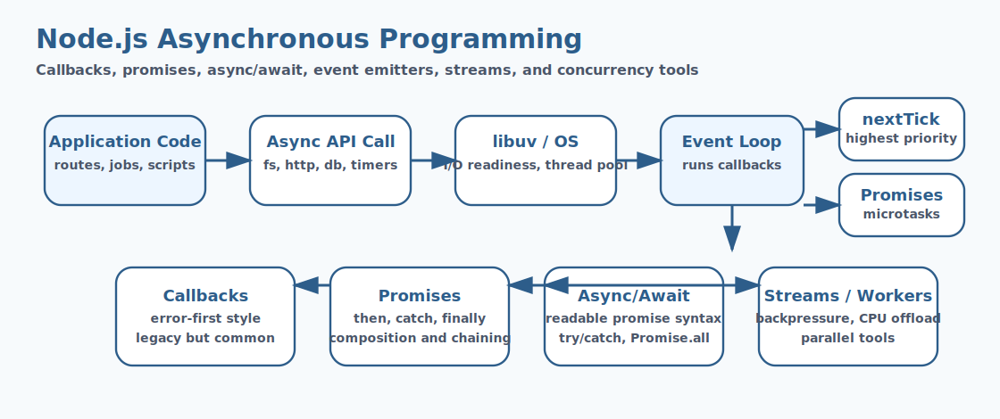

# Node.js Asynchronous Programming Interview Questions


This guide covers node.js asynchronous programming from interview basics to tricky production scenarios. It follows the corrected format of **100 interview questions for each subtopic**, and every answer includes a real Node.js code example with rotated real-world scenarios so the examples do not repeat verbatim.

## How To Use This Page

- Questions 1-100 cover Core Concepts.
- Questions 101-200 cover Callbacks.
- Questions 201-300 cover Promises.
- Questions 301-400 cover Async Await.
- Questions 401-500 cover Error Propagation.
- Questions 501-600 cover Async Patterns.
- Questions 601-700 cover Advanced Async Utilities.
- Questions 701-800 cover Event-Based Async.
- Questions 801-900 cover Streams & Backpressure.
- Questions 901-1000 cover Concurrency Tools.

## 1. Core Concepts

### Q1.1 What is core concepts in Node.js?

**Answer:**

Core Concepts matters in Node.js because it affects how core concepts affects runtime behavior and delivery decisions. In a real system like a high-traffic Node.js API serving customer traffic behind a load balancer, a strong answer should connect the concept to runtime behavior, delivery trade-offs, production debugging, and the way Node.js applications behave under load or failure. A senior-level answer also explains the operational impact so the answer reflects real Node.js engineering instead of textbook definitions.

**Code Example:**

```js
console.log({ topic: 'Core Concepts', question: 1 });
```

### Q1.2 Why does core concepts fundamentals matter in real Node.js applications?

**Answer:**

Core Concepts fundamentals matters in Node.js because it affects how core concepts should be understood before tackling deeper production issues. In a real system like a background worker processing queues and scheduled jobs in production, a strong answer should connect the concept to runtime behavior, delivery trade-offs, production debugging, and the way Node.js applications behave under load or failure. A senior-level answer also explains the operational impact so teams can connect the concept to runtime behavior and operational impact.

**Code Example:**

```js
function explainCoreConcepts() {
  return 'Core Concepts';
}
```

### Q1.3 When should a team focus on core concepts design?

**Answer:**

Core Concepts design matters in Node.js because it affects how core concepts influences code structure and operational outcomes. In a real system like a CMS platform handling uploads, downloads, and rich admin workflows, a strong answer should connect the concept to runtime behavior, delivery trade-offs, production debugging, and the way Node.js applications behave under load or failure. A senior-level answer also explains the operational impact so production debugging becomes easier because the mechanics are clearer.

**Code Example:**

```js
const data = ['alpha', 'beta', 'gamma'];
console.log(data.join(','));
```

### Q1.4 How would you explain core concepts debugging in a production discussion?

**Answer:**

Core Concepts debugging matters in Node.js because it affects how teams investigate problems related to core concepts in production. In a real system like a banking integration service where reliability and observability are tightly controlled, a strong answer should connect the concept to runtime behavior, delivery trade-offs, production debugging, and the way Node.js applications behave under load or failure. A senior-level answer also explains the operational impact so architecture choices become easier to defend in interviews and reviews.

**Code Example:**

```js
const config = { enabled: true, retries: 3 };
console.log(config);
```

### Q1.5 What is a common interview trap around core concepts trade-offs?

**Answer:**

Core Concepts trade-offs matters in Node.js because it affects how core concepts shapes performance, maintainability, or reliability decisions. In a real system like a healthcare backend where safe error handling and data validation matter deeply, a strong answer should connect the concept to runtime behavior, delivery trade-offs, production debugging, and the way Node.js applications behave under load or failure. A senior-level answer also explains the operational impact so performance, correctness, and maintainability are discussed together.

**Code Example:**

```js
setTimeout(() => console.log('node example executed'), 10);
```

### Q1.6 How do you apply core concepts safely in practice?

**Answer:**

Core Concepts matters in Node.js because it affects how core concepts affects runtime behavior and delivery decisions. In a real system like a logistics platform coordinating events, retries, and distributed workflows, a strong answer should connect the concept to runtime behavior, delivery trade-offs, production debugging, and the way Node.js applications behave under load or failure. A senior-level answer also explains the operational impact so common Node.js pitfalls are easier to prevent before release.

**Code Example:**

```js
console.log({ topic: 'Core Concepts', question: 6 });
```

### Q1.7 What production issue usually exposes weak understanding of core concepts fundamentals?

**Answer:**

Core Concepts fundamentals matters in Node.js because it affects how core concepts should be understood before tackling deeper production issues. In a real system like an enterprise Express application with many middlewares and shared modules, a strong answer should connect the concept to runtime behavior, delivery trade-offs, production debugging, and the way Node.js applications behave under load or failure. A senior-level answer also explains the operational impact so the codebase stays easier to evolve as traffic and complexity grow.

**Code Example:**

```js
function explainCoreConcepts() {
  return 'Core Concepts';
}
```

### Q1.8 How would a senior engineer justify core concepts design to a team?

**Answer:**

Core Concepts design matters in Node.js because it affects how core concepts influences code structure and operational outcomes. In a real system like a real-time dashboard service where event-loop behavior affects user experience, a strong answer should connect the concept to runtime behavior, delivery trade-offs, production debugging, and the way Node.js applications behave under load or failure. A senior-level answer also explains the operational impact so operational trade-offs are visible instead of hidden behind abstractions.

**Code Example:**

```js
const data = ['alpha', 'beta', 'gamma'];
console.log(data.join(','));
```

### Q1.9 What trade-off does core concepts debugging introduce?

**Answer:**

Core Concepts debugging matters in Node.js because it affects how teams investigate problems related to core concepts in production. In a real system like a containerized Node.js deployment where startup, memory, and scaling all matter, a strong answer should connect the concept to runtime behavior, delivery trade-offs, production debugging, and the way Node.js applications behave under load or failure. A senior-level answer also explains the operational impact so the example ties Node.js internals to practical delivery concerns.

**Code Example:**

```js
const config = { enabled: true, retries: 3 };
console.log(config);
```

### Q1.10 How do you answer a tricky follow-up about core concepts trade-offs?

**Answer:**

Core Concepts trade-offs matters in Node.js because it affects how core concepts shapes performance, maintainability, or reliability decisions. In a real system like a migration effort from ad hoc scripts to a more maintainable Node.js architecture, a strong answer should connect the concept to runtime behavior, delivery trade-offs, production debugging, and the way Node.js applications behave under load or failure. A senior-level answer also explains the operational impact so new team members can understand the concept from both code and behavior.

**Code Example:**

```js
setTimeout(() => console.log('node example executed'), 10);
```

### Q1.11 What is core concepts in Node.js?

**Answer:**

Core Concepts matters in Node.js because it affects how core concepts affects runtime behavior and delivery decisions. In a real system like a high-traffic Node.js API serving customer traffic behind a load balancer, a strong answer should connect the concept to runtime behavior, delivery trade-offs, production debugging, and the way Node.js applications behave under load or failure. A senior-level answer also explains the operational impact so the answer reflects real Node.js engineering instead of textbook definitions.

**Code Example:**

```js
console.log({ topic: 'Core Concepts', question: 11 });
```

### Q1.12 Why does core concepts fundamentals matter in real Node.js applications?

**Answer:**

Core Concepts fundamentals matters in Node.js because it affects how core concepts should be understood before tackling deeper production issues. In a real system like a background worker processing queues and scheduled jobs in production, a strong answer should connect the concept to runtime behavior, delivery trade-offs, production debugging, and the way Node.js applications behave under load or failure. A senior-level answer also explains the operational impact so teams can connect the concept to runtime behavior and operational impact.

**Code Example:**

```js
function explainCoreConcepts() {
  return 'Core Concepts';
}
```

### Q1.13 When should a team focus on core concepts design?

**Answer:**

Core Concepts design matters in Node.js because it affects how core concepts influences code structure and operational outcomes. In a real system like a CMS platform handling uploads, downloads, and rich admin workflows, a strong answer should connect the concept to runtime behavior, delivery trade-offs, production debugging, and the way Node.js applications behave under load or failure. A senior-level answer also explains the operational impact so production debugging becomes easier because the mechanics are clearer.

**Code Example:**

```js
const data = ['alpha', 'beta', 'gamma'];
console.log(data.join(','));
```

### Q1.14 How would you explain core concepts debugging in a production discussion?

**Answer:**

Core Concepts debugging matters in Node.js because it affects how teams investigate problems related to core concepts in production. In a real system like a banking integration service where reliability and observability are tightly controlled, a strong answer should connect the concept to runtime behavior, delivery trade-offs, production debugging, and the way Node.js applications behave under load or failure. A senior-level answer also explains the operational impact so architecture choices become easier to defend in interviews and reviews.

**Code Example:**

```js
const config = { enabled: true, retries: 3 };
console.log(config);
```

### Q1.15 What is a common interview trap around core concepts trade-offs?

**Answer:**

Core Concepts trade-offs matters in Node.js because it affects how core concepts shapes performance, maintainability, or reliability decisions. In a real system like a healthcare backend where safe error handling and data validation matter deeply, a strong answer should connect the concept to runtime behavior, delivery trade-offs, production debugging, and the way Node.js applications behave under load or failure. A senior-level answer also explains the operational impact so performance, correctness, and maintainability are discussed together.

**Code Example:**

```js
setTimeout(() => console.log('node example executed'), 10);
```

### Q1.16 How do you apply core concepts safely in practice?

**Answer:**

Core Concepts matters in Node.js because it affects how core concepts affects runtime behavior and delivery decisions. In a real system like a logistics platform coordinating events, retries, and distributed workflows, a strong answer should connect the concept to runtime behavior, delivery trade-offs, production debugging, and the way Node.js applications behave under load or failure. A senior-level answer also explains the operational impact so common Node.js pitfalls are easier to prevent before release.

**Code Example:**

```js
console.log({ topic: 'Core Concepts', question: 16 });
```

### Q1.17 What production issue usually exposes weak understanding of core concepts fundamentals?

**Answer:**

Core Concepts fundamentals matters in Node.js because it affects how core concepts should be understood before tackling deeper production issues. In a real system like an enterprise Express application with many middlewares and shared modules, a strong answer should connect the concept to runtime behavior, delivery trade-offs, production debugging, and the way Node.js applications behave under load or failure. A senior-level answer also explains the operational impact so the codebase stays easier to evolve as traffic and complexity grow.

**Code Example:**

```js
function explainCoreConcepts() {
  return 'Core Concepts';
}
```

### Q1.18 How would a senior engineer justify core concepts design to a team?

**Answer:**

Core Concepts design matters in Node.js because it affects how core concepts influences code structure and operational outcomes. In a real system like a real-time dashboard service where event-loop behavior affects user experience, a strong answer should connect the concept to runtime behavior, delivery trade-offs, production debugging, and the way Node.js applications behave under load or failure. A senior-level answer also explains the operational impact so operational trade-offs are visible instead of hidden behind abstractions.

**Code Example:**

```js
const data = ['alpha', 'beta', 'gamma'];
console.log(data.join(','));
```

### Q1.19 What trade-off does core concepts debugging introduce?

**Answer:**

Core Concepts debugging matters in Node.js because it affects how teams investigate problems related to core concepts in production. In a real system like a containerized Node.js deployment where startup, memory, and scaling all matter, a strong answer should connect the concept to runtime behavior, delivery trade-offs, production debugging, and the way Node.js applications behave under load or failure. A senior-level answer also explains the operational impact so the example ties Node.js internals to practical delivery concerns.

**Code Example:**

```js
const config = { enabled: true, retries: 3 };
console.log(config);
```

### Q1.20 How do you answer a tricky follow-up about core concepts trade-offs?

**Answer:**

Core Concepts trade-offs matters in Node.js because it affects how core concepts shapes performance, maintainability, or reliability decisions. In a real system like a migration effort from ad hoc scripts to a more maintainable Node.js architecture, a strong answer should connect the concept to runtime behavior, delivery trade-offs, production debugging, and the way Node.js applications behave under load or failure. A senior-level answer also explains the operational impact so new team members can understand the concept from both code and behavior.

**Code Example:**

```js
setTimeout(() => console.log('node example executed'), 10);
```

### Q1.21 What is core concepts in Node.js?

**Answer:**

Core Concepts matters in Node.js because it affects how core concepts affects runtime behavior and delivery decisions. In a real system like a high-traffic Node.js API serving customer traffic behind a load balancer, a strong answer should connect the concept to runtime behavior, delivery trade-offs, production debugging, and the way Node.js applications behave under load or failure. A senior-level answer also explains the operational impact so the answer reflects real Node.js engineering instead of textbook definitions.

**Code Example:**

```js
console.log({ topic: 'Core Concepts', question: 21 });
```

### Q1.22 Why does core concepts fundamentals matter in real Node.js applications?

**Answer:**

Core Concepts fundamentals matters in Node.js because it affects how core concepts should be understood before tackling deeper production issues. In a real system like a background worker processing queues and scheduled jobs in production, a strong answer should connect the concept to runtime behavior, delivery trade-offs, production debugging, and the way Node.js applications behave under load or failure. A senior-level answer also explains the operational impact so teams can connect the concept to runtime behavior and operational impact.

**Code Example:**

```js
function explainCoreConcepts() {
  return 'Core Concepts';
}
```

### Q1.23 When should a team focus on core concepts design?

**Answer:**

Core Concepts design matters in Node.js because it affects how core concepts influences code structure and operational outcomes. In a real system like a CMS platform handling uploads, downloads, and rich admin workflows, a strong answer should connect the concept to runtime behavior, delivery trade-offs, production debugging, and the way Node.js applications behave under load or failure. A senior-level answer also explains the operational impact so production debugging becomes easier because the mechanics are clearer.

**Code Example:**

```js
const data = ['alpha', 'beta', 'gamma'];
console.log(data.join(','));
```

### Q1.24 How would you explain core concepts debugging in a production discussion?

**Answer:**

Core Concepts debugging matters in Node.js because it affects how teams investigate problems related to core concepts in production. In a real system like a banking integration service where reliability and observability are tightly controlled, a strong answer should connect the concept to runtime behavior, delivery trade-offs, production debugging, and the way Node.js applications behave under load or failure. A senior-level answer also explains the operational impact so architecture choices become easier to defend in interviews and reviews.

**Code Example:**

```js
const config = { enabled: true, retries: 3 };
console.log(config);
```

### Q1.25 What is a common interview trap around core concepts trade-offs?

**Answer:**

Core Concepts trade-offs matters in Node.js because it affects how core concepts shapes performance, maintainability, or reliability decisions. In a real system like a healthcare backend where safe error handling and data validation matter deeply, a strong answer should connect the concept to runtime behavior, delivery trade-offs, production debugging, and the way Node.js applications behave under load or failure. A senior-level answer also explains the operational impact so performance, correctness, and maintainability are discussed together.

**Code Example:**

```js
setTimeout(() => console.log('node example executed'), 10);
```

### Q1.26 How do you apply core concepts safely in practice?

**Answer:**

Core Concepts matters in Node.js because it affects how core concepts affects runtime behavior and delivery decisions. In a real system like a logistics platform coordinating events, retries, and distributed workflows, a strong answer should connect the concept to runtime behavior, delivery trade-offs, production debugging, and the way Node.js applications behave under load or failure. A senior-level answer also explains the operational impact so common Node.js pitfalls are easier to prevent before release.

**Code Example:**

```js
console.log({ topic: 'Core Concepts', question: 26 });
```

### Q1.27 What production issue usually exposes weak understanding of core concepts fundamentals?

**Answer:**

Core Concepts fundamentals matters in Node.js because it affects how core concepts should be understood before tackling deeper production issues. In a real system like an enterprise Express application with many middlewares and shared modules, a strong answer should connect the concept to runtime behavior, delivery trade-offs, production debugging, and the way Node.js applications behave under load or failure. A senior-level answer also explains the operational impact so the codebase stays easier to evolve as traffic and complexity grow.

**Code Example:**

```js
function explainCoreConcepts() {
  return 'Core Concepts';
}
```

### Q1.28 How would a senior engineer justify core concepts design to a team?

**Answer:**

Core Concepts design matters in Node.js because it affects how core concepts influences code structure and operational outcomes. In a real system like a real-time dashboard service where event-loop behavior affects user experience, a strong answer should connect the concept to runtime behavior, delivery trade-offs, production debugging, and the way Node.js applications behave under load or failure. A senior-level answer also explains the operational impact so operational trade-offs are visible instead of hidden behind abstractions.

**Code Example:**

```js
const data = ['alpha', 'beta', 'gamma'];
console.log(data.join(','));
```

### Q1.29 What trade-off does core concepts debugging introduce?

**Answer:**

Core Concepts debugging matters in Node.js because it affects how teams investigate problems related to core concepts in production. In a real system like a containerized Node.js deployment where startup, memory, and scaling all matter, a strong answer should connect the concept to runtime behavior, delivery trade-offs, production debugging, and the way Node.js applications behave under load or failure. A senior-level answer also explains the operational impact so the example ties Node.js internals to practical delivery concerns.

**Code Example:**

```js
const config = { enabled: true, retries: 3 };
console.log(config);
```

### Q1.30 How do you answer a tricky follow-up about core concepts trade-offs?

**Answer:**

Core Concepts trade-offs matters in Node.js because it affects how core concepts shapes performance, maintainability, or reliability decisions. In a real system like a migration effort from ad hoc scripts to a more maintainable Node.js architecture, a strong answer should connect the concept to runtime behavior, delivery trade-offs, production debugging, and the way Node.js applications behave under load or failure. A senior-level answer also explains the operational impact so new team members can understand the concept from both code and behavior.

**Code Example:**

```js
setTimeout(() => console.log('node example executed'), 10);
```

### Q1.31 What is core concepts in Node.js?

**Answer:**

Core Concepts matters in Node.js because it affects how core concepts affects runtime behavior and delivery decisions. In a real system like a high-traffic Node.js API serving customer traffic behind a load balancer, a strong answer should connect the concept to runtime behavior, delivery trade-offs, production debugging, and the way Node.js applications behave under load or failure. A senior-level answer also explains the operational impact so the answer reflects real Node.js engineering instead of textbook definitions.

**Code Example:**

```js
console.log({ topic: 'Core Concepts', question: 31 });
```

### Q1.32 Why does core concepts fundamentals matter in real Node.js applications?

**Answer:**

Core Concepts fundamentals matters in Node.js because it affects how core concepts should be understood before tackling deeper production issues. In a real system like a background worker processing queues and scheduled jobs in production, a strong answer should connect the concept to runtime behavior, delivery trade-offs, production debugging, and the way Node.js applications behave under load or failure. A senior-level answer also explains the operational impact so teams can connect the concept to runtime behavior and operational impact.

**Code Example:**

```js
function explainCoreConcepts() {
  return 'Core Concepts';
}
```

### Q1.33 When should a team focus on core concepts design?

**Answer:**

Core Concepts design matters in Node.js because it affects how core concepts influences code structure and operational outcomes. In a real system like a CMS platform handling uploads, downloads, and rich admin workflows, a strong answer should connect the concept to runtime behavior, delivery trade-offs, production debugging, and the way Node.js applications behave under load or failure. A senior-level answer also explains the operational impact so production debugging becomes easier because the mechanics are clearer.

**Code Example:**

```js
const data = ['alpha', 'beta', 'gamma'];
console.log(data.join(','));
```

### Q1.34 How would you explain core concepts debugging in a production discussion?

**Answer:**

Core Concepts debugging matters in Node.js because it affects how teams investigate problems related to core concepts in production. In a real system like a banking integration service where reliability and observability are tightly controlled, a strong answer should connect the concept to runtime behavior, delivery trade-offs, production debugging, and the way Node.js applications behave under load or failure. A senior-level answer also explains the operational impact so architecture choices become easier to defend in interviews and reviews.

**Code Example:**

```js
const config = { enabled: true, retries: 3 };
console.log(config);
```

### Q1.35 What is a common interview trap around core concepts trade-offs?

**Answer:**

Core Concepts trade-offs matters in Node.js because it affects how core concepts shapes performance, maintainability, or reliability decisions. In a real system like a healthcare backend where safe error handling and data validation matter deeply, a strong answer should connect the concept to runtime behavior, delivery trade-offs, production debugging, and the way Node.js applications behave under load or failure. A senior-level answer also explains the operational impact so performance, correctness, and maintainability are discussed together.

**Code Example:**

```js
setTimeout(() => console.log('node example executed'), 10);
```

### Q1.36 How do you apply core concepts safely in practice?

**Answer:**

Core Concepts matters in Node.js because it affects how core concepts affects runtime behavior and delivery decisions. In a real system like a logistics platform coordinating events, retries, and distributed workflows, a strong answer should connect the concept to runtime behavior, delivery trade-offs, production debugging, and the way Node.js applications behave under load or failure. A senior-level answer also explains the operational impact so common Node.js pitfalls are easier to prevent before release.

**Code Example:**

```js
console.log({ topic: 'Core Concepts', question: 36 });
```

### Q1.37 What production issue usually exposes weak understanding of core concepts fundamentals?

**Answer:**

Core Concepts fundamentals matters in Node.js because it affects how core concepts should be understood before tackling deeper production issues. In a real system like an enterprise Express application with many middlewares and shared modules, a strong answer should connect the concept to runtime behavior, delivery trade-offs, production debugging, and the way Node.js applications behave under load or failure. A senior-level answer also explains the operational impact so the codebase stays easier to evolve as traffic and complexity grow.

**Code Example:**

```js
function explainCoreConcepts() {
  return 'Core Concepts';
}
```

### Q1.38 How would a senior engineer justify core concepts design to a team?

**Answer:**

Core Concepts design matters in Node.js because it affects how core concepts influences code structure and operational outcomes. In a real system like a real-time dashboard service where event-loop behavior affects user experience, a strong answer should connect the concept to runtime behavior, delivery trade-offs, production debugging, and the way Node.js applications behave under load or failure. A senior-level answer also explains the operational impact so operational trade-offs are visible instead of hidden behind abstractions.

**Code Example:**

```js
const data = ['alpha', 'beta', 'gamma'];
console.log(data.join(','));
```

### Q1.39 What trade-off does core concepts debugging introduce?

**Answer:**

Core Concepts debugging matters in Node.js because it affects how teams investigate problems related to core concepts in production. In a real system like a containerized Node.js deployment where startup, memory, and scaling all matter, a strong answer should connect the concept to runtime behavior, delivery trade-offs, production debugging, and the way Node.js applications behave under load or failure. A senior-level answer also explains the operational impact so the example ties Node.js internals to practical delivery concerns.

**Code Example:**

```js
const config = { enabled: true, retries: 3 };
console.log(config);
```

### Q1.40 How do you answer a tricky follow-up about core concepts trade-offs?

**Answer:**

Core Concepts trade-offs matters in Node.js because it affects how core concepts shapes performance, maintainability, or reliability decisions. In a real system like a migration effort from ad hoc scripts to a more maintainable Node.js architecture, a strong answer should connect the concept to runtime behavior, delivery trade-offs, production debugging, and the way Node.js applications behave under load or failure. A senior-level answer also explains the operational impact so new team members can understand the concept from both code and behavior.

**Code Example:**

```js
setTimeout(() => console.log('node example executed'), 10);
```

### Q1.41 What is core concepts in Node.js?

**Answer:**

Core Concepts matters in Node.js because it affects how core concepts affects runtime behavior and delivery decisions. In a real system like a high-traffic Node.js API serving customer traffic behind a load balancer, a strong answer should connect the concept to runtime behavior, delivery trade-offs, production debugging, and the way Node.js applications behave under load or failure. A senior-level answer also explains the operational impact so the answer reflects real Node.js engineering instead of textbook definitions.

**Code Example:**

```js
console.log({ topic: 'Core Concepts', question: 41 });
```

### Q1.42 Why does core concepts fundamentals matter in real Node.js applications?

**Answer:**

Core Concepts fundamentals matters in Node.js because it affects how core concepts should be understood before tackling deeper production issues. In a real system like a background worker processing queues and scheduled jobs in production, a strong answer should connect the concept to runtime behavior, delivery trade-offs, production debugging, and the way Node.js applications behave under load or failure. A senior-level answer also explains the operational impact so teams can connect the concept to runtime behavior and operational impact.

**Code Example:**

```js
function explainCoreConcepts() {
  return 'Core Concepts';
}
```

### Q1.43 When should a team focus on core concepts design?

**Answer:**

Core Concepts design matters in Node.js because it affects how core concepts influences code structure and operational outcomes. In a real system like a CMS platform handling uploads, downloads, and rich admin workflows, a strong answer should connect the concept to runtime behavior, delivery trade-offs, production debugging, and the way Node.js applications behave under load or failure. A senior-level answer also explains the operational impact so production debugging becomes easier because the mechanics are clearer.

**Code Example:**

```js
const data = ['alpha', 'beta', 'gamma'];
console.log(data.join(','));
```

### Q1.44 How would you explain core concepts debugging in a production discussion?

**Answer:**

Core Concepts debugging matters in Node.js because it affects how teams investigate problems related to core concepts in production. In a real system like a banking integration service where reliability and observability are tightly controlled, a strong answer should connect the concept to runtime behavior, delivery trade-offs, production debugging, and the way Node.js applications behave under load or failure. A senior-level answer also explains the operational impact so architecture choices become easier to defend in interviews and reviews.

**Code Example:**

```js
const config = { enabled: true, retries: 3 };
console.log(config);
```

### Q1.45 What is a common interview trap around core concepts trade-offs?

**Answer:**

Core Concepts trade-offs matters in Node.js because it affects how core concepts shapes performance, maintainability, or reliability decisions. In a real system like a healthcare backend where safe error handling and data validation matter deeply, a strong answer should connect the concept to runtime behavior, delivery trade-offs, production debugging, and the way Node.js applications behave under load or failure. A senior-level answer also explains the operational impact so performance, correctness, and maintainability are discussed together.

**Code Example:**

```js
setTimeout(() => console.log('node example executed'), 10);
```

### Q1.46 How do you apply core concepts safely in practice?

**Answer:**

Core Concepts matters in Node.js because it affects how core concepts affects runtime behavior and delivery decisions. In a real system like a logistics platform coordinating events, retries, and distributed workflows, a strong answer should connect the concept to runtime behavior, delivery trade-offs, production debugging, and the way Node.js applications behave under load or failure. A senior-level answer also explains the operational impact so common Node.js pitfalls are easier to prevent before release.

**Code Example:**

```js
console.log({ topic: 'Core Concepts', question: 46 });
```

### Q1.47 What production issue usually exposes weak understanding of core concepts fundamentals?

**Answer:**

Core Concepts fundamentals matters in Node.js because it affects how core concepts should be understood before tackling deeper production issues. In a real system like an enterprise Express application with many middlewares and shared modules, a strong answer should connect the concept to runtime behavior, delivery trade-offs, production debugging, and the way Node.js applications behave under load or failure. A senior-level answer also explains the operational impact so the codebase stays easier to evolve as traffic and complexity grow.

**Code Example:**

```js
function explainCoreConcepts() {
  return 'Core Concepts';
}
```

### Q1.48 How would a senior engineer justify core concepts design to a team?

**Answer:**

Core Concepts design matters in Node.js because it affects how core concepts influences code structure and operational outcomes. In a real system like a real-time dashboard service where event-loop behavior affects user experience, a strong answer should connect the concept to runtime behavior, delivery trade-offs, production debugging, and the way Node.js applications behave under load or failure. A senior-level answer also explains the operational impact so operational trade-offs are visible instead of hidden behind abstractions.

**Code Example:**

```js
const data = ['alpha', 'beta', 'gamma'];
console.log(data.join(','));
```

### Q1.49 What trade-off does core concepts debugging introduce?

**Answer:**

Core Concepts debugging matters in Node.js because it affects how teams investigate problems related to core concepts in production. In a real system like a containerized Node.js deployment where startup, memory, and scaling all matter, a strong answer should connect the concept to runtime behavior, delivery trade-offs, production debugging, and the way Node.js applications behave under load or failure. A senior-level answer also explains the operational impact so the example ties Node.js internals to practical delivery concerns.

**Code Example:**

```js
const config = { enabled: true, retries: 3 };
console.log(config);
```

### Q1.50 How do you answer a tricky follow-up about core concepts trade-offs?

**Answer:**

Core Concepts trade-offs matters in Node.js because it affects how core concepts shapes performance, maintainability, or reliability decisions. In a real system like a migration effort from ad hoc scripts to a more maintainable Node.js architecture, a strong answer should connect the concept to runtime behavior, delivery trade-offs, production debugging, and the way Node.js applications behave under load or failure. A senior-level answer also explains the operational impact so new team members can understand the concept from both code and behavior.

**Code Example:**

```js
setTimeout(() => console.log('node example executed'), 10);
```

### Q1.51 What is core concepts in Node.js?

**Answer:**

Core Concepts matters in Node.js because it affects how core concepts affects runtime behavior and delivery decisions. In a real system like a high-traffic Node.js API serving customer traffic behind a load balancer, a strong answer should connect the concept to runtime behavior, delivery trade-offs, production debugging, and the way Node.js applications behave under load or failure. A senior-level answer also explains the operational impact so the answer reflects real Node.js engineering instead of textbook definitions.

**Code Example:**

```js
console.log({ topic: 'Core Concepts', question: 51 });
```

### Q1.52 Why does core concepts fundamentals matter in real Node.js applications?

**Answer:**

Core Concepts fundamentals matters in Node.js because it affects how core concepts should be understood before tackling deeper production issues. In a real system like a background worker processing queues and scheduled jobs in production, a strong answer should connect the concept to runtime behavior, delivery trade-offs, production debugging, and the way Node.js applications behave under load or failure. A senior-level answer also explains the operational impact so teams can connect the concept to runtime behavior and operational impact.

**Code Example:**

```js
function explainCoreConcepts() {
  return 'Core Concepts';
}
```

### Q1.53 When should a team focus on core concepts design?

**Answer:**

Core Concepts design matters in Node.js because it affects how core concepts influences code structure and operational outcomes. In a real system like a CMS platform handling uploads, downloads, and rich admin workflows, a strong answer should connect the concept to runtime behavior, delivery trade-offs, production debugging, and the way Node.js applications behave under load or failure. A senior-level answer also explains the operational impact so production debugging becomes easier because the mechanics are clearer.

**Code Example:**

```js
const data = ['alpha', 'beta', 'gamma'];
console.log(data.join(','));
```

### Q1.54 How would you explain core concepts debugging in a production discussion?

**Answer:**

Core Concepts debugging matters in Node.js because it affects how teams investigate problems related to core concepts in production. In a real system like a banking integration service where reliability and observability are tightly controlled, a strong answer should connect the concept to runtime behavior, delivery trade-offs, production debugging, and the way Node.js applications behave under load or failure. A senior-level answer also explains the operational impact so architecture choices become easier to defend in interviews and reviews.

**Code Example:**

```js
const config = { enabled: true, retries: 3 };
console.log(config);
```

### Q1.55 What is a common interview trap around core concepts trade-offs?

**Answer:**

Core Concepts trade-offs matters in Node.js because it affects how core concepts shapes performance, maintainability, or reliability decisions. In a real system like a healthcare backend where safe error handling and data validation matter deeply, a strong answer should connect the concept to runtime behavior, delivery trade-offs, production debugging, and the way Node.js applications behave under load or failure. A senior-level answer also explains the operational impact so performance, correctness, and maintainability are discussed together.

**Code Example:**

```js
setTimeout(() => console.log('node example executed'), 10);
```

### Q1.56 How do you apply core concepts safely in practice?

**Answer:**

Core Concepts matters in Node.js because it affects how core concepts affects runtime behavior and delivery decisions. In a real system like a logistics platform coordinating events, retries, and distributed workflows, a strong answer should connect the concept to runtime behavior, delivery trade-offs, production debugging, and the way Node.js applications behave under load or failure. A senior-level answer also explains the operational impact so common Node.js pitfalls are easier to prevent before release.

**Code Example:**

```js
console.log({ topic: 'Core Concepts', question: 56 });
```

### Q1.57 What production issue usually exposes weak understanding of core concepts fundamentals?

**Answer:**

Core Concepts fundamentals matters in Node.js because it affects how core concepts should be understood before tackling deeper production issues. In a real system like an enterprise Express application with many middlewares and shared modules, a strong answer should connect the concept to runtime behavior, delivery trade-offs, production debugging, and the way Node.js applications behave under load or failure. A senior-level answer also explains the operational impact so the codebase stays easier to evolve as traffic and complexity grow.

**Code Example:**

```js
function explainCoreConcepts() {
  return 'Core Concepts';
}
```

### Q1.58 How would a senior engineer justify core concepts design to a team?

**Answer:**

Core Concepts design matters in Node.js because it affects how core concepts influences code structure and operational outcomes. In a real system like a real-time dashboard service where event-loop behavior affects user experience, a strong answer should connect the concept to runtime behavior, delivery trade-offs, production debugging, and the way Node.js applications behave under load or failure. A senior-level answer also explains the operational impact so operational trade-offs are visible instead of hidden behind abstractions.

**Code Example:**

```js
const data = ['alpha', 'beta', 'gamma'];
console.log(data.join(','));
```

### Q1.59 What trade-off does core concepts debugging introduce?

**Answer:**

Core Concepts debugging matters in Node.js because it affects how teams investigate problems related to core concepts in production. In a real system like a containerized Node.js deployment where startup, memory, and scaling all matter, a strong answer should connect the concept to runtime behavior, delivery trade-offs, production debugging, and the way Node.js applications behave under load or failure. A senior-level answer also explains the operational impact so the example ties Node.js internals to practical delivery concerns.

**Code Example:**

```js
const config = { enabled: true, retries: 3 };
console.log(config);
```

### Q1.60 How do you answer a tricky follow-up about core concepts trade-offs?

**Answer:**

Core Concepts trade-offs matters in Node.js because it affects how core concepts shapes performance, maintainability, or reliability decisions. In a real system like a migration effort from ad hoc scripts to a more maintainable Node.js architecture, a strong answer should connect the concept to runtime behavior, delivery trade-offs, production debugging, and the way Node.js applications behave under load or failure. A senior-level answer also explains the operational impact so new team members can understand the concept from both code and behavior.

**Code Example:**

```js
setTimeout(() => console.log('node example executed'), 10);
```

### Q1.61 What is core concepts in Node.js?

**Answer:**

Core Concepts matters in Node.js because it affects how core concepts affects runtime behavior and delivery decisions. In a real system like a high-traffic Node.js API serving customer traffic behind a load balancer, a strong answer should connect the concept to runtime behavior, delivery trade-offs, production debugging, and the way Node.js applications behave under load or failure. A senior-level answer also explains the operational impact so the answer reflects real Node.js engineering instead of textbook definitions.

**Code Example:**

```js
console.log({ topic: 'Core Concepts', question: 61 });
```

### Q1.62 Why does core concepts fundamentals matter in real Node.js applications?

**Answer:**

Core Concepts fundamentals matters in Node.js because it affects how core concepts should be understood before tackling deeper production issues. In a real system like a background worker processing queues and scheduled jobs in production, a strong answer should connect the concept to runtime behavior, delivery trade-offs, production debugging, and the way Node.js applications behave under load or failure. A senior-level answer also explains the operational impact so teams can connect the concept to runtime behavior and operational impact.

**Code Example:**

```js
function explainCoreConcepts() {
  return 'Core Concepts';
}
```

### Q1.63 When should a team focus on core concepts design?

**Answer:**

Core Concepts design matters in Node.js because it affects how core concepts influences code structure and operational outcomes. In a real system like a CMS platform handling uploads, downloads, and rich admin workflows, a strong answer should connect the concept to runtime behavior, delivery trade-offs, production debugging, and the way Node.js applications behave under load or failure. A senior-level answer also explains the operational impact so production debugging becomes easier because the mechanics are clearer.

**Code Example:**

```js
const data = ['alpha', 'beta', 'gamma'];
console.log(data.join(','));
```

### Q1.64 How would you explain core concepts debugging in a production discussion?

**Answer:**

Core Concepts debugging matters in Node.js because it affects how teams investigate problems related to core concepts in production. In a real system like a banking integration service where reliability and observability are tightly controlled, a strong answer should connect the concept to runtime behavior, delivery trade-offs, production debugging, and the way Node.js applications behave under load or failure. A senior-level answer also explains the operational impact so architecture choices become easier to defend in interviews and reviews.

**Code Example:**

```js
const config = { enabled: true, retries: 3 };
console.log(config);
```

### Q1.65 What is a common interview trap around core concepts trade-offs?

**Answer:**

Core Concepts trade-offs matters in Node.js because it affects how core concepts shapes performance, maintainability, or reliability decisions. In a real system like a healthcare backend where safe error handling and data validation matter deeply, a strong answer should connect the concept to runtime behavior, delivery trade-offs, production debugging, and the way Node.js applications behave under load or failure. A senior-level answer also explains the operational impact so performance, correctness, and maintainability are discussed together.

**Code Example:**

```js
setTimeout(() => console.log('node example executed'), 10);
```

### Q1.66 How do you apply core concepts safely in practice?

**Answer:**

Core Concepts matters in Node.js because it affects how core concepts affects runtime behavior and delivery decisions. In a real system like a logistics platform coordinating events, retries, and distributed workflows, a strong answer should connect the concept to runtime behavior, delivery trade-offs, production debugging, and the way Node.js applications behave under load or failure. A senior-level answer also explains the operational impact so common Node.js pitfalls are easier to prevent before release.

**Code Example:**

```js
console.log({ topic: 'Core Concepts', question: 66 });
```

### Q1.67 What production issue usually exposes weak understanding of core concepts fundamentals?

**Answer:**

Core Concepts fundamentals matters in Node.js because it affects how core concepts should be understood before tackling deeper production issues. In a real system like an enterprise Express application with many middlewares and shared modules, a strong answer should connect the concept to runtime behavior, delivery trade-offs, production debugging, and the way Node.js applications behave under load or failure. A senior-level answer also explains the operational impact so the codebase stays easier to evolve as traffic and complexity grow.

**Code Example:**

```js
function explainCoreConcepts() {
  return 'Core Concepts';
}
```

### Q1.68 How would a senior engineer justify core concepts design to a team?

**Answer:**

Core Concepts design matters in Node.js because it affects how core concepts influences code structure and operational outcomes. In a real system like a real-time dashboard service where event-loop behavior affects user experience, a strong answer should connect the concept to runtime behavior, delivery trade-offs, production debugging, and the way Node.js applications behave under load or failure. A senior-level answer also explains the operational impact so operational trade-offs are visible instead of hidden behind abstractions.

**Code Example:**

```js
const data = ['alpha', 'beta', 'gamma'];
console.log(data.join(','));
```

### Q1.69 What trade-off does core concepts debugging introduce?

**Answer:**

Core Concepts debugging matters in Node.js because it affects how teams investigate problems related to core concepts in production. In a real system like a containerized Node.js deployment where startup, memory, and scaling all matter, a strong answer should connect the concept to runtime behavior, delivery trade-offs, production debugging, and the way Node.js applications behave under load or failure. A senior-level answer also explains the operational impact so the example ties Node.js internals to practical delivery concerns.

**Code Example:**

```js
const config = { enabled: true, retries: 3 };
console.log(config);
```

### Q1.70 How do you answer a tricky follow-up about core concepts trade-offs?

**Answer:**

Core Concepts trade-offs matters in Node.js because it affects how core concepts shapes performance, maintainability, or reliability decisions. In a real system like a migration effort from ad hoc scripts to a more maintainable Node.js architecture, a strong answer should connect the concept to runtime behavior, delivery trade-offs, production debugging, and the way Node.js applications behave under load or failure. A senior-level answer also explains the operational impact so new team members can understand the concept from both code and behavior.

**Code Example:**

```js
setTimeout(() => console.log('node example executed'), 10);
```

### Q1.71 What is core concepts in Node.js?

**Answer:**

Core Concepts matters in Node.js because it affects how core concepts affects runtime behavior and delivery decisions. In a real system like a high-traffic Node.js API serving customer traffic behind a load balancer, a strong answer should connect the concept to runtime behavior, delivery trade-offs, production debugging, and the way Node.js applications behave under load or failure. A senior-level answer also explains the operational impact so the answer reflects real Node.js engineering instead of textbook definitions.

**Code Example:**

```js
console.log({ topic: 'Core Concepts', question: 71 });
```

### Q1.72 Why does core concepts fundamentals matter in real Node.js applications?

**Answer:**

Core Concepts fundamentals matters in Node.js because it affects how core concepts should be understood before tackling deeper production issues. In a real system like a background worker processing queues and scheduled jobs in production, a strong answer should connect the concept to runtime behavior, delivery trade-offs, production debugging, and the way Node.js applications behave under load or failure. A senior-level answer also explains the operational impact so teams can connect the concept to runtime behavior and operational impact.

**Code Example:**

```js
function explainCoreConcepts() {
  return 'Core Concepts';
}
```

### Q1.73 When should a team focus on core concepts design?

**Answer:**

Core Concepts design matters in Node.js because it affects how core concepts influences code structure and operational outcomes. In a real system like a CMS platform handling uploads, downloads, and rich admin workflows, a strong answer should connect the concept to runtime behavior, delivery trade-offs, production debugging, and the way Node.js applications behave under load or failure. A senior-level answer also explains the operational impact so production debugging becomes easier because the mechanics are clearer.

**Code Example:**

```js
const data = ['alpha', 'beta', 'gamma'];
console.log(data.join(','));
```

### Q1.74 How would you explain core concepts debugging in a production discussion?

**Answer:**

Core Concepts debugging matters in Node.js because it affects how teams investigate problems related to core concepts in production. In a real system like a banking integration service where reliability and observability are tightly controlled, a strong answer should connect the concept to runtime behavior, delivery trade-offs, production debugging, and the way Node.js applications behave under load or failure. A senior-level answer also explains the operational impact so architecture choices become easier to defend in interviews and reviews.

**Code Example:**

```js
const config = { enabled: true, retries: 3 };
console.log(config);
```

### Q1.75 What is a common interview trap around core concepts trade-offs?

**Answer:**

Core Concepts trade-offs matters in Node.js because it affects how core concepts shapes performance, maintainability, or reliability decisions. In a real system like a healthcare backend where safe error handling and data validation matter deeply, a strong answer should connect the concept to runtime behavior, delivery trade-offs, production debugging, and the way Node.js applications behave under load or failure. A senior-level answer also explains the operational impact so performance, correctness, and maintainability are discussed together.

**Code Example:**

```js
setTimeout(() => console.log('node example executed'), 10);
```

### Q1.76 How do you apply core concepts safely in practice?

**Answer:**

Core Concepts matters in Node.js because it affects how core concepts affects runtime behavior and delivery decisions. In a real system like a logistics platform coordinating events, retries, and distributed workflows, a strong answer should connect the concept to runtime behavior, delivery trade-offs, production debugging, and the way Node.js applications behave under load or failure. A senior-level answer also explains the operational impact so common Node.js pitfalls are easier to prevent before release.

**Code Example:**

```js
console.log({ topic: 'Core Concepts', question: 76 });
```

### Q1.77 What production issue usually exposes weak understanding of core concepts fundamentals?

**Answer:**

Core Concepts fundamentals matters in Node.js because it affects how core concepts should be understood before tackling deeper production issues. In a real system like an enterprise Express application with many middlewares and shared modules, a strong answer should connect the concept to runtime behavior, delivery trade-offs, production debugging, and the way Node.js applications behave under load or failure. A senior-level answer also explains the operational impact so the codebase stays easier to evolve as traffic and complexity grow.

**Code Example:**

```js
function explainCoreConcepts() {
  return 'Core Concepts';
}
```

### Q1.78 How would a senior engineer justify core concepts design to a team?

**Answer:**

Core Concepts design matters in Node.js because it affects how core concepts influences code structure and operational outcomes. In a real system like a real-time dashboard service where event-loop behavior affects user experience, a strong answer should connect the concept to runtime behavior, delivery trade-offs, production debugging, and the way Node.js applications behave under load or failure. A senior-level answer also explains the operational impact so operational trade-offs are visible instead of hidden behind abstractions.

**Code Example:**

```js
const data = ['alpha', 'beta', 'gamma'];
console.log(data.join(','));
```

### Q1.79 What trade-off does core concepts debugging introduce?

**Answer:**

Core Concepts debugging matters in Node.js because it affects how teams investigate problems related to core concepts in production. In a real system like a containerized Node.js deployment where startup, memory, and scaling all matter, a strong answer should connect the concept to runtime behavior, delivery trade-offs, production debugging, and the way Node.js applications behave under load or failure. A senior-level answer also explains the operational impact so the example ties Node.js internals to practical delivery concerns.

**Code Example:**

```js
const config = { enabled: true, retries: 3 };
console.log(config);
```

### Q1.80 How do you answer a tricky follow-up about core concepts trade-offs?

**Answer:**

Core Concepts trade-offs matters in Node.js because it affects how core concepts shapes performance, maintainability, or reliability decisions. In a real system like a migration effort from ad hoc scripts to a more maintainable Node.js architecture, a strong answer should connect the concept to runtime behavior, delivery trade-offs, production debugging, and the way Node.js applications behave under load or failure. A senior-level answer also explains the operational impact so new team members can understand the concept from both code and behavior.

**Code Example:**

```js
setTimeout(() => console.log('node example executed'), 10);
```

### Q1.81 What is core concepts in Node.js?

**Answer:**

Core Concepts matters in Node.js because it affects how core concepts affects runtime behavior and delivery decisions. In a real system like a high-traffic Node.js API serving customer traffic behind a load balancer, a strong answer should connect the concept to runtime behavior, delivery trade-offs, production debugging, and the way Node.js applications behave under load or failure. A senior-level answer also explains the operational impact so the answer reflects real Node.js engineering instead of textbook definitions.

**Code Example:**

```js
console.log({ topic: 'Core Concepts', question: 81 });
```

### Q1.82 Why does core concepts fundamentals matter in real Node.js applications?

**Answer:**

Core Concepts fundamentals matters in Node.js because it affects how core concepts should be understood before tackling deeper production issues. In a real system like a background worker processing queues and scheduled jobs in production, a strong answer should connect the concept to runtime behavior, delivery trade-offs, production debugging, and the way Node.js applications behave under load or failure. A senior-level answer also explains the operational impact so teams can connect the concept to runtime behavior and operational impact.

**Code Example:**

```js
function explainCoreConcepts() {
  return 'Core Concepts';
}
```

### Q1.83 When should a team focus on core concepts design?

**Answer:**

Core Concepts design matters in Node.js because it affects how core concepts influences code structure and operational outcomes. In a real system like a CMS platform handling uploads, downloads, and rich admin workflows, a strong answer should connect the concept to runtime behavior, delivery trade-offs, production debugging, and the way Node.js applications behave under load or failure. A senior-level answer also explains the operational impact so production debugging becomes easier because the mechanics are clearer.

**Code Example:**

```js
const data = ['alpha', 'beta', 'gamma'];
console.log(data.join(','));
```

### Q1.84 How would you explain core concepts debugging in a production discussion?

**Answer:**

Core Concepts debugging matters in Node.js because it affects how teams investigate problems related to core concepts in production. In a real system like a banking integration service where reliability and observability are tightly controlled, a strong answer should connect the concept to runtime behavior, delivery trade-offs, production debugging, and the way Node.js applications behave under load or failure. A senior-level answer also explains the operational impact so architecture choices become easier to defend in interviews and reviews.

**Code Example:**

```js
const config = { enabled: true, retries: 3 };
console.log(config);
```

### Q1.85 What is a common interview trap around core concepts trade-offs?

**Answer:**

Core Concepts trade-offs matters in Node.js because it affects how core concepts shapes performance, maintainability, or reliability decisions. In a real system like a healthcare backend where safe error handling and data validation matter deeply, a strong answer should connect the concept to runtime behavior, delivery trade-offs, production debugging, and the way Node.js applications behave under load or failure. A senior-level answer also explains the operational impact so performance, correctness, and maintainability are discussed together.

**Code Example:**

```js
setTimeout(() => console.log('node example executed'), 10);
```

### Q1.86 How do you apply core concepts safely in practice?

**Answer:**

Core Concepts matters in Node.js because it affects how core concepts affects runtime behavior and delivery decisions. In a real system like a logistics platform coordinating events, retries, and distributed workflows, a strong answer should connect the concept to runtime behavior, delivery trade-offs, production debugging, and the way Node.js applications behave under load or failure. A senior-level answer also explains the operational impact so common Node.js pitfalls are easier to prevent before release.

**Code Example:**

```js
console.log({ topic: 'Core Concepts', question: 86 });
```

### Q1.87 What production issue usually exposes weak understanding of core concepts fundamentals?

**Answer:**

Core Concepts fundamentals matters in Node.js because it affects how core concepts should be understood before tackling deeper production issues. In a real system like an enterprise Express application with many middlewares and shared modules, a strong answer should connect the concept to runtime behavior, delivery trade-offs, production debugging, and the way Node.js applications behave under load or failure. A senior-level answer also explains the operational impact so the codebase stays easier to evolve as traffic and complexity grow.

**Code Example:**

```js
function explainCoreConcepts() {
  return 'Core Concepts';
}
```

### Q1.88 How would a senior engineer justify core concepts design to a team?

**Answer:**

Core Concepts design matters in Node.js because it affects how core concepts influences code structure and operational outcomes. In a real system like a real-time dashboard service where event-loop behavior affects user experience, a strong answer should connect the concept to runtime behavior, delivery trade-offs, production debugging, and the way Node.js applications behave under load or failure. A senior-level answer also explains the operational impact so operational trade-offs are visible instead of hidden behind abstractions.

**Code Example:**

```js
const data = ['alpha', 'beta', 'gamma'];
console.log(data.join(','));
```

### Q1.89 What trade-off does core concepts debugging introduce?

**Answer:**

Core Concepts debugging matters in Node.js because it affects how teams investigate problems related to core concepts in production. In a real system like a containerized Node.js deployment where startup, memory, and scaling all matter, a strong answer should connect the concept to runtime behavior, delivery trade-offs, production debugging, and the way Node.js applications behave under load or failure. A senior-level answer also explains the operational impact so the example ties Node.js internals to practical delivery concerns.

**Code Example:**

```js
const config = { enabled: true, retries: 3 };
console.log(config);
```

### Q1.90 How do you answer a tricky follow-up about core concepts trade-offs?

**Answer:**

Core Concepts trade-offs matters in Node.js because it affects how core concepts shapes performance, maintainability, or reliability decisions. In a real system like a migration effort from ad hoc scripts to a more maintainable Node.js architecture, a strong answer should connect the concept to runtime behavior, delivery trade-offs, production debugging, and the way Node.js applications behave under load or failure. A senior-level answer also explains the operational impact so new team members can understand the concept from both code and behavior.

**Code Example:**

```js
setTimeout(() => console.log('node example executed'), 10);
```

### Q1.91 What is core concepts in Node.js?

**Answer:**

Core Concepts matters in Node.js because it affects how core concepts affects runtime behavior and delivery decisions. In a real system like a high-traffic Node.js API serving customer traffic behind a load balancer, a strong answer should connect the concept to runtime behavior, delivery trade-offs, production debugging, and the way Node.js applications behave under load or failure. A senior-level answer also explains the operational impact so the answer reflects real Node.js engineering instead of textbook definitions.

**Code Example:**

```js
console.log({ topic: 'Core Concepts', question: 91 });
```

### Q1.92 Why does core concepts fundamentals matter in real Node.js applications?

**Answer:**

Core Concepts fundamentals matters in Node.js because it affects how core concepts should be understood before tackling deeper production issues. In a real system like a background worker processing queues and scheduled jobs in production, a strong answer should connect the concept to runtime behavior, delivery trade-offs, production debugging, and the way Node.js applications behave under load or failure. A senior-level answer also explains the operational impact so teams can connect the concept to runtime behavior and operational impact.

**Code Example:**

```js
function explainCoreConcepts() {
  return 'Core Concepts';
}
```

### Q1.93 When should a team focus on core concepts design?

**Answer:**

Core Concepts design matters in Node.js because it affects how core concepts influences code structure and operational outcomes. In a real system like a CMS platform handling uploads, downloads, and rich admin workflows, a strong answer should connect the concept to runtime behavior, delivery trade-offs, production debugging, and the way Node.js applications behave under load or failure. A senior-level answer also explains the operational impact so production debugging becomes easier because the mechanics are clearer.

**Code Example:**

```js
const data = ['alpha', 'beta', 'gamma'];
console.log(data.join(','));
```

### Q1.94 How would you explain core concepts debugging in a production discussion?

**Answer:**

Core Concepts debugging matters in Node.js because it affects how teams investigate problems related to core concepts in production. In a real system like a banking integration service where reliability and observability are tightly controlled, a strong answer should connect the concept to runtime behavior, delivery trade-offs, production debugging, and the way Node.js applications behave under load or failure. A senior-level answer also explains the operational impact so architecture choices become easier to defend in interviews and reviews.

**Code Example:**

```js
const config = { enabled: true, retries: 3 };
console.log(config);
```

### Q1.95 What is a common interview trap around core concepts trade-offs?

**Answer:**

Core Concepts trade-offs matters in Node.js because it affects how core concepts shapes performance, maintainability, or reliability decisions. In a real system like a healthcare backend where safe error handling and data validation matter deeply, a strong answer should connect the concept to runtime behavior, delivery trade-offs, production debugging, and the way Node.js applications behave under load or failure. A senior-level answer also explains the operational impact so performance, correctness, and maintainability are discussed together.

**Code Example:**

```js
setTimeout(() => console.log('node example executed'), 10);
```

### Q1.96 How do you apply core concepts safely in practice?

**Answer:**

Core Concepts matters in Node.js because it affects how core concepts affects runtime behavior and delivery decisions. In a real system like a logistics platform coordinating events, retries, and distributed workflows, a strong answer should connect the concept to runtime behavior, delivery trade-offs, production debugging, and the way Node.js applications behave under load or failure. A senior-level answer also explains the operational impact so common Node.js pitfalls are easier to prevent before release.

**Code Example:**

```js
console.log({ topic: 'Core Concepts', question: 96 });
```

### Q1.97 What production issue usually exposes weak understanding of core concepts fundamentals?

**Answer:**

Core Concepts fundamentals matters in Node.js because it affects how core concepts should be understood before tackling deeper production issues. In a real system like an enterprise Express application with many middlewares and shared modules, a strong answer should connect the concept to runtime behavior, delivery trade-offs, production debugging, and the way Node.js applications behave under load or failure. A senior-level answer also explains the operational impact so the codebase stays easier to evolve as traffic and complexity grow.

**Code Example:**

```js
function explainCoreConcepts() {
  return 'Core Concepts';
}
```

### Q1.98 How would a senior engineer justify core concepts design to a team?

**Answer:**

Core Concepts design matters in Node.js because it affects how core concepts influences code structure and operational outcomes. In a real system like a real-time dashboard service where event-loop behavior affects user experience, a strong answer should connect the concept to runtime behavior, delivery trade-offs, production debugging, and the way Node.js applications behave under load or failure. A senior-level answer also explains the operational impact so operational trade-offs are visible instead of hidden behind abstractions.

**Code Example:**

```js
const data = ['alpha', 'beta', 'gamma'];
console.log(data.join(','));
```

### Q1.99 What trade-off does core concepts debugging introduce?

**Answer:**

Core Concepts debugging matters in Node.js because it affects how teams investigate problems related to core concepts in production. In a real system like a containerized Node.js deployment where startup, memory, and scaling all matter, a strong answer should connect the concept to runtime behavior, delivery trade-offs, production debugging, and the way Node.js applications behave under load or failure. A senior-level answer also explains the operational impact so the example ties Node.js internals to practical delivery concerns.

**Code Example:**

```js
const config = { enabled: true, retries: 3 };
console.log(config);
```

### Q1.100 How do you answer a tricky follow-up about core concepts trade-offs?

**Answer:**

Core Concepts trade-offs matters in Node.js because it affects how core concepts shapes performance, maintainability, or reliability decisions. In a real system like a migration effort from ad hoc scripts to a more maintainable Node.js architecture, a strong answer should connect the concept to runtime behavior, delivery trade-offs, production debugging, and the way Node.js applications behave under load or failure. A senior-level answer also explains the operational impact so new team members can understand the concept from both code and behavior.

**Code Example:**

```js
setTimeout(() => console.log('node example executed'), 10);
```

## 2. Callbacks

### Q2.1 What is callbacks in Node.js?

**Answer:**

Callbacks matters in Node.js because it affects how callbacks affects runtime behavior and delivery decisions. In a real system like a high-traffic Node.js API serving customer traffic behind a load balancer, a strong answer should connect the concept to runtime behavior, delivery trade-offs, production debugging, and the way Node.js applications behave under load or failure. A senior-level answer also explains the operational impact so the answer reflects real Node.js engineering instead of textbook definitions.

**Code Example:**

```js
async function loadUser(id) {
  const response = await fetch(`https://api.example.com/users/${id}`);
  return response.json();
}
```

### Q2.2 Why does callbacks fundamentals matter in real Node.js applications?

**Answer:**

Callbacks fundamentals matters in Node.js because it affects how callbacks should be understood before tackling deeper production issues. In a real system like a background worker processing queues and scheduled jobs in production, a strong answer should connect the concept to runtime behavior, delivery trade-offs, production debugging, and the way Node.js applications behave under load or failure. A senior-level answer also explains the operational impact so teams can connect the concept to runtime behavior and operational impact.

**Code Example:**

```js
Promise.all([loadUser(1), loadUser(2)]).then(console.log).catch(console.error);
```

### Q2.3 When should a team focus on callbacks design?

**Answer:**

Callbacks design matters in Node.js because it affects how callbacks influences code structure and operational outcomes. In a real system like a CMS platform handling uploads, downloads, and rich admin workflows, a strong answer should connect the concept to runtime behavior, delivery trade-offs, production debugging, and the way Node.js applications behave under load or failure. A senior-level answer also explains the operational impact so production debugging becomes easier because the mechanics are clearer.

**Code Example:**

```js
const fs = require('node:fs');
fs.readFile('config.json', 'utf8', (err, data) => {
  if (err) return console.error(err);
  console.log(data.length);
});
```

### Q2.4 How would you explain callbacks debugging in a production discussion?

**Answer:**

Callbacks debugging matters in Node.js because it affects how teams investigate problems related to callbacks in production. In a real system like a banking integration service where reliability and observability are tightly controlled, a strong answer should connect the concept to runtime behavior, delivery trade-offs, production debugging, and the way Node.js applications behave under load or failure. A senior-level answer also explains the operational impact so architecture choices become easier to defend in interviews and reviews.

**Code Example:**

```js
setImmediate(() => console.log('check phase'));
process.nextTick(() => console.log('next tick queue'));
```

### Q2.5 What is a common interview trap around callbacks trade-offs?

**Answer:**

Callbacks trade-offs matters in Node.js because it affects how callbacks shapes performance, maintainability, or reliability decisions. In a real system like a healthcare backend where safe error handling and data validation matter deeply, a strong answer should connect the concept to runtime behavior, delivery trade-offs, production debugging, and the way Node.js applications behave under load or failure. A senior-level answer also explains the operational impact so performance, correctness, and maintainability are discussed together.

**Code Example:**

```js
const EventEmitter = require('node:events');
const bus = new EventEmitter();
bus.on('order.created', payload => console.log(payload));
```

### Q2.6 How do you apply callbacks safely in practice?

**Answer:**

Callbacks matters in Node.js because it affects how callbacks affects runtime behavior and delivery decisions. In a real system like a logistics platform coordinating events, retries, and distributed workflows, a strong answer should connect the concept to runtime behavior, delivery trade-offs, production debugging, and the way Node.js applications behave under load or failure. A senior-level answer also explains the operational impact so common Node.js pitfalls are easier to prevent before release.

**Code Example:**

```js
async function loadUser(id) {
  const response = await fetch(`https://api.example.com/users/${id}`);
  return response.json();
}
```

### Q2.7 What production issue usually exposes weak understanding of callbacks fundamentals?

**Answer:**

Callbacks fundamentals matters in Node.js because it affects how callbacks should be understood before tackling deeper production issues. In a real system like an enterprise Express application with many middlewares and shared modules, a strong answer should connect the concept to runtime behavior, delivery trade-offs, production debugging, and the way Node.js applications behave under load or failure. A senior-level answer also explains the operational impact so the codebase stays easier to evolve as traffic and complexity grow.

**Code Example:**

```js
Promise.all([loadUser(1), loadUser(2)]).then(console.log).catch(console.error);
```

### Q2.8 How would a senior engineer justify callbacks design to a team?

**Answer:**

Callbacks design matters in Node.js because it affects how callbacks influences code structure and operational outcomes. In a real system like a real-time dashboard service where event-loop behavior affects user experience, a strong answer should connect the concept to runtime behavior, delivery trade-offs, production debugging, and the way Node.js applications behave under load or failure. A senior-level answer also explains the operational impact so operational trade-offs are visible instead of hidden behind abstractions.

**Code Example:**

```js
const fs = require('node:fs');
fs.readFile('config.json', 'utf8', (err, data) => {
  if (err) return console.error(err);
  console.log(data.length);
});
```

### Q2.9 What trade-off does callbacks debugging introduce?

**Answer:**

Callbacks debugging matters in Node.js because it affects how teams investigate problems related to callbacks in production. In a real system like a containerized Node.js deployment where startup, memory, and scaling all matter, a strong answer should connect the concept to runtime behavior, delivery trade-offs, production debugging, and the way Node.js applications behave under load or failure. A senior-level answer also explains the operational impact so the example ties Node.js internals to practical delivery concerns.

**Code Example:**

```js
setImmediate(() => console.log('check phase'));
process.nextTick(() => console.log('next tick queue'));
```

### Q2.10 How do you answer a tricky follow-up about callbacks trade-offs?

**Answer:**

Callbacks trade-offs matters in Node.js because it affects how callbacks shapes performance, maintainability, or reliability decisions. In a real system like a migration effort from ad hoc scripts to a more maintainable Node.js architecture, a strong answer should connect the concept to runtime behavior, delivery trade-offs, production debugging, and the way Node.js applications behave under load or failure. A senior-level answer also explains the operational impact so new team members can understand the concept from both code and behavior.

**Code Example:**

```js
const EventEmitter = require('node:events');
const bus = new EventEmitter();
bus.on('order.created', payload => console.log(payload));
```

### Q2.11 What is callbacks in Node.js?

**Answer:**

Callbacks matters in Node.js because it affects how callbacks affects runtime behavior and delivery decisions. In a real system like a high-traffic Node.js API serving customer traffic behind a load balancer, a strong answer should connect the concept to runtime behavior, delivery trade-offs, production debugging, and the way Node.js applications behave under load or failure. A senior-level answer also explains the operational impact so the answer reflects real Node.js engineering instead of textbook definitions.

**Code Example:**

```js
async function loadUser(id) {
  const response = await fetch(`https://api.example.com/users/${id}`);
  return response.json();
}
```

### Q2.12 Why does callbacks fundamentals matter in real Node.js applications?

**Answer:**

Callbacks fundamentals matters in Node.js because it affects how callbacks should be understood before tackling deeper production issues. In a real system like a background worker processing queues and scheduled jobs in production, a strong answer should connect the concept to runtime behavior, delivery trade-offs, production debugging, and the way Node.js applications behave under load or failure. A senior-level answer also explains the operational impact so teams can connect the concept to runtime behavior and operational impact.

**Code Example:**

```js
Promise.all([loadUser(1), loadUser(2)]).then(console.log).catch(console.error);
```

### Q2.13 When should a team focus on callbacks design?

**Answer:**

Callbacks design matters in Node.js because it affects how callbacks influences code structure and operational outcomes. In a real system like a CMS platform handling uploads, downloads, and rich admin workflows, a strong answer should connect the concept to runtime behavior, delivery trade-offs, production debugging, and the way Node.js applications behave under load or failure. A senior-level answer also explains the operational impact so production debugging becomes easier because the mechanics are clearer.

**Code Example:**

```js
const fs = require('node:fs');
fs.readFile('config.json', 'utf8', (err, data) => {
  if (err) return console.error(err);
  console.log(data.length);
});
```

### Q2.14 How would you explain callbacks debugging in a production discussion?

**Answer:**

Callbacks debugging matters in Node.js because it affects how teams investigate problems related to callbacks in production. In a real system like a banking integration service where reliability and observability are tightly controlled, a strong answer should connect the concept to runtime behavior, delivery trade-offs, production debugging, and the way Node.js applications behave under load or failure. A senior-level answer also explains the operational impact so architecture choices become easier to defend in interviews and reviews.

**Code Example:**

```js
setImmediate(() => console.log('check phase'));
process.nextTick(() => console.log('next tick queue'));
```

### Q2.15 What is a common interview trap around callbacks trade-offs?

**Answer:**

Callbacks trade-offs matters in Node.js because it affects how callbacks shapes performance, maintainability, or reliability decisions. In a real system like a healthcare backend where safe error handling and data validation matter deeply, a strong answer should connect the concept to runtime behavior, delivery trade-offs, production debugging, and the way Node.js applications behave under load or failure. A senior-level answer also explains the operational impact so performance, correctness, and maintainability are discussed together.

**Code Example:**

```js
const EventEmitter = require('node:events');
const bus = new EventEmitter();
bus.on('order.created', payload => console.log(payload));
```

### Q2.16 How do you apply callbacks safely in practice?

**Answer:**

Callbacks matters in Node.js because it affects how callbacks affects runtime behavior and delivery decisions. In a real system like a logistics platform coordinating events, retries, and distributed workflows, a strong answer should connect the concept to runtime behavior, delivery trade-offs, production debugging, and the way Node.js applications behave under load or failure. A senior-level answer also explains the operational impact so common Node.js pitfalls are easier to prevent before release.

**Code Example:**

```js
async function loadUser(id) {
  const response = await fetch(`https://api.example.com/users/${id}`);
  return response.json();
}
```

### Q2.17 What production issue usually exposes weak understanding of callbacks fundamentals?

**Answer:**

Callbacks fundamentals matters in Node.js because it affects how callbacks should be understood before tackling deeper production issues. In a real system like an enterprise Express application with many middlewares and shared modules, a strong answer should connect the concept to runtime behavior, delivery trade-offs, production debugging, and the way Node.js applications behave under load or failure. A senior-level answer also explains the operational impact so the codebase stays easier to evolve as traffic and complexity grow.

**Code Example:**

```js
Promise.all([loadUser(1), loadUser(2)]).then(console.log).catch(console.error);
```

### Q2.18 How would a senior engineer justify callbacks design to a team?

**Answer:**

Callbacks design matters in Node.js because it affects how callbacks influences code structure and operational outcomes. In a real system like a real-time dashboard service where event-loop behavior affects user experience, a strong answer should connect the concept to runtime behavior, delivery trade-offs, production debugging, and the way Node.js applications behave under load or failure. A senior-level answer also explains the operational impact so operational trade-offs are visible instead of hidden behind abstractions.

**Code Example:**

```js
const fs = require('node:fs');
fs.readFile('config.json', 'utf8', (err, data) => {
  if (err) return console.error(err);
  console.log(data.length);
});
```

### Q2.19 What trade-off does callbacks debugging introduce?

**Answer:**

Callbacks debugging matters in Node.js because it affects how teams investigate problems related to callbacks in production. In a real system like a containerized Node.js deployment where startup, memory, and scaling all matter, a strong answer should connect the concept to runtime behavior, delivery trade-offs, production debugging, and the way Node.js applications behave under load or failure. A senior-level answer also explains the operational impact so the example ties Node.js internals to practical delivery concerns.

**Code Example:**

```js
setImmediate(() => console.log('check phase'));
process.nextTick(() => console.log('next tick queue'));
```

### Q2.20 How do you answer a tricky follow-up about callbacks trade-offs?

**Answer:**

Callbacks trade-offs matters in Node.js because it affects how callbacks shapes performance, maintainability, or reliability decisions. In a real system like a migration effort from ad hoc scripts to a more maintainable Node.js architecture, a strong answer should connect the concept to runtime behavior, delivery trade-offs, production debugging, and the way Node.js applications behave under load or failure. A senior-level answer also explains the operational impact so new team members can understand the concept from both code and behavior.

**Code Example:**

```js
const EventEmitter = require('node:events');
const bus = new EventEmitter();
bus.on('order.created', payload => console.log(payload));
```

### Q2.21 What is callbacks in Node.js?

**Answer:**

Callbacks matters in Node.js because it affects how callbacks affects runtime behavior and delivery decisions. In a real system like a high-traffic Node.js API serving customer traffic behind a load balancer, a strong answer should connect the concept to runtime behavior, delivery trade-offs, production debugging, and the way Node.js applications behave under load or failure. A senior-level answer also explains the operational impact so the answer reflects real Node.js engineering instead of textbook definitions.

**Code Example:**

```js
async function loadUser(id) {
  const response = await fetch(`https://api.example.com/users/${id}`);
  return response.json();
}
```

### Q2.22 Why does callbacks fundamentals matter in real Node.js applications?

**Answer:**

Callbacks fundamentals matters in Node.js because it affects how callbacks should be understood before tackling deeper production issues. In a real system like a background worker processing queues and scheduled jobs in production, a strong answer should connect the concept to runtime behavior, delivery trade-offs, production debugging, and the way Node.js applications behave under load or failure. A senior-level answer also explains the operational impact so teams can connect the concept to runtime behavior and operational impact.

**Code Example:**

```js
Promise.all([loadUser(1), loadUser(2)]).then(console.log).catch(console.error);
```

### Q2.23 When should a team focus on callbacks design?

**Answer:**

Callbacks design matters in Node.js because it affects how callbacks influences code structure and operational outcomes. In a real system like a CMS platform handling uploads, downloads, and rich admin workflows, a strong answer should connect the concept to runtime behavior, delivery trade-offs, production debugging, and the way Node.js applications behave under load or failure. A senior-level answer also explains the operational impact so production debugging becomes easier because the mechanics are clearer.

**Code Example:**

```js
const fs = require('node:fs');
fs.readFile('config.json', 'utf8', (err, data) => {
  if (err) return console.error(err);
  console.log(data.length);
});
```

### Q2.24 How would you explain callbacks debugging in a production discussion?

**Answer:**

Callbacks debugging matters in Node.js because it affects how teams investigate problems related to callbacks in production. In a real system like a banking integration service where reliability and observability are tightly controlled, a strong answer should connect the concept to runtime behavior, delivery trade-offs, production debugging, and the way Node.js applications behave under load or failure. A senior-level answer also explains the operational impact so architecture choices become easier to defend in interviews and reviews.

**Code Example:**

```js
setImmediate(() => console.log('check phase'));
process.nextTick(() => console.log('next tick queue'));
```

### Q2.25 What is a common interview trap around callbacks trade-offs?

**Answer:**

Callbacks trade-offs matters in Node.js because it affects how callbacks shapes performance, maintainability, or reliability decisions. In a real system like a healthcare backend where safe error handling and data validation matter deeply, a strong answer should connect the concept to runtime behavior, delivery trade-offs, production debugging, and the way Node.js applications behave under load or failure. A senior-level answer also explains the operational impact so performance, correctness, and maintainability are discussed together.

**Code Example:**

```js
const EventEmitter = require('node:events');
const bus = new EventEmitter();
bus.on('order.created', payload => console.log(payload));
```

### Q2.26 How do you apply callbacks safely in practice?

**Answer:**

Callbacks matters in Node.js because it affects how callbacks affects runtime behavior and delivery decisions. In a real system like a logistics platform coordinating events, retries, and distributed workflows, a strong answer should connect the concept to runtime behavior, delivery trade-offs, production debugging, and the way Node.js applications behave under load or failure. A senior-level answer also explains the operational impact so common Node.js pitfalls are easier to prevent before release.

**Code Example:**

```js
async function loadUser(id) {
  const response = await fetch(`https://api.example.com/users/${id}`);
  return response.json();
}
```

### Q2.27 What production issue usually exposes weak understanding of callbacks fundamentals?

**Answer:**

Callbacks fundamentals matters in Node.js because it affects how callbacks should be understood before tackling deeper production issues. In a real system like an enterprise Express application with many middlewares and shared modules, a strong answer should connect the concept to runtime behavior, delivery trade-offs, production debugging, and the way Node.js applications behave under load or failure. A senior-level answer also explains the operational impact so the codebase stays easier to evolve as traffic and complexity grow.

**Code Example:**

```js
Promise.all([loadUser(1), loadUser(2)]).then(console.log).catch(console.error);
```

### Q2.28 How would a senior engineer justify callbacks design to a team?

**Answer:**

Callbacks design matters in Node.js because it affects how callbacks influences code structure and operational outcomes. In a real system like a real-time dashboard service where event-loop behavior affects user experience, a strong answer should connect the concept to runtime behavior, delivery trade-offs, production debugging, and the way Node.js applications behave under load or failure. A senior-level answer also explains the operational impact so operational trade-offs are visible instead of hidden behind abstractions.

**Code Example:**

```js
const fs = require('node:fs');
fs.readFile('config.json', 'utf8', (err, data) => {
  if (err) return console.error(err);
  console.log(data.length);
});
```

### Q2.29 What trade-off does callbacks debugging introduce?

**Answer:**

Callbacks debugging matters in Node.js because it affects how teams investigate problems related to callbacks in production. In a real system like a containerized Node.js deployment where startup, memory, and scaling all matter, a strong answer should connect the concept to runtime behavior, delivery trade-offs, production debugging, and the way Node.js applications behave under load or failure. A senior-level answer also explains the operational impact so the example ties Node.js internals to practical delivery concerns.

**Code Example:**

```js
setImmediate(() => console.log('check phase'));
process.nextTick(() => console.log('next tick queue'));
```

### Q2.30 How do you answer a tricky follow-up about callbacks trade-offs?

**Answer:**

Callbacks trade-offs matters in Node.js because it affects how callbacks shapes performance, maintainability, or reliability decisions. In a real system like a migration effort from ad hoc scripts to a more maintainable Node.js architecture, a strong answer should connect the concept to runtime behavior, delivery trade-offs, production debugging, and the way Node.js applications behave under load or failure. A senior-level answer also explains the operational impact so new team members can understand the concept from both code and behavior.

**Code Example:**

```js
const EventEmitter = require('node:events');
const bus = new EventEmitter();
bus.on('order.created', payload => console.log(payload));
```

### Q2.31 What is callbacks in Node.js?

**Answer:**

Callbacks matters in Node.js because it affects how callbacks affects runtime behavior and delivery decisions. In a real system like a high-traffic Node.js API serving customer traffic behind a load balancer, a strong answer should connect the concept to runtime behavior, delivery trade-offs, production debugging, and the way Node.js applications behave under load or failure. A senior-level answer also explains the operational impact so the answer reflects real Node.js engineering instead of textbook definitions.

**Code Example:**

```js
async function loadUser(id) {
  const response = await fetch(`https://api.example.com/users/${id}`);
  return response.json();
}
```

### Q2.32 Why does callbacks fundamentals matter in real Node.js applications?

**Answer:**

Callbacks fundamentals matters in Node.js because it affects how callbacks should be understood before tackling deeper production issues. In a real system like a background worker processing queues and scheduled jobs in production, a strong answer should connect the concept to runtime behavior, delivery trade-offs, production debugging, and the way Node.js applications behave under load or failure. A senior-level answer also explains the operational impact so teams can connect the concept to runtime behavior and operational impact.

**Code Example:**

```js
Promise.all([loadUser(1), loadUser(2)]).then(console.log).catch(console.error);
```

### Q2.33 When should a team focus on callbacks design?

**Answer:**

Callbacks design matters in Node.js because it affects how callbacks influences code structure and operational outcomes. In a real system like a CMS platform handling uploads, downloads, and rich admin workflows, a strong answer should connect the concept to runtime behavior, delivery trade-offs, production debugging, and the way Node.js applications behave under load or failure. A senior-level answer also explains the operational impact so production debugging becomes easier because the mechanics are clearer.

**Code Example:**

```js
const fs = require('node:fs');
fs.readFile('config.json', 'utf8', (err, data) => {
  if (err) return console.error(err);
  console.log(data.length);
});
```

### Q2.34 How would you explain callbacks debugging in a production discussion?

**Answer:**

Callbacks debugging matters in Node.js because it affects how teams investigate problems related to callbacks in production. In a real system like a banking integration service where reliability and observability are tightly controlled, a strong answer should connect the concept to runtime behavior, delivery trade-offs, production debugging, and the way Node.js applications behave under load or failure. A senior-level answer also explains the operational impact so architecture choices become easier to defend in interviews and reviews.

**Code Example:**

```js
setImmediate(() => console.log('check phase'));
process.nextTick(() => console.log('next tick queue'));
```

### Q2.35 What is a common interview trap around callbacks trade-offs?

**Answer:**

Callbacks trade-offs matters in Node.js because it affects how callbacks shapes performance, maintainability, or reliability decisions. In a real system like a healthcare backend where safe error handling and data validation matter deeply, a strong answer should connect the concept to runtime behavior, delivery trade-offs, production debugging, and the way Node.js applications behave under load or failure. A senior-level answer also explains the operational impact so performance, correctness, and maintainability are discussed together.

**Code Example:**

```js
const EventEmitter = require('node:events');
const bus = new EventEmitter();
bus.on('order.created', payload => console.log(payload));
```

### Q2.36 How do you apply callbacks safely in practice?

**Answer:**

Callbacks matters in Node.js because it affects how callbacks affects runtime behavior and delivery decisions. In a real system like a logistics platform coordinating events, retries, and distributed workflows, a strong answer should connect the concept to runtime behavior, delivery trade-offs, production debugging, and the way Node.js applications behave under load or failure. A senior-level answer also explains the operational impact so common Node.js pitfalls are easier to prevent before release.

**Code Example:**

```js
async function loadUser(id) {
  const response = await fetch(`https://api.example.com/users/${id}`);
  return response.json();
}
```

### Q2.37 What production issue usually exposes weak understanding of callbacks fundamentals?

**Answer:**

Callbacks fundamentals matters in Node.js because it affects how callbacks should be understood before tackling deeper production issues. In a real system like an enterprise Express application with many middlewares and shared modules, a strong answer should connect the concept to runtime behavior, delivery trade-offs, production debugging, and the way Node.js applications behave under load or failure. A senior-level answer also explains the operational impact so the codebase stays easier to evolve as traffic and complexity grow.

**Code Example:**

```js
Promise.all([loadUser(1), loadUser(2)]).then(console.log).catch(console.error);
```

### Q2.38 How would a senior engineer justify callbacks design to a team?

**Answer:**

Callbacks design matters in Node.js because it affects how callbacks influences code structure and operational outcomes. In a real system like a real-time dashboard service where event-loop behavior affects user experience, a strong answer should connect the concept to runtime behavior, delivery trade-offs, production debugging, and the way Node.js applications behave under load or failure. A senior-level answer also explains the operational impact so operational trade-offs are visible instead of hidden behind abstractions.

**Code Example:**

```js
const fs = require('node:fs');
fs.readFile('config.json', 'utf8', (err, data) => {
  if (err) return console.error(err);
  console.log(data.length);
});
```

### Q2.39 What trade-off does callbacks debugging introduce?

**Answer:**

Callbacks debugging matters in Node.js because it affects how teams investigate problems related to callbacks in production. In a real system like a containerized Node.js deployment where startup, memory, and scaling all matter, a strong answer should connect the concept to runtime behavior, delivery trade-offs, production debugging, and the way Node.js applications behave under load or failure. A senior-level answer also explains the operational impact so the example ties Node.js internals to practical delivery concerns.

**Code Example:**

```js
setImmediate(() => console.log('check phase'));
process.nextTick(() => console.log('next tick queue'));
```

### Q2.40 How do you answer a tricky follow-up about callbacks trade-offs?

**Answer:**

Callbacks trade-offs matters in Node.js because it affects how callbacks shapes performance, maintainability, or reliability decisions. In a real system like a migration effort from ad hoc scripts to a more maintainable Node.js architecture, a strong answer should connect the concept to runtime behavior, delivery trade-offs, production debugging, and the way Node.js applications behave under load or failure. A senior-level answer also explains the operational impact so new team members can understand the concept from both code and behavior.

**Code Example:**

```js
const EventEmitter = require('node:events');
const bus = new EventEmitter();
bus.on('order.created', payload => console.log(payload));
```

### Q2.41 What is callbacks in Node.js?

**Answer:**

Callbacks matters in Node.js because it affects how callbacks affects runtime behavior and delivery decisions. In a real system like a high-traffic Node.js API serving customer traffic behind a load balancer, a strong answer should connect the concept to runtime behavior, delivery trade-offs, production debugging, and the way Node.js applications behave under load or failure. A senior-level answer also explains the operational impact so the answer reflects real Node.js engineering instead of textbook definitions.

**Code Example:**

```js
async function loadUser(id) {
  const response = await fetch(`https://api.example.com/users/${id}`);
  return response.json();
}
```

### Q2.42 Why does callbacks fundamentals matter in real Node.js applications?

**Answer:**

Callbacks fundamentals matters in Node.js because it affects how callbacks should be understood before tackling deeper production issues. In a real system like a background worker processing queues and scheduled jobs in production, a strong answer should connect the concept to runtime behavior, delivery trade-offs, production debugging, and the way Node.js applications behave under load or failure. A senior-level answer also explains the operational impact so teams can connect the concept to runtime behavior and operational impact.

**Code Example:**

```js
Promise.all([loadUser(1), loadUser(2)]).then(console.log).catch(console.error);
```

### Q2.43 When should a team focus on callbacks design?

**Answer:**

Callbacks design matters in Node.js because it affects how callbacks influences code structure and operational outcomes. In a real system like a CMS platform handling uploads, downloads, and rich admin workflows, a strong answer should connect the concept to runtime behavior, delivery trade-offs, production debugging, and the way Node.js applications behave under load or failure. A senior-level answer also explains the operational impact so production debugging becomes easier because the mechanics are clearer.

**Code Example:**

```js
const fs = require('node:fs');
fs.readFile('config.json', 'utf8', (err, data) => {
  if (err) return console.error(err);
  console.log(data.length);
});
```

### Q2.44 How would you explain callbacks debugging in a production discussion?

**Answer:**

Callbacks debugging matters in Node.js because it affects how teams investigate problems related to callbacks in production. In a real system like a banking integration service where reliability and observability are tightly controlled, a strong answer should connect the concept to runtime behavior, delivery trade-offs, production debugging, and the way Node.js applications behave under load or failure. A senior-level answer also explains the operational impact so architecture choices become easier to defend in interviews and reviews.

**Code Example:**

```js
setImmediate(() => console.log('check phase'));
process.nextTick(() => console.log('next tick queue'));
```

### Q2.45 What is a common interview trap around callbacks trade-offs?

**Answer:**

Callbacks trade-offs matters in Node.js because it affects how callbacks shapes performance, maintainability, or reliability decisions. In a real system like a healthcare backend where safe error handling and data validation matter deeply, a strong answer should connect the concept to runtime behavior, delivery trade-offs, production debugging, and the way Node.js applications behave under load or failure. A senior-level answer also explains the operational impact so performance, correctness, and maintainability are discussed together.

**Code Example:**

```js
const EventEmitter = require('node:events');
const bus = new EventEmitter();
bus.on('order.created', payload => console.log(payload));
```

### Q2.46 How do you apply callbacks safely in practice?

**Answer:**

Callbacks matters in Node.js because it affects how callbacks affects runtime behavior and delivery decisions. In a real system like a logistics platform coordinating events, retries, and distributed workflows, a strong answer should connect the concept to runtime behavior, delivery trade-offs, production debugging, and the way Node.js applications behave under load or failure. A senior-level answer also explains the operational impact so common Node.js pitfalls are easier to prevent before release.

**Code Example:**

```js
async function loadUser(id) {
  const response = await fetch(`https://api.example.com/users/${id}`);
  return response.json();
}
```

### Q2.47 What production issue usually exposes weak understanding of callbacks fundamentals?

**Answer:**

Callbacks fundamentals matters in Node.js because it affects how callbacks should be understood before tackling deeper production issues. In a real system like an enterprise Express application with many middlewares and shared modules, a strong answer should connect the concept to runtime behavior, delivery trade-offs, production debugging, and the way Node.js applications behave under load or failure. A senior-level answer also explains the operational impact so the codebase stays easier to evolve as traffic and complexity grow.

**Code Example:**

```js
Promise.all([loadUser(1), loadUser(2)]).then(console.log).catch(console.error);
```

### Q2.48 How would a senior engineer justify callbacks design to a team?

**Answer:**

Callbacks design matters in Node.js because it affects how callbacks influences code structure and operational outcomes. In a real system like a real-time dashboard service where event-loop behavior affects user experience, a strong answer should connect the concept to runtime behavior, delivery trade-offs, production debugging, and the way Node.js applications behave under load or failure. A senior-level answer also explains the operational impact so operational trade-offs are visible instead of hidden behind abstractions.

**Code Example:**

```js
const fs = require('node:fs');
fs.readFile('config.json', 'utf8', (err, data) => {
  if (err) return console.error(err);
  console.log(data.length);
});
```

### Q2.49 What trade-off does callbacks debugging introduce?

**Answer:**

Callbacks debugging matters in Node.js because it affects how teams investigate problems related to callbacks in production. In a real system like a containerized Node.js deployment where startup, memory, and scaling all matter, a strong answer should connect the concept to runtime behavior, delivery trade-offs, production debugging, and the way Node.js applications behave under load or failure. A senior-level answer also explains the operational impact so the example ties Node.js internals to practical delivery concerns.

**Code Example:**

```js
setImmediate(() => console.log('check phase'));
process.nextTick(() => console.log('next tick queue'));
```

### Q2.50 How do you answer a tricky follow-up about callbacks trade-offs?

**Answer:**

Callbacks trade-offs matters in Node.js because it affects how callbacks shapes performance, maintainability, or reliability decisions. In a real system like a migration effort from ad hoc scripts to a more maintainable Node.js architecture, a strong answer should connect the concept to runtime behavior, delivery trade-offs, production debugging, and the way Node.js applications behave under load or failure. A senior-level answer also explains the operational impact so new team members can understand the concept from both code and behavior.

**Code Example:**

```js
const EventEmitter = require('node:events');
const bus = new EventEmitter();
bus.on('order.created', payload => console.log(payload));
```

### Q2.51 What is callbacks in Node.js?

**Answer:**

Callbacks matters in Node.js because it affects how callbacks affects runtime behavior and delivery decisions. In a real system like a high-traffic Node.js API serving customer traffic behind a load balancer, a strong answer should connect the concept to runtime behavior, delivery trade-offs, production debugging, and the way Node.js applications behave under load or failure. A senior-level answer also explains the operational impact so the answer reflects real Node.js engineering instead of textbook definitions.

**Code Example:**

```js
async function loadUser(id) {
  const response = await fetch(`https://api.example.com/users/${id}`);
  return response.json();
}
```

### Q2.52 Why does callbacks fundamentals matter in real Node.js applications?

**Answer:**

Callbacks fundamentals matters in Node.js because it affects how callbacks should be understood before tackling deeper production issues. In a real system like a background worker processing queues and scheduled jobs in production, a strong answer should connect the concept to runtime behavior, delivery trade-offs, production debugging, and the way Node.js applications behave under load or failure. A senior-level answer also explains the operational impact so teams can connect the concept to runtime behavior and operational impact.

**Code Example:**

```js
Promise.all([loadUser(1), loadUser(2)]).then(console.log).catch(console.error);
```

### Q2.53 When should a team focus on callbacks design?

**Answer:**

Callbacks design matters in Node.js because it affects how callbacks influences code structure and operational outcomes. In a real system like a CMS platform handling uploads, downloads, and rich admin workflows, a strong answer should connect the concept to runtime behavior, delivery trade-offs, production debugging, and the way Node.js applications behave under load or failure. A senior-level answer also explains the operational impact so production debugging becomes easier because the mechanics are clearer.

**Code Example:**

```js
const fs = require('node:fs');
fs.readFile('config.json', 'utf8', (err, data) => {
  if (err) return console.error(err);
  console.log(data.length);
});
```

### Q2.54 How would you explain callbacks debugging in a production discussion?

**Answer:**

Callbacks debugging matters in Node.js because it affects how teams investigate problems related to callbacks in production. In a real system like a banking integration service where reliability and observability are tightly controlled, a strong answer should connect the concept to runtime behavior, delivery trade-offs, production debugging, and the way Node.js applications behave under load or failure. A senior-level answer also explains the operational impact so architecture choices become easier to defend in interviews and reviews.

**Code Example:**

```js
setImmediate(() => console.log('check phase'));
process.nextTick(() => console.log('next tick queue'));
```

### Q2.55 What is a common interview trap around callbacks trade-offs?

**Answer:**

Callbacks trade-offs matters in Node.js because it affects how callbacks shapes performance, maintainability, or reliability decisions. In a real system like a healthcare backend where safe error handling and data validation matter deeply, a strong answer should connect the concept to runtime behavior, delivery trade-offs, production debugging, and the way Node.js applications behave under load or failure. A senior-level answer also explains the operational impact so performance, correctness, and maintainability are discussed together.

**Code Example:**

```js
const EventEmitter = require('node:events');
const bus = new EventEmitter();
bus.on('order.created', payload => console.log(payload));
```

### Q2.56 How do you apply callbacks safely in practice?

**Answer:**

Callbacks matters in Node.js because it affects how callbacks affects runtime behavior and delivery decisions. In a real system like a logistics platform coordinating events, retries, and distributed workflows, a strong answer should connect the concept to runtime behavior, delivery trade-offs, production debugging, and the way Node.js applications behave under load or failure. A senior-level answer also explains the operational impact so common Node.js pitfalls are easier to prevent before release.

**Code Example:**

```js
async function loadUser(id) {
  const response = await fetch(`https://api.example.com/users/${id}`);
  return response.json();
}
```

### Q2.57 What production issue usually exposes weak understanding of callbacks fundamentals?

**Answer:**

Callbacks fundamentals matters in Node.js because it affects how callbacks should be understood before tackling deeper production issues. In a real system like an enterprise Express application with many middlewares and shared modules, a strong answer should connect the concept to runtime behavior, delivery trade-offs, production debugging, and the way Node.js applications behave under load or failure. A senior-level answer also explains the operational impact so the codebase stays easier to evolve as traffic and complexity grow.

**Code Example:**

```js
Promise.all([loadUser(1), loadUser(2)]).then(console.log).catch(console.error);
```

### Q2.58 How would a senior engineer justify callbacks design to a team?

**Answer:**

Callbacks design matters in Node.js because it affects how callbacks influences code structure and operational outcomes. In a real system like a real-time dashboard service where event-loop behavior affects user experience, a strong answer should connect the concept to runtime behavior, delivery trade-offs, production debugging, and the way Node.js applications behave under load or failure. A senior-level answer also explains the operational impact so operational trade-offs are visible instead of hidden behind abstractions.

**Code Example:**

```js
const fs = require('node:fs');
fs.readFile('config.json', 'utf8', (err, data) => {
  if (err) return console.error(err);
  console.log(data.length);
});
```

### Q2.59 What trade-off does callbacks debugging introduce?

**Answer:**

Callbacks debugging matters in Node.js because it affects how teams investigate problems related to callbacks in production. In a real system like a containerized Node.js deployment where startup, memory, and scaling all matter, a strong answer should connect the concept to runtime behavior, delivery trade-offs, production debugging, and the way Node.js applications behave under load or failure. A senior-level answer also explains the operational impact so the example ties Node.js internals to practical delivery concerns.

**Code Example:**

```js
setImmediate(() => console.log('check phase'));
process.nextTick(() => console.log('next tick queue'));
```

### Q2.60 How do you answer a tricky follow-up about callbacks trade-offs?

**Answer:**

Callbacks trade-offs matters in Node.js because it affects how callbacks shapes performance, maintainability, or reliability decisions. In a real system like a migration effort from ad hoc scripts to a more maintainable Node.js architecture, a strong answer should connect the concept to runtime behavior, delivery trade-offs, production debugging, and the way Node.js applications behave under load or failure. A senior-level answer also explains the operational impact so new team members can understand the concept from both code and behavior.

**Code Example:**

```js
const EventEmitter = require('node:events');
const bus = new EventEmitter();
bus.on('order.created', payload => console.log(payload));
```

### Q2.61 What is callbacks in Node.js?

**Answer:**

Callbacks matters in Node.js because it affects how callbacks affects runtime behavior and delivery decisions. In a real system like a high-traffic Node.js API serving customer traffic behind a load balancer, a strong answer should connect the concept to runtime behavior, delivery trade-offs, production debugging, and the way Node.js applications behave under load or failure. A senior-level answer also explains the operational impact so the answer reflects real Node.js engineering instead of textbook definitions.

**Code Example:**

```js
async function loadUser(id) {
  const response = await fetch(`https://api.example.com/users/${id}`);
  return response.json();
}
```

### Q2.62 Why does callbacks fundamentals matter in real Node.js applications?

**Answer:**

Callbacks fundamentals matters in Node.js because it affects how callbacks should be understood before tackling deeper production issues. In a real system like a background worker processing queues and scheduled jobs in production, a strong answer should connect the concept to runtime behavior, delivery trade-offs, production debugging, and the way Node.js applications behave under load or failure. A senior-level answer also explains the operational impact so teams can connect the concept to runtime behavior and operational impact.

**Code Example:**

```js
Promise.all([loadUser(1), loadUser(2)]).then(console.log).catch(console.error);
```

### Q2.63 When should a team focus on callbacks design?

**Answer:**

Callbacks design matters in Node.js because it affects how callbacks influences code structure and operational outcomes. In a real system like a CMS platform handling uploads, downloads, and rich admin workflows, a strong answer should connect the concept to runtime behavior, delivery trade-offs, production debugging, and the way Node.js applications behave under load or failure. A senior-level answer also explains the operational impact so production debugging becomes easier because the mechanics are clearer.

**Code Example:**

```js
const fs = require('node:fs');
fs.readFile('config.json', 'utf8', (err, data) => {
  if (err) return console.error(err);
  console.log(data.length);
});
```

### Q2.64 How would you explain callbacks debugging in a production discussion?

**Answer:**

Callbacks debugging matters in Node.js because it affects how teams investigate problems related to callbacks in production. In a real system like a banking integration service where reliability and observability are tightly controlled, a strong answer should connect the concept to runtime behavior, delivery trade-offs, production debugging, and the way Node.js applications behave under load or failure. A senior-level answer also explains the operational impact so architecture choices become easier to defend in interviews and reviews.

**Code Example:**

```js
setImmediate(() => console.log('check phase'));
process.nextTick(() => console.log('next tick queue'));
```

### Q2.65 What is a common interview trap around callbacks trade-offs?

**Answer:**

Callbacks trade-offs matters in Node.js because it affects how callbacks shapes performance, maintainability, or reliability decisions. In a real system like a healthcare backend where safe error handling and data validation matter deeply, a strong answer should connect the concept to runtime behavior, delivery trade-offs, production debugging, and the way Node.js applications behave under load or failure. A senior-level answer also explains the operational impact so performance, correctness, and maintainability are discussed together.

**Code Example:**

```js
const EventEmitter = require('node:events');
const bus = new EventEmitter();
bus.on('order.created', payload => console.log(payload));
```

### Q2.66 How do you apply callbacks safely in practice?

**Answer:**

Callbacks matters in Node.js because it affects how callbacks affects runtime behavior and delivery decisions. In a real system like a logistics platform coordinating events, retries, and distributed workflows, a strong answer should connect the concept to runtime behavior, delivery trade-offs, production debugging, and the way Node.js applications behave under load or failure. A senior-level answer also explains the operational impact so common Node.js pitfalls are easier to prevent before release.

**Code Example:**

```js
async function loadUser(id) {
  const response = await fetch(`https://api.example.com/users/${id}`);
  return response.json();
}
```

### Q2.67 What production issue usually exposes weak understanding of callbacks fundamentals?

**Answer:**

Callbacks fundamentals matters in Node.js because it affects how callbacks should be understood before tackling deeper production issues. In a real system like an enterprise Express application with many middlewares and shared modules, a strong answer should connect the concept to runtime behavior, delivery trade-offs, production debugging, and the way Node.js applications behave under load or failure. A senior-level answer also explains the operational impact so the codebase stays easier to evolve as traffic and complexity grow.

**Code Example:**

```js
Promise.all([loadUser(1), loadUser(2)]).then(console.log).catch(console.error);
```

### Q2.68 How would a senior engineer justify callbacks design to a team?

**Answer:**

Callbacks design matters in Node.js because it affects how callbacks influences code structure and operational outcomes. In a real system like a real-time dashboard service where event-loop behavior affects user experience, a strong answer should connect the concept to runtime behavior, delivery trade-offs, production debugging, and the way Node.js applications behave under load or failure. A senior-level answer also explains the operational impact so operational trade-offs are visible instead of hidden behind abstractions.

**Code Example:**

```js
const fs = require('node:fs');
fs.readFile('config.json', 'utf8', (err, data) => {
  if (err) return console.error(err);
  console.log(data.length);
});
```

### Q2.69 What trade-off does callbacks debugging introduce?

**Answer:**

Callbacks debugging matters in Node.js because it affects how teams investigate problems related to callbacks in production. In a real system like a containerized Node.js deployment where startup, memory, and scaling all matter, a strong answer should connect the concept to runtime behavior, delivery trade-offs, production debugging, and the way Node.js applications behave under load or failure. A senior-level answer also explains the operational impact so the example ties Node.js internals to practical delivery concerns.

**Code Example:**

```js
setImmediate(() => console.log('check phase'));
process.nextTick(() => console.log('next tick queue'));
```

### Q2.70 How do you answer a tricky follow-up about callbacks trade-offs?

**Answer:**

Callbacks trade-offs matters in Node.js because it affects how callbacks shapes performance, maintainability, or reliability decisions. In a real system like a migration effort from ad hoc scripts to a more maintainable Node.js architecture, a strong answer should connect the concept to runtime behavior, delivery trade-offs, production debugging, and the way Node.js applications behave under load or failure. A senior-level answer also explains the operational impact so new team members can understand the concept from both code and behavior.

**Code Example:**

```js
const EventEmitter = require('node:events');
const bus = new EventEmitter();
bus.on('order.created', payload => console.log(payload));
```

### Q2.71 What is callbacks in Node.js?

**Answer:**

Callbacks matters in Node.js because it affects how callbacks affects runtime behavior and delivery decisions. In a real system like a high-traffic Node.js API serving customer traffic behind a load balancer, a strong answer should connect the concept to runtime behavior, delivery trade-offs, production debugging, and the way Node.js applications behave under load or failure. A senior-level answer also explains the operational impact so the answer reflects real Node.js engineering instead of textbook definitions.

**Code Example:**

```js
async function loadUser(id) {
  const response = await fetch(`https://api.example.com/users/${id}`);
  return response.json();
}
```

### Q2.72 Why does callbacks fundamentals matter in real Node.js applications?

**Answer:**

Callbacks fundamentals matters in Node.js because it affects how callbacks should be understood before tackling deeper production issues. In a real system like a background worker processing queues and scheduled jobs in production, a strong answer should connect the concept to runtime behavior, delivery trade-offs, production debugging, and the way Node.js applications behave under load or failure. A senior-level answer also explains the operational impact so teams can connect the concept to runtime behavior and operational impact.

**Code Example:**

```js
Promise.all([loadUser(1), loadUser(2)]).then(console.log).catch(console.error);
```

### Q2.73 When should a team focus on callbacks design?

**Answer:**

Callbacks design matters in Node.js because it affects how callbacks influences code structure and operational outcomes. In a real system like a CMS platform handling uploads, downloads, and rich admin workflows, a strong answer should connect the concept to runtime behavior, delivery trade-offs, production debugging, and the way Node.js applications behave under load or failure. A senior-level answer also explains the operational impact so production debugging becomes easier because the mechanics are clearer.

**Code Example:**

```js
const fs = require('node:fs');
fs.readFile('config.json', 'utf8', (err, data) => {
  if (err) return console.error(err);
  console.log(data.length);
});
```

### Q2.74 How would you explain callbacks debugging in a production discussion?

**Answer:**

Callbacks debugging matters in Node.js because it affects how teams investigate problems related to callbacks in production. In a real system like a banking integration service where reliability and observability are tightly controlled, a strong answer should connect the concept to runtime behavior, delivery trade-offs, production debugging, and the way Node.js applications behave under load or failure. A senior-level answer also explains the operational impact so architecture choices become easier to defend in interviews and reviews.

**Code Example:**

```js
setImmediate(() => console.log('check phase'));
process.nextTick(() => console.log('next tick queue'));
```

### Q2.75 What is a common interview trap around callbacks trade-offs?

**Answer:**

Callbacks trade-offs matters in Node.js because it affects how callbacks shapes performance, maintainability, or reliability decisions. In a real system like a healthcare backend where safe error handling and data validation matter deeply, a strong answer should connect the concept to runtime behavior, delivery trade-offs, production debugging, and the way Node.js applications behave under load or failure. A senior-level answer also explains the operational impact so performance, correctness, and maintainability are discussed together.

**Code Example:**

```js
const EventEmitter = require('node:events');
const bus = new EventEmitter();
bus.on('order.created', payload => console.log(payload));
```

### Q2.76 How do you apply callbacks safely in practice?

**Answer:**

Callbacks matters in Node.js because it affects how callbacks affects runtime behavior and delivery decisions. In a real system like a logistics platform coordinating events, retries, and distributed workflows, a strong answer should connect the concept to runtime behavior, delivery trade-offs, production debugging, and the way Node.js applications behave under load or failure. A senior-level answer also explains the operational impact so common Node.js pitfalls are easier to prevent before release.

**Code Example:**

```js
async function loadUser(id) {
  const response = await fetch(`https://api.example.com/users/${id}`);
  return response.json();
}
```

### Q2.77 What production issue usually exposes weak understanding of callbacks fundamentals?

**Answer:**

Callbacks fundamentals matters in Node.js because it affects how callbacks should be understood before tackling deeper production issues. In a real system like an enterprise Express application with many middlewares and shared modules, a strong answer should connect the concept to runtime behavior, delivery trade-offs, production debugging, and the way Node.js applications behave under load or failure. A senior-level answer also explains the operational impact so the codebase stays easier to evolve as traffic and complexity grow.

**Code Example:**

```js
Promise.all([loadUser(1), loadUser(2)]).then(console.log).catch(console.error);
```

### Q2.78 How would a senior engineer justify callbacks design to a team?

**Answer:**

Callbacks design matters in Node.js because it affects how callbacks influences code structure and operational outcomes. In a real system like a real-time dashboard service where event-loop behavior affects user experience, a strong answer should connect the concept to runtime behavior, delivery trade-offs, production debugging, and the way Node.js applications behave under load or failure. A senior-level answer also explains the operational impact so operational trade-offs are visible instead of hidden behind abstractions.

**Code Example:**

```js
const fs = require('node:fs');
fs.readFile('config.json', 'utf8', (err, data) => {
  if (err) return console.error(err);
  console.log(data.length);
});
```

### Q2.79 What trade-off does callbacks debugging introduce?

**Answer:**

Callbacks debugging matters in Node.js because it affects how teams investigate problems related to callbacks in production. In a real system like a containerized Node.js deployment where startup, memory, and scaling all matter, a strong answer should connect the concept to runtime behavior, delivery trade-offs, production debugging, and the way Node.js applications behave under load or failure. A senior-level answer also explains the operational impact so the example ties Node.js internals to practical delivery concerns.

**Code Example:**

```js
setImmediate(() => console.log('check phase'));
process.nextTick(() => console.log('next tick queue'));
```

### Q2.80 How do you answer a tricky follow-up about callbacks trade-offs?

**Answer:**

Callbacks trade-offs matters in Node.js because it affects how callbacks shapes performance, maintainability, or reliability decisions. In a real system like a migration effort from ad hoc scripts to a more maintainable Node.js architecture, a strong answer should connect the concept to runtime behavior, delivery trade-offs, production debugging, and the way Node.js applications behave under load or failure. A senior-level answer also explains the operational impact so new team members can understand the concept from both code and behavior.

**Code Example:**

```js
const EventEmitter = require('node:events');
const bus = new EventEmitter();
bus.on('order.created', payload => console.log(payload));
```

### Q2.81 What is callbacks in Node.js?

**Answer:**

Callbacks matters in Node.js because it affects how callbacks affects runtime behavior and delivery decisions. In a real system like a high-traffic Node.js API serving customer traffic behind a load balancer, a strong answer should connect the concept to runtime behavior, delivery trade-offs, production debugging, and the way Node.js applications behave under load or failure. A senior-level answer also explains the operational impact so the answer reflects real Node.js engineering instead of textbook definitions.

**Code Example:**

```js
async function loadUser(id) {
  const response = await fetch(`https://api.example.com/users/${id}`);
  return response.json();
}
```

### Q2.82 Why does callbacks fundamentals matter in real Node.js applications?

**Answer:**

Callbacks fundamentals matters in Node.js because it affects how callbacks should be understood before tackling deeper production issues. In a real system like a background worker processing queues and scheduled jobs in production, a strong answer should connect the concept to runtime behavior, delivery trade-offs, production debugging, and the way Node.js applications behave under load or failure. A senior-level answer also explains the operational impact so teams can connect the concept to runtime behavior and operational impact.

**Code Example:**

```js
Promise.all([loadUser(1), loadUser(2)]).then(console.log).catch(console.error);
```

### Q2.83 When should a team focus on callbacks design?

**Answer:**

Callbacks design matters in Node.js because it affects how callbacks influences code structure and operational outcomes. In a real system like a CMS platform handling uploads, downloads, and rich admin workflows, a strong answer should connect the concept to runtime behavior, delivery trade-offs, production debugging, and the way Node.js applications behave under load or failure. A senior-level answer also explains the operational impact so production debugging becomes easier because the mechanics are clearer.

**Code Example:**

```js
const fs = require('node:fs');
fs.readFile('config.json', 'utf8', (err, data) => {
  if (err) return console.error(err);
  console.log(data.length);
});
```

### Q2.84 How would you explain callbacks debugging in a production discussion?

**Answer:**

Callbacks debugging matters in Node.js because it affects how teams investigate problems related to callbacks in production. In a real system like a banking integration service where reliability and observability are tightly controlled, a strong answer should connect the concept to runtime behavior, delivery trade-offs, production debugging, and the way Node.js applications behave under load or failure. A senior-level answer also explains the operational impact so architecture choices become easier to defend in interviews and reviews.

**Code Example:**

```js
setImmediate(() => console.log('check phase'));
process.nextTick(() => console.log('next tick queue'));
```

### Q2.85 What is a common interview trap around callbacks trade-offs?

**Answer:**

Callbacks trade-offs matters in Node.js because it affects how callbacks shapes performance, maintainability, or reliability decisions. In a real system like a healthcare backend where safe error handling and data validation matter deeply, a strong answer should connect the concept to runtime behavior, delivery trade-offs, production debugging, and the way Node.js applications behave under load or failure. A senior-level answer also explains the operational impact so performance, correctness, and maintainability are discussed together.

**Code Example:**

```js
const EventEmitter = require('node:events');
const bus = new EventEmitter();
bus.on('order.created', payload => console.log(payload));
```

### Q2.86 How do you apply callbacks safely in practice?

**Answer:**

Callbacks matters in Node.js because it affects how callbacks affects runtime behavior and delivery decisions. In a real system like a logistics platform coordinating events, retries, and distributed workflows, a strong answer should connect the concept to runtime behavior, delivery trade-offs, production debugging, and the way Node.js applications behave under load or failure. A senior-level answer also explains the operational impact so common Node.js pitfalls are easier to prevent before release.

**Code Example:**

```js
async function loadUser(id) {
  const response = await fetch(`https://api.example.com/users/${id}`);
  return response.json();
}
```

### Q2.87 What production issue usually exposes weak understanding of callbacks fundamentals?

**Answer:**

Callbacks fundamentals matters in Node.js because it affects how callbacks should be understood before tackling deeper production issues. In a real system like an enterprise Express application with many middlewares and shared modules, a strong answer should connect the concept to runtime behavior, delivery trade-offs, production debugging, and the way Node.js applications behave under load or failure. A senior-level answer also explains the operational impact so the codebase stays easier to evolve as traffic and complexity grow.

**Code Example:**

```js
Promise.all([loadUser(1), loadUser(2)]).then(console.log).catch(console.error);
```

### Q2.88 How would a senior engineer justify callbacks design to a team?

**Answer:**

Callbacks design matters in Node.js because it affects how callbacks influences code structure and operational outcomes. In a real system like a real-time dashboard service where event-loop behavior affects user experience, a strong answer should connect the concept to runtime behavior, delivery trade-offs, production debugging, and the way Node.js applications behave under load or failure. A senior-level answer also explains the operational impact so operational trade-offs are visible instead of hidden behind abstractions.

**Code Example:**

```js
const fs = require('node:fs');
fs.readFile('config.json', 'utf8', (err, data) => {
  if (err) return console.error(err);
  console.log(data.length);
});
```

### Q2.89 What trade-off does callbacks debugging introduce?

**Answer:**

Callbacks debugging matters in Node.js because it affects how teams investigate problems related to callbacks in production. In a real system like a containerized Node.js deployment where startup, memory, and scaling all matter, a strong answer should connect the concept to runtime behavior, delivery trade-offs, production debugging, and the way Node.js applications behave under load or failure. A senior-level answer also explains the operational impact so the example ties Node.js internals to practical delivery concerns.

**Code Example:**

```js
setImmediate(() => console.log('check phase'));
process.nextTick(() => console.log('next tick queue'));
```

### Q2.90 How do you answer a tricky follow-up about callbacks trade-offs?

**Answer:**

Callbacks trade-offs matters in Node.js because it affects how callbacks shapes performance, maintainability, or reliability decisions. In a real system like a migration effort from ad hoc scripts to a more maintainable Node.js architecture, a strong answer should connect the concept to runtime behavior, delivery trade-offs, production debugging, and the way Node.js applications behave under load or failure. A senior-level answer also explains the operational impact so new team members can understand the concept from both code and behavior.

**Code Example:**

```js
const EventEmitter = require('node:events');
const bus = new EventEmitter();
bus.on('order.created', payload => console.log(payload));
```

### Q2.91 What is callbacks in Node.js?

**Answer:**

Callbacks matters in Node.js because it affects how callbacks affects runtime behavior and delivery decisions. In a real system like a high-traffic Node.js API serving customer traffic behind a load balancer, a strong answer should connect the concept to runtime behavior, delivery trade-offs, production debugging, and the way Node.js applications behave under load or failure. A senior-level answer also explains the operational impact so the answer reflects real Node.js engineering instead of textbook definitions.

**Code Example:**

```js
async function loadUser(id) {
  const response = await fetch(`https://api.example.com/users/${id}`);
  return response.json();
}
```

### Q2.92 Why does callbacks fundamentals matter in real Node.js applications?

**Answer:**

Callbacks fundamentals matters in Node.js because it affects how callbacks should be understood before tackling deeper production issues. In a real system like a background worker processing queues and scheduled jobs in production, a strong answer should connect the concept to runtime behavior, delivery trade-offs, production debugging, and the way Node.js applications behave under load or failure. A senior-level answer also explains the operational impact so teams can connect the concept to runtime behavior and operational impact.

**Code Example:**

```js
Promise.all([loadUser(1), loadUser(2)]).then(console.log).catch(console.error);
```

### Q2.93 When should a team focus on callbacks design?

**Answer:**

Callbacks design matters in Node.js because it affects how callbacks influences code structure and operational outcomes. In a real system like a CMS platform handling uploads, downloads, and rich admin workflows, a strong answer should connect the concept to runtime behavior, delivery trade-offs, production debugging, and the way Node.js applications behave under load or failure. A senior-level answer also explains the operational impact so production debugging becomes easier because the mechanics are clearer.

**Code Example:**

```js
const fs = require('node:fs');
fs.readFile('config.json', 'utf8', (err, data) => {
  if (err) return console.error(err);
  console.log(data.length);
});
```

### Q2.94 How would you explain callbacks debugging in a production discussion?

**Answer:**

Callbacks debugging matters in Node.js because it affects how teams investigate problems related to callbacks in production. In a real system like a banking integration service where reliability and observability are tightly controlled, a strong answer should connect the concept to runtime behavior, delivery trade-offs, production debugging, and the way Node.js applications behave under load or failure. A senior-level answer also explains the operational impact so architecture choices become easier to defend in interviews and reviews.

**Code Example:**

```js
setImmediate(() => console.log('check phase'));
process.nextTick(() => console.log('next tick queue'));
```

### Q2.95 What is a common interview trap around callbacks trade-offs?

**Answer:**

Callbacks trade-offs matters in Node.js because it affects how callbacks shapes performance, maintainability, or reliability decisions. In a real system like a healthcare backend where safe error handling and data validation matter deeply, a strong answer should connect the concept to runtime behavior, delivery trade-offs, production debugging, and the way Node.js applications behave under load or failure. A senior-level answer also explains the operational impact so performance, correctness, and maintainability are discussed together.

**Code Example:**

```js
const EventEmitter = require('node:events');
const bus = new EventEmitter();
bus.on('order.created', payload => console.log(payload));
```

### Q2.96 How do you apply callbacks safely in practice?

**Answer:**

Callbacks matters in Node.js because it affects how callbacks affects runtime behavior and delivery decisions. In a real system like a logistics platform coordinating events, retries, and distributed workflows, a strong answer should connect the concept to runtime behavior, delivery trade-offs, production debugging, and the way Node.js applications behave under load or failure. A senior-level answer also explains the operational impact so common Node.js pitfalls are easier to prevent before release.

**Code Example:**

```js
async function loadUser(id) {
  const response = await fetch(`https://api.example.com/users/${id}`);
  return response.json();
}
```

### Q2.97 What production issue usually exposes weak understanding of callbacks fundamentals?

**Answer:**

Callbacks fundamentals matters in Node.js because it affects how callbacks should be understood before tackling deeper production issues. In a real system like an enterprise Express application with many middlewares and shared modules, a strong answer should connect the concept to runtime behavior, delivery trade-offs, production debugging, and the way Node.js applications behave under load or failure. A senior-level answer also explains the operational impact so the codebase stays easier to evolve as traffic and complexity grow.

**Code Example:**

```js
Promise.all([loadUser(1), loadUser(2)]).then(console.log).catch(console.error);
```

### Q2.98 How would a senior engineer justify callbacks design to a team?

**Answer:**

Callbacks design matters in Node.js because it affects how callbacks influences code structure and operational outcomes. In a real system like a real-time dashboard service where event-loop behavior affects user experience, a strong answer should connect the concept to runtime behavior, delivery trade-offs, production debugging, and the way Node.js applications behave under load or failure. A senior-level answer also explains the operational impact so operational trade-offs are visible instead of hidden behind abstractions.

**Code Example:**

```js
const fs = require('node:fs');
fs.readFile('config.json', 'utf8', (err, data) => {
  if (err) return console.error(err);
  console.log(data.length);
});
```

### Q2.99 What trade-off does callbacks debugging introduce?

**Answer:**

Callbacks debugging matters in Node.js because it affects how teams investigate problems related to callbacks in production. In a real system like a containerized Node.js deployment where startup, memory, and scaling all matter, a strong answer should connect the concept to runtime behavior, delivery trade-offs, production debugging, and the way Node.js applications behave under load or failure. A senior-level answer also explains the operational impact so the example ties Node.js internals to practical delivery concerns.

**Code Example:**

```js
setImmediate(() => console.log('check phase'));
process.nextTick(() => console.log('next tick queue'));
```

### Q2.100 How do you answer a tricky follow-up about callbacks trade-offs?

**Answer:**

Callbacks trade-offs matters in Node.js because it affects how callbacks shapes performance, maintainability, or reliability decisions. In a real system like a migration effort from ad hoc scripts to a more maintainable Node.js architecture, a strong answer should connect the concept to runtime behavior, delivery trade-offs, production debugging, and the way Node.js applications behave under load or failure. A senior-level answer also explains the operational impact so new team members can understand the concept from both code and behavior.

**Code Example:**

```js
const EventEmitter = require('node:events');
const bus = new EventEmitter();
bus.on('order.created', payload => console.log(payload));
```

## 3. Promises

### Q3.1 What is promises in Node.js?

**Answer:**

Promises matters in Node.js because it affects how promises affects runtime behavior and delivery decisions. In a real system like a high-traffic Node.js API serving customer traffic behind a load balancer, a strong answer should connect the concept to runtime behavior, delivery trade-offs, production debugging, and the way Node.js applications behave under load or failure. A senior-level answer also explains the operational impact so the answer reflects real Node.js engineering instead of textbook definitions.

**Code Example:**

```js
async function loadUser(id) {
  const response = await fetch(`https://api.example.com/users/${id}`);
  return response.json();
}
```

### Q3.2 Why does promises fundamentals matter in real Node.js applications?

**Answer:**

Promises fundamentals matters in Node.js because it affects how promises should be understood before tackling deeper production issues. In a real system like a background worker processing queues and scheduled jobs in production, a strong answer should connect the concept to runtime behavior, delivery trade-offs, production debugging, and the way Node.js applications behave under load or failure. A senior-level answer also explains the operational impact so teams can connect the concept to runtime behavior and operational impact.

**Code Example:**

```js
Promise.all([loadUser(1), loadUser(2)]).then(console.log).catch(console.error);
```

### Q3.3 When should a team focus on promises design?

**Answer:**

Promises design matters in Node.js because it affects how promises influences code structure and operational outcomes. In a real system like a CMS platform handling uploads, downloads, and rich admin workflows, a strong answer should connect the concept to runtime behavior, delivery trade-offs, production debugging, and the way Node.js applications behave under load or failure. A senior-level answer also explains the operational impact so production debugging becomes easier because the mechanics are clearer.

**Code Example:**

```js
const fs = require('node:fs');
fs.readFile('config.json', 'utf8', (err, data) => {
  if (err) return console.error(err);
  console.log(data.length);
});
```

### Q3.4 How would you explain promises debugging in a production discussion?

**Answer:**

Promises debugging matters in Node.js because it affects how teams investigate problems related to promises in production. In a real system like a banking integration service where reliability and observability are tightly controlled, a strong answer should connect the concept to runtime behavior, delivery trade-offs, production debugging, and the way Node.js applications behave under load or failure. A senior-level answer also explains the operational impact so architecture choices become easier to defend in interviews and reviews.

**Code Example:**

```js
setImmediate(() => console.log('check phase'));
process.nextTick(() => console.log('next tick queue'));
```

### Q3.5 What is a common interview trap around promises trade-offs?

**Answer:**

Promises trade-offs matters in Node.js because it affects how promises shapes performance, maintainability, or reliability decisions. In a real system like a healthcare backend where safe error handling and data validation matter deeply, a strong answer should connect the concept to runtime behavior, delivery trade-offs, production debugging, and the way Node.js applications behave under load or failure. A senior-level answer also explains the operational impact so performance, correctness, and maintainability are discussed together.

**Code Example:**

```js
const EventEmitter = require('node:events');
const bus = new EventEmitter();
bus.on('order.created', payload => console.log(payload));
```

### Q3.6 How do you apply promises safely in practice?

**Answer:**

Promises matters in Node.js because it affects how promises affects runtime behavior and delivery decisions. In a real system like a logistics platform coordinating events, retries, and distributed workflows, a strong answer should connect the concept to runtime behavior, delivery trade-offs, production debugging, and the way Node.js applications behave under load or failure. A senior-level answer also explains the operational impact so common Node.js pitfalls are easier to prevent before release.

**Code Example:**

```js
async function loadUser(id) {
  const response = await fetch(`https://api.example.com/users/${id}`);
  return response.json();
}
```

### Q3.7 What production issue usually exposes weak understanding of promises fundamentals?

**Answer:**

Promises fundamentals matters in Node.js because it affects how promises should be understood before tackling deeper production issues. In a real system like an enterprise Express application with many middlewares and shared modules, a strong answer should connect the concept to runtime behavior, delivery trade-offs, production debugging, and the way Node.js applications behave under load or failure. A senior-level answer also explains the operational impact so the codebase stays easier to evolve as traffic and complexity grow.

**Code Example:**

```js
Promise.all([loadUser(1), loadUser(2)]).then(console.log).catch(console.error);
```

### Q3.8 How would a senior engineer justify promises design to a team?

**Answer:**

Promises design matters in Node.js because it affects how promises influences code structure and operational outcomes. In a real system like a real-time dashboard service where event-loop behavior affects user experience, a strong answer should connect the concept to runtime behavior, delivery trade-offs, production debugging, and the way Node.js applications behave under load or failure. A senior-level answer also explains the operational impact so operational trade-offs are visible instead of hidden behind abstractions.

**Code Example:**

```js
const fs = require('node:fs');
fs.readFile('config.json', 'utf8', (err, data) => {
  if (err) return console.error(err);
  console.log(data.length);
});
```

### Q3.9 What trade-off does promises debugging introduce?

**Answer:**

Promises debugging matters in Node.js because it affects how teams investigate problems related to promises in production. In a real system like a containerized Node.js deployment where startup, memory, and scaling all matter, a strong answer should connect the concept to runtime behavior, delivery trade-offs, production debugging, and the way Node.js applications behave under load or failure. A senior-level answer also explains the operational impact so the example ties Node.js internals to practical delivery concerns.

**Code Example:**

```js
setImmediate(() => console.log('check phase'));
process.nextTick(() => console.log('next tick queue'));
```

### Q3.10 How do you answer a tricky follow-up about promises trade-offs?

**Answer:**

Promises trade-offs matters in Node.js because it affects how promises shapes performance, maintainability, or reliability decisions. In a real system like a migration effort from ad hoc scripts to a more maintainable Node.js architecture, a strong answer should connect the concept to runtime behavior, delivery trade-offs, production debugging, and the way Node.js applications behave under load or failure. A senior-level answer also explains the operational impact so new team members can understand the concept from both code and behavior.

**Code Example:**

```js
const EventEmitter = require('node:events');
const bus = new EventEmitter();
bus.on('order.created', payload => console.log(payload));
```

### Q3.11 What is promises in Node.js?

**Answer:**

Promises matters in Node.js because it affects how promises affects runtime behavior and delivery decisions. In a real system like a high-traffic Node.js API serving customer traffic behind a load balancer, a strong answer should connect the concept to runtime behavior, delivery trade-offs, production debugging, and the way Node.js applications behave under load or failure. A senior-level answer also explains the operational impact so the answer reflects real Node.js engineering instead of textbook definitions.

**Code Example:**

```js
async function loadUser(id) {
  const response = await fetch(`https://api.example.com/users/${id}`);
  return response.json();
}
```

### Q3.12 Why does promises fundamentals matter in real Node.js applications?

**Answer:**

Promises fundamentals matters in Node.js because it affects how promises should be understood before tackling deeper production issues. In a real system like a background worker processing queues and scheduled jobs in production, a strong answer should connect the concept to runtime behavior, delivery trade-offs, production debugging, and the way Node.js applications behave under load or failure. A senior-level answer also explains the operational impact so teams can connect the concept to runtime behavior and operational impact.

**Code Example:**

```js
Promise.all([loadUser(1), loadUser(2)]).then(console.log).catch(console.error);
```

### Q3.13 When should a team focus on promises design?

**Answer:**

Promises design matters in Node.js because it affects how promises influences code structure and operational outcomes. In a real system like a CMS platform handling uploads, downloads, and rich admin workflows, a strong answer should connect the concept to runtime behavior, delivery trade-offs, production debugging, and the way Node.js applications behave under load or failure. A senior-level answer also explains the operational impact so production debugging becomes easier because the mechanics are clearer.

**Code Example:**

```js
const fs = require('node:fs');
fs.readFile('config.json', 'utf8', (err, data) => {
  if (err) return console.error(err);
  console.log(data.length);
});
```

### Q3.14 How would you explain promises debugging in a production discussion?

**Answer:**

Promises debugging matters in Node.js because it affects how teams investigate problems related to promises in production. In a real system like a banking integration service where reliability and observability are tightly controlled, a strong answer should connect the concept to runtime behavior, delivery trade-offs, production debugging, and the way Node.js applications behave under load or failure. A senior-level answer also explains the operational impact so architecture choices become easier to defend in interviews and reviews.

**Code Example:**

```js
setImmediate(() => console.log('check phase'));
process.nextTick(() => console.log('next tick queue'));
```

### Q3.15 What is a common interview trap around promises trade-offs?

**Answer:**

Promises trade-offs matters in Node.js because it affects how promises shapes performance, maintainability, or reliability decisions. In a real system like a healthcare backend where safe error handling and data validation matter deeply, a strong answer should connect the concept to runtime behavior, delivery trade-offs, production debugging, and the way Node.js applications behave under load or failure. A senior-level answer also explains the operational impact so performance, correctness, and maintainability are discussed together.

**Code Example:**

```js
const EventEmitter = require('node:events');
const bus = new EventEmitter();
bus.on('order.created', payload => console.log(payload));
```

### Q3.16 How do you apply promises safely in practice?

**Answer:**

Promises matters in Node.js because it affects how promises affects runtime behavior and delivery decisions. In a real system like a logistics platform coordinating events, retries, and distributed workflows, a strong answer should connect the concept to runtime behavior, delivery trade-offs, production debugging, and the way Node.js applications behave under load or failure. A senior-level answer also explains the operational impact so common Node.js pitfalls are easier to prevent before release.

**Code Example:**

```js
async function loadUser(id) {
  const response = await fetch(`https://api.example.com/users/${id}`);
  return response.json();
}
```

### Q3.17 What production issue usually exposes weak understanding of promises fundamentals?

**Answer:**

Promises fundamentals matters in Node.js because it affects how promises should be understood before tackling deeper production issues. In a real system like an enterprise Express application with many middlewares and shared modules, a strong answer should connect the concept to runtime behavior, delivery trade-offs, production debugging, and the way Node.js applications behave under load or failure. A senior-level answer also explains the operational impact so the codebase stays easier to evolve as traffic and complexity grow.

**Code Example:**

```js
Promise.all([loadUser(1), loadUser(2)]).then(console.log).catch(console.error);
```

### Q3.18 How would a senior engineer justify promises design to a team?

**Answer:**

Promises design matters in Node.js because it affects how promises influences code structure and operational outcomes. In a real system like a real-time dashboard service where event-loop behavior affects user experience, a strong answer should connect the concept to runtime behavior, delivery trade-offs, production debugging, and the way Node.js applications behave under load or failure. A senior-level answer also explains the operational impact so operational trade-offs are visible instead of hidden behind abstractions.

**Code Example:**

```js
const fs = require('node:fs');
fs.readFile('config.json', 'utf8', (err, data) => {
  if (err) return console.error(err);
  console.log(data.length);
});
```

### Q3.19 What trade-off does promises debugging introduce?

**Answer:**

Promises debugging matters in Node.js because it affects how teams investigate problems related to promises in production. In a real system like a containerized Node.js deployment where startup, memory, and scaling all matter, a strong answer should connect the concept to runtime behavior, delivery trade-offs, production debugging, and the way Node.js applications behave under load or failure. A senior-level answer also explains the operational impact so the example ties Node.js internals to practical delivery concerns.

**Code Example:**

```js
setImmediate(() => console.log('check phase'));
process.nextTick(() => console.log('next tick queue'));
```

### Q3.20 How do you answer a tricky follow-up about promises trade-offs?

**Answer:**

Promises trade-offs matters in Node.js because it affects how promises shapes performance, maintainability, or reliability decisions. In a real system like a migration effort from ad hoc scripts to a more maintainable Node.js architecture, a strong answer should connect the concept to runtime behavior, delivery trade-offs, production debugging, and the way Node.js applications behave under load or failure. A senior-level answer also explains the operational impact so new team members can understand the concept from both code and behavior.

**Code Example:**

```js
const EventEmitter = require('node:events');
const bus = new EventEmitter();
bus.on('order.created', payload => console.log(payload));
```

### Q3.21 What is promises in Node.js?

**Answer:**

Promises matters in Node.js because it affects how promises affects runtime behavior and delivery decisions. In a real system like a high-traffic Node.js API serving customer traffic behind a load balancer, a strong answer should connect the concept to runtime behavior, delivery trade-offs, production debugging, and the way Node.js applications behave under load or failure. A senior-level answer also explains the operational impact so the answer reflects real Node.js engineering instead of textbook definitions.

**Code Example:**

```js
async function loadUser(id) {
  const response = await fetch(`https://api.example.com/users/${id}`);
  return response.json();
}
```

### Q3.22 Why does promises fundamentals matter in real Node.js applications?

**Answer:**

Promises fundamentals matters in Node.js because it affects how promises should be understood before tackling deeper production issues. In a real system like a background worker processing queues and scheduled jobs in production, a strong answer should connect the concept to runtime behavior, delivery trade-offs, production debugging, and the way Node.js applications behave under load or failure. A senior-level answer also explains the operational impact so teams can connect the concept to runtime behavior and operational impact.

**Code Example:**

```js
Promise.all([loadUser(1), loadUser(2)]).then(console.log).catch(console.error);
```

### Q3.23 When should a team focus on promises design?

**Answer:**

Promises design matters in Node.js because it affects how promises influences code structure and operational outcomes. In a real system like a CMS platform handling uploads, downloads, and rich admin workflows, a strong answer should connect the concept to runtime behavior, delivery trade-offs, production debugging, and the way Node.js applications behave under load or failure. A senior-level answer also explains the operational impact so production debugging becomes easier because the mechanics are clearer.

**Code Example:**

```js
const fs = require('node:fs');
fs.readFile('config.json', 'utf8', (err, data) => {
  if (err) return console.error(err);
  console.log(data.length);
});
```

### Q3.24 How would you explain promises debugging in a production discussion?

**Answer:**

Promises debugging matters in Node.js because it affects how teams investigate problems related to promises in production. In a real system like a banking integration service where reliability and observability are tightly controlled, a strong answer should connect the concept to runtime behavior, delivery trade-offs, production debugging, and the way Node.js applications behave under load or failure. A senior-level answer also explains the operational impact so architecture choices become easier to defend in interviews and reviews.

**Code Example:**

```js
setImmediate(() => console.log('check phase'));
process.nextTick(() => console.log('next tick queue'));
```

### Q3.25 What is a common interview trap around promises trade-offs?

**Answer:**

Promises trade-offs matters in Node.js because it affects how promises shapes performance, maintainability, or reliability decisions. In a real system like a healthcare backend where safe error handling and data validation matter deeply, a strong answer should connect the concept to runtime behavior, delivery trade-offs, production debugging, and the way Node.js applications behave under load or failure. A senior-level answer also explains the operational impact so performance, correctness, and maintainability are discussed together.

**Code Example:**

```js
const EventEmitter = require('node:events');
const bus = new EventEmitter();
bus.on('order.created', payload => console.log(payload));
```

### Q3.26 How do you apply promises safely in practice?

**Answer:**

Promises matters in Node.js because it affects how promises affects runtime behavior and delivery decisions. In a real system like a logistics platform coordinating events, retries, and distributed workflows, a strong answer should connect the concept to runtime behavior, delivery trade-offs, production debugging, and the way Node.js applications behave under load or failure. A senior-level answer also explains the operational impact so common Node.js pitfalls are easier to prevent before release.

**Code Example:**

```js
async function loadUser(id) {
  const response = await fetch(`https://api.example.com/users/${id}`);
  return response.json();
}
```

### Q3.27 What production issue usually exposes weak understanding of promises fundamentals?

**Answer:**

Promises fundamentals matters in Node.js because it affects how promises should be understood before tackling deeper production issues. In a real system like an enterprise Express application with many middlewares and shared modules, a strong answer should connect the concept to runtime behavior, delivery trade-offs, production debugging, and the way Node.js applications behave under load or failure. A senior-level answer also explains the operational impact so the codebase stays easier to evolve as traffic and complexity grow.

**Code Example:**

```js
Promise.all([loadUser(1), loadUser(2)]).then(console.log).catch(console.error);
```

### Q3.28 How would a senior engineer justify promises design to a team?

**Answer:**

Promises design matters in Node.js because it affects how promises influences code structure and operational outcomes. In a real system like a real-time dashboard service where event-loop behavior affects user experience, a strong answer should connect the concept to runtime behavior, delivery trade-offs, production debugging, and the way Node.js applications behave under load or failure. A senior-level answer also explains the operational impact so operational trade-offs are visible instead of hidden behind abstractions.

**Code Example:**

```js
const fs = require('node:fs');
fs.readFile('config.json', 'utf8', (err, data) => {
  if (err) return console.error(err);
  console.log(data.length);
});
```

### Q3.29 What trade-off does promises debugging introduce?

**Answer:**

Promises debugging matters in Node.js because it affects how teams investigate problems related to promises in production. In a real system like a containerized Node.js deployment where startup, memory, and scaling all matter, a strong answer should connect the concept to runtime behavior, delivery trade-offs, production debugging, and the way Node.js applications behave under load or failure. A senior-level answer also explains the operational impact so the example ties Node.js internals to practical delivery concerns.

**Code Example:**

```js
setImmediate(() => console.log('check phase'));
process.nextTick(() => console.log('next tick queue'));
```

### Q3.30 How do you answer a tricky follow-up about promises trade-offs?

**Answer:**

Promises trade-offs matters in Node.js because it affects how promises shapes performance, maintainability, or reliability decisions. In a real system like a migration effort from ad hoc scripts to a more maintainable Node.js architecture, a strong answer should connect the concept to runtime behavior, delivery trade-offs, production debugging, and the way Node.js applications behave under load or failure. A senior-level answer also explains the operational impact so new team members can understand the concept from both code and behavior.

**Code Example:**

```js
const EventEmitter = require('node:events');
const bus = new EventEmitter();
bus.on('order.created', payload => console.log(payload));
```

### Q3.31 What is promises in Node.js?

**Answer:**

Promises matters in Node.js because it affects how promises affects runtime behavior and delivery decisions. In a real system like a high-traffic Node.js API serving customer traffic behind a load balancer, a strong answer should connect the concept to runtime behavior, delivery trade-offs, production debugging, and the way Node.js applications behave under load or failure. A senior-level answer also explains the operational impact so the answer reflects real Node.js engineering instead of textbook definitions.

**Code Example:**

```js
async function loadUser(id) {
  const response = await fetch(`https://api.example.com/users/${id}`);
  return response.json();
}
```

### Q3.32 Why does promises fundamentals matter in real Node.js applications?

**Answer:**

Promises fundamentals matters in Node.js because it affects how promises should be understood before tackling deeper production issues. In a real system like a background worker processing queues and scheduled jobs in production, a strong answer should connect the concept to runtime behavior, delivery trade-offs, production debugging, and the way Node.js applications behave under load or failure. A senior-level answer also explains the operational impact so teams can connect the concept to runtime behavior and operational impact.

**Code Example:**

```js
Promise.all([loadUser(1), loadUser(2)]).then(console.log).catch(console.error);
```

### Q3.33 When should a team focus on promises design?

**Answer:**

Promises design matters in Node.js because it affects how promises influences code structure and operational outcomes. In a real system like a CMS platform handling uploads, downloads, and rich admin workflows, a strong answer should connect the concept to runtime behavior, delivery trade-offs, production debugging, and the way Node.js applications behave under load or failure. A senior-level answer also explains the operational impact so production debugging becomes easier because the mechanics are clearer.

**Code Example:**

```js
const fs = require('node:fs');
fs.readFile('config.json', 'utf8', (err, data) => {
  if (err) return console.error(err);
  console.log(data.length);
});
```

### Q3.34 How would you explain promises debugging in a production discussion?

**Answer:**

Promises debugging matters in Node.js because it affects how teams investigate problems related to promises in production. In a real system like a banking integration service where reliability and observability are tightly controlled, a strong answer should connect the concept to runtime behavior, delivery trade-offs, production debugging, and the way Node.js applications behave under load or failure. A senior-level answer also explains the operational impact so architecture choices become easier to defend in interviews and reviews.

**Code Example:**

```js
setImmediate(() => console.log('check phase'));
process.nextTick(() => console.log('next tick queue'));
```

### Q3.35 What is a common interview trap around promises trade-offs?

**Answer:**

Promises trade-offs matters in Node.js because it affects how promises shapes performance, maintainability, or reliability decisions. In a real system like a healthcare backend where safe error handling and data validation matter deeply, a strong answer should connect the concept to runtime behavior, delivery trade-offs, production debugging, and the way Node.js applications behave under load or failure. A senior-level answer also explains the operational impact so performance, correctness, and maintainability are discussed together.

**Code Example:**

```js
const EventEmitter = require('node:events');
const bus = new EventEmitter();
bus.on('order.created', payload => console.log(payload));
```

### Q3.36 How do you apply promises safely in practice?

**Answer:**

Promises matters in Node.js because it affects how promises affects runtime behavior and delivery decisions. In a real system like a logistics platform coordinating events, retries, and distributed workflows, a strong answer should connect the concept to runtime behavior, delivery trade-offs, production debugging, and the way Node.js applications behave under load or failure. A senior-level answer also explains the operational impact so common Node.js pitfalls are easier to prevent before release.

**Code Example:**

```js
async function loadUser(id) {
  const response = await fetch(`https://api.example.com/users/${id}`);
  return response.json();
}
```

### Q3.37 What production issue usually exposes weak understanding of promises fundamentals?

**Answer:**

Promises fundamentals matters in Node.js because it affects how promises should be understood before tackling deeper production issues. In a real system like an enterprise Express application with many middlewares and shared modules, a strong answer should connect the concept to runtime behavior, delivery trade-offs, production debugging, and the way Node.js applications behave under load or failure. A senior-level answer also explains the operational impact so the codebase stays easier to evolve as traffic and complexity grow.

**Code Example:**

```js
Promise.all([loadUser(1), loadUser(2)]).then(console.log).catch(console.error);
```

### Q3.38 How would a senior engineer justify promises design to a team?

**Answer:**

Promises design matters in Node.js because it affects how promises influences code structure and operational outcomes. In a real system like a real-time dashboard service where event-loop behavior affects user experience, a strong answer should connect the concept to runtime behavior, delivery trade-offs, production debugging, and the way Node.js applications behave under load or failure. A senior-level answer also explains the operational impact so operational trade-offs are visible instead of hidden behind abstractions.

**Code Example:**

```js
const fs = require('node:fs');
fs.readFile('config.json', 'utf8', (err, data) => {
  if (err) return console.error(err);
  console.log(data.length);
});
```

### Q3.39 What trade-off does promises debugging introduce?

**Answer:**

Promises debugging matters in Node.js because it affects how teams investigate problems related to promises in production. In a real system like a containerized Node.js deployment where startup, memory, and scaling all matter, a strong answer should connect the concept to runtime behavior, delivery trade-offs, production debugging, and the way Node.js applications behave under load or failure. A senior-level answer also explains the operational impact so the example ties Node.js internals to practical delivery concerns.

**Code Example:**

```js
setImmediate(() => console.log('check phase'));
process.nextTick(() => console.log('next tick queue'));
```

### Q3.40 How do you answer a tricky follow-up about promises trade-offs?

**Answer:**

Promises trade-offs matters in Node.js because it affects how promises shapes performance, maintainability, or reliability decisions. In a real system like a migration effort from ad hoc scripts to a more maintainable Node.js architecture, a strong answer should connect the concept to runtime behavior, delivery trade-offs, production debugging, and the way Node.js applications behave under load or failure. A senior-level answer also explains the operational impact so new team members can understand the concept from both code and behavior.

**Code Example:**

```js
const EventEmitter = require('node:events');
const bus = new EventEmitter();
bus.on('order.created', payload => console.log(payload));
```

### Q3.41 What is promises in Node.js?

**Answer:**

Promises matters in Node.js because it affects how promises affects runtime behavior and delivery decisions. In a real system like a high-traffic Node.js API serving customer traffic behind a load balancer, a strong answer should connect the concept to runtime behavior, delivery trade-offs, production debugging, and the way Node.js applications behave under load or failure. A senior-level answer also explains the operational impact so the answer reflects real Node.js engineering instead of textbook definitions.

**Code Example:**

```js
async function loadUser(id) {
  const response = await fetch(`https://api.example.com/users/${id}`);
  return response.json();
}
```

### Q3.42 Why does promises fundamentals matter in real Node.js applications?

**Answer:**

Promises fundamentals matters in Node.js because it affects how promises should be understood before tackling deeper production issues. In a real system like a background worker processing queues and scheduled jobs in production, a strong answer should connect the concept to runtime behavior, delivery trade-offs, production debugging, and the way Node.js applications behave under load or failure. A senior-level answer also explains the operational impact so teams can connect the concept to runtime behavior and operational impact.

**Code Example:**

```js
Promise.all([loadUser(1), loadUser(2)]).then(console.log).catch(console.error);
```

### Q3.43 When should a team focus on promises design?

**Answer:**

Promises design matters in Node.js because it affects how promises influences code structure and operational outcomes. In a real system like a CMS platform handling uploads, downloads, and rich admin workflows, a strong answer should connect the concept to runtime behavior, delivery trade-offs, production debugging, and the way Node.js applications behave under load or failure. A senior-level answer also explains the operational impact so production debugging becomes easier because the mechanics are clearer.

**Code Example:**

```js
const fs = require('node:fs');
fs.readFile('config.json', 'utf8', (err, data) => {
  if (err) return console.error(err);
  console.log(data.length);
});
```

### Q3.44 How would you explain promises debugging in a production discussion?

**Answer:**

Promises debugging matters in Node.js because it affects how teams investigate problems related to promises in production. In a real system like a banking integration service where reliability and observability are tightly controlled, a strong answer should connect the concept to runtime behavior, delivery trade-offs, production debugging, and the way Node.js applications behave under load or failure. A senior-level answer also explains the operational impact so architecture choices become easier to defend in interviews and reviews.

**Code Example:**

```js
setImmediate(() => console.log('check phase'));
process.nextTick(() => console.log('next tick queue'));
```

### Q3.45 What is a common interview trap around promises trade-offs?

**Answer:**

Promises trade-offs matters in Node.js because it affects how promises shapes performance, maintainability, or reliability decisions. In a real system like a healthcare backend where safe error handling and data validation matter deeply, a strong answer should connect the concept to runtime behavior, delivery trade-offs, production debugging, and the way Node.js applications behave under load or failure. A senior-level answer also explains the operational impact so performance, correctness, and maintainability are discussed together.

**Code Example:**

```js
const EventEmitter = require('node:events');
const bus = new EventEmitter();
bus.on('order.created', payload => console.log(payload));
```

### Q3.46 How do you apply promises safely in practice?

**Answer:**

Promises matters in Node.js because it affects how promises affects runtime behavior and delivery decisions. In a real system like a logistics platform coordinating events, retries, and distributed workflows, a strong answer should connect the concept to runtime behavior, delivery trade-offs, production debugging, and the way Node.js applications behave under load or failure. A senior-level answer also explains the operational impact so common Node.js pitfalls are easier to prevent before release.

**Code Example:**

```js
async function loadUser(id) {
  const response = await fetch(`https://api.example.com/users/${id}`);
  return response.json();
}
```

### Q3.47 What production issue usually exposes weak understanding of promises fundamentals?

**Answer:**

Promises fundamentals matters in Node.js because it affects how promises should be understood before tackling deeper production issues. In a real system like an enterprise Express application with many middlewares and shared modules, a strong answer should connect the concept to runtime behavior, delivery trade-offs, production debugging, and the way Node.js applications behave under load or failure. A senior-level answer also explains the operational impact so the codebase stays easier to evolve as traffic and complexity grow.

**Code Example:**

```js
Promise.all([loadUser(1), loadUser(2)]).then(console.log).catch(console.error);
```

### Q3.48 How would a senior engineer justify promises design to a team?

**Answer:**

Promises design matters in Node.js because it affects how promises influences code structure and operational outcomes. In a real system like a real-time dashboard service where event-loop behavior affects user experience, a strong answer should connect the concept to runtime behavior, delivery trade-offs, production debugging, and the way Node.js applications behave under load or failure. A senior-level answer also explains the operational impact so operational trade-offs are visible instead of hidden behind abstractions.

**Code Example:**

```js
const fs = require('node:fs');
fs.readFile('config.json', 'utf8', (err, data) => {
  if (err) return console.error(err);
  console.log(data.length);
});
```

### Q3.49 What trade-off does promises debugging introduce?

**Answer:**

Promises debugging matters in Node.js because it affects how teams investigate problems related to promises in production. In a real system like a containerized Node.js deployment where startup, memory, and scaling all matter, a strong answer should connect the concept to runtime behavior, delivery trade-offs, production debugging, and the way Node.js applications behave under load or failure. A senior-level answer also explains the operational impact so the example ties Node.js internals to practical delivery concerns.

**Code Example:**

```js
setImmediate(() => console.log('check phase'));
process.nextTick(() => console.log('next tick queue'));
```

### Q3.50 How do you answer a tricky follow-up about promises trade-offs?

**Answer:**

Promises trade-offs matters in Node.js because it affects how promises shapes performance, maintainability, or reliability decisions. In a real system like a migration effort from ad hoc scripts to a more maintainable Node.js architecture, a strong answer should connect the concept to runtime behavior, delivery trade-offs, production debugging, and the way Node.js applications behave under load or failure. A senior-level answer also explains the operational impact so new team members can understand the concept from both code and behavior.

**Code Example:**

```js
const EventEmitter = require('node:events');
const bus = new EventEmitter();
bus.on('order.created', payload => console.log(payload));
```

### Q3.51 What is promises in Node.js?

**Answer:**

Promises matters in Node.js because it affects how promises affects runtime behavior and delivery decisions. In a real system like a high-traffic Node.js API serving customer traffic behind a load balancer, a strong answer should connect the concept to runtime behavior, delivery trade-offs, production debugging, and the way Node.js applications behave under load or failure. A senior-level answer also explains the operational impact so the answer reflects real Node.js engineering instead of textbook definitions.

**Code Example:**

```js
async function loadUser(id) {
  const response = await fetch(`https://api.example.com/users/${id}`);
  return response.json();
}
```

### Q3.52 Why does promises fundamentals matter in real Node.js applications?

**Answer:**

Promises fundamentals matters in Node.js because it affects how promises should be understood before tackling deeper production issues. In a real system like a background worker processing queues and scheduled jobs in production, a strong answer should connect the concept to runtime behavior, delivery trade-offs, production debugging, and the way Node.js applications behave under load or failure. A senior-level answer also explains the operational impact so teams can connect the concept to runtime behavior and operational impact.

**Code Example:**

```js
Promise.all([loadUser(1), loadUser(2)]).then(console.log).catch(console.error);
```

### Q3.53 When should a team focus on promises design?

**Answer:**

Promises design matters in Node.js because it affects how promises influences code structure and operational outcomes. In a real system like a CMS platform handling uploads, downloads, and rich admin workflows, a strong answer should connect the concept to runtime behavior, delivery trade-offs, production debugging, and the way Node.js applications behave under load or failure. A senior-level answer also explains the operational impact so production debugging becomes easier because the mechanics are clearer.

**Code Example:**

```js
const fs = require('node:fs');
fs.readFile('config.json', 'utf8', (err, data) => {
  if (err) return console.error(err);
  console.log(data.length);
});
```

### Q3.54 How would you explain promises debugging in a production discussion?

**Answer:**

Promises debugging matters in Node.js because it affects how teams investigate problems related to promises in production. In a real system like a banking integration service where reliability and observability are tightly controlled, a strong answer should connect the concept to runtime behavior, delivery trade-offs, production debugging, and the way Node.js applications behave under load or failure. A senior-level answer also explains the operational impact so architecture choices become easier to defend in interviews and reviews.

**Code Example:**

```js
setImmediate(() => console.log('check phase'));
process.nextTick(() => console.log('next tick queue'));
```

### Q3.55 What is a common interview trap around promises trade-offs?

**Answer:**

Promises trade-offs matters in Node.js because it affects how promises shapes performance, maintainability, or reliability decisions. In a real system like a healthcare backend where safe error handling and data validation matter deeply, a strong answer should connect the concept to runtime behavior, delivery trade-offs, production debugging, and the way Node.js applications behave under load or failure. A senior-level answer also explains the operational impact so performance, correctness, and maintainability are discussed together.

**Code Example:**

```js
const EventEmitter = require('node:events');
const bus = new EventEmitter();
bus.on('order.created', payload => console.log(payload));
```

### Q3.56 How do you apply promises safely in practice?

**Answer:**

Promises matters in Node.js because it affects how promises affects runtime behavior and delivery decisions. In a real system like a logistics platform coordinating events, retries, and distributed workflows, a strong answer should connect the concept to runtime behavior, delivery trade-offs, production debugging, and the way Node.js applications behave under load or failure. A senior-level answer also explains the operational impact so common Node.js pitfalls are easier to prevent before release.

**Code Example:**

```js
async function loadUser(id) {
  const response = await fetch(`https://api.example.com/users/${id}`);
  return response.json();
}
```

### Q3.57 What production issue usually exposes weak understanding of promises fundamentals?

**Answer:**

Promises fundamentals matters in Node.js because it affects how promises should be understood before tackling deeper production issues. In a real system like an enterprise Express application with many middlewares and shared modules, a strong answer should connect the concept to runtime behavior, delivery trade-offs, production debugging, and the way Node.js applications behave under load or failure. A senior-level answer also explains the operational impact so the codebase stays easier to evolve as traffic and complexity grow.

**Code Example:**

```js
Promise.all([loadUser(1), loadUser(2)]).then(console.log).catch(console.error);
```

### Q3.58 How would a senior engineer justify promises design to a team?

**Answer:**

Promises design matters in Node.js because it affects how promises influences code structure and operational outcomes. In a real system like a real-time dashboard service where event-loop behavior affects user experience, a strong answer should connect the concept to runtime behavior, delivery trade-offs, production debugging, and the way Node.js applications behave under load or failure. A senior-level answer also explains the operational impact so operational trade-offs are visible instead of hidden behind abstractions.

**Code Example:**

```js
const fs = require('node:fs');
fs.readFile('config.json', 'utf8', (err, data) => {
  if (err) return console.error(err);
  console.log(data.length);
});
```

### Q3.59 What trade-off does promises debugging introduce?

**Answer:**

Promises debugging matters in Node.js because it affects how teams investigate problems related to promises in production. In a real system like a containerized Node.js deployment where startup, memory, and scaling all matter, a strong answer should connect the concept to runtime behavior, delivery trade-offs, production debugging, and the way Node.js applications behave under load or failure. A senior-level answer also explains the operational impact so the example ties Node.js internals to practical delivery concerns.

**Code Example:**

```js
setImmediate(() => console.log('check phase'));
process.nextTick(() => console.log('next tick queue'));
```

### Q3.60 How do you answer a tricky follow-up about promises trade-offs?

**Answer:**

Promises trade-offs matters in Node.js because it affects how promises shapes performance, maintainability, or reliability decisions. In a real system like a migration effort from ad hoc scripts to a more maintainable Node.js architecture, a strong answer should connect the concept to runtime behavior, delivery trade-offs, production debugging, and the way Node.js applications behave under load or failure. A senior-level answer also explains the operational impact so new team members can understand the concept from both code and behavior.

**Code Example:**

```js
const EventEmitter = require('node:events');
const bus = new EventEmitter();
bus.on('order.created', payload => console.log(payload));
```

### Q3.61 What is promises in Node.js?

**Answer:**

Promises matters in Node.js because it affects how promises affects runtime behavior and delivery decisions. In a real system like a high-traffic Node.js API serving customer traffic behind a load balancer, a strong answer should connect the concept to runtime behavior, delivery trade-offs, production debugging, and the way Node.js applications behave under load or failure. A senior-level answer also explains the operational impact so the answer reflects real Node.js engineering instead of textbook definitions.

**Code Example:**

```js
async function loadUser(id) {
  const response = await fetch(`https://api.example.com/users/${id}`);
  return response.json();
}
```

### Q3.62 Why does promises fundamentals matter in real Node.js applications?

**Answer:**

Promises fundamentals matters in Node.js because it affects how promises should be understood before tackling deeper production issues. In a real system like a background worker processing queues and scheduled jobs in production, a strong answer should connect the concept to runtime behavior, delivery trade-offs, production debugging, and the way Node.js applications behave under load or failure. A senior-level answer also explains the operational impact so teams can connect the concept to runtime behavior and operational impact.

**Code Example:**

```js
Promise.all([loadUser(1), loadUser(2)]).then(console.log).catch(console.error);
```

### Q3.63 When should a team focus on promises design?

**Answer:**

Promises design matters in Node.js because it affects how promises influences code structure and operational outcomes. In a real system like a CMS platform handling uploads, downloads, and rich admin workflows, a strong answer should connect the concept to runtime behavior, delivery trade-offs, production debugging, and the way Node.js applications behave under load or failure. A senior-level answer also explains the operational impact so production debugging becomes easier because the mechanics are clearer.

**Code Example:**

```js
const fs = require('node:fs');
fs.readFile('config.json', 'utf8', (err, data) => {
  if (err) return console.error(err);
  console.log(data.length);
});
```

### Q3.64 How would you explain promises debugging in a production discussion?

**Answer:**

Promises debugging matters in Node.js because it affects how teams investigate problems related to promises in production. In a real system like a banking integration service where reliability and observability are tightly controlled, a strong answer should connect the concept to runtime behavior, delivery trade-offs, production debugging, and the way Node.js applications behave under load or failure. A senior-level answer also explains the operational impact so architecture choices become easier to defend in interviews and reviews.

**Code Example:**

```js
setImmediate(() => console.log('check phase'));
process.nextTick(() => console.log('next tick queue'));
```

### Q3.65 What is a common interview trap around promises trade-offs?

**Answer:**

Promises trade-offs matters in Node.js because it affects how promises shapes performance, maintainability, or reliability decisions. In a real system like a healthcare backend where safe error handling and data validation matter deeply, a strong answer should connect the concept to runtime behavior, delivery trade-offs, production debugging, and the way Node.js applications behave under load or failure. A senior-level answer also explains the operational impact so performance, correctness, and maintainability are discussed together.

**Code Example:**

```js
const EventEmitter = require('node:events');
const bus = new EventEmitter();
bus.on('order.created', payload => console.log(payload));
```

### Q3.66 How do you apply promises safely in practice?

**Answer:**

Promises matters in Node.js because it affects how promises affects runtime behavior and delivery decisions. In a real system like a logistics platform coordinating events, retries, and distributed workflows, a strong answer should connect the concept to runtime behavior, delivery trade-offs, production debugging, and the way Node.js applications behave under load or failure. A senior-level answer also explains the operational impact so common Node.js pitfalls are easier to prevent before release.

**Code Example:**

```js
async function loadUser(id) {
  const response = await fetch(`https://api.example.com/users/${id}`);
  return response.json();
}
```

### Q3.67 What production issue usually exposes weak understanding of promises fundamentals?

**Answer:**

Promises fundamentals matters in Node.js because it affects how promises should be understood before tackling deeper production issues. In a real system like an enterprise Express application with many middlewares and shared modules, a strong answer should connect the concept to runtime behavior, delivery trade-offs, production debugging, and the way Node.js applications behave under load or failure. A senior-level answer also explains the operational impact so the codebase stays easier to evolve as traffic and complexity grow.

**Code Example:**

```js
Promise.all([loadUser(1), loadUser(2)]).then(console.log).catch(console.error);
```

### Q3.68 How would a senior engineer justify promises design to a team?

**Answer:**

Promises design matters in Node.js because it affects how promises influences code structure and operational outcomes. In a real system like a real-time dashboard service where event-loop behavior affects user experience, a strong answer should connect the concept to runtime behavior, delivery trade-offs, production debugging, and the way Node.js applications behave under load or failure. A senior-level answer also explains the operational impact so operational trade-offs are visible instead of hidden behind abstractions.

**Code Example:**

```js
const fs = require('node:fs');
fs.readFile('config.json', 'utf8', (err, data) => {
  if (err) return console.error(err);
  console.log(data.length);
});
```

### Q3.69 What trade-off does promises debugging introduce?

**Answer:**

Promises debugging matters in Node.js because it affects how teams investigate problems related to promises in production. In a real system like a containerized Node.js deployment where startup, memory, and scaling all matter, a strong answer should connect the concept to runtime behavior, delivery trade-offs, production debugging, and the way Node.js applications behave under load or failure. A senior-level answer also explains the operational impact so the example ties Node.js internals to practical delivery concerns.

**Code Example:**

```js
setImmediate(() => console.log('check phase'));
process.nextTick(() => console.log('next tick queue'));
```

### Q3.70 How do you answer a tricky follow-up about promises trade-offs?

**Answer:**

Promises trade-offs matters in Node.js because it affects how promises shapes performance, maintainability, or reliability decisions. In a real system like a migration effort from ad hoc scripts to a more maintainable Node.js architecture, a strong answer should connect the concept to runtime behavior, delivery trade-offs, production debugging, and the way Node.js applications behave under load or failure. A senior-level answer also explains the operational impact so new team members can understand the concept from both code and behavior.

**Code Example:**

```js
const EventEmitter = require('node:events');
const bus = new EventEmitter();
bus.on('order.created', payload => console.log(payload));
```

### Q3.71 What is promises in Node.js?

**Answer:**

Promises matters in Node.js because it affects how promises affects runtime behavior and delivery decisions. In a real system like a high-traffic Node.js API serving customer traffic behind a load balancer, a strong answer should connect the concept to runtime behavior, delivery trade-offs, production debugging, and the way Node.js applications behave under load or failure. A senior-level answer also explains the operational impact so the answer reflects real Node.js engineering instead of textbook definitions.

**Code Example:**

```js
async function loadUser(id) {
  const response = await fetch(`https://api.example.com/users/${id}`);
  return response.json();
}
```

### Q3.72 Why does promises fundamentals matter in real Node.js applications?

**Answer:**

Promises fundamentals matters in Node.js because it affects how promises should be understood before tackling deeper production issues. In a real system like a background worker processing queues and scheduled jobs in production, a strong answer should connect the concept to runtime behavior, delivery trade-offs, production debugging, and the way Node.js applications behave under load or failure. A senior-level answer also explains the operational impact so teams can connect the concept to runtime behavior and operational impact.

**Code Example:**

```js
Promise.all([loadUser(1), loadUser(2)]).then(console.log).catch(console.error);
```

### Q3.73 When should a team focus on promises design?

**Answer:**

Promises design matters in Node.js because it affects how promises influences code structure and operational outcomes. In a real system like a CMS platform handling uploads, downloads, and rich admin workflows, a strong answer should connect the concept to runtime behavior, delivery trade-offs, production debugging, and the way Node.js applications behave under load or failure. A senior-level answer also explains the operational impact so production debugging becomes easier because the mechanics are clearer.

**Code Example:**

```js
const fs = require('node:fs');
fs.readFile('config.json', 'utf8', (err, data) => {
  if (err) return console.error(err);
  console.log(data.length);
});
```

### Q3.74 How would you explain promises debugging in a production discussion?

**Answer:**

Promises debugging matters in Node.js because it affects how teams investigate problems related to promises in production. In a real system like a banking integration service where reliability and observability are tightly controlled, a strong answer should connect the concept to runtime behavior, delivery trade-offs, production debugging, and the way Node.js applications behave under load or failure. A senior-level answer also explains the operational impact so architecture choices become easier to defend in interviews and reviews.

**Code Example:**

```js
setImmediate(() => console.log('check phase'));
process.nextTick(() => console.log('next tick queue'));
```

### Q3.75 What is a common interview trap around promises trade-offs?

**Answer:**

Promises trade-offs matters in Node.js because it affects how promises shapes performance, maintainability, or reliability decisions. In a real system like a healthcare backend where safe error handling and data validation matter deeply, a strong answer should connect the concept to runtime behavior, delivery trade-offs, production debugging, and the way Node.js applications behave under load or failure. A senior-level answer also explains the operational impact so performance, correctness, and maintainability are discussed together.

**Code Example:**

```js
const EventEmitter = require('node:events');
const bus = new EventEmitter();
bus.on('order.created', payload => console.log(payload));
```

### Q3.76 How do you apply promises safely in practice?

**Answer:**

Promises matters in Node.js because it affects how promises affects runtime behavior and delivery decisions. In a real system like a logistics platform coordinating events, retries, and distributed workflows, a strong answer should connect the concept to runtime behavior, delivery trade-offs, production debugging, and the way Node.js applications behave under load or failure. A senior-level answer also explains the operational impact so common Node.js pitfalls are easier to prevent before release.

**Code Example:**

```js
async function loadUser(id) {
  const response = await fetch(`https://api.example.com/users/${id}`);
  return response.json();
}
```

### Q3.77 What production issue usually exposes weak understanding of promises fundamentals?

**Answer:**

Promises fundamentals matters in Node.js because it affects how promises should be understood before tackling deeper production issues. In a real system like an enterprise Express application with many middlewares and shared modules, a strong answer should connect the concept to runtime behavior, delivery trade-offs, production debugging, and the way Node.js applications behave under load or failure. A senior-level answer also explains the operational impact so the codebase stays easier to evolve as traffic and complexity grow.

**Code Example:**

```js
Promise.all([loadUser(1), loadUser(2)]).then(console.log).catch(console.error);
```

### Q3.78 How would a senior engineer justify promises design to a team?

**Answer:**

Promises design matters in Node.js because it affects how promises influences code structure and operational outcomes. In a real system like a real-time dashboard service where event-loop behavior affects user experience, a strong answer should connect the concept to runtime behavior, delivery trade-offs, production debugging, and the way Node.js applications behave under load or failure. A senior-level answer also explains the operational impact so operational trade-offs are visible instead of hidden behind abstractions.

**Code Example:**

```js
const fs = require('node:fs');
fs.readFile('config.json', 'utf8', (err, data) => {
  if (err) return console.error(err);
  console.log(data.length);
});
```

### Q3.79 What trade-off does promises debugging introduce?

**Answer:**

Promises debugging matters in Node.js because it affects how teams investigate problems related to promises in production. In a real system like a containerized Node.js deployment where startup, memory, and scaling all matter, a strong answer should connect the concept to runtime behavior, delivery trade-offs, production debugging, and the way Node.js applications behave under load or failure. A senior-level answer also explains the operational impact so the example ties Node.js internals to practical delivery concerns.

**Code Example:**

```js
setImmediate(() => console.log('check phase'));
process.nextTick(() => console.log('next tick queue'));
```

### Q3.80 How do you answer a tricky follow-up about promises trade-offs?

**Answer:**

Promises trade-offs matters in Node.js because it affects how promises shapes performance, maintainability, or reliability decisions. In a real system like a migration effort from ad hoc scripts to a more maintainable Node.js architecture, a strong answer should connect the concept to runtime behavior, delivery trade-offs, production debugging, and the way Node.js applications behave under load or failure. A senior-level answer also explains the operational impact so new team members can understand the concept from both code and behavior.

**Code Example:**

```js
const EventEmitter = require('node:events');
const bus = new EventEmitter();
bus.on('order.created', payload => console.log(payload));
```

### Q3.81 What is promises in Node.js?

**Answer:**

Promises matters in Node.js because it affects how promises affects runtime behavior and delivery decisions. In a real system like a high-traffic Node.js API serving customer traffic behind a load balancer, a strong answer should connect the concept to runtime behavior, delivery trade-offs, production debugging, and the way Node.js applications behave under load or failure. A senior-level answer also explains the operational impact so the answer reflects real Node.js engineering instead of textbook definitions.

**Code Example:**

```js
async function loadUser(id) {
  const response = await fetch(`https://api.example.com/users/${id}`);
  return response.json();
}
```

### Q3.82 Why does promises fundamentals matter in real Node.js applications?

**Answer:**

Promises fundamentals matters in Node.js because it affects how promises should be understood before tackling deeper production issues. In a real system like a background worker processing queues and scheduled jobs in production, a strong answer should connect the concept to runtime behavior, delivery trade-offs, production debugging, and the way Node.js applications behave under load or failure. A senior-level answer also explains the operational impact so teams can connect the concept to runtime behavior and operational impact.

**Code Example:**

```js
Promise.all([loadUser(1), loadUser(2)]).then(console.log).catch(console.error);
```

### Q3.83 When should a team focus on promises design?

**Answer:**

Promises design matters in Node.js because it affects how promises influences code structure and operational outcomes. In a real system like a CMS platform handling uploads, downloads, and rich admin workflows, a strong answer should connect the concept to runtime behavior, delivery trade-offs, production debugging, and the way Node.js applications behave under load or failure. A senior-level answer also explains the operational impact so production debugging becomes easier because the mechanics are clearer.

**Code Example:**

```js
const fs = require('node:fs');
fs.readFile('config.json', 'utf8', (err, data) => {
  if (err) return console.error(err);
  console.log(data.length);
});
```

### Q3.84 How would you explain promises debugging in a production discussion?

**Answer:**

Promises debugging matters in Node.js because it affects how teams investigate problems related to promises in production. In a real system like a banking integration service where reliability and observability are tightly controlled, a strong answer should connect the concept to runtime behavior, delivery trade-offs, production debugging, and the way Node.js applications behave under load or failure. A senior-level answer also explains the operational impact so architecture choices become easier to defend in interviews and reviews.

**Code Example:**

```js
setImmediate(() => console.log('check phase'));
process.nextTick(() => console.log('next tick queue'));
```

### Q3.85 What is a common interview trap around promises trade-offs?

**Answer:**

Promises trade-offs matters in Node.js because it affects how promises shapes performance, maintainability, or reliability decisions. In a real system like a healthcare backend where safe error handling and data validation matter deeply, a strong answer should connect the concept to runtime behavior, delivery trade-offs, production debugging, and the way Node.js applications behave under load or failure. A senior-level answer also explains the operational impact so performance, correctness, and maintainability are discussed together.

**Code Example:**

```js
const EventEmitter = require('node:events');
const bus = new EventEmitter();
bus.on('order.created', payload => console.log(payload));
```

### Q3.86 How do you apply promises safely in practice?

**Answer:**

Promises matters in Node.js because it affects how promises affects runtime behavior and delivery decisions. In a real system like a logistics platform coordinating events, retries, and distributed workflows, a strong answer should connect the concept to runtime behavior, delivery trade-offs, production debugging, and the way Node.js applications behave under load or failure. A senior-level answer also explains the operational impact so common Node.js pitfalls are easier to prevent before release.

**Code Example:**

```js
async function loadUser(id) {
  const response = await fetch(`https://api.example.com/users/${id}`);
  return response.json();
}
```

### Q3.87 What production issue usually exposes weak understanding of promises fundamentals?

**Answer:**

Promises fundamentals matters in Node.js because it affects how promises should be understood before tackling deeper production issues. In a real system like an enterprise Express application with many middlewares and shared modules, a strong answer should connect the concept to runtime behavior, delivery trade-offs, production debugging, and the way Node.js applications behave under load or failure. A senior-level answer also explains the operational impact so the codebase stays easier to evolve as traffic and complexity grow.

**Code Example:**

```js
Promise.all([loadUser(1), loadUser(2)]).then(console.log).catch(console.error);
```

### Q3.88 How would a senior engineer justify promises design to a team?

**Answer:**

Promises design matters in Node.js because it affects how promises influences code structure and operational outcomes. In a real system like a real-time dashboard service where event-loop behavior affects user experience, a strong answer should connect the concept to runtime behavior, delivery trade-offs, production debugging, and the way Node.js applications behave under load or failure. A senior-level answer also explains the operational impact so operational trade-offs are visible instead of hidden behind abstractions.

**Code Example:**

```js
const fs = require('node:fs');
fs.readFile('config.json', 'utf8', (err, data) => {
  if (err) return console.error(err);
  console.log(data.length);
});
```

### Q3.89 What trade-off does promises debugging introduce?

**Answer:**

Promises debugging matters in Node.js because it affects how teams investigate problems related to promises in production. In a real system like a containerized Node.js deployment where startup, memory, and scaling all matter, a strong answer should connect the concept to runtime behavior, delivery trade-offs, production debugging, and the way Node.js applications behave under load or failure. A senior-level answer also explains the operational impact so the example ties Node.js internals to practical delivery concerns.

**Code Example:**

```js
setImmediate(() => console.log('check phase'));
process.nextTick(() => console.log('next tick queue'));
```

### Q3.90 How do you answer a tricky follow-up about promises trade-offs?

**Answer:**

Promises trade-offs matters in Node.js because it affects how promises shapes performance, maintainability, or reliability decisions. In a real system like a migration effort from ad hoc scripts to a more maintainable Node.js architecture, a strong answer should connect the concept to runtime behavior, delivery trade-offs, production debugging, and the way Node.js applications behave under load or failure. A senior-level answer also explains the operational impact so new team members can understand the concept from both code and behavior.

**Code Example:**

```js
const EventEmitter = require('node:events');
const bus = new EventEmitter();
bus.on('order.created', payload => console.log(payload));
```

### Q3.91 What is promises in Node.js?

**Answer:**

Promises matters in Node.js because it affects how promises affects runtime behavior and delivery decisions. In a real system like a high-traffic Node.js API serving customer traffic behind a load balancer, a strong answer should connect the concept to runtime behavior, delivery trade-offs, production debugging, and the way Node.js applications behave under load or failure. A senior-level answer also explains the operational impact so the answer reflects real Node.js engineering instead of textbook definitions.

**Code Example:**

```js
async function loadUser(id) {
  const response = await fetch(`https://api.example.com/users/${id}`);
  return response.json();
}
```

### Q3.92 Why does promises fundamentals matter in real Node.js applications?

**Answer:**

Promises fundamentals matters in Node.js because it affects how promises should be understood before tackling deeper production issues. In a real system like a background worker processing queues and scheduled jobs in production, a strong answer should connect the concept to runtime behavior, delivery trade-offs, production debugging, and the way Node.js applications behave under load or failure. A senior-level answer also explains the operational impact so teams can connect the concept to runtime behavior and operational impact.

**Code Example:**

```js
Promise.all([loadUser(1), loadUser(2)]).then(console.log).catch(console.error);
```

### Q3.93 When should a team focus on promises design?

**Answer:**

Promises design matters in Node.js because it affects how promises influences code structure and operational outcomes. In a real system like a CMS platform handling uploads, downloads, and rich admin workflows, a strong answer should connect the concept to runtime behavior, delivery trade-offs, production debugging, and the way Node.js applications behave under load or failure. A senior-level answer also explains the operational impact so production debugging becomes easier because the mechanics are clearer.

**Code Example:**

```js
const fs = require('node:fs');
fs.readFile('config.json', 'utf8', (err, data) => {
  if (err) return console.error(err);
  console.log(data.length);
});
```

### Q3.94 How would you explain promises debugging in a production discussion?

**Answer:**

Promises debugging matters in Node.js because it affects how teams investigate problems related to promises in production. In a real system like a banking integration service where reliability and observability are tightly controlled, a strong answer should connect the concept to runtime behavior, delivery trade-offs, production debugging, and the way Node.js applications behave under load or failure. A senior-level answer also explains the operational impact so architecture choices become easier to defend in interviews and reviews.

**Code Example:**

```js
setImmediate(() => console.log('check phase'));
process.nextTick(() => console.log('next tick queue'));
```

### Q3.95 What is a common interview trap around promises trade-offs?

**Answer:**

Promises trade-offs matters in Node.js because it affects how promises shapes performance, maintainability, or reliability decisions. In a real system like a healthcare backend where safe error handling and data validation matter deeply, a strong answer should connect the concept to runtime behavior, delivery trade-offs, production debugging, and the way Node.js applications behave under load or failure. A senior-level answer also explains the operational impact so performance, correctness, and maintainability are discussed together.

**Code Example:**

```js
const EventEmitter = require('node:events');
const bus = new EventEmitter();
bus.on('order.created', payload => console.log(payload));
```

### Q3.96 How do you apply promises safely in practice?

**Answer:**

Promises matters in Node.js because it affects how promises affects runtime behavior and delivery decisions. In a real system like a logistics platform coordinating events, retries, and distributed workflows, a strong answer should connect the concept to runtime behavior, delivery trade-offs, production debugging, and the way Node.js applications behave under load or failure. A senior-level answer also explains the operational impact so common Node.js pitfalls are easier to prevent before release.

**Code Example:**

```js
async function loadUser(id) {
  const response = await fetch(`https://api.example.com/users/${id}`);
  return response.json();
}
```

### Q3.97 What production issue usually exposes weak understanding of promises fundamentals?

**Answer:**

Promises fundamentals matters in Node.js because it affects how promises should be understood before tackling deeper production issues. In a real system like an enterprise Express application with many middlewares and shared modules, a strong answer should connect the concept to runtime behavior, delivery trade-offs, production debugging, and the way Node.js applications behave under load or failure. A senior-level answer also explains the operational impact so the codebase stays easier to evolve as traffic and complexity grow.

**Code Example:**

```js
Promise.all([loadUser(1), loadUser(2)]).then(console.log).catch(console.error);
```

### Q3.98 How would a senior engineer justify promises design to a team?

**Answer:**

Promises design matters in Node.js because it affects how promises influences code structure and operational outcomes. In a real system like a real-time dashboard service where event-loop behavior affects user experience, a strong answer should connect the concept to runtime behavior, delivery trade-offs, production debugging, and the way Node.js applications behave under load or failure. A senior-level answer also explains the operational impact so operational trade-offs are visible instead of hidden behind abstractions.

**Code Example:**

```js
const fs = require('node:fs');
fs.readFile('config.json', 'utf8', (err, data) => {
  if (err) return console.error(err);
  console.log(data.length);
});
```

### Q3.99 What trade-off does promises debugging introduce?

**Answer:**

Promises debugging matters in Node.js because it affects how teams investigate problems related to promises in production. In a real system like a containerized Node.js deployment where startup, memory, and scaling all matter, a strong answer should connect the concept to runtime behavior, delivery trade-offs, production debugging, and the way Node.js applications behave under load or failure. A senior-level answer also explains the operational impact so the example ties Node.js internals to practical delivery concerns.

**Code Example:**

```js
setImmediate(() => console.log('check phase'));
process.nextTick(() => console.log('next tick queue'));
```

### Q3.100 How do you answer a tricky follow-up about promises trade-offs?

**Answer:**

Promises trade-offs matters in Node.js because it affects how promises shapes performance, maintainability, or reliability decisions. In a real system like a migration effort from ad hoc scripts to a more maintainable Node.js architecture, a strong answer should connect the concept to runtime behavior, delivery trade-offs, production debugging, and the way Node.js applications behave under load or failure. A senior-level answer also explains the operational impact so new team members can understand the concept from both code and behavior.

**Code Example:**

```js
const EventEmitter = require('node:events');
const bus = new EventEmitter();
bus.on('order.created', payload => console.log(payload));
```

## 4. Async Await

### Q4.1 What is async await in Node.js?

**Answer:**

Async Await matters in Node.js because it affects how async await affects runtime behavior and delivery decisions. In a real system like a high-traffic Node.js API serving customer traffic behind a load balancer, a strong answer should connect the concept to runtime behavior, delivery trade-offs, production debugging, and the way Node.js applications behave under load or failure. A senior-level answer also explains the operational impact so the answer reflects real Node.js engineering instead of textbook definitions.

**Code Example:**

```js
async function loadUser(id) {
  const response = await fetch(`https://api.example.com/users/${id}`);
  return response.json();
}
```

### Q4.2 Why does async await fundamentals matter in real Node.js applications?

**Answer:**

Async Await fundamentals matters in Node.js because it affects how async await should be understood before tackling deeper production issues. In a real system like a background worker processing queues and scheduled jobs in production, a strong answer should connect the concept to runtime behavior, delivery trade-offs, production debugging, and the way Node.js applications behave under load or failure. A senior-level answer also explains the operational impact so teams can connect the concept to runtime behavior and operational impact.

**Code Example:**

```js
Promise.all([loadUser(1), loadUser(2)]).then(console.log).catch(console.error);
```

### Q4.3 When should a team focus on async await design?

**Answer:**

Async Await design matters in Node.js because it affects how async await influences code structure and operational outcomes. In a real system like a CMS platform handling uploads, downloads, and rich admin workflows, a strong answer should connect the concept to runtime behavior, delivery trade-offs, production debugging, and the way Node.js applications behave under load or failure. A senior-level answer also explains the operational impact so production debugging becomes easier because the mechanics are clearer.

**Code Example:**

```js
const fs = require('node:fs');
fs.readFile('config.json', 'utf8', (err, data) => {
  if (err) return console.error(err);
  console.log(data.length);
});
```

### Q4.4 How would you explain async await debugging in a production discussion?

**Answer:**

Async Await debugging matters in Node.js because it affects how teams investigate problems related to async await in production. In a real system like a banking integration service where reliability and observability are tightly controlled, a strong answer should connect the concept to runtime behavior, delivery trade-offs, production debugging, and the way Node.js applications behave under load or failure. A senior-level answer also explains the operational impact so architecture choices become easier to defend in interviews and reviews.

**Code Example:**

```js
setImmediate(() => console.log('check phase'));
process.nextTick(() => console.log('next tick queue'));
```

### Q4.5 What is a common interview trap around async await trade-offs?

**Answer:**

Async Await trade-offs matters in Node.js because it affects how async await shapes performance, maintainability, or reliability decisions. In a real system like a healthcare backend where safe error handling and data validation matter deeply, a strong answer should connect the concept to runtime behavior, delivery trade-offs, production debugging, and the way Node.js applications behave under load or failure. A senior-level answer also explains the operational impact so performance, correctness, and maintainability are discussed together.

**Code Example:**

```js
const EventEmitter = require('node:events');
const bus = new EventEmitter();
bus.on('order.created', payload => console.log(payload));
```

### Q4.6 How do you apply async await safely in practice?

**Answer:**

Async Await matters in Node.js because it affects how async await affects runtime behavior and delivery decisions. In a real system like a logistics platform coordinating events, retries, and distributed workflows, a strong answer should connect the concept to runtime behavior, delivery trade-offs, production debugging, and the way Node.js applications behave under load or failure. A senior-level answer also explains the operational impact so common Node.js pitfalls are easier to prevent before release.

**Code Example:**

```js
async function loadUser(id) {
  const response = await fetch(`https://api.example.com/users/${id}`);
  return response.json();
}
```

### Q4.7 What production issue usually exposes weak understanding of async await fundamentals?

**Answer:**

Async Await fundamentals matters in Node.js because it affects how async await should be understood before tackling deeper production issues. In a real system like an enterprise Express application with many middlewares and shared modules, a strong answer should connect the concept to runtime behavior, delivery trade-offs, production debugging, and the way Node.js applications behave under load or failure. A senior-level answer also explains the operational impact so the codebase stays easier to evolve as traffic and complexity grow.

**Code Example:**

```js
Promise.all([loadUser(1), loadUser(2)]).then(console.log).catch(console.error);
```

### Q4.8 How would a senior engineer justify async await design to a team?

**Answer:**

Async Await design matters in Node.js because it affects how async await influences code structure and operational outcomes. In a real system like a real-time dashboard service where event-loop behavior affects user experience, a strong answer should connect the concept to runtime behavior, delivery trade-offs, production debugging, and the way Node.js applications behave under load or failure. A senior-level answer also explains the operational impact so operational trade-offs are visible instead of hidden behind abstractions.

**Code Example:**

```js
const fs = require('node:fs');
fs.readFile('config.json', 'utf8', (err, data) => {
  if (err) return console.error(err);
  console.log(data.length);
});
```

### Q4.9 What trade-off does async await debugging introduce?

**Answer:**

Async Await debugging matters in Node.js because it affects how teams investigate problems related to async await in production. In a real system like a containerized Node.js deployment where startup, memory, and scaling all matter, a strong answer should connect the concept to runtime behavior, delivery trade-offs, production debugging, and the way Node.js applications behave under load or failure. A senior-level answer also explains the operational impact so the example ties Node.js internals to practical delivery concerns.

**Code Example:**

```js
setImmediate(() => console.log('check phase'));
process.nextTick(() => console.log('next tick queue'));
```

### Q4.10 How do you answer a tricky follow-up about async await trade-offs?

**Answer:**

Async Await trade-offs matters in Node.js because it affects how async await shapes performance, maintainability, or reliability decisions. In a real system like a migration effort from ad hoc scripts to a more maintainable Node.js architecture, a strong answer should connect the concept to runtime behavior, delivery trade-offs, production debugging, and the way Node.js applications behave under load or failure. A senior-level answer also explains the operational impact so new team members can understand the concept from both code and behavior.

**Code Example:**

```js
const EventEmitter = require('node:events');
const bus = new EventEmitter();
bus.on('order.created', payload => console.log(payload));
```

### Q4.11 What is async await in Node.js?

**Answer:**

Async Await matters in Node.js because it affects how async await affects runtime behavior and delivery decisions. In a real system like a high-traffic Node.js API serving customer traffic behind a load balancer, a strong answer should connect the concept to runtime behavior, delivery trade-offs, production debugging, and the way Node.js applications behave under load or failure. A senior-level answer also explains the operational impact so the answer reflects real Node.js engineering instead of textbook definitions.

**Code Example:**

```js
async function loadUser(id) {
  const response = await fetch(`https://api.example.com/users/${id}`);
  return response.json();
}
```

### Q4.12 Why does async await fundamentals matter in real Node.js applications?

**Answer:**

Async Await fundamentals matters in Node.js because it affects how async await should be understood before tackling deeper production issues. In a real system like a background worker processing queues and scheduled jobs in production, a strong answer should connect the concept to runtime behavior, delivery trade-offs, production debugging, and the way Node.js applications behave under load or failure. A senior-level answer also explains the operational impact so teams can connect the concept to runtime behavior and operational impact.

**Code Example:**

```js
Promise.all([loadUser(1), loadUser(2)]).then(console.log).catch(console.error);
```

### Q4.13 When should a team focus on async await design?

**Answer:**

Async Await design matters in Node.js because it affects how async await influences code structure and operational outcomes. In a real system like a CMS platform handling uploads, downloads, and rich admin workflows, a strong answer should connect the concept to runtime behavior, delivery trade-offs, production debugging, and the way Node.js applications behave under load or failure. A senior-level answer also explains the operational impact so production debugging becomes easier because the mechanics are clearer.

**Code Example:**

```js
const fs = require('node:fs');
fs.readFile('config.json', 'utf8', (err, data) => {
  if (err) return console.error(err);
  console.log(data.length);
});
```

### Q4.14 How would you explain async await debugging in a production discussion?

**Answer:**

Async Await debugging matters in Node.js because it affects how teams investigate problems related to async await in production. In a real system like a banking integration service where reliability and observability are tightly controlled, a strong answer should connect the concept to runtime behavior, delivery trade-offs, production debugging, and the way Node.js applications behave under load or failure. A senior-level answer also explains the operational impact so architecture choices become easier to defend in interviews and reviews.

**Code Example:**

```js
setImmediate(() => console.log('check phase'));
process.nextTick(() => console.log('next tick queue'));
```

### Q4.15 What is a common interview trap around async await trade-offs?

**Answer:**

Async Await trade-offs matters in Node.js because it affects how async await shapes performance, maintainability, or reliability decisions. In a real system like a healthcare backend where safe error handling and data validation matter deeply, a strong answer should connect the concept to runtime behavior, delivery trade-offs, production debugging, and the way Node.js applications behave under load or failure. A senior-level answer also explains the operational impact so performance, correctness, and maintainability are discussed together.

**Code Example:**

```js
const EventEmitter = require('node:events');
const bus = new EventEmitter();
bus.on('order.created', payload => console.log(payload));
```

### Q4.16 How do you apply async await safely in practice?

**Answer:**

Async Await matters in Node.js because it affects how async await affects runtime behavior and delivery decisions. In a real system like a logistics platform coordinating events, retries, and distributed workflows, a strong answer should connect the concept to runtime behavior, delivery trade-offs, production debugging, and the way Node.js applications behave under load or failure. A senior-level answer also explains the operational impact so common Node.js pitfalls are easier to prevent before release.

**Code Example:**

```js
async function loadUser(id) {
  const response = await fetch(`https://api.example.com/users/${id}`);
  return response.json();
}
```

### Q4.17 What production issue usually exposes weak understanding of async await fundamentals?

**Answer:**

Async Await fundamentals matters in Node.js because it affects how async await should be understood before tackling deeper production issues. In a real system like an enterprise Express application with many middlewares and shared modules, a strong answer should connect the concept to runtime behavior, delivery trade-offs, production debugging, and the way Node.js applications behave under load or failure. A senior-level answer also explains the operational impact so the codebase stays easier to evolve as traffic and complexity grow.

**Code Example:**

```js
Promise.all([loadUser(1), loadUser(2)]).then(console.log).catch(console.error);
```

### Q4.18 How would a senior engineer justify async await design to a team?

**Answer:**

Async Await design matters in Node.js because it affects how async await influences code structure and operational outcomes. In a real system like a real-time dashboard service where event-loop behavior affects user experience, a strong answer should connect the concept to runtime behavior, delivery trade-offs, production debugging, and the way Node.js applications behave under load or failure. A senior-level answer also explains the operational impact so operational trade-offs are visible instead of hidden behind abstractions.

**Code Example:**

```js
const fs = require('node:fs');
fs.readFile('config.json', 'utf8', (err, data) => {
  if (err) return console.error(err);
  console.log(data.length);
});
```

### Q4.19 What trade-off does async await debugging introduce?

**Answer:**

Async Await debugging matters in Node.js because it affects how teams investigate problems related to async await in production. In a real system like a containerized Node.js deployment where startup, memory, and scaling all matter, a strong answer should connect the concept to runtime behavior, delivery trade-offs, production debugging, and the way Node.js applications behave under load or failure. A senior-level answer also explains the operational impact so the example ties Node.js internals to practical delivery concerns.

**Code Example:**

```js
setImmediate(() => console.log('check phase'));
process.nextTick(() => console.log('next tick queue'));
```

### Q4.20 How do you answer a tricky follow-up about async await trade-offs?

**Answer:**

Async Await trade-offs matters in Node.js because it affects how async await shapes performance, maintainability, or reliability decisions. In a real system like a migration effort from ad hoc scripts to a more maintainable Node.js architecture, a strong answer should connect the concept to runtime behavior, delivery trade-offs, production debugging, and the way Node.js applications behave under load or failure. A senior-level answer also explains the operational impact so new team members can understand the concept from both code and behavior.

**Code Example:**

```js
const EventEmitter = require('node:events');
const bus = new EventEmitter();
bus.on('order.created', payload => console.log(payload));
```

### Q4.21 What is async await in Node.js?

**Answer:**

Async Await matters in Node.js because it affects how async await affects runtime behavior and delivery decisions. In a real system like a high-traffic Node.js API serving customer traffic behind a load balancer, a strong answer should connect the concept to runtime behavior, delivery trade-offs, production debugging, and the way Node.js applications behave under load or failure. A senior-level answer also explains the operational impact so the answer reflects real Node.js engineering instead of textbook definitions.

**Code Example:**

```js
async function loadUser(id) {
  const response = await fetch(`https://api.example.com/users/${id}`);
  return response.json();
}
```

### Q4.22 Why does async await fundamentals matter in real Node.js applications?

**Answer:**

Async Await fundamentals matters in Node.js because it affects how async await should be understood before tackling deeper production issues. In a real system like a background worker processing queues and scheduled jobs in production, a strong answer should connect the concept to runtime behavior, delivery trade-offs, production debugging, and the way Node.js applications behave under load or failure. A senior-level answer also explains the operational impact so teams can connect the concept to runtime behavior and operational impact.

**Code Example:**

```js
Promise.all([loadUser(1), loadUser(2)]).then(console.log).catch(console.error);
```

### Q4.23 When should a team focus on async await design?

**Answer:**

Async Await design matters in Node.js because it affects how async await influences code structure and operational outcomes. In a real system like a CMS platform handling uploads, downloads, and rich admin workflows, a strong answer should connect the concept to runtime behavior, delivery trade-offs, production debugging, and the way Node.js applications behave under load or failure. A senior-level answer also explains the operational impact so production debugging becomes easier because the mechanics are clearer.

**Code Example:**

```js
const fs = require('node:fs');
fs.readFile('config.json', 'utf8', (err, data) => {
  if (err) return console.error(err);
  console.log(data.length);
});
```

### Q4.24 How would you explain async await debugging in a production discussion?

**Answer:**

Async Await debugging matters in Node.js because it affects how teams investigate problems related to async await in production. In a real system like a banking integration service where reliability and observability are tightly controlled, a strong answer should connect the concept to runtime behavior, delivery trade-offs, production debugging, and the way Node.js applications behave under load or failure. A senior-level answer also explains the operational impact so architecture choices become easier to defend in interviews and reviews.

**Code Example:**

```js
setImmediate(() => console.log('check phase'));
process.nextTick(() => console.log('next tick queue'));
```

### Q4.25 What is a common interview trap around async await trade-offs?

**Answer:**

Async Await trade-offs matters in Node.js because it affects how async await shapes performance, maintainability, or reliability decisions. In a real system like a healthcare backend where safe error handling and data validation matter deeply, a strong answer should connect the concept to runtime behavior, delivery trade-offs, production debugging, and the way Node.js applications behave under load or failure. A senior-level answer also explains the operational impact so performance, correctness, and maintainability are discussed together.

**Code Example:**

```js
const EventEmitter = require('node:events');
const bus = new EventEmitter();
bus.on('order.created', payload => console.log(payload));
```

### Q4.26 How do you apply async await safely in practice?

**Answer:**

Async Await matters in Node.js because it affects how async await affects runtime behavior and delivery decisions. In a real system like a logistics platform coordinating events, retries, and distributed workflows, a strong answer should connect the concept to runtime behavior, delivery trade-offs, production debugging, and the way Node.js applications behave under load or failure. A senior-level answer also explains the operational impact so common Node.js pitfalls are easier to prevent before release.

**Code Example:**

```js
async function loadUser(id) {
  const response = await fetch(`https://api.example.com/users/${id}`);
  return response.json();
}
```

### Q4.27 What production issue usually exposes weak understanding of async await fundamentals?

**Answer:**

Async Await fundamentals matters in Node.js because it affects how async await should be understood before tackling deeper production issues. In a real system like an enterprise Express application with many middlewares and shared modules, a strong answer should connect the concept to runtime behavior, delivery trade-offs, production debugging, and the way Node.js applications behave under load or failure. A senior-level answer also explains the operational impact so the codebase stays easier to evolve as traffic and complexity grow.

**Code Example:**

```js
Promise.all([loadUser(1), loadUser(2)]).then(console.log).catch(console.error);
```

### Q4.28 How would a senior engineer justify async await design to a team?

**Answer:**

Async Await design matters in Node.js because it affects how async await influences code structure and operational outcomes. In a real system like a real-time dashboard service where event-loop behavior affects user experience, a strong answer should connect the concept to runtime behavior, delivery trade-offs, production debugging, and the way Node.js applications behave under load or failure. A senior-level answer also explains the operational impact so operational trade-offs are visible instead of hidden behind abstractions.

**Code Example:**

```js
const fs = require('node:fs');
fs.readFile('config.json', 'utf8', (err, data) => {
  if (err) return console.error(err);
  console.log(data.length);
});
```

### Q4.29 What trade-off does async await debugging introduce?

**Answer:**

Async Await debugging matters in Node.js because it affects how teams investigate problems related to async await in production. In a real system like a containerized Node.js deployment where startup, memory, and scaling all matter, a strong answer should connect the concept to runtime behavior, delivery trade-offs, production debugging, and the way Node.js applications behave under load or failure. A senior-level answer also explains the operational impact so the example ties Node.js internals to practical delivery concerns.

**Code Example:**

```js
setImmediate(() => console.log('check phase'));
process.nextTick(() => console.log('next tick queue'));
```

### Q4.30 How do you answer a tricky follow-up about async await trade-offs?

**Answer:**

Async Await trade-offs matters in Node.js because it affects how async await shapes performance, maintainability, or reliability decisions. In a real system like a migration effort from ad hoc scripts to a more maintainable Node.js architecture, a strong answer should connect the concept to runtime behavior, delivery trade-offs, production debugging, and the way Node.js applications behave under load or failure. A senior-level answer also explains the operational impact so new team members can understand the concept from both code and behavior.

**Code Example:**

```js
const EventEmitter = require('node:events');
const bus = new EventEmitter();
bus.on('order.created', payload => console.log(payload));
```

### Q4.31 What is async await in Node.js?

**Answer:**

Async Await matters in Node.js because it affects how async await affects runtime behavior and delivery decisions. In a real system like a high-traffic Node.js API serving customer traffic behind a load balancer, a strong answer should connect the concept to runtime behavior, delivery trade-offs, production debugging, and the way Node.js applications behave under load or failure. A senior-level answer also explains the operational impact so the answer reflects real Node.js engineering instead of textbook definitions.

**Code Example:**

```js
async function loadUser(id) {
  const response = await fetch(`https://api.example.com/users/${id}`);
  return response.json();
}
```

### Q4.32 Why does async await fundamentals matter in real Node.js applications?

**Answer:**

Async Await fundamentals matters in Node.js because it affects how async await should be understood before tackling deeper production issues. In a real system like a background worker processing queues and scheduled jobs in production, a strong answer should connect the concept to runtime behavior, delivery trade-offs, production debugging, and the way Node.js applications behave under load or failure. A senior-level answer also explains the operational impact so teams can connect the concept to runtime behavior and operational impact.

**Code Example:**

```js
Promise.all([loadUser(1), loadUser(2)]).then(console.log).catch(console.error);
```

### Q4.33 When should a team focus on async await design?

**Answer:**

Async Await design matters in Node.js because it affects how async await influences code structure and operational outcomes. In a real system like a CMS platform handling uploads, downloads, and rich admin workflows, a strong answer should connect the concept to runtime behavior, delivery trade-offs, production debugging, and the way Node.js applications behave under load or failure. A senior-level answer also explains the operational impact so production debugging becomes easier because the mechanics are clearer.

**Code Example:**

```js
const fs = require('node:fs');
fs.readFile('config.json', 'utf8', (err, data) => {
  if (err) return console.error(err);
  console.log(data.length);
});
```

### Q4.34 How would you explain async await debugging in a production discussion?

**Answer:**

Async Await debugging matters in Node.js because it affects how teams investigate problems related to async await in production. In a real system like a banking integration service where reliability and observability are tightly controlled, a strong answer should connect the concept to runtime behavior, delivery trade-offs, production debugging, and the way Node.js applications behave under load or failure. A senior-level answer also explains the operational impact so architecture choices become easier to defend in interviews and reviews.

**Code Example:**

```js
setImmediate(() => console.log('check phase'));
process.nextTick(() => console.log('next tick queue'));
```

### Q4.35 What is a common interview trap around async await trade-offs?

**Answer:**

Async Await trade-offs matters in Node.js because it affects how async await shapes performance, maintainability, or reliability decisions. In a real system like a healthcare backend where safe error handling and data validation matter deeply, a strong answer should connect the concept to runtime behavior, delivery trade-offs, production debugging, and the way Node.js applications behave under load or failure. A senior-level answer also explains the operational impact so performance, correctness, and maintainability are discussed together.

**Code Example:**

```js
const EventEmitter = require('node:events');
const bus = new EventEmitter();
bus.on('order.created', payload => console.log(payload));
```

### Q4.36 How do you apply async await safely in practice?

**Answer:**

Async Await matters in Node.js because it affects how async await affects runtime behavior and delivery decisions. In a real system like a logistics platform coordinating events, retries, and distributed workflows, a strong answer should connect the concept to runtime behavior, delivery trade-offs, production debugging, and the way Node.js applications behave under load or failure. A senior-level answer also explains the operational impact so common Node.js pitfalls are easier to prevent before release.

**Code Example:**

```js
async function loadUser(id) {
  const response = await fetch(`https://api.example.com/users/${id}`);
  return response.json();
}
```

### Q4.37 What production issue usually exposes weak understanding of async await fundamentals?

**Answer:**

Async Await fundamentals matters in Node.js because it affects how async await should be understood before tackling deeper production issues. In a real system like an enterprise Express application with many middlewares and shared modules, a strong answer should connect the concept to runtime behavior, delivery trade-offs, production debugging, and the way Node.js applications behave under load or failure. A senior-level answer also explains the operational impact so the codebase stays easier to evolve as traffic and complexity grow.

**Code Example:**

```js
Promise.all([loadUser(1), loadUser(2)]).then(console.log).catch(console.error);
```

### Q4.38 How would a senior engineer justify async await design to a team?

**Answer:**

Async Await design matters in Node.js because it affects how async await influences code structure and operational outcomes. In a real system like a real-time dashboard service where event-loop behavior affects user experience, a strong answer should connect the concept to runtime behavior, delivery trade-offs, production debugging, and the way Node.js applications behave under load or failure. A senior-level answer also explains the operational impact so operational trade-offs are visible instead of hidden behind abstractions.

**Code Example:**

```js
const fs = require('node:fs');
fs.readFile('config.json', 'utf8', (err, data) => {
  if (err) return console.error(err);
  console.log(data.length);
});
```

### Q4.39 What trade-off does async await debugging introduce?

**Answer:**

Async Await debugging matters in Node.js because it affects how teams investigate problems related to async await in production. In a real system like a containerized Node.js deployment where startup, memory, and scaling all matter, a strong answer should connect the concept to runtime behavior, delivery trade-offs, production debugging, and the way Node.js applications behave under load or failure. A senior-level answer also explains the operational impact so the example ties Node.js internals to practical delivery concerns.

**Code Example:**

```js
setImmediate(() => console.log('check phase'));
process.nextTick(() => console.log('next tick queue'));
```

### Q4.40 How do you answer a tricky follow-up about async await trade-offs?

**Answer:**

Async Await trade-offs matters in Node.js because it affects how async await shapes performance, maintainability, or reliability decisions. In a real system like a migration effort from ad hoc scripts to a more maintainable Node.js architecture, a strong answer should connect the concept to runtime behavior, delivery trade-offs, production debugging, and the way Node.js applications behave under load or failure. A senior-level answer also explains the operational impact so new team members can understand the concept from both code and behavior.

**Code Example:**

```js
const EventEmitter = require('node:events');
const bus = new EventEmitter();
bus.on('order.created', payload => console.log(payload));
```

### Q4.41 What is async await in Node.js?

**Answer:**

Async Await matters in Node.js because it affects how async await affects runtime behavior and delivery decisions. In a real system like a high-traffic Node.js API serving customer traffic behind a load balancer, a strong answer should connect the concept to runtime behavior, delivery trade-offs, production debugging, and the way Node.js applications behave under load or failure. A senior-level answer also explains the operational impact so the answer reflects real Node.js engineering instead of textbook definitions.

**Code Example:**

```js
async function loadUser(id) {
  const response = await fetch(`https://api.example.com/users/${id}`);
  return response.json();
}
```

### Q4.42 Why does async await fundamentals matter in real Node.js applications?

**Answer:**

Async Await fundamentals matters in Node.js because it affects how async await should be understood before tackling deeper production issues. In a real system like a background worker processing queues and scheduled jobs in production, a strong answer should connect the concept to runtime behavior, delivery trade-offs, production debugging, and the way Node.js applications behave under load or failure. A senior-level answer also explains the operational impact so teams can connect the concept to runtime behavior and operational impact.

**Code Example:**

```js
Promise.all([loadUser(1), loadUser(2)]).then(console.log).catch(console.error);
```

### Q4.43 When should a team focus on async await design?

**Answer:**

Async Await design matters in Node.js because it affects how async await influences code structure and operational outcomes. In a real system like a CMS platform handling uploads, downloads, and rich admin workflows, a strong answer should connect the concept to runtime behavior, delivery trade-offs, production debugging, and the way Node.js applications behave under load or failure. A senior-level answer also explains the operational impact so production debugging becomes easier because the mechanics are clearer.

**Code Example:**

```js
const fs = require('node:fs');
fs.readFile('config.json', 'utf8', (err, data) => {
  if (err) return console.error(err);
  console.log(data.length);
});
```

### Q4.44 How would you explain async await debugging in a production discussion?

**Answer:**

Async Await debugging matters in Node.js because it affects how teams investigate problems related to async await in production. In a real system like a banking integration service where reliability and observability are tightly controlled, a strong answer should connect the concept to runtime behavior, delivery trade-offs, production debugging, and the way Node.js applications behave under load or failure. A senior-level answer also explains the operational impact so architecture choices become easier to defend in interviews and reviews.

**Code Example:**

```js
setImmediate(() => console.log('check phase'));
process.nextTick(() => console.log('next tick queue'));
```

### Q4.45 What is a common interview trap around async await trade-offs?

**Answer:**

Async Await trade-offs matters in Node.js because it affects how async await shapes performance, maintainability, or reliability decisions. In a real system like a healthcare backend where safe error handling and data validation matter deeply, a strong answer should connect the concept to runtime behavior, delivery trade-offs, production debugging, and the way Node.js applications behave under load or failure. A senior-level answer also explains the operational impact so performance, correctness, and maintainability are discussed together.

**Code Example:**

```js
const EventEmitter = require('node:events');
const bus = new EventEmitter();
bus.on('order.created', payload => console.log(payload));
```

### Q4.46 How do you apply async await safely in practice?

**Answer:**

Async Await matters in Node.js because it affects how async await affects runtime behavior and delivery decisions. In a real system like a logistics platform coordinating events, retries, and distributed workflows, a strong answer should connect the concept to runtime behavior, delivery trade-offs, production debugging, and the way Node.js applications behave under load or failure. A senior-level answer also explains the operational impact so common Node.js pitfalls are easier to prevent before release.

**Code Example:**

```js
async function loadUser(id) {
  const response = await fetch(`https://api.example.com/users/${id}`);
  return response.json();
}
```

### Q4.47 What production issue usually exposes weak understanding of async await fundamentals?

**Answer:**

Async Await fundamentals matters in Node.js because it affects how async await should be understood before tackling deeper production issues. In a real system like an enterprise Express application with many middlewares and shared modules, a strong answer should connect the concept to runtime behavior, delivery trade-offs, production debugging, and the way Node.js applications behave under load or failure. A senior-level answer also explains the operational impact so the codebase stays easier to evolve as traffic and complexity grow.

**Code Example:**

```js
Promise.all([loadUser(1), loadUser(2)]).then(console.log).catch(console.error);
```

### Q4.48 How would a senior engineer justify async await design to a team?

**Answer:**

Async Await design matters in Node.js because it affects how async await influences code structure and operational outcomes. In a real system like a real-time dashboard service where event-loop behavior affects user experience, a strong answer should connect the concept to runtime behavior, delivery trade-offs, production debugging, and the way Node.js applications behave under load or failure. A senior-level answer also explains the operational impact so operational trade-offs are visible instead of hidden behind abstractions.

**Code Example:**

```js
const fs = require('node:fs');
fs.readFile('config.json', 'utf8', (err, data) => {
  if (err) return console.error(err);
  console.log(data.length);
});
```

### Q4.49 What trade-off does async await debugging introduce?

**Answer:**

Async Await debugging matters in Node.js because it affects how teams investigate problems related to async await in production. In a real system like a containerized Node.js deployment where startup, memory, and scaling all matter, a strong answer should connect the concept to runtime behavior, delivery trade-offs, production debugging, and the way Node.js applications behave under load or failure. A senior-level answer also explains the operational impact so the example ties Node.js internals to practical delivery concerns.

**Code Example:**

```js
setImmediate(() => console.log('check phase'));
process.nextTick(() => console.log('next tick queue'));
```

### Q4.50 How do you answer a tricky follow-up about async await trade-offs?

**Answer:**

Async Await trade-offs matters in Node.js because it affects how async await shapes performance, maintainability, or reliability decisions. In a real system like a migration effort from ad hoc scripts to a more maintainable Node.js architecture, a strong answer should connect the concept to runtime behavior, delivery trade-offs, production debugging, and the way Node.js applications behave under load or failure. A senior-level answer also explains the operational impact so new team members can understand the concept from both code and behavior.

**Code Example:**

```js
const EventEmitter = require('node:events');
const bus = new EventEmitter();
bus.on('order.created', payload => console.log(payload));
```

### Q4.51 What is async await in Node.js?

**Answer:**

Async Await matters in Node.js because it affects how async await affects runtime behavior and delivery decisions. In a real system like a high-traffic Node.js API serving customer traffic behind a load balancer, a strong answer should connect the concept to runtime behavior, delivery trade-offs, production debugging, and the way Node.js applications behave under load or failure. A senior-level answer also explains the operational impact so the answer reflects real Node.js engineering instead of textbook definitions.

**Code Example:**

```js
async function loadUser(id) {
  const response = await fetch(`https://api.example.com/users/${id}`);
  return response.json();
}
```

### Q4.52 Why does async await fundamentals matter in real Node.js applications?

**Answer:**

Async Await fundamentals matters in Node.js because it affects how async await should be understood before tackling deeper production issues. In a real system like a background worker processing queues and scheduled jobs in production, a strong answer should connect the concept to runtime behavior, delivery trade-offs, production debugging, and the way Node.js applications behave under load or failure. A senior-level answer also explains the operational impact so teams can connect the concept to runtime behavior and operational impact.

**Code Example:**

```js
Promise.all([loadUser(1), loadUser(2)]).then(console.log).catch(console.error);
```

### Q4.53 When should a team focus on async await design?

**Answer:**

Async Await design matters in Node.js because it affects how async await influences code structure and operational outcomes. In a real system like a CMS platform handling uploads, downloads, and rich admin workflows, a strong answer should connect the concept to runtime behavior, delivery trade-offs, production debugging, and the way Node.js applications behave under load or failure. A senior-level answer also explains the operational impact so production debugging becomes easier because the mechanics are clearer.

**Code Example:**

```js
const fs = require('node:fs');
fs.readFile('config.json', 'utf8', (err, data) => {
  if (err) return console.error(err);
  console.log(data.length);
});
```

### Q4.54 How would you explain async await debugging in a production discussion?

**Answer:**

Async Await debugging matters in Node.js because it affects how teams investigate problems related to async await in production. In a real system like a banking integration service where reliability and observability are tightly controlled, a strong answer should connect the concept to runtime behavior, delivery trade-offs, production debugging, and the way Node.js applications behave under load or failure. A senior-level answer also explains the operational impact so architecture choices become easier to defend in interviews and reviews.

**Code Example:**

```js
setImmediate(() => console.log('check phase'));
process.nextTick(() => console.log('next tick queue'));
```

### Q4.55 What is a common interview trap around async await trade-offs?

**Answer:**

Async Await trade-offs matters in Node.js because it affects how async await shapes performance, maintainability, or reliability decisions. In a real system like a healthcare backend where safe error handling and data validation matter deeply, a strong answer should connect the concept to runtime behavior, delivery trade-offs, production debugging, and the way Node.js applications behave under load or failure. A senior-level answer also explains the operational impact so performance, correctness, and maintainability are discussed together.

**Code Example:**

```js
const EventEmitter = require('node:events');
const bus = new EventEmitter();
bus.on('order.created', payload => console.log(payload));
```

### Q4.56 How do you apply async await safely in practice?

**Answer:**

Async Await matters in Node.js because it affects how async await affects runtime behavior and delivery decisions. In a real system like a logistics platform coordinating events, retries, and distributed workflows, a strong answer should connect the concept to runtime behavior, delivery trade-offs, production debugging, and the way Node.js applications behave under load or failure. A senior-level answer also explains the operational impact so common Node.js pitfalls are easier to prevent before release.

**Code Example:**

```js
async function loadUser(id) {
  const response = await fetch(`https://api.example.com/users/${id}`);
  return response.json();
}
```

### Q4.57 What production issue usually exposes weak understanding of async await fundamentals?

**Answer:**

Async Await fundamentals matters in Node.js because it affects how async await should be understood before tackling deeper production issues. In a real system like an enterprise Express application with many middlewares and shared modules, a strong answer should connect the concept to runtime behavior, delivery trade-offs, production debugging, and the way Node.js applications behave under load or failure. A senior-level answer also explains the operational impact so the codebase stays easier to evolve as traffic and complexity grow.

**Code Example:**

```js
Promise.all([loadUser(1), loadUser(2)]).then(console.log).catch(console.error);
```

### Q4.58 How would a senior engineer justify async await design to a team?

**Answer:**

Async Await design matters in Node.js because it affects how async await influences code structure and operational outcomes. In a real system like a real-time dashboard service where event-loop behavior affects user experience, a strong answer should connect the concept to runtime behavior, delivery trade-offs, production debugging, and the way Node.js applications behave under load or failure. A senior-level answer also explains the operational impact so operational trade-offs are visible instead of hidden behind abstractions.

**Code Example:**

```js
const fs = require('node:fs');
fs.readFile('config.json', 'utf8', (err, data) => {
  if (err) return console.error(err);
  console.log(data.length);
});
```

### Q4.59 What trade-off does async await debugging introduce?

**Answer:**

Async Await debugging matters in Node.js because it affects how teams investigate problems related to async await in production. In a real system like a containerized Node.js deployment where startup, memory, and scaling all matter, a strong answer should connect the concept to runtime behavior, delivery trade-offs, production debugging, and the way Node.js applications behave under load or failure. A senior-level answer also explains the operational impact so the example ties Node.js internals to practical delivery concerns.

**Code Example:**

```js
setImmediate(() => console.log('check phase'));
process.nextTick(() => console.log('next tick queue'));
```

### Q4.60 How do you answer a tricky follow-up about async await trade-offs?

**Answer:**

Async Await trade-offs matters in Node.js because it affects how async await shapes performance, maintainability, or reliability decisions. In a real system like a migration effort from ad hoc scripts to a more maintainable Node.js architecture, a strong answer should connect the concept to runtime behavior, delivery trade-offs, production debugging, and the way Node.js applications behave under load or failure. A senior-level answer also explains the operational impact so new team members can understand the concept from both code and behavior.

**Code Example:**

```js
const EventEmitter = require('node:events');
const bus = new EventEmitter();
bus.on('order.created', payload => console.log(payload));
```

### Q4.61 What is async await in Node.js?

**Answer:**

Async Await matters in Node.js because it affects how async await affects runtime behavior and delivery decisions. In a real system like a high-traffic Node.js API serving customer traffic behind a load balancer, a strong answer should connect the concept to runtime behavior, delivery trade-offs, production debugging, and the way Node.js applications behave under load or failure. A senior-level answer also explains the operational impact so the answer reflects real Node.js engineering instead of textbook definitions.

**Code Example:**

```js
async function loadUser(id) {
  const response = await fetch(`https://api.example.com/users/${id}`);
  return response.json();
}
```

### Q4.62 Why does async await fundamentals matter in real Node.js applications?

**Answer:**

Async Await fundamentals matters in Node.js because it affects how async await should be understood before tackling deeper production issues. In a real system like a background worker processing queues and scheduled jobs in production, a strong answer should connect the concept to runtime behavior, delivery trade-offs, production debugging, and the way Node.js applications behave under load or failure. A senior-level answer also explains the operational impact so teams can connect the concept to runtime behavior and operational impact.

**Code Example:**

```js
Promise.all([loadUser(1), loadUser(2)]).then(console.log).catch(console.error);
```

### Q4.63 When should a team focus on async await design?

**Answer:**

Async Await design matters in Node.js because it affects how async await influences code structure and operational outcomes. In a real system like a CMS platform handling uploads, downloads, and rich admin workflows, a strong answer should connect the concept to runtime behavior, delivery trade-offs, production debugging, and the way Node.js applications behave under load or failure. A senior-level answer also explains the operational impact so production debugging becomes easier because the mechanics are clearer.

**Code Example:**

```js
const fs = require('node:fs');
fs.readFile('config.json', 'utf8', (err, data) => {
  if (err) return console.error(err);
  console.log(data.length);
});
```

### Q4.64 How would you explain async await debugging in a production discussion?

**Answer:**

Async Await debugging matters in Node.js because it affects how teams investigate problems related to async await in production. In a real system like a banking integration service where reliability and observability are tightly controlled, a strong answer should connect the concept to runtime behavior, delivery trade-offs, production debugging, and the way Node.js applications behave under load or failure. A senior-level answer also explains the operational impact so architecture choices become easier to defend in interviews and reviews.

**Code Example:**

```js
setImmediate(() => console.log('check phase'));
process.nextTick(() => console.log('next tick queue'));
```

### Q4.65 What is a common interview trap around async await trade-offs?

**Answer:**

Async Await trade-offs matters in Node.js because it affects how async await shapes performance, maintainability, or reliability decisions. In a real system like a healthcare backend where safe error handling and data validation matter deeply, a strong answer should connect the concept to runtime behavior, delivery trade-offs, production debugging, and the way Node.js applications behave under load or failure. A senior-level answer also explains the operational impact so performance, correctness, and maintainability are discussed together.

**Code Example:**

```js
const EventEmitter = require('node:events');
const bus = new EventEmitter();
bus.on('order.created', payload => console.log(payload));
```

### Q4.66 How do you apply async await safely in practice?

**Answer:**

Async Await matters in Node.js because it affects how async await affects runtime behavior and delivery decisions. In a real system like a logistics platform coordinating events, retries, and distributed workflows, a strong answer should connect the concept to runtime behavior, delivery trade-offs, production debugging, and the way Node.js applications behave under load or failure. A senior-level answer also explains the operational impact so common Node.js pitfalls are easier to prevent before release.

**Code Example:**

```js
async function loadUser(id) {
  const response = await fetch(`https://api.example.com/users/${id}`);
  return response.json();
}
```

### Q4.67 What production issue usually exposes weak understanding of async await fundamentals?

**Answer:**

Async Await fundamentals matters in Node.js because it affects how async await should be understood before tackling deeper production issues. In a real system like an enterprise Express application with many middlewares and shared modules, a strong answer should connect the concept to runtime behavior, delivery trade-offs, production debugging, and the way Node.js applications behave under load or failure. A senior-level answer also explains the operational impact so the codebase stays easier to evolve as traffic and complexity grow.

**Code Example:**

```js
Promise.all([loadUser(1), loadUser(2)]).then(console.log).catch(console.error);
```

### Q4.68 How would a senior engineer justify async await design to a team?

**Answer:**

Async Await design matters in Node.js because it affects how async await influences code structure and operational outcomes. In a real system like a real-time dashboard service where event-loop behavior affects user experience, a strong answer should connect the concept to runtime behavior, delivery trade-offs, production debugging, and the way Node.js applications behave under load or failure. A senior-level answer also explains the operational impact so operational trade-offs are visible instead of hidden behind abstractions.

**Code Example:**

```js
const fs = require('node:fs');
fs.readFile('config.json', 'utf8', (err, data) => {
  if (err) return console.error(err);
  console.log(data.length);
});
```

### Q4.69 What trade-off does async await debugging introduce?

**Answer:**

Async Await debugging matters in Node.js because it affects how teams investigate problems related to async await in production. In a real system like a containerized Node.js deployment where startup, memory, and scaling all matter, a strong answer should connect the concept to runtime behavior, delivery trade-offs, production debugging, and the way Node.js applications behave under load or failure. A senior-level answer also explains the operational impact so the example ties Node.js internals to practical delivery concerns.

**Code Example:**

```js
setImmediate(() => console.log('check phase'));
process.nextTick(() => console.log('next tick queue'));
```

### Q4.70 How do you answer a tricky follow-up about async await trade-offs?

**Answer:**

Async Await trade-offs matters in Node.js because it affects how async await shapes performance, maintainability, or reliability decisions. In a real system like a migration effort from ad hoc scripts to a more maintainable Node.js architecture, a strong answer should connect the concept to runtime behavior, delivery trade-offs, production debugging, and the way Node.js applications behave under load or failure. A senior-level answer also explains the operational impact so new team members can understand the concept from both code and behavior.

**Code Example:**

```js
const EventEmitter = require('node:events');
const bus = new EventEmitter();
bus.on('order.created', payload => console.log(payload));
```

### Q4.71 What is async await in Node.js?

**Answer:**

Async Await matters in Node.js because it affects how async await affects runtime behavior and delivery decisions. In a real system like a high-traffic Node.js API serving customer traffic behind a load balancer, a strong answer should connect the concept to runtime behavior, delivery trade-offs, production debugging, and the way Node.js applications behave under load or failure. A senior-level answer also explains the operational impact so the answer reflects real Node.js engineering instead of textbook definitions.

**Code Example:**

```js
async function loadUser(id) {
  const response = await fetch(`https://api.example.com/users/${id}`);
  return response.json();
}
```

### Q4.72 Why does async await fundamentals matter in real Node.js applications?

**Answer:**

Async Await fundamentals matters in Node.js because it affects how async await should be understood before tackling deeper production issues. In a real system like a background worker processing queues and scheduled jobs in production, a strong answer should connect the concept to runtime behavior, delivery trade-offs, production debugging, and the way Node.js applications behave under load or failure. A senior-level answer also explains the operational impact so teams can connect the concept to runtime behavior and operational impact.

**Code Example:**

```js
Promise.all([loadUser(1), loadUser(2)]).then(console.log).catch(console.error);
```

### Q4.73 When should a team focus on async await design?

**Answer:**

Async Await design matters in Node.js because it affects how async await influences code structure and operational outcomes. In a real system like a CMS platform handling uploads, downloads, and rich admin workflows, a strong answer should connect the concept to runtime behavior, delivery trade-offs, production debugging, and the way Node.js applications behave under load or failure. A senior-level answer also explains the operational impact so production debugging becomes easier because the mechanics are clearer.

**Code Example:**

```js
const fs = require('node:fs');
fs.readFile('config.json', 'utf8', (err, data) => {
  if (err) return console.error(err);
  console.log(data.length);
});
```

### Q4.74 How would you explain async await debugging in a production discussion?

**Answer:**

Async Await debugging matters in Node.js because it affects how teams investigate problems related to async await in production. In a real system like a banking integration service where reliability and observability are tightly controlled, a strong answer should connect the concept to runtime behavior, delivery trade-offs, production debugging, and the way Node.js applications behave under load or failure. A senior-level answer also explains the operational impact so architecture choices become easier to defend in interviews and reviews.

**Code Example:**

```js
setImmediate(() => console.log('check phase'));
process.nextTick(() => console.log('next tick queue'));
```

### Q4.75 What is a common interview trap around async await trade-offs?

**Answer:**

Async Await trade-offs matters in Node.js because it affects how async await shapes performance, maintainability, or reliability decisions. In a real system like a healthcare backend where safe error handling and data validation matter deeply, a strong answer should connect the concept to runtime behavior, delivery trade-offs, production debugging, and the way Node.js applications behave under load or failure. A senior-level answer also explains the operational impact so performance, correctness, and maintainability are discussed together.

**Code Example:**

```js
const EventEmitter = require('node:events');
const bus = new EventEmitter();
bus.on('order.created', payload => console.log(payload));
```

### Q4.76 How do you apply async await safely in practice?

**Answer:**

Async Await matters in Node.js because it affects how async await affects runtime behavior and delivery decisions. In a real system like a logistics platform coordinating events, retries, and distributed workflows, a strong answer should connect the concept to runtime behavior, delivery trade-offs, production debugging, and the way Node.js applications behave under load or failure. A senior-level answer also explains the operational impact so common Node.js pitfalls are easier to prevent before release.

**Code Example:**

```js
async function loadUser(id) {
  const response = await fetch(`https://api.example.com/users/${id}`);
  return response.json();
}
```

### Q4.77 What production issue usually exposes weak understanding of async await fundamentals?

**Answer:**

Async Await fundamentals matters in Node.js because it affects how async await should be understood before tackling deeper production issues. In a real system like an enterprise Express application with many middlewares and shared modules, a strong answer should connect the concept to runtime behavior, delivery trade-offs, production debugging, and the way Node.js applications behave under load or failure. A senior-level answer also explains the operational impact so the codebase stays easier to evolve as traffic and complexity grow.

**Code Example:**

```js
Promise.all([loadUser(1), loadUser(2)]).then(console.log).catch(console.error);
```

### Q4.78 How would a senior engineer justify async await design to a team?

**Answer:**

Async Await design matters in Node.js because it affects how async await influences code structure and operational outcomes. In a real system like a real-time dashboard service where event-loop behavior affects user experience, a strong answer should connect the concept to runtime behavior, delivery trade-offs, production debugging, and the way Node.js applications behave under load or failure. A senior-level answer also explains the operational impact so operational trade-offs are visible instead of hidden behind abstractions.

**Code Example:**

```js
const fs = require('node:fs');
fs.readFile('config.json', 'utf8', (err, data) => {
  if (err) return console.error(err);
  console.log(data.length);
});
```

### Q4.79 What trade-off does async await debugging introduce?

**Answer:**

Async Await debugging matters in Node.js because it affects how teams investigate problems related to async await in production. In a real system like a containerized Node.js deployment where startup, memory, and scaling all matter, a strong answer should connect the concept to runtime behavior, delivery trade-offs, production debugging, and the way Node.js applications behave under load or failure. A senior-level answer also explains the operational impact so the example ties Node.js internals to practical delivery concerns.

**Code Example:**

```js
setImmediate(() => console.log('check phase'));
process.nextTick(() => console.log('next tick queue'));
```

### Q4.80 How do you answer a tricky follow-up about async await trade-offs?

**Answer:**

Async Await trade-offs matters in Node.js because it affects how async await shapes performance, maintainability, or reliability decisions. In a real system like a migration effort from ad hoc scripts to a more maintainable Node.js architecture, a strong answer should connect the concept to runtime behavior, delivery trade-offs, production debugging, and the way Node.js applications behave under load or failure. A senior-level answer also explains the operational impact so new team members can understand the concept from both code and behavior.

**Code Example:**

```js
const EventEmitter = require('node:events');
const bus = new EventEmitter();
bus.on('order.created', payload => console.log(payload));
```

### Q4.81 What is async await in Node.js?

**Answer:**

Async Await matters in Node.js because it affects how async await affects runtime behavior and delivery decisions. In a real system like a high-traffic Node.js API serving customer traffic behind a load balancer, a strong answer should connect the concept to runtime behavior, delivery trade-offs, production debugging, and the way Node.js applications behave under load or failure. A senior-level answer also explains the operational impact so the answer reflects real Node.js engineering instead of textbook definitions.

**Code Example:**

```js
async function loadUser(id) {
  const response = await fetch(`https://api.example.com/users/${id}`);
  return response.json();
}
```

### Q4.82 Why does async await fundamentals matter in real Node.js applications?

**Answer:**

Async Await fundamentals matters in Node.js because it affects how async await should be understood before tackling deeper production issues. In a real system like a background worker processing queues and scheduled jobs in production, a strong answer should connect the concept to runtime behavior, delivery trade-offs, production debugging, and the way Node.js applications behave under load or failure. A senior-level answer also explains the operational impact so teams can connect the concept to runtime behavior and operational impact.

**Code Example:**

```js
Promise.all([loadUser(1), loadUser(2)]).then(console.log).catch(console.error);
```

### Q4.83 When should a team focus on async await design?

**Answer:**

Async Await design matters in Node.js because it affects how async await influences code structure and operational outcomes. In a real system like a CMS platform handling uploads, downloads, and rich admin workflows, a strong answer should connect the concept to runtime behavior, delivery trade-offs, production debugging, and the way Node.js applications behave under load or failure. A senior-level answer also explains the operational impact so production debugging becomes easier because the mechanics are clearer.

**Code Example:**

```js
const fs = require('node:fs');
fs.readFile('config.json', 'utf8', (err, data) => {
  if (err) return console.error(err);
  console.log(data.length);
});
```

### Q4.84 How would you explain async await debugging in a production discussion?

**Answer:**

Async Await debugging matters in Node.js because it affects how teams investigate problems related to async await in production. In a real system like a banking integration service where reliability and observability are tightly controlled, a strong answer should connect the concept to runtime behavior, delivery trade-offs, production debugging, and the way Node.js applications behave under load or failure. A senior-level answer also explains the operational impact so architecture choices become easier to defend in interviews and reviews.

**Code Example:**

```js
setImmediate(() => console.log('check phase'));
process.nextTick(() => console.log('next tick queue'));
```

### Q4.85 What is a common interview trap around async await trade-offs?

**Answer:**

Async Await trade-offs matters in Node.js because it affects how async await shapes performance, maintainability, or reliability decisions. In a real system like a healthcare backend where safe error handling and data validation matter deeply, a strong answer should connect the concept to runtime behavior, delivery trade-offs, production debugging, and the way Node.js applications behave under load or failure. A senior-level answer also explains the operational impact so performance, correctness, and maintainability are discussed together.

**Code Example:**

```js
const EventEmitter = require('node:events');
const bus = new EventEmitter();
bus.on('order.created', payload => console.log(payload));
```

### Q4.86 How do you apply async await safely in practice?

**Answer:**

Async Await matters in Node.js because it affects how async await affects runtime behavior and delivery decisions. In a real system like a logistics platform coordinating events, retries, and distributed workflows, a strong answer should connect the concept to runtime behavior, delivery trade-offs, production debugging, and the way Node.js applications behave under load or failure. A senior-level answer also explains the operational impact so common Node.js pitfalls are easier to prevent before release.

**Code Example:**

```js
async function loadUser(id) {
  const response = await fetch(`https://api.example.com/users/${id}`);
  return response.json();
}
```

### Q4.87 What production issue usually exposes weak understanding of async await fundamentals?

**Answer:**

Async Await fundamentals matters in Node.js because it affects how async await should be understood before tackling deeper production issues. In a real system like an enterprise Express application with many middlewares and shared modules, a strong answer should connect the concept to runtime behavior, delivery trade-offs, production debugging, and the way Node.js applications behave under load or failure. A senior-level answer also explains the operational impact so the codebase stays easier to evolve as traffic and complexity grow.

**Code Example:**

```js
Promise.all([loadUser(1), loadUser(2)]).then(console.log).catch(console.error);
```

### Q4.88 How would a senior engineer justify async await design to a team?

**Answer:**

Async Await design matters in Node.js because it affects how async await influences code structure and operational outcomes. In a real system like a real-time dashboard service where event-loop behavior affects user experience, a strong answer should connect the concept to runtime behavior, delivery trade-offs, production debugging, and the way Node.js applications behave under load or failure. A senior-level answer also explains the operational impact so operational trade-offs are visible instead of hidden behind abstractions.

**Code Example:**

```js
const fs = require('node:fs');
fs.readFile('config.json', 'utf8', (err, data) => {
  if (err) return console.error(err);
  console.log(data.length);
});
```

### Q4.89 What trade-off does async await debugging introduce?

**Answer:**

Async Await debugging matters in Node.js because it affects how teams investigate problems related to async await in production. In a real system like a containerized Node.js deployment where startup, memory, and scaling all matter, a strong answer should connect the concept to runtime behavior, delivery trade-offs, production debugging, and the way Node.js applications behave under load or failure. A senior-level answer also explains the operational impact so the example ties Node.js internals to practical delivery concerns.

**Code Example:**

```js
setImmediate(() => console.log('check phase'));
process.nextTick(() => console.log('next tick queue'));
```

### Q4.90 How do you answer a tricky follow-up about async await trade-offs?

**Answer:**

Async Await trade-offs matters in Node.js because it affects how async await shapes performance, maintainability, or reliability decisions. In a real system like a migration effort from ad hoc scripts to a more maintainable Node.js architecture, a strong answer should connect the concept to runtime behavior, delivery trade-offs, production debugging, and the way Node.js applications behave under load or failure. A senior-level answer also explains the operational impact so new team members can understand the concept from both code and behavior.

**Code Example:**

```js
const EventEmitter = require('node:events');
const bus = new EventEmitter();
bus.on('order.created', payload => console.log(payload));
```

### Q4.91 What is async await in Node.js?

**Answer:**

Async Await matters in Node.js because it affects how async await affects runtime behavior and delivery decisions. In a real system like a high-traffic Node.js API serving customer traffic behind a load balancer, a strong answer should connect the concept to runtime behavior, delivery trade-offs, production debugging, and the way Node.js applications behave under load or failure. A senior-level answer also explains the operational impact so the answer reflects real Node.js engineering instead of textbook definitions.

**Code Example:**

```js
async function loadUser(id) {
  const response = await fetch(`https://api.example.com/users/${id}`);
  return response.json();
}
```

### Q4.92 Why does async await fundamentals matter in real Node.js applications?

**Answer:**

Async Await fundamentals matters in Node.js because it affects how async await should be understood before tackling deeper production issues. In a real system like a background worker processing queues and scheduled jobs in production, a strong answer should connect the concept to runtime behavior, delivery trade-offs, production debugging, and the way Node.js applications behave under load or failure. A senior-level answer also explains the operational impact so teams can connect the concept to runtime behavior and operational impact.

**Code Example:**

```js
Promise.all([loadUser(1), loadUser(2)]).then(console.log).catch(console.error);
```

### Q4.93 When should a team focus on async await design?

**Answer:**

Async Await design matters in Node.js because it affects how async await influences code structure and operational outcomes. In a real system like a CMS platform handling uploads, downloads, and rich admin workflows, a strong answer should connect the concept to runtime behavior, delivery trade-offs, production debugging, and the way Node.js applications behave under load or failure. A senior-level answer also explains the operational impact so production debugging becomes easier because the mechanics are clearer.

**Code Example:**

```js
const fs = require('node:fs');
fs.readFile('config.json', 'utf8', (err, data) => {
  if (err) return console.error(err);
  console.log(data.length);
});
```

### Q4.94 How would you explain async await debugging in a production discussion?

**Answer:**

Async Await debugging matters in Node.js because it affects how teams investigate problems related to async await in production. In a real system like a banking integration service where reliability and observability are tightly controlled, a strong answer should connect the concept to runtime behavior, delivery trade-offs, production debugging, and the way Node.js applications behave under load or failure. A senior-level answer also explains the operational impact so architecture choices become easier to defend in interviews and reviews.

**Code Example:**

```js
setImmediate(() => console.log('check phase'));
process.nextTick(() => console.log('next tick queue'));
```

### Q4.95 What is a common interview trap around async await trade-offs?

**Answer:**

Async Await trade-offs matters in Node.js because it affects how async await shapes performance, maintainability, or reliability decisions. In a real system like a healthcare backend where safe error handling and data validation matter deeply, a strong answer should connect the concept to runtime behavior, delivery trade-offs, production debugging, and the way Node.js applications behave under load or failure. A senior-level answer also explains the operational impact so performance, correctness, and maintainability are discussed together.

**Code Example:**

```js
const EventEmitter = require('node:events');
const bus = new EventEmitter();
bus.on('order.created', payload => console.log(payload));
```

### Q4.96 How do you apply async await safely in practice?

**Answer:**

Async Await matters in Node.js because it affects how async await affects runtime behavior and delivery decisions. In a real system like a logistics platform coordinating events, retries, and distributed workflows, a strong answer should connect the concept to runtime behavior, delivery trade-offs, production debugging, and the way Node.js applications behave under load or failure. A senior-level answer also explains the operational impact so common Node.js pitfalls are easier to prevent before release.

**Code Example:**

```js
async function loadUser(id) {
  const response = await fetch(`https://api.example.com/users/${id}`);
  return response.json();
}
```

### Q4.97 What production issue usually exposes weak understanding of async await fundamentals?

**Answer:**

Async Await fundamentals matters in Node.js because it affects how async await should be understood before tackling deeper production issues. In a real system like an enterprise Express application with many middlewares and shared modules, a strong answer should connect the concept to runtime behavior, delivery trade-offs, production debugging, and the way Node.js applications behave under load or failure. A senior-level answer also explains the operational impact so the codebase stays easier to evolve as traffic and complexity grow.

**Code Example:**

```js
Promise.all([loadUser(1), loadUser(2)]).then(console.log).catch(console.error);
```

### Q4.98 How would a senior engineer justify async await design to a team?

**Answer:**

Async Await design matters in Node.js because it affects how async await influences code structure and operational outcomes. In a real system like a real-time dashboard service where event-loop behavior affects user experience, a strong answer should connect the concept to runtime behavior, delivery trade-offs, production debugging, and the way Node.js applications behave under load or failure. A senior-level answer also explains the operational impact so operational trade-offs are visible instead of hidden behind abstractions.

**Code Example:**

```js
const fs = require('node:fs');
fs.readFile('config.json', 'utf8', (err, data) => {
  if (err) return console.error(err);
  console.log(data.length);
});
```

### Q4.99 What trade-off does async await debugging introduce?

**Answer:**

Async Await debugging matters in Node.js because it affects how teams investigate problems related to async await in production. In a real system like a containerized Node.js deployment where startup, memory, and scaling all matter, a strong answer should connect the concept to runtime behavior, delivery trade-offs, production debugging, and the way Node.js applications behave under load or failure. A senior-level answer also explains the operational impact so the example ties Node.js internals to practical delivery concerns.

**Code Example:**

```js
setImmediate(() => console.log('check phase'));
process.nextTick(() => console.log('next tick queue'));
```

### Q4.100 How do you answer a tricky follow-up about async await trade-offs?

**Answer:**

Async Await trade-offs matters in Node.js because it affects how async await shapes performance, maintainability, or reliability decisions. In a real system like a migration effort from ad hoc scripts to a more maintainable Node.js architecture, a strong answer should connect the concept to runtime behavior, delivery trade-offs, production debugging, and the way Node.js applications behave under load or failure. A senior-level answer also explains the operational impact so new team members can understand the concept from both code and behavior.

**Code Example:**

```js
const EventEmitter = require('node:events');
const bus = new EventEmitter();
bus.on('order.created', payload => console.log(payload));
```

## 5. Error Propagation

### Q5.1 What is error propagation in Node.js?

**Answer:**

Error Propagation matters in Node.js because it affects how error propagation affects runtime behavior and delivery decisions. In a real system like a high-traffic Node.js API serving customer traffic behind a load balancer, a strong answer should connect the concept to runtime behavior, delivery trade-offs, production debugging, and the way Node.js applications behave under load or failure. A senior-level answer also explains the operational impact so the answer reflects real Node.js engineering instead of textbook definitions.

**Code Example:**

```js
try {
  JSON.parse('invalid');
} catch (error) {
  console.error(error.message);
}
```

### Q5.2 Why does error propagation fundamentals matter in real Node.js applications?

**Answer:**

Error Propagation fundamentals matters in Node.js because it affects how error propagation should be understood before tackling deeper production issues. In a real system like a background worker processing queues and scheduled jobs in production, a strong answer should connect the concept to runtime behavior, delivery trade-offs, production debugging, and the way Node.js applications behave under load or failure. A senior-level answer also explains the operational impact so teams can connect the concept to runtime behavior and operational impact.

**Code Example:**

```js
process.on('unhandledRejection', reason => {
  console.error('Unhandled rejection', reason);
});
```

### Q5.3 When should a team focus on error propagation design?

**Answer:**

Error Propagation design matters in Node.js because it affects how error propagation influences code structure and operational outcomes. In a real system like a CMS platform handling uploads, downloads, and rich admin workflows, a strong answer should connect the concept to runtime behavior, delivery trade-offs, production debugging, and the way Node.js applications behave under load or failure. A senior-level answer also explains the operational impact so production debugging becomes easier because the mechanics are clearer.

**Code Example:**

```js
const asyncHandler = fn => (req, res, next) =>
  Promise.resolve(fn(req, res, next)).catch(next);
```

### Q5.4 How would you explain error propagation debugging in a production discussion?

**Answer:**

Error Propagation debugging matters in Node.js because it affects how teams investigate problems related to error propagation in production. In a real system like a banking integration service where reliability and observability are tightly controlled, a strong answer should connect the concept to runtime behavior, delivery trade-offs, production debugging, and the way Node.js applications behave under load or failure. A senior-level answer also explains the operational impact so architecture choices become easier to defend in interviews and reviews.

**Code Example:**

```js
const { pipeline } = require('node:stream');
pipeline(readStream, writeStream, err => {
  if (err) console.error(err);
});
```

### Q5.5 What is a common interview trap around error propagation trade-offs?

**Answer:**

Error Propagation trade-offs matters in Node.js because it affects how error propagation shapes performance, maintainability, or reliability decisions. In a real system like a healthcare backend where safe error handling and data validation matter deeply, a strong answer should connect the concept to runtime behavior, delivery trade-offs, production debugging, and the way Node.js applications behave under load or failure. A senior-level answer also explains the operational impact so performance, correctness, and maintainability are discussed together.

**Code Example:**

```js
process.on('SIGTERM', () => {
  server.close(() => console.log('graceful shutdown complete'));
});
```

### Q5.6 How do you apply error propagation safely in practice?

**Answer:**

Error Propagation matters in Node.js because it affects how error propagation affects runtime behavior and delivery decisions. In a real system like a logistics platform coordinating events, retries, and distributed workflows, a strong answer should connect the concept to runtime behavior, delivery trade-offs, production debugging, and the way Node.js applications behave under load or failure. A senior-level answer also explains the operational impact so common Node.js pitfalls are easier to prevent before release.

**Code Example:**

```js
try {
  JSON.parse('invalid');
} catch (error) {
  console.error(error.message);
}
```

### Q5.7 What production issue usually exposes weak understanding of error propagation fundamentals?

**Answer:**

Error Propagation fundamentals matters in Node.js because it affects how error propagation should be understood before tackling deeper production issues. In a real system like an enterprise Express application with many middlewares and shared modules, a strong answer should connect the concept to runtime behavior, delivery trade-offs, production debugging, and the way Node.js applications behave under load or failure. A senior-level answer also explains the operational impact so the codebase stays easier to evolve as traffic and complexity grow.

**Code Example:**

```js
process.on('unhandledRejection', reason => {
  console.error('Unhandled rejection', reason);
});
```

### Q5.8 How would a senior engineer justify error propagation design to a team?

**Answer:**

Error Propagation design matters in Node.js because it affects how error propagation influences code structure and operational outcomes. In a real system like a real-time dashboard service where event-loop behavior affects user experience, a strong answer should connect the concept to runtime behavior, delivery trade-offs, production debugging, and the way Node.js applications behave under load or failure. A senior-level answer also explains the operational impact so operational trade-offs are visible instead of hidden behind abstractions.

**Code Example:**

```js
const asyncHandler = fn => (req, res, next) =>
  Promise.resolve(fn(req, res, next)).catch(next);
```

### Q5.9 What trade-off does error propagation debugging introduce?

**Answer:**

Error Propagation debugging matters in Node.js because it affects how teams investigate problems related to error propagation in production. In a real system like a containerized Node.js deployment where startup, memory, and scaling all matter, a strong answer should connect the concept to runtime behavior, delivery trade-offs, production debugging, and the way Node.js applications behave under load or failure. A senior-level answer also explains the operational impact so the example ties Node.js internals to practical delivery concerns.

**Code Example:**

```js
const { pipeline } = require('node:stream');
pipeline(readStream, writeStream, err => {
  if (err) console.error(err);
});
```

### Q5.10 How do you answer a tricky follow-up about error propagation trade-offs?

**Answer:**

Error Propagation trade-offs matters in Node.js because it affects how error propagation shapes performance, maintainability, or reliability decisions. In a real system like a migration effort from ad hoc scripts to a more maintainable Node.js architecture, a strong answer should connect the concept to runtime behavior, delivery trade-offs, production debugging, and the way Node.js applications behave under load or failure. A senior-level answer also explains the operational impact so new team members can understand the concept from both code and behavior.

**Code Example:**

```js
process.on('SIGTERM', () => {
  server.close(() => console.log('graceful shutdown complete'));
});
```

### Q5.11 What is error propagation in Node.js?

**Answer:**

Error Propagation matters in Node.js because it affects how error propagation affects runtime behavior and delivery decisions. In a real system like a high-traffic Node.js API serving customer traffic behind a load balancer, a strong answer should connect the concept to runtime behavior, delivery trade-offs, production debugging, and the way Node.js applications behave under load or failure. A senior-level answer also explains the operational impact so the answer reflects real Node.js engineering instead of textbook definitions.

**Code Example:**

```js
try {
  JSON.parse('invalid');
} catch (error) {
  console.error(error.message);
}
```

### Q5.12 Why does error propagation fundamentals matter in real Node.js applications?

**Answer:**

Error Propagation fundamentals matters in Node.js because it affects how error propagation should be understood before tackling deeper production issues. In a real system like a background worker processing queues and scheduled jobs in production, a strong answer should connect the concept to runtime behavior, delivery trade-offs, production debugging, and the way Node.js applications behave under load or failure. A senior-level answer also explains the operational impact so teams can connect the concept to runtime behavior and operational impact.

**Code Example:**

```js
process.on('unhandledRejection', reason => {
  console.error('Unhandled rejection', reason);
});
```

### Q5.13 When should a team focus on error propagation design?

**Answer:**

Error Propagation design matters in Node.js because it affects how error propagation influences code structure and operational outcomes. In a real system like a CMS platform handling uploads, downloads, and rich admin workflows, a strong answer should connect the concept to runtime behavior, delivery trade-offs, production debugging, and the way Node.js applications behave under load or failure. A senior-level answer also explains the operational impact so production debugging becomes easier because the mechanics are clearer.

**Code Example:**

```js
const asyncHandler = fn => (req, res, next) =>
  Promise.resolve(fn(req, res, next)).catch(next);
```

### Q5.14 How would you explain error propagation debugging in a production discussion?

**Answer:**

Error Propagation debugging matters in Node.js because it affects how teams investigate problems related to error propagation in production. In a real system like a banking integration service where reliability and observability are tightly controlled, a strong answer should connect the concept to runtime behavior, delivery trade-offs, production debugging, and the way Node.js applications behave under load or failure. A senior-level answer also explains the operational impact so architecture choices become easier to defend in interviews and reviews.

**Code Example:**

```js
const { pipeline } = require('node:stream');
pipeline(readStream, writeStream, err => {
  if (err) console.error(err);
});
```

### Q5.15 What is a common interview trap around error propagation trade-offs?

**Answer:**

Error Propagation trade-offs matters in Node.js because it affects how error propagation shapes performance, maintainability, or reliability decisions. In a real system like a healthcare backend where safe error handling and data validation matter deeply, a strong answer should connect the concept to runtime behavior, delivery trade-offs, production debugging, and the way Node.js applications behave under load or failure. A senior-level answer also explains the operational impact so performance, correctness, and maintainability are discussed together.

**Code Example:**

```js
process.on('SIGTERM', () => {
  server.close(() => console.log('graceful shutdown complete'));
});
```

### Q5.16 How do you apply error propagation safely in practice?

**Answer:**

Error Propagation matters in Node.js because it affects how error propagation affects runtime behavior and delivery decisions. In a real system like a logistics platform coordinating events, retries, and distributed workflows, a strong answer should connect the concept to runtime behavior, delivery trade-offs, production debugging, and the way Node.js applications behave under load or failure. A senior-level answer also explains the operational impact so common Node.js pitfalls are easier to prevent before release.

**Code Example:**

```js
try {
  JSON.parse('invalid');
} catch (error) {
  console.error(error.message);
}
```

### Q5.17 What production issue usually exposes weak understanding of error propagation fundamentals?

**Answer:**

Error Propagation fundamentals matters in Node.js because it affects how error propagation should be understood before tackling deeper production issues. In a real system like an enterprise Express application with many middlewares and shared modules, a strong answer should connect the concept to runtime behavior, delivery trade-offs, production debugging, and the way Node.js applications behave under load or failure. A senior-level answer also explains the operational impact so the codebase stays easier to evolve as traffic and complexity grow.

**Code Example:**

```js
process.on('unhandledRejection', reason => {
  console.error('Unhandled rejection', reason);
});
```

### Q5.18 How would a senior engineer justify error propagation design to a team?

**Answer:**

Error Propagation design matters in Node.js because it affects how error propagation influences code structure and operational outcomes. In a real system like a real-time dashboard service where event-loop behavior affects user experience, a strong answer should connect the concept to runtime behavior, delivery trade-offs, production debugging, and the way Node.js applications behave under load or failure. A senior-level answer also explains the operational impact so operational trade-offs are visible instead of hidden behind abstractions.

**Code Example:**

```js
const asyncHandler = fn => (req, res, next) =>
  Promise.resolve(fn(req, res, next)).catch(next);
```

### Q5.19 What trade-off does error propagation debugging introduce?

**Answer:**

Error Propagation debugging matters in Node.js because it affects how teams investigate problems related to error propagation in production. In a real system like a containerized Node.js deployment where startup, memory, and scaling all matter, a strong answer should connect the concept to runtime behavior, delivery trade-offs, production debugging, and the way Node.js applications behave under load or failure. A senior-level answer also explains the operational impact so the example ties Node.js internals to practical delivery concerns.

**Code Example:**

```js
const { pipeline } = require('node:stream');
pipeline(readStream, writeStream, err => {
  if (err) console.error(err);
});
```

### Q5.20 How do you answer a tricky follow-up about error propagation trade-offs?

**Answer:**

Error Propagation trade-offs matters in Node.js because it affects how error propagation shapes performance, maintainability, or reliability decisions. In a real system like a migration effort from ad hoc scripts to a more maintainable Node.js architecture, a strong answer should connect the concept to runtime behavior, delivery trade-offs, production debugging, and the way Node.js applications behave under load or failure. A senior-level answer also explains the operational impact so new team members can understand the concept from both code and behavior.

**Code Example:**

```js
process.on('SIGTERM', () => {
  server.close(() => console.log('graceful shutdown complete'));
});
```

### Q5.21 What is error propagation in Node.js?

**Answer:**

Error Propagation matters in Node.js because it affects how error propagation affects runtime behavior and delivery decisions. In a real system like a high-traffic Node.js API serving customer traffic behind a load balancer, a strong answer should connect the concept to runtime behavior, delivery trade-offs, production debugging, and the way Node.js applications behave under load or failure. A senior-level answer also explains the operational impact so the answer reflects real Node.js engineering instead of textbook definitions.

**Code Example:**

```js
try {
  JSON.parse('invalid');
} catch (error) {
  console.error(error.message);
}
```

### Q5.22 Why does error propagation fundamentals matter in real Node.js applications?

**Answer:**

Error Propagation fundamentals matters in Node.js because it affects how error propagation should be understood before tackling deeper production issues. In a real system like a background worker processing queues and scheduled jobs in production, a strong answer should connect the concept to runtime behavior, delivery trade-offs, production debugging, and the way Node.js applications behave under load or failure. A senior-level answer also explains the operational impact so teams can connect the concept to runtime behavior and operational impact.

**Code Example:**

```js
process.on('unhandledRejection', reason => {
  console.error('Unhandled rejection', reason);
});
```

### Q5.23 When should a team focus on error propagation design?

**Answer:**

Error Propagation design matters in Node.js because it affects how error propagation influences code structure and operational outcomes. In a real system like a CMS platform handling uploads, downloads, and rich admin workflows, a strong answer should connect the concept to runtime behavior, delivery trade-offs, production debugging, and the way Node.js applications behave under load or failure. A senior-level answer also explains the operational impact so production debugging becomes easier because the mechanics are clearer.

**Code Example:**

```js
const asyncHandler = fn => (req, res, next) =>
  Promise.resolve(fn(req, res, next)).catch(next);
```

### Q5.24 How would you explain error propagation debugging in a production discussion?

**Answer:**

Error Propagation debugging matters in Node.js because it affects how teams investigate problems related to error propagation in production. In a real system like a banking integration service where reliability and observability are tightly controlled, a strong answer should connect the concept to runtime behavior, delivery trade-offs, production debugging, and the way Node.js applications behave under load or failure. A senior-level answer also explains the operational impact so architecture choices become easier to defend in interviews and reviews.

**Code Example:**

```js
const { pipeline } = require('node:stream');
pipeline(readStream, writeStream, err => {
  if (err) console.error(err);
});
```

### Q5.25 What is a common interview trap around error propagation trade-offs?

**Answer:**

Error Propagation trade-offs matters in Node.js because it affects how error propagation shapes performance, maintainability, or reliability decisions. In a real system like a healthcare backend where safe error handling and data validation matter deeply, a strong answer should connect the concept to runtime behavior, delivery trade-offs, production debugging, and the way Node.js applications behave under load or failure. A senior-level answer also explains the operational impact so performance, correctness, and maintainability are discussed together.

**Code Example:**

```js
process.on('SIGTERM', () => {
  server.close(() => console.log('graceful shutdown complete'));
});
```

### Q5.26 How do you apply error propagation safely in practice?

**Answer:**

Error Propagation matters in Node.js because it affects how error propagation affects runtime behavior and delivery decisions. In a real system like a logistics platform coordinating events, retries, and distributed workflows, a strong answer should connect the concept to runtime behavior, delivery trade-offs, production debugging, and the way Node.js applications behave under load or failure. A senior-level answer also explains the operational impact so common Node.js pitfalls are easier to prevent before release.

**Code Example:**

```js
try {
  JSON.parse('invalid');
} catch (error) {
  console.error(error.message);
}
```

### Q5.27 What production issue usually exposes weak understanding of error propagation fundamentals?

**Answer:**

Error Propagation fundamentals matters in Node.js because it affects how error propagation should be understood before tackling deeper production issues. In a real system like an enterprise Express application with many middlewares and shared modules, a strong answer should connect the concept to runtime behavior, delivery trade-offs, production debugging, and the way Node.js applications behave under load or failure. A senior-level answer also explains the operational impact so the codebase stays easier to evolve as traffic and complexity grow.

**Code Example:**

```js
process.on('unhandledRejection', reason => {
  console.error('Unhandled rejection', reason);
});
```

### Q5.28 How would a senior engineer justify error propagation design to a team?

**Answer:**

Error Propagation design matters in Node.js because it affects how error propagation influences code structure and operational outcomes. In a real system like a real-time dashboard service where event-loop behavior affects user experience, a strong answer should connect the concept to runtime behavior, delivery trade-offs, production debugging, and the way Node.js applications behave under load or failure. A senior-level answer also explains the operational impact so operational trade-offs are visible instead of hidden behind abstractions.

**Code Example:**

```js
const asyncHandler = fn => (req, res, next) =>
  Promise.resolve(fn(req, res, next)).catch(next);
```

### Q5.29 What trade-off does error propagation debugging introduce?

**Answer:**

Error Propagation debugging matters in Node.js because it affects how teams investigate problems related to error propagation in production. In a real system like a containerized Node.js deployment where startup, memory, and scaling all matter, a strong answer should connect the concept to runtime behavior, delivery trade-offs, production debugging, and the way Node.js applications behave under load or failure. A senior-level answer also explains the operational impact so the example ties Node.js internals to practical delivery concerns.

**Code Example:**

```js
const { pipeline } = require('node:stream');
pipeline(readStream, writeStream, err => {
  if (err) console.error(err);
});
```

### Q5.30 How do you answer a tricky follow-up about error propagation trade-offs?

**Answer:**

Error Propagation trade-offs matters in Node.js because it affects how error propagation shapes performance, maintainability, or reliability decisions. In a real system like a migration effort from ad hoc scripts to a more maintainable Node.js architecture, a strong answer should connect the concept to runtime behavior, delivery trade-offs, production debugging, and the way Node.js applications behave under load or failure. A senior-level answer also explains the operational impact so new team members can understand the concept from both code and behavior.

**Code Example:**

```js
process.on('SIGTERM', () => {
  server.close(() => console.log('graceful shutdown complete'));
});
```

### Q5.31 What is error propagation in Node.js?

**Answer:**

Error Propagation matters in Node.js because it affects how error propagation affects runtime behavior and delivery decisions. In a real system like a high-traffic Node.js API serving customer traffic behind a load balancer, a strong answer should connect the concept to runtime behavior, delivery trade-offs, production debugging, and the way Node.js applications behave under load or failure. A senior-level answer also explains the operational impact so the answer reflects real Node.js engineering instead of textbook definitions.

**Code Example:**

```js
try {
  JSON.parse('invalid');
} catch (error) {
  console.error(error.message);
}
```

### Q5.32 Why does error propagation fundamentals matter in real Node.js applications?

**Answer:**

Error Propagation fundamentals matters in Node.js because it affects how error propagation should be understood before tackling deeper production issues. In a real system like a background worker processing queues and scheduled jobs in production, a strong answer should connect the concept to runtime behavior, delivery trade-offs, production debugging, and the way Node.js applications behave under load or failure. A senior-level answer also explains the operational impact so teams can connect the concept to runtime behavior and operational impact.

**Code Example:**

```js
process.on('unhandledRejection', reason => {
  console.error('Unhandled rejection', reason);
});
```

### Q5.33 When should a team focus on error propagation design?

**Answer:**

Error Propagation design matters in Node.js because it affects how error propagation influences code structure and operational outcomes. In a real system like a CMS platform handling uploads, downloads, and rich admin workflows, a strong answer should connect the concept to runtime behavior, delivery trade-offs, production debugging, and the way Node.js applications behave under load or failure. A senior-level answer also explains the operational impact so production debugging becomes easier because the mechanics are clearer.

**Code Example:**

```js
const asyncHandler = fn => (req, res, next) =>
  Promise.resolve(fn(req, res, next)).catch(next);
```

### Q5.34 How would you explain error propagation debugging in a production discussion?

**Answer:**

Error Propagation debugging matters in Node.js because it affects how teams investigate problems related to error propagation in production. In a real system like a banking integration service where reliability and observability are tightly controlled, a strong answer should connect the concept to runtime behavior, delivery trade-offs, production debugging, and the way Node.js applications behave under load or failure. A senior-level answer also explains the operational impact so architecture choices become easier to defend in interviews and reviews.

**Code Example:**

```js
const { pipeline } = require('node:stream');
pipeline(readStream, writeStream, err => {
  if (err) console.error(err);
});
```

### Q5.35 What is a common interview trap around error propagation trade-offs?

**Answer:**

Error Propagation trade-offs matters in Node.js because it affects how error propagation shapes performance, maintainability, or reliability decisions. In a real system like a healthcare backend where safe error handling and data validation matter deeply, a strong answer should connect the concept to runtime behavior, delivery trade-offs, production debugging, and the way Node.js applications behave under load or failure. A senior-level answer also explains the operational impact so performance, correctness, and maintainability are discussed together.

**Code Example:**

```js
process.on('SIGTERM', () => {
  server.close(() => console.log('graceful shutdown complete'));
});
```

### Q5.36 How do you apply error propagation safely in practice?

**Answer:**

Error Propagation matters in Node.js because it affects how error propagation affects runtime behavior and delivery decisions. In a real system like a logistics platform coordinating events, retries, and distributed workflows, a strong answer should connect the concept to runtime behavior, delivery trade-offs, production debugging, and the way Node.js applications behave under load or failure. A senior-level answer also explains the operational impact so common Node.js pitfalls are easier to prevent before release.

**Code Example:**

```js
try {
  JSON.parse('invalid');
} catch (error) {
  console.error(error.message);
}
```

### Q5.37 What production issue usually exposes weak understanding of error propagation fundamentals?

**Answer:**

Error Propagation fundamentals matters in Node.js because it affects how error propagation should be understood before tackling deeper production issues. In a real system like an enterprise Express application with many middlewares and shared modules, a strong answer should connect the concept to runtime behavior, delivery trade-offs, production debugging, and the way Node.js applications behave under load or failure. A senior-level answer also explains the operational impact so the codebase stays easier to evolve as traffic and complexity grow.

**Code Example:**

```js
process.on('unhandledRejection', reason => {
  console.error('Unhandled rejection', reason);
});
```

### Q5.38 How would a senior engineer justify error propagation design to a team?

**Answer:**

Error Propagation design matters in Node.js because it affects how error propagation influences code structure and operational outcomes. In a real system like a real-time dashboard service where event-loop behavior affects user experience, a strong answer should connect the concept to runtime behavior, delivery trade-offs, production debugging, and the way Node.js applications behave under load or failure. A senior-level answer also explains the operational impact so operational trade-offs are visible instead of hidden behind abstractions.

**Code Example:**

```js
const asyncHandler = fn => (req, res, next) =>
  Promise.resolve(fn(req, res, next)).catch(next);
```

### Q5.39 What trade-off does error propagation debugging introduce?

**Answer:**

Error Propagation debugging matters in Node.js because it affects how teams investigate problems related to error propagation in production. In a real system like a containerized Node.js deployment where startup, memory, and scaling all matter, a strong answer should connect the concept to runtime behavior, delivery trade-offs, production debugging, and the way Node.js applications behave under load or failure. A senior-level answer also explains the operational impact so the example ties Node.js internals to practical delivery concerns.

**Code Example:**

```js
const { pipeline } = require('node:stream');
pipeline(readStream, writeStream, err => {
  if (err) console.error(err);
});
```

### Q5.40 How do you answer a tricky follow-up about error propagation trade-offs?

**Answer:**

Error Propagation trade-offs matters in Node.js because it affects how error propagation shapes performance, maintainability, or reliability decisions. In a real system like a migration effort from ad hoc scripts to a more maintainable Node.js architecture, a strong answer should connect the concept to runtime behavior, delivery trade-offs, production debugging, and the way Node.js applications behave under load or failure. A senior-level answer also explains the operational impact so new team members can understand the concept from both code and behavior.

**Code Example:**

```js
process.on('SIGTERM', () => {
  server.close(() => console.log('graceful shutdown complete'));
});
```

### Q5.41 What is error propagation in Node.js?

**Answer:**

Error Propagation matters in Node.js because it affects how error propagation affects runtime behavior and delivery decisions. In a real system like a high-traffic Node.js API serving customer traffic behind a load balancer, a strong answer should connect the concept to runtime behavior, delivery trade-offs, production debugging, and the way Node.js applications behave under load or failure. A senior-level answer also explains the operational impact so the answer reflects real Node.js engineering instead of textbook definitions.

**Code Example:**

```js
try {
  JSON.parse('invalid');
} catch (error) {
  console.error(error.message);
}
```

### Q5.42 Why does error propagation fundamentals matter in real Node.js applications?

**Answer:**

Error Propagation fundamentals matters in Node.js because it affects how error propagation should be understood before tackling deeper production issues. In a real system like a background worker processing queues and scheduled jobs in production, a strong answer should connect the concept to runtime behavior, delivery trade-offs, production debugging, and the way Node.js applications behave under load or failure. A senior-level answer also explains the operational impact so teams can connect the concept to runtime behavior and operational impact.

**Code Example:**

```js
process.on('unhandledRejection', reason => {
  console.error('Unhandled rejection', reason);
});
```

### Q5.43 When should a team focus on error propagation design?

**Answer:**

Error Propagation design matters in Node.js because it affects how error propagation influences code structure and operational outcomes. In a real system like a CMS platform handling uploads, downloads, and rich admin workflows, a strong answer should connect the concept to runtime behavior, delivery trade-offs, production debugging, and the way Node.js applications behave under load or failure. A senior-level answer also explains the operational impact so production debugging becomes easier because the mechanics are clearer.

**Code Example:**

```js
const asyncHandler = fn => (req, res, next) =>
  Promise.resolve(fn(req, res, next)).catch(next);
```

### Q5.44 How would you explain error propagation debugging in a production discussion?

**Answer:**

Error Propagation debugging matters in Node.js because it affects how teams investigate problems related to error propagation in production. In a real system like a banking integration service where reliability and observability are tightly controlled, a strong answer should connect the concept to runtime behavior, delivery trade-offs, production debugging, and the way Node.js applications behave under load or failure. A senior-level answer also explains the operational impact so architecture choices become easier to defend in interviews and reviews.

**Code Example:**

```js
const { pipeline } = require('node:stream');
pipeline(readStream, writeStream, err => {
  if (err) console.error(err);
});
```

### Q5.45 What is a common interview trap around error propagation trade-offs?

**Answer:**

Error Propagation trade-offs matters in Node.js because it affects how error propagation shapes performance, maintainability, or reliability decisions. In a real system like a healthcare backend where safe error handling and data validation matter deeply, a strong answer should connect the concept to runtime behavior, delivery trade-offs, production debugging, and the way Node.js applications behave under load or failure. A senior-level answer also explains the operational impact so performance, correctness, and maintainability are discussed together.

**Code Example:**

```js
process.on('SIGTERM', () => {
  server.close(() => console.log('graceful shutdown complete'));
});
```

### Q5.46 How do you apply error propagation safely in practice?

**Answer:**

Error Propagation matters in Node.js because it affects how error propagation affects runtime behavior and delivery decisions. In a real system like a logistics platform coordinating events, retries, and distributed workflows, a strong answer should connect the concept to runtime behavior, delivery trade-offs, production debugging, and the way Node.js applications behave under load or failure. A senior-level answer also explains the operational impact so common Node.js pitfalls are easier to prevent before release.

**Code Example:**

```js
try {
  JSON.parse('invalid');
} catch (error) {
  console.error(error.message);
}
```

### Q5.47 What production issue usually exposes weak understanding of error propagation fundamentals?

**Answer:**

Error Propagation fundamentals matters in Node.js because it affects how error propagation should be understood before tackling deeper production issues. In a real system like an enterprise Express application with many middlewares and shared modules, a strong answer should connect the concept to runtime behavior, delivery trade-offs, production debugging, and the way Node.js applications behave under load or failure. A senior-level answer also explains the operational impact so the codebase stays easier to evolve as traffic and complexity grow.

**Code Example:**

```js
process.on('unhandledRejection', reason => {
  console.error('Unhandled rejection', reason);
});
```

### Q5.48 How would a senior engineer justify error propagation design to a team?

**Answer:**

Error Propagation design matters in Node.js because it affects how error propagation influences code structure and operational outcomes. In a real system like a real-time dashboard service where event-loop behavior affects user experience, a strong answer should connect the concept to runtime behavior, delivery trade-offs, production debugging, and the way Node.js applications behave under load or failure. A senior-level answer also explains the operational impact so operational trade-offs are visible instead of hidden behind abstractions.

**Code Example:**

```js
const asyncHandler = fn => (req, res, next) =>
  Promise.resolve(fn(req, res, next)).catch(next);
```

### Q5.49 What trade-off does error propagation debugging introduce?

**Answer:**

Error Propagation debugging matters in Node.js because it affects how teams investigate problems related to error propagation in production. In a real system like a containerized Node.js deployment where startup, memory, and scaling all matter, a strong answer should connect the concept to runtime behavior, delivery trade-offs, production debugging, and the way Node.js applications behave under load or failure. A senior-level answer also explains the operational impact so the example ties Node.js internals to practical delivery concerns.

**Code Example:**

```js
const { pipeline } = require('node:stream');
pipeline(readStream, writeStream, err => {
  if (err) console.error(err);
});
```

### Q5.50 How do you answer a tricky follow-up about error propagation trade-offs?

**Answer:**

Error Propagation trade-offs matters in Node.js because it affects how error propagation shapes performance, maintainability, or reliability decisions. In a real system like a migration effort from ad hoc scripts to a more maintainable Node.js architecture, a strong answer should connect the concept to runtime behavior, delivery trade-offs, production debugging, and the way Node.js applications behave under load or failure. A senior-level answer also explains the operational impact so new team members can understand the concept from both code and behavior.

**Code Example:**

```js
process.on('SIGTERM', () => {
  server.close(() => console.log('graceful shutdown complete'));
});
```

### Q5.51 What is error propagation in Node.js?

**Answer:**

Error Propagation matters in Node.js because it affects how error propagation affects runtime behavior and delivery decisions. In a real system like a high-traffic Node.js API serving customer traffic behind a load balancer, a strong answer should connect the concept to runtime behavior, delivery trade-offs, production debugging, and the way Node.js applications behave under load or failure. A senior-level answer also explains the operational impact so the answer reflects real Node.js engineering instead of textbook definitions.

**Code Example:**

```js
try {
  JSON.parse('invalid');
} catch (error) {
  console.error(error.message);
}
```

### Q5.52 Why does error propagation fundamentals matter in real Node.js applications?

**Answer:**

Error Propagation fundamentals matters in Node.js because it affects how error propagation should be understood before tackling deeper production issues. In a real system like a background worker processing queues and scheduled jobs in production, a strong answer should connect the concept to runtime behavior, delivery trade-offs, production debugging, and the way Node.js applications behave under load or failure. A senior-level answer also explains the operational impact so teams can connect the concept to runtime behavior and operational impact.

**Code Example:**

```js
process.on('unhandledRejection', reason => {
  console.error('Unhandled rejection', reason);
});
```

### Q5.53 When should a team focus on error propagation design?

**Answer:**

Error Propagation design matters in Node.js because it affects how error propagation influences code structure and operational outcomes. In a real system like a CMS platform handling uploads, downloads, and rich admin workflows, a strong answer should connect the concept to runtime behavior, delivery trade-offs, production debugging, and the way Node.js applications behave under load or failure. A senior-level answer also explains the operational impact so production debugging becomes easier because the mechanics are clearer.

**Code Example:**

```js
const asyncHandler = fn => (req, res, next) =>
  Promise.resolve(fn(req, res, next)).catch(next);
```

### Q5.54 How would you explain error propagation debugging in a production discussion?

**Answer:**

Error Propagation debugging matters in Node.js because it affects how teams investigate problems related to error propagation in production. In a real system like a banking integration service where reliability and observability are tightly controlled, a strong answer should connect the concept to runtime behavior, delivery trade-offs, production debugging, and the way Node.js applications behave under load or failure. A senior-level answer also explains the operational impact so architecture choices become easier to defend in interviews and reviews.

**Code Example:**

```js
const { pipeline } = require('node:stream');
pipeline(readStream, writeStream, err => {
  if (err) console.error(err);
});
```

### Q5.55 What is a common interview trap around error propagation trade-offs?

**Answer:**

Error Propagation trade-offs matters in Node.js because it affects how error propagation shapes performance, maintainability, or reliability decisions. In a real system like a healthcare backend where safe error handling and data validation matter deeply, a strong answer should connect the concept to runtime behavior, delivery trade-offs, production debugging, and the way Node.js applications behave under load or failure. A senior-level answer also explains the operational impact so performance, correctness, and maintainability are discussed together.

**Code Example:**

```js
process.on('SIGTERM', () => {
  server.close(() => console.log('graceful shutdown complete'));
});
```

### Q5.56 How do you apply error propagation safely in practice?

**Answer:**

Error Propagation matters in Node.js because it affects how error propagation affects runtime behavior and delivery decisions. In a real system like a logistics platform coordinating events, retries, and distributed workflows, a strong answer should connect the concept to runtime behavior, delivery trade-offs, production debugging, and the way Node.js applications behave under load or failure. A senior-level answer also explains the operational impact so common Node.js pitfalls are easier to prevent before release.

**Code Example:**

```js
try {
  JSON.parse('invalid');
} catch (error) {
  console.error(error.message);
}
```

### Q5.57 What production issue usually exposes weak understanding of error propagation fundamentals?

**Answer:**

Error Propagation fundamentals matters in Node.js because it affects how error propagation should be understood before tackling deeper production issues. In a real system like an enterprise Express application with many middlewares and shared modules, a strong answer should connect the concept to runtime behavior, delivery trade-offs, production debugging, and the way Node.js applications behave under load or failure. A senior-level answer also explains the operational impact so the codebase stays easier to evolve as traffic and complexity grow.

**Code Example:**

```js
process.on('unhandledRejection', reason => {
  console.error('Unhandled rejection', reason);
});
```

### Q5.58 How would a senior engineer justify error propagation design to a team?

**Answer:**

Error Propagation design matters in Node.js because it affects how error propagation influences code structure and operational outcomes. In a real system like a real-time dashboard service where event-loop behavior affects user experience, a strong answer should connect the concept to runtime behavior, delivery trade-offs, production debugging, and the way Node.js applications behave under load or failure. A senior-level answer also explains the operational impact so operational trade-offs are visible instead of hidden behind abstractions.

**Code Example:**

```js
const asyncHandler = fn => (req, res, next) =>
  Promise.resolve(fn(req, res, next)).catch(next);
```

### Q5.59 What trade-off does error propagation debugging introduce?

**Answer:**

Error Propagation debugging matters in Node.js because it affects how teams investigate problems related to error propagation in production. In a real system like a containerized Node.js deployment where startup, memory, and scaling all matter, a strong answer should connect the concept to runtime behavior, delivery trade-offs, production debugging, and the way Node.js applications behave under load or failure. A senior-level answer also explains the operational impact so the example ties Node.js internals to practical delivery concerns.

**Code Example:**

```js
const { pipeline } = require('node:stream');
pipeline(readStream, writeStream, err => {
  if (err) console.error(err);
});
```

### Q5.60 How do you answer a tricky follow-up about error propagation trade-offs?

**Answer:**

Error Propagation trade-offs matters in Node.js because it affects how error propagation shapes performance, maintainability, or reliability decisions. In a real system like a migration effort from ad hoc scripts to a more maintainable Node.js architecture, a strong answer should connect the concept to runtime behavior, delivery trade-offs, production debugging, and the way Node.js applications behave under load or failure. A senior-level answer also explains the operational impact so new team members can understand the concept from both code and behavior.

**Code Example:**

```js
process.on('SIGTERM', () => {
  server.close(() => console.log('graceful shutdown complete'));
});
```

### Q5.61 What is error propagation in Node.js?

**Answer:**

Error Propagation matters in Node.js because it affects how error propagation affects runtime behavior and delivery decisions. In a real system like a high-traffic Node.js API serving customer traffic behind a load balancer, a strong answer should connect the concept to runtime behavior, delivery trade-offs, production debugging, and the way Node.js applications behave under load or failure. A senior-level answer also explains the operational impact so the answer reflects real Node.js engineering instead of textbook definitions.

**Code Example:**

```js
try {
  JSON.parse('invalid');
} catch (error) {
  console.error(error.message);
}
```

### Q5.62 Why does error propagation fundamentals matter in real Node.js applications?

**Answer:**

Error Propagation fundamentals matters in Node.js because it affects how error propagation should be understood before tackling deeper production issues. In a real system like a background worker processing queues and scheduled jobs in production, a strong answer should connect the concept to runtime behavior, delivery trade-offs, production debugging, and the way Node.js applications behave under load or failure. A senior-level answer also explains the operational impact so teams can connect the concept to runtime behavior and operational impact.

**Code Example:**

```js
process.on('unhandledRejection', reason => {
  console.error('Unhandled rejection', reason);
});
```

### Q5.63 When should a team focus on error propagation design?

**Answer:**

Error Propagation design matters in Node.js because it affects how error propagation influences code structure and operational outcomes. In a real system like a CMS platform handling uploads, downloads, and rich admin workflows, a strong answer should connect the concept to runtime behavior, delivery trade-offs, production debugging, and the way Node.js applications behave under load or failure. A senior-level answer also explains the operational impact so production debugging becomes easier because the mechanics are clearer.

**Code Example:**

```js
const asyncHandler = fn => (req, res, next) =>
  Promise.resolve(fn(req, res, next)).catch(next);
```

### Q5.64 How would you explain error propagation debugging in a production discussion?

**Answer:**

Error Propagation debugging matters in Node.js because it affects how teams investigate problems related to error propagation in production. In a real system like a banking integration service where reliability and observability are tightly controlled, a strong answer should connect the concept to runtime behavior, delivery trade-offs, production debugging, and the way Node.js applications behave under load or failure. A senior-level answer also explains the operational impact so architecture choices become easier to defend in interviews and reviews.

**Code Example:**

```js
const { pipeline } = require('node:stream');
pipeline(readStream, writeStream, err => {
  if (err) console.error(err);
});
```

### Q5.65 What is a common interview trap around error propagation trade-offs?

**Answer:**

Error Propagation trade-offs matters in Node.js because it affects how error propagation shapes performance, maintainability, or reliability decisions. In a real system like a healthcare backend where safe error handling and data validation matter deeply, a strong answer should connect the concept to runtime behavior, delivery trade-offs, production debugging, and the way Node.js applications behave under load or failure. A senior-level answer also explains the operational impact so performance, correctness, and maintainability are discussed together.

**Code Example:**

```js
process.on('SIGTERM', () => {
  server.close(() => console.log('graceful shutdown complete'));
});
```

### Q5.66 How do you apply error propagation safely in practice?

**Answer:**

Error Propagation matters in Node.js because it affects how error propagation affects runtime behavior and delivery decisions. In a real system like a logistics platform coordinating events, retries, and distributed workflows, a strong answer should connect the concept to runtime behavior, delivery trade-offs, production debugging, and the way Node.js applications behave under load or failure. A senior-level answer also explains the operational impact so common Node.js pitfalls are easier to prevent before release.

**Code Example:**

```js
try {
  JSON.parse('invalid');
} catch (error) {
  console.error(error.message);
}
```

### Q5.67 What production issue usually exposes weak understanding of error propagation fundamentals?

**Answer:**

Error Propagation fundamentals matters in Node.js because it affects how error propagation should be understood before tackling deeper production issues. In a real system like an enterprise Express application with many middlewares and shared modules, a strong answer should connect the concept to runtime behavior, delivery trade-offs, production debugging, and the way Node.js applications behave under load or failure. A senior-level answer also explains the operational impact so the codebase stays easier to evolve as traffic and complexity grow.

**Code Example:**

```js
process.on('unhandledRejection', reason => {
  console.error('Unhandled rejection', reason);
});
```

### Q5.68 How would a senior engineer justify error propagation design to a team?

**Answer:**

Error Propagation design matters in Node.js because it affects how error propagation influences code structure and operational outcomes. In a real system like a real-time dashboard service where event-loop behavior affects user experience, a strong answer should connect the concept to runtime behavior, delivery trade-offs, production debugging, and the way Node.js applications behave under load or failure. A senior-level answer also explains the operational impact so operational trade-offs are visible instead of hidden behind abstractions.

**Code Example:**

```js
const asyncHandler = fn => (req, res, next) =>
  Promise.resolve(fn(req, res, next)).catch(next);
```

### Q5.69 What trade-off does error propagation debugging introduce?

**Answer:**

Error Propagation debugging matters in Node.js because it affects how teams investigate problems related to error propagation in production. In a real system like a containerized Node.js deployment where startup, memory, and scaling all matter, a strong answer should connect the concept to runtime behavior, delivery trade-offs, production debugging, and the way Node.js applications behave under load or failure. A senior-level answer also explains the operational impact so the example ties Node.js internals to practical delivery concerns.

**Code Example:**

```js
const { pipeline } = require('node:stream');
pipeline(readStream, writeStream, err => {
  if (err) console.error(err);
});
```

### Q5.70 How do you answer a tricky follow-up about error propagation trade-offs?

**Answer:**

Error Propagation trade-offs matters in Node.js because it affects how error propagation shapes performance, maintainability, or reliability decisions. In a real system like a migration effort from ad hoc scripts to a more maintainable Node.js architecture, a strong answer should connect the concept to runtime behavior, delivery trade-offs, production debugging, and the way Node.js applications behave under load or failure. A senior-level answer also explains the operational impact so new team members can understand the concept from both code and behavior.

**Code Example:**

```js
process.on('SIGTERM', () => {
  server.close(() => console.log('graceful shutdown complete'));
});
```

### Q5.71 What is error propagation in Node.js?

**Answer:**

Error Propagation matters in Node.js because it affects how error propagation affects runtime behavior and delivery decisions. In a real system like a high-traffic Node.js API serving customer traffic behind a load balancer, a strong answer should connect the concept to runtime behavior, delivery trade-offs, production debugging, and the way Node.js applications behave under load or failure. A senior-level answer also explains the operational impact so the answer reflects real Node.js engineering instead of textbook definitions.

**Code Example:**

```js
try {
  JSON.parse('invalid');
} catch (error) {
  console.error(error.message);
}
```

### Q5.72 Why does error propagation fundamentals matter in real Node.js applications?

**Answer:**

Error Propagation fundamentals matters in Node.js because it affects how error propagation should be understood before tackling deeper production issues. In a real system like a background worker processing queues and scheduled jobs in production, a strong answer should connect the concept to runtime behavior, delivery trade-offs, production debugging, and the way Node.js applications behave under load or failure. A senior-level answer also explains the operational impact so teams can connect the concept to runtime behavior and operational impact.

**Code Example:**

```js
process.on('unhandledRejection', reason => {
  console.error('Unhandled rejection', reason);
});
```

### Q5.73 When should a team focus on error propagation design?

**Answer:**

Error Propagation design matters in Node.js because it affects how error propagation influences code structure and operational outcomes. In a real system like a CMS platform handling uploads, downloads, and rich admin workflows, a strong answer should connect the concept to runtime behavior, delivery trade-offs, production debugging, and the way Node.js applications behave under load or failure. A senior-level answer also explains the operational impact so production debugging becomes easier because the mechanics are clearer.

**Code Example:**

```js
const asyncHandler = fn => (req, res, next) =>
  Promise.resolve(fn(req, res, next)).catch(next);
```

### Q5.74 How would you explain error propagation debugging in a production discussion?

**Answer:**

Error Propagation debugging matters in Node.js because it affects how teams investigate problems related to error propagation in production. In a real system like a banking integration service where reliability and observability are tightly controlled, a strong answer should connect the concept to runtime behavior, delivery trade-offs, production debugging, and the way Node.js applications behave under load or failure. A senior-level answer also explains the operational impact so architecture choices become easier to defend in interviews and reviews.

**Code Example:**

```js
const { pipeline } = require('node:stream');
pipeline(readStream, writeStream, err => {
  if (err) console.error(err);
});
```

### Q5.75 What is a common interview trap around error propagation trade-offs?

**Answer:**

Error Propagation trade-offs matters in Node.js because it affects how error propagation shapes performance, maintainability, or reliability decisions. In a real system like a healthcare backend where safe error handling and data validation matter deeply, a strong answer should connect the concept to runtime behavior, delivery trade-offs, production debugging, and the way Node.js applications behave under load or failure. A senior-level answer also explains the operational impact so performance, correctness, and maintainability are discussed together.

**Code Example:**

```js
process.on('SIGTERM', () => {
  server.close(() => console.log('graceful shutdown complete'));
});
```

### Q5.76 How do you apply error propagation safely in practice?

**Answer:**

Error Propagation matters in Node.js because it affects how error propagation affects runtime behavior and delivery decisions. In a real system like a logistics platform coordinating events, retries, and distributed workflows, a strong answer should connect the concept to runtime behavior, delivery trade-offs, production debugging, and the way Node.js applications behave under load or failure. A senior-level answer also explains the operational impact so common Node.js pitfalls are easier to prevent before release.

**Code Example:**

```js
try {
  JSON.parse('invalid');
} catch (error) {
  console.error(error.message);
}
```

### Q5.77 What production issue usually exposes weak understanding of error propagation fundamentals?

**Answer:**

Error Propagation fundamentals matters in Node.js because it affects how error propagation should be understood before tackling deeper production issues. In a real system like an enterprise Express application with many middlewares and shared modules, a strong answer should connect the concept to runtime behavior, delivery trade-offs, production debugging, and the way Node.js applications behave under load or failure. A senior-level answer also explains the operational impact so the codebase stays easier to evolve as traffic and complexity grow.

**Code Example:**

```js
process.on('unhandledRejection', reason => {
  console.error('Unhandled rejection', reason);
});
```

### Q5.78 How would a senior engineer justify error propagation design to a team?

**Answer:**

Error Propagation design matters in Node.js because it affects how error propagation influences code structure and operational outcomes. In a real system like a real-time dashboard service where event-loop behavior affects user experience, a strong answer should connect the concept to runtime behavior, delivery trade-offs, production debugging, and the way Node.js applications behave under load or failure. A senior-level answer also explains the operational impact so operational trade-offs are visible instead of hidden behind abstractions.

**Code Example:**

```js
const asyncHandler = fn => (req, res, next) =>
  Promise.resolve(fn(req, res, next)).catch(next);
```

### Q5.79 What trade-off does error propagation debugging introduce?

**Answer:**

Error Propagation debugging matters in Node.js because it affects how teams investigate problems related to error propagation in production. In a real system like a containerized Node.js deployment where startup, memory, and scaling all matter, a strong answer should connect the concept to runtime behavior, delivery trade-offs, production debugging, and the way Node.js applications behave under load or failure. A senior-level answer also explains the operational impact so the example ties Node.js internals to practical delivery concerns.

**Code Example:**

```js
const { pipeline } = require('node:stream');
pipeline(readStream, writeStream, err => {
  if (err) console.error(err);
});
```

### Q5.80 How do you answer a tricky follow-up about error propagation trade-offs?

**Answer:**

Error Propagation trade-offs matters in Node.js because it affects how error propagation shapes performance, maintainability, or reliability decisions. In a real system like a migration effort from ad hoc scripts to a more maintainable Node.js architecture, a strong answer should connect the concept to runtime behavior, delivery trade-offs, production debugging, and the way Node.js applications behave under load or failure. A senior-level answer also explains the operational impact so new team members can understand the concept from both code and behavior.

**Code Example:**

```js
process.on('SIGTERM', () => {
  server.close(() => console.log('graceful shutdown complete'));
});
```

### Q5.81 What is error propagation in Node.js?

**Answer:**

Error Propagation matters in Node.js because it affects how error propagation affects runtime behavior and delivery decisions. In a real system like a high-traffic Node.js API serving customer traffic behind a load balancer, a strong answer should connect the concept to runtime behavior, delivery trade-offs, production debugging, and the way Node.js applications behave under load or failure. A senior-level answer also explains the operational impact so the answer reflects real Node.js engineering instead of textbook definitions.

**Code Example:**

```js
try {
  JSON.parse('invalid');
} catch (error) {
  console.error(error.message);
}
```

### Q5.82 Why does error propagation fundamentals matter in real Node.js applications?

**Answer:**

Error Propagation fundamentals matters in Node.js because it affects how error propagation should be understood before tackling deeper production issues. In a real system like a background worker processing queues and scheduled jobs in production, a strong answer should connect the concept to runtime behavior, delivery trade-offs, production debugging, and the way Node.js applications behave under load or failure. A senior-level answer also explains the operational impact so teams can connect the concept to runtime behavior and operational impact.

**Code Example:**

```js
process.on('unhandledRejection', reason => {
  console.error('Unhandled rejection', reason);
});
```

### Q5.83 When should a team focus on error propagation design?

**Answer:**

Error Propagation design matters in Node.js because it affects how error propagation influences code structure and operational outcomes. In a real system like a CMS platform handling uploads, downloads, and rich admin workflows, a strong answer should connect the concept to runtime behavior, delivery trade-offs, production debugging, and the way Node.js applications behave under load or failure. A senior-level answer also explains the operational impact so production debugging becomes easier because the mechanics are clearer.

**Code Example:**

```js
const asyncHandler = fn => (req, res, next) =>
  Promise.resolve(fn(req, res, next)).catch(next);
```

### Q5.84 How would you explain error propagation debugging in a production discussion?

**Answer:**

Error Propagation debugging matters in Node.js because it affects how teams investigate problems related to error propagation in production. In a real system like a banking integration service where reliability and observability are tightly controlled, a strong answer should connect the concept to runtime behavior, delivery trade-offs, production debugging, and the way Node.js applications behave under load or failure. A senior-level answer also explains the operational impact so architecture choices become easier to defend in interviews and reviews.

**Code Example:**

```js
const { pipeline } = require('node:stream');
pipeline(readStream, writeStream, err => {
  if (err) console.error(err);
});
```

### Q5.85 What is a common interview trap around error propagation trade-offs?

**Answer:**

Error Propagation trade-offs matters in Node.js because it affects how error propagation shapes performance, maintainability, or reliability decisions. In a real system like a healthcare backend where safe error handling and data validation matter deeply, a strong answer should connect the concept to runtime behavior, delivery trade-offs, production debugging, and the way Node.js applications behave under load or failure. A senior-level answer also explains the operational impact so performance, correctness, and maintainability are discussed together.

**Code Example:**

```js
process.on('SIGTERM', () => {
  server.close(() => console.log('graceful shutdown complete'));
});
```

### Q5.86 How do you apply error propagation safely in practice?

**Answer:**

Error Propagation matters in Node.js because it affects how error propagation affects runtime behavior and delivery decisions. In a real system like a logistics platform coordinating events, retries, and distributed workflows, a strong answer should connect the concept to runtime behavior, delivery trade-offs, production debugging, and the way Node.js applications behave under load or failure. A senior-level answer also explains the operational impact so common Node.js pitfalls are easier to prevent before release.

**Code Example:**

```js
try {
  JSON.parse('invalid');
} catch (error) {
  console.error(error.message);
}
```

### Q5.87 What production issue usually exposes weak understanding of error propagation fundamentals?

**Answer:**

Error Propagation fundamentals matters in Node.js because it affects how error propagation should be understood before tackling deeper production issues. In a real system like an enterprise Express application with many middlewares and shared modules, a strong answer should connect the concept to runtime behavior, delivery trade-offs, production debugging, and the way Node.js applications behave under load or failure. A senior-level answer also explains the operational impact so the codebase stays easier to evolve as traffic and complexity grow.

**Code Example:**

```js
process.on('unhandledRejection', reason => {
  console.error('Unhandled rejection', reason);
});
```

### Q5.88 How would a senior engineer justify error propagation design to a team?

**Answer:**

Error Propagation design matters in Node.js because it affects how error propagation influences code structure and operational outcomes. In a real system like a real-time dashboard service where event-loop behavior affects user experience, a strong answer should connect the concept to runtime behavior, delivery trade-offs, production debugging, and the way Node.js applications behave under load or failure. A senior-level answer also explains the operational impact so operational trade-offs are visible instead of hidden behind abstractions.

**Code Example:**

```js
const asyncHandler = fn => (req, res, next) =>
  Promise.resolve(fn(req, res, next)).catch(next);
```

### Q5.89 What trade-off does error propagation debugging introduce?

**Answer:**

Error Propagation debugging matters in Node.js because it affects how teams investigate problems related to error propagation in production. In a real system like a containerized Node.js deployment where startup, memory, and scaling all matter, a strong answer should connect the concept to runtime behavior, delivery trade-offs, production debugging, and the way Node.js applications behave under load or failure. A senior-level answer also explains the operational impact so the example ties Node.js internals to practical delivery concerns.

**Code Example:**

```js
const { pipeline } = require('node:stream');
pipeline(readStream, writeStream, err => {
  if (err) console.error(err);
});
```

### Q5.90 How do you answer a tricky follow-up about error propagation trade-offs?

**Answer:**

Error Propagation trade-offs matters in Node.js because it affects how error propagation shapes performance, maintainability, or reliability decisions. In a real system like a migration effort from ad hoc scripts to a more maintainable Node.js architecture, a strong answer should connect the concept to runtime behavior, delivery trade-offs, production debugging, and the way Node.js applications behave under load or failure. A senior-level answer also explains the operational impact so new team members can understand the concept from both code and behavior.

**Code Example:**

```js
process.on('SIGTERM', () => {
  server.close(() => console.log('graceful shutdown complete'));
});
```

### Q5.91 What is error propagation in Node.js?

**Answer:**

Error Propagation matters in Node.js because it affects how error propagation affects runtime behavior and delivery decisions. In a real system like a high-traffic Node.js API serving customer traffic behind a load balancer, a strong answer should connect the concept to runtime behavior, delivery trade-offs, production debugging, and the way Node.js applications behave under load or failure. A senior-level answer also explains the operational impact so the answer reflects real Node.js engineering instead of textbook definitions.

**Code Example:**

```js
try {
  JSON.parse('invalid');
} catch (error) {
  console.error(error.message);
}
```

### Q5.92 Why does error propagation fundamentals matter in real Node.js applications?

**Answer:**

Error Propagation fundamentals matters in Node.js because it affects how error propagation should be understood before tackling deeper production issues. In a real system like a background worker processing queues and scheduled jobs in production, a strong answer should connect the concept to runtime behavior, delivery trade-offs, production debugging, and the way Node.js applications behave under load or failure. A senior-level answer also explains the operational impact so teams can connect the concept to runtime behavior and operational impact.

**Code Example:**

```js
process.on('unhandledRejection', reason => {
  console.error('Unhandled rejection', reason);
});
```

### Q5.93 When should a team focus on error propagation design?

**Answer:**

Error Propagation design matters in Node.js because it affects how error propagation influences code structure and operational outcomes. In a real system like a CMS platform handling uploads, downloads, and rich admin workflows, a strong answer should connect the concept to runtime behavior, delivery trade-offs, production debugging, and the way Node.js applications behave under load or failure. A senior-level answer also explains the operational impact so production debugging becomes easier because the mechanics are clearer.

**Code Example:**

```js
const asyncHandler = fn => (req, res, next) =>
  Promise.resolve(fn(req, res, next)).catch(next);
```

### Q5.94 How would you explain error propagation debugging in a production discussion?

**Answer:**

Error Propagation debugging matters in Node.js because it affects how teams investigate problems related to error propagation in production. In a real system like a banking integration service where reliability and observability are tightly controlled, a strong answer should connect the concept to runtime behavior, delivery trade-offs, production debugging, and the way Node.js applications behave under load or failure. A senior-level answer also explains the operational impact so architecture choices become easier to defend in interviews and reviews.

**Code Example:**

```js
const { pipeline } = require('node:stream');
pipeline(readStream, writeStream, err => {
  if (err) console.error(err);
});
```

### Q5.95 What is a common interview trap around error propagation trade-offs?

**Answer:**

Error Propagation trade-offs matters in Node.js because it affects how error propagation shapes performance, maintainability, or reliability decisions. In a real system like a healthcare backend where safe error handling and data validation matter deeply, a strong answer should connect the concept to runtime behavior, delivery trade-offs, production debugging, and the way Node.js applications behave under load or failure. A senior-level answer also explains the operational impact so performance, correctness, and maintainability are discussed together.

**Code Example:**

```js
process.on('SIGTERM', () => {
  server.close(() => console.log('graceful shutdown complete'));
});
```

### Q5.96 How do you apply error propagation safely in practice?

**Answer:**

Error Propagation matters in Node.js because it affects how error propagation affects runtime behavior and delivery decisions. In a real system like a logistics platform coordinating events, retries, and distributed workflows, a strong answer should connect the concept to runtime behavior, delivery trade-offs, production debugging, and the way Node.js applications behave under load or failure. A senior-level answer also explains the operational impact so common Node.js pitfalls are easier to prevent before release.

**Code Example:**

```js
try {
  JSON.parse('invalid');
} catch (error) {
  console.error(error.message);
}
```

### Q5.97 What production issue usually exposes weak understanding of error propagation fundamentals?

**Answer:**

Error Propagation fundamentals matters in Node.js because it affects how error propagation should be understood before tackling deeper production issues. In a real system like an enterprise Express application with many middlewares and shared modules, a strong answer should connect the concept to runtime behavior, delivery trade-offs, production debugging, and the way Node.js applications behave under load or failure. A senior-level answer also explains the operational impact so the codebase stays easier to evolve as traffic and complexity grow.

**Code Example:**

```js
process.on('unhandledRejection', reason => {
  console.error('Unhandled rejection', reason);
});
```

### Q5.98 How would a senior engineer justify error propagation design to a team?

**Answer:**

Error Propagation design matters in Node.js because it affects how error propagation influences code structure and operational outcomes. In a real system like a real-time dashboard service where event-loop behavior affects user experience, a strong answer should connect the concept to runtime behavior, delivery trade-offs, production debugging, and the way Node.js applications behave under load or failure. A senior-level answer also explains the operational impact so operational trade-offs are visible instead of hidden behind abstractions.

**Code Example:**

```js
const asyncHandler = fn => (req, res, next) =>
  Promise.resolve(fn(req, res, next)).catch(next);
```

### Q5.99 What trade-off does error propagation debugging introduce?

**Answer:**

Error Propagation debugging matters in Node.js because it affects how teams investigate problems related to error propagation in production. In a real system like a containerized Node.js deployment where startup, memory, and scaling all matter, a strong answer should connect the concept to runtime behavior, delivery trade-offs, production debugging, and the way Node.js applications behave under load or failure. A senior-level answer also explains the operational impact so the example ties Node.js internals to practical delivery concerns.

**Code Example:**

```js
const { pipeline } = require('node:stream');
pipeline(readStream, writeStream, err => {
  if (err) console.error(err);
});
```

### Q5.100 How do you answer a tricky follow-up about error propagation trade-offs?

**Answer:**

Error Propagation trade-offs matters in Node.js because it affects how error propagation shapes performance, maintainability, or reliability decisions. In a real system like a migration effort from ad hoc scripts to a more maintainable Node.js architecture, a strong answer should connect the concept to runtime behavior, delivery trade-offs, production debugging, and the way Node.js applications behave under load or failure. A senior-level answer also explains the operational impact so new team members can understand the concept from both code and behavior.

**Code Example:**

```js
process.on('SIGTERM', () => {
  server.close(() => console.log('graceful shutdown complete'));
});
```

## 6. Async Patterns

### Q6.1 What is async patterns in Node.js?

**Answer:**

Async Patterns matters in Node.js because it affects how async patterns affects runtime behavior and delivery decisions. In a real system like a high-traffic Node.js API serving customer traffic behind a load balancer, a strong answer should connect the concept to runtime behavior, delivery trade-offs, production debugging, and the way Node.js applications behave under load or failure. A senior-level answer also explains the operational impact so the answer reflects real Node.js engineering instead of textbook definitions.

**Code Example:**

```js
async function loadUser(id) {
  const response = await fetch(`https://api.example.com/users/${id}`);
  return response.json();
}
```

### Q6.2 Why does async patterns fundamentals matter in real Node.js applications?

**Answer:**

Async Patterns fundamentals matters in Node.js because it affects how async patterns should be understood before tackling deeper production issues. In a real system like a background worker processing queues and scheduled jobs in production, a strong answer should connect the concept to runtime behavior, delivery trade-offs, production debugging, and the way Node.js applications behave under load or failure. A senior-level answer also explains the operational impact so teams can connect the concept to runtime behavior and operational impact.

**Code Example:**

```js
Promise.all([loadUser(1), loadUser(2)]).then(console.log).catch(console.error);
```

### Q6.3 When should a team focus on async patterns design?

**Answer:**

Async Patterns design matters in Node.js because it affects how async patterns influences code structure and operational outcomes. In a real system like a CMS platform handling uploads, downloads, and rich admin workflows, a strong answer should connect the concept to runtime behavior, delivery trade-offs, production debugging, and the way Node.js applications behave under load or failure. A senior-level answer also explains the operational impact so production debugging becomes easier because the mechanics are clearer.

**Code Example:**

```js
const fs = require('node:fs');
fs.readFile('config.json', 'utf8', (err, data) => {
  if (err) return console.error(err);
  console.log(data.length);
});
```

### Q6.4 How would you explain async patterns debugging in a production discussion?

**Answer:**

Async Patterns debugging matters in Node.js because it affects how teams investigate problems related to async patterns in production. In a real system like a banking integration service where reliability and observability are tightly controlled, a strong answer should connect the concept to runtime behavior, delivery trade-offs, production debugging, and the way Node.js applications behave under load or failure. A senior-level answer also explains the operational impact so architecture choices become easier to defend in interviews and reviews.

**Code Example:**

```js
setImmediate(() => console.log('check phase'));
process.nextTick(() => console.log('next tick queue'));
```

### Q6.5 What is a common interview trap around async patterns trade-offs?

**Answer:**

Async Patterns trade-offs matters in Node.js because it affects how async patterns shapes performance, maintainability, or reliability decisions. In a real system like a healthcare backend where safe error handling and data validation matter deeply, a strong answer should connect the concept to runtime behavior, delivery trade-offs, production debugging, and the way Node.js applications behave under load or failure. A senior-level answer also explains the operational impact so performance, correctness, and maintainability are discussed together.

**Code Example:**

```js
const EventEmitter = require('node:events');
const bus = new EventEmitter();
bus.on('order.created', payload => console.log(payload));
```

### Q6.6 How do you apply async patterns safely in practice?

**Answer:**

Async Patterns matters in Node.js because it affects how async patterns affects runtime behavior and delivery decisions. In a real system like a logistics platform coordinating events, retries, and distributed workflows, a strong answer should connect the concept to runtime behavior, delivery trade-offs, production debugging, and the way Node.js applications behave under load or failure. A senior-level answer also explains the operational impact so common Node.js pitfalls are easier to prevent before release.

**Code Example:**

```js
async function loadUser(id) {
  const response = await fetch(`https://api.example.com/users/${id}`);
  return response.json();
}
```

### Q6.7 What production issue usually exposes weak understanding of async patterns fundamentals?

**Answer:**

Async Patterns fundamentals matters in Node.js because it affects how async patterns should be understood before tackling deeper production issues. In a real system like an enterprise Express application with many middlewares and shared modules, a strong answer should connect the concept to runtime behavior, delivery trade-offs, production debugging, and the way Node.js applications behave under load or failure. A senior-level answer also explains the operational impact so the codebase stays easier to evolve as traffic and complexity grow.

**Code Example:**

```js
Promise.all([loadUser(1), loadUser(2)]).then(console.log).catch(console.error);
```

### Q6.8 How would a senior engineer justify async patterns design to a team?

**Answer:**

Async Patterns design matters in Node.js because it affects how async patterns influences code structure and operational outcomes. In a real system like a real-time dashboard service where event-loop behavior affects user experience, a strong answer should connect the concept to runtime behavior, delivery trade-offs, production debugging, and the way Node.js applications behave under load or failure. A senior-level answer also explains the operational impact so operational trade-offs are visible instead of hidden behind abstractions.

**Code Example:**

```js
const fs = require('node:fs');
fs.readFile('config.json', 'utf8', (err, data) => {
  if (err) return console.error(err);
  console.log(data.length);
});
```

### Q6.9 What trade-off does async patterns debugging introduce?

**Answer:**

Async Patterns debugging matters in Node.js because it affects how teams investigate problems related to async patterns in production. In a real system like a containerized Node.js deployment where startup, memory, and scaling all matter, a strong answer should connect the concept to runtime behavior, delivery trade-offs, production debugging, and the way Node.js applications behave under load or failure. A senior-level answer also explains the operational impact so the example ties Node.js internals to practical delivery concerns.

**Code Example:**

```js
setImmediate(() => console.log('check phase'));
process.nextTick(() => console.log('next tick queue'));
```

### Q6.10 How do you answer a tricky follow-up about async patterns trade-offs?

**Answer:**

Async Patterns trade-offs matters in Node.js because it affects how async patterns shapes performance, maintainability, or reliability decisions. In a real system like a migration effort from ad hoc scripts to a more maintainable Node.js architecture, a strong answer should connect the concept to runtime behavior, delivery trade-offs, production debugging, and the way Node.js applications behave under load or failure. A senior-level answer also explains the operational impact so new team members can understand the concept from both code and behavior.

**Code Example:**

```js
const EventEmitter = require('node:events');
const bus = new EventEmitter();
bus.on('order.created', payload => console.log(payload));
```

### Q6.11 What is async patterns in Node.js?

**Answer:**

Async Patterns matters in Node.js because it affects how async patterns affects runtime behavior and delivery decisions. In a real system like a high-traffic Node.js API serving customer traffic behind a load balancer, a strong answer should connect the concept to runtime behavior, delivery trade-offs, production debugging, and the way Node.js applications behave under load or failure. A senior-level answer also explains the operational impact so the answer reflects real Node.js engineering instead of textbook definitions.

**Code Example:**

```js
async function loadUser(id) {
  const response = await fetch(`https://api.example.com/users/${id}`);
  return response.json();
}
```

### Q6.12 Why does async patterns fundamentals matter in real Node.js applications?

**Answer:**

Async Patterns fundamentals matters in Node.js because it affects how async patterns should be understood before tackling deeper production issues. In a real system like a background worker processing queues and scheduled jobs in production, a strong answer should connect the concept to runtime behavior, delivery trade-offs, production debugging, and the way Node.js applications behave under load or failure. A senior-level answer also explains the operational impact so teams can connect the concept to runtime behavior and operational impact.

**Code Example:**

```js
Promise.all([loadUser(1), loadUser(2)]).then(console.log).catch(console.error);
```

### Q6.13 When should a team focus on async patterns design?

**Answer:**

Async Patterns design matters in Node.js because it affects how async patterns influences code structure and operational outcomes. In a real system like a CMS platform handling uploads, downloads, and rich admin workflows, a strong answer should connect the concept to runtime behavior, delivery trade-offs, production debugging, and the way Node.js applications behave under load or failure. A senior-level answer also explains the operational impact so production debugging becomes easier because the mechanics are clearer.

**Code Example:**

```js
const fs = require('node:fs');
fs.readFile('config.json', 'utf8', (err, data) => {
  if (err) return console.error(err);
  console.log(data.length);
});
```

### Q6.14 How would you explain async patterns debugging in a production discussion?

**Answer:**

Async Patterns debugging matters in Node.js because it affects how teams investigate problems related to async patterns in production. In a real system like a banking integration service where reliability and observability are tightly controlled, a strong answer should connect the concept to runtime behavior, delivery trade-offs, production debugging, and the way Node.js applications behave under load or failure. A senior-level answer also explains the operational impact so architecture choices become easier to defend in interviews and reviews.

**Code Example:**

```js
setImmediate(() => console.log('check phase'));
process.nextTick(() => console.log('next tick queue'));
```

### Q6.15 What is a common interview trap around async patterns trade-offs?

**Answer:**

Async Patterns trade-offs matters in Node.js because it affects how async patterns shapes performance, maintainability, or reliability decisions. In a real system like a healthcare backend where safe error handling and data validation matter deeply, a strong answer should connect the concept to runtime behavior, delivery trade-offs, production debugging, and the way Node.js applications behave under load or failure. A senior-level answer also explains the operational impact so performance, correctness, and maintainability are discussed together.

**Code Example:**

```js
const EventEmitter = require('node:events');
const bus = new EventEmitter();
bus.on('order.created', payload => console.log(payload));
```

### Q6.16 How do you apply async patterns safely in practice?

**Answer:**

Async Patterns matters in Node.js because it affects how async patterns affects runtime behavior and delivery decisions. In a real system like a logistics platform coordinating events, retries, and distributed workflows, a strong answer should connect the concept to runtime behavior, delivery trade-offs, production debugging, and the way Node.js applications behave under load or failure. A senior-level answer also explains the operational impact so common Node.js pitfalls are easier to prevent before release.

**Code Example:**

```js
async function loadUser(id) {
  const response = await fetch(`https://api.example.com/users/${id}`);
  return response.json();
}
```

### Q6.17 What production issue usually exposes weak understanding of async patterns fundamentals?

**Answer:**

Async Patterns fundamentals matters in Node.js because it affects how async patterns should be understood before tackling deeper production issues. In a real system like an enterprise Express application with many middlewares and shared modules, a strong answer should connect the concept to runtime behavior, delivery trade-offs, production debugging, and the way Node.js applications behave under load or failure. A senior-level answer also explains the operational impact so the codebase stays easier to evolve as traffic and complexity grow.

**Code Example:**

```js
Promise.all([loadUser(1), loadUser(2)]).then(console.log).catch(console.error);
```

### Q6.18 How would a senior engineer justify async patterns design to a team?

**Answer:**

Async Patterns design matters in Node.js because it affects how async patterns influences code structure and operational outcomes. In a real system like a real-time dashboard service where event-loop behavior affects user experience, a strong answer should connect the concept to runtime behavior, delivery trade-offs, production debugging, and the way Node.js applications behave under load or failure. A senior-level answer also explains the operational impact so operational trade-offs are visible instead of hidden behind abstractions.

**Code Example:**

```js
const fs = require('node:fs');
fs.readFile('config.json', 'utf8', (err, data) => {
  if (err) return console.error(err);
  console.log(data.length);
});
```

### Q6.19 What trade-off does async patterns debugging introduce?

**Answer:**

Async Patterns debugging matters in Node.js because it affects how teams investigate problems related to async patterns in production. In a real system like a containerized Node.js deployment where startup, memory, and scaling all matter, a strong answer should connect the concept to runtime behavior, delivery trade-offs, production debugging, and the way Node.js applications behave under load or failure. A senior-level answer also explains the operational impact so the example ties Node.js internals to practical delivery concerns.

**Code Example:**

```js
setImmediate(() => console.log('check phase'));
process.nextTick(() => console.log('next tick queue'));
```

### Q6.20 How do you answer a tricky follow-up about async patterns trade-offs?

**Answer:**

Async Patterns trade-offs matters in Node.js because it affects how async patterns shapes performance, maintainability, or reliability decisions. In a real system like a migration effort from ad hoc scripts to a more maintainable Node.js architecture, a strong answer should connect the concept to runtime behavior, delivery trade-offs, production debugging, and the way Node.js applications behave under load or failure. A senior-level answer also explains the operational impact so new team members can understand the concept from both code and behavior.

**Code Example:**

```js
const EventEmitter = require('node:events');
const bus = new EventEmitter();
bus.on('order.created', payload => console.log(payload));
```

### Q6.21 What is async patterns in Node.js?

**Answer:**

Async Patterns matters in Node.js because it affects how async patterns affects runtime behavior and delivery decisions. In a real system like a high-traffic Node.js API serving customer traffic behind a load balancer, a strong answer should connect the concept to runtime behavior, delivery trade-offs, production debugging, and the way Node.js applications behave under load or failure. A senior-level answer also explains the operational impact so the answer reflects real Node.js engineering instead of textbook definitions.

**Code Example:**

```js
async function loadUser(id) {
  const response = await fetch(`https://api.example.com/users/${id}`);
  return response.json();
}
```

### Q6.22 Why does async patterns fundamentals matter in real Node.js applications?

**Answer:**

Async Patterns fundamentals matters in Node.js because it affects how async patterns should be understood before tackling deeper production issues. In a real system like a background worker processing queues and scheduled jobs in production, a strong answer should connect the concept to runtime behavior, delivery trade-offs, production debugging, and the way Node.js applications behave under load or failure. A senior-level answer also explains the operational impact so teams can connect the concept to runtime behavior and operational impact.

**Code Example:**

```js
Promise.all([loadUser(1), loadUser(2)]).then(console.log).catch(console.error);
```

### Q6.23 When should a team focus on async patterns design?

**Answer:**

Async Patterns design matters in Node.js because it affects how async patterns influences code structure and operational outcomes. In a real system like a CMS platform handling uploads, downloads, and rich admin workflows, a strong answer should connect the concept to runtime behavior, delivery trade-offs, production debugging, and the way Node.js applications behave under load or failure. A senior-level answer also explains the operational impact so production debugging becomes easier because the mechanics are clearer.

**Code Example:**

```js
const fs = require('node:fs');
fs.readFile('config.json', 'utf8', (err, data) => {
  if (err) return console.error(err);
  console.log(data.length);
});
```

### Q6.24 How would you explain async patterns debugging in a production discussion?

**Answer:**

Async Patterns debugging matters in Node.js because it affects how teams investigate problems related to async patterns in production. In a real system like a banking integration service where reliability and observability are tightly controlled, a strong answer should connect the concept to runtime behavior, delivery trade-offs, production debugging, and the way Node.js applications behave under load or failure. A senior-level answer also explains the operational impact so architecture choices become easier to defend in interviews and reviews.

**Code Example:**

```js
setImmediate(() => console.log('check phase'));
process.nextTick(() => console.log('next tick queue'));
```

### Q6.25 What is a common interview trap around async patterns trade-offs?

**Answer:**

Async Patterns trade-offs matters in Node.js because it affects how async patterns shapes performance, maintainability, or reliability decisions. In a real system like a healthcare backend where safe error handling and data validation matter deeply, a strong answer should connect the concept to runtime behavior, delivery trade-offs, production debugging, and the way Node.js applications behave under load or failure. A senior-level answer also explains the operational impact so performance, correctness, and maintainability are discussed together.

**Code Example:**

```js
const EventEmitter = require('node:events');
const bus = new EventEmitter();
bus.on('order.created', payload => console.log(payload));
```

### Q6.26 How do you apply async patterns safely in practice?

**Answer:**

Async Patterns matters in Node.js because it affects how async patterns affects runtime behavior and delivery decisions. In a real system like a logistics platform coordinating events, retries, and distributed workflows, a strong answer should connect the concept to runtime behavior, delivery trade-offs, production debugging, and the way Node.js applications behave under load or failure. A senior-level answer also explains the operational impact so common Node.js pitfalls are easier to prevent before release.

**Code Example:**

```js
async function loadUser(id) {
  const response = await fetch(`https://api.example.com/users/${id}`);
  return response.json();
}
```

### Q6.27 What production issue usually exposes weak understanding of async patterns fundamentals?

**Answer:**

Async Patterns fundamentals matters in Node.js because it affects how async patterns should be understood before tackling deeper production issues. In a real system like an enterprise Express application with many middlewares and shared modules, a strong answer should connect the concept to runtime behavior, delivery trade-offs, production debugging, and the way Node.js applications behave under load or failure. A senior-level answer also explains the operational impact so the codebase stays easier to evolve as traffic and complexity grow.

**Code Example:**

```js
Promise.all([loadUser(1), loadUser(2)]).then(console.log).catch(console.error);
```

### Q6.28 How would a senior engineer justify async patterns design to a team?

**Answer:**

Async Patterns design matters in Node.js because it affects how async patterns influences code structure and operational outcomes. In a real system like a real-time dashboard service where event-loop behavior affects user experience, a strong answer should connect the concept to runtime behavior, delivery trade-offs, production debugging, and the way Node.js applications behave under load or failure. A senior-level answer also explains the operational impact so operational trade-offs are visible instead of hidden behind abstractions.

**Code Example:**

```js
const fs = require('node:fs');
fs.readFile('config.json', 'utf8', (err, data) => {
  if (err) return console.error(err);
  console.log(data.length);
});
```

### Q6.29 What trade-off does async patterns debugging introduce?

**Answer:**

Async Patterns debugging matters in Node.js because it affects how teams investigate problems related to async patterns in production. In a real system like a containerized Node.js deployment where startup, memory, and scaling all matter, a strong answer should connect the concept to runtime behavior, delivery trade-offs, production debugging, and the way Node.js applications behave under load or failure. A senior-level answer also explains the operational impact so the example ties Node.js internals to practical delivery concerns.

**Code Example:**

```js
setImmediate(() => console.log('check phase'));
process.nextTick(() => console.log('next tick queue'));
```

### Q6.30 How do you answer a tricky follow-up about async patterns trade-offs?

**Answer:**

Async Patterns trade-offs matters in Node.js because it affects how async patterns shapes performance, maintainability, or reliability decisions. In a real system like a migration effort from ad hoc scripts to a more maintainable Node.js architecture, a strong answer should connect the concept to runtime behavior, delivery trade-offs, production debugging, and the way Node.js applications behave under load or failure. A senior-level answer also explains the operational impact so new team members can understand the concept from both code and behavior.

**Code Example:**

```js
const EventEmitter = require('node:events');
const bus = new EventEmitter();
bus.on('order.created', payload => console.log(payload));
```

### Q6.31 What is async patterns in Node.js?

**Answer:**

Async Patterns matters in Node.js because it affects how async patterns affects runtime behavior and delivery decisions. In a real system like a high-traffic Node.js API serving customer traffic behind a load balancer, a strong answer should connect the concept to runtime behavior, delivery trade-offs, production debugging, and the way Node.js applications behave under load or failure. A senior-level answer also explains the operational impact so the answer reflects real Node.js engineering instead of textbook definitions.

**Code Example:**

```js
async function loadUser(id) {
  const response = await fetch(`https://api.example.com/users/${id}`);
  return response.json();
}
```

### Q6.32 Why does async patterns fundamentals matter in real Node.js applications?

**Answer:**

Async Patterns fundamentals matters in Node.js because it affects how async patterns should be understood before tackling deeper production issues. In a real system like a background worker processing queues and scheduled jobs in production, a strong answer should connect the concept to runtime behavior, delivery trade-offs, production debugging, and the way Node.js applications behave under load or failure. A senior-level answer also explains the operational impact so teams can connect the concept to runtime behavior and operational impact.

**Code Example:**

```js
Promise.all([loadUser(1), loadUser(2)]).then(console.log).catch(console.error);
```

### Q6.33 When should a team focus on async patterns design?

**Answer:**

Async Patterns design matters in Node.js because it affects how async patterns influences code structure and operational outcomes. In a real system like a CMS platform handling uploads, downloads, and rich admin workflows, a strong answer should connect the concept to runtime behavior, delivery trade-offs, production debugging, and the way Node.js applications behave under load or failure. A senior-level answer also explains the operational impact so production debugging becomes easier because the mechanics are clearer.

**Code Example:**

```js
const fs = require('node:fs');
fs.readFile('config.json', 'utf8', (err, data) => {
  if (err) return console.error(err);
  console.log(data.length);
});
```

### Q6.34 How would you explain async patterns debugging in a production discussion?

**Answer:**

Async Patterns debugging matters in Node.js because it affects how teams investigate problems related to async patterns in production. In a real system like a banking integration service where reliability and observability are tightly controlled, a strong answer should connect the concept to runtime behavior, delivery trade-offs, production debugging, and the way Node.js applications behave under load or failure. A senior-level answer also explains the operational impact so architecture choices become easier to defend in interviews and reviews.

**Code Example:**

```js
setImmediate(() => console.log('check phase'));
process.nextTick(() => console.log('next tick queue'));
```

### Q6.35 What is a common interview trap around async patterns trade-offs?

**Answer:**

Async Patterns trade-offs matters in Node.js because it affects how async patterns shapes performance, maintainability, or reliability decisions. In a real system like a healthcare backend where safe error handling and data validation matter deeply, a strong answer should connect the concept to runtime behavior, delivery trade-offs, production debugging, and the way Node.js applications behave under load or failure. A senior-level answer also explains the operational impact so performance, correctness, and maintainability are discussed together.

**Code Example:**

```js
const EventEmitter = require('node:events');
const bus = new EventEmitter();
bus.on('order.created', payload => console.log(payload));
```

### Q6.36 How do you apply async patterns safely in practice?

**Answer:**

Async Patterns matters in Node.js because it affects how async patterns affects runtime behavior and delivery decisions. In a real system like a logistics platform coordinating events, retries, and distributed workflows, a strong answer should connect the concept to runtime behavior, delivery trade-offs, production debugging, and the way Node.js applications behave under load or failure. A senior-level answer also explains the operational impact so common Node.js pitfalls are easier to prevent before release.

**Code Example:**

```js
async function loadUser(id) {
  const response = await fetch(`https://api.example.com/users/${id}`);
  return response.json();
}
```

### Q6.37 What production issue usually exposes weak understanding of async patterns fundamentals?

**Answer:**

Async Patterns fundamentals matters in Node.js because it affects how async patterns should be understood before tackling deeper production issues. In a real system like an enterprise Express application with many middlewares and shared modules, a strong answer should connect the concept to runtime behavior, delivery trade-offs, production debugging, and the way Node.js applications behave under load or failure. A senior-level answer also explains the operational impact so the codebase stays easier to evolve as traffic and complexity grow.

**Code Example:**

```js
Promise.all([loadUser(1), loadUser(2)]).then(console.log).catch(console.error);
```

### Q6.38 How would a senior engineer justify async patterns design to a team?

**Answer:**

Async Patterns design matters in Node.js because it affects how async patterns influences code structure and operational outcomes. In a real system like a real-time dashboard service where event-loop behavior affects user experience, a strong answer should connect the concept to runtime behavior, delivery trade-offs, production debugging, and the way Node.js applications behave under load or failure. A senior-level answer also explains the operational impact so operational trade-offs are visible instead of hidden behind abstractions.

**Code Example:**

```js
const fs = require('node:fs');
fs.readFile('config.json', 'utf8', (err, data) => {
  if (err) return console.error(err);
  console.log(data.length);
});
```

### Q6.39 What trade-off does async patterns debugging introduce?

**Answer:**

Async Patterns debugging matters in Node.js because it affects how teams investigate problems related to async patterns in production. In a real system like a containerized Node.js deployment where startup, memory, and scaling all matter, a strong answer should connect the concept to runtime behavior, delivery trade-offs, production debugging, and the way Node.js applications behave under load or failure. A senior-level answer also explains the operational impact so the example ties Node.js internals to practical delivery concerns.

**Code Example:**

```js
setImmediate(() => console.log('check phase'));
process.nextTick(() => console.log('next tick queue'));
```

### Q6.40 How do you answer a tricky follow-up about async patterns trade-offs?

**Answer:**

Async Patterns trade-offs matters in Node.js because it affects how async patterns shapes performance, maintainability, or reliability decisions. In a real system like a migration effort from ad hoc scripts to a more maintainable Node.js architecture, a strong answer should connect the concept to runtime behavior, delivery trade-offs, production debugging, and the way Node.js applications behave under load or failure. A senior-level answer also explains the operational impact so new team members can understand the concept from both code and behavior.

**Code Example:**

```js
const EventEmitter = require('node:events');
const bus = new EventEmitter();
bus.on('order.created', payload => console.log(payload));
```

### Q6.41 What is async patterns in Node.js?

**Answer:**

Async Patterns matters in Node.js because it affects how async patterns affects runtime behavior and delivery decisions. In a real system like a high-traffic Node.js API serving customer traffic behind a load balancer, a strong answer should connect the concept to runtime behavior, delivery trade-offs, production debugging, and the way Node.js applications behave under load or failure. A senior-level answer also explains the operational impact so the answer reflects real Node.js engineering instead of textbook definitions.

**Code Example:**

```js
async function loadUser(id) {
  const response = await fetch(`https://api.example.com/users/${id}`);
  return response.json();
}
```

### Q6.42 Why does async patterns fundamentals matter in real Node.js applications?

**Answer:**

Async Patterns fundamentals matters in Node.js because it affects how async patterns should be understood before tackling deeper production issues. In a real system like a background worker processing queues and scheduled jobs in production, a strong answer should connect the concept to runtime behavior, delivery trade-offs, production debugging, and the way Node.js applications behave under load or failure. A senior-level answer also explains the operational impact so teams can connect the concept to runtime behavior and operational impact.

**Code Example:**

```js
Promise.all([loadUser(1), loadUser(2)]).then(console.log).catch(console.error);
```

### Q6.43 When should a team focus on async patterns design?

**Answer:**

Async Patterns design matters in Node.js because it affects how async patterns influences code structure and operational outcomes. In a real system like a CMS platform handling uploads, downloads, and rich admin workflows, a strong answer should connect the concept to runtime behavior, delivery trade-offs, production debugging, and the way Node.js applications behave under load or failure. A senior-level answer also explains the operational impact so production debugging becomes easier because the mechanics are clearer.

**Code Example:**

```js
const fs = require('node:fs');
fs.readFile('config.json', 'utf8', (err, data) => {
  if (err) return console.error(err);
  console.log(data.length);
});
```

### Q6.44 How would you explain async patterns debugging in a production discussion?

**Answer:**

Async Patterns debugging matters in Node.js because it affects how teams investigate problems related to async patterns in production. In a real system like a banking integration service where reliability and observability are tightly controlled, a strong answer should connect the concept to runtime behavior, delivery trade-offs, production debugging, and the way Node.js applications behave under load or failure. A senior-level answer also explains the operational impact so architecture choices become easier to defend in interviews and reviews.

**Code Example:**

```js
setImmediate(() => console.log('check phase'));
process.nextTick(() => console.log('next tick queue'));
```

### Q6.45 What is a common interview trap around async patterns trade-offs?

**Answer:**

Async Patterns trade-offs matters in Node.js because it affects how async patterns shapes performance, maintainability, or reliability decisions. In a real system like a healthcare backend where safe error handling and data validation matter deeply, a strong answer should connect the concept to runtime behavior, delivery trade-offs, production debugging, and the way Node.js applications behave under load or failure. A senior-level answer also explains the operational impact so performance, correctness, and maintainability are discussed together.

**Code Example:**

```js
const EventEmitter = require('node:events');
const bus = new EventEmitter();
bus.on('order.created', payload => console.log(payload));
```

### Q6.46 How do you apply async patterns safely in practice?

**Answer:**

Async Patterns matters in Node.js because it affects how async patterns affects runtime behavior and delivery decisions. In a real system like a logistics platform coordinating events, retries, and distributed workflows, a strong answer should connect the concept to runtime behavior, delivery trade-offs, production debugging, and the way Node.js applications behave under load or failure. A senior-level answer also explains the operational impact so common Node.js pitfalls are easier to prevent before release.

**Code Example:**

```js
async function loadUser(id) {
  const response = await fetch(`https://api.example.com/users/${id}`);
  return response.json();
}
```

### Q6.47 What production issue usually exposes weak understanding of async patterns fundamentals?

**Answer:**

Async Patterns fundamentals matters in Node.js because it affects how async patterns should be understood before tackling deeper production issues. In a real system like an enterprise Express application with many middlewares and shared modules, a strong answer should connect the concept to runtime behavior, delivery trade-offs, production debugging, and the way Node.js applications behave under load or failure. A senior-level answer also explains the operational impact so the codebase stays easier to evolve as traffic and complexity grow.

**Code Example:**

```js
Promise.all([loadUser(1), loadUser(2)]).then(console.log).catch(console.error);
```

### Q6.48 How would a senior engineer justify async patterns design to a team?

**Answer:**

Async Patterns design matters in Node.js because it affects how async patterns influences code structure and operational outcomes. In a real system like a real-time dashboard service where event-loop behavior affects user experience, a strong answer should connect the concept to runtime behavior, delivery trade-offs, production debugging, and the way Node.js applications behave under load or failure. A senior-level answer also explains the operational impact so operational trade-offs are visible instead of hidden behind abstractions.

**Code Example:**

```js
const fs = require('node:fs');
fs.readFile('config.json', 'utf8', (err, data) => {
  if (err) return console.error(err);
  console.log(data.length);
});
```

### Q6.49 What trade-off does async patterns debugging introduce?

**Answer:**

Async Patterns debugging matters in Node.js because it affects how teams investigate problems related to async patterns in production. In a real system like a containerized Node.js deployment where startup, memory, and scaling all matter, a strong answer should connect the concept to runtime behavior, delivery trade-offs, production debugging, and the way Node.js applications behave under load or failure. A senior-level answer also explains the operational impact so the example ties Node.js internals to practical delivery concerns.

**Code Example:**

```js
setImmediate(() => console.log('check phase'));
process.nextTick(() => console.log('next tick queue'));
```

### Q6.50 How do you answer a tricky follow-up about async patterns trade-offs?

**Answer:**

Async Patterns trade-offs matters in Node.js because it affects how async patterns shapes performance, maintainability, or reliability decisions. In a real system like a migration effort from ad hoc scripts to a more maintainable Node.js architecture, a strong answer should connect the concept to runtime behavior, delivery trade-offs, production debugging, and the way Node.js applications behave under load or failure. A senior-level answer also explains the operational impact so new team members can understand the concept from both code and behavior.

**Code Example:**

```js
const EventEmitter = require('node:events');
const bus = new EventEmitter();
bus.on('order.created', payload => console.log(payload));
```

### Q6.51 What is async patterns in Node.js?

**Answer:**

Async Patterns matters in Node.js because it affects how async patterns affects runtime behavior and delivery decisions. In a real system like a high-traffic Node.js API serving customer traffic behind a load balancer, a strong answer should connect the concept to runtime behavior, delivery trade-offs, production debugging, and the way Node.js applications behave under load or failure. A senior-level answer also explains the operational impact so the answer reflects real Node.js engineering instead of textbook definitions.

**Code Example:**

```js
async function loadUser(id) {
  const response = await fetch(`https://api.example.com/users/${id}`);
  return response.json();
}
```

### Q6.52 Why does async patterns fundamentals matter in real Node.js applications?

**Answer:**

Async Patterns fundamentals matters in Node.js because it affects how async patterns should be understood before tackling deeper production issues. In a real system like a background worker processing queues and scheduled jobs in production, a strong answer should connect the concept to runtime behavior, delivery trade-offs, production debugging, and the way Node.js applications behave under load or failure. A senior-level answer also explains the operational impact so teams can connect the concept to runtime behavior and operational impact.

**Code Example:**

```js
Promise.all([loadUser(1), loadUser(2)]).then(console.log).catch(console.error);
```

### Q6.53 When should a team focus on async patterns design?

**Answer:**

Async Patterns design matters in Node.js because it affects how async patterns influences code structure and operational outcomes. In a real system like a CMS platform handling uploads, downloads, and rich admin workflows, a strong answer should connect the concept to runtime behavior, delivery trade-offs, production debugging, and the way Node.js applications behave under load or failure. A senior-level answer also explains the operational impact so production debugging becomes easier because the mechanics are clearer.

**Code Example:**

```js
const fs = require('node:fs');
fs.readFile('config.json', 'utf8', (err, data) => {
  if (err) return console.error(err);
  console.log(data.length);
});
```

### Q6.54 How would you explain async patterns debugging in a production discussion?

**Answer:**

Async Patterns debugging matters in Node.js because it affects how teams investigate problems related to async patterns in production. In a real system like a banking integration service where reliability and observability are tightly controlled, a strong answer should connect the concept to runtime behavior, delivery trade-offs, production debugging, and the way Node.js applications behave under load or failure. A senior-level answer also explains the operational impact so architecture choices become easier to defend in interviews and reviews.

**Code Example:**

```js
setImmediate(() => console.log('check phase'));
process.nextTick(() => console.log('next tick queue'));
```

### Q6.55 What is a common interview trap around async patterns trade-offs?

**Answer:**

Async Patterns trade-offs matters in Node.js because it affects how async patterns shapes performance, maintainability, or reliability decisions. In a real system like a healthcare backend where safe error handling and data validation matter deeply, a strong answer should connect the concept to runtime behavior, delivery trade-offs, production debugging, and the way Node.js applications behave under load or failure. A senior-level answer also explains the operational impact so performance, correctness, and maintainability are discussed together.

**Code Example:**

```js
const EventEmitter = require('node:events');
const bus = new EventEmitter();
bus.on('order.created', payload => console.log(payload));
```

### Q6.56 How do you apply async patterns safely in practice?

**Answer:**

Async Patterns matters in Node.js because it affects how async patterns affects runtime behavior and delivery decisions. In a real system like a logistics platform coordinating events, retries, and distributed workflows, a strong answer should connect the concept to runtime behavior, delivery trade-offs, production debugging, and the way Node.js applications behave under load or failure. A senior-level answer also explains the operational impact so common Node.js pitfalls are easier to prevent before release.

**Code Example:**

```js
async function loadUser(id) {
  const response = await fetch(`https://api.example.com/users/${id}`);
  return response.json();
}
```

### Q6.57 What production issue usually exposes weak understanding of async patterns fundamentals?

**Answer:**

Async Patterns fundamentals matters in Node.js because it affects how async patterns should be understood before tackling deeper production issues. In a real system like an enterprise Express application with many middlewares and shared modules, a strong answer should connect the concept to runtime behavior, delivery trade-offs, production debugging, and the way Node.js applications behave under load or failure. A senior-level answer also explains the operational impact so the codebase stays easier to evolve as traffic and complexity grow.

**Code Example:**

```js
Promise.all([loadUser(1), loadUser(2)]).then(console.log).catch(console.error);
```

### Q6.58 How would a senior engineer justify async patterns design to a team?

**Answer:**

Async Patterns design matters in Node.js because it affects how async patterns influences code structure and operational outcomes. In a real system like a real-time dashboard service where event-loop behavior affects user experience, a strong answer should connect the concept to runtime behavior, delivery trade-offs, production debugging, and the way Node.js applications behave under load or failure. A senior-level answer also explains the operational impact so operational trade-offs are visible instead of hidden behind abstractions.

**Code Example:**

```js
const fs = require('node:fs');
fs.readFile('config.json', 'utf8', (err, data) => {
  if (err) return console.error(err);
  console.log(data.length);
});
```

### Q6.59 What trade-off does async patterns debugging introduce?

**Answer:**

Async Patterns debugging matters in Node.js because it affects how teams investigate problems related to async patterns in production. In a real system like a containerized Node.js deployment where startup, memory, and scaling all matter, a strong answer should connect the concept to runtime behavior, delivery trade-offs, production debugging, and the way Node.js applications behave under load or failure. A senior-level answer also explains the operational impact so the example ties Node.js internals to practical delivery concerns.

**Code Example:**

```js
setImmediate(() => console.log('check phase'));
process.nextTick(() => console.log('next tick queue'));
```

### Q6.60 How do you answer a tricky follow-up about async patterns trade-offs?

**Answer:**

Async Patterns trade-offs matters in Node.js because it affects how async patterns shapes performance, maintainability, or reliability decisions. In a real system like a migration effort from ad hoc scripts to a more maintainable Node.js architecture, a strong answer should connect the concept to runtime behavior, delivery trade-offs, production debugging, and the way Node.js applications behave under load or failure. A senior-level answer also explains the operational impact so new team members can understand the concept from both code and behavior.

**Code Example:**

```js
const EventEmitter = require('node:events');
const bus = new EventEmitter();
bus.on('order.created', payload => console.log(payload));
```

### Q6.61 What is async patterns in Node.js?

**Answer:**

Async Patterns matters in Node.js because it affects how async patterns affects runtime behavior and delivery decisions. In a real system like a high-traffic Node.js API serving customer traffic behind a load balancer, a strong answer should connect the concept to runtime behavior, delivery trade-offs, production debugging, and the way Node.js applications behave under load or failure. A senior-level answer also explains the operational impact so the answer reflects real Node.js engineering instead of textbook definitions.

**Code Example:**

```js
async function loadUser(id) {
  const response = await fetch(`https://api.example.com/users/${id}`);
  return response.json();
}
```

### Q6.62 Why does async patterns fundamentals matter in real Node.js applications?

**Answer:**

Async Patterns fundamentals matters in Node.js because it affects how async patterns should be understood before tackling deeper production issues. In a real system like a background worker processing queues and scheduled jobs in production, a strong answer should connect the concept to runtime behavior, delivery trade-offs, production debugging, and the way Node.js applications behave under load or failure. A senior-level answer also explains the operational impact so teams can connect the concept to runtime behavior and operational impact.

**Code Example:**

```js
Promise.all([loadUser(1), loadUser(2)]).then(console.log).catch(console.error);
```

### Q6.63 When should a team focus on async patterns design?

**Answer:**

Async Patterns design matters in Node.js because it affects how async patterns influences code structure and operational outcomes. In a real system like a CMS platform handling uploads, downloads, and rich admin workflows, a strong answer should connect the concept to runtime behavior, delivery trade-offs, production debugging, and the way Node.js applications behave under load or failure. A senior-level answer also explains the operational impact so production debugging becomes easier because the mechanics are clearer.

**Code Example:**

```js
const fs = require('node:fs');
fs.readFile('config.json', 'utf8', (err, data) => {
  if (err) return console.error(err);
  console.log(data.length);
});
```

### Q6.64 How would you explain async patterns debugging in a production discussion?

**Answer:**

Async Patterns debugging matters in Node.js because it affects how teams investigate problems related to async patterns in production. In a real system like a banking integration service where reliability and observability are tightly controlled, a strong answer should connect the concept to runtime behavior, delivery trade-offs, production debugging, and the way Node.js applications behave under load or failure. A senior-level answer also explains the operational impact so architecture choices become easier to defend in interviews and reviews.

**Code Example:**

```js
setImmediate(() => console.log('check phase'));
process.nextTick(() => console.log('next tick queue'));
```

### Q6.65 What is a common interview trap around async patterns trade-offs?

**Answer:**

Async Patterns trade-offs matters in Node.js because it affects how async patterns shapes performance, maintainability, or reliability decisions. In a real system like a healthcare backend where safe error handling and data validation matter deeply, a strong answer should connect the concept to runtime behavior, delivery trade-offs, production debugging, and the way Node.js applications behave under load or failure. A senior-level answer also explains the operational impact so performance, correctness, and maintainability are discussed together.

**Code Example:**

```js
const EventEmitter = require('node:events');
const bus = new EventEmitter();
bus.on('order.created', payload => console.log(payload));
```

### Q6.66 How do you apply async patterns safely in practice?

**Answer:**

Async Patterns matters in Node.js because it affects how async patterns affects runtime behavior and delivery decisions. In a real system like a logistics platform coordinating events, retries, and distributed workflows, a strong answer should connect the concept to runtime behavior, delivery trade-offs, production debugging, and the way Node.js applications behave under load or failure. A senior-level answer also explains the operational impact so common Node.js pitfalls are easier to prevent before release.

**Code Example:**

```js
async function loadUser(id) {
  const response = await fetch(`https://api.example.com/users/${id}`);
  return response.json();
}
```

### Q6.67 What production issue usually exposes weak understanding of async patterns fundamentals?

**Answer:**

Async Patterns fundamentals matters in Node.js because it affects how async patterns should be understood before tackling deeper production issues. In a real system like an enterprise Express application with many middlewares and shared modules, a strong answer should connect the concept to runtime behavior, delivery trade-offs, production debugging, and the way Node.js applications behave under load or failure. A senior-level answer also explains the operational impact so the codebase stays easier to evolve as traffic and complexity grow.

**Code Example:**

```js
Promise.all([loadUser(1), loadUser(2)]).then(console.log).catch(console.error);
```

### Q6.68 How would a senior engineer justify async patterns design to a team?

**Answer:**

Async Patterns design matters in Node.js because it affects how async patterns influences code structure and operational outcomes. In a real system like a real-time dashboard service where event-loop behavior affects user experience, a strong answer should connect the concept to runtime behavior, delivery trade-offs, production debugging, and the way Node.js applications behave under load or failure. A senior-level answer also explains the operational impact so operational trade-offs are visible instead of hidden behind abstractions.

**Code Example:**

```js
const fs = require('node:fs');
fs.readFile('config.json', 'utf8', (err, data) => {
  if (err) return console.error(err);
  console.log(data.length);
});
```

### Q6.69 What trade-off does async patterns debugging introduce?

**Answer:**

Async Patterns debugging matters in Node.js because it affects how teams investigate problems related to async patterns in production. In a real system like a containerized Node.js deployment where startup, memory, and scaling all matter, a strong answer should connect the concept to runtime behavior, delivery trade-offs, production debugging, and the way Node.js applications behave under load or failure. A senior-level answer also explains the operational impact so the example ties Node.js internals to practical delivery concerns.

**Code Example:**

```js
setImmediate(() => console.log('check phase'));
process.nextTick(() => console.log('next tick queue'));
```

### Q6.70 How do you answer a tricky follow-up about async patterns trade-offs?

**Answer:**

Async Patterns trade-offs matters in Node.js because it affects how async patterns shapes performance, maintainability, or reliability decisions. In a real system like a migration effort from ad hoc scripts to a more maintainable Node.js architecture, a strong answer should connect the concept to runtime behavior, delivery trade-offs, production debugging, and the way Node.js applications behave under load or failure. A senior-level answer also explains the operational impact so new team members can understand the concept from both code and behavior.

**Code Example:**

```js
const EventEmitter = require('node:events');
const bus = new EventEmitter();
bus.on('order.created', payload => console.log(payload));
```

### Q6.71 What is async patterns in Node.js?

**Answer:**

Async Patterns matters in Node.js because it affects how async patterns affects runtime behavior and delivery decisions. In a real system like a high-traffic Node.js API serving customer traffic behind a load balancer, a strong answer should connect the concept to runtime behavior, delivery trade-offs, production debugging, and the way Node.js applications behave under load or failure. A senior-level answer also explains the operational impact so the answer reflects real Node.js engineering instead of textbook definitions.

**Code Example:**

```js
async function loadUser(id) {
  const response = await fetch(`https://api.example.com/users/${id}`);
  return response.json();
}
```

### Q6.72 Why does async patterns fundamentals matter in real Node.js applications?

**Answer:**

Async Patterns fundamentals matters in Node.js because it affects how async patterns should be understood before tackling deeper production issues. In a real system like a background worker processing queues and scheduled jobs in production, a strong answer should connect the concept to runtime behavior, delivery trade-offs, production debugging, and the way Node.js applications behave under load or failure. A senior-level answer also explains the operational impact so teams can connect the concept to runtime behavior and operational impact.

**Code Example:**

```js
Promise.all([loadUser(1), loadUser(2)]).then(console.log).catch(console.error);
```

### Q6.73 When should a team focus on async patterns design?

**Answer:**

Async Patterns design matters in Node.js because it affects how async patterns influences code structure and operational outcomes. In a real system like a CMS platform handling uploads, downloads, and rich admin workflows, a strong answer should connect the concept to runtime behavior, delivery trade-offs, production debugging, and the way Node.js applications behave under load or failure. A senior-level answer also explains the operational impact so production debugging becomes easier because the mechanics are clearer.

**Code Example:**

```js
const fs = require('node:fs');
fs.readFile('config.json', 'utf8', (err, data) => {
  if (err) return console.error(err);
  console.log(data.length);
});
```

### Q6.74 How would you explain async patterns debugging in a production discussion?

**Answer:**

Async Patterns debugging matters in Node.js because it affects how teams investigate problems related to async patterns in production. In a real system like a banking integration service where reliability and observability are tightly controlled, a strong answer should connect the concept to runtime behavior, delivery trade-offs, production debugging, and the way Node.js applications behave under load or failure. A senior-level answer also explains the operational impact so architecture choices become easier to defend in interviews and reviews.

**Code Example:**

```js
setImmediate(() => console.log('check phase'));
process.nextTick(() => console.log('next tick queue'));
```

### Q6.75 What is a common interview trap around async patterns trade-offs?

**Answer:**

Async Patterns trade-offs matters in Node.js because it affects how async patterns shapes performance, maintainability, or reliability decisions. In a real system like a healthcare backend where safe error handling and data validation matter deeply, a strong answer should connect the concept to runtime behavior, delivery trade-offs, production debugging, and the way Node.js applications behave under load or failure. A senior-level answer also explains the operational impact so performance, correctness, and maintainability are discussed together.

**Code Example:**

```js
const EventEmitter = require('node:events');
const bus = new EventEmitter();
bus.on('order.created', payload => console.log(payload));
```

### Q6.76 How do you apply async patterns safely in practice?

**Answer:**

Async Patterns matters in Node.js because it affects how async patterns affects runtime behavior and delivery decisions. In a real system like a logistics platform coordinating events, retries, and distributed workflows, a strong answer should connect the concept to runtime behavior, delivery trade-offs, production debugging, and the way Node.js applications behave under load or failure. A senior-level answer also explains the operational impact so common Node.js pitfalls are easier to prevent before release.

**Code Example:**

```js
async function loadUser(id) {
  const response = await fetch(`https://api.example.com/users/${id}`);
  return response.json();
}
```

### Q6.77 What production issue usually exposes weak understanding of async patterns fundamentals?

**Answer:**

Async Patterns fundamentals matters in Node.js because it affects how async patterns should be understood before tackling deeper production issues. In a real system like an enterprise Express application with many middlewares and shared modules, a strong answer should connect the concept to runtime behavior, delivery trade-offs, production debugging, and the way Node.js applications behave under load or failure. A senior-level answer also explains the operational impact so the codebase stays easier to evolve as traffic and complexity grow.

**Code Example:**

```js
Promise.all([loadUser(1), loadUser(2)]).then(console.log).catch(console.error);
```

### Q6.78 How would a senior engineer justify async patterns design to a team?

**Answer:**

Async Patterns design matters in Node.js because it affects how async patterns influences code structure and operational outcomes. In a real system like a real-time dashboard service where event-loop behavior affects user experience, a strong answer should connect the concept to runtime behavior, delivery trade-offs, production debugging, and the way Node.js applications behave under load or failure. A senior-level answer also explains the operational impact so operational trade-offs are visible instead of hidden behind abstractions.

**Code Example:**

```js
const fs = require('node:fs');
fs.readFile('config.json', 'utf8', (err, data) => {
  if (err) return console.error(err);
  console.log(data.length);
});
```

### Q6.79 What trade-off does async patterns debugging introduce?

**Answer:**

Async Patterns debugging matters in Node.js because it affects how teams investigate problems related to async patterns in production. In a real system like a containerized Node.js deployment where startup, memory, and scaling all matter, a strong answer should connect the concept to runtime behavior, delivery trade-offs, production debugging, and the way Node.js applications behave under load or failure. A senior-level answer also explains the operational impact so the example ties Node.js internals to practical delivery concerns.

**Code Example:**

```js
setImmediate(() => console.log('check phase'));
process.nextTick(() => console.log('next tick queue'));
```

### Q6.80 How do you answer a tricky follow-up about async patterns trade-offs?

**Answer:**

Async Patterns trade-offs matters in Node.js because it affects how async patterns shapes performance, maintainability, or reliability decisions. In a real system like a migration effort from ad hoc scripts to a more maintainable Node.js architecture, a strong answer should connect the concept to runtime behavior, delivery trade-offs, production debugging, and the way Node.js applications behave under load or failure. A senior-level answer also explains the operational impact so new team members can understand the concept from both code and behavior.

**Code Example:**

```js
const EventEmitter = require('node:events');
const bus = new EventEmitter();
bus.on('order.created', payload => console.log(payload));
```

### Q6.81 What is async patterns in Node.js?

**Answer:**

Async Patterns matters in Node.js because it affects how async patterns affects runtime behavior and delivery decisions. In a real system like a high-traffic Node.js API serving customer traffic behind a load balancer, a strong answer should connect the concept to runtime behavior, delivery trade-offs, production debugging, and the way Node.js applications behave under load or failure. A senior-level answer also explains the operational impact so the answer reflects real Node.js engineering instead of textbook definitions.

**Code Example:**

```js
async function loadUser(id) {
  const response = await fetch(`https://api.example.com/users/${id}`);
  return response.json();
}
```

### Q6.82 Why does async patterns fundamentals matter in real Node.js applications?

**Answer:**

Async Patterns fundamentals matters in Node.js because it affects how async patterns should be understood before tackling deeper production issues. In a real system like a background worker processing queues and scheduled jobs in production, a strong answer should connect the concept to runtime behavior, delivery trade-offs, production debugging, and the way Node.js applications behave under load or failure. A senior-level answer also explains the operational impact so teams can connect the concept to runtime behavior and operational impact.

**Code Example:**

```js
Promise.all([loadUser(1), loadUser(2)]).then(console.log).catch(console.error);
```

### Q6.83 When should a team focus on async patterns design?

**Answer:**

Async Patterns design matters in Node.js because it affects how async patterns influences code structure and operational outcomes. In a real system like a CMS platform handling uploads, downloads, and rich admin workflows, a strong answer should connect the concept to runtime behavior, delivery trade-offs, production debugging, and the way Node.js applications behave under load or failure. A senior-level answer also explains the operational impact so production debugging becomes easier because the mechanics are clearer.

**Code Example:**

```js
const fs = require('node:fs');
fs.readFile('config.json', 'utf8', (err, data) => {
  if (err) return console.error(err);
  console.log(data.length);
});
```

### Q6.84 How would you explain async patterns debugging in a production discussion?

**Answer:**

Async Patterns debugging matters in Node.js because it affects how teams investigate problems related to async patterns in production. In a real system like a banking integration service where reliability and observability are tightly controlled, a strong answer should connect the concept to runtime behavior, delivery trade-offs, production debugging, and the way Node.js applications behave under load or failure. A senior-level answer also explains the operational impact so architecture choices become easier to defend in interviews and reviews.

**Code Example:**

```js
setImmediate(() => console.log('check phase'));
process.nextTick(() => console.log('next tick queue'));
```

### Q6.85 What is a common interview trap around async patterns trade-offs?

**Answer:**

Async Patterns trade-offs matters in Node.js because it affects how async patterns shapes performance, maintainability, or reliability decisions. In a real system like a healthcare backend where safe error handling and data validation matter deeply, a strong answer should connect the concept to runtime behavior, delivery trade-offs, production debugging, and the way Node.js applications behave under load or failure. A senior-level answer also explains the operational impact so performance, correctness, and maintainability are discussed together.

**Code Example:**

```js
const EventEmitter = require('node:events');
const bus = new EventEmitter();
bus.on('order.created', payload => console.log(payload));
```

### Q6.86 How do you apply async patterns safely in practice?

**Answer:**

Async Patterns matters in Node.js because it affects how async patterns affects runtime behavior and delivery decisions. In a real system like a logistics platform coordinating events, retries, and distributed workflows, a strong answer should connect the concept to runtime behavior, delivery trade-offs, production debugging, and the way Node.js applications behave under load or failure. A senior-level answer also explains the operational impact so common Node.js pitfalls are easier to prevent before release.

**Code Example:**

```js
async function loadUser(id) {
  const response = await fetch(`https://api.example.com/users/${id}`);
  return response.json();
}
```

### Q6.87 What production issue usually exposes weak understanding of async patterns fundamentals?

**Answer:**

Async Patterns fundamentals matters in Node.js because it affects how async patterns should be understood before tackling deeper production issues. In a real system like an enterprise Express application with many middlewares and shared modules, a strong answer should connect the concept to runtime behavior, delivery trade-offs, production debugging, and the way Node.js applications behave under load or failure. A senior-level answer also explains the operational impact so the codebase stays easier to evolve as traffic and complexity grow.

**Code Example:**

```js
Promise.all([loadUser(1), loadUser(2)]).then(console.log).catch(console.error);
```

### Q6.88 How would a senior engineer justify async patterns design to a team?

**Answer:**

Async Patterns design matters in Node.js because it affects how async patterns influences code structure and operational outcomes. In a real system like a real-time dashboard service where event-loop behavior affects user experience, a strong answer should connect the concept to runtime behavior, delivery trade-offs, production debugging, and the way Node.js applications behave under load or failure. A senior-level answer also explains the operational impact so operational trade-offs are visible instead of hidden behind abstractions.

**Code Example:**

```js
const fs = require('node:fs');
fs.readFile('config.json', 'utf8', (err, data) => {
  if (err) return console.error(err);
  console.log(data.length);
});
```

### Q6.89 What trade-off does async patterns debugging introduce?

**Answer:**

Async Patterns debugging matters in Node.js because it affects how teams investigate problems related to async patterns in production. In a real system like a containerized Node.js deployment where startup, memory, and scaling all matter, a strong answer should connect the concept to runtime behavior, delivery trade-offs, production debugging, and the way Node.js applications behave under load or failure. A senior-level answer also explains the operational impact so the example ties Node.js internals to practical delivery concerns.

**Code Example:**

```js
setImmediate(() => console.log('check phase'));
process.nextTick(() => console.log('next tick queue'));
```

### Q6.90 How do you answer a tricky follow-up about async patterns trade-offs?

**Answer:**

Async Patterns trade-offs matters in Node.js because it affects how async patterns shapes performance, maintainability, or reliability decisions. In a real system like a migration effort from ad hoc scripts to a more maintainable Node.js architecture, a strong answer should connect the concept to runtime behavior, delivery trade-offs, production debugging, and the way Node.js applications behave under load or failure. A senior-level answer also explains the operational impact so new team members can understand the concept from both code and behavior.

**Code Example:**

```js
const EventEmitter = require('node:events');
const bus = new EventEmitter();
bus.on('order.created', payload => console.log(payload));
```

### Q6.91 What is async patterns in Node.js?

**Answer:**

Async Patterns matters in Node.js because it affects how async patterns affects runtime behavior and delivery decisions. In a real system like a high-traffic Node.js API serving customer traffic behind a load balancer, a strong answer should connect the concept to runtime behavior, delivery trade-offs, production debugging, and the way Node.js applications behave under load or failure. A senior-level answer also explains the operational impact so the answer reflects real Node.js engineering instead of textbook definitions.

**Code Example:**

```js
async function loadUser(id) {
  const response = await fetch(`https://api.example.com/users/${id}`);
  return response.json();
}
```

### Q6.92 Why does async patterns fundamentals matter in real Node.js applications?

**Answer:**

Async Patterns fundamentals matters in Node.js because it affects how async patterns should be understood before tackling deeper production issues. In a real system like a background worker processing queues and scheduled jobs in production, a strong answer should connect the concept to runtime behavior, delivery trade-offs, production debugging, and the way Node.js applications behave under load or failure. A senior-level answer also explains the operational impact so teams can connect the concept to runtime behavior and operational impact.

**Code Example:**

```js
Promise.all([loadUser(1), loadUser(2)]).then(console.log).catch(console.error);
```

### Q6.93 When should a team focus on async patterns design?

**Answer:**

Async Patterns design matters in Node.js because it affects how async patterns influences code structure and operational outcomes. In a real system like a CMS platform handling uploads, downloads, and rich admin workflows, a strong answer should connect the concept to runtime behavior, delivery trade-offs, production debugging, and the way Node.js applications behave under load or failure. A senior-level answer also explains the operational impact so production debugging becomes easier because the mechanics are clearer.

**Code Example:**

```js
const fs = require('node:fs');
fs.readFile('config.json', 'utf8', (err, data) => {
  if (err) return console.error(err);
  console.log(data.length);
});
```

### Q6.94 How would you explain async patterns debugging in a production discussion?

**Answer:**

Async Patterns debugging matters in Node.js because it affects how teams investigate problems related to async patterns in production. In a real system like a banking integration service where reliability and observability are tightly controlled, a strong answer should connect the concept to runtime behavior, delivery trade-offs, production debugging, and the way Node.js applications behave under load or failure. A senior-level answer also explains the operational impact so architecture choices become easier to defend in interviews and reviews.

**Code Example:**

```js
setImmediate(() => console.log('check phase'));
process.nextTick(() => console.log('next tick queue'));
```

### Q6.95 What is a common interview trap around async patterns trade-offs?

**Answer:**

Async Patterns trade-offs matters in Node.js because it affects how async patterns shapes performance, maintainability, or reliability decisions. In a real system like a healthcare backend where safe error handling and data validation matter deeply, a strong answer should connect the concept to runtime behavior, delivery trade-offs, production debugging, and the way Node.js applications behave under load or failure. A senior-level answer also explains the operational impact so performance, correctness, and maintainability are discussed together.

**Code Example:**

```js
const EventEmitter = require('node:events');
const bus = new EventEmitter();
bus.on('order.created', payload => console.log(payload));
```

### Q6.96 How do you apply async patterns safely in practice?

**Answer:**

Async Patterns matters in Node.js because it affects how async patterns affects runtime behavior and delivery decisions. In a real system like a logistics platform coordinating events, retries, and distributed workflows, a strong answer should connect the concept to runtime behavior, delivery trade-offs, production debugging, and the way Node.js applications behave under load or failure. A senior-level answer also explains the operational impact so common Node.js pitfalls are easier to prevent before release.

**Code Example:**

```js
async function loadUser(id) {
  const response = await fetch(`https://api.example.com/users/${id}`);
  return response.json();
}
```

### Q6.97 What production issue usually exposes weak understanding of async patterns fundamentals?

**Answer:**

Async Patterns fundamentals matters in Node.js because it affects how async patterns should be understood before tackling deeper production issues. In a real system like an enterprise Express application with many middlewares and shared modules, a strong answer should connect the concept to runtime behavior, delivery trade-offs, production debugging, and the way Node.js applications behave under load or failure. A senior-level answer also explains the operational impact so the codebase stays easier to evolve as traffic and complexity grow.

**Code Example:**

```js
Promise.all([loadUser(1), loadUser(2)]).then(console.log).catch(console.error);
```

### Q6.98 How would a senior engineer justify async patterns design to a team?

**Answer:**

Async Patterns design matters in Node.js because it affects how async patterns influences code structure and operational outcomes. In a real system like a real-time dashboard service where event-loop behavior affects user experience, a strong answer should connect the concept to runtime behavior, delivery trade-offs, production debugging, and the way Node.js applications behave under load or failure. A senior-level answer also explains the operational impact so operational trade-offs are visible instead of hidden behind abstractions.

**Code Example:**

```js
const fs = require('node:fs');
fs.readFile('config.json', 'utf8', (err, data) => {
  if (err) return console.error(err);
  console.log(data.length);
});
```

### Q6.99 What trade-off does async patterns debugging introduce?

**Answer:**

Async Patterns debugging matters in Node.js because it affects how teams investigate problems related to async patterns in production. In a real system like a containerized Node.js deployment where startup, memory, and scaling all matter, a strong answer should connect the concept to runtime behavior, delivery trade-offs, production debugging, and the way Node.js applications behave under load or failure. A senior-level answer also explains the operational impact so the example ties Node.js internals to practical delivery concerns.

**Code Example:**

```js
setImmediate(() => console.log('check phase'));
process.nextTick(() => console.log('next tick queue'));
```

### Q6.100 How do you answer a tricky follow-up about async patterns trade-offs?

**Answer:**

Async Patterns trade-offs matters in Node.js because it affects how async patterns shapes performance, maintainability, or reliability decisions. In a real system like a migration effort from ad hoc scripts to a more maintainable Node.js architecture, a strong answer should connect the concept to runtime behavior, delivery trade-offs, production debugging, and the way Node.js applications behave under load or failure. A senior-level answer also explains the operational impact so new team members can understand the concept from both code and behavior.

**Code Example:**

```js
const EventEmitter = require('node:events');
const bus = new EventEmitter();
bus.on('order.created', payload => console.log(payload));
```

## 7. Advanced Async Utilities

### Q7.1 What is advanced async utilities in Node.js?

**Answer:**

Advanced Async Utilities matters in Node.js because it affects how advanced async utilities affects runtime behavior and delivery decisions. In a real system like a high-traffic Node.js API serving customer traffic behind a load balancer, a strong answer should connect the concept to runtime behavior, delivery trade-offs, production debugging, and the way Node.js applications behave under load or failure. A senior-level answer also explains the operational impact so the answer reflects real Node.js engineering instead of textbook definitions.

**Code Example:**

```js
async function loadUser(id) {
  const response = await fetch(`https://api.example.com/users/${id}`);
  return response.json();
}
```

### Q7.2 Why does advanced async utilities fundamentals matter in real Node.js applications?

**Answer:**

Advanced Async Utilities fundamentals matters in Node.js because it affects how advanced async utilities should be understood before tackling deeper production issues. In a real system like a background worker processing queues and scheduled jobs in production, a strong answer should connect the concept to runtime behavior, delivery trade-offs, production debugging, and the way Node.js applications behave under load or failure. A senior-level answer also explains the operational impact so teams can connect the concept to runtime behavior and operational impact.

**Code Example:**

```js
Promise.all([loadUser(1), loadUser(2)]).then(console.log).catch(console.error);
```

### Q7.3 When should a team focus on advanced async utilities design?

**Answer:**

Advanced Async Utilities design matters in Node.js because it affects how advanced async utilities influences code structure and operational outcomes. In a real system like a CMS platform handling uploads, downloads, and rich admin workflows, a strong answer should connect the concept to runtime behavior, delivery trade-offs, production debugging, and the way Node.js applications behave under load or failure. A senior-level answer also explains the operational impact so production debugging becomes easier because the mechanics are clearer.

**Code Example:**

```js
const fs = require('node:fs');
fs.readFile('config.json', 'utf8', (err, data) => {
  if (err) return console.error(err);
  console.log(data.length);
});
```

### Q7.4 How would you explain advanced async utilities debugging in a production discussion?

**Answer:**

Advanced Async Utilities debugging matters in Node.js because it affects how teams investigate problems related to advanced async utilities in production. In a real system like a banking integration service where reliability and observability are tightly controlled, a strong answer should connect the concept to runtime behavior, delivery trade-offs, production debugging, and the way Node.js applications behave under load or failure. A senior-level answer also explains the operational impact so architecture choices become easier to defend in interviews and reviews.

**Code Example:**

```js
setImmediate(() => console.log('check phase'));
process.nextTick(() => console.log('next tick queue'));
```

### Q7.5 What is a common interview trap around advanced async utilities trade-offs?

**Answer:**

Advanced Async Utilities trade-offs matters in Node.js because it affects how advanced async utilities shapes performance, maintainability, or reliability decisions. In a real system like a healthcare backend where safe error handling and data validation matter deeply, a strong answer should connect the concept to runtime behavior, delivery trade-offs, production debugging, and the way Node.js applications behave under load or failure. A senior-level answer also explains the operational impact so performance, correctness, and maintainability are discussed together.

**Code Example:**

```js
const EventEmitter = require('node:events');
const bus = new EventEmitter();
bus.on('order.created', payload => console.log(payload));
```

### Q7.6 How do you apply advanced async utilities safely in practice?

**Answer:**

Advanced Async Utilities matters in Node.js because it affects how advanced async utilities affects runtime behavior and delivery decisions. In a real system like a logistics platform coordinating events, retries, and distributed workflows, a strong answer should connect the concept to runtime behavior, delivery trade-offs, production debugging, and the way Node.js applications behave under load or failure. A senior-level answer also explains the operational impact so common Node.js pitfalls are easier to prevent before release.

**Code Example:**

```js
async function loadUser(id) {
  const response = await fetch(`https://api.example.com/users/${id}`);
  return response.json();
}
```

### Q7.7 What production issue usually exposes weak understanding of advanced async utilities fundamentals?

**Answer:**

Advanced Async Utilities fundamentals matters in Node.js because it affects how advanced async utilities should be understood before tackling deeper production issues. In a real system like an enterprise Express application with many middlewares and shared modules, a strong answer should connect the concept to runtime behavior, delivery trade-offs, production debugging, and the way Node.js applications behave under load or failure. A senior-level answer also explains the operational impact so the codebase stays easier to evolve as traffic and complexity grow.

**Code Example:**

```js
Promise.all([loadUser(1), loadUser(2)]).then(console.log).catch(console.error);
```

### Q7.8 How would a senior engineer justify advanced async utilities design to a team?

**Answer:**

Advanced Async Utilities design matters in Node.js because it affects how advanced async utilities influences code structure and operational outcomes. In a real system like a real-time dashboard service where event-loop behavior affects user experience, a strong answer should connect the concept to runtime behavior, delivery trade-offs, production debugging, and the way Node.js applications behave under load or failure. A senior-level answer also explains the operational impact so operational trade-offs are visible instead of hidden behind abstractions.

**Code Example:**

```js
const fs = require('node:fs');
fs.readFile('config.json', 'utf8', (err, data) => {
  if (err) return console.error(err);
  console.log(data.length);
});
```

### Q7.9 What trade-off does advanced async utilities debugging introduce?

**Answer:**

Advanced Async Utilities debugging matters in Node.js because it affects how teams investigate problems related to advanced async utilities in production. In a real system like a containerized Node.js deployment where startup, memory, and scaling all matter, a strong answer should connect the concept to runtime behavior, delivery trade-offs, production debugging, and the way Node.js applications behave under load or failure. A senior-level answer also explains the operational impact so the example ties Node.js internals to practical delivery concerns.

**Code Example:**

```js
setImmediate(() => console.log('check phase'));
process.nextTick(() => console.log('next tick queue'));
```

### Q7.10 How do you answer a tricky follow-up about advanced async utilities trade-offs?

**Answer:**

Advanced Async Utilities trade-offs matters in Node.js because it affects how advanced async utilities shapes performance, maintainability, or reliability decisions. In a real system like a migration effort from ad hoc scripts to a more maintainable Node.js architecture, a strong answer should connect the concept to runtime behavior, delivery trade-offs, production debugging, and the way Node.js applications behave under load or failure. A senior-level answer also explains the operational impact so new team members can understand the concept from both code and behavior.

**Code Example:**

```js
const EventEmitter = require('node:events');
const bus = new EventEmitter();
bus.on('order.created', payload => console.log(payload));
```

### Q7.11 What is advanced async utilities in Node.js?

**Answer:**

Advanced Async Utilities matters in Node.js because it affects how advanced async utilities affects runtime behavior and delivery decisions. In a real system like a high-traffic Node.js API serving customer traffic behind a load balancer, a strong answer should connect the concept to runtime behavior, delivery trade-offs, production debugging, and the way Node.js applications behave under load or failure. A senior-level answer also explains the operational impact so the answer reflects real Node.js engineering instead of textbook definitions.

**Code Example:**

```js
async function loadUser(id) {
  const response = await fetch(`https://api.example.com/users/${id}`);
  return response.json();
}
```

### Q7.12 Why does advanced async utilities fundamentals matter in real Node.js applications?

**Answer:**

Advanced Async Utilities fundamentals matters in Node.js because it affects how advanced async utilities should be understood before tackling deeper production issues. In a real system like a background worker processing queues and scheduled jobs in production, a strong answer should connect the concept to runtime behavior, delivery trade-offs, production debugging, and the way Node.js applications behave under load or failure. A senior-level answer also explains the operational impact so teams can connect the concept to runtime behavior and operational impact.

**Code Example:**

```js
Promise.all([loadUser(1), loadUser(2)]).then(console.log).catch(console.error);
```

### Q7.13 When should a team focus on advanced async utilities design?

**Answer:**

Advanced Async Utilities design matters in Node.js because it affects how advanced async utilities influences code structure and operational outcomes. In a real system like a CMS platform handling uploads, downloads, and rich admin workflows, a strong answer should connect the concept to runtime behavior, delivery trade-offs, production debugging, and the way Node.js applications behave under load or failure. A senior-level answer also explains the operational impact so production debugging becomes easier because the mechanics are clearer.

**Code Example:**

```js
const fs = require('node:fs');
fs.readFile('config.json', 'utf8', (err, data) => {
  if (err) return console.error(err);
  console.log(data.length);
});
```

### Q7.14 How would you explain advanced async utilities debugging in a production discussion?

**Answer:**

Advanced Async Utilities debugging matters in Node.js because it affects how teams investigate problems related to advanced async utilities in production. In a real system like a banking integration service where reliability and observability are tightly controlled, a strong answer should connect the concept to runtime behavior, delivery trade-offs, production debugging, and the way Node.js applications behave under load or failure. A senior-level answer also explains the operational impact so architecture choices become easier to defend in interviews and reviews.

**Code Example:**

```js
setImmediate(() => console.log('check phase'));
process.nextTick(() => console.log('next tick queue'));
```

### Q7.15 What is a common interview trap around advanced async utilities trade-offs?

**Answer:**

Advanced Async Utilities trade-offs matters in Node.js because it affects how advanced async utilities shapes performance, maintainability, or reliability decisions. In a real system like a healthcare backend where safe error handling and data validation matter deeply, a strong answer should connect the concept to runtime behavior, delivery trade-offs, production debugging, and the way Node.js applications behave under load or failure. A senior-level answer also explains the operational impact so performance, correctness, and maintainability are discussed together.

**Code Example:**

```js
const EventEmitter = require('node:events');
const bus = new EventEmitter();
bus.on('order.created', payload => console.log(payload));
```

### Q7.16 How do you apply advanced async utilities safely in practice?

**Answer:**

Advanced Async Utilities matters in Node.js because it affects how advanced async utilities affects runtime behavior and delivery decisions. In a real system like a logistics platform coordinating events, retries, and distributed workflows, a strong answer should connect the concept to runtime behavior, delivery trade-offs, production debugging, and the way Node.js applications behave under load or failure. A senior-level answer also explains the operational impact so common Node.js pitfalls are easier to prevent before release.

**Code Example:**

```js
async function loadUser(id) {
  const response = await fetch(`https://api.example.com/users/${id}`);
  return response.json();
}
```

### Q7.17 What production issue usually exposes weak understanding of advanced async utilities fundamentals?

**Answer:**

Advanced Async Utilities fundamentals matters in Node.js because it affects how advanced async utilities should be understood before tackling deeper production issues. In a real system like an enterprise Express application with many middlewares and shared modules, a strong answer should connect the concept to runtime behavior, delivery trade-offs, production debugging, and the way Node.js applications behave under load or failure. A senior-level answer also explains the operational impact so the codebase stays easier to evolve as traffic and complexity grow.

**Code Example:**

```js
Promise.all([loadUser(1), loadUser(2)]).then(console.log).catch(console.error);
```

### Q7.18 How would a senior engineer justify advanced async utilities design to a team?

**Answer:**

Advanced Async Utilities design matters in Node.js because it affects how advanced async utilities influences code structure and operational outcomes. In a real system like a real-time dashboard service where event-loop behavior affects user experience, a strong answer should connect the concept to runtime behavior, delivery trade-offs, production debugging, and the way Node.js applications behave under load or failure. A senior-level answer also explains the operational impact so operational trade-offs are visible instead of hidden behind abstractions.

**Code Example:**

```js
const fs = require('node:fs');
fs.readFile('config.json', 'utf8', (err, data) => {
  if (err) return console.error(err);
  console.log(data.length);
});
```

### Q7.19 What trade-off does advanced async utilities debugging introduce?

**Answer:**

Advanced Async Utilities debugging matters in Node.js because it affects how teams investigate problems related to advanced async utilities in production. In a real system like a containerized Node.js deployment where startup, memory, and scaling all matter, a strong answer should connect the concept to runtime behavior, delivery trade-offs, production debugging, and the way Node.js applications behave under load or failure. A senior-level answer also explains the operational impact so the example ties Node.js internals to practical delivery concerns.

**Code Example:**

```js
setImmediate(() => console.log('check phase'));
process.nextTick(() => console.log('next tick queue'));
```

### Q7.20 How do you answer a tricky follow-up about advanced async utilities trade-offs?

**Answer:**

Advanced Async Utilities trade-offs matters in Node.js because it affects how advanced async utilities shapes performance, maintainability, or reliability decisions. In a real system like a migration effort from ad hoc scripts to a more maintainable Node.js architecture, a strong answer should connect the concept to runtime behavior, delivery trade-offs, production debugging, and the way Node.js applications behave under load or failure. A senior-level answer also explains the operational impact so new team members can understand the concept from both code and behavior.

**Code Example:**

```js
const EventEmitter = require('node:events');
const bus = new EventEmitter();
bus.on('order.created', payload => console.log(payload));
```

### Q7.21 What is advanced async utilities in Node.js?

**Answer:**

Advanced Async Utilities matters in Node.js because it affects how advanced async utilities affects runtime behavior and delivery decisions. In a real system like a high-traffic Node.js API serving customer traffic behind a load balancer, a strong answer should connect the concept to runtime behavior, delivery trade-offs, production debugging, and the way Node.js applications behave under load or failure. A senior-level answer also explains the operational impact so the answer reflects real Node.js engineering instead of textbook definitions.

**Code Example:**

```js
async function loadUser(id) {
  const response = await fetch(`https://api.example.com/users/${id}`);
  return response.json();
}
```

### Q7.22 Why does advanced async utilities fundamentals matter in real Node.js applications?

**Answer:**

Advanced Async Utilities fundamentals matters in Node.js because it affects how advanced async utilities should be understood before tackling deeper production issues. In a real system like a background worker processing queues and scheduled jobs in production, a strong answer should connect the concept to runtime behavior, delivery trade-offs, production debugging, and the way Node.js applications behave under load or failure. A senior-level answer also explains the operational impact so teams can connect the concept to runtime behavior and operational impact.

**Code Example:**

```js
Promise.all([loadUser(1), loadUser(2)]).then(console.log).catch(console.error);
```

### Q7.23 When should a team focus on advanced async utilities design?

**Answer:**

Advanced Async Utilities design matters in Node.js because it affects how advanced async utilities influences code structure and operational outcomes. In a real system like a CMS platform handling uploads, downloads, and rich admin workflows, a strong answer should connect the concept to runtime behavior, delivery trade-offs, production debugging, and the way Node.js applications behave under load or failure. A senior-level answer also explains the operational impact so production debugging becomes easier because the mechanics are clearer.

**Code Example:**

```js
const fs = require('node:fs');
fs.readFile('config.json', 'utf8', (err, data) => {
  if (err) return console.error(err);
  console.log(data.length);
});
```

### Q7.24 How would you explain advanced async utilities debugging in a production discussion?

**Answer:**

Advanced Async Utilities debugging matters in Node.js because it affects how teams investigate problems related to advanced async utilities in production. In a real system like a banking integration service where reliability and observability are tightly controlled, a strong answer should connect the concept to runtime behavior, delivery trade-offs, production debugging, and the way Node.js applications behave under load or failure. A senior-level answer also explains the operational impact so architecture choices become easier to defend in interviews and reviews.

**Code Example:**

```js
setImmediate(() => console.log('check phase'));
process.nextTick(() => console.log('next tick queue'));
```

### Q7.25 What is a common interview trap around advanced async utilities trade-offs?

**Answer:**

Advanced Async Utilities trade-offs matters in Node.js because it affects how advanced async utilities shapes performance, maintainability, or reliability decisions. In a real system like a healthcare backend where safe error handling and data validation matter deeply, a strong answer should connect the concept to runtime behavior, delivery trade-offs, production debugging, and the way Node.js applications behave under load or failure. A senior-level answer also explains the operational impact so performance, correctness, and maintainability are discussed together.

**Code Example:**

```js
const EventEmitter = require('node:events');
const bus = new EventEmitter();
bus.on('order.created', payload => console.log(payload));
```

### Q7.26 How do you apply advanced async utilities safely in practice?

**Answer:**

Advanced Async Utilities matters in Node.js because it affects how advanced async utilities affects runtime behavior and delivery decisions. In a real system like a logistics platform coordinating events, retries, and distributed workflows, a strong answer should connect the concept to runtime behavior, delivery trade-offs, production debugging, and the way Node.js applications behave under load or failure. A senior-level answer also explains the operational impact so common Node.js pitfalls are easier to prevent before release.

**Code Example:**

```js
async function loadUser(id) {
  const response = await fetch(`https://api.example.com/users/${id}`);
  return response.json();
}
```

### Q7.27 What production issue usually exposes weak understanding of advanced async utilities fundamentals?

**Answer:**

Advanced Async Utilities fundamentals matters in Node.js because it affects how advanced async utilities should be understood before tackling deeper production issues. In a real system like an enterprise Express application with many middlewares and shared modules, a strong answer should connect the concept to runtime behavior, delivery trade-offs, production debugging, and the way Node.js applications behave under load or failure. A senior-level answer also explains the operational impact so the codebase stays easier to evolve as traffic and complexity grow.

**Code Example:**

```js
Promise.all([loadUser(1), loadUser(2)]).then(console.log).catch(console.error);
```

### Q7.28 How would a senior engineer justify advanced async utilities design to a team?

**Answer:**

Advanced Async Utilities design matters in Node.js because it affects how advanced async utilities influences code structure and operational outcomes. In a real system like a real-time dashboard service where event-loop behavior affects user experience, a strong answer should connect the concept to runtime behavior, delivery trade-offs, production debugging, and the way Node.js applications behave under load or failure. A senior-level answer also explains the operational impact so operational trade-offs are visible instead of hidden behind abstractions.

**Code Example:**

```js
const fs = require('node:fs');
fs.readFile('config.json', 'utf8', (err, data) => {
  if (err) return console.error(err);
  console.log(data.length);
});
```

### Q7.29 What trade-off does advanced async utilities debugging introduce?

**Answer:**

Advanced Async Utilities debugging matters in Node.js because it affects how teams investigate problems related to advanced async utilities in production. In a real system like a containerized Node.js deployment where startup, memory, and scaling all matter, a strong answer should connect the concept to runtime behavior, delivery trade-offs, production debugging, and the way Node.js applications behave under load or failure. A senior-level answer also explains the operational impact so the example ties Node.js internals to practical delivery concerns.

**Code Example:**

```js
setImmediate(() => console.log('check phase'));
process.nextTick(() => console.log('next tick queue'));
```

### Q7.30 How do you answer a tricky follow-up about advanced async utilities trade-offs?

**Answer:**

Advanced Async Utilities trade-offs matters in Node.js because it affects how advanced async utilities shapes performance, maintainability, or reliability decisions. In a real system like a migration effort from ad hoc scripts to a more maintainable Node.js architecture, a strong answer should connect the concept to runtime behavior, delivery trade-offs, production debugging, and the way Node.js applications behave under load or failure. A senior-level answer also explains the operational impact so new team members can understand the concept from both code and behavior.

**Code Example:**

```js
const EventEmitter = require('node:events');
const bus = new EventEmitter();
bus.on('order.created', payload => console.log(payload));
```

### Q7.31 What is advanced async utilities in Node.js?

**Answer:**

Advanced Async Utilities matters in Node.js because it affects how advanced async utilities affects runtime behavior and delivery decisions. In a real system like a high-traffic Node.js API serving customer traffic behind a load balancer, a strong answer should connect the concept to runtime behavior, delivery trade-offs, production debugging, and the way Node.js applications behave under load or failure. A senior-level answer also explains the operational impact so the answer reflects real Node.js engineering instead of textbook definitions.

**Code Example:**

```js
async function loadUser(id) {
  const response = await fetch(`https://api.example.com/users/${id}`);
  return response.json();
}
```

### Q7.32 Why does advanced async utilities fundamentals matter in real Node.js applications?

**Answer:**

Advanced Async Utilities fundamentals matters in Node.js because it affects how advanced async utilities should be understood before tackling deeper production issues. In a real system like a background worker processing queues and scheduled jobs in production, a strong answer should connect the concept to runtime behavior, delivery trade-offs, production debugging, and the way Node.js applications behave under load or failure. A senior-level answer also explains the operational impact so teams can connect the concept to runtime behavior and operational impact.

**Code Example:**

```js
Promise.all([loadUser(1), loadUser(2)]).then(console.log).catch(console.error);
```

### Q7.33 When should a team focus on advanced async utilities design?

**Answer:**

Advanced Async Utilities design matters in Node.js because it affects how advanced async utilities influences code structure and operational outcomes. In a real system like a CMS platform handling uploads, downloads, and rich admin workflows, a strong answer should connect the concept to runtime behavior, delivery trade-offs, production debugging, and the way Node.js applications behave under load or failure. A senior-level answer also explains the operational impact so production debugging becomes easier because the mechanics are clearer.

**Code Example:**

```js
const fs = require('node:fs');
fs.readFile('config.json', 'utf8', (err, data) => {
  if (err) return console.error(err);
  console.log(data.length);
});
```

### Q7.34 How would you explain advanced async utilities debugging in a production discussion?

**Answer:**

Advanced Async Utilities debugging matters in Node.js because it affects how teams investigate problems related to advanced async utilities in production. In a real system like a banking integration service where reliability and observability are tightly controlled, a strong answer should connect the concept to runtime behavior, delivery trade-offs, production debugging, and the way Node.js applications behave under load or failure. A senior-level answer also explains the operational impact so architecture choices become easier to defend in interviews and reviews.

**Code Example:**

```js
setImmediate(() => console.log('check phase'));
process.nextTick(() => console.log('next tick queue'));
```

### Q7.35 What is a common interview trap around advanced async utilities trade-offs?

**Answer:**

Advanced Async Utilities trade-offs matters in Node.js because it affects how advanced async utilities shapes performance, maintainability, or reliability decisions. In a real system like a healthcare backend where safe error handling and data validation matter deeply, a strong answer should connect the concept to runtime behavior, delivery trade-offs, production debugging, and the way Node.js applications behave under load or failure. A senior-level answer also explains the operational impact so performance, correctness, and maintainability are discussed together.

**Code Example:**

```js
const EventEmitter = require('node:events');
const bus = new EventEmitter();
bus.on('order.created', payload => console.log(payload));
```

### Q7.36 How do you apply advanced async utilities safely in practice?

**Answer:**

Advanced Async Utilities matters in Node.js because it affects how advanced async utilities affects runtime behavior and delivery decisions. In a real system like a logistics platform coordinating events, retries, and distributed workflows, a strong answer should connect the concept to runtime behavior, delivery trade-offs, production debugging, and the way Node.js applications behave under load or failure. A senior-level answer also explains the operational impact so common Node.js pitfalls are easier to prevent before release.

**Code Example:**

```js
async function loadUser(id) {
  const response = await fetch(`https://api.example.com/users/${id}`);
  return response.json();
}
```

### Q7.37 What production issue usually exposes weak understanding of advanced async utilities fundamentals?

**Answer:**

Advanced Async Utilities fundamentals matters in Node.js because it affects how advanced async utilities should be understood before tackling deeper production issues. In a real system like an enterprise Express application with many middlewares and shared modules, a strong answer should connect the concept to runtime behavior, delivery trade-offs, production debugging, and the way Node.js applications behave under load or failure. A senior-level answer also explains the operational impact so the codebase stays easier to evolve as traffic and complexity grow.

**Code Example:**

```js
Promise.all([loadUser(1), loadUser(2)]).then(console.log).catch(console.error);
```

### Q7.38 How would a senior engineer justify advanced async utilities design to a team?

**Answer:**

Advanced Async Utilities design matters in Node.js because it affects how advanced async utilities influences code structure and operational outcomes. In a real system like a real-time dashboard service where event-loop behavior affects user experience, a strong answer should connect the concept to runtime behavior, delivery trade-offs, production debugging, and the way Node.js applications behave under load or failure. A senior-level answer also explains the operational impact so operational trade-offs are visible instead of hidden behind abstractions.

**Code Example:**

```js
const fs = require('node:fs');
fs.readFile('config.json', 'utf8', (err, data) => {
  if (err) return console.error(err);
  console.log(data.length);
});
```

### Q7.39 What trade-off does advanced async utilities debugging introduce?

**Answer:**

Advanced Async Utilities debugging matters in Node.js because it affects how teams investigate problems related to advanced async utilities in production. In a real system like a containerized Node.js deployment where startup, memory, and scaling all matter, a strong answer should connect the concept to runtime behavior, delivery trade-offs, production debugging, and the way Node.js applications behave under load or failure. A senior-level answer also explains the operational impact so the example ties Node.js internals to practical delivery concerns.

**Code Example:**

```js
setImmediate(() => console.log('check phase'));
process.nextTick(() => console.log('next tick queue'));
```

### Q7.40 How do you answer a tricky follow-up about advanced async utilities trade-offs?

**Answer:**

Advanced Async Utilities trade-offs matters in Node.js because it affects how advanced async utilities shapes performance, maintainability, or reliability decisions. In a real system like a migration effort from ad hoc scripts to a more maintainable Node.js architecture, a strong answer should connect the concept to runtime behavior, delivery trade-offs, production debugging, and the way Node.js applications behave under load or failure. A senior-level answer also explains the operational impact so new team members can understand the concept from both code and behavior.

**Code Example:**

```js
const EventEmitter = require('node:events');
const bus = new EventEmitter();
bus.on('order.created', payload => console.log(payload));
```

### Q7.41 What is advanced async utilities in Node.js?

**Answer:**

Advanced Async Utilities matters in Node.js because it affects how advanced async utilities affects runtime behavior and delivery decisions. In a real system like a high-traffic Node.js API serving customer traffic behind a load balancer, a strong answer should connect the concept to runtime behavior, delivery trade-offs, production debugging, and the way Node.js applications behave under load or failure. A senior-level answer also explains the operational impact so the answer reflects real Node.js engineering instead of textbook definitions.

**Code Example:**

```js
async function loadUser(id) {
  const response = await fetch(`https://api.example.com/users/${id}`);
  return response.json();
}
```

### Q7.42 Why does advanced async utilities fundamentals matter in real Node.js applications?

**Answer:**

Advanced Async Utilities fundamentals matters in Node.js because it affects how advanced async utilities should be understood before tackling deeper production issues. In a real system like a background worker processing queues and scheduled jobs in production, a strong answer should connect the concept to runtime behavior, delivery trade-offs, production debugging, and the way Node.js applications behave under load or failure. A senior-level answer also explains the operational impact so teams can connect the concept to runtime behavior and operational impact.

**Code Example:**

```js
Promise.all([loadUser(1), loadUser(2)]).then(console.log).catch(console.error);
```

### Q7.43 When should a team focus on advanced async utilities design?

**Answer:**

Advanced Async Utilities design matters in Node.js because it affects how advanced async utilities influences code structure and operational outcomes. In a real system like a CMS platform handling uploads, downloads, and rich admin workflows, a strong answer should connect the concept to runtime behavior, delivery trade-offs, production debugging, and the way Node.js applications behave under load or failure. A senior-level answer also explains the operational impact so production debugging becomes easier because the mechanics are clearer.

**Code Example:**

```js
const fs = require('node:fs');
fs.readFile('config.json', 'utf8', (err, data) => {
  if (err) return console.error(err);
  console.log(data.length);
});
```

### Q7.44 How would you explain advanced async utilities debugging in a production discussion?

**Answer:**

Advanced Async Utilities debugging matters in Node.js because it affects how teams investigate problems related to advanced async utilities in production. In a real system like a banking integration service where reliability and observability are tightly controlled, a strong answer should connect the concept to runtime behavior, delivery trade-offs, production debugging, and the way Node.js applications behave under load or failure. A senior-level answer also explains the operational impact so architecture choices become easier to defend in interviews and reviews.

**Code Example:**

```js
setImmediate(() => console.log('check phase'));
process.nextTick(() => console.log('next tick queue'));
```

### Q7.45 What is a common interview trap around advanced async utilities trade-offs?

**Answer:**

Advanced Async Utilities trade-offs matters in Node.js because it affects how advanced async utilities shapes performance, maintainability, or reliability decisions. In a real system like a healthcare backend where safe error handling and data validation matter deeply, a strong answer should connect the concept to runtime behavior, delivery trade-offs, production debugging, and the way Node.js applications behave under load or failure. A senior-level answer also explains the operational impact so performance, correctness, and maintainability are discussed together.

**Code Example:**

```js
const EventEmitter = require('node:events');
const bus = new EventEmitter();
bus.on('order.created', payload => console.log(payload));
```

### Q7.46 How do you apply advanced async utilities safely in practice?

**Answer:**

Advanced Async Utilities matters in Node.js because it affects how advanced async utilities affects runtime behavior and delivery decisions. In a real system like a logistics platform coordinating events, retries, and distributed workflows, a strong answer should connect the concept to runtime behavior, delivery trade-offs, production debugging, and the way Node.js applications behave under load or failure. A senior-level answer also explains the operational impact so common Node.js pitfalls are easier to prevent before release.

**Code Example:**

```js
async function loadUser(id) {
  const response = await fetch(`https://api.example.com/users/${id}`);
  return response.json();
}
```

### Q7.47 What production issue usually exposes weak understanding of advanced async utilities fundamentals?

**Answer:**

Advanced Async Utilities fundamentals matters in Node.js because it affects how advanced async utilities should be understood before tackling deeper production issues. In a real system like an enterprise Express application with many middlewares and shared modules, a strong answer should connect the concept to runtime behavior, delivery trade-offs, production debugging, and the way Node.js applications behave under load or failure. A senior-level answer also explains the operational impact so the codebase stays easier to evolve as traffic and complexity grow.

**Code Example:**

```js
Promise.all([loadUser(1), loadUser(2)]).then(console.log).catch(console.error);
```

### Q7.48 How would a senior engineer justify advanced async utilities design to a team?

**Answer:**

Advanced Async Utilities design matters in Node.js because it affects how advanced async utilities influences code structure and operational outcomes. In a real system like a real-time dashboard service where event-loop behavior affects user experience, a strong answer should connect the concept to runtime behavior, delivery trade-offs, production debugging, and the way Node.js applications behave under load or failure. A senior-level answer also explains the operational impact so operational trade-offs are visible instead of hidden behind abstractions.

**Code Example:**

```js
const fs = require('node:fs');
fs.readFile('config.json', 'utf8', (err, data) => {
  if (err) return console.error(err);
  console.log(data.length);
});
```

### Q7.49 What trade-off does advanced async utilities debugging introduce?

**Answer:**

Advanced Async Utilities debugging matters in Node.js because it affects how teams investigate problems related to advanced async utilities in production. In a real system like a containerized Node.js deployment where startup, memory, and scaling all matter, a strong answer should connect the concept to runtime behavior, delivery trade-offs, production debugging, and the way Node.js applications behave under load or failure. A senior-level answer also explains the operational impact so the example ties Node.js internals to practical delivery concerns.

**Code Example:**

```js
setImmediate(() => console.log('check phase'));
process.nextTick(() => console.log('next tick queue'));
```

### Q7.50 How do you answer a tricky follow-up about advanced async utilities trade-offs?

**Answer:**

Advanced Async Utilities trade-offs matters in Node.js because it affects how advanced async utilities shapes performance, maintainability, or reliability decisions. In a real system like a migration effort from ad hoc scripts to a more maintainable Node.js architecture, a strong answer should connect the concept to runtime behavior, delivery trade-offs, production debugging, and the way Node.js applications behave under load or failure. A senior-level answer also explains the operational impact so new team members can understand the concept from both code and behavior.

**Code Example:**

```js
const EventEmitter = require('node:events');
const bus = new EventEmitter();
bus.on('order.created', payload => console.log(payload));
```

### Q7.51 What is advanced async utilities in Node.js?

**Answer:**

Advanced Async Utilities matters in Node.js because it affects how advanced async utilities affects runtime behavior and delivery decisions. In a real system like a high-traffic Node.js API serving customer traffic behind a load balancer, a strong answer should connect the concept to runtime behavior, delivery trade-offs, production debugging, and the way Node.js applications behave under load or failure. A senior-level answer also explains the operational impact so the answer reflects real Node.js engineering instead of textbook definitions.

**Code Example:**

```js
async function loadUser(id) {
  const response = await fetch(`https://api.example.com/users/${id}`);
  return response.json();
}
```

### Q7.52 Why does advanced async utilities fundamentals matter in real Node.js applications?

**Answer:**

Advanced Async Utilities fundamentals matters in Node.js because it affects how advanced async utilities should be understood before tackling deeper production issues. In a real system like a background worker processing queues and scheduled jobs in production, a strong answer should connect the concept to runtime behavior, delivery trade-offs, production debugging, and the way Node.js applications behave under load or failure. A senior-level answer also explains the operational impact so teams can connect the concept to runtime behavior and operational impact.

**Code Example:**

```js
Promise.all([loadUser(1), loadUser(2)]).then(console.log).catch(console.error);
```

### Q7.53 When should a team focus on advanced async utilities design?

**Answer:**

Advanced Async Utilities design matters in Node.js because it affects how advanced async utilities influences code structure and operational outcomes. In a real system like a CMS platform handling uploads, downloads, and rich admin workflows, a strong answer should connect the concept to runtime behavior, delivery trade-offs, production debugging, and the way Node.js applications behave under load or failure. A senior-level answer also explains the operational impact so production debugging becomes easier because the mechanics are clearer.

**Code Example:**

```js
const fs = require('node:fs');
fs.readFile('config.json', 'utf8', (err, data) => {
  if (err) return console.error(err);
  console.log(data.length);
});
```

### Q7.54 How would you explain advanced async utilities debugging in a production discussion?

**Answer:**

Advanced Async Utilities debugging matters in Node.js because it affects how teams investigate problems related to advanced async utilities in production. In a real system like a banking integration service where reliability and observability are tightly controlled, a strong answer should connect the concept to runtime behavior, delivery trade-offs, production debugging, and the way Node.js applications behave under load or failure. A senior-level answer also explains the operational impact so architecture choices become easier to defend in interviews and reviews.

**Code Example:**

```js
setImmediate(() => console.log('check phase'));
process.nextTick(() => console.log('next tick queue'));
```

### Q7.55 What is a common interview trap around advanced async utilities trade-offs?

**Answer:**

Advanced Async Utilities trade-offs matters in Node.js because it affects how advanced async utilities shapes performance, maintainability, or reliability decisions. In a real system like a healthcare backend where safe error handling and data validation matter deeply, a strong answer should connect the concept to runtime behavior, delivery trade-offs, production debugging, and the way Node.js applications behave under load or failure. A senior-level answer also explains the operational impact so performance, correctness, and maintainability are discussed together.

**Code Example:**

```js
const EventEmitter = require('node:events');
const bus = new EventEmitter();
bus.on('order.created', payload => console.log(payload));
```

### Q7.56 How do you apply advanced async utilities safely in practice?

**Answer:**

Advanced Async Utilities matters in Node.js because it affects how advanced async utilities affects runtime behavior and delivery decisions. In a real system like a logistics platform coordinating events, retries, and distributed workflows, a strong answer should connect the concept to runtime behavior, delivery trade-offs, production debugging, and the way Node.js applications behave under load or failure. A senior-level answer also explains the operational impact so common Node.js pitfalls are easier to prevent before release.

**Code Example:**

```js
async function loadUser(id) {
  const response = await fetch(`https://api.example.com/users/${id}`);
  return response.json();
}
```

### Q7.57 What production issue usually exposes weak understanding of advanced async utilities fundamentals?

**Answer:**

Advanced Async Utilities fundamentals matters in Node.js because it affects how advanced async utilities should be understood before tackling deeper production issues. In a real system like an enterprise Express application with many middlewares and shared modules, a strong answer should connect the concept to runtime behavior, delivery trade-offs, production debugging, and the way Node.js applications behave under load or failure. A senior-level answer also explains the operational impact so the codebase stays easier to evolve as traffic and complexity grow.

**Code Example:**

```js
Promise.all([loadUser(1), loadUser(2)]).then(console.log).catch(console.error);
```

### Q7.58 How would a senior engineer justify advanced async utilities design to a team?

**Answer:**

Advanced Async Utilities design matters in Node.js because it affects how advanced async utilities influences code structure and operational outcomes. In a real system like a real-time dashboard service where event-loop behavior affects user experience, a strong answer should connect the concept to runtime behavior, delivery trade-offs, production debugging, and the way Node.js applications behave under load or failure. A senior-level answer also explains the operational impact so operational trade-offs are visible instead of hidden behind abstractions.

**Code Example:**

```js
const fs = require('node:fs');
fs.readFile('config.json', 'utf8', (err, data) => {
  if (err) return console.error(err);
  console.log(data.length);
});
```

### Q7.59 What trade-off does advanced async utilities debugging introduce?

**Answer:**

Advanced Async Utilities debugging matters in Node.js because it affects how teams investigate problems related to advanced async utilities in production. In a real system like a containerized Node.js deployment where startup, memory, and scaling all matter, a strong answer should connect the concept to runtime behavior, delivery trade-offs, production debugging, and the way Node.js applications behave under load or failure. A senior-level answer also explains the operational impact so the example ties Node.js internals to practical delivery concerns.

**Code Example:**

```js
setImmediate(() => console.log('check phase'));
process.nextTick(() => console.log('next tick queue'));
```

### Q7.60 How do you answer a tricky follow-up about advanced async utilities trade-offs?

**Answer:**

Advanced Async Utilities trade-offs matters in Node.js because it affects how advanced async utilities shapes performance, maintainability, or reliability decisions. In a real system like a migration effort from ad hoc scripts to a more maintainable Node.js architecture, a strong answer should connect the concept to runtime behavior, delivery trade-offs, production debugging, and the way Node.js applications behave under load or failure. A senior-level answer also explains the operational impact so new team members can understand the concept from both code and behavior.

**Code Example:**

```js
const EventEmitter = require('node:events');
const bus = new EventEmitter();
bus.on('order.created', payload => console.log(payload));
```

### Q7.61 What is advanced async utilities in Node.js?

**Answer:**

Advanced Async Utilities matters in Node.js because it affects how advanced async utilities affects runtime behavior and delivery decisions. In a real system like a high-traffic Node.js API serving customer traffic behind a load balancer, a strong answer should connect the concept to runtime behavior, delivery trade-offs, production debugging, and the way Node.js applications behave under load or failure. A senior-level answer also explains the operational impact so the answer reflects real Node.js engineering instead of textbook definitions.

**Code Example:**

```js
async function loadUser(id) {
  const response = await fetch(`https://api.example.com/users/${id}`);
  return response.json();
}
```

### Q7.62 Why does advanced async utilities fundamentals matter in real Node.js applications?

**Answer:**

Advanced Async Utilities fundamentals matters in Node.js because it affects how advanced async utilities should be understood before tackling deeper production issues. In a real system like a background worker processing queues and scheduled jobs in production, a strong answer should connect the concept to runtime behavior, delivery trade-offs, production debugging, and the way Node.js applications behave under load or failure. A senior-level answer also explains the operational impact so teams can connect the concept to runtime behavior and operational impact.

**Code Example:**

```js
Promise.all([loadUser(1), loadUser(2)]).then(console.log).catch(console.error);
```

### Q7.63 When should a team focus on advanced async utilities design?

**Answer:**

Advanced Async Utilities design matters in Node.js because it affects how advanced async utilities influences code structure and operational outcomes. In a real system like a CMS platform handling uploads, downloads, and rich admin workflows, a strong answer should connect the concept to runtime behavior, delivery trade-offs, production debugging, and the way Node.js applications behave under load or failure. A senior-level answer also explains the operational impact so production debugging becomes easier because the mechanics are clearer.

**Code Example:**

```js
const fs = require('node:fs');
fs.readFile('config.json', 'utf8', (err, data) => {
  if (err) return console.error(err);
  console.log(data.length);
});
```

### Q7.64 How would you explain advanced async utilities debugging in a production discussion?

**Answer:**

Advanced Async Utilities debugging matters in Node.js because it affects how teams investigate problems related to advanced async utilities in production. In a real system like a banking integration service where reliability and observability are tightly controlled, a strong answer should connect the concept to runtime behavior, delivery trade-offs, production debugging, and the way Node.js applications behave under load or failure. A senior-level answer also explains the operational impact so architecture choices become easier to defend in interviews and reviews.

**Code Example:**

```js
setImmediate(() => console.log('check phase'));
process.nextTick(() => console.log('next tick queue'));
```

### Q7.65 What is a common interview trap around advanced async utilities trade-offs?

**Answer:**

Advanced Async Utilities trade-offs matters in Node.js because it affects how advanced async utilities shapes performance, maintainability, or reliability decisions. In a real system like a healthcare backend where safe error handling and data validation matter deeply, a strong answer should connect the concept to runtime behavior, delivery trade-offs, production debugging, and the way Node.js applications behave under load or failure. A senior-level answer also explains the operational impact so performance, correctness, and maintainability are discussed together.

**Code Example:**

```js
const EventEmitter = require('node:events');
const bus = new EventEmitter();
bus.on('order.created', payload => console.log(payload));
```

### Q7.66 How do you apply advanced async utilities safely in practice?

**Answer:**

Advanced Async Utilities matters in Node.js because it affects how advanced async utilities affects runtime behavior and delivery decisions. In a real system like a logistics platform coordinating events, retries, and distributed workflows, a strong answer should connect the concept to runtime behavior, delivery trade-offs, production debugging, and the way Node.js applications behave under load or failure. A senior-level answer also explains the operational impact so common Node.js pitfalls are easier to prevent before release.

**Code Example:**

```js
async function loadUser(id) {
  const response = await fetch(`https://api.example.com/users/${id}`);
  return response.json();
}
```

### Q7.67 What production issue usually exposes weak understanding of advanced async utilities fundamentals?

**Answer:**

Advanced Async Utilities fundamentals matters in Node.js because it affects how advanced async utilities should be understood before tackling deeper production issues. In a real system like an enterprise Express application with many middlewares and shared modules, a strong answer should connect the concept to runtime behavior, delivery trade-offs, production debugging, and the way Node.js applications behave under load or failure. A senior-level answer also explains the operational impact so the codebase stays easier to evolve as traffic and complexity grow.

**Code Example:**

```js
Promise.all([loadUser(1), loadUser(2)]).then(console.log).catch(console.error);
```

### Q7.68 How would a senior engineer justify advanced async utilities design to a team?

**Answer:**

Advanced Async Utilities design matters in Node.js because it affects how advanced async utilities influences code structure and operational outcomes. In a real system like a real-time dashboard service where event-loop behavior affects user experience, a strong answer should connect the concept to runtime behavior, delivery trade-offs, production debugging, and the way Node.js applications behave under load or failure. A senior-level answer also explains the operational impact so operational trade-offs are visible instead of hidden behind abstractions.

**Code Example:**

```js
const fs = require('node:fs');
fs.readFile('config.json', 'utf8', (err, data) => {
  if (err) return console.error(err);
  console.log(data.length);
});
```

### Q7.69 What trade-off does advanced async utilities debugging introduce?

**Answer:**

Advanced Async Utilities debugging matters in Node.js because it affects how teams investigate problems related to advanced async utilities in production. In a real system like a containerized Node.js deployment where startup, memory, and scaling all matter, a strong answer should connect the concept to runtime behavior, delivery trade-offs, production debugging, and the way Node.js applications behave under load or failure. A senior-level answer also explains the operational impact so the example ties Node.js internals to practical delivery concerns.

**Code Example:**

```js
setImmediate(() => console.log('check phase'));
process.nextTick(() => console.log('next tick queue'));
```

### Q7.70 How do you answer a tricky follow-up about advanced async utilities trade-offs?

**Answer:**

Advanced Async Utilities trade-offs matters in Node.js because it affects how advanced async utilities shapes performance, maintainability, or reliability decisions. In a real system like a migration effort from ad hoc scripts to a more maintainable Node.js architecture, a strong answer should connect the concept to runtime behavior, delivery trade-offs, production debugging, and the way Node.js applications behave under load or failure. A senior-level answer also explains the operational impact so new team members can understand the concept from both code and behavior.

**Code Example:**

```js
const EventEmitter = require('node:events');
const bus = new EventEmitter();
bus.on('order.created', payload => console.log(payload));
```

### Q7.71 What is advanced async utilities in Node.js?

**Answer:**

Advanced Async Utilities matters in Node.js because it affects how advanced async utilities affects runtime behavior and delivery decisions. In a real system like a high-traffic Node.js API serving customer traffic behind a load balancer, a strong answer should connect the concept to runtime behavior, delivery trade-offs, production debugging, and the way Node.js applications behave under load or failure. A senior-level answer also explains the operational impact so the answer reflects real Node.js engineering instead of textbook definitions.

**Code Example:**

```js
async function loadUser(id) {
  const response = await fetch(`https://api.example.com/users/${id}`);
  return response.json();
}
```

### Q7.72 Why does advanced async utilities fundamentals matter in real Node.js applications?

**Answer:**

Advanced Async Utilities fundamentals matters in Node.js because it affects how advanced async utilities should be understood before tackling deeper production issues. In a real system like a background worker processing queues and scheduled jobs in production, a strong answer should connect the concept to runtime behavior, delivery trade-offs, production debugging, and the way Node.js applications behave under load or failure. A senior-level answer also explains the operational impact so teams can connect the concept to runtime behavior and operational impact.

**Code Example:**

```js
Promise.all([loadUser(1), loadUser(2)]).then(console.log).catch(console.error);
```

### Q7.73 When should a team focus on advanced async utilities design?

**Answer:**

Advanced Async Utilities design matters in Node.js because it affects how advanced async utilities influences code structure and operational outcomes. In a real system like a CMS platform handling uploads, downloads, and rich admin workflows, a strong answer should connect the concept to runtime behavior, delivery trade-offs, production debugging, and the way Node.js applications behave under load or failure. A senior-level answer also explains the operational impact so production debugging becomes easier because the mechanics are clearer.

**Code Example:**

```js
const fs = require('node:fs');
fs.readFile('config.json', 'utf8', (err, data) => {
  if (err) return console.error(err);
  console.log(data.length);
});
```

### Q7.74 How would you explain advanced async utilities debugging in a production discussion?

**Answer:**

Advanced Async Utilities debugging matters in Node.js because it affects how teams investigate problems related to advanced async utilities in production. In a real system like a banking integration service where reliability and observability are tightly controlled, a strong answer should connect the concept to runtime behavior, delivery trade-offs, production debugging, and the way Node.js applications behave under load or failure. A senior-level answer also explains the operational impact so architecture choices become easier to defend in interviews and reviews.

**Code Example:**

```js
setImmediate(() => console.log('check phase'));
process.nextTick(() => console.log('next tick queue'));
```

### Q7.75 What is a common interview trap around advanced async utilities trade-offs?

**Answer:**

Advanced Async Utilities trade-offs matters in Node.js because it affects how advanced async utilities shapes performance, maintainability, or reliability decisions. In a real system like a healthcare backend where safe error handling and data validation matter deeply, a strong answer should connect the concept to runtime behavior, delivery trade-offs, production debugging, and the way Node.js applications behave under load or failure. A senior-level answer also explains the operational impact so performance, correctness, and maintainability are discussed together.

**Code Example:**

```js
const EventEmitter = require('node:events');
const bus = new EventEmitter();
bus.on('order.created', payload => console.log(payload));
```

### Q7.76 How do you apply advanced async utilities safely in practice?

**Answer:**

Advanced Async Utilities matters in Node.js because it affects how advanced async utilities affects runtime behavior and delivery decisions. In a real system like a logistics platform coordinating events, retries, and distributed workflows, a strong answer should connect the concept to runtime behavior, delivery trade-offs, production debugging, and the way Node.js applications behave under load or failure. A senior-level answer also explains the operational impact so common Node.js pitfalls are easier to prevent before release.

**Code Example:**

```js
async function loadUser(id) {
  const response = await fetch(`https://api.example.com/users/${id}`);
  return response.json();
}
```

### Q7.77 What production issue usually exposes weak understanding of advanced async utilities fundamentals?

**Answer:**

Advanced Async Utilities fundamentals matters in Node.js because it affects how advanced async utilities should be understood before tackling deeper production issues. In a real system like an enterprise Express application with many middlewares and shared modules, a strong answer should connect the concept to runtime behavior, delivery trade-offs, production debugging, and the way Node.js applications behave under load or failure. A senior-level answer also explains the operational impact so the codebase stays easier to evolve as traffic and complexity grow.

**Code Example:**

```js
Promise.all([loadUser(1), loadUser(2)]).then(console.log).catch(console.error);
```

### Q7.78 How would a senior engineer justify advanced async utilities design to a team?

**Answer:**

Advanced Async Utilities design matters in Node.js because it affects how advanced async utilities influences code structure and operational outcomes. In a real system like a real-time dashboard service where event-loop behavior affects user experience, a strong answer should connect the concept to runtime behavior, delivery trade-offs, production debugging, and the way Node.js applications behave under load or failure. A senior-level answer also explains the operational impact so operational trade-offs are visible instead of hidden behind abstractions.

**Code Example:**

```js
const fs = require('node:fs');
fs.readFile('config.json', 'utf8', (err, data) => {
  if (err) return console.error(err);
  console.log(data.length);
});
```

### Q7.79 What trade-off does advanced async utilities debugging introduce?

**Answer:**

Advanced Async Utilities debugging matters in Node.js because it affects how teams investigate problems related to advanced async utilities in production. In a real system like a containerized Node.js deployment where startup, memory, and scaling all matter, a strong answer should connect the concept to runtime behavior, delivery trade-offs, production debugging, and the way Node.js applications behave under load or failure. A senior-level answer also explains the operational impact so the example ties Node.js internals to practical delivery concerns.

**Code Example:**

```js
setImmediate(() => console.log('check phase'));
process.nextTick(() => console.log('next tick queue'));
```

### Q7.80 How do you answer a tricky follow-up about advanced async utilities trade-offs?

**Answer:**

Advanced Async Utilities trade-offs matters in Node.js because it affects how advanced async utilities shapes performance, maintainability, or reliability decisions. In a real system like a migration effort from ad hoc scripts to a more maintainable Node.js architecture, a strong answer should connect the concept to runtime behavior, delivery trade-offs, production debugging, and the way Node.js applications behave under load or failure. A senior-level answer also explains the operational impact so new team members can understand the concept from both code and behavior.

**Code Example:**

```js
const EventEmitter = require('node:events');
const bus = new EventEmitter();
bus.on('order.created', payload => console.log(payload));
```

### Q7.81 What is advanced async utilities in Node.js?

**Answer:**

Advanced Async Utilities matters in Node.js because it affects how advanced async utilities affects runtime behavior and delivery decisions. In a real system like a high-traffic Node.js API serving customer traffic behind a load balancer, a strong answer should connect the concept to runtime behavior, delivery trade-offs, production debugging, and the way Node.js applications behave under load or failure. A senior-level answer also explains the operational impact so the answer reflects real Node.js engineering instead of textbook definitions.

**Code Example:**

```js
async function loadUser(id) {
  const response = await fetch(`https://api.example.com/users/${id}`);
  return response.json();
}
```

### Q7.82 Why does advanced async utilities fundamentals matter in real Node.js applications?

**Answer:**

Advanced Async Utilities fundamentals matters in Node.js because it affects how advanced async utilities should be understood before tackling deeper production issues. In a real system like a background worker processing queues and scheduled jobs in production, a strong answer should connect the concept to runtime behavior, delivery trade-offs, production debugging, and the way Node.js applications behave under load or failure. A senior-level answer also explains the operational impact so teams can connect the concept to runtime behavior and operational impact.

**Code Example:**

```js
Promise.all([loadUser(1), loadUser(2)]).then(console.log).catch(console.error);
```

### Q7.83 When should a team focus on advanced async utilities design?

**Answer:**

Advanced Async Utilities design matters in Node.js because it affects how advanced async utilities influences code structure and operational outcomes. In a real system like a CMS platform handling uploads, downloads, and rich admin workflows, a strong answer should connect the concept to runtime behavior, delivery trade-offs, production debugging, and the way Node.js applications behave under load or failure. A senior-level answer also explains the operational impact so production debugging becomes easier because the mechanics are clearer.

**Code Example:**

```js
const fs = require('node:fs');
fs.readFile('config.json', 'utf8', (err, data) => {
  if (err) return console.error(err);
  console.log(data.length);
});
```

### Q7.84 How would you explain advanced async utilities debugging in a production discussion?

**Answer:**

Advanced Async Utilities debugging matters in Node.js because it affects how teams investigate problems related to advanced async utilities in production. In a real system like a banking integration service where reliability and observability are tightly controlled, a strong answer should connect the concept to runtime behavior, delivery trade-offs, production debugging, and the way Node.js applications behave under load or failure. A senior-level answer also explains the operational impact so architecture choices become easier to defend in interviews and reviews.

**Code Example:**

```js
setImmediate(() => console.log('check phase'));
process.nextTick(() => console.log('next tick queue'));
```

### Q7.85 What is a common interview trap around advanced async utilities trade-offs?

**Answer:**

Advanced Async Utilities trade-offs matters in Node.js because it affects how advanced async utilities shapes performance, maintainability, or reliability decisions. In a real system like a healthcare backend where safe error handling and data validation matter deeply, a strong answer should connect the concept to runtime behavior, delivery trade-offs, production debugging, and the way Node.js applications behave under load or failure. A senior-level answer also explains the operational impact so performance, correctness, and maintainability are discussed together.

**Code Example:**

```js
const EventEmitter = require('node:events');
const bus = new EventEmitter();
bus.on('order.created', payload => console.log(payload));
```

### Q7.86 How do you apply advanced async utilities safely in practice?

**Answer:**

Advanced Async Utilities matters in Node.js because it affects how advanced async utilities affects runtime behavior and delivery decisions. In a real system like a logistics platform coordinating events, retries, and distributed workflows, a strong answer should connect the concept to runtime behavior, delivery trade-offs, production debugging, and the way Node.js applications behave under load or failure. A senior-level answer also explains the operational impact so common Node.js pitfalls are easier to prevent before release.

**Code Example:**

```js
async function loadUser(id) {
  const response = await fetch(`https://api.example.com/users/${id}`);
  return response.json();
}
```

### Q7.87 What production issue usually exposes weak understanding of advanced async utilities fundamentals?

**Answer:**

Advanced Async Utilities fundamentals matters in Node.js because it affects how advanced async utilities should be understood before tackling deeper production issues. In a real system like an enterprise Express application with many middlewares and shared modules, a strong answer should connect the concept to runtime behavior, delivery trade-offs, production debugging, and the way Node.js applications behave under load or failure. A senior-level answer also explains the operational impact so the codebase stays easier to evolve as traffic and complexity grow.

**Code Example:**

```js
Promise.all([loadUser(1), loadUser(2)]).then(console.log).catch(console.error);
```

### Q7.88 How would a senior engineer justify advanced async utilities design to a team?

**Answer:**

Advanced Async Utilities design matters in Node.js because it affects how advanced async utilities influences code structure and operational outcomes. In a real system like a real-time dashboard service where event-loop behavior affects user experience, a strong answer should connect the concept to runtime behavior, delivery trade-offs, production debugging, and the way Node.js applications behave under load or failure. A senior-level answer also explains the operational impact so operational trade-offs are visible instead of hidden behind abstractions.

**Code Example:**

```js
const fs = require('node:fs');
fs.readFile('config.json', 'utf8', (err, data) => {
  if (err) return console.error(err);
  console.log(data.length);
});
```

### Q7.89 What trade-off does advanced async utilities debugging introduce?

**Answer:**

Advanced Async Utilities debugging matters in Node.js because it affects how teams investigate problems related to advanced async utilities in production. In a real system like a containerized Node.js deployment where startup, memory, and scaling all matter, a strong answer should connect the concept to runtime behavior, delivery trade-offs, production debugging, and the way Node.js applications behave under load or failure. A senior-level answer also explains the operational impact so the example ties Node.js internals to practical delivery concerns.

**Code Example:**

```js
setImmediate(() => console.log('check phase'));
process.nextTick(() => console.log('next tick queue'));
```

### Q7.90 How do you answer a tricky follow-up about advanced async utilities trade-offs?

**Answer:**

Advanced Async Utilities trade-offs matters in Node.js because it affects how advanced async utilities shapes performance, maintainability, or reliability decisions. In a real system like a migration effort from ad hoc scripts to a more maintainable Node.js architecture, a strong answer should connect the concept to runtime behavior, delivery trade-offs, production debugging, and the way Node.js applications behave under load or failure. A senior-level answer also explains the operational impact so new team members can understand the concept from both code and behavior.

**Code Example:**

```js
const EventEmitter = require('node:events');
const bus = new EventEmitter();
bus.on('order.created', payload => console.log(payload));
```

### Q7.91 What is advanced async utilities in Node.js?

**Answer:**

Advanced Async Utilities matters in Node.js because it affects how advanced async utilities affects runtime behavior and delivery decisions. In a real system like a high-traffic Node.js API serving customer traffic behind a load balancer, a strong answer should connect the concept to runtime behavior, delivery trade-offs, production debugging, and the way Node.js applications behave under load or failure. A senior-level answer also explains the operational impact so the answer reflects real Node.js engineering instead of textbook definitions.

**Code Example:**

```js
async function loadUser(id) {
  const response = await fetch(`https://api.example.com/users/${id}`);
  return response.json();
}
```

### Q7.92 Why does advanced async utilities fundamentals matter in real Node.js applications?

**Answer:**

Advanced Async Utilities fundamentals matters in Node.js because it affects how advanced async utilities should be understood before tackling deeper production issues. In a real system like a background worker processing queues and scheduled jobs in production, a strong answer should connect the concept to runtime behavior, delivery trade-offs, production debugging, and the way Node.js applications behave under load or failure. A senior-level answer also explains the operational impact so teams can connect the concept to runtime behavior and operational impact.

**Code Example:**

```js
Promise.all([loadUser(1), loadUser(2)]).then(console.log).catch(console.error);
```

### Q7.93 When should a team focus on advanced async utilities design?

**Answer:**

Advanced Async Utilities design matters in Node.js because it affects how advanced async utilities influences code structure and operational outcomes. In a real system like a CMS platform handling uploads, downloads, and rich admin workflows, a strong answer should connect the concept to runtime behavior, delivery trade-offs, production debugging, and the way Node.js applications behave under load or failure. A senior-level answer also explains the operational impact so production debugging becomes easier because the mechanics are clearer.

**Code Example:**

```js
const fs = require('node:fs');
fs.readFile('config.json', 'utf8', (err, data) => {
  if (err) return console.error(err);
  console.log(data.length);
});
```

### Q7.94 How would you explain advanced async utilities debugging in a production discussion?

**Answer:**

Advanced Async Utilities debugging matters in Node.js because it affects how teams investigate problems related to advanced async utilities in production. In a real system like a banking integration service where reliability and observability are tightly controlled, a strong answer should connect the concept to runtime behavior, delivery trade-offs, production debugging, and the way Node.js applications behave under load or failure. A senior-level answer also explains the operational impact so architecture choices become easier to defend in interviews and reviews.

**Code Example:**

```js
setImmediate(() => console.log('check phase'));
process.nextTick(() => console.log('next tick queue'));
```

### Q7.95 What is a common interview trap around advanced async utilities trade-offs?

**Answer:**

Advanced Async Utilities trade-offs matters in Node.js because it affects how advanced async utilities shapes performance, maintainability, or reliability decisions. In a real system like a healthcare backend where safe error handling and data validation matter deeply, a strong answer should connect the concept to runtime behavior, delivery trade-offs, production debugging, and the way Node.js applications behave under load or failure. A senior-level answer also explains the operational impact so performance, correctness, and maintainability are discussed together.

**Code Example:**

```js
const EventEmitter = require('node:events');
const bus = new EventEmitter();
bus.on('order.created', payload => console.log(payload));
```

### Q7.96 How do you apply advanced async utilities safely in practice?

**Answer:**

Advanced Async Utilities matters in Node.js because it affects how advanced async utilities affects runtime behavior and delivery decisions. In a real system like a logistics platform coordinating events, retries, and distributed workflows, a strong answer should connect the concept to runtime behavior, delivery trade-offs, production debugging, and the way Node.js applications behave under load or failure. A senior-level answer also explains the operational impact so common Node.js pitfalls are easier to prevent before release.

**Code Example:**

```js
async function loadUser(id) {
  const response = await fetch(`https://api.example.com/users/${id}`);
  return response.json();
}
```

### Q7.97 What production issue usually exposes weak understanding of advanced async utilities fundamentals?

**Answer:**

Advanced Async Utilities fundamentals matters in Node.js because it affects how advanced async utilities should be understood before tackling deeper production issues. In a real system like an enterprise Express application with many middlewares and shared modules, a strong answer should connect the concept to runtime behavior, delivery trade-offs, production debugging, and the way Node.js applications behave under load or failure. A senior-level answer also explains the operational impact so the codebase stays easier to evolve as traffic and complexity grow.

**Code Example:**

```js
Promise.all([loadUser(1), loadUser(2)]).then(console.log).catch(console.error);
```

### Q7.98 How would a senior engineer justify advanced async utilities design to a team?

**Answer:**

Advanced Async Utilities design matters in Node.js because it affects how advanced async utilities influences code structure and operational outcomes. In a real system like a real-time dashboard service where event-loop behavior affects user experience, a strong answer should connect the concept to runtime behavior, delivery trade-offs, production debugging, and the way Node.js applications behave under load or failure. A senior-level answer also explains the operational impact so operational trade-offs are visible instead of hidden behind abstractions.

**Code Example:**

```js
const fs = require('node:fs');
fs.readFile('config.json', 'utf8', (err, data) => {
  if (err) return console.error(err);
  console.log(data.length);
});
```

### Q7.99 What trade-off does advanced async utilities debugging introduce?

**Answer:**

Advanced Async Utilities debugging matters in Node.js because it affects how teams investigate problems related to advanced async utilities in production. In a real system like a containerized Node.js deployment where startup, memory, and scaling all matter, a strong answer should connect the concept to runtime behavior, delivery trade-offs, production debugging, and the way Node.js applications behave under load or failure. A senior-level answer also explains the operational impact so the example ties Node.js internals to practical delivery concerns.

**Code Example:**

```js
setImmediate(() => console.log('check phase'));
process.nextTick(() => console.log('next tick queue'));
```

### Q7.100 How do you answer a tricky follow-up about advanced async utilities trade-offs?

**Answer:**

Advanced Async Utilities trade-offs matters in Node.js because it affects how advanced async utilities shapes performance, maintainability, or reliability decisions. In a real system like a migration effort from ad hoc scripts to a more maintainable Node.js architecture, a strong answer should connect the concept to runtime behavior, delivery trade-offs, production debugging, and the way Node.js applications behave under load or failure. A senior-level answer also explains the operational impact so new team members can understand the concept from both code and behavior.

**Code Example:**

```js
const EventEmitter = require('node:events');
const bus = new EventEmitter();
bus.on('order.created', payload => console.log(payload));
```

## 8. Event-Based Async

### Q8.1 What is event-based async in Node.js?

**Answer:**

Event-Based Async matters in Node.js because it affects how event-based async affects runtime behavior and delivery decisions. In a real system like a high-traffic Node.js API serving customer traffic behind a load balancer, a strong answer should connect the concept to runtime behavior, delivery trade-offs, production debugging, and the way Node.js applications behave under load or failure. A senior-level answer also explains the operational impact so the answer reflects real Node.js engineering instead of textbook definitions.

**Code Example:**

```js
async function loadUser(id) {
  const response = await fetch(`https://api.example.com/users/${id}`);
  return response.json();
}
```

### Q8.2 Why does event-based async fundamentals matter in real Node.js applications?

**Answer:**

Event-Based Async fundamentals matters in Node.js because it affects how event-based async should be understood before tackling deeper production issues. In a real system like a background worker processing queues and scheduled jobs in production, a strong answer should connect the concept to runtime behavior, delivery trade-offs, production debugging, and the way Node.js applications behave under load or failure. A senior-level answer also explains the operational impact so teams can connect the concept to runtime behavior and operational impact.

**Code Example:**

```js
Promise.all([loadUser(1), loadUser(2)]).then(console.log).catch(console.error);
```

### Q8.3 When should a team focus on event-based async design?

**Answer:**

Event-Based Async design matters in Node.js because it affects how event-based async influences code structure and operational outcomes. In a real system like a CMS platform handling uploads, downloads, and rich admin workflows, a strong answer should connect the concept to runtime behavior, delivery trade-offs, production debugging, and the way Node.js applications behave under load or failure. A senior-level answer also explains the operational impact so production debugging becomes easier because the mechanics are clearer.

**Code Example:**

```js
const fs = require('node:fs');
fs.readFile('config.json', 'utf8', (err, data) => {
  if (err) return console.error(err);
  console.log(data.length);
});
```

### Q8.4 How would you explain event-based async debugging in a production discussion?

**Answer:**

Event-Based Async debugging matters in Node.js because it affects how teams investigate problems related to event-based async in production. In a real system like a banking integration service where reliability and observability are tightly controlled, a strong answer should connect the concept to runtime behavior, delivery trade-offs, production debugging, and the way Node.js applications behave under load or failure. A senior-level answer also explains the operational impact so architecture choices become easier to defend in interviews and reviews.

**Code Example:**

```js
setImmediate(() => console.log('check phase'));
process.nextTick(() => console.log('next tick queue'));
```

### Q8.5 What is a common interview trap around event-based async trade-offs?

**Answer:**

Event-Based Async trade-offs matters in Node.js because it affects how event-based async shapes performance, maintainability, or reliability decisions. In a real system like a healthcare backend where safe error handling and data validation matter deeply, a strong answer should connect the concept to runtime behavior, delivery trade-offs, production debugging, and the way Node.js applications behave under load or failure. A senior-level answer also explains the operational impact so performance, correctness, and maintainability are discussed together.

**Code Example:**

```js
const EventEmitter = require('node:events');
const bus = new EventEmitter();
bus.on('order.created', payload => console.log(payload));
```

### Q8.6 How do you apply event-based async safely in practice?

**Answer:**

Event-Based Async matters in Node.js because it affects how event-based async affects runtime behavior and delivery decisions. In a real system like a logistics platform coordinating events, retries, and distributed workflows, a strong answer should connect the concept to runtime behavior, delivery trade-offs, production debugging, and the way Node.js applications behave under load or failure. A senior-level answer also explains the operational impact so common Node.js pitfalls are easier to prevent before release.

**Code Example:**

```js
async function loadUser(id) {
  const response = await fetch(`https://api.example.com/users/${id}`);
  return response.json();
}
```

### Q8.7 What production issue usually exposes weak understanding of event-based async fundamentals?

**Answer:**

Event-Based Async fundamentals matters in Node.js because it affects how event-based async should be understood before tackling deeper production issues. In a real system like an enterprise Express application with many middlewares and shared modules, a strong answer should connect the concept to runtime behavior, delivery trade-offs, production debugging, and the way Node.js applications behave under load or failure. A senior-level answer also explains the operational impact so the codebase stays easier to evolve as traffic and complexity grow.

**Code Example:**

```js
Promise.all([loadUser(1), loadUser(2)]).then(console.log).catch(console.error);
```

### Q8.8 How would a senior engineer justify event-based async design to a team?

**Answer:**

Event-Based Async design matters in Node.js because it affects how event-based async influences code structure and operational outcomes. In a real system like a real-time dashboard service where event-loop behavior affects user experience, a strong answer should connect the concept to runtime behavior, delivery trade-offs, production debugging, and the way Node.js applications behave under load or failure. A senior-level answer also explains the operational impact so operational trade-offs are visible instead of hidden behind abstractions.

**Code Example:**

```js
const fs = require('node:fs');
fs.readFile('config.json', 'utf8', (err, data) => {
  if (err) return console.error(err);
  console.log(data.length);
});
```

### Q8.9 What trade-off does event-based async debugging introduce?

**Answer:**

Event-Based Async debugging matters in Node.js because it affects how teams investigate problems related to event-based async in production. In a real system like a containerized Node.js deployment where startup, memory, and scaling all matter, a strong answer should connect the concept to runtime behavior, delivery trade-offs, production debugging, and the way Node.js applications behave under load or failure. A senior-level answer also explains the operational impact so the example ties Node.js internals to practical delivery concerns.

**Code Example:**

```js
setImmediate(() => console.log('check phase'));
process.nextTick(() => console.log('next tick queue'));
```

### Q8.10 How do you answer a tricky follow-up about event-based async trade-offs?

**Answer:**

Event-Based Async trade-offs matters in Node.js because it affects how event-based async shapes performance, maintainability, or reliability decisions. In a real system like a migration effort from ad hoc scripts to a more maintainable Node.js architecture, a strong answer should connect the concept to runtime behavior, delivery trade-offs, production debugging, and the way Node.js applications behave under load or failure. A senior-level answer also explains the operational impact so new team members can understand the concept from both code and behavior.

**Code Example:**

```js
const EventEmitter = require('node:events');
const bus = new EventEmitter();
bus.on('order.created', payload => console.log(payload));
```

### Q8.11 What is event-based async in Node.js?

**Answer:**

Event-Based Async matters in Node.js because it affects how event-based async affects runtime behavior and delivery decisions. In a real system like a high-traffic Node.js API serving customer traffic behind a load balancer, a strong answer should connect the concept to runtime behavior, delivery trade-offs, production debugging, and the way Node.js applications behave under load or failure. A senior-level answer also explains the operational impact so the answer reflects real Node.js engineering instead of textbook definitions.

**Code Example:**

```js
async function loadUser(id) {
  const response = await fetch(`https://api.example.com/users/${id}`);
  return response.json();
}
```

### Q8.12 Why does event-based async fundamentals matter in real Node.js applications?

**Answer:**

Event-Based Async fundamentals matters in Node.js because it affects how event-based async should be understood before tackling deeper production issues. In a real system like a background worker processing queues and scheduled jobs in production, a strong answer should connect the concept to runtime behavior, delivery trade-offs, production debugging, and the way Node.js applications behave under load or failure. A senior-level answer also explains the operational impact so teams can connect the concept to runtime behavior and operational impact.

**Code Example:**

```js
Promise.all([loadUser(1), loadUser(2)]).then(console.log).catch(console.error);
```

### Q8.13 When should a team focus on event-based async design?

**Answer:**

Event-Based Async design matters in Node.js because it affects how event-based async influences code structure and operational outcomes. In a real system like a CMS platform handling uploads, downloads, and rich admin workflows, a strong answer should connect the concept to runtime behavior, delivery trade-offs, production debugging, and the way Node.js applications behave under load or failure. A senior-level answer also explains the operational impact so production debugging becomes easier because the mechanics are clearer.

**Code Example:**

```js
const fs = require('node:fs');
fs.readFile('config.json', 'utf8', (err, data) => {
  if (err) return console.error(err);
  console.log(data.length);
});
```

### Q8.14 How would you explain event-based async debugging in a production discussion?

**Answer:**

Event-Based Async debugging matters in Node.js because it affects how teams investigate problems related to event-based async in production. In a real system like a banking integration service where reliability and observability are tightly controlled, a strong answer should connect the concept to runtime behavior, delivery trade-offs, production debugging, and the way Node.js applications behave under load or failure. A senior-level answer also explains the operational impact so architecture choices become easier to defend in interviews and reviews.

**Code Example:**

```js
setImmediate(() => console.log('check phase'));
process.nextTick(() => console.log('next tick queue'));
```

### Q8.15 What is a common interview trap around event-based async trade-offs?

**Answer:**

Event-Based Async trade-offs matters in Node.js because it affects how event-based async shapes performance, maintainability, or reliability decisions. In a real system like a healthcare backend where safe error handling and data validation matter deeply, a strong answer should connect the concept to runtime behavior, delivery trade-offs, production debugging, and the way Node.js applications behave under load or failure. A senior-level answer also explains the operational impact so performance, correctness, and maintainability are discussed together.

**Code Example:**

```js
const EventEmitter = require('node:events');
const bus = new EventEmitter();
bus.on('order.created', payload => console.log(payload));
```

### Q8.16 How do you apply event-based async safely in practice?

**Answer:**

Event-Based Async matters in Node.js because it affects how event-based async affects runtime behavior and delivery decisions. In a real system like a logistics platform coordinating events, retries, and distributed workflows, a strong answer should connect the concept to runtime behavior, delivery trade-offs, production debugging, and the way Node.js applications behave under load or failure. A senior-level answer also explains the operational impact so common Node.js pitfalls are easier to prevent before release.

**Code Example:**

```js
async function loadUser(id) {
  const response = await fetch(`https://api.example.com/users/${id}`);
  return response.json();
}
```

### Q8.17 What production issue usually exposes weak understanding of event-based async fundamentals?

**Answer:**

Event-Based Async fundamentals matters in Node.js because it affects how event-based async should be understood before tackling deeper production issues. In a real system like an enterprise Express application with many middlewares and shared modules, a strong answer should connect the concept to runtime behavior, delivery trade-offs, production debugging, and the way Node.js applications behave under load or failure. A senior-level answer also explains the operational impact so the codebase stays easier to evolve as traffic and complexity grow.

**Code Example:**

```js
Promise.all([loadUser(1), loadUser(2)]).then(console.log).catch(console.error);
```

### Q8.18 How would a senior engineer justify event-based async design to a team?

**Answer:**

Event-Based Async design matters in Node.js because it affects how event-based async influences code structure and operational outcomes. In a real system like a real-time dashboard service where event-loop behavior affects user experience, a strong answer should connect the concept to runtime behavior, delivery trade-offs, production debugging, and the way Node.js applications behave under load or failure. A senior-level answer also explains the operational impact so operational trade-offs are visible instead of hidden behind abstractions.

**Code Example:**

```js
const fs = require('node:fs');
fs.readFile('config.json', 'utf8', (err, data) => {
  if (err) return console.error(err);
  console.log(data.length);
});
```

### Q8.19 What trade-off does event-based async debugging introduce?

**Answer:**

Event-Based Async debugging matters in Node.js because it affects how teams investigate problems related to event-based async in production. In a real system like a containerized Node.js deployment where startup, memory, and scaling all matter, a strong answer should connect the concept to runtime behavior, delivery trade-offs, production debugging, and the way Node.js applications behave under load or failure. A senior-level answer also explains the operational impact so the example ties Node.js internals to practical delivery concerns.

**Code Example:**

```js
setImmediate(() => console.log('check phase'));
process.nextTick(() => console.log('next tick queue'));
```

### Q8.20 How do you answer a tricky follow-up about event-based async trade-offs?

**Answer:**

Event-Based Async trade-offs matters in Node.js because it affects how event-based async shapes performance, maintainability, or reliability decisions. In a real system like a migration effort from ad hoc scripts to a more maintainable Node.js architecture, a strong answer should connect the concept to runtime behavior, delivery trade-offs, production debugging, and the way Node.js applications behave under load or failure. A senior-level answer also explains the operational impact so new team members can understand the concept from both code and behavior.

**Code Example:**

```js
const EventEmitter = require('node:events');
const bus = new EventEmitter();
bus.on('order.created', payload => console.log(payload));
```

### Q8.21 What is event-based async in Node.js?

**Answer:**

Event-Based Async matters in Node.js because it affects how event-based async affects runtime behavior and delivery decisions. In a real system like a high-traffic Node.js API serving customer traffic behind a load balancer, a strong answer should connect the concept to runtime behavior, delivery trade-offs, production debugging, and the way Node.js applications behave under load or failure. A senior-level answer also explains the operational impact so the answer reflects real Node.js engineering instead of textbook definitions.

**Code Example:**

```js
async function loadUser(id) {
  const response = await fetch(`https://api.example.com/users/${id}`);
  return response.json();
}
```

### Q8.22 Why does event-based async fundamentals matter in real Node.js applications?

**Answer:**

Event-Based Async fundamentals matters in Node.js because it affects how event-based async should be understood before tackling deeper production issues. In a real system like a background worker processing queues and scheduled jobs in production, a strong answer should connect the concept to runtime behavior, delivery trade-offs, production debugging, and the way Node.js applications behave under load or failure. A senior-level answer also explains the operational impact so teams can connect the concept to runtime behavior and operational impact.

**Code Example:**

```js
Promise.all([loadUser(1), loadUser(2)]).then(console.log).catch(console.error);
```

### Q8.23 When should a team focus on event-based async design?

**Answer:**

Event-Based Async design matters in Node.js because it affects how event-based async influences code structure and operational outcomes. In a real system like a CMS platform handling uploads, downloads, and rich admin workflows, a strong answer should connect the concept to runtime behavior, delivery trade-offs, production debugging, and the way Node.js applications behave under load or failure. A senior-level answer also explains the operational impact so production debugging becomes easier because the mechanics are clearer.

**Code Example:**

```js
const fs = require('node:fs');
fs.readFile('config.json', 'utf8', (err, data) => {
  if (err) return console.error(err);
  console.log(data.length);
});
```

### Q8.24 How would you explain event-based async debugging in a production discussion?

**Answer:**

Event-Based Async debugging matters in Node.js because it affects how teams investigate problems related to event-based async in production. In a real system like a banking integration service where reliability and observability are tightly controlled, a strong answer should connect the concept to runtime behavior, delivery trade-offs, production debugging, and the way Node.js applications behave under load or failure. A senior-level answer also explains the operational impact so architecture choices become easier to defend in interviews and reviews.

**Code Example:**

```js
setImmediate(() => console.log('check phase'));
process.nextTick(() => console.log('next tick queue'));
```

### Q8.25 What is a common interview trap around event-based async trade-offs?

**Answer:**

Event-Based Async trade-offs matters in Node.js because it affects how event-based async shapes performance, maintainability, or reliability decisions. In a real system like a healthcare backend where safe error handling and data validation matter deeply, a strong answer should connect the concept to runtime behavior, delivery trade-offs, production debugging, and the way Node.js applications behave under load or failure. A senior-level answer also explains the operational impact so performance, correctness, and maintainability are discussed together.

**Code Example:**

```js
const EventEmitter = require('node:events');
const bus = new EventEmitter();
bus.on('order.created', payload => console.log(payload));
```

### Q8.26 How do you apply event-based async safely in practice?

**Answer:**

Event-Based Async matters in Node.js because it affects how event-based async affects runtime behavior and delivery decisions. In a real system like a logistics platform coordinating events, retries, and distributed workflows, a strong answer should connect the concept to runtime behavior, delivery trade-offs, production debugging, and the way Node.js applications behave under load or failure. A senior-level answer also explains the operational impact so common Node.js pitfalls are easier to prevent before release.

**Code Example:**

```js
async function loadUser(id) {
  const response = await fetch(`https://api.example.com/users/${id}`);
  return response.json();
}
```

### Q8.27 What production issue usually exposes weak understanding of event-based async fundamentals?

**Answer:**

Event-Based Async fundamentals matters in Node.js because it affects how event-based async should be understood before tackling deeper production issues. In a real system like an enterprise Express application with many middlewares and shared modules, a strong answer should connect the concept to runtime behavior, delivery trade-offs, production debugging, and the way Node.js applications behave under load or failure. A senior-level answer also explains the operational impact so the codebase stays easier to evolve as traffic and complexity grow.

**Code Example:**

```js
Promise.all([loadUser(1), loadUser(2)]).then(console.log).catch(console.error);
```

### Q8.28 How would a senior engineer justify event-based async design to a team?

**Answer:**

Event-Based Async design matters in Node.js because it affects how event-based async influences code structure and operational outcomes. In a real system like a real-time dashboard service where event-loop behavior affects user experience, a strong answer should connect the concept to runtime behavior, delivery trade-offs, production debugging, and the way Node.js applications behave under load or failure. A senior-level answer also explains the operational impact so operational trade-offs are visible instead of hidden behind abstractions.

**Code Example:**

```js
const fs = require('node:fs');
fs.readFile('config.json', 'utf8', (err, data) => {
  if (err) return console.error(err);
  console.log(data.length);
});
```

### Q8.29 What trade-off does event-based async debugging introduce?

**Answer:**

Event-Based Async debugging matters in Node.js because it affects how teams investigate problems related to event-based async in production. In a real system like a containerized Node.js deployment where startup, memory, and scaling all matter, a strong answer should connect the concept to runtime behavior, delivery trade-offs, production debugging, and the way Node.js applications behave under load or failure. A senior-level answer also explains the operational impact so the example ties Node.js internals to practical delivery concerns.

**Code Example:**

```js
setImmediate(() => console.log('check phase'));
process.nextTick(() => console.log('next tick queue'));
```

### Q8.30 How do you answer a tricky follow-up about event-based async trade-offs?

**Answer:**

Event-Based Async trade-offs matters in Node.js because it affects how event-based async shapes performance, maintainability, or reliability decisions. In a real system like a migration effort from ad hoc scripts to a more maintainable Node.js architecture, a strong answer should connect the concept to runtime behavior, delivery trade-offs, production debugging, and the way Node.js applications behave under load or failure. A senior-level answer also explains the operational impact so new team members can understand the concept from both code and behavior.

**Code Example:**

```js
const EventEmitter = require('node:events');
const bus = new EventEmitter();
bus.on('order.created', payload => console.log(payload));
```

### Q8.31 What is event-based async in Node.js?

**Answer:**

Event-Based Async matters in Node.js because it affects how event-based async affects runtime behavior and delivery decisions. In a real system like a high-traffic Node.js API serving customer traffic behind a load balancer, a strong answer should connect the concept to runtime behavior, delivery trade-offs, production debugging, and the way Node.js applications behave under load or failure. A senior-level answer also explains the operational impact so the answer reflects real Node.js engineering instead of textbook definitions.

**Code Example:**

```js
async function loadUser(id) {
  const response = await fetch(`https://api.example.com/users/${id}`);
  return response.json();
}
```

### Q8.32 Why does event-based async fundamentals matter in real Node.js applications?

**Answer:**

Event-Based Async fundamentals matters in Node.js because it affects how event-based async should be understood before tackling deeper production issues. In a real system like a background worker processing queues and scheduled jobs in production, a strong answer should connect the concept to runtime behavior, delivery trade-offs, production debugging, and the way Node.js applications behave under load or failure. A senior-level answer also explains the operational impact so teams can connect the concept to runtime behavior and operational impact.

**Code Example:**

```js
Promise.all([loadUser(1), loadUser(2)]).then(console.log).catch(console.error);
```

### Q8.33 When should a team focus on event-based async design?

**Answer:**

Event-Based Async design matters in Node.js because it affects how event-based async influences code structure and operational outcomes. In a real system like a CMS platform handling uploads, downloads, and rich admin workflows, a strong answer should connect the concept to runtime behavior, delivery trade-offs, production debugging, and the way Node.js applications behave under load or failure. A senior-level answer also explains the operational impact so production debugging becomes easier because the mechanics are clearer.

**Code Example:**

```js
const fs = require('node:fs');
fs.readFile('config.json', 'utf8', (err, data) => {
  if (err) return console.error(err);
  console.log(data.length);
});
```

### Q8.34 How would you explain event-based async debugging in a production discussion?

**Answer:**

Event-Based Async debugging matters in Node.js because it affects how teams investigate problems related to event-based async in production. In a real system like a banking integration service where reliability and observability are tightly controlled, a strong answer should connect the concept to runtime behavior, delivery trade-offs, production debugging, and the way Node.js applications behave under load or failure. A senior-level answer also explains the operational impact so architecture choices become easier to defend in interviews and reviews.

**Code Example:**

```js
setImmediate(() => console.log('check phase'));
process.nextTick(() => console.log('next tick queue'));
```

### Q8.35 What is a common interview trap around event-based async trade-offs?

**Answer:**

Event-Based Async trade-offs matters in Node.js because it affects how event-based async shapes performance, maintainability, or reliability decisions. In a real system like a healthcare backend where safe error handling and data validation matter deeply, a strong answer should connect the concept to runtime behavior, delivery trade-offs, production debugging, and the way Node.js applications behave under load or failure. A senior-level answer also explains the operational impact so performance, correctness, and maintainability are discussed together.

**Code Example:**

```js
const EventEmitter = require('node:events');
const bus = new EventEmitter();
bus.on('order.created', payload => console.log(payload));
```

### Q8.36 How do you apply event-based async safely in practice?

**Answer:**

Event-Based Async matters in Node.js because it affects how event-based async affects runtime behavior and delivery decisions. In a real system like a logistics platform coordinating events, retries, and distributed workflows, a strong answer should connect the concept to runtime behavior, delivery trade-offs, production debugging, and the way Node.js applications behave under load or failure. A senior-level answer also explains the operational impact so common Node.js pitfalls are easier to prevent before release.

**Code Example:**

```js
async function loadUser(id) {
  const response = await fetch(`https://api.example.com/users/${id}`);
  return response.json();
}
```

### Q8.37 What production issue usually exposes weak understanding of event-based async fundamentals?

**Answer:**

Event-Based Async fundamentals matters in Node.js because it affects how event-based async should be understood before tackling deeper production issues. In a real system like an enterprise Express application with many middlewares and shared modules, a strong answer should connect the concept to runtime behavior, delivery trade-offs, production debugging, and the way Node.js applications behave under load or failure. A senior-level answer also explains the operational impact so the codebase stays easier to evolve as traffic and complexity grow.

**Code Example:**

```js
Promise.all([loadUser(1), loadUser(2)]).then(console.log).catch(console.error);
```

### Q8.38 How would a senior engineer justify event-based async design to a team?

**Answer:**

Event-Based Async design matters in Node.js because it affects how event-based async influences code structure and operational outcomes. In a real system like a real-time dashboard service where event-loop behavior affects user experience, a strong answer should connect the concept to runtime behavior, delivery trade-offs, production debugging, and the way Node.js applications behave under load or failure. A senior-level answer also explains the operational impact so operational trade-offs are visible instead of hidden behind abstractions.

**Code Example:**

```js
const fs = require('node:fs');
fs.readFile('config.json', 'utf8', (err, data) => {
  if (err) return console.error(err);
  console.log(data.length);
});
```

### Q8.39 What trade-off does event-based async debugging introduce?

**Answer:**

Event-Based Async debugging matters in Node.js because it affects how teams investigate problems related to event-based async in production. In a real system like a containerized Node.js deployment where startup, memory, and scaling all matter, a strong answer should connect the concept to runtime behavior, delivery trade-offs, production debugging, and the way Node.js applications behave under load or failure. A senior-level answer also explains the operational impact so the example ties Node.js internals to practical delivery concerns.

**Code Example:**

```js
setImmediate(() => console.log('check phase'));
process.nextTick(() => console.log('next tick queue'));
```

### Q8.40 How do you answer a tricky follow-up about event-based async trade-offs?

**Answer:**

Event-Based Async trade-offs matters in Node.js because it affects how event-based async shapes performance, maintainability, or reliability decisions. In a real system like a migration effort from ad hoc scripts to a more maintainable Node.js architecture, a strong answer should connect the concept to runtime behavior, delivery trade-offs, production debugging, and the way Node.js applications behave under load or failure. A senior-level answer also explains the operational impact so new team members can understand the concept from both code and behavior.

**Code Example:**

```js
const EventEmitter = require('node:events');
const bus = new EventEmitter();
bus.on('order.created', payload => console.log(payload));
```

### Q8.41 What is event-based async in Node.js?

**Answer:**

Event-Based Async matters in Node.js because it affects how event-based async affects runtime behavior and delivery decisions. In a real system like a high-traffic Node.js API serving customer traffic behind a load balancer, a strong answer should connect the concept to runtime behavior, delivery trade-offs, production debugging, and the way Node.js applications behave under load or failure. A senior-level answer also explains the operational impact so the answer reflects real Node.js engineering instead of textbook definitions.

**Code Example:**

```js
async function loadUser(id) {
  const response = await fetch(`https://api.example.com/users/${id}`);
  return response.json();
}
```

### Q8.42 Why does event-based async fundamentals matter in real Node.js applications?

**Answer:**

Event-Based Async fundamentals matters in Node.js because it affects how event-based async should be understood before tackling deeper production issues. In a real system like a background worker processing queues and scheduled jobs in production, a strong answer should connect the concept to runtime behavior, delivery trade-offs, production debugging, and the way Node.js applications behave under load or failure. A senior-level answer also explains the operational impact so teams can connect the concept to runtime behavior and operational impact.

**Code Example:**

```js
Promise.all([loadUser(1), loadUser(2)]).then(console.log).catch(console.error);
```

### Q8.43 When should a team focus on event-based async design?

**Answer:**

Event-Based Async design matters in Node.js because it affects how event-based async influences code structure and operational outcomes. In a real system like a CMS platform handling uploads, downloads, and rich admin workflows, a strong answer should connect the concept to runtime behavior, delivery trade-offs, production debugging, and the way Node.js applications behave under load or failure. A senior-level answer also explains the operational impact so production debugging becomes easier because the mechanics are clearer.

**Code Example:**

```js
const fs = require('node:fs');
fs.readFile('config.json', 'utf8', (err, data) => {
  if (err) return console.error(err);
  console.log(data.length);
});
```

### Q8.44 How would you explain event-based async debugging in a production discussion?

**Answer:**

Event-Based Async debugging matters in Node.js because it affects how teams investigate problems related to event-based async in production. In a real system like a banking integration service where reliability and observability are tightly controlled, a strong answer should connect the concept to runtime behavior, delivery trade-offs, production debugging, and the way Node.js applications behave under load or failure. A senior-level answer also explains the operational impact so architecture choices become easier to defend in interviews and reviews.

**Code Example:**

```js
setImmediate(() => console.log('check phase'));
process.nextTick(() => console.log('next tick queue'));
```

### Q8.45 What is a common interview trap around event-based async trade-offs?

**Answer:**

Event-Based Async trade-offs matters in Node.js because it affects how event-based async shapes performance, maintainability, or reliability decisions. In a real system like a healthcare backend where safe error handling and data validation matter deeply, a strong answer should connect the concept to runtime behavior, delivery trade-offs, production debugging, and the way Node.js applications behave under load or failure. A senior-level answer also explains the operational impact so performance, correctness, and maintainability are discussed together.

**Code Example:**

```js
const EventEmitter = require('node:events');
const bus = new EventEmitter();
bus.on('order.created', payload => console.log(payload));
```

### Q8.46 How do you apply event-based async safely in practice?

**Answer:**

Event-Based Async matters in Node.js because it affects how event-based async affects runtime behavior and delivery decisions. In a real system like a logistics platform coordinating events, retries, and distributed workflows, a strong answer should connect the concept to runtime behavior, delivery trade-offs, production debugging, and the way Node.js applications behave under load or failure. A senior-level answer also explains the operational impact so common Node.js pitfalls are easier to prevent before release.

**Code Example:**

```js
async function loadUser(id) {
  const response = await fetch(`https://api.example.com/users/${id}`);
  return response.json();
}
```

### Q8.47 What production issue usually exposes weak understanding of event-based async fundamentals?

**Answer:**

Event-Based Async fundamentals matters in Node.js because it affects how event-based async should be understood before tackling deeper production issues. In a real system like an enterprise Express application with many middlewares and shared modules, a strong answer should connect the concept to runtime behavior, delivery trade-offs, production debugging, and the way Node.js applications behave under load or failure. A senior-level answer also explains the operational impact so the codebase stays easier to evolve as traffic and complexity grow.

**Code Example:**

```js
Promise.all([loadUser(1), loadUser(2)]).then(console.log).catch(console.error);
```

### Q8.48 How would a senior engineer justify event-based async design to a team?

**Answer:**

Event-Based Async design matters in Node.js because it affects how event-based async influences code structure and operational outcomes. In a real system like a real-time dashboard service where event-loop behavior affects user experience, a strong answer should connect the concept to runtime behavior, delivery trade-offs, production debugging, and the way Node.js applications behave under load or failure. A senior-level answer also explains the operational impact so operational trade-offs are visible instead of hidden behind abstractions.

**Code Example:**

```js
const fs = require('node:fs');
fs.readFile('config.json', 'utf8', (err, data) => {
  if (err) return console.error(err);
  console.log(data.length);
});
```

### Q8.49 What trade-off does event-based async debugging introduce?

**Answer:**

Event-Based Async debugging matters in Node.js because it affects how teams investigate problems related to event-based async in production. In a real system like a containerized Node.js deployment where startup, memory, and scaling all matter, a strong answer should connect the concept to runtime behavior, delivery trade-offs, production debugging, and the way Node.js applications behave under load or failure. A senior-level answer also explains the operational impact so the example ties Node.js internals to practical delivery concerns.

**Code Example:**

```js
setImmediate(() => console.log('check phase'));
process.nextTick(() => console.log('next tick queue'));
```

### Q8.50 How do you answer a tricky follow-up about event-based async trade-offs?

**Answer:**

Event-Based Async trade-offs matters in Node.js because it affects how event-based async shapes performance, maintainability, or reliability decisions. In a real system like a migration effort from ad hoc scripts to a more maintainable Node.js architecture, a strong answer should connect the concept to runtime behavior, delivery trade-offs, production debugging, and the way Node.js applications behave under load or failure. A senior-level answer also explains the operational impact so new team members can understand the concept from both code and behavior.

**Code Example:**

```js
const EventEmitter = require('node:events');
const bus = new EventEmitter();
bus.on('order.created', payload => console.log(payload));
```

### Q8.51 What is event-based async in Node.js?

**Answer:**

Event-Based Async matters in Node.js because it affects how event-based async affects runtime behavior and delivery decisions. In a real system like a high-traffic Node.js API serving customer traffic behind a load balancer, a strong answer should connect the concept to runtime behavior, delivery trade-offs, production debugging, and the way Node.js applications behave under load or failure. A senior-level answer also explains the operational impact so the answer reflects real Node.js engineering instead of textbook definitions.

**Code Example:**

```js
async function loadUser(id) {
  const response = await fetch(`https://api.example.com/users/${id}`);
  return response.json();
}
```

### Q8.52 Why does event-based async fundamentals matter in real Node.js applications?

**Answer:**

Event-Based Async fundamentals matters in Node.js because it affects how event-based async should be understood before tackling deeper production issues. In a real system like a background worker processing queues and scheduled jobs in production, a strong answer should connect the concept to runtime behavior, delivery trade-offs, production debugging, and the way Node.js applications behave under load or failure. A senior-level answer also explains the operational impact so teams can connect the concept to runtime behavior and operational impact.

**Code Example:**

```js
Promise.all([loadUser(1), loadUser(2)]).then(console.log).catch(console.error);
```

### Q8.53 When should a team focus on event-based async design?

**Answer:**

Event-Based Async design matters in Node.js because it affects how event-based async influences code structure and operational outcomes. In a real system like a CMS platform handling uploads, downloads, and rich admin workflows, a strong answer should connect the concept to runtime behavior, delivery trade-offs, production debugging, and the way Node.js applications behave under load or failure. A senior-level answer also explains the operational impact so production debugging becomes easier because the mechanics are clearer.

**Code Example:**

```js
const fs = require('node:fs');
fs.readFile('config.json', 'utf8', (err, data) => {
  if (err) return console.error(err);
  console.log(data.length);
});
```

### Q8.54 How would you explain event-based async debugging in a production discussion?

**Answer:**

Event-Based Async debugging matters in Node.js because it affects how teams investigate problems related to event-based async in production. In a real system like a banking integration service where reliability and observability are tightly controlled, a strong answer should connect the concept to runtime behavior, delivery trade-offs, production debugging, and the way Node.js applications behave under load or failure. A senior-level answer also explains the operational impact so architecture choices become easier to defend in interviews and reviews.

**Code Example:**

```js
setImmediate(() => console.log('check phase'));
process.nextTick(() => console.log('next tick queue'));
```

### Q8.55 What is a common interview trap around event-based async trade-offs?

**Answer:**

Event-Based Async trade-offs matters in Node.js because it affects how event-based async shapes performance, maintainability, or reliability decisions. In a real system like a healthcare backend where safe error handling and data validation matter deeply, a strong answer should connect the concept to runtime behavior, delivery trade-offs, production debugging, and the way Node.js applications behave under load or failure. A senior-level answer also explains the operational impact so performance, correctness, and maintainability are discussed together.

**Code Example:**

```js
const EventEmitter = require('node:events');
const bus = new EventEmitter();
bus.on('order.created', payload => console.log(payload));
```

### Q8.56 How do you apply event-based async safely in practice?

**Answer:**

Event-Based Async matters in Node.js because it affects how event-based async affects runtime behavior and delivery decisions. In a real system like a logistics platform coordinating events, retries, and distributed workflows, a strong answer should connect the concept to runtime behavior, delivery trade-offs, production debugging, and the way Node.js applications behave under load or failure. A senior-level answer also explains the operational impact so common Node.js pitfalls are easier to prevent before release.

**Code Example:**

```js
async function loadUser(id) {
  const response = await fetch(`https://api.example.com/users/${id}`);
  return response.json();
}
```

### Q8.57 What production issue usually exposes weak understanding of event-based async fundamentals?

**Answer:**

Event-Based Async fundamentals matters in Node.js because it affects how event-based async should be understood before tackling deeper production issues. In a real system like an enterprise Express application with many middlewares and shared modules, a strong answer should connect the concept to runtime behavior, delivery trade-offs, production debugging, and the way Node.js applications behave under load or failure. A senior-level answer also explains the operational impact so the codebase stays easier to evolve as traffic and complexity grow.

**Code Example:**

```js
Promise.all([loadUser(1), loadUser(2)]).then(console.log).catch(console.error);
```

### Q8.58 How would a senior engineer justify event-based async design to a team?

**Answer:**

Event-Based Async design matters in Node.js because it affects how event-based async influences code structure and operational outcomes. In a real system like a real-time dashboard service where event-loop behavior affects user experience, a strong answer should connect the concept to runtime behavior, delivery trade-offs, production debugging, and the way Node.js applications behave under load or failure. A senior-level answer also explains the operational impact so operational trade-offs are visible instead of hidden behind abstractions.

**Code Example:**

```js
const fs = require('node:fs');
fs.readFile('config.json', 'utf8', (err, data) => {
  if (err) return console.error(err);
  console.log(data.length);
});
```

### Q8.59 What trade-off does event-based async debugging introduce?

**Answer:**

Event-Based Async debugging matters in Node.js because it affects how teams investigate problems related to event-based async in production. In a real system like a containerized Node.js deployment where startup, memory, and scaling all matter, a strong answer should connect the concept to runtime behavior, delivery trade-offs, production debugging, and the way Node.js applications behave under load or failure. A senior-level answer also explains the operational impact so the example ties Node.js internals to practical delivery concerns.

**Code Example:**

```js
setImmediate(() => console.log('check phase'));
process.nextTick(() => console.log('next tick queue'));
```

### Q8.60 How do you answer a tricky follow-up about event-based async trade-offs?

**Answer:**

Event-Based Async trade-offs matters in Node.js because it affects how event-based async shapes performance, maintainability, or reliability decisions. In a real system like a migration effort from ad hoc scripts to a more maintainable Node.js architecture, a strong answer should connect the concept to runtime behavior, delivery trade-offs, production debugging, and the way Node.js applications behave under load or failure. A senior-level answer also explains the operational impact so new team members can understand the concept from both code and behavior.

**Code Example:**

```js
const EventEmitter = require('node:events');
const bus = new EventEmitter();
bus.on('order.created', payload => console.log(payload));
```

### Q8.61 What is event-based async in Node.js?

**Answer:**

Event-Based Async matters in Node.js because it affects how event-based async affects runtime behavior and delivery decisions. In a real system like a high-traffic Node.js API serving customer traffic behind a load balancer, a strong answer should connect the concept to runtime behavior, delivery trade-offs, production debugging, and the way Node.js applications behave under load or failure. A senior-level answer also explains the operational impact so the answer reflects real Node.js engineering instead of textbook definitions.

**Code Example:**

```js
async function loadUser(id) {
  const response = await fetch(`https://api.example.com/users/${id}`);
  return response.json();
}
```

### Q8.62 Why does event-based async fundamentals matter in real Node.js applications?

**Answer:**

Event-Based Async fundamentals matters in Node.js because it affects how event-based async should be understood before tackling deeper production issues. In a real system like a background worker processing queues and scheduled jobs in production, a strong answer should connect the concept to runtime behavior, delivery trade-offs, production debugging, and the way Node.js applications behave under load or failure. A senior-level answer also explains the operational impact so teams can connect the concept to runtime behavior and operational impact.

**Code Example:**

```js
Promise.all([loadUser(1), loadUser(2)]).then(console.log).catch(console.error);
```

### Q8.63 When should a team focus on event-based async design?

**Answer:**

Event-Based Async design matters in Node.js because it affects how event-based async influences code structure and operational outcomes. In a real system like a CMS platform handling uploads, downloads, and rich admin workflows, a strong answer should connect the concept to runtime behavior, delivery trade-offs, production debugging, and the way Node.js applications behave under load or failure. A senior-level answer also explains the operational impact so production debugging becomes easier because the mechanics are clearer.

**Code Example:**

```js
const fs = require('node:fs');
fs.readFile('config.json', 'utf8', (err, data) => {
  if (err) return console.error(err);
  console.log(data.length);
});
```

### Q8.64 How would you explain event-based async debugging in a production discussion?

**Answer:**

Event-Based Async debugging matters in Node.js because it affects how teams investigate problems related to event-based async in production. In a real system like a banking integration service where reliability and observability are tightly controlled, a strong answer should connect the concept to runtime behavior, delivery trade-offs, production debugging, and the way Node.js applications behave under load or failure. A senior-level answer also explains the operational impact so architecture choices become easier to defend in interviews and reviews.

**Code Example:**

```js
setImmediate(() => console.log('check phase'));
process.nextTick(() => console.log('next tick queue'));
```

### Q8.65 What is a common interview trap around event-based async trade-offs?

**Answer:**

Event-Based Async trade-offs matters in Node.js because it affects how event-based async shapes performance, maintainability, or reliability decisions. In a real system like a healthcare backend where safe error handling and data validation matter deeply, a strong answer should connect the concept to runtime behavior, delivery trade-offs, production debugging, and the way Node.js applications behave under load or failure. A senior-level answer also explains the operational impact so performance, correctness, and maintainability are discussed together.

**Code Example:**

```js
const EventEmitter = require('node:events');
const bus = new EventEmitter();
bus.on('order.created', payload => console.log(payload));
```

### Q8.66 How do you apply event-based async safely in practice?

**Answer:**

Event-Based Async matters in Node.js because it affects how event-based async affects runtime behavior and delivery decisions. In a real system like a logistics platform coordinating events, retries, and distributed workflows, a strong answer should connect the concept to runtime behavior, delivery trade-offs, production debugging, and the way Node.js applications behave under load or failure. A senior-level answer also explains the operational impact so common Node.js pitfalls are easier to prevent before release.

**Code Example:**

```js
async function loadUser(id) {
  const response = await fetch(`https://api.example.com/users/${id}`);
  return response.json();
}
```

### Q8.67 What production issue usually exposes weak understanding of event-based async fundamentals?

**Answer:**

Event-Based Async fundamentals matters in Node.js because it affects how event-based async should be understood before tackling deeper production issues. In a real system like an enterprise Express application with many middlewares and shared modules, a strong answer should connect the concept to runtime behavior, delivery trade-offs, production debugging, and the way Node.js applications behave under load or failure. A senior-level answer also explains the operational impact so the codebase stays easier to evolve as traffic and complexity grow.

**Code Example:**

```js
Promise.all([loadUser(1), loadUser(2)]).then(console.log).catch(console.error);
```

### Q8.68 How would a senior engineer justify event-based async design to a team?

**Answer:**

Event-Based Async design matters in Node.js because it affects how event-based async influences code structure and operational outcomes. In a real system like a real-time dashboard service where event-loop behavior affects user experience, a strong answer should connect the concept to runtime behavior, delivery trade-offs, production debugging, and the way Node.js applications behave under load or failure. A senior-level answer also explains the operational impact so operational trade-offs are visible instead of hidden behind abstractions.

**Code Example:**

```js
const fs = require('node:fs');
fs.readFile('config.json', 'utf8', (err, data) => {
  if (err) return console.error(err);
  console.log(data.length);
});
```

### Q8.69 What trade-off does event-based async debugging introduce?

**Answer:**

Event-Based Async debugging matters in Node.js because it affects how teams investigate problems related to event-based async in production. In a real system like a containerized Node.js deployment where startup, memory, and scaling all matter, a strong answer should connect the concept to runtime behavior, delivery trade-offs, production debugging, and the way Node.js applications behave under load or failure. A senior-level answer also explains the operational impact so the example ties Node.js internals to practical delivery concerns.

**Code Example:**

```js
setImmediate(() => console.log('check phase'));
process.nextTick(() => console.log('next tick queue'));
```

### Q8.70 How do you answer a tricky follow-up about event-based async trade-offs?

**Answer:**

Event-Based Async trade-offs matters in Node.js because it affects how event-based async shapes performance, maintainability, or reliability decisions. In a real system like a migration effort from ad hoc scripts to a more maintainable Node.js architecture, a strong answer should connect the concept to runtime behavior, delivery trade-offs, production debugging, and the way Node.js applications behave under load or failure. A senior-level answer also explains the operational impact so new team members can understand the concept from both code and behavior.

**Code Example:**

```js
const EventEmitter = require('node:events');
const bus = new EventEmitter();
bus.on('order.created', payload => console.log(payload));
```

### Q8.71 What is event-based async in Node.js?

**Answer:**

Event-Based Async matters in Node.js because it affects how event-based async affects runtime behavior and delivery decisions. In a real system like a high-traffic Node.js API serving customer traffic behind a load balancer, a strong answer should connect the concept to runtime behavior, delivery trade-offs, production debugging, and the way Node.js applications behave under load or failure. A senior-level answer also explains the operational impact so the answer reflects real Node.js engineering instead of textbook definitions.

**Code Example:**

```js
async function loadUser(id) {
  const response = await fetch(`https://api.example.com/users/${id}`);
  return response.json();
}
```

### Q8.72 Why does event-based async fundamentals matter in real Node.js applications?

**Answer:**

Event-Based Async fundamentals matters in Node.js because it affects how event-based async should be understood before tackling deeper production issues. In a real system like a background worker processing queues and scheduled jobs in production, a strong answer should connect the concept to runtime behavior, delivery trade-offs, production debugging, and the way Node.js applications behave under load or failure. A senior-level answer also explains the operational impact so teams can connect the concept to runtime behavior and operational impact.

**Code Example:**

```js
Promise.all([loadUser(1), loadUser(2)]).then(console.log).catch(console.error);
```

### Q8.73 When should a team focus on event-based async design?

**Answer:**

Event-Based Async design matters in Node.js because it affects how event-based async influences code structure and operational outcomes. In a real system like a CMS platform handling uploads, downloads, and rich admin workflows, a strong answer should connect the concept to runtime behavior, delivery trade-offs, production debugging, and the way Node.js applications behave under load or failure. A senior-level answer also explains the operational impact so production debugging becomes easier because the mechanics are clearer.

**Code Example:**

```js
const fs = require('node:fs');
fs.readFile('config.json', 'utf8', (err, data) => {
  if (err) return console.error(err);
  console.log(data.length);
});
```

### Q8.74 How would you explain event-based async debugging in a production discussion?

**Answer:**

Event-Based Async debugging matters in Node.js because it affects how teams investigate problems related to event-based async in production. In a real system like a banking integration service where reliability and observability are tightly controlled, a strong answer should connect the concept to runtime behavior, delivery trade-offs, production debugging, and the way Node.js applications behave under load or failure. A senior-level answer also explains the operational impact so architecture choices become easier to defend in interviews and reviews.

**Code Example:**

```js
setImmediate(() => console.log('check phase'));
process.nextTick(() => console.log('next tick queue'));
```

### Q8.75 What is a common interview trap around event-based async trade-offs?

**Answer:**

Event-Based Async trade-offs matters in Node.js because it affects how event-based async shapes performance, maintainability, or reliability decisions. In a real system like a healthcare backend where safe error handling and data validation matter deeply, a strong answer should connect the concept to runtime behavior, delivery trade-offs, production debugging, and the way Node.js applications behave under load or failure. A senior-level answer also explains the operational impact so performance, correctness, and maintainability are discussed together.

**Code Example:**

```js
const EventEmitter = require('node:events');
const bus = new EventEmitter();
bus.on('order.created', payload => console.log(payload));
```

### Q8.76 How do you apply event-based async safely in practice?

**Answer:**

Event-Based Async matters in Node.js because it affects how event-based async affects runtime behavior and delivery decisions. In a real system like a logistics platform coordinating events, retries, and distributed workflows, a strong answer should connect the concept to runtime behavior, delivery trade-offs, production debugging, and the way Node.js applications behave under load or failure. A senior-level answer also explains the operational impact so common Node.js pitfalls are easier to prevent before release.

**Code Example:**

```js
async function loadUser(id) {
  const response = await fetch(`https://api.example.com/users/${id}`);
  return response.json();
}
```

### Q8.77 What production issue usually exposes weak understanding of event-based async fundamentals?

**Answer:**

Event-Based Async fundamentals matters in Node.js because it affects how event-based async should be understood before tackling deeper production issues. In a real system like an enterprise Express application with many middlewares and shared modules, a strong answer should connect the concept to runtime behavior, delivery trade-offs, production debugging, and the way Node.js applications behave under load or failure. A senior-level answer also explains the operational impact so the codebase stays easier to evolve as traffic and complexity grow.

**Code Example:**

```js
Promise.all([loadUser(1), loadUser(2)]).then(console.log).catch(console.error);
```

### Q8.78 How would a senior engineer justify event-based async design to a team?

**Answer:**

Event-Based Async design matters in Node.js because it affects how event-based async influences code structure and operational outcomes. In a real system like a real-time dashboard service where event-loop behavior affects user experience, a strong answer should connect the concept to runtime behavior, delivery trade-offs, production debugging, and the way Node.js applications behave under load or failure. A senior-level answer also explains the operational impact so operational trade-offs are visible instead of hidden behind abstractions.

**Code Example:**

```js
const fs = require('node:fs');
fs.readFile('config.json', 'utf8', (err, data) => {
  if (err) return console.error(err);
  console.log(data.length);
});
```

### Q8.79 What trade-off does event-based async debugging introduce?

**Answer:**

Event-Based Async debugging matters in Node.js because it affects how teams investigate problems related to event-based async in production. In a real system like a containerized Node.js deployment where startup, memory, and scaling all matter, a strong answer should connect the concept to runtime behavior, delivery trade-offs, production debugging, and the way Node.js applications behave under load or failure. A senior-level answer also explains the operational impact so the example ties Node.js internals to practical delivery concerns.

**Code Example:**

```js
setImmediate(() => console.log('check phase'));
process.nextTick(() => console.log('next tick queue'));
```

### Q8.80 How do you answer a tricky follow-up about event-based async trade-offs?

**Answer:**

Event-Based Async trade-offs matters in Node.js because it affects how event-based async shapes performance, maintainability, or reliability decisions. In a real system like a migration effort from ad hoc scripts to a more maintainable Node.js architecture, a strong answer should connect the concept to runtime behavior, delivery trade-offs, production debugging, and the way Node.js applications behave under load or failure. A senior-level answer also explains the operational impact so new team members can understand the concept from both code and behavior.

**Code Example:**

```js
const EventEmitter = require('node:events');
const bus = new EventEmitter();
bus.on('order.created', payload => console.log(payload));
```

### Q8.81 What is event-based async in Node.js?

**Answer:**

Event-Based Async matters in Node.js because it affects how event-based async affects runtime behavior and delivery decisions. In a real system like a high-traffic Node.js API serving customer traffic behind a load balancer, a strong answer should connect the concept to runtime behavior, delivery trade-offs, production debugging, and the way Node.js applications behave under load or failure. A senior-level answer also explains the operational impact so the answer reflects real Node.js engineering instead of textbook definitions.

**Code Example:**

```js
async function loadUser(id) {
  const response = await fetch(`https://api.example.com/users/${id}`);
  return response.json();
}
```

### Q8.82 Why does event-based async fundamentals matter in real Node.js applications?

**Answer:**

Event-Based Async fundamentals matters in Node.js because it affects how event-based async should be understood before tackling deeper production issues. In a real system like a background worker processing queues and scheduled jobs in production, a strong answer should connect the concept to runtime behavior, delivery trade-offs, production debugging, and the way Node.js applications behave under load or failure. A senior-level answer also explains the operational impact so teams can connect the concept to runtime behavior and operational impact.

**Code Example:**

```js
Promise.all([loadUser(1), loadUser(2)]).then(console.log).catch(console.error);
```

### Q8.83 When should a team focus on event-based async design?

**Answer:**

Event-Based Async design matters in Node.js because it affects how event-based async influences code structure and operational outcomes. In a real system like a CMS platform handling uploads, downloads, and rich admin workflows, a strong answer should connect the concept to runtime behavior, delivery trade-offs, production debugging, and the way Node.js applications behave under load or failure. A senior-level answer also explains the operational impact so production debugging becomes easier because the mechanics are clearer.

**Code Example:**

```js
const fs = require('node:fs');
fs.readFile('config.json', 'utf8', (err, data) => {
  if (err) return console.error(err);
  console.log(data.length);
});
```

### Q8.84 How would you explain event-based async debugging in a production discussion?

**Answer:**

Event-Based Async debugging matters in Node.js because it affects how teams investigate problems related to event-based async in production. In a real system like a banking integration service where reliability and observability are tightly controlled, a strong answer should connect the concept to runtime behavior, delivery trade-offs, production debugging, and the way Node.js applications behave under load or failure. A senior-level answer also explains the operational impact so architecture choices become easier to defend in interviews and reviews.

**Code Example:**

```js
setImmediate(() => console.log('check phase'));
process.nextTick(() => console.log('next tick queue'));
```

### Q8.85 What is a common interview trap around event-based async trade-offs?

**Answer:**

Event-Based Async trade-offs matters in Node.js because it affects how event-based async shapes performance, maintainability, or reliability decisions. In a real system like a healthcare backend where safe error handling and data validation matter deeply, a strong answer should connect the concept to runtime behavior, delivery trade-offs, production debugging, and the way Node.js applications behave under load or failure. A senior-level answer also explains the operational impact so performance, correctness, and maintainability are discussed together.

**Code Example:**

```js
const EventEmitter = require('node:events');
const bus = new EventEmitter();
bus.on('order.created', payload => console.log(payload));
```

### Q8.86 How do you apply event-based async safely in practice?

**Answer:**

Event-Based Async matters in Node.js because it affects how event-based async affects runtime behavior and delivery decisions. In a real system like a logistics platform coordinating events, retries, and distributed workflows, a strong answer should connect the concept to runtime behavior, delivery trade-offs, production debugging, and the way Node.js applications behave under load or failure. A senior-level answer also explains the operational impact so common Node.js pitfalls are easier to prevent before release.

**Code Example:**

```js
async function loadUser(id) {
  const response = await fetch(`https://api.example.com/users/${id}`);
  return response.json();
}
```

### Q8.87 What production issue usually exposes weak understanding of event-based async fundamentals?

**Answer:**

Event-Based Async fundamentals matters in Node.js because it affects how event-based async should be understood before tackling deeper production issues. In a real system like an enterprise Express application with many middlewares and shared modules, a strong answer should connect the concept to runtime behavior, delivery trade-offs, production debugging, and the way Node.js applications behave under load or failure. A senior-level answer also explains the operational impact so the codebase stays easier to evolve as traffic and complexity grow.

**Code Example:**

```js
Promise.all([loadUser(1), loadUser(2)]).then(console.log).catch(console.error);
```

### Q8.88 How would a senior engineer justify event-based async design to a team?

**Answer:**

Event-Based Async design matters in Node.js because it affects how event-based async influences code structure and operational outcomes. In a real system like a real-time dashboard service where event-loop behavior affects user experience, a strong answer should connect the concept to runtime behavior, delivery trade-offs, production debugging, and the way Node.js applications behave under load or failure. A senior-level answer also explains the operational impact so operational trade-offs are visible instead of hidden behind abstractions.

**Code Example:**

```js
const fs = require('node:fs');
fs.readFile('config.json', 'utf8', (err, data) => {
  if (err) return console.error(err);
  console.log(data.length);
});
```

### Q8.89 What trade-off does event-based async debugging introduce?

**Answer:**

Event-Based Async debugging matters in Node.js because it affects how teams investigate problems related to event-based async in production. In a real system like a containerized Node.js deployment where startup, memory, and scaling all matter, a strong answer should connect the concept to runtime behavior, delivery trade-offs, production debugging, and the way Node.js applications behave under load or failure. A senior-level answer also explains the operational impact so the example ties Node.js internals to practical delivery concerns.

**Code Example:**

```js
setImmediate(() => console.log('check phase'));
process.nextTick(() => console.log('next tick queue'));
```

### Q8.90 How do you answer a tricky follow-up about event-based async trade-offs?

**Answer:**

Event-Based Async trade-offs matters in Node.js because it affects how event-based async shapes performance, maintainability, or reliability decisions. In a real system like a migration effort from ad hoc scripts to a more maintainable Node.js architecture, a strong answer should connect the concept to runtime behavior, delivery trade-offs, production debugging, and the way Node.js applications behave under load or failure. A senior-level answer also explains the operational impact so new team members can understand the concept from both code and behavior.

**Code Example:**

```js
const EventEmitter = require('node:events');
const bus = new EventEmitter();
bus.on('order.created', payload => console.log(payload));
```

### Q8.91 What is event-based async in Node.js?

**Answer:**

Event-Based Async matters in Node.js because it affects how event-based async affects runtime behavior and delivery decisions. In a real system like a high-traffic Node.js API serving customer traffic behind a load balancer, a strong answer should connect the concept to runtime behavior, delivery trade-offs, production debugging, and the way Node.js applications behave under load or failure. A senior-level answer also explains the operational impact so the answer reflects real Node.js engineering instead of textbook definitions.

**Code Example:**

```js
async function loadUser(id) {
  const response = await fetch(`https://api.example.com/users/${id}`);
  return response.json();
}
```

### Q8.92 Why does event-based async fundamentals matter in real Node.js applications?

**Answer:**

Event-Based Async fundamentals matters in Node.js because it affects how event-based async should be understood before tackling deeper production issues. In a real system like a background worker processing queues and scheduled jobs in production, a strong answer should connect the concept to runtime behavior, delivery trade-offs, production debugging, and the way Node.js applications behave under load or failure. A senior-level answer also explains the operational impact so teams can connect the concept to runtime behavior and operational impact.

**Code Example:**

```js
Promise.all([loadUser(1), loadUser(2)]).then(console.log).catch(console.error);
```

### Q8.93 When should a team focus on event-based async design?

**Answer:**

Event-Based Async design matters in Node.js because it affects how event-based async influences code structure and operational outcomes. In a real system like a CMS platform handling uploads, downloads, and rich admin workflows, a strong answer should connect the concept to runtime behavior, delivery trade-offs, production debugging, and the way Node.js applications behave under load or failure. A senior-level answer also explains the operational impact so production debugging becomes easier because the mechanics are clearer.

**Code Example:**

```js
const fs = require('node:fs');
fs.readFile('config.json', 'utf8', (err, data) => {
  if (err) return console.error(err);
  console.log(data.length);
});
```

### Q8.94 How would you explain event-based async debugging in a production discussion?

**Answer:**

Event-Based Async debugging matters in Node.js because it affects how teams investigate problems related to event-based async in production. In a real system like a banking integration service where reliability and observability are tightly controlled, a strong answer should connect the concept to runtime behavior, delivery trade-offs, production debugging, and the way Node.js applications behave under load or failure. A senior-level answer also explains the operational impact so architecture choices become easier to defend in interviews and reviews.

**Code Example:**

```js
setImmediate(() => console.log('check phase'));
process.nextTick(() => console.log('next tick queue'));
```

### Q8.95 What is a common interview trap around event-based async trade-offs?

**Answer:**

Event-Based Async trade-offs matters in Node.js because it affects how event-based async shapes performance, maintainability, or reliability decisions. In a real system like a healthcare backend where safe error handling and data validation matter deeply, a strong answer should connect the concept to runtime behavior, delivery trade-offs, production debugging, and the way Node.js applications behave under load or failure. A senior-level answer also explains the operational impact so performance, correctness, and maintainability are discussed together.

**Code Example:**

```js
const EventEmitter = require('node:events');
const bus = new EventEmitter();
bus.on('order.created', payload => console.log(payload));
```

### Q8.96 How do you apply event-based async safely in practice?

**Answer:**

Event-Based Async matters in Node.js because it affects how event-based async affects runtime behavior and delivery decisions. In a real system like a logistics platform coordinating events, retries, and distributed workflows, a strong answer should connect the concept to runtime behavior, delivery trade-offs, production debugging, and the way Node.js applications behave under load or failure. A senior-level answer also explains the operational impact so common Node.js pitfalls are easier to prevent before release.

**Code Example:**

```js
async function loadUser(id) {
  const response = await fetch(`https://api.example.com/users/${id}`);
  return response.json();
}
```

### Q8.97 What production issue usually exposes weak understanding of event-based async fundamentals?

**Answer:**

Event-Based Async fundamentals matters in Node.js because it affects how event-based async should be understood before tackling deeper production issues. In a real system like an enterprise Express application with many middlewares and shared modules, a strong answer should connect the concept to runtime behavior, delivery trade-offs, production debugging, and the way Node.js applications behave under load or failure. A senior-level answer also explains the operational impact so the codebase stays easier to evolve as traffic and complexity grow.

**Code Example:**

```js
Promise.all([loadUser(1), loadUser(2)]).then(console.log).catch(console.error);
```

### Q8.98 How would a senior engineer justify event-based async design to a team?

**Answer:**

Event-Based Async design matters in Node.js because it affects how event-based async influences code structure and operational outcomes. In a real system like a real-time dashboard service where event-loop behavior affects user experience, a strong answer should connect the concept to runtime behavior, delivery trade-offs, production debugging, and the way Node.js applications behave under load or failure. A senior-level answer also explains the operational impact so operational trade-offs are visible instead of hidden behind abstractions.

**Code Example:**

```js
const fs = require('node:fs');
fs.readFile('config.json', 'utf8', (err, data) => {
  if (err) return console.error(err);
  console.log(data.length);
});
```

### Q8.99 What trade-off does event-based async debugging introduce?

**Answer:**

Event-Based Async debugging matters in Node.js because it affects how teams investigate problems related to event-based async in production. In a real system like a containerized Node.js deployment where startup, memory, and scaling all matter, a strong answer should connect the concept to runtime behavior, delivery trade-offs, production debugging, and the way Node.js applications behave under load or failure. A senior-level answer also explains the operational impact so the example ties Node.js internals to practical delivery concerns.

**Code Example:**

```js
setImmediate(() => console.log('check phase'));
process.nextTick(() => console.log('next tick queue'));
```

### Q8.100 How do you answer a tricky follow-up about event-based async trade-offs?

**Answer:**

Event-Based Async trade-offs matters in Node.js because it affects how event-based async shapes performance, maintainability, or reliability decisions. In a real system like a migration effort from ad hoc scripts to a more maintainable Node.js architecture, a strong answer should connect the concept to runtime behavior, delivery trade-offs, production debugging, and the way Node.js applications behave under load or failure. A senior-level answer also explains the operational impact so new team members can understand the concept from both code and behavior.

**Code Example:**

```js
const EventEmitter = require('node:events');
const bus = new EventEmitter();
bus.on('order.created', payload => console.log(payload));
```

## 9. Streams & Backpressure

### Q9.1 What is streams & backpressure in Node.js?

**Answer:**

Streams & Backpressure matters in Node.js because it affects how streams & backpressure affects runtime behavior and delivery decisions. In a real system like a high-traffic Node.js API serving customer traffic behind a load balancer, a strong answer should connect the concept to runtime behavior, delivery trade-offs, production debugging, and the way Node.js applications behave under load or failure. A senior-level answer also explains the operational impact so the answer reflects real Node.js engineering instead of textbook definitions.

**Code Example:**

```js
const fs = require('fs');
const stream = fs.createReadStream('large-file.log', { encoding: 'utf8' });

stream.on('data', chunk => {
  console.log(chunk.length);
});
```

### Q9.2 Why does streams & backpressure fundamentals matter in real Node.js applications?

**Answer:**

Streams & Backpressure fundamentals matters in Node.js because it affects how streams & backpressure should be understood before tackling deeper production issues. In a real system like a background worker processing queues and scheduled jobs in production, a strong answer should connect the concept to runtime behavior, delivery trade-offs, production debugging, and the way Node.js applications behave under load or failure. A senior-level answer also explains the operational impact so teams can connect the concept to runtime behavior and operational impact.

**Code Example:**

```js
const { pipeline } = require('stream');
const fs = require('fs');
const zlib = require('zlib');

pipeline(
  fs.createReadStream('input.txt'),
  zlib.createGzip(),
  fs.createWriteStream('input.txt.gz'),
  err => err && console.error(err)
);
```

### Q9.3 When should a team focus on streams & backpressure design?

**Answer:**

Streams & Backpressure design matters in Node.js because it affects how streams & backpressure influences code structure and operational outcomes. In a real system like a CMS platform handling uploads, downloads, and rich admin workflows, a strong answer should connect the concept to runtime behavior, delivery trade-offs, production debugging, and the way Node.js applications behave under load or failure. A senior-level answer also explains the operational impact so production debugging becomes easier because the mechanics are clearer.

**Code Example:**

```js
const buffer = Buffer.from('nodejs');
console.log(buffer.toString('hex'));
```

### Q9.4 How would you explain streams & backpressure debugging in a production discussion?

**Answer:**

Streams & Backpressure debugging matters in Node.js because it affects how teams investigate problems related to streams & backpressure in production. In a real system like a banking integration service where reliability and observability are tightly controlled, a strong answer should connect the concept to runtime behavior, delivery trade-offs, production debugging, and the way Node.js applications behave under load or failure. A senior-level answer also explains the operational impact so architecture choices become easier to defend in interviews and reviews.

**Code Example:**

```js
const fs = require('fs');
const writeStream = fs.createWriteStream('out.log');

if (!writeStream.write('chunk\n')) {
  writeStream.once('drain', () => console.log('resume writes'));
}
```

### Q9.5 What is a common interview trap around streams & backpressure trade-offs?

**Answer:**

Streams & Backpressure trade-offs matters in Node.js because it affects how streams & backpressure shapes performance, maintainability, or reliability decisions. In a real system like a healthcare backend where safe error handling and data validation matter deeply, a strong answer should connect the concept to runtime behavior, delivery trade-offs, production debugging, and the way Node.js applications behave under load or failure. A senior-level answer also explains the operational impact so performance, correctness, and maintainability are discussed together.

**Code Example:**

```js
const { Transform } = require('stream');
const upper = new Transform({
  transform(chunk, enc, cb) {
    cb(null, chunk.toString().toUpperCase());
  }
});
```

### Q9.6 How do you apply streams & backpressure safely in practice?

**Answer:**

Streams & Backpressure matters in Node.js because it affects how streams & backpressure affects runtime behavior and delivery decisions. In a real system like a logistics platform coordinating events, retries, and distributed workflows, a strong answer should connect the concept to runtime behavior, delivery trade-offs, production debugging, and the way Node.js applications behave under load or failure. A senior-level answer also explains the operational impact so common Node.js pitfalls are easier to prevent before release.

**Code Example:**

```js
const fs = require('fs');
const stream = fs.createReadStream('large-file.log', { encoding: 'utf8' });

stream.on('data', chunk => {
  console.log(chunk.length);
});
```

### Q9.7 What production issue usually exposes weak understanding of streams & backpressure fundamentals?

**Answer:**

Streams & Backpressure fundamentals matters in Node.js because it affects how streams & backpressure should be understood before tackling deeper production issues. In a real system like an enterprise Express application with many middlewares and shared modules, a strong answer should connect the concept to runtime behavior, delivery trade-offs, production debugging, and the way Node.js applications behave under load or failure. A senior-level answer also explains the operational impact so the codebase stays easier to evolve as traffic and complexity grow.

**Code Example:**

```js
const { pipeline } = require('stream');
const fs = require('fs');
const zlib = require('zlib');

pipeline(
  fs.createReadStream('input.txt'),
  zlib.createGzip(),
  fs.createWriteStream('input.txt.gz'),
  err => err && console.error(err)
);
```

### Q9.8 How would a senior engineer justify streams & backpressure design to a team?

**Answer:**

Streams & Backpressure design matters in Node.js because it affects how streams & backpressure influences code structure and operational outcomes. In a real system like a real-time dashboard service where event-loop behavior affects user experience, a strong answer should connect the concept to runtime behavior, delivery trade-offs, production debugging, and the way Node.js applications behave under load or failure. A senior-level answer also explains the operational impact so operational trade-offs are visible instead of hidden behind abstractions.

**Code Example:**

```js
const buffer = Buffer.from('nodejs');
console.log(buffer.toString('hex'));
```

### Q9.9 What trade-off does streams & backpressure debugging introduce?

**Answer:**

Streams & Backpressure debugging matters in Node.js because it affects how teams investigate problems related to streams & backpressure in production. In a real system like a containerized Node.js deployment where startup, memory, and scaling all matter, a strong answer should connect the concept to runtime behavior, delivery trade-offs, production debugging, and the way Node.js applications behave under load or failure. A senior-level answer also explains the operational impact so the example ties Node.js internals to practical delivery concerns.

**Code Example:**

```js
const fs = require('fs');
const writeStream = fs.createWriteStream('out.log');

if (!writeStream.write('chunk\n')) {
  writeStream.once('drain', () => console.log('resume writes'));
}
```

### Q9.10 How do you answer a tricky follow-up about streams & backpressure trade-offs?

**Answer:**

Streams & Backpressure trade-offs matters in Node.js because it affects how streams & backpressure shapes performance, maintainability, or reliability decisions. In a real system like a migration effort from ad hoc scripts to a more maintainable Node.js architecture, a strong answer should connect the concept to runtime behavior, delivery trade-offs, production debugging, and the way Node.js applications behave under load or failure. A senior-level answer also explains the operational impact so new team members can understand the concept from both code and behavior.

**Code Example:**

```js
const { Transform } = require('stream');
const upper = new Transform({
  transform(chunk, enc, cb) {
    cb(null, chunk.toString().toUpperCase());
  }
});
```

### Q9.11 What is streams & backpressure in Node.js?

**Answer:**

Streams & Backpressure matters in Node.js because it affects how streams & backpressure affects runtime behavior and delivery decisions. In a real system like a high-traffic Node.js API serving customer traffic behind a load balancer, a strong answer should connect the concept to runtime behavior, delivery trade-offs, production debugging, and the way Node.js applications behave under load or failure. A senior-level answer also explains the operational impact so the answer reflects real Node.js engineering instead of textbook definitions.

**Code Example:**

```js
const fs = require('fs');
const stream = fs.createReadStream('large-file.log', { encoding: 'utf8' });

stream.on('data', chunk => {
  console.log(chunk.length);
});
```

### Q9.12 Why does streams & backpressure fundamentals matter in real Node.js applications?

**Answer:**

Streams & Backpressure fundamentals matters in Node.js because it affects how streams & backpressure should be understood before tackling deeper production issues. In a real system like a background worker processing queues and scheduled jobs in production, a strong answer should connect the concept to runtime behavior, delivery trade-offs, production debugging, and the way Node.js applications behave under load or failure. A senior-level answer also explains the operational impact so teams can connect the concept to runtime behavior and operational impact.

**Code Example:**

```js
const { pipeline } = require('stream');
const fs = require('fs');
const zlib = require('zlib');

pipeline(
  fs.createReadStream('input.txt'),
  zlib.createGzip(),
  fs.createWriteStream('input.txt.gz'),
  err => err && console.error(err)
);
```

### Q9.13 When should a team focus on streams & backpressure design?

**Answer:**

Streams & Backpressure design matters in Node.js because it affects how streams & backpressure influences code structure and operational outcomes. In a real system like a CMS platform handling uploads, downloads, and rich admin workflows, a strong answer should connect the concept to runtime behavior, delivery trade-offs, production debugging, and the way Node.js applications behave under load or failure. A senior-level answer also explains the operational impact so production debugging becomes easier because the mechanics are clearer.

**Code Example:**

```js
const buffer = Buffer.from('nodejs');
console.log(buffer.toString('hex'));
```

### Q9.14 How would you explain streams & backpressure debugging in a production discussion?

**Answer:**

Streams & Backpressure debugging matters in Node.js because it affects how teams investigate problems related to streams & backpressure in production. In a real system like a banking integration service where reliability and observability are tightly controlled, a strong answer should connect the concept to runtime behavior, delivery trade-offs, production debugging, and the way Node.js applications behave under load or failure. A senior-level answer also explains the operational impact so architecture choices become easier to defend in interviews and reviews.

**Code Example:**

```js
const fs = require('fs');
const writeStream = fs.createWriteStream('out.log');

if (!writeStream.write('chunk\n')) {
  writeStream.once('drain', () => console.log('resume writes'));
}
```

### Q9.15 What is a common interview trap around streams & backpressure trade-offs?

**Answer:**

Streams & Backpressure trade-offs matters in Node.js because it affects how streams & backpressure shapes performance, maintainability, or reliability decisions. In a real system like a healthcare backend where safe error handling and data validation matter deeply, a strong answer should connect the concept to runtime behavior, delivery trade-offs, production debugging, and the way Node.js applications behave under load or failure. A senior-level answer also explains the operational impact so performance, correctness, and maintainability are discussed together.

**Code Example:**

```js
const { Transform } = require('stream');
const upper = new Transform({
  transform(chunk, enc, cb) {
    cb(null, chunk.toString().toUpperCase());
  }
});
```

### Q9.16 How do you apply streams & backpressure safely in practice?

**Answer:**

Streams & Backpressure matters in Node.js because it affects how streams & backpressure affects runtime behavior and delivery decisions. In a real system like a logistics platform coordinating events, retries, and distributed workflows, a strong answer should connect the concept to runtime behavior, delivery trade-offs, production debugging, and the way Node.js applications behave under load or failure. A senior-level answer also explains the operational impact so common Node.js pitfalls are easier to prevent before release.

**Code Example:**

```js
const fs = require('fs');
const stream = fs.createReadStream('large-file.log', { encoding: 'utf8' });

stream.on('data', chunk => {
  console.log(chunk.length);
});
```

### Q9.17 What production issue usually exposes weak understanding of streams & backpressure fundamentals?

**Answer:**

Streams & Backpressure fundamentals matters in Node.js because it affects how streams & backpressure should be understood before tackling deeper production issues. In a real system like an enterprise Express application with many middlewares and shared modules, a strong answer should connect the concept to runtime behavior, delivery trade-offs, production debugging, and the way Node.js applications behave under load or failure. A senior-level answer also explains the operational impact so the codebase stays easier to evolve as traffic and complexity grow.

**Code Example:**

```js
const { pipeline } = require('stream');
const fs = require('fs');
const zlib = require('zlib');

pipeline(
  fs.createReadStream('input.txt'),
  zlib.createGzip(),
  fs.createWriteStream('input.txt.gz'),
  err => err && console.error(err)
);
```

### Q9.18 How would a senior engineer justify streams & backpressure design to a team?

**Answer:**

Streams & Backpressure design matters in Node.js because it affects how streams & backpressure influences code structure and operational outcomes. In a real system like a real-time dashboard service where event-loop behavior affects user experience, a strong answer should connect the concept to runtime behavior, delivery trade-offs, production debugging, and the way Node.js applications behave under load or failure. A senior-level answer also explains the operational impact so operational trade-offs are visible instead of hidden behind abstractions.

**Code Example:**

```js
const buffer = Buffer.from('nodejs');
console.log(buffer.toString('hex'));
```

### Q9.19 What trade-off does streams & backpressure debugging introduce?

**Answer:**

Streams & Backpressure debugging matters in Node.js because it affects how teams investigate problems related to streams & backpressure in production. In a real system like a containerized Node.js deployment where startup, memory, and scaling all matter, a strong answer should connect the concept to runtime behavior, delivery trade-offs, production debugging, and the way Node.js applications behave under load or failure. A senior-level answer also explains the operational impact so the example ties Node.js internals to practical delivery concerns.

**Code Example:**

```js
const fs = require('fs');
const writeStream = fs.createWriteStream('out.log');

if (!writeStream.write('chunk\n')) {
  writeStream.once('drain', () => console.log('resume writes'));
}
```

### Q9.20 How do you answer a tricky follow-up about streams & backpressure trade-offs?

**Answer:**

Streams & Backpressure trade-offs matters in Node.js because it affects how streams & backpressure shapes performance, maintainability, or reliability decisions. In a real system like a migration effort from ad hoc scripts to a more maintainable Node.js architecture, a strong answer should connect the concept to runtime behavior, delivery trade-offs, production debugging, and the way Node.js applications behave under load or failure. A senior-level answer also explains the operational impact so new team members can understand the concept from both code and behavior.

**Code Example:**

```js
const { Transform } = require('stream');
const upper = new Transform({
  transform(chunk, enc, cb) {
    cb(null, chunk.toString().toUpperCase());
  }
});
```

### Q9.21 What is streams & backpressure in Node.js?

**Answer:**

Streams & Backpressure matters in Node.js because it affects how streams & backpressure affects runtime behavior and delivery decisions. In a real system like a high-traffic Node.js API serving customer traffic behind a load balancer, a strong answer should connect the concept to runtime behavior, delivery trade-offs, production debugging, and the way Node.js applications behave under load or failure. A senior-level answer also explains the operational impact so the answer reflects real Node.js engineering instead of textbook definitions.

**Code Example:**

```js
const fs = require('fs');
const stream = fs.createReadStream('large-file.log', { encoding: 'utf8' });

stream.on('data', chunk => {
  console.log(chunk.length);
});
```

### Q9.22 Why does streams & backpressure fundamentals matter in real Node.js applications?

**Answer:**

Streams & Backpressure fundamentals matters in Node.js because it affects how streams & backpressure should be understood before tackling deeper production issues. In a real system like a background worker processing queues and scheduled jobs in production, a strong answer should connect the concept to runtime behavior, delivery trade-offs, production debugging, and the way Node.js applications behave under load or failure. A senior-level answer also explains the operational impact so teams can connect the concept to runtime behavior and operational impact.

**Code Example:**

```js
const { pipeline } = require('stream');
const fs = require('fs');
const zlib = require('zlib');

pipeline(
  fs.createReadStream('input.txt'),
  zlib.createGzip(),
  fs.createWriteStream('input.txt.gz'),
  err => err && console.error(err)
);
```

### Q9.23 When should a team focus on streams & backpressure design?

**Answer:**

Streams & Backpressure design matters in Node.js because it affects how streams & backpressure influences code structure and operational outcomes. In a real system like a CMS platform handling uploads, downloads, and rich admin workflows, a strong answer should connect the concept to runtime behavior, delivery trade-offs, production debugging, and the way Node.js applications behave under load or failure. A senior-level answer also explains the operational impact so production debugging becomes easier because the mechanics are clearer.

**Code Example:**

```js
const buffer = Buffer.from('nodejs');
console.log(buffer.toString('hex'));
```

### Q9.24 How would you explain streams & backpressure debugging in a production discussion?

**Answer:**

Streams & Backpressure debugging matters in Node.js because it affects how teams investigate problems related to streams & backpressure in production. In a real system like a banking integration service where reliability and observability are tightly controlled, a strong answer should connect the concept to runtime behavior, delivery trade-offs, production debugging, and the way Node.js applications behave under load or failure. A senior-level answer also explains the operational impact so architecture choices become easier to defend in interviews and reviews.

**Code Example:**

```js
const fs = require('fs');
const writeStream = fs.createWriteStream('out.log');

if (!writeStream.write('chunk\n')) {
  writeStream.once('drain', () => console.log('resume writes'));
}
```

### Q9.25 What is a common interview trap around streams & backpressure trade-offs?

**Answer:**

Streams & Backpressure trade-offs matters in Node.js because it affects how streams & backpressure shapes performance, maintainability, or reliability decisions. In a real system like a healthcare backend where safe error handling and data validation matter deeply, a strong answer should connect the concept to runtime behavior, delivery trade-offs, production debugging, and the way Node.js applications behave under load or failure. A senior-level answer also explains the operational impact so performance, correctness, and maintainability are discussed together.

**Code Example:**

```js
const { Transform } = require('stream');
const upper = new Transform({
  transform(chunk, enc, cb) {
    cb(null, chunk.toString().toUpperCase());
  }
});
```

### Q9.26 How do you apply streams & backpressure safely in practice?

**Answer:**

Streams & Backpressure matters in Node.js because it affects how streams & backpressure affects runtime behavior and delivery decisions. In a real system like a logistics platform coordinating events, retries, and distributed workflows, a strong answer should connect the concept to runtime behavior, delivery trade-offs, production debugging, and the way Node.js applications behave under load or failure. A senior-level answer also explains the operational impact so common Node.js pitfalls are easier to prevent before release.

**Code Example:**

```js
const fs = require('fs');
const stream = fs.createReadStream('large-file.log', { encoding: 'utf8' });

stream.on('data', chunk => {
  console.log(chunk.length);
});
```

### Q9.27 What production issue usually exposes weak understanding of streams & backpressure fundamentals?

**Answer:**

Streams & Backpressure fundamentals matters in Node.js because it affects how streams & backpressure should be understood before tackling deeper production issues. In a real system like an enterprise Express application with many middlewares and shared modules, a strong answer should connect the concept to runtime behavior, delivery trade-offs, production debugging, and the way Node.js applications behave under load or failure. A senior-level answer also explains the operational impact so the codebase stays easier to evolve as traffic and complexity grow.

**Code Example:**

```js
const { pipeline } = require('stream');
const fs = require('fs');
const zlib = require('zlib');

pipeline(
  fs.createReadStream('input.txt'),
  zlib.createGzip(),
  fs.createWriteStream('input.txt.gz'),
  err => err && console.error(err)
);
```

### Q9.28 How would a senior engineer justify streams & backpressure design to a team?

**Answer:**

Streams & Backpressure design matters in Node.js because it affects how streams & backpressure influences code structure and operational outcomes. In a real system like a real-time dashboard service where event-loop behavior affects user experience, a strong answer should connect the concept to runtime behavior, delivery trade-offs, production debugging, and the way Node.js applications behave under load or failure. A senior-level answer also explains the operational impact so operational trade-offs are visible instead of hidden behind abstractions.

**Code Example:**

```js
const buffer = Buffer.from('nodejs');
console.log(buffer.toString('hex'));
```

### Q9.29 What trade-off does streams & backpressure debugging introduce?

**Answer:**

Streams & Backpressure debugging matters in Node.js because it affects how teams investigate problems related to streams & backpressure in production. In a real system like a containerized Node.js deployment where startup, memory, and scaling all matter, a strong answer should connect the concept to runtime behavior, delivery trade-offs, production debugging, and the way Node.js applications behave under load or failure. A senior-level answer also explains the operational impact so the example ties Node.js internals to practical delivery concerns.

**Code Example:**

```js
const fs = require('fs');
const writeStream = fs.createWriteStream('out.log');

if (!writeStream.write('chunk\n')) {
  writeStream.once('drain', () => console.log('resume writes'));
}
```

### Q9.30 How do you answer a tricky follow-up about streams & backpressure trade-offs?

**Answer:**

Streams & Backpressure trade-offs matters in Node.js because it affects how streams & backpressure shapes performance, maintainability, or reliability decisions. In a real system like a migration effort from ad hoc scripts to a more maintainable Node.js architecture, a strong answer should connect the concept to runtime behavior, delivery trade-offs, production debugging, and the way Node.js applications behave under load or failure. A senior-level answer also explains the operational impact so new team members can understand the concept from both code and behavior.

**Code Example:**

```js
const { Transform } = require('stream');
const upper = new Transform({
  transform(chunk, enc, cb) {
    cb(null, chunk.toString().toUpperCase());
  }
});
```

### Q9.31 What is streams & backpressure in Node.js?

**Answer:**

Streams & Backpressure matters in Node.js because it affects how streams & backpressure affects runtime behavior and delivery decisions. In a real system like a high-traffic Node.js API serving customer traffic behind a load balancer, a strong answer should connect the concept to runtime behavior, delivery trade-offs, production debugging, and the way Node.js applications behave under load or failure. A senior-level answer also explains the operational impact so the answer reflects real Node.js engineering instead of textbook definitions.

**Code Example:**

```js
const fs = require('fs');
const stream = fs.createReadStream('large-file.log', { encoding: 'utf8' });

stream.on('data', chunk => {
  console.log(chunk.length);
});
```

### Q9.32 Why does streams & backpressure fundamentals matter in real Node.js applications?

**Answer:**

Streams & Backpressure fundamentals matters in Node.js because it affects how streams & backpressure should be understood before tackling deeper production issues. In a real system like a background worker processing queues and scheduled jobs in production, a strong answer should connect the concept to runtime behavior, delivery trade-offs, production debugging, and the way Node.js applications behave under load or failure. A senior-level answer also explains the operational impact so teams can connect the concept to runtime behavior and operational impact.

**Code Example:**

```js
const { pipeline } = require('stream');
const fs = require('fs');
const zlib = require('zlib');

pipeline(
  fs.createReadStream('input.txt'),
  zlib.createGzip(),
  fs.createWriteStream('input.txt.gz'),
  err => err && console.error(err)
);
```

### Q9.33 When should a team focus on streams & backpressure design?

**Answer:**

Streams & Backpressure design matters in Node.js because it affects how streams & backpressure influences code structure and operational outcomes. In a real system like a CMS platform handling uploads, downloads, and rich admin workflows, a strong answer should connect the concept to runtime behavior, delivery trade-offs, production debugging, and the way Node.js applications behave under load or failure. A senior-level answer also explains the operational impact so production debugging becomes easier because the mechanics are clearer.

**Code Example:**

```js
const buffer = Buffer.from('nodejs');
console.log(buffer.toString('hex'));
```

### Q9.34 How would you explain streams & backpressure debugging in a production discussion?

**Answer:**

Streams & Backpressure debugging matters in Node.js because it affects how teams investigate problems related to streams & backpressure in production. In a real system like a banking integration service where reliability and observability are tightly controlled, a strong answer should connect the concept to runtime behavior, delivery trade-offs, production debugging, and the way Node.js applications behave under load or failure. A senior-level answer also explains the operational impact so architecture choices become easier to defend in interviews and reviews.

**Code Example:**

```js
const fs = require('fs');
const writeStream = fs.createWriteStream('out.log');

if (!writeStream.write('chunk\n')) {
  writeStream.once('drain', () => console.log('resume writes'));
}
```

### Q9.35 What is a common interview trap around streams & backpressure trade-offs?

**Answer:**

Streams & Backpressure trade-offs matters in Node.js because it affects how streams & backpressure shapes performance, maintainability, or reliability decisions. In a real system like a healthcare backend where safe error handling and data validation matter deeply, a strong answer should connect the concept to runtime behavior, delivery trade-offs, production debugging, and the way Node.js applications behave under load or failure. A senior-level answer also explains the operational impact so performance, correctness, and maintainability are discussed together.

**Code Example:**

```js
const { Transform } = require('stream');
const upper = new Transform({
  transform(chunk, enc, cb) {
    cb(null, chunk.toString().toUpperCase());
  }
});
```

### Q9.36 How do you apply streams & backpressure safely in practice?

**Answer:**

Streams & Backpressure matters in Node.js because it affects how streams & backpressure affects runtime behavior and delivery decisions. In a real system like a logistics platform coordinating events, retries, and distributed workflows, a strong answer should connect the concept to runtime behavior, delivery trade-offs, production debugging, and the way Node.js applications behave under load or failure. A senior-level answer also explains the operational impact so common Node.js pitfalls are easier to prevent before release.

**Code Example:**

```js
const fs = require('fs');
const stream = fs.createReadStream('large-file.log', { encoding: 'utf8' });

stream.on('data', chunk => {
  console.log(chunk.length);
});
```

### Q9.37 What production issue usually exposes weak understanding of streams & backpressure fundamentals?

**Answer:**

Streams & Backpressure fundamentals matters in Node.js because it affects how streams & backpressure should be understood before tackling deeper production issues. In a real system like an enterprise Express application with many middlewares and shared modules, a strong answer should connect the concept to runtime behavior, delivery trade-offs, production debugging, and the way Node.js applications behave under load or failure. A senior-level answer also explains the operational impact so the codebase stays easier to evolve as traffic and complexity grow.

**Code Example:**

```js
const { pipeline } = require('stream');
const fs = require('fs');
const zlib = require('zlib');

pipeline(
  fs.createReadStream('input.txt'),
  zlib.createGzip(),
  fs.createWriteStream('input.txt.gz'),
  err => err && console.error(err)
);
```

### Q9.38 How would a senior engineer justify streams & backpressure design to a team?

**Answer:**

Streams & Backpressure design matters in Node.js because it affects how streams & backpressure influences code structure and operational outcomes. In a real system like a real-time dashboard service where event-loop behavior affects user experience, a strong answer should connect the concept to runtime behavior, delivery trade-offs, production debugging, and the way Node.js applications behave under load or failure. A senior-level answer also explains the operational impact so operational trade-offs are visible instead of hidden behind abstractions.

**Code Example:**

```js
const buffer = Buffer.from('nodejs');
console.log(buffer.toString('hex'));
```

### Q9.39 What trade-off does streams & backpressure debugging introduce?

**Answer:**

Streams & Backpressure debugging matters in Node.js because it affects how teams investigate problems related to streams & backpressure in production. In a real system like a containerized Node.js deployment where startup, memory, and scaling all matter, a strong answer should connect the concept to runtime behavior, delivery trade-offs, production debugging, and the way Node.js applications behave under load or failure. A senior-level answer also explains the operational impact so the example ties Node.js internals to practical delivery concerns.

**Code Example:**

```js
const fs = require('fs');
const writeStream = fs.createWriteStream('out.log');

if (!writeStream.write('chunk\n')) {
  writeStream.once('drain', () => console.log('resume writes'));
}
```

### Q9.40 How do you answer a tricky follow-up about streams & backpressure trade-offs?

**Answer:**

Streams & Backpressure trade-offs matters in Node.js because it affects how streams & backpressure shapes performance, maintainability, or reliability decisions. In a real system like a migration effort from ad hoc scripts to a more maintainable Node.js architecture, a strong answer should connect the concept to runtime behavior, delivery trade-offs, production debugging, and the way Node.js applications behave under load or failure. A senior-level answer also explains the operational impact so new team members can understand the concept from both code and behavior.

**Code Example:**

```js
const { Transform } = require('stream');
const upper = new Transform({
  transform(chunk, enc, cb) {
    cb(null, chunk.toString().toUpperCase());
  }
});
```

### Q9.41 What is streams & backpressure in Node.js?

**Answer:**

Streams & Backpressure matters in Node.js because it affects how streams & backpressure affects runtime behavior and delivery decisions. In a real system like a high-traffic Node.js API serving customer traffic behind a load balancer, a strong answer should connect the concept to runtime behavior, delivery trade-offs, production debugging, and the way Node.js applications behave under load or failure. A senior-level answer also explains the operational impact so the answer reflects real Node.js engineering instead of textbook definitions.

**Code Example:**

```js
const fs = require('fs');
const stream = fs.createReadStream('large-file.log', { encoding: 'utf8' });

stream.on('data', chunk => {
  console.log(chunk.length);
});
```

### Q9.42 Why does streams & backpressure fundamentals matter in real Node.js applications?

**Answer:**

Streams & Backpressure fundamentals matters in Node.js because it affects how streams & backpressure should be understood before tackling deeper production issues. In a real system like a background worker processing queues and scheduled jobs in production, a strong answer should connect the concept to runtime behavior, delivery trade-offs, production debugging, and the way Node.js applications behave under load or failure. A senior-level answer also explains the operational impact so teams can connect the concept to runtime behavior and operational impact.

**Code Example:**

```js
const { pipeline } = require('stream');
const fs = require('fs');
const zlib = require('zlib');

pipeline(
  fs.createReadStream('input.txt'),
  zlib.createGzip(),
  fs.createWriteStream('input.txt.gz'),
  err => err && console.error(err)
);
```

### Q9.43 When should a team focus on streams & backpressure design?

**Answer:**

Streams & Backpressure design matters in Node.js because it affects how streams & backpressure influences code structure and operational outcomes. In a real system like a CMS platform handling uploads, downloads, and rich admin workflows, a strong answer should connect the concept to runtime behavior, delivery trade-offs, production debugging, and the way Node.js applications behave under load or failure. A senior-level answer also explains the operational impact so production debugging becomes easier because the mechanics are clearer.

**Code Example:**

```js
const buffer = Buffer.from('nodejs');
console.log(buffer.toString('hex'));
```

### Q9.44 How would you explain streams & backpressure debugging in a production discussion?

**Answer:**

Streams & Backpressure debugging matters in Node.js because it affects how teams investigate problems related to streams & backpressure in production. In a real system like a banking integration service where reliability and observability are tightly controlled, a strong answer should connect the concept to runtime behavior, delivery trade-offs, production debugging, and the way Node.js applications behave under load or failure. A senior-level answer also explains the operational impact so architecture choices become easier to defend in interviews and reviews.

**Code Example:**

```js
const fs = require('fs');
const writeStream = fs.createWriteStream('out.log');

if (!writeStream.write('chunk\n')) {
  writeStream.once('drain', () => console.log('resume writes'));
}
```

### Q9.45 What is a common interview trap around streams & backpressure trade-offs?

**Answer:**

Streams & Backpressure trade-offs matters in Node.js because it affects how streams & backpressure shapes performance, maintainability, or reliability decisions. In a real system like a healthcare backend where safe error handling and data validation matter deeply, a strong answer should connect the concept to runtime behavior, delivery trade-offs, production debugging, and the way Node.js applications behave under load or failure. A senior-level answer also explains the operational impact so performance, correctness, and maintainability are discussed together.

**Code Example:**

```js
const { Transform } = require('stream');
const upper = new Transform({
  transform(chunk, enc, cb) {
    cb(null, chunk.toString().toUpperCase());
  }
});
```

### Q9.46 How do you apply streams & backpressure safely in practice?

**Answer:**

Streams & Backpressure matters in Node.js because it affects how streams & backpressure affects runtime behavior and delivery decisions. In a real system like a logistics platform coordinating events, retries, and distributed workflows, a strong answer should connect the concept to runtime behavior, delivery trade-offs, production debugging, and the way Node.js applications behave under load or failure. A senior-level answer also explains the operational impact so common Node.js pitfalls are easier to prevent before release.

**Code Example:**

```js
const fs = require('fs');
const stream = fs.createReadStream('large-file.log', { encoding: 'utf8' });

stream.on('data', chunk => {
  console.log(chunk.length);
});
```

### Q9.47 What production issue usually exposes weak understanding of streams & backpressure fundamentals?

**Answer:**

Streams & Backpressure fundamentals matters in Node.js because it affects how streams & backpressure should be understood before tackling deeper production issues. In a real system like an enterprise Express application with many middlewares and shared modules, a strong answer should connect the concept to runtime behavior, delivery trade-offs, production debugging, and the way Node.js applications behave under load or failure. A senior-level answer also explains the operational impact so the codebase stays easier to evolve as traffic and complexity grow.

**Code Example:**

```js
const { pipeline } = require('stream');
const fs = require('fs');
const zlib = require('zlib');

pipeline(
  fs.createReadStream('input.txt'),
  zlib.createGzip(),
  fs.createWriteStream('input.txt.gz'),
  err => err && console.error(err)
);
```

### Q9.48 How would a senior engineer justify streams & backpressure design to a team?

**Answer:**

Streams & Backpressure design matters in Node.js because it affects how streams & backpressure influences code structure and operational outcomes. In a real system like a real-time dashboard service where event-loop behavior affects user experience, a strong answer should connect the concept to runtime behavior, delivery trade-offs, production debugging, and the way Node.js applications behave under load or failure. A senior-level answer also explains the operational impact so operational trade-offs are visible instead of hidden behind abstractions.

**Code Example:**

```js
const buffer = Buffer.from('nodejs');
console.log(buffer.toString('hex'));
```

### Q9.49 What trade-off does streams & backpressure debugging introduce?

**Answer:**

Streams & Backpressure debugging matters in Node.js because it affects how teams investigate problems related to streams & backpressure in production. In a real system like a containerized Node.js deployment where startup, memory, and scaling all matter, a strong answer should connect the concept to runtime behavior, delivery trade-offs, production debugging, and the way Node.js applications behave under load or failure. A senior-level answer also explains the operational impact so the example ties Node.js internals to practical delivery concerns.

**Code Example:**

```js
const fs = require('fs');
const writeStream = fs.createWriteStream('out.log');

if (!writeStream.write('chunk\n')) {
  writeStream.once('drain', () => console.log('resume writes'));
}
```

### Q9.50 How do you answer a tricky follow-up about streams & backpressure trade-offs?

**Answer:**

Streams & Backpressure trade-offs matters in Node.js because it affects how streams & backpressure shapes performance, maintainability, or reliability decisions. In a real system like a migration effort from ad hoc scripts to a more maintainable Node.js architecture, a strong answer should connect the concept to runtime behavior, delivery trade-offs, production debugging, and the way Node.js applications behave under load or failure. A senior-level answer also explains the operational impact so new team members can understand the concept from both code and behavior.

**Code Example:**

```js
const { Transform } = require('stream');
const upper = new Transform({
  transform(chunk, enc, cb) {
    cb(null, chunk.toString().toUpperCase());
  }
});
```

### Q9.51 What is streams & backpressure in Node.js?

**Answer:**

Streams & Backpressure matters in Node.js because it affects how streams & backpressure affects runtime behavior and delivery decisions. In a real system like a high-traffic Node.js API serving customer traffic behind a load balancer, a strong answer should connect the concept to runtime behavior, delivery trade-offs, production debugging, and the way Node.js applications behave under load or failure. A senior-level answer also explains the operational impact so the answer reflects real Node.js engineering instead of textbook definitions.

**Code Example:**

```js
const fs = require('fs');
const stream = fs.createReadStream('large-file.log', { encoding: 'utf8' });

stream.on('data', chunk => {
  console.log(chunk.length);
});
```

### Q9.52 Why does streams & backpressure fundamentals matter in real Node.js applications?

**Answer:**

Streams & Backpressure fundamentals matters in Node.js because it affects how streams & backpressure should be understood before tackling deeper production issues. In a real system like a background worker processing queues and scheduled jobs in production, a strong answer should connect the concept to runtime behavior, delivery trade-offs, production debugging, and the way Node.js applications behave under load or failure. A senior-level answer also explains the operational impact so teams can connect the concept to runtime behavior and operational impact.

**Code Example:**

```js
const { pipeline } = require('stream');
const fs = require('fs');
const zlib = require('zlib');

pipeline(
  fs.createReadStream('input.txt'),
  zlib.createGzip(),
  fs.createWriteStream('input.txt.gz'),
  err => err && console.error(err)
);
```

### Q9.53 When should a team focus on streams & backpressure design?

**Answer:**

Streams & Backpressure design matters in Node.js because it affects how streams & backpressure influences code structure and operational outcomes. In a real system like a CMS platform handling uploads, downloads, and rich admin workflows, a strong answer should connect the concept to runtime behavior, delivery trade-offs, production debugging, and the way Node.js applications behave under load or failure. A senior-level answer also explains the operational impact so production debugging becomes easier because the mechanics are clearer.

**Code Example:**

```js
const buffer = Buffer.from('nodejs');
console.log(buffer.toString('hex'));
```

### Q9.54 How would you explain streams & backpressure debugging in a production discussion?

**Answer:**

Streams & Backpressure debugging matters in Node.js because it affects how teams investigate problems related to streams & backpressure in production. In a real system like a banking integration service where reliability and observability are tightly controlled, a strong answer should connect the concept to runtime behavior, delivery trade-offs, production debugging, and the way Node.js applications behave under load or failure. A senior-level answer also explains the operational impact so architecture choices become easier to defend in interviews and reviews.

**Code Example:**

```js
const fs = require('fs');
const writeStream = fs.createWriteStream('out.log');

if (!writeStream.write('chunk\n')) {
  writeStream.once('drain', () => console.log('resume writes'));
}
```

### Q9.55 What is a common interview trap around streams & backpressure trade-offs?

**Answer:**

Streams & Backpressure trade-offs matters in Node.js because it affects how streams & backpressure shapes performance, maintainability, or reliability decisions. In a real system like a healthcare backend where safe error handling and data validation matter deeply, a strong answer should connect the concept to runtime behavior, delivery trade-offs, production debugging, and the way Node.js applications behave under load or failure. A senior-level answer also explains the operational impact so performance, correctness, and maintainability are discussed together.

**Code Example:**

```js
const { Transform } = require('stream');
const upper = new Transform({
  transform(chunk, enc, cb) {
    cb(null, chunk.toString().toUpperCase());
  }
});
```

### Q9.56 How do you apply streams & backpressure safely in practice?

**Answer:**

Streams & Backpressure matters in Node.js because it affects how streams & backpressure affects runtime behavior and delivery decisions. In a real system like a logistics platform coordinating events, retries, and distributed workflows, a strong answer should connect the concept to runtime behavior, delivery trade-offs, production debugging, and the way Node.js applications behave under load or failure. A senior-level answer also explains the operational impact so common Node.js pitfalls are easier to prevent before release.

**Code Example:**

```js
const fs = require('fs');
const stream = fs.createReadStream('large-file.log', { encoding: 'utf8' });

stream.on('data', chunk => {
  console.log(chunk.length);
});
```

### Q9.57 What production issue usually exposes weak understanding of streams & backpressure fundamentals?

**Answer:**

Streams & Backpressure fundamentals matters in Node.js because it affects how streams & backpressure should be understood before tackling deeper production issues. In a real system like an enterprise Express application with many middlewares and shared modules, a strong answer should connect the concept to runtime behavior, delivery trade-offs, production debugging, and the way Node.js applications behave under load or failure. A senior-level answer also explains the operational impact so the codebase stays easier to evolve as traffic and complexity grow.

**Code Example:**

```js
const { pipeline } = require('stream');
const fs = require('fs');
const zlib = require('zlib');

pipeline(
  fs.createReadStream('input.txt'),
  zlib.createGzip(),
  fs.createWriteStream('input.txt.gz'),
  err => err && console.error(err)
);
```

### Q9.58 How would a senior engineer justify streams & backpressure design to a team?

**Answer:**

Streams & Backpressure design matters in Node.js because it affects how streams & backpressure influences code structure and operational outcomes. In a real system like a real-time dashboard service where event-loop behavior affects user experience, a strong answer should connect the concept to runtime behavior, delivery trade-offs, production debugging, and the way Node.js applications behave under load or failure. A senior-level answer also explains the operational impact so operational trade-offs are visible instead of hidden behind abstractions.

**Code Example:**

```js
const buffer = Buffer.from('nodejs');
console.log(buffer.toString('hex'));
```

### Q9.59 What trade-off does streams & backpressure debugging introduce?

**Answer:**

Streams & Backpressure debugging matters in Node.js because it affects how teams investigate problems related to streams & backpressure in production. In a real system like a containerized Node.js deployment where startup, memory, and scaling all matter, a strong answer should connect the concept to runtime behavior, delivery trade-offs, production debugging, and the way Node.js applications behave under load or failure. A senior-level answer also explains the operational impact so the example ties Node.js internals to practical delivery concerns.

**Code Example:**

```js
const fs = require('fs');
const writeStream = fs.createWriteStream('out.log');

if (!writeStream.write('chunk\n')) {
  writeStream.once('drain', () => console.log('resume writes'));
}
```

### Q9.60 How do you answer a tricky follow-up about streams & backpressure trade-offs?

**Answer:**

Streams & Backpressure trade-offs matters in Node.js because it affects how streams & backpressure shapes performance, maintainability, or reliability decisions. In a real system like a migration effort from ad hoc scripts to a more maintainable Node.js architecture, a strong answer should connect the concept to runtime behavior, delivery trade-offs, production debugging, and the way Node.js applications behave under load or failure. A senior-level answer also explains the operational impact so new team members can understand the concept from both code and behavior.

**Code Example:**

```js
const { Transform } = require('stream');
const upper = new Transform({
  transform(chunk, enc, cb) {
    cb(null, chunk.toString().toUpperCase());
  }
});
```

### Q9.61 What is streams & backpressure in Node.js?

**Answer:**

Streams & Backpressure matters in Node.js because it affects how streams & backpressure affects runtime behavior and delivery decisions. In a real system like a high-traffic Node.js API serving customer traffic behind a load balancer, a strong answer should connect the concept to runtime behavior, delivery trade-offs, production debugging, and the way Node.js applications behave under load or failure. A senior-level answer also explains the operational impact so the answer reflects real Node.js engineering instead of textbook definitions.

**Code Example:**

```js
const fs = require('fs');
const stream = fs.createReadStream('large-file.log', { encoding: 'utf8' });

stream.on('data', chunk => {
  console.log(chunk.length);
});
```

### Q9.62 Why does streams & backpressure fundamentals matter in real Node.js applications?

**Answer:**

Streams & Backpressure fundamentals matters in Node.js because it affects how streams & backpressure should be understood before tackling deeper production issues. In a real system like a background worker processing queues and scheduled jobs in production, a strong answer should connect the concept to runtime behavior, delivery trade-offs, production debugging, and the way Node.js applications behave under load or failure. A senior-level answer also explains the operational impact so teams can connect the concept to runtime behavior and operational impact.

**Code Example:**

```js
const { pipeline } = require('stream');
const fs = require('fs');
const zlib = require('zlib');

pipeline(
  fs.createReadStream('input.txt'),
  zlib.createGzip(),
  fs.createWriteStream('input.txt.gz'),
  err => err && console.error(err)
);
```

### Q9.63 When should a team focus on streams & backpressure design?

**Answer:**

Streams & Backpressure design matters in Node.js because it affects how streams & backpressure influences code structure and operational outcomes. In a real system like a CMS platform handling uploads, downloads, and rich admin workflows, a strong answer should connect the concept to runtime behavior, delivery trade-offs, production debugging, and the way Node.js applications behave under load or failure. A senior-level answer also explains the operational impact so production debugging becomes easier because the mechanics are clearer.

**Code Example:**

```js
const buffer = Buffer.from('nodejs');
console.log(buffer.toString('hex'));
```

### Q9.64 How would you explain streams & backpressure debugging in a production discussion?

**Answer:**

Streams & Backpressure debugging matters in Node.js because it affects how teams investigate problems related to streams & backpressure in production. In a real system like a banking integration service where reliability and observability are tightly controlled, a strong answer should connect the concept to runtime behavior, delivery trade-offs, production debugging, and the way Node.js applications behave under load or failure. A senior-level answer also explains the operational impact so architecture choices become easier to defend in interviews and reviews.

**Code Example:**

```js
const fs = require('fs');
const writeStream = fs.createWriteStream('out.log');

if (!writeStream.write('chunk\n')) {
  writeStream.once('drain', () => console.log('resume writes'));
}
```

### Q9.65 What is a common interview trap around streams & backpressure trade-offs?

**Answer:**

Streams & Backpressure trade-offs matters in Node.js because it affects how streams & backpressure shapes performance, maintainability, or reliability decisions. In a real system like a healthcare backend where safe error handling and data validation matter deeply, a strong answer should connect the concept to runtime behavior, delivery trade-offs, production debugging, and the way Node.js applications behave under load or failure. A senior-level answer also explains the operational impact so performance, correctness, and maintainability are discussed together.

**Code Example:**

```js
const { Transform } = require('stream');
const upper = new Transform({
  transform(chunk, enc, cb) {
    cb(null, chunk.toString().toUpperCase());
  }
});
```

### Q9.66 How do you apply streams & backpressure safely in practice?

**Answer:**

Streams & Backpressure matters in Node.js because it affects how streams & backpressure affects runtime behavior and delivery decisions. In a real system like a logistics platform coordinating events, retries, and distributed workflows, a strong answer should connect the concept to runtime behavior, delivery trade-offs, production debugging, and the way Node.js applications behave under load or failure. A senior-level answer also explains the operational impact so common Node.js pitfalls are easier to prevent before release.

**Code Example:**

```js
const fs = require('fs');
const stream = fs.createReadStream('large-file.log', { encoding: 'utf8' });

stream.on('data', chunk => {
  console.log(chunk.length);
});
```

### Q9.67 What production issue usually exposes weak understanding of streams & backpressure fundamentals?

**Answer:**

Streams & Backpressure fundamentals matters in Node.js because it affects how streams & backpressure should be understood before tackling deeper production issues. In a real system like an enterprise Express application with many middlewares and shared modules, a strong answer should connect the concept to runtime behavior, delivery trade-offs, production debugging, and the way Node.js applications behave under load or failure. A senior-level answer also explains the operational impact so the codebase stays easier to evolve as traffic and complexity grow.

**Code Example:**

```js
const { pipeline } = require('stream');
const fs = require('fs');
const zlib = require('zlib');

pipeline(
  fs.createReadStream('input.txt'),
  zlib.createGzip(),
  fs.createWriteStream('input.txt.gz'),
  err => err && console.error(err)
);
```

### Q9.68 How would a senior engineer justify streams & backpressure design to a team?

**Answer:**

Streams & Backpressure design matters in Node.js because it affects how streams & backpressure influences code structure and operational outcomes. In a real system like a real-time dashboard service where event-loop behavior affects user experience, a strong answer should connect the concept to runtime behavior, delivery trade-offs, production debugging, and the way Node.js applications behave under load or failure. A senior-level answer also explains the operational impact so operational trade-offs are visible instead of hidden behind abstractions.

**Code Example:**

```js
const buffer = Buffer.from('nodejs');
console.log(buffer.toString('hex'));
```

### Q9.69 What trade-off does streams & backpressure debugging introduce?

**Answer:**

Streams & Backpressure debugging matters in Node.js because it affects how teams investigate problems related to streams & backpressure in production. In a real system like a containerized Node.js deployment where startup, memory, and scaling all matter, a strong answer should connect the concept to runtime behavior, delivery trade-offs, production debugging, and the way Node.js applications behave under load or failure. A senior-level answer also explains the operational impact so the example ties Node.js internals to practical delivery concerns.

**Code Example:**

```js
const fs = require('fs');
const writeStream = fs.createWriteStream('out.log');

if (!writeStream.write('chunk\n')) {
  writeStream.once('drain', () => console.log('resume writes'));
}
```

### Q9.70 How do you answer a tricky follow-up about streams & backpressure trade-offs?

**Answer:**

Streams & Backpressure trade-offs matters in Node.js because it affects how streams & backpressure shapes performance, maintainability, or reliability decisions. In a real system like a migration effort from ad hoc scripts to a more maintainable Node.js architecture, a strong answer should connect the concept to runtime behavior, delivery trade-offs, production debugging, and the way Node.js applications behave under load or failure. A senior-level answer also explains the operational impact so new team members can understand the concept from both code and behavior.

**Code Example:**

```js
const { Transform } = require('stream');
const upper = new Transform({
  transform(chunk, enc, cb) {
    cb(null, chunk.toString().toUpperCase());
  }
});
```

### Q9.71 What is streams & backpressure in Node.js?

**Answer:**

Streams & Backpressure matters in Node.js because it affects how streams & backpressure affects runtime behavior and delivery decisions. In a real system like a high-traffic Node.js API serving customer traffic behind a load balancer, a strong answer should connect the concept to runtime behavior, delivery trade-offs, production debugging, and the way Node.js applications behave under load or failure. A senior-level answer also explains the operational impact so the answer reflects real Node.js engineering instead of textbook definitions.

**Code Example:**

```js
const fs = require('fs');
const stream = fs.createReadStream('large-file.log', { encoding: 'utf8' });

stream.on('data', chunk => {
  console.log(chunk.length);
});
```

### Q9.72 Why does streams & backpressure fundamentals matter in real Node.js applications?

**Answer:**

Streams & Backpressure fundamentals matters in Node.js because it affects how streams & backpressure should be understood before tackling deeper production issues. In a real system like a background worker processing queues and scheduled jobs in production, a strong answer should connect the concept to runtime behavior, delivery trade-offs, production debugging, and the way Node.js applications behave under load or failure. A senior-level answer also explains the operational impact so teams can connect the concept to runtime behavior and operational impact.

**Code Example:**

```js
const { pipeline } = require('stream');
const fs = require('fs');
const zlib = require('zlib');

pipeline(
  fs.createReadStream('input.txt'),
  zlib.createGzip(),
  fs.createWriteStream('input.txt.gz'),
  err => err && console.error(err)
);
```

### Q9.73 When should a team focus on streams & backpressure design?

**Answer:**

Streams & Backpressure design matters in Node.js because it affects how streams & backpressure influences code structure and operational outcomes. In a real system like a CMS platform handling uploads, downloads, and rich admin workflows, a strong answer should connect the concept to runtime behavior, delivery trade-offs, production debugging, and the way Node.js applications behave under load or failure. A senior-level answer also explains the operational impact so production debugging becomes easier because the mechanics are clearer.

**Code Example:**

```js
const buffer = Buffer.from('nodejs');
console.log(buffer.toString('hex'));
```

### Q9.74 How would you explain streams & backpressure debugging in a production discussion?

**Answer:**

Streams & Backpressure debugging matters in Node.js because it affects how teams investigate problems related to streams & backpressure in production. In a real system like a banking integration service where reliability and observability are tightly controlled, a strong answer should connect the concept to runtime behavior, delivery trade-offs, production debugging, and the way Node.js applications behave under load or failure. A senior-level answer also explains the operational impact so architecture choices become easier to defend in interviews and reviews.

**Code Example:**

```js
const fs = require('fs');
const writeStream = fs.createWriteStream('out.log');

if (!writeStream.write('chunk\n')) {
  writeStream.once('drain', () => console.log('resume writes'));
}
```

### Q9.75 What is a common interview trap around streams & backpressure trade-offs?

**Answer:**

Streams & Backpressure trade-offs matters in Node.js because it affects how streams & backpressure shapes performance, maintainability, or reliability decisions. In a real system like a healthcare backend where safe error handling and data validation matter deeply, a strong answer should connect the concept to runtime behavior, delivery trade-offs, production debugging, and the way Node.js applications behave under load or failure. A senior-level answer also explains the operational impact so performance, correctness, and maintainability are discussed together.

**Code Example:**

```js
const { Transform } = require('stream');
const upper = new Transform({
  transform(chunk, enc, cb) {
    cb(null, chunk.toString().toUpperCase());
  }
});
```

### Q9.76 How do you apply streams & backpressure safely in practice?

**Answer:**

Streams & Backpressure matters in Node.js because it affects how streams & backpressure affects runtime behavior and delivery decisions. In a real system like a logistics platform coordinating events, retries, and distributed workflows, a strong answer should connect the concept to runtime behavior, delivery trade-offs, production debugging, and the way Node.js applications behave under load or failure. A senior-level answer also explains the operational impact so common Node.js pitfalls are easier to prevent before release.

**Code Example:**

```js
const fs = require('fs');
const stream = fs.createReadStream('large-file.log', { encoding: 'utf8' });

stream.on('data', chunk => {
  console.log(chunk.length);
});
```

### Q9.77 What production issue usually exposes weak understanding of streams & backpressure fundamentals?

**Answer:**

Streams & Backpressure fundamentals matters in Node.js because it affects how streams & backpressure should be understood before tackling deeper production issues. In a real system like an enterprise Express application with many middlewares and shared modules, a strong answer should connect the concept to runtime behavior, delivery trade-offs, production debugging, and the way Node.js applications behave under load or failure. A senior-level answer also explains the operational impact so the codebase stays easier to evolve as traffic and complexity grow.

**Code Example:**

```js
const { pipeline } = require('stream');
const fs = require('fs');
const zlib = require('zlib');

pipeline(
  fs.createReadStream('input.txt'),
  zlib.createGzip(),
  fs.createWriteStream('input.txt.gz'),
  err => err && console.error(err)
);
```

### Q9.78 How would a senior engineer justify streams & backpressure design to a team?

**Answer:**

Streams & Backpressure design matters in Node.js because it affects how streams & backpressure influences code structure and operational outcomes. In a real system like a real-time dashboard service where event-loop behavior affects user experience, a strong answer should connect the concept to runtime behavior, delivery trade-offs, production debugging, and the way Node.js applications behave under load or failure. A senior-level answer also explains the operational impact so operational trade-offs are visible instead of hidden behind abstractions.

**Code Example:**

```js
const buffer = Buffer.from('nodejs');
console.log(buffer.toString('hex'));
```

### Q9.79 What trade-off does streams & backpressure debugging introduce?

**Answer:**

Streams & Backpressure debugging matters in Node.js because it affects how teams investigate problems related to streams & backpressure in production. In a real system like a containerized Node.js deployment where startup, memory, and scaling all matter, a strong answer should connect the concept to runtime behavior, delivery trade-offs, production debugging, and the way Node.js applications behave under load or failure. A senior-level answer also explains the operational impact so the example ties Node.js internals to practical delivery concerns.

**Code Example:**

```js
const fs = require('fs');
const writeStream = fs.createWriteStream('out.log');

if (!writeStream.write('chunk\n')) {
  writeStream.once('drain', () => console.log('resume writes'));
}
```

### Q9.80 How do you answer a tricky follow-up about streams & backpressure trade-offs?

**Answer:**

Streams & Backpressure trade-offs matters in Node.js because it affects how streams & backpressure shapes performance, maintainability, or reliability decisions. In a real system like a migration effort from ad hoc scripts to a more maintainable Node.js architecture, a strong answer should connect the concept to runtime behavior, delivery trade-offs, production debugging, and the way Node.js applications behave under load or failure. A senior-level answer also explains the operational impact so new team members can understand the concept from both code and behavior.

**Code Example:**

```js
const { Transform } = require('stream');
const upper = new Transform({
  transform(chunk, enc, cb) {
    cb(null, chunk.toString().toUpperCase());
  }
});
```

### Q9.81 What is streams & backpressure in Node.js?

**Answer:**

Streams & Backpressure matters in Node.js because it affects how streams & backpressure affects runtime behavior and delivery decisions. In a real system like a high-traffic Node.js API serving customer traffic behind a load balancer, a strong answer should connect the concept to runtime behavior, delivery trade-offs, production debugging, and the way Node.js applications behave under load or failure. A senior-level answer also explains the operational impact so the answer reflects real Node.js engineering instead of textbook definitions.

**Code Example:**

```js
const fs = require('fs');
const stream = fs.createReadStream('large-file.log', { encoding: 'utf8' });

stream.on('data', chunk => {
  console.log(chunk.length);
});
```

### Q9.82 Why does streams & backpressure fundamentals matter in real Node.js applications?

**Answer:**

Streams & Backpressure fundamentals matters in Node.js because it affects how streams & backpressure should be understood before tackling deeper production issues. In a real system like a background worker processing queues and scheduled jobs in production, a strong answer should connect the concept to runtime behavior, delivery trade-offs, production debugging, and the way Node.js applications behave under load or failure. A senior-level answer also explains the operational impact so teams can connect the concept to runtime behavior and operational impact.

**Code Example:**

```js
const { pipeline } = require('stream');
const fs = require('fs');
const zlib = require('zlib');

pipeline(
  fs.createReadStream('input.txt'),
  zlib.createGzip(),
  fs.createWriteStream('input.txt.gz'),
  err => err && console.error(err)
);
```

### Q9.83 When should a team focus on streams & backpressure design?

**Answer:**

Streams & Backpressure design matters in Node.js because it affects how streams & backpressure influences code structure and operational outcomes. In a real system like a CMS platform handling uploads, downloads, and rich admin workflows, a strong answer should connect the concept to runtime behavior, delivery trade-offs, production debugging, and the way Node.js applications behave under load or failure. A senior-level answer also explains the operational impact so production debugging becomes easier because the mechanics are clearer.

**Code Example:**

```js
const buffer = Buffer.from('nodejs');
console.log(buffer.toString('hex'));
```

### Q9.84 How would you explain streams & backpressure debugging in a production discussion?

**Answer:**

Streams & Backpressure debugging matters in Node.js because it affects how teams investigate problems related to streams & backpressure in production. In a real system like a banking integration service where reliability and observability are tightly controlled, a strong answer should connect the concept to runtime behavior, delivery trade-offs, production debugging, and the way Node.js applications behave under load or failure. A senior-level answer also explains the operational impact so architecture choices become easier to defend in interviews and reviews.

**Code Example:**

```js
const fs = require('fs');
const writeStream = fs.createWriteStream('out.log');

if (!writeStream.write('chunk\n')) {
  writeStream.once('drain', () => console.log('resume writes'));
}
```

### Q9.85 What is a common interview trap around streams & backpressure trade-offs?

**Answer:**

Streams & Backpressure trade-offs matters in Node.js because it affects how streams & backpressure shapes performance, maintainability, or reliability decisions. In a real system like a healthcare backend where safe error handling and data validation matter deeply, a strong answer should connect the concept to runtime behavior, delivery trade-offs, production debugging, and the way Node.js applications behave under load or failure. A senior-level answer also explains the operational impact so performance, correctness, and maintainability are discussed together.

**Code Example:**

```js
const { Transform } = require('stream');
const upper = new Transform({
  transform(chunk, enc, cb) {
    cb(null, chunk.toString().toUpperCase());
  }
});
```

### Q9.86 How do you apply streams & backpressure safely in practice?

**Answer:**

Streams & Backpressure matters in Node.js because it affects how streams & backpressure affects runtime behavior and delivery decisions. In a real system like a logistics platform coordinating events, retries, and distributed workflows, a strong answer should connect the concept to runtime behavior, delivery trade-offs, production debugging, and the way Node.js applications behave under load or failure. A senior-level answer also explains the operational impact so common Node.js pitfalls are easier to prevent before release.

**Code Example:**

```js
const fs = require('fs');
const stream = fs.createReadStream('large-file.log', { encoding: 'utf8' });

stream.on('data', chunk => {
  console.log(chunk.length);
});
```

### Q9.87 What production issue usually exposes weak understanding of streams & backpressure fundamentals?

**Answer:**

Streams & Backpressure fundamentals matters in Node.js because it affects how streams & backpressure should be understood before tackling deeper production issues. In a real system like an enterprise Express application with many middlewares and shared modules, a strong answer should connect the concept to runtime behavior, delivery trade-offs, production debugging, and the way Node.js applications behave under load or failure. A senior-level answer also explains the operational impact so the codebase stays easier to evolve as traffic and complexity grow.

**Code Example:**

```js
const { pipeline } = require('stream');
const fs = require('fs');
const zlib = require('zlib');

pipeline(
  fs.createReadStream('input.txt'),
  zlib.createGzip(),
  fs.createWriteStream('input.txt.gz'),
  err => err && console.error(err)
);
```

### Q9.88 How would a senior engineer justify streams & backpressure design to a team?

**Answer:**

Streams & Backpressure design matters in Node.js because it affects how streams & backpressure influences code structure and operational outcomes. In a real system like a real-time dashboard service where event-loop behavior affects user experience, a strong answer should connect the concept to runtime behavior, delivery trade-offs, production debugging, and the way Node.js applications behave under load or failure. A senior-level answer also explains the operational impact so operational trade-offs are visible instead of hidden behind abstractions.

**Code Example:**

```js
const buffer = Buffer.from('nodejs');
console.log(buffer.toString('hex'));
```

### Q9.89 What trade-off does streams & backpressure debugging introduce?

**Answer:**

Streams & Backpressure debugging matters in Node.js because it affects how teams investigate problems related to streams & backpressure in production. In a real system like a containerized Node.js deployment where startup, memory, and scaling all matter, a strong answer should connect the concept to runtime behavior, delivery trade-offs, production debugging, and the way Node.js applications behave under load or failure. A senior-level answer also explains the operational impact so the example ties Node.js internals to practical delivery concerns.

**Code Example:**

```js
const fs = require('fs');
const writeStream = fs.createWriteStream('out.log');

if (!writeStream.write('chunk\n')) {
  writeStream.once('drain', () => console.log('resume writes'));
}
```

### Q9.90 How do you answer a tricky follow-up about streams & backpressure trade-offs?

**Answer:**

Streams & Backpressure trade-offs matters in Node.js because it affects how streams & backpressure shapes performance, maintainability, or reliability decisions. In a real system like a migration effort from ad hoc scripts to a more maintainable Node.js architecture, a strong answer should connect the concept to runtime behavior, delivery trade-offs, production debugging, and the way Node.js applications behave under load or failure. A senior-level answer also explains the operational impact so new team members can understand the concept from both code and behavior.

**Code Example:**

```js
const { Transform } = require('stream');
const upper = new Transform({
  transform(chunk, enc, cb) {
    cb(null, chunk.toString().toUpperCase());
  }
});
```

### Q9.91 What is streams & backpressure in Node.js?

**Answer:**

Streams & Backpressure matters in Node.js because it affects how streams & backpressure affects runtime behavior and delivery decisions. In a real system like a high-traffic Node.js API serving customer traffic behind a load balancer, a strong answer should connect the concept to runtime behavior, delivery trade-offs, production debugging, and the way Node.js applications behave under load or failure. A senior-level answer also explains the operational impact so the answer reflects real Node.js engineering instead of textbook definitions.

**Code Example:**

```js
const fs = require('fs');
const stream = fs.createReadStream('large-file.log', { encoding: 'utf8' });

stream.on('data', chunk => {
  console.log(chunk.length);
});
```

### Q9.92 Why does streams & backpressure fundamentals matter in real Node.js applications?

**Answer:**

Streams & Backpressure fundamentals matters in Node.js because it affects how streams & backpressure should be understood before tackling deeper production issues. In a real system like a background worker processing queues and scheduled jobs in production, a strong answer should connect the concept to runtime behavior, delivery trade-offs, production debugging, and the way Node.js applications behave under load or failure. A senior-level answer also explains the operational impact so teams can connect the concept to runtime behavior and operational impact.

**Code Example:**

```js
const { pipeline } = require('stream');
const fs = require('fs');
const zlib = require('zlib');

pipeline(
  fs.createReadStream('input.txt'),
  zlib.createGzip(),
  fs.createWriteStream('input.txt.gz'),
  err => err && console.error(err)
);
```

### Q9.93 When should a team focus on streams & backpressure design?

**Answer:**

Streams & Backpressure design matters in Node.js because it affects how streams & backpressure influences code structure and operational outcomes. In a real system like a CMS platform handling uploads, downloads, and rich admin workflows, a strong answer should connect the concept to runtime behavior, delivery trade-offs, production debugging, and the way Node.js applications behave under load or failure. A senior-level answer also explains the operational impact so production debugging becomes easier because the mechanics are clearer.

**Code Example:**

```js
const buffer = Buffer.from('nodejs');
console.log(buffer.toString('hex'));
```

### Q9.94 How would you explain streams & backpressure debugging in a production discussion?

**Answer:**

Streams & Backpressure debugging matters in Node.js because it affects how teams investigate problems related to streams & backpressure in production. In a real system like a banking integration service where reliability and observability are tightly controlled, a strong answer should connect the concept to runtime behavior, delivery trade-offs, production debugging, and the way Node.js applications behave under load or failure. A senior-level answer also explains the operational impact so architecture choices become easier to defend in interviews and reviews.

**Code Example:**

```js
const fs = require('fs');
const writeStream = fs.createWriteStream('out.log');

if (!writeStream.write('chunk\n')) {
  writeStream.once('drain', () => console.log('resume writes'));
}
```

### Q9.95 What is a common interview trap around streams & backpressure trade-offs?

**Answer:**

Streams & Backpressure trade-offs matters in Node.js because it affects how streams & backpressure shapes performance, maintainability, or reliability decisions. In a real system like a healthcare backend where safe error handling and data validation matter deeply, a strong answer should connect the concept to runtime behavior, delivery trade-offs, production debugging, and the way Node.js applications behave under load or failure. A senior-level answer also explains the operational impact so performance, correctness, and maintainability are discussed together.

**Code Example:**

```js
const { Transform } = require('stream');
const upper = new Transform({
  transform(chunk, enc, cb) {
    cb(null, chunk.toString().toUpperCase());
  }
});
```

### Q9.96 How do you apply streams & backpressure safely in practice?

**Answer:**

Streams & Backpressure matters in Node.js because it affects how streams & backpressure affects runtime behavior and delivery decisions. In a real system like a logistics platform coordinating events, retries, and distributed workflows, a strong answer should connect the concept to runtime behavior, delivery trade-offs, production debugging, and the way Node.js applications behave under load or failure. A senior-level answer also explains the operational impact so common Node.js pitfalls are easier to prevent before release.

**Code Example:**

```js
const fs = require('fs');
const stream = fs.createReadStream('large-file.log', { encoding: 'utf8' });

stream.on('data', chunk => {
  console.log(chunk.length);
});
```

### Q9.97 What production issue usually exposes weak understanding of streams & backpressure fundamentals?

**Answer:**

Streams & Backpressure fundamentals matters in Node.js because it affects how streams & backpressure should be understood before tackling deeper production issues. In a real system like an enterprise Express application with many middlewares and shared modules, a strong answer should connect the concept to runtime behavior, delivery trade-offs, production debugging, and the way Node.js applications behave under load or failure. A senior-level answer also explains the operational impact so the codebase stays easier to evolve as traffic and complexity grow.

**Code Example:**

```js
const { pipeline } = require('stream');
const fs = require('fs');
const zlib = require('zlib');

pipeline(
  fs.createReadStream('input.txt'),
  zlib.createGzip(),
  fs.createWriteStream('input.txt.gz'),
  err => err && console.error(err)
);
```

### Q9.98 How would a senior engineer justify streams & backpressure design to a team?

**Answer:**

Streams & Backpressure design matters in Node.js because it affects how streams & backpressure influences code structure and operational outcomes. In a real system like a real-time dashboard service where event-loop behavior affects user experience, a strong answer should connect the concept to runtime behavior, delivery trade-offs, production debugging, and the way Node.js applications behave under load or failure. A senior-level answer also explains the operational impact so operational trade-offs are visible instead of hidden behind abstractions.

**Code Example:**

```js
const buffer = Buffer.from('nodejs');
console.log(buffer.toString('hex'));
```

### Q9.99 What trade-off does streams & backpressure debugging introduce?

**Answer:**

Streams & Backpressure debugging matters in Node.js because it affects how teams investigate problems related to streams & backpressure in production. In a real system like a containerized Node.js deployment where startup, memory, and scaling all matter, a strong answer should connect the concept to runtime behavior, delivery trade-offs, production debugging, and the way Node.js applications behave under load or failure. A senior-level answer also explains the operational impact so the example ties Node.js internals to practical delivery concerns.

**Code Example:**

```js
const fs = require('fs');
const writeStream = fs.createWriteStream('out.log');

if (!writeStream.write('chunk\n')) {
  writeStream.once('drain', () => console.log('resume writes'));
}
```

### Q9.100 How do you answer a tricky follow-up about streams & backpressure trade-offs?

**Answer:**

Streams & Backpressure trade-offs matters in Node.js because it affects how streams & backpressure shapes performance, maintainability, or reliability decisions. In a real system like a migration effort from ad hoc scripts to a more maintainable Node.js architecture, a strong answer should connect the concept to runtime behavior, delivery trade-offs, production debugging, and the way Node.js applications behave under load or failure. A senior-level answer also explains the operational impact so new team members can understand the concept from both code and behavior.

**Code Example:**

```js
const { Transform } = require('stream');
const upper = new Transform({
  transform(chunk, enc, cb) {
    cb(null, chunk.toString().toUpperCase());
  }
});
```

## 10. Concurrency Tools

### Q10.1 What is concurrency tools in Node.js?

**Answer:**

Concurrency Tools matters in Node.js because it affects how concurrency tools affects runtime behavior and delivery decisions. In a real system like a high-traffic Node.js API serving customer traffic behind a load balancer, a strong answer should connect the concept to runtime behavior, delivery trade-offs, production debugging, and the way Node.js applications behave under load or failure. A senior-level answer also explains the operational impact so the answer reflects real Node.js engineering instead of textbook definitions.

**Code Example:**

```js
async function loadUser(id) {
  const response = await fetch(`https://api.example.com/users/${id}`);
  return response.json();
}
```

### Q10.2 Why does concurrency tools fundamentals matter in real Node.js applications?

**Answer:**

Concurrency Tools fundamentals matters in Node.js because it affects how concurrency tools should be understood before tackling deeper production issues. In a real system like a background worker processing queues and scheduled jobs in production, a strong answer should connect the concept to runtime behavior, delivery trade-offs, production debugging, and the way Node.js applications behave under load or failure. A senior-level answer also explains the operational impact so teams can connect the concept to runtime behavior and operational impact.

**Code Example:**

```js
Promise.all([loadUser(1), loadUser(2)]).then(console.log).catch(console.error);
```

### Q10.3 When should a team focus on concurrency tools design?

**Answer:**

Concurrency Tools design matters in Node.js because it affects how concurrency tools influences code structure and operational outcomes. In a real system like a CMS platform handling uploads, downloads, and rich admin workflows, a strong answer should connect the concept to runtime behavior, delivery trade-offs, production debugging, and the way Node.js applications behave under load or failure. A senior-level answer also explains the operational impact so production debugging becomes easier because the mechanics are clearer.

**Code Example:**

```js
const fs = require('node:fs');
fs.readFile('config.json', 'utf8', (err, data) => {
  if (err) return console.error(err);
  console.log(data.length);
});
```

### Q10.4 How would you explain concurrency tools debugging in a production discussion?

**Answer:**

Concurrency Tools debugging matters in Node.js because it affects how teams investigate problems related to concurrency tools in production. In a real system like a banking integration service where reliability and observability are tightly controlled, a strong answer should connect the concept to runtime behavior, delivery trade-offs, production debugging, and the way Node.js applications behave under load or failure. A senior-level answer also explains the operational impact so architecture choices become easier to defend in interviews and reviews.

**Code Example:**

```js
setImmediate(() => console.log('check phase'));
process.nextTick(() => console.log('next tick queue'));
```

### Q10.5 What is a common interview trap around concurrency tools trade-offs?

**Answer:**

Concurrency Tools trade-offs matters in Node.js because it affects how concurrency tools shapes performance, maintainability, or reliability decisions. In a real system like a healthcare backend where safe error handling and data validation matter deeply, a strong answer should connect the concept to runtime behavior, delivery trade-offs, production debugging, and the way Node.js applications behave under load or failure. A senior-level answer also explains the operational impact so performance, correctness, and maintainability are discussed together.

**Code Example:**

```js
const EventEmitter = require('node:events');
const bus = new EventEmitter();
bus.on('order.created', payload => console.log(payload));
```

### Q10.6 How do you apply concurrency tools safely in practice?

**Answer:**

Concurrency Tools matters in Node.js because it affects how concurrency tools affects runtime behavior and delivery decisions. In a real system like a logistics platform coordinating events, retries, and distributed workflows, a strong answer should connect the concept to runtime behavior, delivery trade-offs, production debugging, and the way Node.js applications behave under load or failure. A senior-level answer also explains the operational impact so common Node.js pitfalls are easier to prevent before release.

**Code Example:**

```js
async function loadUser(id) {
  const response = await fetch(`https://api.example.com/users/${id}`);
  return response.json();
}
```

### Q10.7 What production issue usually exposes weak understanding of concurrency tools fundamentals?

**Answer:**

Concurrency Tools fundamentals matters in Node.js because it affects how concurrency tools should be understood before tackling deeper production issues. In a real system like an enterprise Express application with many middlewares and shared modules, a strong answer should connect the concept to runtime behavior, delivery trade-offs, production debugging, and the way Node.js applications behave under load or failure. A senior-level answer also explains the operational impact so the codebase stays easier to evolve as traffic and complexity grow.

**Code Example:**

```js
Promise.all([loadUser(1), loadUser(2)]).then(console.log).catch(console.error);
```

### Q10.8 How would a senior engineer justify concurrency tools design to a team?

**Answer:**

Concurrency Tools design matters in Node.js because it affects how concurrency tools influences code structure and operational outcomes. In a real system like a real-time dashboard service where event-loop behavior affects user experience, a strong answer should connect the concept to runtime behavior, delivery trade-offs, production debugging, and the way Node.js applications behave under load or failure. A senior-level answer also explains the operational impact so operational trade-offs are visible instead of hidden behind abstractions.

**Code Example:**

```js
const fs = require('node:fs');
fs.readFile('config.json', 'utf8', (err, data) => {
  if (err) return console.error(err);
  console.log(data.length);
});
```

### Q10.9 What trade-off does concurrency tools debugging introduce?

**Answer:**

Concurrency Tools debugging matters in Node.js because it affects how teams investigate problems related to concurrency tools in production. In a real system like a containerized Node.js deployment where startup, memory, and scaling all matter, a strong answer should connect the concept to runtime behavior, delivery trade-offs, production debugging, and the way Node.js applications behave under load or failure. A senior-level answer also explains the operational impact so the example ties Node.js internals to practical delivery concerns.

**Code Example:**

```js
setImmediate(() => console.log('check phase'));
process.nextTick(() => console.log('next tick queue'));
```

### Q10.10 How do you answer a tricky follow-up about concurrency tools trade-offs?

**Answer:**

Concurrency Tools trade-offs matters in Node.js because it affects how concurrency tools shapes performance, maintainability, or reliability decisions. In a real system like a migration effort from ad hoc scripts to a more maintainable Node.js architecture, a strong answer should connect the concept to runtime behavior, delivery trade-offs, production debugging, and the way Node.js applications behave under load or failure. A senior-level answer also explains the operational impact so new team members can understand the concept from both code and behavior.

**Code Example:**

```js
const EventEmitter = require('node:events');
const bus = new EventEmitter();
bus.on('order.created', payload => console.log(payload));
```

### Q10.11 What is concurrency tools in Node.js?

**Answer:**

Concurrency Tools matters in Node.js because it affects how concurrency tools affects runtime behavior and delivery decisions. In a real system like a high-traffic Node.js API serving customer traffic behind a load balancer, a strong answer should connect the concept to runtime behavior, delivery trade-offs, production debugging, and the way Node.js applications behave under load or failure. A senior-level answer also explains the operational impact so the answer reflects real Node.js engineering instead of textbook definitions.

**Code Example:**

```js
async function loadUser(id) {
  const response = await fetch(`https://api.example.com/users/${id}`);
  return response.json();
}
```

### Q10.12 Why does concurrency tools fundamentals matter in real Node.js applications?

**Answer:**

Concurrency Tools fundamentals matters in Node.js because it affects how concurrency tools should be understood before tackling deeper production issues. In a real system like a background worker processing queues and scheduled jobs in production, a strong answer should connect the concept to runtime behavior, delivery trade-offs, production debugging, and the way Node.js applications behave under load or failure. A senior-level answer also explains the operational impact so teams can connect the concept to runtime behavior and operational impact.

**Code Example:**

```js
Promise.all([loadUser(1), loadUser(2)]).then(console.log).catch(console.error);
```

### Q10.13 When should a team focus on concurrency tools design?

**Answer:**

Concurrency Tools design matters in Node.js because it affects how concurrency tools influences code structure and operational outcomes. In a real system like a CMS platform handling uploads, downloads, and rich admin workflows, a strong answer should connect the concept to runtime behavior, delivery trade-offs, production debugging, and the way Node.js applications behave under load or failure. A senior-level answer also explains the operational impact so production debugging becomes easier because the mechanics are clearer.

**Code Example:**

```js
const fs = require('node:fs');
fs.readFile('config.json', 'utf8', (err, data) => {
  if (err) return console.error(err);
  console.log(data.length);
});
```

### Q10.14 How would you explain concurrency tools debugging in a production discussion?

**Answer:**

Concurrency Tools debugging matters in Node.js because it affects how teams investigate problems related to concurrency tools in production. In a real system like a banking integration service where reliability and observability are tightly controlled, a strong answer should connect the concept to runtime behavior, delivery trade-offs, production debugging, and the way Node.js applications behave under load or failure. A senior-level answer also explains the operational impact so architecture choices become easier to defend in interviews and reviews.

**Code Example:**

```js
setImmediate(() => console.log('check phase'));
process.nextTick(() => console.log('next tick queue'));
```

### Q10.15 What is a common interview trap around concurrency tools trade-offs?

**Answer:**

Concurrency Tools trade-offs matters in Node.js because it affects how concurrency tools shapes performance, maintainability, or reliability decisions. In a real system like a healthcare backend where safe error handling and data validation matter deeply, a strong answer should connect the concept to runtime behavior, delivery trade-offs, production debugging, and the way Node.js applications behave under load or failure. A senior-level answer also explains the operational impact so performance, correctness, and maintainability are discussed together.

**Code Example:**

```js
const EventEmitter = require('node:events');
const bus = new EventEmitter();
bus.on('order.created', payload => console.log(payload));
```

### Q10.16 How do you apply concurrency tools safely in practice?

**Answer:**

Concurrency Tools matters in Node.js because it affects how concurrency tools affects runtime behavior and delivery decisions. In a real system like a logistics platform coordinating events, retries, and distributed workflows, a strong answer should connect the concept to runtime behavior, delivery trade-offs, production debugging, and the way Node.js applications behave under load or failure. A senior-level answer also explains the operational impact so common Node.js pitfalls are easier to prevent before release.

**Code Example:**

```js
async function loadUser(id) {
  const response = await fetch(`https://api.example.com/users/${id}`);
  return response.json();
}
```

### Q10.17 What production issue usually exposes weak understanding of concurrency tools fundamentals?

**Answer:**

Concurrency Tools fundamentals matters in Node.js because it affects how concurrency tools should be understood before tackling deeper production issues. In a real system like an enterprise Express application with many middlewares and shared modules, a strong answer should connect the concept to runtime behavior, delivery trade-offs, production debugging, and the way Node.js applications behave under load or failure. A senior-level answer also explains the operational impact so the codebase stays easier to evolve as traffic and complexity grow.

**Code Example:**

```js
Promise.all([loadUser(1), loadUser(2)]).then(console.log).catch(console.error);
```

### Q10.18 How would a senior engineer justify concurrency tools design to a team?

**Answer:**

Concurrency Tools design matters in Node.js because it affects how concurrency tools influences code structure and operational outcomes. In a real system like a real-time dashboard service where event-loop behavior affects user experience, a strong answer should connect the concept to runtime behavior, delivery trade-offs, production debugging, and the way Node.js applications behave under load or failure. A senior-level answer also explains the operational impact so operational trade-offs are visible instead of hidden behind abstractions.

**Code Example:**

```js
const fs = require('node:fs');
fs.readFile('config.json', 'utf8', (err, data) => {
  if (err) return console.error(err);
  console.log(data.length);
});
```

### Q10.19 What trade-off does concurrency tools debugging introduce?

**Answer:**

Concurrency Tools debugging matters in Node.js because it affects how teams investigate problems related to concurrency tools in production. In a real system like a containerized Node.js deployment where startup, memory, and scaling all matter, a strong answer should connect the concept to runtime behavior, delivery trade-offs, production debugging, and the way Node.js applications behave under load or failure. A senior-level answer also explains the operational impact so the example ties Node.js internals to practical delivery concerns.

**Code Example:**

```js
setImmediate(() => console.log('check phase'));
process.nextTick(() => console.log('next tick queue'));
```

### Q10.20 How do you answer a tricky follow-up about concurrency tools trade-offs?

**Answer:**

Concurrency Tools trade-offs matters in Node.js because it affects how concurrency tools shapes performance, maintainability, or reliability decisions. In a real system like a migration effort from ad hoc scripts to a more maintainable Node.js architecture, a strong answer should connect the concept to runtime behavior, delivery trade-offs, production debugging, and the way Node.js applications behave under load or failure. A senior-level answer also explains the operational impact so new team members can understand the concept from both code and behavior.

**Code Example:**

```js
const EventEmitter = require('node:events');
const bus = new EventEmitter();
bus.on('order.created', payload => console.log(payload));
```

### Q10.21 What is concurrency tools in Node.js?

**Answer:**

Concurrency Tools matters in Node.js because it affects how concurrency tools affects runtime behavior and delivery decisions. In a real system like a high-traffic Node.js API serving customer traffic behind a load balancer, a strong answer should connect the concept to runtime behavior, delivery trade-offs, production debugging, and the way Node.js applications behave under load or failure. A senior-level answer also explains the operational impact so the answer reflects real Node.js engineering instead of textbook definitions.

**Code Example:**

```js
async function loadUser(id) {
  const response = await fetch(`https://api.example.com/users/${id}`);
  return response.json();
}
```

### Q10.22 Why does concurrency tools fundamentals matter in real Node.js applications?

**Answer:**

Concurrency Tools fundamentals matters in Node.js because it affects how concurrency tools should be understood before tackling deeper production issues. In a real system like a background worker processing queues and scheduled jobs in production, a strong answer should connect the concept to runtime behavior, delivery trade-offs, production debugging, and the way Node.js applications behave under load or failure. A senior-level answer also explains the operational impact so teams can connect the concept to runtime behavior and operational impact.

**Code Example:**

```js
Promise.all([loadUser(1), loadUser(2)]).then(console.log).catch(console.error);
```

### Q10.23 When should a team focus on concurrency tools design?

**Answer:**

Concurrency Tools design matters in Node.js because it affects how concurrency tools influences code structure and operational outcomes. In a real system like a CMS platform handling uploads, downloads, and rich admin workflows, a strong answer should connect the concept to runtime behavior, delivery trade-offs, production debugging, and the way Node.js applications behave under load or failure. A senior-level answer also explains the operational impact so production debugging becomes easier because the mechanics are clearer.

**Code Example:**

```js
const fs = require('node:fs');
fs.readFile('config.json', 'utf8', (err, data) => {
  if (err) return console.error(err);
  console.log(data.length);
});
```

### Q10.24 How would you explain concurrency tools debugging in a production discussion?

**Answer:**

Concurrency Tools debugging matters in Node.js because it affects how teams investigate problems related to concurrency tools in production. In a real system like a banking integration service where reliability and observability are tightly controlled, a strong answer should connect the concept to runtime behavior, delivery trade-offs, production debugging, and the way Node.js applications behave under load or failure. A senior-level answer also explains the operational impact so architecture choices become easier to defend in interviews and reviews.

**Code Example:**

```js
setImmediate(() => console.log('check phase'));
process.nextTick(() => console.log('next tick queue'));
```

### Q10.25 What is a common interview trap around concurrency tools trade-offs?

**Answer:**

Concurrency Tools trade-offs matters in Node.js because it affects how concurrency tools shapes performance, maintainability, or reliability decisions. In a real system like a healthcare backend where safe error handling and data validation matter deeply, a strong answer should connect the concept to runtime behavior, delivery trade-offs, production debugging, and the way Node.js applications behave under load or failure. A senior-level answer also explains the operational impact so performance, correctness, and maintainability are discussed together.

**Code Example:**

```js
const EventEmitter = require('node:events');
const bus = new EventEmitter();
bus.on('order.created', payload => console.log(payload));
```

### Q10.26 How do you apply concurrency tools safely in practice?

**Answer:**

Concurrency Tools matters in Node.js because it affects how concurrency tools affects runtime behavior and delivery decisions. In a real system like a logistics platform coordinating events, retries, and distributed workflows, a strong answer should connect the concept to runtime behavior, delivery trade-offs, production debugging, and the way Node.js applications behave under load or failure. A senior-level answer also explains the operational impact so common Node.js pitfalls are easier to prevent before release.

**Code Example:**

```js
async function loadUser(id) {
  const response = await fetch(`https://api.example.com/users/${id}`);
  return response.json();
}
```

### Q10.27 What production issue usually exposes weak understanding of concurrency tools fundamentals?

**Answer:**

Concurrency Tools fundamentals matters in Node.js because it affects how concurrency tools should be understood before tackling deeper production issues. In a real system like an enterprise Express application with many middlewares and shared modules, a strong answer should connect the concept to runtime behavior, delivery trade-offs, production debugging, and the way Node.js applications behave under load or failure. A senior-level answer also explains the operational impact so the codebase stays easier to evolve as traffic and complexity grow.

**Code Example:**

```js
Promise.all([loadUser(1), loadUser(2)]).then(console.log).catch(console.error);
```

### Q10.28 How would a senior engineer justify concurrency tools design to a team?

**Answer:**

Concurrency Tools design matters in Node.js because it affects how concurrency tools influences code structure and operational outcomes. In a real system like a real-time dashboard service where event-loop behavior affects user experience, a strong answer should connect the concept to runtime behavior, delivery trade-offs, production debugging, and the way Node.js applications behave under load or failure. A senior-level answer also explains the operational impact so operational trade-offs are visible instead of hidden behind abstractions.

**Code Example:**

```js
const fs = require('node:fs');
fs.readFile('config.json', 'utf8', (err, data) => {
  if (err) return console.error(err);
  console.log(data.length);
});
```

### Q10.29 What trade-off does concurrency tools debugging introduce?

**Answer:**

Concurrency Tools debugging matters in Node.js because it affects how teams investigate problems related to concurrency tools in production. In a real system like a containerized Node.js deployment where startup, memory, and scaling all matter, a strong answer should connect the concept to runtime behavior, delivery trade-offs, production debugging, and the way Node.js applications behave under load or failure. A senior-level answer also explains the operational impact so the example ties Node.js internals to practical delivery concerns.

**Code Example:**

```js
setImmediate(() => console.log('check phase'));
process.nextTick(() => console.log('next tick queue'));
```

### Q10.30 How do you answer a tricky follow-up about concurrency tools trade-offs?

**Answer:**

Concurrency Tools trade-offs matters in Node.js because it affects how concurrency tools shapes performance, maintainability, or reliability decisions. In a real system like a migration effort from ad hoc scripts to a more maintainable Node.js architecture, a strong answer should connect the concept to runtime behavior, delivery trade-offs, production debugging, and the way Node.js applications behave under load or failure. A senior-level answer also explains the operational impact so new team members can understand the concept from both code and behavior.

**Code Example:**

```js
const EventEmitter = require('node:events');
const bus = new EventEmitter();
bus.on('order.created', payload => console.log(payload));
```

### Q10.31 What is concurrency tools in Node.js?

**Answer:**

Concurrency Tools matters in Node.js because it affects how concurrency tools affects runtime behavior and delivery decisions. In a real system like a high-traffic Node.js API serving customer traffic behind a load balancer, a strong answer should connect the concept to runtime behavior, delivery trade-offs, production debugging, and the way Node.js applications behave under load or failure. A senior-level answer also explains the operational impact so the answer reflects real Node.js engineering instead of textbook definitions.

**Code Example:**

```js
async function loadUser(id) {
  const response = await fetch(`https://api.example.com/users/${id}`);
  return response.json();
}
```

### Q10.32 Why does concurrency tools fundamentals matter in real Node.js applications?

**Answer:**

Concurrency Tools fundamentals matters in Node.js because it affects how concurrency tools should be understood before tackling deeper production issues. In a real system like a background worker processing queues and scheduled jobs in production, a strong answer should connect the concept to runtime behavior, delivery trade-offs, production debugging, and the way Node.js applications behave under load or failure. A senior-level answer also explains the operational impact so teams can connect the concept to runtime behavior and operational impact.

**Code Example:**

```js
Promise.all([loadUser(1), loadUser(2)]).then(console.log).catch(console.error);
```

### Q10.33 When should a team focus on concurrency tools design?

**Answer:**

Concurrency Tools design matters in Node.js because it affects how concurrency tools influences code structure and operational outcomes. In a real system like a CMS platform handling uploads, downloads, and rich admin workflows, a strong answer should connect the concept to runtime behavior, delivery trade-offs, production debugging, and the way Node.js applications behave under load or failure. A senior-level answer also explains the operational impact so production debugging becomes easier because the mechanics are clearer.

**Code Example:**

```js
const fs = require('node:fs');
fs.readFile('config.json', 'utf8', (err, data) => {
  if (err) return console.error(err);
  console.log(data.length);
});
```

### Q10.34 How would you explain concurrency tools debugging in a production discussion?

**Answer:**

Concurrency Tools debugging matters in Node.js because it affects how teams investigate problems related to concurrency tools in production. In a real system like a banking integration service where reliability and observability are tightly controlled, a strong answer should connect the concept to runtime behavior, delivery trade-offs, production debugging, and the way Node.js applications behave under load or failure. A senior-level answer also explains the operational impact so architecture choices become easier to defend in interviews and reviews.

**Code Example:**

```js
setImmediate(() => console.log('check phase'));
process.nextTick(() => console.log('next tick queue'));
```

### Q10.35 What is a common interview trap around concurrency tools trade-offs?

**Answer:**

Concurrency Tools trade-offs matters in Node.js because it affects how concurrency tools shapes performance, maintainability, or reliability decisions. In a real system like a healthcare backend where safe error handling and data validation matter deeply, a strong answer should connect the concept to runtime behavior, delivery trade-offs, production debugging, and the way Node.js applications behave under load or failure. A senior-level answer also explains the operational impact so performance, correctness, and maintainability are discussed together.

**Code Example:**

```js
const EventEmitter = require('node:events');
const bus = new EventEmitter();
bus.on('order.created', payload => console.log(payload));
```

### Q10.36 How do you apply concurrency tools safely in practice?

**Answer:**

Concurrency Tools matters in Node.js because it affects how concurrency tools affects runtime behavior and delivery decisions. In a real system like a logistics platform coordinating events, retries, and distributed workflows, a strong answer should connect the concept to runtime behavior, delivery trade-offs, production debugging, and the way Node.js applications behave under load or failure. A senior-level answer also explains the operational impact so common Node.js pitfalls are easier to prevent before release.

**Code Example:**

```js
async function loadUser(id) {
  const response = await fetch(`https://api.example.com/users/${id}`);
  return response.json();
}
```

### Q10.37 What production issue usually exposes weak understanding of concurrency tools fundamentals?

**Answer:**

Concurrency Tools fundamentals matters in Node.js because it affects how concurrency tools should be understood before tackling deeper production issues. In a real system like an enterprise Express application with many middlewares and shared modules, a strong answer should connect the concept to runtime behavior, delivery trade-offs, production debugging, and the way Node.js applications behave under load or failure. A senior-level answer also explains the operational impact so the codebase stays easier to evolve as traffic and complexity grow.

**Code Example:**

```js
Promise.all([loadUser(1), loadUser(2)]).then(console.log).catch(console.error);
```

### Q10.38 How would a senior engineer justify concurrency tools design to a team?

**Answer:**

Concurrency Tools design matters in Node.js because it affects how concurrency tools influences code structure and operational outcomes. In a real system like a real-time dashboard service where event-loop behavior affects user experience, a strong answer should connect the concept to runtime behavior, delivery trade-offs, production debugging, and the way Node.js applications behave under load or failure. A senior-level answer also explains the operational impact so operational trade-offs are visible instead of hidden behind abstractions.

**Code Example:**

```js
const fs = require('node:fs');
fs.readFile('config.json', 'utf8', (err, data) => {
  if (err) return console.error(err);
  console.log(data.length);
});
```

### Q10.39 What trade-off does concurrency tools debugging introduce?

**Answer:**

Concurrency Tools debugging matters in Node.js because it affects how teams investigate problems related to concurrency tools in production. In a real system like a containerized Node.js deployment where startup, memory, and scaling all matter, a strong answer should connect the concept to runtime behavior, delivery trade-offs, production debugging, and the way Node.js applications behave under load or failure. A senior-level answer also explains the operational impact so the example ties Node.js internals to practical delivery concerns.

**Code Example:**

```js
setImmediate(() => console.log('check phase'));
process.nextTick(() => console.log('next tick queue'));
```

### Q10.40 How do you answer a tricky follow-up about concurrency tools trade-offs?

**Answer:**

Concurrency Tools trade-offs matters in Node.js because it affects how concurrency tools shapes performance, maintainability, or reliability decisions. In a real system like a migration effort from ad hoc scripts to a more maintainable Node.js architecture, a strong answer should connect the concept to runtime behavior, delivery trade-offs, production debugging, and the way Node.js applications behave under load or failure. A senior-level answer also explains the operational impact so new team members can understand the concept from both code and behavior.

**Code Example:**

```js
const EventEmitter = require('node:events');
const bus = new EventEmitter();
bus.on('order.created', payload => console.log(payload));
```

### Q10.41 What is concurrency tools in Node.js?

**Answer:**

Concurrency Tools matters in Node.js because it affects how concurrency tools affects runtime behavior and delivery decisions. In a real system like a high-traffic Node.js API serving customer traffic behind a load balancer, a strong answer should connect the concept to runtime behavior, delivery trade-offs, production debugging, and the way Node.js applications behave under load or failure. A senior-level answer also explains the operational impact so the answer reflects real Node.js engineering instead of textbook definitions.

**Code Example:**

```js
async function loadUser(id) {
  const response = await fetch(`https://api.example.com/users/${id}`);
  return response.json();
}
```

### Q10.42 Why does concurrency tools fundamentals matter in real Node.js applications?

**Answer:**

Concurrency Tools fundamentals matters in Node.js because it affects how concurrency tools should be understood before tackling deeper production issues. In a real system like a background worker processing queues and scheduled jobs in production, a strong answer should connect the concept to runtime behavior, delivery trade-offs, production debugging, and the way Node.js applications behave under load or failure. A senior-level answer also explains the operational impact so teams can connect the concept to runtime behavior and operational impact.

**Code Example:**

```js
Promise.all([loadUser(1), loadUser(2)]).then(console.log).catch(console.error);
```

### Q10.43 When should a team focus on concurrency tools design?

**Answer:**

Concurrency Tools design matters in Node.js because it affects how concurrency tools influences code structure and operational outcomes. In a real system like a CMS platform handling uploads, downloads, and rich admin workflows, a strong answer should connect the concept to runtime behavior, delivery trade-offs, production debugging, and the way Node.js applications behave under load or failure. A senior-level answer also explains the operational impact so production debugging becomes easier because the mechanics are clearer.

**Code Example:**

```js
const fs = require('node:fs');
fs.readFile('config.json', 'utf8', (err, data) => {
  if (err) return console.error(err);
  console.log(data.length);
});
```

### Q10.44 How would you explain concurrency tools debugging in a production discussion?

**Answer:**

Concurrency Tools debugging matters in Node.js because it affects how teams investigate problems related to concurrency tools in production. In a real system like a banking integration service where reliability and observability are tightly controlled, a strong answer should connect the concept to runtime behavior, delivery trade-offs, production debugging, and the way Node.js applications behave under load or failure. A senior-level answer also explains the operational impact so architecture choices become easier to defend in interviews and reviews.

**Code Example:**

```js
setImmediate(() => console.log('check phase'));
process.nextTick(() => console.log('next tick queue'));
```

### Q10.45 What is a common interview trap around concurrency tools trade-offs?

**Answer:**

Concurrency Tools trade-offs matters in Node.js because it affects how concurrency tools shapes performance, maintainability, or reliability decisions. In a real system like a healthcare backend where safe error handling and data validation matter deeply, a strong answer should connect the concept to runtime behavior, delivery trade-offs, production debugging, and the way Node.js applications behave under load or failure. A senior-level answer also explains the operational impact so performance, correctness, and maintainability are discussed together.

**Code Example:**

```js
const EventEmitter = require('node:events');
const bus = new EventEmitter();
bus.on('order.created', payload => console.log(payload));
```

### Q10.46 How do you apply concurrency tools safely in practice?

**Answer:**

Concurrency Tools matters in Node.js because it affects how concurrency tools affects runtime behavior and delivery decisions. In a real system like a logistics platform coordinating events, retries, and distributed workflows, a strong answer should connect the concept to runtime behavior, delivery trade-offs, production debugging, and the way Node.js applications behave under load or failure. A senior-level answer also explains the operational impact so common Node.js pitfalls are easier to prevent before release.

**Code Example:**

```js
async function loadUser(id) {
  const response = await fetch(`https://api.example.com/users/${id}`);
  return response.json();
}
```

### Q10.47 What production issue usually exposes weak understanding of concurrency tools fundamentals?

**Answer:**

Concurrency Tools fundamentals matters in Node.js because it affects how concurrency tools should be understood before tackling deeper production issues. In a real system like an enterprise Express application with many middlewares and shared modules, a strong answer should connect the concept to runtime behavior, delivery trade-offs, production debugging, and the way Node.js applications behave under load or failure. A senior-level answer also explains the operational impact so the codebase stays easier to evolve as traffic and complexity grow.

**Code Example:**

```js
Promise.all([loadUser(1), loadUser(2)]).then(console.log).catch(console.error);
```

### Q10.48 How would a senior engineer justify concurrency tools design to a team?

**Answer:**

Concurrency Tools design matters in Node.js because it affects how concurrency tools influences code structure and operational outcomes. In a real system like a real-time dashboard service where event-loop behavior affects user experience, a strong answer should connect the concept to runtime behavior, delivery trade-offs, production debugging, and the way Node.js applications behave under load or failure. A senior-level answer also explains the operational impact so operational trade-offs are visible instead of hidden behind abstractions.

**Code Example:**

```js
const fs = require('node:fs');
fs.readFile('config.json', 'utf8', (err, data) => {
  if (err) return console.error(err);
  console.log(data.length);
});
```

### Q10.49 What trade-off does concurrency tools debugging introduce?

**Answer:**

Concurrency Tools debugging matters in Node.js because it affects how teams investigate problems related to concurrency tools in production. In a real system like a containerized Node.js deployment where startup, memory, and scaling all matter, a strong answer should connect the concept to runtime behavior, delivery trade-offs, production debugging, and the way Node.js applications behave under load or failure. A senior-level answer also explains the operational impact so the example ties Node.js internals to practical delivery concerns.

**Code Example:**

```js
setImmediate(() => console.log('check phase'));
process.nextTick(() => console.log('next tick queue'));
```

### Q10.50 How do you answer a tricky follow-up about concurrency tools trade-offs?

**Answer:**

Concurrency Tools trade-offs matters in Node.js because it affects how concurrency tools shapes performance, maintainability, or reliability decisions. In a real system like a migration effort from ad hoc scripts to a more maintainable Node.js architecture, a strong answer should connect the concept to runtime behavior, delivery trade-offs, production debugging, and the way Node.js applications behave under load or failure. A senior-level answer also explains the operational impact so new team members can understand the concept from both code and behavior.

**Code Example:**

```js
const EventEmitter = require('node:events');
const bus = new EventEmitter();
bus.on('order.created', payload => console.log(payload));
```

### Q10.51 What is concurrency tools in Node.js?

**Answer:**

Concurrency Tools matters in Node.js because it affects how concurrency tools affects runtime behavior and delivery decisions. In a real system like a high-traffic Node.js API serving customer traffic behind a load balancer, a strong answer should connect the concept to runtime behavior, delivery trade-offs, production debugging, and the way Node.js applications behave under load or failure. A senior-level answer also explains the operational impact so the answer reflects real Node.js engineering instead of textbook definitions.

**Code Example:**

```js
async function loadUser(id) {
  const response = await fetch(`https://api.example.com/users/${id}`);
  return response.json();
}
```

### Q10.52 Why does concurrency tools fundamentals matter in real Node.js applications?

**Answer:**

Concurrency Tools fundamentals matters in Node.js because it affects how concurrency tools should be understood before tackling deeper production issues. In a real system like a background worker processing queues and scheduled jobs in production, a strong answer should connect the concept to runtime behavior, delivery trade-offs, production debugging, and the way Node.js applications behave under load or failure. A senior-level answer also explains the operational impact so teams can connect the concept to runtime behavior and operational impact.

**Code Example:**

```js
Promise.all([loadUser(1), loadUser(2)]).then(console.log).catch(console.error);
```

### Q10.53 When should a team focus on concurrency tools design?

**Answer:**

Concurrency Tools design matters in Node.js because it affects how concurrency tools influences code structure and operational outcomes. In a real system like a CMS platform handling uploads, downloads, and rich admin workflows, a strong answer should connect the concept to runtime behavior, delivery trade-offs, production debugging, and the way Node.js applications behave under load or failure. A senior-level answer also explains the operational impact so production debugging becomes easier because the mechanics are clearer.

**Code Example:**

```js
const fs = require('node:fs');
fs.readFile('config.json', 'utf8', (err, data) => {
  if (err) return console.error(err);
  console.log(data.length);
});
```

### Q10.54 How would you explain concurrency tools debugging in a production discussion?

**Answer:**

Concurrency Tools debugging matters in Node.js because it affects how teams investigate problems related to concurrency tools in production. In a real system like a banking integration service where reliability and observability are tightly controlled, a strong answer should connect the concept to runtime behavior, delivery trade-offs, production debugging, and the way Node.js applications behave under load or failure. A senior-level answer also explains the operational impact so architecture choices become easier to defend in interviews and reviews.

**Code Example:**

```js
setImmediate(() => console.log('check phase'));
process.nextTick(() => console.log('next tick queue'));
```

### Q10.55 What is a common interview trap around concurrency tools trade-offs?

**Answer:**

Concurrency Tools trade-offs matters in Node.js because it affects how concurrency tools shapes performance, maintainability, or reliability decisions. In a real system like a healthcare backend where safe error handling and data validation matter deeply, a strong answer should connect the concept to runtime behavior, delivery trade-offs, production debugging, and the way Node.js applications behave under load or failure. A senior-level answer also explains the operational impact so performance, correctness, and maintainability are discussed together.

**Code Example:**

```js
const EventEmitter = require('node:events');
const bus = new EventEmitter();
bus.on('order.created', payload => console.log(payload));
```

### Q10.56 How do you apply concurrency tools safely in practice?

**Answer:**

Concurrency Tools matters in Node.js because it affects how concurrency tools affects runtime behavior and delivery decisions. In a real system like a logistics platform coordinating events, retries, and distributed workflows, a strong answer should connect the concept to runtime behavior, delivery trade-offs, production debugging, and the way Node.js applications behave under load or failure. A senior-level answer also explains the operational impact so common Node.js pitfalls are easier to prevent before release.

**Code Example:**

```js
async function loadUser(id) {
  const response = await fetch(`https://api.example.com/users/${id}`);
  return response.json();
}
```

### Q10.57 What production issue usually exposes weak understanding of concurrency tools fundamentals?

**Answer:**

Concurrency Tools fundamentals matters in Node.js because it affects how concurrency tools should be understood before tackling deeper production issues. In a real system like an enterprise Express application with many middlewares and shared modules, a strong answer should connect the concept to runtime behavior, delivery trade-offs, production debugging, and the way Node.js applications behave under load or failure. A senior-level answer also explains the operational impact so the codebase stays easier to evolve as traffic and complexity grow.

**Code Example:**

```js
Promise.all([loadUser(1), loadUser(2)]).then(console.log).catch(console.error);
```

### Q10.58 How would a senior engineer justify concurrency tools design to a team?

**Answer:**

Concurrency Tools design matters in Node.js because it affects how concurrency tools influences code structure and operational outcomes. In a real system like a real-time dashboard service where event-loop behavior affects user experience, a strong answer should connect the concept to runtime behavior, delivery trade-offs, production debugging, and the way Node.js applications behave under load or failure. A senior-level answer also explains the operational impact so operational trade-offs are visible instead of hidden behind abstractions.

**Code Example:**

```js
const fs = require('node:fs');
fs.readFile('config.json', 'utf8', (err, data) => {
  if (err) return console.error(err);
  console.log(data.length);
});
```

### Q10.59 What trade-off does concurrency tools debugging introduce?

**Answer:**

Concurrency Tools debugging matters in Node.js because it affects how teams investigate problems related to concurrency tools in production. In a real system like a containerized Node.js deployment where startup, memory, and scaling all matter, a strong answer should connect the concept to runtime behavior, delivery trade-offs, production debugging, and the way Node.js applications behave under load or failure. A senior-level answer also explains the operational impact so the example ties Node.js internals to practical delivery concerns.

**Code Example:**

```js
setImmediate(() => console.log('check phase'));
process.nextTick(() => console.log('next tick queue'));
```

### Q10.60 How do you answer a tricky follow-up about concurrency tools trade-offs?

**Answer:**

Concurrency Tools trade-offs matters in Node.js because it affects how concurrency tools shapes performance, maintainability, or reliability decisions. In a real system like a migration effort from ad hoc scripts to a more maintainable Node.js architecture, a strong answer should connect the concept to runtime behavior, delivery trade-offs, production debugging, and the way Node.js applications behave under load or failure. A senior-level answer also explains the operational impact so new team members can understand the concept from both code and behavior.

**Code Example:**

```js
const EventEmitter = require('node:events');
const bus = new EventEmitter();
bus.on('order.created', payload => console.log(payload));
```

### Q10.61 What is concurrency tools in Node.js?

**Answer:**

Concurrency Tools matters in Node.js because it affects how concurrency tools affects runtime behavior and delivery decisions. In a real system like a high-traffic Node.js API serving customer traffic behind a load balancer, a strong answer should connect the concept to runtime behavior, delivery trade-offs, production debugging, and the way Node.js applications behave under load or failure. A senior-level answer also explains the operational impact so the answer reflects real Node.js engineering instead of textbook definitions.

**Code Example:**

```js
async function loadUser(id) {
  const response = await fetch(`https://api.example.com/users/${id}`);
  return response.json();
}
```

### Q10.62 Why does concurrency tools fundamentals matter in real Node.js applications?

**Answer:**

Concurrency Tools fundamentals matters in Node.js because it affects how concurrency tools should be understood before tackling deeper production issues. In a real system like a background worker processing queues and scheduled jobs in production, a strong answer should connect the concept to runtime behavior, delivery trade-offs, production debugging, and the way Node.js applications behave under load or failure. A senior-level answer also explains the operational impact so teams can connect the concept to runtime behavior and operational impact.

**Code Example:**

```js
Promise.all([loadUser(1), loadUser(2)]).then(console.log).catch(console.error);
```

### Q10.63 When should a team focus on concurrency tools design?

**Answer:**

Concurrency Tools design matters in Node.js because it affects how concurrency tools influences code structure and operational outcomes. In a real system like a CMS platform handling uploads, downloads, and rich admin workflows, a strong answer should connect the concept to runtime behavior, delivery trade-offs, production debugging, and the way Node.js applications behave under load or failure. A senior-level answer also explains the operational impact so production debugging becomes easier because the mechanics are clearer.

**Code Example:**

```js
const fs = require('node:fs');
fs.readFile('config.json', 'utf8', (err, data) => {
  if (err) return console.error(err);
  console.log(data.length);
});
```

### Q10.64 How would you explain concurrency tools debugging in a production discussion?

**Answer:**

Concurrency Tools debugging matters in Node.js because it affects how teams investigate problems related to concurrency tools in production. In a real system like a banking integration service where reliability and observability are tightly controlled, a strong answer should connect the concept to runtime behavior, delivery trade-offs, production debugging, and the way Node.js applications behave under load or failure. A senior-level answer also explains the operational impact so architecture choices become easier to defend in interviews and reviews.

**Code Example:**

```js
setImmediate(() => console.log('check phase'));
process.nextTick(() => console.log('next tick queue'));
```

### Q10.65 What is a common interview trap around concurrency tools trade-offs?

**Answer:**

Concurrency Tools trade-offs matters in Node.js because it affects how concurrency tools shapes performance, maintainability, or reliability decisions. In a real system like a healthcare backend where safe error handling and data validation matter deeply, a strong answer should connect the concept to runtime behavior, delivery trade-offs, production debugging, and the way Node.js applications behave under load or failure. A senior-level answer also explains the operational impact so performance, correctness, and maintainability are discussed together.

**Code Example:**

```js
const EventEmitter = require('node:events');
const bus = new EventEmitter();
bus.on('order.created', payload => console.log(payload));
```

### Q10.66 How do you apply concurrency tools safely in practice?

**Answer:**

Concurrency Tools matters in Node.js because it affects how concurrency tools affects runtime behavior and delivery decisions. In a real system like a logistics platform coordinating events, retries, and distributed workflows, a strong answer should connect the concept to runtime behavior, delivery trade-offs, production debugging, and the way Node.js applications behave under load or failure. A senior-level answer also explains the operational impact so common Node.js pitfalls are easier to prevent before release.

**Code Example:**

```js
async function loadUser(id) {
  const response = await fetch(`https://api.example.com/users/${id}`);
  return response.json();
}
```

### Q10.67 What production issue usually exposes weak understanding of concurrency tools fundamentals?

**Answer:**

Concurrency Tools fundamentals matters in Node.js because it affects how concurrency tools should be understood before tackling deeper production issues. In a real system like an enterprise Express application with many middlewares and shared modules, a strong answer should connect the concept to runtime behavior, delivery trade-offs, production debugging, and the way Node.js applications behave under load or failure. A senior-level answer also explains the operational impact so the codebase stays easier to evolve as traffic and complexity grow.

**Code Example:**

```js
Promise.all([loadUser(1), loadUser(2)]).then(console.log).catch(console.error);
```

### Q10.68 How would a senior engineer justify concurrency tools design to a team?

**Answer:**

Concurrency Tools design matters in Node.js because it affects how concurrency tools influences code structure and operational outcomes. In a real system like a real-time dashboard service where event-loop behavior affects user experience, a strong answer should connect the concept to runtime behavior, delivery trade-offs, production debugging, and the way Node.js applications behave under load or failure. A senior-level answer also explains the operational impact so operational trade-offs are visible instead of hidden behind abstractions.

**Code Example:**

```js
const fs = require('node:fs');
fs.readFile('config.json', 'utf8', (err, data) => {
  if (err) return console.error(err);
  console.log(data.length);
});
```

### Q10.69 What trade-off does concurrency tools debugging introduce?

**Answer:**

Concurrency Tools debugging matters in Node.js because it affects how teams investigate problems related to concurrency tools in production. In a real system like a containerized Node.js deployment where startup, memory, and scaling all matter, a strong answer should connect the concept to runtime behavior, delivery trade-offs, production debugging, and the way Node.js applications behave under load or failure. A senior-level answer also explains the operational impact so the example ties Node.js internals to practical delivery concerns.

**Code Example:**

```js
setImmediate(() => console.log('check phase'));
process.nextTick(() => console.log('next tick queue'));
```

### Q10.70 How do you answer a tricky follow-up about concurrency tools trade-offs?

**Answer:**

Concurrency Tools trade-offs matters in Node.js because it affects how concurrency tools shapes performance, maintainability, or reliability decisions. In a real system like a migration effort from ad hoc scripts to a more maintainable Node.js architecture, a strong answer should connect the concept to runtime behavior, delivery trade-offs, production debugging, and the way Node.js applications behave under load or failure. A senior-level answer also explains the operational impact so new team members can understand the concept from both code and behavior.

**Code Example:**

```js
const EventEmitter = require('node:events');
const bus = new EventEmitter();
bus.on('order.created', payload => console.log(payload));
```

### Q10.71 What is concurrency tools in Node.js?

**Answer:**

Concurrency Tools matters in Node.js because it affects how concurrency tools affects runtime behavior and delivery decisions. In a real system like a high-traffic Node.js API serving customer traffic behind a load balancer, a strong answer should connect the concept to runtime behavior, delivery trade-offs, production debugging, and the way Node.js applications behave under load or failure. A senior-level answer also explains the operational impact so the answer reflects real Node.js engineering instead of textbook definitions.

**Code Example:**

```js
async function loadUser(id) {
  const response = await fetch(`https://api.example.com/users/${id}`);
  return response.json();
}
```

### Q10.72 Why does concurrency tools fundamentals matter in real Node.js applications?

**Answer:**

Concurrency Tools fundamentals matters in Node.js because it affects how concurrency tools should be understood before tackling deeper production issues. In a real system like a background worker processing queues and scheduled jobs in production, a strong answer should connect the concept to runtime behavior, delivery trade-offs, production debugging, and the way Node.js applications behave under load or failure. A senior-level answer also explains the operational impact so teams can connect the concept to runtime behavior and operational impact.

**Code Example:**

```js
Promise.all([loadUser(1), loadUser(2)]).then(console.log).catch(console.error);
```

### Q10.73 When should a team focus on concurrency tools design?

**Answer:**

Concurrency Tools design matters in Node.js because it affects how concurrency tools influences code structure and operational outcomes. In a real system like a CMS platform handling uploads, downloads, and rich admin workflows, a strong answer should connect the concept to runtime behavior, delivery trade-offs, production debugging, and the way Node.js applications behave under load or failure. A senior-level answer also explains the operational impact so production debugging becomes easier because the mechanics are clearer.

**Code Example:**

```js
const fs = require('node:fs');
fs.readFile('config.json', 'utf8', (err, data) => {
  if (err) return console.error(err);
  console.log(data.length);
});
```

### Q10.74 How would you explain concurrency tools debugging in a production discussion?

**Answer:**

Concurrency Tools debugging matters in Node.js because it affects how teams investigate problems related to concurrency tools in production. In a real system like a banking integration service where reliability and observability are tightly controlled, a strong answer should connect the concept to runtime behavior, delivery trade-offs, production debugging, and the way Node.js applications behave under load or failure. A senior-level answer also explains the operational impact so architecture choices become easier to defend in interviews and reviews.

**Code Example:**

```js
setImmediate(() => console.log('check phase'));
process.nextTick(() => console.log('next tick queue'));
```

### Q10.75 What is a common interview trap around concurrency tools trade-offs?

**Answer:**

Concurrency Tools trade-offs matters in Node.js because it affects how concurrency tools shapes performance, maintainability, or reliability decisions. In a real system like a healthcare backend where safe error handling and data validation matter deeply, a strong answer should connect the concept to runtime behavior, delivery trade-offs, production debugging, and the way Node.js applications behave under load or failure. A senior-level answer also explains the operational impact so performance, correctness, and maintainability are discussed together.

**Code Example:**

```js
const EventEmitter = require('node:events');
const bus = new EventEmitter();
bus.on('order.created', payload => console.log(payload));
```

### Q10.76 How do you apply concurrency tools safely in practice?

**Answer:**

Concurrency Tools matters in Node.js because it affects how concurrency tools affects runtime behavior and delivery decisions. In a real system like a logistics platform coordinating events, retries, and distributed workflows, a strong answer should connect the concept to runtime behavior, delivery trade-offs, production debugging, and the way Node.js applications behave under load or failure. A senior-level answer also explains the operational impact so common Node.js pitfalls are easier to prevent before release.

**Code Example:**

```js
async function loadUser(id) {
  const response = await fetch(`https://api.example.com/users/${id}`);
  return response.json();
}
```

### Q10.77 What production issue usually exposes weak understanding of concurrency tools fundamentals?

**Answer:**

Concurrency Tools fundamentals matters in Node.js because it affects how concurrency tools should be understood before tackling deeper production issues. In a real system like an enterprise Express application with many middlewares and shared modules, a strong answer should connect the concept to runtime behavior, delivery trade-offs, production debugging, and the way Node.js applications behave under load or failure. A senior-level answer also explains the operational impact so the codebase stays easier to evolve as traffic and complexity grow.

**Code Example:**

```js
Promise.all([loadUser(1), loadUser(2)]).then(console.log).catch(console.error);
```

### Q10.78 How would a senior engineer justify concurrency tools design to a team?

**Answer:**

Concurrency Tools design matters in Node.js because it affects how concurrency tools influences code structure and operational outcomes. In a real system like a real-time dashboard service where event-loop behavior affects user experience, a strong answer should connect the concept to runtime behavior, delivery trade-offs, production debugging, and the way Node.js applications behave under load or failure. A senior-level answer also explains the operational impact so operational trade-offs are visible instead of hidden behind abstractions.

**Code Example:**

```js
const fs = require('node:fs');
fs.readFile('config.json', 'utf8', (err, data) => {
  if (err) return console.error(err);
  console.log(data.length);
});
```

### Q10.79 What trade-off does concurrency tools debugging introduce?

**Answer:**

Concurrency Tools debugging matters in Node.js because it affects how teams investigate problems related to concurrency tools in production. In a real system like a containerized Node.js deployment where startup, memory, and scaling all matter, a strong answer should connect the concept to runtime behavior, delivery trade-offs, production debugging, and the way Node.js applications behave under load or failure. A senior-level answer also explains the operational impact so the example ties Node.js internals to practical delivery concerns.

**Code Example:**

```js
setImmediate(() => console.log('check phase'));
process.nextTick(() => console.log('next tick queue'));
```

### Q10.80 How do you answer a tricky follow-up about concurrency tools trade-offs?

**Answer:**

Concurrency Tools trade-offs matters in Node.js because it affects how concurrency tools shapes performance, maintainability, or reliability decisions. In a real system like a migration effort from ad hoc scripts to a more maintainable Node.js architecture, a strong answer should connect the concept to runtime behavior, delivery trade-offs, production debugging, and the way Node.js applications behave under load or failure. A senior-level answer also explains the operational impact so new team members can understand the concept from both code and behavior.

**Code Example:**

```js
const EventEmitter = require('node:events');
const bus = new EventEmitter();
bus.on('order.created', payload => console.log(payload));
```

### Q10.81 What is concurrency tools in Node.js?

**Answer:**

Concurrency Tools matters in Node.js because it affects how concurrency tools affects runtime behavior and delivery decisions. In a real system like a high-traffic Node.js API serving customer traffic behind a load balancer, a strong answer should connect the concept to runtime behavior, delivery trade-offs, production debugging, and the way Node.js applications behave under load or failure. A senior-level answer also explains the operational impact so the answer reflects real Node.js engineering instead of textbook definitions.

**Code Example:**

```js
async function loadUser(id) {
  const response = await fetch(`https://api.example.com/users/${id}`);
  return response.json();
}
```

### Q10.82 Why does concurrency tools fundamentals matter in real Node.js applications?

**Answer:**

Concurrency Tools fundamentals matters in Node.js because it affects how concurrency tools should be understood before tackling deeper production issues. In a real system like a background worker processing queues and scheduled jobs in production, a strong answer should connect the concept to runtime behavior, delivery trade-offs, production debugging, and the way Node.js applications behave under load or failure. A senior-level answer also explains the operational impact so teams can connect the concept to runtime behavior and operational impact.

**Code Example:**

```js
Promise.all([loadUser(1), loadUser(2)]).then(console.log).catch(console.error);
```

### Q10.83 When should a team focus on concurrency tools design?

**Answer:**

Concurrency Tools design matters in Node.js because it affects how concurrency tools influences code structure and operational outcomes. In a real system like a CMS platform handling uploads, downloads, and rich admin workflows, a strong answer should connect the concept to runtime behavior, delivery trade-offs, production debugging, and the way Node.js applications behave under load or failure. A senior-level answer also explains the operational impact so production debugging becomes easier because the mechanics are clearer.

**Code Example:**

```js
const fs = require('node:fs');
fs.readFile('config.json', 'utf8', (err, data) => {
  if (err) return console.error(err);
  console.log(data.length);
});
```

### Q10.84 How would you explain concurrency tools debugging in a production discussion?

**Answer:**

Concurrency Tools debugging matters in Node.js because it affects how teams investigate problems related to concurrency tools in production. In a real system like a banking integration service where reliability and observability are tightly controlled, a strong answer should connect the concept to runtime behavior, delivery trade-offs, production debugging, and the way Node.js applications behave under load or failure. A senior-level answer also explains the operational impact so architecture choices become easier to defend in interviews and reviews.

**Code Example:**

```js
setImmediate(() => console.log('check phase'));
process.nextTick(() => console.log('next tick queue'));
```

### Q10.85 What is a common interview trap around concurrency tools trade-offs?

**Answer:**

Concurrency Tools trade-offs matters in Node.js because it affects how concurrency tools shapes performance, maintainability, or reliability decisions. In a real system like a healthcare backend where safe error handling and data validation matter deeply, a strong answer should connect the concept to runtime behavior, delivery trade-offs, production debugging, and the way Node.js applications behave under load or failure. A senior-level answer also explains the operational impact so performance, correctness, and maintainability are discussed together.

**Code Example:**

```js
const EventEmitter = require('node:events');
const bus = new EventEmitter();
bus.on('order.created', payload => console.log(payload));
```

### Q10.86 How do you apply concurrency tools safely in practice?

**Answer:**

Concurrency Tools matters in Node.js because it affects how concurrency tools affects runtime behavior and delivery decisions. In a real system like a logistics platform coordinating events, retries, and distributed workflows, a strong answer should connect the concept to runtime behavior, delivery trade-offs, production debugging, and the way Node.js applications behave under load or failure. A senior-level answer also explains the operational impact so common Node.js pitfalls are easier to prevent before release.

**Code Example:**

```js
async function loadUser(id) {
  const response = await fetch(`https://api.example.com/users/${id}`);
  return response.json();
}
```

### Q10.87 What production issue usually exposes weak understanding of concurrency tools fundamentals?

**Answer:**

Concurrency Tools fundamentals matters in Node.js because it affects how concurrency tools should be understood before tackling deeper production issues. In a real system like an enterprise Express application with many middlewares and shared modules, a strong answer should connect the concept to runtime behavior, delivery trade-offs, production debugging, and the way Node.js applications behave under load or failure. A senior-level answer also explains the operational impact so the codebase stays easier to evolve as traffic and complexity grow.

**Code Example:**

```js
Promise.all([loadUser(1), loadUser(2)]).then(console.log).catch(console.error);
```

### Q10.88 How would a senior engineer justify concurrency tools design to a team?

**Answer:**

Concurrency Tools design matters in Node.js because it affects how concurrency tools influences code structure and operational outcomes. In a real system like a real-time dashboard service where event-loop behavior affects user experience, a strong answer should connect the concept to runtime behavior, delivery trade-offs, production debugging, and the way Node.js applications behave under load or failure. A senior-level answer also explains the operational impact so operational trade-offs are visible instead of hidden behind abstractions.

**Code Example:**

```js
const fs = require('node:fs');
fs.readFile('config.json', 'utf8', (err, data) => {
  if (err) return console.error(err);
  console.log(data.length);
});
```

### Q10.89 What trade-off does concurrency tools debugging introduce?

**Answer:**

Concurrency Tools debugging matters in Node.js because it affects how teams investigate problems related to concurrency tools in production. In a real system like a containerized Node.js deployment where startup, memory, and scaling all matter, a strong answer should connect the concept to runtime behavior, delivery trade-offs, production debugging, and the way Node.js applications behave under load or failure. A senior-level answer also explains the operational impact so the example ties Node.js internals to practical delivery concerns.

**Code Example:**

```js
setImmediate(() => console.log('check phase'));
process.nextTick(() => console.log('next tick queue'));
```

### Q10.90 How do you answer a tricky follow-up about concurrency tools trade-offs?

**Answer:**

Concurrency Tools trade-offs matters in Node.js because it affects how concurrency tools shapes performance, maintainability, or reliability decisions. In a real system like a migration effort from ad hoc scripts to a more maintainable Node.js architecture, a strong answer should connect the concept to runtime behavior, delivery trade-offs, production debugging, and the way Node.js applications behave under load or failure. A senior-level answer also explains the operational impact so new team members can understand the concept from both code and behavior.

**Code Example:**

```js
const EventEmitter = require('node:events');
const bus = new EventEmitter();
bus.on('order.created', payload => console.log(payload));
```

### Q10.91 What is concurrency tools in Node.js?

**Answer:**

Concurrency Tools matters in Node.js because it affects how concurrency tools affects runtime behavior and delivery decisions. In a real system like a high-traffic Node.js API serving customer traffic behind a load balancer, a strong answer should connect the concept to runtime behavior, delivery trade-offs, production debugging, and the way Node.js applications behave under load or failure. A senior-level answer also explains the operational impact so the answer reflects real Node.js engineering instead of textbook definitions.

**Code Example:**

```js
async function loadUser(id) {
  const response = await fetch(`https://api.example.com/users/${id}`);
  return response.json();
}
```

### Q10.92 Why does concurrency tools fundamentals matter in real Node.js applications?

**Answer:**

Concurrency Tools fundamentals matters in Node.js because it affects how concurrency tools should be understood before tackling deeper production issues. In a real system like a background worker processing queues and scheduled jobs in production, a strong answer should connect the concept to runtime behavior, delivery trade-offs, production debugging, and the way Node.js applications behave under load or failure. A senior-level answer also explains the operational impact so teams can connect the concept to runtime behavior and operational impact.

**Code Example:**

```js
Promise.all([loadUser(1), loadUser(2)]).then(console.log).catch(console.error);
```

### Q10.93 When should a team focus on concurrency tools design?

**Answer:**

Concurrency Tools design matters in Node.js because it affects how concurrency tools influences code structure and operational outcomes. In a real system like a CMS platform handling uploads, downloads, and rich admin workflows, a strong answer should connect the concept to runtime behavior, delivery trade-offs, production debugging, and the way Node.js applications behave under load or failure. A senior-level answer also explains the operational impact so production debugging becomes easier because the mechanics are clearer.

**Code Example:**

```js
const fs = require('node:fs');
fs.readFile('config.json', 'utf8', (err, data) => {
  if (err) return console.error(err);
  console.log(data.length);
});
```

### Q10.94 How would you explain concurrency tools debugging in a production discussion?

**Answer:**

Concurrency Tools debugging matters in Node.js because it affects how teams investigate problems related to concurrency tools in production. In a real system like a banking integration service where reliability and observability are tightly controlled, a strong answer should connect the concept to runtime behavior, delivery trade-offs, production debugging, and the way Node.js applications behave under load or failure. A senior-level answer also explains the operational impact so architecture choices become easier to defend in interviews and reviews.

**Code Example:**

```js
setImmediate(() => console.log('check phase'));
process.nextTick(() => console.log('next tick queue'));
```

### Q10.95 What is a common interview trap around concurrency tools trade-offs?

**Answer:**

Concurrency Tools trade-offs matters in Node.js because it affects how concurrency tools shapes performance, maintainability, or reliability decisions. In a real system like a healthcare backend where safe error handling and data validation matter deeply, a strong answer should connect the concept to runtime behavior, delivery trade-offs, production debugging, and the way Node.js applications behave under load or failure. A senior-level answer also explains the operational impact so performance, correctness, and maintainability are discussed together.

**Code Example:**

```js
const EventEmitter = require('node:events');
const bus = new EventEmitter();
bus.on('order.created', payload => console.log(payload));
```

### Q10.96 How do you apply concurrency tools safely in practice?

**Answer:**

Concurrency Tools matters in Node.js because it affects how concurrency tools affects runtime behavior and delivery decisions. In a real system like a logistics platform coordinating events, retries, and distributed workflows, a strong answer should connect the concept to runtime behavior, delivery trade-offs, production debugging, and the way Node.js applications behave under load or failure. A senior-level answer also explains the operational impact so common Node.js pitfalls are easier to prevent before release.

**Code Example:**

```js
async function loadUser(id) {
  const response = await fetch(`https://api.example.com/users/${id}`);
  return response.json();
}
```

### Q10.97 What production issue usually exposes weak understanding of concurrency tools fundamentals?

**Answer:**

Concurrency Tools fundamentals matters in Node.js because it affects how concurrency tools should be understood before tackling deeper production issues. In a real system like an enterprise Express application with many middlewares and shared modules, a strong answer should connect the concept to runtime behavior, delivery trade-offs, production debugging, and the way Node.js applications behave under load or failure. A senior-level answer also explains the operational impact so the codebase stays easier to evolve as traffic and complexity grow.

**Code Example:**

```js
Promise.all([loadUser(1), loadUser(2)]).then(console.log).catch(console.error);
```

### Q10.98 How would a senior engineer justify concurrency tools design to a team?

**Answer:**

Concurrency Tools design matters in Node.js because it affects how concurrency tools influences code structure and operational outcomes. In a real system like a real-time dashboard service where event-loop behavior affects user experience, a strong answer should connect the concept to runtime behavior, delivery trade-offs, production debugging, and the way Node.js applications behave under load or failure. A senior-level answer also explains the operational impact so operational trade-offs are visible instead of hidden behind abstractions.

**Code Example:**

```js
const fs = require('node:fs');
fs.readFile('config.json', 'utf8', (err, data) => {
  if (err) return console.error(err);
  console.log(data.length);
});
```

### Q10.99 What trade-off does concurrency tools debugging introduce?

**Answer:**

Concurrency Tools debugging matters in Node.js because it affects how teams investigate problems related to concurrency tools in production. In a real system like a containerized Node.js deployment where startup, memory, and scaling all matter, a strong answer should connect the concept to runtime behavior, delivery trade-offs, production debugging, and the way Node.js applications behave under load or failure. A senior-level answer also explains the operational impact so the example ties Node.js internals to practical delivery concerns.

**Code Example:**

```js
setImmediate(() => console.log('check phase'));
process.nextTick(() => console.log('next tick queue'));
```

### Q10.100 How do you answer a tricky follow-up about concurrency tools trade-offs?

**Answer:**

Concurrency Tools trade-offs matters in Node.js because it affects how concurrency tools shapes performance, maintainability, or reliability decisions. In a real system like a migration effort from ad hoc scripts to a more maintainable Node.js architecture, a strong answer should connect the concept to runtime behavior, delivery trade-offs, production debugging, and the way Node.js applications behave under load or failure. A senior-level answer also explains the operational impact so new team members can understand the concept from both code and behavior.

**Code Example:**

```js
const EventEmitter = require('node:events');
const bus = new EventEmitter();
bus.on('order.created', payload => console.log(payload));
```
