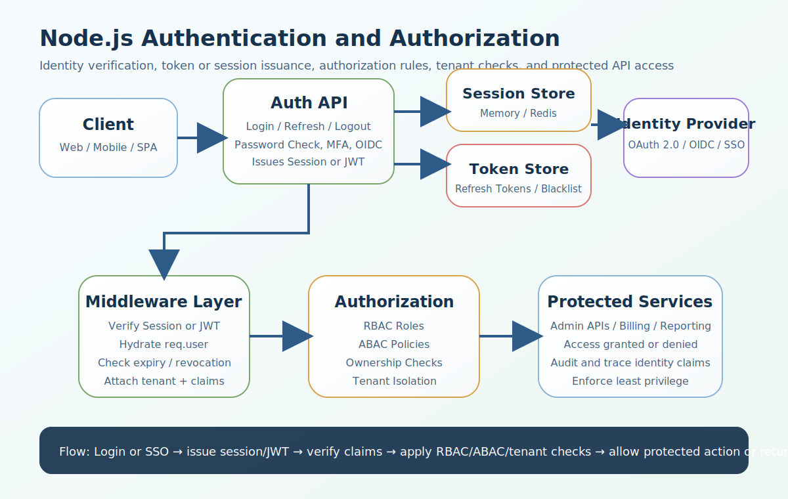

# Node.js Authentication and Authorization Interview Questions


This guide covers authentication and authorization in Node.js from interview basics to tricky production scenarios. It follows the corrected format of **100 interview questions for each subtopic**, and every answer includes a real Node.js code example plus a real-time example so the scenarios and snippets do not repeat verbatim.

## How To Use This Page

- Questions 1-100 cover Authentication vs Authorization.
- Questions 101-200 cover Session vs Token-Based Authentication.
- Questions 201-300 cover JWT Deep Dive (Access + Refresh Tokens).
- Questions 301-400 cover RBAC (Role-Based Access Control).
- Questions 401-500 cover ABAC (Attribute-Based Access Control).
- Questions 501-600 cover RBAC vs ABAC.
- Questions 601-700 cover Multi-Tenant Authentication.
- Questions 701-800 cover Security Best Practices.
- Questions 801-900 cover Logout Handling.
- Questions 901-1000 cover Advanced Topics.

## 1. Authentication vs Authorization

### Q1.1 What is authentication in Node.js authentication and authorization?

**Answer:**

Authentication matters in Node.js authentication and authorization because it determines how identity is verified, how permissions are enforced, and how the platform behaves when sessions, tokens, roles, tenant boundaries, and security incidents all interact at scale. In a real system like a CMS platform where admins, recruiters, managers, and consultants use the same Node.js APIs, a strong answer should connect the concept to user experience, scalability, revocation, least privilege, auditability, and production failure modes. A more senior answer also explains the practical trade-off so the answer stays grounded in real identity and permission design instead of only theory.

**Code Example:**

```js
const loginPayload1 = { email: 'user1@example.com', password: 'Secret!1' };
console.log('Authentication verifies identity:', loginPayload1.email);
```

**Real-Time Example:** In a CMS platform where admins, recruiters, managers, and consultants use the same Node.js APIs, the team applied this concept so the answer stays grounded in real identity and permission design instead of only theory.

### Q1.2 Why does authorization matter in real production APIs?

**Answer:**

Authorization matters in Node.js authentication and authorization because it determines how identity is verified, how permissions are enforced, and how the platform behaves when sessions, tokens, roles, tenant boundaries, and security incidents all interact at scale. In a real system like a SaaS product that serves multiple companies and must isolate tenant data strictly, a strong answer should connect the concept to user experience, scalability, revocation, least privilege, auditability, and production failure modes. A more senior answer also explains the practical trade-off so teams can connect login flows to scalability, revocation, and incident handling.

**Code Example:**

```js
const permissionCheck2 = { userRole: 'admin', route: '/admin/users' };
console.log('Authorization checks access:', permissionCheck2);
```

**Real-Time Example:** In a SaaS product that serves multiple companies and must isolate tenant data strictly, the team applied this concept so teams can connect login flows to scalability, revocation, and incident handling.

### Q1.3 When should a backend team rely on identity verification?

**Answer:**

Identity verification matters in Node.js authentication and authorization because it determines how identity is verified, how permissions are enforced, and how the platform behaves when sessions, tokens, roles, tenant boundaries, and security incidents all interact at scale. In a real system like a high-traffic login system where access tokens expire every 15 minutes and refresh tokens are rotated, a strong answer should connect the concept to user experience, scalability, revocation, least privilege, auditability, and production failure modes. A more senior answer also explains the practical trade-off so authorization rules become easier to explain and safer to maintain.

**Code Example:**

```js
function authenticateUser3(email, password) { return email && password ? { userId: 3 } : null; }
```

**Real-Time Example:** In a high-traffic login system where access tokens expire every 15 minutes and refresh tokens are rotated, the team applied this concept so authorization rules become easier to explain and safer to maintain.

### Q1.4 How would you explain permission checks in an interview?

**Answer:**

Permission checks matters in Node.js authentication and authorization because it determines how identity is verified, how permissions are enforced, and how the platform behaves when sessions, tokens, roles, tenant boundaries, and security incidents all interact at scale. In a real system like an enterprise system integrating internal SSO with API gateway enforcement, a strong answer should connect the concept to user experience, scalability, revocation, least privilege, auditability, and production failure modes. A more senior answer also explains the practical trade-off so token lifecycle decisions are tied to actual operational risk.

**Code Example:**

```js
function authorizeUser4(user, requiredRole) { return user?.role === requiredRole; }
console.log(authorizeUser4({ role: 'manager' }, 'manager'));
```

**Real-Time Example:** In an enterprise system integrating internal SSO with API gateway enforcement, the team applied this concept so token lifecycle decisions are tied to actual operational risk.

### Q1.5 What is a common interview trap around access control boundaries?

**Answer:**

Access control boundaries matters in Node.js authentication and authorization because it determines how identity is verified, how permissions are enforced, and how the platform behaves when sessions, tokens, roles, tenant boundaries, and security incidents all interact at scale. In a real system like a microservices platform where auth, billing, reporting, and notification services share identity claims, a strong answer should connect the concept to user experience, scalability, revocation, least privilege, auditability, and production failure modes. A more senior answer also explains the practical trade-off so the system is harder to abuse through stolen tokens or weak permission checks.

**Code Example:**

```js
const authBoundary5 = ['login verifies who you are', 'authorization decides what you can do'];
console.log(authBoundary5);
```

**Real-Time Example:** In a microservices platform where auth, billing, reporting, and notification services share identity claims, the team applied this concept so the system is harder to abuse through stolen tokens or weak permission checks.

### Q1.6 How is authentication implemented safely in Node.js services?

**Answer:**

Authentication matters in Node.js authentication and authorization because it determines how identity is verified, how permissions are enforced, and how the platform behaves when sessions, tokens, roles, tenant boundaries, and security incidents all interact at scale. In a real system like a public API where brute-force attempts and stolen token risks must be handled carefully, a strong answer should connect the concept to user experience, scalability, revocation, least privilege, auditability, and production failure modes. A more senior answer also explains the practical trade-off so the examples sound like production Node.js systems instead of textbook summaries.

**Code Example:**

```js
const loginPayload6 = { email: 'user6@example.com', password: 'Secret!6' };
console.log('Authentication verifies identity:', loginPayload6.email);
```

**Real-Time Example:** In a public API where brute-force attempts and stolen token risks must be handled carefully, the team applied this concept so the examples sound like production Node.js systems instead of textbook summaries.

### Q1.7 What production problem usually exposes weak understanding of authorization?

**Answer:**

Authorization matters in Node.js authentication and authorization because it determines how identity is verified, how permissions are enforced, and how the platform behaves when sessions, tokens, roles, tenant boundaries, and security incidents all interact at scale. In a real system like a B2B platform where recruiters can access only their own consultants while admins can access all records, a strong answer should connect the concept to user experience, scalability, revocation, least privilege, auditability, and production failure modes. A more senior answer also explains the practical trade-off so multi-tenant isolation and role boundaries are treated as design requirements, not afterthoughts.

**Code Example:**

```js
const permissionCheck7 = { userRole: 'admin', route: '/admin/users' };
console.log('Authorization checks access:', permissionCheck7);
```

**Real-Time Example:** In a B2B platform where recruiters can access only their own consultants while admins can access all records, the team applied this concept so multi-tenant isolation and role boundaries are treated as design requirements, not afterthoughts.

### Q1.8 How would a senior engineer justify identity verification to a team?

**Answer:**

Identity verification matters in Node.js authentication and authorization because it determines how identity is verified, how permissions are enforced, and how the platform behaves when sessions, tokens, roles, tenant boundaries, and security incidents all interact at scale. In a real system like a production incident where a revoked token was still accepted by one downstream service, a strong answer should connect the concept to user experience, scalability, revocation, least privilege, auditability, and production failure modes. A more senior answer also explains the practical trade-off so the trade-offs between simplicity, flexibility, and security become clearer.

**Code Example:**

```js
function authenticateUser8(email, password) { return email && password ? { userId: 8 } : null; }
```

**Real-Time Example:** In a production incident where a revoked token was still accepted by one downstream service, the team applied this concept so the trade-offs between simplicity, flexibility, and security become clearer.

### Q1.9 What trade-off does permission checks introduce?

**Answer:**

Permission checks matters in Node.js authentication and authorization because it determines how identity is verified, how permissions are enforced, and how the platform behaves when sessions, tokens, roles, tenant boundaries, and security incidents all interact at scale. In a real system like a mobile plus web application where cookie-based and bearer-token flows both exist, a strong answer should connect the concept to user experience, scalability, revocation, least privilege, auditability, and production failure modes. A more senior answer also explains the practical trade-off so session and JWT choices can be justified by workload and deployment model.

**Code Example:**

```js
function authorizeUser9(user, requiredRole) { return user?.role === requiredRole; }
console.log(authorizeUser9({ role: 'manager' }, 'manager'));
```

**Real-Time Example:** In a mobile plus web application where cookie-based and bearer-token flows both exist, the team applied this concept so session and JWT choices can be justified by workload and deployment model.

### Q1.10 How do you answer a tricky follow-up about access control boundaries?

**Answer:**

Access control boundaries matters in Node.js authentication and authorization because it determines how identity is verified, how permissions are enforced, and how the platform behaves when sessions, tokens, roles, tenant boundaries, and security incidents all interact at scale. In a real system like a compliance-heavy system where audit trails, tenant boundaries, and strong logout flows all matter, a strong answer should connect the concept to user experience, scalability, revocation, least privilege, auditability, and production failure modes. A more senior answer also explains the practical trade-off so the answer reflects senior-level thinking about auth failures, recovery, and auditability.

**Code Example:**

```js
const authBoundary10 = ['login verifies who you are', 'authorization decides what you can do'];
console.log(authBoundary10);
```

**Real-Time Example:** In a compliance-heavy system where audit trails, tenant boundaries, and strong logout flows all matter, the team applied this concept so the answer reflects senior-level thinking about auth failures, recovery, and auditability.

### Q1.11 What is authentication in Node.js authentication and authorization?

**Answer:**

Authentication matters in Node.js authentication and authorization because it determines how identity is verified, how permissions are enforced, and how the platform behaves when sessions, tokens, roles, tenant boundaries, and security incidents all interact at scale. In a real system like a CMS platform where admins, recruiters, managers, and consultants use the same Node.js APIs, a strong answer should connect the concept to user experience, scalability, revocation, least privilege, auditability, and production failure modes. A more senior answer also explains the practical trade-off so the answer stays grounded in real identity and permission design instead of only theory.

**Code Example:**

```js
const loginPayload11 = { email: 'user11@example.com', password: 'Secret!11' };
console.log('Authentication verifies identity:', loginPayload11.email);
```

**Real-Time Example:** In a CMS platform where admins, recruiters, managers, and consultants use the same Node.js APIs, the team applied this concept so the answer stays grounded in real identity and permission design instead of only theory.

### Q1.12 Why does authorization matter in real production APIs?

**Answer:**

Authorization matters in Node.js authentication and authorization because it determines how identity is verified, how permissions are enforced, and how the platform behaves when sessions, tokens, roles, tenant boundaries, and security incidents all interact at scale. In a real system like a SaaS product that serves multiple companies and must isolate tenant data strictly, a strong answer should connect the concept to user experience, scalability, revocation, least privilege, auditability, and production failure modes. A more senior answer also explains the practical trade-off so teams can connect login flows to scalability, revocation, and incident handling.

**Code Example:**

```js
const permissionCheck12 = { userRole: 'admin', route: '/admin/users' };
console.log('Authorization checks access:', permissionCheck12);
```

**Real-Time Example:** In a SaaS product that serves multiple companies and must isolate tenant data strictly, the team applied this concept so teams can connect login flows to scalability, revocation, and incident handling.

### Q1.13 When should a backend team rely on identity verification?

**Answer:**

Identity verification matters in Node.js authentication and authorization because it determines how identity is verified, how permissions are enforced, and how the platform behaves when sessions, tokens, roles, tenant boundaries, and security incidents all interact at scale. In a real system like a high-traffic login system where access tokens expire every 15 minutes and refresh tokens are rotated, a strong answer should connect the concept to user experience, scalability, revocation, least privilege, auditability, and production failure modes. A more senior answer also explains the practical trade-off so authorization rules become easier to explain and safer to maintain.

**Code Example:**

```js
function authenticateUser13(email, password) { return email && password ? { userId: 13 } : null; }
```

**Real-Time Example:** In a high-traffic login system where access tokens expire every 15 minutes and refresh tokens are rotated, the team applied this concept so authorization rules become easier to explain and safer to maintain.

### Q1.14 How would you explain permission checks in an interview?

**Answer:**

Permission checks matters in Node.js authentication and authorization because it determines how identity is verified, how permissions are enforced, and how the platform behaves when sessions, tokens, roles, tenant boundaries, and security incidents all interact at scale. In a real system like an enterprise system integrating internal SSO with API gateway enforcement, a strong answer should connect the concept to user experience, scalability, revocation, least privilege, auditability, and production failure modes. A more senior answer also explains the practical trade-off so token lifecycle decisions are tied to actual operational risk.

**Code Example:**

```js
function authorizeUser14(user, requiredRole) { return user?.role === requiredRole; }
console.log(authorizeUser14({ role: 'manager' }, 'manager'));
```

**Real-Time Example:** In an enterprise system integrating internal SSO with API gateway enforcement, the team applied this concept so token lifecycle decisions are tied to actual operational risk.

### Q1.15 What is a common interview trap around access control boundaries?

**Answer:**

Access control boundaries matters in Node.js authentication and authorization because it determines how identity is verified, how permissions are enforced, and how the platform behaves when sessions, tokens, roles, tenant boundaries, and security incidents all interact at scale. In a real system like a microservices platform where auth, billing, reporting, and notification services share identity claims, a strong answer should connect the concept to user experience, scalability, revocation, least privilege, auditability, and production failure modes. A more senior answer also explains the practical trade-off so the system is harder to abuse through stolen tokens or weak permission checks.

**Code Example:**

```js
const authBoundary15 = ['login verifies who you are', 'authorization decides what you can do'];
console.log(authBoundary15);
```

**Real-Time Example:** In a microservices platform where auth, billing, reporting, and notification services share identity claims, the team applied this concept so the system is harder to abuse through stolen tokens or weak permission checks.

### Q1.16 How is authentication implemented safely in Node.js services?

**Answer:**

Authentication matters in Node.js authentication and authorization because it determines how identity is verified, how permissions are enforced, and how the platform behaves when sessions, tokens, roles, tenant boundaries, and security incidents all interact at scale. In a real system like a public API where brute-force attempts and stolen token risks must be handled carefully, a strong answer should connect the concept to user experience, scalability, revocation, least privilege, auditability, and production failure modes. A more senior answer also explains the practical trade-off so the examples sound like production Node.js systems instead of textbook summaries.

**Code Example:**

```js
const loginPayload16 = { email: 'user16@example.com', password: 'Secret!16' };
console.log('Authentication verifies identity:', loginPayload16.email);
```

**Real-Time Example:** In a public API where brute-force attempts and stolen token risks must be handled carefully, the team applied this concept so the examples sound like production Node.js systems instead of textbook summaries.

### Q1.17 What production problem usually exposes weak understanding of authorization?

**Answer:**

Authorization matters in Node.js authentication and authorization because it determines how identity is verified, how permissions are enforced, and how the platform behaves when sessions, tokens, roles, tenant boundaries, and security incidents all interact at scale. In a real system like a B2B platform where recruiters can access only their own consultants while admins can access all records, a strong answer should connect the concept to user experience, scalability, revocation, least privilege, auditability, and production failure modes. A more senior answer also explains the practical trade-off so multi-tenant isolation and role boundaries are treated as design requirements, not afterthoughts.

**Code Example:**

```js
const permissionCheck17 = { userRole: 'admin', route: '/admin/users' };
console.log('Authorization checks access:', permissionCheck17);
```

**Real-Time Example:** In a B2B platform where recruiters can access only their own consultants while admins can access all records, the team applied this concept so multi-tenant isolation and role boundaries are treated as design requirements, not afterthoughts.

### Q1.18 How would a senior engineer justify identity verification to a team?

**Answer:**

Identity verification matters in Node.js authentication and authorization because it determines how identity is verified, how permissions are enforced, and how the platform behaves when sessions, tokens, roles, tenant boundaries, and security incidents all interact at scale. In a real system like a production incident where a revoked token was still accepted by one downstream service, a strong answer should connect the concept to user experience, scalability, revocation, least privilege, auditability, and production failure modes. A more senior answer also explains the practical trade-off so the trade-offs between simplicity, flexibility, and security become clearer.

**Code Example:**

```js
function authenticateUser18(email, password) { return email && password ? { userId: 18 } : null; }
```

**Real-Time Example:** In a production incident where a revoked token was still accepted by one downstream service, the team applied this concept so the trade-offs between simplicity, flexibility, and security become clearer.

### Q1.19 What trade-off does permission checks introduce?

**Answer:**

Permission checks matters in Node.js authentication and authorization because it determines how identity is verified, how permissions are enforced, and how the platform behaves when sessions, tokens, roles, tenant boundaries, and security incidents all interact at scale. In a real system like a mobile plus web application where cookie-based and bearer-token flows both exist, a strong answer should connect the concept to user experience, scalability, revocation, least privilege, auditability, and production failure modes. A more senior answer also explains the practical trade-off so session and JWT choices can be justified by workload and deployment model.

**Code Example:**

```js
function authorizeUser19(user, requiredRole) { return user?.role === requiredRole; }
console.log(authorizeUser19({ role: 'manager' }, 'manager'));
```

**Real-Time Example:** In a mobile plus web application where cookie-based and bearer-token flows both exist, the team applied this concept so session and JWT choices can be justified by workload and deployment model.

### Q1.20 How do you answer a tricky follow-up about access control boundaries?

**Answer:**

Access control boundaries matters in Node.js authentication and authorization because it determines how identity is verified, how permissions are enforced, and how the platform behaves when sessions, tokens, roles, tenant boundaries, and security incidents all interact at scale. In a real system like a compliance-heavy system where audit trails, tenant boundaries, and strong logout flows all matter, a strong answer should connect the concept to user experience, scalability, revocation, least privilege, auditability, and production failure modes. A more senior answer also explains the practical trade-off so the answer reflects senior-level thinking about auth failures, recovery, and auditability.

**Code Example:**

```js
const authBoundary20 = ['login verifies who you are', 'authorization decides what you can do'];
console.log(authBoundary20);
```

**Real-Time Example:** In a compliance-heavy system where audit trails, tenant boundaries, and strong logout flows all matter, the team applied this concept so the answer reflects senior-level thinking about auth failures, recovery, and auditability.

### Q1.21 What is authentication in Node.js authentication and authorization?

**Answer:**

Authentication matters in Node.js authentication and authorization because it determines how identity is verified, how permissions are enforced, and how the platform behaves when sessions, tokens, roles, tenant boundaries, and security incidents all interact at scale. In a real system like a CMS platform where admins, recruiters, managers, and consultants use the same Node.js APIs, a strong answer should connect the concept to user experience, scalability, revocation, least privilege, auditability, and production failure modes. A more senior answer also explains the practical trade-off so the answer stays grounded in real identity and permission design instead of only theory.

**Code Example:**

```js
const loginPayload21 = { email: 'user21@example.com', password: 'Secret!21' };
console.log('Authentication verifies identity:', loginPayload21.email);
```

**Real-Time Example:** In a CMS platform where admins, recruiters, managers, and consultants use the same Node.js APIs, the team applied this concept so the answer stays grounded in real identity and permission design instead of only theory.

### Q1.22 Why does authorization matter in real production APIs?

**Answer:**

Authorization matters in Node.js authentication and authorization because it determines how identity is verified, how permissions are enforced, and how the platform behaves when sessions, tokens, roles, tenant boundaries, and security incidents all interact at scale. In a real system like a SaaS product that serves multiple companies and must isolate tenant data strictly, a strong answer should connect the concept to user experience, scalability, revocation, least privilege, auditability, and production failure modes. A more senior answer also explains the practical trade-off so teams can connect login flows to scalability, revocation, and incident handling.

**Code Example:**

```js
const permissionCheck22 = { userRole: 'admin', route: '/admin/users' };
console.log('Authorization checks access:', permissionCheck22);
```

**Real-Time Example:** In a SaaS product that serves multiple companies and must isolate tenant data strictly, the team applied this concept so teams can connect login flows to scalability, revocation, and incident handling.

### Q1.23 When should a backend team rely on identity verification?

**Answer:**

Identity verification matters in Node.js authentication and authorization because it determines how identity is verified, how permissions are enforced, and how the platform behaves when sessions, tokens, roles, tenant boundaries, and security incidents all interact at scale. In a real system like a high-traffic login system where access tokens expire every 15 minutes and refresh tokens are rotated, a strong answer should connect the concept to user experience, scalability, revocation, least privilege, auditability, and production failure modes. A more senior answer also explains the practical trade-off so authorization rules become easier to explain and safer to maintain.

**Code Example:**

```js
function authenticateUser23(email, password) { return email && password ? { userId: 23 } : null; }
```

**Real-Time Example:** In a high-traffic login system where access tokens expire every 15 minutes and refresh tokens are rotated, the team applied this concept so authorization rules become easier to explain and safer to maintain.

### Q1.24 How would you explain permission checks in an interview?

**Answer:**

Permission checks matters in Node.js authentication and authorization because it determines how identity is verified, how permissions are enforced, and how the platform behaves when sessions, tokens, roles, tenant boundaries, and security incidents all interact at scale. In a real system like an enterprise system integrating internal SSO with API gateway enforcement, a strong answer should connect the concept to user experience, scalability, revocation, least privilege, auditability, and production failure modes. A more senior answer also explains the practical trade-off so token lifecycle decisions are tied to actual operational risk.

**Code Example:**

```js
function authorizeUser24(user, requiredRole) { return user?.role === requiredRole; }
console.log(authorizeUser24({ role: 'manager' }, 'manager'));
```

**Real-Time Example:** In an enterprise system integrating internal SSO with API gateway enforcement, the team applied this concept so token lifecycle decisions are tied to actual operational risk.

### Q1.25 What is a common interview trap around access control boundaries?

**Answer:**

Access control boundaries matters in Node.js authentication and authorization because it determines how identity is verified, how permissions are enforced, and how the platform behaves when sessions, tokens, roles, tenant boundaries, and security incidents all interact at scale. In a real system like a microservices platform where auth, billing, reporting, and notification services share identity claims, a strong answer should connect the concept to user experience, scalability, revocation, least privilege, auditability, and production failure modes. A more senior answer also explains the practical trade-off so the system is harder to abuse through stolen tokens or weak permission checks.

**Code Example:**

```js
const authBoundary25 = ['login verifies who you are', 'authorization decides what you can do'];
console.log(authBoundary25);
```

**Real-Time Example:** In a microservices platform where auth, billing, reporting, and notification services share identity claims, the team applied this concept so the system is harder to abuse through stolen tokens or weak permission checks.

### Q1.26 How is authentication implemented safely in Node.js services?

**Answer:**

Authentication matters in Node.js authentication and authorization because it determines how identity is verified, how permissions are enforced, and how the platform behaves when sessions, tokens, roles, tenant boundaries, and security incidents all interact at scale. In a real system like a public API where brute-force attempts and stolen token risks must be handled carefully, a strong answer should connect the concept to user experience, scalability, revocation, least privilege, auditability, and production failure modes. A more senior answer also explains the practical trade-off so the examples sound like production Node.js systems instead of textbook summaries.

**Code Example:**

```js
const loginPayload26 = { email: 'user26@example.com', password: 'Secret!26' };
console.log('Authentication verifies identity:', loginPayload26.email);
```

**Real-Time Example:** In a public API where brute-force attempts and stolen token risks must be handled carefully, the team applied this concept so the examples sound like production Node.js systems instead of textbook summaries.

### Q1.27 What production problem usually exposes weak understanding of authorization?

**Answer:**

Authorization matters in Node.js authentication and authorization because it determines how identity is verified, how permissions are enforced, and how the platform behaves when sessions, tokens, roles, tenant boundaries, and security incidents all interact at scale. In a real system like a B2B platform where recruiters can access only their own consultants while admins can access all records, a strong answer should connect the concept to user experience, scalability, revocation, least privilege, auditability, and production failure modes. A more senior answer also explains the practical trade-off so multi-tenant isolation and role boundaries are treated as design requirements, not afterthoughts.

**Code Example:**

```js
const permissionCheck27 = { userRole: 'admin', route: '/admin/users' };
console.log('Authorization checks access:', permissionCheck27);
```

**Real-Time Example:** In a B2B platform where recruiters can access only their own consultants while admins can access all records, the team applied this concept so multi-tenant isolation and role boundaries are treated as design requirements, not afterthoughts.

### Q1.28 How would a senior engineer justify identity verification to a team?

**Answer:**

Identity verification matters in Node.js authentication and authorization because it determines how identity is verified, how permissions are enforced, and how the platform behaves when sessions, tokens, roles, tenant boundaries, and security incidents all interact at scale. In a real system like a production incident where a revoked token was still accepted by one downstream service, a strong answer should connect the concept to user experience, scalability, revocation, least privilege, auditability, and production failure modes. A more senior answer also explains the practical trade-off so the trade-offs between simplicity, flexibility, and security become clearer.

**Code Example:**

```js
function authenticateUser28(email, password) { return email && password ? { userId: 28 } : null; }
```

**Real-Time Example:** In a production incident where a revoked token was still accepted by one downstream service, the team applied this concept so the trade-offs between simplicity, flexibility, and security become clearer.

### Q1.29 What trade-off does permission checks introduce?

**Answer:**

Permission checks matters in Node.js authentication and authorization because it determines how identity is verified, how permissions are enforced, and how the platform behaves when sessions, tokens, roles, tenant boundaries, and security incidents all interact at scale. In a real system like a mobile plus web application where cookie-based and bearer-token flows both exist, a strong answer should connect the concept to user experience, scalability, revocation, least privilege, auditability, and production failure modes. A more senior answer also explains the practical trade-off so session and JWT choices can be justified by workload and deployment model.

**Code Example:**

```js
function authorizeUser29(user, requiredRole) { return user?.role === requiredRole; }
console.log(authorizeUser29({ role: 'manager' }, 'manager'));
```

**Real-Time Example:** In a mobile plus web application where cookie-based and bearer-token flows both exist, the team applied this concept so session and JWT choices can be justified by workload and deployment model.

### Q1.30 How do you answer a tricky follow-up about access control boundaries?

**Answer:**

Access control boundaries matters in Node.js authentication and authorization because it determines how identity is verified, how permissions are enforced, and how the platform behaves when sessions, tokens, roles, tenant boundaries, and security incidents all interact at scale. In a real system like a compliance-heavy system where audit trails, tenant boundaries, and strong logout flows all matter, a strong answer should connect the concept to user experience, scalability, revocation, least privilege, auditability, and production failure modes. A more senior answer also explains the practical trade-off so the answer reflects senior-level thinking about auth failures, recovery, and auditability.

**Code Example:**

```js
const authBoundary30 = ['login verifies who you are', 'authorization decides what you can do'];
console.log(authBoundary30);
```

**Real-Time Example:** In a compliance-heavy system where audit trails, tenant boundaries, and strong logout flows all matter, the team applied this concept so the answer reflects senior-level thinking about auth failures, recovery, and auditability.

### Q1.31 What is authentication in Node.js authentication and authorization?

**Answer:**

Authentication matters in Node.js authentication and authorization because it determines how identity is verified, how permissions are enforced, and how the platform behaves when sessions, tokens, roles, tenant boundaries, and security incidents all interact at scale. In a real system like a CMS platform where admins, recruiters, managers, and consultants use the same Node.js APIs, a strong answer should connect the concept to user experience, scalability, revocation, least privilege, auditability, and production failure modes. A more senior answer also explains the practical trade-off so the answer stays grounded in real identity and permission design instead of only theory.

**Code Example:**

```js
const loginPayload31 = { email: 'user31@example.com', password: 'Secret!31' };
console.log('Authentication verifies identity:', loginPayload31.email);
```

**Real-Time Example:** In a CMS platform where admins, recruiters, managers, and consultants use the same Node.js APIs, the team applied this concept so the answer stays grounded in real identity and permission design instead of only theory.

### Q1.32 Why does authorization matter in real production APIs?

**Answer:**

Authorization matters in Node.js authentication and authorization because it determines how identity is verified, how permissions are enforced, and how the platform behaves when sessions, tokens, roles, tenant boundaries, and security incidents all interact at scale. In a real system like a SaaS product that serves multiple companies and must isolate tenant data strictly, a strong answer should connect the concept to user experience, scalability, revocation, least privilege, auditability, and production failure modes. A more senior answer also explains the practical trade-off so teams can connect login flows to scalability, revocation, and incident handling.

**Code Example:**

```js
const permissionCheck32 = { userRole: 'admin', route: '/admin/users' };
console.log('Authorization checks access:', permissionCheck32);
```

**Real-Time Example:** In a SaaS product that serves multiple companies and must isolate tenant data strictly, the team applied this concept so teams can connect login flows to scalability, revocation, and incident handling.

### Q1.33 When should a backend team rely on identity verification?

**Answer:**

Identity verification matters in Node.js authentication and authorization because it determines how identity is verified, how permissions are enforced, and how the platform behaves when sessions, tokens, roles, tenant boundaries, and security incidents all interact at scale. In a real system like a high-traffic login system where access tokens expire every 15 minutes and refresh tokens are rotated, a strong answer should connect the concept to user experience, scalability, revocation, least privilege, auditability, and production failure modes. A more senior answer also explains the practical trade-off so authorization rules become easier to explain and safer to maintain.

**Code Example:**

```js
function authenticateUser33(email, password) { return email && password ? { userId: 33 } : null; }
```

**Real-Time Example:** In a high-traffic login system where access tokens expire every 15 minutes and refresh tokens are rotated, the team applied this concept so authorization rules become easier to explain and safer to maintain.

### Q1.34 How would you explain permission checks in an interview?

**Answer:**

Permission checks matters in Node.js authentication and authorization because it determines how identity is verified, how permissions are enforced, and how the platform behaves when sessions, tokens, roles, tenant boundaries, and security incidents all interact at scale. In a real system like an enterprise system integrating internal SSO with API gateway enforcement, a strong answer should connect the concept to user experience, scalability, revocation, least privilege, auditability, and production failure modes. A more senior answer also explains the practical trade-off so token lifecycle decisions are tied to actual operational risk.

**Code Example:**

```js
function authorizeUser34(user, requiredRole) { return user?.role === requiredRole; }
console.log(authorizeUser34({ role: 'manager' }, 'manager'));
```

**Real-Time Example:** In an enterprise system integrating internal SSO with API gateway enforcement, the team applied this concept so token lifecycle decisions are tied to actual operational risk.

### Q1.35 What is a common interview trap around access control boundaries?

**Answer:**

Access control boundaries matters in Node.js authentication and authorization because it determines how identity is verified, how permissions are enforced, and how the platform behaves when sessions, tokens, roles, tenant boundaries, and security incidents all interact at scale. In a real system like a microservices platform where auth, billing, reporting, and notification services share identity claims, a strong answer should connect the concept to user experience, scalability, revocation, least privilege, auditability, and production failure modes. A more senior answer also explains the practical trade-off so the system is harder to abuse through stolen tokens or weak permission checks.

**Code Example:**

```js
const authBoundary35 = ['login verifies who you are', 'authorization decides what you can do'];
console.log(authBoundary35);
```

**Real-Time Example:** In a microservices platform where auth, billing, reporting, and notification services share identity claims, the team applied this concept so the system is harder to abuse through stolen tokens or weak permission checks.

### Q1.36 How is authentication implemented safely in Node.js services?

**Answer:**

Authentication matters in Node.js authentication and authorization because it determines how identity is verified, how permissions are enforced, and how the platform behaves when sessions, tokens, roles, tenant boundaries, and security incidents all interact at scale. In a real system like a public API where brute-force attempts and stolen token risks must be handled carefully, a strong answer should connect the concept to user experience, scalability, revocation, least privilege, auditability, and production failure modes. A more senior answer also explains the practical trade-off so the examples sound like production Node.js systems instead of textbook summaries.

**Code Example:**

```js
const loginPayload36 = { email: 'user36@example.com', password: 'Secret!36' };
console.log('Authentication verifies identity:', loginPayload36.email);
```

**Real-Time Example:** In a public API where brute-force attempts and stolen token risks must be handled carefully, the team applied this concept so the examples sound like production Node.js systems instead of textbook summaries.

### Q1.37 What production problem usually exposes weak understanding of authorization?

**Answer:**

Authorization matters in Node.js authentication and authorization because it determines how identity is verified, how permissions are enforced, and how the platform behaves when sessions, tokens, roles, tenant boundaries, and security incidents all interact at scale. In a real system like a B2B platform where recruiters can access only their own consultants while admins can access all records, a strong answer should connect the concept to user experience, scalability, revocation, least privilege, auditability, and production failure modes. A more senior answer also explains the practical trade-off so multi-tenant isolation and role boundaries are treated as design requirements, not afterthoughts.

**Code Example:**

```js
const permissionCheck37 = { userRole: 'admin', route: '/admin/users' };
console.log('Authorization checks access:', permissionCheck37);
```

**Real-Time Example:** In a B2B platform where recruiters can access only their own consultants while admins can access all records, the team applied this concept so multi-tenant isolation and role boundaries are treated as design requirements, not afterthoughts.

### Q1.38 How would a senior engineer justify identity verification to a team?

**Answer:**

Identity verification matters in Node.js authentication and authorization because it determines how identity is verified, how permissions are enforced, and how the platform behaves when sessions, tokens, roles, tenant boundaries, and security incidents all interact at scale. In a real system like a production incident where a revoked token was still accepted by one downstream service, a strong answer should connect the concept to user experience, scalability, revocation, least privilege, auditability, and production failure modes. A more senior answer also explains the practical trade-off so the trade-offs between simplicity, flexibility, and security become clearer.

**Code Example:**

```js
function authenticateUser38(email, password) { return email && password ? { userId: 38 } : null; }
```

**Real-Time Example:** In a production incident where a revoked token was still accepted by one downstream service, the team applied this concept so the trade-offs between simplicity, flexibility, and security become clearer.

### Q1.39 What trade-off does permission checks introduce?

**Answer:**

Permission checks matters in Node.js authentication and authorization because it determines how identity is verified, how permissions are enforced, and how the platform behaves when sessions, tokens, roles, tenant boundaries, and security incidents all interact at scale. In a real system like a mobile plus web application where cookie-based and bearer-token flows both exist, a strong answer should connect the concept to user experience, scalability, revocation, least privilege, auditability, and production failure modes. A more senior answer also explains the practical trade-off so session and JWT choices can be justified by workload and deployment model.

**Code Example:**

```js
function authorizeUser39(user, requiredRole) { return user?.role === requiredRole; }
console.log(authorizeUser39({ role: 'manager' }, 'manager'));
```

**Real-Time Example:** In a mobile plus web application where cookie-based and bearer-token flows both exist, the team applied this concept so session and JWT choices can be justified by workload and deployment model.

### Q1.40 How do you answer a tricky follow-up about access control boundaries?

**Answer:**

Access control boundaries matters in Node.js authentication and authorization because it determines how identity is verified, how permissions are enforced, and how the platform behaves when sessions, tokens, roles, tenant boundaries, and security incidents all interact at scale. In a real system like a compliance-heavy system where audit trails, tenant boundaries, and strong logout flows all matter, a strong answer should connect the concept to user experience, scalability, revocation, least privilege, auditability, and production failure modes. A more senior answer also explains the practical trade-off so the answer reflects senior-level thinking about auth failures, recovery, and auditability.

**Code Example:**

```js
const authBoundary40 = ['login verifies who you are', 'authorization decides what you can do'];
console.log(authBoundary40);
```

**Real-Time Example:** In a compliance-heavy system where audit trails, tenant boundaries, and strong logout flows all matter, the team applied this concept so the answer reflects senior-level thinking about auth failures, recovery, and auditability.

### Q1.41 What is authentication in Node.js authentication and authorization?

**Answer:**

Authentication matters in Node.js authentication and authorization because it determines how identity is verified, how permissions are enforced, and how the platform behaves when sessions, tokens, roles, tenant boundaries, and security incidents all interact at scale. In a real system like a CMS platform where admins, recruiters, managers, and consultants use the same Node.js APIs, a strong answer should connect the concept to user experience, scalability, revocation, least privilege, auditability, and production failure modes. A more senior answer also explains the practical trade-off so the answer stays grounded in real identity and permission design instead of only theory.

**Code Example:**

```js
const loginPayload41 = { email: 'user41@example.com', password: 'Secret!41' };
console.log('Authentication verifies identity:', loginPayload41.email);
```

**Real-Time Example:** In a CMS platform where admins, recruiters, managers, and consultants use the same Node.js APIs, the team applied this concept so the answer stays grounded in real identity and permission design instead of only theory.

### Q1.42 Why does authorization matter in real production APIs?

**Answer:**

Authorization matters in Node.js authentication and authorization because it determines how identity is verified, how permissions are enforced, and how the platform behaves when sessions, tokens, roles, tenant boundaries, and security incidents all interact at scale. In a real system like a SaaS product that serves multiple companies and must isolate tenant data strictly, a strong answer should connect the concept to user experience, scalability, revocation, least privilege, auditability, and production failure modes. A more senior answer also explains the practical trade-off so teams can connect login flows to scalability, revocation, and incident handling.

**Code Example:**

```js
const permissionCheck42 = { userRole: 'admin', route: '/admin/users' };
console.log('Authorization checks access:', permissionCheck42);
```

**Real-Time Example:** In a SaaS product that serves multiple companies and must isolate tenant data strictly, the team applied this concept so teams can connect login flows to scalability, revocation, and incident handling.

### Q1.43 When should a backend team rely on identity verification?

**Answer:**

Identity verification matters in Node.js authentication and authorization because it determines how identity is verified, how permissions are enforced, and how the platform behaves when sessions, tokens, roles, tenant boundaries, and security incidents all interact at scale. In a real system like a high-traffic login system where access tokens expire every 15 minutes and refresh tokens are rotated, a strong answer should connect the concept to user experience, scalability, revocation, least privilege, auditability, and production failure modes. A more senior answer also explains the practical trade-off so authorization rules become easier to explain and safer to maintain.

**Code Example:**

```js
function authenticateUser43(email, password) { return email && password ? { userId: 43 } : null; }
```

**Real-Time Example:** In a high-traffic login system where access tokens expire every 15 minutes and refresh tokens are rotated, the team applied this concept so authorization rules become easier to explain and safer to maintain.

### Q1.44 How would you explain permission checks in an interview?

**Answer:**

Permission checks matters in Node.js authentication and authorization because it determines how identity is verified, how permissions are enforced, and how the platform behaves when sessions, tokens, roles, tenant boundaries, and security incidents all interact at scale. In a real system like an enterprise system integrating internal SSO with API gateway enforcement, a strong answer should connect the concept to user experience, scalability, revocation, least privilege, auditability, and production failure modes. A more senior answer also explains the practical trade-off so token lifecycle decisions are tied to actual operational risk.

**Code Example:**

```js
function authorizeUser44(user, requiredRole) { return user?.role === requiredRole; }
console.log(authorizeUser44({ role: 'manager' }, 'manager'));
```

**Real-Time Example:** In an enterprise system integrating internal SSO with API gateway enforcement, the team applied this concept so token lifecycle decisions are tied to actual operational risk.

### Q1.45 What is a common interview trap around access control boundaries?

**Answer:**

Access control boundaries matters in Node.js authentication and authorization because it determines how identity is verified, how permissions are enforced, and how the platform behaves when sessions, tokens, roles, tenant boundaries, and security incidents all interact at scale. In a real system like a microservices platform where auth, billing, reporting, and notification services share identity claims, a strong answer should connect the concept to user experience, scalability, revocation, least privilege, auditability, and production failure modes. A more senior answer also explains the practical trade-off so the system is harder to abuse through stolen tokens or weak permission checks.

**Code Example:**

```js
const authBoundary45 = ['login verifies who you are', 'authorization decides what you can do'];
console.log(authBoundary45);
```

**Real-Time Example:** In a microservices platform where auth, billing, reporting, and notification services share identity claims, the team applied this concept so the system is harder to abuse through stolen tokens or weak permission checks.

### Q1.46 How is authentication implemented safely in Node.js services?

**Answer:**

Authentication matters in Node.js authentication and authorization because it determines how identity is verified, how permissions are enforced, and how the platform behaves when sessions, tokens, roles, tenant boundaries, and security incidents all interact at scale. In a real system like a public API where brute-force attempts and stolen token risks must be handled carefully, a strong answer should connect the concept to user experience, scalability, revocation, least privilege, auditability, and production failure modes. A more senior answer also explains the practical trade-off so the examples sound like production Node.js systems instead of textbook summaries.

**Code Example:**

```js
const loginPayload46 = { email: 'user46@example.com', password: 'Secret!46' };
console.log('Authentication verifies identity:', loginPayload46.email);
```

**Real-Time Example:** In a public API where brute-force attempts and stolen token risks must be handled carefully, the team applied this concept so the examples sound like production Node.js systems instead of textbook summaries.

### Q1.47 What production problem usually exposes weak understanding of authorization?

**Answer:**

Authorization matters in Node.js authentication and authorization because it determines how identity is verified, how permissions are enforced, and how the platform behaves when sessions, tokens, roles, tenant boundaries, and security incidents all interact at scale. In a real system like a B2B platform where recruiters can access only their own consultants while admins can access all records, a strong answer should connect the concept to user experience, scalability, revocation, least privilege, auditability, and production failure modes. A more senior answer also explains the practical trade-off so multi-tenant isolation and role boundaries are treated as design requirements, not afterthoughts.

**Code Example:**

```js
const permissionCheck47 = { userRole: 'admin', route: '/admin/users' };
console.log('Authorization checks access:', permissionCheck47);
```

**Real-Time Example:** In a B2B platform where recruiters can access only their own consultants while admins can access all records, the team applied this concept so multi-tenant isolation and role boundaries are treated as design requirements, not afterthoughts.

### Q1.48 How would a senior engineer justify identity verification to a team?

**Answer:**

Identity verification matters in Node.js authentication and authorization because it determines how identity is verified, how permissions are enforced, and how the platform behaves when sessions, tokens, roles, tenant boundaries, and security incidents all interact at scale. In a real system like a production incident where a revoked token was still accepted by one downstream service, a strong answer should connect the concept to user experience, scalability, revocation, least privilege, auditability, and production failure modes. A more senior answer also explains the practical trade-off so the trade-offs between simplicity, flexibility, and security become clearer.

**Code Example:**

```js
function authenticateUser48(email, password) { return email && password ? { userId: 48 } : null; }
```

**Real-Time Example:** In a production incident where a revoked token was still accepted by one downstream service, the team applied this concept so the trade-offs between simplicity, flexibility, and security become clearer.

### Q1.49 What trade-off does permission checks introduce?

**Answer:**

Permission checks matters in Node.js authentication and authorization because it determines how identity is verified, how permissions are enforced, and how the platform behaves when sessions, tokens, roles, tenant boundaries, and security incidents all interact at scale. In a real system like a mobile plus web application where cookie-based and bearer-token flows both exist, a strong answer should connect the concept to user experience, scalability, revocation, least privilege, auditability, and production failure modes. A more senior answer also explains the practical trade-off so session and JWT choices can be justified by workload and deployment model.

**Code Example:**

```js
function authorizeUser49(user, requiredRole) { return user?.role === requiredRole; }
console.log(authorizeUser49({ role: 'manager' }, 'manager'));
```

**Real-Time Example:** In a mobile plus web application where cookie-based and bearer-token flows both exist, the team applied this concept so session and JWT choices can be justified by workload and deployment model.

### Q1.50 How do you answer a tricky follow-up about access control boundaries?

**Answer:**

Access control boundaries matters in Node.js authentication and authorization because it determines how identity is verified, how permissions are enforced, and how the platform behaves when sessions, tokens, roles, tenant boundaries, and security incidents all interact at scale. In a real system like a compliance-heavy system where audit trails, tenant boundaries, and strong logout flows all matter, a strong answer should connect the concept to user experience, scalability, revocation, least privilege, auditability, and production failure modes. A more senior answer also explains the practical trade-off so the answer reflects senior-level thinking about auth failures, recovery, and auditability.

**Code Example:**

```js
const authBoundary50 = ['login verifies who you are', 'authorization decides what you can do'];
console.log(authBoundary50);
```

**Real-Time Example:** In a compliance-heavy system where audit trails, tenant boundaries, and strong logout flows all matter, the team applied this concept so the answer reflects senior-level thinking about auth failures, recovery, and auditability.

### Q1.51 What is authentication in Node.js authentication and authorization?

**Answer:**

Authentication matters in Node.js authentication and authorization because it determines how identity is verified, how permissions are enforced, and how the platform behaves when sessions, tokens, roles, tenant boundaries, and security incidents all interact at scale. In a real system like a CMS platform where admins, recruiters, managers, and consultants use the same Node.js APIs, a strong answer should connect the concept to user experience, scalability, revocation, least privilege, auditability, and production failure modes. A more senior answer also explains the practical trade-off so the answer stays grounded in real identity and permission design instead of only theory.

**Code Example:**

```js
const loginPayload51 = { email: 'user51@example.com', password: 'Secret!51' };
console.log('Authentication verifies identity:', loginPayload51.email);
```

**Real-Time Example:** In a CMS platform where admins, recruiters, managers, and consultants use the same Node.js APIs, the team applied this concept so the answer stays grounded in real identity and permission design instead of only theory.

### Q1.52 Why does authorization matter in real production APIs?

**Answer:**

Authorization matters in Node.js authentication and authorization because it determines how identity is verified, how permissions are enforced, and how the platform behaves when sessions, tokens, roles, tenant boundaries, and security incidents all interact at scale. In a real system like a SaaS product that serves multiple companies and must isolate tenant data strictly, a strong answer should connect the concept to user experience, scalability, revocation, least privilege, auditability, and production failure modes. A more senior answer also explains the practical trade-off so teams can connect login flows to scalability, revocation, and incident handling.

**Code Example:**

```js
const permissionCheck52 = { userRole: 'admin', route: '/admin/users' };
console.log('Authorization checks access:', permissionCheck52);
```

**Real-Time Example:** In a SaaS product that serves multiple companies and must isolate tenant data strictly, the team applied this concept so teams can connect login flows to scalability, revocation, and incident handling.

### Q1.53 When should a backend team rely on identity verification?

**Answer:**

Identity verification matters in Node.js authentication and authorization because it determines how identity is verified, how permissions are enforced, and how the platform behaves when sessions, tokens, roles, tenant boundaries, and security incidents all interact at scale. In a real system like a high-traffic login system where access tokens expire every 15 minutes and refresh tokens are rotated, a strong answer should connect the concept to user experience, scalability, revocation, least privilege, auditability, and production failure modes. A more senior answer also explains the practical trade-off so authorization rules become easier to explain and safer to maintain.

**Code Example:**

```js
function authenticateUser53(email, password) { return email && password ? { userId: 53 } : null; }
```

**Real-Time Example:** In a high-traffic login system where access tokens expire every 15 minutes and refresh tokens are rotated, the team applied this concept so authorization rules become easier to explain and safer to maintain.

### Q1.54 How would you explain permission checks in an interview?

**Answer:**

Permission checks matters in Node.js authentication and authorization because it determines how identity is verified, how permissions are enforced, and how the platform behaves when sessions, tokens, roles, tenant boundaries, and security incidents all interact at scale. In a real system like an enterprise system integrating internal SSO with API gateway enforcement, a strong answer should connect the concept to user experience, scalability, revocation, least privilege, auditability, and production failure modes. A more senior answer also explains the practical trade-off so token lifecycle decisions are tied to actual operational risk.

**Code Example:**

```js
function authorizeUser54(user, requiredRole) { return user?.role === requiredRole; }
console.log(authorizeUser54({ role: 'manager' }, 'manager'));
```

**Real-Time Example:** In an enterprise system integrating internal SSO with API gateway enforcement, the team applied this concept so token lifecycle decisions are tied to actual operational risk.

### Q1.55 What is a common interview trap around access control boundaries?

**Answer:**

Access control boundaries matters in Node.js authentication and authorization because it determines how identity is verified, how permissions are enforced, and how the platform behaves when sessions, tokens, roles, tenant boundaries, and security incidents all interact at scale. In a real system like a microservices platform where auth, billing, reporting, and notification services share identity claims, a strong answer should connect the concept to user experience, scalability, revocation, least privilege, auditability, and production failure modes. A more senior answer also explains the practical trade-off so the system is harder to abuse through stolen tokens or weak permission checks.

**Code Example:**

```js
const authBoundary55 = ['login verifies who you are', 'authorization decides what you can do'];
console.log(authBoundary55);
```

**Real-Time Example:** In a microservices platform where auth, billing, reporting, and notification services share identity claims, the team applied this concept so the system is harder to abuse through stolen tokens or weak permission checks.

### Q1.56 How is authentication implemented safely in Node.js services?

**Answer:**

Authentication matters in Node.js authentication and authorization because it determines how identity is verified, how permissions are enforced, and how the platform behaves when sessions, tokens, roles, tenant boundaries, and security incidents all interact at scale. In a real system like a public API where brute-force attempts and stolen token risks must be handled carefully, a strong answer should connect the concept to user experience, scalability, revocation, least privilege, auditability, and production failure modes. A more senior answer also explains the practical trade-off so the examples sound like production Node.js systems instead of textbook summaries.

**Code Example:**

```js
const loginPayload56 = { email: 'user56@example.com', password: 'Secret!56' };
console.log('Authentication verifies identity:', loginPayload56.email);
```

**Real-Time Example:** In a public API where brute-force attempts and stolen token risks must be handled carefully, the team applied this concept so the examples sound like production Node.js systems instead of textbook summaries.

### Q1.57 What production problem usually exposes weak understanding of authorization?

**Answer:**

Authorization matters in Node.js authentication and authorization because it determines how identity is verified, how permissions are enforced, and how the platform behaves when sessions, tokens, roles, tenant boundaries, and security incidents all interact at scale. In a real system like a B2B platform where recruiters can access only their own consultants while admins can access all records, a strong answer should connect the concept to user experience, scalability, revocation, least privilege, auditability, and production failure modes. A more senior answer also explains the practical trade-off so multi-tenant isolation and role boundaries are treated as design requirements, not afterthoughts.

**Code Example:**

```js
const permissionCheck57 = { userRole: 'admin', route: '/admin/users' };
console.log('Authorization checks access:', permissionCheck57);
```

**Real-Time Example:** In a B2B platform where recruiters can access only their own consultants while admins can access all records, the team applied this concept so multi-tenant isolation and role boundaries are treated as design requirements, not afterthoughts.

### Q1.58 How would a senior engineer justify identity verification to a team?

**Answer:**

Identity verification matters in Node.js authentication and authorization because it determines how identity is verified, how permissions are enforced, and how the platform behaves when sessions, tokens, roles, tenant boundaries, and security incidents all interact at scale. In a real system like a production incident where a revoked token was still accepted by one downstream service, a strong answer should connect the concept to user experience, scalability, revocation, least privilege, auditability, and production failure modes. A more senior answer also explains the practical trade-off so the trade-offs between simplicity, flexibility, and security become clearer.

**Code Example:**

```js
function authenticateUser58(email, password) { return email && password ? { userId: 58 } : null; }
```

**Real-Time Example:** In a production incident where a revoked token was still accepted by one downstream service, the team applied this concept so the trade-offs between simplicity, flexibility, and security become clearer.

### Q1.59 What trade-off does permission checks introduce?

**Answer:**

Permission checks matters in Node.js authentication and authorization because it determines how identity is verified, how permissions are enforced, and how the platform behaves when sessions, tokens, roles, tenant boundaries, and security incidents all interact at scale. In a real system like a mobile plus web application where cookie-based and bearer-token flows both exist, a strong answer should connect the concept to user experience, scalability, revocation, least privilege, auditability, and production failure modes. A more senior answer also explains the practical trade-off so session and JWT choices can be justified by workload and deployment model.

**Code Example:**

```js
function authorizeUser59(user, requiredRole) { return user?.role === requiredRole; }
console.log(authorizeUser59({ role: 'manager' }, 'manager'));
```

**Real-Time Example:** In a mobile plus web application where cookie-based and bearer-token flows both exist, the team applied this concept so session and JWT choices can be justified by workload and deployment model.

### Q1.60 How do you answer a tricky follow-up about access control boundaries?

**Answer:**

Access control boundaries matters in Node.js authentication and authorization because it determines how identity is verified, how permissions are enforced, and how the platform behaves when sessions, tokens, roles, tenant boundaries, and security incidents all interact at scale. In a real system like a compliance-heavy system where audit trails, tenant boundaries, and strong logout flows all matter, a strong answer should connect the concept to user experience, scalability, revocation, least privilege, auditability, and production failure modes. A more senior answer also explains the practical trade-off so the answer reflects senior-level thinking about auth failures, recovery, and auditability.

**Code Example:**

```js
const authBoundary60 = ['login verifies who you are', 'authorization decides what you can do'];
console.log(authBoundary60);
```

**Real-Time Example:** In a compliance-heavy system where audit trails, tenant boundaries, and strong logout flows all matter, the team applied this concept so the answer reflects senior-level thinking about auth failures, recovery, and auditability.

### Q1.61 What is authentication in Node.js authentication and authorization?

**Answer:**

Authentication matters in Node.js authentication and authorization because it determines how identity is verified, how permissions are enforced, and how the platform behaves when sessions, tokens, roles, tenant boundaries, and security incidents all interact at scale. In a real system like a CMS platform where admins, recruiters, managers, and consultants use the same Node.js APIs, a strong answer should connect the concept to user experience, scalability, revocation, least privilege, auditability, and production failure modes. A more senior answer also explains the practical trade-off so the answer stays grounded in real identity and permission design instead of only theory.

**Code Example:**

```js
const loginPayload61 = { email: 'user61@example.com', password: 'Secret!61' };
console.log('Authentication verifies identity:', loginPayload61.email);
```

**Real-Time Example:** In a CMS platform where admins, recruiters, managers, and consultants use the same Node.js APIs, the team applied this concept so the answer stays grounded in real identity and permission design instead of only theory.

### Q1.62 Why does authorization matter in real production APIs?

**Answer:**

Authorization matters in Node.js authentication and authorization because it determines how identity is verified, how permissions are enforced, and how the platform behaves when sessions, tokens, roles, tenant boundaries, and security incidents all interact at scale. In a real system like a SaaS product that serves multiple companies and must isolate tenant data strictly, a strong answer should connect the concept to user experience, scalability, revocation, least privilege, auditability, and production failure modes. A more senior answer also explains the practical trade-off so teams can connect login flows to scalability, revocation, and incident handling.

**Code Example:**

```js
const permissionCheck62 = { userRole: 'admin', route: '/admin/users' };
console.log('Authorization checks access:', permissionCheck62);
```

**Real-Time Example:** In a SaaS product that serves multiple companies and must isolate tenant data strictly, the team applied this concept so teams can connect login flows to scalability, revocation, and incident handling.

### Q1.63 When should a backend team rely on identity verification?

**Answer:**

Identity verification matters in Node.js authentication and authorization because it determines how identity is verified, how permissions are enforced, and how the platform behaves when sessions, tokens, roles, tenant boundaries, and security incidents all interact at scale. In a real system like a high-traffic login system where access tokens expire every 15 minutes and refresh tokens are rotated, a strong answer should connect the concept to user experience, scalability, revocation, least privilege, auditability, and production failure modes. A more senior answer also explains the practical trade-off so authorization rules become easier to explain and safer to maintain.

**Code Example:**

```js
function authenticateUser63(email, password) { return email && password ? { userId: 63 } : null; }
```

**Real-Time Example:** In a high-traffic login system where access tokens expire every 15 minutes and refresh tokens are rotated, the team applied this concept so authorization rules become easier to explain and safer to maintain.

### Q1.64 How would you explain permission checks in an interview?

**Answer:**

Permission checks matters in Node.js authentication and authorization because it determines how identity is verified, how permissions are enforced, and how the platform behaves when sessions, tokens, roles, tenant boundaries, and security incidents all interact at scale. In a real system like an enterprise system integrating internal SSO with API gateway enforcement, a strong answer should connect the concept to user experience, scalability, revocation, least privilege, auditability, and production failure modes. A more senior answer also explains the practical trade-off so token lifecycle decisions are tied to actual operational risk.

**Code Example:**

```js
function authorizeUser64(user, requiredRole) { return user?.role === requiredRole; }
console.log(authorizeUser64({ role: 'manager' }, 'manager'));
```

**Real-Time Example:** In an enterprise system integrating internal SSO with API gateway enforcement, the team applied this concept so token lifecycle decisions are tied to actual operational risk.

### Q1.65 What is a common interview trap around access control boundaries?

**Answer:**

Access control boundaries matters in Node.js authentication and authorization because it determines how identity is verified, how permissions are enforced, and how the platform behaves when sessions, tokens, roles, tenant boundaries, and security incidents all interact at scale. In a real system like a microservices platform where auth, billing, reporting, and notification services share identity claims, a strong answer should connect the concept to user experience, scalability, revocation, least privilege, auditability, and production failure modes. A more senior answer also explains the practical trade-off so the system is harder to abuse through stolen tokens or weak permission checks.

**Code Example:**

```js
const authBoundary65 = ['login verifies who you are', 'authorization decides what you can do'];
console.log(authBoundary65);
```

**Real-Time Example:** In a microservices platform where auth, billing, reporting, and notification services share identity claims, the team applied this concept so the system is harder to abuse through stolen tokens or weak permission checks.

### Q1.66 How is authentication implemented safely in Node.js services?

**Answer:**

Authentication matters in Node.js authentication and authorization because it determines how identity is verified, how permissions are enforced, and how the platform behaves when sessions, tokens, roles, tenant boundaries, and security incidents all interact at scale. In a real system like a public API where brute-force attempts and stolen token risks must be handled carefully, a strong answer should connect the concept to user experience, scalability, revocation, least privilege, auditability, and production failure modes. A more senior answer also explains the practical trade-off so the examples sound like production Node.js systems instead of textbook summaries.

**Code Example:**

```js
const loginPayload66 = { email: 'user66@example.com', password: 'Secret!66' };
console.log('Authentication verifies identity:', loginPayload66.email);
```

**Real-Time Example:** In a public API where brute-force attempts and stolen token risks must be handled carefully, the team applied this concept so the examples sound like production Node.js systems instead of textbook summaries.

### Q1.67 What production problem usually exposes weak understanding of authorization?

**Answer:**

Authorization matters in Node.js authentication and authorization because it determines how identity is verified, how permissions are enforced, and how the platform behaves when sessions, tokens, roles, tenant boundaries, and security incidents all interact at scale. In a real system like a B2B platform where recruiters can access only their own consultants while admins can access all records, a strong answer should connect the concept to user experience, scalability, revocation, least privilege, auditability, and production failure modes. A more senior answer also explains the practical trade-off so multi-tenant isolation and role boundaries are treated as design requirements, not afterthoughts.

**Code Example:**

```js
const permissionCheck67 = { userRole: 'admin', route: '/admin/users' };
console.log('Authorization checks access:', permissionCheck67);
```

**Real-Time Example:** In a B2B platform where recruiters can access only their own consultants while admins can access all records, the team applied this concept so multi-tenant isolation and role boundaries are treated as design requirements, not afterthoughts.

### Q1.68 How would a senior engineer justify identity verification to a team?

**Answer:**

Identity verification matters in Node.js authentication and authorization because it determines how identity is verified, how permissions are enforced, and how the platform behaves when sessions, tokens, roles, tenant boundaries, and security incidents all interact at scale. In a real system like a production incident where a revoked token was still accepted by one downstream service, a strong answer should connect the concept to user experience, scalability, revocation, least privilege, auditability, and production failure modes. A more senior answer also explains the practical trade-off so the trade-offs between simplicity, flexibility, and security become clearer.

**Code Example:**

```js
function authenticateUser68(email, password) { return email && password ? { userId: 68 } : null; }
```

**Real-Time Example:** In a production incident where a revoked token was still accepted by one downstream service, the team applied this concept so the trade-offs between simplicity, flexibility, and security become clearer.

### Q1.69 What trade-off does permission checks introduce?

**Answer:**

Permission checks matters in Node.js authentication and authorization because it determines how identity is verified, how permissions are enforced, and how the platform behaves when sessions, tokens, roles, tenant boundaries, and security incidents all interact at scale. In a real system like a mobile plus web application where cookie-based and bearer-token flows both exist, a strong answer should connect the concept to user experience, scalability, revocation, least privilege, auditability, and production failure modes. A more senior answer also explains the practical trade-off so session and JWT choices can be justified by workload and deployment model.

**Code Example:**

```js
function authorizeUser69(user, requiredRole) { return user?.role === requiredRole; }
console.log(authorizeUser69({ role: 'manager' }, 'manager'));
```

**Real-Time Example:** In a mobile plus web application where cookie-based and bearer-token flows both exist, the team applied this concept so session and JWT choices can be justified by workload and deployment model.

### Q1.70 How do you answer a tricky follow-up about access control boundaries?

**Answer:**

Access control boundaries matters in Node.js authentication and authorization because it determines how identity is verified, how permissions are enforced, and how the platform behaves when sessions, tokens, roles, tenant boundaries, and security incidents all interact at scale. In a real system like a compliance-heavy system where audit trails, tenant boundaries, and strong logout flows all matter, a strong answer should connect the concept to user experience, scalability, revocation, least privilege, auditability, and production failure modes. A more senior answer also explains the practical trade-off so the answer reflects senior-level thinking about auth failures, recovery, and auditability.

**Code Example:**

```js
const authBoundary70 = ['login verifies who you are', 'authorization decides what you can do'];
console.log(authBoundary70);
```

**Real-Time Example:** In a compliance-heavy system where audit trails, tenant boundaries, and strong logout flows all matter, the team applied this concept so the answer reflects senior-level thinking about auth failures, recovery, and auditability.

### Q1.71 What is authentication in Node.js authentication and authorization?

**Answer:**

Authentication matters in Node.js authentication and authorization because it determines how identity is verified, how permissions are enforced, and how the platform behaves when sessions, tokens, roles, tenant boundaries, and security incidents all interact at scale. In a real system like a CMS platform where admins, recruiters, managers, and consultants use the same Node.js APIs, a strong answer should connect the concept to user experience, scalability, revocation, least privilege, auditability, and production failure modes. A more senior answer also explains the practical trade-off so the answer stays grounded in real identity and permission design instead of only theory.

**Code Example:**

```js
const loginPayload71 = { email: 'user71@example.com', password: 'Secret!71' };
console.log('Authentication verifies identity:', loginPayload71.email);
```

**Real-Time Example:** In a CMS platform where admins, recruiters, managers, and consultants use the same Node.js APIs, the team applied this concept so the answer stays grounded in real identity and permission design instead of only theory.

### Q1.72 Why does authorization matter in real production APIs?

**Answer:**

Authorization matters in Node.js authentication and authorization because it determines how identity is verified, how permissions are enforced, and how the platform behaves when sessions, tokens, roles, tenant boundaries, and security incidents all interact at scale. In a real system like a SaaS product that serves multiple companies and must isolate tenant data strictly, a strong answer should connect the concept to user experience, scalability, revocation, least privilege, auditability, and production failure modes. A more senior answer also explains the practical trade-off so teams can connect login flows to scalability, revocation, and incident handling.

**Code Example:**

```js
const permissionCheck72 = { userRole: 'admin', route: '/admin/users' };
console.log('Authorization checks access:', permissionCheck72);
```

**Real-Time Example:** In a SaaS product that serves multiple companies and must isolate tenant data strictly, the team applied this concept so teams can connect login flows to scalability, revocation, and incident handling.

### Q1.73 When should a backend team rely on identity verification?

**Answer:**

Identity verification matters in Node.js authentication and authorization because it determines how identity is verified, how permissions are enforced, and how the platform behaves when sessions, tokens, roles, tenant boundaries, and security incidents all interact at scale. In a real system like a high-traffic login system where access tokens expire every 15 minutes and refresh tokens are rotated, a strong answer should connect the concept to user experience, scalability, revocation, least privilege, auditability, and production failure modes. A more senior answer also explains the practical trade-off so authorization rules become easier to explain and safer to maintain.

**Code Example:**

```js
function authenticateUser73(email, password) { return email && password ? { userId: 73 } : null; }
```

**Real-Time Example:** In a high-traffic login system where access tokens expire every 15 minutes and refresh tokens are rotated, the team applied this concept so authorization rules become easier to explain and safer to maintain.

### Q1.74 How would you explain permission checks in an interview?

**Answer:**

Permission checks matters in Node.js authentication and authorization because it determines how identity is verified, how permissions are enforced, and how the platform behaves when sessions, tokens, roles, tenant boundaries, and security incidents all interact at scale. In a real system like an enterprise system integrating internal SSO with API gateway enforcement, a strong answer should connect the concept to user experience, scalability, revocation, least privilege, auditability, and production failure modes. A more senior answer also explains the practical trade-off so token lifecycle decisions are tied to actual operational risk.

**Code Example:**

```js
function authorizeUser74(user, requiredRole) { return user?.role === requiredRole; }
console.log(authorizeUser74({ role: 'manager' }, 'manager'));
```

**Real-Time Example:** In an enterprise system integrating internal SSO with API gateway enforcement, the team applied this concept so token lifecycle decisions are tied to actual operational risk.

### Q1.75 What is a common interview trap around access control boundaries?

**Answer:**

Access control boundaries matters in Node.js authentication and authorization because it determines how identity is verified, how permissions are enforced, and how the platform behaves when sessions, tokens, roles, tenant boundaries, and security incidents all interact at scale. In a real system like a microservices platform where auth, billing, reporting, and notification services share identity claims, a strong answer should connect the concept to user experience, scalability, revocation, least privilege, auditability, and production failure modes. A more senior answer also explains the practical trade-off so the system is harder to abuse through stolen tokens or weak permission checks.

**Code Example:**

```js
const authBoundary75 = ['login verifies who you are', 'authorization decides what you can do'];
console.log(authBoundary75);
```

**Real-Time Example:** In a microservices platform where auth, billing, reporting, and notification services share identity claims, the team applied this concept so the system is harder to abuse through stolen tokens or weak permission checks.

### Q1.76 How is authentication implemented safely in Node.js services?

**Answer:**

Authentication matters in Node.js authentication and authorization because it determines how identity is verified, how permissions are enforced, and how the platform behaves when sessions, tokens, roles, tenant boundaries, and security incidents all interact at scale. In a real system like a public API where brute-force attempts and stolen token risks must be handled carefully, a strong answer should connect the concept to user experience, scalability, revocation, least privilege, auditability, and production failure modes. A more senior answer also explains the practical trade-off so the examples sound like production Node.js systems instead of textbook summaries.

**Code Example:**

```js
const loginPayload76 = { email: 'user76@example.com', password: 'Secret!76' };
console.log('Authentication verifies identity:', loginPayload76.email);
```

**Real-Time Example:** In a public API where brute-force attempts and stolen token risks must be handled carefully, the team applied this concept so the examples sound like production Node.js systems instead of textbook summaries.

### Q1.77 What production problem usually exposes weak understanding of authorization?

**Answer:**

Authorization matters in Node.js authentication and authorization because it determines how identity is verified, how permissions are enforced, and how the platform behaves when sessions, tokens, roles, tenant boundaries, and security incidents all interact at scale. In a real system like a B2B platform where recruiters can access only their own consultants while admins can access all records, a strong answer should connect the concept to user experience, scalability, revocation, least privilege, auditability, and production failure modes. A more senior answer also explains the practical trade-off so multi-tenant isolation and role boundaries are treated as design requirements, not afterthoughts.

**Code Example:**

```js
const permissionCheck77 = { userRole: 'admin', route: '/admin/users' };
console.log('Authorization checks access:', permissionCheck77);
```

**Real-Time Example:** In a B2B platform where recruiters can access only their own consultants while admins can access all records, the team applied this concept so multi-tenant isolation and role boundaries are treated as design requirements, not afterthoughts.

### Q1.78 How would a senior engineer justify identity verification to a team?

**Answer:**

Identity verification matters in Node.js authentication and authorization because it determines how identity is verified, how permissions are enforced, and how the platform behaves when sessions, tokens, roles, tenant boundaries, and security incidents all interact at scale. In a real system like a production incident where a revoked token was still accepted by one downstream service, a strong answer should connect the concept to user experience, scalability, revocation, least privilege, auditability, and production failure modes. A more senior answer also explains the practical trade-off so the trade-offs between simplicity, flexibility, and security become clearer.

**Code Example:**

```js
function authenticateUser78(email, password) { return email && password ? { userId: 78 } : null; }
```

**Real-Time Example:** In a production incident where a revoked token was still accepted by one downstream service, the team applied this concept so the trade-offs between simplicity, flexibility, and security become clearer.

### Q1.79 What trade-off does permission checks introduce?

**Answer:**

Permission checks matters in Node.js authentication and authorization because it determines how identity is verified, how permissions are enforced, and how the platform behaves when sessions, tokens, roles, tenant boundaries, and security incidents all interact at scale. In a real system like a mobile plus web application where cookie-based and bearer-token flows both exist, a strong answer should connect the concept to user experience, scalability, revocation, least privilege, auditability, and production failure modes. A more senior answer also explains the practical trade-off so session and JWT choices can be justified by workload and deployment model.

**Code Example:**

```js
function authorizeUser79(user, requiredRole) { return user?.role === requiredRole; }
console.log(authorizeUser79({ role: 'manager' }, 'manager'));
```

**Real-Time Example:** In a mobile plus web application where cookie-based and bearer-token flows both exist, the team applied this concept so session and JWT choices can be justified by workload and deployment model.

### Q1.80 How do you answer a tricky follow-up about access control boundaries?

**Answer:**

Access control boundaries matters in Node.js authentication and authorization because it determines how identity is verified, how permissions are enforced, and how the platform behaves when sessions, tokens, roles, tenant boundaries, and security incidents all interact at scale. In a real system like a compliance-heavy system where audit trails, tenant boundaries, and strong logout flows all matter, a strong answer should connect the concept to user experience, scalability, revocation, least privilege, auditability, and production failure modes. A more senior answer also explains the practical trade-off so the answer reflects senior-level thinking about auth failures, recovery, and auditability.

**Code Example:**

```js
const authBoundary80 = ['login verifies who you are', 'authorization decides what you can do'];
console.log(authBoundary80);
```

**Real-Time Example:** In a compliance-heavy system where audit trails, tenant boundaries, and strong logout flows all matter, the team applied this concept so the answer reflects senior-level thinking about auth failures, recovery, and auditability.

### Q1.81 What is authentication in Node.js authentication and authorization?

**Answer:**

Authentication matters in Node.js authentication and authorization because it determines how identity is verified, how permissions are enforced, and how the platform behaves when sessions, tokens, roles, tenant boundaries, and security incidents all interact at scale. In a real system like a CMS platform where admins, recruiters, managers, and consultants use the same Node.js APIs, a strong answer should connect the concept to user experience, scalability, revocation, least privilege, auditability, and production failure modes. A more senior answer also explains the practical trade-off so the answer stays grounded in real identity and permission design instead of only theory.

**Code Example:**

```js
const loginPayload81 = { email: 'user81@example.com', password: 'Secret!81' };
console.log('Authentication verifies identity:', loginPayload81.email);
```

**Real-Time Example:** In a CMS platform where admins, recruiters, managers, and consultants use the same Node.js APIs, the team applied this concept so the answer stays grounded in real identity and permission design instead of only theory.

### Q1.82 Why does authorization matter in real production APIs?

**Answer:**

Authorization matters in Node.js authentication and authorization because it determines how identity is verified, how permissions are enforced, and how the platform behaves when sessions, tokens, roles, tenant boundaries, and security incidents all interact at scale. In a real system like a SaaS product that serves multiple companies and must isolate tenant data strictly, a strong answer should connect the concept to user experience, scalability, revocation, least privilege, auditability, and production failure modes. A more senior answer also explains the practical trade-off so teams can connect login flows to scalability, revocation, and incident handling.

**Code Example:**

```js
const permissionCheck82 = { userRole: 'admin', route: '/admin/users' };
console.log('Authorization checks access:', permissionCheck82);
```

**Real-Time Example:** In a SaaS product that serves multiple companies and must isolate tenant data strictly, the team applied this concept so teams can connect login flows to scalability, revocation, and incident handling.

### Q1.83 When should a backend team rely on identity verification?

**Answer:**

Identity verification matters in Node.js authentication and authorization because it determines how identity is verified, how permissions are enforced, and how the platform behaves when sessions, tokens, roles, tenant boundaries, and security incidents all interact at scale. In a real system like a high-traffic login system where access tokens expire every 15 minutes and refresh tokens are rotated, a strong answer should connect the concept to user experience, scalability, revocation, least privilege, auditability, and production failure modes. A more senior answer also explains the practical trade-off so authorization rules become easier to explain and safer to maintain.

**Code Example:**

```js
function authenticateUser83(email, password) { return email && password ? { userId: 83 } : null; }
```

**Real-Time Example:** In a high-traffic login system where access tokens expire every 15 minutes and refresh tokens are rotated, the team applied this concept so authorization rules become easier to explain and safer to maintain.

### Q1.84 How would you explain permission checks in an interview?

**Answer:**

Permission checks matters in Node.js authentication and authorization because it determines how identity is verified, how permissions are enforced, and how the platform behaves when sessions, tokens, roles, tenant boundaries, and security incidents all interact at scale. In a real system like an enterprise system integrating internal SSO with API gateway enforcement, a strong answer should connect the concept to user experience, scalability, revocation, least privilege, auditability, and production failure modes. A more senior answer also explains the practical trade-off so token lifecycle decisions are tied to actual operational risk.

**Code Example:**

```js
function authorizeUser84(user, requiredRole) { return user?.role === requiredRole; }
console.log(authorizeUser84({ role: 'manager' }, 'manager'));
```

**Real-Time Example:** In an enterprise system integrating internal SSO with API gateway enforcement, the team applied this concept so token lifecycle decisions are tied to actual operational risk.

### Q1.85 What is a common interview trap around access control boundaries?

**Answer:**

Access control boundaries matters in Node.js authentication and authorization because it determines how identity is verified, how permissions are enforced, and how the platform behaves when sessions, tokens, roles, tenant boundaries, and security incidents all interact at scale. In a real system like a microservices platform where auth, billing, reporting, and notification services share identity claims, a strong answer should connect the concept to user experience, scalability, revocation, least privilege, auditability, and production failure modes. A more senior answer also explains the practical trade-off so the system is harder to abuse through stolen tokens or weak permission checks.

**Code Example:**

```js
const authBoundary85 = ['login verifies who you are', 'authorization decides what you can do'];
console.log(authBoundary85);
```

**Real-Time Example:** In a microservices platform where auth, billing, reporting, and notification services share identity claims, the team applied this concept so the system is harder to abuse through stolen tokens or weak permission checks.

### Q1.86 How is authentication implemented safely in Node.js services?

**Answer:**

Authentication matters in Node.js authentication and authorization because it determines how identity is verified, how permissions are enforced, and how the platform behaves when sessions, tokens, roles, tenant boundaries, and security incidents all interact at scale. In a real system like a public API where brute-force attempts and stolen token risks must be handled carefully, a strong answer should connect the concept to user experience, scalability, revocation, least privilege, auditability, and production failure modes. A more senior answer also explains the practical trade-off so the examples sound like production Node.js systems instead of textbook summaries.

**Code Example:**

```js
const loginPayload86 = { email: 'user86@example.com', password: 'Secret!86' };
console.log('Authentication verifies identity:', loginPayload86.email);
```

**Real-Time Example:** In a public API where brute-force attempts and stolen token risks must be handled carefully, the team applied this concept so the examples sound like production Node.js systems instead of textbook summaries.

### Q1.87 What production problem usually exposes weak understanding of authorization?

**Answer:**

Authorization matters in Node.js authentication and authorization because it determines how identity is verified, how permissions are enforced, and how the platform behaves when sessions, tokens, roles, tenant boundaries, and security incidents all interact at scale. In a real system like a B2B platform where recruiters can access only their own consultants while admins can access all records, a strong answer should connect the concept to user experience, scalability, revocation, least privilege, auditability, and production failure modes. A more senior answer also explains the practical trade-off so multi-tenant isolation and role boundaries are treated as design requirements, not afterthoughts.

**Code Example:**

```js
const permissionCheck87 = { userRole: 'admin', route: '/admin/users' };
console.log('Authorization checks access:', permissionCheck87);
```

**Real-Time Example:** In a B2B platform where recruiters can access only their own consultants while admins can access all records, the team applied this concept so multi-tenant isolation and role boundaries are treated as design requirements, not afterthoughts.

### Q1.88 How would a senior engineer justify identity verification to a team?

**Answer:**

Identity verification matters in Node.js authentication and authorization because it determines how identity is verified, how permissions are enforced, and how the platform behaves when sessions, tokens, roles, tenant boundaries, and security incidents all interact at scale. In a real system like a production incident where a revoked token was still accepted by one downstream service, a strong answer should connect the concept to user experience, scalability, revocation, least privilege, auditability, and production failure modes. A more senior answer also explains the practical trade-off so the trade-offs between simplicity, flexibility, and security become clearer.

**Code Example:**

```js
function authenticateUser88(email, password) { return email && password ? { userId: 88 } : null; }
```

**Real-Time Example:** In a production incident where a revoked token was still accepted by one downstream service, the team applied this concept so the trade-offs between simplicity, flexibility, and security become clearer.

### Q1.89 What trade-off does permission checks introduce?

**Answer:**

Permission checks matters in Node.js authentication and authorization because it determines how identity is verified, how permissions are enforced, and how the platform behaves when sessions, tokens, roles, tenant boundaries, and security incidents all interact at scale. In a real system like a mobile plus web application where cookie-based and bearer-token flows both exist, a strong answer should connect the concept to user experience, scalability, revocation, least privilege, auditability, and production failure modes. A more senior answer also explains the practical trade-off so session and JWT choices can be justified by workload and deployment model.

**Code Example:**

```js
function authorizeUser89(user, requiredRole) { return user?.role === requiredRole; }
console.log(authorizeUser89({ role: 'manager' }, 'manager'));
```

**Real-Time Example:** In a mobile plus web application where cookie-based and bearer-token flows both exist, the team applied this concept so session and JWT choices can be justified by workload and deployment model.

### Q1.90 How do you answer a tricky follow-up about access control boundaries?

**Answer:**

Access control boundaries matters in Node.js authentication and authorization because it determines how identity is verified, how permissions are enforced, and how the platform behaves when sessions, tokens, roles, tenant boundaries, and security incidents all interact at scale. In a real system like a compliance-heavy system where audit trails, tenant boundaries, and strong logout flows all matter, a strong answer should connect the concept to user experience, scalability, revocation, least privilege, auditability, and production failure modes. A more senior answer also explains the practical trade-off so the answer reflects senior-level thinking about auth failures, recovery, and auditability.

**Code Example:**

```js
const authBoundary90 = ['login verifies who you are', 'authorization decides what you can do'];
console.log(authBoundary90);
```

**Real-Time Example:** In a compliance-heavy system where audit trails, tenant boundaries, and strong logout flows all matter, the team applied this concept so the answer reflects senior-level thinking about auth failures, recovery, and auditability.

### Q1.91 What is authentication in Node.js authentication and authorization?

**Answer:**

Authentication matters in Node.js authentication and authorization because it determines how identity is verified, how permissions are enforced, and how the platform behaves when sessions, tokens, roles, tenant boundaries, and security incidents all interact at scale. In a real system like a CMS platform where admins, recruiters, managers, and consultants use the same Node.js APIs, a strong answer should connect the concept to user experience, scalability, revocation, least privilege, auditability, and production failure modes. A more senior answer also explains the practical trade-off so the answer stays grounded in real identity and permission design instead of only theory.

**Code Example:**

```js
const loginPayload91 = { email: 'user91@example.com', password: 'Secret!91' };
console.log('Authentication verifies identity:', loginPayload91.email);
```

**Real-Time Example:** In a CMS platform where admins, recruiters, managers, and consultants use the same Node.js APIs, the team applied this concept so the answer stays grounded in real identity and permission design instead of only theory.

### Q1.92 Why does authorization matter in real production APIs?

**Answer:**

Authorization matters in Node.js authentication and authorization because it determines how identity is verified, how permissions are enforced, and how the platform behaves when sessions, tokens, roles, tenant boundaries, and security incidents all interact at scale. In a real system like a SaaS product that serves multiple companies and must isolate tenant data strictly, a strong answer should connect the concept to user experience, scalability, revocation, least privilege, auditability, and production failure modes. A more senior answer also explains the practical trade-off so teams can connect login flows to scalability, revocation, and incident handling.

**Code Example:**

```js
const permissionCheck92 = { userRole: 'admin', route: '/admin/users' };
console.log('Authorization checks access:', permissionCheck92);
```

**Real-Time Example:** In a SaaS product that serves multiple companies and must isolate tenant data strictly, the team applied this concept so teams can connect login flows to scalability, revocation, and incident handling.

### Q1.93 When should a backend team rely on identity verification?

**Answer:**

Identity verification matters in Node.js authentication and authorization because it determines how identity is verified, how permissions are enforced, and how the platform behaves when sessions, tokens, roles, tenant boundaries, and security incidents all interact at scale. In a real system like a high-traffic login system where access tokens expire every 15 minutes and refresh tokens are rotated, a strong answer should connect the concept to user experience, scalability, revocation, least privilege, auditability, and production failure modes. A more senior answer also explains the practical trade-off so authorization rules become easier to explain and safer to maintain.

**Code Example:**

```js
function authenticateUser93(email, password) { return email && password ? { userId: 93 } : null; }
```

**Real-Time Example:** In a high-traffic login system where access tokens expire every 15 minutes and refresh tokens are rotated, the team applied this concept so authorization rules become easier to explain and safer to maintain.

### Q1.94 How would you explain permission checks in an interview?

**Answer:**

Permission checks matters in Node.js authentication and authorization because it determines how identity is verified, how permissions are enforced, and how the platform behaves when sessions, tokens, roles, tenant boundaries, and security incidents all interact at scale. In a real system like an enterprise system integrating internal SSO with API gateway enforcement, a strong answer should connect the concept to user experience, scalability, revocation, least privilege, auditability, and production failure modes. A more senior answer also explains the practical trade-off so token lifecycle decisions are tied to actual operational risk.

**Code Example:**

```js
function authorizeUser94(user, requiredRole) { return user?.role === requiredRole; }
console.log(authorizeUser94({ role: 'manager' }, 'manager'));
```

**Real-Time Example:** In an enterprise system integrating internal SSO with API gateway enforcement, the team applied this concept so token lifecycle decisions are tied to actual operational risk.

### Q1.95 What is a common interview trap around access control boundaries?

**Answer:**

Access control boundaries matters in Node.js authentication and authorization because it determines how identity is verified, how permissions are enforced, and how the platform behaves when sessions, tokens, roles, tenant boundaries, and security incidents all interact at scale. In a real system like a microservices platform where auth, billing, reporting, and notification services share identity claims, a strong answer should connect the concept to user experience, scalability, revocation, least privilege, auditability, and production failure modes. A more senior answer also explains the practical trade-off so the system is harder to abuse through stolen tokens or weak permission checks.

**Code Example:**

```js
const authBoundary95 = ['login verifies who you are', 'authorization decides what you can do'];
console.log(authBoundary95);
```

**Real-Time Example:** In a microservices platform where auth, billing, reporting, and notification services share identity claims, the team applied this concept so the system is harder to abuse through stolen tokens or weak permission checks.

### Q1.96 How is authentication implemented safely in Node.js services?

**Answer:**

Authentication matters in Node.js authentication and authorization because it determines how identity is verified, how permissions are enforced, and how the platform behaves when sessions, tokens, roles, tenant boundaries, and security incidents all interact at scale. In a real system like a public API where brute-force attempts and stolen token risks must be handled carefully, a strong answer should connect the concept to user experience, scalability, revocation, least privilege, auditability, and production failure modes. A more senior answer also explains the practical trade-off so the examples sound like production Node.js systems instead of textbook summaries.

**Code Example:**

```js
const loginPayload96 = { email: 'user96@example.com', password: 'Secret!96' };
console.log('Authentication verifies identity:', loginPayload96.email);
```

**Real-Time Example:** In a public API where brute-force attempts and stolen token risks must be handled carefully, the team applied this concept so the examples sound like production Node.js systems instead of textbook summaries.

### Q1.97 What production problem usually exposes weak understanding of authorization?

**Answer:**

Authorization matters in Node.js authentication and authorization because it determines how identity is verified, how permissions are enforced, and how the platform behaves when sessions, tokens, roles, tenant boundaries, and security incidents all interact at scale. In a real system like a B2B platform where recruiters can access only their own consultants while admins can access all records, a strong answer should connect the concept to user experience, scalability, revocation, least privilege, auditability, and production failure modes. A more senior answer also explains the practical trade-off so multi-tenant isolation and role boundaries are treated as design requirements, not afterthoughts.

**Code Example:**

```js
const permissionCheck97 = { userRole: 'admin', route: '/admin/users' };
console.log('Authorization checks access:', permissionCheck97);
```

**Real-Time Example:** In a B2B platform where recruiters can access only their own consultants while admins can access all records, the team applied this concept so multi-tenant isolation and role boundaries are treated as design requirements, not afterthoughts.

### Q1.98 How would a senior engineer justify identity verification to a team?

**Answer:**

Identity verification matters in Node.js authentication and authorization because it determines how identity is verified, how permissions are enforced, and how the platform behaves when sessions, tokens, roles, tenant boundaries, and security incidents all interact at scale. In a real system like a production incident where a revoked token was still accepted by one downstream service, a strong answer should connect the concept to user experience, scalability, revocation, least privilege, auditability, and production failure modes. A more senior answer also explains the practical trade-off so the trade-offs between simplicity, flexibility, and security become clearer.

**Code Example:**

```js
function authenticateUser98(email, password) { return email && password ? { userId: 98 } : null; }
```

**Real-Time Example:** In a production incident where a revoked token was still accepted by one downstream service, the team applied this concept so the trade-offs between simplicity, flexibility, and security become clearer.

### Q1.99 What trade-off does permission checks introduce?

**Answer:**

Permission checks matters in Node.js authentication and authorization because it determines how identity is verified, how permissions are enforced, and how the platform behaves when sessions, tokens, roles, tenant boundaries, and security incidents all interact at scale. In a real system like a mobile plus web application where cookie-based and bearer-token flows both exist, a strong answer should connect the concept to user experience, scalability, revocation, least privilege, auditability, and production failure modes. A more senior answer also explains the practical trade-off so session and JWT choices can be justified by workload and deployment model.

**Code Example:**

```js
function authorizeUser99(user, requiredRole) { return user?.role === requiredRole; }
console.log(authorizeUser99({ role: 'manager' }, 'manager'));
```

**Real-Time Example:** In a mobile plus web application where cookie-based and bearer-token flows both exist, the team applied this concept so session and JWT choices can be justified by workload and deployment model.

### Q1.100 How do you answer a tricky follow-up about access control boundaries?

**Answer:**

Access control boundaries matters in Node.js authentication and authorization because it determines how identity is verified, how permissions are enforced, and how the platform behaves when sessions, tokens, roles, tenant boundaries, and security incidents all interact at scale. In a real system like a compliance-heavy system where audit trails, tenant boundaries, and strong logout flows all matter, a strong answer should connect the concept to user experience, scalability, revocation, least privilege, auditability, and production failure modes. A more senior answer also explains the practical trade-off so the answer reflects senior-level thinking about auth failures, recovery, and auditability.

**Code Example:**

```js
const authBoundary100 = ['login verifies who you are', 'authorization decides what you can do'];
console.log(authBoundary100);
```

**Real-Time Example:** In a compliance-heavy system where audit trails, tenant boundaries, and strong logout flows all matter, the team applied this concept so the answer reflects senior-level thinking about auth failures, recovery, and auditability.

## 2. Session vs Token-Based Authentication

### Q2.1 What is session-based authentication in Node.js authentication and authorization?

**Answer:**

Session-based authentication matters in Node.js authentication and authorization because it determines how identity is verified, how permissions are enforced, and how the platform behaves when sessions, tokens, roles, tenant boundaries, and security incidents all interact at scale. In a real system like a CMS platform where admins, recruiters, managers, and consultants use the same Node.js APIs, a strong answer should connect the concept to user experience, scalability, revocation, least privilege, auditability, and production failure modes. A more senior answer also explains the practical trade-off so the answer stays grounded in real identity and permission design instead of only theory.

**Code Example:**

```js
const session = require('express-session');
app.use(session({ secret: 'secret-101', resave: false, saveUninitialized: false }));
```

**Real-Time Example:** In a CMS platform where admins, recruiters, managers, and consultants use the same Node.js APIs, the team applied this concept so the answer stays grounded in real identity and permission design instead of only theory.

### Q2.2 Why does token-based authentication matter in real production APIs?

**Answer:**

Token-based authentication matters in Node.js authentication and authorization because it determines how identity is verified, how permissions are enforced, and how the platform behaves when sessions, tokens, roles, tenant boundaries, and security incidents all interact at scale. In a real system like a SaaS product that serves multiple companies and must isolate tenant data strictly, a strong answer should connect the concept to user experience, scalability, revocation, least privilege, auditability, and production failure modes. A more senior answer also explains the practical trade-off so teams can connect login flows to scalability, revocation, and incident handling.

**Code Example:**

```js
const jwt = require('jsonwebtoken');
const token102 = jwt.sign({ userId: 102, role: 'admin' }, process.env.JWT_SECRET, { expiresIn: '15m' });
```

**Real-Time Example:** In a SaaS product that serves multiple companies and must isolate tenant data strictly, the team applied this concept so teams can connect login flows to scalability, revocation, and incident handling.

### Q2.3 When should a backend team rely on server-side session storage?

**Answer:**

Server-side session storage matters in Node.js authentication and authorization because it determines how identity is verified, how permissions are enforced, and how the platform behaves when sessions, tokens, roles, tenant boundaries, and security incidents all interact at scale. In a real system like a high-traffic login system where access tokens expire every 15 minutes and refresh tokens are rotated, a strong answer should connect the concept to user experience, scalability, revocation, least privilege, auditability, and production failure modes. A more senior answer also explains the practical trade-off so authorization rules become easier to explain and safer to maintain.

**Code Example:**

```js
const authMode103 = { sessionStore: 'Redis', tokenStore: 'Bearer JWT', preferred: 'token' };
console.log(authMode103);
```

**Real-Time Example:** In a high-traffic login system where access tokens expire every 15 minutes and refresh tokens are rotated, the team applied this concept so authorization rules become easier to explain and safer to maintain.

### Q2.4 How would you explain jwt-based stateless auth in an interview?

**Answer:**

JWT-based stateless auth matters in Node.js authentication and authorization because it determines how identity is verified, how permissions are enforced, and how the platform behaves when sessions, tokens, roles, tenant boundaries, and security incidents all interact at scale. In a real system like an enterprise system integrating internal SSO with API gateway enforcement, a strong answer should connect the concept to user experience, scalability, revocation, least privilege, auditability, and production failure modes. A more senior answer also explains the practical trade-off so token lifecycle decisions are tied to actual operational risk.

**Code Example:**

```js
function chooseAuthModel104(isMonolith) { return isMonolith ? 'session' : 'token'; }
console.log(chooseAuthModel104(false));
```

**Real-Time Example:** In an enterprise system integrating internal SSO with API gateway enforcement, the team applied this concept so token lifecycle decisions are tied to actual operational risk.

### Q2.5 What is a common interview trap around session vs token trade-offs?

**Answer:**

Session vs token trade-offs matters in Node.js authentication and authorization because it determines how identity is verified, how permissions are enforced, and how the platform behaves when sessions, tokens, roles, tenant boundaries, and security incidents all interact at scale. In a real system like a microservices platform where auth, billing, reporting, and notification services share identity claims, a strong answer should connect the concept to user experience, scalability, revocation, least privilege, auditability, and production failure modes. A more senior answer also explains the practical trade-off so the system is harder to abuse through stolen tokens or weak permission checks.

**Code Example:**

```js
const cookieSessionFlow105 = { cookieName: 'sid-105', scalableWithRedis: true };
console.log(cookieSessionFlow105);
```

**Real-Time Example:** In a microservices platform where auth, billing, reporting, and notification services share identity claims, the team applied this concept so the system is harder to abuse through stolen tokens or weak permission checks.

### Q2.6 How is session-based authentication implemented safely in Node.js services?

**Answer:**

Session-based authentication matters in Node.js authentication and authorization because it determines how identity is verified, how permissions are enforced, and how the platform behaves when sessions, tokens, roles, tenant boundaries, and security incidents all interact at scale. In a real system like a public API where brute-force attempts and stolen token risks must be handled carefully, a strong answer should connect the concept to user experience, scalability, revocation, least privilege, auditability, and production failure modes. A more senior answer also explains the practical trade-off so the examples sound like production Node.js systems instead of textbook summaries.

**Code Example:**

```js
const session = require('express-session');
app.use(session({ secret: 'secret-106', resave: false, saveUninitialized: false }));
```

**Real-Time Example:** In a public API where brute-force attempts and stolen token risks must be handled carefully, the team applied this concept so the examples sound like production Node.js systems instead of textbook summaries.

### Q2.7 What production problem usually exposes weak understanding of token-based authentication?

**Answer:**

Token-based authentication matters in Node.js authentication and authorization because it determines how identity is verified, how permissions are enforced, and how the platform behaves when sessions, tokens, roles, tenant boundaries, and security incidents all interact at scale. In a real system like a B2B platform where recruiters can access only their own consultants while admins can access all records, a strong answer should connect the concept to user experience, scalability, revocation, least privilege, auditability, and production failure modes. A more senior answer also explains the practical trade-off so multi-tenant isolation and role boundaries are treated as design requirements, not afterthoughts.

**Code Example:**

```js
const jwt = require('jsonwebtoken');
const token107 = jwt.sign({ userId: 107, role: 'admin' }, process.env.JWT_SECRET, { expiresIn: '15m' });
```

**Real-Time Example:** In a B2B platform where recruiters can access only their own consultants while admins can access all records, the team applied this concept so multi-tenant isolation and role boundaries are treated as design requirements, not afterthoughts.

### Q2.8 How would a senior engineer justify server-side session storage to a team?

**Answer:**

Server-side session storage matters in Node.js authentication and authorization because it determines how identity is verified, how permissions are enforced, and how the platform behaves when sessions, tokens, roles, tenant boundaries, and security incidents all interact at scale. In a real system like a production incident where a revoked token was still accepted by one downstream service, a strong answer should connect the concept to user experience, scalability, revocation, least privilege, auditability, and production failure modes. A more senior answer also explains the practical trade-off so the trade-offs between simplicity, flexibility, and security become clearer.

**Code Example:**

```js
const authMode108 = { sessionStore: 'Redis', tokenStore: 'Bearer JWT', preferred: 'token' };
console.log(authMode108);
```

**Real-Time Example:** In a production incident where a revoked token was still accepted by one downstream service, the team applied this concept so the trade-offs between simplicity, flexibility, and security become clearer.

### Q2.9 What trade-off does jwt-based stateless auth introduce?

**Answer:**

JWT-based stateless auth matters in Node.js authentication and authorization because it determines how identity is verified, how permissions are enforced, and how the platform behaves when sessions, tokens, roles, tenant boundaries, and security incidents all interact at scale. In a real system like a mobile plus web application where cookie-based and bearer-token flows both exist, a strong answer should connect the concept to user experience, scalability, revocation, least privilege, auditability, and production failure modes. A more senior answer also explains the practical trade-off so session and JWT choices can be justified by workload and deployment model.

**Code Example:**

```js
function chooseAuthModel109(isMonolith) { return isMonolith ? 'session' : 'token'; }
console.log(chooseAuthModel109(false));
```

**Real-Time Example:** In a mobile plus web application where cookie-based and bearer-token flows both exist, the team applied this concept so session and JWT choices can be justified by workload and deployment model.

### Q2.10 How do you answer a tricky follow-up about session vs token trade-offs?

**Answer:**

Session vs token trade-offs matters in Node.js authentication and authorization because it determines how identity is verified, how permissions are enforced, and how the platform behaves when sessions, tokens, roles, tenant boundaries, and security incidents all interact at scale. In a real system like a compliance-heavy system where audit trails, tenant boundaries, and strong logout flows all matter, a strong answer should connect the concept to user experience, scalability, revocation, least privilege, auditability, and production failure modes. A more senior answer also explains the practical trade-off so the answer reflects senior-level thinking about auth failures, recovery, and auditability.

**Code Example:**

```js
const cookieSessionFlow110 = { cookieName: 'sid-110', scalableWithRedis: true };
console.log(cookieSessionFlow110);
```

**Real-Time Example:** In a compliance-heavy system where audit trails, tenant boundaries, and strong logout flows all matter, the team applied this concept so the answer reflects senior-level thinking about auth failures, recovery, and auditability.

### Q2.11 What is session-based authentication in Node.js authentication and authorization?

**Answer:**

Session-based authentication matters in Node.js authentication and authorization because it determines how identity is verified, how permissions are enforced, and how the platform behaves when sessions, tokens, roles, tenant boundaries, and security incidents all interact at scale. In a real system like a CMS platform where admins, recruiters, managers, and consultants use the same Node.js APIs, a strong answer should connect the concept to user experience, scalability, revocation, least privilege, auditability, and production failure modes. A more senior answer also explains the practical trade-off so the answer stays grounded in real identity and permission design instead of only theory.

**Code Example:**

```js
const session = require('express-session');
app.use(session({ secret: 'secret-111', resave: false, saveUninitialized: false }));
```

**Real-Time Example:** In a CMS platform where admins, recruiters, managers, and consultants use the same Node.js APIs, the team applied this concept so the answer stays grounded in real identity and permission design instead of only theory.

### Q2.12 Why does token-based authentication matter in real production APIs?

**Answer:**

Token-based authentication matters in Node.js authentication and authorization because it determines how identity is verified, how permissions are enforced, and how the platform behaves when sessions, tokens, roles, tenant boundaries, and security incidents all interact at scale. In a real system like a SaaS product that serves multiple companies and must isolate tenant data strictly, a strong answer should connect the concept to user experience, scalability, revocation, least privilege, auditability, and production failure modes. A more senior answer also explains the practical trade-off so teams can connect login flows to scalability, revocation, and incident handling.

**Code Example:**

```js
const jwt = require('jsonwebtoken');
const token112 = jwt.sign({ userId: 112, role: 'admin' }, process.env.JWT_SECRET, { expiresIn: '15m' });
```

**Real-Time Example:** In a SaaS product that serves multiple companies and must isolate tenant data strictly, the team applied this concept so teams can connect login flows to scalability, revocation, and incident handling.

### Q2.13 When should a backend team rely on server-side session storage?

**Answer:**

Server-side session storage matters in Node.js authentication and authorization because it determines how identity is verified, how permissions are enforced, and how the platform behaves when sessions, tokens, roles, tenant boundaries, and security incidents all interact at scale. In a real system like a high-traffic login system where access tokens expire every 15 minutes and refresh tokens are rotated, a strong answer should connect the concept to user experience, scalability, revocation, least privilege, auditability, and production failure modes. A more senior answer also explains the practical trade-off so authorization rules become easier to explain and safer to maintain.

**Code Example:**

```js
const authMode113 = { sessionStore: 'Redis', tokenStore: 'Bearer JWT', preferred: 'token' };
console.log(authMode113);
```

**Real-Time Example:** In a high-traffic login system where access tokens expire every 15 minutes and refresh tokens are rotated, the team applied this concept so authorization rules become easier to explain and safer to maintain.

### Q2.14 How would you explain jwt-based stateless auth in an interview?

**Answer:**

JWT-based stateless auth matters in Node.js authentication and authorization because it determines how identity is verified, how permissions are enforced, and how the platform behaves when sessions, tokens, roles, tenant boundaries, and security incidents all interact at scale. In a real system like an enterprise system integrating internal SSO with API gateway enforcement, a strong answer should connect the concept to user experience, scalability, revocation, least privilege, auditability, and production failure modes. A more senior answer also explains the practical trade-off so token lifecycle decisions are tied to actual operational risk.

**Code Example:**

```js
function chooseAuthModel114(isMonolith) { return isMonolith ? 'session' : 'token'; }
console.log(chooseAuthModel114(false));
```

**Real-Time Example:** In an enterprise system integrating internal SSO with API gateway enforcement, the team applied this concept so token lifecycle decisions are tied to actual operational risk.

### Q2.15 What is a common interview trap around session vs token trade-offs?

**Answer:**

Session vs token trade-offs matters in Node.js authentication and authorization because it determines how identity is verified, how permissions are enforced, and how the platform behaves when sessions, tokens, roles, tenant boundaries, and security incidents all interact at scale. In a real system like a microservices platform where auth, billing, reporting, and notification services share identity claims, a strong answer should connect the concept to user experience, scalability, revocation, least privilege, auditability, and production failure modes. A more senior answer also explains the practical trade-off so the system is harder to abuse through stolen tokens or weak permission checks.

**Code Example:**

```js
const cookieSessionFlow115 = { cookieName: 'sid-115', scalableWithRedis: true };
console.log(cookieSessionFlow115);
```

**Real-Time Example:** In a microservices platform where auth, billing, reporting, and notification services share identity claims, the team applied this concept so the system is harder to abuse through stolen tokens or weak permission checks.

### Q2.16 How is session-based authentication implemented safely in Node.js services?

**Answer:**

Session-based authentication matters in Node.js authentication and authorization because it determines how identity is verified, how permissions are enforced, and how the platform behaves when sessions, tokens, roles, tenant boundaries, and security incidents all interact at scale. In a real system like a public API where brute-force attempts and stolen token risks must be handled carefully, a strong answer should connect the concept to user experience, scalability, revocation, least privilege, auditability, and production failure modes. A more senior answer also explains the practical trade-off so the examples sound like production Node.js systems instead of textbook summaries.

**Code Example:**

```js
const session = require('express-session');
app.use(session({ secret: 'secret-116', resave: false, saveUninitialized: false }));
```

**Real-Time Example:** In a public API where brute-force attempts and stolen token risks must be handled carefully, the team applied this concept so the examples sound like production Node.js systems instead of textbook summaries.

### Q2.17 What production problem usually exposes weak understanding of token-based authentication?

**Answer:**

Token-based authentication matters in Node.js authentication and authorization because it determines how identity is verified, how permissions are enforced, and how the platform behaves when sessions, tokens, roles, tenant boundaries, and security incidents all interact at scale. In a real system like a B2B platform where recruiters can access only their own consultants while admins can access all records, a strong answer should connect the concept to user experience, scalability, revocation, least privilege, auditability, and production failure modes. A more senior answer also explains the practical trade-off so multi-tenant isolation and role boundaries are treated as design requirements, not afterthoughts.

**Code Example:**

```js
const jwt = require('jsonwebtoken');
const token117 = jwt.sign({ userId: 117, role: 'admin' }, process.env.JWT_SECRET, { expiresIn: '15m' });
```

**Real-Time Example:** In a B2B platform where recruiters can access only their own consultants while admins can access all records, the team applied this concept so multi-tenant isolation and role boundaries are treated as design requirements, not afterthoughts.

### Q2.18 How would a senior engineer justify server-side session storage to a team?

**Answer:**

Server-side session storage matters in Node.js authentication and authorization because it determines how identity is verified, how permissions are enforced, and how the platform behaves when sessions, tokens, roles, tenant boundaries, and security incidents all interact at scale. In a real system like a production incident where a revoked token was still accepted by one downstream service, a strong answer should connect the concept to user experience, scalability, revocation, least privilege, auditability, and production failure modes. A more senior answer also explains the practical trade-off so the trade-offs between simplicity, flexibility, and security become clearer.

**Code Example:**

```js
const authMode118 = { sessionStore: 'Redis', tokenStore: 'Bearer JWT', preferred: 'token' };
console.log(authMode118);
```

**Real-Time Example:** In a production incident where a revoked token was still accepted by one downstream service, the team applied this concept so the trade-offs between simplicity, flexibility, and security become clearer.

### Q2.19 What trade-off does jwt-based stateless auth introduce?

**Answer:**

JWT-based stateless auth matters in Node.js authentication and authorization because it determines how identity is verified, how permissions are enforced, and how the platform behaves when sessions, tokens, roles, tenant boundaries, and security incidents all interact at scale. In a real system like a mobile plus web application where cookie-based and bearer-token flows both exist, a strong answer should connect the concept to user experience, scalability, revocation, least privilege, auditability, and production failure modes. A more senior answer also explains the practical trade-off so session and JWT choices can be justified by workload and deployment model.

**Code Example:**

```js
function chooseAuthModel119(isMonolith) { return isMonolith ? 'session' : 'token'; }
console.log(chooseAuthModel119(false));
```

**Real-Time Example:** In a mobile plus web application where cookie-based and bearer-token flows both exist, the team applied this concept so session and JWT choices can be justified by workload and deployment model.

### Q2.20 How do you answer a tricky follow-up about session vs token trade-offs?

**Answer:**

Session vs token trade-offs matters in Node.js authentication and authorization because it determines how identity is verified, how permissions are enforced, and how the platform behaves when sessions, tokens, roles, tenant boundaries, and security incidents all interact at scale. In a real system like a compliance-heavy system where audit trails, tenant boundaries, and strong logout flows all matter, a strong answer should connect the concept to user experience, scalability, revocation, least privilege, auditability, and production failure modes. A more senior answer also explains the practical trade-off so the answer reflects senior-level thinking about auth failures, recovery, and auditability.

**Code Example:**

```js
const cookieSessionFlow120 = { cookieName: 'sid-120', scalableWithRedis: true };
console.log(cookieSessionFlow120);
```

**Real-Time Example:** In a compliance-heavy system where audit trails, tenant boundaries, and strong logout flows all matter, the team applied this concept so the answer reflects senior-level thinking about auth failures, recovery, and auditability.

### Q2.21 What is session-based authentication in Node.js authentication and authorization?

**Answer:**

Session-based authentication matters in Node.js authentication and authorization because it determines how identity is verified, how permissions are enforced, and how the platform behaves when sessions, tokens, roles, tenant boundaries, and security incidents all interact at scale. In a real system like a CMS platform where admins, recruiters, managers, and consultants use the same Node.js APIs, a strong answer should connect the concept to user experience, scalability, revocation, least privilege, auditability, and production failure modes. A more senior answer also explains the practical trade-off so the answer stays grounded in real identity and permission design instead of only theory.

**Code Example:**

```js
const session = require('express-session');
app.use(session({ secret: 'secret-121', resave: false, saveUninitialized: false }));
```

**Real-Time Example:** In a CMS platform where admins, recruiters, managers, and consultants use the same Node.js APIs, the team applied this concept so the answer stays grounded in real identity and permission design instead of only theory.

### Q2.22 Why does token-based authentication matter in real production APIs?

**Answer:**

Token-based authentication matters in Node.js authentication and authorization because it determines how identity is verified, how permissions are enforced, and how the platform behaves when sessions, tokens, roles, tenant boundaries, and security incidents all interact at scale. In a real system like a SaaS product that serves multiple companies and must isolate tenant data strictly, a strong answer should connect the concept to user experience, scalability, revocation, least privilege, auditability, and production failure modes. A more senior answer also explains the practical trade-off so teams can connect login flows to scalability, revocation, and incident handling.

**Code Example:**

```js
const jwt = require('jsonwebtoken');
const token122 = jwt.sign({ userId: 122, role: 'admin' }, process.env.JWT_SECRET, { expiresIn: '15m' });
```

**Real-Time Example:** In a SaaS product that serves multiple companies and must isolate tenant data strictly, the team applied this concept so teams can connect login flows to scalability, revocation, and incident handling.

### Q2.23 When should a backend team rely on server-side session storage?

**Answer:**

Server-side session storage matters in Node.js authentication and authorization because it determines how identity is verified, how permissions are enforced, and how the platform behaves when sessions, tokens, roles, tenant boundaries, and security incidents all interact at scale. In a real system like a high-traffic login system where access tokens expire every 15 minutes and refresh tokens are rotated, a strong answer should connect the concept to user experience, scalability, revocation, least privilege, auditability, and production failure modes. A more senior answer also explains the practical trade-off so authorization rules become easier to explain and safer to maintain.

**Code Example:**

```js
const authMode123 = { sessionStore: 'Redis', tokenStore: 'Bearer JWT', preferred: 'token' };
console.log(authMode123);
```

**Real-Time Example:** In a high-traffic login system where access tokens expire every 15 minutes and refresh tokens are rotated, the team applied this concept so authorization rules become easier to explain and safer to maintain.

### Q2.24 How would you explain jwt-based stateless auth in an interview?

**Answer:**

JWT-based stateless auth matters in Node.js authentication and authorization because it determines how identity is verified, how permissions are enforced, and how the platform behaves when sessions, tokens, roles, tenant boundaries, and security incidents all interact at scale. In a real system like an enterprise system integrating internal SSO with API gateway enforcement, a strong answer should connect the concept to user experience, scalability, revocation, least privilege, auditability, and production failure modes. A more senior answer also explains the practical trade-off so token lifecycle decisions are tied to actual operational risk.

**Code Example:**

```js
function chooseAuthModel124(isMonolith) { return isMonolith ? 'session' : 'token'; }
console.log(chooseAuthModel124(false));
```

**Real-Time Example:** In an enterprise system integrating internal SSO with API gateway enforcement, the team applied this concept so token lifecycle decisions are tied to actual operational risk.

### Q2.25 What is a common interview trap around session vs token trade-offs?

**Answer:**

Session vs token trade-offs matters in Node.js authentication and authorization because it determines how identity is verified, how permissions are enforced, and how the platform behaves when sessions, tokens, roles, tenant boundaries, and security incidents all interact at scale. In a real system like a microservices platform where auth, billing, reporting, and notification services share identity claims, a strong answer should connect the concept to user experience, scalability, revocation, least privilege, auditability, and production failure modes. A more senior answer also explains the practical trade-off so the system is harder to abuse through stolen tokens or weak permission checks.

**Code Example:**

```js
const cookieSessionFlow125 = { cookieName: 'sid-125', scalableWithRedis: true };
console.log(cookieSessionFlow125);
```

**Real-Time Example:** In a microservices platform where auth, billing, reporting, and notification services share identity claims, the team applied this concept so the system is harder to abuse through stolen tokens or weak permission checks.

### Q2.26 How is session-based authentication implemented safely in Node.js services?

**Answer:**

Session-based authentication matters in Node.js authentication and authorization because it determines how identity is verified, how permissions are enforced, and how the platform behaves when sessions, tokens, roles, tenant boundaries, and security incidents all interact at scale. In a real system like a public API where brute-force attempts and stolen token risks must be handled carefully, a strong answer should connect the concept to user experience, scalability, revocation, least privilege, auditability, and production failure modes. A more senior answer also explains the practical trade-off so the examples sound like production Node.js systems instead of textbook summaries.

**Code Example:**

```js
const session = require('express-session');
app.use(session({ secret: 'secret-126', resave: false, saveUninitialized: false }));
```

**Real-Time Example:** In a public API where brute-force attempts and stolen token risks must be handled carefully, the team applied this concept so the examples sound like production Node.js systems instead of textbook summaries.

### Q2.27 What production problem usually exposes weak understanding of token-based authentication?

**Answer:**

Token-based authentication matters in Node.js authentication and authorization because it determines how identity is verified, how permissions are enforced, and how the platform behaves when sessions, tokens, roles, tenant boundaries, and security incidents all interact at scale. In a real system like a B2B platform where recruiters can access only their own consultants while admins can access all records, a strong answer should connect the concept to user experience, scalability, revocation, least privilege, auditability, and production failure modes. A more senior answer also explains the practical trade-off so multi-tenant isolation and role boundaries are treated as design requirements, not afterthoughts.

**Code Example:**

```js
const jwt = require('jsonwebtoken');
const token127 = jwt.sign({ userId: 127, role: 'admin' }, process.env.JWT_SECRET, { expiresIn: '15m' });
```

**Real-Time Example:** In a B2B platform where recruiters can access only their own consultants while admins can access all records, the team applied this concept so multi-tenant isolation and role boundaries are treated as design requirements, not afterthoughts.

### Q2.28 How would a senior engineer justify server-side session storage to a team?

**Answer:**

Server-side session storage matters in Node.js authentication and authorization because it determines how identity is verified, how permissions are enforced, and how the platform behaves when sessions, tokens, roles, tenant boundaries, and security incidents all interact at scale. In a real system like a production incident where a revoked token was still accepted by one downstream service, a strong answer should connect the concept to user experience, scalability, revocation, least privilege, auditability, and production failure modes. A more senior answer also explains the practical trade-off so the trade-offs between simplicity, flexibility, and security become clearer.

**Code Example:**

```js
const authMode128 = { sessionStore: 'Redis', tokenStore: 'Bearer JWT', preferred: 'token' };
console.log(authMode128);
```

**Real-Time Example:** In a production incident where a revoked token was still accepted by one downstream service, the team applied this concept so the trade-offs between simplicity, flexibility, and security become clearer.

### Q2.29 What trade-off does jwt-based stateless auth introduce?

**Answer:**

JWT-based stateless auth matters in Node.js authentication and authorization because it determines how identity is verified, how permissions are enforced, and how the platform behaves when sessions, tokens, roles, tenant boundaries, and security incidents all interact at scale. In a real system like a mobile plus web application where cookie-based and bearer-token flows both exist, a strong answer should connect the concept to user experience, scalability, revocation, least privilege, auditability, and production failure modes. A more senior answer also explains the practical trade-off so session and JWT choices can be justified by workload and deployment model.

**Code Example:**

```js
function chooseAuthModel129(isMonolith) { return isMonolith ? 'session' : 'token'; }
console.log(chooseAuthModel129(false));
```

**Real-Time Example:** In a mobile plus web application where cookie-based and bearer-token flows both exist, the team applied this concept so session and JWT choices can be justified by workload and deployment model.

### Q2.30 How do you answer a tricky follow-up about session vs token trade-offs?

**Answer:**

Session vs token trade-offs matters in Node.js authentication and authorization because it determines how identity is verified, how permissions are enforced, and how the platform behaves when sessions, tokens, roles, tenant boundaries, and security incidents all interact at scale. In a real system like a compliance-heavy system where audit trails, tenant boundaries, and strong logout flows all matter, a strong answer should connect the concept to user experience, scalability, revocation, least privilege, auditability, and production failure modes. A more senior answer also explains the practical trade-off so the answer reflects senior-level thinking about auth failures, recovery, and auditability.

**Code Example:**

```js
const cookieSessionFlow130 = { cookieName: 'sid-130', scalableWithRedis: true };
console.log(cookieSessionFlow130);
```

**Real-Time Example:** In a compliance-heavy system where audit trails, tenant boundaries, and strong logout flows all matter, the team applied this concept so the answer reflects senior-level thinking about auth failures, recovery, and auditability.

### Q2.31 What is session-based authentication in Node.js authentication and authorization?

**Answer:**

Session-based authentication matters in Node.js authentication and authorization because it determines how identity is verified, how permissions are enforced, and how the platform behaves when sessions, tokens, roles, tenant boundaries, and security incidents all interact at scale. In a real system like a CMS platform where admins, recruiters, managers, and consultants use the same Node.js APIs, a strong answer should connect the concept to user experience, scalability, revocation, least privilege, auditability, and production failure modes. A more senior answer also explains the practical trade-off so the answer stays grounded in real identity and permission design instead of only theory.

**Code Example:**

```js
const session = require('express-session');
app.use(session({ secret: 'secret-131', resave: false, saveUninitialized: false }));
```

**Real-Time Example:** In a CMS platform where admins, recruiters, managers, and consultants use the same Node.js APIs, the team applied this concept so the answer stays grounded in real identity and permission design instead of only theory.

### Q2.32 Why does token-based authentication matter in real production APIs?

**Answer:**

Token-based authentication matters in Node.js authentication and authorization because it determines how identity is verified, how permissions are enforced, and how the platform behaves when sessions, tokens, roles, tenant boundaries, and security incidents all interact at scale. In a real system like a SaaS product that serves multiple companies and must isolate tenant data strictly, a strong answer should connect the concept to user experience, scalability, revocation, least privilege, auditability, and production failure modes. A more senior answer also explains the practical trade-off so teams can connect login flows to scalability, revocation, and incident handling.

**Code Example:**

```js
const jwt = require('jsonwebtoken');
const token132 = jwt.sign({ userId: 132, role: 'admin' }, process.env.JWT_SECRET, { expiresIn: '15m' });
```

**Real-Time Example:** In a SaaS product that serves multiple companies and must isolate tenant data strictly, the team applied this concept so teams can connect login flows to scalability, revocation, and incident handling.

### Q2.33 When should a backend team rely on server-side session storage?

**Answer:**

Server-side session storage matters in Node.js authentication and authorization because it determines how identity is verified, how permissions are enforced, and how the platform behaves when sessions, tokens, roles, tenant boundaries, and security incidents all interact at scale. In a real system like a high-traffic login system where access tokens expire every 15 minutes and refresh tokens are rotated, a strong answer should connect the concept to user experience, scalability, revocation, least privilege, auditability, and production failure modes. A more senior answer also explains the practical trade-off so authorization rules become easier to explain and safer to maintain.

**Code Example:**

```js
const authMode133 = { sessionStore: 'Redis', tokenStore: 'Bearer JWT', preferred: 'token' };
console.log(authMode133);
```

**Real-Time Example:** In a high-traffic login system where access tokens expire every 15 minutes and refresh tokens are rotated, the team applied this concept so authorization rules become easier to explain and safer to maintain.

### Q2.34 How would you explain jwt-based stateless auth in an interview?

**Answer:**

JWT-based stateless auth matters in Node.js authentication and authorization because it determines how identity is verified, how permissions are enforced, and how the platform behaves when sessions, tokens, roles, tenant boundaries, and security incidents all interact at scale. In a real system like an enterprise system integrating internal SSO with API gateway enforcement, a strong answer should connect the concept to user experience, scalability, revocation, least privilege, auditability, and production failure modes. A more senior answer also explains the practical trade-off so token lifecycle decisions are tied to actual operational risk.

**Code Example:**

```js
function chooseAuthModel134(isMonolith) { return isMonolith ? 'session' : 'token'; }
console.log(chooseAuthModel134(false));
```

**Real-Time Example:** In an enterprise system integrating internal SSO with API gateway enforcement, the team applied this concept so token lifecycle decisions are tied to actual operational risk.

### Q2.35 What is a common interview trap around session vs token trade-offs?

**Answer:**

Session vs token trade-offs matters in Node.js authentication and authorization because it determines how identity is verified, how permissions are enforced, and how the platform behaves when sessions, tokens, roles, tenant boundaries, and security incidents all interact at scale. In a real system like a microservices platform where auth, billing, reporting, and notification services share identity claims, a strong answer should connect the concept to user experience, scalability, revocation, least privilege, auditability, and production failure modes. A more senior answer also explains the practical trade-off so the system is harder to abuse through stolen tokens or weak permission checks.

**Code Example:**

```js
const cookieSessionFlow135 = { cookieName: 'sid-135', scalableWithRedis: true };
console.log(cookieSessionFlow135);
```

**Real-Time Example:** In a microservices platform where auth, billing, reporting, and notification services share identity claims, the team applied this concept so the system is harder to abuse through stolen tokens or weak permission checks.

### Q2.36 How is session-based authentication implemented safely in Node.js services?

**Answer:**

Session-based authentication matters in Node.js authentication and authorization because it determines how identity is verified, how permissions are enforced, and how the platform behaves when sessions, tokens, roles, tenant boundaries, and security incidents all interact at scale. In a real system like a public API where brute-force attempts and stolen token risks must be handled carefully, a strong answer should connect the concept to user experience, scalability, revocation, least privilege, auditability, and production failure modes. A more senior answer also explains the practical trade-off so the examples sound like production Node.js systems instead of textbook summaries.

**Code Example:**

```js
const session = require('express-session');
app.use(session({ secret: 'secret-136', resave: false, saveUninitialized: false }));
```

**Real-Time Example:** In a public API where brute-force attempts and stolen token risks must be handled carefully, the team applied this concept so the examples sound like production Node.js systems instead of textbook summaries.

### Q2.37 What production problem usually exposes weak understanding of token-based authentication?

**Answer:**

Token-based authentication matters in Node.js authentication and authorization because it determines how identity is verified, how permissions are enforced, and how the platform behaves when sessions, tokens, roles, tenant boundaries, and security incidents all interact at scale. In a real system like a B2B platform where recruiters can access only their own consultants while admins can access all records, a strong answer should connect the concept to user experience, scalability, revocation, least privilege, auditability, and production failure modes. A more senior answer also explains the practical trade-off so multi-tenant isolation and role boundaries are treated as design requirements, not afterthoughts.

**Code Example:**

```js
const jwt = require('jsonwebtoken');
const token137 = jwt.sign({ userId: 137, role: 'admin' }, process.env.JWT_SECRET, { expiresIn: '15m' });
```

**Real-Time Example:** In a B2B platform where recruiters can access only their own consultants while admins can access all records, the team applied this concept so multi-tenant isolation and role boundaries are treated as design requirements, not afterthoughts.

### Q2.38 How would a senior engineer justify server-side session storage to a team?

**Answer:**

Server-side session storage matters in Node.js authentication and authorization because it determines how identity is verified, how permissions are enforced, and how the platform behaves when sessions, tokens, roles, tenant boundaries, and security incidents all interact at scale. In a real system like a production incident where a revoked token was still accepted by one downstream service, a strong answer should connect the concept to user experience, scalability, revocation, least privilege, auditability, and production failure modes. A more senior answer also explains the practical trade-off so the trade-offs between simplicity, flexibility, and security become clearer.

**Code Example:**

```js
const authMode138 = { sessionStore: 'Redis', tokenStore: 'Bearer JWT', preferred: 'token' };
console.log(authMode138);
```

**Real-Time Example:** In a production incident where a revoked token was still accepted by one downstream service, the team applied this concept so the trade-offs between simplicity, flexibility, and security become clearer.

### Q2.39 What trade-off does jwt-based stateless auth introduce?

**Answer:**

JWT-based stateless auth matters in Node.js authentication and authorization because it determines how identity is verified, how permissions are enforced, and how the platform behaves when sessions, tokens, roles, tenant boundaries, and security incidents all interact at scale. In a real system like a mobile plus web application where cookie-based and bearer-token flows both exist, a strong answer should connect the concept to user experience, scalability, revocation, least privilege, auditability, and production failure modes. A more senior answer also explains the practical trade-off so session and JWT choices can be justified by workload and deployment model.

**Code Example:**

```js
function chooseAuthModel139(isMonolith) { return isMonolith ? 'session' : 'token'; }
console.log(chooseAuthModel139(false));
```

**Real-Time Example:** In a mobile plus web application where cookie-based and bearer-token flows both exist, the team applied this concept so session and JWT choices can be justified by workload and deployment model.

### Q2.40 How do you answer a tricky follow-up about session vs token trade-offs?

**Answer:**

Session vs token trade-offs matters in Node.js authentication and authorization because it determines how identity is verified, how permissions are enforced, and how the platform behaves when sessions, tokens, roles, tenant boundaries, and security incidents all interact at scale. In a real system like a compliance-heavy system where audit trails, tenant boundaries, and strong logout flows all matter, a strong answer should connect the concept to user experience, scalability, revocation, least privilege, auditability, and production failure modes. A more senior answer also explains the practical trade-off so the answer reflects senior-level thinking about auth failures, recovery, and auditability.

**Code Example:**

```js
const cookieSessionFlow140 = { cookieName: 'sid-140', scalableWithRedis: true };
console.log(cookieSessionFlow140);
```

**Real-Time Example:** In a compliance-heavy system where audit trails, tenant boundaries, and strong logout flows all matter, the team applied this concept so the answer reflects senior-level thinking about auth failures, recovery, and auditability.

### Q2.41 What is session-based authentication in Node.js authentication and authorization?

**Answer:**

Session-based authentication matters in Node.js authentication and authorization because it determines how identity is verified, how permissions are enforced, and how the platform behaves when sessions, tokens, roles, tenant boundaries, and security incidents all interact at scale. In a real system like a CMS platform where admins, recruiters, managers, and consultants use the same Node.js APIs, a strong answer should connect the concept to user experience, scalability, revocation, least privilege, auditability, and production failure modes. A more senior answer also explains the practical trade-off so the answer stays grounded in real identity and permission design instead of only theory.

**Code Example:**

```js
const session = require('express-session');
app.use(session({ secret: 'secret-141', resave: false, saveUninitialized: false }));
```

**Real-Time Example:** In a CMS platform where admins, recruiters, managers, and consultants use the same Node.js APIs, the team applied this concept so the answer stays grounded in real identity and permission design instead of only theory.

### Q2.42 Why does token-based authentication matter in real production APIs?

**Answer:**

Token-based authentication matters in Node.js authentication and authorization because it determines how identity is verified, how permissions are enforced, and how the platform behaves when sessions, tokens, roles, tenant boundaries, and security incidents all interact at scale. In a real system like a SaaS product that serves multiple companies and must isolate tenant data strictly, a strong answer should connect the concept to user experience, scalability, revocation, least privilege, auditability, and production failure modes. A more senior answer also explains the practical trade-off so teams can connect login flows to scalability, revocation, and incident handling.

**Code Example:**

```js
const jwt = require('jsonwebtoken');
const token142 = jwt.sign({ userId: 142, role: 'admin' }, process.env.JWT_SECRET, { expiresIn: '15m' });
```

**Real-Time Example:** In a SaaS product that serves multiple companies and must isolate tenant data strictly, the team applied this concept so teams can connect login flows to scalability, revocation, and incident handling.

### Q2.43 When should a backend team rely on server-side session storage?

**Answer:**

Server-side session storage matters in Node.js authentication and authorization because it determines how identity is verified, how permissions are enforced, and how the platform behaves when sessions, tokens, roles, tenant boundaries, and security incidents all interact at scale. In a real system like a high-traffic login system where access tokens expire every 15 minutes and refresh tokens are rotated, a strong answer should connect the concept to user experience, scalability, revocation, least privilege, auditability, and production failure modes. A more senior answer also explains the practical trade-off so authorization rules become easier to explain and safer to maintain.

**Code Example:**

```js
const authMode143 = { sessionStore: 'Redis', tokenStore: 'Bearer JWT', preferred: 'token' };
console.log(authMode143);
```

**Real-Time Example:** In a high-traffic login system where access tokens expire every 15 minutes and refresh tokens are rotated, the team applied this concept so authorization rules become easier to explain and safer to maintain.

### Q2.44 How would you explain jwt-based stateless auth in an interview?

**Answer:**

JWT-based stateless auth matters in Node.js authentication and authorization because it determines how identity is verified, how permissions are enforced, and how the platform behaves when sessions, tokens, roles, tenant boundaries, and security incidents all interact at scale. In a real system like an enterprise system integrating internal SSO with API gateway enforcement, a strong answer should connect the concept to user experience, scalability, revocation, least privilege, auditability, and production failure modes. A more senior answer also explains the practical trade-off so token lifecycle decisions are tied to actual operational risk.

**Code Example:**

```js
function chooseAuthModel144(isMonolith) { return isMonolith ? 'session' : 'token'; }
console.log(chooseAuthModel144(false));
```

**Real-Time Example:** In an enterprise system integrating internal SSO with API gateway enforcement, the team applied this concept so token lifecycle decisions are tied to actual operational risk.

### Q2.45 What is a common interview trap around session vs token trade-offs?

**Answer:**

Session vs token trade-offs matters in Node.js authentication and authorization because it determines how identity is verified, how permissions are enforced, and how the platform behaves when sessions, tokens, roles, tenant boundaries, and security incidents all interact at scale. In a real system like a microservices platform where auth, billing, reporting, and notification services share identity claims, a strong answer should connect the concept to user experience, scalability, revocation, least privilege, auditability, and production failure modes. A more senior answer also explains the practical trade-off so the system is harder to abuse through stolen tokens or weak permission checks.

**Code Example:**

```js
const cookieSessionFlow145 = { cookieName: 'sid-145', scalableWithRedis: true };
console.log(cookieSessionFlow145);
```

**Real-Time Example:** In a microservices platform where auth, billing, reporting, and notification services share identity claims, the team applied this concept so the system is harder to abuse through stolen tokens or weak permission checks.

### Q2.46 How is session-based authentication implemented safely in Node.js services?

**Answer:**

Session-based authentication matters in Node.js authentication and authorization because it determines how identity is verified, how permissions are enforced, and how the platform behaves when sessions, tokens, roles, tenant boundaries, and security incidents all interact at scale. In a real system like a public API where brute-force attempts and stolen token risks must be handled carefully, a strong answer should connect the concept to user experience, scalability, revocation, least privilege, auditability, and production failure modes. A more senior answer also explains the practical trade-off so the examples sound like production Node.js systems instead of textbook summaries.

**Code Example:**

```js
const session = require('express-session');
app.use(session({ secret: 'secret-146', resave: false, saveUninitialized: false }));
```

**Real-Time Example:** In a public API where brute-force attempts and stolen token risks must be handled carefully, the team applied this concept so the examples sound like production Node.js systems instead of textbook summaries.

### Q2.47 What production problem usually exposes weak understanding of token-based authentication?

**Answer:**

Token-based authentication matters in Node.js authentication and authorization because it determines how identity is verified, how permissions are enforced, and how the platform behaves when sessions, tokens, roles, tenant boundaries, and security incidents all interact at scale. In a real system like a B2B platform where recruiters can access only their own consultants while admins can access all records, a strong answer should connect the concept to user experience, scalability, revocation, least privilege, auditability, and production failure modes. A more senior answer also explains the practical trade-off so multi-tenant isolation and role boundaries are treated as design requirements, not afterthoughts.

**Code Example:**

```js
const jwt = require('jsonwebtoken');
const token147 = jwt.sign({ userId: 147, role: 'admin' }, process.env.JWT_SECRET, { expiresIn: '15m' });
```

**Real-Time Example:** In a B2B platform where recruiters can access only their own consultants while admins can access all records, the team applied this concept so multi-tenant isolation and role boundaries are treated as design requirements, not afterthoughts.

### Q2.48 How would a senior engineer justify server-side session storage to a team?

**Answer:**

Server-side session storage matters in Node.js authentication and authorization because it determines how identity is verified, how permissions are enforced, and how the platform behaves when sessions, tokens, roles, tenant boundaries, and security incidents all interact at scale. In a real system like a production incident where a revoked token was still accepted by one downstream service, a strong answer should connect the concept to user experience, scalability, revocation, least privilege, auditability, and production failure modes. A more senior answer also explains the practical trade-off so the trade-offs between simplicity, flexibility, and security become clearer.

**Code Example:**

```js
const authMode148 = { sessionStore: 'Redis', tokenStore: 'Bearer JWT', preferred: 'token' };
console.log(authMode148);
```

**Real-Time Example:** In a production incident where a revoked token was still accepted by one downstream service, the team applied this concept so the trade-offs between simplicity, flexibility, and security become clearer.

### Q2.49 What trade-off does jwt-based stateless auth introduce?

**Answer:**

JWT-based stateless auth matters in Node.js authentication and authorization because it determines how identity is verified, how permissions are enforced, and how the platform behaves when sessions, tokens, roles, tenant boundaries, and security incidents all interact at scale. In a real system like a mobile plus web application where cookie-based and bearer-token flows both exist, a strong answer should connect the concept to user experience, scalability, revocation, least privilege, auditability, and production failure modes. A more senior answer also explains the practical trade-off so session and JWT choices can be justified by workload and deployment model.

**Code Example:**

```js
function chooseAuthModel149(isMonolith) { return isMonolith ? 'session' : 'token'; }
console.log(chooseAuthModel149(false));
```

**Real-Time Example:** In a mobile plus web application where cookie-based and bearer-token flows both exist, the team applied this concept so session and JWT choices can be justified by workload and deployment model.

### Q2.50 How do you answer a tricky follow-up about session vs token trade-offs?

**Answer:**

Session vs token trade-offs matters in Node.js authentication and authorization because it determines how identity is verified, how permissions are enforced, and how the platform behaves when sessions, tokens, roles, tenant boundaries, and security incidents all interact at scale. In a real system like a compliance-heavy system where audit trails, tenant boundaries, and strong logout flows all matter, a strong answer should connect the concept to user experience, scalability, revocation, least privilege, auditability, and production failure modes. A more senior answer also explains the practical trade-off so the answer reflects senior-level thinking about auth failures, recovery, and auditability.

**Code Example:**

```js
const cookieSessionFlow150 = { cookieName: 'sid-150', scalableWithRedis: true };
console.log(cookieSessionFlow150);
```

**Real-Time Example:** In a compliance-heavy system where audit trails, tenant boundaries, and strong logout flows all matter, the team applied this concept so the answer reflects senior-level thinking about auth failures, recovery, and auditability.

### Q2.51 What is session-based authentication in Node.js authentication and authorization?

**Answer:**

Session-based authentication matters in Node.js authentication and authorization because it determines how identity is verified, how permissions are enforced, and how the platform behaves when sessions, tokens, roles, tenant boundaries, and security incidents all interact at scale. In a real system like a CMS platform where admins, recruiters, managers, and consultants use the same Node.js APIs, a strong answer should connect the concept to user experience, scalability, revocation, least privilege, auditability, and production failure modes. A more senior answer also explains the practical trade-off so the answer stays grounded in real identity and permission design instead of only theory.

**Code Example:**

```js
const session = require('express-session');
app.use(session({ secret: 'secret-151', resave: false, saveUninitialized: false }));
```

**Real-Time Example:** In a CMS platform where admins, recruiters, managers, and consultants use the same Node.js APIs, the team applied this concept so the answer stays grounded in real identity and permission design instead of only theory.

### Q2.52 Why does token-based authentication matter in real production APIs?

**Answer:**

Token-based authentication matters in Node.js authentication and authorization because it determines how identity is verified, how permissions are enforced, and how the platform behaves when sessions, tokens, roles, tenant boundaries, and security incidents all interact at scale. In a real system like a SaaS product that serves multiple companies and must isolate tenant data strictly, a strong answer should connect the concept to user experience, scalability, revocation, least privilege, auditability, and production failure modes. A more senior answer also explains the practical trade-off so teams can connect login flows to scalability, revocation, and incident handling.

**Code Example:**

```js
const jwt = require('jsonwebtoken');
const token152 = jwt.sign({ userId: 152, role: 'admin' }, process.env.JWT_SECRET, { expiresIn: '15m' });
```

**Real-Time Example:** In a SaaS product that serves multiple companies and must isolate tenant data strictly, the team applied this concept so teams can connect login flows to scalability, revocation, and incident handling.

### Q2.53 When should a backend team rely on server-side session storage?

**Answer:**

Server-side session storage matters in Node.js authentication and authorization because it determines how identity is verified, how permissions are enforced, and how the platform behaves when sessions, tokens, roles, tenant boundaries, and security incidents all interact at scale. In a real system like a high-traffic login system where access tokens expire every 15 minutes and refresh tokens are rotated, a strong answer should connect the concept to user experience, scalability, revocation, least privilege, auditability, and production failure modes. A more senior answer also explains the practical trade-off so authorization rules become easier to explain and safer to maintain.

**Code Example:**

```js
const authMode153 = { sessionStore: 'Redis', tokenStore: 'Bearer JWT', preferred: 'token' };
console.log(authMode153);
```

**Real-Time Example:** In a high-traffic login system where access tokens expire every 15 minutes and refresh tokens are rotated, the team applied this concept so authorization rules become easier to explain and safer to maintain.

### Q2.54 How would you explain jwt-based stateless auth in an interview?

**Answer:**

JWT-based stateless auth matters in Node.js authentication and authorization because it determines how identity is verified, how permissions are enforced, and how the platform behaves when sessions, tokens, roles, tenant boundaries, and security incidents all interact at scale. In a real system like an enterprise system integrating internal SSO with API gateway enforcement, a strong answer should connect the concept to user experience, scalability, revocation, least privilege, auditability, and production failure modes. A more senior answer also explains the practical trade-off so token lifecycle decisions are tied to actual operational risk.

**Code Example:**

```js
function chooseAuthModel154(isMonolith) { return isMonolith ? 'session' : 'token'; }
console.log(chooseAuthModel154(false));
```

**Real-Time Example:** In an enterprise system integrating internal SSO with API gateway enforcement, the team applied this concept so token lifecycle decisions are tied to actual operational risk.

### Q2.55 What is a common interview trap around session vs token trade-offs?

**Answer:**

Session vs token trade-offs matters in Node.js authentication and authorization because it determines how identity is verified, how permissions are enforced, and how the platform behaves when sessions, tokens, roles, tenant boundaries, and security incidents all interact at scale. In a real system like a microservices platform where auth, billing, reporting, and notification services share identity claims, a strong answer should connect the concept to user experience, scalability, revocation, least privilege, auditability, and production failure modes. A more senior answer also explains the practical trade-off so the system is harder to abuse through stolen tokens or weak permission checks.

**Code Example:**

```js
const cookieSessionFlow155 = { cookieName: 'sid-155', scalableWithRedis: true };
console.log(cookieSessionFlow155);
```

**Real-Time Example:** In a microservices platform where auth, billing, reporting, and notification services share identity claims, the team applied this concept so the system is harder to abuse through stolen tokens or weak permission checks.

### Q2.56 How is session-based authentication implemented safely in Node.js services?

**Answer:**

Session-based authentication matters in Node.js authentication and authorization because it determines how identity is verified, how permissions are enforced, and how the platform behaves when sessions, tokens, roles, tenant boundaries, and security incidents all interact at scale. In a real system like a public API where brute-force attempts and stolen token risks must be handled carefully, a strong answer should connect the concept to user experience, scalability, revocation, least privilege, auditability, and production failure modes. A more senior answer also explains the practical trade-off so the examples sound like production Node.js systems instead of textbook summaries.

**Code Example:**

```js
const session = require('express-session');
app.use(session({ secret: 'secret-156', resave: false, saveUninitialized: false }));
```

**Real-Time Example:** In a public API where brute-force attempts and stolen token risks must be handled carefully, the team applied this concept so the examples sound like production Node.js systems instead of textbook summaries.

### Q2.57 What production problem usually exposes weak understanding of token-based authentication?

**Answer:**

Token-based authentication matters in Node.js authentication and authorization because it determines how identity is verified, how permissions are enforced, and how the platform behaves when sessions, tokens, roles, tenant boundaries, and security incidents all interact at scale. In a real system like a B2B platform where recruiters can access only their own consultants while admins can access all records, a strong answer should connect the concept to user experience, scalability, revocation, least privilege, auditability, and production failure modes. A more senior answer also explains the practical trade-off so multi-tenant isolation and role boundaries are treated as design requirements, not afterthoughts.

**Code Example:**

```js
const jwt = require('jsonwebtoken');
const token157 = jwt.sign({ userId: 157, role: 'admin' }, process.env.JWT_SECRET, { expiresIn: '15m' });
```

**Real-Time Example:** In a B2B platform where recruiters can access only their own consultants while admins can access all records, the team applied this concept so multi-tenant isolation and role boundaries are treated as design requirements, not afterthoughts.

### Q2.58 How would a senior engineer justify server-side session storage to a team?

**Answer:**

Server-side session storage matters in Node.js authentication and authorization because it determines how identity is verified, how permissions are enforced, and how the platform behaves when sessions, tokens, roles, tenant boundaries, and security incidents all interact at scale. In a real system like a production incident where a revoked token was still accepted by one downstream service, a strong answer should connect the concept to user experience, scalability, revocation, least privilege, auditability, and production failure modes. A more senior answer also explains the practical trade-off so the trade-offs between simplicity, flexibility, and security become clearer.

**Code Example:**

```js
const authMode158 = { sessionStore: 'Redis', tokenStore: 'Bearer JWT', preferred: 'token' };
console.log(authMode158);
```

**Real-Time Example:** In a production incident where a revoked token was still accepted by one downstream service, the team applied this concept so the trade-offs between simplicity, flexibility, and security become clearer.

### Q2.59 What trade-off does jwt-based stateless auth introduce?

**Answer:**

JWT-based stateless auth matters in Node.js authentication and authorization because it determines how identity is verified, how permissions are enforced, and how the platform behaves when sessions, tokens, roles, tenant boundaries, and security incidents all interact at scale. In a real system like a mobile plus web application where cookie-based and bearer-token flows both exist, a strong answer should connect the concept to user experience, scalability, revocation, least privilege, auditability, and production failure modes. A more senior answer also explains the practical trade-off so session and JWT choices can be justified by workload and deployment model.

**Code Example:**

```js
function chooseAuthModel159(isMonolith) { return isMonolith ? 'session' : 'token'; }
console.log(chooseAuthModel159(false));
```

**Real-Time Example:** In a mobile plus web application where cookie-based and bearer-token flows both exist, the team applied this concept so session and JWT choices can be justified by workload and deployment model.

### Q2.60 How do you answer a tricky follow-up about session vs token trade-offs?

**Answer:**

Session vs token trade-offs matters in Node.js authentication and authorization because it determines how identity is verified, how permissions are enforced, and how the platform behaves when sessions, tokens, roles, tenant boundaries, and security incidents all interact at scale. In a real system like a compliance-heavy system where audit trails, tenant boundaries, and strong logout flows all matter, a strong answer should connect the concept to user experience, scalability, revocation, least privilege, auditability, and production failure modes. A more senior answer also explains the practical trade-off so the answer reflects senior-level thinking about auth failures, recovery, and auditability.

**Code Example:**

```js
const cookieSessionFlow160 = { cookieName: 'sid-160', scalableWithRedis: true };
console.log(cookieSessionFlow160);
```

**Real-Time Example:** In a compliance-heavy system where audit trails, tenant boundaries, and strong logout flows all matter, the team applied this concept so the answer reflects senior-level thinking about auth failures, recovery, and auditability.

### Q2.61 What is session-based authentication in Node.js authentication and authorization?

**Answer:**

Session-based authentication matters in Node.js authentication and authorization because it determines how identity is verified, how permissions are enforced, and how the platform behaves when sessions, tokens, roles, tenant boundaries, and security incidents all interact at scale. In a real system like a CMS platform where admins, recruiters, managers, and consultants use the same Node.js APIs, a strong answer should connect the concept to user experience, scalability, revocation, least privilege, auditability, and production failure modes. A more senior answer also explains the practical trade-off so the answer stays grounded in real identity and permission design instead of only theory.

**Code Example:**

```js
const session = require('express-session');
app.use(session({ secret: 'secret-161', resave: false, saveUninitialized: false }));
```

**Real-Time Example:** In a CMS platform where admins, recruiters, managers, and consultants use the same Node.js APIs, the team applied this concept so the answer stays grounded in real identity and permission design instead of only theory.

### Q2.62 Why does token-based authentication matter in real production APIs?

**Answer:**

Token-based authentication matters in Node.js authentication and authorization because it determines how identity is verified, how permissions are enforced, and how the platform behaves when sessions, tokens, roles, tenant boundaries, and security incidents all interact at scale. In a real system like a SaaS product that serves multiple companies and must isolate tenant data strictly, a strong answer should connect the concept to user experience, scalability, revocation, least privilege, auditability, and production failure modes. A more senior answer also explains the practical trade-off so teams can connect login flows to scalability, revocation, and incident handling.

**Code Example:**

```js
const jwt = require('jsonwebtoken');
const token162 = jwt.sign({ userId: 162, role: 'admin' }, process.env.JWT_SECRET, { expiresIn: '15m' });
```

**Real-Time Example:** In a SaaS product that serves multiple companies and must isolate tenant data strictly, the team applied this concept so teams can connect login flows to scalability, revocation, and incident handling.

### Q2.63 When should a backend team rely on server-side session storage?

**Answer:**

Server-side session storage matters in Node.js authentication and authorization because it determines how identity is verified, how permissions are enforced, and how the platform behaves when sessions, tokens, roles, tenant boundaries, and security incidents all interact at scale. In a real system like a high-traffic login system where access tokens expire every 15 minutes and refresh tokens are rotated, a strong answer should connect the concept to user experience, scalability, revocation, least privilege, auditability, and production failure modes. A more senior answer also explains the practical trade-off so authorization rules become easier to explain and safer to maintain.

**Code Example:**

```js
const authMode163 = { sessionStore: 'Redis', tokenStore: 'Bearer JWT', preferred: 'token' };
console.log(authMode163);
```

**Real-Time Example:** In a high-traffic login system where access tokens expire every 15 minutes and refresh tokens are rotated, the team applied this concept so authorization rules become easier to explain and safer to maintain.

### Q2.64 How would you explain jwt-based stateless auth in an interview?

**Answer:**

JWT-based stateless auth matters in Node.js authentication and authorization because it determines how identity is verified, how permissions are enforced, and how the platform behaves when sessions, tokens, roles, tenant boundaries, and security incidents all interact at scale. In a real system like an enterprise system integrating internal SSO with API gateway enforcement, a strong answer should connect the concept to user experience, scalability, revocation, least privilege, auditability, and production failure modes. A more senior answer also explains the practical trade-off so token lifecycle decisions are tied to actual operational risk.

**Code Example:**

```js
function chooseAuthModel164(isMonolith) { return isMonolith ? 'session' : 'token'; }
console.log(chooseAuthModel164(false));
```

**Real-Time Example:** In an enterprise system integrating internal SSO with API gateway enforcement, the team applied this concept so token lifecycle decisions are tied to actual operational risk.

### Q2.65 What is a common interview trap around session vs token trade-offs?

**Answer:**

Session vs token trade-offs matters in Node.js authentication and authorization because it determines how identity is verified, how permissions are enforced, and how the platform behaves when sessions, tokens, roles, tenant boundaries, and security incidents all interact at scale. In a real system like a microservices platform where auth, billing, reporting, and notification services share identity claims, a strong answer should connect the concept to user experience, scalability, revocation, least privilege, auditability, and production failure modes. A more senior answer also explains the practical trade-off so the system is harder to abuse through stolen tokens or weak permission checks.

**Code Example:**

```js
const cookieSessionFlow165 = { cookieName: 'sid-165', scalableWithRedis: true };
console.log(cookieSessionFlow165);
```

**Real-Time Example:** In a microservices platform where auth, billing, reporting, and notification services share identity claims, the team applied this concept so the system is harder to abuse through stolen tokens or weak permission checks.

### Q2.66 How is session-based authentication implemented safely in Node.js services?

**Answer:**

Session-based authentication matters in Node.js authentication and authorization because it determines how identity is verified, how permissions are enforced, and how the platform behaves when sessions, tokens, roles, tenant boundaries, and security incidents all interact at scale. In a real system like a public API where brute-force attempts and stolen token risks must be handled carefully, a strong answer should connect the concept to user experience, scalability, revocation, least privilege, auditability, and production failure modes. A more senior answer also explains the practical trade-off so the examples sound like production Node.js systems instead of textbook summaries.

**Code Example:**

```js
const session = require('express-session');
app.use(session({ secret: 'secret-166', resave: false, saveUninitialized: false }));
```

**Real-Time Example:** In a public API where brute-force attempts and stolen token risks must be handled carefully, the team applied this concept so the examples sound like production Node.js systems instead of textbook summaries.

### Q2.67 What production problem usually exposes weak understanding of token-based authentication?

**Answer:**

Token-based authentication matters in Node.js authentication and authorization because it determines how identity is verified, how permissions are enforced, and how the platform behaves when sessions, tokens, roles, tenant boundaries, and security incidents all interact at scale. In a real system like a B2B platform where recruiters can access only their own consultants while admins can access all records, a strong answer should connect the concept to user experience, scalability, revocation, least privilege, auditability, and production failure modes. A more senior answer also explains the practical trade-off so multi-tenant isolation and role boundaries are treated as design requirements, not afterthoughts.

**Code Example:**

```js
const jwt = require('jsonwebtoken');
const token167 = jwt.sign({ userId: 167, role: 'admin' }, process.env.JWT_SECRET, { expiresIn: '15m' });
```

**Real-Time Example:** In a B2B platform where recruiters can access only their own consultants while admins can access all records, the team applied this concept so multi-tenant isolation and role boundaries are treated as design requirements, not afterthoughts.

### Q2.68 How would a senior engineer justify server-side session storage to a team?

**Answer:**

Server-side session storage matters in Node.js authentication and authorization because it determines how identity is verified, how permissions are enforced, and how the platform behaves when sessions, tokens, roles, tenant boundaries, and security incidents all interact at scale. In a real system like a production incident where a revoked token was still accepted by one downstream service, a strong answer should connect the concept to user experience, scalability, revocation, least privilege, auditability, and production failure modes. A more senior answer also explains the practical trade-off so the trade-offs between simplicity, flexibility, and security become clearer.

**Code Example:**

```js
const authMode168 = { sessionStore: 'Redis', tokenStore: 'Bearer JWT', preferred: 'token' };
console.log(authMode168);
```

**Real-Time Example:** In a production incident where a revoked token was still accepted by one downstream service, the team applied this concept so the trade-offs between simplicity, flexibility, and security become clearer.

### Q2.69 What trade-off does jwt-based stateless auth introduce?

**Answer:**

JWT-based stateless auth matters in Node.js authentication and authorization because it determines how identity is verified, how permissions are enforced, and how the platform behaves when sessions, tokens, roles, tenant boundaries, and security incidents all interact at scale. In a real system like a mobile plus web application where cookie-based and bearer-token flows both exist, a strong answer should connect the concept to user experience, scalability, revocation, least privilege, auditability, and production failure modes. A more senior answer also explains the practical trade-off so session and JWT choices can be justified by workload and deployment model.

**Code Example:**

```js
function chooseAuthModel169(isMonolith) { return isMonolith ? 'session' : 'token'; }
console.log(chooseAuthModel169(false));
```

**Real-Time Example:** In a mobile plus web application where cookie-based and bearer-token flows both exist, the team applied this concept so session and JWT choices can be justified by workload and deployment model.

### Q2.70 How do you answer a tricky follow-up about session vs token trade-offs?

**Answer:**

Session vs token trade-offs matters in Node.js authentication and authorization because it determines how identity is verified, how permissions are enforced, and how the platform behaves when sessions, tokens, roles, tenant boundaries, and security incidents all interact at scale. In a real system like a compliance-heavy system where audit trails, tenant boundaries, and strong logout flows all matter, a strong answer should connect the concept to user experience, scalability, revocation, least privilege, auditability, and production failure modes. A more senior answer also explains the practical trade-off so the answer reflects senior-level thinking about auth failures, recovery, and auditability.

**Code Example:**

```js
const cookieSessionFlow170 = { cookieName: 'sid-170', scalableWithRedis: true };
console.log(cookieSessionFlow170);
```

**Real-Time Example:** In a compliance-heavy system where audit trails, tenant boundaries, and strong logout flows all matter, the team applied this concept so the answer reflects senior-level thinking about auth failures, recovery, and auditability.

### Q2.71 What is session-based authentication in Node.js authentication and authorization?

**Answer:**

Session-based authentication matters in Node.js authentication and authorization because it determines how identity is verified, how permissions are enforced, and how the platform behaves when sessions, tokens, roles, tenant boundaries, and security incidents all interact at scale. In a real system like a CMS platform where admins, recruiters, managers, and consultants use the same Node.js APIs, a strong answer should connect the concept to user experience, scalability, revocation, least privilege, auditability, and production failure modes. A more senior answer also explains the practical trade-off so the answer stays grounded in real identity and permission design instead of only theory.

**Code Example:**

```js
const session = require('express-session');
app.use(session({ secret: 'secret-171', resave: false, saveUninitialized: false }));
```

**Real-Time Example:** In a CMS platform where admins, recruiters, managers, and consultants use the same Node.js APIs, the team applied this concept so the answer stays grounded in real identity and permission design instead of only theory.

### Q2.72 Why does token-based authentication matter in real production APIs?

**Answer:**

Token-based authentication matters in Node.js authentication and authorization because it determines how identity is verified, how permissions are enforced, and how the platform behaves when sessions, tokens, roles, tenant boundaries, and security incidents all interact at scale. In a real system like a SaaS product that serves multiple companies and must isolate tenant data strictly, a strong answer should connect the concept to user experience, scalability, revocation, least privilege, auditability, and production failure modes. A more senior answer also explains the practical trade-off so teams can connect login flows to scalability, revocation, and incident handling.

**Code Example:**

```js
const jwt = require('jsonwebtoken');
const token172 = jwt.sign({ userId: 172, role: 'admin' }, process.env.JWT_SECRET, { expiresIn: '15m' });
```

**Real-Time Example:** In a SaaS product that serves multiple companies and must isolate tenant data strictly, the team applied this concept so teams can connect login flows to scalability, revocation, and incident handling.

### Q2.73 When should a backend team rely on server-side session storage?

**Answer:**

Server-side session storage matters in Node.js authentication and authorization because it determines how identity is verified, how permissions are enforced, and how the platform behaves when sessions, tokens, roles, tenant boundaries, and security incidents all interact at scale. In a real system like a high-traffic login system where access tokens expire every 15 minutes and refresh tokens are rotated, a strong answer should connect the concept to user experience, scalability, revocation, least privilege, auditability, and production failure modes. A more senior answer also explains the practical trade-off so authorization rules become easier to explain and safer to maintain.

**Code Example:**

```js
const authMode173 = { sessionStore: 'Redis', tokenStore: 'Bearer JWT', preferred: 'token' };
console.log(authMode173);
```

**Real-Time Example:** In a high-traffic login system where access tokens expire every 15 minutes and refresh tokens are rotated, the team applied this concept so authorization rules become easier to explain and safer to maintain.

### Q2.74 How would you explain jwt-based stateless auth in an interview?

**Answer:**

JWT-based stateless auth matters in Node.js authentication and authorization because it determines how identity is verified, how permissions are enforced, and how the platform behaves when sessions, tokens, roles, tenant boundaries, and security incidents all interact at scale. In a real system like an enterprise system integrating internal SSO with API gateway enforcement, a strong answer should connect the concept to user experience, scalability, revocation, least privilege, auditability, and production failure modes. A more senior answer also explains the practical trade-off so token lifecycle decisions are tied to actual operational risk.

**Code Example:**

```js
function chooseAuthModel174(isMonolith) { return isMonolith ? 'session' : 'token'; }
console.log(chooseAuthModel174(false));
```

**Real-Time Example:** In an enterprise system integrating internal SSO with API gateway enforcement, the team applied this concept so token lifecycle decisions are tied to actual operational risk.

### Q2.75 What is a common interview trap around session vs token trade-offs?

**Answer:**

Session vs token trade-offs matters in Node.js authentication and authorization because it determines how identity is verified, how permissions are enforced, and how the platform behaves when sessions, tokens, roles, tenant boundaries, and security incidents all interact at scale. In a real system like a microservices platform where auth, billing, reporting, and notification services share identity claims, a strong answer should connect the concept to user experience, scalability, revocation, least privilege, auditability, and production failure modes. A more senior answer also explains the practical trade-off so the system is harder to abuse through stolen tokens or weak permission checks.

**Code Example:**

```js
const cookieSessionFlow175 = { cookieName: 'sid-175', scalableWithRedis: true };
console.log(cookieSessionFlow175);
```

**Real-Time Example:** In a microservices platform where auth, billing, reporting, and notification services share identity claims, the team applied this concept so the system is harder to abuse through stolen tokens or weak permission checks.

### Q2.76 How is session-based authentication implemented safely in Node.js services?

**Answer:**

Session-based authentication matters in Node.js authentication and authorization because it determines how identity is verified, how permissions are enforced, and how the platform behaves when sessions, tokens, roles, tenant boundaries, and security incidents all interact at scale. In a real system like a public API where brute-force attempts and stolen token risks must be handled carefully, a strong answer should connect the concept to user experience, scalability, revocation, least privilege, auditability, and production failure modes. A more senior answer also explains the practical trade-off so the examples sound like production Node.js systems instead of textbook summaries.

**Code Example:**

```js
const session = require('express-session');
app.use(session({ secret: 'secret-176', resave: false, saveUninitialized: false }));
```

**Real-Time Example:** In a public API where brute-force attempts and stolen token risks must be handled carefully, the team applied this concept so the examples sound like production Node.js systems instead of textbook summaries.

### Q2.77 What production problem usually exposes weak understanding of token-based authentication?

**Answer:**

Token-based authentication matters in Node.js authentication and authorization because it determines how identity is verified, how permissions are enforced, and how the platform behaves when sessions, tokens, roles, tenant boundaries, and security incidents all interact at scale. In a real system like a B2B platform where recruiters can access only their own consultants while admins can access all records, a strong answer should connect the concept to user experience, scalability, revocation, least privilege, auditability, and production failure modes. A more senior answer also explains the practical trade-off so multi-tenant isolation and role boundaries are treated as design requirements, not afterthoughts.

**Code Example:**

```js
const jwt = require('jsonwebtoken');
const token177 = jwt.sign({ userId: 177, role: 'admin' }, process.env.JWT_SECRET, { expiresIn: '15m' });
```

**Real-Time Example:** In a B2B platform where recruiters can access only their own consultants while admins can access all records, the team applied this concept so multi-tenant isolation and role boundaries are treated as design requirements, not afterthoughts.

### Q2.78 How would a senior engineer justify server-side session storage to a team?

**Answer:**

Server-side session storage matters in Node.js authentication and authorization because it determines how identity is verified, how permissions are enforced, and how the platform behaves when sessions, tokens, roles, tenant boundaries, and security incidents all interact at scale. In a real system like a production incident where a revoked token was still accepted by one downstream service, a strong answer should connect the concept to user experience, scalability, revocation, least privilege, auditability, and production failure modes. A more senior answer also explains the practical trade-off so the trade-offs between simplicity, flexibility, and security become clearer.

**Code Example:**

```js
const authMode178 = { sessionStore: 'Redis', tokenStore: 'Bearer JWT', preferred: 'token' };
console.log(authMode178);
```

**Real-Time Example:** In a production incident where a revoked token was still accepted by one downstream service, the team applied this concept so the trade-offs between simplicity, flexibility, and security become clearer.

### Q2.79 What trade-off does jwt-based stateless auth introduce?

**Answer:**

JWT-based stateless auth matters in Node.js authentication and authorization because it determines how identity is verified, how permissions are enforced, and how the platform behaves when sessions, tokens, roles, tenant boundaries, and security incidents all interact at scale. In a real system like a mobile plus web application where cookie-based and bearer-token flows both exist, a strong answer should connect the concept to user experience, scalability, revocation, least privilege, auditability, and production failure modes. A more senior answer also explains the practical trade-off so session and JWT choices can be justified by workload and deployment model.

**Code Example:**

```js
function chooseAuthModel179(isMonolith) { return isMonolith ? 'session' : 'token'; }
console.log(chooseAuthModel179(false));
```

**Real-Time Example:** In a mobile plus web application where cookie-based and bearer-token flows both exist, the team applied this concept so session and JWT choices can be justified by workload and deployment model.

### Q2.80 How do you answer a tricky follow-up about session vs token trade-offs?

**Answer:**

Session vs token trade-offs matters in Node.js authentication and authorization because it determines how identity is verified, how permissions are enforced, and how the platform behaves when sessions, tokens, roles, tenant boundaries, and security incidents all interact at scale. In a real system like a compliance-heavy system where audit trails, tenant boundaries, and strong logout flows all matter, a strong answer should connect the concept to user experience, scalability, revocation, least privilege, auditability, and production failure modes. A more senior answer also explains the practical trade-off so the answer reflects senior-level thinking about auth failures, recovery, and auditability.

**Code Example:**

```js
const cookieSessionFlow180 = { cookieName: 'sid-180', scalableWithRedis: true };
console.log(cookieSessionFlow180);
```

**Real-Time Example:** In a compliance-heavy system where audit trails, tenant boundaries, and strong logout flows all matter, the team applied this concept so the answer reflects senior-level thinking about auth failures, recovery, and auditability.

### Q2.81 What is session-based authentication in Node.js authentication and authorization?

**Answer:**

Session-based authentication matters in Node.js authentication and authorization because it determines how identity is verified, how permissions are enforced, and how the platform behaves when sessions, tokens, roles, tenant boundaries, and security incidents all interact at scale. In a real system like a CMS platform where admins, recruiters, managers, and consultants use the same Node.js APIs, a strong answer should connect the concept to user experience, scalability, revocation, least privilege, auditability, and production failure modes. A more senior answer also explains the practical trade-off so the answer stays grounded in real identity and permission design instead of only theory.

**Code Example:**

```js
const session = require('express-session');
app.use(session({ secret: 'secret-181', resave: false, saveUninitialized: false }));
```

**Real-Time Example:** In a CMS platform where admins, recruiters, managers, and consultants use the same Node.js APIs, the team applied this concept so the answer stays grounded in real identity and permission design instead of only theory.

### Q2.82 Why does token-based authentication matter in real production APIs?

**Answer:**

Token-based authentication matters in Node.js authentication and authorization because it determines how identity is verified, how permissions are enforced, and how the platform behaves when sessions, tokens, roles, tenant boundaries, and security incidents all interact at scale. In a real system like a SaaS product that serves multiple companies and must isolate tenant data strictly, a strong answer should connect the concept to user experience, scalability, revocation, least privilege, auditability, and production failure modes. A more senior answer also explains the practical trade-off so teams can connect login flows to scalability, revocation, and incident handling.

**Code Example:**

```js
const jwt = require('jsonwebtoken');
const token182 = jwt.sign({ userId: 182, role: 'admin' }, process.env.JWT_SECRET, { expiresIn: '15m' });
```

**Real-Time Example:** In a SaaS product that serves multiple companies and must isolate tenant data strictly, the team applied this concept so teams can connect login flows to scalability, revocation, and incident handling.

### Q2.83 When should a backend team rely on server-side session storage?

**Answer:**

Server-side session storage matters in Node.js authentication and authorization because it determines how identity is verified, how permissions are enforced, and how the platform behaves when sessions, tokens, roles, tenant boundaries, and security incidents all interact at scale. In a real system like a high-traffic login system where access tokens expire every 15 minutes and refresh tokens are rotated, a strong answer should connect the concept to user experience, scalability, revocation, least privilege, auditability, and production failure modes. A more senior answer also explains the practical trade-off so authorization rules become easier to explain and safer to maintain.

**Code Example:**

```js
const authMode183 = { sessionStore: 'Redis', tokenStore: 'Bearer JWT', preferred: 'token' };
console.log(authMode183);
```

**Real-Time Example:** In a high-traffic login system where access tokens expire every 15 minutes and refresh tokens are rotated, the team applied this concept so authorization rules become easier to explain and safer to maintain.

### Q2.84 How would you explain jwt-based stateless auth in an interview?

**Answer:**

JWT-based stateless auth matters in Node.js authentication and authorization because it determines how identity is verified, how permissions are enforced, and how the platform behaves when sessions, tokens, roles, tenant boundaries, and security incidents all interact at scale. In a real system like an enterprise system integrating internal SSO with API gateway enforcement, a strong answer should connect the concept to user experience, scalability, revocation, least privilege, auditability, and production failure modes. A more senior answer also explains the practical trade-off so token lifecycle decisions are tied to actual operational risk.

**Code Example:**

```js
function chooseAuthModel184(isMonolith) { return isMonolith ? 'session' : 'token'; }
console.log(chooseAuthModel184(false));
```

**Real-Time Example:** In an enterprise system integrating internal SSO with API gateway enforcement, the team applied this concept so token lifecycle decisions are tied to actual operational risk.

### Q2.85 What is a common interview trap around session vs token trade-offs?

**Answer:**

Session vs token trade-offs matters in Node.js authentication and authorization because it determines how identity is verified, how permissions are enforced, and how the platform behaves when sessions, tokens, roles, tenant boundaries, and security incidents all interact at scale. In a real system like a microservices platform where auth, billing, reporting, and notification services share identity claims, a strong answer should connect the concept to user experience, scalability, revocation, least privilege, auditability, and production failure modes. A more senior answer also explains the practical trade-off so the system is harder to abuse through stolen tokens or weak permission checks.

**Code Example:**

```js
const cookieSessionFlow185 = { cookieName: 'sid-185', scalableWithRedis: true };
console.log(cookieSessionFlow185);
```

**Real-Time Example:** In a microservices platform where auth, billing, reporting, and notification services share identity claims, the team applied this concept so the system is harder to abuse through stolen tokens or weak permission checks.

### Q2.86 How is session-based authentication implemented safely in Node.js services?

**Answer:**

Session-based authentication matters in Node.js authentication and authorization because it determines how identity is verified, how permissions are enforced, and how the platform behaves when sessions, tokens, roles, tenant boundaries, and security incidents all interact at scale. In a real system like a public API where brute-force attempts and stolen token risks must be handled carefully, a strong answer should connect the concept to user experience, scalability, revocation, least privilege, auditability, and production failure modes. A more senior answer also explains the practical trade-off so the examples sound like production Node.js systems instead of textbook summaries.

**Code Example:**

```js
const session = require('express-session');
app.use(session({ secret: 'secret-186', resave: false, saveUninitialized: false }));
```

**Real-Time Example:** In a public API where brute-force attempts and stolen token risks must be handled carefully, the team applied this concept so the examples sound like production Node.js systems instead of textbook summaries.

### Q2.87 What production problem usually exposes weak understanding of token-based authentication?

**Answer:**

Token-based authentication matters in Node.js authentication and authorization because it determines how identity is verified, how permissions are enforced, and how the platform behaves when sessions, tokens, roles, tenant boundaries, and security incidents all interact at scale. In a real system like a B2B platform where recruiters can access only their own consultants while admins can access all records, a strong answer should connect the concept to user experience, scalability, revocation, least privilege, auditability, and production failure modes. A more senior answer also explains the practical trade-off so multi-tenant isolation and role boundaries are treated as design requirements, not afterthoughts.

**Code Example:**

```js
const jwt = require('jsonwebtoken');
const token187 = jwt.sign({ userId: 187, role: 'admin' }, process.env.JWT_SECRET, { expiresIn: '15m' });
```

**Real-Time Example:** In a B2B platform where recruiters can access only their own consultants while admins can access all records, the team applied this concept so multi-tenant isolation and role boundaries are treated as design requirements, not afterthoughts.

### Q2.88 How would a senior engineer justify server-side session storage to a team?

**Answer:**

Server-side session storage matters in Node.js authentication and authorization because it determines how identity is verified, how permissions are enforced, and how the platform behaves when sessions, tokens, roles, tenant boundaries, and security incidents all interact at scale. In a real system like a production incident where a revoked token was still accepted by one downstream service, a strong answer should connect the concept to user experience, scalability, revocation, least privilege, auditability, and production failure modes. A more senior answer also explains the practical trade-off so the trade-offs between simplicity, flexibility, and security become clearer.

**Code Example:**

```js
const authMode188 = { sessionStore: 'Redis', tokenStore: 'Bearer JWT', preferred: 'token' };
console.log(authMode188);
```

**Real-Time Example:** In a production incident where a revoked token was still accepted by one downstream service, the team applied this concept so the trade-offs between simplicity, flexibility, and security become clearer.

### Q2.89 What trade-off does jwt-based stateless auth introduce?

**Answer:**

JWT-based stateless auth matters in Node.js authentication and authorization because it determines how identity is verified, how permissions are enforced, and how the platform behaves when sessions, tokens, roles, tenant boundaries, and security incidents all interact at scale. In a real system like a mobile plus web application where cookie-based and bearer-token flows both exist, a strong answer should connect the concept to user experience, scalability, revocation, least privilege, auditability, and production failure modes. A more senior answer also explains the practical trade-off so session and JWT choices can be justified by workload and deployment model.

**Code Example:**

```js
function chooseAuthModel189(isMonolith) { return isMonolith ? 'session' : 'token'; }
console.log(chooseAuthModel189(false));
```

**Real-Time Example:** In a mobile plus web application where cookie-based and bearer-token flows both exist, the team applied this concept so session and JWT choices can be justified by workload and deployment model.

### Q2.90 How do you answer a tricky follow-up about session vs token trade-offs?

**Answer:**

Session vs token trade-offs matters in Node.js authentication and authorization because it determines how identity is verified, how permissions are enforced, and how the platform behaves when sessions, tokens, roles, tenant boundaries, and security incidents all interact at scale. In a real system like a compliance-heavy system where audit trails, tenant boundaries, and strong logout flows all matter, a strong answer should connect the concept to user experience, scalability, revocation, least privilege, auditability, and production failure modes. A more senior answer also explains the practical trade-off so the answer reflects senior-level thinking about auth failures, recovery, and auditability.

**Code Example:**

```js
const cookieSessionFlow190 = { cookieName: 'sid-190', scalableWithRedis: true };
console.log(cookieSessionFlow190);
```

**Real-Time Example:** In a compliance-heavy system where audit trails, tenant boundaries, and strong logout flows all matter, the team applied this concept so the answer reflects senior-level thinking about auth failures, recovery, and auditability.

### Q2.91 What is session-based authentication in Node.js authentication and authorization?

**Answer:**

Session-based authentication matters in Node.js authentication and authorization because it determines how identity is verified, how permissions are enforced, and how the platform behaves when sessions, tokens, roles, tenant boundaries, and security incidents all interact at scale. In a real system like a CMS platform where admins, recruiters, managers, and consultants use the same Node.js APIs, a strong answer should connect the concept to user experience, scalability, revocation, least privilege, auditability, and production failure modes. A more senior answer also explains the practical trade-off so the answer stays grounded in real identity and permission design instead of only theory.

**Code Example:**

```js
const session = require('express-session');
app.use(session({ secret: 'secret-191', resave: false, saveUninitialized: false }));
```

**Real-Time Example:** In a CMS platform where admins, recruiters, managers, and consultants use the same Node.js APIs, the team applied this concept so the answer stays grounded in real identity and permission design instead of only theory.

### Q2.92 Why does token-based authentication matter in real production APIs?

**Answer:**

Token-based authentication matters in Node.js authentication and authorization because it determines how identity is verified, how permissions are enforced, and how the platform behaves when sessions, tokens, roles, tenant boundaries, and security incidents all interact at scale. In a real system like a SaaS product that serves multiple companies and must isolate tenant data strictly, a strong answer should connect the concept to user experience, scalability, revocation, least privilege, auditability, and production failure modes. A more senior answer also explains the practical trade-off so teams can connect login flows to scalability, revocation, and incident handling.

**Code Example:**

```js
const jwt = require('jsonwebtoken');
const token192 = jwt.sign({ userId: 192, role: 'admin' }, process.env.JWT_SECRET, { expiresIn: '15m' });
```

**Real-Time Example:** In a SaaS product that serves multiple companies and must isolate tenant data strictly, the team applied this concept so teams can connect login flows to scalability, revocation, and incident handling.

### Q2.93 When should a backend team rely on server-side session storage?

**Answer:**

Server-side session storage matters in Node.js authentication and authorization because it determines how identity is verified, how permissions are enforced, and how the platform behaves when sessions, tokens, roles, tenant boundaries, and security incidents all interact at scale. In a real system like a high-traffic login system where access tokens expire every 15 minutes and refresh tokens are rotated, a strong answer should connect the concept to user experience, scalability, revocation, least privilege, auditability, and production failure modes. A more senior answer also explains the practical trade-off so authorization rules become easier to explain and safer to maintain.

**Code Example:**

```js
const authMode193 = { sessionStore: 'Redis', tokenStore: 'Bearer JWT', preferred: 'token' };
console.log(authMode193);
```

**Real-Time Example:** In a high-traffic login system where access tokens expire every 15 minutes and refresh tokens are rotated, the team applied this concept so authorization rules become easier to explain and safer to maintain.

### Q2.94 How would you explain jwt-based stateless auth in an interview?

**Answer:**

JWT-based stateless auth matters in Node.js authentication and authorization because it determines how identity is verified, how permissions are enforced, and how the platform behaves when sessions, tokens, roles, tenant boundaries, and security incidents all interact at scale. In a real system like an enterprise system integrating internal SSO with API gateway enforcement, a strong answer should connect the concept to user experience, scalability, revocation, least privilege, auditability, and production failure modes. A more senior answer also explains the practical trade-off so token lifecycle decisions are tied to actual operational risk.

**Code Example:**

```js
function chooseAuthModel194(isMonolith) { return isMonolith ? 'session' : 'token'; }
console.log(chooseAuthModel194(false));
```

**Real-Time Example:** In an enterprise system integrating internal SSO with API gateway enforcement, the team applied this concept so token lifecycle decisions are tied to actual operational risk.

### Q2.95 What is a common interview trap around session vs token trade-offs?

**Answer:**

Session vs token trade-offs matters in Node.js authentication and authorization because it determines how identity is verified, how permissions are enforced, and how the platform behaves when sessions, tokens, roles, tenant boundaries, and security incidents all interact at scale. In a real system like a microservices platform where auth, billing, reporting, and notification services share identity claims, a strong answer should connect the concept to user experience, scalability, revocation, least privilege, auditability, and production failure modes. A more senior answer also explains the practical trade-off so the system is harder to abuse through stolen tokens or weak permission checks.

**Code Example:**

```js
const cookieSessionFlow195 = { cookieName: 'sid-195', scalableWithRedis: true };
console.log(cookieSessionFlow195);
```

**Real-Time Example:** In a microservices platform where auth, billing, reporting, and notification services share identity claims, the team applied this concept so the system is harder to abuse through stolen tokens or weak permission checks.

### Q2.96 How is session-based authentication implemented safely in Node.js services?

**Answer:**

Session-based authentication matters in Node.js authentication and authorization because it determines how identity is verified, how permissions are enforced, and how the platform behaves when sessions, tokens, roles, tenant boundaries, and security incidents all interact at scale. In a real system like a public API where brute-force attempts and stolen token risks must be handled carefully, a strong answer should connect the concept to user experience, scalability, revocation, least privilege, auditability, and production failure modes. A more senior answer also explains the practical trade-off so the examples sound like production Node.js systems instead of textbook summaries.

**Code Example:**

```js
const session = require('express-session');
app.use(session({ secret: 'secret-196', resave: false, saveUninitialized: false }));
```

**Real-Time Example:** In a public API where brute-force attempts and stolen token risks must be handled carefully, the team applied this concept so the examples sound like production Node.js systems instead of textbook summaries.

### Q2.97 What production problem usually exposes weak understanding of token-based authentication?

**Answer:**

Token-based authentication matters in Node.js authentication and authorization because it determines how identity is verified, how permissions are enforced, and how the platform behaves when sessions, tokens, roles, tenant boundaries, and security incidents all interact at scale. In a real system like a B2B platform where recruiters can access only their own consultants while admins can access all records, a strong answer should connect the concept to user experience, scalability, revocation, least privilege, auditability, and production failure modes. A more senior answer also explains the practical trade-off so multi-tenant isolation and role boundaries are treated as design requirements, not afterthoughts.

**Code Example:**

```js
const jwt = require('jsonwebtoken');
const token197 = jwt.sign({ userId: 197, role: 'admin' }, process.env.JWT_SECRET, { expiresIn: '15m' });
```

**Real-Time Example:** In a B2B platform where recruiters can access only their own consultants while admins can access all records, the team applied this concept so multi-tenant isolation and role boundaries are treated as design requirements, not afterthoughts.

### Q2.98 How would a senior engineer justify server-side session storage to a team?

**Answer:**

Server-side session storage matters in Node.js authentication and authorization because it determines how identity is verified, how permissions are enforced, and how the platform behaves when sessions, tokens, roles, tenant boundaries, and security incidents all interact at scale. In a real system like a production incident where a revoked token was still accepted by one downstream service, a strong answer should connect the concept to user experience, scalability, revocation, least privilege, auditability, and production failure modes. A more senior answer also explains the practical trade-off so the trade-offs between simplicity, flexibility, and security become clearer.

**Code Example:**

```js
const authMode198 = { sessionStore: 'Redis', tokenStore: 'Bearer JWT', preferred: 'token' };
console.log(authMode198);
```

**Real-Time Example:** In a production incident where a revoked token was still accepted by one downstream service, the team applied this concept so the trade-offs between simplicity, flexibility, and security become clearer.

### Q2.99 What trade-off does jwt-based stateless auth introduce?

**Answer:**

JWT-based stateless auth matters in Node.js authentication and authorization because it determines how identity is verified, how permissions are enforced, and how the platform behaves when sessions, tokens, roles, tenant boundaries, and security incidents all interact at scale. In a real system like a mobile plus web application where cookie-based and bearer-token flows both exist, a strong answer should connect the concept to user experience, scalability, revocation, least privilege, auditability, and production failure modes. A more senior answer also explains the practical trade-off so session and JWT choices can be justified by workload and deployment model.

**Code Example:**

```js
function chooseAuthModel199(isMonolith) { return isMonolith ? 'session' : 'token'; }
console.log(chooseAuthModel199(false));
```

**Real-Time Example:** In a mobile plus web application where cookie-based and bearer-token flows both exist, the team applied this concept so session and JWT choices can be justified by workload and deployment model.

### Q2.100 How do you answer a tricky follow-up about session vs token trade-offs?

**Answer:**

Session vs token trade-offs matters in Node.js authentication and authorization because it determines how identity is verified, how permissions are enforced, and how the platform behaves when sessions, tokens, roles, tenant boundaries, and security incidents all interact at scale. In a real system like a compliance-heavy system where audit trails, tenant boundaries, and strong logout flows all matter, a strong answer should connect the concept to user experience, scalability, revocation, least privilege, auditability, and production failure modes. A more senior answer also explains the practical trade-off so the answer reflects senior-level thinking about auth failures, recovery, and auditability.

**Code Example:**

```js
const cookieSessionFlow200 = { cookieName: 'sid-200', scalableWithRedis: true };
console.log(cookieSessionFlow200);
```

**Real-Time Example:** In a compliance-heavy system where audit trails, tenant boundaries, and strong logout flows all matter, the team applied this concept so the answer reflects senior-level thinking about auth failures, recovery, and auditability.

## 3. JWT Deep Dive (Access + Refresh Tokens)

### Q3.1 What is access tokens in Node.js authentication and authorization?

**Answer:**

Access tokens matters in Node.js authentication and authorization because it determines how identity is verified, how permissions are enforced, and how the platform behaves when sessions, tokens, roles, tenant boundaries, and security incidents all interact at scale. In a real system like a CMS platform where admins, recruiters, managers, and consultants use the same Node.js APIs, a strong answer should connect the concept to user experience, scalability, revocation, least privilege, auditability, and production failure modes. A more senior answer also explains the practical trade-off so the answer stays grounded in real identity and permission design instead of only theory.

**Code Example:**

```js
const accessToken201 = jwt.sign({ userId: 201, scope: 'api' }, process.env.JWT_SECRET, { expiresIn: '15m' });
console.log(accessToken201);
```

**Real-Time Example:** In a CMS platform where admins, recruiters, managers, and consultants use the same Node.js APIs, the team applied this concept so the answer stays grounded in real identity and permission design instead of only theory.

### Q3.2 Why does refresh tokens matter in real production APIs?

**Answer:**

Refresh tokens matters in Node.js authentication and authorization because it determines how identity is verified, how permissions are enforced, and how the platform behaves when sessions, tokens, roles, tenant boundaries, and security incidents all interact at scale. In a real system like a SaaS product that serves multiple companies and must isolate tenant data strictly, a strong answer should connect the concept to user experience, scalability, revocation, least privilege, auditability, and production failure modes. A more senior answer also explains the practical trade-off so teams can connect login flows to scalability, revocation, and incident handling.

**Code Example:**

```js
const refreshTokenRecord202 = { tokenId: 'rt-202', userId: 202, revoked: false };
console.log(refreshTokenRecord202);
```

**Real-Time Example:** In a SaaS product that serves multiple companies and must isolate tenant data strictly, the team applied this concept so teams can connect login flows to scalability, revocation, and incident handling.

### Q3.3 When should a backend team rely on refresh token rotation?

**Answer:**

Refresh token rotation matters in Node.js authentication and authorization because it determines how identity is verified, how permissions are enforced, and how the platform behaves when sessions, tokens, roles, tenant boundaries, and security incidents all interact at scale. In a real system like a high-traffic login system where access tokens expire every 15 minutes and refresh tokens are rotated, a strong answer should connect the concept to user experience, scalability, revocation, least privilege, auditability, and production failure modes. A more senior answer also explains the practical trade-off so authorization rules become easier to explain and safer to maintain.

**Code Example:**

```js
const verifyToken203 = (req, res, next) => {
  const token = req.headers.authorization?.split(' ')[1];
  req.user = jwt.verify(token, process.env.JWT_SECRET);
  next();
};
```

**Real-Time Example:** In a high-traffic login system where access tokens expire every 15 minutes and refresh tokens are rotated, the team applied this concept so authorization rules become easier to explain and safer to maintain.

### Q3.4 How would you explain token expiry handling in an interview?

**Answer:**

Token expiry handling matters in Node.js authentication and authorization because it determines how identity is verified, how permissions are enforced, and how the platform behaves when sessions, tokens, roles, tenant boundaries, and security incidents all interact at scale. In a real system like an enterprise system integrating internal SSO with API gateway enforcement, a strong answer should connect the concept to user experience, scalability, revocation, least privilege, auditability, and production failure modes. A more senior answer also explains the practical trade-off so token lifecycle decisions are tied to actual operational risk.

**Code Example:**

```js
async function rotateRefreshToken204(oldTokenId) {
  return { oldTokenId, newTokenId: `rt-new-204` };
}
```

**Real-Time Example:** In an enterprise system integrating internal SSO with API gateway enforcement, the team applied this concept so token lifecycle decisions are tied to actual operational risk.

### Q3.5 What is a common interview trap around jwt verification middleware?

**Answer:**

JWT verification middleware matters in Node.js authentication and authorization because it determines how identity is verified, how permissions are enforced, and how the platform behaves when sessions, tokens, roles, tenant boundaries, and security incidents all interact at scale. In a real system like a microservices platform where auth, billing, reporting, and notification services share identity claims, a strong answer should connect the concept to user experience, scalability, revocation, least privilege, auditability, and production failure modes. A more senior answer also explains the practical trade-off so the system is harder to abuse through stolen tokens or weak permission checks.

**Code Example:**

```js
const tokenPair205 = { accessExpiresIn: '15m', refreshExpiresIn: '7d', rotation: true };
console.log(tokenPair205);
```

**Real-Time Example:** In a microservices platform where auth, billing, reporting, and notification services share identity claims, the team applied this concept so the system is harder to abuse through stolen tokens or weak permission checks.

### Q3.6 How is access tokens implemented safely in Node.js services?

**Answer:**

Access tokens matters in Node.js authentication and authorization because it determines how identity is verified, how permissions are enforced, and how the platform behaves when sessions, tokens, roles, tenant boundaries, and security incidents all interact at scale. In a real system like a public API where brute-force attempts and stolen token risks must be handled carefully, a strong answer should connect the concept to user experience, scalability, revocation, least privilege, auditability, and production failure modes. A more senior answer also explains the practical trade-off so the examples sound like production Node.js systems instead of textbook summaries.

**Code Example:**

```js
const accessToken206 = jwt.sign({ userId: 206, scope: 'api' }, process.env.JWT_SECRET, { expiresIn: '15m' });
console.log(accessToken206);
```

**Real-Time Example:** In a public API where brute-force attempts and stolen token risks must be handled carefully, the team applied this concept so the examples sound like production Node.js systems instead of textbook summaries.

### Q3.7 What production problem usually exposes weak understanding of refresh tokens?

**Answer:**

Refresh tokens matters in Node.js authentication and authorization because it determines how identity is verified, how permissions are enforced, and how the platform behaves when sessions, tokens, roles, tenant boundaries, and security incidents all interact at scale. In a real system like a B2B platform where recruiters can access only their own consultants while admins can access all records, a strong answer should connect the concept to user experience, scalability, revocation, least privilege, auditability, and production failure modes. A more senior answer also explains the practical trade-off so multi-tenant isolation and role boundaries are treated as design requirements, not afterthoughts.

**Code Example:**

```js
const refreshTokenRecord207 = { tokenId: 'rt-207', userId: 207, revoked: false };
console.log(refreshTokenRecord207);
```

**Real-Time Example:** In a B2B platform where recruiters can access only their own consultants while admins can access all records, the team applied this concept so multi-tenant isolation and role boundaries are treated as design requirements, not afterthoughts.

### Q3.8 How would a senior engineer justify refresh token rotation to a team?

**Answer:**

Refresh token rotation matters in Node.js authentication and authorization because it determines how identity is verified, how permissions are enforced, and how the platform behaves when sessions, tokens, roles, tenant boundaries, and security incidents all interact at scale. In a real system like a production incident where a revoked token was still accepted by one downstream service, a strong answer should connect the concept to user experience, scalability, revocation, least privilege, auditability, and production failure modes. A more senior answer also explains the practical trade-off so the trade-offs between simplicity, flexibility, and security become clearer.

**Code Example:**

```js
const verifyToken208 = (req, res, next) => {
  const token = req.headers.authorization?.split(' ')[1];
  req.user = jwt.verify(token, process.env.JWT_SECRET);
  next();
};
```

**Real-Time Example:** In a production incident where a revoked token was still accepted by one downstream service, the team applied this concept so the trade-offs between simplicity, flexibility, and security become clearer.

### Q3.9 What trade-off does token expiry handling introduce?

**Answer:**

Token expiry handling matters in Node.js authentication and authorization because it determines how identity is verified, how permissions are enforced, and how the platform behaves when sessions, tokens, roles, tenant boundaries, and security incidents all interact at scale. In a real system like a mobile plus web application where cookie-based and bearer-token flows both exist, a strong answer should connect the concept to user experience, scalability, revocation, least privilege, auditability, and production failure modes. A more senior answer also explains the practical trade-off so session and JWT choices can be justified by workload and deployment model.

**Code Example:**

```js
async function rotateRefreshToken209(oldTokenId) {
  return { oldTokenId, newTokenId: `rt-new-209` };
}
```

**Real-Time Example:** In a mobile plus web application where cookie-based and bearer-token flows both exist, the team applied this concept so session and JWT choices can be justified by workload and deployment model.

### Q3.10 How do you answer a tricky follow-up about jwt verification middleware?

**Answer:**

JWT verification middleware matters in Node.js authentication and authorization because it determines how identity is verified, how permissions are enforced, and how the platform behaves when sessions, tokens, roles, tenant boundaries, and security incidents all interact at scale. In a real system like a compliance-heavy system where audit trails, tenant boundaries, and strong logout flows all matter, a strong answer should connect the concept to user experience, scalability, revocation, least privilege, auditability, and production failure modes. A more senior answer also explains the practical trade-off so the answer reflects senior-level thinking about auth failures, recovery, and auditability.

**Code Example:**

```js
const tokenPair210 = { accessExpiresIn: '15m', refreshExpiresIn: '7d', rotation: true };
console.log(tokenPair210);
```

**Real-Time Example:** In a compliance-heavy system where audit trails, tenant boundaries, and strong logout flows all matter, the team applied this concept so the answer reflects senior-level thinking about auth failures, recovery, and auditability.

### Q3.11 What is access tokens in Node.js authentication and authorization?

**Answer:**

Access tokens matters in Node.js authentication and authorization because it determines how identity is verified, how permissions are enforced, and how the platform behaves when sessions, tokens, roles, tenant boundaries, and security incidents all interact at scale. In a real system like a CMS platform where admins, recruiters, managers, and consultants use the same Node.js APIs, a strong answer should connect the concept to user experience, scalability, revocation, least privilege, auditability, and production failure modes. A more senior answer also explains the practical trade-off so the answer stays grounded in real identity and permission design instead of only theory.

**Code Example:**

```js
const accessToken211 = jwt.sign({ userId: 211, scope: 'api' }, process.env.JWT_SECRET, { expiresIn: '15m' });
console.log(accessToken211);
```

**Real-Time Example:** In a CMS platform where admins, recruiters, managers, and consultants use the same Node.js APIs, the team applied this concept so the answer stays grounded in real identity and permission design instead of only theory.

### Q3.12 Why does refresh tokens matter in real production APIs?

**Answer:**

Refresh tokens matters in Node.js authentication and authorization because it determines how identity is verified, how permissions are enforced, and how the platform behaves when sessions, tokens, roles, tenant boundaries, and security incidents all interact at scale. In a real system like a SaaS product that serves multiple companies and must isolate tenant data strictly, a strong answer should connect the concept to user experience, scalability, revocation, least privilege, auditability, and production failure modes. A more senior answer also explains the practical trade-off so teams can connect login flows to scalability, revocation, and incident handling.

**Code Example:**

```js
const refreshTokenRecord212 = { tokenId: 'rt-212', userId: 212, revoked: false };
console.log(refreshTokenRecord212);
```

**Real-Time Example:** In a SaaS product that serves multiple companies and must isolate tenant data strictly, the team applied this concept so teams can connect login flows to scalability, revocation, and incident handling.

### Q3.13 When should a backend team rely on refresh token rotation?

**Answer:**

Refresh token rotation matters in Node.js authentication and authorization because it determines how identity is verified, how permissions are enforced, and how the platform behaves when sessions, tokens, roles, tenant boundaries, and security incidents all interact at scale. In a real system like a high-traffic login system where access tokens expire every 15 minutes and refresh tokens are rotated, a strong answer should connect the concept to user experience, scalability, revocation, least privilege, auditability, and production failure modes. A more senior answer also explains the practical trade-off so authorization rules become easier to explain and safer to maintain.

**Code Example:**

```js
const verifyToken213 = (req, res, next) => {
  const token = req.headers.authorization?.split(' ')[1];
  req.user = jwt.verify(token, process.env.JWT_SECRET);
  next();
};
```

**Real-Time Example:** In a high-traffic login system where access tokens expire every 15 minutes and refresh tokens are rotated, the team applied this concept so authorization rules become easier to explain and safer to maintain.

### Q3.14 How would you explain token expiry handling in an interview?

**Answer:**

Token expiry handling matters in Node.js authentication and authorization because it determines how identity is verified, how permissions are enforced, and how the platform behaves when sessions, tokens, roles, tenant boundaries, and security incidents all interact at scale. In a real system like an enterprise system integrating internal SSO with API gateway enforcement, a strong answer should connect the concept to user experience, scalability, revocation, least privilege, auditability, and production failure modes. A more senior answer also explains the practical trade-off so token lifecycle decisions are tied to actual operational risk.

**Code Example:**

```js
async function rotateRefreshToken214(oldTokenId) {
  return { oldTokenId, newTokenId: `rt-new-214` };
}
```

**Real-Time Example:** In an enterprise system integrating internal SSO with API gateway enforcement, the team applied this concept so token lifecycle decisions are tied to actual operational risk.

### Q3.15 What is a common interview trap around jwt verification middleware?

**Answer:**

JWT verification middleware matters in Node.js authentication and authorization because it determines how identity is verified, how permissions are enforced, and how the platform behaves when sessions, tokens, roles, tenant boundaries, and security incidents all interact at scale. In a real system like a microservices platform where auth, billing, reporting, and notification services share identity claims, a strong answer should connect the concept to user experience, scalability, revocation, least privilege, auditability, and production failure modes. A more senior answer also explains the practical trade-off so the system is harder to abuse through stolen tokens or weak permission checks.

**Code Example:**

```js
const tokenPair215 = { accessExpiresIn: '15m', refreshExpiresIn: '7d', rotation: true };
console.log(tokenPair215);
```

**Real-Time Example:** In a microservices platform where auth, billing, reporting, and notification services share identity claims, the team applied this concept so the system is harder to abuse through stolen tokens or weak permission checks.

### Q3.16 How is access tokens implemented safely in Node.js services?

**Answer:**

Access tokens matters in Node.js authentication and authorization because it determines how identity is verified, how permissions are enforced, and how the platform behaves when sessions, tokens, roles, tenant boundaries, and security incidents all interact at scale. In a real system like a public API where brute-force attempts and stolen token risks must be handled carefully, a strong answer should connect the concept to user experience, scalability, revocation, least privilege, auditability, and production failure modes. A more senior answer also explains the practical trade-off so the examples sound like production Node.js systems instead of textbook summaries.

**Code Example:**

```js
const accessToken216 = jwt.sign({ userId: 216, scope: 'api' }, process.env.JWT_SECRET, { expiresIn: '15m' });
console.log(accessToken216);
```

**Real-Time Example:** In a public API where brute-force attempts and stolen token risks must be handled carefully, the team applied this concept so the examples sound like production Node.js systems instead of textbook summaries.

### Q3.17 What production problem usually exposes weak understanding of refresh tokens?

**Answer:**

Refresh tokens matters in Node.js authentication and authorization because it determines how identity is verified, how permissions are enforced, and how the platform behaves when sessions, tokens, roles, tenant boundaries, and security incidents all interact at scale. In a real system like a B2B platform where recruiters can access only their own consultants while admins can access all records, a strong answer should connect the concept to user experience, scalability, revocation, least privilege, auditability, and production failure modes. A more senior answer also explains the practical trade-off so multi-tenant isolation and role boundaries are treated as design requirements, not afterthoughts.

**Code Example:**

```js
const refreshTokenRecord217 = { tokenId: 'rt-217', userId: 217, revoked: false };
console.log(refreshTokenRecord217);
```

**Real-Time Example:** In a B2B platform where recruiters can access only their own consultants while admins can access all records, the team applied this concept so multi-tenant isolation and role boundaries are treated as design requirements, not afterthoughts.

### Q3.18 How would a senior engineer justify refresh token rotation to a team?

**Answer:**

Refresh token rotation matters in Node.js authentication and authorization because it determines how identity is verified, how permissions are enforced, and how the platform behaves when sessions, tokens, roles, tenant boundaries, and security incidents all interact at scale. In a real system like a production incident where a revoked token was still accepted by one downstream service, a strong answer should connect the concept to user experience, scalability, revocation, least privilege, auditability, and production failure modes. A more senior answer also explains the practical trade-off so the trade-offs between simplicity, flexibility, and security become clearer.

**Code Example:**

```js
const verifyToken218 = (req, res, next) => {
  const token = req.headers.authorization?.split(' ')[1];
  req.user = jwt.verify(token, process.env.JWT_SECRET);
  next();
};
```

**Real-Time Example:** In a production incident where a revoked token was still accepted by one downstream service, the team applied this concept so the trade-offs between simplicity, flexibility, and security become clearer.

### Q3.19 What trade-off does token expiry handling introduce?

**Answer:**

Token expiry handling matters in Node.js authentication and authorization because it determines how identity is verified, how permissions are enforced, and how the platform behaves when sessions, tokens, roles, tenant boundaries, and security incidents all interact at scale. In a real system like a mobile plus web application where cookie-based and bearer-token flows both exist, a strong answer should connect the concept to user experience, scalability, revocation, least privilege, auditability, and production failure modes. A more senior answer also explains the practical trade-off so session and JWT choices can be justified by workload and deployment model.

**Code Example:**

```js
async function rotateRefreshToken219(oldTokenId) {
  return { oldTokenId, newTokenId: `rt-new-219` };
}
```

**Real-Time Example:** In a mobile plus web application where cookie-based and bearer-token flows both exist, the team applied this concept so session and JWT choices can be justified by workload and deployment model.

### Q3.20 How do you answer a tricky follow-up about jwt verification middleware?

**Answer:**

JWT verification middleware matters in Node.js authentication and authorization because it determines how identity is verified, how permissions are enforced, and how the platform behaves when sessions, tokens, roles, tenant boundaries, and security incidents all interact at scale. In a real system like a compliance-heavy system where audit trails, tenant boundaries, and strong logout flows all matter, a strong answer should connect the concept to user experience, scalability, revocation, least privilege, auditability, and production failure modes. A more senior answer also explains the practical trade-off so the answer reflects senior-level thinking about auth failures, recovery, and auditability.

**Code Example:**

```js
const tokenPair220 = { accessExpiresIn: '15m', refreshExpiresIn: '7d', rotation: true };
console.log(tokenPair220);
```

**Real-Time Example:** In a compliance-heavy system where audit trails, tenant boundaries, and strong logout flows all matter, the team applied this concept so the answer reflects senior-level thinking about auth failures, recovery, and auditability.

### Q3.21 What is access tokens in Node.js authentication and authorization?

**Answer:**

Access tokens matters in Node.js authentication and authorization because it determines how identity is verified, how permissions are enforced, and how the platform behaves when sessions, tokens, roles, tenant boundaries, and security incidents all interact at scale. In a real system like a CMS platform where admins, recruiters, managers, and consultants use the same Node.js APIs, a strong answer should connect the concept to user experience, scalability, revocation, least privilege, auditability, and production failure modes. A more senior answer also explains the practical trade-off so the answer stays grounded in real identity and permission design instead of only theory.

**Code Example:**

```js
const accessToken221 = jwt.sign({ userId: 221, scope: 'api' }, process.env.JWT_SECRET, { expiresIn: '15m' });
console.log(accessToken221);
```

**Real-Time Example:** In a CMS platform where admins, recruiters, managers, and consultants use the same Node.js APIs, the team applied this concept so the answer stays grounded in real identity and permission design instead of only theory.

### Q3.22 Why does refresh tokens matter in real production APIs?

**Answer:**

Refresh tokens matters in Node.js authentication and authorization because it determines how identity is verified, how permissions are enforced, and how the platform behaves when sessions, tokens, roles, tenant boundaries, and security incidents all interact at scale. In a real system like a SaaS product that serves multiple companies and must isolate tenant data strictly, a strong answer should connect the concept to user experience, scalability, revocation, least privilege, auditability, and production failure modes. A more senior answer also explains the practical trade-off so teams can connect login flows to scalability, revocation, and incident handling.

**Code Example:**

```js
const refreshTokenRecord222 = { tokenId: 'rt-222', userId: 222, revoked: false };
console.log(refreshTokenRecord222);
```

**Real-Time Example:** In a SaaS product that serves multiple companies and must isolate tenant data strictly, the team applied this concept so teams can connect login flows to scalability, revocation, and incident handling.

### Q3.23 When should a backend team rely on refresh token rotation?

**Answer:**

Refresh token rotation matters in Node.js authentication and authorization because it determines how identity is verified, how permissions are enforced, and how the platform behaves when sessions, tokens, roles, tenant boundaries, and security incidents all interact at scale. In a real system like a high-traffic login system where access tokens expire every 15 minutes and refresh tokens are rotated, a strong answer should connect the concept to user experience, scalability, revocation, least privilege, auditability, and production failure modes. A more senior answer also explains the practical trade-off so authorization rules become easier to explain and safer to maintain.

**Code Example:**

```js
const verifyToken223 = (req, res, next) => {
  const token = req.headers.authorization?.split(' ')[1];
  req.user = jwt.verify(token, process.env.JWT_SECRET);
  next();
};
```

**Real-Time Example:** In a high-traffic login system where access tokens expire every 15 minutes and refresh tokens are rotated, the team applied this concept so authorization rules become easier to explain and safer to maintain.

### Q3.24 How would you explain token expiry handling in an interview?

**Answer:**

Token expiry handling matters in Node.js authentication and authorization because it determines how identity is verified, how permissions are enforced, and how the platform behaves when sessions, tokens, roles, tenant boundaries, and security incidents all interact at scale. In a real system like an enterprise system integrating internal SSO with API gateway enforcement, a strong answer should connect the concept to user experience, scalability, revocation, least privilege, auditability, and production failure modes. A more senior answer also explains the practical trade-off so token lifecycle decisions are tied to actual operational risk.

**Code Example:**

```js
async function rotateRefreshToken224(oldTokenId) {
  return { oldTokenId, newTokenId: `rt-new-224` };
}
```

**Real-Time Example:** In an enterprise system integrating internal SSO with API gateway enforcement, the team applied this concept so token lifecycle decisions are tied to actual operational risk.

### Q3.25 What is a common interview trap around jwt verification middleware?

**Answer:**

JWT verification middleware matters in Node.js authentication and authorization because it determines how identity is verified, how permissions are enforced, and how the platform behaves when sessions, tokens, roles, tenant boundaries, and security incidents all interact at scale. In a real system like a microservices platform where auth, billing, reporting, and notification services share identity claims, a strong answer should connect the concept to user experience, scalability, revocation, least privilege, auditability, and production failure modes. A more senior answer also explains the practical trade-off so the system is harder to abuse through stolen tokens or weak permission checks.

**Code Example:**

```js
const tokenPair225 = { accessExpiresIn: '15m', refreshExpiresIn: '7d', rotation: true };
console.log(tokenPair225);
```

**Real-Time Example:** In a microservices platform where auth, billing, reporting, and notification services share identity claims, the team applied this concept so the system is harder to abuse through stolen tokens or weak permission checks.

### Q3.26 How is access tokens implemented safely in Node.js services?

**Answer:**

Access tokens matters in Node.js authentication and authorization because it determines how identity is verified, how permissions are enforced, and how the platform behaves when sessions, tokens, roles, tenant boundaries, and security incidents all interact at scale. In a real system like a public API where brute-force attempts and stolen token risks must be handled carefully, a strong answer should connect the concept to user experience, scalability, revocation, least privilege, auditability, and production failure modes. A more senior answer also explains the practical trade-off so the examples sound like production Node.js systems instead of textbook summaries.

**Code Example:**

```js
const accessToken226 = jwt.sign({ userId: 226, scope: 'api' }, process.env.JWT_SECRET, { expiresIn: '15m' });
console.log(accessToken226);
```

**Real-Time Example:** In a public API where brute-force attempts and stolen token risks must be handled carefully, the team applied this concept so the examples sound like production Node.js systems instead of textbook summaries.

### Q3.27 What production problem usually exposes weak understanding of refresh tokens?

**Answer:**

Refresh tokens matters in Node.js authentication and authorization because it determines how identity is verified, how permissions are enforced, and how the platform behaves when sessions, tokens, roles, tenant boundaries, and security incidents all interact at scale. In a real system like a B2B platform where recruiters can access only their own consultants while admins can access all records, a strong answer should connect the concept to user experience, scalability, revocation, least privilege, auditability, and production failure modes. A more senior answer also explains the practical trade-off so multi-tenant isolation and role boundaries are treated as design requirements, not afterthoughts.

**Code Example:**

```js
const refreshTokenRecord227 = { tokenId: 'rt-227', userId: 227, revoked: false };
console.log(refreshTokenRecord227);
```

**Real-Time Example:** In a B2B platform where recruiters can access only their own consultants while admins can access all records, the team applied this concept so multi-tenant isolation and role boundaries are treated as design requirements, not afterthoughts.

### Q3.28 How would a senior engineer justify refresh token rotation to a team?

**Answer:**

Refresh token rotation matters in Node.js authentication and authorization because it determines how identity is verified, how permissions are enforced, and how the platform behaves when sessions, tokens, roles, tenant boundaries, and security incidents all interact at scale. In a real system like a production incident where a revoked token was still accepted by one downstream service, a strong answer should connect the concept to user experience, scalability, revocation, least privilege, auditability, and production failure modes. A more senior answer also explains the practical trade-off so the trade-offs between simplicity, flexibility, and security become clearer.

**Code Example:**

```js
const verifyToken228 = (req, res, next) => {
  const token = req.headers.authorization?.split(' ')[1];
  req.user = jwt.verify(token, process.env.JWT_SECRET);
  next();
};
```

**Real-Time Example:** In a production incident where a revoked token was still accepted by one downstream service, the team applied this concept so the trade-offs between simplicity, flexibility, and security become clearer.

### Q3.29 What trade-off does token expiry handling introduce?

**Answer:**

Token expiry handling matters in Node.js authentication and authorization because it determines how identity is verified, how permissions are enforced, and how the platform behaves when sessions, tokens, roles, tenant boundaries, and security incidents all interact at scale. In a real system like a mobile plus web application where cookie-based and bearer-token flows both exist, a strong answer should connect the concept to user experience, scalability, revocation, least privilege, auditability, and production failure modes. A more senior answer also explains the practical trade-off so session and JWT choices can be justified by workload and deployment model.

**Code Example:**

```js
async function rotateRefreshToken229(oldTokenId) {
  return { oldTokenId, newTokenId: `rt-new-229` };
}
```

**Real-Time Example:** In a mobile plus web application where cookie-based and bearer-token flows both exist, the team applied this concept so session and JWT choices can be justified by workload and deployment model.

### Q3.30 How do you answer a tricky follow-up about jwt verification middleware?

**Answer:**

JWT verification middleware matters in Node.js authentication and authorization because it determines how identity is verified, how permissions are enforced, and how the platform behaves when sessions, tokens, roles, tenant boundaries, and security incidents all interact at scale. In a real system like a compliance-heavy system where audit trails, tenant boundaries, and strong logout flows all matter, a strong answer should connect the concept to user experience, scalability, revocation, least privilege, auditability, and production failure modes. A more senior answer also explains the practical trade-off so the answer reflects senior-level thinking about auth failures, recovery, and auditability.

**Code Example:**

```js
const tokenPair230 = { accessExpiresIn: '15m', refreshExpiresIn: '7d', rotation: true };
console.log(tokenPair230);
```

**Real-Time Example:** In a compliance-heavy system where audit trails, tenant boundaries, and strong logout flows all matter, the team applied this concept so the answer reflects senior-level thinking about auth failures, recovery, and auditability.

### Q3.31 What is access tokens in Node.js authentication and authorization?

**Answer:**

Access tokens matters in Node.js authentication and authorization because it determines how identity is verified, how permissions are enforced, and how the platform behaves when sessions, tokens, roles, tenant boundaries, and security incidents all interact at scale. In a real system like a CMS platform where admins, recruiters, managers, and consultants use the same Node.js APIs, a strong answer should connect the concept to user experience, scalability, revocation, least privilege, auditability, and production failure modes. A more senior answer also explains the practical trade-off so the answer stays grounded in real identity and permission design instead of only theory.

**Code Example:**

```js
const accessToken231 = jwt.sign({ userId: 231, scope: 'api' }, process.env.JWT_SECRET, { expiresIn: '15m' });
console.log(accessToken231);
```

**Real-Time Example:** In a CMS platform where admins, recruiters, managers, and consultants use the same Node.js APIs, the team applied this concept so the answer stays grounded in real identity and permission design instead of only theory.

### Q3.32 Why does refresh tokens matter in real production APIs?

**Answer:**

Refresh tokens matters in Node.js authentication and authorization because it determines how identity is verified, how permissions are enforced, and how the platform behaves when sessions, tokens, roles, tenant boundaries, and security incidents all interact at scale. In a real system like a SaaS product that serves multiple companies and must isolate tenant data strictly, a strong answer should connect the concept to user experience, scalability, revocation, least privilege, auditability, and production failure modes. A more senior answer also explains the practical trade-off so teams can connect login flows to scalability, revocation, and incident handling.

**Code Example:**

```js
const refreshTokenRecord232 = { tokenId: 'rt-232', userId: 232, revoked: false };
console.log(refreshTokenRecord232);
```

**Real-Time Example:** In a SaaS product that serves multiple companies and must isolate tenant data strictly, the team applied this concept so teams can connect login flows to scalability, revocation, and incident handling.

### Q3.33 When should a backend team rely on refresh token rotation?

**Answer:**

Refresh token rotation matters in Node.js authentication and authorization because it determines how identity is verified, how permissions are enforced, and how the platform behaves when sessions, tokens, roles, tenant boundaries, and security incidents all interact at scale. In a real system like a high-traffic login system where access tokens expire every 15 minutes and refresh tokens are rotated, a strong answer should connect the concept to user experience, scalability, revocation, least privilege, auditability, and production failure modes. A more senior answer also explains the practical trade-off so authorization rules become easier to explain and safer to maintain.

**Code Example:**

```js
const verifyToken233 = (req, res, next) => {
  const token = req.headers.authorization?.split(' ')[1];
  req.user = jwt.verify(token, process.env.JWT_SECRET);
  next();
};
```

**Real-Time Example:** In a high-traffic login system where access tokens expire every 15 minutes and refresh tokens are rotated, the team applied this concept so authorization rules become easier to explain and safer to maintain.

### Q3.34 How would you explain token expiry handling in an interview?

**Answer:**

Token expiry handling matters in Node.js authentication and authorization because it determines how identity is verified, how permissions are enforced, and how the platform behaves when sessions, tokens, roles, tenant boundaries, and security incidents all interact at scale. In a real system like an enterprise system integrating internal SSO with API gateway enforcement, a strong answer should connect the concept to user experience, scalability, revocation, least privilege, auditability, and production failure modes. A more senior answer also explains the practical trade-off so token lifecycle decisions are tied to actual operational risk.

**Code Example:**

```js
async function rotateRefreshToken234(oldTokenId) {
  return { oldTokenId, newTokenId: `rt-new-234` };
}
```

**Real-Time Example:** In an enterprise system integrating internal SSO with API gateway enforcement, the team applied this concept so token lifecycle decisions are tied to actual operational risk.

### Q3.35 What is a common interview trap around jwt verification middleware?

**Answer:**

JWT verification middleware matters in Node.js authentication and authorization because it determines how identity is verified, how permissions are enforced, and how the platform behaves when sessions, tokens, roles, tenant boundaries, and security incidents all interact at scale. In a real system like a microservices platform where auth, billing, reporting, and notification services share identity claims, a strong answer should connect the concept to user experience, scalability, revocation, least privilege, auditability, and production failure modes. A more senior answer also explains the practical trade-off so the system is harder to abuse through stolen tokens or weak permission checks.

**Code Example:**

```js
const tokenPair235 = { accessExpiresIn: '15m', refreshExpiresIn: '7d', rotation: true };
console.log(tokenPair235);
```

**Real-Time Example:** In a microservices platform where auth, billing, reporting, and notification services share identity claims, the team applied this concept so the system is harder to abuse through stolen tokens or weak permission checks.

### Q3.36 How is access tokens implemented safely in Node.js services?

**Answer:**

Access tokens matters in Node.js authentication and authorization because it determines how identity is verified, how permissions are enforced, and how the platform behaves when sessions, tokens, roles, tenant boundaries, and security incidents all interact at scale. In a real system like a public API where brute-force attempts and stolen token risks must be handled carefully, a strong answer should connect the concept to user experience, scalability, revocation, least privilege, auditability, and production failure modes. A more senior answer also explains the practical trade-off so the examples sound like production Node.js systems instead of textbook summaries.

**Code Example:**

```js
const accessToken236 = jwt.sign({ userId: 236, scope: 'api' }, process.env.JWT_SECRET, { expiresIn: '15m' });
console.log(accessToken236);
```

**Real-Time Example:** In a public API where brute-force attempts and stolen token risks must be handled carefully, the team applied this concept so the examples sound like production Node.js systems instead of textbook summaries.

### Q3.37 What production problem usually exposes weak understanding of refresh tokens?

**Answer:**

Refresh tokens matters in Node.js authentication and authorization because it determines how identity is verified, how permissions are enforced, and how the platform behaves when sessions, tokens, roles, tenant boundaries, and security incidents all interact at scale. In a real system like a B2B platform where recruiters can access only their own consultants while admins can access all records, a strong answer should connect the concept to user experience, scalability, revocation, least privilege, auditability, and production failure modes. A more senior answer also explains the practical trade-off so multi-tenant isolation and role boundaries are treated as design requirements, not afterthoughts.

**Code Example:**

```js
const refreshTokenRecord237 = { tokenId: 'rt-237', userId: 237, revoked: false };
console.log(refreshTokenRecord237);
```

**Real-Time Example:** In a B2B platform where recruiters can access only their own consultants while admins can access all records, the team applied this concept so multi-tenant isolation and role boundaries are treated as design requirements, not afterthoughts.

### Q3.38 How would a senior engineer justify refresh token rotation to a team?

**Answer:**

Refresh token rotation matters in Node.js authentication and authorization because it determines how identity is verified, how permissions are enforced, and how the platform behaves when sessions, tokens, roles, tenant boundaries, and security incidents all interact at scale. In a real system like a production incident where a revoked token was still accepted by one downstream service, a strong answer should connect the concept to user experience, scalability, revocation, least privilege, auditability, and production failure modes. A more senior answer also explains the practical trade-off so the trade-offs between simplicity, flexibility, and security become clearer.

**Code Example:**

```js
const verifyToken238 = (req, res, next) => {
  const token = req.headers.authorization?.split(' ')[1];
  req.user = jwt.verify(token, process.env.JWT_SECRET);
  next();
};
```

**Real-Time Example:** In a production incident where a revoked token was still accepted by one downstream service, the team applied this concept so the trade-offs between simplicity, flexibility, and security become clearer.

### Q3.39 What trade-off does token expiry handling introduce?

**Answer:**

Token expiry handling matters in Node.js authentication and authorization because it determines how identity is verified, how permissions are enforced, and how the platform behaves when sessions, tokens, roles, tenant boundaries, and security incidents all interact at scale. In a real system like a mobile plus web application where cookie-based and bearer-token flows both exist, a strong answer should connect the concept to user experience, scalability, revocation, least privilege, auditability, and production failure modes. A more senior answer also explains the practical trade-off so session and JWT choices can be justified by workload and deployment model.

**Code Example:**

```js
async function rotateRefreshToken239(oldTokenId) {
  return { oldTokenId, newTokenId: `rt-new-239` };
}
```

**Real-Time Example:** In a mobile plus web application where cookie-based and bearer-token flows both exist, the team applied this concept so session and JWT choices can be justified by workload and deployment model.

### Q3.40 How do you answer a tricky follow-up about jwt verification middleware?

**Answer:**

JWT verification middleware matters in Node.js authentication and authorization because it determines how identity is verified, how permissions are enforced, and how the platform behaves when sessions, tokens, roles, tenant boundaries, and security incidents all interact at scale. In a real system like a compliance-heavy system where audit trails, tenant boundaries, and strong logout flows all matter, a strong answer should connect the concept to user experience, scalability, revocation, least privilege, auditability, and production failure modes. A more senior answer also explains the practical trade-off so the answer reflects senior-level thinking about auth failures, recovery, and auditability.

**Code Example:**

```js
const tokenPair240 = { accessExpiresIn: '15m', refreshExpiresIn: '7d', rotation: true };
console.log(tokenPair240);
```

**Real-Time Example:** In a compliance-heavy system where audit trails, tenant boundaries, and strong logout flows all matter, the team applied this concept so the answer reflects senior-level thinking about auth failures, recovery, and auditability.

### Q3.41 What is access tokens in Node.js authentication and authorization?

**Answer:**

Access tokens matters in Node.js authentication and authorization because it determines how identity is verified, how permissions are enforced, and how the platform behaves when sessions, tokens, roles, tenant boundaries, and security incidents all interact at scale. In a real system like a CMS platform where admins, recruiters, managers, and consultants use the same Node.js APIs, a strong answer should connect the concept to user experience, scalability, revocation, least privilege, auditability, and production failure modes. A more senior answer also explains the practical trade-off so the answer stays grounded in real identity and permission design instead of only theory.

**Code Example:**

```js
const accessToken241 = jwt.sign({ userId: 241, scope: 'api' }, process.env.JWT_SECRET, { expiresIn: '15m' });
console.log(accessToken241);
```

**Real-Time Example:** In a CMS platform where admins, recruiters, managers, and consultants use the same Node.js APIs, the team applied this concept so the answer stays grounded in real identity and permission design instead of only theory.

### Q3.42 Why does refresh tokens matter in real production APIs?

**Answer:**

Refresh tokens matters in Node.js authentication and authorization because it determines how identity is verified, how permissions are enforced, and how the platform behaves when sessions, tokens, roles, tenant boundaries, and security incidents all interact at scale. In a real system like a SaaS product that serves multiple companies and must isolate tenant data strictly, a strong answer should connect the concept to user experience, scalability, revocation, least privilege, auditability, and production failure modes. A more senior answer also explains the practical trade-off so teams can connect login flows to scalability, revocation, and incident handling.

**Code Example:**

```js
const refreshTokenRecord242 = { tokenId: 'rt-242', userId: 242, revoked: false };
console.log(refreshTokenRecord242);
```

**Real-Time Example:** In a SaaS product that serves multiple companies and must isolate tenant data strictly, the team applied this concept so teams can connect login flows to scalability, revocation, and incident handling.

### Q3.43 When should a backend team rely on refresh token rotation?

**Answer:**

Refresh token rotation matters in Node.js authentication and authorization because it determines how identity is verified, how permissions are enforced, and how the platform behaves when sessions, tokens, roles, tenant boundaries, and security incidents all interact at scale. In a real system like a high-traffic login system where access tokens expire every 15 minutes and refresh tokens are rotated, a strong answer should connect the concept to user experience, scalability, revocation, least privilege, auditability, and production failure modes. A more senior answer also explains the practical trade-off so authorization rules become easier to explain and safer to maintain.

**Code Example:**

```js
const verifyToken243 = (req, res, next) => {
  const token = req.headers.authorization?.split(' ')[1];
  req.user = jwt.verify(token, process.env.JWT_SECRET);
  next();
};
```

**Real-Time Example:** In a high-traffic login system where access tokens expire every 15 minutes and refresh tokens are rotated, the team applied this concept so authorization rules become easier to explain and safer to maintain.

### Q3.44 How would you explain token expiry handling in an interview?

**Answer:**

Token expiry handling matters in Node.js authentication and authorization because it determines how identity is verified, how permissions are enforced, and how the platform behaves when sessions, tokens, roles, tenant boundaries, and security incidents all interact at scale. In a real system like an enterprise system integrating internal SSO with API gateway enforcement, a strong answer should connect the concept to user experience, scalability, revocation, least privilege, auditability, and production failure modes. A more senior answer also explains the practical trade-off so token lifecycle decisions are tied to actual operational risk.

**Code Example:**

```js
async function rotateRefreshToken244(oldTokenId) {
  return { oldTokenId, newTokenId: `rt-new-244` };
}
```

**Real-Time Example:** In an enterprise system integrating internal SSO with API gateway enforcement, the team applied this concept so token lifecycle decisions are tied to actual operational risk.

### Q3.45 What is a common interview trap around jwt verification middleware?

**Answer:**

JWT verification middleware matters in Node.js authentication and authorization because it determines how identity is verified, how permissions are enforced, and how the platform behaves when sessions, tokens, roles, tenant boundaries, and security incidents all interact at scale. In a real system like a microservices platform where auth, billing, reporting, and notification services share identity claims, a strong answer should connect the concept to user experience, scalability, revocation, least privilege, auditability, and production failure modes. A more senior answer also explains the practical trade-off so the system is harder to abuse through stolen tokens or weak permission checks.

**Code Example:**

```js
const tokenPair245 = { accessExpiresIn: '15m', refreshExpiresIn: '7d', rotation: true };
console.log(tokenPair245);
```

**Real-Time Example:** In a microservices platform where auth, billing, reporting, and notification services share identity claims, the team applied this concept so the system is harder to abuse through stolen tokens or weak permission checks.

### Q3.46 How is access tokens implemented safely in Node.js services?

**Answer:**

Access tokens matters in Node.js authentication and authorization because it determines how identity is verified, how permissions are enforced, and how the platform behaves when sessions, tokens, roles, tenant boundaries, and security incidents all interact at scale. In a real system like a public API where brute-force attempts and stolen token risks must be handled carefully, a strong answer should connect the concept to user experience, scalability, revocation, least privilege, auditability, and production failure modes. A more senior answer also explains the practical trade-off so the examples sound like production Node.js systems instead of textbook summaries.

**Code Example:**

```js
const accessToken246 = jwt.sign({ userId: 246, scope: 'api' }, process.env.JWT_SECRET, { expiresIn: '15m' });
console.log(accessToken246);
```

**Real-Time Example:** In a public API where brute-force attempts and stolen token risks must be handled carefully, the team applied this concept so the examples sound like production Node.js systems instead of textbook summaries.

### Q3.47 What production problem usually exposes weak understanding of refresh tokens?

**Answer:**

Refresh tokens matters in Node.js authentication and authorization because it determines how identity is verified, how permissions are enforced, and how the platform behaves when sessions, tokens, roles, tenant boundaries, and security incidents all interact at scale. In a real system like a B2B platform where recruiters can access only their own consultants while admins can access all records, a strong answer should connect the concept to user experience, scalability, revocation, least privilege, auditability, and production failure modes. A more senior answer also explains the practical trade-off so multi-tenant isolation and role boundaries are treated as design requirements, not afterthoughts.

**Code Example:**

```js
const refreshTokenRecord247 = { tokenId: 'rt-247', userId: 247, revoked: false };
console.log(refreshTokenRecord247);
```

**Real-Time Example:** In a B2B platform where recruiters can access only their own consultants while admins can access all records, the team applied this concept so multi-tenant isolation and role boundaries are treated as design requirements, not afterthoughts.

### Q3.48 How would a senior engineer justify refresh token rotation to a team?

**Answer:**

Refresh token rotation matters in Node.js authentication and authorization because it determines how identity is verified, how permissions are enforced, and how the platform behaves when sessions, tokens, roles, tenant boundaries, and security incidents all interact at scale. In a real system like a production incident where a revoked token was still accepted by one downstream service, a strong answer should connect the concept to user experience, scalability, revocation, least privilege, auditability, and production failure modes. A more senior answer also explains the practical trade-off so the trade-offs between simplicity, flexibility, and security become clearer.

**Code Example:**

```js
const verifyToken248 = (req, res, next) => {
  const token = req.headers.authorization?.split(' ')[1];
  req.user = jwt.verify(token, process.env.JWT_SECRET);
  next();
};
```

**Real-Time Example:** In a production incident where a revoked token was still accepted by one downstream service, the team applied this concept so the trade-offs between simplicity, flexibility, and security become clearer.

### Q3.49 What trade-off does token expiry handling introduce?

**Answer:**

Token expiry handling matters in Node.js authentication and authorization because it determines how identity is verified, how permissions are enforced, and how the platform behaves when sessions, tokens, roles, tenant boundaries, and security incidents all interact at scale. In a real system like a mobile plus web application where cookie-based and bearer-token flows both exist, a strong answer should connect the concept to user experience, scalability, revocation, least privilege, auditability, and production failure modes. A more senior answer also explains the practical trade-off so session and JWT choices can be justified by workload and deployment model.

**Code Example:**

```js
async function rotateRefreshToken249(oldTokenId) {
  return { oldTokenId, newTokenId: `rt-new-249` };
}
```

**Real-Time Example:** In a mobile plus web application where cookie-based and bearer-token flows both exist, the team applied this concept so session and JWT choices can be justified by workload and deployment model.

### Q3.50 How do you answer a tricky follow-up about jwt verification middleware?

**Answer:**

JWT verification middleware matters in Node.js authentication and authorization because it determines how identity is verified, how permissions are enforced, and how the platform behaves when sessions, tokens, roles, tenant boundaries, and security incidents all interact at scale. In a real system like a compliance-heavy system where audit trails, tenant boundaries, and strong logout flows all matter, a strong answer should connect the concept to user experience, scalability, revocation, least privilege, auditability, and production failure modes. A more senior answer also explains the practical trade-off so the answer reflects senior-level thinking about auth failures, recovery, and auditability.

**Code Example:**

```js
const tokenPair250 = { accessExpiresIn: '15m', refreshExpiresIn: '7d', rotation: true };
console.log(tokenPair250);
```

**Real-Time Example:** In a compliance-heavy system where audit trails, tenant boundaries, and strong logout flows all matter, the team applied this concept so the answer reflects senior-level thinking about auth failures, recovery, and auditability.

### Q3.51 What is access tokens in Node.js authentication and authorization?

**Answer:**

Access tokens matters in Node.js authentication and authorization because it determines how identity is verified, how permissions are enforced, and how the platform behaves when sessions, tokens, roles, tenant boundaries, and security incidents all interact at scale. In a real system like a CMS platform where admins, recruiters, managers, and consultants use the same Node.js APIs, a strong answer should connect the concept to user experience, scalability, revocation, least privilege, auditability, and production failure modes. A more senior answer also explains the practical trade-off so the answer stays grounded in real identity and permission design instead of only theory.

**Code Example:**

```js
const accessToken251 = jwt.sign({ userId: 251, scope: 'api' }, process.env.JWT_SECRET, { expiresIn: '15m' });
console.log(accessToken251);
```

**Real-Time Example:** In a CMS platform where admins, recruiters, managers, and consultants use the same Node.js APIs, the team applied this concept so the answer stays grounded in real identity and permission design instead of only theory.

### Q3.52 Why does refresh tokens matter in real production APIs?

**Answer:**

Refresh tokens matters in Node.js authentication and authorization because it determines how identity is verified, how permissions are enforced, and how the platform behaves when sessions, tokens, roles, tenant boundaries, and security incidents all interact at scale. In a real system like a SaaS product that serves multiple companies and must isolate tenant data strictly, a strong answer should connect the concept to user experience, scalability, revocation, least privilege, auditability, and production failure modes. A more senior answer also explains the practical trade-off so teams can connect login flows to scalability, revocation, and incident handling.

**Code Example:**

```js
const refreshTokenRecord252 = { tokenId: 'rt-252', userId: 252, revoked: false };
console.log(refreshTokenRecord252);
```

**Real-Time Example:** In a SaaS product that serves multiple companies and must isolate tenant data strictly, the team applied this concept so teams can connect login flows to scalability, revocation, and incident handling.

### Q3.53 When should a backend team rely on refresh token rotation?

**Answer:**

Refresh token rotation matters in Node.js authentication and authorization because it determines how identity is verified, how permissions are enforced, and how the platform behaves when sessions, tokens, roles, tenant boundaries, and security incidents all interact at scale. In a real system like a high-traffic login system where access tokens expire every 15 minutes and refresh tokens are rotated, a strong answer should connect the concept to user experience, scalability, revocation, least privilege, auditability, and production failure modes. A more senior answer also explains the practical trade-off so authorization rules become easier to explain and safer to maintain.

**Code Example:**

```js
const verifyToken253 = (req, res, next) => {
  const token = req.headers.authorization?.split(' ')[1];
  req.user = jwt.verify(token, process.env.JWT_SECRET);
  next();
};
```

**Real-Time Example:** In a high-traffic login system where access tokens expire every 15 minutes and refresh tokens are rotated, the team applied this concept so authorization rules become easier to explain and safer to maintain.

### Q3.54 How would you explain token expiry handling in an interview?

**Answer:**

Token expiry handling matters in Node.js authentication and authorization because it determines how identity is verified, how permissions are enforced, and how the platform behaves when sessions, tokens, roles, tenant boundaries, and security incidents all interact at scale. In a real system like an enterprise system integrating internal SSO with API gateway enforcement, a strong answer should connect the concept to user experience, scalability, revocation, least privilege, auditability, and production failure modes. A more senior answer also explains the practical trade-off so token lifecycle decisions are tied to actual operational risk.

**Code Example:**

```js
async function rotateRefreshToken254(oldTokenId) {
  return { oldTokenId, newTokenId: `rt-new-254` };
}
```

**Real-Time Example:** In an enterprise system integrating internal SSO with API gateway enforcement, the team applied this concept so token lifecycle decisions are tied to actual operational risk.

### Q3.55 What is a common interview trap around jwt verification middleware?

**Answer:**

JWT verification middleware matters in Node.js authentication and authorization because it determines how identity is verified, how permissions are enforced, and how the platform behaves when sessions, tokens, roles, tenant boundaries, and security incidents all interact at scale. In a real system like a microservices platform where auth, billing, reporting, and notification services share identity claims, a strong answer should connect the concept to user experience, scalability, revocation, least privilege, auditability, and production failure modes. A more senior answer also explains the practical trade-off so the system is harder to abuse through stolen tokens or weak permission checks.

**Code Example:**

```js
const tokenPair255 = { accessExpiresIn: '15m', refreshExpiresIn: '7d', rotation: true };
console.log(tokenPair255);
```

**Real-Time Example:** In a microservices platform where auth, billing, reporting, and notification services share identity claims, the team applied this concept so the system is harder to abuse through stolen tokens or weak permission checks.

### Q3.56 How is access tokens implemented safely in Node.js services?

**Answer:**

Access tokens matters in Node.js authentication and authorization because it determines how identity is verified, how permissions are enforced, and how the platform behaves when sessions, tokens, roles, tenant boundaries, and security incidents all interact at scale. In a real system like a public API where brute-force attempts and stolen token risks must be handled carefully, a strong answer should connect the concept to user experience, scalability, revocation, least privilege, auditability, and production failure modes. A more senior answer also explains the practical trade-off so the examples sound like production Node.js systems instead of textbook summaries.

**Code Example:**

```js
const accessToken256 = jwt.sign({ userId: 256, scope: 'api' }, process.env.JWT_SECRET, { expiresIn: '15m' });
console.log(accessToken256);
```

**Real-Time Example:** In a public API where brute-force attempts and stolen token risks must be handled carefully, the team applied this concept so the examples sound like production Node.js systems instead of textbook summaries.

### Q3.57 What production problem usually exposes weak understanding of refresh tokens?

**Answer:**

Refresh tokens matters in Node.js authentication and authorization because it determines how identity is verified, how permissions are enforced, and how the platform behaves when sessions, tokens, roles, tenant boundaries, and security incidents all interact at scale. In a real system like a B2B platform where recruiters can access only their own consultants while admins can access all records, a strong answer should connect the concept to user experience, scalability, revocation, least privilege, auditability, and production failure modes. A more senior answer also explains the practical trade-off so multi-tenant isolation and role boundaries are treated as design requirements, not afterthoughts.

**Code Example:**

```js
const refreshTokenRecord257 = { tokenId: 'rt-257', userId: 257, revoked: false };
console.log(refreshTokenRecord257);
```

**Real-Time Example:** In a B2B platform where recruiters can access only their own consultants while admins can access all records, the team applied this concept so multi-tenant isolation and role boundaries are treated as design requirements, not afterthoughts.

### Q3.58 How would a senior engineer justify refresh token rotation to a team?

**Answer:**

Refresh token rotation matters in Node.js authentication and authorization because it determines how identity is verified, how permissions are enforced, and how the platform behaves when sessions, tokens, roles, tenant boundaries, and security incidents all interact at scale. In a real system like a production incident where a revoked token was still accepted by one downstream service, a strong answer should connect the concept to user experience, scalability, revocation, least privilege, auditability, and production failure modes. A more senior answer also explains the practical trade-off so the trade-offs between simplicity, flexibility, and security become clearer.

**Code Example:**

```js
const verifyToken258 = (req, res, next) => {
  const token = req.headers.authorization?.split(' ')[1];
  req.user = jwt.verify(token, process.env.JWT_SECRET);
  next();
};
```

**Real-Time Example:** In a production incident where a revoked token was still accepted by one downstream service, the team applied this concept so the trade-offs between simplicity, flexibility, and security become clearer.

### Q3.59 What trade-off does token expiry handling introduce?

**Answer:**

Token expiry handling matters in Node.js authentication and authorization because it determines how identity is verified, how permissions are enforced, and how the platform behaves when sessions, tokens, roles, tenant boundaries, and security incidents all interact at scale. In a real system like a mobile plus web application where cookie-based and bearer-token flows both exist, a strong answer should connect the concept to user experience, scalability, revocation, least privilege, auditability, and production failure modes. A more senior answer also explains the practical trade-off so session and JWT choices can be justified by workload and deployment model.

**Code Example:**

```js
async function rotateRefreshToken259(oldTokenId) {
  return { oldTokenId, newTokenId: `rt-new-259` };
}
```

**Real-Time Example:** In a mobile plus web application where cookie-based and bearer-token flows both exist, the team applied this concept so session and JWT choices can be justified by workload and deployment model.

### Q3.60 How do you answer a tricky follow-up about jwt verification middleware?

**Answer:**

JWT verification middleware matters in Node.js authentication and authorization because it determines how identity is verified, how permissions are enforced, and how the platform behaves when sessions, tokens, roles, tenant boundaries, and security incidents all interact at scale. In a real system like a compliance-heavy system where audit trails, tenant boundaries, and strong logout flows all matter, a strong answer should connect the concept to user experience, scalability, revocation, least privilege, auditability, and production failure modes. A more senior answer also explains the practical trade-off so the answer reflects senior-level thinking about auth failures, recovery, and auditability.

**Code Example:**

```js
const tokenPair260 = { accessExpiresIn: '15m', refreshExpiresIn: '7d', rotation: true };
console.log(tokenPair260);
```

**Real-Time Example:** In a compliance-heavy system where audit trails, tenant boundaries, and strong logout flows all matter, the team applied this concept so the answer reflects senior-level thinking about auth failures, recovery, and auditability.

### Q3.61 What is access tokens in Node.js authentication and authorization?

**Answer:**

Access tokens matters in Node.js authentication and authorization because it determines how identity is verified, how permissions are enforced, and how the platform behaves when sessions, tokens, roles, tenant boundaries, and security incidents all interact at scale. In a real system like a CMS platform where admins, recruiters, managers, and consultants use the same Node.js APIs, a strong answer should connect the concept to user experience, scalability, revocation, least privilege, auditability, and production failure modes. A more senior answer also explains the practical trade-off so the answer stays grounded in real identity and permission design instead of only theory.

**Code Example:**

```js
const accessToken261 = jwt.sign({ userId: 261, scope: 'api' }, process.env.JWT_SECRET, { expiresIn: '15m' });
console.log(accessToken261);
```

**Real-Time Example:** In a CMS platform where admins, recruiters, managers, and consultants use the same Node.js APIs, the team applied this concept so the answer stays grounded in real identity and permission design instead of only theory.

### Q3.62 Why does refresh tokens matter in real production APIs?

**Answer:**

Refresh tokens matters in Node.js authentication and authorization because it determines how identity is verified, how permissions are enforced, and how the platform behaves when sessions, tokens, roles, tenant boundaries, and security incidents all interact at scale. In a real system like a SaaS product that serves multiple companies and must isolate tenant data strictly, a strong answer should connect the concept to user experience, scalability, revocation, least privilege, auditability, and production failure modes. A more senior answer also explains the practical trade-off so teams can connect login flows to scalability, revocation, and incident handling.

**Code Example:**

```js
const refreshTokenRecord262 = { tokenId: 'rt-262', userId: 262, revoked: false };
console.log(refreshTokenRecord262);
```

**Real-Time Example:** In a SaaS product that serves multiple companies and must isolate tenant data strictly, the team applied this concept so teams can connect login flows to scalability, revocation, and incident handling.

### Q3.63 When should a backend team rely on refresh token rotation?

**Answer:**

Refresh token rotation matters in Node.js authentication and authorization because it determines how identity is verified, how permissions are enforced, and how the platform behaves when sessions, tokens, roles, tenant boundaries, and security incidents all interact at scale. In a real system like a high-traffic login system where access tokens expire every 15 minutes and refresh tokens are rotated, a strong answer should connect the concept to user experience, scalability, revocation, least privilege, auditability, and production failure modes. A more senior answer also explains the practical trade-off so authorization rules become easier to explain and safer to maintain.

**Code Example:**

```js
const verifyToken263 = (req, res, next) => {
  const token = req.headers.authorization?.split(' ')[1];
  req.user = jwt.verify(token, process.env.JWT_SECRET);
  next();
};
```

**Real-Time Example:** In a high-traffic login system where access tokens expire every 15 minutes and refresh tokens are rotated, the team applied this concept so authorization rules become easier to explain and safer to maintain.

### Q3.64 How would you explain token expiry handling in an interview?

**Answer:**

Token expiry handling matters in Node.js authentication and authorization because it determines how identity is verified, how permissions are enforced, and how the platform behaves when sessions, tokens, roles, tenant boundaries, and security incidents all interact at scale. In a real system like an enterprise system integrating internal SSO with API gateway enforcement, a strong answer should connect the concept to user experience, scalability, revocation, least privilege, auditability, and production failure modes. A more senior answer also explains the practical trade-off so token lifecycle decisions are tied to actual operational risk.

**Code Example:**

```js
async function rotateRefreshToken264(oldTokenId) {
  return { oldTokenId, newTokenId: `rt-new-264` };
}
```

**Real-Time Example:** In an enterprise system integrating internal SSO with API gateway enforcement, the team applied this concept so token lifecycle decisions are tied to actual operational risk.

### Q3.65 What is a common interview trap around jwt verification middleware?

**Answer:**

JWT verification middleware matters in Node.js authentication and authorization because it determines how identity is verified, how permissions are enforced, and how the platform behaves when sessions, tokens, roles, tenant boundaries, and security incidents all interact at scale. In a real system like a microservices platform where auth, billing, reporting, and notification services share identity claims, a strong answer should connect the concept to user experience, scalability, revocation, least privilege, auditability, and production failure modes. A more senior answer also explains the practical trade-off so the system is harder to abuse through stolen tokens or weak permission checks.

**Code Example:**

```js
const tokenPair265 = { accessExpiresIn: '15m', refreshExpiresIn: '7d', rotation: true };
console.log(tokenPair265);
```

**Real-Time Example:** In a microservices platform where auth, billing, reporting, and notification services share identity claims, the team applied this concept so the system is harder to abuse through stolen tokens or weak permission checks.

### Q3.66 How is access tokens implemented safely in Node.js services?

**Answer:**

Access tokens matters in Node.js authentication and authorization because it determines how identity is verified, how permissions are enforced, and how the platform behaves when sessions, tokens, roles, tenant boundaries, and security incidents all interact at scale. In a real system like a public API where brute-force attempts and stolen token risks must be handled carefully, a strong answer should connect the concept to user experience, scalability, revocation, least privilege, auditability, and production failure modes. A more senior answer also explains the practical trade-off so the examples sound like production Node.js systems instead of textbook summaries.

**Code Example:**

```js
const accessToken266 = jwt.sign({ userId: 266, scope: 'api' }, process.env.JWT_SECRET, { expiresIn: '15m' });
console.log(accessToken266);
```

**Real-Time Example:** In a public API where brute-force attempts and stolen token risks must be handled carefully, the team applied this concept so the examples sound like production Node.js systems instead of textbook summaries.

### Q3.67 What production problem usually exposes weak understanding of refresh tokens?

**Answer:**

Refresh tokens matters in Node.js authentication and authorization because it determines how identity is verified, how permissions are enforced, and how the platform behaves when sessions, tokens, roles, tenant boundaries, and security incidents all interact at scale. In a real system like a B2B platform where recruiters can access only their own consultants while admins can access all records, a strong answer should connect the concept to user experience, scalability, revocation, least privilege, auditability, and production failure modes. A more senior answer also explains the practical trade-off so multi-tenant isolation and role boundaries are treated as design requirements, not afterthoughts.

**Code Example:**

```js
const refreshTokenRecord267 = { tokenId: 'rt-267', userId: 267, revoked: false };
console.log(refreshTokenRecord267);
```

**Real-Time Example:** In a B2B platform where recruiters can access only their own consultants while admins can access all records, the team applied this concept so multi-tenant isolation and role boundaries are treated as design requirements, not afterthoughts.

### Q3.68 How would a senior engineer justify refresh token rotation to a team?

**Answer:**

Refresh token rotation matters in Node.js authentication and authorization because it determines how identity is verified, how permissions are enforced, and how the platform behaves when sessions, tokens, roles, tenant boundaries, and security incidents all interact at scale. In a real system like a production incident where a revoked token was still accepted by one downstream service, a strong answer should connect the concept to user experience, scalability, revocation, least privilege, auditability, and production failure modes. A more senior answer also explains the practical trade-off so the trade-offs between simplicity, flexibility, and security become clearer.

**Code Example:**

```js
const verifyToken268 = (req, res, next) => {
  const token = req.headers.authorization?.split(' ')[1];
  req.user = jwt.verify(token, process.env.JWT_SECRET);
  next();
};
```

**Real-Time Example:** In a production incident where a revoked token was still accepted by one downstream service, the team applied this concept so the trade-offs between simplicity, flexibility, and security become clearer.

### Q3.69 What trade-off does token expiry handling introduce?

**Answer:**

Token expiry handling matters in Node.js authentication and authorization because it determines how identity is verified, how permissions are enforced, and how the platform behaves when sessions, tokens, roles, tenant boundaries, and security incidents all interact at scale. In a real system like a mobile plus web application where cookie-based and bearer-token flows both exist, a strong answer should connect the concept to user experience, scalability, revocation, least privilege, auditability, and production failure modes. A more senior answer also explains the practical trade-off so session and JWT choices can be justified by workload and deployment model.

**Code Example:**

```js
async function rotateRefreshToken269(oldTokenId) {
  return { oldTokenId, newTokenId: `rt-new-269` };
}
```

**Real-Time Example:** In a mobile plus web application where cookie-based and bearer-token flows both exist, the team applied this concept so session and JWT choices can be justified by workload and deployment model.

### Q3.70 How do you answer a tricky follow-up about jwt verification middleware?

**Answer:**

JWT verification middleware matters in Node.js authentication and authorization because it determines how identity is verified, how permissions are enforced, and how the platform behaves when sessions, tokens, roles, tenant boundaries, and security incidents all interact at scale. In a real system like a compliance-heavy system where audit trails, tenant boundaries, and strong logout flows all matter, a strong answer should connect the concept to user experience, scalability, revocation, least privilege, auditability, and production failure modes. A more senior answer also explains the practical trade-off so the answer reflects senior-level thinking about auth failures, recovery, and auditability.

**Code Example:**

```js
const tokenPair270 = { accessExpiresIn: '15m', refreshExpiresIn: '7d', rotation: true };
console.log(tokenPair270);
```

**Real-Time Example:** In a compliance-heavy system where audit trails, tenant boundaries, and strong logout flows all matter, the team applied this concept so the answer reflects senior-level thinking about auth failures, recovery, and auditability.

### Q3.71 What is access tokens in Node.js authentication and authorization?

**Answer:**

Access tokens matters in Node.js authentication and authorization because it determines how identity is verified, how permissions are enforced, and how the platform behaves when sessions, tokens, roles, tenant boundaries, and security incidents all interact at scale. In a real system like a CMS platform where admins, recruiters, managers, and consultants use the same Node.js APIs, a strong answer should connect the concept to user experience, scalability, revocation, least privilege, auditability, and production failure modes. A more senior answer also explains the practical trade-off so the answer stays grounded in real identity and permission design instead of only theory.

**Code Example:**

```js
const accessToken271 = jwt.sign({ userId: 271, scope: 'api' }, process.env.JWT_SECRET, { expiresIn: '15m' });
console.log(accessToken271);
```

**Real-Time Example:** In a CMS platform where admins, recruiters, managers, and consultants use the same Node.js APIs, the team applied this concept so the answer stays grounded in real identity and permission design instead of only theory.

### Q3.72 Why does refresh tokens matter in real production APIs?

**Answer:**

Refresh tokens matters in Node.js authentication and authorization because it determines how identity is verified, how permissions are enforced, and how the platform behaves when sessions, tokens, roles, tenant boundaries, and security incidents all interact at scale. In a real system like a SaaS product that serves multiple companies and must isolate tenant data strictly, a strong answer should connect the concept to user experience, scalability, revocation, least privilege, auditability, and production failure modes. A more senior answer also explains the practical trade-off so teams can connect login flows to scalability, revocation, and incident handling.

**Code Example:**

```js
const refreshTokenRecord272 = { tokenId: 'rt-272', userId: 272, revoked: false };
console.log(refreshTokenRecord272);
```

**Real-Time Example:** In a SaaS product that serves multiple companies and must isolate tenant data strictly, the team applied this concept so teams can connect login flows to scalability, revocation, and incident handling.

### Q3.73 When should a backend team rely on refresh token rotation?

**Answer:**

Refresh token rotation matters in Node.js authentication and authorization because it determines how identity is verified, how permissions are enforced, and how the platform behaves when sessions, tokens, roles, tenant boundaries, and security incidents all interact at scale. In a real system like a high-traffic login system where access tokens expire every 15 minutes and refresh tokens are rotated, a strong answer should connect the concept to user experience, scalability, revocation, least privilege, auditability, and production failure modes. A more senior answer also explains the practical trade-off so authorization rules become easier to explain and safer to maintain.

**Code Example:**

```js
const verifyToken273 = (req, res, next) => {
  const token = req.headers.authorization?.split(' ')[1];
  req.user = jwt.verify(token, process.env.JWT_SECRET);
  next();
};
```

**Real-Time Example:** In a high-traffic login system where access tokens expire every 15 minutes and refresh tokens are rotated, the team applied this concept so authorization rules become easier to explain and safer to maintain.

### Q3.74 How would you explain token expiry handling in an interview?

**Answer:**

Token expiry handling matters in Node.js authentication and authorization because it determines how identity is verified, how permissions are enforced, and how the platform behaves when sessions, tokens, roles, tenant boundaries, and security incidents all interact at scale. In a real system like an enterprise system integrating internal SSO with API gateway enforcement, a strong answer should connect the concept to user experience, scalability, revocation, least privilege, auditability, and production failure modes. A more senior answer also explains the practical trade-off so token lifecycle decisions are tied to actual operational risk.

**Code Example:**

```js
async function rotateRefreshToken274(oldTokenId) {
  return { oldTokenId, newTokenId: `rt-new-274` };
}
```

**Real-Time Example:** In an enterprise system integrating internal SSO with API gateway enforcement, the team applied this concept so token lifecycle decisions are tied to actual operational risk.

### Q3.75 What is a common interview trap around jwt verification middleware?

**Answer:**

JWT verification middleware matters in Node.js authentication and authorization because it determines how identity is verified, how permissions are enforced, and how the platform behaves when sessions, tokens, roles, tenant boundaries, and security incidents all interact at scale. In a real system like a microservices platform where auth, billing, reporting, and notification services share identity claims, a strong answer should connect the concept to user experience, scalability, revocation, least privilege, auditability, and production failure modes. A more senior answer also explains the practical trade-off so the system is harder to abuse through stolen tokens or weak permission checks.

**Code Example:**

```js
const tokenPair275 = { accessExpiresIn: '15m', refreshExpiresIn: '7d', rotation: true };
console.log(tokenPair275);
```

**Real-Time Example:** In a microservices platform where auth, billing, reporting, and notification services share identity claims, the team applied this concept so the system is harder to abuse through stolen tokens or weak permission checks.

### Q3.76 How is access tokens implemented safely in Node.js services?

**Answer:**

Access tokens matters in Node.js authentication and authorization because it determines how identity is verified, how permissions are enforced, and how the platform behaves when sessions, tokens, roles, tenant boundaries, and security incidents all interact at scale. In a real system like a public API where brute-force attempts and stolen token risks must be handled carefully, a strong answer should connect the concept to user experience, scalability, revocation, least privilege, auditability, and production failure modes. A more senior answer also explains the practical trade-off so the examples sound like production Node.js systems instead of textbook summaries.

**Code Example:**

```js
const accessToken276 = jwt.sign({ userId: 276, scope: 'api' }, process.env.JWT_SECRET, { expiresIn: '15m' });
console.log(accessToken276);
```

**Real-Time Example:** In a public API where brute-force attempts and stolen token risks must be handled carefully, the team applied this concept so the examples sound like production Node.js systems instead of textbook summaries.

### Q3.77 What production problem usually exposes weak understanding of refresh tokens?

**Answer:**

Refresh tokens matters in Node.js authentication and authorization because it determines how identity is verified, how permissions are enforced, and how the platform behaves when sessions, tokens, roles, tenant boundaries, and security incidents all interact at scale. In a real system like a B2B platform where recruiters can access only their own consultants while admins can access all records, a strong answer should connect the concept to user experience, scalability, revocation, least privilege, auditability, and production failure modes. A more senior answer also explains the practical trade-off so multi-tenant isolation and role boundaries are treated as design requirements, not afterthoughts.

**Code Example:**

```js
const refreshTokenRecord277 = { tokenId: 'rt-277', userId: 277, revoked: false };
console.log(refreshTokenRecord277);
```

**Real-Time Example:** In a B2B platform where recruiters can access only their own consultants while admins can access all records, the team applied this concept so multi-tenant isolation and role boundaries are treated as design requirements, not afterthoughts.

### Q3.78 How would a senior engineer justify refresh token rotation to a team?

**Answer:**

Refresh token rotation matters in Node.js authentication and authorization because it determines how identity is verified, how permissions are enforced, and how the platform behaves when sessions, tokens, roles, tenant boundaries, and security incidents all interact at scale. In a real system like a production incident where a revoked token was still accepted by one downstream service, a strong answer should connect the concept to user experience, scalability, revocation, least privilege, auditability, and production failure modes. A more senior answer also explains the practical trade-off so the trade-offs between simplicity, flexibility, and security become clearer.

**Code Example:**

```js
const verifyToken278 = (req, res, next) => {
  const token = req.headers.authorization?.split(' ')[1];
  req.user = jwt.verify(token, process.env.JWT_SECRET);
  next();
};
```

**Real-Time Example:** In a production incident where a revoked token was still accepted by one downstream service, the team applied this concept so the trade-offs between simplicity, flexibility, and security become clearer.

### Q3.79 What trade-off does token expiry handling introduce?

**Answer:**

Token expiry handling matters in Node.js authentication and authorization because it determines how identity is verified, how permissions are enforced, and how the platform behaves when sessions, tokens, roles, tenant boundaries, and security incidents all interact at scale. In a real system like a mobile plus web application where cookie-based and bearer-token flows both exist, a strong answer should connect the concept to user experience, scalability, revocation, least privilege, auditability, and production failure modes. A more senior answer also explains the practical trade-off so session and JWT choices can be justified by workload and deployment model.

**Code Example:**

```js
async function rotateRefreshToken279(oldTokenId) {
  return { oldTokenId, newTokenId: `rt-new-279` };
}
```

**Real-Time Example:** In a mobile plus web application where cookie-based and bearer-token flows both exist, the team applied this concept so session and JWT choices can be justified by workload and deployment model.

### Q3.80 How do you answer a tricky follow-up about jwt verification middleware?

**Answer:**

JWT verification middleware matters in Node.js authentication and authorization because it determines how identity is verified, how permissions are enforced, and how the platform behaves when sessions, tokens, roles, tenant boundaries, and security incidents all interact at scale. In a real system like a compliance-heavy system where audit trails, tenant boundaries, and strong logout flows all matter, a strong answer should connect the concept to user experience, scalability, revocation, least privilege, auditability, and production failure modes. A more senior answer also explains the practical trade-off so the answer reflects senior-level thinking about auth failures, recovery, and auditability.

**Code Example:**

```js
const tokenPair280 = { accessExpiresIn: '15m', refreshExpiresIn: '7d', rotation: true };
console.log(tokenPair280);
```

**Real-Time Example:** In a compliance-heavy system where audit trails, tenant boundaries, and strong logout flows all matter, the team applied this concept so the answer reflects senior-level thinking about auth failures, recovery, and auditability.

### Q3.81 What is access tokens in Node.js authentication and authorization?

**Answer:**

Access tokens matters in Node.js authentication and authorization because it determines how identity is verified, how permissions are enforced, and how the platform behaves when sessions, tokens, roles, tenant boundaries, and security incidents all interact at scale. In a real system like a CMS platform where admins, recruiters, managers, and consultants use the same Node.js APIs, a strong answer should connect the concept to user experience, scalability, revocation, least privilege, auditability, and production failure modes. A more senior answer also explains the practical trade-off so the answer stays grounded in real identity and permission design instead of only theory.

**Code Example:**

```js
const accessToken281 = jwt.sign({ userId: 281, scope: 'api' }, process.env.JWT_SECRET, { expiresIn: '15m' });
console.log(accessToken281);
```

**Real-Time Example:** In a CMS platform where admins, recruiters, managers, and consultants use the same Node.js APIs, the team applied this concept so the answer stays grounded in real identity and permission design instead of only theory.

### Q3.82 Why does refresh tokens matter in real production APIs?

**Answer:**

Refresh tokens matters in Node.js authentication and authorization because it determines how identity is verified, how permissions are enforced, and how the platform behaves when sessions, tokens, roles, tenant boundaries, and security incidents all interact at scale. In a real system like a SaaS product that serves multiple companies and must isolate tenant data strictly, a strong answer should connect the concept to user experience, scalability, revocation, least privilege, auditability, and production failure modes. A more senior answer also explains the practical trade-off so teams can connect login flows to scalability, revocation, and incident handling.

**Code Example:**

```js
const refreshTokenRecord282 = { tokenId: 'rt-282', userId: 282, revoked: false };
console.log(refreshTokenRecord282);
```

**Real-Time Example:** In a SaaS product that serves multiple companies and must isolate tenant data strictly, the team applied this concept so teams can connect login flows to scalability, revocation, and incident handling.

### Q3.83 When should a backend team rely on refresh token rotation?

**Answer:**

Refresh token rotation matters in Node.js authentication and authorization because it determines how identity is verified, how permissions are enforced, and how the platform behaves when sessions, tokens, roles, tenant boundaries, and security incidents all interact at scale. In a real system like a high-traffic login system where access tokens expire every 15 minutes and refresh tokens are rotated, a strong answer should connect the concept to user experience, scalability, revocation, least privilege, auditability, and production failure modes. A more senior answer also explains the practical trade-off so authorization rules become easier to explain and safer to maintain.

**Code Example:**

```js
const verifyToken283 = (req, res, next) => {
  const token = req.headers.authorization?.split(' ')[1];
  req.user = jwt.verify(token, process.env.JWT_SECRET);
  next();
};
```

**Real-Time Example:** In a high-traffic login system where access tokens expire every 15 minutes and refresh tokens are rotated, the team applied this concept so authorization rules become easier to explain and safer to maintain.

### Q3.84 How would you explain token expiry handling in an interview?

**Answer:**

Token expiry handling matters in Node.js authentication and authorization because it determines how identity is verified, how permissions are enforced, and how the platform behaves when sessions, tokens, roles, tenant boundaries, and security incidents all interact at scale. In a real system like an enterprise system integrating internal SSO with API gateway enforcement, a strong answer should connect the concept to user experience, scalability, revocation, least privilege, auditability, and production failure modes. A more senior answer also explains the practical trade-off so token lifecycle decisions are tied to actual operational risk.

**Code Example:**

```js
async function rotateRefreshToken284(oldTokenId) {
  return { oldTokenId, newTokenId: `rt-new-284` };
}
```

**Real-Time Example:** In an enterprise system integrating internal SSO with API gateway enforcement, the team applied this concept so token lifecycle decisions are tied to actual operational risk.

### Q3.85 What is a common interview trap around jwt verification middleware?

**Answer:**

JWT verification middleware matters in Node.js authentication and authorization because it determines how identity is verified, how permissions are enforced, and how the platform behaves when sessions, tokens, roles, tenant boundaries, and security incidents all interact at scale. In a real system like a microservices platform where auth, billing, reporting, and notification services share identity claims, a strong answer should connect the concept to user experience, scalability, revocation, least privilege, auditability, and production failure modes. A more senior answer also explains the practical trade-off so the system is harder to abuse through stolen tokens or weak permission checks.

**Code Example:**

```js
const tokenPair285 = { accessExpiresIn: '15m', refreshExpiresIn: '7d', rotation: true };
console.log(tokenPair285);
```

**Real-Time Example:** In a microservices platform where auth, billing, reporting, and notification services share identity claims, the team applied this concept so the system is harder to abuse through stolen tokens or weak permission checks.

### Q3.86 How is access tokens implemented safely in Node.js services?

**Answer:**

Access tokens matters in Node.js authentication and authorization because it determines how identity is verified, how permissions are enforced, and how the platform behaves when sessions, tokens, roles, tenant boundaries, and security incidents all interact at scale. In a real system like a public API where brute-force attempts and stolen token risks must be handled carefully, a strong answer should connect the concept to user experience, scalability, revocation, least privilege, auditability, and production failure modes. A more senior answer also explains the practical trade-off so the examples sound like production Node.js systems instead of textbook summaries.

**Code Example:**

```js
const accessToken286 = jwt.sign({ userId: 286, scope: 'api' }, process.env.JWT_SECRET, { expiresIn: '15m' });
console.log(accessToken286);
```

**Real-Time Example:** In a public API where brute-force attempts and stolen token risks must be handled carefully, the team applied this concept so the examples sound like production Node.js systems instead of textbook summaries.

### Q3.87 What production problem usually exposes weak understanding of refresh tokens?

**Answer:**

Refresh tokens matters in Node.js authentication and authorization because it determines how identity is verified, how permissions are enforced, and how the platform behaves when sessions, tokens, roles, tenant boundaries, and security incidents all interact at scale. In a real system like a B2B platform where recruiters can access only their own consultants while admins can access all records, a strong answer should connect the concept to user experience, scalability, revocation, least privilege, auditability, and production failure modes. A more senior answer also explains the practical trade-off so multi-tenant isolation and role boundaries are treated as design requirements, not afterthoughts.

**Code Example:**

```js
const refreshTokenRecord287 = { tokenId: 'rt-287', userId: 287, revoked: false };
console.log(refreshTokenRecord287);
```

**Real-Time Example:** In a B2B platform where recruiters can access only their own consultants while admins can access all records, the team applied this concept so multi-tenant isolation and role boundaries are treated as design requirements, not afterthoughts.

### Q3.88 How would a senior engineer justify refresh token rotation to a team?

**Answer:**

Refresh token rotation matters in Node.js authentication and authorization because it determines how identity is verified, how permissions are enforced, and how the platform behaves when sessions, tokens, roles, tenant boundaries, and security incidents all interact at scale. In a real system like a production incident where a revoked token was still accepted by one downstream service, a strong answer should connect the concept to user experience, scalability, revocation, least privilege, auditability, and production failure modes. A more senior answer also explains the practical trade-off so the trade-offs between simplicity, flexibility, and security become clearer.

**Code Example:**

```js
const verifyToken288 = (req, res, next) => {
  const token = req.headers.authorization?.split(' ')[1];
  req.user = jwt.verify(token, process.env.JWT_SECRET);
  next();
};
```

**Real-Time Example:** In a production incident where a revoked token was still accepted by one downstream service, the team applied this concept so the trade-offs between simplicity, flexibility, and security become clearer.

### Q3.89 What trade-off does token expiry handling introduce?

**Answer:**

Token expiry handling matters in Node.js authentication and authorization because it determines how identity is verified, how permissions are enforced, and how the platform behaves when sessions, tokens, roles, tenant boundaries, and security incidents all interact at scale. In a real system like a mobile plus web application where cookie-based and bearer-token flows both exist, a strong answer should connect the concept to user experience, scalability, revocation, least privilege, auditability, and production failure modes. A more senior answer also explains the practical trade-off so session and JWT choices can be justified by workload and deployment model.

**Code Example:**

```js
async function rotateRefreshToken289(oldTokenId) {
  return { oldTokenId, newTokenId: `rt-new-289` };
}
```

**Real-Time Example:** In a mobile plus web application where cookie-based and bearer-token flows both exist, the team applied this concept so session and JWT choices can be justified by workload and deployment model.

### Q3.90 How do you answer a tricky follow-up about jwt verification middleware?

**Answer:**

JWT verification middleware matters in Node.js authentication and authorization because it determines how identity is verified, how permissions are enforced, and how the platform behaves when sessions, tokens, roles, tenant boundaries, and security incidents all interact at scale. In a real system like a compliance-heavy system where audit trails, tenant boundaries, and strong logout flows all matter, a strong answer should connect the concept to user experience, scalability, revocation, least privilege, auditability, and production failure modes. A more senior answer also explains the practical trade-off so the answer reflects senior-level thinking about auth failures, recovery, and auditability.

**Code Example:**

```js
const tokenPair290 = { accessExpiresIn: '15m', refreshExpiresIn: '7d', rotation: true };
console.log(tokenPair290);
```

**Real-Time Example:** In a compliance-heavy system where audit trails, tenant boundaries, and strong logout flows all matter, the team applied this concept so the answer reflects senior-level thinking about auth failures, recovery, and auditability.

### Q3.91 What is access tokens in Node.js authentication and authorization?

**Answer:**

Access tokens matters in Node.js authentication and authorization because it determines how identity is verified, how permissions are enforced, and how the platform behaves when sessions, tokens, roles, tenant boundaries, and security incidents all interact at scale. In a real system like a CMS platform where admins, recruiters, managers, and consultants use the same Node.js APIs, a strong answer should connect the concept to user experience, scalability, revocation, least privilege, auditability, and production failure modes. A more senior answer also explains the practical trade-off so the answer stays grounded in real identity and permission design instead of only theory.

**Code Example:**

```js
const accessToken291 = jwt.sign({ userId: 291, scope: 'api' }, process.env.JWT_SECRET, { expiresIn: '15m' });
console.log(accessToken291);
```

**Real-Time Example:** In a CMS platform where admins, recruiters, managers, and consultants use the same Node.js APIs, the team applied this concept so the answer stays grounded in real identity and permission design instead of only theory.

### Q3.92 Why does refresh tokens matter in real production APIs?

**Answer:**

Refresh tokens matters in Node.js authentication and authorization because it determines how identity is verified, how permissions are enforced, and how the platform behaves when sessions, tokens, roles, tenant boundaries, and security incidents all interact at scale. In a real system like a SaaS product that serves multiple companies and must isolate tenant data strictly, a strong answer should connect the concept to user experience, scalability, revocation, least privilege, auditability, and production failure modes. A more senior answer also explains the practical trade-off so teams can connect login flows to scalability, revocation, and incident handling.

**Code Example:**

```js
const refreshTokenRecord292 = { tokenId: 'rt-292', userId: 292, revoked: false };
console.log(refreshTokenRecord292);
```

**Real-Time Example:** In a SaaS product that serves multiple companies and must isolate tenant data strictly, the team applied this concept so teams can connect login flows to scalability, revocation, and incident handling.

### Q3.93 When should a backend team rely on refresh token rotation?

**Answer:**

Refresh token rotation matters in Node.js authentication and authorization because it determines how identity is verified, how permissions are enforced, and how the platform behaves when sessions, tokens, roles, tenant boundaries, and security incidents all interact at scale. In a real system like a high-traffic login system where access tokens expire every 15 minutes and refresh tokens are rotated, a strong answer should connect the concept to user experience, scalability, revocation, least privilege, auditability, and production failure modes. A more senior answer also explains the practical trade-off so authorization rules become easier to explain and safer to maintain.

**Code Example:**

```js
const verifyToken293 = (req, res, next) => {
  const token = req.headers.authorization?.split(' ')[1];
  req.user = jwt.verify(token, process.env.JWT_SECRET);
  next();
};
```

**Real-Time Example:** In a high-traffic login system where access tokens expire every 15 minutes and refresh tokens are rotated, the team applied this concept so authorization rules become easier to explain and safer to maintain.

### Q3.94 How would you explain token expiry handling in an interview?

**Answer:**

Token expiry handling matters in Node.js authentication and authorization because it determines how identity is verified, how permissions are enforced, and how the platform behaves when sessions, tokens, roles, tenant boundaries, and security incidents all interact at scale. In a real system like an enterprise system integrating internal SSO with API gateway enforcement, a strong answer should connect the concept to user experience, scalability, revocation, least privilege, auditability, and production failure modes. A more senior answer also explains the practical trade-off so token lifecycle decisions are tied to actual operational risk.

**Code Example:**

```js
async function rotateRefreshToken294(oldTokenId) {
  return { oldTokenId, newTokenId: `rt-new-294` };
}
```

**Real-Time Example:** In an enterprise system integrating internal SSO with API gateway enforcement, the team applied this concept so token lifecycle decisions are tied to actual operational risk.

### Q3.95 What is a common interview trap around jwt verification middleware?

**Answer:**

JWT verification middleware matters in Node.js authentication and authorization because it determines how identity is verified, how permissions are enforced, and how the platform behaves when sessions, tokens, roles, tenant boundaries, and security incidents all interact at scale. In a real system like a microservices platform where auth, billing, reporting, and notification services share identity claims, a strong answer should connect the concept to user experience, scalability, revocation, least privilege, auditability, and production failure modes. A more senior answer also explains the practical trade-off so the system is harder to abuse through stolen tokens or weak permission checks.

**Code Example:**

```js
const tokenPair295 = { accessExpiresIn: '15m', refreshExpiresIn: '7d', rotation: true };
console.log(tokenPair295);
```

**Real-Time Example:** In a microservices platform where auth, billing, reporting, and notification services share identity claims, the team applied this concept so the system is harder to abuse through stolen tokens or weak permission checks.

### Q3.96 How is access tokens implemented safely in Node.js services?

**Answer:**

Access tokens matters in Node.js authentication and authorization because it determines how identity is verified, how permissions are enforced, and how the platform behaves when sessions, tokens, roles, tenant boundaries, and security incidents all interact at scale. In a real system like a public API where brute-force attempts and stolen token risks must be handled carefully, a strong answer should connect the concept to user experience, scalability, revocation, least privilege, auditability, and production failure modes. A more senior answer also explains the practical trade-off so the examples sound like production Node.js systems instead of textbook summaries.

**Code Example:**

```js
const accessToken296 = jwt.sign({ userId: 296, scope: 'api' }, process.env.JWT_SECRET, { expiresIn: '15m' });
console.log(accessToken296);
```

**Real-Time Example:** In a public API where brute-force attempts and stolen token risks must be handled carefully, the team applied this concept so the examples sound like production Node.js systems instead of textbook summaries.

### Q3.97 What production problem usually exposes weak understanding of refresh tokens?

**Answer:**

Refresh tokens matters in Node.js authentication and authorization because it determines how identity is verified, how permissions are enforced, and how the platform behaves when sessions, tokens, roles, tenant boundaries, and security incidents all interact at scale. In a real system like a B2B platform where recruiters can access only their own consultants while admins can access all records, a strong answer should connect the concept to user experience, scalability, revocation, least privilege, auditability, and production failure modes. A more senior answer also explains the practical trade-off so multi-tenant isolation and role boundaries are treated as design requirements, not afterthoughts.

**Code Example:**

```js
const refreshTokenRecord297 = { tokenId: 'rt-297', userId: 297, revoked: false };
console.log(refreshTokenRecord297);
```

**Real-Time Example:** In a B2B platform where recruiters can access only their own consultants while admins can access all records, the team applied this concept so multi-tenant isolation and role boundaries are treated as design requirements, not afterthoughts.

### Q3.98 How would a senior engineer justify refresh token rotation to a team?

**Answer:**

Refresh token rotation matters in Node.js authentication and authorization because it determines how identity is verified, how permissions are enforced, and how the platform behaves when sessions, tokens, roles, tenant boundaries, and security incidents all interact at scale. In a real system like a production incident where a revoked token was still accepted by one downstream service, a strong answer should connect the concept to user experience, scalability, revocation, least privilege, auditability, and production failure modes. A more senior answer also explains the practical trade-off so the trade-offs between simplicity, flexibility, and security become clearer.

**Code Example:**

```js
const verifyToken298 = (req, res, next) => {
  const token = req.headers.authorization?.split(' ')[1];
  req.user = jwt.verify(token, process.env.JWT_SECRET);
  next();
};
```

**Real-Time Example:** In a production incident where a revoked token was still accepted by one downstream service, the team applied this concept so the trade-offs between simplicity, flexibility, and security become clearer.

### Q3.99 What trade-off does token expiry handling introduce?

**Answer:**

Token expiry handling matters in Node.js authentication and authorization because it determines how identity is verified, how permissions are enforced, and how the platform behaves when sessions, tokens, roles, tenant boundaries, and security incidents all interact at scale. In a real system like a mobile plus web application where cookie-based and bearer-token flows both exist, a strong answer should connect the concept to user experience, scalability, revocation, least privilege, auditability, and production failure modes. A more senior answer also explains the practical trade-off so session and JWT choices can be justified by workload and deployment model.

**Code Example:**

```js
async function rotateRefreshToken299(oldTokenId) {
  return { oldTokenId, newTokenId: `rt-new-299` };
}
```

**Real-Time Example:** In a mobile plus web application where cookie-based and bearer-token flows both exist, the team applied this concept so session and JWT choices can be justified by workload and deployment model.

### Q3.100 How do you answer a tricky follow-up about jwt verification middleware?

**Answer:**

JWT verification middleware matters in Node.js authentication and authorization because it determines how identity is verified, how permissions are enforced, and how the platform behaves when sessions, tokens, roles, tenant boundaries, and security incidents all interact at scale. In a real system like a compliance-heavy system where audit trails, tenant boundaries, and strong logout flows all matter, a strong answer should connect the concept to user experience, scalability, revocation, least privilege, auditability, and production failure modes. A more senior answer also explains the practical trade-off so the answer reflects senior-level thinking about auth failures, recovery, and auditability.

**Code Example:**

```js
const tokenPair300 = { accessExpiresIn: '15m', refreshExpiresIn: '7d', rotation: true };
console.log(tokenPair300);
```

**Real-Time Example:** In a compliance-heavy system where audit trails, tenant boundaries, and strong logout flows all matter, the team applied this concept so the answer reflects senior-level thinking about auth failures, recovery, and auditability.

## 4. RBAC (Role-Based Access Control)

### Q4.1 What is role-based access control in Node.js authentication and authorization?

**Answer:**

Role-based access control matters in Node.js authentication and authorization because it determines how identity is verified, how permissions are enforced, and how the platform behaves when sessions, tokens, roles, tenant boundaries, and security incidents all interact at scale. In a real system like a CMS platform where admins, recruiters, managers, and consultants use the same Node.js APIs, a strong answer should connect the concept to user experience, scalability, revocation, least privilege, auditability, and production failure modes. A more senior answer also explains the practical trade-off so the answer stays grounded in real identity and permission design instead of only theory.

**Code Example:**

```js
const authorize301 = roles => (req, res, next) => roles.includes(req.user.role) ? next() : res.status(403).json({ message: 'Forbidden' });
```

**Real-Time Example:** In a CMS platform where admins, recruiters, managers, and consultants use the same Node.js APIs, the team applied this concept so the answer stays grounded in real identity and permission design instead of only theory.

### Q4.2 Why does role middleware matter in real production APIs?

**Answer:**

Role middleware matters in Node.js authentication and authorization because it determines how identity is verified, how permissions are enforced, and how the platform behaves when sessions, tokens, roles, tenant boundaries, and security incidents all interact at scale. In a real system like a SaaS product that serves multiple companies and must isolate tenant data strictly, a strong answer should connect the concept to user experience, scalability, revocation, least privilege, auditability, and production failure modes. A more senior answer also explains the practical trade-off so teams can connect login flows to scalability, revocation, and incident handling.

**Code Example:**

```js
app.get('/admin/302', verifyToken, authorize302(['admin']), (req, res) => res.json({ ok: true }));
```

**Real-Time Example:** In a SaaS product that serves multiple companies and must isolate tenant data strictly, the team applied this concept so teams can connect login flows to scalability, revocation, and incident handling.

### Q4.3 When should a backend team rely on route-level role checks?

**Answer:**

Route-level role checks matters in Node.js authentication and authorization because it determines how identity is verified, how permissions are enforced, and how the platform behaves when sessions, tokens, roles, tenant boundaries, and security incidents all interact at scale. In a real system like a high-traffic login system where access tokens expire every 15 minutes and refresh tokens are rotated, a strong answer should connect the concept to user experience, scalability, revocation, least privilege, auditability, and production failure modes. A more senior answer also explains the practical trade-off so authorization rules become easier to explain and safer to maintain.

**Code Example:**

```js
const roleMatrix303 = { admin: ['read', 'write', 'delete'], recruiter: ['read', 'assign'] };
console.log(roleMatrix303);
```

**Real-Time Example:** In a high-traffic login system where access tokens expire every 15 minutes and refresh tokens are rotated, the team applied this concept so authorization rules become easier to explain and safer to maintain.

### Q4.4 How would you explain admin-only access in an interview?

**Answer:**

Admin-only access matters in Node.js authentication and authorization because it determines how identity is verified, how permissions are enforced, and how the platform behaves when sessions, tokens, roles, tenant boundaries, and security incidents all interact at scale. In a real system like an enterprise system integrating internal SSO with API gateway enforcement, a strong answer should connect the concept to user experience, scalability, revocation, least privilege, auditability, and production failure modes. A more senior answer also explains the practical trade-off so token lifecycle decisions are tied to actual operational risk.

**Code Example:**

```js
function canAccessByRole304(role, action) { return ({ admin: ['manage-users'], manager: ['view-team'] }[role] || []).includes(action); }
```

**Real-Time Example:** In an enterprise system integrating internal SSO with API gateway enforcement, the team applied this concept so token lifecycle decisions are tied to actual operational risk.

### Q4.5 What is a common interview trap around role explosion risks?

**Answer:**

Role explosion risks matters in Node.js authentication and authorization because it determines how identity is verified, how permissions are enforced, and how the platform behaves when sessions, tokens, roles, tenant boundaries, and security incidents all interact at scale. In a real system like a microservices platform where auth, billing, reporting, and notification services share identity claims, a strong answer should connect the concept to user experience, scalability, revocation, least privilege, auditability, and production failure modes. A more senior answer also explains the practical trade-off so the system is harder to abuse through stolen tokens or weak permission checks.

**Code Example:**

```js
const roleExplosionRisk305 = ['admin', 'manager', 'regional-manager', 'senior-manager'];
console.log(roleExplosionRisk305);
```

**Real-Time Example:** In a microservices platform where auth, billing, reporting, and notification services share identity claims, the team applied this concept so the system is harder to abuse through stolen tokens or weak permission checks.

### Q4.6 How is role-based access control implemented safely in Node.js services?

**Answer:**

Role-based access control matters in Node.js authentication and authorization because it determines how identity is verified, how permissions are enforced, and how the platform behaves when sessions, tokens, roles, tenant boundaries, and security incidents all interact at scale. In a real system like a public API where brute-force attempts and stolen token risks must be handled carefully, a strong answer should connect the concept to user experience, scalability, revocation, least privilege, auditability, and production failure modes. A more senior answer also explains the practical trade-off so the examples sound like production Node.js systems instead of textbook summaries.

**Code Example:**

```js
const authorize306 = roles => (req, res, next) => roles.includes(req.user.role) ? next() : res.status(403).json({ message: 'Forbidden' });
```

**Real-Time Example:** In a public API where brute-force attempts and stolen token risks must be handled carefully, the team applied this concept so the examples sound like production Node.js systems instead of textbook summaries.

### Q4.7 What production problem usually exposes weak understanding of role middleware?

**Answer:**

Role middleware matters in Node.js authentication and authorization because it determines how identity is verified, how permissions are enforced, and how the platform behaves when sessions, tokens, roles, tenant boundaries, and security incidents all interact at scale. In a real system like a B2B platform where recruiters can access only their own consultants while admins can access all records, a strong answer should connect the concept to user experience, scalability, revocation, least privilege, auditability, and production failure modes. A more senior answer also explains the practical trade-off so multi-tenant isolation and role boundaries are treated as design requirements, not afterthoughts.

**Code Example:**

```js
app.get('/admin/307', verifyToken, authorize307(['admin']), (req, res) => res.json({ ok: true }));
```

**Real-Time Example:** In a B2B platform where recruiters can access only their own consultants while admins can access all records, the team applied this concept so multi-tenant isolation and role boundaries are treated as design requirements, not afterthoughts.

### Q4.8 How would a senior engineer justify route-level role checks to a team?

**Answer:**

Route-level role checks matters in Node.js authentication and authorization because it determines how identity is verified, how permissions are enforced, and how the platform behaves when sessions, tokens, roles, tenant boundaries, and security incidents all interact at scale. In a real system like a production incident where a revoked token was still accepted by one downstream service, a strong answer should connect the concept to user experience, scalability, revocation, least privilege, auditability, and production failure modes. A more senior answer also explains the practical trade-off so the trade-offs between simplicity, flexibility, and security become clearer.

**Code Example:**

```js
const roleMatrix308 = { admin: ['read', 'write', 'delete'], recruiter: ['read', 'assign'] };
console.log(roleMatrix308);
```

**Real-Time Example:** In a production incident where a revoked token was still accepted by one downstream service, the team applied this concept so the trade-offs between simplicity, flexibility, and security become clearer.

### Q4.9 What trade-off does admin-only access introduce?

**Answer:**

Admin-only access matters in Node.js authentication and authorization because it determines how identity is verified, how permissions are enforced, and how the platform behaves when sessions, tokens, roles, tenant boundaries, and security incidents all interact at scale. In a real system like a mobile plus web application where cookie-based and bearer-token flows both exist, a strong answer should connect the concept to user experience, scalability, revocation, least privilege, auditability, and production failure modes. A more senior answer also explains the practical trade-off so session and JWT choices can be justified by workload and deployment model.

**Code Example:**

```js
function canAccessByRole309(role, action) { return ({ admin: ['manage-users'], manager: ['view-team'] }[role] || []).includes(action); }
```

**Real-Time Example:** In a mobile plus web application where cookie-based and bearer-token flows both exist, the team applied this concept so session and JWT choices can be justified by workload and deployment model.

### Q4.10 How do you answer a tricky follow-up about role explosion risks?

**Answer:**

Role explosion risks matters in Node.js authentication and authorization because it determines how identity is verified, how permissions are enforced, and how the platform behaves when sessions, tokens, roles, tenant boundaries, and security incidents all interact at scale. In a real system like a compliance-heavy system where audit trails, tenant boundaries, and strong logout flows all matter, a strong answer should connect the concept to user experience, scalability, revocation, least privilege, auditability, and production failure modes. A more senior answer also explains the practical trade-off so the answer reflects senior-level thinking about auth failures, recovery, and auditability.

**Code Example:**

```js
const roleExplosionRisk310 = ['admin', 'manager', 'regional-manager', 'senior-manager'];
console.log(roleExplosionRisk310);
```

**Real-Time Example:** In a compliance-heavy system where audit trails, tenant boundaries, and strong logout flows all matter, the team applied this concept so the answer reflects senior-level thinking about auth failures, recovery, and auditability.

### Q4.11 What is role-based access control in Node.js authentication and authorization?

**Answer:**

Role-based access control matters in Node.js authentication and authorization because it determines how identity is verified, how permissions are enforced, and how the platform behaves when sessions, tokens, roles, tenant boundaries, and security incidents all interact at scale. In a real system like a CMS platform where admins, recruiters, managers, and consultants use the same Node.js APIs, a strong answer should connect the concept to user experience, scalability, revocation, least privilege, auditability, and production failure modes. A more senior answer also explains the practical trade-off so the answer stays grounded in real identity and permission design instead of only theory.

**Code Example:**

```js
const authorize311 = roles => (req, res, next) => roles.includes(req.user.role) ? next() : res.status(403).json({ message: 'Forbidden' });
```

**Real-Time Example:** In a CMS platform where admins, recruiters, managers, and consultants use the same Node.js APIs, the team applied this concept so the answer stays grounded in real identity and permission design instead of only theory.

### Q4.12 Why does role middleware matter in real production APIs?

**Answer:**

Role middleware matters in Node.js authentication and authorization because it determines how identity is verified, how permissions are enforced, and how the platform behaves when sessions, tokens, roles, tenant boundaries, and security incidents all interact at scale. In a real system like a SaaS product that serves multiple companies and must isolate tenant data strictly, a strong answer should connect the concept to user experience, scalability, revocation, least privilege, auditability, and production failure modes. A more senior answer also explains the practical trade-off so teams can connect login flows to scalability, revocation, and incident handling.

**Code Example:**

```js
app.get('/admin/312', verifyToken, authorize312(['admin']), (req, res) => res.json({ ok: true }));
```

**Real-Time Example:** In a SaaS product that serves multiple companies and must isolate tenant data strictly, the team applied this concept so teams can connect login flows to scalability, revocation, and incident handling.

### Q4.13 When should a backend team rely on route-level role checks?

**Answer:**

Route-level role checks matters in Node.js authentication and authorization because it determines how identity is verified, how permissions are enforced, and how the platform behaves when sessions, tokens, roles, tenant boundaries, and security incidents all interact at scale. In a real system like a high-traffic login system where access tokens expire every 15 minutes and refresh tokens are rotated, a strong answer should connect the concept to user experience, scalability, revocation, least privilege, auditability, and production failure modes. A more senior answer also explains the practical trade-off so authorization rules become easier to explain and safer to maintain.

**Code Example:**

```js
const roleMatrix313 = { admin: ['read', 'write', 'delete'], recruiter: ['read', 'assign'] };
console.log(roleMatrix313);
```

**Real-Time Example:** In a high-traffic login system where access tokens expire every 15 minutes and refresh tokens are rotated, the team applied this concept so authorization rules become easier to explain and safer to maintain.

### Q4.14 How would you explain admin-only access in an interview?

**Answer:**

Admin-only access matters in Node.js authentication and authorization because it determines how identity is verified, how permissions are enforced, and how the platform behaves when sessions, tokens, roles, tenant boundaries, and security incidents all interact at scale. In a real system like an enterprise system integrating internal SSO with API gateway enforcement, a strong answer should connect the concept to user experience, scalability, revocation, least privilege, auditability, and production failure modes. A more senior answer also explains the practical trade-off so token lifecycle decisions are tied to actual operational risk.

**Code Example:**

```js
function canAccessByRole314(role, action) { return ({ admin: ['manage-users'], manager: ['view-team'] }[role] || []).includes(action); }
```

**Real-Time Example:** In an enterprise system integrating internal SSO with API gateway enforcement, the team applied this concept so token lifecycle decisions are tied to actual operational risk.

### Q4.15 What is a common interview trap around role explosion risks?

**Answer:**

Role explosion risks matters in Node.js authentication and authorization because it determines how identity is verified, how permissions are enforced, and how the platform behaves when sessions, tokens, roles, tenant boundaries, and security incidents all interact at scale. In a real system like a microservices platform where auth, billing, reporting, and notification services share identity claims, a strong answer should connect the concept to user experience, scalability, revocation, least privilege, auditability, and production failure modes. A more senior answer also explains the practical trade-off so the system is harder to abuse through stolen tokens or weak permission checks.

**Code Example:**

```js
const roleExplosionRisk315 = ['admin', 'manager', 'regional-manager', 'senior-manager'];
console.log(roleExplosionRisk315);
```

**Real-Time Example:** In a microservices platform where auth, billing, reporting, and notification services share identity claims, the team applied this concept so the system is harder to abuse through stolen tokens or weak permission checks.

### Q4.16 How is role-based access control implemented safely in Node.js services?

**Answer:**

Role-based access control matters in Node.js authentication and authorization because it determines how identity is verified, how permissions are enforced, and how the platform behaves when sessions, tokens, roles, tenant boundaries, and security incidents all interact at scale. In a real system like a public API where brute-force attempts and stolen token risks must be handled carefully, a strong answer should connect the concept to user experience, scalability, revocation, least privilege, auditability, and production failure modes. A more senior answer also explains the practical trade-off so the examples sound like production Node.js systems instead of textbook summaries.

**Code Example:**

```js
const authorize316 = roles => (req, res, next) => roles.includes(req.user.role) ? next() : res.status(403).json({ message: 'Forbidden' });
```

**Real-Time Example:** In a public API where brute-force attempts and stolen token risks must be handled carefully, the team applied this concept so the examples sound like production Node.js systems instead of textbook summaries.

### Q4.17 What production problem usually exposes weak understanding of role middleware?

**Answer:**

Role middleware matters in Node.js authentication and authorization because it determines how identity is verified, how permissions are enforced, and how the platform behaves when sessions, tokens, roles, tenant boundaries, and security incidents all interact at scale. In a real system like a B2B platform where recruiters can access only their own consultants while admins can access all records, a strong answer should connect the concept to user experience, scalability, revocation, least privilege, auditability, and production failure modes. A more senior answer also explains the practical trade-off so multi-tenant isolation and role boundaries are treated as design requirements, not afterthoughts.

**Code Example:**

```js
app.get('/admin/317', verifyToken, authorize317(['admin']), (req, res) => res.json({ ok: true }));
```

**Real-Time Example:** In a B2B platform where recruiters can access only their own consultants while admins can access all records, the team applied this concept so multi-tenant isolation and role boundaries are treated as design requirements, not afterthoughts.

### Q4.18 How would a senior engineer justify route-level role checks to a team?

**Answer:**

Route-level role checks matters in Node.js authentication and authorization because it determines how identity is verified, how permissions are enforced, and how the platform behaves when sessions, tokens, roles, tenant boundaries, and security incidents all interact at scale. In a real system like a production incident where a revoked token was still accepted by one downstream service, a strong answer should connect the concept to user experience, scalability, revocation, least privilege, auditability, and production failure modes. A more senior answer also explains the practical trade-off so the trade-offs between simplicity, flexibility, and security become clearer.

**Code Example:**

```js
const roleMatrix318 = { admin: ['read', 'write', 'delete'], recruiter: ['read', 'assign'] };
console.log(roleMatrix318);
```

**Real-Time Example:** In a production incident where a revoked token was still accepted by one downstream service, the team applied this concept so the trade-offs between simplicity, flexibility, and security become clearer.

### Q4.19 What trade-off does admin-only access introduce?

**Answer:**

Admin-only access matters in Node.js authentication and authorization because it determines how identity is verified, how permissions are enforced, and how the platform behaves when sessions, tokens, roles, tenant boundaries, and security incidents all interact at scale. In a real system like a mobile plus web application where cookie-based and bearer-token flows both exist, a strong answer should connect the concept to user experience, scalability, revocation, least privilege, auditability, and production failure modes. A more senior answer also explains the practical trade-off so session and JWT choices can be justified by workload and deployment model.

**Code Example:**

```js
function canAccessByRole319(role, action) { return ({ admin: ['manage-users'], manager: ['view-team'] }[role] || []).includes(action); }
```

**Real-Time Example:** In a mobile plus web application where cookie-based and bearer-token flows both exist, the team applied this concept so session and JWT choices can be justified by workload and deployment model.

### Q4.20 How do you answer a tricky follow-up about role explosion risks?

**Answer:**

Role explosion risks matters in Node.js authentication and authorization because it determines how identity is verified, how permissions are enforced, and how the platform behaves when sessions, tokens, roles, tenant boundaries, and security incidents all interact at scale. In a real system like a compliance-heavy system where audit trails, tenant boundaries, and strong logout flows all matter, a strong answer should connect the concept to user experience, scalability, revocation, least privilege, auditability, and production failure modes. A more senior answer also explains the practical trade-off so the answer reflects senior-level thinking about auth failures, recovery, and auditability.

**Code Example:**

```js
const roleExplosionRisk320 = ['admin', 'manager', 'regional-manager', 'senior-manager'];
console.log(roleExplosionRisk320);
```

**Real-Time Example:** In a compliance-heavy system where audit trails, tenant boundaries, and strong logout flows all matter, the team applied this concept so the answer reflects senior-level thinking about auth failures, recovery, and auditability.

### Q4.21 What is role-based access control in Node.js authentication and authorization?

**Answer:**

Role-based access control matters in Node.js authentication and authorization because it determines how identity is verified, how permissions are enforced, and how the platform behaves when sessions, tokens, roles, tenant boundaries, and security incidents all interact at scale. In a real system like a CMS platform where admins, recruiters, managers, and consultants use the same Node.js APIs, a strong answer should connect the concept to user experience, scalability, revocation, least privilege, auditability, and production failure modes. A more senior answer also explains the practical trade-off so the answer stays grounded in real identity and permission design instead of only theory.

**Code Example:**

```js
const authorize321 = roles => (req, res, next) => roles.includes(req.user.role) ? next() : res.status(403).json({ message: 'Forbidden' });
```

**Real-Time Example:** In a CMS platform where admins, recruiters, managers, and consultants use the same Node.js APIs, the team applied this concept so the answer stays grounded in real identity and permission design instead of only theory.

### Q4.22 Why does role middleware matter in real production APIs?

**Answer:**

Role middleware matters in Node.js authentication and authorization because it determines how identity is verified, how permissions are enforced, and how the platform behaves when sessions, tokens, roles, tenant boundaries, and security incidents all interact at scale. In a real system like a SaaS product that serves multiple companies and must isolate tenant data strictly, a strong answer should connect the concept to user experience, scalability, revocation, least privilege, auditability, and production failure modes. A more senior answer also explains the practical trade-off so teams can connect login flows to scalability, revocation, and incident handling.

**Code Example:**

```js
app.get('/admin/322', verifyToken, authorize322(['admin']), (req, res) => res.json({ ok: true }));
```

**Real-Time Example:** In a SaaS product that serves multiple companies and must isolate tenant data strictly, the team applied this concept so teams can connect login flows to scalability, revocation, and incident handling.

### Q4.23 When should a backend team rely on route-level role checks?

**Answer:**

Route-level role checks matters in Node.js authentication and authorization because it determines how identity is verified, how permissions are enforced, and how the platform behaves when sessions, tokens, roles, tenant boundaries, and security incidents all interact at scale. In a real system like a high-traffic login system where access tokens expire every 15 minutes and refresh tokens are rotated, a strong answer should connect the concept to user experience, scalability, revocation, least privilege, auditability, and production failure modes. A more senior answer also explains the practical trade-off so authorization rules become easier to explain and safer to maintain.

**Code Example:**

```js
const roleMatrix323 = { admin: ['read', 'write', 'delete'], recruiter: ['read', 'assign'] };
console.log(roleMatrix323);
```

**Real-Time Example:** In a high-traffic login system where access tokens expire every 15 minutes and refresh tokens are rotated, the team applied this concept so authorization rules become easier to explain and safer to maintain.

### Q4.24 How would you explain admin-only access in an interview?

**Answer:**

Admin-only access matters in Node.js authentication and authorization because it determines how identity is verified, how permissions are enforced, and how the platform behaves when sessions, tokens, roles, tenant boundaries, and security incidents all interact at scale. In a real system like an enterprise system integrating internal SSO with API gateway enforcement, a strong answer should connect the concept to user experience, scalability, revocation, least privilege, auditability, and production failure modes. A more senior answer also explains the practical trade-off so token lifecycle decisions are tied to actual operational risk.

**Code Example:**

```js
function canAccessByRole324(role, action) { return ({ admin: ['manage-users'], manager: ['view-team'] }[role] || []).includes(action); }
```

**Real-Time Example:** In an enterprise system integrating internal SSO with API gateway enforcement, the team applied this concept so token lifecycle decisions are tied to actual operational risk.

### Q4.25 What is a common interview trap around role explosion risks?

**Answer:**

Role explosion risks matters in Node.js authentication and authorization because it determines how identity is verified, how permissions are enforced, and how the platform behaves when sessions, tokens, roles, tenant boundaries, and security incidents all interact at scale. In a real system like a microservices platform where auth, billing, reporting, and notification services share identity claims, a strong answer should connect the concept to user experience, scalability, revocation, least privilege, auditability, and production failure modes. A more senior answer also explains the practical trade-off so the system is harder to abuse through stolen tokens or weak permission checks.

**Code Example:**

```js
const roleExplosionRisk325 = ['admin', 'manager', 'regional-manager', 'senior-manager'];
console.log(roleExplosionRisk325);
```

**Real-Time Example:** In a microservices platform where auth, billing, reporting, and notification services share identity claims, the team applied this concept so the system is harder to abuse through stolen tokens or weak permission checks.

### Q4.26 How is role-based access control implemented safely in Node.js services?

**Answer:**

Role-based access control matters in Node.js authentication and authorization because it determines how identity is verified, how permissions are enforced, and how the platform behaves when sessions, tokens, roles, tenant boundaries, and security incidents all interact at scale. In a real system like a public API where brute-force attempts and stolen token risks must be handled carefully, a strong answer should connect the concept to user experience, scalability, revocation, least privilege, auditability, and production failure modes. A more senior answer also explains the practical trade-off so the examples sound like production Node.js systems instead of textbook summaries.

**Code Example:**

```js
const authorize326 = roles => (req, res, next) => roles.includes(req.user.role) ? next() : res.status(403).json({ message: 'Forbidden' });
```

**Real-Time Example:** In a public API where brute-force attempts and stolen token risks must be handled carefully, the team applied this concept so the examples sound like production Node.js systems instead of textbook summaries.

### Q4.27 What production problem usually exposes weak understanding of role middleware?

**Answer:**

Role middleware matters in Node.js authentication and authorization because it determines how identity is verified, how permissions are enforced, and how the platform behaves when sessions, tokens, roles, tenant boundaries, and security incidents all interact at scale. In a real system like a B2B platform where recruiters can access only their own consultants while admins can access all records, a strong answer should connect the concept to user experience, scalability, revocation, least privilege, auditability, and production failure modes. A more senior answer also explains the practical trade-off so multi-tenant isolation and role boundaries are treated as design requirements, not afterthoughts.

**Code Example:**

```js
app.get('/admin/327', verifyToken, authorize327(['admin']), (req, res) => res.json({ ok: true }));
```

**Real-Time Example:** In a B2B platform where recruiters can access only their own consultants while admins can access all records, the team applied this concept so multi-tenant isolation and role boundaries are treated as design requirements, not afterthoughts.

### Q4.28 How would a senior engineer justify route-level role checks to a team?

**Answer:**

Route-level role checks matters in Node.js authentication and authorization because it determines how identity is verified, how permissions are enforced, and how the platform behaves when sessions, tokens, roles, tenant boundaries, and security incidents all interact at scale. In a real system like a production incident where a revoked token was still accepted by one downstream service, a strong answer should connect the concept to user experience, scalability, revocation, least privilege, auditability, and production failure modes. A more senior answer also explains the practical trade-off so the trade-offs between simplicity, flexibility, and security become clearer.

**Code Example:**

```js
const roleMatrix328 = { admin: ['read', 'write', 'delete'], recruiter: ['read', 'assign'] };
console.log(roleMatrix328);
```

**Real-Time Example:** In a production incident where a revoked token was still accepted by one downstream service, the team applied this concept so the trade-offs between simplicity, flexibility, and security become clearer.

### Q4.29 What trade-off does admin-only access introduce?

**Answer:**

Admin-only access matters in Node.js authentication and authorization because it determines how identity is verified, how permissions are enforced, and how the platform behaves when sessions, tokens, roles, tenant boundaries, and security incidents all interact at scale. In a real system like a mobile plus web application where cookie-based and bearer-token flows both exist, a strong answer should connect the concept to user experience, scalability, revocation, least privilege, auditability, and production failure modes. A more senior answer also explains the practical trade-off so session and JWT choices can be justified by workload and deployment model.

**Code Example:**

```js
function canAccessByRole329(role, action) { return ({ admin: ['manage-users'], manager: ['view-team'] }[role] || []).includes(action); }
```

**Real-Time Example:** In a mobile plus web application where cookie-based and bearer-token flows both exist, the team applied this concept so session and JWT choices can be justified by workload and deployment model.

### Q4.30 How do you answer a tricky follow-up about role explosion risks?

**Answer:**

Role explosion risks matters in Node.js authentication and authorization because it determines how identity is verified, how permissions are enforced, and how the platform behaves when sessions, tokens, roles, tenant boundaries, and security incidents all interact at scale. In a real system like a compliance-heavy system where audit trails, tenant boundaries, and strong logout flows all matter, a strong answer should connect the concept to user experience, scalability, revocation, least privilege, auditability, and production failure modes. A more senior answer also explains the practical trade-off so the answer reflects senior-level thinking about auth failures, recovery, and auditability.

**Code Example:**

```js
const roleExplosionRisk330 = ['admin', 'manager', 'regional-manager', 'senior-manager'];
console.log(roleExplosionRisk330);
```

**Real-Time Example:** In a compliance-heavy system where audit trails, tenant boundaries, and strong logout flows all matter, the team applied this concept so the answer reflects senior-level thinking about auth failures, recovery, and auditability.

### Q4.31 What is role-based access control in Node.js authentication and authorization?

**Answer:**

Role-based access control matters in Node.js authentication and authorization because it determines how identity is verified, how permissions are enforced, and how the platform behaves when sessions, tokens, roles, tenant boundaries, and security incidents all interact at scale. In a real system like a CMS platform where admins, recruiters, managers, and consultants use the same Node.js APIs, a strong answer should connect the concept to user experience, scalability, revocation, least privilege, auditability, and production failure modes. A more senior answer also explains the practical trade-off so the answer stays grounded in real identity and permission design instead of only theory.

**Code Example:**

```js
const authorize331 = roles => (req, res, next) => roles.includes(req.user.role) ? next() : res.status(403).json({ message: 'Forbidden' });
```

**Real-Time Example:** In a CMS platform where admins, recruiters, managers, and consultants use the same Node.js APIs, the team applied this concept so the answer stays grounded in real identity and permission design instead of only theory.

### Q4.32 Why does role middleware matter in real production APIs?

**Answer:**

Role middleware matters in Node.js authentication and authorization because it determines how identity is verified, how permissions are enforced, and how the platform behaves when sessions, tokens, roles, tenant boundaries, and security incidents all interact at scale. In a real system like a SaaS product that serves multiple companies and must isolate tenant data strictly, a strong answer should connect the concept to user experience, scalability, revocation, least privilege, auditability, and production failure modes. A more senior answer also explains the practical trade-off so teams can connect login flows to scalability, revocation, and incident handling.

**Code Example:**

```js
app.get('/admin/332', verifyToken, authorize332(['admin']), (req, res) => res.json({ ok: true }));
```

**Real-Time Example:** In a SaaS product that serves multiple companies and must isolate tenant data strictly, the team applied this concept so teams can connect login flows to scalability, revocation, and incident handling.

### Q4.33 When should a backend team rely on route-level role checks?

**Answer:**

Route-level role checks matters in Node.js authentication and authorization because it determines how identity is verified, how permissions are enforced, and how the platform behaves when sessions, tokens, roles, tenant boundaries, and security incidents all interact at scale. In a real system like a high-traffic login system where access tokens expire every 15 minutes and refresh tokens are rotated, a strong answer should connect the concept to user experience, scalability, revocation, least privilege, auditability, and production failure modes. A more senior answer also explains the practical trade-off so authorization rules become easier to explain and safer to maintain.

**Code Example:**

```js
const roleMatrix333 = { admin: ['read', 'write', 'delete'], recruiter: ['read', 'assign'] };
console.log(roleMatrix333);
```

**Real-Time Example:** In a high-traffic login system where access tokens expire every 15 minutes and refresh tokens are rotated, the team applied this concept so authorization rules become easier to explain and safer to maintain.

### Q4.34 How would you explain admin-only access in an interview?

**Answer:**

Admin-only access matters in Node.js authentication and authorization because it determines how identity is verified, how permissions are enforced, and how the platform behaves when sessions, tokens, roles, tenant boundaries, and security incidents all interact at scale. In a real system like an enterprise system integrating internal SSO with API gateway enforcement, a strong answer should connect the concept to user experience, scalability, revocation, least privilege, auditability, and production failure modes. A more senior answer also explains the practical trade-off so token lifecycle decisions are tied to actual operational risk.

**Code Example:**

```js
function canAccessByRole334(role, action) { return ({ admin: ['manage-users'], manager: ['view-team'] }[role] || []).includes(action); }
```

**Real-Time Example:** In an enterprise system integrating internal SSO with API gateway enforcement, the team applied this concept so token lifecycle decisions are tied to actual operational risk.

### Q4.35 What is a common interview trap around role explosion risks?

**Answer:**

Role explosion risks matters in Node.js authentication and authorization because it determines how identity is verified, how permissions are enforced, and how the platform behaves when sessions, tokens, roles, tenant boundaries, and security incidents all interact at scale. In a real system like a microservices platform where auth, billing, reporting, and notification services share identity claims, a strong answer should connect the concept to user experience, scalability, revocation, least privilege, auditability, and production failure modes. A more senior answer also explains the practical trade-off so the system is harder to abuse through stolen tokens or weak permission checks.

**Code Example:**

```js
const roleExplosionRisk335 = ['admin', 'manager', 'regional-manager', 'senior-manager'];
console.log(roleExplosionRisk335);
```

**Real-Time Example:** In a microservices platform where auth, billing, reporting, and notification services share identity claims, the team applied this concept so the system is harder to abuse through stolen tokens or weak permission checks.

### Q4.36 How is role-based access control implemented safely in Node.js services?

**Answer:**

Role-based access control matters in Node.js authentication and authorization because it determines how identity is verified, how permissions are enforced, and how the platform behaves when sessions, tokens, roles, tenant boundaries, and security incidents all interact at scale. In a real system like a public API where brute-force attempts and stolen token risks must be handled carefully, a strong answer should connect the concept to user experience, scalability, revocation, least privilege, auditability, and production failure modes. A more senior answer also explains the practical trade-off so the examples sound like production Node.js systems instead of textbook summaries.

**Code Example:**

```js
const authorize336 = roles => (req, res, next) => roles.includes(req.user.role) ? next() : res.status(403).json({ message: 'Forbidden' });
```

**Real-Time Example:** In a public API where brute-force attempts and stolen token risks must be handled carefully, the team applied this concept so the examples sound like production Node.js systems instead of textbook summaries.

### Q4.37 What production problem usually exposes weak understanding of role middleware?

**Answer:**

Role middleware matters in Node.js authentication and authorization because it determines how identity is verified, how permissions are enforced, and how the platform behaves when sessions, tokens, roles, tenant boundaries, and security incidents all interact at scale. In a real system like a B2B platform where recruiters can access only their own consultants while admins can access all records, a strong answer should connect the concept to user experience, scalability, revocation, least privilege, auditability, and production failure modes. A more senior answer also explains the practical trade-off so multi-tenant isolation and role boundaries are treated as design requirements, not afterthoughts.

**Code Example:**

```js
app.get('/admin/337', verifyToken, authorize337(['admin']), (req, res) => res.json({ ok: true }));
```

**Real-Time Example:** In a B2B platform where recruiters can access only their own consultants while admins can access all records, the team applied this concept so multi-tenant isolation and role boundaries are treated as design requirements, not afterthoughts.

### Q4.38 How would a senior engineer justify route-level role checks to a team?

**Answer:**

Route-level role checks matters in Node.js authentication and authorization because it determines how identity is verified, how permissions are enforced, and how the platform behaves when sessions, tokens, roles, tenant boundaries, and security incidents all interact at scale. In a real system like a production incident where a revoked token was still accepted by one downstream service, a strong answer should connect the concept to user experience, scalability, revocation, least privilege, auditability, and production failure modes. A more senior answer also explains the practical trade-off so the trade-offs between simplicity, flexibility, and security become clearer.

**Code Example:**

```js
const roleMatrix338 = { admin: ['read', 'write', 'delete'], recruiter: ['read', 'assign'] };
console.log(roleMatrix338);
```

**Real-Time Example:** In a production incident where a revoked token was still accepted by one downstream service, the team applied this concept so the trade-offs between simplicity, flexibility, and security become clearer.

### Q4.39 What trade-off does admin-only access introduce?

**Answer:**

Admin-only access matters in Node.js authentication and authorization because it determines how identity is verified, how permissions are enforced, and how the platform behaves when sessions, tokens, roles, tenant boundaries, and security incidents all interact at scale. In a real system like a mobile plus web application where cookie-based and bearer-token flows both exist, a strong answer should connect the concept to user experience, scalability, revocation, least privilege, auditability, and production failure modes. A more senior answer also explains the practical trade-off so session and JWT choices can be justified by workload and deployment model.

**Code Example:**

```js
function canAccessByRole339(role, action) { return ({ admin: ['manage-users'], manager: ['view-team'] }[role] || []).includes(action); }
```

**Real-Time Example:** In a mobile plus web application where cookie-based and bearer-token flows both exist, the team applied this concept so session and JWT choices can be justified by workload and deployment model.

### Q4.40 How do you answer a tricky follow-up about role explosion risks?

**Answer:**

Role explosion risks matters in Node.js authentication and authorization because it determines how identity is verified, how permissions are enforced, and how the platform behaves when sessions, tokens, roles, tenant boundaries, and security incidents all interact at scale. In a real system like a compliance-heavy system where audit trails, tenant boundaries, and strong logout flows all matter, a strong answer should connect the concept to user experience, scalability, revocation, least privilege, auditability, and production failure modes. A more senior answer also explains the practical trade-off so the answer reflects senior-level thinking about auth failures, recovery, and auditability.

**Code Example:**

```js
const roleExplosionRisk340 = ['admin', 'manager', 'regional-manager', 'senior-manager'];
console.log(roleExplosionRisk340);
```

**Real-Time Example:** In a compliance-heavy system where audit trails, tenant boundaries, and strong logout flows all matter, the team applied this concept so the answer reflects senior-level thinking about auth failures, recovery, and auditability.

### Q4.41 What is role-based access control in Node.js authentication and authorization?

**Answer:**

Role-based access control matters in Node.js authentication and authorization because it determines how identity is verified, how permissions are enforced, and how the platform behaves when sessions, tokens, roles, tenant boundaries, and security incidents all interact at scale. In a real system like a CMS platform where admins, recruiters, managers, and consultants use the same Node.js APIs, a strong answer should connect the concept to user experience, scalability, revocation, least privilege, auditability, and production failure modes. A more senior answer also explains the practical trade-off so the answer stays grounded in real identity and permission design instead of only theory.

**Code Example:**

```js
const authorize341 = roles => (req, res, next) => roles.includes(req.user.role) ? next() : res.status(403).json({ message: 'Forbidden' });
```

**Real-Time Example:** In a CMS platform where admins, recruiters, managers, and consultants use the same Node.js APIs, the team applied this concept so the answer stays grounded in real identity and permission design instead of only theory.

### Q4.42 Why does role middleware matter in real production APIs?

**Answer:**

Role middleware matters in Node.js authentication and authorization because it determines how identity is verified, how permissions are enforced, and how the platform behaves when sessions, tokens, roles, tenant boundaries, and security incidents all interact at scale. In a real system like a SaaS product that serves multiple companies and must isolate tenant data strictly, a strong answer should connect the concept to user experience, scalability, revocation, least privilege, auditability, and production failure modes. A more senior answer also explains the practical trade-off so teams can connect login flows to scalability, revocation, and incident handling.

**Code Example:**

```js
app.get('/admin/342', verifyToken, authorize342(['admin']), (req, res) => res.json({ ok: true }));
```

**Real-Time Example:** In a SaaS product that serves multiple companies and must isolate tenant data strictly, the team applied this concept so teams can connect login flows to scalability, revocation, and incident handling.

### Q4.43 When should a backend team rely on route-level role checks?

**Answer:**

Route-level role checks matters in Node.js authentication and authorization because it determines how identity is verified, how permissions are enforced, and how the platform behaves when sessions, tokens, roles, tenant boundaries, and security incidents all interact at scale. In a real system like a high-traffic login system where access tokens expire every 15 minutes and refresh tokens are rotated, a strong answer should connect the concept to user experience, scalability, revocation, least privilege, auditability, and production failure modes. A more senior answer also explains the practical trade-off so authorization rules become easier to explain and safer to maintain.

**Code Example:**

```js
const roleMatrix343 = { admin: ['read', 'write', 'delete'], recruiter: ['read', 'assign'] };
console.log(roleMatrix343);
```

**Real-Time Example:** In a high-traffic login system where access tokens expire every 15 minutes and refresh tokens are rotated, the team applied this concept so authorization rules become easier to explain and safer to maintain.

### Q4.44 How would you explain admin-only access in an interview?

**Answer:**

Admin-only access matters in Node.js authentication and authorization because it determines how identity is verified, how permissions are enforced, and how the platform behaves when sessions, tokens, roles, tenant boundaries, and security incidents all interact at scale. In a real system like an enterprise system integrating internal SSO with API gateway enforcement, a strong answer should connect the concept to user experience, scalability, revocation, least privilege, auditability, and production failure modes. A more senior answer also explains the practical trade-off so token lifecycle decisions are tied to actual operational risk.

**Code Example:**

```js
function canAccessByRole344(role, action) { return ({ admin: ['manage-users'], manager: ['view-team'] }[role] || []).includes(action); }
```

**Real-Time Example:** In an enterprise system integrating internal SSO with API gateway enforcement, the team applied this concept so token lifecycle decisions are tied to actual operational risk.

### Q4.45 What is a common interview trap around role explosion risks?

**Answer:**

Role explosion risks matters in Node.js authentication and authorization because it determines how identity is verified, how permissions are enforced, and how the platform behaves when sessions, tokens, roles, tenant boundaries, and security incidents all interact at scale. In a real system like a microservices platform where auth, billing, reporting, and notification services share identity claims, a strong answer should connect the concept to user experience, scalability, revocation, least privilege, auditability, and production failure modes. A more senior answer also explains the practical trade-off so the system is harder to abuse through stolen tokens or weak permission checks.

**Code Example:**

```js
const roleExplosionRisk345 = ['admin', 'manager', 'regional-manager', 'senior-manager'];
console.log(roleExplosionRisk345);
```

**Real-Time Example:** In a microservices platform where auth, billing, reporting, and notification services share identity claims, the team applied this concept so the system is harder to abuse through stolen tokens or weak permission checks.

### Q4.46 How is role-based access control implemented safely in Node.js services?

**Answer:**

Role-based access control matters in Node.js authentication and authorization because it determines how identity is verified, how permissions are enforced, and how the platform behaves when sessions, tokens, roles, tenant boundaries, and security incidents all interact at scale. In a real system like a public API where brute-force attempts and stolen token risks must be handled carefully, a strong answer should connect the concept to user experience, scalability, revocation, least privilege, auditability, and production failure modes. A more senior answer also explains the practical trade-off so the examples sound like production Node.js systems instead of textbook summaries.

**Code Example:**

```js
const authorize346 = roles => (req, res, next) => roles.includes(req.user.role) ? next() : res.status(403).json({ message: 'Forbidden' });
```

**Real-Time Example:** In a public API where brute-force attempts and stolen token risks must be handled carefully, the team applied this concept so the examples sound like production Node.js systems instead of textbook summaries.

### Q4.47 What production problem usually exposes weak understanding of role middleware?

**Answer:**

Role middleware matters in Node.js authentication and authorization because it determines how identity is verified, how permissions are enforced, and how the platform behaves when sessions, tokens, roles, tenant boundaries, and security incidents all interact at scale. In a real system like a B2B platform where recruiters can access only their own consultants while admins can access all records, a strong answer should connect the concept to user experience, scalability, revocation, least privilege, auditability, and production failure modes. A more senior answer also explains the practical trade-off so multi-tenant isolation and role boundaries are treated as design requirements, not afterthoughts.

**Code Example:**

```js
app.get('/admin/347', verifyToken, authorize347(['admin']), (req, res) => res.json({ ok: true }));
```

**Real-Time Example:** In a B2B platform where recruiters can access only their own consultants while admins can access all records, the team applied this concept so multi-tenant isolation and role boundaries are treated as design requirements, not afterthoughts.

### Q4.48 How would a senior engineer justify route-level role checks to a team?

**Answer:**

Route-level role checks matters in Node.js authentication and authorization because it determines how identity is verified, how permissions are enforced, and how the platform behaves when sessions, tokens, roles, tenant boundaries, and security incidents all interact at scale. In a real system like a production incident where a revoked token was still accepted by one downstream service, a strong answer should connect the concept to user experience, scalability, revocation, least privilege, auditability, and production failure modes. A more senior answer also explains the practical trade-off so the trade-offs between simplicity, flexibility, and security become clearer.

**Code Example:**

```js
const roleMatrix348 = { admin: ['read', 'write', 'delete'], recruiter: ['read', 'assign'] };
console.log(roleMatrix348);
```

**Real-Time Example:** In a production incident where a revoked token was still accepted by one downstream service, the team applied this concept so the trade-offs between simplicity, flexibility, and security become clearer.

### Q4.49 What trade-off does admin-only access introduce?

**Answer:**

Admin-only access matters in Node.js authentication and authorization because it determines how identity is verified, how permissions are enforced, and how the platform behaves when sessions, tokens, roles, tenant boundaries, and security incidents all interact at scale. In a real system like a mobile plus web application where cookie-based and bearer-token flows both exist, a strong answer should connect the concept to user experience, scalability, revocation, least privilege, auditability, and production failure modes. A more senior answer also explains the practical trade-off so session and JWT choices can be justified by workload and deployment model.

**Code Example:**

```js
function canAccessByRole349(role, action) { return ({ admin: ['manage-users'], manager: ['view-team'] }[role] || []).includes(action); }
```

**Real-Time Example:** In a mobile plus web application where cookie-based and bearer-token flows both exist, the team applied this concept so session and JWT choices can be justified by workload and deployment model.

### Q4.50 How do you answer a tricky follow-up about role explosion risks?

**Answer:**

Role explosion risks matters in Node.js authentication and authorization because it determines how identity is verified, how permissions are enforced, and how the platform behaves when sessions, tokens, roles, tenant boundaries, and security incidents all interact at scale. In a real system like a compliance-heavy system where audit trails, tenant boundaries, and strong logout flows all matter, a strong answer should connect the concept to user experience, scalability, revocation, least privilege, auditability, and production failure modes. A more senior answer also explains the practical trade-off so the answer reflects senior-level thinking about auth failures, recovery, and auditability.

**Code Example:**

```js
const roleExplosionRisk350 = ['admin', 'manager', 'regional-manager', 'senior-manager'];
console.log(roleExplosionRisk350);
```

**Real-Time Example:** In a compliance-heavy system where audit trails, tenant boundaries, and strong logout flows all matter, the team applied this concept so the answer reflects senior-level thinking about auth failures, recovery, and auditability.

### Q4.51 What is role-based access control in Node.js authentication and authorization?

**Answer:**

Role-based access control matters in Node.js authentication and authorization because it determines how identity is verified, how permissions are enforced, and how the platform behaves when sessions, tokens, roles, tenant boundaries, and security incidents all interact at scale. In a real system like a CMS platform where admins, recruiters, managers, and consultants use the same Node.js APIs, a strong answer should connect the concept to user experience, scalability, revocation, least privilege, auditability, and production failure modes. A more senior answer also explains the practical trade-off so the answer stays grounded in real identity and permission design instead of only theory.

**Code Example:**

```js
const authorize351 = roles => (req, res, next) => roles.includes(req.user.role) ? next() : res.status(403).json({ message: 'Forbidden' });
```

**Real-Time Example:** In a CMS platform where admins, recruiters, managers, and consultants use the same Node.js APIs, the team applied this concept so the answer stays grounded in real identity and permission design instead of only theory.

### Q4.52 Why does role middleware matter in real production APIs?

**Answer:**

Role middleware matters in Node.js authentication and authorization because it determines how identity is verified, how permissions are enforced, and how the platform behaves when sessions, tokens, roles, tenant boundaries, and security incidents all interact at scale. In a real system like a SaaS product that serves multiple companies and must isolate tenant data strictly, a strong answer should connect the concept to user experience, scalability, revocation, least privilege, auditability, and production failure modes. A more senior answer also explains the practical trade-off so teams can connect login flows to scalability, revocation, and incident handling.

**Code Example:**

```js
app.get('/admin/352', verifyToken, authorize352(['admin']), (req, res) => res.json({ ok: true }));
```

**Real-Time Example:** In a SaaS product that serves multiple companies and must isolate tenant data strictly, the team applied this concept so teams can connect login flows to scalability, revocation, and incident handling.

### Q4.53 When should a backend team rely on route-level role checks?

**Answer:**

Route-level role checks matters in Node.js authentication and authorization because it determines how identity is verified, how permissions are enforced, and how the platform behaves when sessions, tokens, roles, tenant boundaries, and security incidents all interact at scale. In a real system like a high-traffic login system where access tokens expire every 15 minutes and refresh tokens are rotated, a strong answer should connect the concept to user experience, scalability, revocation, least privilege, auditability, and production failure modes. A more senior answer also explains the practical trade-off so authorization rules become easier to explain and safer to maintain.

**Code Example:**

```js
const roleMatrix353 = { admin: ['read', 'write', 'delete'], recruiter: ['read', 'assign'] };
console.log(roleMatrix353);
```

**Real-Time Example:** In a high-traffic login system where access tokens expire every 15 minutes and refresh tokens are rotated, the team applied this concept so authorization rules become easier to explain and safer to maintain.

### Q4.54 How would you explain admin-only access in an interview?

**Answer:**

Admin-only access matters in Node.js authentication and authorization because it determines how identity is verified, how permissions are enforced, and how the platform behaves when sessions, tokens, roles, tenant boundaries, and security incidents all interact at scale. In a real system like an enterprise system integrating internal SSO with API gateway enforcement, a strong answer should connect the concept to user experience, scalability, revocation, least privilege, auditability, and production failure modes. A more senior answer also explains the practical trade-off so token lifecycle decisions are tied to actual operational risk.

**Code Example:**

```js
function canAccessByRole354(role, action) { return ({ admin: ['manage-users'], manager: ['view-team'] }[role] || []).includes(action); }
```

**Real-Time Example:** In an enterprise system integrating internal SSO with API gateway enforcement, the team applied this concept so token lifecycle decisions are tied to actual operational risk.

### Q4.55 What is a common interview trap around role explosion risks?

**Answer:**

Role explosion risks matters in Node.js authentication and authorization because it determines how identity is verified, how permissions are enforced, and how the platform behaves when sessions, tokens, roles, tenant boundaries, and security incidents all interact at scale. In a real system like a microservices platform where auth, billing, reporting, and notification services share identity claims, a strong answer should connect the concept to user experience, scalability, revocation, least privilege, auditability, and production failure modes. A more senior answer also explains the practical trade-off so the system is harder to abuse through stolen tokens or weak permission checks.

**Code Example:**

```js
const roleExplosionRisk355 = ['admin', 'manager', 'regional-manager', 'senior-manager'];
console.log(roleExplosionRisk355);
```

**Real-Time Example:** In a microservices platform where auth, billing, reporting, and notification services share identity claims, the team applied this concept so the system is harder to abuse through stolen tokens or weak permission checks.

### Q4.56 How is role-based access control implemented safely in Node.js services?

**Answer:**

Role-based access control matters in Node.js authentication and authorization because it determines how identity is verified, how permissions are enforced, and how the platform behaves when sessions, tokens, roles, tenant boundaries, and security incidents all interact at scale. In a real system like a public API where brute-force attempts and stolen token risks must be handled carefully, a strong answer should connect the concept to user experience, scalability, revocation, least privilege, auditability, and production failure modes. A more senior answer also explains the practical trade-off so the examples sound like production Node.js systems instead of textbook summaries.

**Code Example:**

```js
const authorize356 = roles => (req, res, next) => roles.includes(req.user.role) ? next() : res.status(403).json({ message: 'Forbidden' });
```

**Real-Time Example:** In a public API where brute-force attempts and stolen token risks must be handled carefully, the team applied this concept so the examples sound like production Node.js systems instead of textbook summaries.

### Q4.57 What production problem usually exposes weak understanding of role middleware?

**Answer:**

Role middleware matters in Node.js authentication and authorization because it determines how identity is verified, how permissions are enforced, and how the platform behaves when sessions, tokens, roles, tenant boundaries, and security incidents all interact at scale. In a real system like a B2B platform where recruiters can access only their own consultants while admins can access all records, a strong answer should connect the concept to user experience, scalability, revocation, least privilege, auditability, and production failure modes. A more senior answer also explains the practical trade-off so multi-tenant isolation and role boundaries are treated as design requirements, not afterthoughts.

**Code Example:**

```js
app.get('/admin/357', verifyToken, authorize357(['admin']), (req, res) => res.json({ ok: true }));
```

**Real-Time Example:** In a B2B platform where recruiters can access only their own consultants while admins can access all records, the team applied this concept so multi-tenant isolation and role boundaries are treated as design requirements, not afterthoughts.

### Q4.58 How would a senior engineer justify route-level role checks to a team?

**Answer:**

Route-level role checks matters in Node.js authentication and authorization because it determines how identity is verified, how permissions are enforced, and how the platform behaves when sessions, tokens, roles, tenant boundaries, and security incidents all interact at scale. In a real system like a production incident where a revoked token was still accepted by one downstream service, a strong answer should connect the concept to user experience, scalability, revocation, least privilege, auditability, and production failure modes. A more senior answer also explains the practical trade-off so the trade-offs between simplicity, flexibility, and security become clearer.

**Code Example:**

```js
const roleMatrix358 = { admin: ['read', 'write', 'delete'], recruiter: ['read', 'assign'] };
console.log(roleMatrix358);
```

**Real-Time Example:** In a production incident where a revoked token was still accepted by one downstream service, the team applied this concept so the trade-offs between simplicity, flexibility, and security become clearer.

### Q4.59 What trade-off does admin-only access introduce?

**Answer:**

Admin-only access matters in Node.js authentication and authorization because it determines how identity is verified, how permissions are enforced, and how the platform behaves when sessions, tokens, roles, tenant boundaries, and security incidents all interact at scale. In a real system like a mobile plus web application where cookie-based and bearer-token flows both exist, a strong answer should connect the concept to user experience, scalability, revocation, least privilege, auditability, and production failure modes. A more senior answer also explains the practical trade-off so session and JWT choices can be justified by workload and deployment model.

**Code Example:**

```js
function canAccessByRole359(role, action) { return ({ admin: ['manage-users'], manager: ['view-team'] }[role] || []).includes(action); }
```

**Real-Time Example:** In a mobile plus web application where cookie-based and bearer-token flows both exist, the team applied this concept so session and JWT choices can be justified by workload and deployment model.

### Q4.60 How do you answer a tricky follow-up about role explosion risks?

**Answer:**

Role explosion risks matters in Node.js authentication and authorization because it determines how identity is verified, how permissions are enforced, and how the platform behaves when sessions, tokens, roles, tenant boundaries, and security incidents all interact at scale. In a real system like a compliance-heavy system where audit trails, tenant boundaries, and strong logout flows all matter, a strong answer should connect the concept to user experience, scalability, revocation, least privilege, auditability, and production failure modes. A more senior answer also explains the practical trade-off so the answer reflects senior-level thinking about auth failures, recovery, and auditability.

**Code Example:**

```js
const roleExplosionRisk360 = ['admin', 'manager', 'regional-manager', 'senior-manager'];
console.log(roleExplosionRisk360);
```

**Real-Time Example:** In a compliance-heavy system where audit trails, tenant boundaries, and strong logout flows all matter, the team applied this concept so the answer reflects senior-level thinking about auth failures, recovery, and auditability.

### Q4.61 What is role-based access control in Node.js authentication and authorization?

**Answer:**

Role-based access control matters in Node.js authentication and authorization because it determines how identity is verified, how permissions are enforced, and how the platform behaves when sessions, tokens, roles, tenant boundaries, and security incidents all interact at scale. In a real system like a CMS platform where admins, recruiters, managers, and consultants use the same Node.js APIs, a strong answer should connect the concept to user experience, scalability, revocation, least privilege, auditability, and production failure modes. A more senior answer also explains the practical trade-off so the answer stays grounded in real identity and permission design instead of only theory.

**Code Example:**

```js
const authorize361 = roles => (req, res, next) => roles.includes(req.user.role) ? next() : res.status(403).json({ message: 'Forbidden' });
```

**Real-Time Example:** In a CMS platform where admins, recruiters, managers, and consultants use the same Node.js APIs, the team applied this concept so the answer stays grounded in real identity and permission design instead of only theory.

### Q4.62 Why does role middleware matter in real production APIs?

**Answer:**

Role middleware matters in Node.js authentication and authorization because it determines how identity is verified, how permissions are enforced, and how the platform behaves when sessions, tokens, roles, tenant boundaries, and security incidents all interact at scale. In a real system like a SaaS product that serves multiple companies and must isolate tenant data strictly, a strong answer should connect the concept to user experience, scalability, revocation, least privilege, auditability, and production failure modes. A more senior answer also explains the practical trade-off so teams can connect login flows to scalability, revocation, and incident handling.

**Code Example:**

```js
app.get('/admin/362', verifyToken, authorize362(['admin']), (req, res) => res.json({ ok: true }));
```

**Real-Time Example:** In a SaaS product that serves multiple companies and must isolate tenant data strictly, the team applied this concept so teams can connect login flows to scalability, revocation, and incident handling.

### Q4.63 When should a backend team rely on route-level role checks?

**Answer:**

Route-level role checks matters in Node.js authentication and authorization because it determines how identity is verified, how permissions are enforced, and how the platform behaves when sessions, tokens, roles, tenant boundaries, and security incidents all interact at scale. In a real system like a high-traffic login system where access tokens expire every 15 minutes and refresh tokens are rotated, a strong answer should connect the concept to user experience, scalability, revocation, least privilege, auditability, and production failure modes. A more senior answer also explains the practical trade-off so authorization rules become easier to explain and safer to maintain.

**Code Example:**

```js
const roleMatrix363 = { admin: ['read', 'write', 'delete'], recruiter: ['read', 'assign'] };
console.log(roleMatrix363);
```

**Real-Time Example:** In a high-traffic login system where access tokens expire every 15 minutes and refresh tokens are rotated, the team applied this concept so authorization rules become easier to explain and safer to maintain.

### Q4.64 How would you explain admin-only access in an interview?

**Answer:**

Admin-only access matters in Node.js authentication and authorization because it determines how identity is verified, how permissions are enforced, and how the platform behaves when sessions, tokens, roles, tenant boundaries, and security incidents all interact at scale. In a real system like an enterprise system integrating internal SSO with API gateway enforcement, a strong answer should connect the concept to user experience, scalability, revocation, least privilege, auditability, and production failure modes. A more senior answer also explains the practical trade-off so token lifecycle decisions are tied to actual operational risk.

**Code Example:**

```js
function canAccessByRole364(role, action) { return ({ admin: ['manage-users'], manager: ['view-team'] }[role] || []).includes(action); }
```

**Real-Time Example:** In an enterprise system integrating internal SSO with API gateway enforcement, the team applied this concept so token lifecycle decisions are tied to actual operational risk.

### Q4.65 What is a common interview trap around role explosion risks?

**Answer:**

Role explosion risks matters in Node.js authentication and authorization because it determines how identity is verified, how permissions are enforced, and how the platform behaves when sessions, tokens, roles, tenant boundaries, and security incidents all interact at scale. In a real system like a microservices platform where auth, billing, reporting, and notification services share identity claims, a strong answer should connect the concept to user experience, scalability, revocation, least privilege, auditability, and production failure modes. A more senior answer also explains the practical trade-off so the system is harder to abuse through stolen tokens or weak permission checks.

**Code Example:**

```js
const roleExplosionRisk365 = ['admin', 'manager', 'regional-manager', 'senior-manager'];
console.log(roleExplosionRisk365);
```

**Real-Time Example:** In a microservices platform where auth, billing, reporting, and notification services share identity claims, the team applied this concept so the system is harder to abuse through stolen tokens or weak permission checks.

### Q4.66 How is role-based access control implemented safely in Node.js services?

**Answer:**

Role-based access control matters in Node.js authentication and authorization because it determines how identity is verified, how permissions are enforced, and how the platform behaves when sessions, tokens, roles, tenant boundaries, and security incidents all interact at scale. In a real system like a public API where brute-force attempts and stolen token risks must be handled carefully, a strong answer should connect the concept to user experience, scalability, revocation, least privilege, auditability, and production failure modes. A more senior answer also explains the practical trade-off so the examples sound like production Node.js systems instead of textbook summaries.

**Code Example:**

```js
const authorize366 = roles => (req, res, next) => roles.includes(req.user.role) ? next() : res.status(403).json({ message: 'Forbidden' });
```

**Real-Time Example:** In a public API where brute-force attempts and stolen token risks must be handled carefully, the team applied this concept so the examples sound like production Node.js systems instead of textbook summaries.

### Q4.67 What production problem usually exposes weak understanding of role middleware?

**Answer:**

Role middleware matters in Node.js authentication and authorization because it determines how identity is verified, how permissions are enforced, and how the platform behaves when sessions, tokens, roles, tenant boundaries, and security incidents all interact at scale. In a real system like a B2B platform where recruiters can access only their own consultants while admins can access all records, a strong answer should connect the concept to user experience, scalability, revocation, least privilege, auditability, and production failure modes. A more senior answer also explains the practical trade-off so multi-tenant isolation and role boundaries are treated as design requirements, not afterthoughts.

**Code Example:**

```js
app.get('/admin/367', verifyToken, authorize367(['admin']), (req, res) => res.json({ ok: true }));
```

**Real-Time Example:** In a B2B platform where recruiters can access only their own consultants while admins can access all records, the team applied this concept so multi-tenant isolation and role boundaries are treated as design requirements, not afterthoughts.

### Q4.68 How would a senior engineer justify route-level role checks to a team?

**Answer:**

Route-level role checks matters in Node.js authentication and authorization because it determines how identity is verified, how permissions are enforced, and how the platform behaves when sessions, tokens, roles, tenant boundaries, and security incidents all interact at scale. In a real system like a production incident where a revoked token was still accepted by one downstream service, a strong answer should connect the concept to user experience, scalability, revocation, least privilege, auditability, and production failure modes. A more senior answer also explains the practical trade-off so the trade-offs between simplicity, flexibility, and security become clearer.

**Code Example:**

```js
const roleMatrix368 = { admin: ['read', 'write', 'delete'], recruiter: ['read', 'assign'] };
console.log(roleMatrix368);
```

**Real-Time Example:** In a production incident where a revoked token was still accepted by one downstream service, the team applied this concept so the trade-offs between simplicity, flexibility, and security become clearer.

### Q4.69 What trade-off does admin-only access introduce?

**Answer:**

Admin-only access matters in Node.js authentication and authorization because it determines how identity is verified, how permissions are enforced, and how the platform behaves when sessions, tokens, roles, tenant boundaries, and security incidents all interact at scale. In a real system like a mobile plus web application where cookie-based and bearer-token flows both exist, a strong answer should connect the concept to user experience, scalability, revocation, least privilege, auditability, and production failure modes. A more senior answer also explains the practical trade-off so session and JWT choices can be justified by workload and deployment model.

**Code Example:**

```js
function canAccessByRole369(role, action) { return ({ admin: ['manage-users'], manager: ['view-team'] }[role] || []).includes(action); }
```

**Real-Time Example:** In a mobile plus web application where cookie-based and bearer-token flows both exist, the team applied this concept so session and JWT choices can be justified by workload and deployment model.

### Q4.70 How do you answer a tricky follow-up about role explosion risks?

**Answer:**

Role explosion risks matters in Node.js authentication and authorization because it determines how identity is verified, how permissions are enforced, and how the platform behaves when sessions, tokens, roles, tenant boundaries, and security incidents all interact at scale. In a real system like a compliance-heavy system where audit trails, tenant boundaries, and strong logout flows all matter, a strong answer should connect the concept to user experience, scalability, revocation, least privilege, auditability, and production failure modes. A more senior answer also explains the practical trade-off so the answer reflects senior-level thinking about auth failures, recovery, and auditability.

**Code Example:**

```js
const roleExplosionRisk370 = ['admin', 'manager', 'regional-manager', 'senior-manager'];
console.log(roleExplosionRisk370);
```

**Real-Time Example:** In a compliance-heavy system where audit trails, tenant boundaries, and strong logout flows all matter, the team applied this concept so the answer reflects senior-level thinking about auth failures, recovery, and auditability.

### Q4.71 What is role-based access control in Node.js authentication and authorization?

**Answer:**

Role-based access control matters in Node.js authentication and authorization because it determines how identity is verified, how permissions are enforced, and how the platform behaves when sessions, tokens, roles, tenant boundaries, and security incidents all interact at scale. In a real system like a CMS platform where admins, recruiters, managers, and consultants use the same Node.js APIs, a strong answer should connect the concept to user experience, scalability, revocation, least privilege, auditability, and production failure modes. A more senior answer also explains the practical trade-off so the answer stays grounded in real identity and permission design instead of only theory.

**Code Example:**

```js
const authorize371 = roles => (req, res, next) => roles.includes(req.user.role) ? next() : res.status(403).json({ message: 'Forbidden' });
```

**Real-Time Example:** In a CMS platform where admins, recruiters, managers, and consultants use the same Node.js APIs, the team applied this concept so the answer stays grounded in real identity and permission design instead of only theory.

### Q4.72 Why does role middleware matter in real production APIs?

**Answer:**

Role middleware matters in Node.js authentication and authorization because it determines how identity is verified, how permissions are enforced, and how the platform behaves when sessions, tokens, roles, tenant boundaries, and security incidents all interact at scale. In a real system like a SaaS product that serves multiple companies and must isolate tenant data strictly, a strong answer should connect the concept to user experience, scalability, revocation, least privilege, auditability, and production failure modes. A more senior answer also explains the practical trade-off so teams can connect login flows to scalability, revocation, and incident handling.

**Code Example:**

```js
app.get('/admin/372', verifyToken, authorize372(['admin']), (req, res) => res.json({ ok: true }));
```

**Real-Time Example:** In a SaaS product that serves multiple companies and must isolate tenant data strictly, the team applied this concept so teams can connect login flows to scalability, revocation, and incident handling.

### Q4.73 When should a backend team rely on route-level role checks?

**Answer:**

Route-level role checks matters in Node.js authentication and authorization because it determines how identity is verified, how permissions are enforced, and how the platform behaves when sessions, tokens, roles, tenant boundaries, and security incidents all interact at scale. In a real system like a high-traffic login system where access tokens expire every 15 minutes and refresh tokens are rotated, a strong answer should connect the concept to user experience, scalability, revocation, least privilege, auditability, and production failure modes. A more senior answer also explains the practical trade-off so authorization rules become easier to explain and safer to maintain.

**Code Example:**

```js
const roleMatrix373 = { admin: ['read', 'write', 'delete'], recruiter: ['read', 'assign'] };
console.log(roleMatrix373);
```

**Real-Time Example:** In a high-traffic login system where access tokens expire every 15 minutes and refresh tokens are rotated, the team applied this concept so authorization rules become easier to explain and safer to maintain.

### Q4.74 How would you explain admin-only access in an interview?

**Answer:**

Admin-only access matters in Node.js authentication and authorization because it determines how identity is verified, how permissions are enforced, and how the platform behaves when sessions, tokens, roles, tenant boundaries, and security incidents all interact at scale. In a real system like an enterprise system integrating internal SSO with API gateway enforcement, a strong answer should connect the concept to user experience, scalability, revocation, least privilege, auditability, and production failure modes. A more senior answer also explains the practical trade-off so token lifecycle decisions are tied to actual operational risk.

**Code Example:**

```js
function canAccessByRole374(role, action) { return ({ admin: ['manage-users'], manager: ['view-team'] }[role] || []).includes(action); }
```

**Real-Time Example:** In an enterprise system integrating internal SSO with API gateway enforcement, the team applied this concept so token lifecycle decisions are tied to actual operational risk.

### Q4.75 What is a common interview trap around role explosion risks?

**Answer:**

Role explosion risks matters in Node.js authentication and authorization because it determines how identity is verified, how permissions are enforced, and how the platform behaves when sessions, tokens, roles, tenant boundaries, and security incidents all interact at scale. In a real system like a microservices platform where auth, billing, reporting, and notification services share identity claims, a strong answer should connect the concept to user experience, scalability, revocation, least privilege, auditability, and production failure modes. A more senior answer also explains the practical trade-off so the system is harder to abuse through stolen tokens or weak permission checks.

**Code Example:**

```js
const roleExplosionRisk375 = ['admin', 'manager', 'regional-manager', 'senior-manager'];
console.log(roleExplosionRisk375);
```

**Real-Time Example:** In a microservices platform where auth, billing, reporting, and notification services share identity claims, the team applied this concept so the system is harder to abuse through stolen tokens or weak permission checks.

### Q4.76 How is role-based access control implemented safely in Node.js services?

**Answer:**

Role-based access control matters in Node.js authentication and authorization because it determines how identity is verified, how permissions are enforced, and how the platform behaves when sessions, tokens, roles, tenant boundaries, and security incidents all interact at scale. In a real system like a public API where brute-force attempts and stolen token risks must be handled carefully, a strong answer should connect the concept to user experience, scalability, revocation, least privilege, auditability, and production failure modes. A more senior answer also explains the practical trade-off so the examples sound like production Node.js systems instead of textbook summaries.

**Code Example:**

```js
const authorize376 = roles => (req, res, next) => roles.includes(req.user.role) ? next() : res.status(403).json({ message: 'Forbidden' });
```

**Real-Time Example:** In a public API where brute-force attempts and stolen token risks must be handled carefully, the team applied this concept so the examples sound like production Node.js systems instead of textbook summaries.

### Q4.77 What production problem usually exposes weak understanding of role middleware?

**Answer:**

Role middleware matters in Node.js authentication and authorization because it determines how identity is verified, how permissions are enforced, and how the platform behaves when sessions, tokens, roles, tenant boundaries, and security incidents all interact at scale. In a real system like a B2B platform where recruiters can access only their own consultants while admins can access all records, a strong answer should connect the concept to user experience, scalability, revocation, least privilege, auditability, and production failure modes. A more senior answer also explains the practical trade-off so multi-tenant isolation and role boundaries are treated as design requirements, not afterthoughts.

**Code Example:**

```js
app.get('/admin/377', verifyToken, authorize377(['admin']), (req, res) => res.json({ ok: true }));
```

**Real-Time Example:** In a B2B platform where recruiters can access only their own consultants while admins can access all records, the team applied this concept so multi-tenant isolation and role boundaries are treated as design requirements, not afterthoughts.

### Q4.78 How would a senior engineer justify route-level role checks to a team?

**Answer:**

Route-level role checks matters in Node.js authentication and authorization because it determines how identity is verified, how permissions are enforced, and how the platform behaves when sessions, tokens, roles, tenant boundaries, and security incidents all interact at scale. In a real system like a production incident where a revoked token was still accepted by one downstream service, a strong answer should connect the concept to user experience, scalability, revocation, least privilege, auditability, and production failure modes. A more senior answer also explains the practical trade-off so the trade-offs between simplicity, flexibility, and security become clearer.

**Code Example:**

```js
const roleMatrix378 = { admin: ['read', 'write', 'delete'], recruiter: ['read', 'assign'] };
console.log(roleMatrix378);
```

**Real-Time Example:** In a production incident where a revoked token was still accepted by one downstream service, the team applied this concept so the trade-offs between simplicity, flexibility, and security become clearer.

### Q4.79 What trade-off does admin-only access introduce?

**Answer:**

Admin-only access matters in Node.js authentication and authorization because it determines how identity is verified, how permissions are enforced, and how the platform behaves when sessions, tokens, roles, tenant boundaries, and security incidents all interact at scale. In a real system like a mobile plus web application where cookie-based and bearer-token flows both exist, a strong answer should connect the concept to user experience, scalability, revocation, least privilege, auditability, and production failure modes. A more senior answer also explains the practical trade-off so session and JWT choices can be justified by workload and deployment model.

**Code Example:**

```js
function canAccessByRole379(role, action) { return ({ admin: ['manage-users'], manager: ['view-team'] }[role] || []).includes(action); }
```

**Real-Time Example:** In a mobile plus web application where cookie-based and bearer-token flows both exist, the team applied this concept so session and JWT choices can be justified by workload and deployment model.

### Q4.80 How do you answer a tricky follow-up about role explosion risks?

**Answer:**

Role explosion risks matters in Node.js authentication and authorization because it determines how identity is verified, how permissions are enforced, and how the platform behaves when sessions, tokens, roles, tenant boundaries, and security incidents all interact at scale. In a real system like a compliance-heavy system where audit trails, tenant boundaries, and strong logout flows all matter, a strong answer should connect the concept to user experience, scalability, revocation, least privilege, auditability, and production failure modes. A more senior answer also explains the practical trade-off so the answer reflects senior-level thinking about auth failures, recovery, and auditability.

**Code Example:**

```js
const roleExplosionRisk380 = ['admin', 'manager', 'regional-manager', 'senior-manager'];
console.log(roleExplosionRisk380);
```

**Real-Time Example:** In a compliance-heavy system where audit trails, tenant boundaries, and strong logout flows all matter, the team applied this concept so the answer reflects senior-level thinking about auth failures, recovery, and auditability.

### Q4.81 What is role-based access control in Node.js authentication and authorization?

**Answer:**

Role-based access control matters in Node.js authentication and authorization because it determines how identity is verified, how permissions are enforced, and how the platform behaves when sessions, tokens, roles, tenant boundaries, and security incidents all interact at scale. In a real system like a CMS platform where admins, recruiters, managers, and consultants use the same Node.js APIs, a strong answer should connect the concept to user experience, scalability, revocation, least privilege, auditability, and production failure modes. A more senior answer also explains the practical trade-off so the answer stays grounded in real identity and permission design instead of only theory.

**Code Example:**

```js
const authorize381 = roles => (req, res, next) => roles.includes(req.user.role) ? next() : res.status(403).json({ message: 'Forbidden' });
```

**Real-Time Example:** In a CMS platform where admins, recruiters, managers, and consultants use the same Node.js APIs, the team applied this concept so the answer stays grounded in real identity and permission design instead of only theory.

### Q4.82 Why does role middleware matter in real production APIs?

**Answer:**

Role middleware matters in Node.js authentication and authorization because it determines how identity is verified, how permissions are enforced, and how the platform behaves when sessions, tokens, roles, tenant boundaries, and security incidents all interact at scale. In a real system like a SaaS product that serves multiple companies and must isolate tenant data strictly, a strong answer should connect the concept to user experience, scalability, revocation, least privilege, auditability, and production failure modes. A more senior answer also explains the practical trade-off so teams can connect login flows to scalability, revocation, and incident handling.

**Code Example:**

```js
app.get('/admin/382', verifyToken, authorize382(['admin']), (req, res) => res.json({ ok: true }));
```

**Real-Time Example:** In a SaaS product that serves multiple companies and must isolate tenant data strictly, the team applied this concept so teams can connect login flows to scalability, revocation, and incident handling.

### Q4.83 When should a backend team rely on route-level role checks?

**Answer:**

Route-level role checks matters in Node.js authentication and authorization because it determines how identity is verified, how permissions are enforced, and how the platform behaves when sessions, tokens, roles, tenant boundaries, and security incidents all interact at scale. In a real system like a high-traffic login system where access tokens expire every 15 minutes and refresh tokens are rotated, a strong answer should connect the concept to user experience, scalability, revocation, least privilege, auditability, and production failure modes. A more senior answer also explains the practical trade-off so authorization rules become easier to explain and safer to maintain.

**Code Example:**

```js
const roleMatrix383 = { admin: ['read', 'write', 'delete'], recruiter: ['read', 'assign'] };
console.log(roleMatrix383);
```

**Real-Time Example:** In a high-traffic login system where access tokens expire every 15 minutes and refresh tokens are rotated, the team applied this concept so authorization rules become easier to explain and safer to maintain.

### Q4.84 How would you explain admin-only access in an interview?

**Answer:**

Admin-only access matters in Node.js authentication and authorization because it determines how identity is verified, how permissions are enforced, and how the platform behaves when sessions, tokens, roles, tenant boundaries, and security incidents all interact at scale. In a real system like an enterprise system integrating internal SSO with API gateway enforcement, a strong answer should connect the concept to user experience, scalability, revocation, least privilege, auditability, and production failure modes. A more senior answer also explains the practical trade-off so token lifecycle decisions are tied to actual operational risk.

**Code Example:**

```js
function canAccessByRole384(role, action) { return ({ admin: ['manage-users'], manager: ['view-team'] }[role] || []).includes(action); }
```

**Real-Time Example:** In an enterprise system integrating internal SSO with API gateway enforcement, the team applied this concept so token lifecycle decisions are tied to actual operational risk.

### Q4.85 What is a common interview trap around role explosion risks?

**Answer:**

Role explosion risks matters in Node.js authentication and authorization because it determines how identity is verified, how permissions are enforced, and how the platform behaves when sessions, tokens, roles, tenant boundaries, and security incidents all interact at scale. In a real system like a microservices platform where auth, billing, reporting, and notification services share identity claims, a strong answer should connect the concept to user experience, scalability, revocation, least privilege, auditability, and production failure modes. A more senior answer also explains the practical trade-off so the system is harder to abuse through stolen tokens or weak permission checks.

**Code Example:**

```js
const roleExplosionRisk385 = ['admin', 'manager', 'regional-manager', 'senior-manager'];
console.log(roleExplosionRisk385);
```

**Real-Time Example:** In a microservices platform where auth, billing, reporting, and notification services share identity claims, the team applied this concept so the system is harder to abuse through stolen tokens or weak permission checks.

### Q4.86 How is role-based access control implemented safely in Node.js services?

**Answer:**

Role-based access control matters in Node.js authentication and authorization because it determines how identity is verified, how permissions are enforced, and how the platform behaves when sessions, tokens, roles, tenant boundaries, and security incidents all interact at scale. In a real system like a public API where brute-force attempts and stolen token risks must be handled carefully, a strong answer should connect the concept to user experience, scalability, revocation, least privilege, auditability, and production failure modes. A more senior answer also explains the practical trade-off so the examples sound like production Node.js systems instead of textbook summaries.

**Code Example:**

```js
const authorize386 = roles => (req, res, next) => roles.includes(req.user.role) ? next() : res.status(403).json({ message: 'Forbidden' });
```

**Real-Time Example:** In a public API where brute-force attempts and stolen token risks must be handled carefully, the team applied this concept so the examples sound like production Node.js systems instead of textbook summaries.

### Q4.87 What production problem usually exposes weak understanding of role middleware?

**Answer:**

Role middleware matters in Node.js authentication and authorization because it determines how identity is verified, how permissions are enforced, and how the platform behaves when sessions, tokens, roles, tenant boundaries, and security incidents all interact at scale. In a real system like a B2B platform where recruiters can access only their own consultants while admins can access all records, a strong answer should connect the concept to user experience, scalability, revocation, least privilege, auditability, and production failure modes. A more senior answer also explains the practical trade-off so multi-tenant isolation and role boundaries are treated as design requirements, not afterthoughts.

**Code Example:**

```js
app.get('/admin/387', verifyToken, authorize387(['admin']), (req, res) => res.json({ ok: true }));
```

**Real-Time Example:** In a B2B platform where recruiters can access only their own consultants while admins can access all records, the team applied this concept so multi-tenant isolation and role boundaries are treated as design requirements, not afterthoughts.

### Q4.88 How would a senior engineer justify route-level role checks to a team?

**Answer:**

Route-level role checks matters in Node.js authentication and authorization because it determines how identity is verified, how permissions are enforced, and how the platform behaves when sessions, tokens, roles, tenant boundaries, and security incidents all interact at scale. In a real system like a production incident where a revoked token was still accepted by one downstream service, a strong answer should connect the concept to user experience, scalability, revocation, least privilege, auditability, and production failure modes. A more senior answer also explains the practical trade-off so the trade-offs between simplicity, flexibility, and security become clearer.

**Code Example:**

```js
const roleMatrix388 = { admin: ['read', 'write', 'delete'], recruiter: ['read', 'assign'] };
console.log(roleMatrix388);
```

**Real-Time Example:** In a production incident where a revoked token was still accepted by one downstream service, the team applied this concept so the trade-offs between simplicity, flexibility, and security become clearer.

### Q4.89 What trade-off does admin-only access introduce?

**Answer:**

Admin-only access matters in Node.js authentication and authorization because it determines how identity is verified, how permissions are enforced, and how the platform behaves when sessions, tokens, roles, tenant boundaries, and security incidents all interact at scale. In a real system like a mobile plus web application where cookie-based and bearer-token flows both exist, a strong answer should connect the concept to user experience, scalability, revocation, least privilege, auditability, and production failure modes. A more senior answer also explains the practical trade-off so session and JWT choices can be justified by workload and deployment model.

**Code Example:**

```js
function canAccessByRole389(role, action) { return ({ admin: ['manage-users'], manager: ['view-team'] }[role] || []).includes(action); }
```

**Real-Time Example:** In a mobile plus web application where cookie-based and bearer-token flows both exist, the team applied this concept so session and JWT choices can be justified by workload and deployment model.

### Q4.90 How do you answer a tricky follow-up about role explosion risks?

**Answer:**

Role explosion risks matters in Node.js authentication and authorization because it determines how identity is verified, how permissions are enforced, and how the platform behaves when sessions, tokens, roles, tenant boundaries, and security incidents all interact at scale. In a real system like a compliance-heavy system where audit trails, tenant boundaries, and strong logout flows all matter, a strong answer should connect the concept to user experience, scalability, revocation, least privilege, auditability, and production failure modes. A more senior answer also explains the practical trade-off so the answer reflects senior-level thinking about auth failures, recovery, and auditability.

**Code Example:**

```js
const roleExplosionRisk390 = ['admin', 'manager', 'regional-manager', 'senior-manager'];
console.log(roleExplosionRisk390);
```

**Real-Time Example:** In a compliance-heavy system where audit trails, tenant boundaries, and strong logout flows all matter, the team applied this concept so the answer reflects senior-level thinking about auth failures, recovery, and auditability.

### Q4.91 What is role-based access control in Node.js authentication and authorization?

**Answer:**

Role-based access control matters in Node.js authentication and authorization because it determines how identity is verified, how permissions are enforced, and how the platform behaves when sessions, tokens, roles, tenant boundaries, and security incidents all interact at scale. In a real system like a CMS platform where admins, recruiters, managers, and consultants use the same Node.js APIs, a strong answer should connect the concept to user experience, scalability, revocation, least privilege, auditability, and production failure modes. A more senior answer also explains the practical trade-off so the answer stays grounded in real identity and permission design instead of only theory.

**Code Example:**

```js
const authorize391 = roles => (req, res, next) => roles.includes(req.user.role) ? next() : res.status(403).json({ message: 'Forbidden' });
```

**Real-Time Example:** In a CMS platform where admins, recruiters, managers, and consultants use the same Node.js APIs, the team applied this concept so the answer stays grounded in real identity and permission design instead of only theory.

### Q4.92 Why does role middleware matter in real production APIs?

**Answer:**

Role middleware matters in Node.js authentication and authorization because it determines how identity is verified, how permissions are enforced, and how the platform behaves when sessions, tokens, roles, tenant boundaries, and security incidents all interact at scale. In a real system like a SaaS product that serves multiple companies and must isolate tenant data strictly, a strong answer should connect the concept to user experience, scalability, revocation, least privilege, auditability, and production failure modes. A more senior answer also explains the practical trade-off so teams can connect login flows to scalability, revocation, and incident handling.

**Code Example:**

```js
app.get('/admin/392', verifyToken, authorize392(['admin']), (req, res) => res.json({ ok: true }));
```

**Real-Time Example:** In a SaaS product that serves multiple companies and must isolate tenant data strictly, the team applied this concept so teams can connect login flows to scalability, revocation, and incident handling.

### Q4.93 When should a backend team rely on route-level role checks?

**Answer:**

Route-level role checks matters in Node.js authentication and authorization because it determines how identity is verified, how permissions are enforced, and how the platform behaves when sessions, tokens, roles, tenant boundaries, and security incidents all interact at scale. In a real system like a high-traffic login system where access tokens expire every 15 minutes and refresh tokens are rotated, a strong answer should connect the concept to user experience, scalability, revocation, least privilege, auditability, and production failure modes. A more senior answer also explains the practical trade-off so authorization rules become easier to explain and safer to maintain.

**Code Example:**

```js
const roleMatrix393 = { admin: ['read', 'write', 'delete'], recruiter: ['read', 'assign'] };
console.log(roleMatrix393);
```

**Real-Time Example:** In a high-traffic login system where access tokens expire every 15 minutes and refresh tokens are rotated, the team applied this concept so authorization rules become easier to explain and safer to maintain.

### Q4.94 How would you explain admin-only access in an interview?

**Answer:**

Admin-only access matters in Node.js authentication and authorization because it determines how identity is verified, how permissions are enforced, and how the platform behaves when sessions, tokens, roles, tenant boundaries, and security incidents all interact at scale. In a real system like an enterprise system integrating internal SSO with API gateway enforcement, a strong answer should connect the concept to user experience, scalability, revocation, least privilege, auditability, and production failure modes. A more senior answer also explains the practical trade-off so token lifecycle decisions are tied to actual operational risk.

**Code Example:**

```js
function canAccessByRole394(role, action) { return ({ admin: ['manage-users'], manager: ['view-team'] }[role] || []).includes(action); }
```

**Real-Time Example:** In an enterprise system integrating internal SSO with API gateway enforcement, the team applied this concept so token lifecycle decisions are tied to actual operational risk.

### Q4.95 What is a common interview trap around role explosion risks?

**Answer:**

Role explosion risks matters in Node.js authentication and authorization because it determines how identity is verified, how permissions are enforced, and how the platform behaves when sessions, tokens, roles, tenant boundaries, and security incidents all interact at scale. In a real system like a microservices platform where auth, billing, reporting, and notification services share identity claims, a strong answer should connect the concept to user experience, scalability, revocation, least privilege, auditability, and production failure modes. A more senior answer also explains the practical trade-off so the system is harder to abuse through stolen tokens or weak permission checks.

**Code Example:**

```js
const roleExplosionRisk395 = ['admin', 'manager', 'regional-manager', 'senior-manager'];
console.log(roleExplosionRisk395);
```

**Real-Time Example:** In a microservices platform where auth, billing, reporting, and notification services share identity claims, the team applied this concept so the system is harder to abuse through stolen tokens or weak permission checks.

### Q4.96 How is role-based access control implemented safely in Node.js services?

**Answer:**

Role-based access control matters in Node.js authentication and authorization because it determines how identity is verified, how permissions are enforced, and how the platform behaves when sessions, tokens, roles, tenant boundaries, and security incidents all interact at scale. In a real system like a public API where brute-force attempts and stolen token risks must be handled carefully, a strong answer should connect the concept to user experience, scalability, revocation, least privilege, auditability, and production failure modes. A more senior answer also explains the practical trade-off so the examples sound like production Node.js systems instead of textbook summaries.

**Code Example:**

```js
const authorize396 = roles => (req, res, next) => roles.includes(req.user.role) ? next() : res.status(403).json({ message: 'Forbidden' });
```

**Real-Time Example:** In a public API where brute-force attempts and stolen token risks must be handled carefully, the team applied this concept so the examples sound like production Node.js systems instead of textbook summaries.

### Q4.97 What production problem usually exposes weak understanding of role middleware?

**Answer:**

Role middleware matters in Node.js authentication and authorization because it determines how identity is verified, how permissions are enforced, and how the platform behaves when sessions, tokens, roles, tenant boundaries, and security incidents all interact at scale. In a real system like a B2B platform where recruiters can access only their own consultants while admins can access all records, a strong answer should connect the concept to user experience, scalability, revocation, least privilege, auditability, and production failure modes. A more senior answer also explains the practical trade-off so multi-tenant isolation and role boundaries are treated as design requirements, not afterthoughts.

**Code Example:**

```js
app.get('/admin/397', verifyToken, authorize397(['admin']), (req, res) => res.json({ ok: true }));
```

**Real-Time Example:** In a B2B platform where recruiters can access only their own consultants while admins can access all records, the team applied this concept so multi-tenant isolation and role boundaries are treated as design requirements, not afterthoughts.

### Q4.98 How would a senior engineer justify route-level role checks to a team?

**Answer:**

Route-level role checks matters in Node.js authentication and authorization because it determines how identity is verified, how permissions are enforced, and how the platform behaves when sessions, tokens, roles, tenant boundaries, and security incidents all interact at scale. In a real system like a production incident where a revoked token was still accepted by one downstream service, a strong answer should connect the concept to user experience, scalability, revocation, least privilege, auditability, and production failure modes. A more senior answer also explains the practical trade-off so the trade-offs between simplicity, flexibility, and security become clearer.

**Code Example:**

```js
const roleMatrix398 = { admin: ['read', 'write', 'delete'], recruiter: ['read', 'assign'] };
console.log(roleMatrix398);
```

**Real-Time Example:** In a production incident where a revoked token was still accepted by one downstream service, the team applied this concept so the trade-offs between simplicity, flexibility, and security become clearer.

### Q4.99 What trade-off does admin-only access introduce?

**Answer:**

Admin-only access matters in Node.js authentication and authorization because it determines how identity is verified, how permissions are enforced, and how the platform behaves when sessions, tokens, roles, tenant boundaries, and security incidents all interact at scale. In a real system like a mobile plus web application where cookie-based and bearer-token flows both exist, a strong answer should connect the concept to user experience, scalability, revocation, least privilege, auditability, and production failure modes. A more senior answer also explains the practical trade-off so session and JWT choices can be justified by workload and deployment model.

**Code Example:**

```js
function canAccessByRole399(role, action) { return ({ admin: ['manage-users'], manager: ['view-team'] }[role] || []).includes(action); }
```

**Real-Time Example:** In a mobile plus web application where cookie-based and bearer-token flows both exist, the team applied this concept so session and JWT choices can be justified by workload and deployment model.

### Q4.100 How do you answer a tricky follow-up about role explosion risks?

**Answer:**

Role explosion risks matters in Node.js authentication and authorization because it determines how identity is verified, how permissions are enforced, and how the platform behaves when sessions, tokens, roles, tenant boundaries, and security incidents all interact at scale. In a real system like a compliance-heavy system where audit trails, tenant boundaries, and strong logout flows all matter, a strong answer should connect the concept to user experience, scalability, revocation, least privilege, auditability, and production failure modes. A more senior answer also explains the practical trade-off so the answer reflects senior-level thinking about auth failures, recovery, and auditability.

**Code Example:**

```js
const roleExplosionRisk400 = ['admin', 'manager', 'regional-manager', 'senior-manager'];
console.log(roleExplosionRisk400);
```

**Real-Time Example:** In a compliance-heavy system where audit trails, tenant boundaries, and strong logout flows all matter, the team applied this concept so the answer reflects senior-level thinking about auth failures, recovery, and auditability.

## 5. ABAC (Attribute-Based Access Control)

### Q5.1 What is attribute-based access control in Node.js authentication and authorization?

**Answer:**

Attribute-based access control matters in Node.js authentication and authorization because it determines how identity is verified, how permissions are enforced, and how the platform behaves when sessions, tokens, roles, tenant boundaries, and security incidents all interact at scale. In a real system like a CMS platform where admins, recruiters, managers, and consultants use the same Node.js APIs, a strong answer should connect the concept to user experience, scalability, revocation, least privilege, auditability, and production failure modes. A more senior answer also explains the practical trade-off so the answer stays grounded in real identity and permission design instead of only theory.

**Code Example:**

```js
function canViewConsultant401(user, consultant) { return user.role === 'admin' || user.id === consultant.ownerId; }
```

**Real-Time Example:** In a CMS platform where admins, recruiters, managers, and consultants use the same Node.js APIs, the team applied this concept so the answer stays grounded in real identity and permission design instead of only theory.

### Q5.2 Why does ownership checks matter in real production APIs?

**Answer:**

Ownership checks matters in Node.js authentication and authorization because it determines how identity is verified, how permissions are enforced, and how the platform behaves when sessions, tokens, roles, tenant boundaries, and security incidents all interact at scale. In a real system like a SaaS product that serves multiple companies and must isolate tenant data strictly, a strong answer should connect the concept to user experience, scalability, revocation, least privilege, auditability, and production failure modes. A more senior answer also explains the practical trade-off so teams can connect login flows to scalability, revocation, and incident handling.

**Code Example:**

```js
const abacContext402 = { userRole: 'recruiter', ownerId: 402, resourceOwnerId: 402, environment: 'office-hours' };
console.log(abacContext402);
```

**Real-Time Example:** In a SaaS product that serves multiple companies and must isolate tenant data strictly, the team applied this concept so teams can connect login flows to scalability, revocation, and incident handling.

### Q5.3 When should a backend team rely on resource-based permissions?

**Answer:**

Resource-based permissions matters in Node.js authentication and authorization because it determines how identity is verified, how permissions are enforced, and how the platform behaves when sessions, tokens, roles, tenant boundaries, and security incidents all interact at scale. In a real system like a high-traffic login system where access tokens expire every 15 minutes and refresh tokens are rotated, a strong answer should connect the concept to user experience, scalability, revocation, least privilege, auditability, and production failure modes. A more senior answer also explains the practical trade-off so authorization rules become easier to explain and safer to maintain.

**Code Example:**

```js
function evaluatePolicy403(user, resource) { return user.tenantId === resource.tenantId && (user.role === 'admin' || user.id === resource.ownerId); }
```

**Real-Time Example:** In a high-traffic login system where access tokens expire every 15 minutes and refresh tokens are rotated, the team applied this concept so authorization rules become easier to explain and safer to maintain.

### Q5.4 How would you explain environment-aware access rules in an interview?

**Answer:**

Environment-aware access rules matters in Node.js authentication and authorization because it determines how identity is verified, how permissions are enforced, and how the platform behaves when sessions, tokens, roles, tenant boundaries, and security incidents all interact at scale. In a real system like an enterprise system integrating internal SSO with API gateway enforcement, a strong answer should connect the concept to user experience, scalability, revocation, least privilege, auditability, and production failure modes. A more senior answer also explains the practical trade-off so token lifecycle decisions are tied to actual operational risk.

**Code Example:**

```js
const resourceRule404 = { allowIfManagerOfTeam: true, allowIfOwner: true };
console.log(resourceRule404);
```

**Real-Time Example:** In an enterprise system integrating internal SSO with API gateway enforcement, the team applied this concept so token lifecycle decisions are tied to actual operational risk.

### Q5.5 What is a common interview trap around abac policy complexity?

**Answer:**

ABAC policy complexity matters in Node.js authentication and authorization because it determines how identity is verified, how permissions are enforced, and how the platform behaves when sessions, tokens, roles, tenant boundaries, and security incidents all interact at scale. In a real system like a microservices platform where auth, billing, reporting, and notification services share identity claims, a strong answer should connect the concept to user experience, scalability, revocation, least privilege, auditability, and production failure modes. A more senior answer also explains the practical trade-off so the system is harder to abuse through stolen tokens or weak permission checks.

**Code Example:**

```js
const abacAttributes405 = ['user.role', 'user.id', 'resource.ownerId', 'request.ip'];
console.log(abacAttributes405);
```

**Real-Time Example:** In a microservices platform where auth, billing, reporting, and notification services share identity claims, the team applied this concept so the system is harder to abuse through stolen tokens or weak permission checks.

### Q5.6 How is attribute-based access control implemented safely in Node.js services?

**Answer:**

Attribute-based access control matters in Node.js authentication and authorization because it determines how identity is verified, how permissions are enforced, and how the platform behaves when sessions, tokens, roles, tenant boundaries, and security incidents all interact at scale. In a real system like a public API where brute-force attempts and stolen token risks must be handled carefully, a strong answer should connect the concept to user experience, scalability, revocation, least privilege, auditability, and production failure modes. A more senior answer also explains the practical trade-off so the examples sound like production Node.js systems instead of textbook summaries.

**Code Example:**

```js
function canViewConsultant406(user, consultant) { return user.role === 'admin' || user.id === consultant.ownerId; }
```

**Real-Time Example:** In a public API where brute-force attempts and stolen token risks must be handled carefully, the team applied this concept so the examples sound like production Node.js systems instead of textbook summaries.

### Q5.7 What production problem usually exposes weak understanding of ownership checks?

**Answer:**

Ownership checks matters in Node.js authentication and authorization because it determines how identity is verified, how permissions are enforced, and how the platform behaves when sessions, tokens, roles, tenant boundaries, and security incidents all interact at scale. In a real system like a B2B platform where recruiters can access only their own consultants while admins can access all records, a strong answer should connect the concept to user experience, scalability, revocation, least privilege, auditability, and production failure modes. A more senior answer also explains the practical trade-off so multi-tenant isolation and role boundaries are treated as design requirements, not afterthoughts.

**Code Example:**

```js
const abacContext407 = { userRole: 'recruiter', ownerId: 407, resourceOwnerId: 407, environment: 'office-hours' };
console.log(abacContext407);
```

**Real-Time Example:** In a B2B platform where recruiters can access only their own consultants while admins can access all records, the team applied this concept so multi-tenant isolation and role boundaries are treated as design requirements, not afterthoughts.

### Q5.8 How would a senior engineer justify resource-based permissions to a team?

**Answer:**

Resource-based permissions matters in Node.js authentication and authorization because it determines how identity is verified, how permissions are enforced, and how the platform behaves when sessions, tokens, roles, tenant boundaries, and security incidents all interact at scale. In a real system like a production incident where a revoked token was still accepted by one downstream service, a strong answer should connect the concept to user experience, scalability, revocation, least privilege, auditability, and production failure modes. A more senior answer also explains the practical trade-off so the trade-offs between simplicity, flexibility, and security become clearer.

**Code Example:**

```js
function evaluatePolicy408(user, resource) { return user.tenantId === resource.tenantId && (user.role === 'admin' || user.id === resource.ownerId); }
```

**Real-Time Example:** In a production incident where a revoked token was still accepted by one downstream service, the team applied this concept so the trade-offs between simplicity, flexibility, and security become clearer.

### Q5.9 What trade-off does environment-aware access rules introduce?

**Answer:**

Environment-aware access rules matters in Node.js authentication and authorization because it determines how identity is verified, how permissions are enforced, and how the platform behaves when sessions, tokens, roles, tenant boundaries, and security incidents all interact at scale. In a real system like a mobile plus web application where cookie-based and bearer-token flows both exist, a strong answer should connect the concept to user experience, scalability, revocation, least privilege, auditability, and production failure modes. A more senior answer also explains the practical trade-off so session and JWT choices can be justified by workload and deployment model.

**Code Example:**

```js
const resourceRule409 = { allowIfManagerOfTeam: true, allowIfOwner: true };
console.log(resourceRule409);
```

**Real-Time Example:** In a mobile plus web application where cookie-based and bearer-token flows both exist, the team applied this concept so session and JWT choices can be justified by workload and deployment model.

### Q5.10 How do you answer a tricky follow-up about abac policy complexity?

**Answer:**

ABAC policy complexity matters in Node.js authentication and authorization because it determines how identity is verified, how permissions are enforced, and how the platform behaves when sessions, tokens, roles, tenant boundaries, and security incidents all interact at scale. In a real system like a compliance-heavy system where audit trails, tenant boundaries, and strong logout flows all matter, a strong answer should connect the concept to user experience, scalability, revocation, least privilege, auditability, and production failure modes. A more senior answer also explains the practical trade-off so the answer reflects senior-level thinking about auth failures, recovery, and auditability.

**Code Example:**

```js
const abacAttributes410 = ['user.role', 'user.id', 'resource.ownerId', 'request.ip'];
console.log(abacAttributes410);
```

**Real-Time Example:** In a compliance-heavy system where audit trails, tenant boundaries, and strong logout flows all matter, the team applied this concept so the answer reflects senior-level thinking about auth failures, recovery, and auditability.

### Q5.11 What is attribute-based access control in Node.js authentication and authorization?

**Answer:**

Attribute-based access control matters in Node.js authentication and authorization because it determines how identity is verified, how permissions are enforced, and how the platform behaves when sessions, tokens, roles, tenant boundaries, and security incidents all interact at scale. In a real system like a CMS platform where admins, recruiters, managers, and consultants use the same Node.js APIs, a strong answer should connect the concept to user experience, scalability, revocation, least privilege, auditability, and production failure modes. A more senior answer also explains the practical trade-off so the answer stays grounded in real identity and permission design instead of only theory.

**Code Example:**

```js
function canViewConsultant411(user, consultant) { return user.role === 'admin' || user.id === consultant.ownerId; }
```

**Real-Time Example:** In a CMS platform where admins, recruiters, managers, and consultants use the same Node.js APIs, the team applied this concept so the answer stays grounded in real identity and permission design instead of only theory.

### Q5.12 Why does ownership checks matter in real production APIs?

**Answer:**

Ownership checks matters in Node.js authentication and authorization because it determines how identity is verified, how permissions are enforced, and how the platform behaves when sessions, tokens, roles, tenant boundaries, and security incidents all interact at scale. In a real system like a SaaS product that serves multiple companies and must isolate tenant data strictly, a strong answer should connect the concept to user experience, scalability, revocation, least privilege, auditability, and production failure modes. A more senior answer also explains the practical trade-off so teams can connect login flows to scalability, revocation, and incident handling.

**Code Example:**

```js
const abacContext412 = { userRole: 'recruiter', ownerId: 412, resourceOwnerId: 412, environment: 'office-hours' };
console.log(abacContext412);
```

**Real-Time Example:** In a SaaS product that serves multiple companies and must isolate tenant data strictly, the team applied this concept so teams can connect login flows to scalability, revocation, and incident handling.

### Q5.13 When should a backend team rely on resource-based permissions?

**Answer:**

Resource-based permissions matters in Node.js authentication and authorization because it determines how identity is verified, how permissions are enforced, and how the platform behaves when sessions, tokens, roles, tenant boundaries, and security incidents all interact at scale. In a real system like a high-traffic login system where access tokens expire every 15 minutes and refresh tokens are rotated, a strong answer should connect the concept to user experience, scalability, revocation, least privilege, auditability, and production failure modes. A more senior answer also explains the practical trade-off so authorization rules become easier to explain and safer to maintain.

**Code Example:**

```js
function evaluatePolicy413(user, resource) { return user.tenantId === resource.tenantId && (user.role === 'admin' || user.id === resource.ownerId); }
```

**Real-Time Example:** In a high-traffic login system where access tokens expire every 15 minutes and refresh tokens are rotated, the team applied this concept so authorization rules become easier to explain and safer to maintain.

### Q5.14 How would you explain environment-aware access rules in an interview?

**Answer:**

Environment-aware access rules matters in Node.js authentication and authorization because it determines how identity is verified, how permissions are enforced, and how the platform behaves when sessions, tokens, roles, tenant boundaries, and security incidents all interact at scale. In a real system like an enterprise system integrating internal SSO with API gateway enforcement, a strong answer should connect the concept to user experience, scalability, revocation, least privilege, auditability, and production failure modes. A more senior answer also explains the practical trade-off so token lifecycle decisions are tied to actual operational risk.

**Code Example:**

```js
const resourceRule414 = { allowIfManagerOfTeam: true, allowIfOwner: true };
console.log(resourceRule414);
```

**Real-Time Example:** In an enterprise system integrating internal SSO with API gateway enforcement, the team applied this concept so token lifecycle decisions are tied to actual operational risk.

### Q5.15 What is a common interview trap around abac policy complexity?

**Answer:**

ABAC policy complexity matters in Node.js authentication and authorization because it determines how identity is verified, how permissions are enforced, and how the platform behaves when sessions, tokens, roles, tenant boundaries, and security incidents all interact at scale. In a real system like a microservices platform where auth, billing, reporting, and notification services share identity claims, a strong answer should connect the concept to user experience, scalability, revocation, least privilege, auditability, and production failure modes. A more senior answer also explains the practical trade-off so the system is harder to abuse through stolen tokens or weak permission checks.

**Code Example:**

```js
const abacAttributes415 = ['user.role', 'user.id', 'resource.ownerId', 'request.ip'];
console.log(abacAttributes415);
```

**Real-Time Example:** In a microservices platform where auth, billing, reporting, and notification services share identity claims, the team applied this concept so the system is harder to abuse through stolen tokens or weak permission checks.

### Q5.16 How is attribute-based access control implemented safely in Node.js services?

**Answer:**

Attribute-based access control matters in Node.js authentication and authorization because it determines how identity is verified, how permissions are enforced, and how the platform behaves when sessions, tokens, roles, tenant boundaries, and security incidents all interact at scale. In a real system like a public API where brute-force attempts and stolen token risks must be handled carefully, a strong answer should connect the concept to user experience, scalability, revocation, least privilege, auditability, and production failure modes. A more senior answer also explains the practical trade-off so the examples sound like production Node.js systems instead of textbook summaries.

**Code Example:**

```js
function canViewConsultant416(user, consultant) { return user.role === 'admin' || user.id === consultant.ownerId; }
```

**Real-Time Example:** In a public API where brute-force attempts and stolen token risks must be handled carefully, the team applied this concept so the examples sound like production Node.js systems instead of textbook summaries.

### Q5.17 What production problem usually exposes weak understanding of ownership checks?

**Answer:**

Ownership checks matters in Node.js authentication and authorization because it determines how identity is verified, how permissions are enforced, and how the platform behaves when sessions, tokens, roles, tenant boundaries, and security incidents all interact at scale. In a real system like a B2B platform where recruiters can access only their own consultants while admins can access all records, a strong answer should connect the concept to user experience, scalability, revocation, least privilege, auditability, and production failure modes. A more senior answer also explains the practical trade-off so multi-tenant isolation and role boundaries are treated as design requirements, not afterthoughts.

**Code Example:**

```js
const abacContext417 = { userRole: 'recruiter', ownerId: 417, resourceOwnerId: 417, environment: 'office-hours' };
console.log(abacContext417);
```

**Real-Time Example:** In a B2B platform where recruiters can access only their own consultants while admins can access all records, the team applied this concept so multi-tenant isolation and role boundaries are treated as design requirements, not afterthoughts.

### Q5.18 How would a senior engineer justify resource-based permissions to a team?

**Answer:**

Resource-based permissions matters in Node.js authentication and authorization because it determines how identity is verified, how permissions are enforced, and how the platform behaves when sessions, tokens, roles, tenant boundaries, and security incidents all interact at scale. In a real system like a production incident where a revoked token was still accepted by one downstream service, a strong answer should connect the concept to user experience, scalability, revocation, least privilege, auditability, and production failure modes. A more senior answer also explains the practical trade-off so the trade-offs between simplicity, flexibility, and security become clearer.

**Code Example:**

```js
function evaluatePolicy418(user, resource) { return user.tenantId === resource.tenantId && (user.role === 'admin' || user.id === resource.ownerId); }
```

**Real-Time Example:** In a production incident where a revoked token was still accepted by one downstream service, the team applied this concept so the trade-offs between simplicity, flexibility, and security become clearer.

### Q5.19 What trade-off does environment-aware access rules introduce?

**Answer:**

Environment-aware access rules matters in Node.js authentication and authorization because it determines how identity is verified, how permissions are enforced, and how the platform behaves when sessions, tokens, roles, tenant boundaries, and security incidents all interact at scale. In a real system like a mobile plus web application where cookie-based and bearer-token flows both exist, a strong answer should connect the concept to user experience, scalability, revocation, least privilege, auditability, and production failure modes. A more senior answer also explains the practical trade-off so session and JWT choices can be justified by workload and deployment model.

**Code Example:**

```js
const resourceRule419 = { allowIfManagerOfTeam: true, allowIfOwner: true };
console.log(resourceRule419);
```

**Real-Time Example:** In a mobile plus web application where cookie-based and bearer-token flows both exist, the team applied this concept so session and JWT choices can be justified by workload and deployment model.

### Q5.20 How do you answer a tricky follow-up about abac policy complexity?

**Answer:**

ABAC policy complexity matters in Node.js authentication and authorization because it determines how identity is verified, how permissions are enforced, and how the platform behaves when sessions, tokens, roles, tenant boundaries, and security incidents all interact at scale. In a real system like a compliance-heavy system where audit trails, tenant boundaries, and strong logout flows all matter, a strong answer should connect the concept to user experience, scalability, revocation, least privilege, auditability, and production failure modes. A more senior answer also explains the practical trade-off so the answer reflects senior-level thinking about auth failures, recovery, and auditability.

**Code Example:**

```js
const abacAttributes420 = ['user.role', 'user.id', 'resource.ownerId', 'request.ip'];
console.log(abacAttributes420);
```

**Real-Time Example:** In a compliance-heavy system where audit trails, tenant boundaries, and strong logout flows all matter, the team applied this concept so the answer reflects senior-level thinking about auth failures, recovery, and auditability.

### Q5.21 What is attribute-based access control in Node.js authentication and authorization?

**Answer:**

Attribute-based access control matters in Node.js authentication and authorization because it determines how identity is verified, how permissions are enforced, and how the platform behaves when sessions, tokens, roles, tenant boundaries, and security incidents all interact at scale. In a real system like a CMS platform where admins, recruiters, managers, and consultants use the same Node.js APIs, a strong answer should connect the concept to user experience, scalability, revocation, least privilege, auditability, and production failure modes. A more senior answer also explains the practical trade-off so the answer stays grounded in real identity and permission design instead of only theory.

**Code Example:**

```js
function canViewConsultant421(user, consultant) { return user.role === 'admin' || user.id === consultant.ownerId; }
```

**Real-Time Example:** In a CMS platform where admins, recruiters, managers, and consultants use the same Node.js APIs, the team applied this concept so the answer stays grounded in real identity and permission design instead of only theory.

### Q5.22 Why does ownership checks matter in real production APIs?

**Answer:**

Ownership checks matters in Node.js authentication and authorization because it determines how identity is verified, how permissions are enforced, and how the platform behaves when sessions, tokens, roles, tenant boundaries, and security incidents all interact at scale. In a real system like a SaaS product that serves multiple companies and must isolate tenant data strictly, a strong answer should connect the concept to user experience, scalability, revocation, least privilege, auditability, and production failure modes. A more senior answer also explains the practical trade-off so teams can connect login flows to scalability, revocation, and incident handling.

**Code Example:**

```js
const abacContext422 = { userRole: 'recruiter', ownerId: 422, resourceOwnerId: 422, environment: 'office-hours' };
console.log(abacContext422);
```

**Real-Time Example:** In a SaaS product that serves multiple companies and must isolate tenant data strictly, the team applied this concept so teams can connect login flows to scalability, revocation, and incident handling.

### Q5.23 When should a backend team rely on resource-based permissions?

**Answer:**

Resource-based permissions matters in Node.js authentication and authorization because it determines how identity is verified, how permissions are enforced, and how the platform behaves when sessions, tokens, roles, tenant boundaries, and security incidents all interact at scale. In a real system like a high-traffic login system where access tokens expire every 15 minutes and refresh tokens are rotated, a strong answer should connect the concept to user experience, scalability, revocation, least privilege, auditability, and production failure modes. A more senior answer also explains the practical trade-off so authorization rules become easier to explain and safer to maintain.

**Code Example:**

```js
function evaluatePolicy423(user, resource) { return user.tenantId === resource.tenantId && (user.role === 'admin' || user.id === resource.ownerId); }
```

**Real-Time Example:** In a high-traffic login system where access tokens expire every 15 minutes and refresh tokens are rotated, the team applied this concept so authorization rules become easier to explain and safer to maintain.

### Q5.24 How would you explain environment-aware access rules in an interview?

**Answer:**

Environment-aware access rules matters in Node.js authentication and authorization because it determines how identity is verified, how permissions are enforced, and how the platform behaves when sessions, tokens, roles, tenant boundaries, and security incidents all interact at scale. In a real system like an enterprise system integrating internal SSO with API gateway enforcement, a strong answer should connect the concept to user experience, scalability, revocation, least privilege, auditability, and production failure modes. A more senior answer also explains the practical trade-off so token lifecycle decisions are tied to actual operational risk.

**Code Example:**

```js
const resourceRule424 = { allowIfManagerOfTeam: true, allowIfOwner: true };
console.log(resourceRule424);
```

**Real-Time Example:** In an enterprise system integrating internal SSO with API gateway enforcement, the team applied this concept so token lifecycle decisions are tied to actual operational risk.

### Q5.25 What is a common interview trap around abac policy complexity?

**Answer:**

ABAC policy complexity matters in Node.js authentication and authorization because it determines how identity is verified, how permissions are enforced, and how the platform behaves when sessions, tokens, roles, tenant boundaries, and security incidents all interact at scale. In a real system like a microservices platform where auth, billing, reporting, and notification services share identity claims, a strong answer should connect the concept to user experience, scalability, revocation, least privilege, auditability, and production failure modes. A more senior answer also explains the practical trade-off so the system is harder to abuse through stolen tokens or weak permission checks.

**Code Example:**

```js
const abacAttributes425 = ['user.role', 'user.id', 'resource.ownerId', 'request.ip'];
console.log(abacAttributes425);
```

**Real-Time Example:** In a microservices platform where auth, billing, reporting, and notification services share identity claims, the team applied this concept so the system is harder to abuse through stolen tokens or weak permission checks.

### Q5.26 How is attribute-based access control implemented safely in Node.js services?

**Answer:**

Attribute-based access control matters in Node.js authentication and authorization because it determines how identity is verified, how permissions are enforced, and how the platform behaves when sessions, tokens, roles, tenant boundaries, and security incidents all interact at scale. In a real system like a public API where brute-force attempts and stolen token risks must be handled carefully, a strong answer should connect the concept to user experience, scalability, revocation, least privilege, auditability, and production failure modes. A more senior answer also explains the practical trade-off so the examples sound like production Node.js systems instead of textbook summaries.

**Code Example:**

```js
function canViewConsultant426(user, consultant) { return user.role === 'admin' || user.id === consultant.ownerId; }
```

**Real-Time Example:** In a public API where brute-force attempts and stolen token risks must be handled carefully, the team applied this concept so the examples sound like production Node.js systems instead of textbook summaries.

### Q5.27 What production problem usually exposes weak understanding of ownership checks?

**Answer:**

Ownership checks matters in Node.js authentication and authorization because it determines how identity is verified, how permissions are enforced, and how the platform behaves when sessions, tokens, roles, tenant boundaries, and security incidents all interact at scale. In a real system like a B2B platform where recruiters can access only their own consultants while admins can access all records, a strong answer should connect the concept to user experience, scalability, revocation, least privilege, auditability, and production failure modes. A more senior answer also explains the practical trade-off so multi-tenant isolation and role boundaries are treated as design requirements, not afterthoughts.

**Code Example:**

```js
const abacContext427 = { userRole: 'recruiter', ownerId: 427, resourceOwnerId: 427, environment: 'office-hours' };
console.log(abacContext427);
```

**Real-Time Example:** In a B2B platform where recruiters can access only their own consultants while admins can access all records, the team applied this concept so multi-tenant isolation and role boundaries are treated as design requirements, not afterthoughts.

### Q5.28 How would a senior engineer justify resource-based permissions to a team?

**Answer:**

Resource-based permissions matters in Node.js authentication and authorization because it determines how identity is verified, how permissions are enforced, and how the platform behaves when sessions, tokens, roles, tenant boundaries, and security incidents all interact at scale. In a real system like a production incident where a revoked token was still accepted by one downstream service, a strong answer should connect the concept to user experience, scalability, revocation, least privilege, auditability, and production failure modes. A more senior answer also explains the practical trade-off so the trade-offs between simplicity, flexibility, and security become clearer.

**Code Example:**

```js
function evaluatePolicy428(user, resource) { return user.tenantId === resource.tenantId && (user.role === 'admin' || user.id === resource.ownerId); }
```

**Real-Time Example:** In a production incident where a revoked token was still accepted by one downstream service, the team applied this concept so the trade-offs between simplicity, flexibility, and security become clearer.

### Q5.29 What trade-off does environment-aware access rules introduce?

**Answer:**

Environment-aware access rules matters in Node.js authentication and authorization because it determines how identity is verified, how permissions are enforced, and how the platform behaves when sessions, tokens, roles, tenant boundaries, and security incidents all interact at scale. In a real system like a mobile plus web application where cookie-based and bearer-token flows both exist, a strong answer should connect the concept to user experience, scalability, revocation, least privilege, auditability, and production failure modes. A more senior answer also explains the practical trade-off so session and JWT choices can be justified by workload and deployment model.

**Code Example:**

```js
const resourceRule429 = { allowIfManagerOfTeam: true, allowIfOwner: true };
console.log(resourceRule429);
```

**Real-Time Example:** In a mobile plus web application where cookie-based and bearer-token flows both exist, the team applied this concept so session and JWT choices can be justified by workload and deployment model.

### Q5.30 How do you answer a tricky follow-up about abac policy complexity?

**Answer:**

ABAC policy complexity matters in Node.js authentication and authorization because it determines how identity is verified, how permissions are enforced, and how the platform behaves when sessions, tokens, roles, tenant boundaries, and security incidents all interact at scale. In a real system like a compliance-heavy system where audit trails, tenant boundaries, and strong logout flows all matter, a strong answer should connect the concept to user experience, scalability, revocation, least privilege, auditability, and production failure modes. A more senior answer also explains the practical trade-off so the answer reflects senior-level thinking about auth failures, recovery, and auditability.

**Code Example:**

```js
const abacAttributes430 = ['user.role', 'user.id', 'resource.ownerId', 'request.ip'];
console.log(abacAttributes430);
```

**Real-Time Example:** In a compliance-heavy system where audit trails, tenant boundaries, and strong logout flows all matter, the team applied this concept so the answer reflects senior-level thinking about auth failures, recovery, and auditability.

### Q5.31 What is attribute-based access control in Node.js authentication and authorization?

**Answer:**

Attribute-based access control matters in Node.js authentication and authorization because it determines how identity is verified, how permissions are enforced, and how the platform behaves when sessions, tokens, roles, tenant boundaries, and security incidents all interact at scale. In a real system like a CMS platform where admins, recruiters, managers, and consultants use the same Node.js APIs, a strong answer should connect the concept to user experience, scalability, revocation, least privilege, auditability, and production failure modes. A more senior answer also explains the practical trade-off so the answer stays grounded in real identity and permission design instead of only theory.

**Code Example:**

```js
function canViewConsultant431(user, consultant) { return user.role === 'admin' || user.id === consultant.ownerId; }
```

**Real-Time Example:** In a CMS platform where admins, recruiters, managers, and consultants use the same Node.js APIs, the team applied this concept so the answer stays grounded in real identity and permission design instead of only theory.

### Q5.32 Why does ownership checks matter in real production APIs?

**Answer:**

Ownership checks matters in Node.js authentication and authorization because it determines how identity is verified, how permissions are enforced, and how the platform behaves when sessions, tokens, roles, tenant boundaries, and security incidents all interact at scale. In a real system like a SaaS product that serves multiple companies and must isolate tenant data strictly, a strong answer should connect the concept to user experience, scalability, revocation, least privilege, auditability, and production failure modes. A more senior answer also explains the practical trade-off so teams can connect login flows to scalability, revocation, and incident handling.

**Code Example:**

```js
const abacContext432 = { userRole: 'recruiter', ownerId: 432, resourceOwnerId: 432, environment: 'office-hours' };
console.log(abacContext432);
```

**Real-Time Example:** In a SaaS product that serves multiple companies and must isolate tenant data strictly, the team applied this concept so teams can connect login flows to scalability, revocation, and incident handling.

### Q5.33 When should a backend team rely on resource-based permissions?

**Answer:**

Resource-based permissions matters in Node.js authentication and authorization because it determines how identity is verified, how permissions are enforced, and how the platform behaves when sessions, tokens, roles, tenant boundaries, and security incidents all interact at scale. In a real system like a high-traffic login system where access tokens expire every 15 minutes and refresh tokens are rotated, a strong answer should connect the concept to user experience, scalability, revocation, least privilege, auditability, and production failure modes. A more senior answer also explains the practical trade-off so authorization rules become easier to explain and safer to maintain.

**Code Example:**

```js
function evaluatePolicy433(user, resource) { return user.tenantId === resource.tenantId && (user.role === 'admin' || user.id === resource.ownerId); }
```

**Real-Time Example:** In a high-traffic login system where access tokens expire every 15 minutes and refresh tokens are rotated, the team applied this concept so authorization rules become easier to explain and safer to maintain.

### Q5.34 How would you explain environment-aware access rules in an interview?

**Answer:**

Environment-aware access rules matters in Node.js authentication and authorization because it determines how identity is verified, how permissions are enforced, and how the platform behaves when sessions, tokens, roles, tenant boundaries, and security incidents all interact at scale. In a real system like an enterprise system integrating internal SSO with API gateway enforcement, a strong answer should connect the concept to user experience, scalability, revocation, least privilege, auditability, and production failure modes. A more senior answer also explains the practical trade-off so token lifecycle decisions are tied to actual operational risk.

**Code Example:**

```js
const resourceRule434 = { allowIfManagerOfTeam: true, allowIfOwner: true };
console.log(resourceRule434);
```

**Real-Time Example:** In an enterprise system integrating internal SSO with API gateway enforcement, the team applied this concept so token lifecycle decisions are tied to actual operational risk.

### Q5.35 What is a common interview trap around abac policy complexity?

**Answer:**

ABAC policy complexity matters in Node.js authentication and authorization because it determines how identity is verified, how permissions are enforced, and how the platform behaves when sessions, tokens, roles, tenant boundaries, and security incidents all interact at scale. In a real system like a microservices platform where auth, billing, reporting, and notification services share identity claims, a strong answer should connect the concept to user experience, scalability, revocation, least privilege, auditability, and production failure modes. A more senior answer also explains the practical trade-off so the system is harder to abuse through stolen tokens or weak permission checks.

**Code Example:**

```js
const abacAttributes435 = ['user.role', 'user.id', 'resource.ownerId', 'request.ip'];
console.log(abacAttributes435);
```

**Real-Time Example:** In a microservices platform where auth, billing, reporting, and notification services share identity claims, the team applied this concept so the system is harder to abuse through stolen tokens or weak permission checks.

### Q5.36 How is attribute-based access control implemented safely in Node.js services?

**Answer:**

Attribute-based access control matters in Node.js authentication and authorization because it determines how identity is verified, how permissions are enforced, and how the platform behaves when sessions, tokens, roles, tenant boundaries, and security incidents all interact at scale. In a real system like a public API where brute-force attempts and stolen token risks must be handled carefully, a strong answer should connect the concept to user experience, scalability, revocation, least privilege, auditability, and production failure modes. A more senior answer also explains the practical trade-off so the examples sound like production Node.js systems instead of textbook summaries.

**Code Example:**

```js
function canViewConsultant436(user, consultant) { return user.role === 'admin' || user.id === consultant.ownerId; }
```

**Real-Time Example:** In a public API where brute-force attempts and stolen token risks must be handled carefully, the team applied this concept so the examples sound like production Node.js systems instead of textbook summaries.

### Q5.37 What production problem usually exposes weak understanding of ownership checks?

**Answer:**

Ownership checks matters in Node.js authentication and authorization because it determines how identity is verified, how permissions are enforced, and how the platform behaves when sessions, tokens, roles, tenant boundaries, and security incidents all interact at scale. In a real system like a B2B platform where recruiters can access only their own consultants while admins can access all records, a strong answer should connect the concept to user experience, scalability, revocation, least privilege, auditability, and production failure modes. A more senior answer also explains the practical trade-off so multi-tenant isolation and role boundaries are treated as design requirements, not afterthoughts.

**Code Example:**

```js
const abacContext437 = { userRole: 'recruiter', ownerId: 437, resourceOwnerId: 437, environment: 'office-hours' };
console.log(abacContext437);
```

**Real-Time Example:** In a B2B platform where recruiters can access only their own consultants while admins can access all records, the team applied this concept so multi-tenant isolation and role boundaries are treated as design requirements, not afterthoughts.

### Q5.38 How would a senior engineer justify resource-based permissions to a team?

**Answer:**

Resource-based permissions matters in Node.js authentication and authorization because it determines how identity is verified, how permissions are enforced, and how the platform behaves when sessions, tokens, roles, tenant boundaries, and security incidents all interact at scale. In a real system like a production incident where a revoked token was still accepted by one downstream service, a strong answer should connect the concept to user experience, scalability, revocation, least privilege, auditability, and production failure modes. A more senior answer also explains the practical trade-off so the trade-offs between simplicity, flexibility, and security become clearer.

**Code Example:**

```js
function evaluatePolicy438(user, resource) { return user.tenantId === resource.tenantId && (user.role === 'admin' || user.id === resource.ownerId); }
```

**Real-Time Example:** In a production incident where a revoked token was still accepted by one downstream service, the team applied this concept so the trade-offs between simplicity, flexibility, and security become clearer.

### Q5.39 What trade-off does environment-aware access rules introduce?

**Answer:**

Environment-aware access rules matters in Node.js authentication and authorization because it determines how identity is verified, how permissions are enforced, and how the platform behaves when sessions, tokens, roles, tenant boundaries, and security incidents all interact at scale. In a real system like a mobile plus web application where cookie-based and bearer-token flows both exist, a strong answer should connect the concept to user experience, scalability, revocation, least privilege, auditability, and production failure modes. A more senior answer also explains the practical trade-off so session and JWT choices can be justified by workload and deployment model.

**Code Example:**

```js
const resourceRule439 = { allowIfManagerOfTeam: true, allowIfOwner: true };
console.log(resourceRule439);
```

**Real-Time Example:** In a mobile plus web application where cookie-based and bearer-token flows both exist, the team applied this concept so session and JWT choices can be justified by workload and deployment model.

### Q5.40 How do you answer a tricky follow-up about abac policy complexity?

**Answer:**

ABAC policy complexity matters in Node.js authentication and authorization because it determines how identity is verified, how permissions are enforced, and how the platform behaves when sessions, tokens, roles, tenant boundaries, and security incidents all interact at scale. In a real system like a compliance-heavy system where audit trails, tenant boundaries, and strong logout flows all matter, a strong answer should connect the concept to user experience, scalability, revocation, least privilege, auditability, and production failure modes. A more senior answer also explains the practical trade-off so the answer reflects senior-level thinking about auth failures, recovery, and auditability.

**Code Example:**

```js
const abacAttributes440 = ['user.role', 'user.id', 'resource.ownerId', 'request.ip'];
console.log(abacAttributes440);
```

**Real-Time Example:** In a compliance-heavy system where audit trails, tenant boundaries, and strong logout flows all matter, the team applied this concept so the answer reflects senior-level thinking about auth failures, recovery, and auditability.

### Q5.41 What is attribute-based access control in Node.js authentication and authorization?

**Answer:**

Attribute-based access control matters in Node.js authentication and authorization because it determines how identity is verified, how permissions are enforced, and how the platform behaves when sessions, tokens, roles, tenant boundaries, and security incidents all interact at scale. In a real system like a CMS platform where admins, recruiters, managers, and consultants use the same Node.js APIs, a strong answer should connect the concept to user experience, scalability, revocation, least privilege, auditability, and production failure modes. A more senior answer also explains the practical trade-off so the answer stays grounded in real identity and permission design instead of only theory.

**Code Example:**

```js
function canViewConsultant441(user, consultant) { return user.role === 'admin' || user.id === consultant.ownerId; }
```

**Real-Time Example:** In a CMS platform where admins, recruiters, managers, and consultants use the same Node.js APIs, the team applied this concept so the answer stays grounded in real identity and permission design instead of only theory.

### Q5.42 Why does ownership checks matter in real production APIs?

**Answer:**

Ownership checks matters in Node.js authentication and authorization because it determines how identity is verified, how permissions are enforced, and how the platform behaves when sessions, tokens, roles, tenant boundaries, and security incidents all interact at scale. In a real system like a SaaS product that serves multiple companies and must isolate tenant data strictly, a strong answer should connect the concept to user experience, scalability, revocation, least privilege, auditability, and production failure modes. A more senior answer also explains the practical trade-off so teams can connect login flows to scalability, revocation, and incident handling.

**Code Example:**

```js
const abacContext442 = { userRole: 'recruiter', ownerId: 442, resourceOwnerId: 442, environment: 'office-hours' };
console.log(abacContext442);
```

**Real-Time Example:** In a SaaS product that serves multiple companies and must isolate tenant data strictly, the team applied this concept so teams can connect login flows to scalability, revocation, and incident handling.

### Q5.43 When should a backend team rely on resource-based permissions?

**Answer:**

Resource-based permissions matters in Node.js authentication and authorization because it determines how identity is verified, how permissions are enforced, and how the platform behaves when sessions, tokens, roles, tenant boundaries, and security incidents all interact at scale. In a real system like a high-traffic login system where access tokens expire every 15 minutes and refresh tokens are rotated, a strong answer should connect the concept to user experience, scalability, revocation, least privilege, auditability, and production failure modes. A more senior answer also explains the practical trade-off so authorization rules become easier to explain and safer to maintain.

**Code Example:**

```js
function evaluatePolicy443(user, resource) { return user.tenantId === resource.tenantId && (user.role === 'admin' || user.id === resource.ownerId); }
```

**Real-Time Example:** In a high-traffic login system where access tokens expire every 15 minutes and refresh tokens are rotated, the team applied this concept so authorization rules become easier to explain and safer to maintain.

### Q5.44 How would you explain environment-aware access rules in an interview?

**Answer:**

Environment-aware access rules matters in Node.js authentication and authorization because it determines how identity is verified, how permissions are enforced, and how the platform behaves when sessions, tokens, roles, tenant boundaries, and security incidents all interact at scale. In a real system like an enterprise system integrating internal SSO with API gateway enforcement, a strong answer should connect the concept to user experience, scalability, revocation, least privilege, auditability, and production failure modes. A more senior answer also explains the practical trade-off so token lifecycle decisions are tied to actual operational risk.

**Code Example:**

```js
const resourceRule444 = { allowIfManagerOfTeam: true, allowIfOwner: true };
console.log(resourceRule444);
```

**Real-Time Example:** In an enterprise system integrating internal SSO with API gateway enforcement, the team applied this concept so token lifecycle decisions are tied to actual operational risk.

### Q5.45 What is a common interview trap around abac policy complexity?

**Answer:**

ABAC policy complexity matters in Node.js authentication and authorization because it determines how identity is verified, how permissions are enforced, and how the platform behaves when sessions, tokens, roles, tenant boundaries, and security incidents all interact at scale. In a real system like a microservices platform where auth, billing, reporting, and notification services share identity claims, a strong answer should connect the concept to user experience, scalability, revocation, least privilege, auditability, and production failure modes. A more senior answer also explains the practical trade-off so the system is harder to abuse through stolen tokens or weak permission checks.

**Code Example:**

```js
const abacAttributes445 = ['user.role', 'user.id', 'resource.ownerId', 'request.ip'];
console.log(abacAttributes445);
```

**Real-Time Example:** In a microservices platform where auth, billing, reporting, and notification services share identity claims, the team applied this concept so the system is harder to abuse through stolen tokens or weak permission checks.

### Q5.46 How is attribute-based access control implemented safely in Node.js services?

**Answer:**

Attribute-based access control matters in Node.js authentication and authorization because it determines how identity is verified, how permissions are enforced, and how the platform behaves when sessions, tokens, roles, tenant boundaries, and security incidents all interact at scale. In a real system like a public API where brute-force attempts and stolen token risks must be handled carefully, a strong answer should connect the concept to user experience, scalability, revocation, least privilege, auditability, and production failure modes. A more senior answer also explains the practical trade-off so the examples sound like production Node.js systems instead of textbook summaries.

**Code Example:**

```js
function canViewConsultant446(user, consultant) { return user.role === 'admin' || user.id === consultant.ownerId; }
```

**Real-Time Example:** In a public API where brute-force attempts and stolen token risks must be handled carefully, the team applied this concept so the examples sound like production Node.js systems instead of textbook summaries.

### Q5.47 What production problem usually exposes weak understanding of ownership checks?

**Answer:**

Ownership checks matters in Node.js authentication and authorization because it determines how identity is verified, how permissions are enforced, and how the platform behaves when sessions, tokens, roles, tenant boundaries, and security incidents all interact at scale. In a real system like a B2B platform where recruiters can access only their own consultants while admins can access all records, a strong answer should connect the concept to user experience, scalability, revocation, least privilege, auditability, and production failure modes. A more senior answer also explains the practical trade-off so multi-tenant isolation and role boundaries are treated as design requirements, not afterthoughts.

**Code Example:**

```js
const abacContext447 = { userRole: 'recruiter', ownerId: 447, resourceOwnerId: 447, environment: 'office-hours' };
console.log(abacContext447);
```

**Real-Time Example:** In a B2B platform where recruiters can access only their own consultants while admins can access all records, the team applied this concept so multi-tenant isolation and role boundaries are treated as design requirements, not afterthoughts.

### Q5.48 How would a senior engineer justify resource-based permissions to a team?

**Answer:**

Resource-based permissions matters in Node.js authentication and authorization because it determines how identity is verified, how permissions are enforced, and how the platform behaves when sessions, tokens, roles, tenant boundaries, and security incidents all interact at scale. In a real system like a production incident where a revoked token was still accepted by one downstream service, a strong answer should connect the concept to user experience, scalability, revocation, least privilege, auditability, and production failure modes. A more senior answer also explains the practical trade-off so the trade-offs between simplicity, flexibility, and security become clearer.

**Code Example:**

```js
function evaluatePolicy448(user, resource) { return user.tenantId === resource.tenantId && (user.role === 'admin' || user.id === resource.ownerId); }
```

**Real-Time Example:** In a production incident where a revoked token was still accepted by one downstream service, the team applied this concept so the trade-offs between simplicity, flexibility, and security become clearer.

### Q5.49 What trade-off does environment-aware access rules introduce?

**Answer:**

Environment-aware access rules matters in Node.js authentication and authorization because it determines how identity is verified, how permissions are enforced, and how the platform behaves when sessions, tokens, roles, tenant boundaries, and security incidents all interact at scale. In a real system like a mobile plus web application where cookie-based and bearer-token flows both exist, a strong answer should connect the concept to user experience, scalability, revocation, least privilege, auditability, and production failure modes. A more senior answer also explains the practical trade-off so session and JWT choices can be justified by workload and deployment model.

**Code Example:**

```js
const resourceRule449 = { allowIfManagerOfTeam: true, allowIfOwner: true };
console.log(resourceRule449);
```

**Real-Time Example:** In a mobile plus web application where cookie-based and bearer-token flows both exist, the team applied this concept so session and JWT choices can be justified by workload and deployment model.

### Q5.50 How do you answer a tricky follow-up about abac policy complexity?

**Answer:**

ABAC policy complexity matters in Node.js authentication and authorization because it determines how identity is verified, how permissions are enforced, and how the platform behaves when sessions, tokens, roles, tenant boundaries, and security incidents all interact at scale. In a real system like a compliance-heavy system where audit trails, tenant boundaries, and strong logout flows all matter, a strong answer should connect the concept to user experience, scalability, revocation, least privilege, auditability, and production failure modes. A more senior answer also explains the practical trade-off so the answer reflects senior-level thinking about auth failures, recovery, and auditability.

**Code Example:**

```js
const abacAttributes450 = ['user.role', 'user.id', 'resource.ownerId', 'request.ip'];
console.log(abacAttributes450);
```

**Real-Time Example:** In a compliance-heavy system where audit trails, tenant boundaries, and strong logout flows all matter, the team applied this concept so the answer reflects senior-level thinking about auth failures, recovery, and auditability.

### Q5.51 What is attribute-based access control in Node.js authentication and authorization?

**Answer:**

Attribute-based access control matters in Node.js authentication and authorization because it determines how identity is verified, how permissions are enforced, and how the platform behaves when sessions, tokens, roles, tenant boundaries, and security incidents all interact at scale. In a real system like a CMS platform where admins, recruiters, managers, and consultants use the same Node.js APIs, a strong answer should connect the concept to user experience, scalability, revocation, least privilege, auditability, and production failure modes. A more senior answer also explains the practical trade-off so the answer stays grounded in real identity and permission design instead of only theory.

**Code Example:**

```js
function canViewConsultant451(user, consultant) { return user.role === 'admin' || user.id === consultant.ownerId; }
```

**Real-Time Example:** In a CMS platform where admins, recruiters, managers, and consultants use the same Node.js APIs, the team applied this concept so the answer stays grounded in real identity and permission design instead of only theory.

### Q5.52 Why does ownership checks matter in real production APIs?

**Answer:**

Ownership checks matters in Node.js authentication and authorization because it determines how identity is verified, how permissions are enforced, and how the platform behaves when sessions, tokens, roles, tenant boundaries, and security incidents all interact at scale. In a real system like a SaaS product that serves multiple companies and must isolate tenant data strictly, a strong answer should connect the concept to user experience, scalability, revocation, least privilege, auditability, and production failure modes. A more senior answer also explains the practical trade-off so teams can connect login flows to scalability, revocation, and incident handling.

**Code Example:**

```js
const abacContext452 = { userRole: 'recruiter', ownerId: 452, resourceOwnerId: 452, environment: 'office-hours' };
console.log(abacContext452);
```

**Real-Time Example:** In a SaaS product that serves multiple companies and must isolate tenant data strictly, the team applied this concept so teams can connect login flows to scalability, revocation, and incident handling.

### Q5.53 When should a backend team rely on resource-based permissions?

**Answer:**

Resource-based permissions matters in Node.js authentication and authorization because it determines how identity is verified, how permissions are enforced, and how the platform behaves when sessions, tokens, roles, tenant boundaries, and security incidents all interact at scale. In a real system like a high-traffic login system where access tokens expire every 15 minutes and refresh tokens are rotated, a strong answer should connect the concept to user experience, scalability, revocation, least privilege, auditability, and production failure modes. A more senior answer also explains the practical trade-off so authorization rules become easier to explain and safer to maintain.

**Code Example:**

```js
function evaluatePolicy453(user, resource) { return user.tenantId === resource.tenantId && (user.role === 'admin' || user.id === resource.ownerId); }
```

**Real-Time Example:** In a high-traffic login system where access tokens expire every 15 minutes and refresh tokens are rotated, the team applied this concept so authorization rules become easier to explain and safer to maintain.

### Q5.54 How would you explain environment-aware access rules in an interview?

**Answer:**

Environment-aware access rules matters in Node.js authentication and authorization because it determines how identity is verified, how permissions are enforced, and how the platform behaves when sessions, tokens, roles, tenant boundaries, and security incidents all interact at scale. In a real system like an enterprise system integrating internal SSO with API gateway enforcement, a strong answer should connect the concept to user experience, scalability, revocation, least privilege, auditability, and production failure modes. A more senior answer also explains the practical trade-off so token lifecycle decisions are tied to actual operational risk.

**Code Example:**

```js
const resourceRule454 = { allowIfManagerOfTeam: true, allowIfOwner: true };
console.log(resourceRule454);
```

**Real-Time Example:** In an enterprise system integrating internal SSO with API gateway enforcement, the team applied this concept so token lifecycle decisions are tied to actual operational risk.

### Q5.55 What is a common interview trap around abac policy complexity?

**Answer:**

ABAC policy complexity matters in Node.js authentication and authorization because it determines how identity is verified, how permissions are enforced, and how the platform behaves when sessions, tokens, roles, tenant boundaries, and security incidents all interact at scale. In a real system like a microservices platform where auth, billing, reporting, and notification services share identity claims, a strong answer should connect the concept to user experience, scalability, revocation, least privilege, auditability, and production failure modes. A more senior answer also explains the practical trade-off so the system is harder to abuse through stolen tokens or weak permission checks.

**Code Example:**

```js
const abacAttributes455 = ['user.role', 'user.id', 'resource.ownerId', 'request.ip'];
console.log(abacAttributes455);
```

**Real-Time Example:** In a microservices platform where auth, billing, reporting, and notification services share identity claims, the team applied this concept so the system is harder to abuse through stolen tokens or weak permission checks.

### Q5.56 How is attribute-based access control implemented safely in Node.js services?

**Answer:**

Attribute-based access control matters in Node.js authentication and authorization because it determines how identity is verified, how permissions are enforced, and how the platform behaves when sessions, tokens, roles, tenant boundaries, and security incidents all interact at scale. In a real system like a public API where brute-force attempts and stolen token risks must be handled carefully, a strong answer should connect the concept to user experience, scalability, revocation, least privilege, auditability, and production failure modes. A more senior answer also explains the practical trade-off so the examples sound like production Node.js systems instead of textbook summaries.

**Code Example:**

```js
function canViewConsultant456(user, consultant) { return user.role === 'admin' || user.id === consultant.ownerId; }
```

**Real-Time Example:** In a public API where brute-force attempts and stolen token risks must be handled carefully, the team applied this concept so the examples sound like production Node.js systems instead of textbook summaries.

### Q5.57 What production problem usually exposes weak understanding of ownership checks?

**Answer:**

Ownership checks matters in Node.js authentication and authorization because it determines how identity is verified, how permissions are enforced, and how the platform behaves when sessions, tokens, roles, tenant boundaries, and security incidents all interact at scale. In a real system like a B2B platform where recruiters can access only their own consultants while admins can access all records, a strong answer should connect the concept to user experience, scalability, revocation, least privilege, auditability, and production failure modes. A more senior answer also explains the practical trade-off so multi-tenant isolation and role boundaries are treated as design requirements, not afterthoughts.

**Code Example:**

```js
const abacContext457 = { userRole: 'recruiter', ownerId: 457, resourceOwnerId: 457, environment: 'office-hours' };
console.log(abacContext457);
```

**Real-Time Example:** In a B2B platform where recruiters can access only their own consultants while admins can access all records, the team applied this concept so multi-tenant isolation and role boundaries are treated as design requirements, not afterthoughts.

### Q5.58 How would a senior engineer justify resource-based permissions to a team?

**Answer:**

Resource-based permissions matters in Node.js authentication and authorization because it determines how identity is verified, how permissions are enforced, and how the platform behaves when sessions, tokens, roles, tenant boundaries, and security incidents all interact at scale. In a real system like a production incident where a revoked token was still accepted by one downstream service, a strong answer should connect the concept to user experience, scalability, revocation, least privilege, auditability, and production failure modes. A more senior answer also explains the practical trade-off so the trade-offs between simplicity, flexibility, and security become clearer.

**Code Example:**

```js
function evaluatePolicy458(user, resource) { return user.tenantId === resource.tenantId && (user.role === 'admin' || user.id === resource.ownerId); }
```

**Real-Time Example:** In a production incident where a revoked token was still accepted by one downstream service, the team applied this concept so the trade-offs between simplicity, flexibility, and security become clearer.

### Q5.59 What trade-off does environment-aware access rules introduce?

**Answer:**

Environment-aware access rules matters in Node.js authentication and authorization because it determines how identity is verified, how permissions are enforced, and how the platform behaves when sessions, tokens, roles, tenant boundaries, and security incidents all interact at scale. In a real system like a mobile plus web application where cookie-based and bearer-token flows both exist, a strong answer should connect the concept to user experience, scalability, revocation, least privilege, auditability, and production failure modes. A more senior answer also explains the practical trade-off so session and JWT choices can be justified by workload and deployment model.

**Code Example:**

```js
const resourceRule459 = { allowIfManagerOfTeam: true, allowIfOwner: true };
console.log(resourceRule459);
```

**Real-Time Example:** In a mobile plus web application where cookie-based and bearer-token flows both exist, the team applied this concept so session and JWT choices can be justified by workload and deployment model.

### Q5.60 How do you answer a tricky follow-up about abac policy complexity?

**Answer:**

ABAC policy complexity matters in Node.js authentication and authorization because it determines how identity is verified, how permissions are enforced, and how the platform behaves when sessions, tokens, roles, tenant boundaries, and security incidents all interact at scale. In a real system like a compliance-heavy system where audit trails, tenant boundaries, and strong logout flows all matter, a strong answer should connect the concept to user experience, scalability, revocation, least privilege, auditability, and production failure modes. A more senior answer also explains the practical trade-off so the answer reflects senior-level thinking about auth failures, recovery, and auditability.

**Code Example:**

```js
const abacAttributes460 = ['user.role', 'user.id', 'resource.ownerId', 'request.ip'];
console.log(abacAttributes460);
```

**Real-Time Example:** In a compliance-heavy system where audit trails, tenant boundaries, and strong logout flows all matter, the team applied this concept so the answer reflects senior-level thinking about auth failures, recovery, and auditability.

### Q5.61 What is attribute-based access control in Node.js authentication and authorization?

**Answer:**

Attribute-based access control matters in Node.js authentication and authorization because it determines how identity is verified, how permissions are enforced, and how the platform behaves when sessions, tokens, roles, tenant boundaries, and security incidents all interact at scale. In a real system like a CMS platform where admins, recruiters, managers, and consultants use the same Node.js APIs, a strong answer should connect the concept to user experience, scalability, revocation, least privilege, auditability, and production failure modes. A more senior answer also explains the practical trade-off so the answer stays grounded in real identity and permission design instead of only theory.

**Code Example:**

```js
function canViewConsultant461(user, consultant) { return user.role === 'admin' || user.id === consultant.ownerId; }
```

**Real-Time Example:** In a CMS platform where admins, recruiters, managers, and consultants use the same Node.js APIs, the team applied this concept so the answer stays grounded in real identity and permission design instead of only theory.

### Q5.62 Why does ownership checks matter in real production APIs?

**Answer:**

Ownership checks matters in Node.js authentication and authorization because it determines how identity is verified, how permissions are enforced, and how the platform behaves when sessions, tokens, roles, tenant boundaries, and security incidents all interact at scale. In a real system like a SaaS product that serves multiple companies and must isolate tenant data strictly, a strong answer should connect the concept to user experience, scalability, revocation, least privilege, auditability, and production failure modes. A more senior answer also explains the practical trade-off so teams can connect login flows to scalability, revocation, and incident handling.

**Code Example:**

```js
const abacContext462 = { userRole: 'recruiter', ownerId: 462, resourceOwnerId: 462, environment: 'office-hours' };
console.log(abacContext462);
```

**Real-Time Example:** In a SaaS product that serves multiple companies and must isolate tenant data strictly, the team applied this concept so teams can connect login flows to scalability, revocation, and incident handling.

### Q5.63 When should a backend team rely on resource-based permissions?

**Answer:**

Resource-based permissions matters in Node.js authentication and authorization because it determines how identity is verified, how permissions are enforced, and how the platform behaves when sessions, tokens, roles, tenant boundaries, and security incidents all interact at scale. In a real system like a high-traffic login system where access tokens expire every 15 minutes and refresh tokens are rotated, a strong answer should connect the concept to user experience, scalability, revocation, least privilege, auditability, and production failure modes. A more senior answer also explains the practical trade-off so authorization rules become easier to explain and safer to maintain.

**Code Example:**

```js
function evaluatePolicy463(user, resource) { return user.tenantId === resource.tenantId && (user.role === 'admin' || user.id === resource.ownerId); }
```

**Real-Time Example:** In a high-traffic login system where access tokens expire every 15 minutes and refresh tokens are rotated, the team applied this concept so authorization rules become easier to explain and safer to maintain.

### Q5.64 How would you explain environment-aware access rules in an interview?

**Answer:**

Environment-aware access rules matters in Node.js authentication and authorization because it determines how identity is verified, how permissions are enforced, and how the platform behaves when sessions, tokens, roles, tenant boundaries, and security incidents all interact at scale. In a real system like an enterprise system integrating internal SSO with API gateway enforcement, a strong answer should connect the concept to user experience, scalability, revocation, least privilege, auditability, and production failure modes. A more senior answer also explains the practical trade-off so token lifecycle decisions are tied to actual operational risk.

**Code Example:**

```js
const resourceRule464 = { allowIfManagerOfTeam: true, allowIfOwner: true };
console.log(resourceRule464);
```

**Real-Time Example:** In an enterprise system integrating internal SSO with API gateway enforcement, the team applied this concept so token lifecycle decisions are tied to actual operational risk.

### Q5.65 What is a common interview trap around abac policy complexity?

**Answer:**

ABAC policy complexity matters in Node.js authentication and authorization because it determines how identity is verified, how permissions are enforced, and how the platform behaves when sessions, tokens, roles, tenant boundaries, and security incidents all interact at scale. In a real system like a microservices platform where auth, billing, reporting, and notification services share identity claims, a strong answer should connect the concept to user experience, scalability, revocation, least privilege, auditability, and production failure modes. A more senior answer also explains the practical trade-off so the system is harder to abuse through stolen tokens or weak permission checks.

**Code Example:**

```js
const abacAttributes465 = ['user.role', 'user.id', 'resource.ownerId', 'request.ip'];
console.log(abacAttributes465);
```

**Real-Time Example:** In a microservices platform where auth, billing, reporting, and notification services share identity claims, the team applied this concept so the system is harder to abuse through stolen tokens or weak permission checks.

### Q5.66 How is attribute-based access control implemented safely in Node.js services?

**Answer:**

Attribute-based access control matters in Node.js authentication and authorization because it determines how identity is verified, how permissions are enforced, and how the platform behaves when sessions, tokens, roles, tenant boundaries, and security incidents all interact at scale. In a real system like a public API where brute-force attempts and stolen token risks must be handled carefully, a strong answer should connect the concept to user experience, scalability, revocation, least privilege, auditability, and production failure modes. A more senior answer also explains the practical trade-off so the examples sound like production Node.js systems instead of textbook summaries.

**Code Example:**

```js
function canViewConsultant466(user, consultant) { return user.role === 'admin' || user.id === consultant.ownerId; }
```

**Real-Time Example:** In a public API where brute-force attempts and stolen token risks must be handled carefully, the team applied this concept so the examples sound like production Node.js systems instead of textbook summaries.

### Q5.67 What production problem usually exposes weak understanding of ownership checks?

**Answer:**

Ownership checks matters in Node.js authentication and authorization because it determines how identity is verified, how permissions are enforced, and how the platform behaves when sessions, tokens, roles, tenant boundaries, and security incidents all interact at scale. In a real system like a B2B platform where recruiters can access only their own consultants while admins can access all records, a strong answer should connect the concept to user experience, scalability, revocation, least privilege, auditability, and production failure modes. A more senior answer also explains the practical trade-off so multi-tenant isolation and role boundaries are treated as design requirements, not afterthoughts.

**Code Example:**

```js
const abacContext467 = { userRole: 'recruiter', ownerId: 467, resourceOwnerId: 467, environment: 'office-hours' };
console.log(abacContext467);
```

**Real-Time Example:** In a B2B platform where recruiters can access only their own consultants while admins can access all records, the team applied this concept so multi-tenant isolation and role boundaries are treated as design requirements, not afterthoughts.

### Q5.68 How would a senior engineer justify resource-based permissions to a team?

**Answer:**

Resource-based permissions matters in Node.js authentication and authorization because it determines how identity is verified, how permissions are enforced, and how the platform behaves when sessions, tokens, roles, tenant boundaries, and security incidents all interact at scale. In a real system like a production incident where a revoked token was still accepted by one downstream service, a strong answer should connect the concept to user experience, scalability, revocation, least privilege, auditability, and production failure modes. A more senior answer also explains the practical trade-off so the trade-offs between simplicity, flexibility, and security become clearer.

**Code Example:**

```js
function evaluatePolicy468(user, resource) { return user.tenantId === resource.tenantId && (user.role === 'admin' || user.id === resource.ownerId); }
```

**Real-Time Example:** In a production incident where a revoked token was still accepted by one downstream service, the team applied this concept so the trade-offs between simplicity, flexibility, and security become clearer.

### Q5.69 What trade-off does environment-aware access rules introduce?

**Answer:**

Environment-aware access rules matters in Node.js authentication and authorization because it determines how identity is verified, how permissions are enforced, and how the platform behaves when sessions, tokens, roles, tenant boundaries, and security incidents all interact at scale. In a real system like a mobile plus web application where cookie-based and bearer-token flows both exist, a strong answer should connect the concept to user experience, scalability, revocation, least privilege, auditability, and production failure modes. A more senior answer also explains the practical trade-off so session and JWT choices can be justified by workload and deployment model.

**Code Example:**

```js
const resourceRule469 = { allowIfManagerOfTeam: true, allowIfOwner: true };
console.log(resourceRule469);
```

**Real-Time Example:** In a mobile plus web application where cookie-based and bearer-token flows both exist, the team applied this concept so session and JWT choices can be justified by workload and deployment model.

### Q5.70 How do you answer a tricky follow-up about abac policy complexity?

**Answer:**

ABAC policy complexity matters in Node.js authentication and authorization because it determines how identity is verified, how permissions are enforced, and how the platform behaves when sessions, tokens, roles, tenant boundaries, and security incidents all interact at scale. In a real system like a compliance-heavy system where audit trails, tenant boundaries, and strong logout flows all matter, a strong answer should connect the concept to user experience, scalability, revocation, least privilege, auditability, and production failure modes. A more senior answer also explains the practical trade-off so the answer reflects senior-level thinking about auth failures, recovery, and auditability.

**Code Example:**

```js
const abacAttributes470 = ['user.role', 'user.id', 'resource.ownerId', 'request.ip'];
console.log(abacAttributes470);
```

**Real-Time Example:** In a compliance-heavy system where audit trails, tenant boundaries, and strong logout flows all matter, the team applied this concept so the answer reflects senior-level thinking about auth failures, recovery, and auditability.

### Q5.71 What is attribute-based access control in Node.js authentication and authorization?

**Answer:**

Attribute-based access control matters in Node.js authentication and authorization because it determines how identity is verified, how permissions are enforced, and how the platform behaves when sessions, tokens, roles, tenant boundaries, and security incidents all interact at scale. In a real system like a CMS platform where admins, recruiters, managers, and consultants use the same Node.js APIs, a strong answer should connect the concept to user experience, scalability, revocation, least privilege, auditability, and production failure modes. A more senior answer also explains the practical trade-off so the answer stays grounded in real identity and permission design instead of only theory.

**Code Example:**

```js
function canViewConsultant471(user, consultant) { return user.role === 'admin' || user.id === consultant.ownerId; }
```

**Real-Time Example:** In a CMS platform where admins, recruiters, managers, and consultants use the same Node.js APIs, the team applied this concept so the answer stays grounded in real identity and permission design instead of only theory.

### Q5.72 Why does ownership checks matter in real production APIs?

**Answer:**

Ownership checks matters in Node.js authentication and authorization because it determines how identity is verified, how permissions are enforced, and how the platform behaves when sessions, tokens, roles, tenant boundaries, and security incidents all interact at scale. In a real system like a SaaS product that serves multiple companies and must isolate tenant data strictly, a strong answer should connect the concept to user experience, scalability, revocation, least privilege, auditability, and production failure modes. A more senior answer also explains the practical trade-off so teams can connect login flows to scalability, revocation, and incident handling.

**Code Example:**

```js
const abacContext472 = { userRole: 'recruiter', ownerId: 472, resourceOwnerId: 472, environment: 'office-hours' };
console.log(abacContext472);
```

**Real-Time Example:** In a SaaS product that serves multiple companies and must isolate tenant data strictly, the team applied this concept so teams can connect login flows to scalability, revocation, and incident handling.

### Q5.73 When should a backend team rely on resource-based permissions?

**Answer:**

Resource-based permissions matters in Node.js authentication and authorization because it determines how identity is verified, how permissions are enforced, and how the platform behaves when sessions, tokens, roles, tenant boundaries, and security incidents all interact at scale. In a real system like a high-traffic login system where access tokens expire every 15 minutes and refresh tokens are rotated, a strong answer should connect the concept to user experience, scalability, revocation, least privilege, auditability, and production failure modes. A more senior answer also explains the practical trade-off so authorization rules become easier to explain and safer to maintain.

**Code Example:**

```js
function evaluatePolicy473(user, resource) { return user.tenantId === resource.tenantId && (user.role === 'admin' || user.id === resource.ownerId); }
```

**Real-Time Example:** In a high-traffic login system where access tokens expire every 15 minutes and refresh tokens are rotated, the team applied this concept so authorization rules become easier to explain and safer to maintain.

### Q5.74 How would you explain environment-aware access rules in an interview?

**Answer:**

Environment-aware access rules matters in Node.js authentication and authorization because it determines how identity is verified, how permissions are enforced, and how the platform behaves when sessions, tokens, roles, tenant boundaries, and security incidents all interact at scale. In a real system like an enterprise system integrating internal SSO with API gateway enforcement, a strong answer should connect the concept to user experience, scalability, revocation, least privilege, auditability, and production failure modes. A more senior answer also explains the practical trade-off so token lifecycle decisions are tied to actual operational risk.

**Code Example:**

```js
const resourceRule474 = { allowIfManagerOfTeam: true, allowIfOwner: true };
console.log(resourceRule474);
```

**Real-Time Example:** In an enterprise system integrating internal SSO with API gateway enforcement, the team applied this concept so token lifecycle decisions are tied to actual operational risk.

### Q5.75 What is a common interview trap around abac policy complexity?

**Answer:**

ABAC policy complexity matters in Node.js authentication and authorization because it determines how identity is verified, how permissions are enforced, and how the platform behaves when sessions, tokens, roles, tenant boundaries, and security incidents all interact at scale. In a real system like a microservices platform where auth, billing, reporting, and notification services share identity claims, a strong answer should connect the concept to user experience, scalability, revocation, least privilege, auditability, and production failure modes. A more senior answer also explains the practical trade-off so the system is harder to abuse through stolen tokens or weak permission checks.

**Code Example:**

```js
const abacAttributes475 = ['user.role', 'user.id', 'resource.ownerId', 'request.ip'];
console.log(abacAttributes475);
```

**Real-Time Example:** In a microservices platform where auth, billing, reporting, and notification services share identity claims, the team applied this concept so the system is harder to abuse through stolen tokens or weak permission checks.

### Q5.76 How is attribute-based access control implemented safely in Node.js services?

**Answer:**

Attribute-based access control matters in Node.js authentication and authorization because it determines how identity is verified, how permissions are enforced, and how the platform behaves when sessions, tokens, roles, tenant boundaries, and security incidents all interact at scale. In a real system like a public API where brute-force attempts and stolen token risks must be handled carefully, a strong answer should connect the concept to user experience, scalability, revocation, least privilege, auditability, and production failure modes. A more senior answer also explains the practical trade-off so the examples sound like production Node.js systems instead of textbook summaries.

**Code Example:**

```js
function canViewConsultant476(user, consultant) { return user.role === 'admin' || user.id === consultant.ownerId; }
```

**Real-Time Example:** In a public API where brute-force attempts and stolen token risks must be handled carefully, the team applied this concept so the examples sound like production Node.js systems instead of textbook summaries.

### Q5.77 What production problem usually exposes weak understanding of ownership checks?

**Answer:**

Ownership checks matters in Node.js authentication and authorization because it determines how identity is verified, how permissions are enforced, and how the platform behaves when sessions, tokens, roles, tenant boundaries, and security incidents all interact at scale. In a real system like a B2B platform where recruiters can access only their own consultants while admins can access all records, a strong answer should connect the concept to user experience, scalability, revocation, least privilege, auditability, and production failure modes. A more senior answer also explains the practical trade-off so multi-tenant isolation and role boundaries are treated as design requirements, not afterthoughts.

**Code Example:**

```js
const abacContext477 = { userRole: 'recruiter', ownerId: 477, resourceOwnerId: 477, environment: 'office-hours' };
console.log(abacContext477);
```

**Real-Time Example:** In a B2B platform where recruiters can access only their own consultants while admins can access all records, the team applied this concept so multi-tenant isolation and role boundaries are treated as design requirements, not afterthoughts.

### Q5.78 How would a senior engineer justify resource-based permissions to a team?

**Answer:**

Resource-based permissions matters in Node.js authentication and authorization because it determines how identity is verified, how permissions are enforced, and how the platform behaves when sessions, tokens, roles, tenant boundaries, and security incidents all interact at scale. In a real system like a production incident where a revoked token was still accepted by one downstream service, a strong answer should connect the concept to user experience, scalability, revocation, least privilege, auditability, and production failure modes. A more senior answer also explains the practical trade-off so the trade-offs between simplicity, flexibility, and security become clearer.

**Code Example:**

```js
function evaluatePolicy478(user, resource) { return user.tenantId === resource.tenantId && (user.role === 'admin' || user.id === resource.ownerId); }
```

**Real-Time Example:** In a production incident where a revoked token was still accepted by one downstream service, the team applied this concept so the trade-offs between simplicity, flexibility, and security become clearer.

### Q5.79 What trade-off does environment-aware access rules introduce?

**Answer:**

Environment-aware access rules matters in Node.js authentication and authorization because it determines how identity is verified, how permissions are enforced, and how the platform behaves when sessions, tokens, roles, tenant boundaries, and security incidents all interact at scale. In a real system like a mobile plus web application where cookie-based and bearer-token flows both exist, a strong answer should connect the concept to user experience, scalability, revocation, least privilege, auditability, and production failure modes. A more senior answer also explains the practical trade-off so session and JWT choices can be justified by workload and deployment model.

**Code Example:**

```js
const resourceRule479 = { allowIfManagerOfTeam: true, allowIfOwner: true };
console.log(resourceRule479);
```

**Real-Time Example:** In a mobile plus web application where cookie-based and bearer-token flows both exist, the team applied this concept so session and JWT choices can be justified by workload and deployment model.

### Q5.80 How do you answer a tricky follow-up about abac policy complexity?

**Answer:**

ABAC policy complexity matters in Node.js authentication and authorization because it determines how identity is verified, how permissions are enforced, and how the platform behaves when sessions, tokens, roles, tenant boundaries, and security incidents all interact at scale. In a real system like a compliance-heavy system where audit trails, tenant boundaries, and strong logout flows all matter, a strong answer should connect the concept to user experience, scalability, revocation, least privilege, auditability, and production failure modes. A more senior answer also explains the practical trade-off so the answer reflects senior-level thinking about auth failures, recovery, and auditability.

**Code Example:**

```js
const abacAttributes480 = ['user.role', 'user.id', 'resource.ownerId', 'request.ip'];
console.log(abacAttributes480);
```

**Real-Time Example:** In a compliance-heavy system where audit trails, tenant boundaries, and strong logout flows all matter, the team applied this concept so the answer reflects senior-level thinking about auth failures, recovery, and auditability.

### Q5.81 What is attribute-based access control in Node.js authentication and authorization?

**Answer:**

Attribute-based access control matters in Node.js authentication and authorization because it determines how identity is verified, how permissions are enforced, and how the platform behaves when sessions, tokens, roles, tenant boundaries, and security incidents all interact at scale. In a real system like a CMS platform where admins, recruiters, managers, and consultants use the same Node.js APIs, a strong answer should connect the concept to user experience, scalability, revocation, least privilege, auditability, and production failure modes. A more senior answer also explains the practical trade-off so the answer stays grounded in real identity and permission design instead of only theory.

**Code Example:**

```js
function canViewConsultant481(user, consultant) { return user.role === 'admin' || user.id === consultant.ownerId; }
```

**Real-Time Example:** In a CMS platform where admins, recruiters, managers, and consultants use the same Node.js APIs, the team applied this concept so the answer stays grounded in real identity and permission design instead of only theory.

### Q5.82 Why does ownership checks matter in real production APIs?

**Answer:**

Ownership checks matters in Node.js authentication and authorization because it determines how identity is verified, how permissions are enforced, and how the platform behaves when sessions, tokens, roles, tenant boundaries, and security incidents all interact at scale. In a real system like a SaaS product that serves multiple companies and must isolate tenant data strictly, a strong answer should connect the concept to user experience, scalability, revocation, least privilege, auditability, and production failure modes. A more senior answer also explains the practical trade-off so teams can connect login flows to scalability, revocation, and incident handling.

**Code Example:**

```js
const abacContext482 = { userRole: 'recruiter', ownerId: 482, resourceOwnerId: 482, environment: 'office-hours' };
console.log(abacContext482);
```

**Real-Time Example:** In a SaaS product that serves multiple companies and must isolate tenant data strictly, the team applied this concept so teams can connect login flows to scalability, revocation, and incident handling.

### Q5.83 When should a backend team rely on resource-based permissions?

**Answer:**

Resource-based permissions matters in Node.js authentication and authorization because it determines how identity is verified, how permissions are enforced, and how the platform behaves when sessions, tokens, roles, tenant boundaries, and security incidents all interact at scale. In a real system like a high-traffic login system where access tokens expire every 15 minutes and refresh tokens are rotated, a strong answer should connect the concept to user experience, scalability, revocation, least privilege, auditability, and production failure modes. A more senior answer also explains the practical trade-off so authorization rules become easier to explain and safer to maintain.

**Code Example:**

```js
function evaluatePolicy483(user, resource) { return user.tenantId === resource.tenantId && (user.role === 'admin' || user.id === resource.ownerId); }
```

**Real-Time Example:** In a high-traffic login system where access tokens expire every 15 minutes and refresh tokens are rotated, the team applied this concept so authorization rules become easier to explain and safer to maintain.

### Q5.84 How would you explain environment-aware access rules in an interview?

**Answer:**

Environment-aware access rules matters in Node.js authentication and authorization because it determines how identity is verified, how permissions are enforced, and how the platform behaves when sessions, tokens, roles, tenant boundaries, and security incidents all interact at scale. In a real system like an enterprise system integrating internal SSO with API gateway enforcement, a strong answer should connect the concept to user experience, scalability, revocation, least privilege, auditability, and production failure modes. A more senior answer also explains the practical trade-off so token lifecycle decisions are tied to actual operational risk.

**Code Example:**

```js
const resourceRule484 = { allowIfManagerOfTeam: true, allowIfOwner: true };
console.log(resourceRule484);
```

**Real-Time Example:** In an enterprise system integrating internal SSO with API gateway enforcement, the team applied this concept so token lifecycle decisions are tied to actual operational risk.

### Q5.85 What is a common interview trap around abac policy complexity?

**Answer:**

ABAC policy complexity matters in Node.js authentication and authorization because it determines how identity is verified, how permissions are enforced, and how the platform behaves when sessions, tokens, roles, tenant boundaries, and security incidents all interact at scale. In a real system like a microservices platform where auth, billing, reporting, and notification services share identity claims, a strong answer should connect the concept to user experience, scalability, revocation, least privilege, auditability, and production failure modes. A more senior answer also explains the practical trade-off so the system is harder to abuse through stolen tokens or weak permission checks.

**Code Example:**

```js
const abacAttributes485 = ['user.role', 'user.id', 'resource.ownerId', 'request.ip'];
console.log(abacAttributes485);
```

**Real-Time Example:** In a microservices platform where auth, billing, reporting, and notification services share identity claims, the team applied this concept so the system is harder to abuse through stolen tokens or weak permission checks.

### Q5.86 How is attribute-based access control implemented safely in Node.js services?

**Answer:**

Attribute-based access control matters in Node.js authentication and authorization because it determines how identity is verified, how permissions are enforced, and how the platform behaves when sessions, tokens, roles, tenant boundaries, and security incidents all interact at scale. In a real system like a public API where brute-force attempts and stolen token risks must be handled carefully, a strong answer should connect the concept to user experience, scalability, revocation, least privilege, auditability, and production failure modes. A more senior answer also explains the practical trade-off so the examples sound like production Node.js systems instead of textbook summaries.

**Code Example:**

```js
function canViewConsultant486(user, consultant) { return user.role === 'admin' || user.id === consultant.ownerId; }
```

**Real-Time Example:** In a public API where brute-force attempts and stolen token risks must be handled carefully, the team applied this concept so the examples sound like production Node.js systems instead of textbook summaries.

### Q5.87 What production problem usually exposes weak understanding of ownership checks?

**Answer:**

Ownership checks matters in Node.js authentication and authorization because it determines how identity is verified, how permissions are enforced, and how the platform behaves when sessions, tokens, roles, tenant boundaries, and security incidents all interact at scale. In a real system like a B2B platform where recruiters can access only their own consultants while admins can access all records, a strong answer should connect the concept to user experience, scalability, revocation, least privilege, auditability, and production failure modes. A more senior answer also explains the practical trade-off so multi-tenant isolation and role boundaries are treated as design requirements, not afterthoughts.

**Code Example:**

```js
const abacContext487 = { userRole: 'recruiter', ownerId: 487, resourceOwnerId: 487, environment: 'office-hours' };
console.log(abacContext487);
```

**Real-Time Example:** In a B2B platform where recruiters can access only their own consultants while admins can access all records, the team applied this concept so multi-tenant isolation and role boundaries are treated as design requirements, not afterthoughts.

### Q5.88 How would a senior engineer justify resource-based permissions to a team?

**Answer:**

Resource-based permissions matters in Node.js authentication and authorization because it determines how identity is verified, how permissions are enforced, and how the platform behaves when sessions, tokens, roles, tenant boundaries, and security incidents all interact at scale. In a real system like a production incident where a revoked token was still accepted by one downstream service, a strong answer should connect the concept to user experience, scalability, revocation, least privilege, auditability, and production failure modes. A more senior answer also explains the practical trade-off so the trade-offs between simplicity, flexibility, and security become clearer.

**Code Example:**

```js
function evaluatePolicy488(user, resource) { return user.tenantId === resource.tenantId && (user.role === 'admin' || user.id === resource.ownerId); }
```

**Real-Time Example:** In a production incident where a revoked token was still accepted by one downstream service, the team applied this concept so the trade-offs between simplicity, flexibility, and security become clearer.

### Q5.89 What trade-off does environment-aware access rules introduce?

**Answer:**

Environment-aware access rules matters in Node.js authentication and authorization because it determines how identity is verified, how permissions are enforced, and how the platform behaves when sessions, tokens, roles, tenant boundaries, and security incidents all interact at scale. In a real system like a mobile plus web application where cookie-based and bearer-token flows both exist, a strong answer should connect the concept to user experience, scalability, revocation, least privilege, auditability, and production failure modes. A more senior answer also explains the practical trade-off so session and JWT choices can be justified by workload and deployment model.

**Code Example:**

```js
const resourceRule489 = { allowIfManagerOfTeam: true, allowIfOwner: true };
console.log(resourceRule489);
```

**Real-Time Example:** In a mobile plus web application where cookie-based and bearer-token flows both exist, the team applied this concept so session and JWT choices can be justified by workload and deployment model.

### Q5.90 How do you answer a tricky follow-up about abac policy complexity?

**Answer:**

ABAC policy complexity matters in Node.js authentication and authorization because it determines how identity is verified, how permissions are enforced, and how the platform behaves when sessions, tokens, roles, tenant boundaries, and security incidents all interact at scale. In a real system like a compliance-heavy system where audit trails, tenant boundaries, and strong logout flows all matter, a strong answer should connect the concept to user experience, scalability, revocation, least privilege, auditability, and production failure modes. A more senior answer also explains the practical trade-off so the answer reflects senior-level thinking about auth failures, recovery, and auditability.

**Code Example:**

```js
const abacAttributes490 = ['user.role', 'user.id', 'resource.ownerId', 'request.ip'];
console.log(abacAttributes490);
```

**Real-Time Example:** In a compliance-heavy system where audit trails, tenant boundaries, and strong logout flows all matter, the team applied this concept so the answer reflects senior-level thinking about auth failures, recovery, and auditability.

### Q5.91 What is attribute-based access control in Node.js authentication and authorization?

**Answer:**

Attribute-based access control matters in Node.js authentication and authorization because it determines how identity is verified, how permissions are enforced, and how the platform behaves when sessions, tokens, roles, tenant boundaries, and security incidents all interact at scale. In a real system like a CMS platform where admins, recruiters, managers, and consultants use the same Node.js APIs, a strong answer should connect the concept to user experience, scalability, revocation, least privilege, auditability, and production failure modes. A more senior answer also explains the practical trade-off so the answer stays grounded in real identity and permission design instead of only theory.

**Code Example:**

```js
function canViewConsultant491(user, consultant) { return user.role === 'admin' || user.id === consultant.ownerId; }
```

**Real-Time Example:** In a CMS platform where admins, recruiters, managers, and consultants use the same Node.js APIs, the team applied this concept so the answer stays grounded in real identity and permission design instead of only theory.

### Q5.92 Why does ownership checks matter in real production APIs?

**Answer:**

Ownership checks matters in Node.js authentication and authorization because it determines how identity is verified, how permissions are enforced, and how the platform behaves when sessions, tokens, roles, tenant boundaries, and security incidents all interact at scale. In a real system like a SaaS product that serves multiple companies and must isolate tenant data strictly, a strong answer should connect the concept to user experience, scalability, revocation, least privilege, auditability, and production failure modes. A more senior answer also explains the practical trade-off so teams can connect login flows to scalability, revocation, and incident handling.

**Code Example:**

```js
const abacContext492 = { userRole: 'recruiter', ownerId: 492, resourceOwnerId: 492, environment: 'office-hours' };
console.log(abacContext492);
```

**Real-Time Example:** In a SaaS product that serves multiple companies and must isolate tenant data strictly, the team applied this concept so teams can connect login flows to scalability, revocation, and incident handling.

### Q5.93 When should a backend team rely on resource-based permissions?

**Answer:**

Resource-based permissions matters in Node.js authentication and authorization because it determines how identity is verified, how permissions are enforced, and how the platform behaves when sessions, tokens, roles, tenant boundaries, and security incidents all interact at scale. In a real system like a high-traffic login system where access tokens expire every 15 minutes and refresh tokens are rotated, a strong answer should connect the concept to user experience, scalability, revocation, least privilege, auditability, and production failure modes. A more senior answer also explains the practical trade-off so authorization rules become easier to explain and safer to maintain.

**Code Example:**

```js
function evaluatePolicy493(user, resource) { return user.tenantId === resource.tenantId && (user.role === 'admin' || user.id === resource.ownerId); }
```

**Real-Time Example:** In a high-traffic login system where access tokens expire every 15 minutes and refresh tokens are rotated, the team applied this concept so authorization rules become easier to explain and safer to maintain.

### Q5.94 How would you explain environment-aware access rules in an interview?

**Answer:**

Environment-aware access rules matters in Node.js authentication and authorization because it determines how identity is verified, how permissions are enforced, and how the platform behaves when sessions, tokens, roles, tenant boundaries, and security incidents all interact at scale. In a real system like an enterprise system integrating internal SSO with API gateway enforcement, a strong answer should connect the concept to user experience, scalability, revocation, least privilege, auditability, and production failure modes. A more senior answer also explains the practical trade-off so token lifecycle decisions are tied to actual operational risk.

**Code Example:**

```js
const resourceRule494 = { allowIfManagerOfTeam: true, allowIfOwner: true };
console.log(resourceRule494);
```

**Real-Time Example:** In an enterprise system integrating internal SSO with API gateway enforcement, the team applied this concept so token lifecycle decisions are tied to actual operational risk.

### Q5.95 What is a common interview trap around abac policy complexity?

**Answer:**

ABAC policy complexity matters in Node.js authentication and authorization because it determines how identity is verified, how permissions are enforced, and how the platform behaves when sessions, tokens, roles, tenant boundaries, and security incidents all interact at scale. In a real system like a microservices platform where auth, billing, reporting, and notification services share identity claims, a strong answer should connect the concept to user experience, scalability, revocation, least privilege, auditability, and production failure modes. A more senior answer also explains the practical trade-off so the system is harder to abuse through stolen tokens or weak permission checks.

**Code Example:**

```js
const abacAttributes495 = ['user.role', 'user.id', 'resource.ownerId', 'request.ip'];
console.log(abacAttributes495);
```

**Real-Time Example:** In a microservices platform where auth, billing, reporting, and notification services share identity claims, the team applied this concept so the system is harder to abuse through stolen tokens or weak permission checks.

### Q5.96 How is attribute-based access control implemented safely in Node.js services?

**Answer:**

Attribute-based access control matters in Node.js authentication and authorization because it determines how identity is verified, how permissions are enforced, and how the platform behaves when sessions, tokens, roles, tenant boundaries, and security incidents all interact at scale. In a real system like a public API where brute-force attempts and stolen token risks must be handled carefully, a strong answer should connect the concept to user experience, scalability, revocation, least privilege, auditability, and production failure modes. A more senior answer also explains the practical trade-off so the examples sound like production Node.js systems instead of textbook summaries.

**Code Example:**

```js
function canViewConsultant496(user, consultant) { return user.role === 'admin' || user.id === consultant.ownerId; }
```

**Real-Time Example:** In a public API where brute-force attempts and stolen token risks must be handled carefully, the team applied this concept so the examples sound like production Node.js systems instead of textbook summaries.

### Q5.97 What production problem usually exposes weak understanding of ownership checks?

**Answer:**

Ownership checks matters in Node.js authentication and authorization because it determines how identity is verified, how permissions are enforced, and how the platform behaves when sessions, tokens, roles, tenant boundaries, and security incidents all interact at scale. In a real system like a B2B platform where recruiters can access only their own consultants while admins can access all records, a strong answer should connect the concept to user experience, scalability, revocation, least privilege, auditability, and production failure modes. A more senior answer also explains the practical trade-off so multi-tenant isolation and role boundaries are treated as design requirements, not afterthoughts.

**Code Example:**

```js
const abacContext497 = { userRole: 'recruiter', ownerId: 497, resourceOwnerId: 497, environment: 'office-hours' };
console.log(abacContext497);
```

**Real-Time Example:** In a B2B platform where recruiters can access only their own consultants while admins can access all records, the team applied this concept so multi-tenant isolation and role boundaries are treated as design requirements, not afterthoughts.

### Q5.98 How would a senior engineer justify resource-based permissions to a team?

**Answer:**

Resource-based permissions matters in Node.js authentication and authorization because it determines how identity is verified, how permissions are enforced, and how the platform behaves when sessions, tokens, roles, tenant boundaries, and security incidents all interact at scale. In a real system like a production incident where a revoked token was still accepted by one downstream service, a strong answer should connect the concept to user experience, scalability, revocation, least privilege, auditability, and production failure modes. A more senior answer also explains the practical trade-off so the trade-offs between simplicity, flexibility, and security become clearer.

**Code Example:**

```js
function evaluatePolicy498(user, resource) { return user.tenantId === resource.tenantId && (user.role === 'admin' || user.id === resource.ownerId); }
```

**Real-Time Example:** In a production incident where a revoked token was still accepted by one downstream service, the team applied this concept so the trade-offs between simplicity, flexibility, and security become clearer.

### Q5.99 What trade-off does environment-aware access rules introduce?

**Answer:**

Environment-aware access rules matters in Node.js authentication and authorization because it determines how identity is verified, how permissions are enforced, and how the platform behaves when sessions, tokens, roles, tenant boundaries, and security incidents all interact at scale. In a real system like a mobile plus web application where cookie-based and bearer-token flows both exist, a strong answer should connect the concept to user experience, scalability, revocation, least privilege, auditability, and production failure modes. A more senior answer also explains the practical trade-off so session and JWT choices can be justified by workload and deployment model.

**Code Example:**

```js
const resourceRule499 = { allowIfManagerOfTeam: true, allowIfOwner: true };
console.log(resourceRule499);
```

**Real-Time Example:** In a mobile plus web application where cookie-based and bearer-token flows both exist, the team applied this concept so session and JWT choices can be justified by workload and deployment model.

### Q5.100 How do you answer a tricky follow-up about abac policy complexity?

**Answer:**

ABAC policy complexity matters in Node.js authentication and authorization because it determines how identity is verified, how permissions are enforced, and how the platform behaves when sessions, tokens, roles, tenant boundaries, and security incidents all interact at scale. In a real system like a compliance-heavy system where audit trails, tenant boundaries, and strong logout flows all matter, a strong answer should connect the concept to user experience, scalability, revocation, least privilege, auditability, and production failure modes. A more senior answer also explains the practical trade-off so the answer reflects senior-level thinking about auth failures, recovery, and auditability.

**Code Example:**

```js
const abacAttributes500 = ['user.role', 'user.id', 'resource.ownerId', 'request.ip'];
console.log(abacAttributes500);
```

**Real-Time Example:** In a compliance-heavy system where audit trails, tenant boundaries, and strong logout flows all matter, the team applied this concept so the answer reflects senior-level thinking about auth failures, recovery, and auditability.

## 6. RBAC vs ABAC

### Q6.1 What is rbac vs abac comparison in Node.js authentication and authorization?

**Answer:**

RBAC vs ABAC comparison matters in Node.js authentication and authorization because it determines how identity is verified, how permissions are enforced, and how the platform behaves when sessions, tokens, roles, tenant boundaries, and security incidents all interact at scale. In a real system like a CMS platform where admins, recruiters, managers, and consultants use the same Node.js APIs, a strong answer should connect the concept to user experience, scalability, revocation, least privilege, auditability, and production failure modes. A more senior answer also explains the practical trade-off so the answer stays grounded in real identity and permission design instead of only theory.

**Code Example:**

```js
const modelChoice501 = { rbac: 'simple role checks', abac: 'owner and tenant checks', hybrid: true };
console.log(modelChoice501);
```

**Real-Time Example:** In a CMS platform where admins, recruiters, managers, and consultants use the same Node.js APIs, the team applied this concept so the answer stays grounded in real identity and permission design instead of only theory.

### Q6.2 Why does hybrid authorization model matter in real production APIs?

**Answer:**

Hybrid authorization model matters in Node.js authentication and authorization because it determines how identity is verified, how permissions are enforced, and how the platform behaves when sessions, tokens, roles, tenant boundaries, and security incidents all interact at scale. In a real system like a SaaS product that serves multiple companies and must isolate tenant data strictly, a strong answer should connect the concept to user experience, scalability, revocation, least privilege, auditability, and production failure modes. A more senior answer also explains the practical trade-off so teams can connect login flows to scalability, revocation, and incident handling.

**Code Example:**

```js
function canAccessHybrid502(user, resource) { return user.role === 'admin' || (user.role === 'recruiter' && user.id === resource.ownerId); }
```

**Real-Time Example:** In a SaaS product that serves multiple companies and must isolate tenant data strictly, the team applied this concept so teams can connect login flows to scalability, revocation, and incident handling.

### Q6.3 When should a backend team rely on simple policy design?

**Answer:**

Simple policy design matters in Node.js authentication and authorization because it determines how identity is verified, how permissions are enforced, and how the platform behaves when sessions, tokens, roles, tenant boundaries, and security incidents all interact at scale. In a real system like a high-traffic login system where access tokens expire every 15 minutes and refresh tokens are rotated, a strong answer should connect the concept to user experience, scalability, revocation, least privilege, auditability, and production failure modes. A more senior answer also explains the practical trade-off so authorization rules become easier to explain and safer to maintain.

**Code Example:**

```js
const comparison503 = [{ model: 'RBAC', flexibility: 'low' }, { model: 'ABAC', flexibility: 'high' }];
console.log(comparison503);
```

**Real-Time Example:** In a high-traffic login system where access tokens expire every 15 minutes and refresh tokens are rotated, the team applied this concept so authorization rules become easier to explain and safer to maintain.

### Q6.4 How would you explain flexible policy design in an interview?

**Answer:**

Flexible policy design matters in Node.js authentication and authorization because it determines how identity is verified, how permissions are enforced, and how the platform behaves when sessions, tokens, roles, tenant boundaries, and security incidents all interact at scale. In a real system like an enterprise system integrating internal SSO with API gateway enforcement, a strong answer should connect the concept to user experience, scalability, revocation, least privilege, auditability, and production failure modes. A more senior answer also explains the practical trade-off so token lifecycle decisions are tied to actual operational risk.

**Code Example:**

```js
const hybridPolicy504 = { routeRole: 'manager', ownershipRequired: true };
console.log(hybridPolicy504);
```

**Real-Time Example:** In an enterprise system integrating internal SSO with API gateway enforcement, the team applied this concept so token lifecycle decisions are tied to actual operational risk.

### Q6.5 What is a common interview trap around choosing authorization strategy?

**Answer:**

Choosing authorization strategy matters in Node.js authentication and authorization because it determines how identity is verified, how permissions are enforced, and how the platform behaves when sessions, tokens, roles, tenant boundaries, and security incidents all interact at scale. In a real system like a microservices platform where auth, billing, reporting, and notification services share identity claims, a strong answer should connect the concept to user experience, scalability, revocation, least privilege, auditability, and production failure modes. A more senior answer also explains the practical trade-off so the system is harder to abuse through stolen tokens or weak permission checks.

**Code Example:**

```js
function choosePolicyModel505(needsFineGrainedRules) { return needsFineGrainedRules ? 'ABAC or hybrid' : 'RBAC'; }
```

**Real-Time Example:** In a microservices platform where auth, billing, reporting, and notification services share identity claims, the team applied this concept so the system is harder to abuse through stolen tokens or weak permission checks.

### Q6.6 How is rbac vs abac comparison implemented safely in Node.js services?

**Answer:**

RBAC vs ABAC comparison matters in Node.js authentication and authorization because it determines how identity is verified, how permissions are enforced, and how the platform behaves when sessions, tokens, roles, tenant boundaries, and security incidents all interact at scale. In a real system like a public API where brute-force attempts and stolen token risks must be handled carefully, a strong answer should connect the concept to user experience, scalability, revocation, least privilege, auditability, and production failure modes. A more senior answer also explains the practical trade-off so the examples sound like production Node.js systems instead of textbook summaries.

**Code Example:**

```js
const modelChoice506 = { rbac: 'simple role checks', abac: 'owner and tenant checks', hybrid: true };
console.log(modelChoice506);
```

**Real-Time Example:** In a public API where brute-force attempts and stolen token risks must be handled carefully, the team applied this concept so the examples sound like production Node.js systems instead of textbook summaries.

### Q6.7 What production problem usually exposes weak understanding of hybrid authorization model?

**Answer:**

Hybrid authorization model matters in Node.js authentication and authorization because it determines how identity is verified, how permissions are enforced, and how the platform behaves when sessions, tokens, roles, tenant boundaries, and security incidents all interact at scale. In a real system like a B2B platform where recruiters can access only their own consultants while admins can access all records, a strong answer should connect the concept to user experience, scalability, revocation, least privilege, auditability, and production failure modes. A more senior answer also explains the practical trade-off so multi-tenant isolation and role boundaries are treated as design requirements, not afterthoughts.

**Code Example:**

```js
function canAccessHybrid507(user, resource) { return user.role === 'admin' || (user.role === 'recruiter' && user.id === resource.ownerId); }
```

**Real-Time Example:** In a B2B platform where recruiters can access only their own consultants while admins can access all records, the team applied this concept so multi-tenant isolation and role boundaries are treated as design requirements, not afterthoughts.

### Q6.8 How would a senior engineer justify simple policy design to a team?

**Answer:**

Simple policy design matters in Node.js authentication and authorization because it determines how identity is verified, how permissions are enforced, and how the platform behaves when sessions, tokens, roles, tenant boundaries, and security incidents all interact at scale. In a real system like a production incident where a revoked token was still accepted by one downstream service, a strong answer should connect the concept to user experience, scalability, revocation, least privilege, auditability, and production failure modes. A more senior answer also explains the practical trade-off so the trade-offs between simplicity, flexibility, and security become clearer.

**Code Example:**

```js
const comparison508 = [{ model: 'RBAC', flexibility: 'low' }, { model: 'ABAC', flexibility: 'high' }];
console.log(comparison508);
```

**Real-Time Example:** In a production incident where a revoked token was still accepted by one downstream service, the team applied this concept so the trade-offs between simplicity, flexibility, and security become clearer.

### Q6.9 What trade-off does flexible policy design introduce?

**Answer:**

Flexible policy design matters in Node.js authentication and authorization because it determines how identity is verified, how permissions are enforced, and how the platform behaves when sessions, tokens, roles, tenant boundaries, and security incidents all interact at scale. In a real system like a mobile plus web application where cookie-based and bearer-token flows both exist, a strong answer should connect the concept to user experience, scalability, revocation, least privilege, auditability, and production failure modes. A more senior answer also explains the practical trade-off so session and JWT choices can be justified by workload and deployment model.

**Code Example:**

```js
const hybridPolicy509 = { routeRole: 'manager', ownershipRequired: true };
console.log(hybridPolicy509);
```

**Real-Time Example:** In a mobile plus web application where cookie-based and bearer-token flows both exist, the team applied this concept so session and JWT choices can be justified by workload and deployment model.

### Q6.10 How do you answer a tricky follow-up about choosing authorization strategy?

**Answer:**

Choosing authorization strategy matters in Node.js authentication and authorization because it determines how identity is verified, how permissions are enforced, and how the platform behaves when sessions, tokens, roles, tenant boundaries, and security incidents all interact at scale. In a real system like a compliance-heavy system where audit trails, tenant boundaries, and strong logout flows all matter, a strong answer should connect the concept to user experience, scalability, revocation, least privilege, auditability, and production failure modes. A more senior answer also explains the practical trade-off so the answer reflects senior-level thinking about auth failures, recovery, and auditability.

**Code Example:**

```js
function choosePolicyModel510(needsFineGrainedRules) { return needsFineGrainedRules ? 'ABAC or hybrid' : 'RBAC'; }
```

**Real-Time Example:** In a compliance-heavy system where audit trails, tenant boundaries, and strong logout flows all matter, the team applied this concept so the answer reflects senior-level thinking about auth failures, recovery, and auditability.

### Q6.11 What is rbac vs abac comparison in Node.js authentication and authorization?

**Answer:**

RBAC vs ABAC comparison matters in Node.js authentication and authorization because it determines how identity is verified, how permissions are enforced, and how the platform behaves when sessions, tokens, roles, tenant boundaries, and security incidents all interact at scale. In a real system like a CMS platform where admins, recruiters, managers, and consultants use the same Node.js APIs, a strong answer should connect the concept to user experience, scalability, revocation, least privilege, auditability, and production failure modes. A more senior answer also explains the practical trade-off so the answer stays grounded in real identity and permission design instead of only theory.

**Code Example:**

```js
const modelChoice511 = { rbac: 'simple role checks', abac: 'owner and tenant checks', hybrid: true };
console.log(modelChoice511);
```

**Real-Time Example:** In a CMS platform where admins, recruiters, managers, and consultants use the same Node.js APIs, the team applied this concept so the answer stays grounded in real identity and permission design instead of only theory.

### Q6.12 Why does hybrid authorization model matter in real production APIs?

**Answer:**

Hybrid authorization model matters in Node.js authentication and authorization because it determines how identity is verified, how permissions are enforced, and how the platform behaves when sessions, tokens, roles, tenant boundaries, and security incidents all interact at scale. In a real system like a SaaS product that serves multiple companies and must isolate tenant data strictly, a strong answer should connect the concept to user experience, scalability, revocation, least privilege, auditability, and production failure modes. A more senior answer also explains the practical trade-off so teams can connect login flows to scalability, revocation, and incident handling.

**Code Example:**

```js
function canAccessHybrid512(user, resource) { return user.role === 'admin' || (user.role === 'recruiter' && user.id === resource.ownerId); }
```

**Real-Time Example:** In a SaaS product that serves multiple companies and must isolate tenant data strictly, the team applied this concept so teams can connect login flows to scalability, revocation, and incident handling.

### Q6.13 When should a backend team rely on simple policy design?

**Answer:**

Simple policy design matters in Node.js authentication and authorization because it determines how identity is verified, how permissions are enforced, and how the platform behaves when sessions, tokens, roles, tenant boundaries, and security incidents all interact at scale. In a real system like a high-traffic login system where access tokens expire every 15 minutes and refresh tokens are rotated, a strong answer should connect the concept to user experience, scalability, revocation, least privilege, auditability, and production failure modes. A more senior answer also explains the practical trade-off so authorization rules become easier to explain and safer to maintain.

**Code Example:**

```js
const comparison513 = [{ model: 'RBAC', flexibility: 'low' }, { model: 'ABAC', flexibility: 'high' }];
console.log(comparison513);
```

**Real-Time Example:** In a high-traffic login system where access tokens expire every 15 minutes and refresh tokens are rotated, the team applied this concept so authorization rules become easier to explain and safer to maintain.

### Q6.14 How would you explain flexible policy design in an interview?

**Answer:**

Flexible policy design matters in Node.js authentication and authorization because it determines how identity is verified, how permissions are enforced, and how the platform behaves when sessions, tokens, roles, tenant boundaries, and security incidents all interact at scale. In a real system like an enterprise system integrating internal SSO with API gateway enforcement, a strong answer should connect the concept to user experience, scalability, revocation, least privilege, auditability, and production failure modes. A more senior answer also explains the practical trade-off so token lifecycle decisions are tied to actual operational risk.

**Code Example:**

```js
const hybridPolicy514 = { routeRole: 'manager', ownershipRequired: true };
console.log(hybridPolicy514);
```

**Real-Time Example:** In an enterprise system integrating internal SSO with API gateway enforcement, the team applied this concept so token lifecycle decisions are tied to actual operational risk.

### Q6.15 What is a common interview trap around choosing authorization strategy?

**Answer:**

Choosing authorization strategy matters in Node.js authentication and authorization because it determines how identity is verified, how permissions are enforced, and how the platform behaves when sessions, tokens, roles, tenant boundaries, and security incidents all interact at scale. In a real system like a microservices platform where auth, billing, reporting, and notification services share identity claims, a strong answer should connect the concept to user experience, scalability, revocation, least privilege, auditability, and production failure modes. A more senior answer also explains the practical trade-off so the system is harder to abuse through stolen tokens or weak permission checks.

**Code Example:**

```js
function choosePolicyModel515(needsFineGrainedRules) { return needsFineGrainedRules ? 'ABAC or hybrid' : 'RBAC'; }
```

**Real-Time Example:** In a microservices platform where auth, billing, reporting, and notification services share identity claims, the team applied this concept so the system is harder to abuse through stolen tokens or weak permission checks.

### Q6.16 How is rbac vs abac comparison implemented safely in Node.js services?

**Answer:**

RBAC vs ABAC comparison matters in Node.js authentication and authorization because it determines how identity is verified, how permissions are enforced, and how the platform behaves when sessions, tokens, roles, tenant boundaries, and security incidents all interact at scale. In a real system like a public API where brute-force attempts and stolen token risks must be handled carefully, a strong answer should connect the concept to user experience, scalability, revocation, least privilege, auditability, and production failure modes. A more senior answer also explains the practical trade-off so the examples sound like production Node.js systems instead of textbook summaries.

**Code Example:**

```js
const modelChoice516 = { rbac: 'simple role checks', abac: 'owner and tenant checks', hybrid: true };
console.log(modelChoice516);
```

**Real-Time Example:** In a public API where brute-force attempts and stolen token risks must be handled carefully, the team applied this concept so the examples sound like production Node.js systems instead of textbook summaries.

### Q6.17 What production problem usually exposes weak understanding of hybrid authorization model?

**Answer:**

Hybrid authorization model matters in Node.js authentication and authorization because it determines how identity is verified, how permissions are enforced, and how the platform behaves when sessions, tokens, roles, tenant boundaries, and security incidents all interact at scale. In a real system like a B2B platform where recruiters can access only their own consultants while admins can access all records, a strong answer should connect the concept to user experience, scalability, revocation, least privilege, auditability, and production failure modes. A more senior answer also explains the practical trade-off so multi-tenant isolation and role boundaries are treated as design requirements, not afterthoughts.

**Code Example:**

```js
function canAccessHybrid517(user, resource) { return user.role === 'admin' || (user.role === 'recruiter' && user.id === resource.ownerId); }
```

**Real-Time Example:** In a B2B platform where recruiters can access only their own consultants while admins can access all records, the team applied this concept so multi-tenant isolation and role boundaries are treated as design requirements, not afterthoughts.

### Q6.18 How would a senior engineer justify simple policy design to a team?

**Answer:**

Simple policy design matters in Node.js authentication and authorization because it determines how identity is verified, how permissions are enforced, and how the platform behaves when sessions, tokens, roles, tenant boundaries, and security incidents all interact at scale. In a real system like a production incident where a revoked token was still accepted by one downstream service, a strong answer should connect the concept to user experience, scalability, revocation, least privilege, auditability, and production failure modes. A more senior answer also explains the practical trade-off so the trade-offs between simplicity, flexibility, and security become clearer.

**Code Example:**

```js
const comparison518 = [{ model: 'RBAC', flexibility: 'low' }, { model: 'ABAC', flexibility: 'high' }];
console.log(comparison518);
```

**Real-Time Example:** In a production incident where a revoked token was still accepted by one downstream service, the team applied this concept so the trade-offs between simplicity, flexibility, and security become clearer.

### Q6.19 What trade-off does flexible policy design introduce?

**Answer:**

Flexible policy design matters in Node.js authentication and authorization because it determines how identity is verified, how permissions are enforced, and how the platform behaves when sessions, tokens, roles, tenant boundaries, and security incidents all interact at scale. In a real system like a mobile plus web application where cookie-based and bearer-token flows both exist, a strong answer should connect the concept to user experience, scalability, revocation, least privilege, auditability, and production failure modes. A more senior answer also explains the practical trade-off so session and JWT choices can be justified by workload and deployment model.

**Code Example:**

```js
const hybridPolicy519 = { routeRole: 'manager', ownershipRequired: true };
console.log(hybridPolicy519);
```

**Real-Time Example:** In a mobile plus web application where cookie-based and bearer-token flows both exist, the team applied this concept so session and JWT choices can be justified by workload and deployment model.

### Q6.20 How do you answer a tricky follow-up about choosing authorization strategy?

**Answer:**

Choosing authorization strategy matters in Node.js authentication and authorization because it determines how identity is verified, how permissions are enforced, and how the platform behaves when sessions, tokens, roles, tenant boundaries, and security incidents all interact at scale. In a real system like a compliance-heavy system where audit trails, tenant boundaries, and strong logout flows all matter, a strong answer should connect the concept to user experience, scalability, revocation, least privilege, auditability, and production failure modes. A more senior answer also explains the practical trade-off so the answer reflects senior-level thinking about auth failures, recovery, and auditability.

**Code Example:**

```js
function choosePolicyModel520(needsFineGrainedRules) { return needsFineGrainedRules ? 'ABAC or hybrid' : 'RBAC'; }
```

**Real-Time Example:** In a compliance-heavy system where audit trails, tenant boundaries, and strong logout flows all matter, the team applied this concept so the answer reflects senior-level thinking about auth failures, recovery, and auditability.

### Q6.21 What is rbac vs abac comparison in Node.js authentication and authorization?

**Answer:**

RBAC vs ABAC comparison matters in Node.js authentication and authorization because it determines how identity is verified, how permissions are enforced, and how the platform behaves when sessions, tokens, roles, tenant boundaries, and security incidents all interact at scale. In a real system like a CMS platform where admins, recruiters, managers, and consultants use the same Node.js APIs, a strong answer should connect the concept to user experience, scalability, revocation, least privilege, auditability, and production failure modes. A more senior answer also explains the practical trade-off so the answer stays grounded in real identity and permission design instead of only theory.

**Code Example:**

```js
const modelChoice521 = { rbac: 'simple role checks', abac: 'owner and tenant checks', hybrid: true };
console.log(modelChoice521);
```

**Real-Time Example:** In a CMS platform where admins, recruiters, managers, and consultants use the same Node.js APIs, the team applied this concept so the answer stays grounded in real identity and permission design instead of only theory.

### Q6.22 Why does hybrid authorization model matter in real production APIs?

**Answer:**

Hybrid authorization model matters in Node.js authentication and authorization because it determines how identity is verified, how permissions are enforced, and how the platform behaves when sessions, tokens, roles, tenant boundaries, and security incidents all interact at scale. In a real system like a SaaS product that serves multiple companies and must isolate tenant data strictly, a strong answer should connect the concept to user experience, scalability, revocation, least privilege, auditability, and production failure modes. A more senior answer also explains the practical trade-off so teams can connect login flows to scalability, revocation, and incident handling.

**Code Example:**

```js
function canAccessHybrid522(user, resource) { return user.role === 'admin' || (user.role === 'recruiter' && user.id === resource.ownerId); }
```

**Real-Time Example:** In a SaaS product that serves multiple companies and must isolate tenant data strictly, the team applied this concept so teams can connect login flows to scalability, revocation, and incident handling.

### Q6.23 When should a backend team rely on simple policy design?

**Answer:**

Simple policy design matters in Node.js authentication and authorization because it determines how identity is verified, how permissions are enforced, and how the platform behaves when sessions, tokens, roles, tenant boundaries, and security incidents all interact at scale. In a real system like a high-traffic login system where access tokens expire every 15 minutes and refresh tokens are rotated, a strong answer should connect the concept to user experience, scalability, revocation, least privilege, auditability, and production failure modes. A more senior answer also explains the practical trade-off so authorization rules become easier to explain and safer to maintain.

**Code Example:**

```js
const comparison523 = [{ model: 'RBAC', flexibility: 'low' }, { model: 'ABAC', flexibility: 'high' }];
console.log(comparison523);
```

**Real-Time Example:** In a high-traffic login system where access tokens expire every 15 minutes and refresh tokens are rotated, the team applied this concept so authorization rules become easier to explain and safer to maintain.

### Q6.24 How would you explain flexible policy design in an interview?

**Answer:**

Flexible policy design matters in Node.js authentication and authorization because it determines how identity is verified, how permissions are enforced, and how the platform behaves when sessions, tokens, roles, tenant boundaries, and security incidents all interact at scale. In a real system like an enterprise system integrating internal SSO with API gateway enforcement, a strong answer should connect the concept to user experience, scalability, revocation, least privilege, auditability, and production failure modes. A more senior answer also explains the practical trade-off so token lifecycle decisions are tied to actual operational risk.

**Code Example:**

```js
const hybridPolicy524 = { routeRole: 'manager', ownershipRequired: true };
console.log(hybridPolicy524);
```

**Real-Time Example:** In an enterprise system integrating internal SSO with API gateway enforcement, the team applied this concept so token lifecycle decisions are tied to actual operational risk.

### Q6.25 What is a common interview trap around choosing authorization strategy?

**Answer:**

Choosing authorization strategy matters in Node.js authentication and authorization because it determines how identity is verified, how permissions are enforced, and how the platform behaves when sessions, tokens, roles, tenant boundaries, and security incidents all interact at scale. In a real system like a microservices platform where auth, billing, reporting, and notification services share identity claims, a strong answer should connect the concept to user experience, scalability, revocation, least privilege, auditability, and production failure modes. A more senior answer also explains the practical trade-off so the system is harder to abuse through stolen tokens or weak permission checks.

**Code Example:**

```js
function choosePolicyModel525(needsFineGrainedRules) { return needsFineGrainedRules ? 'ABAC or hybrid' : 'RBAC'; }
```

**Real-Time Example:** In a microservices platform where auth, billing, reporting, and notification services share identity claims, the team applied this concept so the system is harder to abuse through stolen tokens or weak permission checks.

### Q6.26 How is rbac vs abac comparison implemented safely in Node.js services?

**Answer:**

RBAC vs ABAC comparison matters in Node.js authentication and authorization because it determines how identity is verified, how permissions are enforced, and how the platform behaves when sessions, tokens, roles, tenant boundaries, and security incidents all interact at scale. In a real system like a public API where brute-force attempts and stolen token risks must be handled carefully, a strong answer should connect the concept to user experience, scalability, revocation, least privilege, auditability, and production failure modes. A more senior answer also explains the practical trade-off so the examples sound like production Node.js systems instead of textbook summaries.

**Code Example:**

```js
const modelChoice526 = { rbac: 'simple role checks', abac: 'owner and tenant checks', hybrid: true };
console.log(modelChoice526);
```

**Real-Time Example:** In a public API where brute-force attempts and stolen token risks must be handled carefully, the team applied this concept so the examples sound like production Node.js systems instead of textbook summaries.

### Q6.27 What production problem usually exposes weak understanding of hybrid authorization model?

**Answer:**

Hybrid authorization model matters in Node.js authentication and authorization because it determines how identity is verified, how permissions are enforced, and how the platform behaves when sessions, tokens, roles, tenant boundaries, and security incidents all interact at scale. In a real system like a B2B platform where recruiters can access only their own consultants while admins can access all records, a strong answer should connect the concept to user experience, scalability, revocation, least privilege, auditability, and production failure modes. A more senior answer also explains the practical trade-off so multi-tenant isolation and role boundaries are treated as design requirements, not afterthoughts.

**Code Example:**

```js
function canAccessHybrid527(user, resource) { return user.role === 'admin' || (user.role === 'recruiter' && user.id === resource.ownerId); }
```

**Real-Time Example:** In a B2B platform where recruiters can access only their own consultants while admins can access all records, the team applied this concept so multi-tenant isolation and role boundaries are treated as design requirements, not afterthoughts.

### Q6.28 How would a senior engineer justify simple policy design to a team?

**Answer:**

Simple policy design matters in Node.js authentication and authorization because it determines how identity is verified, how permissions are enforced, and how the platform behaves when sessions, tokens, roles, tenant boundaries, and security incidents all interact at scale. In a real system like a production incident where a revoked token was still accepted by one downstream service, a strong answer should connect the concept to user experience, scalability, revocation, least privilege, auditability, and production failure modes. A more senior answer also explains the practical trade-off so the trade-offs between simplicity, flexibility, and security become clearer.

**Code Example:**

```js
const comparison528 = [{ model: 'RBAC', flexibility: 'low' }, { model: 'ABAC', flexibility: 'high' }];
console.log(comparison528);
```

**Real-Time Example:** In a production incident where a revoked token was still accepted by one downstream service, the team applied this concept so the trade-offs between simplicity, flexibility, and security become clearer.

### Q6.29 What trade-off does flexible policy design introduce?

**Answer:**

Flexible policy design matters in Node.js authentication and authorization because it determines how identity is verified, how permissions are enforced, and how the platform behaves when sessions, tokens, roles, tenant boundaries, and security incidents all interact at scale. In a real system like a mobile plus web application where cookie-based and bearer-token flows both exist, a strong answer should connect the concept to user experience, scalability, revocation, least privilege, auditability, and production failure modes. A more senior answer also explains the practical trade-off so session and JWT choices can be justified by workload and deployment model.

**Code Example:**

```js
const hybridPolicy529 = { routeRole: 'manager', ownershipRequired: true };
console.log(hybridPolicy529);
```

**Real-Time Example:** In a mobile plus web application where cookie-based and bearer-token flows both exist, the team applied this concept so session and JWT choices can be justified by workload and deployment model.

### Q6.30 How do you answer a tricky follow-up about choosing authorization strategy?

**Answer:**

Choosing authorization strategy matters in Node.js authentication and authorization because it determines how identity is verified, how permissions are enforced, and how the platform behaves when sessions, tokens, roles, tenant boundaries, and security incidents all interact at scale. In a real system like a compliance-heavy system where audit trails, tenant boundaries, and strong logout flows all matter, a strong answer should connect the concept to user experience, scalability, revocation, least privilege, auditability, and production failure modes. A more senior answer also explains the practical trade-off so the answer reflects senior-level thinking about auth failures, recovery, and auditability.

**Code Example:**

```js
function choosePolicyModel530(needsFineGrainedRules) { return needsFineGrainedRules ? 'ABAC or hybrid' : 'RBAC'; }
```

**Real-Time Example:** In a compliance-heavy system where audit trails, tenant boundaries, and strong logout flows all matter, the team applied this concept so the answer reflects senior-level thinking about auth failures, recovery, and auditability.

### Q6.31 What is rbac vs abac comparison in Node.js authentication and authorization?

**Answer:**

RBAC vs ABAC comparison matters in Node.js authentication and authorization because it determines how identity is verified, how permissions are enforced, and how the platform behaves when sessions, tokens, roles, tenant boundaries, and security incidents all interact at scale. In a real system like a CMS platform where admins, recruiters, managers, and consultants use the same Node.js APIs, a strong answer should connect the concept to user experience, scalability, revocation, least privilege, auditability, and production failure modes. A more senior answer also explains the practical trade-off so the answer stays grounded in real identity and permission design instead of only theory.

**Code Example:**

```js
const modelChoice531 = { rbac: 'simple role checks', abac: 'owner and tenant checks', hybrid: true };
console.log(modelChoice531);
```

**Real-Time Example:** In a CMS platform where admins, recruiters, managers, and consultants use the same Node.js APIs, the team applied this concept so the answer stays grounded in real identity and permission design instead of only theory.

### Q6.32 Why does hybrid authorization model matter in real production APIs?

**Answer:**

Hybrid authorization model matters in Node.js authentication and authorization because it determines how identity is verified, how permissions are enforced, and how the platform behaves when sessions, tokens, roles, tenant boundaries, and security incidents all interact at scale. In a real system like a SaaS product that serves multiple companies and must isolate tenant data strictly, a strong answer should connect the concept to user experience, scalability, revocation, least privilege, auditability, and production failure modes. A more senior answer also explains the practical trade-off so teams can connect login flows to scalability, revocation, and incident handling.

**Code Example:**

```js
function canAccessHybrid532(user, resource) { return user.role === 'admin' || (user.role === 'recruiter' && user.id === resource.ownerId); }
```

**Real-Time Example:** In a SaaS product that serves multiple companies and must isolate tenant data strictly, the team applied this concept so teams can connect login flows to scalability, revocation, and incident handling.

### Q6.33 When should a backend team rely on simple policy design?

**Answer:**

Simple policy design matters in Node.js authentication and authorization because it determines how identity is verified, how permissions are enforced, and how the platform behaves when sessions, tokens, roles, tenant boundaries, and security incidents all interact at scale. In a real system like a high-traffic login system where access tokens expire every 15 minutes and refresh tokens are rotated, a strong answer should connect the concept to user experience, scalability, revocation, least privilege, auditability, and production failure modes. A more senior answer also explains the practical trade-off so authorization rules become easier to explain and safer to maintain.

**Code Example:**

```js
const comparison533 = [{ model: 'RBAC', flexibility: 'low' }, { model: 'ABAC', flexibility: 'high' }];
console.log(comparison533);
```

**Real-Time Example:** In a high-traffic login system where access tokens expire every 15 minutes and refresh tokens are rotated, the team applied this concept so authorization rules become easier to explain and safer to maintain.

### Q6.34 How would you explain flexible policy design in an interview?

**Answer:**

Flexible policy design matters in Node.js authentication and authorization because it determines how identity is verified, how permissions are enforced, and how the platform behaves when sessions, tokens, roles, tenant boundaries, and security incidents all interact at scale. In a real system like an enterprise system integrating internal SSO with API gateway enforcement, a strong answer should connect the concept to user experience, scalability, revocation, least privilege, auditability, and production failure modes. A more senior answer also explains the practical trade-off so token lifecycle decisions are tied to actual operational risk.

**Code Example:**

```js
const hybridPolicy534 = { routeRole: 'manager', ownershipRequired: true };
console.log(hybridPolicy534);
```

**Real-Time Example:** In an enterprise system integrating internal SSO with API gateway enforcement, the team applied this concept so token lifecycle decisions are tied to actual operational risk.

### Q6.35 What is a common interview trap around choosing authorization strategy?

**Answer:**

Choosing authorization strategy matters in Node.js authentication and authorization because it determines how identity is verified, how permissions are enforced, and how the platform behaves when sessions, tokens, roles, tenant boundaries, and security incidents all interact at scale. In a real system like a microservices platform where auth, billing, reporting, and notification services share identity claims, a strong answer should connect the concept to user experience, scalability, revocation, least privilege, auditability, and production failure modes. A more senior answer also explains the practical trade-off so the system is harder to abuse through stolen tokens or weak permission checks.

**Code Example:**

```js
function choosePolicyModel535(needsFineGrainedRules) { return needsFineGrainedRules ? 'ABAC or hybrid' : 'RBAC'; }
```

**Real-Time Example:** In a microservices platform where auth, billing, reporting, and notification services share identity claims, the team applied this concept so the system is harder to abuse through stolen tokens or weak permission checks.

### Q6.36 How is rbac vs abac comparison implemented safely in Node.js services?

**Answer:**

RBAC vs ABAC comparison matters in Node.js authentication and authorization because it determines how identity is verified, how permissions are enforced, and how the platform behaves when sessions, tokens, roles, tenant boundaries, and security incidents all interact at scale. In a real system like a public API where brute-force attempts and stolen token risks must be handled carefully, a strong answer should connect the concept to user experience, scalability, revocation, least privilege, auditability, and production failure modes. A more senior answer also explains the practical trade-off so the examples sound like production Node.js systems instead of textbook summaries.

**Code Example:**

```js
const modelChoice536 = { rbac: 'simple role checks', abac: 'owner and tenant checks', hybrid: true };
console.log(modelChoice536);
```

**Real-Time Example:** In a public API where brute-force attempts and stolen token risks must be handled carefully, the team applied this concept so the examples sound like production Node.js systems instead of textbook summaries.

### Q6.37 What production problem usually exposes weak understanding of hybrid authorization model?

**Answer:**

Hybrid authorization model matters in Node.js authentication and authorization because it determines how identity is verified, how permissions are enforced, and how the platform behaves when sessions, tokens, roles, tenant boundaries, and security incidents all interact at scale. In a real system like a B2B platform where recruiters can access only their own consultants while admins can access all records, a strong answer should connect the concept to user experience, scalability, revocation, least privilege, auditability, and production failure modes. A more senior answer also explains the practical trade-off so multi-tenant isolation and role boundaries are treated as design requirements, not afterthoughts.

**Code Example:**

```js
function canAccessHybrid537(user, resource) { return user.role === 'admin' || (user.role === 'recruiter' && user.id === resource.ownerId); }
```

**Real-Time Example:** In a B2B platform where recruiters can access only their own consultants while admins can access all records, the team applied this concept so multi-tenant isolation and role boundaries are treated as design requirements, not afterthoughts.

### Q6.38 How would a senior engineer justify simple policy design to a team?

**Answer:**

Simple policy design matters in Node.js authentication and authorization because it determines how identity is verified, how permissions are enforced, and how the platform behaves when sessions, tokens, roles, tenant boundaries, and security incidents all interact at scale. In a real system like a production incident where a revoked token was still accepted by one downstream service, a strong answer should connect the concept to user experience, scalability, revocation, least privilege, auditability, and production failure modes. A more senior answer also explains the practical trade-off so the trade-offs between simplicity, flexibility, and security become clearer.

**Code Example:**

```js
const comparison538 = [{ model: 'RBAC', flexibility: 'low' }, { model: 'ABAC', flexibility: 'high' }];
console.log(comparison538);
```

**Real-Time Example:** In a production incident where a revoked token was still accepted by one downstream service, the team applied this concept so the trade-offs between simplicity, flexibility, and security become clearer.

### Q6.39 What trade-off does flexible policy design introduce?

**Answer:**

Flexible policy design matters in Node.js authentication and authorization because it determines how identity is verified, how permissions are enforced, and how the platform behaves when sessions, tokens, roles, tenant boundaries, and security incidents all interact at scale. In a real system like a mobile plus web application where cookie-based and bearer-token flows both exist, a strong answer should connect the concept to user experience, scalability, revocation, least privilege, auditability, and production failure modes. A more senior answer also explains the practical trade-off so session and JWT choices can be justified by workload and deployment model.

**Code Example:**

```js
const hybridPolicy539 = { routeRole: 'manager', ownershipRequired: true };
console.log(hybridPolicy539);
```

**Real-Time Example:** In a mobile plus web application where cookie-based and bearer-token flows both exist, the team applied this concept so session and JWT choices can be justified by workload and deployment model.

### Q6.40 How do you answer a tricky follow-up about choosing authorization strategy?

**Answer:**

Choosing authorization strategy matters in Node.js authentication and authorization because it determines how identity is verified, how permissions are enforced, and how the platform behaves when sessions, tokens, roles, tenant boundaries, and security incidents all interact at scale. In a real system like a compliance-heavy system where audit trails, tenant boundaries, and strong logout flows all matter, a strong answer should connect the concept to user experience, scalability, revocation, least privilege, auditability, and production failure modes. A more senior answer also explains the practical trade-off so the answer reflects senior-level thinking about auth failures, recovery, and auditability.

**Code Example:**

```js
function choosePolicyModel540(needsFineGrainedRules) { return needsFineGrainedRules ? 'ABAC or hybrid' : 'RBAC'; }
```

**Real-Time Example:** In a compliance-heavy system where audit trails, tenant boundaries, and strong logout flows all matter, the team applied this concept so the answer reflects senior-level thinking about auth failures, recovery, and auditability.

### Q6.41 What is rbac vs abac comparison in Node.js authentication and authorization?

**Answer:**

RBAC vs ABAC comparison matters in Node.js authentication and authorization because it determines how identity is verified, how permissions are enforced, and how the platform behaves when sessions, tokens, roles, tenant boundaries, and security incidents all interact at scale. In a real system like a CMS platform where admins, recruiters, managers, and consultants use the same Node.js APIs, a strong answer should connect the concept to user experience, scalability, revocation, least privilege, auditability, and production failure modes. A more senior answer also explains the practical trade-off so the answer stays grounded in real identity and permission design instead of only theory.

**Code Example:**

```js
const modelChoice541 = { rbac: 'simple role checks', abac: 'owner and tenant checks', hybrid: true };
console.log(modelChoice541);
```

**Real-Time Example:** In a CMS platform where admins, recruiters, managers, and consultants use the same Node.js APIs, the team applied this concept so the answer stays grounded in real identity and permission design instead of only theory.

### Q6.42 Why does hybrid authorization model matter in real production APIs?

**Answer:**

Hybrid authorization model matters in Node.js authentication and authorization because it determines how identity is verified, how permissions are enforced, and how the platform behaves when sessions, tokens, roles, tenant boundaries, and security incidents all interact at scale. In a real system like a SaaS product that serves multiple companies and must isolate tenant data strictly, a strong answer should connect the concept to user experience, scalability, revocation, least privilege, auditability, and production failure modes. A more senior answer also explains the practical trade-off so teams can connect login flows to scalability, revocation, and incident handling.

**Code Example:**

```js
function canAccessHybrid542(user, resource) { return user.role === 'admin' || (user.role === 'recruiter' && user.id === resource.ownerId); }
```

**Real-Time Example:** In a SaaS product that serves multiple companies and must isolate tenant data strictly, the team applied this concept so teams can connect login flows to scalability, revocation, and incident handling.

### Q6.43 When should a backend team rely on simple policy design?

**Answer:**

Simple policy design matters in Node.js authentication and authorization because it determines how identity is verified, how permissions are enforced, and how the platform behaves when sessions, tokens, roles, tenant boundaries, and security incidents all interact at scale. In a real system like a high-traffic login system where access tokens expire every 15 minutes and refresh tokens are rotated, a strong answer should connect the concept to user experience, scalability, revocation, least privilege, auditability, and production failure modes. A more senior answer also explains the practical trade-off so authorization rules become easier to explain and safer to maintain.

**Code Example:**

```js
const comparison543 = [{ model: 'RBAC', flexibility: 'low' }, { model: 'ABAC', flexibility: 'high' }];
console.log(comparison543);
```

**Real-Time Example:** In a high-traffic login system where access tokens expire every 15 minutes and refresh tokens are rotated, the team applied this concept so authorization rules become easier to explain and safer to maintain.

### Q6.44 How would you explain flexible policy design in an interview?

**Answer:**

Flexible policy design matters in Node.js authentication and authorization because it determines how identity is verified, how permissions are enforced, and how the platform behaves when sessions, tokens, roles, tenant boundaries, and security incidents all interact at scale. In a real system like an enterprise system integrating internal SSO with API gateway enforcement, a strong answer should connect the concept to user experience, scalability, revocation, least privilege, auditability, and production failure modes. A more senior answer also explains the practical trade-off so token lifecycle decisions are tied to actual operational risk.

**Code Example:**

```js
const hybridPolicy544 = { routeRole: 'manager', ownershipRequired: true };
console.log(hybridPolicy544);
```

**Real-Time Example:** In an enterprise system integrating internal SSO with API gateway enforcement, the team applied this concept so token lifecycle decisions are tied to actual operational risk.

### Q6.45 What is a common interview trap around choosing authorization strategy?

**Answer:**

Choosing authorization strategy matters in Node.js authentication and authorization because it determines how identity is verified, how permissions are enforced, and how the platform behaves when sessions, tokens, roles, tenant boundaries, and security incidents all interact at scale. In a real system like a microservices platform where auth, billing, reporting, and notification services share identity claims, a strong answer should connect the concept to user experience, scalability, revocation, least privilege, auditability, and production failure modes. A more senior answer also explains the practical trade-off so the system is harder to abuse through stolen tokens or weak permission checks.

**Code Example:**

```js
function choosePolicyModel545(needsFineGrainedRules) { return needsFineGrainedRules ? 'ABAC or hybrid' : 'RBAC'; }
```

**Real-Time Example:** In a microservices platform where auth, billing, reporting, and notification services share identity claims, the team applied this concept so the system is harder to abuse through stolen tokens or weak permission checks.

### Q6.46 How is rbac vs abac comparison implemented safely in Node.js services?

**Answer:**

RBAC vs ABAC comparison matters in Node.js authentication and authorization because it determines how identity is verified, how permissions are enforced, and how the platform behaves when sessions, tokens, roles, tenant boundaries, and security incidents all interact at scale. In a real system like a public API where brute-force attempts and stolen token risks must be handled carefully, a strong answer should connect the concept to user experience, scalability, revocation, least privilege, auditability, and production failure modes. A more senior answer also explains the practical trade-off so the examples sound like production Node.js systems instead of textbook summaries.

**Code Example:**

```js
const modelChoice546 = { rbac: 'simple role checks', abac: 'owner and tenant checks', hybrid: true };
console.log(modelChoice546);
```

**Real-Time Example:** In a public API where brute-force attempts and stolen token risks must be handled carefully, the team applied this concept so the examples sound like production Node.js systems instead of textbook summaries.

### Q6.47 What production problem usually exposes weak understanding of hybrid authorization model?

**Answer:**

Hybrid authorization model matters in Node.js authentication and authorization because it determines how identity is verified, how permissions are enforced, and how the platform behaves when sessions, tokens, roles, tenant boundaries, and security incidents all interact at scale. In a real system like a B2B platform where recruiters can access only their own consultants while admins can access all records, a strong answer should connect the concept to user experience, scalability, revocation, least privilege, auditability, and production failure modes. A more senior answer also explains the practical trade-off so multi-tenant isolation and role boundaries are treated as design requirements, not afterthoughts.

**Code Example:**

```js
function canAccessHybrid547(user, resource) { return user.role === 'admin' || (user.role === 'recruiter' && user.id === resource.ownerId); }
```

**Real-Time Example:** In a B2B platform where recruiters can access only their own consultants while admins can access all records, the team applied this concept so multi-tenant isolation and role boundaries are treated as design requirements, not afterthoughts.

### Q6.48 How would a senior engineer justify simple policy design to a team?

**Answer:**

Simple policy design matters in Node.js authentication and authorization because it determines how identity is verified, how permissions are enforced, and how the platform behaves when sessions, tokens, roles, tenant boundaries, and security incidents all interact at scale. In a real system like a production incident where a revoked token was still accepted by one downstream service, a strong answer should connect the concept to user experience, scalability, revocation, least privilege, auditability, and production failure modes. A more senior answer also explains the practical trade-off so the trade-offs between simplicity, flexibility, and security become clearer.

**Code Example:**

```js
const comparison548 = [{ model: 'RBAC', flexibility: 'low' }, { model: 'ABAC', flexibility: 'high' }];
console.log(comparison548);
```

**Real-Time Example:** In a production incident where a revoked token was still accepted by one downstream service, the team applied this concept so the trade-offs between simplicity, flexibility, and security become clearer.

### Q6.49 What trade-off does flexible policy design introduce?

**Answer:**

Flexible policy design matters in Node.js authentication and authorization because it determines how identity is verified, how permissions are enforced, and how the platform behaves when sessions, tokens, roles, tenant boundaries, and security incidents all interact at scale. In a real system like a mobile plus web application where cookie-based and bearer-token flows both exist, a strong answer should connect the concept to user experience, scalability, revocation, least privilege, auditability, and production failure modes. A more senior answer also explains the practical trade-off so session and JWT choices can be justified by workload and deployment model.

**Code Example:**

```js
const hybridPolicy549 = { routeRole: 'manager', ownershipRequired: true };
console.log(hybridPolicy549);
```

**Real-Time Example:** In a mobile plus web application where cookie-based and bearer-token flows both exist, the team applied this concept so session and JWT choices can be justified by workload and deployment model.

### Q6.50 How do you answer a tricky follow-up about choosing authorization strategy?

**Answer:**

Choosing authorization strategy matters in Node.js authentication and authorization because it determines how identity is verified, how permissions are enforced, and how the platform behaves when sessions, tokens, roles, tenant boundaries, and security incidents all interact at scale. In a real system like a compliance-heavy system where audit trails, tenant boundaries, and strong logout flows all matter, a strong answer should connect the concept to user experience, scalability, revocation, least privilege, auditability, and production failure modes. A more senior answer also explains the practical trade-off so the answer reflects senior-level thinking about auth failures, recovery, and auditability.

**Code Example:**

```js
function choosePolicyModel550(needsFineGrainedRules) { return needsFineGrainedRules ? 'ABAC or hybrid' : 'RBAC'; }
```

**Real-Time Example:** In a compliance-heavy system where audit trails, tenant boundaries, and strong logout flows all matter, the team applied this concept so the answer reflects senior-level thinking about auth failures, recovery, and auditability.

### Q6.51 What is rbac vs abac comparison in Node.js authentication and authorization?

**Answer:**

RBAC vs ABAC comparison matters in Node.js authentication and authorization because it determines how identity is verified, how permissions are enforced, and how the platform behaves when sessions, tokens, roles, tenant boundaries, and security incidents all interact at scale. In a real system like a CMS platform where admins, recruiters, managers, and consultants use the same Node.js APIs, a strong answer should connect the concept to user experience, scalability, revocation, least privilege, auditability, and production failure modes. A more senior answer also explains the practical trade-off so the answer stays grounded in real identity and permission design instead of only theory.

**Code Example:**

```js
const modelChoice551 = { rbac: 'simple role checks', abac: 'owner and tenant checks', hybrid: true };
console.log(modelChoice551);
```

**Real-Time Example:** In a CMS platform where admins, recruiters, managers, and consultants use the same Node.js APIs, the team applied this concept so the answer stays grounded in real identity and permission design instead of only theory.

### Q6.52 Why does hybrid authorization model matter in real production APIs?

**Answer:**

Hybrid authorization model matters in Node.js authentication and authorization because it determines how identity is verified, how permissions are enforced, and how the platform behaves when sessions, tokens, roles, tenant boundaries, and security incidents all interact at scale. In a real system like a SaaS product that serves multiple companies and must isolate tenant data strictly, a strong answer should connect the concept to user experience, scalability, revocation, least privilege, auditability, and production failure modes. A more senior answer also explains the practical trade-off so teams can connect login flows to scalability, revocation, and incident handling.

**Code Example:**

```js
function canAccessHybrid552(user, resource) { return user.role === 'admin' || (user.role === 'recruiter' && user.id === resource.ownerId); }
```

**Real-Time Example:** In a SaaS product that serves multiple companies and must isolate tenant data strictly, the team applied this concept so teams can connect login flows to scalability, revocation, and incident handling.

### Q6.53 When should a backend team rely on simple policy design?

**Answer:**

Simple policy design matters in Node.js authentication and authorization because it determines how identity is verified, how permissions are enforced, and how the platform behaves when sessions, tokens, roles, tenant boundaries, and security incidents all interact at scale. In a real system like a high-traffic login system where access tokens expire every 15 minutes and refresh tokens are rotated, a strong answer should connect the concept to user experience, scalability, revocation, least privilege, auditability, and production failure modes. A more senior answer also explains the practical trade-off so authorization rules become easier to explain and safer to maintain.

**Code Example:**

```js
const comparison553 = [{ model: 'RBAC', flexibility: 'low' }, { model: 'ABAC', flexibility: 'high' }];
console.log(comparison553);
```

**Real-Time Example:** In a high-traffic login system where access tokens expire every 15 minutes and refresh tokens are rotated, the team applied this concept so authorization rules become easier to explain and safer to maintain.

### Q6.54 How would you explain flexible policy design in an interview?

**Answer:**

Flexible policy design matters in Node.js authentication and authorization because it determines how identity is verified, how permissions are enforced, and how the platform behaves when sessions, tokens, roles, tenant boundaries, and security incidents all interact at scale. In a real system like an enterprise system integrating internal SSO with API gateway enforcement, a strong answer should connect the concept to user experience, scalability, revocation, least privilege, auditability, and production failure modes. A more senior answer also explains the practical trade-off so token lifecycle decisions are tied to actual operational risk.

**Code Example:**

```js
const hybridPolicy554 = { routeRole: 'manager', ownershipRequired: true };
console.log(hybridPolicy554);
```

**Real-Time Example:** In an enterprise system integrating internal SSO with API gateway enforcement, the team applied this concept so token lifecycle decisions are tied to actual operational risk.

### Q6.55 What is a common interview trap around choosing authorization strategy?

**Answer:**

Choosing authorization strategy matters in Node.js authentication and authorization because it determines how identity is verified, how permissions are enforced, and how the platform behaves when sessions, tokens, roles, tenant boundaries, and security incidents all interact at scale. In a real system like a microservices platform where auth, billing, reporting, and notification services share identity claims, a strong answer should connect the concept to user experience, scalability, revocation, least privilege, auditability, and production failure modes. A more senior answer also explains the practical trade-off so the system is harder to abuse through stolen tokens or weak permission checks.

**Code Example:**

```js
function choosePolicyModel555(needsFineGrainedRules) { return needsFineGrainedRules ? 'ABAC or hybrid' : 'RBAC'; }
```

**Real-Time Example:** In a microservices platform where auth, billing, reporting, and notification services share identity claims, the team applied this concept so the system is harder to abuse through stolen tokens or weak permission checks.

### Q6.56 How is rbac vs abac comparison implemented safely in Node.js services?

**Answer:**

RBAC vs ABAC comparison matters in Node.js authentication and authorization because it determines how identity is verified, how permissions are enforced, and how the platform behaves when sessions, tokens, roles, tenant boundaries, and security incidents all interact at scale. In a real system like a public API where brute-force attempts and stolen token risks must be handled carefully, a strong answer should connect the concept to user experience, scalability, revocation, least privilege, auditability, and production failure modes. A more senior answer also explains the practical trade-off so the examples sound like production Node.js systems instead of textbook summaries.

**Code Example:**

```js
const modelChoice556 = { rbac: 'simple role checks', abac: 'owner and tenant checks', hybrid: true };
console.log(modelChoice556);
```

**Real-Time Example:** In a public API where brute-force attempts and stolen token risks must be handled carefully, the team applied this concept so the examples sound like production Node.js systems instead of textbook summaries.

### Q6.57 What production problem usually exposes weak understanding of hybrid authorization model?

**Answer:**

Hybrid authorization model matters in Node.js authentication and authorization because it determines how identity is verified, how permissions are enforced, and how the platform behaves when sessions, tokens, roles, tenant boundaries, and security incidents all interact at scale. In a real system like a B2B platform where recruiters can access only their own consultants while admins can access all records, a strong answer should connect the concept to user experience, scalability, revocation, least privilege, auditability, and production failure modes. A more senior answer also explains the practical trade-off so multi-tenant isolation and role boundaries are treated as design requirements, not afterthoughts.

**Code Example:**

```js
function canAccessHybrid557(user, resource) { return user.role === 'admin' || (user.role === 'recruiter' && user.id === resource.ownerId); }
```

**Real-Time Example:** In a B2B platform where recruiters can access only their own consultants while admins can access all records, the team applied this concept so multi-tenant isolation and role boundaries are treated as design requirements, not afterthoughts.

### Q6.58 How would a senior engineer justify simple policy design to a team?

**Answer:**

Simple policy design matters in Node.js authentication and authorization because it determines how identity is verified, how permissions are enforced, and how the platform behaves when sessions, tokens, roles, tenant boundaries, and security incidents all interact at scale. In a real system like a production incident where a revoked token was still accepted by one downstream service, a strong answer should connect the concept to user experience, scalability, revocation, least privilege, auditability, and production failure modes. A more senior answer also explains the practical trade-off so the trade-offs between simplicity, flexibility, and security become clearer.

**Code Example:**

```js
const comparison558 = [{ model: 'RBAC', flexibility: 'low' }, { model: 'ABAC', flexibility: 'high' }];
console.log(comparison558);
```

**Real-Time Example:** In a production incident where a revoked token was still accepted by one downstream service, the team applied this concept so the trade-offs between simplicity, flexibility, and security become clearer.

### Q6.59 What trade-off does flexible policy design introduce?

**Answer:**

Flexible policy design matters in Node.js authentication and authorization because it determines how identity is verified, how permissions are enforced, and how the platform behaves when sessions, tokens, roles, tenant boundaries, and security incidents all interact at scale. In a real system like a mobile plus web application where cookie-based and bearer-token flows both exist, a strong answer should connect the concept to user experience, scalability, revocation, least privilege, auditability, and production failure modes. A more senior answer also explains the practical trade-off so session and JWT choices can be justified by workload and deployment model.

**Code Example:**

```js
const hybridPolicy559 = { routeRole: 'manager', ownershipRequired: true };
console.log(hybridPolicy559);
```

**Real-Time Example:** In a mobile plus web application where cookie-based and bearer-token flows both exist, the team applied this concept so session and JWT choices can be justified by workload and deployment model.

### Q6.60 How do you answer a tricky follow-up about choosing authorization strategy?

**Answer:**

Choosing authorization strategy matters in Node.js authentication and authorization because it determines how identity is verified, how permissions are enforced, and how the platform behaves when sessions, tokens, roles, tenant boundaries, and security incidents all interact at scale. In a real system like a compliance-heavy system where audit trails, tenant boundaries, and strong logout flows all matter, a strong answer should connect the concept to user experience, scalability, revocation, least privilege, auditability, and production failure modes. A more senior answer also explains the practical trade-off so the answer reflects senior-level thinking about auth failures, recovery, and auditability.

**Code Example:**

```js
function choosePolicyModel560(needsFineGrainedRules) { return needsFineGrainedRules ? 'ABAC or hybrid' : 'RBAC'; }
```

**Real-Time Example:** In a compliance-heavy system where audit trails, tenant boundaries, and strong logout flows all matter, the team applied this concept so the answer reflects senior-level thinking about auth failures, recovery, and auditability.

### Q6.61 What is rbac vs abac comparison in Node.js authentication and authorization?

**Answer:**

RBAC vs ABAC comparison matters in Node.js authentication and authorization because it determines how identity is verified, how permissions are enforced, and how the platform behaves when sessions, tokens, roles, tenant boundaries, and security incidents all interact at scale. In a real system like a CMS platform where admins, recruiters, managers, and consultants use the same Node.js APIs, a strong answer should connect the concept to user experience, scalability, revocation, least privilege, auditability, and production failure modes. A more senior answer also explains the practical trade-off so the answer stays grounded in real identity and permission design instead of only theory.

**Code Example:**

```js
const modelChoice561 = { rbac: 'simple role checks', abac: 'owner and tenant checks', hybrid: true };
console.log(modelChoice561);
```

**Real-Time Example:** In a CMS platform where admins, recruiters, managers, and consultants use the same Node.js APIs, the team applied this concept so the answer stays grounded in real identity and permission design instead of only theory.

### Q6.62 Why does hybrid authorization model matter in real production APIs?

**Answer:**

Hybrid authorization model matters in Node.js authentication and authorization because it determines how identity is verified, how permissions are enforced, and how the platform behaves when sessions, tokens, roles, tenant boundaries, and security incidents all interact at scale. In a real system like a SaaS product that serves multiple companies and must isolate tenant data strictly, a strong answer should connect the concept to user experience, scalability, revocation, least privilege, auditability, and production failure modes. A more senior answer also explains the practical trade-off so teams can connect login flows to scalability, revocation, and incident handling.

**Code Example:**

```js
function canAccessHybrid562(user, resource) { return user.role === 'admin' || (user.role === 'recruiter' && user.id === resource.ownerId); }
```

**Real-Time Example:** In a SaaS product that serves multiple companies and must isolate tenant data strictly, the team applied this concept so teams can connect login flows to scalability, revocation, and incident handling.

### Q6.63 When should a backend team rely on simple policy design?

**Answer:**

Simple policy design matters in Node.js authentication and authorization because it determines how identity is verified, how permissions are enforced, and how the platform behaves when sessions, tokens, roles, tenant boundaries, and security incidents all interact at scale. In a real system like a high-traffic login system where access tokens expire every 15 minutes and refresh tokens are rotated, a strong answer should connect the concept to user experience, scalability, revocation, least privilege, auditability, and production failure modes. A more senior answer also explains the practical trade-off so authorization rules become easier to explain and safer to maintain.

**Code Example:**

```js
const comparison563 = [{ model: 'RBAC', flexibility: 'low' }, { model: 'ABAC', flexibility: 'high' }];
console.log(comparison563);
```

**Real-Time Example:** In a high-traffic login system where access tokens expire every 15 minutes and refresh tokens are rotated, the team applied this concept so authorization rules become easier to explain and safer to maintain.

### Q6.64 How would you explain flexible policy design in an interview?

**Answer:**

Flexible policy design matters in Node.js authentication and authorization because it determines how identity is verified, how permissions are enforced, and how the platform behaves when sessions, tokens, roles, tenant boundaries, and security incidents all interact at scale. In a real system like an enterprise system integrating internal SSO with API gateway enforcement, a strong answer should connect the concept to user experience, scalability, revocation, least privilege, auditability, and production failure modes. A more senior answer also explains the practical trade-off so token lifecycle decisions are tied to actual operational risk.

**Code Example:**

```js
const hybridPolicy564 = { routeRole: 'manager', ownershipRequired: true };
console.log(hybridPolicy564);
```

**Real-Time Example:** In an enterprise system integrating internal SSO with API gateway enforcement, the team applied this concept so token lifecycle decisions are tied to actual operational risk.

### Q6.65 What is a common interview trap around choosing authorization strategy?

**Answer:**

Choosing authorization strategy matters in Node.js authentication and authorization because it determines how identity is verified, how permissions are enforced, and how the platform behaves when sessions, tokens, roles, tenant boundaries, and security incidents all interact at scale. In a real system like a microservices platform where auth, billing, reporting, and notification services share identity claims, a strong answer should connect the concept to user experience, scalability, revocation, least privilege, auditability, and production failure modes. A more senior answer also explains the practical trade-off so the system is harder to abuse through stolen tokens or weak permission checks.

**Code Example:**

```js
function choosePolicyModel565(needsFineGrainedRules) { return needsFineGrainedRules ? 'ABAC or hybrid' : 'RBAC'; }
```

**Real-Time Example:** In a microservices platform where auth, billing, reporting, and notification services share identity claims, the team applied this concept so the system is harder to abuse through stolen tokens or weak permission checks.

### Q6.66 How is rbac vs abac comparison implemented safely in Node.js services?

**Answer:**

RBAC vs ABAC comparison matters in Node.js authentication and authorization because it determines how identity is verified, how permissions are enforced, and how the platform behaves when sessions, tokens, roles, tenant boundaries, and security incidents all interact at scale. In a real system like a public API where brute-force attempts and stolen token risks must be handled carefully, a strong answer should connect the concept to user experience, scalability, revocation, least privilege, auditability, and production failure modes. A more senior answer also explains the practical trade-off so the examples sound like production Node.js systems instead of textbook summaries.

**Code Example:**

```js
const modelChoice566 = { rbac: 'simple role checks', abac: 'owner and tenant checks', hybrid: true };
console.log(modelChoice566);
```

**Real-Time Example:** In a public API where brute-force attempts and stolen token risks must be handled carefully, the team applied this concept so the examples sound like production Node.js systems instead of textbook summaries.

### Q6.67 What production problem usually exposes weak understanding of hybrid authorization model?

**Answer:**

Hybrid authorization model matters in Node.js authentication and authorization because it determines how identity is verified, how permissions are enforced, and how the platform behaves when sessions, tokens, roles, tenant boundaries, and security incidents all interact at scale. In a real system like a B2B platform where recruiters can access only their own consultants while admins can access all records, a strong answer should connect the concept to user experience, scalability, revocation, least privilege, auditability, and production failure modes. A more senior answer also explains the practical trade-off so multi-tenant isolation and role boundaries are treated as design requirements, not afterthoughts.

**Code Example:**

```js
function canAccessHybrid567(user, resource) { return user.role === 'admin' || (user.role === 'recruiter' && user.id === resource.ownerId); }
```

**Real-Time Example:** In a B2B platform where recruiters can access only their own consultants while admins can access all records, the team applied this concept so multi-tenant isolation and role boundaries are treated as design requirements, not afterthoughts.

### Q6.68 How would a senior engineer justify simple policy design to a team?

**Answer:**

Simple policy design matters in Node.js authentication and authorization because it determines how identity is verified, how permissions are enforced, and how the platform behaves when sessions, tokens, roles, tenant boundaries, and security incidents all interact at scale. In a real system like a production incident where a revoked token was still accepted by one downstream service, a strong answer should connect the concept to user experience, scalability, revocation, least privilege, auditability, and production failure modes. A more senior answer also explains the practical trade-off so the trade-offs between simplicity, flexibility, and security become clearer.

**Code Example:**

```js
const comparison568 = [{ model: 'RBAC', flexibility: 'low' }, { model: 'ABAC', flexibility: 'high' }];
console.log(comparison568);
```

**Real-Time Example:** In a production incident where a revoked token was still accepted by one downstream service, the team applied this concept so the trade-offs between simplicity, flexibility, and security become clearer.

### Q6.69 What trade-off does flexible policy design introduce?

**Answer:**

Flexible policy design matters in Node.js authentication and authorization because it determines how identity is verified, how permissions are enforced, and how the platform behaves when sessions, tokens, roles, tenant boundaries, and security incidents all interact at scale. In a real system like a mobile plus web application where cookie-based and bearer-token flows both exist, a strong answer should connect the concept to user experience, scalability, revocation, least privilege, auditability, and production failure modes. A more senior answer also explains the practical trade-off so session and JWT choices can be justified by workload and deployment model.

**Code Example:**

```js
const hybridPolicy569 = { routeRole: 'manager', ownershipRequired: true };
console.log(hybridPolicy569);
```

**Real-Time Example:** In a mobile plus web application where cookie-based and bearer-token flows both exist, the team applied this concept so session and JWT choices can be justified by workload and deployment model.

### Q6.70 How do you answer a tricky follow-up about choosing authorization strategy?

**Answer:**

Choosing authorization strategy matters in Node.js authentication and authorization because it determines how identity is verified, how permissions are enforced, and how the platform behaves when sessions, tokens, roles, tenant boundaries, and security incidents all interact at scale. In a real system like a compliance-heavy system where audit trails, tenant boundaries, and strong logout flows all matter, a strong answer should connect the concept to user experience, scalability, revocation, least privilege, auditability, and production failure modes. A more senior answer also explains the practical trade-off so the answer reflects senior-level thinking about auth failures, recovery, and auditability.

**Code Example:**

```js
function choosePolicyModel570(needsFineGrainedRules) { return needsFineGrainedRules ? 'ABAC or hybrid' : 'RBAC'; }
```

**Real-Time Example:** In a compliance-heavy system where audit trails, tenant boundaries, and strong logout flows all matter, the team applied this concept so the answer reflects senior-level thinking about auth failures, recovery, and auditability.

### Q6.71 What is rbac vs abac comparison in Node.js authentication and authorization?

**Answer:**

RBAC vs ABAC comparison matters in Node.js authentication and authorization because it determines how identity is verified, how permissions are enforced, and how the platform behaves when sessions, tokens, roles, tenant boundaries, and security incidents all interact at scale. In a real system like a CMS platform where admins, recruiters, managers, and consultants use the same Node.js APIs, a strong answer should connect the concept to user experience, scalability, revocation, least privilege, auditability, and production failure modes. A more senior answer also explains the practical trade-off so the answer stays grounded in real identity and permission design instead of only theory.

**Code Example:**

```js
const modelChoice571 = { rbac: 'simple role checks', abac: 'owner and tenant checks', hybrid: true };
console.log(modelChoice571);
```

**Real-Time Example:** In a CMS platform where admins, recruiters, managers, and consultants use the same Node.js APIs, the team applied this concept so the answer stays grounded in real identity and permission design instead of only theory.

### Q6.72 Why does hybrid authorization model matter in real production APIs?

**Answer:**

Hybrid authorization model matters in Node.js authentication and authorization because it determines how identity is verified, how permissions are enforced, and how the platform behaves when sessions, tokens, roles, tenant boundaries, and security incidents all interact at scale. In a real system like a SaaS product that serves multiple companies and must isolate tenant data strictly, a strong answer should connect the concept to user experience, scalability, revocation, least privilege, auditability, and production failure modes. A more senior answer also explains the practical trade-off so teams can connect login flows to scalability, revocation, and incident handling.

**Code Example:**

```js
function canAccessHybrid572(user, resource) { return user.role === 'admin' || (user.role === 'recruiter' && user.id === resource.ownerId); }
```

**Real-Time Example:** In a SaaS product that serves multiple companies and must isolate tenant data strictly, the team applied this concept so teams can connect login flows to scalability, revocation, and incident handling.

### Q6.73 When should a backend team rely on simple policy design?

**Answer:**

Simple policy design matters in Node.js authentication and authorization because it determines how identity is verified, how permissions are enforced, and how the platform behaves when sessions, tokens, roles, tenant boundaries, and security incidents all interact at scale. In a real system like a high-traffic login system where access tokens expire every 15 minutes and refresh tokens are rotated, a strong answer should connect the concept to user experience, scalability, revocation, least privilege, auditability, and production failure modes. A more senior answer also explains the practical trade-off so authorization rules become easier to explain and safer to maintain.

**Code Example:**

```js
const comparison573 = [{ model: 'RBAC', flexibility: 'low' }, { model: 'ABAC', flexibility: 'high' }];
console.log(comparison573);
```

**Real-Time Example:** In a high-traffic login system where access tokens expire every 15 minutes and refresh tokens are rotated, the team applied this concept so authorization rules become easier to explain and safer to maintain.

### Q6.74 How would you explain flexible policy design in an interview?

**Answer:**

Flexible policy design matters in Node.js authentication and authorization because it determines how identity is verified, how permissions are enforced, and how the platform behaves when sessions, tokens, roles, tenant boundaries, and security incidents all interact at scale. In a real system like an enterprise system integrating internal SSO with API gateway enforcement, a strong answer should connect the concept to user experience, scalability, revocation, least privilege, auditability, and production failure modes. A more senior answer also explains the practical trade-off so token lifecycle decisions are tied to actual operational risk.

**Code Example:**

```js
const hybridPolicy574 = { routeRole: 'manager', ownershipRequired: true };
console.log(hybridPolicy574);
```

**Real-Time Example:** In an enterprise system integrating internal SSO with API gateway enforcement, the team applied this concept so token lifecycle decisions are tied to actual operational risk.

### Q6.75 What is a common interview trap around choosing authorization strategy?

**Answer:**

Choosing authorization strategy matters in Node.js authentication and authorization because it determines how identity is verified, how permissions are enforced, and how the platform behaves when sessions, tokens, roles, tenant boundaries, and security incidents all interact at scale. In a real system like a microservices platform where auth, billing, reporting, and notification services share identity claims, a strong answer should connect the concept to user experience, scalability, revocation, least privilege, auditability, and production failure modes. A more senior answer also explains the practical trade-off so the system is harder to abuse through stolen tokens or weak permission checks.

**Code Example:**

```js
function choosePolicyModel575(needsFineGrainedRules) { return needsFineGrainedRules ? 'ABAC or hybrid' : 'RBAC'; }
```

**Real-Time Example:** In a microservices platform where auth, billing, reporting, and notification services share identity claims, the team applied this concept so the system is harder to abuse through stolen tokens or weak permission checks.

### Q6.76 How is rbac vs abac comparison implemented safely in Node.js services?

**Answer:**

RBAC vs ABAC comparison matters in Node.js authentication and authorization because it determines how identity is verified, how permissions are enforced, and how the platform behaves when sessions, tokens, roles, tenant boundaries, and security incidents all interact at scale. In a real system like a public API where brute-force attempts and stolen token risks must be handled carefully, a strong answer should connect the concept to user experience, scalability, revocation, least privilege, auditability, and production failure modes. A more senior answer also explains the practical trade-off so the examples sound like production Node.js systems instead of textbook summaries.

**Code Example:**

```js
const modelChoice576 = { rbac: 'simple role checks', abac: 'owner and tenant checks', hybrid: true };
console.log(modelChoice576);
```

**Real-Time Example:** In a public API where brute-force attempts and stolen token risks must be handled carefully, the team applied this concept so the examples sound like production Node.js systems instead of textbook summaries.

### Q6.77 What production problem usually exposes weak understanding of hybrid authorization model?

**Answer:**

Hybrid authorization model matters in Node.js authentication and authorization because it determines how identity is verified, how permissions are enforced, and how the platform behaves when sessions, tokens, roles, tenant boundaries, and security incidents all interact at scale. In a real system like a B2B platform where recruiters can access only their own consultants while admins can access all records, a strong answer should connect the concept to user experience, scalability, revocation, least privilege, auditability, and production failure modes. A more senior answer also explains the practical trade-off so multi-tenant isolation and role boundaries are treated as design requirements, not afterthoughts.

**Code Example:**

```js
function canAccessHybrid577(user, resource) { return user.role === 'admin' || (user.role === 'recruiter' && user.id === resource.ownerId); }
```

**Real-Time Example:** In a B2B platform where recruiters can access only their own consultants while admins can access all records, the team applied this concept so multi-tenant isolation and role boundaries are treated as design requirements, not afterthoughts.

### Q6.78 How would a senior engineer justify simple policy design to a team?

**Answer:**

Simple policy design matters in Node.js authentication and authorization because it determines how identity is verified, how permissions are enforced, and how the platform behaves when sessions, tokens, roles, tenant boundaries, and security incidents all interact at scale. In a real system like a production incident where a revoked token was still accepted by one downstream service, a strong answer should connect the concept to user experience, scalability, revocation, least privilege, auditability, and production failure modes. A more senior answer also explains the practical trade-off so the trade-offs between simplicity, flexibility, and security become clearer.

**Code Example:**

```js
const comparison578 = [{ model: 'RBAC', flexibility: 'low' }, { model: 'ABAC', flexibility: 'high' }];
console.log(comparison578);
```

**Real-Time Example:** In a production incident where a revoked token was still accepted by one downstream service, the team applied this concept so the trade-offs between simplicity, flexibility, and security become clearer.

### Q6.79 What trade-off does flexible policy design introduce?

**Answer:**

Flexible policy design matters in Node.js authentication and authorization because it determines how identity is verified, how permissions are enforced, and how the platform behaves when sessions, tokens, roles, tenant boundaries, and security incidents all interact at scale. In a real system like a mobile plus web application where cookie-based and bearer-token flows both exist, a strong answer should connect the concept to user experience, scalability, revocation, least privilege, auditability, and production failure modes. A more senior answer also explains the practical trade-off so session and JWT choices can be justified by workload and deployment model.

**Code Example:**

```js
const hybridPolicy579 = { routeRole: 'manager', ownershipRequired: true };
console.log(hybridPolicy579);
```

**Real-Time Example:** In a mobile plus web application where cookie-based and bearer-token flows both exist, the team applied this concept so session and JWT choices can be justified by workload and deployment model.

### Q6.80 How do you answer a tricky follow-up about choosing authorization strategy?

**Answer:**

Choosing authorization strategy matters in Node.js authentication and authorization because it determines how identity is verified, how permissions are enforced, and how the platform behaves when sessions, tokens, roles, tenant boundaries, and security incidents all interact at scale. In a real system like a compliance-heavy system where audit trails, tenant boundaries, and strong logout flows all matter, a strong answer should connect the concept to user experience, scalability, revocation, least privilege, auditability, and production failure modes. A more senior answer also explains the practical trade-off so the answer reflects senior-level thinking about auth failures, recovery, and auditability.

**Code Example:**

```js
function choosePolicyModel580(needsFineGrainedRules) { return needsFineGrainedRules ? 'ABAC or hybrid' : 'RBAC'; }
```

**Real-Time Example:** In a compliance-heavy system where audit trails, tenant boundaries, and strong logout flows all matter, the team applied this concept so the answer reflects senior-level thinking about auth failures, recovery, and auditability.

### Q6.81 What is rbac vs abac comparison in Node.js authentication and authorization?

**Answer:**

RBAC vs ABAC comparison matters in Node.js authentication and authorization because it determines how identity is verified, how permissions are enforced, and how the platform behaves when sessions, tokens, roles, tenant boundaries, and security incidents all interact at scale. In a real system like a CMS platform where admins, recruiters, managers, and consultants use the same Node.js APIs, a strong answer should connect the concept to user experience, scalability, revocation, least privilege, auditability, and production failure modes. A more senior answer also explains the practical trade-off so the answer stays grounded in real identity and permission design instead of only theory.

**Code Example:**

```js
const modelChoice581 = { rbac: 'simple role checks', abac: 'owner and tenant checks', hybrid: true };
console.log(modelChoice581);
```

**Real-Time Example:** In a CMS platform where admins, recruiters, managers, and consultants use the same Node.js APIs, the team applied this concept so the answer stays grounded in real identity and permission design instead of only theory.

### Q6.82 Why does hybrid authorization model matter in real production APIs?

**Answer:**

Hybrid authorization model matters in Node.js authentication and authorization because it determines how identity is verified, how permissions are enforced, and how the platform behaves when sessions, tokens, roles, tenant boundaries, and security incidents all interact at scale. In a real system like a SaaS product that serves multiple companies and must isolate tenant data strictly, a strong answer should connect the concept to user experience, scalability, revocation, least privilege, auditability, and production failure modes. A more senior answer also explains the practical trade-off so teams can connect login flows to scalability, revocation, and incident handling.

**Code Example:**

```js
function canAccessHybrid582(user, resource) { return user.role === 'admin' || (user.role === 'recruiter' && user.id === resource.ownerId); }
```

**Real-Time Example:** In a SaaS product that serves multiple companies and must isolate tenant data strictly, the team applied this concept so teams can connect login flows to scalability, revocation, and incident handling.

### Q6.83 When should a backend team rely on simple policy design?

**Answer:**

Simple policy design matters in Node.js authentication and authorization because it determines how identity is verified, how permissions are enforced, and how the platform behaves when sessions, tokens, roles, tenant boundaries, and security incidents all interact at scale. In a real system like a high-traffic login system where access tokens expire every 15 minutes and refresh tokens are rotated, a strong answer should connect the concept to user experience, scalability, revocation, least privilege, auditability, and production failure modes. A more senior answer also explains the practical trade-off so authorization rules become easier to explain and safer to maintain.

**Code Example:**

```js
const comparison583 = [{ model: 'RBAC', flexibility: 'low' }, { model: 'ABAC', flexibility: 'high' }];
console.log(comparison583);
```

**Real-Time Example:** In a high-traffic login system where access tokens expire every 15 minutes and refresh tokens are rotated, the team applied this concept so authorization rules become easier to explain and safer to maintain.

### Q6.84 How would you explain flexible policy design in an interview?

**Answer:**

Flexible policy design matters in Node.js authentication and authorization because it determines how identity is verified, how permissions are enforced, and how the platform behaves when sessions, tokens, roles, tenant boundaries, and security incidents all interact at scale. In a real system like an enterprise system integrating internal SSO with API gateway enforcement, a strong answer should connect the concept to user experience, scalability, revocation, least privilege, auditability, and production failure modes. A more senior answer also explains the practical trade-off so token lifecycle decisions are tied to actual operational risk.

**Code Example:**

```js
const hybridPolicy584 = { routeRole: 'manager', ownershipRequired: true };
console.log(hybridPolicy584);
```

**Real-Time Example:** In an enterprise system integrating internal SSO with API gateway enforcement, the team applied this concept so token lifecycle decisions are tied to actual operational risk.

### Q6.85 What is a common interview trap around choosing authorization strategy?

**Answer:**

Choosing authorization strategy matters in Node.js authentication and authorization because it determines how identity is verified, how permissions are enforced, and how the platform behaves when sessions, tokens, roles, tenant boundaries, and security incidents all interact at scale. In a real system like a microservices platform where auth, billing, reporting, and notification services share identity claims, a strong answer should connect the concept to user experience, scalability, revocation, least privilege, auditability, and production failure modes. A more senior answer also explains the practical trade-off so the system is harder to abuse through stolen tokens or weak permission checks.

**Code Example:**

```js
function choosePolicyModel585(needsFineGrainedRules) { return needsFineGrainedRules ? 'ABAC or hybrid' : 'RBAC'; }
```

**Real-Time Example:** In a microservices platform where auth, billing, reporting, and notification services share identity claims, the team applied this concept so the system is harder to abuse through stolen tokens or weak permission checks.

### Q6.86 How is rbac vs abac comparison implemented safely in Node.js services?

**Answer:**

RBAC vs ABAC comparison matters in Node.js authentication and authorization because it determines how identity is verified, how permissions are enforced, and how the platform behaves when sessions, tokens, roles, tenant boundaries, and security incidents all interact at scale. In a real system like a public API where brute-force attempts and stolen token risks must be handled carefully, a strong answer should connect the concept to user experience, scalability, revocation, least privilege, auditability, and production failure modes. A more senior answer also explains the practical trade-off so the examples sound like production Node.js systems instead of textbook summaries.

**Code Example:**

```js
const modelChoice586 = { rbac: 'simple role checks', abac: 'owner and tenant checks', hybrid: true };
console.log(modelChoice586);
```

**Real-Time Example:** In a public API where brute-force attempts and stolen token risks must be handled carefully, the team applied this concept so the examples sound like production Node.js systems instead of textbook summaries.

### Q6.87 What production problem usually exposes weak understanding of hybrid authorization model?

**Answer:**

Hybrid authorization model matters in Node.js authentication and authorization because it determines how identity is verified, how permissions are enforced, and how the platform behaves when sessions, tokens, roles, tenant boundaries, and security incidents all interact at scale. In a real system like a B2B platform where recruiters can access only their own consultants while admins can access all records, a strong answer should connect the concept to user experience, scalability, revocation, least privilege, auditability, and production failure modes. A more senior answer also explains the practical trade-off so multi-tenant isolation and role boundaries are treated as design requirements, not afterthoughts.

**Code Example:**

```js
function canAccessHybrid587(user, resource) { return user.role === 'admin' || (user.role === 'recruiter' && user.id === resource.ownerId); }
```

**Real-Time Example:** In a B2B platform where recruiters can access only their own consultants while admins can access all records, the team applied this concept so multi-tenant isolation and role boundaries are treated as design requirements, not afterthoughts.

### Q6.88 How would a senior engineer justify simple policy design to a team?

**Answer:**

Simple policy design matters in Node.js authentication and authorization because it determines how identity is verified, how permissions are enforced, and how the platform behaves when sessions, tokens, roles, tenant boundaries, and security incidents all interact at scale. In a real system like a production incident where a revoked token was still accepted by one downstream service, a strong answer should connect the concept to user experience, scalability, revocation, least privilege, auditability, and production failure modes. A more senior answer also explains the practical trade-off so the trade-offs between simplicity, flexibility, and security become clearer.

**Code Example:**

```js
const comparison588 = [{ model: 'RBAC', flexibility: 'low' }, { model: 'ABAC', flexibility: 'high' }];
console.log(comparison588);
```

**Real-Time Example:** In a production incident where a revoked token was still accepted by one downstream service, the team applied this concept so the trade-offs between simplicity, flexibility, and security become clearer.

### Q6.89 What trade-off does flexible policy design introduce?

**Answer:**

Flexible policy design matters in Node.js authentication and authorization because it determines how identity is verified, how permissions are enforced, and how the platform behaves when sessions, tokens, roles, tenant boundaries, and security incidents all interact at scale. In a real system like a mobile plus web application where cookie-based and bearer-token flows both exist, a strong answer should connect the concept to user experience, scalability, revocation, least privilege, auditability, and production failure modes. A more senior answer also explains the practical trade-off so session and JWT choices can be justified by workload and deployment model.

**Code Example:**

```js
const hybridPolicy589 = { routeRole: 'manager', ownershipRequired: true };
console.log(hybridPolicy589);
```

**Real-Time Example:** In a mobile plus web application where cookie-based and bearer-token flows both exist, the team applied this concept so session and JWT choices can be justified by workload and deployment model.

### Q6.90 How do you answer a tricky follow-up about choosing authorization strategy?

**Answer:**

Choosing authorization strategy matters in Node.js authentication and authorization because it determines how identity is verified, how permissions are enforced, and how the platform behaves when sessions, tokens, roles, tenant boundaries, and security incidents all interact at scale. In a real system like a compliance-heavy system where audit trails, tenant boundaries, and strong logout flows all matter, a strong answer should connect the concept to user experience, scalability, revocation, least privilege, auditability, and production failure modes. A more senior answer also explains the practical trade-off so the answer reflects senior-level thinking about auth failures, recovery, and auditability.

**Code Example:**

```js
function choosePolicyModel590(needsFineGrainedRules) { return needsFineGrainedRules ? 'ABAC or hybrid' : 'RBAC'; }
```

**Real-Time Example:** In a compliance-heavy system where audit trails, tenant boundaries, and strong logout flows all matter, the team applied this concept so the answer reflects senior-level thinking about auth failures, recovery, and auditability.

### Q6.91 What is rbac vs abac comparison in Node.js authentication and authorization?

**Answer:**

RBAC vs ABAC comparison matters in Node.js authentication and authorization because it determines how identity is verified, how permissions are enforced, and how the platform behaves when sessions, tokens, roles, tenant boundaries, and security incidents all interact at scale. In a real system like a CMS platform where admins, recruiters, managers, and consultants use the same Node.js APIs, a strong answer should connect the concept to user experience, scalability, revocation, least privilege, auditability, and production failure modes. A more senior answer also explains the practical trade-off so the answer stays grounded in real identity and permission design instead of only theory.

**Code Example:**

```js
const modelChoice591 = { rbac: 'simple role checks', abac: 'owner and tenant checks', hybrid: true };
console.log(modelChoice591);
```

**Real-Time Example:** In a CMS platform where admins, recruiters, managers, and consultants use the same Node.js APIs, the team applied this concept so the answer stays grounded in real identity and permission design instead of only theory.

### Q6.92 Why does hybrid authorization model matter in real production APIs?

**Answer:**

Hybrid authorization model matters in Node.js authentication and authorization because it determines how identity is verified, how permissions are enforced, and how the platform behaves when sessions, tokens, roles, tenant boundaries, and security incidents all interact at scale. In a real system like a SaaS product that serves multiple companies and must isolate tenant data strictly, a strong answer should connect the concept to user experience, scalability, revocation, least privilege, auditability, and production failure modes. A more senior answer also explains the practical trade-off so teams can connect login flows to scalability, revocation, and incident handling.

**Code Example:**

```js
function canAccessHybrid592(user, resource) { return user.role === 'admin' || (user.role === 'recruiter' && user.id === resource.ownerId); }
```

**Real-Time Example:** In a SaaS product that serves multiple companies and must isolate tenant data strictly, the team applied this concept so teams can connect login flows to scalability, revocation, and incident handling.

### Q6.93 When should a backend team rely on simple policy design?

**Answer:**

Simple policy design matters in Node.js authentication and authorization because it determines how identity is verified, how permissions are enforced, and how the platform behaves when sessions, tokens, roles, tenant boundaries, and security incidents all interact at scale. In a real system like a high-traffic login system where access tokens expire every 15 minutes and refresh tokens are rotated, a strong answer should connect the concept to user experience, scalability, revocation, least privilege, auditability, and production failure modes. A more senior answer also explains the practical trade-off so authorization rules become easier to explain and safer to maintain.

**Code Example:**

```js
const comparison593 = [{ model: 'RBAC', flexibility: 'low' }, { model: 'ABAC', flexibility: 'high' }];
console.log(comparison593);
```

**Real-Time Example:** In a high-traffic login system where access tokens expire every 15 minutes and refresh tokens are rotated, the team applied this concept so authorization rules become easier to explain and safer to maintain.

### Q6.94 How would you explain flexible policy design in an interview?

**Answer:**

Flexible policy design matters in Node.js authentication and authorization because it determines how identity is verified, how permissions are enforced, and how the platform behaves when sessions, tokens, roles, tenant boundaries, and security incidents all interact at scale. In a real system like an enterprise system integrating internal SSO with API gateway enforcement, a strong answer should connect the concept to user experience, scalability, revocation, least privilege, auditability, and production failure modes. A more senior answer also explains the practical trade-off so token lifecycle decisions are tied to actual operational risk.

**Code Example:**

```js
const hybridPolicy594 = { routeRole: 'manager', ownershipRequired: true };
console.log(hybridPolicy594);
```

**Real-Time Example:** In an enterprise system integrating internal SSO with API gateway enforcement, the team applied this concept so token lifecycle decisions are tied to actual operational risk.

### Q6.95 What is a common interview trap around choosing authorization strategy?

**Answer:**

Choosing authorization strategy matters in Node.js authentication and authorization because it determines how identity is verified, how permissions are enforced, and how the platform behaves when sessions, tokens, roles, tenant boundaries, and security incidents all interact at scale. In a real system like a microservices platform where auth, billing, reporting, and notification services share identity claims, a strong answer should connect the concept to user experience, scalability, revocation, least privilege, auditability, and production failure modes. A more senior answer also explains the practical trade-off so the system is harder to abuse through stolen tokens or weak permission checks.

**Code Example:**

```js
function choosePolicyModel595(needsFineGrainedRules) { return needsFineGrainedRules ? 'ABAC or hybrid' : 'RBAC'; }
```

**Real-Time Example:** In a microservices platform where auth, billing, reporting, and notification services share identity claims, the team applied this concept so the system is harder to abuse through stolen tokens or weak permission checks.

### Q6.96 How is rbac vs abac comparison implemented safely in Node.js services?

**Answer:**

RBAC vs ABAC comparison matters in Node.js authentication and authorization because it determines how identity is verified, how permissions are enforced, and how the platform behaves when sessions, tokens, roles, tenant boundaries, and security incidents all interact at scale. In a real system like a public API where brute-force attempts and stolen token risks must be handled carefully, a strong answer should connect the concept to user experience, scalability, revocation, least privilege, auditability, and production failure modes. A more senior answer also explains the practical trade-off so the examples sound like production Node.js systems instead of textbook summaries.

**Code Example:**

```js
const modelChoice596 = { rbac: 'simple role checks', abac: 'owner and tenant checks', hybrid: true };
console.log(modelChoice596);
```

**Real-Time Example:** In a public API where brute-force attempts and stolen token risks must be handled carefully, the team applied this concept so the examples sound like production Node.js systems instead of textbook summaries.

### Q6.97 What production problem usually exposes weak understanding of hybrid authorization model?

**Answer:**

Hybrid authorization model matters in Node.js authentication and authorization because it determines how identity is verified, how permissions are enforced, and how the platform behaves when sessions, tokens, roles, tenant boundaries, and security incidents all interact at scale. In a real system like a B2B platform where recruiters can access only their own consultants while admins can access all records, a strong answer should connect the concept to user experience, scalability, revocation, least privilege, auditability, and production failure modes. A more senior answer also explains the practical trade-off so multi-tenant isolation and role boundaries are treated as design requirements, not afterthoughts.

**Code Example:**

```js
function canAccessHybrid597(user, resource) { return user.role === 'admin' || (user.role === 'recruiter' && user.id === resource.ownerId); }
```

**Real-Time Example:** In a B2B platform where recruiters can access only their own consultants while admins can access all records, the team applied this concept so multi-tenant isolation and role boundaries are treated as design requirements, not afterthoughts.

### Q6.98 How would a senior engineer justify simple policy design to a team?

**Answer:**

Simple policy design matters in Node.js authentication and authorization because it determines how identity is verified, how permissions are enforced, and how the platform behaves when sessions, tokens, roles, tenant boundaries, and security incidents all interact at scale. In a real system like a production incident where a revoked token was still accepted by one downstream service, a strong answer should connect the concept to user experience, scalability, revocation, least privilege, auditability, and production failure modes. A more senior answer also explains the practical trade-off so the trade-offs between simplicity, flexibility, and security become clearer.

**Code Example:**

```js
const comparison598 = [{ model: 'RBAC', flexibility: 'low' }, { model: 'ABAC', flexibility: 'high' }];
console.log(comparison598);
```

**Real-Time Example:** In a production incident where a revoked token was still accepted by one downstream service, the team applied this concept so the trade-offs between simplicity, flexibility, and security become clearer.

### Q6.99 What trade-off does flexible policy design introduce?

**Answer:**

Flexible policy design matters in Node.js authentication and authorization because it determines how identity is verified, how permissions are enforced, and how the platform behaves when sessions, tokens, roles, tenant boundaries, and security incidents all interact at scale. In a real system like a mobile plus web application where cookie-based and bearer-token flows both exist, a strong answer should connect the concept to user experience, scalability, revocation, least privilege, auditability, and production failure modes. A more senior answer also explains the practical trade-off so session and JWT choices can be justified by workload and deployment model.

**Code Example:**

```js
const hybridPolicy599 = { routeRole: 'manager', ownershipRequired: true };
console.log(hybridPolicy599);
```

**Real-Time Example:** In a mobile plus web application where cookie-based and bearer-token flows both exist, the team applied this concept so session and JWT choices can be justified by workload and deployment model.

### Q6.100 How do you answer a tricky follow-up about choosing authorization strategy?

**Answer:**

Choosing authorization strategy matters in Node.js authentication and authorization because it determines how identity is verified, how permissions are enforced, and how the platform behaves when sessions, tokens, roles, tenant boundaries, and security incidents all interact at scale. In a real system like a compliance-heavy system where audit trails, tenant boundaries, and strong logout flows all matter, a strong answer should connect the concept to user experience, scalability, revocation, least privilege, auditability, and production failure modes. A more senior answer also explains the practical trade-off so the answer reflects senior-level thinking about auth failures, recovery, and auditability.

**Code Example:**

```js
function choosePolicyModel600(needsFineGrainedRules) { return needsFineGrainedRules ? 'ABAC or hybrid' : 'RBAC'; }
```

**Real-Time Example:** In a compliance-heavy system where audit trails, tenant boundaries, and strong logout flows all matter, the team applied this concept so the answer reflects senior-level thinking about auth failures, recovery, and auditability.

## 7. Multi-Tenant Authentication

### Q7.1 What is tenant-aware authentication in Node.js authentication and authorization?

**Answer:**

Tenant-aware authentication matters in Node.js authentication and authorization because it determines how identity is verified, how permissions are enforced, and how the platform behaves when sessions, tokens, roles, tenant boundaries, and security incidents all interact at scale. In a real system like a CMS platform where admins, recruiters, managers, and consultants use the same Node.js APIs, a strong answer should connect the concept to user experience, scalability, revocation, least privilege, auditability, and production failure modes. A more senior answer also explains the practical trade-off so the answer stays grounded in real identity and permission design instead of only theory.

**Code Example:**

```js
const tenantTokenPayload601 = { userId: 601, role: 'admin', tenantId: 'company-601' };
console.log(tenantTokenPayload601);
```

**Real-Time Example:** In a CMS platform where admins, recruiters, managers, and consultants use the same Node.js APIs, the team applied this concept so the answer stays grounded in real identity and permission design instead of only theory.

### Q7.2 Why does tenant isolation matter in real production APIs?

**Answer:**

Tenant isolation matters in Node.js authentication and authorization because it determines how identity is verified, how permissions are enforced, and how the platform behaves when sessions, tokens, roles, tenant boundaries, and security incidents all interact at scale. In a real system like a SaaS product that serves multiple companies and must isolate tenant data strictly, a strong answer should connect the concept to user experience, scalability, revocation, least privilege, auditability, and production failure modes. A more senior answer also explains the practical trade-off so teams can connect login flows to scalability, revocation, and incident handling.

**Code Example:**

```js
function ensureTenantMatch602(req, resource) { return req.user.tenantId === resource.tenantId; }
```

**Real-Time Example:** In a SaaS product that serves multiple companies and must isolate tenant data strictly, the team applied this concept so teams can connect login flows to scalability, revocation, and incident handling.

### Q7.3 When should a backend team rely on tenant claims in jwt?

**Answer:**

Tenant claims in JWT matters in Node.js authentication and authorization because it determines how identity is verified, how permissions are enforced, and how the platform behaves when sessions, tokens, roles, tenant boundaries, and security incidents all interact at scale. In a real system like a high-traffic login system where access tokens expire every 15 minutes and refresh tokens are rotated, a strong answer should connect the concept to user experience, scalability, revocation, least privilege, auditability, and production failure modes. A more senior answer also explains the practical trade-off so authorization rules become easier to explain and safer to maintain.

**Code Example:**

```js
const tenantGuard603 = (req, res, next) => req.user.tenantId === req.headers['x-tenant-id'] ? next() : res.status(403).json({ message: 'Tenant mismatch' });
```

**Real-Time Example:** In a high-traffic login system where access tokens expire every 15 minutes and refresh tokens are rotated, the team applied this concept so authorization rules become easier to explain and safer to maintain.

### Q7.4 How would you explain shared database multi-tenancy in an interview?

**Answer:**

Shared database multi-tenancy matters in Node.js authentication and authorization because it determines how identity is verified, how permissions are enforced, and how the platform behaves when sessions, tokens, roles, tenant boundaries, and security incidents all interact at scale. In a real system like an enterprise system integrating internal SSO with API gateway enforcement, a strong answer should connect the concept to user experience, scalability, revocation, least privilege, auditability, and production failure modes. A more senior answer also explains the practical trade-off so token lifecycle decisions are tied to actual operational risk.

**Code Example:**

```js
const tenantModel604 = { storage: 'shared-db', discriminator: 'tenant_id', isolation: 'application + query layer' };
console.log(tenantModel604);
```

**Real-Time Example:** In an enterprise system integrating internal SSO with API gateway enforcement, the team applied this concept so token lifecycle decisions are tied to actual operational risk.

### Q7.5 What is a common interview trap around cross-tenant access prevention?

**Answer:**

Cross-tenant access prevention matters in Node.js authentication and authorization because it determines how identity is verified, how permissions are enforced, and how the platform behaves when sessions, tokens, roles, tenant boundaries, and security incidents all interact at scale. In a real system like a microservices platform where auth, billing, reporting, and notification services share identity claims, a strong answer should connect the concept to user experience, scalability, revocation, least privilege, auditability, and production failure modes. A more senior answer also explains the practical trade-off so the system is harder to abuse through stolen tokens or weak permission checks.

**Code Example:**

```js
const crossTenantRisk605 = { requestTenant: 'company-a', resourceTenant: 'company-b', allowed: false };
console.log(crossTenantRisk605);
```

**Real-Time Example:** In a microservices platform where auth, billing, reporting, and notification services share identity claims, the team applied this concept so the system is harder to abuse through stolen tokens or weak permission checks.

### Q7.6 How is tenant-aware authentication implemented safely in Node.js services?

**Answer:**

Tenant-aware authentication matters in Node.js authentication and authorization because it determines how identity is verified, how permissions are enforced, and how the platform behaves when sessions, tokens, roles, tenant boundaries, and security incidents all interact at scale. In a real system like a public API where brute-force attempts and stolen token risks must be handled carefully, a strong answer should connect the concept to user experience, scalability, revocation, least privilege, auditability, and production failure modes. A more senior answer also explains the practical trade-off so the examples sound like production Node.js systems instead of textbook summaries.

**Code Example:**

```js
const tenantTokenPayload606 = { userId: 606, role: 'admin', tenantId: 'company-606' };
console.log(tenantTokenPayload606);
```

**Real-Time Example:** In a public API where brute-force attempts and stolen token risks must be handled carefully, the team applied this concept so the examples sound like production Node.js systems instead of textbook summaries.

### Q7.7 What production problem usually exposes weak understanding of tenant isolation?

**Answer:**

Tenant isolation matters in Node.js authentication and authorization because it determines how identity is verified, how permissions are enforced, and how the platform behaves when sessions, tokens, roles, tenant boundaries, and security incidents all interact at scale. In a real system like a B2B platform where recruiters can access only their own consultants while admins can access all records, a strong answer should connect the concept to user experience, scalability, revocation, least privilege, auditability, and production failure modes. A more senior answer also explains the practical trade-off so multi-tenant isolation and role boundaries are treated as design requirements, not afterthoughts.

**Code Example:**

```js
function ensureTenantMatch607(req, resource) { return req.user.tenantId === resource.tenantId; }
```

**Real-Time Example:** In a B2B platform where recruiters can access only their own consultants while admins can access all records, the team applied this concept so multi-tenant isolation and role boundaries are treated as design requirements, not afterthoughts.

### Q7.8 How would a senior engineer justify tenant claims in jwt to a team?

**Answer:**

Tenant claims in JWT matters in Node.js authentication and authorization because it determines how identity is verified, how permissions are enforced, and how the platform behaves when sessions, tokens, roles, tenant boundaries, and security incidents all interact at scale. In a real system like a production incident where a revoked token was still accepted by one downstream service, a strong answer should connect the concept to user experience, scalability, revocation, least privilege, auditability, and production failure modes. A more senior answer also explains the practical trade-off so the trade-offs between simplicity, flexibility, and security become clearer.

**Code Example:**

```js
const tenantGuard608 = (req, res, next) => req.user.tenantId === req.headers['x-tenant-id'] ? next() : res.status(403).json({ message: 'Tenant mismatch' });
```

**Real-Time Example:** In a production incident where a revoked token was still accepted by one downstream service, the team applied this concept so the trade-offs between simplicity, flexibility, and security become clearer.

### Q7.9 What trade-off does shared database multi-tenancy introduce?

**Answer:**

Shared database multi-tenancy matters in Node.js authentication and authorization because it determines how identity is verified, how permissions are enforced, and how the platform behaves when sessions, tokens, roles, tenant boundaries, and security incidents all interact at scale. In a real system like a mobile plus web application where cookie-based and bearer-token flows both exist, a strong answer should connect the concept to user experience, scalability, revocation, least privilege, auditability, and production failure modes. A more senior answer also explains the practical trade-off so session and JWT choices can be justified by workload and deployment model.

**Code Example:**

```js
const tenantModel609 = { storage: 'shared-db', discriminator: 'tenant_id', isolation: 'application + query layer' };
console.log(tenantModel609);
```

**Real-Time Example:** In a mobile plus web application where cookie-based and bearer-token flows both exist, the team applied this concept so session and JWT choices can be justified by workload and deployment model.

### Q7.10 How do you answer a tricky follow-up about cross-tenant access prevention?

**Answer:**

Cross-tenant access prevention matters in Node.js authentication and authorization because it determines how identity is verified, how permissions are enforced, and how the platform behaves when sessions, tokens, roles, tenant boundaries, and security incidents all interact at scale. In a real system like a compliance-heavy system where audit trails, tenant boundaries, and strong logout flows all matter, a strong answer should connect the concept to user experience, scalability, revocation, least privilege, auditability, and production failure modes. A more senior answer also explains the practical trade-off so the answer reflects senior-level thinking about auth failures, recovery, and auditability.

**Code Example:**

```js
const crossTenantRisk610 = { requestTenant: 'company-a', resourceTenant: 'company-b', allowed: false };
console.log(crossTenantRisk610);
```

**Real-Time Example:** In a compliance-heavy system where audit trails, tenant boundaries, and strong logout flows all matter, the team applied this concept so the answer reflects senior-level thinking about auth failures, recovery, and auditability.

### Q7.11 What is tenant-aware authentication in Node.js authentication and authorization?

**Answer:**

Tenant-aware authentication matters in Node.js authentication and authorization because it determines how identity is verified, how permissions are enforced, and how the platform behaves when sessions, tokens, roles, tenant boundaries, and security incidents all interact at scale. In a real system like a CMS platform where admins, recruiters, managers, and consultants use the same Node.js APIs, a strong answer should connect the concept to user experience, scalability, revocation, least privilege, auditability, and production failure modes. A more senior answer also explains the practical trade-off so the answer stays grounded in real identity and permission design instead of only theory.

**Code Example:**

```js
const tenantTokenPayload611 = { userId: 611, role: 'admin', tenantId: 'company-611' };
console.log(tenantTokenPayload611);
```

**Real-Time Example:** In a CMS platform where admins, recruiters, managers, and consultants use the same Node.js APIs, the team applied this concept so the answer stays grounded in real identity and permission design instead of only theory.

### Q7.12 Why does tenant isolation matter in real production APIs?

**Answer:**

Tenant isolation matters in Node.js authentication and authorization because it determines how identity is verified, how permissions are enforced, and how the platform behaves when sessions, tokens, roles, tenant boundaries, and security incidents all interact at scale. In a real system like a SaaS product that serves multiple companies and must isolate tenant data strictly, a strong answer should connect the concept to user experience, scalability, revocation, least privilege, auditability, and production failure modes. A more senior answer also explains the practical trade-off so teams can connect login flows to scalability, revocation, and incident handling.

**Code Example:**

```js
function ensureTenantMatch612(req, resource) { return req.user.tenantId === resource.tenantId; }
```

**Real-Time Example:** In a SaaS product that serves multiple companies and must isolate tenant data strictly, the team applied this concept so teams can connect login flows to scalability, revocation, and incident handling.

### Q7.13 When should a backend team rely on tenant claims in jwt?

**Answer:**

Tenant claims in JWT matters in Node.js authentication and authorization because it determines how identity is verified, how permissions are enforced, and how the platform behaves when sessions, tokens, roles, tenant boundaries, and security incidents all interact at scale. In a real system like a high-traffic login system where access tokens expire every 15 minutes and refresh tokens are rotated, a strong answer should connect the concept to user experience, scalability, revocation, least privilege, auditability, and production failure modes. A more senior answer also explains the practical trade-off so authorization rules become easier to explain and safer to maintain.

**Code Example:**

```js
const tenantGuard613 = (req, res, next) => req.user.tenantId === req.headers['x-tenant-id'] ? next() : res.status(403).json({ message: 'Tenant mismatch' });
```

**Real-Time Example:** In a high-traffic login system where access tokens expire every 15 minutes and refresh tokens are rotated, the team applied this concept so authorization rules become easier to explain and safer to maintain.

### Q7.14 How would you explain shared database multi-tenancy in an interview?

**Answer:**

Shared database multi-tenancy matters in Node.js authentication and authorization because it determines how identity is verified, how permissions are enforced, and how the platform behaves when sessions, tokens, roles, tenant boundaries, and security incidents all interact at scale. In a real system like an enterprise system integrating internal SSO with API gateway enforcement, a strong answer should connect the concept to user experience, scalability, revocation, least privilege, auditability, and production failure modes. A more senior answer also explains the practical trade-off so token lifecycle decisions are tied to actual operational risk.

**Code Example:**

```js
const tenantModel614 = { storage: 'shared-db', discriminator: 'tenant_id', isolation: 'application + query layer' };
console.log(tenantModel614);
```

**Real-Time Example:** In an enterprise system integrating internal SSO with API gateway enforcement, the team applied this concept so token lifecycle decisions are tied to actual operational risk.

### Q7.15 What is a common interview trap around cross-tenant access prevention?

**Answer:**

Cross-tenant access prevention matters in Node.js authentication and authorization because it determines how identity is verified, how permissions are enforced, and how the platform behaves when sessions, tokens, roles, tenant boundaries, and security incidents all interact at scale. In a real system like a microservices platform where auth, billing, reporting, and notification services share identity claims, a strong answer should connect the concept to user experience, scalability, revocation, least privilege, auditability, and production failure modes. A more senior answer also explains the practical trade-off so the system is harder to abuse through stolen tokens or weak permission checks.

**Code Example:**

```js
const crossTenantRisk615 = { requestTenant: 'company-a', resourceTenant: 'company-b', allowed: false };
console.log(crossTenantRisk615);
```

**Real-Time Example:** In a microservices platform where auth, billing, reporting, and notification services share identity claims, the team applied this concept so the system is harder to abuse through stolen tokens or weak permission checks.

### Q7.16 How is tenant-aware authentication implemented safely in Node.js services?

**Answer:**

Tenant-aware authentication matters in Node.js authentication and authorization because it determines how identity is verified, how permissions are enforced, and how the platform behaves when sessions, tokens, roles, tenant boundaries, and security incidents all interact at scale. In a real system like a public API where brute-force attempts and stolen token risks must be handled carefully, a strong answer should connect the concept to user experience, scalability, revocation, least privilege, auditability, and production failure modes. A more senior answer also explains the practical trade-off so the examples sound like production Node.js systems instead of textbook summaries.

**Code Example:**

```js
const tenantTokenPayload616 = { userId: 616, role: 'admin', tenantId: 'company-616' };
console.log(tenantTokenPayload616);
```

**Real-Time Example:** In a public API where brute-force attempts and stolen token risks must be handled carefully, the team applied this concept so the examples sound like production Node.js systems instead of textbook summaries.

### Q7.17 What production problem usually exposes weak understanding of tenant isolation?

**Answer:**

Tenant isolation matters in Node.js authentication and authorization because it determines how identity is verified, how permissions are enforced, and how the platform behaves when sessions, tokens, roles, tenant boundaries, and security incidents all interact at scale. In a real system like a B2B platform where recruiters can access only their own consultants while admins can access all records, a strong answer should connect the concept to user experience, scalability, revocation, least privilege, auditability, and production failure modes. A more senior answer also explains the practical trade-off so multi-tenant isolation and role boundaries are treated as design requirements, not afterthoughts.

**Code Example:**

```js
function ensureTenantMatch617(req, resource) { return req.user.tenantId === resource.tenantId; }
```

**Real-Time Example:** In a B2B platform where recruiters can access only their own consultants while admins can access all records, the team applied this concept so multi-tenant isolation and role boundaries are treated as design requirements, not afterthoughts.

### Q7.18 How would a senior engineer justify tenant claims in jwt to a team?

**Answer:**

Tenant claims in JWT matters in Node.js authentication and authorization because it determines how identity is verified, how permissions are enforced, and how the platform behaves when sessions, tokens, roles, tenant boundaries, and security incidents all interact at scale. In a real system like a production incident where a revoked token was still accepted by one downstream service, a strong answer should connect the concept to user experience, scalability, revocation, least privilege, auditability, and production failure modes. A more senior answer also explains the practical trade-off so the trade-offs between simplicity, flexibility, and security become clearer.

**Code Example:**

```js
const tenantGuard618 = (req, res, next) => req.user.tenantId === req.headers['x-tenant-id'] ? next() : res.status(403).json({ message: 'Tenant mismatch' });
```

**Real-Time Example:** In a production incident where a revoked token was still accepted by one downstream service, the team applied this concept so the trade-offs between simplicity, flexibility, and security become clearer.

### Q7.19 What trade-off does shared database multi-tenancy introduce?

**Answer:**

Shared database multi-tenancy matters in Node.js authentication and authorization because it determines how identity is verified, how permissions are enforced, and how the platform behaves when sessions, tokens, roles, tenant boundaries, and security incidents all interact at scale. In a real system like a mobile plus web application where cookie-based and bearer-token flows both exist, a strong answer should connect the concept to user experience, scalability, revocation, least privilege, auditability, and production failure modes. A more senior answer also explains the practical trade-off so session and JWT choices can be justified by workload and deployment model.

**Code Example:**

```js
const tenantModel619 = { storage: 'shared-db', discriminator: 'tenant_id', isolation: 'application + query layer' };
console.log(tenantModel619);
```

**Real-Time Example:** In a mobile plus web application where cookie-based and bearer-token flows both exist, the team applied this concept so session and JWT choices can be justified by workload and deployment model.

### Q7.20 How do you answer a tricky follow-up about cross-tenant access prevention?

**Answer:**

Cross-tenant access prevention matters in Node.js authentication and authorization because it determines how identity is verified, how permissions are enforced, and how the platform behaves when sessions, tokens, roles, tenant boundaries, and security incidents all interact at scale. In a real system like a compliance-heavy system where audit trails, tenant boundaries, and strong logout flows all matter, a strong answer should connect the concept to user experience, scalability, revocation, least privilege, auditability, and production failure modes. A more senior answer also explains the practical trade-off so the answer reflects senior-level thinking about auth failures, recovery, and auditability.

**Code Example:**

```js
const crossTenantRisk620 = { requestTenant: 'company-a', resourceTenant: 'company-b', allowed: false };
console.log(crossTenantRisk620);
```

**Real-Time Example:** In a compliance-heavy system where audit trails, tenant boundaries, and strong logout flows all matter, the team applied this concept so the answer reflects senior-level thinking about auth failures, recovery, and auditability.

### Q7.21 What is tenant-aware authentication in Node.js authentication and authorization?

**Answer:**

Tenant-aware authentication matters in Node.js authentication and authorization because it determines how identity is verified, how permissions are enforced, and how the platform behaves when sessions, tokens, roles, tenant boundaries, and security incidents all interact at scale. In a real system like a CMS platform where admins, recruiters, managers, and consultants use the same Node.js APIs, a strong answer should connect the concept to user experience, scalability, revocation, least privilege, auditability, and production failure modes. A more senior answer also explains the practical trade-off so the answer stays grounded in real identity and permission design instead of only theory.

**Code Example:**

```js
const tenantTokenPayload621 = { userId: 621, role: 'admin', tenantId: 'company-621' };
console.log(tenantTokenPayload621);
```

**Real-Time Example:** In a CMS platform where admins, recruiters, managers, and consultants use the same Node.js APIs, the team applied this concept so the answer stays grounded in real identity and permission design instead of only theory.

### Q7.22 Why does tenant isolation matter in real production APIs?

**Answer:**

Tenant isolation matters in Node.js authentication and authorization because it determines how identity is verified, how permissions are enforced, and how the platform behaves when sessions, tokens, roles, tenant boundaries, and security incidents all interact at scale. In a real system like a SaaS product that serves multiple companies and must isolate tenant data strictly, a strong answer should connect the concept to user experience, scalability, revocation, least privilege, auditability, and production failure modes. A more senior answer also explains the practical trade-off so teams can connect login flows to scalability, revocation, and incident handling.

**Code Example:**

```js
function ensureTenantMatch622(req, resource) { return req.user.tenantId === resource.tenantId; }
```

**Real-Time Example:** In a SaaS product that serves multiple companies and must isolate tenant data strictly, the team applied this concept so teams can connect login flows to scalability, revocation, and incident handling.

### Q7.23 When should a backend team rely on tenant claims in jwt?

**Answer:**

Tenant claims in JWT matters in Node.js authentication and authorization because it determines how identity is verified, how permissions are enforced, and how the platform behaves when sessions, tokens, roles, tenant boundaries, and security incidents all interact at scale. In a real system like a high-traffic login system where access tokens expire every 15 minutes and refresh tokens are rotated, a strong answer should connect the concept to user experience, scalability, revocation, least privilege, auditability, and production failure modes. A more senior answer also explains the practical trade-off so authorization rules become easier to explain and safer to maintain.

**Code Example:**

```js
const tenantGuard623 = (req, res, next) => req.user.tenantId === req.headers['x-tenant-id'] ? next() : res.status(403).json({ message: 'Tenant mismatch' });
```

**Real-Time Example:** In a high-traffic login system where access tokens expire every 15 minutes and refresh tokens are rotated, the team applied this concept so authorization rules become easier to explain and safer to maintain.

### Q7.24 How would you explain shared database multi-tenancy in an interview?

**Answer:**

Shared database multi-tenancy matters in Node.js authentication and authorization because it determines how identity is verified, how permissions are enforced, and how the platform behaves when sessions, tokens, roles, tenant boundaries, and security incidents all interact at scale. In a real system like an enterprise system integrating internal SSO with API gateway enforcement, a strong answer should connect the concept to user experience, scalability, revocation, least privilege, auditability, and production failure modes. A more senior answer also explains the practical trade-off so token lifecycle decisions are tied to actual operational risk.

**Code Example:**

```js
const tenantModel624 = { storage: 'shared-db', discriminator: 'tenant_id', isolation: 'application + query layer' };
console.log(tenantModel624);
```

**Real-Time Example:** In an enterprise system integrating internal SSO with API gateway enforcement, the team applied this concept so token lifecycle decisions are tied to actual operational risk.

### Q7.25 What is a common interview trap around cross-tenant access prevention?

**Answer:**

Cross-tenant access prevention matters in Node.js authentication and authorization because it determines how identity is verified, how permissions are enforced, and how the platform behaves when sessions, tokens, roles, tenant boundaries, and security incidents all interact at scale. In a real system like a microservices platform where auth, billing, reporting, and notification services share identity claims, a strong answer should connect the concept to user experience, scalability, revocation, least privilege, auditability, and production failure modes. A more senior answer also explains the practical trade-off so the system is harder to abuse through stolen tokens or weak permission checks.

**Code Example:**

```js
const crossTenantRisk625 = { requestTenant: 'company-a', resourceTenant: 'company-b', allowed: false };
console.log(crossTenantRisk625);
```

**Real-Time Example:** In a microservices platform where auth, billing, reporting, and notification services share identity claims, the team applied this concept so the system is harder to abuse through stolen tokens or weak permission checks.

### Q7.26 How is tenant-aware authentication implemented safely in Node.js services?

**Answer:**

Tenant-aware authentication matters in Node.js authentication and authorization because it determines how identity is verified, how permissions are enforced, and how the platform behaves when sessions, tokens, roles, tenant boundaries, and security incidents all interact at scale. In a real system like a public API where brute-force attempts and stolen token risks must be handled carefully, a strong answer should connect the concept to user experience, scalability, revocation, least privilege, auditability, and production failure modes. A more senior answer also explains the practical trade-off so the examples sound like production Node.js systems instead of textbook summaries.

**Code Example:**

```js
const tenantTokenPayload626 = { userId: 626, role: 'admin', tenantId: 'company-626' };
console.log(tenantTokenPayload626);
```

**Real-Time Example:** In a public API where brute-force attempts and stolen token risks must be handled carefully, the team applied this concept so the examples sound like production Node.js systems instead of textbook summaries.

### Q7.27 What production problem usually exposes weak understanding of tenant isolation?

**Answer:**

Tenant isolation matters in Node.js authentication and authorization because it determines how identity is verified, how permissions are enforced, and how the platform behaves when sessions, tokens, roles, tenant boundaries, and security incidents all interact at scale. In a real system like a B2B platform where recruiters can access only their own consultants while admins can access all records, a strong answer should connect the concept to user experience, scalability, revocation, least privilege, auditability, and production failure modes. A more senior answer also explains the practical trade-off so multi-tenant isolation and role boundaries are treated as design requirements, not afterthoughts.

**Code Example:**

```js
function ensureTenantMatch627(req, resource) { return req.user.tenantId === resource.tenantId; }
```

**Real-Time Example:** In a B2B platform where recruiters can access only their own consultants while admins can access all records, the team applied this concept so multi-tenant isolation and role boundaries are treated as design requirements, not afterthoughts.

### Q7.28 How would a senior engineer justify tenant claims in jwt to a team?

**Answer:**

Tenant claims in JWT matters in Node.js authentication and authorization because it determines how identity is verified, how permissions are enforced, and how the platform behaves when sessions, tokens, roles, tenant boundaries, and security incidents all interact at scale. In a real system like a production incident where a revoked token was still accepted by one downstream service, a strong answer should connect the concept to user experience, scalability, revocation, least privilege, auditability, and production failure modes. A more senior answer also explains the practical trade-off so the trade-offs between simplicity, flexibility, and security become clearer.

**Code Example:**

```js
const tenantGuard628 = (req, res, next) => req.user.tenantId === req.headers['x-tenant-id'] ? next() : res.status(403).json({ message: 'Tenant mismatch' });
```

**Real-Time Example:** In a production incident where a revoked token was still accepted by one downstream service, the team applied this concept so the trade-offs between simplicity, flexibility, and security become clearer.

### Q7.29 What trade-off does shared database multi-tenancy introduce?

**Answer:**

Shared database multi-tenancy matters in Node.js authentication and authorization because it determines how identity is verified, how permissions are enforced, and how the platform behaves when sessions, tokens, roles, tenant boundaries, and security incidents all interact at scale. In a real system like a mobile plus web application where cookie-based and bearer-token flows both exist, a strong answer should connect the concept to user experience, scalability, revocation, least privilege, auditability, and production failure modes. A more senior answer also explains the practical trade-off so session and JWT choices can be justified by workload and deployment model.

**Code Example:**

```js
const tenantModel629 = { storage: 'shared-db', discriminator: 'tenant_id', isolation: 'application + query layer' };
console.log(tenantModel629);
```

**Real-Time Example:** In a mobile plus web application where cookie-based and bearer-token flows both exist, the team applied this concept so session and JWT choices can be justified by workload and deployment model.

### Q7.30 How do you answer a tricky follow-up about cross-tenant access prevention?

**Answer:**

Cross-tenant access prevention matters in Node.js authentication and authorization because it determines how identity is verified, how permissions are enforced, and how the platform behaves when sessions, tokens, roles, tenant boundaries, and security incidents all interact at scale. In a real system like a compliance-heavy system where audit trails, tenant boundaries, and strong logout flows all matter, a strong answer should connect the concept to user experience, scalability, revocation, least privilege, auditability, and production failure modes. A more senior answer also explains the practical trade-off so the answer reflects senior-level thinking about auth failures, recovery, and auditability.

**Code Example:**

```js
const crossTenantRisk630 = { requestTenant: 'company-a', resourceTenant: 'company-b', allowed: false };
console.log(crossTenantRisk630);
```

**Real-Time Example:** In a compliance-heavy system where audit trails, tenant boundaries, and strong logout flows all matter, the team applied this concept so the answer reflects senior-level thinking about auth failures, recovery, and auditability.

### Q7.31 What is tenant-aware authentication in Node.js authentication and authorization?

**Answer:**

Tenant-aware authentication matters in Node.js authentication and authorization because it determines how identity is verified, how permissions are enforced, and how the platform behaves when sessions, tokens, roles, tenant boundaries, and security incidents all interact at scale. In a real system like a CMS platform where admins, recruiters, managers, and consultants use the same Node.js APIs, a strong answer should connect the concept to user experience, scalability, revocation, least privilege, auditability, and production failure modes. A more senior answer also explains the practical trade-off so the answer stays grounded in real identity and permission design instead of only theory.

**Code Example:**

```js
const tenantTokenPayload631 = { userId: 631, role: 'admin', tenantId: 'company-631' };
console.log(tenantTokenPayload631);
```

**Real-Time Example:** In a CMS platform where admins, recruiters, managers, and consultants use the same Node.js APIs, the team applied this concept so the answer stays grounded in real identity and permission design instead of only theory.

### Q7.32 Why does tenant isolation matter in real production APIs?

**Answer:**

Tenant isolation matters in Node.js authentication and authorization because it determines how identity is verified, how permissions are enforced, and how the platform behaves when sessions, tokens, roles, tenant boundaries, and security incidents all interact at scale. In a real system like a SaaS product that serves multiple companies and must isolate tenant data strictly, a strong answer should connect the concept to user experience, scalability, revocation, least privilege, auditability, and production failure modes. A more senior answer also explains the practical trade-off so teams can connect login flows to scalability, revocation, and incident handling.

**Code Example:**

```js
function ensureTenantMatch632(req, resource) { return req.user.tenantId === resource.tenantId; }
```

**Real-Time Example:** In a SaaS product that serves multiple companies and must isolate tenant data strictly, the team applied this concept so teams can connect login flows to scalability, revocation, and incident handling.

### Q7.33 When should a backend team rely on tenant claims in jwt?

**Answer:**

Tenant claims in JWT matters in Node.js authentication and authorization because it determines how identity is verified, how permissions are enforced, and how the platform behaves when sessions, tokens, roles, tenant boundaries, and security incidents all interact at scale. In a real system like a high-traffic login system where access tokens expire every 15 minutes and refresh tokens are rotated, a strong answer should connect the concept to user experience, scalability, revocation, least privilege, auditability, and production failure modes. A more senior answer also explains the practical trade-off so authorization rules become easier to explain and safer to maintain.

**Code Example:**

```js
const tenantGuard633 = (req, res, next) => req.user.tenantId === req.headers['x-tenant-id'] ? next() : res.status(403).json({ message: 'Tenant mismatch' });
```

**Real-Time Example:** In a high-traffic login system where access tokens expire every 15 minutes and refresh tokens are rotated, the team applied this concept so authorization rules become easier to explain and safer to maintain.

### Q7.34 How would you explain shared database multi-tenancy in an interview?

**Answer:**

Shared database multi-tenancy matters in Node.js authentication and authorization because it determines how identity is verified, how permissions are enforced, and how the platform behaves when sessions, tokens, roles, tenant boundaries, and security incidents all interact at scale. In a real system like an enterprise system integrating internal SSO with API gateway enforcement, a strong answer should connect the concept to user experience, scalability, revocation, least privilege, auditability, and production failure modes. A more senior answer also explains the practical trade-off so token lifecycle decisions are tied to actual operational risk.

**Code Example:**

```js
const tenantModel634 = { storage: 'shared-db', discriminator: 'tenant_id', isolation: 'application + query layer' };
console.log(tenantModel634);
```

**Real-Time Example:** In an enterprise system integrating internal SSO with API gateway enforcement, the team applied this concept so token lifecycle decisions are tied to actual operational risk.

### Q7.35 What is a common interview trap around cross-tenant access prevention?

**Answer:**

Cross-tenant access prevention matters in Node.js authentication and authorization because it determines how identity is verified, how permissions are enforced, and how the platform behaves when sessions, tokens, roles, tenant boundaries, and security incidents all interact at scale. In a real system like a microservices platform where auth, billing, reporting, and notification services share identity claims, a strong answer should connect the concept to user experience, scalability, revocation, least privilege, auditability, and production failure modes. A more senior answer also explains the practical trade-off so the system is harder to abuse through stolen tokens or weak permission checks.

**Code Example:**

```js
const crossTenantRisk635 = { requestTenant: 'company-a', resourceTenant: 'company-b', allowed: false };
console.log(crossTenantRisk635);
```

**Real-Time Example:** In a microservices platform where auth, billing, reporting, and notification services share identity claims, the team applied this concept so the system is harder to abuse through stolen tokens or weak permission checks.

### Q7.36 How is tenant-aware authentication implemented safely in Node.js services?

**Answer:**

Tenant-aware authentication matters in Node.js authentication and authorization because it determines how identity is verified, how permissions are enforced, and how the platform behaves when sessions, tokens, roles, tenant boundaries, and security incidents all interact at scale. In a real system like a public API where brute-force attempts and stolen token risks must be handled carefully, a strong answer should connect the concept to user experience, scalability, revocation, least privilege, auditability, and production failure modes. A more senior answer also explains the practical trade-off so the examples sound like production Node.js systems instead of textbook summaries.

**Code Example:**

```js
const tenantTokenPayload636 = { userId: 636, role: 'admin', tenantId: 'company-636' };
console.log(tenantTokenPayload636);
```

**Real-Time Example:** In a public API where brute-force attempts and stolen token risks must be handled carefully, the team applied this concept so the examples sound like production Node.js systems instead of textbook summaries.

### Q7.37 What production problem usually exposes weak understanding of tenant isolation?

**Answer:**

Tenant isolation matters in Node.js authentication and authorization because it determines how identity is verified, how permissions are enforced, and how the platform behaves when sessions, tokens, roles, tenant boundaries, and security incidents all interact at scale. In a real system like a B2B platform where recruiters can access only their own consultants while admins can access all records, a strong answer should connect the concept to user experience, scalability, revocation, least privilege, auditability, and production failure modes. A more senior answer also explains the practical trade-off so multi-tenant isolation and role boundaries are treated as design requirements, not afterthoughts.

**Code Example:**

```js
function ensureTenantMatch637(req, resource) { return req.user.tenantId === resource.tenantId; }
```

**Real-Time Example:** In a B2B platform where recruiters can access only their own consultants while admins can access all records, the team applied this concept so multi-tenant isolation and role boundaries are treated as design requirements, not afterthoughts.

### Q7.38 How would a senior engineer justify tenant claims in jwt to a team?

**Answer:**

Tenant claims in JWT matters in Node.js authentication and authorization because it determines how identity is verified, how permissions are enforced, and how the platform behaves when sessions, tokens, roles, tenant boundaries, and security incidents all interact at scale. In a real system like a production incident where a revoked token was still accepted by one downstream service, a strong answer should connect the concept to user experience, scalability, revocation, least privilege, auditability, and production failure modes. A more senior answer also explains the practical trade-off so the trade-offs between simplicity, flexibility, and security become clearer.

**Code Example:**

```js
const tenantGuard638 = (req, res, next) => req.user.tenantId === req.headers['x-tenant-id'] ? next() : res.status(403).json({ message: 'Tenant mismatch' });
```

**Real-Time Example:** In a production incident where a revoked token was still accepted by one downstream service, the team applied this concept so the trade-offs between simplicity, flexibility, and security become clearer.

### Q7.39 What trade-off does shared database multi-tenancy introduce?

**Answer:**

Shared database multi-tenancy matters in Node.js authentication and authorization because it determines how identity is verified, how permissions are enforced, and how the platform behaves when sessions, tokens, roles, tenant boundaries, and security incidents all interact at scale. In a real system like a mobile plus web application where cookie-based and bearer-token flows both exist, a strong answer should connect the concept to user experience, scalability, revocation, least privilege, auditability, and production failure modes. A more senior answer also explains the practical trade-off so session and JWT choices can be justified by workload and deployment model.

**Code Example:**

```js
const tenantModel639 = { storage: 'shared-db', discriminator: 'tenant_id', isolation: 'application + query layer' };
console.log(tenantModel639);
```

**Real-Time Example:** In a mobile plus web application where cookie-based and bearer-token flows both exist, the team applied this concept so session and JWT choices can be justified by workload and deployment model.

### Q7.40 How do you answer a tricky follow-up about cross-tenant access prevention?

**Answer:**

Cross-tenant access prevention matters in Node.js authentication and authorization because it determines how identity is verified, how permissions are enforced, and how the platform behaves when sessions, tokens, roles, tenant boundaries, and security incidents all interact at scale. In a real system like a compliance-heavy system where audit trails, tenant boundaries, and strong logout flows all matter, a strong answer should connect the concept to user experience, scalability, revocation, least privilege, auditability, and production failure modes. A more senior answer also explains the practical trade-off so the answer reflects senior-level thinking about auth failures, recovery, and auditability.

**Code Example:**

```js
const crossTenantRisk640 = { requestTenant: 'company-a', resourceTenant: 'company-b', allowed: false };
console.log(crossTenantRisk640);
```

**Real-Time Example:** In a compliance-heavy system where audit trails, tenant boundaries, and strong logout flows all matter, the team applied this concept so the answer reflects senior-level thinking about auth failures, recovery, and auditability.

### Q7.41 What is tenant-aware authentication in Node.js authentication and authorization?

**Answer:**

Tenant-aware authentication matters in Node.js authentication and authorization because it determines how identity is verified, how permissions are enforced, and how the platform behaves when sessions, tokens, roles, tenant boundaries, and security incidents all interact at scale. In a real system like a CMS platform where admins, recruiters, managers, and consultants use the same Node.js APIs, a strong answer should connect the concept to user experience, scalability, revocation, least privilege, auditability, and production failure modes. A more senior answer also explains the practical trade-off so the answer stays grounded in real identity and permission design instead of only theory.

**Code Example:**

```js
const tenantTokenPayload641 = { userId: 641, role: 'admin', tenantId: 'company-641' };
console.log(tenantTokenPayload641);
```

**Real-Time Example:** In a CMS platform where admins, recruiters, managers, and consultants use the same Node.js APIs, the team applied this concept so the answer stays grounded in real identity and permission design instead of only theory.

### Q7.42 Why does tenant isolation matter in real production APIs?

**Answer:**

Tenant isolation matters in Node.js authentication and authorization because it determines how identity is verified, how permissions are enforced, and how the platform behaves when sessions, tokens, roles, tenant boundaries, and security incidents all interact at scale. In a real system like a SaaS product that serves multiple companies and must isolate tenant data strictly, a strong answer should connect the concept to user experience, scalability, revocation, least privilege, auditability, and production failure modes. A more senior answer also explains the practical trade-off so teams can connect login flows to scalability, revocation, and incident handling.

**Code Example:**

```js
function ensureTenantMatch642(req, resource) { return req.user.tenantId === resource.tenantId; }
```

**Real-Time Example:** In a SaaS product that serves multiple companies and must isolate tenant data strictly, the team applied this concept so teams can connect login flows to scalability, revocation, and incident handling.

### Q7.43 When should a backend team rely on tenant claims in jwt?

**Answer:**

Tenant claims in JWT matters in Node.js authentication and authorization because it determines how identity is verified, how permissions are enforced, and how the platform behaves when sessions, tokens, roles, tenant boundaries, and security incidents all interact at scale. In a real system like a high-traffic login system where access tokens expire every 15 minutes and refresh tokens are rotated, a strong answer should connect the concept to user experience, scalability, revocation, least privilege, auditability, and production failure modes. A more senior answer also explains the practical trade-off so authorization rules become easier to explain and safer to maintain.

**Code Example:**

```js
const tenantGuard643 = (req, res, next) => req.user.tenantId === req.headers['x-tenant-id'] ? next() : res.status(403).json({ message: 'Tenant mismatch' });
```

**Real-Time Example:** In a high-traffic login system where access tokens expire every 15 minutes and refresh tokens are rotated, the team applied this concept so authorization rules become easier to explain and safer to maintain.

### Q7.44 How would you explain shared database multi-tenancy in an interview?

**Answer:**

Shared database multi-tenancy matters in Node.js authentication and authorization because it determines how identity is verified, how permissions are enforced, and how the platform behaves when sessions, tokens, roles, tenant boundaries, and security incidents all interact at scale. In a real system like an enterprise system integrating internal SSO with API gateway enforcement, a strong answer should connect the concept to user experience, scalability, revocation, least privilege, auditability, and production failure modes. A more senior answer also explains the practical trade-off so token lifecycle decisions are tied to actual operational risk.

**Code Example:**

```js
const tenantModel644 = { storage: 'shared-db', discriminator: 'tenant_id', isolation: 'application + query layer' };
console.log(tenantModel644);
```

**Real-Time Example:** In an enterprise system integrating internal SSO with API gateway enforcement, the team applied this concept so token lifecycle decisions are tied to actual operational risk.

### Q7.45 What is a common interview trap around cross-tenant access prevention?

**Answer:**

Cross-tenant access prevention matters in Node.js authentication and authorization because it determines how identity is verified, how permissions are enforced, and how the platform behaves when sessions, tokens, roles, tenant boundaries, and security incidents all interact at scale. In a real system like a microservices platform where auth, billing, reporting, and notification services share identity claims, a strong answer should connect the concept to user experience, scalability, revocation, least privilege, auditability, and production failure modes. A more senior answer also explains the practical trade-off so the system is harder to abuse through stolen tokens or weak permission checks.

**Code Example:**

```js
const crossTenantRisk645 = { requestTenant: 'company-a', resourceTenant: 'company-b', allowed: false };
console.log(crossTenantRisk645);
```

**Real-Time Example:** In a microservices platform where auth, billing, reporting, and notification services share identity claims, the team applied this concept so the system is harder to abuse through stolen tokens or weak permission checks.

### Q7.46 How is tenant-aware authentication implemented safely in Node.js services?

**Answer:**

Tenant-aware authentication matters in Node.js authentication and authorization because it determines how identity is verified, how permissions are enforced, and how the platform behaves when sessions, tokens, roles, tenant boundaries, and security incidents all interact at scale. In a real system like a public API where brute-force attempts and stolen token risks must be handled carefully, a strong answer should connect the concept to user experience, scalability, revocation, least privilege, auditability, and production failure modes. A more senior answer also explains the practical trade-off so the examples sound like production Node.js systems instead of textbook summaries.

**Code Example:**

```js
const tenantTokenPayload646 = { userId: 646, role: 'admin', tenantId: 'company-646' };
console.log(tenantTokenPayload646);
```

**Real-Time Example:** In a public API where brute-force attempts and stolen token risks must be handled carefully, the team applied this concept so the examples sound like production Node.js systems instead of textbook summaries.

### Q7.47 What production problem usually exposes weak understanding of tenant isolation?

**Answer:**

Tenant isolation matters in Node.js authentication and authorization because it determines how identity is verified, how permissions are enforced, and how the platform behaves when sessions, tokens, roles, tenant boundaries, and security incidents all interact at scale. In a real system like a B2B platform where recruiters can access only their own consultants while admins can access all records, a strong answer should connect the concept to user experience, scalability, revocation, least privilege, auditability, and production failure modes. A more senior answer also explains the practical trade-off so multi-tenant isolation and role boundaries are treated as design requirements, not afterthoughts.

**Code Example:**

```js
function ensureTenantMatch647(req, resource) { return req.user.tenantId === resource.tenantId; }
```

**Real-Time Example:** In a B2B platform where recruiters can access only their own consultants while admins can access all records, the team applied this concept so multi-tenant isolation and role boundaries are treated as design requirements, not afterthoughts.

### Q7.48 How would a senior engineer justify tenant claims in jwt to a team?

**Answer:**

Tenant claims in JWT matters in Node.js authentication and authorization because it determines how identity is verified, how permissions are enforced, and how the platform behaves when sessions, tokens, roles, tenant boundaries, and security incidents all interact at scale. In a real system like a production incident where a revoked token was still accepted by one downstream service, a strong answer should connect the concept to user experience, scalability, revocation, least privilege, auditability, and production failure modes. A more senior answer also explains the practical trade-off so the trade-offs between simplicity, flexibility, and security become clearer.

**Code Example:**

```js
const tenantGuard648 = (req, res, next) => req.user.tenantId === req.headers['x-tenant-id'] ? next() : res.status(403).json({ message: 'Tenant mismatch' });
```

**Real-Time Example:** In a production incident where a revoked token was still accepted by one downstream service, the team applied this concept so the trade-offs between simplicity, flexibility, and security become clearer.

### Q7.49 What trade-off does shared database multi-tenancy introduce?

**Answer:**

Shared database multi-tenancy matters in Node.js authentication and authorization because it determines how identity is verified, how permissions are enforced, and how the platform behaves when sessions, tokens, roles, tenant boundaries, and security incidents all interact at scale. In a real system like a mobile plus web application where cookie-based and bearer-token flows both exist, a strong answer should connect the concept to user experience, scalability, revocation, least privilege, auditability, and production failure modes. A more senior answer also explains the practical trade-off so session and JWT choices can be justified by workload and deployment model.

**Code Example:**

```js
const tenantModel649 = { storage: 'shared-db', discriminator: 'tenant_id', isolation: 'application + query layer' };
console.log(tenantModel649);
```

**Real-Time Example:** In a mobile plus web application where cookie-based and bearer-token flows both exist, the team applied this concept so session and JWT choices can be justified by workload and deployment model.

### Q7.50 How do you answer a tricky follow-up about cross-tenant access prevention?

**Answer:**

Cross-tenant access prevention matters in Node.js authentication and authorization because it determines how identity is verified, how permissions are enforced, and how the platform behaves when sessions, tokens, roles, tenant boundaries, and security incidents all interact at scale. In a real system like a compliance-heavy system where audit trails, tenant boundaries, and strong logout flows all matter, a strong answer should connect the concept to user experience, scalability, revocation, least privilege, auditability, and production failure modes. A more senior answer also explains the practical trade-off so the answer reflects senior-level thinking about auth failures, recovery, and auditability.

**Code Example:**

```js
const crossTenantRisk650 = { requestTenant: 'company-a', resourceTenant: 'company-b', allowed: false };
console.log(crossTenantRisk650);
```

**Real-Time Example:** In a compliance-heavy system where audit trails, tenant boundaries, and strong logout flows all matter, the team applied this concept so the answer reflects senior-level thinking about auth failures, recovery, and auditability.

### Q7.51 What is tenant-aware authentication in Node.js authentication and authorization?

**Answer:**

Tenant-aware authentication matters in Node.js authentication and authorization because it determines how identity is verified, how permissions are enforced, and how the platform behaves when sessions, tokens, roles, tenant boundaries, and security incidents all interact at scale. In a real system like a CMS platform where admins, recruiters, managers, and consultants use the same Node.js APIs, a strong answer should connect the concept to user experience, scalability, revocation, least privilege, auditability, and production failure modes. A more senior answer also explains the practical trade-off so the answer stays grounded in real identity and permission design instead of only theory.

**Code Example:**

```js
const tenantTokenPayload651 = { userId: 651, role: 'admin', tenantId: 'company-651' };
console.log(tenantTokenPayload651);
```

**Real-Time Example:** In a CMS platform where admins, recruiters, managers, and consultants use the same Node.js APIs, the team applied this concept so the answer stays grounded in real identity and permission design instead of only theory.

### Q7.52 Why does tenant isolation matter in real production APIs?

**Answer:**

Tenant isolation matters in Node.js authentication and authorization because it determines how identity is verified, how permissions are enforced, and how the platform behaves when sessions, tokens, roles, tenant boundaries, and security incidents all interact at scale. In a real system like a SaaS product that serves multiple companies and must isolate tenant data strictly, a strong answer should connect the concept to user experience, scalability, revocation, least privilege, auditability, and production failure modes. A more senior answer also explains the practical trade-off so teams can connect login flows to scalability, revocation, and incident handling.

**Code Example:**

```js
function ensureTenantMatch652(req, resource) { return req.user.tenantId === resource.tenantId; }
```

**Real-Time Example:** In a SaaS product that serves multiple companies and must isolate tenant data strictly, the team applied this concept so teams can connect login flows to scalability, revocation, and incident handling.

### Q7.53 When should a backend team rely on tenant claims in jwt?

**Answer:**

Tenant claims in JWT matters in Node.js authentication and authorization because it determines how identity is verified, how permissions are enforced, and how the platform behaves when sessions, tokens, roles, tenant boundaries, and security incidents all interact at scale. In a real system like a high-traffic login system where access tokens expire every 15 minutes and refresh tokens are rotated, a strong answer should connect the concept to user experience, scalability, revocation, least privilege, auditability, and production failure modes. A more senior answer also explains the practical trade-off so authorization rules become easier to explain and safer to maintain.

**Code Example:**

```js
const tenantGuard653 = (req, res, next) => req.user.tenantId === req.headers['x-tenant-id'] ? next() : res.status(403).json({ message: 'Tenant mismatch' });
```

**Real-Time Example:** In a high-traffic login system where access tokens expire every 15 minutes and refresh tokens are rotated, the team applied this concept so authorization rules become easier to explain and safer to maintain.

### Q7.54 How would you explain shared database multi-tenancy in an interview?

**Answer:**

Shared database multi-tenancy matters in Node.js authentication and authorization because it determines how identity is verified, how permissions are enforced, and how the platform behaves when sessions, tokens, roles, tenant boundaries, and security incidents all interact at scale. In a real system like an enterprise system integrating internal SSO with API gateway enforcement, a strong answer should connect the concept to user experience, scalability, revocation, least privilege, auditability, and production failure modes. A more senior answer also explains the practical trade-off so token lifecycle decisions are tied to actual operational risk.

**Code Example:**

```js
const tenantModel654 = { storage: 'shared-db', discriminator: 'tenant_id', isolation: 'application + query layer' };
console.log(tenantModel654);
```

**Real-Time Example:** In an enterprise system integrating internal SSO with API gateway enforcement, the team applied this concept so token lifecycle decisions are tied to actual operational risk.

### Q7.55 What is a common interview trap around cross-tenant access prevention?

**Answer:**

Cross-tenant access prevention matters in Node.js authentication and authorization because it determines how identity is verified, how permissions are enforced, and how the platform behaves when sessions, tokens, roles, tenant boundaries, and security incidents all interact at scale. In a real system like a microservices platform where auth, billing, reporting, and notification services share identity claims, a strong answer should connect the concept to user experience, scalability, revocation, least privilege, auditability, and production failure modes. A more senior answer also explains the practical trade-off so the system is harder to abuse through stolen tokens or weak permission checks.

**Code Example:**

```js
const crossTenantRisk655 = { requestTenant: 'company-a', resourceTenant: 'company-b', allowed: false };
console.log(crossTenantRisk655);
```

**Real-Time Example:** In a microservices platform where auth, billing, reporting, and notification services share identity claims, the team applied this concept so the system is harder to abuse through stolen tokens or weak permission checks.

### Q7.56 How is tenant-aware authentication implemented safely in Node.js services?

**Answer:**

Tenant-aware authentication matters in Node.js authentication and authorization because it determines how identity is verified, how permissions are enforced, and how the platform behaves when sessions, tokens, roles, tenant boundaries, and security incidents all interact at scale. In a real system like a public API where brute-force attempts and stolen token risks must be handled carefully, a strong answer should connect the concept to user experience, scalability, revocation, least privilege, auditability, and production failure modes. A more senior answer also explains the practical trade-off so the examples sound like production Node.js systems instead of textbook summaries.

**Code Example:**

```js
const tenantTokenPayload656 = { userId: 656, role: 'admin', tenantId: 'company-656' };
console.log(tenantTokenPayload656);
```

**Real-Time Example:** In a public API where brute-force attempts and stolen token risks must be handled carefully, the team applied this concept so the examples sound like production Node.js systems instead of textbook summaries.

### Q7.57 What production problem usually exposes weak understanding of tenant isolation?

**Answer:**

Tenant isolation matters in Node.js authentication and authorization because it determines how identity is verified, how permissions are enforced, and how the platform behaves when sessions, tokens, roles, tenant boundaries, and security incidents all interact at scale. In a real system like a B2B platform where recruiters can access only their own consultants while admins can access all records, a strong answer should connect the concept to user experience, scalability, revocation, least privilege, auditability, and production failure modes. A more senior answer also explains the practical trade-off so multi-tenant isolation and role boundaries are treated as design requirements, not afterthoughts.

**Code Example:**

```js
function ensureTenantMatch657(req, resource) { return req.user.tenantId === resource.tenantId; }
```

**Real-Time Example:** In a B2B platform where recruiters can access only their own consultants while admins can access all records, the team applied this concept so multi-tenant isolation and role boundaries are treated as design requirements, not afterthoughts.

### Q7.58 How would a senior engineer justify tenant claims in jwt to a team?

**Answer:**

Tenant claims in JWT matters in Node.js authentication and authorization because it determines how identity is verified, how permissions are enforced, and how the platform behaves when sessions, tokens, roles, tenant boundaries, and security incidents all interact at scale. In a real system like a production incident where a revoked token was still accepted by one downstream service, a strong answer should connect the concept to user experience, scalability, revocation, least privilege, auditability, and production failure modes. A more senior answer also explains the practical trade-off so the trade-offs between simplicity, flexibility, and security become clearer.

**Code Example:**

```js
const tenantGuard658 = (req, res, next) => req.user.tenantId === req.headers['x-tenant-id'] ? next() : res.status(403).json({ message: 'Tenant mismatch' });
```

**Real-Time Example:** In a production incident where a revoked token was still accepted by one downstream service, the team applied this concept so the trade-offs between simplicity, flexibility, and security become clearer.

### Q7.59 What trade-off does shared database multi-tenancy introduce?

**Answer:**

Shared database multi-tenancy matters in Node.js authentication and authorization because it determines how identity is verified, how permissions are enforced, and how the platform behaves when sessions, tokens, roles, tenant boundaries, and security incidents all interact at scale. In a real system like a mobile plus web application where cookie-based and bearer-token flows both exist, a strong answer should connect the concept to user experience, scalability, revocation, least privilege, auditability, and production failure modes. A more senior answer also explains the practical trade-off so session and JWT choices can be justified by workload and deployment model.

**Code Example:**

```js
const tenantModel659 = { storage: 'shared-db', discriminator: 'tenant_id', isolation: 'application + query layer' };
console.log(tenantModel659);
```

**Real-Time Example:** In a mobile plus web application where cookie-based and bearer-token flows both exist, the team applied this concept so session and JWT choices can be justified by workload and deployment model.

### Q7.60 How do you answer a tricky follow-up about cross-tenant access prevention?

**Answer:**

Cross-tenant access prevention matters in Node.js authentication and authorization because it determines how identity is verified, how permissions are enforced, and how the platform behaves when sessions, tokens, roles, tenant boundaries, and security incidents all interact at scale. In a real system like a compliance-heavy system where audit trails, tenant boundaries, and strong logout flows all matter, a strong answer should connect the concept to user experience, scalability, revocation, least privilege, auditability, and production failure modes. A more senior answer also explains the practical trade-off so the answer reflects senior-level thinking about auth failures, recovery, and auditability.

**Code Example:**

```js
const crossTenantRisk660 = { requestTenant: 'company-a', resourceTenant: 'company-b', allowed: false };
console.log(crossTenantRisk660);
```

**Real-Time Example:** In a compliance-heavy system where audit trails, tenant boundaries, and strong logout flows all matter, the team applied this concept so the answer reflects senior-level thinking about auth failures, recovery, and auditability.

### Q7.61 What is tenant-aware authentication in Node.js authentication and authorization?

**Answer:**

Tenant-aware authentication matters in Node.js authentication and authorization because it determines how identity is verified, how permissions are enforced, and how the platform behaves when sessions, tokens, roles, tenant boundaries, and security incidents all interact at scale. In a real system like a CMS platform where admins, recruiters, managers, and consultants use the same Node.js APIs, a strong answer should connect the concept to user experience, scalability, revocation, least privilege, auditability, and production failure modes. A more senior answer also explains the practical trade-off so the answer stays grounded in real identity and permission design instead of only theory.

**Code Example:**

```js
const tenantTokenPayload661 = { userId: 661, role: 'admin', tenantId: 'company-661' };
console.log(tenantTokenPayload661);
```

**Real-Time Example:** In a CMS platform where admins, recruiters, managers, and consultants use the same Node.js APIs, the team applied this concept so the answer stays grounded in real identity and permission design instead of only theory.

### Q7.62 Why does tenant isolation matter in real production APIs?

**Answer:**

Tenant isolation matters in Node.js authentication and authorization because it determines how identity is verified, how permissions are enforced, and how the platform behaves when sessions, tokens, roles, tenant boundaries, and security incidents all interact at scale. In a real system like a SaaS product that serves multiple companies and must isolate tenant data strictly, a strong answer should connect the concept to user experience, scalability, revocation, least privilege, auditability, and production failure modes. A more senior answer also explains the practical trade-off so teams can connect login flows to scalability, revocation, and incident handling.

**Code Example:**

```js
function ensureTenantMatch662(req, resource) { return req.user.tenantId === resource.tenantId; }
```

**Real-Time Example:** In a SaaS product that serves multiple companies and must isolate tenant data strictly, the team applied this concept so teams can connect login flows to scalability, revocation, and incident handling.

### Q7.63 When should a backend team rely on tenant claims in jwt?

**Answer:**

Tenant claims in JWT matters in Node.js authentication and authorization because it determines how identity is verified, how permissions are enforced, and how the platform behaves when sessions, tokens, roles, tenant boundaries, and security incidents all interact at scale. In a real system like a high-traffic login system where access tokens expire every 15 minutes and refresh tokens are rotated, a strong answer should connect the concept to user experience, scalability, revocation, least privilege, auditability, and production failure modes. A more senior answer also explains the practical trade-off so authorization rules become easier to explain and safer to maintain.

**Code Example:**

```js
const tenantGuard663 = (req, res, next) => req.user.tenantId === req.headers['x-tenant-id'] ? next() : res.status(403).json({ message: 'Tenant mismatch' });
```

**Real-Time Example:** In a high-traffic login system where access tokens expire every 15 minutes and refresh tokens are rotated, the team applied this concept so authorization rules become easier to explain and safer to maintain.

### Q7.64 How would you explain shared database multi-tenancy in an interview?

**Answer:**

Shared database multi-tenancy matters in Node.js authentication and authorization because it determines how identity is verified, how permissions are enforced, and how the platform behaves when sessions, tokens, roles, tenant boundaries, and security incidents all interact at scale. In a real system like an enterprise system integrating internal SSO with API gateway enforcement, a strong answer should connect the concept to user experience, scalability, revocation, least privilege, auditability, and production failure modes. A more senior answer also explains the practical trade-off so token lifecycle decisions are tied to actual operational risk.

**Code Example:**

```js
const tenantModel664 = { storage: 'shared-db', discriminator: 'tenant_id', isolation: 'application + query layer' };
console.log(tenantModel664);
```

**Real-Time Example:** In an enterprise system integrating internal SSO with API gateway enforcement, the team applied this concept so token lifecycle decisions are tied to actual operational risk.

### Q7.65 What is a common interview trap around cross-tenant access prevention?

**Answer:**

Cross-tenant access prevention matters in Node.js authentication and authorization because it determines how identity is verified, how permissions are enforced, and how the platform behaves when sessions, tokens, roles, tenant boundaries, and security incidents all interact at scale. In a real system like a microservices platform where auth, billing, reporting, and notification services share identity claims, a strong answer should connect the concept to user experience, scalability, revocation, least privilege, auditability, and production failure modes. A more senior answer also explains the practical trade-off so the system is harder to abuse through stolen tokens or weak permission checks.

**Code Example:**

```js
const crossTenantRisk665 = { requestTenant: 'company-a', resourceTenant: 'company-b', allowed: false };
console.log(crossTenantRisk665);
```

**Real-Time Example:** In a microservices platform where auth, billing, reporting, and notification services share identity claims, the team applied this concept so the system is harder to abuse through stolen tokens or weak permission checks.

### Q7.66 How is tenant-aware authentication implemented safely in Node.js services?

**Answer:**

Tenant-aware authentication matters in Node.js authentication and authorization because it determines how identity is verified, how permissions are enforced, and how the platform behaves when sessions, tokens, roles, tenant boundaries, and security incidents all interact at scale. In a real system like a public API where brute-force attempts and stolen token risks must be handled carefully, a strong answer should connect the concept to user experience, scalability, revocation, least privilege, auditability, and production failure modes. A more senior answer also explains the practical trade-off so the examples sound like production Node.js systems instead of textbook summaries.

**Code Example:**

```js
const tenantTokenPayload666 = { userId: 666, role: 'admin', tenantId: 'company-666' };
console.log(tenantTokenPayload666);
```

**Real-Time Example:** In a public API where brute-force attempts and stolen token risks must be handled carefully, the team applied this concept so the examples sound like production Node.js systems instead of textbook summaries.

### Q7.67 What production problem usually exposes weak understanding of tenant isolation?

**Answer:**

Tenant isolation matters in Node.js authentication and authorization because it determines how identity is verified, how permissions are enforced, and how the platform behaves when sessions, tokens, roles, tenant boundaries, and security incidents all interact at scale. In a real system like a B2B platform where recruiters can access only their own consultants while admins can access all records, a strong answer should connect the concept to user experience, scalability, revocation, least privilege, auditability, and production failure modes. A more senior answer also explains the practical trade-off so multi-tenant isolation and role boundaries are treated as design requirements, not afterthoughts.

**Code Example:**

```js
function ensureTenantMatch667(req, resource) { return req.user.tenantId === resource.tenantId; }
```

**Real-Time Example:** In a B2B platform where recruiters can access only their own consultants while admins can access all records, the team applied this concept so multi-tenant isolation and role boundaries are treated as design requirements, not afterthoughts.

### Q7.68 How would a senior engineer justify tenant claims in jwt to a team?

**Answer:**

Tenant claims in JWT matters in Node.js authentication and authorization because it determines how identity is verified, how permissions are enforced, and how the platform behaves when sessions, tokens, roles, tenant boundaries, and security incidents all interact at scale. In a real system like a production incident where a revoked token was still accepted by one downstream service, a strong answer should connect the concept to user experience, scalability, revocation, least privilege, auditability, and production failure modes. A more senior answer also explains the practical trade-off so the trade-offs between simplicity, flexibility, and security become clearer.

**Code Example:**

```js
const tenantGuard668 = (req, res, next) => req.user.tenantId === req.headers['x-tenant-id'] ? next() : res.status(403).json({ message: 'Tenant mismatch' });
```

**Real-Time Example:** In a production incident where a revoked token was still accepted by one downstream service, the team applied this concept so the trade-offs between simplicity, flexibility, and security become clearer.

### Q7.69 What trade-off does shared database multi-tenancy introduce?

**Answer:**

Shared database multi-tenancy matters in Node.js authentication and authorization because it determines how identity is verified, how permissions are enforced, and how the platform behaves when sessions, tokens, roles, tenant boundaries, and security incidents all interact at scale. In a real system like a mobile plus web application where cookie-based and bearer-token flows both exist, a strong answer should connect the concept to user experience, scalability, revocation, least privilege, auditability, and production failure modes. A more senior answer also explains the practical trade-off so session and JWT choices can be justified by workload and deployment model.

**Code Example:**

```js
const tenantModel669 = { storage: 'shared-db', discriminator: 'tenant_id', isolation: 'application + query layer' };
console.log(tenantModel669);
```

**Real-Time Example:** In a mobile plus web application where cookie-based and bearer-token flows both exist, the team applied this concept so session and JWT choices can be justified by workload and deployment model.

### Q7.70 How do you answer a tricky follow-up about cross-tenant access prevention?

**Answer:**

Cross-tenant access prevention matters in Node.js authentication and authorization because it determines how identity is verified, how permissions are enforced, and how the platform behaves when sessions, tokens, roles, tenant boundaries, and security incidents all interact at scale. In a real system like a compliance-heavy system where audit trails, tenant boundaries, and strong logout flows all matter, a strong answer should connect the concept to user experience, scalability, revocation, least privilege, auditability, and production failure modes. A more senior answer also explains the practical trade-off so the answer reflects senior-level thinking about auth failures, recovery, and auditability.

**Code Example:**

```js
const crossTenantRisk670 = { requestTenant: 'company-a', resourceTenant: 'company-b', allowed: false };
console.log(crossTenantRisk670);
```

**Real-Time Example:** In a compliance-heavy system where audit trails, tenant boundaries, and strong logout flows all matter, the team applied this concept so the answer reflects senior-level thinking about auth failures, recovery, and auditability.

### Q7.71 What is tenant-aware authentication in Node.js authentication and authorization?

**Answer:**

Tenant-aware authentication matters in Node.js authentication and authorization because it determines how identity is verified, how permissions are enforced, and how the platform behaves when sessions, tokens, roles, tenant boundaries, and security incidents all interact at scale. In a real system like a CMS platform where admins, recruiters, managers, and consultants use the same Node.js APIs, a strong answer should connect the concept to user experience, scalability, revocation, least privilege, auditability, and production failure modes. A more senior answer also explains the practical trade-off so the answer stays grounded in real identity and permission design instead of only theory.

**Code Example:**

```js
const tenantTokenPayload671 = { userId: 671, role: 'admin', tenantId: 'company-671' };
console.log(tenantTokenPayload671);
```

**Real-Time Example:** In a CMS platform where admins, recruiters, managers, and consultants use the same Node.js APIs, the team applied this concept so the answer stays grounded in real identity and permission design instead of only theory.

### Q7.72 Why does tenant isolation matter in real production APIs?

**Answer:**

Tenant isolation matters in Node.js authentication and authorization because it determines how identity is verified, how permissions are enforced, and how the platform behaves when sessions, tokens, roles, tenant boundaries, and security incidents all interact at scale. In a real system like a SaaS product that serves multiple companies and must isolate tenant data strictly, a strong answer should connect the concept to user experience, scalability, revocation, least privilege, auditability, and production failure modes. A more senior answer also explains the practical trade-off so teams can connect login flows to scalability, revocation, and incident handling.

**Code Example:**

```js
function ensureTenantMatch672(req, resource) { return req.user.tenantId === resource.tenantId; }
```

**Real-Time Example:** In a SaaS product that serves multiple companies and must isolate tenant data strictly, the team applied this concept so teams can connect login flows to scalability, revocation, and incident handling.

### Q7.73 When should a backend team rely on tenant claims in jwt?

**Answer:**

Tenant claims in JWT matters in Node.js authentication and authorization because it determines how identity is verified, how permissions are enforced, and how the platform behaves when sessions, tokens, roles, tenant boundaries, and security incidents all interact at scale. In a real system like a high-traffic login system where access tokens expire every 15 minutes and refresh tokens are rotated, a strong answer should connect the concept to user experience, scalability, revocation, least privilege, auditability, and production failure modes. A more senior answer also explains the practical trade-off so authorization rules become easier to explain and safer to maintain.

**Code Example:**

```js
const tenantGuard673 = (req, res, next) => req.user.tenantId === req.headers['x-tenant-id'] ? next() : res.status(403).json({ message: 'Tenant mismatch' });
```

**Real-Time Example:** In a high-traffic login system where access tokens expire every 15 minutes and refresh tokens are rotated, the team applied this concept so authorization rules become easier to explain and safer to maintain.

### Q7.74 How would you explain shared database multi-tenancy in an interview?

**Answer:**

Shared database multi-tenancy matters in Node.js authentication and authorization because it determines how identity is verified, how permissions are enforced, and how the platform behaves when sessions, tokens, roles, tenant boundaries, and security incidents all interact at scale. In a real system like an enterprise system integrating internal SSO with API gateway enforcement, a strong answer should connect the concept to user experience, scalability, revocation, least privilege, auditability, and production failure modes. A more senior answer also explains the practical trade-off so token lifecycle decisions are tied to actual operational risk.

**Code Example:**

```js
const tenantModel674 = { storage: 'shared-db', discriminator: 'tenant_id', isolation: 'application + query layer' };
console.log(tenantModel674);
```

**Real-Time Example:** In an enterprise system integrating internal SSO with API gateway enforcement, the team applied this concept so token lifecycle decisions are tied to actual operational risk.

### Q7.75 What is a common interview trap around cross-tenant access prevention?

**Answer:**

Cross-tenant access prevention matters in Node.js authentication and authorization because it determines how identity is verified, how permissions are enforced, and how the platform behaves when sessions, tokens, roles, tenant boundaries, and security incidents all interact at scale. In a real system like a microservices platform where auth, billing, reporting, and notification services share identity claims, a strong answer should connect the concept to user experience, scalability, revocation, least privilege, auditability, and production failure modes. A more senior answer also explains the practical trade-off so the system is harder to abuse through stolen tokens or weak permission checks.

**Code Example:**

```js
const crossTenantRisk675 = { requestTenant: 'company-a', resourceTenant: 'company-b', allowed: false };
console.log(crossTenantRisk675);
```

**Real-Time Example:** In a microservices platform where auth, billing, reporting, and notification services share identity claims, the team applied this concept so the system is harder to abuse through stolen tokens or weak permission checks.

### Q7.76 How is tenant-aware authentication implemented safely in Node.js services?

**Answer:**

Tenant-aware authentication matters in Node.js authentication and authorization because it determines how identity is verified, how permissions are enforced, and how the platform behaves when sessions, tokens, roles, tenant boundaries, and security incidents all interact at scale. In a real system like a public API where brute-force attempts and stolen token risks must be handled carefully, a strong answer should connect the concept to user experience, scalability, revocation, least privilege, auditability, and production failure modes. A more senior answer also explains the practical trade-off so the examples sound like production Node.js systems instead of textbook summaries.

**Code Example:**

```js
const tenantTokenPayload676 = { userId: 676, role: 'admin', tenantId: 'company-676' };
console.log(tenantTokenPayload676);
```

**Real-Time Example:** In a public API where brute-force attempts and stolen token risks must be handled carefully, the team applied this concept so the examples sound like production Node.js systems instead of textbook summaries.

### Q7.77 What production problem usually exposes weak understanding of tenant isolation?

**Answer:**

Tenant isolation matters in Node.js authentication and authorization because it determines how identity is verified, how permissions are enforced, and how the platform behaves when sessions, tokens, roles, tenant boundaries, and security incidents all interact at scale. In a real system like a B2B platform where recruiters can access only their own consultants while admins can access all records, a strong answer should connect the concept to user experience, scalability, revocation, least privilege, auditability, and production failure modes. A more senior answer also explains the practical trade-off so multi-tenant isolation and role boundaries are treated as design requirements, not afterthoughts.

**Code Example:**

```js
function ensureTenantMatch677(req, resource) { return req.user.tenantId === resource.tenantId; }
```

**Real-Time Example:** In a B2B platform where recruiters can access only their own consultants while admins can access all records, the team applied this concept so multi-tenant isolation and role boundaries are treated as design requirements, not afterthoughts.

### Q7.78 How would a senior engineer justify tenant claims in jwt to a team?

**Answer:**

Tenant claims in JWT matters in Node.js authentication and authorization because it determines how identity is verified, how permissions are enforced, and how the platform behaves when sessions, tokens, roles, tenant boundaries, and security incidents all interact at scale. In a real system like a production incident where a revoked token was still accepted by one downstream service, a strong answer should connect the concept to user experience, scalability, revocation, least privilege, auditability, and production failure modes. A more senior answer also explains the practical trade-off so the trade-offs between simplicity, flexibility, and security become clearer.

**Code Example:**

```js
const tenantGuard678 = (req, res, next) => req.user.tenantId === req.headers['x-tenant-id'] ? next() : res.status(403).json({ message: 'Tenant mismatch' });
```

**Real-Time Example:** In a production incident where a revoked token was still accepted by one downstream service, the team applied this concept so the trade-offs between simplicity, flexibility, and security become clearer.

### Q7.79 What trade-off does shared database multi-tenancy introduce?

**Answer:**

Shared database multi-tenancy matters in Node.js authentication and authorization because it determines how identity is verified, how permissions are enforced, and how the platform behaves when sessions, tokens, roles, tenant boundaries, and security incidents all interact at scale. In a real system like a mobile plus web application where cookie-based and bearer-token flows both exist, a strong answer should connect the concept to user experience, scalability, revocation, least privilege, auditability, and production failure modes. A more senior answer also explains the practical trade-off so session and JWT choices can be justified by workload and deployment model.

**Code Example:**

```js
const tenantModel679 = { storage: 'shared-db', discriminator: 'tenant_id', isolation: 'application + query layer' };
console.log(tenantModel679);
```

**Real-Time Example:** In a mobile plus web application where cookie-based and bearer-token flows both exist, the team applied this concept so session and JWT choices can be justified by workload and deployment model.

### Q7.80 How do you answer a tricky follow-up about cross-tenant access prevention?

**Answer:**

Cross-tenant access prevention matters in Node.js authentication and authorization because it determines how identity is verified, how permissions are enforced, and how the platform behaves when sessions, tokens, roles, tenant boundaries, and security incidents all interact at scale. In a real system like a compliance-heavy system where audit trails, tenant boundaries, and strong logout flows all matter, a strong answer should connect the concept to user experience, scalability, revocation, least privilege, auditability, and production failure modes. A more senior answer also explains the practical trade-off so the answer reflects senior-level thinking about auth failures, recovery, and auditability.

**Code Example:**

```js
const crossTenantRisk680 = { requestTenant: 'company-a', resourceTenant: 'company-b', allowed: false };
console.log(crossTenantRisk680);
```

**Real-Time Example:** In a compliance-heavy system where audit trails, tenant boundaries, and strong logout flows all matter, the team applied this concept so the answer reflects senior-level thinking about auth failures, recovery, and auditability.

### Q7.81 What is tenant-aware authentication in Node.js authentication and authorization?

**Answer:**

Tenant-aware authentication matters in Node.js authentication and authorization because it determines how identity is verified, how permissions are enforced, and how the platform behaves when sessions, tokens, roles, tenant boundaries, and security incidents all interact at scale. In a real system like a CMS platform where admins, recruiters, managers, and consultants use the same Node.js APIs, a strong answer should connect the concept to user experience, scalability, revocation, least privilege, auditability, and production failure modes. A more senior answer also explains the practical trade-off so the answer stays grounded in real identity and permission design instead of only theory.

**Code Example:**

```js
const tenantTokenPayload681 = { userId: 681, role: 'admin', tenantId: 'company-681' };
console.log(tenantTokenPayload681);
```

**Real-Time Example:** In a CMS platform where admins, recruiters, managers, and consultants use the same Node.js APIs, the team applied this concept so the answer stays grounded in real identity and permission design instead of only theory.

### Q7.82 Why does tenant isolation matter in real production APIs?

**Answer:**

Tenant isolation matters in Node.js authentication and authorization because it determines how identity is verified, how permissions are enforced, and how the platform behaves when sessions, tokens, roles, tenant boundaries, and security incidents all interact at scale. In a real system like a SaaS product that serves multiple companies and must isolate tenant data strictly, a strong answer should connect the concept to user experience, scalability, revocation, least privilege, auditability, and production failure modes. A more senior answer also explains the practical trade-off so teams can connect login flows to scalability, revocation, and incident handling.

**Code Example:**

```js
function ensureTenantMatch682(req, resource) { return req.user.tenantId === resource.tenantId; }
```

**Real-Time Example:** In a SaaS product that serves multiple companies and must isolate tenant data strictly, the team applied this concept so teams can connect login flows to scalability, revocation, and incident handling.

### Q7.83 When should a backend team rely on tenant claims in jwt?

**Answer:**

Tenant claims in JWT matters in Node.js authentication and authorization because it determines how identity is verified, how permissions are enforced, and how the platform behaves when sessions, tokens, roles, tenant boundaries, and security incidents all interact at scale. In a real system like a high-traffic login system where access tokens expire every 15 minutes and refresh tokens are rotated, a strong answer should connect the concept to user experience, scalability, revocation, least privilege, auditability, and production failure modes. A more senior answer also explains the practical trade-off so authorization rules become easier to explain and safer to maintain.

**Code Example:**

```js
const tenantGuard683 = (req, res, next) => req.user.tenantId === req.headers['x-tenant-id'] ? next() : res.status(403).json({ message: 'Tenant mismatch' });
```

**Real-Time Example:** In a high-traffic login system where access tokens expire every 15 minutes and refresh tokens are rotated, the team applied this concept so authorization rules become easier to explain and safer to maintain.

### Q7.84 How would you explain shared database multi-tenancy in an interview?

**Answer:**

Shared database multi-tenancy matters in Node.js authentication and authorization because it determines how identity is verified, how permissions are enforced, and how the platform behaves when sessions, tokens, roles, tenant boundaries, and security incidents all interact at scale. In a real system like an enterprise system integrating internal SSO with API gateway enforcement, a strong answer should connect the concept to user experience, scalability, revocation, least privilege, auditability, and production failure modes. A more senior answer also explains the practical trade-off so token lifecycle decisions are tied to actual operational risk.

**Code Example:**

```js
const tenantModel684 = { storage: 'shared-db', discriminator: 'tenant_id', isolation: 'application + query layer' };
console.log(tenantModel684);
```

**Real-Time Example:** In an enterprise system integrating internal SSO with API gateway enforcement, the team applied this concept so token lifecycle decisions are tied to actual operational risk.

### Q7.85 What is a common interview trap around cross-tenant access prevention?

**Answer:**

Cross-tenant access prevention matters in Node.js authentication and authorization because it determines how identity is verified, how permissions are enforced, and how the platform behaves when sessions, tokens, roles, tenant boundaries, and security incidents all interact at scale. In a real system like a microservices platform where auth, billing, reporting, and notification services share identity claims, a strong answer should connect the concept to user experience, scalability, revocation, least privilege, auditability, and production failure modes. A more senior answer also explains the practical trade-off so the system is harder to abuse through stolen tokens or weak permission checks.

**Code Example:**

```js
const crossTenantRisk685 = { requestTenant: 'company-a', resourceTenant: 'company-b', allowed: false };
console.log(crossTenantRisk685);
```

**Real-Time Example:** In a microservices platform where auth, billing, reporting, and notification services share identity claims, the team applied this concept so the system is harder to abuse through stolen tokens or weak permission checks.

### Q7.86 How is tenant-aware authentication implemented safely in Node.js services?

**Answer:**

Tenant-aware authentication matters in Node.js authentication and authorization because it determines how identity is verified, how permissions are enforced, and how the platform behaves when sessions, tokens, roles, tenant boundaries, and security incidents all interact at scale. In a real system like a public API where brute-force attempts and stolen token risks must be handled carefully, a strong answer should connect the concept to user experience, scalability, revocation, least privilege, auditability, and production failure modes. A more senior answer also explains the practical trade-off so the examples sound like production Node.js systems instead of textbook summaries.

**Code Example:**

```js
const tenantTokenPayload686 = { userId: 686, role: 'admin', tenantId: 'company-686' };
console.log(tenantTokenPayload686);
```

**Real-Time Example:** In a public API where brute-force attempts and stolen token risks must be handled carefully, the team applied this concept so the examples sound like production Node.js systems instead of textbook summaries.

### Q7.87 What production problem usually exposes weak understanding of tenant isolation?

**Answer:**

Tenant isolation matters in Node.js authentication and authorization because it determines how identity is verified, how permissions are enforced, and how the platform behaves when sessions, tokens, roles, tenant boundaries, and security incidents all interact at scale. In a real system like a B2B platform where recruiters can access only their own consultants while admins can access all records, a strong answer should connect the concept to user experience, scalability, revocation, least privilege, auditability, and production failure modes. A more senior answer also explains the practical trade-off so multi-tenant isolation and role boundaries are treated as design requirements, not afterthoughts.

**Code Example:**

```js
function ensureTenantMatch687(req, resource) { return req.user.tenantId === resource.tenantId; }
```

**Real-Time Example:** In a B2B platform where recruiters can access only their own consultants while admins can access all records, the team applied this concept so multi-tenant isolation and role boundaries are treated as design requirements, not afterthoughts.

### Q7.88 How would a senior engineer justify tenant claims in jwt to a team?

**Answer:**

Tenant claims in JWT matters in Node.js authentication and authorization because it determines how identity is verified, how permissions are enforced, and how the platform behaves when sessions, tokens, roles, tenant boundaries, and security incidents all interact at scale. In a real system like a production incident where a revoked token was still accepted by one downstream service, a strong answer should connect the concept to user experience, scalability, revocation, least privilege, auditability, and production failure modes. A more senior answer also explains the practical trade-off so the trade-offs between simplicity, flexibility, and security become clearer.

**Code Example:**

```js
const tenantGuard688 = (req, res, next) => req.user.tenantId === req.headers['x-tenant-id'] ? next() : res.status(403).json({ message: 'Tenant mismatch' });
```

**Real-Time Example:** In a production incident where a revoked token was still accepted by one downstream service, the team applied this concept so the trade-offs between simplicity, flexibility, and security become clearer.

### Q7.89 What trade-off does shared database multi-tenancy introduce?

**Answer:**

Shared database multi-tenancy matters in Node.js authentication and authorization because it determines how identity is verified, how permissions are enforced, and how the platform behaves when sessions, tokens, roles, tenant boundaries, and security incidents all interact at scale. In a real system like a mobile plus web application where cookie-based and bearer-token flows both exist, a strong answer should connect the concept to user experience, scalability, revocation, least privilege, auditability, and production failure modes. A more senior answer also explains the practical trade-off so session and JWT choices can be justified by workload and deployment model.

**Code Example:**

```js
const tenantModel689 = { storage: 'shared-db', discriminator: 'tenant_id', isolation: 'application + query layer' };
console.log(tenantModel689);
```

**Real-Time Example:** In a mobile plus web application where cookie-based and bearer-token flows both exist, the team applied this concept so session and JWT choices can be justified by workload and deployment model.

### Q7.90 How do you answer a tricky follow-up about cross-tenant access prevention?

**Answer:**

Cross-tenant access prevention matters in Node.js authentication and authorization because it determines how identity is verified, how permissions are enforced, and how the platform behaves when sessions, tokens, roles, tenant boundaries, and security incidents all interact at scale. In a real system like a compliance-heavy system where audit trails, tenant boundaries, and strong logout flows all matter, a strong answer should connect the concept to user experience, scalability, revocation, least privilege, auditability, and production failure modes. A more senior answer also explains the practical trade-off so the answer reflects senior-level thinking about auth failures, recovery, and auditability.

**Code Example:**

```js
const crossTenantRisk690 = { requestTenant: 'company-a', resourceTenant: 'company-b', allowed: false };
console.log(crossTenantRisk690);
```

**Real-Time Example:** In a compliance-heavy system where audit trails, tenant boundaries, and strong logout flows all matter, the team applied this concept so the answer reflects senior-level thinking about auth failures, recovery, and auditability.

### Q7.91 What is tenant-aware authentication in Node.js authentication and authorization?

**Answer:**

Tenant-aware authentication matters in Node.js authentication and authorization because it determines how identity is verified, how permissions are enforced, and how the platform behaves when sessions, tokens, roles, tenant boundaries, and security incidents all interact at scale. In a real system like a CMS platform where admins, recruiters, managers, and consultants use the same Node.js APIs, a strong answer should connect the concept to user experience, scalability, revocation, least privilege, auditability, and production failure modes. A more senior answer also explains the practical trade-off so the answer stays grounded in real identity and permission design instead of only theory.

**Code Example:**

```js
const tenantTokenPayload691 = { userId: 691, role: 'admin', tenantId: 'company-691' };
console.log(tenantTokenPayload691);
```

**Real-Time Example:** In a CMS platform where admins, recruiters, managers, and consultants use the same Node.js APIs, the team applied this concept so the answer stays grounded in real identity and permission design instead of only theory.

### Q7.92 Why does tenant isolation matter in real production APIs?

**Answer:**

Tenant isolation matters in Node.js authentication and authorization because it determines how identity is verified, how permissions are enforced, and how the platform behaves when sessions, tokens, roles, tenant boundaries, and security incidents all interact at scale. In a real system like a SaaS product that serves multiple companies and must isolate tenant data strictly, a strong answer should connect the concept to user experience, scalability, revocation, least privilege, auditability, and production failure modes. A more senior answer also explains the practical trade-off so teams can connect login flows to scalability, revocation, and incident handling.

**Code Example:**

```js
function ensureTenantMatch692(req, resource) { return req.user.tenantId === resource.tenantId; }
```

**Real-Time Example:** In a SaaS product that serves multiple companies and must isolate tenant data strictly, the team applied this concept so teams can connect login flows to scalability, revocation, and incident handling.

### Q7.93 When should a backend team rely on tenant claims in jwt?

**Answer:**

Tenant claims in JWT matters in Node.js authentication and authorization because it determines how identity is verified, how permissions are enforced, and how the platform behaves when sessions, tokens, roles, tenant boundaries, and security incidents all interact at scale. In a real system like a high-traffic login system where access tokens expire every 15 minutes and refresh tokens are rotated, a strong answer should connect the concept to user experience, scalability, revocation, least privilege, auditability, and production failure modes. A more senior answer also explains the practical trade-off so authorization rules become easier to explain and safer to maintain.

**Code Example:**

```js
const tenantGuard693 = (req, res, next) => req.user.tenantId === req.headers['x-tenant-id'] ? next() : res.status(403).json({ message: 'Tenant mismatch' });
```

**Real-Time Example:** In a high-traffic login system where access tokens expire every 15 minutes and refresh tokens are rotated, the team applied this concept so authorization rules become easier to explain and safer to maintain.

### Q7.94 How would you explain shared database multi-tenancy in an interview?

**Answer:**

Shared database multi-tenancy matters in Node.js authentication and authorization because it determines how identity is verified, how permissions are enforced, and how the platform behaves when sessions, tokens, roles, tenant boundaries, and security incidents all interact at scale. In a real system like an enterprise system integrating internal SSO with API gateway enforcement, a strong answer should connect the concept to user experience, scalability, revocation, least privilege, auditability, and production failure modes. A more senior answer also explains the practical trade-off so token lifecycle decisions are tied to actual operational risk.

**Code Example:**

```js
const tenantModel694 = { storage: 'shared-db', discriminator: 'tenant_id', isolation: 'application + query layer' };
console.log(tenantModel694);
```

**Real-Time Example:** In an enterprise system integrating internal SSO with API gateway enforcement, the team applied this concept so token lifecycle decisions are tied to actual operational risk.

### Q7.95 What is a common interview trap around cross-tenant access prevention?

**Answer:**

Cross-tenant access prevention matters in Node.js authentication and authorization because it determines how identity is verified, how permissions are enforced, and how the platform behaves when sessions, tokens, roles, tenant boundaries, and security incidents all interact at scale. In a real system like a microservices platform where auth, billing, reporting, and notification services share identity claims, a strong answer should connect the concept to user experience, scalability, revocation, least privilege, auditability, and production failure modes. A more senior answer also explains the practical trade-off so the system is harder to abuse through stolen tokens or weak permission checks.

**Code Example:**

```js
const crossTenantRisk695 = { requestTenant: 'company-a', resourceTenant: 'company-b', allowed: false };
console.log(crossTenantRisk695);
```

**Real-Time Example:** In a microservices platform where auth, billing, reporting, and notification services share identity claims, the team applied this concept so the system is harder to abuse through stolen tokens or weak permission checks.

### Q7.96 How is tenant-aware authentication implemented safely in Node.js services?

**Answer:**

Tenant-aware authentication matters in Node.js authentication and authorization because it determines how identity is verified, how permissions are enforced, and how the platform behaves when sessions, tokens, roles, tenant boundaries, and security incidents all interact at scale. In a real system like a public API where brute-force attempts and stolen token risks must be handled carefully, a strong answer should connect the concept to user experience, scalability, revocation, least privilege, auditability, and production failure modes. A more senior answer also explains the practical trade-off so the examples sound like production Node.js systems instead of textbook summaries.

**Code Example:**

```js
const tenantTokenPayload696 = { userId: 696, role: 'admin', tenantId: 'company-696' };
console.log(tenantTokenPayload696);
```

**Real-Time Example:** In a public API where brute-force attempts and stolen token risks must be handled carefully, the team applied this concept so the examples sound like production Node.js systems instead of textbook summaries.

### Q7.97 What production problem usually exposes weak understanding of tenant isolation?

**Answer:**

Tenant isolation matters in Node.js authentication and authorization because it determines how identity is verified, how permissions are enforced, and how the platform behaves when sessions, tokens, roles, tenant boundaries, and security incidents all interact at scale. In a real system like a B2B platform where recruiters can access only their own consultants while admins can access all records, a strong answer should connect the concept to user experience, scalability, revocation, least privilege, auditability, and production failure modes. A more senior answer also explains the practical trade-off so multi-tenant isolation and role boundaries are treated as design requirements, not afterthoughts.

**Code Example:**

```js
function ensureTenantMatch697(req, resource) { return req.user.tenantId === resource.tenantId; }
```

**Real-Time Example:** In a B2B platform where recruiters can access only their own consultants while admins can access all records, the team applied this concept so multi-tenant isolation and role boundaries are treated as design requirements, not afterthoughts.

### Q7.98 How would a senior engineer justify tenant claims in jwt to a team?

**Answer:**

Tenant claims in JWT matters in Node.js authentication and authorization because it determines how identity is verified, how permissions are enforced, and how the platform behaves when sessions, tokens, roles, tenant boundaries, and security incidents all interact at scale. In a real system like a production incident where a revoked token was still accepted by one downstream service, a strong answer should connect the concept to user experience, scalability, revocation, least privilege, auditability, and production failure modes. A more senior answer also explains the practical trade-off so the trade-offs between simplicity, flexibility, and security become clearer.

**Code Example:**

```js
const tenantGuard698 = (req, res, next) => req.user.tenantId === req.headers['x-tenant-id'] ? next() : res.status(403).json({ message: 'Tenant mismatch' });
```

**Real-Time Example:** In a production incident where a revoked token was still accepted by one downstream service, the team applied this concept so the trade-offs between simplicity, flexibility, and security become clearer.

### Q7.99 What trade-off does shared database multi-tenancy introduce?

**Answer:**

Shared database multi-tenancy matters in Node.js authentication and authorization because it determines how identity is verified, how permissions are enforced, and how the platform behaves when sessions, tokens, roles, tenant boundaries, and security incidents all interact at scale. In a real system like a mobile plus web application where cookie-based and bearer-token flows both exist, a strong answer should connect the concept to user experience, scalability, revocation, least privilege, auditability, and production failure modes. A more senior answer also explains the practical trade-off so session and JWT choices can be justified by workload and deployment model.

**Code Example:**

```js
const tenantModel699 = { storage: 'shared-db', discriminator: 'tenant_id', isolation: 'application + query layer' };
console.log(tenantModel699);
```

**Real-Time Example:** In a mobile plus web application where cookie-based and bearer-token flows both exist, the team applied this concept so session and JWT choices can be justified by workload and deployment model.

### Q7.100 How do you answer a tricky follow-up about cross-tenant access prevention?

**Answer:**

Cross-tenant access prevention matters in Node.js authentication and authorization because it determines how identity is verified, how permissions are enforced, and how the platform behaves when sessions, tokens, roles, tenant boundaries, and security incidents all interact at scale. In a real system like a compliance-heavy system where audit trails, tenant boundaries, and strong logout flows all matter, a strong answer should connect the concept to user experience, scalability, revocation, least privilege, auditability, and production failure modes. A more senior answer also explains the practical trade-off so the answer reflects senior-level thinking about auth failures, recovery, and auditability.

**Code Example:**

```js
const crossTenantRisk700 = { requestTenant: 'company-a', resourceTenant: 'company-b', allowed: false };
console.log(crossTenantRisk700);
```

**Real-Time Example:** In a compliance-heavy system where audit trails, tenant boundaries, and strong logout flows all matter, the team applied this concept so the answer reflects senior-level thinking about auth failures, recovery, and auditability.

## 8. Security Best Practices

### Q8.1 What is password hashing in Node.js authentication and authorization?

**Answer:**

Password hashing matters in Node.js authentication and authorization because it determines how identity is verified, how permissions are enforced, and how the platform behaves when sessions, tokens, roles, tenant boundaries, and security incidents all interact at scale. In a real system like a CMS platform where admins, recruiters, managers, and consultants use the same Node.js APIs, a strong answer should connect the concept to user experience, scalability, revocation, least privilege, auditability, and production failure modes. A more senior answer also explains the practical trade-off so the answer stays grounded in real identity and permission design instead of only theory.

**Code Example:**

```js
const bcrypt = require('bcrypt');
const hash701 = await bcrypt.hash('Password!701', 10);
console.log(hash701);
```

**Real-Time Example:** In a CMS platform where admins, recruiters, managers, and consultants use the same Node.js APIs, the team applied this concept so the answer stays grounded in real identity and permission design instead of only theory.

### Q8.2 Why does token storage security matter in real production APIs?

**Answer:**

Token storage security matters in Node.js authentication and authorization because it determines how identity is verified, how permissions are enforced, and how the platform behaves when sessions, tokens, roles, tenant boundaries, and security incidents all interact at scale. In a real system like a SaaS product that serves multiple companies and must isolate tenant data strictly, a strong answer should connect the concept to user experience, scalability, revocation, least privilege, auditability, and production failure modes. A more senior answer also explains the practical trade-off so teams can connect login flows to scalability, revocation, and incident handling.

**Code Example:**

```js
const rateLimit = require('express-rate-limit');
app.use('/login', rateLimit({ windowMs: 15 * 60 * 1000, max: 7 }));
```

**Real-Time Example:** In a SaaS product that serves multiple companies and must isolate tenant data strictly, the team applied this concept so teams can connect login flows to scalability, revocation, and incident handling.

### Q8.3 When should a backend team rely on rate limiting?

**Answer:**

Rate limiting matters in Node.js authentication and authorization because it determines how identity is verified, how permissions are enforced, and how the platform behaves when sessions, tokens, roles, tenant boundaries, and security incidents all interact at scale. In a real system like a high-traffic login system where access tokens expire every 15 minutes and refresh tokens are rotated, a strong answer should connect the concept to user experience, scalability, revocation, least privilege, auditability, and production failure modes. A more senior answer also explains the practical trade-off so authorization rules become easier to explain and safer to maintain.

**Code Example:**

```js
const secureCookie703 = { httpOnly: true, secure: true, sameSite: 'strict' };
console.log(secureCookie703);
```

**Real-Time Example:** In a high-traffic login system where access tokens expire every 15 minutes and refresh tokens are rotated, the team applied this concept so authorization rules become easier to explain and safer to maintain.

### Q8.4 How would you explain input validation in an interview?

**Answer:**

Input validation matters in Node.js authentication and authorization because it determines how identity is verified, how permissions are enforced, and how the platform behaves when sessions, tokens, roles, tenant boundaries, and security incidents all interact at scale. In a real system like an enterprise system integrating internal SSO with API gateway enforcement, a strong answer should connect the concept to user experience, scalability, revocation, least privilege, auditability, and production failure modes. A more senior answer also explains the practical trade-off so token lifecycle decisions are tied to actual operational risk.

**Code Example:**

```js
const z = require('zod');
const loginSchema704 = z.object({ email: z.string().email(), password: z.string().min(12) });
```

**Real-Time Example:** In an enterprise system integrating internal SSO with API gateway enforcement, the team applied this concept so token lifecycle decisions are tied to actual operational risk.

### Q8.5 What is a common interview trap around https and cookie hardening?

**Answer:**

HTTPS and cookie hardening matters in Node.js authentication and authorization because it determines how identity is verified, how permissions are enforced, and how the platform behaves when sessions, tokens, roles, tenant boundaries, and security incidents all interact at scale. In a real system like a microservices platform where auth, billing, reporting, and notification services share identity claims, a strong answer should connect the concept to user experience, scalability, revocation, least privilege, auditability, and production failure modes. A more senior answer also explains the practical trade-off so the system is harder to abuse through stolen tokens or weak permission checks.

**Code Example:**

```js
const securityChecklist705 = ['hash passwords', 'rotate refresh tokens', 'use HTTPS', 'validate input'];
console.log(securityChecklist705);
```

**Real-Time Example:** In a microservices platform where auth, billing, reporting, and notification services share identity claims, the team applied this concept so the system is harder to abuse through stolen tokens or weak permission checks.

### Q8.6 How is password hashing implemented safely in Node.js services?

**Answer:**

Password hashing matters in Node.js authentication and authorization because it determines how identity is verified, how permissions are enforced, and how the platform behaves when sessions, tokens, roles, tenant boundaries, and security incidents all interact at scale. In a real system like a public API where brute-force attempts and stolen token risks must be handled carefully, a strong answer should connect the concept to user experience, scalability, revocation, least privilege, auditability, and production failure modes. A more senior answer also explains the practical trade-off so the examples sound like production Node.js systems instead of textbook summaries.

**Code Example:**

```js
const bcrypt = require('bcrypt');
const hash706 = await bcrypt.hash('Password!706', 10);
console.log(hash706);
```

**Real-Time Example:** In a public API where brute-force attempts and stolen token risks must be handled carefully, the team applied this concept so the examples sound like production Node.js systems instead of textbook summaries.

### Q8.7 What production problem usually exposes weak understanding of token storage security?

**Answer:**

Token storage security matters in Node.js authentication and authorization because it determines how identity is verified, how permissions are enforced, and how the platform behaves when sessions, tokens, roles, tenant boundaries, and security incidents all interact at scale. In a real system like a B2B platform where recruiters can access only their own consultants while admins can access all records, a strong answer should connect the concept to user experience, scalability, revocation, least privilege, auditability, and production failure modes. A more senior answer also explains the practical trade-off so multi-tenant isolation and role boundaries are treated as design requirements, not afterthoughts.

**Code Example:**

```js
const rateLimit = require('express-rate-limit');
app.use('/login', rateLimit({ windowMs: 15 * 60 * 1000, max: 7 }));
```

**Real-Time Example:** In a B2B platform where recruiters can access only their own consultants while admins can access all records, the team applied this concept so multi-tenant isolation and role boundaries are treated as design requirements, not afterthoughts.

### Q8.8 How would a senior engineer justify rate limiting to a team?

**Answer:**

Rate limiting matters in Node.js authentication and authorization because it determines how identity is verified, how permissions are enforced, and how the platform behaves when sessions, tokens, roles, tenant boundaries, and security incidents all interact at scale. In a real system like a production incident where a revoked token was still accepted by one downstream service, a strong answer should connect the concept to user experience, scalability, revocation, least privilege, auditability, and production failure modes. A more senior answer also explains the practical trade-off so the trade-offs between simplicity, flexibility, and security become clearer.

**Code Example:**

```js
const secureCookie708 = { httpOnly: true, secure: true, sameSite: 'strict' };
console.log(secureCookie708);
```

**Real-Time Example:** In a production incident where a revoked token was still accepted by one downstream service, the team applied this concept so the trade-offs between simplicity, flexibility, and security become clearer.

### Q8.9 What trade-off does input validation introduce?

**Answer:**

Input validation matters in Node.js authentication and authorization because it determines how identity is verified, how permissions are enforced, and how the platform behaves when sessions, tokens, roles, tenant boundaries, and security incidents all interact at scale. In a real system like a mobile plus web application where cookie-based and bearer-token flows both exist, a strong answer should connect the concept to user experience, scalability, revocation, least privilege, auditability, and production failure modes. A more senior answer also explains the practical trade-off so session and JWT choices can be justified by workload and deployment model.

**Code Example:**

```js
const z = require('zod');
const loginSchema709 = z.object({ email: z.string().email(), password: z.string().min(12) });
```

**Real-Time Example:** In a mobile plus web application where cookie-based and bearer-token flows both exist, the team applied this concept so session and JWT choices can be justified by workload and deployment model.

### Q8.10 How do you answer a tricky follow-up about https and cookie hardening?

**Answer:**

HTTPS and cookie hardening matters in Node.js authentication and authorization because it determines how identity is verified, how permissions are enforced, and how the platform behaves when sessions, tokens, roles, tenant boundaries, and security incidents all interact at scale. In a real system like a compliance-heavy system where audit trails, tenant boundaries, and strong logout flows all matter, a strong answer should connect the concept to user experience, scalability, revocation, least privilege, auditability, and production failure modes. A more senior answer also explains the practical trade-off so the answer reflects senior-level thinking about auth failures, recovery, and auditability.

**Code Example:**

```js
const securityChecklist710 = ['hash passwords', 'rotate refresh tokens', 'use HTTPS', 'validate input'];
console.log(securityChecklist710);
```

**Real-Time Example:** In a compliance-heavy system where audit trails, tenant boundaries, and strong logout flows all matter, the team applied this concept so the answer reflects senior-level thinking about auth failures, recovery, and auditability.

### Q8.11 What is password hashing in Node.js authentication and authorization?

**Answer:**

Password hashing matters in Node.js authentication and authorization because it determines how identity is verified, how permissions are enforced, and how the platform behaves when sessions, tokens, roles, tenant boundaries, and security incidents all interact at scale. In a real system like a CMS platform where admins, recruiters, managers, and consultants use the same Node.js APIs, a strong answer should connect the concept to user experience, scalability, revocation, least privilege, auditability, and production failure modes. A more senior answer also explains the practical trade-off so the answer stays grounded in real identity and permission design instead of only theory.

**Code Example:**

```js
const bcrypt = require('bcrypt');
const hash711 = await bcrypt.hash('Password!711', 10);
console.log(hash711);
```

**Real-Time Example:** In a CMS platform where admins, recruiters, managers, and consultants use the same Node.js APIs, the team applied this concept so the answer stays grounded in real identity and permission design instead of only theory.

### Q8.12 Why does token storage security matter in real production APIs?

**Answer:**

Token storage security matters in Node.js authentication and authorization because it determines how identity is verified, how permissions are enforced, and how the platform behaves when sessions, tokens, roles, tenant boundaries, and security incidents all interact at scale. In a real system like a SaaS product that serves multiple companies and must isolate tenant data strictly, a strong answer should connect the concept to user experience, scalability, revocation, least privilege, auditability, and production failure modes. A more senior answer also explains the practical trade-off so teams can connect login flows to scalability, revocation, and incident handling.

**Code Example:**

```js
const rateLimit = require('express-rate-limit');
app.use('/login', rateLimit({ windowMs: 15 * 60 * 1000, max: 7 }));
```

**Real-Time Example:** In a SaaS product that serves multiple companies and must isolate tenant data strictly, the team applied this concept so teams can connect login flows to scalability, revocation, and incident handling.

### Q8.13 When should a backend team rely on rate limiting?

**Answer:**

Rate limiting matters in Node.js authentication and authorization because it determines how identity is verified, how permissions are enforced, and how the platform behaves when sessions, tokens, roles, tenant boundaries, and security incidents all interact at scale. In a real system like a high-traffic login system where access tokens expire every 15 minutes and refresh tokens are rotated, a strong answer should connect the concept to user experience, scalability, revocation, least privilege, auditability, and production failure modes. A more senior answer also explains the practical trade-off so authorization rules become easier to explain and safer to maintain.

**Code Example:**

```js
const secureCookie713 = { httpOnly: true, secure: true, sameSite: 'strict' };
console.log(secureCookie713);
```

**Real-Time Example:** In a high-traffic login system where access tokens expire every 15 minutes and refresh tokens are rotated, the team applied this concept so authorization rules become easier to explain and safer to maintain.

### Q8.14 How would you explain input validation in an interview?

**Answer:**

Input validation matters in Node.js authentication and authorization because it determines how identity is verified, how permissions are enforced, and how the platform behaves when sessions, tokens, roles, tenant boundaries, and security incidents all interact at scale. In a real system like an enterprise system integrating internal SSO with API gateway enforcement, a strong answer should connect the concept to user experience, scalability, revocation, least privilege, auditability, and production failure modes. A more senior answer also explains the practical trade-off so token lifecycle decisions are tied to actual operational risk.

**Code Example:**

```js
const z = require('zod');
const loginSchema714 = z.object({ email: z.string().email(), password: z.string().min(12) });
```

**Real-Time Example:** In an enterprise system integrating internal SSO with API gateway enforcement, the team applied this concept so token lifecycle decisions are tied to actual operational risk.

### Q8.15 What is a common interview trap around https and cookie hardening?

**Answer:**

HTTPS and cookie hardening matters in Node.js authentication and authorization because it determines how identity is verified, how permissions are enforced, and how the platform behaves when sessions, tokens, roles, tenant boundaries, and security incidents all interact at scale. In a real system like a microservices platform where auth, billing, reporting, and notification services share identity claims, a strong answer should connect the concept to user experience, scalability, revocation, least privilege, auditability, and production failure modes. A more senior answer also explains the practical trade-off so the system is harder to abuse through stolen tokens or weak permission checks.

**Code Example:**

```js
const securityChecklist715 = ['hash passwords', 'rotate refresh tokens', 'use HTTPS', 'validate input'];
console.log(securityChecklist715);
```

**Real-Time Example:** In a microservices platform where auth, billing, reporting, and notification services share identity claims, the team applied this concept so the system is harder to abuse through stolen tokens or weak permission checks.

### Q8.16 How is password hashing implemented safely in Node.js services?

**Answer:**

Password hashing matters in Node.js authentication and authorization because it determines how identity is verified, how permissions are enforced, and how the platform behaves when sessions, tokens, roles, tenant boundaries, and security incidents all interact at scale. In a real system like a public API where brute-force attempts and stolen token risks must be handled carefully, a strong answer should connect the concept to user experience, scalability, revocation, least privilege, auditability, and production failure modes. A more senior answer also explains the practical trade-off so the examples sound like production Node.js systems instead of textbook summaries.

**Code Example:**

```js
const bcrypt = require('bcrypt');
const hash716 = await bcrypt.hash('Password!716', 10);
console.log(hash716);
```

**Real-Time Example:** In a public API where brute-force attempts and stolen token risks must be handled carefully, the team applied this concept so the examples sound like production Node.js systems instead of textbook summaries.

### Q8.17 What production problem usually exposes weak understanding of token storage security?

**Answer:**

Token storage security matters in Node.js authentication and authorization because it determines how identity is verified, how permissions are enforced, and how the platform behaves when sessions, tokens, roles, tenant boundaries, and security incidents all interact at scale. In a real system like a B2B platform where recruiters can access only their own consultants while admins can access all records, a strong answer should connect the concept to user experience, scalability, revocation, least privilege, auditability, and production failure modes. A more senior answer also explains the practical trade-off so multi-tenant isolation and role boundaries are treated as design requirements, not afterthoughts.

**Code Example:**

```js
const rateLimit = require('express-rate-limit');
app.use('/login', rateLimit({ windowMs: 15 * 60 * 1000, max: 7 }));
```

**Real-Time Example:** In a B2B platform where recruiters can access only their own consultants while admins can access all records, the team applied this concept so multi-tenant isolation and role boundaries are treated as design requirements, not afterthoughts.

### Q8.18 How would a senior engineer justify rate limiting to a team?

**Answer:**

Rate limiting matters in Node.js authentication and authorization because it determines how identity is verified, how permissions are enforced, and how the platform behaves when sessions, tokens, roles, tenant boundaries, and security incidents all interact at scale. In a real system like a production incident where a revoked token was still accepted by one downstream service, a strong answer should connect the concept to user experience, scalability, revocation, least privilege, auditability, and production failure modes. A more senior answer also explains the practical trade-off so the trade-offs between simplicity, flexibility, and security become clearer.

**Code Example:**

```js
const secureCookie718 = { httpOnly: true, secure: true, sameSite: 'strict' };
console.log(secureCookie718);
```

**Real-Time Example:** In a production incident where a revoked token was still accepted by one downstream service, the team applied this concept so the trade-offs between simplicity, flexibility, and security become clearer.

### Q8.19 What trade-off does input validation introduce?

**Answer:**

Input validation matters in Node.js authentication and authorization because it determines how identity is verified, how permissions are enforced, and how the platform behaves when sessions, tokens, roles, tenant boundaries, and security incidents all interact at scale. In a real system like a mobile plus web application where cookie-based and bearer-token flows both exist, a strong answer should connect the concept to user experience, scalability, revocation, least privilege, auditability, and production failure modes. A more senior answer also explains the practical trade-off so session and JWT choices can be justified by workload and deployment model.

**Code Example:**

```js
const z = require('zod');
const loginSchema719 = z.object({ email: z.string().email(), password: z.string().min(12) });
```

**Real-Time Example:** In a mobile plus web application where cookie-based and bearer-token flows both exist, the team applied this concept so session and JWT choices can be justified by workload and deployment model.

### Q8.20 How do you answer a tricky follow-up about https and cookie hardening?

**Answer:**

HTTPS and cookie hardening matters in Node.js authentication and authorization because it determines how identity is verified, how permissions are enforced, and how the platform behaves when sessions, tokens, roles, tenant boundaries, and security incidents all interact at scale. In a real system like a compliance-heavy system where audit trails, tenant boundaries, and strong logout flows all matter, a strong answer should connect the concept to user experience, scalability, revocation, least privilege, auditability, and production failure modes. A more senior answer also explains the practical trade-off so the answer reflects senior-level thinking about auth failures, recovery, and auditability.

**Code Example:**

```js
const securityChecklist720 = ['hash passwords', 'rotate refresh tokens', 'use HTTPS', 'validate input'];
console.log(securityChecklist720);
```

**Real-Time Example:** In a compliance-heavy system where audit trails, tenant boundaries, and strong logout flows all matter, the team applied this concept so the answer reflects senior-level thinking about auth failures, recovery, and auditability.

### Q8.21 What is password hashing in Node.js authentication and authorization?

**Answer:**

Password hashing matters in Node.js authentication and authorization because it determines how identity is verified, how permissions are enforced, and how the platform behaves when sessions, tokens, roles, tenant boundaries, and security incidents all interact at scale. In a real system like a CMS platform where admins, recruiters, managers, and consultants use the same Node.js APIs, a strong answer should connect the concept to user experience, scalability, revocation, least privilege, auditability, and production failure modes. A more senior answer also explains the practical trade-off so the answer stays grounded in real identity and permission design instead of only theory.

**Code Example:**

```js
const bcrypt = require('bcrypt');
const hash721 = await bcrypt.hash('Password!721', 10);
console.log(hash721);
```

**Real-Time Example:** In a CMS platform where admins, recruiters, managers, and consultants use the same Node.js APIs, the team applied this concept so the answer stays grounded in real identity and permission design instead of only theory.

### Q8.22 Why does token storage security matter in real production APIs?

**Answer:**

Token storage security matters in Node.js authentication and authorization because it determines how identity is verified, how permissions are enforced, and how the platform behaves when sessions, tokens, roles, tenant boundaries, and security incidents all interact at scale. In a real system like a SaaS product that serves multiple companies and must isolate tenant data strictly, a strong answer should connect the concept to user experience, scalability, revocation, least privilege, auditability, and production failure modes. A more senior answer also explains the practical trade-off so teams can connect login flows to scalability, revocation, and incident handling.

**Code Example:**

```js
const rateLimit = require('express-rate-limit');
app.use('/login', rateLimit({ windowMs: 15 * 60 * 1000, max: 7 }));
```

**Real-Time Example:** In a SaaS product that serves multiple companies and must isolate tenant data strictly, the team applied this concept so teams can connect login flows to scalability, revocation, and incident handling.

### Q8.23 When should a backend team rely on rate limiting?

**Answer:**

Rate limiting matters in Node.js authentication and authorization because it determines how identity is verified, how permissions are enforced, and how the platform behaves when sessions, tokens, roles, tenant boundaries, and security incidents all interact at scale. In a real system like a high-traffic login system where access tokens expire every 15 minutes and refresh tokens are rotated, a strong answer should connect the concept to user experience, scalability, revocation, least privilege, auditability, and production failure modes. A more senior answer also explains the practical trade-off so authorization rules become easier to explain and safer to maintain.

**Code Example:**

```js
const secureCookie723 = { httpOnly: true, secure: true, sameSite: 'strict' };
console.log(secureCookie723);
```

**Real-Time Example:** In a high-traffic login system where access tokens expire every 15 minutes and refresh tokens are rotated, the team applied this concept so authorization rules become easier to explain and safer to maintain.

### Q8.24 How would you explain input validation in an interview?

**Answer:**

Input validation matters in Node.js authentication and authorization because it determines how identity is verified, how permissions are enforced, and how the platform behaves when sessions, tokens, roles, tenant boundaries, and security incidents all interact at scale. In a real system like an enterprise system integrating internal SSO with API gateway enforcement, a strong answer should connect the concept to user experience, scalability, revocation, least privilege, auditability, and production failure modes. A more senior answer also explains the practical trade-off so token lifecycle decisions are tied to actual operational risk.

**Code Example:**

```js
const z = require('zod');
const loginSchema724 = z.object({ email: z.string().email(), password: z.string().min(12) });
```

**Real-Time Example:** In an enterprise system integrating internal SSO with API gateway enforcement, the team applied this concept so token lifecycle decisions are tied to actual operational risk.

### Q8.25 What is a common interview trap around https and cookie hardening?

**Answer:**

HTTPS and cookie hardening matters in Node.js authentication and authorization because it determines how identity is verified, how permissions are enforced, and how the platform behaves when sessions, tokens, roles, tenant boundaries, and security incidents all interact at scale. In a real system like a microservices platform where auth, billing, reporting, and notification services share identity claims, a strong answer should connect the concept to user experience, scalability, revocation, least privilege, auditability, and production failure modes. A more senior answer also explains the practical trade-off so the system is harder to abuse through stolen tokens or weak permission checks.

**Code Example:**

```js
const securityChecklist725 = ['hash passwords', 'rotate refresh tokens', 'use HTTPS', 'validate input'];
console.log(securityChecklist725);
```

**Real-Time Example:** In a microservices platform where auth, billing, reporting, and notification services share identity claims, the team applied this concept so the system is harder to abuse through stolen tokens or weak permission checks.

### Q8.26 How is password hashing implemented safely in Node.js services?

**Answer:**

Password hashing matters in Node.js authentication and authorization because it determines how identity is verified, how permissions are enforced, and how the platform behaves when sessions, tokens, roles, tenant boundaries, and security incidents all interact at scale. In a real system like a public API where brute-force attempts and stolen token risks must be handled carefully, a strong answer should connect the concept to user experience, scalability, revocation, least privilege, auditability, and production failure modes. A more senior answer also explains the practical trade-off so the examples sound like production Node.js systems instead of textbook summaries.

**Code Example:**

```js
const bcrypt = require('bcrypt');
const hash726 = await bcrypt.hash('Password!726', 10);
console.log(hash726);
```

**Real-Time Example:** In a public API where brute-force attempts and stolen token risks must be handled carefully, the team applied this concept so the examples sound like production Node.js systems instead of textbook summaries.

### Q8.27 What production problem usually exposes weak understanding of token storage security?

**Answer:**

Token storage security matters in Node.js authentication and authorization because it determines how identity is verified, how permissions are enforced, and how the platform behaves when sessions, tokens, roles, tenant boundaries, and security incidents all interact at scale. In a real system like a B2B platform where recruiters can access only their own consultants while admins can access all records, a strong answer should connect the concept to user experience, scalability, revocation, least privilege, auditability, and production failure modes. A more senior answer also explains the practical trade-off so multi-tenant isolation and role boundaries are treated as design requirements, not afterthoughts.

**Code Example:**

```js
const rateLimit = require('express-rate-limit');
app.use('/login', rateLimit({ windowMs: 15 * 60 * 1000, max: 7 }));
```

**Real-Time Example:** In a B2B platform where recruiters can access only their own consultants while admins can access all records, the team applied this concept so multi-tenant isolation and role boundaries are treated as design requirements, not afterthoughts.

### Q8.28 How would a senior engineer justify rate limiting to a team?

**Answer:**

Rate limiting matters in Node.js authentication and authorization because it determines how identity is verified, how permissions are enforced, and how the platform behaves when sessions, tokens, roles, tenant boundaries, and security incidents all interact at scale. In a real system like a production incident where a revoked token was still accepted by one downstream service, a strong answer should connect the concept to user experience, scalability, revocation, least privilege, auditability, and production failure modes. A more senior answer also explains the practical trade-off so the trade-offs between simplicity, flexibility, and security become clearer.

**Code Example:**

```js
const secureCookie728 = { httpOnly: true, secure: true, sameSite: 'strict' };
console.log(secureCookie728);
```

**Real-Time Example:** In a production incident where a revoked token was still accepted by one downstream service, the team applied this concept so the trade-offs between simplicity, flexibility, and security become clearer.

### Q8.29 What trade-off does input validation introduce?

**Answer:**

Input validation matters in Node.js authentication and authorization because it determines how identity is verified, how permissions are enforced, and how the platform behaves when sessions, tokens, roles, tenant boundaries, and security incidents all interact at scale. In a real system like a mobile plus web application where cookie-based and bearer-token flows both exist, a strong answer should connect the concept to user experience, scalability, revocation, least privilege, auditability, and production failure modes. A more senior answer also explains the practical trade-off so session and JWT choices can be justified by workload and deployment model.

**Code Example:**

```js
const z = require('zod');
const loginSchema729 = z.object({ email: z.string().email(), password: z.string().min(12) });
```

**Real-Time Example:** In a mobile plus web application where cookie-based and bearer-token flows both exist, the team applied this concept so session and JWT choices can be justified by workload and deployment model.

### Q8.30 How do you answer a tricky follow-up about https and cookie hardening?

**Answer:**

HTTPS and cookie hardening matters in Node.js authentication and authorization because it determines how identity is verified, how permissions are enforced, and how the platform behaves when sessions, tokens, roles, tenant boundaries, and security incidents all interact at scale. In a real system like a compliance-heavy system where audit trails, tenant boundaries, and strong logout flows all matter, a strong answer should connect the concept to user experience, scalability, revocation, least privilege, auditability, and production failure modes. A more senior answer also explains the practical trade-off so the answer reflects senior-level thinking about auth failures, recovery, and auditability.

**Code Example:**

```js
const securityChecklist730 = ['hash passwords', 'rotate refresh tokens', 'use HTTPS', 'validate input'];
console.log(securityChecklist730);
```

**Real-Time Example:** In a compliance-heavy system where audit trails, tenant boundaries, and strong logout flows all matter, the team applied this concept so the answer reflects senior-level thinking about auth failures, recovery, and auditability.

### Q8.31 What is password hashing in Node.js authentication and authorization?

**Answer:**

Password hashing matters in Node.js authentication and authorization because it determines how identity is verified, how permissions are enforced, and how the platform behaves when sessions, tokens, roles, tenant boundaries, and security incidents all interact at scale. In a real system like a CMS platform where admins, recruiters, managers, and consultants use the same Node.js APIs, a strong answer should connect the concept to user experience, scalability, revocation, least privilege, auditability, and production failure modes. A more senior answer also explains the practical trade-off so the answer stays grounded in real identity and permission design instead of only theory.

**Code Example:**

```js
const bcrypt = require('bcrypt');
const hash731 = await bcrypt.hash('Password!731', 10);
console.log(hash731);
```

**Real-Time Example:** In a CMS platform where admins, recruiters, managers, and consultants use the same Node.js APIs, the team applied this concept so the answer stays grounded in real identity and permission design instead of only theory.

### Q8.32 Why does token storage security matter in real production APIs?

**Answer:**

Token storage security matters in Node.js authentication and authorization because it determines how identity is verified, how permissions are enforced, and how the platform behaves when sessions, tokens, roles, tenant boundaries, and security incidents all interact at scale. In a real system like a SaaS product that serves multiple companies and must isolate tenant data strictly, a strong answer should connect the concept to user experience, scalability, revocation, least privilege, auditability, and production failure modes. A more senior answer also explains the practical trade-off so teams can connect login flows to scalability, revocation, and incident handling.

**Code Example:**

```js
const rateLimit = require('express-rate-limit');
app.use('/login', rateLimit({ windowMs: 15 * 60 * 1000, max: 7 }));
```

**Real-Time Example:** In a SaaS product that serves multiple companies and must isolate tenant data strictly, the team applied this concept so teams can connect login flows to scalability, revocation, and incident handling.

### Q8.33 When should a backend team rely on rate limiting?

**Answer:**

Rate limiting matters in Node.js authentication and authorization because it determines how identity is verified, how permissions are enforced, and how the platform behaves when sessions, tokens, roles, tenant boundaries, and security incidents all interact at scale. In a real system like a high-traffic login system where access tokens expire every 15 minutes and refresh tokens are rotated, a strong answer should connect the concept to user experience, scalability, revocation, least privilege, auditability, and production failure modes. A more senior answer also explains the practical trade-off so authorization rules become easier to explain and safer to maintain.

**Code Example:**

```js
const secureCookie733 = { httpOnly: true, secure: true, sameSite: 'strict' };
console.log(secureCookie733);
```

**Real-Time Example:** In a high-traffic login system where access tokens expire every 15 minutes and refresh tokens are rotated, the team applied this concept so authorization rules become easier to explain and safer to maintain.

### Q8.34 How would you explain input validation in an interview?

**Answer:**

Input validation matters in Node.js authentication and authorization because it determines how identity is verified, how permissions are enforced, and how the platform behaves when sessions, tokens, roles, tenant boundaries, and security incidents all interact at scale. In a real system like an enterprise system integrating internal SSO with API gateway enforcement, a strong answer should connect the concept to user experience, scalability, revocation, least privilege, auditability, and production failure modes. A more senior answer also explains the practical trade-off so token lifecycle decisions are tied to actual operational risk.

**Code Example:**

```js
const z = require('zod');
const loginSchema734 = z.object({ email: z.string().email(), password: z.string().min(12) });
```

**Real-Time Example:** In an enterprise system integrating internal SSO with API gateway enforcement, the team applied this concept so token lifecycle decisions are tied to actual operational risk.

### Q8.35 What is a common interview trap around https and cookie hardening?

**Answer:**

HTTPS and cookie hardening matters in Node.js authentication and authorization because it determines how identity is verified, how permissions are enforced, and how the platform behaves when sessions, tokens, roles, tenant boundaries, and security incidents all interact at scale. In a real system like a microservices platform where auth, billing, reporting, and notification services share identity claims, a strong answer should connect the concept to user experience, scalability, revocation, least privilege, auditability, and production failure modes. A more senior answer also explains the practical trade-off so the system is harder to abuse through stolen tokens or weak permission checks.

**Code Example:**

```js
const securityChecklist735 = ['hash passwords', 'rotate refresh tokens', 'use HTTPS', 'validate input'];
console.log(securityChecklist735);
```

**Real-Time Example:** In a microservices platform where auth, billing, reporting, and notification services share identity claims, the team applied this concept so the system is harder to abuse through stolen tokens or weak permission checks.

### Q8.36 How is password hashing implemented safely in Node.js services?

**Answer:**

Password hashing matters in Node.js authentication and authorization because it determines how identity is verified, how permissions are enforced, and how the platform behaves when sessions, tokens, roles, tenant boundaries, and security incidents all interact at scale. In a real system like a public API where brute-force attempts and stolen token risks must be handled carefully, a strong answer should connect the concept to user experience, scalability, revocation, least privilege, auditability, and production failure modes. A more senior answer also explains the practical trade-off so the examples sound like production Node.js systems instead of textbook summaries.

**Code Example:**

```js
const bcrypt = require('bcrypt');
const hash736 = await bcrypt.hash('Password!736', 10);
console.log(hash736);
```

**Real-Time Example:** In a public API where brute-force attempts and stolen token risks must be handled carefully, the team applied this concept so the examples sound like production Node.js systems instead of textbook summaries.

### Q8.37 What production problem usually exposes weak understanding of token storage security?

**Answer:**

Token storage security matters in Node.js authentication and authorization because it determines how identity is verified, how permissions are enforced, and how the platform behaves when sessions, tokens, roles, tenant boundaries, and security incidents all interact at scale. In a real system like a B2B platform where recruiters can access only their own consultants while admins can access all records, a strong answer should connect the concept to user experience, scalability, revocation, least privilege, auditability, and production failure modes. A more senior answer also explains the practical trade-off so multi-tenant isolation and role boundaries are treated as design requirements, not afterthoughts.

**Code Example:**

```js
const rateLimit = require('express-rate-limit');
app.use('/login', rateLimit({ windowMs: 15 * 60 * 1000, max: 7 }));
```

**Real-Time Example:** In a B2B platform where recruiters can access only their own consultants while admins can access all records, the team applied this concept so multi-tenant isolation and role boundaries are treated as design requirements, not afterthoughts.

### Q8.38 How would a senior engineer justify rate limiting to a team?

**Answer:**

Rate limiting matters in Node.js authentication and authorization because it determines how identity is verified, how permissions are enforced, and how the platform behaves when sessions, tokens, roles, tenant boundaries, and security incidents all interact at scale. In a real system like a production incident where a revoked token was still accepted by one downstream service, a strong answer should connect the concept to user experience, scalability, revocation, least privilege, auditability, and production failure modes. A more senior answer also explains the practical trade-off so the trade-offs between simplicity, flexibility, and security become clearer.

**Code Example:**

```js
const secureCookie738 = { httpOnly: true, secure: true, sameSite: 'strict' };
console.log(secureCookie738);
```

**Real-Time Example:** In a production incident where a revoked token was still accepted by one downstream service, the team applied this concept so the trade-offs between simplicity, flexibility, and security become clearer.

### Q8.39 What trade-off does input validation introduce?

**Answer:**

Input validation matters in Node.js authentication and authorization because it determines how identity is verified, how permissions are enforced, and how the platform behaves when sessions, tokens, roles, tenant boundaries, and security incidents all interact at scale. In a real system like a mobile plus web application where cookie-based and bearer-token flows both exist, a strong answer should connect the concept to user experience, scalability, revocation, least privilege, auditability, and production failure modes. A more senior answer also explains the practical trade-off so session and JWT choices can be justified by workload and deployment model.

**Code Example:**

```js
const z = require('zod');
const loginSchema739 = z.object({ email: z.string().email(), password: z.string().min(12) });
```

**Real-Time Example:** In a mobile plus web application where cookie-based and bearer-token flows both exist, the team applied this concept so session and JWT choices can be justified by workload and deployment model.

### Q8.40 How do you answer a tricky follow-up about https and cookie hardening?

**Answer:**

HTTPS and cookie hardening matters in Node.js authentication and authorization because it determines how identity is verified, how permissions are enforced, and how the platform behaves when sessions, tokens, roles, tenant boundaries, and security incidents all interact at scale. In a real system like a compliance-heavy system where audit trails, tenant boundaries, and strong logout flows all matter, a strong answer should connect the concept to user experience, scalability, revocation, least privilege, auditability, and production failure modes. A more senior answer also explains the practical trade-off so the answer reflects senior-level thinking about auth failures, recovery, and auditability.

**Code Example:**

```js
const securityChecklist740 = ['hash passwords', 'rotate refresh tokens', 'use HTTPS', 'validate input'];
console.log(securityChecklist740);
```

**Real-Time Example:** In a compliance-heavy system where audit trails, tenant boundaries, and strong logout flows all matter, the team applied this concept so the answer reflects senior-level thinking about auth failures, recovery, and auditability.

### Q8.41 What is password hashing in Node.js authentication and authorization?

**Answer:**

Password hashing matters in Node.js authentication and authorization because it determines how identity is verified, how permissions are enforced, and how the platform behaves when sessions, tokens, roles, tenant boundaries, and security incidents all interact at scale. In a real system like a CMS platform where admins, recruiters, managers, and consultants use the same Node.js APIs, a strong answer should connect the concept to user experience, scalability, revocation, least privilege, auditability, and production failure modes. A more senior answer also explains the practical trade-off so the answer stays grounded in real identity and permission design instead of only theory.

**Code Example:**

```js
const bcrypt = require('bcrypt');
const hash741 = await bcrypt.hash('Password!741', 10);
console.log(hash741);
```

**Real-Time Example:** In a CMS platform where admins, recruiters, managers, and consultants use the same Node.js APIs, the team applied this concept so the answer stays grounded in real identity and permission design instead of only theory.

### Q8.42 Why does token storage security matter in real production APIs?

**Answer:**

Token storage security matters in Node.js authentication and authorization because it determines how identity is verified, how permissions are enforced, and how the platform behaves when sessions, tokens, roles, tenant boundaries, and security incidents all interact at scale. In a real system like a SaaS product that serves multiple companies and must isolate tenant data strictly, a strong answer should connect the concept to user experience, scalability, revocation, least privilege, auditability, and production failure modes. A more senior answer also explains the practical trade-off so teams can connect login flows to scalability, revocation, and incident handling.

**Code Example:**

```js
const rateLimit = require('express-rate-limit');
app.use('/login', rateLimit({ windowMs: 15 * 60 * 1000, max: 7 }));
```

**Real-Time Example:** In a SaaS product that serves multiple companies and must isolate tenant data strictly, the team applied this concept so teams can connect login flows to scalability, revocation, and incident handling.

### Q8.43 When should a backend team rely on rate limiting?

**Answer:**

Rate limiting matters in Node.js authentication and authorization because it determines how identity is verified, how permissions are enforced, and how the platform behaves when sessions, tokens, roles, tenant boundaries, and security incidents all interact at scale. In a real system like a high-traffic login system where access tokens expire every 15 minutes and refresh tokens are rotated, a strong answer should connect the concept to user experience, scalability, revocation, least privilege, auditability, and production failure modes. A more senior answer also explains the practical trade-off so authorization rules become easier to explain and safer to maintain.

**Code Example:**

```js
const secureCookie743 = { httpOnly: true, secure: true, sameSite: 'strict' };
console.log(secureCookie743);
```

**Real-Time Example:** In a high-traffic login system where access tokens expire every 15 minutes and refresh tokens are rotated, the team applied this concept so authorization rules become easier to explain and safer to maintain.

### Q8.44 How would you explain input validation in an interview?

**Answer:**

Input validation matters in Node.js authentication and authorization because it determines how identity is verified, how permissions are enforced, and how the platform behaves when sessions, tokens, roles, tenant boundaries, and security incidents all interact at scale. In a real system like an enterprise system integrating internal SSO with API gateway enforcement, a strong answer should connect the concept to user experience, scalability, revocation, least privilege, auditability, and production failure modes. A more senior answer also explains the practical trade-off so token lifecycle decisions are tied to actual operational risk.

**Code Example:**

```js
const z = require('zod');
const loginSchema744 = z.object({ email: z.string().email(), password: z.string().min(12) });
```

**Real-Time Example:** In an enterprise system integrating internal SSO with API gateway enforcement, the team applied this concept so token lifecycle decisions are tied to actual operational risk.

### Q8.45 What is a common interview trap around https and cookie hardening?

**Answer:**

HTTPS and cookie hardening matters in Node.js authentication and authorization because it determines how identity is verified, how permissions are enforced, and how the platform behaves when sessions, tokens, roles, tenant boundaries, and security incidents all interact at scale. In a real system like a microservices platform where auth, billing, reporting, and notification services share identity claims, a strong answer should connect the concept to user experience, scalability, revocation, least privilege, auditability, and production failure modes. A more senior answer also explains the practical trade-off so the system is harder to abuse through stolen tokens or weak permission checks.

**Code Example:**

```js
const securityChecklist745 = ['hash passwords', 'rotate refresh tokens', 'use HTTPS', 'validate input'];
console.log(securityChecklist745);
```

**Real-Time Example:** In a microservices platform where auth, billing, reporting, and notification services share identity claims, the team applied this concept so the system is harder to abuse through stolen tokens or weak permission checks.

### Q8.46 How is password hashing implemented safely in Node.js services?

**Answer:**

Password hashing matters in Node.js authentication and authorization because it determines how identity is verified, how permissions are enforced, and how the platform behaves when sessions, tokens, roles, tenant boundaries, and security incidents all interact at scale. In a real system like a public API where brute-force attempts and stolen token risks must be handled carefully, a strong answer should connect the concept to user experience, scalability, revocation, least privilege, auditability, and production failure modes. A more senior answer also explains the practical trade-off so the examples sound like production Node.js systems instead of textbook summaries.

**Code Example:**

```js
const bcrypt = require('bcrypt');
const hash746 = await bcrypt.hash('Password!746', 10);
console.log(hash746);
```

**Real-Time Example:** In a public API where brute-force attempts and stolen token risks must be handled carefully, the team applied this concept so the examples sound like production Node.js systems instead of textbook summaries.

### Q8.47 What production problem usually exposes weak understanding of token storage security?

**Answer:**

Token storage security matters in Node.js authentication and authorization because it determines how identity is verified, how permissions are enforced, and how the platform behaves when sessions, tokens, roles, tenant boundaries, and security incidents all interact at scale. In a real system like a B2B platform where recruiters can access only their own consultants while admins can access all records, a strong answer should connect the concept to user experience, scalability, revocation, least privilege, auditability, and production failure modes. A more senior answer also explains the practical trade-off so multi-tenant isolation and role boundaries are treated as design requirements, not afterthoughts.

**Code Example:**

```js
const rateLimit = require('express-rate-limit');
app.use('/login', rateLimit({ windowMs: 15 * 60 * 1000, max: 7 }));
```

**Real-Time Example:** In a B2B platform where recruiters can access only their own consultants while admins can access all records, the team applied this concept so multi-tenant isolation and role boundaries are treated as design requirements, not afterthoughts.

### Q8.48 How would a senior engineer justify rate limiting to a team?

**Answer:**

Rate limiting matters in Node.js authentication and authorization because it determines how identity is verified, how permissions are enforced, and how the platform behaves when sessions, tokens, roles, tenant boundaries, and security incidents all interact at scale. In a real system like a production incident where a revoked token was still accepted by one downstream service, a strong answer should connect the concept to user experience, scalability, revocation, least privilege, auditability, and production failure modes. A more senior answer also explains the practical trade-off so the trade-offs between simplicity, flexibility, and security become clearer.

**Code Example:**

```js
const secureCookie748 = { httpOnly: true, secure: true, sameSite: 'strict' };
console.log(secureCookie748);
```

**Real-Time Example:** In a production incident where a revoked token was still accepted by one downstream service, the team applied this concept so the trade-offs between simplicity, flexibility, and security become clearer.

### Q8.49 What trade-off does input validation introduce?

**Answer:**

Input validation matters in Node.js authentication and authorization because it determines how identity is verified, how permissions are enforced, and how the platform behaves when sessions, tokens, roles, tenant boundaries, and security incidents all interact at scale. In a real system like a mobile plus web application where cookie-based and bearer-token flows both exist, a strong answer should connect the concept to user experience, scalability, revocation, least privilege, auditability, and production failure modes. A more senior answer also explains the practical trade-off so session and JWT choices can be justified by workload and deployment model.

**Code Example:**

```js
const z = require('zod');
const loginSchema749 = z.object({ email: z.string().email(), password: z.string().min(12) });
```

**Real-Time Example:** In a mobile plus web application where cookie-based and bearer-token flows both exist, the team applied this concept so session and JWT choices can be justified by workload and deployment model.

### Q8.50 How do you answer a tricky follow-up about https and cookie hardening?

**Answer:**

HTTPS and cookie hardening matters in Node.js authentication and authorization because it determines how identity is verified, how permissions are enforced, and how the platform behaves when sessions, tokens, roles, tenant boundaries, and security incidents all interact at scale. In a real system like a compliance-heavy system where audit trails, tenant boundaries, and strong logout flows all matter, a strong answer should connect the concept to user experience, scalability, revocation, least privilege, auditability, and production failure modes. A more senior answer also explains the practical trade-off so the answer reflects senior-level thinking about auth failures, recovery, and auditability.

**Code Example:**

```js
const securityChecklist750 = ['hash passwords', 'rotate refresh tokens', 'use HTTPS', 'validate input'];
console.log(securityChecklist750);
```

**Real-Time Example:** In a compliance-heavy system where audit trails, tenant boundaries, and strong logout flows all matter, the team applied this concept so the answer reflects senior-level thinking about auth failures, recovery, and auditability.

### Q8.51 What is password hashing in Node.js authentication and authorization?

**Answer:**

Password hashing matters in Node.js authentication and authorization because it determines how identity is verified, how permissions are enforced, and how the platform behaves when sessions, tokens, roles, tenant boundaries, and security incidents all interact at scale. In a real system like a CMS platform where admins, recruiters, managers, and consultants use the same Node.js APIs, a strong answer should connect the concept to user experience, scalability, revocation, least privilege, auditability, and production failure modes. A more senior answer also explains the practical trade-off so the answer stays grounded in real identity and permission design instead of only theory.

**Code Example:**

```js
const bcrypt = require('bcrypt');
const hash751 = await bcrypt.hash('Password!751', 10);
console.log(hash751);
```

**Real-Time Example:** In a CMS platform where admins, recruiters, managers, and consultants use the same Node.js APIs, the team applied this concept so the answer stays grounded in real identity and permission design instead of only theory.

### Q8.52 Why does token storage security matter in real production APIs?

**Answer:**

Token storage security matters in Node.js authentication and authorization because it determines how identity is verified, how permissions are enforced, and how the platform behaves when sessions, tokens, roles, tenant boundaries, and security incidents all interact at scale. In a real system like a SaaS product that serves multiple companies and must isolate tenant data strictly, a strong answer should connect the concept to user experience, scalability, revocation, least privilege, auditability, and production failure modes. A more senior answer also explains the practical trade-off so teams can connect login flows to scalability, revocation, and incident handling.

**Code Example:**

```js
const rateLimit = require('express-rate-limit');
app.use('/login', rateLimit({ windowMs: 15 * 60 * 1000, max: 7 }));
```

**Real-Time Example:** In a SaaS product that serves multiple companies and must isolate tenant data strictly, the team applied this concept so teams can connect login flows to scalability, revocation, and incident handling.

### Q8.53 When should a backend team rely on rate limiting?

**Answer:**

Rate limiting matters in Node.js authentication and authorization because it determines how identity is verified, how permissions are enforced, and how the platform behaves when sessions, tokens, roles, tenant boundaries, and security incidents all interact at scale. In a real system like a high-traffic login system where access tokens expire every 15 minutes and refresh tokens are rotated, a strong answer should connect the concept to user experience, scalability, revocation, least privilege, auditability, and production failure modes. A more senior answer also explains the practical trade-off so authorization rules become easier to explain and safer to maintain.

**Code Example:**

```js
const secureCookie753 = { httpOnly: true, secure: true, sameSite: 'strict' };
console.log(secureCookie753);
```

**Real-Time Example:** In a high-traffic login system where access tokens expire every 15 minutes and refresh tokens are rotated, the team applied this concept so authorization rules become easier to explain and safer to maintain.

### Q8.54 How would you explain input validation in an interview?

**Answer:**

Input validation matters in Node.js authentication and authorization because it determines how identity is verified, how permissions are enforced, and how the platform behaves when sessions, tokens, roles, tenant boundaries, and security incidents all interact at scale. In a real system like an enterprise system integrating internal SSO with API gateway enforcement, a strong answer should connect the concept to user experience, scalability, revocation, least privilege, auditability, and production failure modes. A more senior answer also explains the practical trade-off so token lifecycle decisions are tied to actual operational risk.

**Code Example:**

```js
const z = require('zod');
const loginSchema754 = z.object({ email: z.string().email(), password: z.string().min(12) });
```

**Real-Time Example:** In an enterprise system integrating internal SSO with API gateway enforcement, the team applied this concept so token lifecycle decisions are tied to actual operational risk.

### Q8.55 What is a common interview trap around https and cookie hardening?

**Answer:**

HTTPS and cookie hardening matters in Node.js authentication and authorization because it determines how identity is verified, how permissions are enforced, and how the platform behaves when sessions, tokens, roles, tenant boundaries, and security incidents all interact at scale. In a real system like a microservices platform where auth, billing, reporting, and notification services share identity claims, a strong answer should connect the concept to user experience, scalability, revocation, least privilege, auditability, and production failure modes. A more senior answer also explains the practical trade-off so the system is harder to abuse through stolen tokens or weak permission checks.

**Code Example:**

```js
const securityChecklist755 = ['hash passwords', 'rotate refresh tokens', 'use HTTPS', 'validate input'];
console.log(securityChecklist755);
```

**Real-Time Example:** In a microservices platform where auth, billing, reporting, and notification services share identity claims, the team applied this concept so the system is harder to abuse through stolen tokens or weak permission checks.

### Q8.56 How is password hashing implemented safely in Node.js services?

**Answer:**

Password hashing matters in Node.js authentication and authorization because it determines how identity is verified, how permissions are enforced, and how the platform behaves when sessions, tokens, roles, tenant boundaries, and security incidents all interact at scale. In a real system like a public API where brute-force attempts and stolen token risks must be handled carefully, a strong answer should connect the concept to user experience, scalability, revocation, least privilege, auditability, and production failure modes. A more senior answer also explains the practical trade-off so the examples sound like production Node.js systems instead of textbook summaries.

**Code Example:**

```js
const bcrypt = require('bcrypt');
const hash756 = await bcrypt.hash('Password!756', 10);
console.log(hash756);
```

**Real-Time Example:** In a public API where brute-force attempts and stolen token risks must be handled carefully, the team applied this concept so the examples sound like production Node.js systems instead of textbook summaries.

### Q8.57 What production problem usually exposes weak understanding of token storage security?

**Answer:**

Token storage security matters in Node.js authentication and authorization because it determines how identity is verified, how permissions are enforced, and how the platform behaves when sessions, tokens, roles, tenant boundaries, and security incidents all interact at scale. In a real system like a B2B platform where recruiters can access only their own consultants while admins can access all records, a strong answer should connect the concept to user experience, scalability, revocation, least privilege, auditability, and production failure modes. A more senior answer also explains the practical trade-off so multi-tenant isolation and role boundaries are treated as design requirements, not afterthoughts.

**Code Example:**

```js
const rateLimit = require('express-rate-limit');
app.use('/login', rateLimit({ windowMs: 15 * 60 * 1000, max: 7 }));
```

**Real-Time Example:** In a B2B platform where recruiters can access only their own consultants while admins can access all records, the team applied this concept so multi-tenant isolation and role boundaries are treated as design requirements, not afterthoughts.

### Q8.58 How would a senior engineer justify rate limiting to a team?

**Answer:**

Rate limiting matters in Node.js authentication and authorization because it determines how identity is verified, how permissions are enforced, and how the platform behaves when sessions, tokens, roles, tenant boundaries, and security incidents all interact at scale. In a real system like a production incident where a revoked token was still accepted by one downstream service, a strong answer should connect the concept to user experience, scalability, revocation, least privilege, auditability, and production failure modes. A more senior answer also explains the practical trade-off so the trade-offs between simplicity, flexibility, and security become clearer.

**Code Example:**

```js
const secureCookie758 = { httpOnly: true, secure: true, sameSite: 'strict' };
console.log(secureCookie758);
```

**Real-Time Example:** In a production incident where a revoked token was still accepted by one downstream service, the team applied this concept so the trade-offs between simplicity, flexibility, and security become clearer.

### Q8.59 What trade-off does input validation introduce?

**Answer:**

Input validation matters in Node.js authentication and authorization because it determines how identity is verified, how permissions are enforced, and how the platform behaves when sessions, tokens, roles, tenant boundaries, and security incidents all interact at scale. In a real system like a mobile plus web application where cookie-based and bearer-token flows both exist, a strong answer should connect the concept to user experience, scalability, revocation, least privilege, auditability, and production failure modes. A more senior answer also explains the practical trade-off so session and JWT choices can be justified by workload and deployment model.

**Code Example:**

```js
const z = require('zod');
const loginSchema759 = z.object({ email: z.string().email(), password: z.string().min(12) });
```

**Real-Time Example:** In a mobile plus web application where cookie-based and bearer-token flows both exist, the team applied this concept so session and JWT choices can be justified by workload and deployment model.

### Q8.60 How do you answer a tricky follow-up about https and cookie hardening?

**Answer:**

HTTPS and cookie hardening matters in Node.js authentication and authorization because it determines how identity is verified, how permissions are enforced, and how the platform behaves when sessions, tokens, roles, tenant boundaries, and security incidents all interact at scale. In a real system like a compliance-heavy system where audit trails, tenant boundaries, and strong logout flows all matter, a strong answer should connect the concept to user experience, scalability, revocation, least privilege, auditability, and production failure modes. A more senior answer also explains the practical trade-off so the answer reflects senior-level thinking about auth failures, recovery, and auditability.

**Code Example:**

```js
const securityChecklist760 = ['hash passwords', 'rotate refresh tokens', 'use HTTPS', 'validate input'];
console.log(securityChecklist760);
```

**Real-Time Example:** In a compliance-heavy system where audit trails, tenant boundaries, and strong logout flows all matter, the team applied this concept so the answer reflects senior-level thinking about auth failures, recovery, and auditability.

### Q8.61 What is password hashing in Node.js authentication and authorization?

**Answer:**

Password hashing matters in Node.js authentication and authorization because it determines how identity is verified, how permissions are enforced, and how the platform behaves when sessions, tokens, roles, tenant boundaries, and security incidents all interact at scale. In a real system like a CMS platform where admins, recruiters, managers, and consultants use the same Node.js APIs, a strong answer should connect the concept to user experience, scalability, revocation, least privilege, auditability, and production failure modes. A more senior answer also explains the practical trade-off so the answer stays grounded in real identity and permission design instead of only theory.

**Code Example:**

```js
const bcrypt = require('bcrypt');
const hash761 = await bcrypt.hash('Password!761', 10);
console.log(hash761);
```

**Real-Time Example:** In a CMS platform where admins, recruiters, managers, and consultants use the same Node.js APIs, the team applied this concept so the answer stays grounded in real identity and permission design instead of only theory.

### Q8.62 Why does token storage security matter in real production APIs?

**Answer:**

Token storage security matters in Node.js authentication and authorization because it determines how identity is verified, how permissions are enforced, and how the platform behaves when sessions, tokens, roles, tenant boundaries, and security incidents all interact at scale. In a real system like a SaaS product that serves multiple companies and must isolate tenant data strictly, a strong answer should connect the concept to user experience, scalability, revocation, least privilege, auditability, and production failure modes. A more senior answer also explains the practical trade-off so teams can connect login flows to scalability, revocation, and incident handling.

**Code Example:**

```js
const rateLimit = require('express-rate-limit');
app.use('/login', rateLimit({ windowMs: 15 * 60 * 1000, max: 7 }));
```

**Real-Time Example:** In a SaaS product that serves multiple companies and must isolate tenant data strictly, the team applied this concept so teams can connect login flows to scalability, revocation, and incident handling.

### Q8.63 When should a backend team rely on rate limiting?

**Answer:**

Rate limiting matters in Node.js authentication and authorization because it determines how identity is verified, how permissions are enforced, and how the platform behaves when sessions, tokens, roles, tenant boundaries, and security incidents all interact at scale. In a real system like a high-traffic login system where access tokens expire every 15 minutes and refresh tokens are rotated, a strong answer should connect the concept to user experience, scalability, revocation, least privilege, auditability, and production failure modes. A more senior answer also explains the practical trade-off so authorization rules become easier to explain and safer to maintain.

**Code Example:**

```js
const secureCookie763 = { httpOnly: true, secure: true, sameSite: 'strict' };
console.log(secureCookie763);
```

**Real-Time Example:** In a high-traffic login system where access tokens expire every 15 minutes and refresh tokens are rotated, the team applied this concept so authorization rules become easier to explain and safer to maintain.

### Q8.64 How would you explain input validation in an interview?

**Answer:**

Input validation matters in Node.js authentication and authorization because it determines how identity is verified, how permissions are enforced, and how the platform behaves when sessions, tokens, roles, tenant boundaries, and security incidents all interact at scale. In a real system like an enterprise system integrating internal SSO with API gateway enforcement, a strong answer should connect the concept to user experience, scalability, revocation, least privilege, auditability, and production failure modes. A more senior answer also explains the practical trade-off so token lifecycle decisions are tied to actual operational risk.

**Code Example:**

```js
const z = require('zod');
const loginSchema764 = z.object({ email: z.string().email(), password: z.string().min(12) });
```

**Real-Time Example:** In an enterprise system integrating internal SSO with API gateway enforcement, the team applied this concept so token lifecycle decisions are tied to actual operational risk.

### Q8.65 What is a common interview trap around https and cookie hardening?

**Answer:**

HTTPS and cookie hardening matters in Node.js authentication and authorization because it determines how identity is verified, how permissions are enforced, and how the platform behaves when sessions, tokens, roles, tenant boundaries, and security incidents all interact at scale. In a real system like a microservices platform where auth, billing, reporting, and notification services share identity claims, a strong answer should connect the concept to user experience, scalability, revocation, least privilege, auditability, and production failure modes. A more senior answer also explains the practical trade-off so the system is harder to abuse through stolen tokens or weak permission checks.

**Code Example:**

```js
const securityChecklist765 = ['hash passwords', 'rotate refresh tokens', 'use HTTPS', 'validate input'];
console.log(securityChecklist765);
```

**Real-Time Example:** In a microservices platform where auth, billing, reporting, and notification services share identity claims, the team applied this concept so the system is harder to abuse through stolen tokens or weak permission checks.

### Q8.66 How is password hashing implemented safely in Node.js services?

**Answer:**

Password hashing matters in Node.js authentication and authorization because it determines how identity is verified, how permissions are enforced, and how the platform behaves when sessions, tokens, roles, tenant boundaries, and security incidents all interact at scale. In a real system like a public API where brute-force attempts and stolen token risks must be handled carefully, a strong answer should connect the concept to user experience, scalability, revocation, least privilege, auditability, and production failure modes. A more senior answer also explains the practical trade-off so the examples sound like production Node.js systems instead of textbook summaries.

**Code Example:**

```js
const bcrypt = require('bcrypt');
const hash766 = await bcrypt.hash('Password!766', 10);
console.log(hash766);
```

**Real-Time Example:** In a public API where brute-force attempts and stolen token risks must be handled carefully, the team applied this concept so the examples sound like production Node.js systems instead of textbook summaries.

### Q8.67 What production problem usually exposes weak understanding of token storage security?

**Answer:**

Token storage security matters in Node.js authentication and authorization because it determines how identity is verified, how permissions are enforced, and how the platform behaves when sessions, tokens, roles, tenant boundaries, and security incidents all interact at scale. In a real system like a B2B platform where recruiters can access only their own consultants while admins can access all records, a strong answer should connect the concept to user experience, scalability, revocation, least privilege, auditability, and production failure modes. A more senior answer also explains the practical trade-off so multi-tenant isolation and role boundaries are treated as design requirements, not afterthoughts.

**Code Example:**

```js
const rateLimit = require('express-rate-limit');
app.use('/login', rateLimit({ windowMs: 15 * 60 * 1000, max: 7 }));
```

**Real-Time Example:** In a B2B platform where recruiters can access only their own consultants while admins can access all records, the team applied this concept so multi-tenant isolation and role boundaries are treated as design requirements, not afterthoughts.

### Q8.68 How would a senior engineer justify rate limiting to a team?

**Answer:**

Rate limiting matters in Node.js authentication and authorization because it determines how identity is verified, how permissions are enforced, and how the platform behaves when sessions, tokens, roles, tenant boundaries, and security incidents all interact at scale. In a real system like a production incident where a revoked token was still accepted by one downstream service, a strong answer should connect the concept to user experience, scalability, revocation, least privilege, auditability, and production failure modes. A more senior answer also explains the practical trade-off so the trade-offs between simplicity, flexibility, and security become clearer.

**Code Example:**

```js
const secureCookie768 = { httpOnly: true, secure: true, sameSite: 'strict' };
console.log(secureCookie768);
```

**Real-Time Example:** In a production incident where a revoked token was still accepted by one downstream service, the team applied this concept so the trade-offs between simplicity, flexibility, and security become clearer.

### Q8.69 What trade-off does input validation introduce?

**Answer:**

Input validation matters in Node.js authentication and authorization because it determines how identity is verified, how permissions are enforced, and how the platform behaves when sessions, tokens, roles, tenant boundaries, and security incidents all interact at scale. In a real system like a mobile plus web application where cookie-based and bearer-token flows both exist, a strong answer should connect the concept to user experience, scalability, revocation, least privilege, auditability, and production failure modes. A more senior answer also explains the practical trade-off so session and JWT choices can be justified by workload and deployment model.

**Code Example:**

```js
const z = require('zod');
const loginSchema769 = z.object({ email: z.string().email(), password: z.string().min(12) });
```

**Real-Time Example:** In a mobile plus web application where cookie-based and bearer-token flows both exist, the team applied this concept so session and JWT choices can be justified by workload and deployment model.

### Q8.70 How do you answer a tricky follow-up about https and cookie hardening?

**Answer:**

HTTPS and cookie hardening matters in Node.js authentication and authorization because it determines how identity is verified, how permissions are enforced, and how the platform behaves when sessions, tokens, roles, tenant boundaries, and security incidents all interact at scale. In a real system like a compliance-heavy system where audit trails, tenant boundaries, and strong logout flows all matter, a strong answer should connect the concept to user experience, scalability, revocation, least privilege, auditability, and production failure modes. A more senior answer also explains the practical trade-off so the answer reflects senior-level thinking about auth failures, recovery, and auditability.

**Code Example:**

```js
const securityChecklist770 = ['hash passwords', 'rotate refresh tokens', 'use HTTPS', 'validate input'];
console.log(securityChecklist770);
```

**Real-Time Example:** In a compliance-heavy system where audit trails, tenant boundaries, and strong logout flows all matter, the team applied this concept so the answer reflects senior-level thinking about auth failures, recovery, and auditability.

### Q8.71 What is password hashing in Node.js authentication and authorization?

**Answer:**

Password hashing matters in Node.js authentication and authorization because it determines how identity is verified, how permissions are enforced, and how the platform behaves when sessions, tokens, roles, tenant boundaries, and security incidents all interact at scale. In a real system like a CMS platform where admins, recruiters, managers, and consultants use the same Node.js APIs, a strong answer should connect the concept to user experience, scalability, revocation, least privilege, auditability, and production failure modes. A more senior answer also explains the practical trade-off so the answer stays grounded in real identity and permission design instead of only theory.

**Code Example:**

```js
const bcrypt = require('bcrypt');
const hash771 = await bcrypt.hash('Password!771', 10);
console.log(hash771);
```

**Real-Time Example:** In a CMS platform where admins, recruiters, managers, and consultants use the same Node.js APIs, the team applied this concept so the answer stays grounded in real identity and permission design instead of only theory.

### Q8.72 Why does token storage security matter in real production APIs?

**Answer:**

Token storage security matters in Node.js authentication and authorization because it determines how identity is verified, how permissions are enforced, and how the platform behaves when sessions, tokens, roles, tenant boundaries, and security incidents all interact at scale. In a real system like a SaaS product that serves multiple companies and must isolate tenant data strictly, a strong answer should connect the concept to user experience, scalability, revocation, least privilege, auditability, and production failure modes. A more senior answer also explains the practical trade-off so teams can connect login flows to scalability, revocation, and incident handling.

**Code Example:**

```js
const rateLimit = require('express-rate-limit');
app.use('/login', rateLimit({ windowMs: 15 * 60 * 1000, max: 7 }));
```

**Real-Time Example:** In a SaaS product that serves multiple companies and must isolate tenant data strictly, the team applied this concept so teams can connect login flows to scalability, revocation, and incident handling.

### Q8.73 When should a backend team rely on rate limiting?

**Answer:**

Rate limiting matters in Node.js authentication and authorization because it determines how identity is verified, how permissions are enforced, and how the platform behaves when sessions, tokens, roles, tenant boundaries, and security incidents all interact at scale. In a real system like a high-traffic login system where access tokens expire every 15 minutes and refresh tokens are rotated, a strong answer should connect the concept to user experience, scalability, revocation, least privilege, auditability, and production failure modes. A more senior answer also explains the practical trade-off so authorization rules become easier to explain and safer to maintain.

**Code Example:**

```js
const secureCookie773 = { httpOnly: true, secure: true, sameSite: 'strict' };
console.log(secureCookie773);
```

**Real-Time Example:** In a high-traffic login system where access tokens expire every 15 minutes and refresh tokens are rotated, the team applied this concept so authorization rules become easier to explain and safer to maintain.

### Q8.74 How would you explain input validation in an interview?

**Answer:**

Input validation matters in Node.js authentication and authorization because it determines how identity is verified, how permissions are enforced, and how the platform behaves when sessions, tokens, roles, tenant boundaries, and security incidents all interact at scale. In a real system like an enterprise system integrating internal SSO with API gateway enforcement, a strong answer should connect the concept to user experience, scalability, revocation, least privilege, auditability, and production failure modes. A more senior answer also explains the practical trade-off so token lifecycle decisions are tied to actual operational risk.

**Code Example:**

```js
const z = require('zod');
const loginSchema774 = z.object({ email: z.string().email(), password: z.string().min(12) });
```

**Real-Time Example:** In an enterprise system integrating internal SSO with API gateway enforcement, the team applied this concept so token lifecycle decisions are tied to actual operational risk.

### Q8.75 What is a common interview trap around https and cookie hardening?

**Answer:**

HTTPS and cookie hardening matters in Node.js authentication and authorization because it determines how identity is verified, how permissions are enforced, and how the platform behaves when sessions, tokens, roles, tenant boundaries, and security incidents all interact at scale. In a real system like a microservices platform where auth, billing, reporting, and notification services share identity claims, a strong answer should connect the concept to user experience, scalability, revocation, least privilege, auditability, and production failure modes. A more senior answer also explains the practical trade-off so the system is harder to abuse through stolen tokens or weak permission checks.

**Code Example:**

```js
const securityChecklist775 = ['hash passwords', 'rotate refresh tokens', 'use HTTPS', 'validate input'];
console.log(securityChecklist775);
```

**Real-Time Example:** In a microservices platform where auth, billing, reporting, and notification services share identity claims, the team applied this concept so the system is harder to abuse through stolen tokens or weak permission checks.

### Q8.76 How is password hashing implemented safely in Node.js services?

**Answer:**

Password hashing matters in Node.js authentication and authorization because it determines how identity is verified, how permissions are enforced, and how the platform behaves when sessions, tokens, roles, tenant boundaries, and security incidents all interact at scale. In a real system like a public API where brute-force attempts and stolen token risks must be handled carefully, a strong answer should connect the concept to user experience, scalability, revocation, least privilege, auditability, and production failure modes. A more senior answer also explains the practical trade-off so the examples sound like production Node.js systems instead of textbook summaries.

**Code Example:**

```js
const bcrypt = require('bcrypt');
const hash776 = await bcrypt.hash('Password!776', 10);
console.log(hash776);
```

**Real-Time Example:** In a public API where brute-force attempts and stolen token risks must be handled carefully, the team applied this concept so the examples sound like production Node.js systems instead of textbook summaries.

### Q8.77 What production problem usually exposes weak understanding of token storage security?

**Answer:**

Token storage security matters in Node.js authentication and authorization because it determines how identity is verified, how permissions are enforced, and how the platform behaves when sessions, tokens, roles, tenant boundaries, and security incidents all interact at scale. In a real system like a B2B platform where recruiters can access only their own consultants while admins can access all records, a strong answer should connect the concept to user experience, scalability, revocation, least privilege, auditability, and production failure modes. A more senior answer also explains the practical trade-off so multi-tenant isolation and role boundaries are treated as design requirements, not afterthoughts.

**Code Example:**

```js
const rateLimit = require('express-rate-limit');
app.use('/login', rateLimit({ windowMs: 15 * 60 * 1000, max: 7 }));
```

**Real-Time Example:** In a B2B platform where recruiters can access only their own consultants while admins can access all records, the team applied this concept so multi-tenant isolation and role boundaries are treated as design requirements, not afterthoughts.

### Q8.78 How would a senior engineer justify rate limiting to a team?

**Answer:**

Rate limiting matters in Node.js authentication and authorization because it determines how identity is verified, how permissions are enforced, and how the platform behaves when sessions, tokens, roles, tenant boundaries, and security incidents all interact at scale. In a real system like a production incident where a revoked token was still accepted by one downstream service, a strong answer should connect the concept to user experience, scalability, revocation, least privilege, auditability, and production failure modes. A more senior answer also explains the practical trade-off so the trade-offs between simplicity, flexibility, and security become clearer.

**Code Example:**

```js
const secureCookie778 = { httpOnly: true, secure: true, sameSite: 'strict' };
console.log(secureCookie778);
```

**Real-Time Example:** In a production incident where a revoked token was still accepted by one downstream service, the team applied this concept so the trade-offs between simplicity, flexibility, and security become clearer.

### Q8.79 What trade-off does input validation introduce?

**Answer:**

Input validation matters in Node.js authentication and authorization because it determines how identity is verified, how permissions are enforced, and how the platform behaves when sessions, tokens, roles, tenant boundaries, and security incidents all interact at scale. In a real system like a mobile plus web application where cookie-based and bearer-token flows both exist, a strong answer should connect the concept to user experience, scalability, revocation, least privilege, auditability, and production failure modes. A more senior answer also explains the practical trade-off so session and JWT choices can be justified by workload and deployment model.

**Code Example:**

```js
const z = require('zod');
const loginSchema779 = z.object({ email: z.string().email(), password: z.string().min(12) });
```

**Real-Time Example:** In a mobile plus web application where cookie-based and bearer-token flows both exist, the team applied this concept so session and JWT choices can be justified by workload and deployment model.

### Q8.80 How do you answer a tricky follow-up about https and cookie hardening?

**Answer:**

HTTPS and cookie hardening matters in Node.js authentication and authorization because it determines how identity is verified, how permissions are enforced, and how the platform behaves when sessions, tokens, roles, tenant boundaries, and security incidents all interact at scale. In a real system like a compliance-heavy system where audit trails, tenant boundaries, and strong logout flows all matter, a strong answer should connect the concept to user experience, scalability, revocation, least privilege, auditability, and production failure modes. A more senior answer also explains the practical trade-off so the answer reflects senior-level thinking about auth failures, recovery, and auditability.

**Code Example:**

```js
const securityChecklist780 = ['hash passwords', 'rotate refresh tokens', 'use HTTPS', 'validate input'];
console.log(securityChecklist780);
```

**Real-Time Example:** In a compliance-heavy system where audit trails, tenant boundaries, and strong logout flows all matter, the team applied this concept so the answer reflects senior-level thinking about auth failures, recovery, and auditability.

### Q8.81 What is password hashing in Node.js authentication and authorization?

**Answer:**

Password hashing matters in Node.js authentication and authorization because it determines how identity is verified, how permissions are enforced, and how the platform behaves when sessions, tokens, roles, tenant boundaries, and security incidents all interact at scale. In a real system like a CMS platform where admins, recruiters, managers, and consultants use the same Node.js APIs, a strong answer should connect the concept to user experience, scalability, revocation, least privilege, auditability, and production failure modes. A more senior answer also explains the practical trade-off so the answer stays grounded in real identity and permission design instead of only theory.

**Code Example:**

```js
const bcrypt = require('bcrypt');
const hash781 = await bcrypt.hash('Password!781', 10);
console.log(hash781);
```

**Real-Time Example:** In a CMS platform where admins, recruiters, managers, and consultants use the same Node.js APIs, the team applied this concept so the answer stays grounded in real identity and permission design instead of only theory.

### Q8.82 Why does token storage security matter in real production APIs?

**Answer:**

Token storage security matters in Node.js authentication and authorization because it determines how identity is verified, how permissions are enforced, and how the platform behaves when sessions, tokens, roles, tenant boundaries, and security incidents all interact at scale. In a real system like a SaaS product that serves multiple companies and must isolate tenant data strictly, a strong answer should connect the concept to user experience, scalability, revocation, least privilege, auditability, and production failure modes. A more senior answer also explains the practical trade-off so teams can connect login flows to scalability, revocation, and incident handling.

**Code Example:**

```js
const rateLimit = require('express-rate-limit');
app.use('/login', rateLimit({ windowMs: 15 * 60 * 1000, max: 7 }));
```

**Real-Time Example:** In a SaaS product that serves multiple companies and must isolate tenant data strictly, the team applied this concept so teams can connect login flows to scalability, revocation, and incident handling.

### Q8.83 When should a backend team rely on rate limiting?

**Answer:**

Rate limiting matters in Node.js authentication and authorization because it determines how identity is verified, how permissions are enforced, and how the platform behaves when sessions, tokens, roles, tenant boundaries, and security incidents all interact at scale. In a real system like a high-traffic login system where access tokens expire every 15 minutes and refresh tokens are rotated, a strong answer should connect the concept to user experience, scalability, revocation, least privilege, auditability, and production failure modes. A more senior answer also explains the practical trade-off so authorization rules become easier to explain and safer to maintain.

**Code Example:**

```js
const secureCookie783 = { httpOnly: true, secure: true, sameSite: 'strict' };
console.log(secureCookie783);
```

**Real-Time Example:** In a high-traffic login system where access tokens expire every 15 minutes and refresh tokens are rotated, the team applied this concept so authorization rules become easier to explain and safer to maintain.

### Q8.84 How would you explain input validation in an interview?

**Answer:**

Input validation matters in Node.js authentication and authorization because it determines how identity is verified, how permissions are enforced, and how the platform behaves when sessions, tokens, roles, tenant boundaries, and security incidents all interact at scale. In a real system like an enterprise system integrating internal SSO with API gateway enforcement, a strong answer should connect the concept to user experience, scalability, revocation, least privilege, auditability, and production failure modes. A more senior answer also explains the practical trade-off so token lifecycle decisions are tied to actual operational risk.

**Code Example:**

```js
const z = require('zod');
const loginSchema784 = z.object({ email: z.string().email(), password: z.string().min(12) });
```

**Real-Time Example:** In an enterprise system integrating internal SSO with API gateway enforcement, the team applied this concept so token lifecycle decisions are tied to actual operational risk.

### Q8.85 What is a common interview trap around https and cookie hardening?

**Answer:**

HTTPS and cookie hardening matters in Node.js authentication and authorization because it determines how identity is verified, how permissions are enforced, and how the platform behaves when sessions, tokens, roles, tenant boundaries, and security incidents all interact at scale. In a real system like a microservices platform where auth, billing, reporting, and notification services share identity claims, a strong answer should connect the concept to user experience, scalability, revocation, least privilege, auditability, and production failure modes. A more senior answer also explains the practical trade-off so the system is harder to abuse through stolen tokens or weak permission checks.

**Code Example:**

```js
const securityChecklist785 = ['hash passwords', 'rotate refresh tokens', 'use HTTPS', 'validate input'];
console.log(securityChecklist785);
```

**Real-Time Example:** In a microservices platform where auth, billing, reporting, and notification services share identity claims, the team applied this concept so the system is harder to abuse through stolen tokens or weak permission checks.

### Q8.86 How is password hashing implemented safely in Node.js services?

**Answer:**

Password hashing matters in Node.js authentication and authorization because it determines how identity is verified, how permissions are enforced, and how the platform behaves when sessions, tokens, roles, tenant boundaries, and security incidents all interact at scale. In a real system like a public API where brute-force attempts and stolen token risks must be handled carefully, a strong answer should connect the concept to user experience, scalability, revocation, least privilege, auditability, and production failure modes. A more senior answer also explains the practical trade-off so the examples sound like production Node.js systems instead of textbook summaries.

**Code Example:**

```js
const bcrypt = require('bcrypt');
const hash786 = await bcrypt.hash('Password!786', 10);
console.log(hash786);
```

**Real-Time Example:** In a public API where brute-force attempts and stolen token risks must be handled carefully, the team applied this concept so the examples sound like production Node.js systems instead of textbook summaries.

### Q8.87 What production problem usually exposes weak understanding of token storage security?

**Answer:**

Token storage security matters in Node.js authentication and authorization because it determines how identity is verified, how permissions are enforced, and how the platform behaves when sessions, tokens, roles, tenant boundaries, and security incidents all interact at scale. In a real system like a B2B platform where recruiters can access only their own consultants while admins can access all records, a strong answer should connect the concept to user experience, scalability, revocation, least privilege, auditability, and production failure modes. A more senior answer also explains the practical trade-off so multi-tenant isolation and role boundaries are treated as design requirements, not afterthoughts.

**Code Example:**

```js
const rateLimit = require('express-rate-limit');
app.use('/login', rateLimit({ windowMs: 15 * 60 * 1000, max: 7 }));
```

**Real-Time Example:** In a B2B platform where recruiters can access only their own consultants while admins can access all records, the team applied this concept so multi-tenant isolation and role boundaries are treated as design requirements, not afterthoughts.

### Q8.88 How would a senior engineer justify rate limiting to a team?

**Answer:**

Rate limiting matters in Node.js authentication and authorization because it determines how identity is verified, how permissions are enforced, and how the platform behaves when sessions, tokens, roles, tenant boundaries, and security incidents all interact at scale. In a real system like a production incident where a revoked token was still accepted by one downstream service, a strong answer should connect the concept to user experience, scalability, revocation, least privilege, auditability, and production failure modes. A more senior answer also explains the practical trade-off so the trade-offs between simplicity, flexibility, and security become clearer.

**Code Example:**

```js
const secureCookie788 = { httpOnly: true, secure: true, sameSite: 'strict' };
console.log(secureCookie788);
```

**Real-Time Example:** In a production incident where a revoked token was still accepted by one downstream service, the team applied this concept so the trade-offs between simplicity, flexibility, and security become clearer.

### Q8.89 What trade-off does input validation introduce?

**Answer:**

Input validation matters in Node.js authentication and authorization because it determines how identity is verified, how permissions are enforced, and how the platform behaves when sessions, tokens, roles, tenant boundaries, and security incidents all interact at scale. In a real system like a mobile plus web application where cookie-based and bearer-token flows both exist, a strong answer should connect the concept to user experience, scalability, revocation, least privilege, auditability, and production failure modes. A more senior answer also explains the practical trade-off so session and JWT choices can be justified by workload and deployment model.

**Code Example:**

```js
const z = require('zod');
const loginSchema789 = z.object({ email: z.string().email(), password: z.string().min(12) });
```

**Real-Time Example:** In a mobile plus web application where cookie-based and bearer-token flows both exist, the team applied this concept so session and JWT choices can be justified by workload and deployment model.

### Q8.90 How do you answer a tricky follow-up about https and cookie hardening?

**Answer:**

HTTPS and cookie hardening matters in Node.js authentication and authorization because it determines how identity is verified, how permissions are enforced, and how the platform behaves when sessions, tokens, roles, tenant boundaries, and security incidents all interact at scale. In a real system like a compliance-heavy system where audit trails, tenant boundaries, and strong logout flows all matter, a strong answer should connect the concept to user experience, scalability, revocation, least privilege, auditability, and production failure modes. A more senior answer also explains the practical trade-off so the answer reflects senior-level thinking about auth failures, recovery, and auditability.

**Code Example:**

```js
const securityChecklist790 = ['hash passwords', 'rotate refresh tokens', 'use HTTPS', 'validate input'];
console.log(securityChecklist790);
```

**Real-Time Example:** In a compliance-heavy system where audit trails, tenant boundaries, and strong logout flows all matter, the team applied this concept so the answer reflects senior-level thinking about auth failures, recovery, and auditability.

### Q8.91 What is password hashing in Node.js authentication and authorization?

**Answer:**

Password hashing matters in Node.js authentication and authorization because it determines how identity is verified, how permissions are enforced, and how the platform behaves when sessions, tokens, roles, tenant boundaries, and security incidents all interact at scale. In a real system like a CMS platform where admins, recruiters, managers, and consultants use the same Node.js APIs, a strong answer should connect the concept to user experience, scalability, revocation, least privilege, auditability, and production failure modes. A more senior answer also explains the practical trade-off so the answer stays grounded in real identity and permission design instead of only theory.

**Code Example:**

```js
const bcrypt = require('bcrypt');
const hash791 = await bcrypt.hash('Password!791', 10);
console.log(hash791);
```

**Real-Time Example:** In a CMS platform where admins, recruiters, managers, and consultants use the same Node.js APIs, the team applied this concept so the answer stays grounded in real identity and permission design instead of only theory.

### Q8.92 Why does token storage security matter in real production APIs?

**Answer:**

Token storage security matters in Node.js authentication and authorization because it determines how identity is verified, how permissions are enforced, and how the platform behaves when sessions, tokens, roles, tenant boundaries, and security incidents all interact at scale. In a real system like a SaaS product that serves multiple companies and must isolate tenant data strictly, a strong answer should connect the concept to user experience, scalability, revocation, least privilege, auditability, and production failure modes. A more senior answer also explains the practical trade-off so teams can connect login flows to scalability, revocation, and incident handling.

**Code Example:**

```js
const rateLimit = require('express-rate-limit');
app.use('/login', rateLimit({ windowMs: 15 * 60 * 1000, max: 7 }));
```

**Real-Time Example:** In a SaaS product that serves multiple companies and must isolate tenant data strictly, the team applied this concept so teams can connect login flows to scalability, revocation, and incident handling.

### Q8.93 When should a backend team rely on rate limiting?

**Answer:**

Rate limiting matters in Node.js authentication and authorization because it determines how identity is verified, how permissions are enforced, and how the platform behaves when sessions, tokens, roles, tenant boundaries, and security incidents all interact at scale. In a real system like a high-traffic login system where access tokens expire every 15 minutes and refresh tokens are rotated, a strong answer should connect the concept to user experience, scalability, revocation, least privilege, auditability, and production failure modes. A more senior answer also explains the practical trade-off so authorization rules become easier to explain and safer to maintain.

**Code Example:**

```js
const secureCookie793 = { httpOnly: true, secure: true, sameSite: 'strict' };
console.log(secureCookie793);
```

**Real-Time Example:** In a high-traffic login system where access tokens expire every 15 minutes and refresh tokens are rotated, the team applied this concept so authorization rules become easier to explain and safer to maintain.

### Q8.94 How would you explain input validation in an interview?

**Answer:**

Input validation matters in Node.js authentication and authorization because it determines how identity is verified, how permissions are enforced, and how the platform behaves when sessions, tokens, roles, tenant boundaries, and security incidents all interact at scale. In a real system like an enterprise system integrating internal SSO with API gateway enforcement, a strong answer should connect the concept to user experience, scalability, revocation, least privilege, auditability, and production failure modes. A more senior answer also explains the practical trade-off so token lifecycle decisions are tied to actual operational risk.

**Code Example:**

```js
const z = require('zod');
const loginSchema794 = z.object({ email: z.string().email(), password: z.string().min(12) });
```

**Real-Time Example:** In an enterprise system integrating internal SSO with API gateway enforcement, the team applied this concept so token lifecycle decisions are tied to actual operational risk.

### Q8.95 What is a common interview trap around https and cookie hardening?

**Answer:**

HTTPS and cookie hardening matters in Node.js authentication and authorization because it determines how identity is verified, how permissions are enforced, and how the platform behaves when sessions, tokens, roles, tenant boundaries, and security incidents all interact at scale. In a real system like a microservices platform where auth, billing, reporting, and notification services share identity claims, a strong answer should connect the concept to user experience, scalability, revocation, least privilege, auditability, and production failure modes. A more senior answer also explains the practical trade-off so the system is harder to abuse through stolen tokens or weak permission checks.

**Code Example:**

```js
const securityChecklist795 = ['hash passwords', 'rotate refresh tokens', 'use HTTPS', 'validate input'];
console.log(securityChecklist795);
```

**Real-Time Example:** In a microservices platform where auth, billing, reporting, and notification services share identity claims, the team applied this concept so the system is harder to abuse through stolen tokens or weak permission checks.

### Q8.96 How is password hashing implemented safely in Node.js services?

**Answer:**

Password hashing matters in Node.js authentication and authorization because it determines how identity is verified, how permissions are enforced, and how the platform behaves when sessions, tokens, roles, tenant boundaries, and security incidents all interact at scale. In a real system like a public API where brute-force attempts and stolen token risks must be handled carefully, a strong answer should connect the concept to user experience, scalability, revocation, least privilege, auditability, and production failure modes. A more senior answer also explains the practical trade-off so the examples sound like production Node.js systems instead of textbook summaries.

**Code Example:**

```js
const bcrypt = require('bcrypt');
const hash796 = await bcrypt.hash('Password!796', 10);
console.log(hash796);
```

**Real-Time Example:** In a public API where brute-force attempts and stolen token risks must be handled carefully, the team applied this concept so the examples sound like production Node.js systems instead of textbook summaries.

### Q8.97 What production problem usually exposes weak understanding of token storage security?

**Answer:**

Token storage security matters in Node.js authentication and authorization because it determines how identity is verified, how permissions are enforced, and how the platform behaves when sessions, tokens, roles, tenant boundaries, and security incidents all interact at scale. In a real system like a B2B platform where recruiters can access only their own consultants while admins can access all records, a strong answer should connect the concept to user experience, scalability, revocation, least privilege, auditability, and production failure modes. A more senior answer also explains the practical trade-off so multi-tenant isolation and role boundaries are treated as design requirements, not afterthoughts.

**Code Example:**

```js
const rateLimit = require('express-rate-limit');
app.use('/login', rateLimit({ windowMs: 15 * 60 * 1000, max: 7 }));
```

**Real-Time Example:** In a B2B platform where recruiters can access only their own consultants while admins can access all records, the team applied this concept so multi-tenant isolation and role boundaries are treated as design requirements, not afterthoughts.

### Q8.98 How would a senior engineer justify rate limiting to a team?

**Answer:**

Rate limiting matters in Node.js authentication and authorization because it determines how identity is verified, how permissions are enforced, and how the platform behaves when sessions, tokens, roles, tenant boundaries, and security incidents all interact at scale. In a real system like a production incident where a revoked token was still accepted by one downstream service, a strong answer should connect the concept to user experience, scalability, revocation, least privilege, auditability, and production failure modes. A more senior answer also explains the practical trade-off so the trade-offs between simplicity, flexibility, and security become clearer.

**Code Example:**

```js
const secureCookie798 = { httpOnly: true, secure: true, sameSite: 'strict' };
console.log(secureCookie798);
```

**Real-Time Example:** In a production incident where a revoked token was still accepted by one downstream service, the team applied this concept so the trade-offs between simplicity, flexibility, and security become clearer.

### Q8.99 What trade-off does input validation introduce?

**Answer:**

Input validation matters in Node.js authentication and authorization because it determines how identity is verified, how permissions are enforced, and how the platform behaves when sessions, tokens, roles, tenant boundaries, and security incidents all interact at scale. In a real system like a mobile plus web application where cookie-based and bearer-token flows both exist, a strong answer should connect the concept to user experience, scalability, revocation, least privilege, auditability, and production failure modes. A more senior answer also explains the practical trade-off so session and JWT choices can be justified by workload and deployment model.

**Code Example:**

```js
const z = require('zod');
const loginSchema799 = z.object({ email: z.string().email(), password: z.string().min(12) });
```

**Real-Time Example:** In a mobile plus web application where cookie-based and bearer-token flows both exist, the team applied this concept so session and JWT choices can be justified by workload and deployment model.

### Q8.100 How do you answer a tricky follow-up about https and cookie hardening?

**Answer:**

HTTPS and cookie hardening matters in Node.js authentication and authorization because it determines how identity is verified, how permissions are enforced, and how the platform behaves when sessions, tokens, roles, tenant boundaries, and security incidents all interact at scale. In a real system like a compliance-heavy system where audit trails, tenant boundaries, and strong logout flows all matter, a strong answer should connect the concept to user experience, scalability, revocation, least privilege, auditability, and production failure modes. A more senior answer also explains the practical trade-off so the answer reflects senior-level thinking about auth failures, recovery, and auditability.

**Code Example:**

```js
const securityChecklist800 = ['hash passwords', 'rotate refresh tokens', 'use HTTPS', 'validate input'];
console.log(securityChecklist800);
```

**Real-Time Example:** In a compliance-heavy system where audit trails, tenant boundaries, and strong logout flows all matter, the team applied this concept so the answer reflects senior-level thinking about auth failures, recovery, and auditability.

## 9. Logout Handling

### Q9.1 What is jwt logout strategy in Node.js authentication and authorization?

**Answer:**

JWT logout strategy matters in Node.js authentication and authorization because it determines how identity is verified, how permissions are enforced, and how the platform behaves when sessions, tokens, roles, tenant boundaries, and security incidents all interact at scale. In a real system like a CMS platform where admins, recruiters, managers, and consultants use the same Node.js APIs, a strong answer should connect the concept to user experience, scalability, revocation, least privilege, auditability, and production failure modes. A more senior answer also explains the practical trade-off so the answer stays grounded in real identity and permission design instead of only theory.

**Code Example:**

```js
const blacklistEntry801 = { tokenId: 'jti-801', revokedAt: new Date().toISOString() };
console.log(blacklistEntry801);
```

**Real-Time Example:** In a CMS platform where admins, recruiters, managers, and consultants use the same Node.js APIs, the team applied this concept so the answer stays grounded in real identity and permission design instead of only theory.

### Q9.2 Why does refresh token revocation matter in real production APIs?

**Answer:**

Refresh token revocation matters in Node.js authentication and authorization because it determines how identity is verified, how permissions are enforced, and how the platform behaves when sessions, tokens, roles, tenant boundaries, and security incidents all interact at scale. In a real system like a SaaS product that serves multiple companies and must isolate tenant data strictly, a strong answer should connect the concept to user experience, scalability, revocation, least privilege, auditability, and production failure modes. A more senior answer also explains the practical trade-off so teams can connect login flows to scalability, revocation, and incident handling.

**Code Example:**

```js
async function revokeRefreshToken802(tokenId) { return { tokenId, revoked: true }; }
```

**Real-Time Example:** In a SaaS product that serves multiple companies and must isolate tenant data strictly, the team applied this concept so teams can connect login flows to scalability, revocation, and incident handling.

### Q9.3 When should a backend team rely on token blacklist?

**Answer:**

Token blacklist matters in Node.js authentication and authorization because it determines how identity is verified, how permissions are enforced, and how the platform behaves when sessions, tokens, roles, tenant boundaries, and security incidents all interact at scale. In a real system like a high-traffic login system where access tokens expire every 15 minutes and refresh tokens are rotated, a strong answer should connect the concept to user experience, scalability, revocation, least privilege, auditability, and production failure modes. A more senior answer also explains the practical trade-off so authorization rules become easier to explain and safer to maintain.

**Code Example:**

```js
app.post('/logout/803', verifyToken, async (req, res) => res.status(204).send());
```

**Real-Time Example:** In a high-traffic login system where access tokens expire every 15 minutes and refresh tokens are rotated, the team applied this concept so authorization rules become easier to explain and safer to maintain.

### Q9.4 How would you explain session destroy flow in an interview?

**Answer:**

Session destroy flow matters in Node.js authentication and authorization because it determines how identity is verified, how permissions are enforced, and how the platform behaves when sessions, tokens, roles, tenant boundaries, and security incidents all interact at scale. In a real system like an enterprise system integrating internal SSO with API gateway enforcement, a strong answer should connect the concept to user experience, scalability, revocation, least privilege, auditability, and production failure modes. A more senior answer also explains the practical trade-off so token lifecycle decisions are tied to actual operational risk.

**Code Example:**

```js
req.session?.destroy(err => console.log('Session destroyed for request 804', err));
```

**Real-Time Example:** In an enterprise system integrating internal SSO with API gateway enforcement, the team applied this concept so token lifecycle decisions are tied to actual operational risk.

### Q9.5 What is a common interview trap around logout in distributed systems?

**Answer:**

Logout in distributed systems matters in Node.js authentication and authorization because it determines how identity is verified, how permissions are enforced, and how the platform behaves when sessions, tokens, roles, tenant boundaries, and security incidents all interact at scale. In a real system like a microservices platform where auth, billing, reporting, and notification services share identity claims, a strong answer should connect the concept to user experience, scalability, revocation, least privilege, auditability, and production failure modes. A more senior answer also explains the practical trade-off so the system is harder to abuse through stolen tokens or weak permission checks.

**Code Example:**

```js
const logoutPlan805 = { accessTokenShortLived: true, refreshRevoked: true, downstreamCacheCleared: true };
console.log(logoutPlan805);
```

**Real-Time Example:** In a microservices platform where auth, billing, reporting, and notification services share identity claims, the team applied this concept so the system is harder to abuse through stolen tokens or weak permission checks.

### Q9.6 How is jwt logout strategy implemented safely in Node.js services?

**Answer:**

JWT logout strategy matters in Node.js authentication and authorization because it determines how identity is verified, how permissions are enforced, and how the platform behaves when sessions, tokens, roles, tenant boundaries, and security incidents all interact at scale. In a real system like a public API where brute-force attempts and stolen token risks must be handled carefully, a strong answer should connect the concept to user experience, scalability, revocation, least privilege, auditability, and production failure modes. A more senior answer also explains the practical trade-off so the examples sound like production Node.js systems instead of textbook summaries.

**Code Example:**

```js
const blacklistEntry806 = { tokenId: 'jti-806', revokedAt: new Date().toISOString() };
console.log(blacklistEntry806);
```

**Real-Time Example:** In a public API where brute-force attempts and stolen token risks must be handled carefully, the team applied this concept so the examples sound like production Node.js systems instead of textbook summaries.

### Q9.7 What production problem usually exposes weak understanding of refresh token revocation?

**Answer:**

Refresh token revocation matters in Node.js authentication and authorization because it determines how identity is verified, how permissions are enforced, and how the platform behaves when sessions, tokens, roles, tenant boundaries, and security incidents all interact at scale. In a real system like a B2B platform where recruiters can access only their own consultants while admins can access all records, a strong answer should connect the concept to user experience, scalability, revocation, least privilege, auditability, and production failure modes. A more senior answer also explains the practical trade-off so multi-tenant isolation and role boundaries are treated as design requirements, not afterthoughts.

**Code Example:**

```js
async function revokeRefreshToken807(tokenId) { return { tokenId, revoked: true }; }
```

**Real-Time Example:** In a B2B platform where recruiters can access only their own consultants while admins can access all records, the team applied this concept so multi-tenant isolation and role boundaries are treated as design requirements, not afterthoughts.

### Q9.8 How would a senior engineer justify token blacklist to a team?

**Answer:**

Token blacklist matters in Node.js authentication and authorization because it determines how identity is verified, how permissions are enforced, and how the platform behaves when sessions, tokens, roles, tenant boundaries, and security incidents all interact at scale. In a real system like a production incident where a revoked token was still accepted by one downstream service, a strong answer should connect the concept to user experience, scalability, revocation, least privilege, auditability, and production failure modes. A more senior answer also explains the practical trade-off so the trade-offs between simplicity, flexibility, and security become clearer.

**Code Example:**

```js
app.post('/logout/808', verifyToken, async (req, res) => res.status(204).send());
```

**Real-Time Example:** In a production incident where a revoked token was still accepted by one downstream service, the team applied this concept so the trade-offs between simplicity, flexibility, and security become clearer.

### Q9.9 What trade-off does session destroy flow introduce?

**Answer:**

Session destroy flow matters in Node.js authentication and authorization because it determines how identity is verified, how permissions are enforced, and how the platform behaves when sessions, tokens, roles, tenant boundaries, and security incidents all interact at scale. In a real system like a mobile plus web application where cookie-based and bearer-token flows both exist, a strong answer should connect the concept to user experience, scalability, revocation, least privilege, auditability, and production failure modes. A more senior answer also explains the practical trade-off so session and JWT choices can be justified by workload and deployment model.

**Code Example:**

```js
req.session?.destroy(err => console.log('Session destroyed for request 809', err));
```

**Real-Time Example:** In a mobile plus web application where cookie-based and bearer-token flows both exist, the team applied this concept so session and JWT choices can be justified by workload and deployment model.

### Q9.10 How do you answer a tricky follow-up about logout in distributed systems?

**Answer:**

Logout in distributed systems matters in Node.js authentication and authorization because it determines how identity is verified, how permissions are enforced, and how the platform behaves when sessions, tokens, roles, tenant boundaries, and security incidents all interact at scale. In a real system like a compliance-heavy system where audit trails, tenant boundaries, and strong logout flows all matter, a strong answer should connect the concept to user experience, scalability, revocation, least privilege, auditability, and production failure modes. A more senior answer also explains the practical trade-off so the answer reflects senior-level thinking about auth failures, recovery, and auditability.

**Code Example:**

```js
const logoutPlan810 = { accessTokenShortLived: true, refreshRevoked: true, downstreamCacheCleared: true };
console.log(logoutPlan810);
```

**Real-Time Example:** In a compliance-heavy system where audit trails, tenant boundaries, and strong logout flows all matter, the team applied this concept so the answer reflects senior-level thinking about auth failures, recovery, and auditability.

### Q9.11 What is jwt logout strategy in Node.js authentication and authorization?

**Answer:**

JWT logout strategy matters in Node.js authentication and authorization because it determines how identity is verified, how permissions are enforced, and how the platform behaves when sessions, tokens, roles, tenant boundaries, and security incidents all interact at scale. In a real system like a CMS platform where admins, recruiters, managers, and consultants use the same Node.js APIs, a strong answer should connect the concept to user experience, scalability, revocation, least privilege, auditability, and production failure modes. A more senior answer also explains the practical trade-off so the answer stays grounded in real identity and permission design instead of only theory.

**Code Example:**

```js
const blacklistEntry811 = { tokenId: 'jti-811', revokedAt: new Date().toISOString() };
console.log(blacklistEntry811);
```

**Real-Time Example:** In a CMS platform where admins, recruiters, managers, and consultants use the same Node.js APIs, the team applied this concept so the answer stays grounded in real identity and permission design instead of only theory.

### Q9.12 Why does refresh token revocation matter in real production APIs?

**Answer:**

Refresh token revocation matters in Node.js authentication and authorization because it determines how identity is verified, how permissions are enforced, and how the platform behaves when sessions, tokens, roles, tenant boundaries, and security incidents all interact at scale. In a real system like a SaaS product that serves multiple companies and must isolate tenant data strictly, a strong answer should connect the concept to user experience, scalability, revocation, least privilege, auditability, and production failure modes. A more senior answer also explains the practical trade-off so teams can connect login flows to scalability, revocation, and incident handling.

**Code Example:**

```js
async function revokeRefreshToken812(tokenId) { return { tokenId, revoked: true }; }
```

**Real-Time Example:** In a SaaS product that serves multiple companies and must isolate tenant data strictly, the team applied this concept so teams can connect login flows to scalability, revocation, and incident handling.

### Q9.13 When should a backend team rely on token blacklist?

**Answer:**

Token blacklist matters in Node.js authentication and authorization because it determines how identity is verified, how permissions are enforced, and how the platform behaves when sessions, tokens, roles, tenant boundaries, and security incidents all interact at scale. In a real system like a high-traffic login system where access tokens expire every 15 minutes and refresh tokens are rotated, a strong answer should connect the concept to user experience, scalability, revocation, least privilege, auditability, and production failure modes. A more senior answer also explains the practical trade-off so authorization rules become easier to explain and safer to maintain.

**Code Example:**

```js
app.post('/logout/813', verifyToken, async (req, res) => res.status(204).send());
```

**Real-Time Example:** In a high-traffic login system where access tokens expire every 15 minutes and refresh tokens are rotated, the team applied this concept so authorization rules become easier to explain and safer to maintain.

### Q9.14 How would you explain session destroy flow in an interview?

**Answer:**

Session destroy flow matters in Node.js authentication and authorization because it determines how identity is verified, how permissions are enforced, and how the platform behaves when sessions, tokens, roles, tenant boundaries, and security incidents all interact at scale. In a real system like an enterprise system integrating internal SSO with API gateway enforcement, a strong answer should connect the concept to user experience, scalability, revocation, least privilege, auditability, and production failure modes. A more senior answer also explains the practical trade-off so token lifecycle decisions are tied to actual operational risk.

**Code Example:**

```js
req.session?.destroy(err => console.log('Session destroyed for request 814', err));
```

**Real-Time Example:** In an enterprise system integrating internal SSO with API gateway enforcement, the team applied this concept so token lifecycle decisions are tied to actual operational risk.

### Q9.15 What is a common interview trap around logout in distributed systems?

**Answer:**

Logout in distributed systems matters in Node.js authentication and authorization because it determines how identity is verified, how permissions are enforced, and how the platform behaves when sessions, tokens, roles, tenant boundaries, and security incidents all interact at scale. In a real system like a microservices platform where auth, billing, reporting, and notification services share identity claims, a strong answer should connect the concept to user experience, scalability, revocation, least privilege, auditability, and production failure modes. A more senior answer also explains the practical trade-off so the system is harder to abuse through stolen tokens or weak permission checks.

**Code Example:**

```js
const logoutPlan815 = { accessTokenShortLived: true, refreshRevoked: true, downstreamCacheCleared: true };
console.log(logoutPlan815);
```

**Real-Time Example:** In a microservices platform where auth, billing, reporting, and notification services share identity claims, the team applied this concept so the system is harder to abuse through stolen tokens or weak permission checks.

### Q9.16 How is jwt logout strategy implemented safely in Node.js services?

**Answer:**

JWT logout strategy matters in Node.js authentication and authorization because it determines how identity is verified, how permissions are enforced, and how the platform behaves when sessions, tokens, roles, tenant boundaries, and security incidents all interact at scale. In a real system like a public API where brute-force attempts and stolen token risks must be handled carefully, a strong answer should connect the concept to user experience, scalability, revocation, least privilege, auditability, and production failure modes. A more senior answer also explains the practical trade-off so the examples sound like production Node.js systems instead of textbook summaries.

**Code Example:**

```js
const blacklistEntry816 = { tokenId: 'jti-816', revokedAt: new Date().toISOString() };
console.log(blacklistEntry816);
```

**Real-Time Example:** In a public API where brute-force attempts and stolen token risks must be handled carefully, the team applied this concept so the examples sound like production Node.js systems instead of textbook summaries.

### Q9.17 What production problem usually exposes weak understanding of refresh token revocation?

**Answer:**

Refresh token revocation matters in Node.js authentication and authorization because it determines how identity is verified, how permissions are enforced, and how the platform behaves when sessions, tokens, roles, tenant boundaries, and security incidents all interact at scale. In a real system like a B2B platform where recruiters can access only their own consultants while admins can access all records, a strong answer should connect the concept to user experience, scalability, revocation, least privilege, auditability, and production failure modes. A more senior answer also explains the practical trade-off so multi-tenant isolation and role boundaries are treated as design requirements, not afterthoughts.

**Code Example:**

```js
async function revokeRefreshToken817(tokenId) { return { tokenId, revoked: true }; }
```

**Real-Time Example:** In a B2B platform where recruiters can access only their own consultants while admins can access all records, the team applied this concept so multi-tenant isolation and role boundaries are treated as design requirements, not afterthoughts.

### Q9.18 How would a senior engineer justify token blacklist to a team?

**Answer:**

Token blacklist matters in Node.js authentication and authorization because it determines how identity is verified, how permissions are enforced, and how the platform behaves when sessions, tokens, roles, tenant boundaries, and security incidents all interact at scale. In a real system like a production incident where a revoked token was still accepted by one downstream service, a strong answer should connect the concept to user experience, scalability, revocation, least privilege, auditability, and production failure modes. A more senior answer also explains the practical trade-off so the trade-offs between simplicity, flexibility, and security become clearer.

**Code Example:**

```js
app.post('/logout/818', verifyToken, async (req, res) => res.status(204).send());
```

**Real-Time Example:** In a production incident where a revoked token was still accepted by one downstream service, the team applied this concept so the trade-offs between simplicity, flexibility, and security become clearer.

### Q9.19 What trade-off does session destroy flow introduce?

**Answer:**

Session destroy flow matters in Node.js authentication and authorization because it determines how identity is verified, how permissions are enforced, and how the platform behaves when sessions, tokens, roles, tenant boundaries, and security incidents all interact at scale. In a real system like a mobile plus web application where cookie-based and bearer-token flows both exist, a strong answer should connect the concept to user experience, scalability, revocation, least privilege, auditability, and production failure modes. A more senior answer also explains the practical trade-off so session and JWT choices can be justified by workload and deployment model.

**Code Example:**

```js
req.session?.destroy(err => console.log('Session destroyed for request 819', err));
```

**Real-Time Example:** In a mobile plus web application where cookie-based and bearer-token flows both exist, the team applied this concept so session and JWT choices can be justified by workload and deployment model.

### Q9.20 How do you answer a tricky follow-up about logout in distributed systems?

**Answer:**

Logout in distributed systems matters in Node.js authentication and authorization because it determines how identity is verified, how permissions are enforced, and how the platform behaves when sessions, tokens, roles, tenant boundaries, and security incidents all interact at scale. In a real system like a compliance-heavy system where audit trails, tenant boundaries, and strong logout flows all matter, a strong answer should connect the concept to user experience, scalability, revocation, least privilege, auditability, and production failure modes. A more senior answer also explains the practical trade-off so the answer reflects senior-level thinking about auth failures, recovery, and auditability.

**Code Example:**

```js
const logoutPlan820 = { accessTokenShortLived: true, refreshRevoked: true, downstreamCacheCleared: true };
console.log(logoutPlan820);
```

**Real-Time Example:** In a compliance-heavy system where audit trails, tenant boundaries, and strong logout flows all matter, the team applied this concept so the answer reflects senior-level thinking about auth failures, recovery, and auditability.

### Q9.21 What is jwt logout strategy in Node.js authentication and authorization?

**Answer:**

JWT logout strategy matters in Node.js authentication and authorization because it determines how identity is verified, how permissions are enforced, and how the platform behaves when sessions, tokens, roles, tenant boundaries, and security incidents all interact at scale. In a real system like a CMS platform where admins, recruiters, managers, and consultants use the same Node.js APIs, a strong answer should connect the concept to user experience, scalability, revocation, least privilege, auditability, and production failure modes. A more senior answer also explains the practical trade-off so the answer stays grounded in real identity and permission design instead of only theory.

**Code Example:**

```js
const blacklistEntry821 = { tokenId: 'jti-821', revokedAt: new Date().toISOString() };
console.log(blacklistEntry821);
```

**Real-Time Example:** In a CMS platform where admins, recruiters, managers, and consultants use the same Node.js APIs, the team applied this concept so the answer stays grounded in real identity and permission design instead of only theory.

### Q9.22 Why does refresh token revocation matter in real production APIs?

**Answer:**

Refresh token revocation matters in Node.js authentication and authorization because it determines how identity is verified, how permissions are enforced, and how the platform behaves when sessions, tokens, roles, tenant boundaries, and security incidents all interact at scale. In a real system like a SaaS product that serves multiple companies and must isolate tenant data strictly, a strong answer should connect the concept to user experience, scalability, revocation, least privilege, auditability, and production failure modes. A more senior answer also explains the practical trade-off so teams can connect login flows to scalability, revocation, and incident handling.

**Code Example:**

```js
async function revokeRefreshToken822(tokenId) { return { tokenId, revoked: true }; }
```

**Real-Time Example:** In a SaaS product that serves multiple companies and must isolate tenant data strictly, the team applied this concept so teams can connect login flows to scalability, revocation, and incident handling.

### Q9.23 When should a backend team rely on token blacklist?

**Answer:**

Token blacklist matters in Node.js authentication and authorization because it determines how identity is verified, how permissions are enforced, and how the platform behaves when sessions, tokens, roles, tenant boundaries, and security incidents all interact at scale. In a real system like a high-traffic login system where access tokens expire every 15 minutes and refresh tokens are rotated, a strong answer should connect the concept to user experience, scalability, revocation, least privilege, auditability, and production failure modes. A more senior answer also explains the practical trade-off so authorization rules become easier to explain and safer to maintain.

**Code Example:**

```js
app.post('/logout/823', verifyToken, async (req, res) => res.status(204).send());
```

**Real-Time Example:** In a high-traffic login system where access tokens expire every 15 minutes and refresh tokens are rotated, the team applied this concept so authorization rules become easier to explain and safer to maintain.

### Q9.24 How would you explain session destroy flow in an interview?

**Answer:**

Session destroy flow matters in Node.js authentication and authorization because it determines how identity is verified, how permissions are enforced, and how the platform behaves when sessions, tokens, roles, tenant boundaries, and security incidents all interact at scale. In a real system like an enterprise system integrating internal SSO with API gateway enforcement, a strong answer should connect the concept to user experience, scalability, revocation, least privilege, auditability, and production failure modes. A more senior answer also explains the practical trade-off so token lifecycle decisions are tied to actual operational risk.

**Code Example:**

```js
req.session?.destroy(err => console.log('Session destroyed for request 824', err));
```

**Real-Time Example:** In an enterprise system integrating internal SSO with API gateway enforcement, the team applied this concept so token lifecycle decisions are tied to actual operational risk.

### Q9.25 What is a common interview trap around logout in distributed systems?

**Answer:**

Logout in distributed systems matters in Node.js authentication and authorization because it determines how identity is verified, how permissions are enforced, and how the platform behaves when sessions, tokens, roles, tenant boundaries, and security incidents all interact at scale. In a real system like a microservices platform where auth, billing, reporting, and notification services share identity claims, a strong answer should connect the concept to user experience, scalability, revocation, least privilege, auditability, and production failure modes. A more senior answer also explains the practical trade-off so the system is harder to abuse through stolen tokens or weak permission checks.

**Code Example:**

```js
const logoutPlan825 = { accessTokenShortLived: true, refreshRevoked: true, downstreamCacheCleared: true };
console.log(logoutPlan825);
```

**Real-Time Example:** In a microservices platform where auth, billing, reporting, and notification services share identity claims, the team applied this concept so the system is harder to abuse through stolen tokens or weak permission checks.

### Q9.26 How is jwt logout strategy implemented safely in Node.js services?

**Answer:**

JWT logout strategy matters in Node.js authentication and authorization because it determines how identity is verified, how permissions are enforced, and how the platform behaves when sessions, tokens, roles, tenant boundaries, and security incidents all interact at scale. In a real system like a public API where brute-force attempts and stolen token risks must be handled carefully, a strong answer should connect the concept to user experience, scalability, revocation, least privilege, auditability, and production failure modes. A more senior answer also explains the practical trade-off so the examples sound like production Node.js systems instead of textbook summaries.

**Code Example:**

```js
const blacklistEntry826 = { tokenId: 'jti-826', revokedAt: new Date().toISOString() };
console.log(blacklistEntry826);
```

**Real-Time Example:** In a public API where brute-force attempts and stolen token risks must be handled carefully, the team applied this concept so the examples sound like production Node.js systems instead of textbook summaries.

### Q9.27 What production problem usually exposes weak understanding of refresh token revocation?

**Answer:**

Refresh token revocation matters in Node.js authentication and authorization because it determines how identity is verified, how permissions are enforced, and how the platform behaves when sessions, tokens, roles, tenant boundaries, and security incidents all interact at scale. In a real system like a B2B platform where recruiters can access only their own consultants while admins can access all records, a strong answer should connect the concept to user experience, scalability, revocation, least privilege, auditability, and production failure modes. A more senior answer also explains the practical trade-off so multi-tenant isolation and role boundaries are treated as design requirements, not afterthoughts.

**Code Example:**

```js
async function revokeRefreshToken827(tokenId) { return { tokenId, revoked: true }; }
```

**Real-Time Example:** In a B2B platform where recruiters can access only their own consultants while admins can access all records, the team applied this concept so multi-tenant isolation and role boundaries are treated as design requirements, not afterthoughts.

### Q9.28 How would a senior engineer justify token blacklist to a team?

**Answer:**

Token blacklist matters in Node.js authentication and authorization because it determines how identity is verified, how permissions are enforced, and how the platform behaves when sessions, tokens, roles, tenant boundaries, and security incidents all interact at scale. In a real system like a production incident where a revoked token was still accepted by one downstream service, a strong answer should connect the concept to user experience, scalability, revocation, least privilege, auditability, and production failure modes. A more senior answer also explains the practical trade-off so the trade-offs between simplicity, flexibility, and security become clearer.

**Code Example:**

```js
app.post('/logout/828', verifyToken, async (req, res) => res.status(204).send());
```

**Real-Time Example:** In a production incident where a revoked token was still accepted by one downstream service, the team applied this concept so the trade-offs between simplicity, flexibility, and security become clearer.

### Q9.29 What trade-off does session destroy flow introduce?

**Answer:**

Session destroy flow matters in Node.js authentication and authorization because it determines how identity is verified, how permissions are enforced, and how the platform behaves when sessions, tokens, roles, tenant boundaries, and security incidents all interact at scale. In a real system like a mobile plus web application where cookie-based and bearer-token flows both exist, a strong answer should connect the concept to user experience, scalability, revocation, least privilege, auditability, and production failure modes. A more senior answer also explains the practical trade-off so session and JWT choices can be justified by workload and deployment model.

**Code Example:**

```js
req.session?.destroy(err => console.log('Session destroyed for request 829', err));
```

**Real-Time Example:** In a mobile plus web application where cookie-based and bearer-token flows both exist, the team applied this concept so session and JWT choices can be justified by workload and deployment model.

### Q9.30 How do you answer a tricky follow-up about logout in distributed systems?

**Answer:**

Logout in distributed systems matters in Node.js authentication and authorization because it determines how identity is verified, how permissions are enforced, and how the platform behaves when sessions, tokens, roles, tenant boundaries, and security incidents all interact at scale. In a real system like a compliance-heavy system where audit trails, tenant boundaries, and strong logout flows all matter, a strong answer should connect the concept to user experience, scalability, revocation, least privilege, auditability, and production failure modes. A more senior answer also explains the practical trade-off so the answer reflects senior-level thinking about auth failures, recovery, and auditability.

**Code Example:**

```js
const logoutPlan830 = { accessTokenShortLived: true, refreshRevoked: true, downstreamCacheCleared: true };
console.log(logoutPlan830);
```

**Real-Time Example:** In a compliance-heavy system where audit trails, tenant boundaries, and strong logout flows all matter, the team applied this concept so the answer reflects senior-level thinking about auth failures, recovery, and auditability.

### Q9.31 What is jwt logout strategy in Node.js authentication and authorization?

**Answer:**

JWT logout strategy matters in Node.js authentication and authorization because it determines how identity is verified, how permissions are enforced, and how the platform behaves when sessions, tokens, roles, tenant boundaries, and security incidents all interact at scale. In a real system like a CMS platform where admins, recruiters, managers, and consultants use the same Node.js APIs, a strong answer should connect the concept to user experience, scalability, revocation, least privilege, auditability, and production failure modes. A more senior answer also explains the practical trade-off so the answer stays grounded in real identity and permission design instead of only theory.

**Code Example:**

```js
const blacklistEntry831 = { tokenId: 'jti-831', revokedAt: new Date().toISOString() };
console.log(blacklistEntry831);
```

**Real-Time Example:** In a CMS platform where admins, recruiters, managers, and consultants use the same Node.js APIs, the team applied this concept so the answer stays grounded in real identity and permission design instead of only theory.

### Q9.32 Why does refresh token revocation matter in real production APIs?

**Answer:**

Refresh token revocation matters in Node.js authentication and authorization because it determines how identity is verified, how permissions are enforced, and how the platform behaves when sessions, tokens, roles, tenant boundaries, and security incidents all interact at scale. In a real system like a SaaS product that serves multiple companies and must isolate tenant data strictly, a strong answer should connect the concept to user experience, scalability, revocation, least privilege, auditability, and production failure modes. A more senior answer also explains the practical trade-off so teams can connect login flows to scalability, revocation, and incident handling.

**Code Example:**

```js
async function revokeRefreshToken832(tokenId) { return { tokenId, revoked: true }; }
```

**Real-Time Example:** In a SaaS product that serves multiple companies and must isolate tenant data strictly, the team applied this concept so teams can connect login flows to scalability, revocation, and incident handling.

### Q9.33 When should a backend team rely on token blacklist?

**Answer:**

Token blacklist matters in Node.js authentication and authorization because it determines how identity is verified, how permissions are enforced, and how the platform behaves when sessions, tokens, roles, tenant boundaries, and security incidents all interact at scale. In a real system like a high-traffic login system where access tokens expire every 15 minutes and refresh tokens are rotated, a strong answer should connect the concept to user experience, scalability, revocation, least privilege, auditability, and production failure modes. A more senior answer also explains the practical trade-off so authorization rules become easier to explain and safer to maintain.

**Code Example:**

```js
app.post('/logout/833', verifyToken, async (req, res) => res.status(204).send());
```

**Real-Time Example:** In a high-traffic login system where access tokens expire every 15 minutes and refresh tokens are rotated, the team applied this concept so authorization rules become easier to explain and safer to maintain.

### Q9.34 How would you explain session destroy flow in an interview?

**Answer:**

Session destroy flow matters in Node.js authentication and authorization because it determines how identity is verified, how permissions are enforced, and how the platform behaves when sessions, tokens, roles, tenant boundaries, and security incidents all interact at scale. In a real system like an enterprise system integrating internal SSO with API gateway enforcement, a strong answer should connect the concept to user experience, scalability, revocation, least privilege, auditability, and production failure modes. A more senior answer also explains the practical trade-off so token lifecycle decisions are tied to actual operational risk.

**Code Example:**

```js
req.session?.destroy(err => console.log('Session destroyed for request 834', err));
```

**Real-Time Example:** In an enterprise system integrating internal SSO with API gateway enforcement, the team applied this concept so token lifecycle decisions are tied to actual operational risk.

### Q9.35 What is a common interview trap around logout in distributed systems?

**Answer:**

Logout in distributed systems matters in Node.js authentication and authorization because it determines how identity is verified, how permissions are enforced, and how the platform behaves when sessions, tokens, roles, tenant boundaries, and security incidents all interact at scale. In a real system like a microservices platform where auth, billing, reporting, and notification services share identity claims, a strong answer should connect the concept to user experience, scalability, revocation, least privilege, auditability, and production failure modes. A more senior answer also explains the practical trade-off so the system is harder to abuse through stolen tokens or weak permission checks.

**Code Example:**

```js
const logoutPlan835 = { accessTokenShortLived: true, refreshRevoked: true, downstreamCacheCleared: true };
console.log(logoutPlan835);
```

**Real-Time Example:** In a microservices platform where auth, billing, reporting, and notification services share identity claims, the team applied this concept so the system is harder to abuse through stolen tokens or weak permission checks.

### Q9.36 How is jwt logout strategy implemented safely in Node.js services?

**Answer:**

JWT logout strategy matters in Node.js authentication and authorization because it determines how identity is verified, how permissions are enforced, and how the platform behaves when sessions, tokens, roles, tenant boundaries, and security incidents all interact at scale. In a real system like a public API where brute-force attempts and stolen token risks must be handled carefully, a strong answer should connect the concept to user experience, scalability, revocation, least privilege, auditability, and production failure modes. A more senior answer also explains the practical trade-off so the examples sound like production Node.js systems instead of textbook summaries.

**Code Example:**

```js
const blacklistEntry836 = { tokenId: 'jti-836', revokedAt: new Date().toISOString() };
console.log(blacklistEntry836);
```

**Real-Time Example:** In a public API where brute-force attempts and stolen token risks must be handled carefully, the team applied this concept so the examples sound like production Node.js systems instead of textbook summaries.

### Q9.37 What production problem usually exposes weak understanding of refresh token revocation?

**Answer:**

Refresh token revocation matters in Node.js authentication and authorization because it determines how identity is verified, how permissions are enforced, and how the platform behaves when sessions, tokens, roles, tenant boundaries, and security incidents all interact at scale. In a real system like a B2B platform where recruiters can access only their own consultants while admins can access all records, a strong answer should connect the concept to user experience, scalability, revocation, least privilege, auditability, and production failure modes. A more senior answer also explains the practical trade-off so multi-tenant isolation and role boundaries are treated as design requirements, not afterthoughts.

**Code Example:**

```js
async function revokeRefreshToken837(tokenId) { return { tokenId, revoked: true }; }
```

**Real-Time Example:** In a B2B platform where recruiters can access only their own consultants while admins can access all records, the team applied this concept so multi-tenant isolation and role boundaries are treated as design requirements, not afterthoughts.

### Q9.38 How would a senior engineer justify token blacklist to a team?

**Answer:**

Token blacklist matters in Node.js authentication and authorization because it determines how identity is verified, how permissions are enforced, and how the platform behaves when sessions, tokens, roles, tenant boundaries, and security incidents all interact at scale. In a real system like a production incident where a revoked token was still accepted by one downstream service, a strong answer should connect the concept to user experience, scalability, revocation, least privilege, auditability, and production failure modes. A more senior answer also explains the practical trade-off so the trade-offs between simplicity, flexibility, and security become clearer.

**Code Example:**

```js
app.post('/logout/838', verifyToken, async (req, res) => res.status(204).send());
```

**Real-Time Example:** In a production incident where a revoked token was still accepted by one downstream service, the team applied this concept so the trade-offs between simplicity, flexibility, and security become clearer.

### Q9.39 What trade-off does session destroy flow introduce?

**Answer:**

Session destroy flow matters in Node.js authentication and authorization because it determines how identity is verified, how permissions are enforced, and how the platform behaves when sessions, tokens, roles, tenant boundaries, and security incidents all interact at scale. In a real system like a mobile plus web application where cookie-based and bearer-token flows both exist, a strong answer should connect the concept to user experience, scalability, revocation, least privilege, auditability, and production failure modes. A more senior answer also explains the practical trade-off so session and JWT choices can be justified by workload and deployment model.

**Code Example:**

```js
req.session?.destroy(err => console.log('Session destroyed for request 839', err));
```

**Real-Time Example:** In a mobile plus web application where cookie-based and bearer-token flows both exist, the team applied this concept so session and JWT choices can be justified by workload and deployment model.

### Q9.40 How do you answer a tricky follow-up about logout in distributed systems?

**Answer:**

Logout in distributed systems matters in Node.js authentication and authorization because it determines how identity is verified, how permissions are enforced, and how the platform behaves when sessions, tokens, roles, tenant boundaries, and security incidents all interact at scale. In a real system like a compliance-heavy system where audit trails, tenant boundaries, and strong logout flows all matter, a strong answer should connect the concept to user experience, scalability, revocation, least privilege, auditability, and production failure modes. A more senior answer also explains the practical trade-off so the answer reflects senior-level thinking about auth failures, recovery, and auditability.

**Code Example:**

```js
const logoutPlan840 = { accessTokenShortLived: true, refreshRevoked: true, downstreamCacheCleared: true };
console.log(logoutPlan840);
```

**Real-Time Example:** In a compliance-heavy system where audit trails, tenant boundaries, and strong logout flows all matter, the team applied this concept so the answer reflects senior-level thinking about auth failures, recovery, and auditability.

### Q9.41 What is jwt logout strategy in Node.js authentication and authorization?

**Answer:**

JWT logout strategy matters in Node.js authentication and authorization because it determines how identity is verified, how permissions are enforced, and how the platform behaves when sessions, tokens, roles, tenant boundaries, and security incidents all interact at scale. In a real system like a CMS platform where admins, recruiters, managers, and consultants use the same Node.js APIs, a strong answer should connect the concept to user experience, scalability, revocation, least privilege, auditability, and production failure modes. A more senior answer also explains the practical trade-off so the answer stays grounded in real identity and permission design instead of only theory.

**Code Example:**

```js
const blacklistEntry841 = { tokenId: 'jti-841', revokedAt: new Date().toISOString() };
console.log(blacklistEntry841);
```

**Real-Time Example:** In a CMS platform where admins, recruiters, managers, and consultants use the same Node.js APIs, the team applied this concept so the answer stays grounded in real identity and permission design instead of only theory.

### Q9.42 Why does refresh token revocation matter in real production APIs?

**Answer:**

Refresh token revocation matters in Node.js authentication and authorization because it determines how identity is verified, how permissions are enforced, and how the platform behaves when sessions, tokens, roles, tenant boundaries, and security incidents all interact at scale. In a real system like a SaaS product that serves multiple companies and must isolate tenant data strictly, a strong answer should connect the concept to user experience, scalability, revocation, least privilege, auditability, and production failure modes. A more senior answer also explains the practical trade-off so teams can connect login flows to scalability, revocation, and incident handling.

**Code Example:**

```js
async function revokeRefreshToken842(tokenId) { return { tokenId, revoked: true }; }
```

**Real-Time Example:** In a SaaS product that serves multiple companies and must isolate tenant data strictly, the team applied this concept so teams can connect login flows to scalability, revocation, and incident handling.

### Q9.43 When should a backend team rely on token blacklist?

**Answer:**

Token blacklist matters in Node.js authentication and authorization because it determines how identity is verified, how permissions are enforced, and how the platform behaves when sessions, tokens, roles, tenant boundaries, and security incidents all interact at scale. In a real system like a high-traffic login system where access tokens expire every 15 minutes and refresh tokens are rotated, a strong answer should connect the concept to user experience, scalability, revocation, least privilege, auditability, and production failure modes. A more senior answer also explains the practical trade-off so authorization rules become easier to explain and safer to maintain.

**Code Example:**

```js
app.post('/logout/843', verifyToken, async (req, res) => res.status(204).send());
```

**Real-Time Example:** In a high-traffic login system where access tokens expire every 15 minutes and refresh tokens are rotated, the team applied this concept so authorization rules become easier to explain and safer to maintain.

### Q9.44 How would you explain session destroy flow in an interview?

**Answer:**

Session destroy flow matters in Node.js authentication and authorization because it determines how identity is verified, how permissions are enforced, and how the platform behaves when sessions, tokens, roles, tenant boundaries, and security incidents all interact at scale. In a real system like an enterprise system integrating internal SSO with API gateway enforcement, a strong answer should connect the concept to user experience, scalability, revocation, least privilege, auditability, and production failure modes. A more senior answer also explains the practical trade-off so token lifecycle decisions are tied to actual operational risk.

**Code Example:**

```js
req.session?.destroy(err => console.log('Session destroyed for request 844', err));
```

**Real-Time Example:** In an enterprise system integrating internal SSO with API gateway enforcement, the team applied this concept so token lifecycle decisions are tied to actual operational risk.

### Q9.45 What is a common interview trap around logout in distributed systems?

**Answer:**

Logout in distributed systems matters in Node.js authentication and authorization because it determines how identity is verified, how permissions are enforced, and how the platform behaves when sessions, tokens, roles, tenant boundaries, and security incidents all interact at scale. In a real system like a microservices platform where auth, billing, reporting, and notification services share identity claims, a strong answer should connect the concept to user experience, scalability, revocation, least privilege, auditability, and production failure modes. A more senior answer also explains the practical trade-off so the system is harder to abuse through stolen tokens or weak permission checks.

**Code Example:**

```js
const logoutPlan845 = { accessTokenShortLived: true, refreshRevoked: true, downstreamCacheCleared: true };
console.log(logoutPlan845);
```

**Real-Time Example:** In a microservices platform where auth, billing, reporting, and notification services share identity claims, the team applied this concept so the system is harder to abuse through stolen tokens or weak permission checks.

### Q9.46 How is jwt logout strategy implemented safely in Node.js services?

**Answer:**

JWT logout strategy matters in Node.js authentication and authorization because it determines how identity is verified, how permissions are enforced, and how the platform behaves when sessions, tokens, roles, tenant boundaries, and security incidents all interact at scale. In a real system like a public API where brute-force attempts and stolen token risks must be handled carefully, a strong answer should connect the concept to user experience, scalability, revocation, least privilege, auditability, and production failure modes. A more senior answer also explains the practical trade-off so the examples sound like production Node.js systems instead of textbook summaries.

**Code Example:**

```js
const blacklistEntry846 = { tokenId: 'jti-846', revokedAt: new Date().toISOString() };
console.log(blacklistEntry846);
```

**Real-Time Example:** In a public API where brute-force attempts and stolen token risks must be handled carefully, the team applied this concept so the examples sound like production Node.js systems instead of textbook summaries.

### Q9.47 What production problem usually exposes weak understanding of refresh token revocation?

**Answer:**

Refresh token revocation matters in Node.js authentication and authorization because it determines how identity is verified, how permissions are enforced, and how the platform behaves when sessions, tokens, roles, tenant boundaries, and security incidents all interact at scale. In a real system like a B2B platform where recruiters can access only their own consultants while admins can access all records, a strong answer should connect the concept to user experience, scalability, revocation, least privilege, auditability, and production failure modes. A more senior answer also explains the practical trade-off so multi-tenant isolation and role boundaries are treated as design requirements, not afterthoughts.

**Code Example:**

```js
async function revokeRefreshToken847(tokenId) { return { tokenId, revoked: true }; }
```

**Real-Time Example:** In a B2B platform where recruiters can access only their own consultants while admins can access all records, the team applied this concept so multi-tenant isolation and role boundaries are treated as design requirements, not afterthoughts.

### Q9.48 How would a senior engineer justify token blacklist to a team?

**Answer:**

Token blacklist matters in Node.js authentication and authorization because it determines how identity is verified, how permissions are enforced, and how the platform behaves when sessions, tokens, roles, tenant boundaries, and security incidents all interact at scale. In a real system like a production incident where a revoked token was still accepted by one downstream service, a strong answer should connect the concept to user experience, scalability, revocation, least privilege, auditability, and production failure modes. A more senior answer also explains the practical trade-off so the trade-offs between simplicity, flexibility, and security become clearer.

**Code Example:**

```js
app.post('/logout/848', verifyToken, async (req, res) => res.status(204).send());
```

**Real-Time Example:** In a production incident where a revoked token was still accepted by one downstream service, the team applied this concept so the trade-offs between simplicity, flexibility, and security become clearer.

### Q9.49 What trade-off does session destroy flow introduce?

**Answer:**

Session destroy flow matters in Node.js authentication and authorization because it determines how identity is verified, how permissions are enforced, and how the platform behaves when sessions, tokens, roles, tenant boundaries, and security incidents all interact at scale. In a real system like a mobile plus web application where cookie-based and bearer-token flows both exist, a strong answer should connect the concept to user experience, scalability, revocation, least privilege, auditability, and production failure modes. A more senior answer also explains the practical trade-off so session and JWT choices can be justified by workload and deployment model.

**Code Example:**

```js
req.session?.destroy(err => console.log('Session destroyed for request 849', err));
```

**Real-Time Example:** In a mobile plus web application where cookie-based and bearer-token flows both exist, the team applied this concept so session and JWT choices can be justified by workload and deployment model.

### Q9.50 How do you answer a tricky follow-up about logout in distributed systems?

**Answer:**

Logout in distributed systems matters in Node.js authentication and authorization because it determines how identity is verified, how permissions are enforced, and how the platform behaves when sessions, tokens, roles, tenant boundaries, and security incidents all interact at scale. In a real system like a compliance-heavy system where audit trails, tenant boundaries, and strong logout flows all matter, a strong answer should connect the concept to user experience, scalability, revocation, least privilege, auditability, and production failure modes. A more senior answer also explains the practical trade-off so the answer reflects senior-level thinking about auth failures, recovery, and auditability.

**Code Example:**

```js
const logoutPlan850 = { accessTokenShortLived: true, refreshRevoked: true, downstreamCacheCleared: true };
console.log(logoutPlan850);
```

**Real-Time Example:** In a compliance-heavy system where audit trails, tenant boundaries, and strong logout flows all matter, the team applied this concept so the answer reflects senior-level thinking about auth failures, recovery, and auditability.

### Q9.51 What is jwt logout strategy in Node.js authentication and authorization?

**Answer:**

JWT logout strategy matters in Node.js authentication and authorization because it determines how identity is verified, how permissions are enforced, and how the platform behaves when sessions, tokens, roles, tenant boundaries, and security incidents all interact at scale. In a real system like a CMS platform where admins, recruiters, managers, and consultants use the same Node.js APIs, a strong answer should connect the concept to user experience, scalability, revocation, least privilege, auditability, and production failure modes. A more senior answer also explains the practical trade-off so the answer stays grounded in real identity and permission design instead of only theory.

**Code Example:**

```js
const blacklistEntry851 = { tokenId: 'jti-851', revokedAt: new Date().toISOString() };
console.log(blacklistEntry851);
```

**Real-Time Example:** In a CMS platform where admins, recruiters, managers, and consultants use the same Node.js APIs, the team applied this concept so the answer stays grounded in real identity and permission design instead of only theory.

### Q9.52 Why does refresh token revocation matter in real production APIs?

**Answer:**

Refresh token revocation matters in Node.js authentication and authorization because it determines how identity is verified, how permissions are enforced, and how the platform behaves when sessions, tokens, roles, tenant boundaries, and security incidents all interact at scale. In a real system like a SaaS product that serves multiple companies and must isolate tenant data strictly, a strong answer should connect the concept to user experience, scalability, revocation, least privilege, auditability, and production failure modes. A more senior answer also explains the practical trade-off so teams can connect login flows to scalability, revocation, and incident handling.

**Code Example:**

```js
async function revokeRefreshToken852(tokenId) { return { tokenId, revoked: true }; }
```

**Real-Time Example:** In a SaaS product that serves multiple companies and must isolate tenant data strictly, the team applied this concept so teams can connect login flows to scalability, revocation, and incident handling.

### Q9.53 When should a backend team rely on token blacklist?

**Answer:**

Token blacklist matters in Node.js authentication and authorization because it determines how identity is verified, how permissions are enforced, and how the platform behaves when sessions, tokens, roles, tenant boundaries, and security incidents all interact at scale. In a real system like a high-traffic login system where access tokens expire every 15 minutes and refresh tokens are rotated, a strong answer should connect the concept to user experience, scalability, revocation, least privilege, auditability, and production failure modes. A more senior answer also explains the practical trade-off so authorization rules become easier to explain and safer to maintain.

**Code Example:**

```js
app.post('/logout/853', verifyToken, async (req, res) => res.status(204).send());
```

**Real-Time Example:** In a high-traffic login system where access tokens expire every 15 minutes and refresh tokens are rotated, the team applied this concept so authorization rules become easier to explain and safer to maintain.

### Q9.54 How would you explain session destroy flow in an interview?

**Answer:**

Session destroy flow matters in Node.js authentication and authorization because it determines how identity is verified, how permissions are enforced, and how the platform behaves when sessions, tokens, roles, tenant boundaries, and security incidents all interact at scale. In a real system like an enterprise system integrating internal SSO with API gateway enforcement, a strong answer should connect the concept to user experience, scalability, revocation, least privilege, auditability, and production failure modes. A more senior answer also explains the practical trade-off so token lifecycle decisions are tied to actual operational risk.

**Code Example:**

```js
req.session?.destroy(err => console.log('Session destroyed for request 854', err));
```

**Real-Time Example:** In an enterprise system integrating internal SSO with API gateway enforcement, the team applied this concept so token lifecycle decisions are tied to actual operational risk.

### Q9.55 What is a common interview trap around logout in distributed systems?

**Answer:**

Logout in distributed systems matters in Node.js authentication and authorization because it determines how identity is verified, how permissions are enforced, and how the platform behaves when sessions, tokens, roles, tenant boundaries, and security incidents all interact at scale. In a real system like a microservices platform where auth, billing, reporting, and notification services share identity claims, a strong answer should connect the concept to user experience, scalability, revocation, least privilege, auditability, and production failure modes. A more senior answer also explains the practical trade-off so the system is harder to abuse through stolen tokens or weak permission checks.

**Code Example:**

```js
const logoutPlan855 = { accessTokenShortLived: true, refreshRevoked: true, downstreamCacheCleared: true };
console.log(logoutPlan855);
```

**Real-Time Example:** In a microservices platform where auth, billing, reporting, and notification services share identity claims, the team applied this concept so the system is harder to abuse through stolen tokens or weak permission checks.

### Q9.56 How is jwt logout strategy implemented safely in Node.js services?

**Answer:**

JWT logout strategy matters in Node.js authentication and authorization because it determines how identity is verified, how permissions are enforced, and how the platform behaves when sessions, tokens, roles, tenant boundaries, and security incidents all interact at scale. In a real system like a public API where brute-force attempts and stolen token risks must be handled carefully, a strong answer should connect the concept to user experience, scalability, revocation, least privilege, auditability, and production failure modes. A more senior answer also explains the practical trade-off so the examples sound like production Node.js systems instead of textbook summaries.

**Code Example:**

```js
const blacklistEntry856 = { tokenId: 'jti-856', revokedAt: new Date().toISOString() };
console.log(blacklistEntry856);
```

**Real-Time Example:** In a public API where brute-force attempts and stolen token risks must be handled carefully, the team applied this concept so the examples sound like production Node.js systems instead of textbook summaries.

### Q9.57 What production problem usually exposes weak understanding of refresh token revocation?

**Answer:**

Refresh token revocation matters in Node.js authentication and authorization because it determines how identity is verified, how permissions are enforced, and how the platform behaves when sessions, tokens, roles, tenant boundaries, and security incidents all interact at scale. In a real system like a B2B platform where recruiters can access only their own consultants while admins can access all records, a strong answer should connect the concept to user experience, scalability, revocation, least privilege, auditability, and production failure modes. A more senior answer also explains the practical trade-off so multi-tenant isolation and role boundaries are treated as design requirements, not afterthoughts.

**Code Example:**

```js
async function revokeRefreshToken857(tokenId) { return { tokenId, revoked: true }; }
```

**Real-Time Example:** In a B2B platform where recruiters can access only their own consultants while admins can access all records, the team applied this concept so multi-tenant isolation and role boundaries are treated as design requirements, not afterthoughts.

### Q9.58 How would a senior engineer justify token blacklist to a team?

**Answer:**

Token blacklist matters in Node.js authentication and authorization because it determines how identity is verified, how permissions are enforced, and how the platform behaves when sessions, tokens, roles, tenant boundaries, and security incidents all interact at scale. In a real system like a production incident where a revoked token was still accepted by one downstream service, a strong answer should connect the concept to user experience, scalability, revocation, least privilege, auditability, and production failure modes. A more senior answer also explains the practical trade-off so the trade-offs between simplicity, flexibility, and security become clearer.

**Code Example:**

```js
app.post('/logout/858', verifyToken, async (req, res) => res.status(204).send());
```

**Real-Time Example:** In a production incident where a revoked token was still accepted by one downstream service, the team applied this concept so the trade-offs between simplicity, flexibility, and security become clearer.

### Q9.59 What trade-off does session destroy flow introduce?

**Answer:**

Session destroy flow matters in Node.js authentication and authorization because it determines how identity is verified, how permissions are enforced, and how the platform behaves when sessions, tokens, roles, tenant boundaries, and security incidents all interact at scale. In a real system like a mobile plus web application where cookie-based and bearer-token flows both exist, a strong answer should connect the concept to user experience, scalability, revocation, least privilege, auditability, and production failure modes. A more senior answer also explains the practical trade-off so session and JWT choices can be justified by workload and deployment model.

**Code Example:**

```js
req.session?.destroy(err => console.log('Session destroyed for request 859', err));
```

**Real-Time Example:** In a mobile plus web application where cookie-based and bearer-token flows both exist, the team applied this concept so session and JWT choices can be justified by workload and deployment model.

### Q9.60 How do you answer a tricky follow-up about logout in distributed systems?

**Answer:**

Logout in distributed systems matters in Node.js authentication and authorization because it determines how identity is verified, how permissions are enforced, and how the platform behaves when sessions, tokens, roles, tenant boundaries, and security incidents all interact at scale. In a real system like a compliance-heavy system where audit trails, tenant boundaries, and strong logout flows all matter, a strong answer should connect the concept to user experience, scalability, revocation, least privilege, auditability, and production failure modes. A more senior answer also explains the practical trade-off so the answer reflects senior-level thinking about auth failures, recovery, and auditability.

**Code Example:**

```js
const logoutPlan860 = { accessTokenShortLived: true, refreshRevoked: true, downstreamCacheCleared: true };
console.log(logoutPlan860);
```

**Real-Time Example:** In a compliance-heavy system where audit trails, tenant boundaries, and strong logout flows all matter, the team applied this concept so the answer reflects senior-level thinking about auth failures, recovery, and auditability.

### Q9.61 What is jwt logout strategy in Node.js authentication and authorization?

**Answer:**

JWT logout strategy matters in Node.js authentication and authorization because it determines how identity is verified, how permissions are enforced, and how the platform behaves when sessions, tokens, roles, tenant boundaries, and security incidents all interact at scale. In a real system like a CMS platform where admins, recruiters, managers, and consultants use the same Node.js APIs, a strong answer should connect the concept to user experience, scalability, revocation, least privilege, auditability, and production failure modes. A more senior answer also explains the practical trade-off so the answer stays grounded in real identity and permission design instead of only theory.

**Code Example:**

```js
const blacklistEntry861 = { tokenId: 'jti-861', revokedAt: new Date().toISOString() };
console.log(blacklistEntry861);
```

**Real-Time Example:** In a CMS platform where admins, recruiters, managers, and consultants use the same Node.js APIs, the team applied this concept so the answer stays grounded in real identity and permission design instead of only theory.

### Q9.62 Why does refresh token revocation matter in real production APIs?

**Answer:**

Refresh token revocation matters in Node.js authentication and authorization because it determines how identity is verified, how permissions are enforced, and how the platform behaves when sessions, tokens, roles, tenant boundaries, and security incidents all interact at scale. In a real system like a SaaS product that serves multiple companies and must isolate tenant data strictly, a strong answer should connect the concept to user experience, scalability, revocation, least privilege, auditability, and production failure modes. A more senior answer also explains the practical trade-off so teams can connect login flows to scalability, revocation, and incident handling.

**Code Example:**

```js
async function revokeRefreshToken862(tokenId) { return { tokenId, revoked: true }; }
```

**Real-Time Example:** In a SaaS product that serves multiple companies and must isolate tenant data strictly, the team applied this concept so teams can connect login flows to scalability, revocation, and incident handling.

### Q9.63 When should a backend team rely on token blacklist?

**Answer:**

Token blacklist matters in Node.js authentication and authorization because it determines how identity is verified, how permissions are enforced, and how the platform behaves when sessions, tokens, roles, tenant boundaries, and security incidents all interact at scale. In a real system like a high-traffic login system where access tokens expire every 15 minutes and refresh tokens are rotated, a strong answer should connect the concept to user experience, scalability, revocation, least privilege, auditability, and production failure modes. A more senior answer also explains the practical trade-off so authorization rules become easier to explain and safer to maintain.

**Code Example:**

```js
app.post('/logout/863', verifyToken, async (req, res) => res.status(204).send());
```

**Real-Time Example:** In a high-traffic login system where access tokens expire every 15 minutes and refresh tokens are rotated, the team applied this concept so authorization rules become easier to explain and safer to maintain.

### Q9.64 How would you explain session destroy flow in an interview?

**Answer:**

Session destroy flow matters in Node.js authentication and authorization because it determines how identity is verified, how permissions are enforced, and how the platform behaves when sessions, tokens, roles, tenant boundaries, and security incidents all interact at scale. In a real system like an enterprise system integrating internal SSO with API gateway enforcement, a strong answer should connect the concept to user experience, scalability, revocation, least privilege, auditability, and production failure modes. A more senior answer also explains the practical trade-off so token lifecycle decisions are tied to actual operational risk.

**Code Example:**

```js
req.session?.destroy(err => console.log('Session destroyed for request 864', err));
```

**Real-Time Example:** In an enterprise system integrating internal SSO with API gateway enforcement, the team applied this concept so token lifecycle decisions are tied to actual operational risk.

### Q9.65 What is a common interview trap around logout in distributed systems?

**Answer:**

Logout in distributed systems matters in Node.js authentication and authorization because it determines how identity is verified, how permissions are enforced, and how the platform behaves when sessions, tokens, roles, tenant boundaries, and security incidents all interact at scale. In a real system like a microservices platform where auth, billing, reporting, and notification services share identity claims, a strong answer should connect the concept to user experience, scalability, revocation, least privilege, auditability, and production failure modes. A more senior answer also explains the practical trade-off so the system is harder to abuse through stolen tokens or weak permission checks.

**Code Example:**

```js
const logoutPlan865 = { accessTokenShortLived: true, refreshRevoked: true, downstreamCacheCleared: true };
console.log(logoutPlan865);
```

**Real-Time Example:** In a microservices platform where auth, billing, reporting, and notification services share identity claims, the team applied this concept so the system is harder to abuse through stolen tokens or weak permission checks.

### Q9.66 How is jwt logout strategy implemented safely in Node.js services?

**Answer:**

JWT logout strategy matters in Node.js authentication and authorization because it determines how identity is verified, how permissions are enforced, and how the platform behaves when sessions, tokens, roles, tenant boundaries, and security incidents all interact at scale. In a real system like a public API where brute-force attempts and stolen token risks must be handled carefully, a strong answer should connect the concept to user experience, scalability, revocation, least privilege, auditability, and production failure modes. A more senior answer also explains the practical trade-off so the examples sound like production Node.js systems instead of textbook summaries.

**Code Example:**

```js
const blacklistEntry866 = { tokenId: 'jti-866', revokedAt: new Date().toISOString() };
console.log(blacklistEntry866);
```

**Real-Time Example:** In a public API where brute-force attempts and stolen token risks must be handled carefully, the team applied this concept so the examples sound like production Node.js systems instead of textbook summaries.

### Q9.67 What production problem usually exposes weak understanding of refresh token revocation?

**Answer:**

Refresh token revocation matters in Node.js authentication and authorization because it determines how identity is verified, how permissions are enforced, and how the platform behaves when sessions, tokens, roles, tenant boundaries, and security incidents all interact at scale. In a real system like a B2B platform where recruiters can access only their own consultants while admins can access all records, a strong answer should connect the concept to user experience, scalability, revocation, least privilege, auditability, and production failure modes. A more senior answer also explains the practical trade-off so multi-tenant isolation and role boundaries are treated as design requirements, not afterthoughts.

**Code Example:**

```js
async function revokeRefreshToken867(tokenId) { return { tokenId, revoked: true }; }
```

**Real-Time Example:** In a B2B platform where recruiters can access only their own consultants while admins can access all records, the team applied this concept so multi-tenant isolation and role boundaries are treated as design requirements, not afterthoughts.

### Q9.68 How would a senior engineer justify token blacklist to a team?

**Answer:**

Token blacklist matters in Node.js authentication and authorization because it determines how identity is verified, how permissions are enforced, and how the platform behaves when sessions, tokens, roles, tenant boundaries, and security incidents all interact at scale. In a real system like a production incident where a revoked token was still accepted by one downstream service, a strong answer should connect the concept to user experience, scalability, revocation, least privilege, auditability, and production failure modes. A more senior answer also explains the practical trade-off so the trade-offs between simplicity, flexibility, and security become clearer.

**Code Example:**

```js
app.post('/logout/868', verifyToken, async (req, res) => res.status(204).send());
```

**Real-Time Example:** In a production incident where a revoked token was still accepted by one downstream service, the team applied this concept so the trade-offs between simplicity, flexibility, and security become clearer.

### Q9.69 What trade-off does session destroy flow introduce?

**Answer:**

Session destroy flow matters in Node.js authentication and authorization because it determines how identity is verified, how permissions are enforced, and how the platform behaves when sessions, tokens, roles, tenant boundaries, and security incidents all interact at scale. In a real system like a mobile plus web application where cookie-based and bearer-token flows both exist, a strong answer should connect the concept to user experience, scalability, revocation, least privilege, auditability, and production failure modes. A more senior answer also explains the practical trade-off so session and JWT choices can be justified by workload and deployment model.

**Code Example:**

```js
req.session?.destroy(err => console.log('Session destroyed for request 869', err));
```

**Real-Time Example:** In a mobile plus web application where cookie-based and bearer-token flows both exist, the team applied this concept so session and JWT choices can be justified by workload and deployment model.

### Q9.70 How do you answer a tricky follow-up about logout in distributed systems?

**Answer:**

Logout in distributed systems matters in Node.js authentication and authorization because it determines how identity is verified, how permissions are enforced, and how the platform behaves when sessions, tokens, roles, tenant boundaries, and security incidents all interact at scale. In a real system like a compliance-heavy system where audit trails, tenant boundaries, and strong logout flows all matter, a strong answer should connect the concept to user experience, scalability, revocation, least privilege, auditability, and production failure modes. A more senior answer also explains the practical trade-off so the answer reflects senior-level thinking about auth failures, recovery, and auditability.

**Code Example:**

```js
const logoutPlan870 = { accessTokenShortLived: true, refreshRevoked: true, downstreamCacheCleared: true };
console.log(logoutPlan870);
```

**Real-Time Example:** In a compliance-heavy system where audit trails, tenant boundaries, and strong logout flows all matter, the team applied this concept so the answer reflects senior-level thinking about auth failures, recovery, and auditability.

### Q9.71 What is jwt logout strategy in Node.js authentication and authorization?

**Answer:**

JWT logout strategy matters in Node.js authentication and authorization because it determines how identity is verified, how permissions are enforced, and how the platform behaves when sessions, tokens, roles, tenant boundaries, and security incidents all interact at scale. In a real system like a CMS platform where admins, recruiters, managers, and consultants use the same Node.js APIs, a strong answer should connect the concept to user experience, scalability, revocation, least privilege, auditability, and production failure modes. A more senior answer also explains the practical trade-off so the answer stays grounded in real identity and permission design instead of only theory.

**Code Example:**

```js
const blacklistEntry871 = { tokenId: 'jti-871', revokedAt: new Date().toISOString() };
console.log(blacklistEntry871);
```

**Real-Time Example:** In a CMS platform where admins, recruiters, managers, and consultants use the same Node.js APIs, the team applied this concept so the answer stays grounded in real identity and permission design instead of only theory.

### Q9.72 Why does refresh token revocation matter in real production APIs?

**Answer:**

Refresh token revocation matters in Node.js authentication and authorization because it determines how identity is verified, how permissions are enforced, and how the platform behaves when sessions, tokens, roles, tenant boundaries, and security incidents all interact at scale. In a real system like a SaaS product that serves multiple companies and must isolate tenant data strictly, a strong answer should connect the concept to user experience, scalability, revocation, least privilege, auditability, and production failure modes. A more senior answer also explains the practical trade-off so teams can connect login flows to scalability, revocation, and incident handling.

**Code Example:**

```js
async function revokeRefreshToken872(tokenId) { return { tokenId, revoked: true }; }
```

**Real-Time Example:** In a SaaS product that serves multiple companies and must isolate tenant data strictly, the team applied this concept so teams can connect login flows to scalability, revocation, and incident handling.

### Q9.73 When should a backend team rely on token blacklist?

**Answer:**

Token blacklist matters in Node.js authentication and authorization because it determines how identity is verified, how permissions are enforced, and how the platform behaves when sessions, tokens, roles, tenant boundaries, and security incidents all interact at scale. In a real system like a high-traffic login system where access tokens expire every 15 minutes and refresh tokens are rotated, a strong answer should connect the concept to user experience, scalability, revocation, least privilege, auditability, and production failure modes. A more senior answer also explains the practical trade-off so authorization rules become easier to explain and safer to maintain.

**Code Example:**

```js
app.post('/logout/873', verifyToken, async (req, res) => res.status(204).send());
```

**Real-Time Example:** In a high-traffic login system where access tokens expire every 15 minutes and refresh tokens are rotated, the team applied this concept so authorization rules become easier to explain and safer to maintain.

### Q9.74 How would you explain session destroy flow in an interview?

**Answer:**

Session destroy flow matters in Node.js authentication and authorization because it determines how identity is verified, how permissions are enforced, and how the platform behaves when sessions, tokens, roles, tenant boundaries, and security incidents all interact at scale. In a real system like an enterprise system integrating internal SSO with API gateway enforcement, a strong answer should connect the concept to user experience, scalability, revocation, least privilege, auditability, and production failure modes. A more senior answer also explains the practical trade-off so token lifecycle decisions are tied to actual operational risk.

**Code Example:**

```js
req.session?.destroy(err => console.log('Session destroyed for request 874', err));
```

**Real-Time Example:** In an enterprise system integrating internal SSO with API gateway enforcement, the team applied this concept so token lifecycle decisions are tied to actual operational risk.

### Q9.75 What is a common interview trap around logout in distributed systems?

**Answer:**

Logout in distributed systems matters in Node.js authentication and authorization because it determines how identity is verified, how permissions are enforced, and how the platform behaves when sessions, tokens, roles, tenant boundaries, and security incidents all interact at scale. In a real system like a microservices platform where auth, billing, reporting, and notification services share identity claims, a strong answer should connect the concept to user experience, scalability, revocation, least privilege, auditability, and production failure modes. A more senior answer also explains the practical trade-off so the system is harder to abuse through stolen tokens or weak permission checks.

**Code Example:**

```js
const logoutPlan875 = { accessTokenShortLived: true, refreshRevoked: true, downstreamCacheCleared: true };
console.log(logoutPlan875);
```

**Real-Time Example:** In a microservices platform where auth, billing, reporting, and notification services share identity claims, the team applied this concept so the system is harder to abuse through stolen tokens or weak permission checks.

### Q9.76 How is jwt logout strategy implemented safely in Node.js services?

**Answer:**

JWT logout strategy matters in Node.js authentication and authorization because it determines how identity is verified, how permissions are enforced, and how the platform behaves when sessions, tokens, roles, tenant boundaries, and security incidents all interact at scale. In a real system like a public API where brute-force attempts and stolen token risks must be handled carefully, a strong answer should connect the concept to user experience, scalability, revocation, least privilege, auditability, and production failure modes. A more senior answer also explains the practical trade-off so the examples sound like production Node.js systems instead of textbook summaries.

**Code Example:**

```js
const blacklistEntry876 = { tokenId: 'jti-876', revokedAt: new Date().toISOString() };
console.log(blacklistEntry876);
```

**Real-Time Example:** In a public API where brute-force attempts and stolen token risks must be handled carefully, the team applied this concept so the examples sound like production Node.js systems instead of textbook summaries.

### Q9.77 What production problem usually exposes weak understanding of refresh token revocation?

**Answer:**

Refresh token revocation matters in Node.js authentication and authorization because it determines how identity is verified, how permissions are enforced, and how the platform behaves when sessions, tokens, roles, tenant boundaries, and security incidents all interact at scale. In a real system like a B2B platform where recruiters can access only their own consultants while admins can access all records, a strong answer should connect the concept to user experience, scalability, revocation, least privilege, auditability, and production failure modes. A more senior answer also explains the practical trade-off so multi-tenant isolation and role boundaries are treated as design requirements, not afterthoughts.

**Code Example:**

```js
async function revokeRefreshToken877(tokenId) { return { tokenId, revoked: true }; }
```

**Real-Time Example:** In a B2B platform where recruiters can access only their own consultants while admins can access all records, the team applied this concept so multi-tenant isolation and role boundaries are treated as design requirements, not afterthoughts.

### Q9.78 How would a senior engineer justify token blacklist to a team?

**Answer:**

Token blacklist matters in Node.js authentication and authorization because it determines how identity is verified, how permissions are enforced, and how the platform behaves when sessions, tokens, roles, tenant boundaries, and security incidents all interact at scale. In a real system like a production incident where a revoked token was still accepted by one downstream service, a strong answer should connect the concept to user experience, scalability, revocation, least privilege, auditability, and production failure modes. A more senior answer also explains the practical trade-off so the trade-offs between simplicity, flexibility, and security become clearer.

**Code Example:**

```js
app.post('/logout/878', verifyToken, async (req, res) => res.status(204).send());
```

**Real-Time Example:** In a production incident where a revoked token was still accepted by one downstream service, the team applied this concept so the trade-offs between simplicity, flexibility, and security become clearer.

### Q9.79 What trade-off does session destroy flow introduce?

**Answer:**

Session destroy flow matters in Node.js authentication and authorization because it determines how identity is verified, how permissions are enforced, and how the platform behaves when sessions, tokens, roles, tenant boundaries, and security incidents all interact at scale. In a real system like a mobile plus web application where cookie-based and bearer-token flows both exist, a strong answer should connect the concept to user experience, scalability, revocation, least privilege, auditability, and production failure modes. A more senior answer also explains the practical trade-off so session and JWT choices can be justified by workload and deployment model.

**Code Example:**

```js
req.session?.destroy(err => console.log('Session destroyed for request 879', err));
```

**Real-Time Example:** In a mobile plus web application where cookie-based and bearer-token flows both exist, the team applied this concept so session and JWT choices can be justified by workload and deployment model.

### Q9.80 How do you answer a tricky follow-up about logout in distributed systems?

**Answer:**

Logout in distributed systems matters in Node.js authentication and authorization because it determines how identity is verified, how permissions are enforced, and how the platform behaves when sessions, tokens, roles, tenant boundaries, and security incidents all interact at scale. In a real system like a compliance-heavy system where audit trails, tenant boundaries, and strong logout flows all matter, a strong answer should connect the concept to user experience, scalability, revocation, least privilege, auditability, and production failure modes. A more senior answer also explains the practical trade-off so the answer reflects senior-level thinking about auth failures, recovery, and auditability.

**Code Example:**

```js
const logoutPlan880 = { accessTokenShortLived: true, refreshRevoked: true, downstreamCacheCleared: true };
console.log(logoutPlan880);
```

**Real-Time Example:** In a compliance-heavy system where audit trails, tenant boundaries, and strong logout flows all matter, the team applied this concept so the answer reflects senior-level thinking about auth failures, recovery, and auditability.

### Q9.81 What is jwt logout strategy in Node.js authentication and authorization?

**Answer:**

JWT logout strategy matters in Node.js authentication and authorization because it determines how identity is verified, how permissions are enforced, and how the platform behaves when sessions, tokens, roles, tenant boundaries, and security incidents all interact at scale. In a real system like a CMS platform where admins, recruiters, managers, and consultants use the same Node.js APIs, a strong answer should connect the concept to user experience, scalability, revocation, least privilege, auditability, and production failure modes. A more senior answer also explains the practical trade-off so the answer stays grounded in real identity and permission design instead of only theory.

**Code Example:**

```js
const blacklistEntry881 = { tokenId: 'jti-881', revokedAt: new Date().toISOString() };
console.log(blacklistEntry881);
```

**Real-Time Example:** In a CMS platform where admins, recruiters, managers, and consultants use the same Node.js APIs, the team applied this concept so the answer stays grounded in real identity and permission design instead of only theory.

### Q9.82 Why does refresh token revocation matter in real production APIs?

**Answer:**

Refresh token revocation matters in Node.js authentication and authorization because it determines how identity is verified, how permissions are enforced, and how the platform behaves when sessions, tokens, roles, tenant boundaries, and security incidents all interact at scale. In a real system like a SaaS product that serves multiple companies and must isolate tenant data strictly, a strong answer should connect the concept to user experience, scalability, revocation, least privilege, auditability, and production failure modes. A more senior answer also explains the practical trade-off so teams can connect login flows to scalability, revocation, and incident handling.

**Code Example:**

```js
async function revokeRefreshToken882(tokenId) { return { tokenId, revoked: true }; }
```

**Real-Time Example:** In a SaaS product that serves multiple companies and must isolate tenant data strictly, the team applied this concept so teams can connect login flows to scalability, revocation, and incident handling.

### Q9.83 When should a backend team rely on token blacklist?

**Answer:**

Token blacklist matters in Node.js authentication and authorization because it determines how identity is verified, how permissions are enforced, and how the platform behaves when sessions, tokens, roles, tenant boundaries, and security incidents all interact at scale. In a real system like a high-traffic login system where access tokens expire every 15 minutes and refresh tokens are rotated, a strong answer should connect the concept to user experience, scalability, revocation, least privilege, auditability, and production failure modes. A more senior answer also explains the practical trade-off so authorization rules become easier to explain and safer to maintain.

**Code Example:**

```js
app.post('/logout/883', verifyToken, async (req, res) => res.status(204).send());
```

**Real-Time Example:** In a high-traffic login system where access tokens expire every 15 minutes and refresh tokens are rotated, the team applied this concept so authorization rules become easier to explain and safer to maintain.

### Q9.84 How would you explain session destroy flow in an interview?

**Answer:**

Session destroy flow matters in Node.js authentication and authorization because it determines how identity is verified, how permissions are enforced, and how the platform behaves when sessions, tokens, roles, tenant boundaries, and security incidents all interact at scale. In a real system like an enterprise system integrating internal SSO with API gateway enforcement, a strong answer should connect the concept to user experience, scalability, revocation, least privilege, auditability, and production failure modes. A more senior answer also explains the practical trade-off so token lifecycle decisions are tied to actual operational risk.

**Code Example:**

```js
req.session?.destroy(err => console.log('Session destroyed for request 884', err));
```

**Real-Time Example:** In an enterprise system integrating internal SSO with API gateway enforcement, the team applied this concept so token lifecycle decisions are tied to actual operational risk.

### Q9.85 What is a common interview trap around logout in distributed systems?

**Answer:**

Logout in distributed systems matters in Node.js authentication and authorization because it determines how identity is verified, how permissions are enforced, and how the platform behaves when sessions, tokens, roles, tenant boundaries, and security incidents all interact at scale. In a real system like a microservices platform where auth, billing, reporting, and notification services share identity claims, a strong answer should connect the concept to user experience, scalability, revocation, least privilege, auditability, and production failure modes. A more senior answer also explains the practical trade-off so the system is harder to abuse through stolen tokens or weak permission checks.

**Code Example:**

```js
const logoutPlan885 = { accessTokenShortLived: true, refreshRevoked: true, downstreamCacheCleared: true };
console.log(logoutPlan885);
```

**Real-Time Example:** In a microservices platform where auth, billing, reporting, and notification services share identity claims, the team applied this concept so the system is harder to abuse through stolen tokens or weak permission checks.

### Q9.86 How is jwt logout strategy implemented safely in Node.js services?

**Answer:**

JWT logout strategy matters in Node.js authentication and authorization because it determines how identity is verified, how permissions are enforced, and how the platform behaves when sessions, tokens, roles, tenant boundaries, and security incidents all interact at scale. In a real system like a public API where brute-force attempts and stolen token risks must be handled carefully, a strong answer should connect the concept to user experience, scalability, revocation, least privilege, auditability, and production failure modes. A more senior answer also explains the practical trade-off so the examples sound like production Node.js systems instead of textbook summaries.

**Code Example:**

```js
const blacklistEntry886 = { tokenId: 'jti-886', revokedAt: new Date().toISOString() };
console.log(blacklistEntry886);
```

**Real-Time Example:** In a public API where brute-force attempts and stolen token risks must be handled carefully, the team applied this concept so the examples sound like production Node.js systems instead of textbook summaries.

### Q9.87 What production problem usually exposes weak understanding of refresh token revocation?

**Answer:**

Refresh token revocation matters in Node.js authentication and authorization because it determines how identity is verified, how permissions are enforced, and how the platform behaves when sessions, tokens, roles, tenant boundaries, and security incidents all interact at scale. In a real system like a B2B platform where recruiters can access only their own consultants while admins can access all records, a strong answer should connect the concept to user experience, scalability, revocation, least privilege, auditability, and production failure modes. A more senior answer also explains the practical trade-off so multi-tenant isolation and role boundaries are treated as design requirements, not afterthoughts.

**Code Example:**

```js
async function revokeRefreshToken887(tokenId) { return { tokenId, revoked: true }; }
```

**Real-Time Example:** In a B2B platform where recruiters can access only their own consultants while admins can access all records, the team applied this concept so multi-tenant isolation and role boundaries are treated as design requirements, not afterthoughts.

### Q9.88 How would a senior engineer justify token blacklist to a team?

**Answer:**

Token blacklist matters in Node.js authentication and authorization because it determines how identity is verified, how permissions are enforced, and how the platform behaves when sessions, tokens, roles, tenant boundaries, and security incidents all interact at scale. In a real system like a production incident where a revoked token was still accepted by one downstream service, a strong answer should connect the concept to user experience, scalability, revocation, least privilege, auditability, and production failure modes. A more senior answer also explains the practical trade-off so the trade-offs between simplicity, flexibility, and security become clearer.

**Code Example:**

```js
app.post('/logout/888', verifyToken, async (req, res) => res.status(204).send());
```

**Real-Time Example:** In a production incident where a revoked token was still accepted by one downstream service, the team applied this concept so the trade-offs between simplicity, flexibility, and security become clearer.

### Q9.89 What trade-off does session destroy flow introduce?

**Answer:**

Session destroy flow matters in Node.js authentication and authorization because it determines how identity is verified, how permissions are enforced, and how the platform behaves when sessions, tokens, roles, tenant boundaries, and security incidents all interact at scale. In a real system like a mobile plus web application where cookie-based and bearer-token flows both exist, a strong answer should connect the concept to user experience, scalability, revocation, least privilege, auditability, and production failure modes. A more senior answer also explains the practical trade-off so session and JWT choices can be justified by workload and deployment model.

**Code Example:**

```js
req.session?.destroy(err => console.log('Session destroyed for request 889', err));
```

**Real-Time Example:** In a mobile plus web application where cookie-based and bearer-token flows both exist, the team applied this concept so session and JWT choices can be justified by workload and deployment model.

### Q9.90 How do you answer a tricky follow-up about logout in distributed systems?

**Answer:**

Logout in distributed systems matters in Node.js authentication and authorization because it determines how identity is verified, how permissions are enforced, and how the platform behaves when sessions, tokens, roles, tenant boundaries, and security incidents all interact at scale. In a real system like a compliance-heavy system where audit trails, tenant boundaries, and strong logout flows all matter, a strong answer should connect the concept to user experience, scalability, revocation, least privilege, auditability, and production failure modes. A more senior answer also explains the practical trade-off so the answer reflects senior-level thinking about auth failures, recovery, and auditability.

**Code Example:**

```js
const logoutPlan890 = { accessTokenShortLived: true, refreshRevoked: true, downstreamCacheCleared: true };
console.log(logoutPlan890);
```

**Real-Time Example:** In a compliance-heavy system where audit trails, tenant boundaries, and strong logout flows all matter, the team applied this concept so the answer reflects senior-level thinking about auth failures, recovery, and auditability.

### Q9.91 What is jwt logout strategy in Node.js authentication and authorization?

**Answer:**

JWT logout strategy matters in Node.js authentication and authorization because it determines how identity is verified, how permissions are enforced, and how the platform behaves when sessions, tokens, roles, tenant boundaries, and security incidents all interact at scale. In a real system like a CMS platform where admins, recruiters, managers, and consultants use the same Node.js APIs, a strong answer should connect the concept to user experience, scalability, revocation, least privilege, auditability, and production failure modes. A more senior answer also explains the practical trade-off so the answer stays grounded in real identity and permission design instead of only theory.

**Code Example:**

```js
const blacklistEntry891 = { tokenId: 'jti-891', revokedAt: new Date().toISOString() };
console.log(blacklistEntry891);
```

**Real-Time Example:** In a CMS platform where admins, recruiters, managers, and consultants use the same Node.js APIs, the team applied this concept so the answer stays grounded in real identity and permission design instead of only theory.

### Q9.92 Why does refresh token revocation matter in real production APIs?

**Answer:**

Refresh token revocation matters in Node.js authentication and authorization because it determines how identity is verified, how permissions are enforced, and how the platform behaves when sessions, tokens, roles, tenant boundaries, and security incidents all interact at scale. In a real system like a SaaS product that serves multiple companies and must isolate tenant data strictly, a strong answer should connect the concept to user experience, scalability, revocation, least privilege, auditability, and production failure modes. A more senior answer also explains the practical trade-off so teams can connect login flows to scalability, revocation, and incident handling.

**Code Example:**

```js
async function revokeRefreshToken892(tokenId) { return { tokenId, revoked: true }; }
```

**Real-Time Example:** In a SaaS product that serves multiple companies and must isolate tenant data strictly, the team applied this concept so teams can connect login flows to scalability, revocation, and incident handling.

### Q9.93 When should a backend team rely on token blacklist?

**Answer:**

Token blacklist matters in Node.js authentication and authorization because it determines how identity is verified, how permissions are enforced, and how the platform behaves when sessions, tokens, roles, tenant boundaries, and security incidents all interact at scale. In a real system like a high-traffic login system where access tokens expire every 15 minutes and refresh tokens are rotated, a strong answer should connect the concept to user experience, scalability, revocation, least privilege, auditability, and production failure modes. A more senior answer also explains the practical trade-off so authorization rules become easier to explain and safer to maintain.

**Code Example:**

```js
app.post('/logout/893', verifyToken, async (req, res) => res.status(204).send());
```

**Real-Time Example:** In a high-traffic login system where access tokens expire every 15 minutes and refresh tokens are rotated, the team applied this concept so authorization rules become easier to explain and safer to maintain.

### Q9.94 How would you explain session destroy flow in an interview?

**Answer:**

Session destroy flow matters in Node.js authentication and authorization because it determines how identity is verified, how permissions are enforced, and how the platform behaves when sessions, tokens, roles, tenant boundaries, and security incidents all interact at scale. In a real system like an enterprise system integrating internal SSO with API gateway enforcement, a strong answer should connect the concept to user experience, scalability, revocation, least privilege, auditability, and production failure modes. A more senior answer also explains the practical trade-off so token lifecycle decisions are tied to actual operational risk.

**Code Example:**

```js
req.session?.destroy(err => console.log('Session destroyed for request 894', err));
```

**Real-Time Example:** In an enterprise system integrating internal SSO with API gateway enforcement, the team applied this concept so token lifecycle decisions are tied to actual operational risk.

### Q9.95 What is a common interview trap around logout in distributed systems?

**Answer:**

Logout in distributed systems matters in Node.js authentication and authorization because it determines how identity is verified, how permissions are enforced, and how the platform behaves when sessions, tokens, roles, tenant boundaries, and security incidents all interact at scale. In a real system like a microservices platform where auth, billing, reporting, and notification services share identity claims, a strong answer should connect the concept to user experience, scalability, revocation, least privilege, auditability, and production failure modes. A more senior answer also explains the practical trade-off so the system is harder to abuse through stolen tokens or weak permission checks.

**Code Example:**

```js
const logoutPlan895 = { accessTokenShortLived: true, refreshRevoked: true, downstreamCacheCleared: true };
console.log(logoutPlan895);
```

**Real-Time Example:** In a microservices platform where auth, billing, reporting, and notification services share identity claims, the team applied this concept so the system is harder to abuse through stolen tokens or weak permission checks.

### Q9.96 How is jwt logout strategy implemented safely in Node.js services?

**Answer:**

JWT logout strategy matters in Node.js authentication and authorization because it determines how identity is verified, how permissions are enforced, and how the platform behaves when sessions, tokens, roles, tenant boundaries, and security incidents all interact at scale. In a real system like a public API where brute-force attempts and stolen token risks must be handled carefully, a strong answer should connect the concept to user experience, scalability, revocation, least privilege, auditability, and production failure modes. A more senior answer also explains the practical trade-off so the examples sound like production Node.js systems instead of textbook summaries.

**Code Example:**

```js
const blacklistEntry896 = { tokenId: 'jti-896', revokedAt: new Date().toISOString() };
console.log(blacklistEntry896);
```

**Real-Time Example:** In a public API where brute-force attempts and stolen token risks must be handled carefully, the team applied this concept so the examples sound like production Node.js systems instead of textbook summaries.

### Q9.97 What production problem usually exposes weak understanding of refresh token revocation?

**Answer:**

Refresh token revocation matters in Node.js authentication and authorization because it determines how identity is verified, how permissions are enforced, and how the platform behaves when sessions, tokens, roles, tenant boundaries, and security incidents all interact at scale. In a real system like a B2B platform where recruiters can access only their own consultants while admins can access all records, a strong answer should connect the concept to user experience, scalability, revocation, least privilege, auditability, and production failure modes. A more senior answer also explains the practical trade-off so multi-tenant isolation and role boundaries are treated as design requirements, not afterthoughts.

**Code Example:**

```js
async function revokeRefreshToken897(tokenId) { return { tokenId, revoked: true }; }
```

**Real-Time Example:** In a B2B platform where recruiters can access only their own consultants while admins can access all records, the team applied this concept so multi-tenant isolation and role boundaries are treated as design requirements, not afterthoughts.

### Q9.98 How would a senior engineer justify token blacklist to a team?

**Answer:**

Token blacklist matters in Node.js authentication and authorization because it determines how identity is verified, how permissions are enforced, and how the platform behaves when sessions, tokens, roles, tenant boundaries, and security incidents all interact at scale. In a real system like a production incident where a revoked token was still accepted by one downstream service, a strong answer should connect the concept to user experience, scalability, revocation, least privilege, auditability, and production failure modes. A more senior answer also explains the practical trade-off so the trade-offs between simplicity, flexibility, and security become clearer.

**Code Example:**

```js
app.post('/logout/898', verifyToken, async (req, res) => res.status(204).send());
```

**Real-Time Example:** In a production incident where a revoked token was still accepted by one downstream service, the team applied this concept so the trade-offs between simplicity, flexibility, and security become clearer.

### Q9.99 What trade-off does session destroy flow introduce?

**Answer:**

Session destroy flow matters in Node.js authentication and authorization because it determines how identity is verified, how permissions are enforced, and how the platform behaves when sessions, tokens, roles, tenant boundaries, and security incidents all interact at scale. In a real system like a mobile plus web application where cookie-based and bearer-token flows both exist, a strong answer should connect the concept to user experience, scalability, revocation, least privilege, auditability, and production failure modes. A more senior answer also explains the practical trade-off so session and JWT choices can be justified by workload and deployment model.

**Code Example:**

```js
req.session?.destroy(err => console.log('Session destroyed for request 899', err));
```

**Real-Time Example:** In a mobile plus web application where cookie-based and bearer-token flows both exist, the team applied this concept so session and JWT choices can be justified by workload and deployment model.

### Q9.100 How do you answer a tricky follow-up about logout in distributed systems?

**Answer:**

Logout in distributed systems matters in Node.js authentication and authorization because it determines how identity is verified, how permissions are enforced, and how the platform behaves when sessions, tokens, roles, tenant boundaries, and security incidents all interact at scale. In a real system like a compliance-heavy system where audit trails, tenant boundaries, and strong logout flows all matter, a strong answer should connect the concept to user experience, scalability, revocation, least privilege, auditability, and production failure modes. A more senior answer also explains the practical trade-off so the answer reflects senior-level thinking about auth failures, recovery, and auditability.

**Code Example:**

```js
const logoutPlan900 = { accessTokenShortLived: true, refreshRevoked: true, downstreamCacheCleared: true };
console.log(logoutPlan900);
```

**Real-Time Example:** In a compliance-heavy system where audit trails, tenant boundaries, and strong logout flows all matter, the team applied this concept so the answer reflects senior-level thinking about auth failures, recovery, and auditability.

## 10. Advanced Topics

### Q10.1 What is oauth 2.0 in Node.js authentication and authorization?

**Answer:**

OAuth 2.0 matters in Node.js authentication and authorization because it determines how identity is verified, how permissions are enforced, and how the platform behaves when sessions, tokens, roles, tenant boundaries, and security incidents all interact at scale. In a real system like a CMS platform where admins, recruiters, managers, and consultants use the same Node.js APIs, a strong answer should connect the concept to user experience, scalability, revocation, least privilege, auditability, and production failure modes. A more senior answer also explains the practical trade-off so the answer stays grounded in real identity and permission design instead of only theory.

**Code Example:**

```js
const oauthFlow901 = { provider: 'google', flow: 'authorization_code', callback: '/auth/google/callback' };
console.log(oauthFlow901);
```

**Real-Time Example:** In a CMS platform where admins, recruiters, managers, and consultants use the same Node.js APIs, the team applied this concept so the answer stays grounded in real identity and permission design instead of only theory.

### Q10.2 Why does openid connect matter in real production APIs?

**Answer:**

OpenID Connect matters in Node.js authentication and authorization because it determines how identity is verified, how permissions are enforced, and how the platform behaves when sessions, tokens, roles, tenant boundaries, and security incidents all interact at scale. In a real system like a SaaS product that serves multiple companies and must isolate tenant data strictly, a strong answer should connect the concept to user experience, scalability, revocation, least privilege, auditability, and production failure modes. A more senior answer also explains the practical trade-off so teams can connect login flows to scalability, revocation, and incident handling.

**Code Example:**

```js
const oidcClaims902 = { sub: 'user-902', email: 'user902@corp.com', iss: 'https://login.example.com' };
console.log(oidcClaims902);
```

**Real-Time Example:** In a SaaS product that serves multiple companies and must isolate tenant data strictly, the team applied this concept so teams can connect login flows to scalability, revocation, and incident handling.

### Q10.3 When should a backend team rely on single sign-on?

**Answer:**

Single Sign-On matters in Node.js authentication and authorization because it determines how identity is verified, how permissions are enforced, and how the platform behaves when sessions, tokens, roles, tenant boundaries, and security incidents all interact at scale. In a real system like a high-traffic login system where access tokens expire every 15 minutes and refresh tokens are rotated, a strong answer should connect the concept to user experience, scalability, revocation, least privilege, auditability, and production failure modes. A more senior answer also explains the practical trade-off so authorization rules become easier to explain and safer to maintain.

**Code Example:**

```js
const mfaChallenge903 = { userId: 903, method: 'totp', verified: false };
console.log(mfaChallenge903);
```

**Real-Time Example:** In a high-traffic login system where access tokens expire every 15 minutes and refresh tokens are rotated, the team applied this concept so authorization rules become easier to explain and safer to maintain.

### Q10.4 How would you explain multi-factor authentication in an interview?

**Answer:**

Multi-Factor Authentication matters in Node.js authentication and authorization because it determines how identity is verified, how permissions are enforced, and how the platform behaves when sessions, tokens, roles, tenant boundaries, and security incidents all interact at scale. In a real system like an enterprise system integrating internal SSO with API gateway enforcement, a strong answer should connect the concept to user experience, scalability, revocation, least privilege, auditability, and production failure modes. A more senior answer also explains the practical trade-off so token lifecycle decisions are tied to actual operational risk.

**Code Example:**

```js
const gatewayAuth904 = { validatesToken: true, forwardsClaims: ['sub', 'tenantId', 'role'] };
console.log(gatewayAuth904);
```

**Real-Time Example:** In an enterprise system integrating internal SSO with API gateway enforcement, the team applied this concept so token lifecycle decisions are tied to actual operational risk.

### Q10.5 What is a common interview trap around api gateway authentication?

**Answer:**

API gateway authentication matters in Node.js authentication and authorization because it determines how identity is verified, how permissions are enforced, and how the platform behaves when sessions, tokens, roles, tenant boundaries, and security incidents all interact at scale. In a real system like a microservices platform where auth, billing, reporting, and notification services share identity claims, a strong answer should connect the concept to user experience, scalability, revocation, least privilege, auditability, and production failure modes. A more senior answer also explains the practical trade-off so the system is harder to abuse through stolen tokens or weak permission checks.

**Code Example:**

```js
function ssoBenefit905(usesManyApps) { return usesManyApps ? 'centralized identity and fewer passwords' : 'local auth may be enough'; }
```

**Real-Time Example:** In a microservices platform where auth, billing, reporting, and notification services share identity claims, the team applied this concept so the system is harder to abuse through stolen tokens or weak permission checks.

### Q10.6 How is oauth 2.0 implemented safely in Node.js services?

**Answer:**

OAuth 2.0 matters in Node.js authentication and authorization because it determines how identity is verified, how permissions are enforced, and how the platform behaves when sessions, tokens, roles, tenant boundaries, and security incidents all interact at scale. In a real system like a public API where brute-force attempts and stolen token risks must be handled carefully, a strong answer should connect the concept to user experience, scalability, revocation, least privilege, auditability, and production failure modes. A more senior answer also explains the practical trade-off so the examples sound like production Node.js systems instead of textbook summaries.

**Code Example:**

```js
const oauthFlow906 = { provider: 'google', flow: 'authorization_code', callback: '/auth/google/callback' };
console.log(oauthFlow906);
```

**Real-Time Example:** In a public API where brute-force attempts and stolen token risks must be handled carefully, the team applied this concept so the examples sound like production Node.js systems instead of textbook summaries.

### Q10.7 What production problem usually exposes weak understanding of openid connect?

**Answer:**

OpenID Connect matters in Node.js authentication and authorization because it determines how identity is verified, how permissions are enforced, and how the platform behaves when sessions, tokens, roles, tenant boundaries, and security incidents all interact at scale. In a real system like a B2B platform where recruiters can access only their own consultants while admins can access all records, a strong answer should connect the concept to user experience, scalability, revocation, least privilege, auditability, and production failure modes. A more senior answer also explains the practical trade-off so multi-tenant isolation and role boundaries are treated as design requirements, not afterthoughts.

**Code Example:**

```js
const oidcClaims907 = { sub: 'user-907', email: 'user907@corp.com', iss: 'https://login.example.com' };
console.log(oidcClaims907);
```

**Real-Time Example:** In a B2B platform where recruiters can access only their own consultants while admins can access all records, the team applied this concept so multi-tenant isolation and role boundaries are treated as design requirements, not afterthoughts.

### Q10.8 How would a senior engineer justify single sign-on to a team?

**Answer:**

Single Sign-On matters in Node.js authentication and authorization because it determines how identity is verified, how permissions are enforced, and how the platform behaves when sessions, tokens, roles, tenant boundaries, and security incidents all interact at scale. In a real system like a production incident where a revoked token was still accepted by one downstream service, a strong answer should connect the concept to user experience, scalability, revocation, least privilege, auditability, and production failure modes. A more senior answer also explains the practical trade-off so the trade-offs between simplicity, flexibility, and security become clearer.

**Code Example:**

```js
const mfaChallenge908 = { userId: 908, method: 'totp', verified: false };
console.log(mfaChallenge908);
```

**Real-Time Example:** In a production incident where a revoked token was still accepted by one downstream service, the team applied this concept so the trade-offs between simplicity, flexibility, and security become clearer.

### Q10.9 What trade-off does multi-factor authentication introduce?

**Answer:**

Multi-Factor Authentication matters in Node.js authentication and authorization because it determines how identity is verified, how permissions are enforced, and how the platform behaves when sessions, tokens, roles, tenant boundaries, and security incidents all interact at scale. In a real system like a mobile plus web application where cookie-based and bearer-token flows both exist, a strong answer should connect the concept to user experience, scalability, revocation, least privilege, auditability, and production failure modes. A more senior answer also explains the practical trade-off so session and JWT choices can be justified by workload and deployment model.

**Code Example:**

```js
const gatewayAuth909 = { validatesToken: true, forwardsClaims: ['sub', 'tenantId', 'role'] };
console.log(gatewayAuth909);
```

**Real-Time Example:** In a mobile plus web application where cookie-based and bearer-token flows both exist, the team applied this concept so session and JWT choices can be justified by workload and deployment model.

### Q10.10 How do you answer a tricky follow-up about api gateway authentication?

**Answer:**

API gateway authentication matters in Node.js authentication and authorization because it determines how identity is verified, how permissions are enforced, and how the platform behaves when sessions, tokens, roles, tenant boundaries, and security incidents all interact at scale. In a real system like a compliance-heavy system where audit trails, tenant boundaries, and strong logout flows all matter, a strong answer should connect the concept to user experience, scalability, revocation, least privilege, auditability, and production failure modes. A more senior answer also explains the practical trade-off so the answer reflects senior-level thinking about auth failures, recovery, and auditability.

**Code Example:**

```js
function ssoBenefit910(usesManyApps) { return usesManyApps ? 'centralized identity and fewer passwords' : 'local auth may be enough'; }
```

**Real-Time Example:** In a compliance-heavy system where audit trails, tenant boundaries, and strong logout flows all matter, the team applied this concept so the answer reflects senior-level thinking about auth failures, recovery, and auditability.

### Q10.11 What is oauth 2.0 in Node.js authentication and authorization?

**Answer:**

OAuth 2.0 matters in Node.js authentication and authorization because it determines how identity is verified, how permissions are enforced, and how the platform behaves when sessions, tokens, roles, tenant boundaries, and security incidents all interact at scale. In a real system like a CMS platform where admins, recruiters, managers, and consultants use the same Node.js APIs, a strong answer should connect the concept to user experience, scalability, revocation, least privilege, auditability, and production failure modes. A more senior answer also explains the practical trade-off so the answer stays grounded in real identity and permission design instead of only theory.

**Code Example:**

```js
const oauthFlow911 = { provider: 'google', flow: 'authorization_code', callback: '/auth/google/callback' };
console.log(oauthFlow911);
```

**Real-Time Example:** In a CMS platform where admins, recruiters, managers, and consultants use the same Node.js APIs, the team applied this concept so the answer stays grounded in real identity and permission design instead of only theory.

### Q10.12 Why does openid connect matter in real production APIs?

**Answer:**

OpenID Connect matters in Node.js authentication and authorization because it determines how identity is verified, how permissions are enforced, and how the platform behaves when sessions, tokens, roles, tenant boundaries, and security incidents all interact at scale. In a real system like a SaaS product that serves multiple companies and must isolate tenant data strictly, a strong answer should connect the concept to user experience, scalability, revocation, least privilege, auditability, and production failure modes. A more senior answer also explains the practical trade-off so teams can connect login flows to scalability, revocation, and incident handling.

**Code Example:**

```js
const oidcClaims912 = { sub: 'user-912', email: 'user912@corp.com', iss: 'https://login.example.com' };
console.log(oidcClaims912);
```

**Real-Time Example:** In a SaaS product that serves multiple companies and must isolate tenant data strictly, the team applied this concept so teams can connect login flows to scalability, revocation, and incident handling.

### Q10.13 When should a backend team rely on single sign-on?

**Answer:**

Single Sign-On matters in Node.js authentication and authorization because it determines how identity is verified, how permissions are enforced, and how the platform behaves when sessions, tokens, roles, tenant boundaries, and security incidents all interact at scale. In a real system like a high-traffic login system where access tokens expire every 15 minutes and refresh tokens are rotated, a strong answer should connect the concept to user experience, scalability, revocation, least privilege, auditability, and production failure modes. A more senior answer also explains the practical trade-off so authorization rules become easier to explain and safer to maintain.

**Code Example:**

```js
const mfaChallenge913 = { userId: 913, method: 'totp', verified: false };
console.log(mfaChallenge913);
```

**Real-Time Example:** In a high-traffic login system where access tokens expire every 15 minutes and refresh tokens are rotated, the team applied this concept so authorization rules become easier to explain and safer to maintain.

### Q10.14 How would you explain multi-factor authentication in an interview?

**Answer:**

Multi-Factor Authentication matters in Node.js authentication and authorization because it determines how identity is verified, how permissions are enforced, and how the platform behaves when sessions, tokens, roles, tenant boundaries, and security incidents all interact at scale. In a real system like an enterprise system integrating internal SSO with API gateway enforcement, a strong answer should connect the concept to user experience, scalability, revocation, least privilege, auditability, and production failure modes. A more senior answer also explains the practical trade-off so token lifecycle decisions are tied to actual operational risk.

**Code Example:**

```js
const gatewayAuth914 = { validatesToken: true, forwardsClaims: ['sub', 'tenantId', 'role'] };
console.log(gatewayAuth914);
```

**Real-Time Example:** In an enterprise system integrating internal SSO with API gateway enforcement, the team applied this concept so token lifecycle decisions are tied to actual operational risk.

### Q10.15 What is a common interview trap around api gateway authentication?

**Answer:**

API gateway authentication matters in Node.js authentication and authorization because it determines how identity is verified, how permissions are enforced, and how the platform behaves when sessions, tokens, roles, tenant boundaries, and security incidents all interact at scale. In a real system like a microservices platform where auth, billing, reporting, and notification services share identity claims, a strong answer should connect the concept to user experience, scalability, revocation, least privilege, auditability, and production failure modes. A more senior answer also explains the practical trade-off so the system is harder to abuse through stolen tokens or weak permission checks.

**Code Example:**

```js
function ssoBenefit915(usesManyApps) { return usesManyApps ? 'centralized identity and fewer passwords' : 'local auth may be enough'; }
```

**Real-Time Example:** In a microservices platform where auth, billing, reporting, and notification services share identity claims, the team applied this concept so the system is harder to abuse through stolen tokens or weak permission checks.

### Q10.16 How is oauth 2.0 implemented safely in Node.js services?

**Answer:**

OAuth 2.0 matters in Node.js authentication and authorization because it determines how identity is verified, how permissions are enforced, and how the platform behaves when sessions, tokens, roles, tenant boundaries, and security incidents all interact at scale. In a real system like a public API where brute-force attempts and stolen token risks must be handled carefully, a strong answer should connect the concept to user experience, scalability, revocation, least privilege, auditability, and production failure modes. A more senior answer also explains the practical trade-off so the examples sound like production Node.js systems instead of textbook summaries.

**Code Example:**

```js
const oauthFlow916 = { provider: 'google', flow: 'authorization_code', callback: '/auth/google/callback' };
console.log(oauthFlow916);
```

**Real-Time Example:** In a public API where brute-force attempts and stolen token risks must be handled carefully, the team applied this concept so the examples sound like production Node.js systems instead of textbook summaries.

### Q10.17 What production problem usually exposes weak understanding of openid connect?

**Answer:**

OpenID Connect matters in Node.js authentication and authorization because it determines how identity is verified, how permissions are enforced, and how the platform behaves when sessions, tokens, roles, tenant boundaries, and security incidents all interact at scale. In a real system like a B2B platform where recruiters can access only their own consultants while admins can access all records, a strong answer should connect the concept to user experience, scalability, revocation, least privilege, auditability, and production failure modes. A more senior answer also explains the practical trade-off so multi-tenant isolation and role boundaries are treated as design requirements, not afterthoughts.

**Code Example:**

```js
const oidcClaims917 = { sub: 'user-917', email: 'user917@corp.com', iss: 'https://login.example.com' };
console.log(oidcClaims917);
```

**Real-Time Example:** In a B2B platform where recruiters can access only their own consultants while admins can access all records, the team applied this concept so multi-tenant isolation and role boundaries are treated as design requirements, not afterthoughts.

### Q10.18 How would a senior engineer justify single sign-on to a team?

**Answer:**

Single Sign-On matters in Node.js authentication and authorization because it determines how identity is verified, how permissions are enforced, and how the platform behaves when sessions, tokens, roles, tenant boundaries, and security incidents all interact at scale. In a real system like a production incident where a revoked token was still accepted by one downstream service, a strong answer should connect the concept to user experience, scalability, revocation, least privilege, auditability, and production failure modes. A more senior answer also explains the practical trade-off so the trade-offs between simplicity, flexibility, and security become clearer.

**Code Example:**

```js
const mfaChallenge918 = { userId: 918, method: 'totp', verified: false };
console.log(mfaChallenge918);
```

**Real-Time Example:** In a production incident where a revoked token was still accepted by one downstream service, the team applied this concept so the trade-offs between simplicity, flexibility, and security become clearer.

### Q10.19 What trade-off does multi-factor authentication introduce?

**Answer:**

Multi-Factor Authentication matters in Node.js authentication and authorization because it determines how identity is verified, how permissions are enforced, and how the platform behaves when sessions, tokens, roles, tenant boundaries, and security incidents all interact at scale. In a real system like a mobile plus web application where cookie-based and bearer-token flows both exist, a strong answer should connect the concept to user experience, scalability, revocation, least privilege, auditability, and production failure modes. A more senior answer also explains the practical trade-off so session and JWT choices can be justified by workload and deployment model.

**Code Example:**

```js
const gatewayAuth919 = { validatesToken: true, forwardsClaims: ['sub', 'tenantId', 'role'] };
console.log(gatewayAuth919);
```

**Real-Time Example:** In a mobile plus web application where cookie-based and bearer-token flows both exist, the team applied this concept so session and JWT choices can be justified by workload and deployment model.

### Q10.20 How do you answer a tricky follow-up about api gateway authentication?

**Answer:**

API gateway authentication matters in Node.js authentication and authorization because it determines how identity is verified, how permissions are enforced, and how the platform behaves when sessions, tokens, roles, tenant boundaries, and security incidents all interact at scale. In a real system like a compliance-heavy system where audit trails, tenant boundaries, and strong logout flows all matter, a strong answer should connect the concept to user experience, scalability, revocation, least privilege, auditability, and production failure modes. A more senior answer also explains the practical trade-off so the answer reflects senior-level thinking about auth failures, recovery, and auditability.

**Code Example:**

```js
function ssoBenefit920(usesManyApps) { return usesManyApps ? 'centralized identity and fewer passwords' : 'local auth may be enough'; }
```

**Real-Time Example:** In a compliance-heavy system where audit trails, tenant boundaries, and strong logout flows all matter, the team applied this concept so the answer reflects senior-level thinking about auth failures, recovery, and auditability.

### Q10.21 What is oauth 2.0 in Node.js authentication and authorization?

**Answer:**

OAuth 2.0 matters in Node.js authentication and authorization because it determines how identity is verified, how permissions are enforced, and how the platform behaves when sessions, tokens, roles, tenant boundaries, and security incidents all interact at scale. In a real system like a CMS platform where admins, recruiters, managers, and consultants use the same Node.js APIs, a strong answer should connect the concept to user experience, scalability, revocation, least privilege, auditability, and production failure modes. A more senior answer also explains the practical trade-off so the answer stays grounded in real identity and permission design instead of only theory.

**Code Example:**

```js
const oauthFlow921 = { provider: 'google', flow: 'authorization_code', callback: '/auth/google/callback' };
console.log(oauthFlow921);
```

**Real-Time Example:** In a CMS platform where admins, recruiters, managers, and consultants use the same Node.js APIs, the team applied this concept so the answer stays grounded in real identity and permission design instead of only theory.

### Q10.22 Why does openid connect matter in real production APIs?

**Answer:**

OpenID Connect matters in Node.js authentication and authorization because it determines how identity is verified, how permissions are enforced, and how the platform behaves when sessions, tokens, roles, tenant boundaries, and security incidents all interact at scale. In a real system like a SaaS product that serves multiple companies and must isolate tenant data strictly, a strong answer should connect the concept to user experience, scalability, revocation, least privilege, auditability, and production failure modes. A more senior answer also explains the practical trade-off so teams can connect login flows to scalability, revocation, and incident handling.

**Code Example:**

```js
const oidcClaims922 = { sub: 'user-922', email: 'user922@corp.com', iss: 'https://login.example.com' };
console.log(oidcClaims922);
```

**Real-Time Example:** In a SaaS product that serves multiple companies and must isolate tenant data strictly, the team applied this concept so teams can connect login flows to scalability, revocation, and incident handling.

### Q10.23 When should a backend team rely on single sign-on?

**Answer:**

Single Sign-On matters in Node.js authentication and authorization because it determines how identity is verified, how permissions are enforced, and how the platform behaves when sessions, tokens, roles, tenant boundaries, and security incidents all interact at scale. In a real system like a high-traffic login system where access tokens expire every 15 minutes and refresh tokens are rotated, a strong answer should connect the concept to user experience, scalability, revocation, least privilege, auditability, and production failure modes. A more senior answer also explains the practical trade-off so authorization rules become easier to explain and safer to maintain.

**Code Example:**

```js
const mfaChallenge923 = { userId: 923, method: 'totp', verified: false };
console.log(mfaChallenge923);
```

**Real-Time Example:** In a high-traffic login system where access tokens expire every 15 minutes and refresh tokens are rotated, the team applied this concept so authorization rules become easier to explain and safer to maintain.

### Q10.24 How would you explain multi-factor authentication in an interview?

**Answer:**

Multi-Factor Authentication matters in Node.js authentication and authorization because it determines how identity is verified, how permissions are enforced, and how the platform behaves when sessions, tokens, roles, tenant boundaries, and security incidents all interact at scale. In a real system like an enterprise system integrating internal SSO with API gateway enforcement, a strong answer should connect the concept to user experience, scalability, revocation, least privilege, auditability, and production failure modes. A more senior answer also explains the practical trade-off so token lifecycle decisions are tied to actual operational risk.

**Code Example:**

```js
const gatewayAuth924 = { validatesToken: true, forwardsClaims: ['sub', 'tenantId', 'role'] };
console.log(gatewayAuth924);
```

**Real-Time Example:** In an enterprise system integrating internal SSO with API gateway enforcement, the team applied this concept so token lifecycle decisions are tied to actual operational risk.

### Q10.25 What is a common interview trap around api gateway authentication?

**Answer:**

API gateway authentication matters in Node.js authentication and authorization because it determines how identity is verified, how permissions are enforced, and how the platform behaves when sessions, tokens, roles, tenant boundaries, and security incidents all interact at scale. In a real system like a microservices platform where auth, billing, reporting, and notification services share identity claims, a strong answer should connect the concept to user experience, scalability, revocation, least privilege, auditability, and production failure modes. A more senior answer also explains the practical trade-off so the system is harder to abuse through stolen tokens or weak permission checks.

**Code Example:**

```js
function ssoBenefit925(usesManyApps) { return usesManyApps ? 'centralized identity and fewer passwords' : 'local auth may be enough'; }
```

**Real-Time Example:** In a microservices platform where auth, billing, reporting, and notification services share identity claims, the team applied this concept so the system is harder to abuse through stolen tokens or weak permission checks.

### Q10.26 How is oauth 2.0 implemented safely in Node.js services?

**Answer:**

OAuth 2.0 matters in Node.js authentication and authorization because it determines how identity is verified, how permissions are enforced, and how the platform behaves when sessions, tokens, roles, tenant boundaries, and security incidents all interact at scale. In a real system like a public API where brute-force attempts and stolen token risks must be handled carefully, a strong answer should connect the concept to user experience, scalability, revocation, least privilege, auditability, and production failure modes. A more senior answer also explains the practical trade-off so the examples sound like production Node.js systems instead of textbook summaries.

**Code Example:**

```js
const oauthFlow926 = { provider: 'google', flow: 'authorization_code', callback: '/auth/google/callback' };
console.log(oauthFlow926);
```

**Real-Time Example:** In a public API where brute-force attempts and stolen token risks must be handled carefully, the team applied this concept so the examples sound like production Node.js systems instead of textbook summaries.

### Q10.27 What production problem usually exposes weak understanding of openid connect?

**Answer:**

OpenID Connect matters in Node.js authentication and authorization because it determines how identity is verified, how permissions are enforced, and how the platform behaves when sessions, tokens, roles, tenant boundaries, and security incidents all interact at scale. In a real system like a B2B platform where recruiters can access only their own consultants while admins can access all records, a strong answer should connect the concept to user experience, scalability, revocation, least privilege, auditability, and production failure modes. A more senior answer also explains the practical trade-off so multi-tenant isolation and role boundaries are treated as design requirements, not afterthoughts.

**Code Example:**

```js
const oidcClaims927 = { sub: 'user-927', email: 'user927@corp.com', iss: 'https://login.example.com' };
console.log(oidcClaims927);
```

**Real-Time Example:** In a B2B platform where recruiters can access only their own consultants while admins can access all records, the team applied this concept so multi-tenant isolation and role boundaries are treated as design requirements, not afterthoughts.

### Q10.28 How would a senior engineer justify single sign-on to a team?

**Answer:**

Single Sign-On matters in Node.js authentication and authorization because it determines how identity is verified, how permissions are enforced, and how the platform behaves when sessions, tokens, roles, tenant boundaries, and security incidents all interact at scale. In a real system like a production incident where a revoked token was still accepted by one downstream service, a strong answer should connect the concept to user experience, scalability, revocation, least privilege, auditability, and production failure modes. A more senior answer also explains the practical trade-off so the trade-offs between simplicity, flexibility, and security become clearer.

**Code Example:**

```js
const mfaChallenge928 = { userId: 928, method: 'totp', verified: false };
console.log(mfaChallenge928);
```

**Real-Time Example:** In a production incident where a revoked token was still accepted by one downstream service, the team applied this concept so the trade-offs between simplicity, flexibility, and security become clearer.

### Q10.29 What trade-off does multi-factor authentication introduce?

**Answer:**

Multi-Factor Authentication matters in Node.js authentication and authorization because it determines how identity is verified, how permissions are enforced, and how the platform behaves when sessions, tokens, roles, tenant boundaries, and security incidents all interact at scale. In a real system like a mobile plus web application where cookie-based and bearer-token flows both exist, a strong answer should connect the concept to user experience, scalability, revocation, least privilege, auditability, and production failure modes. A more senior answer also explains the practical trade-off so session and JWT choices can be justified by workload and deployment model.

**Code Example:**

```js
const gatewayAuth929 = { validatesToken: true, forwardsClaims: ['sub', 'tenantId', 'role'] };
console.log(gatewayAuth929);
```

**Real-Time Example:** In a mobile plus web application where cookie-based and bearer-token flows both exist, the team applied this concept so session and JWT choices can be justified by workload and deployment model.

### Q10.30 How do you answer a tricky follow-up about api gateway authentication?

**Answer:**

API gateway authentication matters in Node.js authentication and authorization because it determines how identity is verified, how permissions are enforced, and how the platform behaves when sessions, tokens, roles, tenant boundaries, and security incidents all interact at scale. In a real system like a compliance-heavy system where audit trails, tenant boundaries, and strong logout flows all matter, a strong answer should connect the concept to user experience, scalability, revocation, least privilege, auditability, and production failure modes. A more senior answer also explains the practical trade-off so the answer reflects senior-level thinking about auth failures, recovery, and auditability.

**Code Example:**

```js
function ssoBenefit930(usesManyApps) { return usesManyApps ? 'centralized identity and fewer passwords' : 'local auth may be enough'; }
```

**Real-Time Example:** In a compliance-heavy system where audit trails, tenant boundaries, and strong logout flows all matter, the team applied this concept so the answer reflects senior-level thinking about auth failures, recovery, and auditability.

### Q10.31 What is oauth 2.0 in Node.js authentication and authorization?

**Answer:**

OAuth 2.0 matters in Node.js authentication and authorization because it determines how identity is verified, how permissions are enforced, and how the platform behaves when sessions, tokens, roles, tenant boundaries, and security incidents all interact at scale. In a real system like a CMS platform where admins, recruiters, managers, and consultants use the same Node.js APIs, a strong answer should connect the concept to user experience, scalability, revocation, least privilege, auditability, and production failure modes. A more senior answer also explains the practical trade-off so the answer stays grounded in real identity and permission design instead of only theory.

**Code Example:**

```js
const oauthFlow931 = { provider: 'google', flow: 'authorization_code', callback: '/auth/google/callback' };
console.log(oauthFlow931);
```

**Real-Time Example:** In a CMS platform where admins, recruiters, managers, and consultants use the same Node.js APIs, the team applied this concept so the answer stays grounded in real identity and permission design instead of only theory.

### Q10.32 Why does openid connect matter in real production APIs?

**Answer:**

OpenID Connect matters in Node.js authentication and authorization because it determines how identity is verified, how permissions are enforced, and how the platform behaves when sessions, tokens, roles, tenant boundaries, and security incidents all interact at scale. In a real system like a SaaS product that serves multiple companies and must isolate tenant data strictly, a strong answer should connect the concept to user experience, scalability, revocation, least privilege, auditability, and production failure modes. A more senior answer also explains the practical trade-off so teams can connect login flows to scalability, revocation, and incident handling.

**Code Example:**

```js
const oidcClaims932 = { sub: 'user-932', email: 'user932@corp.com', iss: 'https://login.example.com' };
console.log(oidcClaims932);
```

**Real-Time Example:** In a SaaS product that serves multiple companies and must isolate tenant data strictly, the team applied this concept so teams can connect login flows to scalability, revocation, and incident handling.

### Q10.33 When should a backend team rely on single sign-on?

**Answer:**

Single Sign-On matters in Node.js authentication and authorization because it determines how identity is verified, how permissions are enforced, and how the platform behaves when sessions, tokens, roles, tenant boundaries, and security incidents all interact at scale. In a real system like a high-traffic login system where access tokens expire every 15 minutes and refresh tokens are rotated, a strong answer should connect the concept to user experience, scalability, revocation, least privilege, auditability, and production failure modes. A more senior answer also explains the practical trade-off so authorization rules become easier to explain and safer to maintain.

**Code Example:**

```js
const mfaChallenge933 = { userId: 933, method: 'totp', verified: false };
console.log(mfaChallenge933);
```

**Real-Time Example:** In a high-traffic login system where access tokens expire every 15 minutes and refresh tokens are rotated, the team applied this concept so authorization rules become easier to explain and safer to maintain.

### Q10.34 How would you explain multi-factor authentication in an interview?

**Answer:**

Multi-Factor Authentication matters in Node.js authentication and authorization because it determines how identity is verified, how permissions are enforced, and how the platform behaves when sessions, tokens, roles, tenant boundaries, and security incidents all interact at scale. In a real system like an enterprise system integrating internal SSO with API gateway enforcement, a strong answer should connect the concept to user experience, scalability, revocation, least privilege, auditability, and production failure modes. A more senior answer also explains the practical trade-off so token lifecycle decisions are tied to actual operational risk.

**Code Example:**

```js
const gatewayAuth934 = { validatesToken: true, forwardsClaims: ['sub', 'tenantId', 'role'] };
console.log(gatewayAuth934);
```

**Real-Time Example:** In an enterprise system integrating internal SSO with API gateway enforcement, the team applied this concept so token lifecycle decisions are tied to actual operational risk.

### Q10.35 What is a common interview trap around api gateway authentication?

**Answer:**

API gateway authentication matters in Node.js authentication and authorization because it determines how identity is verified, how permissions are enforced, and how the platform behaves when sessions, tokens, roles, tenant boundaries, and security incidents all interact at scale. In a real system like a microservices platform where auth, billing, reporting, and notification services share identity claims, a strong answer should connect the concept to user experience, scalability, revocation, least privilege, auditability, and production failure modes. A more senior answer also explains the practical trade-off so the system is harder to abuse through stolen tokens or weak permission checks.

**Code Example:**

```js
function ssoBenefit935(usesManyApps) { return usesManyApps ? 'centralized identity and fewer passwords' : 'local auth may be enough'; }
```

**Real-Time Example:** In a microservices platform where auth, billing, reporting, and notification services share identity claims, the team applied this concept so the system is harder to abuse through stolen tokens or weak permission checks.

### Q10.36 How is oauth 2.0 implemented safely in Node.js services?

**Answer:**

OAuth 2.0 matters in Node.js authentication and authorization because it determines how identity is verified, how permissions are enforced, and how the platform behaves when sessions, tokens, roles, tenant boundaries, and security incidents all interact at scale. In a real system like a public API where brute-force attempts and stolen token risks must be handled carefully, a strong answer should connect the concept to user experience, scalability, revocation, least privilege, auditability, and production failure modes. A more senior answer also explains the practical trade-off so the examples sound like production Node.js systems instead of textbook summaries.

**Code Example:**

```js
const oauthFlow936 = { provider: 'google', flow: 'authorization_code', callback: '/auth/google/callback' };
console.log(oauthFlow936);
```

**Real-Time Example:** In a public API where brute-force attempts and stolen token risks must be handled carefully, the team applied this concept so the examples sound like production Node.js systems instead of textbook summaries.

### Q10.37 What production problem usually exposes weak understanding of openid connect?

**Answer:**

OpenID Connect matters in Node.js authentication and authorization because it determines how identity is verified, how permissions are enforced, and how the platform behaves when sessions, tokens, roles, tenant boundaries, and security incidents all interact at scale. In a real system like a B2B platform where recruiters can access only their own consultants while admins can access all records, a strong answer should connect the concept to user experience, scalability, revocation, least privilege, auditability, and production failure modes. A more senior answer also explains the practical trade-off so multi-tenant isolation and role boundaries are treated as design requirements, not afterthoughts.

**Code Example:**

```js
const oidcClaims937 = { sub: 'user-937', email: 'user937@corp.com', iss: 'https://login.example.com' };
console.log(oidcClaims937);
```

**Real-Time Example:** In a B2B platform where recruiters can access only their own consultants while admins can access all records, the team applied this concept so multi-tenant isolation and role boundaries are treated as design requirements, not afterthoughts.

### Q10.38 How would a senior engineer justify single sign-on to a team?

**Answer:**

Single Sign-On matters in Node.js authentication and authorization because it determines how identity is verified, how permissions are enforced, and how the platform behaves when sessions, tokens, roles, tenant boundaries, and security incidents all interact at scale. In a real system like a production incident where a revoked token was still accepted by one downstream service, a strong answer should connect the concept to user experience, scalability, revocation, least privilege, auditability, and production failure modes. A more senior answer also explains the practical trade-off so the trade-offs between simplicity, flexibility, and security become clearer.

**Code Example:**

```js
const mfaChallenge938 = { userId: 938, method: 'totp', verified: false };
console.log(mfaChallenge938);
```

**Real-Time Example:** In a production incident where a revoked token was still accepted by one downstream service, the team applied this concept so the trade-offs between simplicity, flexibility, and security become clearer.

### Q10.39 What trade-off does multi-factor authentication introduce?

**Answer:**

Multi-Factor Authentication matters in Node.js authentication and authorization because it determines how identity is verified, how permissions are enforced, and how the platform behaves when sessions, tokens, roles, tenant boundaries, and security incidents all interact at scale. In a real system like a mobile plus web application where cookie-based and bearer-token flows both exist, a strong answer should connect the concept to user experience, scalability, revocation, least privilege, auditability, and production failure modes. A more senior answer also explains the practical trade-off so session and JWT choices can be justified by workload and deployment model.

**Code Example:**

```js
const gatewayAuth939 = { validatesToken: true, forwardsClaims: ['sub', 'tenantId', 'role'] };
console.log(gatewayAuth939);
```

**Real-Time Example:** In a mobile plus web application where cookie-based and bearer-token flows both exist, the team applied this concept so session and JWT choices can be justified by workload and deployment model.

### Q10.40 How do you answer a tricky follow-up about api gateway authentication?

**Answer:**

API gateway authentication matters in Node.js authentication and authorization because it determines how identity is verified, how permissions are enforced, and how the platform behaves when sessions, tokens, roles, tenant boundaries, and security incidents all interact at scale. In a real system like a compliance-heavy system where audit trails, tenant boundaries, and strong logout flows all matter, a strong answer should connect the concept to user experience, scalability, revocation, least privilege, auditability, and production failure modes. A more senior answer also explains the practical trade-off so the answer reflects senior-level thinking about auth failures, recovery, and auditability.

**Code Example:**

```js
function ssoBenefit940(usesManyApps) { return usesManyApps ? 'centralized identity and fewer passwords' : 'local auth may be enough'; }
```

**Real-Time Example:** In a compliance-heavy system where audit trails, tenant boundaries, and strong logout flows all matter, the team applied this concept so the answer reflects senior-level thinking about auth failures, recovery, and auditability.

### Q10.41 What is oauth 2.0 in Node.js authentication and authorization?

**Answer:**

OAuth 2.0 matters in Node.js authentication and authorization because it determines how identity is verified, how permissions are enforced, and how the platform behaves when sessions, tokens, roles, tenant boundaries, and security incidents all interact at scale. In a real system like a CMS platform where admins, recruiters, managers, and consultants use the same Node.js APIs, a strong answer should connect the concept to user experience, scalability, revocation, least privilege, auditability, and production failure modes. A more senior answer also explains the practical trade-off so the answer stays grounded in real identity and permission design instead of only theory.

**Code Example:**

```js
const oauthFlow941 = { provider: 'google', flow: 'authorization_code', callback: '/auth/google/callback' };
console.log(oauthFlow941);
```

**Real-Time Example:** In a CMS platform where admins, recruiters, managers, and consultants use the same Node.js APIs, the team applied this concept so the answer stays grounded in real identity and permission design instead of only theory.

### Q10.42 Why does openid connect matter in real production APIs?

**Answer:**

OpenID Connect matters in Node.js authentication and authorization because it determines how identity is verified, how permissions are enforced, and how the platform behaves when sessions, tokens, roles, tenant boundaries, and security incidents all interact at scale. In a real system like a SaaS product that serves multiple companies and must isolate tenant data strictly, a strong answer should connect the concept to user experience, scalability, revocation, least privilege, auditability, and production failure modes. A more senior answer also explains the practical trade-off so teams can connect login flows to scalability, revocation, and incident handling.

**Code Example:**

```js
const oidcClaims942 = { sub: 'user-942', email: 'user942@corp.com', iss: 'https://login.example.com' };
console.log(oidcClaims942);
```

**Real-Time Example:** In a SaaS product that serves multiple companies and must isolate tenant data strictly, the team applied this concept so teams can connect login flows to scalability, revocation, and incident handling.

### Q10.43 When should a backend team rely on single sign-on?

**Answer:**

Single Sign-On matters in Node.js authentication and authorization because it determines how identity is verified, how permissions are enforced, and how the platform behaves when sessions, tokens, roles, tenant boundaries, and security incidents all interact at scale. In a real system like a high-traffic login system where access tokens expire every 15 minutes and refresh tokens are rotated, a strong answer should connect the concept to user experience, scalability, revocation, least privilege, auditability, and production failure modes. A more senior answer also explains the practical trade-off so authorization rules become easier to explain and safer to maintain.

**Code Example:**

```js
const mfaChallenge943 = { userId: 943, method: 'totp', verified: false };
console.log(mfaChallenge943);
```

**Real-Time Example:** In a high-traffic login system where access tokens expire every 15 minutes and refresh tokens are rotated, the team applied this concept so authorization rules become easier to explain and safer to maintain.

### Q10.44 How would you explain multi-factor authentication in an interview?

**Answer:**

Multi-Factor Authentication matters in Node.js authentication and authorization because it determines how identity is verified, how permissions are enforced, and how the platform behaves when sessions, tokens, roles, tenant boundaries, and security incidents all interact at scale. In a real system like an enterprise system integrating internal SSO with API gateway enforcement, a strong answer should connect the concept to user experience, scalability, revocation, least privilege, auditability, and production failure modes. A more senior answer also explains the practical trade-off so token lifecycle decisions are tied to actual operational risk.

**Code Example:**

```js
const gatewayAuth944 = { validatesToken: true, forwardsClaims: ['sub', 'tenantId', 'role'] };
console.log(gatewayAuth944);
```

**Real-Time Example:** In an enterprise system integrating internal SSO with API gateway enforcement, the team applied this concept so token lifecycle decisions are tied to actual operational risk.

### Q10.45 What is a common interview trap around api gateway authentication?

**Answer:**

API gateway authentication matters in Node.js authentication and authorization because it determines how identity is verified, how permissions are enforced, and how the platform behaves when sessions, tokens, roles, tenant boundaries, and security incidents all interact at scale. In a real system like a microservices platform where auth, billing, reporting, and notification services share identity claims, a strong answer should connect the concept to user experience, scalability, revocation, least privilege, auditability, and production failure modes. A more senior answer also explains the practical trade-off so the system is harder to abuse through stolen tokens or weak permission checks.

**Code Example:**

```js
function ssoBenefit945(usesManyApps) { return usesManyApps ? 'centralized identity and fewer passwords' : 'local auth may be enough'; }
```

**Real-Time Example:** In a microservices platform where auth, billing, reporting, and notification services share identity claims, the team applied this concept so the system is harder to abuse through stolen tokens or weak permission checks.

### Q10.46 How is oauth 2.0 implemented safely in Node.js services?

**Answer:**

OAuth 2.0 matters in Node.js authentication and authorization because it determines how identity is verified, how permissions are enforced, and how the platform behaves when sessions, tokens, roles, tenant boundaries, and security incidents all interact at scale. In a real system like a public API where brute-force attempts and stolen token risks must be handled carefully, a strong answer should connect the concept to user experience, scalability, revocation, least privilege, auditability, and production failure modes. A more senior answer also explains the practical trade-off so the examples sound like production Node.js systems instead of textbook summaries.

**Code Example:**

```js
const oauthFlow946 = { provider: 'google', flow: 'authorization_code', callback: '/auth/google/callback' };
console.log(oauthFlow946);
```

**Real-Time Example:** In a public API where brute-force attempts and stolen token risks must be handled carefully, the team applied this concept so the examples sound like production Node.js systems instead of textbook summaries.

### Q10.47 What production problem usually exposes weak understanding of openid connect?

**Answer:**

OpenID Connect matters in Node.js authentication and authorization because it determines how identity is verified, how permissions are enforced, and how the platform behaves when sessions, tokens, roles, tenant boundaries, and security incidents all interact at scale. In a real system like a B2B platform where recruiters can access only their own consultants while admins can access all records, a strong answer should connect the concept to user experience, scalability, revocation, least privilege, auditability, and production failure modes. A more senior answer also explains the practical trade-off so multi-tenant isolation and role boundaries are treated as design requirements, not afterthoughts.

**Code Example:**

```js
const oidcClaims947 = { sub: 'user-947', email: 'user947@corp.com', iss: 'https://login.example.com' };
console.log(oidcClaims947);
```

**Real-Time Example:** In a B2B platform where recruiters can access only their own consultants while admins can access all records, the team applied this concept so multi-tenant isolation and role boundaries are treated as design requirements, not afterthoughts.

### Q10.48 How would a senior engineer justify single sign-on to a team?

**Answer:**

Single Sign-On matters in Node.js authentication and authorization because it determines how identity is verified, how permissions are enforced, and how the platform behaves when sessions, tokens, roles, tenant boundaries, and security incidents all interact at scale. In a real system like a production incident where a revoked token was still accepted by one downstream service, a strong answer should connect the concept to user experience, scalability, revocation, least privilege, auditability, and production failure modes. A more senior answer also explains the practical trade-off so the trade-offs between simplicity, flexibility, and security become clearer.

**Code Example:**

```js
const mfaChallenge948 = { userId: 948, method: 'totp', verified: false };
console.log(mfaChallenge948);
```

**Real-Time Example:** In a production incident where a revoked token was still accepted by one downstream service, the team applied this concept so the trade-offs between simplicity, flexibility, and security become clearer.

### Q10.49 What trade-off does multi-factor authentication introduce?

**Answer:**

Multi-Factor Authentication matters in Node.js authentication and authorization because it determines how identity is verified, how permissions are enforced, and how the platform behaves when sessions, tokens, roles, tenant boundaries, and security incidents all interact at scale. In a real system like a mobile plus web application where cookie-based and bearer-token flows both exist, a strong answer should connect the concept to user experience, scalability, revocation, least privilege, auditability, and production failure modes. A more senior answer also explains the practical trade-off so session and JWT choices can be justified by workload and deployment model.

**Code Example:**

```js
const gatewayAuth949 = { validatesToken: true, forwardsClaims: ['sub', 'tenantId', 'role'] };
console.log(gatewayAuth949);
```

**Real-Time Example:** In a mobile plus web application where cookie-based and bearer-token flows both exist, the team applied this concept so session and JWT choices can be justified by workload and deployment model.

### Q10.50 How do you answer a tricky follow-up about api gateway authentication?

**Answer:**

API gateway authentication matters in Node.js authentication and authorization because it determines how identity is verified, how permissions are enforced, and how the platform behaves when sessions, tokens, roles, tenant boundaries, and security incidents all interact at scale. In a real system like a compliance-heavy system where audit trails, tenant boundaries, and strong logout flows all matter, a strong answer should connect the concept to user experience, scalability, revocation, least privilege, auditability, and production failure modes. A more senior answer also explains the practical trade-off so the answer reflects senior-level thinking about auth failures, recovery, and auditability.

**Code Example:**

```js
function ssoBenefit950(usesManyApps) { return usesManyApps ? 'centralized identity and fewer passwords' : 'local auth may be enough'; }
```

**Real-Time Example:** In a compliance-heavy system where audit trails, tenant boundaries, and strong logout flows all matter, the team applied this concept so the answer reflects senior-level thinking about auth failures, recovery, and auditability.

### Q10.51 What is oauth 2.0 in Node.js authentication and authorization?

**Answer:**

OAuth 2.0 matters in Node.js authentication and authorization because it determines how identity is verified, how permissions are enforced, and how the platform behaves when sessions, tokens, roles, tenant boundaries, and security incidents all interact at scale. In a real system like a CMS platform where admins, recruiters, managers, and consultants use the same Node.js APIs, a strong answer should connect the concept to user experience, scalability, revocation, least privilege, auditability, and production failure modes. A more senior answer also explains the practical trade-off so the answer stays grounded in real identity and permission design instead of only theory.

**Code Example:**

```js
const oauthFlow951 = { provider: 'google', flow: 'authorization_code', callback: '/auth/google/callback' };
console.log(oauthFlow951);
```

**Real-Time Example:** In a CMS platform where admins, recruiters, managers, and consultants use the same Node.js APIs, the team applied this concept so the answer stays grounded in real identity and permission design instead of only theory.

### Q10.52 Why does openid connect matter in real production APIs?

**Answer:**

OpenID Connect matters in Node.js authentication and authorization because it determines how identity is verified, how permissions are enforced, and how the platform behaves when sessions, tokens, roles, tenant boundaries, and security incidents all interact at scale. In a real system like a SaaS product that serves multiple companies and must isolate tenant data strictly, a strong answer should connect the concept to user experience, scalability, revocation, least privilege, auditability, and production failure modes. A more senior answer also explains the practical trade-off so teams can connect login flows to scalability, revocation, and incident handling.

**Code Example:**

```js
const oidcClaims952 = { sub: 'user-952', email: 'user952@corp.com', iss: 'https://login.example.com' };
console.log(oidcClaims952);
```

**Real-Time Example:** In a SaaS product that serves multiple companies and must isolate tenant data strictly, the team applied this concept so teams can connect login flows to scalability, revocation, and incident handling.

### Q10.53 When should a backend team rely on single sign-on?

**Answer:**

Single Sign-On matters in Node.js authentication and authorization because it determines how identity is verified, how permissions are enforced, and how the platform behaves when sessions, tokens, roles, tenant boundaries, and security incidents all interact at scale. In a real system like a high-traffic login system where access tokens expire every 15 minutes and refresh tokens are rotated, a strong answer should connect the concept to user experience, scalability, revocation, least privilege, auditability, and production failure modes. A more senior answer also explains the practical trade-off so authorization rules become easier to explain and safer to maintain.

**Code Example:**

```js
const mfaChallenge953 = { userId: 953, method: 'totp', verified: false };
console.log(mfaChallenge953);
```

**Real-Time Example:** In a high-traffic login system where access tokens expire every 15 minutes and refresh tokens are rotated, the team applied this concept so authorization rules become easier to explain and safer to maintain.

### Q10.54 How would you explain multi-factor authentication in an interview?

**Answer:**

Multi-Factor Authentication matters in Node.js authentication and authorization because it determines how identity is verified, how permissions are enforced, and how the platform behaves when sessions, tokens, roles, tenant boundaries, and security incidents all interact at scale. In a real system like an enterprise system integrating internal SSO with API gateway enforcement, a strong answer should connect the concept to user experience, scalability, revocation, least privilege, auditability, and production failure modes. A more senior answer also explains the practical trade-off so token lifecycle decisions are tied to actual operational risk.

**Code Example:**

```js
const gatewayAuth954 = { validatesToken: true, forwardsClaims: ['sub', 'tenantId', 'role'] };
console.log(gatewayAuth954);
```

**Real-Time Example:** In an enterprise system integrating internal SSO with API gateway enforcement, the team applied this concept so token lifecycle decisions are tied to actual operational risk.

### Q10.55 What is a common interview trap around api gateway authentication?

**Answer:**

API gateway authentication matters in Node.js authentication and authorization because it determines how identity is verified, how permissions are enforced, and how the platform behaves when sessions, tokens, roles, tenant boundaries, and security incidents all interact at scale. In a real system like a microservices platform where auth, billing, reporting, and notification services share identity claims, a strong answer should connect the concept to user experience, scalability, revocation, least privilege, auditability, and production failure modes. A more senior answer also explains the practical trade-off so the system is harder to abuse through stolen tokens or weak permission checks.

**Code Example:**

```js
function ssoBenefit955(usesManyApps) { return usesManyApps ? 'centralized identity and fewer passwords' : 'local auth may be enough'; }
```

**Real-Time Example:** In a microservices platform where auth, billing, reporting, and notification services share identity claims, the team applied this concept so the system is harder to abuse through stolen tokens or weak permission checks.

### Q10.56 How is oauth 2.0 implemented safely in Node.js services?

**Answer:**

OAuth 2.0 matters in Node.js authentication and authorization because it determines how identity is verified, how permissions are enforced, and how the platform behaves when sessions, tokens, roles, tenant boundaries, and security incidents all interact at scale. In a real system like a public API where brute-force attempts and stolen token risks must be handled carefully, a strong answer should connect the concept to user experience, scalability, revocation, least privilege, auditability, and production failure modes. A more senior answer also explains the practical trade-off so the examples sound like production Node.js systems instead of textbook summaries.

**Code Example:**

```js
const oauthFlow956 = { provider: 'google', flow: 'authorization_code', callback: '/auth/google/callback' };
console.log(oauthFlow956);
```

**Real-Time Example:** In a public API where brute-force attempts and stolen token risks must be handled carefully, the team applied this concept so the examples sound like production Node.js systems instead of textbook summaries.

### Q10.57 What production problem usually exposes weak understanding of openid connect?

**Answer:**

OpenID Connect matters in Node.js authentication and authorization because it determines how identity is verified, how permissions are enforced, and how the platform behaves when sessions, tokens, roles, tenant boundaries, and security incidents all interact at scale. In a real system like a B2B platform where recruiters can access only their own consultants while admins can access all records, a strong answer should connect the concept to user experience, scalability, revocation, least privilege, auditability, and production failure modes. A more senior answer also explains the practical trade-off so multi-tenant isolation and role boundaries are treated as design requirements, not afterthoughts.

**Code Example:**

```js
const oidcClaims957 = { sub: 'user-957', email: 'user957@corp.com', iss: 'https://login.example.com' };
console.log(oidcClaims957);
```

**Real-Time Example:** In a B2B platform where recruiters can access only their own consultants while admins can access all records, the team applied this concept so multi-tenant isolation and role boundaries are treated as design requirements, not afterthoughts.

### Q10.58 How would a senior engineer justify single sign-on to a team?

**Answer:**

Single Sign-On matters in Node.js authentication and authorization because it determines how identity is verified, how permissions are enforced, and how the platform behaves when sessions, tokens, roles, tenant boundaries, and security incidents all interact at scale. In a real system like a production incident where a revoked token was still accepted by one downstream service, a strong answer should connect the concept to user experience, scalability, revocation, least privilege, auditability, and production failure modes. A more senior answer also explains the practical trade-off so the trade-offs between simplicity, flexibility, and security become clearer.

**Code Example:**

```js
const mfaChallenge958 = { userId: 958, method: 'totp', verified: false };
console.log(mfaChallenge958);
```

**Real-Time Example:** In a production incident where a revoked token was still accepted by one downstream service, the team applied this concept so the trade-offs between simplicity, flexibility, and security become clearer.

### Q10.59 What trade-off does multi-factor authentication introduce?

**Answer:**

Multi-Factor Authentication matters in Node.js authentication and authorization because it determines how identity is verified, how permissions are enforced, and how the platform behaves when sessions, tokens, roles, tenant boundaries, and security incidents all interact at scale. In a real system like a mobile plus web application where cookie-based and bearer-token flows both exist, a strong answer should connect the concept to user experience, scalability, revocation, least privilege, auditability, and production failure modes. A more senior answer also explains the practical trade-off so session and JWT choices can be justified by workload and deployment model.

**Code Example:**

```js
const gatewayAuth959 = { validatesToken: true, forwardsClaims: ['sub', 'tenantId', 'role'] };
console.log(gatewayAuth959);
```

**Real-Time Example:** In a mobile plus web application where cookie-based and bearer-token flows both exist, the team applied this concept so session and JWT choices can be justified by workload and deployment model.

### Q10.60 How do you answer a tricky follow-up about api gateway authentication?

**Answer:**

API gateway authentication matters in Node.js authentication and authorization because it determines how identity is verified, how permissions are enforced, and how the platform behaves when sessions, tokens, roles, tenant boundaries, and security incidents all interact at scale. In a real system like a compliance-heavy system where audit trails, tenant boundaries, and strong logout flows all matter, a strong answer should connect the concept to user experience, scalability, revocation, least privilege, auditability, and production failure modes. A more senior answer also explains the practical trade-off so the answer reflects senior-level thinking about auth failures, recovery, and auditability.

**Code Example:**

```js
function ssoBenefit960(usesManyApps) { return usesManyApps ? 'centralized identity and fewer passwords' : 'local auth may be enough'; }
```

**Real-Time Example:** In a compliance-heavy system where audit trails, tenant boundaries, and strong logout flows all matter, the team applied this concept so the answer reflects senior-level thinking about auth failures, recovery, and auditability.

### Q10.61 What is oauth 2.0 in Node.js authentication and authorization?

**Answer:**

OAuth 2.0 matters in Node.js authentication and authorization because it determines how identity is verified, how permissions are enforced, and how the platform behaves when sessions, tokens, roles, tenant boundaries, and security incidents all interact at scale. In a real system like a CMS platform where admins, recruiters, managers, and consultants use the same Node.js APIs, a strong answer should connect the concept to user experience, scalability, revocation, least privilege, auditability, and production failure modes. A more senior answer also explains the practical trade-off so the answer stays grounded in real identity and permission design instead of only theory.

**Code Example:**

```js
const oauthFlow961 = { provider: 'google', flow: 'authorization_code', callback: '/auth/google/callback' };
console.log(oauthFlow961);
```

**Real-Time Example:** In a CMS platform where admins, recruiters, managers, and consultants use the same Node.js APIs, the team applied this concept so the answer stays grounded in real identity and permission design instead of only theory.

### Q10.62 Why does openid connect matter in real production APIs?

**Answer:**

OpenID Connect matters in Node.js authentication and authorization because it determines how identity is verified, how permissions are enforced, and how the platform behaves when sessions, tokens, roles, tenant boundaries, and security incidents all interact at scale. In a real system like a SaaS product that serves multiple companies and must isolate tenant data strictly, a strong answer should connect the concept to user experience, scalability, revocation, least privilege, auditability, and production failure modes. A more senior answer also explains the practical trade-off so teams can connect login flows to scalability, revocation, and incident handling.

**Code Example:**

```js
const oidcClaims962 = { sub: 'user-962', email: 'user962@corp.com', iss: 'https://login.example.com' };
console.log(oidcClaims962);
```

**Real-Time Example:** In a SaaS product that serves multiple companies and must isolate tenant data strictly, the team applied this concept so teams can connect login flows to scalability, revocation, and incident handling.

### Q10.63 When should a backend team rely on single sign-on?

**Answer:**

Single Sign-On matters in Node.js authentication and authorization because it determines how identity is verified, how permissions are enforced, and how the platform behaves when sessions, tokens, roles, tenant boundaries, and security incidents all interact at scale. In a real system like a high-traffic login system where access tokens expire every 15 minutes and refresh tokens are rotated, a strong answer should connect the concept to user experience, scalability, revocation, least privilege, auditability, and production failure modes. A more senior answer also explains the practical trade-off so authorization rules become easier to explain and safer to maintain.

**Code Example:**

```js
const mfaChallenge963 = { userId: 963, method: 'totp', verified: false };
console.log(mfaChallenge963);
```

**Real-Time Example:** In a high-traffic login system where access tokens expire every 15 minutes and refresh tokens are rotated, the team applied this concept so authorization rules become easier to explain and safer to maintain.

### Q10.64 How would you explain multi-factor authentication in an interview?

**Answer:**

Multi-Factor Authentication matters in Node.js authentication and authorization because it determines how identity is verified, how permissions are enforced, and how the platform behaves when sessions, tokens, roles, tenant boundaries, and security incidents all interact at scale. In a real system like an enterprise system integrating internal SSO with API gateway enforcement, a strong answer should connect the concept to user experience, scalability, revocation, least privilege, auditability, and production failure modes. A more senior answer also explains the practical trade-off so token lifecycle decisions are tied to actual operational risk.

**Code Example:**

```js
const gatewayAuth964 = { validatesToken: true, forwardsClaims: ['sub', 'tenantId', 'role'] };
console.log(gatewayAuth964);
```

**Real-Time Example:** In an enterprise system integrating internal SSO with API gateway enforcement, the team applied this concept so token lifecycle decisions are tied to actual operational risk.

### Q10.65 What is a common interview trap around api gateway authentication?

**Answer:**

API gateway authentication matters in Node.js authentication and authorization because it determines how identity is verified, how permissions are enforced, and how the platform behaves when sessions, tokens, roles, tenant boundaries, and security incidents all interact at scale. In a real system like a microservices platform where auth, billing, reporting, and notification services share identity claims, a strong answer should connect the concept to user experience, scalability, revocation, least privilege, auditability, and production failure modes. A more senior answer also explains the practical trade-off so the system is harder to abuse through stolen tokens or weak permission checks.

**Code Example:**

```js
function ssoBenefit965(usesManyApps) { return usesManyApps ? 'centralized identity and fewer passwords' : 'local auth may be enough'; }
```

**Real-Time Example:** In a microservices platform where auth, billing, reporting, and notification services share identity claims, the team applied this concept so the system is harder to abuse through stolen tokens or weak permission checks.

### Q10.66 How is oauth 2.0 implemented safely in Node.js services?

**Answer:**

OAuth 2.0 matters in Node.js authentication and authorization because it determines how identity is verified, how permissions are enforced, and how the platform behaves when sessions, tokens, roles, tenant boundaries, and security incidents all interact at scale. In a real system like a public API where brute-force attempts and stolen token risks must be handled carefully, a strong answer should connect the concept to user experience, scalability, revocation, least privilege, auditability, and production failure modes. A more senior answer also explains the practical trade-off so the examples sound like production Node.js systems instead of textbook summaries.

**Code Example:**

```js
const oauthFlow966 = { provider: 'google', flow: 'authorization_code', callback: '/auth/google/callback' };
console.log(oauthFlow966);
```

**Real-Time Example:** In a public API where brute-force attempts and stolen token risks must be handled carefully, the team applied this concept so the examples sound like production Node.js systems instead of textbook summaries.

### Q10.67 What production problem usually exposes weak understanding of openid connect?

**Answer:**

OpenID Connect matters in Node.js authentication and authorization because it determines how identity is verified, how permissions are enforced, and how the platform behaves when sessions, tokens, roles, tenant boundaries, and security incidents all interact at scale. In a real system like a B2B platform where recruiters can access only their own consultants while admins can access all records, a strong answer should connect the concept to user experience, scalability, revocation, least privilege, auditability, and production failure modes. A more senior answer also explains the practical trade-off so multi-tenant isolation and role boundaries are treated as design requirements, not afterthoughts.

**Code Example:**

```js
const oidcClaims967 = { sub: 'user-967', email: 'user967@corp.com', iss: 'https://login.example.com' };
console.log(oidcClaims967);
```

**Real-Time Example:** In a B2B platform where recruiters can access only their own consultants while admins can access all records, the team applied this concept so multi-tenant isolation and role boundaries are treated as design requirements, not afterthoughts.

### Q10.68 How would a senior engineer justify single sign-on to a team?

**Answer:**

Single Sign-On matters in Node.js authentication and authorization because it determines how identity is verified, how permissions are enforced, and how the platform behaves when sessions, tokens, roles, tenant boundaries, and security incidents all interact at scale. In a real system like a production incident where a revoked token was still accepted by one downstream service, a strong answer should connect the concept to user experience, scalability, revocation, least privilege, auditability, and production failure modes. A more senior answer also explains the practical trade-off so the trade-offs between simplicity, flexibility, and security become clearer.

**Code Example:**

```js
const mfaChallenge968 = { userId: 968, method: 'totp', verified: false };
console.log(mfaChallenge968);
```

**Real-Time Example:** In a production incident where a revoked token was still accepted by one downstream service, the team applied this concept so the trade-offs between simplicity, flexibility, and security become clearer.

### Q10.69 What trade-off does multi-factor authentication introduce?

**Answer:**

Multi-Factor Authentication matters in Node.js authentication and authorization because it determines how identity is verified, how permissions are enforced, and how the platform behaves when sessions, tokens, roles, tenant boundaries, and security incidents all interact at scale. In a real system like a mobile plus web application where cookie-based and bearer-token flows both exist, a strong answer should connect the concept to user experience, scalability, revocation, least privilege, auditability, and production failure modes. A more senior answer also explains the practical trade-off so session and JWT choices can be justified by workload and deployment model.

**Code Example:**

```js
const gatewayAuth969 = { validatesToken: true, forwardsClaims: ['sub', 'tenantId', 'role'] };
console.log(gatewayAuth969);
```

**Real-Time Example:** In a mobile plus web application where cookie-based and bearer-token flows both exist, the team applied this concept so session and JWT choices can be justified by workload and deployment model.

### Q10.70 How do you answer a tricky follow-up about api gateway authentication?

**Answer:**

API gateway authentication matters in Node.js authentication and authorization because it determines how identity is verified, how permissions are enforced, and how the platform behaves when sessions, tokens, roles, tenant boundaries, and security incidents all interact at scale. In a real system like a compliance-heavy system where audit trails, tenant boundaries, and strong logout flows all matter, a strong answer should connect the concept to user experience, scalability, revocation, least privilege, auditability, and production failure modes. A more senior answer also explains the practical trade-off so the answer reflects senior-level thinking about auth failures, recovery, and auditability.

**Code Example:**

```js
function ssoBenefit970(usesManyApps) { return usesManyApps ? 'centralized identity and fewer passwords' : 'local auth may be enough'; }
```

**Real-Time Example:** In a compliance-heavy system where audit trails, tenant boundaries, and strong logout flows all matter, the team applied this concept so the answer reflects senior-level thinking about auth failures, recovery, and auditability.

### Q10.71 What is oauth 2.0 in Node.js authentication and authorization?

**Answer:**

OAuth 2.0 matters in Node.js authentication and authorization because it determines how identity is verified, how permissions are enforced, and how the platform behaves when sessions, tokens, roles, tenant boundaries, and security incidents all interact at scale. In a real system like a CMS platform where admins, recruiters, managers, and consultants use the same Node.js APIs, a strong answer should connect the concept to user experience, scalability, revocation, least privilege, auditability, and production failure modes. A more senior answer also explains the practical trade-off so the answer stays grounded in real identity and permission design instead of only theory.

**Code Example:**

```js
const oauthFlow971 = { provider: 'google', flow: 'authorization_code', callback: '/auth/google/callback' };
console.log(oauthFlow971);
```

**Real-Time Example:** In a CMS platform where admins, recruiters, managers, and consultants use the same Node.js APIs, the team applied this concept so the answer stays grounded in real identity and permission design instead of only theory.

### Q10.72 Why does openid connect matter in real production APIs?

**Answer:**

OpenID Connect matters in Node.js authentication and authorization because it determines how identity is verified, how permissions are enforced, and how the platform behaves when sessions, tokens, roles, tenant boundaries, and security incidents all interact at scale. In a real system like a SaaS product that serves multiple companies and must isolate tenant data strictly, a strong answer should connect the concept to user experience, scalability, revocation, least privilege, auditability, and production failure modes. A more senior answer also explains the practical trade-off so teams can connect login flows to scalability, revocation, and incident handling.

**Code Example:**

```js
const oidcClaims972 = { sub: 'user-972', email: 'user972@corp.com', iss: 'https://login.example.com' };
console.log(oidcClaims972);
```

**Real-Time Example:** In a SaaS product that serves multiple companies and must isolate tenant data strictly, the team applied this concept so teams can connect login flows to scalability, revocation, and incident handling.

### Q10.73 When should a backend team rely on single sign-on?

**Answer:**

Single Sign-On matters in Node.js authentication and authorization because it determines how identity is verified, how permissions are enforced, and how the platform behaves when sessions, tokens, roles, tenant boundaries, and security incidents all interact at scale. In a real system like a high-traffic login system where access tokens expire every 15 minutes and refresh tokens are rotated, a strong answer should connect the concept to user experience, scalability, revocation, least privilege, auditability, and production failure modes. A more senior answer also explains the practical trade-off so authorization rules become easier to explain and safer to maintain.

**Code Example:**

```js
const mfaChallenge973 = { userId: 973, method: 'totp', verified: false };
console.log(mfaChallenge973);
```

**Real-Time Example:** In a high-traffic login system where access tokens expire every 15 minutes and refresh tokens are rotated, the team applied this concept so authorization rules become easier to explain and safer to maintain.

### Q10.74 How would you explain multi-factor authentication in an interview?

**Answer:**

Multi-Factor Authentication matters in Node.js authentication and authorization because it determines how identity is verified, how permissions are enforced, and how the platform behaves when sessions, tokens, roles, tenant boundaries, and security incidents all interact at scale. In a real system like an enterprise system integrating internal SSO with API gateway enforcement, a strong answer should connect the concept to user experience, scalability, revocation, least privilege, auditability, and production failure modes. A more senior answer also explains the practical trade-off so token lifecycle decisions are tied to actual operational risk.

**Code Example:**

```js
const gatewayAuth974 = { validatesToken: true, forwardsClaims: ['sub', 'tenantId', 'role'] };
console.log(gatewayAuth974);
```

**Real-Time Example:** In an enterprise system integrating internal SSO with API gateway enforcement, the team applied this concept so token lifecycle decisions are tied to actual operational risk.

### Q10.75 What is a common interview trap around api gateway authentication?

**Answer:**

API gateway authentication matters in Node.js authentication and authorization because it determines how identity is verified, how permissions are enforced, and how the platform behaves when sessions, tokens, roles, tenant boundaries, and security incidents all interact at scale. In a real system like a microservices platform where auth, billing, reporting, and notification services share identity claims, a strong answer should connect the concept to user experience, scalability, revocation, least privilege, auditability, and production failure modes. A more senior answer also explains the practical trade-off so the system is harder to abuse through stolen tokens or weak permission checks.

**Code Example:**

```js
function ssoBenefit975(usesManyApps) { return usesManyApps ? 'centralized identity and fewer passwords' : 'local auth may be enough'; }
```

**Real-Time Example:** In a microservices platform where auth, billing, reporting, and notification services share identity claims, the team applied this concept so the system is harder to abuse through stolen tokens or weak permission checks.

### Q10.76 How is oauth 2.0 implemented safely in Node.js services?

**Answer:**

OAuth 2.0 matters in Node.js authentication and authorization because it determines how identity is verified, how permissions are enforced, and how the platform behaves when sessions, tokens, roles, tenant boundaries, and security incidents all interact at scale. In a real system like a public API where brute-force attempts and stolen token risks must be handled carefully, a strong answer should connect the concept to user experience, scalability, revocation, least privilege, auditability, and production failure modes. A more senior answer also explains the practical trade-off so the examples sound like production Node.js systems instead of textbook summaries.

**Code Example:**

```js
const oauthFlow976 = { provider: 'google', flow: 'authorization_code', callback: '/auth/google/callback' };
console.log(oauthFlow976);
```

**Real-Time Example:** In a public API where brute-force attempts and stolen token risks must be handled carefully, the team applied this concept so the examples sound like production Node.js systems instead of textbook summaries.

### Q10.77 What production problem usually exposes weak understanding of openid connect?

**Answer:**

OpenID Connect matters in Node.js authentication and authorization because it determines how identity is verified, how permissions are enforced, and how the platform behaves when sessions, tokens, roles, tenant boundaries, and security incidents all interact at scale. In a real system like a B2B platform where recruiters can access only their own consultants while admins can access all records, a strong answer should connect the concept to user experience, scalability, revocation, least privilege, auditability, and production failure modes. A more senior answer also explains the practical trade-off so multi-tenant isolation and role boundaries are treated as design requirements, not afterthoughts.

**Code Example:**

```js
const oidcClaims977 = { sub: 'user-977', email: 'user977@corp.com', iss: 'https://login.example.com' };
console.log(oidcClaims977);
```

**Real-Time Example:** In a B2B platform where recruiters can access only their own consultants while admins can access all records, the team applied this concept so multi-tenant isolation and role boundaries are treated as design requirements, not afterthoughts.

### Q10.78 How would a senior engineer justify single sign-on to a team?

**Answer:**

Single Sign-On matters in Node.js authentication and authorization because it determines how identity is verified, how permissions are enforced, and how the platform behaves when sessions, tokens, roles, tenant boundaries, and security incidents all interact at scale. In a real system like a production incident where a revoked token was still accepted by one downstream service, a strong answer should connect the concept to user experience, scalability, revocation, least privilege, auditability, and production failure modes. A more senior answer also explains the practical trade-off so the trade-offs between simplicity, flexibility, and security become clearer.

**Code Example:**

```js
const mfaChallenge978 = { userId: 978, method: 'totp', verified: false };
console.log(mfaChallenge978);
```

**Real-Time Example:** In a production incident where a revoked token was still accepted by one downstream service, the team applied this concept so the trade-offs between simplicity, flexibility, and security become clearer.

### Q10.79 What trade-off does multi-factor authentication introduce?

**Answer:**

Multi-Factor Authentication matters in Node.js authentication and authorization because it determines how identity is verified, how permissions are enforced, and how the platform behaves when sessions, tokens, roles, tenant boundaries, and security incidents all interact at scale. In a real system like a mobile plus web application where cookie-based and bearer-token flows both exist, a strong answer should connect the concept to user experience, scalability, revocation, least privilege, auditability, and production failure modes. A more senior answer also explains the practical trade-off so session and JWT choices can be justified by workload and deployment model.

**Code Example:**

```js
const gatewayAuth979 = { validatesToken: true, forwardsClaims: ['sub', 'tenantId', 'role'] };
console.log(gatewayAuth979);
```

**Real-Time Example:** In a mobile plus web application where cookie-based and bearer-token flows both exist, the team applied this concept so session and JWT choices can be justified by workload and deployment model.

### Q10.80 How do you answer a tricky follow-up about api gateway authentication?

**Answer:**

API gateway authentication matters in Node.js authentication and authorization because it determines how identity is verified, how permissions are enforced, and how the platform behaves when sessions, tokens, roles, tenant boundaries, and security incidents all interact at scale. In a real system like a compliance-heavy system where audit trails, tenant boundaries, and strong logout flows all matter, a strong answer should connect the concept to user experience, scalability, revocation, least privilege, auditability, and production failure modes. A more senior answer also explains the practical trade-off so the answer reflects senior-level thinking about auth failures, recovery, and auditability.

**Code Example:**

```js
function ssoBenefit980(usesManyApps) { return usesManyApps ? 'centralized identity and fewer passwords' : 'local auth may be enough'; }
```

**Real-Time Example:** In a compliance-heavy system where audit trails, tenant boundaries, and strong logout flows all matter, the team applied this concept so the answer reflects senior-level thinking about auth failures, recovery, and auditability.

### Q10.81 What is oauth 2.0 in Node.js authentication and authorization?

**Answer:**

OAuth 2.0 matters in Node.js authentication and authorization because it determines how identity is verified, how permissions are enforced, and how the platform behaves when sessions, tokens, roles, tenant boundaries, and security incidents all interact at scale. In a real system like a CMS platform where admins, recruiters, managers, and consultants use the same Node.js APIs, a strong answer should connect the concept to user experience, scalability, revocation, least privilege, auditability, and production failure modes. A more senior answer also explains the practical trade-off so the answer stays grounded in real identity and permission design instead of only theory.

**Code Example:**

```js
const oauthFlow981 = { provider: 'google', flow: 'authorization_code', callback: '/auth/google/callback' };
console.log(oauthFlow981);
```

**Real-Time Example:** In a CMS platform where admins, recruiters, managers, and consultants use the same Node.js APIs, the team applied this concept so the answer stays grounded in real identity and permission design instead of only theory.

### Q10.82 Why does openid connect matter in real production APIs?

**Answer:**

OpenID Connect matters in Node.js authentication and authorization because it determines how identity is verified, how permissions are enforced, and how the platform behaves when sessions, tokens, roles, tenant boundaries, and security incidents all interact at scale. In a real system like a SaaS product that serves multiple companies and must isolate tenant data strictly, a strong answer should connect the concept to user experience, scalability, revocation, least privilege, auditability, and production failure modes. A more senior answer also explains the practical trade-off so teams can connect login flows to scalability, revocation, and incident handling.

**Code Example:**

```js
const oidcClaims982 = { sub: 'user-982', email: 'user982@corp.com', iss: 'https://login.example.com' };
console.log(oidcClaims982);
```

**Real-Time Example:** In a SaaS product that serves multiple companies and must isolate tenant data strictly, the team applied this concept so teams can connect login flows to scalability, revocation, and incident handling.

### Q10.83 When should a backend team rely on single sign-on?

**Answer:**

Single Sign-On matters in Node.js authentication and authorization because it determines how identity is verified, how permissions are enforced, and how the platform behaves when sessions, tokens, roles, tenant boundaries, and security incidents all interact at scale. In a real system like a high-traffic login system where access tokens expire every 15 minutes and refresh tokens are rotated, a strong answer should connect the concept to user experience, scalability, revocation, least privilege, auditability, and production failure modes. A more senior answer also explains the practical trade-off so authorization rules become easier to explain and safer to maintain.

**Code Example:**

```js
const mfaChallenge983 = { userId: 983, method: 'totp', verified: false };
console.log(mfaChallenge983);
```

**Real-Time Example:** In a high-traffic login system where access tokens expire every 15 minutes and refresh tokens are rotated, the team applied this concept so authorization rules become easier to explain and safer to maintain.

### Q10.84 How would you explain multi-factor authentication in an interview?

**Answer:**

Multi-Factor Authentication matters in Node.js authentication and authorization because it determines how identity is verified, how permissions are enforced, and how the platform behaves when sessions, tokens, roles, tenant boundaries, and security incidents all interact at scale. In a real system like an enterprise system integrating internal SSO with API gateway enforcement, a strong answer should connect the concept to user experience, scalability, revocation, least privilege, auditability, and production failure modes. A more senior answer also explains the practical trade-off so token lifecycle decisions are tied to actual operational risk.

**Code Example:**

```js
const gatewayAuth984 = { validatesToken: true, forwardsClaims: ['sub', 'tenantId', 'role'] };
console.log(gatewayAuth984);
```

**Real-Time Example:** In an enterprise system integrating internal SSO with API gateway enforcement, the team applied this concept so token lifecycle decisions are tied to actual operational risk.

### Q10.85 What is a common interview trap around api gateway authentication?

**Answer:**

API gateway authentication matters in Node.js authentication and authorization because it determines how identity is verified, how permissions are enforced, and how the platform behaves when sessions, tokens, roles, tenant boundaries, and security incidents all interact at scale. In a real system like a microservices platform where auth, billing, reporting, and notification services share identity claims, a strong answer should connect the concept to user experience, scalability, revocation, least privilege, auditability, and production failure modes. A more senior answer also explains the practical trade-off so the system is harder to abuse through stolen tokens or weak permission checks.

**Code Example:**

```js
function ssoBenefit985(usesManyApps) { return usesManyApps ? 'centralized identity and fewer passwords' : 'local auth may be enough'; }
```

**Real-Time Example:** In a microservices platform where auth, billing, reporting, and notification services share identity claims, the team applied this concept so the system is harder to abuse through stolen tokens or weak permission checks.

### Q10.86 How is oauth 2.0 implemented safely in Node.js services?

**Answer:**

OAuth 2.0 matters in Node.js authentication and authorization because it determines how identity is verified, how permissions are enforced, and how the platform behaves when sessions, tokens, roles, tenant boundaries, and security incidents all interact at scale. In a real system like a public API where brute-force attempts and stolen token risks must be handled carefully, a strong answer should connect the concept to user experience, scalability, revocation, least privilege, auditability, and production failure modes. A more senior answer also explains the practical trade-off so the examples sound like production Node.js systems instead of textbook summaries.

**Code Example:**

```js
const oauthFlow986 = { provider: 'google', flow: 'authorization_code', callback: '/auth/google/callback' };
console.log(oauthFlow986);
```

**Real-Time Example:** In a public API where brute-force attempts and stolen token risks must be handled carefully, the team applied this concept so the examples sound like production Node.js systems instead of textbook summaries.

### Q10.87 What production problem usually exposes weak understanding of openid connect?

**Answer:**

OpenID Connect matters in Node.js authentication and authorization because it determines how identity is verified, how permissions are enforced, and how the platform behaves when sessions, tokens, roles, tenant boundaries, and security incidents all interact at scale. In a real system like a B2B platform where recruiters can access only their own consultants while admins can access all records, a strong answer should connect the concept to user experience, scalability, revocation, least privilege, auditability, and production failure modes. A more senior answer also explains the practical trade-off so multi-tenant isolation and role boundaries are treated as design requirements, not afterthoughts.

**Code Example:**

```js
const oidcClaims987 = { sub: 'user-987', email: 'user987@corp.com', iss: 'https://login.example.com' };
console.log(oidcClaims987);
```

**Real-Time Example:** In a B2B platform where recruiters can access only their own consultants while admins can access all records, the team applied this concept so multi-tenant isolation and role boundaries are treated as design requirements, not afterthoughts.

### Q10.88 How would a senior engineer justify single sign-on to a team?

**Answer:**

Single Sign-On matters in Node.js authentication and authorization because it determines how identity is verified, how permissions are enforced, and how the platform behaves when sessions, tokens, roles, tenant boundaries, and security incidents all interact at scale. In a real system like a production incident where a revoked token was still accepted by one downstream service, a strong answer should connect the concept to user experience, scalability, revocation, least privilege, auditability, and production failure modes. A more senior answer also explains the practical trade-off so the trade-offs between simplicity, flexibility, and security become clearer.

**Code Example:**

```js
const mfaChallenge988 = { userId: 988, method: 'totp', verified: false };
console.log(mfaChallenge988);
```

**Real-Time Example:** In a production incident where a revoked token was still accepted by one downstream service, the team applied this concept so the trade-offs between simplicity, flexibility, and security become clearer.

### Q10.89 What trade-off does multi-factor authentication introduce?

**Answer:**

Multi-Factor Authentication matters in Node.js authentication and authorization because it determines how identity is verified, how permissions are enforced, and how the platform behaves when sessions, tokens, roles, tenant boundaries, and security incidents all interact at scale. In a real system like a mobile plus web application where cookie-based and bearer-token flows both exist, a strong answer should connect the concept to user experience, scalability, revocation, least privilege, auditability, and production failure modes. A more senior answer also explains the practical trade-off so session and JWT choices can be justified by workload and deployment model.

**Code Example:**

```js
const gatewayAuth989 = { validatesToken: true, forwardsClaims: ['sub', 'tenantId', 'role'] };
console.log(gatewayAuth989);
```

**Real-Time Example:** In a mobile plus web application where cookie-based and bearer-token flows both exist, the team applied this concept so session and JWT choices can be justified by workload and deployment model.

### Q10.90 How do you answer a tricky follow-up about api gateway authentication?

**Answer:**

API gateway authentication matters in Node.js authentication and authorization because it determines how identity is verified, how permissions are enforced, and how the platform behaves when sessions, tokens, roles, tenant boundaries, and security incidents all interact at scale. In a real system like a compliance-heavy system where audit trails, tenant boundaries, and strong logout flows all matter, a strong answer should connect the concept to user experience, scalability, revocation, least privilege, auditability, and production failure modes. A more senior answer also explains the practical trade-off so the answer reflects senior-level thinking about auth failures, recovery, and auditability.

**Code Example:**

```js
function ssoBenefit990(usesManyApps) { return usesManyApps ? 'centralized identity and fewer passwords' : 'local auth may be enough'; }
```

**Real-Time Example:** In a compliance-heavy system where audit trails, tenant boundaries, and strong logout flows all matter, the team applied this concept so the answer reflects senior-level thinking about auth failures, recovery, and auditability.

### Q10.91 What is oauth 2.0 in Node.js authentication and authorization?

**Answer:**

OAuth 2.0 matters in Node.js authentication and authorization because it determines how identity is verified, how permissions are enforced, and how the platform behaves when sessions, tokens, roles, tenant boundaries, and security incidents all interact at scale. In a real system like a CMS platform where admins, recruiters, managers, and consultants use the same Node.js APIs, a strong answer should connect the concept to user experience, scalability, revocation, least privilege, auditability, and production failure modes. A more senior answer also explains the practical trade-off so the answer stays grounded in real identity and permission design instead of only theory.

**Code Example:**

```js
const oauthFlow991 = { provider: 'google', flow: 'authorization_code', callback: '/auth/google/callback' };
console.log(oauthFlow991);
```

**Real-Time Example:** In a CMS platform where admins, recruiters, managers, and consultants use the same Node.js APIs, the team applied this concept so the answer stays grounded in real identity and permission design instead of only theory.

### Q10.92 Why does openid connect matter in real production APIs?

**Answer:**

OpenID Connect matters in Node.js authentication and authorization because it determines how identity is verified, how permissions are enforced, and how the platform behaves when sessions, tokens, roles, tenant boundaries, and security incidents all interact at scale. In a real system like a SaaS product that serves multiple companies and must isolate tenant data strictly, a strong answer should connect the concept to user experience, scalability, revocation, least privilege, auditability, and production failure modes. A more senior answer also explains the practical trade-off so teams can connect login flows to scalability, revocation, and incident handling.

**Code Example:**

```js
const oidcClaims992 = { sub: 'user-992', email: 'user992@corp.com', iss: 'https://login.example.com' };
console.log(oidcClaims992);
```

**Real-Time Example:** In a SaaS product that serves multiple companies and must isolate tenant data strictly, the team applied this concept so teams can connect login flows to scalability, revocation, and incident handling.

### Q10.93 When should a backend team rely on single sign-on?

**Answer:**

Single Sign-On matters in Node.js authentication and authorization because it determines how identity is verified, how permissions are enforced, and how the platform behaves when sessions, tokens, roles, tenant boundaries, and security incidents all interact at scale. In a real system like a high-traffic login system where access tokens expire every 15 minutes and refresh tokens are rotated, a strong answer should connect the concept to user experience, scalability, revocation, least privilege, auditability, and production failure modes. A more senior answer also explains the practical trade-off so authorization rules become easier to explain and safer to maintain.

**Code Example:**

```js
const mfaChallenge993 = { userId: 993, method: 'totp', verified: false };
console.log(mfaChallenge993);
```

**Real-Time Example:** In a high-traffic login system where access tokens expire every 15 minutes and refresh tokens are rotated, the team applied this concept so authorization rules become easier to explain and safer to maintain.

### Q10.94 How would you explain multi-factor authentication in an interview?

**Answer:**

Multi-Factor Authentication matters in Node.js authentication and authorization because it determines how identity is verified, how permissions are enforced, and how the platform behaves when sessions, tokens, roles, tenant boundaries, and security incidents all interact at scale. In a real system like an enterprise system integrating internal SSO with API gateway enforcement, a strong answer should connect the concept to user experience, scalability, revocation, least privilege, auditability, and production failure modes. A more senior answer also explains the practical trade-off so token lifecycle decisions are tied to actual operational risk.

**Code Example:**

```js
const gatewayAuth994 = { validatesToken: true, forwardsClaims: ['sub', 'tenantId', 'role'] };
console.log(gatewayAuth994);
```

**Real-Time Example:** In an enterprise system integrating internal SSO with API gateway enforcement, the team applied this concept so token lifecycle decisions are tied to actual operational risk.

### Q10.95 What is a common interview trap around api gateway authentication?

**Answer:**

API gateway authentication matters in Node.js authentication and authorization because it determines how identity is verified, how permissions are enforced, and how the platform behaves when sessions, tokens, roles, tenant boundaries, and security incidents all interact at scale. In a real system like a microservices platform where auth, billing, reporting, and notification services share identity claims, a strong answer should connect the concept to user experience, scalability, revocation, least privilege, auditability, and production failure modes. A more senior answer also explains the practical trade-off so the system is harder to abuse through stolen tokens or weak permission checks.

**Code Example:**

```js
function ssoBenefit995(usesManyApps) { return usesManyApps ? 'centralized identity and fewer passwords' : 'local auth may be enough'; }
```

**Real-Time Example:** In a microservices platform where auth, billing, reporting, and notification services share identity claims, the team applied this concept so the system is harder to abuse through stolen tokens or weak permission checks.

### Q10.96 How is oauth 2.0 implemented safely in Node.js services?

**Answer:**

OAuth 2.0 matters in Node.js authentication and authorization because it determines how identity is verified, how permissions are enforced, and how the platform behaves when sessions, tokens, roles, tenant boundaries, and security incidents all interact at scale. In a real system like a public API where brute-force attempts and stolen token risks must be handled carefully, a strong answer should connect the concept to user experience, scalability, revocation, least privilege, auditability, and production failure modes. A more senior answer also explains the practical trade-off so the examples sound like production Node.js systems instead of textbook summaries.

**Code Example:**

```js
const oauthFlow996 = { provider: 'google', flow: 'authorization_code', callback: '/auth/google/callback' };
console.log(oauthFlow996);
```

**Real-Time Example:** In a public API where brute-force attempts and stolen token risks must be handled carefully, the team applied this concept so the examples sound like production Node.js systems instead of textbook summaries.

### Q10.97 What production problem usually exposes weak understanding of openid connect?

**Answer:**

OpenID Connect matters in Node.js authentication and authorization because it determines how identity is verified, how permissions are enforced, and how the platform behaves when sessions, tokens, roles, tenant boundaries, and security incidents all interact at scale. In a real system like a B2B platform where recruiters can access only their own consultants while admins can access all records, a strong answer should connect the concept to user experience, scalability, revocation, least privilege, auditability, and production failure modes. A more senior answer also explains the practical trade-off so multi-tenant isolation and role boundaries are treated as design requirements, not afterthoughts.

**Code Example:**

```js
const oidcClaims997 = { sub: 'user-997', email: 'user997@corp.com', iss: 'https://login.example.com' };
console.log(oidcClaims997);
```

**Real-Time Example:** In a B2B platform where recruiters can access only their own consultants while admins can access all records, the team applied this concept so multi-tenant isolation and role boundaries are treated as design requirements, not afterthoughts.

### Q10.98 How would a senior engineer justify single sign-on to a team?

**Answer:**

Single Sign-On matters in Node.js authentication and authorization because it determines how identity is verified, how permissions are enforced, and how the platform behaves when sessions, tokens, roles, tenant boundaries, and security incidents all interact at scale. In a real system like a production incident where a revoked token was still accepted by one downstream service, a strong answer should connect the concept to user experience, scalability, revocation, least privilege, auditability, and production failure modes. A more senior answer also explains the practical trade-off so the trade-offs between simplicity, flexibility, and security become clearer.

**Code Example:**

```js
const mfaChallenge998 = { userId: 998, method: 'totp', verified: false };
console.log(mfaChallenge998);
```

**Real-Time Example:** In a production incident where a revoked token was still accepted by one downstream service, the team applied this concept so the trade-offs between simplicity, flexibility, and security become clearer.

### Q10.99 What trade-off does multi-factor authentication introduce?

**Answer:**

Multi-Factor Authentication matters in Node.js authentication and authorization because it determines how identity is verified, how permissions are enforced, and how the platform behaves when sessions, tokens, roles, tenant boundaries, and security incidents all interact at scale. In a real system like a mobile plus web application where cookie-based and bearer-token flows both exist, a strong answer should connect the concept to user experience, scalability, revocation, least privilege, auditability, and production failure modes. A more senior answer also explains the practical trade-off so session and JWT choices can be justified by workload and deployment model.

**Code Example:**

```js
const gatewayAuth999 = { validatesToken: true, forwardsClaims: ['sub', 'tenantId', 'role'] };
console.log(gatewayAuth999);
```

**Real-Time Example:** In a mobile plus web application where cookie-based and bearer-token flows both exist, the team applied this concept so session and JWT choices can be justified by workload and deployment model.

### Q10.100 How do you answer a tricky follow-up about api gateway authentication?

**Answer:**

API gateway authentication matters in Node.js authentication and authorization because it determines how identity is verified, how permissions are enforced, and how the platform behaves when sessions, tokens, roles, tenant boundaries, and security incidents all interact at scale. In a real system like a compliance-heavy system where audit trails, tenant boundaries, and strong logout flows all matter, a strong answer should connect the concept to user experience, scalability, revocation, least privilege, auditability, and production failure modes. A more senior answer also explains the practical trade-off so the answer reflects senior-level thinking about auth failures, recovery, and auditability.

**Code Example:**

```js
function ssoBenefit1000(usesManyApps) { return usesManyApps ? 'centralized identity and fewer passwords' : 'local auth may be enough'; }
```

**Real-Time Example:** In a compliance-heavy system where audit trails, tenant boundaries, and strong logout flows all matter, the team applied this concept so the answer reflects senior-level thinking about auth failures, recovery, and auditability.
