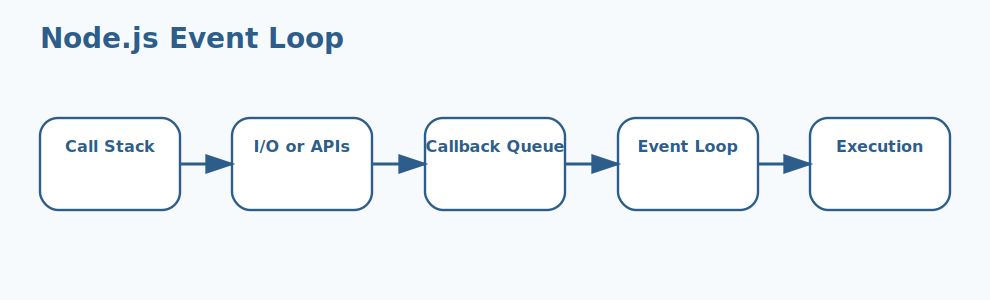

# Node.js Basics Interview Questions


This guide covers node.js basics from interview basics to tricky production scenarios. It follows the corrected format of **100 interview questions for each subtopic**, and every answer includes a real Node.js code example with rotated real-world scenarios so the examples do not repeat verbatim.

## How To Use This Page

- Questions 1-100 cover Runtime & V8.
- Questions 101-200 cover Event loop.
- Questions 201-300 cover Non-blocking I O.
- Questions 301-400 cover Module systems.
- Questions 401-500 cover npm & package metadata.
- Questions 501-600 cover Built-in modules.
- Questions 601-700 cover Async patterns.
- Questions 701-800 cover Streams & buffers.
- Questions 801-900 cover Process & environment.
- Questions 901-1000 cover Scaling strategies.

## 1. Runtime & V8

### Q1.1 What is runtime & v8 in Node.js?

**Answer:**

Runtime & V8 matters in Node.js because it affects how runtime & v8 affects runtime behavior and delivery decisions. In a real system like a high-traffic Node.js API serving customer traffic behind a load balancer, a strong answer should connect the concept to runtime behavior, delivery trade-offs, production debugging, and the way Node.js applications behave under load or failure. A senior-level answer also explains the operational impact so the answer reflects real Node.js engineering instead of textbook definitions.

**Code Example:**

```js
console.log(process.pid, process.cwd());
```

### Q1.2 Why does runtime & v8 fundamentals matter in real Node.js applications?

**Answer:**

Runtime & V8 fundamentals matters in Node.js because it affects how runtime & v8 should be understood before tackling deeper production issues. In a real system like a background worker processing queues and scheduled jobs in production, a strong answer should connect the concept to runtime behavior, delivery trade-offs, production debugging, and the way Node.js applications behave under load or failure. A senior-level answer also explains the operational impact so teams can connect the concept to runtime behavior and operational impact.

**Code Example:**

```js
const crypto = require('node:crypto');
crypto.pbkdf2('secret', 'salt', 100000, 64, 'sha512', console.log);
```

### Q1.3 When should a team focus on runtime & v8 design?

**Answer:**

Runtime & V8 design matters in Node.js because it affects how runtime & v8 influences code structure and operational outcomes. In a real system like a CMS platform handling uploads, downloads, and rich admin workflows, a strong answer should connect the concept to runtime behavior, delivery trade-offs, production debugging, and the way Node.js applications behave under load or failure. A senior-level answer also explains the operational impact so production debugging becomes easier because the mechanics are clearer.

**Code Example:**

```js
const { Worker } = require('node:worker_threads');
new Worker(`console.log('worker running')`, { eval: true });
```

### Q1.4 How would you explain runtime & v8 debugging in a production discussion?

**Answer:**

Runtime & V8 debugging matters in Node.js because it affects how teams investigate problems related to runtime & v8 in production. In a real system like a banking integration service where reliability and observability are tightly controlled, a strong answer should connect the concept to runtime behavior, delivery trade-offs, production debugging, and the way Node.js applications behave under load or failure. A senior-level answer also explains the operational impact so architecture choices become easier to defend in interviews and reviews.

**Code Example:**

```js
const cluster = require('node:cluster');
if (cluster.isPrimary) {
  cluster.fork();
}
```

### Q1.5 What is a common interview trap around runtime & v8 trade-offs?

**Answer:**

Runtime & V8 trade-offs matters in Node.js because it affects how runtime & v8 shapes performance, maintainability, or reliability decisions. In a real system like a healthcare backend where safe error handling and data validation matter deeply, a strong answer should connect the concept to runtime behavior, delivery trade-offs, production debugging, and the way Node.js applications behave under load or failure. A senior-level answer also explains the operational impact so performance, correctness, and maintainability are discussed together.

**Code Example:**

```js
console.log(process.env.UV_THREADPOOL_SIZE || 'default thread pool');
```

### Q1.6 How do you apply runtime & v8 safely in practice?

**Answer:**

Runtime & V8 matters in Node.js because it affects how runtime & v8 affects runtime behavior and delivery decisions. In a real system like a logistics platform coordinating events, retries, and distributed workflows, a strong answer should connect the concept to runtime behavior, delivery trade-offs, production debugging, and the way Node.js applications behave under load or failure. A senior-level answer also explains the operational impact so common Node.js pitfalls are easier to prevent before release.

**Code Example:**

```js
console.log(process.pid, process.cwd());
```

### Q1.7 What production issue usually exposes weak understanding of runtime & v8 fundamentals?

**Answer:**

Runtime & V8 fundamentals matters in Node.js because it affects how runtime & v8 should be understood before tackling deeper production issues. In a real system like an enterprise Express application with many middlewares and shared modules, a strong answer should connect the concept to runtime behavior, delivery trade-offs, production debugging, and the way Node.js applications behave under load or failure. A senior-level answer also explains the operational impact so the codebase stays easier to evolve as traffic and complexity grow.

**Code Example:**

```js
const crypto = require('node:crypto');
crypto.pbkdf2('secret', 'salt', 100000, 64, 'sha512', console.log);
```

### Q1.8 How would a senior engineer justify runtime & v8 design to a team?

**Answer:**

Runtime & V8 design matters in Node.js because it affects how runtime & v8 influences code structure and operational outcomes. In a real system like a real-time dashboard service where event-loop behavior affects user experience, a strong answer should connect the concept to runtime behavior, delivery trade-offs, production debugging, and the way Node.js applications behave under load or failure. A senior-level answer also explains the operational impact so operational trade-offs are visible instead of hidden behind abstractions.

**Code Example:**

```js
const { Worker } = require('node:worker_threads');
new Worker(`console.log('worker running')`, { eval: true });
```

### Q1.9 What trade-off does runtime & v8 debugging introduce?

**Answer:**

Runtime & V8 debugging matters in Node.js because it affects how teams investigate problems related to runtime & v8 in production. In a real system like a containerized Node.js deployment where startup, memory, and scaling all matter, a strong answer should connect the concept to runtime behavior, delivery trade-offs, production debugging, and the way Node.js applications behave under load or failure. A senior-level answer also explains the operational impact so the example ties Node.js internals to practical delivery concerns.

**Code Example:**

```js
const cluster = require('node:cluster');
if (cluster.isPrimary) {
  cluster.fork();
}
```

### Q1.10 How do you answer a tricky follow-up about runtime & v8 trade-offs?

**Answer:**

Runtime & V8 trade-offs matters in Node.js because it affects how runtime & v8 shapes performance, maintainability, or reliability decisions. In a real system like a migration effort from ad hoc scripts to a more maintainable Node.js architecture, a strong answer should connect the concept to runtime behavior, delivery trade-offs, production debugging, and the way Node.js applications behave under load or failure. A senior-level answer also explains the operational impact so new team members can understand the concept from both code and behavior.

**Code Example:**

```js
console.log(process.env.UV_THREADPOOL_SIZE || 'default thread pool');
```

### Q1.11 What is runtime & v8 in Node.js?

**Answer:**

Runtime & V8 matters in Node.js because it affects how runtime & v8 affects runtime behavior and delivery decisions. In a real system like a high-traffic Node.js API serving customer traffic behind a load balancer, a strong answer should connect the concept to runtime behavior, delivery trade-offs, production debugging, and the way Node.js applications behave under load or failure. A senior-level answer also explains the operational impact so the answer reflects real Node.js engineering instead of textbook definitions.

**Code Example:**

```js
console.log(process.pid, process.cwd());
```

### Q1.12 Why does runtime & v8 fundamentals matter in real Node.js applications?

**Answer:**

Runtime & V8 fundamentals matters in Node.js because it affects how runtime & v8 should be understood before tackling deeper production issues. In a real system like a background worker processing queues and scheduled jobs in production, a strong answer should connect the concept to runtime behavior, delivery trade-offs, production debugging, and the way Node.js applications behave under load or failure. A senior-level answer also explains the operational impact so teams can connect the concept to runtime behavior and operational impact.

**Code Example:**

```js
const crypto = require('node:crypto');
crypto.pbkdf2('secret', 'salt', 100000, 64, 'sha512', console.log);
```

### Q1.13 When should a team focus on runtime & v8 design?

**Answer:**

Runtime & V8 design matters in Node.js because it affects how runtime & v8 influences code structure and operational outcomes. In a real system like a CMS platform handling uploads, downloads, and rich admin workflows, a strong answer should connect the concept to runtime behavior, delivery trade-offs, production debugging, and the way Node.js applications behave under load or failure. A senior-level answer also explains the operational impact so production debugging becomes easier because the mechanics are clearer.

**Code Example:**

```js
const { Worker } = require('node:worker_threads');
new Worker(`console.log('worker running')`, { eval: true });
```

### Q1.14 How would you explain runtime & v8 debugging in a production discussion?

**Answer:**

Runtime & V8 debugging matters in Node.js because it affects how teams investigate problems related to runtime & v8 in production. In a real system like a banking integration service where reliability and observability are tightly controlled, a strong answer should connect the concept to runtime behavior, delivery trade-offs, production debugging, and the way Node.js applications behave under load or failure. A senior-level answer also explains the operational impact so architecture choices become easier to defend in interviews and reviews.

**Code Example:**

```js
const cluster = require('node:cluster');
if (cluster.isPrimary) {
  cluster.fork();
}
```

### Q1.15 What is a common interview trap around runtime & v8 trade-offs?

**Answer:**

Runtime & V8 trade-offs matters in Node.js because it affects how runtime & v8 shapes performance, maintainability, or reliability decisions. In a real system like a healthcare backend where safe error handling and data validation matter deeply, a strong answer should connect the concept to runtime behavior, delivery trade-offs, production debugging, and the way Node.js applications behave under load or failure. A senior-level answer also explains the operational impact so performance, correctness, and maintainability are discussed together.

**Code Example:**

```js
console.log(process.env.UV_THREADPOOL_SIZE || 'default thread pool');
```

### Q1.16 How do you apply runtime & v8 safely in practice?

**Answer:**

Runtime & V8 matters in Node.js because it affects how runtime & v8 affects runtime behavior and delivery decisions. In a real system like a logistics platform coordinating events, retries, and distributed workflows, a strong answer should connect the concept to runtime behavior, delivery trade-offs, production debugging, and the way Node.js applications behave under load or failure. A senior-level answer also explains the operational impact so common Node.js pitfalls are easier to prevent before release.

**Code Example:**

```js
console.log(process.pid, process.cwd());
```

### Q1.17 What production issue usually exposes weak understanding of runtime & v8 fundamentals?

**Answer:**

Runtime & V8 fundamentals matters in Node.js because it affects how runtime & v8 should be understood before tackling deeper production issues. In a real system like an enterprise Express application with many middlewares and shared modules, a strong answer should connect the concept to runtime behavior, delivery trade-offs, production debugging, and the way Node.js applications behave under load or failure. A senior-level answer also explains the operational impact so the codebase stays easier to evolve as traffic and complexity grow.

**Code Example:**

```js
const crypto = require('node:crypto');
crypto.pbkdf2('secret', 'salt', 100000, 64, 'sha512', console.log);
```

### Q1.18 How would a senior engineer justify runtime & v8 design to a team?

**Answer:**

Runtime & V8 design matters in Node.js because it affects how runtime & v8 influences code structure and operational outcomes. In a real system like a real-time dashboard service where event-loop behavior affects user experience, a strong answer should connect the concept to runtime behavior, delivery trade-offs, production debugging, and the way Node.js applications behave under load or failure. A senior-level answer also explains the operational impact so operational trade-offs are visible instead of hidden behind abstractions.

**Code Example:**

```js
const { Worker } = require('node:worker_threads');
new Worker(`console.log('worker running')`, { eval: true });
```

### Q1.19 What trade-off does runtime & v8 debugging introduce?

**Answer:**

Runtime & V8 debugging matters in Node.js because it affects how teams investigate problems related to runtime & v8 in production. In a real system like a containerized Node.js deployment where startup, memory, and scaling all matter, a strong answer should connect the concept to runtime behavior, delivery trade-offs, production debugging, and the way Node.js applications behave under load or failure. A senior-level answer also explains the operational impact so the example ties Node.js internals to practical delivery concerns.

**Code Example:**

```js
const cluster = require('node:cluster');
if (cluster.isPrimary) {
  cluster.fork();
}
```

### Q1.20 How do you answer a tricky follow-up about runtime & v8 trade-offs?

**Answer:**

Runtime & V8 trade-offs matters in Node.js because it affects how runtime & v8 shapes performance, maintainability, or reliability decisions. In a real system like a migration effort from ad hoc scripts to a more maintainable Node.js architecture, a strong answer should connect the concept to runtime behavior, delivery trade-offs, production debugging, and the way Node.js applications behave under load or failure. A senior-level answer also explains the operational impact so new team members can understand the concept from both code and behavior.

**Code Example:**

```js
console.log(process.env.UV_THREADPOOL_SIZE || 'default thread pool');
```

### Q1.21 What is runtime & v8 in Node.js?

**Answer:**

Runtime & V8 matters in Node.js because it affects how runtime & v8 affects runtime behavior and delivery decisions. In a real system like a high-traffic Node.js API serving customer traffic behind a load balancer, a strong answer should connect the concept to runtime behavior, delivery trade-offs, production debugging, and the way Node.js applications behave under load or failure. A senior-level answer also explains the operational impact so the answer reflects real Node.js engineering instead of textbook definitions.

**Code Example:**

```js
console.log(process.pid, process.cwd());
```

### Q1.22 Why does runtime & v8 fundamentals matter in real Node.js applications?

**Answer:**

Runtime & V8 fundamentals matters in Node.js because it affects how runtime & v8 should be understood before tackling deeper production issues. In a real system like a background worker processing queues and scheduled jobs in production, a strong answer should connect the concept to runtime behavior, delivery trade-offs, production debugging, and the way Node.js applications behave under load or failure. A senior-level answer also explains the operational impact so teams can connect the concept to runtime behavior and operational impact.

**Code Example:**

```js
const crypto = require('node:crypto');
crypto.pbkdf2('secret', 'salt', 100000, 64, 'sha512', console.log);
```

### Q1.23 When should a team focus on runtime & v8 design?

**Answer:**

Runtime & V8 design matters in Node.js because it affects how runtime & v8 influences code structure and operational outcomes. In a real system like a CMS platform handling uploads, downloads, and rich admin workflows, a strong answer should connect the concept to runtime behavior, delivery trade-offs, production debugging, and the way Node.js applications behave under load or failure. A senior-level answer also explains the operational impact so production debugging becomes easier because the mechanics are clearer.

**Code Example:**

```js
const { Worker } = require('node:worker_threads');
new Worker(`console.log('worker running')`, { eval: true });
```

### Q1.24 How would you explain runtime & v8 debugging in a production discussion?

**Answer:**

Runtime & V8 debugging matters in Node.js because it affects how teams investigate problems related to runtime & v8 in production. In a real system like a banking integration service where reliability and observability are tightly controlled, a strong answer should connect the concept to runtime behavior, delivery trade-offs, production debugging, and the way Node.js applications behave under load or failure. A senior-level answer also explains the operational impact so architecture choices become easier to defend in interviews and reviews.

**Code Example:**

```js
const cluster = require('node:cluster');
if (cluster.isPrimary) {
  cluster.fork();
}
```

### Q1.25 What is a common interview trap around runtime & v8 trade-offs?

**Answer:**

Runtime & V8 trade-offs matters in Node.js because it affects how runtime & v8 shapes performance, maintainability, or reliability decisions. In a real system like a healthcare backend where safe error handling and data validation matter deeply, a strong answer should connect the concept to runtime behavior, delivery trade-offs, production debugging, and the way Node.js applications behave under load or failure. A senior-level answer also explains the operational impact so performance, correctness, and maintainability are discussed together.

**Code Example:**

```js
console.log(process.env.UV_THREADPOOL_SIZE || 'default thread pool');
```

### Q1.26 How do you apply runtime & v8 safely in practice?

**Answer:**

Runtime & V8 matters in Node.js because it affects how runtime & v8 affects runtime behavior and delivery decisions. In a real system like a logistics platform coordinating events, retries, and distributed workflows, a strong answer should connect the concept to runtime behavior, delivery trade-offs, production debugging, and the way Node.js applications behave under load or failure. A senior-level answer also explains the operational impact so common Node.js pitfalls are easier to prevent before release.

**Code Example:**

```js
console.log(process.pid, process.cwd());
```

### Q1.27 What production issue usually exposes weak understanding of runtime & v8 fundamentals?

**Answer:**

Runtime & V8 fundamentals matters in Node.js because it affects how runtime & v8 should be understood before tackling deeper production issues. In a real system like an enterprise Express application with many middlewares and shared modules, a strong answer should connect the concept to runtime behavior, delivery trade-offs, production debugging, and the way Node.js applications behave under load or failure. A senior-level answer also explains the operational impact so the codebase stays easier to evolve as traffic and complexity grow.

**Code Example:**

```js
const crypto = require('node:crypto');
crypto.pbkdf2('secret', 'salt', 100000, 64, 'sha512', console.log);
```

### Q1.28 How would a senior engineer justify runtime & v8 design to a team?

**Answer:**

Runtime & V8 design matters in Node.js because it affects how runtime & v8 influences code structure and operational outcomes. In a real system like a real-time dashboard service where event-loop behavior affects user experience, a strong answer should connect the concept to runtime behavior, delivery trade-offs, production debugging, and the way Node.js applications behave under load or failure. A senior-level answer also explains the operational impact so operational trade-offs are visible instead of hidden behind abstractions.

**Code Example:**

```js
const { Worker } = require('node:worker_threads');
new Worker(`console.log('worker running')`, { eval: true });
```

### Q1.29 What trade-off does runtime & v8 debugging introduce?

**Answer:**

Runtime & V8 debugging matters in Node.js because it affects how teams investigate problems related to runtime & v8 in production. In a real system like a containerized Node.js deployment where startup, memory, and scaling all matter, a strong answer should connect the concept to runtime behavior, delivery trade-offs, production debugging, and the way Node.js applications behave under load or failure. A senior-level answer also explains the operational impact so the example ties Node.js internals to practical delivery concerns.

**Code Example:**

```js
const cluster = require('node:cluster');
if (cluster.isPrimary) {
  cluster.fork();
}
```

### Q1.30 How do you answer a tricky follow-up about runtime & v8 trade-offs?

**Answer:**

Runtime & V8 trade-offs matters in Node.js because it affects how runtime & v8 shapes performance, maintainability, or reliability decisions. In a real system like a migration effort from ad hoc scripts to a more maintainable Node.js architecture, a strong answer should connect the concept to runtime behavior, delivery trade-offs, production debugging, and the way Node.js applications behave under load or failure. A senior-level answer also explains the operational impact so new team members can understand the concept from both code and behavior.

**Code Example:**

```js
console.log(process.env.UV_THREADPOOL_SIZE || 'default thread pool');
```

### Q1.31 What is runtime & v8 in Node.js?

**Answer:**

Runtime & V8 matters in Node.js because it affects how runtime & v8 affects runtime behavior and delivery decisions. In a real system like a high-traffic Node.js API serving customer traffic behind a load balancer, a strong answer should connect the concept to runtime behavior, delivery trade-offs, production debugging, and the way Node.js applications behave under load or failure. A senior-level answer also explains the operational impact so the answer reflects real Node.js engineering instead of textbook definitions.

**Code Example:**

```js
console.log(process.pid, process.cwd());
```

### Q1.32 Why does runtime & v8 fundamentals matter in real Node.js applications?

**Answer:**

Runtime & V8 fundamentals matters in Node.js because it affects how runtime & v8 should be understood before tackling deeper production issues. In a real system like a background worker processing queues and scheduled jobs in production, a strong answer should connect the concept to runtime behavior, delivery trade-offs, production debugging, and the way Node.js applications behave under load or failure. A senior-level answer also explains the operational impact so teams can connect the concept to runtime behavior and operational impact.

**Code Example:**

```js
const crypto = require('node:crypto');
crypto.pbkdf2('secret', 'salt', 100000, 64, 'sha512', console.log);
```

### Q1.33 When should a team focus on runtime & v8 design?

**Answer:**

Runtime & V8 design matters in Node.js because it affects how runtime & v8 influences code structure and operational outcomes. In a real system like a CMS platform handling uploads, downloads, and rich admin workflows, a strong answer should connect the concept to runtime behavior, delivery trade-offs, production debugging, and the way Node.js applications behave under load or failure. A senior-level answer also explains the operational impact so production debugging becomes easier because the mechanics are clearer.

**Code Example:**

```js
const { Worker } = require('node:worker_threads');
new Worker(`console.log('worker running')`, { eval: true });
```

### Q1.34 How would you explain runtime & v8 debugging in a production discussion?

**Answer:**

Runtime & V8 debugging matters in Node.js because it affects how teams investigate problems related to runtime & v8 in production. In a real system like a banking integration service where reliability and observability are tightly controlled, a strong answer should connect the concept to runtime behavior, delivery trade-offs, production debugging, and the way Node.js applications behave under load or failure. A senior-level answer also explains the operational impact so architecture choices become easier to defend in interviews and reviews.

**Code Example:**

```js
const cluster = require('node:cluster');
if (cluster.isPrimary) {
  cluster.fork();
}
```

### Q1.35 What is a common interview trap around runtime & v8 trade-offs?

**Answer:**

Runtime & V8 trade-offs matters in Node.js because it affects how runtime & v8 shapes performance, maintainability, or reliability decisions. In a real system like a healthcare backend where safe error handling and data validation matter deeply, a strong answer should connect the concept to runtime behavior, delivery trade-offs, production debugging, and the way Node.js applications behave under load or failure. A senior-level answer also explains the operational impact so performance, correctness, and maintainability are discussed together.

**Code Example:**

```js
console.log(process.env.UV_THREADPOOL_SIZE || 'default thread pool');
```

### Q1.36 How do you apply runtime & v8 safely in practice?

**Answer:**

Runtime & V8 matters in Node.js because it affects how runtime & v8 affects runtime behavior and delivery decisions. In a real system like a logistics platform coordinating events, retries, and distributed workflows, a strong answer should connect the concept to runtime behavior, delivery trade-offs, production debugging, and the way Node.js applications behave under load or failure. A senior-level answer also explains the operational impact so common Node.js pitfalls are easier to prevent before release.

**Code Example:**

```js
console.log(process.pid, process.cwd());
```

### Q1.37 What production issue usually exposes weak understanding of runtime & v8 fundamentals?

**Answer:**

Runtime & V8 fundamentals matters in Node.js because it affects how runtime & v8 should be understood before tackling deeper production issues. In a real system like an enterprise Express application with many middlewares and shared modules, a strong answer should connect the concept to runtime behavior, delivery trade-offs, production debugging, and the way Node.js applications behave under load or failure. A senior-level answer also explains the operational impact so the codebase stays easier to evolve as traffic and complexity grow.

**Code Example:**

```js
const crypto = require('node:crypto');
crypto.pbkdf2('secret', 'salt', 100000, 64, 'sha512', console.log);
```

### Q1.38 How would a senior engineer justify runtime & v8 design to a team?

**Answer:**

Runtime & V8 design matters in Node.js because it affects how runtime & v8 influences code structure and operational outcomes. In a real system like a real-time dashboard service where event-loop behavior affects user experience, a strong answer should connect the concept to runtime behavior, delivery trade-offs, production debugging, and the way Node.js applications behave under load or failure. A senior-level answer also explains the operational impact so operational trade-offs are visible instead of hidden behind abstractions.

**Code Example:**

```js
const { Worker } = require('node:worker_threads');
new Worker(`console.log('worker running')`, { eval: true });
```

### Q1.39 What trade-off does runtime & v8 debugging introduce?

**Answer:**

Runtime & V8 debugging matters in Node.js because it affects how teams investigate problems related to runtime & v8 in production. In a real system like a containerized Node.js deployment where startup, memory, and scaling all matter, a strong answer should connect the concept to runtime behavior, delivery trade-offs, production debugging, and the way Node.js applications behave under load or failure. A senior-level answer also explains the operational impact so the example ties Node.js internals to practical delivery concerns.

**Code Example:**

```js
const cluster = require('node:cluster');
if (cluster.isPrimary) {
  cluster.fork();
}
```

### Q1.40 How do you answer a tricky follow-up about runtime & v8 trade-offs?

**Answer:**

Runtime & V8 trade-offs matters in Node.js because it affects how runtime & v8 shapes performance, maintainability, or reliability decisions. In a real system like a migration effort from ad hoc scripts to a more maintainable Node.js architecture, a strong answer should connect the concept to runtime behavior, delivery trade-offs, production debugging, and the way Node.js applications behave under load or failure. A senior-level answer also explains the operational impact so new team members can understand the concept from both code and behavior.

**Code Example:**

```js
console.log(process.env.UV_THREADPOOL_SIZE || 'default thread pool');
```

### Q1.41 What is runtime & v8 in Node.js?

**Answer:**

Runtime & V8 matters in Node.js because it affects how runtime & v8 affects runtime behavior and delivery decisions. In a real system like a high-traffic Node.js API serving customer traffic behind a load balancer, a strong answer should connect the concept to runtime behavior, delivery trade-offs, production debugging, and the way Node.js applications behave under load or failure. A senior-level answer also explains the operational impact so the answer reflects real Node.js engineering instead of textbook definitions.

**Code Example:**

```js
console.log(process.pid, process.cwd());
```

### Q1.42 Why does runtime & v8 fundamentals matter in real Node.js applications?

**Answer:**

Runtime & V8 fundamentals matters in Node.js because it affects how runtime & v8 should be understood before tackling deeper production issues. In a real system like a background worker processing queues and scheduled jobs in production, a strong answer should connect the concept to runtime behavior, delivery trade-offs, production debugging, and the way Node.js applications behave under load or failure. A senior-level answer also explains the operational impact so teams can connect the concept to runtime behavior and operational impact.

**Code Example:**

```js
const crypto = require('node:crypto');
crypto.pbkdf2('secret', 'salt', 100000, 64, 'sha512', console.log);
```

### Q1.43 When should a team focus on runtime & v8 design?

**Answer:**

Runtime & V8 design matters in Node.js because it affects how runtime & v8 influences code structure and operational outcomes. In a real system like a CMS platform handling uploads, downloads, and rich admin workflows, a strong answer should connect the concept to runtime behavior, delivery trade-offs, production debugging, and the way Node.js applications behave under load or failure. A senior-level answer also explains the operational impact so production debugging becomes easier because the mechanics are clearer.

**Code Example:**

```js
const { Worker } = require('node:worker_threads');
new Worker(`console.log('worker running')`, { eval: true });
```

### Q1.44 How would you explain runtime & v8 debugging in a production discussion?

**Answer:**

Runtime & V8 debugging matters in Node.js because it affects how teams investigate problems related to runtime & v8 in production. In a real system like a banking integration service where reliability and observability are tightly controlled, a strong answer should connect the concept to runtime behavior, delivery trade-offs, production debugging, and the way Node.js applications behave under load or failure. A senior-level answer also explains the operational impact so architecture choices become easier to defend in interviews and reviews.

**Code Example:**

```js
const cluster = require('node:cluster');
if (cluster.isPrimary) {
  cluster.fork();
}
```

### Q1.45 What is a common interview trap around runtime & v8 trade-offs?

**Answer:**

Runtime & V8 trade-offs matters in Node.js because it affects how runtime & v8 shapes performance, maintainability, or reliability decisions. In a real system like a healthcare backend where safe error handling and data validation matter deeply, a strong answer should connect the concept to runtime behavior, delivery trade-offs, production debugging, and the way Node.js applications behave under load or failure. A senior-level answer also explains the operational impact so performance, correctness, and maintainability are discussed together.

**Code Example:**

```js
console.log(process.env.UV_THREADPOOL_SIZE || 'default thread pool');
```

### Q1.46 How do you apply runtime & v8 safely in practice?

**Answer:**

Runtime & V8 matters in Node.js because it affects how runtime & v8 affects runtime behavior and delivery decisions. In a real system like a logistics platform coordinating events, retries, and distributed workflows, a strong answer should connect the concept to runtime behavior, delivery trade-offs, production debugging, and the way Node.js applications behave under load or failure. A senior-level answer also explains the operational impact so common Node.js pitfalls are easier to prevent before release.

**Code Example:**

```js
console.log(process.pid, process.cwd());
```

### Q1.47 What production issue usually exposes weak understanding of runtime & v8 fundamentals?

**Answer:**

Runtime & V8 fundamentals matters in Node.js because it affects how runtime & v8 should be understood before tackling deeper production issues. In a real system like an enterprise Express application with many middlewares and shared modules, a strong answer should connect the concept to runtime behavior, delivery trade-offs, production debugging, and the way Node.js applications behave under load or failure. A senior-level answer also explains the operational impact so the codebase stays easier to evolve as traffic and complexity grow.

**Code Example:**

```js
const crypto = require('node:crypto');
crypto.pbkdf2('secret', 'salt', 100000, 64, 'sha512', console.log);
```

### Q1.48 How would a senior engineer justify runtime & v8 design to a team?

**Answer:**

Runtime & V8 design matters in Node.js because it affects how runtime & v8 influences code structure and operational outcomes. In a real system like a real-time dashboard service where event-loop behavior affects user experience, a strong answer should connect the concept to runtime behavior, delivery trade-offs, production debugging, and the way Node.js applications behave under load or failure. A senior-level answer also explains the operational impact so operational trade-offs are visible instead of hidden behind abstractions.

**Code Example:**

```js
const { Worker } = require('node:worker_threads');
new Worker(`console.log('worker running')`, { eval: true });
```

### Q1.49 What trade-off does runtime & v8 debugging introduce?

**Answer:**

Runtime & V8 debugging matters in Node.js because it affects how teams investigate problems related to runtime & v8 in production. In a real system like a containerized Node.js deployment where startup, memory, and scaling all matter, a strong answer should connect the concept to runtime behavior, delivery trade-offs, production debugging, and the way Node.js applications behave under load or failure. A senior-level answer also explains the operational impact so the example ties Node.js internals to practical delivery concerns.

**Code Example:**

```js
const cluster = require('node:cluster');
if (cluster.isPrimary) {
  cluster.fork();
}
```

### Q1.50 How do you answer a tricky follow-up about runtime & v8 trade-offs?

**Answer:**

Runtime & V8 trade-offs matters in Node.js because it affects how runtime & v8 shapes performance, maintainability, or reliability decisions. In a real system like a migration effort from ad hoc scripts to a more maintainable Node.js architecture, a strong answer should connect the concept to runtime behavior, delivery trade-offs, production debugging, and the way Node.js applications behave under load or failure. A senior-level answer also explains the operational impact so new team members can understand the concept from both code and behavior.

**Code Example:**

```js
console.log(process.env.UV_THREADPOOL_SIZE || 'default thread pool');
```

### Q1.51 What is runtime & v8 in Node.js?

**Answer:**

Runtime & V8 matters in Node.js because it affects how runtime & v8 affects runtime behavior and delivery decisions. In a real system like a high-traffic Node.js API serving customer traffic behind a load balancer, a strong answer should connect the concept to runtime behavior, delivery trade-offs, production debugging, and the way Node.js applications behave under load or failure. A senior-level answer also explains the operational impact so the answer reflects real Node.js engineering instead of textbook definitions.

**Code Example:**

```js
console.log(process.pid, process.cwd());
```

### Q1.52 Why does runtime & v8 fundamentals matter in real Node.js applications?

**Answer:**

Runtime & V8 fundamentals matters in Node.js because it affects how runtime & v8 should be understood before tackling deeper production issues. In a real system like a background worker processing queues and scheduled jobs in production, a strong answer should connect the concept to runtime behavior, delivery trade-offs, production debugging, and the way Node.js applications behave under load or failure. A senior-level answer also explains the operational impact so teams can connect the concept to runtime behavior and operational impact.

**Code Example:**

```js
const crypto = require('node:crypto');
crypto.pbkdf2('secret', 'salt', 100000, 64, 'sha512', console.log);
```

### Q1.53 When should a team focus on runtime & v8 design?

**Answer:**

Runtime & V8 design matters in Node.js because it affects how runtime & v8 influences code structure and operational outcomes. In a real system like a CMS platform handling uploads, downloads, and rich admin workflows, a strong answer should connect the concept to runtime behavior, delivery trade-offs, production debugging, and the way Node.js applications behave under load or failure. A senior-level answer also explains the operational impact so production debugging becomes easier because the mechanics are clearer.

**Code Example:**

```js
const { Worker } = require('node:worker_threads');
new Worker(`console.log('worker running')`, { eval: true });
```

### Q1.54 How would you explain runtime & v8 debugging in a production discussion?

**Answer:**

Runtime & V8 debugging matters in Node.js because it affects how teams investigate problems related to runtime & v8 in production. In a real system like a banking integration service where reliability and observability are tightly controlled, a strong answer should connect the concept to runtime behavior, delivery trade-offs, production debugging, and the way Node.js applications behave under load or failure. A senior-level answer also explains the operational impact so architecture choices become easier to defend in interviews and reviews.

**Code Example:**

```js
const cluster = require('node:cluster');
if (cluster.isPrimary) {
  cluster.fork();
}
```

### Q1.55 What is a common interview trap around runtime & v8 trade-offs?

**Answer:**

Runtime & V8 trade-offs matters in Node.js because it affects how runtime & v8 shapes performance, maintainability, or reliability decisions. In a real system like a healthcare backend where safe error handling and data validation matter deeply, a strong answer should connect the concept to runtime behavior, delivery trade-offs, production debugging, and the way Node.js applications behave under load or failure. A senior-level answer also explains the operational impact so performance, correctness, and maintainability are discussed together.

**Code Example:**

```js
console.log(process.env.UV_THREADPOOL_SIZE || 'default thread pool');
```

### Q1.56 How do you apply runtime & v8 safely in practice?

**Answer:**

Runtime & V8 matters in Node.js because it affects how runtime & v8 affects runtime behavior and delivery decisions. In a real system like a logistics platform coordinating events, retries, and distributed workflows, a strong answer should connect the concept to runtime behavior, delivery trade-offs, production debugging, and the way Node.js applications behave under load or failure. A senior-level answer also explains the operational impact so common Node.js pitfalls are easier to prevent before release.

**Code Example:**

```js
console.log(process.pid, process.cwd());
```

### Q1.57 What production issue usually exposes weak understanding of runtime & v8 fundamentals?

**Answer:**

Runtime & V8 fundamentals matters in Node.js because it affects how runtime & v8 should be understood before tackling deeper production issues. In a real system like an enterprise Express application with many middlewares and shared modules, a strong answer should connect the concept to runtime behavior, delivery trade-offs, production debugging, and the way Node.js applications behave under load or failure. A senior-level answer also explains the operational impact so the codebase stays easier to evolve as traffic and complexity grow.

**Code Example:**

```js
const crypto = require('node:crypto');
crypto.pbkdf2('secret', 'salt', 100000, 64, 'sha512', console.log);
```

### Q1.58 How would a senior engineer justify runtime & v8 design to a team?

**Answer:**

Runtime & V8 design matters in Node.js because it affects how runtime & v8 influences code structure and operational outcomes. In a real system like a real-time dashboard service where event-loop behavior affects user experience, a strong answer should connect the concept to runtime behavior, delivery trade-offs, production debugging, and the way Node.js applications behave under load or failure. A senior-level answer also explains the operational impact so operational trade-offs are visible instead of hidden behind abstractions.

**Code Example:**

```js
const { Worker } = require('node:worker_threads');
new Worker(`console.log('worker running')`, { eval: true });
```

### Q1.59 What trade-off does runtime & v8 debugging introduce?

**Answer:**

Runtime & V8 debugging matters in Node.js because it affects how teams investigate problems related to runtime & v8 in production. In a real system like a containerized Node.js deployment where startup, memory, and scaling all matter, a strong answer should connect the concept to runtime behavior, delivery trade-offs, production debugging, and the way Node.js applications behave under load or failure. A senior-level answer also explains the operational impact so the example ties Node.js internals to practical delivery concerns.

**Code Example:**

```js
const cluster = require('node:cluster');
if (cluster.isPrimary) {
  cluster.fork();
}
```

### Q1.60 How do you answer a tricky follow-up about runtime & v8 trade-offs?

**Answer:**

Runtime & V8 trade-offs matters in Node.js because it affects how runtime & v8 shapes performance, maintainability, or reliability decisions. In a real system like a migration effort from ad hoc scripts to a more maintainable Node.js architecture, a strong answer should connect the concept to runtime behavior, delivery trade-offs, production debugging, and the way Node.js applications behave under load or failure. A senior-level answer also explains the operational impact so new team members can understand the concept from both code and behavior.

**Code Example:**

```js
console.log(process.env.UV_THREADPOOL_SIZE || 'default thread pool');
```

### Q1.61 What is runtime & v8 in Node.js?

**Answer:**

Runtime & V8 matters in Node.js because it affects how runtime & v8 affects runtime behavior and delivery decisions. In a real system like a high-traffic Node.js API serving customer traffic behind a load balancer, a strong answer should connect the concept to runtime behavior, delivery trade-offs, production debugging, and the way Node.js applications behave under load or failure. A senior-level answer also explains the operational impact so the answer reflects real Node.js engineering instead of textbook definitions.

**Code Example:**

```js
console.log(process.pid, process.cwd());
```

### Q1.62 Why does runtime & v8 fundamentals matter in real Node.js applications?

**Answer:**

Runtime & V8 fundamentals matters in Node.js because it affects how runtime & v8 should be understood before tackling deeper production issues. In a real system like a background worker processing queues and scheduled jobs in production, a strong answer should connect the concept to runtime behavior, delivery trade-offs, production debugging, and the way Node.js applications behave under load or failure. A senior-level answer also explains the operational impact so teams can connect the concept to runtime behavior and operational impact.

**Code Example:**

```js
const crypto = require('node:crypto');
crypto.pbkdf2('secret', 'salt', 100000, 64, 'sha512', console.log);
```

### Q1.63 When should a team focus on runtime & v8 design?

**Answer:**

Runtime & V8 design matters in Node.js because it affects how runtime & v8 influences code structure and operational outcomes. In a real system like a CMS platform handling uploads, downloads, and rich admin workflows, a strong answer should connect the concept to runtime behavior, delivery trade-offs, production debugging, and the way Node.js applications behave under load or failure. A senior-level answer also explains the operational impact so production debugging becomes easier because the mechanics are clearer.

**Code Example:**

```js
const { Worker } = require('node:worker_threads');
new Worker(`console.log('worker running')`, { eval: true });
```

### Q1.64 How would you explain runtime & v8 debugging in a production discussion?

**Answer:**

Runtime & V8 debugging matters in Node.js because it affects how teams investigate problems related to runtime & v8 in production. In a real system like a banking integration service where reliability and observability are tightly controlled, a strong answer should connect the concept to runtime behavior, delivery trade-offs, production debugging, and the way Node.js applications behave under load or failure. A senior-level answer also explains the operational impact so architecture choices become easier to defend in interviews and reviews.

**Code Example:**

```js
const cluster = require('node:cluster');
if (cluster.isPrimary) {
  cluster.fork();
}
```

### Q1.65 What is a common interview trap around runtime & v8 trade-offs?

**Answer:**

Runtime & V8 trade-offs matters in Node.js because it affects how runtime & v8 shapes performance, maintainability, or reliability decisions. In a real system like a healthcare backend where safe error handling and data validation matter deeply, a strong answer should connect the concept to runtime behavior, delivery trade-offs, production debugging, and the way Node.js applications behave under load or failure. A senior-level answer also explains the operational impact so performance, correctness, and maintainability are discussed together.

**Code Example:**

```js
console.log(process.env.UV_THREADPOOL_SIZE || 'default thread pool');
```

### Q1.66 How do you apply runtime & v8 safely in practice?

**Answer:**

Runtime & V8 matters in Node.js because it affects how runtime & v8 affects runtime behavior and delivery decisions. In a real system like a logistics platform coordinating events, retries, and distributed workflows, a strong answer should connect the concept to runtime behavior, delivery trade-offs, production debugging, and the way Node.js applications behave under load or failure. A senior-level answer also explains the operational impact so common Node.js pitfalls are easier to prevent before release.

**Code Example:**

```js
console.log(process.pid, process.cwd());
```

### Q1.67 What production issue usually exposes weak understanding of runtime & v8 fundamentals?

**Answer:**

Runtime & V8 fundamentals matters in Node.js because it affects how runtime & v8 should be understood before tackling deeper production issues. In a real system like an enterprise Express application with many middlewares and shared modules, a strong answer should connect the concept to runtime behavior, delivery trade-offs, production debugging, and the way Node.js applications behave under load or failure. A senior-level answer also explains the operational impact so the codebase stays easier to evolve as traffic and complexity grow.

**Code Example:**

```js
const crypto = require('node:crypto');
crypto.pbkdf2('secret', 'salt', 100000, 64, 'sha512', console.log);
```

### Q1.68 How would a senior engineer justify runtime & v8 design to a team?

**Answer:**

Runtime & V8 design matters in Node.js because it affects how runtime & v8 influences code structure and operational outcomes. In a real system like a real-time dashboard service where event-loop behavior affects user experience, a strong answer should connect the concept to runtime behavior, delivery trade-offs, production debugging, and the way Node.js applications behave under load or failure. A senior-level answer also explains the operational impact so operational trade-offs are visible instead of hidden behind abstractions.

**Code Example:**

```js
const { Worker } = require('node:worker_threads');
new Worker(`console.log('worker running')`, { eval: true });
```

### Q1.69 What trade-off does runtime & v8 debugging introduce?

**Answer:**

Runtime & V8 debugging matters in Node.js because it affects how teams investigate problems related to runtime & v8 in production. In a real system like a containerized Node.js deployment where startup, memory, and scaling all matter, a strong answer should connect the concept to runtime behavior, delivery trade-offs, production debugging, and the way Node.js applications behave under load or failure. A senior-level answer also explains the operational impact so the example ties Node.js internals to practical delivery concerns.

**Code Example:**

```js
const cluster = require('node:cluster');
if (cluster.isPrimary) {
  cluster.fork();
}
```

### Q1.70 How do you answer a tricky follow-up about runtime & v8 trade-offs?

**Answer:**

Runtime & V8 trade-offs matters in Node.js because it affects how runtime & v8 shapes performance, maintainability, or reliability decisions. In a real system like a migration effort from ad hoc scripts to a more maintainable Node.js architecture, a strong answer should connect the concept to runtime behavior, delivery trade-offs, production debugging, and the way Node.js applications behave under load or failure. A senior-level answer also explains the operational impact so new team members can understand the concept from both code and behavior.

**Code Example:**

```js
console.log(process.env.UV_THREADPOOL_SIZE || 'default thread pool');
```

### Q1.71 What is runtime & v8 in Node.js?

**Answer:**

Runtime & V8 matters in Node.js because it affects how runtime & v8 affects runtime behavior and delivery decisions. In a real system like a high-traffic Node.js API serving customer traffic behind a load balancer, a strong answer should connect the concept to runtime behavior, delivery trade-offs, production debugging, and the way Node.js applications behave under load or failure. A senior-level answer also explains the operational impact so the answer reflects real Node.js engineering instead of textbook definitions.

**Code Example:**

```js
console.log(process.pid, process.cwd());
```

### Q1.72 Why does runtime & v8 fundamentals matter in real Node.js applications?

**Answer:**

Runtime & V8 fundamentals matters in Node.js because it affects how runtime & v8 should be understood before tackling deeper production issues. In a real system like a background worker processing queues and scheduled jobs in production, a strong answer should connect the concept to runtime behavior, delivery trade-offs, production debugging, and the way Node.js applications behave under load or failure. A senior-level answer also explains the operational impact so teams can connect the concept to runtime behavior and operational impact.

**Code Example:**

```js
const crypto = require('node:crypto');
crypto.pbkdf2('secret', 'salt', 100000, 64, 'sha512', console.log);
```

### Q1.73 When should a team focus on runtime & v8 design?

**Answer:**

Runtime & V8 design matters in Node.js because it affects how runtime & v8 influences code structure and operational outcomes. In a real system like a CMS platform handling uploads, downloads, and rich admin workflows, a strong answer should connect the concept to runtime behavior, delivery trade-offs, production debugging, and the way Node.js applications behave under load or failure. A senior-level answer also explains the operational impact so production debugging becomes easier because the mechanics are clearer.

**Code Example:**

```js
const { Worker } = require('node:worker_threads');
new Worker(`console.log('worker running')`, { eval: true });
```

### Q1.74 How would you explain runtime & v8 debugging in a production discussion?

**Answer:**

Runtime & V8 debugging matters in Node.js because it affects how teams investigate problems related to runtime & v8 in production. In a real system like a banking integration service where reliability and observability are tightly controlled, a strong answer should connect the concept to runtime behavior, delivery trade-offs, production debugging, and the way Node.js applications behave under load or failure. A senior-level answer also explains the operational impact so architecture choices become easier to defend in interviews and reviews.

**Code Example:**

```js
const cluster = require('node:cluster');
if (cluster.isPrimary) {
  cluster.fork();
}
```

### Q1.75 What is a common interview trap around runtime & v8 trade-offs?

**Answer:**

Runtime & V8 trade-offs matters in Node.js because it affects how runtime & v8 shapes performance, maintainability, or reliability decisions. In a real system like a healthcare backend where safe error handling and data validation matter deeply, a strong answer should connect the concept to runtime behavior, delivery trade-offs, production debugging, and the way Node.js applications behave under load or failure. A senior-level answer also explains the operational impact so performance, correctness, and maintainability are discussed together.

**Code Example:**

```js
console.log(process.env.UV_THREADPOOL_SIZE || 'default thread pool');
```

### Q1.76 How do you apply runtime & v8 safely in practice?

**Answer:**

Runtime & V8 matters in Node.js because it affects how runtime & v8 affects runtime behavior and delivery decisions. In a real system like a logistics platform coordinating events, retries, and distributed workflows, a strong answer should connect the concept to runtime behavior, delivery trade-offs, production debugging, and the way Node.js applications behave under load or failure. A senior-level answer also explains the operational impact so common Node.js pitfalls are easier to prevent before release.

**Code Example:**

```js
console.log(process.pid, process.cwd());
```

### Q1.77 What production issue usually exposes weak understanding of runtime & v8 fundamentals?

**Answer:**

Runtime & V8 fundamentals matters in Node.js because it affects how runtime & v8 should be understood before tackling deeper production issues. In a real system like an enterprise Express application with many middlewares and shared modules, a strong answer should connect the concept to runtime behavior, delivery trade-offs, production debugging, and the way Node.js applications behave under load or failure. A senior-level answer also explains the operational impact so the codebase stays easier to evolve as traffic and complexity grow.

**Code Example:**

```js
const crypto = require('node:crypto');
crypto.pbkdf2('secret', 'salt', 100000, 64, 'sha512', console.log);
```

### Q1.78 How would a senior engineer justify runtime & v8 design to a team?

**Answer:**

Runtime & V8 design matters in Node.js because it affects how runtime & v8 influences code structure and operational outcomes. In a real system like a real-time dashboard service where event-loop behavior affects user experience, a strong answer should connect the concept to runtime behavior, delivery trade-offs, production debugging, and the way Node.js applications behave under load or failure. A senior-level answer also explains the operational impact so operational trade-offs are visible instead of hidden behind abstractions.

**Code Example:**

```js
const { Worker } = require('node:worker_threads');
new Worker(`console.log('worker running')`, { eval: true });
```

### Q1.79 What trade-off does runtime & v8 debugging introduce?

**Answer:**

Runtime & V8 debugging matters in Node.js because it affects how teams investigate problems related to runtime & v8 in production. In a real system like a containerized Node.js deployment where startup, memory, and scaling all matter, a strong answer should connect the concept to runtime behavior, delivery trade-offs, production debugging, and the way Node.js applications behave under load or failure. A senior-level answer also explains the operational impact so the example ties Node.js internals to practical delivery concerns.

**Code Example:**

```js
const cluster = require('node:cluster');
if (cluster.isPrimary) {
  cluster.fork();
}
```

### Q1.80 How do you answer a tricky follow-up about runtime & v8 trade-offs?

**Answer:**

Runtime & V8 trade-offs matters in Node.js because it affects how runtime & v8 shapes performance, maintainability, or reliability decisions. In a real system like a migration effort from ad hoc scripts to a more maintainable Node.js architecture, a strong answer should connect the concept to runtime behavior, delivery trade-offs, production debugging, and the way Node.js applications behave under load or failure. A senior-level answer also explains the operational impact so new team members can understand the concept from both code and behavior.

**Code Example:**

```js
console.log(process.env.UV_THREADPOOL_SIZE || 'default thread pool');
```

### Q1.81 What is runtime & v8 in Node.js?

**Answer:**

Runtime & V8 matters in Node.js because it affects how runtime & v8 affects runtime behavior and delivery decisions. In a real system like a high-traffic Node.js API serving customer traffic behind a load balancer, a strong answer should connect the concept to runtime behavior, delivery trade-offs, production debugging, and the way Node.js applications behave under load or failure. A senior-level answer also explains the operational impact so the answer reflects real Node.js engineering instead of textbook definitions.

**Code Example:**

```js
console.log(process.pid, process.cwd());
```

### Q1.82 Why does runtime & v8 fundamentals matter in real Node.js applications?

**Answer:**

Runtime & V8 fundamentals matters in Node.js because it affects how runtime & v8 should be understood before tackling deeper production issues. In a real system like a background worker processing queues and scheduled jobs in production, a strong answer should connect the concept to runtime behavior, delivery trade-offs, production debugging, and the way Node.js applications behave under load or failure. A senior-level answer also explains the operational impact so teams can connect the concept to runtime behavior and operational impact.

**Code Example:**

```js
const crypto = require('node:crypto');
crypto.pbkdf2('secret', 'salt', 100000, 64, 'sha512', console.log);
```

### Q1.83 When should a team focus on runtime & v8 design?

**Answer:**

Runtime & V8 design matters in Node.js because it affects how runtime & v8 influences code structure and operational outcomes. In a real system like a CMS platform handling uploads, downloads, and rich admin workflows, a strong answer should connect the concept to runtime behavior, delivery trade-offs, production debugging, and the way Node.js applications behave under load or failure. A senior-level answer also explains the operational impact so production debugging becomes easier because the mechanics are clearer.

**Code Example:**

```js
const { Worker } = require('node:worker_threads');
new Worker(`console.log('worker running')`, { eval: true });
```

### Q1.84 How would you explain runtime & v8 debugging in a production discussion?

**Answer:**

Runtime & V8 debugging matters in Node.js because it affects how teams investigate problems related to runtime & v8 in production. In a real system like a banking integration service where reliability and observability are tightly controlled, a strong answer should connect the concept to runtime behavior, delivery trade-offs, production debugging, and the way Node.js applications behave under load or failure. A senior-level answer also explains the operational impact so architecture choices become easier to defend in interviews and reviews.

**Code Example:**

```js
const cluster = require('node:cluster');
if (cluster.isPrimary) {
  cluster.fork();
}
```

### Q1.85 What is a common interview trap around runtime & v8 trade-offs?

**Answer:**

Runtime & V8 trade-offs matters in Node.js because it affects how runtime & v8 shapes performance, maintainability, or reliability decisions. In a real system like a healthcare backend where safe error handling and data validation matter deeply, a strong answer should connect the concept to runtime behavior, delivery trade-offs, production debugging, and the way Node.js applications behave under load or failure. A senior-level answer also explains the operational impact so performance, correctness, and maintainability are discussed together.

**Code Example:**

```js
console.log(process.env.UV_THREADPOOL_SIZE || 'default thread pool');
```

### Q1.86 How do you apply runtime & v8 safely in practice?

**Answer:**

Runtime & V8 matters in Node.js because it affects how runtime & v8 affects runtime behavior and delivery decisions. In a real system like a logistics platform coordinating events, retries, and distributed workflows, a strong answer should connect the concept to runtime behavior, delivery trade-offs, production debugging, and the way Node.js applications behave under load or failure. A senior-level answer also explains the operational impact so common Node.js pitfalls are easier to prevent before release.

**Code Example:**

```js
console.log(process.pid, process.cwd());
```

### Q1.87 What production issue usually exposes weak understanding of runtime & v8 fundamentals?

**Answer:**

Runtime & V8 fundamentals matters in Node.js because it affects how runtime & v8 should be understood before tackling deeper production issues. In a real system like an enterprise Express application with many middlewares and shared modules, a strong answer should connect the concept to runtime behavior, delivery trade-offs, production debugging, and the way Node.js applications behave under load or failure. A senior-level answer also explains the operational impact so the codebase stays easier to evolve as traffic and complexity grow.

**Code Example:**

```js
const crypto = require('node:crypto');
crypto.pbkdf2('secret', 'salt', 100000, 64, 'sha512', console.log);
```

### Q1.88 How would a senior engineer justify runtime & v8 design to a team?

**Answer:**

Runtime & V8 design matters in Node.js because it affects how runtime & v8 influences code structure and operational outcomes. In a real system like a real-time dashboard service where event-loop behavior affects user experience, a strong answer should connect the concept to runtime behavior, delivery trade-offs, production debugging, and the way Node.js applications behave under load or failure. A senior-level answer also explains the operational impact so operational trade-offs are visible instead of hidden behind abstractions.

**Code Example:**

```js
const { Worker } = require('node:worker_threads');
new Worker(`console.log('worker running')`, { eval: true });
```

### Q1.89 What trade-off does runtime & v8 debugging introduce?

**Answer:**

Runtime & V8 debugging matters in Node.js because it affects how teams investigate problems related to runtime & v8 in production. In a real system like a containerized Node.js deployment where startup, memory, and scaling all matter, a strong answer should connect the concept to runtime behavior, delivery trade-offs, production debugging, and the way Node.js applications behave under load or failure. A senior-level answer also explains the operational impact so the example ties Node.js internals to practical delivery concerns.

**Code Example:**

```js
const cluster = require('node:cluster');
if (cluster.isPrimary) {
  cluster.fork();
}
```

### Q1.90 How do you answer a tricky follow-up about runtime & v8 trade-offs?

**Answer:**

Runtime & V8 trade-offs matters in Node.js because it affects how runtime & v8 shapes performance, maintainability, or reliability decisions. In a real system like a migration effort from ad hoc scripts to a more maintainable Node.js architecture, a strong answer should connect the concept to runtime behavior, delivery trade-offs, production debugging, and the way Node.js applications behave under load or failure. A senior-level answer also explains the operational impact so new team members can understand the concept from both code and behavior.

**Code Example:**

```js
console.log(process.env.UV_THREADPOOL_SIZE || 'default thread pool');
```

### Q1.91 What is runtime & v8 in Node.js?

**Answer:**

Runtime & V8 matters in Node.js because it affects how runtime & v8 affects runtime behavior and delivery decisions. In a real system like a high-traffic Node.js API serving customer traffic behind a load balancer, a strong answer should connect the concept to runtime behavior, delivery trade-offs, production debugging, and the way Node.js applications behave under load or failure. A senior-level answer also explains the operational impact so the answer reflects real Node.js engineering instead of textbook definitions.

**Code Example:**

```js
console.log(process.pid, process.cwd());
```

### Q1.92 Why does runtime & v8 fundamentals matter in real Node.js applications?

**Answer:**

Runtime & V8 fundamentals matters in Node.js because it affects how runtime & v8 should be understood before tackling deeper production issues. In a real system like a background worker processing queues and scheduled jobs in production, a strong answer should connect the concept to runtime behavior, delivery trade-offs, production debugging, and the way Node.js applications behave under load or failure. A senior-level answer also explains the operational impact so teams can connect the concept to runtime behavior and operational impact.

**Code Example:**

```js
const crypto = require('node:crypto');
crypto.pbkdf2('secret', 'salt', 100000, 64, 'sha512', console.log);
```

### Q1.93 When should a team focus on runtime & v8 design?

**Answer:**

Runtime & V8 design matters in Node.js because it affects how runtime & v8 influences code structure and operational outcomes. In a real system like a CMS platform handling uploads, downloads, and rich admin workflows, a strong answer should connect the concept to runtime behavior, delivery trade-offs, production debugging, and the way Node.js applications behave under load or failure. A senior-level answer also explains the operational impact so production debugging becomes easier because the mechanics are clearer.

**Code Example:**

```js
const { Worker } = require('node:worker_threads');
new Worker(`console.log('worker running')`, { eval: true });
```

### Q1.94 How would you explain runtime & v8 debugging in a production discussion?

**Answer:**

Runtime & V8 debugging matters in Node.js because it affects how teams investigate problems related to runtime & v8 in production. In a real system like a banking integration service where reliability and observability are tightly controlled, a strong answer should connect the concept to runtime behavior, delivery trade-offs, production debugging, and the way Node.js applications behave under load or failure. A senior-level answer also explains the operational impact so architecture choices become easier to defend in interviews and reviews.

**Code Example:**

```js
const cluster = require('node:cluster');
if (cluster.isPrimary) {
  cluster.fork();
}
```

### Q1.95 What is a common interview trap around runtime & v8 trade-offs?

**Answer:**

Runtime & V8 trade-offs matters in Node.js because it affects how runtime & v8 shapes performance, maintainability, or reliability decisions. In a real system like a healthcare backend where safe error handling and data validation matter deeply, a strong answer should connect the concept to runtime behavior, delivery trade-offs, production debugging, and the way Node.js applications behave under load or failure. A senior-level answer also explains the operational impact so performance, correctness, and maintainability are discussed together.

**Code Example:**

```js
console.log(process.env.UV_THREADPOOL_SIZE || 'default thread pool');
```

### Q1.96 How do you apply runtime & v8 safely in practice?

**Answer:**

Runtime & V8 matters in Node.js because it affects how runtime & v8 affects runtime behavior and delivery decisions. In a real system like a logistics platform coordinating events, retries, and distributed workflows, a strong answer should connect the concept to runtime behavior, delivery trade-offs, production debugging, and the way Node.js applications behave under load or failure. A senior-level answer also explains the operational impact so common Node.js pitfalls are easier to prevent before release.

**Code Example:**

```js
console.log(process.pid, process.cwd());
```

### Q1.97 What production issue usually exposes weak understanding of runtime & v8 fundamentals?

**Answer:**

Runtime & V8 fundamentals matters in Node.js because it affects how runtime & v8 should be understood before tackling deeper production issues. In a real system like an enterprise Express application with many middlewares and shared modules, a strong answer should connect the concept to runtime behavior, delivery trade-offs, production debugging, and the way Node.js applications behave under load or failure. A senior-level answer also explains the operational impact so the codebase stays easier to evolve as traffic and complexity grow.

**Code Example:**

```js
const crypto = require('node:crypto');
crypto.pbkdf2('secret', 'salt', 100000, 64, 'sha512', console.log);
```

### Q1.98 How would a senior engineer justify runtime & v8 design to a team?

**Answer:**

Runtime & V8 design matters in Node.js because it affects how runtime & v8 influences code structure and operational outcomes. In a real system like a real-time dashboard service where event-loop behavior affects user experience, a strong answer should connect the concept to runtime behavior, delivery trade-offs, production debugging, and the way Node.js applications behave under load or failure. A senior-level answer also explains the operational impact so operational trade-offs are visible instead of hidden behind abstractions.

**Code Example:**

```js
const { Worker } = require('node:worker_threads');
new Worker(`console.log('worker running')`, { eval: true });
```

### Q1.99 What trade-off does runtime & v8 debugging introduce?

**Answer:**

Runtime & V8 debugging matters in Node.js because it affects how teams investigate problems related to runtime & v8 in production. In a real system like a containerized Node.js deployment where startup, memory, and scaling all matter, a strong answer should connect the concept to runtime behavior, delivery trade-offs, production debugging, and the way Node.js applications behave under load or failure. A senior-level answer also explains the operational impact so the example ties Node.js internals to practical delivery concerns.

**Code Example:**

```js
const cluster = require('node:cluster');
if (cluster.isPrimary) {
  cluster.fork();
}
```

### Q1.100 How do you answer a tricky follow-up about runtime & v8 trade-offs?

**Answer:**

Runtime & V8 trade-offs matters in Node.js because it affects how runtime & v8 shapes performance, maintainability, or reliability decisions. In a real system like a migration effort from ad hoc scripts to a more maintainable Node.js architecture, a strong answer should connect the concept to runtime behavior, delivery trade-offs, production debugging, and the way Node.js applications behave under load or failure. A senior-level answer also explains the operational impact so new team members can understand the concept from both code and behavior.

**Code Example:**

```js
console.log(process.env.UV_THREADPOOL_SIZE || 'default thread pool');
```

## 2. Event loop

### Q2.1 What is event loop in Node.js?

**Answer:**

Event loop matters in Node.js because it affects how event loop affects runtime behavior and delivery decisions. In a real system like a high-traffic Node.js API serving customer traffic behind a load balancer, a strong answer should connect the concept to runtime behavior, delivery trade-offs, production debugging, and the way Node.js applications behave under load or failure. A senior-level answer also explains the operational impact so the answer reflects real Node.js engineering instead of textbook definitions.

**Code Example:**

```js
setTimeout(() => console.log('timer'), 0);
setImmediate(() => console.log('immediate'));
Promise.resolve().then(() => console.log('promise microtask'));
process.nextTick(() => console.log('nextTick'));
```

### Q2.2 Why does event loop fundamentals matter in real Node.js applications?

**Answer:**

Event loop fundamentals matters in Node.js because it affects how event loop should be understood before tackling deeper production issues. In a real system like a background worker processing queues and scheduled jobs in production, a strong answer should connect the concept to runtime behavior, delivery trade-offs, production debugging, and the way Node.js applications behave under load or failure. A senior-level answer also explains the operational impact so teams can connect the concept to runtime behavior and operational impact.

**Code Example:**

```js
const fs = require('node:fs');
fs.readFile(__filename, () => {
  setImmediate(() => console.log('after I/O immediate'));
});
```

### Q2.3 When should a team focus on event loop design?

**Answer:**

Event loop design matters in Node.js because it affects how event loop influences code structure and operational outcomes. In a real system like a CMS platform handling uploads, downloads, and rich admin workflows, a strong answer should connect the concept to runtime behavior, delivery trade-offs, production debugging, and the way Node.js applications behave under load or failure. A senior-level answer also explains the operational impact so production debugging becomes easier because the mechanics are clearer.

**Code Example:**

```js
let count = 0;
function flood() {
  if (count++ < 3) process.nextTick(flood);
}
flood();
```

### Q2.4 How would you explain event loop debugging in a production discussion?

**Answer:**

Event loop debugging matters in Node.js because it affects how teams investigate problems related to event loop in production. In a real system like a banking integration service where reliability and observability are tightly controlled, a strong answer should connect the concept to runtime behavior, delivery trade-offs, production debugging, and the way Node.js applications behave under load or failure. A senior-level answer also explains the operational impact so architecture choices become easier to defend in interviews and reviews.

**Code Example:**

```js
setInterval(() => console.log('heartbeat'), 1000);
```

### Q2.5 What is a common interview trap around event loop trade-offs?

**Answer:**

Event loop trade-offs matters in Node.js because it affects how event loop shapes performance, maintainability, or reliability decisions. In a real system like a healthcare backend where safe error handling and data validation matter deeply, a strong answer should connect the concept to runtime behavior, delivery trade-offs, production debugging, and the way Node.js applications behave under load or failure. A senior-level answer also explains the operational impact so performance, correctness, and maintainability are discussed together.

**Code Example:**

```js
const net = require('node:net');
const socket = net.connect(80, 'example.com');
socket.on('close', () => console.log('socket closed'));
```

### Q2.6 How do you apply event loop safely in practice?

**Answer:**

Event loop matters in Node.js because it affects how event loop affects runtime behavior and delivery decisions. In a real system like a logistics platform coordinating events, retries, and distributed workflows, a strong answer should connect the concept to runtime behavior, delivery trade-offs, production debugging, and the way Node.js applications behave under load or failure. A senior-level answer also explains the operational impact so common Node.js pitfalls are easier to prevent before release.

**Code Example:**

```js
setTimeout(() => console.log('timer'), 0);
setImmediate(() => console.log('immediate'));
Promise.resolve().then(() => console.log('promise microtask'));
process.nextTick(() => console.log('nextTick'));
```

### Q2.7 What production issue usually exposes weak understanding of event loop fundamentals?

**Answer:**

Event loop fundamentals matters in Node.js because it affects how event loop should be understood before tackling deeper production issues. In a real system like an enterprise Express application with many middlewares and shared modules, a strong answer should connect the concept to runtime behavior, delivery trade-offs, production debugging, and the way Node.js applications behave under load or failure. A senior-level answer also explains the operational impact so the codebase stays easier to evolve as traffic and complexity grow.

**Code Example:**

```js
const fs = require('node:fs');
fs.readFile(__filename, () => {
  setImmediate(() => console.log('after I/O immediate'));
});
```

### Q2.8 How would a senior engineer justify event loop design to a team?

**Answer:**

Event loop design matters in Node.js because it affects how event loop influences code structure and operational outcomes. In a real system like a real-time dashboard service where event-loop behavior affects user experience, a strong answer should connect the concept to runtime behavior, delivery trade-offs, production debugging, and the way Node.js applications behave under load or failure. A senior-level answer also explains the operational impact so operational trade-offs are visible instead of hidden behind abstractions.

**Code Example:**

```js
let count = 0;
function flood() {
  if (count++ < 3) process.nextTick(flood);
}
flood();
```

### Q2.9 What trade-off does event loop debugging introduce?

**Answer:**

Event loop debugging matters in Node.js because it affects how teams investigate problems related to event loop in production. In a real system like a containerized Node.js deployment where startup, memory, and scaling all matter, a strong answer should connect the concept to runtime behavior, delivery trade-offs, production debugging, and the way Node.js applications behave under load or failure. A senior-level answer also explains the operational impact so the example ties Node.js internals to practical delivery concerns.

**Code Example:**

```js
setInterval(() => console.log('heartbeat'), 1000);
```

### Q2.10 How do you answer a tricky follow-up about event loop trade-offs?

**Answer:**

Event loop trade-offs matters in Node.js because it affects how event loop shapes performance, maintainability, or reliability decisions. In a real system like a migration effort from ad hoc scripts to a more maintainable Node.js architecture, a strong answer should connect the concept to runtime behavior, delivery trade-offs, production debugging, and the way Node.js applications behave under load or failure. A senior-level answer also explains the operational impact so new team members can understand the concept from both code and behavior.

**Code Example:**

```js
const net = require('node:net');
const socket = net.connect(80, 'example.com');
socket.on('close', () => console.log('socket closed'));
```

### Q2.11 What is event loop in Node.js?

**Answer:**

Event loop matters in Node.js because it affects how event loop affects runtime behavior and delivery decisions. In a real system like a high-traffic Node.js API serving customer traffic behind a load balancer, a strong answer should connect the concept to runtime behavior, delivery trade-offs, production debugging, and the way Node.js applications behave under load or failure. A senior-level answer also explains the operational impact so the answer reflects real Node.js engineering instead of textbook definitions.

**Code Example:**

```js
setTimeout(() => console.log('timer'), 0);
setImmediate(() => console.log('immediate'));
Promise.resolve().then(() => console.log('promise microtask'));
process.nextTick(() => console.log('nextTick'));
```

### Q2.12 Why does event loop fundamentals matter in real Node.js applications?

**Answer:**

Event loop fundamentals matters in Node.js because it affects how event loop should be understood before tackling deeper production issues. In a real system like a background worker processing queues and scheduled jobs in production, a strong answer should connect the concept to runtime behavior, delivery trade-offs, production debugging, and the way Node.js applications behave under load or failure. A senior-level answer also explains the operational impact so teams can connect the concept to runtime behavior and operational impact.

**Code Example:**

```js
const fs = require('node:fs');
fs.readFile(__filename, () => {
  setImmediate(() => console.log('after I/O immediate'));
});
```

### Q2.13 When should a team focus on event loop design?

**Answer:**

Event loop design matters in Node.js because it affects how event loop influences code structure and operational outcomes. In a real system like a CMS platform handling uploads, downloads, and rich admin workflows, a strong answer should connect the concept to runtime behavior, delivery trade-offs, production debugging, and the way Node.js applications behave under load or failure. A senior-level answer also explains the operational impact so production debugging becomes easier because the mechanics are clearer.

**Code Example:**

```js
let count = 0;
function flood() {
  if (count++ < 3) process.nextTick(flood);
}
flood();
```

### Q2.14 How would you explain event loop debugging in a production discussion?

**Answer:**

Event loop debugging matters in Node.js because it affects how teams investigate problems related to event loop in production. In a real system like a banking integration service where reliability and observability are tightly controlled, a strong answer should connect the concept to runtime behavior, delivery trade-offs, production debugging, and the way Node.js applications behave under load or failure. A senior-level answer also explains the operational impact so architecture choices become easier to defend in interviews and reviews.

**Code Example:**

```js
setInterval(() => console.log('heartbeat'), 1000);
```

### Q2.15 What is a common interview trap around event loop trade-offs?

**Answer:**

Event loop trade-offs matters in Node.js because it affects how event loop shapes performance, maintainability, or reliability decisions. In a real system like a healthcare backend where safe error handling and data validation matter deeply, a strong answer should connect the concept to runtime behavior, delivery trade-offs, production debugging, and the way Node.js applications behave under load or failure. A senior-level answer also explains the operational impact so performance, correctness, and maintainability are discussed together.

**Code Example:**

```js
const net = require('node:net');
const socket = net.connect(80, 'example.com');
socket.on('close', () => console.log('socket closed'));
```

### Q2.16 How do you apply event loop safely in practice?

**Answer:**

Event loop matters in Node.js because it affects how event loop affects runtime behavior and delivery decisions. In a real system like a logistics platform coordinating events, retries, and distributed workflows, a strong answer should connect the concept to runtime behavior, delivery trade-offs, production debugging, and the way Node.js applications behave under load or failure. A senior-level answer also explains the operational impact so common Node.js pitfalls are easier to prevent before release.

**Code Example:**

```js
setTimeout(() => console.log('timer'), 0);
setImmediate(() => console.log('immediate'));
Promise.resolve().then(() => console.log('promise microtask'));
process.nextTick(() => console.log('nextTick'));
```

### Q2.17 What production issue usually exposes weak understanding of event loop fundamentals?

**Answer:**

Event loop fundamentals matters in Node.js because it affects how event loop should be understood before tackling deeper production issues. In a real system like an enterprise Express application with many middlewares and shared modules, a strong answer should connect the concept to runtime behavior, delivery trade-offs, production debugging, and the way Node.js applications behave under load or failure. A senior-level answer also explains the operational impact so the codebase stays easier to evolve as traffic and complexity grow.

**Code Example:**

```js
const fs = require('node:fs');
fs.readFile(__filename, () => {
  setImmediate(() => console.log('after I/O immediate'));
});
```

### Q2.18 How would a senior engineer justify event loop design to a team?

**Answer:**

Event loop design matters in Node.js because it affects how event loop influences code structure and operational outcomes. In a real system like a real-time dashboard service where event-loop behavior affects user experience, a strong answer should connect the concept to runtime behavior, delivery trade-offs, production debugging, and the way Node.js applications behave under load or failure. A senior-level answer also explains the operational impact so operational trade-offs are visible instead of hidden behind abstractions.

**Code Example:**

```js
let count = 0;
function flood() {
  if (count++ < 3) process.nextTick(flood);
}
flood();
```

### Q2.19 What trade-off does event loop debugging introduce?

**Answer:**

Event loop debugging matters in Node.js because it affects how teams investigate problems related to event loop in production. In a real system like a containerized Node.js deployment where startup, memory, and scaling all matter, a strong answer should connect the concept to runtime behavior, delivery trade-offs, production debugging, and the way Node.js applications behave under load or failure. A senior-level answer also explains the operational impact so the example ties Node.js internals to practical delivery concerns.

**Code Example:**

```js
setInterval(() => console.log('heartbeat'), 1000);
```

### Q2.20 How do you answer a tricky follow-up about event loop trade-offs?

**Answer:**

Event loop trade-offs matters in Node.js because it affects how event loop shapes performance, maintainability, or reliability decisions. In a real system like a migration effort from ad hoc scripts to a more maintainable Node.js architecture, a strong answer should connect the concept to runtime behavior, delivery trade-offs, production debugging, and the way Node.js applications behave under load or failure. A senior-level answer also explains the operational impact so new team members can understand the concept from both code and behavior.

**Code Example:**

```js
const net = require('node:net');
const socket = net.connect(80, 'example.com');
socket.on('close', () => console.log('socket closed'));
```

### Q2.21 What is event loop in Node.js?

**Answer:**

Event loop matters in Node.js because it affects how event loop affects runtime behavior and delivery decisions. In a real system like a high-traffic Node.js API serving customer traffic behind a load balancer, a strong answer should connect the concept to runtime behavior, delivery trade-offs, production debugging, and the way Node.js applications behave under load or failure. A senior-level answer also explains the operational impact so the answer reflects real Node.js engineering instead of textbook definitions.

**Code Example:**

```js
setTimeout(() => console.log('timer'), 0);
setImmediate(() => console.log('immediate'));
Promise.resolve().then(() => console.log('promise microtask'));
process.nextTick(() => console.log('nextTick'));
```

### Q2.22 Why does event loop fundamentals matter in real Node.js applications?

**Answer:**

Event loop fundamentals matters in Node.js because it affects how event loop should be understood before tackling deeper production issues. In a real system like a background worker processing queues and scheduled jobs in production, a strong answer should connect the concept to runtime behavior, delivery trade-offs, production debugging, and the way Node.js applications behave under load or failure. A senior-level answer also explains the operational impact so teams can connect the concept to runtime behavior and operational impact.

**Code Example:**

```js
const fs = require('node:fs');
fs.readFile(__filename, () => {
  setImmediate(() => console.log('after I/O immediate'));
});
```

### Q2.23 When should a team focus on event loop design?

**Answer:**

Event loop design matters in Node.js because it affects how event loop influences code structure and operational outcomes. In a real system like a CMS platform handling uploads, downloads, and rich admin workflows, a strong answer should connect the concept to runtime behavior, delivery trade-offs, production debugging, and the way Node.js applications behave under load or failure. A senior-level answer also explains the operational impact so production debugging becomes easier because the mechanics are clearer.

**Code Example:**

```js
let count = 0;
function flood() {
  if (count++ < 3) process.nextTick(flood);
}
flood();
```

### Q2.24 How would you explain event loop debugging in a production discussion?

**Answer:**

Event loop debugging matters in Node.js because it affects how teams investigate problems related to event loop in production. In a real system like a banking integration service where reliability and observability are tightly controlled, a strong answer should connect the concept to runtime behavior, delivery trade-offs, production debugging, and the way Node.js applications behave under load or failure. A senior-level answer also explains the operational impact so architecture choices become easier to defend in interviews and reviews.

**Code Example:**

```js
setInterval(() => console.log('heartbeat'), 1000);
```

### Q2.25 What is a common interview trap around event loop trade-offs?

**Answer:**

Event loop trade-offs matters in Node.js because it affects how event loop shapes performance, maintainability, or reliability decisions. In a real system like a healthcare backend where safe error handling and data validation matter deeply, a strong answer should connect the concept to runtime behavior, delivery trade-offs, production debugging, and the way Node.js applications behave under load or failure. A senior-level answer also explains the operational impact so performance, correctness, and maintainability are discussed together.

**Code Example:**

```js
const net = require('node:net');
const socket = net.connect(80, 'example.com');
socket.on('close', () => console.log('socket closed'));
```

### Q2.26 How do you apply event loop safely in practice?

**Answer:**

Event loop matters in Node.js because it affects how event loop affects runtime behavior and delivery decisions. In a real system like a logistics platform coordinating events, retries, and distributed workflows, a strong answer should connect the concept to runtime behavior, delivery trade-offs, production debugging, and the way Node.js applications behave under load or failure. A senior-level answer also explains the operational impact so common Node.js pitfalls are easier to prevent before release.

**Code Example:**

```js
setTimeout(() => console.log('timer'), 0);
setImmediate(() => console.log('immediate'));
Promise.resolve().then(() => console.log('promise microtask'));
process.nextTick(() => console.log('nextTick'));
```

### Q2.27 What production issue usually exposes weak understanding of event loop fundamentals?

**Answer:**

Event loop fundamentals matters in Node.js because it affects how event loop should be understood before tackling deeper production issues. In a real system like an enterprise Express application with many middlewares and shared modules, a strong answer should connect the concept to runtime behavior, delivery trade-offs, production debugging, and the way Node.js applications behave under load or failure. A senior-level answer also explains the operational impact so the codebase stays easier to evolve as traffic and complexity grow.

**Code Example:**

```js
const fs = require('node:fs');
fs.readFile(__filename, () => {
  setImmediate(() => console.log('after I/O immediate'));
});
```

### Q2.28 How would a senior engineer justify event loop design to a team?

**Answer:**

Event loop design matters in Node.js because it affects how event loop influences code structure and operational outcomes. In a real system like a real-time dashboard service where event-loop behavior affects user experience, a strong answer should connect the concept to runtime behavior, delivery trade-offs, production debugging, and the way Node.js applications behave under load or failure. A senior-level answer also explains the operational impact so operational trade-offs are visible instead of hidden behind abstractions.

**Code Example:**

```js
let count = 0;
function flood() {
  if (count++ < 3) process.nextTick(flood);
}
flood();
```

### Q2.29 What trade-off does event loop debugging introduce?

**Answer:**

Event loop debugging matters in Node.js because it affects how teams investigate problems related to event loop in production. In a real system like a containerized Node.js deployment where startup, memory, and scaling all matter, a strong answer should connect the concept to runtime behavior, delivery trade-offs, production debugging, and the way Node.js applications behave under load or failure. A senior-level answer also explains the operational impact so the example ties Node.js internals to practical delivery concerns.

**Code Example:**

```js
setInterval(() => console.log('heartbeat'), 1000);
```

### Q2.30 How do you answer a tricky follow-up about event loop trade-offs?

**Answer:**

Event loop trade-offs matters in Node.js because it affects how event loop shapes performance, maintainability, or reliability decisions. In a real system like a migration effort from ad hoc scripts to a more maintainable Node.js architecture, a strong answer should connect the concept to runtime behavior, delivery trade-offs, production debugging, and the way Node.js applications behave under load or failure. A senior-level answer also explains the operational impact so new team members can understand the concept from both code and behavior.

**Code Example:**

```js
const net = require('node:net');
const socket = net.connect(80, 'example.com');
socket.on('close', () => console.log('socket closed'));
```

### Q2.31 What is event loop in Node.js?

**Answer:**

Event loop matters in Node.js because it affects how event loop affects runtime behavior and delivery decisions. In a real system like a high-traffic Node.js API serving customer traffic behind a load balancer, a strong answer should connect the concept to runtime behavior, delivery trade-offs, production debugging, and the way Node.js applications behave under load or failure. A senior-level answer also explains the operational impact so the answer reflects real Node.js engineering instead of textbook definitions.

**Code Example:**

```js
setTimeout(() => console.log('timer'), 0);
setImmediate(() => console.log('immediate'));
Promise.resolve().then(() => console.log('promise microtask'));
process.nextTick(() => console.log('nextTick'));
```

### Q2.32 Why does event loop fundamentals matter in real Node.js applications?

**Answer:**

Event loop fundamentals matters in Node.js because it affects how event loop should be understood before tackling deeper production issues. In a real system like a background worker processing queues and scheduled jobs in production, a strong answer should connect the concept to runtime behavior, delivery trade-offs, production debugging, and the way Node.js applications behave under load or failure. A senior-level answer also explains the operational impact so teams can connect the concept to runtime behavior and operational impact.

**Code Example:**

```js
const fs = require('node:fs');
fs.readFile(__filename, () => {
  setImmediate(() => console.log('after I/O immediate'));
});
```

### Q2.33 When should a team focus on event loop design?

**Answer:**

Event loop design matters in Node.js because it affects how event loop influences code structure and operational outcomes. In a real system like a CMS platform handling uploads, downloads, and rich admin workflows, a strong answer should connect the concept to runtime behavior, delivery trade-offs, production debugging, and the way Node.js applications behave under load or failure. A senior-level answer also explains the operational impact so production debugging becomes easier because the mechanics are clearer.

**Code Example:**

```js
let count = 0;
function flood() {
  if (count++ < 3) process.nextTick(flood);
}
flood();
```

### Q2.34 How would you explain event loop debugging in a production discussion?

**Answer:**

Event loop debugging matters in Node.js because it affects how teams investigate problems related to event loop in production. In a real system like a banking integration service where reliability and observability are tightly controlled, a strong answer should connect the concept to runtime behavior, delivery trade-offs, production debugging, and the way Node.js applications behave under load or failure. A senior-level answer also explains the operational impact so architecture choices become easier to defend in interviews and reviews.

**Code Example:**

```js
setInterval(() => console.log('heartbeat'), 1000);
```

### Q2.35 What is a common interview trap around event loop trade-offs?

**Answer:**

Event loop trade-offs matters in Node.js because it affects how event loop shapes performance, maintainability, or reliability decisions. In a real system like a healthcare backend where safe error handling and data validation matter deeply, a strong answer should connect the concept to runtime behavior, delivery trade-offs, production debugging, and the way Node.js applications behave under load or failure. A senior-level answer also explains the operational impact so performance, correctness, and maintainability are discussed together.

**Code Example:**

```js
const net = require('node:net');
const socket = net.connect(80, 'example.com');
socket.on('close', () => console.log('socket closed'));
```

### Q2.36 How do you apply event loop safely in practice?

**Answer:**

Event loop matters in Node.js because it affects how event loop affects runtime behavior and delivery decisions. In a real system like a logistics platform coordinating events, retries, and distributed workflows, a strong answer should connect the concept to runtime behavior, delivery trade-offs, production debugging, and the way Node.js applications behave under load or failure. A senior-level answer also explains the operational impact so common Node.js pitfalls are easier to prevent before release.

**Code Example:**

```js
setTimeout(() => console.log('timer'), 0);
setImmediate(() => console.log('immediate'));
Promise.resolve().then(() => console.log('promise microtask'));
process.nextTick(() => console.log('nextTick'));
```

### Q2.37 What production issue usually exposes weak understanding of event loop fundamentals?

**Answer:**

Event loop fundamentals matters in Node.js because it affects how event loop should be understood before tackling deeper production issues. In a real system like an enterprise Express application with many middlewares and shared modules, a strong answer should connect the concept to runtime behavior, delivery trade-offs, production debugging, and the way Node.js applications behave under load or failure. A senior-level answer also explains the operational impact so the codebase stays easier to evolve as traffic and complexity grow.

**Code Example:**

```js
const fs = require('node:fs');
fs.readFile(__filename, () => {
  setImmediate(() => console.log('after I/O immediate'));
});
```

### Q2.38 How would a senior engineer justify event loop design to a team?

**Answer:**

Event loop design matters in Node.js because it affects how event loop influences code structure and operational outcomes. In a real system like a real-time dashboard service where event-loop behavior affects user experience, a strong answer should connect the concept to runtime behavior, delivery trade-offs, production debugging, and the way Node.js applications behave under load or failure. A senior-level answer also explains the operational impact so operational trade-offs are visible instead of hidden behind abstractions.

**Code Example:**

```js
let count = 0;
function flood() {
  if (count++ < 3) process.nextTick(flood);
}
flood();
```

### Q2.39 What trade-off does event loop debugging introduce?

**Answer:**

Event loop debugging matters in Node.js because it affects how teams investigate problems related to event loop in production. In a real system like a containerized Node.js deployment where startup, memory, and scaling all matter, a strong answer should connect the concept to runtime behavior, delivery trade-offs, production debugging, and the way Node.js applications behave under load or failure. A senior-level answer also explains the operational impact so the example ties Node.js internals to practical delivery concerns.

**Code Example:**

```js
setInterval(() => console.log('heartbeat'), 1000);
```

### Q2.40 How do you answer a tricky follow-up about event loop trade-offs?

**Answer:**

Event loop trade-offs matters in Node.js because it affects how event loop shapes performance, maintainability, or reliability decisions. In a real system like a migration effort from ad hoc scripts to a more maintainable Node.js architecture, a strong answer should connect the concept to runtime behavior, delivery trade-offs, production debugging, and the way Node.js applications behave under load or failure. A senior-level answer also explains the operational impact so new team members can understand the concept from both code and behavior.

**Code Example:**

```js
const net = require('node:net');
const socket = net.connect(80, 'example.com');
socket.on('close', () => console.log('socket closed'));
```

### Q2.41 What is event loop in Node.js?

**Answer:**

Event loop matters in Node.js because it affects how event loop affects runtime behavior and delivery decisions. In a real system like a high-traffic Node.js API serving customer traffic behind a load balancer, a strong answer should connect the concept to runtime behavior, delivery trade-offs, production debugging, and the way Node.js applications behave under load or failure. A senior-level answer also explains the operational impact so the answer reflects real Node.js engineering instead of textbook definitions.

**Code Example:**

```js
setTimeout(() => console.log('timer'), 0);
setImmediate(() => console.log('immediate'));
Promise.resolve().then(() => console.log('promise microtask'));
process.nextTick(() => console.log('nextTick'));
```

### Q2.42 Why does event loop fundamentals matter in real Node.js applications?

**Answer:**

Event loop fundamentals matters in Node.js because it affects how event loop should be understood before tackling deeper production issues. In a real system like a background worker processing queues and scheduled jobs in production, a strong answer should connect the concept to runtime behavior, delivery trade-offs, production debugging, and the way Node.js applications behave under load or failure. A senior-level answer also explains the operational impact so teams can connect the concept to runtime behavior and operational impact.

**Code Example:**

```js
const fs = require('node:fs');
fs.readFile(__filename, () => {
  setImmediate(() => console.log('after I/O immediate'));
});
```

### Q2.43 When should a team focus on event loop design?

**Answer:**

Event loop design matters in Node.js because it affects how event loop influences code structure and operational outcomes. In a real system like a CMS platform handling uploads, downloads, and rich admin workflows, a strong answer should connect the concept to runtime behavior, delivery trade-offs, production debugging, and the way Node.js applications behave under load or failure. A senior-level answer also explains the operational impact so production debugging becomes easier because the mechanics are clearer.

**Code Example:**

```js
let count = 0;
function flood() {
  if (count++ < 3) process.nextTick(flood);
}
flood();
```

### Q2.44 How would you explain event loop debugging in a production discussion?

**Answer:**

Event loop debugging matters in Node.js because it affects how teams investigate problems related to event loop in production. In a real system like a banking integration service where reliability and observability are tightly controlled, a strong answer should connect the concept to runtime behavior, delivery trade-offs, production debugging, and the way Node.js applications behave under load or failure. A senior-level answer also explains the operational impact so architecture choices become easier to defend in interviews and reviews.

**Code Example:**

```js
setInterval(() => console.log('heartbeat'), 1000);
```

### Q2.45 What is a common interview trap around event loop trade-offs?

**Answer:**

Event loop trade-offs matters in Node.js because it affects how event loop shapes performance, maintainability, or reliability decisions. In a real system like a healthcare backend where safe error handling and data validation matter deeply, a strong answer should connect the concept to runtime behavior, delivery trade-offs, production debugging, and the way Node.js applications behave under load or failure. A senior-level answer also explains the operational impact so performance, correctness, and maintainability are discussed together.

**Code Example:**

```js
const net = require('node:net');
const socket = net.connect(80, 'example.com');
socket.on('close', () => console.log('socket closed'));
```

### Q2.46 How do you apply event loop safely in practice?

**Answer:**

Event loop matters in Node.js because it affects how event loop affects runtime behavior and delivery decisions. In a real system like a logistics platform coordinating events, retries, and distributed workflows, a strong answer should connect the concept to runtime behavior, delivery trade-offs, production debugging, and the way Node.js applications behave under load or failure. A senior-level answer also explains the operational impact so common Node.js pitfalls are easier to prevent before release.

**Code Example:**

```js
setTimeout(() => console.log('timer'), 0);
setImmediate(() => console.log('immediate'));
Promise.resolve().then(() => console.log('promise microtask'));
process.nextTick(() => console.log('nextTick'));
```

### Q2.47 What production issue usually exposes weak understanding of event loop fundamentals?

**Answer:**

Event loop fundamentals matters in Node.js because it affects how event loop should be understood before tackling deeper production issues. In a real system like an enterprise Express application with many middlewares and shared modules, a strong answer should connect the concept to runtime behavior, delivery trade-offs, production debugging, and the way Node.js applications behave under load or failure. A senior-level answer also explains the operational impact so the codebase stays easier to evolve as traffic and complexity grow.

**Code Example:**

```js
const fs = require('node:fs');
fs.readFile(__filename, () => {
  setImmediate(() => console.log('after I/O immediate'));
});
```

### Q2.48 How would a senior engineer justify event loop design to a team?

**Answer:**

Event loop design matters in Node.js because it affects how event loop influences code structure and operational outcomes. In a real system like a real-time dashboard service where event-loop behavior affects user experience, a strong answer should connect the concept to runtime behavior, delivery trade-offs, production debugging, and the way Node.js applications behave under load or failure. A senior-level answer also explains the operational impact so operational trade-offs are visible instead of hidden behind abstractions.

**Code Example:**

```js
let count = 0;
function flood() {
  if (count++ < 3) process.nextTick(flood);
}
flood();
```

### Q2.49 What trade-off does event loop debugging introduce?

**Answer:**

Event loop debugging matters in Node.js because it affects how teams investigate problems related to event loop in production. In a real system like a containerized Node.js deployment where startup, memory, and scaling all matter, a strong answer should connect the concept to runtime behavior, delivery trade-offs, production debugging, and the way Node.js applications behave under load or failure. A senior-level answer also explains the operational impact so the example ties Node.js internals to practical delivery concerns.

**Code Example:**

```js
setInterval(() => console.log('heartbeat'), 1000);
```

### Q2.50 How do you answer a tricky follow-up about event loop trade-offs?

**Answer:**

Event loop trade-offs matters in Node.js because it affects how event loop shapes performance, maintainability, or reliability decisions. In a real system like a migration effort from ad hoc scripts to a more maintainable Node.js architecture, a strong answer should connect the concept to runtime behavior, delivery trade-offs, production debugging, and the way Node.js applications behave under load or failure. A senior-level answer also explains the operational impact so new team members can understand the concept from both code and behavior.

**Code Example:**

```js
const net = require('node:net');
const socket = net.connect(80, 'example.com');
socket.on('close', () => console.log('socket closed'));
```

### Q2.51 What is event loop in Node.js?

**Answer:**

Event loop matters in Node.js because it affects how event loop affects runtime behavior and delivery decisions. In a real system like a high-traffic Node.js API serving customer traffic behind a load balancer, a strong answer should connect the concept to runtime behavior, delivery trade-offs, production debugging, and the way Node.js applications behave under load or failure. A senior-level answer also explains the operational impact so the answer reflects real Node.js engineering instead of textbook definitions.

**Code Example:**

```js
setTimeout(() => console.log('timer'), 0);
setImmediate(() => console.log('immediate'));
Promise.resolve().then(() => console.log('promise microtask'));
process.nextTick(() => console.log('nextTick'));
```

### Q2.52 Why does event loop fundamentals matter in real Node.js applications?

**Answer:**

Event loop fundamentals matters in Node.js because it affects how event loop should be understood before tackling deeper production issues. In a real system like a background worker processing queues and scheduled jobs in production, a strong answer should connect the concept to runtime behavior, delivery trade-offs, production debugging, and the way Node.js applications behave under load or failure. A senior-level answer also explains the operational impact so teams can connect the concept to runtime behavior and operational impact.

**Code Example:**

```js
const fs = require('node:fs');
fs.readFile(__filename, () => {
  setImmediate(() => console.log('after I/O immediate'));
});
```

### Q2.53 When should a team focus on event loop design?

**Answer:**

Event loop design matters in Node.js because it affects how event loop influences code structure and operational outcomes. In a real system like a CMS platform handling uploads, downloads, and rich admin workflows, a strong answer should connect the concept to runtime behavior, delivery trade-offs, production debugging, and the way Node.js applications behave under load or failure. A senior-level answer also explains the operational impact so production debugging becomes easier because the mechanics are clearer.

**Code Example:**

```js
let count = 0;
function flood() {
  if (count++ < 3) process.nextTick(flood);
}
flood();
```

### Q2.54 How would you explain event loop debugging in a production discussion?

**Answer:**

Event loop debugging matters in Node.js because it affects how teams investigate problems related to event loop in production. In a real system like a banking integration service where reliability and observability are tightly controlled, a strong answer should connect the concept to runtime behavior, delivery trade-offs, production debugging, and the way Node.js applications behave under load or failure. A senior-level answer also explains the operational impact so architecture choices become easier to defend in interviews and reviews.

**Code Example:**

```js
setInterval(() => console.log('heartbeat'), 1000);
```

### Q2.55 What is a common interview trap around event loop trade-offs?

**Answer:**

Event loop trade-offs matters in Node.js because it affects how event loop shapes performance, maintainability, or reliability decisions. In a real system like a healthcare backend where safe error handling and data validation matter deeply, a strong answer should connect the concept to runtime behavior, delivery trade-offs, production debugging, and the way Node.js applications behave under load or failure. A senior-level answer also explains the operational impact so performance, correctness, and maintainability are discussed together.

**Code Example:**

```js
const net = require('node:net');
const socket = net.connect(80, 'example.com');
socket.on('close', () => console.log('socket closed'));
```

### Q2.56 How do you apply event loop safely in practice?

**Answer:**

Event loop matters in Node.js because it affects how event loop affects runtime behavior and delivery decisions. In a real system like a logistics platform coordinating events, retries, and distributed workflows, a strong answer should connect the concept to runtime behavior, delivery trade-offs, production debugging, and the way Node.js applications behave under load or failure. A senior-level answer also explains the operational impact so common Node.js pitfalls are easier to prevent before release.

**Code Example:**

```js
setTimeout(() => console.log('timer'), 0);
setImmediate(() => console.log('immediate'));
Promise.resolve().then(() => console.log('promise microtask'));
process.nextTick(() => console.log('nextTick'));
```

### Q2.57 What production issue usually exposes weak understanding of event loop fundamentals?

**Answer:**

Event loop fundamentals matters in Node.js because it affects how event loop should be understood before tackling deeper production issues. In a real system like an enterprise Express application with many middlewares and shared modules, a strong answer should connect the concept to runtime behavior, delivery trade-offs, production debugging, and the way Node.js applications behave under load or failure. A senior-level answer also explains the operational impact so the codebase stays easier to evolve as traffic and complexity grow.

**Code Example:**

```js
const fs = require('node:fs');
fs.readFile(__filename, () => {
  setImmediate(() => console.log('after I/O immediate'));
});
```

### Q2.58 How would a senior engineer justify event loop design to a team?

**Answer:**

Event loop design matters in Node.js because it affects how event loop influences code structure and operational outcomes. In a real system like a real-time dashboard service where event-loop behavior affects user experience, a strong answer should connect the concept to runtime behavior, delivery trade-offs, production debugging, and the way Node.js applications behave under load or failure. A senior-level answer also explains the operational impact so operational trade-offs are visible instead of hidden behind abstractions.

**Code Example:**

```js
let count = 0;
function flood() {
  if (count++ < 3) process.nextTick(flood);
}
flood();
```

### Q2.59 What trade-off does event loop debugging introduce?

**Answer:**

Event loop debugging matters in Node.js because it affects how teams investigate problems related to event loop in production. In a real system like a containerized Node.js deployment where startup, memory, and scaling all matter, a strong answer should connect the concept to runtime behavior, delivery trade-offs, production debugging, and the way Node.js applications behave under load or failure. A senior-level answer also explains the operational impact so the example ties Node.js internals to practical delivery concerns.

**Code Example:**

```js
setInterval(() => console.log('heartbeat'), 1000);
```

### Q2.60 How do you answer a tricky follow-up about event loop trade-offs?

**Answer:**

Event loop trade-offs matters in Node.js because it affects how event loop shapes performance, maintainability, or reliability decisions. In a real system like a migration effort from ad hoc scripts to a more maintainable Node.js architecture, a strong answer should connect the concept to runtime behavior, delivery trade-offs, production debugging, and the way Node.js applications behave under load or failure. A senior-level answer also explains the operational impact so new team members can understand the concept from both code and behavior.

**Code Example:**

```js
const net = require('node:net');
const socket = net.connect(80, 'example.com');
socket.on('close', () => console.log('socket closed'));
```

### Q2.61 What is event loop in Node.js?

**Answer:**

Event loop matters in Node.js because it affects how event loop affects runtime behavior and delivery decisions. In a real system like a high-traffic Node.js API serving customer traffic behind a load balancer, a strong answer should connect the concept to runtime behavior, delivery trade-offs, production debugging, and the way Node.js applications behave under load or failure. A senior-level answer also explains the operational impact so the answer reflects real Node.js engineering instead of textbook definitions.

**Code Example:**

```js
setTimeout(() => console.log('timer'), 0);
setImmediate(() => console.log('immediate'));
Promise.resolve().then(() => console.log('promise microtask'));
process.nextTick(() => console.log('nextTick'));
```

### Q2.62 Why does event loop fundamentals matter in real Node.js applications?

**Answer:**

Event loop fundamentals matters in Node.js because it affects how event loop should be understood before tackling deeper production issues. In a real system like a background worker processing queues and scheduled jobs in production, a strong answer should connect the concept to runtime behavior, delivery trade-offs, production debugging, and the way Node.js applications behave under load or failure. A senior-level answer also explains the operational impact so teams can connect the concept to runtime behavior and operational impact.

**Code Example:**

```js
const fs = require('node:fs');
fs.readFile(__filename, () => {
  setImmediate(() => console.log('after I/O immediate'));
});
```

### Q2.63 When should a team focus on event loop design?

**Answer:**

Event loop design matters in Node.js because it affects how event loop influences code structure and operational outcomes. In a real system like a CMS platform handling uploads, downloads, and rich admin workflows, a strong answer should connect the concept to runtime behavior, delivery trade-offs, production debugging, and the way Node.js applications behave under load or failure. A senior-level answer also explains the operational impact so production debugging becomes easier because the mechanics are clearer.

**Code Example:**

```js
let count = 0;
function flood() {
  if (count++ < 3) process.nextTick(flood);
}
flood();
```

### Q2.64 How would you explain event loop debugging in a production discussion?

**Answer:**

Event loop debugging matters in Node.js because it affects how teams investigate problems related to event loop in production. In a real system like a banking integration service where reliability and observability are tightly controlled, a strong answer should connect the concept to runtime behavior, delivery trade-offs, production debugging, and the way Node.js applications behave under load or failure. A senior-level answer also explains the operational impact so architecture choices become easier to defend in interviews and reviews.

**Code Example:**

```js
setInterval(() => console.log('heartbeat'), 1000);
```

### Q2.65 What is a common interview trap around event loop trade-offs?

**Answer:**

Event loop trade-offs matters in Node.js because it affects how event loop shapes performance, maintainability, or reliability decisions. In a real system like a healthcare backend where safe error handling and data validation matter deeply, a strong answer should connect the concept to runtime behavior, delivery trade-offs, production debugging, and the way Node.js applications behave under load or failure. A senior-level answer also explains the operational impact so performance, correctness, and maintainability are discussed together.

**Code Example:**

```js
const net = require('node:net');
const socket = net.connect(80, 'example.com');
socket.on('close', () => console.log('socket closed'));
```

### Q2.66 How do you apply event loop safely in practice?

**Answer:**

Event loop matters in Node.js because it affects how event loop affects runtime behavior and delivery decisions. In a real system like a logistics platform coordinating events, retries, and distributed workflows, a strong answer should connect the concept to runtime behavior, delivery trade-offs, production debugging, and the way Node.js applications behave under load or failure. A senior-level answer also explains the operational impact so common Node.js pitfalls are easier to prevent before release.

**Code Example:**

```js
setTimeout(() => console.log('timer'), 0);
setImmediate(() => console.log('immediate'));
Promise.resolve().then(() => console.log('promise microtask'));
process.nextTick(() => console.log('nextTick'));
```

### Q2.67 What production issue usually exposes weak understanding of event loop fundamentals?

**Answer:**

Event loop fundamentals matters in Node.js because it affects how event loop should be understood before tackling deeper production issues. In a real system like an enterprise Express application with many middlewares and shared modules, a strong answer should connect the concept to runtime behavior, delivery trade-offs, production debugging, and the way Node.js applications behave under load or failure. A senior-level answer also explains the operational impact so the codebase stays easier to evolve as traffic and complexity grow.

**Code Example:**

```js
const fs = require('node:fs');
fs.readFile(__filename, () => {
  setImmediate(() => console.log('after I/O immediate'));
});
```

### Q2.68 How would a senior engineer justify event loop design to a team?

**Answer:**

Event loop design matters in Node.js because it affects how event loop influences code structure and operational outcomes. In a real system like a real-time dashboard service where event-loop behavior affects user experience, a strong answer should connect the concept to runtime behavior, delivery trade-offs, production debugging, and the way Node.js applications behave under load or failure. A senior-level answer also explains the operational impact so operational trade-offs are visible instead of hidden behind abstractions.

**Code Example:**

```js
let count = 0;
function flood() {
  if (count++ < 3) process.nextTick(flood);
}
flood();
```

### Q2.69 What trade-off does event loop debugging introduce?

**Answer:**

Event loop debugging matters in Node.js because it affects how teams investigate problems related to event loop in production. In a real system like a containerized Node.js deployment where startup, memory, and scaling all matter, a strong answer should connect the concept to runtime behavior, delivery trade-offs, production debugging, and the way Node.js applications behave under load or failure. A senior-level answer also explains the operational impact so the example ties Node.js internals to practical delivery concerns.

**Code Example:**

```js
setInterval(() => console.log('heartbeat'), 1000);
```

### Q2.70 How do you answer a tricky follow-up about event loop trade-offs?

**Answer:**

Event loop trade-offs matters in Node.js because it affects how event loop shapes performance, maintainability, or reliability decisions. In a real system like a migration effort from ad hoc scripts to a more maintainable Node.js architecture, a strong answer should connect the concept to runtime behavior, delivery trade-offs, production debugging, and the way Node.js applications behave under load or failure. A senior-level answer also explains the operational impact so new team members can understand the concept from both code and behavior.

**Code Example:**

```js
const net = require('node:net');
const socket = net.connect(80, 'example.com');
socket.on('close', () => console.log('socket closed'));
```

### Q2.71 What is event loop in Node.js?

**Answer:**

Event loop matters in Node.js because it affects how event loop affects runtime behavior and delivery decisions. In a real system like a high-traffic Node.js API serving customer traffic behind a load balancer, a strong answer should connect the concept to runtime behavior, delivery trade-offs, production debugging, and the way Node.js applications behave under load or failure. A senior-level answer also explains the operational impact so the answer reflects real Node.js engineering instead of textbook definitions.

**Code Example:**

```js
setTimeout(() => console.log('timer'), 0);
setImmediate(() => console.log('immediate'));
Promise.resolve().then(() => console.log('promise microtask'));
process.nextTick(() => console.log('nextTick'));
```

### Q2.72 Why does event loop fundamentals matter in real Node.js applications?

**Answer:**

Event loop fundamentals matters in Node.js because it affects how event loop should be understood before tackling deeper production issues. In a real system like a background worker processing queues and scheduled jobs in production, a strong answer should connect the concept to runtime behavior, delivery trade-offs, production debugging, and the way Node.js applications behave under load or failure. A senior-level answer also explains the operational impact so teams can connect the concept to runtime behavior and operational impact.

**Code Example:**

```js
const fs = require('node:fs');
fs.readFile(__filename, () => {
  setImmediate(() => console.log('after I/O immediate'));
});
```

### Q2.73 When should a team focus on event loop design?

**Answer:**

Event loop design matters in Node.js because it affects how event loop influences code structure and operational outcomes. In a real system like a CMS platform handling uploads, downloads, and rich admin workflows, a strong answer should connect the concept to runtime behavior, delivery trade-offs, production debugging, and the way Node.js applications behave under load or failure. A senior-level answer also explains the operational impact so production debugging becomes easier because the mechanics are clearer.

**Code Example:**

```js
let count = 0;
function flood() {
  if (count++ < 3) process.nextTick(flood);
}
flood();
```

### Q2.74 How would you explain event loop debugging in a production discussion?

**Answer:**

Event loop debugging matters in Node.js because it affects how teams investigate problems related to event loop in production. In a real system like a banking integration service where reliability and observability are tightly controlled, a strong answer should connect the concept to runtime behavior, delivery trade-offs, production debugging, and the way Node.js applications behave under load or failure. A senior-level answer also explains the operational impact so architecture choices become easier to defend in interviews and reviews.

**Code Example:**

```js
setInterval(() => console.log('heartbeat'), 1000);
```

### Q2.75 What is a common interview trap around event loop trade-offs?

**Answer:**

Event loop trade-offs matters in Node.js because it affects how event loop shapes performance, maintainability, or reliability decisions. In a real system like a healthcare backend where safe error handling and data validation matter deeply, a strong answer should connect the concept to runtime behavior, delivery trade-offs, production debugging, and the way Node.js applications behave under load or failure. A senior-level answer also explains the operational impact so performance, correctness, and maintainability are discussed together.

**Code Example:**

```js
const net = require('node:net');
const socket = net.connect(80, 'example.com');
socket.on('close', () => console.log('socket closed'));
```

### Q2.76 How do you apply event loop safely in practice?

**Answer:**

Event loop matters in Node.js because it affects how event loop affects runtime behavior and delivery decisions. In a real system like a logistics platform coordinating events, retries, and distributed workflows, a strong answer should connect the concept to runtime behavior, delivery trade-offs, production debugging, and the way Node.js applications behave under load or failure. A senior-level answer also explains the operational impact so common Node.js pitfalls are easier to prevent before release.

**Code Example:**

```js
setTimeout(() => console.log('timer'), 0);
setImmediate(() => console.log('immediate'));
Promise.resolve().then(() => console.log('promise microtask'));
process.nextTick(() => console.log('nextTick'));
```

### Q2.77 What production issue usually exposes weak understanding of event loop fundamentals?

**Answer:**

Event loop fundamentals matters in Node.js because it affects how event loop should be understood before tackling deeper production issues. In a real system like an enterprise Express application with many middlewares and shared modules, a strong answer should connect the concept to runtime behavior, delivery trade-offs, production debugging, and the way Node.js applications behave under load or failure. A senior-level answer also explains the operational impact so the codebase stays easier to evolve as traffic and complexity grow.

**Code Example:**

```js
const fs = require('node:fs');
fs.readFile(__filename, () => {
  setImmediate(() => console.log('after I/O immediate'));
});
```

### Q2.78 How would a senior engineer justify event loop design to a team?

**Answer:**

Event loop design matters in Node.js because it affects how event loop influences code structure and operational outcomes. In a real system like a real-time dashboard service where event-loop behavior affects user experience, a strong answer should connect the concept to runtime behavior, delivery trade-offs, production debugging, and the way Node.js applications behave under load or failure. A senior-level answer also explains the operational impact so operational trade-offs are visible instead of hidden behind abstractions.

**Code Example:**

```js
let count = 0;
function flood() {
  if (count++ < 3) process.nextTick(flood);
}
flood();
```

### Q2.79 What trade-off does event loop debugging introduce?

**Answer:**

Event loop debugging matters in Node.js because it affects how teams investigate problems related to event loop in production. In a real system like a containerized Node.js deployment where startup, memory, and scaling all matter, a strong answer should connect the concept to runtime behavior, delivery trade-offs, production debugging, and the way Node.js applications behave under load or failure. A senior-level answer also explains the operational impact so the example ties Node.js internals to practical delivery concerns.

**Code Example:**

```js
setInterval(() => console.log('heartbeat'), 1000);
```

### Q2.80 How do you answer a tricky follow-up about event loop trade-offs?

**Answer:**

Event loop trade-offs matters in Node.js because it affects how event loop shapes performance, maintainability, or reliability decisions. In a real system like a migration effort from ad hoc scripts to a more maintainable Node.js architecture, a strong answer should connect the concept to runtime behavior, delivery trade-offs, production debugging, and the way Node.js applications behave under load or failure. A senior-level answer also explains the operational impact so new team members can understand the concept from both code and behavior.

**Code Example:**

```js
const net = require('node:net');
const socket = net.connect(80, 'example.com');
socket.on('close', () => console.log('socket closed'));
```

### Q2.81 What is event loop in Node.js?

**Answer:**

Event loop matters in Node.js because it affects how event loop affects runtime behavior and delivery decisions. In a real system like a high-traffic Node.js API serving customer traffic behind a load balancer, a strong answer should connect the concept to runtime behavior, delivery trade-offs, production debugging, and the way Node.js applications behave under load or failure. A senior-level answer also explains the operational impact so the answer reflects real Node.js engineering instead of textbook definitions.

**Code Example:**

```js
setTimeout(() => console.log('timer'), 0);
setImmediate(() => console.log('immediate'));
Promise.resolve().then(() => console.log('promise microtask'));
process.nextTick(() => console.log('nextTick'));
```

### Q2.82 Why does event loop fundamentals matter in real Node.js applications?

**Answer:**

Event loop fundamentals matters in Node.js because it affects how event loop should be understood before tackling deeper production issues. In a real system like a background worker processing queues and scheduled jobs in production, a strong answer should connect the concept to runtime behavior, delivery trade-offs, production debugging, and the way Node.js applications behave under load or failure. A senior-level answer also explains the operational impact so teams can connect the concept to runtime behavior and operational impact.

**Code Example:**

```js
const fs = require('node:fs');
fs.readFile(__filename, () => {
  setImmediate(() => console.log('after I/O immediate'));
});
```

### Q2.83 When should a team focus on event loop design?

**Answer:**

Event loop design matters in Node.js because it affects how event loop influences code structure and operational outcomes. In a real system like a CMS platform handling uploads, downloads, and rich admin workflows, a strong answer should connect the concept to runtime behavior, delivery trade-offs, production debugging, and the way Node.js applications behave under load or failure. A senior-level answer also explains the operational impact so production debugging becomes easier because the mechanics are clearer.

**Code Example:**

```js
let count = 0;
function flood() {
  if (count++ < 3) process.nextTick(flood);
}
flood();
```

### Q2.84 How would you explain event loop debugging in a production discussion?

**Answer:**

Event loop debugging matters in Node.js because it affects how teams investigate problems related to event loop in production. In a real system like a banking integration service where reliability and observability are tightly controlled, a strong answer should connect the concept to runtime behavior, delivery trade-offs, production debugging, and the way Node.js applications behave under load or failure. A senior-level answer also explains the operational impact so architecture choices become easier to defend in interviews and reviews.

**Code Example:**

```js
setInterval(() => console.log('heartbeat'), 1000);
```

### Q2.85 What is a common interview trap around event loop trade-offs?

**Answer:**

Event loop trade-offs matters in Node.js because it affects how event loop shapes performance, maintainability, or reliability decisions. In a real system like a healthcare backend where safe error handling and data validation matter deeply, a strong answer should connect the concept to runtime behavior, delivery trade-offs, production debugging, and the way Node.js applications behave under load or failure. A senior-level answer also explains the operational impact so performance, correctness, and maintainability are discussed together.

**Code Example:**

```js
const net = require('node:net');
const socket = net.connect(80, 'example.com');
socket.on('close', () => console.log('socket closed'));
```

### Q2.86 How do you apply event loop safely in practice?

**Answer:**

Event loop matters in Node.js because it affects how event loop affects runtime behavior and delivery decisions. In a real system like a logistics platform coordinating events, retries, and distributed workflows, a strong answer should connect the concept to runtime behavior, delivery trade-offs, production debugging, and the way Node.js applications behave under load or failure. A senior-level answer also explains the operational impact so common Node.js pitfalls are easier to prevent before release.

**Code Example:**

```js
setTimeout(() => console.log('timer'), 0);
setImmediate(() => console.log('immediate'));
Promise.resolve().then(() => console.log('promise microtask'));
process.nextTick(() => console.log('nextTick'));
```

### Q2.87 What production issue usually exposes weak understanding of event loop fundamentals?

**Answer:**

Event loop fundamentals matters in Node.js because it affects how event loop should be understood before tackling deeper production issues. In a real system like an enterprise Express application with many middlewares and shared modules, a strong answer should connect the concept to runtime behavior, delivery trade-offs, production debugging, and the way Node.js applications behave under load or failure. A senior-level answer also explains the operational impact so the codebase stays easier to evolve as traffic and complexity grow.

**Code Example:**

```js
const fs = require('node:fs');
fs.readFile(__filename, () => {
  setImmediate(() => console.log('after I/O immediate'));
});
```

### Q2.88 How would a senior engineer justify event loop design to a team?

**Answer:**

Event loop design matters in Node.js because it affects how event loop influences code structure and operational outcomes. In a real system like a real-time dashboard service where event-loop behavior affects user experience, a strong answer should connect the concept to runtime behavior, delivery trade-offs, production debugging, and the way Node.js applications behave under load or failure. A senior-level answer also explains the operational impact so operational trade-offs are visible instead of hidden behind abstractions.

**Code Example:**

```js
let count = 0;
function flood() {
  if (count++ < 3) process.nextTick(flood);
}
flood();
```

### Q2.89 What trade-off does event loop debugging introduce?

**Answer:**

Event loop debugging matters in Node.js because it affects how teams investigate problems related to event loop in production. In a real system like a containerized Node.js deployment where startup, memory, and scaling all matter, a strong answer should connect the concept to runtime behavior, delivery trade-offs, production debugging, and the way Node.js applications behave under load or failure. A senior-level answer also explains the operational impact so the example ties Node.js internals to practical delivery concerns.

**Code Example:**

```js
setInterval(() => console.log('heartbeat'), 1000);
```

### Q2.90 How do you answer a tricky follow-up about event loop trade-offs?

**Answer:**

Event loop trade-offs matters in Node.js because it affects how event loop shapes performance, maintainability, or reliability decisions. In a real system like a migration effort from ad hoc scripts to a more maintainable Node.js architecture, a strong answer should connect the concept to runtime behavior, delivery trade-offs, production debugging, and the way Node.js applications behave under load or failure. A senior-level answer also explains the operational impact so new team members can understand the concept from both code and behavior.

**Code Example:**

```js
const net = require('node:net');
const socket = net.connect(80, 'example.com');
socket.on('close', () => console.log('socket closed'));
```

### Q2.91 What is event loop in Node.js?

**Answer:**

Event loop matters in Node.js because it affects how event loop affects runtime behavior and delivery decisions. In a real system like a high-traffic Node.js API serving customer traffic behind a load balancer, a strong answer should connect the concept to runtime behavior, delivery trade-offs, production debugging, and the way Node.js applications behave under load or failure. A senior-level answer also explains the operational impact so the answer reflects real Node.js engineering instead of textbook definitions.

**Code Example:**

```js
setTimeout(() => console.log('timer'), 0);
setImmediate(() => console.log('immediate'));
Promise.resolve().then(() => console.log('promise microtask'));
process.nextTick(() => console.log('nextTick'));
```

### Q2.92 Why does event loop fundamentals matter in real Node.js applications?

**Answer:**

Event loop fundamentals matters in Node.js because it affects how event loop should be understood before tackling deeper production issues. In a real system like a background worker processing queues and scheduled jobs in production, a strong answer should connect the concept to runtime behavior, delivery trade-offs, production debugging, and the way Node.js applications behave under load or failure. A senior-level answer also explains the operational impact so teams can connect the concept to runtime behavior and operational impact.

**Code Example:**

```js
const fs = require('node:fs');
fs.readFile(__filename, () => {
  setImmediate(() => console.log('after I/O immediate'));
});
```

### Q2.93 When should a team focus on event loop design?

**Answer:**

Event loop design matters in Node.js because it affects how event loop influences code structure and operational outcomes. In a real system like a CMS platform handling uploads, downloads, and rich admin workflows, a strong answer should connect the concept to runtime behavior, delivery trade-offs, production debugging, and the way Node.js applications behave under load or failure. A senior-level answer also explains the operational impact so production debugging becomes easier because the mechanics are clearer.

**Code Example:**

```js
let count = 0;
function flood() {
  if (count++ < 3) process.nextTick(flood);
}
flood();
```

### Q2.94 How would you explain event loop debugging in a production discussion?

**Answer:**

Event loop debugging matters in Node.js because it affects how teams investigate problems related to event loop in production. In a real system like a banking integration service where reliability and observability are tightly controlled, a strong answer should connect the concept to runtime behavior, delivery trade-offs, production debugging, and the way Node.js applications behave under load or failure. A senior-level answer also explains the operational impact so architecture choices become easier to defend in interviews and reviews.

**Code Example:**

```js
setInterval(() => console.log('heartbeat'), 1000);
```

### Q2.95 What is a common interview trap around event loop trade-offs?

**Answer:**

Event loop trade-offs matters in Node.js because it affects how event loop shapes performance, maintainability, or reliability decisions. In a real system like a healthcare backend where safe error handling and data validation matter deeply, a strong answer should connect the concept to runtime behavior, delivery trade-offs, production debugging, and the way Node.js applications behave under load or failure. A senior-level answer also explains the operational impact so performance, correctness, and maintainability are discussed together.

**Code Example:**

```js
const net = require('node:net');
const socket = net.connect(80, 'example.com');
socket.on('close', () => console.log('socket closed'));
```

### Q2.96 How do you apply event loop safely in practice?

**Answer:**

Event loop matters in Node.js because it affects how event loop affects runtime behavior and delivery decisions. In a real system like a logistics platform coordinating events, retries, and distributed workflows, a strong answer should connect the concept to runtime behavior, delivery trade-offs, production debugging, and the way Node.js applications behave under load or failure. A senior-level answer also explains the operational impact so common Node.js pitfalls are easier to prevent before release.

**Code Example:**

```js
setTimeout(() => console.log('timer'), 0);
setImmediate(() => console.log('immediate'));
Promise.resolve().then(() => console.log('promise microtask'));
process.nextTick(() => console.log('nextTick'));
```

### Q2.97 What production issue usually exposes weak understanding of event loop fundamentals?

**Answer:**

Event loop fundamentals matters in Node.js because it affects how event loop should be understood before tackling deeper production issues. In a real system like an enterprise Express application with many middlewares and shared modules, a strong answer should connect the concept to runtime behavior, delivery trade-offs, production debugging, and the way Node.js applications behave under load or failure. A senior-level answer also explains the operational impact so the codebase stays easier to evolve as traffic and complexity grow.

**Code Example:**

```js
const fs = require('node:fs');
fs.readFile(__filename, () => {
  setImmediate(() => console.log('after I/O immediate'));
});
```

### Q2.98 How would a senior engineer justify event loop design to a team?

**Answer:**

Event loop design matters in Node.js because it affects how event loop influences code structure and operational outcomes. In a real system like a real-time dashboard service where event-loop behavior affects user experience, a strong answer should connect the concept to runtime behavior, delivery trade-offs, production debugging, and the way Node.js applications behave under load or failure. A senior-level answer also explains the operational impact so operational trade-offs are visible instead of hidden behind abstractions.

**Code Example:**

```js
let count = 0;
function flood() {
  if (count++ < 3) process.nextTick(flood);
}
flood();
```

### Q2.99 What trade-off does event loop debugging introduce?

**Answer:**

Event loop debugging matters in Node.js because it affects how teams investigate problems related to event loop in production. In a real system like a containerized Node.js deployment where startup, memory, and scaling all matter, a strong answer should connect the concept to runtime behavior, delivery trade-offs, production debugging, and the way Node.js applications behave under load or failure. A senior-level answer also explains the operational impact so the example ties Node.js internals to practical delivery concerns.

**Code Example:**

```js
setInterval(() => console.log('heartbeat'), 1000);
```

### Q2.100 How do you answer a tricky follow-up about event loop trade-offs?

**Answer:**

Event loop trade-offs matters in Node.js because it affects how event loop shapes performance, maintainability, or reliability decisions. In a real system like a migration effort from ad hoc scripts to a more maintainable Node.js architecture, a strong answer should connect the concept to runtime behavior, delivery trade-offs, production debugging, and the way Node.js applications behave under load or failure. A senior-level answer also explains the operational impact so new team members can understand the concept from both code and behavior.

**Code Example:**

```js
const net = require('node:net');
const socket = net.connect(80, 'example.com');
socket.on('close', () => console.log('socket closed'));
```

## 3. Non-blocking I O

### Q3.1 What is non-blocking i o in Node.js?

**Answer:**

Non-blocking I O matters in Node.js because it affects how non-blocking i o affects runtime behavior and delivery decisions. In a real system like a high-traffic Node.js API serving customer traffic behind a load balancer, a strong answer should connect the concept to runtime behavior, delivery trade-offs, production debugging, and the way Node.js applications behave under load or failure. A senior-level answer also explains the operational impact so the answer reflects real Node.js engineering instead of textbook definitions.

**Code Example:**

```js
console.log({ topic: 'Non-blocking I O', question: 201 });
```

### Q3.2 Why does non-blocking i o fundamentals matter in real Node.js applications?

**Answer:**

Non-blocking I O fundamentals matters in Node.js because it affects how non-blocking i o should be understood before tackling deeper production issues. In a real system like a background worker processing queues and scheduled jobs in production, a strong answer should connect the concept to runtime behavior, delivery trade-offs, production debugging, and the way Node.js applications behave under load or failure. A senior-level answer also explains the operational impact so teams can connect the concept to runtime behavior and operational impact.

**Code Example:**

```js
function explainNonBlockingIO() {
  return 'Non-blocking I O';
}
```

### Q3.3 When should a team focus on non-blocking i o design?

**Answer:**

Non-blocking I O design matters in Node.js because it affects how non-blocking i o influences code structure and operational outcomes. In a real system like a CMS platform handling uploads, downloads, and rich admin workflows, a strong answer should connect the concept to runtime behavior, delivery trade-offs, production debugging, and the way Node.js applications behave under load or failure. A senior-level answer also explains the operational impact so production debugging becomes easier because the mechanics are clearer.

**Code Example:**

```js
const data = ['alpha', 'beta', 'gamma'];
console.log(data.join(','));
```

### Q3.4 How would you explain non-blocking i o debugging in a production discussion?

**Answer:**

Non-blocking I O debugging matters in Node.js because it affects how teams investigate problems related to non-blocking i o in production. In a real system like a banking integration service where reliability and observability are tightly controlled, a strong answer should connect the concept to runtime behavior, delivery trade-offs, production debugging, and the way Node.js applications behave under load or failure. A senior-level answer also explains the operational impact so architecture choices become easier to defend in interviews and reviews.

**Code Example:**

```js
const config = { enabled: true, retries: 3 };
console.log(config);
```

### Q3.5 What is a common interview trap around non-blocking i o trade-offs?

**Answer:**

Non-blocking I O trade-offs matters in Node.js because it affects how non-blocking i o shapes performance, maintainability, or reliability decisions. In a real system like a healthcare backend where safe error handling and data validation matter deeply, a strong answer should connect the concept to runtime behavior, delivery trade-offs, production debugging, and the way Node.js applications behave under load or failure. A senior-level answer also explains the operational impact so performance, correctness, and maintainability are discussed together.

**Code Example:**

```js
setTimeout(() => console.log('node example executed'), 10);
```

### Q3.6 How do you apply non-blocking i o safely in practice?

**Answer:**

Non-blocking I O matters in Node.js because it affects how non-blocking i o affects runtime behavior and delivery decisions. In a real system like a logistics platform coordinating events, retries, and distributed workflows, a strong answer should connect the concept to runtime behavior, delivery trade-offs, production debugging, and the way Node.js applications behave under load or failure. A senior-level answer also explains the operational impact so common Node.js pitfalls are easier to prevent before release.

**Code Example:**

```js
console.log({ topic: 'Non-blocking I O', question: 206 });
```

### Q3.7 What production issue usually exposes weak understanding of non-blocking i o fundamentals?

**Answer:**

Non-blocking I O fundamentals matters in Node.js because it affects how non-blocking i o should be understood before tackling deeper production issues. In a real system like an enterprise Express application with many middlewares and shared modules, a strong answer should connect the concept to runtime behavior, delivery trade-offs, production debugging, and the way Node.js applications behave under load or failure. A senior-level answer also explains the operational impact so the codebase stays easier to evolve as traffic and complexity grow.

**Code Example:**

```js
function explainNonBlockingIO() {
  return 'Non-blocking I O';
}
```

### Q3.8 How would a senior engineer justify non-blocking i o design to a team?

**Answer:**

Non-blocking I O design matters in Node.js because it affects how non-blocking i o influences code structure and operational outcomes. In a real system like a real-time dashboard service where event-loop behavior affects user experience, a strong answer should connect the concept to runtime behavior, delivery trade-offs, production debugging, and the way Node.js applications behave under load or failure. A senior-level answer also explains the operational impact so operational trade-offs are visible instead of hidden behind abstractions.

**Code Example:**

```js
const data = ['alpha', 'beta', 'gamma'];
console.log(data.join(','));
```

### Q3.9 What trade-off does non-blocking i o debugging introduce?

**Answer:**

Non-blocking I O debugging matters in Node.js because it affects how teams investigate problems related to non-blocking i o in production. In a real system like a containerized Node.js deployment where startup, memory, and scaling all matter, a strong answer should connect the concept to runtime behavior, delivery trade-offs, production debugging, and the way Node.js applications behave under load or failure. A senior-level answer also explains the operational impact so the example ties Node.js internals to practical delivery concerns.

**Code Example:**

```js
const config = { enabled: true, retries: 3 };
console.log(config);
```

### Q3.10 How do you answer a tricky follow-up about non-blocking i o trade-offs?

**Answer:**

Non-blocking I O trade-offs matters in Node.js because it affects how non-blocking i o shapes performance, maintainability, or reliability decisions. In a real system like a migration effort from ad hoc scripts to a more maintainable Node.js architecture, a strong answer should connect the concept to runtime behavior, delivery trade-offs, production debugging, and the way Node.js applications behave under load or failure. A senior-level answer also explains the operational impact so new team members can understand the concept from both code and behavior.

**Code Example:**

```js
setTimeout(() => console.log('node example executed'), 10);
```

### Q3.11 What is non-blocking i o in Node.js?

**Answer:**

Non-blocking I O matters in Node.js because it affects how non-blocking i o affects runtime behavior and delivery decisions. In a real system like a high-traffic Node.js API serving customer traffic behind a load balancer, a strong answer should connect the concept to runtime behavior, delivery trade-offs, production debugging, and the way Node.js applications behave under load or failure. A senior-level answer also explains the operational impact so the answer reflects real Node.js engineering instead of textbook definitions.

**Code Example:**

```js
console.log({ topic: 'Non-blocking I O', question: 211 });
```

### Q3.12 Why does non-blocking i o fundamentals matter in real Node.js applications?

**Answer:**

Non-blocking I O fundamentals matters in Node.js because it affects how non-blocking i o should be understood before tackling deeper production issues. In a real system like a background worker processing queues and scheduled jobs in production, a strong answer should connect the concept to runtime behavior, delivery trade-offs, production debugging, and the way Node.js applications behave under load or failure. A senior-level answer also explains the operational impact so teams can connect the concept to runtime behavior and operational impact.

**Code Example:**

```js
function explainNonBlockingIO() {
  return 'Non-blocking I O';
}
```

### Q3.13 When should a team focus on non-blocking i o design?

**Answer:**

Non-blocking I O design matters in Node.js because it affects how non-blocking i o influences code structure and operational outcomes. In a real system like a CMS platform handling uploads, downloads, and rich admin workflows, a strong answer should connect the concept to runtime behavior, delivery trade-offs, production debugging, and the way Node.js applications behave under load or failure. A senior-level answer also explains the operational impact so production debugging becomes easier because the mechanics are clearer.

**Code Example:**

```js
const data = ['alpha', 'beta', 'gamma'];
console.log(data.join(','));
```

### Q3.14 How would you explain non-blocking i o debugging in a production discussion?

**Answer:**

Non-blocking I O debugging matters in Node.js because it affects how teams investigate problems related to non-blocking i o in production. In a real system like a banking integration service where reliability and observability are tightly controlled, a strong answer should connect the concept to runtime behavior, delivery trade-offs, production debugging, and the way Node.js applications behave under load or failure. A senior-level answer also explains the operational impact so architecture choices become easier to defend in interviews and reviews.

**Code Example:**

```js
const config = { enabled: true, retries: 3 };
console.log(config);
```

### Q3.15 What is a common interview trap around non-blocking i o trade-offs?

**Answer:**

Non-blocking I O trade-offs matters in Node.js because it affects how non-blocking i o shapes performance, maintainability, or reliability decisions. In a real system like a healthcare backend where safe error handling and data validation matter deeply, a strong answer should connect the concept to runtime behavior, delivery trade-offs, production debugging, and the way Node.js applications behave under load or failure. A senior-level answer also explains the operational impact so performance, correctness, and maintainability are discussed together.

**Code Example:**

```js
setTimeout(() => console.log('node example executed'), 10);
```

### Q3.16 How do you apply non-blocking i o safely in practice?

**Answer:**

Non-blocking I O matters in Node.js because it affects how non-blocking i o affects runtime behavior and delivery decisions. In a real system like a logistics platform coordinating events, retries, and distributed workflows, a strong answer should connect the concept to runtime behavior, delivery trade-offs, production debugging, and the way Node.js applications behave under load or failure. A senior-level answer also explains the operational impact so common Node.js pitfalls are easier to prevent before release.

**Code Example:**

```js
console.log({ topic: 'Non-blocking I O', question: 216 });
```

### Q3.17 What production issue usually exposes weak understanding of non-blocking i o fundamentals?

**Answer:**

Non-blocking I O fundamentals matters in Node.js because it affects how non-blocking i o should be understood before tackling deeper production issues. In a real system like an enterprise Express application with many middlewares and shared modules, a strong answer should connect the concept to runtime behavior, delivery trade-offs, production debugging, and the way Node.js applications behave under load or failure. A senior-level answer also explains the operational impact so the codebase stays easier to evolve as traffic and complexity grow.

**Code Example:**

```js
function explainNonBlockingIO() {
  return 'Non-blocking I O';
}
```

### Q3.18 How would a senior engineer justify non-blocking i o design to a team?

**Answer:**

Non-blocking I O design matters in Node.js because it affects how non-blocking i o influences code structure and operational outcomes. In a real system like a real-time dashboard service where event-loop behavior affects user experience, a strong answer should connect the concept to runtime behavior, delivery trade-offs, production debugging, and the way Node.js applications behave under load or failure. A senior-level answer also explains the operational impact so operational trade-offs are visible instead of hidden behind abstractions.

**Code Example:**

```js
const data = ['alpha', 'beta', 'gamma'];
console.log(data.join(','));
```

### Q3.19 What trade-off does non-blocking i o debugging introduce?

**Answer:**

Non-blocking I O debugging matters in Node.js because it affects how teams investigate problems related to non-blocking i o in production. In a real system like a containerized Node.js deployment where startup, memory, and scaling all matter, a strong answer should connect the concept to runtime behavior, delivery trade-offs, production debugging, and the way Node.js applications behave under load or failure. A senior-level answer also explains the operational impact so the example ties Node.js internals to practical delivery concerns.

**Code Example:**

```js
const config = { enabled: true, retries: 3 };
console.log(config);
```

### Q3.20 How do you answer a tricky follow-up about non-blocking i o trade-offs?

**Answer:**

Non-blocking I O trade-offs matters in Node.js because it affects how non-blocking i o shapes performance, maintainability, or reliability decisions. In a real system like a migration effort from ad hoc scripts to a more maintainable Node.js architecture, a strong answer should connect the concept to runtime behavior, delivery trade-offs, production debugging, and the way Node.js applications behave under load or failure. A senior-level answer also explains the operational impact so new team members can understand the concept from both code and behavior.

**Code Example:**

```js
setTimeout(() => console.log('node example executed'), 10);
```

### Q3.21 What is non-blocking i o in Node.js?

**Answer:**

Non-blocking I O matters in Node.js because it affects how non-blocking i o affects runtime behavior and delivery decisions. In a real system like a high-traffic Node.js API serving customer traffic behind a load balancer, a strong answer should connect the concept to runtime behavior, delivery trade-offs, production debugging, and the way Node.js applications behave under load or failure. A senior-level answer also explains the operational impact so the answer reflects real Node.js engineering instead of textbook definitions.

**Code Example:**

```js
console.log({ topic: 'Non-blocking I O', question: 221 });
```

### Q3.22 Why does non-blocking i o fundamentals matter in real Node.js applications?

**Answer:**

Non-blocking I O fundamentals matters in Node.js because it affects how non-blocking i o should be understood before tackling deeper production issues. In a real system like a background worker processing queues and scheduled jobs in production, a strong answer should connect the concept to runtime behavior, delivery trade-offs, production debugging, and the way Node.js applications behave under load or failure. A senior-level answer also explains the operational impact so teams can connect the concept to runtime behavior and operational impact.

**Code Example:**

```js
function explainNonBlockingIO() {
  return 'Non-blocking I O';
}
```

### Q3.23 When should a team focus on non-blocking i o design?

**Answer:**

Non-blocking I O design matters in Node.js because it affects how non-blocking i o influences code structure and operational outcomes. In a real system like a CMS platform handling uploads, downloads, and rich admin workflows, a strong answer should connect the concept to runtime behavior, delivery trade-offs, production debugging, and the way Node.js applications behave under load or failure. A senior-level answer also explains the operational impact so production debugging becomes easier because the mechanics are clearer.

**Code Example:**

```js
const data = ['alpha', 'beta', 'gamma'];
console.log(data.join(','));
```

### Q3.24 How would you explain non-blocking i o debugging in a production discussion?

**Answer:**

Non-blocking I O debugging matters in Node.js because it affects how teams investigate problems related to non-blocking i o in production. In a real system like a banking integration service where reliability and observability are tightly controlled, a strong answer should connect the concept to runtime behavior, delivery trade-offs, production debugging, and the way Node.js applications behave under load or failure. A senior-level answer also explains the operational impact so architecture choices become easier to defend in interviews and reviews.

**Code Example:**

```js
const config = { enabled: true, retries: 3 };
console.log(config);
```

### Q3.25 What is a common interview trap around non-blocking i o trade-offs?

**Answer:**

Non-blocking I O trade-offs matters in Node.js because it affects how non-blocking i o shapes performance, maintainability, or reliability decisions. In a real system like a healthcare backend where safe error handling and data validation matter deeply, a strong answer should connect the concept to runtime behavior, delivery trade-offs, production debugging, and the way Node.js applications behave under load or failure. A senior-level answer also explains the operational impact so performance, correctness, and maintainability are discussed together.

**Code Example:**

```js
setTimeout(() => console.log('node example executed'), 10);
```

### Q3.26 How do you apply non-blocking i o safely in practice?

**Answer:**

Non-blocking I O matters in Node.js because it affects how non-blocking i o affects runtime behavior and delivery decisions. In a real system like a logistics platform coordinating events, retries, and distributed workflows, a strong answer should connect the concept to runtime behavior, delivery trade-offs, production debugging, and the way Node.js applications behave under load or failure. A senior-level answer also explains the operational impact so common Node.js pitfalls are easier to prevent before release.

**Code Example:**

```js
console.log({ topic: 'Non-blocking I O', question: 226 });
```

### Q3.27 What production issue usually exposes weak understanding of non-blocking i o fundamentals?

**Answer:**

Non-blocking I O fundamentals matters in Node.js because it affects how non-blocking i o should be understood before tackling deeper production issues. In a real system like an enterprise Express application with many middlewares and shared modules, a strong answer should connect the concept to runtime behavior, delivery trade-offs, production debugging, and the way Node.js applications behave under load or failure. A senior-level answer also explains the operational impact so the codebase stays easier to evolve as traffic and complexity grow.

**Code Example:**

```js
function explainNonBlockingIO() {
  return 'Non-blocking I O';
}
```

### Q3.28 How would a senior engineer justify non-blocking i o design to a team?

**Answer:**

Non-blocking I O design matters in Node.js because it affects how non-blocking i o influences code structure and operational outcomes. In a real system like a real-time dashboard service where event-loop behavior affects user experience, a strong answer should connect the concept to runtime behavior, delivery trade-offs, production debugging, and the way Node.js applications behave under load or failure. A senior-level answer also explains the operational impact so operational trade-offs are visible instead of hidden behind abstractions.

**Code Example:**

```js
const data = ['alpha', 'beta', 'gamma'];
console.log(data.join(','));
```

### Q3.29 What trade-off does non-blocking i o debugging introduce?

**Answer:**

Non-blocking I O debugging matters in Node.js because it affects how teams investigate problems related to non-blocking i o in production. In a real system like a containerized Node.js deployment where startup, memory, and scaling all matter, a strong answer should connect the concept to runtime behavior, delivery trade-offs, production debugging, and the way Node.js applications behave under load or failure. A senior-level answer also explains the operational impact so the example ties Node.js internals to practical delivery concerns.

**Code Example:**

```js
const config = { enabled: true, retries: 3 };
console.log(config);
```

### Q3.30 How do you answer a tricky follow-up about non-blocking i o trade-offs?

**Answer:**

Non-blocking I O trade-offs matters in Node.js because it affects how non-blocking i o shapes performance, maintainability, or reliability decisions. In a real system like a migration effort from ad hoc scripts to a more maintainable Node.js architecture, a strong answer should connect the concept to runtime behavior, delivery trade-offs, production debugging, and the way Node.js applications behave under load or failure. A senior-level answer also explains the operational impact so new team members can understand the concept from both code and behavior.

**Code Example:**

```js
setTimeout(() => console.log('node example executed'), 10);
```

### Q3.31 What is non-blocking i o in Node.js?

**Answer:**

Non-blocking I O matters in Node.js because it affects how non-blocking i o affects runtime behavior and delivery decisions. In a real system like a high-traffic Node.js API serving customer traffic behind a load balancer, a strong answer should connect the concept to runtime behavior, delivery trade-offs, production debugging, and the way Node.js applications behave under load or failure. A senior-level answer also explains the operational impact so the answer reflects real Node.js engineering instead of textbook definitions.

**Code Example:**

```js
console.log({ topic: 'Non-blocking I O', question: 231 });
```

### Q3.32 Why does non-blocking i o fundamentals matter in real Node.js applications?

**Answer:**

Non-blocking I O fundamentals matters in Node.js because it affects how non-blocking i o should be understood before tackling deeper production issues. In a real system like a background worker processing queues and scheduled jobs in production, a strong answer should connect the concept to runtime behavior, delivery trade-offs, production debugging, and the way Node.js applications behave under load or failure. A senior-level answer also explains the operational impact so teams can connect the concept to runtime behavior and operational impact.

**Code Example:**

```js
function explainNonBlockingIO() {
  return 'Non-blocking I O';
}
```

### Q3.33 When should a team focus on non-blocking i o design?

**Answer:**

Non-blocking I O design matters in Node.js because it affects how non-blocking i o influences code structure and operational outcomes. In a real system like a CMS platform handling uploads, downloads, and rich admin workflows, a strong answer should connect the concept to runtime behavior, delivery trade-offs, production debugging, and the way Node.js applications behave under load or failure. A senior-level answer also explains the operational impact so production debugging becomes easier because the mechanics are clearer.

**Code Example:**

```js
const data = ['alpha', 'beta', 'gamma'];
console.log(data.join(','));
```

### Q3.34 How would you explain non-blocking i o debugging in a production discussion?

**Answer:**

Non-blocking I O debugging matters in Node.js because it affects how teams investigate problems related to non-blocking i o in production. In a real system like a banking integration service where reliability and observability are tightly controlled, a strong answer should connect the concept to runtime behavior, delivery trade-offs, production debugging, and the way Node.js applications behave under load or failure. A senior-level answer also explains the operational impact so architecture choices become easier to defend in interviews and reviews.

**Code Example:**

```js
const config = { enabled: true, retries: 3 };
console.log(config);
```

### Q3.35 What is a common interview trap around non-blocking i o trade-offs?

**Answer:**

Non-blocking I O trade-offs matters in Node.js because it affects how non-blocking i o shapes performance, maintainability, or reliability decisions. In a real system like a healthcare backend where safe error handling and data validation matter deeply, a strong answer should connect the concept to runtime behavior, delivery trade-offs, production debugging, and the way Node.js applications behave under load or failure. A senior-level answer also explains the operational impact so performance, correctness, and maintainability are discussed together.

**Code Example:**

```js
setTimeout(() => console.log('node example executed'), 10);
```

### Q3.36 How do you apply non-blocking i o safely in practice?

**Answer:**

Non-blocking I O matters in Node.js because it affects how non-blocking i o affects runtime behavior and delivery decisions. In a real system like a logistics platform coordinating events, retries, and distributed workflows, a strong answer should connect the concept to runtime behavior, delivery trade-offs, production debugging, and the way Node.js applications behave under load or failure. A senior-level answer also explains the operational impact so common Node.js pitfalls are easier to prevent before release.

**Code Example:**

```js
console.log({ topic: 'Non-blocking I O', question: 236 });
```

### Q3.37 What production issue usually exposes weak understanding of non-blocking i o fundamentals?

**Answer:**

Non-blocking I O fundamentals matters in Node.js because it affects how non-blocking i o should be understood before tackling deeper production issues. In a real system like an enterprise Express application with many middlewares and shared modules, a strong answer should connect the concept to runtime behavior, delivery trade-offs, production debugging, and the way Node.js applications behave under load or failure. A senior-level answer also explains the operational impact so the codebase stays easier to evolve as traffic and complexity grow.

**Code Example:**

```js
function explainNonBlockingIO() {
  return 'Non-blocking I O';
}
```

### Q3.38 How would a senior engineer justify non-blocking i o design to a team?

**Answer:**

Non-blocking I O design matters in Node.js because it affects how non-blocking i o influences code structure and operational outcomes. In a real system like a real-time dashboard service where event-loop behavior affects user experience, a strong answer should connect the concept to runtime behavior, delivery trade-offs, production debugging, and the way Node.js applications behave under load or failure. A senior-level answer also explains the operational impact so operational trade-offs are visible instead of hidden behind abstractions.

**Code Example:**

```js
const data = ['alpha', 'beta', 'gamma'];
console.log(data.join(','));
```

### Q3.39 What trade-off does non-blocking i o debugging introduce?

**Answer:**

Non-blocking I O debugging matters in Node.js because it affects how teams investigate problems related to non-blocking i o in production. In a real system like a containerized Node.js deployment where startup, memory, and scaling all matter, a strong answer should connect the concept to runtime behavior, delivery trade-offs, production debugging, and the way Node.js applications behave under load or failure. A senior-level answer also explains the operational impact so the example ties Node.js internals to practical delivery concerns.

**Code Example:**

```js
const config = { enabled: true, retries: 3 };
console.log(config);
```

### Q3.40 How do you answer a tricky follow-up about non-blocking i o trade-offs?

**Answer:**

Non-blocking I O trade-offs matters in Node.js because it affects how non-blocking i o shapes performance, maintainability, or reliability decisions. In a real system like a migration effort from ad hoc scripts to a more maintainable Node.js architecture, a strong answer should connect the concept to runtime behavior, delivery trade-offs, production debugging, and the way Node.js applications behave under load or failure. A senior-level answer also explains the operational impact so new team members can understand the concept from both code and behavior.

**Code Example:**

```js
setTimeout(() => console.log('node example executed'), 10);
```

### Q3.41 What is non-blocking i o in Node.js?

**Answer:**

Non-blocking I O matters in Node.js because it affects how non-blocking i o affects runtime behavior and delivery decisions. In a real system like a high-traffic Node.js API serving customer traffic behind a load balancer, a strong answer should connect the concept to runtime behavior, delivery trade-offs, production debugging, and the way Node.js applications behave under load or failure. A senior-level answer also explains the operational impact so the answer reflects real Node.js engineering instead of textbook definitions.

**Code Example:**

```js
console.log({ topic: 'Non-blocking I O', question: 241 });
```

### Q3.42 Why does non-blocking i o fundamentals matter in real Node.js applications?

**Answer:**

Non-blocking I O fundamentals matters in Node.js because it affects how non-blocking i o should be understood before tackling deeper production issues. In a real system like a background worker processing queues and scheduled jobs in production, a strong answer should connect the concept to runtime behavior, delivery trade-offs, production debugging, and the way Node.js applications behave under load or failure. A senior-level answer also explains the operational impact so teams can connect the concept to runtime behavior and operational impact.

**Code Example:**

```js
function explainNonBlockingIO() {
  return 'Non-blocking I O';
}
```

### Q3.43 When should a team focus on non-blocking i o design?

**Answer:**

Non-blocking I O design matters in Node.js because it affects how non-blocking i o influences code structure and operational outcomes. In a real system like a CMS platform handling uploads, downloads, and rich admin workflows, a strong answer should connect the concept to runtime behavior, delivery trade-offs, production debugging, and the way Node.js applications behave under load or failure. A senior-level answer also explains the operational impact so production debugging becomes easier because the mechanics are clearer.

**Code Example:**

```js
const data = ['alpha', 'beta', 'gamma'];
console.log(data.join(','));
```

### Q3.44 How would you explain non-blocking i o debugging in a production discussion?

**Answer:**

Non-blocking I O debugging matters in Node.js because it affects how teams investigate problems related to non-blocking i o in production. In a real system like a banking integration service where reliability and observability are tightly controlled, a strong answer should connect the concept to runtime behavior, delivery trade-offs, production debugging, and the way Node.js applications behave under load or failure. A senior-level answer also explains the operational impact so architecture choices become easier to defend in interviews and reviews.

**Code Example:**

```js
const config = { enabled: true, retries: 3 };
console.log(config);
```

### Q3.45 What is a common interview trap around non-blocking i o trade-offs?

**Answer:**

Non-blocking I O trade-offs matters in Node.js because it affects how non-blocking i o shapes performance, maintainability, or reliability decisions. In a real system like a healthcare backend where safe error handling and data validation matter deeply, a strong answer should connect the concept to runtime behavior, delivery trade-offs, production debugging, and the way Node.js applications behave under load or failure. A senior-level answer also explains the operational impact so performance, correctness, and maintainability are discussed together.

**Code Example:**

```js
setTimeout(() => console.log('node example executed'), 10);
```

### Q3.46 How do you apply non-blocking i o safely in practice?

**Answer:**

Non-blocking I O matters in Node.js because it affects how non-blocking i o affects runtime behavior and delivery decisions. In a real system like a logistics platform coordinating events, retries, and distributed workflows, a strong answer should connect the concept to runtime behavior, delivery trade-offs, production debugging, and the way Node.js applications behave under load or failure. A senior-level answer also explains the operational impact so common Node.js pitfalls are easier to prevent before release.

**Code Example:**

```js
console.log({ topic: 'Non-blocking I O', question: 246 });
```

### Q3.47 What production issue usually exposes weak understanding of non-blocking i o fundamentals?

**Answer:**

Non-blocking I O fundamentals matters in Node.js because it affects how non-blocking i o should be understood before tackling deeper production issues. In a real system like an enterprise Express application with many middlewares and shared modules, a strong answer should connect the concept to runtime behavior, delivery trade-offs, production debugging, and the way Node.js applications behave under load or failure. A senior-level answer also explains the operational impact so the codebase stays easier to evolve as traffic and complexity grow.

**Code Example:**

```js
function explainNonBlockingIO() {
  return 'Non-blocking I O';
}
```

### Q3.48 How would a senior engineer justify non-blocking i o design to a team?

**Answer:**

Non-blocking I O design matters in Node.js because it affects how non-blocking i o influences code structure and operational outcomes. In a real system like a real-time dashboard service where event-loop behavior affects user experience, a strong answer should connect the concept to runtime behavior, delivery trade-offs, production debugging, and the way Node.js applications behave under load or failure. A senior-level answer also explains the operational impact so operational trade-offs are visible instead of hidden behind abstractions.

**Code Example:**

```js
const data = ['alpha', 'beta', 'gamma'];
console.log(data.join(','));
```

### Q3.49 What trade-off does non-blocking i o debugging introduce?

**Answer:**

Non-blocking I O debugging matters in Node.js because it affects how teams investigate problems related to non-blocking i o in production. In a real system like a containerized Node.js deployment where startup, memory, and scaling all matter, a strong answer should connect the concept to runtime behavior, delivery trade-offs, production debugging, and the way Node.js applications behave under load or failure. A senior-level answer also explains the operational impact so the example ties Node.js internals to practical delivery concerns.

**Code Example:**

```js
const config = { enabled: true, retries: 3 };
console.log(config);
```

### Q3.50 How do you answer a tricky follow-up about non-blocking i o trade-offs?

**Answer:**

Non-blocking I O trade-offs matters in Node.js because it affects how non-blocking i o shapes performance, maintainability, or reliability decisions. In a real system like a migration effort from ad hoc scripts to a more maintainable Node.js architecture, a strong answer should connect the concept to runtime behavior, delivery trade-offs, production debugging, and the way Node.js applications behave under load or failure. A senior-level answer also explains the operational impact so new team members can understand the concept from both code and behavior.

**Code Example:**

```js
setTimeout(() => console.log('node example executed'), 10);
```

### Q3.51 What is non-blocking i o in Node.js?

**Answer:**

Non-blocking I O matters in Node.js because it affects how non-blocking i o affects runtime behavior and delivery decisions. In a real system like a high-traffic Node.js API serving customer traffic behind a load balancer, a strong answer should connect the concept to runtime behavior, delivery trade-offs, production debugging, and the way Node.js applications behave under load or failure. A senior-level answer also explains the operational impact so the answer reflects real Node.js engineering instead of textbook definitions.

**Code Example:**

```js
console.log({ topic: 'Non-blocking I O', question: 251 });
```

### Q3.52 Why does non-blocking i o fundamentals matter in real Node.js applications?

**Answer:**

Non-blocking I O fundamentals matters in Node.js because it affects how non-blocking i o should be understood before tackling deeper production issues. In a real system like a background worker processing queues and scheduled jobs in production, a strong answer should connect the concept to runtime behavior, delivery trade-offs, production debugging, and the way Node.js applications behave under load or failure. A senior-level answer also explains the operational impact so teams can connect the concept to runtime behavior and operational impact.

**Code Example:**

```js
function explainNonBlockingIO() {
  return 'Non-blocking I O';
}
```

### Q3.53 When should a team focus on non-blocking i o design?

**Answer:**

Non-blocking I O design matters in Node.js because it affects how non-blocking i o influences code structure and operational outcomes. In a real system like a CMS platform handling uploads, downloads, and rich admin workflows, a strong answer should connect the concept to runtime behavior, delivery trade-offs, production debugging, and the way Node.js applications behave under load or failure. A senior-level answer also explains the operational impact so production debugging becomes easier because the mechanics are clearer.

**Code Example:**

```js
const data = ['alpha', 'beta', 'gamma'];
console.log(data.join(','));
```

### Q3.54 How would you explain non-blocking i o debugging in a production discussion?

**Answer:**

Non-blocking I O debugging matters in Node.js because it affects how teams investigate problems related to non-blocking i o in production. In a real system like a banking integration service where reliability and observability are tightly controlled, a strong answer should connect the concept to runtime behavior, delivery trade-offs, production debugging, and the way Node.js applications behave under load or failure. A senior-level answer also explains the operational impact so architecture choices become easier to defend in interviews and reviews.

**Code Example:**

```js
const config = { enabled: true, retries: 3 };
console.log(config);
```

### Q3.55 What is a common interview trap around non-blocking i o trade-offs?

**Answer:**

Non-blocking I O trade-offs matters in Node.js because it affects how non-blocking i o shapes performance, maintainability, or reliability decisions. In a real system like a healthcare backend where safe error handling and data validation matter deeply, a strong answer should connect the concept to runtime behavior, delivery trade-offs, production debugging, and the way Node.js applications behave under load or failure. A senior-level answer also explains the operational impact so performance, correctness, and maintainability are discussed together.

**Code Example:**

```js
setTimeout(() => console.log('node example executed'), 10);
```

### Q3.56 How do you apply non-blocking i o safely in practice?

**Answer:**

Non-blocking I O matters in Node.js because it affects how non-blocking i o affects runtime behavior and delivery decisions. In a real system like a logistics platform coordinating events, retries, and distributed workflows, a strong answer should connect the concept to runtime behavior, delivery trade-offs, production debugging, and the way Node.js applications behave under load or failure. A senior-level answer also explains the operational impact so common Node.js pitfalls are easier to prevent before release.

**Code Example:**

```js
console.log({ topic: 'Non-blocking I O', question: 256 });
```

### Q3.57 What production issue usually exposes weak understanding of non-blocking i o fundamentals?

**Answer:**

Non-blocking I O fundamentals matters in Node.js because it affects how non-blocking i o should be understood before tackling deeper production issues. In a real system like an enterprise Express application with many middlewares and shared modules, a strong answer should connect the concept to runtime behavior, delivery trade-offs, production debugging, and the way Node.js applications behave under load or failure. A senior-level answer also explains the operational impact so the codebase stays easier to evolve as traffic and complexity grow.

**Code Example:**

```js
function explainNonBlockingIO() {
  return 'Non-blocking I O';
}
```

### Q3.58 How would a senior engineer justify non-blocking i o design to a team?

**Answer:**

Non-blocking I O design matters in Node.js because it affects how non-blocking i o influences code structure and operational outcomes. In a real system like a real-time dashboard service where event-loop behavior affects user experience, a strong answer should connect the concept to runtime behavior, delivery trade-offs, production debugging, and the way Node.js applications behave under load or failure. A senior-level answer also explains the operational impact so operational trade-offs are visible instead of hidden behind abstractions.

**Code Example:**

```js
const data = ['alpha', 'beta', 'gamma'];
console.log(data.join(','));
```

### Q3.59 What trade-off does non-blocking i o debugging introduce?

**Answer:**

Non-blocking I O debugging matters in Node.js because it affects how teams investigate problems related to non-blocking i o in production. In a real system like a containerized Node.js deployment where startup, memory, and scaling all matter, a strong answer should connect the concept to runtime behavior, delivery trade-offs, production debugging, and the way Node.js applications behave under load or failure. A senior-level answer also explains the operational impact so the example ties Node.js internals to practical delivery concerns.

**Code Example:**

```js
const config = { enabled: true, retries: 3 };
console.log(config);
```

### Q3.60 How do you answer a tricky follow-up about non-blocking i o trade-offs?

**Answer:**

Non-blocking I O trade-offs matters in Node.js because it affects how non-blocking i o shapes performance, maintainability, or reliability decisions. In a real system like a migration effort from ad hoc scripts to a more maintainable Node.js architecture, a strong answer should connect the concept to runtime behavior, delivery trade-offs, production debugging, and the way Node.js applications behave under load or failure. A senior-level answer also explains the operational impact so new team members can understand the concept from both code and behavior.

**Code Example:**

```js
setTimeout(() => console.log('node example executed'), 10);
```

### Q3.61 What is non-blocking i o in Node.js?

**Answer:**

Non-blocking I O matters in Node.js because it affects how non-blocking i o affects runtime behavior and delivery decisions. In a real system like a high-traffic Node.js API serving customer traffic behind a load balancer, a strong answer should connect the concept to runtime behavior, delivery trade-offs, production debugging, and the way Node.js applications behave under load or failure. A senior-level answer also explains the operational impact so the answer reflects real Node.js engineering instead of textbook definitions.

**Code Example:**

```js
console.log({ topic: 'Non-blocking I O', question: 261 });
```

### Q3.62 Why does non-blocking i o fundamentals matter in real Node.js applications?

**Answer:**

Non-blocking I O fundamentals matters in Node.js because it affects how non-blocking i o should be understood before tackling deeper production issues. In a real system like a background worker processing queues and scheduled jobs in production, a strong answer should connect the concept to runtime behavior, delivery trade-offs, production debugging, and the way Node.js applications behave under load or failure. A senior-level answer also explains the operational impact so teams can connect the concept to runtime behavior and operational impact.

**Code Example:**

```js
function explainNonBlockingIO() {
  return 'Non-blocking I O';
}
```

### Q3.63 When should a team focus on non-blocking i o design?

**Answer:**

Non-blocking I O design matters in Node.js because it affects how non-blocking i o influences code structure and operational outcomes. In a real system like a CMS platform handling uploads, downloads, and rich admin workflows, a strong answer should connect the concept to runtime behavior, delivery trade-offs, production debugging, and the way Node.js applications behave under load or failure. A senior-level answer also explains the operational impact so production debugging becomes easier because the mechanics are clearer.

**Code Example:**

```js
const data = ['alpha', 'beta', 'gamma'];
console.log(data.join(','));
```

### Q3.64 How would you explain non-blocking i o debugging in a production discussion?

**Answer:**

Non-blocking I O debugging matters in Node.js because it affects how teams investigate problems related to non-blocking i o in production. In a real system like a banking integration service where reliability and observability are tightly controlled, a strong answer should connect the concept to runtime behavior, delivery trade-offs, production debugging, and the way Node.js applications behave under load or failure. A senior-level answer also explains the operational impact so architecture choices become easier to defend in interviews and reviews.

**Code Example:**

```js
const config = { enabled: true, retries: 3 };
console.log(config);
```

### Q3.65 What is a common interview trap around non-blocking i o trade-offs?

**Answer:**

Non-blocking I O trade-offs matters in Node.js because it affects how non-blocking i o shapes performance, maintainability, or reliability decisions. In a real system like a healthcare backend where safe error handling and data validation matter deeply, a strong answer should connect the concept to runtime behavior, delivery trade-offs, production debugging, and the way Node.js applications behave under load or failure. A senior-level answer also explains the operational impact so performance, correctness, and maintainability are discussed together.

**Code Example:**

```js
setTimeout(() => console.log('node example executed'), 10);
```

### Q3.66 How do you apply non-blocking i o safely in practice?

**Answer:**

Non-blocking I O matters in Node.js because it affects how non-blocking i o affects runtime behavior and delivery decisions. In a real system like a logistics platform coordinating events, retries, and distributed workflows, a strong answer should connect the concept to runtime behavior, delivery trade-offs, production debugging, and the way Node.js applications behave under load or failure. A senior-level answer also explains the operational impact so common Node.js pitfalls are easier to prevent before release.

**Code Example:**

```js
console.log({ topic: 'Non-blocking I O', question: 266 });
```

### Q3.67 What production issue usually exposes weak understanding of non-blocking i o fundamentals?

**Answer:**

Non-blocking I O fundamentals matters in Node.js because it affects how non-blocking i o should be understood before tackling deeper production issues. In a real system like an enterprise Express application with many middlewares and shared modules, a strong answer should connect the concept to runtime behavior, delivery trade-offs, production debugging, and the way Node.js applications behave under load or failure. A senior-level answer also explains the operational impact so the codebase stays easier to evolve as traffic and complexity grow.

**Code Example:**

```js
function explainNonBlockingIO() {
  return 'Non-blocking I O';
}
```

### Q3.68 How would a senior engineer justify non-blocking i o design to a team?

**Answer:**

Non-blocking I O design matters in Node.js because it affects how non-blocking i o influences code structure and operational outcomes. In a real system like a real-time dashboard service where event-loop behavior affects user experience, a strong answer should connect the concept to runtime behavior, delivery trade-offs, production debugging, and the way Node.js applications behave under load or failure. A senior-level answer also explains the operational impact so operational trade-offs are visible instead of hidden behind abstractions.

**Code Example:**

```js
const data = ['alpha', 'beta', 'gamma'];
console.log(data.join(','));
```

### Q3.69 What trade-off does non-blocking i o debugging introduce?

**Answer:**

Non-blocking I O debugging matters in Node.js because it affects how teams investigate problems related to non-blocking i o in production. In a real system like a containerized Node.js deployment where startup, memory, and scaling all matter, a strong answer should connect the concept to runtime behavior, delivery trade-offs, production debugging, and the way Node.js applications behave under load or failure. A senior-level answer also explains the operational impact so the example ties Node.js internals to practical delivery concerns.

**Code Example:**

```js
const config = { enabled: true, retries: 3 };
console.log(config);
```

### Q3.70 How do you answer a tricky follow-up about non-blocking i o trade-offs?

**Answer:**

Non-blocking I O trade-offs matters in Node.js because it affects how non-blocking i o shapes performance, maintainability, or reliability decisions. In a real system like a migration effort from ad hoc scripts to a more maintainable Node.js architecture, a strong answer should connect the concept to runtime behavior, delivery trade-offs, production debugging, and the way Node.js applications behave under load or failure. A senior-level answer also explains the operational impact so new team members can understand the concept from both code and behavior.

**Code Example:**

```js
setTimeout(() => console.log('node example executed'), 10);
```

### Q3.71 What is non-blocking i o in Node.js?

**Answer:**

Non-blocking I O matters in Node.js because it affects how non-blocking i o affects runtime behavior and delivery decisions. In a real system like a high-traffic Node.js API serving customer traffic behind a load balancer, a strong answer should connect the concept to runtime behavior, delivery trade-offs, production debugging, and the way Node.js applications behave under load or failure. A senior-level answer also explains the operational impact so the answer reflects real Node.js engineering instead of textbook definitions.

**Code Example:**

```js
console.log({ topic: 'Non-blocking I O', question: 271 });
```

### Q3.72 Why does non-blocking i o fundamentals matter in real Node.js applications?

**Answer:**

Non-blocking I O fundamentals matters in Node.js because it affects how non-blocking i o should be understood before tackling deeper production issues. In a real system like a background worker processing queues and scheduled jobs in production, a strong answer should connect the concept to runtime behavior, delivery trade-offs, production debugging, and the way Node.js applications behave under load or failure. A senior-level answer also explains the operational impact so teams can connect the concept to runtime behavior and operational impact.

**Code Example:**

```js
function explainNonBlockingIO() {
  return 'Non-blocking I O';
}
```

### Q3.73 When should a team focus on non-blocking i o design?

**Answer:**

Non-blocking I O design matters in Node.js because it affects how non-blocking i o influences code structure and operational outcomes. In a real system like a CMS platform handling uploads, downloads, and rich admin workflows, a strong answer should connect the concept to runtime behavior, delivery trade-offs, production debugging, and the way Node.js applications behave under load or failure. A senior-level answer also explains the operational impact so production debugging becomes easier because the mechanics are clearer.

**Code Example:**

```js
const data = ['alpha', 'beta', 'gamma'];
console.log(data.join(','));
```

### Q3.74 How would you explain non-blocking i o debugging in a production discussion?

**Answer:**

Non-blocking I O debugging matters in Node.js because it affects how teams investigate problems related to non-blocking i o in production. In a real system like a banking integration service where reliability and observability are tightly controlled, a strong answer should connect the concept to runtime behavior, delivery trade-offs, production debugging, and the way Node.js applications behave under load or failure. A senior-level answer also explains the operational impact so architecture choices become easier to defend in interviews and reviews.

**Code Example:**

```js
const config = { enabled: true, retries: 3 };
console.log(config);
```

### Q3.75 What is a common interview trap around non-blocking i o trade-offs?

**Answer:**

Non-blocking I O trade-offs matters in Node.js because it affects how non-blocking i o shapes performance, maintainability, or reliability decisions. In a real system like a healthcare backend where safe error handling and data validation matter deeply, a strong answer should connect the concept to runtime behavior, delivery trade-offs, production debugging, and the way Node.js applications behave under load or failure. A senior-level answer also explains the operational impact so performance, correctness, and maintainability are discussed together.

**Code Example:**

```js
setTimeout(() => console.log('node example executed'), 10);
```

### Q3.76 How do you apply non-blocking i o safely in practice?

**Answer:**

Non-blocking I O matters in Node.js because it affects how non-blocking i o affects runtime behavior and delivery decisions. In a real system like a logistics platform coordinating events, retries, and distributed workflows, a strong answer should connect the concept to runtime behavior, delivery trade-offs, production debugging, and the way Node.js applications behave under load or failure. A senior-level answer also explains the operational impact so common Node.js pitfalls are easier to prevent before release.

**Code Example:**

```js
console.log({ topic: 'Non-blocking I O', question: 276 });
```

### Q3.77 What production issue usually exposes weak understanding of non-blocking i o fundamentals?

**Answer:**

Non-blocking I O fundamentals matters in Node.js because it affects how non-blocking i o should be understood before tackling deeper production issues. In a real system like an enterprise Express application with many middlewares and shared modules, a strong answer should connect the concept to runtime behavior, delivery trade-offs, production debugging, and the way Node.js applications behave under load or failure. A senior-level answer also explains the operational impact so the codebase stays easier to evolve as traffic and complexity grow.

**Code Example:**

```js
function explainNonBlockingIO() {
  return 'Non-blocking I O';
}
```

### Q3.78 How would a senior engineer justify non-blocking i o design to a team?

**Answer:**

Non-blocking I O design matters in Node.js because it affects how non-blocking i o influences code structure and operational outcomes. In a real system like a real-time dashboard service where event-loop behavior affects user experience, a strong answer should connect the concept to runtime behavior, delivery trade-offs, production debugging, and the way Node.js applications behave under load or failure. A senior-level answer also explains the operational impact so operational trade-offs are visible instead of hidden behind abstractions.

**Code Example:**

```js
const data = ['alpha', 'beta', 'gamma'];
console.log(data.join(','));
```

### Q3.79 What trade-off does non-blocking i o debugging introduce?

**Answer:**

Non-blocking I O debugging matters in Node.js because it affects how teams investigate problems related to non-blocking i o in production. In a real system like a containerized Node.js deployment where startup, memory, and scaling all matter, a strong answer should connect the concept to runtime behavior, delivery trade-offs, production debugging, and the way Node.js applications behave under load or failure. A senior-level answer also explains the operational impact so the example ties Node.js internals to practical delivery concerns.

**Code Example:**

```js
const config = { enabled: true, retries: 3 };
console.log(config);
```

### Q3.80 How do you answer a tricky follow-up about non-blocking i o trade-offs?

**Answer:**

Non-blocking I O trade-offs matters in Node.js because it affects how non-blocking i o shapes performance, maintainability, or reliability decisions. In a real system like a migration effort from ad hoc scripts to a more maintainable Node.js architecture, a strong answer should connect the concept to runtime behavior, delivery trade-offs, production debugging, and the way Node.js applications behave under load or failure. A senior-level answer also explains the operational impact so new team members can understand the concept from both code and behavior.

**Code Example:**

```js
setTimeout(() => console.log('node example executed'), 10);
```

### Q3.81 What is non-blocking i o in Node.js?

**Answer:**

Non-blocking I O matters in Node.js because it affects how non-blocking i o affects runtime behavior and delivery decisions. In a real system like a high-traffic Node.js API serving customer traffic behind a load balancer, a strong answer should connect the concept to runtime behavior, delivery trade-offs, production debugging, and the way Node.js applications behave under load or failure. A senior-level answer also explains the operational impact so the answer reflects real Node.js engineering instead of textbook definitions.

**Code Example:**

```js
console.log({ topic: 'Non-blocking I O', question: 281 });
```

### Q3.82 Why does non-blocking i o fundamentals matter in real Node.js applications?

**Answer:**

Non-blocking I O fundamentals matters in Node.js because it affects how non-blocking i o should be understood before tackling deeper production issues. In a real system like a background worker processing queues and scheduled jobs in production, a strong answer should connect the concept to runtime behavior, delivery trade-offs, production debugging, and the way Node.js applications behave under load or failure. A senior-level answer also explains the operational impact so teams can connect the concept to runtime behavior and operational impact.

**Code Example:**

```js
function explainNonBlockingIO() {
  return 'Non-blocking I O';
}
```

### Q3.83 When should a team focus on non-blocking i o design?

**Answer:**

Non-blocking I O design matters in Node.js because it affects how non-blocking i o influences code structure and operational outcomes. In a real system like a CMS platform handling uploads, downloads, and rich admin workflows, a strong answer should connect the concept to runtime behavior, delivery trade-offs, production debugging, and the way Node.js applications behave under load or failure. A senior-level answer also explains the operational impact so production debugging becomes easier because the mechanics are clearer.

**Code Example:**

```js
const data = ['alpha', 'beta', 'gamma'];
console.log(data.join(','));
```

### Q3.84 How would you explain non-blocking i o debugging in a production discussion?

**Answer:**

Non-blocking I O debugging matters in Node.js because it affects how teams investigate problems related to non-blocking i o in production. In a real system like a banking integration service where reliability and observability are tightly controlled, a strong answer should connect the concept to runtime behavior, delivery trade-offs, production debugging, and the way Node.js applications behave under load or failure. A senior-level answer also explains the operational impact so architecture choices become easier to defend in interviews and reviews.

**Code Example:**

```js
const config = { enabled: true, retries: 3 };
console.log(config);
```

### Q3.85 What is a common interview trap around non-blocking i o trade-offs?

**Answer:**

Non-blocking I O trade-offs matters in Node.js because it affects how non-blocking i o shapes performance, maintainability, or reliability decisions. In a real system like a healthcare backend where safe error handling and data validation matter deeply, a strong answer should connect the concept to runtime behavior, delivery trade-offs, production debugging, and the way Node.js applications behave under load or failure. A senior-level answer also explains the operational impact so performance, correctness, and maintainability are discussed together.

**Code Example:**

```js
setTimeout(() => console.log('node example executed'), 10);
```

### Q3.86 How do you apply non-blocking i o safely in practice?

**Answer:**

Non-blocking I O matters in Node.js because it affects how non-blocking i o affects runtime behavior and delivery decisions. In a real system like a logistics platform coordinating events, retries, and distributed workflows, a strong answer should connect the concept to runtime behavior, delivery trade-offs, production debugging, and the way Node.js applications behave under load or failure. A senior-level answer also explains the operational impact so common Node.js pitfalls are easier to prevent before release.

**Code Example:**

```js
console.log({ topic: 'Non-blocking I O', question: 286 });
```

### Q3.87 What production issue usually exposes weak understanding of non-blocking i o fundamentals?

**Answer:**

Non-blocking I O fundamentals matters in Node.js because it affects how non-blocking i o should be understood before tackling deeper production issues. In a real system like an enterprise Express application with many middlewares and shared modules, a strong answer should connect the concept to runtime behavior, delivery trade-offs, production debugging, and the way Node.js applications behave under load or failure. A senior-level answer also explains the operational impact so the codebase stays easier to evolve as traffic and complexity grow.

**Code Example:**

```js
function explainNonBlockingIO() {
  return 'Non-blocking I O';
}
```

### Q3.88 How would a senior engineer justify non-blocking i o design to a team?

**Answer:**

Non-blocking I O design matters in Node.js because it affects how non-blocking i o influences code structure and operational outcomes. In a real system like a real-time dashboard service where event-loop behavior affects user experience, a strong answer should connect the concept to runtime behavior, delivery trade-offs, production debugging, and the way Node.js applications behave under load or failure. A senior-level answer also explains the operational impact so operational trade-offs are visible instead of hidden behind abstractions.

**Code Example:**

```js
const data = ['alpha', 'beta', 'gamma'];
console.log(data.join(','));
```

### Q3.89 What trade-off does non-blocking i o debugging introduce?

**Answer:**

Non-blocking I O debugging matters in Node.js because it affects how teams investigate problems related to non-blocking i o in production. In a real system like a containerized Node.js deployment where startup, memory, and scaling all matter, a strong answer should connect the concept to runtime behavior, delivery trade-offs, production debugging, and the way Node.js applications behave under load or failure. A senior-level answer also explains the operational impact so the example ties Node.js internals to practical delivery concerns.

**Code Example:**

```js
const config = { enabled: true, retries: 3 };
console.log(config);
```

### Q3.90 How do you answer a tricky follow-up about non-blocking i o trade-offs?

**Answer:**

Non-blocking I O trade-offs matters in Node.js because it affects how non-blocking i o shapes performance, maintainability, or reliability decisions. In a real system like a migration effort from ad hoc scripts to a more maintainable Node.js architecture, a strong answer should connect the concept to runtime behavior, delivery trade-offs, production debugging, and the way Node.js applications behave under load or failure. A senior-level answer also explains the operational impact so new team members can understand the concept from both code and behavior.

**Code Example:**

```js
setTimeout(() => console.log('node example executed'), 10);
```

### Q3.91 What is non-blocking i o in Node.js?

**Answer:**

Non-blocking I O matters in Node.js because it affects how non-blocking i o affects runtime behavior and delivery decisions. In a real system like a high-traffic Node.js API serving customer traffic behind a load balancer, a strong answer should connect the concept to runtime behavior, delivery trade-offs, production debugging, and the way Node.js applications behave under load or failure. A senior-level answer also explains the operational impact so the answer reflects real Node.js engineering instead of textbook definitions.

**Code Example:**

```js
console.log({ topic: 'Non-blocking I O', question: 291 });
```

### Q3.92 Why does non-blocking i o fundamentals matter in real Node.js applications?

**Answer:**

Non-blocking I O fundamentals matters in Node.js because it affects how non-blocking i o should be understood before tackling deeper production issues. In a real system like a background worker processing queues and scheduled jobs in production, a strong answer should connect the concept to runtime behavior, delivery trade-offs, production debugging, and the way Node.js applications behave under load or failure. A senior-level answer also explains the operational impact so teams can connect the concept to runtime behavior and operational impact.

**Code Example:**

```js
function explainNonBlockingIO() {
  return 'Non-blocking I O';
}
```

### Q3.93 When should a team focus on non-blocking i o design?

**Answer:**

Non-blocking I O design matters in Node.js because it affects how non-blocking i o influences code structure and operational outcomes. In a real system like a CMS platform handling uploads, downloads, and rich admin workflows, a strong answer should connect the concept to runtime behavior, delivery trade-offs, production debugging, and the way Node.js applications behave under load or failure. A senior-level answer also explains the operational impact so production debugging becomes easier because the mechanics are clearer.

**Code Example:**

```js
const data = ['alpha', 'beta', 'gamma'];
console.log(data.join(','));
```

### Q3.94 How would you explain non-blocking i o debugging in a production discussion?

**Answer:**

Non-blocking I O debugging matters in Node.js because it affects how teams investigate problems related to non-blocking i o in production. In a real system like a banking integration service where reliability and observability are tightly controlled, a strong answer should connect the concept to runtime behavior, delivery trade-offs, production debugging, and the way Node.js applications behave under load or failure. A senior-level answer also explains the operational impact so architecture choices become easier to defend in interviews and reviews.

**Code Example:**

```js
const config = { enabled: true, retries: 3 };
console.log(config);
```

### Q3.95 What is a common interview trap around non-blocking i o trade-offs?

**Answer:**

Non-blocking I O trade-offs matters in Node.js because it affects how non-blocking i o shapes performance, maintainability, or reliability decisions. In a real system like a healthcare backend where safe error handling and data validation matter deeply, a strong answer should connect the concept to runtime behavior, delivery trade-offs, production debugging, and the way Node.js applications behave under load or failure. A senior-level answer also explains the operational impact so performance, correctness, and maintainability are discussed together.

**Code Example:**

```js
setTimeout(() => console.log('node example executed'), 10);
```

### Q3.96 How do you apply non-blocking i o safely in practice?

**Answer:**

Non-blocking I O matters in Node.js because it affects how non-blocking i o affects runtime behavior and delivery decisions. In a real system like a logistics platform coordinating events, retries, and distributed workflows, a strong answer should connect the concept to runtime behavior, delivery trade-offs, production debugging, and the way Node.js applications behave under load or failure. A senior-level answer also explains the operational impact so common Node.js pitfalls are easier to prevent before release.

**Code Example:**

```js
console.log({ topic: 'Non-blocking I O', question: 296 });
```

### Q3.97 What production issue usually exposes weak understanding of non-blocking i o fundamentals?

**Answer:**

Non-blocking I O fundamentals matters in Node.js because it affects how non-blocking i o should be understood before tackling deeper production issues. In a real system like an enterprise Express application with many middlewares and shared modules, a strong answer should connect the concept to runtime behavior, delivery trade-offs, production debugging, and the way Node.js applications behave under load or failure. A senior-level answer also explains the operational impact so the codebase stays easier to evolve as traffic and complexity grow.

**Code Example:**

```js
function explainNonBlockingIO() {
  return 'Non-blocking I O';
}
```

### Q3.98 How would a senior engineer justify non-blocking i o design to a team?

**Answer:**

Non-blocking I O design matters in Node.js because it affects how non-blocking i o influences code structure and operational outcomes. In a real system like a real-time dashboard service where event-loop behavior affects user experience, a strong answer should connect the concept to runtime behavior, delivery trade-offs, production debugging, and the way Node.js applications behave under load or failure. A senior-level answer also explains the operational impact so operational trade-offs are visible instead of hidden behind abstractions.

**Code Example:**

```js
const data = ['alpha', 'beta', 'gamma'];
console.log(data.join(','));
```

### Q3.99 What trade-off does non-blocking i o debugging introduce?

**Answer:**

Non-blocking I O debugging matters in Node.js because it affects how teams investigate problems related to non-blocking i o in production. In a real system like a containerized Node.js deployment where startup, memory, and scaling all matter, a strong answer should connect the concept to runtime behavior, delivery trade-offs, production debugging, and the way Node.js applications behave under load or failure. A senior-level answer also explains the operational impact so the example ties Node.js internals to practical delivery concerns.

**Code Example:**

```js
const config = { enabled: true, retries: 3 };
console.log(config);
```

### Q3.100 How do you answer a tricky follow-up about non-blocking i o trade-offs?

**Answer:**

Non-blocking I O trade-offs matters in Node.js because it affects how non-blocking i o shapes performance, maintainability, or reliability decisions. In a real system like a migration effort from ad hoc scripts to a more maintainable Node.js architecture, a strong answer should connect the concept to runtime behavior, delivery trade-offs, production debugging, and the way Node.js applications behave under load or failure. A senior-level answer also explains the operational impact so new team members can understand the concept from both code and behavior.

**Code Example:**

```js
setTimeout(() => console.log('node example executed'), 10);
```

## 4. Module systems

### Q4.1 What is module systems in Node.js?

**Answer:**

Module systems matters in Node.js because it affects how module systems affects runtime behavior and delivery decisions. In a real system like a high-traffic Node.js API serving customer traffic behind a load balancer, a strong answer should connect the concept to runtime behavior, delivery trade-offs, production debugging, and the way Node.js applications behave under load or failure. A senior-level answer also explains the operational impact so the answer reflects real Node.js engineering instead of textbook definitions.

**Code Example:**

```js
const math = require('./math');
console.log(math.add(2, 3));
```

### Q4.2 Why does module systems fundamentals matter in real Node.js applications?

**Answer:**

Module systems fundamentals matters in Node.js because it affects how module systems should be understood before tackling deeper production issues. In a real system like a background worker processing queues and scheduled jobs in production, a strong answer should connect the concept to runtime behavior, delivery trade-offs, production debugging, and the way Node.js applications behave under load or failure. A senior-level answer also explains the operational impact so teams can connect the concept to runtime behavior and operational impact.

**Code Example:**

```js
export function formatUser(user) {
  return `${user.firstName} ${user.lastName}`;
}
```

### Q4.3 When should a team focus on module systems design?

**Answer:**

Module systems design matters in Node.js because it affects how module systems influences code structure and operational outcomes. In a real system like a CMS platform handling uploads, downloads, and rich admin workflows, a strong answer should connect the concept to runtime behavior, delivery trade-offs, production debugging, and the way Node.js applications behave under load or failure. A senior-level answer also explains the operational impact so production debugging becomes easier because the mechanics are clearer.

**Code Example:**

```js
import path from 'node:path';
console.log(path.basename(import.meta.url));
```

### Q4.4 How would you explain module systems debugging in a production discussion?

**Answer:**

Module systems debugging matters in Node.js because it affects how teams investigate problems related to module systems in production. In a real system like a banking integration service where reliability and observability are tightly controlled, a strong answer should connect the concept to runtime behavior, delivery trade-offs, production debugging, and the way Node.js applications behave under load or failure. A senior-level answer also explains the operational impact so architecture choices become easier to defend in interviews and reviews.

**Code Example:**

```js
const { createRequire } = require('node:module');
const requireFromHere = createRequire(__filename);
const pkg = requireFromHere('./package.json');
```

### Q4.5 What is a common interview trap around module systems trade-offs?

**Answer:**

Module systems trade-offs matters in Node.js because it affects how module systems shapes performance, maintainability, or reliability decisions. In a real system like a healthcare backend where safe error handling and data validation matter deeply, a strong answer should connect the concept to runtime behavior, delivery trade-offs, production debugging, and the way Node.js applications behave under load or failure. A senior-level answer also explains the operational impact so performance, correctness, and maintainability are discussed together.

**Code Example:**

```js
delete require.cache[require.resolve('./config')];
const freshConfig = require('./config');
```

### Q4.6 How do you apply module systems safely in practice?

**Answer:**

Module systems matters in Node.js because it affects how module systems affects runtime behavior and delivery decisions. In a real system like a logistics platform coordinating events, retries, and distributed workflows, a strong answer should connect the concept to runtime behavior, delivery trade-offs, production debugging, and the way Node.js applications behave under load or failure. A senior-level answer also explains the operational impact so common Node.js pitfalls are easier to prevent before release.

**Code Example:**

```js
const math = require('./math');
console.log(math.add(2, 3));
```

### Q4.7 What production issue usually exposes weak understanding of module systems fundamentals?

**Answer:**

Module systems fundamentals matters in Node.js because it affects how module systems should be understood before tackling deeper production issues. In a real system like an enterprise Express application with many middlewares and shared modules, a strong answer should connect the concept to runtime behavior, delivery trade-offs, production debugging, and the way Node.js applications behave under load or failure. A senior-level answer also explains the operational impact so the codebase stays easier to evolve as traffic and complexity grow.

**Code Example:**

```js
export function formatUser(user) {
  return `${user.firstName} ${user.lastName}`;
}
```

### Q4.8 How would a senior engineer justify module systems design to a team?

**Answer:**

Module systems design matters in Node.js because it affects how module systems influences code structure and operational outcomes. In a real system like a real-time dashboard service where event-loop behavior affects user experience, a strong answer should connect the concept to runtime behavior, delivery trade-offs, production debugging, and the way Node.js applications behave under load or failure. A senior-level answer also explains the operational impact so operational trade-offs are visible instead of hidden behind abstractions.

**Code Example:**

```js
import path from 'node:path';
console.log(path.basename(import.meta.url));
```

### Q4.9 What trade-off does module systems debugging introduce?

**Answer:**

Module systems debugging matters in Node.js because it affects how teams investigate problems related to module systems in production. In a real system like a containerized Node.js deployment where startup, memory, and scaling all matter, a strong answer should connect the concept to runtime behavior, delivery trade-offs, production debugging, and the way Node.js applications behave under load or failure. A senior-level answer also explains the operational impact so the example ties Node.js internals to practical delivery concerns.

**Code Example:**

```js
const { createRequire } = require('node:module');
const requireFromHere = createRequire(__filename);
const pkg = requireFromHere('./package.json');
```

### Q4.10 How do you answer a tricky follow-up about module systems trade-offs?

**Answer:**

Module systems trade-offs matters in Node.js because it affects how module systems shapes performance, maintainability, or reliability decisions. In a real system like a migration effort from ad hoc scripts to a more maintainable Node.js architecture, a strong answer should connect the concept to runtime behavior, delivery trade-offs, production debugging, and the way Node.js applications behave under load or failure. A senior-level answer also explains the operational impact so new team members can understand the concept from both code and behavior.

**Code Example:**

```js
delete require.cache[require.resolve('./config')];
const freshConfig = require('./config');
```

### Q4.11 What is module systems in Node.js?

**Answer:**

Module systems matters in Node.js because it affects how module systems affects runtime behavior and delivery decisions. In a real system like a high-traffic Node.js API serving customer traffic behind a load balancer, a strong answer should connect the concept to runtime behavior, delivery trade-offs, production debugging, and the way Node.js applications behave under load or failure. A senior-level answer also explains the operational impact so the answer reflects real Node.js engineering instead of textbook definitions.

**Code Example:**

```js
const math = require('./math');
console.log(math.add(2, 3));
```

### Q4.12 Why does module systems fundamentals matter in real Node.js applications?

**Answer:**

Module systems fundamentals matters in Node.js because it affects how module systems should be understood before tackling deeper production issues. In a real system like a background worker processing queues and scheduled jobs in production, a strong answer should connect the concept to runtime behavior, delivery trade-offs, production debugging, and the way Node.js applications behave under load or failure. A senior-level answer also explains the operational impact so teams can connect the concept to runtime behavior and operational impact.

**Code Example:**

```js
export function formatUser(user) {
  return `${user.firstName} ${user.lastName}`;
}
```

### Q4.13 When should a team focus on module systems design?

**Answer:**

Module systems design matters in Node.js because it affects how module systems influences code structure and operational outcomes. In a real system like a CMS platform handling uploads, downloads, and rich admin workflows, a strong answer should connect the concept to runtime behavior, delivery trade-offs, production debugging, and the way Node.js applications behave under load or failure. A senior-level answer also explains the operational impact so production debugging becomes easier because the mechanics are clearer.

**Code Example:**

```js
import path from 'node:path';
console.log(path.basename(import.meta.url));
```

### Q4.14 How would you explain module systems debugging in a production discussion?

**Answer:**

Module systems debugging matters in Node.js because it affects how teams investigate problems related to module systems in production. In a real system like a banking integration service where reliability and observability are tightly controlled, a strong answer should connect the concept to runtime behavior, delivery trade-offs, production debugging, and the way Node.js applications behave under load or failure. A senior-level answer also explains the operational impact so architecture choices become easier to defend in interviews and reviews.

**Code Example:**

```js
const { createRequire } = require('node:module');
const requireFromHere = createRequire(__filename);
const pkg = requireFromHere('./package.json');
```

### Q4.15 What is a common interview trap around module systems trade-offs?

**Answer:**

Module systems trade-offs matters in Node.js because it affects how module systems shapes performance, maintainability, or reliability decisions. In a real system like a healthcare backend where safe error handling and data validation matter deeply, a strong answer should connect the concept to runtime behavior, delivery trade-offs, production debugging, and the way Node.js applications behave under load or failure. A senior-level answer also explains the operational impact so performance, correctness, and maintainability are discussed together.

**Code Example:**

```js
delete require.cache[require.resolve('./config')];
const freshConfig = require('./config');
```

### Q4.16 How do you apply module systems safely in practice?

**Answer:**

Module systems matters in Node.js because it affects how module systems affects runtime behavior and delivery decisions. In a real system like a logistics platform coordinating events, retries, and distributed workflows, a strong answer should connect the concept to runtime behavior, delivery trade-offs, production debugging, and the way Node.js applications behave under load or failure. A senior-level answer also explains the operational impact so common Node.js pitfalls are easier to prevent before release.

**Code Example:**

```js
const math = require('./math');
console.log(math.add(2, 3));
```

### Q4.17 What production issue usually exposes weak understanding of module systems fundamentals?

**Answer:**

Module systems fundamentals matters in Node.js because it affects how module systems should be understood before tackling deeper production issues. In a real system like an enterprise Express application with many middlewares and shared modules, a strong answer should connect the concept to runtime behavior, delivery trade-offs, production debugging, and the way Node.js applications behave under load or failure. A senior-level answer also explains the operational impact so the codebase stays easier to evolve as traffic and complexity grow.

**Code Example:**

```js
export function formatUser(user) {
  return `${user.firstName} ${user.lastName}`;
}
```

### Q4.18 How would a senior engineer justify module systems design to a team?

**Answer:**

Module systems design matters in Node.js because it affects how module systems influences code structure and operational outcomes. In a real system like a real-time dashboard service where event-loop behavior affects user experience, a strong answer should connect the concept to runtime behavior, delivery trade-offs, production debugging, and the way Node.js applications behave under load or failure. A senior-level answer also explains the operational impact so operational trade-offs are visible instead of hidden behind abstractions.

**Code Example:**

```js
import path from 'node:path';
console.log(path.basename(import.meta.url));
```

### Q4.19 What trade-off does module systems debugging introduce?

**Answer:**

Module systems debugging matters in Node.js because it affects how teams investigate problems related to module systems in production. In a real system like a containerized Node.js deployment where startup, memory, and scaling all matter, a strong answer should connect the concept to runtime behavior, delivery trade-offs, production debugging, and the way Node.js applications behave under load or failure. A senior-level answer also explains the operational impact so the example ties Node.js internals to practical delivery concerns.

**Code Example:**

```js
const { createRequire } = require('node:module');
const requireFromHere = createRequire(__filename);
const pkg = requireFromHere('./package.json');
```

### Q4.20 How do you answer a tricky follow-up about module systems trade-offs?

**Answer:**

Module systems trade-offs matters in Node.js because it affects how module systems shapes performance, maintainability, or reliability decisions. In a real system like a migration effort from ad hoc scripts to a more maintainable Node.js architecture, a strong answer should connect the concept to runtime behavior, delivery trade-offs, production debugging, and the way Node.js applications behave under load or failure. A senior-level answer also explains the operational impact so new team members can understand the concept from both code and behavior.

**Code Example:**

```js
delete require.cache[require.resolve('./config')];
const freshConfig = require('./config');
```

### Q4.21 What is module systems in Node.js?

**Answer:**

Module systems matters in Node.js because it affects how module systems affects runtime behavior and delivery decisions. In a real system like a high-traffic Node.js API serving customer traffic behind a load balancer, a strong answer should connect the concept to runtime behavior, delivery trade-offs, production debugging, and the way Node.js applications behave under load or failure. A senior-level answer also explains the operational impact so the answer reflects real Node.js engineering instead of textbook definitions.

**Code Example:**

```js
const math = require('./math');
console.log(math.add(2, 3));
```

### Q4.22 Why does module systems fundamentals matter in real Node.js applications?

**Answer:**

Module systems fundamentals matters in Node.js because it affects how module systems should be understood before tackling deeper production issues. In a real system like a background worker processing queues and scheduled jobs in production, a strong answer should connect the concept to runtime behavior, delivery trade-offs, production debugging, and the way Node.js applications behave under load or failure. A senior-level answer also explains the operational impact so teams can connect the concept to runtime behavior and operational impact.

**Code Example:**

```js
export function formatUser(user) {
  return `${user.firstName} ${user.lastName}`;
}
```

### Q4.23 When should a team focus on module systems design?

**Answer:**

Module systems design matters in Node.js because it affects how module systems influences code structure and operational outcomes. In a real system like a CMS platform handling uploads, downloads, and rich admin workflows, a strong answer should connect the concept to runtime behavior, delivery trade-offs, production debugging, and the way Node.js applications behave under load or failure. A senior-level answer also explains the operational impact so production debugging becomes easier because the mechanics are clearer.

**Code Example:**

```js
import path from 'node:path';
console.log(path.basename(import.meta.url));
```

### Q4.24 How would you explain module systems debugging in a production discussion?

**Answer:**

Module systems debugging matters in Node.js because it affects how teams investigate problems related to module systems in production. In a real system like a banking integration service where reliability and observability are tightly controlled, a strong answer should connect the concept to runtime behavior, delivery trade-offs, production debugging, and the way Node.js applications behave under load or failure. A senior-level answer also explains the operational impact so architecture choices become easier to defend in interviews and reviews.

**Code Example:**

```js
const { createRequire } = require('node:module');
const requireFromHere = createRequire(__filename);
const pkg = requireFromHere('./package.json');
```

### Q4.25 What is a common interview trap around module systems trade-offs?

**Answer:**

Module systems trade-offs matters in Node.js because it affects how module systems shapes performance, maintainability, or reliability decisions. In a real system like a healthcare backend where safe error handling and data validation matter deeply, a strong answer should connect the concept to runtime behavior, delivery trade-offs, production debugging, and the way Node.js applications behave under load or failure. A senior-level answer also explains the operational impact so performance, correctness, and maintainability are discussed together.

**Code Example:**

```js
delete require.cache[require.resolve('./config')];
const freshConfig = require('./config');
```

### Q4.26 How do you apply module systems safely in practice?

**Answer:**

Module systems matters in Node.js because it affects how module systems affects runtime behavior and delivery decisions. In a real system like a logistics platform coordinating events, retries, and distributed workflows, a strong answer should connect the concept to runtime behavior, delivery trade-offs, production debugging, and the way Node.js applications behave under load or failure. A senior-level answer also explains the operational impact so common Node.js pitfalls are easier to prevent before release.

**Code Example:**

```js
const math = require('./math');
console.log(math.add(2, 3));
```

### Q4.27 What production issue usually exposes weak understanding of module systems fundamentals?

**Answer:**

Module systems fundamentals matters in Node.js because it affects how module systems should be understood before tackling deeper production issues. In a real system like an enterprise Express application with many middlewares and shared modules, a strong answer should connect the concept to runtime behavior, delivery trade-offs, production debugging, and the way Node.js applications behave under load or failure. A senior-level answer also explains the operational impact so the codebase stays easier to evolve as traffic and complexity grow.

**Code Example:**

```js
export function formatUser(user) {
  return `${user.firstName} ${user.lastName}`;
}
```

### Q4.28 How would a senior engineer justify module systems design to a team?

**Answer:**

Module systems design matters in Node.js because it affects how module systems influences code structure and operational outcomes. In a real system like a real-time dashboard service where event-loop behavior affects user experience, a strong answer should connect the concept to runtime behavior, delivery trade-offs, production debugging, and the way Node.js applications behave under load or failure. A senior-level answer also explains the operational impact so operational trade-offs are visible instead of hidden behind abstractions.

**Code Example:**

```js
import path from 'node:path';
console.log(path.basename(import.meta.url));
```

### Q4.29 What trade-off does module systems debugging introduce?

**Answer:**

Module systems debugging matters in Node.js because it affects how teams investigate problems related to module systems in production. In a real system like a containerized Node.js deployment where startup, memory, and scaling all matter, a strong answer should connect the concept to runtime behavior, delivery trade-offs, production debugging, and the way Node.js applications behave under load or failure. A senior-level answer also explains the operational impact so the example ties Node.js internals to practical delivery concerns.

**Code Example:**

```js
const { createRequire } = require('node:module');
const requireFromHere = createRequire(__filename);
const pkg = requireFromHere('./package.json');
```

### Q4.30 How do you answer a tricky follow-up about module systems trade-offs?

**Answer:**

Module systems trade-offs matters in Node.js because it affects how module systems shapes performance, maintainability, or reliability decisions. In a real system like a migration effort from ad hoc scripts to a more maintainable Node.js architecture, a strong answer should connect the concept to runtime behavior, delivery trade-offs, production debugging, and the way Node.js applications behave under load or failure. A senior-level answer also explains the operational impact so new team members can understand the concept from both code and behavior.

**Code Example:**

```js
delete require.cache[require.resolve('./config')];
const freshConfig = require('./config');
```

### Q4.31 What is module systems in Node.js?

**Answer:**

Module systems matters in Node.js because it affects how module systems affects runtime behavior and delivery decisions. In a real system like a high-traffic Node.js API serving customer traffic behind a load balancer, a strong answer should connect the concept to runtime behavior, delivery trade-offs, production debugging, and the way Node.js applications behave under load or failure. A senior-level answer also explains the operational impact so the answer reflects real Node.js engineering instead of textbook definitions.

**Code Example:**

```js
const math = require('./math');
console.log(math.add(2, 3));
```

### Q4.32 Why does module systems fundamentals matter in real Node.js applications?

**Answer:**

Module systems fundamentals matters in Node.js because it affects how module systems should be understood before tackling deeper production issues. In a real system like a background worker processing queues and scheduled jobs in production, a strong answer should connect the concept to runtime behavior, delivery trade-offs, production debugging, and the way Node.js applications behave under load or failure. A senior-level answer also explains the operational impact so teams can connect the concept to runtime behavior and operational impact.

**Code Example:**

```js
export function formatUser(user) {
  return `${user.firstName} ${user.lastName}`;
}
```

### Q4.33 When should a team focus on module systems design?

**Answer:**

Module systems design matters in Node.js because it affects how module systems influences code structure and operational outcomes. In a real system like a CMS platform handling uploads, downloads, and rich admin workflows, a strong answer should connect the concept to runtime behavior, delivery trade-offs, production debugging, and the way Node.js applications behave under load or failure. A senior-level answer also explains the operational impact so production debugging becomes easier because the mechanics are clearer.

**Code Example:**

```js
import path from 'node:path';
console.log(path.basename(import.meta.url));
```

### Q4.34 How would you explain module systems debugging in a production discussion?

**Answer:**

Module systems debugging matters in Node.js because it affects how teams investigate problems related to module systems in production. In a real system like a banking integration service where reliability and observability are tightly controlled, a strong answer should connect the concept to runtime behavior, delivery trade-offs, production debugging, and the way Node.js applications behave under load or failure. A senior-level answer also explains the operational impact so architecture choices become easier to defend in interviews and reviews.

**Code Example:**

```js
const { createRequire } = require('node:module');
const requireFromHere = createRequire(__filename);
const pkg = requireFromHere('./package.json');
```

### Q4.35 What is a common interview trap around module systems trade-offs?

**Answer:**

Module systems trade-offs matters in Node.js because it affects how module systems shapes performance, maintainability, or reliability decisions. In a real system like a healthcare backend where safe error handling and data validation matter deeply, a strong answer should connect the concept to runtime behavior, delivery trade-offs, production debugging, and the way Node.js applications behave under load or failure. A senior-level answer also explains the operational impact so performance, correctness, and maintainability are discussed together.

**Code Example:**

```js
delete require.cache[require.resolve('./config')];
const freshConfig = require('./config');
```

### Q4.36 How do you apply module systems safely in practice?

**Answer:**

Module systems matters in Node.js because it affects how module systems affects runtime behavior and delivery decisions. In a real system like a logistics platform coordinating events, retries, and distributed workflows, a strong answer should connect the concept to runtime behavior, delivery trade-offs, production debugging, and the way Node.js applications behave under load or failure. A senior-level answer also explains the operational impact so common Node.js pitfalls are easier to prevent before release.

**Code Example:**

```js
const math = require('./math');
console.log(math.add(2, 3));
```

### Q4.37 What production issue usually exposes weak understanding of module systems fundamentals?

**Answer:**

Module systems fundamentals matters in Node.js because it affects how module systems should be understood before tackling deeper production issues. In a real system like an enterprise Express application with many middlewares and shared modules, a strong answer should connect the concept to runtime behavior, delivery trade-offs, production debugging, and the way Node.js applications behave under load or failure. A senior-level answer also explains the operational impact so the codebase stays easier to evolve as traffic and complexity grow.

**Code Example:**

```js
export function formatUser(user) {
  return `${user.firstName} ${user.lastName}`;
}
```

### Q4.38 How would a senior engineer justify module systems design to a team?

**Answer:**

Module systems design matters in Node.js because it affects how module systems influences code structure and operational outcomes. In a real system like a real-time dashboard service where event-loop behavior affects user experience, a strong answer should connect the concept to runtime behavior, delivery trade-offs, production debugging, and the way Node.js applications behave under load or failure. A senior-level answer also explains the operational impact so operational trade-offs are visible instead of hidden behind abstractions.

**Code Example:**

```js
import path from 'node:path';
console.log(path.basename(import.meta.url));
```

### Q4.39 What trade-off does module systems debugging introduce?

**Answer:**

Module systems debugging matters in Node.js because it affects how teams investigate problems related to module systems in production. In a real system like a containerized Node.js deployment where startup, memory, and scaling all matter, a strong answer should connect the concept to runtime behavior, delivery trade-offs, production debugging, and the way Node.js applications behave under load or failure. A senior-level answer also explains the operational impact so the example ties Node.js internals to practical delivery concerns.

**Code Example:**

```js
const { createRequire } = require('node:module');
const requireFromHere = createRequire(__filename);
const pkg = requireFromHere('./package.json');
```

### Q4.40 How do you answer a tricky follow-up about module systems trade-offs?

**Answer:**

Module systems trade-offs matters in Node.js because it affects how module systems shapes performance, maintainability, or reliability decisions. In a real system like a migration effort from ad hoc scripts to a more maintainable Node.js architecture, a strong answer should connect the concept to runtime behavior, delivery trade-offs, production debugging, and the way Node.js applications behave under load or failure. A senior-level answer also explains the operational impact so new team members can understand the concept from both code and behavior.

**Code Example:**

```js
delete require.cache[require.resolve('./config')];
const freshConfig = require('./config');
```

### Q4.41 What is module systems in Node.js?

**Answer:**

Module systems matters in Node.js because it affects how module systems affects runtime behavior and delivery decisions. In a real system like a high-traffic Node.js API serving customer traffic behind a load balancer, a strong answer should connect the concept to runtime behavior, delivery trade-offs, production debugging, and the way Node.js applications behave under load or failure. A senior-level answer also explains the operational impact so the answer reflects real Node.js engineering instead of textbook definitions.

**Code Example:**

```js
const math = require('./math');
console.log(math.add(2, 3));
```

### Q4.42 Why does module systems fundamentals matter in real Node.js applications?

**Answer:**

Module systems fundamentals matters in Node.js because it affects how module systems should be understood before tackling deeper production issues. In a real system like a background worker processing queues and scheduled jobs in production, a strong answer should connect the concept to runtime behavior, delivery trade-offs, production debugging, and the way Node.js applications behave under load or failure. A senior-level answer also explains the operational impact so teams can connect the concept to runtime behavior and operational impact.

**Code Example:**

```js
export function formatUser(user) {
  return `${user.firstName} ${user.lastName}`;
}
```

### Q4.43 When should a team focus on module systems design?

**Answer:**

Module systems design matters in Node.js because it affects how module systems influences code structure and operational outcomes. In a real system like a CMS platform handling uploads, downloads, and rich admin workflows, a strong answer should connect the concept to runtime behavior, delivery trade-offs, production debugging, and the way Node.js applications behave under load or failure. A senior-level answer also explains the operational impact so production debugging becomes easier because the mechanics are clearer.

**Code Example:**

```js
import path from 'node:path';
console.log(path.basename(import.meta.url));
```

### Q4.44 How would you explain module systems debugging in a production discussion?

**Answer:**

Module systems debugging matters in Node.js because it affects how teams investigate problems related to module systems in production. In a real system like a banking integration service where reliability and observability are tightly controlled, a strong answer should connect the concept to runtime behavior, delivery trade-offs, production debugging, and the way Node.js applications behave under load or failure. A senior-level answer also explains the operational impact so architecture choices become easier to defend in interviews and reviews.

**Code Example:**

```js
const { createRequire } = require('node:module');
const requireFromHere = createRequire(__filename);
const pkg = requireFromHere('./package.json');
```

### Q4.45 What is a common interview trap around module systems trade-offs?

**Answer:**

Module systems trade-offs matters in Node.js because it affects how module systems shapes performance, maintainability, or reliability decisions. In a real system like a healthcare backend where safe error handling and data validation matter deeply, a strong answer should connect the concept to runtime behavior, delivery trade-offs, production debugging, and the way Node.js applications behave under load or failure. A senior-level answer also explains the operational impact so performance, correctness, and maintainability are discussed together.

**Code Example:**

```js
delete require.cache[require.resolve('./config')];
const freshConfig = require('./config');
```

### Q4.46 How do you apply module systems safely in practice?

**Answer:**

Module systems matters in Node.js because it affects how module systems affects runtime behavior and delivery decisions. In a real system like a logistics platform coordinating events, retries, and distributed workflows, a strong answer should connect the concept to runtime behavior, delivery trade-offs, production debugging, and the way Node.js applications behave under load or failure. A senior-level answer also explains the operational impact so common Node.js pitfalls are easier to prevent before release.

**Code Example:**

```js
const math = require('./math');
console.log(math.add(2, 3));
```

### Q4.47 What production issue usually exposes weak understanding of module systems fundamentals?

**Answer:**

Module systems fundamentals matters in Node.js because it affects how module systems should be understood before tackling deeper production issues. In a real system like an enterprise Express application with many middlewares and shared modules, a strong answer should connect the concept to runtime behavior, delivery trade-offs, production debugging, and the way Node.js applications behave under load or failure. A senior-level answer also explains the operational impact so the codebase stays easier to evolve as traffic and complexity grow.

**Code Example:**

```js
export function formatUser(user) {
  return `${user.firstName} ${user.lastName}`;
}
```

### Q4.48 How would a senior engineer justify module systems design to a team?

**Answer:**

Module systems design matters in Node.js because it affects how module systems influences code structure and operational outcomes. In a real system like a real-time dashboard service where event-loop behavior affects user experience, a strong answer should connect the concept to runtime behavior, delivery trade-offs, production debugging, and the way Node.js applications behave under load or failure. A senior-level answer also explains the operational impact so operational trade-offs are visible instead of hidden behind abstractions.

**Code Example:**

```js
import path from 'node:path';
console.log(path.basename(import.meta.url));
```

### Q4.49 What trade-off does module systems debugging introduce?

**Answer:**

Module systems debugging matters in Node.js because it affects how teams investigate problems related to module systems in production. In a real system like a containerized Node.js deployment where startup, memory, and scaling all matter, a strong answer should connect the concept to runtime behavior, delivery trade-offs, production debugging, and the way Node.js applications behave under load or failure. A senior-level answer also explains the operational impact so the example ties Node.js internals to practical delivery concerns.

**Code Example:**

```js
const { createRequire } = require('node:module');
const requireFromHere = createRequire(__filename);
const pkg = requireFromHere('./package.json');
```

### Q4.50 How do you answer a tricky follow-up about module systems trade-offs?

**Answer:**

Module systems trade-offs matters in Node.js because it affects how module systems shapes performance, maintainability, or reliability decisions. In a real system like a migration effort from ad hoc scripts to a more maintainable Node.js architecture, a strong answer should connect the concept to runtime behavior, delivery trade-offs, production debugging, and the way Node.js applications behave under load or failure. A senior-level answer also explains the operational impact so new team members can understand the concept from both code and behavior.

**Code Example:**

```js
delete require.cache[require.resolve('./config')];
const freshConfig = require('./config');
```

### Q4.51 What is module systems in Node.js?

**Answer:**

Module systems matters in Node.js because it affects how module systems affects runtime behavior and delivery decisions. In a real system like a high-traffic Node.js API serving customer traffic behind a load balancer, a strong answer should connect the concept to runtime behavior, delivery trade-offs, production debugging, and the way Node.js applications behave under load or failure. A senior-level answer also explains the operational impact so the answer reflects real Node.js engineering instead of textbook definitions.

**Code Example:**

```js
const math = require('./math');
console.log(math.add(2, 3));
```

### Q4.52 Why does module systems fundamentals matter in real Node.js applications?

**Answer:**

Module systems fundamentals matters in Node.js because it affects how module systems should be understood before tackling deeper production issues. In a real system like a background worker processing queues and scheduled jobs in production, a strong answer should connect the concept to runtime behavior, delivery trade-offs, production debugging, and the way Node.js applications behave under load or failure. A senior-level answer also explains the operational impact so teams can connect the concept to runtime behavior and operational impact.

**Code Example:**

```js
export function formatUser(user) {
  return `${user.firstName} ${user.lastName}`;
}
```

### Q4.53 When should a team focus on module systems design?

**Answer:**

Module systems design matters in Node.js because it affects how module systems influences code structure and operational outcomes. In a real system like a CMS platform handling uploads, downloads, and rich admin workflows, a strong answer should connect the concept to runtime behavior, delivery trade-offs, production debugging, and the way Node.js applications behave under load or failure. A senior-level answer also explains the operational impact so production debugging becomes easier because the mechanics are clearer.

**Code Example:**

```js
import path from 'node:path';
console.log(path.basename(import.meta.url));
```

### Q4.54 How would you explain module systems debugging in a production discussion?

**Answer:**

Module systems debugging matters in Node.js because it affects how teams investigate problems related to module systems in production. In a real system like a banking integration service where reliability and observability are tightly controlled, a strong answer should connect the concept to runtime behavior, delivery trade-offs, production debugging, and the way Node.js applications behave under load or failure. A senior-level answer also explains the operational impact so architecture choices become easier to defend in interviews and reviews.

**Code Example:**

```js
const { createRequire } = require('node:module');
const requireFromHere = createRequire(__filename);
const pkg = requireFromHere('./package.json');
```

### Q4.55 What is a common interview trap around module systems trade-offs?

**Answer:**

Module systems trade-offs matters in Node.js because it affects how module systems shapes performance, maintainability, or reliability decisions. In a real system like a healthcare backend where safe error handling and data validation matter deeply, a strong answer should connect the concept to runtime behavior, delivery trade-offs, production debugging, and the way Node.js applications behave under load or failure. A senior-level answer also explains the operational impact so performance, correctness, and maintainability are discussed together.

**Code Example:**

```js
delete require.cache[require.resolve('./config')];
const freshConfig = require('./config');
```

### Q4.56 How do you apply module systems safely in practice?

**Answer:**

Module systems matters in Node.js because it affects how module systems affects runtime behavior and delivery decisions. In a real system like a logistics platform coordinating events, retries, and distributed workflows, a strong answer should connect the concept to runtime behavior, delivery trade-offs, production debugging, and the way Node.js applications behave under load or failure. A senior-level answer also explains the operational impact so common Node.js pitfalls are easier to prevent before release.

**Code Example:**

```js
const math = require('./math');
console.log(math.add(2, 3));
```

### Q4.57 What production issue usually exposes weak understanding of module systems fundamentals?

**Answer:**

Module systems fundamentals matters in Node.js because it affects how module systems should be understood before tackling deeper production issues. In a real system like an enterprise Express application with many middlewares and shared modules, a strong answer should connect the concept to runtime behavior, delivery trade-offs, production debugging, and the way Node.js applications behave under load or failure. A senior-level answer also explains the operational impact so the codebase stays easier to evolve as traffic and complexity grow.

**Code Example:**

```js
export function formatUser(user) {
  return `${user.firstName} ${user.lastName}`;
}
```

### Q4.58 How would a senior engineer justify module systems design to a team?

**Answer:**

Module systems design matters in Node.js because it affects how module systems influences code structure and operational outcomes. In a real system like a real-time dashboard service where event-loop behavior affects user experience, a strong answer should connect the concept to runtime behavior, delivery trade-offs, production debugging, and the way Node.js applications behave under load or failure. A senior-level answer also explains the operational impact so operational trade-offs are visible instead of hidden behind abstractions.

**Code Example:**

```js
import path from 'node:path';
console.log(path.basename(import.meta.url));
```

### Q4.59 What trade-off does module systems debugging introduce?

**Answer:**

Module systems debugging matters in Node.js because it affects how teams investigate problems related to module systems in production. In a real system like a containerized Node.js deployment where startup, memory, and scaling all matter, a strong answer should connect the concept to runtime behavior, delivery trade-offs, production debugging, and the way Node.js applications behave under load or failure. A senior-level answer also explains the operational impact so the example ties Node.js internals to practical delivery concerns.

**Code Example:**

```js
const { createRequire } = require('node:module');
const requireFromHere = createRequire(__filename);
const pkg = requireFromHere('./package.json');
```

### Q4.60 How do you answer a tricky follow-up about module systems trade-offs?

**Answer:**

Module systems trade-offs matters in Node.js because it affects how module systems shapes performance, maintainability, or reliability decisions. In a real system like a migration effort from ad hoc scripts to a more maintainable Node.js architecture, a strong answer should connect the concept to runtime behavior, delivery trade-offs, production debugging, and the way Node.js applications behave under load or failure. A senior-level answer also explains the operational impact so new team members can understand the concept from both code and behavior.

**Code Example:**

```js
delete require.cache[require.resolve('./config')];
const freshConfig = require('./config');
```

### Q4.61 What is module systems in Node.js?

**Answer:**

Module systems matters in Node.js because it affects how module systems affects runtime behavior and delivery decisions. In a real system like a high-traffic Node.js API serving customer traffic behind a load balancer, a strong answer should connect the concept to runtime behavior, delivery trade-offs, production debugging, and the way Node.js applications behave under load or failure. A senior-level answer also explains the operational impact so the answer reflects real Node.js engineering instead of textbook definitions.

**Code Example:**

```js
const math = require('./math');
console.log(math.add(2, 3));
```

### Q4.62 Why does module systems fundamentals matter in real Node.js applications?

**Answer:**

Module systems fundamentals matters in Node.js because it affects how module systems should be understood before tackling deeper production issues. In a real system like a background worker processing queues and scheduled jobs in production, a strong answer should connect the concept to runtime behavior, delivery trade-offs, production debugging, and the way Node.js applications behave under load or failure. A senior-level answer also explains the operational impact so teams can connect the concept to runtime behavior and operational impact.

**Code Example:**

```js
export function formatUser(user) {
  return `${user.firstName} ${user.lastName}`;
}
```

### Q4.63 When should a team focus on module systems design?

**Answer:**

Module systems design matters in Node.js because it affects how module systems influences code structure and operational outcomes. In a real system like a CMS platform handling uploads, downloads, and rich admin workflows, a strong answer should connect the concept to runtime behavior, delivery trade-offs, production debugging, and the way Node.js applications behave under load or failure. A senior-level answer also explains the operational impact so production debugging becomes easier because the mechanics are clearer.

**Code Example:**

```js
import path from 'node:path';
console.log(path.basename(import.meta.url));
```

### Q4.64 How would you explain module systems debugging in a production discussion?

**Answer:**

Module systems debugging matters in Node.js because it affects how teams investigate problems related to module systems in production. In a real system like a banking integration service where reliability and observability are tightly controlled, a strong answer should connect the concept to runtime behavior, delivery trade-offs, production debugging, and the way Node.js applications behave under load or failure. A senior-level answer also explains the operational impact so architecture choices become easier to defend in interviews and reviews.

**Code Example:**

```js
const { createRequire } = require('node:module');
const requireFromHere = createRequire(__filename);
const pkg = requireFromHere('./package.json');
```

### Q4.65 What is a common interview trap around module systems trade-offs?

**Answer:**

Module systems trade-offs matters in Node.js because it affects how module systems shapes performance, maintainability, or reliability decisions. In a real system like a healthcare backend where safe error handling and data validation matter deeply, a strong answer should connect the concept to runtime behavior, delivery trade-offs, production debugging, and the way Node.js applications behave under load or failure. A senior-level answer also explains the operational impact so performance, correctness, and maintainability are discussed together.

**Code Example:**

```js
delete require.cache[require.resolve('./config')];
const freshConfig = require('./config');
```

### Q4.66 How do you apply module systems safely in practice?

**Answer:**

Module systems matters in Node.js because it affects how module systems affects runtime behavior and delivery decisions. In a real system like a logistics platform coordinating events, retries, and distributed workflows, a strong answer should connect the concept to runtime behavior, delivery trade-offs, production debugging, and the way Node.js applications behave under load or failure. A senior-level answer also explains the operational impact so common Node.js pitfalls are easier to prevent before release.

**Code Example:**

```js
const math = require('./math');
console.log(math.add(2, 3));
```

### Q4.67 What production issue usually exposes weak understanding of module systems fundamentals?

**Answer:**

Module systems fundamentals matters in Node.js because it affects how module systems should be understood before tackling deeper production issues. In a real system like an enterprise Express application with many middlewares and shared modules, a strong answer should connect the concept to runtime behavior, delivery trade-offs, production debugging, and the way Node.js applications behave under load or failure. A senior-level answer also explains the operational impact so the codebase stays easier to evolve as traffic and complexity grow.

**Code Example:**

```js
export function formatUser(user) {
  return `${user.firstName} ${user.lastName}`;
}
```

### Q4.68 How would a senior engineer justify module systems design to a team?

**Answer:**

Module systems design matters in Node.js because it affects how module systems influences code structure and operational outcomes. In a real system like a real-time dashboard service where event-loop behavior affects user experience, a strong answer should connect the concept to runtime behavior, delivery trade-offs, production debugging, and the way Node.js applications behave under load or failure. A senior-level answer also explains the operational impact so operational trade-offs are visible instead of hidden behind abstractions.

**Code Example:**

```js
import path from 'node:path';
console.log(path.basename(import.meta.url));
```

### Q4.69 What trade-off does module systems debugging introduce?

**Answer:**

Module systems debugging matters in Node.js because it affects how teams investigate problems related to module systems in production. In a real system like a containerized Node.js deployment where startup, memory, and scaling all matter, a strong answer should connect the concept to runtime behavior, delivery trade-offs, production debugging, and the way Node.js applications behave under load or failure. A senior-level answer also explains the operational impact so the example ties Node.js internals to practical delivery concerns.

**Code Example:**

```js
const { createRequire } = require('node:module');
const requireFromHere = createRequire(__filename);
const pkg = requireFromHere('./package.json');
```

### Q4.70 How do you answer a tricky follow-up about module systems trade-offs?

**Answer:**

Module systems trade-offs matters in Node.js because it affects how module systems shapes performance, maintainability, or reliability decisions. In a real system like a migration effort from ad hoc scripts to a more maintainable Node.js architecture, a strong answer should connect the concept to runtime behavior, delivery trade-offs, production debugging, and the way Node.js applications behave under load or failure. A senior-level answer also explains the operational impact so new team members can understand the concept from both code and behavior.

**Code Example:**

```js
delete require.cache[require.resolve('./config')];
const freshConfig = require('./config');
```

### Q4.71 What is module systems in Node.js?

**Answer:**

Module systems matters in Node.js because it affects how module systems affects runtime behavior and delivery decisions. In a real system like a high-traffic Node.js API serving customer traffic behind a load balancer, a strong answer should connect the concept to runtime behavior, delivery trade-offs, production debugging, and the way Node.js applications behave under load or failure. A senior-level answer also explains the operational impact so the answer reflects real Node.js engineering instead of textbook definitions.

**Code Example:**

```js
const math = require('./math');
console.log(math.add(2, 3));
```

### Q4.72 Why does module systems fundamentals matter in real Node.js applications?

**Answer:**

Module systems fundamentals matters in Node.js because it affects how module systems should be understood before tackling deeper production issues. In a real system like a background worker processing queues and scheduled jobs in production, a strong answer should connect the concept to runtime behavior, delivery trade-offs, production debugging, and the way Node.js applications behave under load or failure. A senior-level answer also explains the operational impact so teams can connect the concept to runtime behavior and operational impact.

**Code Example:**

```js
export function formatUser(user) {
  return `${user.firstName} ${user.lastName}`;
}
```

### Q4.73 When should a team focus on module systems design?

**Answer:**

Module systems design matters in Node.js because it affects how module systems influences code structure and operational outcomes. In a real system like a CMS platform handling uploads, downloads, and rich admin workflows, a strong answer should connect the concept to runtime behavior, delivery trade-offs, production debugging, and the way Node.js applications behave under load or failure. A senior-level answer also explains the operational impact so production debugging becomes easier because the mechanics are clearer.

**Code Example:**

```js
import path from 'node:path';
console.log(path.basename(import.meta.url));
```

### Q4.74 How would you explain module systems debugging in a production discussion?

**Answer:**

Module systems debugging matters in Node.js because it affects how teams investigate problems related to module systems in production. In a real system like a banking integration service where reliability and observability are tightly controlled, a strong answer should connect the concept to runtime behavior, delivery trade-offs, production debugging, and the way Node.js applications behave under load or failure. A senior-level answer also explains the operational impact so architecture choices become easier to defend in interviews and reviews.

**Code Example:**

```js
const { createRequire } = require('node:module');
const requireFromHere = createRequire(__filename);
const pkg = requireFromHere('./package.json');
```

### Q4.75 What is a common interview trap around module systems trade-offs?

**Answer:**

Module systems trade-offs matters in Node.js because it affects how module systems shapes performance, maintainability, or reliability decisions. In a real system like a healthcare backend where safe error handling and data validation matter deeply, a strong answer should connect the concept to runtime behavior, delivery trade-offs, production debugging, and the way Node.js applications behave under load or failure. A senior-level answer also explains the operational impact so performance, correctness, and maintainability are discussed together.

**Code Example:**

```js
delete require.cache[require.resolve('./config')];
const freshConfig = require('./config');
```

### Q4.76 How do you apply module systems safely in practice?

**Answer:**

Module systems matters in Node.js because it affects how module systems affects runtime behavior and delivery decisions. In a real system like a logistics platform coordinating events, retries, and distributed workflows, a strong answer should connect the concept to runtime behavior, delivery trade-offs, production debugging, and the way Node.js applications behave under load or failure. A senior-level answer also explains the operational impact so common Node.js pitfalls are easier to prevent before release.

**Code Example:**

```js
const math = require('./math');
console.log(math.add(2, 3));
```

### Q4.77 What production issue usually exposes weak understanding of module systems fundamentals?

**Answer:**

Module systems fundamentals matters in Node.js because it affects how module systems should be understood before tackling deeper production issues. In a real system like an enterprise Express application with many middlewares and shared modules, a strong answer should connect the concept to runtime behavior, delivery trade-offs, production debugging, and the way Node.js applications behave under load or failure. A senior-level answer also explains the operational impact so the codebase stays easier to evolve as traffic and complexity grow.

**Code Example:**

```js
export function formatUser(user) {
  return `${user.firstName} ${user.lastName}`;
}
```

### Q4.78 How would a senior engineer justify module systems design to a team?

**Answer:**

Module systems design matters in Node.js because it affects how module systems influences code structure and operational outcomes. In a real system like a real-time dashboard service where event-loop behavior affects user experience, a strong answer should connect the concept to runtime behavior, delivery trade-offs, production debugging, and the way Node.js applications behave under load or failure. A senior-level answer also explains the operational impact so operational trade-offs are visible instead of hidden behind abstractions.

**Code Example:**

```js
import path from 'node:path';
console.log(path.basename(import.meta.url));
```

### Q4.79 What trade-off does module systems debugging introduce?

**Answer:**

Module systems debugging matters in Node.js because it affects how teams investigate problems related to module systems in production. In a real system like a containerized Node.js deployment where startup, memory, and scaling all matter, a strong answer should connect the concept to runtime behavior, delivery trade-offs, production debugging, and the way Node.js applications behave under load or failure. A senior-level answer also explains the operational impact so the example ties Node.js internals to practical delivery concerns.

**Code Example:**

```js
const { createRequire } = require('node:module');
const requireFromHere = createRequire(__filename);
const pkg = requireFromHere('./package.json');
```

### Q4.80 How do you answer a tricky follow-up about module systems trade-offs?

**Answer:**

Module systems trade-offs matters in Node.js because it affects how module systems shapes performance, maintainability, or reliability decisions. In a real system like a migration effort from ad hoc scripts to a more maintainable Node.js architecture, a strong answer should connect the concept to runtime behavior, delivery trade-offs, production debugging, and the way Node.js applications behave under load or failure. A senior-level answer also explains the operational impact so new team members can understand the concept from both code and behavior.

**Code Example:**

```js
delete require.cache[require.resolve('./config')];
const freshConfig = require('./config');
```

### Q4.81 What is module systems in Node.js?

**Answer:**

Module systems matters in Node.js because it affects how module systems affects runtime behavior and delivery decisions. In a real system like a high-traffic Node.js API serving customer traffic behind a load balancer, a strong answer should connect the concept to runtime behavior, delivery trade-offs, production debugging, and the way Node.js applications behave under load or failure. A senior-level answer also explains the operational impact so the answer reflects real Node.js engineering instead of textbook definitions.

**Code Example:**

```js
const math = require('./math');
console.log(math.add(2, 3));
```

### Q4.82 Why does module systems fundamentals matter in real Node.js applications?

**Answer:**

Module systems fundamentals matters in Node.js because it affects how module systems should be understood before tackling deeper production issues. In a real system like a background worker processing queues and scheduled jobs in production, a strong answer should connect the concept to runtime behavior, delivery trade-offs, production debugging, and the way Node.js applications behave under load or failure. A senior-level answer also explains the operational impact so teams can connect the concept to runtime behavior and operational impact.

**Code Example:**

```js
export function formatUser(user) {
  return `${user.firstName} ${user.lastName}`;
}
```

### Q4.83 When should a team focus on module systems design?

**Answer:**

Module systems design matters in Node.js because it affects how module systems influences code structure and operational outcomes. In a real system like a CMS platform handling uploads, downloads, and rich admin workflows, a strong answer should connect the concept to runtime behavior, delivery trade-offs, production debugging, and the way Node.js applications behave under load or failure. A senior-level answer also explains the operational impact so production debugging becomes easier because the mechanics are clearer.

**Code Example:**

```js
import path from 'node:path';
console.log(path.basename(import.meta.url));
```

### Q4.84 How would you explain module systems debugging in a production discussion?

**Answer:**

Module systems debugging matters in Node.js because it affects how teams investigate problems related to module systems in production. In a real system like a banking integration service where reliability and observability are tightly controlled, a strong answer should connect the concept to runtime behavior, delivery trade-offs, production debugging, and the way Node.js applications behave under load or failure. A senior-level answer also explains the operational impact so architecture choices become easier to defend in interviews and reviews.

**Code Example:**

```js
const { createRequire } = require('node:module');
const requireFromHere = createRequire(__filename);
const pkg = requireFromHere('./package.json');
```

### Q4.85 What is a common interview trap around module systems trade-offs?

**Answer:**

Module systems trade-offs matters in Node.js because it affects how module systems shapes performance, maintainability, or reliability decisions. In a real system like a healthcare backend where safe error handling and data validation matter deeply, a strong answer should connect the concept to runtime behavior, delivery trade-offs, production debugging, and the way Node.js applications behave under load or failure. A senior-level answer also explains the operational impact so performance, correctness, and maintainability are discussed together.

**Code Example:**

```js
delete require.cache[require.resolve('./config')];
const freshConfig = require('./config');
```

### Q4.86 How do you apply module systems safely in practice?

**Answer:**

Module systems matters in Node.js because it affects how module systems affects runtime behavior and delivery decisions. In a real system like a logistics platform coordinating events, retries, and distributed workflows, a strong answer should connect the concept to runtime behavior, delivery trade-offs, production debugging, and the way Node.js applications behave under load or failure. A senior-level answer also explains the operational impact so common Node.js pitfalls are easier to prevent before release.

**Code Example:**

```js
const math = require('./math');
console.log(math.add(2, 3));
```

### Q4.87 What production issue usually exposes weak understanding of module systems fundamentals?

**Answer:**

Module systems fundamentals matters in Node.js because it affects how module systems should be understood before tackling deeper production issues. In a real system like an enterprise Express application with many middlewares and shared modules, a strong answer should connect the concept to runtime behavior, delivery trade-offs, production debugging, and the way Node.js applications behave under load or failure. A senior-level answer also explains the operational impact so the codebase stays easier to evolve as traffic and complexity grow.

**Code Example:**

```js
export function formatUser(user) {
  return `${user.firstName} ${user.lastName}`;
}
```

### Q4.88 How would a senior engineer justify module systems design to a team?

**Answer:**

Module systems design matters in Node.js because it affects how module systems influences code structure and operational outcomes. In a real system like a real-time dashboard service where event-loop behavior affects user experience, a strong answer should connect the concept to runtime behavior, delivery trade-offs, production debugging, and the way Node.js applications behave under load or failure. A senior-level answer also explains the operational impact so operational trade-offs are visible instead of hidden behind abstractions.

**Code Example:**

```js
import path from 'node:path';
console.log(path.basename(import.meta.url));
```

### Q4.89 What trade-off does module systems debugging introduce?

**Answer:**

Module systems debugging matters in Node.js because it affects how teams investigate problems related to module systems in production. In a real system like a containerized Node.js deployment where startup, memory, and scaling all matter, a strong answer should connect the concept to runtime behavior, delivery trade-offs, production debugging, and the way Node.js applications behave under load or failure. A senior-level answer also explains the operational impact so the example ties Node.js internals to practical delivery concerns.

**Code Example:**

```js
const { createRequire } = require('node:module');
const requireFromHere = createRequire(__filename);
const pkg = requireFromHere('./package.json');
```

### Q4.90 How do you answer a tricky follow-up about module systems trade-offs?

**Answer:**

Module systems trade-offs matters in Node.js because it affects how module systems shapes performance, maintainability, or reliability decisions. In a real system like a migration effort from ad hoc scripts to a more maintainable Node.js architecture, a strong answer should connect the concept to runtime behavior, delivery trade-offs, production debugging, and the way Node.js applications behave under load or failure. A senior-level answer also explains the operational impact so new team members can understand the concept from both code and behavior.

**Code Example:**

```js
delete require.cache[require.resolve('./config')];
const freshConfig = require('./config');
```

### Q4.91 What is module systems in Node.js?

**Answer:**

Module systems matters in Node.js because it affects how module systems affects runtime behavior and delivery decisions. In a real system like a high-traffic Node.js API serving customer traffic behind a load balancer, a strong answer should connect the concept to runtime behavior, delivery trade-offs, production debugging, and the way Node.js applications behave under load or failure. A senior-level answer also explains the operational impact so the answer reflects real Node.js engineering instead of textbook definitions.

**Code Example:**

```js
const math = require('./math');
console.log(math.add(2, 3));
```

### Q4.92 Why does module systems fundamentals matter in real Node.js applications?

**Answer:**

Module systems fundamentals matters in Node.js because it affects how module systems should be understood before tackling deeper production issues. In a real system like a background worker processing queues and scheduled jobs in production, a strong answer should connect the concept to runtime behavior, delivery trade-offs, production debugging, and the way Node.js applications behave under load or failure. A senior-level answer also explains the operational impact so teams can connect the concept to runtime behavior and operational impact.

**Code Example:**

```js
export function formatUser(user) {
  return `${user.firstName} ${user.lastName}`;
}
```

### Q4.93 When should a team focus on module systems design?

**Answer:**

Module systems design matters in Node.js because it affects how module systems influences code structure and operational outcomes. In a real system like a CMS platform handling uploads, downloads, and rich admin workflows, a strong answer should connect the concept to runtime behavior, delivery trade-offs, production debugging, and the way Node.js applications behave under load or failure. A senior-level answer also explains the operational impact so production debugging becomes easier because the mechanics are clearer.

**Code Example:**

```js
import path from 'node:path';
console.log(path.basename(import.meta.url));
```

### Q4.94 How would you explain module systems debugging in a production discussion?

**Answer:**

Module systems debugging matters in Node.js because it affects how teams investigate problems related to module systems in production. In a real system like a banking integration service where reliability and observability are tightly controlled, a strong answer should connect the concept to runtime behavior, delivery trade-offs, production debugging, and the way Node.js applications behave under load or failure. A senior-level answer also explains the operational impact so architecture choices become easier to defend in interviews and reviews.

**Code Example:**

```js
const { createRequire } = require('node:module');
const requireFromHere = createRequire(__filename);
const pkg = requireFromHere('./package.json');
```

### Q4.95 What is a common interview trap around module systems trade-offs?

**Answer:**

Module systems trade-offs matters in Node.js because it affects how module systems shapes performance, maintainability, or reliability decisions. In a real system like a healthcare backend where safe error handling and data validation matter deeply, a strong answer should connect the concept to runtime behavior, delivery trade-offs, production debugging, and the way Node.js applications behave under load or failure. A senior-level answer also explains the operational impact so performance, correctness, and maintainability are discussed together.

**Code Example:**

```js
delete require.cache[require.resolve('./config')];
const freshConfig = require('./config');
```

### Q4.96 How do you apply module systems safely in practice?

**Answer:**

Module systems matters in Node.js because it affects how module systems affects runtime behavior and delivery decisions. In a real system like a logistics platform coordinating events, retries, and distributed workflows, a strong answer should connect the concept to runtime behavior, delivery trade-offs, production debugging, and the way Node.js applications behave under load or failure. A senior-level answer also explains the operational impact so common Node.js pitfalls are easier to prevent before release.

**Code Example:**

```js
const math = require('./math');
console.log(math.add(2, 3));
```

### Q4.97 What production issue usually exposes weak understanding of module systems fundamentals?

**Answer:**

Module systems fundamentals matters in Node.js because it affects how module systems should be understood before tackling deeper production issues. In a real system like an enterprise Express application with many middlewares and shared modules, a strong answer should connect the concept to runtime behavior, delivery trade-offs, production debugging, and the way Node.js applications behave under load or failure. A senior-level answer also explains the operational impact so the codebase stays easier to evolve as traffic and complexity grow.

**Code Example:**

```js
export function formatUser(user) {
  return `${user.firstName} ${user.lastName}`;
}
```

### Q4.98 How would a senior engineer justify module systems design to a team?

**Answer:**

Module systems design matters in Node.js because it affects how module systems influences code structure and operational outcomes. In a real system like a real-time dashboard service where event-loop behavior affects user experience, a strong answer should connect the concept to runtime behavior, delivery trade-offs, production debugging, and the way Node.js applications behave under load or failure. A senior-level answer also explains the operational impact so operational trade-offs are visible instead of hidden behind abstractions.

**Code Example:**

```js
import path from 'node:path';
console.log(path.basename(import.meta.url));
```

### Q4.99 What trade-off does module systems debugging introduce?

**Answer:**

Module systems debugging matters in Node.js because it affects how teams investigate problems related to module systems in production. In a real system like a containerized Node.js deployment where startup, memory, and scaling all matter, a strong answer should connect the concept to runtime behavior, delivery trade-offs, production debugging, and the way Node.js applications behave under load or failure. A senior-level answer also explains the operational impact so the example ties Node.js internals to practical delivery concerns.

**Code Example:**

```js
const { createRequire } = require('node:module');
const requireFromHere = createRequire(__filename);
const pkg = requireFromHere('./package.json');
```

### Q4.100 How do you answer a tricky follow-up about module systems trade-offs?

**Answer:**

Module systems trade-offs matters in Node.js because it affects how module systems shapes performance, maintainability, or reliability decisions. In a real system like a migration effort from ad hoc scripts to a more maintainable Node.js architecture, a strong answer should connect the concept to runtime behavior, delivery trade-offs, production debugging, and the way Node.js applications behave under load or failure. A senior-level answer also explains the operational impact so new team members can understand the concept from both code and behavior.

**Code Example:**

```js
delete require.cache[require.resolve('./config')];
const freshConfig = require('./config');
```

## 5. npm & package metadata

### Q5.1 What is npm & package metadata in Node.js?

**Answer:**

npm & package metadata matters in Node.js because it affects how npm & package metadata affects runtime behavior and delivery decisions. In a real system like a high-traffic Node.js API serving customer traffic behind a load balancer, a strong answer should connect the concept to runtime behavior, delivery trade-offs, production debugging, and the way Node.js applications behave under load or failure. A senior-level answer also explains the operational impact so the answer reflects real Node.js engineering instead of textbook definitions.

**Code Example:**

```js
console.log({ topic: 'npm & package metadata', question: 401 });
```

### Q5.2 Why does npm & package metadata fundamentals matter in real Node.js applications?

**Answer:**

npm & package metadata fundamentals matters in Node.js because it affects how npm & package metadata should be understood before tackling deeper production issues. In a real system like a background worker processing queues and scheduled jobs in production, a strong answer should connect the concept to runtime behavior, delivery trade-offs, production debugging, and the way Node.js applications behave under load or failure. A senior-level answer also explains the operational impact so teams can connect the concept to runtime behavior and operational impact.

**Code Example:**

```js
function explainNpmPackageMetadata() {
  return 'npm & package metadata';
}
```

### Q5.3 When should a team focus on npm & package metadata design?

**Answer:**

npm & package metadata design matters in Node.js because it affects how npm & package metadata influences code structure and operational outcomes. In a real system like a CMS platform handling uploads, downloads, and rich admin workflows, a strong answer should connect the concept to runtime behavior, delivery trade-offs, production debugging, and the way Node.js applications behave under load or failure. A senior-level answer also explains the operational impact so production debugging becomes easier because the mechanics are clearer.

**Code Example:**

```js
const data = ['alpha', 'beta', 'gamma'];
console.log(data.join(','));
```

### Q5.4 How would you explain npm & package metadata debugging in a production discussion?

**Answer:**

npm & package metadata debugging matters in Node.js because it affects how teams investigate problems related to npm & package metadata in production. In a real system like a banking integration service where reliability and observability are tightly controlled, a strong answer should connect the concept to runtime behavior, delivery trade-offs, production debugging, and the way Node.js applications behave under load or failure. A senior-level answer also explains the operational impact so architecture choices become easier to defend in interviews and reviews.

**Code Example:**

```js
const config = { enabled: true, retries: 3 };
console.log(config);
```

### Q5.5 What is a common interview trap around npm & package metadata trade-offs?

**Answer:**

npm & package metadata trade-offs matters in Node.js because it affects how npm & package metadata shapes performance, maintainability, or reliability decisions. In a real system like a healthcare backend where safe error handling and data validation matter deeply, a strong answer should connect the concept to runtime behavior, delivery trade-offs, production debugging, and the way Node.js applications behave under load or failure. A senior-level answer also explains the operational impact so performance, correctness, and maintainability are discussed together.

**Code Example:**

```js
setTimeout(() => console.log('node example executed'), 10);
```

### Q5.6 How do you apply npm & package metadata safely in practice?

**Answer:**

npm & package metadata matters in Node.js because it affects how npm & package metadata affects runtime behavior and delivery decisions. In a real system like a logistics platform coordinating events, retries, and distributed workflows, a strong answer should connect the concept to runtime behavior, delivery trade-offs, production debugging, and the way Node.js applications behave under load or failure. A senior-level answer also explains the operational impact so common Node.js pitfalls are easier to prevent before release.

**Code Example:**

```js
console.log({ topic: 'npm & package metadata', question: 406 });
```

### Q5.7 What production issue usually exposes weak understanding of npm & package metadata fundamentals?

**Answer:**

npm & package metadata fundamentals matters in Node.js because it affects how npm & package metadata should be understood before tackling deeper production issues. In a real system like an enterprise Express application with many middlewares and shared modules, a strong answer should connect the concept to runtime behavior, delivery trade-offs, production debugging, and the way Node.js applications behave under load or failure. A senior-level answer also explains the operational impact so the codebase stays easier to evolve as traffic and complexity grow.

**Code Example:**

```js
function explainNpmPackageMetadata() {
  return 'npm & package metadata';
}
```

### Q5.8 How would a senior engineer justify npm & package metadata design to a team?

**Answer:**

npm & package metadata design matters in Node.js because it affects how npm & package metadata influences code structure and operational outcomes. In a real system like a real-time dashboard service where event-loop behavior affects user experience, a strong answer should connect the concept to runtime behavior, delivery trade-offs, production debugging, and the way Node.js applications behave under load or failure. A senior-level answer also explains the operational impact so operational trade-offs are visible instead of hidden behind abstractions.

**Code Example:**

```js
const data = ['alpha', 'beta', 'gamma'];
console.log(data.join(','));
```

### Q5.9 What trade-off does npm & package metadata debugging introduce?

**Answer:**

npm & package metadata debugging matters in Node.js because it affects how teams investigate problems related to npm & package metadata in production. In a real system like a containerized Node.js deployment where startup, memory, and scaling all matter, a strong answer should connect the concept to runtime behavior, delivery trade-offs, production debugging, and the way Node.js applications behave under load or failure. A senior-level answer also explains the operational impact so the example ties Node.js internals to practical delivery concerns.

**Code Example:**

```js
const config = { enabled: true, retries: 3 };
console.log(config);
```

### Q5.10 How do you answer a tricky follow-up about npm & package metadata trade-offs?

**Answer:**

npm & package metadata trade-offs matters in Node.js because it affects how npm & package metadata shapes performance, maintainability, or reliability decisions. In a real system like a migration effort from ad hoc scripts to a more maintainable Node.js architecture, a strong answer should connect the concept to runtime behavior, delivery trade-offs, production debugging, and the way Node.js applications behave under load or failure. A senior-level answer also explains the operational impact so new team members can understand the concept from both code and behavior.

**Code Example:**

```js
setTimeout(() => console.log('node example executed'), 10);
```

### Q5.11 What is npm & package metadata in Node.js?

**Answer:**

npm & package metadata matters in Node.js because it affects how npm & package metadata affects runtime behavior and delivery decisions. In a real system like a high-traffic Node.js API serving customer traffic behind a load balancer, a strong answer should connect the concept to runtime behavior, delivery trade-offs, production debugging, and the way Node.js applications behave under load or failure. A senior-level answer also explains the operational impact so the answer reflects real Node.js engineering instead of textbook definitions.

**Code Example:**

```js
console.log({ topic: 'npm & package metadata', question: 411 });
```

### Q5.12 Why does npm & package metadata fundamentals matter in real Node.js applications?

**Answer:**

npm & package metadata fundamentals matters in Node.js because it affects how npm & package metadata should be understood before tackling deeper production issues. In a real system like a background worker processing queues and scheduled jobs in production, a strong answer should connect the concept to runtime behavior, delivery trade-offs, production debugging, and the way Node.js applications behave under load or failure. A senior-level answer also explains the operational impact so teams can connect the concept to runtime behavior and operational impact.

**Code Example:**

```js
function explainNpmPackageMetadata() {
  return 'npm & package metadata';
}
```

### Q5.13 When should a team focus on npm & package metadata design?

**Answer:**

npm & package metadata design matters in Node.js because it affects how npm & package metadata influences code structure and operational outcomes. In a real system like a CMS platform handling uploads, downloads, and rich admin workflows, a strong answer should connect the concept to runtime behavior, delivery trade-offs, production debugging, and the way Node.js applications behave under load or failure. A senior-level answer also explains the operational impact so production debugging becomes easier because the mechanics are clearer.

**Code Example:**

```js
const data = ['alpha', 'beta', 'gamma'];
console.log(data.join(','));
```

### Q5.14 How would you explain npm & package metadata debugging in a production discussion?

**Answer:**

npm & package metadata debugging matters in Node.js because it affects how teams investigate problems related to npm & package metadata in production. In a real system like a banking integration service where reliability and observability are tightly controlled, a strong answer should connect the concept to runtime behavior, delivery trade-offs, production debugging, and the way Node.js applications behave under load or failure. A senior-level answer also explains the operational impact so architecture choices become easier to defend in interviews and reviews.

**Code Example:**

```js
const config = { enabled: true, retries: 3 };
console.log(config);
```

### Q5.15 What is a common interview trap around npm & package metadata trade-offs?

**Answer:**

npm & package metadata trade-offs matters in Node.js because it affects how npm & package metadata shapes performance, maintainability, or reliability decisions. In a real system like a healthcare backend where safe error handling and data validation matter deeply, a strong answer should connect the concept to runtime behavior, delivery trade-offs, production debugging, and the way Node.js applications behave under load or failure. A senior-level answer also explains the operational impact so performance, correctness, and maintainability are discussed together.

**Code Example:**

```js
setTimeout(() => console.log('node example executed'), 10);
```

### Q5.16 How do you apply npm & package metadata safely in practice?

**Answer:**

npm & package metadata matters in Node.js because it affects how npm & package metadata affects runtime behavior and delivery decisions. In a real system like a logistics platform coordinating events, retries, and distributed workflows, a strong answer should connect the concept to runtime behavior, delivery trade-offs, production debugging, and the way Node.js applications behave under load or failure. A senior-level answer also explains the operational impact so common Node.js pitfalls are easier to prevent before release.

**Code Example:**

```js
console.log({ topic: 'npm & package metadata', question: 416 });
```

### Q5.17 What production issue usually exposes weak understanding of npm & package metadata fundamentals?

**Answer:**

npm & package metadata fundamentals matters in Node.js because it affects how npm & package metadata should be understood before tackling deeper production issues. In a real system like an enterprise Express application with many middlewares and shared modules, a strong answer should connect the concept to runtime behavior, delivery trade-offs, production debugging, and the way Node.js applications behave under load or failure. A senior-level answer also explains the operational impact so the codebase stays easier to evolve as traffic and complexity grow.

**Code Example:**

```js
function explainNpmPackageMetadata() {
  return 'npm & package metadata';
}
```

### Q5.18 How would a senior engineer justify npm & package metadata design to a team?

**Answer:**

npm & package metadata design matters in Node.js because it affects how npm & package metadata influences code structure and operational outcomes. In a real system like a real-time dashboard service where event-loop behavior affects user experience, a strong answer should connect the concept to runtime behavior, delivery trade-offs, production debugging, and the way Node.js applications behave under load or failure. A senior-level answer also explains the operational impact so operational trade-offs are visible instead of hidden behind abstractions.

**Code Example:**

```js
const data = ['alpha', 'beta', 'gamma'];
console.log(data.join(','));
```

### Q5.19 What trade-off does npm & package metadata debugging introduce?

**Answer:**

npm & package metadata debugging matters in Node.js because it affects how teams investigate problems related to npm & package metadata in production. In a real system like a containerized Node.js deployment where startup, memory, and scaling all matter, a strong answer should connect the concept to runtime behavior, delivery trade-offs, production debugging, and the way Node.js applications behave under load or failure. A senior-level answer also explains the operational impact so the example ties Node.js internals to practical delivery concerns.

**Code Example:**

```js
const config = { enabled: true, retries: 3 };
console.log(config);
```

### Q5.20 How do you answer a tricky follow-up about npm & package metadata trade-offs?

**Answer:**

npm & package metadata trade-offs matters in Node.js because it affects how npm & package metadata shapes performance, maintainability, or reliability decisions. In a real system like a migration effort from ad hoc scripts to a more maintainable Node.js architecture, a strong answer should connect the concept to runtime behavior, delivery trade-offs, production debugging, and the way Node.js applications behave under load or failure. A senior-level answer also explains the operational impact so new team members can understand the concept from both code and behavior.

**Code Example:**

```js
setTimeout(() => console.log('node example executed'), 10);
```

### Q5.21 What is npm & package metadata in Node.js?

**Answer:**

npm & package metadata matters in Node.js because it affects how npm & package metadata affects runtime behavior and delivery decisions. In a real system like a high-traffic Node.js API serving customer traffic behind a load balancer, a strong answer should connect the concept to runtime behavior, delivery trade-offs, production debugging, and the way Node.js applications behave under load or failure. A senior-level answer also explains the operational impact so the answer reflects real Node.js engineering instead of textbook definitions.

**Code Example:**

```js
console.log({ topic: 'npm & package metadata', question: 421 });
```

### Q5.22 Why does npm & package metadata fundamentals matter in real Node.js applications?

**Answer:**

npm & package metadata fundamentals matters in Node.js because it affects how npm & package metadata should be understood before tackling deeper production issues. In a real system like a background worker processing queues and scheduled jobs in production, a strong answer should connect the concept to runtime behavior, delivery trade-offs, production debugging, and the way Node.js applications behave under load or failure. A senior-level answer also explains the operational impact so teams can connect the concept to runtime behavior and operational impact.

**Code Example:**

```js
function explainNpmPackageMetadata() {
  return 'npm & package metadata';
}
```

### Q5.23 When should a team focus on npm & package metadata design?

**Answer:**

npm & package metadata design matters in Node.js because it affects how npm & package metadata influences code structure and operational outcomes. In a real system like a CMS platform handling uploads, downloads, and rich admin workflows, a strong answer should connect the concept to runtime behavior, delivery trade-offs, production debugging, and the way Node.js applications behave under load or failure. A senior-level answer also explains the operational impact so production debugging becomes easier because the mechanics are clearer.

**Code Example:**

```js
const data = ['alpha', 'beta', 'gamma'];
console.log(data.join(','));
```

### Q5.24 How would you explain npm & package metadata debugging in a production discussion?

**Answer:**

npm & package metadata debugging matters in Node.js because it affects how teams investigate problems related to npm & package metadata in production. In a real system like a banking integration service where reliability and observability are tightly controlled, a strong answer should connect the concept to runtime behavior, delivery trade-offs, production debugging, and the way Node.js applications behave under load or failure. A senior-level answer also explains the operational impact so architecture choices become easier to defend in interviews and reviews.

**Code Example:**

```js
const config = { enabled: true, retries: 3 };
console.log(config);
```

### Q5.25 What is a common interview trap around npm & package metadata trade-offs?

**Answer:**

npm & package metadata trade-offs matters in Node.js because it affects how npm & package metadata shapes performance, maintainability, or reliability decisions. In a real system like a healthcare backend where safe error handling and data validation matter deeply, a strong answer should connect the concept to runtime behavior, delivery trade-offs, production debugging, and the way Node.js applications behave under load or failure. A senior-level answer also explains the operational impact so performance, correctness, and maintainability are discussed together.

**Code Example:**

```js
setTimeout(() => console.log('node example executed'), 10);
```

### Q5.26 How do you apply npm & package metadata safely in practice?

**Answer:**

npm & package metadata matters in Node.js because it affects how npm & package metadata affects runtime behavior and delivery decisions. In a real system like a logistics platform coordinating events, retries, and distributed workflows, a strong answer should connect the concept to runtime behavior, delivery trade-offs, production debugging, and the way Node.js applications behave under load or failure. A senior-level answer also explains the operational impact so common Node.js pitfalls are easier to prevent before release.

**Code Example:**

```js
console.log({ topic: 'npm & package metadata', question: 426 });
```

### Q5.27 What production issue usually exposes weak understanding of npm & package metadata fundamentals?

**Answer:**

npm & package metadata fundamentals matters in Node.js because it affects how npm & package metadata should be understood before tackling deeper production issues. In a real system like an enterprise Express application with many middlewares and shared modules, a strong answer should connect the concept to runtime behavior, delivery trade-offs, production debugging, and the way Node.js applications behave under load or failure. A senior-level answer also explains the operational impact so the codebase stays easier to evolve as traffic and complexity grow.

**Code Example:**

```js
function explainNpmPackageMetadata() {
  return 'npm & package metadata';
}
```

### Q5.28 How would a senior engineer justify npm & package metadata design to a team?

**Answer:**

npm & package metadata design matters in Node.js because it affects how npm & package metadata influences code structure and operational outcomes. In a real system like a real-time dashboard service where event-loop behavior affects user experience, a strong answer should connect the concept to runtime behavior, delivery trade-offs, production debugging, and the way Node.js applications behave under load or failure. A senior-level answer also explains the operational impact so operational trade-offs are visible instead of hidden behind abstractions.

**Code Example:**

```js
const data = ['alpha', 'beta', 'gamma'];
console.log(data.join(','));
```

### Q5.29 What trade-off does npm & package metadata debugging introduce?

**Answer:**

npm & package metadata debugging matters in Node.js because it affects how teams investigate problems related to npm & package metadata in production. In a real system like a containerized Node.js deployment where startup, memory, and scaling all matter, a strong answer should connect the concept to runtime behavior, delivery trade-offs, production debugging, and the way Node.js applications behave under load or failure. A senior-level answer also explains the operational impact so the example ties Node.js internals to practical delivery concerns.

**Code Example:**

```js
const config = { enabled: true, retries: 3 };
console.log(config);
```

### Q5.30 How do you answer a tricky follow-up about npm & package metadata trade-offs?

**Answer:**

npm & package metadata trade-offs matters in Node.js because it affects how npm & package metadata shapes performance, maintainability, or reliability decisions. In a real system like a migration effort from ad hoc scripts to a more maintainable Node.js architecture, a strong answer should connect the concept to runtime behavior, delivery trade-offs, production debugging, and the way Node.js applications behave under load or failure. A senior-level answer also explains the operational impact so new team members can understand the concept from both code and behavior.

**Code Example:**

```js
setTimeout(() => console.log('node example executed'), 10);
```

### Q5.31 What is npm & package metadata in Node.js?

**Answer:**

npm & package metadata matters in Node.js because it affects how npm & package metadata affects runtime behavior and delivery decisions. In a real system like a high-traffic Node.js API serving customer traffic behind a load balancer, a strong answer should connect the concept to runtime behavior, delivery trade-offs, production debugging, and the way Node.js applications behave under load or failure. A senior-level answer also explains the operational impact so the answer reflects real Node.js engineering instead of textbook definitions.

**Code Example:**

```js
console.log({ topic: 'npm & package metadata', question: 431 });
```

### Q5.32 Why does npm & package metadata fundamentals matter in real Node.js applications?

**Answer:**

npm & package metadata fundamentals matters in Node.js because it affects how npm & package metadata should be understood before tackling deeper production issues. In a real system like a background worker processing queues and scheduled jobs in production, a strong answer should connect the concept to runtime behavior, delivery trade-offs, production debugging, and the way Node.js applications behave under load or failure. A senior-level answer also explains the operational impact so teams can connect the concept to runtime behavior and operational impact.

**Code Example:**

```js
function explainNpmPackageMetadata() {
  return 'npm & package metadata';
}
```

### Q5.33 When should a team focus on npm & package metadata design?

**Answer:**

npm & package metadata design matters in Node.js because it affects how npm & package metadata influences code structure and operational outcomes. In a real system like a CMS platform handling uploads, downloads, and rich admin workflows, a strong answer should connect the concept to runtime behavior, delivery trade-offs, production debugging, and the way Node.js applications behave under load or failure. A senior-level answer also explains the operational impact so production debugging becomes easier because the mechanics are clearer.

**Code Example:**

```js
const data = ['alpha', 'beta', 'gamma'];
console.log(data.join(','));
```

### Q5.34 How would you explain npm & package metadata debugging in a production discussion?

**Answer:**

npm & package metadata debugging matters in Node.js because it affects how teams investigate problems related to npm & package metadata in production. In a real system like a banking integration service where reliability and observability are tightly controlled, a strong answer should connect the concept to runtime behavior, delivery trade-offs, production debugging, and the way Node.js applications behave under load or failure. A senior-level answer also explains the operational impact so architecture choices become easier to defend in interviews and reviews.

**Code Example:**

```js
const config = { enabled: true, retries: 3 };
console.log(config);
```

### Q5.35 What is a common interview trap around npm & package metadata trade-offs?

**Answer:**

npm & package metadata trade-offs matters in Node.js because it affects how npm & package metadata shapes performance, maintainability, or reliability decisions. In a real system like a healthcare backend where safe error handling and data validation matter deeply, a strong answer should connect the concept to runtime behavior, delivery trade-offs, production debugging, and the way Node.js applications behave under load or failure. A senior-level answer also explains the operational impact so performance, correctness, and maintainability are discussed together.

**Code Example:**

```js
setTimeout(() => console.log('node example executed'), 10);
```

### Q5.36 How do you apply npm & package metadata safely in practice?

**Answer:**

npm & package metadata matters in Node.js because it affects how npm & package metadata affects runtime behavior and delivery decisions. In a real system like a logistics platform coordinating events, retries, and distributed workflows, a strong answer should connect the concept to runtime behavior, delivery trade-offs, production debugging, and the way Node.js applications behave under load or failure. A senior-level answer also explains the operational impact so common Node.js pitfalls are easier to prevent before release.

**Code Example:**

```js
console.log({ topic: 'npm & package metadata', question: 436 });
```

### Q5.37 What production issue usually exposes weak understanding of npm & package metadata fundamentals?

**Answer:**

npm & package metadata fundamentals matters in Node.js because it affects how npm & package metadata should be understood before tackling deeper production issues. In a real system like an enterprise Express application with many middlewares and shared modules, a strong answer should connect the concept to runtime behavior, delivery trade-offs, production debugging, and the way Node.js applications behave under load or failure. A senior-level answer also explains the operational impact so the codebase stays easier to evolve as traffic and complexity grow.

**Code Example:**

```js
function explainNpmPackageMetadata() {
  return 'npm & package metadata';
}
```

### Q5.38 How would a senior engineer justify npm & package metadata design to a team?

**Answer:**

npm & package metadata design matters in Node.js because it affects how npm & package metadata influences code structure and operational outcomes. In a real system like a real-time dashboard service where event-loop behavior affects user experience, a strong answer should connect the concept to runtime behavior, delivery trade-offs, production debugging, and the way Node.js applications behave under load or failure. A senior-level answer also explains the operational impact so operational trade-offs are visible instead of hidden behind abstractions.

**Code Example:**

```js
const data = ['alpha', 'beta', 'gamma'];
console.log(data.join(','));
```

### Q5.39 What trade-off does npm & package metadata debugging introduce?

**Answer:**

npm & package metadata debugging matters in Node.js because it affects how teams investigate problems related to npm & package metadata in production. In a real system like a containerized Node.js deployment where startup, memory, and scaling all matter, a strong answer should connect the concept to runtime behavior, delivery trade-offs, production debugging, and the way Node.js applications behave under load or failure. A senior-level answer also explains the operational impact so the example ties Node.js internals to practical delivery concerns.

**Code Example:**

```js
const config = { enabled: true, retries: 3 };
console.log(config);
```

### Q5.40 How do you answer a tricky follow-up about npm & package metadata trade-offs?

**Answer:**

npm & package metadata trade-offs matters in Node.js because it affects how npm & package metadata shapes performance, maintainability, or reliability decisions. In a real system like a migration effort from ad hoc scripts to a more maintainable Node.js architecture, a strong answer should connect the concept to runtime behavior, delivery trade-offs, production debugging, and the way Node.js applications behave under load or failure. A senior-level answer also explains the operational impact so new team members can understand the concept from both code and behavior.

**Code Example:**

```js
setTimeout(() => console.log('node example executed'), 10);
```

### Q5.41 What is npm & package metadata in Node.js?

**Answer:**

npm & package metadata matters in Node.js because it affects how npm & package metadata affects runtime behavior and delivery decisions. In a real system like a high-traffic Node.js API serving customer traffic behind a load balancer, a strong answer should connect the concept to runtime behavior, delivery trade-offs, production debugging, and the way Node.js applications behave under load or failure. A senior-level answer also explains the operational impact so the answer reflects real Node.js engineering instead of textbook definitions.

**Code Example:**

```js
console.log({ topic: 'npm & package metadata', question: 441 });
```

### Q5.42 Why does npm & package metadata fundamentals matter in real Node.js applications?

**Answer:**

npm & package metadata fundamentals matters in Node.js because it affects how npm & package metadata should be understood before tackling deeper production issues. In a real system like a background worker processing queues and scheduled jobs in production, a strong answer should connect the concept to runtime behavior, delivery trade-offs, production debugging, and the way Node.js applications behave under load or failure. A senior-level answer also explains the operational impact so teams can connect the concept to runtime behavior and operational impact.

**Code Example:**

```js
function explainNpmPackageMetadata() {
  return 'npm & package metadata';
}
```

### Q5.43 When should a team focus on npm & package metadata design?

**Answer:**

npm & package metadata design matters in Node.js because it affects how npm & package metadata influences code structure and operational outcomes. In a real system like a CMS platform handling uploads, downloads, and rich admin workflows, a strong answer should connect the concept to runtime behavior, delivery trade-offs, production debugging, and the way Node.js applications behave under load or failure. A senior-level answer also explains the operational impact so production debugging becomes easier because the mechanics are clearer.

**Code Example:**

```js
const data = ['alpha', 'beta', 'gamma'];
console.log(data.join(','));
```

### Q5.44 How would you explain npm & package metadata debugging in a production discussion?

**Answer:**

npm & package metadata debugging matters in Node.js because it affects how teams investigate problems related to npm & package metadata in production. In a real system like a banking integration service where reliability and observability are tightly controlled, a strong answer should connect the concept to runtime behavior, delivery trade-offs, production debugging, and the way Node.js applications behave under load or failure. A senior-level answer also explains the operational impact so architecture choices become easier to defend in interviews and reviews.

**Code Example:**

```js
const config = { enabled: true, retries: 3 };
console.log(config);
```

### Q5.45 What is a common interview trap around npm & package metadata trade-offs?

**Answer:**

npm & package metadata trade-offs matters in Node.js because it affects how npm & package metadata shapes performance, maintainability, or reliability decisions. In a real system like a healthcare backend where safe error handling and data validation matter deeply, a strong answer should connect the concept to runtime behavior, delivery trade-offs, production debugging, and the way Node.js applications behave under load or failure. A senior-level answer also explains the operational impact so performance, correctness, and maintainability are discussed together.

**Code Example:**

```js
setTimeout(() => console.log('node example executed'), 10);
```

### Q5.46 How do you apply npm & package metadata safely in practice?

**Answer:**

npm & package metadata matters in Node.js because it affects how npm & package metadata affects runtime behavior and delivery decisions. In a real system like a logistics platform coordinating events, retries, and distributed workflows, a strong answer should connect the concept to runtime behavior, delivery trade-offs, production debugging, and the way Node.js applications behave under load or failure. A senior-level answer also explains the operational impact so common Node.js pitfalls are easier to prevent before release.

**Code Example:**

```js
console.log({ topic: 'npm & package metadata', question: 446 });
```

### Q5.47 What production issue usually exposes weak understanding of npm & package metadata fundamentals?

**Answer:**

npm & package metadata fundamentals matters in Node.js because it affects how npm & package metadata should be understood before tackling deeper production issues. In a real system like an enterprise Express application with many middlewares and shared modules, a strong answer should connect the concept to runtime behavior, delivery trade-offs, production debugging, and the way Node.js applications behave under load or failure. A senior-level answer also explains the operational impact so the codebase stays easier to evolve as traffic and complexity grow.

**Code Example:**

```js
function explainNpmPackageMetadata() {
  return 'npm & package metadata';
}
```

### Q5.48 How would a senior engineer justify npm & package metadata design to a team?

**Answer:**

npm & package metadata design matters in Node.js because it affects how npm & package metadata influences code structure and operational outcomes. In a real system like a real-time dashboard service where event-loop behavior affects user experience, a strong answer should connect the concept to runtime behavior, delivery trade-offs, production debugging, and the way Node.js applications behave under load or failure. A senior-level answer also explains the operational impact so operational trade-offs are visible instead of hidden behind abstractions.

**Code Example:**

```js
const data = ['alpha', 'beta', 'gamma'];
console.log(data.join(','));
```

### Q5.49 What trade-off does npm & package metadata debugging introduce?

**Answer:**

npm & package metadata debugging matters in Node.js because it affects how teams investigate problems related to npm & package metadata in production. In a real system like a containerized Node.js deployment where startup, memory, and scaling all matter, a strong answer should connect the concept to runtime behavior, delivery trade-offs, production debugging, and the way Node.js applications behave under load or failure. A senior-level answer also explains the operational impact so the example ties Node.js internals to practical delivery concerns.

**Code Example:**

```js
const config = { enabled: true, retries: 3 };
console.log(config);
```

### Q5.50 How do you answer a tricky follow-up about npm & package metadata trade-offs?

**Answer:**

npm & package metadata trade-offs matters in Node.js because it affects how npm & package metadata shapes performance, maintainability, or reliability decisions. In a real system like a migration effort from ad hoc scripts to a more maintainable Node.js architecture, a strong answer should connect the concept to runtime behavior, delivery trade-offs, production debugging, and the way Node.js applications behave under load or failure. A senior-level answer also explains the operational impact so new team members can understand the concept from both code and behavior.

**Code Example:**

```js
setTimeout(() => console.log('node example executed'), 10);
```

### Q5.51 What is npm & package metadata in Node.js?

**Answer:**

npm & package metadata matters in Node.js because it affects how npm & package metadata affects runtime behavior and delivery decisions. In a real system like a high-traffic Node.js API serving customer traffic behind a load balancer, a strong answer should connect the concept to runtime behavior, delivery trade-offs, production debugging, and the way Node.js applications behave under load or failure. A senior-level answer also explains the operational impact so the answer reflects real Node.js engineering instead of textbook definitions.

**Code Example:**

```js
console.log({ topic: 'npm & package metadata', question: 451 });
```

### Q5.52 Why does npm & package metadata fundamentals matter in real Node.js applications?

**Answer:**

npm & package metadata fundamentals matters in Node.js because it affects how npm & package metadata should be understood before tackling deeper production issues. In a real system like a background worker processing queues and scheduled jobs in production, a strong answer should connect the concept to runtime behavior, delivery trade-offs, production debugging, and the way Node.js applications behave under load or failure. A senior-level answer also explains the operational impact so teams can connect the concept to runtime behavior and operational impact.

**Code Example:**

```js
function explainNpmPackageMetadata() {
  return 'npm & package metadata';
}
```

### Q5.53 When should a team focus on npm & package metadata design?

**Answer:**

npm & package metadata design matters in Node.js because it affects how npm & package metadata influences code structure and operational outcomes. In a real system like a CMS platform handling uploads, downloads, and rich admin workflows, a strong answer should connect the concept to runtime behavior, delivery trade-offs, production debugging, and the way Node.js applications behave under load or failure. A senior-level answer also explains the operational impact so production debugging becomes easier because the mechanics are clearer.

**Code Example:**

```js
const data = ['alpha', 'beta', 'gamma'];
console.log(data.join(','));
```

### Q5.54 How would you explain npm & package metadata debugging in a production discussion?

**Answer:**

npm & package metadata debugging matters in Node.js because it affects how teams investigate problems related to npm & package metadata in production. In a real system like a banking integration service where reliability and observability are tightly controlled, a strong answer should connect the concept to runtime behavior, delivery trade-offs, production debugging, and the way Node.js applications behave under load or failure. A senior-level answer also explains the operational impact so architecture choices become easier to defend in interviews and reviews.

**Code Example:**

```js
const config = { enabled: true, retries: 3 };
console.log(config);
```

### Q5.55 What is a common interview trap around npm & package metadata trade-offs?

**Answer:**

npm & package metadata trade-offs matters in Node.js because it affects how npm & package metadata shapes performance, maintainability, or reliability decisions. In a real system like a healthcare backend where safe error handling and data validation matter deeply, a strong answer should connect the concept to runtime behavior, delivery trade-offs, production debugging, and the way Node.js applications behave under load or failure. A senior-level answer also explains the operational impact so performance, correctness, and maintainability are discussed together.

**Code Example:**

```js
setTimeout(() => console.log('node example executed'), 10);
```

### Q5.56 How do you apply npm & package metadata safely in practice?

**Answer:**

npm & package metadata matters in Node.js because it affects how npm & package metadata affects runtime behavior and delivery decisions. In a real system like a logistics platform coordinating events, retries, and distributed workflows, a strong answer should connect the concept to runtime behavior, delivery trade-offs, production debugging, and the way Node.js applications behave under load or failure. A senior-level answer also explains the operational impact so common Node.js pitfalls are easier to prevent before release.

**Code Example:**

```js
console.log({ topic: 'npm & package metadata', question: 456 });
```

### Q5.57 What production issue usually exposes weak understanding of npm & package metadata fundamentals?

**Answer:**

npm & package metadata fundamentals matters in Node.js because it affects how npm & package metadata should be understood before tackling deeper production issues. In a real system like an enterprise Express application with many middlewares and shared modules, a strong answer should connect the concept to runtime behavior, delivery trade-offs, production debugging, and the way Node.js applications behave under load or failure. A senior-level answer also explains the operational impact so the codebase stays easier to evolve as traffic and complexity grow.

**Code Example:**

```js
function explainNpmPackageMetadata() {
  return 'npm & package metadata';
}
```

### Q5.58 How would a senior engineer justify npm & package metadata design to a team?

**Answer:**

npm & package metadata design matters in Node.js because it affects how npm & package metadata influences code structure and operational outcomes. In a real system like a real-time dashboard service where event-loop behavior affects user experience, a strong answer should connect the concept to runtime behavior, delivery trade-offs, production debugging, and the way Node.js applications behave under load or failure. A senior-level answer also explains the operational impact so operational trade-offs are visible instead of hidden behind abstractions.

**Code Example:**

```js
const data = ['alpha', 'beta', 'gamma'];
console.log(data.join(','));
```

### Q5.59 What trade-off does npm & package metadata debugging introduce?

**Answer:**

npm & package metadata debugging matters in Node.js because it affects how teams investigate problems related to npm & package metadata in production. In a real system like a containerized Node.js deployment where startup, memory, and scaling all matter, a strong answer should connect the concept to runtime behavior, delivery trade-offs, production debugging, and the way Node.js applications behave under load or failure. A senior-level answer also explains the operational impact so the example ties Node.js internals to practical delivery concerns.

**Code Example:**

```js
const config = { enabled: true, retries: 3 };
console.log(config);
```

### Q5.60 How do you answer a tricky follow-up about npm & package metadata trade-offs?

**Answer:**

npm & package metadata trade-offs matters in Node.js because it affects how npm & package metadata shapes performance, maintainability, or reliability decisions. In a real system like a migration effort from ad hoc scripts to a more maintainable Node.js architecture, a strong answer should connect the concept to runtime behavior, delivery trade-offs, production debugging, and the way Node.js applications behave under load or failure. A senior-level answer also explains the operational impact so new team members can understand the concept from both code and behavior.

**Code Example:**

```js
setTimeout(() => console.log('node example executed'), 10);
```

### Q5.61 What is npm & package metadata in Node.js?

**Answer:**

npm & package metadata matters in Node.js because it affects how npm & package metadata affects runtime behavior and delivery decisions. In a real system like a high-traffic Node.js API serving customer traffic behind a load balancer, a strong answer should connect the concept to runtime behavior, delivery trade-offs, production debugging, and the way Node.js applications behave under load or failure. A senior-level answer also explains the operational impact so the answer reflects real Node.js engineering instead of textbook definitions.

**Code Example:**

```js
console.log({ topic: 'npm & package metadata', question: 461 });
```

### Q5.62 Why does npm & package metadata fundamentals matter in real Node.js applications?

**Answer:**

npm & package metadata fundamentals matters in Node.js because it affects how npm & package metadata should be understood before tackling deeper production issues. In a real system like a background worker processing queues and scheduled jobs in production, a strong answer should connect the concept to runtime behavior, delivery trade-offs, production debugging, and the way Node.js applications behave under load or failure. A senior-level answer also explains the operational impact so teams can connect the concept to runtime behavior and operational impact.

**Code Example:**

```js
function explainNpmPackageMetadata() {
  return 'npm & package metadata';
}
```

### Q5.63 When should a team focus on npm & package metadata design?

**Answer:**

npm & package metadata design matters in Node.js because it affects how npm & package metadata influences code structure and operational outcomes. In a real system like a CMS platform handling uploads, downloads, and rich admin workflows, a strong answer should connect the concept to runtime behavior, delivery trade-offs, production debugging, and the way Node.js applications behave under load or failure. A senior-level answer also explains the operational impact so production debugging becomes easier because the mechanics are clearer.

**Code Example:**

```js
const data = ['alpha', 'beta', 'gamma'];
console.log(data.join(','));
```

### Q5.64 How would you explain npm & package metadata debugging in a production discussion?

**Answer:**

npm & package metadata debugging matters in Node.js because it affects how teams investigate problems related to npm & package metadata in production. In a real system like a banking integration service where reliability and observability are tightly controlled, a strong answer should connect the concept to runtime behavior, delivery trade-offs, production debugging, and the way Node.js applications behave under load or failure. A senior-level answer also explains the operational impact so architecture choices become easier to defend in interviews and reviews.

**Code Example:**

```js
const config = { enabled: true, retries: 3 };
console.log(config);
```

### Q5.65 What is a common interview trap around npm & package metadata trade-offs?

**Answer:**

npm & package metadata trade-offs matters in Node.js because it affects how npm & package metadata shapes performance, maintainability, or reliability decisions. In a real system like a healthcare backend where safe error handling and data validation matter deeply, a strong answer should connect the concept to runtime behavior, delivery trade-offs, production debugging, and the way Node.js applications behave under load or failure. A senior-level answer also explains the operational impact so performance, correctness, and maintainability are discussed together.

**Code Example:**

```js
setTimeout(() => console.log('node example executed'), 10);
```

### Q5.66 How do you apply npm & package metadata safely in practice?

**Answer:**

npm & package metadata matters in Node.js because it affects how npm & package metadata affects runtime behavior and delivery decisions. In a real system like a logistics platform coordinating events, retries, and distributed workflows, a strong answer should connect the concept to runtime behavior, delivery trade-offs, production debugging, and the way Node.js applications behave under load or failure. A senior-level answer also explains the operational impact so common Node.js pitfalls are easier to prevent before release.

**Code Example:**

```js
console.log({ topic: 'npm & package metadata', question: 466 });
```

### Q5.67 What production issue usually exposes weak understanding of npm & package metadata fundamentals?

**Answer:**

npm & package metadata fundamentals matters in Node.js because it affects how npm & package metadata should be understood before tackling deeper production issues. In a real system like an enterprise Express application with many middlewares and shared modules, a strong answer should connect the concept to runtime behavior, delivery trade-offs, production debugging, and the way Node.js applications behave under load or failure. A senior-level answer also explains the operational impact so the codebase stays easier to evolve as traffic and complexity grow.

**Code Example:**

```js
function explainNpmPackageMetadata() {
  return 'npm & package metadata';
}
```

### Q5.68 How would a senior engineer justify npm & package metadata design to a team?

**Answer:**

npm & package metadata design matters in Node.js because it affects how npm & package metadata influences code structure and operational outcomes. In a real system like a real-time dashboard service where event-loop behavior affects user experience, a strong answer should connect the concept to runtime behavior, delivery trade-offs, production debugging, and the way Node.js applications behave under load or failure. A senior-level answer also explains the operational impact so operational trade-offs are visible instead of hidden behind abstractions.

**Code Example:**

```js
const data = ['alpha', 'beta', 'gamma'];
console.log(data.join(','));
```

### Q5.69 What trade-off does npm & package metadata debugging introduce?

**Answer:**

npm & package metadata debugging matters in Node.js because it affects how teams investigate problems related to npm & package metadata in production. In a real system like a containerized Node.js deployment where startup, memory, and scaling all matter, a strong answer should connect the concept to runtime behavior, delivery trade-offs, production debugging, and the way Node.js applications behave under load or failure. A senior-level answer also explains the operational impact so the example ties Node.js internals to practical delivery concerns.

**Code Example:**

```js
const config = { enabled: true, retries: 3 };
console.log(config);
```

### Q5.70 How do you answer a tricky follow-up about npm & package metadata trade-offs?

**Answer:**

npm & package metadata trade-offs matters in Node.js because it affects how npm & package metadata shapes performance, maintainability, or reliability decisions. In a real system like a migration effort from ad hoc scripts to a more maintainable Node.js architecture, a strong answer should connect the concept to runtime behavior, delivery trade-offs, production debugging, and the way Node.js applications behave under load or failure. A senior-level answer also explains the operational impact so new team members can understand the concept from both code and behavior.

**Code Example:**

```js
setTimeout(() => console.log('node example executed'), 10);
```

### Q5.71 What is npm & package metadata in Node.js?

**Answer:**

npm & package metadata matters in Node.js because it affects how npm & package metadata affects runtime behavior and delivery decisions. In a real system like a high-traffic Node.js API serving customer traffic behind a load balancer, a strong answer should connect the concept to runtime behavior, delivery trade-offs, production debugging, and the way Node.js applications behave under load or failure. A senior-level answer also explains the operational impact so the answer reflects real Node.js engineering instead of textbook definitions.

**Code Example:**

```js
console.log({ topic: 'npm & package metadata', question: 471 });
```

### Q5.72 Why does npm & package metadata fundamentals matter in real Node.js applications?

**Answer:**

npm & package metadata fundamentals matters in Node.js because it affects how npm & package metadata should be understood before tackling deeper production issues. In a real system like a background worker processing queues and scheduled jobs in production, a strong answer should connect the concept to runtime behavior, delivery trade-offs, production debugging, and the way Node.js applications behave under load or failure. A senior-level answer also explains the operational impact so teams can connect the concept to runtime behavior and operational impact.

**Code Example:**

```js
function explainNpmPackageMetadata() {
  return 'npm & package metadata';
}
```

### Q5.73 When should a team focus on npm & package metadata design?

**Answer:**

npm & package metadata design matters in Node.js because it affects how npm & package metadata influences code structure and operational outcomes. In a real system like a CMS platform handling uploads, downloads, and rich admin workflows, a strong answer should connect the concept to runtime behavior, delivery trade-offs, production debugging, and the way Node.js applications behave under load or failure. A senior-level answer also explains the operational impact so production debugging becomes easier because the mechanics are clearer.

**Code Example:**

```js
const data = ['alpha', 'beta', 'gamma'];
console.log(data.join(','));
```

### Q5.74 How would you explain npm & package metadata debugging in a production discussion?

**Answer:**

npm & package metadata debugging matters in Node.js because it affects how teams investigate problems related to npm & package metadata in production. In a real system like a banking integration service where reliability and observability are tightly controlled, a strong answer should connect the concept to runtime behavior, delivery trade-offs, production debugging, and the way Node.js applications behave under load or failure. A senior-level answer also explains the operational impact so architecture choices become easier to defend in interviews and reviews.

**Code Example:**

```js
const config = { enabled: true, retries: 3 };
console.log(config);
```

### Q5.75 What is a common interview trap around npm & package metadata trade-offs?

**Answer:**

npm & package metadata trade-offs matters in Node.js because it affects how npm & package metadata shapes performance, maintainability, or reliability decisions. In a real system like a healthcare backend where safe error handling and data validation matter deeply, a strong answer should connect the concept to runtime behavior, delivery trade-offs, production debugging, and the way Node.js applications behave under load or failure. A senior-level answer also explains the operational impact so performance, correctness, and maintainability are discussed together.

**Code Example:**

```js
setTimeout(() => console.log('node example executed'), 10);
```

### Q5.76 How do you apply npm & package metadata safely in practice?

**Answer:**

npm & package metadata matters in Node.js because it affects how npm & package metadata affects runtime behavior and delivery decisions. In a real system like a logistics platform coordinating events, retries, and distributed workflows, a strong answer should connect the concept to runtime behavior, delivery trade-offs, production debugging, and the way Node.js applications behave under load or failure. A senior-level answer also explains the operational impact so common Node.js pitfalls are easier to prevent before release.

**Code Example:**

```js
console.log({ topic: 'npm & package metadata', question: 476 });
```

### Q5.77 What production issue usually exposes weak understanding of npm & package metadata fundamentals?

**Answer:**

npm & package metadata fundamentals matters in Node.js because it affects how npm & package metadata should be understood before tackling deeper production issues. In a real system like an enterprise Express application with many middlewares and shared modules, a strong answer should connect the concept to runtime behavior, delivery trade-offs, production debugging, and the way Node.js applications behave under load or failure. A senior-level answer also explains the operational impact so the codebase stays easier to evolve as traffic and complexity grow.

**Code Example:**

```js
function explainNpmPackageMetadata() {
  return 'npm & package metadata';
}
```

### Q5.78 How would a senior engineer justify npm & package metadata design to a team?

**Answer:**

npm & package metadata design matters in Node.js because it affects how npm & package metadata influences code structure and operational outcomes. In a real system like a real-time dashboard service where event-loop behavior affects user experience, a strong answer should connect the concept to runtime behavior, delivery trade-offs, production debugging, and the way Node.js applications behave under load or failure. A senior-level answer also explains the operational impact so operational trade-offs are visible instead of hidden behind abstractions.

**Code Example:**

```js
const data = ['alpha', 'beta', 'gamma'];
console.log(data.join(','));
```

### Q5.79 What trade-off does npm & package metadata debugging introduce?

**Answer:**

npm & package metadata debugging matters in Node.js because it affects how teams investigate problems related to npm & package metadata in production. In a real system like a containerized Node.js deployment where startup, memory, and scaling all matter, a strong answer should connect the concept to runtime behavior, delivery trade-offs, production debugging, and the way Node.js applications behave under load or failure. A senior-level answer also explains the operational impact so the example ties Node.js internals to practical delivery concerns.

**Code Example:**

```js
const config = { enabled: true, retries: 3 };
console.log(config);
```

### Q5.80 How do you answer a tricky follow-up about npm & package metadata trade-offs?

**Answer:**

npm & package metadata trade-offs matters in Node.js because it affects how npm & package metadata shapes performance, maintainability, or reliability decisions. In a real system like a migration effort from ad hoc scripts to a more maintainable Node.js architecture, a strong answer should connect the concept to runtime behavior, delivery trade-offs, production debugging, and the way Node.js applications behave under load or failure. A senior-level answer also explains the operational impact so new team members can understand the concept from both code and behavior.

**Code Example:**

```js
setTimeout(() => console.log('node example executed'), 10);
```

### Q5.81 What is npm & package metadata in Node.js?

**Answer:**

npm & package metadata matters in Node.js because it affects how npm & package metadata affects runtime behavior and delivery decisions. In a real system like a high-traffic Node.js API serving customer traffic behind a load balancer, a strong answer should connect the concept to runtime behavior, delivery trade-offs, production debugging, and the way Node.js applications behave under load or failure. A senior-level answer also explains the operational impact so the answer reflects real Node.js engineering instead of textbook definitions.

**Code Example:**

```js
console.log({ topic: 'npm & package metadata', question: 481 });
```

### Q5.82 Why does npm & package metadata fundamentals matter in real Node.js applications?

**Answer:**

npm & package metadata fundamentals matters in Node.js because it affects how npm & package metadata should be understood before tackling deeper production issues. In a real system like a background worker processing queues and scheduled jobs in production, a strong answer should connect the concept to runtime behavior, delivery trade-offs, production debugging, and the way Node.js applications behave under load or failure. A senior-level answer also explains the operational impact so teams can connect the concept to runtime behavior and operational impact.

**Code Example:**

```js
function explainNpmPackageMetadata() {
  return 'npm & package metadata';
}
```

### Q5.83 When should a team focus on npm & package metadata design?

**Answer:**

npm & package metadata design matters in Node.js because it affects how npm & package metadata influences code structure and operational outcomes. In a real system like a CMS platform handling uploads, downloads, and rich admin workflows, a strong answer should connect the concept to runtime behavior, delivery trade-offs, production debugging, and the way Node.js applications behave under load or failure. A senior-level answer also explains the operational impact so production debugging becomes easier because the mechanics are clearer.

**Code Example:**

```js
const data = ['alpha', 'beta', 'gamma'];
console.log(data.join(','));
```

### Q5.84 How would you explain npm & package metadata debugging in a production discussion?

**Answer:**

npm & package metadata debugging matters in Node.js because it affects how teams investigate problems related to npm & package metadata in production. In a real system like a banking integration service where reliability and observability are tightly controlled, a strong answer should connect the concept to runtime behavior, delivery trade-offs, production debugging, and the way Node.js applications behave under load or failure. A senior-level answer also explains the operational impact so architecture choices become easier to defend in interviews and reviews.

**Code Example:**

```js
const config = { enabled: true, retries: 3 };
console.log(config);
```

### Q5.85 What is a common interview trap around npm & package metadata trade-offs?

**Answer:**

npm & package metadata trade-offs matters in Node.js because it affects how npm & package metadata shapes performance, maintainability, or reliability decisions. In a real system like a healthcare backend where safe error handling and data validation matter deeply, a strong answer should connect the concept to runtime behavior, delivery trade-offs, production debugging, and the way Node.js applications behave under load or failure. A senior-level answer also explains the operational impact so performance, correctness, and maintainability are discussed together.

**Code Example:**

```js
setTimeout(() => console.log('node example executed'), 10);
```

### Q5.86 How do you apply npm & package metadata safely in practice?

**Answer:**

npm & package metadata matters in Node.js because it affects how npm & package metadata affects runtime behavior and delivery decisions. In a real system like a logistics platform coordinating events, retries, and distributed workflows, a strong answer should connect the concept to runtime behavior, delivery trade-offs, production debugging, and the way Node.js applications behave under load or failure. A senior-level answer also explains the operational impact so common Node.js pitfalls are easier to prevent before release.

**Code Example:**

```js
console.log({ topic: 'npm & package metadata', question: 486 });
```

### Q5.87 What production issue usually exposes weak understanding of npm & package metadata fundamentals?

**Answer:**

npm & package metadata fundamentals matters in Node.js because it affects how npm & package metadata should be understood before tackling deeper production issues. In a real system like an enterprise Express application with many middlewares and shared modules, a strong answer should connect the concept to runtime behavior, delivery trade-offs, production debugging, and the way Node.js applications behave under load or failure. A senior-level answer also explains the operational impact so the codebase stays easier to evolve as traffic and complexity grow.

**Code Example:**

```js
function explainNpmPackageMetadata() {
  return 'npm & package metadata';
}
```

### Q5.88 How would a senior engineer justify npm & package metadata design to a team?

**Answer:**

npm & package metadata design matters in Node.js because it affects how npm & package metadata influences code structure and operational outcomes. In a real system like a real-time dashboard service where event-loop behavior affects user experience, a strong answer should connect the concept to runtime behavior, delivery trade-offs, production debugging, and the way Node.js applications behave under load or failure. A senior-level answer also explains the operational impact so operational trade-offs are visible instead of hidden behind abstractions.

**Code Example:**

```js
const data = ['alpha', 'beta', 'gamma'];
console.log(data.join(','));
```

### Q5.89 What trade-off does npm & package metadata debugging introduce?

**Answer:**

npm & package metadata debugging matters in Node.js because it affects how teams investigate problems related to npm & package metadata in production. In a real system like a containerized Node.js deployment where startup, memory, and scaling all matter, a strong answer should connect the concept to runtime behavior, delivery trade-offs, production debugging, and the way Node.js applications behave under load or failure. A senior-level answer also explains the operational impact so the example ties Node.js internals to practical delivery concerns.

**Code Example:**

```js
const config = { enabled: true, retries: 3 };
console.log(config);
```

### Q5.90 How do you answer a tricky follow-up about npm & package metadata trade-offs?

**Answer:**

npm & package metadata trade-offs matters in Node.js because it affects how npm & package metadata shapes performance, maintainability, or reliability decisions. In a real system like a migration effort from ad hoc scripts to a more maintainable Node.js architecture, a strong answer should connect the concept to runtime behavior, delivery trade-offs, production debugging, and the way Node.js applications behave under load or failure. A senior-level answer also explains the operational impact so new team members can understand the concept from both code and behavior.

**Code Example:**

```js
setTimeout(() => console.log('node example executed'), 10);
```

### Q5.91 What is npm & package metadata in Node.js?

**Answer:**

npm & package metadata matters in Node.js because it affects how npm & package metadata affects runtime behavior and delivery decisions. In a real system like a high-traffic Node.js API serving customer traffic behind a load balancer, a strong answer should connect the concept to runtime behavior, delivery trade-offs, production debugging, and the way Node.js applications behave under load or failure. A senior-level answer also explains the operational impact so the answer reflects real Node.js engineering instead of textbook definitions.

**Code Example:**

```js
console.log({ topic: 'npm & package metadata', question: 491 });
```

### Q5.92 Why does npm & package metadata fundamentals matter in real Node.js applications?

**Answer:**

npm & package metadata fundamentals matters in Node.js because it affects how npm & package metadata should be understood before tackling deeper production issues. In a real system like a background worker processing queues and scheduled jobs in production, a strong answer should connect the concept to runtime behavior, delivery trade-offs, production debugging, and the way Node.js applications behave under load or failure. A senior-level answer also explains the operational impact so teams can connect the concept to runtime behavior and operational impact.

**Code Example:**

```js
function explainNpmPackageMetadata() {
  return 'npm & package metadata';
}
```

### Q5.93 When should a team focus on npm & package metadata design?

**Answer:**

npm & package metadata design matters in Node.js because it affects how npm & package metadata influences code structure and operational outcomes. In a real system like a CMS platform handling uploads, downloads, and rich admin workflows, a strong answer should connect the concept to runtime behavior, delivery trade-offs, production debugging, and the way Node.js applications behave under load or failure. A senior-level answer also explains the operational impact so production debugging becomes easier because the mechanics are clearer.

**Code Example:**

```js
const data = ['alpha', 'beta', 'gamma'];
console.log(data.join(','));
```

### Q5.94 How would you explain npm & package metadata debugging in a production discussion?

**Answer:**

npm & package metadata debugging matters in Node.js because it affects how teams investigate problems related to npm & package metadata in production. In a real system like a banking integration service where reliability and observability are tightly controlled, a strong answer should connect the concept to runtime behavior, delivery trade-offs, production debugging, and the way Node.js applications behave under load or failure. A senior-level answer also explains the operational impact so architecture choices become easier to defend in interviews and reviews.

**Code Example:**

```js
const config = { enabled: true, retries: 3 };
console.log(config);
```

### Q5.95 What is a common interview trap around npm & package metadata trade-offs?

**Answer:**

npm & package metadata trade-offs matters in Node.js because it affects how npm & package metadata shapes performance, maintainability, or reliability decisions. In a real system like a healthcare backend where safe error handling and data validation matter deeply, a strong answer should connect the concept to runtime behavior, delivery trade-offs, production debugging, and the way Node.js applications behave under load or failure. A senior-level answer also explains the operational impact so performance, correctness, and maintainability are discussed together.

**Code Example:**

```js
setTimeout(() => console.log('node example executed'), 10);
```

### Q5.96 How do you apply npm & package metadata safely in practice?

**Answer:**

npm & package metadata matters in Node.js because it affects how npm & package metadata affects runtime behavior and delivery decisions. In a real system like a logistics platform coordinating events, retries, and distributed workflows, a strong answer should connect the concept to runtime behavior, delivery trade-offs, production debugging, and the way Node.js applications behave under load or failure. A senior-level answer also explains the operational impact so common Node.js pitfalls are easier to prevent before release.

**Code Example:**

```js
console.log({ topic: 'npm & package metadata', question: 496 });
```

### Q5.97 What production issue usually exposes weak understanding of npm & package metadata fundamentals?

**Answer:**

npm & package metadata fundamentals matters in Node.js because it affects how npm & package metadata should be understood before tackling deeper production issues. In a real system like an enterprise Express application with many middlewares and shared modules, a strong answer should connect the concept to runtime behavior, delivery trade-offs, production debugging, and the way Node.js applications behave under load or failure. A senior-level answer also explains the operational impact so the codebase stays easier to evolve as traffic and complexity grow.

**Code Example:**

```js
function explainNpmPackageMetadata() {
  return 'npm & package metadata';
}
```

### Q5.98 How would a senior engineer justify npm & package metadata design to a team?

**Answer:**

npm & package metadata design matters in Node.js because it affects how npm & package metadata influences code structure and operational outcomes. In a real system like a real-time dashboard service where event-loop behavior affects user experience, a strong answer should connect the concept to runtime behavior, delivery trade-offs, production debugging, and the way Node.js applications behave under load or failure. A senior-level answer also explains the operational impact so operational trade-offs are visible instead of hidden behind abstractions.

**Code Example:**

```js
const data = ['alpha', 'beta', 'gamma'];
console.log(data.join(','));
```

### Q5.99 What trade-off does npm & package metadata debugging introduce?

**Answer:**

npm & package metadata debugging matters in Node.js because it affects how teams investigate problems related to npm & package metadata in production. In a real system like a containerized Node.js deployment where startup, memory, and scaling all matter, a strong answer should connect the concept to runtime behavior, delivery trade-offs, production debugging, and the way Node.js applications behave under load or failure. A senior-level answer also explains the operational impact so the example ties Node.js internals to practical delivery concerns.

**Code Example:**

```js
const config = { enabled: true, retries: 3 };
console.log(config);
```

### Q5.100 How do you answer a tricky follow-up about npm & package metadata trade-offs?

**Answer:**

npm & package metadata trade-offs matters in Node.js because it affects how npm & package metadata shapes performance, maintainability, or reliability decisions. In a real system like a migration effort from ad hoc scripts to a more maintainable Node.js architecture, a strong answer should connect the concept to runtime behavior, delivery trade-offs, production debugging, and the way Node.js applications behave under load or failure. A senior-level answer also explains the operational impact so new team members can understand the concept from both code and behavior.

**Code Example:**

```js
setTimeout(() => console.log('node example executed'), 10);
```

## 6. Built-in modules

### Q6.1 What is built-in modules in Node.js?

**Answer:**

Built-in modules matters in Node.js because it affects how built-in modules affects runtime behavior and delivery decisions. In a real system like a high-traffic Node.js API serving customer traffic behind a load balancer, a strong answer should connect the concept to runtime behavior, delivery trade-offs, production debugging, and the way Node.js applications behave under load or failure. A senior-level answer also explains the operational impact so the answer reflects real Node.js engineering instead of textbook definitions.

**Code Example:**

```js
const math = require('./math');
console.log(math.add(2, 3));
```

### Q6.2 Why does built-in modules fundamentals matter in real Node.js applications?

**Answer:**

Built-in modules fundamentals matters in Node.js because it affects how built-in modules should be understood before tackling deeper production issues. In a real system like a background worker processing queues and scheduled jobs in production, a strong answer should connect the concept to runtime behavior, delivery trade-offs, production debugging, and the way Node.js applications behave under load or failure. A senior-level answer also explains the operational impact so teams can connect the concept to runtime behavior and operational impact.

**Code Example:**

```js
export function formatUser(user) {
  return `${user.firstName} ${user.lastName}`;
}
```

### Q6.3 When should a team focus on built-in modules design?

**Answer:**

Built-in modules design matters in Node.js because it affects how built-in modules influences code structure and operational outcomes. In a real system like a CMS platform handling uploads, downloads, and rich admin workflows, a strong answer should connect the concept to runtime behavior, delivery trade-offs, production debugging, and the way Node.js applications behave under load or failure. A senior-level answer also explains the operational impact so production debugging becomes easier because the mechanics are clearer.

**Code Example:**

```js
import path from 'node:path';
console.log(path.basename(import.meta.url));
```

### Q6.4 How would you explain built-in modules debugging in a production discussion?

**Answer:**

Built-in modules debugging matters in Node.js because it affects how teams investigate problems related to built-in modules in production. In a real system like a banking integration service where reliability and observability are tightly controlled, a strong answer should connect the concept to runtime behavior, delivery trade-offs, production debugging, and the way Node.js applications behave under load or failure. A senior-level answer also explains the operational impact so architecture choices become easier to defend in interviews and reviews.

**Code Example:**

```js
const { createRequire } = require('node:module');
const requireFromHere = createRequire(__filename);
const pkg = requireFromHere('./package.json');
```

### Q6.5 What is a common interview trap around built-in modules trade-offs?

**Answer:**

Built-in modules trade-offs matters in Node.js because it affects how built-in modules shapes performance, maintainability, or reliability decisions. In a real system like a healthcare backend where safe error handling and data validation matter deeply, a strong answer should connect the concept to runtime behavior, delivery trade-offs, production debugging, and the way Node.js applications behave under load or failure. A senior-level answer also explains the operational impact so performance, correctness, and maintainability are discussed together.

**Code Example:**

```js
delete require.cache[require.resolve('./config')];
const freshConfig = require('./config');
```

### Q6.6 How do you apply built-in modules safely in practice?

**Answer:**

Built-in modules matters in Node.js because it affects how built-in modules affects runtime behavior and delivery decisions. In a real system like a logistics platform coordinating events, retries, and distributed workflows, a strong answer should connect the concept to runtime behavior, delivery trade-offs, production debugging, and the way Node.js applications behave under load or failure. A senior-level answer also explains the operational impact so common Node.js pitfalls are easier to prevent before release.

**Code Example:**

```js
const math = require('./math');
console.log(math.add(2, 3));
```

### Q6.7 What production issue usually exposes weak understanding of built-in modules fundamentals?

**Answer:**

Built-in modules fundamentals matters in Node.js because it affects how built-in modules should be understood before tackling deeper production issues. In a real system like an enterprise Express application with many middlewares and shared modules, a strong answer should connect the concept to runtime behavior, delivery trade-offs, production debugging, and the way Node.js applications behave under load or failure. A senior-level answer also explains the operational impact so the codebase stays easier to evolve as traffic and complexity grow.

**Code Example:**

```js
export function formatUser(user) {
  return `${user.firstName} ${user.lastName}`;
}
```

### Q6.8 How would a senior engineer justify built-in modules design to a team?

**Answer:**

Built-in modules design matters in Node.js because it affects how built-in modules influences code structure and operational outcomes. In a real system like a real-time dashboard service where event-loop behavior affects user experience, a strong answer should connect the concept to runtime behavior, delivery trade-offs, production debugging, and the way Node.js applications behave under load or failure. A senior-level answer also explains the operational impact so operational trade-offs are visible instead of hidden behind abstractions.

**Code Example:**

```js
import path from 'node:path';
console.log(path.basename(import.meta.url));
```

### Q6.9 What trade-off does built-in modules debugging introduce?

**Answer:**

Built-in modules debugging matters in Node.js because it affects how teams investigate problems related to built-in modules in production. In a real system like a containerized Node.js deployment where startup, memory, and scaling all matter, a strong answer should connect the concept to runtime behavior, delivery trade-offs, production debugging, and the way Node.js applications behave under load or failure. A senior-level answer also explains the operational impact so the example ties Node.js internals to practical delivery concerns.

**Code Example:**

```js
const { createRequire } = require('node:module');
const requireFromHere = createRequire(__filename);
const pkg = requireFromHere('./package.json');
```

### Q6.10 How do you answer a tricky follow-up about built-in modules trade-offs?

**Answer:**

Built-in modules trade-offs matters in Node.js because it affects how built-in modules shapes performance, maintainability, or reliability decisions. In a real system like a migration effort from ad hoc scripts to a more maintainable Node.js architecture, a strong answer should connect the concept to runtime behavior, delivery trade-offs, production debugging, and the way Node.js applications behave under load or failure. A senior-level answer also explains the operational impact so new team members can understand the concept from both code and behavior.

**Code Example:**

```js
delete require.cache[require.resolve('./config')];
const freshConfig = require('./config');
```

### Q6.11 What is built-in modules in Node.js?

**Answer:**

Built-in modules matters in Node.js because it affects how built-in modules affects runtime behavior and delivery decisions. In a real system like a high-traffic Node.js API serving customer traffic behind a load balancer, a strong answer should connect the concept to runtime behavior, delivery trade-offs, production debugging, and the way Node.js applications behave under load or failure. A senior-level answer also explains the operational impact so the answer reflects real Node.js engineering instead of textbook definitions.

**Code Example:**

```js
const math = require('./math');
console.log(math.add(2, 3));
```

### Q6.12 Why does built-in modules fundamentals matter in real Node.js applications?

**Answer:**

Built-in modules fundamentals matters in Node.js because it affects how built-in modules should be understood before tackling deeper production issues. In a real system like a background worker processing queues and scheduled jobs in production, a strong answer should connect the concept to runtime behavior, delivery trade-offs, production debugging, and the way Node.js applications behave under load or failure. A senior-level answer also explains the operational impact so teams can connect the concept to runtime behavior and operational impact.

**Code Example:**

```js
export function formatUser(user) {
  return `${user.firstName} ${user.lastName}`;
}
```

### Q6.13 When should a team focus on built-in modules design?

**Answer:**

Built-in modules design matters in Node.js because it affects how built-in modules influences code structure and operational outcomes. In a real system like a CMS platform handling uploads, downloads, and rich admin workflows, a strong answer should connect the concept to runtime behavior, delivery trade-offs, production debugging, and the way Node.js applications behave under load or failure. A senior-level answer also explains the operational impact so production debugging becomes easier because the mechanics are clearer.

**Code Example:**

```js
import path from 'node:path';
console.log(path.basename(import.meta.url));
```

### Q6.14 How would you explain built-in modules debugging in a production discussion?

**Answer:**

Built-in modules debugging matters in Node.js because it affects how teams investigate problems related to built-in modules in production. In a real system like a banking integration service where reliability and observability are tightly controlled, a strong answer should connect the concept to runtime behavior, delivery trade-offs, production debugging, and the way Node.js applications behave under load or failure. A senior-level answer also explains the operational impact so architecture choices become easier to defend in interviews and reviews.

**Code Example:**

```js
const { createRequire } = require('node:module');
const requireFromHere = createRequire(__filename);
const pkg = requireFromHere('./package.json');
```

### Q6.15 What is a common interview trap around built-in modules trade-offs?

**Answer:**

Built-in modules trade-offs matters in Node.js because it affects how built-in modules shapes performance, maintainability, or reliability decisions. In a real system like a healthcare backend where safe error handling and data validation matter deeply, a strong answer should connect the concept to runtime behavior, delivery trade-offs, production debugging, and the way Node.js applications behave under load or failure. A senior-level answer also explains the operational impact so performance, correctness, and maintainability are discussed together.

**Code Example:**

```js
delete require.cache[require.resolve('./config')];
const freshConfig = require('./config');
```

### Q6.16 How do you apply built-in modules safely in practice?

**Answer:**

Built-in modules matters in Node.js because it affects how built-in modules affects runtime behavior and delivery decisions. In a real system like a logistics platform coordinating events, retries, and distributed workflows, a strong answer should connect the concept to runtime behavior, delivery trade-offs, production debugging, and the way Node.js applications behave under load or failure. A senior-level answer also explains the operational impact so common Node.js pitfalls are easier to prevent before release.

**Code Example:**

```js
const math = require('./math');
console.log(math.add(2, 3));
```

### Q6.17 What production issue usually exposes weak understanding of built-in modules fundamentals?

**Answer:**

Built-in modules fundamentals matters in Node.js because it affects how built-in modules should be understood before tackling deeper production issues. In a real system like an enterprise Express application with many middlewares and shared modules, a strong answer should connect the concept to runtime behavior, delivery trade-offs, production debugging, and the way Node.js applications behave under load or failure. A senior-level answer also explains the operational impact so the codebase stays easier to evolve as traffic and complexity grow.

**Code Example:**

```js
export function formatUser(user) {
  return `${user.firstName} ${user.lastName}`;
}
```

### Q6.18 How would a senior engineer justify built-in modules design to a team?

**Answer:**

Built-in modules design matters in Node.js because it affects how built-in modules influences code structure and operational outcomes. In a real system like a real-time dashboard service where event-loop behavior affects user experience, a strong answer should connect the concept to runtime behavior, delivery trade-offs, production debugging, and the way Node.js applications behave under load or failure. A senior-level answer also explains the operational impact so operational trade-offs are visible instead of hidden behind abstractions.

**Code Example:**

```js
import path from 'node:path';
console.log(path.basename(import.meta.url));
```

### Q6.19 What trade-off does built-in modules debugging introduce?

**Answer:**

Built-in modules debugging matters in Node.js because it affects how teams investigate problems related to built-in modules in production. In a real system like a containerized Node.js deployment where startup, memory, and scaling all matter, a strong answer should connect the concept to runtime behavior, delivery trade-offs, production debugging, and the way Node.js applications behave under load or failure. A senior-level answer also explains the operational impact so the example ties Node.js internals to practical delivery concerns.

**Code Example:**

```js
const { createRequire } = require('node:module');
const requireFromHere = createRequire(__filename);
const pkg = requireFromHere('./package.json');
```

### Q6.20 How do you answer a tricky follow-up about built-in modules trade-offs?

**Answer:**

Built-in modules trade-offs matters in Node.js because it affects how built-in modules shapes performance, maintainability, or reliability decisions. In a real system like a migration effort from ad hoc scripts to a more maintainable Node.js architecture, a strong answer should connect the concept to runtime behavior, delivery trade-offs, production debugging, and the way Node.js applications behave under load or failure. A senior-level answer also explains the operational impact so new team members can understand the concept from both code and behavior.

**Code Example:**

```js
delete require.cache[require.resolve('./config')];
const freshConfig = require('./config');
```

### Q6.21 What is built-in modules in Node.js?

**Answer:**

Built-in modules matters in Node.js because it affects how built-in modules affects runtime behavior and delivery decisions. In a real system like a high-traffic Node.js API serving customer traffic behind a load balancer, a strong answer should connect the concept to runtime behavior, delivery trade-offs, production debugging, and the way Node.js applications behave under load or failure. A senior-level answer also explains the operational impact so the answer reflects real Node.js engineering instead of textbook definitions.

**Code Example:**

```js
const math = require('./math');
console.log(math.add(2, 3));
```

### Q6.22 Why does built-in modules fundamentals matter in real Node.js applications?

**Answer:**

Built-in modules fundamentals matters in Node.js because it affects how built-in modules should be understood before tackling deeper production issues. In a real system like a background worker processing queues and scheduled jobs in production, a strong answer should connect the concept to runtime behavior, delivery trade-offs, production debugging, and the way Node.js applications behave under load or failure. A senior-level answer also explains the operational impact so teams can connect the concept to runtime behavior and operational impact.

**Code Example:**

```js
export function formatUser(user) {
  return `${user.firstName} ${user.lastName}`;
}
```

### Q6.23 When should a team focus on built-in modules design?

**Answer:**

Built-in modules design matters in Node.js because it affects how built-in modules influences code structure and operational outcomes. In a real system like a CMS platform handling uploads, downloads, and rich admin workflows, a strong answer should connect the concept to runtime behavior, delivery trade-offs, production debugging, and the way Node.js applications behave under load or failure. A senior-level answer also explains the operational impact so production debugging becomes easier because the mechanics are clearer.

**Code Example:**

```js
import path from 'node:path';
console.log(path.basename(import.meta.url));
```

### Q6.24 How would you explain built-in modules debugging in a production discussion?

**Answer:**

Built-in modules debugging matters in Node.js because it affects how teams investigate problems related to built-in modules in production. In a real system like a banking integration service where reliability and observability are tightly controlled, a strong answer should connect the concept to runtime behavior, delivery trade-offs, production debugging, and the way Node.js applications behave under load or failure. A senior-level answer also explains the operational impact so architecture choices become easier to defend in interviews and reviews.

**Code Example:**

```js
const { createRequire } = require('node:module');
const requireFromHere = createRequire(__filename);
const pkg = requireFromHere('./package.json');
```

### Q6.25 What is a common interview trap around built-in modules trade-offs?

**Answer:**

Built-in modules trade-offs matters in Node.js because it affects how built-in modules shapes performance, maintainability, or reliability decisions. In a real system like a healthcare backend where safe error handling and data validation matter deeply, a strong answer should connect the concept to runtime behavior, delivery trade-offs, production debugging, and the way Node.js applications behave under load or failure. A senior-level answer also explains the operational impact so performance, correctness, and maintainability are discussed together.

**Code Example:**

```js
delete require.cache[require.resolve('./config')];
const freshConfig = require('./config');
```

### Q6.26 How do you apply built-in modules safely in practice?

**Answer:**

Built-in modules matters in Node.js because it affects how built-in modules affects runtime behavior and delivery decisions. In a real system like a logistics platform coordinating events, retries, and distributed workflows, a strong answer should connect the concept to runtime behavior, delivery trade-offs, production debugging, and the way Node.js applications behave under load or failure. A senior-level answer also explains the operational impact so common Node.js pitfalls are easier to prevent before release.

**Code Example:**

```js
const math = require('./math');
console.log(math.add(2, 3));
```

### Q6.27 What production issue usually exposes weak understanding of built-in modules fundamentals?

**Answer:**

Built-in modules fundamentals matters in Node.js because it affects how built-in modules should be understood before tackling deeper production issues. In a real system like an enterprise Express application with many middlewares and shared modules, a strong answer should connect the concept to runtime behavior, delivery trade-offs, production debugging, and the way Node.js applications behave under load or failure. A senior-level answer also explains the operational impact so the codebase stays easier to evolve as traffic and complexity grow.

**Code Example:**

```js
export function formatUser(user) {
  return `${user.firstName} ${user.lastName}`;
}
```

### Q6.28 How would a senior engineer justify built-in modules design to a team?

**Answer:**

Built-in modules design matters in Node.js because it affects how built-in modules influences code structure and operational outcomes. In a real system like a real-time dashboard service where event-loop behavior affects user experience, a strong answer should connect the concept to runtime behavior, delivery trade-offs, production debugging, and the way Node.js applications behave under load or failure. A senior-level answer also explains the operational impact so operational trade-offs are visible instead of hidden behind abstractions.

**Code Example:**

```js
import path from 'node:path';
console.log(path.basename(import.meta.url));
```

### Q6.29 What trade-off does built-in modules debugging introduce?

**Answer:**

Built-in modules debugging matters in Node.js because it affects how teams investigate problems related to built-in modules in production. In a real system like a containerized Node.js deployment where startup, memory, and scaling all matter, a strong answer should connect the concept to runtime behavior, delivery trade-offs, production debugging, and the way Node.js applications behave under load or failure. A senior-level answer also explains the operational impact so the example ties Node.js internals to practical delivery concerns.

**Code Example:**

```js
const { createRequire } = require('node:module');
const requireFromHere = createRequire(__filename);
const pkg = requireFromHere('./package.json');
```

### Q6.30 How do you answer a tricky follow-up about built-in modules trade-offs?

**Answer:**

Built-in modules trade-offs matters in Node.js because it affects how built-in modules shapes performance, maintainability, or reliability decisions. In a real system like a migration effort from ad hoc scripts to a more maintainable Node.js architecture, a strong answer should connect the concept to runtime behavior, delivery trade-offs, production debugging, and the way Node.js applications behave under load or failure. A senior-level answer also explains the operational impact so new team members can understand the concept from both code and behavior.

**Code Example:**

```js
delete require.cache[require.resolve('./config')];
const freshConfig = require('./config');
```

### Q6.31 What is built-in modules in Node.js?

**Answer:**

Built-in modules matters in Node.js because it affects how built-in modules affects runtime behavior and delivery decisions. In a real system like a high-traffic Node.js API serving customer traffic behind a load balancer, a strong answer should connect the concept to runtime behavior, delivery trade-offs, production debugging, and the way Node.js applications behave under load or failure. A senior-level answer also explains the operational impact so the answer reflects real Node.js engineering instead of textbook definitions.

**Code Example:**

```js
const math = require('./math');
console.log(math.add(2, 3));
```

### Q6.32 Why does built-in modules fundamentals matter in real Node.js applications?

**Answer:**

Built-in modules fundamentals matters in Node.js because it affects how built-in modules should be understood before tackling deeper production issues. In a real system like a background worker processing queues and scheduled jobs in production, a strong answer should connect the concept to runtime behavior, delivery trade-offs, production debugging, and the way Node.js applications behave under load or failure. A senior-level answer also explains the operational impact so teams can connect the concept to runtime behavior and operational impact.

**Code Example:**

```js
export function formatUser(user) {
  return `${user.firstName} ${user.lastName}`;
}
```

### Q6.33 When should a team focus on built-in modules design?

**Answer:**

Built-in modules design matters in Node.js because it affects how built-in modules influences code structure and operational outcomes. In a real system like a CMS platform handling uploads, downloads, and rich admin workflows, a strong answer should connect the concept to runtime behavior, delivery trade-offs, production debugging, and the way Node.js applications behave under load or failure. A senior-level answer also explains the operational impact so production debugging becomes easier because the mechanics are clearer.

**Code Example:**

```js
import path from 'node:path';
console.log(path.basename(import.meta.url));
```

### Q6.34 How would you explain built-in modules debugging in a production discussion?

**Answer:**

Built-in modules debugging matters in Node.js because it affects how teams investigate problems related to built-in modules in production. In a real system like a banking integration service where reliability and observability are tightly controlled, a strong answer should connect the concept to runtime behavior, delivery trade-offs, production debugging, and the way Node.js applications behave under load or failure. A senior-level answer also explains the operational impact so architecture choices become easier to defend in interviews and reviews.

**Code Example:**

```js
const { createRequire } = require('node:module');
const requireFromHere = createRequire(__filename);
const pkg = requireFromHere('./package.json');
```

### Q6.35 What is a common interview trap around built-in modules trade-offs?

**Answer:**

Built-in modules trade-offs matters in Node.js because it affects how built-in modules shapes performance, maintainability, or reliability decisions. In a real system like a healthcare backend where safe error handling and data validation matter deeply, a strong answer should connect the concept to runtime behavior, delivery trade-offs, production debugging, and the way Node.js applications behave under load or failure. A senior-level answer also explains the operational impact so performance, correctness, and maintainability are discussed together.

**Code Example:**

```js
delete require.cache[require.resolve('./config')];
const freshConfig = require('./config');
```

### Q6.36 How do you apply built-in modules safely in practice?

**Answer:**

Built-in modules matters in Node.js because it affects how built-in modules affects runtime behavior and delivery decisions. In a real system like a logistics platform coordinating events, retries, and distributed workflows, a strong answer should connect the concept to runtime behavior, delivery trade-offs, production debugging, and the way Node.js applications behave under load or failure. A senior-level answer also explains the operational impact so common Node.js pitfalls are easier to prevent before release.

**Code Example:**

```js
const math = require('./math');
console.log(math.add(2, 3));
```

### Q6.37 What production issue usually exposes weak understanding of built-in modules fundamentals?

**Answer:**

Built-in modules fundamentals matters in Node.js because it affects how built-in modules should be understood before tackling deeper production issues. In a real system like an enterprise Express application with many middlewares and shared modules, a strong answer should connect the concept to runtime behavior, delivery trade-offs, production debugging, and the way Node.js applications behave under load or failure. A senior-level answer also explains the operational impact so the codebase stays easier to evolve as traffic and complexity grow.

**Code Example:**

```js
export function formatUser(user) {
  return `${user.firstName} ${user.lastName}`;
}
```

### Q6.38 How would a senior engineer justify built-in modules design to a team?

**Answer:**

Built-in modules design matters in Node.js because it affects how built-in modules influences code structure and operational outcomes. In a real system like a real-time dashboard service where event-loop behavior affects user experience, a strong answer should connect the concept to runtime behavior, delivery trade-offs, production debugging, and the way Node.js applications behave under load or failure. A senior-level answer also explains the operational impact so operational trade-offs are visible instead of hidden behind abstractions.

**Code Example:**

```js
import path from 'node:path';
console.log(path.basename(import.meta.url));
```

### Q6.39 What trade-off does built-in modules debugging introduce?

**Answer:**

Built-in modules debugging matters in Node.js because it affects how teams investigate problems related to built-in modules in production. In a real system like a containerized Node.js deployment where startup, memory, and scaling all matter, a strong answer should connect the concept to runtime behavior, delivery trade-offs, production debugging, and the way Node.js applications behave under load or failure. A senior-level answer also explains the operational impact so the example ties Node.js internals to practical delivery concerns.

**Code Example:**

```js
const { createRequire } = require('node:module');
const requireFromHere = createRequire(__filename);
const pkg = requireFromHere('./package.json');
```

### Q6.40 How do you answer a tricky follow-up about built-in modules trade-offs?

**Answer:**

Built-in modules trade-offs matters in Node.js because it affects how built-in modules shapes performance, maintainability, or reliability decisions. In a real system like a migration effort from ad hoc scripts to a more maintainable Node.js architecture, a strong answer should connect the concept to runtime behavior, delivery trade-offs, production debugging, and the way Node.js applications behave under load or failure. A senior-level answer also explains the operational impact so new team members can understand the concept from both code and behavior.

**Code Example:**

```js
delete require.cache[require.resolve('./config')];
const freshConfig = require('./config');
```

### Q6.41 What is built-in modules in Node.js?

**Answer:**

Built-in modules matters in Node.js because it affects how built-in modules affects runtime behavior and delivery decisions. In a real system like a high-traffic Node.js API serving customer traffic behind a load balancer, a strong answer should connect the concept to runtime behavior, delivery trade-offs, production debugging, and the way Node.js applications behave under load or failure. A senior-level answer also explains the operational impact so the answer reflects real Node.js engineering instead of textbook definitions.

**Code Example:**

```js
const math = require('./math');
console.log(math.add(2, 3));
```

### Q6.42 Why does built-in modules fundamentals matter in real Node.js applications?

**Answer:**

Built-in modules fundamentals matters in Node.js because it affects how built-in modules should be understood before tackling deeper production issues. In a real system like a background worker processing queues and scheduled jobs in production, a strong answer should connect the concept to runtime behavior, delivery trade-offs, production debugging, and the way Node.js applications behave under load or failure. A senior-level answer also explains the operational impact so teams can connect the concept to runtime behavior and operational impact.

**Code Example:**

```js
export function formatUser(user) {
  return `${user.firstName} ${user.lastName}`;
}
```

### Q6.43 When should a team focus on built-in modules design?

**Answer:**

Built-in modules design matters in Node.js because it affects how built-in modules influences code structure and operational outcomes. In a real system like a CMS platform handling uploads, downloads, and rich admin workflows, a strong answer should connect the concept to runtime behavior, delivery trade-offs, production debugging, and the way Node.js applications behave under load or failure. A senior-level answer also explains the operational impact so production debugging becomes easier because the mechanics are clearer.

**Code Example:**

```js
import path from 'node:path';
console.log(path.basename(import.meta.url));
```

### Q6.44 How would you explain built-in modules debugging in a production discussion?

**Answer:**

Built-in modules debugging matters in Node.js because it affects how teams investigate problems related to built-in modules in production. In a real system like a banking integration service where reliability and observability are tightly controlled, a strong answer should connect the concept to runtime behavior, delivery trade-offs, production debugging, and the way Node.js applications behave under load or failure. A senior-level answer also explains the operational impact so architecture choices become easier to defend in interviews and reviews.

**Code Example:**

```js
const { createRequire } = require('node:module');
const requireFromHere = createRequire(__filename);
const pkg = requireFromHere('./package.json');
```

### Q6.45 What is a common interview trap around built-in modules trade-offs?

**Answer:**

Built-in modules trade-offs matters in Node.js because it affects how built-in modules shapes performance, maintainability, or reliability decisions. In a real system like a healthcare backend where safe error handling and data validation matter deeply, a strong answer should connect the concept to runtime behavior, delivery trade-offs, production debugging, and the way Node.js applications behave under load or failure. A senior-level answer also explains the operational impact so performance, correctness, and maintainability are discussed together.

**Code Example:**

```js
delete require.cache[require.resolve('./config')];
const freshConfig = require('./config');
```

### Q6.46 How do you apply built-in modules safely in practice?

**Answer:**

Built-in modules matters in Node.js because it affects how built-in modules affects runtime behavior and delivery decisions. In a real system like a logistics platform coordinating events, retries, and distributed workflows, a strong answer should connect the concept to runtime behavior, delivery trade-offs, production debugging, and the way Node.js applications behave under load or failure. A senior-level answer also explains the operational impact so common Node.js pitfalls are easier to prevent before release.

**Code Example:**

```js
const math = require('./math');
console.log(math.add(2, 3));
```

### Q6.47 What production issue usually exposes weak understanding of built-in modules fundamentals?

**Answer:**

Built-in modules fundamentals matters in Node.js because it affects how built-in modules should be understood before tackling deeper production issues. In a real system like an enterprise Express application with many middlewares and shared modules, a strong answer should connect the concept to runtime behavior, delivery trade-offs, production debugging, and the way Node.js applications behave under load or failure. A senior-level answer also explains the operational impact so the codebase stays easier to evolve as traffic and complexity grow.

**Code Example:**

```js
export function formatUser(user) {
  return `${user.firstName} ${user.lastName}`;
}
```

### Q6.48 How would a senior engineer justify built-in modules design to a team?

**Answer:**

Built-in modules design matters in Node.js because it affects how built-in modules influences code structure and operational outcomes. In a real system like a real-time dashboard service where event-loop behavior affects user experience, a strong answer should connect the concept to runtime behavior, delivery trade-offs, production debugging, and the way Node.js applications behave under load or failure. A senior-level answer also explains the operational impact so operational trade-offs are visible instead of hidden behind abstractions.

**Code Example:**

```js
import path from 'node:path';
console.log(path.basename(import.meta.url));
```

### Q6.49 What trade-off does built-in modules debugging introduce?

**Answer:**

Built-in modules debugging matters in Node.js because it affects how teams investigate problems related to built-in modules in production. In a real system like a containerized Node.js deployment where startup, memory, and scaling all matter, a strong answer should connect the concept to runtime behavior, delivery trade-offs, production debugging, and the way Node.js applications behave under load or failure. A senior-level answer also explains the operational impact so the example ties Node.js internals to practical delivery concerns.

**Code Example:**

```js
const { createRequire } = require('node:module');
const requireFromHere = createRequire(__filename);
const pkg = requireFromHere('./package.json');
```

### Q6.50 How do you answer a tricky follow-up about built-in modules trade-offs?

**Answer:**

Built-in modules trade-offs matters in Node.js because it affects how built-in modules shapes performance, maintainability, or reliability decisions. In a real system like a migration effort from ad hoc scripts to a more maintainable Node.js architecture, a strong answer should connect the concept to runtime behavior, delivery trade-offs, production debugging, and the way Node.js applications behave under load or failure. A senior-level answer also explains the operational impact so new team members can understand the concept from both code and behavior.

**Code Example:**

```js
delete require.cache[require.resolve('./config')];
const freshConfig = require('./config');
```

### Q6.51 What is built-in modules in Node.js?

**Answer:**

Built-in modules matters in Node.js because it affects how built-in modules affects runtime behavior and delivery decisions. In a real system like a high-traffic Node.js API serving customer traffic behind a load balancer, a strong answer should connect the concept to runtime behavior, delivery trade-offs, production debugging, and the way Node.js applications behave under load or failure. A senior-level answer also explains the operational impact so the answer reflects real Node.js engineering instead of textbook definitions.

**Code Example:**

```js
const math = require('./math');
console.log(math.add(2, 3));
```

### Q6.52 Why does built-in modules fundamentals matter in real Node.js applications?

**Answer:**

Built-in modules fundamentals matters in Node.js because it affects how built-in modules should be understood before tackling deeper production issues. In a real system like a background worker processing queues and scheduled jobs in production, a strong answer should connect the concept to runtime behavior, delivery trade-offs, production debugging, and the way Node.js applications behave under load or failure. A senior-level answer also explains the operational impact so teams can connect the concept to runtime behavior and operational impact.

**Code Example:**

```js
export function formatUser(user) {
  return `${user.firstName} ${user.lastName}`;
}
```

### Q6.53 When should a team focus on built-in modules design?

**Answer:**

Built-in modules design matters in Node.js because it affects how built-in modules influences code structure and operational outcomes. In a real system like a CMS platform handling uploads, downloads, and rich admin workflows, a strong answer should connect the concept to runtime behavior, delivery trade-offs, production debugging, and the way Node.js applications behave under load or failure. A senior-level answer also explains the operational impact so production debugging becomes easier because the mechanics are clearer.

**Code Example:**

```js
import path from 'node:path';
console.log(path.basename(import.meta.url));
```

### Q6.54 How would you explain built-in modules debugging in a production discussion?

**Answer:**

Built-in modules debugging matters in Node.js because it affects how teams investigate problems related to built-in modules in production. In a real system like a banking integration service where reliability and observability are tightly controlled, a strong answer should connect the concept to runtime behavior, delivery trade-offs, production debugging, and the way Node.js applications behave under load or failure. A senior-level answer also explains the operational impact so architecture choices become easier to defend in interviews and reviews.

**Code Example:**

```js
const { createRequire } = require('node:module');
const requireFromHere = createRequire(__filename);
const pkg = requireFromHere('./package.json');
```

### Q6.55 What is a common interview trap around built-in modules trade-offs?

**Answer:**

Built-in modules trade-offs matters in Node.js because it affects how built-in modules shapes performance, maintainability, or reliability decisions. In a real system like a healthcare backend where safe error handling and data validation matter deeply, a strong answer should connect the concept to runtime behavior, delivery trade-offs, production debugging, and the way Node.js applications behave under load or failure. A senior-level answer also explains the operational impact so performance, correctness, and maintainability are discussed together.

**Code Example:**

```js
delete require.cache[require.resolve('./config')];
const freshConfig = require('./config');
```

### Q6.56 How do you apply built-in modules safely in practice?

**Answer:**

Built-in modules matters in Node.js because it affects how built-in modules affects runtime behavior and delivery decisions. In a real system like a logistics platform coordinating events, retries, and distributed workflows, a strong answer should connect the concept to runtime behavior, delivery trade-offs, production debugging, and the way Node.js applications behave under load or failure. A senior-level answer also explains the operational impact so common Node.js pitfalls are easier to prevent before release.

**Code Example:**

```js
const math = require('./math');
console.log(math.add(2, 3));
```

### Q6.57 What production issue usually exposes weak understanding of built-in modules fundamentals?

**Answer:**

Built-in modules fundamentals matters in Node.js because it affects how built-in modules should be understood before tackling deeper production issues. In a real system like an enterprise Express application with many middlewares and shared modules, a strong answer should connect the concept to runtime behavior, delivery trade-offs, production debugging, and the way Node.js applications behave under load or failure. A senior-level answer also explains the operational impact so the codebase stays easier to evolve as traffic and complexity grow.

**Code Example:**

```js
export function formatUser(user) {
  return `${user.firstName} ${user.lastName}`;
}
```

### Q6.58 How would a senior engineer justify built-in modules design to a team?

**Answer:**

Built-in modules design matters in Node.js because it affects how built-in modules influences code structure and operational outcomes. In a real system like a real-time dashboard service where event-loop behavior affects user experience, a strong answer should connect the concept to runtime behavior, delivery trade-offs, production debugging, and the way Node.js applications behave under load or failure. A senior-level answer also explains the operational impact so operational trade-offs are visible instead of hidden behind abstractions.

**Code Example:**

```js
import path from 'node:path';
console.log(path.basename(import.meta.url));
```

### Q6.59 What trade-off does built-in modules debugging introduce?

**Answer:**

Built-in modules debugging matters in Node.js because it affects how teams investigate problems related to built-in modules in production. In a real system like a containerized Node.js deployment where startup, memory, and scaling all matter, a strong answer should connect the concept to runtime behavior, delivery trade-offs, production debugging, and the way Node.js applications behave under load or failure. A senior-level answer also explains the operational impact so the example ties Node.js internals to practical delivery concerns.

**Code Example:**

```js
const { createRequire } = require('node:module');
const requireFromHere = createRequire(__filename);
const pkg = requireFromHere('./package.json');
```

### Q6.60 How do you answer a tricky follow-up about built-in modules trade-offs?

**Answer:**

Built-in modules trade-offs matters in Node.js because it affects how built-in modules shapes performance, maintainability, or reliability decisions. In a real system like a migration effort from ad hoc scripts to a more maintainable Node.js architecture, a strong answer should connect the concept to runtime behavior, delivery trade-offs, production debugging, and the way Node.js applications behave under load or failure. A senior-level answer also explains the operational impact so new team members can understand the concept from both code and behavior.

**Code Example:**

```js
delete require.cache[require.resolve('./config')];
const freshConfig = require('./config');
```

### Q6.61 What is built-in modules in Node.js?

**Answer:**

Built-in modules matters in Node.js because it affects how built-in modules affects runtime behavior and delivery decisions. In a real system like a high-traffic Node.js API serving customer traffic behind a load balancer, a strong answer should connect the concept to runtime behavior, delivery trade-offs, production debugging, and the way Node.js applications behave under load or failure. A senior-level answer also explains the operational impact so the answer reflects real Node.js engineering instead of textbook definitions.

**Code Example:**

```js
const math = require('./math');
console.log(math.add(2, 3));
```

### Q6.62 Why does built-in modules fundamentals matter in real Node.js applications?

**Answer:**

Built-in modules fundamentals matters in Node.js because it affects how built-in modules should be understood before tackling deeper production issues. In a real system like a background worker processing queues and scheduled jobs in production, a strong answer should connect the concept to runtime behavior, delivery trade-offs, production debugging, and the way Node.js applications behave under load or failure. A senior-level answer also explains the operational impact so teams can connect the concept to runtime behavior and operational impact.

**Code Example:**

```js
export function formatUser(user) {
  return `${user.firstName} ${user.lastName}`;
}
```

### Q6.63 When should a team focus on built-in modules design?

**Answer:**

Built-in modules design matters in Node.js because it affects how built-in modules influences code structure and operational outcomes. In a real system like a CMS platform handling uploads, downloads, and rich admin workflows, a strong answer should connect the concept to runtime behavior, delivery trade-offs, production debugging, and the way Node.js applications behave under load or failure. A senior-level answer also explains the operational impact so production debugging becomes easier because the mechanics are clearer.

**Code Example:**

```js
import path from 'node:path';
console.log(path.basename(import.meta.url));
```

### Q6.64 How would you explain built-in modules debugging in a production discussion?

**Answer:**

Built-in modules debugging matters in Node.js because it affects how teams investigate problems related to built-in modules in production. In a real system like a banking integration service where reliability and observability are tightly controlled, a strong answer should connect the concept to runtime behavior, delivery trade-offs, production debugging, and the way Node.js applications behave under load or failure. A senior-level answer also explains the operational impact so architecture choices become easier to defend in interviews and reviews.

**Code Example:**

```js
const { createRequire } = require('node:module');
const requireFromHere = createRequire(__filename);
const pkg = requireFromHere('./package.json');
```

### Q6.65 What is a common interview trap around built-in modules trade-offs?

**Answer:**

Built-in modules trade-offs matters in Node.js because it affects how built-in modules shapes performance, maintainability, or reliability decisions. In a real system like a healthcare backend where safe error handling and data validation matter deeply, a strong answer should connect the concept to runtime behavior, delivery trade-offs, production debugging, and the way Node.js applications behave under load or failure. A senior-level answer also explains the operational impact so performance, correctness, and maintainability are discussed together.

**Code Example:**

```js
delete require.cache[require.resolve('./config')];
const freshConfig = require('./config');
```

### Q6.66 How do you apply built-in modules safely in practice?

**Answer:**

Built-in modules matters in Node.js because it affects how built-in modules affects runtime behavior and delivery decisions. In a real system like a logistics platform coordinating events, retries, and distributed workflows, a strong answer should connect the concept to runtime behavior, delivery trade-offs, production debugging, and the way Node.js applications behave under load or failure. A senior-level answer also explains the operational impact so common Node.js pitfalls are easier to prevent before release.

**Code Example:**

```js
const math = require('./math');
console.log(math.add(2, 3));
```

### Q6.67 What production issue usually exposes weak understanding of built-in modules fundamentals?

**Answer:**

Built-in modules fundamentals matters in Node.js because it affects how built-in modules should be understood before tackling deeper production issues. In a real system like an enterprise Express application with many middlewares and shared modules, a strong answer should connect the concept to runtime behavior, delivery trade-offs, production debugging, and the way Node.js applications behave under load or failure. A senior-level answer also explains the operational impact so the codebase stays easier to evolve as traffic and complexity grow.

**Code Example:**

```js
export function formatUser(user) {
  return `${user.firstName} ${user.lastName}`;
}
```

### Q6.68 How would a senior engineer justify built-in modules design to a team?

**Answer:**

Built-in modules design matters in Node.js because it affects how built-in modules influences code structure and operational outcomes. In a real system like a real-time dashboard service where event-loop behavior affects user experience, a strong answer should connect the concept to runtime behavior, delivery trade-offs, production debugging, and the way Node.js applications behave under load or failure. A senior-level answer also explains the operational impact so operational trade-offs are visible instead of hidden behind abstractions.

**Code Example:**

```js
import path from 'node:path';
console.log(path.basename(import.meta.url));
```

### Q6.69 What trade-off does built-in modules debugging introduce?

**Answer:**

Built-in modules debugging matters in Node.js because it affects how teams investigate problems related to built-in modules in production. In a real system like a containerized Node.js deployment where startup, memory, and scaling all matter, a strong answer should connect the concept to runtime behavior, delivery trade-offs, production debugging, and the way Node.js applications behave under load or failure. A senior-level answer also explains the operational impact so the example ties Node.js internals to practical delivery concerns.

**Code Example:**

```js
const { createRequire } = require('node:module');
const requireFromHere = createRequire(__filename);
const pkg = requireFromHere('./package.json');
```

### Q6.70 How do you answer a tricky follow-up about built-in modules trade-offs?

**Answer:**

Built-in modules trade-offs matters in Node.js because it affects how built-in modules shapes performance, maintainability, or reliability decisions. In a real system like a migration effort from ad hoc scripts to a more maintainable Node.js architecture, a strong answer should connect the concept to runtime behavior, delivery trade-offs, production debugging, and the way Node.js applications behave under load or failure. A senior-level answer also explains the operational impact so new team members can understand the concept from both code and behavior.

**Code Example:**

```js
delete require.cache[require.resolve('./config')];
const freshConfig = require('./config');
```

### Q6.71 What is built-in modules in Node.js?

**Answer:**

Built-in modules matters in Node.js because it affects how built-in modules affects runtime behavior and delivery decisions. In a real system like a high-traffic Node.js API serving customer traffic behind a load balancer, a strong answer should connect the concept to runtime behavior, delivery trade-offs, production debugging, and the way Node.js applications behave under load or failure. A senior-level answer also explains the operational impact so the answer reflects real Node.js engineering instead of textbook definitions.

**Code Example:**

```js
const math = require('./math');
console.log(math.add(2, 3));
```

### Q6.72 Why does built-in modules fundamentals matter in real Node.js applications?

**Answer:**

Built-in modules fundamentals matters in Node.js because it affects how built-in modules should be understood before tackling deeper production issues. In a real system like a background worker processing queues and scheduled jobs in production, a strong answer should connect the concept to runtime behavior, delivery trade-offs, production debugging, and the way Node.js applications behave under load or failure. A senior-level answer also explains the operational impact so teams can connect the concept to runtime behavior and operational impact.

**Code Example:**

```js
export function formatUser(user) {
  return `${user.firstName} ${user.lastName}`;
}
```

### Q6.73 When should a team focus on built-in modules design?

**Answer:**

Built-in modules design matters in Node.js because it affects how built-in modules influences code structure and operational outcomes. In a real system like a CMS platform handling uploads, downloads, and rich admin workflows, a strong answer should connect the concept to runtime behavior, delivery trade-offs, production debugging, and the way Node.js applications behave under load or failure. A senior-level answer also explains the operational impact so production debugging becomes easier because the mechanics are clearer.

**Code Example:**

```js
import path from 'node:path';
console.log(path.basename(import.meta.url));
```

### Q6.74 How would you explain built-in modules debugging in a production discussion?

**Answer:**

Built-in modules debugging matters in Node.js because it affects how teams investigate problems related to built-in modules in production. In a real system like a banking integration service where reliability and observability are tightly controlled, a strong answer should connect the concept to runtime behavior, delivery trade-offs, production debugging, and the way Node.js applications behave under load or failure. A senior-level answer also explains the operational impact so architecture choices become easier to defend in interviews and reviews.

**Code Example:**

```js
const { createRequire } = require('node:module');
const requireFromHere = createRequire(__filename);
const pkg = requireFromHere('./package.json');
```

### Q6.75 What is a common interview trap around built-in modules trade-offs?

**Answer:**

Built-in modules trade-offs matters in Node.js because it affects how built-in modules shapes performance, maintainability, or reliability decisions. In a real system like a healthcare backend where safe error handling and data validation matter deeply, a strong answer should connect the concept to runtime behavior, delivery trade-offs, production debugging, and the way Node.js applications behave under load or failure. A senior-level answer also explains the operational impact so performance, correctness, and maintainability are discussed together.

**Code Example:**

```js
delete require.cache[require.resolve('./config')];
const freshConfig = require('./config');
```

### Q6.76 How do you apply built-in modules safely in practice?

**Answer:**

Built-in modules matters in Node.js because it affects how built-in modules affects runtime behavior and delivery decisions. In a real system like a logistics platform coordinating events, retries, and distributed workflows, a strong answer should connect the concept to runtime behavior, delivery trade-offs, production debugging, and the way Node.js applications behave under load or failure. A senior-level answer also explains the operational impact so common Node.js pitfalls are easier to prevent before release.

**Code Example:**

```js
const math = require('./math');
console.log(math.add(2, 3));
```

### Q6.77 What production issue usually exposes weak understanding of built-in modules fundamentals?

**Answer:**

Built-in modules fundamentals matters in Node.js because it affects how built-in modules should be understood before tackling deeper production issues. In a real system like an enterprise Express application with many middlewares and shared modules, a strong answer should connect the concept to runtime behavior, delivery trade-offs, production debugging, and the way Node.js applications behave under load or failure. A senior-level answer also explains the operational impact so the codebase stays easier to evolve as traffic and complexity grow.

**Code Example:**

```js
export function formatUser(user) {
  return `${user.firstName} ${user.lastName}`;
}
```

### Q6.78 How would a senior engineer justify built-in modules design to a team?

**Answer:**

Built-in modules design matters in Node.js because it affects how built-in modules influences code structure and operational outcomes. In a real system like a real-time dashboard service where event-loop behavior affects user experience, a strong answer should connect the concept to runtime behavior, delivery trade-offs, production debugging, and the way Node.js applications behave under load or failure. A senior-level answer also explains the operational impact so operational trade-offs are visible instead of hidden behind abstractions.

**Code Example:**

```js
import path from 'node:path';
console.log(path.basename(import.meta.url));
```

### Q6.79 What trade-off does built-in modules debugging introduce?

**Answer:**

Built-in modules debugging matters in Node.js because it affects how teams investigate problems related to built-in modules in production. In a real system like a containerized Node.js deployment where startup, memory, and scaling all matter, a strong answer should connect the concept to runtime behavior, delivery trade-offs, production debugging, and the way Node.js applications behave under load or failure. A senior-level answer also explains the operational impact so the example ties Node.js internals to practical delivery concerns.

**Code Example:**

```js
const { createRequire } = require('node:module');
const requireFromHere = createRequire(__filename);
const pkg = requireFromHere('./package.json');
```

### Q6.80 How do you answer a tricky follow-up about built-in modules trade-offs?

**Answer:**

Built-in modules trade-offs matters in Node.js because it affects how built-in modules shapes performance, maintainability, or reliability decisions. In a real system like a migration effort from ad hoc scripts to a more maintainable Node.js architecture, a strong answer should connect the concept to runtime behavior, delivery trade-offs, production debugging, and the way Node.js applications behave under load or failure. A senior-level answer also explains the operational impact so new team members can understand the concept from both code and behavior.

**Code Example:**

```js
delete require.cache[require.resolve('./config')];
const freshConfig = require('./config');
```

### Q6.81 What is built-in modules in Node.js?

**Answer:**

Built-in modules matters in Node.js because it affects how built-in modules affects runtime behavior and delivery decisions. In a real system like a high-traffic Node.js API serving customer traffic behind a load balancer, a strong answer should connect the concept to runtime behavior, delivery trade-offs, production debugging, and the way Node.js applications behave under load or failure. A senior-level answer also explains the operational impact so the answer reflects real Node.js engineering instead of textbook definitions.

**Code Example:**

```js
const math = require('./math');
console.log(math.add(2, 3));
```

### Q6.82 Why does built-in modules fundamentals matter in real Node.js applications?

**Answer:**

Built-in modules fundamentals matters in Node.js because it affects how built-in modules should be understood before tackling deeper production issues. In a real system like a background worker processing queues and scheduled jobs in production, a strong answer should connect the concept to runtime behavior, delivery trade-offs, production debugging, and the way Node.js applications behave under load or failure. A senior-level answer also explains the operational impact so teams can connect the concept to runtime behavior and operational impact.

**Code Example:**

```js
export function formatUser(user) {
  return `${user.firstName} ${user.lastName}`;
}
```

### Q6.83 When should a team focus on built-in modules design?

**Answer:**

Built-in modules design matters in Node.js because it affects how built-in modules influences code structure and operational outcomes. In a real system like a CMS platform handling uploads, downloads, and rich admin workflows, a strong answer should connect the concept to runtime behavior, delivery trade-offs, production debugging, and the way Node.js applications behave under load or failure. A senior-level answer also explains the operational impact so production debugging becomes easier because the mechanics are clearer.

**Code Example:**

```js
import path from 'node:path';
console.log(path.basename(import.meta.url));
```

### Q6.84 How would you explain built-in modules debugging in a production discussion?

**Answer:**

Built-in modules debugging matters in Node.js because it affects how teams investigate problems related to built-in modules in production. In a real system like a banking integration service where reliability and observability are tightly controlled, a strong answer should connect the concept to runtime behavior, delivery trade-offs, production debugging, and the way Node.js applications behave under load or failure. A senior-level answer also explains the operational impact so architecture choices become easier to defend in interviews and reviews.

**Code Example:**

```js
const { createRequire } = require('node:module');
const requireFromHere = createRequire(__filename);
const pkg = requireFromHere('./package.json');
```

### Q6.85 What is a common interview trap around built-in modules trade-offs?

**Answer:**

Built-in modules trade-offs matters in Node.js because it affects how built-in modules shapes performance, maintainability, or reliability decisions. In a real system like a healthcare backend where safe error handling and data validation matter deeply, a strong answer should connect the concept to runtime behavior, delivery trade-offs, production debugging, and the way Node.js applications behave under load or failure. A senior-level answer also explains the operational impact so performance, correctness, and maintainability are discussed together.

**Code Example:**

```js
delete require.cache[require.resolve('./config')];
const freshConfig = require('./config');
```

### Q6.86 How do you apply built-in modules safely in practice?

**Answer:**

Built-in modules matters in Node.js because it affects how built-in modules affects runtime behavior and delivery decisions. In a real system like a logistics platform coordinating events, retries, and distributed workflows, a strong answer should connect the concept to runtime behavior, delivery trade-offs, production debugging, and the way Node.js applications behave under load or failure. A senior-level answer also explains the operational impact so common Node.js pitfalls are easier to prevent before release.

**Code Example:**

```js
const math = require('./math');
console.log(math.add(2, 3));
```

### Q6.87 What production issue usually exposes weak understanding of built-in modules fundamentals?

**Answer:**

Built-in modules fundamentals matters in Node.js because it affects how built-in modules should be understood before tackling deeper production issues. In a real system like an enterprise Express application with many middlewares and shared modules, a strong answer should connect the concept to runtime behavior, delivery trade-offs, production debugging, and the way Node.js applications behave under load or failure. A senior-level answer also explains the operational impact so the codebase stays easier to evolve as traffic and complexity grow.

**Code Example:**

```js
export function formatUser(user) {
  return `${user.firstName} ${user.lastName}`;
}
```

### Q6.88 How would a senior engineer justify built-in modules design to a team?

**Answer:**

Built-in modules design matters in Node.js because it affects how built-in modules influences code structure and operational outcomes. In a real system like a real-time dashboard service where event-loop behavior affects user experience, a strong answer should connect the concept to runtime behavior, delivery trade-offs, production debugging, and the way Node.js applications behave under load or failure. A senior-level answer also explains the operational impact so operational trade-offs are visible instead of hidden behind abstractions.

**Code Example:**

```js
import path from 'node:path';
console.log(path.basename(import.meta.url));
```

### Q6.89 What trade-off does built-in modules debugging introduce?

**Answer:**

Built-in modules debugging matters in Node.js because it affects how teams investigate problems related to built-in modules in production. In a real system like a containerized Node.js deployment where startup, memory, and scaling all matter, a strong answer should connect the concept to runtime behavior, delivery trade-offs, production debugging, and the way Node.js applications behave under load or failure. A senior-level answer also explains the operational impact so the example ties Node.js internals to practical delivery concerns.

**Code Example:**

```js
const { createRequire } = require('node:module');
const requireFromHere = createRequire(__filename);
const pkg = requireFromHere('./package.json');
```

### Q6.90 How do you answer a tricky follow-up about built-in modules trade-offs?

**Answer:**

Built-in modules trade-offs matters in Node.js because it affects how built-in modules shapes performance, maintainability, or reliability decisions. In a real system like a migration effort from ad hoc scripts to a more maintainable Node.js architecture, a strong answer should connect the concept to runtime behavior, delivery trade-offs, production debugging, and the way Node.js applications behave under load or failure. A senior-level answer also explains the operational impact so new team members can understand the concept from both code and behavior.

**Code Example:**

```js
delete require.cache[require.resolve('./config')];
const freshConfig = require('./config');
```

### Q6.91 What is built-in modules in Node.js?

**Answer:**

Built-in modules matters in Node.js because it affects how built-in modules affects runtime behavior and delivery decisions. In a real system like a high-traffic Node.js API serving customer traffic behind a load balancer, a strong answer should connect the concept to runtime behavior, delivery trade-offs, production debugging, and the way Node.js applications behave under load or failure. A senior-level answer also explains the operational impact so the answer reflects real Node.js engineering instead of textbook definitions.

**Code Example:**

```js
const math = require('./math');
console.log(math.add(2, 3));
```

### Q6.92 Why does built-in modules fundamentals matter in real Node.js applications?

**Answer:**

Built-in modules fundamentals matters in Node.js because it affects how built-in modules should be understood before tackling deeper production issues. In a real system like a background worker processing queues and scheduled jobs in production, a strong answer should connect the concept to runtime behavior, delivery trade-offs, production debugging, and the way Node.js applications behave under load or failure. A senior-level answer also explains the operational impact so teams can connect the concept to runtime behavior and operational impact.

**Code Example:**

```js
export function formatUser(user) {
  return `${user.firstName} ${user.lastName}`;
}
```

### Q6.93 When should a team focus on built-in modules design?

**Answer:**

Built-in modules design matters in Node.js because it affects how built-in modules influences code structure and operational outcomes. In a real system like a CMS platform handling uploads, downloads, and rich admin workflows, a strong answer should connect the concept to runtime behavior, delivery trade-offs, production debugging, and the way Node.js applications behave under load or failure. A senior-level answer also explains the operational impact so production debugging becomes easier because the mechanics are clearer.

**Code Example:**

```js
import path from 'node:path';
console.log(path.basename(import.meta.url));
```

### Q6.94 How would you explain built-in modules debugging in a production discussion?

**Answer:**

Built-in modules debugging matters in Node.js because it affects how teams investigate problems related to built-in modules in production. In a real system like a banking integration service where reliability and observability are tightly controlled, a strong answer should connect the concept to runtime behavior, delivery trade-offs, production debugging, and the way Node.js applications behave under load or failure. A senior-level answer also explains the operational impact so architecture choices become easier to defend in interviews and reviews.

**Code Example:**

```js
const { createRequire } = require('node:module');
const requireFromHere = createRequire(__filename);
const pkg = requireFromHere('./package.json');
```

### Q6.95 What is a common interview trap around built-in modules trade-offs?

**Answer:**

Built-in modules trade-offs matters in Node.js because it affects how built-in modules shapes performance, maintainability, or reliability decisions. In a real system like a healthcare backend where safe error handling and data validation matter deeply, a strong answer should connect the concept to runtime behavior, delivery trade-offs, production debugging, and the way Node.js applications behave under load or failure. A senior-level answer also explains the operational impact so performance, correctness, and maintainability are discussed together.

**Code Example:**

```js
delete require.cache[require.resolve('./config')];
const freshConfig = require('./config');
```

### Q6.96 How do you apply built-in modules safely in practice?

**Answer:**

Built-in modules matters in Node.js because it affects how built-in modules affects runtime behavior and delivery decisions. In a real system like a logistics platform coordinating events, retries, and distributed workflows, a strong answer should connect the concept to runtime behavior, delivery trade-offs, production debugging, and the way Node.js applications behave under load or failure. A senior-level answer also explains the operational impact so common Node.js pitfalls are easier to prevent before release.

**Code Example:**

```js
const math = require('./math');
console.log(math.add(2, 3));
```

### Q6.97 What production issue usually exposes weak understanding of built-in modules fundamentals?

**Answer:**

Built-in modules fundamentals matters in Node.js because it affects how built-in modules should be understood before tackling deeper production issues. In a real system like an enterprise Express application with many middlewares and shared modules, a strong answer should connect the concept to runtime behavior, delivery trade-offs, production debugging, and the way Node.js applications behave under load or failure. A senior-level answer also explains the operational impact so the codebase stays easier to evolve as traffic and complexity grow.

**Code Example:**

```js
export function formatUser(user) {
  return `${user.firstName} ${user.lastName}`;
}
```

### Q6.98 How would a senior engineer justify built-in modules design to a team?

**Answer:**

Built-in modules design matters in Node.js because it affects how built-in modules influences code structure and operational outcomes. In a real system like a real-time dashboard service where event-loop behavior affects user experience, a strong answer should connect the concept to runtime behavior, delivery trade-offs, production debugging, and the way Node.js applications behave under load or failure. A senior-level answer also explains the operational impact so operational trade-offs are visible instead of hidden behind abstractions.

**Code Example:**

```js
import path from 'node:path';
console.log(path.basename(import.meta.url));
```

### Q6.99 What trade-off does built-in modules debugging introduce?

**Answer:**

Built-in modules debugging matters in Node.js because it affects how teams investigate problems related to built-in modules in production. In a real system like a containerized Node.js deployment where startup, memory, and scaling all matter, a strong answer should connect the concept to runtime behavior, delivery trade-offs, production debugging, and the way Node.js applications behave under load or failure. A senior-level answer also explains the operational impact so the example ties Node.js internals to practical delivery concerns.

**Code Example:**

```js
const { createRequire } = require('node:module');
const requireFromHere = createRequire(__filename);
const pkg = requireFromHere('./package.json');
```

### Q6.100 How do you answer a tricky follow-up about built-in modules trade-offs?

**Answer:**

Built-in modules trade-offs matters in Node.js because it affects how built-in modules shapes performance, maintainability, or reliability decisions. In a real system like a migration effort from ad hoc scripts to a more maintainable Node.js architecture, a strong answer should connect the concept to runtime behavior, delivery trade-offs, production debugging, and the way Node.js applications behave under load or failure. A senior-level answer also explains the operational impact so new team members can understand the concept from both code and behavior.

**Code Example:**

```js
delete require.cache[require.resolve('./config')];
const freshConfig = require('./config');
```

## 7. Async patterns

### Q7.1 What is async patterns in Node.js?

**Answer:**

Async patterns matters in Node.js because it affects how async patterns affects runtime behavior and delivery decisions. In a real system like a high-traffic Node.js API serving customer traffic behind a load balancer, a strong answer should connect the concept to runtime behavior, delivery trade-offs, production debugging, and the way Node.js applications behave under load or failure. A senior-level answer also explains the operational impact so the answer reflects real Node.js engineering instead of textbook definitions.

**Code Example:**

```js
async function loadUser(id) {
  const response = await fetch(`https://api.example.com/users/${id}`);
  return response.json();
}
```

### Q7.2 Why does async patterns fundamentals matter in real Node.js applications?

**Answer:**

Async patterns fundamentals matters in Node.js because it affects how async patterns should be understood before tackling deeper production issues. In a real system like a background worker processing queues and scheduled jobs in production, a strong answer should connect the concept to runtime behavior, delivery trade-offs, production debugging, and the way Node.js applications behave under load or failure. A senior-level answer also explains the operational impact so teams can connect the concept to runtime behavior and operational impact.

**Code Example:**

```js
Promise.all([loadUser(1), loadUser(2)]).then(console.log).catch(console.error);
```

### Q7.3 When should a team focus on async patterns design?

**Answer:**

Async patterns design matters in Node.js because it affects how async patterns influences code structure and operational outcomes. In a real system like a CMS platform handling uploads, downloads, and rich admin workflows, a strong answer should connect the concept to runtime behavior, delivery trade-offs, production debugging, and the way Node.js applications behave under load or failure. A senior-level answer also explains the operational impact so production debugging becomes easier because the mechanics are clearer.

**Code Example:**

```js
const fs = require('node:fs');
fs.readFile('config.json', 'utf8', (err, data) => {
  if (err) return console.error(err);
  console.log(data.length);
});
```

### Q7.4 How would you explain async patterns debugging in a production discussion?

**Answer:**

Async patterns debugging matters in Node.js because it affects how teams investigate problems related to async patterns in production. In a real system like a banking integration service where reliability and observability are tightly controlled, a strong answer should connect the concept to runtime behavior, delivery trade-offs, production debugging, and the way Node.js applications behave under load or failure. A senior-level answer also explains the operational impact so architecture choices become easier to defend in interviews and reviews.

**Code Example:**

```js
setImmediate(() => console.log('check phase'));
process.nextTick(() => console.log('next tick queue'));
```

### Q7.5 What is a common interview trap around async patterns trade-offs?

**Answer:**

Async patterns trade-offs matters in Node.js because it affects how async patterns shapes performance, maintainability, or reliability decisions. In a real system like a healthcare backend where safe error handling and data validation matter deeply, a strong answer should connect the concept to runtime behavior, delivery trade-offs, production debugging, and the way Node.js applications behave under load or failure. A senior-level answer also explains the operational impact so performance, correctness, and maintainability are discussed together.

**Code Example:**

```js
const EventEmitter = require('node:events');
const bus = new EventEmitter();
bus.on('order.created', payload => console.log(payload));
```

### Q7.6 How do you apply async patterns safely in practice?

**Answer:**

Async patterns matters in Node.js because it affects how async patterns affects runtime behavior and delivery decisions. In a real system like a logistics platform coordinating events, retries, and distributed workflows, a strong answer should connect the concept to runtime behavior, delivery trade-offs, production debugging, and the way Node.js applications behave under load or failure. A senior-level answer also explains the operational impact so common Node.js pitfalls are easier to prevent before release.

**Code Example:**

```js
async function loadUser(id) {
  const response = await fetch(`https://api.example.com/users/${id}`);
  return response.json();
}
```

### Q7.7 What production issue usually exposes weak understanding of async patterns fundamentals?

**Answer:**

Async patterns fundamentals matters in Node.js because it affects how async patterns should be understood before tackling deeper production issues. In a real system like an enterprise Express application with many middlewares and shared modules, a strong answer should connect the concept to runtime behavior, delivery trade-offs, production debugging, and the way Node.js applications behave under load or failure. A senior-level answer also explains the operational impact so the codebase stays easier to evolve as traffic and complexity grow.

**Code Example:**

```js
Promise.all([loadUser(1), loadUser(2)]).then(console.log).catch(console.error);
```

### Q7.8 How would a senior engineer justify async patterns design to a team?

**Answer:**

Async patterns design matters in Node.js because it affects how async patterns influences code structure and operational outcomes. In a real system like a real-time dashboard service where event-loop behavior affects user experience, a strong answer should connect the concept to runtime behavior, delivery trade-offs, production debugging, and the way Node.js applications behave under load or failure. A senior-level answer also explains the operational impact so operational trade-offs are visible instead of hidden behind abstractions.

**Code Example:**

```js
const fs = require('node:fs');
fs.readFile('config.json', 'utf8', (err, data) => {
  if (err) return console.error(err);
  console.log(data.length);
});
```

### Q7.9 What trade-off does async patterns debugging introduce?

**Answer:**

Async patterns debugging matters in Node.js because it affects how teams investigate problems related to async patterns in production. In a real system like a containerized Node.js deployment where startup, memory, and scaling all matter, a strong answer should connect the concept to runtime behavior, delivery trade-offs, production debugging, and the way Node.js applications behave under load or failure. A senior-level answer also explains the operational impact so the example ties Node.js internals to practical delivery concerns.

**Code Example:**

```js
setImmediate(() => console.log('check phase'));
process.nextTick(() => console.log('next tick queue'));
```

### Q7.10 How do you answer a tricky follow-up about async patterns trade-offs?

**Answer:**

Async patterns trade-offs matters in Node.js because it affects how async patterns shapes performance, maintainability, or reliability decisions. In a real system like a migration effort from ad hoc scripts to a more maintainable Node.js architecture, a strong answer should connect the concept to runtime behavior, delivery trade-offs, production debugging, and the way Node.js applications behave under load or failure. A senior-level answer also explains the operational impact so new team members can understand the concept from both code and behavior.

**Code Example:**

```js
const EventEmitter = require('node:events');
const bus = new EventEmitter();
bus.on('order.created', payload => console.log(payload));
```

### Q7.11 What is async patterns in Node.js?

**Answer:**

Async patterns matters in Node.js because it affects how async patterns affects runtime behavior and delivery decisions. In a real system like a high-traffic Node.js API serving customer traffic behind a load balancer, a strong answer should connect the concept to runtime behavior, delivery trade-offs, production debugging, and the way Node.js applications behave under load or failure. A senior-level answer also explains the operational impact so the answer reflects real Node.js engineering instead of textbook definitions.

**Code Example:**

```js
async function loadUser(id) {
  const response = await fetch(`https://api.example.com/users/${id}`);
  return response.json();
}
```

### Q7.12 Why does async patterns fundamentals matter in real Node.js applications?

**Answer:**

Async patterns fundamentals matters in Node.js because it affects how async patterns should be understood before tackling deeper production issues. In a real system like a background worker processing queues and scheduled jobs in production, a strong answer should connect the concept to runtime behavior, delivery trade-offs, production debugging, and the way Node.js applications behave under load or failure. A senior-level answer also explains the operational impact so teams can connect the concept to runtime behavior and operational impact.

**Code Example:**

```js
Promise.all([loadUser(1), loadUser(2)]).then(console.log).catch(console.error);
```

### Q7.13 When should a team focus on async patterns design?

**Answer:**

Async patterns design matters in Node.js because it affects how async patterns influences code structure and operational outcomes. In a real system like a CMS platform handling uploads, downloads, and rich admin workflows, a strong answer should connect the concept to runtime behavior, delivery trade-offs, production debugging, and the way Node.js applications behave under load or failure. A senior-level answer also explains the operational impact so production debugging becomes easier because the mechanics are clearer.

**Code Example:**

```js
const fs = require('node:fs');
fs.readFile('config.json', 'utf8', (err, data) => {
  if (err) return console.error(err);
  console.log(data.length);
});
```

### Q7.14 How would you explain async patterns debugging in a production discussion?

**Answer:**

Async patterns debugging matters in Node.js because it affects how teams investigate problems related to async patterns in production. In a real system like a banking integration service where reliability and observability are tightly controlled, a strong answer should connect the concept to runtime behavior, delivery trade-offs, production debugging, and the way Node.js applications behave under load or failure. A senior-level answer also explains the operational impact so architecture choices become easier to defend in interviews and reviews.

**Code Example:**

```js
setImmediate(() => console.log('check phase'));
process.nextTick(() => console.log('next tick queue'));
```

### Q7.15 What is a common interview trap around async patterns trade-offs?

**Answer:**

Async patterns trade-offs matters in Node.js because it affects how async patterns shapes performance, maintainability, or reliability decisions. In a real system like a healthcare backend where safe error handling and data validation matter deeply, a strong answer should connect the concept to runtime behavior, delivery trade-offs, production debugging, and the way Node.js applications behave under load or failure. A senior-level answer also explains the operational impact so performance, correctness, and maintainability are discussed together.

**Code Example:**

```js
const EventEmitter = require('node:events');
const bus = new EventEmitter();
bus.on('order.created', payload => console.log(payload));
```

### Q7.16 How do you apply async patterns safely in practice?

**Answer:**

Async patterns matters in Node.js because it affects how async patterns affects runtime behavior and delivery decisions. In a real system like a logistics platform coordinating events, retries, and distributed workflows, a strong answer should connect the concept to runtime behavior, delivery trade-offs, production debugging, and the way Node.js applications behave under load or failure. A senior-level answer also explains the operational impact so common Node.js pitfalls are easier to prevent before release.

**Code Example:**

```js
async function loadUser(id) {
  const response = await fetch(`https://api.example.com/users/${id}`);
  return response.json();
}
```

### Q7.17 What production issue usually exposes weak understanding of async patterns fundamentals?

**Answer:**

Async patterns fundamentals matters in Node.js because it affects how async patterns should be understood before tackling deeper production issues. In a real system like an enterprise Express application with many middlewares and shared modules, a strong answer should connect the concept to runtime behavior, delivery trade-offs, production debugging, and the way Node.js applications behave under load or failure. A senior-level answer also explains the operational impact so the codebase stays easier to evolve as traffic and complexity grow.

**Code Example:**

```js
Promise.all([loadUser(1), loadUser(2)]).then(console.log).catch(console.error);
```

### Q7.18 How would a senior engineer justify async patterns design to a team?

**Answer:**

Async patterns design matters in Node.js because it affects how async patterns influences code structure and operational outcomes. In a real system like a real-time dashboard service where event-loop behavior affects user experience, a strong answer should connect the concept to runtime behavior, delivery trade-offs, production debugging, and the way Node.js applications behave under load or failure. A senior-level answer also explains the operational impact so operational trade-offs are visible instead of hidden behind abstractions.

**Code Example:**

```js
const fs = require('node:fs');
fs.readFile('config.json', 'utf8', (err, data) => {
  if (err) return console.error(err);
  console.log(data.length);
});
```

### Q7.19 What trade-off does async patterns debugging introduce?

**Answer:**

Async patterns debugging matters in Node.js because it affects how teams investigate problems related to async patterns in production. In a real system like a containerized Node.js deployment where startup, memory, and scaling all matter, a strong answer should connect the concept to runtime behavior, delivery trade-offs, production debugging, and the way Node.js applications behave under load or failure. A senior-level answer also explains the operational impact so the example ties Node.js internals to practical delivery concerns.

**Code Example:**

```js
setImmediate(() => console.log('check phase'));
process.nextTick(() => console.log('next tick queue'));
```

### Q7.20 How do you answer a tricky follow-up about async patterns trade-offs?

**Answer:**

Async patterns trade-offs matters in Node.js because it affects how async patterns shapes performance, maintainability, or reliability decisions. In a real system like a migration effort from ad hoc scripts to a more maintainable Node.js architecture, a strong answer should connect the concept to runtime behavior, delivery trade-offs, production debugging, and the way Node.js applications behave under load or failure. A senior-level answer also explains the operational impact so new team members can understand the concept from both code and behavior.

**Code Example:**

```js
const EventEmitter = require('node:events');
const bus = new EventEmitter();
bus.on('order.created', payload => console.log(payload));
```

### Q7.21 What is async patterns in Node.js?

**Answer:**

Async patterns matters in Node.js because it affects how async patterns affects runtime behavior and delivery decisions. In a real system like a high-traffic Node.js API serving customer traffic behind a load balancer, a strong answer should connect the concept to runtime behavior, delivery trade-offs, production debugging, and the way Node.js applications behave under load or failure. A senior-level answer also explains the operational impact so the answer reflects real Node.js engineering instead of textbook definitions.

**Code Example:**

```js
async function loadUser(id) {
  const response = await fetch(`https://api.example.com/users/${id}`);
  return response.json();
}
```

### Q7.22 Why does async patterns fundamentals matter in real Node.js applications?

**Answer:**

Async patterns fundamentals matters in Node.js because it affects how async patterns should be understood before tackling deeper production issues. In a real system like a background worker processing queues and scheduled jobs in production, a strong answer should connect the concept to runtime behavior, delivery trade-offs, production debugging, and the way Node.js applications behave under load or failure. A senior-level answer also explains the operational impact so teams can connect the concept to runtime behavior and operational impact.

**Code Example:**

```js
Promise.all([loadUser(1), loadUser(2)]).then(console.log).catch(console.error);
```

### Q7.23 When should a team focus on async patterns design?

**Answer:**

Async patterns design matters in Node.js because it affects how async patterns influences code structure and operational outcomes. In a real system like a CMS platform handling uploads, downloads, and rich admin workflows, a strong answer should connect the concept to runtime behavior, delivery trade-offs, production debugging, and the way Node.js applications behave under load or failure. A senior-level answer also explains the operational impact so production debugging becomes easier because the mechanics are clearer.

**Code Example:**

```js
const fs = require('node:fs');
fs.readFile('config.json', 'utf8', (err, data) => {
  if (err) return console.error(err);
  console.log(data.length);
});
```

### Q7.24 How would you explain async patterns debugging in a production discussion?

**Answer:**

Async patterns debugging matters in Node.js because it affects how teams investigate problems related to async patterns in production. In a real system like a banking integration service where reliability and observability are tightly controlled, a strong answer should connect the concept to runtime behavior, delivery trade-offs, production debugging, and the way Node.js applications behave under load or failure. A senior-level answer also explains the operational impact so architecture choices become easier to defend in interviews and reviews.

**Code Example:**

```js
setImmediate(() => console.log('check phase'));
process.nextTick(() => console.log('next tick queue'));
```

### Q7.25 What is a common interview trap around async patterns trade-offs?

**Answer:**

Async patterns trade-offs matters in Node.js because it affects how async patterns shapes performance, maintainability, or reliability decisions. In a real system like a healthcare backend where safe error handling and data validation matter deeply, a strong answer should connect the concept to runtime behavior, delivery trade-offs, production debugging, and the way Node.js applications behave under load or failure. A senior-level answer also explains the operational impact so performance, correctness, and maintainability are discussed together.

**Code Example:**

```js
const EventEmitter = require('node:events');
const bus = new EventEmitter();
bus.on('order.created', payload => console.log(payload));
```

### Q7.26 How do you apply async patterns safely in practice?

**Answer:**

Async patterns matters in Node.js because it affects how async patterns affects runtime behavior and delivery decisions. In a real system like a logistics platform coordinating events, retries, and distributed workflows, a strong answer should connect the concept to runtime behavior, delivery trade-offs, production debugging, and the way Node.js applications behave under load or failure. A senior-level answer also explains the operational impact so common Node.js pitfalls are easier to prevent before release.

**Code Example:**

```js
async function loadUser(id) {
  const response = await fetch(`https://api.example.com/users/${id}`);
  return response.json();
}
```

### Q7.27 What production issue usually exposes weak understanding of async patterns fundamentals?

**Answer:**

Async patterns fundamentals matters in Node.js because it affects how async patterns should be understood before tackling deeper production issues. In a real system like an enterprise Express application with many middlewares and shared modules, a strong answer should connect the concept to runtime behavior, delivery trade-offs, production debugging, and the way Node.js applications behave under load or failure. A senior-level answer also explains the operational impact so the codebase stays easier to evolve as traffic and complexity grow.

**Code Example:**

```js
Promise.all([loadUser(1), loadUser(2)]).then(console.log).catch(console.error);
```

### Q7.28 How would a senior engineer justify async patterns design to a team?

**Answer:**

Async patterns design matters in Node.js because it affects how async patterns influences code structure and operational outcomes. In a real system like a real-time dashboard service where event-loop behavior affects user experience, a strong answer should connect the concept to runtime behavior, delivery trade-offs, production debugging, and the way Node.js applications behave under load or failure. A senior-level answer also explains the operational impact so operational trade-offs are visible instead of hidden behind abstractions.

**Code Example:**

```js
const fs = require('node:fs');
fs.readFile('config.json', 'utf8', (err, data) => {
  if (err) return console.error(err);
  console.log(data.length);
});
```

### Q7.29 What trade-off does async patterns debugging introduce?

**Answer:**

Async patterns debugging matters in Node.js because it affects how teams investigate problems related to async patterns in production. In a real system like a containerized Node.js deployment where startup, memory, and scaling all matter, a strong answer should connect the concept to runtime behavior, delivery trade-offs, production debugging, and the way Node.js applications behave under load or failure. A senior-level answer also explains the operational impact so the example ties Node.js internals to practical delivery concerns.

**Code Example:**

```js
setImmediate(() => console.log('check phase'));
process.nextTick(() => console.log('next tick queue'));
```

### Q7.30 How do you answer a tricky follow-up about async patterns trade-offs?

**Answer:**

Async patterns trade-offs matters in Node.js because it affects how async patterns shapes performance, maintainability, or reliability decisions. In a real system like a migration effort from ad hoc scripts to a more maintainable Node.js architecture, a strong answer should connect the concept to runtime behavior, delivery trade-offs, production debugging, and the way Node.js applications behave under load or failure. A senior-level answer also explains the operational impact so new team members can understand the concept from both code and behavior.

**Code Example:**

```js
const EventEmitter = require('node:events');
const bus = new EventEmitter();
bus.on('order.created', payload => console.log(payload));
```

### Q7.31 What is async patterns in Node.js?

**Answer:**

Async patterns matters in Node.js because it affects how async patterns affects runtime behavior and delivery decisions. In a real system like a high-traffic Node.js API serving customer traffic behind a load balancer, a strong answer should connect the concept to runtime behavior, delivery trade-offs, production debugging, and the way Node.js applications behave under load or failure. A senior-level answer also explains the operational impact so the answer reflects real Node.js engineering instead of textbook definitions.

**Code Example:**

```js
async function loadUser(id) {
  const response = await fetch(`https://api.example.com/users/${id}`);
  return response.json();
}
```

### Q7.32 Why does async patterns fundamentals matter in real Node.js applications?

**Answer:**

Async patterns fundamentals matters in Node.js because it affects how async patterns should be understood before tackling deeper production issues. In a real system like a background worker processing queues and scheduled jobs in production, a strong answer should connect the concept to runtime behavior, delivery trade-offs, production debugging, and the way Node.js applications behave under load or failure. A senior-level answer also explains the operational impact so teams can connect the concept to runtime behavior and operational impact.

**Code Example:**

```js
Promise.all([loadUser(1), loadUser(2)]).then(console.log).catch(console.error);
```

### Q7.33 When should a team focus on async patterns design?

**Answer:**

Async patterns design matters in Node.js because it affects how async patterns influences code structure and operational outcomes. In a real system like a CMS platform handling uploads, downloads, and rich admin workflows, a strong answer should connect the concept to runtime behavior, delivery trade-offs, production debugging, and the way Node.js applications behave under load or failure. A senior-level answer also explains the operational impact so production debugging becomes easier because the mechanics are clearer.

**Code Example:**

```js
const fs = require('node:fs');
fs.readFile('config.json', 'utf8', (err, data) => {
  if (err) return console.error(err);
  console.log(data.length);
});
```

### Q7.34 How would you explain async patterns debugging in a production discussion?

**Answer:**

Async patterns debugging matters in Node.js because it affects how teams investigate problems related to async patterns in production. In a real system like a banking integration service where reliability and observability are tightly controlled, a strong answer should connect the concept to runtime behavior, delivery trade-offs, production debugging, and the way Node.js applications behave under load or failure. A senior-level answer also explains the operational impact so architecture choices become easier to defend in interviews and reviews.

**Code Example:**

```js
setImmediate(() => console.log('check phase'));
process.nextTick(() => console.log('next tick queue'));
```

### Q7.35 What is a common interview trap around async patterns trade-offs?

**Answer:**

Async patterns trade-offs matters in Node.js because it affects how async patterns shapes performance, maintainability, or reliability decisions. In a real system like a healthcare backend where safe error handling and data validation matter deeply, a strong answer should connect the concept to runtime behavior, delivery trade-offs, production debugging, and the way Node.js applications behave under load or failure. A senior-level answer also explains the operational impact so performance, correctness, and maintainability are discussed together.

**Code Example:**

```js
const EventEmitter = require('node:events');
const bus = new EventEmitter();
bus.on('order.created', payload => console.log(payload));
```

### Q7.36 How do you apply async patterns safely in practice?

**Answer:**

Async patterns matters in Node.js because it affects how async patterns affects runtime behavior and delivery decisions. In a real system like a logistics platform coordinating events, retries, and distributed workflows, a strong answer should connect the concept to runtime behavior, delivery trade-offs, production debugging, and the way Node.js applications behave under load or failure. A senior-level answer also explains the operational impact so common Node.js pitfalls are easier to prevent before release.

**Code Example:**

```js
async function loadUser(id) {
  const response = await fetch(`https://api.example.com/users/${id}`);
  return response.json();
}
```

### Q7.37 What production issue usually exposes weak understanding of async patterns fundamentals?

**Answer:**

Async patterns fundamentals matters in Node.js because it affects how async patterns should be understood before tackling deeper production issues. In a real system like an enterprise Express application with many middlewares and shared modules, a strong answer should connect the concept to runtime behavior, delivery trade-offs, production debugging, and the way Node.js applications behave under load or failure. A senior-level answer also explains the operational impact so the codebase stays easier to evolve as traffic and complexity grow.

**Code Example:**

```js
Promise.all([loadUser(1), loadUser(2)]).then(console.log).catch(console.error);
```

### Q7.38 How would a senior engineer justify async patterns design to a team?

**Answer:**

Async patterns design matters in Node.js because it affects how async patterns influences code structure and operational outcomes. In a real system like a real-time dashboard service where event-loop behavior affects user experience, a strong answer should connect the concept to runtime behavior, delivery trade-offs, production debugging, and the way Node.js applications behave under load or failure. A senior-level answer also explains the operational impact so operational trade-offs are visible instead of hidden behind abstractions.

**Code Example:**

```js
const fs = require('node:fs');
fs.readFile('config.json', 'utf8', (err, data) => {
  if (err) return console.error(err);
  console.log(data.length);
});
```

### Q7.39 What trade-off does async patterns debugging introduce?

**Answer:**

Async patterns debugging matters in Node.js because it affects how teams investigate problems related to async patterns in production. In a real system like a containerized Node.js deployment where startup, memory, and scaling all matter, a strong answer should connect the concept to runtime behavior, delivery trade-offs, production debugging, and the way Node.js applications behave under load or failure. A senior-level answer also explains the operational impact so the example ties Node.js internals to practical delivery concerns.

**Code Example:**

```js
setImmediate(() => console.log('check phase'));
process.nextTick(() => console.log('next tick queue'));
```

### Q7.40 How do you answer a tricky follow-up about async patterns trade-offs?

**Answer:**

Async patterns trade-offs matters in Node.js because it affects how async patterns shapes performance, maintainability, or reliability decisions. In a real system like a migration effort from ad hoc scripts to a more maintainable Node.js architecture, a strong answer should connect the concept to runtime behavior, delivery trade-offs, production debugging, and the way Node.js applications behave under load or failure. A senior-level answer also explains the operational impact so new team members can understand the concept from both code and behavior.

**Code Example:**

```js
const EventEmitter = require('node:events');
const bus = new EventEmitter();
bus.on('order.created', payload => console.log(payload));
```

### Q7.41 What is async patterns in Node.js?

**Answer:**

Async patterns matters in Node.js because it affects how async patterns affects runtime behavior and delivery decisions. In a real system like a high-traffic Node.js API serving customer traffic behind a load balancer, a strong answer should connect the concept to runtime behavior, delivery trade-offs, production debugging, and the way Node.js applications behave under load or failure. A senior-level answer also explains the operational impact so the answer reflects real Node.js engineering instead of textbook definitions.

**Code Example:**

```js
async function loadUser(id) {
  const response = await fetch(`https://api.example.com/users/${id}`);
  return response.json();
}
```

### Q7.42 Why does async patterns fundamentals matter in real Node.js applications?

**Answer:**

Async patterns fundamentals matters in Node.js because it affects how async patterns should be understood before tackling deeper production issues. In a real system like a background worker processing queues and scheduled jobs in production, a strong answer should connect the concept to runtime behavior, delivery trade-offs, production debugging, and the way Node.js applications behave under load or failure. A senior-level answer also explains the operational impact so teams can connect the concept to runtime behavior and operational impact.

**Code Example:**

```js
Promise.all([loadUser(1), loadUser(2)]).then(console.log).catch(console.error);
```

### Q7.43 When should a team focus on async patterns design?

**Answer:**

Async patterns design matters in Node.js because it affects how async patterns influences code structure and operational outcomes. In a real system like a CMS platform handling uploads, downloads, and rich admin workflows, a strong answer should connect the concept to runtime behavior, delivery trade-offs, production debugging, and the way Node.js applications behave under load or failure. A senior-level answer also explains the operational impact so production debugging becomes easier because the mechanics are clearer.

**Code Example:**

```js
const fs = require('node:fs');
fs.readFile('config.json', 'utf8', (err, data) => {
  if (err) return console.error(err);
  console.log(data.length);
});
```

### Q7.44 How would you explain async patterns debugging in a production discussion?

**Answer:**

Async patterns debugging matters in Node.js because it affects how teams investigate problems related to async patterns in production. In a real system like a banking integration service where reliability and observability are tightly controlled, a strong answer should connect the concept to runtime behavior, delivery trade-offs, production debugging, and the way Node.js applications behave under load or failure. A senior-level answer also explains the operational impact so architecture choices become easier to defend in interviews and reviews.

**Code Example:**

```js
setImmediate(() => console.log('check phase'));
process.nextTick(() => console.log('next tick queue'));
```

### Q7.45 What is a common interview trap around async patterns trade-offs?

**Answer:**

Async patterns trade-offs matters in Node.js because it affects how async patterns shapes performance, maintainability, or reliability decisions. In a real system like a healthcare backend where safe error handling and data validation matter deeply, a strong answer should connect the concept to runtime behavior, delivery trade-offs, production debugging, and the way Node.js applications behave under load or failure. A senior-level answer also explains the operational impact so performance, correctness, and maintainability are discussed together.

**Code Example:**

```js
const EventEmitter = require('node:events');
const bus = new EventEmitter();
bus.on('order.created', payload => console.log(payload));
```

### Q7.46 How do you apply async patterns safely in practice?

**Answer:**

Async patterns matters in Node.js because it affects how async patterns affects runtime behavior and delivery decisions. In a real system like a logistics platform coordinating events, retries, and distributed workflows, a strong answer should connect the concept to runtime behavior, delivery trade-offs, production debugging, and the way Node.js applications behave under load or failure. A senior-level answer also explains the operational impact so common Node.js pitfalls are easier to prevent before release.

**Code Example:**

```js
async function loadUser(id) {
  const response = await fetch(`https://api.example.com/users/${id}`);
  return response.json();
}
```

### Q7.47 What production issue usually exposes weak understanding of async patterns fundamentals?

**Answer:**

Async patterns fundamentals matters in Node.js because it affects how async patterns should be understood before tackling deeper production issues. In a real system like an enterprise Express application with many middlewares and shared modules, a strong answer should connect the concept to runtime behavior, delivery trade-offs, production debugging, and the way Node.js applications behave under load or failure. A senior-level answer also explains the operational impact so the codebase stays easier to evolve as traffic and complexity grow.

**Code Example:**

```js
Promise.all([loadUser(1), loadUser(2)]).then(console.log).catch(console.error);
```

### Q7.48 How would a senior engineer justify async patterns design to a team?

**Answer:**

Async patterns design matters in Node.js because it affects how async patterns influences code structure and operational outcomes. In a real system like a real-time dashboard service where event-loop behavior affects user experience, a strong answer should connect the concept to runtime behavior, delivery trade-offs, production debugging, and the way Node.js applications behave under load or failure. A senior-level answer also explains the operational impact so operational trade-offs are visible instead of hidden behind abstractions.

**Code Example:**

```js
const fs = require('node:fs');
fs.readFile('config.json', 'utf8', (err, data) => {
  if (err) return console.error(err);
  console.log(data.length);
});
```

### Q7.49 What trade-off does async patterns debugging introduce?

**Answer:**

Async patterns debugging matters in Node.js because it affects how teams investigate problems related to async patterns in production. In a real system like a containerized Node.js deployment where startup, memory, and scaling all matter, a strong answer should connect the concept to runtime behavior, delivery trade-offs, production debugging, and the way Node.js applications behave under load or failure. A senior-level answer also explains the operational impact so the example ties Node.js internals to practical delivery concerns.

**Code Example:**

```js
setImmediate(() => console.log('check phase'));
process.nextTick(() => console.log('next tick queue'));
```

### Q7.50 How do you answer a tricky follow-up about async patterns trade-offs?

**Answer:**

Async patterns trade-offs matters in Node.js because it affects how async patterns shapes performance, maintainability, or reliability decisions. In a real system like a migration effort from ad hoc scripts to a more maintainable Node.js architecture, a strong answer should connect the concept to runtime behavior, delivery trade-offs, production debugging, and the way Node.js applications behave under load or failure. A senior-level answer also explains the operational impact so new team members can understand the concept from both code and behavior.

**Code Example:**

```js
const EventEmitter = require('node:events');
const bus = new EventEmitter();
bus.on('order.created', payload => console.log(payload));
```

### Q7.51 What is async patterns in Node.js?

**Answer:**

Async patterns matters in Node.js because it affects how async patterns affects runtime behavior and delivery decisions. In a real system like a high-traffic Node.js API serving customer traffic behind a load balancer, a strong answer should connect the concept to runtime behavior, delivery trade-offs, production debugging, and the way Node.js applications behave under load or failure. A senior-level answer also explains the operational impact so the answer reflects real Node.js engineering instead of textbook definitions.

**Code Example:**

```js
async function loadUser(id) {
  const response = await fetch(`https://api.example.com/users/${id}`);
  return response.json();
}
```

### Q7.52 Why does async patterns fundamentals matter in real Node.js applications?

**Answer:**

Async patterns fundamentals matters in Node.js because it affects how async patterns should be understood before tackling deeper production issues. In a real system like a background worker processing queues and scheduled jobs in production, a strong answer should connect the concept to runtime behavior, delivery trade-offs, production debugging, and the way Node.js applications behave under load or failure. A senior-level answer also explains the operational impact so teams can connect the concept to runtime behavior and operational impact.

**Code Example:**

```js
Promise.all([loadUser(1), loadUser(2)]).then(console.log).catch(console.error);
```

### Q7.53 When should a team focus on async patterns design?

**Answer:**

Async patterns design matters in Node.js because it affects how async patterns influences code structure and operational outcomes. In a real system like a CMS platform handling uploads, downloads, and rich admin workflows, a strong answer should connect the concept to runtime behavior, delivery trade-offs, production debugging, and the way Node.js applications behave under load or failure. A senior-level answer also explains the operational impact so production debugging becomes easier because the mechanics are clearer.

**Code Example:**

```js
const fs = require('node:fs');
fs.readFile('config.json', 'utf8', (err, data) => {
  if (err) return console.error(err);
  console.log(data.length);
});
```

### Q7.54 How would you explain async patterns debugging in a production discussion?

**Answer:**

Async patterns debugging matters in Node.js because it affects how teams investigate problems related to async patterns in production. In a real system like a banking integration service where reliability and observability are tightly controlled, a strong answer should connect the concept to runtime behavior, delivery trade-offs, production debugging, and the way Node.js applications behave under load or failure. A senior-level answer also explains the operational impact so architecture choices become easier to defend in interviews and reviews.

**Code Example:**

```js
setImmediate(() => console.log('check phase'));
process.nextTick(() => console.log('next tick queue'));
```

### Q7.55 What is a common interview trap around async patterns trade-offs?

**Answer:**

Async patterns trade-offs matters in Node.js because it affects how async patterns shapes performance, maintainability, or reliability decisions. In a real system like a healthcare backend where safe error handling and data validation matter deeply, a strong answer should connect the concept to runtime behavior, delivery trade-offs, production debugging, and the way Node.js applications behave under load or failure. A senior-level answer also explains the operational impact so performance, correctness, and maintainability are discussed together.

**Code Example:**

```js
const EventEmitter = require('node:events');
const bus = new EventEmitter();
bus.on('order.created', payload => console.log(payload));
```

### Q7.56 How do you apply async patterns safely in practice?

**Answer:**

Async patterns matters in Node.js because it affects how async patterns affects runtime behavior and delivery decisions. In a real system like a logistics platform coordinating events, retries, and distributed workflows, a strong answer should connect the concept to runtime behavior, delivery trade-offs, production debugging, and the way Node.js applications behave under load or failure. A senior-level answer also explains the operational impact so common Node.js pitfalls are easier to prevent before release.

**Code Example:**

```js
async function loadUser(id) {
  const response = await fetch(`https://api.example.com/users/${id}`);
  return response.json();
}
```

### Q7.57 What production issue usually exposes weak understanding of async patterns fundamentals?

**Answer:**

Async patterns fundamentals matters in Node.js because it affects how async patterns should be understood before tackling deeper production issues. In a real system like an enterprise Express application with many middlewares and shared modules, a strong answer should connect the concept to runtime behavior, delivery trade-offs, production debugging, and the way Node.js applications behave under load or failure. A senior-level answer also explains the operational impact so the codebase stays easier to evolve as traffic and complexity grow.

**Code Example:**

```js
Promise.all([loadUser(1), loadUser(2)]).then(console.log).catch(console.error);
```

### Q7.58 How would a senior engineer justify async patterns design to a team?

**Answer:**

Async patterns design matters in Node.js because it affects how async patterns influences code structure and operational outcomes. In a real system like a real-time dashboard service where event-loop behavior affects user experience, a strong answer should connect the concept to runtime behavior, delivery trade-offs, production debugging, and the way Node.js applications behave under load or failure. A senior-level answer also explains the operational impact so operational trade-offs are visible instead of hidden behind abstractions.

**Code Example:**

```js
const fs = require('node:fs');
fs.readFile('config.json', 'utf8', (err, data) => {
  if (err) return console.error(err);
  console.log(data.length);
});
```

### Q7.59 What trade-off does async patterns debugging introduce?

**Answer:**

Async patterns debugging matters in Node.js because it affects how teams investigate problems related to async patterns in production. In a real system like a containerized Node.js deployment where startup, memory, and scaling all matter, a strong answer should connect the concept to runtime behavior, delivery trade-offs, production debugging, and the way Node.js applications behave under load or failure. A senior-level answer also explains the operational impact so the example ties Node.js internals to practical delivery concerns.

**Code Example:**

```js
setImmediate(() => console.log('check phase'));
process.nextTick(() => console.log('next tick queue'));
```

### Q7.60 How do you answer a tricky follow-up about async patterns trade-offs?

**Answer:**

Async patterns trade-offs matters in Node.js because it affects how async patterns shapes performance, maintainability, or reliability decisions. In a real system like a migration effort from ad hoc scripts to a more maintainable Node.js architecture, a strong answer should connect the concept to runtime behavior, delivery trade-offs, production debugging, and the way Node.js applications behave under load or failure. A senior-level answer also explains the operational impact so new team members can understand the concept from both code and behavior.

**Code Example:**

```js
const EventEmitter = require('node:events');
const bus = new EventEmitter();
bus.on('order.created', payload => console.log(payload));
```

### Q7.61 What is async patterns in Node.js?

**Answer:**

Async patterns matters in Node.js because it affects how async patterns affects runtime behavior and delivery decisions. In a real system like a high-traffic Node.js API serving customer traffic behind a load balancer, a strong answer should connect the concept to runtime behavior, delivery trade-offs, production debugging, and the way Node.js applications behave under load or failure. A senior-level answer also explains the operational impact so the answer reflects real Node.js engineering instead of textbook definitions.

**Code Example:**

```js
async function loadUser(id) {
  const response = await fetch(`https://api.example.com/users/${id}`);
  return response.json();
}
```

### Q7.62 Why does async patterns fundamentals matter in real Node.js applications?

**Answer:**

Async patterns fundamentals matters in Node.js because it affects how async patterns should be understood before tackling deeper production issues. In a real system like a background worker processing queues and scheduled jobs in production, a strong answer should connect the concept to runtime behavior, delivery trade-offs, production debugging, and the way Node.js applications behave under load or failure. A senior-level answer also explains the operational impact so teams can connect the concept to runtime behavior and operational impact.

**Code Example:**

```js
Promise.all([loadUser(1), loadUser(2)]).then(console.log).catch(console.error);
```

### Q7.63 When should a team focus on async patterns design?

**Answer:**

Async patterns design matters in Node.js because it affects how async patterns influences code structure and operational outcomes. In a real system like a CMS platform handling uploads, downloads, and rich admin workflows, a strong answer should connect the concept to runtime behavior, delivery trade-offs, production debugging, and the way Node.js applications behave under load or failure. A senior-level answer also explains the operational impact so production debugging becomes easier because the mechanics are clearer.

**Code Example:**

```js
const fs = require('node:fs');
fs.readFile('config.json', 'utf8', (err, data) => {
  if (err) return console.error(err);
  console.log(data.length);
});
```

### Q7.64 How would you explain async patterns debugging in a production discussion?

**Answer:**

Async patterns debugging matters in Node.js because it affects how teams investigate problems related to async patterns in production. In a real system like a banking integration service where reliability and observability are tightly controlled, a strong answer should connect the concept to runtime behavior, delivery trade-offs, production debugging, and the way Node.js applications behave under load or failure. A senior-level answer also explains the operational impact so architecture choices become easier to defend in interviews and reviews.

**Code Example:**

```js
setImmediate(() => console.log('check phase'));
process.nextTick(() => console.log('next tick queue'));
```

### Q7.65 What is a common interview trap around async patterns trade-offs?

**Answer:**

Async patterns trade-offs matters in Node.js because it affects how async patterns shapes performance, maintainability, or reliability decisions. In a real system like a healthcare backend where safe error handling and data validation matter deeply, a strong answer should connect the concept to runtime behavior, delivery trade-offs, production debugging, and the way Node.js applications behave under load or failure. A senior-level answer also explains the operational impact so performance, correctness, and maintainability are discussed together.

**Code Example:**

```js
const EventEmitter = require('node:events');
const bus = new EventEmitter();
bus.on('order.created', payload => console.log(payload));
```

### Q7.66 How do you apply async patterns safely in practice?

**Answer:**

Async patterns matters in Node.js because it affects how async patterns affects runtime behavior and delivery decisions. In a real system like a logistics platform coordinating events, retries, and distributed workflows, a strong answer should connect the concept to runtime behavior, delivery trade-offs, production debugging, and the way Node.js applications behave under load or failure. A senior-level answer also explains the operational impact so common Node.js pitfalls are easier to prevent before release.

**Code Example:**

```js
async function loadUser(id) {
  const response = await fetch(`https://api.example.com/users/${id}`);
  return response.json();
}
```

### Q7.67 What production issue usually exposes weak understanding of async patterns fundamentals?

**Answer:**

Async patterns fundamentals matters in Node.js because it affects how async patterns should be understood before tackling deeper production issues. In a real system like an enterprise Express application with many middlewares and shared modules, a strong answer should connect the concept to runtime behavior, delivery trade-offs, production debugging, and the way Node.js applications behave under load or failure. A senior-level answer also explains the operational impact so the codebase stays easier to evolve as traffic and complexity grow.

**Code Example:**

```js
Promise.all([loadUser(1), loadUser(2)]).then(console.log).catch(console.error);
```

### Q7.68 How would a senior engineer justify async patterns design to a team?

**Answer:**

Async patterns design matters in Node.js because it affects how async patterns influences code structure and operational outcomes. In a real system like a real-time dashboard service where event-loop behavior affects user experience, a strong answer should connect the concept to runtime behavior, delivery trade-offs, production debugging, and the way Node.js applications behave under load or failure. A senior-level answer also explains the operational impact so operational trade-offs are visible instead of hidden behind abstractions.

**Code Example:**

```js
const fs = require('node:fs');
fs.readFile('config.json', 'utf8', (err, data) => {
  if (err) return console.error(err);
  console.log(data.length);
});
```

### Q7.69 What trade-off does async patterns debugging introduce?

**Answer:**

Async patterns debugging matters in Node.js because it affects how teams investigate problems related to async patterns in production. In a real system like a containerized Node.js deployment where startup, memory, and scaling all matter, a strong answer should connect the concept to runtime behavior, delivery trade-offs, production debugging, and the way Node.js applications behave under load or failure. A senior-level answer also explains the operational impact so the example ties Node.js internals to practical delivery concerns.

**Code Example:**

```js
setImmediate(() => console.log('check phase'));
process.nextTick(() => console.log('next tick queue'));
```

### Q7.70 How do you answer a tricky follow-up about async patterns trade-offs?

**Answer:**

Async patterns trade-offs matters in Node.js because it affects how async patterns shapes performance, maintainability, or reliability decisions. In a real system like a migration effort from ad hoc scripts to a more maintainable Node.js architecture, a strong answer should connect the concept to runtime behavior, delivery trade-offs, production debugging, and the way Node.js applications behave under load or failure. A senior-level answer also explains the operational impact so new team members can understand the concept from both code and behavior.

**Code Example:**

```js
const EventEmitter = require('node:events');
const bus = new EventEmitter();
bus.on('order.created', payload => console.log(payload));
```

### Q7.71 What is async patterns in Node.js?

**Answer:**

Async patterns matters in Node.js because it affects how async patterns affects runtime behavior and delivery decisions. In a real system like a high-traffic Node.js API serving customer traffic behind a load balancer, a strong answer should connect the concept to runtime behavior, delivery trade-offs, production debugging, and the way Node.js applications behave under load or failure. A senior-level answer also explains the operational impact so the answer reflects real Node.js engineering instead of textbook definitions.

**Code Example:**

```js
async function loadUser(id) {
  const response = await fetch(`https://api.example.com/users/${id}`);
  return response.json();
}
```

### Q7.72 Why does async patterns fundamentals matter in real Node.js applications?

**Answer:**

Async patterns fundamentals matters in Node.js because it affects how async patterns should be understood before tackling deeper production issues. In a real system like a background worker processing queues and scheduled jobs in production, a strong answer should connect the concept to runtime behavior, delivery trade-offs, production debugging, and the way Node.js applications behave under load or failure. A senior-level answer also explains the operational impact so teams can connect the concept to runtime behavior and operational impact.

**Code Example:**

```js
Promise.all([loadUser(1), loadUser(2)]).then(console.log).catch(console.error);
```

### Q7.73 When should a team focus on async patterns design?

**Answer:**

Async patterns design matters in Node.js because it affects how async patterns influences code structure and operational outcomes. In a real system like a CMS platform handling uploads, downloads, and rich admin workflows, a strong answer should connect the concept to runtime behavior, delivery trade-offs, production debugging, and the way Node.js applications behave under load or failure. A senior-level answer also explains the operational impact so production debugging becomes easier because the mechanics are clearer.

**Code Example:**

```js
const fs = require('node:fs');
fs.readFile('config.json', 'utf8', (err, data) => {
  if (err) return console.error(err);
  console.log(data.length);
});
```

### Q7.74 How would you explain async patterns debugging in a production discussion?

**Answer:**

Async patterns debugging matters in Node.js because it affects how teams investigate problems related to async patterns in production. In a real system like a banking integration service where reliability and observability are tightly controlled, a strong answer should connect the concept to runtime behavior, delivery trade-offs, production debugging, and the way Node.js applications behave under load or failure. A senior-level answer also explains the operational impact so architecture choices become easier to defend in interviews and reviews.

**Code Example:**

```js
setImmediate(() => console.log('check phase'));
process.nextTick(() => console.log('next tick queue'));
```

### Q7.75 What is a common interview trap around async patterns trade-offs?

**Answer:**

Async patterns trade-offs matters in Node.js because it affects how async patterns shapes performance, maintainability, or reliability decisions. In a real system like a healthcare backend where safe error handling and data validation matter deeply, a strong answer should connect the concept to runtime behavior, delivery trade-offs, production debugging, and the way Node.js applications behave under load or failure. A senior-level answer also explains the operational impact so performance, correctness, and maintainability are discussed together.

**Code Example:**

```js
const EventEmitter = require('node:events');
const bus = new EventEmitter();
bus.on('order.created', payload => console.log(payload));
```

### Q7.76 How do you apply async patterns safely in practice?

**Answer:**

Async patterns matters in Node.js because it affects how async patterns affects runtime behavior and delivery decisions. In a real system like a logistics platform coordinating events, retries, and distributed workflows, a strong answer should connect the concept to runtime behavior, delivery trade-offs, production debugging, and the way Node.js applications behave under load or failure. A senior-level answer also explains the operational impact so common Node.js pitfalls are easier to prevent before release.

**Code Example:**

```js
async function loadUser(id) {
  const response = await fetch(`https://api.example.com/users/${id}`);
  return response.json();
}
```

### Q7.77 What production issue usually exposes weak understanding of async patterns fundamentals?

**Answer:**

Async patterns fundamentals matters in Node.js because it affects how async patterns should be understood before tackling deeper production issues. In a real system like an enterprise Express application with many middlewares and shared modules, a strong answer should connect the concept to runtime behavior, delivery trade-offs, production debugging, and the way Node.js applications behave under load or failure. A senior-level answer also explains the operational impact so the codebase stays easier to evolve as traffic and complexity grow.

**Code Example:**

```js
Promise.all([loadUser(1), loadUser(2)]).then(console.log).catch(console.error);
```

### Q7.78 How would a senior engineer justify async patterns design to a team?

**Answer:**

Async patterns design matters in Node.js because it affects how async patterns influences code structure and operational outcomes. In a real system like a real-time dashboard service where event-loop behavior affects user experience, a strong answer should connect the concept to runtime behavior, delivery trade-offs, production debugging, and the way Node.js applications behave under load or failure. A senior-level answer also explains the operational impact so operational trade-offs are visible instead of hidden behind abstractions.

**Code Example:**

```js
const fs = require('node:fs');
fs.readFile('config.json', 'utf8', (err, data) => {
  if (err) return console.error(err);
  console.log(data.length);
});
```

### Q7.79 What trade-off does async patterns debugging introduce?

**Answer:**

Async patterns debugging matters in Node.js because it affects how teams investigate problems related to async patterns in production. In a real system like a containerized Node.js deployment where startup, memory, and scaling all matter, a strong answer should connect the concept to runtime behavior, delivery trade-offs, production debugging, and the way Node.js applications behave under load or failure. A senior-level answer also explains the operational impact so the example ties Node.js internals to practical delivery concerns.

**Code Example:**

```js
setImmediate(() => console.log('check phase'));
process.nextTick(() => console.log('next tick queue'));
```

### Q7.80 How do you answer a tricky follow-up about async patterns trade-offs?

**Answer:**

Async patterns trade-offs matters in Node.js because it affects how async patterns shapes performance, maintainability, or reliability decisions. In a real system like a migration effort from ad hoc scripts to a more maintainable Node.js architecture, a strong answer should connect the concept to runtime behavior, delivery trade-offs, production debugging, and the way Node.js applications behave under load or failure. A senior-level answer also explains the operational impact so new team members can understand the concept from both code and behavior.

**Code Example:**

```js
const EventEmitter = require('node:events');
const bus = new EventEmitter();
bus.on('order.created', payload => console.log(payload));
```

### Q7.81 What is async patterns in Node.js?

**Answer:**

Async patterns matters in Node.js because it affects how async patterns affects runtime behavior and delivery decisions. In a real system like a high-traffic Node.js API serving customer traffic behind a load balancer, a strong answer should connect the concept to runtime behavior, delivery trade-offs, production debugging, and the way Node.js applications behave under load or failure. A senior-level answer also explains the operational impact so the answer reflects real Node.js engineering instead of textbook definitions.

**Code Example:**

```js
async function loadUser(id) {
  const response = await fetch(`https://api.example.com/users/${id}`);
  return response.json();
}
```

### Q7.82 Why does async patterns fundamentals matter in real Node.js applications?

**Answer:**

Async patterns fundamentals matters in Node.js because it affects how async patterns should be understood before tackling deeper production issues. In a real system like a background worker processing queues and scheduled jobs in production, a strong answer should connect the concept to runtime behavior, delivery trade-offs, production debugging, and the way Node.js applications behave under load or failure. A senior-level answer also explains the operational impact so teams can connect the concept to runtime behavior and operational impact.

**Code Example:**

```js
Promise.all([loadUser(1), loadUser(2)]).then(console.log).catch(console.error);
```

### Q7.83 When should a team focus on async patterns design?

**Answer:**

Async patterns design matters in Node.js because it affects how async patterns influences code structure and operational outcomes. In a real system like a CMS platform handling uploads, downloads, and rich admin workflows, a strong answer should connect the concept to runtime behavior, delivery trade-offs, production debugging, and the way Node.js applications behave under load or failure. A senior-level answer also explains the operational impact so production debugging becomes easier because the mechanics are clearer.

**Code Example:**

```js
const fs = require('node:fs');
fs.readFile('config.json', 'utf8', (err, data) => {
  if (err) return console.error(err);
  console.log(data.length);
});
```

### Q7.84 How would you explain async patterns debugging in a production discussion?

**Answer:**

Async patterns debugging matters in Node.js because it affects how teams investigate problems related to async patterns in production. In a real system like a banking integration service where reliability and observability are tightly controlled, a strong answer should connect the concept to runtime behavior, delivery trade-offs, production debugging, and the way Node.js applications behave under load or failure. A senior-level answer also explains the operational impact so architecture choices become easier to defend in interviews and reviews.

**Code Example:**

```js
setImmediate(() => console.log('check phase'));
process.nextTick(() => console.log('next tick queue'));
```

### Q7.85 What is a common interview trap around async patterns trade-offs?

**Answer:**

Async patterns trade-offs matters in Node.js because it affects how async patterns shapes performance, maintainability, or reliability decisions. In a real system like a healthcare backend where safe error handling and data validation matter deeply, a strong answer should connect the concept to runtime behavior, delivery trade-offs, production debugging, and the way Node.js applications behave under load or failure. A senior-level answer also explains the operational impact so performance, correctness, and maintainability are discussed together.

**Code Example:**

```js
const EventEmitter = require('node:events');
const bus = new EventEmitter();
bus.on('order.created', payload => console.log(payload));
```

### Q7.86 How do you apply async patterns safely in practice?

**Answer:**

Async patterns matters in Node.js because it affects how async patterns affects runtime behavior and delivery decisions. In a real system like a logistics platform coordinating events, retries, and distributed workflows, a strong answer should connect the concept to runtime behavior, delivery trade-offs, production debugging, and the way Node.js applications behave under load or failure. A senior-level answer also explains the operational impact so common Node.js pitfalls are easier to prevent before release.

**Code Example:**

```js
async function loadUser(id) {
  const response = await fetch(`https://api.example.com/users/${id}`);
  return response.json();
}
```

### Q7.87 What production issue usually exposes weak understanding of async patterns fundamentals?

**Answer:**

Async patterns fundamentals matters in Node.js because it affects how async patterns should be understood before tackling deeper production issues. In a real system like an enterprise Express application with many middlewares and shared modules, a strong answer should connect the concept to runtime behavior, delivery trade-offs, production debugging, and the way Node.js applications behave under load or failure. A senior-level answer also explains the operational impact so the codebase stays easier to evolve as traffic and complexity grow.

**Code Example:**

```js
Promise.all([loadUser(1), loadUser(2)]).then(console.log).catch(console.error);
```

### Q7.88 How would a senior engineer justify async patterns design to a team?

**Answer:**

Async patterns design matters in Node.js because it affects how async patterns influences code structure and operational outcomes. In a real system like a real-time dashboard service where event-loop behavior affects user experience, a strong answer should connect the concept to runtime behavior, delivery trade-offs, production debugging, and the way Node.js applications behave under load or failure. A senior-level answer also explains the operational impact so operational trade-offs are visible instead of hidden behind abstractions.

**Code Example:**

```js
const fs = require('node:fs');
fs.readFile('config.json', 'utf8', (err, data) => {
  if (err) return console.error(err);
  console.log(data.length);
});
```

### Q7.89 What trade-off does async patterns debugging introduce?

**Answer:**

Async patterns debugging matters in Node.js because it affects how teams investigate problems related to async patterns in production. In a real system like a containerized Node.js deployment where startup, memory, and scaling all matter, a strong answer should connect the concept to runtime behavior, delivery trade-offs, production debugging, and the way Node.js applications behave under load or failure. A senior-level answer also explains the operational impact so the example ties Node.js internals to practical delivery concerns.

**Code Example:**

```js
setImmediate(() => console.log('check phase'));
process.nextTick(() => console.log('next tick queue'));
```

### Q7.90 How do you answer a tricky follow-up about async patterns trade-offs?

**Answer:**

Async patterns trade-offs matters in Node.js because it affects how async patterns shapes performance, maintainability, or reliability decisions. In a real system like a migration effort from ad hoc scripts to a more maintainable Node.js architecture, a strong answer should connect the concept to runtime behavior, delivery trade-offs, production debugging, and the way Node.js applications behave under load or failure. A senior-level answer also explains the operational impact so new team members can understand the concept from both code and behavior.

**Code Example:**

```js
const EventEmitter = require('node:events');
const bus = new EventEmitter();
bus.on('order.created', payload => console.log(payload));
```

### Q7.91 What is async patterns in Node.js?

**Answer:**

Async patterns matters in Node.js because it affects how async patterns affects runtime behavior and delivery decisions. In a real system like a high-traffic Node.js API serving customer traffic behind a load balancer, a strong answer should connect the concept to runtime behavior, delivery trade-offs, production debugging, and the way Node.js applications behave under load or failure. A senior-level answer also explains the operational impact so the answer reflects real Node.js engineering instead of textbook definitions.

**Code Example:**

```js
async function loadUser(id) {
  const response = await fetch(`https://api.example.com/users/${id}`);
  return response.json();
}
```

### Q7.92 Why does async patterns fundamentals matter in real Node.js applications?

**Answer:**

Async patterns fundamentals matters in Node.js because it affects how async patterns should be understood before tackling deeper production issues. In a real system like a background worker processing queues and scheduled jobs in production, a strong answer should connect the concept to runtime behavior, delivery trade-offs, production debugging, and the way Node.js applications behave under load or failure. A senior-level answer also explains the operational impact so teams can connect the concept to runtime behavior and operational impact.

**Code Example:**

```js
Promise.all([loadUser(1), loadUser(2)]).then(console.log).catch(console.error);
```

### Q7.93 When should a team focus on async patterns design?

**Answer:**

Async patterns design matters in Node.js because it affects how async patterns influences code structure and operational outcomes. In a real system like a CMS platform handling uploads, downloads, and rich admin workflows, a strong answer should connect the concept to runtime behavior, delivery trade-offs, production debugging, and the way Node.js applications behave under load or failure. A senior-level answer also explains the operational impact so production debugging becomes easier because the mechanics are clearer.

**Code Example:**

```js
const fs = require('node:fs');
fs.readFile('config.json', 'utf8', (err, data) => {
  if (err) return console.error(err);
  console.log(data.length);
});
```

### Q7.94 How would you explain async patterns debugging in a production discussion?

**Answer:**

Async patterns debugging matters in Node.js because it affects how teams investigate problems related to async patterns in production. In a real system like a banking integration service where reliability and observability are tightly controlled, a strong answer should connect the concept to runtime behavior, delivery trade-offs, production debugging, and the way Node.js applications behave under load or failure. A senior-level answer also explains the operational impact so architecture choices become easier to defend in interviews and reviews.

**Code Example:**

```js
setImmediate(() => console.log('check phase'));
process.nextTick(() => console.log('next tick queue'));
```

### Q7.95 What is a common interview trap around async patterns trade-offs?

**Answer:**

Async patterns trade-offs matters in Node.js because it affects how async patterns shapes performance, maintainability, or reliability decisions. In a real system like a healthcare backend where safe error handling and data validation matter deeply, a strong answer should connect the concept to runtime behavior, delivery trade-offs, production debugging, and the way Node.js applications behave under load or failure. A senior-level answer also explains the operational impact so performance, correctness, and maintainability are discussed together.

**Code Example:**

```js
const EventEmitter = require('node:events');
const bus = new EventEmitter();
bus.on('order.created', payload => console.log(payload));
```

### Q7.96 How do you apply async patterns safely in practice?

**Answer:**

Async patterns matters in Node.js because it affects how async patterns affects runtime behavior and delivery decisions. In a real system like a logistics platform coordinating events, retries, and distributed workflows, a strong answer should connect the concept to runtime behavior, delivery trade-offs, production debugging, and the way Node.js applications behave under load or failure. A senior-level answer also explains the operational impact so common Node.js pitfalls are easier to prevent before release.

**Code Example:**

```js
async function loadUser(id) {
  const response = await fetch(`https://api.example.com/users/${id}`);
  return response.json();
}
```

### Q7.97 What production issue usually exposes weak understanding of async patterns fundamentals?

**Answer:**

Async patterns fundamentals matters in Node.js because it affects how async patterns should be understood before tackling deeper production issues. In a real system like an enterprise Express application with many middlewares and shared modules, a strong answer should connect the concept to runtime behavior, delivery trade-offs, production debugging, and the way Node.js applications behave under load or failure. A senior-level answer also explains the operational impact so the codebase stays easier to evolve as traffic and complexity grow.

**Code Example:**

```js
Promise.all([loadUser(1), loadUser(2)]).then(console.log).catch(console.error);
```

### Q7.98 How would a senior engineer justify async patterns design to a team?

**Answer:**

Async patterns design matters in Node.js because it affects how async patterns influences code structure and operational outcomes. In a real system like a real-time dashboard service where event-loop behavior affects user experience, a strong answer should connect the concept to runtime behavior, delivery trade-offs, production debugging, and the way Node.js applications behave under load or failure. A senior-level answer also explains the operational impact so operational trade-offs are visible instead of hidden behind abstractions.

**Code Example:**

```js
const fs = require('node:fs');
fs.readFile('config.json', 'utf8', (err, data) => {
  if (err) return console.error(err);
  console.log(data.length);
});
```

### Q7.99 What trade-off does async patterns debugging introduce?

**Answer:**

Async patterns debugging matters in Node.js because it affects how teams investigate problems related to async patterns in production. In a real system like a containerized Node.js deployment where startup, memory, and scaling all matter, a strong answer should connect the concept to runtime behavior, delivery trade-offs, production debugging, and the way Node.js applications behave under load or failure. A senior-level answer also explains the operational impact so the example ties Node.js internals to practical delivery concerns.

**Code Example:**

```js
setImmediate(() => console.log('check phase'));
process.nextTick(() => console.log('next tick queue'));
```

### Q7.100 How do you answer a tricky follow-up about async patterns trade-offs?

**Answer:**

Async patterns trade-offs matters in Node.js because it affects how async patterns shapes performance, maintainability, or reliability decisions. In a real system like a migration effort from ad hoc scripts to a more maintainable Node.js architecture, a strong answer should connect the concept to runtime behavior, delivery trade-offs, production debugging, and the way Node.js applications behave under load or failure. A senior-level answer also explains the operational impact so new team members can understand the concept from both code and behavior.

**Code Example:**

```js
const EventEmitter = require('node:events');
const bus = new EventEmitter();
bus.on('order.created', payload => console.log(payload));
```

## 8. Streams & buffers

### Q8.1 What is streams & buffers in Node.js?

**Answer:**

Streams & buffers matters in Node.js because it affects how streams & buffers affects runtime behavior and delivery decisions. In a real system like a high-traffic Node.js API serving customer traffic behind a load balancer, a strong answer should connect the concept to runtime behavior, delivery trade-offs, production debugging, and the way Node.js applications behave under load or failure. A senior-level answer also explains the operational impact so the answer reflects real Node.js engineering instead of textbook definitions.

**Code Example:**

```js
const fs = require('fs');
const stream = fs.createReadStream('large-file.log', { encoding: 'utf8' });

stream.on('data', chunk => {
  console.log(chunk.length);
});
```

### Q8.2 Why does streams & buffers fundamentals matter in real Node.js applications?

**Answer:**

Streams & buffers fundamentals matters in Node.js because it affects how streams & buffers should be understood before tackling deeper production issues. In a real system like a background worker processing queues and scheduled jobs in production, a strong answer should connect the concept to runtime behavior, delivery trade-offs, production debugging, and the way Node.js applications behave under load or failure. A senior-level answer also explains the operational impact so teams can connect the concept to runtime behavior and operational impact.

**Code Example:**

```js
const { pipeline } = require('stream');
const fs = require('fs');
const zlib = require('zlib');

pipeline(
  fs.createReadStream('input.txt'),
  zlib.createGzip(),
  fs.createWriteStream('input.txt.gz'),
  err => err && console.error(err)
);
```

### Q8.3 When should a team focus on streams & buffers design?

**Answer:**

Streams & buffers design matters in Node.js because it affects how streams & buffers influences code structure and operational outcomes. In a real system like a CMS platform handling uploads, downloads, and rich admin workflows, a strong answer should connect the concept to runtime behavior, delivery trade-offs, production debugging, and the way Node.js applications behave under load or failure. A senior-level answer also explains the operational impact so production debugging becomes easier because the mechanics are clearer.

**Code Example:**

```js
const buffer = Buffer.from('nodejs');
console.log(buffer.toString('hex'));
```

### Q8.4 How would you explain streams & buffers debugging in a production discussion?

**Answer:**

Streams & buffers debugging matters in Node.js because it affects how teams investigate problems related to streams & buffers in production. In a real system like a banking integration service where reliability and observability are tightly controlled, a strong answer should connect the concept to runtime behavior, delivery trade-offs, production debugging, and the way Node.js applications behave under load or failure. A senior-level answer also explains the operational impact so architecture choices become easier to defend in interviews and reviews.

**Code Example:**

```js
const fs = require('fs');
const writeStream = fs.createWriteStream('out.log');

if (!writeStream.write('chunk\n')) {
  writeStream.once('drain', () => console.log('resume writes'));
}
```

### Q8.5 What is a common interview trap around streams & buffers trade-offs?

**Answer:**

Streams & buffers trade-offs matters in Node.js because it affects how streams & buffers shapes performance, maintainability, or reliability decisions. In a real system like a healthcare backend where safe error handling and data validation matter deeply, a strong answer should connect the concept to runtime behavior, delivery trade-offs, production debugging, and the way Node.js applications behave under load or failure. A senior-level answer also explains the operational impact so performance, correctness, and maintainability are discussed together.

**Code Example:**

```js
const { Transform } = require('stream');
const upper = new Transform({
  transform(chunk, enc, cb) {
    cb(null, chunk.toString().toUpperCase());
  }
});
```

### Q8.6 How do you apply streams & buffers safely in practice?

**Answer:**

Streams & buffers matters in Node.js because it affects how streams & buffers affects runtime behavior and delivery decisions. In a real system like a logistics platform coordinating events, retries, and distributed workflows, a strong answer should connect the concept to runtime behavior, delivery trade-offs, production debugging, and the way Node.js applications behave under load or failure. A senior-level answer also explains the operational impact so common Node.js pitfalls are easier to prevent before release.

**Code Example:**

```js
const fs = require('fs');
const stream = fs.createReadStream('large-file.log', { encoding: 'utf8' });

stream.on('data', chunk => {
  console.log(chunk.length);
});
```

### Q8.7 What production issue usually exposes weak understanding of streams & buffers fundamentals?

**Answer:**

Streams & buffers fundamentals matters in Node.js because it affects how streams & buffers should be understood before tackling deeper production issues. In a real system like an enterprise Express application with many middlewares and shared modules, a strong answer should connect the concept to runtime behavior, delivery trade-offs, production debugging, and the way Node.js applications behave under load or failure. A senior-level answer also explains the operational impact so the codebase stays easier to evolve as traffic and complexity grow.

**Code Example:**

```js
const { pipeline } = require('stream');
const fs = require('fs');
const zlib = require('zlib');

pipeline(
  fs.createReadStream('input.txt'),
  zlib.createGzip(),
  fs.createWriteStream('input.txt.gz'),
  err => err && console.error(err)
);
```

### Q8.8 How would a senior engineer justify streams & buffers design to a team?

**Answer:**

Streams & buffers design matters in Node.js because it affects how streams & buffers influences code structure and operational outcomes. In a real system like a real-time dashboard service where event-loop behavior affects user experience, a strong answer should connect the concept to runtime behavior, delivery trade-offs, production debugging, and the way Node.js applications behave under load or failure. A senior-level answer also explains the operational impact so operational trade-offs are visible instead of hidden behind abstractions.

**Code Example:**

```js
const buffer = Buffer.from('nodejs');
console.log(buffer.toString('hex'));
```

### Q8.9 What trade-off does streams & buffers debugging introduce?

**Answer:**

Streams & buffers debugging matters in Node.js because it affects how teams investigate problems related to streams & buffers in production. In a real system like a containerized Node.js deployment where startup, memory, and scaling all matter, a strong answer should connect the concept to runtime behavior, delivery trade-offs, production debugging, and the way Node.js applications behave under load or failure. A senior-level answer also explains the operational impact so the example ties Node.js internals to practical delivery concerns.

**Code Example:**

```js
const fs = require('fs');
const writeStream = fs.createWriteStream('out.log');

if (!writeStream.write('chunk\n')) {
  writeStream.once('drain', () => console.log('resume writes'));
}
```

### Q8.10 How do you answer a tricky follow-up about streams & buffers trade-offs?

**Answer:**

Streams & buffers trade-offs matters in Node.js because it affects how streams & buffers shapes performance, maintainability, or reliability decisions. In a real system like a migration effort from ad hoc scripts to a more maintainable Node.js architecture, a strong answer should connect the concept to runtime behavior, delivery trade-offs, production debugging, and the way Node.js applications behave under load or failure. A senior-level answer also explains the operational impact so new team members can understand the concept from both code and behavior.

**Code Example:**

```js
const { Transform } = require('stream');
const upper = new Transform({
  transform(chunk, enc, cb) {
    cb(null, chunk.toString().toUpperCase());
  }
});
```

### Q8.11 What is streams & buffers in Node.js?

**Answer:**

Streams & buffers matters in Node.js because it affects how streams & buffers affects runtime behavior and delivery decisions. In a real system like a high-traffic Node.js API serving customer traffic behind a load balancer, a strong answer should connect the concept to runtime behavior, delivery trade-offs, production debugging, and the way Node.js applications behave under load or failure. A senior-level answer also explains the operational impact so the answer reflects real Node.js engineering instead of textbook definitions.

**Code Example:**

```js
const fs = require('fs');
const stream = fs.createReadStream('large-file.log', { encoding: 'utf8' });

stream.on('data', chunk => {
  console.log(chunk.length);
});
```

### Q8.12 Why does streams & buffers fundamentals matter in real Node.js applications?

**Answer:**

Streams & buffers fundamentals matters in Node.js because it affects how streams & buffers should be understood before tackling deeper production issues. In a real system like a background worker processing queues and scheduled jobs in production, a strong answer should connect the concept to runtime behavior, delivery trade-offs, production debugging, and the way Node.js applications behave under load or failure. A senior-level answer also explains the operational impact so teams can connect the concept to runtime behavior and operational impact.

**Code Example:**

```js
const { pipeline } = require('stream');
const fs = require('fs');
const zlib = require('zlib');

pipeline(
  fs.createReadStream('input.txt'),
  zlib.createGzip(),
  fs.createWriteStream('input.txt.gz'),
  err => err && console.error(err)
);
```

### Q8.13 When should a team focus on streams & buffers design?

**Answer:**

Streams & buffers design matters in Node.js because it affects how streams & buffers influences code structure and operational outcomes. In a real system like a CMS platform handling uploads, downloads, and rich admin workflows, a strong answer should connect the concept to runtime behavior, delivery trade-offs, production debugging, and the way Node.js applications behave under load or failure. A senior-level answer also explains the operational impact so production debugging becomes easier because the mechanics are clearer.

**Code Example:**

```js
const buffer = Buffer.from('nodejs');
console.log(buffer.toString('hex'));
```

### Q8.14 How would you explain streams & buffers debugging in a production discussion?

**Answer:**

Streams & buffers debugging matters in Node.js because it affects how teams investigate problems related to streams & buffers in production. In a real system like a banking integration service where reliability and observability are tightly controlled, a strong answer should connect the concept to runtime behavior, delivery trade-offs, production debugging, and the way Node.js applications behave under load or failure. A senior-level answer also explains the operational impact so architecture choices become easier to defend in interviews and reviews.

**Code Example:**

```js
const fs = require('fs');
const writeStream = fs.createWriteStream('out.log');

if (!writeStream.write('chunk\n')) {
  writeStream.once('drain', () => console.log('resume writes'));
}
```

### Q8.15 What is a common interview trap around streams & buffers trade-offs?

**Answer:**

Streams & buffers trade-offs matters in Node.js because it affects how streams & buffers shapes performance, maintainability, or reliability decisions. In a real system like a healthcare backend where safe error handling and data validation matter deeply, a strong answer should connect the concept to runtime behavior, delivery trade-offs, production debugging, and the way Node.js applications behave under load or failure. A senior-level answer also explains the operational impact so performance, correctness, and maintainability are discussed together.

**Code Example:**

```js
const { Transform } = require('stream');
const upper = new Transform({
  transform(chunk, enc, cb) {
    cb(null, chunk.toString().toUpperCase());
  }
});
```

### Q8.16 How do you apply streams & buffers safely in practice?

**Answer:**

Streams & buffers matters in Node.js because it affects how streams & buffers affects runtime behavior and delivery decisions. In a real system like a logistics platform coordinating events, retries, and distributed workflows, a strong answer should connect the concept to runtime behavior, delivery trade-offs, production debugging, and the way Node.js applications behave under load or failure. A senior-level answer also explains the operational impact so common Node.js pitfalls are easier to prevent before release.

**Code Example:**

```js
const fs = require('fs');
const stream = fs.createReadStream('large-file.log', { encoding: 'utf8' });

stream.on('data', chunk => {
  console.log(chunk.length);
});
```

### Q8.17 What production issue usually exposes weak understanding of streams & buffers fundamentals?

**Answer:**

Streams & buffers fundamentals matters in Node.js because it affects how streams & buffers should be understood before tackling deeper production issues. In a real system like an enterprise Express application with many middlewares and shared modules, a strong answer should connect the concept to runtime behavior, delivery trade-offs, production debugging, and the way Node.js applications behave under load or failure. A senior-level answer also explains the operational impact so the codebase stays easier to evolve as traffic and complexity grow.

**Code Example:**

```js
const { pipeline } = require('stream');
const fs = require('fs');
const zlib = require('zlib');

pipeline(
  fs.createReadStream('input.txt'),
  zlib.createGzip(),
  fs.createWriteStream('input.txt.gz'),
  err => err && console.error(err)
);
```

### Q8.18 How would a senior engineer justify streams & buffers design to a team?

**Answer:**

Streams & buffers design matters in Node.js because it affects how streams & buffers influences code structure and operational outcomes. In a real system like a real-time dashboard service where event-loop behavior affects user experience, a strong answer should connect the concept to runtime behavior, delivery trade-offs, production debugging, and the way Node.js applications behave under load or failure. A senior-level answer also explains the operational impact so operational trade-offs are visible instead of hidden behind abstractions.

**Code Example:**

```js
const buffer = Buffer.from('nodejs');
console.log(buffer.toString('hex'));
```

### Q8.19 What trade-off does streams & buffers debugging introduce?

**Answer:**

Streams & buffers debugging matters in Node.js because it affects how teams investigate problems related to streams & buffers in production. In a real system like a containerized Node.js deployment where startup, memory, and scaling all matter, a strong answer should connect the concept to runtime behavior, delivery trade-offs, production debugging, and the way Node.js applications behave under load or failure. A senior-level answer also explains the operational impact so the example ties Node.js internals to practical delivery concerns.

**Code Example:**

```js
const fs = require('fs');
const writeStream = fs.createWriteStream('out.log');

if (!writeStream.write('chunk\n')) {
  writeStream.once('drain', () => console.log('resume writes'));
}
```

### Q8.20 How do you answer a tricky follow-up about streams & buffers trade-offs?

**Answer:**

Streams & buffers trade-offs matters in Node.js because it affects how streams & buffers shapes performance, maintainability, or reliability decisions. In a real system like a migration effort from ad hoc scripts to a more maintainable Node.js architecture, a strong answer should connect the concept to runtime behavior, delivery trade-offs, production debugging, and the way Node.js applications behave under load or failure. A senior-level answer also explains the operational impact so new team members can understand the concept from both code and behavior.

**Code Example:**

```js
const { Transform } = require('stream');
const upper = new Transform({
  transform(chunk, enc, cb) {
    cb(null, chunk.toString().toUpperCase());
  }
});
```

### Q8.21 What is streams & buffers in Node.js?

**Answer:**

Streams & buffers matters in Node.js because it affects how streams & buffers affects runtime behavior and delivery decisions. In a real system like a high-traffic Node.js API serving customer traffic behind a load balancer, a strong answer should connect the concept to runtime behavior, delivery trade-offs, production debugging, and the way Node.js applications behave under load or failure. A senior-level answer also explains the operational impact so the answer reflects real Node.js engineering instead of textbook definitions.

**Code Example:**

```js
const fs = require('fs');
const stream = fs.createReadStream('large-file.log', { encoding: 'utf8' });

stream.on('data', chunk => {
  console.log(chunk.length);
});
```

### Q8.22 Why does streams & buffers fundamentals matter in real Node.js applications?

**Answer:**

Streams & buffers fundamentals matters in Node.js because it affects how streams & buffers should be understood before tackling deeper production issues. In a real system like a background worker processing queues and scheduled jobs in production, a strong answer should connect the concept to runtime behavior, delivery trade-offs, production debugging, and the way Node.js applications behave under load or failure. A senior-level answer also explains the operational impact so teams can connect the concept to runtime behavior and operational impact.

**Code Example:**

```js
const { pipeline } = require('stream');
const fs = require('fs');
const zlib = require('zlib');

pipeline(
  fs.createReadStream('input.txt'),
  zlib.createGzip(),
  fs.createWriteStream('input.txt.gz'),
  err => err && console.error(err)
);
```

### Q8.23 When should a team focus on streams & buffers design?

**Answer:**

Streams & buffers design matters in Node.js because it affects how streams & buffers influences code structure and operational outcomes. In a real system like a CMS platform handling uploads, downloads, and rich admin workflows, a strong answer should connect the concept to runtime behavior, delivery trade-offs, production debugging, and the way Node.js applications behave under load or failure. A senior-level answer also explains the operational impact so production debugging becomes easier because the mechanics are clearer.

**Code Example:**

```js
const buffer = Buffer.from('nodejs');
console.log(buffer.toString('hex'));
```

### Q8.24 How would you explain streams & buffers debugging in a production discussion?

**Answer:**

Streams & buffers debugging matters in Node.js because it affects how teams investigate problems related to streams & buffers in production. In a real system like a banking integration service where reliability and observability are tightly controlled, a strong answer should connect the concept to runtime behavior, delivery trade-offs, production debugging, and the way Node.js applications behave under load or failure. A senior-level answer also explains the operational impact so architecture choices become easier to defend in interviews and reviews.

**Code Example:**

```js
const fs = require('fs');
const writeStream = fs.createWriteStream('out.log');

if (!writeStream.write('chunk\n')) {
  writeStream.once('drain', () => console.log('resume writes'));
}
```

### Q8.25 What is a common interview trap around streams & buffers trade-offs?

**Answer:**

Streams & buffers trade-offs matters in Node.js because it affects how streams & buffers shapes performance, maintainability, or reliability decisions. In a real system like a healthcare backend where safe error handling and data validation matter deeply, a strong answer should connect the concept to runtime behavior, delivery trade-offs, production debugging, and the way Node.js applications behave under load or failure. A senior-level answer also explains the operational impact so performance, correctness, and maintainability are discussed together.

**Code Example:**

```js
const { Transform } = require('stream');
const upper = new Transform({
  transform(chunk, enc, cb) {
    cb(null, chunk.toString().toUpperCase());
  }
});
```

### Q8.26 How do you apply streams & buffers safely in practice?

**Answer:**

Streams & buffers matters in Node.js because it affects how streams & buffers affects runtime behavior and delivery decisions. In a real system like a logistics platform coordinating events, retries, and distributed workflows, a strong answer should connect the concept to runtime behavior, delivery trade-offs, production debugging, and the way Node.js applications behave under load or failure. A senior-level answer also explains the operational impact so common Node.js pitfalls are easier to prevent before release.

**Code Example:**

```js
const fs = require('fs');
const stream = fs.createReadStream('large-file.log', { encoding: 'utf8' });

stream.on('data', chunk => {
  console.log(chunk.length);
});
```

### Q8.27 What production issue usually exposes weak understanding of streams & buffers fundamentals?

**Answer:**

Streams & buffers fundamentals matters in Node.js because it affects how streams & buffers should be understood before tackling deeper production issues. In a real system like an enterprise Express application with many middlewares and shared modules, a strong answer should connect the concept to runtime behavior, delivery trade-offs, production debugging, and the way Node.js applications behave under load or failure. A senior-level answer also explains the operational impact so the codebase stays easier to evolve as traffic and complexity grow.

**Code Example:**

```js
const { pipeline } = require('stream');
const fs = require('fs');
const zlib = require('zlib');

pipeline(
  fs.createReadStream('input.txt'),
  zlib.createGzip(),
  fs.createWriteStream('input.txt.gz'),
  err => err && console.error(err)
);
```

### Q8.28 How would a senior engineer justify streams & buffers design to a team?

**Answer:**

Streams & buffers design matters in Node.js because it affects how streams & buffers influences code structure and operational outcomes. In a real system like a real-time dashboard service where event-loop behavior affects user experience, a strong answer should connect the concept to runtime behavior, delivery trade-offs, production debugging, and the way Node.js applications behave under load or failure. A senior-level answer also explains the operational impact so operational trade-offs are visible instead of hidden behind abstractions.

**Code Example:**

```js
const buffer = Buffer.from('nodejs');
console.log(buffer.toString('hex'));
```

### Q8.29 What trade-off does streams & buffers debugging introduce?

**Answer:**

Streams & buffers debugging matters in Node.js because it affects how teams investigate problems related to streams & buffers in production. In a real system like a containerized Node.js deployment where startup, memory, and scaling all matter, a strong answer should connect the concept to runtime behavior, delivery trade-offs, production debugging, and the way Node.js applications behave under load or failure. A senior-level answer also explains the operational impact so the example ties Node.js internals to practical delivery concerns.

**Code Example:**

```js
const fs = require('fs');
const writeStream = fs.createWriteStream('out.log');

if (!writeStream.write('chunk\n')) {
  writeStream.once('drain', () => console.log('resume writes'));
}
```

### Q8.30 How do you answer a tricky follow-up about streams & buffers trade-offs?

**Answer:**

Streams & buffers trade-offs matters in Node.js because it affects how streams & buffers shapes performance, maintainability, or reliability decisions. In a real system like a migration effort from ad hoc scripts to a more maintainable Node.js architecture, a strong answer should connect the concept to runtime behavior, delivery trade-offs, production debugging, and the way Node.js applications behave under load or failure. A senior-level answer also explains the operational impact so new team members can understand the concept from both code and behavior.

**Code Example:**

```js
const { Transform } = require('stream');
const upper = new Transform({
  transform(chunk, enc, cb) {
    cb(null, chunk.toString().toUpperCase());
  }
});
```

### Q8.31 What is streams & buffers in Node.js?

**Answer:**

Streams & buffers matters in Node.js because it affects how streams & buffers affects runtime behavior and delivery decisions. In a real system like a high-traffic Node.js API serving customer traffic behind a load balancer, a strong answer should connect the concept to runtime behavior, delivery trade-offs, production debugging, and the way Node.js applications behave under load or failure. A senior-level answer also explains the operational impact so the answer reflects real Node.js engineering instead of textbook definitions.

**Code Example:**

```js
const fs = require('fs');
const stream = fs.createReadStream('large-file.log', { encoding: 'utf8' });

stream.on('data', chunk => {
  console.log(chunk.length);
});
```

### Q8.32 Why does streams & buffers fundamentals matter in real Node.js applications?

**Answer:**

Streams & buffers fundamentals matters in Node.js because it affects how streams & buffers should be understood before tackling deeper production issues. In a real system like a background worker processing queues and scheduled jobs in production, a strong answer should connect the concept to runtime behavior, delivery trade-offs, production debugging, and the way Node.js applications behave under load or failure. A senior-level answer also explains the operational impact so teams can connect the concept to runtime behavior and operational impact.

**Code Example:**

```js
const { pipeline } = require('stream');
const fs = require('fs');
const zlib = require('zlib');

pipeline(
  fs.createReadStream('input.txt'),
  zlib.createGzip(),
  fs.createWriteStream('input.txt.gz'),
  err => err && console.error(err)
);
```

### Q8.33 When should a team focus on streams & buffers design?

**Answer:**

Streams & buffers design matters in Node.js because it affects how streams & buffers influences code structure and operational outcomes. In a real system like a CMS platform handling uploads, downloads, and rich admin workflows, a strong answer should connect the concept to runtime behavior, delivery trade-offs, production debugging, and the way Node.js applications behave under load or failure. A senior-level answer also explains the operational impact so production debugging becomes easier because the mechanics are clearer.

**Code Example:**

```js
const buffer = Buffer.from('nodejs');
console.log(buffer.toString('hex'));
```

### Q8.34 How would you explain streams & buffers debugging in a production discussion?

**Answer:**

Streams & buffers debugging matters in Node.js because it affects how teams investigate problems related to streams & buffers in production. In a real system like a banking integration service where reliability and observability are tightly controlled, a strong answer should connect the concept to runtime behavior, delivery trade-offs, production debugging, and the way Node.js applications behave under load or failure. A senior-level answer also explains the operational impact so architecture choices become easier to defend in interviews and reviews.

**Code Example:**

```js
const fs = require('fs');
const writeStream = fs.createWriteStream('out.log');

if (!writeStream.write('chunk\n')) {
  writeStream.once('drain', () => console.log('resume writes'));
}
```

### Q8.35 What is a common interview trap around streams & buffers trade-offs?

**Answer:**

Streams & buffers trade-offs matters in Node.js because it affects how streams & buffers shapes performance, maintainability, or reliability decisions. In a real system like a healthcare backend where safe error handling and data validation matter deeply, a strong answer should connect the concept to runtime behavior, delivery trade-offs, production debugging, and the way Node.js applications behave under load or failure. A senior-level answer also explains the operational impact so performance, correctness, and maintainability are discussed together.

**Code Example:**

```js
const { Transform } = require('stream');
const upper = new Transform({
  transform(chunk, enc, cb) {
    cb(null, chunk.toString().toUpperCase());
  }
});
```

### Q8.36 How do you apply streams & buffers safely in practice?

**Answer:**

Streams & buffers matters in Node.js because it affects how streams & buffers affects runtime behavior and delivery decisions. In a real system like a logistics platform coordinating events, retries, and distributed workflows, a strong answer should connect the concept to runtime behavior, delivery trade-offs, production debugging, and the way Node.js applications behave under load or failure. A senior-level answer also explains the operational impact so common Node.js pitfalls are easier to prevent before release.

**Code Example:**

```js
const fs = require('fs');
const stream = fs.createReadStream('large-file.log', { encoding: 'utf8' });

stream.on('data', chunk => {
  console.log(chunk.length);
});
```

### Q8.37 What production issue usually exposes weak understanding of streams & buffers fundamentals?

**Answer:**

Streams & buffers fundamentals matters in Node.js because it affects how streams & buffers should be understood before tackling deeper production issues. In a real system like an enterprise Express application with many middlewares and shared modules, a strong answer should connect the concept to runtime behavior, delivery trade-offs, production debugging, and the way Node.js applications behave under load or failure. A senior-level answer also explains the operational impact so the codebase stays easier to evolve as traffic and complexity grow.

**Code Example:**

```js
const { pipeline } = require('stream');
const fs = require('fs');
const zlib = require('zlib');

pipeline(
  fs.createReadStream('input.txt'),
  zlib.createGzip(),
  fs.createWriteStream('input.txt.gz'),
  err => err && console.error(err)
);
```

### Q8.38 How would a senior engineer justify streams & buffers design to a team?

**Answer:**

Streams & buffers design matters in Node.js because it affects how streams & buffers influences code structure and operational outcomes. In a real system like a real-time dashboard service where event-loop behavior affects user experience, a strong answer should connect the concept to runtime behavior, delivery trade-offs, production debugging, and the way Node.js applications behave under load or failure. A senior-level answer also explains the operational impact so operational trade-offs are visible instead of hidden behind abstractions.

**Code Example:**

```js
const buffer = Buffer.from('nodejs');
console.log(buffer.toString('hex'));
```

### Q8.39 What trade-off does streams & buffers debugging introduce?

**Answer:**

Streams & buffers debugging matters in Node.js because it affects how teams investigate problems related to streams & buffers in production. In a real system like a containerized Node.js deployment where startup, memory, and scaling all matter, a strong answer should connect the concept to runtime behavior, delivery trade-offs, production debugging, and the way Node.js applications behave under load or failure. A senior-level answer also explains the operational impact so the example ties Node.js internals to practical delivery concerns.

**Code Example:**

```js
const fs = require('fs');
const writeStream = fs.createWriteStream('out.log');

if (!writeStream.write('chunk\n')) {
  writeStream.once('drain', () => console.log('resume writes'));
}
```

### Q8.40 How do you answer a tricky follow-up about streams & buffers trade-offs?

**Answer:**

Streams & buffers trade-offs matters in Node.js because it affects how streams & buffers shapes performance, maintainability, or reliability decisions. In a real system like a migration effort from ad hoc scripts to a more maintainable Node.js architecture, a strong answer should connect the concept to runtime behavior, delivery trade-offs, production debugging, and the way Node.js applications behave under load or failure. A senior-level answer also explains the operational impact so new team members can understand the concept from both code and behavior.

**Code Example:**

```js
const { Transform } = require('stream');
const upper = new Transform({
  transform(chunk, enc, cb) {
    cb(null, chunk.toString().toUpperCase());
  }
});
```

### Q8.41 What is streams & buffers in Node.js?

**Answer:**

Streams & buffers matters in Node.js because it affects how streams & buffers affects runtime behavior and delivery decisions. In a real system like a high-traffic Node.js API serving customer traffic behind a load balancer, a strong answer should connect the concept to runtime behavior, delivery trade-offs, production debugging, and the way Node.js applications behave under load or failure. A senior-level answer also explains the operational impact so the answer reflects real Node.js engineering instead of textbook definitions.

**Code Example:**

```js
const fs = require('fs');
const stream = fs.createReadStream('large-file.log', { encoding: 'utf8' });

stream.on('data', chunk => {
  console.log(chunk.length);
});
```

### Q8.42 Why does streams & buffers fundamentals matter in real Node.js applications?

**Answer:**

Streams & buffers fundamentals matters in Node.js because it affects how streams & buffers should be understood before tackling deeper production issues. In a real system like a background worker processing queues and scheduled jobs in production, a strong answer should connect the concept to runtime behavior, delivery trade-offs, production debugging, and the way Node.js applications behave under load or failure. A senior-level answer also explains the operational impact so teams can connect the concept to runtime behavior and operational impact.

**Code Example:**

```js
const { pipeline } = require('stream');
const fs = require('fs');
const zlib = require('zlib');

pipeline(
  fs.createReadStream('input.txt'),
  zlib.createGzip(),
  fs.createWriteStream('input.txt.gz'),
  err => err && console.error(err)
);
```

### Q8.43 When should a team focus on streams & buffers design?

**Answer:**

Streams & buffers design matters in Node.js because it affects how streams & buffers influences code structure and operational outcomes. In a real system like a CMS platform handling uploads, downloads, and rich admin workflows, a strong answer should connect the concept to runtime behavior, delivery trade-offs, production debugging, and the way Node.js applications behave under load or failure. A senior-level answer also explains the operational impact so production debugging becomes easier because the mechanics are clearer.

**Code Example:**

```js
const buffer = Buffer.from('nodejs');
console.log(buffer.toString('hex'));
```

### Q8.44 How would you explain streams & buffers debugging in a production discussion?

**Answer:**

Streams & buffers debugging matters in Node.js because it affects how teams investigate problems related to streams & buffers in production. In a real system like a banking integration service where reliability and observability are tightly controlled, a strong answer should connect the concept to runtime behavior, delivery trade-offs, production debugging, and the way Node.js applications behave under load or failure. A senior-level answer also explains the operational impact so architecture choices become easier to defend in interviews and reviews.

**Code Example:**

```js
const fs = require('fs');
const writeStream = fs.createWriteStream('out.log');

if (!writeStream.write('chunk\n')) {
  writeStream.once('drain', () => console.log('resume writes'));
}
```

### Q8.45 What is a common interview trap around streams & buffers trade-offs?

**Answer:**

Streams & buffers trade-offs matters in Node.js because it affects how streams & buffers shapes performance, maintainability, or reliability decisions. In a real system like a healthcare backend where safe error handling and data validation matter deeply, a strong answer should connect the concept to runtime behavior, delivery trade-offs, production debugging, and the way Node.js applications behave under load or failure. A senior-level answer also explains the operational impact so performance, correctness, and maintainability are discussed together.

**Code Example:**

```js
const { Transform } = require('stream');
const upper = new Transform({
  transform(chunk, enc, cb) {
    cb(null, chunk.toString().toUpperCase());
  }
});
```

### Q8.46 How do you apply streams & buffers safely in practice?

**Answer:**

Streams & buffers matters in Node.js because it affects how streams & buffers affects runtime behavior and delivery decisions. In a real system like a logistics platform coordinating events, retries, and distributed workflows, a strong answer should connect the concept to runtime behavior, delivery trade-offs, production debugging, and the way Node.js applications behave under load or failure. A senior-level answer also explains the operational impact so common Node.js pitfalls are easier to prevent before release.

**Code Example:**

```js
const fs = require('fs');
const stream = fs.createReadStream('large-file.log', { encoding: 'utf8' });

stream.on('data', chunk => {
  console.log(chunk.length);
});
```

### Q8.47 What production issue usually exposes weak understanding of streams & buffers fundamentals?

**Answer:**

Streams & buffers fundamentals matters in Node.js because it affects how streams & buffers should be understood before tackling deeper production issues. In a real system like an enterprise Express application with many middlewares and shared modules, a strong answer should connect the concept to runtime behavior, delivery trade-offs, production debugging, and the way Node.js applications behave under load or failure. A senior-level answer also explains the operational impact so the codebase stays easier to evolve as traffic and complexity grow.

**Code Example:**

```js
const { pipeline } = require('stream');
const fs = require('fs');
const zlib = require('zlib');

pipeline(
  fs.createReadStream('input.txt'),
  zlib.createGzip(),
  fs.createWriteStream('input.txt.gz'),
  err => err && console.error(err)
);
```

### Q8.48 How would a senior engineer justify streams & buffers design to a team?

**Answer:**

Streams & buffers design matters in Node.js because it affects how streams & buffers influences code structure and operational outcomes. In a real system like a real-time dashboard service where event-loop behavior affects user experience, a strong answer should connect the concept to runtime behavior, delivery trade-offs, production debugging, and the way Node.js applications behave under load or failure. A senior-level answer also explains the operational impact so operational trade-offs are visible instead of hidden behind abstractions.

**Code Example:**

```js
const buffer = Buffer.from('nodejs');
console.log(buffer.toString('hex'));
```

### Q8.49 What trade-off does streams & buffers debugging introduce?

**Answer:**

Streams & buffers debugging matters in Node.js because it affects how teams investigate problems related to streams & buffers in production. In a real system like a containerized Node.js deployment where startup, memory, and scaling all matter, a strong answer should connect the concept to runtime behavior, delivery trade-offs, production debugging, and the way Node.js applications behave under load or failure. A senior-level answer also explains the operational impact so the example ties Node.js internals to practical delivery concerns.

**Code Example:**

```js
const fs = require('fs');
const writeStream = fs.createWriteStream('out.log');

if (!writeStream.write('chunk\n')) {
  writeStream.once('drain', () => console.log('resume writes'));
}
```

### Q8.50 How do you answer a tricky follow-up about streams & buffers trade-offs?

**Answer:**

Streams & buffers trade-offs matters in Node.js because it affects how streams & buffers shapes performance, maintainability, or reliability decisions. In a real system like a migration effort from ad hoc scripts to a more maintainable Node.js architecture, a strong answer should connect the concept to runtime behavior, delivery trade-offs, production debugging, and the way Node.js applications behave under load or failure. A senior-level answer also explains the operational impact so new team members can understand the concept from both code and behavior.

**Code Example:**

```js
const { Transform } = require('stream');
const upper = new Transform({
  transform(chunk, enc, cb) {
    cb(null, chunk.toString().toUpperCase());
  }
});
```

### Q8.51 What is streams & buffers in Node.js?

**Answer:**

Streams & buffers matters in Node.js because it affects how streams & buffers affects runtime behavior and delivery decisions. In a real system like a high-traffic Node.js API serving customer traffic behind a load balancer, a strong answer should connect the concept to runtime behavior, delivery trade-offs, production debugging, and the way Node.js applications behave under load or failure. A senior-level answer also explains the operational impact so the answer reflects real Node.js engineering instead of textbook definitions.

**Code Example:**

```js
const fs = require('fs');
const stream = fs.createReadStream('large-file.log', { encoding: 'utf8' });

stream.on('data', chunk => {
  console.log(chunk.length);
});
```

### Q8.52 Why does streams & buffers fundamentals matter in real Node.js applications?

**Answer:**

Streams & buffers fundamentals matters in Node.js because it affects how streams & buffers should be understood before tackling deeper production issues. In a real system like a background worker processing queues and scheduled jobs in production, a strong answer should connect the concept to runtime behavior, delivery trade-offs, production debugging, and the way Node.js applications behave under load or failure. A senior-level answer also explains the operational impact so teams can connect the concept to runtime behavior and operational impact.

**Code Example:**

```js
const { pipeline } = require('stream');
const fs = require('fs');
const zlib = require('zlib');

pipeline(
  fs.createReadStream('input.txt'),
  zlib.createGzip(),
  fs.createWriteStream('input.txt.gz'),
  err => err && console.error(err)
);
```

### Q8.53 When should a team focus on streams & buffers design?

**Answer:**

Streams & buffers design matters in Node.js because it affects how streams & buffers influences code structure and operational outcomes. In a real system like a CMS platform handling uploads, downloads, and rich admin workflows, a strong answer should connect the concept to runtime behavior, delivery trade-offs, production debugging, and the way Node.js applications behave under load or failure. A senior-level answer also explains the operational impact so production debugging becomes easier because the mechanics are clearer.

**Code Example:**

```js
const buffer = Buffer.from('nodejs');
console.log(buffer.toString('hex'));
```

### Q8.54 How would you explain streams & buffers debugging in a production discussion?

**Answer:**

Streams & buffers debugging matters in Node.js because it affects how teams investigate problems related to streams & buffers in production. In a real system like a banking integration service where reliability and observability are tightly controlled, a strong answer should connect the concept to runtime behavior, delivery trade-offs, production debugging, and the way Node.js applications behave under load or failure. A senior-level answer also explains the operational impact so architecture choices become easier to defend in interviews and reviews.

**Code Example:**

```js
const fs = require('fs');
const writeStream = fs.createWriteStream('out.log');

if (!writeStream.write('chunk\n')) {
  writeStream.once('drain', () => console.log('resume writes'));
}
```

### Q8.55 What is a common interview trap around streams & buffers trade-offs?

**Answer:**

Streams & buffers trade-offs matters in Node.js because it affects how streams & buffers shapes performance, maintainability, or reliability decisions. In a real system like a healthcare backend where safe error handling and data validation matter deeply, a strong answer should connect the concept to runtime behavior, delivery trade-offs, production debugging, and the way Node.js applications behave under load or failure. A senior-level answer also explains the operational impact so performance, correctness, and maintainability are discussed together.

**Code Example:**

```js
const { Transform } = require('stream');
const upper = new Transform({
  transform(chunk, enc, cb) {
    cb(null, chunk.toString().toUpperCase());
  }
});
```

### Q8.56 How do you apply streams & buffers safely in practice?

**Answer:**

Streams & buffers matters in Node.js because it affects how streams & buffers affects runtime behavior and delivery decisions. In a real system like a logistics platform coordinating events, retries, and distributed workflows, a strong answer should connect the concept to runtime behavior, delivery trade-offs, production debugging, and the way Node.js applications behave under load or failure. A senior-level answer also explains the operational impact so common Node.js pitfalls are easier to prevent before release.

**Code Example:**

```js
const fs = require('fs');
const stream = fs.createReadStream('large-file.log', { encoding: 'utf8' });

stream.on('data', chunk => {
  console.log(chunk.length);
});
```

### Q8.57 What production issue usually exposes weak understanding of streams & buffers fundamentals?

**Answer:**

Streams & buffers fundamentals matters in Node.js because it affects how streams & buffers should be understood before tackling deeper production issues. In a real system like an enterprise Express application with many middlewares and shared modules, a strong answer should connect the concept to runtime behavior, delivery trade-offs, production debugging, and the way Node.js applications behave under load or failure. A senior-level answer also explains the operational impact so the codebase stays easier to evolve as traffic and complexity grow.

**Code Example:**

```js
const { pipeline } = require('stream');
const fs = require('fs');
const zlib = require('zlib');

pipeline(
  fs.createReadStream('input.txt'),
  zlib.createGzip(),
  fs.createWriteStream('input.txt.gz'),
  err => err && console.error(err)
);
```

### Q8.58 How would a senior engineer justify streams & buffers design to a team?

**Answer:**

Streams & buffers design matters in Node.js because it affects how streams & buffers influences code structure and operational outcomes. In a real system like a real-time dashboard service where event-loop behavior affects user experience, a strong answer should connect the concept to runtime behavior, delivery trade-offs, production debugging, and the way Node.js applications behave under load or failure. A senior-level answer also explains the operational impact so operational trade-offs are visible instead of hidden behind abstractions.

**Code Example:**

```js
const buffer = Buffer.from('nodejs');
console.log(buffer.toString('hex'));
```

### Q8.59 What trade-off does streams & buffers debugging introduce?

**Answer:**

Streams & buffers debugging matters in Node.js because it affects how teams investigate problems related to streams & buffers in production. In a real system like a containerized Node.js deployment where startup, memory, and scaling all matter, a strong answer should connect the concept to runtime behavior, delivery trade-offs, production debugging, and the way Node.js applications behave under load or failure. A senior-level answer also explains the operational impact so the example ties Node.js internals to practical delivery concerns.

**Code Example:**

```js
const fs = require('fs');
const writeStream = fs.createWriteStream('out.log');

if (!writeStream.write('chunk\n')) {
  writeStream.once('drain', () => console.log('resume writes'));
}
```

### Q8.60 How do you answer a tricky follow-up about streams & buffers trade-offs?

**Answer:**

Streams & buffers trade-offs matters in Node.js because it affects how streams & buffers shapes performance, maintainability, or reliability decisions. In a real system like a migration effort from ad hoc scripts to a more maintainable Node.js architecture, a strong answer should connect the concept to runtime behavior, delivery trade-offs, production debugging, and the way Node.js applications behave under load or failure. A senior-level answer also explains the operational impact so new team members can understand the concept from both code and behavior.

**Code Example:**

```js
const { Transform } = require('stream');
const upper = new Transform({
  transform(chunk, enc, cb) {
    cb(null, chunk.toString().toUpperCase());
  }
});
```

### Q8.61 What is streams & buffers in Node.js?

**Answer:**

Streams & buffers matters in Node.js because it affects how streams & buffers affects runtime behavior and delivery decisions. In a real system like a high-traffic Node.js API serving customer traffic behind a load balancer, a strong answer should connect the concept to runtime behavior, delivery trade-offs, production debugging, and the way Node.js applications behave under load or failure. A senior-level answer also explains the operational impact so the answer reflects real Node.js engineering instead of textbook definitions.

**Code Example:**

```js
const fs = require('fs');
const stream = fs.createReadStream('large-file.log', { encoding: 'utf8' });

stream.on('data', chunk => {
  console.log(chunk.length);
});
```

### Q8.62 Why does streams & buffers fundamentals matter in real Node.js applications?

**Answer:**

Streams & buffers fundamentals matters in Node.js because it affects how streams & buffers should be understood before tackling deeper production issues. In a real system like a background worker processing queues and scheduled jobs in production, a strong answer should connect the concept to runtime behavior, delivery trade-offs, production debugging, and the way Node.js applications behave under load or failure. A senior-level answer also explains the operational impact so teams can connect the concept to runtime behavior and operational impact.

**Code Example:**

```js
const { pipeline } = require('stream');
const fs = require('fs');
const zlib = require('zlib');

pipeline(
  fs.createReadStream('input.txt'),
  zlib.createGzip(),
  fs.createWriteStream('input.txt.gz'),
  err => err && console.error(err)
);
```

### Q8.63 When should a team focus on streams & buffers design?

**Answer:**

Streams & buffers design matters in Node.js because it affects how streams & buffers influences code structure and operational outcomes. In a real system like a CMS platform handling uploads, downloads, and rich admin workflows, a strong answer should connect the concept to runtime behavior, delivery trade-offs, production debugging, and the way Node.js applications behave under load or failure. A senior-level answer also explains the operational impact so production debugging becomes easier because the mechanics are clearer.

**Code Example:**

```js
const buffer = Buffer.from('nodejs');
console.log(buffer.toString('hex'));
```

### Q8.64 How would you explain streams & buffers debugging in a production discussion?

**Answer:**

Streams & buffers debugging matters in Node.js because it affects how teams investigate problems related to streams & buffers in production. In a real system like a banking integration service where reliability and observability are tightly controlled, a strong answer should connect the concept to runtime behavior, delivery trade-offs, production debugging, and the way Node.js applications behave under load or failure. A senior-level answer also explains the operational impact so architecture choices become easier to defend in interviews and reviews.

**Code Example:**

```js
const fs = require('fs');
const writeStream = fs.createWriteStream('out.log');

if (!writeStream.write('chunk\n')) {
  writeStream.once('drain', () => console.log('resume writes'));
}
```

### Q8.65 What is a common interview trap around streams & buffers trade-offs?

**Answer:**

Streams & buffers trade-offs matters in Node.js because it affects how streams & buffers shapes performance, maintainability, or reliability decisions. In a real system like a healthcare backend where safe error handling and data validation matter deeply, a strong answer should connect the concept to runtime behavior, delivery trade-offs, production debugging, and the way Node.js applications behave under load or failure. A senior-level answer also explains the operational impact so performance, correctness, and maintainability are discussed together.

**Code Example:**

```js
const { Transform } = require('stream');
const upper = new Transform({
  transform(chunk, enc, cb) {
    cb(null, chunk.toString().toUpperCase());
  }
});
```

### Q8.66 How do you apply streams & buffers safely in practice?

**Answer:**

Streams & buffers matters in Node.js because it affects how streams & buffers affects runtime behavior and delivery decisions. In a real system like a logistics platform coordinating events, retries, and distributed workflows, a strong answer should connect the concept to runtime behavior, delivery trade-offs, production debugging, and the way Node.js applications behave under load or failure. A senior-level answer also explains the operational impact so common Node.js pitfalls are easier to prevent before release.

**Code Example:**

```js
const fs = require('fs');
const stream = fs.createReadStream('large-file.log', { encoding: 'utf8' });

stream.on('data', chunk => {
  console.log(chunk.length);
});
```

### Q8.67 What production issue usually exposes weak understanding of streams & buffers fundamentals?

**Answer:**

Streams & buffers fundamentals matters in Node.js because it affects how streams & buffers should be understood before tackling deeper production issues. In a real system like an enterprise Express application with many middlewares and shared modules, a strong answer should connect the concept to runtime behavior, delivery trade-offs, production debugging, and the way Node.js applications behave under load or failure. A senior-level answer also explains the operational impact so the codebase stays easier to evolve as traffic and complexity grow.

**Code Example:**

```js
const { pipeline } = require('stream');
const fs = require('fs');
const zlib = require('zlib');

pipeline(
  fs.createReadStream('input.txt'),
  zlib.createGzip(),
  fs.createWriteStream('input.txt.gz'),
  err => err && console.error(err)
);
```

### Q8.68 How would a senior engineer justify streams & buffers design to a team?

**Answer:**

Streams & buffers design matters in Node.js because it affects how streams & buffers influences code structure and operational outcomes. In a real system like a real-time dashboard service where event-loop behavior affects user experience, a strong answer should connect the concept to runtime behavior, delivery trade-offs, production debugging, and the way Node.js applications behave under load or failure. A senior-level answer also explains the operational impact so operational trade-offs are visible instead of hidden behind abstractions.

**Code Example:**

```js
const buffer = Buffer.from('nodejs');
console.log(buffer.toString('hex'));
```

### Q8.69 What trade-off does streams & buffers debugging introduce?

**Answer:**

Streams & buffers debugging matters in Node.js because it affects how teams investigate problems related to streams & buffers in production. In a real system like a containerized Node.js deployment where startup, memory, and scaling all matter, a strong answer should connect the concept to runtime behavior, delivery trade-offs, production debugging, and the way Node.js applications behave under load or failure. A senior-level answer also explains the operational impact so the example ties Node.js internals to practical delivery concerns.

**Code Example:**

```js
const fs = require('fs');
const writeStream = fs.createWriteStream('out.log');

if (!writeStream.write('chunk\n')) {
  writeStream.once('drain', () => console.log('resume writes'));
}
```

### Q8.70 How do you answer a tricky follow-up about streams & buffers trade-offs?

**Answer:**

Streams & buffers trade-offs matters in Node.js because it affects how streams & buffers shapes performance, maintainability, or reliability decisions. In a real system like a migration effort from ad hoc scripts to a more maintainable Node.js architecture, a strong answer should connect the concept to runtime behavior, delivery trade-offs, production debugging, and the way Node.js applications behave under load or failure. A senior-level answer also explains the operational impact so new team members can understand the concept from both code and behavior.

**Code Example:**

```js
const { Transform } = require('stream');
const upper = new Transform({
  transform(chunk, enc, cb) {
    cb(null, chunk.toString().toUpperCase());
  }
});
```

### Q8.71 What is streams & buffers in Node.js?

**Answer:**

Streams & buffers matters in Node.js because it affects how streams & buffers affects runtime behavior and delivery decisions. In a real system like a high-traffic Node.js API serving customer traffic behind a load balancer, a strong answer should connect the concept to runtime behavior, delivery trade-offs, production debugging, and the way Node.js applications behave under load or failure. A senior-level answer also explains the operational impact so the answer reflects real Node.js engineering instead of textbook definitions.

**Code Example:**

```js
const fs = require('fs');
const stream = fs.createReadStream('large-file.log', { encoding: 'utf8' });

stream.on('data', chunk => {
  console.log(chunk.length);
});
```

### Q8.72 Why does streams & buffers fundamentals matter in real Node.js applications?

**Answer:**

Streams & buffers fundamentals matters in Node.js because it affects how streams & buffers should be understood before tackling deeper production issues. In a real system like a background worker processing queues and scheduled jobs in production, a strong answer should connect the concept to runtime behavior, delivery trade-offs, production debugging, and the way Node.js applications behave under load or failure. A senior-level answer also explains the operational impact so teams can connect the concept to runtime behavior and operational impact.

**Code Example:**

```js
const { pipeline } = require('stream');
const fs = require('fs');
const zlib = require('zlib');

pipeline(
  fs.createReadStream('input.txt'),
  zlib.createGzip(),
  fs.createWriteStream('input.txt.gz'),
  err => err && console.error(err)
);
```

### Q8.73 When should a team focus on streams & buffers design?

**Answer:**

Streams & buffers design matters in Node.js because it affects how streams & buffers influences code structure and operational outcomes. In a real system like a CMS platform handling uploads, downloads, and rich admin workflows, a strong answer should connect the concept to runtime behavior, delivery trade-offs, production debugging, and the way Node.js applications behave under load or failure. A senior-level answer also explains the operational impact so production debugging becomes easier because the mechanics are clearer.

**Code Example:**

```js
const buffer = Buffer.from('nodejs');
console.log(buffer.toString('hex'));
```

### Q8.74 How would you explain streams & buffers debugging in a production discussion?

**Answer:**

Streams & buffers debugging matters in Node.js because it affects how teams investigate problems related to streams & buffers in production. In a real system like a banking integration service where reliability and observability are tightly controlled, a strong answer should connect the concept to runtime behavior, delivery trade-offs, production debugging, and the way Node.js applications behave under load or failure. A senior-level answer also explains the operational impact so architecture choices become easier to defend in interviews and reviews.

**Code Example:**

```js
const fs = require('fs');
const writeStream = fs.createWriteStream('out.log');

if (!writeStream.write('chunk\n')) {
  writeStream.once('drain', () => console.log('resume writes'));
}
```

### Q8.75 What is a common interview trap around streams & buffers trade-offs?

**Answer:**

Streams & buffers trade-offs matters in Node.js because it affects how streams & buffers shapes performance, maintainability, or reliability decisions. In a real system like a healthcare backend where safe error handling and data validation matter deeply, a strong answer should connect the concept to runtime behavior, delivery trade-offs, production debugging, and the way Node.js applications behave under load or failure. A senior-level answer also explains the operational impact so performance, correctness, and maintainability are discussed together.

**Code Example:**

```js
const { Transform } = require('stream');
const upper = new Transform({
  transform(chunk, enc, cb) {
    cb(null, chunk.toString().toUpperCase());
  }
});
```

### Q8.76 How do you apply streams & buffers safely in practice?

**Answer:**

Streams & buffers matters in Node.js because it affects how streams & buffers affects runtime behavior and delivery decisions. In a real system like a logistics platform coordinating events, retries, and distributed workflows, a strong answer should connect the concept to runtime behavior, delivery trade-offs, production debugging, and the way Node.js applications behave under load or failure. A senior-level answer also explains the operational impact so common Node.js pitfalls are easier to prevent before release.

**Code Example:**

```js
const fs = require('fs');
const stream = fs.createReadStream('large-file.log', { encoding: 'utf8' });

stream.on('data', chunk => {
  console.log(chunk.length);
});
```

### Q8.77 What production issue usually exposes weak understanding of streams & buffers fundamentals?

**Answer:**

Streams & buffers fundamentals matters in Node.js because it affects how streams & buffers should be understood before tackling deeper production issues. In a real system like an enterprise Express application with many middlewares and shared modules, a strong answer should connect the concept to runtime behavior, delivery trade-offs, production debugging, and the way Node.js applications behave under load or failure. A senior-level answer also explains the operational impact so the codebase stays easier to evolve as traffic and complexity grow.

**Code Example:**

```js
const { pipeline } = require('stream');
const fs = require('fs');
const zlib = require('zlib');

pipeline(
  fs.createReadStream('input.txt'),
  zlib.createGzip(),
  fs.createWriteStream('input.txt.gz'),
  err => err && console.error(err)
);
```

### Q8.78 How would a senior engineer justify streams & buffers design to a team?

**Answer:**

Streams & buffers design matters in Node.js because it affects how streams & buffers influences code structure and operational outcomes. In a real system like a real-time dashboard service where event-loop behavior affects user experience, a strong answer should connect the concept to runtime behavior, delivery trade-offs, production debugging, and the way Node.js applications behave under load or failure. A senior-level answer also explains the operational impact so operational trade-offs are visible instead of hidden behind abstractions.

**Code Example:**

```js
const buffer = Buffer.from('nodejs');
console.log(buffer.toString('hex'));
```

### Q8.79 What trade-off does streams & buffers debugging introduce?

**Answer:**

Streams & buffers debugging matters in Node.js because it affects how teams investigate problems related to streams & buffers in production. In a real system like a containerized Node.js deployment where startup, memory, and scaling all matter, a strong answer should connect the concept to runtime behavior, delivery trade-offs, production debugging, and the way Node.js applications behave under load or failure. A senior-level answer also explains the operational impact so the example ties Node.js internals to practical delivery concerns.

**Code Example:**

```js
const fs = require('fs');
const writeStream = fs.createWriteStream('out.log');

if (!writeStream.write('chunk\n')) {
  writeStream.once('drain', () => console.log('resume writes'));
}
```

### Q8.80 How do you answer a tricky follow-up about streams & buffers trade-offs?

**Answer:**

Streams & buffers trade-offs matters in Node.js because it affects how streams & buffers shapes performance, maintainability, or reliability decisions. In a real system like a migration effort from ad hoc scripts to a more maintainable Node.js architecture, a strong answer should connect the concept to runtime behavior, delivery trade-offs, production debugging, and the way Node.js applications behave under load or failure. A senior-level answer also explains the operational impact so new team members can understand the concept from both code and behavior.

**Code Example:**

```js
const { Transform } = require('stream');
const upper = new Transform({
  transform(chunk, enc, cb) {
    cb(null, chunk.toString().toUpperCase());
  }
});
```

### Q8.81 What is streams & buffers in Node.js?

**Answer:**

Streams & buffers matters in Node.js because it affects how streams & buffers affects runtime behavior and delivery decisions. In a real system like a high-traffic Node.js API serving customer traffic behind a load balancer, a strong answer should connect the concept to runtime behavior, delivery trade-offs, production debugging, and the way Node.js applications behave under load or failure. A senior-level answer also explains the operational impact so the answer reflects real Node.js engineering instead of textbook definitions.

**Code Example:**

```js
const fs = require('fs');
const stream = fs.createReadStream('large-file.log', { encoding: 'utf8' });

stream.on('data', chunk => {
  console.log(chunk.length);
});
```

### Q8.82 Why does streams & buffers fundamentals matter in real Node.js applications?

**Answer:**

Streams & buffers fundamentals matters in Node.js because it affects how streams & buffers should be understood before tackling deeper production issues. In a real system like a background worker processing queues and scheduled jobs in production, a strong answer should connect the concept to runtime behavior, delivery trade-offs, production debugging, and the way Node.js applications behave under load or failure. A senior-level answer also explains the operational impact so teams can connect the concept to runtime behavior and operational impact.

**Code Example:**

```js
const { pipeline } = require('stream');
const fs = require('fs');
const zlib = require('zlib');

pipeline(
  fs.createReadStream('input.txt'),
  zlib.createGzip(),
  fs.createWriteStream('input.txt.gz'),
  err => err && console.error(err)
);
```

### Q8.83 When should a team focus on streams & buffers design?

**Answer:**

Streams & buffers design matters in Node.js because it affects how streams & buffers influences code structure and operational outcomes. In a real system like a CMS platform handling uploads, downloads, and rich admin workflows, a strong answer should connect the concept to runtime behavior, delivery trade-offs, production debugging, and the way Node.js applications behave under load or failure. A senior-level answer also explains the operational impact so production debugging becomes easier because the mechanics are clearer.

**Code Example:**

```js
const buffer = Buffer.from('nodejs');
console.log(buffer.toString('hex'));
```

### Q8.84 How would you explain streams & buffers debugging in a production discussion?

**Answer:**

Streams & buffers debugging matters in Node.js because it affects how teams investigate problems related to streams & buffers in production. In a real system like a banking integration service where reliability and observability are tightly controlled, a strong answer should connect the concept to runtime behavior, delivery trade-offs, production debugging, and the way Node.js applications behave under load or failure. A senior-level answer also explains the operational impact so architecture choices become easier to defend in interviews and reviews.

**Code Example:**

```js
const fs = require('fs');
const writeStream = fs.createWriteStream('out.log');

if (!writeStream.write('chunk\n')) {
  writeStream.once('drain', () => console.log('resume writes'));
}
```

### Q8.85 What is a common interview trap around streams & buffers trade-offs?

**Answer:**

Streams & buffers trade-offs matters in Node.js because it affects how streams & buffers shapes performance, maintainability, or reliability decisions. In a real system like a healthcare backend where safe error handling and data validation matter deeply, a strong answer should connect the concept to runtime behavior, delivery trade-offs, production debugging, and the way Node.js applications behave under load or failure. A senior-level answer also explains the operational impact so performance, correctness, and maintainability are discussed together.

**Code Example:**

```js
const { Transform } = require('stream');
const upper = new Transform({
  transform(chunk, enc, cb) {
    cb(null, chunk.toString().toUpperCase());
  }
});
```

### Q8.86 How do you apply streams & buffers safely in practice?

**Answer:**

Streams & buffers matters in Node.js because it affects how streams & buffers affects runtime behavior and delivery decisions. In a real system like a logistics platform coordinating events, retries, and distributed workflows, a strong answer should connect the concept to runtime behavior, delivery trade-offs, production debugging, and the way Node.js applications behave under load or failure. A senior-level answer also explains the operational impact so common Node.js pitfalls are easier to prevent before release.

**Code Example:**

```js
const fs = require('fs');
const stream = fs.createReadStream('large-file.log', { encoding: 'utf8' });

stream.on('data', chunk => {
  console.log(chunk.length);
});
```

### Q8.87 What production issue usually exposes weak understanding of streams & buffers fundamentals?

**Answer:**

Streams & buffers fundamentals matters in Node.js because it affects how streams & buffers should be understood before tackling deeper production issues. In a real system like an enterprise Express application with many middlewares and shared modules, a strong answer should connect the concept to runtime behavior, delivery trade-offs, production debugging, and the way Node.js applications behave under load or failure. A senior-level answer also explains the operational impact so the codebase stays easier to evolve as traffic and complexity grow.

**Code Example:**

```js
const { pipeline } = require('stream');
const fs = require('fs');
const zlib = require('zlib');

pipeline(
  fs.createReadStream('input.txt'),
  zlib.createGzip(),
  fs.createWriteStream('input.txt.gz'),
  err => err && console.error(err)
);
```

### Q8.88 How would a senior engineer justify streams & buffers design to a team?

**Answer:**

Streams & buffers design matters in Node.js because it affects how streams & buffers influences code structure and operational outcomes. In a real system like a real-time dashboard service where event-loop behavior affects user experience, a strong answer should connect the concept to runtime behavior, delivery trade-offs, production debugging, and the way Node.js applications behave under load or failure. A senior-level answer also explains the operational impact so operational trade-offs are visible instead of hidden behind abstractions.

**Code Example:**

```js
const buffer = Buffer.from('nodejs');
console.log(buffer.toString('hex'));
```

### Q8.89 What trade-off does streams & buffers debugging introduce?

**Answer:**

Streams & buffers debugging matters in Node.js because it affects how teams investigate problems related to streams & buffers in production. In a real system like a containerized Node.js deployment where startup, memory, and scaling all matter, a strong answer should connect the concept to runtime behavior, delivery trade-offs, production debugging, and the way Node.js applications behave under load or failure. A senior-level answer also explains the operational impact so the example ties Node.js internals to practical delivery concerns.

**Code Example:**

```js
const fs = require('fs');
const writeStream = fs.createWriteStream('out.log');

if (!writeStream.write('chunk\n')) {
  writeStream.once('drain', () => console.log('resume writes'));
}
```

### Q8.90 How do you answer a tricky follow-up about streams & buffers trade-offs?

**Answer:**

Streams & buffers trade-offs matters in Node.js because it affects how streams & buffers shapes performance, maintainability, or reliability decisions. In a real system like a migration effort from ad hoc scripts to a more maintainable Node.js architecture, a strong answer should connect the concept to runtime behavior, delivery trade-offs, production debugging, and the way Node.js applications behave under load or failure. A senior-level answer also explains the operational impact so new team members can understand the concept from both code and behavior.

**Code Example:**

```js
const { Transform } = require('stream');
const upper = new Transform({
  transform(chunk, enc, cb) {
    cb(null, chunk.toString().toUpperCase());
  }
});
```

### Q8.91 What is streams & buffers in Node.js?

**Answer:**

Streams & buffers matters in Node.js because it affects how streams & buffers affects runtime behavior and delivery decisions. In a real system like a high-traffic Node.js API serving customer traffic behind a load balancer, a strong answer should connect the concept to runtime behavior, delivery trade-offs, production debugging, and the way Node.js applications behave under load or failure. A senior-level answer also explains the operational impact so the answer reflects real Node.js engineering instead of textbook definitions.

**Code Example:**

```js
const fs = require('fs');
const stream = fs.createReadStream('large-file.log', { encoding: 'utf8' });

stream.on('data', chunk => {
  console.log(chunk.length);
});
```

### Q8.92 Why does streams & buffers fundamentals matter in real Node.js applications?

**Answer:**

Streams & buffers fundamentals matters in Node.js because it affects how streams & buffers should be understood before tackling deeper production issues. In a real system like a background worker processing queues and scheduled jobs in production, a strong answer should connect the concept to runtime behavior, delivery trade-offs, production debugging, and the way Node.js applications behave under load or failure. A senior-level answer also explains the operational impact so teams can connect the concept to runtime behavior and operational impact.

**Code Example:**

```js
const { pipeline } = require('stream');
const fs = require('fs');
const zlib = require('zlib');

pipeline(
  fs.createReadStream('input.txt'),
  zlib.createGzip(),
  fs.createWriteStream('input.txt.gz'),
  err => err && console.error(err)
);
```

### Q8.93 When should a team focus on streams & buffers design?

**Answer:**

Streams & buffers design matters in Node.js because it affects how streams & buffers influences code structure and operational outcomes. In a real system like a CMS platform handling uploads, downloads, and rich admin workflows, a strong answer should connect the concept to runtime behavior, delivery trade-offs, production debugging, and the way Node.js applications behave under load or failure. A senior-level answer also explains the operational impact so production debugging becomes easier because the mechanics are clearer.

**Code Example:**

```js
const buffer = Buffer.from('nodejs');
console.log(buffer.toString('hex'));
```

### Q8.94 How would you explain streams & buffers debugging in a production discussion?

**Answer:**

Streams & buffers debugging matters in Node.js because it affects how teams investigate problems related to streams & buffers in production. In a real system like a banking integration service where reliability and observability are tightly controlled, a strong answer should connect the concept to runtime behavior, delivery trade-offs, production debugging, and the way Node.js applications behave under load or failure. A senior-level answer also explains the operational impact so architecture choices become easier to defend in interviews and reviews.

**Code Example:**

```js
const fs = require('fs');
const writeStream = fs.createWriteStream('out.log');

if (!writeStream.write('chunk\n')) {
  writeStream.once('drain', () => console.log('resume writes'));
}
```

### Q8.95 What is a common interview trap around streams & buffers trade-offs?

**Answer:**

Streams & buffers trade-offs matters in Node.js because it affects how streams & buffers shapes performance, maintainability, or reliability decisions. In a real system like a healthcare backend where safe error handling and data validation matter deeply, a strong answer should connect the concept to runtime behavior, delivery trade-offs, production debugging, and the way Node.js applications behave under load or failure. A senior-level answer also explains the operational impact so performance, correctness, and maintainability are discussed together.

**Code Example:**

```js
const { Transform } = require('stream');
const upper = new Transform({
  transform(chunk, enc, cb) {
    cb(null, chunk.toString().toUpperCase());
  }
});
```

### Q8.96 How do you apply streams & buffers safely in practice?

**Answer:**

Streams & buffers matters in Node.js because it affects how streams & buffers affects runtime behavior and delivery decisions. In a real system like a logistics platform coordinating events, retries, and distributed workflows, a strong answer should connect the concept to runtime behavior, delivery trade-offs, production debugging, and the way Node.js applications behave under load or failure. A senior-level answer also explains the operational impact so common Node.js pitfalls are easier to prevent before release.

**Code Example:**

```js
const fs = require('fs');
const stream = fs.createReadStream('large-file.log', { encoding: 'utf8' });

stream.on('data', chunk => {
  console.log(chunk.length);
});
```

### Q8.97 What production issue usually exposes weak understanding of streams & buffers fundamentals?

**Answer:**

Streams & buffers fundamentals matters in Node.js because it affects how streams & buffers should be understood before tackling deeper production issues. In a real system like an enterprise Express application with many middlewares and shared modules, a strong answer should connect the concept to runtime behavior, delivery trade-offs, production debugging, and the way Node.js applications behave under load or failure. A senior-level answer also explains the operational impact so the codebase stays easier to evolve as traffic and complexity grow.

**Code Example:**

```js
const { pipeline } = require('stream');
const fs = require('fs');
const zlib = require('zlib');

pipeline(
  fs.createReadStream('input.txt'),
  zlib.createGzip(),
  fs.createWriteStream('input.txt.gz'),
  err => err && console.error(err)
);
```

### Q8.98 How would a senior engineer justify streams & buffers design to a team?

**Answer:**

Streams & buffers design matters in Node.js because it affects how streams & buffers influences code structure and operational outcomes. In a real system like a real-time dashboard service where event-loop behavior affects user experience, a strong answer should connect the concept to runtime behavior, delivery trade-offs, production debugging, and the way Node.js applications behave under load or failure. A senior-level answer also explains the operational impact so operational trade-offs are visible instead of hidden behind abstractions.

**Code Example:**

```js
const buffer = Buffer.from('nodejs');
console.log(buffer.toString('hex'));
```

### Q8.99 What trade-off does streams & buffers debugging introduce?

**Answer:**

Streams & buffers debugging matters in Node.js because it affects how teams investigate problems related to streams & buffers in production. In a real system like a containerized Node.js deployment where startup, memory, and scaling all matter, a strong answer should connect the concept to runtime behavior, delivery trade-offs, production debugging, and the way Node.js applications behave under load or failure. A senior-level answer also explains the operational impact so the example ties Node.js internals to practical delivery concerns.

**Code Example:**

```js
const fs = require('fs');
const writeStream = fs.createWriteStream('out.log');

if (!writeStream.write('chunk\n')) {
  writeStream.once('drain', () => console.log('resume writes'));
}
```

### Q8.100 How do you answer a tricky follow-up about streams & buffers trade-offs?

**Answer:**

Streams & buffers trade-offs matters in Node.js because it affects how streams & buffers shapes performance, maintainability, or reliability decisions. In a real system like a migration effort from ad hoc scripts to a more maintainable Node.js architecture, a strong answer should connect the concept to runtime behavior, delivery trade-offs, production debugging, and the way Node.js applications behave under load or failure. A senior-level answer also explains the operational impact so new team members can understand the concept from both code and behavior.

**Code Example:**

```js
const { Transform } = require('stream');
const upper = new Transform({
  transform(chunk, enc, cb) {
    cb(null, chunk.toString().toUpperCase());
  }
});
```

## 9. Process & environment

### Q9.1 What is process & environment in Node.js?

**Answer:**

Process & environment matters in Node.js because it affects how process & environment affects runtime behavior and delivery decisions. In a real system like a high-traffic Node.js API serving customer traffic behind a load balancer, a strong answer should connect the concept to runtime behavior, delivery trade-offs, production debugging, and the way Node.js applications behave under load or failure. A senior-level answer also explains the operational impact so the answer reflects real Node.js engineering instead of textbook definitions.

**Code Example:**

```js
console.log(process.pid, process.cwd());
```

### Q9.2 Why does process & environment fundamentals matter in real Node.js applications?

**Answer:**

Process & environment fundamentals matters in Node.js because it affects how process & environment should be understood before tackling deeper production issues. In a real system like a background worker processing queues and scheduled jobs in production, a strong answer should connect the concept to runtime behavior, delivery trade-offs, production debugging, and the way Node.js applications behave under load or failure. A senior-level answer also explains the operational impact so teams can connect the concept to runtime behavior and operational impact.

**Code Example:**

```js
const crypto = require('node:crypto');
crypto.pbkdf2('secret', 'salt', 100000, 64, 'sha512', console.log);
```

### Q9.3 When should a team focus on process & environment design?

**Answer:**

Process & environment design matters in Node.js because it affects how process & environment influences code structure and operational outcomes. In a real system like a CMS platform handling uploads, downloads, and rich admin workflows, a strong answer should connect the concept to runtime behavior, delivery trade-offs, production debugging, and the way Node.js applications behave under load or failure. A senior-level answer also explains the operational impact so production debugging becomes easier because the mechanics are clearer.

**Code Example:**

```js
const { Worker } = require('node:worker_threads');
new Worker(`console.log('worker running')`, { eval: true });
```

### Q9.4 How would you explain process & environment debugging in a production discussion?

**Answer:**

Process & environment debugging matters in Node.js because it affects how teams investigate problems related to process & environment in production. In a real system like a banking integration service where reliability and observability are tightly controlled, a strong answer should connect the concept to runtime behavior, delivery trade-offs, production debugging, and the way Node.js applications behave under load or failure. A senior-level answer also explains the operational impact so architecture choices become easier to defend in interviews and reviews.

**Code Example:**

```js
const cluster = require('node:cluster');
if (cluster.isPrimary) {
  cluster.fork();
}
```

### Q9.5 What is a common interview trap around process & environment trade-offs?

**Answer:**

Process & environment trade-offs matters in Node.js because it affects how process & environment shapes performance, maintainability, or reliability decisions. In a real system like a healthcare backend where safe error handling and data validation matter deeply, a strong answer should connect the concept to runtime behavior, delivery trade-offs, production debugging, and the way Node.js applications behave under load or failure. A senior-level answer also explains the operational impact so performance, correctness, and maintainability are discussed together.

**Code Example:**

```js
console.log(process.env.UV_THREADPOOL_SIZE || 'default thread pool');
```

### Q9.6 How do you apply process & environment safely in practice?

**Answer:**

Process & environment matters in Node.js because it affects how process & environment affects runtime behavior and delivery decisions. In a real system like a logistics platform coordinating events, retries, and distributed workflows, a strong answer should connect the concept to runtime behavior, delivery trade-offs, production debugging, and the way Node.js applications behave under load or failure. A senior-level answer also explains the operational impact so common Node.js pitfalls are easier to prevent before release.

**Code Example:**

```js
console.log(process.pid, process.cwd());
```

### Q9.7 What production issue usually exposes weak understanding of process & environment fundamentals?

**Answer:**

Process & environment fundamentals matters in Node.js because it affects how process & environment should be understood before tackling deeper production issues. In a real system like an enterprise Express application with many middlewares and shared modules, a strong answer should connect the concept to runtime behavior, delivery trade-offs, production debugging, and the way Node.js applications behave under load or failure. A senior-level answer also explains the operational impact so the codebase stays easier to evolve as traffic and complexity grow.

**Code Example:**

```js
const crypto = require('node:crypto');
crypto.pbkdf2('secret', 'salt', 100000, 64, 'sha512', console.log);
```

### Q9.8 How would a senior engineer justify process & environment design to a team?

**Answer:**

Process & environment design matters in Node.js because it affects how process & environment influences code structure and operational outcomes. In a real system like a real-time dashboard service where event-loop behavior affects user experience, a strong answer should connect the concept to runtime behavior, delivery trade-offs, production debugging, and the way Node.js applications behave under load or failure. A senior-level answer also explains the operational impact so operational trade-offs are visible instead of hidden behind abstractions.

**Code Example:**

```js
const { Worker } = require('node:worker_threads');
new Worker(`console.log('worker running')`, { eval: true });
```

### Q9.9 What trade-off does process & environment debugging introduce?

**Answer:**

Process & environment debugging matters in Node.js because it affects how teams investigate problems related to process & environment in production. In a real system like a containerized Node.js deployment where startup, memory, and scaling all matter, a strong answer should connect the concept to runtime behavior, delivery trade-offs, production debugging, and the way Node.js applications behave under load or failure. A senior-level answer also explains the operational impact so the example ties Node.js internals to practical delivery concerns.

**Code Example:**

```js
const cluster = require('node:cluster');
if (cluster.isPrimary) {
  cluster.fork();
}
```

### Q9.10 How do you answer a tricky follow-up about process & environment trade-offs?

**Answer:**

Process & environment trade-offs matters in Node.js because it affects how process & environment shapes performance, maintainability, or reliability decisions. In a real system like a migration effort from ad hoc scripts to a more maintainable Node.js architecture, a strong answer should connect the concept to runtime behavior, delivery trade-offs, production debugging, and the way Node.js applications behave under load or failure. A senior-level answer also explains the operational impact so new team members can understand the concept from both code and behavior.

**Code Example:**

```js
console.log(process.env.UV_THREADPOOL_SIZE || 'default thread pool');
```

### Q9.11 What is process & environment in Node.js?

**Answer:**

Process & environment matters in Node.js because it affects how process & environment affects runtime behavior and delivery decisions. In a real system like a high-traffic Node.js API serving customer traffic behind a load balancer, a strong answer should connect the concept to runtime behavior, delivery trade-offs, production debugging, and the way Node.js applications behave under load or failure. A senior-level answer also explains the operational impact so the answer reflects real Node.js engineering instead of textbook definitions.

**Code Example:**

```js
console.log(process.pid, process.cwd());
```

### Q9.12 Why does process & environment fundamentals matter in real Node.js applications?

**Answer:**

Process & environment fundamentals matters in Node.js because it affects how process & environment should be understood before tackling deeper production issues. In a real system like a background worker processing queues and scheduled jobs in production, a strong answer should connect the concept to runtime behavior, delivery trade-offs, production debugging, and the way Node.js applications behave under load or failure. A senior-level answer also explains the operational impact so teams can connect the concept to runtime behavior and operational impact.

**Code Example:**

```js
const crypto = require('node:crypto');
crypto.pbkdf2('secret', 'salt', 100000, 64, 'sha512', console.log);
```

### Q9.13 When should a team focus on process & environment design?

**Answer:**

Process & environment design matters in Node.js because it affects how process & environment influences code structure and operational outcomes. In a real system like a CMS platform handling uploads, downloads, and rich admin workflows, a strong answer should connect the concept to runtime behavior, delivery trade-offs, production debugging, and the way Node.js applications behave under load or failure. A senior-level answer also explains the operational impact so production debugging becomes easier because the mechanics are clearer.

**Code Example:**

```js
const { Worker } = require('node:worker_threads');
new Worker(`console.log('worker running')`, { eval: true });
```

### Q9.14 How would you explain process & environment debugging in a production discussion?

**Answer:**

Process & environment debugging matters in Node.js because it affects how teams investigate problems related to process & environment in production. In a real system like a banking integration service where reliability and observability are tightly controlled, a strong answer should connect the concept to runtime behavior, delivery trade-offs, production debugging, and the way Node.js applications behave under load or failure. A senior-level answer also explains the operational impact so architecture choices become easier to defend in interviews and reviews.

**Code Example:**

```js
const cluster = require('node:cluster');
if (cluster.isPrimary) {
  cluster.fork();
}
```

### Q9.15 What is a common interview trap around process & environment trade-offs?

**Answer:**

Process & environment trade-offs matters in Node.js because it affects how process & environment shapes performance, maintainability, or reliability decisions. In a real system like a healthcare backend where safe error handling and data validation matter deeply, a strong answer should connect the concept to runtime behavior, delivery trade-offs, production debugging, and the way Node.js applications behave under load or failure. A senior-level answer also explains the operational impact so performance, correctness, and maintainability are discussed together.

**Code Example:**

```js
console.log(process.env.UV_THREADPOOL_SIZE || 'default thread pool');
```

### Q9.16 How do you apply process & environment safely in practice?

**Answer:**

Process & environment matters in Node.js because it affects how process & environment affects runtime behavior and delivery decisions. In a real system like a logistics platform coordinating events, retries, and distributed workflows, a strong answer should connect the concept to runtime behavior, delivery trade-offs, production debugging, and the way Node.js applications behave under load or failure. A senior-level answer also explains the operational impact so common Node.js pitfalls are easier to prevent before release.

**Code Example:**

```js
console.log(process.pid, process.cwd());
```

### Q9.17 What production issue usually exposes weak understanding of process & environment fundamentals?

**Answer:**

Process & environment fundamentals matters in Node.js because it affects how process & environment should be understood before tackling deeper production issues. In a real system like an enterprise Express application with many middlewares and shared modules, a strong answer should connect the concept to runtime behavior, delivery trade-offs, production debugging, and the way Node.js applications behave under load or failure. A senior-level answer also explains the operational impact so the codebase stays easier to evolve as traffic and complexity grow.

**Code Example:**

```js
const crypto = require('node:crypto');
crypto.pbkdf2('secret', 'salt', 100000, 64, 'sha512', console.log);
```

### Q9.18 How would a senior engineer justify process & environment design to a team?

**Answer:**

Process & environment design matters in Node.js because it affects how process & environment influences code structure and operational outcomes. In a real system like a real-time dashboard service where event-loop behavior affects user experience, a strong answer should connect the concept to runtime behavior, delivery trade-offs, production debugging, and the way Node.js applications behave under load or failure. A senior-level answer also explains the operational impact so operational trade-offs are visible instead of hidden behind abstractions.

**Code Example:**

```js
const { Worker } = require('node:worker_threads');
new Worker(`console.log('worker running')`, { eval: true });
```

### Q9.19 What trade-off does process & environment debugging introduce?

**Answer:**

Process & environment debugging matters in Node.js because it affects how teams investigate problems related to process & environment in production. In a real system like a containerized Node.js deployment where startup, memory, and scaling all matter, a strong answer should connect the concept to runtime behavior, delivery trade-offs, production debugging, and the way Node.js applications behave under load or failure. A senior-level answer also explains the operational impact so the example ties Node.js internals to practical delivery concerns.

**Code Example:**

```js
const cluster = require('node:cluster');
if (cluster.isPrimary) {
  cluster.fork();
}
```

### Q9.20 How do you answer a tricky follow-up about process & environment trade-offs?

**Answer:**

Process & environment trade-offs matters in Node.js because it affects how process & environment shapes performance, maintainability, or reliability decisions. In a real system like a migration effort from ad hoc scripts to a more maintainable Node.js architecture, a strong answer should connect the concept to runtime behavior, delivery trade-offs, production debugging, and the way Node.js applications behave under load or failure. A senior-level answer also explains the operational impact so new team members can understand the concept from both code and behavior.

**Code Example:**

```js
console.log(process.env.UV_THREADPOOL_SIZE || 'default thread pool');
```

### Q9.21 What is process & environment in Node.js?

**Answer:**

Process & environment matters in Node.js because it affects how process & environment affects runtime behavior and delivery decisions. In a real system like a high-traffic Node.js API serving customer traffic behind a load balancer, a strong answer should connect the concept to runtime behavior, delivery trade-offs, production debugging, and the way Node.js applications behave under load or failure. A senior-level answer also explains the operational impact so the answer reflects real Node.js engineering instead of textbook definitions.

**Code Example:**

```js
console.log(process.pid, process.cwd());
```

### Q9.22 Why does process & environment fundamentals matter in real Node.js applications?

**Answer:**

Process & environment fundamentals matters in Node.js because it affects how process & environment should be understood before tackling deeper production issues. In a real system like a background worker processing queues and scheduled jobs in production, a strong answer should connect the concept to runtime behavior, delivery trade-offs, production debugging, and the way Node.js applications behave under load or failure. A senior-level answer also explains the operational impact so teams can connect the concept to runtime behavior and operational impact.

**Code Example:**

```js
const crypto = require('node:crypto');
crypto.pbkdf2('secret', 'salt', 100000, 64, 'sha512', console.log);
```

### Q9.23 When should a team focus on process & environment design?

**Answer:**

Process & environment design matters in Node.js because it affects how process & environment influences code structure and operational outcomes. In a real system like a CMS platform handling uploads, downloads, and rich admin workflows, a strong answer should connect the concept to runtime behavior, delivery trade-offs, production debugging, and the way Node.js applications behave under load or failure. A senior-level answer also explains the operational impact so production debugging becomes easier because the mechanics are clearer.

**Code Example:**

```js
const { Worker } = require('node:worker_threads');
new Worker(`console.log('worker running')`, { eval: true });
```

### Q9.24 How would you explain process & environment debugging in a production discussion?

**Answer:**

Process & environment debugging matters in Node.js because it affects how teams investigate problems related to process & environment in production. In a real system like a banking integration service where reliability and observability are tightly controlled, a strong answer should connect the concept to runtime behavior, delivery trade-offs, production debugging, and the way Node.js applications behave under load or failure. A senior-level answer also explains the operational impact so architecture choices become easier to defend in interviews and reviews.

**Code Example:**

```js
const cluster = require('node:cluster');
if (cluster.isPrimary) {
  cluster.fork();
}
```

### Q9.25 What is a common interview trap around process & environment trade-offs?

**Answer:**

Process & environment trade-offs matters in Node.js because it affects how process & environment shapes performance, maintainability, or reliability decisions. In a real system like a healthcare backend where safe error handling and data validation matter deeply, a strong answer should connect the concept to runtime behavior, delivery trade-offs, production debugging, and the way Node.js applications behave under load or failure. A senior-level answer also explains the operational impact so performance, correctness, and maintainability are discussed together.

**Code Example:**

```js
console.log(process.env.UV_THREADPOOL_SIZE || 'default thread pool');
```

### Q9.26 How do you apply process & environment safely in practice?

**Answer:**

Process & environment matters in Node.js because it affects how process & environment affects runtime behavior and delivery decisions. In a real system like a logistics platform coordinating events, retries, and distributed workflows, a strong answer should connect the concept to runtime behavior, delivery trade-offs, production debugging, and the way Node.js applications behave under load or failure. A senior-level answer also explains the operational impact so common Node.js pitfalls are easier to prevent before release.

**Code Example:**

```js
console.log(process.pid, process.cwd());
```

### Q9.27 What production issue usually exposes weak understanding of process & environment fundamentals?

**Answer:**

Process & environment fundamentals matters in Node.js because it affects how process & environment should be understood before tackling deeper production issues. In a real system like an enterprise Express application with many middlewares and shared modules, a strong answer should connect the concept to runtime behavior, delivery trade-offs, production debugging, and the way Node.js applications behave under load or failure. A senior-level answer also explains the operational impact so the codebase stays easier to evolve as traffic and complexity grow.

**Code Example:**

```js
const crypto = require('node:crypto');
crypto.pbkdf2('secret', 'salt', 100000, 64, 'sha512', console.log);
```

### Q9.28 How would a senior engineer justify process & environment design to a team?

**Answer:**

Process & environment design matters in Node.js because it affects how process & environment influences code structure and operational outcomes. In a real system like a real-time dashboard service where event-loop behavior affects user experience, a strong answer should connect the concept to runtime behavior, delivery trade-offs, production debugging, and the way Node.js applications behave under load or failure. A senior-level answer also explains the operational impact so operational trade-offs are visible instead of hidden behind abstractions.

**Code Example:**

```js
const { Worker } = require('node:worker_threads');
new Worker(`console.log('worker running')`, { eval: true });
```

### Q9.29 What trade-off does process & environment debugging introduce?

**Answer:**

Process & environment debugging matters in Node.js because it affects how teams investigate problems related to process & environment in production. In a real system like a containerized Node.js deployment where startup, memory, and scaling all matter, a strong answer should connect the concept to runtime behavior, delivery trade-offs, production debugging, and the way Node.js applications behave under load or failure. A senior-level answer also explains the operational impact so the example ties Node.js internals to practical delivery concerns.

**Code Example:**

```js
const cluster = require('node:cluster');
if (cluster.isPrimary) {
  cluster.fork();
}
```

### Q9.30 How do you answer a tricky follow-up about process & environment trade-offs?

**Answer:**

Process & environment trade-offs matters in Node.js because it affects how process & environment shapes performance, maintainability, or reliability decisions. In a real system like a migration effort from ad hoc scripts to a more maintainable Node.js architecture, a strong answer should connect the concept to runtime behavior, delivery trade-offs, production debugging, and the way Node.js applications behave under load or failure. A senior-level answer also explains the operational impact so new team members can understand the concept from both code and behavior.

**Code Example:**

```js
console.log(process.env.UV_THREADPOOL_SIZE || 'default thread pool');
```

### Q9.31 What is process & environment in Node.js?

**Answer:**

Process & environment matters in Node.js because it affects how process & environment affects runtime behavior and delivery decisions. In a real system like a high-traffic Node.js API serving customer traffic behind a load balancer, a strong answer should connect the concept to runtime behavior, delivery trade-offs, production debugging, and the way Node.js applications behave under load or failure. A senior-level answer also explains the operational impact so the answer reflects real Node.js engineering instead of textbook definitions.

**Code Example:**

```js
console.log(process.pid, process.cwd());
```

### Q9.32 Why does process & environment fundamentals matter in real Node.js applications?

**Answer:**

Process & environment fundamentals matters in Node.js because it affects how process & environment should be understood before tackling deeper production issues. In a real system like a background worker processing queues and scheduled jobs in production, a strong answer should connect the concept to runtime behavior, delivery trade-offs, production debugging, and the way Node.js applications behave under load or failure. A senior-level answer also explains the operational impact so teams can connect the concept to runtime behavior and operational impact.

**Code Example:**

```js
const crypto = require('node:crypto');
crypto.pbkdf2('secret', 'salt', 100000, 64, 'sha512', console.log);
```

### Q9.33 When should a team focus on process & environment design?

**Answer:**

Process & environment design matters in Node.js because it affects how process & environment influences code structure and operational outcomes. In a real system like a CMS platform handling uploads, downloads, and rich admin workflows, a strong answer should connect the concept to runtime behavior, delivery trade-offs, production debugging, and the way Node.js applications behave under load or failure. A senior-level answer also explains the operational impact so production debugging becomes easier because the mechanics are clearer.

**Code Example:**

```js
const { Worker } = require('node:worker_threads');
new Worker(`console.log('worker running')`, { eval: true });
```

### Q9.34 How would you explain process & environment debugging in a production discussion?

**Answer:**

Process & environment debugging matters in Node.js because it affects how teams investigate problems related to process & environment in production. In a real system like a banking integration service where reliability and observability are tightly controlled, a strong answer should connect the concept to runtime behavior, delivery trade-offs, production debugging, and the way Node.js applications behave under load or failure. A senior-level answer also explains the operational impact so architecture choices become easier to defend in interviews and reviews.

**Code Example:**

```js
const cluster = require('node:cluster');
if (cluster.isPrimary) {
  cluster.fork();
}
```

### Q9.35 What is a common interview trap around process & environment trade-offs?

**Answer:**

Process & environment trade-offs matters in Node.js because it affects how process & environment shapes performance, maintainability, or reliability decisions. In a real system like a healthcare backend where safe error handling and data validation matter deeply, a strong answer should connect the concept to runtime behavior, delivery trade-offs, production debugging, and the way Node.js applications behave under load or failure. A senior-level answer also explains the operational impact so performance, correctness, and maintainability are discussed together.

**Code Example:**

```js
console.log(process.env.UV_THREADPOOL_SIZE || 'default thread pool');
```

### Q9.36 How do you apply process & environment safely in practice?

**Answer:**

Process & environment matters in Node.js because it affects how process & environment affects runtime behavior and delivery decisions. In a real system like a logistics platform coordinating events, retries, and distributed workflows, a strong answer should connect the concept to runtime behavior, delivery trade-offs, production debugging, and the way Node.js applications behave under load or failure. A senior-level answer also explains the operational impact so common Node.js pitfalls are easier to prevent before release.

**Code Example:**

```js
console.log(process.pid, process.cwd());
```

### Q9.37 What production issue usually exposes weak understanding of process & environment fundamentals?

**Answer:**

Process & environment fundamentals matters in Node.js because it affects how process & environment should be understood before tackling deeper production issues. In a real system like an enterprise Express application with many middlewares and shared modules, a strong answer should connect the concept to runtime behavior, delivery trade-offs, production debugging, and the way Node.js applications behave under load or failure. A senior-level answer also explains the operational impact so the codebase stays easier to evolve as traffic and complexity grow.

**Code Example:**

```js
const crypto = require('node:crypto');
crypto.pbkdf2('secret', 'salt', 100000, 64, 'sha512', console.log);
```

### Q9.38 How would a senior engineer justify process & environment design to a team?

**Answer:**

Process & environment design matters in Node.js because it affects how process & environment influences code structure and operational outcomes. In a real system like a real-time dashboard service where event-loop behavior affects user experience, a strong answer should connect the concept to runtime behavior, delivery trade-offs, production debugging, and the way Node.js applications behave under load or failure. A senior-level answer also explains the operational impact so operational trade-offs are visible instead of hidden behind abstractions.

**Code Example:**

```js
const { Worker } = require('node:worker_threads');
new Worker(`console.log('worker running')`, { eval: true });
```

### Q9.39 What trade-off does process & environment debugging introduce?

**Answer:**

Process & environment debugging matters in Node.js because it affects how teams investigate problems related to process & environment in production. In a real system like a containerized Node.js deployment where startup, memory, and scaling all matter, a strong answer should connect the concept to runtime behavior, delivery trade-offs, production debugging, and the way Node.js applications behave under load or failure. A senior-level answer also explains the operational impact so the example ties Node.js internals to practical delivery concerns.

**Code Example:**

```js
const cluster = require('node:cluster');
if (cluster.isPrimary) {
  cluster.fork();
}
```

### Q9.40 How do you answer a tricky follow-up about process & environment trade-offs?

**Answer:**

Process & environment trade-offs matters in Node.js because it affects how process & environment shapes performance, maintainability, or reliability decisions. In a real system like a migration effort from ad hoc scripts to a more maintainable Node.js architecture, a strong answer should connect the concept to runtime behavior, delivery trade-offs, production debugging, and the way Node.js applications behave under load or failure. A senior-level answer also explains the operational impact so new team members can understand the concept from both code and behavior.

**Code Example:**

```js
console.log(process.env.UV_THREADPOOL_SIZE || 'default thread pool');
```

### Q9.41 What is process & environment in Node.js?

**Answer:**

Process & environment matters in Node.js because it affects how process & environment affects runtime behavior and delivery decisions. In a real system like a high-traffic Node.js API serving customer traffic behind a load balancer, a strong answer should connect the concept to runtime behavior, delivery trade-offs, production debugging, and the way Node.js applications behave under load or failure. A senior-level answer also explains the operational impact so the answer reflects real Node.js engineering instead of textbook definitions.

**Code Example:**

```js
console.log(process.pid, process.cwd());
```

### Q9.42 Why does process & environment fundamentals matter in real Node.js applications?

**Answer:**

Process & environment fundamentals matters in Node.js because it affects how process & environment should be understood before tackling deeper production issues. In a real system like a background worker processing queues and scheduled jobs in production, a strong answer should connect the concept to runtime behavior, delivery trade-offs, production debugging, and the way Node.js applications behave under load or failure. A senior-level answer also explains the operational impact so teams can connect the concept to runtime behavior and operational impact.

**Code Example:**

```js
const crypto = require('node:crypto');
crypto.pbkdf2('secret', 'salt', 100000, 64, 'sha512', console.log);
```

### Q9.43 When should a team focus on process & environment design?

**Answer:**

Process & environment design matters in Node.js because it affects how process & environment influences code structure and operational outcomes. In a real system like a CMS platform handling uploads, downloads, and rich admin workflows, a strong answer should connect the concept to runtime behavior, delivery trade-offs, production debugging, and the way Node.js applications behave under load or failure. A senior-level answer also explains the operational impact so production debugging becomes easier because the mechanics are clearer.

**Code Example:**

```js
const { Worker } = require('node:worker_threads');
new Worker(`console.log('worker running')`, { eval: true });
```

### Q9.44 How would you explain process & environment debugging in a production discussion?

**Answer:**

Process & environment debugging matters in Node.js because it affects how teams investigate problems related to process & environment in production. In a real system like a banking integration service where reliability and observability are tightly controlled, a strong answer should connect the concept to runtime behavior, delivery trade-offs, production debugging, and the way Node.js applications behave under load or failure. A senior-level answer also explains the operational impact so architecture choices become easier to defend in interviews and reviews.

**Code Example:**

```js
const cluster = require('node:cluster');
if (cluster.isPrimary) {
  cluster.fork();
}
```

### Q9.45 What is a common interview trap around process & environment trade-offs?

**Answer:**

Process & environment trade-offs matters in Node.js because it affects how process & environment shapes performance, maintainability, or reliability decisions. In a real system like a healthcare backend where safe error handling and data validation matter deeply, a strong answer should connect the concept to runtime behavior, delivery trade-offs, production debugging, and the way Node.js applications behave under load or failure. A senior-level answer also explains the operational impact so performance, correctness, and maintainability are discussed together.

**Code Example:**

```js
console.log(process.env.UV_THREADPOOL_SIZE || 'default thread pool');
```

### Q9.46 How do you apply process & environment safely in practice?

**Answer:**

Process & environment matters in Node.js because it affects how process & environment affects runtime behavior and delivery decisions. In a real system like a logistics platform coordinating events, retries, and distributed workflows, a strong answer should connect the concept to runtime behavior, delivery trade-offs, production debugging, and the way Node.js applications behave under load or failure. A senior-level answer also explains the operational impact so common Node.js pitfalls are easier to prevent before release.

**Code Example:**

```js
console.log(process.pid, process.cwd());
```

### Q9.47 What production issue usually exposes weak understanding of process & environment fundamentals?

**Answer:**

Process & environment fundamentals matters in Node.js because it affects how process & environment should be understood before tackling deeper production issues. In a real system like an enterprise Express application with many middlewares and shared modules, a strong answer should connect the concept to runtime behavior, delivery trade-offs, production debugging, and the way Node.js applications behave under load or failure. A senior-level answer also explains the operational impact so the codebase stays easier to evolve as traffic and complexity grow.

**Code Example:**

```js
const crypto = require('node:crypto');
crypto.pbkdf2('secret', 'salt', 100000, 64, 'sha512', console.log);
```

### Q9.48 How would a senior engineer justify process & environment design to a team?

**Answer:**

Process & environment design matters in Node.js because it affects how process & environment influences code structure and operational outcomes. In a real system like a real-time dashboard service where event-loop behavior affects user experience, a strong answer should connect the concept to runtime behavior, delivery trade-offs, production debugging, and the way Node.js applications behave under load or failure. A senior-level answer also explains the operational impact so operational trade-offs are visible instead of hidden behind abstractions.

**Code Example:**

```js
const { Worker } = require('node:worker_threads');
new Worker(`console.log('worker running')`, { eval: true });
```

### Q9.49 What trade-off does process & environment debugging introduce?

**Answer:**

Process & environment debugging matters in Node.js because it affects how teams investigate problems related to process & environment in production. In a real system like a containerized Node.js deployment where startup, memory, and scaling all matter, a strong answer should connect the concept to runtime behavior, delivery trade-offs, production debugging, and the way Node.js applications behave under load or failure. A senior-level answer also explains the operational impact so the example ties Node.js internals to practical delivery concerns.

**Code Example:**

```js
const cluster = require('node:cluster');
if (cluster.isPrimary) {
  cluster.fork();
}
```

### Q9.50 How do you answer a tricky follow-up about process & environment trade-offs?

**Answer:**

Process & environment trade-offs matters in Node.js because it affects how process & environment shapes performance, maintainability, or reliability decisions. In a real system like a migration effort from ad hoc scripts to a more maintainable Node.js architecture, a strong answer should connect the concept to runtime behavior, delivery trade-offs, production debugging, and the way Node.js applications behave under load or failure. A senior-level answer also explains the operational impact so new team members can understand the concept from both code and behavior.

**Code Example:**

```js
console.log(process.env.UV_THREADPOOL_SIZE || 'default thread pool');
```

### Q9.51 What is process & environment in Node.js?

**Answer:**

Process & environment matters in Node.js because it affects how process & environment affects runtime behavior and delivery decisions. In a real system like a high-traffic Node.js API serving customer traffic behind a load balancer, a strong answer should connect the concept to runtime behavior, delivery trade-offs, production debugging, and the way Node.js applications behave under load or failure. A senior-level answer also explains the operational impact so the answer reflects real Node.js engineering instead of textbook definitions.

**Code Example:**

```js
console.log(process.pid, process.cwd());
```

### Q9.52 Why does process & environment fundamentals matter in real Node.js applications?

**Answer:**

Process & environment fundamentals matters in Node.js because it affects how process & environment should be understood before tackling deeper production issues. In a real system like a background worker processing queues and scheduled jobs in production, a strong answer should connect the concept to runtime behavior, delivery trade-offs, production debugging, and the way Node.js applications behave under load or failure. A senior-level answer also explains the operational impact so teams can connect the concept to runtime behavior and operational impact.

**Code Example:**

```js
const crypto = require('node:crypto');
crypto.pbkdf2('secret', 'salt', 100000, 64, 'sha512', console.log);
```

### Q9.53 When should a team focus on process & environment design?

**Answer:**

Process & environment design matters in Node.js because it affects how process & environment influences code structure and operational outcomes. In a real system like a CMS platform handling uploads, downloads, and rich admin workflows, a strong answer should connect the concept to runtime behavior, delivery trade-offs, production debugging, and the way Node.js applications behave under load or failure. A senior-level answer also explains the operational impact so production debugging becomes easier because the mechanics are clearer.

**Code Example:**

```js
const { Worker } = require('node:worker_threads');
new Worker(`console.log('worker running')`, { eval: true });
```

### Q9.54 How would you explain process & environment debugging in a production discussion?

**Answer:**

Process & environment debugging matters in Node.js because it affects how teams investigate problems related to process & environment in production. In a real system like a banking integration service where reliability and observability are tightly controlled, a strong answer should connect the concept to runtime behavior, delivery trade-offs, production debugging, and the way Node.js applications behave under load or failure. A senior-level answer also explains the operational impact so architecture choices become easier to defend in interviews and reviews.

**Code Example:**

```js
const cluster = require('node:cluster');
if (cluster.isPrimary) {
  cluster.fork();
}
```

### Q9.55 What is a common interview trap around process & environment trade-offs?

**Answer:**

Process & environment trade-offs matters in Node.js because it affects how process & environment shapes performance, maintainability, or reliability decisions. In a real system like a healthcare backend where safe error handling and data validation matter deeply, a strong answer should connect the concept to runtime behavior, delivery trade-offs, production debugging, and the way Node.js applications behave under load or failure. A senior-level answer also explains the operational impact so performance, correctness, and maintainability are discussed together.

**Code Example:**

```js
console.log(process.env.UV_THREADPOOL_SIZE || 'default thread pool');
```

### Q9.56 How do you apply process & environment safely in practice?

**Answer:**

Process & environment matters in Node.js because it affects how process & environment affects runtime behavior and delivery decisions. In a real system like a logistics platform coordinating events, retries, and distributed workflows, a strong answer should connect the concept to runtime behavior, delivery trade-offs, production debugging, and the way Node.js applications behave under load or failure. A senior-level answer also explains the operational impact so common Node.js pitfalls are easier to prevent before release.

**Code Example:**

```js
console.log(process.pid, process.cwd());
```

### Q9.57 What production issue usually exposes weak understanding of process & environment fundamentals?

**Answer:**

Process & environment fundamentals matters in Node.js because it affects how process & environment should be understood before tackling deeper production issues. In a real system like an enterprise Express application with many middlewares and shared modules, a strong answer should connect the concept to runtime behavior, delivery trade-offs, production debugging, and the way Node.js applications behave under load or failure. A senior-level answer also explains the operational impact so the codebase stays easier to evolve as traffic and complexity grow.

**Code Example:**

```js
const crypto = require('node:crypto');
crypto.pbkdf2('secret', 'salt', 100000, 64, 'sha512', console.log);
```

### Q9.58 How would a senior engineer justify process & environment design to a team?

**Answer:**

Process & environment design matters in Node.js because it affects how process & environment influences code structure and operational outcomes. In a real system like a real-time dashboard service where event-loop behavior affects user experience, a strong answer should connect the concept to runtime behavior, delivery trade-offs, production debugging, and the way Node.js applications behave under load or failure. A senior-level answer also explains the operational impact so operational trade-offs are visible instead of hidden behind abstractions.

**Code Example:**

```js
const { Worker } = require('node:worker_threads');
new Worker(`console.log('worker running')`, { eval: true });
```

### Q9.59 What trade-off does process & environment debugging introduce?

**Answer:**

Process & environment debugging matters in Node.js because it affects how teams investigate problems related to process & environment in production. In a real system like a containerized Node.js deployment where startup, memory, and scaling all matter, a strong answer should connect the concept to runtime behavior, delivery trade-offs, production debugging, and the way Node.js applications behave under load or failure. A senior-level answer also explains the operational impact so the example ties Node.js internals to practical delivery concerns.

**Code Example:**

```js
const cluster = require('node:cluster');
if (cluster.isPrimary) {
  cluster.fork();
}
```

### Q9.60 How do you answer a tricky follow-up about process & environment trade-offs?

**Answer:**

Process & environment trade-offs matters in Node.js because it affects how process & environment shapes performance, maintainability, or reliability decisions. In a real system like a migration effort from ad hoc scripts to a more maintainable Node.js architecture, a strong answer should connect the concept to runtime behavior, delivery trade-offs, production debugging, and the way Node.js applications behave under load or failure. A senior-level answer also explains the operational impact so new team members can understand the concept from both code and behavior.

**Code Example:**

```js
console.log(process.env.UV_THREADPOOL_SIZE || 'default thread pool');
```

### Q9.61 What is process & environment in Node.js?

**Answer:**

Process & environment matters in Node.js because it affects how process & environment affects runtime behavior and delivery decisions. In a real system like a high-traffic Node.js API serving customer traffic behind a load balancer, a strong answer should connect the concept to runtime behavior, delivery trade-offs, production debugging, and the way Node.js applications behave under load or failure. A senior-level answer also explains the operational impact so the answer reflects real Node.js engineering instead of textbook definitions.

**Code Example:**

```js
console.log(process.pid, process.cwd());
```

### Q9.62 Why does process & environment fundamentals matter in real Node.js applications?

**Answer:**

Process & environment fundamentals matters in Node.js because it affects how process & environment should be understood before tackling deeper production issues. In a real system like a background worker processing queues and scheduled jobs in production, a strong answer should connect the concept to runtime behavior, delivery trade-offs, production debugging, and the way Node.js applications behave under load or failure. A senior-level answer also explains the operational impact so teams can connect the concept to runtime behavior and operational impact.

**Code Example:**

```js
const crypto = require('node:crypto');
crypto.pbkdf2('secret', 'salt', 100000, 64, 'sha512', console.log);
```

### Q9.63 When should a team focus on process & environment design?

**Answer:**

Process & environment design matters in Node.js because it affects how process & environment influences code structure and operational outcomes. In a real system like a CMS platform handling uploads, downloads, and rich admin workflows, a strong answer should connect the concept to runtime behavior, delivery trade-offs, production debugging, and the way Node.js applications behave under load or failure. A senior-level answer also explains the operational impact so production debugging becomes easier because the mechanics are clearer.

**Code Example:**

```js
const { Worker } = require('node:worker_threads');
new Worker(`console.log('worker running')`, { eval: true });
```

### Q9.64 How would you explain process & environment debugging in a production discussion?

**Answer:**

Process & environment debugging matters in Node.js because it affects how teams investigate problems related to process & environment in production. In a real system like a banking integration service where reliability and observability are tightly controlled, a strong answer should connect the concept to runtime behavior, delivery trade-offs, production debugging, and the way Node.js applications behave under load or failure. A senior-level answer also explains the operational impact so architecture choices become easier to defend in interviews and reviews.

**Code Example:**

```js
const cluster = require('node:cluster');
if (cluster.isPrimary) {
  cluster.fork();
}
```

### Q9.65 What is a common interview trap around process & environment trade-offs?

**Answer:**

Process & environment trade-offs matters in Node.js because it affects how process & environment shapes performance, maintainability, or reliability decisions. In a real system like a healthcare backend where safe error handling and data validation matter deeply, a strong answer should connect the concept to runtime behavior, delivery trade-offs, production debugging, and the way Node.js applications behave under load or failure. A senior-level answer also explains the operational impact so performance, correctness, and maintainability are discussed together.

**Code Example:**

```js
console.log(process.env.UV_THREADPOOL_SIZE || 'default thread pool');
```

### Q9.66 How do you apply process & environment safely in practice?

**Answer:**

Process & environment matters in Node.js because it affects how process & environment affects runtime behavior and delivery decisions. In a real system like a logistics platform coordinating events, retries, and distributed workflows, a strong answer should connect the concept to runtime behavior, delivery trade-offs, production debugging, and the way Node.js applications behave under load or failure. A senior-level answer also explains the operational impact so common Node.js pitfalls are easier to prevent before release.

**Code Example:**

```js
console.log(process.pid, process.cwd());
```

### Q9.67 What production issue usually exposes weak understanding of process & environment fundamentals?

**Answer:**

Process & environment fundamentals matters in Node.js because it affects how process & environment should be understood before tackling deeper production issues. In a real system like an enterprise Express application with many middlewares and shared modules, a strong answer should connect the concept to runtime behavior, delivery trade-offs, production debugging, and the way Node.js applications behave under load or failure. A senior-level answer also explains the operational impact so the codebase stays easier to evolve as traffic and complexity grow.

**Code Example:**

```js
const crypto = require('node:crypto');
crypto.pbkdf2('secret', 'salt', 100000, 64, 'sha512', console.log);
```

### Q9.68 How would a senior engineer justify process & environment design to a team?

**Answer:**

Process & environment design matters in Node.js because it affects how process & environment influences code structure and operational outcomes. In a real system like a real-time dashboard service where event-loop behavior affects user experience, a strong answer should connect the concept to runtime behavior, delivery trade-offs, production debugging, and the way Node.js applications behave under load or failure. A senior-level answer also explains the operational impact so operational trade-offs are visible instead of hidden behind abstractions.

**Code Example:**

```js
const { Worker } = require('node:worker_threads');
new Worker(`console.log('worker running')`, { eval: true });
```

### Q9.69 What trade-off does process & environment debugging introduce?

**Answer:**

Process & environment debugging matters in Node.js because it affects how teams investigate problems related to process & environment in production. In a real system like a containerized Node.js deployment where startup, memory, and scaling all matter, a strong answer should connect the concept to runtime behavior, delivery trade-offs, production debugging, and the way Node.js applications behave under load or failure. A senior-level answer also explains the operational impact so the example ties Node.js internals to practical delivery concerns.

**Code Example:**

```js
const cluster = require('node:cluster');
if (cluster.isPrimary) {
  cluster.fork();
}
```

### Q9.70 How do you answer a tricky follow-up about process & environment trade-offs?

**Answer:**

Process & environment trade-offs matters in Node.js because it affects how process & environment shapes performance, maintainability, or reliability decisions. In a real system like a migration effort from ad hoc scripts to a more maintainable Node.js architecture, a strong answer should connect the concept to runtime behavior, delivery trade-offs, production debugging, and the way Node.js applications behave under load or failure. A senior-level answer also explains the operational impact so new team members can understand the concept from both code and behavior.

**Code Example:**

```js
console.log(process.env.UV_THREADPOOL_SIZE || 'default thread pool');
```

### Q9.71 What is process & environment in Node.js?

**Answer:**

Process & environment matters in Node.js because it affects how process & environment affects runtime behavior and delivery decisions. In a real system like a high-traffic Node.js API serving customer traffic behind a load balancer, a strong answer should connect the concept to runtime behavior, delivery trade-offs, production debugging, and the way Node.js applications behave under load or failure. A senior-level answer also explains the operational impact so the answer reflects real Node.js engineering instead of textbook definitions.

**Code Example:**

```js
console.log(process.pid, process.cwd());
```

### Q9.72 Why does process & environment fundamentals matter in real Node.js applications?

**Answer:**

Process & environment fundamentals matters in Node.js because it affects how process & environment should be understood before tackling deeper production issues. In a real system like a background worker processing queues and scheduled jobs in production, a strong answer should connect the concept to runtime behavior, delivery trade-offs, production debugging, and the way Node.js applications behave under load or failure. A senior-level answer also explains the operational impact so teams can connect the concept to runtime behavior and operational impact.

**Code Example:**

```js
const crypto = require('node:crypto');
crypto.pbkdf2('secret', 'salt', 100000, 64, 'sha512', console.log);
```

### Q9.73 When should a team focus on process & environment design?

**Answer:**

Process & environment design matters in Node.js because it affects how process & environment influences code structure and operational outcomes. In a real system like a CMS platform handling uploads, downloads, and rich admin workflows, a strong answer should connect the concept to runtime behavior, delivery trade-offs, production debugging, and the way Node.js applications behave under load or failure. A senior-level answer also explains the operational impact so production debugging becomes easier because the mechanics are clearer.

**Code Example:**

```js
const { Worker } = require('node:worker_threads');
new Worker(`console.log('worker running')`, { eval: true });
```

### Q9.74 How would you explain process & environment debugging in a production discussion?

**Answer:**

Process & environment debugging matters in Node.js because it affects how teams investigate problems related to process & environment in production. In a real system like a banking integration service where reliability and observability are tightly controlled, a strong answer should connect the concept to runtime behavior, delivery trade-offs, production debugging, and the way Node.js applications behave under load or failure. A senior-level answer also explains the operational impact so architecture choices become easier to defend in interviews and reviews.

**Code Example:**

```js
const cluster = require('node:cluster');
if (cluster.isPrimary) {
  cluster.fork();
}
```

### Q9.75 What is a common interview trap around process & environment trade-offs?

**Answer:**

Process & environment trade-offs matters in Node.js because it affects how process & environment shapes performance, maintainability, or reliability decisions. In a real system like a healthcare backend where safe error handling and data validation matter deeply, a strong answer should connect the concept to runtime behavior, delivery trade-offs, production debugging, and the way Node.js applications behave under load or failure. A senior-level answer also explains the operational impact so performance, correctness, and maintainability are discussed together.

**Code Example:**

```js
console.log(process.env.UV_THREADPOOL_SIZE || 'default thread pool');
```

### Q9.76 How do you apply process & environment safely in practice?

**Answer:**

Process & environment matters in Node.js because it affects how process & environment affects runtime behavior and delivery decisions. In a real system like a logistics platform coordinating events, retries, and distributed workflows, a strong answer should connect the concept to runtime behavior, delivery trade-offs, production debugging, and the way Node.js applications behave under load or failure. A senior-level answer also explains the operational impact so common Node.js pitfalls are easier to prevent before release.

**Code Example:**

```js
console.log(process.pid, process.cwd());
```

### Q9.77 What production issue usually exposes weak understanding of process & environment fundamentals?

**Answer:**

Process & environment fundamentals matters in Node.js because it affects how process & environment should be understood before tackling deeper production issues. In a real system like an enterprise Express application with many middlewares and shared modules, a strong answer should connect the concept to runtime behavior, delivery trade-offs, production debugging, and the way Node.js applications behave under load or failure. A senior-level answer also explains the operational impact so the codebase stays easier to evolve as traffic and complexity grow.

**Code Example:**

```js
const crypto = require('node:crypto');
crypto.pbkdf2('secret', 'salt', 100000, 64, 'sha512', console.log);
```

### Q9.78 How would a senior engineer justify process & environment design to a team?

**Answer:**

Process & environment design matters in Node.js because it affects how process & environment influences code structure and operational outcomes. In a real system like a real-time dashboard service where event-loop behavior affects user experience, a strong answer should connect the concept to runtime behavior, delivery trade-offs, production debugging, and the way Node.js applications behave under load or failure. A senior-level answer also explains the operational impact so operational trade-offs are visible instead of hidden behind abstractions.

**Code Example:**

```js
const { Worker } = require('node:worker_threads');
new Worker(`console.log('worker running')`, { eval: true });
```

### Q9.79 What trade-off does process & environment debugging introduce?

**Answer:**

Process & environment debugging matters in Node.js because it affects how teams investigate problems related to process & environment in production. In a real system like a containerized Node.js deployment where startup, memory, and scaling all matter, a strong answer should connect the concept to runtime behavior, delivery trade-offs, production debugging, and the way Node.js applications behave under load or failure. A senior-level answer also explains the operational impact so the example ties Node.js internals to practical delivery concerns.

**Code Example:**

```js
const cluster = require('node:cluster');
if (cluster.isPrimary) {
  cluster.fork();
}
```

### Q9.80 How do you answer a tricky follow-up about process & environment trade-offs?

**Answer:**

Process & environment trade-offs matters in Node.js because it affects how process & environment shapes performance, maintainability, or reliability decisions. In a real system like a migration effort from ad hoc scripts to a more maintainable Node.js architecture, a strong answer should connect the concept to runtime behavior, delivery trade-offs, production debugging, and the way Node.js applications behave under load or failure. A senior-level answer also explains the operational impact so new team members can understand the concept from both code and behavior.

**Code Example:**

```js
console.log(process.env.UV_THREADPOOL_SIZE || 'default thread pool');
```

### Q9.81 What is process & environment in Node.js?

**Answer:**

Process & environment matters in Node.js because it affects how process & environment affects runtime behavior and delivery decisions. In a real system like a high-traffic Node.js API serving customer traffic behind a load balancer, a strong answer should connect the concept to runtime behavior, delivery trade-offs, production debugging, and the way Node.js applications behave under load or failure. A senior-level answer also explains the operational impact so the answer reflects real Node.js engineering instead of textbook definitions.

**Code Example:**

```js
console.log(process.pid, process.cwd());
```

### Q9.82 Why does process & environment fundamentals matter in real Node.js applications?

**Answer:**

Process & environment fundamentals matters in Node.js because it affects how process & environment should be understood before tackling deeper production issues. In a real system like a background worker processing queues and scheduled jobs in production, a strong answer should connect the concept to runtime behavior, delivery trade-offs, production debugging, and the way Node.js applications behave under load or failure. A senior-level answer also explains the operational impact so teams can connect the concept to runtime behavior and operational impact.

**Code Example:**

```js
const crypto = require('node:crypto');
crypto.pbkdf2('secret', 'salt', 100000, 64, 'sha512', console.log);
```

### Q9.83 When should a team focus on process & environment design?

**Answer:**

Process & environment design matters in Node.js because it affects how process & environment influences code structure and operational outcomes. In a real system like a CMS platform handling uploads, downloads, and rich admin workflows, a strong answer should connect the concept to runtime behavior, delivery trade-offs, production debugging, and the way Node.js applications behave under load or failure. A senior-level answer also explains the operational impact so production debugging becomes easier because the mechanics are clearer.

**Code Example:**

```js
const { Worker } = require('node:worker_threads');
new Worker(`console.log('worker running')`, { eval: true });
```

### Q9.84 How would you explain process & environment debugging in a production discussion?

**Answer:**

Process & environment debugging matters in Node.js because it affects how teams investigate problems related to process & environment in production. In a real system like a banking integration service where reliability and observability are tightly controlled, a strong answer should connect the concept to runtime behavior, delivery trade-offs, production debugging, and the way Node.js applications behave under load or failure. A senior-level answer also explains the operational impact so architecture choices become easier to defend in interviews and reviews.

**Code Example:**

```js
const cluster = require('node:cluster');
if (cluster.isPrimary) {
  cluster.fork();
}
```

### Q9.85 What is a common interview trap around process & environment trade-offs?

**Answer:**

Process & environment trade-offs matters in Node.js because it affects how process & environment shapes performance, maintainability, or reliability decisions. In a real system like a healthcare backend where safe error handling and data validation matter deeply, a strong answer should connect the concept to runtime behavior, delivery trade-offs, production debugging, and the way Node.js applications behave under load or failure. A senior-level answer also explains the operational impact so performance, correctness, and maintainability are discussed together.

**Code Example:**

```js
console.log(process.env.UV_THREADPOOL_SIZE || 'default thread pool');
```

### Q9.86 How do you apply process & environment safely in practice?

**Answer:**

Process & environment matters in Node.js because it affects how process & environment affects runtime behavior and delivery decisions. In a real system like a logistics platform coordinating events, retries, and distributed workflows, a strong answer should connect the concept to runtime behavior, delivery trade-offs, production debugging, and the way Node.js applications behave under load or failure. A senior-level answer also explains the operational impact so common Node.js pitfalls are easier to prevent before release.

**Code Example:**

```js
console.log(process.pid, process.cwd());
```

### Q9.87 What production issue usually exposes weak understanding of process & environment fundamentals?

**Answer:**

Process & environment fundamentals matters in Node.js because it affects how process & environment should be understood before tackling deeper production issues. In a real system like an enterprise Express application with many middlewares and shared modules, a strong answer should connect the concept to runtime behavior, delivery trade-offs, production debugging, and the way Node.js applications behave under load or failure. A senior-level answer also explains the operational impact so the codebase stays easier to evolve as traffic and complexity grow.

**Code Example:**

```js
const crypto = require('node:crypto');
crypto.pbkdf2('secret', 'salt', 100000, 64, 'sha512', console.log);
```

### Q9.88 How would a senior engineer justify process & environment design to a team?

**Answer:**

Process & environment design matters in Node.js because it affects how process & environment influences code structure and operational outcomes. In a real system like a real-time dashboard service where event-loop behavior affects user experience, a strong answer should connect the concept to runtime behavior, delivery trade-offs, production debugging, and the way Node.js applications behave under load or failure. A senior-level answer also explains the operational impact so operational trade-offs are visible instead of hidden behind abstractions.

**Code Example:**

```js
const { Worker } = require('node:worker_threads');
new Worker(`console.log('worker running')`, { eval: true });
```

### Q9.89 What trade-off does process & environment debugging introduce?

**Answer:**

Process & environment debugging matters in Node.js because it affects how teams investigate problems related to process & environment in production. In a real system like a containerized Node.js deployment where startup, memory, and scaling all matter, a strong answer should connect the concept to runtime behavior, delivery trade-offs, production debugging, and the way Node.js applications behave under load or failure. A senior-level answer also explains the operational impact so the example ties Node.js internals to practical delivery concerns.

**Code Example:**

```js
const cluster = require('node:cluster');
if (cluster.isPrimary) {
  cluster.fork();
}
```

### Q9.90 How do you answer a tricky follow-up about process & environment trade-offs?

**Answer:**

Process & environment trade-offs matters in Node.js because it affects how process & environment shapes performance, maintainability, or reliability decisions. In a real system like a migration effort from ad hoc scripts to a more maintainable Node.js architecture, a strong answer should connect the concept to runtime behavior, delivery trade-offs, production debugging, and the way Node.js applications behave under load or failure. A senior-level answer also explains the operational impact so new team members can understand the concept from both code and behavior.

**Code Example:**

```js
console.log(process.env.UV_THREADPOOL_SIZE || 'default thread pool');
```

### Q9.91 What is process & environment in Node.js?

**Answer:**

Process & environment matters in Node.js because it affects how process & environment affects runtime behavior and delivery decisions. In a real system like a high-traffic Node.js API serving customer traffic behind a load balancer, a strong answer should connect the concept to runtime behavior, delivery trade-offs, production debugging, and the way Node.js applications behave under load or failure. A senior-level answer also explains the operational impact so the answer reflects real Node.js engineering instead of textbook definitions.

**Code Example:**

```js
console.log(process.pid, process.cwd());
```

### Q9.92 Why does process & environment fundamentals matter in real Node.js applications?

**Answer:**

Process & environment fundamentals matters in Node.js because it affects how process & environment should be understood before tackling deeper production issues. In a real system like a background worker processing queues and scheduled jobs in production, a strong answer should connect the concept to runtime behavior, delivery trade-offs, production debugging, and the way Node.js applications behave under load or failure. A senior-level answer also explains the operational impact so teams can connect the concept to runtime behavior and operational impact.

**Code Example:**

```js
const crypto = require('node:crypto');
crypto.pbkdf2('secret', 'salt', 100000, 64, 'sha512', console.log);
```

### Q9.93 When should a team focus on process & environment design?

**Answer:**

Process & environment design matters in Node.js because it affects how process & environment influences code structure and operational outcomes. In a real system like a CMS platform handling uploads, downloads, and rich admin workflows, a strong answer should connect the concept to runtime behavior, delivery trade-offs, production debugging, and the way Node.js applications behave under load or failure. A senior-level answer also explains the operational impact so production debugging becomes easier because the mechanics are clearer.

**Code Example:**

```js
const { Worker } = require('node:worker_threads');
new Worker(`console.log('worker running')`, { eval: true });
```

### Q9.94 How would you explain process & environment debugging in a production discussion?

**Answer:**

Process & environment debugging matters in Node.js because it affects how teams investigate problems related to process & environment in production. In a real system like a banking integration service where reliability and observability are tightly controlled, a strong answer should connect the concept to runtime behavior, delivery trade-offs, production debugging, and the way Node.js applications behave under load or failure. A senior-level answer also explains the operational impact so architecture choices become easier to defend in interviews and reviews.

**Code Example:**

```js
const cluster = require('node:cluster');
if (cluster.isPrimary) {
  cluster.fork();
}
```

### Q9.95 What is a common interview trap around process & environment trade-offs?

**Answer:**

Process & environment trade-offs matters in Node.js because it affects how process & environment shapes performance, maintainability, or reliability decisions. In a real system like a healthcare backend where safe error handling and data validation matter deeply, a strong answer should connect the concept to runtime behavior, delivery trade-offs, production debugging, and the way Node.js applications behave under load or failure. A senior-level answer also explains the operational impact so performance, correctness, and maintainability are discussed together.

**Code Example:**

```js
console.log(process.env.UV_THREADPOOL_SIZE || 'default thread pool');
```

### Q9.96 How do you apply process & environment safely in practice?

**Answer:**

Process & environment matters in Node.js because it affects how process & environment affects runtime behavior and delivery decisions. In a real system like a logistics platform coordinating events, retries, and distributed workflows, a strong answer should connect the concept to runtime behavior, delivery trade-offs, production debugging, and the way Node.js applications behave under load or failure. A senior-level answer also explains the operational impact so common Node.js pitfalls are easier to prevent before release.

**Code Example:**

```js
console.log(process.pid, process.cwd());
```

### Q9.97 What production issue usually exposes weak understanding of process & environment fundamentals?

**Answer:**

Process & environment fundamentals matters in Node.js because it affects how process & environment should be understood before tackling deeper production issues. In a real system like an enterprise Express application with many middlewares and shared modules, a strong answer should connect the concept to runtime behavior, delivery trade-offs, production debugging, and the way Node.js applications behave under load or failure. A senior-level answer also explains the operational impact so the codebase stays easier to evolve as traffic and complexity grow.

**Code Example:**

```js
const crypto = require('node:crypto');
crypto.pbkdf2('secret', 'salt', 100000, 64, 'sha512', console.log);
```

### Q9.98 How would a senior engineer justify process & environment design to a team?

**Answer:**

Process & environment design matters in Node.js because it affects how process & environment influences code structure and operational outcomes. In a real system like a real-time dashboard service where event-loop behavior affects user experience, a strong answer should connect the concept to runtime behavior, delivery trade-offs, production debugging, and the way Node.js applications behave under load or failure. A senior-level answer also explains the operational impact so operational trade-offs are visible instead of hidden behind abstractions.

**Code Example:**

```js
const { Worker } = require('node:worker_threads');
new Worker(`console.log('worker running')`, { eval: true });
```

### Q9.99 What trade-off does process & environment debugging introduce?

**Answer:**

Process & environment debugging matters in Node.js because it affects how teams investigate problems related to process & environment in production. In a real system like a containerized Node.js deployment where startup, memory, and scaling all matter, a strong answer should connect the concept to runtime behavior, delivery trade-offs, production debugging, and the way Node.js applications behave under load or failure. A senior-level answer also explains the operational impact so the example ties Node.js internals to practical delivery concerns.

**Code Example:**

```js
const cluster = require('node:cluster');
if (cluster.isPrimary) {
  cluster.fork();
}
```

### Q9.100 How do you answer a tricky follow-up about process & environment trade-offs?

**Answer:**

Process & environment trade-offs matters in Node.js because it affects how process & environment shapes performance, maintainability, or reliability decisions. In a real system like a migration effort from ad hoc scripts to a more maintainable Node.js architecture, a strong answer should connect the concept to runtime behavior, delivery trade-offs, production debugging, and the way Node.js applications behave under load or failure. A senior-level answer also explains the operational impact so new team members can understand the concept from both code and behavior.

**Code Example:**

```js
console.log(process.env.UV_THREADPOOL_SIZE || 'default thread pool');
```

## 10. Scaling strategies

### Q10.1 What is scaling strategies in Node.js?

**Answer:**

Scaling strategies matters in Node.js because it affects how scaling strategies affects runtime behavior and delivery decisions. In a real system like a high-traffic Node.js API serving customer traffic behind a load balancer, a strong answer should connect the concept to runtime behavior, delivery trade-offs, production debugging, and the way Node.js applications behave under load or failure. A senior-level answer also explains the operational impact so the answer reflects real Node.js engineering instead of textbook definitions.

**Code Example:**

```js
console.log({ topic: 'Scaling strategies', question: 901 });
```

### Q10.2 Why does scaling strategies fundamentals matter in real Node.js applications?

**Answer:**

Scaling strategies fundamentals matters in Node.js because it affects how scaling strategies should be understood before tackling deeper production issues. In a real system like a background worker processing queues and scheduled jobs in production, a strong answer should connect the concept to runtime behavior, delivery trade-offs, production debugging, and the way Node.js applications behave under load or failure. A senior-level answer also explains the operational impact so teams can connect the concept to runtime behavior and operational impact.

**Code Example:**

```js
function explainScalingStrategies() {
  return 'Scaling strategies';
}
```

### Q10.3 When should a team focus on scaling strategies design?

**Answer:**

Scaling strategies design matters in Node.js because it affects how scaling strategies influences code structure and operational outcomes. In a real system like a CMS platform handling uploads, downloads, and rich admin workflows, a strong answer should connect the concept to runtime behavior, delivery trade-offs, production debugging, and the way Node.js applications behave under load or failure. A senior-level answer also explains the operational impact so production debugging becomes easier because the mechanics are clearer.

**Code Example:**

```js
const data = ['alpha', 'beta', 'gamma'];
console.log(data.join(','));
```

### Q10.4 How would you explain scaling strategies debugging in a production discussion?

**Answer:**

Scaling strategies debugging matters in Node.js because it affects how teams investigate problems related to scaling strategies in production. In a real system like a banking integration service where reliability and observability are tightly controlled, a strong answer should connect the concept to runtime behavior, delivery trade-offs, production debugging, and the way Node.js applications behave under load or failure. A senior-level answer also explains the operational impact so architecture choices become easier to defend in interviews and reviews.

**Code Example:**

```js
const config = { enabled: true, retries: 3 };
console.log(config);
```

### Q10.5 What is a common interview trap around scaling strategies trade-offs?

**Answer:**

Scaling strategies trade-offs matters in Node.js because it affects how scaling strategies shapes performance, maintainability, or reliability decisions. In a real system like a healthcare backend where safe error handling and data validation matter deeply, a strong answer should connect the concept to runtime behavior, delivery trade-offs, production debugging, and the way Node.js applications behave under load or failure. A senior-level answer also explains the operational impact so performance, correctness, and maintainability are discussed together.

**Code Example:**

```js
setTimeout(() => console.log('node example executed'), 10);
```

### Q10.6 How do you apply scaling strategies safely in practice?

**Answer:**

Scaling strategies matters in Node.js because it affects how scaling strategies affects runtime behavior and delivery decisions. In a real system like a logistics platform coordinating events, retries, and distributed workflows, a strong answer should connect the concept to runtime behavior, delivery trade-offs, production debugging, and the way Node.js applications behave under load or failure. A senior-level answer also explains the operational impact so common Node.js pitfalls are easier to prevent before release.

**Code Example:**

```js
console.log({ topic: 'Scaling strategies', question: 906 });
```

### Q10.7 What production issue usually exposes weak understanding of scaling strategies fundamentals?

**Answer:**

Scaling strategies fundamentals matters in Node.js because it affects how scaling strategies should be understood before tackling deeper production issues. In a real system like an enterprise Express application with many middlewares and shared modules, a strong answer should connect the concept to runtime behavior, delivery trade-offs, production debugging, and the way Node.js applications behave under load or failure. A senior-level answer also explains the operational impact so the codebase stays easier to evolve as traffic and complexity grow.

**Code Example:**

```js
function explainScalingStrategies() {
  return 'Scaling strategies';
}
```

### Q10.8 How would a senior engineer justify scaling strategies design to a team?

**Answer:**

Scaling strategies design matters in Node.js because it affects how scaling strategies influences code structure and operational outcomes. In a real system like a real-time dashboard service where event-loop behavior affects user experience, a strong answer should connect the concept to runtime behavior, delivery trade-offs, production debugging, and the way Node.js applications behave under load or failure. A senior-level answer also explains the operational impact so operational trade-offs are visible instead of hidden behind abstractions.

**Code Example:**

```js
const data = ['alpha', 'beta', 'gamma'];
console.log(data.join(','));
```

### Q10.9 What trade-off does scaling strategies debugging introduce?

**Answer:**

Scaling strategies debugging matters in Node.js because it affects how teams investigate problems related to scaling strategies in production. In a real system like a containerized Node.js deployment where startup, memory, and scaling all matter, a strong answer should connect the concept to runtime behavior, delivery trade-offs, production debugging, and the way Node.js applications behave under load or failure. A senior-level answer also explains the operational impact so the example ties Node.js internals to practical delivery concerns.

**Code Example:**

```js
const config = { enabled: true, retries: 3 };
console.log(config);
```

### Q10.10 How do you answer a tricky follow-up about scaling strategies trade-offs?

**Answer:**

Scaling strategies trade-offs matters in Node.js because it affects how scaling strategies shapes performance, maintainability, or reliability decisions. In a real system like a migration effort from ad hoc scripts to a more maintainable Node.js architecture, a strong answer should connect the concept to runtime behavior, delivery trade-offs, production debugging, and the way Node.js applications behave under load or failure. A senior-level answer also explains the operational impact so new team members can understand the concept from both code and behavior.

**Code Example:**

```js
setTimeout(() => console.log('node example executed'), 10);
```

### Q10.11 What is scaling strategies in Node.js?

**Answer:**

Scaling strategies matters in Node.js because it affects how scaling strategies affects runtime behavior and delivery decisions. In a real system like a high-traffic Node.js API serving customer traffic behind a load balancer, a strong answer should connect the concept to runtime behavior, delivery trade-offs, production debugging, and the way Node.js applications behave under load or failure. A senior-level answer also explains the operational impact so the answer reflects real Node.js engineering instead of textbook definitions.

**Code Example:**

```js
console.log({ topic: 'Scaling strategies', question: 911 });
```

### Q10.12 Why does scaling strategies fundamentals matter in real Node.js applications?

**Answer:**

Scaling strategies fundamentals matters in Node.js because it affects how scaling strategies should be understood before tackling deeper production issues. In a real system like a background worker processing queues and scheduled jobs in production, a strong answer should connect the concept to runtime behavior, delivery trade-offs, production debugging, and the way Node.js applications behave under load or failure. A senior-level answer also explains the operational impact so teams can connect the concept to runtime behavior and operational impact.

**Code Example:**

```js
function explainScalingStrategies() {
  return 'Scaling strategies';
}
```

### Q10.13 When should a team focus on scaling strategies design?

**Answer:**

Scaling strategies design matters in Node.js because it affects how scaling strategies influences code structure and operational outcomes. In a real system like a CMS platform handling uploads, downloads, and rich admin workflows, a strong answer should connect the concept to runtime behavior, delivery trade-offs, production debugging, and the way Node.js applications behave under load or failure. A senior-level answer also explains the operational impact so production debugging becomes easier because the mechanics are clearer.

**Code Example:**

```js
const data = ['alpha', 'beta', 'gamma'];
console.log(data.join(','));
```

### Q10.14 How would you explain scaling strategies debugging in a production discussion?

**Answer:**

Scaling strategies debugging matters in Node.js because it affects how teams investigate problems related to scaling strategies in production. In a real system like a banking integration service where reliability and observability are tightly controlled, a strong answer should connect the concept to runtime behavior, delivery trade-offs, production debugging, and the way Node.js applications behave under load or failure. A senior-level answer also explains the operational impact so architecture choices become easier to defend in interviews and reviews.

**Code Example:**

```js
const config = { enabled: true, retries: 3 };
console.log(config);
```

### Q10.15 What is a common interview trap around scaling strategies trade-offs?

**Answer:**

Scaling strategies trade-offs matters in Node.js because it affects how scaling strategies shapes performance, maintainability, or reliability decisions. In a real system like a healthcare backend where safe error handling and data validation matter deeply, a strong answer should connect the concept to runtime behavior, delivery trade-offs, production debugging, and the way Node.js applications behave under load or failure. A senior-level answer also explains the operational impact so performance, correctness, and maintainability are discussed together.

**Code Example:**

```js
setTimeout(() => console.log('node example executed'), 10);
```

### Q10.16 How do you apply scaling strategies safely in practice?

**Answer:**

Scaling strategies matters in Node.js because it affects how scaling strategies affects runtime behavior and delivery decisions. In a real system like a logistics platform coordinating events, retries, and distributed workflows, a strong answer should connect the concept to runtime behavior, delivery trade-offs, production debugging, and the way Node.js applications behave under load or failure. A senior-level answer also explains the operational impact so common Node.js pitfalls are easier to prevent before release.

**Code Example:**

```js
console.log({ topic: 'Scaling strategies', question: 916 });
```

### Q10.17 What production issue usually exposes weak understanding of scaling strategies fundamentals?

**Answer:**

Scaling strategies fundamentals matters in Node.js because it affects how scaling strategies should be understood before tackling deeper production issues. In a real system like an enterprise Express application with many middlewares and shared modules, a strong answer should connect the concept to runtime behavior, delivery trade-offs, production debugging, and the way Node.js applications behave under load or failure. A senior-level answer also explains the operational impact so the codebase stays easier to evolve as traffic and complexity grow.

**Code Example:**

```js
function explainScalingStrategies() {
  return 'Scaling strategies';
}
```

### Q10.18 How would a senior engineer justify scaling strategies design to a team?

**Answer:**

Scaling strategies design matters in Node.js because it affects how scaling strategies influences code structure and operational outcomes. In a real system like a real-time dashboard service where event-loop behavior affects user experience, a strong answer should connect the concept to runtime behavior, delivery trade-offs, production debugging, and the way Node.js applications behave under load or failure. A senior-level answer also explains the operational impact so operational trade-offs are visible instead of hidden behind abstractions.

**Code Example:**

```js
const data = ['alpha', 'beta', 'gamma'];
console.log(data.join(','));
```

### Q10.19 What trade-off does scaling strategies debugging introduce?

**Answer:**

Scaling strategies debugging matters in Node.js because it affects how teams investigate problems related to scaling strategies in production. In a real system like a containerized Node.js deployment where startup, memory, and scaling all matter, a strong answer should connect the concept to runtime behavior, delivery trade-offs, production debugging, and the way Node.js applications behave under load or failure. A senior-level answer also explains the operational impact so the example ties Node.js internals to practical delivery concerns.

**Code Example:**

```js
const config = { enabled: true, retries: 3 };
console.log(config);
```

### Q10.20 How do you answer a tricky follow-up about scaling strategies trade-offs?

**Answer:**

Scaling strategies trade-offs matters in Node.js because it affects how scaling strategies shapes performance, maintainability, or reliability decisions. In a real system like a migration effort from ad hoc scripts to a more maintainable Node.js architecture, a strong answer should connect the concept to runtime behavior, delivery trade-offs, production debugging, and the way Node.js applications behave under load or failure. A senior-level answer also explains the operational impact so new team members can understand the concept from both code and behavior.

**Code Example:**

```js
setTimeout(() => console.log('node example executed'), 10);
```

### Q10.21 What is scaling strategies in Node.js?

**Answer:**

Scaling strategies matters in Node.js because it affects how scaling strategies affects runtime behavior and delivery decisions. In a real system like a high-traffic Node.js API serving customer traffic behind a load balancer, a strong answer should connect the concept to runtime behavior, delivery trade-offs, production debugging, and the way Node.js applications behave under load or failure. A senior-level answer also explains the operational impact so the answer reflects real Node.js engineering instead of textbook definitions.

**Code Example:**

```js
console.log({ topic: 'Scaling strategies', question: 921 });
```

### Q10.22 Why does scaling strategies fundamentals matter in real Node.js applications?

**Answer:**

Scaling strategies fundamentals matters in Node.js because it affects how scaling strategies should be understood before tackling deeper production issues. In a real system like a background worker processing queues and scheduled jobs in production, a strong answer should connect the concept to runtime behavior, delivery trade-offs, production debugging, and the way Node.js applications behave under load or failure. A senior-level answer also explains the operational impact so teams can connect the concept to runtime behavior and operational impact.

**Code Example:**

```js
function explainScalingStrategies() {
  return 'Scaling strategies';
}
```

### Q10.23 When should a team focus on scaling strategies design?

**Answer:**

Scaling strategies design matters in Node.js because it affects how scaling strategies influences code structure and operational outcomes. In a real system like a CMS platform handling uploads, downloads, and rich admin workflows, a strong answer should connect the concept to runtime behavior, delivery trade-offs, production debugging, and the way Node.js applications behave under load or failure. A senior-level answer also explains the operational impact so production debugging becomes easier because the mechanics are clearer.

**Code Example:**

```js
const data = ['alpha', 'beta', 'gamma'];
console.log(data.join(','));
```

### Q10.24 How would you explain scaling strategies debugging in a production discussion?

**Answer:**

Scaling strategies debugging matters in Node.js because it affects how teams investigate problems related to scaling strategies in production. In a real system like a banking integration service where reliability and observability are tightly controlled, a strong answer should connect the concept to runtime behavior, delivery trade-offs, production debugging, and the way Node.js applications behave under load or failure. A senior-level answer also explains the operational impact so architecture choices become easier to defend in interviews and reviews.

**Code Example:**

```js
const config = { enabled: true, retries: 3 };
console.log(config);
```

### Q10.25 What is a common interview trap around scaling strategies trade-offs?

**Answer:**

Scaling strategies trade-offs matters in Node.js because it affects how scaling strategies shapes performance, maintainability, or reliability decisions. In a real system like a healthcare backend where safe error handling and data validation matter deeply, a strong answer should connect the concept to runtime behavior, delivery trade-offs, production debugging, and the way Node.js applications behave under load or failure. A senior-level answer also explains the operational impact so performance, correctness, and maintainability are discussed together.

**Code Example:**

```js
setTimeout(() => console.log('node example executed'), 10);
```

### Q10.26 How do you apply scaling strategies safely in practice?

**Answer:**

Scaling strategies matters in Node.js because it affects how scaling strategies affects runtime behavior and delivery decisions. In a real system like a logistics platform coordinating events, retries, and distributed workflows, a strong answer should connect the concept to runtime behavior, delivery trade-offs, production debugging, and the way Node.js applications behave under load or failure. A senior-level answer also explains the operational impact so common Node.js pitfalls are easier to prevent before release.

**Code Example:**

```js
console.log({ topic: 'Scaling strategies', question: 926 });
```

### Q10.27 What production issue usually exposes weak understanding of scaling strategies fundamentals?

**Answer:**

Scaling strategies fundamentals matters in Node.js because it affects how scaling strategies should be understood before tackling deeper production issues. In a real system like an enterprise Express application with many middlewares and shared modules, a strong answer should connect the concept to runtime behavior, delivery trade-offs, production debugging, and the way Node.js applications behave under load or failure. A senior-level answer also explains the operational impact so the codebase stays easier to evolve as traffic and complexity grow.

**Code Example:**

```js
function explainScalingStrategies() {
  return 'Scaling strategies';
}
```

### Q10.28 How would a senior engineer justify scaling strategies design to a team?

**Answer:**

Scaling strategies design matters in Node.js because it affects how scaling strategies influences code structure and operational outcomes. In a real system like a real-time dashboard service where event-loop behavior affects user experience, a strong answer should connect the concept to runtime behavior, delivery trade-offs, production debugging, and the way Node.js applications behave under load or failure. A senior-level answer also explains the operational impact so operational trade-offs are visible instead of hidden behind abstractions.

**Code Example:**

```js
const data = ['alpha', 'beta', 'gamma'];
console.log(data.join(','));
```

### Q10.29 What trade-off does scaling strategies debugging introduce?

**Answer:**

Scaling strategies debugging matters in Node.js because it affects how teams investigate problems related to scaling strategies in production. In a real system like a containerized Node.js deployment where startup, memory, and scaling all matter, a strong answer should connect the concept to runtime behavior, delivery trade-offs, production debugging, and the way Node.js applications behave under load or failure. A senior-level answer also explains the operational impact so the example ties Node.js internals to practical delivery concerns.

**Code Example:**

```js
const config = { enabled: true, retries: 3 };
console.log(config);
```

### Q10.30 How do you answer a tricky follow-up about scaling strategies trade-offs?

**Answer:**

Scaling strategies trade-offs matters in Node.js because it affects how scaling strategies shapes performance, maintainability, or reliability decisions. In a real system like a migration effort from ad hoc scripts to a more maintainable Node.js architecture, a strong answer should connect the concept to runtime behavior, delivery trade-offs, production debugging, and the way Node.js applications behave under load or failure. A senior-level answer also explains the operational impact so new team members can understand the concept from both code and behavior.

**Code Example:**

```js
setTimeout(() => console.log('node example executed'), 10);
```

### Q10.31 What is scaling strategies in Node.js?

**Answer:**

Scaling strategies matters in Node.js because it affects how scaling strategies affects runtime behavior and delivery decisions. In a real system like a high-traffic Node.js API serving customer traffic behind a load balancer, a strong answer should connect the concept to runtime behavior, delivery trade-offs, production debugging, and the way Node.js applications behave under load or failure. A senior-level answer also explains the operational impact so the answer reflects real Node.js engineering instead of textbook definitions.

**Code Example:**

```js
console.log({ topic: 'Scaling strategies', question: 931 });
```

### Q10.32 Why does scaling strategies fundamentals matter in real Node.js applications?

**Answer:**

Scaling strategies fundamentals matters in Node.js because it affects how scaling strategies should be understood before tackling deeper production issues. In a real system like a background worker processing queues and scheduled jobs in production, a strong answer should connect the concept to runtime behavior, delivery trade-offs, production debugging, and the way Node.js applications behave under load or failure. A senior-level answer also explains the operational impact so teams can connect the concept to runtime behavior and operational impact.

**Code Example:**

```js
function explainScalingStrategies() {
  return 'Scaling strategies';
}
```

### Q10.33 When should a team focus on scaling strategies design?

**Answer:**

Scaling strategies design matters in Node.js because it affects how scaling strategies influences code structure and operational outcomes. In a real system like a CMS platform handling uploads, downloads, and rich admin workflows, a strong answer should connect the concept to runtime behavior, delivery trade-offs, production debugging, and the way Node.js applications behave under load or failure. A senior-level answer also explains the operational impact so production debugging becomes easier because the mechanics are clearer.

**Code Example:**

```js
const data = ['alpha', 'beta', 'gamma'];
console.log(data.join(','));
```

### Q10.34 How would you explain scaling strategies debugging in a production discussion?

**Answer:**

Scaling strategies debugging matters in Node.js because it affects how teams investigate problems related to scaling strategies in production. In a real system like a banking integration service where reliability and observability are tightly controlled, a strong answer should connect the concept to runtime behavior, delivery trade-offs, production debugging, and the way Node.js applications behave under load or failure. A senior-level answer also explains the operational impact so architecture choices become easier to defend in interviews and reviews.

**Code Example:**

```js
const config = { enabled: true, retries: 3 };
console.log(config);
```

### Q10.35 What is a common interview trap around scaling strategies trade-offs?

**Answer:**

Scaling strategies trade-offs matters in Node.js because it affects how scaling strategies shapes performance, maintainability, or reliability decisions. In a real system like a healthcare backend where safe error handling and data validation matter deeply, a strong answer should connect the concept to runtime behavior, delivery trade-offs, production debugging, and the way Node.js applications behave under load or failure. A senior-level answer also explains the operational impact so performance, correctness, and maintainability are discussed together.

**Code Example:**

```js
setTimeout(() => console.log('node example executed'), 10);
```

### Q10.36 How do you apply scaling strategies safely in practice?

**Answer:**

Scaling strategies matters in Node.js because it affects how scaling strategies affects runtime behavior and delivery decisions. In a real system like a logistics platform coordinating events, retries, and distributed workflows, a strong answer should connect the concept to runtime behavior, delivery trade-offs, production debugging, and the way Node.js applications behave under load or failure. A senior-level answer also explains the operational impact so common Node.js pitfalls are easier to prevent before release.

**Code Example:**

```js
console.log({ topic: 'Scaling strategies', question: 936 });
```

### Q10.37 What production issue usually exposes weak understanding of scaling strategies fundamentals?

**Answer:**

Scaling strategies fundamentals matters in Node.js because it affects how scaling strategies should be understood before tackling deeper production issues. In a real system like an enterprise Express application with many middlewares and shared modules, a strong answer should connect the concept to runtime behavior, delivery trade-offs, production debugging, and the way Node.js applications behave under load or failure. A senior-level answer also explains the operational impact so the codebase stays easier to evolve as traffic and complexity grow.

**Code Example:**

```js
function explainScalingStrategies() {
  return 'Scaling strategies';
}
```

### Q10.38 How would a senior engineer justify scaling strategies design to a team?

**Answer:**

Scaling strategies design matters in Node.js because it affects how scaling strategies influences code structure and operational outcomes. In a real system like a real-time dashboard service where event-loop behavior affects user experience, a strong answer should connect the concept to runtime behavior, delivery trade-offs, production debugging, and the way Node.js applications behave under load or failure. A senior-level answer also explains the operational impact so operational trade-offs are visible instead of hidden behind abstractions.

**Code Example:**

```js
const data = ['alpha', 'beta', 'gamma'];
console.log(data.join(','));
```

### Q10.39 What trade-off does scaling strategies debugging introduce?

**Answer:**

Scaling strategies debugging matters in Node.js because it affects how teams investigate problems related to scaling strategies in production. In a real system like a containerized Node.js deployment where startup, memory, and scaling all matter, a strong answer should connect the concept to runtime behavior, delivery trade-offs, production debugging, and the way Node.js applications behave under load or failure. A senior-level answer also explains the operational impact so the example ties Node.js internals to practical delivery concerns.

**Code Example:**

```js
const config = { enabled: true, retries: 3 };
console.log(config);
```

### Q10.40 How do you answer a tricky follow-up about scaling strategies trade-offs?

**Answer:**

Scaling strategies trade-offs matters in Node.js because it affects how scaling strategies shapes performance, maintainability, or reliability decisions. In a real system like a migration effort from ad hoc scripts to a more maintainable Node.js architecture, a strong answer should connect the concept to runtime behavior, delivery trade-offs, production debugging, and the way Node.js applications behave under load or failure. A senior-level answer also explains the operational impact so new team members can understand the concept from both code and behavior.

**Code Example:**

```js
setTimeout(() => console.log('node example executed'), 10);
```

### Q10.41 What is scaling strategies in Node.js?

**Answer:**

Scaling strategies matters in Node.js because it affects how scaling strategies affects runtime behavior and delivery decisions. In a real system like a high-traffic Node.js API serving customer traffic behind a load balancer, a strong answer should connect the concept to runtime behavior, delivery trade-offs, production debugging, and the way Node.js applications behave under load or failure. A senior-level answer also explains the operational impact so the answer reflects real Node.js engineering instead of textbook definitions.

**Code Example:**

```js
console.log({ topic: 'Scaling strategies', question: 941 });
```

### Q10.42 Why does scaling strategies fundamentals matter in real Node.js applications?

**Answer:**

Scaling strategies fundamentals matters in Node.js because it affects how scaling strategies should be understood before tackling deeper production issues. In a real system like a background worker processing queues and scheduled jobs in production, a strong answer should connect the concept to runtime behavior, delivery trade-offs, production debugging, and the way Node.js applications behave under load or failure. A senior-level answer also explains the operational impact so teams can connect the concept to runtime behavior and operational impact.

**Code Example:**

```js
function explainScalingStrategies() {
  return 'Scaling strategies';
}
```

### Q10.43 When should a team focus on scaling strategies design?

**Answer:**

Scaling strategies design matters in Node.js because it affects how scaling strategies influences code structure and operational outcomes. In a real system like a CMS platform handling uploads, downloads, and rich admin workflows, a strong answer should connect the concept to runtime behavior, delivery trade-offs, production debugging, and the way Node.js applications behave under load or failure. A senior-level answer also explains the operational impact so production debugging becomes easier because the mechanics are clearer.

**Code Example:**

```js
const data = ['alpha', 'beta', 'gamma'];
console.log(data.join(','));
```

### Q10.44 How would you explain scaling strategies debugging in a production discussion?

**Answer:**

Scaling strategies debugging matters in Node.js because it affects how teams investigate problems related to scaling strategies in production. In a real system like a banking integration service where reliability and observability are tightly controlled, a strong answer should connect the concept to runtime behavior, delivery trade-offs, production debugging, and the way Node.js applications behave under load or failure. A senior-level answer also explains the operational impact so architecture choices become easier to defend in interviews and reviews.

**Code Example:**

```js
const config = { enabled: true, retries: 3 };
console.log(config);
```

### Q10.45 What is a common interview trap around scaling strategies trade-offs?

**Answer:**

Scaling strategies trade-offs matters in Node.js because it affects how scaling strategies shapes performance, maintainability, or reliability decisions. In a real system like a healthcare backend where safe error handling and data validation matter deeply, a strong answer should connect the concept to runtime behavior, delivery trade-offs, production debugging, and the way Node.js applications behave under load or failure. A senior-level answer also explains the operational impact so performance, correctness, and maintainability are discussed together.

**Code Example:**

```js
setTimeout(() => console.log('node example executed'), 10);
```

### Q10.46 How do you apply scaling strategies safely in practice?

**Answer:**

Scaling strategies matters in Node.js because it affects how scaling strategies affects runtime behavior and delivery decisions. In a real system like a logistics platform coordinating events, retries, and distributed workflows, a strong answer should connect the concept to runtime behavior, delivery trade-offs, production debugging, and the way Node.js applications behave under load or failure. A senior-level answer also explains the operational impact so common Node.js pitfalls are easier to prevent before release.

**Code Example:**

```js
console.log({ topic: 'Scaling strategies', question: 946 });
```

### Q10.47 What production issue usually exposes weak understanding of scaling strategies fundamentals?

**Answer:**

Scaling strategies fundamentals matters in Node.js because it affects how scaling strategies should be understood before tackling deeper production issues. In a real system like an enterprise Express application with many middlewares and shared modules, a strong answer should connect the concept to runtime behavior, delivery trade-offs, production debugging, and the way Node.js applications behave under load or failure. A senior-level answer also explains the operational impact so the codebase stays easier to evolve as traffic and complexity grow.

**Code Example:**

```js
function explainScalingStrategies() {
  return 'Scaling strategies';
}
```

### Q10.48 How would a senior engineer justify scaling strategies design to a team?

**Answer:**

Scaling strategies design matters in Node.js because it affects how scaling strategies influences code structure and operational outcomes. In a real system like a real-time dashboard service where event-loop behavior affects user experience, a strong answer should connect the concept to runtime behavior, delivery trade-offs, production debugging, and the way Node.js applications behave under load or failure. A senior-level answer also explains the operational impact so operational trade-offs are visible instead of hidden behind abstractions.

**Code Example:**

```js
const data = ['alpha', 'beta', 'gamma'];
console.log(data.join(','));
```

### Q10.49 What trade-off does scaling strategies debugging introduce?

**Answer:**

Scaling strategies debugging matters in Node.js because it affects how teams investigate problems related to scaling strategies in production. In a real system like a containerized Node.js deployment where startup, memory, and scaling all matter, a strong answer should connect the concept to runtime behavior, delivery trade-offs, production debugging, and the way Node.js applications behave under load or failure. A senior-level answer also explains the operational impact so the example ties Node.js internals to practical delivery concerns.

**Code Example:**

```js
const config = { enabled: true, retries: 3 };
console.log(config);
```

### Q10.50 How do you answer a tricky follow-up about scaling strategies trade-offs?

**Answer:**

Scaling strategies trade-offs matters in Node.js because it affects how scaling strategies shapes performance, maintainability, or reliability decisions. In a real system like a migration effort from ad hoc scripts to a more maintainable Node.js architecture, a strong answer should connect the concept to runtime behavior, delivery trade-offs, production debugging, and the way Node.js applications behave under load or failure. A senior-level answer also explains the operational impact so new team members can understand the concept from both code and behavior.

**Code Example:**

```js
setTimeout(() => console.log('node example executed'), 10);
```

### Q10.51 What is scaling strategies in Node.js?

**Answer:**

Scaling strategies matters in Node.js because it affects how scaling strategies affects runtime behavior and delivery decisions. In a real system like a high-traffic Node.js API serving customer traffic behind a load balancer, a strong answer should connect the concept to runtime behavior, delivery trade-offs, production debugging, and the way Node.js applications behave under load or failure. A senior-level answer also explains the operational impact so the answer reflects real Node.js engineering instead of textbook definitions.

**Code Example:**

```js
console.log({ topic: 'Scaling strategies', question: 951 });
```

### Q10.52 Why does scaling strategies fundamentals matter in real Node.js applications?

**Answer:**

Scaling strategies fundamentals matters in Node.js because it affects how scaling strategies should be understood before tackling deeper production issues. In a real system like a background worker processing queues and scheduled jobs in production, a strong answer should connect the concept to runtime behavior, delivery trade-offs, production debugging, and the way Node.js applications behave under load or failure. A senior-level answer also explains the operational impact so teams can connect the concept to runtime behavior and operational impact.

**Code Example:**

```js
function explainScalingStrategies() {
  return 'Scaling strategies';
}
```

### Q10.53 When should a team focus on scaling strategies design?

**Answer:**

Scaling strategies design matters in Node.js because it affects how scaling strategies influences code structure and operational outcomes. In a real system like a CMS platform handling uploads, downloads, and rich admin workflows, a strong answer should connect the concept to runtime behavior, delivery trade-offs, production debugging, and the way Node.js applications behave under load or failure. A senior-level answer also explains the operational impact so production debugging becomes easier because the mechanics are clearer.

**Code Example:**

```js
const data = ['alpha', 'beta', 'gamma'];
console.log(data.join(','));
```

### Q10.54 How would you explain scaling strategies debugging in a production discussion?

**Answer:**

Scaling strategies debugging matters in Node.js because it affects how teams investigate problems related to scaling strategies in production. In a real system like a banking integration service where reliability and observability are tightly controlled, a strong answer should connect the concept to runtime behavior, delivery trade-offs, production debugging, and the way Node.js applications behave under load or failure. A senior-level answer also explains the operational impact so architecture choices become easier to defend in interviews and reviews.

**Code Example:**

```js
const config = { enabled: true, retries: 3 };
console.log(config);
```

### Q10.55 What is a common interview trap around scaling strategies trade-offs?

**Answer:**

Scaling strategies trade-offs matters in Node.js because it affects how scaling strategies shapes performance, maintainability, or reliability decisions. In a real system like a healthcare backend where safe error handling and data validation matter deeply, a strong answer should connect the concept to runtime behavior, delivery trade-offs, production debugging, and the way Node.js applications behave under load or failure. A senior-level answer also explains the operational impact so performance, correctness, and maintainability are discussed together.

**Code Example:**

```js
setTimeout(() => console.log('node example executed'), 10);
```

### Q10.56 How do you apply scaling strategies safely in practice?

**Answer:**

Scaling strategies matters in Node.js because it affects how scaling strategies affects runtime behavior and delivery decisions. In a real system like a logistics platform coordinating events, retries, and distributed workflows, a strong answer should connect the concept to runtime behavior, delivery trade-offs, production debugging, and the way Node.js applications behave under load or failure. A senior-level answer also explains the operational impact so common Node.js pitfalls are easier to prevent before release.

**Code Example:**

```js
console.log({ topic: 'Scaling strategies', question: 956 });
```

### Q10.57 What production issue usually exposes weak understanding of scaling strategies fundamentals?

**Answer:**

Scaling strategies fundamentals matters in Node.js because it affects how scaling strategies should be understood before tackling deeper production issues. In a real system like an enterprise Express application with many middlewares and shared modules, a strong answer should connect the concept to runtime behavior, delivery trade-offs, production debugging, and the way Node.js applications behave under load or failure. A senior-level answer also explains the operational impact so the codebase stays easier to evolve as traffic and complexity grow.

**Code Example:**

```js
function explainScalingStrategies() {
  return 'Scaling strategies';
}
```

### Q10.58 How would a senior engineer justify scaling strategies design to a team?

**Answer:**

Scaling strategies design matters in Node.js because it affects how scaling strategies influences code structure and operational outcomes. In a real system like a real-time dashboard service where event-loop behavior affects user experience, a strong answer should connect the concept to runtime behavior, delivery trade-offs, production debugging, and the way Node.js applications behave under load or failure. A senior-level answer also explains the operational impact so operational trade-offs are visible instead of hidden behind abstractions.

**Code Example:**

```js
const data = ['alpha', 'beta', 'gamma'];
console.log(data.join(','));
```

### Q10.59 What trade-off does scaling strategies debugging introduce?

**Answer:**

Scaling strategies debugging matters in Node.js because it affects how teams investigate problems related to scaling strategies in production. In a real system like a containerized Node.js deployment where startup, memory, and scaling all matter, a strong answer should connect the concept to runtime behavior, delivery trade-offs, production debugging, and the way Node.js applications behave under load or failure. A senior-level answer also explains the operational impact so the example ties Node.js internals to practical delivery concerns.

**Code Example:**

```js
const config = { enabled: true, retries: 3 };
console.log(config);
```

### Q10.60 How do you answer a tricky follow-up about scaling strategies trade-offs?

**Answer:**

Scaling strategies trade-offs matters in Node.js because it affects how scaling strategies shapes performance, maintainability, or reliability decisions. In a real system like a migration effort from ad hoc scripts to a more maintainable Node.js architecture, a strong answer should connect the concept to runtime behavior, delivery trade-offs, production debugging, and the way Node.js applications behave under load or failure. A senior-level answer also explains the operational impact so new team members can understand the concept from both code and behavior.

**Code Example:**

```js
setTimeout(() => console.log('node example executed'), 10);
```

### Q10.61 What is scaling strategies in Node.js?

**Answer:**

Scaling strategies matters in Node.js because it affects how scaling strategies affects runtime behavior and delivery decisions. In a real system like a high-traffic Node.js API serving customer traffic behind a load balancer, a strong answer should connect the concept to runtime behavior, delivery trade-offs, production debugging, and the way Node.js applications behave under load or failure. A senior-level answer also explains the operational impact so the answer reflects real Node.js engineering instead of textbook definitions.

**Code Example:**

```js
console.log({ topic: 'Scaling strategies', question: 961 });
```

### Q10.62 Why does scaling strategies fundamentals matter in real Node.js applications?

**Answer:**

Scaling strategies fundamentals matters in Node.js because it affects how scaling strategies should be understood before tackling deeper production issues. In a real system like a background worker processing queues and scheduled jobs in production, a strong answer should connect the concept to runtime behavior, delivery trade-offs, production debugging, and the way Node.js applications behave under load or failure. A senior-level answer also explains the operational impact so teams can connect the concept to runtime behavior and operational impact.

**Code Example:**

```js
function explainScalingStrategies() {
  return 'Scaling strategies';
}
```

### Q10.63 When should a team focus on scaling strategies design?

**Answer:**

Scaling strategies design matters in Node.js because it affects how scaling strategies influences code structure and operational outcomes. In a real system like a CMS platform handling uploads, downloads, and rich admin workflows, a strong answer should connect the concept to runtime behavior, delivery trade-offs, production debugging, and the way Node.js applications behave under load or failure. A senior-level answer also explains the operational impact so production debugging becomes easier because the mechanics are clearer.

**Code Example:**

```js
const data = ['alpha', 'beta', 'gamma'];
console.log(data.join(','));
```

### Q10.64 How would you explain scaling strategies debugging in a production discussion?

**Answer:**

Scaling strategies debugging matters in Node.js because it affects how teams investigate problems related to scaling strategies in production. In a real system like a banking integration service where reliability and observability are tightly controlled, a strong answer should connect the concept to runtime behavior, delivery trade-offs, production debugging, and the way Node.js applications behave under load or failure. A senior-level answer also explains the operational impact so architecture choices become easier to defend in interviews and reviews.

**Code Example:**

```js
const config = { enabled: true, retries: 3 };
console.log(config);
```

### Q10.65 What is a common interview trap around scaling strategies trade-offs?

**Answer:**

Scaling strategies trade-offs matters in Node.js because it affects how scaling strategies shapes performance, maintainability, or reliability decisions. In a real system like a healthcare backend where safe error handling and data validation matter deeply, a strong answer should connect the concept to runtime behavior, delivery trade-offs, production debugging, and the way Node.js applications behave under load or failure. A senior-level answer also explains the operational impact so performance, correctness, and maintainability are discussed together.

**Code Example:**

```js
setTimeout(() => console.log('node example executed'), 10);
```

### Q10.66 How do you apply scaling strategies safely in practice?

**Answer:**

Scaling strategies matters in Node.js because it affects how scaling strategies affects runtime behavior and delivery decisions. In a real system like a logistics platform coordinating events, retries, and distributed workflows, a strong answer should connect the concept to runtime behavior, delivery trade-offs, production debugging, and the way Node.js applications behave under load or failure. A senior-level answer also explains the operational impact so common Node.js pitfalls are easier to prevent before release.

**Code Example:**

```js
console.log({ topic: 'Scaling strategies', question: 966 });
```

### Q10.67 What production issue usually exposes weak understanding of scaling strategies fundamentals?

**Answer:**

Scaling strategies fundamentals matters in Node.js because it affects how scaling strategies should be understood before tackling deeper production issues. In a real system like an enterprise Express application with many middlewares and shared modules, a strong answer should connect the concept to runtime behavior, delivery trade-offs, production debugging, and the way Node.js applications behave under load or failure. A senior-level answer also explains the operational impact so the codebase stays easier to evolve as traffic and complexity grow.

**Code Example:**

```js
function explainScalingStrategies() {
  return 'Scaling strategies';
}
```

### Q10.68 How would a senior engineer justify scaling strategies design to a team?

**Answer:**

Scaling strategies design matters in Node.js because it affects how scaling strategies influences code structure and operational outcomes. In a real system like a real-time dashboard service where event-loop behavior affects user experience, a strong answer should connect the concept to runtime behavior, delivery trade-offs, production debugging, and the way Node.js applications behave under load or failure. A senior-level answer also explains the operational impact so operational trade-offs are visible instead of hidden behind abstractions.

**Code Example:**

```js
const data = ['alpha', 'beta', 'gamma'];
console.log(data.join(','));
```

### Q10.69 What trade-off does scaling strategies debugging introduce?

**Answer:**

Scaling strategies debugging matters in Node.js because it affects how teams investigate problems related to scaling strategies in production. In a real system like a containerized Node.js deployment where startup, memory, and scaling all matter, a strong answer should connect the concept to runtime behavior, delivery trade-offs, production debugging, and the way Node.js applications behave under load or failure. A senior-level answer also explains the operational impact so the example ties Node.js internals to practical delivery concerns.

**Code Example:**

```js
const config = { enabled: true, retries: 3 };
console.log(config);
```

### Q10.70 How do you answer a tricky follow-up about scaling strategies trade-offs?

**Answer:**

Scaling strategies trade-offs matters in Node.js because it affects how scaling strategies shapes performance, maintainability, or reliability decisions. In a real system like a migration effort from ad hoc scripts to a more maintainable Node.js architecture, a strong answer should connect the concept to runtime behavior, delivery trade-offs, production debugging, and the way Node.js applications behave under load or failure. A senior-level answer also explains the operational impact so new team members can understand the concept from both code and behavior.

**Code Example:**

```js
setTimeout(() => console.log('node example executed'), 10);
```

### Q10.71 What is scaling strategies in Node.js?

**Answer:**

Scaling strategies matters in Node.js because it affects how scaling strategies affects runtime behavior and delivery decisions. In a real system like a high-traffic Node.js API serving customer traffic behind a load balancer, a strong answer should connect the concept to runtime behavior, delivery trade-offs, production debugging, and the way Node.js applications behave under load or failure. A senior-level answer also explains the operational impact so the answer reflects real Node.js engineering instead of textbook definitions.

**Code Example:**

```js
console.log({ topic: 'Scaling strategies', question: 971 });
```

### Q10.72 Why does scaling strategies fundamentals matter in real Node.js applications?

**Answer:**

Scaling strategies fundamentals matters in Node.js because it affects how scaling strategies should be understood before tackling deeper production issues. In a real system like a background worker processing queues and scheduled jobs in production, a strong answer should connect the concept to runtime behavior, delivery trade-offs, production debugging, and the way Node.js applications behave under load or failure. A senior-level answer also explains the operational impact so teams can connect the concept to runtime behavior and operational impact.

**Code Example:**

```js
function explainScalingStrategies() {
  return 'Scaling strategies';
}
```

### Q10.73 When should a team focus on scaling strategies design?

**Answer:**

Scaling strategies design matters in Node.js because it affects how scaling strategies influences code structure and operational outcomes. In a real system like a CMS platform handling uploads, downloads, and rich admin workflows, a strong answer should connect the concept to runtime behavior, delivery trade-offs, production debugging, and the way Node.js applications behave under load or failure. A senior-level answer also explains the operational impact so production debugging becomes easier because the mechanics are clearer.

**Code Example:**

```js
const data = ['alpha', 'beta', 'gamma'];
console.log(data.join(','));
```

### Q10.74 How would you explain scaling strategies debugging in a production discussion?

**Answer:**

Scaling strategies debugging matters in Node.js because it affects how teams investigate problems related to scaling strategies in production. In a real system like a banking integration service where reliability and observability are tightly controlled, a strong answer should connect the concept to runtime behavior, delivery trade-offs, production debugging, and the way Node.js applications behave under load or failure. A senior-level answer also explains the operational impact so architecture choices become easier to defend in interviews and reviews.

**Code Example:**

```js
const config = { enabled: true, retries: 3 };
console.log(config);
```

### Q10.75 What is a common interview trap around scaling strategies trade-offs?

**Answer:**

Scaling strategies trade-offs matters in Node.js because it affects how scaling strategies shapes performance, maintainability, or reliability decisions. In a real system like a healthcare backend where safe error handling and data validation matter deeply, a strong answer should connect the concept to runtime behavior, delivery trade-offs, production debugging, and the way Node.js applications behave under load or failure. A senior-level answer also explains the operational impact so performance, correctness, and maintainability are discussed together.

**Code Example:**

```js
setTimeout(() => console.log('node example executed'), 10);
```

### Q10.76 How do you apply scaling strategies safely in practice?

**Answer:**

Scaling strategies matters in Node.js because it affects how scaling strategies affects runtime behavior and delivery decisions. In a real system like a logistics platform coordinating events, retries, and distributed workflows, a strong answer should connect the concept to runtime behavior, delivery trade-offs, production debugging, and the way Node.js applications behave under load or failure. A senior-level answer also explains the operational impact so common Node.js pitfalls are easier to prevent before release.

**Code Example:**

```js
console.log({ topic: 'Scaling strategies', question: 976 });
```

### Q10.77 What production issue usually exposes weak understanding of scaling strategies fundamentals?

**Answer:**

Scaling strategies fundamentals matters in Node.js because it affects how scaling strategies should be understood before tackling deeper production issues. In a real system like an enterprise Express application with many middlewares and shared modules, a strong answer should connect the concept to runtime behavior, delivery trade-offs, production debugging, and the way Node.js applications behave under load or failure. A senior-level answer also explains the operational impact so the codebase stays easier to evolve as traffic and complexity grow.

**Code Example:**

```js
function explainScalingStrategies() {
  return 'Scaling strategies';
}
```

### Q10.78 How would a senior engineer justify scaling strategies design to a team?

**Answer:**

Scaling strategies design matters in Node.js because it affects how scaling strategies influences code structure and operational outcomes. In a real system like a real-time dashboard service where event-loop behavior affects user experience, a strong answer should connect the concept to runtime behavior, delivery trade-offs, production debugging, and the way Node.js applications behave under load or failure. A senior-level answer also explains the operational impact so operational trade-offs are visible instead of hidden behind abstractions.

**Code Example:**

```js
const data = ['alpha', 'beta', 'gamma'];
console.log(data.join(','));
```

### Q10.79 What trade-off does scaling strategies debugging introduce?

**Answer:**

Scaling strategies debugging matters in Node.js because it affects how teams investigate problems related to scaling strategies in production. In a real system like a containerized Node.js deployment where startup, memory, and scaling all matter, a strong answer should connect the concept to runtime behavior, delivery trade-offs, production debugging, and the way Node.js applications behave under load or failure. A senior-level answer also explains the operational impact so the example ties Node.js internals to practical delivery concerns.

**Code Example:**

```js
const config = { enabled: true, retries: 3 };
console.log(config);
```

### Q10.80 How do you answer a tricky follow-up about scaling strategies trade-offs?

**Answer:**

Scaling strategies trade-offs matters in Node.js because it affects how scaling strategies shapes performance, maintainability, or reliability decisions. In a real system like a migration effort from ad hoc scripts to a more maintainable Node.js architecture, a strong answer should connect the concept to runtime behavior, delivery trade-offs, production debugging, and the way Node.js applications behave under load or failure. A senior-level answer also explains the operational impact so new team members can understand the concept from both code and behavior.

**Code Example:**

```js
setTimeout(() => console.log('node example executed'), 10);
```

### Q10.81 What is scaling strategies in Node.js?

**Answer:**

Scaling strategies matters in Node.js because it affects how scaling strategies affects runtime behavior and delivery decisions. In a real system like a high-traffic Node.js API serving customer traffic behind a load balancer, a strong answer should connect the concept to runtime behavior, delivery trade-offs, production debugging, and the way Node.js applications behave under load or failure. A senior-level answer also explains the operational impact so the answer reflects real Node.js engineering instead of textbook definitions.

**Code Example:**

```js
console.log({ topic: 'Scaling strategies', question: 981 });
```

### Q10.82 Why does scaling strategies fundamentals matter in real Node.js applications?

**Answer:**

Scaling strategies fundamentals matters in Node.js because it affects how scaling strategies should be understood before tackling deeper production issues. In a real system like a background worker processing queues and scheduled jobs in production, a strong answer should connect the concept to runtime behavior, delivery trade-offs, production debugging, and the way Node.js applications behave under load or failure. A senior-level answer also explains the operational impact so teams can connect the concept to runtime behavior and operational impact.

**Code Example:**

```js
function explainScalingStrategies() {
  return 'Scaling strategies';
}
```

### Q10.83 When should a team focus on scaling strategies design?

**Answer:**

Scaling strategies design matters in Node.js because it affects how scaling strategies influences code structure and operational outcomes. In a real system like a CMS platform handling uploads, downloads, and rich admin workflows, a strong answer should connect the concept to runtime behavior, delivery trade-offs, production debugging, and the way Node.js applications behave under load or failure. A senior-level answer also explains the operational impact so production debugging becomes easier because the mechanics are clearer.

**Code Example:**

```js
const data = ['alpha', 'beta', 'gamma'];
console.log(data.join(','));
```

### Q10.84 How would you explain scaling strategies debugging in a production discussion?

**Answer:**

Scaling strategies debugging matters in Node.js because it affects how teams investigate problems related to scaling strategies in production. In a real system like a banking integration service where reliability and observability are tightly controlled, a strong answer should connect the concept to runtime behavior, delivery trade-offs, production debugging, and the way Node.js applications behave under load or failure. A senior-level answer also explains the operational impact so architecture choices become easier to defend in interviews and reviews.

**Code Example:**

```js
const config = { enabled: true, retries: 3 };
console.log(config);
```

### Q10.85 What is a common interview trap around scaling strategies trade-offs?

**Answer:**

Scaling strategies trade-offs matters in Node.js because it affects how scaling strategies shapes performance, maintainability, or reliability decisions. In a real system like a healthcare backend where safe error handling and data validation matter deeply, a strong answer should connect the concept to runtime behavior, delivery trade-offs, production debugging, and the way Node.js applications behave under load or failure. A senior-level answer also explains the operational impact so performance, correctness, and maintainability are discussed together.

**Code Example:**

```js
setTimeout(() => console.log('node example executed'), 10);
```

### Q10.86 How do you apply scaling strategies safely in practice?

**Answer:**

Scaling strategies matters in Node.js because it affects how scaling strategies affects runtime behavior and delivery decisions. In a real system like a logistics platform coordinating events, retries, and distributed workflows, a strong answer should connect the concept to runtime behavior, delivery trade-offs, production debugging, and the way Node.js applications behave under load or failure. A senior-level answer also explains the operational impact so common Node.js pitfalls are easier to prevent before release.

**Code Example:**

```js
console.log({ topic: 'Scaling strategies', question: 986 });
```

### Q10.87 What production issue usually exposes weak understanding of scaling strategies fundamentals?

**Answer:**

Scaling strategies fundamentals matters in Node.js because it affects how scaling strategies should be understood before tackling deeper production issues. In a real system like an enterprise Express application with many middlewares and shared modules, a strong answer should connect the concept to runtime behavior, delivery trade-offs, production debugging, and the way Node.js applications behave under load or failure. A senior-level answer also explains the operational impact so the codebase stays easier to evolve as traffic and complexity grow.

**Code Example:**

```js
function explainScalingStrategies() {
  return 'Scaling strategies';
}
```

### Q10.88 How would a senior engineer justify scaling strategies design to a team?

**Answer:**

Scaling strategies design matters in Node.js because it affects how scaling strategies influences code structure and operational outcomes. In a real system like a real-time dashboard service where event-loop behavior affects user experience, a strong answer should connect the concept to runtime behavior, delivery trade-offs, production debugging, and the way Node.js applications behave under load or failure. A senior-level answer also explains the operational impact so operational trade-offs are visible instead of hidden behind abstractions.

**Code Example:**

```js
const data = ['alpha', 'beta', 'gamma'];
console.log(data.join(','));
```

### Q10.89 What trade-off does scaling strategies debugging introduce?

**Answer:**

Scaling strategies debugging matters in Node.js because it affects how teams investigate problems related to scaling strategies in production. In a real system like a containerized Node.js deployment where startup, memory, and scaling all matter, a strong answer should connect the concept to runtime behavior, delivery trade-offs, production debugging, and the way Node.js applications behave under load or failure. A senior-level answer also explains the operational impact so the example ties Node.js internals to practical delivery concerns.

**Code Example:**

```js
const config = { enabled: true, retries: 3 };
console.log(config);
```

### Q10.90 How do you answer a tricky follow-up about scaling strategies trade-offs?

**Answer:**

Scaling strategies trade-offs matters in Node.js because it affects how scaling strategies shapes performance, maintainability, or reliability decisions. In a real system like a migration effort from ad hoc scripts to a more maintainable Node.js architecture, a strong answer should connect the concept to runtime behavior, delivery trade-offs, production debugging, and the way Node.js applications behave under load or failure. A senior-level answer also explains the operational impact so new team members can understand the concept from both code and behavior.

**Code Example:**

```js
setTimeout(() => console.log('node example executed'), 10);
```

### Q10.91 What is scaling strategies in Node.js?

**Answer:**

Scaling strategies matters in Node.js because it affects how scaling strategies affects runtime behavior and delivery decisions. In a real system like a high-traffic Node.js API serving customer traffic behind a load balancer, a strong answer should connect the concept to runtime behavior, delivery trade-offs, production debugging, and the way Node.js applications behave under load or failure. A senior-level answer also explains the operational impact so the answer reflects real Node.js engineering instead of textbook definitions.

**Code Example:**

```js
console.log({ topic: 'Scaling strategies', question: 991 });
```

### Q10.92 Why does scaling strategies fundamentals matter in real Node.js applications?

**Answer:**

Scaling strategies fundamentals matters in Node.js because it affects how scaling strategies should be understood before tackling deeper production issues. In a real system like a background worker processing queues and scheduled jobs in production, a strong answer should connect the concept to runtime behavior, delivery trade-offs, production debugging, and the way Node.js applications behave under load or failure. A senior-level answer also explains the operational impact so teams can connect the concept to runtime behavior and operational impact.

**Code Example:**

```js
function explainScalingStrategies() {
  return 'Scaling strategies';
}
```

### Q10.93 When should a team focus on scaling strategies design?

**Answer:**

Scaling strategies design matters in Node.js because it affects how scaling strategies influences code structure and operational outcomes. In a real system like a CMS platform handling uploads, downloads, and rich admin workflows, a strong answer should connect the concept to runtime behavior, delivery trade-offs, production debugging, and the way Node.js applications behave under load or failure. A senior-level answer also explains the operational impact so production debugging becomes easier because the mechanics are clearer.

**Code Example:**

```js
const data = ['alpha', 'beta', 'gamma'];
console.log(data.join(','));
```

### Q10.94 How would you explain scaling strategies debugging in a production discussion?

**Answer:**

Scaling strategies debugging matters in Node.js because it affects how teams investigate problems related to scaling strategies in production. In a real system like a banking integration service where reliability and observability are tightly controlled, a strong answer should connect the concept to runtime behavior, delivery trade-offs, production debugging, and the way Node.js applications behave under load or failure. A senior-level answer also explains the operational impact so architecture choices become easier to defend in interviews and reviews.

**Code Example:**

```js
const config = { enabled: true, retries: 3 };
console.log(config);
```

### Q10.95 What is a common interview trap around scaling strategies trade-offs?

**Answer:**

Scaling strategies trade-offs matters in Node.js because it affects how scaling strategies shapes performance, maintainability, or reliability decisions. In a real system like a healthcare backend where safe error handling and data validation matter deeply, a strong answer should connect the concept to runtime behavior, delivery trade-offs, production debugging, and the way Node.js applications behave under load or failure. A senior-level answer also explains the operational impact so performance, correctness, and maintainability are discussed together.

**Code Example:**

```js
setTimeout(() => console.log('node example executed'), 10);
```

### Q10.96 How do you apply scaling strategies safely in practice?

**Answer:**

Scaling strategies matters in Node.js because it affects how scaling strategies affects runtime behavior and delivery decisions. In a real system like a logistics platform coordinating events, retries, and distributed workflows, a strong answer should connect the concept to runtime behavior, delivery trade-offs, production debugging, and the way Node.js applications behave under load or failure. A senior-level answer also explains the operational impact so common Node.js pitfalls are easier to prevent before release.

**Code Example:**

```js
console.log({ topic: 'Scaling strategies', question: 996 });
```

### Q10.97 What production issue usually exposes weak understanding of scaling strategies fundamentals?

**Answer:**

Scaling strategies fundamentals matters in Node.js because it affects how scaling strategies should be understood before tackling deeper production issues. In a real system like an enterprise Express application with many middlewares and shared modules, a strong answer should connect the concept to runtime behavior, delivery trade-offs, production debugging, and the way Node.js applications behave under load or failure. A senior-level answer also explains the operational impact so the codebase stays easier to evolve as traffic and complexity grow.

**Code Example:**

```js
function explainScalingStrategies() {
  return 'Scaling strategies';
}
```

### Q10.98 How would a senior engineer justify scaling strategies design to a team?

**Answer:**

Scaling strategies design matters in Node.js because it affects how scaling strategies influences code structure and operational outcomes. In a real system like a real-time dashboard service where event-loop behavior affects user experience, a strong answer should connect the concept to runtime behavior, delivery trade-offs, production debugging, and the way Node.js applications behave under load or failure. A senior-level answer also explains the operational impact so operational trade-offs are visible instead of hidden behind abstractions.

**Code Example:**

```js
const data = ['alpha', 'beta', 'gamma'];
console.log(data.join(','));
```

### Q10.99 What trade-off does scaling strategies debugging introduce?

**Answer:**

Scaling strategies debugging matters in Node.js because it affects how teams investigate problems related to scaling strategies in production. In a real system like a containerized Node.js deployment where startup, memory, and scaling all matter, a strong answer should connect the concept to runtime behavior, delivery trade-offs, production debugging, and the way Node.js applications behave under load or failure. A senior-level answer also explains the operational impact so the example ties Node.js internals to practical delivery concerns.

**Code Example:**

```js
const config = { enabled: true, retries: 3 };
console.log(config);
```

### Q10.100 How do you answer a tricky follow-up about scaling strategies trade-offs?

**Answer:**

Scaling strategies trade-offs matters in Node.js because it affects how scaling strategies shapes performance, maintainability, or reliability decisions. In a real system like a migration effort from ad hoc scripts to a more maintainable Node.js architecture, a strong answer should connect the concept to runtime behavior, delivery trade-offs, production debugging, and the way Node.js applications behave under load or failure. A senior-level answer also explains the operational impact so new team members can understand the concept from both code and behavior.

**Code Example:**

```js
setTimeout(() => console.log('node example executed'), 10);
```
