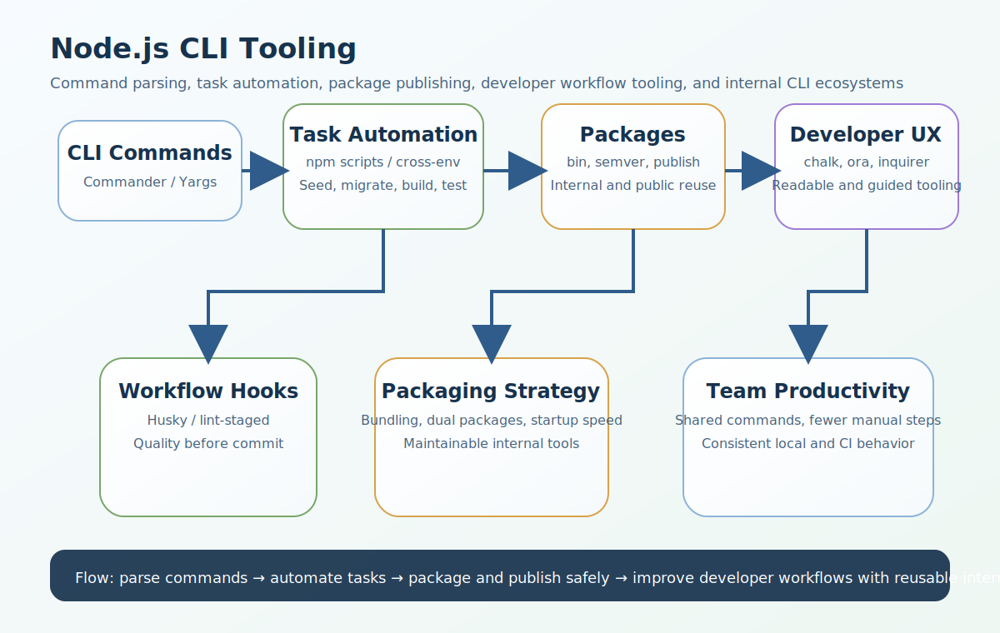

# Node.js CLI Tooling Interview Questions


This guide covers CLI tooling in Node.js from interview basics to tricky production scenarios. It follows the corrected format of **100 interview questions for each subtopic**, and every answer includes a real Node.js code example plus a real-time example so the scenarios and snippets do not repeat verbatim.

## How To Use This Page

- Questions 1-100 cover Building CLI Tools (Commander, Yargs).
- Questions 101-200 cover NPM Scripts.
- Questions 201-300 cover Package Publishing (NPM Registry).
- Questions 301-400 cover CLI Ecosystem.
- Questions 401-500 cover Tooling Automation.
- Questions 501-600 cover Advanced Packaging.

## 1. Building CLI Tools (Commander, Yargs)

### Q1.1 What is commander basics in Node.js CLI tooling?

**Answer:**

Commander basics matters in Node.js CLI tooling because it affects how teams automate repetitive work, package internal tools, standardize workflows, and reduce operational mistakes across local development and CI/CD environments. In a real system like an internal consultant-management platform where developers need commands for seeding data, creating users, and generating role-menu mappings, a strong answer should connect the concept to developer productivity, package structure, release discipline, cross-platform behavior, and maintainability of internal tools. A more senior answer also explains the practical trade-off so the answer stays grounded in real developer-productivity trade-offs instead of only package names.

**Code Example:**

```js
#!/usr/bin/env node
const { Command } = require('commander');
const program1 = new Command();
program1.command('greet').option('-n, --name <name>').action(opts => console.log(`hello-1-${opts.name}`));
program1.parse(process.argv);
```

**Real-Time Example:** In an internal consultant-management platform where developers need commands for seeding data, creating users, and generating role-menu mappings, the team used this concept so the answer stays grounded in real developer-productivity trade-offs instead of only package names.

### Q1.2 Why does yargs basics matter in real production teams?

**Answer:**

Yargs basics matters in Node.js CLI tooling because it affects how teams automate repetitive work, package internal tools, standardize workflows, and reduce operational mistakes across local development and CI/CD environments. In a real system like a Node.js monorepo where teams rely on scripts and CLI tools for consistent local setup and CI execution, a strong answer should connect the concept to developer productivity, package structure, release discipline, cross-platform behavior, and maintainability of internal tools. A more senior answer also explains the practical trade-off so teams can connect CLI and tooling choices to consistency, maintainability, and delivery speed.

**Code Example:**

```js
const yargs = require('yargs');
yargs.command({ command: 'add', builder: { a: { type: 'number', demandOption: true }, b: { type: 'number', demandOption: true } }, handler(argv) { console.log(argv.a + argv.b + 2); } }).parse();
```

**Real-Time Example:** In a Node.js monorepo where teams rely on scripts and CLI tools for consistent local setup and CI execution, the team used this concept so teams can connect CLI and tooling choices to consistency, maintainability, and delivery speed.

### Q1.3 When should a backend team use argument parsing?

**Answer:**

Argument parsing matters in Node.js CLI tooling because it affects how teams automate repetitive work, package internal tools, standardize workflows, and reduce operational mistakes across local development and CI/CD environments. In a real system like an enterprise backend where reusable internal packages help multiple services share validation and logging utilities, a strong answer should connect the concept to developer productivity, package structure, release discipline, cross-platform behavior, and maintainability of internal tools. A more senior answer also explains the practical trade-off so developer workflows become easier to automate and scale across repositories.

**Code Example:**

```js
const cliShape3 = { command: 'seed-users', options: ['--tenant', '--count'], parser: 'commander' };
console.log(cliShape3);
```

**Real-Time Example:** In an enterprise backend where reusable internal packages help multiple services share validation and logging utilities, the team used this concept so developer workflows become easier to automate and scale across repositories.

### Q1.4 How would you explain subcommands and options in an interview?

**Answer:**

Subcommands and options matters in Node.js CLI tooling because it affects how teams automate repetitive work, package internal tools, standardize workflows, and reduce operational mistakes across local development and CI/CD environments. In a real system like a delivery pipeline where package versioning, build reproducibility, and release discipline all matter, a strong answer should connect the concept to developer productivity, package structure, release discipline, cross-platform behavior, and maintainability of internal tools. A more senior answer also explains the practical trade-off so packaging and publishing decisions are tied to real release discipline and team reuse.

**Code Example:**

```js
function chooseCliLibrary4(needsAdvancedValidation) { return needsAdvancedValidation ? 'yargs' : 'commander'; }
console.log(chooseCliLibrary4(true));
```

**Real-Time Example:** In a delivery pipeline where package versioning, build reproducibility, and release discipline all matter, the team used this concept so packaging and publishing decisions are tied to real release discipline and team reuse.

### Q1.5 What is a common interview trap around cli design trade-offs?

**Answer:**

CLI design trade-offs matters in Node.js CLI tooling because it affects how teams automate repetitive work, package internal tools, standardize workflows, and reduce operational mistakes across local development and CI/CD environments. In a real system like a support-heavy environment where good CLI UX reduces mistakes during migrations and operational tasks, a strong answer should connect the concept to developer productivity, package structure, release discipline, cross-platform behavior, and maintainability of internal tools. A more senior answer also explains the practical trade-off so the examples sound like production Node.js tooling instead of toy command-line demos.

**Code Example:**

```js
const subcommands5 = ['create-user', 'seed-data', 'bulk-upload'];
console.log(subcommands5);
```

**Real-Time Example:** In a support-heavy environment where good CLI UX reduces mistakes during migrations and operational tasks, the team used this concept so the examples sound like production Node.js tooling instead of toy command-line demos.

### Q1.6 How is commander basics implemented safely in Node.js tooling?

**Answer:**

Commander basics matters in Node.js CLI tooling because it affects how teams automate repetitive work, package internal tools, standardize workflows, and reduce operational mistakes across local development and CI/CD environments. In a real system like a growing engineering team that needs scripted setup, linting, formatting, and pre-commit automation to stay productive, a strong answer should connect the concept to developer productivity, package structure, release discipline, cross-platform behavior, and maintainability of internal tools. A more senior answer also explains the practical trade-off so cross-platform, CI, and internal-tool concerns are treated as first-class design requirements.

**Code Example:**

```js
#!/usr/bin/env node
const { Command } = require('commander');
const program6 = new Command();
program6.command('greet').option('-n, --name <name>').action(opts => console.log(`hello-6-${opts.name}`));
program6.parse(process.argv);
```

**Real-Time Example:** In a growing engineering team that needs scripted setup, linting, formatting, and pre-commit automation to stay productive, the team used this concept so cross-platform, CI, and internal-tool concerns are treated as first-class design requirements.

### Q1.7 What production or team problem usually exposes weak understanding of yargs basics?

**Answer:**

Yargs basics matters in Node.js CLI tooling because it affects how teams automate repetitive work, package internal tools, standardize workflows, and reduce operational mistakes across local development and CI/CD environments. In a real system like a platform team building internal developer tools instead of repeating manual steps across many repositories, a strong answer should connect the concept to developer productivity, package structure, release discipline, cross-platform behavior, and maintainability of internal tools. A more senior answer also explains the practical trade-off so the trade-offs between simplicity, power, and maintenance cost become clearer.

**Code Example:**

```js
const yargs = require('yargs');
yargs.command({ command: 'add', builder: { a: { type: 'number', demandOption: true }, b: { type: 'number', demandOption: true } }, handler(argv) { console.log(argv.a + argv.b + 1); } }).parse();
```

**Real-Time Example:** In a platform team building internal developer tools instead of repeating manual steps across many repositories, the team used this concept so the trade-offs between simplicity, power, and maintenance cost become clearer.

### Q1.8 How would a senior engineer justify argument parsing to a team?

**Answer:**

Argument parsing matters in Node.js CLI tooling because it affects how teams automate repetitive work, package internal tools, standardize workflows, and reduce operational mistakes across local development and CI/CD environments. In a real system like a multi-environment Node.js application where scripts must behave consistently on Windows, macOS, Linux, and CI runners, a strong answer should connect the concept to developer productivity, package structure, release discipline, cross-platform behavior, and maintainability of internal tools. A more senior answer also explains the practical trade-off so internal tooling is positioned as a force multiplier for engineering teams.

**Code Example:**

```js
const cliShape8 = { command: 'seed-users', options: ['--tenant', '--count'], parser: 'commander' };
console.log(cliShape8);
```

**Real-Time Example:** In a multi-environment Node.js application where scripts must behave consistently on Windows, macOS, Linux, and CI runners, the team used this concept so internal tooling is positioned as a force multiplier for engineering teams.

### Q1.9 What trade-off does subcommands and options introduce?

**Answer:**

Subcommands and options matters in Node.js CLI tooling because it affects how teams automate repetitive work, package internal tools, standardize workflows, and reduce operational mistakes across local development and CI/CD environments. In a real system like a CLI-heavy workflow where packaging, startup speed, and dependency hygiene affect everyday developer experience, a strong answer should connect the concept to developer productivity, package structure, release discipline, cross-platform behavior, and maintainability of internal tools. A more senior answer also explains the practical trade-off so CLI UX, package structure, and automation quality become easier to explain.

**Code Example:**

```js
function chooseCliLibrary9(needsAdvancedValidation) { return needsAdvancedValidation ? 'yargs' : 'commander'; }
console.log(chooseCliLibrary9(true));
```

**Real-Time Example:** In a CLI-heavy workflow where packaging, startup speed, and dependency hygiene affect everyday developer experience, the team used this concept so CLI UX, package structure, and automation quality become easier to explain.

### Q1.10 How do you answer a tricky follow-up about cli design trade-offs?

**Answer:**

CLI design trade-offs matters in Node.js CLI tooling because it affects how teams automate repetitive work, package internal tools, standardize workflows, and reduce operational mistakes across local development and CI/CD environments. In a real system like a product organization where senior engineers create internal tooling to multiply team productivity, not just ship APIs, a strong answer should connect the concept to developer productivity, package structure, release discipline, cross-platform behavior, and maintainability of internal tools. A more senior answer also explains the practical trade-off so the answer reflects senior-level thinking about team scale, reuse, and operational safety.

**Code Example:**

```js
const subcommands10 = ['create-user', 'seed-data', 'bulk-upload'];
console.log(subcommands10);
```

**Real-Time Example:** In a product organization where senior engineers create internal tooling to multiply team productivity, not just ship APIs, the team used this concept so the answer reflects senior-level thinking about team scale, reuse, and operational safety.

### Q1.11 What is commander basics in Node.js CLI tooling?

**Answer:**

Commander basics matters in Node.js CLI tooling because it affects how teams automate repetitive work, package internal tools, standardize workflows, and reduce operational mistakes across local development and CI/CD environments. In a real system like an internal consultant-management platform where developers need commands for seeding data, creating users, and generating role-menu mappings, a strong answer should connect the concept to developer productivity, package structure, release discipline, cross-platform behavior, and maintainability of internal tools. A more senior answer also explains the practical trade-off so the answer stays grounded in real developer-productivity trade-offs instead of only package names.

**Code Example:**

```js
#!/usr/bin/env node
const { Command } = require('commander');
const program11 = new Command();
program11.command('greet').option('-n, --name <name>').action(opts => console.log(`hello-11-${opts.name}`));
program11.parse(process.argv);
```

**Real-Time Example:** In an internal consultant-management platform where developers need commands for seeding data, creating users, and generating role-menu mappings, the team used this concept so the answer stays grounded in real developer-productivity trade-offs instead of only package names.

### Q1.12 Why does yargs basics matter in real production teams?

**Answer:**

Yargs basics matters in Node.js CLI tooling because it affects how teams automate repetitive work, package internal tools, standardize workflows, and reduce operational mistakes across local development and CI/CD environments. In a real system like a Node.js monorepo where teams rely on scripts and CLI tools for consistent local setup and CI execution, a strong answer should connect the concept to developer productivity, package structure, release discipline, cross-platform behavior, and maintainability of internal tools. A more senior answer also explains the practical trade-off so teams can connect CLI and tooling choices to consistency, maintainability, and delivery speed.

**Code Example:**

```js
const yargs = require('yargs');
yargs.command({ command: 'add', builder: { a: { type: 'number', demandOption: true }, b: { type: 'number', demandOption: true } }, handler(argv) { console.log(argv.a + argv.b + 0); } }).parse();
```

**Real-Time Example:** In a Node.js monorepo where teams rely on scripts and CLI tools for consistent local setup and CI execution, the team used this concept so teams can connect CLI and tooling choices to consistency, maintainability, and delivery speed.

### Q1.13 When should a backend team use argument parsing?

**Answer:**

Argument parsing matters in Node.js CLI tooling because it affects how teams automate repetitive work, package internal tools, standardize workflows, and reduce operational mistakes across local development and CI/CD environments. In a real system like an enterprise backend where reusable internal packages help multiple services share validation and logging utilities, a strong answer should connect the concept to developer productivity, package structure, release discipline, cross-platform behavior, and maintainability of internal tools. A more senior answer also explains the practical trade-off so developer workflows become easier to automate and scale across repositories.

**Code Example:**

```js
const cliShape13 = { command: 'seed-users', options: ['--tenant', '--count'], parser: 'commander' };
console.log(cliShape13);
```

**Real-Time Example:** In an enterprise backend where reusable internal packages help multiple services share validation and logging utilities, the team used this concept so developer workflows become easier to automate and scale across repositories.

### Q1.14 How would you explain subcommands and options in an interview?

**Answer:**

Subcommands and options matters in Node.js CLI tooling because it affects how teams automate repetitive work, package internal tools, standardize workflows, and reduce operational mistakes across local development and CI/CD environments. In a real system like a delivery pipeline where package versioning, build reproducibility, and release discipline all matter, a strong answer should connect the concept to developer productivity, package structure, release discipline, cross-platform behavior, and maintainability of internal tools. A more senior answer also explains the practical trade-off so packaging and publishing decisions are tied to real release discipline and team reuse.

**Code Example:**

```js
function chooseCliLibrary14(needsAdvancedValidation) { return needsAdvancedValidation ? 'yargs' : 'commander'; }
console.log(chooseCliLibrary14(true));
```

**Real-Time Example:** In a delivery pipeline where package versioning, build reproducibility, and release discipline all matter, the team used this concept so packaging and publishing decisions are tied to real release discipline and team reuse.

### Q1.15 What is a common interview trap around cli design trade-offs?

**Answer:**

CLI design trade-offs matters in Node.js CLI tooling because it affects how teams automate repetitive work, package internal tools, standardize workflows, and reduce operational mistakes across local development and CI/CD environments. In a real system like a support-heavy environment where good CLI UX reduces mistakes during migrations and operational tasks, a strong answer should connect the concept to developer productivity, package structure, release discipline, cross-platform behavior, and maintainability of internal tools. A more senior answer also explains the practical trade-off so the examples sound like production Node.js tooling instead of toy command-line demos.

**Code Example:**

```js
const subcommands15 = ['create-user', 'seed-data', 'bulk-upload'];
console.log(subcommands15);
```

**Real-Time Example:** In a support-heavy environment where good CLI UX reduces mistakes during migrations and operational tasks, the team used this concept so the examples sound like production Node.js tooling instead of toy command-line demos.

### Q1.16 How is commander basics implemented safely in Node.js tooling?

**Answer:**

Commander basics matters in Node.js CLI tooling because it affects how teams automate repetitive work, package internal tools, standardize workflows, and reduce operational mistakes across local development and CI/CD environments. In a real system like a growing engineering team that needs scripted setup, linting, formatting, and pre-commit automation to stay productive, a strong answer should connect the concept to developer productivity, package structure, release discipline, cross-platform behavior, and maintainability of internal tools. A more senior answer also explains the practical trade-off so cross-platform, CI, and internal-tool concerns are treated as first-class design requirements.

**Code Example:**

```js
#!/usr/bin/env node
const { Command } = require('commander');
const program16 = new Command();
program16.command('greet').option('-n, --name <name>').action(opts => console.log(`hello-16-${opts.name}`));
program16.parse(process.argv);
```

**Real-Time Example:** In a growing engineering team that needs scripted setup, linting, formatting, and pre-commit automation to stay productive, the team used this concept so cross-platform, CI, and internal-tool concerns are treated as first-class design requirements.

### Q1.17 What production or team problem usually exposes weak understanding of yargs basics?

**Answer:**

Yargs basics matters in Node.js CLI tooling because it affects how teams automate repetitive work, package internal tools, standardize workflows, and reduce operational mistakes across local development and CI/CD environments. In a real system like a platform team building internal developer tools instead of repeating manual steps across many repositories, a strong answer should connect the concept to developer productivity, package structure, release discipline, cross-platform behavior, and maintainability of internal tools. A more senior answer also explains the practical trade-off so the trade-offs between simplicity, power, and maintenance cost become clearer.

**Code Example:**

```js
const yargs = require('yargs');
yargs.command({ command: 'add', builder: { a: { type: 'number', demandOption: true }, b: { type: 'number', demandOption: true } }, handler(argv) { console.log(argv.a + argv.b + 2); } }).parse();
```

**Real-Time Example:** In a platform team building internal developer tools instead of repeating manual steps across many repositories, the team used this concept so the trade-offs between simplicity, power, and maintenance cost become clearer.

### Q1.18 How would a senior engineer justify argument parsing to a team?

**Answer:**

Argument parsing matters in Node.js CLI tooling because it affects how teams automate repetitive work, package internal tools, standardize workflows, and reduce operational mistakes across local development and CI/CD environments. In a real system like a multi-environment Node.js application where scripts must behave consistently on Windows, macOS, Linux, and CI runners, a strong answer should connect the concept to developer productivity, package structure, release discipline, cross-platform behavior, and maintainability of internal tools. A more senior answer also explains the practical trade-off so internal tooling is positioned as a force multiplier for engineering teams.

**Code Example:**

```js
const cliShape18 = { command: 'seed-users', options: ['--tenant', '--count'], parser: 'commander' };
console.log(cliShape18);
```

**Real-Time Example:** In a multi-environment Node.js application where scripts must behave consistently on Windows, macOS, Linux, and CI runners, the team used this concept so internal tooling is positioned as a force multiplier for engineering teams.

### Q1.19 What trade-off does subcommands and options introduce?

**Answer:**

Subcommands and options matters in Node.js CLI tooling because it affects how teams automate repetitive work, package internal tools, standardize workflows, and reduce operational mistakes across local development and CI/CD environments. In a real system like a CLI-heavy workflow where packaging, startup speed, and dependency hygiene affect everyday developer experience, a strong answer should connect the concept to developer productivity, package structure, release discipline, cross-platform behavior, and maintainability of internal tools. A more senior answer also explains the practical trade-off so CLI UX, package structure, and automation quality become easier to explain.

**Code Example:**

```js
function chooseCliLibrary19(needsAdvancedValidation) { return needsAdvancedValidation ? 'yargs' : 'commander'; }
console.log(chooseCliLibrary19(true));
```

**Real-Time Example:** In a CLI-heavy workflow where packaging, startup speed, and dependency hygiene affect everyday developer experience, the team used this concept so CLI UX, package structure, and automation quality become easier to explain.

### Q1.20 How do you answer a tricky follow-up about cli design trade-offs?

**Answer:**

CLI design trade-offs matters in Node.js CLI tooling because it affects how teams automate repetitive work, package internal tools, standardize workflows, and reduce operational mistakes across local development and CI/CD environments. In a real system like a product organization where senior engineers create internal tooling to multiply team productivity, not just ship APIs, a strong answer should connect the concept to developer productivity, package structure, release discipline, cross-platform behavior, and maintainability of internal tools. A more senior answer also explains the practical trade-off so the answer reflects senior-level thinking about team scale, reuse, and operational safety.

**Code Example:**

```js
const subcommands20 = ['create-user', 'seed-data', 'bulk-upload'];
console.log(subcommands20);
```

**Real-Time Example:** In a product organization where senior engineers create internal tooling to multiply team productivity, not just ship APIs, the team used this concept so the answer reflects senior-level thinking about team scale, reuse, and operational safety.

### Q1.21 What is commander basics in Node.js CLI tooling?

**Answer:**

Commander basics matters in Node.js CLI tooling because it affects how teams automate repetitive work, package internal tools, standardize workflows, and reduce operational mistakes across local development and CI/CD environments. In a real system like an internal consultant-management platform where developers need commands for seeding data, creating users, and generating role-menu mappings, a strong answer should connect the concept to developer productivity, package structure, release discipline, cross-platform behavior, and maintainability of internal tools. A more senior answer also explains the practical trade-off so the answer stays grounded in real developer-productivity trade-offs instead of only package names.

**Code Example:**

```js
#!/usr/bin/env node
const { Command } = require('commander');
const program21 = new Command();
program21.command('greet').option('-n, --name <name>').action(opts => console.log(`hello-21-${opts.name}`));
program21.parse(process.argv);
```

**Real-Time Example:** In an internal consultant-management platform where developers need commands for seeding data, creating users, and generating role-menu mappings, the team used this concept so the answer stays grounded in real developer-productivity trade-offs instead of only package names.

### Q1.22 Why does yargs basics matter in real production teams?

**Answer:**

Yargs basics matters in Node.js CLI tooling because it affects how teams automate repetitive work, package internal tools, standardize workflows, and reduce operational mistakes across local development and CI/CD environments. In a real system like a Node.js monorepo where teams rely on scripts and CLI tools for consistent local setup and CI execution, a strong answer should connect the concept to developer productivity, package structure, release discipline, cross-platform behavior, and maintainability of internal tools. A more senior answer also explains the practical trade-off so teams can connect CLI and tooling choices to consistency, maintainability, and delivery speed.

**Code Example:**

```js
const yargs = require('yargs');
yargs.command({ command: 'add', builder: { a: { type: 'number', demandOption: true }, b: { type: 'number', demandOption: true } }, handler(argv) { console.log(argv.a + argv.b + 1); } }).parse();
```

**Real-Time Example:** In a Node.js monorepo where teams rely on scripts and CLI tools for consistent local setup and CI execution, the team used this concept so teams can connect CLI and tooling choices to consistency, maintainability, and delivery speed.

### Q1.23 When should a backend team use argument parsing?

**Answer:**

Argument parsing matters in Node.js CLI tooling because it affects how teams automate repetitive work, package internal tools, standardize workflows, and reduce operational mistakes across local development and CI/CD environments. In a real system like an enterprise backend where reusable internal packages help multiple services share validation and logging utilities, a strong answer should connect the concept to developer productivity, package structure, release discipline, cross-platform behavior, and maintainability of internal tools. A more senior answer also explains the practical trade-off so developer workflows become easier to automate and scale across repositories.

**Code Example:**

```js
const cliShape23 = { command: 'seed-users', options: ['--tenant', '--count'], parser: 'commander' };
console.log(cliShape23);
```

**Real-Time Example:** In an enterprise backend where reusable internal packages help multiple services share validation and logging utilities, the team used this concept so developer workflows become easier to automate and scale across repositories.

### Q1.24 How would you explain subcommands and options in an interview?

**Answer:**

Subcommands and options matters in Node.js CLI tooling because it affects how teams automate repetitive work, package internal tools, standardize workflows, and reduce operational mistakes across local development and CI/CD environments. In a real system like a delivery pipeline where package versioning, build reproducibility, and release discipline all matter, a strong answer should connect the concept to developer productivity, package structure, release discipline, cross-platform behavior, and maintainability of internal tools. A more senior answer also explains the practical trade-off so packaging and publishing decisions are tied to real release discipline and team reuse.

**Code Example:**

```js
function chooseCliLibrary24(needsAdvancedValidation) { return needsAdvancedValidation ? 'yargs' : 'commander'; }
console.log(chooseCliLibrary24(true));
```

**Real-Time Example:** In a delivery pipeline where package versioning, build reproducibility, and release discipline all matter, the team used this concept so packaging and publishing decisions are tied to real release discipline and team reuse.

### Q1.25 What is a common interview trap around cli design trade-offs?

**Answer:**

CLI design trade-offs matters in Node.js CLI tooling because it affects how teams automate repetitive work, package internal tools, standardize workflows, and reduce operational mistakes across local development and CI/CD environments. In a real system like a support-heavy environment where good CLI UX reduces mistakes during migrations and operational tasks, a strong answer should connect the concept to developer productivity, package structure, release discipline, cross-platform behavior, and maintainability of internal tools. A more senior answer also explains the practical trade-off so the examples sound like production Node.js tooling instead of toy command-line demos.

**Code Example:**

```js
const subcommands25 = ['create-user', 'seed-data', 'bulk-upload'];
console.log(subcommands25);
```

**Real-Time Example:** In a support-heavy environment where good CLI UX reduces mistakes during migrations and operational tasks, the team used this concept so the examples sound like production Node.js tooling instead of toy command-line demos.

### Q1.26 How is commander basics implemented safely in Node.js tooling?

**Answer:**

Commander basics matters in Node.js CLI tooling because it affects how teams automate repetitive work, package internal tools, standardize workflows, and reduce operational mistakes across local development and CI/CD environments. In a real system like a growing engineering team that needs scripted setup, linting, formatting, and pre-commit automation to stay productive, a strong answer should connect the concept to developer productivity, package structure, release discipline, cross-platform behavior, and maintainability of internal tools. A more senior answer also explains the practical trade-off so cross-platform, CI, and internal-tool concerns are treated as first-class design requirements.

**Code Example:**

```js
#!/usr/bin/env node
const { Command } = require('commander');
const program26 = new Command();
program26.command('greet').option('-n, --name <name>').action(opts => console.log(`hello-26-${opts.name}`));
program26.parse(process.argv);
```

**Real-Time Example:** In a growing engineering team that needs scripted setup, linting, formatting, and pre-commit automation to stay productive, the team used this concept so cross-platform, CI, and internal-tool concerns are treated as first-class design requirements.

### Q1.27 What production or team problem usually exposes weak understanding of yargs basics?

**Answer:**

Yargs basics matters in Node.js CLI tooling because it affects how teams automate repetitive work, package internal tools, standardize workflows, and reduce operational mistakes across local development and CI/CD environments. In a real system like a platform team building internal developer tools instead of repeating manual steps across many repositories, a strong answer should connect the concept to developer productivity, package structure, release discipline, cross-platform behavior, and maintainability of internal tools. A more senior answer also explains the practical trade-off so the trade-offs between simplicity, power, and maintenance cost become clearer.

**Code Example:**

```js
const yargs = require('yargs');
yargs.command({ command: 'add', builder: { a: { type: 'number', demandOption: true }, b: { type: 'number', demandOption: true } }, handler(argv) { console.log(argv.a + argv.b + 0); } }).parse();
```

**Real-Time Example:** In a platform team building internal developer tools instead of repeating manual steps across many repositories, the team used this concept so the trade-offs between simplicity, power, and maintenance cost become clearer.

### Q1.28 How would a senior engineer justify argument parsing to a team?

**Answer:**

Argument parsing matters in Node.js CLI tooling because it affects how teams automate repetitive work, package internal tools, standardize workflows, and reduce operational mistakes across local development and CI/CD environments. In a real system like a multi-environment Node.js application where scripts must behave consistently on Windows, macOS, Linux, and CI runners, a strong answer should connect the concept to developer productivity, package structure, release discipline, cross-platform behavior, and maintainability of internal tools. A more senior answer also explains the practical trade-off so internal tooling is positioned as a force multiplier for engineering teams.

**Code Example:**

```js
const cliShape28 = { command: 'seed-users', options: ['--tenant', '--count'], parser: 'commander' };
console.log(cliShape28);
```

**Real-Time Example:** In a multi-environment Node.js application where scripts must behave consistently on Windows, macOS, Linux, and CI runners, the team used this concept so internal tooling is positioned as a force multiplier for engineering teams.

### Q1.29 What trade-off does subcommands and options introduce?

**Answer:**

Subcommands and options matters in Node.js CLI tooling because it affects how teams automate repetitive work, package internal tools, standardize workflows, and reduce operational mistakes across local development and CI/CD environments. In a real system like a CLI-heavy workflow where packaging, startup speed, and dependency hygiene affect everyday developer experience, a strong answer should connect the concept to developer productivity, package structure, release discipline, cross-platform behavior, and maintainability of internal tools. A more senior answer also explains the practical trade-off so CLI UX, package structure, and automation quality become easier to explain.

**Code Example:**

```js
function chooseCliLibrary29(needsAdvancedValidation) { return needsAdvancedValidation ? 'yargs' : 'commander'; }
console.log(chooseCliLibrary29(true));
```

**Real-Time Example:** In a CLI-heavy workflow where packaging, startup speed, and dependency hygiene affect everyday developer experience, the team used this concept so CLI UX, package structure, and automation quality become easier to explain.

### Q1.30 How do you answer a tricky follow-up about cli design trade-offs?

**Answer:**

CLI design trade-offs matters in Node.js CLI tooling because it affects how teams automate repetitive work, package internal tools, standardize workflows, and reduce operational mistakes across local development and CI/CD environments. In a real system like a product organization where senior engineers create internal tooling to multiply team productivity, not just ship APIs, a strong answer should connect the concept to developer productivity, package structure, release discipline, cross-platform behavior, and maintainability of internal tools. A more senior answer also explains the practical trade-off so the answer reflects senior-level thinking about team scale, reuse, and operational safety.

**Code Example:**

```js
const subcommands30 = ['create-user', 'seed-data', 'bulk-upload'];
console.log(subcommands30);
```

**Real-Time Example:** In a product organization where senior engineers create internal tooling to multiply team productivity, not just ship APIs, the team used this concept so the answer reflects senior-level thinking about team scale, reuse, and operational safety.

### Q1.31 What is commander basics in Node.js CLI tooling?

**Answer:**

Commander basics matters in Node.js CLI tooling because it affects how teams automate repetitive work, package internal tools, standardize workflows, and reduce operational mistakes across local development and CI/CD environments. In a real system like an internal consultant-management platform where developers need commands for seeding data, creating users, and generating role-menu mappings, a strong answer should connect the concept to developer productivity, package structure, release discipline, cross-platform behavior, and maintainability of internal tools. A more senior answer also explains the practical trade-off so the answer stays grounded in real developer-productivity trade-offs instead of only package names.

**Code Example:**

```js
#!/usr/bin/env node
const { Command } = require('commander');
const program31 = new Command();
program31.command('greet').option('-n, --name <name>').action(opts => console.log(`hello-31-${opts.name}`));
program31.parse(process.argv);
```

**Real-Time Example:** In an internal consultant-management platform where developers need commands for seeding data, creating users, and generating role-menu mappings, the team used this concept so the answer stays grounded in real developer-productivity trade-offs instead of only package names.

### Q1.32 Why does yargs basics matter in real production teams?

**Answer:**

Yargs basics matters in Node.js CLI tooling because it affects how teams automate repetitive work, package internal tools, standardize workflows, and reduce operational mistakes across local development and CI/CD environments. In a real system like a Node.js monorepo where teams rely on scripts and CLI tools for consistent local setup and CI execution, a strong answer should connect the concept to developer productivity, package structure, release discipline, cross-platform behavior, and maintainability of internal tools. A more senior answer also explains the practical trade-off so teams can connect CLI and tooling choices to consistency, maintainability, and delivery speed.

**Code Example:**

```js
const yargs = require('yargs');
yargs.command({ command: 'add', builder: { a: { type: 'number', demandOption: true }, b: { type: 'number', demandOption: true } }, handler(argv) { console.log(argv.a + argv.b + 2); } }).parse();
```

**Real-Time Example:** In a Node.js monorepo where teams rely on scripts and CLI tools for consistent local setup and CI execution, the team used this concept so teams can connect CLI and tooling choices to consistency, maintainability, and delivery speed.

### Q1.33 When should a backend team use argument parsing?

**Answer:**

Argument parsing matters in Node.js CLI tooling because it affects how teams automate repetitive work, package internal tools, standardize workflows, and reduce operational mistakes across local development and CI/CD environments. In a real system like an enterprise backend where reusable internal packages help multiple services share validation and logging utilities, a strong answer should connect the concept to developer productivity, package structure, release discipline, cross-platform behavior, and maintainability of internal tools. A more senior answer also explains the practical trade-off so developer workflows become easier to automate and scale across repositories.

**Code Example:**

```js
const cliShape33 = { command: 'seed-users', options: ['--tenant', '--count'], parser: 'commander' };
console.log(cliShape33);
```

**Real-Time Example:** In an enterprise backend where reusable internal packages help multiple services share validation and logging utilities, the team used this concept so developer workflows become easier to automate and scale across repositories.

### Q1.34 How would you explain subcommands and options in an interview?

**Answer:**

Subcommands and options matters in Node.js CLI tooling because it affects how teams automate repetitive work, package internal tools, standardize workflows, and reduce operational mistakes across local development and CI/CD environments. In a real system like a delivery pipeline where package versioning, build reproducibility, and release discipline all matter, a strong answer should connect the concept to developer productivity, package structure, release discipline, cross-platform behavior, and maintainability of internal tools. A more senior answer also explains the practical trade-off so packaging and publishing decisions are tied to real release discipline and team reuse.

**Code Example:**

```js
function chooseCliLibrary34(needsAdvancedValidation) { return needsAdvancedValidation ? 'yargs' : 'commander'; }
console.log(chooseCliLibrary34(true));
```

**Real-Time Example:** In a delivery pipeline where package versioning, build reproducibility, and release discipline all matter, the team used this concept so packaging and publishing decisions are tied to real release discipline and team reuse.

### Q1.35 What is a common interview trap around cli design trade-offs?

**Answer:**

CLI design trade-offs matters in Node.js CLI tooling because it affects how teams automate repetitive work, package internal tools, standardize workflows, and reduce operational mistakes across local development and CI/CD environments. In a real system like a support-heavy environment where good CLI UX reduces mistakes during migrations and operational tasks, a strong answer should connect the concept to developer productivity, package structure, release discipline, cross-platform behavior, and maintainability of internal tools. A more senior answer also explains the practical trade-off so the examples sound like production Node.js tooling instead of toy command-line demos.

**Code Example:**

```js
const subcommands35 = ['create-user', 'seed-data', 'bulk-upload'];
console.log(subcommands35);
```

**Real-Time Example:** In a support-heavy environment where good CLI UX reduces mistakes during migrations and operational tasks, the team used this concept so the examples sound like production Node.js tooling instead of toy command-line demos.

### Q1.36 How is commander basics implemented safely in Node.js tooling?

**Answer:**

Commander basics matters in Node.js CLI tooling because it affects how teams automate repetitive work, package internal tools, standardize workflows, and reduce operational mistakes across local development and CI/CD environments. In a real system like a growing engineering team that needs scripted setup, linting, formatting, and pre-commit automation to stay productive, a strong answer should connect the concept to developer productivity, package structure, release discipline, cross-platform behavior, and maintainability of internal tools. A more senior answer also explains the practical trade-off so cross-platform, CI, and internal-tool concerns are treated as first-class design requirements.

**Code Example:**

```js
#!/usr/bin/env node
const { Command } = require('commander');
const program36 = new Command();
program36.command('greet').option('-n, --name <name>').action(opts => console.log(`hello-36-${opts.name}`));
program36.parse(process.argv);
```

**Real-Time Example:** In a growing engineering team that needs scripted setup, linting, formatting, and pre-commit automation to stay productive, the team used this concept so cross-platform, CI, and internal-tool concerns are treated as first-class design requirements.

### Q1.37 What production or team problem usually exposes weak understanding of yargs basics?

**Answer:**

Yargs basics matters in Node.js CLI tooling because it affects how teams automate repetitive work, package internal tools, standardize workflows, and reduce operational mistakes across local development and CI/CD environments. In a real system like a platform team building internal developer tools instead of repeating manual steps across many repositories, a strong answer should connect the concept to developer productivity, package structure, release discipline, cross-platform behavior, and maintainability of internal tools. A more senior answer also explains the practical trade-off so the trade-offs between simplicity, power, and maintenance cost become clearer.

**Code Example:**

```js
const yargs = require('yargs');
yargs.command({ command: 'add', builder: { a: { type: 'number', demandOption: true }, b: { type: 'number', demandOption: true } }, handler(argv) { console.log(argv.a + argv.b + 1); } }).parse();
```

**Real-Time Example:** In a platform team building internal developer tools instead of repeating manual steps across many repositories, the team used this concept so the trade-offs between simplicity, power, and maintenance cost become clearer.

### Q1.38 How would a senior engineer justify argument parsing to a team?

**Answer:**

Argument parsing matters in Node.js CLI tooling because it affects how teams automate repetitive work, package internal tools, standardize workflows, and reduce operational mistakes across local development and CI/CD environments. In a real system like a multi-environment Node.js application where scripts must behave consistently on Windows, macOS, Linux, and CI runners, a strong answer should connect the concept to developer productivity, package structure, release discipline, cross-platform behavior, and maintainability of internal tools. A more senior answer also explains the practical trade-off so internal tooling is positioned as a force multiplier for engineering teams.

**Code Example:**

```js
const cliShape38 = { command: 'seed-users', options: ['--tenant', '--count'], parser: 'commander' };
console.log(cliShape38);
```

**Real-Time Example:** In a multi-environment Node.js application where scripts must behave consistently on Windows, macOS, Linux, and CI runners, the team used this concept so internal tooling is positioned as a force multiplier for engineering teams.

### Q1.39 What trade-off does subcommands and options introduce?

**Answer:**

Subcommands and options matters in Node.js CLI tooling because it affects how teams automate repetitive work, package internal tools, standardize workflows, and reduce operational mistakes across local development and CI/CD environments. In a real system like a CLI-heavy workflow where packaging, startup speed, and dependency hygiene affect everyday developer experience, a strong answer should connect the concept to developer productivity, package structure, release discipline, cross-platform behavior, and maintainability of internal tools. A more senior answer also explains the practical trade-off so CLI UX, package structure, and automation quality become easier to explain.

**Code Example:**

```js
function chooseCliLibrary39(needsAdvancedValidation) { return needsAdvancedValidation ? 'yargs' : 'commander'; }
console.log(chooseCliLibrary39(true));
```

**Real-Time Example:** In a CLI-heavy workflow where packaging, startup speed, and dependency hygiene affect everyday developer experience, the team used this concept so CLI UX, package structure, and automation quality become easier to explain.

### Q1.40 How do you answer a tricky follow-up about cli design trade-offs?

**Answer:**

CLI design trade-offs matters in Node.js CLI tooling because it affects how teams automate repetitive work, package internal tools, standardize workflows, and reduce operational mistakes across local development and CI/CD environments. In a real system like a product organization where senior engineers create internal tooling to multiply team productivity, not just ship APIs, a strong answer should connect the concept to developer productivity, package structure, release discipline, cross-platform behavior, and maintainability of internal tools. A more senior answer also explains the practical trade-off so the answer reflects senior-level thinking about team scale, reuse, and operational safety.

**Code Example:**

```js
const subcommands40 = ['create-user', 'seed-data', 'bulk-upload'];
console.log(subcommands40);
```

**Real-Time Example:** In a product organization where senior engineers create internal tooling to multiply team productivity, not just ship APIs, the team used this concept so the answer reflects senior-level thinking about team scale, reuse, and operational safety.

### Q1.41 What is commander basics in Node.js CLI tooling?

**Answer:**

Commander basics matters in Node.js CLI tooling because it affects how teams automate repetitive work, package internal tools, standardize workflows, and reduce operational mistakes across local development and CI/CD environments. In a real system like an internal consultant-management platform where developers need commands for seeding data, creating users, and generating role-menu mappings, a strong answer should connect the concept to developer productivity, package structure, release discipline, cross-platform behavior, and maintainability of internal tools. A more senior answer also explains the practical trade-off so the answer stays grounded in real developer-productivity trade-offs instead of only package names.

**Code Example:**

```js
#!/usr/bin/env node
const { Command } = require('commander');
const program41 = new Command();
program41.command('greet').option('-n, --name <name>').action(opts => console.log(`hello-41-${opts.name}`));
program41.parse(process.argv);
```

**Real-Time Example:** In an internal consultant-management platform where developers need commands for seeding data, creating users, and generating role-menu mappings, the team used this concept so the answer stays grounded in real developer-productivity trade-offs instead of only package names.

### Q1.42 Why does yargs basics matter in real production teams?

**Answer:**

Yargs basics matters in Node.js CLI tooling because it affects how teams automate repetitive work, package internal tools, standardize workflows, and reduce operational mistakes across local development and CI/CD environments. In a real system like a Node.js monorepo where teams rely on scripts and CLI tools for consistent local setup and CI execution, a strong answer should connect the concept to developer productivity, package structure, release discipline, cross-platform behavior, and maintainability of internal tools. A more senior answer also explains the practical trade-off so teams can connect CLI and tooling choices to consistency, maintainability, and delivery speed.

**Code Example:**

```js
const yargs = require('yargs');
yargs.command({ command: 'add', builder: { a: { type: 'number', demandOption: true }, b: { type: 'number', demandOption: true } }, handler(argv) { console.log(argv.a + argv.b + 0); } }).parse();
```

**Real-Time Example:** In a Node.js monorepo where teams rely on scripts and CLI tools for consistent local setup and CI execution, the team used this concept so teams can connect CLI and tooling choices to consistency, maintainability, and delivery speed.

### Q1.43 When should a backend team use argument parsing?

**Answer:**

Argument parsing matters in Node.js CLI tooling because it affects how teams automate repetitive work, package internal tools, standardize workflows, and reduce operational mistakes across local development and CI/CD environments. In a real system like an enterprise backend where reusable internal packages help multiple services share validation and logging utilities, a strong answer should connect the concept to developer productivity, package structure, release discipline, cross-platform behavior, and maintainability of internal tools. A more senior answer also explains the practical trade-off so developer workflows become easier to automate and scale across repositories.

**Code Example:**

```js
const cliShape43 = { command: 'seed-users', options: ['--tenant', '--count'], parser: 'commander' };
console.log(cliShape43);
```

**Real-Time Example:** In an enterprise backend where reusable internal packages help multiple services share validation and logging utilities, the team used this concept so developer workflows become easier to automate and scale across repositories.

### Q1.44 How would you explain subcommands and options in an interview?

**Answer:**

Subcommands and options matters in Node.js CLI tooling because it affects how teams automate repetitive work, package internal tools, standardize workflows, and reduce operational mistakes across local development and CI/CD environments. In a real system like a delivery pipeline where package versioning, build reproducibility, and release discipline all matter, a strong answer should connect the concept to developer productivity, package structure, release discipline, cross-platform behavior, and maintainability of internal tools. A more senior answer also explains the practical trade-off so packaging and publishing decisions are tied to real release discipline and team reuse.

**Code Example:**

```js
function chooseCliLibrary44(needsAdvancedValidation) { return needsAdvancedValidation ? 'yargs' : 'commander'; }
console.log(chooseCliLibrary44(true));
```

**Real-Time Example:** In a delivery pipeline where package versioning, build reproducibility, and release discipline all matter, the team used this concept so packaging and publishing decisions are tied to real release discipline and team reuse.

### Q1.45 What is a common interview trap around cli design trade-offs?

**Answer:**

CLI design trade-offs matters in Node.js CLI tooling because it affects how teams automate repetitive work, package internal tools, standardize workflows, and reduce operational mistakes across local development and CI/CD environments. In a real system like a support-heavy environment where good CLI UX reduces mistakes during migrations and operational tasks, a strong answer should connect the concept to developer productivity, package structure, release discipline, cross-platform behavior, and maintainability of internal tools. A more senior answer also explains the practical trade-off so the examples sound like production Node.js tooling instead of toy command-line demos.

**Code Example:**

```js
const subcommands45 = ['create-user', 'seed-data', 'bulk-upload'];
console.log(subcommands45);
```

**Real-Time Example:** In a support-heavy environment where good CLI UX reduces mistakes during migrations and operational tasks, the team used this concept so the examples sound like production Node.js tooling instead of toy command-line demos.

### Q1.46 How is commander basics implemented safely in Node.js tooling?

**Answer:**

Commander basics matters in Node.js CLI tooling because it affects how teams automate repetitive work, package internal tools, standardize workflows, and reduce operational mistakes across local development and CI/CD environments. In a real system like a growing engineering team that needs scripted setup, linting, formatting, and pre-commit automation to stay productive, a strong answer should connect the concept to developer productivity, package structure, release discipline, cross-platform behavior, and maintainability of internal tools. A more senior answer also explains the practical trade-off so cross-platform, CI, and internal-tool concerns are treated as first-class design requirements.

**Code Example:**

```js
#!/usr/bin/env node
const { Command } = require('commander');
const program46 = new Command();
program46.command('greet').option('-n, --name <name>').action(opts => console.log(`hello-46-${opts.name}`));
program46.parse(process.argv);
```

**Real-Time Example:** In a growing engineering team that needs scripted setup, linting, formatting, and pre-commit automation to stay productive, the team used this concept so cross-platform, CI, and internal-tool concerns are treated as first-class design requirements.

### Q1.47 What production or team problem usually exposes weak understanding of yargs basics?

**Answer:**

Yargs basics matters in Node.js CLI tooling because it affects how teams automate repetitive work, package internal tools, standardize workflows, and reduce operational mistakes across local development and CI/CD environments. In a real system like a platform team building internal developer tools instead of repeating manual steps across many repositories, a strong answer should connect the concept to developer productivity, package structure, release discipline, cross-platform behavior, and maintainability of internal tools. A more senior answer also explains the practical trade-off so the trade-offs between simplicity, power, and maintenance cost become clearer.

**Code Example:**

```js
const yargs = require('yargs');
yargs.command({ command: 'add', builder: { a: { type: 'number', demandOption: true }, b: { type: 'number', demandOption: true } }, handler(argv) { console.log(argv.a + argv.b + 2); } }).parse();
```

**Real-Time Example:** In a platform team building internal developer tools instead of repeating manual steps across many repositories, the team used this concept so the trade-offs between simplicity, power, and maintenance cost become clearer.

### Q1.48 How would a senior engineer justify argument parsing to a team?

**Answer:**

Argument parsing matters in Node.js CLI tooling because it affects how teams automate repetitive work, package internal tools, standardize workflows, and reduce operational mistakes across local development and CI/CD environments. In a real system like a multi-environment Node.js application where scripts must behave consistently on Windows, macOS, Linux, and CI runners, a strong answer should connect the concept to developer productivity, package structure, release discipline, cross-platform behavior, and maintainability of internal tools. A more senior answer also explains the practical trade-off so internal tooling is positioned as a force multiplier for engineering teams.

**Code Example:**

```js
const cliShape48 = { command: 'seed-users', options: ['--tenant', '--count'], parser: 'commander' };
console.log(cliShape48);
```

**Real-Time Example:** In a multi-environment Node.js application where scripts must behave consistently on Windows, macOS, Linux, and CI runners, the team used this concept so internal tooling is positioned as a force multiplier for engineering teams.

### Q1.49 What trade-off does subcommands and options introduce?

**Answer:**

Subcommands and options matters in Node.js CLI tooling because it affects how teams automate repetitive work, package internal tools, standardize workflows, and reduce operational mistakes across local development and CI/CD environments. In a real system like a CLI-heavy workflow where packaging, startup speed, and dependency hygiene affect everyday developer experience, a strong answer should connect the concept to developer productivity, package structure, release discipline, cross-platform behavior, and maintainability of internal tools. A more senior answer also explains the practical trade-off so CLI UX, package structure, and automation quality become easier to explain.

**Code Example:**

```js
function chooseCliLibrary49(needsAdvancedValidation) { return needsAdvancedValidation ? 'yargs' : 'commander'; }
console.log(chooseCliLibrary49(true));
```

**Real-Time Example:** In a CLI-heavy workflow where packaging, startup speed, and dependency hygiene affect everyday developer experience, the team used this concept so CLI UX, package structure, and automation quality become easier to explain.

### Q1.50 How do you answer a tricky follow-up about cli design trade-offs?

**Answer:**

CLI design trade-offs matters in Node.js CLI tooling because it affects how teams automate repetitive work, package internal tools, standardize workflows, and reduce operational mistakes across local development and CI/CD environments. In a real system like a product organization where senior engineers create internal tooling to multiply team productivity, not just ship APIs, a strong answer should connect the concept to developer productivity, package structure, release discipline, cross-platform behavior, and maintainability of internal tools. A more senior answer also explains the practical trade-off so the answer reflects senior-level thinking about team scale, reuse, and operational safety.

**Code Example:**

```js
const subcommands50 = ['create-user', 'seed-data', 'bulk-upload'];
console.log(subcommands50);
```

**Real-Time Example:** In a product organization where senior engineers create internal tooling to multiply team productivity, not just ship APIs, the team used this concept so the answer reflects senior-level thinking about team scale, reuse, and operational safety.

### Q1.51 What is commander basics in Node.js CLI tooling?

**Answer:**

Commander basics matters in Node.js CLI tooling because it affects how teams automate repetitive work, package internal tools, standardize workflows, and reduce operational mistakes across local development and CI/CD environments. In a real system like an internal consultant-management platform where developers need commands for seeding data, creating users, and generating role-menu mappings, a strong answer should connect the concept to developer productivity, package structure, release discipline, cross-platform behavior, and maintainability of internal tools. A more senior answer also explains the practical trade-off so the answer stays grounded in real developer-productivity trade-offs instead of only package names.

**Code Example:**

```js
#!/usr/bin/env node
const { Command } = require('commander');
const program51 = new Command();
program51.command('greet').option('-n, --name <name>').action(opts => console.log(`hello-51-${opts.name}`));
program51.parse(process.argv);
```

**Real-Time Example:** In an internal consultant-management platform where developers need commands for seeding data, creating users, and generating role-menu mappings, the team used this concept so the answer stays grounded in real developer-productivity trade-offs instead of only package names.

### Q1.52 Why does yargs basics matter in real production teams?

**Answer:**

Yargs basics matters in Node.js CLI tooling because it affects how teams automate repetitive work, package internal tools, standardize workflows, and reduce operational mistakes across local development and CI/CD environments. In a real system like a Node.js monorepo where teams rely on scripts and CLI tools for consistent local setup and CI execution, a strong answer should connect the concept to developer productivity, package structure, release discipline, cross-platform behavior, and maintainability of internal tools. A more senior answer also explains the practical trade-off so teams can connect CLI and tooling choices to consistency, maintainability, and delivery speed.

**Code Example:**

```js
const yargs = require('yargs');
yargs.command({ command: 'add', builder: { a: { type: 'number', demandOption: true }, b: { type: 'number', demandOption: true } }, handler(argv) { console.log(argv.a + argv.b + 1); } }).parse();
```

**Real-Time Example:** In a Node.js monorepo where teams rely on scripts and CLI tools for consistent local setup and CI execution, the team used this concept so teams can connect CLI and tooling choices to consistency, maintainability, and delivery speed.

### Q1.53 When should a backend team use argument parsing?

**Answer:**

Argument parsing matters in Node.js CLI tooling because it affects how teams automate repetitive work, package internal tools, standardize workflows, and reduce operational mistakes across local development and CI/CD environments. In a real system like an enterprise backend where reusable internal packages help multiple services share validation and logging utilities, a strong answer should connect the concept to developer productivity, package structure, release discipline, cross-platform behavior, and maintainability of internal tools. A more senior answer also explains the practical trade-off so developer workflows become easier to automate and scale across repositories.

**Code Example:**

```js
const cliShape53 = { command: 'seed-users', options: ['--tenant', '--count'], parser: 'commander' };
console.log(cliShape53);
```

**Real-Time Example:** In an enterprise backend where reusable internal packages help multiple services share validation and logging utilities, the team used this concept so developer workflows become easier to automate and scale across repositories.

### Q1.54 How would you explain subcommands and options in an interview?

**Answer:**

Subcommands and options matters in Node.js CLI tooling because it affects how teams automate repetitive work, package internal tools, standardize workflows, and reduce operational mistakes across local development and CI/CD environments. In a real system like a delivery pipeline where package versioning, build reproducibility, and release discipline all matter, a strong answer should connect the concept to developer productivity, package structure, release discipline, cross-platform behavior, and maintainability of internal tools. A more senior answer also explains the practical trade-off so packaging and publishing decisions are tied to real release discipline and team reuse.

**Code Example:**

```js
function chooseCliLibrary54(needsAdvancedValidation) { return needsAdvancedValidation ? 'yargs' : 'commander'; }
console.log(chooseCliLibrary54(true));
```

**Real-Time Example:** In a delivery pipeline where package versioning, build reproducibility, and release discipline all matter, the team used this concept so packaging and publishing decisions are tied to real release discipline and team reuse.

### Q1.55 What is a common interview trap around cli design trade-offs?

**Answer:**

CLI design trade-offs matters in Node.js CLI tooling because it affects how teams automate repetitive work, package internal tools, standardize workflows, and reduce operational mistakes across local development and CI/CD environments. In a real system like a support-heavy environment where good CLI UX reduces mistakes during migrations and operational tasks, a strong answer should connect the concept to developer productivity, package structure, release discipline, cross-platform behavior, and maintainability of internal tools. A more senior answer also explains the practical trade-off so the examples sound like production Node.js tooling instead of toy command-line demos.

**Code Example:**

```js
const subcommands55 = ['create-user', 'seed-data', 'bulk-upload'];
console.log(subcommands55);
```

**Real-Time Example:** In a support-heavy environment where good CLI UX reduces mistakes during migrations and operational tasks, the team used this concept so the examples sound like production Node.js tooling instead of toy command-line demos.

### Q1.56 How is commander basics implemented safely in Node.js tooling?

**Answer:**

Commander basics matters in Node.js CLI tooling because it affects how teams automate repetitive work, package internal tools, standardize workflows, and reduce operational mistakes across local development and CI/CD environments. In a real system like a growing engineering team that needs scripted setup, linting, formatting, and pre-commit automation to stay productive, a strong answer should connect the concept to developer productivity, package structure, release discipline, cross-platform behavior, and maintainability of internal tools. A more senior answer also explains the practical trade-off so cross-platform, CI, and internal-tool concerns are treated as first-class design requirements.

**Code Example:**

```js
#!/usr/bin/env node
const { Command } = require('commander');
const program56 = new Command();
program56.command('greet').option('-n, --name <name>').action(opts => console.log(`hello-56-${opts.name}`));
program56.parse(process.argv);
```

**Real-Time Example:** In a growing engineering team that needs scripted setup, linting, formatting, and pre-commit automation to stay productive, the team used this concept so cross-platform, CI, and internal-tool concerns are treated as first-class design requirements.

### Q1.57 What production or team problem usually exposes weak understanding of yargs basics?

**Answer:**

Yargs basics matters in Node.js CLI tooling because it affects how teams automate repetitive work, package internal tools, standardize workflows, and reduce operational mistakes across local development and CI/CD environments. In a real system like a platform team building internal developer tools instead of repeating manual steps across many repositories, a strong answer should connect the concept to developer productivity, package structure, release discipline, cross-platform behavior, and maintainability of internal tools. A more senior answer also explains the practical trade-off so the trade-offs between simplicity, power, and maintenance cost become clearer.

**Code Example:**

```js
const yargs = require('yargs');
yargs.command({ command: 'add', builder: { a: { type: 'number', demandOption: true }, b: { type: 'number', demandOption: true } }, handler(argv) { console.log(argv.a + argv.b + 0); } }).parse();
```

**Real-Time Example:** In a platform team building internal developer tools instead of repeating manual steps across many repositories, the team used this concept so the trade-offs between simplicity, power, and maintenance cost become clearer.

### Q1.58 How would a senior engineer justify argument parsing to a team?

**Answer:**

Argument parsing matters in Node.js CLI tooling because it affects how teams automate repetitive work, package internal tools, standardize workflows, and reduce operational mistakes across local development and CI/CD environments. In a real system like a multi-environment Node.js application where scripts must behave consistently on Windows, macOS, Linux, and CI runners, a strong answer should connect the concept to developer productivity, package structure, release discipline, cross-platform behavior, and maintainability of internal tools. A more senior answer also explains the practical trade-off so internal tooling is positioned as a force multiplier for engineering teams.

**Code Example:**

```js
const cliShape58 = { command: 'seed-users', options: ['--tenant', '--count'], parser: 'commander' };
console.log(cliShape58);
```

**Real-Time Example:** In a multi-environment Node.js application where scripts must behave consistently on Windows, macOS, Linux, and CI runners, the team used this concept so internal tooling is positioned as a force multiplier for engineering teams.

### Q1.59 What trade-off does subcommands and options introduce?

**Answer:**

Subcommands and options matters in Node.js CLI tooling because it affects how teams automate repetitive work, package internal tools, standardize workflows, and reduce operational mistakes across local development and CI/CD environments. In a real system like a CLI-heavy workflow where packaging, startup speed, and dependency hygiene affect everyday developer experience, a strong answer should connect the concept to developer productivity, package structure, release discipline, cross-platform behavior, and maintainability of internal tools. A more senior answer also explains the practical trade-off so CLI UX, package structure, and automation quality become easier to explain.

**Code Example:**

```js
function chooseCliLibrary59(needsAdvancedValidation) { return needsAdvancedValidation ? 'yargs' : 'commander'; }
console.log(chooseCliLibrary59(true));
```

**Real-Time Example:** In a CLI-heavy workflow where packaging, startup speed, and dependency hygiene affect everyday developer experience, the team used this concept so CLI UX, package structure, and automation quality become easier to explain.

### Q1.60 How do you answer a tricky follow-up about cli design trade-offs?

**Answer:**

CLI design trade-offs matters in Node.js CLI tooling because it affects how teams automate repetitive work, package internal tools, standardize workflows, and reduce operational mistakes across local development and CI/CD environments. In a real system like a product organization where senior engineers create internal tooling to multiply team productivity, not just ship APIs, a strong answer should connect the concept to developer productivity, package structure, release discipline, cross-platform behavior, and maintainability of internal tools. A more senior answer also explains the practical trade-off so the answer reflects senior-level thinking about team scale, reuse, and operational safety.

**Code Example:**

```js
const subcommands60 = ['create-user', 'seed-data', 'bulk-upload'];
console.log(subcommands60);
```

**Real-Time Example:** In a product organization where senior engineers create internal tooling to multiply team productivity, not just ship APIs, the team used this concept so the answer reflects senior-level thinking about team scale, reuse, and operational safety.

### Q1.61 What is commander basics in Node.js CLI tooling?

**Answer:**

Commander basics matters in Node.js CLI tooling because it affects how teams automate repetitive work, package internal tools, standardize workflows, and reduce operational mistakes across local development and CI/CD environments. In a real system like an internal consultant-management platform where developers need commands for seeding data, creating users, and generating role-menu mappings, a strong answer should connect the concept to developer productivity, package structure, release discipline, cross-platform behavior, and maintainability of internal tools. A more senior answer also explains the practical trade-off so the answer stays grounded in real developer-productivity trade-offs instead of only package names.

**Code Example:**

```js
#!/usr/bin/env node
const { Command } = require('commander');
const program61 = new Command();
program61.command('greet').option('-n, --name <name>').action(opts => console.log(`hello-61-${opts.name}`));
program61.parse(process.argv);
```

**Real-Time Example:** In an internal consultant-management platform where developers need commands for seeding data, creating users, and generating role-menu mappings, the team used this concept so the answer stays grounded in real developer-productivity trade-offs instead of only package names.

### Q1.62 Why does yargs basics matter in real production teams?

**Answer:**

Yargs basics matters in Node.js CLI tooling because it affects how teams automate repetitive work, package internal tools, standardize workflows, and reduce operational mistakes across local development and CI/CD environments. In a real system like a Node.js monorepo where teams rely on scripts and CLI tools for consistent local setup and CI execution, a strong answer should connect the concept to developer productivity, package structure, release discipline, cross-platform behavior, and maintainability of internal tools. A more senior answer also explains the practical trade-off so teams can connect CLI and tooling choices to consistency, maintainability, and delivery speed.

**Code Example:**

```js
const yargs = require('yargs');
yargs.command({ command: 'add', builder: { a: { type: 'number', demandOption: true }, b: { type: 'number', demandOption: true } }, handler(argv) { console.log(argv.a + argv.b + 2); } }).parse();
```

**Real-Time Example:** In a Node.js monorepo where teams rely on scripts and CLI tools for consistent local setup and CI execution, the team used this concept so teams can connect CLI and tooling choices to consistency, maintainability, and delivery speed.

### Q1.63 When should a backend team use argument parsing?

**Answer:**

Argument parsing matters in Node.js CLI tooling because it affects how teams automate repetitive work, package internal tools, standardize workflows, and reduce operational mistakes across local development and CI/CD environments. In a real system like an enterprise backend where reusable internal packages help multiple services share validation and logging utilities, a strong answer should connect the concept to developer productivity, package structure, release discipline, cross-platform behavior, and maintainability of internal tools. A more senior answer also explains the practical trade-off so developer workflows become easier to automate and scale across repositories.

**Code Example:**

```js
const cliShape63 = { command: 'seed-users', options: ['--tenant', '--count'], parser: 'commander' };
console.log(cliShape63);
```

**Real-Time Example:** In an enterprise backend where reusable internal packages help multiple services share validation and logging utilities, the team used this concept so developer workflows become easier to automate and scale across repositories.

### Q1.64 How would you explain subcommands and options in an interview?

**Answer:**

Subcommands and options matters in Node.js CLI tooling because it affects how teams automate repetitive work, package internal tools, standardize workflows, and reduce operational mistakes across local development and CI/CD environments. In a real system like a delivery pipeline where package versioning, build reproducibility, and release discipline all matter, a strong answer should connect the concept to developer productivity, package structure, release discipline, cross-platform behavior, and maintainability of internal tools. A more senior answer also explains the practical trade-off so packaging and publishing decisions are tied to real release discipline and team reuse.

**Code Example:**

```js
function chooseCliLibrary64(needsAdvancedValidation) { return needsAdvancedValidation ? 'yargs' : 'commander'; }
console.log(chooseCliLibrary64(true));
```

**Real-Time Example:** In a delivery pipeline where package versioning, build reproducibility, and release discipline all matter, the team used this concept so packaging and publishing decisions are tied to real release discipline and team reuse.

### Q1.65 What is a common interview trap around cli design trade-offs?

**Answer:**

CLI design trade-offs matters in Node.js CLI tooling because it affects how teams automate repetitive work, package internal tools, standardize workflows, and reduce operational mistakes across local development and CI/CD environments. In a real system like a support-heavy environment where good CLI UX reduces mistakes during migrations and operational tasks, a strong answer should connect the concept to developer productivity, package structure, release discipline, cross-platform behavior, and maintainability of internal tools. A more senior answer also explains the practical trade-off so the examples sound like production Node.js tooling instead of toy command-line demos.

**Code Example:**

```js
const subcommands65 = ['create-user', 'seed-data', 'bulk-upload'];
console.log(subcommands65);
```

**Real-Time Example:** In a support-heavy environment where good CLI UX reduces mistakes during migrations and operational tasks, the team used this concept so the examples sound like production Node.js tooling instead of toy command-line demos.

### Q1.66 How is commander basics implemented safely in Node.js tooling?

**Answer:**

Commander basics matters in Node.js CLI tooling because it affects how teams automate repetitive work, package internal tools, standardize workflows, and reduce operational mistakes across local development and CI/CD environments. In a real system like a growing engineering team that needs scripted setup, linting, formatting, and pre-commit automation to stay productive, a strong answer should connect the concept to developer productivity, package structure, release discipline, cross-platform behavior, and maintainability of internal tools. A more senior answer also explains the practical trade-off so cross-platform, CI, and internal-tool concerns are treated as first-class design requirements.

**Code Example:**

```js
#!/usr/bin/env node
const { Command } = require('commander');
const program66 = new Command();
program66.command('greet').option('-n, --name <name>').action(opts => console.log(`hello-66-${opts.name}`));
program66.parse(process.argv);
```

**Real-Time Example:** In a growing engineering team that needs scripted setup, linting, formatting, and pre-commit automation to stay productive, the team used this concept so cross-platform, CI, and internal-tool concerns are treated as first-class design requirements.

### Q1.67 What production or team problem usually exposes weak understanding of yargs basics?

**Answer:**

Yargs basics matters in Node.js CLI tooling because it affects how teams automate repetitive work, package internal tools, standardize workflows, and reduce operational mistakes across local development and CI/CD environments. In a real system like a platform team building internal developer tools instead of repeating manual steps across many repositories, a strong answer should connect the concept to developer productivity, package structure, release discipline, cross-platform behavior, and maintainability of internal tools. A more senior answer also explains the practical trade-off so the trade-offs between simplicity, power, and maintenance cost become clearer.

**Code Example:**

```js
const yargs = require('yargs');
yargs.command({ command: 'add', builder: { a: { type: 'number', demandOption: true }, b: { type: 'number', demandOption: true } }, handler(argv) { console.log(argv.a + argv.b + 1); } }).parse();
```

**Real-Time Example:** In a platform team building internal developer tools instead of repeating manual steps across many repositories, the team used this concept so the trade-offs between simplicity, power, and maintenance cost become clearer.

### Q1.68 How would a senior engineer justify argument parsing to a team?

**Answer:**

Argument parsing matters in Node.js CLI tooling because it affects how teams automate repetitive work, package internal tools, standardize workflows, and reduce operational mistakes across local development and CI/CD environments. In a real system like a multi-environment Node.js application where scripts must behave consistently on Windows, macOS, Linux, and CI runners, a strong answer should connect the concept to developer productivity, package structure, release discipline, cross-platform behavior, and maintainability of internal tools. A more senior answer also explains the practical trade-off so internal tooling is positioned as a force multiplier for engineering teams.

**Code Example:**

```js
const cliShape68 = { command: 'seed-users', options: ['--tenant', '--count'], parser: 'commander' };
console.log(cliShape68);
```

**Real-Time Example:** In a multi-environment Node.js application where scripts must behave consistently on Windows, macOS, Linux, and CI runners, the team used this concept so internal tooling is positioned as a force multiplier for engineering teams.

### Q1.69 What trade-off does subcommands and options introduce?

**Answer:**

Subcommands and options matters in Node.js CLI tooling because it affects how teams automate repetitive work, package internal tools, standardize workflows, and reduce operational mistakes across local development and CI/CD environments. In a real system like a CLI-heavy workflow where packaging, startup speed, and dependency hygiene affect everyday developer experience, a strong answer should connect the concept to developer productivity, package structure, release discipline, cross-platform behavior, and maintainability of internal tools. A more senior answer also explains the practical trade-off so CLI UX, package structure, and automation quality become easier to explain.

**Code Example:**

```js
function chooseCliLibrary69(needsAdvancedValidation) { return needsAdvancedValidation ? 'yargs' : 'commander'; }
console.log(chooseCliLibrary69(true));
```

**Real-Time Example:** In a CLI-heavy workflow where packaging, startup speed, and dependency hygiene affect everyday developer experience, the team used this concept so CLI UX, package structure, and automation quality become easier to explain.

### Q1.70 How do you answer a tricky follow-up about cli design trade-offs?

**Answer:**

CLI design trade-offs matters in Node.js CLI tooling because it affects how teams automate repetitive work, package internal tools, standardize workflows, and reduce operational mistakes across local development and CI/CD environments. In a real system like a product organization where senior engineers create internal tooling to multiply team productivity, not just ship APIs, a strong answer should connect the concept to developer productivity, package structure, release discipline, cross-platform behavior, and maintainability of internal tools. A more senior answer also explains the practical trade-off so the answer reflects senior-level thinking about team scale, reuse, and operational safety.

**Code Example:**

```js
const subcommands70 = ['create-user', 'seed-data', 'bulk-upload'];
console.log(subcommands70);
```

**Real-Time Example:** In a product organization where senior engineers create internal tooling to multiply team productivity, not just ship APIs, the team used this concept so the answer reflects senior-level thinking about team scale, reuse, and operational safety.

### Q1.71 What is commander basics in Node.js CLI tooling?

**Answer:**

Commander basics matters in Node.js CLI tooling because it affects how teams automate repetitive work, package internal tools, standardize workflows, and reduce operational mistakes across local development and CI/CD environments. In a real system like an internal consultant-management platform where developers need commands for seeding data, creating users, and generating role-menu mappings, a strong answer should connect the concept to developer productivity, package structure, release discipline, cross-platform behavior, and maintainability of internal tools. A more senior answer also explains the practical trade-off so the answer stays grounded in real developer-productivity trade-offs instead of only package names.

**Code Example:**

```js
#!/usr/bin/env node
const { Command } = require('commander');
const program71 = new Command();
program71.command('greet').option('-n, --name <name>').action(opts => console.log(`hello-71-${opts.name}`));
program71.parse(process.argv);
```

**Real-Time Example:** In an internal consultant-management platform where developers need commands for seeding data, creating users, and generating role-menu mappings, the team used this concept so the answer stays grounded in real developer-productivity trade-offs instead of only package names.

### Q1.72 Why does yargs basics matter in real production teams?

**Answer:**

Yargs basics matters in Node.js CLI tooling because it affects how teams automate repetitive work, package internal tools, standardize workflows, and reduce operational mistakes across local development and CI/CD environments. In a real system like a Node.js monorepo where teams rely on scripts and CLI tools for consistent local setup and CI execution, a strong answer should connect the concept to developer productivity, package structure, release discipline, cross-platform behavior, and maintainability of internal tools. A more senior answer also explains the practical trade-off so teams can connect CLI and tooling choices to consistency, maintainability, and delivery speed.

**Code Example:**

```js
const yargs = require('yargs');
yargs.command({ command: 'add', builder: { a: { type: 'number', demandOption: true }, b: { type: 'number', demandOption: true } }, handler(argv) { console.log(argv.a + argv.b + 0); } }).parse();
```

**Real-Time Example:** In a Node.js monorepo where teams rely on scripts and CLI tools for consistent local setup and CI execution, the team used this concept so teams can connect CLI and tooling choices to consistency, maintainability, and delivery speed.

### Q1.73 When should a backend team use argument parsing?

**Answer:**

Argument parsing matters in Node.js CLI tooling because it affects how teams automate repetitive work, package internal tools, standardize workflows, and reduce operational mistakes across local development and CI/CD environments. In a real system like an enterprise backend where reusable internal packages help multiple services share validation and logging utilities, a strong answer should connect the concept to developer productivity, package structure, release discipline, cross-platform behavior, and maintainability of internal tools. A more senior answer also explains the practical trade-off so developer workflows become easier to automate and scale across repositories.

**Code Example:**

```js
const cliShape73 = { command: 'seed-users', options: ['--tenant', '--count'], parser: 'commander' };
console.log(cliShape73);
```

**Real-Time Example:** In an enterprise backend where reusable internal packages help multiple services share validation and logging utilities, the team used this concept so developer workflows become easier to automate and scale across repositories.

### Q1.74 How would you explain subcommands and options in an interview?

**Answer:**

Subcommands and options matters in Node.js CLI tooling because it affects how teams automate repetitive work, package internal tools, standardize workflows, and reduce operational mistakes across local development and CI/CD environments. In a real system like a delivery pipeline where package versioning, build reproducibility, and release discipline all matter, a strong answer should connect the concept to developer productivity, package structure, release discipline, cross-platform behavior, and maintainability of internal tools. A more senior answer also explains the practical trade-off so packaging and publishing decisions are tied to real release discipline and team reuse.

**Code Example:**

```js
function chooseCliLibrary74(needsAdvancedValidation) { return needsAdvancedValidation ? 'yargs' : 'commander'; }
console.log(chooseCliLibrary74(true));
```

**Real-Time Example:** In a delivery pipeline where package versioning, build reproducibility, and release discipline all matter, the team used this concept so packaging and publishing decisions are tied to real release discipline and team reuse.

### Q1.75 What is a common interview trap around cli design trade-offs?

**Answer:**

CLI design trade-offs matters in Node.js CLI tooling because it affects how teams automate repetitive work, package internal tools, standardize workflows, and reduce operational mistakes across local development and CI/CD environments. In a real system like a support-heavy environment where good CLI UX reduces mistakes during migrations and operational tasks, a strong answer should connect the concept to developer productivity, package structure, release discipline, cross-platform behavior, and maintainability of internal tools. A more senior answer also explains the practical trade-off so the examples sound like production Node.js tooling instead of toy command-line demos.

**Code Example:**

```js
const subcommands75 = ['create-user', 'seed-data', 'bulk-upload'];
console.log(subcommands75);
```

**Real-Time Example:** In a support-heavy environment where good CLI UX reduces mistakes during migrations and operational tasks, the team used this concept so the examples sound like production Node.js tooling instead of toy command-line demos.

### Q1.76 How is commander basics implemented safely in Node.js tooling?

**Answer:**

Commander basics matters in Node.js CLI tooling because it affects how teams automate repetitive work, package internal tools, standardize workflows, and reduce operational mistakes across local development and CI/CD environments. In a real system like a growing engineering team that needs scripted setup, linting, formatting, and pre-commit automation to stay productive, a strong answer should connect the concept to developer productivity, package structure, release discipline, cross-platform behavior, and maintainability of internal tools. A more senior answer also explains the practical trade-off so cross-platform, CI, and internal-tool concerns are treated as first-class design requirements.

**Code Example:**

```js
#!/usr/bin/env node
const { Command } = require('commander');
const program76 = new Command();
program76.command('greet').option('-n, --name <name>').action(opts => console.log(`hello-76-${opts.name}`));
program76.parse(process.argv);
```

**Real-Time Example:** In a growing engineering team that needs scripted setup, linting, formatting, and pre-commit automation to stay productive, the team used this concept so cross-platform, CI, and internal-tool concerns are treated as first-class design requirements.

### Q1.77 What production or team problem usually exposes weak understanding of yargs basics?

**Answer:**

Yargs basics matters in Node.js CLI tooling because it affects how teams automate repetitive work, package internal tools, standardize workflows, and reduce operational mistakes across local development and CI/CD environments. In a real system like a platform team building internal developer tools instead of repeating manual steps across many repositories, a strong answer should connect the concept to developer productivity, package structure, release discipline, cross-platform behavior, and maintainability of internal tools. A more senior answer also explains the practical trade-off so the trade-offs between simplicity, power, and maintenance cost become clearer.

**Code Example:**

```js
const yargs = require('yargs');
yargs.command({ command: 'add', builder: { a: { type: 'number', demandOption: true }, b: { type: 'number', demandOption: true } }, handler(argv) { console.log(argv.a + argv.b + 2); } }).parse();
```

**Real-Time Example:** In a platform team building internal developer tools instead of repeating manual steps across many repositories, the team used this concept so the trade-offs between simplicity, power, and maintenance cost become clearer.

### Q1.78 How would a senior engineer justify argument parsing to a team?

**Answer:**

Argument parsing matters in Node.js CLI tooling because it affects how teams automate repetitive work, package internal tools, standardize workflows, and reduce operational mistakes across local development and CI/CD environments. In a real system like a multi-environment Node.js application where scripts must behave consistently on Windows, macOS, Linux, and CI runners, a strong answer should connect the concept to developer productivity, package structure, release discipline, cross-platform behavior, and maintainability of internal tools. A more senior answer also explains the practical trade-off so internal tooling is positioned as a force multiplier for engineering teams.

**Code Example:**

```js
const cliShape78 = { command: 'seed-users', options: ['--tenant', '--count'], parser: 'commander' };
console.log(cliShape78);
```

**Real-Time Example:** In a multi-environment Node.js application where scripts must behave consistently on Windows, macOS, Linux, and CI runners, the team used this concept so internal tooling is positioned as a force multiplier for engineering teams.

### Q1.79 What trade-off does subcommands and options introduce?

**Answer:**

Subcommands and options matters in Node.js CLI tooling because it affects how teams automate repetitive work, package internal tools, standardize workflows, and reduce operational mistakes across local development and CI/CD environments. In a real system like a CLI-heavy workflow where packaging, startup speed, and dependency hygiene affect everyday developer experience, a strong answer should connect the concept to developer productivity, package structure, release discipline, cross-platform behavior, and maintainability of internal tools. A more senior answer also explains the practical trade-off so CLI UX, package structure, and automation quality become easier to explain.

**Code Example:**

```js
function chooseCliLibrary79(needsAdvancedValidation) { return needsAdvancedValidation ? 'yargs' : 'commander'; }
console.log(chooseCliLibrary79(true));
```

**Real-Time Example:** In a CLI-heavy workflow where packaging, startup speed, and dependency hygiene affect everyday developer experience, the team used this concept so CLI UX, package structure, and automation quality become easier to explain.

### Q1.80 How do you answer a tricky follow-up about cli design trade-offs?

**Answer:**

CLI design trade-offs matters in Node.js CLI tooling because it affects how teams automate repetitive work, package internal tools, standardize workflows, and reduce operational mistakes across local development and CI/CD environments. In a real system like a product organization where senior engineers create internal tooling to multiply team productivity, not just ship APIs, a strong answer should connect the concept to developer productivity, package structure, release discipline, cross-platform behavior, and maintainability of internal tools. A more senior answer also explains the practical trade-off so the answer reflects senior-level thinking about team scale, reuse, and operational safety.

**Code Example:**

```js
const subcommands80 = ['create-user', 'seed-data', 'bulk-upload'];
console.log(subcommands80);
```

**Real-Time Example:** In a product organization where senior engineers create internal tooling to multiply team productivity, not just ship APIs, the team used this concept so the answer reflects senior-level thinking about team scale, reuse, and operational safety.

### Q1.81 What is commander basics in Node.js CLI tooling?

**Answer:**

Commander basics matters in Node.js CLI tooling because it affects how teams automate repetitive work, package internal tools, standardize workflows, and reduce operational mistakes across local development and CI/CD environments. In a real system like an internal consultant-management platform where developers need commands for seeding data, creating users, and generating role-menu mappings, a strong answer should connect the concept to developer productivity, package structure, release discipline, cross-platform behavior, and maintainability of internal tools. A more senior answer also explains the practical trade-off so the answer stays grounded in real developer-productivity trade-offs instead of only package names.

**Code Example:**

```js
#!/usr/bin/env node
const { Command } = require('commander');
const program81 = new Command();
program81.command('greet').option('-n, --name <name>').action(opts => console.log(`hello-81-${opts.name}`));
program81.parse(process.argv);
```

**Real-Time Example:** In an internal consultant-management platform where developers need commands for seeding data, creating users, and generating role-menu mappings, the team used this concept so the answer stays grounded in real developer-productivity trade-offs instead of only package names.

### Q1.82 Why does yargs basics matter in real production teams?

**Answer:**

Yargs basics matters in Node.js CLI tooling because it affects how teams automate repetitive work, package internal tools, standardize workflows, and reduce operational mistakes across local development and CI/CD environments. In a real system like a Node.js monorepo where teams rely on scripts and CLI tools for consistent local setup and CI execution, a strong answer should connect the concept to developer productivity, package structure, release discipline, cross-platform behavior, and maintainability of internal tools. A more senior answer also explains the practical trade-off so teams can connect CLI and tooling choices to consistency, maintainability, and delivery speed.

**Code Example:**

```js
const yargs = require('yargs');
yargs.command({ command: 'add', builder: { a: { type: 'number', demandOption: true }, b: { type: 'number', demandOption: true } }, handler(argv) { console.log(argv.a + argv.b + 1); } }).parse();
```

**Real-Time Example:** In a Node.js monorepo where teams rely on scripts and CLI tools for consistent local setup and CI execution, the team used this concept so teams can connect CLI and tooling choices to consistency, maintainability, and delivery speed.

### Q1.83 When should a backend team use argument parsing?

**Answer:**

Argument parsing matters in Node.js CLI tooling because it affects how teams automate repetitive work, package internal tools, standardize workflows, and reduce operational mistakes across local development and CI/CD environments. In a real system like an enterprise backend where reusable internal packages help multiple services share validation and logging utilities, a strong answer should connect the concept to developer productivity, package structure, release discipline, cross-platform behavior, and maintainability of internal tools. A more senior answer also explains the practical trade-off so developer workflows become easier to automate and scale across repositories.

**Code Example:**

```js
const cliShape83 = { command: 'seed-users', options: ['--tenant', '--count'], parser: 'commander' };
console.log(cliShape83);
```

**Real-Time Example:** In an enterprise backend where reusable internal packages help multiple services share validation and logging utilities, the team used this concept so developer workflows become easier to automate and scale across repositories.

### Q1.84 How would you explain subcommands and options in an interview?

**Answer:**

Subcommands and options matters in Node.js CLI tooling because it affects how teams automate repetitive work, package internal tools, standardize workflows, and reduce operational mistakes across local development and CI/CD environments. In a real system like a delivery pipeline where package versioning, build reproducibility, and release discipline all matter, a strong answer should connect the concept to developer productivity, package structure, release discipline, cross-platform behavior, and maintainability of internal tools. A more senior answer also explains the practical trade-off so packaging and publishing decisions are tied to real release discipline and team reuse.

**Code Example:**

```js
function chooseCliLibrary84(needsAdvancedValidation) { return needsAdvancedValidation ? 'yargs' : 'commander'; }
console.log(chooseCliLibrary84(true));
```

**Real-Time Example:** In a delivery pipeline where package versioning, build reproducibility, and release discipline all matter, the team used this concept so packaging and publishing decisions are tied to real release discipline and team reuse.

### Q1.85 What is a common interview trap around cli design trade-offs?

**Answer:**

CLI design trade-offs matters in Node.js CLI tooling because it affects how teams automate repetitive work, package internal tools, standardize workflows, and reduce operational mistakes across local development and CI/CD environments. In a real system like a support-heavy environment where good CLI UX reduces mistakes during migrations and operational tasks, a strong answer should connect the concept to developer productivity, package structure, release discipline, cross-platform behavior, and maintainability of internal tools. A more senior answer also explains the practical trade-off so the examples sound like production Node.js tooling instead of toy command-line demos.

**Code Example:**

```js
const subcommands85 = ['create-user', 'seed-data', 'bulk-upload'];
console.log(subcommands85);
```

**Real-Time Example:** In a support-heavy environment where good CLI UX reduces mistakes during migrations and operational tasks, the team used this concept so the examples sound like production Node.js tooling instead of toy command-line demos.

### Q1.86 How is commander basics implemented safely in Node.js tooling?

**Answer:**

Commander basics matters in Node.js CLI tooling because it affects how teams automate repetitive work, package internal tools, standardize workflows, and reduce operational mistakes across local development and CI/CD environments. In a real system like a growing engineering team that needs scripted setup, linting, formatting, and pre-commit automation to stay productive, a strong answer should connect the concept to developer productivity, package structure, release discipline, cross-platform behavior, and maintainability of internal tools. A more senior answer also explains the practical trade-off so cross-platform, CI, and internal-tool concerns are treated as first-class design requirements.

**Code Example:**

```js
#!/usr/bin/env node
const { Command } = require('commander');
const program86 = new Command();
program86.command('greet').option('-n, --name <name>').action(opts => console.log(`hello-86-${opts.name}`));
program86.parse(process.argv);
```

**Real-Time Example:** In a growing engineering team that needs scripted setup, linting, formatting, and pre-commit automation to stay productive, the team used this concept so cross-platform, CI, and internal-tool concerns are treated as first-class design requirements.

### Q1.87 What production or team problem usually exposes weak understanding of yargs basics?

**Answer:**

Yargs basics matters in Node.js CLI tooling because it affects how teams automate repetitive work, package internal tools, standardize workflows, and reduce operational mistakes across local development and CI/CD environments. In a real system like a platform team building internal developer tools instead of repeating manual steps across many repositories, a strong answer should connect the concept to developer productivity, package structure, release discipline, cross-platform behavior, and maintainability of internal tools. A more senior answer also explains the practical trade-off so the trade-offs between simplicity, power, and maintenance cost become clearer.

**Code Example:**

```js
const yargs = require('yargs');
yargs.command({ command: 'add', builder: { a: { type: 'number', demandOption: true }, b: { type: 'number', demandOption: true } }, handler(argv) { console.log(argv.a + argv.b + 0); } }).parse();
```

**Real-Time Example:** In a platform team building internal developer tools instead of repeating manual steps across many repositories, the team used this concept so the trade-offs between simplicity, power, and maintenance cost become clearer.

### Q1.88 How would a senior engineer justify argument parsing to a team?

**Answer:**

Argument parsing matters in Node.js CLI tooling because it affects how teams automate repetitive work, package internal tools, standardize workflows, and reduce operational mistakes across local development and CI/CD environments. In a real system like a multi-environment Node.js application where scripts must behave consistently on Windows, macOS, Linux, and CI runners, a strong answer should connect the concept to developer productivity, package structure, release discipline, cross-platform behavior, and maintainability of internal tools. A more senior answer also explains the practical trade-off so internal tooling is positioned as a force multiplier for engineering teams.

**Code Example:**

```js
const cliShape88 = { command: 'seed-users', options: ['--tenant', '--count'], parser: 'commander' };
console.log(cliShape88);
```

**Real-Time Example:** In a multi-environment Node.js application where scripts must behave consistently on Windows, macOS, Linux, and CI runners, the team used this concept so internal tooling is positioned as a force multiplier for engineering teams.

### Q1.89 What trade-off does subcommands and options introduce?

**Answer:**

Subcommands and options matters in Node.js CLI tooling because it affects how teams automate repetitive work, package internal tools, standardize workflows, and reduce operational mistakes across local development and CI/CD environments. In a real system like a CLI-heavy workflow where packaging, startup speed, and dependency hygiene affect everyday developer experience, a strong answer should connect the concept to developer productivity, package structure, release discipline, cross-platform behavior, and maintainability of internal tools. A more senior answer also explains the practical trade-off so CLI UX, package structure, and automation quality become easier to explain.

**Code Example:**

```js
function chooseCliLibrary89(needsAdvancedValidation) { return needsAdvancedValidation ? 'yargs' : 'commander'; }
console.log(chooseCliLibrary89(true));
```

**Real-Time Example:** In a CLI-heavy workflow where packaging, startup speed, and dependency hygiene affect everyday developer experience, the team used this concept so CLI UX, package structure, and automation quality become easier to explain.

### Q1.90 How do you answer a tricky follow-up about cli design trade-offs?

**Answer:**

CLI design trade-offs matters in Node.js CLI tooling because it affects how teams automate repetitive work, package internal tools, standardize workflows, and reduce operational mistakes across local development and CI/CD environments. In a real system like a product organization where senior engineers create internal tooling to multiply team productivity, not just ship APIs, a strong answer should connect the concept to developer productivity, package structure, release discipline, cross-platform behavior, and maintainability of internal tools. A more senior answer also explains the practical trade-off so the answer reflects senior-level thinking about team scale, reuse, and operational safety.

**Code Example:**

```js
const subcommands90 = ['create-user', 'seed-data', 'bulk-upload'];
console.log(subcommands90);
```

**Real-Time Example:** In a product organization where senior engineers create internal tooling to multiply team productivity, not just ship APIs, the team used this concept so the answer reflects senior-level thinking about team scale, reuse, and operational safety.

### Q1.91 What is commander basics in Node.js CLI tooling?

**Answer:**

Commander basics matters in Node.js CLI tooling because it affects how teams automate repetitive work, package internal tools, standardize workflows, and reduce operational mistakes across local development and CI/CD environments. In a real system like an internal consultant-management platform where developers need commands for seeding data, creating users, and generating role-menu mappings, a strong answer should connect the concept to developer productivity, package structure, release discipline, cross-platform behavior, and maintainability of internal tools. A more senior answer also explains the practical trade-off so the answer stays grounded in real developer-productivity trade-offs instead of only package names.

**Code Example:**

```js
#!/usr/bin/env node
const { Command } = require('commander');
const program91 = new Command();
program91.command('greet').option('-n, --name <name>').action(opts => console.log(`hello-91-${opts.name}`));
program91.parse(process.argv);
```

**Real-Time Example:** In an internal consultant-management platform where developers need commands for seeding data, creating users, and generating role-menu mappings, the team used this concept so the answer stays grounded in real developer-productivity trade-offs instead of only package names.

### Q1.92 Why does yargs basics matter in real production teams?

**Answer:**

Yargs basics matters in Node.js CLI tooling because it affects how teams automate repetitive work, package internal tools, standardize workflows, and reduce operational mistakes across local development and CI/CD environments. In a real system like a Node.js monorepo where teams rely on scripts and CLI tools for consistent local setup and CI execution, a strong answer should connect the concept to developer productivity, package structure, release discipline, cross-platform behavior, and maintainability of internal tools. A more senior answer also explains the practical trade-off so teams can connect CLI and tooling choices to consistency, maintainability, and delivery speed.

**Code Example:**

```js
const yargs = require('yargs');
yargs.command({ command: 'add', builder: { a: { type: 'number', demandOption: true }, b: { type: 'number', demandOption: true } }, handler(argv) { console.log(argv.a + argv.b + 2); } }).parse();
```

**Real-Time Example:** In a Node.js monorepo where teams rely on scripts and CLI tools for consistent local setup and CI execution, the team used this concept so teams can connect CLI and tooling choices to consistency, maintainability, and delivery speed.

### Q1.93 When should a backend team use argument parsing?

**Answer:**

Argument parsing matters in Node.js CLI tooling because it affects how teams automate repetitive work, package internal tools, standardize workflows, and reduce operational mistakes across local development and CI/CD environments. In a real system like an enterprise backend where reusable internal packages help multiple services share validation and logging utilities, a strong answer should connect the concept to developer productivity, package structure, release discipline, cross-platform behavior, and maintainability of internal tools. A more senior answer also explains the practical trade-off so developer workflows become easier to automate and scale across repositories.

**Code Example:**

```js
const cliShape93 = { command: 'seed-users', options: ['--tenant', '--count'], parser: 'commander' };
console.log(cliShape93);
```

**Real-Time Example:** In an enterprise backend where reusable internal packages help multiple services share validation and logging utilities, the team used this concept so developer workflows become easier to automate and scale across repositories.

### Q1.94 How would you explain subcommands and options in an interview?

**Answer:**

Subcommands and options matters in Node.js CLI tooling because it affects how teams automate repetitive work, package internal tools, standardize workflows, and reduce operational mistakes across local development and CI/CD environments. In a real system like a delivery pipeline where package versioning, build reproducibility, and release discipline all matter, a strong answer should connect the concept to developer productivity, package structure, release discipline, cross-platform behavior, and maintainability of internal tools. A more senior answer also explains the practical trade-off so packaging and publishing decisions are tied to real release discipline and team reuse.

**Code Example:**

```js
function chooseCliLibrary94(needsAdvancedValidation) { return needsAdvancedValidation ? 'yargs' : 'commander'; }
console.log(chooseCliLibrary94(true));
```

**Real-Time Example:** In a delivery pipeline where package versioning, build reproducibility, and release discipline all matter, the team used this concept so packaging and publishing decisions are tied to real release discipline and team reuse.

### Q1.95 What is a common interview trap around cli design trade-offs?

**Answer:**

CLI design trade-offs matters in Node.js CLI tooling because it affects how teams automate repetitive work, package internal tools, standardize workflows, and reduce operational mistakes across local development and CI/CD environments. In a real system like a support-heavy environment where good CLI UX reduces mistakes during migrations and operational tasks, a strong answer should connect the concept to developer productivity, package structure, release discipline, cross-platform behavior, and maintainability of internal tools. A more senior answer also explains the practical trade-off so the examples sound like production Node.js tooling instead of toy command-line demos.

**Code Example:**

```js
const subcommands95 = ['create-user', 'seed-data', 'bulk-upload'];
console.log(subcommands95);
```

**Real-Time Example:** In a support-heavy environment where good CLI UX reduces mistakes during migrations and operational tasks, the team used this concept so the examples sound like production Node.js tooling instead of toy command-line demos.

### Q1.96 How is commander basics implemented safely in Node.js tooling?

**Answer:**

Commander basics matters in Node.js CLI tooling because it affects how teams automate repetitive work, package internal tools, standardize workflows, and reduce operational mistakes across local development and CI/CD environments. In a real system like a growing engineering team that needs scripted setup, linting, formatting, and pre-commit automation to stay productive, a strong answer should connect the concept to developer productivity, package structure, release discipline, cross-platform behavior, and maintainability of internal tools. A more senior answer also explains the practical trade-off so cross-platform, CI, and internal-tool concerns are treated as first-class design requirements.

**Code Example:**

```js
#!/usr/bin/env node
const { Command } = require('commander');
const program96 = new Command();
program96.command('greet').option('-n, --name <name>').action(opts => console.log(`hello-96-${opts.name}`));
program96.parse(process.argv);
```

**Real-Time Example:** In a growing engineering team that needs scripted setup, linting, formatting, and pre-commit automation to stay productive, the team used this concept so cross-platform, CI, and internal-tool concerns are treated as first-class design requirements.

### Q1.97 What production or team problem usually exposes weak understanding of yargs basics?

**Answer:**

Yargs basics matters in Node.js CLI tooling because it affects how teams automate repetitive work, package internal tools, standardize workflows, and reduce operational mistakes across local development and CI/CD environments. In a real system like a platform team building internal developer tools instead of repeating manual steps across many repositories, a strong answer should connect the concept to developer productivity, package structure, release discipline, cross-platform behavior, and maintainability of internal tools. A more senior answer also explains the practical trade-off so the trade-offs between simplicity, power, and maintenance cost become clearer.

**Code Example:**

```js
const yargs = require('yargs');
yargs.command({ command: 'add', builder: { a: { type: 'number', demandOption: true }, b: { type: 'number', demandOption: true } }, handler(argv) { console.log(argv.a + argv.b + 1); } }).parse();
```

**Real-Time Example:** In a platform team building internal developer tools instead of repeating manual steps across many repositories, the team used this concept so the trade-offs between simplicity, power, and maintenance cost become clearer.

### Q1.98 How would a senior engineer justify argument parsing to a team?

**Answer:**

Argument parsing matters in Node.js CLI tooling because it affects how teams automate repetitive work, package internal tools, standardize workflows, and reduce operational mistakes across local development and CI/CD environments. In a real system like a multi-environment Node.js application where scripts must behave consistently on Windows, macOS, Linux, and CI runners, a strong answer should connect the concept to developer productivity, package structure, release discipline, cross-platform behavior, and maintainability of internal tools. A more senior answer also explains the practical trade-off so internal tooling is positioned as a force multiplier for engineering teams.

**Code Example:**

```js
const cliShape98 = { command: 'seed-users', options: ['--tenant', '--count'], parser: 'commander' };
console.log(cliShape98);
```

**Real-Time Example:** In a multi-environment Node.js application where scripts must behave consistently on Windows, macOS, Linux, and CI runners, the team used this concept so internal tooling is positioned as a force multiplier for engineering teams.

### Q1.99 What trade-off does subcommands and options introduce?

**Answer:**

Subcommands and options matters in Node.js CLI tooling because it affects how teams automate repetitive work, package internal tools, standardize workflows, and reduce operational mistakes across local development and CI/CD environments. In a real system like a CLI-heavy workflow where packaging, startup speed, and dependency hygiene affect everyday developer experience, a strong answer should connect the concept to developer productivity, package structure, release discipline, cross-platform behavior, and maintainability of internal tools. A more senior answer also explains the practical trade-off so CLI UX, package structure, and automation quality become easier to explain.

**Code Example:**

```js
function chooseCliLibrary99(needsAdvancedValidation) { return needsAdvancedValidation ? 'yargs' : 'commander'; }
console.log(chooseCliLibrary99(true));
```

**Real-Time Example:** In a CLI-heavy workflow where packaging, startup speed, and dependency hygiene affect everyday developer experience, the team used this concept so CLI UX, package structure, and automation quality become easier to explain.

### Q1.100 How do you answer a tricky follow-up about cli design trade-offs?

**Answer:**

CLI design trade-offs matters in Node.js CLI tooling because it affects how teams automate repetitive work, package internal tools, standardize workflows, and reduce operational mistakes across local development and CI/CD environments. In a real system like a product organization where senior engineers create internal tooling to multiply team productivity, not just ship APIs, a strong answer should connect the concept to developer productivity, package structure, release discipline, cross-platform behavior, and maintainability of internal tools. A more senior answer also explains the practical trade-off so the answer reflects senior-level thinking about team scale, reuse, and operational safety.

**Code Example:**

```js
const subcommands100 = ['create-user', 'seed-data', 'bulk-upload'];
console.log(subcommands100);
```

**Real-Time Example:** In a product organization where senior engineers create internal tooling to multiply team productivity, not just ship APIs, the team used this concept so the answer reflects senior-level thinking about team scale, reuse, and operational safety.

## 2. NPM Scripts

### Q2.1 What is npm scripts basics in Node.js CLI tooling?

**Answer:**

NPM scripts basics matters in Node.js CLI tooling because it affects how teams automate repetitive work, package internal tools, standardize workflows, and reduce operational mistakes across local development and CI/CD environments. In a real system like an internal consultant-management platform where developers need commands for seeding data, creating users, and generating role-menu mappings, a strong answer should connect the concept to developer productivity, package structure, release discipline, cross-platform behavior, and maintainability of internal tools. A more senior answer also explains the practical trade-off so the answer stays grounded in real developer-productivity trade-offs instead of only package names.

**Code Example:**

```json
{
  "scripts": {
    "dev": "node server-101.js",
    "test": "jest"
  }
}
```

**Real-Time Example:** In an internal consultant-management platform where developers need commands for seeding data, creating users, and generating role-menu mappings, the team used this concept so the answer stays grounded in real developer-productivity trade-offs instead of only package names.

### Q2.2 Why does task automation with package.json matter in real production teams?

**Answer:**

Task automation with package.json matters in Node.js CLI tooling because it affects how teams automate repetitive work, package internal tools, standardize workflows, and reduce operational mistakes across local development and CI/CD environments. In a real system like a Node.js monorepo where teams rely on scripts and CLI tools for consistent local setup and CI execution, a strong answer should connect the concept to developer productivity, package structure, release discipline, cross-platform behavior, and maintainability of internal tools. A more senior answer also explains the practical trade-off so teams can connect CLI and tooling choices to consistency, maintainability, and delivery speed.

**Code Example:**

```json
{
  "scripts": {
    "build": "npm run clean && npm run compile",
    "clean": "rimraf dist-102",
    "compile": "tsc"
  }
}
```

**Real-Time Example:** In a Node.js monorepo where teams rely on scripts and CLI tools for consistent local setup and CI execution, the team used this concept so teams can connect CLI and tooling choices to consistency, maintainability, and delivery speed.

### Q2.3 When should a backend team use cross-platform environment variables?

**Answer:**

Cross-platform environment variables matters in Node.js CLI tooling because it affects how teams automate repetitive work, package internal tools, standardize workflows, and reduce operational mistakes across local development and CI/CD environments. In a real system like an enterprise backend where reusable internal packages help multiple services share validation and logging utilities, a strong answer should connect the concept to developer productivity, package structure, release discipline, cross-platform behavior, and maintainability of internal tools. A more senior answer also explains the practical trade-off so developer workflows become easier to automate and scale across repositories.

**Code Example:**

```json
{
  "scripts": {
    "start": "cross-env NODE_ENV=production node server-103.js"
  }
}
```

**Real-Time Example:** In an enterprise backend where reusable internal packages help multiple services share validation and logging utilities, the team used this concept so developer workflows become easier to automate and scale across repositories.

### Q2.4 How would you explain script chaining in an interview?

**Answer:**

Script chaining matters in Node.js CLI tooling because it affects how teams automate repetitive work, package internal tools, standardize workflows, and reduce operational mistakes across local development and CI/CD environments. In a real system like a delivery pipeline where package versioning, build reproducibility, and release discipline all matter, a strong answer should connect the concept to developer productivity, package structure, release discipline, cross-platform behavior, and maintainability of internal tools. A more senior answer also explains the practical trade-off so packaging and publishing decisions are tied to real release discipline and team reuse.

**Code Example:**

```js
const scriptUseCase104 = { seed: 'node scripts/seed-104.js', migrate: 'node scripts/migrate-104.js' };
console.log(scriptUseCase104);
```

**Real-Time Example:** In a delivery pipeline where package versioning, build reproducibility, and release discipline all matter, the team used this concept so packaging and publishing decisions are tied to real release discipline and team reuse.

### Q2.5 What is a common interview trap around scripts in ci/cd?

**Answer:**

Scripts in CI/CD matters in Node.js CLI tooling because it affects how teams automate repetitive work, package internal tools, standardize workflows, and reduce operational mistakes across local development and CI/CD environments. In a real system like a support-heavy environment where good CLI UX reduces mistakes during migrations and operational tasks, a strong answer should connect the concept to developer productivity, package structure, release discipline, cross-platform behavior, and maintainability of internal tools. A more senior answer also explains the practical trade-off so the examples sound like production Node.js tooling instead of toy command-line demos.

**Code Example:**

```js
function scriptBoundary105(workflowComplexity) { return workflowComplexity > 5 ? 'move-to-cli-tool' : 'npm-script-ok'; }
```

**Real-Time Example:** In a support-heavy environment where good CLI UX reduces mistakes during migrations and operational tasks, the team used this concept so the examples sound like production Node.js tooling instead of toy command-line demos.

### Q2.6 How is npm scripts basics implemented safely in Node.js tooling?

**Answer:**

NPM scripts basics matters in Node.js CLI tooling because it affects how teams automate repetitive work, package internal tools, standardize workflows, and reduce operational mistakes across local development and CI/CD environments. In a real system like a growing engineering team that needs scripted setup, linting, formatting, and pre-commit automation to stay productive, a strong answer should connect the concept to developer productivity, package structure, release discipline, cross-platform behavior, and maintainability of internal tools. A more senior answer also explains the practical trade-off so cross-platform, CI, and internal-tool concerns are treated as first-class design requirements.

**Code Example:**

```json
{
  "scripts": {
    "dev": "node server-106.js",
    "test": "jest"
  }
}
```

**Real-Time Example:** In a growing engineering team that needs scripted setup, linting, formatting, and pre-commit automation to stay productive, the team used this concept so cross-platform, CI, and internal-tool concerns are treated as first-class design requirements.

### Q2.7 What production or team problem usually exposes weak understanding of task automation with package.json?

**Answer:**

Task automation with package.json matters in Node.js CLI tooling because it affects how teams automate repetitive work, package internal tools, standardize workflows, and reduce operational mistakes across local development and CI/CD environments. In a real system like a platform team building internal developer tools instead of repeating manual steps across many repositories, a strong answer should connect the concept to developer productivity, package structure, release discipline, cross-platform behavior, and maintainability of internal tools. A more senior answer also explains the practical trade-off so the trade-offs between simplicity, power, and maintenance cost become clearer.

**Code Example:**

```json
{
  "scripts": {
    "build": "npm run clean && npm run compile",
    "clean": "rimraf dist-107",
    "compile": "tsc"
  }
}
```

**Real-Time Example:** In a platform team building internal developer tools instead of repeating manual steps across many repositories, the team used this concept so the trade-offs between simplicity, power, and maintenance cost become clearer.

### Q2.8 How would a senior engineer justify cross-platform environment variables to a team?

**Answer:**

Cross-platform environment variables matters in Node.js CLI tooling because it affects how teams automate repetitive work, package internal tools, standardize workflows, and reduce operational mistakes across local development and CI/CD environments. In a real system like a multi-environment Node.js application where scripts must behave consistently on Windows, macOS, Linux, and CI runners, a strong answer should connect the concept to developer productivity, package structure, release discipline, cross-platform behavior, and maintainability of internal tools. A more senior answer also explains the practical trade-off so internal tooling is positioned as a force multiplier for engineering teams.

**Code Example:**

```json
{
  "scripts": {
    "start": "cross-env NODE_ENV=production node server-108.js"
  }
}
```

**Real-Time Example:** In a multi-environment Node.js application where scripts must behave consistently on Windows, macOS, Linux, and CI runners, the team used this concept so internal tooling is positioned as a force multiplier for engineering teams.

### Q2.9 What trade-off does script chaining introduce?

**Answer:**

Script chaining matters in Node.js CLI tooling because it affects how teams automate repetitive work, package internal tools, standardize workflows, and reduce operational mistakes across local development and CI/CD environments. In a real system like a CLI-heavy workflow where packaging, startup speed, and dependency hygiene affect everyday developer experience, a strong answer should connect the concept to developer productivity, package structure, release discipline, cross-platform behavior, and maintainability of internal tools. A more senior answer also explains the practical trade-off so CLI UX, package structure, and automation quality become easier to explain.

**Code Example:**

```js
const scriptUseCase109 = { seed: 'node scripts/seed-109.js', migrate: 'node scripts/migrate-109.js' };
console.log(scriptUseCase109);
```

**Real-Time Example:** In a CLI-heavy workflow where packaging, startup speed, and dependency hygiene affect everyday developer experience, the team used this concept so CLI UX, package structure, and automation quality become easier to explain.

### Q2.10 How do you answer a tricky follow-up about scripts in ci/cd?

**Answer:**

Scripts in CI/CD matters in Node.js CLI tooling because it affects how teams automate repetitive work, package internal tools, standardize workflows, and reduce operational mistakes across local development and CI/CD environments. In a real system like a product organization where senior engineers create internal tooling to multiply team productivity, not just ship APIs, a strong answer should connect the concept to developer productivity, package structure, release discipline, cross-platform behavior, and maintainability of internal tools. A more senior answer also explains the practical trade-off so the answer reflects senior-level thinking about team scale, reuse, and operational safety.

**Code Example:**

```js
function scriptBoundary110(workflowComplexity) { return workflowComplexity > 5 ? 'move-to-cli-tool' : 'npm-script-ok'; }
```

**Real-Time Example:** In a product organization where senior engineers create internal tooling to multiply team productivity, not just ship APIs, the team used this concept so the answer reflects senior-level thinking about team scale, reuse, and operational safety.

### Q2.11 What is npm scripts basics in Node.js CLI tooling?

**Answer:**

NPM scripts basics matters in Node.js CLI tooling because it affects how teams automate repetitive work, package internal tools, standardize workflows, and reduce operational mistakes across local development and CI/CD environments. In a real system like an internal consultant-management platform where developers need commands for seeding data, creating users, and generating role-menu mappings, a strong answer should connect the concept to developer productivity, package structure, release discipline, cross-platform behavior, and maintainability of internal tools. A more senior answer also explains the practical trade-off so the answer stays grounded in real developer-productivity trade-offs instead of only package names.

**Code Example:**

```json
{
  "scripts": {
    "dev": "node server-111.js",
    "test": "jest"
  }
}
```

**Real-Time Example:** In an internal consultant-management platform where developers need commands for seeding data, creating users, and generating role-menu mappings, the team used this concept so the answer stays grounded in real developer-productivity trade-offs instead of only package names.

### Q2.12 Why does task automation with package.json matter in real production teams?

**Answer:**

Task automation with package.json matters in Node.js CLI tooling because it affects how teams automate repetitive work, package internal tools, standardize workflows, and reduce operational mistakes across local development and CI/CD environments. In a real system like a Node.js monorepo where teams rely on scripts and CLI tools for consistent local setup and CI execution, a strong answer should connect the concept to developer productivity, package structure, release discipline, cross-platform behavior, and maintainability of internal tools. A more senior answer also explains the practical trade-off so teams can connect CLI and tooling choices to consistency, maintainability, and delivery speed.

**Code Example:**

```json
{
  "scripts": {
    "build": "npm run clean && npm run compile",
    "clean": "rimraf dist-112",
    "compile": "tsc"
  }
}
```

**Real-Time Example:** In a Node.js monorepo where teams rely on scripts and CLI tools for consistent local setup and CI execution, the team used this concept so teams can connect CLI and tooling choices to consistency, maintainability, and delivery speed.

### Q2.13 When should a backend team use cross-platform environment variables?

**Answer:**

Cross-platform environment variables matters in Node.js CLI tooling because it affects how teams automate repetitive work, package internal tools, standardize workflows, and reduce operational mistakes across local development and CI/CD environments. In a real system like an enterprise backend where reusable internal packages help multiple services share validation and logging utilities, a strong answer should connect the concept to developer productivity, package structure, release discipline, cross-platform behavior, and maintainability of internal tools. A more senior answer also explains the practical trade-off so developer workflows become easier to automate and scale across repositories.

**Code Example:**

```json
{
  "scripts": {
    "start": "cross-env NODE_ENV=production node server-113.js"
  }
}
```

**Real-Time Example:** In an enterprise backend where reusable internal packages help multiple services share validation and logging utilities, the team used this concept so developer workflows become easier to automate and scale across repositories.

### Q2.14 How would you explain script chaining in an interview?

**Answer:**

Script chaining matters in Node.js CLI tooling because it affects how teams automate repetitive work, package internal tools, standardize workflows, and reduce operational mistakes across local development and CI/CD environments. In a real system like a delivery pipeline where package versioning, build reproducibility, and release discipline all matter, a strong answer should connect the concept to developer productivity, package structure, release discipline, cross-platform behavior, and maintainability of internal tools. A more senior answer also explains the practical trade-off so packaging and publishing decisions are tied to real release discipline and team reuse.

**Code Example:**

```js
const scriptUseCase114 = { seed: 'node scripts/seed-114.js', migrate: 'node scripts/migrate-114.js' };
console.log(scriptUseCase114);
```

**Real-Time Example:** In a delivery pipeline where package versioning, build reproducibility, and release discipline all matter, the team used this concept so packaging and publishing decisions are tied to real release discipline and team reuse.

### Q2.15 What is a common interview trap around scripts in ci/cd?

**Answer:**

Scripts in CI/CD matters in Node.js CLI tooling because it affects how teams automate repetitive work, package internal tools, standardize workflows, and reduce operational mistakes across local development and CI/CD environments. In a real system like a support-heavy environment where good CLI UX reduces mistakes during migrations and operational tasks, a strong answer should connect the concept to developer productivity, package structure, release discipline, cross-platform behavior, and maintainability of internal tools. A more senior answer also explains the practical trade-off so the examples sound like production Node.js tooling instead of toy command-line demos.

**Code Example:**

```js
function scriptBoundary115(workflowComplexity) { return workflowComplexity > 5 ? 'move-to-cli-tool' : 'npm-script-ok'; }
```

**Real-Time Example:** In a support-heavy environment where good CLI UX reduces mistakes during migrations and operational tasks, the team used this concept so the examples sound like production Node.js tooling instead of toy command-line demos.

### Q2.16 How is npm scripts basics implemented safely in Node.js tooling?

**Answer:**

NPM scripts basics matters in Node.js CLI tooling because it affects how teams automate repetitive work, package internal tools, standardize workflows, and reduce operational mistakes across local development and CI/CD environments. In a real system like a growing engineering team that needs scripted setup, linting, formatting, and pre-commit automation to stay productive, a strong answer should connect the concept to developer productivity, package structure, release discipline, cross-platform behavior, and maintainability of internal tools. A more senior answer also explains the practical trade-off so cross-platform, CI, and internal-tool concerns are treated as first-class design requirements.

**Code Example:**

```json
{
  "scripts": {
    "dev": "node server-116.js",
    "test": "jest"
  }
}
```

**Real-Time Example:** In a growing engineering team that needs scripted setup, linting, formatting, and pre-commit automation to stay productive, the team used this concept so cross-platform, CI, and internal-tool concerns are treated as first-class design requirements.

### Q2.17 What production or team problem usually exposes weak understanding of task automation with package.json?

**Answer:**

Task automation with package.json matters in Node.js CLI tooling because it affects how teams automate repetitive work, package internal tools, standardize workflows, and reduce operational mistakes across local development and CI/CD environments. In a real system like a platform team building internal developer tools instead of repeating manual steps across many repositories, a strong answer should connect the concept to developer productivity, package structure, release discipline, cross-platform behavior, and maintainability of internal tools. A more senior answer also explains the practical trade-off so the trade-offs between simplicity, power, and maintenance cost become clearer.

**Code Example:**

```json
{
  "scripts": {
    "build": "npm run clean && npm run compile",
    "clean": "rimraf dist-117",
    "compile": "tsc"
  }
}
```

**Real-Time Example:** In a platform team building internal developer tools instead of repeating manual steps across many repositories, the team used this concept so the trade-offs between simplicity, power, and maintenance cost become clearer.

### Q2.18 How would a senior engineer justify cross-platform environment variables to a team?

**Answer:**

Cross-platform environment variables matters in Node.js CLI tooling because it affects how teams automate repetitive work, package internal tools, standardize workflows, and reduce operational mistakes across local development and CI/CD environments. In a real system like a multi-environment Node.js application where scripts must behave consistently on Windows, macOS, Linux, and CI runners, a strong answer should connect the concept to developer productivity, package structure, release discipline, cross-platform behavior, and maintainability of internal tools. A more senior answer also explains the practical trade-off so internal tooling is positioned as a force multiplier for engineering teams.

**Code Example:**

```json
{
  "scripts": {
    "start": "cross-env NODE_ENV=production node server-118.js"
  }
}
```

**Real-Time Example:** In a multi-environment Node.js application where scripts must behave consistently on Windows, macOS, Linux, and CI runners, the team used this concept so internal tooling is positioned as a force multiplier for engineering teams.

### Q2.19 What trade-off does script chaining introduce?

**Answer:**

Script chaining matters in Node.js CLI tooling because it affects how teams automate repetitive work, package internal tools, standardize workflows, and reduce operational mistakes across local development and CI/CD environments. In a real system like a CLI-heavy workflow where packaging, startup speed, and dependency hygiene affect everyday developer experience, a strong answer should connect the concept to developer productivity, package structure, release discipline, cross-platform behavior, and maintainability of internal tools. A more senior answer also explains the practical trade-off so CLI UX, package structure, and automation quality become easier to explain.

**Code Example:**

```js
const scriptUseCase119 = { seed: 'node scripts/seed-119.js', migrate: 'node scripts/migrate-119.js' };
console.log(scriptUseCase119);
```

**Real-Time Example:** In a CLI-heavy workflow where packaging, startup speed, and dependency hygiene affect everyday developer experience, the team used this concept so CLI UX, package structure, and automation quality become easier to explain.

### Q2.20 How do you answer a tricky follow-up about scripts in ci/cd?

**Answer:**

Scripts in CI/CD matters in Node.js CLI tooling because it affects how teams automate repetitive work, package internal tools, standardize workflows, and reduce operational mistakes across local development and CI/CD environments. In a real system like a product organization where senior engineers create internal tooling to multiply team productivity, not just ship APIs, a strong answer should connect the concept to developer productivity, package structure, release discipline, cross-platform behavior, and maintainability of internal tools. A more senior answer also explains the practical trade-off so the answer reflects senior-level thinking about team scale, reuse, and operational safety.

**Code Example:**

```js
function scriptBoundary120(workflowComplexity) { return workflowComplexity > 5 ? 'move-to-cli-tool' : 'npm-script-ok'; }
```

**Real-Time Example:** In a product organization where senior engineers create internal tooling to multiply team productivity, not just ship APIs, the team used this concept so the answer reflects senior-level thinking about team scale, reuse, and operational safety.

### Q2.21 What is npm scripts basics in Node.js CLI tooling?

**Answer:**

NPM scripts basics matters in Node.js CLI tooling because it affects how teams automate repetitive work, package internal tools, standardize workflows, and reduce operational mistakes across local development and CI/CD environments. In a real system like an internal consultant-management platform where developers need commands for seeding data, creating users, and generating role-menu mappings, a strong answer should connect the concept to developer productivity, package structure, release discipline, cross-platform behavior, and maintainability of internal tools. A more senior answer also explains the practical trade-off so the answer stays grounded in real developer-productivity trade-offs instead of only package names.

**Code Example:**

```json
{
  "scripts": {
    "dev": "node server-121.js",
    "test": "jest"
  }
}
```

**Real-Time Example:** In an internal consultant-management platform where developers need commands for seeding data, creating users, and generating role-menu mappings, the team used this concept so the answer stays grounded in real developer-productivity trade-offs instead of only package names.

### Q2.22 Why does task automation with package.json matter in real production teams?

**Answer:**

Task automation with package.json matters in Node.js CLI tooling because it affects how teams automate repetitive work, package internal tools, standardize workflows, and reduce operational mistakes across local development and CI/CD environments. In a real system like a Node.js monorepo where teams rely on scripts and CLI tools for consistent local setup and CI execution, a strong answer should connect the concept to developer productivity, package structure, release discipline, cross-platform behavior, and maintainability of internal tools. A more senior answer also explains the practical trade-off so teams can connect CLI and tooling choices to consistency, maintainability, and delivery speed.

**Code Example:**

```json
{
  "scripts": {
    "build": "npm run clean && npm run compile",
    "clean": "rimraf dist-122",
    "compile": "tsc"
  }
}
```

**Real-Time Example:** In a Node.js monorepo where teams rely on scripts and CLI tools for consistent local setup and CI execution, the team used this concept so teams can connect CLI and tooling choices to consistency, maintainability, and delivery speed.

### Q2.23 When should a backend team use cross-platform environment variables?

**Answer:**

Cross-platform environment variables matters in Node.js CLI tooling because it affects how teams automate repetitive work, package internal tools, standardize workflows, and reduce operational mistakes across local development and CI/CD environments. In a real system like an enterprise backend where reusable internal packages help multiple services share validation and logging utilities, a strong answer should connect the concept to developer productivity, package structure, release discipline, cross-platform behavior, and maintainability of internal tools. A more senior answer also explains the practical trade-off so developer workflows become easier to automate and scale across repositories.

**Code Example:**

```json
{
  "scripts": {
    "start": "cross-env NODE_ENV=production node server-123.js"
  }
}
```

**Real-Time Example:** In an enterprise backend where reusable internal packages help multiple services share validation and logging utilities, the team used this concept so developer workflows become easier to automate and scale across repositories.

### Q2.24 How would you explain script chaining in an interview?

**Answer:**

Script chaining matters in Node.js CLI tooling because it affects how teams automate repetitive work, package internal tools, standardize workflows, and reduce operational mistakes across local development and CI/CD environments. In a real system like a delivery pipeline where package versioning, build reproducibility, and release discipline all matter, a strong answer should connect the concept to developer productivity, package structure, release discipline, cross-platform behavior, and maintainability of internal tools. A more senior answer also explains the practical trade-off so packaging and publishing decisions are tied to real release discipline and team reuse.

**Code Example:**

```js
const scriptUseCase124 = { seed: 'node scripts/seed-124.js', migrate: 'node scripts/migrate-124.js' };
console.log(scriptUseCase124);
```

**Real-Time Example:** In a delivery pipeline where package versioning, build reproducibility, and release discipline all matter, the team used this concept so packaging and publishing decisions are tied to real release discipline and team reuse.

### Q2.25 What is a common interview trap around scripts in ci/cd?

**Answer:**

Scripts in CI/CD matters in Node.js CLI tooling because it affects how teams automate repetitive work, package internal tools, standardize workflows, and reduce operational mistakes across local development and CI/CD environments. In a real system like a support-heavy environment where good CLI UX reduces mistakes during migrations and operational tasks, a strong answer should connect the concept to developer productivity, package structure, release discipline, cross-platform behavior, and maintainability of internal tools. A more senior answer also explains the practical trade-off so the examples sound like production Node.js tooling instead of toy command-line demos.

**Code Example:**

```js
function scriptBoundary125(workflowComplexity) { return workflowComplexity > 5 ? 'move-to-cli-tool' : 'npm-script-ok'; }
```

**Real-Time Example:** In a support-heavy environment where good CLI UX reduces mistakes during migrations and operational tasks, the team used this concept so the examples sound like production Node.js tooling instead of toy command-line demos.

### Q2.26 How is npm scripts basics implemented safely in Node.js tooling?

**Answer:**

NPM scripts basics matters in Node.js CLI tooling because it affects how teams automate repetitive work, package internal tools, standardize workflows, and reduce operational mistakes across local development and CI/CD environments. In a real system like a growing engineering team that needs scripted setup, linting, formatting, and pre-commit automation to stay productive, a strong answer should connect the concept to developer productivity, package structure, release discipline, cross-platform behavior, and maintainability of internal tools. A more senior answer also explains the practical trade-off so cross-platform, CI, and internal-tool concerns are treated as first-class design requirements.

**Code Example:**

```json
{
  "scripts": {
    "dev": "node server-126.js",
    "test": "jest"
  }
}
```

**Real-Time Example:** In a growing engineering team that needs scripted setup, linting, formatting, and pre-commit automation to stay productive, the team used this concept so cross-platform, CI, and internal-tool concerns are treated as first-class design requirements.

### Q2.27 What production or team problem usually exposes weak understanding of task automation with package.json?

**Answer:**

Task automation with package.json matters in Node.js CLI tooling because it affects how teams automate repetitive work, package internal tools, standardize workflows, and reduce operational mistakes across local development and CI/CD environments. In a real system like a platform team building internal developer tools instead of repeating manual steps across many repositories, a strong answer should connect the concept to developer productivity, package structure, release discipline, cross-platform behavior, and maintainability of internal tools. A more senior answer also explains the practical trade-off so the trade-offs between simplicity, power, and maintenance cost become clearer.

**Code Example:**

```json
{
  "scripts": {
    "build": "npm run clean && npm run compile",
    "clean": "rimraf dist-127",
    "compile": "tsc"
  }
}
```

**Real-Time Example:** In a platform team building internal developer tools instead of repeating manual steps across many repositories, the team used this concept so the trade-offs between simplicity, power, and maintenance cost become clearer.

### Q2.28 How would a senior engineer justify cross-platform environment variables to a team?

**Answer:**

Cross-platform environment variables matters in Node.js CLI tooling because it affects how teams automate repetitive work, package internal tools, standardize workflows, and reduce operational mistakes across local development and CI/CD environments. In a real system like a multi-environment Node.js application where scripts must behave consistently on Windows, macOS, Linux, and CI runners, a strong answer should connect the concept to developer productivity, package structure, release discipline, cross-platform behavior, and maintainability of internal tools. A more senior answer also explains the practical trade-off so internal tooling is positioned as a force multiplier for engineering teams.

**Code Example:**

```json
{
  "scripts": {
    "start": "cross-env NODE_ENV=production node server-128.js"
  }
}
```

**Real-Time Example:** In a multi-environment Node.js application where scripts must behave consistently on Windows, macOS, Linux, and CI runners, the team used this concept so internal tooling is positioned as a force multiplier for engineering teams.

### Q2.29 What trade-off does script chaining introduce?

**Answer:**

Script chaining matters in Node.js CLI tooling because it affects how teams automate repetitive work, package internal tools, standardize workflows, and reduce operational mistakes across local development and CI/CD environments. In a real system like a CLI-heavy workflow where packaging, startup speed, and dependency hygiene affect everyday developer experience, a strong answer should connect the concept to developer productivity, package structure, release discipline, cross-platform behavior, and maintainability of internal tools. A more senior answer also explains the practical trade-off so CLI UX, package structure, and automation quality become easier to explain.

**Code Example:**

```js
const scriptUseCase129 = { seed: 'node scripts/seed-129.js', migrate: 'node scripts/migrate-129.js' };
console.log(scriptUseCase129);
```

**Real-Time Example:** In a CLI-heavy workflow where packaging, startup speed, and dependency hygiene affect everyday developer experience, the team used this concept so CLI UX, package structure, and automation quality become easier to explain.

### Q2.30 How do you answer a tricky follow-up about scripts in ci/cd?

**Answer:**

Scripts in CI/CD matters in Node.js CLI tooling because it affects how teams automate repetitive work, package internal tools, standardize workflows, and reduce operational mistakes across local development and CI/CD environments. In a real system like a product organization where senior engineers create internal tooling to multiply team productivity, not just ship APIs, a strong answer should connect the concept to developer productivity, package structure, release discipline, cross-platform behavior, and maintainability of internal tools. A more senior answer also explains the practical trade-off so the answer reflects senior-level thinking about team scale, reuse, and operational safety.

**Code Example:**

```js
function scriptBoundary130(workflowComplexity) { return workflowComplexity > 5 ? 'move-to-cli-tool' : 'npm-script-ok'; }
```

**Real-Time Example:** In a product organization where senior engineers create internal tooling to multiply team productivity, not just ship APIs, the team used this concept so the answer reflects senior-level thinking about team scale, reuse, and operational safety.

### Q2.31 What is npm scripts basics in Node.js CLI tooling?

**Answer:**

NPM scripts basics matters in Node.js CLI tooling because it affects how teams automate repetitive work, package internal tools, standardize workflows, and reduce operational mistakes across local development and CI/CD environments. In a real system like an internal consultant-management platform where developers need commands for seeding data, creating users, and generating role-menu mappings, a strong answer should connect the concept to developer productivity, package structure, release discipline, cross-platform behavior, and maintainability of internal tools. A more senior answer also explains the practical trade-off so the answer stays grounded in real developer-productivity trade-offs instead of only package names.

**Code Example:**

```json
{
  "scripts": {
    "dev": "node server-131.js",
    "test": "jest"
  }
}
```

**Real-Time Example:** In an internal consultant-management platform where developers need commands for seeding data, creating users, and generating role-menu mappings, the team used this concept so the answer stays grounded in real developer-productivity trade-offs instead of only package names.

### Q2.32 Why does task automation with package.json matter in real production teams?

**Answer:**

Task automation with package.json matters in Node.js CLI tooling because it affects how teams automate repetitive work, package internal tools, standardize workflows, and reduce operational mistakes across local development and CI/CD environments. In a real system like a Node.js monorepo where teams rely on scripts and CLI tools for consistent local setup and CI execution, a strong answer should connect the concept to developer productivity, package structure, release discipline, cross-platform behavior, and maintainability of internal tools. A more senior answer also explains the practical trade-off so teams can connect CLI and tooling choices to consistency, maintainability, and delivery speed.

**Code Example:**

```json
{
  "scripts": {
    "build": "npm run clean && npm run compile",
    "clean": "rimraf dist-132",
    "compile": "tsc"
  }
}
```

**Real-Time Example:** In a Node.js monorepo where teams rely on scripts and CLI tools for consistent local setup and CI execution, the team used this concept so teams can connect CLI and tooling choices to consistency, maintainability, and delivery speed.

### Q2.33 When should a backend team use cross-platform environment variables?

**Answer:**

Cross-platform environment variables matters in Node.js CLI tooling because it affects how teams automate repetitive work, package internal tools, standardize workflows, and reduce operational mistakes across local development and CI/CD environments. In a real system like an enterprise backend where reusable internal packages help multiple services share validation and logging utilities, a strong answer should connect the concept to developer productivity, package structure, release discipline, cross-platform behavior, and maintainability of internal tools. A more senior answer also explains the practical trade-off so developer workflows become easier to automate and scale across repositories.

**Code Example:**

```json
{
  "scripts": {
    "start": "cross-env NODE_ENV=production node server-133.js"
  }
}
```

**Real-Time Example:** In an enterprise backend where reusable internal packages help multiple services share validation and logging utilities, the team used this concept so developer workflows become easier to automate and scale across repositories.

### Q2.34 How would you explain script chaining in an interview?

**Answer:**

Script chaining matters in Node.js CLI tooling because it affects how teams automate repetitive work, package internal tools, standardize workflows, and reduce operational mistakes across local development and CI/CD environments. In a real system like a delivery pipeline where package versioning, build reproducibility, and release discipline all matter, a strong answer should connect the concept to developer productivity, package structure, release discipline, cross-platform behavior, and maintainability of internal tools. A more senior answer also explains the practical trade-off so packaging and publishing decisions are tied to real release discipline and team reuse.

**Code Example:**

```js
const scriptUseCase134 = { seed: 'node scripts/seed-134.js', migrate: 'node scripts/migrate-134.js' };
console.log(scriptUseCase134);
```

**Real-Time Example:** In a delivery pipeline where package versioning, build reproducibility, and release discipline all matter, the team used this concept so packaging and publishing decisions are tied to real release discipline and team reuse.

### Q2.35 What is a common interview trap around scripts in ci/cd?

**Answer:**

Scripts in CI/CD matters in Node.js CLI tooling because it affects how teams automate repetitive work, package internal tools, standardize workflows, and reduce operational mistakes across local development and CI/CD environments. In a real system like a support-heavy environment where good CLI UX reduces mistakes during migrations and operational tasks, a strong answer should connect the concept to developer productivity, package structure, release discipline, cross-platform behavior, and maintainability of internal tools. A more senior answer also explains the practical trade-off so the examples sound like production Node.js tooling instead of toy command-line demos.

**Code Example:**

```js
function scriptBoundary135(workflowComplexity) { return workflowComplexity > 5 ? 'move-to-cli-tool' : 'npm-script-ok'; }
```

**Real-Time Example:** In a support-heavy environment where good CLI UX reduces mistakes during migrations and operational tasks, the team used this concept so the examples sound like production Node.js tooling instead of toy command-line demos.

### Q2.36 How is npm scripts basics implemented safely in Node.js tooling?

**Answer:**

NPM scripts basics matters in Node.js CLI tooling because it affects how teams automate repetitive work, package internal tools, standardize workflows, and reduce operational mistakes across local development and CI/CD environments. In a real system like a growing engineering team that needs scripted setup, linting, formatting, and pre-commit automation to stay productive, a strong answer should connect the concept to developer productivity, package structure, release discipline, cross-platform behavior, and maintainability of internal tools. A more senior answer also explains the practical trade-off so cross-platform, CI, and internal-tool concerns are treated as first-class design requirements.

**Code Example:**

```json
{
  "scripts": {
    "dev": "node server-136.js",
    "test": "jest"
  }
}
```

**Real-Time Example:** In a growing engineering team that needs scripted setup, linting, formatting, and pre-commit automation to stay productive, the team used this concept so cross-platform, CI, and internal-tool concerns are treated as first-class design requirements.

### Q2.37 What production or team problem usually exposes weak understanding of task automation with package.json?

**Answer:**

Task automation with package.json matters in Node.js CLI tooling because it affects how teams automate repetitive work, package internal tools, standardize workflows, and reduce operational mistakes across local development and CI/CD environments. In a real system like a platform team building internal developer tools instead of repeating manual steps across many repositories, a strong answer should connect the concept to developer productivity, package structure, release discipline, cross-platform behavior, and maintainability of internal tools. A more senior answer also explains the practical trade-off so the trade-offs between simplicity, power, and maintenance cost become clearer.

**Code Example:**

```json
{
  "scripts": {
    "build": "npm run clean && npm run compile",
    "clean": "rimraf dist-137",
    "compile": "tsc"
  }
}
```

**Real-Time Example:** In a platform team building internal developer tools instead of repeating manual steps across many repositories, the team used this concept so the trade-offs between simplicity, power, and maintenance cost become clearer.

### Q2.38 How would a senior engineer justify cross-platform environment variables to a team?

**Answer:**

Cross-platform environment variables matters in Node.js CLI tooling because it affects how teams automate repetitive work, package internal tools, standardize workflows, and reduce operational mistakes across local development and CI/CD environments. In a real system like a multi-environment Node.js application where scripts must behave consistently on Windows, macOS, Linux, and CI runners, a strong answer should connect the concept to developer productivity, package structure, release discipline, cross-platform behavior, and maintainability of internal tools. A more senior answer also explains the practical trade-off so internal tooling is positioned as a force multiplier for engineering teams.

**Code Example:**

```json
{
  "scripts": {
    "start": "cross-env NODE_ENV=production node server-138.js"
  }
}
```

**Real-Time Example:** In a multi-environment Node.js application where scripts must behave consistently on Windows, macOS, Linux, and CI runners, the team used this concept so internal tooling is positioned as a force multiplier for engineering teams.

### Q2.39 What trade-off does script chaining introduce?

**Answer:**

Script chaining matters in Node.js CLI tooling because it affects how teams automate repetitive work, package internal tools, standardize workflows, and reduce operational mistakes across local development and CI/CD environments. In a real system like a CLI-heavy workflow where packaging, startup speed, and dependency hygiene affect everyday developer experience, a strong answer should connect the concept to developer productivity, package structure, release discipline, cross-platform behavior, and maintainability of internal tools. A more senior answer also explains the practical trade-off so CLI UX, package structure, and automation quality become easier to explain.

**Code Example:**

```js
const scriptUseCase139 = { seed: 'node scripts/seed-139.js', migrate: 'node scripts/migrate-139.js' };
console.log(scriptUseCase139);
```

**Real-Time Example:** In a CLI-heavy workflow where packaging, startup speed, and dependency hygiene affect everyday developer experience, the team used this concept so CLI UX, package structure, and automation quality become easier to explain.

### Q2.40 How do you answer a tricky follow-up about scripts in ci/cd?

**Answer:**

Scripts in CI/CD matters in Node.js CLI tooling because it affects how teams automate repetitive work, package internal tools, standardize workflows, and reduce operational mistakes across local development and CI/CD environments. In a real system like a product organization where senior engineers create internal tooling to multiply team productivity, not just ship APIs, a strong answer should connect the concept to developer productivity, package structure, release discipline, cross-platform behavior, and maintainability of internal tools. A more senior answer also explains the practical trade-off so the answer reflects senior-level thinking about team scale, reuse, and operational safety.

**Code Example:**

```js
function scriptBoundary140(workflowComplexity) { return workflowComplexity > 5 ? 'move-to-cli-tool' : 'npm-script-ok'; }
```

**Real-Time Example:** In a product organization where senior engineers create internal tooling to multiply team productivity, not just ship APIs, the team used this concept so the answer reflects senior-level thinking about team scale, reuse, and operational safety.

### Q2.41 What is npm scripts basics in Node.js CLI tooling?

**Answer:**

NPM scripts basics matters in Node.js CLI tooling because it affects how teams automate repetitive work, package internal tools, standardize workflows, and reduce operational mistakes across local development and CI/CD environments. In a real system like an internal consultant-management platform where developers need commands for seeding data, creating users, and generating role-menu mappings, a strong answer should connect the concept to developer productivity, package structure, release discipline, cross-platform behavior, and maintainability of internal tools. A more senior answer also explains the practical trade-off so the answer stays grounded in real developer-productivity trade-offs instead of only package names.

**Code Example:**

```json
{
  "scripts": {
    "dev": "node server-141.js",
    "test": "jest"
  }
}
```

**Real-Time Example:** In an internal consultant-management platform where developers need commands for seeding data, creating users, and generating role-menu mappings, the team used this concept so the answer stays grounded in real developer-productivity trade-offs instead of only package names.

### Q2.42 Why does task automation with package.json matter in real production teams?

**Answer:**

Task automation with package.json matters in Node.js CLI tooling because it affects how teams automate repetitive work, package internal tools, standardize workflows, and reduce operational mistakes across local development and CI/CD environments. In a real system like a Node.js monorepo where teams rely on scripts and CLI tools for consistent local setup and CI execution, a strong answer should connect the concept to developer productivity, package structure, release discipline, cross-platform behavior, and maintainability of internal tools. A more senior answer also explains the practical trade-off so teams can connect CLI and tooling choices to consistency, maintainability, and delivery speed.

**Code Example:**

```json
{
  "scripts": {
    "build": "npm run clean && npm run compile",
    "clean": "rimraf dist-142",
    "compile": "tsc"
  }
}
```

**Real-Time Example:** In a Node.js monorepo where teams rely on scripts and CLI tools for consistent local setup and CI execution, the team used this concept so teams can connect CLI and tooling choices to consistency, maintainability, and delivery speed.

### Q2.43 When should a backend team use cross-platform environment variables?

**Answer:**

Cross-platform environment variables matters in Node.js CLI tooling because it affects how teams automate repetitive work, package internal tools, standardize workflows, and reduce operational mistakes across local development and CI/CD environments. In a real system like an enterprise backend where reusable internal packages help multiple services share validation and logging utilities, a strong answer should connect the concept to developer productivity, package structure, release discipline, cross-platform behavior, and maintainability of internal tools. A more senior answer also explains the practical trade-off so developer workflows become easier to automate and scale across repositories.

**Code Example:**

```json
{
  "scripts": {
    "start": "cross-env NODE_ENV=production node server-143.js"
  }
}
```

**Real-Time Example:** In an enterprise backend where reusable internal packages help multiple services share validation and logging utilities, the team used this concept so developer workflows become easier to automate and scale across repositories.

### Q2.44 How would you explain script chaining in an interview?

**Answer:**

Script chaining matters in Node.js CLI tooling because it affects how teams automate repetitive work, package internal tools, standardize workflows, and reduce operational mistakes across local development and CI/CD environments. In a real system like a delivery pipeline where package versioning, build reproducibility, and release discipline all matter, a strong answer should connect the concept to developer productivity, package structure, release discipline, cross-platform behavior, and maintainability of internal tools. A more senior answer also explains the practical trade-off so packaging and publishing decisions are tied to real release discipline and team reuse.

**Code Example:**

```js
const scriptUseCase144 = { seed: 'node scripts/seed-144.js', migrate: 'node scripts/migrate-144.js' };
console.log(scriptUseCase144);
```

**Real-Time Example:** In a delivery pipeline where package versioning, build reproducibility, and release discipline all matter, the team used this concept so packaging and publishing decisions are tied to real release discipline and team reuse.

### Q2.45 What is a common interview trap around scripts in ci/cd?

**Answer:**

Scripts in CI/CD matters in Node.js CLI tooling because it affects how teams automate repetitive work, package internal tools, standardize workflows, and reduce operational mistakes across local development and CI/CD environments. In a real system like a support-heavy environment where good CLI UX reduces mistakes during migrations and operational tasks, a strong answer should connect the concept to developer productivity, package structure, release discipline, cross-platform behavior, and maintainability of internal tools. A more senior answer also explains the practical trade-off so the examples sound like production Node.js tooling instead of toy command-line demos.

**Code Example:**

```js
function scriptBoundary145(workflowComplexity) { return workflowComplexity > 5 ? 'move-to-cli-tool' : 'npm-script-ok'; }
```

**Real-Time Example:** In a support-heavy environment where good CLI UX reduces mistakes during migrations and operational tasks, the team used this concept so the examples sound like production Node.js tooling instead of toy command-line demos.

### Q2.46 How is npm scripts basics implemented safely in Node.js tooling?

**Answer:**

NPM scripts basics matters in Node.js CLI tooling because it affects how teams automate repetitive work, package internal tools, standardize workflows, and reduce operational mistakes across local development and CI/CD environments. In a real system like a growing engineering team that needs scripted setup, linting, formatting, and pre-commit automation to stay productive, a strong answer should connect the concept to developer productivity, package structure, release discipline, cross-platform behavior, and maintainability of internal tools. A more senior answer also explains the practical trade-off so cross-platform, CI, and internal-tool concerns are treated as first-class design requirements.

**Code Example:**

```json
{
  "scripts": {
    "dev": "node server-146.js",
    "test": "jest"
  }
}
```

**Real-Time Example:** In a growing engineering team that needs scripted setup, linting, formatting, and pre-commit automation to stay productive, the team used this concept so cross-platform, CI, and internal-tool concerns are treated as first-class design requirements.

### Q2.47 What production or team problem usually exposes weak understanding of task automation with package.json?

**Answer:**

Task automation with package.json matters in Node.js CLI tooling because it affects how teams automate repetitive work, package internal tools, standardize workflows, and reduce operational mistakes across local development and CI/CD environments. In a real system like a platform team building internal developer tools instead of repeating manual steps across many repositories, a strong answer should connect the concept to developer productivity, package structure, release discipline, cross-platform behavior, and maintainability of internal tools. A more senior answer also explains the practical trade-off so the trade-offs between simplicity, power, and maintenance cost become clearer.

**Code Example:**

```json
{
  "scripts": {
    "build": "npm run clean && npm run compile",
    "clean": "rimraf dist-147",
    "compile": "tsc"
  }
}
```

**Real-Time Example:** In a platform team building internal developer tools instead of repeating manual steps across many repositories, the team used this concept so the trade-offs between simplicity, power, and maintenance cost become clearer.

### Q2.48 How would a senior engineer justify cross-platform environment variables to a team?

**Answer:**

Cross-platform environment variables matters in Node.js CLI tooling because it affects how teams automate repetitive work, package internal tools, standardize workflows, and reduce operational mistakes across local development and CI/CD environments. In a real system like a multi-environment Node.js application where scripts must behave consistently on Windows, macOS, Linux, and CI runners, a strong answer should connect the concept to developer productivity, package structure, release discipline, cross-platform behavior, and maintainability of internal tools. A more senior answer also explains the practical trade-off so internal tooling is positioned as a force multiplier for engineering teams.

**Code Example:**

```json
{
  "scripts": {
    "start": "cross-env NODE_ENV=production node server-148.js"
  }
}
```

**Real-Time Example:** In a multi-environment Node.js application where scripts must behave consistently on Windows, macOS, Linux, and CI runners, the team used this concept so internal tooling is positioned as a force multiplier for engineering teams.

### Q2.49 What trade-off does script chaining introduce?

**Answer:**

Script chaining matters in Node.js CLI tooling because it affects how teams automate repetitive work, package internal tools, standardize workflows, and reduce operational mistakes across local development and CI/CD environments. In a real system like a CLI-heavy workflow where packaging, startup speed, and dependency hygiene affect everyday developer experience, a strong answer should connect the concept to developer productivity, package structure, release discipline, cross-platform behavior, and maintainability of internal tools. A more senior answer also explains the practical trade-off so CLI UX, package structure, and automation quality become easier to explain.

**Code Example:**

```js
const scriptUseCase149 = { seed: 'node scripts/seed-149.js', migrate: 'node scripts/migrate-149.js' };
console.log(scriptUseCase149);
```

**Real-Time Example:** In a CLI-heavy workflow where packaging, startup speed, and dependency hygiene affect everyday developer experience, the team used this concept so CLI UX, package structure, and automation quality become easier to explain.

### Q2.50 How do you answer a tricky follow-up about scripts in ci/cd?

**Answer:**

Scripts in CI/CD matters in Node.js CLI tooling because it affects how teams automate repetitive work, package internal tools, standardize workflows, and reduce operational mistakes across local development and CI/CD environments. In a real system like a product organization where senior engineers create internal tooling to multiply team productivity, not just ship APIs, a strong answer should connect the concept to developer productivity, package structure, release discipline, cross-platform behavior, and maintainability of internal tools. A more senior answer also explains the practical trade-off so the answer reflects senior-level thinking about team scale, reuse, and operational safety.

**Code Example:**

```js
function scriptBoundary150(workflowComplexity) { return workflowComplexity > 5 ? 'move-to-cli-tool' : 'npm-script-ok'; }
```

**Real-Time Example:** In a product organization where senior engineers create internal tooling to multiply team productivity, not just ship APIs, the team used this concept so the answer reflects senior-level thinking about team scale, reuse, and operational safety.

### Q2.51 What is npm scripts basics in Node.js CLI tooling?

**Answer:**

NPM scripts basics matters in Node.js CLI tooling because it affects how teams automate repetitive work, package internal tools, standardize workflows, and reduce operational mistakes across local development and CI/CD environments. In a real system like an internal consultant-management platform where developers need commands for seeding data, creating users, and generating role-menu mappings, a strong answer should connect the concept to developer productivity, package structure, release discipline, cross-platform behavior, and maintainability of internal tools. A more senior answer also explains the practical trade-off so the answer stays grounded in real developer-productivity trade-offs instead of only package names.

**Code Example:**

```json
{
  "scripts": {
    "dev": "node server-151.js",
    "test": "jest"
  }
}
```

**Real-Time Example:** In an internal consultant-management platform where developers need commands for seeding data, creating users, and generating role-menu mappings, the team used this concept so the answer stays grounded in real developer-productivity trade-offs instead of only package names.

### Q2.52 Why does task automation with package.json matter in real production teams?

**Answer:**

Task automation with package.json matters in Node.js CLI tooling because it affects how teams automate repetitive work, package internal tools, standardize workflows, and reduce operational mistakes across local development and CI/CD environments. In a real system like a Node.js monorepo where teams rely on scripts and CLI tools for consistent local setup and CI execution, a strong answer should connect the concept to developer productivity, package structure, release discipline, cross-platform behavior, and maintainability of internal tools. A more senior answer also explains the practical trade-off so teams can connect CLI and tooling choices to consistency, maintainability, and delivery speed.

**Code Example:**

```json
{
  "scripts": {
    "build": "npm run clean && npm run compile",
    "clean": "rimraf dist-152",
    "compile": "tsc"
  }
}
```

**Real-Time Example:** In a Node.js monorepo where teams rely on scripts and CLI tools for consistent local setup and CI execution, the team used this concept so teams can connect CLI and tooling choices to consistency, maintainability, and delivery speed.

### Q2.53 When should a backend team use cross-platform environment variables?

**Answer:**

Cross-platform environment variables matters in Node.js CLI tooling because it affects how teams automate repetitive work, package internal tools, standardize workflows, and reduce operational mistakes across local development and CI/CD environments. In a real system like an enterprise backend where reusable internal packages help multiple services share validation and logging utilities, a strong answer should connect the concept to developer productivity, package structure, release discipline, cross-platform behavior, and maintainability of internal tools. A more senior answer also explains the practical trade-off so developer workflows become easier to automate and scale across repositories.

**Code Example:**

```json
{
  "scripts": {
    "start": "cross-env NODE_ENV=production node server-153.js"
  }
}
```

**Real-Time Example:** In an enterprise backend where reusable internal packages help multiple services share validation and logging utilities, the team used this concept so developer workflows become easier to automate and scale across repositories.

### Q2.54 How would you explain script chaining in an interview?

**Answer:**

Script chaining matters in Node.js CLI tooling because it affects how teams automate repetitive work, package internal tools, standardize workflows, and reduce operational mistakes across local development and CI/CD environments. In a real system like a delivery pipeline where package versioning, build reproducibility, and release discipline all matter, a strong answer should connect the concept to developer productivity, package structure, release discipline, cross-platform behavior, and maintainability of internal tools. A more senior answer also explains the practical trade-off so packaging and publishing decisions are tied to real release discipline and team reuse.

**Code Example:**

```js
const scriptUseCase154 = { seed: 'node scripts/seed-154.js', migrate: 'node scripts/migrate-154.js' };
console.log(scriptUseCase154);
```

**Real-Time Example:** In a delivery pipeline where package versioning, build reproducibility, and release discipline all matter, the team used this concept so packaging and publishing decisions are tied to real release discipline and team reuse.

### Q2.55 What is a common interview trap around scripts in ci/cd?

**Answer:**

Scripts in CI/CD matters in Node.js CLI tooling because it affects how teams automate repetitive work, package internal tools, standardize workflows, and reduce operational mistakes across local development and CI/CD environments. In a real system like a support-heavy environment where good CLI UX reduces mistakes during migrations and operational tasks, a strong answer should connect the concept to developer productivity, package structure, release discipline, cross-platform behavior, and maintainability of internal tools. A more senior answer also explains the practical trade-off so the examples sound like production Node.js tooling instead of toy command-line demos.

**Code Example:**

```js
function scriptBoundary155(workflowComplexity) { return workflowComplexity > 5 ? 'move-to-cli-tool' : 'npm-script-ok'; }
```

**Real-Time Example:** In a support-heavy environment where good CLI UX reduces mistakes during migrations and operational tasks, the team used this concept so the examples sound like production Node.js tooling instead of toy command-line demos.

### Q2.56 How is npm scripts basics implemented safely in Node.js tooling?

**Answer:**

NPM scripts basics matters in Node.js CLI tooling because it affects how teams automate repetitive work, package internal tools, standardize workflows, and reduce operational mistakes across local development and CI/CD environments. In a real system like a growing engineering team that needs scripted setup, linting, formatting, and pre-commit automation to stay productive, a strong answer should connect the concept to developer productivity, package structure, release discipline, cross-platform behavior, and maintainability of internal tools. A more senior answer also explains the practical trade-off so cross-platform, CI, and internal-tool concerns are treated as first-class design requirements.

**Code Example:**

```json
{
  "scripts": {
    "dev": "node server-156.js",
    "test": "jest"
  }
}
```

**Real-Time Example:** In a growing engineering team that needs scripted setup, linting, formatting, and pre-commit automation to stay productive, the team used this concept so cross-platform, CI, and internal-tool concerns are treated as first-class design requirements.

### Q2.57 What production or team problem usually exposes weak understanding of task automation with package.json?

**Answer:**

Task automation with package.json matters in Node.js CLI tooling because it affects how teams automate repetitive work, package internal tools, standardize workflows, and reduce operational mistakes across local development and CI/CD environments. In a real system like a platform team building internal developer tools instead of repeating manual steps across many repositories, a strong answer should connect the concept to developer productivity, package structure, release discipline, cross-platform behavior, and maintainability of internal tools. A more senior answer also explains the practical trade-off so the trade-offs between simplicity, power, and maintenance cost become clearer.

**Code Example:**

```json
{
  "scripts": {
    "build": "npm run clean && npm run compile",
    "clean": "rimraf dist-157",
    "compile": "tsc"
  }
}
```

**Real-Time Example:** In a platform team building internal developer tools instead of repeating manual steps across many repositories, the team used this concept so the trade-offs between simplicity, power, and maintenance cost become clearer.

### Q2.58 How would a senior engineer justify cross-platform environment variables to a team?

**Answer:**

Cross-platform environment variables matters in Node.js CLI tooling because it affects how teams automate repetitive work, package internal tools, standardize workflows, and reduce operational mistakes across local development and CI/CD environments. In a real system like a multi-environment Node.js application where scripts must behave consistently on Windows, macOS, Linux, and CI runners, a strong answer should connect the concept to developer productivity, package structure, release discipline, cross-platform behavior, and maintainability of internal tools. A more senior answer also explains the practical trade-off so internal tooling is positioned as a force multiplier for engineering teams.

**Code Example:**

```json
{
  "scripts": {
    "start": "cross-env NODE_ENV=production node server-158.js"
  }
}
```

**Real-Time Example:** In a multi-environment Node.js application where scripts must behave consistently on Windows, macOS, Linux, and CI runners, the team used this concept so internal tooling is positioned as a force multiplier for engineering teams.

### Q2.59 What trade-off does script chaining introduce?

**Answer:**

Script chaining matters in Node.js CLI tooling because it affects how teams automate repetitive work, package internal tools, standardize workflows, and reduce operational mistakes across local development and CI/CD environments. In a real system like a CLI-heavy workflow where packaging, startup speed, and dependency hygiene affect everyday developer experience, a strong answer should connect the concept to developer productivity, package structure, release discipline, cross-platform behavior, and maintainability of internal tools. A more senior answer also explains the practical trade-off so CLI UX, package structure, and automation quality become easier to explain.

**Code Example:**

```js
const scriptUseCase159 = { seed: 'node scripts/seed-159.js', migrate: 'node scripts/migrate-159.js' };
console.log(scriptUseCase159);
```

**Real-Time Example:** In a CLI-heavy workflow where packaging, startup speed, and dependency hygiene affect everyday developer experience, the team used this concept so CLI UX, package structure, and automation quality become easier to explain.

### Q2.60 How do you answer a tricky follow-up about scripts in ci/cd?

**Answer:**

Scripts in CI/CD matters in Node.js CLI tooling because it affects how teams automate repetitive work, package internal tools, standardize workflows, and reduce operational mistakes across local development and CI/CD environments. In a real system like a product organization where senior engineers create internal tooling to multiply team productivity, not just ship APIs, a strong answer should connect the concept to developer productivity, package structure, release discipline, cross-platform behavior, and maintainability of internal tools. A more senior answer also explains the practical trade-off so the answer reflects senior-level thinking about team scale, reuse, and operational safety.

**Code Example:**

```js
function scriptBoundary160(workflowComplexity) { return workflowComplexity > 5 ? 'move-to-cli-tool' : 'npm-script-ok'; }
```

**Real-Time Example:** In a product organization where senior engineers create internal tooling to multiply team productivity, not just ship APIs, the team used this concept so the answer reflects senior-level thinking about team scale, reuse, and operational safety.

### Q2.61 What is npm scripts basics in Node.js CLI tooling?

**Answer:**

NPM scripts basics matters in Node.js CLI tooling because it affects how teams automate repetitive work, package internal tools, standardize workflows, and reduce operational mistakes across local development and CI/CD environments. In a real system like an internal consultant-management platform where developers need commands for seeding data, creating users, and generating role-menu mappings, a strong answer should connect the concept to developer productivity, package structure, release discipline, cross-platform behavior, and maintainability of internal tools. A more senior answer also explains the practical trade-off so the answer stays grounded in real developer-productivity trade-offs instead of only package names.

**Code Example:**

```json
{
  "scripts": {
    "dev": "node server-161.js",
    "test": "jest"
  }
}
```

**Real-Time Example:** In an internal consultant-management platform where developers need commands for seeding data, creating users, and generating role-menu mappings, the team used this concept so the answer stays grounded in real developer-productivity trade-offs instead of only package names.

### Q2.62 Why does task automation with package.json matter in real production teams?

**Answer:**

Task automation with package.json matters in Node.js CLI tooling because it affects how teams automate repetitive work, package internal tools, standardize workflows, and reduce operational mistakes across local development and CI/CD environments. In a real system like a Node.js monorepo where teams rely on scripts and CLI tools for consistent local setup and CI execution, a strong answer should connect the concept to developer productivity, package structure, release discipline, cross-platform behavior, and maintainability of internal tools. A more senior answer also explains the practical trade-off so teams can connect CLI and tooling choices to consistency, maintainability, and delivery speed.

**Code Example:**

```json
{
  "scripts": {
    "build": "npm run clean && npm run compile",
    "clean": "rimraf dist-162",
    "compile": "tsc"
  }
}
```

**Real-Time Example:** In a Node.js monorepo where teams rely on scripts and CLI tools for consistent local setup and CI execution, the team used this concept so teams can connect CLI and tooling choices to consistency, maintainability, and delivery speed.

### Q2.63 When should a backend team use cross-platform environment variables?

**Answer:**

Cross-platform environment variables matters in Node.js CLI tooling because it affects how teams automate repetitive work, package internal tools, standardize workflows, and reduce operational mistakes across local development and CI/CD environments. In a real system like an enterprise backend where reusable internal packages help multiple services share validation and logging utilities, a strong answer should connect the concept to developer productivity, package structure, release discipline, cross-platform behavior, and maintainability of internal tools. A more senior answer also explains the practical trade-off so developer workflows become easier to automate and scale across repositories.

**Code Example:**

```json
{
  "scripts": {
    "start": "cross-env NODE_ENV=production node server-163.js"
  }
}
```

**Real-Time Example:** In an enterprise backend where reusable internal packages help multiple services share validation and logging utilities, the team used this concept so developer workflows become easier to automate and scale across repositories.

### Q2.64 How would you explain script chaining in an interview?

**Answer:**

Script chaining matters in Node.js CLI tooling because it affects how teams automate repetitive work, package internal tools, standardize workflows, and reduce operational mistakes across local development and CI/CD environments. In a real system like a delivery pipeline where package versioning, build reproducibility, and release discipline all matter, a strong answer should connect the concept to developer productivity, package structure, release discipline, cross-platform behavior, and maintainability of internal tools. A more senior answer also explains the practical trade-off so packaging and publishing decisions are tied to real release discipline and team reuse.

**Code Example:**

```js
const scriptUseCase164 = { seed: 'node scripts/seed-164.js', migrate: 'node scripts/migrate-164.js' };
console.log(scriptUseCase164);
```

**Real-Time Example:** In a delivery pipeline where package versioning, build reproducibility, and release discipline all matter, the team used this concept so packaging and publishing decisions are tied to real release discipline and team reuse.

### Q2.65 What is a common interview trap around scripts in ci/cd?

**Answer:**

Scripts in CI/CD matters in Node.js CLI tooling because it affects how teams automate repetitive work, package internal tools, standardize workflows, and reduce operational mistakes across local development and CI/CD environments. In a real system like a support-heavy environment where good CLI UX reduces mistakes during migrations and operational tasks, a strong answer should connect the concept to developer productivity, package structure, release discipline, cross-platform behavior, and maintainability of internal tools. A more senior answer also explains the practical trade-off so the examples sound like production Node.js tooling instead of toy command-line demos.

**Code Example:**

```js
function scriptBoundary165(workflowComplexity) { return workflowComplexity > 5 ? 'move-to-cli-tool' : 'npm-script-ok'; }
```

**Real-Time Example:** In a support-heavy environment where good CLI UX reduces mistakes during migrations and operational tasks, the team used this concept so the examples sound like production Node.js tooling instead of toy command-line demos.

### Q2.66 How is npm scripts basics implemented safely in Node.js tooling?

**Answer:**

NPM scripts basics matters in Node.js CLI tooling because it affects how teams automate repetitive work, package internal tools, standardize workflows, and reduce operational mistakes across local development and CI/CD environments. In a real system like a growing engineering team that needs scripted setup, linting, formatting, and pre-commit automation to stay productive, a strong answer should connect the concept to developer productivity, package structure, release discipline, cross-platform behavior, and maintainability of internal tools. A more senior answer also explains the practical trade-off so cross-platform, CI, and internal-tool concerns are treated as first-class design requirements.

**Code Example:**

```json
{
  "scripts": {
    "dev": "node server-166.js",
    "test": "jest"
  }
}
```

**Real-Time Example:** In a growing engineering team that needs scripted setup, linting, formatting, and pre-commit automation to stay productive, the team used this concept so cross-platform, CI, and internal-tool concerns are treated as first-class design requirements.

### Q2.67 What production or team problem usually exposes weak understanding of task automation with package.json?

**Answer:**

Task automation with package.json matters in Node.js CLI tooling because it affects how teams automate repetitive work, package internal tools, standardize workflows, and reduce operational mistakes across local development and CI/CD environments. In a real system like a platform team building internal developer tools instead of repeating manual steps across many repositories, a strong answer should connect the concept to developer productivity, package structure, release discipline, cross-platform behavior, and maintainability of internal tools. A more senior answer also explains the practical trade-off so the trade-offs between simplicity, power, and maintenance cost become clearer.

**Code Example:**

```json
{
  "scripts": {
    "build": "npm run clean && npm run compile",
    "clean": "rimraf dist-167",
    "compile": "tsc"
  }
}
```

**Real-Time Example:** In a platform team building internal developer tools instead of repeating manual steps across many repositories, the team used this concept so the trade-offs between simplicity, power, and maintenance cost become clearer.

### Q2.68 How would a senior engineer justify cross-platform environment variables to a team?

**Answer:**

Cross-platform environment variables matters in Node.js CLI tooling because it affects how teams automate repetitive work, package internal tools, standardize workflows, and reduce operational mistakes across local development and CI/CD environments. In a real system like a multi-environment Node.js application where scripts must behave consistently on Windows, macOS, Linux, and CI runners, a strong answer should connect the concept to developer productivity, package structure, release discipline, cross-platform behavior, and maintainability of internal tools. A more senior answer also explains the practical trade-off so internal tooling is positioned as a force multiplier for engineering teams.

**Code Example:**

```json
{
  "scripts": {
    "start": "cross-env NODE_ENV=production node server-168.js"
  }
}
```

**Real-Time Example:** In a multi-environment Node.js application where scripts must behave consistently on Windows, macOS, Linux, and CI runners, the team used this concept so internal tooling is positioned as a force multiplier for engineering teams.

### Q2.69 What trade-off does script chaining introduce?

**Answer:**

Script chaining matters in Node.js CLI tooling because it affects how teams automate repetitive work, package internal tools, standardize workflows, and reduce operational mistakes across local development and CI/CD environments. In a real system like a CLI-heavy workflow where packaging, startup speed, and dependency hygiene affect everyday developer experience, a strong answer should connect the concept to developer productivity, package structure, release discipline, cross-platform behavior, and maintainability of internal tools. A more senior answer also explains the practical trade-off so CLI UX, package structure, and automation quality become easier to explain.

**Code Example:**

```js
const scriptUseCase169 = { seed: 'node scripts/seed-169.js', migrate: 'node scripts/migrate-169.js' };
console.log(scriptUseCase169);
```

**Real-Time Example:** In a CLI-heavy workflow where packaging, startup speed, and dependency hygiene affect everyday developer experience, the team used this concept so CLI UX, package structure, and automation quality become easier to explain.

### Q2.70 How do you answer a tricky follow-up about scripts in ci/cd?

**Answer:**

Scripts in CI/CD matters in Node.js CLI tooling because it affects how teams automate repetitive work, package internal tools, standardize workflows, and reduce operational mistakes across local development and CI/CD environments. In a real system like a product organization where senior engineers create internal tooling to multiply team productivity, not just ship APIs, a strong answer should connect the concept to developer productivity, package structure, release discipline, cross-platform behavior, and maintainability of internal tools. A more senior answer also explains the practical trade-off so the answer reflects senior-level thinking about team scale, reuse, and operational safety.

**Code Example:**

```js
function scriptBoundary170(workflowComplexity) { return workflowComplexity > 5 ? 'move-to-cli-tool' : 'npm-script-ok'; }
```

**Real-Time Example:** In a product organization where senior engineers create internal tooling to multiply team productivity, not just ship APIs, the team used this concept so the answer reflects senior-level thinking about team scale, reuse, and operational safety.

### Q2.71 What is npm scripts basics in Node.js CLI tooling?

**Answer:**

NPM scripts basics matters in Node.js CLI tooling because it affects how teams automate repetitive work, package internal tools, standardize workflows, and reduce operational mistakes across local development and CI/CD environments. In a real system like an internal consultant-management platform where developers need commands for seeding data, creating users, and generating role-menu mappings, a strong answer should connect the concept to developer productivity, package structure, release discipline, cross-platform behavior, and maintainability of internal tools. A more senior answer also explains the practical trade-off so the answer stays grounded in real developer-productivity trade-offs instead of only package names.

**Code Example:**

```json
{
  "scripts": {
    "dev": "node server-171.js",
    "test": "jest"
  }
}
```

**Real-Time Example:** In an internal consultant-management platform where developers need commands for seeding data, creating users, and generating role-menu mappings, the team used this concept so the answer stays grounded in real developer-productivity trade-offs instead of only package names.

### Q2.72 Why does task automation with package.json matter in real production teams?

**Answer:**

Task automation with package.json matters in Node.js CLI tooling because it affects how teams automate repetitive work, package internal tools, standardize workflows, and reduce operational mistakes across local development and CI/CD environments. In a real system like a Node.js monorepo where teams rely on scripts and CLI tools for consistent local setup and CI execution, a strong answer should connect the concept to developer productivity, package structure, release discipline, cross-platform behavior, and maintainability of internal tools. A more senior answer also explains the practical trade-off so teams can connect CLI and tooling choices to consistency, maintainability, and delivery speed.

**Code Example:**

```json
{
  "scripts": {
    "build": "npm run clean && npm run compile",
    "clean": "rimraf dist-172",
    "compile": "tsc"
  }
}
```

**Real-Time Example:** In a Node.js monorepo where teams rely on scripts and CLI tools for consistent local setup and CI execution, the team used this concept so teams can connect CLI and tooling choices to consistency, maintainability, and delivery speed.

### Q2.73 When should a backend team use cross-platform environment variables?

**Answer:**

Cross-platform environment variables matters in Node.js CLI tooling because it affects how teams automate repetitive work, package internal tools, standardize workflows, and reduce operational mistakes across local development and CI/CD environments. In a real system like an enterprise backend where reusable internal packages help multiple services share validation and logging utilities, a strong answer should connect the concept to developer productivity, package structure, release discipline, cross-platform behavior, and maintainability of internal tools. A more senior answer also explains the practical trade-off so developer workflows become easier to automate and scale across repositories.

**Code Example:**

```json
{
  "scripts": {
    "start": "cross-env NODE_ENV=production node server-173.js"
  }
}
```

**Real-Time Example:** In an enterprise backend where reusable internal packages help multiple services share validation and logging utilities, the team used this concept so developer workflows become easier to automate and scale across repositories.

### Q2.74 How would you explain script chaining in an interview?

**Answer:**

Script chaining matters in Node.js CLI tooling because it affects how teams automate repetitive work, package internal tools, standardize workflows, and reduce operational mistakes across local development and CI/CD environments. In a real system like a delivery pipeline where package versioning, build reproducibility, and release discipline all matter, a strong answer should connect the concept to developer productivity, package structure, release discipline, cross-platform behavior, and maintainability of internal tools. A more senior answer also explains the practical trade-off so packaging and publishing decisions are tied to real release discipline and team reuse.

**Code Example:**

```js
const scriptUseCase174 = { seed: 'node scripts/seed-174.js', migrate: 'node scripts/migrate-174.js' };
console.log(scriptUseCase174);
```

**Real-Time Example:** In a delivery pipeline where package versioning, build reproducibility, and release discipline all matter, the team used this concept so packaging and publishing decisions are tied to real release discipline and team reuse.

### Q2.75 What is a common interview trap around scripts in ci/cd?

**Answer:**

Scripts in CI/CD matters in Node.js CLI tooling because it affects how teams automate repetitive work, package internal tools, standardize workflows, and reduce operational mistakes across local development and CI/CD environments. In a real system like a support-heavy environment where good CLI UX reduces mistakes during migrations and operational tasks, a strong answer should connect the concept to developer productivity, package structure, release discipline, cross-platform behavior, and maintainability of internal tools. A more senior answer also explains the practical trade-off so the examples sound like production Node.js tooling instead of toy command-line demos.

**Code Example:**

```js
function scriptBoundary175(workflowComplexity) { return workflowComplexity > 5 ? 'move-to-cli-tool' : 'npm-script-ok'; }
```

**Real-Time Example:** In a support-heavy environment where good CLI UX reduces mistakes during migrations and operational tasks, the team used this concept so the examples sound like production Node.js tooling instead of toy command-line demos.

### Q2.76 How is npm scripts basics implemented safely in Node.js tooling?

**Answer:**

NPM scripts basics matters in Node.js CLI tooling because it affects how teams automate repetitive work, package internal tools, standardize workflows, and reduce operational mistakes across local development and CI/CD environments. In a real system like a growing engineering team that needs scripted setup, linting, formatting, and pre-commit automation to stay productive, a strong answer should connect the concept to developer productivity, package structure, release discipline, cross-platform behavior, and maintainability of internal tools. A more senior answer also explains the practical trade-off so cross-platform, CI, and internal-tool concerns are treated as first-class design requirements.

**Code Example:**

```json
{
  "scripts": {
    "dev": "node server-176.js",
    "test": "jest"
  }
}
```

**Real-Time Example:** In a growing engineering team that needs scripted setup, linting, formatting, and pre-commit automation to stay productive, the team used this concept so cross-platform, CI, and internal-tool concerns are treated as first-class design requirements.

### Q2.77 What production or team problem usually exposes weak understanding of task automation with package.json?

**Answer:**

Task automation with package.json matters in Node.js CLI tooling because it affects how teams automate repetitive work, package internal tools, standardize workflows, and reduce operational mistakes across local development and CI/CD environments. In a real system like a platform team building internal developer tools instead of repeating manual steps across many repositories, a strong answer should connect the concept to developer productivity, package structure, release discipline, cross-platform behavior, and maintainability of internal tools. A more senior answer also explains the practical trade-off so the trade-offs between simplicity, power, and maintenance cost become clearer.

**Code Example:**

```json
{
  "scripts": {
    "build": "npm run clean && npm run compile",
    "clean": "rimraf dist-177",
    "compile": "tsc"
  }
}
```

**Real-Time Example:** In a platform team building internal developer tools instead of repeating manual steps across many repositories, the team used this concept so the trade-offs between simplicity, power, and maintenance cost become clearer.

### Q2.78 How would a senior engineer justify cross-platform environment variables to a team?

**Answer:**

Cross-platform environment variables matters in Node.js CLI tooling because it affects how teams automate repetitive work, package internal tools, standardize workflows, and reduce operational mistakes across local development and CI/CD environments. In a real system like a multi-environment Node.js application where scripts must behave consistently on Windows, macOS, Linux, and CI runners, a strong answer should connect the concept to developer productivity, package structure, release discipline, cross-platform behavior, and maintainability of internal tools. A more senior answer also explains the practical trade-off so internal tooling is positioned as a force multiplier for engineering teams.

**Code Example:**

```json
{
  "scripts": {
    "start": "cross-env NODE_ENV=production node server-178.js"
  }
}
```

**Real-Time Example:** In a multi-environment Node.js application where scripts must behave consistently on Windows, macOS, Linux, and CI runners, the team used this concept so internal tooling is positioned as a force multiplier for engineering teams.

### Q2.79 What trade-off does script chaining introduce?

**Answer:**

Script chaining matters in Node.js CLI tooling because it affects how teams automate repetitive work, package internal tools, standardize workflows, and reduce operational mistakes across local development and CI/CD environments. In a real system like a CLI-heavy workflow where packaging, startup speed, and dependency hygiene affect everyday developer experience, a strong answer should connect the concept to developer productivity, package structure, release discipline, cross-platform behavior, and maintainability of internal tools. A more senior answer also explains the practical trade-off so CLI UX, package structure, and automation quality become easier to explain.

**Code Example:**

```js
const scriptUseCase179 = { seed: 'node scripts/seed-179.js', migrate: 'node scripts/migrate-179.js' };
console.log(scriptUseCase179);
```

**Real-Time Example:** In a CLI-heavy workflow where packaging, startup speed, and dependency hygiene affect everyday developer experience, the team used this concept so CLI UX, package structure, and automation quality become easier to explain.

### Q2.80 How do you answer a tricky follow-up about scripts in ci/cd?

**Answer:**

Scripts in CI/CD matters in Node.js CLI tooling because it affects how teams automate repetitive work, package internal tools, standardize workflows, and reduce operational mistakes across local development and CI/CD environments. In a real system like a product organization where senior engineers create internal tooling to multiply team productivity, not just ship APIs, a strong answer should connect the concept to developer productivity, package structure, release discipline, cross-platform behavior, and maintainability of internal tools. A more senior answer also explains the practical trade-off so the answer reflects senior-level thinking about team scale, reuse, and operational safety.

**Code Example:**

```js
function scriptBoundary180(workflowComplexity) { return workflowComplexity > 5 ? 'move-to-cli-tool' : 'npm-script-ok'; }
```

**Real-Time Example:** In a product organization where senior engineers create internal tooling to multiply team productivity, not just ship APIs, the team used this concept so the answer reflects senior-level thinking about team scale, reuse, and operational safety.

### Q2.81 What is npm scripts basics in Node.js CLI tooling?

**Answer:**

NPM scripts basics matters in Node.js CLI tooling because it affects how teams automate repetitive work, package internal tools, standardize workflows, and reduce operational mistakes across local development and CI/CD environments. In a real system like an internal consultant-management platform where developers need commands for seeding data, creating users, and generating role-menu mappings, a strong answer should connect the concept to developer productivity, package structure, release discipline, cross-platform behavior, and maintainability of internal tools. A more senior answer also explains the practical trade-off so the answer stays grounded in real developer-productivity trade-offs instead of only package names.

**Code Example:**

```json
{
  "scripts": {
    "dev": "node server-181.js",
    "test": "jest"
  }
}
```

**Real-Time Example:** In an internal consultant-management platform where developers need commands for seeding data, creating users, and generating role-menu mappings, the team used this concept so the answer stays grounded in real developer-productivity trade-offs instead of only package names.

### Q2.82 Why does task automation with package.json matter in real production teams?

**Answer:**

Task automation with package.json matters in Node.js CLI tooling because it affects how teams automate repetitive work, package internal tools, standardize workflows, and reduce operational mistakes across local development and CI/CD environments. In a real system like a Node.js monorepo where teams rely on scripts and CLI tools for consistent local setup and CI execution, a strong answer should connect the concept to developer productivity, package structure, release discipline, cross-platform behavior, and maintainability of internal tools. A more senior answer also explains the practical trade-off so teams can connect CLI and tooling choices to consistency, maintainability, and delivery speed.

**Code Example:**

```json
{
  "scripts": {
    "build": "npm run clean && npm run compile",
    "clean": "rimraf dist-182",
    "compile": "tsc"
  }
}
```

**Real-Time Example:** In a Node.js monorepo where teams rely on scripts and CLI tools for consistent local setup and CI execution, the team used this concept so teams can connect CLI and tooling choices to consistency, maintainability, and delivery speed.

### Q2.83 When should a backend team use cross-platform environment variables?

**Answer:**

Cross-platform environment variables matters in Node.js CLI tooling because it affects how teams automate repetitive work, package internal tools, standardize workflows, and reduce operational mistakes across local development and CI/CD environments. In a real system like an enterprise backend where reusable internal packages help multiple services share validation and logging utilities, a strong answer should connect the concept to developer productivity, package structure, release discipline, cross-platform behavior, and maintainability of internal tools. A more senior answer also explains the practical trade-off so developer workflows become easier to automate and scale across repositories.

**Code Example:**

```json
{
  "scripts": {
    "start": "cross-env NODE_ENV=production node server-183.js"
  }
}
```

**Real-Time Example:** In an enterprise backend where reusable internal packages help multiple services share validation and logging utilities, the team used this concept so developer workflows become easier to automate and scale across repositories.

### Q2.84 How would you explain script chaining in an interview?

**Answer:**

Script chaining matters in Node.js CLI tooling because it affects how teams automate repetitive work, package internal tools, standardize workflows, and reduce operational mistakes across local development and CI/CD environments. In a real system like a delivery pipeline where package versioning, build reproducibility, and release discipline all matter, a strong answer should connect the concept to developer productivity, package structure, release discipline, cross-platform behavior, and maintainability of internal tools. A more senior answer also explains the practical trade-off so packaging and publishing decisions are tied to real release discipline and team reuse.

**Code Example:**

```js
const scriptUseCase184 = { seed: 'node scripts/seed-184.js', migrate: 'node scripts/migrate-184.js' };
console.log(scriptUseCase184);
```

**Real-Time Example:** In a delivery pipeline where package versioning, build reproducibility, and release discipline all matter, the team used this concept so packaging and publishing decisions are tied to real release discipline and team reuse.

### Q2.85 What is a common interview trap around scripts in ci/cd?

**Answer:**

Scripts in CI/CD matters in Node.js CLI tooling because it affects how teams automate repetitive work, package internal tools, standardize workflows, and reduce operational mistakes across local development and CI/CD environments. In a real system like a support-heavy environment where good CLI UX reduces mistakes during migrations and operational tasks, a strong answer should connect the concept to developer productivity, package structure, release discipline, cross-platform behavior, and maintainability of internal tools. A more senior answer also explains the practical trade-off so the examples sound like production Node.js tooling instead of toy command-line demos.

**Code Example:**

```js
function scriptBoundary185(workflowComplexity) { return workflowComplexity > 5 ? 'move-to-cli-tool' : 'npm-script-ok'; }
```

**Real-Time Example:** In a support-heavy environment where good CLI UX reduces mistakes during migrations and operational tasks, the team used this concept so the examples sound like production Node.js tooling instead of toy command-line demos.

### Q2.86 How is npm scripts basics implemented safely in Node.js tooling?

**Answer:**

NPM scripts basics matters in Node.js CLI tooling because it affects how teams automate repetitive work, package internal tools, standardize workflows, and reduce operational mistakes across local development and CI/CD environments. In a real system like a growing engineering team that needs scripted setup, linting, formatting, and pre-commit automation to stay productive, a strong answer should connect the concept to developer productivity, package structure, release discipline, cross-platform behavior, and maintainability of internal tools. A more senior answer also explains the practical trade-off so cross-platform, CI, and internal-tool concerns are treated as first-class design requirements.

**Code Example:**

```json
{
  "scripts": {
    "dev": "node server-186.js",
    "test": "jest"
  }
}
```

**Real-Time Example:** In a growing engineering team that needs scripted setup, linting, formatting, and pre-commit automation to stay productive, the team used this concept so cross-platform, CI, and internal-tool concerns are treated as first-class design requirements.

### Q2.87 What production or team problem usually exposes weak understanding of task automation with package.json?

**Answer:**

Task automation with package.json matters in Node.js CLI tooling because it affects how teams automate repetitive work, package internal tools, standardize workflows, and reduce operational mistakes across local development and CI/CD environments. In a real system like a platform team building internal developer tools instead of repeating manual steps across many repositories, a strong answer should connect the concept to developer productivity, package structure, release discipline, cross-platform behavior, and maintainability of internal tools. A more senior answer also explains the practical trade-off so the trade-offs between simplicity, power, and maintenance cost become clearer.

**Code Example:**

```json
{
  "scripts": {
    "build": "npm run clean && npm run compile",
    "clean": "rimraf dist-187",
    "compile": "tsc"
  }
}
```

**Real-Time Example:** In a platform team building internal developer tools instead of repeating manual steps across many repositories, the team used this concept so the trade-offs between simplicity, power, and maintenance cost become clearer.

### Q2.88 How would a senior engineer justify cross-platform environment variables to a team?

**Answer:**

Cross-platform environment variables matters in Node.js CLI tooling because it affects how teams automate repetitive work, package internal tools, standardize workflows, and reduce operational mistakes across local development and CI/CD environments. In a real system like a multi-environment Node.js application where scripts must behave consistently on Windows, macOS, Linux, and CI runners, a strong answer should connect the concept to developer productivity, package structure, release discipline, cross-platform behavior, and maintainability of internal tools. A more senior answer also explains the practical trade-off so internal tooling is positioned as a force multiplier for engineering teams.

**Code Example:**

```json
{
  "scripts": {
    "start": "cross-env NODE_ENV=production node server-188.js"
  }
}
```

**Real-Time Example:** In a multi-environment Node.js application where scripts must behave consistently on Windows, macOS, Linux, and CI runners, the team used this concept so internal tooling is positioned as a force multiplier for engineering teams.

### Q2.89 What trade-off does script chaining introduce?

**Answer:**

Script chaining matters in Node.js CLI tooling because it affects how teams automate repetitive work, package internal tools, standardize workflows, and reduce operational mistakes across local development and CI/CD environments. In a real system like a CLI-heavy workflow where packaging, startup speed, and dependency hygiene affect everyday developer experience, a strong answer should connect the concept to developer productivity, package structure, release discipline, cross-platform behavior, and maintainability of internal tools. A more senior answer also explains the practical trade-off so CLI UX, package structure, and automation quality become easier to explain.

**Code Example:**

```js
const scriptUseCase189 = { seed: 'node scripts/seed-189.js', migrate: 'node scripts/migrate-189.js' };
console.log(scriptUseCase189);
```

**Real-Time Example:** In a CLI-heavy workflow where packaging, startup speed, and dependency hygiene affect everyday developer experience, the team used this concept so CLI UX, package structure, and automation quality become easier to explain.

### Q2.90 How do you answer a tricky follow-up about scripts in ci/cd?

**Answer:**

Scripts in CI/CD matters in Node.js CLI tooling because it affects how teams automate repetitive work, package internal tools, standardize workflows, and reduce operational mistakes across local development and CI/CD environments. In a real system like a product organization where senior engineers create internal tooling to multiply team productivity, not just ship APIs, a strong answer should connect the concept to developer productivity, package structure, release discipline, cross-platform behavior, and maintainability of internal tools. A more senior answer also explains the practical trade-off so the answer reflects senior-level thinking about team scale, reuse, and operational safety.

**Code Example:**

```js
function scriptBoundary190(workflowComplexity) { return workflowComplexity > 5 ? 'move-to-cli-tool' : 'npm-script-ok'; }
```

**Real-Time Example:** In a product organization where senior engineers create internal tooling to multiply team productivity, not just ship APIs, the team used this concept so the answer reflects senior-level thinking about team scale, reuse, and operational safety.

### Q2.91 What is npm scripts basics in Node.js CLI tooling?

**Answer:**

NPM scripts basics matters in Node.js CLI tooling because it affects how teams automate repetitive work, package internal tools, standardize workflows, and reduce operational mistakes across local development and CI/CD environments. In a real system like an internal consultant-management platform where developers need commands for seeding data, creating users, and generating role-menu mappings, a strong answer should connect the concept to developer productivity, package structure, release discipline, cross-platform behavior, and maintainability of internal tools. A more senior answer also explains the practical trade-off so the answer stays grounded in real developer-productivity trade-offs instead of only package names.

**Code Example:**

```json
{
  "scripts": {
    "dev": "node server-191.js",
    "test": "jest"
  }
}
```

**Real-Time Example:** In an internal consultant-management platform where developers need commands for seeding data, creating users, and generating role-menu mappings, the team used this concept so the answer stays grounded in real developer-productivity trade-offs instead of only package names.

### Q2.92 Why does task automation with package.json matter in real production teams?

**Answer:**

Task automation with package.json matters in Node.js CLI tooling because it affects how teams automate repetitive work, package internal tools, standardize workflows, and reduce operational mistakes across local development and CI/CD environments. In a real system like a Node.js monorepo where teams rely on scripts and CLI tools for consistent local setup and CI execution, a strong answer should connect the concept to developer productivity, package structure, release discipline, cross-platform behavior, and maintainability of internal tools. A more senior answer also explains the practical trade-off so teams can connect CLI and tooling choices to consistency, maintainability, and delivery speed.

**Code Example:**

```json
{
  "scripts": {
    "build": "npm run clean && npm run compile",
    "clean": "rimraf dist-192",
    "compile": "tsc"
  }
}
```

**Real-Time Example:** In a Node.js monorepo where teams rely on scripts and CLI tools for consistent local setup and CI execution, the team used this concept so teams can connect CLI and tooling choices to consistency, maintainability, and delivery speed.

### Q2.93 When should a backend team use cross-platform environment variables?

**Answer:**

Cross-platform environment variables matters in Node.js CLI tooling because it affects how teams automate repetitive work, package internal tools, standardize workflows, and reduce operational mistakes across local development and CI/CD environments. In a real system like an enterprise backend where reusable internal packages help multiple services share validation and logging utilities, a strong answer should connect the concept to developer productivity, package structure, release discipline, cross-platform behavior, and maintainability of internal tools. A more senior answer also explains the practical trade-off so developer workflows become easier to automate and scale across repositories.

**Code Example:**

```json
{
  "scripts": {
    "start": "cross-env NODE_ENV=production node server-193.js"
  }
}
```

**Real-Time Example:** In an enterprise backend where reusable internal packages help multiple services share validation and logging utilities, the team used this concept so developer workflows become easier to automate and scale across repositories.

### Q2.94 How would you explain script chaining in an interview?

**Answer:**

Script chaining matters in Node.js CLI tooling because it affects how teams automate repetitive work, package internal tools, standardize workflows, and reduce operational mistakes across local development and CI/CD environments. In a real system like a delivery pipeline where package versioning, build reproducibility, and release discipline all matter, a strong answer should connect the concept to developer productivity, package structure, release discipline, cross-platform behavior, and maintainability of internal tools. A more senior answer also explains the practical trade-off so packaging and publishing decisions are tied to real release discipline and team reuse.

**Code Example:**

```js
const scriptUseCase194 = { seed: 'node scripts/seed-194.js', migrate: 'node scripts/migrate-194.js' };
console.log(scriptUseCase194);
```

**Real-Time Example:** In a delivery pipeline where package versioning, build reproducibility, and release discipline all matter, the team used this concept so packaging and publishing decisions are tied to real release discipline and team reuse.

### Q2.95 What is a common interview trap around scripts in ci/cd?

**Answer:**

Scripts in CI/CD matters in Node.js CLI tooling because it affects how teams automate repetitive work, package internal tools, standardize workflows, and reduce operational mistakes across local development and CI/CD environments. In a real system like a support-heavy environment where good CLI UX reduces mistakes during migrations and operational tasks, a strong answer should connect the concept to developer productivity, package structure, release discipline, cross-platform behavior, and maintainability of internal tools. A more senior answer also explains the practical trade-off so the examples sound like production Node.js tooling instead of toy command-line demos.

**Code Example:**

```js
function scriptBoundary195(workflowComplexity) { return workflowComplexity > 5 ? 'move-to-cli-tool' : 'npm-script-ok'; }
```

**Real-Time Example:** In a support-heavy environment where good CLI UX reduces mistakes during migrations and operational tasks, the team used this concept so the examples sound like production Node.js tooling instead of toy command-line demos.

### Q2.96 How is npm scripts basics implemented safely in Node.js tooling?

**Answer:**

NPM scripts basics matters in Node.js CLI tooling because it affects how teams automate repetitive work, package internal tools, standardize workflows, and reduce operational mistakes across local development and CI/CD environments. In a real system like a growing engineering team that needs scripted setup, linting, formatting, and pre-commit automation to stay productive, a strong answer should connect the concept to developer productivity, package structure, release discipline, cross-platform behavior, and maintainability of internal tools. A more senior answer also explains the practical trade-off so cross-platform, CI, and internal-tool concerns are treated as first-class design requirements.

**Code Example:**

```json
{
  "scripts": {
    "dev": "node server-196.js",
    "test": "jest"
  }
}
```

**Real-Time Example:** In a growing engineering team that needs scripted setup, linting, formatting, and pre-commit automation to stay productive, the team used this concept so cross-platform, CI, and internal-tool concerns are treated as first-class design requirements.

### Q2.97 What production or team problem usually exposes weak understanding of task automation with package.json?

**Answer:**

Task automation with package.json matters in Node.js CLI tooling because it affects how teams automate repetitive work, package internal tools, standardize workflows, and reduce operational mistakes across local development and CI/CD environments. In a real system like a platform team building internal developer tools instead of repeating manual steps across many repositories, a strong answer should connect the concept to developer productivity, package structure, release discipline, cross-platform behavior, and maintainability of internal tools. A more senior answer also explains the practical trade-off so the trade-offs between simplicity, power, and maintenance cost become clearer.

**Code Example:**

```json
{
  "scripts": {
    "build": "npm run clean && npm run compile",
    "clean": "rimraf dist-197",
    "compile": "tsc"
  }
}
```

**Real-Time Example:** In a platform team building internal developer tools instead of repeating manual steps across many repositories, the team used this concept so the trade-offs between simplicity, power, and maintenance cost become clearer.

### Q2.98 How would a senior engineer justify cross-platform environment variables to a team?

**Answer:**

Cross-platform environment variables matters in Node.js CLI tooling because it affects how teams automate repetitive work, package internal tools, standardize workflows, and reduce operational mistakes across local development and CI/CD environments. In a real system like a multi-environment Node.js application where scripts must behave consistently on Windows, macOS, Linux, and CI runners, a strong answer should connect the concept to developer productivity, package structure, release discipline, cross-platform behavior, and maintainability of internal tools. A more senior answer also explains the practical trade-off so internal tooling is positioned as a force multiplier for engineering teams.

**Code Example:**

```json
{
  "scripts": {
    "start": "cross-env NODE_ENV=production node server-198.js"
  }
}
```

**Real-Time Example:** In a multi-environment Node.js application where scripts must behave consistently on Windows, macOS, Linux, and CI runners, the team used this concept so internal tooling is positioned as a force multiplier for engineering teams.

### Q2.99 What trade-off does script chaining introduce?

**Answer:**

Script chaining matters in Node.js CLI tooling because it affects how teams automate repetitive work, package internal tools, standardize workflows, and reduce operational mistakes across local development and CI/CD environments. In a real system like a CLI-heavy workflow where packaging, startup speed, and dependency hygiene affect everyday developer experience, a strong answer should connect the concept to developer productivity, package structure, release discipline, cross-platform behavior, and maintainability of internal tools. A more senior answer also explains the practical trade-off so CLI UX, package structure, and automation quality become easier to explain.

**Code Example:**

```js
const scriptUseCase199 = { seed: 'node scripts/seed-199.js', migrate: 'node scripts/migrate-199.js' };
console.log(scriptUseCase199);
```

**Real-Time Example:** In a CLI-heavy workflow where packaging, startup speed, and dependency hygiene affect everyday developer experience, the team used this concept so CLI UX, package structure, and automation quality become easier to explain.

### Q2.100 How do you answer a tricky follow-up about scripts in ci/cd?

**Answer:**

Scripts in CI/CD matters in Node.js CLI tooling because it affects how teams automate repetitive work, package internal tools, standardize workflows, and reduce operational mistakes across local development and CI/CD environments. In a real system like a product organization where senior engineers create internal tooling to multiply team productivity, not just ship APIs, a strong answer should connect the concept to developer productivity, package structure, release discipline, cross-platform behavior, and maintainability of internal tools. A more senior answer also explains the practical trade-off so the answer reflects senior-level thinking about team scale, reuse, and operational safety.

**Code Example:**

```js
function scriptBoundary200(workflowComplexity) { return workflowComplexity > 5 ? 'move-to-cli-tool' : 'npm-script-ok'; }
```

**Real-Time Example:** In a product organization where senior engineers create internal tooling to multiply team productivity, not just ship APIs, the team used this concept so the answer reflects senior-level thinking about team scale, reuse, and operational safety.

## 3. Package Publishing (NPM Registry)

### Q3.1 What is npm publish basics in Node.js CLI tooling?

**Answer:**

npm publish basics matters in Node.js CLI tooling because it affects how teams automate repetitive work, package internal tools, standardize workflows, and reduce operational mistakes across local development and CI/CD environments. In a real system like an internal consultant-management platform where developers need commands for seeding data, creating users, and generating role-menu mappings, a strong answer should connect the concept to developer productivity, package structure, release discipline, cross-platform behavior, and maintainability of internal tools. A more senior answer also explains the practical trade-off so the answer stays grounded in real developer-productivity trade-offs instead of only package names.

**Code Example:**

```json
{
  "name": "my-cli-201",
  "version": "1.0.1",
  "bin": { "mycli-201": "./index.js" }
}
```

**Real-Time Example:** In an internal consultant-management platform where developers need commands for seeding data, creating users, and generating role-menu mappings, the team used this concept so the answer stays grounded in real developer-productivity trade-offs instead of only package names.

### Q3.2 Why does bin entry configuration matter in real production teams?

**Answer:**

bin entry configuration matters in Node.js CLI tooling because it affects how teams automate repetitive work, package internal tools, standardize workflows, and reduce operational mistakes across local development and CI/CD environments. In a real system like a Node.js monorepo where teams rely on scripts and CLI tools for consistent local setup and CI execution, a strong answer should connect the concept to developer productivity, package structure, release discipline, cross-platform behavior, and maintainability of internal tools. A more senior answer also explains the practical trade-off so teams can connect CLI and tooling choices to consistency, maintainability, and delivery speed.

**Code Example:**

```js
#!/usr/bin/env node
console.log('cli-entry-202');
```

**Real-Time Example:** In a Node.js monorepo where teams rely on scripts and CLI tools for consistent local setup and CI execution, the team used this concept so teams can connect CLI and tooling choices to consistency, maintainability, and delivery speed.

### Q3.3 When should a backend team use semantic versioning?

**Answer:**

Semantic versioning matters in Node.js CLI tooling because it affects how teams automate repetitive work, package internal tools, standardize workflows, and reduce operational mistakes across local development and CI/CD environments. In a real system like an enterprise backend where reusable internal packages help multiple services share validation and logging utilities, a strong answer should connect the concept to developer productivity, package structure, release discipline, cross-platform behavior, and maintainability of internal tools. A more senior answer also explains the practical trade-off so developer workflows become easier to automate and scale across repositories.

**Code Example:**

```js
const releasePlan203 = { current: '1.0.3', next: '1.1.3', change: 'minor' };
console.log(releasePlan203);
```

**Real-Time Example:** In an enterprise backend where reusable internal packages help multiple services share validation and logging utilities, the team used this concept so developer workflows become easier to automate and scale across repositories.

### Q3.4 How would you explain scoped and private packages in an interview?

**Answer:**

Scoped and private packages matters in Node.js CLI tooling because it affects how teams automate repetitive work, package internal tools, standardize workflows, and reduce operational mistakes across local development and CI/CD environments. In a real system like a delivery pipeline where package versioning, build reproducibility, and release discipline all matter, a strong answer should connect the concept to developer productivity, package structure, release discipline, cross-platform behavior, and maintainability of internal tools. A more senior answer also explains the practical trade-off so packaging and publishing decisions are tied to real release discipline and team reuse.

**Code Example:**

```js
const publishFlags204 = ['npm login', 'npm version patch', 'npm publish'];
console.log(publishFlags204);
```

**Real-Time Example:** In a delivery pipeline where package versioning, build reproducibility, and release discipline all matter, the team used this concept so packaging and publishing decisions are tied to real release discipline and team reuse.

### Q3.5 What is a common interview trap around publishing best practices?

**Answer:**

Publishing best practices matters in Node.js CLI tooling because it affects how teams automate repetitive work, package internal tools, standardize workflows, and reduce operational mistakes across local development and CI/CD environments. In a real system like a support-heavy environment where good CLI UX reduces mistakes during migrations and operational tasks, a strong answer should connect the concept to developer productivity, package structure, release discipline, cross-platform behavior, and maintainability of internal tools. A more senior answer also explains the practical trade-off so the examples sound like production Node.js tooling instead of toy command-line demos.

**Code Example:**

```js
const packageStrategy205 = { scoped: true, private: false, keywords: ['cli', 'tooling', 'node'] };
console.log(packageStrategy205);
```

**Real-Time Example:** In a support-heavy environment where good CLI UX reduces mistakes during migrations and operational tasks, the team used this concept so the examples sound like production Node.js tooling instead of toy command-line demos.

### Q3.6 How is npm publish basics implemented safely in Node.js tooling?

**Answer:**

npm publish basics matters in Node.js CLI tooling because it affects how teams automate repetitive work, package internal tools, standardize workflows, and reduce operational mistakes across local development and CI/CD environments. In a real system like a growing engineering team that needs scripted setup, linting, formatting, and pre-commit automation to stay productive, a strong answer should connect the concept to developer productivity, package structure, release discipline, cross-platform behavior, and maintainability of internal tools. A more senior answer also explains the practical trade-off so cross-platform, CI, and internal-tool concerns are treated as first-class design requirements.

**Code Example:**

```json
{
  "name": "my-cli-206",
  "version": "1.0.6",
  "bin": { "mycli-206": "./index.js" }
}
```

**Real-Time Example:** In a growing engineering team that needs scripted setup, linting, formatting, and pre-commit automation to stay productive, the team used this concept so cross-platform, CI, and internal-tool concerns are treated as first-class design requirements.

### Q3.7 What production or team problem usually exposes weak understanding of bin entry configuration?

**Answer:**

bin entry configuration matters in Node.js CLI tooling because it affects how teams automate repetitive work, package internal tools, standardize workflows, and reduce operational mistakes across local development and CI/CD environments. In a real system like a platform team building internal developer tools instead of repeating manual steps across many repositories, a strong answer should connect the concept to developer productivity, package structure, release discipline, cross-platform behavior, and maintainability of internal tools. A more senior answer also explains the practical trade-off so the trade-offs between simplicity, power, and maintenance cost become clearer.

**Code Example:**

```js
#!/usr/bin/env node
console.log('cli-entry-207');
```

**Real-Time Example:** In a platform team building internal developer tools instead of repeating manual steps across many repositories, the team used this concept so the trade-offs between simplicity, power, and maintenance cost become clearer.

### Q3.8 How would a senior engineer justify semantic versioning to a team?

**Answer:**

Semantic versioning matters in Node.js CLI tooling because it affects how teams automate repetitive work, package internal tools, standardize workflows, and reduce operational mistakes across local development and CI/CD environments. In a real system like a multi-environment Node.js application where scripts must behave consistently on Windows, macOS, Linux, and CI runners, a strong answer should connect the concept to developer productivity, package structure, release discipline, cross-platform behavior, and maintainability of internal tools. A more senior answer also explains the practical trade-off so internal tooling is positioned as a force multiplier for engineering teams.

**Code Example:**

```js
const releasePlan208 = { current: '1.0.3', next: '1.1.3', change: 'minor' };
console.log(releasePlan208);
```

**Real-Time Example:** In a multi-environment Node.js application where scripts must behave consistently on Windows, macOS, Linux, and CI runners, the team used this concept so internal tooling is positioned as a force multiplier for engineering teams.

### Q3.9 What trade-off does scoped and private packages introduce?

**Answer:**

Scoped and private packages matters in Node.js CLI tooling because it affects how teams automate repetitive work, package internal tools, standardize workflows, and reduce operational mistakes across local development and CI/CD environments. In a real system like a CLI-heavy workflow where packaging, startup speed, and dependency hygiene affect everyday developer experience, a strong answer should connect the concept to developer productivity, package structure, release discipline, cross-platform behavior, and maintainability of internal tools. A more senior answer also explains the practical trade-off so CLI UX, package structure, and automation quality become easier to explain.

**Code Example:**

```js
const publishFlags209 = ['npm login', 'npm version patch', 'npm publish'];
console.log(publishFlags209);
```

**Real-Time Example:** In a CLI-heavy workflow where packaging, startup speed, and dependency hygiene affect everyday developer experience, the team used this concept so CLI UX, package structure, and automation quality become easier to explain.

### Q3.10 How do you answer a tricky follow-up about publishing best practices?

**Answer:**

Publishing best practices matters in Node.js CLI tooling because it affects how teams automate repetitive work, package internal tools, standardize workflows, and reduce operational mistakes across local development and CI/CD environments. In a real system like a product organization where senior engineers create internal tooling to multiply team productivity, not just ship APIs, a strong answer should connect the concept to developer productivity, package structure, release discipline, cross-platform behavior, and maintainability of internal tools. A more senior answer also explains the practical trade-off so the answer reflects senior-level thinking about team scale, reuse, and operational safety.

**Code Example:**

```js
const packageStrategy210 = { scoped: true, private: true, keywords: ['cli', 'tooling', 'node'] };
console.log(packageStrategy210);
```

**Real-Time Example:** In a product organization where senior engineers create internal tooling to multiply team productivity, not just ship APIs, the team used this concept so the answer reflects senior-level thinking about team scale, reuse, and operational safety.

### Q3.11 What is npm publish basics in Node.js CLI tooling?

**Answer:**

npm publish basics matters in Node.js CLI tooling because it affects how teams automate repetitive work, package internal tools, standardize workflows, and reduce operational mistakes across local development and CI/CD environments. In a real system like an internal consultant-management platform where developers need commands for seeding data, creating users, and generating role-menu mappings, a strong answer should connect the concept to developer productivity, package structure, release discipline, cross-platform behavior, and maintainability of internal tools. A more senior answer also explains the practical trade-off so the answer stays grounded in real developer-productivity trade-offs instead of only package names.

**Code Example:**

```json
{
  "name": "my-cli-211",
  "version": "1.0.1",
  "bin": { "mycli-211": "./index.js" }
}
```

**Real-Time Example:** In an internal consultant-management platform where developers need commands for seeding data, creating users, and generating role-menu mappings, the team used this concept so the answer stays grounded in real developer-productivity trade-offs instead of only package names.

### Q3.12 Why does bin entry configuration matter in real production teams?

**Answer:**

bin entry configuration matters in Node.js CLI tooling because it affects how teams automate repetitive work, package internal tools, standardize workflows, and reduce operational mistakes across local development and CI/CD environments. In a real system like a Node.js monorepo where teams rely on scripts and CLI tools for consistent local setup and CI execution, a strong answer should connect the concept to developer productivity, package structure, release discipline, cross-platform behavior, and maintainability of internal tools. A more senior answer also explains the practical trade-off so teams can connect CLI and tooling choices to consistency, maintainability, and delivery speed.

**Code Example:**

```js
#!/usr/bin/env node
console.log('cli-entry-212');
```

**Real-Time Example:** In a Node.js monorepo where teams rely on scripts and CLI tools for consistent local setup and CI execution, the team used this concept so teams can connect CLI and tooling choices to consistency, maintainability, and delivery speed.

### Q3.13 When should a backend team use semantic versioning?

**Answer:**

Semantic versioning matters in Node.js CLI tooling because it affects how teams automate repetitive work, package internal tools, standardize workflows, and reduce operational mistakes across local development and CI/CD environments. In a real system like an enterprise backend where reusable internal packages help multiple services share validation and logging utilities, a strong answer should connect the concept to developer productivity, package structure, release discipline, cross-platform behavior, and maintainability of internal tools. A more senior answer also explains the practical trade-off so developer workflows become easier to automate and scale across repositories.

**Code Example:**

```js
const releasePlan213 = { current: '1.0.3', next: '1.1.3', change: 'minor' };
console.log(releasePlan213);
```

**Real-Time Example:** In an enterprise backend where reusable internal packages help multiple services share validation and logging utilities, the team used this concept so developer workflows become easier to automate and scale across repositories.

### Q3.14 How would you explain scoped and private packages in an interview?

**Answer:**

Scoped and private packages matters in Node.js CLI tooling because it affects how teams automate repetitive work, package internal tools, standardize workflows, and reduce operational mistakes across local development and CI/CD environments. In a real system like a delivery pipeline where package versioning, build reproducibility, and release discipline all matter, a strong answer should connect the concept to developer productivity, package structure, release discipline, cross-platform behavior, and maintainability of internal tools. A more senior answer also explains the practical trade-off so packaging and publishing decisions are tied to real release discipline and team reuse.

**Code Example:**

```js
const publishFlags214 = ['npm login', 'npm version patch', 'npm publish'];
console.log(publishFlags214);
```

**Real-Time Example:** In a delivery pipeline where package versioning, build reproducibility, and release discipline all matter, the team used this concept so packaging and publishing decisions are tied to real release discipline and team reuse.

### Q3.15 What is a common interview trap around publishing best practices?

**Answer:**

Publishing best practices matters in Node.js CLI tooling because it affects how teams automate repetitive work, package internal tools, standardize workflows, and reduce operational mistakes across local development and CI/CD environments. In a real system like a support-heavy environment where good CLI UX reduces mistakes during migrations and operational tasks, a strong answer should connect the concept to developer productivity, package structure, release discipline, cross-platform behavior, and maintainability of internal tools. A more senior answer also explains the practical trade-off so the examples sound like production Node.js tooling instead of toy command-line demos.

**Code Example:**

```js
const packageStrategy215 = { scoped: true, private: false, keywords: ['cli', 'tooling', 'node'] };
console.log(packageStrategy215);
```

**Real-Time Example:** In a support-heavy environment where good CLI UX reduces mistakes during migrations and operational tasks, the team used this concept so the examples sound like production Node.js tooling instead of toy command-line demos.

### Q3.16 How is npm publish basics implemented safely in Node.js tooling?

**Answer:**

npm publish basics matters in Node.js CLI tooling because it affects how teams automate repetitive work, package internal tools, standardize workflows, and reduce operational mistakes across local development and CI/CD environments. In a real system like a growing engineering team that needs scripted setup, linting, formatting, and pre-commit automation to stay productive, a strong answer should connect the concept to developer productivity, package structure, release discipline, cross-platform behavior, and maintainability of internal tools. A more senior answer also explains the practical trade-off so cross-platform, CI, and internal-tool concerns are treated as first-class design requirements.

**Code Example:**

```json
{
  "name": "my-cli-216",
  "version": "1.0.6",
  "bin": { "mycli-216": "./index.js" }
}
```

**Real-Time Example:** In a growing engineering team that needs scripted setup, linting, formatting, and pre-commit automation to stay productive, the team used this concept so cross-platform, CI, and internal-tool concerns are treated as first-class design requirements.

### Q3.17 What production or team problem usually exposes weak understanding of bin entry configuration?

**Answer:**

bin entry configuration matters in Node.js CLI tooling because it affects how teams automate repetitive work, package internal tools, standardize workflows, and reduce operational mistakes across local development and CI/CD environments. In a real system like a platform team building internal developer tools instead of repeating manual steps across many repositories, a strong answer should connect the concept to developer productivity, package structure, release discipline, cross-platform behavior, and maintainability of internal tools. A more senior answer also explains the practical trade-off so the trade-offs between simplicity, power, and maintenance cost become clearer.

**Code Example:**

```js
#!/usr/bin/env node
console.log('cli-entry-217');
```

**Real-Time Example:** In a platform team building internal developer tools instead of repeating manual steps across many repositories, the team used this concept so the trade-offs between simplicity, power, and maintenance cost become clearer.

### Q3.18 How would a senior engineer justify semantic versioning to a team?

**Answer:**

Semantic versioning matters in Node.js CLI tooling because it affects how teams automate repetitive work, package internal tools, standardize workflows, and reduce operational mistakes across local development and CI/CD environments. In a real system like a multi-environment Node.js application where scripts must behave consistently on Windows, macOS, Linux, and CI runners, a strong answer should connect the concept to developer productivity, package structure, release discipline, cross-platform behavior, and maintainability of internal tools. A more senior answer also explains the practical trade-off so internal tooling is positioned as a force multiplier for engineering teams.

**Code Example:**

```js
const releasePlan218 = { current: '1.0.3', next: '1.1.3', change: 'minor' };
console.log(releasePlan218);
```

**Real-Time Example:** In a multi-environment Node.js application where scripts must behave consistently on Windows, macOS, Linux, and CI runners, the team used this concept so internal tooling is positioned as a force multiplier for engineering teams.

### Q3.19 What trade-off does scoped and private packages introduce?

**Answer:**

Scoped and private packages matters in Node.js CLI tooling because it affects how teams automate repetitive work, package internal tools, standardize workflows, and reduce operational mistakes across local development and CI/CD environments. In a real system like a CLI-heavy workflow where packaging, startup speed, and dependency hygiene affect everyday developer experience, a strong answer should connect the concept to developer productivity, package structure, release discipline, cross-platform behavior, and maintainability of internal tools. A more senior answer also explains the practical trade-off so CLI UX, package structure, and automation quality become easier to explain.

**Code Example:**

```js
const publishFlags219 = ['npm login', 'npm version patch', 'npm publish'];
console.log(publishFlags219);
```

**Real-Time Example:** In a CLI-heavy workflow where packaging, startup speed, and dependency hygiene affect everyday developer experience, the team used this concept so CLI UX, package structure, and automation quality become easier to explain.

### Q3.20 How do you answer a tricky follow-up about publishing best practices?

**Answer:**

Publishing best practices matters in Node.js CLI tooling because it affects how teams automate repetitive work, package internal tools, standardize workflows, and reduce operational mistakes across local development and CI/CD environments. In a real system like a product organization where senior engineers create internal tooling to multiply team productivity, not just ship APIs, a strong answer should connect the concept to developer productivity, package structure, release discipline, cross-platform behavior, and maintainability of internal tools. A more senior answer also explains the practical trade-off so the answer reflects senior-level thinking about team scale, reuse, and operational safety.

**Code Example:**

```js
const packageStrategy220 = { scoped: true, private: true, keywords: ['cli', 'tooling', 'node'] };
console.log(packageStrategy220);
```

**Real-Time Example:** In a product organization where senior engineers create internal tooling to multiply team productivity, not just ship APIs, the team used this concept so the answer reflects senior-level thinking about team scale, reuse, and operational safety.

### Q3.21 What is npm publish basics in Node.js CLI tooling?

**Answer:**

npm publish basics matters in Node.js CLI tooling because it affects how teams automate repetitive work, package internal tools, standardize workflows, and reduce operational mistakes across local development and CI/CD environments. In a real system like an internal consultant-management platform where developers need commands for seeding data, creating users, and generating role-menu mappings, a strong answer should connect the concept to developer productivity, package structure, release discipline, cross-platform behavior, and maintainability of internal tools. A more senior answer also explains the practical trade-off so the answer stays grounded in real developer-productivity trade-offs instead of only package names.

**Code Example:**

```json
{
  "name": "my-cli-221",
  "version": "1.0.1",
  "bin": { "mycli-221": "./index.js" }
}
```

**Real-Time Example:** In an internal consultant-management platform where developers need commands for seeding data, creating users, and generating role-menu mappings, the team used this concept so the answer stays grounded in real developer-productivity trade-offs instead of only package names.

### Q3.22 Why does bin entry configuration matter in real production teams?

**Answer:**

bin entry configuration matters in Node.js CLI tooling because it affects how teams automate repetitive work, package internal tools, standardize workflows, and reduce operational mistakes across local development and CI/CD environments. In a real system like a Node.js monorepo where teams rely on scripts and CLI tools for consistent local setup and CI execution, a strong answer should connect the concept to developer productivity, package structure, release discipline, cross-platform behavior, and maintainability of internal tools. A more senior answer also explains the practical trade-off so teams can connect CLI and tooling choices to consistency, maintainability, and delivery speed.

**Code Example:**

```js
#!/usr/bin/env node
console.log('cli-entry-222');
```

**Real-Time Example:** In a Node.js monorepo where teams rely on scripts and CLI tools for consistent local setup and CI execution, the team used this concept so teams can connect CLI and tooling choices to consistency, maintainability, and delivery speed.

### Q3.23 When should a backend team use semantic versioning?

**Answer:**

Semantic versioning matters in Node.js CLI tooling because it affects how teams automate repetitive work, package internal tools, standardize workflows, and reduce operational mistakes across local development and CI/CD environments. In a real system like an enterprise backend where reusable internal packages help multiple services share validation and logging utilities, a strong answer should connect the concept to developer productivity, package structure, release discipline, cross-platform behavior, and maintainability of internal tools. A more senior answer also explains the practical trade-off so developer workflows become easier to automate and scale across repositories.

**Code Example:**

```js
const releasePlan223 = { current: '1.0.3', next: '1.1.3', change: 'minor' };
console.log(releasePlan223);
```

**Real-Time Example:** In an enterprise backend where reusable internal packages help multiple services share validation and logging utilities, the team used this concept so developer workflows become easier to automate and scale across repositories.

### Q3.24 How would you explain scoped and private packages in an interview?

**Answer:**

Scoped and private packages matters in Node.js CLI tooling because it affects how teams automate repetitive work, package internal tools, standardize workflows, and reduce operational mistakes across local development and CI/CD environments. In a real system like a delivery pipeline where package versioning, build reproducibility, and release discipline all matter, a strong answer should connect the concept to developer productivity, package structure, release discipline, cross-platform behavior, and maintainability of internal tools. A more senior answer also explains the practical trade-off so packaging and publishing decisions are tied to real release discipline and team reuse.

**Code Example:**

```js
const publishFlags224 = ['npm login', 'npm version patch', 'npm publish'];
console.log(publishFlags224);
```

**Real-Time Example:** In a delivery pipeline where package versioning, build reproducibility, and release discipline all matter, the team used this concept so packaging and publishing decisions are tied to real release discipline and team reuse.

### Q3.25 What is a common interview trap around publishing best practices?

**Answer:**

Publishing best practices matters in Node.js CLI tooling because it affects how teams automate repetitive work, package internal tools, standardize workflows, and reduce operational mistakes across local development and CI/CD environments. In a real system like a support-heavy environment where good CLI UX reduces mistakes during migrations and operational tasks, a strong answer should connect the concept to developer productivity, package structure, release discipline, cross-platform behavior, and maintainability of internal tools. A more senior answer also explains the practical trade-off so the examples sound like production Node.js tooling instead of toy command-line demos.

**Code Example:**

```js
const packageStrategy225 = { scoped: true, private: false, keywords: ['cli', 'tooling', 'node'] };
console.log(packageStrategy225);
```

**Real-Time Example:** In a support-heavy environment where good CLI UX reduces mistakes during migrations and operational tasks, the team used this concept so the examples sound like production Node.js tooling instead of toy command-line demos.

### Q3.26 How is npm publish basics implemented safely in Node.js tooling?

**Answer:**

npm publish basics matters in Node.js CLI tooling because it affects how teams automate repetitive work, package internal tools, standardize workflows, and reduce operational mistakes across local development and CI/CD environments. In a real system like a growing engineering team that needs scripted setup, linting, formatting, and pre-commit automation to stay productive, a strong answer should connect the concept to developer productivity, package structure, release discipline, cross-platform behavior, and maintainability of internal tools. A more senior answer also explains the practical trade-off so cross-platform, CI, and internal-tool concerns are treated as first-class design requirements.

**Code Example:**

```json
{
  "name": "my-cli-226",
  "version": "1.0.6",
  "bin": { "mycli-226": "./index.js" }
}
```

**Real-Time Example:** In a growing engineering team that needs scripted setup, linting, formatting, and pre-commit automation to stay productive, the team used this concept so cross-platform, CI, and internal-tool concerns are treated as first-class design requirements.

### Q3.27 What production or team problem usually exposes weak understanding of bin entry configuration?

**Answer:**

bin entry configuration matters in Node.js CLI tooling because it affects how teams automate repetitive work, package internal tools, standardize workflows, and reduce operational mistakes across local development and CI/CD environments. In a real system like a platform team building internal developer tools instead of repeating manual steps across many repositories, a strong answer should connect the concept to developer productivity, package structure, release discipline, cross-platform behavior, and maintainability of internal tools. A more senior answer also explains the practical trade-off so the trade-offs between simplicity, power, and maintenance cost become clearer.

**Code Example:**

```js
#!/usr/bin/env node
console.log('cli-entry-227');
```

**Real-Time Example:** In a platform team building internal developer tools instead of repeating manual steps across many repositories, the team used this concept so the trade-offs between simplicity, power, and maintenance cost become clearer.

### Q3.28 How would a senior engineer justify semantic versioning to a team?

**Answer:**

Semantic versioning matters in Node.js CLI tooling because it affects how teams automate repetitive work, package internal tools, standardize workflows, and reduce operational mistakes across local development and CI/CD environments. In a real system like a multi-environment Node.js application where scripts must behave consistently on Windows, macOS, Linux, and CI runners, a strong answer should connect the concept to developer productivity, package structure, release discipline, cross-platform behavior, and maintainability of internal tools. A more senior answer also explains the practical trade-off so internal tooling is positioned as a force multiplier for engineering teams.

**Code Example:**

```js
const releasePlan228 = { current: '1.0.3', next: '1.1.3', change: 'minor' };
console.log(releasePlan228);
```

**Real-Time Example:** In a multi-environment Node.js application where scripts must behave consistently on Windows, macOS, Linux, and CI runners, the team used this concept so internal tooling is positioned as a force multiplier for engineering teams.

### Q3.29 What trade-off does scoped and private packages introduce?

**Answer:**

Scoped and private packages matters in Node.js CLI tooling because it affects how teams automate repetitive work, package internal tools, standardize workflows, and reduce operational mistakes across local development and CI/CD environments. In a real system like a CLI-heavy workflow where packaging, startup speed, and dependency hygiene affect everyday developer experience, a strong answer should connect the concept to developer productivity, package structure, release discipline, cross-platform behavior, and maintainability of internal tools. A more senior answer also explains the practical trade-off so CLI UX, package structure, and automation quality become easier to explain.

**Code Example:**

```js
const publishFlags229 = ['npm login', 'npm version patch', 'npm publish'];
console.log(publishFlags229);
```

**Real-Time Example:** In a CLI-heavy workflow where packaging, startup speed, and dependency hygiene affect everyday developer experience, the team used this concept so CLI UX, package structure, and automation quality become easier to explain.

### Q3.30 How do you answer a tricky follow-up about publishing best practices?

**Answer:**

Publishing best practices matters in Node.js CLI tooling because it affects how teams automate repetitive work, package internal tools, standardize workflows, and reduce operational mistakes across local development and CI/CD environments. In a real system like a product organization where senior engineers create internal tooling to multiply team productivity, not just ship APIs, a strong answer should connect the concept to developer productivity, package structure, release discipline, cross-platform behavior, and maintainability of internal tools. A more senior answer also explains the practical trade-off so the answer reflects senior-level thinking about team scale, reuse, and operational safety.

**Code Example:**

```js
const packageStrategy230 = { scoped: true, private: true, keywords: ['cli', 'tooling', 'node'] };
console.log(packageStrategy230);
```

**Real-Time Example:** In a product organization where senior engineers create internal tooling to multiply team productivity, not just ship APIs, the team used this concept so the answer reflects senior-level thinking about team scale, reuse, and operational safety.

### Q3.31 What is npm publish basics in Node.js CLI tooling?

**Answer:**

npm publish basics matters in Node.js CLI tooling because it affects how teams automate repetitive work, package internal tools, standardize workflows, and reduce operational mistakes across local development and CI/CD environments. In a real system like an internal consultant-management platform where developers need commands for seeding data, creating users, and generating role-menu mappings, a strong answer should connect the concept to developer productivity, package structure, release discipline, cross-platform behavior, and maintainability of internal tools. A more senior answer also explains the practical trade-off so the answer stays grounded in real developer-productivity trade-offs instead of only package names.

**Code Example:**

```json
{
  "name": "my-cli-231",
  "version": "1.0.1",
  "bin": { "mycli-231": "./index.js" }
}
```

**Real-Time Example:** In an internal consultant-management platform where developers need commands for seeding data, creating users, and generating role-menu mappings, the team used this concept so the answer stays grounded in real developer-productivity trade-offs instead of only package names.

### Q3.32 Why does bin entry configuration matter in real production teams?

**Answer:**

bin entry configuration matters in Node.js CLI tooling because it affects how teams automate repetitive work, package internal tools, standardize workflows, and reduce operational mistakes across local development and CI/CD environments. In a real system like a Node.js monorepo where teams rely on scripts and CLI tools for consistent local setup and CI execution, a strong answer should connect the concept to developer productivity, package structure, release discipline, cross-platform behavior, and maintainability of internal tools. A more senior answer also explains the practical trade-off so teams can connect CLI and tooling choices to consistency, maintainability, and delivery speed.

**Code Example:**

```js
#!/usr/bin/env node
console.log('cli-entry-232');
```

**Real-Time Example:** In a Node.js monorepo where teams rely on scripts and CLI tools for consistent local setup and CI execution, the team used this concept so teams can connect CLI and tooling choices to consistency, maintainability, and delivery speed.

### Q3.33 When should a backend team use semantic versioning?

**Answer:**

Semantic versioning matters in Node.js CLI tooling because it affects how teams automate repetitive work, package internal tools, standardize workflows, and reduce operational mistakes across local development and CI/CD environments. In a real system like an enterprise backend where reusable internal packages help multiple services share validation and logging utilities, a strong answer should connect the concept to developer productivity, package structure, release discipline, cross-platform behavior, and maintainability of internal tools. A more senior answer also explains the practical trade-off so developer workflows become easier to automate and scale across repositories.

**Code Example:**

```js
const releasePlan233 = { current: '1.0.3', next: '1.1.3', change: 'minor' };
console.log(releasePlan233);
```

**Real-Time Example:** In an enterprise backend where reusable internal packages help multiple services share validation and logging utilities, the team used this concept so developer workflows become easier to automate and scale across repositories.

### Q3.34 How would you explain scoped and private packages in an interview?

**Answer:**

Scoped and private packages matters in Node.js CLI tooling because it affects how teams automate repetitive work, package internal tools, standardize workflows, and reduce operational mistakes across local development and CI/CD environments. In a real system like a delivery pipeline where package versioning, build reproducibility, and release discipline all matter, a strong answer should connect the concept to developer productivity, package structure, release discipline, cross-platform behavior, and maintainability of internal tools. A more senior answer also explains the practical trade-off so packaging and publishing decisions are tied to real release discipline and team reuse.

**Code Example:**

```js
const publishFlags234 = ['npm login', 'npm version patch', 'npm publish'];
console.log(publishFlags234);
```

**Real-Time Example:** In a delivery pipeline where package versioning, build reproducibility, and release discipline all matter, the team used this concept so packaging and publishing decisions are tied to real release discipline and team reuse.

### Q3.35 What is a common interview trap around publishing best practices?

**Answer:**

Publishing best practices matters in Node.js CLI tooling because it affects how teams automate repetitive work, package internal tools, standardize workflows, and reduce operational mistakes across local development and CI/CD environments. In a real system like a support-heavy environment where good CLI UX reduces mistakes during migrations and operational tasks, a strong answer should connect the concept to developer productivity, package structure, release discipline, cross-platform behavior, and maintainability of internal tools. A more senior answer also explains the practical trade-off so the examples sound like production Node.js tooling instead of toy command-line demos.

**Code Example:**

```js
const packageStrategy235 = { scoped: true, private: false, keywords: ['cli', 'tooling', 'node'] };
console.log(packageStrategy235);
```

**Real-Time Example:** In a support-heavy environment where good CLI UX reduces mistakes during migrations and operational tasks, the team used this concept so the examples sound like production Node.js tooling instead of toy command-line demos.

### Q3.36 How is npm publish basics implemented safely in Node.js tooling?

**Answer:**

npm publish basics matters in Node.js CLI tooling because it affects how teams automate repetitive work, package internal tools, standardize workflows, and reduce operational mistakes across local development and CI/CD environments. In a real system like a growing engineering team that needs scripted setup, linting, formatting, and pre-commit automation to stay productive, a strong answer should connect the concept to developer productivity, package structure, release discipline, cross-platform behavior, and maintainability of internal tools. A more senior answer also explains the practical trade-off so cross-platform, CI, and internal-tool concerns are treated as first-class design requirements.

**Code Example:**

```json
{
  "name": "my-cli-236",
  "version": "1.0.6",
  "bin": { "mycli-236": "./index.js" }
}
```

**Real-Time Example:** In a growing engineering team that needs scripted setup, linting, formatting, and pre-commit automation to stay productive, the team used this concept so cross-platform, CI, and internal-tool concerns are treated as first-class design requirements.

### Q3.37 What production or team problem usually exposes weak understanding of bin entry configuration?

**Answer:**

bin entry configuration matters in Node.js CLI tooling because it affects how teams automate repetitive work, package internal tools, standardize workflows, and reduce operational mistakes across local development and CI/CD environments. In a real system like a platform team building internal developer tools instead of repeating manual steps across many repositories, a strong answer should connect the concept to developer productivity, package structure, release discipline, cross-platform behavior, and maintainability of internal tools. A more senior answer also explains the practical trade-off so the trade-offs between simplicity, power, and maintenance cost become clearer.

**Code Example:**

```js
#!/usr/bin/env node
console.log('cli-entry-237');
```

**Real-Time Example:** In a platform team building internal developer tools instead of repeating manual steps across many repositories, the team used this concept so the trade-offs between simplicity, power, and maintenance cost become clearer.

### Q3.38 How would a senior engineer justify semantic versioning to a team?

**Answer:**

Semantic versioning matters in Node.js CLI tooling because it affects how teams automate repetitive work, package internal tools, standardize workflows, and reduce operational mistakes across local development and CI/CD environments. In a real system like a multi-environment Node.js application where scripts must behave consistently on Windows, macOS, Linux, and CI runners, a strong answer should connect the concept to developer productivity, package structure, release discipline, cross-platform behavior, and maintainability of internal tools. A more senior answer also explains the practical trade-off so internal tooling is positioned as a force multiplier for engineering teams.

**Code Example:**

```js
const releasePlan238 = { current: '1.0.3', next: '1.1.3', change: 'minor' };
console.log(releasePlan238);
```

**Real-Time Example:** In a multi-environment Node.js application where scripts must behave consistently on Windows, macOS, Linux, and CI runners, the team used this concept so internal tooling is positioned as a force multiplier for engineering teams.

### Q3.39 What trade-off does scoped and private packages introduce?

**Answer:**

Scoped and private packages matters in Node.js CLI tooling because it affects how teams automate repetitive work, package internal tools, standardize workflows, and reduce operational mistakes across local development and CI/CD environments. In a real system like a CLI-heavy workflow where packaging, startup speed, and dependency hygiene affect everyday developer experience, a strong answer should connect the concept to developer productivity, package structure, release discipline, cross-platform behavior, and maintainability of internal tools. A more senior answer also explains the practical trade-off so CLI UX, package structure, and automation quality become easier to explain.

**Code Example:**

```js
const publishFlags239 = ['npm login', 'npm version patch', 'npm publish'];
console.log(publishFlags239);
```

**Real-Time Example:** In a CLI-heavy workflow where packaging, startup speed, and dependency hygiene affect everyday developer experience, the team used this concept so CLI UX, package structure, and automation quality become easier to explain.

### Q3.40 How do you answer a tricky follow-up about publishing best practices?

**Answer:**

Publishing best practices matters in Node.js CLI tooling because it affects how teams automate repetitive work, package internal tools, standardize workflows, and reduce operational mistakes across local development and CI/CD environments. In a real system like a product organization where senior engineers create internal tooling to multiply team productivity, not just ship APIs, a strong answer should connect the concept to developer productivity, package structure, release discipline, cross-platform behavior, and maintainability of internal tools. A more senior answer also explains the practical trade-off so the answer reflects senior-level thinking about team scale, reuse, and operational safety.

**Code Example:**

```js
const packageStrategy240 = { scoped: true, private: true, keywords: ['cli', 'tooling', 'node'] };
console.log(packageStrategy240);
```

**Real-Time Example:** In a product organization where senior engineers create internal tooling to multiply team productivity, not just ship APIs, the team used this concept so the answer reflects senior-level thinking about team scale, reuse, and operational safety.

### Q3.41 What is npm publish basics in Node.js CLI tooling?

**Answer:**

npm publish basics matters in Node.js CLI tooling because it affects how teams automate repetitive work, package internal tools, standardize workflows, and reduce operational mistakes across local development and CI/CD environments. In a real system like an internal consultant-management platform where developers need commands for seeding data, creating users, and generating role-menu mappings, a strong answer should connect the concept to developer productivity, package structure, release discipline, cross-platform behavior, and maintainability of internal tools. A more senior answer also explains the practical trade-off so the answer stays grounded in real developer-productivity trade-offs instead of only package names.

**Code Example:**

```json
{
  "name": "my-cli-241",
  "version": "1.0.1",
  "bin": { "mycli-241": "./index.js" }
}
```

**Real-Time Example:** In an internal consultant-management platform where developers need commands for seeding data, creating users, and generating role-menu mappings, the team used this concept so the answer stays grounded in real developer-productivity trade-offs instead of only package names.

### Q3.42 Why does bin entry configuration matter in real production teams?

**Answer:**

bin entry configuration matters in Node.js CLI tooling because it affects how teams automate repetitive work, package internal tools, standardize workflows, and reduce operational mistakes across local development and CI/CD environments. In a real system like a Node.js monorepo where teams rely on scripts and CLI tools for consistent local setup and CI execution, a strong answer should connect the concept to developer productivity, package structure, release discipline, cross-platform behavior, and maintainability of internal tools. A more senior answer also explains the practical trade-off so teams can connect CLI and tooling choices to consistency, maintainability, and delivery speed.

**Code Example:**

```js
#!/usr/bin/env node
console.log('cli-entry-242');
```

**Real-Time Example:** In a Node.js monorepo where teams rely on scripts and CLI tools for consistent local setup and CI execution, the team used this concept so teams can connect CLI and tooling choices to consistency, maintainability, and delivery speed.

### Q3.43 When should a backend team use semantic versioning?

**Answer:**

Semantic versioning matters in Node.js CLI tooling because it affects how teams automate repetitive work, package internal tools, standardize workflows, and reduce operational mistakes across local development and CI/CD environments. In a real system like an enterprise backend where reusable internal packages help multiple services share validation and logging utilities, a strong answer should connect the concept to developer productivity, package structure, release discipline, cross-platform behavior, and maintainability of internal tools. A more senior answer also explains the practical trade-off so developer workflows become easier to automate and scale across repositories.

**Code Example:**

```js
const releasePlan243 = { current: '1.0.3', next: '1.1.3', change: 'minor' };
console.log(releasePlan243);
```

**Real-Time Example:** In an enterprise backend where reusable internal packages help multiple services share validation and logging utilities, the team used this concept so developer workflows become easier to automate and scale across repositories.

### Q3.44 How would you explain scoped and private packages in an interview?

**Answer:**

Scoped and private packages matters in Node.js CLI tooling because it affects how teams automate repetitive work, package internal tools, standardize workflows, and reduce operational mistakes across local development and CI/CD environments. In a real system like a delivery pipeline where package versioning, build reproducibility, and release discipline all matter, a strong answer should connect the concept to developer productivity, package structure, release discipline, cross-platform behavior, and maintainability of internal tools. A more senior answer also explains the practical trade-off so packaging and publishing decisions are tied to real release discipline and team reuse.

**Code Example:**

```js
const publishFlags244 = ['npm login', 'npm version patch', 'npm publish'];
console.log(publishFlags244);
```

**Real-Time Example:** In a delivery pipeline where package versioning, build reproducibility, and release discipline all matter, the team used this concept so packaging and publishing decisions are tied to real release discipline and team reuse.

### Q3.45 What is a common interview trap around publishing best practices?

**Answer:**

Publishing best practices matters in Node.js CLI tooling because it affects how teams automate repetitive work, package internal tools, standardize workflows, and reduce operational mistakes across local development and CI/CD environments. In a real system like a support-heavy environment where good CLI UX reduces mistakes during migrations and operational tasks, a strong answer should connect the concept to developer productivity, package structure, release discipline, cross-platform behavior, and maintainability of internal tools. A more senior answer also explains the practical trade-off so the examples sound like production Node.js tooling instead of toy command-line demos.

**Code Example:**

```js
const packageStrategy245 = { scoped: true, private: false, keywords: ['cli', 'tooling', 'node'] };
console.log(packageStrategy245);
```

**Real-Time Example:** In a support-heavy environment where good CLI UX reduces mistakes during migrations and operational tasks, the team used this concept so the examples sound like production Node.js tooling instead of toy command-line demos.

### Q3.46 How is npm publish basics implemented safely in Node.js tooling?

**Answer:**

npm publish basics matters in Node.js CLI tooling because it affects how teams automate repetitive work, package internal tools, standardize workflows, and reduce operational mistakes across local development and CI/CD environments. In a real system like a growing engineering team that needs scripted setup, linting, formatting, and pre-commit automation to stay productive, a strong answer should connect the concept to developer productivity, package structure, release discipline, cross-platform behavior, and maintainability of internal tools. A more senior answer also explains the practical trade-off so cross-platform, CI, and internal-tool concerns are treated as first-class design requirements.

**Code Example:**

```json
{
  "name": "my-cli-246",
  "version": "1.0.6",
  "bin": { "mycli-246": "./index.js" }
}
```

**Real-Time Example:** In a growing engineering team that needs scripted setup, linting, formatting, and pre-commit automation to stay productive, the team used this concept so cross-platform, CI, and internal-tool concerns are treated as first-class design requirements.

### Q3.47 What production or team problem usually exposes weak understanding of bin entry configuration?

**Answer:**

bin entry configuration matters in Node.js CLI tooling because it affects how teams automate repetitive work, package internal tools, standardize workflows, and reduce operational mistakes across local development and CI/CD environments. In a real system like a platform team building internal developer tools instead of repeating manual steps across many repositories, a strong answer should connect the concept to developer productivity, package structure, release discipline, cross-platform behavior, and maintainability of internal tools. A more senior answer also explains the practical trade-off so the trade-offs between simplicity, power, and maintenance cost become clearer.

**Code Example:**

```js
#!/usr/bin/env node
console.log('cli-entry-247');
```

**Real-Time Example:** In a platform team building internal developer tools instead of repeating manual steps across many repositories, the team used this concept so the trade-offs between simplicity, power, and maintenance cost become clearer.

### Q3.48 How would a senior engineer justify semantic versioning to a team?

**Answer:**

Semantic versioning matters in Node.js CLI tooling because it affects how teams automate repetitive work, package internal tools, standardize workflows, and reduce operational mistakes across local development and CI/CD environments. In a real system like a multi-environment Node.js application where scripts must behave consistently on Windows, macOS, Linux, and CI runners, a strong answer should connect the concept to developer productivity, package structure, release discipline, cross-platform behavior, and maintainability of internal tools. A more senior answer also explains the practical trade-off so internal tooling is positioned as a force multiplier for engineering teams.

**Code Example:**

```js
const releasePlan248 = { current: '1.0.3', next: '1.1.3', change: 'minor' };
console.log(releasePlan248);
```

**Real-Time Example:** In a multi-environment Node.js application where scripts must behave consistently on Windows, macOS, Linux, and CI runners, the team used this concept so internal tooling is positioned as a force multiplier for engineering teams.

### Q3.49 What trade-off does scoped and private packages introduce?

**Answer:**

Scoped and private packages matters in Node.js CLI tooling because it affects how teams automate repetitive work, package internal tools, standardize workflows, and reduce operational mistakes across local development and CI/CD environments. In a real system like a CLI-heavy workflow where packaging, startup speed, and dependency hygiene affect everyday developer experience, a strong answer should connect the concept to developer productivity, package structure, release discipline, cross-platform behavior, and maintainability of internal tools. A more senior answer also explains the practical trade-off so CLI UX, package structure, and automation quality become easier to explain.

**Code Example:**

```js
const publishFlags249 = ['npm login', 'npm version patch', 'npm publish'];
console.log(publishFlags249);
```

**Real-Time Example:** In a CLI-heavy workflow where packaging, startup speed, and dependency hygiene affect everyday developer experience, the team used this concept so CLI UX, package structure, and automation quality become easier to explain.

### Q3.50 How do you answer a tricky follow-up about publishing best practices?

**Answer:**

Publishing best practices matters in Node.js CLI tooling because it affects how teams automate repetitive work, package internal tools, standardize workflows, and reduce operational mistakes across local development and CI/CD environments. In a real system like a product organization where senior engineers create internal tooling to multiply team productivity, not just ship APIs, a strong answer should connect the concept to developer productivity, package structure, release discipline, cross-platform behavior, and maintainability of internal tools. A more senior answer also explains the practical trade-off so the answer reflects senior-level thinking about team scale, reuse, and operational safety.

**Code Example:**

```js
const packageStrategy250 = { scoped: true, private: true, keywords: ['cli', 'tooling', 'node'] };
console.log(packageStrategy250);
```

**Real-Time Example:** In a product organization where senior engineers create internal tooling to multiply team productivity, not just ship APIs, the team used this concept so the answer reflects senior-level thinking about team scale, reuse, and operational safety.

### Q3.51 What is npm publish basics in Node.js CLI tooling?

**Answer:**

npm publish basics matters in Node.js CLI tooling because it affects how teams automate repetitive work, package internal tools, standardize workflows, and reduce operational mistakes across local development and CI/CD environments. In a real system like an internal consultant-management platform where developers need commands for seeding data, creating users, and generating role-menu mappings, a strong answer should connect the concept to developer productivity, package structure, release discipline, cross-platform behavior, and maintainability of internal tools. A more senior answer also explains the practical trade-off so the answer stays grounded in real developer-productivity trade-offs instead of only package names.

**Code Example:**

```json
{
  "name": "my-cli-251",
  "version": "1.0.1",
  "bin": { "mycli-251": "./index.js" }
}
```

**Real-Time Example:** In an internal consultant-management platform where developers need commands for seeding data, creating users, and generating role-menu mappings, the team used this concept so the answer stays grounded in real developer-productivity trade-offs instead of only package names.

### Q3.52 Why does bin entry configuration matter in real production teams?

**Answer:**

bin entry configuration matters in Node.js CLI tooling because it affects how teams automate repetitive work, package internal tools, standardize workflows, and reduce operational mistakes across local development and CI/CD environments. In a real system like a Node.js monorepo where teams rely on scripts and CLI tools for consistent local setup and CI execution, a strong answer should connect the concept to developer productivity, package structure, release discipline, cross-platform behavior, and maintainability of internal tools. A more senior answer also explains the practical trade-off so teams can connect CLI and tooling choices to consistency, maintainability, and delivery speed.

**Code Example:**

```js
#!/usr/bin/env node
console.log('cli-entry-252');
```

**Real-Time Example:** In a Node.js monorepo where teams rely on scripts and CLI tools for consistent local setup and CI execution, the team used this concept so teams can connect CLI and tooling choices to consistency, maintainability, and delivery speed.

### Q3.53 When should a backend team use semantic versioning?

**Answer:**

Semantic versioning matters in Node.js CLI tooling because it affects how teams automate repetitive work, package internal tools, standardize workflows, and reduce operational mistakes across local development and CI/CD environments. In a real system like an enterprise backend where reusable internal packages help multiple services share validation and logging utilities, a strong answer should connect the concept to developer productivity, package structure, release discipline, cross-platform behavior, and maintainability of internal tools. A more senior answer also explains the practical trade-off so developer workflows become easier to automate and scale across repositories.

**Code Example:**

```js
const releasePlan253 = { current: '1.0.3', next: '1.1.3', change: 'minor' };
console.log(releasePlan253);
```

**Real-Time Example:** In an enterprise backend where reusable internal packages help multiple services share validation and logging utilities, the team used this concept so developer workflows become easier to automate and scale across repositories.

### Q3.54 How would you explain scoped and private packages in an interview?

**Answer:**

Scoped and private packages matters in Node.js CLI tooling because it affects how teams automate repetitive work, package internal tools, standardize workflows, and reduce operational mistakes across local development and CI/CD environments. In a real system like a delivery pipeline where package versioning, build reproducibility, and release discipline all matter, a strong answer should connect the concept to developer productivity, package structure, release discipline, cross-platform behavior, and maintainability of internal tools. A more senior answer also explains the practical trade-off so packaging and publishing decisions are tied to real release discipline and team reuse.

**Code Example:**

```js
const publishFlags254 = ['npm login', 'npm version patch', 'npm publish'];
console.log(publishFlags254);
```

**Real-Time Example:** In a delivery pipeline where package versioning, build reproducibility, and release discipline all matter, the team used this concept so packaging and publishing decisions are tied to real release discipline and team reuse.

### Q3.55 What is a common interview trap around publishing best practices?

**Answer:**

Publishing best practices matters in Node.js CLI tooling because it affects how teams automate repetitive work, package internal tools, standardize workflows, and reduce operational mistakes across local development and CI/CD environments. In a real system like a support-heavy environment where good CLI UX reduces mistakes during migrations and operational tasks, a strong answer should connect the concept to developer productivity, package structure, release discipline, cross-platform behavior, and maintainability of internal tools. A more senior answer also explains the practical trade-off so the examples sound like production Node.js tooling instead of toy command-line demos.

**Code Example:**

```js
const packageStrategy255 = { scoped: true, private: false, keywords: ['cli', 'tooling', 'node'] };
console.log(packageStrategy255);
```

**Real-Time Example:** In a support-heavy environment where good CLI UX reduces mistakes during migrations and operational tasks, the team used this concept so the examples sound like production Node.js tooling instead of toy command-line demos.

### Q3.56 How is npm publish basics implemented safely in Node.js tooling?

**Answer:**

npm publish basics matters in Node.js CLI tooling because it affects how teams automate repetitive work, package internal tools, standardize workflows, and reduce operational mistakes across local development and CI/CD environments. In a real system like a growing engineering team that needs scripted setup, linting, formatting, and pre-commit automation to stay productive, a strong answer should connect the concept to developer productivity, package structure, release discipline, cross-platform behavior, and maintainability of internal tools. A more senior answer also explains the practical trade-off so cross-platform, CI, and internal-tool concerns are treated as first-class design requirements.

**Code Example:**

```json
{
  "name": "my-cli-256",
  "version": "1.0.6",
  "bin": { "mycli-256": "./index.js" }
}
```

**Real-Time Example:** In a growing engineering team that needs scripted setup, linting, formatting, and pre-commit automation to stay productive, the team used this concept so cross-platform, CI, and internal-tool concerns are treated as first-class design requirements.

### Q3.57 What production or team problem usually exposes weak understanding of bin entry configuration?

**Answer:**

bin entry configuration matters in Node.js CLI tooling because it affects how teams automate repetitive work, package internal tools, standardize workflows, and reduce operational mistakes across local development and CI/CD environments. In a real system like a platform team building internal developer tools instead of repeating manual steps across many repositories, a strong answer should connect the concept to developer productivity, package structure, release discipline, cross-platform behavior, and maintainability of internal tools. A more senior answer also explains the practical trade-off so the trade-offs between simplicity, power, and maintenance cost become clearer.

**Code Example:**

```js
#!/usr/bin/env node
console.log('cli-entry-257');
```

**Real-Time Example:** In a platform team building internal developer tools instead of repeating manual steps across many repositories, the team used this concept so the trade-offs between simplicity, power, and maintenance cost become clearer.

### Q3.58 How would a senior engineer justify semantic versioning to a team?

**Answer:**

Semantic versioning matters in Node.js CLI tooling because it affects how teams automate repetitive work, package internal tools, standardize workflows, and reduce operational mistakes across local development and CI/CD environments. In a real system like a multi-environment Node.js application where scripts must behave consistently on Windows, macOS, Linux, and CI runners, a strong answer should connect the concept to developer productivity, package structure, release discipline, cross-platform behavior, and maintainability of internal tools. A more senior answer also explains the practical trade-off so internal tooling is positioned as a force multiplier for engineering teams.

**Code Example:**

```js
const releasePlan258 = { current: '1.0.3', next: '1.1.3', change: 'minor' };
console.log(releasePlan258);
```

**Real-Time Example:** In a multi-environment Node.js application where scripts must behave consistently on Windows, macOS, Linux, and CI runners, the team used this concept so internal tooling is positioned as a force multiplier for engineering teams.

### Q3.59 What trade-off does scoped and private packages introduce?

**Answer:**

Scoped and private packages matters in Node.js CLI tooling because it affects how teams automate repetitive work, package internal tools, standardize workflows, and reduce operational mistakes across local development and CI/CD environments. In a real system like a CLI-heavy workflow where packaging, startup speed, and dependency hygiene affect everyday developer experience, a strong answer should connect the concept to developer productivity, package structure, release discipline, cross-platform behavior, and maintainability of internal tools. A more senior answer also explains the practical trade-off so CLI UX, package structure, and automation quality become easier to explain.

**Code Example:**

```js
const publishFlags259 = ['npm login', 'npm version patch', 'npm publish'];
console.log(publishFlags259);
```

**Real-Time Example:** In a CLI-heavy workflow where packaging, startup speed, and dependency hygiene affect everyday developer experience, the team used this concept so CLI UX, package structure, and automation quality become easier to explain.

### Q3.60 How do you answer a tricky follow-up about publishing best practices?

**Answer:**

Publishing best practices matters in Node.js CLI tooling because it affects how teams automate repetitive work, package internal tools, standardize workflows, and reduce operational mistakes across local development and CI/CD environments. In a real system like a product organization where senior engineers create internal tooling to multiply team productivity, not just ship APIs, a strong answer should connect the concept to developer productivity, package structure, release discipline, cross-platform behavior, and maintainability of internal tools. A more senior answer also explains the practical trade-off so the answer reflects senior-level thinking about team scale, reuse, and operational safety.

**Code Example:**

```js
const packageStrategy260 = { scoped: true, private: true, keywords: ['cli', 'tooling', 'node'] };
console.log(packageStrategy260);
```

**Real-Time Example:** In a product organization where senior engineers create internal tooling to multiply team productivity, not just ship APIs, the team used this concept so the answer reflects senior-level thinking about team scale, reuse, and operational safety.

### Q3.61 What is npm publish basics in Node.js CLI tooling?

**Answer:**

npm publish basics matters in Node.js CLI tooling because it affects how teams automate repetitive work, package internal tools, standardize workflows, and reduce operational mistakes across local development and CI/CD environments. In a real system like an internal consultant-management platform where developers need commands for seeding data, creating users, and generating role-menu mappings, a strong answer should connect the concept to developer productivity, package structure, release discipline, cross-platform behavior, and maintainability of internal tools. A more senior answer also explains the practical trade-off so the answer stays grounded in real developer-productivity trade-offs instead of only package names.

**Code Example:**

```json
{
  "name": "my-cli-261",
  "version": "1.0.1",
  "bin": { "mycli-261": "./index.js" }
}
```

**Real-Time Example:** In an internal consultant-management platform where developers need commands for seeding data, creating users, and generating role-menu mappings, the team used this concept so the answer stays grounded in real developer-productivity trade-offs instead of only package names.

### Q3.62 Why does bin entry configuration matter in real production teams?

**Answer:**

bin entry configuration matters in Node.js CLI tooling because it affects how teams automate repetitive work, package internal tools, standardize workflows, and reduce operational mistakes across local development and CI/CD environments. In a real system like a Node.js monorepo where teams rely on scripts and CLI tools for consistent local setup and CI execution, a strong answer should connect the concept to developer productivity, package structure, release discipline, cross-platform behavior, and maintainability of internal tools. A more senior answer also explains the practical trade-off so teams can connect CLI and tooling choices to consistency, maintainability, and delivery speed.

**Code Example:**

```js
#!/usr/bin/env node
console.log('cli-entry-262');
```

**Real-Time Example:** In a Node.js monorepo where teams rely on scripts and CLI tools for consistent local setup and CI execution, the team used this concept so teams can connect CLI and tooling choices to consistency, maintainability, and delivery speed.

### Q3.63 When should a backend team use semantic versioning?

**Answer:**

Semantic versioning matters in Node.js CLI tooling because it affects how teams automate repetitive work, package internal tools, standardize workflows, and reduce operational mistakes across local development and CI/CD environments. In a real system like an enterprise backend where reusable internal packages help multiple services share validation and logging utilities, a strong answer should connect the concept to developer productivity, package structure, release discipline, cross-platform behavior, and maintainability of internal tools. A more senior answer also explains the practical trade-off so developer workflows become easier to automate and scale across repositories.

**Code Example:**

```js
const releasePlan263 = { current: '1.0.3', next: '1.1.3', change: 'minor' };
console.log(releasePlan263);
```

**Real-Time Example:** In an enterprise backend where reusable internal packages help multiple services share validation and logging utilities, the team used this concept so developer workflows become easier to automate and scale across repositories.

### Q3.64 How would you explain scoped and private packages in an interview?

**Answer:**

Scoped and private packages matters in Node.js CLI tooling because it affects how teams automate repetitive work, package internal tools, standardize workflows, and reduce operational mistakes across local development and CI/CD environments. In a real system like a delivery pipeline where package versioning, build reproducibility, and release discipline all matter, a strong answer should connect the concept to developer productivity, package structure, release discipline, cross-platform behavior, and maintainability of internal tools. A more senior answer also explains the practical trade-off so packaging and publishing decisions are tied to real release discipline and team reuse.

**Code Example:**

```js
const publishFlags264 = ['npm login', 'npm version patch', 'npm publish'];
console.log(publishFlags264);
```

**Real-Time Example:** In a delivery pipeline where package versioning, build reproducibility, and release discipline all matter, the team used this concept so packaging and publishing decisions are tied to real release discipline and team reuse.

### Q3.65 What is a common interview trap around publishing best practices?

**Answer:**

Publishing best practices matters in Node.js CLI tooling because it affects how teams automate repetitive work, package internal tools, standardize workflows, and reduce operational mistakes across local development and CI/CD environments. In a real system like a support-heavy environment where good CLI UX reduces mistakes during migrations and operational tasks, a strong answer should connect the concept to developer productivity, package structure, release discipline, cross-platform behavior, and maintainability of internal tools. A more senior answer also explains the practical trade-off so the examples sound like production Node.js tooling instead of toy command-line demos.

**Code Example:**

```js
const packageStrategy265 = { scoped: true, private: false, keywords: ['cli', 'tooling', 'node'] };
console.log(packageStrategy265);
```

**Real-Time Example:** In a support-heavy environment where good CLI UX reduces mistakes during migrations and operational tasks, the team used this concept so the examples sound like production Node.js tooling instead of toy command-line demos.

### Q3.66 How is npm publish basics implemented safely in Node.js tooling?

**Answer:**

npm publish basics matters in Node.js CLI tooling because it affects how teams automate repetitive work, package internal tools, standardize workflows, and reduce operational mistakes across local development and CI/CD environments. In a real system like a growing engineering team that needs scripted setup, linting, formatting, and pre-commit automation to stay productive, a strong answer should connect the concept to developer productivity, package structure, release discipline, cross-platform behavior, and maintainability of internal tools. A more senior answer also explains the practical trade-off so cross-platform, CI, and internal-tool concerns are treated as first-class design requirements.

**Code Example:**

```json
{
  "name": "my-cli-266",
  "version": "1.0.6",
  "bin": { "mycli-266": "./index.js" }
}
```

**Real-Time Example:** In a growing engineering team that needs scripted setup, linting, formatting, and pre-commit automation to stay productive, the team used this concept so cross-platform, CI, and internal-tool concerns are treated as first-class design requirements.

### Q3.67 What production or team problem usually exposes weak understanding of bin entry configuration?

**Answer:**

bin entry configuration matters in Node.js CLI tooling because it affects how teams automate repetitive work, package internal tools, standardize workflows, and reduce operational mistakes across local development and CI/CD environments. In a real system like a platform team building internal developer tools instead of repeating manual steps across many repositories, a strong answer should connect the concept to developer productivity, package structure, release discipline, cross-platform behavior, and maintainability of internal tools. A more senior answer also explains the practical trade-off so the trade-offs between simplicity, power, and maintenance cost become clearer.

**Code Example:**

```js
#!/usr/bin/env node
console.log('cli-entry-267');
```

**Real-Time Example:** In a platform team building internal developer tools instead of repeating manual steps across many repositories, the team used this concept so the trade-offs between simplicity, power, and maintenance cost become clearer.

### Q3.68 How would a senior engineer justify semantic versioning to a team?

**Answer:**

Semantic versioning matters in Node.js CLI tooling because it affects how teams automate repetitive work, package internal tools, standardize workflows, and reduce operational mistakes across local development and CI/CD environments. In a real system like a multi-environment Node.js application where scripts must behave consistently on Windows, macOS, Linux, and CI runners, a strong answer should connect the concept to developer productivity, package structure, release discipline, cross-platform behavior, and maintainability of internal tools. A more senior answer also explains the practical trade-off so internal tooling is positioned as a force multiplier for engineering teams.

**Code Example:**

```js
const releasePlan268 = { current: '1.0.3', next: '1.1.3', change: 'minor' };
console.log(releasePlan268);
```

**Real-Time Example:** In a multi-environment Node.js application where scripts must behave consistently on Windows, macOS, Linux, and CI runners, the team used this concept so internal tooling is positioned as a force multiplier for engineering teams.

### Q3.69 What trade-off does scoped and private packages introduce?

**Answer:**

Scoped and private packages matters in Node.js CLI tooling because it affects how teams automate repetitive work, package internal tools, standardize workflows, and reduce operational mistakes across local development and CI/CD environments. In a real system like a CLI-heavy workflow where packaging, startup speed, and dependency hygiene affect everyday developer experience, a strong answer should connect the concept to developer productivity, package structure, release discipline, cross-platform behavior, and maintainability of internal tools. A more senior answer also explains the practical trade-off so CLI UX, package structure, and automation quality become easier to explain.

**Code Example:**

```js
const publishFlags269 = ['npm login', 'npm version patch', 'npm publish'];
console.log(publishFlags269);
```

**Real-Time Example:** In a CLI-heavy workflow where packaging, startup speed, and dependency hygiene affect everyday developer experience, the team used this concept so CLI UX, package structure, and automation quality become easier to explain.

### Q3.70 How do you answer a tricky follow-up about publishing best practices?

**Answer:**

Publishing best practices matters in Node.js CLI tooling because it affects how teams automate repetitive work, package internal tools, standardize workflows, and reduce operational mistakes across local development and CI/CD environments. In a real system like a product organization where senior engineers create internal tooling to multiply team productivity, not just ship APIs, a strong answer should connect the concept to developer productivity, package structure, release discipline, cross-platform behavior, and maintainability of internal tools. A more senior answer also explains the practical trade-off so the answer reflects senior-level thinking about team scale, reuse, and operational safety.

**Code Example:**

```js
const packageStrategy270 = { scoped: true, private: true, keywords: ['cli', 'tooling', 'node'] };
console.log(packageStrategy270);
```

**Real-Time Example:** In a product organization where senior engineers create internal tooling to multiply team productivity, not just ship APIs, the team used this concept so the answer reflects senior-level thinking about team scale, reuse, and operational safety.

### Q3.71 What is npm publish basics in Node.js CLI tooling?

**Answer:**

npm publish basics matters in Node.js CLI tooling because it affects how teams automate repetitive work, package internal tools, standardize workflows, and reduce operational mistakes across local development and CI/CD environments. In a real system like an internal consultant-management platform where developers need commands for seeding data, creating users, and generating role-menu mappings, a strong answer should connect the concept to developer productivity, package structure, release discipline, cross-platform behavior, and maintainability of internal tools. A more senior answer also explains the practical trade-off so the answer stays grounded in real developer-productivity trade-offs instead of only package names.

**Code Example:**

```json
{
  "name": "my-cli-271",
  "version": "1.0.1",
  "bin": { "mycli-271": "./index.js" }
}
```

**Real-Time Example:** In an internal consultant-management platform where developers need commands for seeding data, creating users, and generating role-menu mappings, the team used this concept so the answer stays grounded in real developer-productivity trade-offs instead of only package names.

### Q3.72 Why does bin entry configuration matter in real production teams?

**Answer:**

bin entry configuration matters in Node.js CLI tooling because it affects how teams automate repetitive work, package internal tools, standardize workflows, and reduce operational mistakes across local development and CI/CD environments. In a real system like a Node.js monorepo where teams rely on scripts and CLI tools for consistent local setup and CI execution, a strong answer should connect the concept to developer productivity, package structure, release discipline, cross-platform behavior, and maintainability of internal tools. A more senior answer also explains the practical trade-off so teams can connect CLI and tooling choices to consistency, maintainability, and delivery speed.

**Code Example:**

```js
#!/usr/bin/env node
console.log('cli-entry-272');
```

**Real-Time Example:** In a Node.js monorepo where teams rely on scripts and CLI tools for consistent local setup and CI execution, the team used this concept so teams can connect CLI and tooling choices to consistency, maintainability, and delivery speed.

### Q3.73 When should a backend team use semantic versioning?

**Answer:**

Semantic versioning matters in Node.js CLI tooling because it affects how teams automate repetitive work, package internal tools, standardize workflows, and reduce operational mistakes across local development and CI/CD environments. In a real system like an enterprise backend where reusable internal packages help multiple services share validation and logging utilities, a strong answer should connect the concept to developer productivity, package structure, release discipline, cross-platform behavior, and maintainability of internal tools. A more senior answer also explains the practical trade-off so developer workflows become easier to automate and scale across repositories.

**Code Example:**

```js
const releasePlan273 = { current: '1.0.3', next: '1.1.3', change: 'minor' };
console.log(releasePlan273);
```

**Real-Time Example:** In an enterprise backend where reusable internal packages help multiple services share validation and logging utilities, the team used this concept so developer workflows become easier to automate and scale across repositories.

### Q3.74 How would you explain scoped and private packages in an interview?

**Answer:**

Scoped and private packages matters in Node.js CLI tooling because it affects how teams automate repetitive work, package internal tools, standardize workflows, and reduce operational mistakes across local development and CI/CD environments. In a real system like a delivery pipeline where package versioning, build reproducibility, and release discipline all matter, a strong answer should connect the concept to developer productivity, package structure, release discipline, cross-platform behavior, and maintainability of internal tools. A more senior answer also explains the practical trade-off so packaging and publishing decisions are tied to real release discipline and team reuse.

**Code Example:**

```js
const publishFlags274 = ['npm login', 'npm version patch', 'npm publish'];
console.log(publishFlags274);
```

**Real-Time Example:** In a delivery pipeline where package versioning, build reproducibility, and release discipline all matter, the team used this concept so packaging and publishing decisions are tied to real release discipline and team reuse.

### Q3.75 What is a common interview trap around publishing best practices?

**Answer:**

Publishing best practices matters in Node.js CLI tooling because it affects how teams automate repetitive work, package internal tools, standardize workflows, and reduce operational mistakes across local development and CI/CD environments. In a real system like a support-heavy environment where good CLI UX reduces mistakes during migrations and operational tasks, a strong answer should connect the concept to developer productivity, package structure, release discipline, cross-platform behavior, and maintainability of internal tools. A more senior answer also explains the practical trade-off so the examples sound like production Node.js tooling instead of toy command-line demos.

**Code Example:**

```js
const packageStrategy275 = { scoped: true, private: false, keywords: ['cli', 'tooling', 'node'] };
console.log(packageStrategy275);
```

**Real-Time Example:** In a support-heavy environment where good CLI UX reduces mistakes during migrations and operational tasks, the team used this concept so the examples sound like production Node.js tooling instead of toy command-line demos.

### Q3.76 How is npm publish basics implemented safely in Node.js tooling?

**Answer:**

npm publish basics matters in Node.js CLI tooling because it affects how teams automate repetitive work, package internal tools, standardize workflows, and reduce operational mistakes across local development and CI/CD environments. In a real system like a growing engineering team that needs scripted setup, linting, formatting, and pre-commit automation to stay productive, a strong answer should connect the concept to developer productivity, package structure, release discipline, cross-platform behavior, and maintainability of internal tools. A more senior answer also explains the practical trade-off so cross-platform, CI, and internal-tool concerns are treated as first-class design requirements.

**Code Example:**

```json
{
  "name": "my-cli-276",
  "version": "1.0.6",
  "bin": { "mycli-276": "./index.js" }
}
```

**Real-Time Example:** In a growing engineering team that needs scripted setup, linting, formatting, and pre-commit automation to stay productive, the team used this concept so cross-platform, CI, and internal-tool concerns are treated as first-class design requirements.

### Q3.77 What production or team problem usually exposes weak understanding of bin entry configuration?

**Answer:**

bin entry configuration matters in Node.js CLI tooling because it affects how teams automate repetitive work, package internal tools, standardize workflows, and reduce operational mistakes across local development and CI/CD environments. In a real system like a platform team building internal developer tools instead of repeating manual steps across many repositories, a strong answer should connect the concept to developer productivity, package structure, release discipline, cross-platform behavior, and maintainability of internal tools. A more senior answer also explains the practical trade-off so the trade-offs between simplicity, power, and maintenance cost become clearer.

**Code Example:**

```js
#!/usr/bin/env node
console.log('cli-entry-277');
```

**Real-Time Example:** In a platform team building internal developer tools instead of repeating manual steps across many repositories, the team used this concept so the trade-offs between simplicity, power, and maintenance cost become clearer.

### Q3.78 How would a senior engineer justify semantic versioning to a team?

**Answer:**

Semantic versioning matters in Node.js CLI tooling because it affects how teams automate repetitive work, package internal tools, standardize workflows, and reduce operational mistakes across local development and CI/CD environments. In a real system like a multi-environment Node.js application where scripts must behave consistently on Windows, macOS, Linux, and CI runners, a strong answer should connect the concept to developer productivity, package structure, release discipline, cross-platform behavior, and maintainability of internal tools. A more senior answer also explains the practical trade-off so internal tooling is positioned as a force multiplier for engineering teams.

**Code Example:**

```js
const releasePlan278 = { current: '1.0.3', next: '1.1.3', change: 'minor' };
console.log(releasePlan278);
```

**Real-Time Example:** In a multi-environment Node.js application where scripts must behave consistently on Windows, macOS, Linux, and CI runners, the team used this concept so internal tooling is positioned as a force multiplier for engineering teams.

### Q3.79 What trade-off does scoped and private packages introduce?

**Answer:**

Scoped and private packages matters in Node.js CLI tooling because it affects how teams automate repetitive work, package internal tools, standardize workflows, and reduce operational mistakes across local development and CI/CD environments. In a real system like a CLI-heavy workflow where packaging, startup speed, and dependency hygiene affect everyday developer experience, a strong answer should connect the concept to developer productivity, package structure, release discipline, cross-platform behavior, and maintainability of internal tools. A more senior answer also explains the practical trade-off so CLI UX, package structure, and automation quality become easier to explain.

**Code Example:**

```js
const publishFlags279 = ['npm login', 'npm version patch', 'npm publish'];
console.log(publishFlags279);
```

**Real-Time Example:** In a CLI-heavy workflow where packaging, startup speed, and dependency hygiene affect everyday developer experience, the team used this concept so CLI UX, package structure, and automation quality become easier to explain.

### Q3.80 How do you answer a tricky follow-up about publishing best practices?

**Answer:**

Publishing best practices matters in Node.js CLI tooling because it affects how teams automate repetitive work, package internal tools, standardize workflows, and reduce operational mistakes across local development and CI/CD environments. In a real system like a product organization where senior engineers create internal tooling to multiply team productivity, not just ship APIs, a strong answer should connect the concept to developer productivity, package structure, release discipline, cross-platform behavior, and maintainability of internal tools. A more senior answer also explains the practical trade-off so the answer reflects senior-level thinking about team scale, reuse, and operational safety.

**Code Example:**

```js
const packageStrategy280 = { scoped: true, private: true, keywords: ['cli', 'tooling', 'node'] };
console.log(packageStrategy280);
```

**Real-Time Example:** In a product organization where senior engineers create internal tooling to multiply team productivity, not just ship APIs, the team used this concept so the answer reflects senior-level thinking about team scale, reuse, and operational safety.

### Q3.81 What is npm publish basics in Node.js CLI tooling?

**Answer:**

npm publish basics matters in Node.js CLI tooling because it affects how teams automate repetitive work, package internal tools, standardize workflows, and reduce operational mistakes across local development and CI/CD environments. In a real system like an internal consultant-management platform where developers need commands for seeding data, creating users, and generating role-menu mappings, a strong answer should connect the concept to developer productivity, package structure, release discipline, cross-platform behavior, and maintainability of internal tools. A more senior answer also explains the practical trade-off so the answer stays grounded in real developer-productivity trade-offs instead of only package names.

**Code Example:**

```json
{
  "name": "my-cli-281",
  "version": "1.0.1",
  "bin": { "mycli-281": "./index.js" }
}
```

**Real-Time Example:** In an internal consultant-management platform where developers need commands for seeding data, creating users, and generating role-menu mappings, the team used this concept so the answer stays grounded in real developer-productivity trade-offs instead of only package names.

### Q3.82 Why does bin entry configuration matter in real production teams?

**Answer:**

bin entry configuration matters in Node.js CLI tooling because it affects how teams automate repetitive work, package internal tools, standardize workflows, and reduce operational mistakes across local development and CI/CD environments. In a real system like a Node.js monorepo where teams rely on scripts and CLI tools for consistent local setup and CI execution, a strong answer should connect the concept to developer productivity, package structure, release discipline, cross-platform behavior, and maintainability of internal tools. A more senior answer also explains the practical trade-off so teams can connect CLI and tooling choices to consistency, maintainability, and delivery speed.

**Code Example:**

```js
#!/usr/bin/env node
console.log('cli-entry-282');
```

**Real-Time Example:** In a Node.js monorepo where teams rely on scripts and CLI tools for consistent local setup and CI execution, the team used this concept so teams can connect CLI and tooling choices to consistency, maintainability, and delivery speed.

### Q3.83 When should a backend team use semantic versioning?

**Answer:**

Semantic versioning matters in Node.js CLI tooling because it affects how teams automate repetitive work, package internal tools, standardize workflows, and reduce operational mistakes across local development and CI/CD environments. In a real system like an enterprise backend where reusable internal packages help multiple services share validation and logging utilities, a strong answer should connect the concept to developer productivity, package structure, release discipline, cross-platform behavior, and maintainability of internal tools. A more senior answer also explains the practical trade-off so developer workflows become easier to automate and scale across repositories.

**Code Example:**

```js
const releasePlan283 = { current: '1.0.3', next: '1.1.3', change: 'minor' };
console.log(releasePlan283);
```

**Real-Time Example:** In an enterprise backend where reusable internal packages help multiple services share validation and logging utilities, the team used this concept so developer workflows become easier to automate and scale across repositories.

### Q3.84 How would you explain scoped and private packages in an interview?

**Answer:**

Scoped and private packages matters in Node.js CLI tooling because it affects how teams automate repetitive work, package internal tools, standardize workflows, and reduce operational mistakes across local development and CI/CD environments. In a real system like a delivery pipeline where package versioning, build reproducibility, and release discipline all matter, a strong answer should connect the concept to developer productivity, package structure, release discipline, cross-platform behavior, and maintainability of internal tools. A more senior answer also explains the practical trade-off so packaging and publishing decisions are tied to real release discipline and team reuse.

**Code Example:**

```js
const publishFlags284 = ['npm login', 'npm version patch', 'npm publish'];
console.log(publishFlags284);
```

**Real-Time Example:** In a delivery pipeline where package versioning, build reproducibility, and release discipline all matter, the team used this concept so packaging and publishing decisions are tied to real release discipline and team reuse.

### Q3.85 What is a common interview trap around publishing best practices?

**Answer:**

Publishing best practices matters in Node.js CLI tooling because it affects how teams automate repetitive work, package internal tools, standardize workflows, and reduce operational mistakes across local development and CI/CD environments. In a real system like a support-heavy environment where good CLI UX reduces mistakes during migrations and operational tasks, a strong answer should connect the concept to developer productivity, package structure, release discipline, cross-platform behavior, and maintainability of internal tools. A more senior answer also explains the practical trade-off so the examples sound like production Node.js tooling instead of toy command-line demos.

**Code Example:**

```js
const packageStrategy285 = { scoped: true, private: false, keywords: ['cli', 'tooling', 'node'] };
console.log(packageStrategy285);
```

**Real-Time Example:** In a support-heavy environment where good CLI UX reduces mistakes during migrations and operational tasks, the team used this concept so the examples sound like production Node.js tooling instead of toy command-line demos.

### Q3.86 How is npm publish basics implemented safely in Node.js tooling?

**Answer:**

npm publish basics matters in Node.js CLI tooling because it affects how teams automate repetitive work, package internal tools, standardize workflows, and reduce operational mistakes across local development and CI/CD environments. In a real system like a growing engineering team that needs scripted setup, linting, formatting, and pre-commit automation to stay productive, a strong answer should connect the concept to developer productivity, package structure, release discipline, cross-platform behavior, and maintainability of internal tools. A more senior answer also explains the practical trade-off so cross-platform, CI, and internal-tool concerns are treated as first-class design requirements.

**Code Example:**

```json
{
  "name": "my-cli-286",
  "version": "1.0.6",
  "bin": { "mycli-286": "./index.js" }
}
```

**Real-Time Example:** In a growing engineering team that needs scripted setup, linting, formatting, and pre-commit automation to stay productive, the team used this concept so cross-platform, CI, and internal-tool concerns are treated as first-class design requirements.

### Q3.87 What production or team problem usually exposes weak understanding of bin entry configuration?

**Answer:**

bin entry configuration matters in Node.js CLI tooling because it affects how teams automate repetitive work, package internal tools, standardize workflows, and reduce operational mistakes across local development and CI/CD environments. In a real system like a platform team building internal developer tools instead of repeating manual steps across many repositories, a strong answer should connect the concept to developer productivity, package structure, release discipline, cross-platform behavior, and maintainability of internal tools. A more senior answer also explains the practical trade-off so the trade-offs between simplicity, power, and maintenance cost become clearer.

**Code Example:**

```js
#!/usr/bin/env node
console.log('cli-entry-287');
```

**Real-Time Example:** In a platform team building internal developer tools instead of repeating manual steps across many repositories, the team used this concept so the trade-offs between simplicity, power, and maintenance cost become clearer.

### Q3.88 How would a senior engineer justify semantic versioning to a team?

**Answer:**

Semantic versioning matters in Node.js CLI tooling because it affects how teams automate repetitive work, package internal tools, standardize workflows, and reduce operational mistakes across local development and CI/CD environments. In a real system like a multi-environment Node.js application where scripts must behave consistently on Windows, macOS, Linux, and CI runners, a strong answer should connect the concept to developer productivity, package structure, release discipline, cross-platform behavior, and maintainability of internal tools. A more senior answer also explains the practical trade-off so internal tooling is positioned as a force multiplier for engineering teams.

**Code Example:**

```js
const releasePlan288 = { current: '1.0.3', next: '1.1.3', change: 'minor' };
console.log(releasePlan288);
```

**Real-Time Example:** In a multi-environment Node.js application where scripts must behave consistently on Windows, macOS, Linux, and CI runners, the team used this concept so internal tooling is positioned as a force multiplier for engineering teams.

### Q3.89 What trade-off does scoped and private packages introduce?

**Answer:**

Scoped and private packages matters in Node.js CLI tooling because it affects how teams automate repetitive work, package internal tools, standardize workflows, and reduce operational mistakes across local development and CI/CD environments. In a real system like a CLI-heavy workflow where packaging, startup speed, and dependency hygiene affect everyday developer experience, a strong answer should connect the concept to developer productivity, package structure, release discipline, cross-platform behavior, and maintainability of internal tools. A more senior answer also explains the practical trade-off so CLI UX, package structure, and automation quality become easier to explain.

**Code Example:**

```js
const publishFlags289 = ['npm login', 'npm version patch', 'npm publish'];
console.log(publishFlags289);
```

**Real-Time Example:** In a CLI-heavy workflow where packaging, startup speed, and dependency hygiene affect everyday developer experience, the team used this concept so CLI UX, package structure, and automation quality become easier to explain.

### Q3.90 How do you answer a tricky follow-up about publishing best practices?

**Answer:**

Publishing best practices matters in Node.js CLI tooling because it affects how teams automate repetitive work, package internal tools, standardize workflows, and reduce operational mistakes across local development and CI/CD environments. In a real system like a product organization where senior engineers create internal tooling to multiply team productivity, not just ship APIs, a strong answer should connect the concept to developer productivity, package structure, release discipline, cross-platform behavior, and maintainability of internal tools. A more senior answer also explains the practical trade-off so the answer reflects senior-level thinking about team scale, reuse, and operational safety.

**Code Example:**

```js
const packageStrategy290 = { scoped: true, private: true, keywords: ['cli', 'tooling', 'node'] };
console.log(packageStrategy290);
```

**Real-Time Example:** In a product organization where senior engineers create internal tooling to multiply team productivity, not just ship APIs, the team used this concept so the answer reflects senior-level thinking about team scale, reuse, and operational safety.

### Q3.91 What is npm publish basics in Node.js CLI tooling?

**Answer:**

npm publish basics matters in Node.js CLI tooling because it affects how teams automate repetitive work, package internal tools, standardize workflows, and reduce operational mistakes across local development and CI/CD environments. In a real system like an internal consultant-management platform where developers need commands for seeding data, creating users, and generating role-menu mappings, a strong answer should connect the concept to developer productivity, package structure, release discipline, cross-platform behavior, and maintainability of internal tools. A more senior answer also explains the practical trade-off so the answer stays grounded in real developer-productivity trade-offs instead of only package names.

**Code Example:**

```json
{
  "name": "my-cli-291",
  "version": "1.0.1",
  "bin": { "mycli-291": "./index.js" }
}
```

**Real-Time Example:** In an internal consultant-management platform where developers need commands for seeding data, creating users, and generating role-menu mappings, the team used this concept so the answer stays grounded in real developer-productivity trade-offs instead of only package names.

### Q3.92 Why does bin entry configuration matter in real production teams?

**Answer:**

bin entry configuration matters in Node.js CLI tooling because it affects how teams automate repetitive work, package internal tools, standardize workflows, and reduce operational mistakes across local development and CI/CD environments. In a real system like a Node.js monorepo where teams rely on scripts and CLI tools for consistent local setup and CI execution, a strong answer should connect the concept to developer productivity, package structure, release discipline, cross-platform behavior, and maintainability of internal tools. A more senior answer also explains the practical trade-off so teams can connect CLI and tooling choices to consistency, maintainability, and delivery speed.

**Code Example:**

```js
#!/usr/bin/env node
console.log('cli-entry-292');
```

**Real-Time Example:** In a Node.js monorepo where teams rely on scripts and CLI tools for consistent local setup and CI execution, the team used this concept so teams can connect CLI and tooling choices to consistency, maintainability, and delivery speed.

### Q3.93 When should a backend team use semantic versioning?

**Answer:**

Semantic versioning matters in Node.js CLI tooling because it affects how teams automate repetitive work, package internal tools, standardize workflows, and reduce operational mistakes across local development and CI/CD environments. In a real system like an enterprise backend where reusable internal packages help multiple services share validation and logging utilities, a strong answer should connect the concept to developer productivity, package structure, release discipline, cross-platform behavior, and maintainability of internal tools. A more senior answer also explains the practical trade-off so developer workflows become easier to automate and scale across repositories.

**Code Example:**

```js
const releasePlan293 = { current: '1.0.3', next: '1.1.3', change: 'minor' };
console.log(releasePlan293);
```

**Real-Time Example:** In an enterprise backend where reusable internal packages help multiple services share validation and logging utilities, the team used this concept so developer workflows become easier to automate and scale across repositories.

### Q3.94 How would you explain scoped and private packages in an interview?

**Answer:**

Scoped and private packages matters in Node.js CLI tooling because it affects how teams automate repetitive work, package internal tools, standardize workflows, and reduce operational mistakes across local development and CI/CD environments. In a real system like a delivery pipeline where package versioning, build reproducibility, and release discipline all matter, a strong answer should connect the concept to developer productivity, package structure, release discipline, cross-platform behavior, and maintainability of internal tools. A more senior answer also explains the practical trade-off so packaging and publishing decisions are tied to real release discipline and team reuse.

**Code Example:**

```js
const publishFlags294 = ['npm login', 'npm version patch', 'npm publish'];
console.log(publishFlags294);
```

**Real-Time Example:** In a delivery pipeline where package versioning, build reproducibility, and release discipline all matter, the team used this concept so packaging and publishing decisions are tied to real release discipline and team reuse.

### Q3.95 What is a common interview trap around publishing best practices?

**Answer:**

Publishing best practices matters in Node.js CLI tooling because it affects how teams automate repetitive work, package internal tools, standardize workflows, and reduce operational mistakes across local development and CI/CD environments. In a real system like a support-heavy environment where good CLI UX reduces mistakes during migrations and operational tasks, a strong answer should connect the concept to developer productivity, package structure, release discipline, cross-platform behavior, and maintainability of internal tools. A more senior answer also explains the practical trade-off so the examples sound like production Node.js tooling instead of toy command-line demos.

**Code Example:**

```js
const packageStrategy295 = { scoped: true, private: false, keywords: ['cli', 'tooling', 'node'] };
console.log(packageStrategy295);
```

**Real-Time Example:** In a support-heavy environment where good CLI UX reduces mistakes during migrations and operational tasks, the team used this concept so the examples sound like production Node.js tooling instead of toy command-line demos.

### Q3.96 How is npm publish basics implemented safely in Node.js tooling?

**Answer:**

npm publish basics matters in Node.js CLI tooling because it affects how teams automate repetitive work, package internal tools, standardize workflows, and reduce operational mistakes across local development and CI/CD environments. In a real system like a growing engineering team that needs scripted setup, linting, formatting, and pre-commit automation to stay productive, a strong answer should connect the concept to developer productivity, package structure, release discipline, cross-platform behavior, and maintainability of internal tools. A more senior answer also explains the practical trade-off so cross-platform, CI, and internal-tool concerns are treated as first-class design requirements.

**Code Example:**

```json
{
  "name": "my-cli-296",
  "version": "1.0.6",
  "bin": { "mycli-296": "./index.js" }
}
```

**Real-Time Example:** In a growing engineering team that needs scripted setup, linting, formatting, and pre-commit automation to stay productive, the team used this concept so cross-platform, CI, and internal-tool concerns are treated as first-class design requirements.

### Q3.97 What production or team problem usually exposes weak understanding of bin entry configuration?

**Answer:**

bin entry configuration matters in Node.js CLI tooling because it affects how teams automate repetitive work, package internal tools, standardize workflows, and reduce operational mistakes across local development and CI/CD environments. In a real system like a platform team building internal developer tools instead of repeating manual steps across many repositories, a strong answer should connect the concept to developer productivity, package structure, release discipline, cross-platform behavior, and maintainability of internal tools. A more senior answer also explains the practical trade-off so the trade-offs between simplicity, power, and maintenance cost become clearer.

**Code Example:**

```js
#!/usr/bin/env node
console.log('cli-entry-297');
```

**Real-Time Example:** In a platform team building internal developer tools instead of repeating manual steps across many repositories, the team used this concept so the trade-offs between simplicity, power, and maintenance cost become clearer.

### Q3.98 How would a senior engineer justify semantic versioning to a team?

**Answer:**

Semantic versioning matters in Node.js CLI tooling because it affects how teams automate repetitive work, package internal tools, standardize workflows, and reduce operational mistakes across local development and CI/CD environments. In a real system like a multi-environment Node.js application where scripts must behave consistently on Windows, macOS, Linux, and CI runners, a strong answer should connect the concept to developer productivity, package structure, release discipline, cross-platform behavior, and maintainability of internal tools. A more senior answer also explains the practical trade-off so internal tooling is positioned as a force multiplier for engineering teams.

**Code Example:**

```js
const releasePlan298 = { current: '1.0.3', next: '1.1.3', change: 'minor' };
console.log(releasePlan298);
```

**Real-Time Example:** In a multi-environment Node.js application where scripts must behave consistently on Windows, macOS, Linux, and CI runners, the team used this concept so internal tooling is positioned as a force multiplier for engineering teams.

### Q3.99 What trade-off does scoped and private packages introduce?

**Answer:**

Scoped and private packages matters in Node.js CLI tooling because it affects how teams automate repetitive work, package internal tools, standardize workflows, and reduce operational mistakes across local development and CI/CD environments. In a real system like a CLI-heavy workflow where packaging, startup speed, and dependency hygiene affect everyday developer experience, a strong answer should connect the concept to developer productivity, package structure, release discipline, cross-platform behavior, and maintainability of internal tools. A more senior answer also explains the practical trade-off so CLI UX, package structure, and automation quality become easier to explain.

**Code Example:**

```js
const publishFlags299 = ['npm login', 'npm version patch', 'npm publish'];
console.log(publishFlags299);
```

**Real-Time Example:** In a CLI-heavy workflow where packaging, startup speed, and dependency hygiene affect everyday developer experience, the team used this concept so CLI UX, package structure, and automation quality become easier to explain.

### Q3.100 How do you answer a tricky follow-up about publishing best practices?

**Answer:**

Publishing best practices matters in Node.js CLI tooling because it affects how teams automate repetitive work, package internal tools, standardize workflows, and reduce operational mistakes across local development and CI/CD environments. In a real system like a product organization where senior engineers create internal tooling to multiply team productivity, not just ship APIs, a strong answer should connect the concept to developer productivity, package structure, release discipline, cross-platform behavior, and maintainability of internal tools. A more senior answer also explains the practical trade-off so the answer reflects senior-level thinking about team scale, reuse, and operational safety.

**Code Example:**

```js
const packageStrategy300 = { scoped: true, private: true, keywords: ['cli', 'tooling', 'node'] };
console.log(packageStrategy300);
```

**Real-Time Example:** In a product organization where senior engineers create internal tooling to multiply team productivity, not just ship APIs, the team used this concept so the answer reflects senior-level thinking about team scale, reuse, and operational safety.

## 4. CLI Ecosystem

### Q4.1 What is chalk for terminal ux in Node.js CLI tooling?

**Answer:**

chalk for terminal UX matters in Node.js CLI tooling because it affects how teams automate repetitive work, package internal tools, standardize workflows, and reduce operational mistakes across local development and CI/CD environments. In a real system like an internal consultant-management platform where developers need commands for seeding data, creating users, and generating role-menu mappings, a strong answer should connect the concept to developer productivity, package structure, release discipline, cross-platform behavior, and maintainability of internal tools. A more senior answer also explains the practical trade-off so the answer stays grounded in real developer-productivity trade-offs instead of only package names.

**Code Example:**

```js
const chalk = require('chalk');
console.log(chalk.green('success-301'));
```

**Real-Time Example:** In an internal consultant-management platform where developers need commands for seeding data, creating users, and generating role-menu mappings, the team used this concept so the answer stays grounded in real developer-productivity trade-offs instead of only package names.

### Q4.2 Why does ora and progress feedback matter in real production teams?

**Answer:**

ora and progress feedback matters in Node.js CLI tooling because it affects how teams automate repetitive work, package internal tools, standardize workflows, and reduce operational mistakes across local development and CI/CD environments. In a real system like a Node.js monorepo where teams rely on scripts and CLI tools for consistent local setup and CI execution, a strong answer should connect the concept to developer productivity, package structure, release discipline, cross-platform behavior, and maintainability of internal tools. A more senior answer also explains the practical trade-off so teams can connect CLI and tooling choices to consistency, maintainability, and delivery speed.

**Code Example:**

```js
const ora = require('ora');
const spinner302 = ora('running-302').start();
spinner302.succeed('done-302');
```

**Real-Time Example:** In a Node.js monorepo where teams rely on scripts and CLI tools for consistent local setup and CI execution, the team used this concept so teams can connect CLI and tooling choices to consistency, maintainability, and delivery speed.

### Q4.3 When should a backend team use inquirer prompts?

**Answer:**

inquirer prompts matters in Node.js CLI tooling because it affects how teams automate repetitive work, package internal tools, standardize workflows, and reduce operational mistakes across local development and CI/CD environments. In a real system like an enterprise backend where reusable internal packages help multiple services share validation and logging utilities, a strong answer should connect the concept to developer productivity, package structure, release discipline, cross-platform behavior, and maintainability of internal tools. A more senior answer also explains the practical trade-off so developer workflows become easier to automate and scale across repositories.

**Code Example:**

```js
const inquirer = require('inquirer');
console.log({ promptName: 'tenant-303', tool: 'inquirer' });
```

**Real-Time Example:** In an enterprise backend where reusable internal packages help multiple services share validation and logging utilities, the team used this concept so developer workflows become easier to automate and scale across repositories.

### Q4.4 How would you explain zx for automation in an interview?

**Answer:**

zx for automation matters in Node.js CLI tooling because it affects how teams automate repetitive work, package internal tools, standardize workflows, and reduce operational mistakes across local development and CI/CD environments. In a real system like a delivery pipeline where package versioning, build reproducibility, and release discipline all matter, a strong answer should connect the concept to developer productivity, package structure, release discipline, cross-platform behavior, and maintainability of internal tools. A more senior answer also explains the practical trade-off so packaging and publishing decisions are tied to real release discipline and team reuse.

**Code Example:**

```js
const zxWorkflow304 = { shellAutomation: true, step: 'deploy-304' };
console.log(zxWorkflow304);
```

**Real-Time Example:** In a delivery pipeline where package versioning, build reproducibility, and release discipline all matter, the team used this concept so packaging and publishing decisions are tied to real release discipline and team reuse.

### Q4.5 What is a common interview trap around cli user experience patterns?

**Answer:**

CLI user experience patterns matters in Node.js CLI tooling because it affects how teams automate repetitive work, package internal tools, standardize workflows, and reduce operational mistakes across local development and CI/CD environments. In a real system like a support-heavy environment where good CLI UX reduces mistakes during migrations and operational tasks, a strong answer should connect the concept to developer productivity, package structure, release discipline, cross-platform behavior, and maintainability of internal tools. A more senior answer also explains the practical trade-off so the examples sound like production Node.js tooling instead of toy command-line demos.

**Code Example:**

```js
const uxPattern305 = ['colors', 'prompts', 'progress', 'clear-errors'];
console.log(uxPattern305);
```

**Real-Time Example:** In a support-heavy environment where good CLI UX reduces mistakes during migrations and operational tasks, the team used this concept so the examples sound like production Node.js tooling instead of toy command-line demos.

### Q4.6 How is chalk for terminal ux implemented safely in Node.js tooling?

**Answer:**

chalk for terminal UX matters in Node.js CLI tooling because it affects how teams automate repetitive work, package internal tools, standardize workflows, and reduce operational mistakes across local development and CI/CD environments. In a real system like a growing engineering team that needs scripted setup, linting, formatting, and pre-commit automation to stay productive, a strong answer should connect the concept to developer productivity, package structure, release discipline, cross-platform behavior, and maintainability of internal tools. A more senior answer also explains the practical trade-off so cross-platform, CI, and internal-tool concerns are treated as first-class design requirements.

**Code Example:**

```js
const chalk = require('chalk');
console.log(chalk.green('success-306'));
```

**Real-Time Example:** In a growing engineering team that needs scripted setup, linting, formatting, and pre-commit automation to stay productive, the team used this concept so cross-platform, CI, and internal-tool concerns are treated as first-class design requirements.

### Q4.7 What production or team problem usually exposes weak understanding of ora and progress feedback?

**Answer:**

ora and progress feedback matters in Node.js CLI tooling because it affects how teams automate repetitive work, package internal tools, standardize workflows, and reduce operational mistakes across local development and CI/CD environments. In a real system like a platform team building internal developer tools instead of repeating manual steps across many repositories, a strong answer should connect the concept to developer productivity, package structure, release discipline, cross-platform behavior, and maintainability of internal tools. A more senior answer also explains the practical trade-off so the trade-offs between simplicity, power, and maintenance cost become clearer.

**Code Example:**

```js
const ora = require('ora');
const spinner307 = ora('running-307').start();
spinner307.succeed('done-307');
```

**Real-Time Example:** In a platform team building internal developer tools instead of repeating manual steps across many repositories, the team used this concept so the trade-offs between simplicity, power, and maintenance cost become clearer.

### Q4.8 How would a senior engineer justify inquirer prompts to a team?

**Answer:**

inquirer prompts matters in Node.js CLI tooling because it affects how teams automate repetitive work, package internal tools, standardize workflows, and reduce operational mistakes across local development and CI/CD environments. In a real system like a multi-environment Node.js application where scripts must behave consistently on Windows, macOS, Linux, and CI runners, a strong answer should connect the concept to developer productivity, package structure, release discipline, cross-platform behavior, and maintainability of internal tools. A more senior answer also explains the practical trade-off so internal tooling is positioned as a force multiplier for engineering teams.

**Code Example:**

```js
const inquirer = require('inquirer');
console.log({ promptName: 'tenant-308', tool: 'inquirer' });
```

**Real-Time Example:** In a multi-environment Node.js application where scripts must behave consistently on Windows, macOS, Linux, and CI runners, the team used this concept so internal tooling is positioned as a force multiplier for engineering teams.

### Q4.9 What trade-off does zx for automation introduce?

**Answer:**

zx for automation matters in Node.js CLI tooling because it affects how teams automate repetitive work, package internal tools, standardize workflows, and reduce operational mistakes across local development and CI/CD environments. In a real system like a CLI-heavy workflow where packaging, startup speed, and dependency hygiene affect everyday developer experience, a strong answer should connect the concept to developer productivity, package structure, release discipline, cross-platform behavior, and maintainability of internal tools. A more senior answer also explains the practical trade-off so CLI UX, package structure, and automation quality become easier to explain.

**Code Example:**

```js
const zxWorkflow309 = { shellAutomation: true, step: 'deploy-309' };
console.log(zxWorkflow309);
```

**Real-Time Example:** In a CLI-heavy workflow where packaging, startup speed, and dependency hygiene affect everyday developer experience, the team used this concept so CLI UX, package structure, and automation quality become easier to explain.

### Q4.10 How do you answer a tricky follow-up about cli user experience patterns?

**Answer:**

CLI user experience patterns matters in Node.js CLI tooling because it affects how teams automate repetitive work, package internal tools, standardize workflows, and reduce operational mistakes across local development and CI/CD environments. In a real system like a product organization where senior engineers create internal tooling to multiply team productivity, not just ship APIs, a strong answer should connect the concept to developer productivity, package structure, release discipline, cross-platform behavior, and maintainability of internal tools. A more senior answer also explains the practical trade-off so the answer reflects senior-level thinking about team scale, reuse, and operational safety.

**Code Example:**

```js
const uxPattern310 = ['colors', 'prompts', 'progress', 'clear-errors'];
console.log(uxPattern310);
```

**Real-Time Example:** In a product organization where senior engineers create internal tooling to multiply team productivity, not just ship APIs, the team used this concept so the answer reflects senior-level thinking about team scale, reuse, and operational safety.

### Q4.11 What is chalk for terminal ux in Node.js CLI tooling?

**Answer:**

chalk for terminal UX matters in Node.js CLI tooling because it affects how teams automate repetitive work, package internal tools, standardize workflows, and reduce operational mistakes across local development and CI/CD environments. In a real system like an internal consultant-management platform where developers need commands for seeding data, creating users, and generating role-menu mappings, a strong answer should connect the concept to developer productivity, package structure, release discipline, cross-platform behavior, and maintainability of internal tools. A more senior answer also explains the practical trade-off so the answer stays grounded in real developer-productivity trade-offs instead of only package names.

**Code Example:**

```js
const chalk = require('chalk');
console.log(chalk.green('success-311'));
```

**Real-Time Example:** In an internal consultant-management platform where developers need commands for seeding data, creating users, and generating role-menu mappings, the team used this concept so the answer stays grounded in real developer-productivity trade-offs instead of only package names.

### Q4.12 Why does ora and progress feedback matter in real production teams?

**Answer:**

ora and progress feedback matters in Node.js CLI tooling because it affects how teams automate repetitive work, package internal tools, standardize workflows, and reduce operational mistakes across local development and CI/CD environments. In a real system like a Node.js monorepo where teams rely on scripts and CLI tools for consistent local setup and CI execution, a strong answer should connect the concept to developer productivity, package structure, release discipline, cross-platform behavior, and maintainability of internal tools. A more senior answer also explains the practical trade-off so teams can connect CLI and tooling choices to consistency, maintainability, and delivery speed.

**Code Example:**

```js
const ora = require('ora');
const spinner312 = ora('running-312').start();
spinner312.succeed('done-312');
```

**Real-Time Example:** In a Node.js monorepo where teams rely on scripts and CLI tools for consistent local setup and CI execution, the team used this concept so teams can connect CLI and tooling choices to consistency, maintainability, and delivery speed.

### Q4.13 When should a backend team use inquirer prompts?

**Answer:**

inquirer prompts matters in Node.js CLI tooling because it affects how teams automate repetitive work, package internal tools, standardize workflows, and reduce operational mistakes across local development and CI/CD environments. In a real system like an enterprise backend where reusable internal packages help multiple services share validation and logging utilities, a strong answer should connect the concept to developer productivity, package structure, release discipline, cross-platform behavior, and maintainability of internal tools. A more senior answer also explains the practical trade-off so developer workflows become easier to automate and scale across repositories.

**Code Example:**

```js
const inquirer = require('inquirer');
console.log({ promptName: 'tenant-313', tool: 'inquirer' });
```

**Real-Time Example:** In an enterprise backend where reusable internal packages help multiple services share validation and logging utilities, the team used this concept so developer workflows become easier to automate and scale across repositories.

### Q4.14 How would you explain zx for automation in an interview?

**Answer:**

zx for automation matters in Node.js CLI tooling because it affects how teams automate repetitive work, package internal tools, standardize workflows, and reduce operational mistakes across local development and CI/CD environments. In a real system like a delivery pipeline where package versioning, build reproducibility, and release discipline all matter, a strong answer should connect the concept to developer productivity, package structure, release discipline, cross-platform behavior, and maintainability of internal tools. A more senior answer also explains the practical trade-off so packaging and publishing decisions are tied to real release discipline and team reuse.

**Code Example:**

```js
const zxWorkflow314 = { shellAutomation: true, step: 'deploy-314' };
console.log(zxWorkflow314);
```

**Real-Time Example:** In a delivery pipeline where package versioning, build reproducibility, and release discipline all matter, the team used this concept so packaging and publishing decisions are tied to real release discipline and team reuse.

### Q4.15 What is a common interview trap around cli user experience patterns?

**Answer:**

CLI user experience patterns matters in Node.js CLI tooling because it affects how teams automate repetitive work, package internal tools, standardize workflows, and reduce operational mistakes across local development and CI/CD environments. In a real system like a support-heavy environment where good CLI UX reduces mistakes during migrations and operational tasks, a strong answer should connect the concept to developer productivity, package structure, release discipline, cross-platform behavior, and maintainability of internal tools. A more senior answer also explains the practical trade-off so the examples sound like production Node.js tooling instead of toy command-line demos.

**Code Example:**

```js
const uxPattern315 = ['colors', 'prompts', 'progress', 'clear-errors'];
console.log(uxPattern315);
```

**Real-Time Example:** In a support-heavy environment where good CLI UX reduces mistakes during migrations and operational tasks, the team used this concept so the examples sound like production Node.js tooling instead of toy command-line demos.

### Q4.16 How is chalk for terminal ux implemented safely in Node.js tooling?

**Answer:**

chalk for terminal UX matters in Node.js CLI tooling because it affects how teams automate repetitive work, package internal tools, standardize workflows, and reduce operational mistakes across local development and CI/CD environments. In a real system like a growing engineering team that needs scripted setup, linting, formatting, and pre-commit automation to stay productive, a strong answer should connect the concept to developer productivity, package structure, release discipline, cross-platform behavior, and maintainability of internal tools. A more senior answer also explains the practical trade-off so cross-platform, CI, and internal-tool concerns are treated as first-class design requirements.

**Code Example:**

```js
const chalk = require('chalk');
console.log(chalk.green('success-316'));
```

**Real-Time Example:** In a growing engineering team that needs scripted setup, linting, formatting, and pre-commit automation to stay productive, the team used this concept so cross-platform, CI, and internal-tool concerns are treated as first-class design requirements.

### Q4.17 What production or team problem usually exposes weak understanding of ora and progress feedback?

**Answer:**

ora and progress feedback matters in Node.js CLI tooling because it affects how teams automate repetitive work, package internal tools, standardize workflows, and reduce operational mistakes across local development and CI/CD environments. In a real system like a platform team building internal developer tools instead of repeating manual steps across many repositories, a strong answer should connect the concept to developer productivity, package structure, release discipline, cross-platform behavior, and maintainability of internal tools. A more senior answer also explains the practical trade-off so the trade-offs between simplicity, power, and maintenance cost become clearer.

**Code Example:**

```js
const ora = require('ora');
const spinner317 = ora('running-317').start();
spinner317.succeed('done-317');
```

**Real-Time Example:** In a platform team building internal developer tools instead of repeating manual steps across many repositories, the team used this concept so the trade-offs between simplicity, power, and maintenance cost become clearer.

### Q4.18 How would a senior engineer justify inquirer prompts to a team?

**Answer:**

inquirer prompts matters in Node.js CLI tooling because it affects how teams automate repetitive work, package internal tools, standardize workflows, and reduce operational mistakes across local development and CI/CD environments. In a real system like a multi-environment Node.js application where scripts must behave consistently on Windows, macOS, Linux, and CI runners, a strong answer should connect the concept to developer productivity, package structure, release discipline, cross-platform behavior, and maintainability of internal tools. A more senior answer also explains the practical trade-off so internal tooling is positioned as a force multiplier for engineering teams.

**Code Example:**

```js
const inquirer = require('inquirer');
console.log({ promptName: 'tenant-318', tool: 'inquirer' });
```

**Real-Time Example:** In a multi-environment Node.js application where scripts must behave consistently on Windows, macOS, Linux, and CI runners, the team used this concept so internal tooling is positioned as a force multiplier for engineering teams.

### Q4.19 What trade-off does zx for automation introduce?

**Answer:**

zx for automation matters in Node.js CLI tooling because it affects how teams automate repetitive work, package internal tools, standardize workflows, and reduce operational mistakes across local development and CI/CD environments. In a real system like a CLI-heavy workflow where packaging, startup speed, and dependency hygiene affect everyday developer experience, a strong answer should connect the concept to developer productivity, package structure, release discipline, cross-platform behavior, and maintainability of internal tools. A more senior answer also explains the practical trade-off so CLI UX, package structure, and automation quality become easier to explain.

**Code Example:**

```js
const zxWorkflow319 = { shellAutomation: true, step: 'deploy-319' };
console.log(zxWorkflow319);
```

**Real-Time Example:** In a CLI-heavy workflow where packaging, startup speed, and dependency hygiene affect everyday developer experience, the team used this concept so CLI UX, package structure, and automation quality become easier to explain.

### Q4.20 How do you answer a tricky follow-up about cli user experience patterns?

**Answer:**

CLI user experience patterns matters in Node.js CLI tooling because it affects how teams automate repetitive work, package internal tools, standardize workflows, and reduce operational mistakes across local development and CI/CD environments. In a real system like a product organization where senior engineers create internal tooling to multiply team productivity, not just ship APIs, a strong answer should connect the concept to developer productivity, package structure, release discipline, cross-platform behavior, and maintainability of internal tools. A more senior answer also explains the practical trade-off so the answer reflects senior-level thinking about team scale, reuse, and operational safety.

**Code Example:**

```js
const uxPattern320 = ['colors', 'prompts', 'progress', 'clear-errors'];
console.log(uxPattern320);
```

**Real-Time Example:** In a product organization where senior engineers create internal tooling to multiply team productivity, not just ship APIs, the team used this concept so the answer reflects senior-level thinking about team scale, reuse, and operational safety.

### Q4.21 What is chalk for terminal ux in Node.js CLI tooling?

**Answer:**

chalk for terminal UX matters in Node.js CLI tooling because it affects how teams automate repetitive work, package internal tools, standardize workflows, and reduce operational mistakes across local development and CI/CD environments. In a real system like an internal consultant-management platform where developers need commands for seeding data, creating users, and generating role-menu mappings, a strong answer should connect the concept to developer productivity, package structure, release discipline, cross-platform behavior, and maintainability of internal tools. A more senior answer also explains the practical trade-off so the answer stays grounded in real developer-productivity trade-offs instead of only package names.

**Code Example:**

```js
const chalk = require('chalk');
console.log(chalk.green('success-321'));
```

**Real-Time Example:** In an internal consultant-management platform where developers need commands for seeding data, creating users, and generating role-menu mappings, the team used this concept so the answer stays grounded in real developer-productivity trade-offs instead of only package names.

### Q4.22 Why does ora and progress feedback matter in real production teams?

**Answer:**

ora and progress feedback matters in Node.js CLI tooling because it affects how teams automate repetitive work, package internal tools, standardize workflows, and reduce operational mistakes across local development and CI/CD environments. In a real system like a Node.js monorepo where teams rely on scripts and CLI tools for consistent local setup and CI execution, a strong answer should connect the concept to developer productivity, package structure, release discipline, cross-platform behavior, and maintainability of internal tools. A more senior answer also explains the practical trade-off so teams can connect CLI and tooling choices to consistency, maintainability, and delivery speed.

**Code Example:**

```js
const ora = require('ora');
const spinner322 = ora('running-322').start();
spinner322.succeed('done-322');
```

**Real-Time Example:** In a Node.js monorepo where teams rely on scripts and CLI tools for consistent local setup and CI execution, the team used this concept so teams can connect CLI and tooling choices to consistency, maintainability, and delivery speed.

### Q4.23 When should a backend team use inquirer prompts?

**Answer:**

inquirer prompts matters in Node.js CLI tooling because it affects how teams automate repetitive work, package internal tools, standardize workflows, and reduce operational mistakes across local development and CI/CD environments. In a real system like an enterprise backend where reusable internal packages help multiple services share validation and logging utilities, a strong answer should connect the concept to developer productivity, package structure, release discipline, cross-platform behavior, and maintainability of internal tools. A more senior answer also explains the practical trade-off so developer workflows become easier to automate and scale across repositories.

**Code Example:**

```js
const inquirer = require('inquirer');
console.log({ promptName: 'tenant-323', tool: 'inquirer' });
```

**Real-Time Example:** In an enterprise backend where reusable internal packages help multiple services share validation and logging utilities, the team used this concept so developer workflows become easier to automate and scale across repositories.

### Q4.24 How would you explain zx for automation in an interview?

**Answer:**

zx for automation matters in Node.js CLI tooling because it affects how teams automate repetitive work, package internal tools, standardize workflows, and reduce operational mistakes across local development and CI/CD environments. In a real system like a delivery pipeline where package versioning, build reproducibility, and release discipline all matter, a strong answer should connect the concept to developer productivity, package structure, release discipline, cross-platform behavior, and maintainability of internal tools. A more senior answer also explains the practical trade-off so packaging and publishing decisions are tied to real release discipline and team reuse.

**Code Example:**

```js
const zxWorkflow324 = { shellAutomation: true, step: 'deploy-324' };
console.log(zxWorkflow324);
```

**Real-Time Example:** In a delivery pipeline where package versioning, build reproducibility, and release discipline all matter, the team used this concept so packaging and publishing decisions are tied to real release discipline and team reuse.

### Q4.25 What is a common interview trap around cli user experience patterns?

**Answer:**

CLI user experience patterns matters in Node.js CLI tooling because it affects how teams automate repetitive work, package internal tools, standardize workflows, and reduce operational mistakes across local development and CI/CD environments. In a real system like a support-heavy environment where good CLI UX reduces mistakes during migrations and operational tasks, a strong answer should connect the concept to developer productivity, package structure, release discipline, cross-platform behavior, and maintainability of internal tools. A more senior answer also explains the practical trade-off so the examples sound like production Node.js tooling instead of toy command-line demos.

**Code Example:**

```js
const uxPattern325 = ['colors', 'prompts', 'progress', 'clear-errors'];
console.log(uxPattern325);
```

**Real-Time Example:** In a support-heavy environment where good CLI UX reduces mistakes during migrations and operational tasks, the team used this concept so the examples sound like production Node.js tooling instead of toy command-line demos.

### Q4.26 How is chalk for terminal ux implemented safely in Node.js tooling?

**Answer:**

chalk for terminal UX matters in Node.js CLI tooling because it affects how teams automate repetitive work, package internal tools, standardize workflows, and reduce operational mistakes across local development and CI/CD environments. In a real system like a growing engineering team that needs scripted setup, linting, formatting, and pre-commit automation to stay productive, a strong answer should connect the concept to developer productivity, package structure, release discipline, cross-platform behavior, and maintainability of internal tools. A more senior answer also explains the practical trade-off so cross-platform, CI, and internal-tool concerns are treated as first-class design requirements.

**Code Example:**

```js
const chalk = require('chalk');
console.log(chalk.green('success-326'));
```

**Real-Time Example:** In a growing engineering team that needs scripted setup, linting, formatting, and pre-commit automation to stay productive, the team used this concept so cross-platform, CI, and internal-tool concerns are treated as first-class design requirements.

### Q4.27 What production or team problem usually exposes weak understanding of ora and progress feedback?

**Answer:**

ora and progress feedback matters in Node.js CLI tooling because it affects how teams automate repetitive work, package internal tools, standardize workflows, and reduce operational mistakes across local development and CI/CD environments. In a real system like a platform team building internal developer tools instead of repeating manual steps across many repositories, a strong answer should connect the concept to developer productivity, package structure, release discipline, cross-platform behavior, and maintainability of internal tools. A more senior answer also explains the practical trade-off so the trade-offs between simplicity, power, and maintenance cost become clearer.

**Code Example:**

```js
const ora = require('ora');
const spinner327 = ora('running-327').start();
spinner327.succeed('done-327');
```

**Real-Time Example:** In a platform team building internal developer tools instead of repeating manual steps across many repositories, the team used this concept so the trade-offs between simplicity, power, and maintenance cost become clearer.

### Q4.28 How would a senior engineer justify inquirer prompts to a team?

**Answer:**

inquirer prompts matters in Node.js CLI tooling because it affects how teams automate repetitive work, package internal tools, standardize workflows, and reduce operational mistakes across local development and CI/CD environments. In a real system like a multi-environment Node.js application where scripts must behave consistently on Windows, macOS, Linux, and CI runners, a strong answer should connect the concept to developer productivity, package structure, release discipline, cross-platform behavior, and maintainability of internal tools. A more senior answer also explains the practical trade-off so internal tooling is positioned as a force multiplier for engineering teams.

**Code Example:**

```js
const inquirer = require('inquirer');
console.log({ promptName: 'tenant-328', tool: 'inquirer' });
```

**Real-Time Example:** In a multi-environment Node.js application where scripts must behave consistently on Windows, macOS, Linux, and CI runners, the team used this concept so internal tooling is positioned as a force multiplier for engineering teams.

### Q4.29 What trade-off does zx for automation introduce?

**Answer:**

zx for automation matters in Node.js CLI tooling because it affects how teams automate repetitive work, package internal tools, standardize workflows, and reduce operational mistakes across local development and CI/CD environments. In a real system like a CLI-heavy workflow where packaging, startup speed, and dependency hygiene affect everyday developer experience, a strong answer should connect the concept to developer productivity, package structure, release discipline, cross-platform behavior, and maintainability of internal tools. A more senior answer also explains the practical trade-off so CLI UX, package structure, and automation quality become easier to explain.

**Code Example:**

```js
const zxWorkflow329 = { shellAutomation: true, step: 'deploy-329' };
console.log(zxWorkflow329);
```

**Real-Time Example:** In a CLI-heavy workflow where packaging, startup speed, and dependency hygiene affect everyday developer experience, the team used this concept so CLI UX, package structure, and automation quality become easier to explain.

### Q4.30 How do you answer a tricky follow-up about cli user experience patterns?

**Answer:**

CLI user experience patterns matters in Node.js CLI tooling because it affects how teams automate repetitive work, package internal tools, standardize workflows, and reduce operational mistakes across local development and CI/CD environments. In a real system like a product organization where senior engineers create internal tooling to multiply team productivity, not just ship APIs, a strong answer should connect the concept to developer productivity, package structure, release discipline, cross-platform behavior, and maintainability of internal tools. A more senior answer also explains the practical trade-off so the answer reflects senior-level thinking about team scale, reuse, and operational safety.

**Code Example:**

```js
const uxPattern330 = ['colors', 'prompts', 'progress', 'clear-errors'];
console.log(uxPattern330);
```

**Real-Time Example:** In a product organization where senior engineers create internal tooling to multiply team productivity, not just ship APIs, the team used this concept so the answer reflects senior-level thinking about team scale, reuse, and operational safety.

### Q4.31 What is chalk for terminal ux in Node.js CLI tooling?

**Answer:**

chalk for terminal UX matters in Node.js CLI tooling because it affects how teams automate repetitive work, package internal tools, standardize workflows, and reduce operational mistakes across local development and CI/CD environments. In a real system like an internal consultant-management platform where developers need commands for seeding data, creating users, and generating role-menu mappings, a strong answer should connect the concept to developer productivity, package structure, release discipline, cross-platform behavior, and maintainability of internal tools. A more senior answer also explains the practical trade-off so the answer stays grounded in real developer-productivity trade-offs instead of only package names.

**Code Example:**

```js
const chalk = require('chalk');
console.log(chalk.green('success-331'));
```

**Real-Time Example:** In an internal consultant-management platform where developers need commands for seeding data, creating users, and generating role-menu mappings, the team used this concept so the answer stays grounded in real developer-productivity trade-offs instead of only package names.

### Q4.32 Why does ora and progress feedback matter in real production teams?

**Answer:**

ora and progress feedback matters in Node.js CLI tooling because it affects how teams automate repetitive work, package internal tools, standardize workflows, and reduce operational mistakes across local development and CI/CD environments. In a real system like a Node.js monorepo where teams rely on scripts and CLI tools for consistent local setup and CI execution, a strong answer should connect the concept to developer productivity, package structure, release discipline, cross-platform behavior, and maintainability of internal tools. A more senior answer also explains the practical trade-off so teams can connect CLI and tooling choices to consistency, maintainability, and delivery speed.

**Code Example:**

```js
const ora = require('ora');
const spinner332 = ora('running-332').start();
spinner332.succeed('done-332');
```

**Real-Time Example:** In a Node.js monorepo where teams rely on scripts and CLI tools for consistent local setup and CI execution, the team used this concept so teams can connect CLI and tooling choices to consistency, maintainability, and delivery speed.

### Q4.33 When should a backend team use inquirer prompts?

**Answer:**

inquirer prompts matters in Node.js CLI tooling because it affects how teams automate repetitive work, package internal tools, standardize workflows, and reduce operational mistakes across local development and CI/CD environments. In a real system like an enterprise backend where reusable internal packages help multiple services share validation and logging utilities, a strong answer should connect the concept to developer productivity, package structure, release discipline, cross-platform behavior, and maintainability of internal tools. A more senior answer also explains the practical trade-off so developer workflows become easier to automate and scale across repositories.

**Code Example:**

```js
const inquirer = require('inquirer');
console.log({ promptName: 'tenant-333', tool: 'inquirer' });
```

**Real-Time Example:** In an enterprise backend where reusable internal packages help multiple services share validation and logging utilities, the team used this concept so developer workflows become easier to automate and scale across repositories.

### Q4.34 How would you explain zx for automation in an interview?

**Answer:**

zx for automation matters in Node.js CLI tooling because it affects how teams automate repetitive work, package internal tools, standardize workflows, and reduce operational mistakes across local development and CI/CD environments. In a real system like a delivery pipeline where package versioning, build reproducibility, and release discipline all matter, a strong answer should connect the concept to developer productivity, package structure, release discipline, cross-platform behavior, and maintainability of internal tools. A more senior answer also explains the practical trade-off so packaging and publishing decisions are tied to real release discipline and team reuse.

**Code Example:**

```js
const zxWorkflow334 = { shellAutomation: true, step: 'deploy-334' };
console.log(zxWorkflow334);
```

**Real-Time Example:** In a delivery pipeline where package versioning, build reproducibility, and release discipline all matter, the team used this concept so packaging and publishing decisions are tied to real release discipline and team reuse.

### Q4.35 What is a common interview trap around cli user experience patterns?

**Answer:**

CLI user experience patterns matters in Node.js CLI tooling because it affects how teams automate repetitive work, package internal tools, standardize workflows, and reduce operational mistakes across local development and CI/CD environments. In a real system like a support-heavy environment where good CLI UX reduces mistakes during migrations and operational tasks, a strong answer should connect the concept to developer productivity, package structure, release discipline, cross-platform behavior, and maintainability of internal tools. A more senior answer also explains the practical trade-off so the examples sound like production Node.js tooling instead of toy command-line demos.

**Code Example:**

```js
const uxPattern335 = ['colors', 'prompts', 'progress', 'clear-errors'];
console.log(uxPattern335);
```

**Real-Time Example:** In a support-heavy environment where good CLI UX reduces mistakes during migrations and operational tasks, the team used this concept so the examples sound like production Node.js tooling instead of toy command-line demos.

### Q4.36 How is chalk for terminal ux implemented safely in Node.js tooling?

**Answer:**

chalk for terminal UX matters in Node.js CLI tooling because it affects how teams automate repetitive work, package internal tools, standardize workflows, and reduce operational mistakes across local development and CI/CD environments. In a real system like a growing engineering team that needs scripted setup, linting, formatting, and pre-commit automation to stay productive, a strong answer should connect the concept to developer productivity, package structure, release discipline, cross-platform behavior, and maintainability of internal tools. A more senior answer also explains the practical trade-off so cross-platform, CI, and internal-tool concerns are treated as first-class design requirements.

**Code Example:**

```js
const chalk = require('chalk');
console.log(chalk.green('success-336'));
```

**Real-Time Example:** In a growing engineering team that needs scripted setup, linting, formatting, and pre-commit automation to stay productive, the team used this concept so cross-platform, CI, and internal-tool concerns are treated as first-class design requirements.

### Q4.37 What production or team problem usually exposes weak understanding of ora and progress feedback?

**Answer:**

ora and progress feedback matters in Node.js CLI tooling because it affects how teams automate repetitive work, package internal tools, standardize workflows, and reduce operational mistakes across local development and CI/CD environments. In a real system like a platform team building internal developer tools instead of repeating manual steps across many repositories, a strong answer should connect the concept to developer productivity, package structure, release discipline, cross-platform behavior, and maintainability of internal tools. A more senior answer also explains the practical trade-off so the trade-offs between simplicity, power, and maintenance cost become clearer.

**Code Example:**

```js
const ora = require('ora');
const spinner337 = ora('running-337').start();
spinner337.succeed('done-337');
```

**Real-Time Example:** In a platform team building internal developer tools instead of repeating manual steps across many repositories, the team used this concept so the trade-offs between simplicity, power, and maintenance cost become clearer.

### Q4.38 How would a senior engineer justify inquirer prompts to a team?

**Answer:**

inquirer prompts matters in Node.js CLI tooling because it affects how teams automate repetitive work, package internal tools, standardize workflows, and reduce operational mistakes across local development and CI/CD environments. In a real system like a multi-environment Node.js application where scripts must behave consistently on Windows, macOS, Linux, and CI runners, a strong answer should connect the concept to developer productivity, package structure, release discipline, cross-platform behavior, and maintainability of internal tools. A more senior answer also explains the practical trade-off so internal tooling is positioned as a force multiplier for engineering teams.

**Code Example:**

```js
const inquirer = require('inquirer');
console.log({ promptName: 'tenant-338', tool: 'inquirer' });
```

**Real-Time Example:** In a multi-environment Node.js application where scripts must behave consistently on Windows, macOS, Linux, and CI runners, the team used this concept so internal tooling is positioned as a force multiplier for engineering teams.

### Q4.39 What trade-off does zx for automation introduce?

**Answer:**

zx for automation matters in Node.js CLI tooling because it affects how teams automate repetitive work, package internal tools, standardize workflows, and reduce operational mistakes across local development and CI/CD environments. In a real system like a CLI-heavy workflow where packaging, startup speed, and dependency hygiene affect everyday developer experience, a strong answer should connect the concept to developer productivity, package structure, release discipline, cross-platform behavior, and maintainability of internal tools. A more senior answer also explains the practical trade-off so CLI UX, package structure, and automation quality become easier to explain.

**Code Example:**

```js
const zxWorkflow339 = { shellAutomation: true, step: 'deploy-339' };
console.log(zxWorkflow339);
```

**Real-Time Example:** In a CLI-heavy workflow where packaging, startup speed, and dependency hygiene affect everyday developer experience, the team used this concept so CLI UX, package structure, and automation quality become easier to explain.

### Q4.40 How do you answer a tricky follow-up about cli user experience patterns?

**Answer:**

CLI user experience patterns matters in Node.js CLI tooling because it affects how teams automate repetitive work, package internal tools, standardize workflows, and reduce operational mistakes across local development and CI/CD environments. In a real system like a product organization where senior engineers create internal tooling to multiply team productivity, not just ship APIs, a strong answer should connect the concept to developer productivity, package structure, release discipline, cross-platform behavior, and maintainability of internal tools. A more senior answer also explains the practical trade-off so the answer reflects senior-level thinking about team scale, reuse, and operational safety.

**Code Example:**

```js
const uxPattern340 = ['colors', 'prompts', 'progress', 'clear-errors'];
console.log(uxPattern340);
```

**Real-Time Example:** In a product organization where senior engineers create internal tooling to multiply team productivity, not just ship APIs, the team used this concept so the answer reflects senior-level thinking about team scale, reuse, and operational safety.

### Q4.41 What is chalk for terminal ux in Node.js CLI tooling?

**Answer:**

chalk for terminal UX matters in Node.js CLI tooling because it affects how teams automate repetitive work, package internal tools, standardize workflows, and reduce operational mistakes across local development and CI/CD environments. In a real system like an internal consultant-management platform where developers need commands for seeding data, creating users, and generating role-menu mappings, a strong answer should connect the concept to developer productivity, package structure, release discipline, cross-platform behavior, and maintainability of internal tools. A more senior answer also explains the practical trade-off so the answer stays grounded in real developer-productivity trade-offs instead of only package names.

**Code Example:**

```js
const chalk = require('chalk');
console.log(chalk.green('success-341'));
```

**Real-Time Example:** In an internal consultant-management platform where developers need commands for seeding data, creating users, and generating role-menu mappings, the team used this concept so the answer stays grounded in real developer-productivity trade-offs instead of only package names.

### Q4.42 Why does ora and progress feedback matter in real production teams?

**Answer:**

ora and progress feedback matters in Node.js CLI tooling because it affects how teams automate repetitive work, package internal tools, standardize workflows, and reduce operational mistakes across local development and CI/CD environments. In a real system like a Node.js monorepo where teams rely on scripts and CLI tools for consistent local setup and CI execution, a strong answer should connect the concept to developer productivity, package structure, release discipline, cross-platform behavior, and maintainability of internal tools. A more senior answer also explains the practical trade-off so teams can connect CLI and tooling choices to consistency, maintainability, and delivery speed.

**Code Example:**

```js
const ora = require('ora');
const spinner342 = ora('running-342').start();
spinner342.succeed('done-342');
```

**Real-Time Example:** In a Node.js monorepo where teams rely on scripts and CLI tools for consistent local setup and CI execution, the team used this concept so teams can connect CLI and tooling choices to consistency, maintainability, and delivery speed.

### Q4.43 When should a backend team use inquirer prompts?

**Answer:**

inquirer prompts matters in Node.js CLI tooling because it affects how teams automate repetitive work, package internal tools, standardize workflows, and reduce operational mistakes across local development and CI/CD environments. In a real system like an enterprise backend where reusable internal packages help multiple services share validation and logging utilities, a strong answer should connect the concept to developer productivity, package structure, release discipline, cross-platform behavior, and maintainability of internal tools. A more senior answer also explains the practical trade-off so developer workflows become easier to automate and scale across repositories.

**Code Example:**

```js
const inquirer = require('inquirer');
console.log({ promptName: 'tenant-343', tool: 'inquirer' });
```

**Real-Time Example:** In an enterprise backend where reusable internal packages help multiple services share validation and logging utilities, the team used this concept so developer workflows become easier to automate and scale across repositories.

### Q4.44 How would you explain zx for automation in an interview?

**Answer:**

zx for automation matters in Node.js CLI tooling because it affects how teams automate repetitive work, package internal tools, standardize workflows, and reduce operational mistakes across local development and CI/CD environments. In a real system like a delivery pipeline where package versioning, build reproducibility, and release discipline all matter, a strong answer should connect the concept to developer productivity, package structure, release discipline, cross-platform behavior, and maintainability of internal tools. A more senior answer also explains the practical trade-off so packaging and publishing decisions are tied to real release discipline and team reuse.

**Code Example:**

```js
const zxWorkflow344 = { shellAutomation: true, step: 'deploy-344' };
console.log(zxWorkflow344);
```

**Real-Time Example:** In a delivery pipeline where package versioning, build reproducibility, and release discipline all matter, the team used this concept so packaging and publishing decisions are tied to real release discipline and team reuse.

### Q4.45 What is a common interview trap around cli user experience patterns?

**Answer:**

CLI user experience patterns matters in Node.js CLI tooling because it affects how teams automate repetitive work, package internal tools, standardize workflows, and reduce operational mistakes across local development and CI/CD environments. In a real system like a support-heavy environment where good CLI UX reduces mistakes during migrations and operational tasks, a strong answer should connect the concept to developer productivity, package structure, release discipline, cross-platform behavior, and maintainability of internal tools. A more senior answer also explains the practical trade-off so the examples sound like production Node.js tooling instead of toy command-line demos.

**Code Example:**

```js
const uxPattern345 = ['colors', 'prompts', 'progress', 'clear-errors'];
console.log(uxPattern345);
```

**Real-Time Example:** In a support-heavy environment where good CLI UX reduces mistakes during migrations and operational tasks, the team used this concept so the examples sound like production Node.js tooling instead of toy command-line demos.

### Q4.46 How is chalk for terminal ux implemented safely in Node.js tooling?

**Answer:**

chalk for terminal UX matters in Node.js CLI tooling because it affects how teams automate repetitive work, package internal tools, standardize workflows, and reduce operational mistakes across local development and CI/CD environments. In a real system like a growing engineering team that needs scripted setup, linting, formatting, and pre-commit automation to stay productive, a strong answer should connect the concept to developer productivity, package structure, release discipline, cross-platform behavior, and maintainability of internal tools. A more senior answer also explains the practical trade-off so cross-platform, CI, and internal-tool concerns are treated as first-class design requirements.

**Code Example:**

```js
const chalk = require('chalk');
console.log(chalk.green('success-346'));
```

**Real-Time Example:** In a growing engineering team that needs scripted setup, linting, formatting, and pre-commit automation to stay productive, the team used this concept so cross-platform, CI, and internal-tool concerns are treated as first-class design requirements.

### Q4.47 What production or team problem usually exposes weak understanding of ora and progress feedback?

**Answer:**

ora and progress feedback matters in Node.js CLI tooling because it affects how teams automate repetitive work, package internal tools, standardize workflows, and reduce operational mistakes across local development and CI/CD environments. In a real system like a platform team building internal developer tools instead of repeating manual steps across many repositories, a strong answer should connect the concept to developer productivity, package structure, release discipline, cross-platform behavior, and maintainability of internal tools. A more senior answer also explains the practical trade-off so the trade-offs between simplicity, power, and maintenance cost become clearer.

**Code Example:**

```js
const ora = require('ora');
const spinner347 = ora('running-347').start();
spinner347.succeed('done-347');
```

**Real-Time Example:** In a platform team building internal developer tools instead of repeating manual steps across many repositories, the team used this concept so the trade-offs between simplicity, power, and maintenance cost become clearer.

### Q4.48 How would a senior engineer justify inquirer prompts to a team?

**Answer:**

inquirer prompts matters in Node.js CLI tooling because it affects how teams automate repetitive work, package internal tools, standardize workflows, and reduce operational mistakes across local development and CI/CD environments. In a real system like a multi-environment Node.js application where scripts must behave consistently on Windows, macOS, Linux, and CI runners, a strong answer should connect the concept to developer productivity, package structure, release discipline, cross-platform behavior, and maintainability of internal tools. A more senior answer also explains the practical trade-off so internal tooling is positioned as a force multiplier for engineering teams.

**Code Example:**

```js
const inquirer = require('inquirer');
console.log({ promptName: 'tenant-348', tool: 'inquirer' });
```

**Real-Time Example:** In a multi-environment Node.js application where scripts must behave consistently on Windows, macOS, Linux, and CI runners, the team used this concept so internal tooling is positioned as a force multiplier for engineering teams.

### Q4.49 What trade-off does zx for automation introduce?

**Answer:**

zx for automation matters in Node.js CLI tooling because it affects how teams automate repetitive work, package internal tools, standardize workflows, and reduce operational mistakes across local development and CI/CD environments. In a real system like a CLI-heavy workflow where packaging, startup speed, and dependency hygiene affect everyday developer experience, a strong answer should connect the concept to developer productivity, package structure, release discipline, cross-platform behavior, and maintainability of internal tools. A more senior answer also explains the practical trade-off so CLI UX, package structure, and automation quality become easier to explain.

**Code Example:**

```js
const zxWorkflow349 = { shellAutomation: true, step: 'deploy-349' };
console.log(zxWorkflow349);
```

**Real-Time Example:** In a CLI-heavy workflow where packaging, startup speed, and dependency hygiene affect everyday developer experience, the team used this concept so CLI UX, package structure, and automation quality become easier to explain.

### Q4.50 How do you answer a tricky follow-up about cli user experience patterns?

**Answer:**

CLI user experience patterns matters in Node.js CLI tooling because it affects how teams automate repetitive work, package internal tools, standardize workflows, and reduce operational mistakes across local development and CI/CD environments. In a real system like a product organization where senior engineers create internal tooling to multiply team productivity, not just ship APIs, a strong answer should connect the concept to developer productivity, package structure, release discipline, cross-platform behavior, and maintainability of internal tools. A more senior answer also explains the practical trade-off so the answer reflects senior-level thinking about team scale, reuse, and operational safety.

**Code Example:**

```js
const uxPattern350 = ['colors', 'prompts', 'progress', 'clear-errors'];
console.log(uxPattern350);
```

**Real-Time Example:** In a product organization where senior engineers create internal tooling to multiply team productivity, not just ship APIs, the team used this concept so the answer reflects senior-level thinking about team scale, reuse, and operational safety.

### Q4.51 What is chalk for terminal ux in Node.js CLI tooling?

**Answer:**

chalk for terminal UX matters in Node.js CLI tooling because it affects how teams automate repetitive work, package internal tools, standardize workflows, and reduce operational mistakes across local development and CI/CD environments. In a real system like an internal consultant-management platform where developers need commands for seeding data, creating users, and generating role-menu mappings, a strong answer should connect the concept to developer productivity, package structure, release discipline, cross-platform behavior, and maintainability of internal tools. A more senior answer also explains the practical trade-off so the answer stays grounded in real developer-productivity trade-offs instead of only package names.

**Code Example:**

```js
const chalk = require('chalk');
console.log(chalk.green('success-351'));
```

**Real-Time Example:** In an internal consultant-management platform where developers need commands for seeding data, creating users, and generating role-menu mappings, the team used this concept so the answer stays grounded in real developer-productivity trade-offs instead of only package names.

### Q4.52 Why does ora and progress feedback matter in real production teams?

**Answer:**

ora and progress feedback matters in Node.js CLI tooling because it affects how teams automate repetitive work, package internal tools, standardize workflows, and reduce operational mistakes across local development and CI/CD environments. In a real system like a Node.js monorepo where teams rely on scripts and CLI tools for consistent local setup and CI execution, a strong answer should connect the concept to developer productivity, package structure, release discipline, cross-platform behavior, and maintainability of internal tools. A more senior answer also explains the practical trade-off so teams can connect CLI and tooling choices to consistency, maintainability, and delivery speed.

**Code Example:**

```js
const ora = require('ora');
const spinner352 = ora('running-352').start();
spinner352.succeed('done-352');
```

**Real-Time Example:** In a Node.js monorepo where teams rely on scripts and CLI tools for consistent local setup and CI execution, the team used this concept so teams can connect CLI and tooling choices to consistency, maintainability, and delivery speed.

### Q4.53 When should a backend team use inquirer prompts?

**Answer:**

inquirer prompts matters in Node.js CLI tooling because it affects how teams automate repetitive work, package internal tools, standardize workflows, and reduce operational mistakes across local development and CI/CD environments. In a real system like an enterprise backend where reusable internal packages help multiple services share validation and logging utilities, a strong answer should connect the concept to developer productivity, package structure, release discipline, cross-platform behavior, and maintainability of internal tools. A more senior answer also explains the practical trade-off so developer workflows become easier to automate and scale across repositories.

**Code Example:**

```js
const inquirer = require('inquirer');
console.log({ promptName: 'tenant-353', tool: 'inquirer' });
```

**Real-Time Example:** In an enterprise backend where reusable internal packages help multiple services share validation and logging utilities, the team used this concept so developer workflows become easier to automate and scale across repositories.

### Q4.54 How would you explain zx for automation in an interview?

**Answer:**

zx for automation matters in Node.js CLI tooling because it affects how teams automate repetitive work, package internal tools, standardize workflows, and reduce operational mistakes across local development and CI/CD environments. In a real system like a delivery pipeline where package versioning, build reproducibility, and release discipline all matter, a strong answer should connect the concept to developer productivity, package structure, release discipline, cross-platform behavior, and maintainability of internal tools. A more senior answer also explains the practical trade-off so packaging and publishing decisions are tied to real release discipline and team reuse.

**Code Example:**

```js
const zxWorkflow354 = { shellAutomation: true, step: 'deploy-354' };
console.log(zxWorkflow354);
```

**Real-Time Example:** In a delivery pipeline where package versioning, build reproducibility, and release discipline all matter, the team used this concept so packaging and publishing decisions are tied to real release discipline and team reuse.

### Q4.55 What is a common interview trap around cli user experience patterns?

**Answer:**

CLI user experience patterns matters in Node.js CLI tooling because it affects how teams automate repetitive work, package internal tools, standardize workflows, and reduce operational mistakes across local development and CI/CD environments. In a real system like a support-heavy environment where good CLI UX reduces mistakes during migrations and operational tasks, a strong answer should connect the concept to developer productivity, package structure, release discipline, cross-platform behavior, and maintainability of internal tools. A more senior answer also explains the practical trade-off so the examples sound like production Node.js tooling instead of toy command-line demos.

**Code Example:**

```js
const uxPattern355 = ['colors', 'prompts', 'progress', 'clear-errors'];
console.log(uxPattern355);
```

**Real-Time Example:** In a support-heavy environment where good CLI UX reduces mistakes during migrations and operational tasks, the team used this concept so the examples sound like production Node.js tooling instead of toy command-line demos.

### Q4.56 How is chalk for terminal ux implemented safely in Node.js tooling?

**Answer:**

chalk for terminal UX matters in Node.js CLI tooling because it affects how teams automate repetitive work, package internal tools, standardize workflows, and reduce operational mistakes across local development and CI/CD environments. In a real system like a growing engineering team that needs scripted setup, linting, formatting, and pre-commit automation to stay productive, a strong answer should connect the concept to developer productivity, package structure, release discipline, cross-platform behavior, and maintainability of internal tools. A more senior answer also explains the practical trade-off so cross-platform, CI, and internal-tool concerns are treated as first-class design requirements.

**Code Example:**

```js
const chalk = require('chalk');
console.log(chalk.green('success-356'));
```

**Real-Time Example:** In a growing engineering team that needs scripted setup, linting, formatting, and pre-commit automation to stay productive, the team used this concept so cross-platform, CI, and internal-tool concerns are treated as first-class design requirements.

### Q4.57 What production or team problem usually exposes weak understanding of ora and progress feedback?

**Answer:**

ora and progress feedback matters in Node.js CLI tooling because it affects how teams automate repetitive work, package internal tools, standardize workflows, and reduce operational mistakes across local development and CI/CD environments. In a real system like a platform team building internal developer tools instead of repeating manual steps across many repositories, a strong answer should connect the concept to developer productivity, package structure, release discipline, cross-platform behavior, and maintainability of internal tools. A more senior answer also explains the practical trade-off so the trade-offs between simplicity, power, and maintenance cost become clearer.

**Code Example:**

```js
const ora = require('ora');
const spinner357 = ora('running-357').start();
spinner357.succeed('done-357');
```

**Real-Time Example:** In a platform team building internal developer tools instead of repeating manual steps across many repositories, the team used this concept so the trade-offs between simplicity, power, and maintenance cost become clearer.

### Q4.58 How would a senior engineer justify inquirer prompts to a team?

**Answer:**

inquirer prompts matters in Node.js CLI tooling because it affects how teams automate repetitive work, package internal tools, standardize workflows, and reduce operational mistakes across local development and CI/CD environments. In a real system like a multi-environment Node.js application where scripts must behave consistently on Windows, macOS, Linux, and CI runners, a strong answer should connect the concept to developer productivity, package structure, release discipline, cross-platform behavior, and maintainability of internal tools. A more senior answer also explains the practical trade-off so internal tooling is positioned as a force multiplier for engineering teams.

**Code Example:**

```js
const inquirer = require('inquirer');
console.log({ promptName: 'tenant-358', tool: 'inquirer' });
```

**Real-Time Example:** In a multi-environment Node.js application where scripts must behave consistently on Windows, macOS, Linux, and CI runners, the team used this concept so internal tooling is positioned as a force multiplier for engineering teams.

### Q4.59 What trade-off does zx for automation introduce?

**Answer:**

zx for automation matters in Node.js CLI tooling because it affects how teams automate repetitive work, package internal tools, standardize workflows, and reduce operational mistakes across local development and CI/CD environments. In a real system like a CLI-heavy workflow where packaging, startup speed, and dependency hygiene affect everyday developer experience, a strong answer should connect the concept to developer productivity, package structure, release discipline, cross-platform behavior, and maintainability of internal tools. A more senior answer also explains the practical trade-off so CLI UX, package structure, and automation quality become easier to explain.

**Code Example:**

```js
const zxWorkflow359 = { shellAutomation: true, step: 'deploy-359' };
console.log(zxWorkflow359);
```

**Real-Time Example:** In a CLI-heavy workflow where packaging, startup speed, and dependency hygiene affect everyday developer experience, the team used this concept so CLI UX, package structure, and automation quality become easier to explain.

### Q4.60 How do you answer a tricky follow-up about cli user experience patterns?

**Answer:**

CLI user experience patterns matters in Node.js CLI tooling because it affects how teams automate repetitive work, package internal tools, standardize workflows, and reduce operational mistakes across local development and CI/CD environments. In a real system like a product organization where senior engineers create internal tooling to multiply team productivity, not just ship APIs, a strong answer should connect the concept to developer productivity, package structure, release discipline, cross-platform behavior, and maintainability of internal tools. A more senior answer also explains the practical trade-off so the answer reflects senior-level thinking about team scale, reuse, and operational safety.

**Code Example:**

```js
const uxPattern360 = ['colors', 'prompts', 'progress', 'clear-errors'];
console.log(uxPattern360);
```

**Real-Time Example:** In a product organization where senior engineers create internal tooling to multiply team productivity, not just ship APIs, the team used this concept so the answer reflects senior-level thinking about team scale, reuse, and operational safety.

### Q4.61 What is chalk for terminal ux in Node.js CLI tooling?

**Answer:**

chalk for terminal UX matters in Node.js CLI tooling because it affects how teams automate repetitive work, package internal tools, standardize workflows, and reduce operational mistakes across local development and CI/CD environments. In a real system like an internal consultant-management platform where developers need commands for seeding data, creating users, and generating role-menu mappings, a strong answer should connect the concept to developer productivity, package structure, release discipline, cross-platform behavior, and maintainability of internal tools. A more senior answer also explains the practical trade-off so the answer stays grounded in real developer-productivity trade-offs instead of only package names.

**Code Example:**

```js
const chalk = require('chalk');
console.log(chalk.green('success-361'));
```

**Real-Time Example:** In an internal consultant-management platform where developers need commands for seeding data, creating users, and generating role-menu mappings, the team used this concept so the answer stays grounded in real developer-productivity trade-offs instead of only package names.

### Q4.62 Why does ora and progress feedback matter in real production teams?

**Answer:**

ora and progress feedback matters in Node.js CLI tooling because it affects how teams automate repetitive work, package internal tools, standardize workflows, and reduce operational mistakes across local development and CI/CD environments. In a real system like a Node.js monorepo where teams rely on scripts and CLI tools for consistent local setup and CI execution, a strong answer should connect the concept to developer productivity, package structure, release discipline, cross-platform behavior, and maintainability of internal tools. A more senior answer also explains the practical trade-off so teams can connect CLI and tooling choices to consistency, maintainability, and delivery speed.

**Code Example:**

```js
const ora = require('ora');
const spinner362 = ora('running-362').start();
spinner362.succeed('done-362');
```

**Real-Time Example:** In a Node.js monorepo where teams rely on scripts and CLI tools for consistent local setup and CI execution, the team used this concept so teams can connect CLI and tooling choices to consistency, maintainability, and delivery speed.

### Q4.63 When should a backend team use inquirer prompts?

**Answer:**

inquirer prompts matters in Node.js CLI tooling because it affects how teams automate repetitive work, package internal tools, standardize workflows, and reduce operational mistakes across local development and CI/CD environments. In a real system like an enterprise backend where reusable internal packages help multiple services share validation and logging utilities, a strong answer should connect the concept to developer productivity, package structure, release discipline, cross-platform behavior, and maintainability of internal tools. A more senior answer also explains the practical trade-off so developer workflows become easier to automate and scale across repositories.

**Code Example:**

```js
const inquirer = require('inquirer');
console.log({ promptName: 'tenant-363', tool: 'inquirer' });
```

**Real-Time Example:** In an enterprise backend where reusable internal packages help multiple services share validation and logging utilities, the team used this concept so developer workflows become easier to automate and scale across repositories.

### Q4.64 How would you explain zx for automation in an interview?

**Answer:**

zx for automation matters in Node.js CLI tooling because it affects how teams automate repetitive work, package internal tools, standardize workflows, and reduce operational mistakes across local development and CI/CD environments. In a real system like a delivery pipeline where package versioning, build reproducibility, and release discipline all matter, a strong answer should connect the concept to developer productivity, package structure, release discipline, cross-platform behavior, and maintainability of internal tools. A more senior answer also explains the practical trade-off so packaging and publishing decisions are tied to real release discipline and team reuse.

**Code Example:**

```js
const zxWorkflow364 = { shellAutomation: true, step: 'deploy-364' };
console.log(zxWorkflow364);
```

**Real-Time Example:** In a delivery pipeline where package versioning, build reproducibility, and release discipline all matter, the team used this concept so packaging and publishing decisions are tied to real release discipline and team reuse.

### Q4.65 What is a common interview trap around cli user experience patterns?

**Answer:**

CLI user experience patterns matters in Node.js CLI tooling because it affects how teams automate repetitive work, package internal tools, standardize workflows, and reduce operational mistakes across local development and CI/CD environments. In a real system like a support-heavy environment where good CLI UX reduces mistakes during migrations and operational tasks, a strong answer should connect the concept to developer productivity, package structure, release discipline, cross-platform behavior, and maintainability of internal tools. A more senior answer also explains the practical trade-off so the examples sound like production Node.js tooling instead of toy command-line demos.

**Code Example:**

```js
const uxPattern365 = ['colors', 'prompts', 'progress', 'clear-errors'];
console.log(uxPattern365);
```

**Real-Time Example:** In a support-heavy environment where good CLI UX reduces mistakes during migrations and operational tasks, the team used this concept so the examples sound like production Node.js tooling instead of toy command-line demos.

### Q4.66 How is chalk for terminal ux implemented safely in Node.js tooling?

**Answer:**

chalk for terminal UX matters in Node.js CLI tooling because it affects how teams automate repetitive work, package internal tools, standardize workflows, and reduce operational mistakes across local development and CI/CD environments. In a real system like a growing engineering team that needs scripted setup, linting, formatting, and pre-commit automation to stay productive, a strong answer should connect the concept to developer productivity, package structure, release discipline, cross-platform behavior, and maintainability of internal tools. A more senior answer also explains the practical trade-off so cross-platform, CI, and internal-tool concerns are treated as first-class design requirements.

**Code Example:**

```js
const chalk = require('chalk');
console.log(chalk.green('success-366'));
```

**Real-Time Example:** In a growing engineering team that needs scripted setup, linting, formatting, and pre-commit automation to stay productive, the team used this concept so cross-platform, CI, and internal-tool concerns are treated as first-class design requirements.

### Q4.67 What production or team problem usually exposes weak understanding of ora and progress feedback?

**Answer:**

ora and progress feedback matters in Node.js CLI tooling because it affects how teams automate repetitive work, package internal tools, standardize workflows, and reduce operational mistakes across local development and CI/CD environments. In a real system like a platform team building internal developer tools instead of repeating manual steps across many repositories, a strong answer should connect the concept to developer productivity, package structure, release discipline, cross-platform behavior, and maintainability of internal tools. A more senior answer also explains the practical trade-off so the trade-offs between simplicity, power, and maintenance cost become clearer.

**Code Example:**

```js
const ora = require('ora');
const spinner367 = ora('running-367').start();
spinner367.succeed('done-367');
```

**Real-Time Example:** In a platform team building internal developer tools instead of repeating manual steps across many repositories, the team used this concept so the trade-offs between simplicity, power, and maintenance cost become clearer.

### Q4.68 How would a senior engineer justify inquirer prompts to a team?

**Answer:**

inquirer prompts matters in Node.js CLI tooling because it affects how teams automate repetitive work, package internal tools, standardize workflows, and reduce operational mistakes across local development and CI/CD environments. In a real system like a multi-environment Node.js application where scripts must behave consistently on Windows, macOS, Linux, and CI runners, a strong answer should connect the concept to developer productivity, package structure, release discipline, cross-platform behavior, and maintainability of internal tools. A more senior answer also explains the practical trade-off so internal tooling is positioned as a force multiplier for engineering teams.

**Code Example:**

```js
const inquirer = require('inquirer');
console.log({ promptName: 'tenant-368', tool: 'inquirer' });
```

**Real-Time Example:** In a multi-environment Node.js application where scripts must behave consistently on Windows, macOS, Linux, and CI runners, the team used this concept so internal tooling is positioned as a force multiplier for engineering teams.

### Q4.69 What trade-off does zx for automation introduce?

**Answer:**

zx for automation matters in Node.js CLI tooling because it affects how teams automate repetitive work, package internal tools, standardize workflows, and reduce operational mistakes across local development and CI/CD environments. In a real system like a CLI-heavy workflow where packaging, startup speed, and dependency hygiene affect everyday developer experience, a strong answer should connect the concept to developer productivity, package structure, release discipline, cross-platform behavior, and maintainability of internal tools. A more senior answer also explains the practical trade-off so CLI UX, package structure, and automation quality become easier to explain.

**Code Example:**

```js
const zxWorkflow369 = { shellAutomation: true, step: 'deploy-369' };
console.log(zxWorkflow369);
```

**Real-Time Example:** In a CLI-heavy workflow where packaging, startup speed, and dependency hygiene affect everyday developer experience, the team used this concept so CLI UX, package structure, and automation quality become easier to explain.

### Q4.70 How do you answer a tricky follow-up about cli user experience patterns?

**Answer:**

CLI user experience patterns matters in Node.js CLI tooling because it affects how teams automate repetitive work, package internal tools, standardize workflows, and reduce operational mistakes across local development and CI/CD environments. In a real system like a product organization where senior engineers create internal tooling to multiply team productivity, not just ship APIs, a strong answer should connect the concept to developer productivity, package structure, release discipline, cross-platform behavior, and maintainability of internal tools. A more senior answer also explains the practical trade-off so the answer reflects senior-level thinking about team scale, reuse, and operational safety.

**Code Example:**

```js
const uxPattern370 = ['colors', 'prompts', 'progress', 'clear-errors'];
console.log(uxPattern370);
```

**Real-Time Example:** In a product organization where senior engineers create internal tooling to multiply team productivity, not just ship APIs, the team used this concept so the answer reflects senior-level thinking about team scale, reuse, and operational safety.

### Q4.71 What is chalk for terminal ux in Node.js CLI tooling?

**Answer:**

chalk for terminal UX matters in Node.js CLI tooling because it affects how teams automate repetitive work, package internal tools, standardize workflows, and reduce operational mistakes across local development and CI/CD environments. In a real system like an internal consultant-management platform where developers need commands for seeding data, creating users, and generating role-menu mappings, a strong answer should connect the concept to developer productivity, package structure, release discipline, cross-platform behavior, and maintainability of internal tools. A more senior answer also explains the practical trade-off so the answer stays grounded in real developer-productivity trade-offs instead of only package names.

**Code Example:**

```js
const chalk = require('chalk');
console.log(chalk.green('success-371'));
```

**Real-Time Example:** In an internal consultant-management platform where developers need commands for seeding data, creating users, and generating role-menu mappings, the team used this concept so the answer stays grounded in real developer-productivity trade-offs instead of only package names.

### Q4.72 Why does ora and progress feedback matter in real production teams?

**Answer:**

ora and progress feedback matters in Node.js CLI tooling because it affects how teams automate repetitive work, package internal tools, standardize workflows, and reduce operational mistakes across local development and CI/CD environments. In a real system like a Node.js monorepo where teams rely on scripts and CLI tools for consistent local setup and CI execution, a strong answer should connect the concept to developer productivity, package structure, release discipline, cross-platform behavior, and maintainability of internal tools. A more senior answer also explains the practical trade-off so teams can connect CLI and tooling choices to consistency, maintainability, and delivery speed.

**Code Example:**

```js
const ora = require('ora');
const spinner372 = ora('running-372').start();
spinner372.succeed('done-372');
```

**Real-Time Example:** In a Node.js monorepo where teams rely on scripts and CLI tools for consistent local setup and CI execution, the team used this concept so teams can connect CLI and tooling choices to consistency, maintainability, and delivery speed.

### Q4.73 When should a backend team use inquirer prompts?

**Answer:**

inquirer prompts matters in Node.js CLI tooling because it affects how teams automate repetitive work, package internal tools, standardize workflows, and reduce operational mistakes across local development and CI/CD environments. In a real system like an enterprise backend where reusable internal packages help multiple services share validation and logging utilities, a strong answer should connect the concept to developer productivity, package structure, release discipline, cross-platform behavior, and maintainability of internal tools. A more senior answer also explains the practical trade-off so developer workflows become easier to automate and scale across repositories.

**Code Example:**

```js
const inquirer = require('inquirer');
console.log({ promptName: 'tenant-373', tool: 'inquirer' });
```

**Real-Time Example:** In an enterprise backend where reusable internal packages help multiple services share validation and logging utilities, the team used this concept so developer workflows become easier to automate and scale across repositories.

### Q4.74 How would you explain zx for automation in an interview?

**Answer:**

zx for automation matters in Node.js CLI tooling because it affects how teams automate repetitive work, package internal tools, standardize workflows, and reduce operational mistakes across local development and CI/CD environments. In a real system like a delivery pipeline where package versioning, build reproducibility, and release discipline all matter, a strong answer should connect the concept to developer productivity, package structure, release discipline, cross-platform behavior, and maintainability of internal tools. A more senior answer also explains the practical trade-off so packaging and publishing decisions are tied to real release discipline and team reuse.

**Code Example:**

```js
const zxWorkflow374 = { shellAutomation: true, step: 'deploy-374' };
console.log(zxWorkflow374);
```

**Real-Time Example:** In a delivery pipeline where package versioning, build reproducibility, and release discipline all matter, the team used this concept so packaging and publishing decisions are tied to real release discipline and team reuse.

### Q4.75 What is a common interview trap around cli user experience patterns?

**Answer:**

CLI user experience patterns matters in Node.js CLI tooling because it affects how teams automate repetitive work, package internal tools, standardize workflows, and reduce operational mistakes across local development and CI/CD environments. In a real system like a support-heavy environment where good CLI UX reduces mistakes during migrations and operational tasks, a strong answer should connect the concept to developer productivity, package structure, release discipline, cross-platform behavior, and maintainability of internal tools. A more senior answer also explains the practical trade-off so the examples sound like production Node.js tooling instead of toy command-line demos.

**Code Example:**

```js
const uxPattern375 = ['colors', 'prompts', 'progress', 'clear-errors'];
console.log(uxPattern375);
```

**Real-Time Example:** In a support-heavy environment where good CLI UX reduces mistakes during migrations and operational tasks, the team used this concept so the examples sound like production Node.js tooling instead of toy command-line demos.

### Q4.76 How is chalk for terminal ux implemented safely in Node.js tooling?

**Answer:**

chalk for terminal UX matters in Node.js CLI tooling because it affects how teams automate repetitive work, package internal tools, standardize workflows, and reduce operational mistakes across local development and CI/CD environments. In a real system like a growing engineering team that needs scripted setup, linting, formatting, and pre-commit automation to stay productive, a strong answer should connect the concept to developer productivity, package structure, release discipline, cross-platform behavior, and maintainability of internal tools. A more senior answer also explains the practical trade-off so cross-platform, CI, and internal-tool concerns are treated as first-class design requirements.

**Code Example:**

```js
const chalk = require('chalk');
console.log(chalk.green('success-376'));
```

**Real-Time Example:** In a growing engineering team that needs scripted setup, linting, formatting, and pre-commit automation to stay productive, the team used this concept so cross-platform, CI, and internal-tool concerns are treated as first-class design requirements.

### Q4.77 What production or team problem usually exposes weak understanding of ora and progress feedback?

**Answer:**

ora and progress feedback matters in Node.js CLI tooling because it affects how teams automate repetitive work, package internal tools, standardize workflows, and reduce operational mistakes across local development and CI/CD environments. In a real system like a platform team building internal developer tools instead of repeating manual steps across many repositories, a strong answer should connect the concept to developer productivity, package structure, release discipline, cross-platform behavior, and maintainability of internal tools. A more senior answer also explains the practical trade-off so the trade-offs between simplicity, power, and maintenance cost become clearer.

**Code Example:**

```js
const ora = require('ora');
const spinner377 = ora('running-377').start();
spinner377.succeed('done-377');
```

**Real-Time Example:** In a platform team building internal developer tools instead of repeating manual steps across many repositories, the team used this concept so the trade-offs between simplicity, power, and maintenance cost become clearer.

### Q4.78 How would a senior engineer justify inquirer prompts to a team?

**Answer:**

inquirer prompts matters in Node.js CLI tooling because it affects how teams automate repetitive work, package internal tools, standardize workflows, and reduce operational mistakes across local development and CI/CD environments. In a real system like a multi-environment Node.js application where scripts must behave consistently on Windows, macOS, Linux, and CI runners, a strong answer should connect the concept to developer productivity, package structure, release discipline, cross-platform behavior, and maintainability of internal tools. A more senior answer also explains the practical trade-off so internal tooling is positioned as a force multiplier for engineering teams.

**Code Example:**

```js
const inquirer = require('inquirer');
console.log({ promptName: 'tenant-378', tool: 'inquirer' });
```

**Real-Time Example:** In a multi-environment Node.js application where scripts must behave consistently on Windows, macOS, Linux, and CI runners, the team used this concept so internal tooling is positioned as a force multiplier for engineering teams.

### Q4.79 What trade-off does zx for automation introduce?

**Answer:**

zx for automation matters in Node.js CLI tooling because it affects how teams automate repetitive work, package internal tools, standardize workflows, and reduce operational mistakes across local development and CI/CD environments. In a real system like a CLI-heavy workflow where packaging, startup speed, and dependency hygiene affect everyday developer experience, a strong answer should connect the concept to developer productivity, package structure, release discipline, cross-platform behavior, and maintainability of internal tools. A more senior answer also explains the practical trade-off so CLI UX, package structure, and automation quality become easier to explain.

**Code Example:**

```js
const zxWorkflow379 = { shellAutomation: true, step: 'deploy-379' };
console.log(zxWorkflow379);
```

**Real-Time Example:** In a CLI-heavy workflow where packaging, startup speed, and dependency hygiene affect everyday developer experience, the team used this concept so CLI UX, package structure, and automation quality become easier to explain.

### Q4.80 How do you answer a tricky follow-up about cli user experience patterns?

**Answer:**

CLI user experience patterns matters in Node.js CLI tooling because it affects how teams automate repetitive work, package internal tools, standardize workflows, and reduce operational mistakes across local development and CI/CD environments. In a real system like a product organization where senior engineers create internal tooling to multiply team productivity, not just ship APIs, a strong answer should connect the concept to developer productivity, package structure, release discipline, cross-platform behavior, and maintainability of internal tools. A more senior answer also explains the practical trade-off so the answer reflects senior-level thinking about team scale, reuse, and operational safety.

**Code Example:**

```js
const uxPattern380 = ['colors', 'prompts', 'progress', 'clear-errors'];
console.log(uxPattern380);
```

**Real-Time Example:** In a product organization where senior engineers create internal tooling to multiply team productivity, not just ship APIs, the team used this concept so the answer reflects senior-level thinking about team scale, reuse, and operational safety.

### Q4.81 What is chalk for terminal ux in Node.js CLI tooling?

**Answer:**

chalk for terminal UX matters in Node.js CLI tooling because it affects how teams automate repetitive work, package internal tools, standardize workflows, and reduce operational mistakes across local development and CI/CD environments. In a real system like an internal consultant-management platform where developers need commands for seeding data, creating users, and generating role-menu mappings, a strong answer should connect the concept to developer productivity, package structure, release discipline, cross-platform behavior, and maintainability of internal tools. A more senior answer also explains the practical trade-off so the answer stays grounded in real developer-productivity trade-offs instead of only package names.

**Code Example:**

```js
const chalk = require('chalk');
console.log(chalk.green('success-381'));
```

**Real-Time Example:** In an internal consultant-management platform where developers need commands for seeding data, creating users, and generating role-menu mappings, the team used this concept so the answer stays grounded in real developer-productivity trade-offs instead of only package names.

### Q4.82 Why does ora and progress feedback matter in real production teams?

**Answer:**

ora and progress feedback matters in Node.js CLI tooling because it affects how teams automate repetitive work, package internal tools, standardize workflows, and reduce operational mistakes across local development and CI/CD environments. In a real system like a Node.js monorepo where teams rely on scripts and CLI tools for consistent local setup and CI execution, a strong answer should connect the concept to developer productivity, package structure, release discipline, cross-platform behavior, and maintainability of internal tools. A more senior answer also explains the practical trade-off so teams can connect CLI and tooling choices to consistency, maintainability, and delivery speed.

**Code Example:**

```js
const ora = require('ora');
const spinner382 = ora('running-382').start();
spinner382.succeed('done-382');
```

**Real-Time Example:** In a Node.js monorepo where teams rely on scripts and CLI tools for consistent local setup and CI execution, the team used this concept so teams can connect CLI and tooling choices to consistency, maintainability, and delivery speed.

### Q4.83 When should a backend team use inquirer prompts?

**Answer:**

inquirer prompts matters in Node.js CLI tooling because it affects how teams automate repetitive work, package internal tools, standardize workflows, and reduce operational mistakes across local development and CI/CD environments. In a real system like an enterprise backend where reusable internal packages help multiple services share validation and logging utilities, a strong answer should connect the concept to developer productivity, package structure, release discipline, cross-platform behavior, and maintainability of internal tools. A more senior answer also explains the practical trade-off so developer workflows become easier to automate and scale across repositories.

**Code Example:**

```js
const inquirer = require('inquirer');
console.log({ promptName: 'tenant-383', tool: 'inquirer' });
```

**Real-Time Example:** In an enterprise backend where reusable internal packages help multiple services share validation and logging utilities, the team used this concept so developer workflows become easier to automate and scale across repositories.

### Q4.84 How would you explain zx for automation in an interview?

**Answer:**

zx for automation matters in Node.js CLI tooling because it affects how teams automate repetitive work, package internal tools, standardize workflows, and reduce operational mistakes across local development and CI/CD environments. In a real system like a delivery pipeline where package versioning, build reproducibility, and release discipline all matter, a strong answer should connect the concept to developer productivity, package structure, release discipline, cross-platform behavior, and maintainability of internal tools. A more senior answer also explains the practical trade-off so packaging and publishing decisions are tied to real release discipline and team reuse.

**Code Example:**

```js
const zxWorkflow384 = { shellAutomation: true, step: 'deploy-384' };
console.log(zxWorkflow384);
```

**Real-Time Example:** In a delivery pipeline where package versioning, build reproducibility, and release discipline all matter, the team used this concept so packaging and publishing decisions are tied to real release discipline and team reuse.

### Q4.85 What is a common interview trap around cli user experience patterns?

**Answer:**

CLI user experience patterns matters in Node.js CLI tooling because it affects how teams automate repetitive work, package internal tools, standardize workflows, and reduce operational mistakes across local development and CI/CD environments. In a real system like a support-heavy environment where good CLI UX reduces mistakes during migrations and operational tasks, a strong answer should connect the concept to developer productivity, package structure, release discipline, cross-platform behavior, and maintainability of internal tools. A more senior answer also explains the practical trade-off so the examples sound like production Node.js tooling instead of toy command-line demos.

**Code Example:**

```js
const uxPattern385 = ['colors', 'prompts', 'progress', 'clear-errors'];
console.log(uxPattern385);
```

**Real-Time Example:** In a support-heavy environment where good CLI UX reduces mistakes during migrations and operational tasks, the team used this concept so the examples sound like production Node.js tooling instead of toy command-line demos.

### Q4.86 How is chalk for terminal ux implemented safely in Node.js tooling?

**Answer:**

chalk for terminal UX matters in Node.js CLI tooling because it affects how teams automate repetitive work, package internal tools, standardize workflows, and reduce operational mistakes across local development and CI/CD environments. In a real system like a growing engineering team that needs scripted setup, linting, formatting, and pre-commit automation to stay productive, a strong answer should connect the concept to developer productivity, package structure, release discipline, cross-platform behavior, and maintainability of internal tools. A more senior answer also explains the practical trade-off so cross-platform, CI, and internal-tool concerns are treated as first-class design requirements.

**Code Example:**

```js
const chalk = require('chalk');
console.log(chalk.green('success-386'));
```

**Real-Time Example:** In a growing engineering team that needs scripted setup, linting, formatting, and pre-commit automation to stay productive, the team used this concept so cross-platform, CI, and internal-tool concerns are treated as first-class design requirements.

### Q4.87 What production or team problem usually exposes weak understanding of ora and progress feedback?

**Answer:**

ora and progress feedback matters in Node.js CLI tooling because it affects how teams automate repetitive work, package internal tools, standardize workflows, and reduce operational mistakes across local development and CI/CD environments. In a real system like a platform team building internal developer tools instead of repeating manual steps across many repositories, a strong answer should connect the concept to developer productivity, package structure, release discipline, cross-platform behavior, and maintainability of internal tools. A more senior answer also explains the practical trade-off so the trade-offs between simplicity, power, and maintenance cost become clearer.

**Code Example:**

```js
const ora = require('ora');
const spinner387 = ora('running-387').start();
spinner387.succeed('done-387');
```

**Real-Time Example:** In a platform team building internal developer tools instead of repeating manual steps across many repositories, the team used this concept so the trade-offs between simplicity, power, and maintenance cost become clearer.

### Q4.88 How would a senior engineer justify inquirer prompts to a team?

**Answer:**

inquirer prompts matters in Node.js CLI tooling because it affects how teams automate repetitive work, package internal tools, standardize workflows, and reduce operational mistakes across local development and CI/CD environments. In a real system like a multi-environment Node.js application where scripts must behave consistently on Windows, macOS, Linux, and CI runners, a strong answer should connect the concept to developer productivity, package structure, release discipline, cross-platform behavior, and maintainability of internal tools. A more senior answer also explains the practical trade-off so internal tooling is positioned as a force multiplier for engineering teams.

**Code Example:**

```js
const inquirer = require('inquirer');
console.log({ promptName: 'tenant-388', tool: 'inquirer' });
```

**Real-Time Example:** In a multi-environment Node.js application where scripts must behave consistently on Windows, macOS, Linux, and CI runners, the team used this concept so internal tooling is positioned as a force multiplier for engineering teams.

### Q4.89 What trade-off does zx for automation introduce?

**Answer:**

zx for automation matters in Node.js CLI tooling because it affects how teams automate repetitive work, package internal tools, standardize workflows, and reduce operational mistakes across local development and CI/CD environments. In a real system like a CLI-heavy workflow where packaging, startup speed, and dependency hygiene affect everyday developer experience, a strong answer should connect the concept to developer productivity, package structure, release discipline, cross-platform behavior, and maintainability of internal tools. A more senior answer also explains the practical trade-off so CLI UX, package structure, and automation quality become easier to explain.

**Code Example:**

```js
const zxWorkflow389 = { shellAutomation: true, step: 'deploy-389' };
console.log(zxWorkflow389);
```

**Real-Time Example:** In a CLI-heavy workflow where packaging, startup speed, and dependency hygiene affect everyday developer experience, the team used this concept so CLI UX, package structure, and automation quality become easier to explain.

### Q4.90 How do you answer a tricky follow-up about cli user experience patterns?

**Answer:**

CLI user experience patterns matters in Node.js CLI tooling because it affects how teams automate repetitive work, package internal tools, standardize workflows, and reduce operational mistakes across local development and CI/CD environments. In a real system like a product organization where senior engineers create internal tooling to multiply team productivity, not just ship APIs, a strong answer should connect the concept to developer productivity, package structure, release discipline, cross-platform behavior, and maintainability of internal tools. A more senior answer also explains the practical trade-off so the answer reflects senior-level thinking about team scale, reuse, and operational safety.

**Code Example:**

```js
const uxPattern390 = ['colors', 'prompts', 'progress', 'clear-errors'];
console.log(uxPattern390);
```

**Real-Time Example:** In a product organization where senior engineers create internal tooling to multiply team productivity, not just ship APIs, the team used this concept so the answer reflects senior-level thinking about team scale, reuse, and operational safety.

### Q4.91 What is chalk for terminal ux in Node.js CLI tooling?

**Answer:**

chalk for terminal UX matters in Node.js CLI tooling because it affects how teams automate repetitive work, package internal tools, standardize workflows, and reduce operational mistakes across local development and CI/CD environments. In a real system like an internal consultant-management platform where developers need commands for seeding data, creating users, and generating role-menu mappings, a strong answer should connect the concept to developer productivity, package structure, release discipline, cross-platform behavior, and maintainability of internal tools. A more senior answer also explains the practical trade-off so the answer stays grounded in real developer-productivity trade-offs instead of only package names.

**Code Example:**

```js
const chalk = require('chalk');
console.log(chalk.green('success-391'));
```

**Real-Time Example:** In an internal consultant-management platform where developers need commands for seeding data, creating users, and generating role-menu mappings, the team used this concept so the answer stays grounded in real developer-productivity trade-offs instead of only package names.

### Q4.92 Why does ora and progress feedback matter in real production teams?

**Answer:**

ora and progress feedback matters in Node.js CLI tooling because it affects how teams automate repetitive work, package internal tools, standardize workflows, and reduce operational mistakes across local development and CI/CD environments. In a real system like a Node.js monorepo where teams rely on scripts and CLI tools for consistent local setup and CI execution, a strong answer should connect the concept to developer productivity, package structure, release discipline, cross-platform behavior, and maintainability of internal tools. A more senior answer also explains the practical trade-off so teams can connect CLI and tooling choices to consistency, maintainability, and delivery speed.

**Code Example:**

```js
const ora = require('ora');
const spinner392 = ora('running-392').start();
spinner392.succeed('done-392');
```

**Real-Time Example:** In a Node.js monorepo where teams rely on scripts and CLI tools for consistent local setup and CI execution, the team used this concept so teams can connect CLI and tooling choices to consistency, maintainability, and delivery speed.

### Q4.93 When should a backend team use inquirer prompts?

**Answer:**

inquirer prompts matters in Node.js CLI tooling because it affects how teams automate repetitive work, package internal tools, standardize workflows, and reduce operational mistakes across local development and CI/CD environments. In a real system like an enterprise backend where reusable internal packages help multiple services share validation and logging utilities, a strong answer should connect the concept to developer productivity, package structure, release discipline, cross-platform behavior, and maintainability of internal tools. A more senior answer also explains the practical trade-off so developer workflows become easier to automate and scale across repositories.

**Code Example:**

```js
const inquirer = require('inquirer');
console.log({ promptName: 'tenant-393', tool: 'inquirer' });
```

**Real-Time Example:** In an enterprise backend where reusable internal packages help multiple services share validation and logging utilities, the team used this concept so developer workflows become easier to automate and scale across repositories.

### Q4.94 How would you explain zx for automation in an interview?

**Answer:**

zx for automation matters in Node.js CLI tooling because it affects how teams automate repetitive work, package internal tools, standardize workflows, and reduce operational mistakes across local development and CI/CD environments. In a real system like a delivery pipeline where package versioning, build reproducibility, and release discipline all matter, a strong answer should connect the concept to developer productivity, package structure, release discipline, cross-platform behavior, and maintainability of internal tools. A more senior answer also explains the practical trade-off so packaging and publishing decisions are tied to real release discipline and team reuse.

**Code Example:**

```js
const zxWorkflow394 = { shellAutomation: true, step: 'deploy-394' };
console.log(zxWorkflow394);
```

**Real-Time Example:** In a delivery pipeline where package versioning, build reproducibility, and release discipline all matter, the team used this concept so packaging and publishing decisions are tied to real release discipline and team reuse.

### Q4.95 What is a common interview trap around cli user experience patterns?

**Answer:**

CLI user experience patterns matters in Node.js CLI tooling because it affects how teams automate repetitive work, package internal tools, standardize workflows, and reduce operational mistakes across local development and CI/CD environments. In a real system like a support-heavy environment where good CLI UX reduces mistakes during migrations and operational tasks, a strong answer should connect the concept to developer productivity, package structure, release discipline, cross-platform behavior, and maintainability of internal tools. A more senior answer also explains the practical trade-off so the examples sound like production Node.js tooling instead of toy command-line demos.

**Code Example:**

```js
const uxPattern395 = ['colors', 'prompts', 'progress', 'clear-errors'];
console.log(uxPattern395);
```

**Real-Time Example:** In a support-heavy environment where good CLI UX reduces mistakes during migrations and operational tasks, the team used this concept so the examples sound like production Node.js tooling instead of toy command-line demos.

### Q4.96 How is chalk for terminal ux implemented safely in Node.js tooling?

**Answer:**

chalk for terminal UX matters in Node.js CLI tooling because it affects how teams automate repetitive work, package internal tools, standardize workflows, and reduce operational mistakes across local development and CI/CD environments. In a real system like a growing engineering team that needs scripted setup, linting, formatting, and pre-commit automation to stay productive, a strong answer should connect the concept to developer productivity, package structure, release discipline, cross-platform behavior, and maintainability of internal tools. A more senior answer also explains the practical trade-off so cross-platform, CI, and internal-tool concerns are treated as first-class design requirements.

**Code Example:**

```js
const chalk = require('chalk');
console.log(chalk.green('success-396'));
```

**Real-Time Example:** In a growing engineering team that needs scripted setup, linting, formatting, and pre-commit automation to stay productive, the team used this concept so cross-platform, CI, and internal-tool concerns are treated as first-class design requirements.

### Q4.97 What production or team problem usually exposes weak understanding of ora and progress feedback?

**Answer:**

ora and progress feedback matters in Node.js CLI tooling because it affects how teams automate repetitive work, package internal tools, standardize workflows, and reduce operational mistakes across local development and CI/CD environments. In a real system like a platform team building internal developer tools instead of repeating manual steps across many repositories, a strong answer should connect the concept to developer productivity, package structure, release discipline, cross-platform behavior, and maintainability of internal tools. A more senior answer also explains the practical trade-off so the trade-offs between simplicity, power, and maintenance cost become clearer.

**Code Example:**

```js
const ora = require('ora');
const spinner397 = ora('running-397').start();
spinner397.succeed('done-397');
```

**Real-Time Example:** In a platform team building internal developer tools instead of repeating manual steps across many repositories, the team used this concept so the trade-offs between simplicity, power, and maintenance cost become clearer.

### Q4.98 How would a senior engineer justify inquirer prompts to a team?

**Answer:**

inquirer prompts matters in Node.js CLI tooling because it affects how teams automate repetitive work, package internal tools, standardize workflows, and reduce operational mistakes across local development and CI/CD environments. In a real system like a multi-environment Node.js application where scripts must behave consistently on Windows, macOS, Linux, and CI runners, a strong answer should connect the concept to developer productivity, package structure, release discipline, cross-platform behavior, and maintainability of internal tools. A more senior answer also explains the practical trade-off so internal tooling is positioned as a force multiplier for engineering teams.

**Code Example:**

```js
const inquirer = require('inquirer');
console.log({ promptName: 'tenant-398', tool: 'inquirer' });
```

**Real-Time Example:** In a multi-environment Node.js application where scripts must behave consistently on Windows, macOS, Linux, and CI runners, the team used this concept so internal tooling is positioned as a force multiplier for engineering teams.

### Q4.99 What trade-off does zx for automation introduce?

**Answer:**

zx for automation matters in Node.js CLI tooling because it affects how teams automate repetitive work, package internal tools, standardize workflows, and reduce operational mistakes across local development and CI/CD environments. In a real system like a CLI-heavy workflow where packaging, startup speed, and dependency hygiene affect everyday developer experience, a strong answer should connect the concept to developer productivity, package structure, release discipline, cross-platform behavior, and maintainability of internal tools. A more senior answer also explains the practical trade-off so CLI UX, package structure, and automation quality become easier to explain.

**Code Example:**

```js
const zxWorkflow399 = { shellAutomation: true, step: 'deploy-399' };
console.log(zxWorkflow399);
```

**Real-Time Example:** In a CLI-heavy workflow where packaging, startup speed, and dependency hygiene affect everyday developer experience, the team used this concept so CLI UX, package structure, and automation quality become easier to explain.

### Q4.100 How do you answer a tricky follow-up about cli user experience patterns?

**Answer:**

CLI user experience patterns matters in Node.js CLI tooling because it affects how teams automate repetitive work, package internal tools, standardize workflows, and reduce operational mistakes across local development and CI/CD environments. In a real system like a product organization where senior engineers create internal tooling to multiply team productivity, not just ship APIs, a strong answer should connect the concept to developer productivity, package structure, release discipline, cross-platform behavior, and maintainability of internal tools. A more senior answer also explains the practical trade-off so the answer reflects senior-level thinking about team scale, reuse, and operational safety.

**Code Example:**

```js
const uxPattern400 = ['colors', 'prompts', 'progress', 'clear-errors'];
console.log(uxPattern400);
```

**Real-Time Example:** In a product organization where senior engineers create internal tooling to multiply team productivity, not just ship APIs, the team used this concept so the answer reflects senior-level thinking about team scale, reuse, and operational safety.

## 5. Tooling Automation

### Q5.1 What is husky git hooks in Node.js CLI tooling?

**Answer:**

Husky git hooks matters in Node.js CLI tooling because it affects how teams automate repetitive work, package internal tools, standardize workflows, and reduce operational mistakes across local development and CI/CD environments. In a real system like an internal consultant-management platform where developers need commands for seeding data, creating users, and generating role-menu mappings, a strong answer should connect the concept to developer productivity, package structure, release discipline, cross-platform behavior, and maintainability of internal tools. A more senior answer also explains the practical trade-off so the answer stays grounded in real developer-productivity trade-offs instead of only package names.

**Code Example:**

```json
{
  "husky": {
    "hooks": {
      "pre-commit": "npm run lint"
    }
  }
}
```

**Real-Time Example:** In an internal consultant-management platform where developers need commands for seeding data, creating users, and generating role-menu mappings, the team used this concept so the answer stays grounded in real developer-productivity trade-offs instead of only package names.

### Q5.2 Why does lint-staged matter in real production teams?

**Answer:**

lint-staged matters in Node.js CLI tooling because it affects how teams automate repetitive work, package internal tools, standardize workflows, and reduce operational mistakes across local development and CI/CD environments. In a real system like a Node.js monorepo where teams rely on scripts and CLI tools for consistent local setup and CI execution, a strong answer should connect the concept to developer productivity, package structure, release discipline, cross-platform behavior, and maintainability of internal tools. A more senior answer also explains the practical trade-off so teams can connect CLI and tooling choices to consistency, maintainability, and delivery speed.

**Code Example:**

```json
{
  "lint-staged": {
    "*.js": ["eslint --fix", "prettier --write"]
  }
}
```

**Real-Time Example:** In a Node.js monorepo where teams rely on scripts and CLI tools for consistent local setup and CI execution, the team used this concept so teams can connect CLI and tooling choices to consistency, maintainability, and delivery speed.

### Q5.3 When should a backend team use eslint and prettier automation?

**Answer:**

ESLint and Prettier automation matters in Node.js CLI tooling because it affects how teams automate repetitive work, package internal tools, standardize workflows, and reduce operational mistakes across local development and CI/CD environments. In a real system like an enterprise backend where reusable internal packages help multiple services share validation and logging utilities, a strong answer should connect the concept to developer productivity, package structure, release discipline, cross-platform behavior, and maintainability of internal tools. A more senior answer also explains the practical trade-off so developer workflows become easier to automate and scale across repositories.

**Code Example:**

```js
require('dotenv').config();
console.log(process.env.TOOL_MODE || 'dev-403');
```

**Real-Time Example:** In an enterprise backend where reusable internal packages help multiple services share validation and logging utilities, the team used this concept so developer workflows become easier to automate and scale across repositories.

### Q5.4 How would you explain dotenv in tooling in an interview?

**Answer:**

dotenv in tooling matters in Node.js CLI tooling because it affects how teams automate repetitive work, package internal tools, standardize workflows, and reduce operational mistakes across local development and CI/CD environments. In a real system like a delivery pipeline where package versioning, build reproducibility, and release discipline all matter, a strong answer should connect the concept to developer productivity, package structure, release discipline, cross-platform behavior, and maintainability of internal tools. A more senior answer also explains the practical trade-off so packaging and publishing decisions are tied to real release discipline and team reuse.

**Code Example:**

```js
const toolingPipeline404 = ['husky', 'lint-staged', 'eslint', 'prettier'];
console.log(toolingPipeline404);
```

**Real-Time Example:** In a delivery pipeline where package versioning, build reproducibility, and release discipline all matter, the team used this concept so packaging and publishing decisions are tied to real release discipline and team reuse.

### Q5.5 What is a common interview trap around developer workflow tooling?

**Answer:**

Developer workflow tooling matters in Node.js CLI tooling because it affects how teams automate repetitive work, package internal tools, standardize workflows, and reduce operational mistakes across local development and CI/CD environments. In a real system like a support-heavy environment where good CLI UX reduces mistakes during migrations and operational tasks, a strong answer should connect the concept to developer productivity, package structure, release discipline, cross-platform behavior, and maintainability of internal tools. A more senior answer also explains the practical trade-off so the examples sound like production Node.js tooling instead of toy command-line demos.

**Code Example:**

```js
function workflowGuard405(hasUnformattedCode) { return hasUnformattedCode ? 'block-commit' : 'allow-commit'; }
```

**Real-Time Example:** In a support-heavy environment where good CLI UX reduces mistakes during migrations and operational tasks, the team used this concept so the examples sound like production Node.js tooling instead of toy command-line demos.

### Q5.6 How is husky git hooks implemented safely in Node.js tooling?

**Answer:**

Husky git hooks matters in Node.js CLI tooling because it affects how teams automate repetitive work, package internal tools, standardize workflows, and reduce operational mistakes across local development and CI/CD environments. In a real system like a growing engineering team that needs scripted setup, linting, formatting, and pre-commit automation to stay productive, a strong answer should connect the concept to developer productivity, package structure, release discipline, cross-platform behavior, and maintainability of internal tools. A more senior answer also explains the practical trade-off so cross-platform, CI, and internal-tool concerns are treated as first-class design requirements.

**Code Example:**

```json
{
  "husky": {
    "hooks": {
      "pre-commit": "npm run lint"
    }
  }
}
```

**Real-Time Example:** In a growing engineering team that needs scripted setup, linting, formatting, and pre-commit automation to stay productive, the team used this concept so cross-platform, CI, and internal-tool concerns are treated as first-class design requirements.

### Q5.7 What production or team problem usually exposes weak understanding of lint-staged?

**Answer:**

lint-staged matters in Node.js CLI tooling because it affects how teams automate repetitive work, package internal tools, standardize workflows, and reduce operational mistakes across local development and CI/CD environments. In a real system like a platform team building internal developer tools instead of repeating manual steps across many repositories, a strong answer should connect the concept to developer productivity, package structure, release discipline, cross-platform behavior, and maintainability of internal tools. A more senior answer also explains the practical trade-off so the trade-offs between simplicity, power, and maintenance cost become clearer.

**Code Example:**

```json
{
  "lint-staged": {
    "*.js": ["eslint --fix", "prettier --write"]
  }
}
```

**Real-Time Example:** In a platform team building internal developer tools instead of repeating manual steps across many repositories, the team used this concept so the trade-offs between simplicity, power, and maintenance cost become clearer.

### Q5.8 How would a senior engineer justify eslint and prettier automation to a team?

**Answer:**

ESLint and Prettier automation matters in Node.js CLI tooling because it affects how teams automate repetitive work, package internal tools, standardize workflows, and reduce operational mistakes across local development and CI/CD environments. In a real system like a multi-environment Node.js application where scripts must behave consistently on Windows, macOS, Linux, and CI runners, a strong answer should connect the concept to developer productivity, package structure, release discipline, cross-platform behavior, and maintainability of internal tools. A more senior answer also explains the practical trade-off so internal tooling is positioned as a force multiplier for engineering teams.

**Code Example:**

```js
require('dotenv').config();
console.log(process.env.TOOL_MODE || 'dev-408');
```

**Real-Time Example:** In a multi-environment Node.js application where scripts must behave consistently on Windows, macOS, Linux, and CI runners, the team used this concept so internal tooling is positioned as a force multiplier for engineering teams.

### Q5.9 What trade-off does dotenv in tooling introduce?

**Answer:**

dotenv in tooling matters in Node.js CLI tooling because it affects how teams automate repetitive work, package internal tools, standardize workflows, and reduce operational mistakes across local development and CI/CD environments. In a real system like a CLI-heavy workflow where packaging, startup speed, and dependency hygiene affect everyday developer experience, a strong answer should connect the concept to developer productivity, package structure, release discipline, cross-platform behavior, and maintainability of internal tools. A more senior answer also explains the practical trade-off so CLI UX, package structure, and automation quality become easier to explain.

**Code Example:**

```js
const toolingPipeline409 = ['husky', 'lint-staged', 'eslint', 'prettier'];
console.log(toolingPipeline409);
```

**Real-Time Example:** In a CLI-heavy workflow where packaging, startup speed, and dependency hygiene affect everyday developer experience, the team used this concept so CLI UX, package structure, and automation quality become easier to explain.

### Q5.10 How do you answer a tricky follow-up about developer workflow tooling?

**Answer:**

Developer workflow tooling matters in Node.js CLI tooling because it affects how teams automate repetitive work, package internal tools, standardize workflows, and reduce operational mistakes across local development and CI/CD environments. In a real system like a product organization where senior engineers create internal tooling to multiply team productivity, not just ship APIs, a strong answer should connect the concept to developer productivity, package structure, release discipline, cross-platform behavior, and maintainability of internal tools. A more senior answer also explains the practical trade-off so the answer reflects senior-level thinking about team scale, reuse, and operational safety.

**Code Example:**

```js
function workflowGuard410(hasUnformattedCode) { return hasUnformattedCode ? 'block-commit' : 'allow-commit'; }
```

**Real-Time Example:** In a product organization where senior engineers create internal tooling to multiply team productivity, not just ship APIs, the team used this concept so the answer reflects senior-level thinking about team scale, reuse, and operational safety.

### Q5.11 What is husky git hooks in Node.js CLI tooling?

**Answer:**

Husky git hooks matters in Node.js CLI tooling because it affects how teams automate repetitive work, package internal tools, standardize workflows, and reduce operational mistakes across local development and CI/CD environments. In a real system like an internal consultant-management platform where developers need commands for seeding data, creating users, and generating role-menu mappings, a strong answer should connect the concept to developer productivity, package structure, release discipline, cross-platform behavior, and maintainability of internal tools. A more senior answer also explains the practical trade-off so the answer stays grounded in real developer-productivity trade-offs instead of only package names.

**Code Example:**

```json
{
  "husky": {
    "hooks": {
      "pre-commit": "npm run lint"
    }
  }
}
```

**Real-Time Example:** In an internal consultant-management platform where developers need commands for seeding data, creating users, and generating role-menu mappings, the team used this concept so the answer stays grounded in real developer-productivity trade-offs instead of only package names.

### Q5.12 Why does lint-staged matter in real production teams?

**Answer:**

lint-staged matters in Node.js CLI tooling because it affects how teams automate repetitive work, package internal tools, standardize workflows, and reduce operational mistakes across local development and CI/CD environments. In a real system like a Node.js monorepo where teams rely on scripts and CLI tools for consistent local setup and CI execution, a strong answer should connect the concept to developer productivity, package structure, release discipline, cross-platform behavior, and maintainability of internal tools. A more senior answer also explains the practical trade-off so teams can connect CLI and tooling choices to consistency, maintainability, and delivery speed.

**Code Example:**

```json
{
  "lint-staged": {
    "*.js": ["eslint --fix", "prettier --write"]
  }
}
```

**Real-Time Example:** In a Node.js monorepo where teams rely on scripts and CLI tools for consistent local setup and CI execution, the team used this concept so teams can connect CLI and tooling choices to consistency, maintainability, and delivery speed.

### Q5.13 When should a backend team use eslint and prettier automation?

**Answer:**

ESLint and Prettier automation matters in Node.js CLI tooling because it affects how teams automate repetitive work, package internal tools, standardize workflows, and reduce operational mistakes across local development and CI/CD environments. In a real system like an enterprise backend where reusable internal packages help multiple services share validation and logging utilities, a strong answer should connect the concept to developer productivity, package structure, release discipline, cross-platform behavior, and maintainability of internal tools. A more senior answer also explains the practical trade-off so developer workflows become easier to automate and scale across repositories.

**Code Example:**

```js
require('dotenv').config();
console.log(process.env.TOOL_MODE || 'dev-413');
```

**Real-Time Example:** In an enterprise backend where reusable internal packages help multiple services share validation and logging utilities, the team used this concept so developer workflows become easier to automate and scale across repositories.

### Q5.14 How would you explain dotenv in tooling in an interview?

**Answer:**

dotenv in tooling matters in Node.js CLI tooling because it affects how teams automate repetitive work, package internal tools, standardize workflows, and reduce operational mistakes across local development and CI/CD environments. In a real system like a delivery pipeline where package versioning, build reproducibility, and release discipline all matter, a strong answer should connect the concept to developer productivity, package structure, release discipline, cross-platform behavior, and maintainability of internal tools. A more senior answer also explains the practical trade-off so packaging and publishing decisions are tied to real release discipline and team reuse.

**Code Example:**

```js
const toolingPipeline414 = ['husky', 'lint-staged', 'eslint', 'prettier'];
console.log(toolingPipeline414);
```

**Real-Time Example:** In a delivery pipeline where package versioning, build reproducibility, and release discipline all matter, the team used this concept so packaging and publishing decisions are tied to real release discipline and team reuse.

### Q5.15 What is a common interview trap around developer workflow tooling?

**Answer:**

Developer workflow tooling matters in Node.js CLI tooling because it affects how teams automate repetitive work, package internal tools, standardize workflows, and reduce operational mistakes across local development and CI/CD environments. In a real system like a support-heavy environment where good CLI UX reduces mistakes during migrations and operational tasks, a strong answer should connect the concept to developer productivity, package structure, release discipline, cross-platform behavior, and maintainability of internal tools. A more senior answer also explains the practical trade-off so the examples sound like production Node.js tooling instead of toy command-line demos.

**Code Example:**

```js
function workflowGuard415(hasUnformattedCode) { return hasUnformattedCode ? 'block-commit' : 'allow-commit'; }
```

**Real-Time Example:** In a support-heavy environment where good CLI UX reduces mistakes during migrations and operational tasks, the team used this concept so the examples sound like production Node.js tooling instead of toy command-line demos.

### Q5.16 How is husky git hooks implemented safely in Node.js tooling?

**Answer:**

Husky git hooks matters in Node.js CLI tooling because it affects how teams automate repetitive work, package internal tools, standardize workflows, and reduce operational mistakes across local development and CI/CD environments. In a real system like a growing engineering team that needs scripted setup, linting, formatting, and pre-commit automation to stay productive, a strong answer should connect the concept to developer productivity, package structure, release discipline, cross-platform behavior, and maintainability of internal tools. A more senior answer also explains the practical trade-off so cross-platform, CI, and internal-tool concerns are treated as first-class design requirements.

**Code Example:**

```json
{
  "husky": {
    "hooks": {
      "pre-commit": "npm run lint"
    }
  }
}
```

**Real-Time Example:** In a growing engineering team that needs scripted setup, linting, formatting, and pre-commit automation to stay productive, the team used this concept so cross-platform, CI, and internal-tool concerns are treated as first-class design requirements.

### Q5.17 What production or team problem usually exposes weak understanding of lint-staged?

**Answer:**

lint-staged matters in Node.js CLI tooling because it affects how teams automate repetitive work, package internal tools, standardize workflows, and reduce operational mistakes across local development and CI/CD environments. In a real system like a platform team building internal developer tools instead of repeating manual steps across many repositories, a strong answer should connect the concept to developer productivity, package structure, release discipline, cross-platform behavior, and maintainability of internal tools. A more senior answer also explains the practical trade-off so the trade-offs between simplicity, power, and maintenance cost become clearer.

**Code Example:**

```json
{
  "lint-staged": {
    "*.js": ["eslint --fix", "prettier --write"]
  }
}
```

**Real-Time Example:** In a platform team building internal developer tools instead of repeating manual steps across many repositories, the team used this concept so the trade-offs between simplicity, power, and maintenance cost become clearer.

### Q5.18 How would a senior engineer justify eslint and prettier automation to a team?

**Answer:**

ESLint and Prettier automation matters in Node.js CLI tooling because it affects how teams automate repetitive work, package internal tools, standardize workflows, and reduce operational mistakes across local development and CI/CD environments. In a real system like a multi-environment Node.js application where scripts must behave consistently on Windows, macOS, Linux, and CI runners, a strong answer should connect the concept to developer productivity, package structure, release discipline, cross-platform behavior, and maintainability of internal tools. A more senior answer also explains the practical trade-off so internal tooling is positioned as a force multiplier for engineering teams.

**Code Example:**

```js
require('dotenv').config();
console.log(process.env.TOOL_MODE || 'dev-418');
```

**Real-Time Example:** In a multi-environment Node.js application where scripts must behave consistently on Windows, macOS, Linux, and CI runners, the team used this concept so internal tooling is positioned as a force multiplier for engineering teams.

### Q5.19 What trade-off does dotenv in tooling introduce?

**Answer:**

dotenv in tooling matters in Node.js CLI tooling because it affects how teams automate repetitive work, package internal tools, standardize workflows, and reduce operational mistakes across local development and CI/CD environments. In a real system like a CLI-heavy workflow where packaging, startup speed, and dependency hygiene affect everyday developer experience, a strong answer should connect the concept to developer productivity, package structure, release discipline, cross-platform behavior, and maintainability of internal tools. A more senior answer also explains the practical trade-off so CLI UX, package structure, and automation quality become easier to explain.

**Code Example:**

```js
const toolingPipeline419 = ['husky', 'lint-staged', 'eslint', 'prettier'];
console.log(toolingPipeline419);
```

**Real-Time Example:** In a CLI-heavy workflow where packaging, startup speed, and dependency hygiene affect everyday developer experience, the team used this concept so CLI UX, package structure, and automation quality become easier to explain.

### Q5.20 How do you answer a tricky follow-up about developer workflow tooling?

**Answer:**

Developer workflow tooling matters in Node.js CLI tooling because it affects how teams automate repetitive work, package internal tools, standardize workflows, and reduce operational mistakes across local development and CI/CD environments. In a real system like a product organization where senior engineers create internal tooling to multiply team productivity, not just ship APIs, a strong answer should connect the concept to developer productivity, package structure, release discipline, cross-platform behavior, and maintainability of internal tools. A more senior answer also explains the practical trade-off so the answer reflects senior-level thinking about team scale, reuse, and operational safety.

**Code Example:**

```js
function workflowGuard420(hasUnformattedCode) { return hasUnformattedCode ? 'block-commit' : 'allow-commit'; }
```

**Real-Time Example:** In a product organization where senior engineers create internal tooling to multiply team productivity, not just ship APIs, the team used this concept so the answer reflects senior-level thinking about team scale, reuse, and operational safety.

### Q5.21 What is husky git hooks in Node.js CLI tooling?

**Answer:**

Husky git hooks matters in Node.js CLI tooling because it affects how teams automate repetitive work, package internal tools, standardize workflows, and reduce operational mistakes across local development and CI/CD environments. In a real system like an internal consultant-management platform where developers need commands for seeding data, creating users, and generating role-menu mappings, a strong answer should connect the concept to developer productivity, package structure, release discipline, cross-platform behavior, and maintainability of internal tools. A more senior answer also explains the practical trade-off so the answer stays grounded in real developer-productivity trade-offs instead of only package names.

**Code Example:**

```json
{
  "husky": {
    "hooks": {
      "pre-commit": "npm run lint"
    }
  }
}
```

**Real-Time Example:** In an internal consultant-management platform where developers need commands for seeding data, creating users, and generating role-menu mappings, the team used this concept so the answer stays grounded in real developer-productivity trade-offs instead of only package names.

### Q5.22 Why does lint-staged matter in real production teams?

**Answer:**

lint-staged matters in Node.js CLI tooling because it affects how teams automate repetitive work, package internal tools, standardize workflows, and reduce operational mistakes across local development and CI/CD environments. In a real system like a Node.js monorepo where teams rely on scripts and CLI tools for consistent local setup and CI execution, a strong answer should connect the concept to developer productivity, package structure, release discipline, cross-platform behavior, and maintainability of internal tools. A more senior answer also explains the practical trade-off so teams can connect CLI and tooling choices to consistency, maintainability, and delivery speed.

**Code Example:**

```json
{
  "lint-staged": {
    "*.js": ["eslint --fix", "prettier --write"]
  }
}
```

**Real-Time Example:** In a Node.js monorepo where teams rely on scripts and CLI tools for consistent local setup and CI execution, the team used this concept so teams can connect CLI and tooling choices to consistency, maintainability, and delivery speed.

### Q5.23 When should a backend team use eslint and prettier automation?

**Answer:**

ESLint and Prettier automation matters in Node.js CLI tooling because it affects how teams automate repetitive work, package internal tools, standardize workflows, and reduce operational mistakes across local development and CI/CD environments. In a real system like an enterprise backend where reusable internal packages help multiple services share validation and logging utilities, a strong answer should connect the concept to developer productivity, package structure, release discipline, cross-platform behavior, and maintainability of internal tools. A more senior answer also explains the practical trade-off so developer workflows become easier to automate and scale across repositories.

**Code Example:**

```js
require('dotenv').config();
console.log(process.env.TOOL_MODE || 'dev-423');
```

**Real-Time Example:** In an enterprise backend where reusable internal packages help multiple services share validation and logging utilities, the team used this concept so developer workflows become easier to automate and scale across repositories.

### Q5.24 How would you explain dotenv in tooling in an interview?

**Answer:**

dotenv in tooling matters in Node.js CLI tooling because it affects how teams automate repetitive work, package internal tools, standardize workflows, and reduce operational mistakes across local development and CI/CD environments. In a real system like a delivery pipeline where package versioning, build reproducibility, and release discipline all matter, a strong answer should connect the concept to developer productivity, package structure, release discipline, cross-platform behavior, and maintainability of internal tools. A more senior answer also explains the practical trade-off so packaging and publishing decisions are tied to real release discipline and team reuse.

**Code Example:**

```js
const toolingPipeline424 = ['husky', 'lint-staged', 'eslint', 'prettier'];
console.log(toolingPipeline424);
```

**Real-Time Example:** In a delivery pipeline where package versioning, build reproducibility, and release discipline all matter, the team used this concept so packaging and publishing decisions are tied to real release discipline and team reuse.

### Q5.25 What is a common interview trap around developer workflow tooling?

**Answer:**

Developer workflow tooling matters in Node.js CLI tooling because it affects how teams automate repetitive work, package internal tools, standardize workflows, and reduce operational mistakes across local development and CI/CD environments. In a real system like a support-heavy environment where good CLI UX reduces mistakes during migrations and operational tasks, a strong answer should connect the concept to developer productivity, package structure, release discipline, cross-platform behavior, and maintainability of internal tools. A more senior answer also explains the practical trade-off so the examples sound like production Node.js tooling instead of toy command-line demos.

**Code Example:**

```js
function workflowGuard425(hasUnformattedCode) { return hasUnformattedCode ? 'block-commit' : 'allow-commit'; }
```

**Real-Time Example:** In a support-heavy environment where good CLI UX reduces mistakes during migrations and operational tasks, the team used this concept so the examples sound like production Node.js tooling instead of toy command-line demos.

### Q5.26 How is husky git hooks implemented safely in Node.js tooling?

**Answer:**

Husky git hooks matters in Node.js CLI tooling because it affects how teams automate repetitive work, package internal tools, standardize workflows, and reduce operational mistakes across local development and CI/CD environments. In a real system like a growing engineering team that needs scripted setup, linting, formatting, and pre-commit automation to stay productive, a strong answer should connect the concept to developer productivity, package structure, release discipline, cross-platform behavior, and maintainability of internal tools. A more senior answer also explains the practical trade-off so cross-platform, CI, and internal-tool concerns are treated as first-class design requirements.

**Code Example:**

```json
{
  "husky": {
    "hooks": {
      "pre-commit": "npm run lint"
    }
  }
}
```

**Real-Time Example:** In a growing engineering team that needs scripted setup, linting, formatting, and pre-commit automation to stay productive, the team used this concept so cross-platform, CI, and internal-tool concerns are treated as first-class design requirements.

### Q5.27 What production or team problem usually exposes weak understanding of lint-staged?

**Answer:**

lint-staged matters in Node.js CLI tooling because it affects how teams automate repetitive work, package internal tools, standardize workflows, and reduce operational mistakes across local development and CI/CD environments. In a real system like a platform team building internal developer tools instead of repeating manual steps across many repositories, a strong answer should connect the concept to developer productivity, package structure, release discipline, cross-platform behavior, and maintainability of internal tools. A more senior answer also explains the practical trade-off so the trade-offs between simplicity, power, and maintenance cost become clearer.

**Code Example:**

```json
{
  "lint-staged": {
    "*.js": ["eslint --fix", "prettier --write"]
  }
}
```

**Real-Time Example:** In a platform team building internal developer tools instead of repeating manual steps across many repositories, the team used this concept so the trade-offs between simplicity, power, and maintenance cost become clearer.

### Q5.28 How would a senior engineer justify eslint and prettier automation to a team?

**Answer:**

ESLint and Prettier automation matters in Node.js CLI tooling because it affects how teams automate repetitive work, package internal tools, standardize workflows, and reduce operational mistakes across local development and CI/CD environments. In a real system like a multi-environment Node.js application where scripts must behave consistently on Windows, macOS, Linux, and CI runners, a strong answer should connect the concept to developer productivity, package structure, release discipline, cross-platform behavior, and maintainability of internal tools. A more senior answer also explains the practical trade-off so internal tooling is positioned as a force multiplier for engineering teams.

**Code Example:**

```js
require('dotenv').config();
console.log(process.env.TOOL_MODE || 'dev-428');
```

**Real-Time Example:** In a multi-environment Node.js application where scripts must behave consistently on Windows, macOS, Linux, and CI runners, the team used this concept so internal tooling is positioned as a force multiplier for engineering teams.

### Q5.29 What trade-off does dotenv in tooling introduce?

**Answer:**

dotenv in tooling matters in Node.js CLI tooling because it affects how teams automate repetitive work, package internal tools, standardize workflows, and reduce operational mistakes across local development and CI/CD environments. In a real system like a CLI-heavy workflow where packaging, startup speed, and dependency hygiene affect everyday developer experience, a strong answer should connect the concept to developer productivity, package structure, release discipline, cross-platform behavior, and maintainability of internal tools. A more senior answer also explains the practical trade-off so CLI UX, package structure, and automation quality become easier to explain.

**Code Example:**

```js
const toolingPipeline429 = ['husky', 'lint-staged', 'eslint', 'prettier'];
console.log(toolingPipeline429);
```

**Real-Time Example:** In a CLI-heavy workflow where packaging, startup speed, and dependency hygiene affect everyday developer experience, the team used this concept so CLI UX, package structure, and automation quality become easier to explain.

### Q5.30 How do you answer a tricky follow-up about developer workflow tooling?

**Answer:**

Developer workflow tooling matters in Node.js CLI tooling because it affects how teams automate repetitive work, package internal tools, standardize workflows, and reduce operational mistakes across local development and CI/CD environments. In a real system like a product organization where senior engineers create internal tooling to multiply team productivity, not just ship APIs, a strong answer should connect the concept to developer productivity, package structure, release discipline, cross-platform behavior, and maintainability of internal tools. A more senior answer also explains the practical trade-off so the answer reflects senior-level thinking about team scale, reuse, and operational safety.

**Code Example:**

```js
function workflowGuard430(hasUnformattedCode) { return hasUnformattedCode ? 'block-commit' : 'allow-commit'; }
```

**Real-Time Example:** In a product organization where senior engineers create internal tooling to multiply team productivity, not just ship APIs, the team used this concept so the answer reflects senior-level thinking about team scale, reuse, and operational safety.

### Q5.31 What is husky git hooks in Node.js CLI tooling?

**Answer:**

Husky git hooks matters in Node.js CLI tooling because it affects how teams automate repetitive work, package internal tools, standardize workflows, and reduce operational mistakes across local development and CI/CD environments. In a real system like an internal consultant-management platform where developers need commands for seeding data, creating users, and generating role-menu mappings, a strong answer should connect the concept to developer productivity, package structure, release discipline, cross-platform behavior, and maintainability of internal tools. A more senior answer also explains the practical trade-off so the answer stays grounded in real developer-productivity trade-offs instead of only package names.

**Code Example:**

```json
{
  "husky": {
    "hooks": {
      "pre-commit": "npm run lint"
    }
  }
}
```

**Real-Time Example:** In an internal consultant-management platform where developers need commands for seeding data, creating users, and generating role-menu mappings, the team used this concept so the answer stays grounded in real developer-productivity trade-offs instead of only package names.

### Q5.32 Why does lint-staged matter in real production teams?

**Answer:**

lint-staged matters in Node.js CLI tooling because it affects how teams automate repetitive work, package internal tools, standardize workflows, and reduce operational mistakes across local development and CI/CD environments. In a real system like a Node.js monorepo where teams rely on scripts and CLI tools for consistent local setup and CI execution, a strong answer should connect the concept to developer productivity, package structure, release discipline, cross-platform behavior, and maintainability of internal tools. A more senior answer also explains the practical trade-off so teams can connect CLI and tooling choices to consistency, maintainability, and delivery speed.

**Code Example:**

```json
{
  "lint-staged": {
    "*.js": ["eslint --fix", "prettier --write"]
  }
}
```

**Real-Time Example:** In a Node.js monorepo where teams rely on scripts and CLI tools for consistent local setup and CI execution, the team used this concept so teams can connect CLI and tooling choices to consistency, maintainability, and delivery speed.

### Q5.33 When should a backend team use eslint and prettier automation?

**Answer:**

ESLint and Prettier automation matters in Node.js CLI tooling because it affects how teams automate repetitive work, package internal tools, standardize workflows, and reduce operational mistakes across local development and CI/CD environments. In a real system like an enterprise backend where reusable internal packages help multiple services share validation and logging utilities, a strong answer should connect the concept to developer productivity, package structure, release discipline, cross-platform behavior, and maintainability of internal tools. A more senior answer also explains the practical trade-off so developer workflows become easier to automate and scale across repositories.

**Code Example:**

```js
require('dotenv').config();
console.log(process.env.TOOL_MODE || 'dev-433');
```

**Real-Time Example:** In an enterprise backend where reusable internal packages help multiple services share validation and logging utilities, the team used this concept so developer workflows become easier to automate and scale across repositories.

### Q5.34 How would you explain dotenv in tooling in an interview?

**Answer:**

dotenv in tooling matters in Node.js CLI tooling because it affects how teams automate repetitive work, package internal tools, standardize workflows, and reduce operational mistakes across local development and CI/CD environments. In a real system like a delivery pipeline where package versioning, build reproducibility, and release discipline all matter, a strong answer should connect the concept to developer productivity, package structure, release discipline, cross-platform behavior, and maintainability of internal tools. A more senior answer also explains the practical trade-off so packaging and publishing decisions are tied to real release discipline and team reuse.

**Code Example:**

```js
const toolingPipeline434 = ['husky', 'lint-staged', 'eslint', 'prettier'];
console.log(toolingPipeline434);
```

**Real-Time Example:** In a delivery pipeline where package versioning, build reproducibility, and release discipline all matter, the team used this concept so packaging and publishing decisions are tied to real release discipline and team reuse.

### Q5.35 What is a common interview trap around developer workflow tooling?

**Answer:**

Developer workflow tooling matters in Node.js CLI tooling because it affects how teams automate repetitive work, package internal tools, standardize workflows, and reduce operational mistakes across local development and CI/CD environments. In a real system like a support-heavy environment where good CLI UX reduces mistakes during migrations and operational tasks, a strong answer should connect the concept to developer productivity, package structure, release discipline, cross-platform behavior, and maintainability of internal tools. A more senior answer also explains the practical trade-off so the examples sound like production Node.js tooling instead of toy command-line demos.

**Code Example:**

```js
function workflowGuard435(hasUnformattedCode) { return hasUnformattedCode ? 'block-commit' : 'allow-commit'; }
```

**Real-Time Example:** In a support-heavy environment where good CLI UX reduces mistakes during migrations and operational tasks, the team used this concept so the examples sound like production Node.js tooling instead of toy command-line demos.

### Q5.36 How is husky git hooks implemented safely in Node.js tooling?

**Answer:**

Husky git hooks matters in Node.js CLI tooling because it affects how teams automate repetitive work, package internal tools, standardize workflows, and reduce operational mistakes across local development and CI/CD environments. In a real system like a growing engineering team that needs scripted setup, linting, formatting, and pre-commit automation to stay productive, a strong answer should connect the concept to developer productivity, package structure, release discipline, cross-platform behavior, and maintainability of internal tools. A more senior answer also explains the practical trade-off so cross-platform, CI, and internal-tool concerns are treated as first-class design requirements.

**Code Example:**

```json
{
  "husky": {
    "hooks": {
      "pre-commit": "npm run lint"
    }
  }
}
```

**Real-Time Example:** In a growing engineering team that needs scripted setup, linting, formatting, and pre-commit automation to stay productive, the team used this concept so cross-platform, CI, and internal-tool concerns are treated as first-class design requirements.

### Q5.37 What production or team problem usually exposes weak understanding of lint-staged?

**Answer:**

lint-staged matters in Node.js CLI tooling because it affects how teams automate repetitive work, package internal tools, standardize workflows, and reduce operational mistakes across local development and CI/CD environments. In a real system like a platform team building internal developer tools instead of repeating manual steps across many repositories, a strong answer should connect the concept to developer productivity, package structure, release discipline, cross-platform behavior, and maintainability of internal tools. A more senior answer also explains the practical trade-off so the trade-offs between simplicity, power, and maintenance cost become clearer.

**Code Example:**

```json
{
  "lint-staged": {
    "*.js": ["eslint --fix", "prettier --write"]
  }
}
```

**Real-Time Example:** In a platform team building internal developer tools instead of repeating manual steps across many repositories, the team used this concept so the trade-offs between simplicity, power, and maintenance cost become clearer.

### Q5.38 How would a senior engineer justify eslint and prettier automation to a team?

**Answer:**

ESLint and Prettier automation matters in Node.js CLI tooling because it affects how teams automate repetitive work, package internal tools, standardize workflows, and reduce operational mistakes across local development and CI/CD environments. In a real system like a multi-environment Node.js application where scripts must behave consistently on Windows, macOS, Linux, and CI runners, a strong answer should connect the concept to developer productivity, package structure, release discipline, cross-platform behavior, and maintainability of internal tools. A more senior answer also explains the practical trade-off so internal tooling is positioned as a force multiplier for engineering teams.

**Code Example:**

```js
require('dotenv').config();
console.log(process.env.TOOL_MODE || 'dev-438');
```

**Real-Time Example:** In a multi-environment Node.js application where scripts must behave consistently on Windows, macOS, Linux, and CI runners, the team used this concept so internal tooling is positioned as a force multiplier for engineering teams.

### Q5.39 What trade-off does dotenv in tooling introduce?

**Answer:**

dotenv in tooling matters in Node.js CLI tooling because it affects how teams automate repetitive work, package internal tools, standardize workflows, and reduce operational mistakes across local development and CI/CD environments. In a real system like a CLI-heavy workflow where packaging, startup speed, and dependency hygiene affect everyday developer experience, a strong answer should connect the concept to developer productivity, package structure, release discipline, cross-platform behavior, and maintainability of internal tools. A more senior answer also explains the practical trade-off so CLI UX, package structure, and automation quality become easier to explain.

**Code Example:**

```js
const toolingPipeline439 = ['husky', 'lint-staged', 'eslint', 'prettier'];
console.log(toolingPipeline439);
```

**Real-Time Example:** In a CLI-heavy workflow where packaging, startup speed, and dependency hygiene affect everyday developer experience, the team used this concept so CLI UX, package structure, and automation quality become easier to explain.

### Q5.40 How do you answer a tricky follow-up about developer workflow tooling?

**Answer:**

Developer workflow tooling matters in Node.js CLI tooling because it affects how teams automate repetitive work, package internal tools, standardize workflows, and reduce operational mistakes across local development and CI/CD environments. In a real system like a product organization where senior engineers create internal tooling to multiply team productivity, not just ship APIs, a strong answer should connect the concept to developer productivity, package structure, release discipline, cross-platform behavior, and maintainability of internal tools. A more senior answer also explains the practical trade-off so the answer reflects senior-level thinking about team scale, reuse, and operational safety.

**Code Example:**

```js
function workflowGuard440(hasUnformattedCode) { return hasUnformattedCode ? 'block-commit' : 'allow-commit'; }
```

**Real-Time Example:** In a product organization where senior engineers create internal tooling to multiply team productivity, not just ship APIs, the team used this concept so the answer reflects senior-level thinking about team scale, reuse, and operational safety.

### Q5.41 What is husky git hooks in Node.js CLI tooling?

**Answer:**

Husky git hooks matters in Node.js CLI tooling because it affects how teams automate repetitive work, package internal tools, standardize workflows, and reduce operational mistakes across local development and CI/CD environments. In a real system like an internal consultant-management platform where developers need commands for seeding data, creating users, and generating role-menu mappings, a strong answer should connect the concept to developer productivity, package structure, release discipline, cross-platform behavior, and maintainability of internal tools. A more senior answer also explains the practical trade-off so the answer stays grounded in real developer-productivity trade-offs instead of only package names.

**Code Example:**

```json
{
  "husky": {
    "hooks": {
      "pre-commit": "npm run lint"
    }
  }
}
```

**Real-Time Example:** In an internal consultant-management platform where developers need commands for seeding data, creating users, and generating role-menu mappings, the team used this concept so the answer stays grounded in real developer-productivity trade-offs instead of only package names.

### Q5.42 Why does lint-staged matter in real production teams?

**Answer:**

lint-staged matters in Node.js CLI tooling because it affects how teams automate repetitive work, package internal tools, standardize workflows, and reduce operational mistakes across local development and CI/CD environments. In a real system like a Node.js monorepo where teams rely on scripts and CLI tools for consistent local setup and CI execution, a strong answer should connect the concept to developer productivity, package structure, release discipline, cross-platform behavior, and maintainability of internal tools. A more senior answer also explains the practical trade-off so teams can connect CLI and tooling choices to consistency, maintainability, and delivery speed.

**Code Example:**

```json
{
  "lint-staged": {
    "*.js": ["eslint --fix", "prettier --write"]
  }
}
```

**Real-Time Example:** In a Node.js monorepo where teams rely on scripts and CLI tools for consistent local setup and CI execution, the team used this concept so teams can connect CLI and tooling choices to consistency, maintainability, and delivery speed.

### Q5.43 When should a backend team use eslint and prettier automation?

**Answer:**

ESLint and Prettier automation matters in Node.js CLI tooling because it affects how teams automate repetitive work, package internal tools, standardize workflows, and reduce operational mistakes across local development and CI/CD environments. In a real system like an enterprise backend where reusable internal packages help multiple services share validation and logging utilities, a strong answer should connect the concept to developer productivity, package structure, release discipline, cross-platform behavior, and maintainability of internal tools. A more senior answer also explains the practical trade-off so developer workflows become easier to automate and scale across repositories.

**Code Example:**

```js
require('dotenv').config();
console.log(process.env.TOOL_MODE || 'dev-443');
```

**Real-Time Example:** In an enterprise backend where reusable internal packages help multiple services share validation and logging utilities, the team used this concept so developer workflows become easier to automate and scale across repositories.

### Q5.44 How would you explain dotenv in tooling in an interview?

**Answer:**

dotenv in tooling matters in Node.js CLI tooling because it affects how teams automate repetitive work, package internal tools, standardize workflows, and reduce operational mistakes across local development and CI/CD environments. In a real system like a delivery pipeline where package versioning, build reproducibility, and release discipline all matter, a strong answer should connect the concept to developer productivity, package structure, release discipline, cross-platform behavior, and maintainability of internal tools. A more senior answer also explains the practical trade-off so packaging and publishing decisions are tied to real release discipline and team reuse.

**Code Example:**

```js
const toolingPipeline444 = ['husky', 'lint-staged', 'eslint', 'prettier'];
console.log(toolingPipeline444);
```

**Real-Time Example:** In a delivery pipeline where package versioning, build reproducibility, and release discipline all matter, the team used this concept so packaging and publishing decisions are tied to real release discipline and team reuse.

### Q5.45 What is a common interview trap around developer workflow tooling?

**Answer:**

Developer workflow tooling matters in Node.js CLI tooling because it affects how teams automate repetitive work, package internal tools, standardize workflows, and reduce operational mistakes across local development and CI/CD environments. In a real system like a support-heavy environment where good CLI UX reduces mistakes during migrations and operational tasks, a strong answer should connect the concept to developer productivity, package structure, release discipline, cross-platform behavior, and maintainability of internal tools. A more senior answer also explains the practical trade-off so the examples sound like production Node.js tooling instead of toy command-line demos.

**Code Example:**

```js
function workflowGuard445(hasUnformattedCode) { return hasUnformattedCode ? 'block-commit' : 'allow-commit'; }
```

**Real-Time Example:** In a support-heavy environment where good CLI UX reduces mistakes during migrations and operational tasks, the team used this concept so the examples sound like production Node.js tooling instead of toy command-line demos.

### Q5.46 How is husky git hooks implemented safely in Node.js tooling?

**Answer:**

Husky git hooks matters in Node.js CLI tooling because it affects how teams automate repetitive work, package internal tools, standardize workflows, and reduce operational mistakes across local development and CI/CD environments. In a real system like a growing engineering team that needs scripted setup, linting, formatting, and pre-commit automation to stay productive, a strong answer should connect the concept to developer productivity, package structure, release discipline, cross-platform behavior, and maintainability of internal tools. A more senior answer also explains the practical trade-off so cross-platform, CI, and internal-tool concerns are treated as first-class design requirements.

**Code Example:**

```json
{
  "husky": {
    "hooks": {
      "pre-commit": "npm run lint"
    }
  }
}
```

**Real-Time Example:** In a growing engineering team that needs scripted setup, linting, formatting, and pre-commit automation to stay productive, the team used this concept so cross-platform, CI, and internal-tool concerns are treated as first-class design requirements.

### Q5.47 What production or team problem usually exposes weak understanding of lint-staged?

**Answer:**

lint-staged matters in Node.js CLI tooling because it affects how teams automate repetitive work, package internal tools, standardize workflows, and reduce operational mistakes across local development and CI/CD environments. In a real system like a platform team building internal developer tools instead of repeating manual steps across many repositories, a strong answer should connect the concept to developer productivity, package structure, release discipline, cross-platform behavior, and maintainability of internal tools. A more senior answer also explains the practical trade-off so the trade-offs between simplicity, power, and maintenance cost become clearer.

**Code Example:**

```json
{
  "lint-staged": {
    "*.js": ["eslint --fix", "prettier --write"]
  }
}
```

**Real-Time Example:** In a platform team building internal developer tools instead of repeating manual steps across many repositories, the team used this concept so the trade-offs between simplicity, power, and maintenance cost become clearer.

### Q5.48 How would a senior engineer justify eslint and prettier automation to a team?

**Answer:**

ESLint and Prettier automation matters in Node.js CLI tooling because it affects how teams automate repetitive work, package internal tools, standardize workflows, and reduce operational mistakes across local development and CI/CD environments. In a real system like a multi-environment Node.js application where scripts must behave consistently on Windows, macOS, Linux, and CI runners, a strong answer should connect the concept to developer productivity, package structure, release discipline, cross-platform behavior, and maintainability of internal tools. A more senior answer also explains the practical trade-off so internal tooling is positioned as a force multiplier for engineering teams.

**Code Example:**

```js
require('dotenv').config();
console.log(process.env.TOOL_MODE || 'dev-448');
```

**Real-Time Example:** In a multi-environment Node.js application where scripts must behave consistently on Windows, macOS, Linux, and CI runners, the team used this concept so internal tooling is positioned as a force multiplier for engineering teams.

### Q5.49 What trade-off does dotenv in tooling introduce?

**Answer:**

dotenv in tooling matters in Node.js CLI tooling because it affects how teams automate repetitive work, package internal tools, standardize workflows, and reduce operational mistakes across local development and CI/CD environments. In a real system like a CLI-heavy workflow where packaging, startup speed, and dependency hygiene affect everyday developer experience, a strong answer should connect the concept to developer productivity, package structure, release discipline, cross-platform behavior, and maintainability of internal tools. A more senior answer also explains the practical trade-off so CLI UX, package structure, and automation quality become easier to explain.

**Code Example:**

```js
const toolingPipeline449 = ['husky', 'lint-staged', 'eslint', 'prettier'];
console.log(toolingPipeline449);
```

**Real-Time Example:** In a CLI-heavy workflow where packaging, startup speed, and dependency hygiene affect everyday developer experience, the team used this concept so CLI UX, package structure, and automation quality become easier to explain.

### Q5.50 How do you answer a tricky follow-up about developer workflow tooling?

**Answer:**

Developer workflow tooling matters in Node.js CLI tooling because it affects how teams automate repetitive work, package internal tools, standardize workflows, and reduce operational mistakes across local development and CI/CD environments. In a real system like a product organization where senior engineers create internal tooling to multiply team productivity, not just ship APIs, a strong answer should connect the concept to developer productivity, package structure, release discipline, cross-platform behavior, and maintainability of internal tools. A more senior answer also explains the practical trade-off so the answer reflects senior-level thinking about team scale, reuse, and operational safety.

**Code Example:**

```js
function workflowGuard450(hasUnformattedCode) { return hasUnformattedCode ? 'block-commit' : 'allow-commit'; }
```

**Real-Time Example:** In a product organization where senior engineers create internal tooling to multiply team productivity, not just ship APIs, the team used this concept so the answer reflects senior-level thinking about team scale, reuse, and operational safety.

### Q5.51 What is husky git hooks in Node.js CLI tooling?

**Answer:**

Husky git hooks matters in Node.js CLI tooling because it affects how teams automate repetitive work, package internal tools, standardize workflows, and reduce operational mistakes across local development and CI/CD environments. In a real system like an internal consultant-management platform where developers need commands for seeding data, creating users, and generating role-menu mappings, a strong answer should connect the concept to developer productivity, package structure, release discipline, cross-platform behavior, and maintainability of internal tools. A more senior answer also explains the practical trade-off so the answer stays grounded in real developer-productivity trade-offs instead of only package names.

**Code Example:**

```json
{
  "husky": {
    "hooks": {
      "pre-commit": "npm run lint"
    }
  }
}
```

**Real-Time Example:** In an internal consultant-management platform where developers need commands for seeding data, creating users, and generating role-menu mappings, the team used this concept so the answer stays grounded in real developer-productivity trade-offs instead of only package names.

### Q5.52 Why does lint-staged matter in real production teams?

**Answer:**

lint-staged matters in Node.js CLI tooling because it affects how teams automate repetitive work, package internal tools, standardize workflows, and reduce operational mistakes across local development and CI/CD environments. In a real system like a Node.js monorepo where teams rely on scripts and CLI tools for consistent local setup and CI execution, a strong answer should connect the concept to developer productivity, package structure, release discipline, cross-platform behavior, and maintainability of internal tools. A more senior answer also explains the practical trade-off so teams can connect CLI and tooling choices to consistency, maintainability, and delivery speed.

**Code Example:**

```json
{
  "lint-staged": {
    "*.js": ["eslint --fix", "prettier --write"]
  }
}
```

**Real-Time Example:** In a Node.js monorepo where teams rely on scripts and CLI tools for consistent local setup and CI execution, the team used this concept so teams can connect CLI and tooling choices to consistency, maintainability, and delivery speed.

### Q5.53 When should a backend team use eslint and prettier automation?

**Answer:**

ESLint and Prettier automation matters in Node.js CLI tooling because it affects how teams automate repetitive work, package internal tools, standardize workflows, and reduce operational mistakes across local development and CI/CD environments. In a real system like an enterprise backend where reusable internal packages help multiple services share validation and logging utilities, a strong answer should connect the concept to developer productivity, package structure, release discipline, cross-platform behavior, and maintainability of internal tools. A more senior answer also explains the practical trade-off so developer workflows become easier to automate and scale across repositories.

**Code Example:**

```js
require('dotenv').config();
console.log(process.env.TOOL_MODE || 'dev-453');
```

**Real-Time Example:** In an enterprise backend where reusable internal packages help multiple services share validation and logging utilities, the team used this concept so developer workflows become easier to automate and scale across repositories.

### Q5.54 How would you explain dotenv in tooling in an interview?

**Answer:**

dotenv in tooling matters in Node.js CLI tooling because it affects how teams automate repetitive work, package internal tools, standardize workflows, and reduce operational mistakes across local development and CI/CD environments. In a real system like a delivery pipeline where package versioning, build reproducibility, and release discipline all matter, a strong answer should connect the concept to developer productivity, package structure, release discipline, cross-platform behavior, and maintainability of internal tools. A more senior answer also explains the practical trade-off so packaging and publishing decisions are tied to real release discipline and team reuse.

**Code Example:**

```js
const toolingPipeline454 = ['husky', 'lint-staged', 'eslint', 'prettier'];
console.log(toolingPipeline454);
```

**Real-Time Example:** In a delivery pipeline where package versioning, build reproducibility, and release discipline all matter, the team used this concept so packaging and publishing decisions are tied to real release discipline and team reuse.

### Q5.55 What is a common interview trap around developer workflow tooling?

**Answer:**

Developer workflow tooling matters in Node.js CLI tooling because it affects how teams automate repetitive work, package internal tools, standardize workflows, and reduce operational mistakes across local development and CI/CD environments. In a real system like a support-heavy environment where good CLI UX reduces mistakes during migrations and operational tasks, a strong answer should connect the concept to developer productivity, package structure, release discipline, cross-platform behavior, and maintainability of internal tools. A more senior answer also explains the practical trade-off so the examples sound like production Node.js tooling instead of toy command-line demos.

**Code Example:**

```js
function workflowGuard455(hasUnformattedCode) { return hasUnformattedCode ? 'block-commit' : 'allow-commit'; }
```

**Real-Time Example:** In a support-heavy environment where good CLI UX reduces mistakes during migrations and operational tasks, the team used this concept so the examples sound like production Node.js tooling instead of toy command-line demos.

### Q5.56 How is husky git hooks implemented safely in Node.js tooling?

**Answer:**

Husky git hooks matters in Node.js CLI tooling because it affects how teams automate repetitive work, package internal tools, standardize workflows, and reduce operational mistakes across local development and CI/CD environments. In a real system like a growing engineering team that needs scripted setup, linting, formatting, and pre-commit automation to stay productive, a strong answer should connect the concept to developer productivity, package structure, release discipline, cross-platform behavior, and maintainability of internal tools. A more senior answer also explains the practical trade-off so cross-platform, CI, and internal-tool concerns are treated as first-class design requirements.

**Code Example:**

```json
{
  "husky": {
    "hooks": {
      "pre-commit": "npm run lint"
    }
  }
}
```

**Real-Time Example:** In a growing engineering team that needs scripted setup, linting, formatting, and pre-commit automation to stay productive, the team used this concept so cross-platform, CI, and internal-tool concerns are treated as first-class design requirements.

### Q5.57 What production or team problem usually exposes weak understanding of lint-staged?

**Answer:**

lint-staged matters in Node.js CLI tooling because it affects how teams automate repetitive work, package internal tools, standardize workflows, and reduce operational mistakes across local development and CI/CD environments. In a real system like a platform team building internal developer tools instead of repeating manual steps across many repositories, a strong answer should connect the concept to developer productivity, package structure, release discipline, cross-platform behavior, and maintainability of internal tools. A more senior answer also explains the practical trade-off so the trade-offs between simplicity, power, and maintenance cost become clearer.

**Code Example:**

```json
{
  "lint-staged": {
    "*.js": ["eslint --fix", "prettier --write"]
  }
}
```

**Real-Time Example:** In a platform team building internal developer tools instead of repeating manual steps across many repositories, the team used this concept so the trade-offs between simplicity, power, and maintenance cost become clearer.

### Q5.58 How would a senior engineer justify eslint and prettier automation to a team?

**Answer:**

ESLint and Prettier automation matters in Node.js CLI tooling because it affects how teams automate repetitive work, package internal tools, standardize workflows, and reduce operational mistakes across local development and CI/CD environments. In a real system like a multi-environment Node.js application where scripts must behave consistently on Windows, macOS, Linux, and CI runners, a strong answer should connect the concept to developer productivity, package structure, release discipline, cross-platform behavior, and maintainability of internal tools. A more senior answer also explains the practical trade-off so internal tooling is positioned as a force multiplier for engineering teams.

**Code Example:**

```js
require('dotenv').config();
console.log(process.env.TOOL_MODE || 'dev-458');
```

**Real-Time Example:** In a multi-environment Node.js application where scripts must behave consistently on Windows, macOS, Linux, and CI runners, the team used this concept so internal tooling is positioned as a force multiplier for engineering teams.

### Q5.59 What trade-off does dotenv in tooling introduce?

**Answer:**

dotenv in tooling matters in Node.js CLI tooling because it affects how teams automate repetitive work, package internal tools, standardize workflows, and reduce operational mistakes across local development and CI/CD environments. In a real system like a CLI-heavy workflow where packaging, startup speed, and dependency hygiene affect everyday developer experience, a strong answer should connect the concept to developer productivity, package structure, release discipline, cross-platform behavior, and maintainability of internal tools. A more senior answer also explains the practical trade-off so CLI UX, package structure, and automation quality become easier to explain.

**Code Example:**

```js
const toolingPipeline459 = ['husky', 'lint-staged', 'eslint', 'prettier'];
console.log(toolingPipeline459);
```

**Real-Time Example:** In a CLI-heavy workflow where packaging, startup speed, and dependency hygiene affect everyday developer experience, the team used this concept so CLI UX, package structure, and automation quality become easier to explain.

### Q5.60 How do you answer a tricky follow-up about developer workflow tooling?

**Answer:**

Developer workflow tooling matters in Node.js CLI tooling because it affects how teams automate repetitive work, package internal tools, standardize workflows, and reduce operational mistakes across local development and CI/CD environments. In a real system like a product organization where senior engineers create internal tooling to multiply team productivity, not just ship APIs, a strong answer should connect the concept to developer productivity, package structure, release discipline, cross-platform behavior, and maintainability of internal tools. A more senior answer also explains the practical trade-off so the answer reflects senior-level thinking about team scale, reuse, and operational safety.

**Code Example:**

```js
function workflowGuard460(hasUnformattedCode) { return hasUnformattedCode ? 'block-commit' : 'allow-commit'; }
```

**Real-Time Example:** In a product organization where senior engineers create internal tooling to multiply team productivity, not just ship APIs, the team used this concept so the answer reflects senior-level thinking about team scale, reuse, and operational safety.

### Q5.61 What is husky git hooks in Node.js CLI tooling?

**Answer:**

Husky git hooks matters in Node.js CLI tooling because it affects how teams automate repetitive work, package internal tools, standardize workflows, and reduce operational mistakes across local development and CI/CD environments. In a real system like an internal consultant-management platform where developers need commands for seeding data, creating users, and generating role-menu mappings, a strong answer should connect the concept to developer productivity, package structure, release discipline, cross-platform behavior, and maintainability of internal tools. A more senior answer also explains the practical trade-off so the answer stays grounded in real developer-productivity trade-offs instead of only package names.

**Code Example:**

```json
{
  "husky": {
    "hooks": {
      "pre-commit": "npm run lint"
    }
  }
}
```

**Real-Time Example:** In an internal consultant-management platform where developers need commands for seeding data, creating users, and generating role-menu mappings, the team used this concept so the answer stays grounded in real developer-productivity trade-offs instead of only package names.

### Q5.62 Why does lint-staged matter in real production teams?

**Answer:**

lint-staged matters in Node.js CLI tooling because it affects how teams automate repetitive work, package internal tools, standardize workflows, and reduce operational mistakes across local development and CI/CD environments. In a real system like a Node.js monorepo where teams rely on scripts and CLI tools for consistent local setup and CI execution, a strong answer should connect the concept to developer productivity, package structure, release discipline, cross-platform behavior, and maintainability of internal tools. A more senior answer also explains the practical trade-off so teams can connect CLI and tooling choices to consistency, maintainability, and delivery speed.

**Code Example:**

```json
{
  "lint-staged": {
    "*.js": ["eslint --fix", "prettier --write"]
  }
}
```

**Real-Time Example:** In a Node.js monorepo where teams rely on scripts and CLI tools for consistent local setup and CI execution, the team used this concept so teams can connect CLI and tooling choices to consistency, maintainability, and delivery speed.

### Q5.63 When should a backend team use eslint and prettier automation?

**Answer:**

ESLint and Prettier automation matters in Node.js CLI tooling because it affects how teams automate repetitive work, package internal tools, standardize workflows, and reduce operational mistakes across local development and CI/CD environments. In a real system like an enterprise backend where reusable internal packages help multiple services share validation and logging utilities, a strong answer should connect the concept to developer productivity, package structure, release discipline, cross-platform behavior, and maintainability of internal tools. A more senior answer also explains the practical trade-off so developer workflows become easier to automate and scale across repositories.

**Code Example:**

```js
require('dotenv').config();
console.log(process.env.TOOL_MODE || 'dev-463');
```

**Real-Time Example:** In an enterprise backend where reusable internal packages help multiple services share validation and logging utilities, the team used this concept so developer workflows become easier to automate and scale across repositories.

### Q5.64 How would you explain dotenv in tooling in an interview?

**Answer:**

dotenv in tooling matters in Node.js CLI tooling because it affects how teams automate repetitive work, package internal tools, standardize workflows, and reduce operational mistakes across local development and CI/CD environments. In a real system like a delivery pipeline where package versioning, build reproducibility, and release discipline all matter, a strong answer should connect the concept to developer productivity, package structure, release discipline, cross-platform behavior, and maintainability of internal tools. A more senior answer also explains the practical trade-off so packaging and publishing decisions are tied to real release discipline and team reuse.

**Code Example:**

```js
const toolingPipeline464 = ['husky', 'lint-staged', 'eslint', 'prettier'];
console.log(toolingPipeline464);
```

**Real-Time Example:** In a delivery pipeline where package versioning, build reproducibility, and release discipline all matter, the team used this concept so packaging and publishing decisions are tied to real release discipline and team reuse.

### Q5.65 What is a common interview trap around developer workflow tooling?

**Answer:**

Developer workflow tooling matters in Node.js CLI tooling because it affects how teams automate repetitive work, package internal tools, standardize workflows, and reduce operational mistakes across local development and CI/CD environments. In a real system like a support-heavy environment where good CLI UX reduces mistakes during migrations and operational tasks, a strong answer should connect the concept to developer productivity, package structure, release discipline, cross-platform behavior, and maintainability of internal tools. A more senior answer also explains the practical trade-off so the examples sound like production Node.js tooling instead of toy command-line demos.

**Code Example:**

```js
function workflowGuard465(hasUnformattedCode) { return hasUnformattedCode ? 'block-commit' : 'allow-commit'; }
```

**Real-Time Example:** In a support-heavy environment where good CLI UX reduces mistakes during migrations and operational tasks, the team used this concept so the examples sound like production Node.js tooling instead of toy command-line demos.

### Q5.66 How is husky git hooks implemented safely in Node.js tooling?

**Answer:**

Husky git hooks matters in Node.js CLI tooling because it affects how teams automate repetitive work, package internal tools, standardize workflows, and reduce operational mistakes across local development and CI/CD environments. In a real system like a growing engineering team that needs scripted setup, linting, formatting, and pre-commit automation to stay productive, a strong answer should connect the concept to developer productivity, package structure, release discipline, cross-platform behavior, and maintainability of internal tools. A more senior answer also explains the practical trade-off so cross-platform, CI, and internal-tool concerns are treated as first-class design requirements.

**Code Example:**

```json
{
  "husky": {
    "hooks": {
      "pre-commit": "npm run lint"
    }
  }
}
```

**Real-Time Example:** In a growing engineering team that needs scripted setup, linting, formatting, and pre-commit automation to stay productive, the team used this concept so cross-platform, CI, and internal-tool concerns are treated as first-class design requirements.

### Q5.67 What production or team problem usually exposes weak understanding of lint-staged?

**Answer:**

lint-staged matters in Node.js CLI tooling because it affects how teams automate repetitive work, package internal tools, standardize workflows, and reduce operational mistakes across local development and CI/CD environments. In a real system like a platform team building internal developer tools instead of repeating manual steps across many repositories, a strong answer should connect the concept to developer productivity, package structure, release discipline, cross-platform behavior, and maintainability of internal tools. A more senior answer also explains the practical trade-off so the trade-offs between simplicity, power, and maintenance cost become clearer.

**Code Example:**

```json
{
  "lint-staged": {
    "*.js": ["eslint --fix", "prettier --write"]
  }
}
```

**Real-Time Example:** In a platform team building internal developer tools instead of repeating manual steps across many repositories, the team used this concept so the trade-offs between simplicity, power, and maintenance cost become clearer.

### Q5.68 How would a senior engineer justify eslint and prettier automation to a team?

**Answer:**

ESLint and Prettier automation matters in Node.js CLI tooling because it affects how teams automate repetitive work, package internal tools, standardize workflows, and reduce operational mistakes across local development and CI/CD environments. In a real system like a multi-environment Node.js application where scripts must behave consistently on Windows, macOS, Linux, and CI runners, a strong answer should connect the concept to developer productivity, package structure, release discipline, cross-platform behavior, and maintainability of internal tools. A more senior answer also explains the practical trade-off so internal tooling is positioned as a force multiplier for engineering teams.

**Code Example:**

```js
require('dotenv').config();
console.log(process.env.TOOL_MODE || 'dev-468');
```

**Real-Time Example:** In a multi-environment Node.js application where scripts must behave consistently on Windows, macOS, Linux, and CI runners, the team used this concept so internal tooling is positioned as a force multiplier for engineering teams.

### Q5.69 What trade-off does dotenv in tooling introduce?

**Answer:**

dotenv in tooling matters in Node.js CLI tooling because it affects how teams automate repetitive work, package internal tools, standardize workflows, and reduce operational mistakes across local development and CI/CD environments. In a real system like a CLI-heavy workflow where packaging, startup speed, and dependency hygiene affect everyday developer experience, a strong answer should connect the concept to developer productivity, package structure, release discipline, cross-platform behavior, and maintainability of internal tools. A more senior answer also explains the practical trade-off so CLI UX, package structure, and automation quality become easier to explain.

**Code Example:**

```js
const toolingPipeline469 = ['husky', 'lint-staged', 'eslint', 'prettier'];
console.log(toolingPipeline469);
```

**Real-Time Example:** In a CLI-heavy workflow where packaging, startup speed, and dependency hygiene affect everyday developer experience, the team used this concept so CLI UX, package structure, and automation quality become easier to explain.

### Q5.70 How do you answer a tricky follow-up about developer workflow tooling?

**Answer:**

Developer workflow tooling matters in Node.js CLI tooling because it affects how teams automate repetitive work, package internal tools, standardize workflows, and reduce operational mistakes across local development and CI/CD environments. In a real system like a product organization where senior engineers create internal tooling to multiply team productivity, not just ship APIs, a strong answer should connect the concept to developer productivity, package structure, release discipline, cross-platform behavior, and maintainability of internal tools. A more senior answer also explains the practical trade-off so the answer reflects senior-level thinking about team scale, reuse, and operational safety.

**Code Example:**

```js
function workflowGuard470(hasUnformattedCode) { return hasUnformattedCode ? 'block-commit' : 'allow-commit'; }
```

**Real-Time Example:** In a product organization where senior engineers create internal tooling to multiply team productivity, not just ship APIs, the team used this concept so the answer reflects senior-level thinking about team scale, reuse, and operational safety.

### Q5.71 What is husky git hooks in Node.js CLI tooling?

**Answer:**

Husky git hooks matters in Node.js CLI tooling because it affects how teams automate repetitive work, package internal tools, standardize workflows, and reduce operational mistakes across local development and CI/CD environments. In a real system like an internal consultant-management platform where developers need commands for seeding data, creating users, and generating role-menu mappings, a strong answer should connect the concept to developer productivity, package structure, release discipline, cross-platform behavior, and maintainability of internal tools. A more senior answer also explains the practical trade-off so the answer stays grounded in real developer-productivity trade-offs instead of only package names.

**Code Example:**

```json
{
  "husky": {
    "hooks": {
      "pre-commit": "npm run lint"
    }
  }
}
```

**Real-Time Example:** In an internal consultant-management platform where developers need commands for seeding data, creating users, and generating role-menu mappings, the team used this concept so the answer stays grounded in real developer-productivity trade-offs instead of only package names.

### Q5.72 Why does lint-staged matter in real production teams?

**Answer:**

lint-staged matters in Node.js CLI tooling because it affects how teams automate repetitive work, package internal tools, standardize workflows, and reduce operational mistakes across local development and CI/CD environments. In a real system like a Node.js monorepo where teams rely on scripts and CLI tools for consistent local setup and CI execution, a strong answer should connect the concept to developer productivity, package structure, release discipline, cross-platform behavior, and maintainability of internal tools. A more senior answer also explains the practical trade-off so teams can connect CLI and tooling choices to consistency, maintainability, and delivery speed.

**Code Example:**

```json
{
  "lint-staged": {
    "*.js": ["eslint --fix", "prettier --write"]
  }
}
```

**Real-Time Example:** In a Node.js monorepo where teams rely on scripts and CLI tools for consistent local setup and CI execution, the team used this concept so teams can connect CLI and tooling choices to consistency, maintainability, and delivery speed.

### Q5.73 When should a backend team use eslint and prettier automation?

**Answer:**

ESLint and Prettier automation matters in Node.js CLI tooling because it affects how teams automate repetitive work, package internal tools, standardize workflows, and reduce operational mistakes across local development and CI/CD environments. In a real system like an enterprise backend where reusable internal packages help multiple services share validation and logging utilities, a strong answer should connect the concept to developer productivity, package structure, release discipline, cross-platform behavior, and maintainability of internal tools. A more senior answer also explains the practical trade-off so developer workflows become easier to automate and scale across repositories.

**Code Example:**

```js
require('dotenv').config();
console.log(process.env.TOOL_MODE || 'dev-473');
```

**Real-Time Example:** In an enterprise backend where reusable internal packages help multiple services share validation and logging utilities, the team used this concept so developer workflows become easier to automate and scale across repositories.

### Q5.74 How would you explain dotenv in tooling in an interview?

**Answer:**

dotenv in tooling matters in Node.js CLI tooling because it affects how teams automate repetitive work, package internal tools, standardize workflows, and reduce operational mistakes across local development and CI/CD environments. In a real system like a delivery pipeline where package versioning, build reproducibility, and release discipline all matter, a strong answer should connect the concept to developer productivity, package structure, release discipline, cross-platform behavior, and maintainability of internal tools. A more senior answer also explains the practical trade-off so packaging and publishing decisions are tied to real release discipline and team reuse.

**Code Example:**

```js
const toolingPipeline474 = ['husky', 'lint-staged', 'eslint', 'prettier'];
console.log(toolingPipeline474);
```

**Real-Time Example:** In a delivery pipeline where package versioning, build reproducibility, and release discipline all matter, the team used this concept so packaging and publishing decisions are tied to real release discipline and team reuse.

### Q5.75 What is a common interview trap around developer workflow tooling?

**Answer:**

Developer workflow tooling matters in Node.js CLI tooling because it affects how teams automate repetitive work, package internal tools, standardize workflows, and reduce operational mistakes across local development and CI/CD environments. In a real system like a support-heavy environment where good CLI UX reduces mistakes during migrations and operational tasks, a strong answer should connect the concept to developer productivity, package structure, release discipline, cross-platform behavior, and maintainability of internal tools. A more senior answer also explains the practical trade-off so the examples sound like production Node.js tooling instead of toy command-line demos.

**Code Example:**

```js
function workflowGuard475(hasUnformattedCode) { return hasUnformattedCode ? 'block-commit' : 'allow-commit'; }
```

**Real-Time Example:** In a support-heavy environment where good CLI UX reduces mistakes during migrations and operational tasks, the team used this concept so the examples sound like production Node.js tooling instead of toy command-line demos.

### Q5.76 How is husky git hooks implemented safely in Node.js tooling?

**Answer:**

Husky git hooks matters in Node.js CLI tooling because it affects how teams automate repetitive work, package internal tools, standardize workflows, and reduce operational mistakes across local development and CI/CD environments. In a real system like a growing engineering team that needs scripted setup, linting, formatting, and pre-commit automation to stay productive, a strong answer should connect the concept to developer productivity, package structure, release discipline, cross-platform behavior, and maintainability of internal tools. A more senior answer also explains the practical trade-off so cross-platform, CI, and internal-tool concerns are treated as first-class design requirements.

**Code Example:**

```json
{
  "husky": {
    "hooks": {
      "pre-commit": "npm run lint"
    }
  }
}
```

**Real-Time Example:** In a growing engineering team that needs scripted setup, linting, formatting, and pre-commit automation to stay productive, the team used this concept so cross-platform, CI, and internal-tool concerns are treated as first-class design requirements.

### Q5.77 What production or team problem usually exposes weak understanding of lint-staged?

**Answer:**

lint-staged matters in Node.js CLI tooling because it affects how teams automate repetitive work, package internal tools, standardize workflows, and reduce operational mistakes across local development and CI/CD environments. In a real system like a platform team building internal developer tools instead of repeating manual steps across many repositories, a strong answer should connect the concept to developer productivity, package structure, release discipline, cross-platform behavior, and maintainability of internal tools. A more senior answer also explains the practical trade-off so the trade-offs between simplicity, power, and maintenance cost become clearer.

**Code Example:**

```json
{
  "lint-staged": {
    "*.js": ["eslint --fix", "prettier --write"]
  }
}
```

**Real-Time Example:** In a platform team building internal developer tools instead of repeating manual steps across many repositories, the team used this concept so the trade-offs between simplicity, power, and maintenance cost become clearer.

### Q5.78 How would a senior engineer justify eslint and prettier automation to a team?

**Answer:**

ESLint and Prettier automation matters in Node.js CLI tooling because it affects how teams automate repetitive work, package internal tools, standardize workflows, and reduce operational mistakes across local development and CI/CD environments. In a real system like a multi-environment Node.js application where scripts must behave consistently on Windows, macOS, Linux, and CI runners, a strong answer should connect the concept to developer productivity, package structure, release discipline, cross-platform behavior, and maintainability of internal tools. A more senior answer also explains the practical trade-off so internal tooling is positioned as a force multiplier for engineering teams.

**Code Example:**

```js
require('dotenv').config();
console.log(process.env.TOOL_MODE || 'dev-478');
```

**Real-Time Example:** In a multi-environment Node.js application where scripts must behave consistently on Windows, macOS, Linux, and CI runners, the team used this concept so internal tooling is positioned as a force multiplier for engineering teams.

### Q5.79 What trade-off does dotenv in tooling introduce?

**Answer:**

dotenv in tooling matters in Node.js CLI tooling because it affects how teams automate repetitive work, package internal tools, standardize workflows, and reduce operational mistakes across local development and CI/CD environments. In a real system like a CLI-heavy workflow where packaging, startup speed, and dependency hygiene affect everyday developer experience, a strong answer should connect the concept to developer productivity, package structure, release discipline, cross-platform behavior, and maintainability of internal tools. A more senior answer also explains the practical trade-off so CLI UX, package structure, and automation quality become easier to explain.

**Code Example:**

```js
const toolingPipeline479 = ['husky', 'lint-staged', 'eslint', 'prettier'];
console.log(toolingPipeline479);
```

**Real-Time Example:** In a CLI-heavy workflow where packaging, startup speed, and dependency hygiene affect everyday developer experience, the team used this concept so CLI UX, package structure, and automation quality become easier to explain.

### Q5.80 How do you answer a tricky follow-up about developer workflow tooling?

**Answer:**

Developer workflow tooling matters in Node.js CLI tooling because it affects how teams automate repetitive work, package internal tools, standardize workflows, and reduce operational mistakes across local development and CI/CD environments. In a real system like a product organization where senior engineers create internal tooling to multiply team productivity, not just ship APIs, a strong answer should connect the concept to developer productivity, package structure, release discipline, cross-platform behavior, and maintainability of internal tools. A more senior answer also explains the practical trade-off so the answer reflects senior-level thinking about team scale, reuse, and operational safety.

**Code Example:**

```js
function workflowGuard480(hasUnformattedCode) { return hasUnformattedCode ? 'block-commit' : 'allow-commit'; }
```

**Real-Time Example:** In a product organization where senior engineers create internal tooling to multiply team productivity, not just ship APIs, the team used this concept so the answer reflects senior-level thinking about team scale, reuse, and operational safety.

### Q5.81 What is husky git hooks in Node.js CLI tooling?

**Answer:**

Husky git hooks matters in Node.js CLI tooling because it affects how teams automate repetitive work, package internal tools, standardize workflows, and reduce operational mistakes across local development and CI/CD environments. In a real system like an internal consultant-management platform where developers need commands for seeding data, creating users, and generating role-menu mappings, a strong answer should connect the concept to developer productivity, package structure, release discipline, cross-platform behavior, and maintainability of internal tools. A more senior answer also explains the practical trade-off so the answer stays grounded in real developer-productivity trade-offs instead of only package names.

**Code Example:**

```json
{
  "husky": {
    "hooks": {
      "pre-commit": "npm run lint"
    }
  }
}
```

**Real-Time Example:** In an internal consultant-management platform where developers need commands for seeding data, creating users, and generating role-menu mappings, the team used this concept so the answer stays grounded in real developer-productivity trade-offs instead of only package names.

### Q5.82 Why does lint-staged matter in real production teams?

**Answer:**

lint-staged matters in Node.js CLI tooling because it affects how teams automate repetitive work, package internal tools, standardize workflows, and reduce operational mistakes across local development and CI/CD environments. In a real system like a Node.js monorepo where teams rely on scripts and CLI tools for consistent local setup and CI execution, a strong answer should connect the concept to developer productivity, package structure, release discipline, cross-platform behavior, and maintainability of internal tools. A more senior answer also explains the practical trade-off so teams can connect CLI and tooling choices to consistency, maintainability, and delivery speed.

**Code Example:**

```json
{
  "lint-staged": {
    "*.js": ["eslint --fix", "prettier --write"]
  }
}
```

**Real-Time Example:** In a Node.js monorepo where teams rely on scripts and CLI tools for consistent local setup and CI execution, the team used this concept so teams can connect CLI and tooling choices to consistency, maintainability, and delivery speed.

### Q5.83 When should a backend team use eslint and prettier automation?

**Answer:**

ESLint and Prettier automation matters in Node.js CLI tooling because it affects how teams automate repetitive work, package internal tools, standardize workflows, and reduce operational mistakes across local development and CI/CD environments. In a real system like an enterprise backend where reusable internal packages help multiple services share validation and logging utilities, a strong answer should connect the concept to developer productivity, package structure, release discipline, cross-platform behavior, and maintainability of internal tools. A more senior answer also explains the practical trade-off so developer workflows become easier to automate and scale across repositories.

**Code Example:**

```js
require('dotenv').config();
console.log(process.env.TOOL_MODE || 'dev-483');
```

**Real-Time Example:** In an enterprise backend where reusable internal packages help multiple services share validation and logging utilities, the team used this concept so developer workflows become easier to automate and scale across repositories.

### Q5.84 How would you explain dotenv in tooling in an interview?

**Answer:**

dotenv in tooling matters in Node.js CLI tooling because it affects how teams automate repetitive work, package internal tools, standardize workflows, and reduce operational mistakes across local development and CI/CD environments. In a real system like a delivery pipeline where package versioning, build reproducibility, and release discipline all matter, a strong answer should connect the concept to developer productivity, package structure, release discipline, cross-platform behavior, and maintainability of internal tools. A more senior answer also explains the practical trade-off so packaging and publishing decisions are tied to real release discipline and team reuse.

**Code Example:**

```js
const toolingPipeline484 = ['husky', 'lint-staged', 'eslint', 'prettier'];
console.log(toolingPipeline484);
```

**Real-Time Example:** In a delivery pipeline where package versioning, build reproducibility, and release discipline all matter, the team used this concept so packaging and publishing decisions are tied to real release discipline and team reuse.

### Q5.85 What is a common interview trap around developer workflow tooling?

**Answer:**

Developer workflow tooling matters in Node.js CLI tooling because it affects how teams automate repetitive work, package internal tools, standardize workflows, and reduce operational mistakes across local development and CI/CD environments. In a real system like a support-heavy environment where good CLI UX reduces mistakes during migrations and operational tasks, a strong answer should connect the concept to developer productivity, package structure, release discipline, cross-platform behavior, and maintainability of internal tools. A more senior answer also explains the practical trade-off so the examples sound like production Node.js tooling instead of toy command-line demos.

**Code Example:**

```js
function workflowGuard485(hasUnformattedCode) { return hasUnformattedCode ? 'block-commit' : 'allow-commit'; }
```

**Real-Time Example:** In a support-heavy environment where good CLI UX reduces mistakes during migrations and operational tasks, the team used this concept so the examples sound like production Node.js tooling instead of toy command-line demos.

### Q5.86 How is husky git hooks implemented safely in Node.js tooling?

**Answer:**

Husky git hooks matters in Node.js CLI tooling because it affects how teams automate repetitive work, package internal tools, standardize workflows, and reduce operational mistakes across local development and CI/CD environments. In a real system like a growing engineering team that needs scripted setup, linting, formatting, and pre-commit automation to stay productive, a strong answer should connect the concept to developer productivity, package structure, release discipline, cross-platform behavior, and maintainability of internal tools. A more senior answer also explains the practical trade-off so cross-platform, CI, and internal-tool concerns are treated as first-class design requirements.

**Code Example:**

```json
{
  "husky": {
    "hooks": {
      "pre-commit": "npm run lint"
    }
  }
}
```

**Real-Time Example:** In a growing engineering team that needs scripted setup, linting, formatting, and pre-commit automation to stay productive, the team used this concept so cross-platform, CI, and internal-tool concerns are treated as first-class design requirements.

### Q5.87 What production or team problem usually exposes weak understanding of lint-staged?

**Answer:**

lint-staged matters in Node.js CLI tooling because it affects how teams automate repetitive work, package internal tools, standardize workflows, and reduce operational mistakes across local development and CI/CD environments. In a real system like a platform team building internal developer tools instead of repeating manual steps across many repositories, a strong answer should connect the concept to developer productivity, package structure, release discipline, cross-platform behavior, and maintainability of internal tools. A more senior answer also explains the practical trade-off so the trade-offs between simplicity, power, and maintenance cost become clearer.

**Code Example:**

```json
{
  "lint-staged": {
    "*.js": ["eslint --fix", "prettier --write"]
  }
}
```

**Real-Time Example:** In a platform team building internal developer tools instead of repeating manual steps across many repositories, the team used this concept so the trade-offs between simplicity, power, and maintenance cost become clearer.

### Q5.88 How would a senior engineer justify eslint and prettier automation to a team?

**Answer:**

ESLint and Prettier automation matters in Node.js CLI tooling because it affects how teams automate repetitive work, package internal tools, standardize workflows, and reduce operational mistakes across local development and CI/CD environments. In a real system like a multi-environment Node.js application where scripts must behave consistently on Windows, macOS, Linux, and CI runners, a strong answer should connect the concept to developer productivity, package structure, release discipline, cross-platform behavior, and maintainability of internal tools. A more senior answer also explains the practical trade-off so internal tooling is positioned as a force multiplier for engineering teams.

**Code Example:**

```js
require('dotenv').config();
console.log(process.env.TOOL_MODE || 'dev-488');
```

**Real-Time Example:** In a multi-environment Node.js application where scripts must behave consistently on Windows, macOS, Linux, and CI runners, the team used this concept so internal tooling is positioned as a force multiplier for engineering teams.

### Q5.89 What trade-off does dotenv in tooling introduce?

**Answer:**

dotenv in tooling matters in Node.js CLI tooling because it affects how teams automate repetitive work, package internal tools, standardize workflows, and reduce operational mistakes across local development and CI/CD environments. In a real system like a CLI-heavy workflow where packaging, startup speed, and dependency hygiene affect everyday developer experience, a strong answer should connect the concept to developer productivity, package structure, release discipline, cross-platform behavior, and maintainability of internal tools. A more senior answer also explains the practical trade-off so CLI UX, package structure, and automation quality become easier to explain.

**Code Example:**

```js
const toolingPipeline489 = ['husky', 'lint-staged', 'eslint', 'prettier'];
console.log(toolingPipeline489);
```

**Real-Time Example:** In a CLI-heavy workflow where packaging, startup speed, and dependency hygiene affect everyday developer experience, the team used this concept so CLI UX, package structure, and automation quality become easier to explain.

### Q5.90 How do you answer a tricky follow-up about developer workflow tooling?

**Answer:**

Developer workflow tooling matters in Node.js CLI tooling because it affects how teams automate repetitive work, package internal tools, standardize workflows, and reduce operational mistakes across local development and CI/CD environments. In a real system like a product organization where senior engineers create internal tooling to multiply team productivity, not just ship APIs, a strong answer should connect the concept to developer productivity, package structure, release discipline, cross-platform behavior, and maintainability of internal tools. A more senior answer also explains the practical trade-off so the answer reflects senior-level thinking about team scale, reuse, and operational safety.

**Code Example:**

```js
function workflowGuard490(hasUnformattedCode) { return hasUnformattedCode ? 'block-commit' : 'allow-commit'; }
```

**Real-Time Example:** In a product organization where senior engineers create internal tooling to multiply team productivity, not just ship APIs, the team used this concept so the answer reflects senior-level thinking about team scale, reuse, and operational safety.

### Q5.91 What is husky git hooks in Node.js CLI tooling?

**Answer:**

Husky git hooks matters in Node.js CLI tooling because it affects how teams automate repetitive work, package internal tools, standardize workflows, and reduce operational mistakes across local development and CI/CD environments. In a real system like an internal consultant-management platform where developers need commands for seeding data, creating users, and generating role-menu mappings, a strong answer should connect the concept to developer productivity, package structure, release discipline, cross-platform behavior, and maintainability of internal tools. A more senior answer also explains the practical trade-off so the answer stays grounded in real developer-productivity trade-offs instead of only package names.

**Code Example:**

```json
{
  "husky": {
    "hooks": {
      "pre-commit": "npm run lint"
    }
  }
}
```

**Real-Time Example:** In an internal consultant-management platform where developers need commands for seeding data, creating users, and generating role-menu mappings, the team used this concept so the answer stays grounded in real developer-productivity trade-offs instead of only package names.

### Q5.92 Why does lint-staged matter in real production teams?

**Answer:**

lint-staged matters in Node.js CLI tooling because it affects how teams automate repetitive work, package internal tools, standardize workflows, and reduce operational mistakes across local development and CI/CD environments. In a real system like a Node.js monorepo where teams rely on scripts and CLI tools for consistent local setup and CI execution, a strong answer should connect the concept to developer productivity, package structure, release discipline, cross-platform behavior, and maintainability of internal tools. A more senior answer also explains the practical trade-off so teams can connect CLI and tooling choices to consistency, maintainability, and delivery speed.

**Code Example:**

```json
{
  "lint-staged": {
    "*.js": ["eslint --fix", "prettier --write"]
  }
}
```

**Real-Time Example:** In a Node.js monorepo where teams rely on scripts and CLI tools for consistent local setup and CI execution, the team used this concept so teams can connect CLI and tooling choices to consistency, maintainability, and delivery speed.

### Q5.93 When should a backend team use eslint and prettier automation?

**Answer:**

ESLint and Prettier automation matters in Node.js CLI tooling because it affects how teams automate repetitive work, package internal tools, standardize workflows, and reduce operational mistakes across local development and CI/CD environments. In a real system like an enterprise backend where reusable internal packages help multiple services share validation and logging utilities, a strong answer should connect the concept to developer productivity, package structure, release discipline, cross-platform behavior, and maintainability of internal tools. A more senior answer also explains the practical trade-off so developer workflows become easier to automate and scale across repositories.

**Code Example:**

```js
require('dotenv').config();
console.log(process.env.TOOL_MODE || 'dev-493');
```

**Real-Time Example:** In an enterprise backend where reusable internal packages help multiple services share validation and logging utilities, the team used this concept so developer workflows become easier to automate and scale across repositories.

### Q5.94 How would you explain dotenv in tooling in an interview?

**Answer:**

dotenv in tooling matters in Node.js CLI tooling because it affects how teams automate repetitive work, package internal tools, standardize workflows, and reduce operational mistakes across local development and CI/CD environments. In a real system like a delivery pipeline where package versioning, build reproducibility, and release discipline all matter, a strong answer should connect the concept to developer productivity, package structure, release discipline, cross-platform behavior, and maintainability of internal tools. A more senior answer also explains the practical trade-off so packaging and publishing decisions are tied to real release discipline and team reuse.

**Code Example:**

```js
const toolingPipeline494 = ['husky', 'lint-staged', 'eslint', 'prettier'];
console.log(toolingPipeline494);
```

**Real-Time Example:** In a delivery pipeline where package versioning, build reproducibility, and release discipline all matter, the team used this concept so packaging and publishing decisions are tied to real release discipline and team reuse.

### Q5.95 What is a common interview trap around developer workflow tooling?

**Answer:**

Developer workflow tooling matters in Node.js CLI tooling because it affects how teams automate repetitive work, package internal tools, standardize workflows, and reduce operational mistakes across local development and CI/CD environments. In a real system like a support-heavy environment where good CLI UX reduces mistakes during migrations and operational tasks, a strong answer should connect the concept to developer productivity, package structure, release discipline, cross-platform behavior, and maintainability of internal tools. A more senior answer also explains the practical trade-off so the examples sound like production Node.js tooling instead of toy command-line demos.

**Code Example:**

```js
function workflowGuard495(hasUnformattedCode) { return hasUnformattedCode ? 'block-commit' : 'allow-commit'; }
```

**Real-Time Example:** In a support-heavy environment where good CLI UX reduces mistakes during migrations and operational tasks, the team used this concept so the examples sound like production Node.js tooling instead of toy command-line demos.

### Q5.96 How is husky git hooks implemented safely in Node.js tooling?

**Answer:**

Husky git hooks matters in Node.js CLI tooling because it affects how teams automate repetitive work, package internal tools, standardize workflows, and reduce operational mistakes across local development and CI/CD environments. In a real system like a growing engineering team that needs scripted setup, linting, formatting, and pre-commit automation to stay productive, a strong answer should connect the concept to developer productivity, package structure, release discipline, cross-platform behavior, and maintainability of internal tools. A more senior answer also explains the practical trade-off so cross-platform, CI, and internal-tool concerns are treated as first-class design requirements.

**Code Example:**

```json
{
  "husky": {
    "hooks": {
      "pre-commit": "npm run lint"
    }
  }
}
```

**Real-Time Example:** In a growing engineering team that needs scripted setup, linting, formatting, and pre-commit automation to stay productive, the team used this concept so cross-platform, CI, and internal-tool concerns are treated as first-class design requirements.

### Q5.97 What production or team problem usually exposes weak understanding of lint-staged?

**Answer:**

lint-staged matters in Node.js CLI tooling because it affects how teams automate repetitive work, package internal tools, standardize workflows, and reduce operational mistakes across local development and CI/CD environments. In a real system like a platform team building internal developer tools instead of repeating manual steps across many repositories, a strong answer should connect the concept to developer productivity, package structure, release discipline, cross-platform behavior, and maintainability of internal tools. A more senior answer also explains the practical trade-off so the trade-offs between simplicity, power, and maintenance cost become clearer.

**Code Example:**

```json
{
  "lint-staged": {
    "*.js": ["eslint --fix", "prettier --write"]
  }
}
```

**Real-Time Example:** In a platform team building internal developer tools instead of repeating manual steps across many repositories, the team used this concept so the trade-offs between simplicity, power, and maintenance cost become clearer.

### Q5.98 How would a senior engineer justify eslint and prettier automation to a team?

**Answer:**

ESLint and Prettier automation matters in Node.js CLI tooling because it affects how teams automate repetitive work, package internal tools, standardize workflows, and reduce operational mistakes across local development and CI/CD environments. In a real system like a multi-environment Node.js application where scripts must behave consistently on Windows, macOS, Linux, and CI runners, a strong answer should connect the concept to developer productivity, package structure, release discipline, cross-platform behavior, and maintainability of internal tools. A more senior answer also explains the practical trade-off so internal tooling is positioned as a force multiplier for engineering teams.

**Code Example:**

```js
require('dotenv').config();
console.log(process.env.TOOL_MODE || 'dev-498');
```

**Real-Time Example:** In a multi-environment Node.js application where scripts must behave consistently on Windows, macOS, Linux, and CI runners, the team used this concept so internal tooling is positioned as a force multiplier for engineering teams.

### Q5.99 What trade-off does dotenv in tooling introduce?

**Answer:**

dotenv in tooling matters in Node.js CLI tooling because it affects how teams automate repetitive work, package internal tools, standardize workflows, and reduce operational mistakes across local development and CI/CD environments. In a real system like a CLI-heavy workflow where packaging, startup speed, and dependency hygiene affect everyday developer experience, a strong answer should connect the concept to developer productivity, package structure, release discipline, cross-platform behavior, and maintainability of internal tools. A more senior answer also explains the practical trade-off so CLI UX, package structure, and automation quality become easier to explain.

**Code Example:**

```js
const toolingPipeline499 = ['husky', 'lint-staged', 'eslint', 'prettier'];
console.log(toolingPipeline499);
```

**Real-Time Example:** In a CLI-heavy workflow where packaging, startup speed, and dependency hygiene affect everyday developer experience, the team used this concept so CLI UX, package structure, and automation quality become easier to explain.

### Q5.100 How do you answer a tricky follow-up about developer workflow tooling?

**Answer:**

Developer workflow tooling matters in Node.js CLI tooling because it affects how teams automate repetitive work, package internal tools, standardize workflows, and reduce operational mistakes across local development and CI/CD environments. In a real system like a product organization where senior engineers create internal tooling to multiply team productivity, not just ship APIs, a strong answer should connect the concept to developer productivity, package structure, release discipline, cross-platform behavior, and maintainability of internal tools. A more senior answer also explains the practical trade-off so the answer reflects senior-level thinking about team scale, reuse, and operational safety.

**Code Example:**

```js
function workflowGuard500(hasUnformattedCode) { return hasUnformattedCode ? 'block-commit' : 'allow-commit'; }
```

**Real-Time Example:** In a product organization where senior engineers create internal tooling to multiply team productivity, not just ship APIs, the team used this concept so the answer reflects senior-level thinking about team scale, reuse, and operational safety.

## 6. Advanced Packaging

### Q6.1 What is bundling cli tools in Node.js CLI tooling?

**Answer:**

Bundling CLI tools matters in Node.js CLI tooling because it affects how teams automate repetitive work, package internal tools, standardize workflows, and reduce operational mistakes across local development and CI/CD environments. In a real system like an internal consultant-management platform where developers need commands for seeding data, creating users, and generating role-menu mappings, a strong answer should connect the concept to developer productivity, package structure, release discipline, cross-platform behavior, and maintainability of internal tools. A more senior answer also explains the practical trade-off so the answer stays grounded in real developer-productivity trade-offs instead of only package names.

**Code Example:**

```js
const bundlingPlan501 = { bundler: 'esbuild', target: 'node20', outfile: 'dist/cli-501.js' };
console.log(bundlingPlan501);
```

**Real-Time Example:** In an internal consultant-management platform where developers need commands for seeding data, creating users, and generating role-menu mappings, the team used this concept so the answer stays grounded in real developer-productivity trade-offs instead of only package names.

### Q6.2 Why does dual cjs and esm packaging matter in real production teams?

**Answer:**

Dual CJS and ESM packaging matters in Node.js CLI tooling because it affects how teams automate repetitive work, package internal tools, standardize workflows, and reduce operational mistakes across local development and CI/CD environments. In a real system like a Node.js monorepo where teams rely on scripts and CLI tools for consistent local setup and CI execution, a strong answer should connect the concept to developer productivity, package structure, release discipline, cross-platform behavior, and maintainability of internal tools. A more senior answer also explains the practical trade-off so teams can connect CLI and tooling choices to consistency, maintainability, and delivery speed.

**Code Example:**

```json
{
  "type": "module",
  "exports": {
    "import": "./dist/index.mjs",
    "require": "./dist/index.cjs"
  }
}
```

**Real-Time Example:** In a Node.js monorepo where teams rely on scripts and CLI tools for consistent local setup and CI execution, the team used this concept so teams can connect CLI and tooling choices to consistency, maintainability, and delivery speed.

### Q6.3 When should a backend team use cli startup performance?

**Answer:**

CLI startup performance matters in Node.js CLI tooling because it affects how teams automate repetitive work, package internal tools, standardize workflows, and reduce operational mistakes across local development and CI/CD environments. In a real system like an enterprise backend where reusable internal packages help multiple services share validation and logging utilities, a strong answer should connect the concept to developer productivity, package structure, release discipline, cross-platform behavior, and maintainability of internal tools. A more senior answer also explains the practical trade-off so developer workflows become easier to automate and scale across repositories.

**Code Example:**

```js
const perfNote503 = { startupMs: 43, lazyLoadHeavyDeps: true };
console.log(perfNote503);
```

**Real-Time Example:** In an enterprise backend where reusable internal packages help multiple services share validation and logging utilities, the team used this concept so developer workflows become easier to automate and scale across repositories.

### Q6.4 How would you explain tree shaking awareness in an interview?

**Answer:**

Tree shaking awareness matters in Node.js CLI tooling because it affects how teams automate repetitive work, package internal tools, standardize workflows, and reduce operational mistakes across local development and CI/CD environments. In a real system like a delivery pipeline where package versioning, build reproducibility, and release discipline all matter, a strong answer should connect the concept to developer productivity, package structure, release discipline, cross-platform behavior, and maintainability of internal tools. A more senior answer also explains the practical trade-off so packaging and publishing decisions are tied to real release discipline and team reuse.

**Code Example:**

```js
const internalPackage504 = { name: '@acme/shared-tooling-504', reusable: true, private: true };
console.log(internalPackage504);
```

**Real-Time Example:** In a delivery pipeline where package versioning, build reproducibility, and release discipline all matter, the team used this concept so packaging and publishing decisions are tied to real release discipline and team reuse.

### Q6.5 What is a common interview trap around reusable internal packages?

**Answer:**

Reusable internal packages matters in Node.js CLI tooling because it affects how teams automate repetitive work, package internal tools, standardize workflows, and reduce operational mistakes across local development and CI/CD environments. In a real system like a support-heavy environment where good CLI UX reduces mistakes during migrations and operational tasks, a strong answer should connect the concept to developer productivity, package structure, release discipline, cross-platform behavior, and maintainability of internal tools. A more senior answer also explains the practical trade-off so the examples sound like production Node.js tooling instead of toy command-line demos.

**Code Example:**

```js
function packagingDecision505(targetsBothModuleSystems) { return targetsBothModuleSystems ? 'dual-package' : 'single-format'; }
```

**Real-Time Example:** In a support-heavy environment where good CLI UX reduces mistakes during migrations and operational tasks, the team used this concept so the examples sound like production Node.js tooling instead of toy command-line demos.

### Q6.6 How is bundling cli tools implemented safely in Node.js tooling?

**Answer:**

Bundling CLI tools matters in Node.js CLI tooling because it affects how teams automate repetitive work, package internal tools, standardize workflows, and reduce operational mistakes across local development and CI/CD environments. In a real system like a growing engineering team that needs scripted setup, linting, formatting, and pre-commit automation to stay productive, a strong answer should connect the concept to developer productivity, package structure, release discipline, cross-platform behavior, and maintainability of internal tools. A more senior answer also explains the practical trade-off so cross-platform, CI, and internal-tool concerns are treated as first-class design requirements.

**Code Example:**

```js
const bundlingPlan506 = { bundler: 'esbuild', target: 'node20', outfile: 'dist/cli-506.js' };
console.log(bundlingPlan506);
```

**Real-Time Example:** In a growing engineering team that needs scripted setup, linting, formatting, and pre-commit automation to stay productive, the team used this concept so cross-platform, CI, and internal-tool concerns are treated as first-class design requirements.

### Q6.7 What production or team problem usually exposes weak understanding of dual cjs and esm packaging?

**Answer:**

Dual CJS and ESM packaging matters in Node.js CLI tooling because it affects how teams automate repetitive work, package internal tools, standardize workflows, and reduce operational mistakes across local development and CI/CD environments. In a real system like a platform team building internal developer tools instead of repeating manual steps across many repositories, a strong answer should connect the concept to developer productivity, package structure, release discipline, cross-platform behavior, and maintainability of internal tools. A more senior answer also explains the practical trade-off so the trade-offs between simplicity, power, and maintenance cost become clearer.

**Code Example:**

```json
{
  "type": "module",
  "exports": {
    "import": "./dist/index.mjs",
    "require": "./dist/index.cjs"
  }
}
```

**Real-Time Example:** In a platform team building internal developer tools instead of repeating manual steps across many repositories, the team used this concept so the trade-offs between simplicity, power, and maintenance cost become clearer.

### Q6.8 How would a senior engineer justify cli startup performance to a team?

**Answer:**

CLI startup performance matters in Node.js CLI tooling because it affects how teams automate repetitive work, package internal tools, standardize workflows, and reduce operational mistakes across local development and CI/CD environments. In a real system like a multi-environment Node.js application where scripts must behave consistently on Windows, macOS, Linux, and CI runners, a strong answer should connect the concept to developer productivity, package structure, release discipline, cross-platform behavior, and maintainability of internal tools. A more senior answer also explains the practical trade-off so internal tooling is positioned as a force multiplier for engineering teams.

**Code Example:**

```js
const perfNote508 = { startupMs: 48, lazyLoadHeavyDeps: true };
console.log(perfNote508);
```

**Real-Time Example:** In a multi-environment Node.js application where scripts must behave consistently on Windows, macOS, Linux, and CI runners, the team used this concept so internal tooling is positioned as a force multiplier for engineering teams.

### Q6.9 What trade-off does tree shaking awareness introduce?

**Answer:**

Tree shaking awareness matters in Node.js CLI tooling because it affects how teams automate repetitive work, package internal tools, standardize workflows, and reduce operational mistakes across local development and CI/CD environments. In a real system like a CLI-heavy workflow where packaging, startup speed, and dependency hygiene affect everyday developer experience, a strong answer should connect the concept to developer productivity, package structure, release discipline, cross-platform behavior, and maintainability of internal tools. A more senior answer also explains the practical trade-off so CLI UX, package structure, and automation quality become easier to explain.

**Code Example:**

```js
const internalPackage509 = { name: '@acme/shared-tooling-509', reusable: true, private: true };
console.log(internalPackage509);
```

**Real-Time Example:** In a CLI-heavy workflow where packaging, startup speed, and dependency hygiene affect everyday developer experience, the team used this concept so CLI UX, package structure, and automation quality become easier to explain.

### Q6.10 How do you answer a tricky follow-up about reusable internal packages?

**Answer:**

Reusable internal packages matters in Node.js CLI tooling because it affects how teams automate repetitive work, package internal tools, standardize workflows, and reduce operational mistakes across local development and CI/CD environments. In a real system like a product organization where senior engineers create internal tooling to multiply team productivity, not just ship APIs, a strong answer should connect the concept to developer productivity, package structure, release discipline, cross-platform behavior, and maintainability of internal tools. A more senior answer also explains the practical trade-off so the answer reflects senior-level thinking about team scale, reuse, and operational safety.

**Code Example:**

```js
function packagingDecision510(targetsBothModuleSystems) { return targetsBothModuleSystems ? 'dual-package' : 'single-format'; }
```

**Real-Time Example:** In a product organization where senior engineers create internal tooling to multiply team productivity, not just ship APIs, the team used this concept so the answer reflects senior-level thinking about team scale, reuse, and operational safety.

### Q6.11 What is bundling cli tools in Node.js CLI tooling?

**Answer:**

Bundling CLI tools matters in Node.js CLI tooling because it affects how teams automate repetitive work, package internal tools, standardize workflows, and reduce operational mistakes across local development and CI/CD environments. In a real system like an internal consultant-management platform where developers need commands for seeding data, creating users, and generating role-menu mappings, a strong answer should connect the concept to developer productivity, package structure, release discipline, cross-platform behavior, and maintainability of internal tools. A more senior answer also explains the practical trade-off so the answer stays grounded in real developer-productivity trade-offs instead of only package names.

**Code Example:**

```js
const bundlingPlan511 = { bundler: 'esbuild', target: 'node20', outfile: 'dist/cli-511.js' };
console.log(bundlingPlan511);
```

**Real-Time Example:** In an internal consultant-management platform where developers need commands for seeding data, creating users, and generating role-menu mappings, the team used this concept so the answer stays grounded in real developer-productivity trade-offs instead of only package names.

### Q6.12 Why does dual cjs and esm packaging matter in real production teams?

**Answer:**

Dual CJS and ESM packaging matters in Node.js CLI tooling because it affects how teams automate repetitive work, package internal tools, standardize workflows, and reduce operational mistakes across local development and CI/CD environments. In a real system like a Node.js monorepo where teams rely on scripts and CLI tools for consistent local setup and CI execution, a strong answer should connect the concept to developer productivity, package structure, release discipline, cross-platform behavior, and maintainability of internal tools. A more senior answer also explains the practical trade-off so teams can connect CLI and tooling choices to consistency, maintainability, and delivery speed.

**Code Example:**

```json
{
  "type": "module",
  "exports": {
    "import": "./dist/index.mjs",
    "require": "./dist/index.cjs"
  }
}
```

**Real-Time Example:** In a Node.js monorepo where teams rely on scripts and CLI tools for consistent local setup and CI execution, the team used this concept so teams can connect CLI and tooling choices to consistency, maintainability, and delivery speed.

### Q6.13 When should a backend team use cli startup performance?

**Answer:**

CLI startup performance matters in Node.js CLI tooling because it affects how teams automate repetitive work, package internal tools, standardize workflows, and reduce operational mistakes across local development and CI/CD environments. In a real system like an enterprise backend where reusable internal packages help multiple services share validation and logging utilities, a strong answer should connect the concept to developer productivity, package structure, release discipline, cross-platform behavior, and maintainability of internal tools. A more senior answer also explains the practical trade-off so developer workflows become easier to automate and scale across repositories.

**Code Example:**

```js
const perfNote513 = { startupMs: 53, lazyLoadHeavyDeps: true };
console.log(perfNote513);
```

**Real-Time Example:** In an enterprise backend where reusable internal packages help multiple services share validation and logging utilities, the team used this concept so developer workflows become easier to automate and scale across repositories.

### Q6.14 How would you explain tree shaking awareness in an interview?

**Answer:**

Tree shaking awareness matters in Node.js CLI tooling because it affects how teams automate repetitive work, package internal tools, standardize workflows, and reduce operational mistakes across local development and CI/CD environments. In a real system like a delivery pipeline where package versioning, build reproducibility, and release discipline all matter, a strong answer should connect the concept to developer productivity, package structure, release discipline, cross-platform behavior, and maintainability of internal tools. A more senior answer also explains the practical trade-off so packaging and publishing decisions are tied to real release discipline and team reuse.

**Code Example:**

```js
const internalPackage514 = { name: '@acme/shared-tooling-514', reusable: true, private: true };
console.log(internalPackage514);
```

**Real-Time Example:** In a delivery pipeline where package versioning, build reproducibility, and release discipline all matter, the team used this concept so packaging and publishing decisions are tied to real release discipline and team reuse.

### Q6.15 What is a common interview trap around reusable internal packages?

**Answer:**

Reusable internal packages matters in Node.js CLI tooling because it affects how teams automate repetitive work, package internal tools, standardize workflows, and reduce operational mistakes across local development and CI/CD environments. In a real system like a support-heavy environment where good CLI UX reduces mistakes during migrations and operational tasks, a strong answer should connect the concept to developer productivity, package structure, release discipline, cross-platform behavior, and maintainability of internal tools. A more senior answer also explains the practical trade-off so the examples sound like production Node.js tooling instead of toy command-line demos.

**Code Example:**

```js
function packagingDecision515(targetsBothModuleSystems) { return targetsBothModuleSystems ? 'dual-package' : 'single-format'; }
```

**Real-Time Example:** In a support-heavy environment where good CLI UX reduces mistakes during migrations and operational tasks, the team used this concept so the examples sound like production Node.js tooling instead of toy command-line demos.

### Q6.16 How is bundling cli tools implemented safely in Node.js tooling?

**Answer:**

Bundling CLI tools matters in Node.js CLI tooling because it affects how teams automate repetitive work, package internal tools, standardize workflows, and reduce operational mistakes across local development and CI/CD environments. In a real system like a growing engineering team that needs scripted setup, linting, formatting, and pre-commit automation to stay productive, a strong answer should connect the concept to developer productivity, package structure, release discipline, cross-platform behavior, and maintainability of internal tools. A more senior answer also explains the practical trade-off so cross-platform, CI, and internal-tool concerns are treated as first-class design requirements.

**Code Example:**

```js
const bundlingPlan516 = { bundler: 'esbuild', target: 'node20', outfile: 'dist/cli-516.js' };
console.log(bundlingPlan516);
```

**Real-Time Example:** In a growing engineering team that needs scripted setup, linting, formatting, and pre-commit automation to stay productive, the team used this concept so cross-platform, CI, and internal-tool concerns are treated as first-class design requirements.

### Q6.17 What production or team problem usually exposes weak understanding of dual cjs and esm packaging?

**Answer:**

Dual CJS and ESM packaging matters in Node.js CLI tooling because it affects how teams automate repetitive work, package internal tools, standardize workflows, and reduce operational mistakes across local development and CI/CD environments. In a real system like a platform team building internal developer tools instead of repeating manual steps across many repositories, a strong answer should connect the concept to developer productivity, package structure, release discipline, cross-platform behavior, and maintainability of internal tools. A more senior answer also explains the practical trade-off so the trade-offs between simplicity, power, and maintenance cost become clearer.

**Code Example:**

```json
{
  "type": "module",
  "exports": {
    "import": "./dist/index.mjs",
    "require": "./dist/index.cjs"
  }
}
```

**Real-Time Example:** In a platform team building internal developer tools instead of repeating manual steps across many repositories, the team used this concept so the trade-offs between simplicity, power, and maintenance cost become clearer.

### Q6.18 How would a senior engineer justify cli startup performance to a team?

**Answer:**

CLI startup performance matters in Node.js CLI tooling because it affects how teams automate repetitive work, package internal tools, standardize workflows, and reduce operational mistakes across local development and CI/CD environments. In a real system like a multi-environment Node.js application where scripts must behave consistently on Windows, macOS, Linux, and CI runners, a strong answer should connect the concept to developer productivity, package structure, release discipline, cross-platform behavior, and maintainability of internal tools. A more senior answer also explains the practical trade-off so internal tooling is positioned as a force multiplier for engineering teams.

**Code Example:**

```js
const perfNote518 = { startupMs: 58, lazyLoadHeavyDeps: true };
console.log(perfNote518);
```

**Real-Time Example:** In a multi-environment Node.js application where scripts must behave consistently on Windows, macOS, Linux, and CI runners, the team used this concept so internal tooling is positioned as a force multiplier for engineering teams.

### Q6.19 What trade-off does tree shaking awareness introduce?

**Answer:**

Tree shaking awareness matters in Node.js CLI tooling because it affects how teams automate repetitive work, package internal tools, standardize workflows, and reduce operational mistakes across local development and CI/CD environments. In a real system like a CLI-heavy workflow where packaging, startup speed, and dependency hygiene affect everyday developer experience, a strong answer should connect the concept to developer productivity, package structure, release discipline, cross-platform behavior, and maintainability of internal tools. A more senior answer also explains the practical trade-off so CLI UX, package structure, and automation quality become easier to explain.

**Code Example:**

```js
const internalPackage519 = { name: '@acme/shared-tooling-519', reusable: true, private: true };
console.log(internalPackage519);
```

**Real-Time Example:** In a CLI-heavy workflow where packaging, startup speed, and dependency hygiene affect everyday developer experience, the team used this concept so CLI UX, package structure, and automation quality become easier to explain.

### Q6.20 How do you answer a tricky follow-up about reusable internal packages?

**Answer:**

Reusable internal packages matters in Node.js CLI tooling because it affects how teams automate repetitive work, package internal tools, standardize workflows, and reduce operational mistakes across local development and CI/CD environments. In a real system like a product organization where senior engineers create internal tooling to multiply team productivity, not just ship APIs, a strong answer should connect the concept to developer productivity, package structure, release discipline, cross-platform behavior, and maintainability of internal tools. A more senior answer also explains the practical trade-off so the answer reflects senior-level thinking about team scale, reuse, and operational safety.

**Code Example:**

```js
function packagingDecision520(targetsBothModuleSystems) { return targetsBothModuleSystems ? 'dual-package' : 'single-format'; }
```

**Real-Time Example:** In a product organization where senior engineers create internal tooling to multiply team productivity, not just ship APIs, the team used this concept so the answer reflects senior-level thinking about team scale, reuse, and operational safety.

### Q6.21 What is bundling cli tools in Node.js CLI tooling?

**Answer:**

Bundling CLI tools matters in Node.js CLI tooling because it affects how teams automate repetitive work, package internal tools, standardize workflows, and reduce operational mistakes across local development and CI/CD environments. In a real system like an internal consultant-management platform where developers need commands for seeding data, creating users, and generating role-menu mappings, a strong answer should connect the concept to developer productivity, package structure, release discipline, cross-platform behavior, and maintainability of internal tools. A more senior answer also explains the practical trade-off so the answer stays grounded in real developer-productivity trade-offs instead of only package names.

**Code Example:**

```js
const bundlingPlan521 = { bundler: 'esbuild', target: 'node20', outfile: 'dist/cli-521.js' };
console.log(bundlingPlan521);
```

**Real-Time Example:** In an internal consultant-management platform where developers need commands for seeding data, creating users, and generating role-menu mappings, the team used this concept so the answer stays grounded in real developer-productivity trade-offs instead of only package names.

### Q6.22 Why does dual cjs and esm packaging matter in real production teams?

**Answer:**

Dual CJS and ESM packaging matters in Node.js CLI tooling because it affects how teams automate repetitive work, package internal tools, standardize workflows, and reduce operational mistakes across local development and CI/CD environments. In a real system like a Node.js monorepo where teams rely on scripts and CLI tools for consistent local setup and CI execution, a strong answer should connect the concept to developer productivity, package structure, release discipline, cross-platform behavior, and maintainability of internal tools. A more senior answer also explains the practical trade-off so teams can connect CLI and tooling choices to consistency, maintainability, and delivery speed.

**Code Example:**

```json
{
  "type": "module",
  "exports": {
    "import": "./dist/index.mjs",
    "require": "./dist/index.cjs"
  }
}
```

**Real-Time Example:** In a Node.js monorepo where teams rely on scripts and CLI tools for consistent local setup and CI execution, the team used this concept so teams can connect CLI and tooling choices to consistency, maintainability, and delivery speed.

### Q6.23 When should a backend team use cli startup performance?

**Answer:**

CLI startup performance matters in Node.js CLI tooling because it affects how teams automate repetitive work, package internal tools, standardize workflows, and reduce operational mistakes across local development and CI/CD environments. In a real system like an enterprise backend where reusable internal packages help multiple services share validation and logging utilities, a strong answer should connect the concept to developer productivity, package structure, release discipline, cross-platform behavior, and maintainability of internal tools. A more senior answer also explains the practical trade-off so developer workflows become easier to automate and scale across repositories.

**Code Example:**

```js
const perfNote523 = { startupMs: 43, lazyLoadHeavyDeps: true };
console.log(perfNote523);
```

**Real-Time Example:** In an enterprise backend where reusable internal packages help multiple services share validation and logging utilities, the team used this concept so developer workflows become easier to automate and scale across repositories.

### Q6.24 How would you explain tree shaking awareness in an interview?

**Answer:**

Tree shaking awareness matters in Node.js CLI tooling because it affects how teams automate repetitive work, package internal tools, standardize workflows, and reduce operational mistakes across local development and CI/CD environments. In a real system like a delivery pipeline where package versioning, build reproducibility, and release discipline all matter, a strong answer should connect the concept to developer productivity, package structure, release discipline, cross-platform behavior, and maintainability of internal tools. A more senior answer also explains the practical trade-off so packaging and publishing decisions are tied to real release discipline and team reuse.

**Code Example:**

```js
const internalPackage524 = { name: '@acme/shared-tooling-524', reusable: true, private: true };
console.log(internalPackage524);
```

**Real-Time Example:** In a delivery pipeline where package versioning, build reproducibility, and release discipline all matter, the team used this concept so packaging and publishing decisions are tied to real release discipline and team reuse.

### Q6.25 What is a common interview trap around reusable internal packages?

**Answer:**

Reusable internal packages matters in Node.js CLI tooling because it affects how teams automate repetitive work, package internal tools, standardize workflows, and reduce operational mistakes across local development and CI/CD environments. In a real system like a support-heavy environment where good CLI UX reduces mistakes during migrations and operational tasks, a strong answer should connect the concept to developer productivity, package structure, release discipline, cross-platform behavior, and maintainability of internal tools. A more senior answer also explains the practical trade-off so the examples sound like production Node.js tooling instead of toy command-line demos.

**Code Example:**

```js
function packagingDecision525(targetsBothModuleSystems) { return targetsBothModuleSystems ? 'dual-package' : 'single-format'; }
```

**Real-Time Example:** In a support-heavy environment where good CLI UX reduces mistakes during migrations and operational tasks, the team used this concept so the examples sound like production Node.js tooling instead of toy command-line demos.

### Q6.26 How is bundling cli tools implemented safely in Node.js tooling?

**Answer:**

Bundling CLI tools matters in Node.js CLI tooling because it affects how teams automate repetitive work, package internal tools, standardize workflows, and reduce operational mistakes across local development and CI/CD environments. In a real system like a growing engineering team that needs scripted setup, linting, formatting, and pre-commit automation to stay productive, a strong answer should connect the concept to developer productivity, package structure, release discipline, cross-platform behavior, and maintainability of internal tools. A more senior answer also explains the practical trade-off so cross-platform, CI, and internal-tool concerns are treated as first-class design requirements.

**Code Example:**

```js
const bundlingPlan526 = { bundler: 'esbuild', target: 'node20', outfile: 'dist/cli-526.js' };
console.log(bundlingPlan526);
```

**Real-Time Example:** In a growing engineering team that needs scripted setup, linting, formatting, and pre-commit automation to stay productive, the team used this concept so cross-platform, CI, and internal-tool concerns are treated as first-class design requirements.

### Q6.27 What production or team problem usually exposes weak understanding of dual cjs and esm packaging?

**Answer:**

Dual CJS and ESM packaging matters in Node.js CLI tooling because it affects how teams automate repetitive work, package internal tools, standardize workflows, and reduce operational mistakes across local development and CI/CD environments. In a real system like a platform team building internal developer tools instead of repeating manual steps across many repositories, a strong answer should connect the concept to developer productivity, package structure, release discipline, cross-platform behavior, and maintainability of internal tools. A more senior answer also explains the practical trade-off so the trade-offs between simplicity, power, and maintenance cost become clearer.

**Code Example:**

```json
{
  "type": "module",
  "exports": {
    "import": "./dist/index.mjs",
    "require": "./dist/index.cjs"
  }
}
```

**Real-Time Example:** In a platform team building internal developer tools instead of repeating manual steps across many repositories, the team used this concept so the trade-offs between simplicity, power, and maintenance cost become clearer.

### Q6.28 How would a senior engineer justify cli startup performance to a team?

**Answer:**

CLI startup performance matters in Node.js CLI tooling because it affects how teams automate repetitive work, package internal tools, standardize workflows, and reduce operational mistakes across local development and CI/CD environments. In a real system like a multi-environment Node.js application where scripts must behave consistently on Windows, macOS, Linux, and CI runners, a strong answer should connect the concept to developer productivity, package structure, release discipline, cross-platform behavior, and maintainability of internal tools. A more senior answer also explains the practical trade-off so internal tooling is positioned as a force multiplier for engineering teams.

**Code Example:**

```js
const perfNote528 = { startupMs: 48, lazyLoadHeavyDeps: true };
console.log(perfNote528);
```

**Real-Time Example:** In a multi-environment Node.js application where scripts must behave consistently on Windows, macOS, Linux, and CI runners, the team used this concept so internal tooling is positioned as a force multiplier for engineering teams.

### Q6.29 What trade-off does tree shaking awareness introduce?

**Answer:**

Tree shaking awareness matters in Node.js CLI tooling because it affects how teams automate repetitive work, package internal tools, standardize workflows, and reduce operational mistakes across local development and CI/CD environments. In a real system like a CLI-heavy workflow where packaging, startup speed, and dependency hygiene affect everyday developer experience, a strong answer should connect the concept to developer productivity, package structure, release discipline, cross-platform behavior, and maintainability of internal tools. A more senior answer also explains the practical trade-off so CLI UX, package structure, and automation quality become easier to explain.

**Code Example:**

```js
const internalPackage529 = { name: '@acme/shared-tooling-529', reusable: true, private: true };
console.log(internalPackage529);
```

**Real-Time Example:** In a CLI-heavy workflow where packaging, startup speed, and dependency hygiene affect everyday developer experience, the team used this concept so CLI UX, package structure, and automation quality become easier to explain.

### Q6.30 How do you answer a tricky follow-up about reusable internal packages?

**Answer:**

Reusable internal packages matters in Node.js CLI tooling because it affects how teams automate repetitive work, package internal tools, standardize workflows, and reduce operational mistakes across local development and CI/CD environments. In a real system like a product organization where senior engineers create internal tooling to multiply team productivity, not just ship APIs, a strong answer should connect the concept to developer productivity, package structure, release discipline, cross-platform behavior, and maintainability of internal tools. A more senior answer also explains the practical trade-off so the answer reflects senior-level thinking about team scale, reuse, and operational safety.

**Code Example:**

```js
function packagingDecision530(targetsBothModuleSystems) { return targetsBothModuleSystems ? 'dual-package' : 'single-format'; }
```

**Real-Time Example:** In a product organization where senior engineers create internal tooling to multiply team productivity, not just ship APIs, the team used this concept so the answer reflects senior-level thinking about team scale, reuse, and operational safety.

### Q6.31 What is bundling cli tools in Node.js CLI tooling?

**Answer:**

Bundling CLI tools matters in Node.js CLI tooling because it affects how teams automate repetitive work, package internal tools, standardize workflows, and reduce operational mistakes across local development and CI/CD environments. In a real system like an internal consultant-management platform where developers need commands for seeding data, creating users, and generating role-menu mappings, a strong answer should connect the concept to developer productivity, package structure, release discipline, cross-platform behavior, and maintainability of internal tools. A more senior answer also explains the practical trade-off so the answer stays grounded in real developer-productivity trade-offs instead of only package names.

**Code Example:**

```js
const bundlingPlan531 = { bundler: 'esbuild', target: 'node20', outfile: 'dist/cli-531.js' };
console.log(bundlingPlan531);
```

**Real-Time Example:** In an internal consultant-management platform where developers need commands for seeding data, creating users, and generating role-menu mappings, the team used this concept so the answer stays grounded in real developer-productivity trade-offs instead of only package names.

### Q6.32 Why does dual cjs and esm packaging matter in real production teams?

**Answer:**

Dual CJS and ESM packaging matters in Node.js CLI tooling because it affects how teams automate repetitive work, package internal tools, standardize workflows, and reduce operational mistakes across local development and CI/CD environments. In a real system like a Node.js monorepo where teams rely on scripts and CLI tools for consistent local setup and CI execution, a strong answer should connect the concept to developer productivity, package structure, release discipline, cross-platform behavior, and maintainability of internal tools. A more senior answer also explains the practical trade-off so teams can connect CLI and tooling choices to consistency, maintainability, and delivery speed.

**Code Example:**

```json
{
  "type": "module",
  "exports": {
    "import": "./dist/index.mjs",
    "require": "./dist/index.cjs"
  }
}
```

**Real-Time Example:** In a Node.js monorepo where teams rely on scripts and CLI tools for consistent local setup and CI execution, the team used this concept so teams can connect CLI and tooling choices to consistency, maintainability, and delivery speed.

### Q6.33 When should a backend team use cli startup performance?

**Answer:**

CLI startup performance matters in Node.js CLI tooling because it affects how teams automate repetitive work, package internal tools, standardize workflows, and reduce operational mistakes across local development and CI/CD environments. In a real system like an enterprise backend where reusable internal packages help multiple services share validation and logging utilities, a strong answer should connect the concept to developer productivity, package structure, release discipline, cross-platform behavior, and maintainability of internal tools. A more senior answer also explains the practical trade-off so developer workflows become easier to automate and scale across repositories.

**Code Example:**

```js
const perfNote533 = { startupMs: 53, lazyLoadHeavyDeps: true };
console.log(perfNote533);
```

**Real-Time Example:** In an enterprise backend where reusable internal packages help multiple services share validation and logging utilities, the team used this concept so developer workflows become easier to automate and scale across repositories.

### Q6.34 How would you explain tree shaking awareness in an interview?

**Answer:**

Tree shaking awareness matters in Node.js CLI tooling because it affects how teams automate repetitive work, package internal tools, standardize workflows, and reduce operational mistakes across local development and CI/CD environments. In a real system like a delivery pipeline where package versioning, build reproducibility, and release discipline all matter, a strong answer should connect the concept to developer productivity, package structure, release discipline, cross-platform behavior, and maintainability of internal tools. A more senior answer also explains the practical trade-off so packaging and publishing decisions are tied to real release discipline and team reuse.

**Code Example:**

```js
const internalPackage534 = { name: '@acme/shared-tooling-534', reusable: true, private: true };
console.log(internalPackage534);
```

**Real-Time Example:** In a delivery pipeline where package versioning, build reproducibility, and release discipline all matter, the team used this concept so packaging and publishing decisions are tied to real release discipline and team reuse.

### Q6.35 What is a common interview trap around reusable internal packages?

**Answer:**

Reusable internal packages matters in Node.js CLI tooling because it affects how teams automate repetitive work, package internal tools, standardize workflows, and reduce operational mistakes across local development and CI/CD environments. In a real system like a support-heavy environment where good CLI UX reduces mistakes during migrations and operational tasks, a strong answer should connect the concept to developer productivity, package structure, release discipline, cross-platform behavior, and maintainability of internal tools. A more senior answer also explains the practical trade-off so the examples sound like production Node.js tooling instead of toy command-line demos.

**Code Example:**

```js
function packagingDecision535(targetsBothModuleSystems) { return targetsBothModuleSystems ? 'dual-package' : 'single-format'; }
```

**Real-Time Example:** In a support-heavy environment where good CLI UX reduces mistakes during migrations and operational tasks, the team used this concept so the examples sound like production Node.js tooling instead of toy command-line demos.

### Q6.36 How is bundling cli tools implemented safely in Node.js tooling?

**Answer:**

Bundling CLI tools matters in Node.js CLI tooling because it affects how teams automate repetitive work, package internal tools, standardize workflows, and reduce operational mistakes across local development and CI/CD environments. In a real system like a growing engineering team that needs scripted setup, linting, formatting, and pre-commit automation to stay productive, a strong answer should connect the concept to developer productivity, package structure, release discipline, cross-platform behavior, and maintainability of internal tools. A more senior answer also explains the practical trade-off so cross-platform, CI, and internal-tool concerns are treated as first-class design requirements.

**Code Example:**

```js
const bundlingPlan536 = { bundler: 'esbuild', target: 'node20', outfile: 'dist/cli-536.js' };
console.log(bundlingPlan536);
```

**Real-Time Example:** In a growing engineering team that needs scripted setup, linting, formatting, and pre-commit automation to stay productive, the team used this concept so cross-platform, CI, and internal-tool concerns are treated as first-class design requirements.

### Q6.37 What production or team problem usually exposes weak understanding of dual cjs and esm packaging?

**Answer:**

Dual CJS and ESM packaging matters in Node.js CLI tooling because it affects how teams automate repetitive work, package internal tools, standardize workflows, and reduce operational mistakes across local development and CI/CD environments. In a real system like a platform team building internal developer tools instead of repeating manual steps across many repositories, a strong answer should connect the concept to developer productivity, package structure, release discipline, cross-platform behavior, and maintainability of internal tools. A more senior answer also explains the practical trade-off so the trade-offs between simplicity, power, and maintenance cost become clearer.

**Code Example:**

```json
{
  "type": "module",
  "exports": {
    "import": "./dist/index.mjs",
    "require": "./dist/index.cjs"
  }
}
```

**Real-Time Example:** In a platform team building internal developer tools instead of repeating manual steps across many repositories, the team used this concept so the trade-offs between simplicity, power, and maintenance cost become clearer.

### Q6.38 How would a senior engineer justify cli startup performance to a team?

**Answer:**

CLI startup performance matters in Node.js CLI tooling because it affects how teams automate repetitive work, package internal tools, standardize workflows, and reduce operational mistakes across local development and CI/CD environments. In a real system like a multi-environment Node.js application where scripts must behave consistently on Windows, macOS, Linux, and CI runners, a strong answer should connect the concept to developer productivity, package structure, release discipline, cross-platform behavior, and maintainability of internal tools. A more senior answer also explains the practical trade-off so internal tooling is positioned as a force multiplier for engineering teams.

**Code Example:**

```js
const perfNote538 = { startupMs: 58, lazyLoadHeavyDeps: true };
console.log(perfNote538);
```

**Real-Time Example:** In a multi-environment Node.js application where scripts must behave consistently on Windows, macOS, Linux, and CI runners, the team used this concept so internal tooling is positioned as a force multiplier for engineering teams.

### Q6.39 What trade-off does tree shaking awareness introduce?

**Answer:**

Tree shaking awareness matters in Node.js CLI tooling because it affects how teams automate repetitive work, package internal tools, standardize workflows, and reduce operational mistakes across local development and CI/CD environments. In a real system like a CLI-heavy workflow where packaging, startup speed, and dependency hygiene affect everyday developer experience, a strong answer should connect the concept to developer productivity, package structure, release discipline, cross-platform behavior, and maintainability of internal tools. A more senior answer also explains the practical trade-off so CLI UX, package structure, and automation quality become easier to explain.

**Code Example:**

```js
const internalPackage539 = { name: '@acme/shared-tooling-539', reusable: true, private: true };
console.log(internalPackage539);
```

**Real-Time Example:** In a CLI-heavy workflow where packaging, startup speed, and dependency hygiene affect everyday developer experience, the team used this concept so CLI UX, package structure, and automation quality become easier to explain.

### Q6.40 How do you answer a tricky follow-up about reusable internal packages?

**Answer:**

Reusable internal packages matters in Node.js CLI tooling because it affects how teams automate repetitive work, package internal tools, standardize workflows, and reduce operational mistakes across local development and CI/CD environments. In a real system like a product organization where senior engineers create internal tooling to multiply team productivity, not just ship APIs, a strong answer should connect the concept to developer productivity, package structure, release discipline, cross-platform behavior, and maintainability of internal tools. A more senior answer also explains the practical trade-off so the answer reflects senior-level thinking about team scale, reuse, and operational safety.

**Code Example:**

```js
function packagingDecision540(targetsBothModuleSystems) { return targetsBothModuleSystems ? 'dual-package' : 'single-format'; }
```

**Real-Time Example:** In a product organization where senior engineers create internal tooling to multiply team productivity, not just ship APIs, the team used this concept so the answer reflects senior-level thinking about team scale, reuse, and operational safety.

### Q6.41 What is bundling cli tools in Node.js CLI tooling?

**Answer:**

Bundling CLI tools matters in Node.js CLI tooling because it affects how teams automate repetitive work, package internal tools, standardize workflows, and reduce operational mistakes across local development and CI/CD environments. In a real system like an internal consultant-management platform where developers need commands for seeding data, creating users, and generating role-menu mappings, a strong answer should connect the concept to developer productivity, package structure, release discipline, cross-platform behavior, and maintainability of internal tools. A more senior answer also explains the practical trade-off so the answer stays grounded in real developer-productivity trade-offs instead of only package names.

**Code Example:**

```js
const bundlingPlan541 = { bundler: 'esbuild', target: 'node20', outfile: 'dist/cli-541.js' };
console.log(bundlingPlan541);
```

**Real-Time Example:** In an internal consultant-management platform where developers need commands for seeding data, creating users, and generating role-menu mappings, the team used this concept so the answer stays grounded in real developer-productivity trade-offs instead of only package names.

### Q6.42 Why does dual cjs and esm packaging matter in real production teams?

**Answer:**

Dual CJS and ESM packaging matters in Node.js CLI tooling because it affects how teams automate repetitive work, package internal tools, standardize workflows, and reduce operational mistakes across local development and CI/CD environments. In a real system like a Node.js monorepo where teams rely on scripts and CLI tools for consistent local setup and CI execution, a strong answer should connect the concept to developer productivity, package structure, release discipline, cross-platform behavior, and maintainability of internal tools. A more senior answer also explains the practical trade-off so teams can connect CLI and tooling choices to consistency, maintainability, and delivery speed.

**Code Example:**

```json
{
  "type": "module",
  "exports": {
    "import": "./dist/index.mjs",
    "require": "./dist/index.cjs"
  }
}
```

**Real-Time Example:** In a Node.js monorepo where teams rely on scripts and CLI tools for consistent local setup and CI execution, the team used this concept so teams can connect CLI and tooling choices to consistency, maintainability, and delivery speed.

### Q6.43 When should a backend team use cli startup performance?

**Answer:**

CLI startup performance matters in Node.js CLI tooling because it affects how teams automate repetitive work, package internal tools, standardize workflows, and reduce operational mistakes across local development and CI/CD environments. In a real system like an enterprise backend where reusable internal packages help multiple services share validation and logging utilities, a strong answer should connect the concept to developer productivity, package structure, release discipline, cross-platform behavior, and maintainability of internal tools. A more senior answer also explains the practical trade-off so developer workflows become easier to automate and scale across repositories.

**Code Example:**

```js
const perfNote543 = { startupMs: 43, lazyLoadHeavyDeps: true };
console.log(perfNote543);
```

**Real-Time Example:** In an enterprise backend where reusable internal packages help multiple services share validation and logging utilities, the team used this concept so developer workflows become easier to automate and scale across repositories.

### Q6.44 How would you explain tree shaking awareness in an interview?

**Answer:**

Tree shaking awareness matters in Node.js CLI tooling because it affects how teams automate repetitive work, package internal tools, standardize workflows, and reduce operational mistakes across local development and CI/CD environments. In a real system like a delivery pipeline where package versioning, build reproducibility, and release discipline all matter, a strong answer should connect the concept to developer productivity, package structure, release discipline, cross-platform behavior, and maintainability of internal tools. A more senior answer also explains the practical trade-off so packaging and publishing decisions are tied to real release discipline and team reuse.

**Code Example:**

```js
const internalPackage544 = { name: '@acme/shared-tooling-544', reusable: true, private: true };
console.log(internalPackage544);
```

**Real-Time Example:** In a delivery pipeline where package versioning, build reproducibility, and release discipline all matter, the team used this concept so packaging and publishing decisions are tied to real release discipline and team reuse.

### Q6.45 What is a common interview trap around reusable internal packages?

**Answer:**

Reusable internal packages matters in Node.js CLI tooling because it affects how teams automate repetitive work, package internal tools, standardize workflows, and reduce operational mistakes across local development and CI/CD environments. In a real system like a support-heavy environment where good CLI UX reduces mistakes during migrations and operational tasks, a strong answer should connect the concept to developer productivity, package structure, release discipline, cross-platform behavior, and maintainability of internal tools. A more senior answer also explains the practical trade-off so the examples sound like production Node.js tooling instead of toy command-line demos.

**Code Example:**

```js
function packagingDecision545(targetsBothModuleSystems) { return targetsBothModuleSystems ? 'dual-package' : 'single-format'; }
```

**Real-Time Example:** In a support-heavy environment where good CLI UX reduces mistakes during migrations and operational tasks, the team used this concept so the examples sound like production Node.js tooling instead of toy command-line demos.

### Q6.46 How is bundling cli tools implemented safely in Node.js tooling?

**Answer:**

Bundling CLI tools matters in Node.js CLI tooling because it affects how teams automate repetitive work, package internal tools, standardize workflows, and reduce operational mistakes across local development and CI/CD environments. In a real system like a growing engineering team that needs scripted setup, linting, formatting, and pre-commit automation to stay productive, a strong answer should connect the concept to developer productivity, package structure, release discipline, cross-platform behavior, and maintainability of internal tools. A more senior answer also explains the practical trade-off so cross-platform, CI, and internal-tool concerns are treated as first-class design requirements.

**Code Example:**

```js
const bundlingPlan546 = { bundler: 'esbuild', target: 'node20', outfile: 'dist/cli-546.js' };
console.log(bundlingPlan546);
```

**Real-Time Example:** In a growing engineering team that needs scripted setup, linting, formatting, and pre-commit automation to stay productive, the team used this concept so cross-platform, CI, and internal-tool concerns are treated as first-class design requirements.

### Q6.47 What production or team problem usually exposes weak understanding of dual cjs and esm packaging?

**Answer:**

Dual CJS and ESM packaging matters in Node.js CLI tooling because it affects how teams automate repetitive work, package internal tools, standardize workflows, and reduce operational mistakes across local development and CI/CD environments. In a real system like a platform team building internal developer tools instead of repeating manual steps across many repositories, a strong answer should connect the concept to developer productivity, package structure, release discipline, cross-platform behavior, and maintainability of internal tools. A more senior answer also explains the practical trade-off so the trade-offs between simplicity, power, and maintenance cost become clearer.

**Code Example:**

```json
{
  "type": "module",
  "exports": {
    "import": "./dist/index.mjs",
    "require": "./dist/index.cjs"
  }
}
```

**Real-Time Example:** In a platform team building internal developer tools instead of repeating manual steps across many repositories, the team used this concept so the trade-offs between simplicity, power, and maintenance cost become clearer.

### Q6.48 How would a senior engineer justify cli startup performance to a team?

**Answer:**

CLI startup performance matters in Node.js CLI tooling because it affects how teams automate repetitive work, package internal tools, standardize workflows, and reduce operational mistakes across local development and CI/CD environments. In a real system like a multi-environment Node.js application where scripts must behave consistently on Windows, macOS, Linux, and CI runners, a strong answer should connect the concept to developer productivity, package structure, release discipline, cross-platform behavior, and maintainability of internal tools. A more senior answer also explains the practical trade-off so internal tooling is positioned as a force multiplier for engineering teams.

**Code Example:**

```js
const perfNote548 = { startupMs: 48, lazyLoadHeavyDeps: true };
console.log(perfNote548);
```

**Real-Time Example:** In a multi-environment Node.js application where scripts must behave consistently on Windows, macOS, Linux, and CI runners, the team used this concept so internal tooling is positioned as a force multiplier for engineering teams.

### Q6.49 What trade-off does tree shaking awareness introduce?

**Answer:**

Tree shaking awareness matters in Node.js CLI tooling because it affects how teams automate repetitive work, package internal tools, standardize workflows, and reduce operational mistakes across local development and CI/CD environments. In a real system like a CLI-heavy workflow where packaging, startup speed, and dependency hygiene affect everyday developer experience, a strong answer should connect the concept to developer productivity, package structure, release discipline, cross-platform behavior, and maintainability of internal tools. A more senior answer also explains the practical trade-off so CLI UX, package structure, and automation quality become easier to explain.

**Code Example:**

```js
const internalPackage549 = { name: '@acme/shared-tooling-549', reusable: true, private: true };
console.log(internalPackage549);
```

**Real-Time Example:** In a CLI-heavy workflow where packaging, startup speed, and dependency hygiene affect everyday developer experience, the team used this concept so CLI UX, package structure, and automation quality become easier to explain.

### Q6.50 How do you answer a tricky follow-up about reusable internal packages?

**Answer:**

Reusable internal packages matters in Node.js CLI tooling because it affects how teams automate repetitive work, package internal tools, standardize workflows, and reduce operational mistakes across local development and CI/CD environments. In a real system like a product organization where senior engineers create internal tooling to multiply team productivity, not just ship APIs, a strong answer should connect the concept to developer productivity, package structure, release discipline, cross-platform behavior, and maintainability of internal tools. A more senior answer also explains the practical trade-off so the answer reflects senior-level thinking about team scale, reuse, and operational safety.

**Code Example:**

```js
function packagingDecision550(targetsBothModuleSystems) { return targetsBothModuleSystems ? 'dual-package' : 'single-format'; }
```

**Real-Time Example:** In a product organization where senior engineers create internal tooling to multiply team productivity, not just ship APIs, the team used this concept so the answer reflects senior-level thinking about team scale, reuse, and operational safety.

### Q6.51 What is bundling cli tools in Node.js CLI tooling?

**Answer:**

Bundling CLI tools matters in Node.js CLI tooling because it affects how teams automate repetitive work, package internal tools, standardize workflows, and reduce operational mistakes across local development and CI/CD environments. In a real system like an internal consultant-management platform where developers need commands for seeding data, creating users, and generating role-menu mappings, a strong answer should connect the concept to developer productivity, package structure, release discipline, cross-platform behavior, and maintainability of internal tools. A more senior answer also explains the practical trade-off so the answer stays grounded in real developer-productivity trade-offs instead of only package names.

**Code Example:**

```js
const bundlingPlan551 = { bundler: 'esbuild', target: 'node20', outfile: 'dist/cli-551.js' };
console.log(bundlingPlan551);
```

**Real-Time Example:** In an internal consultant-management platform where developers need commands for seeding data, creating users, and generating role-menu mappings, the team used this concept so the answer stays grounded in real developer-productivity trade-offs instead of only package names.

### Q6.52 Why does dual cjs and esm packaging matter in real production teams?

**Answer:**

Dual CJS and ESM packaging matters in Node.js CLI tooling because it affects how teams automate repetitive work, package internal tools, standardize workflows, and reduce operational mistakes across local development and CI/CD environments. In a real system like a Node.js monorepo where teams rely on scripts and CLI tools for consistent local setup and CI execution, a strong answer should connect the concept to developer productivity, package structure, release discipline, cross-platform behavior, and maintainability of internal tools. A more senior answer also explains the practical trade-off so teams can connect CLI and tooling choices to consistency, maintainability, and delivery speed.

**Code Example:**

```json
{
  "type": "module",
  "exports": {
    "import": "./dist/index.mjs",
    "require": "./dist/index.cjs"
  }
}
```

**Real-Time Example:** In a Node.js monorepo where teams rely on scripts and CLI tools for consistent local setup and CI execution, the team used this concept so teams can connect CLI and tooling choices to consistency, maintainability, and delivery speed.

### Q6.53 When should a backend team use cli startup performance?

**Answer:**

CLI startup performance matters in Node.js CLI tooling because it affects how teams automate repetitive work, package internal tools, standardize workflows, and reduce operational mistakes across local development and CI/CD environments. In a real system like an enterprise backend where reusable internal packages help multiple services share validation and logging utilities, a strong answer should connect the concept to developer productivity, package structure, release discipline, cross-platform behavior, and maintainability of internal tools. A more senior answer also explains the practical trade-off so developer workflows become easier to automate and scale across repositories.

**Code Example:**

```js
const perfNote553 = { startupMs: 53, lazyLoadHeavyDeps: true };
console.log(perfNote553);
```

**Real-Time Example:** In an enterprise backend where reusable internal packages help multiple services share validation and logging utilities, the team used this concept so developer workflows become easier to automate and scale across repositories.

### Q6.54 How would you explain tree shaking awareness in an interview?

**Answer:**

Tree shaking awareness matters in Node.js CLI tooling because it affects how teams automate repetitive work, package internal tools, standardize workflows, and reduce operational mistakes across local development and CI/CD environments. In a real system like a delivery pipeline where package versioning, build reproducibility, and release discipline all matter, a strong answer should connect the concept to developer productivity, package structure, release discipline, cross-platform behavior, and maintainability of internal tools. A more senior answer also explains the practical trade-off so packaging and publishing decisions are tied to real release discipline and team reuse.

**Code Example:**

```js
const internalPackage554 = { name: '@acme/shared-tooling-554', reusable: true, private: true };
console.log(internalPackage554);
```

**Real-Time Example:** In a delivery pipeline where package versioning, build reproducibility, and release discipline all matter, the team used this concept so packaging and publishing decisions are tied to real release discipline and team reuse.

### Q6.55 What is a common interview trap around reusable internal packages?

**Answer:**

Reusable internal packages matters in Node.js CLI tooling because it affects how teams automate repetitive work, package internal tools, standardize workflows, and reduce operational mistakes across local development and CI/CD environments. In a real system like a support-heavy environment where good CLI UX reduces mistakes during migrations and operational tasks, a strong answer should connect the concept to developer productivity, package structure, release discipline, cross-platform behavior, and maintainability of internal tools. A more senior answer also explains the practical trade-off so the examples sound like production Node.js tooling instead of toy command-line demos.

**Code Example:**

```js
function packagingDecision555(targetsBothModuleSystems) { return targetsBothModuleSystems ? 'dual-package' : 'single-format'; }
```

**Real-Time Example:** In a support-heavy environment where good CLI UX reduces mistakes during migrations and operational tasks, the team used this concept so the examples sound like production Node.js tooling instead of toy command-line demos.

### Q6.56 How is bundling cli tools implemented safely in Node.js tooling?

**Answer:**

Bundling CLI tools matters in Node.js CLI tooling because it affects how teams automate repetitive work, package internal tools, standardize workflows, and reduce operational mistakes across local development and CI/CD environments. In a real system like a growing engineering team that needs scripted setup, linting, formatting, and pre-commit automation to stay productive, a strong answer should connect the concept to developer productivity, package structure, release discipline, cross-platform behavior, and maintainability of internal tools. A more senior answer also explains the practical trade-off so cross-platform, CI, and internal-tool concerns are treated as first-class design requirements.

**Code Example:**

```js
const bundlingPlan556 = { bundler: 'esbuild', target: 'node20', outfile: 'dist/cli-556.js' };
console.log(bundlingPlan556);
```

**Real-Time Example:** In a growing engineering team that needs scripted setup, linting, formatting, and pre-commit automation to stay productive, the team used this concept so cross-platform, CI, and internal-tool concerns are treated as first-class design requirements.

### Q6.57 What production or team problem usually exposes weak understanding of dual cjs and esm packaging?

**Answer:**

Dual CJS and ESM packaging matters in Node.js CLI tooling because it affects how teams automate repetitive work, package internal tools, standardize workflows, and reduce operational mistakes across local development and CI/CD environments. In a real system like a platform team building internal developer tools instead of repeating manual steps across many repositories, a strong answer should connect the concept to developer productivity, package structure, release discipline, cross-platform behavior, and maintainability of internal tools. A more senior answer also explains the practical trade-off so the trade-offs between simplicity, power, and maintenance cost become clearer.

**Code Example:**

```json
{
  "type": "module",
  "exports": {
    "import": "./dist/index.mjs",
    "require": "./dist/index.cjs"
  }
}
```

**Real-Time Example:** In a platform team building internal developer tools instead of repeating manual steps across many repositories, the team used this concept so the trade-offs between simplicity, power, and maintenance cost become clearer.

### Q6.58 How would a senior engineer justify cli startup performance to a team?

**Answer:**

CLI startup performance matters in Node.js CLI tooling because it affects how teams automate repetitive work, package internal tools, standardize workflows, and reduce operational mistakes across local development and CI/CD environments. In a real system like a multi-environment Node.js application where scripts must behave consistently on Windows, macOS, Linux, and CI runners, a strong answer should connect the concept to developer productivity, package structure, release discipline, cross-platform behavior, and maintainability of internal tools. A more senior answer also explains the practical trade-off so internal tooling is positioned as a force multiplier for engineering teams.

**Code Example:**

```js
const perfNote558 = { startupMs: 58, lazyLoadHeavyDeps: true };
console.log(perfNote558);
```

**Real-Time Example:** In a multi-environment Node.js application where scripts must behave consistently on Windows, macOS, Linux, and CI runners, the team used this concept so internal tooling is positioned as a force multiplier for engineering teams.

### Q6.59 What trade-off does tree shaking awareness introduce?

**Answer:**

Tree shaking awareness matters in Node.js CLI tooling because it affects how teams automate repetitive work, package internal tools, standardize workflows, and reduce operational mistakes across local development and CI/CD environments. In a real system like a CLI-heavy workflow where packaging, startup speed, and dependency hygiene affect everyday developer experience, a strong answer should connect the concept to developer productivity, package structure, release discipline, cross-platform behavior, and maintainability of internal tools. A more senior answer also explains the practical trade-off so CLI UX, package structure, and automation quality become easier to explain.

**Code Example:**

```js
const internalPackage559 = { name: '@acme/shared-tooling-559', reusable: true, private: true };
console.log(internalPackage559);
```

**Real-Time Example:** In a CLI-heavy workflow where packaging, startup speed, and dependency hygiene affect everyday developer experience, the team used this concept so CLI UX, package structure, and automation quality become easier to explain.

### Q6.60 How do you answer a tricky follow-up about reusable internal packages?

**Answer:**

Reusable internal packages matters in Node.js CLI tooling because it affects how teams automate repetitive work, package internal tools, standardize workflows, and reduce operational mistakes across local development and CI/CD environments. In a real system like a product organization where senior engineers create internal tooling to multiply team productivity, not just ship APIs, a strong answer should connect the concept to developer productivity, package structure, release discipline, cross-platform behavior, and maintainability of internal tools. A more senior answer also explains the practical trade-off so the answer reflects senior-level thinking about team scale, reuse, and operational safety.

**Code Example:**

```js
function packagingDecision560(targetsBothModuleSystems) { return targetsBothModuleSystems ? 'dual-package' : 'single-format'; }
```

**Real-Time Example:** In a product organization where senior engineers create internal tooling to multiply team productivity, not just ship APIs, the team used this concept so the answer reflects senior-level thinking about team scale, reuse, and operational safety.

### Q6.61 What is bundling cli tools in Node.js CLI tooling?

**Answer:**

Bundling CLI tools matters in Node.js CLI tooling because it affects how teams automate repetitive work, package internal tools, standardize workflows, and reduce operational mistakes across local development and CI/CD environments. In a real system like an internal consultant-management platform where developers need commands for seeding data, creating users, and generating role-menu mappings, a strong answer should connect the concept to developer productivity, package structure, release discipline, cross-platform behavior, and maintainability of internal tools. A more senior answer also explains the practical trade-off so the answer stays grounded in real developer-productivity trade-offs instead of only package names.

**Code Example:**

```js
const bundlingPlan561 = { bundler: 'esbuild', target: 'node20', outfile: 'dist/cli-561.js' };
console.log(bundlingPlan561);
```

**Real-Time Example:** In an internal consultant-management platform where developers need commands for seeding data, creating users, and generating role-menu mappings, the team used this concept so the answer stays grounded in real developer-productivity trade-offs instead of only package names.

### Q6.62 Why does dual cjs and esm packaging matter in real production teams?

**Answer:**

Dual CJS and ESM packaging matters in Node.js CLI tooling because it affects how teams automate repetitive work, package internal tools, standardize workflows, and reduce operational mistakes across local development and CI/CD environments. In a real system like a Node.js monorepo where teams rely on scripts and CLI tools for consistent local setup and CI execution, a strong answer should connect the concept to developer productivity, package structure, release discipline, cross-platform behavior, and maintainability of internal tools. A more senior answer also explains the practical trade-off so teams can connect CLI and tooling choices to consistency, maintainability, and delivery speed.

**Code Example:**

```json
{
  "type": "module",
  "exports": {
    "import": "./dist/index.mjs",
    "require": "./dist/index.cjs"
  }
}
```

**Real-Time Example:** In a Node.js monorepo where teams rely on scripts and CLI tools for consistent local setup and CI execution, the team used this concept so teams can connect CLI and tooling choices to consistency, maintainability, and delivery speed.

### Q6.63 When should a backend team use cli startup performance?

**Answer:**

CLI startup performance matters in Node.js CLI tooling because it affects how teams automate repetitive work, package internal tools, standardize workflows, and reduce operational mistakes across local development and CI/CD environments. In a real system like an enterprise backend where reusable internal packages help multiple services share validation and logging utilities, a strong answer should connect the concept to developer productivity, package structure, release discipline, cross-platform behavior, and maintainability of internal tools. A more senior answer also explains the practical trade-off so developer workflows become easier to automate and scale across repositories.

**Code Example:**

```js
const perfNote563 = { startupMs: 43, lazyLoadHeavyDeps: true };
console.log(perfNote563);
```

**Real-Time Example:** In an enterprise backend where reusable internal packages help multiple services share validation and logging utilities, the team used this concept so developer workflows become easier to automate and scale across repositories.

### Q6.64 How would you explain tree shaking awareness in an interview?

**Answer:**

Tree shaking awareness matters in Node.js CLI tooling because it affects how teams automate repetitive work, package internal tools, standardize workflows, and reduce operational mistakes across local development and CI/CD environments. In a real system like a delivery pipeline where package versioning, build reproducibility, and release discipline all matter, a strong answer should connect the concept to developer productivity, package structure, release discipline, cross-platform behavior, and maintainability of internal tools. A more senior answer also explains the practical trade-off so packaging and publishing decisions are tied to real release discipline and team reuse.

**Code Example:**

```js
const internalPackage564 = { name: '@acme/shared-tooling-564', reusable: true, private: true };
console.log(internalPackage564);
```

**Real-Time Example:** In a delivery pipeline where package versioning, build reproducibility, and release discipline all matter, the team used this concept so packaging and publishing decisions are tied to real release discipline and team reuse.

### Q6.65 What is a common interview trap around reusable internal packages?

**Answer:**

Reusable internal packages matters in Node.js CLI tooling because it affects how teams automate repetitive work, package internal tools, standardize workflows, and reduce operational mistakes across local development and CI/CD environments. In a real system like a support-heavy environment where good CLI UX reduces mistakes during migrations and operational tasks, a strong answer should connect the concept to developer productivity, package structure, release discipline, cross-platform behavior, and maintainability of internal tools. A more senior answer also explains the practical trade-off so the examples sound like production Node.js tooling instead of toy command-line demos.

**Code Example:**

```js
function packagingDecision565(targetsBothModuleSystems) { return targetsBothModuleSystems ? 'dual-package' : 'single-format'; }
```

**Real-Time Example:** In a support-heavy environment where good CLI UX reduces mistakes during migrations and operational tasks, the team used this concept so the examples sound like production Node.js tooling instead of toy command-line demos.

### Q6.66 How is bundling cli tools implemented safely in Node.js tooling?

**Answer:**

Bundling CLI tools matters in Node.js CLI tooling because it affects how teams automate repetitive work, package internal tools, standardize workflows, and reduce operational mistakes across local development and CI/CD environments. In a real system like a growing engineering team that needs scripted setup, linting, formatting, and pre-commit automation to stay productive, a strong answer should connect the concept to developer productivity, package structure, release discipline, cross-platform behavior, and maintainability of internal tools. A more senior answer also explains the practical trade-off so cross-platform, CI, and internal-tool concerns are treated as first-class design requirements.

**Code Example:**

```js
const bundlingPlan566 = { bundler: 'esbuild', target: 'node20', outfile: 'dist/cli-566.js' };
console.log(bundlingPlan566);
```

**Real-Time Example:** In a growing engineering team that needs scripted setup, linting, formatting, and pre-commit automation to stay productive, the team used this concept so cross-platform, CI, and internal-tool concerns are treated as first-class design requirements.

### Q6.67 What production or team problem usually exposes weak understanding of dual cjs and esm packaging?

**Answer:**

Dual CJS and ESM packaging matters in Node.js CLI tooling because it affects how teams automate repetitive work, package internal tools, standardize workflows, and reduce operational mistakes across local development and CI/CD environments. In a real system like a platform team building internal developer tools instead of repeating manual steps across many repositories, a strong answer should connect the concept to developer productivity, package structure, release discipline, cross-platform behavior, and maintainability of internal tools. A more senior answer also explains the practical trade-off so the trade-offs between simplicity, power, and maintenance cost become clearer.

**Code Example:**

```json
{
  "type": "module",
  "exports": {
    "import": "./dist/index.mjs",
    "require": "./dist/index.cjs"
  }
}
```

**Real-Time Example:** In a platform team building internal developer tools instead of repeating manual steps across many repositories, the team used this concept so the trade-offs between simplicity, power, and maintenance cost become clearer.

### Q6.68 How would a senior engineer justify cli startup performance to a team?

**Answer:**

CLI startup performance matters in Node.js CLI tooling because it affects how teams automate repetitive work, package internal tools, standardize workflows, and reduce operational mistakes across local development and CI/CD environments. In a real system like a multi-environment Node.js application where scripts must behave consistently on Windows, macOS, Linux, and CI runners, a strong answer should connect the concept to developer productivity, package structure, release discipline, cross-platform behavior, and maintainability of internal tools. A more senior answer also explains the practical trade-off so internal tooling is positioned as a force multiplier for engineering teams.

**Code Example:**

```js
const perfNote568 = { startupMs: 48, lazyLoadHeavyDeps: true };
console.log(perfNote568);
```

**Real-Time Example:** In a multi-environment Node.js application where scripts must behave consistently on Windows, macOS, Linux, and CI runners, the team used this concept so internal tooling is positioned as a force multiplier for engineering teams.

### Q6.69 What trade-off does tree shaking awareness introduce?

**Answer:**

Tree shaking awareness matters in Node.js CLI tooling because it affects how teams automate repetitive work, package internal tools, standardize workflows, and reduce operational mistakes across local development and CI/CD environments. In a real system like a CLI-heavy workflow where packaging, startup speed, and dependency hygiene affect everyday developer experience, a strong answer should connect the concept to developer productivity, package structure, release discipline, cross-platform behavior, and maintainability of internal tools. A more senior answer also explains the practical trade-off so CLI UX, package structure, and automation quality become easier to explain.

**Code Example:**

```js
const internalPackage569 = { name: '@acme/shared-tooling-569', reusable: true, private: true };
console.log(internalPackage569);
```

**Real-Time Example:** In a CLI-heavy workflow where packaging, startup speed, and dependency hygiene affect everyday developer experience, the team used this concept so CLI UX, package structure, and automation quality become easier to explain.

### Q6.70 How do you answer a tricky follow-up about reusable internal packages?

**Answer:**

Reusable internal packages matters in Node.js CLI tooling because it affects how teams automate repetitive work, package internal tools, standardize workflows, and reduce operational mistakes across local development and CI/CD environments. In a real system like a product organization where senior engineers create internal tooling to multiply team productivity, not just ship APIs, a strong answer should connect the concept to developer productivity, package structure, release discipline, cross-platform behavior, and maintainability of internal tools. A more senior answer also explains the practical trade-off so the answer reflects senior-level thinking about team scale, reuse, and operational safety.

**Code Example:**

```js
function packagingDecision570(targetsBothModuleSystems) { return targetsBothModuleSystems ? 'dual-package' : 'single-format'; }
```

**Real-Time Example:** In a product organization where senior engineers create internal tooling to multiply team productivity, not just ship APIs, the team used this concept so the answer reflects senior-level thinking about team scale, reuse, and operational safety.

### Q6.71 What is bundling cli tools in Node.js CLI tooling?

**Answer:**

Bundling CLI tools matters in Node.js CLI tooling because it affects how teams automate repetitive work, package internal tools, standardize workflows, and reduce operational mistakes across local development and CI/CD environments. In a real system like an internal consultant-management platform where developers need commands for seeding data, creating users, and generating role-menu mappings, a strong answer should connect the concept to developer productivity, package structure, release discipline, cross-platform behavior, and maintainability of internal tools. A more senior answer also explains the practical trade-off so the answer stays grounded in real developer-productivity trade-offs instead of only package names.

**Code Example:**

```js
const bundlingPlan571 = { bundler: 'esbuild', target: 'node20', outfile: 'dist/cli-571.js' };
console.log(bundlingPlan571);
```

**Real-Time Example:** In an internal consultant-management platform where developers need commands for seeding data, creating users, and generating role-menu mappings, the team used this concept so the answer stays grounded in real developer-productivity trade-offs instead of only package names.

### Q6.72 Why does dual cjs and esm packaging matter in real production teams?

**Answer:**

Dual CJS and ESM packaging matters in Node.js CLI tooling because it affects how teams automate repetitive work, package internal tools, standardize workflows, and reduce operational mistakes across local development and CI/CD environments. In a real system like a Node.js monorepo where teams rely on scripts and CLI tools for consistent local setup and CI execution, a strong answer should connect the concept to developer productivity, package structure, release discipline, cross-platform behavior, and maintainability of internal tools. A more senior answer also explains the practical trade-off so teams can connect CLI and tooling choices to consistency, maintainability, and delivery speed.

**Code Example:**

```json
{
  "type": "module",
  "exports": {
    "import": "./dist/index.mjs",
    "require": "./dist/index.cjs"
  }
}
```

**Real-Time Example:** In a Node.js monorepo where teams rely on scripts and CLI tools for consistent local setup and CI execution, the team used this concept so teams can connect CLI and tooling choices to consistency, maintainability, and delivery speed.

### Q6.73 When should a backend team use cli startup performance?

**Answer:**

CLI startup performance matters in Node.js CLI tooling because it affects how teams automate repetitive work, package internal tools, standardize workflows, and reduce operational mistakes across local development and CI/CD environments. In a real system like an enterprise backend where reusable internal packages help multiple services share validation and logging utilities, a strong answer should connect the concept to developer productivity, package structure, release discipline, cross-platform behavior, and maintainability of internal tools. A more senior answer also explains the practical trade-off so developer workflows become easier to automate and scale across repositories.

**Code Example:**

```js
const perfNote573 = { startupMs: 53, lazyLoadHeavyDeps: true };
console.log(perfNote573);
```

**Real-Time Example:** In an enterprise backend where reusable internal packages help multiple services share validation and logging utilities, the team used this concept so developer workflows become easier to automate and scale across repositories.

### Q6.74 How would you explain tree shaking awareness in an interview?

**Answer:**

Tree shaking awareness matters in Node.js CLI tooling because it affects how teams automate repetitive work, package internal tools, standardize workflows, and reduce operational mistakes across local development and CI/CD environments. In a real system like a delivery pipeline where package versioning, build reproducibility, and release discipline all matter, a strong answer should connect the concept to developer productivity, package structure, release discipline, cross-platform behavior, and maintainability of internal tools. A more senior answer also explains the practical trade-off so packaging and publishing decisions are tied to real release discipline and team reuse.

**Code Example:**

```js
const internalPackage574 = { name: '@acme/shared-tooling-574', reusable: true, private: true };
console.log(internalPackage574);
```

**Real-Time Example:** In a delivery pipeline where package versioning, build reproducibility, and release discipline all matter, the team used this concept so packaging and publishing decisions are tied to real release discipline and team reuse.

### Q6.75 What is a common interview trap around reusable internal packages?

**Answer:**

Reusable internal packages matters in Node.js CLI tooling because it affects how teams automate repetitive work, package internal tools, standardize workflows, and reduce operational mistakes across local development and CI/CD environments. In a real system like a support-heavy environment where good CLI UX reduces mistakes during migrations and operational tasks, a strong answer should connect the concept to developer productivity, package structure, release discipline, cross-platform behavior, and maintainability of internal tools. A more senior answer also explains the practical trade-off so the examples sound like production Node.js tooling instead of toy command-line demos.

**Code Example:**

```js
function packagingDecision575(targetsBothModuleSystems) { return targetsBothModuleSystems ? 'dual-package' : 'single-format'; }
```

**Real-Time Example:** In a support-heavy environment where good CLI UX reduces mistakes during migrations and operational tasks, the team used this concept so the examples sound like production Node.js tooling instead of toy command-line demos.

### Q6.76 How is bundling cli tools implemented safely in Node.js tooling?

**Answer:**

Bundling CLI tools matters in Node.js CLI tooling because it affects how teams automate repetitive work, package internal tools, standardize workflows, and reduce operational mistakes across local development and CI/CD environments. In a real system like a growing engineering team that needs scripted setup, linting, formatting, and pre-commit automation to stay productive, a strong answer should connect the concept to developer productivity, package structure, release discipline, cross-platform behavior, and maintainability of internal tools. A more senior answer also explains the practical trade-off so cross-platform, CI, and internal-tool concerns are treated as first-class design requirements.

**Code Example:**

```js
const bundlingPlan576 = { bundler: 'esbuild', target: 'node20', outfile: 'dist/cli-576.js' };
console.log(bundlingPlan576);
```

**Real-Time Example:** In a growing engineering team that needs scripted setup, linting, formatting, and pre-commit automation to stay productive, the team used this concept so cross-platform, CI, and internal-tool concerns are treated as first-class design requirements.

### Q6.77 What production or team problem usually exposes weak understanding of dual cjs and esm packaging?

**Answer:**

Dual CJS and ESM packaging matters in Node.js CLI tooling because it affects how teams automate repetitive work, package internal tools, standardize workflows, and reduce operational mistakes across local development and CI/CD environments. In a real system like a platform team building internal developer tools instead of repeating manual steps across many repositories, a strong answer should connect the concept to developer productivity, package structure, release discipline, cross-platform behavior, and maintainability of internal tools. A more senior answer also explains the practical trade-off so the trade-offs between simplicity, power, and maintenance cost become clearer.

**Code Example:**

```json
{
  "type": "module",
  "exports": {
    "import": "./dist/index.mjs",
    "require": "./dist/index.cjs"
  }
}
```

**Real-Time Example:** In a platform team building internal developer tools instead of repeating manual steps across many repositories, the team used this concept so the trade-offs between simplicity, power, and maintenance cost become clearer.

### Q6.78 How would a senior engineer justify cli startup performance to a team?

**Answer:**

CLI startup performance matters in Node.js CLI tooling because it affects how teams automate repetitive work, package internal tools, standardize workflows, and reduce operational mistakes across local development and CI/CD environments. In a real system like a multi-environment Node.js application where scripts must behave consistently on Windows, macOS, Linux, and CI runners, a strong answer should connect the concept to developer productivity, package structure, release discipline, cross-platform behavior, and maintainability of internal tools. A more senior answer also explains the practical trade-off so internal tooling is positioned as a force multiplier for engineering teams.

**Code Example:**

```js
const perfNote578 = { startupMs: 58, lazyLoadHeavyDeps: true };
console.log(perfNote578);
```

**Real-Time Example:** In a multi-environment Node.js application where scripts must behave consistently on Windows, macOS, Linux, and CI runners, the team used this concept so internal tooling is positioned as a force multiplier for engineering teams.

### Q6.79 What trade-off does tree shaking awareness introduce?

**Answer:**

Tree shaking awareness matters in Node.js CLI tooling because it affects how teams automate repetitive work, package internal tools, standardize workflows, and reduce operational mistakes across local development and CI/CD environments. In a real system like a CLI-heavy workflow where packaging, startup speed, and dependency hygiene affect everyday developer experience, a strong answer should connect the concept to developer productivity, package structure, release discipline, cross-platform behavior, and maintainability of internal tools. A more senior answer also explains the practical trade-off so CLI UX, package structure, and automation quality become easier to explain.

**Code Example:**

```js
const internalPackage579 = { name: '@acme/shared-tooling-579', reusable: true, private: true };
console.log(internalPackage579);
```

**Real-Time Example:** In a CLI-heavy workflow where packaging, startup speed, and dependency hygiene affect everyday developer experience, the team used this concept so CLI UX, package structure, and automation quality become easier to explain.

### Q6.80 How do you answer a tricky follow-up about reusable internal packages?

**Answer:**

Reusable internal packages matters in Node.js CLI tooling because it affects how teams automate repetitive work, package internal tools, standardize workflows, and reduce operational mistakes across local development and CI/CD environments. In a real system like a product organization where senior engineers create internal tooling to multiply team productivity, not just ship APIs, a strong answer should connect the concept to developer productivity, package structure, release discipline, cross-platform behavior, and maintainability of internal tools. A more senior answer also explains the practical trade-off so the answer reflects senior-level thinking about team scale, reuse, and operational safety.

**Code Example:**

```js
function packagingDecision580(targetsBothModuleSystems) { return targetsBothModuleSystems ? 'dual-package' : 'single-format'; }
```

**Real-Time Example:** In a product organization where senior engineers create internal tooling to multiply team productivity, not just ship APIs, the team used this concept so the answer reflects senior-level thinking about team scale, reuse, and operational safety.

### Q6.81 What is bundling cli tools in Node.js CLI tooling?

**Answer:**

Bundling CLI tools matters in Node.js CLI tooling because it affects how teams automate repetitive work, package internal tools, standardize workflows, and reduce operational mistakes across local development and CI/CD environments. In a real system like an internal consultant-management platform where developers need commands for seeding data, creating users, and generating role-menu mappings, a strong answer should connect the concept to developer productivity, package structure, release discipline, cross-platform behavior, and maintainability of internal tools. A more senior answer also explains the practical trade-off so the answer stays grounded in real developer-productivity trade-offs instead of only package names.

**Code Example:**

```js
const bundlingPlan581 = { bundler: 'esbuild', target: 'node20', outfile: 'dist/cli-581.js' };
console.log(bundlingPlan581);
```

**Real-Time Example:** In an internal consultant-management platform where developers need commands for seeding data, creating users, and generating role-menu mappings, the team used this concept so the answer stays grounded in real developer-productivity trade-offs instead of only package names.

### Q6.82 Why does dual cjs and esm packaging matter in real production teams?

**Answer:**

Dual CJS and ESM packaging matters in Node.js CLI tooling because it affects how teams automate repetitive work, package internal tools, standardize workflows, and reduce operational mistakes across local development and CI/CD environments. In a real system like a Node.js monorepo where teams rely on scripts and CLI tools for consistent local setup and CI execution, a strong answer should connect the concept to developer productivity, package structure, release discipline, cross-platform behavior, and maintainability of internal tools. A more senior answer also explains the practical trade-off so teams can connect CLI and tooling choices to consistency, maintainability, and delivery speed.

**Code Example:**

```json
{
  "type": "module",
  "exports": {
    "import": "./dist/index.mjs",
    "require": "./dist/index.cjs"
  }
}
```

**Real-Time Example:** In a Node.js monorepo where teams rely on scripts and CLI tools for consistent local setup and CI execution, the team used this concept so teams can connect CLI and tooling choices to consistency, maintainability, and delivery speed.

### Q6.83 When should a backend team use cli startup performance?

**Answer:**

CLI startup performance matters in Node.js CLI tooling because it affects how teams automate repetitive work, package internal tools, standardize workflows, and reduce operational mistakes across local development and CI/CD environments. In a real system like an enterprise backend where reusable internal packages help multiple services share validation and logging utilities, a strong answer should connect the concept to developer productivity, package structure, release discipline, cross-platform behavior, and maintainability of internal tools. A more senior answer also explains the practical trade-off so developer workflows become easier to automate and scale across repositories.

**Code Example:**

```js
const perfNote583 = { startupMs: 43, lazyLoadHeavyDeps: true };
console.log(perfNote583);
```

**Real-Time Example:** In an enterprise backend where reusable internal packages help multiple services share validation and logging utilities, the team used this concept so developer workflows become easier to automate and scale across repositories.

### Q6.84 How would you explain tree shaking awareness in an interview?

**Answer:**

Tree shaking awareness matters in Node.js CLI tooling because it affects how teams automate repetitive work, package internal tools, standardize workflows, and reduce operational mistakes across local development and CI/CD environments. In a real system like a delivery pipeline where package versioning, build reproducibility, and release discipline all matter, a strong answer should connect the concept to developer productivity, package structure, release discipline, cross-platform behavior, and maintainability of internal tools. A more senior answer also explains the practical trade-off so packaging and publishing decisions are tied to real release discipline and team reuse.

**Code Example:**

```js
const internalPackage584 = { name: '@acme/shared-tooling-584', reusable: true, private: true };
console.log(internalPackage584);
```

**Real-Time Example:** In a delivery pipeline where package versioning, build reproducibility, and release discipline all matter, the team used this concept so packaging and publishing decisions are tied to real release discipline and team reuse.

### Q6.85 What is a common interview trap around reusable internal packages?

**Answer:**

Reusable internal packages matters in Node.js CLI tooling because it affects how teams automate repetitive work, package internal tools, standardize workflows, and reduce operational mistakes across local development and CI/CD environments. In a real system like a support-heavy environment where good CLI UX reduces mistakes during migrations and operational tasks, a strong answer should connect the concept to developer productivity, package structure, release discipline, cross-platform behavior, and maintainability of internal tools. A more senior answer also explains the practical trade-off so the examples sound like production Node.js tooling instead of toy command-line demos.

**Code Example:**

```js
function packagingDecision585(targetsBothModuleSystems) { return targetsBothModuleSystems ? 'dual-package' : 'single-format'; }
```

**Real-Time Example:** In a support-heavy environment where good CLI UX reduces mistakes during migrations and operational tasks, the team used this concept so the examples sound like production Node.js tooling instead of toy command-line demos.

### Q6.86 How is bundling cli tools implemented safely in Node.js tooling?

**Answer:**

Bundling CLI tools matters in Node.js CLI tooling because it affects how teams automate repetitive work, package internal tools, standardize workflows, and reduce operational mistakes across local development and CI/CD environments. In a real system like a growing engineering team that needs scripted setup, linting, formatting, and pre-commit automation to stay productive, a strong answer should connect the concept to developer productivity, package structure, release discipline, cross-platform behavior, and maintainability of internal tools. A more senior answer also explains the practical trade-off so cross-platform, CI, and internal-tool concerns are treated as first-class design requirements.

**Code Example:**

```js
const bundlingPlan586 = { bundler: 'esbuild', target: 'node20', outfile: 'dist/cli-586.js' };
console.log(bundlingPlan586);
```

**Real-Time Example:** In a growing engineering team that needs scripted setup, linting, formatting, and pre-commit automation to stay productive, the team used this concept so cross-platform, CI, and internal-tool concerns are treated as first-class design requirements.

### Q6.87 What production or team problem usually exposes weak understanding of dual cjs and esm packaging?

**Answer:**

Dual CJS and ESM packaging matters in Node.js CLI tooling because it affects how teams automate repetitive work, package internal tools, standardize workflows, and reduce operational mistakes across local development and CI/CD environments. In a real system like a platform team building internal developer tools instead of repeating manual steps across many repositories, a strong answer should connect the concept to developer productivity, package structure, release discipline, cross-platform behavior, and maintainability of internal tools. A more senior answer also explains the practical trade-off so the trade-offs between simplicity, power, and maintenance cost become clearer.

**Code Example:**

```json
{
  "type": "module",
  "exports": {
    "import": "./dist/index.mjs",
    "require": "./dist/index.cjs"
  }
}
```

**Real-Time Example:** In a platform team building internal developer tools instead of repeating manual steps across many repositories, the team used this concept so the trade-offs between simplicity, power, and maintenance cost become clearer.

### Q6.88 How would a senior engineer justify cli startup performance to a team?

**Answer:**

CLI startup performance matters in Node.js CLI tooling because it affects how teams automate repetitive work, package internal tools, standardize workflows, and reduce operational mistakes across local development and CI/CD environments. In a real system like a multi-environment Node.js application where scripts must behave consistently on Windows, macOS, Linux, and CI runners, a strong answer should connect the concept to developer productivity, package structure, release discipline, cross-platform behavior, and maintainability of internal tools. A more senior answer also explains the practical trade-off so internal tooling is positioned as a force multiplier for engineering teams.

**Code Example:**

```js
const perfNote588 = { startupMs: 48, lazyLoadHeavyDeps: true };
console.log(perfNote588);
```

**Real-Time Example:** In a multi-environment Node.js application where scripts must behave consistently on Windows, macOS, Linux, and CI runners, the team used this concept so internal tooling is positioned as a force multiplier for engineering teams.

### Q6.89 What trade-off does tree shaking awareness introduce?

**Answer:**

Tree shaking awareness matters in Node.js CLI tooling because it affects how teams automate repetitive work, package internal tools, standardize workflows, and reduce operational mistakes across local development and CI/CD environments. In a real system like a CLI-heavy workflow where packaging, startup speed, and dependency hygiene affect everyday developer experience, a strong answer should connect the concept to developer productivity, package structure, release discipline, cross-platform behavior, and maintainability of internal tools. A more senior answer also explains the practical trade-off so CLI UX, package structure, and automation quality become easier to explain.

**Code Example:**

```js
const internalPackage589 = { name: '@acme/shared-tooling-589', reusable: true, private: true };
console.log(internalPackage589);
```

**Real-Time Example:** In a CLI-heavy workflow where packaging, startup speed, and dependency hygiene affect everyday developer experience, the team used this concept so CLI UX, package structure, and automation quality become easier to explain.

### Q6.90 How do you answer a tricky follow-up about reusable internal packages?

**Answer:**

Reusable internal packages matters in Node.js CLI tooling because it affects how teams automate repetitive work, package internal tools, standardize workflows, and reduce operational mistakes across local development and CI/CD environments. In a real system like a product organization where senior engineers create internal tooling to multiply team productivity, not just ship APIs, a strong answer should connect the concept to developer productivity, package structure, release discipline, cross-platform behavior, and maintainability of internal tools. A more senior answer also explains the practical trade-off so the answer reflects senior-level thinking about team scale, reuse, and operational safety.

**Code Example:**

```js
function packagingDecision590(targetsBothModuleSystems) { return targetsBothModuleSystems ? 'dual-package' : 'single-format'; }
```

**Real-Time Example:** In a product organization where senior engineers create internal tooling to multiply team productivity, not just ship APIs, the team used this concept so the answer reflects senior-level thinking about team scale, reuse, and operational safety.

### Q6.91 What is bundling cli tools in Node.js CLI tooling?

**Answer:**

Bundling CLI tools matters in Node.js CLI tooling because it affects how teams automate repetitive work, package internal tools, standardize workflows, and reduce operational mistakes across local development and CI/CD environments. In a real system like an internal consultant-management platform where developers need commands for seeding data, creating users, and generating role-menu mappings, a strong answer should connect the concept to developer productivity, package structure, release discipline, cross-platform behavior, and maintainability of internal tools. A more senior answer also explains the practical trade-off so the answer stays grounded in real developer-productivity trade-offs instead of only package names.

**Code Example:**

```js
const bundlingPlan591 = { bundler: 'esbuild', target: 'node20', outfile: 'dist/cli-591.js' };
console.log(bundlingPlan591);
```

**Real-Time Example:** In an internal consultant-management platform where developers need commands for seeding data, creating users, and generating role-menu mappings, the team used this concept so the answer stays grounded in real developer-productivity trade-offs instead of only package names.

### Q6.92 Why does dual cjs and esm packaging matter in real production teams?

**Answer:**

Dual CJS and ESM packaging matters in Node.js CLI tooling because it affects how teams automate repetitive work, package internal tools, standardize workflows, and reduce operational mistakes across local development and CI/CD environments. In a real system like a Node.js monorepo where teams rely on scripts and CLI tools for consistent local setup and CI execution, a strong answer should connect the concept to developer productivity, package structure, release discipline, cross-platform behavior, and maintainability of internal tools. A more senior answer also explains the practical trade-off so teams can connect CLI and tooling choices to consistency, maintainability, and delivery speed.

**Code Example:**

```json
{
  "type": "module",
  "exports": {
    "import": "./dist/index.mjs",
    "require": "./dist/index.cjs"
  }
}
```

**Real-Time Example:** In a Node.js monorepo where teams rely on scripts and CLI tools for consistent local setup and CI execution, the team used this concept so teams can connect CLI and tooling choices to consistency, maintainability, and delivery speed.

### Q6.93 When should a backend team use cli startup performance?

**Answer:**

CLI startup performance matters in Node.js CLI tooling because it affects how teams automate repetitive work, package internal tools, standardize workflows, and reduce operational mistakes across local development and CI/CD environments. In a real system like an enterprise backend where reusable internal packages help multiple services share validation and logging utilities, a strong answer should connect the concept to developer productivity, package structure, release discipline, cross-platform behavior, and maintainability of internal tools. A more senior answer also explains the practical trade-off so developer workflows become easier to automate and scale across repositories.

**Code Example:**

```js
const perfNote593 = { startupMs: 53, lazyLoadHeavyDeps: true };
console.log(perfNote593);
```

**Real-Time Example:** In an enterprise backend where reusable internal packages help multiple services share validation and logging utilities, the team used this concept so developer workflows become easier to automate and scale across repositories.

### Q6.94 How would you explain tree shaking awareness in an interview?

**Answer:**

Tree shaking awareness matters in Node.js CLI tooling because it affects how teams automate repetitive work, package internal tools, standardize workflows, and reduce operational mistakes across local development and CI/CD environments. In a real system like a delivery pipeline where package versioning, build reproducibility, and release discipline all matter, a strong answer should connect the concept to developer productivity, package structure, release discipline, cross-platform behavior, and maintainability of internal tools. A more senior answer also explains the practical trade-off so packaging and publishing decisions are tied to real release discipline and team reuse.

**Code Example:**

```js
const internalPackage594 = { name: '@acme/shared-tooling-594', reusable: true, private: true };
console.log(internalPackage594);
```

**Real-Time Example:** In a delivery pipeline where package versioning, build reproducibility, and release discipline all matter, the team used this concept so packaging and publishing decisions are tied to real release discipline and team reuse.

### Q6.95 What is a common interview trap around reusable internal packages?

**Answer:**

Reusable internal packages matters in Node.js CLI tooling because it affects how teams automate repetitive work, package internal tools, standardize workflows, and reduce operational mistakes across local development and CI/CD environments. In a real system like a support-heavy environment where good CLI UX reduces mistakes during migrations and operational tasks, a strong answer should connect the concept to developer productivity, package structure, release discipline, cross-platform behavior, and maintainability of internal tools. A more senior answer also explains the practical trade-off so the examples sound like production Node.js tooling instead of toy command-line demos.

**Code Example:**

```js
function packagingDecision595(targetsBothModuleSystems) { return targetsBothModuleSystems ? 'dual-package' : 'single-format'; }
```

**Real-Time Example:** In a support-heavy environment where good CLI UX reduces mistakes during migrations and operational tasks, the team used this concept so the examples sound like production Node.js tooling instead of toy command-line demos.

### Q6.96 How is bundling cli tools implemented safely in Node.js tooling?

**Answer:**

Bundling CLI tools matters in Node.js CLI tooling because it affects how teams automate repetitive work, package internal tools, standardize workflows, and reduce operational mistakes across local development and CI/CD environments. In a real system like a growing engineering team that needs scripted setup, linting, formatting, and pre-commit automation to stay productive, a strong answer should connect the concept to developer productivity, package structure, release discipline, cross-platform behavior, and maintainability of internal tools. A more senior answer also explains the practical trade-off so cross-platform, CI, and internal-tool concerns are treated as first-class design requirements.

**Code Example:**

```js
const bundlingPlan596 = { bundler: 'esbuild', target: 'node20', outfile: 'dist/cli-596.js' };
console.log(bundlingPlan596);
```

**Real-Time Example:** In a growing engineering team that needs scripted setup, linting, formatting, and pre-commit automation to stay productive, the team used this concept so cross-platform, CI, and internal-tool concerns are treated as first-class design requirements.

### Q6.97 What production or team problem usually exposes weak understanding of dual cjs and esm packaging?

**Answer:**

Dual CJS and ESM packaging matters in Node.js CLI tooling because it affects how teams automate repetitive work, package internal tools, standardize workflows, and reduce operational mistakes across local development and CI/CD environments. In a real system like a platform team building internal developer tools instead of repeating manual steps across many repositories, a strong answer should connect the concept to developer productivity, package structure, release discipline, cross-platform behavior, and maintainability of internal tools. A more senior answer also explains the practical trade-off so the trade-offs between simplicity, power, and maintenance cost become clearer.

**Code Example:**

```json
{
  "type": "module",
  "exports": {
    "import": "./dist/index.mjs",
    "require": "./dist/index.cjs"
  }
}
```

**Real-Time Example:** In a platform team building internal developer tools instead of repeating manual steps across many repositories, the team used this concept so the trade-offs between simplicity, power, and maintenance cost become clearer.

### Q6.98 How would a senior engineer justify cli startup performance to a team?

**Answer:**

CLI startup performance matters in Node.js CLI tooling because it affects how teams automate repetitive work, package internal tools, standardize workflows, and reduce operational mistakes across local development and CI/CD environments. In a real system like a multi-environment Node.js application where scripts must behave consistently on Windows, macOS, Linux, and CI runners, a strong answer should connect the concept to developer productivity, package structure, release discipline, cross-platform behavior, and maintainability of internal tools. A more senior answer also explains the practical trade-off so internal tooling is positioned as a force multiplier for engineering teams.

**Code Example:**

```js
const perfNote598 = { startupMs: 58, lazyLoadHeavyDeps: true };
console.log(perfNote598);
```

**Real-Time Example:** In a multi-environment Node.js application where scripts must behave consistently on Windows, macOS, Linux, and CI runners, the team used this concept so internal tooling is positioned as a force multiplier for engineering teams.

### Q6.99 What trade-off does tree shaking awareness introduce?

**Answer:**

Tree shaking awareness matters in Node.js CLI tooling because it affects how teams automate repetitive work, package internal tools, standardize workflows, and reduce operational mistakes across local development and CI/CD environments. In a real system like a CLI-heavy workflow where packaging, startup speed, and dependency hygiene affect everyday developer experience, a strong answer should connect the concept to developer productivity, package structure, release discipline, cross-platform behavior, and maintainability of internal tools. A more senior answer also explains the practical trade-off so CLI UX, package structure, and automation quality become easier to explain.

**Code Example:**

```js
const internalPackage599 = { name: '@acme/shared-tooling-599', reusable: true, private: true };
console.log(internalPackage599);
```

**Real-Time Example:** In a CLI-heavy workflow where packaging, startup speed, and dependency hygiene affect everyday developer experience, the team used this concept so CLI UX, package structure, and automation quality become easier to explain.

### Q6.100 How do you answer a tricky follow-up about reusable internal packages?

**Answer:**

Reusable internal packages matters in Node.js CLI tooling because it affects how teams automate repetitive work, package internal tools, standardize workflows, and reduce operational mistakes across local development and CI/CD environments. In a real system like a product organization where senior engineers create internal tooling to multiply team productivity, not just ship APIs, a strong answer should connect the concept to developer productivity, package structure, release discipline, cross-platform behavior, and maintainability of internal tools. A more senior answer also explains the practical trade-off so the answer reflects senior-level thinking about team scale, reuse, and operational safety.

**Code Example:**

```js
function packagingDecision600(targetsBothModuleSystems) { return targetsBothModuleSystems ? 'dual-package' : 'single-format'; }
```

**Real-Time Example:** In a product organization where senior engineers create internal tooling to multiply team productivity, not just ship APIs, the team used this concept so the answer reflects senior-level thinking about team scale, reuse, and operational safety.
