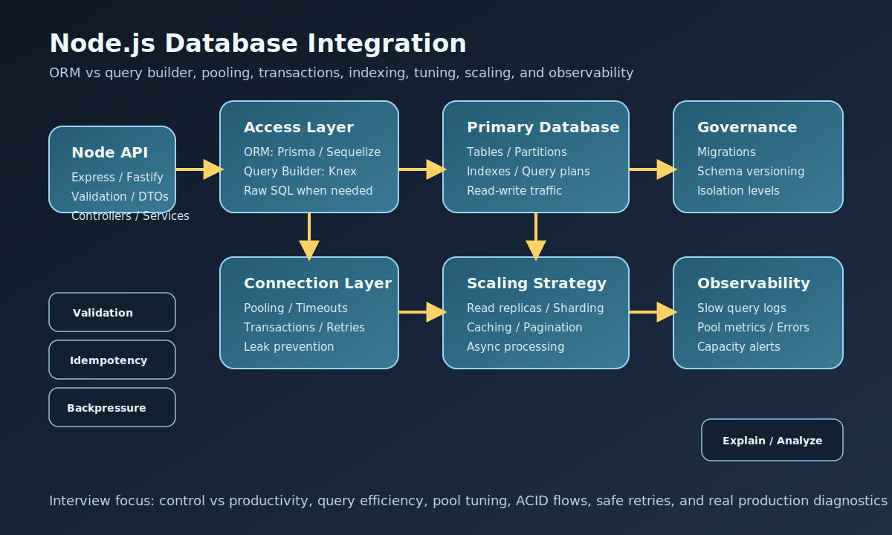

# Node.js Database Integration Interview Questions


This guide covers database integration in Node.js from interview basics to tricky production scenarios. It follows the corrected format of **100 interview questions for each subtopic**, and every answer includes a real Node.js database code example plus a real-time example so the scenarios and snippets do not repeat verbatim.

## How To Use This Page

- Questions 1-100 cover ORM vs Query Builder.
- Questions 101-200 cover Connection Pooling.
- Questions 201-300 cover Transactions.
- Questions 301-400 cover Indexing.
- Questions 401-500 cover Performance Tuning.
- Questions 501-600 cover Advanced Topics.

## 1. ORM vs Query Builder

### Q1.1 What is orm basics in Node.js database integration?

**Answer:**

ORM basics matters in Node.js database integration because it affects how ORMs map tables to objects and influence developer productivity. In a real system like a high-traffic order API balancing transactional updates, reporting queries, and customer-facing latency, a strong answer should connect the concept to query shape, pool behavior, transactional safety, tuning, and how Node.js services behave when the database is the real bottleneck. A more senior answer also explains the practical trade-off so the answer reflects real Node.js database engineering instead of generic ORM or SQL vocabulary.

**Code Example:**

```js
const users1 = await prisma.user.findMany({
  where: { isActive: true },
  take: 10
});
```

**Real-Time Example:** In a high-traffic order API balancing transactional updates, reporting queries, and customer-facing latency, the team used this concept so the answer reflects real Node.js database engineering instead of generic ORM or SQL vocabulary.

### Q1.2 Why does query builder basics matter in real Node.js systems?

**Answer:**

Query builder basics matters in Node.js database integration because it affects how SQL-like control in JavaScript changes readability and tuning. In a real system like a banking backend where billing flows and account updates must remain consistent under concurrency, a strong answer should connect the concept to query shape, pool behavior, transactional safety, tuning, and how Node.js services behave when the database is the real bottleneck. A more senior answer also explains the practical trade-off so teams can connect the concept to throughput, consistency, and operational stability.

**Code Example:**

```js
const orders2 = await knex('orders')
  .where({ tenant_id: 'tenant-2' })
  .orderBy('created_at', 'desc')
  .select('*');
```

**Real-Time Example:** In a banking backend where billing flows and account updates must remain consistent under concurrency, the team used this concept so teams can connect the concept to throughput, consistency, and operational stability.

### Q1.3 When should a team focus on control versus convenience?

**Answer:**

Control versus convenience matters in Node.js database integration because it affects how teams trade speed of development against low-level query control. In a real system like a CMS platform mixing CRUD operations, search, and administrative reporting in the same Node.js service, a strong answer should connect the concept to query shape, pool behavior, transactional safety, tuning, and how Node.js services behave when the database is the real bottleneck. A more senior answer also explains the practical trade-off so database incidents become easier to diagnose before they turn into outages.

**Code Example:**

```js
const accessChoice3 = {
  orm: 'Prisma',
  queryBuilder: 'Knex',
  reason: 'mix convenience with fine-grained SQL control'
};
```

**Real-Time Example:** In a CMS platform mixing CRUD operations, search, and administrative reporting in the same Node.js service, the team used this concept so database incidents become easier to diagnose before they turn into outages.

### Q1.4 How would you explain tool choice by workload in a production discussion?

**Answer:**

Tool choice by workload matters in Node.js database integration because it affects how reporting, CRUD, and domain complexity affect the access layer. In a real system like a healthcare integration system where retries, timeouts, and query tuning must be handled carefully, a strong answer should connect the concept to query shape, pool behavior, transactional safety, tuning, and how Node.js services behave when the database is the real bottleneck. A more senior answer also explains the practical trade-off so tooling decisions are tied to workload fit instead of personal preference.

**Code Example:**

```js
const reportRows4 = await prisma.$queryRaw`
  SELECT metric_cd, COUNT(*) AS total
  FROM report_rows
  WHERE shift_id = 4
  GROUP BY metric_cd
`;
```

**Real-Time Example:** In a healthcare integration system where retries, timeouts, and query tuning must be handled carefully, the team used this concept so tooling decisions are tied to workload fit instead of personal preference.

### Q1.5 What is a common interview trap around debuggability and optimization depth?

**Answer:**

Debuggability and optimization depth matters in Node.js database integration because it affects how abstractions help or hurt when queries get complicated. In a real system like a logistics platform with queue-driven workers, heavy joins, and large historical datasets, a strong answer should connect the concept to query shape, pool behavior, transactional safety, tuning, and how Node.js services behave when the database is the real bottleneck. A more senior answer also explains the practical trade-off so performance tuning is based on evidence rather than scaling by guesswork.

**Code Example:**

```js
function chooseDataAccess5(isCrudHeavy, isSqlHeavy) {
  return isSqlHeavy ? 'query-builder' : isCrudHeavy ? 'orm' : 'hybrid';
}
```

**Real-Time Example:** In a logistics platform with queue-driven workers, heavy joins, and large historical datasets, the team used this concept so performance tuning is based on evidence rather than scaling by guesswork.

### Q1.6 How do teams apply orm basics safely in practice?

**Answer:**

ORM basics matters in Node.js database integration because it affects how ORMs map tables to objects and influence developer productivity. In a real system like a customer-support application where poor indexing and leaking connections cause performance incidents, a strong answer should connect the concept to query shape, pool behavior, transactional safety, tuning, and how Node.js services behave when the database is the real bottleneck. A more senior answer also explains the practical trade-off so consistency and retry behavior become safer under real production pressure.

**Code Example:**

```js
const users6 = await prisma.user.findMany({
  where: { isActive: true },
  take: 10
});
```

**Real-Time Example:** In a customer-support application where poor indexing and leaking connections cause performance incidents, the team used this concept so consistency and retry behavior become safer under real production pressure.

### Q1.7 What production database issue usually exposes weak understanding of query builder basics?

**Answer:**

Query builder basics matters in Node.js database integration because it affects how SQL-like control in JavaScript changes readability and tuning. In a real system like an enterprise reporting service where ORM convenience collides with complex SQL tuning needs, a strong answer should connect the concept to query shape, pool behavior, transactional safety, tuning, and how Node.js services behave when the database is the real bottleneck. A more senior answer also explains the practical trade-off so the access layer stays easier to evolve as schema and workload complexity grow.

**Code Example:**

```js
const orders7 = await knex('orders')
  .where({ tenant_id: 'tenant-7' })
  .orderBy('created_at', 'desc')
  .select('*');
```

**Real-Time Example:** In an enterprise reporting service where ORM convenience collides with complex SQL tuning needs, the team used this concept so the access layer stays easier to evolve as schema and workload complexity grow.

### Q1.8 How would an experienced backend engineer justify control versus convenience to a team?

**Answer:**

Control versus convenience matters in Node.js database integration because it affects how teams trade speed of development against low-level query control. In a real system like a multi-tenant SaaS platform deciding between pooled databases, replicas, and caching strategies, a strong answer should connect the concept to query shape, pool behavior, transactional safety, tuning, and how Node.js services behave when the database is the real bottleneck. A more senior answer also explains the practical trade-off so trade-offs between productivity and control become clearer during architecture reviews.

**Code Example:**

```js
const accessChoice8 = {
  orm: 'Prisma',
  queryBuilder: 'Knex',
  reason: 'mix convenience with fine-grained SQL control'
};
```

**Real-Time Example:** In a multi-tenant SaaS platform deciding between pooled databases, replicas, and caching strategies, the team used this concept so trade-offs between productivity and control become clearer during architecture reviews.

### Q1.9 What trade-off does tool choice by workload introduce?

**Answer:**

Tool choice by workload matters in Node.js database integration because it affects how reporting, CRUD, and domain complexity affect the access layer. In a real system like a production incident where the database tier was scaled up before the real query problem was understood, a strong answer should connect the concept to query shape, pool behavior, transactional safety, tuning, and how Node.js services behave when the database is the real bottleneck. A more senior answer also explains the practical trade-off so the examples tie Node.js code directly to real database behavior.

**Code Example:**

```js
const reportRows9 = await prisma.$queryRaw`
  SELECT metric_cd, COUNT(*) AS total
  FROM report_rows
  WHERE shift_id = 9
  GROUP BY metric_cd
`;
```

**Real-Time Example:** In a production incident where the database tier was scaled up before the real query problem was understood, the team used this concept so the examples tie Node.js code directly to real database behavior.

### Q1.10 How do you answer a tricky follow-up about debuggability and optimization depth?

**Answer:**

Debuggability and optimization depth matters in Node.js database integration because it affects how abstractions help or hurt when queries get complicated. In a real system like a modernization effort replacing fragile ad hoc SQL access with clearer Node.js data-access patterns, a strong answer should connect the concept to query shape, pool behavior, transactional safety, tuning, and how Node.js services behave when the database is the real bottleneck. A more senior answer also explains the practical trade-off so future growth and support needs are considered earlier in the design process.

**Code Example:**

```js
function chooseDataAccess10(isCrudHeavy, isSqlHeavy) {
  return isSqlHeavy ? 'query-builder' : isCrudHeavy ? 'orm' : 'hybrid';
}
```

**Real-Time Example:** In a modernization effort replacing fragile ad hoc SQL access with clearer Node.js data-access patterns, the team used this concept so future growth and support needs are considered earlier in the design process.

### Q1.11 What is orm basics in Node.js database integration?

**Answer:**

ORM basics matters in Node.js database integration because it affects how ORMs map tables to objects and influence developer productivity. In a real system like a high-traffic order API balancing transactional updates, reporting queries, and customer-facing latency, a strong answer should connect the concept to query shape, pool behavior, transactional safety, tuning, and how Node.js services behave when the database is the real bottleneck. A more senior answer also explains the practical trade-off so the answer reflects real Node.js database engineering instead of generic ORM or SQL vocabulary.

**Code Example:**

```js
const users11 = await prisma.user.findMany({
  where: { isActive: true },
  take: 10
});
```

**Real-Time Example:** In a high-traffic order API balancing transactional updates, reporting queries, and customer-facing latency, the team used this concept so the answer reflects real Node.js database engineering instead of generic ORM or SQL vocabulary.

### Q1.12 Why does query builder basics matter in real Node.js systems?

**Answer:**

Query builder basics matters in Node.js database integration because it affects how SQL-like control in JavaScript changes readability and tuning. In a real system like a banking backend where billing flows and account updates must remain consistent under concurrency, a strong answer should connect the concept to query shape, pool behavior, transactional safety, tuning, and how Node.js services behave when the database is the real bottleneck. A more senior answer also explains the practical trade-off so teams can connect the concept to throughput, consistency, and operational stability.

**Code Example:**

```js
const orders12 = await knex('orders')
  .where({ tenant_id: 'tenant-12' })
  .orderBy('created_at', 'desc')
  .select('*');
```

**Real-Time Example:** In a banking backend where billing flows and account updates must remain consistent under concurrency, the team used this concept so teams can connect the concept to throughput, consistency, and operational stability.

### Q1.13 When should a team focus on control versus convenience?

**Answer:**

Control versus convenience matters in Node.js database integration because it affects how teams trade speed of development against low-level query control. In a real system like a CMS platform mixing CRUD operations, search, and administrative reporting in the same Node.js service, a strong answer should connect the concept to query shape, pool behavior, transactional safety, tuning, and how Node.js services behave when the database is the real bottleneck. A more senior answer also explains the practical trade-off so database incidents become easier to diagnose before they turn into outages.

**Code Example:**

```js
const accessChoice13 = {
  orm: 'Prisma',
  queryBuilder: 'Knex',
  reason: 'mix convenience with fine-grained SQL control'
};
```

**Real-Time Example:** In a CMS platform mixing CRUD operations, search, and administrative reporting in the same Node.js service, the team used this concept so database incidents become easier to diagnose before they turn into outages.

### Q1.14 How would you explain tool choice by workload in a production discussion?

**Answer:**

Tool choice by workload matters in Node.js database integration because it affects how reporting, CRUD, and domain complexity affect the access layer. In a real system like a healthcare integration system where retries, timeouts, and query tuning must be handled carefully, a strong answer should connect the concept to query shape, pool behavior, transactional safety, tuning, and how Node.js services behave when the database is the real bottleneck. A more senior answer also explains the practical trade-off so tooling decisions are tied to workload fit instead of personal preference.

**Code Example:**

```js
const reportRows14 = await prisma.$queryRaw`
  SELECT metric_cd, COUNT(*) AS total
  FROM report_rows
  WHERE shift_id = 14
  GROUP BY metric_cd
`;
```

**Real-Time Example:** In a healthcare integration system where retries, timeouts, and query tuning must be handled carefully, the team used this concept so tooling decisions are tied to workload fit instead of personal preference.

### Q1.15 What is a common interview trap around debuggability and optimization depth?

**Answer:**

Debuggability and optimization depth matters in Node.js database integration because it affects how abstractions help or hurt when queries get complicated. In a real system like a logistics platform with queue-driven workers, heavy joins, and large historical datasets, a strong answer should connect the concept to query shape, pool behavior, transactional safety, tuning, and how Node.js services behave when the database is the real bottleneck. A more senior answer also explains the practical trade-off so performance tuning is based on evidence rather than scaling by guesswork.

**Code Example:**

```js
function chooseDataAccess15(isCrudHeavy, isSqlHeavy) {
  return isSqlHeavy ? 'query-builder' : isCrudHeavy ? 'orm' : 'hybrid';
}
```

**Real-Time Example:** In a logistics platform with queue-driven workers, heavy joins, and large historical datasets, the team used this concept so performance tuning is based on evidence rather than scaling by guesswork.

### Q1.16 How do teams apply orm basics safely in practice?

**Answer:**

ORM basics matters in Node.js database integration because it affects how ORMs map tables to objects and influence developer productivity. In a real system like a customer-support application where poor indexing and leaking connections cause performance incidents, a strong answer should connect the concept to query shape, pool behavior, transactional safety, tuning, and how Node.js services behave when the database is the real bottleneck. A more senior answer also explains the practical trade-off so consistency and retry behavior become safer under real production pressure.

**Code Example:**

```js
const users16 = await prisma.user.findMany({
  where: { isActive: true },
  take: 10
});
```

**Real-Time Example:** In a customer-support application where poor indexing and leaking connections cause performance incidents, the team used this concept so consistency and retry behavior become safer under real production pressure.

### Q1.17 What production database issue usually exposes weak understanding of query builder basics?

**Answer:**

Query builder basics matters in Node.js database integration because it affects how SQL-like control in JavaScript changes readability and tuning. In a real system like an enterprise reporting service where ORM convenience collides with complex SQL tuning needs, a strong answer should connect the concept to query shape, pool behavior, transactional safety, tuning, and how Node.js services behave when the database is the real bottleneck. A more senior answer also explains the practical trade-off so the access layer stays easier to evolve as schema and workload complexity grow.

**Code Example:**

```js
const orders17 = await knex('orders')
  .where({ tenant_id: 'tenant-17' })
  .orderBy('created_at', 'desc')
  .select('*');
```

**Real-Time Example:** In an enterprise reporting service where ORM convenience collides with complex SQL tuning needs, the team used this concept so the access layer stays easier to evolve as schema and workload complexity grow.

### Q1.18 How would an experienced backend engineer justify control versus convenience to a team?

**Answer:**

Control versus convenience matters in Node.js database integration because it affects how teams trade speed of development against low-level query control. In a real system like a multi-tenant SaaS platform deciding between pooled databases, replicas, and caching strategies, a strong answer should connect the concept to query shape, pool behavior, transactional safety, tuning, and how Node.js services behave when the database is the real bottleneck. A more senior answer also explains the practical trade-off so trade-offs between productivity and control become clearer during architecture reviews.

**Code Example:**

```js
const accessChoice18 = {
  orm: 'Prisma',
  queryBuilder: 'Knex',
  reason: 'mix convenience with fine-grained SQL control'
};
```

**Real-Time Example:** In a multi-tenant SaaS platform deciding between pooled databases, replicas, and caching strategies, the team used this concept so trade-offs between productivity and control become clearer during architecture reviews.

### Q1.19 What trade-off does tool choice by workload introduce?

**Answer:**

Tool choice by workload matters in Node.js database integration because it affects how reporting, CRUD, and domain complexity affect the access layer. In a real system like a production incident where the database tier was scaled up before the real query problem was understood, a strong answer should connect the concept to query shape, pool behavior, transactional safety, tuning, and how Node.js services behave when the database is the real bottleneck. A more senior answer also explains the practical trade-off so the examples tie Node.js code directly to real database behavior.

**Code Example:**

```js
const reportRows19 = await prisma.$queryRaw`
  SELECT metric_cd, COUNT(*) AS total
  FROM report_rows
  WHERE shift_id = 19
  GROUP BY metric_cd
`;
```

**Real-Time Example:** In a production incident where the database tier was scaled up before the real query problem was understood, the team used this concept so the examples tie Node.js code directly to real database behavior.

### Q1.20 How do you answer a tricky follow-up about debuggability and optimization depth?

**Answer:**

Debuggability and optimization depth matters in Node.js database integration because it affects how abstractions help or hurt when queries get complicated. In a real system like a modernization effort replacing fragile ad hoc SQL access with clearer Node.js data-access patterns, a strong answer should connect the concept to query shape, pool behavior, transactional safety, tuning, and how Node.js services behave when the database is the real bottleneck. A more senior answer also explains the practical trade-off so future growth and support needs are considered earlier in the design process.

**Code Example:**

```js
function chooseDataAccess20(isCrudHeavy, isSqlHeavy) {
  return isSqlHeavy ? 'query-builder' : isCrudHeavy ? 'orm' : 'hybrid';
}
```

**Real-Time Example:** In a modernization effort replacing fragile ad hoc SQL access with clearer Node.js data-access patterns, the team used this concept so future growth and support needs are considered earlier in the design process.

### Q1.21 What is orm basics in Node.js database integration?

**Answer:**

ORM basics matters in Node.js database integration because it affects how ORMs map tables to objects and influence developer productivity. In a real system like a high-traffic order API balancing transactional updates, reporting queries, and customer-facing latency, a strong answer should connect the concept to query shape, pool behavior, transactional safety, tuning, and how Node.js services behave when the database is the real bottleneck. A more senior answer also explains the practical trade-off so the answer reflects real Node.js database engineering instead of generic ORM or SQL vocabulary.

**Code Example:**

```js
const users21 = await prisma.user.findMany({
  where: { isActive: true },
  take: 10
});
```

**Real-Time Example:** In a high-traffic order API balancing transactional updates, reporting queries, and customer-facing latency, the team used this concept so the answer reflects real Node.js database engineering instead of generic ORM or SQL vocabulary.

### Q1.22 Why does query builder basics matter in real Node.js systems?

**Answer:**

Query builder basics matters in Node.js database integration because it affects how SQL-like control in JavaScript changes readability and tuning. In a real system like a banking backend where billing flows and account updates must remain consistent under concurrency, a strong answer should connect the concept to query shape, pool behavior, transactional safety, tuning, and how Node.js services behave when the database is the real bottleneck. A more senior answer also explains the practical trade-off so teams can connect the concept to throughput, consistency, and operational stability.

**Code Example:**

```js
const orders22 = await knex('orders')
  .where({ tenant_id: 'tenant-22' })
  .orderBy('created_at', 'desc')
  .select('*');
```

**Real-Time Example:** In a banking backend where billing flows and account updates must remain consistent under concurrency, the team used this concept so teams can connect the concept to throughput, consistency, and operational stability.

### Q1.23 When should a team focus on control versus convenience?

**Answer:**

Control versus convenience matters in Node.js database integration because it affects how teams trade speed of development against low-level query control. In a real system like a CMS platform mixing CRUD operations, search, and administrative reporting in the same Node.js service, a strong answer should connect the concept to query shape, pool behavior, transactional safety, tuning, and how Node.js services behave when the database is the real bottleneck. A more senior answer also explains the practical trade-off so database incidents become easier to diagnose before they turn into outages.

**Code Example:**

```js
const accessChoice23 = {
  orm: 'Prisma',
  queryBuilder: 'Knex',
  reason: 'mix convenience with fine-grained SQL control'
};
```

**Real-Time Example:** In a CMS platform mixing CRUD operations, search, and administrative reporting in the same Node.js service, the team used this concept so database incidents become easier to diagnose before they turn into outages.

### Q1.24 How would you explain tool choice by workload in a production discussion?

**Answer:**

Tool choice by workload matters in Node.js database integration because it affects how reporting, CRUD, and domain complexity affect the access layer. In a real system like a healthcare integration system where retries, timeouts, and query tuning must be handled carefully, a strong answer should connect the concept to query shape, pool behavior, transactional safety, tuning, and how Node.js services behave when the database is the real bottleneck. A more senior answer also explains the practical trade-off so tooling decisions are tied to workload fit instead of personal preference.

**Code Example:**

```js
const reportRows24 = await prisma.$queryRaw`
  SELECT metric_cd, COUNT(*) AS total
  FROM report_rows
  WHERE shift_id = 24
  GROUP BY metric_cd
`;
```

**Real-Time Example:** In a healthcare integration system where retries, timeouts, and query tuning must be handled carefully, the team used this concept so tooling decisions are tied to workload fit instead of personal preference.

### Q1.25 What is a common interview trap around debuggability and optimization depth?

**Answer:**

Debuggability and optimization depth matters in Node.js database integration because it affects how abstractions help or hurt when queries get complicated. In a real system like a logistics platform with queue-driven workers, heavy joins, and large historical datasets, a strong answer should connect the concept to query shape, pool behavior, transactional safety, tuning, and how Node.js services behave when the database is the real bottleneck. A more senior answer also explains the practical trade-off so performance tuning is based on evidence rather than scaling by guesswork.

**Code Example:**

```js
function chooseDataAccess25(isCrudHeavy, isSqlHeavy) {
  return isSqlHeavy ? 'query-builder' : isCrudHeavy ? 'orm' : 'hybrid';
}
```

**Real-Time Example:** In a logistics platform with queue-driven workers, heavy joins, and large historical datasets, the team used this concept so performance tuning is based on evidence rather than scaling by guesswork.

### Q1.26 How do teams apply orm basics safely in practice?

**Answer:**

ORM basics matters in Node.js database integration because it affects how ORMs map tables to objects and influence developer productivity. In a real system like a customer-support application where poor indexing and leaking connections cause performance incidents, a strong answer should connect the concept to query shape, pool behavior, transactional safety, tuning, and how Node.js services behave when the database is the real bottleneck. A more senior answer also explains the practical trade-off so consistency and retry behavior become safer under real production pressure.

**Code Example:**

```js
const users26 = await prisma.user.findMany({
  where: { isActive: true },
  take: 10
});
```

**Real-Time Example:** In a customer-support application where poor indexing and leaking connections cause performance incidents, the team used this concept so consistency and retry behavior become safer under real production pressure.

### Q1.27 What production database issue usually exposes weak understanding of query builder basics?

**Answer:**

Query builder basics matters in Node.js database integration because it affects how SQL-like control in JavaScript changes readability and tuning. In a real system like an enterprise reporting service where ORM convenience collides with complex SQL tuning needs, a strong answer should connect the concept to query shape, pool behavior, transactional safety, tuning, and how Node.js services behave when the database is the real bottleneck. A more senior answer also explains the practical trade-off so the access layer stays easier to evolve as schema and workload complexity grow.

**Code Example:**

```js
const orders27 = await knex('orders')
  .where({ tenant_id: 'tenant-27' })
  .orderBy('created_at', 'desc')
  .select('*');
```

**Real-Time Example:** In an enterprise reporting service where ORM convenience collides with complex SQL tuning needs, the team used this concept so the access layer stays easier to evolve as schema and workload complexity grow.

### Q1.28 How would an experienced backend engineer justify control versus convenience to a team?

**Answer:**

Control versus convenience matters in Node.js database integration because it affects how teams trade speed of development against low-level query control. In a real system like a multi-tenant SaaS platform deciding between pooled databases, replicas, and caching strategies, a strong answer should connect the concept to query shape, pool behavior, transactional safety, tuning, and how Node.js services behave when the database is the real bottleneck. A more senior answer also explains the practical trade-off so trade-offs between productivity and control become clearer during architecture reviews.

**Code Example:**

```js
const accessChoice28 = {
  orm: 'Prisma',
  queryBuilder: 'Knex',
  reason: 'mix convenience with fine-grained SQL control'
};
```

**Real-Time Example:** In a multi-tenant SaaS platform deciding between pooled databases, replicas, and caching strategies, the team used this concept so trade-offs between productivity and control become clearer during architecture reviews.

### Q1.29 What trade-off does tool choice by workload introduce?

**Answer:**

Tool choice by workload matters in Node.js database integration because it affects how reporting, CRUD, and domain complexity affect the access layer. In a real system like a production incident where the database tier was scaled up before the real query problem was understood, a strong answer should connect the concept to query shape, pool behavior, transactional safety, tuning, and how Node.js services behave when the database is the real bottleneck. A more senior answer also explains the practical trade-off so the examples tie Node.js code directly to real database behavior.

**Code Example:**

```js
const reportRows29 = await prisma.$queryRaw`
  SELECT metric_cd, COUNT(*) AS total
  FROM report_rows
  WHERE shift_id = 29
  GROUP BY metric_cd
`;
```

**Real-Time Example:** In a production incident where the database tier was scaled up before the real query problem was understood, the team used this concept so the examples tie Node.js code directly to real database behavior.

### Q1.30 How do you answer a tricky follow-up about debuggability and optimization depth?

**Answer:**

Debuggability and optimization depth matters in Node.js database integration because it affects how abstractions help or hurt when queries get complicated. In a real system like a modernization effort replacing fragile ad hoc SQL access with clearer Node.js data-access patterns, a strong answer should connect the concept to query shape, pool behavior, transactional safety, tuning, and how Node.js services behave when the database is the real bottleneck. A more senior answer also explains the practical trade-off so future growth and support needs are considered earlier in the design process.

**Code Example:**

```js
function chooseDataAccess30(isCrudHeavy, isSqlHeavy) {
  return isSqlHeavy ? 'query-builder' : isCrudHeavy ? 'orm' : 'hybrid';
}
```

**Real-Time Example:** In a modernization effort replacing fragile ad hoc SQL access with clearer Node.js data-access patterns, the team used this concept so future growth and support needs are considered earlier in the design process.

### Q1.31 What is orm basics in Node.js database integration?

**Answer:**

ORM basics matters in Node.js database integration because it affects how ORMs map tables to objects and influence developer productivity. In a real system like a high-traffic order API balancing transactional updates, reporting queries, and customer-facing latency, a strong answer should connect the concept to query shape, pool behavior, transactional safety, tuning, and how Node.js services behave when the database is the real bottleneck. A more senior answer also explains the practical trade-off so the answer reflects real Node.js database engineering instead of generic ORM or SQL vocabulary.

**Code Example:**

```js
const users31 = await prisma.user.findMany({
  where: { isActive: true },
  take: 10
});
```

**Real-Time Example:** In a high-traffic order API balancing transactional updates, reporting queries, and customer-facing latency, the team used this concept so the answer reflects real Node.js database engineering instead of generic ORM or SQL vocabulary.

### Q1.32 Why does query builder basics matter in real Node.js systems?

**Answer:**

Query builder basics matters in Node.js database integration because it affects how SQL-like control in JavaScript changes readability and tuning. In a real system like a banking backend where billing flows and account updates must remain consistent under concurrency, a strong answer should connect the concept to query shape, pool behavior, transactional safety, tuning, and how Node.js services behave when the database is the real bottleneck. A more senior answer also explains the practical trade-off so teams can connect the concept to throughput, consistency, and operational stability.

**Code Example:**

```js
const orders32 = await knex('orders')
  .where({ tenant_id: 'tenant-32' })
  .orderBy('created_at', 'desc')
  .select('*');
```

**Real-Time Example:** In a banking backend where billing flows and account updates must remain consistent under concurrency, the team used this concept so teams can connect the concept to throughput, consistency, and operational stability.

### Q1.33 When should a team focus on control versus convenience?

**Answer:**

Control versus convenience matters in Node.js database integration because it affects how teams trade speed of development against low-level query control. In a real system like a CMS platform mixing CRUD operations, search, and administrative reporting in the same Node.js service, a strong answer should connect the concept to query shape, pool behavior, transactional safety, tuning, and how Node.js services behave when the database is the real bottleneck. A more senior answer also explains the practical trade-off so database incidents become easier to diagnose before they turn into outages.

**Code Example:**

```js
const accessChoice33 = {
  orm: 'Prisma',
  queryBuilder: 'Knex',
  reason: 'mix convenience with fine-grained SQL control'
};
```

**Real-Time Example:** In a CMS platform mixing CRUD operations, search, and administrative reporting in the same Node.js service, the team used this concept so database incidents become easier to diagnose before they turn into outages.

### Q1.34 How would you explain tool choice by workload in a production discussion?

**Answer:**

Tool choice by workload matters in Node.js database integration because it affects how reporting, CRUD, and domain complexity affect the access layer. In a real system like a healthcare integration system where retries, timeouts, and query tuning must be handled carefully, a strong answer should connect the concept to query shape, pool behavior, transactional safety, tuning, and how Node.js services behave when the database is the real bottleneck. A more senior answer also explains the practical trade-off so tooling decisions are tied to workload fit instead of personal preference.

**Code Example:**

```js
const reportRows34 = await prisma.$queryRaw`
  SELECT metric_cd, COUNT(*) AS total
  FROM report_rows
  WHERE shift_id = 34
  GROUP BY metric_cd
`;
```

**Real-Time Example:** In a healthcare integration system where retries, timeouts, and query tuning must be handled carefully, the team used this concept so tooling decisions are tied to workload fit instead of personal preference.

### Q1.35 What is a common interview trap around debuggability and optimization depth?

**Answer:**

Debuggability and optimization depth matters in Node.js database integration because it affects how abstractions help or hurt when queries get complicated. In a real system like a logistics platform with queue-driven workers, heavy joins, and large historical datasets, a strong answer should connect the concept to query shape, pool behavior, transactional safety, tuning, and how Node.js services behave when the database is the real bottleneck. A more senior answer also explains the practical trade-off so performance tuning is based on evidence rather than scaling by guesswork.

**Code Example:**

```js
function chooseDataAccess35(isCrudHeavy, isSqlHeavy) {
  return isSqlHeavy ? 'query-builder' : isCrudHeavy ? 'orm' : 'hybrid';
}
```

**Real-Time Example:** In a logistics platform with queue-driven workers, heavy joins, and large historical datasets, the team used this concept so performance tuning is based on evidence rather than scaling by guesswork.

### Q1.36 How do teams apply orm basics safely in practice?

**Answer:**

ORM basics matters in Node.js database integration because it affects how ORMs map tables to objects and influence developer productivity. In a real system like a customer-support application where poor indexing and leaking connections cause performance incidents, a strong answer should connect the concept to query shape, pool behavior, transactional safety, tuning, and how Node.js services behave when the database is the real bottleneck. A more senior answer also explains the practical trade-off so consistency and retry behavior become safer under real production pressure.

**Code Example:**

```js
const users36 = await prisma.user.findMany({
  where: { isActive: true },
  take: 10
});
```

**Real-Time Example:** In a customer-support application where poor indexing and leaking connections cause performance incidents, the team used this concept so consistency and retry behavior become safer under real production pressure.

### Q1.37 What production database issue usually exposes weak understanding of query builder basics?

**Answer:**

Query builder basics matters in Node.js database integration because it affects how SQL-like control in JavaScript changes readability and tuning. In a real system like an enterprise reporting service where ORM convenience collides with complex SQL tuning needs, a strong answer should connect the concept to query shape, pool behavior, transactional safety, tuning, and how Node.js services behave when the database is the real bottleneck. A more senior answer also explains the practical trade-off so the access layer stays easier to evolve as schema and workload complexity grow.

**Code Example:**

```js
const orders37 = await knex('orders')
  .where({ tenant_id: 'tenant-37' })
  .orderBy('created_at', 'desc')
  .select('*');
```

**Real-Time Example:** In an enterprise reporting service where ORM convenience collides with complex SQL tuning needs, the team used this concept so the access layer stays easier to evolve as schema and workload complexity grow.

### Q1.38 How would an experienced backend engineer justify control versus convenience to a team?

**Answer:**

Control versus convenience matters in Node.js database integration because it affects how teams trade speed of development against low-level query control. In a real system like a multi-tenant SaaS platform deciding between pooled databases, replicas, and caching strategies, a strong answer should connect the concept to query shape, pool behavior, transactional safety, tuning, and how Node.js services behave when the database is the real bottleneck. A more senior answer also explains the practical trade-off so trade-offs between productivity and control become clearer during architecture reviews.

**Code Example:**

```js
const accessChoice38 = {
  orm: 'Prisma',
  queryBuilder: 'Knex',
  reason: 'mix convenience with fine-grained SQL control'
};
```

**Real-Time Example:** In a multi-tenant SaaS platform deciding between pooled databases, replicas, and caching strategies, the team used this concept so trade-offs between productivity and control become clearer during architecture reviews.

### Q1.39 What trade-off does tool choice by workload introduce?

**Answer:**

Tool choice by workload matters in Node.js database integration because it affects how reporting, CRUD, and domain complexity affect the access layer. In a real system like a production incident where the database tier was scaled up before the real query problem was understood, a strong answer should connect the concept to query shape, pool behavior, transactional safety, tuning, and how Node.js services behave when the database is the real bottleneck. A more senior answer also explains the practical trade-off so the examples tie Node.js code directly to real database behavior.

**Code Example:**

```js
const reportRows39 = await prisma.$queryRaw`
  SELECT metric_cd, COUNT(*) AS total
  FROM report_rows
  WHERE shift_id = 39
  GROUP BY metric_cd
`;
```

**Real-Time Example:** In a production incident where the database tier was scaled up before the real query problem was understood, the team used this concept so the examples tie Node.js code directly to real database behavior.

### Q1.40 How do you answer a tricky follow-up about debuggability and optimization depth?

**Answer:**

Debuggability and optimization depth matters in Node.js database integration because it affects how abstractions help or hurt when queries get complicated. In a real system like a modernization effort replacing fragile ad hoc SQL access with clearer Node.js data-access patterns, a strong answer should connect the concept to query shape, pool behavior, transactional safety, tuning, and how Node.js services behave when the database is the real bottleneck. A more senior answer also explains the practical trade-off so future growth and support needs are considered earlier in the design process.

**Code Example:**

```js
function chooseDataAccess40(isCrudHeavy, isSqlHeavy) {
  return isSqlHeavy ? 'query-builder' : isCrudHeavy ? 'orm' : 'hybrid';
}
```

**Real-Time Example:** In a modernization effort replacing fragile ad hoc SQL access with clearer Node.js data-access patterns, the team used this concept so future growth and support needs are considered earlier in the design process.

### Q1.41 What is orm basics in Node.js database integration?

**Answer:**

ORM basics matters in Node.js database integration because it affects how ORMs map tables to objects and influence developer productivity. In a real system like a high-traffic order API balancing transactional updates, reporting queries, and customer-facing latency, a strong answer should connect the concept to query shape, pool behavior, transactional safety, tuning, and how Node.js services behave when the database is the real bottleneck. A more senior answer also explains the practical trade-off so the answer reflects real Node.js database engineering instead of generic ORM or SQL vocabulary.

**Code Example:**

```js
const users41 = await prisma.user.findMany({
  where: { isActive: true },
  take: 10
});
```

**Real-Time Example:** In a high-traffic order API balancing transactional updates, reporting queries, and customer-facing latency, the team used this concept so the answer reflects real Node.js database engineering instead of generic ORM or SQL vocabulary.

### Q1.42 Why does query builder basics matter in real Node.js systems?

**Answer:**

Query builder basics matters in Node.js database integration because it affects how SQL-like control in JavaScript changes readability and tuning. In a real system like a banking backend where billing flows and account updates must remain consistent under concurrency, a strong answer should connect the concept to query shape, pool behavior, transactional safety, tuning, and how Node.js services behave when the database is the real bottleneck. A more senior answer also explains the practical trade-off so teams can connect the concept to throughput, consistency, and operational stability.

**Code Example:**

```js
const orders42 = await knex('orders')
  .where({ tenant_id: 'tenant-42' })
  .orderBy('created_at', 'desc')
  .select('*');
```

**Real-Time Example:** In a banking backend where billing flows and account updates must remain consistent under concurrency, the team used this concept so teams can connect the concept to throughput, consistency, and operational stability.

### Q1.43 When should a team focus on control versus convenience?

**Answer:**

Control versus convenience matters in Node.js database integration because it affects how teams trade speed of development against low-level query control. In a real system like a CMS platform mixing CRUD operations, search, and administrative reporting in the same Node.js service, a strong answer should connect the concept to query shape, pool behavior, transactional safety, tuning, and how Node.js services behave when the database is the real bottleneck. A more senior answer also explains the practical trade-off so database incidents become easier to diagnose before they turn into outages.

**Code Example:**

```js
const accessChoice43 = {
  orm: 'Prisma',
  queryBuilder: 'Knex',
  reason: 'mix convenience with fine-grained SQL control'
};
```

**Real-Time Example:** In a CMS platform mixing CRUD operations, search, and administrative reporting in the same Node.js service, the team used this concept so database incidents become easier to diagnose before they turn into outages.

### Q1.44 How would you explain tool choice by workload in a production discussion?

**Answer:**

Tool choice by workload matters in Node.js database integration because it affects how reporting, CRUD, and domain complexity affect the access layer. In a real system like a healthcare integration system where retries, timeouts, and query tuning must be handled carefully, a strong answer should connect the concept to query shape, pool behavior, transactional safety, tuning, and how Node.js services behave when the database is the real bottleneck. A more senior answer also explains the practical trade-off so tooling decisions are tied to workload fit instead of personal preference.

**Code Example:**

```js
const reportRows44 = await prisma.$queryRaw`
  SELECT metric_cd, COUNT(*) AS total
  FROM report_rows
  WHERE shift_id = 44
  GROUP BY metric_cd
`;
```

**Real-Time Example:** In a healthcare integration system where retries, timeouts, and query tuning must be handled carefully, the team used this concept so tooling decisions are tied to workload fit instead of personal preference.

### Q1.45 What is a common interview trap around debuggability and optimization depth?

**Answer:**

Debuggability and optimization depth matters in Node.js database integration because it affects how abstractions help or hurt when queries get complicated. In a real system like a logistics platform with queue-driven workers, heavy joins, and large historical datasets, a strong answer should connect the concept to query shape, pool behavior, transactional safety, tuning, and how Node.js services behave when the database is the real bottleneck. A more senior answer also explains the practical trade-off so performance tuning is based on evidence rather than scaling by guesswork.

**Code Example:**

```js
function chooseDataAccess45(isCrudHeavy, isSqlHeavy) {
  return isSqlHeavy ? 'query-builder' : isCrudHeavy ? 'orm' : 'hybrid';
}
```

**Real-Time Example:** In a logistics platform with queue-driven workers, heavy joins, and large historical datasets, the team used this concept so performance tuning is based on evidence rather than scaling by guesswork.

### Q1.46 How do teams apply orm basics safely in practice?

**Answer:**

ORM basics matters in Node.js database integration because it affects how ORMs map tables to objects and influence developer productivity. In a real system like a customer-support application where poor indexing and leaking connections cause performance incidents, a strong answer should connect the concept to query shape, pool behavior, transactional safety, tuning, and how Node.js services behave when the database is the real bottleneck. A more senior answer also explains the practical trade-off so consistency and retry behavior become safer under real production pressure.

**Code Example:**

```js
const users46 = await prisma.user.findMany({
  where: { isActive: true },
  take: 10
});
```

**Real-Time Example:** In a customer-support application where poor indexing and leaking connections cause performance incidents, the team used this concept so consistency and retry behavior become safer under real production pressure.

### Q1.47 What production database issue usually exposes weak understanding of query builder basics?

**Answer:**

Query builder basics matters in Node.js database integration because it affects how SQL-like control in JavaScript changes readability and tuning. In a real system like an enterprise reporting service where ORM convenience collides with complex SQL tuning needs, a strong answer should connect the concept to query shape, pool behavior, transactional safety, tuning, and how Node.js services behave when the database is the real bottleneck. A more senior answer also explains the practical trade-off so the access layer stays easier to evolve as schema and workload complexity grow.

**Code Example:**

```js
const orders47 = await knex('orders')
  .where({ tenant_id: 'tenant-47' })
  .orderBy('created_at', 'desc')
  .select('*');
```

**Real-Time Example:** In an enterprise reporting service where ORM convenience collides with complex SQL tuning needs, the team used this concept so the access layer stays easier to evolve as schema and workload complexity grow.

### Q1.48 How would an experienced backend engineer justify control versus convenience to a team?

**Answer:**

Control versus convenience matters in Node.js database integration because it affects how teams trade speed of development against low-level query control. In a real system like a multi-tenant SaaS platform deciding between pooled databases, replicas, and caching strategies, a strong answer should connect the concept to query shape, pool behavior, transactional safety, tuning, and how Node.js services behave when the database is the real bottleneck. A more senior answer also explains the practical trade-off so trade-offs between productivity and control become clearer during architecture reviews.

**Code Example:**

```js
const accessChoice48 = {
  orm: 'Prisma',
  queryBuilder: 'Knex',
  reason: 'mix convenience with fine-grained SQL control'
};
```

**Real-Time Example:** In a multi-tenant SaaS platform deciding between pooled databases, replicas, and caching strategies, the team used this concept so trade-offs between productivity and control become clearer during architecture reviews.

### Q1.49 What trade-off does tool choice by workload introduce?

**Answer:**

Tool choice by workload matters in Node.js database integration because it affects how reporting, CRUD, and domain complexity affect the access layer. In a real system like a production incident where the database tier was scaled up before the real query problem was understood, a strong answer should connect the concept to query shape, pool behavior, transactional safety, tuning, and how Node.js services behave when the database is the real bottleneck. A more senior answer also explains the practical trade-off so the examples tie Node.js code directly to real database behavior.

**Code Example:**

```js
const reportRows49 = await prisma.$queryRaw`
  SELECT metric_cd, COUNT(*) AS total
  FROM report_rows
  WHERE shift_id = 49
  GROUP BY metric_cd
`;
```

**Real-Time Example:** In a production incident where the database tier was scaled up before the real query problem was understood, the team used this concept so the examples tie Node.js code directly to real database behavior.

### Q1.50 How do you answer a tricky follow-up about debuggability and optimization depth?

**Answer:**

Debuggability and optimization depth matters in Node.js database integration because it affects how abstractions help or hurt when queries get complicated. In a real system like a modernization effort replacing fragile ad hoc SQL access with clearer Node.js data-access patterns, a strong answer should connect the concept to query shape, pool behavior, transactional safety, tuning, and how Node.js services behave when the database is the real bottleneck. A more senior answer also explains the practical trade-off so future growth and support needs are considered earlier in the design process.

**Code Example:**

```js
function chooseDataAccess50(isCrudHeavy, isSqlHeavy) {
  return isSqlHeavy ? 'query-builder' : isCrudHeavy ? 'orm' : 'hybrid';
}
```

**Real-Time Example:** In a modernization effort replacing fragile ad hoc SQL access with clearer Node.js data-access patterns, the team used this concept so future growth and support needs are considered earlier in the design process.

### Q1.51 What is orm basics in Node.js database integration?

**Answer:**

ORM basics matters in Node.js database integration because it affects how ORMs map tables to objects and influence developer productivity. In a real system like a high-traffic order API balancing transactional updates, reporting queries, and customer-facing latency, a strong answer should connect the concept to query shape, pool behavior, transactional safety, tuning, and how Node.js services behave when the database is the real bottleneck. A more senior answer also explains the practical trade-off so the answer reflects real Node.js database engineering instead of generic ORM or SQL vocabulary.

**Code Example:**

```js
const users51 = await prisma.user.findMany({
  where: { isActive: true },
  take: 10
});
```

**Real-Time Example:** In a high-traffic order API balancing transactional updates, reporting queries, and customer-facing latency, the team used this concept so the answer reflects real Node.js database engineering instead of generic ORM or SQL vocabulary.

### Q1.52 Why does query builder basics matter in real Node.js systems?

**Answer:**

Query builder basics matters in Node.js database integration because it affects how SQL-like control in JavaScript changes readability and tuning. In a real system like a banking backend where billing flows and account updates must remain consistent under concurrency, a strong answer should connect the concept to query shape, pool behavior, transactional safety, tuning, and how Node.js services behave when the database is the real bottleneck. A more senior answer also explains the practical trade-off so teams can connect the concept to throughput, consistency, and operational stability.

**Code Example:**

```js
const orders52 = await knex('orders')
  .where({ tenant_id: 'tenant-52' })
  .orderBy('created_at', 'desc')
  .select('*');
```

**Real-Time Example:** In a banking backend where billing flows and account updates must remain consistent under concurrency, the team used this concept so teams can connect the concept to throughput, consistency, and operational stability.

### Q1.53 When should a team focus on control versus convenience?

**Answer:**

Control versus convenience matters in Node.js database integration because it affects how teams trade speed of development against low-level query control. In a real system like a CMS platform mixing CRUD operations, search, and administrative reporting in the same Node.js service, a strong answer should connect the concept to query shape, pool behavior, transactional safety, tuning, and how Node.js services behave when the database is the real bottleneck. A more senior answer also explains the practical trade-off so database incidents become easier to diagnose before they turn into outages.

**Code Example:**

```js
const accessChoice53 = {
  orm: 'Prisma',
  queryBuilder: 'Knex',
  reason: 'mix convenience with fine-grained SQL control'
};
```

**Real-Time Example:** In a CMS platform mixing CRUD operations, search, and administrative reporting in the same Node.js service, the team used this concept so database incidents become easier to diagnose before they turn into outages.

### Q1.54 How would you explain tool choice by workload in a production discussion?

**Answer:**

Tool choice by workload matters in Node.js database integration because it affects how reporting, CRUD, and domain complexity affect the access layer. In a real system like a healthcare integration system where retries, timeouts, and query tuning must be handled carefully, a strong answer should connect the concept to query shape, pool behavior, transactional safety, tuning, and how Node.js services behave when the database is the real bottleneck. A more senior answer also explains the practical trade-off so tooling decisions are tied to workload fit instead of personal preference.

**Code Example:**

```js
const reportRows54 = await prisma.$queryRaw`
  SELECT metric_cd, COUNT(*) AS total
  FROM report_rows
  WHERE shift_id = 54
  GROUP BY metric_cd
`;
```

**Real-Time Example:** In a healthcare integration system where retries, timeouts, and query tuning must be handled carefully, the team used this concept so tooling decisions are tied to workload fit instead of personal preference.

### Q1.55 What is a common interview trap around debuggability and optimization depth?

**Answer:**

Debuggability and optimization depth matters in Node.js database integration because it affects how abstractions help or hurt when queries get complicated. In a real system like a logistics platform with queue-driven workers, heavy joins, and large historical datasets, a strong answer should connect the concept to query shape, pool behavior, transactional safety, tuning, and how Node.js services behave when the database is the real bottleneck. A more senior answer also explains the practical trade-off so performance tuning is based on evidence rather than scaling by guesswork.

**Code Example:**

```js
function chooseDataAccess55(isCrudHeavy, isSqlHeavy) {
  return isSqlHeavy ? 'query-builder' : isCrudHeavy ? 'orm' : 'hybrid';
}
```

**Real-Time Example:** In a logistics platform with queue-driven workers, heavy joins, and large historical datasets, the team used this concept so performance tuning is based on evidence rather than scaling by guesswork.

### Q1.56 How do teams apply orm basics safely in practice?

**Answer:**

ORM basics matters in Node.js database integration because it affects how ORMs map tables to objects and influence developer productivity. In a real system like a customer-support application where poor indexing and leaking connections cause performance incidents, a strong answer should connect the concept to query shape, pool behavior, transactional safety, tuning, and how Node.js services behave when the database is the real bottleneck. A more senior answer also explains the practical trade-off so consistency and retry behavior become safer under real production pressure.

**Code Example:**

```js
const users56 = await prisma.user.findMany({
  where: { isActive: true },
  take: 10
});
```

**Real-Time Example:** In a customer-support application where poor indexing and leaking connections cause performance incidents, the team used this concept so consistency and retry behavior become safer under real production pressure.

### Q1.57 What production database issue usually exposes weak understanding of query builder basics?

**Answer:**

Query builder basics matters in Node.js database integration because it affects how SQL-like control in JavaScript changes readability and tuning. In a real system like an enterprise reporting service where ORM convenience collides with complex SQL tuning needs, a strong answer should connect the concept to query shape, pool behavior, transactional safety, tuning, and how Node.js services behave when the database is the real bottleneck. A more senior answer also explains the practical trade-off so the access layer stays easier to evolve as schema and workload complexity grow.

**Code Example:**

```js
const orders57 = await knex('orders')
  .where({ tenant_id: 'tenant-57' })
  .orderBy('created_at', 'desc')
  .select('*');
```

**Real-Time Example:** In an enterprise reporting service where ORM convenience collides with complex SQL tuning needs, the team used this concept so the access layer stays easier to evolve as schema and workload complexity grow.

### Q1.58 How would an experienced backend engineer justify control versus convenience to a team?

**Answer:**

Control versus convenience matters in Node.js database integration because it affects how teams trade speed of development against low-level query control. In a real system like a multi-tenant SaaS platform deciding between pooled databases, replicas, and caching strategies, a strong answer should connect the concept to query shape, pool behavior, transactional safety, tuning, and how Node.js services behave when the database is the real bottleneck. A more senior answer also explains the practical trade-off so trade-offs between productivity and control become clearer during architecture reviews.

**Code Example:**

```js
const accessChoice58 = {
  orm: 'Prisma',
  queryBuilder: 'Knex',
  reason: 'mix convenience with fine-grained SQL control'
};
```

**Real-Time Example:** In a multi-tenant SaaS platform deciding between pooled databases, replicas, and caching strategies, the team used this concept so trade-offs between productivity and control become clearer during architecture reviews.

### Q1.59 What trade-off does tool choice by workload introduce?

**Answer:**

Tool choice by workload matters in Node.js database integration because it affects how reporting, CRUD, and domain complexity affect the access layer. In a real system like a production incident where the database tier was scaled up before the real query problem was understood, a strong answer should connect the concept to query shape, pool behavior, transactional safety, tuning, and how Node.js services behave when the database is the real bottleneck. A more senior answer also explains the practical trade-off so the examples tie Node.js code directly to real database behavior.

**Code Example:**

```js
const reportRows59 = await prisma.$queryRaw`
  SELECT metric_cd, COUNT(*) AS total
  FROM report_rows
  WHERE shift_id = 59
  GROUP BY metric_cd
`;
```

**Real-Time Example:** In a production incident where the database tier was scaled up before the real query problem was understood, the team used this concept so the examples tie Node.js code directly to real database behavior.

### Q1.60 How do you answer a tricky follow-up about debuggability and optimization depth?

**Answer:**

Debuggability and optimization depth matters in Node.js database integration because it affects how abstractions help or hurt when queries get complicated. In a real system like a modernization effort replacing fragile ad hoc SQL access with clearer Node.js data-access patterns, a strong answer should connect the concept to query shape, pool behavior, transactional safety, tuning, and how Node.js services behave when the database is the real bottleneck. A more senior answer also explains the practical trade-off so future growth and support needs are considered earlier in the design process.

**Code Example:**

```js
function chooseDataAccess60(isCrudHeavy, isSqlHeavy) {
  return isSqlHeavy ? 'query-builder' : isCrudHeavy ? 'orm' : 'hybrid';
}
```

**Real-Time Example:** In a modernization effort replacing fragile ad hoc SQL access with clearer Node.js data-access patterns, the team used this concept so future growth and support needs are considered earlier in the design process.

### Q1.61 What is orm basics in Node.js database integration?

**Answer:**

ORM basics matters in Node.js database integration because it affects how ORMs map tables to objects and influence developer productivity. In a real system like a high-traffic order API balancing transactional updates, reporting queries, and customer-facing latency, a strong answer should connect the concept to query shape, pool behavior, transactional safety, tuning, and how Node.js services behave when the database is the real bottleneck. A more senior answer also explains the practical trade-off so the answer reflects real Node.js database engineering instead of generic ORM or SQL vocabulary.

**Code Example:**

```js
const users61 = await prisma.user.findMany({
  where: { isActive: true },
  take: 10
});
```

**Real-Time Example:** In a high-traffic order API balancing transactional updates, reporting queries, and customer-facing latency, the team used this concept so the answer reflects real Node.js database engineering instead of generic ORM or SQL vocabulary.

### Q1.62 Why does query builder basics matter in real Node.js systems?

**Answer:**

Query builder basics matters in Node.js database integration because it affects how SQL-like control in JavaScript changes readability and tuning. In a real system like a banking backend where billing flows and account updates must remain consistent under concurrency, a strong answer should connect the concept to query shape, pool behavior, transactional safety, tuning, and how Node.js services behave when the database is the real bottleneck. A more senior answer also explains the practical trade-off so teams can connect the concept to throughput, consistency, and operational stability.

**Code Example:**

```js
const orders62 = await knex('orders')
  .where({ tenant_id: 'tenant-62' })
  .orderBy('created_at', 'desc')
  .select('*');
```

**Real-Time Example:** In a banking backend where billing flows and account updates must remain consistent under concurrency, the team used this concept so teams can connect the concept to throughput, consistency, and operational stability.

### Q1.63 When should a team focus on control versus convenience?

**Answer:**

Control versus convenience matters in Node.js database integration because it affects how teams trade speed of development against low-level query control. In a real system like a CMS platform mixing CRUD operations, search, and administrative reporting in the same Node.js service, a strong answer should connect the concept to query shape, pool behavior, transactional safety, tuning, and how Node.js services behave when the database is the real bottleneck. A more senior answer also explains the practical trade-off so database incidents become easier to diagnose before they turn into outages.

**Code Example:**

```js
const accessChoice63 = {
  orm: 'Prisma',
  queryBuilder: 'Knex',
  reason: 'mix convenience with fine-grained SQL control'
};
```

**Real-Time Example:** In a CMS platform mixing CRUD operations, search, and administrative reporting in the same Node.js service, the team used this concept so database incidents become easier to diagnose before they turn into outages.

### Q1.64 How would you explain tool choice by workload in a production discussion?

**Answer:**

Tool choice by workload matters in Node.js database integration because it affects how reporting, CRUD, and domain complexity affect the access layer. In a real system like a healthcare integration system where retries, timeouts, and query tuning must be handled carefully, a strong answer should connect the concept to query shape, pool behavior, transactional safety, tuning, and how Node.js services behave when the database is the real bottleneck. A more senior answer also explains the practical trade-off so tooling decisions are tied to workload fit instead of personal preference.

**Code Example:**

```js
const reportRows64 = await prisma.$queryRaw`
  SELECT metric_cd, COUNT(*) AS total
  FROM report_rows
  WHERE shift_id = 64
  GROUP BY metric_cd
`;
```

**Real-Time Example:** In a healthcare integration system where retries, timeouts, and query tuning must be handled carefully, the team used this concept so tooling decisions are tied to workload fit instead of personal preference.

### Q1.65 What is a common interview trap around debuggability and optimization depth?

**Answer:**

Debuggability and optimization depth matters in Node.js database integration because it affects how abstractions help or hurt when queries get complicated. In a real system like a logistics platform with queue-driven workers, heavy joins, and large historical datasets, a strong answer should connect the concept to query shape, pool behavior, transactional safety, tuning, and how Node.js services behave when the database is the real bottleneck. A more senior answer also explains the practical trade-off so performance tuning is based on evidence rather than scaling by guesswork.

**Code Example:**

```js
function chooseDataAccess65(isCrudHeavy, isSqlHeavy) {
  return isSqlHeavy ? 'query-builder' : isCrudHeavy ? 'orm' : 'hybrid';
}
```

**Real-Time Example:** In a logistics platform with queue-driven workers, heavy joins, and large historical datasets, the team used this concept so performance tuning is based on evidence rather than scaling by guesswork.

### Q1.66 How do teams apply orm basics safely in practice?

**Answer:**

ORM basics matters in Node.js database integration because it affects how ORMs map tables to objects and influence developer productivity. In a real system like a customer-support application where poor indexing and leaking connections cause performance incidents, a strong answer should connect the concept to query shape, pool behavior, transactional safety, tuning, and how Node.js services behave when the database is the real bottleneck. A more senior answer also explains the practical trade-off so consistency and retry behavior become safer under real production pressure.

**Code Example:**

```js
const users66 = await prisma.user.findMany({
  where: { isActive: true },
  take: 10
});
```

**Real-Time Example:** In a customer-support application where poor indexing and leaking connections cause performance incidents, the team used this concept so consistency and retry behavior become safer under real production pressure.

### Q1.67 What production database issue usually exposes weak understanding of query builder basics?

**Answer:**

Query builder basics matters in Node.js database integration because it affects how SQL-like control in JavaScript changes readability and tuning. In a real system like an enterprise reporting service where ORM convenience collides with complex SQL tuning needs, a strong answer should connect the concept to query shape, pool behavior, transactional safety, tuning, and how Node.js services behave when the database is the real bottleneck. A more senior answer also explains the practical trade-off so the access layer stays easier to evolve as schema and workload complexity grow.

**Code Example:**

```js
const orders67 = await knex('orders')
  .where({ tenant_id: 'tenant-67' })
  .orderBy('created_at', 'desc')
  .select('*');
```

**Real-Time Example:** In an enterprise reporting service where ORM convenience collides with complex SQL tuning needs, the team used this concept so the access layer stays easier to evolve as schema and workload complexity grow.

### Q1.68 How would an experienced backend engineer justify control versus convenience to a team?

**Answer:**

Control versus convenience matters in Node.js database integration because it affects how teams trade speed of development against low-level query control. In a real system like a multi-tenant SaaS platform deciding between pooled databases, replicas, and caching strategies, a strong answer should connect the concept to query shape, pool behavior, transactional safety, tuning, and how Node.js services behave when the database is the real bottleneck. A more senior answer also explains the practical trade-off so trade-offs between productivity and control become clearer during architecture reviews.

**Code Example:**

```js
const accessChoice68 = {
  orm: 'Prisma',
  queryBuilder: 'Knex',
  reason: 'mix convenience with fine-grained SQL control'
};
```

**Real-Time Example:** In a multi-tenant SaaS platform deciding between pooled databases, replicas, and caching strategies, the team used this concept so trade-offs between productivity and control become clearer during architecture reviews.

### Q1.69 What trade-off does tool choice by workload introduce?

**Answer:**

Tool choice by workload matters in Node.js database integration because it affects how reporting, CRUD, and domain complexity affect the access layer. In a real system like a production incident where the database tier was scaled up before the real query problem was understood, a strong answer should connect the concept to query shape, pool behavior, transactional safety, tuning, and how Node.js services behave when the database is the real bottleneck. A more senior answer also explains the practical trade-off so the examples tie Node.js code directly to real database behavior.

**Code Example:**

```js
const reportRows69 = await prisma.$queryRaw`
  SELECT metric_cd, COUNT(*) AS total
  FROM report_rows
  WHERE shift_id = 69
  GROUP BY metric_cd
`;
```

**Real-Time Example:** In a production incident where the database tier was scaled up before the real query problem was understood, the team used this concept so the examples tie Node.js code directly to real database behavior.

### Q1.70 How do you answer a tricky follow-up about debuggability and optimization depth?

**Answer:**

Debuggability and optimization depth matters in Node.js database integration because it affects how abstractions help or hurt when queries get complicated. In a real system like a modernization effort replacing fragile ad hoc SQL access with clearer Node.js data-access patterns, a strong answer should connect the concept to query shape, pool behavior, transactional safety, tuning, and how Node.js services behave when the database is the real bottleneck. A more senior answer also explains the practical trade-off so future growth and support needs are considered earlier in the design process.

**Code Example:**

```js
function chooseDataAccess70(isCrudHeavy, isSqlHeavy) {
  return isSqlHeavy ? 'query-builder' : isCrudHeavy ? 'orm' : 'hybrid';
}
```

**Real-Time Example:** In a modernization effort replacing fragile ad hoc SQL access with clearer Node.js data-access patterns, the team used this concept so future growth and support needs are considered earlier in the design process.

### Q1.71 What is orm basics in Node.js database integration?

**Answer:**

ORM basics matters in Node.js database integration because it affects how ORMs map tables to objects and influence developer productivity. In a real system like a high-traffic order API balancing transactional updates, reporting queries, and customer-facing latency, a strong answer should connect the concept to query shape, pool behavior, transactional safety, tuning, and how Node.js services behave when the database is the real bottleneck. A more senior answer also explains the practical trade-off so the answer reflects real Node.js database engineering instead of generic ORM or SQL vocabulary.

**Code Example:**

```js
const users71 = await prisma.user.findMany({
  where: { isActive: true },
  take: 10
});
```

**Real-Time Example:** In a high-traffic order API balancing transactional updates, reporting queries, and customer-facing latency, the team used this concept so the answer reflects real Node.js database engineering instead of generic ORM or SQL vocabulary.

### Q1.72 Why does query builder basics matter in real Node.js systems?

**Answer:**

Query builder basics matters in Node.js database integration because it affects how SQL-like control in JavaScript changes readability and tuning. In a real system like a banking backend where billing flows and account updates must remain consistent under concurrency, a strong answer should connect the concept to query shape, pool behavior, transactional safety, tuning, and how Node.js services behave when the database is the real bottleneck. A more senior answer also explains the practical trade-off so teams can connect the concept to throughput, consistency, and operational stability.

**Code Example:**

```js
const orders72 = await knex('orders')
  .where({ tenant_id: 'tenant-72' })
  .orderBy('created_at', 'desc')
  .select('*');
```

**Real-Time Example:** In a banking backend where billing flows and account updates must remain consistent under concurrency, the team used this concept so teams can connect the concept to throughput, consistency, and operational stability.

### Q1.73 When should a team focus on control versus convenience?

**Answer:**

Control versus convenience matters in Node.js database integration because it affects how teams trade speed of development against low-level query control. In a real system like a CMS platform mixing CRUD operations, search, and administrative reporting in the same Node.js service, a strong answer should connect the concept to query shape, pool behavior, transactional safety, tuning, and how Node.js services behave when the database is the real bottleneck. A more senior answer also explains the practical trade-off so database incidents become easier to diagnose before they turn into outages.

**Code Example:**

```js
const accessChoice73 = {
  orm: 'Prisma',
  queryBuilder: 'Knex',
  reason: 'mix convenience with fine-grained SQL control'
};
```

**Real-Time Example:** In a CMS platform mixing CRUD operations, search, and administrative reporting in the same Node.js service, the team used this concept so database incidents become easier to diagnose before they turn into outages.

### Q1.74 How would you explain tool choice by workload in a production discussion?

**Answer:**

Tool choice by workload matters in Node.js database integration because it affects how reporting, CRUD, and domain complexity affect the access layer. In a real system like a healthcare integration system where retries, timeouts, and query tuning must be handled carefully, a strong answer should connect the concept to query shape, pool behavior, transactional safety, tuning, and how Node.js services behave when the database is the real bottleneck. A more senior answer also explains the practical trade-off so tooling decisions are tied to workload fit instead of personal preference.

**Code Example:**

```js
const reportRows74 = await prisma.$queryRaw`
  SELECT metric_cd, COUNT(*) AS total
  FROM report_rows
  WHERE shift_id = 74
  GROUP BY metric_cd
`;
```

**Real-Time Example:** In a healthcare integration system where retries, timeouts, and query tuning must be handled carefully, the team used this concept so tooling decisions are tied to workload fit instead of personal preference.

### Q1.75 What is a common interview trap around debuggability and optimization depth?

**Answer:**

Debuggability and optimization depth matters in Node.js database integration because it affects how abstractions help or hurt when queries get complicated. In a real system like a logistics platform with queue-driven workers, heavy joins, and large historical datasets, a strong answer should connect the concept to query shape, pool behavior, transactional safety, tuning, and how Node.js services behave when the database is the real bottleneck. A more senior answer also explains the practical trade-off so performance tuning is based on evidence rather than scaling by guesswork.

**Code Example:**

```js
function chooseDataAccess75(isCrudHeavy, isSqlHeavy) {
  return isSqlHeavy ? 'query-builder' : isCrudHeavy ? 'orm' : 'hybrid';
}
```

**Real-Time Example:** In a logistics platform with queue-driven workers, heavy joins, and large historical datasets, the team used this concept so performance tuning is based on evidence rather than scaling by guesswork.

### Q1.76 How do teams apply orm basics safely in practice?

**Answer:**

ORM basics matters in Node.js database integration because it affects how ORMs map tables to objects and influence developer productivity. In a real system like a customer-support application where poor indexing and leaking connections cause performance incidents, a strong answer should connect the concept to query shape, pool behavior, transactional safety, tuning, and how Node.js services behave when the database is the real bottleneck. A more senior answer also explains the practical trade-off so consistency and retry behavior become safer under real production pressure.

**Code Example:**

```js
const users76 = await prisma.user.findMany({
  where: { isActive: true },
  take: 10
});
```

**Real-Time Example:** In a customer-support application where poor indexing and leaking connections cause performance incidents, the team used this concept so consistency and retry behavior become safer under real production pressure.

### Q1.77 What production database issue usually exposes weak understanding of query builder basics?

**Answer:**

Query builder basics matters in Node.js database integration because it affects how SQL-like control in JavaScript changes readability and tuning. In a real system like an enterprise reporting service where ORM convenience collides with complex SQL tuning needs, a strong answer should connect the concept to query shape, pool behavior, transactional safety, tuning, and how Node.js services behave when the database is the real bottleneck. A more senior answer also explains the practical trade-off so the access layer stays easier to evolve as schema and workload complexity grow.

**Code Example:**

```js
const orders77 = await knex('orders')
  .where({ tenant_id: 'tenant-77' })
  .orderBy('created_at', 'desc')
  .select('*');
```

**Real-Time Example:** In an enterprise reporting service where ORM convenience collides with complex SQL tuning needs, the team used this concept so the access layer stays easier to evolve as schema and workload complexity grow.

### Q1.78 How would an experienced backend engineer justify control versus convenience to a team?

**Answer:**

Control versus convenience matters in Node.js database integration because it affects how teams trade speed of development against low-level query control. In a real system like a multi-tenant SaaS platform deciding between pooled databases, replicas, and caching strategies, a strong answer should connect the concept to query shape, pool behavior, transactional safety, tuning, and how Node.js services behave when the database is the real bottleneck. A more senior answer also explains the practical trade-off so trade-offs between productivity and control become clearer during architecture reviews.

**Code Example:**

```js
const accessChoice78 = {
  orm: 'Prisma',
  queryBuilder: 'Knex',
  reason: 'mix convenience with fine-grained SQL control'
};
```

**Real-Time Example:** In a multi-tenant SaaS platform deciding between pooled databases, replicas, and caching strategies, the team used this concept so trade-offs between productivity and control become clearer during architecture reviews.

### Q1.79 What trade-off does tool choice by workload introduce?

**Answer:**

Tool choice by workload matters in Node.js database integration because it affects how reporting, CRUD, and domain complexity affect the access layer. In a real system like a production incident where the database tier was scaled up before the real query problem was understood, a strong answer should connect the concept to query shape, pool behavior, transactional safety, tuning, and how Node.js services behave when the database is the real bottleneck. A more senior answer also explains the practical trade-off so the examples tie Node.js code directly to real database behavior.

**Code Example:**

```js
const reportRows79 = await prisma.$queryRaw`
  SELECT metric_cd, COUNT(*) AS total
  FROM report_rows
  WHERE shift_id = 79
  GROUP BY metric_cd
`;
```

**Real-Time Example:** In a production incident where the database tier was scaled up before the real query problem was understood, the team used this concept so the examples tie Node.js code directly to real database behavior.

### Q1.80 How do you answer a tricky follow-up about debuggability and optimization depth?

**Answer:**

Debuggability and optimization depth matters in Node.js database integration because it affects how abstractions help or hurt when queries get complicated. In a real system like a modernization effort replacing fragile ad hoc SQL access with clearer Node.js data-access patterns, a strong answer should connect the concept to query shape, pool behavior, transactional safety, tuning, and how Node.js services behave when the database is the real bottleneck. A more senior answer also explains the practical trade-off so future growth and support needs are considered earlier in the design process.

**Code Example:**

```js
function chooseDataAccess80(isCrudHeavy, isSqlHeavy) {
  return isSqlHeavy ? 'query-builder' : isCrudHeavy ? 'orm' : 'hybrid';
}
```

**Real-Time Example:** In a modernization effort replacing fragile ad hoc SQL access with clearer Node.js data-access patterns, the team used this concept so future growth and support needs are considered earlier in the design process.

### Q1.81 What is orm basics in Node.js database integration?

**Answer:**

ORM basics matters in Node.js database integration because it affects how ORMs map tables to objects and influence developer productivity. In a real system like a high-traffic order API balancing transactional updates, reporting queries, and customer-facing latency, a strong answer should connect the concept to query shape, pool behavior, transactional safety, tuning, and how Node.js services behave when the database is the real bottleneck. A more senior answer also explains the practical trade-off so the answer reflects real Node.js database engineering instead of generic ORM or SQL vocabulary.

**Code Example:**

```js
const users81 = await prisma.user.findMany({
  where: { isActive: true },
  take: 10
});
```

**Real-Time Example:** In a high-traffic order API balancing transactional updates, reporting queries, and customer-facing latency, the team used this concept so the answer reflects real Node.js database engineering instead of generic ORM or SQL vocabulary.

### Q1.82 Why does query builder basics matter in real Node.js systems?

**Answer:**

Query builder basics matters in Node.js database integration because it affects how SQL-like control in JavaScript changes readability and tuning. In a real system like a banking backend where billing flows and account updates must remain consistent under concurrency, a strong answer should connect the concept to query shape, pool behavior, transactional safety, tuning, and how Node.js services behave when the database is the real bottleneck. A more senior answer also explains the practical trade-off so teams can connect the concept to throughput, consistency, and operational stability.

**Code Example:**

```js
const orders82 = await knex('orders')
  .where({ tenant_id: 'tenant-82' })
  .orderBy('created_at', 'desc')
  .select('*');
```

**Real-Time Example:** In a banking backend where billing flows and account updates must remain consistent under concurrency, the team used this concept so teams can connect the concept to throughput, consistency, and operational stability.

### Q1.83 When should a team focus on control versus convenience?

**Answer:**

Control versus convenience matters in Node.js database integration because it affects how teams trade speed of development against low-level query control. In a real system like a CMS platform mixing CRUD operations, search, and administrative reporting in the same Node.js service, a strong answer should connect the concept to query shape, pool behavior, transactional safety, tuning, and how Node.js services behave when the database is the real bottleneck. A more senior answer also explains the practical trade-off so database incidents become easier to diagnose before they turn into outages.

**Code Example:**

```js
const accessChoice83 = {
  orm: 'Prisma',
  queryBuilder: 'Knex',
  reason: 'mix convenience with fine-grained SQL control'
};
```

**Real-Time Example:** In a CMS platform mixing CRUD operations, search, and administrative reporting in the same Node.js service, the team used this concept so database incidents become easier to diagnose before they turn into outages.

### Q1.84 How would you explain tool choice by workload in a production discussion?

**Answer:**

Tool choice by workload matters in Node.js database integration because it affects how reporting, CRUD, and domain complexity affect the access layer. In a real system like a healthcare integration system where retries, timeouts, and query tuning must be handled carefully, a strong answer should connect the concept to query shape, pool behavior, transactional safety, tuning, and how Node.js services behave when the database is the real bottleneck. A more senior answer also explains the practical trade-off so tooling decisions are tied to workload fit instead of personal preference.

**Code Example:**

```js
const reportRows84 = await prisma.$queryRaw`
  SELECT metric_cd, COUNT(*) AS total
  FROM report_rows
  WHERE shift_id = 84
  GROUP BY metric_cd
`;
```

**Real-Time Example:** In a healthcare integration system where retries, timeouts, and query tuning must be handled carefully, the team used this concept so tooling decisions are tied to workload fit instead of personal preference.

### Q1.85 What is a common interview trap around debuggability and optimization depth?

**Answer:**

Debuggability and optimization depth matters in Node.js database integration because it affects how abstractions help or hurt when queries get complicated. In a real system like a logistics platform with queue-driven workers, heavy joins, and large historical datasets, a strong answer should connect the concept to query shape, pool behavior, transactional safety, tuning, and how Node.js services behave when the database is the real bottleneck. A more senior answer also explains the practical trade-off so performance tuning is based on evidence rather than scaling by guesswork.

**Code Example:**

```js
function chooseDataAccess85(isCrudHeavy, isSqlHeavy) {
  return isSqlHeavy ? 'query-builder' : isCrudHeavy ? 'orm' : 'hybrid';
}
```

**Real-Time Example:** In a logistics platform with queue-driven workers, heavy joins, and large historical datasets, the team used this concept so performance tuning is based on evidence rather than scaling by guesswork.

### Q1.86 How do teams apply orm basics safely in practice?

**Answer:**

ORM basics matters in Node.js database integration because it affects how ORMs map tables to objects and influence developer productivity. In a real system like a customer-support application where poor indexing and leaking connections cause performance incidents, a strong answer should connect the concept to query shape, pool behavior, transactional safety, tuning, and how Node.js services behave when the database is the real bottleneck. A more senior answer also explains the practical trade-off so consistency and retry behavior become safer under real production pressure.

**Code Example:**

```js
const users86 = await prisma.user.findMany({
  where: { isActive: true },
  take: 10
});
```

**Real-Time Example:** In a customer-support application where poor indexing and leaking connections cause performance incidents, the team used this concept so consistency and retry behavior become safer under real production pressure.

### Q1.87 What production database issue usually exposes weak understanding of query builder basics?

**Answer:**

Query builder basics matters in Node.js database integration because it affects how SQL-like control in JavaScript changes readability and tuning. In a real system like an enterprise reporting service where ORM convenience collides with complex SQL tuning needs, a strong answer should connect the concept to query shape, pool behavior, transactional safety, tuning, and how Node.js services behave when the database is the real bottleneck. A more senior answer also explains the practical trade-off so the access layer stays easier to evolve as schema and workload complexity grow.

**Code Example:**

```js
const orders87 = await knex('orders')
  .where({ tenant_id: 'tenant-87' })
  .orderBy('created_at', 'desc')
  .select('*');
```

**Real-Time Example:** In an enterprise reporting service where ORM convenience collides with complex SQL tuning needs, the team used this concept so the access layer stays easier to evolve as schema and workload complexity grow.

### Q1.88 How would an experienced backend engineer justify control versus convenience to a team?

**Answer:**

Control versus convenience matters in Node.js database integration because it affects how teams trade speed of development against low-level query control. In a real system like a multi-tenant SaaS platform deciding between pooled databases, replicas, and caching strategies, a strong answer should connect the concept to query shape, pool behavior, transactional safety, tuning, and how Node.js services behave when the database is the real bottleneck. A more senior answer also explains the practical trade-off so trade-offs between productivity and control become clearer during architecture reviews.

**Code Example:**

```js
const accessChoice88 = {
  orm: 'Prisma',
  queryBuilder: 'Knex',
  reason: 'mix convenience with fine-grained SQL control'
};
```

**Real-Time Example:** In a multi-tenant SaaS platform deciding between pooled databases, replicas, and caching strategies, the team used this concept so trade-offs between productivity and control become clearer during architecture reviews.

### Q1.89 What trade-off does tool choice by workload introduce?

**Answer:**

Tool choice by workload matters in Node.js database integration because it affects how reporting, CRUD, and domain complexity affect the access layer. In a real system like a production incident where the database tier was scaled up before the real query problem was understood, a strong answer should connect the concept to query shape, pool behavior, transactional safety, tuning, and how Node.js services behave when the database is the real bottleneck. A more senior answer also explains the practical trade-off so the examples tie Node.js code directly to real database behavior.

**Code Example:**

```js
const reportRows89 = await prisma.$queryRaw`
  SELECT metric_cd, COUNT(*) AS total
  FROM report_rows
  WHERE shift_id = 89
  GROUP BY metric_cd
`;
```

**Real-Time Example:** In a production incident where the database tier was scaled up before the real query problem was understood, the team used this concept so the examples tie Node.js code directly to real database behavior.

### Q1.90 How do you answer a tricky follow-up about debuggability and optimization depth?

**Answer:**

Debuggability and optimization depth matters in Node.js database integration because it affects how abstractions help or hurt when queries get complicated. In a real system like a modernization effort replacing fragile ad hoc SQL access with clearer Node.js data-access patterns, a strong answer should connect the concept to query shape, pool behavior, transactional safety, tuning, and how Node.js services behave when the database is the real bottleneck. A more senior answer also explains the practical trade-off so future growth and support needs are considered earlier in the design process.

**Code Example:**

```js
function chooseDataAccess90(isCrudHeavy, isSqlHeavy) {
  return isSqlHeavy ? 'query-builder' : isCrudHeavy ? 'orm' : 'hybrid';
}
```

**Real-Time Example:** In a modernization effort replacing fragile ad hoc SQL access with clearer Node.js data-access patterns, the team used this concept so future growth and support needs are considered earlier in the design process.

### Q1.91 What is orm basics in Node.js database integration?

**Answer:**

ORM basics matters in Node.js database integration because it affects how ORMs map tables to objects and influence developer productivity. In a real system like a high-traffic order API balancing transactional updates, reporting queries, and customer-facing latency, a strong answer should connect the concept to query shape, pool behavior, transactional safety, tuning, and how Node.js services behave when the database is the real bottleneck. A more senior answer also explains the practical trade-off so the answer reflects real Node.js database engineering instead of generic ORM or SQL vocabulary.

**Code Example:**

```js
const users91 = await prisma.user.findMany({
  where: { isActive: true },
  take: 10
});
```

**Real-Time Example:** In a high-traffic order API balancing transactional updates, reporting queries, and customer-facing latency, the team used this concept so the answer reflects real Node.js database engineering instead of generic ORM or SQL vocabulary.

### Q1.92 Why does query builder basics matter in real Node.js systems?

**Answer:**

Query builder basics matters in Node.js database integration because it affects how SQL-like control in JavaScript changes readability and tuning. In a real system like a banking backend where billing flows and account updates must remain consistent under concurrency, a strong answer should connect the concept to query shape, pool behavior, transactional safety, tuning, and how Node.js services behave when the database is the real bottleneck. A more senior answer also explains the practical trade-off so teams can connect the concept to throughput, consistency, and operational stability.

**Code Example:**

```js
const orders92 = await knex('orders')
  .where({ tenant_id: 'tenant-92' })
  .orderBy('created_at', 'desc')
  .select('*');
```

**Real-Time Example:** In a banking backend where billing flows and account updates must remain consistent under concurrency, the team used this concept so teams can connect the concept to throughput, consistency, and operational stability.

### Q1.93 When should a team focus on control versus convenience?

**Answer:**

Control versus convenience matters in Node.js database integration because it affects how teams trade speed of development against low-level query control. In a real system like a CMS platform mixing CRUD operations, search, and administrative reporting in the same Node.js service, a strong answer should connect the concept to query shape, pool behavior, transactional safety, tuning, and how Node.js services behave when the database is the real bottleneck. A more senior answer also explains the practical trade-off so database incidents become easier to diagnose before they turn into outages.

**Code Example:**

```js
const accessChoice93 = {
  orm: 'Prisma',
  queryBuilder: 'Knex',
  reason: 'mix convenience with fine-grained SQL control'
};
```

**Real-Time Example:** In a CMS platform mixing CRUD operations, search, and administrative reporting in the same Node.js service, the team used this concept so database incidents become easier to diagnose before they turn into outages.

### Q1.94 How would you explain tool choice by workload in a production discussion?

**Answer:**

Tool choice by workload matters in Node.js database integration because it affects how reporting, CRUD, and domain complexity affect the access layer. In a real system like a healthcare integration system where retries, timeouts, and query tuning must be handled carefully, a strong answer should connect the concept to query shape, pool behavior, transactional safety, tuning, and how Node.js services behave when the database is the real bottleneck. A more senior answer also explains the practical trade-off so tooling decisions are tied to workload fit instead of personal preference.

**Code Example:**

```js
const reportRows94 = await prisma.$queryRaw`
  SELECT metric_cd, COUNT(*) AS total
  FROM report_rows
  WHERE shift_id = 94
  GROUP BY metric_cd
`;
```

**Real-Time Example:** In a healthcare integration system where retries, timeouts, and query tuning must be handled carefully, the team used this concept so tooling decisions are tied to workload fit instead of personal preference.

### Q1.95 What is a common interview trap around debuggability and optimization depth?

**Answer:**

Debuggability and optimization depth matters in Node.js database integration because it affects how abstractions help or hurt when queries get complicated. In a real system like a logistics platform with queue-driven workers, heavy joins, and large historical datasets, a strong answer should connect the concept to query shape, pool behavior, transactional safety, tuning, and how Node.js services behave when the database is the real bottleneck. A more senior answer also explains the practical trade-off so performance tuning is based on evidence rather than scaling by guesswork.

**Code Example:**

```js
function chooseDataAccess95(isCrudHeavy, isSqlHeavy) {
  return isSqlHeavy ? 'query-builder' : isCrudHeavy ? 'orm' : 'hybrid';
}
```

**Real-Time Example:** In a logistics platform with queue-driven workers, heavy joins, and large historical datasets, the team used this concept so performance tuning is based on evidence rather than scaling by guesswork.

### Q1.96 How do teams apply orm basics safely in practice?

**Answer:**

ORM basics matters in Node.js database integration because it affects how ORMs map tables to objects and influence developer productivity. In a real system like a customer-support application where poor indexing and leaking connections cause performance incidents, a strong answer should connect the concept to query shape, pool behavior, transactional safety, tuning, and how Node.js services behave when the database is the real bottleneck. A more senior answer also explains the practical trade-off so consistency and retry behavior become safer under real production pressure.

**Code Example:**

```js
const users96 = await prisma.user.findMany({
  where: { isActive: true },
  take: 10
});
```

**Real-Time Example:** In a customer-support application where poor indexing and leaking connections cause performance incidents, the team used this concept so consistency and retry behavior become safer under real production pressure.

### Q1.97 What production database issue usually exposes weak understanding of query builder basics?

**Answer:**

Query builder basics matters in Node.js database integration because it affects how SQL-like control in JavaScript changes readability and tuning. In a real system like an enterprise reporting service where ORM convenience collides with complex SQL tuning needs, a strong answer should connect the concept to query shape, pool behavior, transactional safety, tuning, and how Node.js services behave when the database is the real bottleneck. A more senior answer also explains the practical trade-off so the access layer stays easier to evolve as schema and workload complexity grow.

**Code Example:**

```js
const orders97 = await knex('orders')
  .where({ tenant_id: 'tenant-97' })
  .orderBy('created_at', 'desc')
  .select('*');
```

**Real-Time Example:** In an enterprise reporting service where ORM convenience collides with complex SQL tuning needs, the team used this concept so the access layer stays easier to evolve as schema and workload complexity grow.

### Q1.98 How would an experienced backend engineer justify control versus convenience to a team?

**Answer:**

Control versus convenience matters in Node.js database integration because it affects how teams trade speed of development against low-level query control. In a real system like a multi-tenant SaaS platform deciding between pooled databases, replicas, and caching strategies, a strong answer should connect the concept to query shape, pool behavior, transactional safety, tuning, and how Node.js services behave when the database is the real bottleneck. A more senior answer also explains the practical trade-off so trade-offs between productivity and control become clearer during architecture reviews.

**Code Example:**

```js
const accessChoice98 = {
  orm: 'Prisma',
  queryBuilder: 'Knex',
  reason: 'mix convenience with fine-grained SQL control'
};
```

**Real-Time Example:** In a multi-tenant SaaS platform deciding between pooled databases, replicas, and caching strategies, the team used this concept so trade-offs between productivity and control become clearer during architecture reviews.

### Q1.99 What trade-off does tool choice by workload introduce?

**Answer:**

Tool choice by workload matters in Node.js database integration because it affects how reporting, CRUD, and domain complexity affect the access layer. In a real system like a production incident where the database tier was scaled up before the real query problem was understood, a strong answer should connect the concept to query shape, pool behavior, transactional safety, tuning, and how Node.js services behave when the database is the real bottleneck. A more senior answer also explains the practical trade-off so the examples tie Node.js code directly to real database behavior.

**Code Example:**

```js
const reportRows99 = await prisma.$queryRaw`
  SELECT metric_cd, COUNT(*) AS total
  FROM report_rows
  WHERE shift_id = 99
  GROUP BY metric_cd
`;
```

**Real-Time Example:** In a production incident where the database tier was scaled up before the real query problem was understood, the team used this concept so the examples tie Node.js code directly to real database behavior.

### Q1.100 How do you answer a tricky follow-up about debuggability and optimization depth?

**Answer:**

Debuggability and optimization depth matters in Node.js database integration because it affects how abstractions help or hurt when queries get complicated. In a real system like a modernization effort replacing fragile ad hoc SQL access with clearer Node.js data-access patterns, a strong answer should connect the concept to query shape, pool behavior, transactional safety, tuning, and how Node.js services behave when the database is the real bottleneck. A more senior answer also explains the practical trade-off so future growth and support needs are considered earlier in the design process.

**Code Example:**

```js
function chooseDataAccess100(isCrudHeavy, isSqlHeavy) {
  return isSqlHeavy ? 'query-builder' : isCrudHeavy ? 'orm' : 'hybrid';
}
```

**Real-Time Example:** In a modernization effort replacing fragile ad hoc SQL access with clearer Node.js data-access patterns, the team used this concept so future growth and support needs are considered earlier in the design process.

## 2. Connection Pooling

### Q2.1 What is connection reuse in Node.js database integration?

**Answer:**

Connection reuse matters in Node.js database integration because it affects how pooled connections reduce the cost of opening database sessions repeatedly. In a real system like a high-traffic order API balancing transactional updates, reporting queries, and customer-facing latency, a strong answer should connect the concept to query shape, pool behavior, transactional safety, tuning, and how Node.js services behave when the database is the real bottleneck. A more senior answer also explains the practical trade-off so the answer reflects real Node.js database engineering instead of generic ORM or SQL vocabulary.

**Code Example:**

```js
const { Pool } = require('pg');
const pool101 = new Pool({
  max: 10,
  idleTimeoutMillis: 30000,
  connectionTimeoutMillis: 2000
});
```

**Real-Time Example:** In a high-traffic order API balancing transactional updates, reporting queries, and customer-facing latency, the team used this concept so the answer reflects real Node.js database engineering instead of generic ORM or SQL vocabulary.

### Q2.2 Why does pool sizing matter in real Node.js systems?

**Answer:**

Pool sizing matters in Node.js database integration because it affects how max connections and queueing affect throughput and stability. In a real system like a banking backend where billing flows and account updates must remain consistent under concurrency, a strong answer should connect the concept to query shape, pool behavior, transactional safety, tuning, and how Node.js services behave when the database is the real bottleneck. A more senior answer also explains the practical trade-off so teams can connect the concept to throughput, consistency, and operational stability.

**Code Example:**

```js
async function getClient102() {
  const client = await pool.connect();
  try {
    return await client.query('SELECT NOW()');
  } finally {
    client.release();
  }
}
```

**Real-Time Example:** In a banking backend where billing flows and account updates must remain consistent under concurrency, the team used this concept so teams can connect the concept to throughput, consistency, and operational stability.

### Q2.3 When should a team focus on pool exhaustion?

**Answer:**

Pool exhaustion matters in Node.js database integration because it affects how APIs behave when all connections are in use. In a real system like a CMS platform mixing CRUD operations, search, and administrative reporting in the same Node.js service, a strong answer should connect the concept to query shape, pool behavior, transactional safety, tuning, and how Node.js services behave when the database is the real bottleneck. A more senior answer also explains the practical trade-off so database incidents become easier to diagnose before they turn into outages.

**Code Example:**

```js
const poolSettings103 = {
  max: 20,
  min: 2,
  queueingExpected: true
};
console.log(poolSettings103);
```

**Real-Time Example:** In a CMS platform mixing CRUD operations, search, and administrative reporting in the same Node.js service, the team used this concept so database incidents become easier to diagnose before they turn into outages.

### Q2.4 How would you explain idle timeout and connection lifecycle in a production discussion?

**Answer:**

Idle timeout and connection lifecycle matters in Node.js database integration because it affects how stale or expensive connections should be managed. In a real system like a healthcare integration system where retries, timeouts, and query tuning must be handled carefully, a strong answer should connect the concept to query shape, pool behavior, transactional safety, tuning, and how Node.js services behave when the database is the real bottleneck. A more senior answer also explains the practical trade-off so tooling decisions are tied to workload fit instead of personal preference.

**Code Example:**

```js
pool.on('error', err => {
  console.error('Unexpected idle client error', err);
});
```

**Real-Time Example:** In a healthcare integration system where retries, timeouts, and query tuning must be handled carefully, the team used this concept so tooling decisions are tied to workload fit instead of personal preference.

### Q2.5 What is a common interview trap around leak prevention?

**Answer:**

Leak prevention matters in Node.js database integration because it affects how teams avoid holding connections longer than necessary. In a real system like a logistics platform with queue-driven workers, heavy joins, and large historical datasets, a strong answer should connect the concept to query shape, pool behavior, transactional safety, tuning, and how Node.js services behave when the database is the real bottleneck. A more senior answer also explains the practical trade-off so performance tuning is based on evidence rather than scaling by guesswork.

**Code Example:**

```js
function detectPoolExhaustion105(active, max) {
  return { active, max, exhausted: active >= max };
}
```

**Real-Time Example:** In a logistics platform with queue-driven workers, heavy joins, and large historical datasets, the team used this concept so performance tuning is based on evidence rather than scaling by guesswork.

### Q2.6 How do teams apply connection reuse safely in practice?

**Answer:**

Connection reuse matters in Node.js database integration because it affects how pooled connections reduce the cost of opening database sessions repeatedly. In a real system like a customer-support application where poor indexing and leaking connections cause performance incidents, a strong answer should connect the concept to query shape, pool behavior, transactional safety, tuning, and how Node.js services behave when the database is the real bottleneck. A more senior answer also explains the practical trade-off so consistency and retry behavior become safer under real production pressure.

**Code Example:**

```js
const { Pool } = require('pg');
const pool106 = new Pool({
  max: 10,
  idleTimeoutMillis: 30000,
  connectionTimeoutMillis: 2000
});
```

**Real-Time Example:** In a customer-support application where poor indexing and leaking connections cause performance incidents, the team used this concept so consistency and retry behavior become safer under real production pressure.

### Q2.7 What production database issue usually exposes weak understanding of pool sizing?

**Answer:**

Pool sizing matters in Node.js database integration because it affects how max connections and queueing affect throughput and stability. In a real system like an enterprise reporting service where ORM convenience collides with complex SQL tuning needs, a strong answer should connect the concept to query shape, pool behavior, transactional safety, tuning, and how Node.js services behave when the database is the real bottleneck. A more senior answer also explains the practical trade-off so the access layer stays easier to evolve as schema and workload complexity grow.

**Code Example:**

```js
async function getClient107() {
  const client = await pool.connect();
  try {
    return await client.query('SELECT NOW()');
  } finally {
    client.release();
  }
}
```

**Real-Time Example:** In an enterprise reporting service where ORM convenience collides with complex SQL tuning needs, the team used this concept so the access layer stays easier to evolve as schema and workload complexity grow.

### Q2.8 How would an experienced backend engineer justify pool exhaustion to a team?

**Answer:**

Pool exhaustion matters in Node.js database integration because it affects how APIs behave when all connections are in use. In a real system like a multi-tenant SaaS platform deciding between pooled databases, replicas, and caching strategies, a strong answer should connect the concept to query shape, pool behavior, transactional safety, tuning, and how Node.js services behave when the database is the real bottleneck. A more senior answer also explains the practical trade-off so trade-offs between productivity and control become clearer during architecture reviews.

**Code Example:**

```js
const poolSettings108 = {
  max: 20,
  min: 2,
  queueingExpected: true
};
console.log(poolSettings108);
```

**Real-Time Example:** In a multi-tenant SaaS platform deciding between pooled databases, replicas, and caching strategies, the team used this concept so trade-offs between productivity and control become clearer during architecture reviews.

### Q2.9 What trade-off does idle timeout and connection lifecycle introduce?

**Answer:**

Idle timeout and connection lifecycle matters in Node.js database integration because it affects how stale or expensive connections should be managed. In a real system like a production incident where the database tier was scaled up before the real query problem was understood, a strong answer should connect the concept to query shape, pool behavior, transactional safety, tuning, and how Node.js services behave when the database is the real bottleneck. A more senior answer also explains the practical trade-off so the examples tie Node.js code directly to real database behavior.

**Code Example:**

```js
pool.on('error', err => {
  console.error('Unexpected idle client error', err);
});
```

**Real-Time Example:** In a production incident where the database tier was scaled up before the real query problem was understood, the team used this concept so the examples tie Node.js code directly to real database behavior.

### Q2.10 How do you answer a tricky follow-up about leak prevention?

**Answer:**

Leak prevention matters in Node.js database integration because it affects how teams avoid holding connections longer than necessary. In a real system like a modernization effort replacing fragile ad hoc SQL access with clearer Node.js data-access patterns, a strong answer should connect the concept to query shape, pool behavior, transactional safety, tuning, and how Node.js services behave when the database is the real bottleneck. A more senior answer also explains the practical trade-off so future growth and support needs are considered earlier in the design process.

**Code Example:**

```js
function detectPoolExhaustion110(active, max) {
  return { active, max, exhausted: active >= max };
}
```

**Real-Time Example:** In a modernization effort replacing fragile ad hoc SQL access with clearer Node.js data-access patterns, the team used this concept so future growth and support needs are considered earlier in the design process.

### Q2.11 What is connection reuse in Node.js database integration?

**Answer:**

Connection reuse matters in Node.js database integration because it affects how pooled connections reduce the cost of opening database sessions repeatedly. In a real system like a high-traffic order API balancing transactional updates, reporting queries, and customer-facing latency, a strong answer should connect the concept to query shape, pool behavior, transactional safety, tuning, and how Node.js services behave when the database is the real bottleneck. A more senior answer also explains the practical trade-off so the answer reflects real Node.js database engineering instead of generic ORM or SQL vocabulary.

**Code Example:**

```js
const { Pool } = require('pg');
const pool111 = new Pool({
  max: 10,
  idleTimeoutMillis: 30000,
  connectionTimeoutMillis: 2000
});
```

**Real-Time Example:** In a high-traffic order API balancing transactional updates, reporting queries, and customer-facing latency, the team used this concept so the answer reflects real Node.js database engineering instead of generic ORM or SQL vocabulary.

### Q2.12 Why does pool sizing matter in real Node.js systems?

**Answer:**

Pool sizing matters in Node.js database integration because it affects how max connections and queueing affect throughput and stability. In a real system like a banking backend where billing flows and account updates must remain consistent under concurrency, a strong answer should connect the concept to query shape, pool behavior, transactional safety, tuning, and how Node.js services behave when the database is the real bottleneck. A more senior answer also explains the practical trade-off so teams can connect the concept to throughput, consistency, and operational stability.

**Code Example:**

```js
async function getClient112() {
  const client = await pool.connect();
  try {
    return await client.query('SELECT NOW()');
  } finally {
    client.release();
  }
}
```

**Real-Time Example:** In a banking backend where billing flows and account updates must remain consistent under concurrency, the team used this concept so teams can connect the concept to throughput, consistency, and operational stability.

### Q2.13 When should a team focus on pool exhaustion?

**Answer:**

Pool exhaustion matters in Node.js database integration because it affects how APIs behave when all connections are in use. In a real system like a CMS platform mixing CRUD operations, search, and administrative reporting in the same Node.js service, a strong answer should connect the concept to query shape, pool behavior, transactional safety, tuning, and how Node.js services behave when the database is the real bottleneck. A more senior answer also explains the practical trade-off so database incidents become easier to diagnose before they turn into outages.

**Code Example:**

```js
const poolSettings113 = {
  max: 20,
  min: 2,
  queueingExpected: true
};
console.log(poolSettings113);
```

**Real-Time Example:** In a CMS platform mixing CRUD operations, search, and administrative reporting in the same Node.js service, the team used this concept so database incidents become easier to diagnose before they turn into outages.

### Q2.14 How would you explain idle timeout and connection lifecycle in a production discussion?

**Answer:**

Idle timeout and connection lifecycle matters in Node.js database integration because it affects how stale or expensive connections should be managed. In a real system like a healthcare integration system where retries, timeouts, and query tuning must be handled carefully, a strong answer should connect the concept to query shape, pool behavior, transactional safety, tuning, and how Node.js services behave when the database is the real bottleneck. A more senior answer also explains the practical trade-off so tooling decisions are tied to workload fit instead of personal preference.

**Code Example:**

```js
pool.on('error', err => {
  console.error('Unexpected idle client error', err);
});
```

**Real-Time Example:** In a healthcare integration system where retries, timeouts, and query tuning must be handled carefully, the team used this concept so tooling decisions are tied to workload fit instead of personal preference.

### Q2.15 What is a common interview trap around leak prevention?

**Answer:**

Leak prevention matters in Node.js database integration because it affects how teams avoid holding connections longer than necessary. In a real system like a logistics platform with queue-driven workers, heavy joins, and large historical datasets, a strong answer should connect the concept to query shape, pool behavior, transactional safety, tuning, and how Node.js services behave when the database is the real bottleneck. A more senior answer also explains the practical trade-off so performance tuning is based on evidence rather than scaling by guesswork.

**Code Example:**

```js
function detectPoolExhaustion115(active, max) {
  return { active, max, exhausted: active >= max };
}
```

**Real-Time Example:** In a logistics platform with queue-driven workers, heavy joins, and large historical datasets, the team used this concept so performance tuning is based on evidence rather than scaling by guesswork.

### Q2.16 How do teams apply connection reuse safely in practice?

**Answer:**

Connection reuse matters in Node.js database integration because it affects how pooled connections reduce the cost of opening database sessions repeatedly. In a real system like a customer-support application where poor indexing and leaking connections cause performance incidents, a strong answer should connect the concept to query shape, pool behavior, transactional safety, tuning, and how Node.js services behave when the database is the real bottleneck. A more senior answer also explains the practical trade-off so consistency and retry behavior become safer under real production pressure.

**Code Example:**

```js
const { Pool } = require('pg');
const pool116 = new Pool({
  max: 10,
  idleTimeoutMillis: 30000,
  connectionTimeoutMillis: 2000
});
```

**Real-Time Example:** In a customer-support application where poor indexing and leaking connections cause performance incidents, the team used this concept so consistency and retry behavior become safer under real production pressure.

### Q2.17 What production database issue usually exposes weak understanding of pool sizing?

**Answer:**

Pool sizing matters in Node.js database integration because it affects how max connections and queueing affect throughput and stability. In a real system like an enterprise reporting service where ORM convenience collides with complex SQL tuning needs, a strong answer should connect the concept to query shape, pool behavior, transactional safety, tuning, and how Node.js services behave when the database is the real bottleneck. A more senior answer also explains the practical trade-off so the access layer stays easier to evolve as schema and workload complexity grow.

**Code Example:**

```js
async function getClient117() {
  const client = await pool.connect();
  try {
    return await client.query('SELECT NOW()');
  } finally {
    client.release();
  }
}
```

**Real-Time Example:** In an enterprise reporting service where ORM convenience collides with complex SQL tuning needs, the team used this concept so the access layer stays easier to evolve as schema and workload complexity grow.

### Q2.18 How would an experienced backend engineer justify pool exhaustion to a team?

**Answer:**

Pool exhaustion matters in Node.js database integration because it affects how APIs behave when all connections are in use. In a real system like a multi-tenant SaaS platform deciding between pooled databases, replicas, and caching strategies, a strong answer should connect the concept to query shape, pool behavior, transactional safety, tuning, and how Node.js services behave when the database is the real bottleneck. A more senior answer also explains the practical trade-off so trade-offs between productivity and control become clearer during architecture reviews.

**Code Example:**

```js
const poolSettings118 = {
  max: 20,
  min: 2,
  queueingExpected: true
};
console.log(poolSettings118);
```

**Real-Time Example:** In a multi-tenant SaaS platform deciding between pooled databases, replicas, and caching strategies, the team used this concept so trade-offs between productivity and control become clearer during architecture reviews.

### Q2.19 What trade-off does idle timeout and connection lifecycle introduce?

**Answer:**

Idle timeout and connection lifecycle matters in Node.js database integration because it affects how stale or expensive connections should be managed. In a real system like a production incident where the database tier was scaled up before the real query problem was understood, a strong answer should connect the concept to query shape, pool behavior, transactional safety, tuning, and how Node.js services behave when the database is the real bottleneck. A more senior answer also explains the practical trade-off so the examples tie Node.js code directly to real database behavior.

**Code Example:**

```js
pool.on('error', err => {
  console.error('Unexpected idle client error', err);
});
```

**Real-Time Example:** In a production incident where the database tier was scaled up before the real query problem was understood, the team used this concept so the examples tie Node.js code directly to real database behavior.

### Q2.20 How do you answer a tricky follow-up about leak prevention?

**Answer:**

Leak prevention matters in Node.js database integration because it affects how teams avoid holding connections longer than necessary. In a real system like a modernization effort replacing fragile ad hoc SQL access with clearer Node.js data-access patterns, a strong answer should connect the concept to query shape, pool behavior, transactional safety, tuning, and how Node.js services behave when the database is the real bottleneck. A more senior answer also explains the practical trade-off so future growth and support needs are considered earlier in the design process.

**Code Example:**

```js
function detectPoolExhaustion120(active, max) {
  return { active, max, exhausted: active >= max };
}
```

**Real-Time Example:** In a modernization effort replacing fragile ad hoc SQL access with clearer Node.js data-access patterns, the team used this concept so future growth and support needs are considered earlier in the design process.

### Q2.21 What is connection reuse in Node.js database integration?

**Answer:**

Connection reuse matters in Node.js database integration because it affects how pooled connections reduce the cost of opening database sessions repeatedly. In a real system like a high-traffic order API balancing transactional updates, reporting queries, and customer-facing latency, a strong answer should connect the concept to query shape, pool behavior, transactional safety, tuning, and how Node.js services behave when the database is the real bottleneck. A more senior answer also explains the practical trade-off so the answer reflects real Node.js database engineering instead of generic ORM or SQL vocabulary.

**Code Example:**

```js
const { Pool } = require('pg');
const pool121 = new Pool({
  max: 10,
  idleTimeoutMillis: 30000,
  connectionTimeoutMillis: 2000
});
```

**Real-Time Example:** In a high-traffic order API balancing transactional updates, reporting queries, and customer-facing latency, the team used this concept so the answer reflects real Node.js database engineering instead of generic ORM or SQL vocabulary.

### Q2.22 Why does pool sizing matter in real Node.js systems?

**Answer:**

Pool sizing matters in Node.js database integration because it affects how max connections and queueing affect throughput and stability. In a real system like a banking backend where billing flows and account updates must remain consistent under concurrency, a strong answer should connect the concept to query shape, pool behavior, transactional safety, tuning, and how Node.js services behave when the database is the real bottleneck. A more senior answer also explains the practical trade-off so teams can connect the concept to throughput, consistency, and operational stability.

**Code Example:**

```js
async function getClient122() {
  const client = await pool.connect();
  try {
    return await client.query('SELECT NOW()');
  } finally {
    client.release();
  }
}
```

**Real-Time Example:** In a banking backend where billing flows and account updates must remain consistent under concurrency, the team used this concept so teams can connect the concept to throughput, consistency, and operational stability.

### Q2.23 When should a team focus on pool exhaustion?

**Answer:**

Pool exhaustion matters in Node.js database integration because it affects how APIs behave when all connections are in use. In a real system like a CMS platform mixing CRUD operations, search, and administrative reporting in the same Node.js service, a strong answer should connect the concept to query shape, pool behavior, transactional safety, tuning, and how Node.js services behave when the database is the real bottleneck. A more senior answer also explains the practical trade-off so database incidents become easier to diagnose before they turn into outages.

**Code Example:**

```js
const poolSettings123 = {
  max: 20,
  min: 2,
  queueingExpected: true
};
console.log(poolSettings123);
```

**Real-Time Example:** In a CMS platform mixing CRUD operations, search, and administrative reporting in the same Node.js service, the team used this concept so database incidents become easier to diagnose before they turn into outages.

### Q2.24 How would you explain idle timeout and connection lifecycle in a production discussion?

**Answer:**

Idle timeout and connection lifecycle matters in Node.js database integration because it affects how stale or expensive connections should be managed. In a real system like a healthcare integration system where retries, timeouts, and query tuning must be handled carefully, a strong answer should connect the concept to query shape, pool behavior, transactional safety, tuning, and how Node.js services behave when the database is the real bottleneck. A more senior answer also explains the practical trade-off so tooling decisions are tied to workload fit instead of personal preference.

**Code Example:**

```js
pool.on('error', err => {
  console.error('Unexpected idle client error', err);
});
```

**Real-Time Example:** In a healthcare integration system where retries, timeouts, and query tuning must be handled carefully, the team used this concept so tooling decisions are tied to workload fit instead of personal preference.

### Q2.25 What is a common interview trap around leak prevention?

**Answer:**

Leak prevention matters in Node.js database integration because it affects how teams avoid holding connections longer than necessary. In a real system like a logistics platform with queue-driven workers, heavy joins, and large historical datasets, a strong answer should connect the concept to query shape, pool behavior, transactional safety, tuning, and how Node.js services behave when the database is the real bottleneck. A more senior answer also explains the practical trade-off so performance tuning is based on evidence rather than scaling by guesswork.

**Code Example:**

```js
function detectPoolExhaustion125(active, max) {
  return { active, max, exhausted: active >= max };
}
```

**Real-Time Example:** In a logistics platform with queue-driven workers, heavy joins, and large historical datasets, the team used this concept so performance tuning is based on evidence rather than scaling by guesswork.

### Q2.26 How do teams apply connection reuse safely in practice?

**Answer:**

Connection reuse matters in Node.js database integration because it affects how pooled connections reduce the cost of opening database sessions repeatedly. In a real system like a customer-support application where poor indexing and leaking connections cause performance incidents, a strong answer should connect the concept to query shape, pool behavior, transactional safety, tuning, and how Node.js services behave when the database is the real bottleneck. A more senior answer also explains the practical trade-off so consistency and retry behavior become safer under real production pressure.

**Code Example:**

```js
const { Pool } = require('pg');
const pool126 = new Pool({
  max: 10,
  idleTimeoutMillis: 30000,
  connectionTimeoutMillis: 2000
});
```

**Real-Time Example:** In a customer-support application where poor indexing and leaking connections cause performance incidents, the team used this concept so consistency and retry behavior become safer under real production pressure.

### Q2.27 What production database issue usually exposes weak understanding of pool sizing?

**Answer:**

Pool sizing matters in Node.js database integration because it affects how max connections and queueing affect throughput and stability. In a real system like an enterprise reporting service where ORM convenience collides with complex SQL tuning needs, a strong answer should connect the concept to query shape, pool behavior, transactional safety, tuning, and how Node.js services behave when the database is the real bottleneck. A more senior answer also explains the practical trade-off so the access layer stays easier to evolve as schema and workload complexity grow.

**Code Example:**

```js
async function getClient127() {
  const client = await pool.connect();
  try {
    return await client.query('SELECT NOW()');
  } finally {
    client.release();
  }
}
```

**Real-Time Example:** In an enterprise reporting service where ORM convenience collides with complex SQL tuning needs, the team used this concept so the access layer stays easier to evolve as schema and workload complexity grow.

### Q2.28 How would an experienced backend engineer justify pool exhaustion to a team?

**Answer:**

Pool exhaustion matters in Node.js database integration because it affects how APIs behave when all connections are in use. In a real system like a multi-tenant SaaS platform deciding between pooled databases, replicas, and caching strategies, a strong answer should connect the concept to query shape, pool behavior, transactional safety, tuning, and how Node.js services behave when the database is the real bottleneck. A more senior answer also explains the practical trade-off so trade-offs between productivity and control become clearer during architecture reviews.

**Code Example:**

```js
const poolSettings128 = {
  max: 20,
  min: 2,
  queueingExpected: true
};
console.log(poolSettings128);
```

**Real-Time Example:** In a multi-tenant SaaS platform deciding between pooled databases, replicas, and caching strategies, the team used this concept so trade-offs between productivity and control become clearer during architecture reviews.

### Q2.29 What trade-off does idle timeout and connection lifecycle introduce?

**Answer:**

Idle timeout and connection lifecycle matters in Node.js database integration because it affects how stale or expensive connections should be managed. In a real system like a production incident where the database tier was scaled up before the real query problem was understood, a strong answer should connect the concept to query shape, pool behavior, transactional safety, tuning, and how Node.js services behave when the database is the real bottleneck. A more senior answer also explains the practical trade-off so the examples tie Node.js code directly to real database behavior.

**Code Example:**

```js
pool.on('error', err => {
  console.error('Unexpected idle client error', err);
});
```

**Real-Time Example:** In a production incident where the database tier was scaled up before the real query problem was understood, the team used this concept so the examples tie Node.js code directly to real database behavior.

### Q2.30 How do you answer a tricky follow-up about leak prevention?

**Answer:**

Leak prevention matters in Node.js database integration because it affects how teams avoid holding connections longer than necessary. In a real system like a modernization effort replacing fragile ad hoc SQL access with clearer Node.js data-access patterns, a strong answer should connect the concept to query shape, pool behavior, transactional safety, tuning, and how Node.js services behave when the database is the real bottleneck. A more senior answer also explains the practical trade-off so future growth and support needs are considered earlier in the design process.

**Code Example:**

```js
function detectPoolExhaustion130(active, max) {
  return { active, max, exhausted: active >= max };
}
```

**Real-Time Example:** In a modernization effort replacing fragile ad hoc SQL access with clearer Node.js data-access patterns, the team used this concept so future growth and support needs are considered earlier in the design process.

### Q2.31 What is connection reuse in Node.js database integration?

**Answer:**

Connection reuse matters in Node.js database integration because it affects how pooled connections reduce the cost of opening database sessions repeatedly. In a real system like a high-traffic order API balancing transactional updates, reporting queries, and customer-facing latency, a strong answer should connect the concept to query shape, pool behavior, transactional safety, tuning, and how Node.js services behave when the database is the real bottleneck. A more senior answer also explains the practical trade-off so the answer reflects real Node.js database engineering instead of generic ORM or SQL vocabulary.

**Code Example:**

```js
const { Pool } = require('pg');
const pool131 = new Pool({
  max: 10,
  idleTimeoutMillis: 30000,
  connectionTimeoutMillis: 2000
});
```

**Real-Time Example:** In a high-traffic order API balancing transactional updates, reporting queries, and customer-facing latency, the team used this concept so the answer reflects real Node.js database engineering instead of generic ORM or SQL vocabulary.

### Q2.32 Why does pool sizing matter in real Node.js systems?

**Answer:**

Pool sizing matters in Node.js database integration because it affects how max connections and queueing affect throughput and stability. In a real system like a banking backend where billing flows and account updates must remain consistent under concurrency, a strong answer should connect the concept to query shape, pool behavior, transactional safety, tuning, and how Node.js services behave when the database is the real bottleneck. A more senior answer also explains the practical trade-off so teams can connect the concept to throughput, consistency, and operational stability.

**Code Example:**

```js
async function getClient132() {
  const client = await pool.connect();
  try {
    return await client.query('SELECT NOW()');
  } finally {
    client.release();
  }
}
```

**Real-Time Example:** In a banking backend where billing flows and account updates must remain consistent under concurrency, the team used this concept so teams can connect the concept to throughput, consistency, and operational stability.

### Q2.33 When should a team focus on pool exhaustion?

**Answer:**

Pool exhaustion matters in Node.js database integration because it affects how APIs behave when all connections are in use. In a real system like a CMS platform mixing CRUD operations, search, and administrative reporting in the same Node.js service, a strong answer should connect the concept to query shape, pool behavior, transactional safety, tuning, and how Node.js services behave when the database is the real bottleneck. A more senior answer also explains the practical trade-off so database incidents become easier to diagnose before they turn into outages.

**Code Example:**

```js
const poolSettings133 = {
  max: 20,
  min: 2,
  queueingExpected: true
};
console.log(poolSettings133);
```

**Real-Time Example:** In a CMS platform mixing CRUD operations, search, and administrative reporting in the same Node.js service, the team used this concept so database incidents become easier to diagnose before they turn into outages.

### Q2.34 How would you explain idle timeout and connection lifecycle in a production discussion?

**Answer:**

Idle timeout and connection lifecycle matters in Node.js database integration because it affects how stale or expensive connections should be managed. In a real system like a healthcare integration system where retries, timeouts, and query tuning must be handled carefully, a strong answer should connect the concept to query shape, pool behavior, transactional safety, tuning, and how Node.js services behave when the database is the real bottleneck. A more senior answer also explains the practical trade-off so tooling decisions are tied to workload fit instead of personal preference.

**Code Example:**

```js
pool.on('error', err => {
  console.error('Unexpected idle client error', err);
});
```

**Real-Time Example:** In a healthcare integration system where retries, timeouts, and query tuning must be handled carefully, the team used this concept so tooling decisions are tied to workload fit instead of personal preference.

### Q2.35 What is a common interview trap around leak prevention?

**Answer:**

Leak prevention matters in Node.js database integration because it affects how teams avoid holding connections longer than necessary. In a real system like a logistics platform with queue-driven workers, heavy joins, and large historical datasets, a strong answer should connect the concept to query shape, pool behavior, transactional safety, tuning, and how Node.js services behave when the database is the real bottleneck. A more senior answer also explains the practical trade-off so performance tuning is based on evidence rather than scaling by guesswork.

**Code Example:**

```js
function detectPoolExhaustion135(active, max) {
  return { active, max, exhausted: active >= max };
}
```

**Real-Time Example:** In a logistics platform with queue-driven workers, heavy joins, and large historical datasets, the team used this concept so performance tuning is based on evidence rather than scaling by guesswork.

### Q2.36 How do teams apply connection reuse safely in practice?

**Answer:**

Connection reuse matters in Node.js database integration because it affects how pooled connections reduce the cost of opening database sessions repeatedly. In a real system like a customer-support application where poor indexing and leaking connections cause performance incidents, a strong answer should connect the concept to query shape, pool behavior, transactional safety, tuning, and how Node.js services behave when the database is the real bottleneck. A more senior answer also explains the practical trade-off so consistency and retry behavior become safer under real production pressure.

**Code Example:**

```js
const { Pool } = require('pg');
const pool136 = new Pool({
  max: 10,
  idleTimeoutMillis: 30000,
  connectionTimeoutMillis: 2000
});
```

**Real-Time Example:** In a customer-support application where poor indexing and leaking connections cause performance incidents, the team used this concept so consistency and retry behavior become safer under real production pressure.

### Q2.37 What production database issue usually exposes weak understanding of pool sizing?

**Answer:**

Pool sizing matters in Node.js database integration because it affects how max connections and queueing affect throughput and stability. In a real system like an enterprise reporting service where ORM convenience collides with complex SQL tuning needs, a strong answer should connect the concept to query shape, pool behavior, transactional safety, tuning, and how Node.js services behave when the database is the real bottleneck. A more senior answer also explains the practical trade-off so the access layer stays easier to evolve as schema and workload complexity grow.

**Code Example:**

```js
async function getClient137() {
  const client = await pool.connect();
  try {
    return await client.query('SELECT NOW()');
  } finally {
    client.release();
  }
}
```

**Real-Time Example:** In an enterprise reporting service where ORM convenience collides with complex SQL tuning needs, the team used this concept so the access layer stays easier to evolve as schema and workload complexity grow.

### Q2.38 How would an experienced backend engineer justify pool exhaustion to a team?

**Answer:**

Pool exhaustion matters in Node.js database integration because it affects how APIs behave when all connections are in use. In a real system like a multi-tenant SaaS platform deciding between pooled databases, replicas, and caching strategies, a strong answer should connect the concept to query shape, pool behavior, transactional safety, tuning, and how Node.js services behave when the database is the real bottleneck. A more senior answer also explains the practical trade-off so trade-offs between productivity and control become clearer during architecture reviews.

**Code Example:**

```js
const poolSettings138 = {
  max: 20,
  min: 2,
  queueingExpected: true
};
console.log(poolSettings138);
```

**Real-Time Example:** In a multi-tenant SaaS platform deciding between pooled databases, replicas, and caching strategies, the team used this concept so trade-offs between productivity and control become clearer during architecture reviews.

### Q2.39 What trade-off does idle timeout and connection lifecycle introduce?

**Answer:**

Idle timeout and connection lifecycle matters in Node.js database integration because it affects how stale or expensive connections should be managed. In a real system like a production incident where the database tier was scaled up before the real query problem was understood, a strong answer should connect the concept to query shape, pool behavior, transactional safety, tuning, and how Node.js services behave when the database is the real bottleneck. A more senior answer also explains the practical trade-off so the examples tie Node.js code directly to real database behavior.

**Code Example:**

```js
pool.on('error', err => {
  console.error('Unexpected idle client error', err);
});
```

**Real-Time Example:** In a production incident where the database tier was scaled up before the real query problem was understood, the team used this concept so the examples tie Node.js code directly to real database behavior.

### Q2.40 How do you answer a tricky follow-up about leak prevention?

**Answer:**

Leak prevention matters in Node.js database integration because it affects how teams avoid holding connections longer than necessary. In a real system like a modernization effort replacing fragile ad hoc SQL access with clearer Node.js data-access patterns, a strong answer should connect the concept to query shape, pool behavior, transactional safety, tuning, and how Node.js services behave when the database is the real bottleneck. A more senior answer also explains the practical trade-off so future growth and support needs are considered earlier in the design process.

**Code Example:**

```js
function detectPoolExhaustion140(active, max) {
  return { active, max, exhausted: active >= max };
}
```

**Real-Time Example:** In a modernization effort replacing fragile ad hoc SQL access with clearer Node.js data-access patterns, the team used this concept so future growth and support needs are considered earlier in the design process.

### Q2.41 What is connection reuse in Node.js database integration?

**Answer:**

Connection reuse matters in Node.js database integration because it affects how pooled connections reduce the cost of opening database sessions repeatedly. In a real system like a high-traffic order API balancing transactional updates, reporting queries, and customer-facing latency, a strong answer should connect the concept to query shape, pool behavior, transactional safety, tuning, and how Node.js services behave when the database is the real bottleneck. A more senior answer also explains the practical trade-off so the answer reflects real Node.js database engineering instead of generic ORM or SQL vocabulary.

**Code Example:**

```js
const { Pool } = require('pg');
const pool141 = new Pool({
  max: 10,
  idleTimeoutMillis: 30000,
  connectionTimeoutMillis: 2000
});
```

**Real-Time Example:** In a high-traffic order API balancing transactional updates, reporting queries, and customer-facing latency, the team used this concept so the answer reflects real Node.js database engineering instead of generic ORM or SQL vocabulary.

### Q2.42 Why does pool sizing matter in real Node.js systems?

**Answer:**

Pool sizing matters in Node.js database integration because it affects how max connections and queueing affect throughput and stability. In a real system like a banking backend where billing flows and account updates must remain consistent under concurrency, a strong answer should connect the concept to query shape, pool behavior, transactional safety, tuning, and how Node.js services behave when the database is the real bottleneck. A more senior answer also explains the practical trade-off so teams can connect the concept to throughput, consistency, and operational stability.

**Code Example:**

```js
async function getClient142() {
  const client = await pool.connect();
  try {
    return await client.query('SELECT NOW()');
  } finally {
    client.release();
  }
}
```

**Real-Time Example:** In a banking backend where billing flows and account updates must remain consistent under concurrency, the team used this concept so teams can connect the concept to throughput, consistency, and operational stability.

### Q2.43 When should a team focus on pool exhaustion?

**Answer:**

Pool exhaustion matters in Node.js database integration because it affects how APIs behave when all connections are in use. In a real system like a CMS platform mixing CRUD operations, search, and administrative reporting in the same Node.js service, a strong answer should connect the concept to query shape, pool behavior, transactional safety, tuning, and how Node.js services behave when the database is the real bottleneck. A more senior answer also explains the practical trade-off so database incidents become easier to diagnose before they turn into outages.

**Code Example:**

```js
const poolSettings143 = {
  max: 20,
  min: 2,
  queueingExpected: true
};
console.log(poolSettings143);
```

**Real-Time Example:** In a CMS platform mixing CRUD operations, search, and administrative reporting in the same Node.js service, the team used this concept so database incidents become easier to diagnose before they turn into outages.

### Q2.44 How would you explain idle timeout and connection lifecycle in a production discussion?

**Answer:**

Idle timeout and connection lifecycle matters in Node.js database integration because it affects how stale or expensive connections should be managed. In a real system like a healthcare integration system where retries, timeouts, and query tuning must be handled carefully, a strong answer should connect the concept to query shape, pool behavior, transactional safety, tuning, and how Node.js services behave when the database is the real bottleneck. A more senior answer also explains the practical trade-off so tooling decisions are tied to workload fit instead of personal preference.

**Code Example:**

```js
pool.on('error', err => {
  console.error('Unexpected idle client error', err);
});
```

**Real-Time Example:** In a healthcare integration system where retries, timeouts, and query tuning must be handled carefully, the team used this concept so tooling decisions are tied to workload fit instead of personal preference.

### Q2.45 What is a common interview trap around leak prevention?

**Answer:**

Leak prevention matters in Node.js database integration because it affects how teams avoid holding connections longer than necessary. In a real system like a logistics platform with queue-driven workers, heavy joins, and large historical datasets, a strong answer should connect the concept to query shape, pool behavior, transactional safety, tuning, and how Node.js services behave when the database is the real bottleneck. A more senior answer also explains the practical trade-off so performance tuning is based on evidence rather than scaling by guesswork.

**Code Example:**

```js
function detectPoolExhaustion145(active, max) {
  return { active, max, exhausted: active >= max };
}
```

**Real-Time Example:** In a logistics platform with queue-driven workers, heavy joins, and large historical datasets, the team used this concept so performance tuning is based on evidence rather than scaling by guesswork.

### Q2.46 How do teams apply connection reuse safely in practice?

**Answer:**

Connection reuse matters in Node.js database integration because it affects how pooled connections reduce the cost of opening database sessions repeatedly. In a real system like a customer-support application where poor indexing and leaking connections cause performance incidents, a strong answer should connect the concept to query shape, pool behavior, transactional safety, tuning, and how Node.js services behave when the database is the real bottleneck. A more senior answer also explains the practical trade-off so consistency and retry behavior become safer under real production pressure.

**Code Example:**

```js
const { Pool } = require('pg');
const pool146 = new Pool({
  max: 10,
  idleTimeoutMillis: 30000,
  connectionTimeoutMillis: 2000
});
```

**Real-Time Example:** In a customer-support application where poor indexing and leaking connections cause performance incidents, the team used this concept so consistency and retry behavior become safer under real production pressure.

### Q2.47 What production database issue usually exposes weak understanding of pool sizing?

**Answer:**

Pool sizing matters in Node.js database integration because it affects how max connections and queueing affect throughput and stability. In a real system like an enterprise reporting service where ORM convenience collides with complex SQL tuning needs, a strong answer should connect the concept to query shape, pool behavior, transactional safety, tuning, and how Node.js services behave when the database is the real bottleneck. A more senior answer also explains the practical trade-off so the access layer stays easier to evolve as schema and workload complexity grow.

**Code Example:**

```js
async function getClient147() {
  const client = await pool.connect();
  try {
    return await client.query('SELECT NOW()');
  } finally {
    client.release();
  }
}
```

**Real-Time Example:** In an enterprise reporting service where ORM convenience collides with complex SQL tuning needs, the team used this concept so the access layer stays easier to evolve as schema and workload complexity grow.

### Q2.48 How would an experienced backend engineer justify pool exhaustion to a team?

**Answer:**

Pool exhaustion matters in Node.js database integration because it affects how APIs behave when all connections are in use. In a real system like a multi-tenant SaaS platform deciding between pooled databases, replicas, and caching strategies, a strong answer should connect the concept to query shape, pool behavior, transactional safety, tuning, and how Node.js services behave when the database is the real bottleneck. A more senior answer also explains the practical trade-off so trade-offs between productivity and control become clearer during architecture reviews.

**Code Example:**

```js
const poolSettings148 = {
  max: 20,
  min: 2,
  queueingExpected: true
};
console.log(poolSettings148);
```

**Real-Time Example:** In a multi-tenant SaaS platform deciding between pooled databases, replicas, and caching strategies, the team used this concept so trade-offs between productivity and control become clearer during architecture reviews.

### Q2.49 What trade-off does idle timeout and connection lifecycle introduce?

**Answer:**

Idle timeout and connection lifecycle matters in Node.js database integration because it affects how stale or expensive connections should be managed. In a real system like a production incident where the database tier was scaled up before the real query problem was understood, a strong answer should connect the concept to query shape, pool behavior, transactional safety, tuning, and how Node.js services behave when the database is the real bottleneck. A more senior answer also explains the practical trade-off so the examples tie Node.js code directly to real database behavior.

**Code Example:**

```js
pool.on('error', err => {
  console.error('Unexpected idle client error', err);
});
```

**Real-Time Example:** In a production incident where the database tier was scaled up before the real query problem was understood, the team used this concept so the examples tie Node.js code directly to real database behavior.

### Q2.50 How do you answer a tricky follow-up about leak prevention?

**Answer:**

Leak prevention matters in Node.js database integration because it affects how teams avoid holding connections longer than necessary. In a real system like a modernization effort replacing fragile ad hoc SQL access with clearer Node.js data-access patterns, a strong answer should connect the concept to query shape, pool behavior, transactional safety, tuning, and how Node.js services behave when the database is the real bottleneck. A more senior answer also explains the practical trade-off so future growth and support needs are considered earlier in the design process.

**Code Example:**

```js
function detectPoolExhaustion150(active, max) {
  return { active, max, exhausted: active >= max };
}
```

**Real-Time Example:** In a modernization effort replacing fragile ad hoc SQL access with clearer Node.js data-access patterns, the team used this concept so future growth and support needs are considered earlier in the design process.

### Q2.51 What is connection reuse in Node.js database integration?

**Answer:**

Connection reuse matters in Node.js database integration because it affects how pooled connections reduce the cost of opening database sessions repeatedly. In a real system like a high-traffic order API balancing transactional updates, reporting queries, and customer-facing latency, a strong answer should connect the concept to query shape, pool behavior, transactional safety, tuning, and how Node.js services behave when the database is the real bottleneck. A more senior answer also explains the practical trade-off so the answer reflects real Node.js database engineering instead of generic ORM or SQL vocabulary.

**Code Example:**

```js
const { Pool } = require('pg');
const pool151 = new Pool({
  max: 10,
  idleTimeoutMillis: 30000,
  connectionTimeoutMillis: 2000
});
```

**Real-Time Example:** In a high-traffic order API balancing transactional updates, reporting queries, and customer-facing latency, the team used this concept so the answer reflects real Node.js database engineering instead of generic ORM or SQL vocabulary.

### Q2.52 Why does pool sizing matter in real Node.js systems?

**Answer:**

Pool sizing matters in Node.js database integration because it affects how max connections and queueing affect throughput and stability. In a real system like a banking backend where billing flows and account updates must remain consistent under concurrency, a strong answer should connect the concept to query shape, pool behavior, transactional safety, tuning, and how Node.js services behave when the database is the real bottleneck. A more senior answer also explains the practical trade-off so teams can connect the concept to throughput, consistency, and operational stability.

**Code Example:**

```js
async function getClient152() {
  const client = await pool.connect();
  try {
    return await client.query('SELECT NOW()');
  } finally {
    client.release();
  }
}
```

**Real-Time Example:** In a banking backend where billing flows and account updates must remain consistent under concurrency, the team used this concept so teams can connect the concept to throughput, consistency, and operational stability.

### Q2.53 When should a team focus on pool exhaustion?

**Answer:**

Pool exhaustion matters in Node.js database integration because it affects how APIs behave when all connections are in use. In a real system like a CMS platform mixing CRUD operations, search, and administrative reporting in the same Node.js service, a strong answer should connect the concept to query shape, pool behavior, transactional safety, tuning, and how Node.js services behave when the database is the real bottleneck. A more senior answer also explains the practical trade-off so database incidents become easier to diagnose before they turn into outages.

**Code Example:**

```js
const poolSettings153 = {
  max: 20,
  min: 2,
  queueingExpected: true
};
console.log(poolSettings153);
```

**Real-Time Example:** In a CMS platform mixing CRUD operations, search, and administrative reporting in the same Node.js service, the team used this concept so database incidents become easier to diagnose before they turn into outages.

### Q2.54 How would you explain idle timeout and connection lifecycle in a production discussion?

**Answer:**

Idle timeout and connection lifecycle matters in Node.js database integration because it affects how stale or expensive connections should be managed. In a real system like a healthcare integration system where retries, timeouts, and query tuning must be handled carefully, a strong answer should connect the concept to query shape, pool behavior, transactional safety, tuning, and how Node.js services behave when the database is the real bottleneck. A more senior answer also explains the practical trade-off so tooling decisions are tied to workload fit instead of personal preference.

**Code Example:**

```js
pool.on('error', err => {
  console.error('Unexpected idle client error', err);
});
```

**Real-Time Example:** In a healthcare integration system where retries, timeouts, and query tuning must be handled carefully, the team used this concept so tooling decisions are tied to workload fit instead of personal preference.

### Q2.55 What is a common interview trap around leak prevention?

**Answer:**

Leak prevention matters in Node.js database integration because it affects how teams avoid holding connections longer than necessary. In a real system like a logistics platform with queue-driven workers, heavy joins, and large historical datasets, a strong answer should connect the concept to query shape, pool behavior, transactional safety, tuning, and how Node.js services behave when the database is the real bottleneck. A more senior answer also explains the practical trade-off so performance tuning is based on evidence rather than scaling by guesswork.

**Code Example:**

```js
function detectPoolExhaustion155(active, max) {
  return { active, max, exhausted: active >= max };
}
```

**Real-Time Example:** In a logistics platform with queue-driven workers, heavy joins, and large historical datasets, the team used this concept so performance tuning is based on evidence rather than scaling by guesswork.

### Q2.56 How do teams apply connection reuse safely in practice?

**Answer:**

Connection reuse matters in Node.js database integration because it affects how pooled connections reduce the cost of opening database sessions repeatedly. In a real system like a customer-support application where poor indexing and leaking connections cause performance incidents, a strong answer should connect the concept to query shape, pool behavior, transactional safety, tuning, and how Node.js services behave when the database is the real bottleneck. A more senior answer also explains the practical trade-off so consistency and retry behavior become safer under real production pressure.

**Code Example:**

```js
const { Pool } = require('pg');
const pool156 = new Pool({
  max: 10,
  idleTimeoutMillis: 30000,
  connectionTimeoutMillis: 2000
});
```

**Real-Time Example:** In a customer-support application where poor indexing and leaking connections cause performance incidents, the team used this concept so consistency and retry behavior become safer under real production pressure.

### Q2.57 What production database issue usually exposes weak understanding of pool sizing?

**Answer:**

Pool sizing matters in Node.js database integration because it affects how max connections and queueing affect throughput and stability. In a real system like an enterprise reporting service where ORM convenience collides with complex SQL tuning needs, a strong answer should connect the concept to query shape, pool behavior, transactional safety, tuning, and how Node.js services behave when the database is the real bottleneck. A more senior answer also explains the practical trade-off so the access layer stays easier to evolve as schema and workload complexity grow.

**Code Example:**

```js
async function getClient157() {
  const client = await pool.connect();
  try {
    return await client.query('SELECT NOW()');
  } finally {
    client.release();
  }
}
```

**Real-Time Example:** In an enterprise reporting service where ORM convenience collides with complex SQL tuning needs, the team used this concept so the access layer stays easier to evolve as schema and workload complexity grow.

### Q2.58 How would an experienced backend engineer justify pool exhaustion to a team?

**Answer:**

Pool exhaustion matters in Node.js database integration because it affects how APIs behave when all connections are in use. In a real system like a multi-tenant SaaS platform deciding between pooled databases, replicas, and caching strategies, a strong answer should connect the concept to query shape, pool behavior, transactional safety, tuning, and how Node.js services behave when the database is the real bottleneck. A more senior answer also explains the practical trade-off so trade-offs between productivity and control become clearer during architecture reviews.

**Code Example:**

```js
const poolSettings158 = {
  max: 20,
  min: 2,
  queueingExpected: true
};
console.log(poolSettings158);
```

**Real-Time Example:** In a multi-tenant SaaS platform deciding between pooled databases, replicas, and caching strategies, the team used this concept so trade-offs between productivity and control become clearer during architecture reviews.

### Q2.59 What trade-off does idle timeout and connection lifecycle introduce?

**Answer:**

Idle timeout and connection lifecycle matters in Node.js database integration because it affects how stale or expensive connections should be managed. In a real system like a production incident where the database tier was scaled up before the real query problem was understood, a strong answer should connect the concept to query shape, pool behavior, transactional safety, tuning, and how Node.js services behave when the database is the real bottleneck. A more senior answer also explains the practical trade-off so the examples tie Node.js code directly to real database behavior.

**Code Example:**

```js
pool.on('error', err => {
  console.error('Unexpected idle client error', err);
});
```

**Real-Time Example:** In a production incident where the database tier was scaled up before the real query problem was understood, the team used this concept so the examples tie Node.js code directly to real database behavior.

### Q2.60 How do you answer a tricky follow-up about leak prevention?

**Answer:**

Leak prevention matters in Node.js database integration because it affects how teams avoid holding connections longer than necessary. In a real system like a modernization effort replacing fragile ad hoc SQL access with clearer Node.js data-access patterns, a strong answer should connect the concept to query shape, pool behavior, transactional safety, tuning, and how Node.js services behave when the database is the real bottleneck. A more senior answer also explains the practical trade-off so future growth and support needs are considered earlier in the design process.

**Code Example:**

```js
function detectPoolExhaustion160(active, max) {
  return { active, max, exhausted: active >= max };
}
```

**Real-Time Example:** In a modernization effort replacing fragile ad hoc SQL access with clearer Node.js data-access patterns, the team used this concept so future growth and support needs are considered earlier in the design process.

### Q2.61 What is connection reuse in Node.js database integration?

**Answer:**

Connection reuse matters in Node.js database integration because it affects how pooled connections reduce the cost of opening database sessions repeatedly. In a real system like a high-traffic order API balancing transactional updates, reporting queries, and customer-facing latency, a strong answer should connect the concept to query shape, pool behavior, transactional safety, tuning, and how Node.js services behave when the database is the real bottleneck. A more senior answer also explains the practical trade-off so the answer reflects real Node.js database engineering instead of generic ORM or SQL vocabulary.

**Code Example:**

```js
const { Pool } = require('pg');
const pool161 = new Pool({
  max: 10,
  idleTimeoutMillis: 30000,
  connectionTimeoutMillis: 2000
});
```

**Real-Time Example:** In a high-traffic order API balancing transactional updates, reporting queries, and customer-facing latency, the team used this concept so the answer reflects real Node.js database engineering instead of generic ORM or SQL vocabulary.

### Q2.62 Why does pool sizing matter in real Node.js systems?

**Answer:**

Pool sizing matters in Node.js database integration because it affects how max connections and queueing affect throughput and stability. In a real system like a banking backend where billing flows and account updates must remain consistent under concurrency, a strong answer should connect the concept to query shape, pool behavior, transactional safety, tuning, and how Node.js services behave when the database is the real bottleneck. A more senior answer also explains the practical trade-off so teams can connect the concept to throughput, consistency, and operational stability.

**Code Example:**

```js
async function getClient162() {
  const client = await pool.connect();
  try {
    return await client.query('SELECT NOW()');
  } finally {
    client.release();
  }
}
```

**Real-Time Example:** In a banking backend where billing flows and account updates must remain consistent under concurrency, the team used this concept so teams can connect the concept to throughput, consistency, and operational stability.

### Q2.63 When should a team focus on pool exhaustion?

**Answer:**

Pool exhaustion matters in Node.js database integration because it affects how APIs behave when all connections are in use. In a real system like a CMS platform mixing CRUD operations, search, and administrative reporting in the same Node.js service, a strong answer should connect the concept to query shape, pool behavior, transactional safety, tuning, and how Node.js services behave when the database is the real bottleneck. A more senior answer also explains the practical trade-off so database incidents become easier to diagnose before they turn into outages.

**Code Example:**

```js
const poolSettings163 = {
  max: 20,
  min: 2,
  queueingExpected: true
};
console.log(poolSettings163);
```

**Real-Time Example:** In a CMS platform mixing CRUD operations, search, and administrative reporting in the same Node.js service, the team used this concept so database incidents become easier to diagnose before they turn into outages.

### Q2.64 How would you explain idle timeout and connection lifecycle in a production discussion?

**Answer:**

Idle timeout and connection lifecycle matters in Node.js database integration because it affects how stale or expensive connections should be managed. In a real system like a healthcare integration system where retries, timeouts, and query tuning must be handled carefully, a strong answer should connect the concept to query shape, pool behavior, transactional safety, tuning, and how Node.js services behave when the database is the real bottleneck. A more senior answer also explains the practical trade-off so tooling decisions are tied to workload fit instead of personal preference.

**Code Example:**

```js
pool.on('error', err => {
  console.error('Unexpected idle client error', err);
});
```

**Real-Time Example:** In a healthcare integration system where retries, timeouts, and query tuning must be handled carefully, the team used this concept so tooling decisions are tied to workload fit instead of personal preference.

### Q2.65 What is a common interview trap around leak prevention?

**Answer:**

Leak prevention matters in Node.js database integration because it affects how teams avoid holding connections longer than necessary. In a real system like a logistics platform with queue-driven workers, heavy joins, and large historical datasets, a strong answer should connect the concept to query shape, pool behavior, transactional safety, tuning, and how Node.js services behave when the database is the real bottleneck. A more senior answer also explains the practical trade-off so performance tuning is based on evidence rather than scaling by guesswork.

**Code Example:**

```js
function detectPoolExhaustion165(active, max) {
  return { active, max, exhausted: active >= max };
}
```

**Real-Time Example:** In a logistics platform with queue-driven workers, heavy joins, and large historical datasets, the team used this concept so performance tuning is based on evidence rather than scaling by guesswork.

### Q2.66 How do teams apply connection reuse safely in practice?

**Answer:**

Connection reuse matters in Node.js database integration because it affects how pooled connections reduce the cost of opening database sessions repeatedly. In a real system like a customer-support application where poor indexing and leaking connections cause performance incidents, a strong answer should connect the concept to query shape, pool behavior, transactional safety, tuning, and how Node.js services behave when the database is the real bottleneck. A more senior answer also explains the practical trade-off so consistency and retry behavior become safer under real production pressure.

**Code Example:**

```js
const { Pool } = require('pg');
const pool166 = new Pool({
  max: 10,
  idleTimeoutMillis: 30000,
  connectionTimeoutMillis: 2000
});
```

**Real-Time Example:** In a customer-support application where poor indexing and leaking connections cause performance incidents, the team used this concept so consistency and retry behavior become safer under real production pressure.

### Q2.67 What production database issue usually exposes weak understanding of pool sizing?

**Answer:**

Pool sizing matters in Node.js database integration because it affects how max connections and queueing affect throughput and stability. In a real system like an enterprise reporting service where ORM convenience collides with complex SQL tuning needs, a strong answer should connect the concept to query shape, pool behavior, transactional safety, tuning, and how Node.js services behave when the database is the real bottleneck. A more senior answer also explains the practical trade-off so the access layer stays easier to evolve as schema and workload complexity grow.

**Code Example:**

```js
async function getClient167() {
  const client = await pool.connect();
  try {
    return await client.query('SELECT NOW()');
  } finally {
    client.release();
  }
}
```

**Real-Time Example:** In an enterprise reporting service where ORM convenience collides with complex SQL tuning needs, the team used this concept so the access layer stays easier to evolve as schema and workload complexity grow.

### Q2.68 How would an experienced backend engineer justify pool exhaustion to a team?

**Answer:**

Pool exhaustion matters in Node.js database integration because it affects how APIs behave when all connections are in use. In a real system like a multi-tenant SaaS platform deciding between pooled databases, replicas, and caching strategies, a strong answer should connect the concept to query shape, pool behavior, transactional safety, tuning, and how Node.js services behave when the database is the real bottleneck. A more senior answer also explains the practical trade-off so trade-offs between productivity and control become clearer during architecture reviews.

**Code Example:**

```js
const poolSettings168 = {
  max: 20,
  min: 2,
  queueingExpected: true
};
console.log(poolSettings168);
```

**Real-Time Example:** In a multi-tenant SaaS platform deciding between pooled databases, replicas, and caching strategies, the team used this concept so trade-offs between productivity and control become clearer during architecture reviews.

### Q2.69 What trade-off does idle timeout and connection lifecycle introduce?

**Answer:**

Idle timeout and connection lifecycle matters in Node.js database integration because it affects how stale or expensive connections should be managed. In a real system like a production incident where the database tier was scaled up before the real query problem was understood, a strong answer should connect the concept to query shape, pool behavior, transactional safety, tuning, and how Node.js services behave when the database is the real bottleneck. A more senior answer also explains the practical trade-off so the examples tie Node.js code directly to real database behavior.

**Code Example:**

```js
pool.on('error', err => {
  console.error('Unexpected idle client error', err);
});
```

**Real-Time Example:** In a production incident where the database tier was scaled up before the real query problem was understood, the team used this concept so the examples tie Node.js code directly to real database behavior.

### Q2.70 How do you answer a tricky follow-up about leak prevention?

**Answer:**

Leak prevention matters in Node.js database integration because it affects how teams avoid holding connections longer than necessary. In a real system like a modernization effort replacing fragile ad hoc SQL access with clearer Node.js data-access patterns, a strong answer should connect the concept to query shape, pool behavior, transactional safety, tuning, and how Node.js services behave when the database is the real bottleneck. A more senior answer also explains the practical trade-off so future growth and support needs are considered earlier in the design process.

**Code Example:**

```js
function detectPoolExhaustion170(active, max) {
  return { active, max, exhausted: active >= max };
}
```

**Real-Time Example:** In a modernization effort replacing fragile ad hoc SQL access with clearer Node.js data-access patterns, the team used this concept so future growth and support needs are considered earlier in the design process.

### Q2.71 What is connection reuse in Node.js database integration?

**Answer:**

Connection reuse matters in Node.js database integration because it affects how pooled connections reduce the cost of opening database sessions repeatedly. In a real system like a high-traffic order API balancing transactional updates, reporting queries, and customer-facing latency, a strong answer should connect the concept to query shape, pool behavior, transactional safety, tuning, and how Node.js services behave when the database is the real bottleneck. A more senior answer also explains the practical trade-off so the answer reflects real Node.js database engineering instead of generic ORM or SQL vocabulary.

**Code Example:**

```js
const { Pool } = require('pg');
const pool171 = new Pool({
  max: 10,
  idleTimeoutMillis: 30000,
  connectionTimeoutMillis: 2000
});
```

**Real-Time Example:** In a high-traffic order API balancing transactional updates, reporting queries, and customer-facing latency, the team used this concept so the answer reflects real Node.js database engineering instead of generic ORM or SQL vocabulary.

### Q2.72 Why does pool sizing matter in real Node.js systems?

**Answer:**

Pool sizing matters in Node.js database integration because it affects how max connections and queueing affect throughput and stability. In a real system like a banking backend where billing flows and account updates must remain consistent under concurrency, a strong answer should connect the concept to query shape, pool behavior, transactional safety, tuning, and how Node.js services behave when the database is the real bottleneck. A more senior answer also explains the practical trade-off so teams can connect the concept to throughput, consistency, and operational stability.

**Code Example:**

```js
async function getClient172() {
  const client = await pool.connect();
  try {
    return await client.query('SELECT NOW()');
  } finally {
    client.release();
  }
}
```

**Real-Time Example:** In a banking backend where billing flows and account updates must remain consistent under concurrency, the team used this concept so teams can connect the concept to throughput, consistency, and operational stability.

### Q2.73 When should a team focus on pool exhaustion?

**Answer:**

Pool exhaustion matters in Node.js database integration because it affects how APIs behave when all connections are in use. In a real system like a CMS platform mixing CRUD operations, search, and administrative reporting in the same Node.js service, a strong answer should connect the concept to query shape, pool behavior, transactional safety, tuning, and how Node.js services behave when the database is the real bottleneck. A more senior answer also explains the practical trade-off so database incidents become easier to diagnose before they turn into outages.

**Code Example:**

```js
const poolSettings173 = {
  max: 20,
  min: 2,
  queueingExpected: true
};
console.log(poolSettings173);
```

**Real-Time Example:** In a CMS platform mixing CRUD operations, search, and administrative reporting in the same Node.js service, the team used this concept so database incidents become easier to diagnose before they turn into outages.

### Q2.74 How would you explain idle timeout and connection lifecycle in a production discussion?

**Answer:**

Idle timeout and connection lifecycle matters in Node.js database integration because it affects how stale or expensive connections should be managed. In a real system like a healthcare integration system where retries, timeouts, and query tuning must be handled carefully, a strong answer should connect the concept to query shape, pool behavior, transactional safety, tuning, and how Node.js services behave when the database is the real bottleneck. A more senior answer also explains the practical trade-off so tooling decisions are tied to workload fit instead of personal preference.

**Code Example:**

```js
pool.on('error', err => {
  console.error('Unexpected idle client error', err);
});
```

**Real-Time Example:** In a healthcare integration system where retries, timeouts, and query tuning must be handled carefully, the team used this concept so tooling decisions are tied to workload fit instead of personal preference.

### Q2.75 What is a common interview trap around leak prevention?

**Answer:**

Leak prevention matters in Node.js database integration because it affects how teams avoid holding connections longer than necessary. In a real system like a logistics platform with queue-driven workers, heavy joins, and large historical datasets, a strong answer should connect the concept to query shape, pool behavior, transactional safety, tuning, and how Node.js services behave when the database is the real bottleneck. A more senior answer also explains the practical trade-off so performance tuning is based on evidence rather than scaling by guesswork.

**Code Example:**

```js
function detectPoolExhaustion175(active, max) {
  return { active, max, exhausted: active >= max };
}
```

**Real-Time Example:** In a logistics platform with queue-driven workers, heavy joins, and large historical datasets, the team used this concept so performance tuning is based on evidence rather than scaling by guesswork.

### Q2.76 How do teams apply connection reuse safely in practice?

**Answer:**

Connection reuse matters in Node.js database integration because it affects how pooled connections reduce the cost of opening database sessions repeatedly. In a real system like a customer-support application where poor indexing and leaking connections cause performance incidents, a strong answer should connect the concept to query shape, pool behavior, transactional safety, tuning, and how Node.js services behave when the database is the real bottleneck. A more senior answer also explains the practical trade-off so consistency and retry behavior become safer under real production pressure.

**Code Example:**

```js
const { Pool } = require('pg');
const pool176 = new Pool({
  max: 10,
  idleTimeoutMillis: 30000,
  connectionTimeoutMillis: 2000
});
```

**Real-Time Example:** In a customer-support application where poor indexing and leaking connections cause performance incidents, the team used this concept so consistency and retry behavior become safer under real production pressure.

### Q2.77 What production database issue usually exposes weak understanding of pool sizing?

**Answer:**

Pool sizing matters in Node.js database integration because it affects how max connections and queueing affect throughput and stability. In a real system like an enterprise reporting service where ORM convenience collides with complex SQL tuning needs, a strong answer should connect the concept to query shape, pool behavior, transactional safety, tuning, and how Node.js services behave when the database is the real bottleneck. A more senior answer also explains the practical trade-off so the access layer stays easier to evolve as schema and workload complexity grow.

**Code Example:**

```js
async function getClient177() {
  const client = await pool.connect();
  try {
    return await client.query('SELECT NOW()');
  } finally {
    client.release();
  }
}
```

**Real-Time Example:** In an enterprise reporting service where ORM convenience collides with complex SQL tuning needs, the team used this concept so the access layer stays easier to evolve as schema and workload complexity grow.

### Q2.78 How would an experienced backend engineer justify pool exhaustion to a team?

**Answer:**

Pool exhaustion matters in Node.js database integration because it affects how APIs behave when all connections are in use. In a real system like a multi-tenant SaaS platform deciding between pooled databases, replicas, and caching strategies, a strong answer should connect the concept to query shape, pool behavior, transactional safety, tuning, and how Node.js services behave when the database is the real bottleneck. A more senior answer also explains the practical trade-off so trade-offs between productivity and control become clearer during architecture reviews.

**Code Example:**

```js
const poolSettings178 = {
  max: 20,
  min: 2,
  queueingExpected: true
};
console.log(poolSettings178);
```

**Real-Time Example:** In a multi-tenant SaaS platform deciding between pooled databases, replicas, and caching strategies, the team used this concept so trade-offs between productivity and control become clearer during architecture reviews.

### Q2.79 What trade-off does idle timeout and connection lifecycle introduce?

**Answer:**

Idle timeout and connection lifecycle matters in Node.js database integration because it affects how stale or expensive connections should be managed. In a real system like a production incident where the database tier was scaled up before the real query problem was understood, a strong answer should connect the concept to query shape, pool behavior, transactional safety, tuning, and how Node.js services behave when the database is the real bottleneck. A more senior answer also explains the practical trade-off so the examples tie Node.js code directly to real database behavior.

**Code Example:**

```js
pool.on('error', err => {
  console.error('Unexpected idle client error', err);
});
```

**Real-Time Example:** In a production incident where the database tier was scaled up before the real query problem was understood, the team used this concept so the examples tie Node.js code directly to real database behavior.

### Q2.80 How do you answer a tricky follow-up about leak prevention?

**Answer:**

Leak prevention matters in Node.js database integration because it affects how teams avoid holding connections longer than necessary. In a real system like a modernization effort replacing fragile ad hoc SQL access with clearer Node.js data-access patterns, a strong answer should connect the concept to query shape, pool behavior, transactional safety, tuning, and how Node.js services behave when the database is the real bottleneck. A more senior answer also explains the practical trade-off so future growth and support needs are considered earlier in the design process.

**Code Example:**

```js
function detectPoolExhaustion180(active, max) {
  return { active, max, exhausted: active >= max };
}
```

**Real-Time Example:** In a modernization effort replacing fragile ad hoc SQL access with clearer Node.js data-access patterns, the team used this concept so future growth and support needs are considered earlier in the design process.

### Q2.81 What is connection reuse in Node.js database integration?

**Answer:**

Connection reuse matters in Node.js database integration because it affects how pooled connections reduce the cost of opening database sessions repeatedly. In a real system like a high-traffic order API balancing transactional updates, reporting queries, and customer-facing latency, a strong answer should connect the concept to query shape, pool behavior, transactional safety, tuning, and how Node.js services behave when the database is the real bottleneck. A more senior answer also explains the practical trade-off so the answer reflects real Node.js database engineering instead of generic ORM or SQL vocabulary.

**Code Example:**

```js
const { Pool } = require('pg');
const pool181 = new Pool({
  max: 10,
  idleTimeoutMillis: 30000,
  connectionTimeoutMillis: 2000
});
```

**Real-Time Example:** In a high-traffic order API balancing transactional updates, reporting queries, and customer-facing latency, the team used this concept so the answer reflects real Node.js database engineering instead of generic ORM or SQL vocabulary.

### Q2.82 Why does pool sizing matter in real Node.js systems?

**Answer:**

Pool sizing matters in Node.js database integration because it affects how max connections and queueing affect throughput and stability. In a real system like a banking backend where billing flows and account updates must remain consistent under concurrency, a strong answer should connect the concept to query shape, pool behavior, transactional safety, tuning, and how Node.js services behave when the database is the real bottleneck. A more senior answer also explains the practical trade-off so teams can connect the concept to throughput, consistency, and operational stability.

**Code Example:**

```js
async function getClient182() {
  const client = await pool.connect();
  try {
    return await client.query('SELECT NOW()');
  } finally {
    client.release();
  }
}
```

**Real-Time Example:** In a banking backend where billing flows and account updates must remain consistent under concurrency, the team used this concept so teams can connect the concept to throughput, consistency, and operational stability.

### Q2.83 When should a team focus on pool exhaustion?

**Answer:**

Pool exhaustion matters in Node.js database integration because it affects how APIs behave when all connections are in use. In a real system like a CMS platform mixing CRUD operations, search, and administrative reporting in the same Node.js service, a strong answer should connect the concept to query shape, pool behavior, transactional safety, tuning, and how Node.js services behave when the database is the real bottleneck. A more senior answer also explains the practical trade-off so database incidents become easier to diagnose before they turn into outages.

**Code Example:**

```js
const poolSettings183 = {
  max: 20,
  min: 2,
  queueingExpected: true
};
console.log(poolSettings183);
```

**Real-Time Example:** In a CMS platform mixing CRUD operations, search, and administrative reporting in the same Node.js service, the team used this concept so database incidents become easier to diagnose before they turn into outages.

### Q2.84 How would you explain idle timeout and connection lifecycle in a production discussion?

**Answer:**

Idle timeout and connection lifecycle matters in Node.js database integration because it affects how stale or expensive connections should be managed. In a real system like a healthcare integration system where retries, timeouts, and query tuning must be handled carefully, a strong answer should connect the concept to query shape, pool behavior, transactional safety, tuning, and how Node.js services behave when the database is the real bottleneck. A more senior answer also explains the practical trade-off so tooling decisions are tied to workload fit instead of personal preference.

**Code Example:**

```js
pool.on('error', err => {
  console.error('Unexpected idle client error', err);
});
```

**Real-Time Example:** In a healthcare integration system where retries, timeouts, and query tuning must be handled carefully, the team used this concept so tooling decisions are tied to workload fit instead of personal preference.

### Q2.85 What is a common interview trap around leak prevention?

**Answer:**

Leak prevention matters in Node.js database integration because it affects how teams avoid holding connections longer than necessary. In a real system like a logistics platform with queue-driven workers, heavy joins, and large historical datasets, a strong answer should connect the concept to query shape, pool behavior, transactional safety, tuning, and how Node.js services behave when the database is the real bottleneck. A more senior answer also explains the practical trade-off so performance tuning is based on evidence rather than scaling by guesswork.

**Code Example:**

```js
function detectPoolExhaustion185(active, max) {
  return { active, max, exhausted: active >= max };
}
```

**Real-Time Example:** In a logistics platform with queue-driven workers, heavy joins, and large historical datasets, the team used this concept so performance tuning is based on evidence rather than scaling by guesswork.

### Q2.86 How do teams apply connection reuse safely in practice?

**Answer:**

Connection reuse matters in Node.js database integration because it affects how pooled connections reduce the cost of opening database sessions repeatedly. In a real system like a customer-support application where poor indexing and leaking connections cause performance incidents, a strong answer should connect the concept to query shape, pool behavior, transactional safety, tuning, and how Node.js services behave when the database is the real bottleneck. A more senior answer also explains the practical trade-off so consistency and retry behavior become safer under real production pressure.

**Code Example:**

```js
const { Pool } = require('pg');
const pool186 = new Pool({
  max: 10,
  idleTimeoutMillis: 30000,
  connectionTimeoutMillis: 2000
});
```

**Real-Time Example:** In a customer-support application where poor indexing and leaking connections cause performance incidents, the team used this concept so consistency and retry behavior become safer under real production pressure.

### Q2.87 What production database issue usually exposes weak understanding of pool sizing?

**Answer:**

Pool sizing matters in Node.js database integration because it affects how max connections and queueing affect throughput and stability. In a real system like an enterprise reporting service where ORM convenience collides with complex SQL tuning needs, a strong answer should connect the concept to query shape, pool behavior, transactional safety, tuning, and how Node.js services behave when the database is the real bottleneck. A more senior answer also explains the practical trade-off so the access layer stays easier to evolve as schema and workload complexity grow.

**Code Example:**

```js
async function getClient187() {
  const client = await pool.connect();
  try {
    return await client.query('SELECT NOW()');
  } finally {
    client.release();
  }
}
```

**Real-Time Example:** In an enterprise reporting service where ORM convenience collides with complex SQL tuning needs, the team used this concept so the access layer stays easier to evolve as schema and workload complexity grow.

### Q2.88 How would an experienced backend engineer justify pool exhaustion to a team?

**Answer:**

Pool exhaustion matters in Node.js database integration because it affects how APIs behave when all connections are in use. In a real system like a multi-tenant SaaS platform deciding between pooled databases, replicas, and caching strategies, a strong answer should connect the concept to query shape, pool behavior, transactional safety, tuning, and how Node.js services behave when the database is the real bottleneck. A more senior answer also explains the practical trade-off so trade-offs between productivity and control become clearer during architecture reviews.

**Code Example:**

```js
const poolSettings188 = {
  max: 20,
  min: 2,
  queueingExpected: true
};
console.log(poolSettings188);
```

**Real-Time Example:** In a multi-tenant SaaS platform deciding between pooled databases, replicas, and caching strategies, the team used this concept so trade-offs between productivity and control become clearer during architecture reviews.

### Q2.89 What trade-off does idle timeout and connection lifecycle introduce?

**Answer:**

Idle timeout and connection lifecycle matters in Node.js database integration because it affects how stale or expensive connections should be managed. In a real system like a production incident where the database tier was scaled up before the real query problem was understood, a strong answer should connect the concept to query shape, pool behavior, transactional safety, tuning, and how Node.js services behave when the database is the real bottleneck. A more senior answer also explains the practical trade-off so the examples tie Node.js code directly to real database behavior.

**Code Example:**

```js
pool.on('error', err => {
  console.error('Unexpected idle client error', err);
});
```

**Real-Time Example:** In a production incident where the database tier was scaled up before the real query problem was understood, the team used this concept so the examples tie Node.js code directly to real database behavior.

### Q2.90 How do you answer a tricky follow-up about leak prevention?

**Answer:**

Leak prevention matters in Node.js database integration because it affects how teams avoid holding connections longer than necessary. In a real system like a modernization effort replacing fragile ad hoc SQL access with clearer Node.js data-access patterns, a strong answer should connect the concept to query shape, pool behavior, transactional safety, tuning, and how Node.js services behave when the database is the real bottleneck. A more senior answer also explains the practical trade-off so future growth and support needs are considered earlier in the design process.

**Code Example:**

```js
function detectPoolExhaustion190(active, max) {
  return { active, max, exhausted: active >= max };
}
```

**Real-Time Example:** In a modernization effort replacing fragile ad hoc SQL access with clearer Node.js data-access patterns, the team used this concept so future growth and support needs are considered earlier in the design process.

### Q2.91 What is connection reuse in Node.js database integration?

**Answer:**

Connection reuse matters in Node.js database integration because it affects how pooled connections reduce the cost of opening database sessions repeatedly. In a real system like a high-traffic order API balancing transactional updates, reporting queries, and customer-facing latency, a strong answer should connect the concept to query shape, pool behavior, transactional safety, tuning, and how Node.js services behave when the database is the real bottleneck. A more senior answer also explains the practical trade-off so the answer reflects real Node.js database engineering instead of generic ORM or SQL vocabulary.

**Code Example:**

```js
const { Pool } = require('pg');
const pool191 = new Pool({
  max: 10,
  idleTimeoutMillis: 30000,
  connectionTimeoutMillis: 2000
});
```

**Real-Time Example:** In a high-traffic order API balancing transactional updates, reporting queries, and customer-facing latency, the team used this concept so the answer reflects real Node.js database engineering instead of generic ORM or SQL vocabulary.

### Q2.92 Why does pool sizing matter in real Node.js systems?

**Answer:**

Pool sizing matters in Node.js database integration because it affects how max connections and queueing affect throughput and stability. In a real system like a banking backend where billing flows and account updates must remain consistent under concurrency, a strong answer should connect the concept to query shape, pool behavior, transactional safety, tuning, and how Node.js services behave when the database is the real bottleneck. A more senior answer also explains the practical trade-off so teams can connect the concept to throughput, consistency, and operational stability.

**Code Example:**

```js
async function getClient192() {
  const client = await pool.connect();
  try {
    return await client.query('SELECT NOW()');
  } finally {
    client.release();
  }
}
```

**Real-Time Example:** In a banking backend where billing flows and account updates must remain consistent under concurrency, the team used this concept so teams can connect the concept to throughput, consistency, and operational stability.

### Q2.93 When should a team focus on pool exhaustion?

**Answer:**

Pool exhaustion matters in Node.js database integration because it affects how APIs behave when all connections are in use. In a real system like a CMS platform mixing CRUD operations, search, and administrative reporting in the same Node.js service, a strong answer should connect the concept to query shape, pool behavior, transactional safety, tuning, and how Node.js services behave when the database is the real bottleneck. A more senior answer also explains the practical trade-off so database incidents become easier to diagnose before they turn into outages.

**Code Example:**

```js
const poolSettings193 = {
  max: 20,
  min: 2,
  queueingExpected: true
};
console.log(poolSettings193);
```

**Real-Time Example:** In a CMS platform mixing CRUD operations, search, and administrative reporting in the same Node.js service, the team used this concept so database incidents become easier to diagnose before they turn into outages.

### Q2.94 How would you explain idle timeout and connection lifecycle in a production discussion?

**Answer:**

Idle timeout and connection lifecycle matters in Node.js database integration because it affects how stale or expensive connections should be managed. In a real system like a healthcare integration system where retries, timeouts, and query tuning must be handled carefully, a strong answer should connect the concept to query shape, pool behavior, transactional safety, tuning, and how Node.js services behave when the database is the real bottleneck. A more senior answer also explains the practical trade-off so tooling decisions are tied to workload fit instead of personal preference.

**Code Example:**

```js
pool.on('error', err => {
  console.error('Unexpected idle client error', err);
});
```

**Real-Time Example:** In a healthcare integration system where retries, timeouts, and query tuning must be handled carefully, the team used this concept so tooling decisions are tied to workload fit instead of personal preference.

### Q2.95 What is a common interview trap around leak prevention?

**Answer:**

Leak prevention matters in Node.js database integration because it affects how teams avoid holding connections longer than necessary. In a real system like a logistics platform with queue-driven workers, heavy joins, and large historical datasets, a strong answer should connect the concept to query shape, pool behavior, transactional safety, tuning, and how Node.js services behave when the database is the real bottleneck. A more senior answer also explains the practical trade-off so performance tuning is based on evidence rather than scaling by guesswork.

**Code Example:**

```js
function detectPoolExhaustion195(active, max) {
  return { active, max, exhausted: active >= max };
}
```

**Real-Time Example:** In a logistics platform with queue-driven workers, heavy joins, and large historical datasets, the team used this concept so performance tuning is based on evidence rather than scaling by guesswork.

### Q2.96 How do teams apply connection reuse safely in practice?

**Answer:**

Connection reuse matters in Node.js database integration because it affects how pooled connections reduce the cost of opening database sessions repeatedly. In a real system like a customer-support application where poor indexing and leaking connections cause performance incidents, a strong answer should connect the concept to query shape, pool behavior, transactional safety, tuning, and how Node.js services behave when the database is the real bottleneck. A more senior answer also explains the practical trade-off so consistency and retry behavior become safer under real production pressure.

**Code Example:**

```js
const { Pool } = require('pg');
const pool196 = new Pool({
  max: 10,
  idleTimeoutMillis: 30000,
  connectionTimeoutMillis: 2000
});
```

**Real-Time Example:** In a customer-support application where poor indexing and leaking connections cause performance incidents, the team used this concept so consistency and retry behavior become safer under real production pressure.

### Q2.97 What production database issue usually exposes weak understanding of pool sizing?

**Answer:**

Pool sizing matters in Node.js database integration because it affects how max connections and queueing affect throughput and stability. In a real system like an enterprise reporting service where ORM convenience collides with complex SQL tuning needs, a strong answer should connect the concept to query shape, pool behavior, transactional safety, tuning, and how Node.js services behave when the database is the real bottleneck. A more senior answer also explains the practical trade-off so the access layer stays easier to evolve as schema and workload complexity grow.

**Code Example:**

```js
async function getClient197() {
  const client = await pool.connect();
  try {
    return await client.query('SELECT NOW()');
  } finally {
    client.release();
  }
}
```

**Real-Time Example:** In an enterprise reporting service where ORM convenience collides with complex SQL tuning needs, the team used this concept so the access layer stays easier to evolve as schema and workload complexity grow.

### Q2.98 How would an experienced backend engineer justify pool exhaustion to a team?

**Answer:**

Pool exhaustion matters in Node.js database integration because it affects how APIs behave when all connections are in use. In a real system like a multi-tenant SaaS platform deciding between pooled databases, replicas, and caching strategies, a strong answer should connect the concept to query shape, pool behavior, transactional safety, tuning, and how Node.js services behave when the database is the real bottleneck. A more senior answer also explains the practical trade-off so trade-offs between productivity and control become clearer during architecture reviews.

**Code Example:**

```js
const poolSettings198 = {
  max: 20,
  min: 2,
  queueingExpected: true
};
console.log(poolSettings198);
```

**Real-Time Example:** In a multi-tenant SaaS platform deciding between pooled databases, replicas, and caching strategies, the team used this concept so trade-offs between productivity and control become clearer during architecture reviews.

### Q2.99 What trade-off does idle timeout and connection lifecycle introduce?

**Answer:**

Idle timeout and connection lifecycle matters in Node.js database integration because it affects how stale or expensive connections should be managed. In a real system like a production incident where the database tier was scaled up before the real query problem was understood, a strong answer should connect the concept to query shape, pool behavior, transactional safety, tuning, and how Node.js services behave when the database is the real bottleneck. A more senior answer also explains the practical trade-off so the examples tie Node.js code directly to real database behavior.

**Code Example:**

```js
pool.on('error', err => {
  console.error('Unexpected idle client error', err);
});
```

**Real-Time Example:** In a production incident where the database tier was scaled up before the real query problem was understood, the team used this concept so the examples tie Node.js code directly to real database behavior.

### Q2.100 How do you answer a tricky follow-up about leak prevention?

**Answer:**

Leak prevention matters in Node.js database integration because it affects how teams avoid holding connections longer than necessary. In a real system like a modernization effort replacing fragile ad hoc SQL access with clearer Node.js data-access patterns, a strong answer should connect the concept to query shape, pool behavior, transactional safety, tuning, and how Node.js services behave when the database is the real bottleneck. A more senior answer also explains the practical trade-off so future growth and support needs are considered earlier in the design process.

**Code Example:**

```js
function detectPoolExhaustion200(active, max) {
  return { active, max, exhausted: active >= max };
}
```

**Real-Time Example:** In a modernization effort replacing fragile ad hoc SQL access with clearer Node.js data-access patterns, the team used this concept so future growth and support needs are considered earlier in the design process.

## 3. Transactions

### Q3.1 What is acid workflow basics in Node.js database integration?

**Answer:**

ACID workflow basics matters in Node.js database integration because it affects how related operations succeed or fail together. In a real system like a high-traffic order API balancing transactional updates, reporting queries, and customer-facing latency, a strong answer should connect the concept to query shape, pool behavior, transactional safety, tuning, and how Node.js services behave when the database is the real bottleneck. A more senior answer also explains the practical trade-off so the answer reflects real Node.js database engineering instead of generic ORM or SQL vocabulary.

**Code Example:**

```js
const client201 = await pool.connect();
try {
  await client201.query('BEGIN');
  await client201.query('UPDATE accounts SET balance = balance - 100 WHERE id = 1');
  await client201.query('UPDATE accounts SET balance = balance + 100 WHERE id = 2');
  await client201.query('COMMIT');
} catch (error) {
  await client201.query('ROLLBACK');
} finally {
  client201.release();
}
```

**Real-Time Example:** In a high-traffic order API balancing transactional updates, reporting queries, and customer-facing latency, the team used this concept so the answer reflects real Node.js database engineering instead of generic ORM or SQL vocabulary.

### Q3.2 Why does explicit begin commit rollback flow matter in real Node.js systems?

**Answer:**

Explicit BEGIN COMMIT ROLLBACK flow matters in Node.js database integration because it affects how Node.js applications control transactional boundaries. In a real system like a banking backend where billing flows and account updates must remain consistent under concurrency, a strong answer should connect the concept to query shape, pool behavior, transactional safety, tuning, and how Node.js services behave when the database is the real bottleneck. A more senior answer also explains the practical trade-off so teams can connect the concept to throughput, consistency, and operational stability.

**Code Example:**

```js
await prisma.$transaction([
  prisma.invoice.update({ where: { id: 202 }, data: { status: 'PAID' } }),
  prisma.auditLog.create({ data: { action: 'invoice-paid', entityId: String(202) } })
]);
```

**Real-Time Example:** In a banking backend where billing flows and account updates must remain consistent under concurrency, the team used this concept so teams can connect the concept to throughput, consistency, and operational stability.

### Q3.3 When should a team focus on business-critical consistency?

**Answer:**

Business-critical consistency matters in Node.js database integration because it affects how payments, inventory, and billing depend on transaction safety. In a real system like a CMS platform mixing CRUD operations, search, and administrative reporting in the same Node.js service, a strong answer should connect the concept to query shape, pool behavior, transactional safety, tuning, and how Node.js services behave when the database is the real bottleneck. A more senior answer also explains the practical trade-off so database incidents become easier to diagnose before they turn into outages.

**Code Example:**

```js
async function transferFunds203(client, fromId, toId, amount) {
  await client.query('BEGIN');
  try {
    await client.query('UPDATE accounts SET balance = balance - $1 WHERE id = $2', [amount, fromId]);
    await client.query('UPDATE accounts SET balance = balance + $1 WHERE id = $2', [amount, toId]);
    await client.query('COMMIT');
  } catch (err) {
    await client.query('ROLLBACK');
    throw err;
  }
}
```

**Real-Time Example:** In a CMS platform mixing CRUD operations, search, and administrative reporting in the same Node.js service, the team used this concept so database incidents become easier to diagnose before they turn into outages.

### Q3.4 How would you explain orm transaction helpers in a production discussion?

**Answer:**

ORM transaction helpers matters in Node.js database integration because it affects how Prisma and similar tools model transactional work. In a real system like a healthcare integration system where retries, timeouts, and query tuning must be handled carefully, a strong answer should connect the concept to query shape, pool behavior, transactional safety, tuning, and how Node.js services behave when the database is the real bottleneck. A more senior answer also explains the practical trade-off so tooling decisions are tied to workload fit instead of personal preference.

**Code Example:**

```js
const isolationLevels204 = ['READ COMMITTED', 'REPEATABLE READ', 'SERIALIZABLE'];
console.log(isolationLevels204);
```

**Real-Time Example:** In a healthcare integration system where retries, timeouts, and query tuning must be handled carefully, the team used this concept so tooling decisions are tied to workload fit instead of personal preference.

### Q3.5 What is a common interview trap around isolation and contention?

**Answer:**

Isolation and contention matters in Node.js database integration because it affects how concurrent work affects consistency and performance. In a real system like a logistics platform with queue-driven workers, heavy joins, and large historical datasets, a strong answer should connect the concept to query shape, pool behavior, transactional safety, tuning, and how Node.js services behave when the database is the real bottleneck. A more senior answer also explains the practical trade-off so performance tuning is based on evidence rather than scaling by guesswork.

**Code Example:**

```js
const transactionUseCases205 = ['payments', 'inventory updates', 'order creation'];
console.log(transactionUseCases205);
```

**Real-Time Example:** In a logistics platform with queue-driven workers, heavy joins, and large historical datasets, the team used this concept so performance tuning is based on evidence rather than scaling by guesswork.

### Q3.6 How do teams apply acid workflow basics safely in practice?

**Answer:**

ACID workflow basics matters in Node.js database integration because it affects how related operations succeed or fail together. In a real system like a customer-support application where poor indexing and leaking connections cause performance incidents, a strong answer should connect the concept to query shape, pool behavior, transactional safety, tuning, and how Node.js services behave when the database is the real bottleneck. A more senior answer also explains the practical trade-off so consistency and retry behavior become safer under real production pressure.

**Code Example:**

```js
const client206 = await pool.connect();
try {
  await client206.query('BEGIN');
  await client206.query('UPDATE accounts SET balance = balance - 100 WHERE id = 1');
  await client206.query('UPDATE accounts SET balance = balance + 100 WHERE id = 2');
  await client206.query('COMMIT');
} catch (error) {
  await client206.query('ROLLBACK');
} finally {
  client206.release();
}
```

**Real-Time Example:** In a customer-support application where poor indexing and leaking connections cause performance incidents, the team used this concept so consistency and retry behavior become safer under real production pressure.

### Q3.7 What production database issue usually exposes weak understanding of explicit begin commit rollback flow?

**Answer:**

Explicit BEGIN COMMIT ROLLBACK flow matters in Node.js database integration because it affects how Node.js applications control transactional boundaries. In a real system like an enterprise reporting service where ORM convenience collides with complex SQL tuning needs, a strong answer should connect the concept to query shape, pool behavior, transactional safety, tuning, and how Node.js services behave when the database is the real bottleneck. A more senior answer also explains the practical trade-off so the access layer stays easier to evolve as schema and workload complexity grow.

**Code Example:**

```js
await prisma.$transaction([
  prisma.invoice.update({ where: { id: 207 }, data: { status: 'PAID' } }),
  prisma.auditLog.create({ data: { action: 'invoice-paid', entityId: String(207) } })
]);
```

**Real-Time Example:** In an enterprise reporting service where ORM convenience collides with complex SQL tuning needs, the team used this concept so the access layer stays easier to evolve as schema and workload complexity grow.

### Q3.8 How would an experienced backend engineer justify business-critical consistency to a team?

**Answer:**

Business-critical consistency matters in Node.js database integration because it affects how payments, inventory, and billing depend on transaction safety. In a real system like a multi-tenant SaaS platform deciding between pooled databases, replicas, and caching strategies, a strong answer should connect the concept to query shape, pool behavior, transactional safety, tuning, and how Node.js services behave when the database is the real bottleneck. A more senior answer also explains the practical trade-off so trade-offs between productivity and control become clearer during architecture reviews.

**Code Example:**

```js
async function transferFunds208(client, fromId, toId, amount) {
  await client.query('BEGIN');
  try {
    await client.query('UPDATE accounts SET balance = balance - $1 WHERE id = $2', [amount, fromId]);
    await client.query('UPDATE accounts SET balance = balance + $1 WHERE id = $2', [amount, toId]);
    await client.query('COMMIT');
  } catch (err) {
    await client.query('ROLLBACK');
    throw err;
  }
}
```

**Real-Time Example:** In a multi-tenant SaaS platform deciding between pooled databases, replicas, and caching strategies, the team used this concept so trade-offs between productivity and control become clearer during architecture reviews.

### Q3.9 What trade-off does orm transaction helpers introduce?

**Answer:**

ORM transaction helpers matters in Node.js database integration because it affects how Prisma and similar tools model transactional work. In a real system like a production incident where the database tier was scaled up before the real query problem was understood, a strong answer should connect the concept to query shape, pool behavior, transactional safety, tuning, and how Node.js services behave when the database is the real bottleneck. A more senior answer also explains the practical trade-off so the examples tie Node.js code directly to real database behavior.

**Code Example:**

```js
const isolationLevels209 = ['READ COMMITTED', 'REPEATABLE READ', 'SERIALIZABLE'];
console.log(isolationLevels209);
```

**Real-Time Example:** In a production incident where the database tier was scaled up before the real query problem was understood, the team used this concept so the examples tie Node.js code directly to real database behavior.

### Q3.10 How do you answer a tricky follow-up about isolation and contention?

**Answer:**

Isolation and contention matters in Node.js database integration because it affects how concurrent work affects consistency and performance. In a real system like a modernization effort replacing fragile ad hoc SQL access with clearer Node.js data-access patterns, a strong answer should connect the concept to query shape, pool behavior, transactional safety, tuning, and how Node.js services behave when the database is the real bottleneck. A more senior answer also explains the practical trade-off so future growth and support needs are considered earlier in the design process.

**Code Example:**

```js
const transactionUseCases210 = ['payments', 'inventory updates', 'order creation'];
console.log(transactionUseCases210);
```

**Real-Time Example:** In a modernization effort replacing fragile ad hoc SQL access with clearer Node.js data-access patterns, the team used this concept so future growth and support needs are considered earlier in the design process.

### Q3.11 What is acid workflow basics in Node.js database integration?

**Answer:**

ACID workflow basics matters in Node.js database integration because it affects how related operations succeed or fail together. In a real system like a high-traffic order API balancing transactional updates, reporting queries, and customer-facing latency, a strong answer should connect the concept to query shape, pool behavior, transactional safety, tuning, and how Node.js services behave when the database is the real bottleneck. A more senior answer also explains the practical trade-off so the answer reflects real Node.js database engineering instead of generic ORM or SQL vocabulary.

**Code Example:**

```js
const client211 = await pool.connect();
try {
  await client211.query('BEGIN');
  await client211.query('UPDATE accounts SET balance = balance - 100 WHERE id = 1');
  await client211.query('UPDATE accounts SET balance = balance + 100 WHERE id = 2');
  await client211.query('COMMIT');
} catch (error) {
  await client211.query('ROLLBACK');
} finally {
  client211.release();
}
```

**Real-Time Example:** In a high-traffic order API balancing transactional updates, reporting queries, and customer-facing latency, the team used this concept so the answer reflects real Node.js database engineering instead of generic ORM or SQL vocabulary.

### Q3.12 Why does explicit begin commit rollback flow matter in real Node.js systems?

**Answer:**

Explicit BEGIN COMMIT ROLLBACK flow matters in Node.js database integration because it affects how Node.js applications control transactional boundaries. In a real system like a banking backend where billing flows and account updates must remain consistent under concurrency, a strong answer should connect the concept to query shape, pool behavior, transactional safety, tuning, and how Node.js services behave when the database is the real bottleneck. A more senior answer also explains the practical trade-off so teams can connect the concept to throughput, consistency, and operational stability.

**Code Example:**

```js
await prisma.$transaction([
  prisma.invoice.update({ where: { id: 212 }, data: { status: 'PAID' } }),
  prisma.auditLog.create({ data: { action: 'invoice-paid', entityId: String(212) } })
]);
```

**Real-Time Example:** In a banking backend where billing flows and account updates must remain consistent under concurrency, the team used this concept so teams can connect the concept to throughput, consistency, and operational stability.

### Q3.13 When should a team focus on business-critical consistency?

**Answer:**

Business-critical consistency matters in Node.js database integration because it affects how payments, inventory, and billing depend on transaction safety. In a real system like a CMS platform mixing CRUD operations, search, and administrative reporting in the same Node.js service, a strong answer should connect the concept to query shape, pool behavior, transactional safety, tuning, and how Node.js services behave when the database is the real bottleneck. A more senior answer also explains the practical trade-off so database incidents become easier to diagnose before they turn into outages.

**Code Example:**

```js
async function transferFunds213(client, fromId, toId, amount) {
  await client.query('BEGIN');
  try {
    await client.query('UPDATE accounts SET balance = balance - $1 WHERE id = $2', [amount, fromId]);
    await client.query('UPDATE accounts SET balance = balance + $1 WHERE id = $2', [amount, toId]);
    await client.query('COMMIT');
  } catch (err) {
    await client.query('ROLLBACK');
    throw err;
  }
}
```

**Real-Time Example:** In a CMS platform mixing CRUD operations, search, and administrative reporting in the same Node.js service, the team used this concept so database incidents become easier to diagnose before they turn into outages.

### Q3.14 How would you explain orm transaction helpers in a production discussion?

**Answer:**

ORM transaction helpers matters in Node.js database integration because it affects how Prisma and similar tools model transactional work. In a real system like a healthcare integration system where retries, timeouts, and query tuning must be handled carefully, a strong answer should connect the concept to query shape, pool behavior, transactional safety, tuning, and how Node.js services behave when the database is the real bottleneck. A more senior answer also explains the practical trade-off so tooling decisions are tied to workload fit instead of personal preference.

**Code Example:**

```js
const isolationLevels214 = ['READ COMMITTED', 'REPEATABLE READ', 'SERIALIZABLE'];
console.log(isolationLevels214);
```

**Real-Time Example:** In a healthcare integration system where retries, timeouts, and query tuning must be handled carefully, the team used this concept so tooling decisions are tied to workload fit instead of personal preference.

### Q3.15 What is a common interview trap around isolation and contention?

**Answer:**

Isolation and contention matters in Node.js database integration because it affects how concurrent work affects consistency and performance. In a real system like a logistics platform with queue-driven workers, heavy joins, and large historical datasets, a strong answer should connect the concept to query shape, pool behavior, transactional safety, tuning, and how Node.js services behave when the database is the real bottleneck. A more senior answer also explains the practical trade-off so performance tuning is based on evidence rather than scaling by guesswork.

**Code Example:**

```js
const transactionUseCases215 = ['payments', 'inventory updates', 'order creation'];
console.log(transactionUseCases215);
```

**Real-Time Example:** In a logistics platform with queue-driven workers, heavy joins, and large historical datasets, the team used this concept so performance tuning is based on evidence rather than scaling by guesswork.

### Q3.16 How do teams apply acid workflow basics safely in practice?

**Answer:**

ACID workflow basics matters in Node.js database integration because it affects how related operations succeed or fail together. In a real system like a customer-support application where poor indexing and leaking connections cause performance incidents, a strong answer should connect the concept to query shape, pool behavior, transactional safety, tuning, and how Node.js services behave when the database is the real bottleneck. A more senior answer also explains the practical trade-off so consistency and retry behavior become safer under real production pressure.

**Code Example:**

```js
const client216 = await pool.connect();
try {
  await client216.query('BEGIN');
  await client216.query('UPDATE accounts SET balance = balance - 100 WHERE id = 1');
  await client216.query('UPDATE accounts SET balance = balance + 100 WHERE id = 2');
  await client216.query('COMMIT');
} catch (error) {
  await client216.query('ROLLBACK');
} finally {
  client216.release();
}
```

**Real-Time Example:** In a customer-support application where poor indexing and leaking connections cause performance incidents, the team used this concept so consistency and retry behavior become safer under real production pressure.

### Q3.17 What production database issue usually exposes weak understanding of explicit begin commit rollback flow?

**Answer:**

Explicit BEGIN COMMIT ROLLBACK flow matters in Node.js database integration because it affects how Node.js applications control transactional boundaries. In a real system like an enterprise reporting service where ORM convenience collides with complex SQL tuning needs, a strong answer should connect the concept to query shape, pool behavior, transactional safety, tuning, and how Node.js services behave when the database is the real bottleneck. A more senior answer also explains the practical trade-off so the access layer stays easier to evolve as schema and workload complexity grow.

**Code Example:**

```js
await prisma.$transaction([
  prisma.invoice.update({ where: { id: 217 }, data: { status: 'PAID' } }),
  prisma.auditLog.create({ data: { action: 'invoice-paid', entityId: String(217) } })
]);
```

**Real-Time Example:** In an enterprise reporting service where ORM convenience collides with complex SQL tuning needs, the team used this concept so the access layer stays easier to evolve as schema and workload complexity grow.

### Q3.18 How would an experienced backend engineer justify business-critical consistency to a team?

**Answer:**

Business-critical consistency matters in Node.js database integration because it affects how payments, inventory, and billing depend on transaction safety. In a real system like a multi-tenant SaaS platform deciding between pooled databases, replicas, and caching strategies, a strong answer should connect the concept to query shape, pool behavior, transactional safety, tuning, and how Node.js services behave when the database is the real bottleneck. A more senior answer also explains the practical trade-off so trade-offs between productivity and control become clearer during architecture reviews.

**Code Example:**

```js
async function transferFunds218(client, fromId, toId, amount) {
  await client.query('BEGIN');
  try {
    await client.query('UPDATE accounts SET balance = balance - $1 WHERE id = $2', [amount, fromId]);
    await client.query('UPDATE accounts SET balance = balance + $1 WHERE id = $2', [amount, toId]);
    await client.query('COMMIT');
  } catch (err) {
    await client.query('ROLLBACK');
    throw err;
  }
}
```

**Real-Time Example:** In a multi-tenant SaaS platform deciding between pooled databases, replicas, and caching strategies, the team used this concept so trade-offs between productivity and control become clearer during architecture reviews.

### Q3.19 What trade-off does orm transaction helpers introduce?

**Answer:**

ORM transaction helpers matters in Node.js database integration because it affects how Prisma and similar tools model transactional work. In a real system like a production incident where the database tier was scaled up before the real query problem was understood, a strong answer should connect the concept to query shape, pool behavior, transactional safety, tuning, and how Node.js services behave when the database is the real bottleneck. A more senior answer also explains the practical trade-off so the examples tie Node.js code directly to real database behavior.

**Code Example:**

```js
const isolationLevels219 = ['READ COMMITTED', 'REPEATABLE READ', 'SERIALIZABLE'];
console.log(isolationLevels219);
```

**Real-Time Example:** In a production incident where the database tier was scaled up before the real query problem was understood, the team used this concept so the examples tie Node.js code directly to real database behavior.

### Q3.20 How do you answer a tricky follow-up about isolation and contention?

**Answer:**

Isolation and contention matters in Node.js database integration because it affects how concurrent work affects consistency and performance. In a real system like a modernization effort replacing fragile ad hoc SQL access with clearer Node.js data-access patterns, a strong answer should connect the concept to query shape, pool behavior, transactional safety, tuning, and how Node.js services behave when the database is the real bottleneck. A more senior answer also explains the practical trade-off so future growth and support needs are considered earlier in the design process.

**Code Example:**

```js
const transactionUseCases220 = ['payments', 'inventory updates', 'order creation'];
console.log(transactionUseCases220);
```

**Real-Time Example:** In a modernization effort replacing fragile ad hoc SQL access with clearer Node.js data-access patterns, the team used this concept so future growth and support needs are considered earlier in the design process.

### Q3.21 What is acid workflow basics in Node.js database integration?

**Answer:**

ACID workflow basics matters in Node.js database integration because it affects how related operations succeed or fail together. In a real system like a high-traffic order API balancing transactional updates, reporting queries, and customer-facing latency, a strong answer should connect the concept to query shape, pool behavior, transactional safety, tuning, and how Node.js services behave when the database is the real bottleneck. A more senior answer also explains the practical trade-off so the answer reflects real Node.js database engineering instead of generic ORM or SQL vocabulary.

**Code Example:**

```js
const client221 = await pool.connect();
try {
  await client221.query('BEGIN');
  await client221.query('UPDATE accounts SET balance = balance - 100 WHERE id = 1');
  await client221.query('UPDATE accounts SET balance = balance + 100 WHERE id = 2');
  await client221.query('COMMIT');
} catch (error) {
  await client221.query('ROLLBACK');
} finally {
  client221.release();
}
```

**Real-Time Example:** In a high-traffic order API balancing transactional updates, reporting queries, and customer-facing latency, the team used this concept so the answer reflects real Node.js database engineering instead of generic ORM or SQL vocabulary.

### Q3.22 Why does explicit begin commit rollback flow matter in real Node.js systems?

**Answer:**

Explicit BEGIN COMMIT ROLLBACK flow matters in Node.js database integration because it affects how Node.js applications control transactional boundaries. In a real system like a banking backend where billing flows and account updates must remain consistent under concurrency, a strong answer should connect the concept to query shape, pool behavior, transactional safety, tuning, and how Node.js services behave when the database is the real bottleneck. A more senior answer also explains the practical trade-off so teams can connect the concept to throughput, consistency, and operational stability.

**Code Example:**

```js
await prisma.$transaction([
  prisma.invoice.update({ where: { id: 222 }, data: { status: 'PAID' } }),
  prisma.auditLog.create({ data: { action: 'invoice-paid', entityId: String(222) } })
]);
```

**Real-Time Example:** In a banking backend where billing flows and account updates must remain consistent under concurrency, the team used this concept so teams can connect the concept to throughput, consistency, and operational stability.

### Q3.23 When should a team focus on business-critical consistency?

**Answer:**

Business-critical consistency matters in Node.js database integration because it affects how payments, inventory, and billing depend on transaction safety. In a real system like a CMS platform mixing CRUD operations, search, and administrative reporting in the same Node.js service, a strong answer should connect the concept to query shape, pool behavior, transactional safety, tuning, and how Node.js services behave when the database is the real bottleneck. A more senior answer also explains the practical trade-off so database incidents become easier to diagnose before they turn into outages.

**Code Example:**

```js
async function transferFunds223(client, fromId, toId, amount) {
  await client.query('BEGIN');
  try {
    await client.query('UPDATE accounts SET balance = balance - $1 WHERE id = $2', [amount, fromId]);
    await client.query('UPDATE accounts SET balance = balance + $1 WHERE id = $2', [amount, toId]);
    await client.query('COMMIT');
  } catch (err) {
    await client.query('ROLLBACK');
    throw err;
  }
}
```

**Real-Time Example:** In a CMS platform mixing CRUD operations, search, and administrative reporting in the same Node.js service, the team used this concept so database incidents become easier to diagnose before they turn into outages.

### Q3.24 How would you explain orm transaction helpers in a production discussion?

**Answer:**

ORM transaction helpers matters in Node.js database integration because it affects how Prisma and similar tools model transactional work. In a real system like a healthcare integration system where retries, timeouts, and query tuning must be handled carefully, a strong answer should connect the concept to query shape, pool behavior, transactional safety, tuning, and how Node.js services behave when the database is the real bottleneck. A more senior answer also explains the practical trade-off so tooling decisions are tied to workload fit instead of personal preference.

**Code Example:**

```js
const isolationLevels224 = ['READ COMMITTED', 'REPEATABLE READ', 'SERIALIZABLE'];
console.log(isolationLevels224);
```

**Real-Time Example:** In a healthcare integration system where retries, timeouts, and query tuning must be handled carefully, the team used this concept so tooling decisions are tied to workload fit instead of personal preference.

### Q3.25 What is a common interview trap around isolation and contention?

**Answer:**

Isolation and contention matters in Node.js database integration because it affects how concurrent work affects consistency and performance. In a real system like a logistics platform with queue-driven workers, heavy joins, and large historical datasets, a strong answer should connect the concept to query shape, pool behavior, transactional safety, tuning, and how Node.js services behave when the database is the real bottleneck. A more senior answer also explains the practical trade-off so performance tuning is based on evidence rather than scaling by guesswork.

**Code Example:**

```js
const transactionUseCases225 = ['payments', 'inventory updates', 'order creation'];
console.log(transactionUseCases225);
```

**Real-Time Example:** In a logistics platform with queue-driven workers, heavy joins, and large historical datasets, the team used this concept so performance tuning is based on evidence rather than scaling by guesswork.

### Q3.26 How do teams apply acid workflow basics safely in practice?

**Answer:**

ACID workflow basics matters in Node.js database integration because it affects how related operations succeed or fail together. In a real system like a customer-support application where poor indexing and leaking connections cause performance incidents, a strong answer should connect the concept to query shape, pool behavior, transactional safety, tuning, and how Node.js services behave when the database is the real bottleneck. A more senior answer also explains the practical trade-off so consistency and retry behavior become safer under real production pressure.

**Code Example:**

```js
const client226 = await pool.connect();
try {
  await client226.query('BEGIN');
  await client226.query('UPDATE accounts SET balance = balance - 100 WHERE id = 1');
  await client226.query('UPDATE accounts SET balance = balance + 100 WHERE id = 2');
  await client226.query('COMMIT');
} catch (error) {
  await client226.query('ROLLBACK');
} finally {
  client226.release();
}
```

**Real-Time Example:** In a customer-support application where poor indexing and leaking connections cause performance incidents, the team used this concept so consistency and retry behavior become safer under real production pressure.

### Q3.27 What production database issue usually exposes weak understanding of explicit begin commit rollback flow?

**Answer:**

Explicit BEGIN COMMIT ROLLBACK flow matters in Node.js database integration because it affects how Node.js applications control transactional boundaries. In a real system like an enterprise reporting service where ORM convenience collides with complex SQL tuning needs, a strong answer should connect the concept to query shape, pool behavior, transactional safety, tuning, and how Node.js services behave when the database is the real bottleneck. A more senior answer also explains the practical trade-off so the access layer stays easier to evolve as schema and workload complexity grow.

**Code Example:**

```js
await prisma.$transaction([
  prisma.invoice.update({ where: { id: 227 }, data: { status: 'PAID' } }),
  prisma.auditLog.create({ data: { action: 'invoice-paid', entityId: String(227) } })
]);
```

**Real-Time Example:** In an enterprise reporting service where ORM convenience collides with complex SQL tuning needs, the team used this concept so the access layer stays easier to evolve as schema and workload complexity grow.

### Q3.28 How would an experienced backend engineer justify business-critical consistency to a team?

**Answer:**

Business-critical consistency matters in Node.js database integration because it affects how payments, inventory, and billing depend on transaction safety. In a real system like a multi-tenant SaaS platform deciding between pooled databases, replicas, and caching strategies, a strong answer should connect the concept to query shape, pool behavior, transactional safety, tuning, and how Node.js services behave when the database is the real bottleneck. A more senior answer also explains the practical trade-off so trade-offs between productivity and control become clearer during architecture reviews.

**Code Example:**

```js
async function transferFunds228(client, fromId, toId, amount) {
  await client.query('BEGIN');
  try {
    await client.query('UPDATE accounts SET balance = balance - $1 WHERE id = $2', [amount, fromId]);
    await client.query('UPDATE accounts SET balance = balance + $1 WHERE id = $2', [amount, toId]);
    await client.query('COMMIT');
  } catch (err) {
    await client.query('ROLLBACK');
    throw err;
  }
}
```

**Real-Time Example:** In a multi-tenant SaaS platform deciding between pooled databases, replicas, and caching strategies, the team used this concept so trade-offs between productivity and control become clearer during architecture reviews.

### Q3.29 What trade-off does orm transaction helpers introduce?

**Answer:**

ORM transaction helpers matters in Node.js database integration because it affects how Prisma and similar tools model transactional work. In a real system like a production incident where the database tier was scaled up before the real query problem was understood, a strong answer should connect the concept to query shape, pool behavior, transactional safety, tuning, and how Node.js services behave when the database is the real bottleneck. A more senior answer also explains the practical trade-off so the examples tie Node.js code directly to real database behavior.

**Code Example:**

```js
const isolationLevels229 = ['READ COMMITTED', 'REPEATABLE READ', 'SERIALIZABLE'];
console.log(isolationLevels229);
```

**Real-Time Example:** In a production incident where the database tier was scaled up before the real query problem was understood, the team used this concept so the examples tie Node.js code directly to real database behavior.

### Q3.30 How do you answer a tricky follow-up about isolation and contention?

**Answer:**

Isolation and contention matters in Node.js database integration because it affects how concurrent work affects consistency and performance. In a real system like a modernization effort replacing fragile ad hoc SQL access with clearer Node.js data-access patterns, a strong answer should connect the concept to query shape, pool behavior, transactional safety, tuning, and how Node.js services behave when the database is the real bottleneck. A more senior answer also explains the practical trade-off so future growth and support needs are considered earlier in the design process.

**Code Example:**

```js
const transactionUseCases230 = ['payments', 'inventory updates', 'order creation'];
console.log(transactionUseCases230);
```

**Real-Time Example:** In a modernization effort replacing fragile ad hoc SQL access with clearer Node.js data-access patterns, the team used this concept so future growth and support needs are considered earlier in the design process.

### Q3.31 What is acid workflow basics in Node.js database integration?

**Answer:**

ACID workflow basics matters in Node.js database integration because it affects how related operations succeed or fail together. In a real system like a high-traffic order API balancing transactional updates, reporting queries, and customer-facing latency, a strong answer should connect the concept to query shape, pool behavior, transactional safety, tuning, and how Node.js services behave when the database is the real bottleneck. A more senior answer also explains the practical trade-off so the answer reflects real Node.js database engineering instead of generic ORM or SQL vocabulary.

**Code Example:**

```js
const client231 = await pool.connect();
try {
  await client231.query('BEGIN');
  await client231.query('UPDATE accounts SET balance = balance - 100 WHERE id = 1');
  await client231.query('UPDATE accounts SET balance = balance + 100 WHERE id = 2');
  await client231.query('COMMIT');
} catch (error) {
  await client231.query('ROLLBACK');
} finally {
  client231.release();
}
```

**Real-Time Example:** In a high-traffic order API balancing transactional updates, reporting queries, and customer-facing latency, the team used this concept so the answer reflects real Node.js database engineering instead of generic ORM or SQL vocabulary.

### Q3.32 Why does explicit begin commit rollback flow matter in real Node.js systems?

**Answer:**

Explicit BEGIN COMMIT ROLLBACK flow matters in Node.js database integration because it affects how Node.js applications control transactional boundaries. In a real system like a banking backend where billing flows and account updates must remain consistent under concurrency, a strong answer should connect the concept to query shape, pool behavior, transactional safety, tuning, and how Node.js services behave when the database is the real bottleneck. A more senior answer also explains the practical trade-off so teams can connect the concept to throughput, consistency, and operational stability.

**Code Example:**

```js
await prisma.$transaction([
  prisma.invoice.update({ where: { id: 232 }, data: { status: 'PAID' } }),
  prisma.auditLog.create({ data: { action: 'invoice-paid', entityId: String(232) } })
]);
```

**Real-Time Example:** In a banking backend where billing flows and account updates must remain consistent under concurrency, the team used this concept so teams can connect the concept to throughput, consistency, and operational stability.

### Q3.33 When should a team focus on business-critical consistency?

**Answer:**

Business-critical consistency matters in Node.js database integration because it affects how payments, inventory, and billing depend on transaction safety. In a real system like a CMS platform mixing CRUD operations, search, and administrative reporting in the same Node.js service, a strong answer should connect the concept to query shape, pool behavior, transactional safety, tuning, and how Node.js services behave when the database is the real bottleneck. A more senior answer also explains the practical trade-off so database incidents become easier to diagnose before they turn into outages.

**Code Example:**

```js
async function transferFunds233(client, fromId, toId, amount) {
  await client.query('BEGIN');
  try {
    await client.query('UPDATE accounts SET balance = balance - $1 WHERE id = $2', [amount, fromId]);
    await client.query('UPDATE accounts SET balance = balance + $1 WHERE id = $2', [amount, toId]);
    await client.query('COMMIT');
  } catch (err) {
    await client.query('ROLLBACK');
    throw err;
  }
}
```

**Real-Time Example:** In a CMS platform mixing CRUD operations, search, and administrative reporting in the same Node.js service, the team used this concept so database incidents become easier to diagnose before they turn into outages.

### Q3.34 How would you explain orm transaction helpers in a production discussion?

**Answer:**

ORM transaction helpers matters in Node.js database integration because it affects how Prisma and similar tools model transactional work. In a real system like a healthcare integration system where retries, timeouts, and query tuning must be handled carefully, a strong answer should connect the concept to query shape, pool behavior, transactional safety, tuning, and how Node.js services behave when the database is the real bottleneck. A more senior answer also explains the practical trade-off so tooling decisions are tied to workload fit instead of personal preference.

**Code Example:**

```js
const isolationLevels234 = ['READ COMMITTED', 'REPEATABLE READ', 'SERIALIZABLE'];
console.log(isolationLevels234);
```

**Real-Time Example:** In a healthcare integration system where retries, timeouts, and query tuning must be handled carefully, the team used this concept so tooling decisions are tied to workload fit instead of personal preference.

### Q3.35 What is a common interview trap around isolation and contention?

**Answer:**

Isolation and contention matters in Node.js database integration because it affects how concurrent work affects consistency and performance. In a real system like a logistics platform with queue-driven workers, heavy joins, and large historical datasets, a strong answer should connect the concept to query shape, pool behavior, transactional safety, tuning, and how Node.js services behave when the database is the real bottleneck. A more senior answer also explains the practical trade-off so performance tuning is based on evidence rather than scaling by guesswork.

**Code Example:**

```js
const transactionUseCases235 = ['payments', 'inventory updates', 'order creation'];
console.log(transactionUseCases235);
```

**Real-Time Example:** In a logistics platform with queue-driven workers, heavy joins, and large historical datasets, the team used this concept so performance tuning is based on evidence rather than scaling by guesswork.

### Q3.36 How do teams apply acid workflow basics safely in practice?

**Answer:**

ACID workflow basics matters in Node.js database integration because it affects how related operations succeed or fail together. In a real system like a customer-support application where poor indexing and leaking connections cause performance incidents, a strong answer should connect the concept to query shape, pool behavior, transactional safety, tuning, and how Node.js services behave when the database is the real bottleneck. A more senior answer also explains the practical trade-off so consistency and retry behavior become safer under real production pressure.

**Code Example:**

```js
const client236 = await pool.connect();
try {
  await client236.query('BEGIN');
  await client236.query('UPDATE accounts SET balance = balance - 100 WHERE id = 1');
  await client236.query('UPDATE accounts SET balance = balance + 100 WHERE id = 2');
  await client236.query('COMMIT');
} catch (error) {
  await client236.query('ROLLBACK');
} finally {
  client236.release();
}
```

**Real-Time Example:** In a customer-support application where poor indexing and leaking connections cause performance incidents, the team used this concept so consistency and retry behavior become safer under real production pressure.

### Q3.37 What production database issue usually exposes weak understanding of explicit begin commit rollback flow?

**Answer:**

Explicit BEGIN COMMIT ROLLBACK flow matters in Node.js database integration because it affects how Node.js applications control transactional boundaries. In a real system like an enterprise reporting service where ORM convenience collides with complex SQL tuning needs, a strong answer should connect the concept to query shape, pool behavior, transactional safety, tuning, and how Node.js services behave when the database is the real bottleneck. A more senior answer also explains the practical trade-off so the access layer stays easier to evolve as schema and workload complexity grow.

**Code Example:**

```js
await prisma.$transaction([
  prisma.invoice.update({ where: { id: 237 }, data: { status: 'PAID' } }),
  prisma.auditLog.create({ data: { action: 'invoice-paid', entityId: String(237) } })
]);
```

**Real-Time Example:** In an enterprise reporting service where ORM convenience collides with complex SQL tuning needs, the team used this concept so the access layer stays easier to evolve as schema and workload complexity grow.

### Q3.38 How would an experienced backend engineer justify business-critical consistency to a team?

**Answer:**

Business-critical consistency matters in Node.js database integration because it affects how payments, inventory, and billing depend on transaction safety. In a real system like a multi-tenant SaaS platform deciding between pooled databases, replicas, and caching strategies, a strong answer should connect the concept to query shape, pool behavior, transactional safety, tuning, and how Node.js services behave when the database is the real bottleneck. A more senior answer also explains the practical trade-off so trade-offs between productivity and control become clearer during architecture reviews.

**Code Example:**

```js
async function transferFunds238(client, fromId, toId, amount) {
  await client.query('BEGIN');
  try {
    await client.query('UPDATE accounts SET balance = balance - $1 WHERE id = $2', [amount, fromId]);
    await client.query('UPDATE accounts SET balance = balance + $1 WHERE id = $2', [amount, toId]);
    await client.query('COMMIT');
  } catch (err) {
    await client.query('ROLLBACK');
    throw err;
  }
}
```

**Real-Time Example:** In a multi-tenant SaaS platform deciding between pooled databases, replicas, and caching strategies, the team used this concept so trade-offs between productivity and control become clearer during architecture reviews.

### Q3.39 What trade-off does orm transaction helpers introduce?

**Answer:**

ORM transaction helpers matters in Node.js database integration because it affects how Prisma and similar tools model transactional work. In a real system like a production incident where the database tier was scaled up before the real query problem was understood, a strong answer should connect the concept to query shape, pool behavior, transactional safety, tuning, and how Node.js services behave when the database is the real bottleneck. A more senior answer also explains the practical trade-off so the examples tie Node.js code directly to real database behavior.

**Code Example:**

```js
const isolationLevels239 = ['READ COMMITTED', 'REPEATABLE READ', 'SERIALIZABLE'];
console.log(isolationLevels239);
```

**Real-Time Example:** In a production incident where the database tier was scaled up before the real query problem was understood, the team used this concept so the examples tie Node.js code directly to real database behavior.

### Q3.40 How do you answer a tricky follow-up about isolation and contention?

**Answer:**

Isolation and contention matters in Node.js database integration because it affects how concurrent work affects consistency and performance. In a real system like a modernization effort replacing fragile ad hoc SQL access with clearer Node.js data-access patterns, a strong answer should connect the concept to query shape, pool behavior, transactional safety, tuning, and how Node.js services behave when the database is the real bottleneck. A more senior answer also explains the practical trade-off so future growth and support needs are considered earlier in the design process.

**Code Example:**

```js
const transactionUseCases240 = ['payments', 'inventory updates', 'order creation'];
console.log(transactionUseCases240);
```

**Real-Time Example:** In a modernization effort replacing fragile ad hoc SQL access with clearer Node.js data-access patterns, the team used this concept so future growth and support needs are considered earlier in the design process.

### Q3.41 What is acid workflow basics in Node.js database integration?

**Answer:**

ACID workflow basics matters in Node.js database integration because it affects how related operations succeed or fail together. In a real system like a high-traffic order API balancing transactional updates, reporting queries, and customer-facing latency, a strong answer should connect the concept to query shape, pool behavior, transactional safety, tuning, and how Node.js services behave when the database is the real bottleneck. A more senior answer also explains the practical trade-off so the answer reflects real Node.js database engineering instead of generic ORM or SQL vocabulary.

**Code Example:**

```js
const client241 = await pool.connect();
try {
  await client241.query('BEGIN');
  await client241.query('UPDATE accounts SET balance = balance - 100 WHERE id = 1');
  await client241.query('UPDATE accounts SET balance = balance + 100 WHERE id = 2');
  await client241.query('COMMIT');
} catch (error) {
  await client241.query('ROLLBACK');
} finally {
  client241.release();
}
```

**Real-Time Example:** In a high-traffic order API balancing transactional updates, reporting queries, and customer-facing latency, the team used this concept so the answer reflects real Node.js database engineering instead of generic ORM or SQL vocabulary.

### Q3.42 Why does explicit begin commit rollback flow matter in real Node.js systems?

**Answer:**

Explicit BEGIN COMMIT ROLLBACK flow matters in Node.js database integration because it affects how Node.js applications control transactional boundaries. In a real system like a banking backend where billing flows and account updates must remain consistent under concurrency, a strong answer should connect the concept to query shape, pool behavior, transactional safety, tuning, and how Node.js services behave when the database is the real bottleneck. A more senior answer also explains the practical trade-off so teams can connect the concept to throughput, consistency, and operational stability.

**Code Example:**

```js
await prisma.$transaction([
  prisma.invoice.update({ where: { id: 242 }, data: { status: 'PAID' } }),
  prisma.auditLog.create({ data: { action: 'invoice-paid', entityId: String(242) } })
]);
```

**Real-Time Example:** In a banking backend where billing flows and account updates must remain consistent under concurrency, the team used this concept so teams can connect the concept to throughput, consistency, and operational stability.

### Q3.43 When should a team focus on business-critical consistency?

**Answer:**

Business-critical consistency matters in Node.js database integration because it affects how payments, inventory, and billing depend on transaction safety. In a real system like a CMS platform mixing CRUD operations, search, and administrative reporting in the same Node.js service, a strong answer should connect the concept to query shape, pool behavior, transactional safety, tuning, and how Node.js services behave when the database is the real bottleneck. A more senior answer also explains the practical trade-off so database incidents become easier to diagnose before they turn into outages.

**Code Example:**

```js
async function transferFunds243(client, fromId, toId, amount) {
  await client.query('BEGIN');
  try {
    await client.query('UPDATE accounts SET balance = balance - $1 WHERE id = $2', [amount, fromId]);
    await client.query('UPDATE accounts SET balance = balance + $1 WHERE id = $2', [amount, toId]);
    await client.query('COMMIT');
  } catch (err) {
    await client.query('ROLLBACK');
    throw err;
  }
}
```

**Real-Time Example:** In a CMS platform mixing CRUD operations, search, and administrative reporting in the same Node.js service, the team used this concept so database incidents become easier to diagnose before they turn into outages.

### Q3.44 How would you explain orm transaction helpers in a production discussion?

**Answer:**

ORM transaction helpers matters in Node.js database integration because it affects how Prisma and similar tools model transactional work. In a real system like a healthcare integration system where retries, timeouts, and query tuning must be handled carefully, a strong answer should connect the concept to query shape, pool behavior, transactional safety, tuning, and how Node.js services behave when the database is the real bottleneck. A more senior answer also explains the practical trade-off so tooling decisions are tied to workload fit instead of personal preference.

**Code Example:**

```js
const isolationLevels244 = ['READ COMMITTED', 'REPEATABLE READ', 'SERIALIZABLE'];
console.log(isolationLevels244);
```

**Real-Time Example:** In a healthcare integration system where retries, timeouts, and query tuning must be handled carefully, the team used this concept so tooling decisions are tied to workload fit instead of personal preference.

### Q3.45 What is a common interview trap around isolation and contention?

**Answer:**

Isolation and contention matters in Node.js database integration because it affects how concurrent work affects consistency and performance. In a real system like a logistics platform with queue-driven workers, heavy joins, and large historical datasets, a strong answer should connect the concept to query shape, pool behavior, transactional safety, tuning, and how Node.js services behave when the database is the real bottleneck. A more senior answer also explains the practical trade-off so performance tuning is based on evidence rather than scaling by guesswork.

**Code Example:**

```js
const transactionUseCases245 = ['payments', 'inventory updates', 'order creation'];
console.log(transactionUseCases245);
```

**Real-Time Example:** In a logistics platform with queue-driven workers, heavy joins, and large historical datasets, the team used this concept so performance tuning is based on evidence rather than scaling by guesswork.

### Q3.46 How do teams apply acid workflow basics safely in practice?

**Answer:**

ACID workflow basics matters in Node.js database integration because it affects how related operations succeed or fail together. In a real system like a customer-support application where poor indexing and leaking connections cause performance incidents, a strong answer should connect the concept to query shape, pool behavior, transactional safety, tuning, and how Node.js services behave when the database is the real bottleneck. A more senior answer also explains the practical trade-off so consistency and retry behavior become safer under real production pressure.

**Code Example:**

```js
const client246 = await pool.connect();
try {
  await client246.query('BEGIN');
  await client246.query('UPDATE accounts SET balance = balance - 100 WHERE id = 1');
  await client246.query('UPDATE accounts SET balance = balance + 100 WHERE id = 2');
  await client246.query('COMMIT');
} catch (error) {
  await client246.query('ROLLBACK');
} finally {
  client246.release();
}
```

**Real-Time Example:** In a customer-support application where poor indexing and leaking connections cause performance incidents, the team used this concept so consistency and retry behavior become safer under real production pressure.

### Q3.47 What production database issue usually exposes weak understanding of explicit begin commit rollback flow?

**Answer:**

Explicit BEGIN COMMIT ROLLBACK flow matters in Node.js database integration because it affects how Node.js applications control transactional boundaries. In a real system like an enterprise reporting service where ORM convenience collides with complex SQL tuning needs, a strong answer should connect the concept to query shape, pool behavior, transactional safety, tuning, and how Node.js services behave when the database is the real bottleneck. A more senior answer also explains the practical trade-off so the access layer stays easier to evolve as schema and workload complexity grow.

**Code Example:**

```js
await prisma.$transaction([
  prisma.invoice.update({ where: { id: 247 }, data: { status: 'PAID' } }),
  prisma.auditLog.create({ data: { action: 'invoice-paid', entityId: String(247) } })
]);
```

**Real-Time Example:** In an enterprise reporting service where ORM convenience collides with complex SQL tuning needs, the team used this concept so the access layer stays easier to evolve as schema and workload complexity grow.

### Q3.48 How would an experienced backend engineer justify business-critical consistency to a team?

**Answer:**

Business-critical consistency matters in Node.js database integration because it affects how payments, inventory, and billing depend on transaction safety. In a real system like a multi-tenant SaaS platform deciding between pooled databases, replicas, and caching strategies, a strong answer should connect the concept to query shape, pool behavior, transactional safety, tuning, and how Node.js services behave when the database is the real bottleneck. A more senior answer also explains the practical trade-off so trade-offs between productivity and control become clearer during architecture reviews.

**Code Example:**

```js
async function transferFunds248(client, fromId, toId, amount) {
  await client.query('BEGIN');
  try {
    await client.query('UPDATE accounts SET balance = balance - $1 WHERE id = $2', [amount, fromId]);
    await client.query('UPDATE accounts SET balance = balance + $1 WHERE id = $2', [amount, toId]);
    await client.query('COMMIT');
  } catch (err) {
    await client.query('ROLLBACK');
    throw err;
  }
}
```

**Real-Time Example:** In a multi-tenant SaaS platform deciding between pooled databases, replicas, and caching strategies, the team used this concept so trade-offs between productivity and control become clearer during architecture reviews.

### Q3.49 What trade-off does orm transaction helpers introduce?

**Answer:**

ORM transaction helpers matters in Node.js database integration because it affects how Prisma and similar tools model transactional work. In a real system like a production incident where the database tier was scaled up before the real query problem was understood, a strong answer should connect the concept to query shape, pool behavior, transactional safety, tuning, and how Node.js services behave when the database is the real bottleneck. A more senior answer also explains the practical trade-off so the examples tie Node.js code directly to real database behavior.

**Code Example:**

```js
const isolationLevels249 = ['READ COMMITTED', 'REPEATABLE READ', 'SERIALIZABLE'];
console.log(isolationLevels249);
```

**Real-Time Example:** In a production incident where the database tier was scaled up before the real query problem was understood, the team used this concept so the examples tie Node.js code directly to real database behavior.

### Q3.50 How do you answer a tricky follow-up about isolation and contention?

**Answer:**

Isolation and contention matters in Node.js database integration because it affects how concurrent work affects consistency and performance. In a real system like a modernization effort replacing fragile ad hoc SQL access with clearer Node.js data-access patterns, a strong answer should connect the concept to query shape, pool behavior, transactional safety, tuning, and how Node.js services behave when the database is the real bottleneck. A more senior answer also explains the practical trade-off so future growth and support needs are considered earlier in the design process.

**Code Example:**

```js
const transactionUseCases250 = ['payments', 'inventory updates', 'order creation'];
console.log(transactionUseCases250);
```

**Real-Time Example:** In a modernization effort replacing fragile ad hoc SQL access with clearer Node.js data-access patterns, the team used this concept so future growth and support needs are considered earlier in the design process.

### Q3.51 What is acid workflow basics in Node.js database integration?

**Answer:**

ACID workflow basics matters in Node.js database integration because it affects how related operations succeed or fail together. In a real system like a high-traffic order API balancing transactional updates, reporting queries, and customer-facing latency, a strong answer should connect the concept to query shape, pool behavior, transactional safety, tuning, and how Node.js services behave when the database is the real bottleneck. A more senior answer also explains the practical trade-off so the answer reflects real Node.js database engineering instead of generic ORM or SQL vocabulary.

**Code Example:**

```js
const client251 = await pool.connect();
try {
  await client251.query('BEGIN');
  await client251.query('UPDATE accounts SET balance = balance - 100 WHERE id = 1');
  await client251.query('UPDATE accounts SET balance = balance + 100 WHERE id = 2');
  await client251.query('COMMIT');
} catch (error) {
  await client251.query('ROLLBACK');
} finally {
  client251.release();
}
```

**Real-Time Example:** In a high-traffic order API balancing transactional updates, reporting queries, and customer-facing latency, the team used this concept so the answer reflects real Node.js database engineering instead of generic ORM or SQL vocabulary.

### Q3.52 Why does explicit begin commit rollback flow matter in real Node.js systems?

**Answer:**

Explicit BEGIN COMMIT ROLLBACK flow matters in Node.js database integration because it affects how Node.js applications control transactional boundaries. In a real system like a banking backend where billing flows and account updates must remain consistent under concurrency, a strong answer should connect the concept to query shape, pool behavior, transactional safety, tuning, and how Node.js services behave when the database is the real bottleneck. A more senior answer also explains the practical trade-off so teams can connect the concept to throughput, consistency, and operational stability.

**Code Example:**

```js
await prisma.$transaction([
  prisma.invoice.update({ where: { id: 252 }, data: { status: 'PAID' } }),
  prisma.auditLog.create({ data: { action: 'invoice-paid', entityId: String(252) } })
]);
```

**Real-Time Example:** In a banking backend where billing flows and account updates must remain consistent under concurrency, the team used this concept so teams can connect the concept to throughput, consistency, and operational stability.

### Q3.53 When should a team focus on business-critical consistency?

**Answer:**

Business-critical consistency matters in Node.js database integration because it affects how payments, inventory, and billing depend on transaction safety. In a real system like a CMS platform mixing CRUD operations, search, and administrative reporting in the same Node.js service, a strong answer should connect the concept to query shape, pool behavior, transactional safety, tuning, and how Node.js services behave when the database is the real bottleneck. A more senior answer also explains the practical trade-off so database incidents become easier to diagnose before they turn into outages.

**Code Example:**

```js
async function transferFunds253(client, fromId, toId, amount) {
  await client.query('BEGIN');
  try {
    await client.query('UPDATE accounts SET balance = balance - $1 WHERE id = $2', [amount, fromId]);
    await client.query('UPDATE accounts SET balance = balance + $1 WHERE id = $2', [amount, toId]);
    await client.query('COMMIT');
  } catch (err) {
    await client.query('ROLLBACK');
    throw err;
  }
}
```

**Real-Time Example:** In a CMS platform mixing CRUD operations, search, and administrative reporting in the same Node.js service, the team used this concept so database incidents become easier to diagnose before they turn into outages.

### Q3.54 How would you explain orm transaction helpers in a production discussion?

**Answer:**

ORM transaction helpers matters in Node.js database integration because it affects how Prisma and similar tools model transactional work. In a real system like a healthcare integration system where retries, timeouts, and query tuning must be handled carefully, a strong answer should connect the concept to query shape, pool behavior, transactional safety, tuning, and how Node.js services behave when the database is the real bottleneck. A more senior answer also explains the practical trade-off so tooling decisions are tied to workload fit instead of personal preference.

**Code Example:**

```js
const isolationLevels254 = ['READ COMMITTED', 'REPEATABLE READ', 'SERIALIZABLE'];
console.log(isolationLevels254);
```

**Real-Time Example:** In a healthcare integration system where retries, timeouts, and query tuning must be handled carefully, the team used this concept so tooling decisions are tied to workload fit instead of personal preference.

### Q3.55 What is a common interview trap around isolation and contention?

**Answer:**

Isolation and contention matters in Node.js database integration because it affects how concurrent work affects consistency and performance. In a real system like a logistics platform with queue-driven workers, heavy joins, and large historical datasets, a strong answer should connect the concept to query shape, pool behavior, transactional safety, tuning, and how Node.js services behave when the database is the real bottleneck. A more senior answer also explains the practical trade-off so performance tuning is based on evidence rather than scaling by guesswork.

**Code Example:**

```js
const transactionUseCases255 = ['payments', 'inventory updates', 'order creation'];
console.log(transactionUseCases255);
```

**Real-Time Example:** In a logistics platform with queue-driven workers, heavy joins, and large historical datasets, the team used this concept so performance tuning is based on evidence rather than scaling by guesswork.

### Q3.56 How do teams apply acid workflow basics safely in practice?

**Answer:**

ACID workflow basics matters in Node.js database integration because it affects how related operations succeed or fail together. In a real system like a customer-support application where poor indexing and leaking connections cause performance incidents, a strong answer should connect the concept to query shape, pool behavior, transactional safety, tuning, and how Node.js services behave when the database is the real bottleneck. A more senior answer also explains the practical trade-off so consistency and retry behavior become safer under real production pressure.

**Code Example:**

```js
const client256 = await pool.connect();
try {
  await client256.query('BEGIN');
  await client256.query('UPDATE accounts SET balance = balance - 100 WHERE id = 1');
  await client256.query('UPDATE accounts SET balance = balance + 100 WHERE id = 2');
  await client256.query('COMMIT');
} catch (error) {
  await client256.query('ROLLBACK');
} finally {
  client256.release();
}
```

**Real-Time Example:** In a customer-support application where poor indexing and leaking connections cause performance incidents, the team used this concept so consistency and retry behavior become safer under real production pressure.

### Q3.57 What production database issue usually exposes weak understanding of explicit begin commit rollback flow?

**Answer:**

Explicit BEGIN COMMIT ROLLBACK flow matters in Node.js database integration because it affects how Node.js applications control transactional boundaries. In a real system like an enterprise reporting service where ORM convenience collides with complex SQL tuning needs, a strong answer should connect the concept to query shape, pool behavior, transactional safety, tuning, and how Node.js services behave when the database is the real bottleneck. A more senior answer also explains the practical trade-off so the access layer stays easier to evolve as schema and workload complexity grow.

**Code Example:**

```js
await prisma.$transaction([
  prisma.invoice.update({ where: { id: 257 }, data: { status: 'PAID' } }),
  prisma.auditLog.create({ data: { action: 'invoice-paid', entityId: String(257) } })
]);
```

**Real-Time Example:** In an enterprise reporting service where ORM convenience collides with complex SQL tuning needs, the team used this concept so the access layer stays easier to evolve as schema and workload complexity grow.

### Q3.58 How would an experienced backend engineer justify business-critical consistency to a team?

**Answer:**

Business-critical consistency matters in Node.js database integration because it affects how payments, inventory, and billing depend on transaction safety. In a real system like a multi-tenant SaaS platform deciding between pooled databases, replicas, and caching strategies, a strong answer should connect the concept to query shape, pool behavior, transactional safety, tuning, and how Node.js services behave when the database is the real bottleneck. A more senior answer also explains the practical trade-off so trade-offs between productivity and control become clearer during architecture reviews.

**Code Example:**

```js
async function transferFunds258(client, fromId, toId, amount) {
  await client.query('BEGIN');
  try {
    await client.query('UPDATE accounts SET balance = balance - $1 WHERE id = $2', [amount, fromId]);
    await client.query('UPDATE accounts SET balance = balance + $1 WHERE id = $2', [amount, toId]);
    await client.query('COMMIT');
  } catch (err) {
    await client.query('ROLLBACK');
    throw err;
  }
}
```

**Real-Time Example:** In a multi-tenant SaaS platform deciding between pooled databases, replicas, and caching strategies, the team used this concept so trade-offs between productivity and control become clearer during architecture reviews.

### Q3.59 What trade-off does orm transaction helpers introduce?

**Answer:**

ORM transaction helpers matters in Node.js database integration because it affects how Prisma and similar tools model transactional work. In a real system like a production incident where the database tier was scaled up before the real query problem was understood, a strong answer should connect the concept to query shape, pool behavior, transactional safety, tuning, and how Node.js services behave when the database is the real bottleneck. A more senior answer also explains the practical trade-off so the examples tie Node.js code directly to real database behavior.

**Code Example:**

```js
const isolationLevels259 = ['READ COMMITTED', 'REPEATABLE READ', 'SERIALIZABLE'];
console.log(isolationLevels259);
```

**Real-Time Example:** In a production incident where the database tier was scaled up before the real query problem was understood, the team used this concept so the examples tie Node.js code directly to real database behavior.

### Q3.60 How do you answer a tricky follow-up about isolation and contention?

**Answer:**

Isolation and contention matters in Node.js database integration because it affects how concurrent work affects consistency and performance. In a real system like a modernization effort replacing fragile ad hoc SQL access with clearer Node.js data-access patterns, a strong answer should connect the concept to query shape, pool behavior, transactional safety, tuning, and how Node.js services behave when the database is the real bottleneck. A more senior answer also explains the practical trade-off so future growth and support needs are considered earlier in the design process.

**Code Example:**

```js
const transactionUseCases260 = ['payments', 'inventory updates', 'order creation'];
console.log(transactionUseCases260);
```

**Real-Time Example:** In a modernization effort replacing fragile ad hoc SQL access with clearer Node.js data-access patterns, the team used this concept so future growth and support needs are considered earlier in the design process.

### Q3.61 What is acid workflow basics in Node.js database integration?

**Answer:**

ACID workflow basics matters in Node.js database integration because it affects how related operations succeed or fail together. In a real system like a high-traffic order API balancing transactional updates, reporting queries, and customer-facing latency, a strong answer should connect the concept to query shape, pool behavior, transactional safety, tuning, and how Node.js services behave when the database is the real bottleneck. A more senior answer also explains the practical trade-off so the answer reflects real Node.js database engineering instead of generic ORM or SQL vocabulary.

**Code Example:**

```js
const client261 = await pool.connect();
try {
  await client261.query('BEGIN');
  await client261.query('UPDATE accounts SET balance = balance - 100 WHERE id = 1');
  await client261.query('UPDATE accounts SET balance = balance + 100 WHERE id = 2');
  await client261.query('COMMIT');
} catch (error) {
  await client261.query('ROLLBACK');
} finally {
  client261.release();
}
```

**Real-Time Example:** In a high-traffic order API balancing transactional updates, reporting queries, and customer-facing latency, the team used this concept so the answer reflects real Node.js database engineering instead of generic ORM or SQL vocabulary.

### Q3.62 Why does explicit begin commit rollback flow matter in real Node.js systems?

**Answer:**

Explicit BEGIN COMMIT ROLLBACK flow matters in Node.js database integration because it affects how Node.js applications control transactional boundaries. In a real system like a banking backend where billing flows and account updates must remain consistent under concurrency, a strong answer should connect the concept to query shape, pool behavior, transactional safety, tuning, and how Node.js services behave when the database is the real bottleneck. A more senior answer also explains the practical trade-off so teams can connect the concept to throughput, consistency, and operational stability.

**Code Example:**

```js
await prisma.$transaction([
  prisma.invoice.update({ where: { id: 262 }, data: { status: 'PAID' } }),
  prisma.auditLog.create({ data: { action: 'invoice-paid', entityId: String(262) } })
]);
```

**Real-Time Example:** In a banking backend where billing flows and account updates must remain consistent under concurrency, the team used this concept so teams can connect the concept to throughput, consistency, and operational stability.

### Q3.63 When should a team focus on business-critical consistency?

**Answer:**

Business-critical consistency matters in Node.js database integration because it affects how payments, inventory, and billing depend on transaction safety. In a real system like a CMS platform mixing CRUD operations, search, and administrative reporting in the same Node.js service, a strong answer should connect the concept to query shape, pool behavior, transactional safety, tuning, and how Node.js services behave when the database is the real bottleneck. A more senior answer also explains the practical trade-off so database incidents become easier to diagnose before they turn into outages.

**Code Example:**

```js
async function transferFunds263(client, fromId, toId, amount) {
  await client.query('BEGIN');
  try {
    await client.query('UPDATE accounts SET balance = balance - $1 WHERE id = $2', [amount, fromId]);
    await client.query('UPDATE accounts SET balance = balance + $1 WHERE id = $2', [amount, toId]);
    await client.query('COMMIT');
  } catch (err) {
    await client.query('ROLLBACK');
    throw err;
  }
}
```

**Real-Time Example:** In a CMS platform mixing CRUD operations, search, and administrative reporting in the same Node.js service, the team used this concept so database incidents become easier to diagnose before they turn into outages.

### Q3.64 How would you explain orm transaction helpers in a production discussion?

**Answer:**

ORM transaction helpers matters in Node.js database integration because it affects how Prisma and similar tools model transactional work. In a real system like a healthcare integration system where retries, timeouts, and query tuning must be handled carefully, a strong answer should connect the concept to query shape, pool behavior, transactional safety, tuning, and how Node.js services behave when the database is the real bottleneck. A more senior answer also explains the practical trade-off so tooling decisions are tied to workload fit instead of personal preference.

**Code Example:**

```js
const isolationLevels264 = ['READ COMMITTED', 'REPEATABLE READ', 'SERIALIZABLE'];
console.log(isolationLevels264);
```

**Real-Time Example:** In a healthcare integration system where retries, timeouts, and query tuning must be handled carefully, the team used this concept so tooling decisions are tied to workload fit instead of personal preference.

### Q3.65 What is a common interview trap around isolation and contention?

**Answer:**

Isolation and contention matters in Node.js database integration because it affects how concurrent work affects consistency and performance. In a real system like a logistics platform with queue-driven workers, heavy joins, and large historical datasets, a strong answer should connect the concept to query shape, pool behavior, transactional safety, tuning, and how Node.js services behave when the database is the real bottleneck. A more senior answer also explains the practical trade-off so performance tuning is based on evidence rather than scaling by guesswork.

**Code Example:**

```js
const transactionUseCases265 = ['payments', 'inventory updates', 'order creation'];
console.log(transactionUseCases265);
```

**Real-Time Example:** In a logistics platform with queue-driven workers, heavy joins, and large historical datasets, the team used this concept so performance tuning is based on evidence rather than scaling by guesswork.

### Q3.66 How do teams apply acid workflow basics safely in practice?

**Answer:**

ACID workflow basics matters in Node.js database integration because it affects how related operations succeed or fail together. In a real system like a customer-support application where poor indexing and leaking connections cause performance incidents, a strong answer should connect the concept to query shape, pool behavior, transactional safety, tuning, and how Node.js services behave when the database is the real bottleneck. A more senior answer also explains the practical trade-off so consistency and retry behavior become safer under real production pressure.

**Code Example:**

```js
const client266 = await pool.connect();
try {
  await client266.query('BEGIN');
  await client266.query('UPDATE accounts SET balance = balance - 100 WHERE id = 1');
  await client266.query('UPDATE accounts SET balance = balance + 100 WHERE id = 2');
  await client266.query('COMMIT');
} catch (error) {
  await client266.query('ROLLBACK');
} finally {
  client266.release();
}
```

**Real-Time Example:** In a customer-support application where poor indexing and leaking connections cause performance incidents, the team used this concept so consistency and retry behavior become safer under real production pressure.

### Q3.67 What production database issue usually exposes weak understanding of explicit begin commit rollback flow?

**Answer:**

Explicit BEGIN COMMIT ROLLBACK flow matters in Node.js database integration because it affects how Node.js applications control transactional boundaries. In a real system like an enterprise reporting service where ORM convenience collides with complex SQL tuning needs, a strong answer should connect the concept to query shape, pool behavior, transactional safety, tuning, and how Node.js services behave when the database is the real bottleneck. A more senior answer also explains the practical trade-off so the access layer stays easier to evolve as schema and workload complexity grow.

**Code Example:**

```js
await prisma.$transaction([
  prisma.invoice.update({ where: { id: 267 }, data: { status: 'PAID' } }),
  prisma.auditLog.create({ data: { action: 'invoice-paid', entityId: String(267) } })
]);
```

**Real-Time Example:** In an enterprise reporting service where ORM convenience collides with complex SQL tuning needs, the team used this concept so the access layer stays easier to evolve as schema and workload complexity grow.

### Q3.68 How would an experienced backend engineer justify business-critical consistency to a team?

**Answer:**

Business-critical consistency matters in Node.js database integration because it affects how payments, inventory, and billing depend on transaction safety. In a real system like a multi-tenant SaaS platform deciding between pooled databases, replicas, and caching strategies, a strong answer should connect the concept to query shape, pool behavior, transactional safety, tuning, and how Node.js services behave when the database is the real bottleneck. A more senior answer also explains the practical trade-off so trade-offs between productivity and control become clearer during architecture reviews.

**Code Example:**

```js
async function transferFunds268(client, fromId, toId, amount) {
  await client.query('BEGIN');
  try {
    await client.query('UPDATE accounts SET balance = balance - $1 WHERE id = $2', [amount, fromId]);
    await client.query('UPDATE accounts SET balance = balance + $1 WHERE id = $2', [amount, toId]);
    await client.query('COMMIT');
  } catch (err) {
    await client.query('ROLLBACK');
    throw err;
  }
}
```

**Real-Time Example:** In a multi-tenant SaaS platform deciding between pooled databases, replicas, and caching strategies, the team used this concept so trade-offs between productivity and control become clearer during architecture reviews.

### Q3.69 What trade-off does orm transaction helpers introduce?

**Answer:**

ORM transaction helpers matters in Node.js database integration because it affects how Prisma and similar tools model transactional work. In a real system like a production incident where the database tier was scaled up before the real query problem was understood, a strong answer should connect the concept to query shape, pool behavior, transactional safety, tuning, and how Node.js services behave when the database is the real bottleneck. A more senior answer also explains the practical trade-off so the examples tie Node.js code directly to real database behavior.

**Code Example:**

```js
const isolationLevels269 = ['READ COMMITTED', 'REPEATABLE READ', 'SERIALIZABLE'];
console.log(isolationLevels269);
```

**Real-Time Example:** In a production incident where the database tier was scaled up before the real query problem was understood, the team used this concept so the examples tie Node.js code directly to real database behavior.

### Q3.70 How do you answer a tricky follow-up about isolation and contention?

**Answer:**

Isolation and contention matters in Node.js database integration because it affects how concurrent work affects consistency and performance. In a real system like a modernization effort replacing fragile ad hoc SQL access with clearer Node.js data-access patterns, a strong answer should connect the concept to query shape, pool behavior, transactional safety, tuning, and how Node.js services behave when the database is the real bottleneck. A more senior answer also explains the practical trade-off so future growth and support needs are considered earlier in the design process.

**Code Example:**

```js
const transactionUseCases270 = ['payments', 'inventory updates', 'order creation'];
console.log(transactionUseCases270);
```

**Real-Time Example:** In a modernization effort replacing fragile ad hoc SQL access with clearer Node.js data-access patterns, the team used this concept so future growth and support needs are considered earlier in the design process.

### Q3.71 What is acid workflow basics in Node.js database integration?

**Answer:**

ACID workflow basics matters in Node.js database integration because it affects how related operations succeed or fail together. In a real system like a high-traffic order API balancing transactional updates, reporting queries, and customer-facing latency, a strong answer should connect the concept to query shape, pool behavior, transactional safety, tuning, and how Node.js services behave when the database is the real bottleneck. A more senior answer also explains the practical trade-off so the answer reflects real Node.js database engineering instead of generic ORM or SQL vocabulary.

**Code Example:**

```js
const client271 = await pool.connect();
try {
  await client271.query('BEGIN');
  await client271.query('UPDATE accounts SET balance = balance - 100 WHERE id = 1');
  await client271.query('UPDATE accounts SET balance = balance + 100 WHERE id = 2');
  await client271.query('COMMIT');
} catch (error) {
  await client271.query('ROLLBACK');
} finally {
  client271.release();
}
```

**Real-Time Example:** In a high-traffic order API balancing transactional updates, reporting queries, and customer-facing latency, the team used this concept so the answer reflects real Node.js database engineering instead of generic ORM or SQL vocabulary.

### Q3.72 Why does explicit begin commit rollback flow matter in real Node.js systems?

**Answer:**

Explicit BEGIN COMMIT ROLLBACK flow matters in Node.js database integration because it affects how Node.js applications control transactional boundaries. In a real system like a banking backend where billing flows and account updates must remain consistent under concurrency, a strong answer should connect the concept to query shape, pool behavior, transactional safety, tuning, and how Node.js services behave when the database is the real bottleneck. A more senior answer also explains the practical trade-off so teams can connect the concept to throughput, consistency, and operational stability.

**Code Example:**

```js
await prisma.$transaction([
  prisma.invoice.update({ where: { id: 272 }, data: { status: 'PAID' } }),
  prisma.auditLog.create({ data: { action: 'invoice-paid', entityId: String(272) } })
]);
```

**Real-Time Example:** In a banking backend where billing flows and account updates must remain consistent under concurrency, the team used this concept so teams can connect the concept to throughput, consistency, and operational stability.

### Q3.73 When should a team focus on business-critical consistency?

**Answer:**

Business-critical consistency matters in Node.js database integration because it affects how payments, inventory, and billing depend on transaction safety. In a real system like a CMS platform mixing CRUD operations, search, and administrative reporting in the same Node.js service, a strong answer should connect the concept to query shape, pool behavior, transactional safety, tuning, and how Node.js services behave when the database is the real bottleneck. A more senior answer also explains the practical trade-off so database incidents become easier to diagnose before they turn into outages.

**Code Example:**

```js
async function transferFunds273(client, fromId, toId, amount) {
  await client.query('BEGIN');
  try {
    await client.query('UPDATE accounts SET balance = balance - $1 WHERE id = $2', [amount, fromId]);
    await client.query('UPDATE accounts SET balance = balance + $1 WHERE id = $2', [amount, toId]);
    await client.query('COMMIT');
  } catch (err) {
    await client.query('ROLLBACK');
    throw err;
  }
}
```

**Real-Time Example:** In a CMS platform mixing CRUD operations, search, and administrative reporting in the same Node.js service, the team used this concept so database incidents become easier to diagnose before they turn into outages.

### Q3.74 How would you explain orm transaction helpers in a production discussion?

**Answer:**

ORM transaction helpers matters in Node.js database integration because it affects how Prisma and similar tools model transactional work. In a real system like a healthcare integration system where retries, timeouts, and query tuning must be handled carefully, a strong answer should connect the concept to query shape, pool behavior, transactional safety, tuning, and how Node.js services behave when the database is the real bottleneck. A more senior answer also explains the practical trade-off so tooling decisions are tied to workload fit instead of personal preference.

**Code Example:**

```js
const isolationLevels274 = ['READ COMMITTED', 'REPEATABLE READ', 'SERIALIZABLE'];
console.log(isolationLevels274);
```

**Real-Time Example:** In a healthcare integration system where retries, timeouts, and query tuning must be handled carefully, the team used this concept so tooling decisions are tied to workload fit instead of personal preference.

### Q3.75 What is a common interview trap around isolation and contention?

**Answer:**

Isolation and contention matters in Node.js database integration because it affects how concurrent work affects consistency and performance. In a real system like a logistics platform with queue-driven workers, heavy joins, and large historical datasets, a strong answer should connect the concept to query shape, pool behavior, transactional safety, tuning, and how Node.js services behave when the database is the real bottleneck. A more senior answer also explains the practical trade-off so performance tuning is based on evidence rather than scaling by guesswork.

**Code Example:**

```js
const transactionUseCases275 = ['payments', 'inventory updates', 'order creation'];
console.log(transactionUseCases275);
```

**Real-Time Example:** In a logistics platform with queue-driven workers, heavy joins, and large historical datasets, the team used this concept so performance tuning is based on evidence rather than scaling by guesswork.

### Q3.76 How do teams apply acid workflow basics safely in practice?

**Answer:**

ACID workflow basics matters in Node.js database integration because it affects how related operations succeed or fail together. In a real system like a customer-support application where poor indexing and leaking connections cause performance incidents, a strong answer should connect the concept to query shape, pool behavior, transactional safety, tuning, and how Node.js services behave when the database is the real bottleneck. A more senior answer also explains the practical trade-off so consistency and retry behavior become safer under real production pressure.

**Code Example:**

```js
const client276 = await pool.connect();
try {
  await client276.query('BEGIN');
  await client276.query('UPDATE accounts SET balance = balance - 100 WHERE id = 1');
  await client276.query('UPDATE accounts SET balance = balance + 100 WHERE id = 2');
  await client276.query('COMMIT');
} catch (error) {
  await client276.query('ROLLBACK');
} finally {
  client276.release();
}
```

**Real-Time Example:** In a customer-support application where poor indexing and leaking connections cause performance incidents, the team used this concept so consistency and retry behavior become safer under real production pressure.

### Q3.77 What production database issue usually exposes weak understanding of explicit begin commit rollback flow?

**Answer:**

Explicit BEGIN COMMIT ROLLBACK flow matters in Node.js database integration because it affects how Node.js applications control transactional boundaries. In a real system like an enterprise reporting service where ORM convenience collides with complex SQL tuning needs, a strong answer should connect the concept to query shape, pool behavior, transactional safety, tuning, and how Node.js services behave when the database is the real bottleneck. A more senior answer also explains the practical trade-off so the access layer stays easier to evolve as schema and workload complexity grow.

**Code Example:**

```js
await prisma.$transaction([
  prisma.invoice.update({ where: { id: 277 }, data: { status: 'PAID' } }),
  prisma.auditLog.create({ data: { action: 'invoice-paid', entityId: String(277) } })
]);
```

**Real-Time Example:** In an enterprise reporting service where ORM convenience collides with complex SQL tuning needs, the team used this concept so the access layer stays easier to evolve as schema and workload complexity grow.

### Q3.78 How would an experienced backend engineer justify business-critical consistency to a team?

**Answer:**

Business-critical consistency matters in Node.js database integration because it affects how payments, inventory, and billing depend on transaction safety. In a real system like a multi-tenant SaaS platform deciding between pooled databases, replicas, and caching strategies, a strong answer should connect the concept to query shape, pool behavior, transactional safety, tuning, and how Node.js services behave when the database is the real bottleneck. A more senior answer also explains the practical trade-off so trade-offs between productivity and control become clearer during architecture reviews.

**Code Example:**

```js
async function transferFunds278(client, fromId, toId, amount) {
  await client.query('BEGIN');
  try {
    await client.query('UPDATE accounts SET balance = balance - $1 WHERE id = $2', [amount, fromId]);
    await client.query('UPDATE accounts SET balance = balance + $1 WHERE id = $2', [amount, toId]);
    await client.query('COMMIT');
  } catch (err) {
    await client.query('ROLLBACK');
    throw err;
  }
}
```

**Real-Time Example:** In a multi-tenant SaaS platform deciding between pooled databases, replicas, and caching strategies, the team used this concept so trade-offs between productivity and control become clearer during architecture reviews.

### Q3.79 What trade-off does orm transaction helpers introduce?

**Answer:**

ORM transaction helpers matters in Node.js database integration because it affects how Prisma and similar tools model transactional work. In a real system like a production incident where the database tier was scaled up before the real query problem was understood, a strong answer should connect the concept to query shape, pool behavior, transactional safety, tuning, and how Node.js services behave when the database is the real bottleneck. A more senior answer also explains the practical trade-off so the examples tie Node.js code directly to real database behavior.

**Code Example:**

```js
const isolationLevels279 = ['READ COMMITTED', 'REPEATABLE READ', 'SERIALIZABLE'];
console.log(isolationLevels279);
```

**Real-Time Example:** In a production incident where the database tier was scaled up before the real query problem was understood, the team used this concept so the examples tie Node.js code directly to real database behavior.

### Q3.80 How do you answer a tricky follow-up about isolation and contention?

**Answer:**

Isolation and contention matters in Node.js database integration because it affects how concurrent work affects consistency and performance. In a real system like a modernization effort replacing fragile ad hoc SQL access with clearer Node.js data-access patterns, a strong answer should connect the concept to query shape, pool behavior, transactional safety, tuning, and how Node.js services behave when the database is the real bottleneck. A more senior answer also explains the practical trade-off so future growth and support needs are considered earlier in the design process.

**Code Example:**

```js
const transactionUseCases280 = ['payments', 'inventory updates', 'order creation'];
console.log(transactionUseCases280);
```

**Real-Time Example:** In a modernization effort replacing fragile ad hoc SQL access with clearer Node.js data-access patterns, the team used this concept so future growth and support needs are considered earlier in the design process.

### Q3.81 What is acid workflow basics in Node.js database integration?

**Answer:**

ACID workflow basics matters in Node.js database integration because it affects how related operations succeed or fail together. In a real system like a high-traffic order API balancing transactional updates, reporting queries, and customer-facing latency, a strong answer should connect the concept to query shape, pool behavior, transactional safety, tuning, and how Node.js services behave when the database is the real bottleneck. A more senior answer also explains the practical trade-off so the answer reflects real Node.js database engineering instead of generic ORM or SQL vocabulary.

**Code Example:**

```js
const client281 = await pool.connect();
try {
  await client281.query('BEGIN');
  await client281.query('UPDATE accounts SET balance = balance - 100 WHERE id = 1');
  await client281.query('UPDATE accounts SET balance = balance + 100 WHERE id = 2');
  await client281.query('COMMIT');
} catch (error) {
  await client281.query('ROLLBACK');
} finally {
  client281.release();
}
```

**Real-Time Example:** In a high-traffic order API balancing transactional updates, reporting queries, and customer-facing latency, the team used this concept so the answer reflects real Node.js database engineering instead of generic ORM or SQL vocabulary.

### Q3.82 Why does explicit begin commit rollback flow matter in real Node.js systems?

**Answer:**

Explicit BEGIN COMMIT ROLLBACK flow matters in Node.js database integration because it affects how Node.js applications control transactional boundaries. In a real system like a banking backend where billing flows and account updates must remain consistent under concurrency, a strong answer should connect the concept to query shape, pool behavior, transactional safety, tuning, and how Node.js services behave when the database is the real bottleneck. A more senior answer also explains the practical trade-off so teams can connect the concept to throughput, consistency, and operational stability.

**Code Example:**

```js
await prisma.$transaction([
  prisma.invoice.update({ where: { id: 282 }, data: { status: 'PAID' } }),
  prisma.auditLog.create({ data: { action: 'invoice-paid', entityId: String(282) } })
]);
```

**Real-Time Example:** In a banking backend where billing flows and account updates must remain consistent under concurrency, the team used this concept so teams can connect the concept to throughput, consistency, and operational stability.

### Q3.83 When should a team focus on business-critical consistency?

**Answer:**

Business-critical consistency matters in Node.js database integration because it affects how payments, inventory, and billing depend on transaction safety. In a real system like a CMS platform mixing CRUD operations, search, and administrative reporting in the same Node.js service, a strong answer should connect the concept to query shape, pool behavior, transactional safety, tuning, and how Node.js services behave when the database is the real bottleneck. A more senior answer also explains the practical trade-off so database incidents become easier to diagnose before they turn into outages.

**Code Example:**

```js
async function transferFunds283(client, fromId, toId, amount) {
  await client.query('BEGIN');
  try {
    await client.query('UPDATE accounts SET balance = balance - $1 WHERE id = $2', [amount, fromId]);
    await client.query('UPDATE accounts SET balance = balance + $1 WHERE id = $2', [amount, toId]);
    await client.query('COMMIT');
  } catch (err) {
    await client.query('ROLLBACK');
    throw err;
  }
}
```

**Real-Time Example:** In a CMS platform mixing CRUD operations, search, and administrative reporting in the same Node.js service, the team used this concept so database incidents become easier to diagnose before they turn into outages.

### Q3.84 How would you explain orm transaction helpers in a production discussion?

**Answer:**

ORM transaction helpers matters in Node.js database integration because it affects how Prisma and similar tools model transactional work. In a real system like a healthcare integration system where retries, timeouts, and query tuning must be handled carefully, a strong answer should connect the concept to query shape, pool behavior, transactional safety, tuning, and how Node.js services behave when the database is the real bottleneck. A more senior answer also explains the practical trade-off so tooling decisions are tied to workload fit instead of personal preference.

**Code Example:**

```js
const isolationLevels284 = ['READ COMMITTED', 'REPEATABLE READ', 'SERIALIZABLE'];
console.log(isolationLevels284);
```

**Real-Time Example:** In a healthcare integration system where retries, timeouts, and query tuning must be handled carefully, the team used this concept so tooling decisions are tied to workload fit instead of personal preference.

### Q3.85 What is a common interview trap around isolation and contention?

**Answer:**

Isolation and contention matters in Node.js database integration because it affects how concurrent work affects consistency and performance. In a real system like a logistics platform with queue-driven workers, heavy joins, and large historical datasets, a strong answer should connect the concept to query shape, pool behavior, transactional safety, tuning, and how Node.js services behave when the database is the real bottleneck. A more senior answer also explains the practical trade-off so performance tuning is based on evidence rather than scaling by guesswork.

**Code Example:**

```js
const transactionUseCases285 = ['payments', 'inventory updates', 'order creation'];
console.log(transactionUseCases285);
```

**Real-Time Example:** In a logistics platform with queue-driven workers, heavy joins, and large historical datasets, the team used this concept so performance tuning is based on evidence rather than scaling by guesswork.

### Q3.86 How do teams apply acid workflow basics safely in practice?

**Answer:**

ACID workflow basics matters in Node.js database integration because it affects how related operations succeed or fail together. In a real system like a customer-support application where poor indexing and leaking connections cause performance incidents, a strong answer should connect the concept to query shape, pool behavior, transactional safety, tuning, and how Node.js services behave when the database is the real bottleneck. A more senior answer also explains the practical trade-off so consistency and retry behavior become safer under real production pressure.

**Code Example:**

```js
const client286 = await pool.connect();
try {
  await client286.query('BEGIN');
  await client286.query('UPDATE accounts SET balance = balance - 100 WHERE id = 1');
  await client286.query('UPDATE accounts SET balance = balance + 100 WHERE id = 2');
  await client286.query('COMMIT');
} catch (error) {
  await client286.query('ROLLBACK');
} finally {
  client286.release();
}
```

**Real-Time Example:** In a customer-support application where poor indexing and leaking connections cause performance incidents, the team used this concept so consistency and retry behavior become safer under real production pressure.

### Q3.87 What production database issue usually exposes weak understanding of explicit begin commit rollback flow?

**Answer:**

Explicit BEGIN COMMIT ROLLBACK flow matters in Node.js database integration because it affects how Node.js applications control transactional boundaries. In a real system like an enterprise reporting service where ORM convenience collides with complex SQL tuning needs, a strong answer should connect the concept to query shape, pool behavior, transactional safety, tuning, and how Node.js services behave when the database is the real bottleneck. A more senior answer also explains the practical trade-off so the access layer stays easier to evolve as schema and workload complexity grow.

**Code Example:**

```js
await prisma.$transaction([
  prisma.invoice.update({ where: { id: 287 }, data: { status: 'PAID' } }),
  prisma.auditLog.create({ data: { action: 'invoice-paid', entityId: String(287) } })
]);
```

**Real-Time Example:** In an enterprise reporting service where ORM convenience collides with complex SQL tuning needs, the team used this concept so the access layer stays easier to evolve as schema and workload complexity grow.

### Q3.88 How would an experienced backend engineer justify business-critical consistency to a team?

**Answer:**

Business-critical consistency matters in Node.js database integration because it affects how payments, inventory, and billing depend on transaction safety. In a real system like a multi-tenant SaaS platform deciding between pooled databases, replicas, and caching strategies, a strong answer should connect the concept to query shape, pool behavior, transactional safety, tuning, and how Node.js services behave when the database is the real bottleneck. A more senior answer also explains the practical trade-off so trade-offs between productivity and control become clearer during architecture reviews.

**Code Example:**

```js
async function transferFunds288(client, fromId, toId, amount) {
  await client.query('BEGIN');
  try {
    await client.query('UPDATE accounts SET balance = balance - $1 WHERE id = $2', [amount, fromId]);
    await client.query('UPDATE accounts SET balance = balance + $1 WHERE id = $2', [amount, toId]);
    await client.query('COMMIT');
  } catch (err) {
    await client.query('ROLLBACK');
    throw err;
  }
}
```

**Real-Time Example:** In a multi-tenant SaaS platform deciding between pooled databases, replicas, and caching strategies, the team used this concept so trade-offs between productivity and control become clearer during architecture reviews.

### Q3.89 What trade-off does orm transaction helpers introduce?

**Answer:**

ORM transaction helpers matters in Node.js database integration because it affects how Prisma and similar tools model transactional work. In a real system like a production incident where the database tier was scaled up before the real query problem was understood, a strong answer should connect the concept to query shape, pool behavior, transactional safety, tuning, and how Node.js services behave when the database is the real bottleneck. A more senior answer also explains the practical trade-off so the examples tie Node.js code directly to real database behavior.

**Code Example:**

```js
const isolationLevels289 = ['READ COMMITTED', 'REPEATABLE READ', 'SERIALIZABLE'];
console.log(isolationLevels289);
```

**Real-Time Example:** In a production incident where the database tier was scaled up before the real query problem was understood, the team used this concept so the examples tie Node.js code directly to real database behavior.

### Q3.90 How do you answer a tricky follow-up about isolation and contention?

**Answer:**

Isolation and contention matters in Node.js database integration because it affects how concurrent work affects consistency and performance. In a real system like a modernization effort replacing fragile ad hoc SQL access with clearer Node.js data-access patterns, a strong answer should connect the concept to query shape, pool behavior, transactional safety, tuning, and how Node.js services behave when the database is the real bottleneck. A more senior answer also explains the practical trade-off so future growth and support needs are considered earlier in the design process.

**Code Example:**

```js
const transactionUseCases290 = ['payments', 'inventory updates', 'order creation'];
console.log(transactionUseCases290);
```

**Real-Time Example:** In a modernization effort replacing fragile ad hoc SQL access with clearer Node.js data-access patterns, the team used this concept so future growth and support needs are considered earlier in the design process.

### Q3.91 What is acid workflow basics in Node.js database integration?

**Answer:**

ACID workflow basics matters in Node.js database integration because it affects how related operations succeed or fail together. In a real system like a high-traffic order API balancing transactional updates, reporting queries, and customer-facing latency, a strong answer should connect the concept to query shape, pool behavior, transactional safety, tuning, and how Node.js services behave when the database is the real bottleneck. A more senior answer also explains the practical trade-off so the answer reflects real Node.js database engineering instead of generic ORM or SQL vocabulary.

**Code Example:**

```js
const client291 = await pool.connect();
try {
  await client291.query('BEGIN');
  await client291.query('UPDATE accounts SET balance = balance - 100 WHERE id = 1');
  await client291.query('UPDATE accounts SET balance = balance + 100 WHERE id = 2');
  await client291.query('COMMIT');
} catch (error) {
  await client291.query('ROLLBACK');
} finally {
  client291.release();
}
```

**Real-Time Example:** In a high-traffic order API balancing transactional updates, reporting queries, and customer-facing latency, the team used this concept so the answer reflects real Node.js database engineering instead of generic ORM or SQL vocabulary.

### Q3.92 Why does explicit begin commit rollback flow matter in real Node.js systems?

**Answer:**

Explicit BEGIN COMMIT ROLLBACK flow matters in Node.js database integration because it affects how Node.js applications control transactional boundaries. In a real system like a banking backend where billing flows and account updates must remain consistent under concurrency, a strong answer should connect the concept to query shape, pool behavior, transactional safety, tuning, and how Node.js services behave when the database is the real bottleneck. A more senior answer also explains the practical trade-off so teams can connect the concept to throughput, consistency, and operational stability.

**Code Example:**

```js
await prisma.$transaction([
  prisma.invoice.update({ where: { id: 292 }, data: { status: 'PAID' } }),
  prisma.auditLog.create({ data: { action: 'invoice-paid', entityId: String(292) } })
]);
```

**Real-Time Example:** In a banking backend where billing flows and account updates must remain consistent under concurrency, the team used this concept so teams can connect the concept to throughput, consistency, and operational stability.

### Q3.93 When should a team focus on business-critical consistency?

**Answer:**

Business-critical consistency matters in Node.js database integration because it affects how payments, inventory, and billing depend on transaction safety. In a real system like a CMS platform mixing CRUD operations, search, and administrative reporting in the same Node.js service, a strong answer should connect the concept to query shape, pool behavior, transactional safety, tuning, and how Node.js services behave when the database is the real bottleneck. A more senior answer also explains the practical trade-off so database incidents become easier to diagnose before they turn into outages.

**Code Example:**

```js
async function transferFunds293(client, fromId, toId, amount) {
  await client.query('BEGIN');
  try {
    await client.query('UPDATE accounts SET balance = balance - $1 WHERE id = $2', [amount, fromId]);
    await client.query('UPDATE accounts SET balance = balance + $1 WHERE id = $2', [amount, toId]);
    await client.query('COMMIT');
  } catch (err) {
    await client.query('ROLLBACK');
    throw err;
  }
}
```

**Real-Time Example:** In a CMS platform mixing CRUD operations, search, and administrative reporting in the same Node.js service, the team used this concept so database incidents become easier to diagnose before they turn into outages.

### Q3.94 How would you explain orm transaction helpers in a production discussion?

**Answer:**

ORM transaction helpers matters in Node.js database integration because it affects how Prisma and similar tools model transactional work. In a real system like a healthcare integration system where retries, timeouts, and query tuning must be handled carefully, a strong answer should connect the concept to query shape, pool behavior, transactional safety, tuning, and how Node.js services behave when the database is the real bottleneck. A more senior answer also explains the practical trade-off so tooling decisions are tied to workload fit instead of personal preference.

**Code Example:**

```js
const isolationLevels294 = ['READ COMMITTED', 'REPEATABLE READ', 'SERIALIZABLE'];
console.log(isolationLevels294);
```

**Real-Time Example:** In a healthcare integration system where retries, timeouts, and query tuning must be handled carefully, the team used this concept so tooling decisions are tied to workload fit instead of personal preference.

### Q3.95 What is a common interview trap around isolation and contention?

**Answer:**

Isolation and contention matters in Node.js database integration because it affects how concurrent work affects consistency and performance. In a real system like a logistics platform with queue-driven workers, heavy joins, and large historical datasets, a strong answer should connect the concept to query shape, pool behavior, transactional safety, tuning, and how Node.js services behave when the database is the real bottleneck. A more senior answer also explains the practical trade-off so performance tuning is based on evidence rather than scaling by guesswork.

**Code Example:**

```js
const transactionUseCases295 = ['payments', 'inventory updates', 'order creation'];
console.log(transactionUseCases295);
```

**Real-Time Example:** In a logistics platform with queue-driven workers, heavy joins, and large historical datasets, the team used this concept so performance tuning is based on evidence rather than scaling by guesswork.

### Q3.96 How do teams apply acid workflow basics safely in practice?

**Answer:**

ACID workflow basics matters in Node.js database integration because it affects how related operations succeed or fail together. In a real system like a customer-support application where poor indexing and leaking connections cause performance incidents, a strong answer should connect the concept to query shape, pool behavior, transactional safety, tuning, and how Node.js services behave when the database is the real bottleneck. A more senior answer also explains the practical trade-off so consistency and retry behavior become safer under real production pressure.

**Code Example:**

```js
const client296 = await pool.connect();
try {
  await client296.query('BEGIN');
  await client296.query('UPDATE accounts SET balance = balance - 100 WHERE id = 1');
  await client296.query('UPDATE accounts SET balance = balance + 100 WHERE id = 2');
  await client296.query('COMMIT');
} catch (error) {
  await client296.query('ROLLBACK');
} finally {
  client296.release();
}
```

**Real-Time Example:** In a customer-support application where poor indexing and leaking connections cause performance incidents, the team used this concept so consistency and retry behavior become safer under real production pressure.

### Q3.97 What production database issue usually exposes weak understanding of explicit begin commit rollback flow?

**Answer:**

Explicit BEGIN COMMIT ROLLBACK flow matters in Node.js database integration because it affects how Node.js applications control transactional boundaries. In a real system like an enterprise reporting service where ORM convenience collides with complex SQL tuning needs, a strong answer should connect the concept to query shape, pool behavior, transactional safety, tuning, and how Node.js services behave when the database is the real bottleneck. A more senior answer also explains the practical trade-off so the access layer stays easier to evolve as schema and workload complexity grow.

**Code Example:**

```js
await prisma.$transaction([
  prisma.invoice.update({ where: { id: 297 }, data: { status: 'PAID' } }),
  prisma.auditLog.create({ data: { action: 'invoice-paid', entityId: String(297) } })
]);
```

**Real-Time Example:** In an enterprise reporting service where ORM convenience collides with complex SQL tuning needs, the team used this concept so the access layer stays easier to evolve as schema and workload complexity grow.

### Q3.98 How would an experienced backend engineer justify business-critical consistency to a team?

**Answer:**

Business-critical consistency matters in Node.js database integration because it affects how payments, inventory, and billing depend on transaction safety. In a real system like a multi-tenant SaaS platform deciding between pooled databases, replicas, and caching strategies, a strong answer should connect the concept to query shape, pool behavior, transactional safety, tuning, and how Node.js services behave when the database is the real bottleneck. A more senior answer also explains the practical trade-off so trade-offs between productivity and control become clearer during architecture reviews.

**Code Example:**

```js
async function transferFunds298(client, fromId, toId, amount) {
  await client.query('BEGIN');
  try {
    await client.query('UPDATE accounts SET balance = balance - $1 WHERE id = $2', [amount, fromId]);
    await client.query('UPDATE accounts SET balance = balance + $1 WHERE id = $2', [amount, toId]);
    await client.query('COMMIT');
  } catch (err) {
    await client.query('ROLLBACK');
    throw err;
  }
}
```

**Real-Time Example:** In a multi-tenant SaaS platform deciding between pooled databases, replicas, and caching strategies, the team used this concept so trade-offs between productivity and control become clearer during architecture reviews.

### Q3.99 What trade-off does orm transaction helpers introduce?

**Answer:**

ORM transaction helpers matters in Node.js database integration because it affects how Prisma and similar tools model transactional work. In a real system like a production incident where the database tier was scaled up before the real query problem was understood, a strong answer should connect the concept to query shape, pool behavior, transactional safety, tuning, and how Node.js services behave when the database is the real bottleneck. A more senior answer also explains the practical trade-off so the examples tie Node.js code directly to real database behavior.

**Code Example:**

```js
const isolationLevels299 = ['READ COMMITTED', 'REPEATABLE READ', 'SERIALIZABLE'];
console.log(isolationLevels299);
```

**Real-Time Example:** In a production incident where the database tier was scaled up before the real query problem was understood, the team used this concept so the examples tie Node.js code directly to real database behavior.

### Q3.100 How do you answer a tricky follow-up about isolation and contention?

**Answer:**

Isolation and contention matters in Node.js database integration because it affects how concurrent work affects consistency and performance. In a real system like a modernization effort replacing fragile ad hoc SQL access with clearer Node.js data-access patterns, a strong answer should connect the concept to query shape, pool behavior, transactional safety, tuning, and how Node.js services behave when the database is the real bottleneck. A more senior answer also explains the practical trade-off so future growth and support needs are considered earlier in the design process.

**Code Example:**

```js
const transactionUseCases300 = ['payments', 'inventory updates', 'order creation'];
console.log(transactionUseCases300);
```

**Real-Time Example:** In a modernization effort replacing fragile ad hoc SQL access with clearer Node.js data-access patterns, the team used this concept so future growth and support needs are considered earlier in the design process.

## 4. Indexing

### Q4.1 What is index purpose in Node.js database integration?

**Answer:**

Index purpose matters in Node.js database integration because it affects how indexes reduce lookup cost and improve query shape. In a real system like a high-traffic order API balancing transactional updates, reporting queries, and customer-facing latency, a strong answer should connect the concept to query shape, pool behavior, transactional safety, tuning, and how Node.js services behave when the database is the real bottleneck. A more senior answer also explains the practical trade-off so the answer reflects real Node.js database engineering instead of generic ORM or SQL vocabulary.

**Code Example:**

```sql
CREATE INDEX idx_users_email_301 ON users(email);
```

**Real-Time Example:** In a high-traffic order API balancing transactional updates, reporting queries, and customer-facing latency, the team used this concept so the answer reflects real Node.js database engineering instead of generic ORM or SQL vocabulary.

### Q4.2 Why does single and composite indexes matter in real Node.js systems?

**Answer:**

Single and composite indexes matters in Node.js database integration because it affects how different access patterns need different index designs. In a real system like a banking backend where billing flows and account updates must remain consistent under concurrency, a strong answer should connect the concept to query shape, pool behavior, transactional safety, tuning, and how Node.js services behave when the database is the real bottleneck. A more senior answer also explains the practical trade-off so teams can connect the concept to throughput, consistency, and operational stability.

**Code Example:**

```sql
CREATE INDEX idx_orders_tenant_status_302
ON orders(tenant_id, status);
```

**Real-Time Example:** In a banking backend where billing flows and account updates must remain consistent under concurrency, the team used this concept so teams can connect the concept to throughput, consistency, and operational stability.

### Q4.3 When should a team focus on unique and full-text indexes?

**Answer:**

Unique and full-text indexes matters in Node.js database integration because it affects how correctness and search features use indexes differently. In a real system like a CMS platform mixing CRUD operations, search, and administrative reporting in the same Node.js service, a strong answer should connect the concept to query shape, pool behavior, transactional safety, tuning, and how Node.js services behave when the database is the real bottleneck. A more senior answer also explains the practical trade-off so database incidents become easier to diagnose before they turn into outages.

**Code Example:**

```sql
CREATE UNIQUE INDEX idx_customer_external_id_303
ON customers(external_id);
```

**Real-Time Example:** In a CMS platform mixing CRUD operations, search, and administrative reporting in the same Node.js service, the team used this concept so database incidents become easier to diagnose before they turn into outages.

### Q4.4 How would you explain write cost of indexes in a production discussion?

**Answer:**

Write cost of indexes matters in Node.js database integration because it affects how too many indexes slow inserts and updates. In a real system like a healthcare integration system where retries, timeouts, and query tuning must be handled carefully, a strong answer should connect the concept to query shape, pool behavior, transactional safety, tuning, and how Node.js services behave when the database is the real bottleneck. A more senior answer also explains the practical trade-off so tooling decisions are tied to workload fit instead of personal preference.

**Code Example:**

```sql
CREATE INDEX idx_articles_search_304
ON articles USING GIN(to_tsvector('english', title || ' ' || body));
```

**Real-Time Example:** In a healthcare integration system where retries, timeouts, and query tuning must be handled carefully, the team used this concept so tooling decisions are tied to workload fit instead of personal preference.

### Q4.5 What is a common interview trap around index-to-query fit?

**Answer:**

Index-to-query fit matters in Node.js database integration because it affects how index design should follow WHERE JOIN and ORDER BY patterns. In a real system like a logistics platform with queue-driven workers, heavy joins, and large historical datasets, a strong answer should connect the concept to query shape, pool behavior, transactional safety, tuning, and how Node.js services behave when the database is the real bottleneck. A more senior answer also explains the practical trade-off so performance tuning is based on evidence rather than scaling by guesswork.

**Code Example:**

```sql
SELECT indexname, indexdef
FROM pg_indexes
WHERE tablename = 'orders';
```

**Real-Time Example:** In a logistics platform with queue-driven workers, heavy joins, and large historical datasets, the team used this concept so performance tuning is based on evidence rather than scaling by guesswork.

### Q4.6 How do teams apply index purpose safely in practice?

**Answer:**

Index purpose matters in Node.js database integration because it affects how indexes reduce lookup cost and improve query shape. In a real system like a customer-support application where poor indexing and leaking connections cause performance incidents, a strong answer should connect the concept to query shape, pool behavior, transactional safety, tuning, and how Node.js services behave when the database is the real bottleneck. A more senior answer also explains the practical trade-off so consistency and retry behavior become safer under real production pressure.

**Code Example:**

```sql
CREATE INDEX idx_users_email_306 ON users(email);
```

**Real-Time Example:** In a customer-support application where poor indexing and leaking connections cause performance incidents, the team used this concept so consistency and retry behavior become safer under real production pressure.

### Q4.7 What production database issue usually exposes weak understanding of single and composite indexes?

**Answer:**

Single and composite indexes matters in Node.js database integration because it affects how different access patterns need different index designs. In a real system like an enterprise reporting service where ORM convenience collides with complex SQL tuning needs, a strong answer should connect the concept to query shape, pool behavior, transactional safety, tuning, and how Node.js services behave when the database is the real bottleneck. A more senior answer also explains the practical trade-off so the access layer stays easier to evolve as schema and workload complexity grow.

**Code Example:**

```sql
CREATE INDEX idx_orders_tenant_status_307
ON orders(tenant_id, status);
```

**Real-Time Example:** In an enterprise reporting service where ORM convenience collides with complex SQL tuning needs, the team used this concept so the access layer stays easier to evolve as schema and workload complexity grow.

### Q4.8 How would an experienced backend engineer justify unique and full-text indexes to a team?

**Answer:**

Unique and full-text indexes matters in Node.js database integration because it affects how correctness and search features use indexes differently. In a real system like a multi-tenant SaaS platform deciding between pooled databases, replicas, and caching strategies, a strong answer should connect the concept to query shape, pool behavior, transactional safety, tuning, and how Node.js services behave when the database is the real bottleneck. A more senior answer also explains the practical trade-off so trade-offs between productivity and control become clearer during architecture reviews.

**Code Example:**

```sql
CREATE UNIQUE INDEX idx_customer_external_id_308
ON customers(external_id);
```

**Real-Time Example:** In a multi-tenant SaaS platform deciding between pooled databases, replicas, and caching strategies, the team used this concept so trade-offs between productivity and control become clearer during architecture reviews.

### Q4.9 What trade-off does write cost of indexes introduce?

**Answer:**

Write cost of indexes matters in Node.js database integration because it affects how too many indexes slow inserts and updates. In a real system like a production incident where the database tier was scaled up before the real query problem was understood, a strong answer should connect the concept to query shape, pool behavior, transactional safety, tuning, and how Node.js services behave when the database is the real bottleneck. A more senior answer also explains the practical trade-off so the examples tie Node.js code directly to real database behavior.

**Code Example:**

```sql
CREATE INDEX idx_articles_search_309
ON articles USING GIN(to_tsvector('english', title || ' ' || body));
```

**Real-Time Example:** In a production incident where the database tier was scaled up before the real query problem was understood, the team used this concept so the examples tie Node.js code directly to real database behavior.

### Q4.10 How do you answer a tricky follow-up about index-to-query fit?

**Answer:**

Index-to-query fit matters in Node.js database integration because it affects how index design should follow WHERE JOIN and ORDER BY patterns. In a real system like a modernization effort replacing fragile ad hoc SQL access with clearer Node.js data-access patterns, a strong answer should connect the concept to query shape, pool behavior, transactional safety, tuning, and how Node.js services behave when the database is the real bottleneck. A more senior answer also explains the practical trade-off so future growth and support needs are considered earlier in the design process.

**Code Example:**

```sql
SELECT indexname, indexdef
FROM pg_indexes
WHERE tablename = 'orders';
```

**Real-Time Example:** In a modernization effort replacing fragile ad hoc SQL access with clearer Node.js data-access patterns, the team used this concept so future growth and support needs are considered earlier in the design process.

### Q4.11 What is index purpose in Node.js database integration?

**Answer:**

Index purpose matters in Node.js database integration because it affects how indexes reduce lookup cost and improve query shape. In a real system like a high-traffic order API balancing transactional updates, reporting queries, and customer-facing latency, a strong answer should connect the concept to query shape, pool behavior, transactional safety, tuning, and how Node.js services behave when the database is the real bottleneck. A more senior answer also explains the practical trade-off so the answer reflects real Node.js database engineering instead of generic ORM or SQL vocabulary.

**Code Example:**

```sql
CREATE INDEX idx_users_email_311 ON users(email);
```

**Real-Time Example:** In a high-traffic order API balancing transactional updates, reporting queries, and customer-facing latency, the team used this concept so the answer reflects real Node.js database engineering instead of generic ORM or SQL vocabulary.

### Q4.12 Why does single and composite indexes matter in real Node.js systems?

**Answer:**

Single and composite indexes matters in Node.js database integration because it affects how different access patterns need different index designs. In a real system like a banking backend where billing flows and account updates must remain consistent under concurrency, a strong answer should connect the concept to query shape, pool behavior, transactional safety, tuning, and how Node.js services behave when the database is the real bottleneck. A more senior answer also explains the practical trade-off so teams can connect the concept to throughput, consistency, and operational stability.

**Code Example:**

```sql
CREATE INDEX idx_orders_tenant_status_312
ON orders(tenant_id, status);
```

**Real-Time Example:** In a banking backend where billing flows and account updates must remain consistent under concurrency, the team used this concept so teams can connect the concept to throughput, consistency, and operational stability.

### Q4.13 When should a team focus on unique and full-text indexes?

**Answer:**

Unique and full-text indexes matters in Node.js database integration because it affects how correctness and search features use indexes differently. In a real system like a CMS platform mixing CRUD operations, search, and administrative reporting in the same Node.js service, a strong answer should connect the concept to query shape, pool behavior, transactional safety, tuning, and how Node.js services behave when the database is the real bottleneck. A more senior answer also explains the practical trade-off so database incidents become easier to diagnose before they turn into outages.

**Code Example:**

```sql
CREATE UNIQUE INDEX idx_customer_external_id_313
ON customers(external_id);
```

**Real-Time Example:** In a CMS platform mixing CRUD operations, search, and administrative reporting in the same Node.js service, the team used this concept so database incidents become easier to diagnose before they turn into outages.

### Q4.14 How would you explain write cost of indexes in a production discussion?

**Answer:**

Write cost of indexes matters in Node.js database integration because it affects how too many indexes slow inserts and updates. In a real system like a healthcare integration system where retries, timeouts, and query tuning must be handled carefully, a strong answer should connect the concept to query shape, pool behavior, transactional safety, tuning, and how Node.js services behave when the database is the real bottleneck. A more senior answer also explains the practical trade-off so tooling decisions are tied to workload fit instead of personal preference.

**Code Example:**

```sql
CREATE INDEX idx_articles_search_314
ON articles USING GIN(to_tsvector('english', title || ' ' || body));
```

**Real-Time Example:** In a healthcare integration system where retries, timeouts, and query tuning must be handled carefully, the team used this concept so tooling decisions are tied to workload fit instead of personal preference.

### Q4.15 What is a common interview trap around index-to-query fit?

**Answer:**

Index-to-query fit matters in Node.js database integration because it affects how index design should follow WHERE JOIN and ORDER BY patterns. In a real system like a logistics platform with queue-driven workers, heavy joins, and large historical datasets, a strong answer should connect the concept to query shape, pool behavior, transactional safety, tuning, and how Node.js services behave when the database is the real bottleneck. A more senior answer also explains the practical trade-off so performance tuning is based on evidence rather than scaling by guesswork.

**Code Example:**

```sql
SELECT indexname, indexdef
FROM pg_indexes
WHERE tablename = 'orders';
```

**Real-Time Example:** In a logistics platform with queue-driven workers, heavy joins, and large historical datasets, the team used this concept so performance tuning is based on evidence rather than scaling by guesswork.

### Q4.16 How do teams apply index purpose safely in practice?

**Answer:**

Index purpose matters in Node.js database integration because it affects how indexes reduce lookup cost and improve query shape. In a real system like a customer-support application where poor indexing and leaking connections cause performance incidents, a strong answer should connect the concept to query shape, pool behavior, transactional safety, tuning, and how Node.js services behave when the database is the real bottleneck. A more senior answer also explains the practical trade-off so consistency and retry behavior become safer under real production pressure.

**Code Example:**

```sql
CREATE INDEX idx_users_email_316 ON users(email);
```

**Real-Time Example:** In a customer-support application where poor indexing and leaking connections cause performance incidents, the team used this concept so consistency and retry behavior become safer under real production pressure.

### Q4.17 What production database issue usually exposes weak understanding of single and composite indexes?

**Answer:**

Single and composite indexes matters in Node.js database integration because it affects how different access patterns need different index designs. In a real system like an enterprise reporting service where ORM convenience collides with complex SQL tuning needs, a strong answer should connect the concept to query shape, pool behavior, transactional safety, tuning, and how Node.js services behave when the database is the real bottleneck. A more senior answer also explains the practical trade-off so the access layer stays easier to evolve as schema and workload complexity grow.

**Code Example:**

```sql
CREATE INDEX idx_orders_tenant_status_317
ON orders(tenant_id, status);
```

**Real-Time Example:** In an enterprise reporting service where ORM convenience collides with complex SQL tuning needs, the team used this concept so the access layer stays easier to evolve as schema and workload complexity grow.

### Q4.18 How would an experienced backend engineer justify unique and full-text indexes to a team?

**Answer:**

Unique and full-text indexes matters in Node.js database integration because it affects how correctness and search features use indexes differently. In a real system like a multi-tenant SaaS platform deciding between pooled databases, replicas, and caching strategies, a strong answer should connect the concept to query shape, pool behavior, transactional safety, tuning, and how Node.js services behave when the database is the real bottleneck. A more senior answer also explains the practical trade-off so trade-offs between productivity and control become clearer during architecture reviews.

**Code Example:**

```sql
CREATE UNIQUE INDEX idx_customer_external_id_318
ON customers(external_id);
```

**Real-Time Example:** In a multi-tenant SaaS platform deciding between pooled databases, replicas, and caching strategies, the team used this concept so trade-offs between productivity and control become clearer during architecture reviews.

### Q4.19 What trade-off does write cost of indexes introduce?

**Answer:**

Write cost of indexes matters in Node.js database integration because it affects how too many indexes slow inserts and updates. In a real system like a production incident where the database tier was scaled up before the real query problem was understood, a strong answer should connect the concept to query shape, pool behavior, transactional safety, tuning, and how Node.js services behave when the database is the real bottleneck. A more senior answer also explains the practical trade-off so the examples tie Node.js code directly to real database behavior.

**Code Example:**

```sql
CREATE INDEX idx_articles_search_319
ON articles USING GIN(to_tsvector('english', title || ' ' || body));
```

**Real-Time Example:** In a production incident where the database tier was scaled up before the real query problem was understood, the team used this concept so the examples tie Node.js code directly to real database behavior.

### Q4.20 How do you answer a tricky follow-up about index-to-query fit?

**Answer:**

Index-to-query fit matters in Node.js database integration because it affects how index design should follow WHERE JOIN and ORDER BY patterns. In a real system like a modernization effort replacing fragile ad hoc SQL access with clearer Node.js data-access patterns, a strong answer should connect the concept to query shape, pool behavior, transactional safety, tuning, and how Node.js services behave when the database is the real bottleneck. A more senior answer also explains the practical trade-off so future growth and support needs are considered earlier in the design process.

**Code Example:**

```sql
SELECT indexname, indexdef
FROM pg_indexes
WHERE tablename = 'orders';
```

**Real-Time Example:** In a modernization effort replacing fragile ad hoc SQL access with clearer Node.js data-access patterns, the team used this concept so future growth and support needs are considered earlier in the design process.

### Q4.21 What is index purpose in Node.js database integration?

**Answer:**

Index purpose matters in Node.js database integration because it affects how indexes reduce lookup cost and improve query shape. In a real system like a high-traffic order API balancing transactional updates, reporting queries, and customer-facing latency, a strong answer should connect the concept to query shape, pool behavior, transactional safety, tuning, and how Node.js services behave when the database is the real bottleneck. A more senior answer also explains the practical trade-off so the answer reflects real Node.js database engineering instead of generic ORM or SQL vocabulary.

**Code Example:**

```sql
CREATE INDEX idx_users_email_321 ON users(email);
```

**Real-Time Example:** In a high-traffic order API balancing transactional updates, reporting queries, and customer-facing latency, the team used this concept so the answer reflects real Node.js database engineering instead of generic ORM or SQL vocabulary.

### Q4.22 Why does single and composite indexes matter in real Node.js systems?

**Answer:**

Single and composite indexes matters in Node.js database integration because it affects how different access patterns need different index designs. In a real system like a banking backend where billing flows and account updates must remain consistent under concurrency, a strong answer should connect the concept to query shape, pool behavior, transactional safety, tuning, and how Node.js services behave when the database is the real bottleneck. A more senior answer also explains the practical trade-off so teams can connect the concept to throughput, consistency, and operational stability.

**Code Example:**

```sql
CREATE INDEX idx_orders_tenant_status_322
ON orders(tenant_id, status);
```

**Real-Time Example:** In a banking backend where billing flows and account updates must remain consistent under concurrency, the team used this concept so teams can connect the concept to throughput, consistency, and operational stability.

### Q4.23 When should a team focus on unique and full-text indexes?

**Answer:**

Unique and full-text indexes matters in Node.js database integration because it affects how correctness and search features use indexes differently. In a real system like a CMS platform mixing CRUD operations, search, and administrative reporting in the same Node.js service, a strong answer should connect the concept to query shape, pool behavior, transactional safety, tuning, and how Node.js services behave when the database is the real bottleneck. A more senior answer also explains the practical trade-off so database incidents become easier to diagnose before they turn into outages.

**Code Example:**

```sql
CREATE UNIQUE INDEX idx_customer_external_id_323
ON customers(external_id);
```

**Real-Time Example:** In a CMS platform mixing CRUD operations, search, and administrative reporting in the same Node.js service, the team used this concept so database incidents become easier to diagnose before they turn into outages.

### Q4.24 How would you explain write cost of indexes in a production discussion?

**Answer:**

Write cost of indexes matters in Node.js database integration because it affects how too many indexes slow inserts and updates. In a real system like a healthcare integration system where retries, timeouts, and query tuning must be handled carefully, a strong answer should connect the concept to query shape, pool behavior, transactional safety, tuning, and how Node.js services behave when the database is the real bottleneck. A more senior answer also explains the practical trade-off so tooling decisions are tied to workload fit instead of personal preference.

**Code Example:**

```sql
CREATE INDEX idx_articles_search_324
ON articles USING GIN(to_tsvector('english', title || ' ' || body));
```

**Real-Time Example:** In a healthcare integration system where retries, timeouts, and query tuning must be handled carefully, the team used this concept so tooling decisions are tied to workload fit instead of personal preference.

### Q4.25 What is a common interview trap around index-to-query fit?

**Answer:**

Index-to-query fit matters in Node.js database integration because it affects how index design should follow WHERE JOIN and ORDER BY patterns. In a real system like a logistics platform with queue-driven workers, heavy joins, and large historical datasets, a strong answer should connect the concept to query shape, pool behavior, transactional safety, tuning, and how Node.js services behave when the database is the real bottleneck. A more senior answer also explains the practical trade-off so performance tuning is based on evidence rather than scaling by guesswork.

**Code Example:**

```sql
SELECT indexname, indexdef
FROM pg_indexes
WHERE tablename = 'orders';
```

**Real-Time Example:** In a logistics platform with queue-driven workers, heavy joins, and large historical datasets, the team used this concept so performance tuning is based on evidence rather than scaling by guesswork.

### Q4.26 How do teams apply index purpose safely in practice?

**Answer:**

Index purpose matters in Node.js database integration because it affects how indexes reduce lookup cost and improve query shape. In a real system like a customer-support application where poor indexing and leaking connections cause performance incidents, a strong answer should connect the concept to query shape, pool behavior, transactional safety, tuning, and how Node.js services behave when the database is the real bottleneck. A more senior answer also explains the practical trade-off so consistency and retry behavior become safer under real production pressure.

**Code Example:**

```sql
CREATE INDEX idx_users_email_326 ON users(email);
```

**Real-Time Example:** In a customer-support application where poor indexing and leaking connections cause performance incidents, the team used this concept so consistency and retry behavior become safer under real production pressure.

### Q4.27 What production database issue usually exposes weak understanding of single and composite indexes?

**Answer:**

Single and composite indexes matters in Node.js database integration because it affects how different access patterns need different index designs. In a real system like an enterprise reporting service where ORM convenience collides with complex SQL tuning needs, a strong answer should connect the concept to query shape, pool behavior, transactional safety, tuning, and how Node.js services behave when the database is the real bottleneck. A more senior answer also explains the practical trade-off so the access layer stays easier to evolve as schema and workload complexity grow.

**Code Example:**

```sql
CREATE INDEX idx_orders_tenant_status_327
ON orders(tenant_id, status);
```

**Real-Time Example:** In an enterprise reporting service where ORM convenience collides with complex SQL tuning needs, the team used this concept so the access layer stays easier to evolve as schema and workload complexity grow.

### Q4.28 How would an experienced backend engineer justify unique and full-text indexes to a team?

**Answer:**

Unique and full-text indexes matters in Node.js database integration because it affects how correctness and search features use indexes differently. In a real system like a multi-tenant SaaS platform deciding between pooled databases, replicas, and caching strategies, a strong answer should connect the concept to query shape, pool behavior, transactional safety, tuning, and how Node.js services behave when the database is the real bottleneck. A more senior answer also explains the practical trade-off so trade-offs between productivity and control become clearer during architecture reviews.

**Code Example:**

```sql
CREATE UNIQUE INDEX idx_customer_external_id_328
ON customers(external_id);
```

**Real-Time Example:** In a multi-tenant SaaS platform deciding between pooled databases, replicas, and caching strategies, the team used this concept so trade-offs between productivity and control become clearer during architecture reviews.

### Q4.29 What trade-off does write cost of indexes introduce?

**Answer:**

Write cost of indexes matters in Node.js database integration because it affects how too many indexes slow inserts and updates. In a real system like a production incident where the database tier was scaled up before the real query problem was understood, a strong answer should connect the concept to query shape, pool behavior, transactional safety, tuning, and how Node.js services behave when the database is the real bottleneck. A more senior answer also explains the practical trade-off so the examples tie Node.js code directly to real database behavior.

**Code Example:**

```sql
CREATE INDEX idx_articles_search_329
ON articles USING GIN(to_tsvector('english', title || ' ' || body));
```

**Real-Time Example:** In a production incident where the database tier was scaled up before the real query problem was understood, the team used this concept so the examples tie Node.js code directly to real database behavior.

### Q4.30 How do you answer a tricky follow-up about index-to-query fit?

**Answer:**

Index-to-query fit matters in Node.js database integration because it affects how index design should follow WHERE JOIN and ORDER BY patterns. In a real system like a modernization effort replacing fragile ad hoc SQL access with clearer Node.js data-access patterns, a strong answer should connect the concept to query shape, pool behavior, transactional safety, tuning, and how Node.js services behave when the database is the real bottleneck. A more senior answer also explains the practical trade-off so future growth and support needs are considered earlier in the design process.

**Code Example:**

```sql
SELECT indexname, indexdef
FROM pg_indexes
WHERE tablename = 'orders';
```

**Real-Time Example:** In a modernization effort replacing fragile ad hoc SQL access with clearer Node.js data-access patterns, the team used this concept so future growth and support needs are considered earlier in the design process.

### Q4.31 What is index purpose in Node.js database integration?

**Answer:**

Index purpose matters in Node.js database integration because it affects how indexes reduce lookup cost and improve query shape. In a real system like a high-traffic order API balancing transactional updates, reporting queries, and customer-facing latency, a strong answer should connect the concept to query shape, pool behavior, transactional safety, tuning, and how Node.js services behave when the database is the real bottleneck. A more senior answer also explains the practical trade-off so the answer reflects real Node.js database engineering instead of generic ORM or SQL vocabulary.

**Code Example:**

```sql
CREATE INDEX idx_users_email_331 ON users(email);
```

**Real-Time Example:** In a high-traffic order API balancing transactional updates, reporting queries, and customer-facing latency, the team used this concept so the answer reflects real Node.js database engineering instead of generic ORM or SQL vocabulary.

### Q4.32 Why does single and composite indexes matter in real Node.js systems?

**Answer:**

Single and composite indexes matters in Node.js database integration because it affects how different access patterns need different index designs. In a real system like a banking backend where billing flows and account updates must remain consistent under concurrency, a strong answer should connect the concept to query shape, pool behavior, transactional safety, tuning, and how Node.js services behave when the database is the real bottleneck. A more senior answer also explains the practical trade-off so teams can connect the concept to throughput, consistency, and operational stability.

**Code Example:**

```sql
CREATE INDEX idx_orders_tenant_status_332
ON orders(tenant_id, status);
```

**Real-Time Example:** In a banking backend where billing flows and account updates must remain consistent under concurrency, the team used this concept so teams can connect the concept to throughput, consistency, and operational stability.

### Q4.33 When should a team focus on unique and full-text indexes?

**Answer:**

Unique and full-text indexes matters in Node.js database integration because it affects how correctness and search features use indexes differently. In a real system like a CMS platform mixing CRUD operations, search, and administrative reporting in the same Node.js service, a strong answer should connect the concept to query shape, pool behavior, transactional safety, tuning, and how Node.js services behave when the database is the real bottleneck. A more senior answer also explains the practical trade-off so database incidents become easier to diagnose before they turn into outages.

**Code Example:**

```sql
CREATE UNIQUE INDEX idx_customer_external_id_333
ON customers(external_id);
```

**Real-Time Example:** In a CMS platform mixing CRUD operations, search, and administrative reporting in the same Node.js service, the team used this concept so database incidents become easier to diagnose before they turn into outages.

### Q4.34 How would you explain write cost of indexes in a production discussion?

**Answer:**

Write cost of indexes matters in Node.js database integration because it affects how too many indexes slow inserts and updates. In a real system like a healthcare integration system where retries, timeouts, and query tuning must be handled carefully, a strong answer should connect the concept to query shape, pool behavior, transactional safety, tuning, and how Node.js services behave when the database is the real bottleneck. A more senior answer also explains the practical trade-off so tooling decisions are tied to workload fit instead of personal preference.

**Code Example:**

```sql
CREATE INDEX idx_articles_search_334
ON articles USING GIN(to_tsvector('english', title || ' ' || body));
```

**Real-Time Example:** In a healthcare integration system where retries, timeouts, and query tuning must be handled carefully, the team used this concept so tooling decisions are tied to workload fit instead of personal preference.

### Q4.35 What is a common interview trap around index-to-query fit?

**Answer:**

Index-to-query fit matters in Node.js database integration because it affects how index design should follow WHERE JOIN and ORDER BY patterns. In a real system like a logistics platform with queue-driven workers, heavy joins, and large historical datasets, a strong answer should connect the concept to query shape, pool behavior, transactional safety, tuning, and how Node.js services behave when the database is the real bottleneck. A more senior answer also explains the practical trade-off so performance tuning is based on evidence rather than scaling by guesswork.

**Code Example:**

```sql
SELECT indexname, indexdef
FROM pg_indexes
WHERE tablename = 'orders';
```

**Real-Time Example:** In a logistics platform with queue-driven workers, heavy joins, and large historical datasets, the team used this concept so performance tuning is based on evidence rather than scaling by guesswork.

### Q4.36 How do teams apply index purpose safely in practice?

**Answer:**

Index purpose matters in Node.js database integration because it affects how indexes reduce lookup cost and improve query shape. In a real system like a customer-support application where poor indexing and leaking connections cause performance incidents, a strong answer should connect the concept to query shape, pool behavior, transactional safety, tuning, and how Node.js services behave when the database is the real bottleneck. A more senior answer also explains the practical trade-off so consistency and retry behavior become safer under real production pressure.

**Code Example:**

```sql
CREATE INDEX idx_users_email_336 ON users(email);
```

**Real-Time Example:** In a customer-support application where poor indexing and leaking connections cause performance incidents, the team used this concept so consistency and retry behavior become safer under real production pressure.

### Q4.37 What production database issue usually exposes weak understanding of single and composite indexes?

**Answer:**

Single and composite indexes matters in Node.js database integration because it affects how different access patterns need different index designs. In a real system like an enterprise reporting service where ORM convenience collides with complex SQL tuning needs, a strong answer should connect the concept to query shape, pool behavior, transactional safety, tuning, and how Node.js services behave when the database is the real bottleneck. A more senior answer also explains the practical trade-off so the access layer stays easier to evolve as schema and workload complexity grow.

**Code Example:**

```sql
CREATE INDEX idx_orders_tenant_status_337
ON orders(tenant_id, status);
```

**Real-Time Example:** In an enterprise reporting service where ORM convenience collides with complex SQL tuning needs, the team used this concept so the access layer stays easier to evolve as schema and workload complexity grow.

### Q4.38 How would an experienced backend engineer justify unique and full-text indexes to a team?

**Answer:**

Unique and full-text indexes matters in Node.js database integration because it affects how correctness and search features use indexes differently. In a real system like a multi-tenant SaaS platform deciding between pooled databases, replicas, and caching strategies, a strong answer should connect the concept to query shape, pool behavior, transactional safety, tuning, and how Node.js services behave when the database is the real bottleneck. A more senior answer also explains the practical trade-off so trade-offs between productivity and control become clearer during architecture reviews.

**Code Example:**

```sql
CREATE UNIQUE INDEX idx_customer_external_id_338
ON customers(external_id);
```

**Real-Time Example:** In a multi-tenant SaaS platform deciding between pooled databases, replicas, and caching strategies, the team used this concept so trade-offs between productivity and control become clearer during architecture reviews.

### Q4.39 What trade-off does write cost of indexes introduce?

**Answer:**

Write cost of indexes matters in Node.js database integration because it affects how too many indexes slow inserts and updates. In a real system like a production incident where the database tier was scaled up before the real query problem was understood, a strong answer should connect the concept to query shape, pool behavior, transactional safety, tuning, and how Node.js services behave when the database is the real bottleneck. A more senior answer also explains the practical trade-off so the examples tie Node.js code directly to real database behavior.

**Code Example:**

```sql
CREATE INDEX idx_articles_search_339
ON articles USING GIN(to_tsvector('english', title || ' ' || body));
```

**Real-Time Example:** In a production incident where the database tier was scaled up before the real query problem was understood, the team used this concept so the examples tie Node.js code directly to real database behavior.

### Q4.40 How do you answer a tricky follow-up about index-to-query fit?

**Answer:**

Index-to-query fit matters in Node.js database integration because it affects how index design should follow WHERE JOIN and ORDER BY patterns. In a real system like a modernization effort replacing fragile ad hoc SQL access with clearer Node.js data-access patterns, a strong answer should connect the concept to query shape, pool behavior, transactional safety, tuning, and how Node.js services behave when the database is the real bottleneck. A more senior answer also explains the practical trade-off so future growth and support needs are considered earlier in the design process.

**Code Example:**

```sql
SELECT indexname, indexdef
FROM pg_indexes
WHERE tablename = 'orders';
```

**Real-Time Example:** In a modernization effort replacing fragile ad hoc SQL access with clearer Node.js data-access patterns, the team used this concept so future growth and support needs are considered earlier in the design process.

### Q4.41 What is index purpose in Node.js database integration?

**Answer:**

Index purpose matters in Node.js database integration because it affects how indexes reduce lookup cost and improve query shape. In a real system like a high-traffic order API balancing transactional updates, reporting queries, and customer-facing latency, a strong answer should connect the concept to query shape, pool behavior, transactional safety, tuning, and how Node.js services behave when the database is the real bottleneck. A more senior answer also explains the practical trade-off so the answer reflects real Node.js database engineering instead of generic ORM or SQL vocabulary.

**Code Example:**

```sql
CREATE INDEX idx_users_email_341 ON users(email);
```

**Real-Time Example:** In a high-traffic order API balancing transactional updates, reporting queries, and customer-facing latency, the team used this concept so the answer reflects real Node.js database engineering instead of generic ORM or SQL vocabulary.

### Q4.42 Why does single and composite indexes matter in real Node.js systems?

**Answer:**

Single and composite indexes matters in Node.js database integration because it affects how different access patterns need different index designs. In a real system like a banking backend where billing flows and account updates must remain consistent under concurrency, a strong answer should connect the concept to query shape, pool behavior, transactional safety, tuning, and how Node.js services behave when the database is the real bottleneck. A more senior answer also explains the practical trade-off so teams can connect the concept to throughput, consistency, and operational stability.

**Code Example:**

```sql
CREATE INDEX idx_orders_tenant_status_342
ON orders(tenant_id, status);
```

**Real-Time Example:** In a banking backend where billing flows and account updates must remain consistent under concurrency, the team used this concept so teams can connect the concept to throughput, consistency, and operational stability.

### Q4.43 When should a team focus on unique and full-text indexes?

**Answer:**

Unique and full-text indexes matters in Node.js database integration because it affects how correctness and search features use indexes differently. In a real system like a CMS platform mixing CRUD operations, search, and administrative reporting in the same Node.js service, a strong answer should connect the concept to query shape, pool behavior, transactional safety, tuning, and how Node.js services behave when the database is the real bottleneck. A more senior answer also explains the practical trade-off so database incidents become easier to diagnose before they turn into outages.

**Code Example:**

```sql
CREATE UNIQUE INDEX idx_customer_external_id_343
ON customers(external_id);
```

**Real-Time Example:** In a CMS platform mixing CRUD operations, search, and administrative reporting in the same Node.js service, the team used this concept so database incidents become easier to diagnose before they turn into outages.

### Q4.44 How would you explain write cost of indexes in a production discussion?

**Answer:**

Write cost of indexes matters in Node.js database integration because it affects how too many indexes slow inserts and updates. In a real system like a healthcare integration system where retries, timeouts, and query tuning must be handled carefully, a strong answer should connect the concept to query shape, pool behavior, transactional safety, tuning, and how Node.js services behave when the database is the real bottleneck. A more senior answer also explains the practical trade-off so tooling decisions are tied to workload fit instead of personal preference.

**Code Example:**

```sql
CREATE INDEX idx_articles_search_344
ON articles USING GIN(to_tsvector('english', title || ' ' || body));
```

**Real-Time Example:** In a healthcare integration system where retries, timeouts, and query tuning must be handled carefully, the team used this concept so tooling decisions are tied to workload fit instead of personal preference.

### Q4.45 What is a common interview trap around index-to-query fit?

**Answer:**

Index-to-query fit matters in Node.js database integration because it affects how index design should follow WHERE JOIN and ORDER BY patterns. In a real system like a logistics platform with queue-driven workers, heavy joins, and large historical datasets, a strong answer should connect the concept to query shape, pool behavior, transactional safety, tuning, and how Node.js services behave when the database is the real bottleneck. A more senior answer also explains the practical trade-off so performance tuning is based on evidence rather than scaling by guesswork.

**Code Example:**

```sql
SELECT indexname, indexdef
FROM pg_indexes
WHERE tablename = 'orders';
```

**Real-Time Example:** In a logistics platform with queue-driven workers, heavy joins, and large historical datasets, the team used this concept so performance tuning is based on evidence rather than scaling by guesswork.

### Q4.46 How do teams apply index purpose safely in practice?

**Answer:**

Index purpose matters in Node.js database integration because it affects how indexes reduce lookup cost and improve query shape. In a real system like a customer-support application where poor indexing and leaking connections cause performance incidents, a strong answer should connect the concept to query shape, pool behavior, transactional safety, tuning, and how Node.js services behave when the database is the real bottleneck. A more senior answer also explains the practical trade-off so consistency and retry behavior become safer under real production pressure.

**Code Example:**

```sql
CREATE INDEX idx_users_email_346 ON users(email);
```

**Real-Time Example:** In a customer-support application where poor indexing and leaking connections cause performance incidents, the team used this concept so consistency and retry behavior become safer under real production pressure.

### Q4.47 What production database issue usually exposes weak understanding of single and composite indexes?

**Answer:**

Single and composite indexes matters in Node.js database integration because it affects how different access patterns need different index designs. In a real system like an enterprise reporting service where ORM convenience collides with complex SQL tuning needs, a strong answer should connect the concept to query shape, pool behavior, transactional safety, tuning, and how Node.js services behave when the database is the real bottleneck. A more senior answer also explains the practical trade-off so the access layer stays easier to evolve as schema and workload complexity grow.

**Code Example:**

```sql
CREATE INDEX idx_orders_tenant_status_347
ON orders(tenant_id, status);
```

**Real-Time Example:** In an enterprise reporting service where ORM convenience collides with complex SQL tuning needs, the team used this concept so the access layer stays easier to evolve as schema and workload complexity grow.

### Q4.48 How would an experienced backend engineer justify unique and full-text indexes to a team?

**Answer:**

Unique and full-text indexes matters in Node.js database integration because it affects how correctness and search features use indexes differently. In a real system like a multi-tenant SaaS platform deciding between pooled databases, replicas, and caching strategies, a strong answer should connect the concept to query shape, pool behavior, transactional safety, tuning, and how Node.js services behave when the database is the real bottleneck. A more senior answer also explains the practical trade-off so trade-offs between productivity and control become clearer during architecture reviews.

**Code Example:**

```sql
CREATE UNIQUE INDEX idx_customer_external_id_348
ON customers(external_id);
```

**Real-Time Example:** In a multi-tenant SaaS platform deciding between pooled databases, replicas, and caching strategies, the team used this concept so trade-offs between productivity and control become clearer during architecture reviews.

### Q4.49 What trade-off does write cost of indexes introduce?

**Answer:**

Write cost of indexes matters in Node.js database integration because it affects how too many indexes slow inserts and updates. In a real system like a production incident where the database tier was scaled up before the real query problem was understood, a strong answer should connect the concept to query shape, pool behavior, transactional safety, tuning, and how Node.js services behave when the database is the real bottleneck. A more senior answer also explains the practical trade-off so the examples tie Node.js code directly to real database behavior.

**Code Example:**

```sql
CREATE INDEX idx_articles_search_349
ON articles USING GIN(to_tsvector('english', title || ' ' || body));
```

**Real-Time Example:** In a production incident where the database tier was scaled up before the real query problem was understood, the team used this concept so the examples tie Node.js code directly to real database behavior.

### Q4.50 How do you answer a tricky follow-up about index-to-query fit?

**Answer:**

Index-to-query fit matters in Node.js database integration because it affects how index design should follow WHERE JOIN and ORDER BY patterns. In a real system like a modernization effort replacing fragile ad hoc SQL access with clearer Node.js data-access patterns, a strong answer should connect the concept to query shape, pool behavior, transactional safety, tuning, and how Node.js services behave when the database is the real bottleneck. A more senior answer also explains the practical trade-off so future growth and support needs are considered earlier in the design process.

**Code Example:**

```sql
SELECT indexname, indexdef
FROM pg_indexes
WHERE tablename = 'orders';
```

**Real-Time Example:** In a modernization effort replacing fragile ad hoc SQL access with clearer Node.js data-access patterns, the team used this concept so future growth and support needs are considered earlier in the design process.

### Q4.51 What is index purpose in Node.js database integration?

**Answer:**

Index purpose matters in Node.js database integration because it affects how indexes reduce lookup cost and improve query shape. In a real system like a high-traffic order API balancing transactional updates, reporting queries, and customer-facing latency, a strong answer should connect the concept to query shape, pool behavior, transactional safety, tuning, and how Node.js services behave when the database is the real bottleneck. A more senior answer also explains the practical trade-off so the answer reflects real Node.js database engineering instead of generic ORM or SQL vocabulary.

**Code Example:**

```sql
CREATE INDEX idx_users_email_351 ON users(email);
```

**Real-Time Example:** In a high-traffic order API balancing transactional updates, reporting queries, and customer-facing latency, the team used this concept so the answer reflects real Node.js database engineering instead of generic ORM or SQL vocabulary.

### Q4.52 Why does single and composite indexes matter in real Node.js systems?

**Answer:**

Single and composite indexes matters in Node.js database integration because it affects how different access patterns need different index designs. In a real system like a banking backend where billing flows and account updates must remain consistent under concurrency, a strong answer should connect the concept to query shape, pool behavior, transactional safety, tuning, and how Node.js services behave when the database is the real bottleneck. A more senior answer also explains the practical trade-off so teams can connect the concept to throughput, consistency, and operational stability.

**Code Example:**

```sql
CREATE INDEX idx_orders_tenant_status_352
ON orders(tenant_id, status);
```

**Real-Time Example:** In a banking backend where billing flows and account updates must remain consistent under concurrency, the team used this concept so teams can connect the concept to throughput, consistency, and operational stability.

### Q4.53 When should a team focus on unique and full-text indexes?

**Answer:**

Unique and full-text indexes matters in Node.js database integration because it affects how correctness and search features use indexes differently. In a real system like a CMS platform mixing CRUD operations, search, and administrative reporting in the same Node.js service, a strong answer should connect the concept to query shape, pool behavior, transactional safety, tuning, and how Node.js services behave when the database is the real bottleneck. A more senior answer also explains the practical trade-off so database incidents become easier to diagnose before they turn into outages.

**Code Example:**

```sql
CREATE UNIQUE INDEX idx_customer_external_id_353
ON customers(external_id);
```

**Real-Time Example:** In a CMS platform mixing CRUD operations, search, and administrative reporting in the same Node.js service, the team used this concept so database incidents become easier to diagnose before they turn into outages.

### Q4.54 How would you explain write cost of indexes in a production discussion?

**Answer:**

Write cost of indexes matters in Node.js database integration because it affects how too many indexes slow inserts and updates. In a real system like a healthcare integration system where retries, timeouts, and query tuning must be handled carefully, a strong answer should connect the concept to query shape, pool behavior, transactional safety, tuning, and how Node.js services behave when the database is the real bottleneck. A more senior answer also explains the practical trade-off so tooling decisions are tied to workload fit instead of personal preference.

**Code Example:**

```sql
CREATE INDEX idx_articles_search_354
ON articles USING GIN(to_tsvector('english', title || ' ' || body));
```

**Real-Time Example:** In a healthcare integration system where retries, timeouts, and query tuning must be handled carefully, the team used this concept so tooling decisions are tied to workload fit instead of personal preference.

### Q4.55 What is a common interview trap around index-to-query fit?

**Answer:**

Index-to-query fit matters in Node.js database integration because it affects how index design should follow WHERE JOIN and ORDER BY patterns. In a real system like a logistics platform with queue-driven workers, heavy joins, and large historical datasets, a strong answer should connect the concept to query shape, pool behavior, transactional safety, tuning, and how Node.js services behave when the database is the real bottleneck. A more senior answer also explains the practical trade-off so performance tuning is based on evidence rather than scaling by guesswork.

**Code Example:**

```sql
SELECT indexname, indexdef
FROM pg_indexes
WHERE tablename = 'orders';
```

**Real-Time Example:** In a logistics platform with queue-driven workers, heavy joins, and large historical datasets, the team used this concept so performance tuning is based on evidence rather than scaling by guesswork.

### Q4.56 How do teams apply index purpose safely in practice?

**Answer:**

Index purpose matters in Node.js database integration because it affects how indexes reduce lookup cost and improve query shape. In a real system like a customer-support application where poor indexing and leaking connections cause performance incidents, a strong answer should connect the concept to query shape, pool behavior, transactional safety, tuning, and how Node.js services behave when the database is the real bottleneck. A more senior answer also explains the practical trade-off so consistency and retry behavior become safer under real production pressure.

**Code Example:**

```sql
CREATE INDEX idx_users_email_356 ON users(email);
```

**Real-Time Example:** In a customer-support application where poor indexing and leaking connections cause performance incidents, the team used this concept so consistency and retry behavior become safer under real production pressure.

### Q4.57 What production database issue usually exposes weak understanding of single and composite indexes?

**Answer:**

Single and composite indexes matters in Node.js database integration because it affects how different access patterns need different index designs. In a real system like an enterprise reporting service where ORM convenience collides with complex SQL tuning needs, a strong answer should connect the concept to query shape, pool behavior, transactional safety, tuning, and how Node.js services behave when the database is the real bottleneck. A more senior answer also explains the practical trade-off so the access layer stays easier to evolve as schema and workload complexity grow.

**Code Example:**

```sql
CREATE INDEX idx_orders_tenant_status_357
ON orders(tenant_id, status);
```

**Real-Time Example:** In an enterprise reporting service where ORM convenience collides with complex SQL tuning needs, the team used this concept so the access layer stays easier to evolve as schema and workload complexity grow.

### Q4.58 How would an experienced backend engineer justify unique and full-text indexes to a team?

**Answer:**

Unique and full-text indexes matters in Node.js database integration because it affects how correctness and search features use indexes differently. In a real system like a multi-tenant SaaS platform deciding between pooled databases, replicas, and caching strategies, a strong answer should connect the concept to query shape, pool behavior, transactional safety, tuning, and how Node.js services behave when the database is the real bottleneck. A more senior answer also explains the practical trade-off so trade-offs between productivity and control become clearer during architecture reviews.

**Code Example:**

```sql
CREATE UNIQUE INDEX idx_customer_external_id_358
ON customers(external_id);
```

**Real-Time Example:** In a multi-tenant SaaS platform deciding between pooled databases, replicas, and caching strategies, the team used this concept so trade-offs between productivity and control become clearer during architecture reviews.

### Q4.59 What trade-off does write cost of indexes introduce?

**Answer:**

Write cost of indexes matters in Node.js database integration because it affects how too many indexes slow inserts and updates. In a real system like a production incident where the database tier was scaled up before the real query problem was understood, a strong answer should connect the concept to query shape, pool behavior, transactional safety, tuning, and how Node.js services behave when the database is the real bottleneck. A more senior answer also explains the practical trade-off so the examples tie Node.js code directly to real database behavior.

**Code Example:**

```sql
CREATE INDEX idx_articles_search_359
ON articles USING GIN(to_tsvector('english', title || ' ' || body));
```

**Real-Time Example:** In a production incident where the database tier was scaled up before the real query problem was understood, the team used this concept so the examples tie Node.js code directly to real database behavior.

### Q4.60 How do you answer a tricky follow-up about index-to-query fit?

**Answer:**

Index-to-query fit matters in Node.js database integration because it affects how index design should follow WHERE JOIN and ORDER BY patterns. In a real system like a modernization effort replacing fragile ad hoc SQL access with clearer Node.js data-access patterns, a strong answer should connect the concept to query shape, pool behavior, transactional safety, tuning, and how Node.js services behave when the database is the real bottleneck. A more senior answer also explains the practical trade-off so future growth and support needs are considered earlier in the design process.

**Code Example:**

```sql
SELECT indexname, indexdef
FROM pg_indexes
WHERE tablename = 'orders';
```

**Real-Time Example:** In a modernization effort replacing fragile ad hoc SQL access with clearer Node.js data-access patterns, the team used this concept so future growth and support needs are considered earlier in the design process.

### Q4.61 What is index purpose in Node.js database integration?

**Answer:**

Index purpose matters in Node.js database integration because it affects how indexes reduce lookup cost and improve query shape. In a real system like a high-traffic order API balancing transactional updates, reporting queries, and customer-facing latency, a strong answer should connect the concept to query shape, pool behavior, transactional safety, tuning, and how Node.js services behave when the database is the real bottleneck. A more senior answer also explains the practical trade-off so the answer reflects real Node.js database engineering instead of generic ORM or SQL vocabulary.

**Code Example:**

```sql
CREATE INDEX idx_users_email_361 ON users(email);
```

**Real-Time Example:** In a high-traffic order API balancing transactional updates, reporting queries, and customer-facing latency, the team used this concept so the answer reflects real Node.js database engineering instead of generic ORM or SQL vocabulary.

### Q4.62 Why does single and composite indexes matter in real Node.js systems?

**Answer:**

Single and composite indexes matters in Node.js database integration because it affects how different access patterns need different index designs. In a real system like a banking backend where billing flows and account updates must remain consistent under concurrency, a strong answer should connect the concept to query shape, pool behavior, transactional safety, tuning, and how Node.js services behave when the database is the real bottleneck. A more senior answer also explains the practical trade-off so teams can connect the concept to throughput, consistency, and operational stability.

**Code Example:**

```sql
CREATE INDEX idx_orders_tenant_status_362
ON orders(tenant_id, status);
```

**Real-Time Example:** In a banking backend where billing flows and account updates must remain consistent under concurrency, the team used this concept so teams can connect the concept to throughput, consistency, and operational stability.

### Q4.63 When should a team focus on unique and full-text indexes?

**Answer:**

Unique and full-text indexes matters in Node.js database integration because it affects how correctness and search features use indexes differently. In a real system like a CMS platform mixing CRUD operations, search, and administrative reporting in the same Node.js service, a strong answer should connect the concept to query shape, pool behavior, transactional safety, tuning, and how Node.js services behave when the database is the real bottleneck. A more senior answer also explains the practical trade-off so database incidents become easier to diagnose before they turn into outages.

**Code Example:**

```sql
CREATE UNIQUE INDEX idx_customer_external_id_363
ON customers(external_id);
```

**Real-Time Example:** In a CMS platform mixing CRUD operations, search, and administrative reporting in the same Node.js service, the team used this concept so database incidents become easier to diagnose before they turn into outages.

### Q4.64 How would you explain write cost of indexes in a production discussion?

**Answer:**

Write cost of indexes matters in Node.js database integration because it affects how too many indexes slow inserts and updates. In a real system like a healthcare integration system where retries, timeouts, and query tuning must be handled carefully, a strong answer should connect the concept to query shape, pool behavior, transactional safety, tuning, and how Node.js services behave when the database is the real bottleneck. A more senior answer also explains the practical trade-off so tooling decisions are tied to workload fit instead of personal preference.

**Code Example:**

```sql
CREATE INDEX idx_articles_search_364
ON articles USING GIN(to_tsvector('english', title || ' ' || body));
```

**Real-Time Example:** In a healthcare integration system where retries, timeouts, and query tuning must be handled carefully, the team used this concept so tooling decisions are tied to workload fit instead of personal preference.

### Q4.65 What is a common interview trap around index-to-query fit?

**Answer:**

Index-to-query fit matters in Node.js database integration because it affects how index design should follow WHERE JOIN and ORDER BY patterns. In a real system like a logistics platform with queue-driven workers, heavy joins, and large historical datasets, a strong answer should connect the concept to query shape, pool behavior, transactional safety, tuning, and how Node.js services behave when the database is the real bottleneck. A more senior answer also explains the practical trade-off so performance tuning is based on evidence rather than scaling by guesswork.

**Code Example:**

```sql
SELECT indexname, indexdef
FROM pg_indexes
WHERE tablename = 'orders';
```

**Real-Time Example:** In a logistics platform with queue-driven workers, heavy joins, and large historical datasets, the team used this concept so performance tuning is based on evidence rather than scaling by guesswork.

### Q4.66 How do teams apply index purpose safely in practice?

**Answer:**

Index purpose matters in Node.js database integration because it affects how indexes reduce lookup cost and improve query shape. In a real system like a customer-support application where poor indexing and leaking connections cause performance incidents, a strong answer should connect the concept to query shape, pool behavior, transactional safety, tuning, and how Node.js services behave when the database is the real bottleneck. A more senior answer also explains the practical trade-off so consistency and retry behavior become safer under real production pressure.

**Code Example:**

```sql
CREATE INDEX idx_users_email_366 ON users(email);
```

**Real-Time Example:** In a customer-support application where poor indexing and leaking connections cause performance incidents, the team used this concept so consistency and retry behavior become safer under real production pressure.

### Q4.67 What production database issue usually exposes weak understanding of single and composite indexes?

**Answer:**

Single and composite indexes matters in Node.js database integration because it affects how different access patterns need different index designs. In a real system like an enterprise reporting service where ORM convenience collides with complex SQL tuning needs, a strong answer should connect the concept to query shape, pool behavior, transactional safety, tuning, and how Node.js services behave when the database is the real bottleneck. A more senior answer also explains the practical trade-off so the access layer stays easier to evolve as schema and workload complexity grow.

**Code Example:**

```sql
CREATE INDEX idx_orders_tenant_status_367
ON orders(tenant_id, status);
```

**Real-Time Example:** In an enterprise reporting service where ORM convenience collides with complex SQL tuning needs, the team used this concept so the access layer stays easier to evolve as schema and workload complexity grow.

### Q4.68 How would an experienced backend engineer justify unique and full-text indexes to a team?

**Answer:**

Unique and full-text indexes matters in Node.js database integration because it affects how correctness and search features use indexes differently. In a real system like a multi-tenant SaaS platform deciding between pooled databases, replicas, and caching strategies, a strong answer should connect the concept to query shape, pool behavior, transactional safety, tuning, and how Node.js services behave when the database is the real bottleneck. A more senior answer also explains the practical trade-off so trade-offs between productivity and control become clearer during architecture reviews.

**Code Example:**

```sql
CREATE UNIQUE INDEX idx_customer_external_id_368
ON customers(external_id);
```

**Real-Time Example:** In a multi-tenant SaaS platform deciding between pooled databases, replicas, and caching strategies, the team used this concept so trade-offs between productivity and control become clearer during architecture reviews.

### Q4.69 What trade-off does write cost of indexes introduce?

**Answer:**

Write cost of indexes matters in Node.js database integration because it affects how too many indexes slow inserts and updates. In a real system like a production incident where the database tier was scaled up before the real query problem was understood, a strong answer should connect the concept to query shape, pool behavior, transactional safety, tuning, and how Node.js services behave when the database is the real bottleneck. A more senior answer also explains the practical trade-off so the examples tie Node.js code directly to real database behavior.

**Code Example:**

```sql
CREATE INDEX idx_articles_search_369
ON articles USING GIN(to_tsvector('english', title || ' ' || body));
```

**Real-Time Example:** In a production incident where the database tier was scaled up before the real query problem was understood, the team used this concept so the examples tie Node.js code directly to real database behavior.

### Q4.70 How do you answer a tricky follow-up about index-to-query fit?

**Answer:**

Index-to-query fit matters in Node.js database integration because it affects how index design should follow WHERE JOIN and ORDER BY patterns. In a real system like a modernization effort replacing fragile ad hoc SQL access with clearer Node.js data-access patterns, a strong answer should connect the concept to query shape, pool behavior, transactional safety, tuning, and how Node.js services behave when the database is the real bottleneck. A more senior answer also explains the practical trade-off so future growth and support needs are considered earlier in the design process.

**Code Example:**

```sql
SELECT indexname, indexdef
FROM pg_indexes
WHERE tablename = 'orders';
```

**Real-Time Example:** In a modernization effort replacing fragile ad hoc SQL access with clearer Node.js data-access patterns, the team used this concept so future growth and support needs are considered earlier in the design process.

### Q4.71 What is index purpose in Node.js database integration?

**Answer:**

Index purpose matters in Node.js database integration because it affects how indexes reduce lookup cost and improve query shape. In a real system like a high-traffic order API balancing transactional updates, reporting queries, and customer-facing latency, a strong answer should connect the concept to query shape, pool behavior, transactional safety, tuning, and how Node.js services behave when the database is the real bottleneck. A more senior answer also explains the practical trade-off so the answer reflects real Node.js database engineering instead of generic ORM or SQL vocabulary.

**Code Example:**

```sql
CREATE INDEX idx_users_email_371 ON users(email);
```

**Real-Time Example:** In a high-traffic order API balancing transactional updates, reporting queries, and customer-facing latency, the team used this concept so the answer reflects real Node.js database engineering instead of generic ORM or SQL vocabulary.

### Q4.72 Why does single and composite indexes matter in real Node.js systems?

**Answer:**

Single and composite indexes matters in Node.js database integration because it affects how different access patterns need different index designs. In a real system like a banking backend where billing flows and account updates must remain consistent under concurrency, a strong answer should connect the concept to query shape, pool behavior, transactional safety, tuning, and how Node.js services behave when the database is the real bottleneck. A more senior answer also explains the practical trade-off so teams can connect the concept to throughput, consistency, and operational stability.

**Code Example:**

```sql
CREATE INDEX idx_orders_tenant_status_372
ON orders(tenant_id, status);
```

**Real-Time Example:** In a banking backend where billing flows and account updates must remain consistent under concurrency, the team used this concept so teams can connect the concept to throughput, consistency, and operational stability.

### Q4.73 When should a team focus on unique and full-text indexes?

**Answer:**

Unique and full-text indexes matters in Node.js database integration because it affects how correctness and search features use indexes differently. In a real system like a CMS platform mixing CRUD operations, search, and administrative reporting in the same Node.js service, a strong answer should connect the concept to query shape, pool behavior, transactional safety, tuning, and how Node.js services behave when the database is the real bottleneck. A more senior answer also explains the practical trade-off so database incidents become easier to diagnose before they turn into outages.

**Code Example:**

```sql
CREATE UNIQUE INDEX idx_customer_external_id_373
ON customers(external_id);
```

**Real-Time Example:** In a CMS platform mixing CRUD operations, search, and administrative reporting in the same Node.js service, the team used this concept so database incidents become easier to diagnose before they turn into outages.

### Q4.74 How would you explain write cost of indexes in a production discussion?

**Answer:**

Write cost of indexes matters in Node.js database integration because it affects how too many indexes slow inserts and updates. In a real system like a healthcare integration system where retries, timeouts, and query tuning must be handled carefully, a strong answer should connect the concept to query shape, pool behavior, transactional safety, tuning, and how Node.js services behave when the database is the real bottleneck. A more senior answer also explains the practical trade-off so tooling decisions are tied to workload fit instead of personal preference.

**Code Example:**

```sql
CREATE INDEX idx_articles_search_374
ON articles USING GIN(to_tsvector('english', title || ' ' || body));
```

**Real-Time Example:** In a healthcare integration system where retries, timeouts, and query tuning must be handled carefully, the team used this concept so tooling decisions are tied to workload fit instead of personal preference.

### Q4.75 What is a common interview trap around index-to-query fit?

**Answer:**

Index-to-query fit matters in Node.js database integration because it affects how index design should follow WHERE JOIN and ORDER BY patterns. In a real system like a logistics platform with queue-driven workers, heavy joins, and large historical datasets, a strong answer should connect the concept to query shape, pool behavior, transactional safety, tuning, and how Node.js services behave when the database is the real bottleneck. A more senior answer also explains the practical trade-off so performance tuning is based on evidence rather than scaling by guesswork.

**Code Example:**

```sql
SELECT indexname, indexdef
FROM pg_indexes
WHERE tablename = 'orders';
```

**Real-Time Example:** In a logistics platform with queue-driven workers, heavy joins, and large historical datasets, the team used this concept so performance tuning is based on evidence rather than scaling by guesswork.

### Q4.76 How do teams apply index purpose safely in practice?

**Answer:**

Index purpose matters in Node.js database integration because it affects how indexes reduce lookup cost and improve query shape. In a real system like a customer-support application where poor indexing and leaking connections cause performance incidents, a strong answer should connect the concept to query shape, pool behavior, transactional safety, tuning, and how Node.js services behave when the database is the real bottleneck. A more senior answer also explains the practical trade-off so consistency and retry behavior become safer under real production pressure.

**Code Example:**

```sql
CREATE INDEX idx_users_email_376 ON users(email);
```

**Real-Time Example:** In a customer-support application where poor indexing and leaking connections cause performance incidents, the team used this concept so consistency and retry behavior become safer under real production pressure.

### Q4.77 What production database issue usually exposes weak understanding of single and composite indexes?

**Answer:**

Single and composite indexes matters in Node.js database integration because it affects how different access patterns need different index designs. In a real system like an enterprise reporting service where ORM convenience collides with complex SQL tuning needs, a strong answer should connect the concept to query shape, pool behavior, transactional safety, tuning, and how Node.js services behave when the database is the real bottleneck. A more senior answer also explains the practical trade-off so the access layer stays easier to evolve as schema and workload complexity grow.

**Code Example:**

```sql
CREATE INDEX idx_orders_tenant_status_377
ON orders(tenant_id, status);
```

**Real-Time Example:** In an enterprise reporting service where ORM convenience collides with complex SQL tuning needs, the team used this concept so the access layer stays easier to evolve as schema and workload complexity grow.

### Q4.78 How would an experienced backend engineer justify unique and full-text indexes to a team?

**Answer:**

Unique and full-text indexes matters in Node.js database integration because it affects how correctness and search features use indexes differently. In a real system like a multi-tenant SaaS platform deciding between pooled databases, replicas, and caching strategies, a strong answer should connect the concept to query shape, pool behavior, transactional safety, tuning, and how Node.js services behave when the database is the real bottleneck. A more senior answer also explains the practical trade-off so trade-offs between productivity and control become clearer during architecture reviews.

**Code Example:**

```sql
CREATE UNIQUE INDEX idx_customer_external_id_378
ON customers(external_id);
```

**Real-Time Example:** In a multi-tenant SaaS platform deciding between pooled databases, replicas, and caching strategies, the team used this concept so trade-offs between productivity and control become clearer during architecture reviews.

### Q4.79 What trade-off does write cost of indexes introduce?

**Answer:**

Write cost of indexes matters in Node.js database integration because it affects how too many indexes slow inserts and updates. In a real system like a production incident where the database tier was scaled up before the real query problem was understood, a strong answer should connect the concept to query shape, pool behavior, transactional safety, tuning, and how Node.js services behave when the database is the real bottleneck. A more senior answer also explains the practical trade-off so the examples tie Node.js code directly to real database behavior.

**Code Example:**

```sql
CREATE INDEX idx_articles_search_379
ON articles USING GIN(to_tsvector('english', title || ' ' || body));
```

**Real-Time Example:** In a production incident where the database tier was scaled up before the real query problem was understood, the team used this concept so the examples tie Node.js code directly to real database behavior.

### Q4.80 How do you answer a tricky follow-up about index-to-query fit?

**Answer:**

Index-to-query fit matters in Node.js database integration because it affects how index design should follow WHERE JOIN and ORDER BY patterns. In a real system like a modernization effort replacing fragile ad hoc SQL access with clearer Node.js data-access patterns, a strong answer should connect the concept to query shape, pool behavior, transactional safety, tuning, and how Node.js services behave when the database is the real bottleneck. A more senior answer also explains the practical trade-off so future growth and support needs are considered earlier in the design process.

**Code Example:**

```sql
SELECT indexname, indexdef
FROM pg_indexes
WHERE tablename = 'orders';
```

**Real-Time Example:** In a modernization effort replacing fragile ad hoc SQL access with clearer Node.js data-access patterns, the team used this concept so future growth and support needs are considered earlier in the design process.

### Q4.81 What is index purpose in Node.js database integration?

**Answer:**

Index purpose matters in Node.js database integration because it affects how indexes reduce lookup cost and improve query shape. In a real system like a high-traffic order API balancing transactional updates, reporting queries, and customer-facing latency, a strong answer should connect the concept to query shape, pool behavior, transactional safety, tuning, and how Node.js services behave when the database is the real bottleneck. A more senior answer also explains the practical trade-off so the answer reflects real Node.js database engineering instead of generic ORM or SQL vocabulary.

**Code Example:**

```sql
CREATE INDEX idx_users_email_381 ON users(email);
```

**Real-Time Example:** In a high-traffic order API balancing transactional updates, reporting queries, and customer-facing latency, the team used this concept so the answer reflects real Node.js database engineering instead of generic ORM or SQL vocabulary.

### Q4.82 Why does single and composite indexes matter in real Node.js systems?

**Answer:**

Single and composite indexes matters in Node.js database integration because it affects how different access patterns need different index designs. In a real system like a banking backend where billing flows and account updates must remain consistent under concurrency, a strong answer should connect the concept to query shape, pool behavior, transactional safety, tuning, and how Node.js services behave when the database is the real bottleneck. A more senior answer also explains the practical trade-off so teams can connect the concept to throughput, consistency, and operational stability.

**Code Example:**

```sql
CREATE INDEX idx_orders_tenant_status_382
ON orders(tenant_id, status);
```

**Real-Time Example:** In a banking backend where billing flows and account updates must remain consistent under concurrency, the team used this concept so teams can connect the concept to throughput, consistency, and operational stability.

### Q4.83 When should a team focus on unique and full-text indexes?

**Answer:**

Unique and full-text indexes matters in Node.js database integration because it affects how correctness and search features use indexes differently. In a real system like a CMS platform mixing CRUD operations, search, and administrative reporting in the same Node.js service, a strong answer should connect the concept to query shape, pool behavior, transactional safety, tuning, and how Node.js services behave when the database is the real bottleneck. A more senior answer also explains the practical trade-off so database incidents become easier to diagnose before they turn into outages.

**Code Example:**

```sql
CREATE UNIQUE INDEX idx_customer_external_id_383
ON customers(external_id);
```

**Real-Time Example:** In a CMS platform mixing CRUD operations, search, and administrative reporting in the same Node.js service, the team used this concept so database incidents become easier to diagnose before they turn into outages.

### Q4.84 How would you explain write cost of indexes in a production discussion?

**Answer:**

Write cost of indexes matters in Node.js database integration because it affects how too many indexes slow inserts and updates. In a real system like a healthcare integration system where retries, timeouts, and query tuning must be handled carefully, a strong answer should connect the concept to query shape, pool behavior, transactional safety, tuning, and how Node.js services behave when the database is the real bottleneck. A more senior answer also explains the practical trade-off so tooling decisions are tied to workload fit instead of personal preference.

**Code Example:**

```sql
CREATE INDEX idx_articles_search_384
ON articles USING GIN(to_tsvector('english', title || ' ' || body));
```

**Real-Time Example:** In a healthcare integration system where retries, timeouts, and query tuning must be handled carefully, the team used this concept so tooling decisions are tied to workload fit instead of personal preference.

### Q4.85 What is a common interview trap around index-to-query fit?

**Answer:**

Index-to-query fit matters in Node.js database integration because it affects how index design should follow WHERE JOIN and ORDER BY patterns. In a real system like a logistics platform with queue-driven workers, heavy joins, and large historical datasets, a strong answer should connect the concept to query shape, pool behavior, transactional safety, tuning, and how Node.js services behave when the database is the real bottleneck. A more senior answer also explains the practical trade-off so performance tuning is based on evidence rather than scaling by guesswork.

**Code Example:**

```sql
SELECT indexname, indexdef
FROM pg_indexes
WHERE tablename = 'orders';
```

**Real-Time Example:** In a logistics platform with queue-driven workers, heavy joins, and large historical datasets, the team used this concept so performance tuning is based on evidence rather than scaling by guesswork.

### Q4.86 How do teams apply index purpose safely in practice?

**Answer:**

Index purpose matters in Node.js database integration because it affects how indexes reduce lookup cost and improve query shape. In a real system like a customer-support application where poor indexing and leaking connections cause performance incidents, a strong answer should connect the concept to query shape, pool behavior, transactional safety, tuning, and how Node.js services behave when the database is the real bottleneck. A more senior answer also explains the practical trade-off so consistency and retry behavior become safer under real production pressure.

**Code Example:**

```sql
CREATE INDEX idx_users_email_386 ON users(email);
```

**Real-Time Example:** In a customer-support application where poor indexing and leaking connections cause performance incidents, the team used this concept so consistency and retry behavior become safer under real production pressure.

### Q4.87 What production database issue usually exposes weak understanding of single and composite indexes?

**Answer:**

Single and composite indexes matters in Node.js database integration because it affects how different access patterns need different index designs. In a real system like an enterprise reporting service where ORM convenience collides with complex SQL tuning needs, a strong answer should connect the concept to query shape, pool behavior, transactional safety, tuning, and how Node.js services behave when the database is the real bottleneck. A more senior answer also explains the practical trade-off so the access layer stays easier to evolve as schema and workload complexity grow.

**Code Example:**

```sql
CREATE INDEX idx_orders_tenant_status_387
ON orders(tenant_id, status);
```

**Real-Time Example:** In an enterprise reporting service where ORM convenience collides with complex SQL tuning needs, the team used this concept so the access layer stays easier to evolve as schema and workload complexity grow.

### Q4.88 How would an experienced backend engineer justify unique and full-text indexes to a team?

**Answer:**

Unique and full-text indexes matters in Node.js database integration because it affects how correctness and search features use indexes differently. In a real system like a multi-tenant SaaS platform deciding between pooled databases, replicas, and caching strategies, a strong answer should connect the concept to query shape, pool behavior, transactional safety, tuning, and how Node.js services behave when the database is the real bottleneck. A more senior answer also explains the practical trade-off so trade-offs between productivity and control become clearer during architecture reviews.

**Code Example:**

```sql
CREATE UNIQUE INDEX idx_customer_external_id_388
ON customers(external_id);
```

**Real-Time Example:** In a multi-tenant SaaS platform deciding between pooled databases, replicas, and caching strategies, the team used this concept so trade-offs between productivity and control become clearer during architecture reviews.

### Q4.89 What trade-off does write cost of indexes introduce?

**Answer:**

Write cost of indexes matters in Node.js database integration because it affects how too many indexes slow inserts and updates. In a real system like a production incident where the database tier was scaled up before the real query problem was understood, a strong answer should connect the concept to query shape, pool behavior, transactional safety, tuning, and how Node.js services behave when the database is the real bottleneck. A more senior answer also explains the practical trade-off so the examples tie Node.js code directly to real database behavior.

**Code Example:**

```sql
CREATE INDEX idx_articles_search_389
ON articles USING GIN(to_tsvector('english', title || ' ' || body));
```

**Real-Time Example:** In a production incident where the database tier was scaled up before the real query problem was understood, the team used this concept so the examples tie Node.js code directly to real database behavior.

### Q4.90 How do you answer a tricky follow-up about index-to-query fit?

**Answer:**

Index-to-query fit matters in Node.js database integration because it affects how index design should follow WHERE JOIN and ORDER BY patterns. In a real system like a modernization effort replacing fragile ad hoc SQL access with clearer Node.js data-access patterns, a strong answer should connect the concept to query shape, pool behavior, transactional safety, tuning, and how Node.js services behave when the database is the real bottleneck. A more senior answer also explains the practical trade-off so future growth and support needs are considered earlier in the design process.

**Code Example:**

```sql
SELECT indexname, indexdef
FROM pg_indexes
WHERE tablename = 'orders';
```

**Real-Time Example:** In a modernization effort replacing fragile ad hoc SQL access with clearer Node.js data-access patterns, the team used this concept so future growth and support needs are considered earlier in the design process.

### Q4.91 What is index purpose in Node.js database integration?

**Answer:**

Index purpose matters in Node.js database integration because it affects how indexes reduce lookup cost and improve query shape. In a real system like a high-traffic order API balancing transactional updates, reporting queries, and customer-facing latency, a strong answer should connect the concept to query shape, pool behavior, transactional safety, tuning, and how Node.js services behave when the database is the real bottleneck. A more senior answer also explains the practical trade-off so the answer reflects real Node.js database engineering instead of generic ORM or SQL vocabulary.

**Code Example:**

```sql
CREATE INDEX idx_users_email_391 ON users(email);
```

**Real-Time Example:** In a high-traffic order API balancing transactional updates, reporting queries, and customer-facing latency, the team used this concept so the answer reflects real Node.js database engineering instead of generic ORM or SQL vocabulary.

### Q4.92 Why does single and composite indexes matter in real Node.js systems?

**Answer:**

Single and composite indexes matters in Node.js database integration because it affects how different access patterns need different index designs. In a real system like a banking backend where billing flows and account updates must remain consistent under concurrency, a strong answer should connect the concept to query shape, pool behavior, transactional safety, tuning, and how Node.js services behave when the database is the real bottleneck. A more senior answer also explains the practical trade-off so teams can connect the concept to throughput, consistency, and operational stability.

**Code Example:**

```sql
CREATE INDEX idx_orders_tenant_status_392
ON orders(tenant_id, status);
```

**Real-Time Example:** In a banking backend where billing flows and account updates must remain consistent under concurrency, the team used this concept so teams can connect the concept to throughput, consistency, and operational stability.

### Q4.93 When should a team focus on unique and full-text indexes?

**Answer:**

Unique and full-text indexes matters in Node.js database integration because it affects how correctness and search features use indexes differently. In a real system like a CMS platform mixing CRUD operations, search, and administrative reporting in the same Node.js service, a strong answer should connect the concept to query shape, pool behavior, transactional safety, tuning, and how Node.js services behave when the database is the real bottleneck. A more senior answer also explains the practical trade-off so database incidents become easier to diagnose before they turn into outages.

**Code Example:**

```sql
CREATE UNIQUE INDEX idx_customer_external_id_393
ON customers(external_id);
```

**Real-Time Example:** In a CMS platform mixing CRUD operations, search, and administrative reporting in the same Node.js service, the team used this concept so database incidents become easier to diagnose before they turn into outages.

### Q4.94 How would you explain write cost of indexes in a production discussion?

**Answer:**

Write cost of indexes matters in Node.js database integration because it affects how too many indexes slow inserts and updates. In a real system like a healthcare integration system where retries, timeouts, and query tuning must be handled carefully, a strong answer should connect the concept to query shape, pool behavior, transactional safety, tuning, and how Node.js services behave when the database is the real bottleneck. A more senior answer also explains the practical trade-off so tooling decisions are tied to workload fit instead of personal preference.

**Code Example:**

```sql
CREATE INDEX idx_articles_search_394
ON articles USING GIN(to_tsvector('english', title || ' ' || body));
```

**Real-Time Example:** In a healthcare integration system where retries, timeouts, and query tuning must be handled carefully, the team used this concept so tooling decisions are tied to workload fit instead of personal preference.

### Q4.95 What is a common interview trap around index-to-query fit?

**Answer:**

Index-to-query fit matters in Node.js database integration because it affects how index design should follow WHERE JOIN and ORDER BY patterns. In a real system like a logistics platform with queue-driven workers, heavy joins, and large historical datasets, a strong answer should connect the concept to query shape, pool behavior, transactional safety, tuning, and how Node.js services behave when the database is the real bottleneck. A more senior answer also explains the practical trade-off so performance tuning is based on evidence rather than scaling by guesswork.

**Code Example:**

```sql
SELECT indexname, indexdef
FROM pg_indexes
WHERE tablename = 'orders';
```

**Real-Time Example:** In a logistics platform with queue-driven workers, heavy joins, and large historical datasets, the team used this concept so performance tuning is based on evidence rather than scaling by guesswork.

### Q4.96 How do teams apply index purpose safely in practice?

**Answer:**

Index purpose matters in Node.js database integration because it affects how indexes reduce lookup cost and improve query shape. In a real system like a customer-support application where poor indexing and leaking connections cause performance incidents, a strong answer should connect the concept to query shape, pool behavior, transactional safety, tuning, and how Node.js services behave when the database is the real bottleneck. A more senior answer also explains the practical trade-off so consistency and retry behavior become safer under real production pressure.

**Code Example:**

```sql
CREATE INDEX idx_users_email_396 ON users(email);
```

**Real-Time Example:** In a customer-support application where poor indexing and leaking connections cause performance incidents, the team used this concept so consistency and retry behavior become safer under real production pressure.

### Q4.97 What production database issue usually exposes weak understanding of single and composite indexes?

**Answer:**

Single and composite indexes matters in Node.js database integration because it affects how different access patterns need different index designs. In a real system like an enterprise reporting service where ORM convenience collides with complex SQL tuning needs, a strong answer should connect the concept to query shape, pool behavior, transactional safety, tuning, and how Node.js services behave when the database is the real bottleneck. A more senior answer also explains the practical trade-off so the access layer stays easier to evolve as schema and workload complexity grow.

**Code Example:**

```sql
CREATE INDEX idx_orders_tenant_status_397
ON orders(tenant_id, status);
```

**Real-Time Example:** In an enterprise reporting service where ORM convenience collides with complex SQL tuning needs, the team used this concept so the access layer stays easier to evolve as schema and workload complexity grow.

### Q4.98 How would an experienced backend engineer justify unique and full-text indexes to a team?

**Answer:**

Unique and full-text indexes matters in Node.js database integration because it affects how correctness and search features use indexes differently. In a real system like a multi-tenant SaaS platform deciding between pooled databases, replicas, and caching strategies, a strong answer should connect the concept to query shape, pool behavior, transactional safety, tuning, and how Node.js services behave when the database is the real bottleneck. A more senior answer also explains the practical trade-off so trade-offs between productivity and control become clearer during architecture reviews.

**Code Example:**

```sql
CREATE UNIQUE INDEX idx_customer_external_id_398
ON customers(external_id);
```

**Real-Time Example:** In a multi-tenant SaaS platform deciding between pooled databases, replicas, and caching strategies, the team used this concept so trade-offs between productivity and control become clearer during architecture reviews.

### Q4.99 What trade-off does write cost of indexes introduce?

**Answer:**

Write cost of indexes matters in Node.js database integration because it affects how too many indexes slow inserts and updates. In a real system like a production incident where the database tier was scaled up before the real query problem was understood, a strong answer should connect the concept to query shape, pool behavior, transactional safety, tuning, and how Node.js services behave when the database is the real bottleneck. A more senior answer also explains the practical trade-off so the examples tie Node.js code directly to real database behavior.

**Code Example:**

```sql
CREATE INDEX idx_articles_search_399
ON articles USING GIN(to_tsvector('english', title || ' ' || body));
```

**Real-Time Example:** In a production incident where the database tier was scaled up before the real query problem was understood, the team used this concept so the examples tie Node.js code directly to real database behavior.

### Q4.100 How do you answer a tricky follow-up about index-to-query fit?

**Answer:**

Index-to-query fit matters in Node.js database integration because it affects how index design should follow WHERE JOIN and ORDER BY patterns. In a real system like a modernization effort replacing fragile ad hoc SQL access with clearer Node.js data-access patterns, a strong answer should connect the concept to query shape, pool behavior, transactional safety, tuning, and how Node.js services behave when the database is the real bottleneck. A more senior answer also explains the practical trade-off so future growth and support needs are considered earlier in the design process.

**Code Example:**

```sql
SELECT indexname, indexdef
FROM pg_indexes
WHERE tablename = 'orders';
```

**Real-Time Example:** In a modernization effort replacing fragile ad hoc SQL access with clearer Node.js data-access patterns, the team used this concept so future growth and support needs are considered earlier in the design process.

## 5. Performance Tuning

### Q5.1 What is query optimization in Node.js database integration?

**Answer:**

Query optimization matters in Node.js database integration because it affects how SQL shape affects API latency and database load. In a real system like a high-traffic order API balancing transactional updates, reporting queries, and customer-facing latency, a strong answer should connect the concept to query shape, pool behavior, transactional safety, tuning, and how Node.js services behave when the database is the real bottleneck. A more senior answer also explains the practical trade-off so the answer reflects real Node.js database engineering instead of generic ORM or SQL vocabulary.

**Code Example:**

```js
EXPLAIN ANALYZE
SELECT order_id, tenant_id, created_at
FROM orders
WHERE tenant_id = 'tenant-401'
ORDER BY created_at DESC
LIMIT 50;
```

**Real-Time Example:** In a high-traffic order API balancing transactional updates, reporting queries, and customer-facing latency, the team used this concept so the answer reflects real Node.js database engineering instead of generic ORM or SQL vocabulary.

### Q5.2 Why does n+1 detection and fixes matter in real Node.js systems?

**Answer:**

N+1 detection and fixes matters in Node.js database integration because it affects how repeated lookup patterns silently destroy performance. In a real system like a banking backend where billing flows and account updates must remain consistent under concurrency, a strong answer should connect the concept to query shape, pool behavior, transactional safety, tuning, and how Node.js services behave when the database is the real bottleneck. A more senior answer also explains the practical trade-off so teams can connect the concept to throughput, consistency, and operational stability.

**Code Example:**

```js
const rows402 = await knex('users as u')
  .leftJoin('orders as o', 'o.user_id', 'u.id')
  .where('u.is_active', true)
  .select('u.id', 'u.email')
  .limit(25);
```

**Real-Time Example:** In a banking backend where billing flows and account updates must remain consistent under concurrency, the team used this concept so teams can connect the concept to throughput, consistency, and operational stability.

### Q5.3 When should a team focus on caching and pagination?

**Answer:**

Caching and pagination matters in Node.js database integration because it affects how APIs avoid repeatedly loading large or unchanged datasets. In a real system like a CMS platform mixing CRUD operations, search, and administrative reporting in the same Node.js service, a strong answer should connect the concept to query shape, pool behavior, transactional safety, tuning, and how Node.js services behave when the database is the real bottleneck. A more senior answer also explains the practical trade-off so database incidents become easier to diagnose before they turn into outages.

**Code Example:**

```js
const cacheKey403 = `shift-data:403`;
await redis.set(cacheKey403, JSON.stringify({ shiftId: 403, total: 42 }), 'EX', 300);
```

**Real-Time Example:** In a CMS platform mixing CRUD operations, search, and administrative reporting in the same Node.js service, the team used this concept so database incidents become easier to diagnose before they turn into outages.

### Q5.4 How would you explain explain plans and diagnostics in a production discussion?

**Answer:**

Explain plans and diagnostics matters in Node.js database integration because it affects how slow queries are investigated with evidence. In a real system like a healthcare integration system where retries, timeouts, and query tuning must be handled carefully, a strong answer should connect the concept to query shape, pool behavior, transactional safety, tuning, and how Node.js services behave when the database is the real bottleneck. A more senior answer also explains the practical trade-off so tooling decisions are tied to workload fit instead of personal preference.

**Code Example:**

```js
async function avoidNPlusOne404(userIds) {
  return knex('orders')
    .whereIn('user_id', userIds)
    .select('user_id')
    .count('* as total')
    .groupBy('user_id');
}
```

**Real-Time Example:** In a healthcare integration system where retries, timeouts, and query tuning must be handled carefully, the team used this concept so tooling decisions are tied to workload fit instead of personal preference.

### Q5.5 What is a common interview trap around system-level tuning?

**Answer:**

System-level tuning matters in Node.js database integration because it affects how pools, replicas, partitions, and views fit into optimization work. In a real system like a logistics platform with queue-driven workers, heavy joins, and large historical datasets, a strong answer should connect the concept to query shape, pool behavior, transactional safety, tuning, and how Node.js services behave when the database is the real bottleneck. A more senior answer also explains the practical trade-off so performance tuning is based on evidence rather than scaling by guesswork.

**Code Example:**

```js
const tuningChecklist405 = ['avoid SELECT *', 'filter early', 'index join columns', 'check explain plan'];
console.log(tuningChecklist405);
```

**Real-Time Example:** In a logistics platform with queue-driven workers, heavy joins, and large historical datasets, the team used this concept so performance tuning is based on evidence rather than scaling by guesswork.

### Q5.6 How do teams apply query optimization safely in practice?

**Answer:**

Query optimization matters in Node.js database integration because it affects how SQL shape affects API latency and database load. In a real system like a customer-support application where poor indexing and leaking connections cause performance incidents, a strong answer should connect the concept to query shape, pool behavior, transactional safety, tuning, and how Node.js services behave when the database is the real bottleneck. A more senior answer also explains the practical trade-off so consistency and retry behavior become safer under real production pressure.

**Code Example:**

```js
EXPLAIN ANALYZE
SELECT order_id, tenant_id, created_at
FROM orders
WHERE tenant_id = 'tenant-406'
ORDER BY created_at DESC
LIMIT 50;
```

**Real-Time Example:** In a customer-support application where poor indexing and leaking connections cause performance incidents, the team used this concept so consistency and retry behavior become safer under real production pressure.

### Q5.7 What production database issue usually exposes weak understanding of n+1 detection and fixes?

**Answer:**

N+1 detection and fixes matters in Node.js database integration because it affects how repeated lookup patterns silently destroy performance. In a real system like an enterprise reporting service where ORM convenience collides with complex SQL tuning needs, a strong answer should connect the concept to query shape, pool behavior, transactional safety, tuning, and how Node.js services behave when the database is the real bottleneck. A more senior answer also explains the practical trade-off so the access layer stays easier to evolve as schema and workload complexity grow.

**Code Example:**

```js
const rows407 = await knex('users as u')
  .leftJoin('orders as o', 'o.user_id', 'u.id')
  .where('u.is_active', true)
  .select('u.id', 'u.email')
  .limit(25);
```

**Real-Time Example:** In an enterprise reporting service where ORM convenience collides with complex SQL tuning needs, the team used this concept so the access layer stays easier to evolve as schema and workload complexity grow.

### Q5.8 How would an experienced backend engineer justify caching and pagination to a team?

**Answer:**

Caching and pagination matters in Node.js database integration because it affects how APIs avoid repeatedly loading large or unchanged datasets. In a real system like a multi-tenant SaaS platform deciding between pooled databases, replicas, and caching strategies, a strong answer should connect the concept to query shape, pool behavior, transactional safety, tuning, and how Node.js services behave when the database is the real bottleneck. A more senior answer also explains the practical trade-off so trade-offs between productivity and control become clearer during architecture reviews.

**Code Example:**

```js
const cacheKey408 = `shift-data:408`;
await redis.set(cacheKey408, JSON.stringify({ shiftId: 408, total: 42 }), 'EX', 300);
```

**Real-Time Example:** In a multi-tenant SaaS platform deciding between pooled databases, replicas, and caching strategies, the team used this concept so trade-offs between productivity and control become clearer during architecture reviews.

### Q5.9 What trade-off does explain plans and diagnostics introduce?

**Answer:**

Explain plans and diagnostics matters in Node.js database integration because it affects how slow queries are investigated with evidence. In a real system like a production incident where the database tier was scaled up before the real query problem was understood, a strong answer should connect the concept to query shape, pool behavior, transactional safety, tuning, and how Node.js services behave when the database is the real bottleneck. A more senior answer also explains the practical trade-off so the examples tie Node.js code directly to real database behavior.

**Code Example:**

```js
async function avoidNPlusOne409(userIds) {
  return knex('orders')
    .whereIn('user_id', userIds)
    .select('user_id')
    .count('* as total')
    .groupBy('user_id');
}
```

**Real-Time Example:** In a production incident where the database tier was scaled up before the real query problem was understood, the team used this concept so the examples tie Node.js code directly to real database behavior.

### Q5.10 How do you answer a tricky follow-up about system-level tuning?

**Answer:**

System-level tuning matters in Node.js database integration because it affects how pools, replicas, partitions, and views fit into optimization work. In a real system like a modernization effort replacing fragile ad hoc SQL access with clearer Node.js data-access patterns, a strong answer should connect the concept to query shape, pool behavior, transactional safety, tuning, and how Node.js services behave when the database is the real bottleneck. A more senior answer also explains the practical trade-off so future growth and support needs are considered earlier in the design process.

**Code Example:**

```js
const tuningChecklist410 = ['avoid SELECT *', 'filter early', 'index join columns', 'check explain plan'];
console.log(tuningChecklist410);
```

**Real-Time Example:** In a modernization effort replacing fragile ad hoc SQL access with clearer Node.js data-access patterns, the team used this concept so future growth and support needs are considered earlier in the design process.

### Q5.11 What is query optimization in Node.js database integration?

**Answer:**

Query optimization matters in Node.js database integration because it affects how SQL shape affects API latency and database load. In a real system like a high-traffic order API balancing transactional updates, reporting queries, and customer-facing latency, a strong answer should connect the concept to query shape, pool behavior, transactional safety, tuning, and how Node.js services behave when the database is the real bottleneck. A more senior answer also explains the practical trade-off so the answer reflects real Node.js database engineering instead of generic ORM or SQL vocabulary.

**Code Example:**

```js
EXPLAIN ANALYZE
SELECT order_id, tenant_id, created_at
FROM orders
WHERE tenant_id = 'tenant-411'
ORDER BY created_at DESC
LIMIT 50;
```

**Real-Time Example:** In a high-traffic order API balancing transactional updates, reporting queries, and customer-facing latency, the team used this concept so the answer reflects real Node.js database engineering instead of generic ORM or SQL vocabulary.

### Q5.12 Why does n+1 detection and fixes matter in real Node.js systems?

**Answer:**

N+1 detection and fixes matters in Node.js database integration because it affects how repeated lookup patterns silently destroy performance. In a real system like a banking backend where billing flows and account updates must remain consistent under concurrency, a strong answer should connect the concept to query shape, pool behavior, transactional safety, tuning, and how Node.js services behave when the database is the real bottleneck. A more senior answer also explains the practical trade-off so teams can connect the concept to throughput, consistency, and operational stability.

**Code Example:**

```js
const rows412 = await knex('users as u')
  .leftJoin('orders as o', 'o.user_id', 'u.id')
  .where('u.is_active', true)
  .select('u.id', 'u.email')
  .limit(25);
```

**Real-Time Example:** In a banking backend where billing flows and account updates must remain consistent under concurrency, the team used this concept so teams can connect the concept to throughput, consistency, and operational stability.

### Q5.13 When should a team focus on caching and pagination?

**Answer:**

Caching and pagination matters in Node.js database integration because it affects how APIs avoid repeatedly loading large or unchanged datasets. In a real system like a CMS platform mixing CRUD operations, search, and administrative reporting in the same Node.js service, a strong answer should connect the concept to query shape, pool behavior, transactional safety, tuning, and how Node.js services behave when the database is the real bottleneck. A more senior answer also explains the practical trade-off so database incidents become easier to diagnose before they turn into outages.

**Code Example:**

```js
const cacheKey413 = `shift-data:413`;
await redis.set(cacheKey413, JSON.stringify({ shiftId: 413, total: 42 }), 'EX', 300);
```

**Real-Time Example:** In a CMS platform mixing CRUD operations, search, and administrative reporting in the same Node.js service, the team used this concept so database incidents become easier to diagnose before they turn into outages.

### Q5.14 How would you explain explain plans and diagnostics in a production discussion?

**Answer:**

Explain plans and diagnostics matters in Node.js database integration because it affects how slow queries are investigated with evidence. In a real system like a healthcare integration system where retries, timeouts, and query tuning must be handled carefully, a strong answer should connect the concept to query shape, pool behavior, transactional safety, tuning, and how Node.js services behave when the database is the real bottleneck. A more senior answer also explains the practical trade-off so tooling decisions are tied to workload fit instead of personal preference.

**Code Example:**

```js
async function avoidNPlusOne414(userIds) {
  return knex('orders')
    .whereIn('user_id', userIds)
    .select('user_id')
    .count('* as total')
    .groupBy('user_id');
}
```

**Real-Time Example:** In a healthcare integration system where retries, timeouts, and query tuning must be handled carefully, the team used this concept so tooling decisions are tied to workload fit instead of personal preference.

### Q5.15 What is a common interview trap around system-level tuning?

**Answer:**

System-level tuning matters in Node.js database integration because it affects how pools, replicas, partitions, and views fit into optimization work. In a real system like a logistics platform with queue-driven workers, heavy joins, and large historical datasets, a strong answer should connect the concept to query shape, pool behavior, transactional safety, tuning, and how Node.js services behave when the database is the real bottleneck. A more senior answer also explains the practical trade-off so performance tuning is based on evidence rather than scaling by guesswork.

**Code Example:**

```js
const tuningChecklist415 = ['avoid SELECT *', 'filter early', 'index join columns', 'check explain plan'];
console.log(tuningChecklist415);
```

**Real-Time Example:** In a logistics platform with queue-driven workers, heavy joins, and large historical datasets, the team used this concept so performance tuning is based on evidence rather than scaling by guesswork.

### Q5.16 How do teams apply query optimization safely in practice?

**Answer:**

Query optimization matters in Node.js database integration because it affects how SQL shape affects API latency and database load. In a real system like a customer-support application where poor indexing and leaking connections cause performance incidents, a strong answer should connect the concept to query shape, pool behavior, transactional safety, tuning, and how Node.js services behave when the database is the real bottleneck. A more senior answer also explains the practical trade-off so consistency and retry behavior become safer under real production pressure.

**Code Example:**

```js
EXPLAIN ANALYZE
SELECT order_id, tenant_id, created_at
FROM orders
WHERE tenant_id = 'tenant-416'
ORDER BY created_at DESC
LIMIT 50;
```

**Real-Time Example:** In a customer-support application where poor indexing and leaking connections cause performance incidents, the team used this concept so consistency and retry behavior become safer under real production pressure.

### Q5.17 What production database issue usually exposes weak understanding of n+1 detection and fixes?

**Answer:**

N+1 detection and fixes matters in Node.js database integration because it affects how repeated lookup patterns silently destroy performance. In a real system like an enterprise reporting service where ORM convenience collides with complex SQL tuning needs, a strong answer should connect the concept to query shape, pool behavior, transactional safety, tuning, and how Node.js services behave when the database is the real bottleneck. A more senior answer also explains the practical trade-off so the access layer stays easier to evolve as schema and workload complexity grow.

**Code Example:**

```js
const rows417 = await knex('users as u')
  .leftJoin('orders as o', 'o.user_id', 'u.id')
  .where('u.is_active', true)
  .select('u.id', 'u.email')
  .limit(25);
```

**Real-Time Example:** In an enterprise reporting service where ORM convenience collides with complex SQL tuning needs, the team used this concept so the access layer stays easier to evolve as schema and workload complexity grow.

### Q5.18 How would an experienced backend engineer justify caching and pagination to a team?

**Answer:**

Caching and pagination matters in Node.js database integration because it affects how APIs avoid repeatedly loading large or unchanged datasets. In a real system like a multi-tenant SaaS platform deciding between pooled databases, replicas, and caching strategies, a strong answer should connect the concept to query shape, pool behavior, transactional safety, tuning, and how Node.js services behave when the database is the real bottleneck. A more senior answer also explains the practical trade-off so trade-offs between productivity and control become clearer during architecture reviews.

**Code Example:**

```js
const cacheKey418 = `shift-data:418`;
await redis.set(cacheKey418, JSON.stringify({ shiftId: 418, total: 42 }), 'EX', 300);
```

**Real-Time Example:** In a multi-tenant SaaS platform deciding between pooled databases, replicas, and caching strategies, the team used this concept so trade-offs between productivity and control become clearer during architecture reviews.

### Q5.19 What trade-off does explain plans and diagnostics introduce?

**Answer:**

Explain plans and diagnostics matters in Node.js database integration because it affects how slow queries are investigated with evidence. In a real system like a production incident where the database tier was scaled up before the real query problem was understood, a strong answer should connect the concept to query shape, pool behavior, transactional safety, tuning, and how Node.js services behave when the database is the real bottleneck. A more senior answer also explains the practical trade-off so the examples tie Node.js code directly to real database behavior.

**Code Example:**

```js
async function avoidNPlusOne419(userIds) {
  return knex('orders')
    .whereIn('user_id', userIds)
    .select('user_id')
    .count('* as total')
    .groupBy('user_id');
}
```

**Real-Time Example:** In a production incident where the database tier was scaled up before the real query problem was understood, the team used this concept so the examples tie Node.js code directly to real database behavior.

### Q5.20 How do you answer a tricky follow-up about system-level tuning?

**Answer:**

System-level tuning matters in Node.js database integration because it affects how pools, replicas, partitions, and views fit into optimization work. In a real system like a modernization effort replacing fragile ad hoc SQL access with clearer Node.js data-access patterns, a strong answer should connect the concept to query shape, pool behavior, transactional safety, tuning, and how Node.js services behave when the database is the real bottleneck. A more senior answer also explains the practical trade-off so future growth and support needs are considered earlier in the design process.

**Code Example:**

```js
const tuningChecklist420 = ['avoid SELECT *', 'filter early', 'index join columns', 'check explain plan'];
console.log(tuningChecklist420);
```

**Real-Time Example:** In a modernization effort replacing fragile ad hoc SQL access with clearer Node.js data-access patterns, the team used this concept so future growth and support needs are considered earlier in the design process.

### Q5.21 What is query optimization in Node.js database integration?

**Answer:**

Query optimization matters in Node.js database integration because it affects how SQL shape affects API latency and database load. In a real system like a high-traffic order API balancing transactional updates, reporting queries, and customer-facing latency, a strong answer should connect the concept to query shape, pool behavior, transactional safety, tuning, and how Node.js services behave when the database is the real bottleneck. A more senior answer also explains the practical trade-off so the answer reflects real Node.js database engineering instead of generic ORM or SQL vocabulary.

**Code Example:**

```js
EXPLAIN ANALYZE
SELECT order_id, tenant_id, created_at
FROM orders
WHERE tenant_id = 'tenant-421'
ORDER BY created_at DESC
LIMIT 50;
```

**Real-Time Example:** In a high-traffic order API balancing transactional updates, reporting queries, and customer-facing latency, the team used this concept so the answer reflects real Node.js database engineering instead of generic ORM or SQL vocabulary.

### Q5.22 Why does n+1 detection and fixes matter in real Node.js systems?

**Answer:**

N+1 detection and fixes matters in Node.js database integration because it affects how repeated lookup patterns silently destroy performance. In a real system like a banking backend where billing flows and account updates must remain consistent under concurrency, a strong answer should connect the concept to query shape, pool behavior, transactional safety, tuning, and how Node.js services behave when the database is the real bottleneck. A more senior answer also explains the practical trade-off so teams can connect the concept to throughput, consistency, and operational stability.

**Code Example:**

```js
const rows422 = await knex('users as u')
  .leftJoin('orders as o', 'o.user_id', 'u.id')
  .where('u.is_active', true)
  .select('u.id', 'u.email')
  .limit(25);
```

**Real-Time Example:** In a banking backend where billing flows and account updates must remain consistent under concurrency, the team used this concept so teams can connect the concept to throughput, consistency, and operational stability.

### Q5.23 When should a team focus on caching and pagination?

**Answer:**

Caching and pagination matters in Node.js database integration because it affects how APIs avoid repeatedly loading large or unchanged datasets. In a real system like a CMS platform mixing CRUD operations, search, and administrative reporting in the same Node.js service, a strong answer should connect the concept to query shape, pool behavior, transactional safety, tuning, and how Node.js services behave when the database is the real bottleneck. A more senior answer also explains the practical trade-off so database incidents become easier to diagnose before they turn into outages.

**Code Example:**

```js
const cacheKey423 = `shift-data:423`;
await redis.set(cacheKey423, JSON.stringify({ shiftId: 423, total: 42 }), 'EX', 300);
```

**Real-Time Example:** In a CMS platform mixing CRUD operations, search, and administrative reporting in the same Node.js service, the team used this concept so database incidents become easier to diagnose before they turn into outages.

### Q5.24 How would you explain explain plans and diagnostics in a production discussion?

**Answer:**

Explain plans and diagnostics matters in Node.js database integration because it affects how slow queries are investigated with evidence. In a real system like a healthcare integration system where retries, timeouts, and query tuning must be handled carefully, a strong answer should connect the concept to query shape, pool behavior, transactional safety, tuning, and how Node.js services behave when the database is the real bottleneck. A more senior answer also explains the practical trade-off so tooling decisions are tied to workload fit instead of personal preference.

**Code Example:**

```js
async function avoidNPlusOne424(userIds) {
  return knex('orders')
    .whereIn('user_id', userIds)
    .select('user_id')
    .count('* as total')
    .groupBy('user_id');
}
```

**Real-Time Example:** In a healthcare integration system where retries, timeouts, and query tuning must be handled carefully, the team used this concept so tooling decisions are tied to workload fit instead of personal preference.

### Q5.25 What is a common interview trap around system-level tuning?

**Answer:**

System-level tuning matters in Node.js database integration because it affects how pools, replicas, partitions, and views fit into optimization work. In a real system like a logistics platform with queue-driven workers, heavy joins, and large historical datasets, a strong answer should connect the concept to query shape, pool behavior, transactional safety, tuning, and how Node.js services behave when the database is the real bottleneck. A more senior answer also explains the practical trade-off so performance tuning is based on evidence rather than scaling by guesswork.

**Code Example:**

```js
const tuningChecklist425 = ['avoid SELECT *', 'filter early', 'index join columns', 'check explain plan'];
console.log(tuningChecklist425);
```

**Real-Time Example:** In a logistics platform with queue-driven workers, heavy joins, and large historical datasets, the team used this concept so performance tuning is based on evidence rather than scaling by guesswork.

### Q5.26 How do teams apply query optimization safely in practice?

**Answer:**

Query optimization matters in Node.js database integration because it affects how SQL shape affects API latency and database load. In a real system like a customer-support application where poor indexing and leaking connections cause performance incidents, a strong answer should connect the concept to query shape, pool behavior, transactional safety, tuning, and how Node.js services behave when the database is the real bottleneck. A more senior answer also explains the practical trade-off so consistency and retry behavior become safer under real production pressure.

**Code Example:**

```js
EXPLAIN ANALYZE
SELECT order_id, tenant_id, created_at
FROM orders
WHERE tenant_id = 'tenant-426'
ORDER BY created_at DESC
LIMIT 50;
```

**Real-Time Example:** In a customer-support application where poor indexing and leaking connections cause performance incidents, the team used this concept so consistency and retry behavior become safer under real production pressure.

### Q5.27 What production database issue usually exposes weak understanding of n+1 detection and fixes?

**Answer:**

N+1 detection and fixes matters in Node.js database integration because it affects how repeated lookup patterns silently destroy performance. In a real system like an enterprise reporting service where ORM convenience collides with complex SQL tuning needs, a strong answer should connect the concept to query shape, pool behavior, transactional safety, tuning, and how Node.js services behave when the database is the real bottleneck. A more senior answer also explains the practical trade-off so the access layer stays easier to evolve as schema and workload complexity grow.

**Code Example:**

```js
const rows427 = await knex('users as u')
  .leftJoin('orders as o', 'o.user_id', 'u.id')
  .where('u.is_active', true)
  .select('u.id', 'u.email')
  .limit(25);
```

**Real-Time Example:** In an enterprise reporting service where ORM convenience collides with complex SQL tuning needs, the team used this concept so the access layer stays easier to evolve as schema and workload complexity grow.

### Q5.28 How would an experienced backend engineer justify caching and pagination to a team?

**Answer:**

Caching and pagination matters in Node.js database integration because it affects how APIs avoid repeatedly loading large or unchanged datasets. In a real system like a multi-tenant SaaS platform deciding between pooled databases, replicas, and caching strategies, a strong answer should connect the concept to query shape, pool behavior, transactional safety, tuning, and how Node.js services behave when the database is the real bottleneck. A more senior answer also explains the practical trade-off so trade-offs between productivity and control become clearer during architecture reviews.

**Code Example:**

```js
const cacheKey428 = `shift-data:428`;
await redis.set(cacheKey428, JSON.stringify({ shiftId: 428, total: 42 }), 'EX', 300);
```

**Real-Time Example:** In a multi-tenant SaaS platform deciding between pooled databases, replicas, and caching strategies, the team used this concept so trade-offs between productivity and control become clearer during architecture reviews.

### Q5.29 What trade-off does explain plans and diagnostics introduce?

**Answer:**

Explain plans and diagnostics matters in Node.js database integration because it affects how slow queries are investigated with evidence. In a real system like a production incident where the database tier was scaled up before the real query problem was understood, a strong answer should connect the concept to query shape, pool behavior, transactional safety, tuning, and how Node.js services behave when the database is the real bottleneck. A more senior answer also explains the practical trade-off so the examples tie Node.js code directly to real database behavior.

**Code Example:**

```js
async function avoidNPlusOne429(userIds) {
  return knex('orders')
    .whereIn('user_id', userIds)
    .select('user_id')
    .count('* as total')
    .groupBy('user_id');
}
```

**Real-Time Example:** In a production incident where the database tier was scaled up before the real query problem was understood, the team used this concept so the examples tie Node.js code directly to real database behavior.

### Q5.30 How do you answer a tricky follow-up about system-level tuning?

**Answer:**

System-level tuning matters in Node.js database integration because it affects how pools, replicas, partitions, and views fit into optimization work. In a real system like a modernization effort replacing fragile ad hoc SQL access with clearer Node.js data-access patterns, a strong answer should connect the concept to query shape, pool behavior, transactional safety, tuning, and how Node.js services behave when the database is the real bottleneck. A more senior answer also explains the practical trade-off so future growth and support needs are considered earlier in the design process.

**Code Example:**

```js
const tuningChecklist430 = ['avoid SELECT *', 'filter early', 'index join columns', 'check explain plan'];
console.log(tuningChecklist430);
```

**Real-Time Example:** In a modernization effort replacing fragile ad hoc SQL access with clearer Node.js data-access patterns, the team used this concept so future growth and support needs are considered earlier in the design process.

### Q5.31 What is query optimization in Node.js database integration?

**Answer:**

Query optimization matters in Node.js database integration because it affects how SQL shape affects API latency and database load. In a real system like a high-traffic order API balancing transactional updates, reporting queries, and customer-facing latency, a strong answer should connect the concept to query shape, pool behavior, transactional safety, tuning, and how Node.js services behave when the database is the real bottleneck. A more senior answer also explains the practical trade-off so the answer reflects real Node.js database engineering instead of generic ORM or SQL vocabulary.

**Code Example:**

```js
EXPLAIN ANALYZE
SELECT order_id, tenant_id, created_at
FROM orders
WHERE tenant_id = 'tenant-431'
ORDER BY created_at DESC
LIMIT 50;
```

**Real-Time Example:** In a high-traffic order API balancing transactional updates, reporting queries, and customer-facing latency, the team used this concept so the answer reflects real Node.js database engineering instead of generic ORM or SQL vocabulary.

### Q5.32 Why does n+1 detection and fixes matter in real Node.js systems?

**Answer:**

N+1 detection and fixes matters in Node.js database integration because it affects how repeated lookup patterns silently destroy performance. In a real system like a banking backend where billing flows and account updates must remain consistent under concurrency, a strong answer should connect the concept to query shape, pool behavior, transactional safety, tuning, and how Node.js services behave when the database is the real bottleneck. A more senior answer also explains the practical trade-off so teams can connect the concept to throughput, consistency, and operational stability.

**Code Example:**

```js
const rows432 = await knex('users as u')
  .leftJoin('orders as o', 'o.user_id', 'u.id')
  .where('u.is_active', true)
  .select('u.id', 'u.email')
  .limit(25);
```

**Real-Time Example:** In a banking backend where billing flows and account updates must remain consistent under concurrency, the team used this concept so teams can connect the concept to throughput, consistency, and operational stability.

### Q5.33 When should a team focus on caching and pagination?

**Answer:**

Caching and pagination matters in Node.js database integration because it affects how APIs avoid repeatedly loading large or unchanged datasets. In a real system like a CMS platform mixing CRUD operations, search, and administrative reporting in the same Node.js service, a strong answer should connect the concept to query shape, pool behavior, transactional safety, tuning, and how Node.js services behave when the database is the real bottleneck. A more senior answer also explains the practical trade-off so database incidents become easier to diagnose before they turn into outages.

**Code Example:**

```js
const cacheKey433 = `shift-data:433`;
await redis.set(cacheKey433, JSON.stringify({ shiftId: 433, total: 42 }), 'EX', 300);
```

**Real-Time Example:** In a CMS platform mixing CRUD operations, search, and administrative reporting in the same Node.js service, the team used this concept so database incidents become easier to diagnose before they turn into outages.

### Q5.34 How would you explain explain plans and diagnostics in a production discussion?

**Answer:**

Explain plans and diagnostics matters in Node.js database integration because it affects how slow queries are investigated with evidence. In a real system like a healthcare integration system where retries, timeouts, and query tuning must be handled carefully, a strong answer should connect the concept to query shape, pool behavior, transactional safety, tuning, and how Node.js services behave when the database is the real bottleneck. A more senior answer also explains the practical trade-off so tooling decisions are tied to workload fit instead of personal preference.

**Code Example:**

```js
async function avoidNPlusOne434(userIds) {
  return knex('orders')
    .whereIn('user_id', userIds)
    .select('user_id')
    .count('* as total')
    .groupBy('user_id');
}
```

**Real-Time Example:** In a healthcare integration system where retries, timeouts, and query tuning must be handled carefully, the team used this concept so tooling decisions are tied to workload fit instead of personal preference.

### Q5.35 What is a common interview trap around system-level tuning?

**Answer:**

System-level tuning matters in Node.js database integration because it affects how pools, replicas, partitions, and views fit into optimization work. In a real system like a logistics platform with queue-driven workers, heavy joins, and large historical datasets, a strong answer should connect the concept to query shape, pool behavior, transactional safety, tuning, and how Node.js services behave when the database is the real bottleneck. A more senior answer also explains the practical trade-off so performance tuning is based on evidence rather than scaling by guesswork.

**Code Example:**

```js
const tuningChecklist435 = ['avoid SELECT *', 'filter early', 'index join columns', 'check explain plan'];
console.log(tuningChecklist435);
```

**Real-Time Example:** In a logistics platform with queue-driven workers, heavy joins, and large historical datasets, the team used this concept so performance tuning is based on evidence rather than scaling by guesswork.

### Q5.36 How do teams apply query optimization safely in practice?

**Answer:**

Query optimization matters in Node.js database integration because it affects how SQL shape affects API latency and database load. In a real system like a customer-support application where poor indexing and leaking connections cause performance incidents, a strong answer should connect the concept to query shape, pool behavior, transactional safety, tuning, and how Node.js services behave when the database is the real bottleneck. A more senior answer also explains the practical trade-off so consistency and retry behavior become safer under real production pressure.

**Code Example:**

```js
EXPLAIN ANALYZE
SELECT order_id, tenant_id, created_at
FROM orders
WHERE tenant_id = 'tenant-436'
ORDER BY created_at DESC
LIMIT 50;
```

**Real-Time Example:** In a customer-support application where poor indexing and leaking connections cause performance incidents, the team used this concept so consistency and retry behavior become safer under real production pressure.

### Q5.37 What production database issue usually exposes weak understanding of n+1 detection and fixes?

**Answer:**

N+1 detection and fixes matters in Node.js database integration because it affects how repeated lookup patterns silently destroy performance. In a real system like an enterprise reporting service where ORM convenience collides with complex SQL tuning needs, a strong answer should connect the concept to query shape, pool behavior, transactional safety, tuning, and how Node.js services behave when the database is the real bottleneck. A more senior answer also explains the practical trade-off so the access layer stays easier to evolve as schema and workload complexity grow.

**Code Example:**

```js
const rows437 = await knex('users as u')
  .leftJoin('orders as o', 'o.user_id', 'u.id')
  .where('u.is_active', true)
  .select('u.id', 'u.email')
  .limit(25);
```

**Real-Time Example:** In an enterprise reporting service where ORM convenience collides with complex SQL tuning needs, the team used this concept so the access layer stays easier to evolve as schema and workload complexity grow.

### Q5.38 How would an experienced backend engineer justify caching and pagination to a team?

**Answer:**

Caching and pagination matters in Node.js database integration because it affects how APIs avoid repeatedly loading large or unchanged datasets. In a real system like a multi-tenant SaaS platform deciding between pooled databases, replicas, and caching strategies, a strong answer should connect the concept to query shape, pool behavior, transactional safety, tuning, and how Node.js services behave when the database is the real bottleneck. A more senior answer also explains the practical trade-off so trade-offs between productivity and control become clearer during architecture reviews.

**Code Example:**

```js
const cacheKey438 = `shift-data:438`;
await redis.set(cacheKey438, JSON.stringify({ shiftId: 438, total: 42 }), 'EX', 300);
```

**Real-Time Example:** In a multi-tenant SaaS platform deciding between pooled databases, replicas, and caching strategies, the team used this concept so trade-offs between productivity and control become clearer during architecture reviews.

### Q5.39 What trade-off does explain plans and diagnostics introduce?

**Answer:**

Explain plans and diagnostics matters in Node.js database integration because it affects how slow queries are investigated with evidence. In a real system like a production incident where the database tier was scaled up before the real query problem was understood, a strong answer should connect the concept to query shape, pool behavior, transactional safety, tuning, and how Node.js services behave when the database is the real bottleneck. A more senior answer also explains the practical trade-off so the examples tie Node.js code directly to real database behavior.

**Code Example:**

```js
async function avoidNPlusOne439(userIds) {
  return knex('orders')
    .whereIn('user_id', userIds)
    .select('user_id')
    .count('* as total')
    .groupBy('user_id');
}
```

**Real-Time Example:** In a production incident where the database tier was scaled up before the real query problem was understood, the team used this concept so the examples tie Node.js code directly to real database behavior.

### Q5.40 How do you answer a tricky follow-up about system-level tuning?

**Answer:**

System-level tuning matters in Node.js database integration because it affects how pools, replicas, partitions, and views fit into optimization work. In a real system like a modernization effort replacing fragile ad hoc SQL access with clearer Node.js data-access patterns, a strong answer should connect the concept to query shape, pool behavior, transactional safety, tuning, and how Node.js services behave when the database is the real bottleneck. A more senior answer also explains the practical trade-off so future growth and support needs are considered earlier in the design process.

**Code Example:**

```js
const tuningChecklist440 = ['avoid SELECT *', 'filter early', 'index join columns', 'check explain plan'];
console.log(tuningChecklist440);
```

**Real-Time Example:** In a modernization effort replacing fragile ad hoc SQL access with clearer Node.js data-access patterns, the team used this concept so future growth and support needs are considered earlier in the design process.

### Q5.41 What is query optimization in Node.js database integration?

**Answer:**

Query optimization matters in Node.js database integration because it affects how SQL shape affects API latency and database load. In a real system like a high-traffic order API balancing transactional updates, reporting queries, and customer-facing latency, a strong answer should connect the concept to query shape, pool behavior, transactional safety, tuning, and how Node.js services behave when the database is the real bottleneck. A more senior answer also explains the practical trade-off so the answer reflects real Node.js database engineering instead of generic ORM or SQL vocabulary.

**Code Example:**

```js
EXPLAIN ANALYZE
SELECT order_id, tenant_id, created_at
FROM orders
WHERE tenant_id = 'tenant-441'
ORDER BY created_at DESC
LIMIT 50;
```

**Real-Time Example:** In a high-traffic order API balancing transactional updates, reporting queries, and customer-facing latency, the team used this concept so the answer reflects real Node.js database engineering instead of generic ORM or SQL vocabulary.

### Q5.42 Why does n+1 detection and fixes matter in real Node.js systems?

**Answer:**

N+1 detection and fixes matters in Node.js database integration because it affects how repeated lookup patterns silently destroy performance. In a real system like a banking backend where billing flows and account updates must remain consistent under concurrency, a strong answer should connect the concept to query shape, pool behavior, transactional safety, tuning, and how Node.js services behave when the database is the real bottleneck. A more senior answer also explains the practical trade-off so teams can connect the concept to throughput, consistency, and operational stability.

**Code Example:**

```js
const rows442 = await knex('users as u')
  .leftJoin('orders as o', 'o.user_id', 'u.id')
  .where('u.is_active', true)
  .select('u.id', 'u.email')
  .limit(25);
```

**Real-Time Example:** In a banking backend where billing flows and account updates must remain consistent under concurrency, the team used this concept so teams can connect the concept to throughput, consistency, and operational stability.

### Q5.43 When should a team focus on caching and pagination?

**Answer:**

Caching and pagination matters in Node.js database integration because it affects how APIs avoid repeatedly loading large or unchanged datasets. In a real system like a CMS platform mixing CRUD operations, search, and administrative reporting in the same Node.js service, a strong answer should connect the concept to query shape, pool behavior, transactional safety, tuning, and how Node.js services behave when the database is the real bottleneck. A more senior answer also explains the practical trade-off so database incidents become easier to diagnose before they turn into outages.

**Code Example:**

```js
const cacheKey443 = `shift-data:443`;
await redis.set(cacheKey443, JSON.stringify({ shiftId: 443, total: 42 }), 'EX', 300);
```

**Real-Time Example:** In a CMS platform mixing CRUD operations, search, and administrative reporting in the same Node.js service, the team used this concept so database incidents become easier to diagnose before they turn into outages.

### Q5.44 How would you explain explain plans and diagnostics in a production discussion?

**Answer:**

Explain plans and diagnostics matters in Node.js database integration because it affects how slow queries are investigated with evidence. In a real system like a healthcare integration system where retries, timeouts, and query tuning must be handled carefully, a strong answer should connect the concept to query shape, pool behavior, transactional safety, tuning, and how Node.js services behave when the database is the real bottleneck. A more senior answer also explains the practical trade-off so tooling decisions are tied to workload fit instead of personal preference.

**Code Example:**

```js
async function avoidNPlusOne444(userIds) {
  return knex('orders')
    .whereIn('user_id', userIds)
    .select('user_id')
    .count('* as total')
    .groupBy('user_id');
}
```

**Real-Time Example:** In a healthcare integration system where retries, timeouts, and query tuning must be handled carefully, the team used this concept so tooling decisions are tied to workload fit instead of personal preference.

### Q5.45 What is a common interview trap around system-level tuning?

**Answer:**

System-level tuning matters in Node.js database integration because it affects how pools, replicas, partitions, and views fit into optimization work. In a real system like a logistics platform with queue-driven workers, heavy joins, and large historical datasets, a strong answer should connect the concept to query shape, pool behavior, transactional safety, tuning, and how Node.js services behave when the database is the real bottleneck. A more senior answer also explains the practical trade-off so performance tuning is based on evidence rather than scaling by guesswork.

**Code Example:**

```js
const tuningChecklist445 = ['avoid SELECT *', 'filter early', 'index join columns', 'check explain plan'];
console.log(tuningChecklist445);
```

**Real-Time Example:** In a logistics platform with queue-driven workers, heavy joins, and large historical datasets, the team used this concept so performance tuning is based on evidence rather than scaling by guesswork.

### Q5.46 How do teams apply query optimization safely in practice?

**Answer:**

Query optimization matters in Node.js database integration because it affects how SQL shape affects API latency and database load. In a real system like a customer-support application where poor indexing and leaking connections cause performance incidents, a strong answer should connect the concept to query shape, pool behavior, transactional safety, tuning, and how Node.js services behave when the database is the real bottleneck. A more senior answer also explains the practical trade-off so consistency and retry behavior become safer under real production pressure.

**Code Example:**

```js
EXPLAIN ANALYZE
SELECT order_id, tenant_id, created_at
FROM orders
WHERE tenant_id = 'tenant-446'
ORDER BY created_at DESC
LIMIT 50;
```

**Real-Time Example:** In a customer-support application where poor indexing and leaking connections cause performance incidents, the team used this concept so consistency and retry behavior become safer under real production pressure.

### Q5.47 What production database issue usually exposes weak understanding of n+1 detection and fixes?

**Answer:**

N+1 detection and fixes matters in Node.js database integration because it affects how repeated lookup patterns silently destroy performance. In a real system like an enterprise reporting service where ORM convenience collides with complex SQL tuning needs, a strong answer should connect the concept to query shape, pool behavior, transactional safety, tuning, and how Node.js services behave when the database is the real bottleneck. A more senior answer also explains the practical trade-off so the access layer stays easier to evolve as schema and workload complexity grow.

**Code Example:**

```js
const rows447 = await knex('users as u')
  .leftJoin('orders as o', 'o.user_id', 'u.id')
  .where('u.is_active', true)
  .select('u.id', 'u.email')
  .limit(25);
```

**Real-Time Example:** In an enterprise reporting service where ORM convenience collides with complex SQL tuning needs, the team used this concept so the access layer stays easier to evolve as schema and workload complexity grow.

### Q5.48 How would an experienced backend engineer justify caching and pagination to a team?

**Answer:**

Caching and pagination matters in Node.js database integration because it affects how APIs avoid repeatedly loading large or unchanged datasets. In a real system like a multi-tenant SaaS platform deciding between pooled databases, replicas, and caching strategies, a strong answer should connect the concept to query shape, pool behavior, transactional safety, tuning, and how Node.js services behave when the database is the real bottleneck. A more senior answer also explains the practical trade-off so trade-offs between productivity and control become clearer during architecture reviews.

**Code Example:**

```js
const cacheKey448 = `shift-data:448`;
await redis.set(cacheKey448, JSON.stringify({ shiftId: 448, total: 42 }), 'EX', 300);
```

**Real-Time Example:** In a multi-tenant SaaS platform deciding between pooled databases, replicas, and caching strategies, the team used this concept so trade-offs between productivity and control become clearer during architecture reviews.

### Q5.49 What trade-off does explain plans and diagnostics introduce?

**Answer:**

Explain plans and diagnostics matters in Node.js database integration because it affects how slow queries are investigated with evidence. In a real system like a production incident where the database tier was scaled up before the real query problem was understood, a strong answer should connect the concept to query shape, pool behavior, transactional safety, tuning, and how Node.js services behave when the database is the real bottleneck. A more senior answer also explains the practical trade-off so the examples tie Node.js code directly to real database behavior.

**Code Example:**

```js
async function avoidNPlusOne449(userIds) {
  return knex('orders')
    .whereIn('user_id', userIds)
    .select('user_id')
    .count('* as total')
    .groupBy('user_id');
}
```

**Real-Time Example:** In a production incident where the database tier was scaled up before the real query problem was understood, the team used this concept so the examples tie Node.js code directly to real database behavior.

### Q5.50 How do you answer a tricky follow-up about system-level tuning?

**Answer:**

System-level tuning matters in Node.js database integration because it affects how pools, replicas, partitions, and views fit into optimization work. In a real system like a modernization effort replacing fragile ad hoc SQL access with clearer Node.js data-access patterns, a strong answer should connect the concept to query shape, pool behavior, transactional safety, tuning, and how Node.js services behave when the database is the real bottleneck. A more senior answer also explains the practical trade-off so future growth and support needs are considered earlier in the design process.

**Code Example:**

```js
const tuningChecklist450 = ['avoid SELECT *', 'filter early', 'index join columns', 'check explain plan'];
console.log(tuningChecklist450);
```

**Real-Time Example:** In a modernization effort replacing fragile ad hoc SQL access with clearer Node.js data-access patterns, the team used this concept so future growth and support needs are considered earlier in the design process.

### Q5.51 What is query optimization in Node.js database integration?

**Answer:**

Query optimization matters in Node.js database integration because it affects how SQL shape affects API latency and database load. In a real system like a high-traffic order API balancing transactional updates, reporting queries, and customer-facing latency, a strong answer should connect the concept to query shape, pool behavior, transactional safety, tuning, and how Node.js services behave when the database is the real bottleneck. A more senior answer also explains the practical trade-off so the answer reflects real Node.js database engineering instead of generic ORM or SQL vocabulary.

**Code Example:**

```js
EXPLAIN ANALYZE
SELECT order_id, tenant_id, created_at
FROM orders
WHERE tenant_id = 'tenant-451'
ORDER BY created_at DESC
LIMIT 50;
```

**Real-Time Example:** In a high-traffic order API balancing transactional updates, reporting queries, and customer-facing latency, the team used this concept so the answer reflects real Node.js database engineering instead of generic ORM or SQL vocabulary.

### Q5.52 Why does n+1 detection and fixes matter in real Node.js systems?

**Answer:**

N+1 detection and fixes matters in Node.js database integration because it affects how repeated lookup patterns silently destroy performance. In a real system like a banking backend where billing flows and account updates must remain consistent under concurrency, a strong answer should connect the concept to query shape, pool behavior, transactional safety, tuning, and how Node.js services behave when the database is the real bottleneck. A more senior answer also explains the practical trade-off so teams can connect the concept to throughput, consistency, and operational stability.

**Code Example:**

```js
const rows452 = await knex('users as u')
  .leftJoin('orders as o', 'o.user_id', 'u.id')
  .where('u.is_active', true)
  .select('u.id', 'u.email')
  .limit(25);
```

**Real-Time Example:** In a banking backend where billing flows and account updates must remain consistent under concurrency, the team used this concept so teams can connect the concept to throughput, consistency, and operational stability.

### Q5.53 When should a team focus on caching and pagination?

**Answer:**

Caching and pagination matters in Node.js database integration because it affects how APIs avoid repeatedly loading large or unchanged datasets. In a real system like a CMS platform mixing CRUD operations, search, and administrative reporting in the same Node.js service, a strong answer should connect the concept to query shape, pool behavior, transactional safety, tuning, and how Node.js services behave when the database is the real bottleneck. A more senior answer also explains the practical trade-off so database incidents become easier to diagnose before they turn into outages.

**Code Example:**

```js
const cacheKey453 = `shift-data:453`;
await redis.set(cacheKey453, JSON.stringify({ shiftId: 453, total: 42 }), 'EX', 300);
```

**Real-Time Example:** In a CMS platform mixing CRUD operations, search, and administrative reporting in the same Node.js service, the team used this concept so database incidents become easier to diagnose before they turn into outages.

### Q5.54 How would you explain explain plans and diagnostics in a production discussion?

**Answer:**

Explain plans and diagnostics matters in Node.js database integration because it affects how slow queries are investigated with evidence. In a real system like a healthcare integration system where retries, timeouts, and query tuning must be handled carefully, a strong answer should connect the concept to query shape, pool behavior, transactional safety, tuning, and how Node.js services behave when the database is the real bottleneck. A more senior answer also explains the practical trade-off so tooling decisions are tied to workload fit instead of personal preference.

**Code Example:**

```js
async function avoidNPlusOne454(userIds) {
  return knex('orders')
    .whereIn('user_id', userIds)
    .select('user_id')
    .count('* as total')
    .groupBy('user_id');
}
```

**Real-Time Example:** In a healthcare integration system where retries, timeouts, and query tuning must be handled carefully, the team used this concept so tooling decisions are tied to workload fit instead of personal preference.

### Q5.55 What is a common interview trap around system-level tuning?

**Answer:**

System-level tuning matters in Node.js database integration because it affects how pools, replicas, partitions, and views fit into optimization work. In a real system like a logistics platform with queue-driven workers, heavy joins, and large historical datasets, a strong answer should connect the concept to query shape, pool behavior, transactional safety, tuning, and how Node.js services behave when the database is the real bottleneck. A more senior answer also explains the practical trade-off so performance tuning is based on evidence rather than scaling by guesswork.

**Code Example:**

```js
const tuningChecklist455 = ['avoid SELECT *', 'filter early', 'index join columns', 'check explain plan'];
console.log(tuningChecklist455);
```

**Real-Time Example:** In a logistics platform with queue-driven workers, heavy joins, and large historical datasets, the team used this concept so performance tuning is based on evidence rather than scaling by guesswork.

### Q5.56 How do teams apply query optimization safely in practice?

**Answer:**

Query optimization matters in Node.js database integration because it affects how SQL shape affects API latency and database load. In a real system like a customer-support application where poor indexing and leaking connections cause performance incidents, a strong answer should connect the concept to query shape, pool behavior, transactional safety, tuning, and how Node.js services behave when the database is the real bottleneck. A more senior answer also explains the practical trade-off so consistency and retry behavior become safer under real production pressure.

**Code Example:**

```js
EXPLAIN ANALYZE
SELECT order_id, tenant_id, created_at
FROM orders
WHERE tenant_id = 'tenant-456'
ORDER BY created_at DESC
LIMIT 50;
```

**Real-Time Example:** In a customer-support application where poor indexing and leaking connections cause performance incidents, the team used this concept so consistency and retry behavior become safer under real production pressure.

### Q5.57 What production database issue usually exposes weak understanding of n+1 detection and fixes?

**Answer:**

N+1 detection and fixes matters in Node.js database integration because it affects how repeated lookup patterns silently destroy performance. In a real system like an enterprise reporting service where ORM convenience collides with complex SQL tuning needs, a strong answer should connect the concept to query shape, pool behavior, transactional safety, tuning, and how Node.js services behave when the database is the real bottleneck. A more senior answer also explains the practical trade-off so the access layer stays easier to evolve as schema and workload complexity grow.

**Code Example:**

```js
const rows457 = await knex('users as u')
  .leftJoin('orders as o', 'o.user_id', 'u.id')
  .where('u.is_active', true)
  .select('u.id', 'u.email')
  .limit(25);
```

**Real-Time Example:** In an enterprise reporting service where ORM convenience collides with complex SQL tuning needs, the team used this concept so the access layer stays easier to evolve as schema and workload complexity grow.

### Q5.58 How would an experienced backend engineer justify caching and pagination to a team?

**Answer:**

Caching and pagination matters in Node.js database integration because it affects how APIs avoid repeatedly loading large or unchanged datasets. In a real system like a multi-tenant SaaS platform deciding between pooled databases, replicas, and caching strategies, a strong answer should connect the concept to query shape, pool behavior, transactional safety, tuning, and how Node.js services behave when the database is the real bottleneck. A more senior answer also explains the practical trade-off so trade-offs between productivity and control become clearer during architecture reviews.

**Code Example:**

```js
const cacheKey458 = `shift-data:458`;
await redis.set(cacheKey458, JSON.stringify({ shiftId: 458, total: 42 }), 'EX', 300);
```

**Real-Time Example:** In a multi-tenant SaaS platform deciding between pooled databases, replicas, and caching strategies, the team used this concept so trade-offs between productivity and control become clearer during architecture reviews.

### Q5.59 What trade-off does explain plans and diagnostics introduce?

**Answer:**

Explain plans and diagnostics matters in Node.js database integration because it affects how slow queries are investigated with evidence. In a real system like a production incident where the database tier was scaled up before the real query problem was understood, a strong answer should connect the concept to query shape, pool behavior, transactional safety, tuning, and how Node.js services behave when the database is the real bottleneck. A more senior answer also explains the practical trade-off so the examples tie Node.js code directly to real database behavior.

**Code Example:**

```js
async function avoidNPlusOne459(userIds) {
  return knex('orders')
    .whereIn('user_id', userIds)
    .select('user_id')
    .count('* as total')
    .groupBy('user_id');
}
```

**Real-Time Example:** In a production incident where the database tier was scaled up before the real query problem was understood, the team used this concept so the examples tie Node.js code directly to real database behavior.

### Q5.60 How do you answer a tricky follow-up about system-level tuning?

**Answer:**

System-level tuning matters in Node.js database integration because it affects how pools, replicas, partitions, and views fit into optimization work. In a real system like a modernization effort replacing fragile ad hoc SQL access with clearer Node.js data-access patterns, a strong answer should connect the concept to query shape, pool behavior, transactional safety, tuning, and how Node.js services behave when the database is the real bottleneck. A more senior answer also explains the practical trade-off so future growth and support needs are considered earlier in the design process.

**Code Example:**

```js
const tuningChecklist460 = ['avoid SELECT *', 'filter early', 'index join columns', 'check explain plan'];
console.log(tuningChecklist460);
```

**Real-Time Example:** In a modernization effort replacing fragile ad hoc SQL access with clearer Node.js data-access patterns, the team used this concept so future growth and support needs are considered earlier in the design process.

### Q5.61 What is query optimization in Node.js database integration?

**Answer:**

Query optimization matters in Node.js database integration because it affects how SQL shape affects API latency and database load. In a real system like a high-traffic order API balancing transactional updates, reporting queries, and customer-facing latency, a strong answer should connect the concept to query shape, pool behavior, transactional safety, tuning, and how Node.js services behave when the database is the real bottleneck. A more senior answer also explains the practical trade-off so the answer reflects real Node.js database engineering instead of generic ORM or SQL vocabulary.

**Code Example:**

```js
EXPLAIN ANALYZE
SELECT order_id, tenant_id, created_at
FROM orders
WHERE tenant_id = 'tenant-461'
ORDER BY created_at DESC
LIMIT 50;
```

**Real-Time Example:** In a high-traffic order API balancing transactional updates, reporting queries, and customer-facing latency, the team used this concept so the answer reflects real Node.js database engineering instead of generic ORM or SQL vocabulary.

### Q5.62 Why does n+1 detection and fixes matter in real Node.js systems?

**Answer:**

N+1 detection and fixes matters in Node.js database integration because it affects how repeated lookup patterns silently destroy performance. In a real system like a banking backend where billing flows and account updates must remain consistent under concurrency, a strong answer should connect the concept to query shape, pool behavior, transactional safety, tuning, and how Node.js services behave when the database is the real bottleneck. A more senior answer also explains the practical trade-off so teams can connect the concept to throughput, consistency, and operational stability.

**Code Example:**

```js
const rows462 = await knex('users as u')
  .leftJoin('orders as o', 'o.user_id', 'u.id')
  .where('u.is_active', true)
  .select('u.id', 'u.email')
  .limit(25);
```

**Real-Time Example:** In a banking backend where billing flows and account updates must remain consistent under concurrency, the team used this concept so teams can connect the concept to throughput, consistency, and operational stability.

### Q5.63 When should a team focus on caching and pagination?

**Answer:**

Caching and pagination matters in Node.js database integration because it affects how APIs avoid repeatedly loading large or unchanged datasets. In a real system like a CMS platform mixing CRUD operations, search, and administrative reporting in the same Node.js service, a strong answer should connect the concept to query shape, pool behavior, transactional safety, tuning, and how Node.js services behave when the database is the real bottleneck. A more senior answer also explains the practical trade-off so database incidents become easier to diagnose before they turn into outages.

**Code Example:**

```js
const cacheKey463 = `shift-data:463`;
await redis.set(cacheKey463, JSON.stringify({ shiftId: 463, total: 42 }), 'EX', 300);
```

**Real-Time Example:** In a CMS platform mixing CRUD operations, search, and administrative reporting in the same Node.js service, the team used this concept so database incidents become easier to diagnose before they turn into outages.

### Q5.64 How would you explain explain plans and diagnostics in a production discussion?

**Answer:**

Explain plans and diagnostics matters in Node.js database integration because it affects how slow queries are investigated with evidence. In a real system like a healthcare integration system where retries, timeouts, and query tuning must be handled carefully, a strong answer should connect the concept to query shape, pool behavior, transactional safety, tuning, and how Node.js services behave when the database is the real bottleneck. A more senior answer also explains the practical trade-off so tooling decisions are tied to workload fit instead of personal preference.

**Code Example:**

```js
async function avoidNPlusOne464(userIds) {
  return knex('orders')
    .whereIn('user_id', userIds)
    .select('user_id')
    .count('* as total')
    .groupBy('user_id');
}
```

**Real-Time Example:** In a healthcare integration system where retries, timeouts, and query tuning must be handled carefully, the team used this concept so tooling decisions are tied to workload fit instead of personal preference.

### Q5.65 What is a common interview trap around system-level tuning?

**Answer:**

System-level tuning matters in Node.js database integration because it affects how pools, replicas, partitions, and views fit into optimization work. In a real system like a logistics platform with queue-driven workers, heavy joins, and large historical datasets, a strong answer should connect the concept to query shape, pool behavior, transactional safety, tuning, and how Node.js services behave when the database is the real bottleneck. A more senior answer also explains the practical trade-off so performance tuning is based on evidence rather than scaling by guesswork.

**Code Example:**

```js
const tuningChecklist465 = ['avoid SELECT *', 'filter early', 'index join columns', 'check explain plan'];
console.log(tuningChecklist465);
```

**Real-Time Example:** In a logistics platform with queue-driven workers, heavy joins, and large historical datasets, the team used this concept so performance tuning is based on evidence rather than scaling by guesswork.

### Q5.66 How do teams apply query optimization safely in practice?

**Answer:**

Query optimization matters in Node.js database integration because it affects how SQL shape affects API latency and database load. In a real system like a customer-support application where poor indexing and leaking connections cause performance incidents, a strong answer should connect the concept to query shape, pool behavior, transactional safety, tuning, and how Node.js services behave when the database is the real bottleneck. A more senior answer also explains the practical trade-off so consistency and retry behavior become safer under real production pressure.

**Code Example:**

```js
EXPLAIN ANALYZE
SELECT order_id, tenant_id, created_at
FROM orders
WHERE tenant_id = 'tenant-466'
ORDER BY created_at DESC
LIMIT 50;
```

**Real-Time Example:** In a customer-support application where poor indexing and leaking connections cause performance incidents, the team used this concept so consistency and retry behavior become safer under real production pressure.

### Q5.67 What production database issue usually exposes weak understanding of n+1 detection and fixes?

**Answer:**

N+1 detection and fixes matters in Node.js database integration because it affects how repeated lookup patterns silently destroy performance. In a real system like an enterprise reporting service where ORM convenience collides with complex SQL tuning needs, a strong answer should connect the concept to query shape, pool behavior, transactional safety, tuning, and how Node.js services behave when the database is the real bottleneck. A more senior answer also explains the practical trade-off so the access layer stays easier to evolve as schema and workload complexity grow.

**Code Example:**

```js
const rows467 = await knex('users as u')
  .leftJoin('orders as o', 'o.user_id', 'u.id')
  .where('u.is_active', true)
  .select('u.id', 'u.email')
  .limit(25);
```

**Real-Time Example:** In an enterprise reporting service where ORM convenience collides with complex SQL tuning needs, the team used this concept so the access layer stays easier to evolve as schema and workload complexity grow.

### Q5.68 How would an experienced backend engineer justify caching and pagination to a team?

**Answer:**

Caching and pagination matters in Node.js database integration because it affects how APIs avoid repeatedly loading large or unchanged datasets. In a real system like a multi-tenant SaaS platform deciding between pooled databases, replicas, and caching strategies, a strong answer should connect the concept to query shape, pool behavior, transactional safety, tuning, and how Node.js services behave when the database is the real bottleneck. A more senior answer also explains the practical trade-off so trade-offs between productivity and control become clearer during architecture reviews.

**Code Example:**

```js
const cacheKey468 = `shift-data:468`;
await redis.set(cacheKey468, JSON.stringify({ shiftId: 468, total: 42 }), 'EX', 300);
```

**Real-Time Example:** In a multi-tenant SaaS platform deciding between pooled databases, replicas, and caching strategies, the team used this concept so trade-offs between productivity and control become clearer during architecture reviews.

### Q5.69 What trade-off does explain plans and diagnostics introduce?

**Answer:**

Explain plans and diagnostics matters in Node.js database integration because it affects how slow queries are investigated with evidence. In a real system like a production incident where the database tier was scaled up before the real query problem was understood, a strong answer should connect the concept to query shape, pool behavior, transactional safety, tuning, and how Node.js services behave when the database is the real bottleneck. A more senior answer also explains the practical trade-off so the examples tie Node.js code directly to real database behavior.

**Code Example:**

```js
async function avoidNPlusOne469(userIds) {
  return knex('orders')
    .whereIn('user_id', userIds)
    .select('user_id')
    .count('* as total')
    .groupBy('user_id');
}
```

**Real-Time Example:** In a production incident where the database tier was scaled up before the real query problem was understood, the team used this concept so the examples tie Node.js code directly to real database behavior.

### Q5.70 How do you answer a tricky follow-up about system-level tuning?

**Answer:**

System-level tuning matters in Node.js database integration because it affects how pools, replicas, partitions, and views fit into optimization work. In a real system like a modernization effort replacing fragile ad hoc SQL access with clearer Node.js data-access patterns, a strong answer should connect the concept to query shape, pool behavior, transactional safety, tuning, and how Node.js services behave when the database is the real bottleneck. A more senior answer also explains the practical trade-off so future growth and support needs are considered earlier in the design process.

**Code Example:**

```js
const tuningChecklist470 = ['avoid SELECT *', 'filter early', 'index join columns', 'check explain plan'];
console.log(tuningChecklist470);
```

**Real-Time Example:** In a modernization effort replacing fragile ad hoc SQL access with clearer Node.js data-access patterns, the team used this concept so future growth and support needs are considered earlier in the design process.

### Q5.71 What is query optimization in Node.js database integration?

**Answer:**

Query optimization matters in Node.js database integration because it affects how SQL shape affects API latency and database load. In a real system like a high-traffic order API balancing transactional updates, reporting queries, and customer-facing latency, a strong answer should connect the concept to query shape, pool behavior, transactional safety, tuning, and how Node.js services behave when the database is the real bottleneck. A more senior answer also explains the practical trade-off so the answer reflects real Node.js database engineering instead of generic ORM or SQL vocabulary.

**Code Example:**

```js
EXPLAIN ANALYZE
SELECT order_id, tenant_id, created_at
FROM orders
WHERE tenant_id = 'tenant-471'
ORDER BY created_at DESC
LIMIT 50;
```

**Real-Time Example:** In a high-traffic order API balancing transactional updates, reporting queries, and customer-facing latency, the team used this concept so the answer reflects real Node.js database engineering instead of generic ORM or SQL vocabulary.

### Q5.72 Why does n+1 detection and fixes matter in real Node.js systems?

**Answer:**

N+1 detection and fixes matters in Node.js database integration because it affects how repeated lookup patterns silently destroy performance. In a real system like a banking backend where billing flows and account updates must remain consistent under concurrency, a strong answer should connect the concept to query shape, pool behavior, transactional safety, tuning, and how Node.js services behave when the database is the real bottleneck. A more senior answer also explains the practical trade-off so teams can connect the concept to throughput, consistency, and operational stability.

**Code Example:**

```js
const rows472 = await knex('users as u')
  .leftJoin('orders as o', 'o.user_id', 'u.id')
  .where('u.is_active', true)
  .select('u.id', 'u.email')
  .limit(25);
```

**Real-Time Example:** In a banking backend where billing flows and account updates must remain consistent under concurrency, the team used this concept so teams can connect the concept to throughput, consistency, and operational stability.

### Q5.73 When should a team focus on caching and pagination?

**Answer:**

Caching and pagination matters in Node.js database integration because it affects how APIs avoid repeatedly loading large or unchanged datasets. In a real system like a CMS platform mixing CRUD operations, search, and administrative reporting in the same Node.js service, a strong answer should connect the concept to query shape, pool behavior, transactional safety, tuning, and how Node.js services behave when the database is the real bottleneck. A more senior answer also explains the practical trade-off so database incidents become easier to diagnose before they turn into outages.

**Code Example:**

```js
const cacheKey473 = `shift-data:473`;
await redis.set(cacheKey473, JSON.stringify({ shiftId: 473, total: 42 }), 'EX', 300);
```

**Real-Time Example:** In a CMS platform mixing CRUD operations, search, and administrative reporting in the same Node.js service, the team used this concept so database incidents become easier to diagnose before they turn into outages.

### Q5.74 How would you explain explain plans and diagnostics in a production discussion?

**Answer:**

Explain plans and diagnostics matters in Node.js database integration because it affects how slow queries are investigated with evidence. In a real system like a healthcare integration system where retries, timeouts, and query tuning must be handled carefully, a strong answer should connect the concept to query shape, pool behavior, transactional safety, tuning, and how Node.js services behave when the database is the real bottleneck. A more senior answer also explains the practical trade-off so tooling decisions are tied to workload fit instead of personal preference.

**Code Example:**

```js
async function avoidNPlusOne474(userIds) {
  return knex('orders')
    .whereIn('user_id', userIds)
    .select('user_id')
    .count('* as total')
    .groupBy('user_id');
}
```

**Real-Time Example:** In a healthcare integration system where retries, timeouts, and query tuning must be handled carefully, the team used this concept so tooling decisions are tied to workload fit instead of personal preference.

### Q5.75 What is a common interview trap around system-level tuning?

**Answer:**

System-level tuning matters in Node.js database integration because it affects how pools, replicas, partitions, and views fit into optimization work. In a real system like a logistics platform with queue-driven workers, heavy joins, and large historical datasets, a strong answer should connect the concept to query shape, pool behavior, transactional safety, tuning, and how Node.js services behave when the database is the real bottleneck. A more senior answer also explains the practical trade-off so performance tuning is based on evidence rather than scaling by guesswork.

**Code Example:**

```js
const tuningChecklist475 = ['avoid SELECT *', 'filter early', 'index join columns', 'check explain plan'];
console.log(tuningChecklist475);
```

**Real-Time Example:** In a logistics platform with queue-driven workers, heavy joins, and large historical datasets, the team used this concept so performance tuning is based on evidence rather than scaling by guesswork.

### Q5.76 How do teams apply query optimization safely in practice?

**Answer:**

Query optimization matters in Node.js database integration because it affects how SQL shape affects API latency and database load. In a real system like a customer-support application where poor indexing and leaking connections cause performance incidents, a strong answer should connect the concept to query shape, pool behavior, transactional safety, tuning, and how Node.js services behave when the database is the real bottleneck. A more senior answer also explains the practical trade-off so consistency and retry behavior become safer under real production pressure.

**Code Example:**

```js
EXPLAIN ANALYZE
SELECT order_id, tenant_id, created_at
FROM orders
WHERE tenant_id = 'tenant-476'
ORDER BY created_at DESC
LIMIT 50;
```

**Real-Time Example:** In a customer-support application where poor indexing and leaking connections cause performance incidents, the team used this concept so consistency and retry behavior become safer under real production pressure.

### Q5.77 What production database issue usually exposes weak understanding of n+1 detection and fixes?

**Answer:**

N+1 detection and fixes matters in Node.js database integration because it affects how repeated lookup patterns silently destroy performance. In a real system like an enterprise reporting service where ORM convenience collides with complex SQL tuning needs, a strong answer should connect the concept to query shape, pool behavior, transactional safety, tuning, and how Node.js services behave when the database is the real bottleneck. A more senior answer also explains the practical trade-off so the access layer stays easier to evolve as schema and workload complexity grow.

**Code Example:**

```js
const rows477 = await knex('users as u')
  .leftJoin('orders as o', 'o.user_id', 'u.id')
  .where('u.is_active', true)
  .select('u.id', 'u.email')
  .limit(25);
```

**Real-Time Example:** In an enterprise reporting service where ORM convenience collides with complex SQL tuning needs, the team used this concept so the access layer stays easier to evolve as schema and workload complexity grow.

### Q5.78 How would an experienced backend engineer justify caching and pagination to a team?

**Answer:**

Caching and pagination matters in Node.js database integration because it affects how APIs avoid repeatedly loading large or unchanged datasets. In a real system like a multi-tenant SaaS platform deciding between pooled databases, replicas, and caching strategies, a strong answer should connect the concept to query shape, pool behavior, transactional safety, tuning, and how Node.js services behave when the database is the real bottleneck. A more senior answer also explains the practical trade-off so trade-offs between productivity and control become clearer during architecture reviews.

**Code Example:**

```js
const cacheKey478 = `shift-data:478`;
await redis.set(cacheKey478, JSON.stringify({ shiftId: 478, total: 42 }), 'EX', 300);
```

**Real-Time Example:** In a multi-tenant SaaS platform deciding between pooled databases, replicas, and caching strategies, the team used this concept so trade-offs between productivity and control become clearer during architecture reviews.

### Q5.79 What trade-off does explain plans and diagnostics introduce?

**Answer:**

Explain plans and diagnostics matters in Node.js database integration because it affects how slow queries are investigated with evidence. In a real system like a production incident where the database tier was scaled up before the real query problem was understood, a strong answer should connect the concept to query shape, pool behavior, transactional safety, tuning, and how Node.js services behave when the database is the real bottleneck. A more senior answer also explains the practical trade-off so the examples tie Node.js code directly to real database behavior.

**Code Example:**

```js
async function avoidNPlusOne479(userIds) {
  return knex('orders')
    .whereIn('user_id', userIds)
    .select('user_id')
    .count('* as total')
    .groupBy('user_id');
}
```

**Real-Time Example:** In a production incident where the database tier was scaled up before the real query problem was understood, the team used this concept so the examples tie Node.js code directly to real database behavior.

### Q5.80 How do you answer a tricky follow-up about system-level tuning?

**Answer:**

System-level tuning matters in Node.js database integration because it affects how pools, replicas, partitions, and views fit into optimization work. In a real system like a modernization effort replacing fragile ad hoc SQL access with clearer Node.js data-access patterns, a strong answer should connect the concept to query shape, pool behavior, transactional safety, tuning, and how Node.js services behave when the database is the real bottleneck. A more senior answer also explains the practical trade-off so future growth and support needs are considered earlier in the design process.

**Code Example:**

```js
const tuningChecklist480 = ['avoid SELECT *', 'filter early', 'index join columns', 'check explain plan'];
console.log(tuningChecklist480);
```

**Real-Time Example:** In a modernization effort replacing fragile ad hoc SQL access with clearer Node.js data-access patterns, the team used this concept so future growth and support needs are considered earlier in the design process.

### Q5.81 What is query optimization in Node.js database integration?

**Answer:**

Query optimization matters in Node.js database integration because it affects how SQL shape affects API latency and database load. In a real system like a high-traffic order API balancing transactional updates, reporting queries, and customer-facing latency, a strong answer should connect the concept to query shape, pool behavior, transactional safety, tuning, and how Node.js services behave when the database is the real bottleneck. A more senior answer also explains the practical trade-off so the answer reflects real Node.js database engineering instead of generic ORM or SQL vocabulary.

**Code Example:**

```js
EXPLAIN ANALYZE
SELECT order_id, tenant_id, created_at
FROM orders
WHERE tenant_id = 'tenant-481'
ORDER BY created_at DESC
LIMIT 50;
```

**Real-Time Example:** In a high-traffic order API balancing transactional updates, reporting queries, and customer-facing latency, the team used this concept so the answer reflects real Node.js database engineering instead of generic ORM or SQL vocabulary.

### Q5.82 Why does n+1 detection and fixes matter in real Node.js systems?

**Answer:**

N+1 detection and fixes matters in Node.js database integration because it affects how repeated lookup patterns silently destroy performance. In a real system like a banking backend where billing flows and account updates must remain consistent under concurrency, a strong answer should connect the concept to query shape, pool behavior, transactional safety, tuning, and how Node.js services behave when the database is the real bottleneck. A more senior answer also explains the practical trade-off so teams can connect the concept to throughput, consistency, and operational stability.

**Code Example:**

```js
const rows482 = await knex('users as u')
  .leftJoin('orders as o', 'o.user_id', 'u.id')
  .where('u.is_active', true)
  .select('u.id', 'u.email')
  .limit(25);
```

**Real-Time Example:** In a banking backend where billing flows and account updates must remain consistent under concurrency, the team used this concept so teams can connect the concept to throughput, consistency, and operational stability.

### Q5.83 When should a team focus on caching and pagination?

**Answer:**

Caching and pagination matters in Node.js database integration because it affects how APIs avoid repeatedly loading large or unchanged datasets. In a real system like a CMS platform mixing CRUD operations, search, and administrative reporting in the same Node.js service, a strong answer should connect the concept to query shape, pool behavior, transactional safety, tuning, and how Node.js services behave when the database is the real bottleneck. A more senior answer also explains the practical trade-off so database incidents become easier to diagnose before they turn into outages.

**Code Example:**

```js
const cacheKey483 = `shift-data:483`;
await redis.set(cacheKey483, JSON.stringify({ shiftId: 483, total: 42 }), 'EX', 300);
```

**Real-Time Example:** In a CMS platform mixing CRUD operations, search, and administrative reporting in the same Node.js service, the team used this concept so database incidents become easier to diagnose before they turn into outages.

### Q5.84 How would you explain explain plans and diagnostics in a production discussion?

**Answer:**

Explain plans and diagnostics matters in Node.js database integration because it affects how slow queries are investigated with evidence. In a real system like a healthcare integration system where retries, timeouts, and query tuning must be handled carefully, a strong answer should connect the concept to query shape, pool behavior, transactional safety, tuning, and how Node.js services behave when the database is the real bottleneck. A more senior answer also explains the practical trade-off so tooling decisions are tied to workload fit instead of personal preference.

**Code Example:**

```js
async function avoidNPlusOne484(userIds) {
  return knex('orders')
    .whereIn('user_id', userIds)
    .select('user_id')
    .count('* as total')
    .groupBy('user_id');
}
```

**Real-Time Example:** In a healthcare integration system where retries, timeouts, and query tuning must be handled carefully, the team used this concept so tooling decisions are tied to workload fit instead of personal preference.

### Q5.85 What is a common interview trap around system-level tuning?

**Answer:**

System-level tuning matters in Node.js database integration because it affects how pools, replicas, partitions, and views fit into optimization work. In a real system like a logistics platform with queue-driven workers, heavy joins, and large historical datasets, a strong answer should connect the concept to query shape, pool behavior, transactional safety, tuning, and how Node.js services behave when the database is the real bottleneck. A more senior answer also explains the practical trade-off so performance tuning is based on evidence rather than scaling by guesswork.

**Code Example:**

```js
const tuningChecklist485 = ['avoid SELECT *', 'filter early', 'index join columns', 'check explain plan'];
console.log(tuningChecklist485);
```

**Real-Time Example:** In a logistics platform with queue-driven workers, heavy joins, and large historical datasets, the team used this concept so performance tuning is based on evidence rather than scaling by guesswork.

### Q5.86 How do teams apply query optimization safely in practice?

**Answer:**

Query optimization matters in Node.js database integration because it affects how SQL shape affects API latency and database load. In a real system like a customer-support application where poor indexing and leaking connections cause performance incidents, a strong answer should connect the concept to query shape, pool behavior, transactional safety, tuning, and how Node.js services behave when the database is the real bottleneck. A more senior answer also explains the practical trade-off so consistency and retry behavior become safer under real production pressure.

**Code Example:**

```js
EXPLAIN ANALYZE
SELECT order_id, tenant_id, created_at
FROM orders
WHERE tenant_id = 'tenant-486'
ORDER BY created_at DESC
LIMIT 50;
```

**Real-Time Example:** In a customer-support application where poor indexing and leaking connections cause performance incidents, the team used this concept so consistency and retry behavior become safer under real production pressure.

### Q5.87 What production database issue usually exposes weak understanding of n+1 detection and fixes?

**Answer:**

N+1 detection and fixes matters in Node.js database integration because it affects how repeated lookup patterns silently destroy performance. In a real system like an enterprise reporting service where ORM convenience collides with complex SQL tuning needs, a strong answer should connect the concept to query shape, pool behavior, transactional safety, tuning, and how Node.js services behave when the database is the real bottleneck. A more senior answer also explains the practical trade-off so the access layer stays easier to evolve as schema and workload complexity grow.

**Code Example:**

```js
const rows487 = await knex('users as u')
  .leftJoin('orders as o', 'o.user_id', 'u.id')
  .where('u.is_active', true)
  .select('u.id', 'u.email')
  .limit(25);
```

**Real-Time Example:** In an enterprise reporting service where ORM convenience collides with complex SQL tuning needs, the team used this concept so the access layer stays easier to evolve as schema and workload complexity grow.

### Q5.88 How would an experienced backend engineer justify caching and pagination to a team?

**Answer:**

Caching and pagination matters in Node.js database integration because it affects how APIs avoid repeatedly loading large or unchanged datasets. In a real system like a multi-tenant SaaS platform deciding between pooled databases, replicas, and caching strategies, a strong answer should connect the concept to query shape, pool behavior, transactional safety, tuning, and how Node.js services behave when the database is the real bottleneck. A more senior answer also explains the practical trade-off so trade-offs between productivity and control become clearer during architecture reviews.

**Code Example:**

```js
const cacheKey488 = `shift-data:488`;
await redis.set(cacheKey488, JSON.stringify({ shiftId: 488, total: 42 }), 'EX', 300);
```

**Real-Time Example:** In a multi-tenant SaaS platform deciding between pooled databases, replicas, and caching strategies, the team used this concept so trade-offs between productivity and control become clearer during architecture reviews.

### Q5.89 What trade-off does explain plans and diagnostics introduce?

**Answer:**

Explain plans and diagnostics matters in Node.js database integration because it affects how slow queries are investigated with evidence. In a real system like a production incident where the database tier was scaled up before the real query problem was understood, a strong answer should connect the concept to query shape, pool behavior, transactional safety, tuning, and how Node.js services behave when the database is the real bottleneck. A more senior answer also explains the practical trade-off so the examples tie Node.js code directly to real database behavior.

**Code Example:**

```js
async function avoidNPlusOne489(userIds) {
  return knex('orders')
    .whereIn('user_id', userIds)
    .select('user_id')
    .count('* as total')
    .groupBy('user_id');
}
```

**Real-Time Example:** In a production incident where the database tier was scaled up before the real query problem was understood, the team used this concept so the examples tie Node.js code directly to real database behavior.

### Q5.90 How do you answer a tricky follow-up about system-level tuning?

**Answer:**

System-level tuning matters in Node.js database integration because it affects how pools, replicas, partitions, and views fit into optimization work. In a real system like a modernization effort replacing fragile ad hoc SQL access with clearer Node.js data-access patterns, a strong answer should connect the concept to query shape, pool behavior, transactional safety, tuning, and how Node.js services behave when the database is the real bottleneck. A more senior answer also explains the practical trade-off so future growth and support needs are considered earlier in the design process.

**Code Example:**

```js
const tuningChecklist490 = ['avoid SELECT *', 'filter early', 'index join columns', 'check explain plan'];
console.log(tuningChecklist490);
```

**Real-Time Example:** In a modernization effort replacing fragile ad hoc SQL access with clearer Node.js data-access patterns, the team used this concept so future growth and support needs are considered earlier in the design process.

### Q5.91 What is query optimization in Node.js database integration?

**Answer:**

Query optimization matters in Node.js database integration because it affects how SQL shape affects API latency and database load. In a real system like a high-traffic order API balancing transactional updates, reporting queries, and customer-facing latency, a strong answer should connect the concept to query shape, pool behavior, transactional safety, tuning, and how Node.js services behave when the database is the real bottleneck. A more senior answer also explains the practical trade-off so the answer reflects real Node.js database engineering instead of generic ORM or SQL vocabulary.

**Code Example:**

```js
EXPLAIN ANALYZE
SELECT order_id, tenant_id, created_at
FROM orders
WHERE tenant_id = 'tenant-491'
ORDER BY created_at DESC
LIMIT 50;
```

**Real-Time Example:** In a high-traffic order API balancing transactional updates, reporting queries, and customer-facing latency, the team used this concept so the answer reflects real Node.js database engineering instead of generic ORM or SQL vocabulary.

### Q5.92 Why does n+1 detection and fixes matter in real Node.js systems?

**Answer:**

N+1 detection and fixes matters in Node.js database integration because it affects how repeated lookup patterns silently destroy performance. In a real system like a banking backend where billing flows and account updates must remain consistent under concurrency, a strong answer should connect the concept to query shape, pool behavior, transactional safety, tuning, and how Node.js services behave when the database is the real bottleneck. A more senior answer also explains the practical trade-off so teams can connect the concept to throughput, consistency, and operational stability.

**Code Example:**

```js
const rows492 = await knex('users as u')
  .leftJoin('orders as o', 'o.user_id', 'u.id')
  .where('u.is_active', true)
  .select('u.id', 'u.email')
  .limit(25);
```

**Real-Time Example:** In a banking backend where billing flows and account updates must remain consistent under concurrency, the team used this concept so teams can connect the concept to throughput, consistency, and operational stability.

### Q5.93 When should a team focus on caching and pagination?

**Answer:**

Caching and pagination matters in Node.js database integration because it affects how APIs avoid repeatedly loading large or unchanged datasets. In a real system like a CMS platform mixing CRUD operations, search, and administrative reporting in the same Node.js service, a strong answer should connect the concept to query shape, pool behavior, transactional safety, tuning, and how Node.js services behave when the database is the real bottleneck. A more senior answer also explains the practical trade-off so database incidents become easier to diagnose before they turn into outages.

**Code Example:**

```js
const cacheKey493 = `shift-data:493`;
await redis.set(cacheKey493, JSON.stringify({ shiftId: 493, total: 42 }), 'EX', 300);
```

**Real-Time Example:** In a CMS platform mixing CRUD operations, search, and administrative reporting in the same Node.js service, the team used this concept so database incidents become easier to diagnose before they turn into outages.

### Q5.94 How would you explain explain plans and diagnostics in a production discussion?

**Answer:**

Explain plans and diagnostics matters in Node.js database integration because it affects how slow queries are investigated with evidence. In a real system like a healthcare integration system where retries, timeouts, and query tuning must be handled carefully, a strong answer should connect the concept to query shape, pool behavior, transactional safety, tuning, and how Node.js services behave when the database is the real bottleneck. A more senior answer also explains the practical trade-off so tooling decisions are tied to workload fit instead of personal preference.

**Code Example:**

```js
async function avoidNPlusOne494(userIds) {
  return knex('orders')
    .whereIn('user_id', userIds)
    .select('user_id')
    .count('* as total')
    .groupBy('user_id');
}
```

**Real-Time Example:** In a healthcare integration system where retries, timeouts, and query tuning must be handled carefully, the team used this concept so tooling decisions are tied to workload fit instead of personal preference.

### Q5.95 What is a common interview trap around system-level tuning?

**Answer:**

System-level tuning matters in Node.js database integration because it affects how pools, replicas, partitions, and views fit into optimization work. In a real system like a logistics platform with queue-driven workers, heavy joins, and large historical datasets, a strong answer should connect the concept to query shape, pool behavior, transactional safety, tuning, and how Node.js services behave when the database is the real bottleneck. A more senior answer also explains the practical trade-off so performance tuning is based on evidence rather than scaling by guesswork.

**Code Example:**

```js
const tuningChecklist495 = ['avoid SELECT *', 'filter early', 'index join columns', 'check explain plan'];
console.log(tuningChecklist495);
```

**Real-Time Example:** In a logistics platform with queue-driven workers, heavy joins, and large historical datasets, the team used this concept so performance tuning is based on evidence rather than scaling by guesswork.

### Q5.96 How do teams apply query optimization safely in practice?

**Answer:**

Query optimization matters in Node.js database integration because it affects how SQL shape affects API latency and database load. In a real system like a customer-support application where poor indexing and leaking connections cause performance incidents, a strong answer should connect the concept to query shape, pool behavior, transactional safety, tuning, and how Node.js services behave when the database is the real bottleneck. A more senior answer also explains the practical trade-off so consistency and retry behavior become safer under real production pressure.

**Code Example:**

```js
EXPLAIN ANALYZE
SELECT order_id, tenant_id, created_at
FROM orders
WHERE tenant_id = 'tenant-496'
ORDER BY created_at DESC
LIMIT 50;
```

**Real-Time Example:** In a customer-support application where poor indexing and leaking connections cause performance incidents, the team used this concept so consistency and retry behavior become safer under real production pressure.

### Q5.97 What production database issue usually exposes weak understanding of n+1 detection and fixes?

**Answer:**

N+1 detection and fixes matters in Node.js database integration because it affects how repeated lookup patterns silently destroy performance. In a real system like an enterprise reporting service where ORM convenience collides with complex SQL tuning needs, a strong answer should connect the concept to query shape, pool behavior, transactional safety, tuning, and how Node.js services behave when the database is the real bottleneck. A more senior answer also explains the practical trade-off so the access layer stays easier to evolve as schema and workload complexity grow.

**Code Example:**

```js
const rows497 = await knex('users as u')
  .leftJoin('orders as o', 'o.user_id', 'u.id')
  .where('u.is_active', true)
  .select('u.id', 'u.email')
  .limit(25);
```

**Real-Time Example:** In an enterprise reporting service where ORM convenience collides with complex SQL tuning needs, the team used this concept so the access layer stays easier to evolve as schema and workload complexity grow.

### Q5.98 How would an experienced backend engineer justify caching and pagination to a team?

**Answer:**

Caching and pagination matters in Node.js database integration because it affects how APIs avoid repeatedly loading large or unchanged datasets. In a real system like a multi-tenant SaaS platform deciding between pooled databases, replicas, and caching strategies, a strong answer should connect the concept to query shape, pool behavior, transactional safety, tuning, and how Node.js services behave when the database is the real bottleneck. A more senior answer also explains the practical trade-off so trade-offs between productivity and control become clearer during architecture reviews.

**Code Example:**

```js
const cacheKey498 = `shift-data:498`;
await redis.set(cacheKey498, JSON.stringify({ shiftId: 498, total: 42 }), 'EX', 300);
```

**Real-Time Example:** In a multi-tenant SaaS platform deciding between pooled databases, replicas, and caching strategies, the team used this concept so trade-offs between productivity and control become clearer during architecture reviews.

### Q5.99 What trade-off does explain plans and diagnostics introduce?

**Answer:**

Explain plans and diagnostics matters in Node.js database integration because it affects how slow queries are investigated with evidence. In a real system like a production incident where the database tier was scaled up before the real query problem was understood, a strong answer should connect the concept to query shape, pool behavior, transactional safety, tuning, and how Node.js services behave when the database is the real bottleneck. A more senior answer also explains the practical trade-off so the examples tie Node.js code directly to real database behavior.

**Code Example:**

```js
async function avoidNPlusOne499(userIds) {
  return knex('orders')
    .whereIn('user_id', userIds)
    .select('user_id')
    .count('* as total')
    .groupBy('user_id');
}
```

**Real-Time Example:** In a production incident where the database tier was scaled up before the real query problem was understood, the team used this concept so the examples tie Node.js code directly to real database behavior.

### Q5.100 How do you answer a tricky follow-up about system-level tuning?

**Answer:**

System-level tuning matters in Node.js database integration because it affects how pools, replicas, partitions, and views fit into optimization work. In a real system like a modernization effort replacing fragile ad hoc SQL access with clearer Node.js data-access patterns, a strong answer should connect the concept to query shape, pool behavior, transactional safety, tuning, and how Node.js services behave when the database is the real bottleneck. A more senior answer also explains the practical trade-off so future growth and support needs are considered earlier in the design process.

**Code Example:**

```js
const tuningChecklist500 = ['avoid SELECT *', 'filter early', 'index join columns', 'check explain plan'];
console.log(tuningChecklist500);
```

**Real-Time Example:** In a modernization effort replacing fragile ad hoc SQL access with clearer Node.js data-access patterns, the team used this concept so future growth and support needs are considered earlier in the design process.

## 6. Advanced Topics

### Q6.1 What is read-write separation in Node.js database integration?

**Answer:**

Read-write separation matters in Node.js database integration because it affects how replicas and primaries split responsibilities. In a real system like a high-traffic order API balancing transactional updates, reporting queries, and customer-facing latency, a strong answer should connect the concept to query shape, pool behavior, transactional safety, tuning, and how Node.js services behave when the database is the real bottleneck. A more senior answer also explains the practical trade-off so the answer reflects real Node.js database engineering instead of generic ORM or SQL vocabulary.

**Code Example:**

```js
const replicaConfig501 = {
  primary: process.env.DB_PRIMARY_URL,
  replica: process.env.DB_REPLICA_URL,
  mode: 'read-write separation'
};
```

**Real-Time Example:** In a high-traffic order API balancing transactional updates, reporting queries, and customer-facing latency, the team used this concept so the answer reflects real Node.js database engineering instead of generic ORM or SQL vocabulary.

### Q6.2 Why does sharding and data distribution matter in real Node.js systems?

**Answer:**

Sharding and data distribution matters in Node.js database integration because it affects how very large systems spread load across databases. In a real system like a banking backend where billing flows and account updates must remain consistent under concurrency, a strong answer should connect the concept to query shape, pool behavior, transactional safety, tuning, and how Node.js services behave when the database is the real bottleneck. A more senior answer also explains the practical trade-off so teams can connect the concept to throughput, consistency, and operational stability.

**Code Example:**

```js
function withTimeout502(promise, ms) {
  return Promise.race([
    promise,
    new Promise((_, reject) => setTimeout(() => reject(new Error('DB timeout')), ms))
  ]);
}
```

**Real-Time Example:** In a banking backend where billing flows and account updates must remain consistent under concurrency, the team used this concept so teams can connect the concept to throughput, consistency, and operational stability.

### Q6.3 When should a team focus on timeouts and retries?

**Answer:**

Timeouts and retries matters in Node.js database integration because it affects how transient failures are handled without creating duplicate effects. In a real system like a CMS platform mixing CRUD operations, search, and administrative reporting in the same Node.js service, a strong answer should connect the concept to query shape, pool behavior, transactional safety, tuning, and how Node.js services behave when the database is the real bottleneck. A more senior answer also explains the practical trade-off so database incidents become easier to diagnose before they turn into outages.

**Code Example:**

```js
await knex.migrate.latest();
```

**Real-Time Example:** In a CMS platform mixing CRUD operations, search, and administrative reporting in the same Node.js service, the team used this concept so database incidents become easier to diagnose before they turn into outages.

### Q6.4 How would you explain migrations and schema versioning in a production discussion?

**Answer:**

Migrations and schema versioning matters in Node.js database integration because it affects how database change is managed safely in Node.js systems. In a real system like a healthcare integration system where retries, timeouts, and query tuning must be handled carefully, a strong answer should connect the concept to query shape, pool behavior, transactional safety, tuning, and how Node.js services behave when the database is the real bottleneck. A more senior answer also explains the practical trade-off so tooling decisions are tied to workload fit instead of personal preference.

**Code Example:**

```js
const shardingKey504 = { tenantId: 'tenant-504', shard: q % 4 };
console.log(shardingKey504);
```

**Real-Time Example:** In a healthcare integration system where retries, timeouts, and query tuning must be handled carefully, the team used this concept so tooling decisions are tied to workload fit instead of personal preference.

### Q6.5 What is a common interview trap around transaction isolation and long-term reliability?

**Answer:**

Transaction isolation and long-term reliability matters in Node.js database integration because it affects how advanced consistency choices affect behavior under load. In a real system like a logistics platform with queue-driven workers, heavy joins, and large historical datasets, a strong answer should connect the concept to query shape, pool behavior, transactional safety, tuning, and how Node.js services behave when the database is the real bottleneck. A more senior answer also explains the practical trade-off so performance tuning is based on evidence rather than scaling by guesswork.

**Code Example:**

```js
const advancedConcerns505 = ['replicas', 'sharding', 'migrations', 'timeouts', 'isolation levels'];
console.log(advancedConcerns505);
```

**Real-Time Example:** In a logistics platform with queue-driven workers, heavy joins, and large historical datasets, the team used this concept so performance tuning is based on evidence rather than scaling by guesswork.

### Q6.6 How do teams apply read-write separation safely in practice?

**Answer:**

Read-write separation matters in Node.js database integration because it affects how replicas and primaries split responsibilities. In a real system like a customer-support application where poor indexing and leaking connections cause performance incidents, a strong answer should connect the concept to query shape, pool behavior, transactional safety, tuning, and how Node.js services behave when the database is the real bottleneck. A more senior answer also explains the practical trade-off so consistency and retry behavior become safer under real production pressure.

**Code Example:**

```js
const replicaConfig506 = {
  primary: process.env.DB_PRIMARY_URL,
  replica: process.env.DB_REPLICA_URL,
  mode: 'read-write separation'
};
```

**Real-Time Example:** In a customer-support application where poor indexing and leaking connections cause performance incidents, the team used this concept so consistency and retry behavior become safer under real production pressure.

### Q6.7 What production database issue usually exposes weak understanding of sharding and data distribution?

**Answer:**

Sharding and data distribution matters in Node.js database integration because it affects how very large systems spread load across databases. In a real system like an enterprise reporting service where ORM convenience collides with complex SQL tuning needs, a strong answer should connect the concept to query shape, pool behavior, transactional safety, tuning, and how Node.js services behave when the database is the real bottleneck. A more senior answer also explains the practical trade-off so the access layer stays easier to evolve as schema and workload complexity grow.

**Code Example:**

```js
function withTimeout507(promise, ms) {
  return Promise.race([
    promise,
    new Promise((_, reject) => setTimeout(() => reject(new Error('DB timeout')), ms))
  ]);
}
```

**Real-Time Example:** In an enterprise reporting service where ORM convenience collides with complex SQL tuning needs, the team used this concept so the access layer stays easier to evolve as schema and workload complexity grow.

### Q6.8 How would an experienced backend engineer justify timeouts and retries to a team?

**Answer:**

Timeouts and retries matters in Node.js database integration because it affects how transient failures are handled without creating duplicate effects. In a real system like a multi-tenant SaaS platform deciding between pooled databases, replicas, and caching strategies, a strong answer should connect the concept to query shape, pool behavior, transactional safety, tuning, and how Node.js services behave when the database is the real bottleneck. A more senior answer also explains the practical trade-off so trade-offs between productivity and control become clearer during architecture reviews.

**Code Example:**

```js
await knex.migrate.latest();
```

**Real-Time Example:** In a multi-tenant SaaS platform deciding between pooled databases, replicas, and caching strategies, the team used this concept so trade-offs between productivity and control become clearer during architecture reviews.

### Q6.9 What trade-off does migrations and schema versioning introduce?

**Answer:**

Migrations and schema versioning matters in Node.js database integration because it affects how database change is managed safely in Node.js systems. In a real system like a production incident where the database tier was scaled up before the real query problem was understood, a strong answer should connect the concept to query shape, pool behavior, transactional safety, tuning, and how Node.js services behave when the database is the real bottleneck. A more senior answer also explains the practical trade-off so the examples tie Node.js code directly to real database behavior.

**Code Example:**

```js
const shardingKey509 = { tenantId: 'tenant-509', shard: q % 4 };
console.log(shardingKey509);
```

**Real-Time Example:** In a production incident where the database tier was scaled up before the real query problem was understood, the team used this concept so the examples tie Node.js code directly to real database behavior.

### Q6.10 How do you answer a tricky follow-up about transaction isolation and long-term reliability?

**Answer:**

Transaction isolation and long-term reliability matters in Node.js database integration because it affects how advanced consistency choices affect behavior under load. In a real system like a modernization effort replacing fragile ad hoc SQL access with clearer Node.js data-access patterns, a strong answer should connect the concept to query shape, pool behavior, transactional safety, tuning, and how Node.js services behave when the database is the real bottleneck. A more senior answer also explains the practical trade-off so future growth and support needs are considered earlier in the design process.

**Code Example:**

```js
const advancedConcerns510 = ['replicas', 'sharding', 'migrations', 'timeouts', 'isolation levels'];
console.log(advancedConcerns510);
```

**Real-Time Example:** In a modernization effort replacing fragile ad hoc SQL access with clearer Node.js data-access patterns, the team used this concept so future growth and support needs are considered earlier in the design process.

### Q6.11 What is read-write separation in Node.js database integration?

**Answer:**

Read-write separation matters in Node.js database integration because it affects how replicas and primaries split responsibilities. In a real system like a high-traffic order API balancing transactional updates, reporting queries, and customer-facing latency, a strong answer should connect the concept to query shape, pool behavior, transactional safety, tuning, and how Node.js services behave when the database is the real bottleneck. A more senior answer also explains the practical trade-off so the answer reflects real Node.js database engineering instead of generic ORM or SQL vocabulary.

**Code Example:**

```js
const replicaConfig511 = {
  primary: process.env.DB_PRIMARY_URL,
  replica: process.env.DB_REPLICA_URL,
  mode: 'read-write separation'
};
```

**Real-Time Example:** In a high-traffic order API balancing transactional updates, reporting queries, and customer-facing latency, the team used this concept so the answer reflects real Node.js database engineering instead of generic ORM or SQL vocabulary.

### Q6.12 Why does sharding and data distribution matter in real Node.js systems?

**Answer:**

Sharding and data distribution matters in Node.js database integration because it affects how very large systems spread load across databases. In a real system like a banking backend where billing flows and account updates must remain consistent under concurrency, a strong answer should connect the concept to query shape, pool behavior, transactional safety, tuning, and how Node.js services behave when the database is the real bottleneck. A more senior answer also explains the practical trade-off so teams can connect the concept to throughput, consistency, and operational stability.

**Code Example:**

```js
function withTimeout512(promise, ms) {
  return Promise.race([
    promise,
    new Promise((_, reject) => setTimeout(() => reject(new Error('DB timeout')), ms))
  ]);
}
```

**Real-Time Example:** In a banking backend where billing flows and account updates must remain consistent under concurrency, the team used this concept so teams can connect the concept to throughput, consistency, and operational stability.

### Q6.13 When should a team focus on timeouts and retries?

**Answer:**

Timeouts and retries matters in Node.js database integration because it affects how transient failures are handled without creating duplicate effects. In a real system like a CMS platform mixing CRUD operations, search, and administrative reporting in the same Node.js service, a strong answer should connect the concept to query shape, pool behavior, transactional safety, tuning, and how Node.js services behave when the database is the real bottleneck. A more senior answer also explains the practical trade-off so database incidents become easier to diagnose before they turn into outages.

**Code Example:**

```js
await knex.migrate.latest();
```

**Real-Time Example:** In a CMS platform mixing CRUD operations, search, and administrative reporting in the same Node.js service, the team used this concept so database incidents become easier to diagnose before they turn into outages.

### Q6.14 How would you explain migrations and schema versioning in a production discussion?

**Answer:**

Migrations and schema versioning matters in Node.js database integration because it affects how database change is managed safely in Node.js systems. In a real system like a healthcare integration system where retries, timeouts, and query tuning must be handled carefully, a strong answer should connect the concept to query shape, pool behavior, transactional safety, tuning, and how Node.js services behave when the database is the real bottleneck. A more senior answer also explains the practical trade-off so tooling decisions are tied to workload fit instead of personal preference.

**Code Example:**

```js
const shardingKey514 = { tenantId: 'tenant-514', shard: q % 4 };
console.log(shardingKey514);
```

**Real-Time Example:** In a healthcare integration system where retries, timeouts, and query tuning must be handled carefully, the team used this concept so tooling decisions are tied to workload fit instead of personal preference.

### Q6.15 What is a common interview trap around transaction isolation and long-term reliability?

**Answer:**

Transaction isolation and long-term reliability matters in Node.js database integration because it affects how advanced consistency choices affect behavior under load. In a real system like a logistics platform with queue-driven workers, heavy joins, and large historical datasets, a strong answer should connect the concept to query shape, pool behavior, transactional safety, tuning, and how Node.js services behave when the database is the real bottleneck. A more senior answer also explains the practical trade-off so performance tuning is based on evidence rather than scaling by guesswork.

**Code Example:**

```js
const advancedConcerns515 = ['replicas', 'sharding', 'migrations', 'timeouts', 'isolation levels'];
console.log(advancedConcerns515);
```

**Real-Time Example:** In a logistics platform with queue-driven workers, heavy joins, and large historical datasets, the team used this concept so performance tuning is based on evidence rather than scaling by guesswork.

### Q6.16 How do teams apply read-write separation safely in practice?

**Answer:**

Read-write separation matters in Node.js database integration because it affects how replicas and primaries split responsibilities. In a real system like a customer-support application where poor indexing and leaking connections cause performance incidents, a strong answer should connect the concept to query shape, pool behavior, transactional safety, tuning, and how Node.js services behave when the database is the real bottleneck. A more senior answer also explains the practical trade-off so consistency and retry behavior become safer under real production pressure.

**Code Example:**

```js
const replicaConfig516 = {
  primary: process.env.DB_PRIMARY_URL,
  replica: process.env.DB_REPLICA_URL,
  mode: 'read-write separation'
};
```

**Real-Time Example:** In a customer-support application where poor indexing and leaking connections cause performance incidents, the team used this concept so consistency and retry behavior become safer under real production pressure.

### Q6.17 What production database issue usually exposes weak understanding of sharding and data distribution?

**Answer:**

Sharding and data distribution matters in Node.js database integration because it affects how very large systems spread load across databases. In a real system like an enterprise reporting service where ORM convenience collides with complex SQL tuning needs, a strong answer should connect the concept to query shape, pool behavior, transactional safety, tuning, and how Node.js services behave when the database is the real bottleneck. A more senior answer also explains the practical trade-off so the access layer stays easier to evolve as schema and workload complexity grow.

**Code Example:**

```js
function withTimeout517(promise, ms) {
  return Promise.race([
    promise,
    new Promise((_, reject) => setTimeout(() => reject(new Error('DB timeout')), ms))
  ]);
}
```

**Real-Time Example:** In an enterprise reporting service where ORM convenience collides with complex SQL tuning needs, the team used this concept so the access layer stays easier to evolve as schema and workload complexity grow.

### Q6.18 How would an experienced backend engineer justify timeouts and retries to a team?

**Answer:**

Timeouts and retries matters in Node.js database integration because it affects how transient failures are handled without creating duplicate effects. In a real system like a multi-tenant SaaS platform deciding between pooled databases, replicas, and caching strategies, a strong answer should connect the concept to query shape, pool behavior, transactional safety, tuning, and how Node.js services behave when the database is the real bottleneck. A more senior answer also explains the practical trade-off so trade-offs between productivity and control become clearer during architecture reviews.

**Code Example:**

```js
await knex.migrate.latest();
```

**Real-Time Example:** In a multi-tenant SaaS platform deciding between pooled databases, replicas, and caching strategies, the team used this concept so trade-offs between productivity and control become clearer during architecture reviews.

### Q6.19 What trade-off does migrations and schema versioning introduce?

**Answer:**

Migrations and schema versioning matters in Node.js database integration because it affects how database change is managed safely in Node.js systems. In a real system like a production incident where the database tier was scaled up before the real query problem was understood, a strong answer should connect the concept to query shape, pool behavior, transactional safety, tuning, and how Node.js services behave when the database is the real bottleneck. A more senior answer also explains the practical trade-off so the examples tie Node.js code directly to real database behavior.

**Code Example:**

```js
const shardingKey519 = { tenantId: 'tenant-519', shard: q % 4 };
console.log(shardingKey519);
```

**Real-Time Example:** In a production incident where the database tier was scaled up before the real query problem was understood, the team used this concept so the examples tie Node.js code directly to real database behavior.

### Q6.20 How do you answer a tricky follow-up about transaction isolation and long-term reliability?

**Answer:**

Transaction isolation and long-term reliability matters in Node.js database integration because it affects how advanced consistency choices affect behavior under load. In a real system like a modernization effort replacing fragile ad hoc SQL access with clearer Node.js data-access patterns, a strong answer should connect the concept to query shape, pool behavior, transactional safety, tuning, and how Node.js services behave when the database is the real bottleneck. A more senior answer also explains the practical trade-off so future growth and support needs are considered earlier in the design process.

**Code Example:**

```js
const advancedConcerns520 = ['replicas', 'sharding', 'migrations', 'timeouts', 'isolation levels'];
console.log(advancedConcerns520);
```

**Real-Time Example:** In a modernization effort replacing fragile ad hoc SQL access with clearer Node.js data-access patterns, the team used this concept so future growth and support needs are considered earlier in the design process.

### Q6.21 What is read-write separation in Node.js database integration?

**Answer:**

Read-write separation matters in Node.js database integration because it affects how replicas and primaries split responsibilities. In a real system like a high-traffic order API balancing transactional updates, reporting queries, and customer-facing latency, a strong answer should connect the concept to query shape, pool behavior, transactional safety, tuning, and how Node.js services behave when the database is the real bottleneck. A more senior answer also explains the practical trade-off so the answer reflects real Node.js database engineering instead of generic ORM or SQL vocabulary.

**Code Example:**

```js
const replicaConfig521 = {
  primary: process.env.DB_PRIMARY_URL,
  replica: process.env.DB_REPLICA_URL,
  mode: 'read-write separation'
};
```

**Real-Time Example:** In a high-traffic order API balancing transactional updates, reporting queries, and customer-facing latency, the team used this concept so the answer reflects real Node.js database engineering instead of generic ORM or SQL vocabulary.

### Q6.22 Why does sharding and data distribution matter in real Node.js systems?

**Answer:**

Sharding and data distribution matters in Node.js database integration because it affects how very large systems spread load across databases. In a real system like a banking backend where billing flows and account updates must remain consistent under concurrency, a strong answer should connect the concept to query shape, pool behavior, transactional safety, tuning, and how Node.js services behave when the database is the real bottleneck. A more senior answer also explains the practical trade-off so teams can connect the concept to throughput, consistency, and operational stability.

**Code Example:**

```js
function withTimeout522(promise, ms) {
  return Promise.race([
    promise,
    new Promise((_, reject) => setTimeout(() => reject(new Error('DB timeout')), ms))
  ]);
}
```

**Real-Time Example:** In a banking backend where billing flows and account updates must remain consistent under concurrency, the team used this concept so teams can connect the concept to throughput, consistency, and operational stability.

### Q6.23 When should a team focus on timeouts and retries?

**Answer:**

Timeouts and retries matters in Node.js database integration because it affects how transient failures are handled without creating duplicate effects. In a real system like a CMS platform mixing CRUD operations, search, and administrative reporting in the same Node.js service, a strong answer should connect the concept to query shape, pool behavior, transactional safety, tuning, and how Node.js services behave when the database is the real bottleneck. A more senior answer also explains the practical trade-off so database incidents become easier to diagnose before they turn into outages.

**Code Example:**

```js
await knex.migrate.latest();
```

**Real-Time Example:** In a CMS platform mixing CRUD operations, search, and administrative reporting in the same Node.js service, the team used this concept so database incidents become easier to diagnose before they turn into outages.

### Q6.24 How would you explain migrations and schema versioning in a production discussion?

**Answer:**

Migrations and schema versioning matters in Node.js database integration because it affects how database change is managed safely in Node.js systems. In a real system like a healthcare integration system where retries, timeouts, and query tuning must be handled carefully, a strong answer should connect the concept to query shape, pool behavior, transactional safety, tuning, and how Node.js services behave when the database is the real bottleneck. A more senior answer also explains the practical trade-off so tooling decisions are tied to workload fit instead of personal preference.

**Code Example:**

```js
const shardingKey524 = { tenantId: 'tenant-524', shard: q % 4 };
console.log(shardingKey524);
```

**Real-Time Example:** In a healthcare integration system where retries, timeouts, and query tuning must be handled carefully, the team used this concept so tooling decisions are tied to workload fit instead of personal preference.

### Q6.25 What is a common interview trap around transaction isolation and long-term reliability?

**Answer:**

Transaction isolation and long-term reliability matters in Node.js database integration because it affects how advanced consistency choices affect behavior under load. In a real system like a logistics platform with queue-driven workers, heavy joins, and large historical datasets, a strong answer should connect the concept to query shape, pool behavior, transactional safety, tuning, and how Node.js services behave when the database is the real bottleneck. A more senior answer also explains the practical trade-off so performance tuning is based on evidence rather than scaling by guesswork.

**Code Example:**

```js
const advancedConcerns525 = ['replicas', 'sharding', 'migrations', 'timeouts', 'isolation levels'];
console.log(advancedConcerns525);
```

**Real-Time Example:** In a logistics platform with queue-driven workers, heavy joins, and large historical datasets, the team used this concept so performance tuning is based on evidence rather than scaling by guesswork.

### Q6.26 How do teams apply read-write separation safely in practice?

**Answer:**

Read-write separation matters in Node.js database integration because it affects how replicas and primaries split responsibilities. In a real system like a customer-support application where poor indexing and leaking connections cause performance incidents, a strong answer should connect the concept to query shape, pool behavior, transactional safety, tuning, and how Node.js services behave when the database is the real bottleneck. A more senior answer also explains the practical trade-off so consistency and retry behavior become safer under real production pressure.

**Code Example:**

```js
const replicaConfig526 = {
  primary: process.env.DB_PRIMARY_URL,
  replica: process.env.DB_REPLICA_URL,
  mode: 'read-write separation'
};
```

**Real-Time Example:** In a customer-support application where poor indexing and leaking connections cause performance incidents, the team used this concept so consistency and retry behavior become safer under real production pressure.

### Q6.27 What production database issue usually exposes weak understanding of sharding and data distribution?

**Answer:**

Sharding and data distribution matters in Node.js database integration because it affects how very large systems spread load across databases. In a real system like an enterprise reporting service where ORM convenience collides with complex SQL tuning needs, a strong answer should connect the concept to query shape, pool behavior, transactional safety, tuning, and how Node.js services behave when the database is the real bottleneck. A more senior answer also explains the practical trade-off so the access layer stays easier to evolve as schema and workload complexity grow.

**Code Example:**

```js
function withTimeout527(promise, ms) {
  return Promise.race([
    promise,
    new Promise((_, reject) => setTimeout(() => reject(new Error('DB timeout')), ms))
  ]);
}
```

**Real-Time Example:** In an enterprise reporting service where ORM convenience collides with complex SQL tuning needs, the team used this concept so the access layer stays easier to evolve as schema and workload complexity grow.

### Q6.28 How would an experienced backend engineer justify timeouts and retries to a team?

**Answer:**

Timeouts and retries matters in Node.js database integration because it affects how transient failures are handled without creating duplicate effects. In a real system like a multi-tenant SaaS platform deciding between pooled databases, replicas, and caching strategies, a strong answer should connect the concept to query shape, pool behavior, transactional safety, tuning, and how Node.js services behave when the database is the real bottleneck. A more senior answer also explains the practical trade-off so trade-offs between productivity and control become clearer during architecture reviews.

**Code Example:**

```js
await knex.migrate.latest();
```

**Real-Time Example:** In a multi-tenant SaaS platform deciding between pooled databases, replicas, and caching strategies, the team used this concept so trade-offs between productivity and control become clearer during architecture reviews.

### Q6.29 What trade-off does migrations and schema versioning introduce?

**Answer:**

Migrations and schema versioning matters in Node.js database integration because it affects how database change is managed safely in Node.js systems. In a real system like a production incident where the database tier was scaled up before the real query problem was understood, a strong answer should connect the concept to query shape, pool behavior, transactional safety, tuning, and how Node.js services behave when the database is the real bottleneck. A more senior answer also explains the practical trade-off so the examples tie Node.js code directly to real database behavior.

**Code Example:**

```js
const shardingKey529 = { tenantId: 'tenant-529', shard: q % 4 };
console.log(shardingKey529);
```

**Real-Time Example:** In a production incident where the database tier was scaled up before the real query problem was understood, the team used this concept so the examples tie Node.js code directly to real database behavior.

### Q6.30 How do you answer a tricky follow-up about transaction isolation and long-term reliability?

**Answer:**

Transaction isolation and long-term reliability matters in Node.js database integration because it affects how advanced consistency choices affect behavior under load. In a real system like a modernization effort replacing fragile ad hoc SQL access with clearer Node.js data-access patterns, a strong answer should connect the concept to query shape, pool behavior, transactional safety, tuning, and how Node.js services behave when the database is the real bottleneck. A more senior answer also explains the practical trade-off so future growth and support needs are considered earlier in the design process.

**Code Example:**

```js
const advancedConcerns530 = ['replicas', 'sharding', 'migrations', 'timeouts', 'isolation levels'];
console.log(advancedConcerns530);
```

**Real-Time Example:** In a modernization effort replacing fragile ad hoc SQL access with clearer Node.js data-access patterns, the team used this concept so future growth and support needs are considered earlier in the design process.

### Q6.31 What is read-write separation in Node.js database integration?

**Answer:**

Read-write separation matters in Node.js database integration because it affects how replicas and primaries split responsibilities. In a real system like a high-traffic order API balancing transactional updates, reporting queries, and customer-facing latency, a strong answer should connect the concept to query shape, pool behavior, transactional safety, tuning, and how Node.js services behave when the database is the real bottleneck. A more senior answer also explains the practical trade-off so the answer reflects real Node.js database engineering instead of generic ORM or SQL vocabulary.

**Code Example:**

```js
const replicaConfig531 = {
  primary: process.env.DB_PRIMARY_URL,
  replica: process.env.DB_REPLICA_URL,
  mode: 'read-write separation'
};
```

**Real-Time Example:** In a high-traffic order API balancing transactional updates, reporting queries, and customer-facing latency, the team used this concept so the answer reflects real Node.js database engineering instead of generic ORM or SQL vocabulary.

### Q6.32 Why does sharding and data distribution matter in real Node.js systems?

**Answer:**

Sharding and data distribution matters in Node.js database integration because it affects how very large systems spread load across databases. In a real system like a banking backend where billing flows and account updates must remain consistent under concurrency, a strong answer should connect the concept to query shape, pool behavior, transactional safety, tuning, and how Node.js services behave when the database is the real bottleneck. A more senior answer also explains the practical trade-off so teams can connect the concept to throughput, consistency, and operational stability.

**Code Example:**

```js
function withTimeout532(promise, ms) {
  return Promise.race([
    promise,
    new Promise((_, reject) => setTimeout(() => reject(new Error('DB timeout')), ms))
  ]);
}
```

**Real-Time Example:** In a banking backend where billing flows and account updates must remain consistent under concurrency, the team used this concept so teams can connect the concept to throughput, consistency, and operational stability.

### Q6.33 When should a team focus on timeouts and retries?

**Answer:**

Timeouts and retries matters in Node.js database integration because it affects how transient failures are handled without creating duplicate effects. In a real system like a CMS platform mixing CRUD operations, search, and administrative reporting in the same Node.js service, a strong answer should connect the concept to query shape, pool behavior, transactional safety, tuning, and how Node.js services behave when the database is the real bottleneck. A more senior answer also explains the practical trade-off so database incidents become easier to diagnose before they turn into outages.

**Code Example:**

```js
await knex.migrate.latest();
```

**Real-Time Example:** In a CMS platform mixing CRUD operations, search, and administrative reporting in the same Node.js service, the team used this concept so database incidents become easier to diagnose before they turn into outages.

### Q6.34 How would you explain migrations and schema versioning in a production discussion?

**Answer:**

Migrations and schema versioning matters in Node.js database integration because it affects how database change is managed safely in Node.js systems. In a real system like a healthcare integration system where retries, timeouts, and query tuning must be handled carefully, a strong answer should connect the concept to query shape, pool behavior, transactional safety, tuning, and how Node.js services behave when the database is the real bottleneck. A more senior answer also explains the practical trade-off so tooling decisions are tied to workload fit instead of personal preference.

**Code Example:**

```js
const shardingKey534 = { tenantId: 'tenant-534', shard: q % 4 };
console.log(shardingKey534);
```

**Real-Time Example:** In a healthcare integration system where retries, timeouts, and query tuning must be handled carefully, the team used this concept so tooling decisions are tied to workload fit instead of personal preference.

### Q6.35 What is a common interview trap around transaction isolation and long-term reliability?

**Answer:**

Transaction isolation and long-term reliability matters in Node.js database integration because it affects how advanced consistency choices affect behavior under load. In a real system like a logistics platform with queue-driven workers, heavy joins, and large historical datasets, a strong answer should connect the concept to query shape, pool behavior, transactional safety, tuning, and how Node.js services behave when the database is the real bottleneck. A more senior answer also explains the practical trade-off so performance tuning is based on evidence rather than scaling by guesswork.

**Code Example:**

```js
const advancedConcerns535 = ['replicas', 'sharding', 'migrations', 'timeouts', 'isolation levels'];
console.log(advancedConcerns535);
```

**Real-Time Example:** In a logistics platform with queue-driven workers, heavy joins, and large historical datasets, the team used this concept so performance tuning is based on evidence rather than scaling by guesswork.

### Q6.36 How do teams apply read-write separation safely in practice?

**Answer:**

Read-write separation matters in Node.js database integration because it affects how replicas and primaries split responsibilities. In a real system like a customer-support application where poor indexing and leaking connections cause performance incidents, a strong answer should connect the concept to query shape, pool behavior, transactional safety, tuning, and how Node.js services behave when the database is the real bottleneck. A more senior answer also explains the practical trade-off so consistency and retry behavior become safer under real production pressure.

**Code Example:**

```js
const replicaConfig536 = {
  primary: process.env.DB_PRIMARY_URL,
  replica: process.env.DB_REPLICA_URL,
  mode: 'read-write separation'
};
```

**Real-Time Example:** In a customer-support application where poor indexing and leaking connections cause performance incidents, the team used this concept so consistency and retry behavior become safer under real production pressure.

### Q6.37 What production database issue usually exposes weak understanding of sharding and data distribution?

**Answer:**

Sharding and data distribution matters in Node.js database integration because it affects how very large systems spread load across databases. In a real system like an enterprise reporting service where ORM convenience collides with complex SQL tuning needs, a strong answer should connect the concept to query shape, pool behavior, transactional safety, tuning, and how Node.js services behave when the database is the real bottleneck. A more senior answer also explains the practical trade-off so the access layer stays easier to evolve as schema and workload complexity grow.

**Code Example:**

```js
function withTimeout537(promise, ms) {
  return Promise.race([
    promise,
    new Promise((_, reject) => setTimeout(() => reject(new Error('DB timeout')), ms))
  ]);
}
```

**Real-Time Example:** In an enterprise reporting service where ORM convenience collides with complex SQL tuning needs, the team used this concept so the access layer stays easier to evolve as schema and workload complexity grow.

### Q6.38 How would an experienced backend engineer justify timeouts and retries to a team?

**Answer:**

Timeouts and retries matters in Node.js database integration because it affects how transient failures are handled without creating duplicate effects. In a real system like a multi-tenant SaaS platform deciding between pooled databases, replicas, and caching strategies, a strong answer should connect the concept to query shape, pool behavior, transactional safety, tuning, and how Node.js services behave when the database is the real bottleneck. A more senior answer also explains the practical trade-off so trade-offs between productivity and control become clearer during architecture reviews.

**Code Example:**

```js
await knex.migrate.latest();
```

**Real-Time Example:** In a multi-tenant SaaS platform deciding between pooled databases, replicas, and caching strategies, the team used this concept so trade-offs between productivity and control become clearer during architecture reviews.

### Q6.39 What trade-off does migrations and schema versioning introduce?

**Answer:**

Migrations and schema versioning matters in Node.js database integration because it affects how database change is managed safely in Node.js systems. In a real system like a production incident where the database tier was scaled up before the real query problem was understood, a strong answer should connect the concept to query shape, pool behavior, transactional safety, tuning, and how Node.js services behave when the database is the real bottleneck. A more senior answer also explains the practical trade-off so the examples tie Node.js code directly to real database behavior.

**Code Example:**

```js
const shardingKey539 = { tenantId: 'tenant-539', shard: q % 4 };
console.log(shardingKey539);
```

**Real-Time Example:** In a production incident where the database tier was scaled up before the real query problem was understood, the team used this concept so the examples tie Node.js code directly to real database behavior.

### Q6.40 How do you answer a tricky follow-up about transaction isolation and long-term reliability?

**Answer:**

Transaction isolation and long-term reliability matters in Node.js database integration because it affects how advanced consistency choices affect behavior under load. In a real system like a modernization effort replacing fragile ad hoc SQL access with clearer Node.js data-access patterns, a strong answer should connect the concept to query shape, pool behavior, transactional safety, tuning, and how Node.js services behave when the database is the real bottleneck. A more senior answer also explains the practical trade-off so future growth and support needs are considered earlier in the design process.

**Code Example:**

```js
const advancedConcerns540 = ['replicas', 'sharding', 'migrations', 'timeouts', 'isolation levels'];
console.log(advancedConcerns540);
```

**Real-Time Example:** In a modernization effort replacing fragile ad hoc SQL access with clearer Node.js data-access patterns, the team used this concept so future growth and support needs are considered earlier in the design process.

### Q6.41 What is read-write separation in Node.js database integration?

**Answer:**

Read-write separation matters in Node.js database integration because it affects how replicas and primaries split responsibilities. In a real system like a high-traffic order API balancing transactional updates, reporting queries, and customer-facing latency, a strong answer should connect the concept to query shape, pool behavior, transactional safety, tuning, and how Node.js services behave when the database is the real bottleneck. A more senior answer also explains the practical trade-off so the answer reflects real Node.js database engineering instead of generic ORM or SQL vocabulary.

**Code Example:**

```js
const replicaConfig541 = {
  primary: process.env.DB_PRIMARY_URL,
  replica: process.env.DB_REPLICA_URL,
  mode: 'read-write separation'
};
```

**Real-Time Example:** In a high-traffic order API balancing transactional updates, reporting queries, and customer-facing latency, the team used this concept so the answer reflects real Node.js database engineering instead of generic ORM or SQL vocabulary.

### Q6.42 Why does sharding and data distribution matter in real Node.js systems?

**Answer:**

Sharding and data distribution matters in Node.js database integration because it affects how very large systems spread load across databases. In a real system like a banking backend where billing flows and account updates must remain consistent under concurrency, a strong answer should connect the concept to query shape, pool behavior, transactional safety, tuning, and how Node.js services behave when the database is the real bottleneck. A more senior answer also explains the practical trade-off so teams can connect the concept to throughput, consistency, and operational stability.

**Code Example:**

```js
function withTimeout542(promise, ms) {
  return Promise.race([
    promise,
    new Promise((_, reject) => setTimeout(() => reject(new Error('DB timeout')), ms))
  ]);
}
```

**Real-Time Example:** In a banking backend where billing flows and account updates must remain consistent under concurrency, the team used this concept so teams can connect the concept to throughput, consistency, and operational stability.

### Q6.43 When should a team focus on timeouts and retries?

**Answer:**

Timeouts and retries matters in Node.js database integration because it affects how transient failures are handled without creating duplicate effects. In a real system like a CMS platform mixing CRUD operations, search, and administrative reporting in the same Node.js service, a strong answer should connect the concept to query shape, pool behavior, transactional safety, tuning, and how Node.js services behave when the database is the real bottleneck. A more senior answer also explains the practical trade-off so database incidents become easier to diagnose before they turn into outages.

**Code Example:**

```js
await knex.migrate.latest();
```

**Real-Time Example:** In a CMS platform mixing CRUD operations, search, and administrative reporting in the same Node.js service, the team used this concept so database incidents become easier to diagnose before they turn into outages.

### Q6.44 How would you explain migrations and schema versioning in a production discussion?

**Answer:**

Migrations and schema versioning matters in Node.js database integration because it affects how database change is managed safely in Node.js systems. In a real system like a healthcare integration system where retries, timeouts, and query tuning must be handled carefully, a strong answer should connect the concept to query shape, pool behavior, transactional safety, tuning, and how Node.js services behave when the database is the real bottleneck. A more senior answer also explains the practical trade-off so tooling decisions are tied to workload fit instead of personal preference.

**Code Example:**

```js
const shardingKey544 = { tenantId: 'tenant-544', shard: q % 4 };
console.log(shardingKey544);
```

**Real-Time Example:** In a healthcare integration system where retries, timeouts, and query tuning must be handled carefully, the team used this concept so tooling decisions are tied to workload fit instead of personal preference.

### Q6.45 What is a common interview trap around transaction isolation and long-term reliability?

**Answer:**

Transaction isolation and long-term reliability matters in Node.js database integration because it affects how advanced consistency choices affect behavior under load. In a real system like a logistics platform with queue-driven workers, heavy joins, and large historical datasets, a strong answer should connect the concept to query shape, pool behavior, transactional safety, tuning, and how Node.js services behave when the database is the real bottleneck. A more senior answer also explains the practical trade-off so performance tuning is based on evidence rather than scaling by guesswork.

**Code Example:**

```js
const advancedConcerns545 = ['replicas', 'sharding', 'migrations', 'timeouts', 'isolation levels'];
console.log(advancedConcerns545);
```

**Real-Time Example:** In a logistics platform with queue-driven workers, heavy joins, and large historical datasets, the team used this concept so performance tuning is based on evidence rather than scaling by guesswork.

### Q6.46 How do teams apply read-write separation safely in practice?

**Answer:**

Read-write separation matters in Node.js database integration because it affects how replicas and primaries split responsibilities. In a real system like a customer-support application where poor indexing and leaking connections cause performance incidents, a strong answer should connect the concept to query shape, pool behavior, transactional safety, tuning, and how Node.js services behave when the database is the real bottleneck. A more senior answer also explains the practical trade-off so consistency and retry behavior become safer under real production pressure.

**Code Example:**

```js
const replicaConfig546 = {
  primary: process.env.DB_PRIMARY_URL,
  replica: process.env.DB_REPLICA_URL,
  mode: 'read-write separation'
};
```

**Real-Time Example:** In a customer-support application where poor indexing and leaking connections cause performance incidents, the team used this concept so consistency and retry behavior become safer under real production pressure.

### Q6.47 What production database issue usually exposes weak understanding of sharding and data distribution?

**Answer:**

Sharding and data distribution matters in Node.js database integration because it affects how very large systems spread load across databases. In a real system like an enterprise reporting service where ORM convenience collides with complex SQL tuning needs, a strong answer should connect the concept to query shape, pool behavior, transactional safety, tuning, and how Node.js services behave when the database is the real bottleneck. A more senior answer also explains the practical trade-off so the access layer stays easier to evolve as schema and workload complexity grow.

**Code Example:**

```js
function withTimeout547(promise, ms) {
  return Promise.race([
    promise,
    new Promise((_, reject) => setTimeout(() => reject(new Error('DB timeout')), ms))
  ]);
}
```

**Real-Time Example:** In an enterprise reporting service where ORM convenience collides with complex SQL tuning needs, the team used this concept so the access layer stays easier to evolve as schema and workload complexity grow.

### Q6.48 How would an experienced backend engineer justify timeouts and retries to a team?

**Answer:**

Timeouts and retries matters in Node.js database integration because it affects how transient failures are handled without creating duplicate effects. In a real system like a multi-tenant SaaS platform deciding between pooled databases, replicas, and caching strategies, a strong answer should connect the concept to query shape, pool behavior, transactional safety, tuning, and how Node.js services behave when the database is the real bottleneck. A more senior answer also explains the practical trade-off so trade-offs between productivity and control become clearer during architecture reviews.

**Code Example:**

```js
await knex.migrate.latest();
```

**Real-Time Example:** In a multi-tenant SaaS platform deciding between pooled databases, replicas, and caching strategies, the team used this concept so trade-offs between productivity and control become clearer during architecture reviews.

### Q6.49 What trade-off does migrations and schema versioning introduce?

**Answer:**

Migrations and schema versioning matters in Node.js database integration because it affects how database change is managed safely in Node.js systems. In a real system like a production incident where the database tier was scaled up before the real query problem was understood, a strong answer should connect the concept to query shape, pool behavior, transactional safety, tuning, and how Node.js services behave when the database is the real bottleneck. A more senior answer also explains the practical trade-off so the examples tie Node.js code directly to real database behavior.

**Code Example:**

```js
const shardingKey549 = { tenantId: 'tenant-549', shard: q % 4 };
console.log(shardingKey549);
```

**Real-Time Example:** In a production incident where the database tier was scaled up before the real query problem was understood, the team used this concept so the examples tie Node.js code directly to real database behavior.

### Q6.50 How do you answer a tricky follow-up about transaction isolation and long-term reliability?

**Answer:**

Transaction isolation and long-term reliability matters in Node.js database integration because it affects how advanced consistency choices affect behavior under load. In a real system like a modernization effort replacing fragile ad hoc SQL access with clearer Node.js data-access patterns, a strong answer should connect the concept to query shape, pool behavior, transactional safety, tuning, and how Node.js services behave when the database is the real bottleneck. A more senior answer also explains the practical trade-off so future growth and support needs are considered earlier in the design process.

**Code Example:**

```js
const advancedConcerns550 = ['replicas', 'sharding', 'migrations', 'timeouts', 'isolation levels'];
console.log(advancedConcerns550);
```

**Real-Time Example:** In a modernization effort replacing fragile ad hoc SQL access with clearer Node.js data-access patterns, the team used this concept so future growth and support needs are considered earlier in the design process.

### Q6.51 What is read-write separation in Node.js database integration?

**Answer:**

Read-write separation matters in Node.js database integration because it affects how replicas and primaries split responsibilities. In a real system like a high-traffic order API balancing transactional updates, reporting queries, and customer-facing latency, a strong answer should connect the concept to query shape, pool behavior, transactional safety, tuning, and how Node.js services behave when the database is the real bottleneck. A more senior answer also explains the practical trade-off so the answer reflects real Node.js database engineering instead of generic ORM or SQL vocabulary.

**Code Example:**

```js
const replicaConfig551 = {
  primary: process.env.DB_PRIMARY_URL,
  replica: process.env.DB_REPLICA_URL,
  mode: 'read-write separation'
};
```

**Real-Time Example:** In a high-traffic order API balancing transactional updates, reporting queries, and customer-facing latency, the team used this concept so the answer reflects real Node.js database engineering instead of generic ORM or SQL vocabulary.

### Q6.52 Why does sharding and data distribution matter in real Node.js systems?

**Answer:**

Sharding and data distribution matters in Node.js database integration because it affects how very large systems spread load across databases. In a real system like a banking backend where billing flows and account updates must remain consistent under concurrency, a strong answer should connect the concept to query shape, pool behavior, transactional safety, tuning, and how Node.js services behave when the database is the real bottleneck. A more senior answer also explains the practical trade-off so teams can connect the concept to throughput, consistency, and operational stability.

**Code Example:**

```js
function withTimeout552(promise, ms) {
  return Promise.race([
    promise,
    new Promise((_, reject) => setTimeout(() => reject(new Error('DB timeout')), ms))
  ]);
}
```

**Real-Time Example:** In a banking backend where billing flows and account updates must remain consistent under concurrency, the team used this concept so teams can connect the concept to throughput, consistency, and operational stability.

### Q6.53 When should a team focus on timeouts and retries?

**Answer:**

Timeouts and retries matters in Node.js database integration because it affects how transient failures are handled without creating duplicate effects. In a real system like a CMS platform mixing CRUD operations, search, and administrative reporting in the same Node.js service, a strong answer should connect the concept to query shape, pool behavior, transactional safety, tuning, and how Node.js services behave when the database is the real bottleneck. A more senior answer also explains the practical trade-off so database incidents become easier to diagnose before they turn into outages.

**Code Example:**

```js
await knex.migrate.latest();
```

**Real-Time Example:** In a CMS platform mixing CRUD operations, search, and administrative reporting in the same Node.js service, the team used this concept so database incidents become easier to diagnose before they turn into outages.

### Q6.54 How would you explain migrations and schema versioning in a production discussion?

**Answer:**

Migrations and schema versioning matters in Node.js database integration because it affects how database change is managed safely in Node.js systems. In a real system like a healthcare integration system where retries, timeouts, and query tuning must be handled carefully, a strong answer should connect the concept to query shape, pool behavior, transactional safety, tuning, and how Node.js services behave when the database is the real bottleneck. A more senior answer also explains the practical trade-off so tooling decisions are tied to workload fit instead of personal preference.

**Code Example:**

```js
const shardingKey554 = { tenantId: 'tenant-554', shard: q % 4 };
console.log(shardingKey554);
```

**Real-Time Example:** In a healthcare integration system where retries, timeouts, and query tuning must be handled carefully, the team used this concept so tooling decisions are tied to workload fit instead of personal preference.

### Q6.55 What is a common interview trap around transaction isolation and long-term reliability?

**Answer:**

Transaction isolation and long-term reliability matters in Node.js database integration because it affects how advanced consistency choices affect behavior under load. In a real system like a logistics platform with queue-driven workers, heavy joins, and large historical datasets, a strong answer should connect the concept to query shape, pool behavior, transactional safety, tuning, and how Node.js services behave when the database is the real bottleneck. A more senior answer also explains the practical trade-off so performance tuning is based on evidence rather than scaling by guesswork.

**Code Example:**

```js
const advancedConcerns555 = ['replicas', 'sharding', 'migrations', 'timeouts', 'isolation levels'];
console.log(advancedConcerns555);
```

**Real-Time Example:** In a logistics platform with queue-driven workers, heavy joins, and large historical datasets, the team used this concept so performance tuning is based on evidence rather than scaling by guesswork.

### Q6.56 How do teams apply read-write separation safely in practice?

**Answer:**

Read-write separation matters in Node.js database integration because it affects how replicas and primaries split responsibilities. In a real system like a customer-support application where poor indexing and leaking connections cause performance incidents, a strong answer should connect the concept to query shape, pool behavior, transactional safety, tuning, and how Node.js services behave when the database is the real bottleneck. A more senior answer also explains the practical trade-off so consistency and retry behavior become safer under real production pressure.

**Code Example:**

```js
const replicaConfig556 = {
  primary: process.env.DB_PRIMARY_URL,
  replica: process.env.DB_REPLICA_URL,
  mode: 'read-write separation'
};
```

**Real-Time Example:** In a customer-support application where poor indexing and leaking connections cause performance incidents, the team used this concept so consistency and retry behavior become safer under real production pressure.

### Q6.57 What production database issue usually exposes weak understanding of sharding and data distribution?

**Answer:**

Sharding and data distribution matters in Node.js database integration because it affects how very large systems spread load across databases. In a real system like an enterprise reporting service where ORM convenience collides with complex SQL tuning needs, a strong answer should connect the concept to query shape, pool behavior, transactional safety, tuning, and how Node.js services behave when the database is the real bottleneck. A more senior answer also explains the practical trade-off so the access layer stays easier to evolve as schema and workload complexity grow.

**Code Example:**

```js
function withTimeout557(promise, ms) {
  return Promise.race([
    promise,
    new Promise((_, reject) => setTimeout(() => reject(new Error('DB timeout')), ms))
  ]);
}
```

**Real-Time Example:** In an enterprise reporting service where ORM convenience collides with complex SQL tuning needs, the team used this concept so the access layer stays easier to evolve as schema and workload complexity grow.

### Q6.58 How would an experienced backend engineer justify timeouts and retries to a team?

**Answer:**

Timeouts and retries matters in Node.js database integration because it affects how transient failures are handled without creating duplicate effects. In a real system like a multi-tenant SaaS platform deciding between pooled databases, replicas, and caching strategies, a strong answer should connect the concept to query shape, pool behavior, transactional safety, tuning, and how Node.js services behave when the database is the real bottleneck. A more senior answer also explains the practical trade-off so trade-offs between productivity and control become clearer during architecture reviews.

**Code Example:**

```js
await knex.migrate.latest();
```

**Real-Time Example:** In a multi-tenant SaaS platform deciding between pooled databases, replicas, and caching strategies, the team used this concept so trade-offs between productivity and control become clearer during architecture reviews.

### Q6.59 What trade-off does migrations and schema versioning introduce?

**Answer:**

Migrations and schema versioning matters in Node.js database integration because it affects how database change is managed safely in Node.js systems. In a real system like a production incident where the database tier was scaled up before the real query problem was understood, a strong answer should connect the concept to query shape, pool behavior, transactional safety, tuning, and how Node.js services behave when the database is the real bottleneck. A more senior answer also explains the practical trade-off so the examples tie Node.js code directly to real database behavior.

**Code Example:**

```js
const shardingKey559 = { tenantId: 'tenant-559', shard: q % 4 };
console.log(shardingKey559);
```

**Real-Time Example:** In a production incident where the database tier was scaled up before the real query problem was understood, the team used this concept so the examples tie Node.js code directly to real database behavior.

### Q6.60 How do you answer a tricky follow-up about transaction isolation and long-term reliability?

**Answer:**

Transaction isolation and long-term reliability matters in Node.js database integration because it affects how advanced consistency choices affect behavior under load. In a real system like a modernization effort replacing fragile ad hoc SQL access with clearer Node.js data-access patterns, a strong answer should connect the concept to query shape, pool behavior, transactional safety, tuning, and how Node.js services behave when the database is the real bottleneck. A more senior answer also explains the practical trade-off so future growth and support needs are considered earlier in the design process.

**Code Example:**

```js
const advancedConcerns560 = ['replicas', 'sharding', 'migrations', 'timeouts', 'isolation levels'];
console.log(advancedConcerns560);
```

**Real-Time Example:** In a modernization effort replacing fragile ad hoc SQL access with clearer Node.js data-access patterns, the team used this concept so future growth and support needs are considered earlier in the design process.

### Q6.61 What is read-write separation in Node.js database integration?

**Answer:**

Read-write separation matters in Node.js database integration because it affects how replicas and primaries split responsibilities. In a real system like a high-traffic order API balancing transactional updates, reporting queries, and customer-facing latency, a strong answer should connect the concept to query shape, pool behavior, transactional safety, tuning, and how Node.js services behave when the database is the real bottleneck. A more senior answer also explains the practical trade-off so the answer reflects real Node.js database engineering instead of generic ORM or SQL vocabulary.

**Code Example:**

```js
const replicaConfig561 = {
  primary: process.env.DB_PRIMARY_URL,
  replica: process.env.DB_REPLICA_URL,
  mode: 'read-write separation'
};
```

**Real-Time Example:** In a high-traffic order API balancing transactional updates, reporting queries, and customer-facing latency, the team used this concept so the answer reflects real Node.js database engineering instead of generic ORM or SQL vocabulary.

### Q6.62 Why does sharding and data distribution matter in real Node.js systems?

**Answer:**

Sharding and data distribution matters in Node.js database integration because it affects how very large systems spread load across databases. In a real system like a banking backend where billing flows and account updates must remain consistent under concurrency, a strong answer should connect the concept to query shape, pool behavior, transactional safety, tuning, and how Node.js services behave when the database is the real bottleneck. A more senior answer also explains the practical trade-off so teams can connect the concept to throughput, consistency, and operational stability.

**Code Example:**

```js
function withTimeout562(promise, ms) {
  return Promise.race([
    promise,
    new Promise((_, reject) => setTimeout(() => reject(new Error('DB timeout')), ms))
  ]);
}
```

**Real-Time Example:** In a banking backend where billing flows and account updates must remain consistent under concurrency, the team used this concept so teams can connect the concept to throughput, consistency, and operational stability.

### Q6.63 When should a team focus on timeouts and retries?

**Answer:**

Timeouts and retries matters in Node.js database integration because it affects how transient failures are handled without creating duplicate effects. In a real system like a CMS platform mixing CRUD operations, search, and administrative reporting in the same Node.js service, a strong answer should connect the concept to query shape, pool behavior, transactional safety, tuning, and how Node.js services behave when the database is the real bottleneck. A more senior answer also explains the practical trade-off so database incidents become easier to diagnose before they turn into outages.

**Code Example:**

```js
await knex.migrate.latest();
```

**Real-Time Example:** In a CMS platform mixing CRUD operations, search, and administrative reporting in the same Node.js service, the team used this concept so database incidents become easier to diagnose before they turn into outages.

### Q6.64 How would you explain migrations and schema versioning in a production discussion?

**Answer:**

Migrations and schema versioning matters in Node.js database integration because it affects how database change is managed safely in Node.js systems. In a real system like a healthcare integration system where retries, timeouts, and query tuning must be handled carefully, a strong answer should connect the concept to query shape, pool behavior, transactional safety, tuning, and how Node.js services behave when the database is the real bottleneck. A more senior answer also explains the practical trade-off so tooling decisions are tied to workload fit instead of personal preference.

**Code Example:**

```js
const shardingKey564 = { tenantId: 'tenant-564', shard: q % 4 };
console.log(shardingKey564);
```

**Real-Time Example:** In a healthcare integration system where retries, timeouts, and query tuning must be handled carefully, the team used this concept so tooling decisions are tied to workload fit instead of personal preference.

### Q6.65 What is a common interview trap around transaction isolation and long-term reliability?

**Answer:**

Transaction isolation and long-term reliability matters in Node.js database integration because it affects how advanced consistency choices affect behavior under load. In a real system like a logistics platform with queue-driven workers, heavy joins, and large historical datasets, a strong answer should connect the concept to query shape, pool behavior, transactional safety, tuning, and how Node.js services behave when the database is the real bottleneck. A more senior answer also explains the practical trade-off so performance tuning is based on evidence rather than scaling by guesswork.

**Code Example:**

```js
const advancedConcerns565 = ['replicas', 'sharding', 'migrations', 'timeouts', 'isolation levels'];
console.log(advancedConcerns565);
```

**Real-Time Example:** In a logistics platform with queue-driven workers, heavy joins, and large historical datasets, the team used this concept so performance tuning is based on evidence rather than scaling by guesswork.

### Q6.66 How do teams apply read-write separation safely in practice?

**Answer:**

Read-write separation matters in Node.js database integration because it affects how replicas and primaries split responsibilities. In a real system like a customer-support application where poor indexing and leaking connections cause performance incidents, a strong answer should connect the concept to query shape, pool behavior, transactional safety, tuning, and how Node.js services behave when the database is the real bottleneck. A more senior answer also explains the practical trade-off so consistency and retry behavior become safer under real production pressure.

**Code Example:**

```js
const replicaConfig566 = {
  primary: process.env.DB_PRIMARY_URL,
  replica: process.env.DB_REPLICA_URL,
  mode: 'read-write separation'
};
```

**Real-Time Example:** In a customer-support application where poor indexing and leaking connections cause performance incidents, the team used this concept so consistency and retry behavior become safer under real production pressure.

### Q6.67 What production database issue usually exposes weak understanding of sharding and data distribution?

**Answer:**

Sharding and data distribution matters in Node.js database integration because it affects how very large systems spread load across databases. In a real system like an enterprise reporting service where ORM convenience collides with complex SQL tuning needs, a strong answer should connect the concept to query shape, pool behavior, transactional safety, tuning, and how Node.js services behave when the database is the real bottleneck. A more senior answer also explains the practical trade-off so the access layer stays easier to evolve as schema and workload complexity grow.

**Code Example:**

```js
function withTimeout567(promise, ms) {
  return Promise.race([
    promise,
    new Promise((_, reject) => setTimeout(() => reject(new Error('DB timeout')), ms))
  ]);
}
```

**Real-Time Example:** In an enterprise reporting service where ORM convenience collides with complex SQL tuning needs, the team used this concept so the access layer stays easier to evolve as schema and workload complexity grow.

### Q6.68 How would an experienced backend engineer justify timeouts and retries to a team?

**Answer:**

Timeouts and retries matters in Node.js database integration because it affects how transient failures are handled without creating duplicate effects. In a real system like a multi-tenant SaaS platform deciding between pooled databases, replicas, and caching strategies, a strong answer should connect the concept to query shape, pool behavior, transactional safety, tuning, and how Node.js services behave when the database is the real bottleneck. A more senior answer also explains the practical trade-off so trade-offs between productivity and control become clearer during architecture reviews.

**Code Example:**

```js
await knex.migrate.latest();
```

**Real-Time Example:** In a multi-tenant SaaS platform deciding between pooled databases, replicas, and caching strategies, the team used this concept so trade-offs between productivity and control become clearer during architecture reviews.

### Q6.69 What trade-off does migrations and schema versioning introduce?

**Answer:**

Migrations and schema versioning matters in Node.js database integration because it affects how database change is managed safely in Node.js systems. In a real system like a production incident where the database tier was scaled up before the real query problem was understood, a strong answer should connect the concept to query shape, pool behavior, transactional safety, tuning, and how Node.js services behave when the database is the real bottleneck. A more senior answer also explains the practical trade-off so the examples tie Node.js code directly to real database behavior.

**Code Example:**

```js
const shardingKey569 = { tenantId: 'tenant-569', shard: q % 4 };
console.log(shardingKey569);
```

**Real-Time Example:** In a production incident where the database tier was scaled up before the real query problem was understood, the team used this concept so the examples tie Node.js code directly to real database behavior.

### Q6.70 How do you answer a tricky follow-up about transaction isolation and long-term reliability?

**Answer:**

Transaction isolation and long-term reliability matters in Node.js database integration because it affects how advanced consistency choices affect behavior under load. In a real system like a modernization effort replacing fragile ad hoc SQL access with clearer Node.js data-access patterns, a strong answer should connect the concept to query shape, pool behavior, transactional safety, tuning, and how Node.js services behave when the database is the real bottleneck. A more senior answer also explains the practical trade-off so future growth and support needs are considered earlier in the design process.

**Code Example:**

```js
const advancedConcerns570 = ['replicas', 'sharding', 'migrations', 'timeouts', 'isolation levels'];
console.log(advancedConcerns570);
```

**Real-Time Example:** In a modernization effort replacing fragile ad hoc SQL access with clearer Node.js data-access patterns, the team used this concept so future growth and support needs are considered earlier in the design process.

### Q6.71 What is read-write separation in Node.js database integration?

**Answer:**

Read-write separation matters in Node.js database integration because it affects how replicas and primaries split responsibilities. In a real system like a high-traffic order API balancing transactional updates, reporting queries, and customer-facing latency, a strong answer should connect the concept to query shape, pool behavior, transactional safety, tuning, and how Node.js services behave when the database is the real bottleneck. A more senior answer also explains the practical trade-off so the answer reflects real Node.js database engineering instead of generic ORM or SQL vocabulary.

**Code Example:**

```js
const replicaConfig571 = {
  primary: process.env.DB_PRIMARY_URL,
  replica: process.env.DB_REPLICA_URL,
  mode: 'read-write separation'
};
```

**Real-Time Example:** In a high-traffic order API balancing transactional updates, reporting queries, and customer-facing latency, the team used this concept so the answer reflects real Node.js database engineering instead of generic ORM or SQL vocabulary.

### Q6.72 Why does sharding and data distribution matter in real Node.js systems?

**Answer:**

Sharding and data distribution matters in Node.js database integration because it affects how very large systems spread load across databases. In a real system like a banking backend where billing flows and account updates must remain consistent under concurrency, a strong answer should connect the concept to query shape, pool behavior, transactional safety, tuning, and how Node.js services behave when the database is the real bottleneck. A more senior answer also explains the practical trade-off so teams can connect the concept to throughput, consistency, and operational stability.

**Code Example:**

```js
function withTimeout572(promise, ms) {
  return Promise.race([
    promise,
    new Promise((_, reject) => setTimeout(() => reject(new Error('DB timeout')), ms))
  ]);
}
```

**Real-Time Example:** In a banking backend where billing flows and account updates must remain consistent under concurrency, the team used this concept so teams can connect the concept to throughput, consistency, and operational stability.

### Q6.73 When should a team focus on timeouts and retries?

**Answer:**

Timeouts and retries matters in Node.js database integration because it affects how transient failures are handled without creating duplicate effects. In a real system like a CMS platform mixing CRUD operations, search, and administrative reporting in the same Node.js service, a strong answer should connect the concept to query shape, pool behavior, transactional safety, tuning, and how Node.js services behave when the database is the real bottleneck. A more senior answer also explains the practical trade-off so database incidents become easier to diagnose before they turn into outages.

**Code Example:**

```js
await knex.migrate.latest();
```

**Real-Time Example:** In a CMS platform mixing CRUD operations, search, and administrative reporting in the same Node.js service, the team used this concept so database incidents become easier to diagnose before they turn into outages.

### Q6.74 How would you explain migrations and schema versioning in a production discussion?

**Answer:**

Migrations and schema versioning matters in Node.js database integration because it affects how database change is managed safely in Node.js systems. In a real system like a healthcare integration system where retries, timeouts, and query tuning must be handled carefully, a strong answer should connect the concept to query shape, pool behavior, transactional safety, tuning, and how Node.js services behave when the database is the real bottleneck. A more senior answer also explains the practical trade-off so tooling decisions are tied to workload fit instead of personal preference.

**Code Example:**

```js
const shardingKey574 = { tenantId: 'tenant-574', shard: q % 4 };
console.log(shardingKey574);
```

**Real-Time Example:** In a healthcare integration system where retries, timeouts, and query tuning must be handled carefully, the team used this concept so tooling decisions are tied to workload fit instead of personal preference.

### Q6.75 What is a common interview trap around transaction isolation and long-term reliability?

**Answer:**

Transaction isolation and long-term reliability matters in Node.js database integration because it affects how advanced consistency choices affect behavior under load. In a real system like a logistics platform with queue-driven workers, heavy joins, and large historical datasets, a strong answer should connect the concept to query shape, pool behavior, transactional safety, tuning, and how Node.js services behave when the database is the real bottleneck. A more senior answer also explains the practical trade-off so performance tuning is based on evidence rather than scaling by guesswork.

**Code Example:**

```js
const advancedConcerns575 = ['replicas', 'sharding', 'migrations', 'timeouts', 'isolation levels'];
console.log(advancedConcerns575);
```

**Real-Time Example:** In a logistics platform with queue-driven workers, heavy joins, and large historical datasets, the team used this concept so performance tuning is based on evidence rather than scaling by guesswork.

### Q6.76 How do teams apply read-write separation safely in practice?

**Answer:**

Read-write separation matters in Node.js database integration because it affects how replicas and primaries split responsibilities. In a real system like a customer-support application where poor indexing and leaking connections cause performance incidents, a strong answer should connect the concept to query shape, pool behavior, transactional safety, tuning, and how Node.js services behave when the database is the real bottleneck. A more senior answer also explains the practical trade-off so consistency and retry behavior become safer under real production pressure.

**Code Example:**

```js
const replicaConfig576 = {
  primary: process.env.DB_PRIMARY_URL,
  replica: process.env.DB_REPLICA_URL,
  mode: 'read-write separation'
};
```

**Real-Time Example:** In a customer-support application where poor indexing and leaking connections cause performance incidents, the team used this concept so consistency and retry behavior become safer under real production pressure.

### Q6.77 What production database issue usually exposes weak understanding of sharding and data distribution?

**Answer:**

Sharding and data distribution matters in Node.js database integration because it affects how very large systems spread load across databases. In a real system like an enterprise reporting service where ORM convenience collides with complex SQL tuning needs, a strong answer should connect the concept to query shape, pool behavior, transactional safety, tuning, and how Node.js services behave when the database is the real bottleneck. A more senior answer also explains the practical trade-off so the access layer stays easier to evolve as schema and workload complexity grow.

**Code Example:**

```js
function withTimeout577(promise, ms) {
  return Promise.race([
    promise,
    new Promise((_, reject) => setTimeout(() => reject(new Error('DB timeout')), ms))
  ]);
}
```

**Real-Time Example:** In an enterprise reporting service where ORM convenience collides with complex SQL tuning needs, the team used this concept so the access layer stays easier to evolve as schema and workload complexity grow.

### Q6.78 How would an experienced backend engineer justify timeouts and retries to a team?

**Answer:**

Timeouts and retries matters in Node.js database integration because it affects how transient failures are handled without creating duplicate effects. In a real system like a multi-tenant SaaS platform deciding between pooled databases, replicas, and caching strategies, a strong answer should connect the concept to query shape, pool behavior, transactional safety, tuning, and how Node.js services behave when the database is the real bottleneck. A more senior answer also explains the practical trade-off so trade-offs between productivity and control become clearer during architecture reviews.

**Code Example:**

```js
await knex.migrate.latest();
```

**Real-Time Example:** In a multi-tenant SaaS platform deciding between pooled databases, replicas, and caching strategies, the team used this concept so trade-offs between productivity and control become clearer during architecture reviews.

### Q6.79 What trade-off does migrations and schema versioning introduce?

**Answer:**

Migrations and schema versioning matters in Node.js database integration because it affects how database change is managed safely in Node.js systems. In a real system like a production incident where the database tier was scaled up before the real query problem was understood, a strong answer should connect the concept to query shape, pool behavior, transactional safety, tuning, and how Node.js services behave when the database is the real bottleneck. A more senior answer also explains the practical trade-off so the examples tie Node.js code directly to real database behavior.

**Code Example:**

```js
const shardingKey579 = { tenantId: 'tenant-579', shard: q % 4 };
console.log(shardingKey579);
```

**Real-Time Example:** In a production incident where the database tier was scaled up before the real query problem was understood, the team used this concept so the examples tie Node.js code directly to real database behavior.

### Q6.80 How do you answer a tricky follow-up about transaction isolation and long-term reliability?

**Answer:**

Transaction isolation and long-term reliability matters in Node.js database integration because it affects how advanced consistency choices affect behavior under load. In a real system like a modernization effort replacing fragile ad hoc SQL access with clearer Node.js data-access patterns, a strong answer should connect the concept to query shape, pool behavior, transactional safety, tuning, and how Node.js services behave when the database is the real bottleneck. A more senior answer also explains the practical trade-off so future growth and support needs are considered earlier in the design process.

**Code Example:**

```js
const advancedConcerns580 = ['replicas', 'sharding', 'migrations', 'timeouts', 'isolation levels'];
console.log(advancedConcerns580);
```

**Real-Time Example:** In a modernization effort replacing fragile ad hoc SQL access with clearer Node.js data-access patterns, the team used this concept so future growth and support needs are considered earlier in the design process.

### Q6.81 What is read-write separation in Node.js database integration?

**Answer:**

Read-write separation matters in Node.js database integration because it affects how replicas and primaries split responsibilities. In a real system like a high-traffic order API balancing transactional updates, reporting queries, and customer-facing latency, a strong answer should connect the concept to query shape, pool behavior, transactional safety, tuning, and how Node.js services behave when the database is the real bottleneck. A more senior answer also explains the practical trade-off so the answer reflects real Node.js database engineering instead of generic ORM or SQL vocabulary.

**Code Example:**

```js
const replicaConfig581 = {
  primary: process.env.DB_PRIMARY_URL,
  replica: process.env.DB_REPLICA_URL,
  mode: 'read-write separation'
};
```

**Real-Time Example:** In a high-traffic order API balancing transactional updates, reporting queries, and customer-facing latency, the team used this concept so the answer reflects real Node.js database engineering instead of generic ORM or SQL vocabulary.

### Q6.82 Why does sharding and data distribution matter in real Node.js systems?

**Answer:**

Sharding and data distribution matters in Node.js database integration because it affects how very large systems spread load across databases. In a real system like a banking backend where billing flows and account updates must remain consistent under concurrency, a strong answer should connect the concept to query shape, pool behavior, transactional safety, tuning, and how Node.js services behave when the database is the real bottleneck. A more senior answer also explains the practical trade-off so teams can connect the concept to throughput, consistency, and operational stability.

**Code Example:**

```js
function withTimeout582(promise, ms) {
  return Promise.race([
    promise,
    new Promise((_, reject) => setTimeout(() => reject(new Error('DB timeout')), ms))
  ]);
}
```

**Real-Time Example:** In a banking backend where billing flows and account updates must remain consistent under concurrency, the team used this concept so teams can connect the concept to throughput, consistency, and operational stability.

### Q6.83 When should a team focus on timeouts and retries?

**Answer:**

Timeouts and retries matters in Node.js database integration because it affects how transient failures are handled without creating duplicate effects. In a real system like a CMS platform mixing CRUD operations, search, and administrative reporting in the same Node.js service, a strong answer should connect the concept to query shape, pool behavior, transactional safety, tuning, and how Node.js services behave when the database is the real bottleneck. A more senior answer also explains the practical trade-off so database incidents become easier to diagnose before they turn into outages.

**Code Example:**

```js
await knex.migrate.latest();
```

**Real-Time Example:** In a CMS platform mixing CRUD operations, search, and administrative reporting in the same Node.js service, the team used this concept so database incidents become easier to diagnose before they turn into outages.

### Q6.84 How would you explain migrations and schema versioning in a production discussion?

**Answer:**

Migrations and schema versioning matters in Node.js database integration because it affects how database change is managed safely in Node.js systems. In a real system like a healthcare integration system where retries, timeouts, and query tuning must be handled carefully, a strong answer should connect the concept to query shape, pool behavior, transactional safety, tuning, and how Node.js services behave when the database is the real bottleneck. A more senior answer also explains the practical trade-off so tooling decisions are tied to workload fit instead of personal preference.

**Code Example:**

```js
const shardingKey584 = { tenantId: 'tenant-584', shard: q % 4 };
console.log(shardingKey584);
```

**Real-Time Example:** In a healthcare integration system where retries, timeouts, and query tuning must be handled carefully, the team used this concept so tooling decisions are tied to workload fit instead of personal preference.

### Q6.85 What is a common interview trap around transaction isolation and long-term reliability?

**Answer:**

Transaction isolation and long-term reliability matters in Node.js database integration because it affects how advanced consistency choices affect behavior under load. In a real system like a logistics platform with queue-driven workers, heavy joins, and large historical datasets, a strong answer should connect the concept to query shape, pool behavior, transactional safety, tuning, and how Node.js services behave when the database is the real bottleneck. A more senior answer also explains the practical trade-off so performance tuning is based on evidence rather than scaling by guesswork.

**Code Example:**

```js
const advancedConcerns585 = ['replicas', 'sharding', 'migrations', 'timeouts', 'isolation levels'];
console.log(advancedConcerns585);
```

**Real-Time Example:** In a logistics platform with queue-driven workers, heavy joins, and large historical datasets, the team used this concept so performance tuning is based on evidence rather than scaling by guesswork.

### Q6.86 How do teams apply read-write separation safely in practice?

**Answer:**

Read-write separation matters in Node.js database integration because it affects how replicas and primaries split responsibilities. In a real system like a customer-support application where poor indexing and leaking connections cause performance incidents, a strong answer should connect the concept to query shape, pool behavior, transactional safety, tuning, and how Node.js services behave when the database is the real bottleneck. A more senior answer also explains the practical trade-off so consistency and retry behavior become safer under real production pressure.

**Code Example:**

```js
const replicaConfig586 = {
  primary: process.env.DB_PRIMARY_URL,
  replica: process.env.DB_REPLICA_URL,
  mode: 'read-write separation'
};
```

**Real-Time Example:** In a customer-support application where poor indexing and leaking connections cause performance incidents, the team used this concept so consistency and retry behavior become safer under real production pressure.

### Q6.87 What production database issue usually exposes weak understanding of sharding and data distribution?

**Answer:**

Sharding and data distribution matters in Node.js database integration because it affects how very large systems spread load across databases. In a real system like an enterprise reporting service where ORM convenience collides with complex SQL tuning needs, a strong answer should connect the concept to query shape, pool behavior, transactional safety, tuning, and how Node.js services behave when the database is the real bottleneck. A more senior answer also explains the practical trade-off so the access layer stays easier to evolve as schema and workload complexity grow.

**Code Example:**

```js
function withTimeout587(promise, ms) {
  return Promise.race([
    promise,
    new Promise((_, reject) => setTimeout(() => reject(new Error('DB timeout')), ms))
  ]);
}
```

**Real-Time Example:** In an enterprise reporting service where ORM convenience collides with complex SQL tuning needs, the team used this concept so the access layer stays easier to evolve as schema and workload complexity grow.

### Q6.88 How would an experienced backend engineer justify timeouts and retries to a team?

**Answer:**

Timeouts and retries matters in Node.js database integration because it affects how transient failures are handled without creating duplicate effects. In a real system like a multi-tenant SaaS platform deciding between pooled databases, replicas, and caching strategies, a strong answer should connect the concept to query shape, pool behavior, transactional safety, tuning, and how Node.js services behave when the database is the real bottleneck. A more senior answer also explains the practical trade-off so trade-offs between productivity and control become clearer during architecture reviews.

**Code Example:**

```js
await knex.migrate.latest();
```

**Real-Time Example:** In a multi-tenant SaaS platform deciding between pooled databases, replicas, and caching strategies, the team used this concept so trade-offs between productivity and control become clearer during architecture reviews.

### Q6.89 What trade-off does migrations and schema versioning introduce?

**Answer:**

Migrations and schema versioning matters in Node.js database integration because it affects how database change is managed safely in Node.js systems. In a real system like a production incident where the database tier was scaled up before the real query problem was understood, a strong answer should connect the concept to query shape, pool behavior, transactional safety, tuning, and how Node.js services behave when the database is the real bottleneck. A more senior answer also explains the practical trade-off so the examples tie Node.js code directly to real database behavior.

**Code Example:**

```js
const shardingKey589 = { tenantId: 'tenant-589', shard: q % 4 };
console.log(shardingKey589);
```

**Real-Time Example:** In a production incident where the database tier was scaled up before the real query problem was understood, the team used this concept so the examples tie Node.js code directly to real database behavior.

### Q6.90 How do you answer a tricky follow-up about transaction isolation and long-term reliability?

**Answer:**

Transaction isolation and long-term reliability matters in Node.js database integration because it affects how advanced consistency choices affect behavior under load. In a real system like a modernization effort replacing fragile ad hoc SQL access with clearer Node.js data-access patterns, a strong answer should connect the concept to query shape, pool behavior, transactional safety, tuning, and how Node.js services behave when the database is the real bottleneck. A more senior answer also explains the practical trade-off so future growth and support needs are considered earlier in the design process.

**Code Example:**

```js
const advancedConcerns590 = ['replicas', 'sharding', 'migrations', 'timeouts', 'isolation levels'];
console.log(advancedConcerns590);
```

**Real-Time Example:** In a modernization effort replacing fragile ad hoc SQL access with clearer Node.js data-access patterns, the team used this concept so future growth and support needs are considered earlier in the design process.

### Q6.91 What is read-write separation in Node.js database integration?

**Answer:**

Read-write separation matters in Node.js database integration because it affects how replicas and primaries split responsibilities. In a real system like a high-traffic order API balancing transactional updates, reporting queries, and customer-facing latency, a strong answer should connect the concept to query shape, pool behavior, transactional safety, tuning, and how Node.js services behave when the database is the real bottleneck. A more senior answer also explains the practical trade-off so the answer reflects real Node.js database engineering instead of generic ORM or SQL vocabulary.

**Code Example:**

```js
const replicaConfig591 = {
  primary: process.env.DB_PRIMARY_URL,
  replica: process.env.DB_REPLICA_URL,
  mode: 'read-write separation'
};
```

**Real-Time Example:** In a high-traffic order API balancing transactional updates, reporting queries, and customer-facing latency, the team used this concept so the answer reflects real Node.js database engineering instead of generic ORM or SQL vocabulary.

### Q6.92 Why does sharding and data distribution matter in real Node.js systems?

**Answer:**

Sharding and data distribution matters in Node.js database integration because it affects how very large systems spread load across databases. In a real system like a banking backend where billing flows and account updates must remain consistent under concurrency, a strong answer should connect the concept to query shape, pool behavior, transactional safety, tuning, and how Node.js services behave when the database is the real bottleneck. A more senior answer also explains the practical trade-off so teams can connect the concept to throughput, consistency, and operational stability.

**Code Example:**

```js
function withTimeout592(promise, ms) {
  return Promise.race([
    promise,
    new Promise((_, reject) => setTimeout(() => reject(new Error('DB timeout')), ms))
  ]);
}
```

**Real-Time Example:** In a banking backend where billing flows and account updates must remain consistent under concurrency, the team used this concept so teams can connect the concept to throughput, consistency, and operational stability.

### Q6.93 When should a team focus on timeouts and retries?

**Answer:**

Timeouts and retries matters in Node.js database integration because it affects how transient failures are handled without creating duplicate effects. In a real system like a CMS platform mixing CRUD operations, search, and administrative reporting in the same Node.js service, a strong answer should connect the concept to query shape, pool behavior, transactional safety, tuning, and how Node.js services behave when the database is the real bottleneck. A more senior answer also explains the practical trade-off so database incidents become easier to diagnose before they turn into outages.

**Code Example:**

```js
await knex.migrate.latest();
```

**Real-Time Example:** In a CMS platform mixing CRUD operations, search, and administrative reporting in the same Node.js service, the team used this concept so database incidents become easier to diagnose before they turn into outages.

### Q6.94 How would you explain migrations and schema versioning in a production discussion?

**Answer:**

Migrations and schema versioning matters in Node.js database integration because it affects how database change is managed safely in Node.js systems. In a real system like a healthcare integration system where retries, timeouts, and query tuning must be handled carefully, a strong answer should connect the concept to query shape, pool behavior, transactional safety, tuning, and how Node.js services behave when the database is the real bottleneck. A more senior answer also explains the practical trade-off so tooling decisions are tied to workload fit instead of personal preference.

**Code Example:**

```js
const shardingKey594 = { tenantId: 'tenant-594', shard: q % 4 };
console.log(shardingKey594);
```

**Real-Time Example:** In a healthcare integration system where retries, timeouts, and query tuning must be handled carefully, the team used this concept so tooling decisions are tied to workload fit instead of personal preference.

### Q6.95 What is a common interview trap around transaction isolation and long-term reliability?

**Answer:**

Transaction isolation and long-term reliability matters in Node.js database integration because it affects how advanced consistency choices affect behavior under load. In a real system like a logistics platform with queue-driven workers, heavy joins, and large historical datasets, a strong answer should connect the concept to query shape, pool behavior, transactional safety, tuning, and how Node.js services behave when the database is the real bottleneck. A more senior answer also explains the practical trade-off so performance tuning is based on evidence rather than scaling by guesswork.

**Code Example:**

```js
const advancedConcerns595 = ['replicas', 'sharding', 'migrations', 'timeouts', 'isolation levels'];
console.log(advancedConcerns595);
```

**Real-Time Example:** In a logistics platform with queue-driven workers, heavy joins, and large historical datasets, the team used this concept so performance tuning is based on evidence rather than scaling by guesswork.

### Q6.96 How do teams apply read-write separation safely in practice?

**Answer:**

Read-write separation matters in Node.js database integration because it affects how replicas and primaries split responsibilities. In a real system like a customer-support application where poor indexing and leaking connections cause performance incidents, a strong answer should connect the concept to query shape, pool behavior, transactional safety, tuning, and how Node.js services behave when the database is the real bottleneck. A more senior answer also explains the practical trade-off so consistency and retry behavior become safer under real production pressure.

**Code Example:**

```js
const replicaConfig596 = {
  primary: process.env.DB_PRIMARY_URL,
  replica: process.env.DB_REPLICA_URL,
  mode: 'read-write separation'
};
```

**Real-Time Example:** In a customer-support application where poor indexing and leaking connections cause performance incidents, the team used this concept so consistency and retry behavior become safer under real production pressure.

### Q6.97 What production database issue usually exposes weak understanding of sharding and data distribution?

**Answer:**

Sharding and data distribution matters in Node.js database integration because it affects how very large systems spread load across databases. In a real system like an enterprise reporting service where ORM convenience collides with complex SQL tuning needs, a strong answer should connect the concept to query shape, pool behavior, transactional safety, tuning, and how Node.js services behave when the database is the real bottleneck. A more senior answer also explains the practical trade-off so the access layer stays easier to evolve as schema and workload complexity grow.

**Code Example:**

```js
function withTimeout597(promise, ms) {
  return Promise.race([
    promise,
    new Promise((_, reject) => setTimeout(() => reject(new Error('DB timeout')), ms))
  ]);
}
```

**Real-Time Example:** In an enterprise reporting service where ORM convenience collides with complex SQL tuning needs, the team used this concept so the access layer stays easier to evolve as schema and workload complexity grow.

### Q6.98 How would an experienced backend engineer justify timeouts and retries to a team?

**Answer:**

Timeouts and retries matters in Node.js database integration because it affects how transient failures are handled without creating duplicate effects. In a real system like a multi-tenant SaaS platform deciding between pooled databases, replicas, and caching strategies, a strong answer should connect the concept to query shape, pool behavior, transactional safety, tuning, and how Node.js services behave when the database is the real bottleneck. A more senior answer also explains the practical trade-off so trade-offs between productivity and control become clearer during architecture reviews.

**Code Example:**

```js
await knex.migrate.latest();
```

**Real-Time Example:** In a multi-tenant SaaS platform deciding between pooled databases, replicas, and caching strategies, the team used this concept so trade-offs between productivity and control become clearer during architecture reviews.

### Q6.99 What trade-off does migrations and schema versioning introduce?

**Answer:**

Migrations and schema versioning matters in Node.js database integration because it affects how database change is managed safely in Node.js systems. In a real system like a production incident where the database tier was scaled up before the real query problem was understood, a strong answer should connect the concept to query shape, pool behavior, transactional safety, tuning, and how Node.js services behave when the database is the real bottleneck. A more senior answer also explains the practical trade-off so the examples tie Node.js code directly to real database behavior.

**Code Example:**

```js
const shardingKey599 = { tenantId: 'tenant-599', shard: q % 4 };
console.log(shardingKey599);
```

**Real-Time Example:** In a production incident where the database tier was scaled up before the real query problem was understood, the team used this concept so the examples tie Node.js code directly to real database behavior.

### Q6.100 How do you answer a tricky follow-up about transaction isolation and long-term reliability?

**Answer:**

Transaction isolation and long-term reliability matters in Node.js database integration because it affects how advanced consistency choices affect behavior under load. In a real system like a modernization effort replacing fragile ad hoc SQL access with clearer Node.js data-access patterns, a strong answer should connect the concept to query shape, pool behavior, transactional safety, tuning, and how Node.js services behave when the database is the real bottleneck. A more senior answer also explains the practical trade-off so future growth and support needs are considered earlier in the design process.

**Code Example:**

```js
const advancedConcerns600 = ['replicas', 'sharding', 'migrations', 'timeouts', 'isolation levels'];
console.log(advancedConcerns600);
```

**Real-Time Example:** In a modernization effort replacing fragile ad hoc SQL access with clearer Node.js data-access patterns, the team used this concept so future growth and support needs are considered earlier in the design process.
