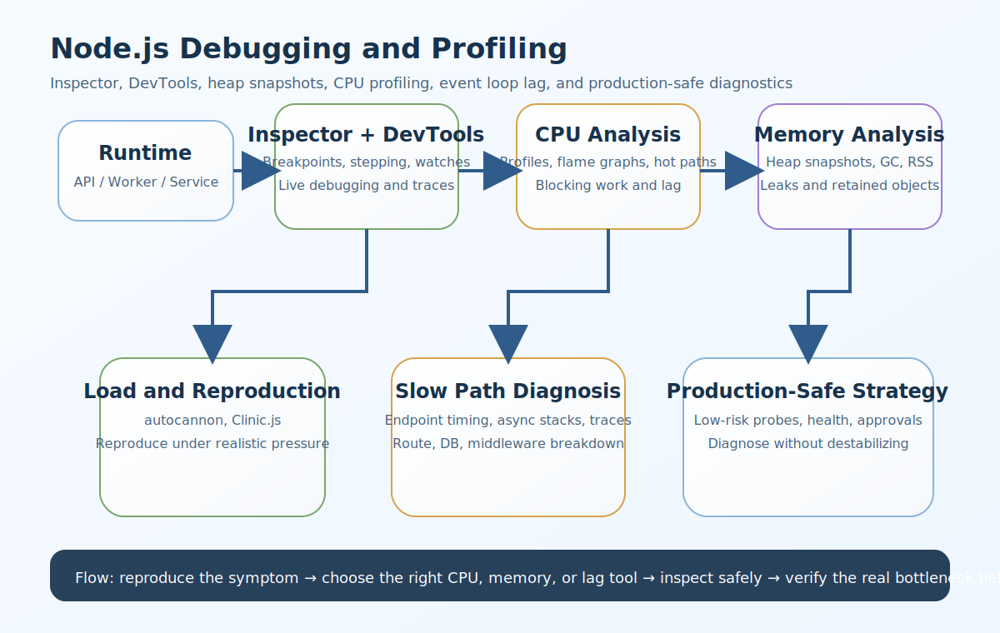

# Node.js Debugging and Profiling Interview Questions


This guide covers debugging and profiling in Node.js from interview basics to tricky production scenarios. It follows the corrected format of **100 interview questions for each subtopic**, and every answer includes a real Node.js code example plus a real-time example so the scenarios and snippets do not repeat verbatim.

## How To Use This Page

- Questions 1-100 cover Node Inspector.
- Questions 101-200 cover Chrome DevTools.
- Questions 201-300 cover Heap Dumps / Heap Snapshots.
- Questions 301-400 cover CPU Profiling.
- Questions 401-500 cover Flame Graphs.
- Questions 501-600 cover Event loop lag / blocking detection.
- Questions 601-700 cover Memory leaks.
- Questions 701-800 cover GC tracing.
- Questions 801-900 cover Heap profiler / memory profiling.
- Questions 901-1000 cover Async stack traces.
- Questions 1001-1100 cover Production-safe diagnostics.
- Questions 1101-1200 cover Clinic.js / autocannon / perf basics.
- Questions 1201-1300 cover Tracing slow endpoints.
- Questions 1301-1400 cover Diagnosing high RSS vs heap usage.
- Questions 1401-1500 cover Startup profiling.
- Questions 1501-1600 cover Worker threads for CPU-heavy workloads.

## 1. Node Inspector

### Q1.1 What is node inspector basics in Node.js debugging and profiling?

**Answer:**

Node inspector basics matters in Node.js debugging and profiling because it determines how quickly teams can isolate runtime bugs, explain latency or memory issues, and choose the safest diagnostic technique for the failure mode they are facing. In a real system like a high-traffic Node.js API where latency spikes appear only under real production load, a strong answer should connect the concept to CPU time, heap growth, event-loop health, observability, and production-safe investigation strategy. A more senior answer also explains the practical trade-off so the answer stays grounded in real diagnostics trade-offs instead of only tool names.

**Code Example:**

```bash
node --inspect app-1.js
```

**Real-Time Example:** In a high-traffic Node.js API where latency spikes appear only under real production load, the team used this concept so the answer stays grounded in real diagnostics trade-offs instead of only tool names.

### Q1.2 Why does --inspect vs --inspect-brk matter in real production systems?

**Answer:**

--inspect vs --inspect-brk matters in Node.js debugging and profiling because it determines how quickly teams can isolate runtime bugs, explain latency or memory issues, and choose the safest diagnostic technique for the failure mode they are facing. In a real system like a memory-hungry service where heap usage keeps climbing during long-running traffic, a strong answer should connect the concept to CPU time, heap growth, event-loop health, observability, and production-safe investigation strategy. A more senior answer also explains the practical trade-off so teams can connect symptoms like lag, memory growth, and slow endpoints to the right investigation method.

**Code Example:**

```bash
node --inspect-brk server-2.js
```

**Real-Time Example:** In a memory-hungry service where heap usage keeps climbing during long-running traffic, the team used this concept so teams can connect symptoms like lag, memory growth, and slow endpoints to the right investigation method.

### Q1.3 When should a backend team use breakpoint debugging?

**Answer:**

Breakpoint debugging matters in Node.js debugging and profiling because it determines how quickly teams can isolate runtime bugs, explain latency or memory issues, and choose the safest diagnostic technique for the failure mode they are facing. In a real system like a startup path that feels slow because too much synchronous initialization happens before readiness, a strong answer should connect the concept to CPU time, heap growth, event-loop health, observability, and production-safe investigation strategy. A more senior answer also explains the practical trade-off so debugging choices become safer and more targeted under production constraints.

**Code Example:**

```js
const inspector = require('node:inspector');
const session3 = new inspector.Session();
session3.connect();
console.log('inspector-connected-3');
```

**Real-Time Example:** In a startup path that feels slow because too much synchronous initialization happens before readiness, the team used this concept so debugging choices become safer and more targeted under production constraints.

### Q1.4 How would you explain attaching to running processes in an interview?

**Answer:**

Attaching to running processes matters in Node.js debugging and profiling because it determines how quickly teams can isolate runtime bugs, explain latency or memory issues, and choose the safest diagnostic technique for the failure mode they are facing. In a real system like a microservices deployment where tracing one slow request across services is harder than expected, a strong answer should connect the concept to CPU time, heap growth, event-loop health, observability, and production-safe investigation strategy. A more senior answer also explains the practical trade-off so CPU, memory, and event-loop problems become easier to separate and explain.

**Code Example:**

```js
const debugChoice4 = { startupIssue: true, use: '--inspect-brk' };
console.log(debugChoice4);
```

**Real-Time Example:** In a microservices deployment where tracing one slow request across services is harder than expected, the team used this concept so CPU, memory, and event-loop problems become easier to separate and explain.

### Q1.5 What is a common interview trap around programmatic inspector usage?

**Answer:**

Programmatic inspector usage matters in Node.js debugging and profiling because it determines how quickly teams can isolate runtime bugs, explain latency or memory issues, and choose the safest diagnostic technique for the failure mode they are facing. In a real system like a queue worker that looks healthy at a glance but stalls the event loop during heavy JSON processing, a strong answer should connect the concept to CPU time, heap growth, event-loop health, observability, and production-safe investigation strategy. A more senior answer also explains the practical trade-off so the examples sound like production Node.js troubleshooting instead of generic debugger notes.

**Code Example:**

```js
const breakpointNote5 = ['attach debugger', 'set breakpoint', 'inspect closure'];
console.log(breakpointNote5);
```

**Real-Time Example:** In a queue worker that looks healthy at a glance but stalls the event loop during heavy JSON processing, the team used this concept so the examples sound like production Node.js troubleshooting instead of generic debugger notes.

### Q1.6 How is node inspector basics used safely in Node.js systems?

**Answer:**

Node inspector basics matters in Node.js debugging and profiling because it determines how quickly teams can isolate runtime bugs, explain latency or memory issues, and choose the safest diagnostic technique for the failure mode they are facing. In a real system like a production incident where RSS kept growing even though heap snapshots looked smaller than expected, a strong answer should connect the concept to CPU time, heap growth, event-loop health, observability, and production-safe investigation strategy. A more senior answer also explains the practical trade-off so the trade-offs between visibility, overhead, and safety become clearer.

**Code Example:**

```bash
node --inspect app-6.js
```

**Real-Time Example:** In a production incident where RSS kept growing even though heap snapshots looked smaller than expected, the team used this concept so the trade-offs between visibility, overhead, and safety become clearer.

### Q1.7 What production problem usually exposes weak understanding of --inspect vs --inspect-brk?

**Answer:**

--inspect vs --inspect-brk matters in Node.js debugging and profiling because it determines how quickly teams can isolate runtime bugs, explain latency or memory issues, and choose the safest diagnostic technique for the failure mode they are facing. In a real system like a WebSocket-heavy platform where connection churn and stale timers make debugging harder, a strong answer should connect the concept to CPU time, heap growth, event-loop health, observability, and production-safe investigation strategy. A more senior answer also explains the practical trade-off so profiling output can be connected to concrete code paths and operational impact.

**Code Example:**

```bash
node --inspect-brk server-7.js
```

**Real-Time Example:** In a WebSocket-heavy platform where connection churn and stale timers make debugging harder, the team used this concept so profiling output can be connected to concrete code paths and operational impact.

### Q1.8 How would a senior engineer justify breakpoint debugging to a team?

**Answer:**

Breakpoint debugging matters in Node.js debugging and profiling because it determines how quickly teams can isolate runtime bugs, explain latency or memory issues, and choose the safest diagnostic technique for the failure mode they are facing. In a real system like a report-generation service where CPU time is spent in serialization, compression, and sync loops, a strong answer should connect the concept to CPU time, heap growth, event-loop health, observability, and production-safe investigation strategy. A more senior answer also explains the practical trade-off so memory and runtime behavior are treated as measurable system properties, not guesswork.

**Code Example:**

```js
const inspector = require('node:inspector');
const session8 = new inspector.Session();
session8.connect();
console.log('inspector-connected-8');
```

**Real-Time Example:** In a report-generation service where CPU time is spent in serialization, compression, and sync loops, the team used this concept so memory and runtime behavior are treated as measurable system properties, not guesswork.

### Q1.9 What trade-off does attaching to running processes introduce?

**Answer:**

Attaching to running processes matters in Node.js debugging and profiling because it determines how quickly teams can isolate runtime bugs, explain latency or memory issues, and choose the safest diagnostic technique for the failure mode they are facing. In a real system like a secure production system where diagnostics must be captured carefully without destabilizing the process, a strong answer should connect the concept to CPU time, heap growth, event-loop health, observability, and production-safe investigation strategy. A more senior answer also explains the practical trade-off so tool choice becomes easier to justify based on the actual failure mode.

**Code Example:**

```js
const debugChoice9 = { startupIssue: true, use: '--inspect-brk' };
console.log(debugChoice9);
```

**Real-Time Example:** In a secure production system where diagnostics must be captured carefully without destabilizing the process, the team used this concept so tool choice becomes easier to justify based on the actual failure mode.

### Q1.10 How do you answer a tricky follow-up about programmatic inspector usage?

**Answer:**

Programmatic inspector usage matters in Node.js debugging and profiling because it determines how quickly teams can isolate runtime bugs, explain latency or memory issues, and choose the safest diagnostic technique for the failure mode they are facing. In a real system like an engineering team comparing DevTools, Clinic.js, and profiler output to isolate the real bottleneck, a strong answer should connect the concept to CPU time, heap growth, event-loop health, observability, and production-safe investigation strategy. A more senior answer also explains the practical trade-off so the answer reflects senior-level thinking about diagnosis, verification, and low-risk remediation.

**Code Example:**

```js
const breakpointNote10 = ['attach debugger', 'set breakpoint', 'inspect closure'];
console.log(breakpointNote10);
```

**Real-Time Example:** In an engineering team comparing DevTools, Clinic.js, and profiler output to isolate the real bottleneck, the team used this concept so the answer reflects senior-level thinking about diagnosis, verification, and low-risk remediation.

### Q1.11 What is node inspector basics in Node.js debugging and profiling?

**Answer:**

Node inspector basics matters in Node.js debugging and profiling because it determines how quickly teams can isolate runtime bugs, explain latency or memory issues, and choose the safest diagnostic technique for the failure mode they are facing. In a real system like a high-traffic Node.js API where latency spikes appear only under real production load, a strong answer should connect the concept to CPU time, heap growth, event-loop health, observability, and production-safe investigation strategy. A more senior answer also explains the practical trade-off so the answer stays grounded in real diagnostics trade-offs instead of only tool names.

**Code Example:**

```bash
node --inspect app-11.js
```

**Real-Time Example:** In a high-traffic Node.js API where latency spikes appear only under real production load, the team used this concept so the answer stays grounded in real diagnostics trade-offs instead of only tool names.

### Q1.12 Why does --inspect vs --inspect-brk matter in real production systems?

**Answer:**

--inspect vs --inspect-brk matters in Node.js debugging and profiling because it determines how quickly teams can isolate runtime bugs, explain latency or memory issues, and choose the safest diagnostic technique for the failure mode they are facing. In a real system like a memory-hungry service where heap usage keeps climbing during long-running traffic, a strong answer should connect the concept to CPU time, heap growth, event-loop health, observability, and production-safe investigation strategy. A more senior answer also explains the practical trade-off so teams can connect symptoms like lag, memory growth, and slow endpoints to the right investigation method.

**Code Example:**

```bash
node --inspect-brk server-12.js
```

**Real-Time Example:** In a memory-hungry service where heap usage keeps climbing during long-running traffic, the team used this concept so teams can connect symptoms like lag, memory growth, and slow endpoints to the right investigation method.

### Q1.13 When should a backend team use breakpoint debugging?

**Answer:**

Breakpoint debugging matters in Node.js debugging and profiling because it determines how quickly teams can isolate runtime bugs, explain latency or memory issues, and choose the safest diagnostic technique for the failure mode they are facing. In a real system like a startup path that feels slow because too much synchronous initialization happens before readiness, a strong answer should connect the concept to CPU time, heap growth, event-loop health, observability, and production-safe investigation strategy. A more senior answer also explains the practical trade-off so debugging choices become safer and more targeted under production constraints.

**Code Example:**

```js
const inspector = require('node:inspector');
const session13 = new inspector.Session();
session13.connect();
console.log('inspector-connected-13');
```

**Real-Time Example:** In a startup path that feels slow because too much synchronous initialization happens before readiness, the team used this concept so debugging choices become safer and more targeted under production constraints.

### Q1.14 How would you explain attaching to running processes in an interview?

**Answer:**

Attaching to running processes matters in Node.js debugging and profiling because it determines how quickly teams can isolate runtime bugs, explain latency or memory issues, and choose the safest diagnostic technique for the failure mode they are facing. In a real system like a microservices deployment where tracing one slow request across services is harder than expected, a strong answer should connect the concept to CPU time, heap growth, event-loop health, observability, and production-safe investigation strategy. A more senior answer also explains the practical trade-off so CPU, memory, and event-loop problems become easier to separate and explain.

**Code Example:**

```js
const debugChoice14 = { startupIssue: true, use: '--inspect-brk' };
console.log(debugChoice14);
```

**Real-Time Example:** In a microservices deployment where tracing one slow request across services is harder than expected, the team used this concept so CPU, memory, and event-loop problems become easier to separate and explain.

### Q1.15 What is a common interview trap around programmatic inspector usage?

**Answer:**

Programmatic inspector usage matters in Node.js debugging and profiling because it determines how quickly teams can isolate runtime bugs, explain latency or memory issues, and choose the safest diagnostic technique for the failure mode they are facing. In a real system like a queue worker that looks healthy at a glance but stalls the event loop during heavy JSON processing, a strong answer should connect the concept to CPU time, heap growth, event-loop health, observability, and production-safe investigation strategy. A more senior answer also explains the practical trade-off so the examples sound like production Node.js troubleshooting instead of generic debugger notes.

**Code Example:**

```js
const breakpointNote15 = ['attach debugger', 'set breakpoint', 'inspect closure'];
console.log(breakpointNote15);
```

**Real-Time Example:** In a queue worker that looks healthy at a glance but stalls the event loop during heavy JSON processing, the team used this concept so the examples sound like production Node.js troubleshooting instead of generic debugger notes.

### Q1.16 How is node inspector basics used safely in Node.js systems?

**Answer:**

Node inspector basics matters in Node.js debugging and profiling because it determines how quickly teams can isolate runtime bugs, explain latency or memory issues, and choose the safest diagnostic technique for the failure mode they are facing. In a real system like a production incident where RSS kept growing even though heap snapshots looked smaller than expected, a strong answer should connect the concept to CPU time, heap growth, event-loop health, observability, and production-safe investigation strategy. A more senior answer also explains the practical trade-off so the trade-offs between visibility, overhead, and safety become clearer.

**Code Example:**

```bash
node --inspect app-16.js
```

**Real-Time Example:** In a production incident where RSS kept growing even though heap snapshots looked smaller than expected, the team used this concept so the trade-offs between visibility, overhead, and safety become clearer.

### Q1.17 What production problem usually exposes weak understanding of --inspect vs --inspect-brk?

**Answer:**

--inspect vs --inspect-brk matters in Node.js debugging and profiling because it determines how quickly teams can isolate runtime bugs, explain latency or memory issues, and choose the safest diagnostic technique for the failure mode they are facing. In a real system like a WebSocket-heavy platform where connection churn and stale timers make debugging harder, a strong answer should connect the concept to CPU time, heap growth, event-loop health, observability, and production-safe investigation strategy. A more senior answer also explains the practical trade-off so profiling output can be connected to concrete code paths and operational impact.

**Code Example:**

```bash
node --inspect-brk server-17.js
```

**Real-Time Example:** In a WebSocket-heavy platform where connection churn and stale timers make debugging harder, the team used this concept so profiling output can be connected to concrete code paths and operational impact.

### Q1.18 How would a senior engineer justify breakpoint debugging to a team?

**Answer:**

Breakpoint debugging matters in Node.js debugging and profiling because it determines how quickly teams can isolate runtime bugs, explain latency or memory issues, and choose the safest diagnostic technique for the failure mode they are facing. In a real system like a report-generation service where CPU time is spent in serialization, compression, and sync loops, a strong answer should connect the concept to CPU time, heap growth, event-loop health, observability, and production-safe investigation strategy. A more senior answer also explains the practical trade-off so memory and runtime behavior are treated as measurable system properties, not guesswork.

**Code Example:**

```js
const inspector = require('node:inspector');
const session18 = new inspector.Session();
session18.connect();
console.log('inspector-connected-18');
```

**Real-Time Example:** In a report-generation service where CPU time is spent in serialization, compression, and sync loops, the team used this concept so memory and runtime behavior are treated as measurable system properties, not guesswork.

### Q1.19 What trade-off does attaching to running processes introduce?

**Answer:**

Attaching to running processes matters in Node.js debugging and profiling because it determines how quickly teams can isolate runtime bugs, explain latency or memory issues, and choose the safest diagnostic technique for the failure mode they are facing. In a real system like a secure production system where diagnostics must be captured carefully without destabilizing the process, a strong answer should connect the concept to CPU time, heap growth, event-loop health, observability, and production-safe investigation strategy. A more senior answer also explains the practical trade-off so tool choice becomes easier to justify based on the actual failure mode.

**Code Example:**

```js
const debugChoice19 = { startupIssue: true, use: '--inspect-brk' };
console.log(debugChoice19);
```

**Real-Time Example:** In a secure production system where diagnostics must be captured carefully without destabilizing the process, the team used this concept so tool choice becomes easier to justify based on the actual failure mode.

### Q1.20 How do you answer a tricky follow-up about programmatic inspector usage?

**Answer:**

Programmatic inspector usage matters in Node.js debugging and profiling because it determines how quickly teams can isolate runtime bugs, explain latency or memory issues, and choose the safest diagnostic technique for the failure mode they are facing. In a real system like an engineering team comparing DevTools, Clinic.js, and profiler output to isolate the real bottleneck, a strong answer should connect the concept to CPU time, heap growth, event-loop health, observability, and production-safe investigation strategy. A more senior answer also explains the practical trade-off so the answer reflects senior-level thinking about diagnosis, verification, and low-risk remediation.

**Code Example:**

```js
const breakpointNote20 = ['attach debugger', 'set breakpoint', 'inspect closure'];
console.log(breakpointNote20);
```

**Real-Time Example:** In an engineering team comparing DevTools, Clinic.js, and profiler output to isolate the real bottleneck, the team used this concept so the answer reflects senior-level thinking about diagnosis, verification, and low-risk remediation.

### Q1.21 What is node inspector basics in Node.js debugging and profiling?

**Answer:**

Node inspector basics matters in Node.js debugging and profiling because it determines how quickly teams can isolate runtime bugs, explain latency or memory issues, and choose the safest diagnostic technique for the failure mode they are facing. In a real system like a high-traffic Node.js API where latency spikes appear only under real production load, a strong answer should connect the concept to CPU time, heap growth, event-loop health, observability, and production-safe investigation strategy. A more senior answer also explains the practical trade-off so the answer stays grounded in real diagnostics trade-offs instead of only tool names.

**Code Example:**

```bash
node --inspect app-21.js
```

**Real-Time Example:** In a high-traffic Node.js API where latency spikes appear only under real production load, the team used this concept so the answer stays grounded in real diagnostics trade-offs instead of only tool names.

### Q1.22 Why does --inspect vs --inspect-brk matter in real production systems?

**Answer:**

--inspect vs --inspect-brk matters in Node.js debugging and profiling because it determines how quickly teams can isolate runtime bugs, explain latency or memory issues, and choose the safest diagnostic technique for the failure mode they are facing. In a real system like a memory-hungry service where heap usage keeps climbing during long-running traffic, a strong answer should connect the concept to CPU time, heap growth, event-loop health, observability, and production-safe investigation strategy. A more senior answer also explains the practical trade-off so teams can connect symptoms like lag, memory growth, and slow endpoints to the right investigation method.

**Code Example:**

```bash
node --inspect-brk server-22.js
```

**Real-Time Example:** In a memory-hungry service where heap usage keeps climbing during long-running traffic, the team used this concept so teams can connect symptoms like lag, memory growth, and slow endpoints to the right investigation method.

### Q1.23 When should a backend team use breakpoint debugging?

**Answer:**

Breakpoint debugging matters in Node.js debugging and profiling because it determines how quickly teams can isolate runtime bugs, explain latency or memory issues, and choose the safest diagnostic technique for the failure mode they are facing. In a real system like a startup path that feels slow because too much synchronous initialization happens before readiness, a strong answer should connect the concept to CPU time, heap growth, event-loop health, observability, and production-safe investigation strategy. A more senior answer also explains the practical trade-off so debugging choices become safer and more targeted under production constraints.

**Code Example:**

```js
const inspector = require('node:inspector');
const session23 = new inspector.Session();
session23.connect();
console.log('inspector-connected-23');
```

**Real-Time Example:** In a startup path that feels slow because too much synchronous initialization happens before readiness, the team used this concept so debugging choices become safer and more targeted under production constraints.

### Q1.24 How would you explain attaching to running processes in an interview?

**Answer:**

Attaching to running processes matters in Node.js debugging and profiling because it determines how quickly teams can isolate runtime bugs, explain latency or memory issues, and choose the safest diagnostic technique for the failure mode they are facing. In a real system like a microservices deployment where tracing one slow request across services is harder than expected, a strong answer should connect the concept to CPU time, heap growth, event-loop health, observability, and production-safe investigation strategy. A more senior answer also explains the practical trade-off so CPU, memory, and event-loop problems become easier to separate and explain.

**Code Example:**

```js
const debugChoice24 = { startupIssue: true, use: '--inspect-brk' };
console.log(debugChoice24);
```

**Real-Time Example:** In a microservices deployment where tracing one slow request across services is harder than expected, the team used this concept so CPU, memory, and event-loop problems become easier to separate and explain.

### Q1.25 What is a common interview trap around programmatic inspector usage?

**Answer:**

Programmatic inspector usage matters in Node.js debugging and profiling because it determines how quickly teams can isolate runtime bugs, explain latency or memory issues, and choose the safest diagnostic technique for the failure mode they are facing. In a real system like a queue worker that looks healthy at a glance but stalls the event loop during heavy JSON processing, a strong answer should connect the concept to CPU time, heap growth, event-loop health, observability, and production-safe investigation strategy. A more senior answer also explains the practical trade-off so the examples sound like production Node.js troubleshooting instead of generic debugger notes.

**Code Example:**

```js
const breakpointNote25 = ['attach debugger', 'set breakpoint', 'inspect closure'];
console.log(breakpointNote25);
```

**Real-Time Example:** In a queue worker that looks healthy at a glance but stalls the event loop during heavy JSON processing, the team used this concept so the examples sound like production Node.js troubleshooting instead of generic debugger notes.

### Q1.26 How is node inspector basics used safely in Node.js systems?

**Answer:**

Node inspector basics matters in Node.js debugging and profiling because it determines how quickly teams can isolate runtime bugs, explain latency or memory issues, and choose the safest diagnostic technique for the failure mode they are facing. In a real system like a production incident where RSS kept growing even though heap snapshots looked smaller than expected, a strong answer should connect the concept to CPU time, heap growth, event-loop health, observability, and production-safe investigation strategy. A more senior answer also explains the practical trade-off so the trade-offs between visibility, overhead, and safety become clearer.

**Code Example:**

```bash
node --inspect app-26.js
```

**Real-Time Example:** In a production incident where RSS kept growing even though heap snapshots looked smaller than expected, the team used this concept so the trade-offs between visibility, overhead, and safety become clearer.

### Q1.27 What production problem usually exposes weak understanding of --inspect vs --inspect-brk?

**Answer:**

--inspect vs --inspect-brk matters in Node.js debugging and profiling because it determines how quickly teams can isolate runtime bugs, explain latency or memory issues, and choose the safest diagnostic technique for the failure mode they are facing. In a real system like a WebSocket-heavy platform where connection churn and stale timers make debugging harder, a strong answer should connect the concept to CPU time, heap growth, event-loop health, observability, and production-safe investigation strategy. A more senior answer also explains the practical trade-off so profiling output can be connected to concrete code paths and operational impact.

**Code Example:**

```bash
node --inspect-brk server-27.js
```

**Real-Time Example:** In a WebSocket-heavy platform where connection churn and stale timers make debugging harder, the team used this concept so profiling output can be connected to concrete code paths and operational impact.

### Q1.28 How would a senior engineer justify breakpoint debugging to a team?

**Answer:**

Breakpoint debugging matters in Node.js debugging and profiling because it determines how quickly teams can isolate runtime bugs, explain latency or memory issues, and choose the safest diagnostic technique for the failure mode they are facing. In a real system like a report-generation service where CPU time is spent in serialization, compression, and sync loops, a strong answer should connect the concept to CPU time, heap growth, event-loop health, observability, and production-safe investigation strategy. A more senior answer also explains the practical trade-off so memory and runtime behavior are treated as measurable system properties, not guesswork.

**Code Example:**

```js
const inspector = require('node:inspector');
const session28 = new inspector.Session();
session28.connect();
console.log('inspector-connected-28');
```

**Real-Time Example:** In a report-generation service where CPU time is spent in serialization, compression, and sync loops, the team used this concept so memory and runtime behavior are treated as measurable system properties, not guesswork.

### Q1.29 What trade-off does attaching to running processes introduce?

**Answer:**

Attaching to running processes matters in Node.js debugging and profiling because it determines how quickly teams can isolate runtime bugs, explain latency or memory issues, and choose the safest diagnostic technique for the failure mode they are facing. In a real system like a secure production system where diagnostics must be captured carefully without destabilizing the process, a strong answer should connect the concept to CPU time, heap growth, event-loop health, observability, and production-safe investigation strategy. A more senior answer also explains the practical trade-off so tool choice becomes easier to justify based on the actual failure mode.

**Code Example:**

```js
const debugChoice29 = { startupIssue: true, use: '--inspect-brk' };
console.log(debugChoice29);
```

**Real-Time Example:** In a secure production system where diagnostics must be captured carefully without destabilizing the process, the team used this concept so tool choice becomes easier to justify based on the actual failure mode.

### Q1.30 How do you answer a tricky follow-up about programmatic inspector usage?

**Answer:**

Programmatic inspector usage matters in Node.js debugging and profiling because it determines how quickly teams can isolate runtime bugs, explain latency or memory issues, and choose the safest diagnostic technique for the failure mode they are facing. In a real system like an engineering team comparing DevTools, Clinic.js, and profiler output to isolate the real bottleneck, a strong answer should connect the concept to CPU time, heap growth, event-loop health, observability, and production-safe investigation strategy. A more senior answer also explains the practical trade-off so the answer reflects senior-level thinking about diagnosis, verification, and low-risk remediation.

**Code Example:**

```js
const breakpointNote30 = ['attach debugger', 'set breakpoint', 'inspect closure'];
console.log(breakpointNote30);
```

**Real-Time Example:** In an engineering team comparing DevTools, Clinic.js, and profiler output to isolate the real bottleneck, the team used this concept so the answer reflects senior-level thinking about diagnosis, verification, and low-risk remediation.

### Q1.31 What is node inspector basics in Node.js debugging and profiling?

**Answer:**

Node inspector basics matters in Node.js debugging and profiling because it determines how quickly teams can isolate runtime bugs, explain latency or memory issues, and choose the safest diagnostic technique for the failure mode they are facing. In a real system like a high-traffic Node.js API where latency spikes appear only under real production load, a strong answer should connect the concept to CPU time, heap growth, event-loop health, observability, and production-safe investigation strategy. A more senior answer also explains the practical trade-off so the answer stays grounded in real diagnostics trade-offs instead of only tool names.

**Code Example:**

```bash
node --inspect app-31.js
```

**Real-Time Example:** In a high-traffic Node.js API where latency spikes appear only under real production load, the team used this concept so the answer stays grounded in real diagnostics trade-offs instead of only tool names.

### Q1.32 Why does --inspect vs --inspect-brk matter in real production systems?

**Answer:**

--inspect vs --inspect-brk matters in Node.js debugging and profiling because it determines how quickly teams can isolate runtime bugs, explain latency or memory issues, and choose the safest diagnostic technique for the failure mode they are facing. In a real system like a memory-hungry service where heap usage keeps climbing during long-running traffic, a strong answer should connect the concept to CPU time, heap growth, event-loop health, observability, and production-safe investigation strategy. A more senior answer also explains the practical trade-off so teams can connect symptoms like lag, memory growth, and slow endpoints to the right investigation method.

**Code Example:**

```bash
node --inspect-brk server-32.js
```

**Real-Time Example:** In a memory-hungry service where heap usage keeps climbing during long-running traffic, the team used this concept so teams can connect symptoms like lag, memory growth, and slow endpoints to the right investigation method.

### Q1.33 When should a backend team use breakpoint debugging?

**Answer:**

Breakpoint debugging matters in Node.js debugging and profiling because it determines how quickly teams can isolate runtime bugs, explain latency or memory issues, and choose the safest diagnostic technique for the failure mode they are facing. In a real system like a startup path that feels slow because too much synchronous initialization happens before readiness, a strong answer should connect the concept to CPU time, heap growth, event-loop health, observability, and production-safe investigation strategy. A more senior answer also explains the practical trade-off so debugging choices become safer and more targeted under production constraints.

**Code Example:**

```js
const inspector = require('node:inspector');
const session33 = new inspector.Session();
session33.connect();
console.log('inspector-connected-33');
```

**Real-Time Example:** In a startup path that feels slow because too much synchronous initialization happens before readiness, the team used this concept so debugging choices become safer and more targeted under production constraints.

### Q1.34 How would you explain attaching to running processes in an interview?

**Answer:**

Attaching to running processes matters in Node.js debugging and profiling because it determines how quickly teams can isolate runtime bugs, explain latency or memory issues, and choose the safest diagnostic technique for the failure mode they are facing. In a real system like a microservices deployment where tracing one slow request across services is harder than expected, a strong answer should connect the concept to CPU time, heap growth, event-loop health, observability, and production-safe investigation strategy. A more senior answer also explains the practical trade-off so CPU, memory, and event-loop problems become easier to separate and explain.

**Code Example:**

```js
const debugChoice34 = { startupIssue: true, use: '--inspect-brk' };
console.log(debugChoice34);
```

**Real-Time Example:** In a microservices deployment where tracing one slow request across services is harder than expected, the team used this concept so CPU, memory, and event-loop problems become easier to separate and explain.

### Q1.35 What is a common interview trap around programmatic inspector usage?

**Answer:**

Programmatic inspector usage matters in Node.js debugging and profiling because it determines how quickly teams can isolate runtime bugs, explain latency or memory issues, and choose the safest diagnostic technique for the failure mode they are facing. In a real system like a queue worker that looks healthy at a glance but stalls the event loop during heavy JSON processing, a strong answer should connect the concept to CPU time, heap growth, event-loop health, observability, and production-safe investigation strategy. A more senior answer also explains the practical trade-off so the examples sound like production Node.js troubleshooting instead of generic debugger notes.

**Code Example:**

```js
const breakpointNote35 = ['attach debugger', 'set breakpoint', 'inspect closure'];
console.log(breakpointNote35);
```

**Real-Time Example:** In a queue worker that looks healthy at a glance but stalls the event loop during heavy JSON processing, the team used this concept so the examples sound like production Node.js troubleshooting instead of generic debugger notes.

### Q1.36 How is node inspector basics used safely in Node.js systems?

**Answer:**

Node inspector basics matters in Node.js debugging and profiling because it determines how quickly teams can isolate runtime bugs, explain latency or memory issues, and choose the safest diagnostic technique for the failure mode they are facing. In a real system like a production incident where RSS kept growing even though heap snapshots looked smaller than expected, a strong answer should connect the concept to CPU time, heap growth, event-loop health, observability, and production-safe investigation strategy. A more senior answer also explains the practical trade-off so the trade-offs between visibility, overhead, and safety become clearer.

**Code Example:**

```bash
node --inspect app-36.js
```

**Real-Time Example:** In a production incident where RSS kept growing even though heap snapshots looked smaller than expected, the team used this concept so the trade-offs between visibility, overhead, and safety become clearer.

### Q1.37 What production problem usually exposes weak understanding of --inspect vs --inspect-brk?

**Answer:**

--inspect vs --inspect-brk matters in Node.js debugging and profiling because it determines how quickly teams can isolate runtime bugs, explain latency or memory issues, and choose the safest diagnostic technique for the failure mode they are facing. In a real system like a WebSocket-heavy platform where connection churn and stale timers make debugging harder, a strong answer should connect the concept to CPU time, heap growth, event-loop health, observability, and production-safe investigation strategy. A more senior answer also explains the practical trade-off so profiling output can be connected to concrete code paths and operational impact.

**Code Example:**

```bash
node --inspect-brk server-37.js
```

**Real-Time Example:** In a WebSocket-heavy platform where connection churn and stale timers make debugging harder, the team used this concept so profiling output can be connected to concrete code paths and operational impact.

### Q1.38 How would a senior engineer justify breakpoint debugging to a team?

**Answer:**

Breakpoint debugging matters in Node.js debugging and profiling because it determines how quickly teams can isolate runtime bugs, explain latency or memory issues, and choose the safest diagnostic technique for the failure mode they are facing. In a real system like a report-generation service where CPU time is spent in serialization, compression, and sync loops, a strong answer should connect the concept to CPU time, heap growth, event-loop health, observability, and production-safe investigation strategy. A more senior answer also explains the practical trade-off so memory and runtime behavior are treated as measurable system properties, not guesswork.

**Code Example:**

```js
const inspector = require('node:inspector');
const session38 = new inspector.Session();
session38.connect();
console.log('inspector-connected-38');
```

**Real-Time Example:** In a report-generation service where CPU time is spent in serialization, compression, and sync loops, the team used this concept so memory and runtime behavior are treated as measurable system properties, not guesswork.

### Q1.39 What trade-off does attaching to running processes introduce?

**Answer:**

Attaching to running processes matters in Node.js debugging and profiling because it determines how quickly teams can isolate runtime bugs, explain latency or memory issues, and choose the safest diagnostic technique for the failure mode they are facing. In a real system like a secure production system where diagnostics must be captured carefully without destabilizing the process, a strong answer should connect the concept to CPU time, heap growth, event-loop health, observability, and production-safe investigation strategy. A more senior answer also explains the practical trade-off so tool choice becomes easier to justify based on the actual failure mode.

**Code Example:**

```js
const debugChoice39 = { startupIssue: true, use: '--inspect-brk' };
console.log(debugChoice39);
```

**Real-Time Example:** In a secure production system where diagnostics must be captured carefully without destabilizing the process, the team used this concept so tool choice becomes easier to justify based on the actual failure mode.

### Q1.40 How do you answer a tricky follow-up about programmatic inspector usage?

**Answer:**

Programmatic inspector usage matters in Node.js debugging and profiling because it determines how quickly teams can isolate runtime bugs, explain latency or memory issues, and choose the safest diagnostic technique for the failure mode they are facing. In a real system like an engineering team comparing DevTools, Clinic.js, and profiler output to isolate the real bottleneck, a strong answer should connect the concept to CPU time, heap growth, event-loop health, observability, and production-safe investigation strategy. A more senior answer also explains the practical trade-off so the answer reflects senior-level thinking about diagnosis, verification, and low-risk remediation.

**Code Example:**

```js
const breakpointNote40 = ['attach debugger', 'set breakpoint', 'inspect closure'];
console.log(breakpointNote40);
```

**Real-Time Example:** In an engineering team comparing DevTools, Clinic.js, and profiler output to isolate the real bottleneck, the team used this concept so the answer reflects senior-level thinking about diagnosis, verification, and low-risk remediation.

### Q1.41 What is node inspector basics in Node.js debugging and profiling?

**Answer:**

Node inspector basics matters in Node.js debugging and profiling because it determines how quickly teams can isolate runtime bugs, explain latency or memory issues, and choose the safest diagnostic technique for the failure mode they are facing. In a real system like a high-traffic Node.js API where latency spikes appear only under real production load, a strong answer should connect the concept to CPU time, heap growth, event-loop health, observability, and production-safe investigation strategy. A more senior answer also explains the practical trade-off so the answer stays grounded in real diagnostics trade-offs instead of only tool names.

**Code Example:**

```bash
node --inspect app-41.js
```

**Real-Time Example:** In a high-traffic Node.js API where latency spikes appear only under real production load, the team used this concept so the answer stays grounded in real diagnostics trade-offs instead of only tool names.

### Q1.42 Why does --inspect vs --inspect-brk matter in real production systems?

**Answer:**

--inspect vs --inspect-brk matters in Node.js debugging and profiling because it determines how quickly teams can isolate runtime bugs, explain latency or memory issues, and choose the safest diagnostic technique for the failure mode they are facing. In a real system like a memory-hungry service where heap usage keeps climbing during long-running traffic, a strong answer should connect the concept to CPU time, heap growth, event-loop health, observability, and production-safe investigation strategy. A more senior answer also explains the practical trade-off so teams can connect symptoms like lag, memory growth, and slow endpoints to the right investigation method.

**Code Example:**

```bash
node --inspect-brk server-42.js
```

**Real-Time Example:** In a memory-hungry service where heap usage keeps climbing during long-running traffic, the team used this concept so teams can connect symptoms like lag, memory growth, and slow endpoints to the right investigation method.

### Q1.43 When should a backend team use breakpoint debugging?

**Answer:**

Breakpoint debugging matters in Node.js debugging and profiling because it determines how quickly teams can isolate runtime bugs, explain latency or memory issues, and choose the safest diagnostic technique for the failure mode they are facing. In a real system like a startup path that feels slow because too much synchronous initialization happens before readiness, a strong answer should connect the concept to CPU time, heap growth, event-loop health, observability, and production-safe investigation strategy. A more senior answer also explains the practical trade-off so debugging choices become safer and more targeted under production constraints.

**Code Example:**

```js
const inspector = require('node:inspector');
const session43 = new inspector.Session();
session43.connect();
console.log('inspector-connected-43');
```

**Real-Time Example:** In a startup path that feels slow because too much synchronous initialization happens before readiness, the team used this concept so debugging choices become safer and more targeted under production constraints.

### Q1.44 How would you explain attaching to running processes in an interview?

**Answer:**

Attaching to running processes matters in Node.js debugging and profiling because it determines how quickly teams can isolate runtime bugs, explain latency or memory issues, and choose the safest diagnostic technique for the failure mode they are facing. In a real system like a microservices deployment where tracing one slow request across services is harder than expected, a strong answer should connect the concept to CPU time, heap growth, event-loop health, observability, and production-safe investigation strategy. A more senior answer also explains the practical trade-off so CPU, memory, and event-loop problems become easier to separate and explain.

**Code Example:**

```js
const debugChoice44 = { startupIssue: true, use: '--inspect-brk' };
console.log(debugChoice44);
```

**Real-Time Example:** In a microservices deployment where tracing one slow request across services is harder than expected, the team used this concept so CPU, memory, and event-loop problems become easier to separate and explain.

### Q1.45 What is a common interview trap around programmatic inspector usage?

**Answer:**

Programmatic inspector usage matters in Node.js debugging and profiling because it determines how quickly teams can isolate runtime bugs, explain latency or memory issues, and choose the safest diagnostic technique for the failure mode they are facing. In a real system like a queue worker that looks healthy at a glance but stalls the event loop during heavy JSON processing, a strong answer should connect the concept to CPU time, heap growth, event-loop health, observability, and production-safe investigation strategy. A more senior answer also explains the practical trade-off so the examples sound like production Node.js troubleshooting instead of generic debugger notes.

**Code Example:**

```js
const breakpointNote45 = ['attach debugger', 'set breakpoint', 'inspect closure'];
console.log(breakpointNote45);
```

**Real-Time Example:** In a queue worker that looks healthy at a glance but stalls the event loop during heavy JSON processing, the team used this concept so the examples sound like production Node.js troubleshooting instead of generic debugger notes.

### Q1.46 How is node inspector basics used safely in Node.js systems?

**Answer:**

Node inspector basics matters in Node.js debugging and profiling because it determines how quickly teams can isolate runtime bugs, explain latency or memory issues, and choose the safest diagnostic technique for the failure mode they are facing. In a real system like a production incident where RSS kept growing even though heap snapshots looked smaller than expected, a strong answer should connect the concept to CPU time, heap growth, event-loop health, observability, and production-safe investigation strategy. A more senior answer also explains the practical trade-off so the trade-offs between visibility, overhead, and safety become clearer.

**Code Example:**

```bash
node --inspect app-46.js
```

**Real-Time Example:** In a production incident where RSS kept growing even though heap snapshots looked smaller than expected, the team used this concept so the trade-offs between visibility, overhead, and safety become clearer.

### Q1.47 What production problem usually exposes weak understanding of --inspect vs --inspect-brk?

**Answer:**

--inspect vs --inspect-brk matters in Node.js debugging and profiling because it determines how quickly teams can isolate runtime bugs, explain latency or memory issues, and choose the safest diagnostic technique for the failure mode they are facing. In a real system like a WebSocket-heavy platform where connection churn and stale timers make debugging harder, a strong answer should connect the concept to CPU time, heap growth, event-loop health, observability, and production-safe investigation strategy. A more senior answer also explains the practical trade-off so profiling output can be connected to concrete code paths and operational impact.

**Code Example:**

```bash
node --inspect-brk server-47.js
```

**Real-Time Example:** In a WebSocket-heavy platform where connection churn and stale timers make debugging harder, the team used this concept so profiling output can be connected to concrete code paths and operational impact.

### Q1.48 How would a senior engineer justify breakpoint debugging to a team?

**Answer:**

Breakpoint debugging matters in Node.js debugging and profiling because it determines how quickly teams can isolate runtime bugs, explain latency or memory issues, and choose the safest diagnostic technique for the failure mode they are facing. In a real system like a report-generation service where CPU time is spent in serialization, compression, and sync loops, a strong answer should connect the concept to CPU time, heap growth, event-loop health, observability, and production-safe investigation strategy. A more senior answer also explains the practical trade-off so memory and runtime behavior are treated as measurable system properties, not guesswork.

**Code Example:**

```js
const inspector = require('node:inspector');
const session48 = new inspector.Session();
session48.connect();
console.log('inspector-connected-48');
```

**Real-Time Example:** In a report-generation service where CPU time is spent in serialization, compression, and sync loops, the team used this concept so memory and runtime behavior are treated as measurable system properties, not guesswork.

### Q1.49 What trade-off does attaching to running processes introduce?

**Answer:**

Attaching to running processes matters in Node.js debugging and profiling because it determines how quickly teams can isolate runtime bugs, explain latency or memory issues, and choose the safest diagnostic technique for the failure mode they are facing. In a real system like a secure production system where diagnostics must be captured carefully without destabilizing the process, a strong answer should connect the concept to CPU time, heap growth, event-loop health, observability, and production-safe investigation strategy. A more senior answer also explains the practical trade-off so tool choice becomes easier to justify based on the actual failure mode.

**Code Example:**

```js
const debugChoice49 = { startupIssue: true, use: '--inspect-brk' };
console.log(debugChoice49);
```

**Real-Time Example:** In a secure production system where diagnostics must be captured carefully without destabilizing the process, the team used this concept so tool choice becomes easier to justify based on the actual failure mode.

### Q1.50 How do you answer a tricky follow-up about programmatic inspector usage?

**Answer:**

Programmatic inspector usage matters in Node.js debugging and profiling because it determines how quickly teams can isolate runtime bugs, explain latency or memory issues, and choose the safest diagnostic technique for the failure mode they are facing. In a real system like an engineering team comparing DevTools, Clinic.js, and profiler output to isolate the real bottleneck, a strong answer should connect the concept to CPU time, heap growth, event-loop health, observability, and production-safe investigation strategy. A more senior answer also explains the practical trade-off so the answer reflects senior-level thinking about diagnosis, verification, and low-risk remediation.

**Code Example:**

```js
const breakpointNote50 = ['attach debugger', 'set breakpoint', 'inspect closure'];
console.log(breakpointNote50);
```

**Real-Time Example:** In an engineering team comparing DevTools, Clinic.js, and profiler output to isolate the real bottleneck, the team used this concept so the answer reflects senior-level thinking about diagnosis, verification, and low-risk remediation.

### Q1.51 What is node inspector basics in Node.js debugging and profiling?

**Answer:**

Node inspector basics matters in Node.js debugging and profiling because it determines how quickly teams can isolate runtime bugs, explain latency or memory issues, and choose the safest diagnostic technique for the failure mode they are facing. In a real system like a high-traffic Node.js API where latency spikes appear only under real production load, a strong answer should connect the concept to CPU time, heap growth, event-loop health, observability, and production-safe investigation strategy. A more senior answer also explains the practical trade-off so the answer stays grounded in real diagnostics trade-offs instead of only tool names.

**Code Example:**

```bash
node --inspect app-51.js
```

**Real-Time Example:** In a high-traffic Node.js API where latency spikes appear only under real production load, the team used this concept so the answer stays grounded in real diagnostics trade-offs instead of only tool names.

### Q1.52 Why does --inspect vs --inspect-brk matter in real production systems?

**Answer:**

--inspect vs --inspect-brk matters in Node.js debugging and profiling because it determines how quickly teams can isolate runtime bugs, explain latency or memory issues, and choose the safest diagnostic technique for the failure mode they are facing. In a real system like a memory-hungry service where heap usage keeps climbing during long-running traffic, a strong answer should connect the concept to CPU time, heap growth, event-loop health, observability, and production-safe investigation strategy. A more senior answer also explains the practical trade-off so teams can connect symptoms like lag, memory growth, and slow endpoints to the right investigation method.

**Code Example:**

```bash
node --inspect-brk server-52.js
```

**Real-Time Example:** In a memory-hungry service where heap usage keeps climbing during long-running traffic, the team used this concept so teams can connect symptoms like lag, memory growth, and slow endpoints to the right investigation method.

### Q1.53 When should a backend team use breakpoint debugging?

**Answer:**

Breakpoint debugging matters in Node.js debugging and profiling because it determines how quickly teams can isolate runtime bugs, explain latency or memory issues, and choose the safest diagnostic technique for the failure mode they are facing. In a real system like a startup path that feels slow because too much synchronous initialization happens before readiness, a strong answer should connect the concept to CPU time, heap growth, event-loop health, observability, and production-safe investigation strategy. A more senior answer also explains the practical trade-off so debugging choices become safer and more targeted under production constraints.

**Code Example:**

```js
const inspector = require('node:inspector');
const session53 = new inspector.Session();
session53.connect();
console.log('inspector-connected-53');
```

**Real-Time Example:** In a startup path that feels slow because too much synchronous initialization happens before readiness, the team used this concept so debugging choices become safer and more targeted under production constraints.

### Q1.54 How would you explain attaching to running processes in an interview?

**Answer:**

Attaching to running processes matters in Node.js debugging and profiling because it determines how quickly teams can isolate runtime bugs, explain latency or memory issues, and choose the safest diagnostic technique for the failure mode they are facing. In a real system like a microservices deployment where tracing one slow request across services is harder than expected, a strong answer should connect the concept to CPU time, heap growth, event-loop health, observability, and production-safe investigation strategy. A more senior answer also explains the practical trade-off so CPU, memory, and event-loop problems become easier to separate and explain.

**Code Example:**

```js
const debugChoice54 = { startupIssue: true, use: '--inspect-brk' };
console.log(debugChoice54);
```

**Real-Time Example:** In a microservices deployment where tracing one slow request across services is harder than expected, the team used this concept so CPU, memory, and event-loop problems become easier to separate and explain.

### Q1.55 What is a common interview trap around programmatic inspector usage?

**Answer:**

Programmatic inspector usage matters in Node.js debugging and profiling because it determines how quickly teams can isolate runtime bugs, explain latency or memory issues, and choose the safest diagnostic technique for the failure mode they are facing. In a real system like a queue worker that looks healthy at a glance but stalls the event loop during heavy JSON processing, a strong answer should connect the concept to CPU time, heap growth, event-loop health, observability, and production-safe investigation strategy. A more senior answer also explains the practical trade-off so the examples sound like production Node.js troubleshooting instead of generic debugger notes.

**Code Example:**

```js
const breakpointNote55 = ['attach debugger', 'set breakpoint', 'inspect closure'];
console.log(breakpointNote55);
```

**Real-Time Example:** In a queue worker that looks healthy at a glance but stalls the event loop during heavy JSON processing, the team used this concept so the examples sound like production Node.js troubleshooting instead of generic debugger notes.

### Q1.56 How is node inspector basics used safely in Node.js systems?

**Answer:**

Node inspector basics matters in Node.js debugging and profiling because it determines how quickly teams can isolate runtime bugs, explain latency or memory issues, and choose the safest diagnostic technique for the failure mode they are facing. In a real system like a production incident where RSS kept growing even though heap snapshots looked smaller than expected, a strong answer should connect the concept to CPU time, heap growth, event-loop health, observability, and production-safe investigation strategy. A more senior answer also explains the practical trade-off so the trade-offs between visibility, overhead, and safety become clearer.

**Code Example:**

```bash
node --inspect app-56.js
```

**Real-Time Example:** In a production incident where RSS kept growing even though heap snapshots looked smaller than expected, the team used this concept so the trade-offs between visibility, overhead, and safety become clearer.

### Q1.57 What production problem usually exposes weak understanding of --inspect vs --inspect-brk?

**Answer:**

--inspect vs --inspect-brk matters in Node.js debugging and profiling because it determines how quickly teams can isolate runtime bugs, explain latency or memory issues, and choose the safest diagnostic technique for the failure mode they are facing. In a real system like a WebSocket-heavy platform where connection churn and stale timers make debugging harder, a strong answer should connect the concept to CPU time, heap growth, event-loop health, observability, and production-safe investigation strategy. A more senior answer also explains the practical trade-off so profiling output can be connected to concrete code paths and operational impact.

**Code Example:**

```bash
node --inspect-brk server-57.js
```

**Real-Time Example:** In a WebSocket-heavy platform where connection churn and stale timers make debugging harder, the team used this concept so profiling output can be connected to concrete code paths and operational impact.

### Q1.58 How would a senior engineer justify breakpoint debugging to a team?

**Answer:**

Breakpoint debugging matters in Node.js debugging and profiling because it determines how quickly teams can isolate runtime bugs, explain latency or memory issues, and choose the safest diagnostic technique for the failure mode they are facing. In a real system like a report-generation service where CPU time is spent in serialization, compression, and sync loops, a strong answer should connect the concept to CPU time, heap growth, event-loop health, observability, and production-safe investigation strategy. A more senior answer also explains the practical trade-off so memory and runtime behavior are treated as measurable system properties, not guesswork.

**Code Example:**

```js
const inspector = require('node:inspector');
const session58 = new inspector.Session();
session58.connect();
console.log('inspector-connected-58');
```

**Real-Time Example:** In a report-generation service where CPU time is spent in serialization, compression, and sync loops, the team used this concept so memory and runtime behavior are treated as measurable system properties, not guesswork.

### Q1.59 What trade-off does attaching to running processes introduce?

**Answer:**

Attaching to running processes matters in Node.js debugging and profiling because it determines how quickly teams can isolate runtime bugs, explain latency or memory issues, and choose the safest diagnostic technique for the failure mode they are facing. In a real system like a secure production system where diagnostics must be captured carefully without destabilizing the process, a strong answer should connect the concept to CPU time, heap growth, event-loop health, observability, and production-safe investigation strategy. A more senior answer also explains the practical trade-off so tool choice becomes easier to justify based on the actual failure mode.

**Code Example:**

```js
const debugChoice59 = { startupIssue: true, use: '--inspect-brk' };
console.log(debugChoice59);
```

**Real-Time Example:** In a secure production system where diagnostics must be captured carefully without destabilizing the process, the team used this concept so tool choice becomes easier to justify based on the actual failure mode.

### Q1.60 How do you answer a tricky follow-up about programmatic inspector usage?

**Answer:**

Programmatic inspector usage matters in Node.js debugging and profiling because it determines how quickly teams can isolate runtime bugs, explain latency or memory issues, and choose the safest diagnostic technique for the failure mode they are facing. In a real system like an engineering team comparing DevTools, Clinic.js, and profiler output to isolate the real bottleneck, a strong answer should connect the concept to CPU time, heap growth, event-loop health, observability, and production-safe investigation strategy. A more senior answer also explains the practical trade-off so the answer reflects senior-level thinking about diagnosis, verification, and low-risk remediation.

**Code Example:**

```js
const breakpointNote60 = ['attach debugger', 'set breakpoint', 'inspect closure'];
console.log(breakpointNote60);
```

**Real-Time Example:** In an engineering team comparing DevTools, Clinic.js, and profiler output to isolate the real bottleneck, the team used this concept so the answer reflects senior-level thinking about diagnosis, verification, and low-risk remediation.

### Q1.61 What is node inspector basics in Node.js debugging and profiling?

**Answer:**

Node inspector basics matters in Node.js debugging and profiling because it determines how quickly teams can isolate runtime bugs, explain latency or memory issues, and choose the safest diagnostic technique for the failure mode they are facing. In a real system like a high-traffic Node.js API where latency spikes appear only under real production load, a strong answer should connect the concept to CPU time, heap growth, event-loop health, observability, and production-safe investigation strategy. A more senior answer also explains the practical trade-off so the answer stays grounded in real diagnostics trade-offs instead of only tool names.

**Code Example:**

```bash
node --inspect app-61.js
```

**Real-Time Example:** In a high-traffic Node.js API where latency spikes appear only under real production load, the team used this concept so the answer stays grounded in real diagnostics trade-offs instead of only tool names.

### Q1.62 Why does --inspect vs --inspect-brk matter in real production systems?

**Answer:**

--inspect vs --inspect-brk matters in Node.js debugging and profiling because it determines how quickly teams can isolate runtime bugs, explain latency or memory issues, and choose the safest diagnostic technique for the failure mode they are facing. In a real system like a memory-hungry service where heap usage keeps climbing during long-running traffic, a strong answer should connect the concept to CPU time, heap growth, event-loop health, observability, and production-safe investigation strategy. A more senior answer also explains the practical trade-off so teams can connect symptoms like lag, memory growth, and slow endpoints to the right investigation method.

**Code Example:**

```bash
node --inspect-brk server-62.js
```

**Real-Time Example:** In a memory-hungry service where heap usage keeps climbing during long-running traffic, the team used this concept so teams can connect symptoms like lag, memory growth, and slow endpoints to the right investigation method.

### Q1.63 When should a backend team use breakpoint debugging?

**Answer:**

Breakpoint debugging matters in Node.js debugging and profiling because it determines how quickly teams can isolate runtime bugs, explain latency or memory issues, and choose the safest diagnostic technique for the failure mode they are facing. In a real system like a startup path that feels slow because too much synchronous initialization happens before readiness, a strong answer should connect the concept to CPU time, heap growth, event-loop health, observability, and production-safe investigation strategy. A more senior answer also explains the practical trade-off so debugging choices become safer and more targeted under production constraints.

**Code Example:**

```js
const inspector = require('node:inspector');
const session63 = new inspector.Session();
session63.connect();
console.log('inspector-connected-63');
```

**Real-Time Example:** In a startup path that feels slow because too much synchronous initialization happens before readiness, the team used this concept so debugging choices become safer and more targeted under production constraints.

### Q1.64 How would you explain attaching to running processes in an interview?

**Answer:**

Attaching to running processes matters in Node.js debugging and profiling because it determines how quickly teams can isolate runtime bugs, explain latency or memory issues, and choose the safest diagnostic technique for the failure mode they are facing. In a real system like a microservices deployment where tracing one slow request across services is harder than expected, a strong answer should connect the concept to CPU time, heap growth, event-loop health, observability, and production-safe investigation strategy. A more senior answer also explains the practical trade-off so CPU, memory, and event-loop problems become easier to separate and explain.

**Code Example:**

```js
const debugChoice64 = { startupIssue: true, use: '--inspect-brk' };
console.log(debugChoice64);
```

**Real-Time Example:** In a microservices deployment where tracing one slow request across services is harder than expected, the team used this concept so CPU, memory, and event-loop problems become easier to separate and explain.

### Q1.65 What is a common interview trap around programmatic inspector usage?

**Answer:**

Programmatic inspector usage matters in Node.js debugging and profiling because it determines how quickly teams can isolate runtime bugs, explain latency or memory issues, and choose the safest diagnostic technique for the failure mode they are facing. In a real system like a queue worker that looks healthy at a glance but stalls the event loop during heavy JSON processing, a strong answer should connect the concept to CPU time, heap growth, event-loop health, observability, and production-safe investigation strategy. A more senior answer also explains the practical trade-off so the examples sound like production Node.js troubleshooting instead of generic debugger notes.

**Code Example:**

```js
const breakpointNote65 = ['attach debugger', 'set breakpoint', 'inspect closure'];
console.log(breakpointNote65);
```

**Real-Time Example:** In a queue worker that looks healthy at a glance but stalls the event loop during heavy JSON processing, the team used this concept so the examples sound like production Node.js troubleshooting instead of generic debugger notes.

### Q1.66 How is node inspector basics used safely in Node.js systems?

**Answer:**

Node inspector basics matters in Node.js debugging and profiling because it determines how quickly teams can isolate runtime bugs, explain latency or memory issues, and choose the safest diagnostic technique for the failure mode they are facing. In a real system like a production incident where RSS kept growing even though heap snapshots looked smaller than expected, a strong answer should connect the concept to CPU time, heap growth, event-loop health, observability, and production-safe investigation strategy. A more senior answer also explains the practical trade-off so the trade-offs between visibility, overhead, and safety become clearer.

**Code Example:**

```bash
node --inspect app-66.js
```

**Real-Time Example:** In a production incident where RSS kept growing even though heap snapshots looked smaller than expected, the team used this concept so the trade-offs between visibility, overhead, and safety become clearer.

### Q1.67 What production problem usually exposes weak understanding of --inspect vs --inspect-brk?

**Answer:**

--inspect vs --inspect-brk matters in Node.js debugging and profiling because it determines how quickly teams can isolate runtime bugs, explain latency or memory issues, and choose the safest diagnostic technique for the failure mode they are facing. In a real system like a WebSocket-heavy platform where connection churn and stale timers make debugging harder, a strong answer should connect the concept to CPU time, heap growth, event-loop health, observability, and production-safe investigation strategy. A more senior answer also explains the practical trade-off so profiling output can be connected to concrete code paths and operational impact.

**Code Example:**

```bash
node --inspect-brk server-67.js
```

**Real-Time Example:** In a WebSocket-heavy platform where connection churn and stale timers make debugging harder, the team used this concept so profiling output can be connected to concrete code paths and operational impact.

### Q1.68 How would a senior engineer justify breakpoint debugging to a team?

**Answer:**

Breakpoint debugging matters in Node.js debugging and profiling because it determines how quickly teams can isolate runtime bugs, explain latency or memory issues, and choose the safest diagnostic technique for the failure mode they are facing. In a real system like a report-generation service where CPU time is spent in serialization, compression, and sync loops, a strong answer should connect the concept to CPU time, heap growth, event-loop health, observability, and production-safe investigation strategy. A more senior answer also explains the practical trade-off so memory and runtime behavior are treated as measurable system properties, not guesswork.

**Code Example:**

```js
const inspector = require('node:inspector');
const session68 = new inspector.Session();
session68.connect();
console.log('inspector-connected-68');
```

**Real-Time Example:** In a report-generation service where CPU time is spent in serialization, compression, and sync loops, the team used this concept so memory and runtime behavior are treated as measurable system properties, not guesswork.

### Q1.69 What trade-off does attaching to running processes introduce?

**Answer:**

Attaching to running processes matters in Node.js debugging and profiling because it determines how quickly teams can isolate runtime bugs, explain latency or memory issues, and choose the safest diagnostic technique for the failure mode they are facing. In a real system like a secure production system where diagnostics must be captured carefully without destabilizing the process, a strong answer should connect the concept to CPU time, heap growth, event-loop health, observability, and production-safe investigation strategy. A more senior answer also explains the practical trade-off so tool choice becomes easier to justify based on the actual failure mode.

**Code Example:**

```js
const debugChoice69 = { startupIssue: true, use: '--inspect-brk' };
console.log(debugChoice69);
```

**Real-Time Example:** In a secure production system where diagnostics must be captured carefully without destabilizing the process, the team used this concept so tool choice becomes easier to justify based on the actual failure mode.

### Q1.70 How do you answer a tricky follow-up about programmatic inspector usage?

**Answer:**

Programmatic inspector usage matters in Node.js debugging and profiling because it determines how quickly teams can isolate runtime bugs, explain latency or memory issues, and choose the safest diagnostic technique for the failure mode they are facing. In a real system like an engineering team comparing DevTools, Clinic.js, and profiler output to isolate the real bottleneck, a strong answer should connect the concept to CPU time, heap growth, event-loop health, observability, and production-safe investigation strategy. A more senior answer also explains the practical trade-off so the answer reflects senior-level thinking about diagnosis, verification, and low-risk remediation.

**Code Example:**

```js
const breakpointNote70 = ['attach debugger', 'set breakpoint', 'inspect closure'];
console.log(breakpointNote70);
```

**Real-Time Example:** In an engineering team comparing DevTools, Clinic.js, and profiler output to isolate the real bottleneck, the team used this concept so the answer reflects senior-level thinking about diagnosis, verification, and low-risk remediation.

### Q1.71 What is node inspector basics in Node.js debugging and profiling?

**Answer:**

Node inspector basics matters in Node.js debugging and profiling because it determines how quickly teams can isolate runtime bugs, explain latency or memory issues, and choose the safest diagnostic technique for the failure mode they are facing. In a real system like a high-traffic Node.js API where latency spikes appear only under real production load, a strong answer should connect the concept to CPU time, heap growth, event-loop health, observability, and production-safe investigation strategy. A more senior answer also explains the practical trade-off so the answer stays grounded in real diagnostics trade-offs instead of only tool names.

**Code Example:**

```bash
node --inspect app-71.js
```

**Real-Time Example:** In a high-traffic Node.js API where latency spikes appear only under real production load, the team used this concept so the answer stays grounded in real diagnostics trade-offs instead of only tool names.

### Q1.72 Why does --inspect vs --inspect-brk matter in real production systems?

**Answer:**

--inspect vs --inspect-brk matters in Node.js debugging and profiling because it determines how quickly teams can isolate runtime bugs, explain latency or memory issues, and choose the safest diagnostic technique for the failure mode they are facing. In a real system like a memory-hungry service where heap usage keeps climbing during long-running traffic, a strong answer should connect the concept to CPU time, heap growth, event-loop health, observability, and production-safe investigation strategy. A more senior answer also explains the practical trade-off so teams can connect symptoms like lag, memory growth, and slow endpoints to the right investigation method.

**Code Example:**

```bash
node --inspect-brk server-72.js
```

**Real-Time Example:** In a memory-hungry service where heap usage keeps climbing during long-running traffic, the team used this concept so teams can connect symptoms like lag, memory growth, and slow endpoints to the right investigation method.

### Q1.73 When should a backend team use breakpoint debugging?

**Answer:**

Breakpoint debugging matters in Node.js debugging and profiling because it determines how quickly teams can isolate runtime bugs, explain latency or memory issues, and choose the safest diagnostic technique for the failure mode they are facing. In a real system like a startup path that feels slow because too much synchronous initialization happens before readiness, a strong answer should connect the concept to CPU time, heap growth, event-loop health, observability, and production-safe investigation strategy. A more senior answer also explains the practical trade-off so debugging choices become safer and more targeted under production constraints.

**Code Example:**

```js
const inspector = require('node:inspector');
const session73 = new inspector.Session();
session73.connect();
console.log('inspector-connected-73');
```

**Real-Time Example:** In a startup path that feels slow because too much synchronous initialization happens before readiness, the team used this concept so debugging choices become safer and more targeted under production constraints.

### Q1.74 How would you explain attaching to running processes in an interview?

**Answer:**

Attaching to running processes matters in Node.js debugging and profiling because it determines how quickly teams can isolate runtime bugs, explain latency or memory issues, and choose the safest diagnostic technique for the failure mode they are facing. In a real system like a microservices deployment where tracing one slow request across services is harder than expected, a strong answer should connect the concept to CPU time, heap growth, event-loop health, observability, and production-safe investigation strategy. A more senior answer also explains the practical trade-off so CPU, memory, and event-loop problems become easier to separate and explain.

**Code Example:**

```js
const debugChoice74 = { startupIssue: true, use: '--inspect-brk' };
console.log(debugChoice74);
```

**Real-Time Example:** In a microservices deployment where tracing one slow request across services is harder than expected, the team used this concept so CPU, memory, and event-loop problems become easier to separate and explain.

### Q1.75 What is a common interview trap around programmatic inspector usage?

**Answer:**

Programmatic inspector usage matters in Node.js debugging and profiling because it determines how quickly teams can isolate runtime bugs, explain latency or memory issues, and choose the safest diagnostic technique for the failure mode they are facing. In a real system like a queue worker that looks healthy at a glance but stalls the event loop during heavy JSON processing, a strong answer should connect the concept to CPU time, heap growth, event-loop health, observability, and production-safe investigation strategy. A more senior answer also explains the practical trade-off so the examples sound like production Node.js troubleshooting instead of generic debugger notes.

**Code Example:**

```js
const breakpointNote75 = ['attach debugger', 'set breakpoint', 'inspect closure'];
console.log(breakpointNote75);
```

**Real-Time Example:** In a queue worker that looks healthy at a glance but stalls the event loop during heavy JSON processing, the team used this concept so the examples sound like production Node.js troubleshooting instead of generic debugger notes.

### Q1.76 How is node inspector basics used safely in Node.js systems?

**Answer:**

Node inspector basics matters in Node.js debugging and profiling because it determines how quickly teams can isolate runtime bugs, explain latency or memory issues, and choose the safest diagnostic technique for the failure mode they are facing. In a real system like a production incident where RSS kept growing even though heap snapshots looked smaller than expected, a strong answer should connect the concept to CPU time, heap growth, event-loop health, observability, and production-safe investigation strategy. A more senior answer also explains the practical trade-off so the trade-offs between visibility, overhead, and safety become clearer.

**Code Example:**

```bash
node --inspect app-76.js
```

**Real-Time Example:** In a production incident where RSS kept growing even though heap snapshots looked smaller than expected, the team used this concept so the trade-offs between visibility, overhead, and safety become clearer.

### Q1.77 What production problem usually exposes weak understanding of --inspect vs --inspect-brk?

**Answer:**

--inspect vs --inspect-brk matters in Node.js debugging and profiling because it determines how quickly teams can isolate runtime bugs, explain latency or memory issues, and choose the safest diagnostic technique for the failure mode they are facing. In a real system like a WebSocket-heavy platform where connection churn and stale timers make debugging harder, a strong answer should connect the concept to CPU time, heap growth, event-loop health, observability, and production-safe investigation strategy. A more senior answer also explains the practical trade-off so profiling output can be connected to concrete code paths and operational impact.

**Code Example:**

```bash
node --inspect-brk server-77.js
```

**Real-Time Example:** In a WebSocket-heavy platform where connection churn and stale timers make debugging harder, the team used this concept so profiling output can be connected to concrete code paths and operational impact.

### Q1.78 How would a senior engineer justify breakpoint debugging to a team?

**Answer:**

Breakpoint debugging matters in Node.js debugging and profiling because it determines how quickly teams can isolate runtime bugs, explain latency or memory issues, and choose the safest diagnostic technique for the failure mode they are facing. In a real system like a report-generation service where CPU time is spent in serialization, compression, and sync loops, a strong answer should connect the concept to CPU time, heap growth, event-loop health, observability, and production-safe investigation strategy. A more senior answer also explains the practical trade-off so memory and runtime behavior are treated as measurable system properties, not guesswork.

**Code Example:**

```js
const inspector = require('node:inspector');
const session78 = new inspector.Session();
session78.connect();
console.log('inspector-connected-78');
```

**Real-Time Example:** In a report-generation service where CPU time is spent in serialization, compression, and sync loops, the team used this concept so memory and runtime behavior are treated as measurable system properties, not guesswork.

### Q1.79 What trade-off does attaching to running processes introduce?

**Answer:**

Attaching to running processes matters in Node.js debugging and profiling because it determines how quickly teams can isolate runtime bugs, explain latency or memory issues, and choose the safest diagnostic technique for the failure mode they are facing. In a real system like a secure production system where diagnostics must be captured carefully without destabilizing the process, a strong answer should connect the concept to CPU time, heap growth, event-loop health, observability, and production-safe investigation strategy. A more senior answer also explains the practical trade-off so tool choice becomes easier to justify based on the actual failure mode.

**Code Example:**

```js
const debugChoice79 = { startupIssue: true, use: '--inspect-brk' };
console.log(debugChoice79);
```

**Real-Time Example:** In a secure production system where diagnostics must be captured carefully without destabilizing the process, the team used this concept so tool choice becomes easier to justify based on the actual failure mode.

### Q1.80 How do you answer a tricky follow-up about programmatic inspector usage?

**Answer:**

Programmatic inspector usage matters in Node.js debugging and profiling because it determines how quickly teams can isolate runtime bugs, explain latency or memory issues, and choose the safest diagnostic technique for the failure mode they are facing. In a real system like an engineering team comparing DevTools, Clinic.js, and profiler output to isolate the real bottleneck, a strong answer should connect the concept to CPU time, heap growth, event-loop health, observability, and production-safe investigation strategy. A more senior answer also explains the practical trade-off so the answer reflects senior-level thinking about diagnosis, verification, and low-risk remediation.

**Code Example:**

```js
const breakpointNote80 = ['attach debugger', 'set breakpoint', 'inspect closure'];
console.log(breakpointNote80);
```

**Real-Time Example:** In an engineering team comparing DevTools, Clinic.js, and profiler output to isolate the real bottleneck, the team used this concept so the answer reflects senior-level thinking about diagnosis, verification, and low-risk remediation.

### Q1.81 What is node inspector basics in Node.js debugging and profiling?

**Answer:**

Node inspector basics matters in Node.js debugging and profiling because it determines how quickly teams can isolate runtime bugs, explain latency or memory issues, and choose the safest diagnostic technique for the failure mode they are facing. In a real system like a high-traffic Node.js API where latency spikes appear only under real production load, a strong answer should connect the concept to CPU time, heap growth, event-loop health, observability, and production-safe investigation strategy. A more senior answer also explains the practical trade-off so the answer stays grounded in real diagnostics trade-offs instead of only tool names.

**Code Example:**

```bash
node --inspect app-81.js
```

**Real-Time Example:** In a high-traffic Node.js API where latency spikes appear only under real production load, the team used this concept so the answer stays grounded in real diagnostics trade-offs instead of only tool names.

### Q1.82 Why does --inspect vs --inspect-brk matter in real production systems?

**Answer:**

--inspect vs --inspect-brk matters in Node.js debugging and profiling because it determines how quickly teams can isolate runtime bugs, explain latency or memory issues, and choose the safest diagnostic technique for the failure mode they are facing. In a real system like a memory-hungry service where heap usage keeps climbing during long-running traffic, a strong answer should connect the concept to CPU time, heap growth, event-loop health, observability, and production-safe investigation strategy. A more senior answer also explains the practical trade-off so teams can connect symptoms like lag, memory growth, and slow endpoints to the right investigation method.

**Code Example:**

```bash
node --inspect-brk server-82.js
```

**Real-Time Example:** In a memory-hungry service where heap usage keeps climbing during long-running traffic, the team used this concept so teams can connect symptoms like lag, memory growth, and slow endpoints to the right investigation method.

### Q1.83 When should a backend team use breakpoint debugging?

**Answer:**

Breakpoint debugging matters in Node.js debugging and profiling because it determines how quickly teams can isolate runtime bugs, explain latency or memory issues, and choose the safest diagnostic technique for the failure mode they are facing. In a real system like a startup path that feels slow because too much synchronous initialization happens before readiness, a strong answer should connect the concept to CPU time, heap growth, event-loop health, observability, and production-safe investigation strategy. A more senior answer also explains the practical trade-off so debugging choices become safer and more targeted under production constraints.

**Code Example:**

```js
const inspector = require('node:inspector');
const session83 = new inspector.Session();
session83.connect();
console.log('inspector-connected-83');
```

**Real-Time Example:** In a startup path that feels slow because too much synchronous initialization happens before readiness, the team used this concept so debugging choices become safer and more targeted under production constraints.

### Q1.84 How would you explain attaching to running processes in an interview?

**Answer:**

Attaching to running processes matters in Node.js debugging and profiling because it determines how quickly teams can isolate runtime bugs, explain latency or memory issues, and choose the safest diagnostic technique for the failure mode they are facing. In a real system like a microservices deployment where tracing one slow request across services is harder than expected, a strong answer should connect the concept to CPU time, heap growth, event-loop health, observability, and production-safe investigation strategy. A more senior answer also explains the practical trade-off so CPU, memory, and event-loop problems become easier to separate and explain.

**Code Example:**

```js
const debugChoice84 = { startupIssue: true, use: '--inspect-brk' };
console.log(debugChoice84);
```

**Real-Time Example:** In a microservices deployment where tracing one slow request across services is harder than expected, the team used this concept so CPU, memory, and event-loop problems become easier to separate and explain.

### Q1.85 What is a common interview trap around programmatic inspector usage?

**Answer:**

Programmatic inspector usage matters in Node.js debugging and profiling because it determines how quickly teams can isolate runtime bugs, explain latency or memory issues, and choose the safest diagnostic technique for the failure mode they are facing. In a real system like a queue worker that looks healthy at a glance but stalls the event loop during heavy JSON processing, a strong answer should connect the concept to CPU time, heap growth, event-loop health, observability, and production-safe investigation strategy. A more senior answer also explains the practical trade-off so the examples sound like production Node.js troubleshooting instead of generic debugger notes.

**Code Example:**

```js
const breakpointNote85 = ['attach debugger', 'set breakpoint', 'inspect closure'];
console.log(breakpointNote85);
```

**Real-Time Example:** In a queue worker that looks healthy at a glance but stalls the event loop during heavy JSON processing, the team used this concept so the examples sound like production Node.js troubleshooting instead of generic debugger notes.

### Q1.86 How is node inspector basics used safely in Node.js systems?

**Answer:**

Node inspector basics matters in Node.js debugging and profiling because it determines how quickly teams can isolate runtime bugs, explain latency or memory issues, and choose the safest diagnostic technique for the failure mode they are facing. In a real system like a production incident where RSS kept growing even though heap snapshots looked smaller than expected, a strong answer should connect the concept to CPU time, heap growth, event-loop health, observability, and production-safe investigation strategy. A more senior answer also explains the practical trade-off so the trade-offs between visibility, overhead, and safety become clearer.

**Code Example:**

```bash
node --inspect app-86.js
```

**Real-Time Example:** In a production incident where RSS kept growing even though heap snapshots looked smaller than expected, the team used this concept so the trade-offs between visibility, overhead, and safety become clearer.

### Q1.87 What production problem usually exposes weak understanding of --inspect vs --inspect-brk?

**Answer:**

--inspect vs --inspect-brk matters in Node.js debugging and profiling because it determines how quickly teams can isolate runtime bugs, explain latency or memory issues, and choose the safest diagnostic technique for the failure mode they are facing. In a real system like a WebSocket-heavy platform where connection churn and stale timers make debugging harder, a strong answer should connect the concept to CPU time, heap growth, event-loop health, observability, and production-safe investigation strategy. A more senior answer also explains the practical trade-off so profiling output can be connected to concrete code paths and operational impact.

**Code Example:**

```bash
node --inspect-brk server-87.js
```

**Real-Time Example:** In a WebSocket-heavy platform where connection churn and stale timers make debugging harder, the team used this concept so profiling output can be connected to concrete code paths and operational impact.

### Q1.88 How would a senior engineer justify breakpoint debugging to a team?

**Answer:**

Breakpoint debugging matters in Node.js debugging and profiling because it determines how quickly teams can isolate runtime bugs, explain latency or memory issues, and choose the safest diagnostic technique for the failure mode they are facing. In a real system like a report-generation service where CPU time is spent in serialization, compression, and sync loops, a strong answer should connect the concept to CPU time, heap growth, event-loop health, observability, and production-safe investigation strategy. A more senior answer also explains the practical trade-off so memory and runtime behavior are treated as measurable system properties, not guesswork.

**Code Example:**

```js
const inspector = require('node:inspector');
const session88 = new inspector.Session();
session88.connect();
console.log('inspector-connected-88');
```

**Real-Time Example:** In a report-generation service where CPU time is spent in serialization, compression, and sync loops, the team used this concept so memory and runtime behavior are treated as measurable system properties, not guesswork.

### Q1.89 What trade-off does attaching to running processes introduce?

**Answer:**

Attaching to running processes matters in Node.js debugging and profiling because it determines how quickly teams can isolate runtime bugs, explain latency or memory issues, and choose the safest diagnostic technique for the failure mode they are facing. In a real system like a secure production system where diagnostics must be captured carefully without destabilizing the process, a strong answer should connect the concept to CPU time, heap growth, event-loop health, observability, and production-safe investigation strategy. A more senior answer also explains the practical trade-off so tool choice becomes easier to justify based on the actual failure mode.

**Code Example:**

```js
const debugChoice89 = { startupIssue: true, use: '--inspect-brk' };
console.log(debugChoice89);
```

**Real-Time Example:** In a secure production system where diagnostics must be captured carefully without destabilizing the process, the team used this concept so tool choice becomes easier to justify based on the actual failure mode.

### Q1.90 How do you answer a tricky follow-up about programmatic inspector usage?

**Answer:**

Programmatic inspector usage matters in Node.js debugging and profiling because it determines how quickly teams can isolate runtime bugs, explain latency or memory issues, and choose the safest diagnostic technique for the failure mode they are facing. In a real system like an engineering team comparing DevTools, Clinic.js, and profiler output to isolate the real bottleneck, a strong answer should connect the concept to CPU time, heap growth, event-loop health, observability, and production-safe investigation strategy. A more senior answer also explains the practical trade-off so the answer reflects senior-level thinking about diagnosis, verification, and low-risk remediation.

**Code Example:**

```js
const breakpointNote90 = ['attach debugger', 'set breakpoint', 'inspect closure'];
console.log(breakpointNote90);
```

**Real-Time Example:** In an engineering team comparing DevTools, Clinic.js, and profiler output to isolate the real bottleneck, the team used this concept so the answer reflects senior-level thinking about diagnosis, verification, and low-risk remediation.

### Q1.91 What is node inspector basics in Node.js debugging and profiling?

**Answer:**

Node inspector basics matters in Node.js debugging and profiling because it determines how quickly teams can isolate runtime bugs, explain latency or memory issues, and choose the safest diagnostic technique for the failure mode they are facing. In a real system like a high-traffic Node.js API where latency spikes appear only under real production load, a strong answer should connect the concept to CPU time, heap growth, event-loop health, observability, and production-safe investigation strategy. A more senior answer also explains the practical trade-off so the answer stays grounded in real diagnostics trade-offs instead of only tool names.

**Code Example:**

```bash
node --inspect app-91.js
```

**Real-Time Example:** In a high-traffic Node.js API where latency spikes appear only under real production load, the team used this concept so the answer stays grounded in real diagnostics trade-offs instead of only tool names.

### Q1.92 Why does --inspect vs --inspect-brk matter in real production systems?

**Answer:**

--inspect vs --inspect-brk matters in Node.js debugging and profiling because it determines how quickly teams can isolate runtime bugs, explain latency or memory issues, and choose the safest diagnostic technique for the failure mode they are facing. In a real system like a memory-hungry service where heap usage keeps climbing during long-running traffic, a strong answer should connect the concept to CPU time, heap growth, event-loop health, observability, and production-safe investigation strategy. A more senior answer also explains the practical trade-off so teams can connect symptoms like lag, memory growth, and slow endpoints to the right investigation method.

**Code Example:**

```bash
node --inspect-brk server-92.js
```

**Real-Time Example:** In a memory-hungry service where heap usage keeps climbing during long-running traffic, the team used this concept so teams can connect symptoms like lag, memory growth, and slow endpoints to the right investigation method.

### Q1.93 When should a backend team use breakpoint debugging?

**Answer:**

Breakpoint debugging matters in Node.js debugging and profiling because it determines how quickly teams can isolate runtime bugs, explain latency or memory issues, and choose the safest diagnostic technique for the failure mode they are facing. In a real system like a startup path that feels slow because too much synchronous initialization happens before readiness, a strong answer should connect the concept to CPU time, heap growth, event-loop health, observability, and production-safe investigation strategy. A more senior answer also explains the practical trade-off so debugging choices become safer and more targeted under production constraints.

**Code Example:**

```js
const inspector = require('node:inspector');
const session93 = new inspector.Session();
session93.connect();
console.log('inspector-connected-93');
```

**Real-Time Example:** In a startup path that feels slow because too much synchronous initialization happens before readiness, the team used this concept so debugging choices become safer and more targeted under production constraints.

### Q1.94 How would you explain attaching to running processes in an interview?

**Answer:**

Attaching to running processes matters in Node.js debugging and profiling because it determines how quickly teams can isolate runtime bugs, explain latency or memory issues, and choose the safest diagnostic technique for the failure mode they are facing. In a real system like a microservices deployment where tracing one slow request across services is harder than expected, a strong answer should connect the concept to CPU time, heap growth, event-loop health, observability, and production-safe investigation strategy. A more senior answer also explains the practical trade-off so CPU, memory, and event-loop problems become easier to separate and explain.

**Code Example:**

```js
const debugChoice94 = { startupIssue: true, use: '--inspect-brk' };
console.log(debugChoice94);
```

**Real-Time Example:** In a microservices deployment where tracing one slow request across services is harder than expected, the team used this concept so CPU, memory, and event-loop problems become easier to separate and explain.

### Q1.95 What is a common interview trap around programmatic inspector usage?

**Answer:**

Programmatic inspector usage matters in Node.js debugging and profiling because it determines how quickly teams can isolate runtime bugs, explain latency or memory issues, and choose the safest diagnostic technique for the failure mode they are facing. In a real system like a queue worker that looks healthy at a glance but stalls the event loop during heavy JSON processing, a strong answer should connect the concept to CPU time, heap growth, event-loop health, observability, and production-safe investigation strategy. A more senior answer also explains the practical trade-off so the examples sound like production Node.js troubleshooting instead of generic debugger notes.

**Code Example:**

```js
const breakpointNote95 = ['attach debugger', 'set breakpoint', 'inspect closure'];
console.log(breakpointNote95);
```

**Real-Time Example:** In a queue worker that looks healthy at a glance but stalls the event loop during heavy JSON processing, the team used this concept so the examples sound like production Node.js troubleshooting instead of generic debugger notes.

### Q1.96 How is node inspector basics used safely in Node.js systems?

**Answer:**

Node inspector basics matters in Node.js debugging and profiling because it determines how quickly teams can isolate runtime bugs, explain latency or memory issues, and choose the safest diagnostic technique for the failure mode they are facing. In a real system like a production incident where RSS kept growing even though heap snapshots looked smaller than expected, a strong answer should connect the concept to CPU time, heap growth, event-loop health, observability, and production-safe investigation strategy. A more senior answer also explains the practical trade-off so the trade-offs between visibility, overhead, and safety become clearer.

**Code Example:**

```bash
node --inspect app-96.js
```

**Real-Time Example:** In a production incident where RSS kept growing even though heap snapshots looked smaller than expected, the team used this concept so the trade-offs between visibility, overhead, and safety become clearer.

### Q1.97 What production problem usually exposes weak understanding of --inspect vs --inspect-brk?

**Answer:**

--inspect vs --inspect-brk matters in Node.js debugging and profiling because it determines how quickly teams can isolate runtime bugs, explain latency or memory issues, and choose the safest diagnostic technique for the failure mode they are facing. In a real system like a WebSocket-heavy platform where connection churn and stale timers make debugging harder, a strong answer should connect the concept to CPU time, heap growth, event-loop health, observability, and production-safe investigation strategy. A more senior answer also explains the practical trade-off so profiling output can be connected to concrete code paths and operational impact.

**Code Example:**

```bash
node --inspect-brk server-97.js
```

**Real-Time Example:** In a WebSocket-heavy platform where connection churn and stale timers make debugging harder, the team used this concept so profiling output can be connected to concrete code paths and operational impact.

### Q1.98 How would a senior engineer justify breakpoint debugging to a team?

**Answer:**

Breakpoint debugging matters in Node.js debugging and profiling because it determines how quickly teams can isolate runtime bugs, explain latency or memory issues, and choose the safest diagnostic technique for the failure mode they are facing. In a real system like a report-generation service where CPU time is spent in serialization, compression, and sync loops, a strong answer should connect the concept to CPU time, heap growth, event-loop health, observability, and production-safe investigation strategy. A more senior answer also explains the practical trade-off so memory and runtime behavior are treated as measurable system properties, not guesswork.

**Code Example:**

```js
const inspector = require('node:inspector');
const session98 = new inspector.Session();
session98.connect();
console.log('inspector-connected-98');
```

**Real-Time Example:** In a report-generation service where CPU time is spent in serialization, compression, and sync loops, the team used this concept so memory and runtime behavior are treated as measurable system properties, not guesswork.

### Q1.99 What trade-off does attaching to running processes introduce?

**Answer:**

Attaching to running processes matters in Node.js debugging and profiling because it determines how quickly teams can isolate runtime bugs, explain latency or memory issues, and choose the safest diagnostic technique for the failure mode they are facing. In a real system like a secure production system where diagnostics must be captured carefully without destabilizing the process, a strong answer should connect the concept to CPU time, heap growth, event-loop health, observability, and production-safe investigation strategy. A more senior answer also explains the practical trade-off so tool choice becomes easier to justify based on the actual failure mode.

**Code Example:**

```js
const debugChoice99 = { startupIssue: true, use: '--inspect-brk' };
console.log(debugChoice99);
```

**Real-Time Example:** In a secure production system where diagnostics must be captured carefully without destabilizing the process, the team used this concept so tool choice becomes easier to justify based on the actual failure mode.

### Q1.100 How do you answer a tricky follow-up about programmatic inspector usage?

**Answer:**

Programmatic inspector usage matters in Node.js debugging and profiling because it determines how quickly teams can isolate runtime bugs, explain latency or memory issues, and choose the safest diagnostic technique for the failure mode they are facing. In a real system like an engineering team comparing DevTools, Clinic.js, and profiler output to isolate the real bottleneck, a strong answer should connect the concept to CPU time, heap growth, event-loop health, observability, and production-safe investigation strategy. A more senior answer also explains the practical trade-off so the answer reflects senior-level thinking about diagnosis, verification, and low-risk remediation.

**Code Example:**

```js
const breakpointNote100 = ['attach debugger', 'set breakpoint', 'inspect closure'];
console.log(breakpointNote100);
```

**Real-Time Example:** In an engineering team comparing DevTools, Clinic.js, and profiler output to isolate the real bottleneck, the team used this concept so the answer reflects senior-level thinking about diagnosis, verification, and low-risk remediation.

## 2. Chrome DevTools

### Q2.1 What is devtools for node in Node.js debugging and profiling?

**Answer:**

DevTools for Node matters in Node.js debugging and profiling because it determines how quickly teams can isolate runtime bugs, explain latency or memory issues, and choose the safest diagnostic technique for the failure mode they are facing. In a real system like a high-traffic Node.js API where latency spikes appear only under real production load, a strong answer should connect the concept to CPU time, heap growth, event-loop health, observability, and production-safe investigation strategy. A more senior answer also explains the practical trade-off so the answer stays grounded in real diagnostics trade-offs instead of only tool names.

**Code Example:**

```js
const devtoolsUse101 = { panel: 'Sources', action: 'set breakpoint', requestId: 'req-101' };
console.log(devtoolsUse101);
```

**Real-Time Example:** In a high-traffic Node.js API where latency spikes appear only under real production load, the team used this concept so the answer stays grounded in real diagnostics trade-offs instead of only tool names.

### Q2.2 Why does sources panel debugging matter in real production systems?

**Answer:**

Sources panel debugging matters in Node.js debugging and profiling because it determines how quickly teams can isolate runtime bugs, explain latency or memory issues, and choose the safest diagnostic technique for the failure mode they are facing. In a real system like a memory-hungry service where heap usage keeps climbing during long-running traffic, a strong answer should connect the concept to CPU time, heap growth, event-loop health, observability, and production-safe investigation strategy. A more senior answer also explains the practical trade-off so teams can connect symptoms like lag, memory growth, and slow endpoints to the right investigation method.

**Code Example:**

```js
const memoryTab102 = { action: 'take heap snapshot', compareWith: 'baseline-102' };
console.log(memoryTab102);
```

**Real-Time Example:** In a memory-hungry service where heap usage keeps climbing during long-running traffic, the team used this concept so teams can connect symptoms like lag, memory growth, and slow endpoints to the right investigation method.

### Q2.3 When should a backend team use performance panel basics?

**Answer:**

Performance panel basics matters in Node.js debugging and profiling because it determines how quickly teams can isolate runtime bugs, explain latency or memory issues, and choose the safest diagnostic technique for the failure mode they are facing. In a real system like a startup path that feels slow because too much synchronous initialization happens before readiness, a strong answer should connect the concept to CPU time, heap growth, event-loop health, observability, and production-safe investigation strategy. A more senior answer also explains the practical trade-off so debugging choices become safer and more targeted under production constraints.

**Code Example:**

```js
const perfTrace103 = { panel: 'Performance', focus: 'cpu-hot-path', route: '/users/103' };
console.log(perfTrace103);
```

**Real-Time Example:** In a startup path that feels slow because too much synchronous initialization happens before readiness, the team used this concept so debugging choices become safer and more targeted under production constraints.

### Q2.4 How would you explain memory tab usage in an interview?

**Answer:**

Memory tab usage matters in Node.js debugging and profiling because it determines how quickly teams can isolate runtime bugs, explain latency or memory issues, and choose the safest diagnostic technique for the failure mode they are facing. In a real system like a microservices deployment where tracing one slow request across services is harder than expected, a strong answer should connect the concept to CPU time, heap growth, event-loop health, observability, and production-safe investigation strategy. A more senior answer also explains the practical trade-off so CPU, memory, and event-loop problems become easier to separate and explain.

**Code Example:**

```js
function chooseDevToolsPanel104(symptom) { return symptom === 'memory' ? 'Memory' : 'Performance'; }
```

**Real-Time Example:** In a microservices deployment where tracing one slow request across services is harder than expected, the team used this concept so CPU, memory, and event-loop problems become easier to separate and explain.

### Q2.5 What is a common interview trap around trace comparison workflow?

**Answer:**

Trace comparison workflow matters in Node.js debugging and profiling because it determines how quickly teams can isolate runtime bugs, explain latency or memory issues, and choose the safest diagnostic technique for the failure mode they are facing. In a real system like a queue worker that looks healthy at a glance but stalls the event loop during heavy JSON processing, a strong answer should connect the concept to CPU time, heap growth, event-loop health, observability, and production-safe investigation strategy. A more senior answer also explains the practical trade-off so the examples sound like production Node.js troubleshooting instead of generic debugger notes.

**Code Example:**

```js
const traceWorkflow105 = ['record', 'inspect call tree', 'compare trace'];
console.log(traceWorkflow105);
```

**Real-Time Example:** In a queue worker that looks healthy at a glance but stalls the event loop during heavy JSON processing, the team used this concept so the examples sound like production Node.js troubleshooting instead of generic debugger notes.

### Q2.6 How is devtools for node used safely in Node.js systems?

**Answer:**

DevTools for Node matters in Node.js debugging and profiling because it determines how quickly teams can isolate runtime bugs, explain latency or memory issues, and choose the safest diagnostic technique for the failure mode they are facing. In a real system like a production incident where RSS kept growing even though heap snapshots looked smaller than expected, a strong answer should connect the concept to CPU time, heap growth, event-loop health, observability, and production-safe investigation strategy. A more senior answer also explains the practical trade-off so the trade-offs between visibility, overhead, and safety become clearer.

**Code Example:**

```js
const devtoolsUse106 = { panel: 'Sources', action: 'set breakpoint', requestId: 'req-106' };
console.log(devtoolsUse106);
```

**Real-Time Example:** In a production incident where RSS kept growing even though heap snapshots looked smaller than expected, the team used this concept so the trade-offs between visibility, overhead, and safety become clearer.

### Q2.7 What production problem usually exposes weak understanding of sources panel debugging?

**Answer:**

Sources panel debugging matters in Node.js debugging and profiling because it determines how quickly teams can isolate runtime bugs, explain latency or memory issues, and choose the safest diagnostic technique for the failure mode they are facing. In a real system like a WebSocket-heavy platform where connection churn and stale timers make debugging harder, a strong answer should connect the concept to CPU time, heap growth, event-loop health, observability, and production-safe investigation strategy. A more senior answer also explains the practical trade-off so profiling output can be connected to concrete code paths and operational impact.

**Code Example:**

```js
const memoryTab107 = { action: 'take heap snapshot', compareWith: 'baseline-107' };
console.log(memoryTab107);
```

**Real-Time Example:** In a WebSocket-heavy platform where connection churn and stale timers make debugging harder, the team used this concept so profiling output can be connected to concrete code paths and operational impact.

### Q2.8 How would a senior engineer justify performance panel basics to a team?

**Answer:**

Performance panel basics matters in Node.js debugging and profiling because it determines how quickly teams can isolate runtime bugs, explain latency or memory issues, and choose the safest diagnostic technique for the failure mode they are facing. In a real system like a report-generation service where CPU time is spent in serialization, compression, and sync loops, a strong answer should connect the concept to CPU time, heap growth, event-loop health, observability, and production-safe investigation strategy. A more senior answer also explains the practical trade-off so memory and runtime behavior are treated as measurable system properties, not guesswork.

**Code Example:**

```js
const perfTrace108 = { panel: 'Performance', focus: 'cpu-hot-path', route: '/users/108' };
console.log(perfTrace108);
```

**Real-Time Example:** In a report-generation service where CPU time is spent in serialization, compression, and sync loops, the team used this concept so memory and runtime behavior are treated as measurable system properties, not guesswork.

### Q2.9 What trade-off does memory tab usage introduce?

**Answer:**

Memory tab usage matters in Node.js debugging and profiling because it determines how quickly teams can isolate runtime bugs, explain latency or memory issues, and choose the safest diagnostic technique for the failure mode they are facing. In a real system like a secure production system where diagnostics must be captured carefully without destabilizing the process, a strong answer should connect the concept to CPU time, heap growth, event-loop health, observability, and production-safe investigation strategy. A more senior answer also explains the practical trade-off so tool choice becomes easier to justify based on the actual failure mode.

**Code Example:**

```js
function chooseDevToolsPanel109(symptom) { return symptom === 'memory' ? 'Memory' : 'Performance'; }
```

**Real-Time Example:** In a secure production system where diagnostics must be captured carefully without destabilizing the process, the team used this concept so tool choice becomes easier to justify based on the actual failure mode.

### Q2.10 How do you answer a tricky follow-up about trace comparison workflow?

**Answer:**

Trace comparison workflow matters in Node.js debugging and profiling because it determines how quickly teams can isolate runtime bugs, explain latency or memory issues, and choose the safest diagnostic technique for the failure mode they are facing. In a real system like an engineering team comparing DevTools, Clinic.js, and profiler output to isolate the real bottleneck, a strong answer should connect the concept to CPU time, heap growth, event-loop health, observability, and production-safe investigation strategy. A more senior answer also explains the practical trade-off so the answer reflects senior-level thinking about diagnosis, verification, and low-risk remediation.

**Code Example:**

```js
const traceWorkflow110 = ['record', 'inspect call tree', 'compare trace'];
console.log(traceWorkflow110);
```

**Real-Time Example:** In an engineering team comparing DevTools, Clinic.js, and profiler output to isolate the real bottleneck, the team used this concept so the answer reflects senior-level thinking about diagnosis, verification, and low-risk remediation.

### Q2.11 What is devtools for node in Node.js debugging and profiling?

**Answer:**

DevTools for Node matters in Node.js debugging and profiling because it determines how quickly teams can isolate runtime bugs, explain latency or memory issues, and choose the safest diagnostic technique for the failure mode they are facing. In a real system like a high-traffic Node.js API where latency spikes appear only under real production load, a strong answer should connect the concept to CPU time, heap growth, event-loop health, observability, and production-safe investigation strategy. A more senior answer also explains the practical trade-off so the answer stays grounded in real diagnostics trade-offs instead of only tool names.

**Code Example:**

```js
const devtoolsUse111 = { panel: 'Sources', action: 'set breakpoint', requestId: 'req-111' };
console.log(devtoolsUse111);
```

**Real-Time Example:** In a high-traffic Node.js API where latency spikes appear only under real production load, the team used this concept so the answer stays grounded in real diagnostics trade-offs instead of only tool names.

### Q2.12 Why does sources panel debugging matter in real production systems?

**Answer:**

Sources panel debugging matters in Node.js debugging and profiling because it determines how quickly teams can isolate runtime bugs, explain latency or memory issues, and choose the safest diagnostic technique for the failure mode they are facing. In a real system like a memory-hungry service where heap usage keeps climbing during long-running traffic, a strong answer should connect the concept to CPU time, heap growth, event-loop health, observability, and production-safe investigation strategy. A more senior answer also explains the practical trade-off so teams can connect symptoms like lag, memory growth, and slow endpoints to the right investigation method.

**Code Example:**

```js
const memoryTab112 = { action: 'take heap snapshot', compareWith: 'baseline-112' };
console.log(memoryTab112);
```

**Real-Time Example:** In a memory-hungry service where heap usage keeps climbing during long-running traffic, the team used this concept so teams can connect symptoms like lag, memory growth, and slow endpoints to the right investigation method.

### Q2.13 When should a backend team use performance panel basics?

**Answer:**

Performance panel basics matters in Node.js debugging and profiling because it determines how quickly teams can isolate runtime bugs, explain latency or memory issues, and choose the safest diagnostic technique for the failure mode they are facing. In a real system like a startup path that feels slow because too much synchronous initialization happens before readiness, a strong answer should connect the concept to CPU time, heap growth, event-loop health, observability, and production-safe investigation strategy. A more senior answer also explains the practical trade-off so debugging choices become safer and more targeted under production constraints.

**Code Example:**

```js
const perfTrace113 = { panel: 'Performance', focus: 'cpu-hot-path', route: '/users/113' };
console.log(perfTrace113);
```

**Real-Time Example:** In a startup path that feels slow because too much synchronous initialization happens before readiness, the team used this concept so debugging choices become safer and more targeted under production constraints.

### Q2.14 How would you explain memory tab usage in an interview?

**Answer:**

Memory tab usage matters in Node.js debugging and profiling because it determines how quickly teams can isolate runtime bugs, explain latency or memory issues, and choose the safest diagnostic technique for the failure mode they are facing. In a real system like a microservices deployment where tracing one slow request across services is harder than expected, a strong answer should connect the concept to CPU time, heap growth, event-loop health, observability, and production-safe investigation strategy. A more senior answer also explains the practical trade-off so CPU, memory, and event-loop problems become easier to separate and explain.

**Code Example:**

```js
function chooseDevToolsPanel114(symptom) { return symptom === 'memory' ? 'Memory' : 'Performance'; }
```

**Real-Time Example:** In a microservices deployment where tracing one slow request across services is harder than expected, the team used this concept so CPU, memory, and event-loop problems become easier to separate and explain.

### Q2.15 What is a common interview trap around trace comparison workflow?

**Answer:**

Trace comparison workflow matters in Node.js debugging and profiling because it determines how quickly teams can isolate runtime bugs, explain latency or memory issues, and choose the safest diagnostic technique for the failure mode they are facing. In a real system like a queue worker that looks healthy at a glance but stalls the event loop during heavy JSON processing, a strong answer should connect the concept to CPU time, heap growth, event-loop health, observability, and production-safe investigation strategy. A more senior answer also explains the practical trade-off so the examples sound like production Node.js troubleshooting instead of generic debugger notes.

**Code Example:**

```js
const traceWorkflow115 = ['record', 'inspect call tree', 'compare trace'];
console.log(traceWorkflow115);
```

**Real-Time Example:** In a queue worker that looks healthy at a glance but stalls the event loop during heavy JSON processing, the team used this concept so the examples sound like production Node.js troubleshooting instead of generic debugger notes.

### Q2.16 How is devtools for node used safely in Node.js systems?

**Answer:**

DevTools for Node matters in Node.js debugging and profiling because it determines how quickly teams can isolate runtime bugs, explain latency or memory issues, and choose the safest diagnostic technique for the failure mode they are facing. In a real system like a production incident where RSS kept growing even though heap snapshots looked smaller than expected, a strong answer should connect the concept to CPU time, heap growth, event-loop health, observability, and production-safe investigation strategy. A more senior answer also explains the practical trade-off so the trade-offs between visibility, overhead, and safety become clearer.

**Code Example:**

```js
const devtoolsUse116 = { panel: 'Sources', action: 'set breakpoint', requestId: 'req-116' };
console.log(devtoolsUse116);
```

**Real-Time Example:** In a production incident where RSS kept growing even though heap snapshots looked smaller than expected, the team used this concept so the trade-offs between visibility, overhead, and safety become clearer.

### Q2.17 What production problem usually exposes weak understanding of sources panel debugging?

**Answer:**

Sources panel debugging matters in Node.js debugging and profiling because it determines how quickly teams can isolate runtime bugs, explain latency or memory issues, and choose the safest diagnostic technique for the failure mode they are facing. In a real system like a WebSocket-heavy platform where connection churn and stale timers make debugging harder, a strong answer should connect the concept to CPU time, heap growth, event-loop health, observability, and production-safe investigation strategy. A more senior answer also explains the practical trade-off so profiling output can be connected to concrete code paths and operational impact.

**Code Example:**

```js
const memoryTab117 = { action: 'take heap snapshot', compareWith: 'baseline-117' };
console.log(memoryTab117);
```

**Real-Time Example:** In a WebSocket-heavy platform where connection churn and stale timers make debugging harder, the team used this concept so profiling output can be connected to concrete code paths and operational impact.

### Q2.18 How would a senior engineer justify performance panel basics to a team?

**Answer:**

Performance panel basics matters in Node.js debugging and profiling because it determines how quickly teams can isolate runtime bugs, explain latency or memory issues, and choose the safest diagnostic technique for the failure mode they are facing. In a real system like a report-generation service where CPU time is spent in serialization, compression, and sync loops, a strong answer should connect the concept to CPU time, heap growth, event-loop health, observability, and production-safe investigation strategy. A more senior answer also explains the practical trade-off so memory and runtime behavior are treated as measurable system properties, not guesswork.

**Code Example:**

```js
const perfTrace118 = { panel: 'Performance', focus: 'cpu-hot-path', route: '/users/118' };
console.log(perfTrace118);
```

**Real-Time Example:** In a report-generation service where CPU time is spent in serialization, compression, and sync loops, the team used this concept so memory and runtime behavior are treated as measurable system properties, not guesswork.

### Q2.19 What trade-off does memory tab usage introduce?

**Answer:**

Memory tab usage matters in Node.js debugging and profiling because it determines how quickly teams can isolate runtime bugs, explain latency or memory issues, and choose the safest diagnostic technique for the failure mode they are facing. In a real system like a secure production system where diagnostics must be captured carefully without destabilizing the process, a strong answer should connect the concept to CPU time, heap growth, event-loop health, observability, and production-safe investigation strategy. A more senior answer also explains the practical trade-off so tool choice becomes easier to justify based on the actual failure mode.

**Code Example:**

```js
function chooseDevToolsPanel119(symptom) { return symptom === 'memory' ? 'Memory' : 'Performance'; }
```

**Real-Time Example:** In a secure production system where diagnostics must be captured carefully without destabilizing the process, the team used this concept so tool choice becomes easier to justify based on the actual failure mode.

### Q2.20 How do you answer a tricky follow-up about trace comparison workflow?

**Answer:**

Trace comparison workflow matters in Node.js debugging and profiling because it determines how quickly teams can isolate runtime bugs, explain latency or memory issues, and choose the safest diagnostic technique for the failure mode they are facing. In a real system like an engineering team comparing DevTools, Clinic.js, and profiler output to isolate the real bottleneck, a strong answer should connect the concept to CPU time, heap growth, event-loop health, observability, and production-safe investigation strategy. A more senior answer also explains the practical trade-off so the answer reflects senior-level thinking about diagnosis, verification, and low-risk remediation.

**Code Example:**

```js
const traceWorkflow120 = ['record', 'inspect call tree', 'compare trace'];
console.log(traceWorkflow120);
```

**Real-Time Example:** In an engineering team comparing DevTools, Clinic.js, and profiler output to isolate the real bottleneck, the team used this concept so the answer reflects senior-level thinking about diagnosis, verification, and low-risk remediation.

### Q2.21 What is devtools for node in Node.js debugging and profiling?

**Answer:**

DevTools for Node matters in Node.js debugging and profiling because it determines how quickly teams can isolate runtime bugs, explain latency or memory issues, and choose the safest diagnostic technique for the failure mode they are facing. In a real system like a high-traffic Node.js API where latency spikes appear only under real production load, a strong answer should connect the concept to CPU time, heap growth, event-loop health, observability, and production-safe investigation strategy. A more senior answer also explains the practical trade-off so the answer stays grounded in real diagnostics trade-offs instead of only tool names.

**Code Example:**

```js
const devtoolsUse121 = { panel: 'Sources', action: 'set breakpoint', requestId: 'req-121' };
console.log(devtoolsUse121);
```

**Real-Time Example:** In a high-traffic Node.js API where latency spikes appear only under real production load, the team used this concept so the answer stays grounded in real diagnostics trade-offs instead of only tool names.

### Q2.22 Why does sources panel debugging matter in real production systems?

**Answer:**

Sources panel debugging matters in Node.js debugging and profiling because it determines how quickly teams can isolate runtime bugs, explain latency or memory issues, and choose the safest diagnostic technique for the failure mode they are facing. In a real system like a memory-hungry service where heap usage keeps climbing during long-running traffic, a strong answer should connect the concept to CPU time, heap growth, event-loop health, observability, and production-safe investigation strategy. A more senior answer also explains the practical trade-off so teams can connect symptoms like lag, memory growth, and slow endpoints to the right investigation method.

**Code Example:**

```js
const memoryTab122 = { action: 'take heap snapshot', compareWith: 'baseline-122' };
console.log(memoryTab122);
```

**Real-Time Example:** In a memory-hungry service where heap usage keeps climbing during long-running traffic, the team used this concept so teams can connect symptoms like lag, memory growth, and slow endpoints to the right investigation method.

### Q2.23 When should a backend team use performance panel basics?

**Answer:**

Performance panel basics matters in Node.js debugging and profiling because it determines how quickly teams can isolate runtime bugs, explain latency or memory issues, and choose the safest diagnostic technique for the failure mode they are facing. In a real system like a startup path that feels slow because too much synchronous initialization happens before readiness, a strong answer should connect the concept to CPU time, heap growth, event-loop health, observability, and production-safe investigation strategy. A more senior answer also explains the practical trade-off so debugging choices become safer and more targeted under production constraints.

**Code Example:**

```js
const perfTrace123 = { panel: 'Performance', focus: 'cpu-hot-path', route: '/users/123' };
console.log(perfTrace123);
```

**Real-Time Example:** In a startup path that feels slow because too much synchronous initialization happens before readiness, the team used this concept so debugging choices become safer and more targeted under production constraints.

### Q2.24 How would you explain memory tab usage in an interview?

**Answer:**

Memory tab usage matters in Node.js debugging and profiling because it determines how quickly teams can isolate runtime bugs, explain latency or memory issues, and choose the safest diagnostic technique for the failure mode they are facing. In a real system like a microservices deployment where tracing one slow request across services is harder than expected, a strong answer should connect the concept to CPU time, heap growth, event-loop health, observability, and production-safe investigation strategy. A more senior answer also explains the practical trade-off so CPU, memory, and event-loop problems become easier to separate and explain.

**Code Example:**

```js
function chooseDevToolsPanel124(symptom) { return symptom === 'memory' ? 'Memory' : 'Performance'; }
```

**Real-Time Example:** In a microservices deployment where tracing one slow request across services is harder than expected, the team used this concept so CPU, memory, and event-loop problems become easier to separate and explain.

### Q2.25 What is a common interview trap around trace comparison workflow?

**Answer:**

Trace comparison workflow matters in Node.js debugging and profiling because it determines how quickly teams can isolate runtime bugs, explain latency or memory issues, and choose the safest diagnostic technique for the failure mode they are facing. In a real system like a queue worker that looks healthy at a glance but stalls the event loop during heavy JSON processing, a strong answer should connect the concept to CPU time, heap growth, event-loop health, observability, and production-safe investigation strategy. A more senior answer also explains the practical trade-off so the examples sound like production Node.js troubleshooting instead of generic debugger notes.

**Code Example:**

```js
const traceWorkflow125 = ['record', 'inspect call tree', 'compare trace'];
console.log(traceWorkflow125);
```

**Real-Time Example:** In a queue worker that looks healthy at a glance but stalls the event loop during heavy JSON processing, the team used this concept so the examples sound like production Node.js troubleshooting instead of generic debugger notes.

### Q2.26 How is devtools for node used safely in Node.js systems?

**Answer:**

DevTools for Node matters in Node.js debugging and profiling because it determines how quickly teams can isolate runtime bugs, explain latency or memory issues, and choose the safest diagnostic technique for the failure mode they are facing. In a real system like a production incident where RSS kept growing even though heap snapshots looked smaller than expected, a strong answer should connect the concept to CPU time, heap growth, event-loop health, observability, and production-safe investigation strategy. A more senior answer also explains the practical trade-off so the trade-offs between visibility, overhead, and safety become clearer.

**Code Example:**

```js
const devtoolsUse126 = { panel: 'Sources', action: 'set breakpoint', requestId: 'req-126' };
console.log(devtoolsUse126);
```

**Real-Time Example:** In a production incident where RSS kept growing even though heap snapshots looked smaller than expected, the team used this concept so the trade-offs between visibility, overhead, and safety become clearer.

### Q2.27 What production problem usually exposes weak understanding of sources panel debugging?

**Answer:**

Sources panel debugging matters in Node.js debugging and profiling because it determines how quickly teams can isolate runtime bugs, explain latency or memory issues, and choose the safest diagnostic technique for the failure mode they are facing. In a real system like a WebSocket-heavy platform where connection churn and stale timers make debugging harder, a strong answer should connect the concept to CPU time, heap growth, event-loop health, observability, and production-safe investigation strategy. A more senior answer also explains the practical trade-off so profiling output can be connected to concrete code paths and operational impact.

**Code Example:**

```js
const memoryTab127 = { action: 'take heap snapshot', compareWith: 'baseline-127' };
console.log(memoryTab127);
```

**Real-Time Example:** In a WebSocket-heavy platform where connection churn and stale timers make debugging harder, the team used this concept so profiling output can be connected to concrete code paths and operational impact.

### Q2.28 How would a senior engineer justify performance panel basics to a team?

**Answer:**

Performance panel basics matters in Node.js debugging and profiling because it determines how quickly teams can isolate runtime bugs, explain latency or memory issues, and choose the safest diagnostic technique for the failure mode they are facing. In a real system like a report-generation service where CPU time is spent in serialization, compression, and sync loops, a strong answer should connect the concept to CPU time, heap growth, event-loop health, observability, and production-safe investigation strategy. A more senior answer also explains the practical trade-off so memory and runtime behavior are treated as measurable system properties, not guesswork.

**Code Example:**

```js
const perfTrace128 = { panel: 'Performance', focus: 'cpu-hot-path', route: '/users/128' };
console.log(perfTrace128);
```

**Real-Time Example:** In a report-generation service where CPU time is spent in serialization, compression, and sync loops, the team used this concept so memory and runtime behavior are treated as measurable system properties, not guesswork.

### Q2.29 What trade-off does memory tab usage introduce?

**Answer:**

Memory tab usage matters in Node.js debugging and profiling because it determines how quickly teams can isolate runtime bugs, explain latency or memory issues, and choose the safest diagnostic technique for the failure mode they are facing. In a real system like a secure production system where diagnostics must be captured carefully without destabilizing the process, a strong answer should connect the concept to CPU time, heap growth, event-loop health, observability, and production-safe investigation strategy. A more senior answer also explains the practical trade-off so tool choice becomes easier to justify based on the actual failure mode.

**Code Example:**

```js
function chooseDevToolsPanel129(symptom) { return symptom === 'memory' ? 'Memory' : 'Performance'; }
```

**Real-Time Example:** In a secure production system where diagnostics must be captured carefully without destabilizing the process, the team used this concept so tool choice becomes easier to justify based on the actual failure mode.

### Q2.30 How do you answer a tricky follow-up about trace comparison workflow?

**Answer:**

Trace comparison workflow matters in Node.js debugging and profiling because it determines how quickly teams can isolate runtime bugs, explain latency or memory issues, and choose the safest diagnostic technique for the failure mode they are facing. In a real system like an engineering team comparing DevTools, Clinic.js, and profiler output to isolate the real bottleneck, a strong answer should connect the concept to CPU time, heap growth, event-loop health, observability, and production-safe investigation strategy. A more senior answer also explains the practical trade-off so the answer reflects senior-level thinking about diagnosis, verification, and low-risk remediation.

**Code Example:**

```js
const traceWorkflow130 = ['record', 'inspect call tree', 'compare trace'];
console.log(traceWorkflow130);
```

**Real-Time Example:** In an engineering team comparing DevTools, Clinic.js, and profiler output to isolate the real bottleneck, the team used this concept so the answer reflects senior-level thinking about diagnosis, verification, and low-risk remediation.

### Q2.31 What is devtools for node in Node.js debugging and profiling?

**Answer:**

DevTools for Node matters in Node.js debugging and profiling because it determines how quickly teams can isolate runtime bugs, explain latency or memory issues, and choose the safest diagnostic technique for the failure mode they are facing. In a real system like a high-traffic Node.js API where latency spikes appear only under real production load, a strong answer should connect the concept to CPU time, heap growth, event-loop health, observability, and production-safe investigation strategy. A more senior answer also explains the practical trade-off so the answer stays grounded in real diagnostics trade-offs instead of only tool names.

**Code Example:**

```js
const devtoolsUse131 = { panel: 'Sources', action: 'set breakpoint', requestId: 'req-131' };
console.log(devtoolsUse131);
```

**Real-Time Example:** In a high-traffic Node.js API where latency spikes appear only under real production load, the team used this concept so the answer stays grounded in real diagnostics trade-offs instead of only tool names.

### Q2.32 Why does sources panel debugging matter in real production systems?

**Answer:**

Sources panel debugging matters in Node.js debugging and profiling because it determines how quickly teams can isolate runtime bugs, explain latency or memory issues, and choose the safest diagnostic technique for the failure mode they are facing. In a real system like a memory-hungry service where heap usage keeps climbing during long-running traffic, a strong answer should connect the concept to CPU time, heap growth, event-loop health, observability, and production-safe investigation strategy. A more senior answer also explains the practical trade-off so teams can connect symptoms like lag, memory growth, and slow endpoints to the right investigation method.

**Code Example:**

```js
const memoryTab132 = { action: 'take heap snapshot', compareWith: 'baseline-132' };
console.log(memoryTab132);
```

**Real-Time Example:** In a memory-hungry service where heap usage keeps climbing during long-running traffic, the team used this concept so teams can connect symptoms like lag, memory growth, and slow endpoints to the right investigation method.

### Q2.33 When should a backend team use performance panel basics?

**Answer:**

Performance panel basics matters in Node.js debugging and profiling because it determines how quickly teams can isolate runtime bugs, explain latency or memory issues, and choose the safest diagnostic technique for the failure mode they are facing. In a real system like a startup path that feels slow because too much synchronous initialization happens before readiness, a strong answer should connect the concept to CPU time, heap growth, event-loop health, observability, and production-safe investigation strategy. A more senior answer also explains the practical trade-off so debugging choices become safer and more targeted under production constraints.

**Code Example:**

```js
const perfTrace133 = { panel: 'Performance', focus: 'cpu-hot-path', route: '/users/133' };
console.log(perfTrace133);
```

**Real-Time Example:** In a startup path that feels slow because too much synchronous initialization happens before readiness, the team used this concept so debugging choices become safer and more targeted under production constraints.

### Q2.34 How would you explain memory tab usage in an interview?

**Answer:**

Memory tab usage matters in Node.js debugging and profiling because it determines how quickly teams can isolate runtime bugs, explain latency or memory issues, and choose the safest diagnostic technique for the failure mode they are facing. In a real system like a microservices deployment where tracing one slow request across services is harder than expected, a strong answer should connect the concept to CPU time, heap growth, event-loop health, observability, and production-safe investigation strategy. A more senior answer also explains the practical trade-off so CPU, memory, and event-loop problems become easier to separate and explain.

**Code Example:**

```js
function chooseDevToolsPanel134(symptom) { return symptom === 'memory' ? 'Memory' : 'Performance'; }
```

**Real-Time Example:** In a microservices deployment where tracing one slow request across services is harder than expected, the team used this concept so CPU, memory, and event-loop problems become easier to separate and explain.

### Q2.35 What is a common interview trap around trace comparison workflow?

**Answer:**

Trace comparison workflow matters in Node.js debugging and profiling because it determines how quickly teams can isolate runtime bugs, explain latency or memory issues, and choose the safest diagnostic technique for the failure mode they are facing. In a real system like a queue worker that looks healthy at a glance but stalls the event loop during heavy JSON processing, a strong answer should connect the concept to CPU time, heap growth, event-loop health, observability, and production-safe investigation strategy. A more senior answer also explains the practical trade-off so the examples sound like production Node.js troubleshooting instead of generic debugger notes.

**Code Example:**

```js
const traceWorkflow135 = ['record', 'inspect call tree', 'compare trace'];
console.log(traceWorkflow135);
```

**Real-Time Example:** In a queue worker that looks healthy at a glance but stalls the event loop during heavy JSON processing, the team used this concept so the examples sound like production Node.js troubleshooting instead of generic debugger notes.

### Q2.36 How is devtools for node used safely in Node.js systems?

**Answer:**

DevTools for Node matters in Node.js debugging and profiling because it determines how quickly teams can isolate runtime bugs, explain latency or memory issues, and choose the safest diagnostic technique for the failure mode they are facing. In a real system like a production incident where RSS kept growing even though heap snapshots looked smaller than expected, a strong answer should connect the concept to CPU time, heap growth, event-loop health, observability, and production-safe investigation strategy. A more senior answer also explains the practical trade-off so the trade-offs between visibility, overhead, and safety become clearer.

**Code Example:**

```js
const devtoolsUse136 = { panel: 'Sources', action: 'set breakpoint', requestId: 'req-136' };
console.log(devtoolsUse136);
```

**Real-Time Example:** In a production incident where RSS kept growing even though heap snapshots looked smaller than expected, the team used this concept so the trade-offs between visibility, overhead, and safety become clearer.

### Q2.37 What production problem usually exposes weak understanding of sources panel debugging?

**Answer:**

Sources panel debugging matters in Node.js debugging and profiling because it determines how quickly teams can isolate runtime bugs, explain latency or memory issues, and choose the safest diagnostic technique for the failure mode they are facing. In a real system like a WebSocket-heavy platform where connection churn and stale timers make debugging harder, a strong answer should connect the concept to CPU time, heap growth, event-loop health, observability, and production-safe investigation strategy. A more senior answer also explains the practical trade-off so profiling output can be connected to concrete code paths and operational impact.

**Code Example:**

```js
const memoryTab137 = { action: 'take heap snapshot', compareWith: 'baseline-137' };
console.log(memoryTab137);
```

**Real-Time Example:** In a WebSocket-heavy platform where connection churn and stale timers make debugging harder, the team used this concept so profiling output can be connected to concrete code paths and operational impact.

### Q2.38 How would a senior engineer justify performance panel basics to a team?

**Answer:**

Performance panel basics matters in Node.js debugging and profiling because it determines how quickly teams can isolate runtime bugs, explain latency or memory issues, and choose the safest diagnostic technique for the failure mode they are facing. In a real system like a report-generation service where CPU time is spent in serialization, compression, and sync loops, a strong answer should connect the concept to CPU time, heap growth, event-loop health, observability, and production-safe investigation strategy. A more senior answer also explains the practical trade-off so memory and runtime behavior are treated as measurable system properties, not guesswork.

**Code Example:**

```js
const perfTrace138 = { panel: 'Performance', focus: 'cpu-hot-path', route: '/users/138' };
console.log(perfTrace138);
```

**Real-Time Example:** In a report-generation service where CPU time is spent in serialization, compression, and sync loops, the team used this concept so memory and runtime behavior are treated as measurable system properties, not guesswork.

### Q2.39 What trade-off does memory tab usage introduce?

**Answer:**

Memory tab usage matters in Node.js debugging and profiling because it determines how quickly teams can isolate runtime bugs, explain latency or memory issues, and choose the safest diagnostic technique for the failure mode they are facing. In a real system like a secure production system where diagnostics must be captured carefully without destabilizing the process, a strong answer should connect the concept to CPU time, heap growth, event-loop health, observability, and production-safe investigation strategy. A more senior answer also explains the practical trade-off so tool choice becomes easier to justify based on the actual failure mode.

**Code Example:**

```js
function chooseDevToolsPanel139(symptom) { return symptom === 'memory' ? 'Memory' : 'Performance'; }
```

**Real-Time Example:** In a secure production system where diagnostics must be captured carefully without destabilizing the process, the team used this concept so tool choice becomes easier to justify based on the actual failure mode.

### Q2.40 How do you answer a tricky follow-up about trace comparison workflow?

**Answer:**

Trace comparison workflow matters in Node.js debugging and profiling because it determines how quickly teams can isolate runtime bugs, explain latency or memory issues, and choose the safest diagnostic technique for the failure mode they are facing. In a real system like an engineering team comparing DevTools, Clinic.js, and profiler output to isolate the real bottleneck, a strong answer should connect the concept to CPU time, heap growth, event-loop health, observability, and production-safe investigation strategy. A more senior answer also explains the practical trade-off so the answer reflects senior-level thinking about diagnosis, verification, and low-risk remediation.

**Code Example:**

```js
const traceWorkflow140 = ['record', 'inspect call tree', 'compare trace'];
console.log(traceWorkflow140);
```

**Real-Time Example:** In an engineering team comparing DevTools, Clinic.js, and profiler output to isolate the real bottleneck, the team used this concept so the answer reflects senior-level thinking about diagnosis, verification, and low-risk remediation.

### Q2.41 What is devtools for node in Node.js debugging and profiling?

**Answer:**

DevTools for Node matters in Node.js debugging and profiling because it determines how quickly teams can isolate runtime bugs, explain latency or memory issues, and choose the safest diagnostic technique for the failure mode they are facing. In a real system like a high-traffic Node.js API where latency spikes appear only under real production load, a strong answer should connect the concept to CPU time, heap growth, event-loop health, observability, and production-safe investigation strategy. A more senior answer also explains the practical trade-off so the answer stays grounded in real diagnostics trade-offs instead of only tool names.

**Code Example:**

```js
const devtoolsUse141 = { panel: 'Sources', action: 'set breakpoint', requestId: 'req-141' };
console.log(devtoolsUse141);
```

**Real-Time Example:** In a high-traffic Node.js API where latency spikes appear only under real production load, the team used this concept so the answer stays grounded in real diagnostics trade-offs instead of only tool names.

### Q2.42 Why does sources panel debugging matter in real production systems?

**Answer:**

Sources panel debugging matters in Node.js debugging and profiling because it determines how quickly teams can isolate runtime bugs, explain latency or memory issues, and choose the safest diagnostic technique for the failure mode they are facing. In a real system like a memory-hungry service where heap usage keeps climbing during long-running traffic, a strong answer should connect the concept to CPU time, heap growth, event-loop health, observability, and production-safe investigation strategy. A more senior answer also explains the practical trade-off so teams can connect symptoms like lag, memory growth, and slow endpoints to the right investigation method.

**Code Example:**

```js
const memoryTab142 = { action: 'take heap snapshot', compareWith: 'baseline-142' };
console.log(memoryTab142);
```

**Real-Time Example:** In a memory-hungry service where heap usage keeps climbing during long-running traffic, the team used this concept so teams can connect symptoms like lag, memory growth, and slow endpoints to the right investigation method.

### Q2.43 When should a backend team use performance panel basics?

**Answer:**

Performance panel basics matters in Node.js debugging and profiling because it determines how quickly teams can isolate runtime bugs, explain latency or memory issues, and choose the safest diagnostic technique for the failure mode they are facing. In a real system like a startup path that feels slow because too much synchronous initialization happens before readiness, a strong answer should connect the concept to CPU time, heap growth, event-loop health, observability, and production-safe investigation strategy. A more senior answer also explains the practical trade-off so debugging choices become safer and more targeted under production constraints.

**Code Example:**

```js
const perfTrace143 = { panel: 'Performance', focus: 'cpu-hot-path', route: '/users/143' };
console.log(perfTrace143);
```

**Real-Time Example:** In a startup path that feels slow because too much synchronous initialization happens before readiness, the team used this concept so debugging choices become safer and more targeted under production constraints.

### Q2.44 How would you explain memory tab usage in an interview?

**Answer:**

Memory tab usage matters in Node.js debugging and profiling because it determines how quickly teams can isolate runtime bugs, explain latency or memory issues, and choose the safest diagnostic technique for the failure mode they are facing. In a real system like a microservices deployment where tracing one slow request across services is harder than expected, a strong answer should connect the concept to CPU time, heap growth, event-loop health, observability, and production-safe investigation strategy. A more senior answer also explains the practical trade-off so CPU, memory, and event-loop problems become easier to separate and explain.

**Code Example:**

```js
function chooseDevToolsPanel144(symptom) { return symptom === 'memory' ? 'Memory' : 'Performance'; }
```

**Real-Time Example:** In a microservices deployment where tracing one slow request across services is harder than expected, the team used this concept so CPU, memory, and event-loop problems become easier to separate and explain.

### Q2.45 What is a common interview trap around trace comparison workflow?

**Answer:**

Trace comparison workflow matters in Node.js debugging and profiling because it determines how quickly teams can isolate runtime bugs, explain latency or memory issues, and choose the safest diagnostic technique for the failure mode they are facing. In a real system like a queue worker that looks healthy at a glance but stalls the event loop during heavy JSON processing, a strong answer should connect the concept to CPU time, heap growth, event-loop health, observability, and production-safe investigation strategy. A more senior answer also explains the practical trade-off so the examples sound like production Node.js troubleshooting instead of generic debugger notes.

**Code Example:**

```js
const traceWorkflow145 = ['record', 'inspect call tree', 'compare trace'];
console.log(traceWorkflow145);
```

**Real-Time Example:** In a queue worker that looks healthy at a glance but stalls the event loop during heavy JSON processing, the team used this concept so the examples sound like production Node.js troubleshooting instead of generic debugger notes.

### Q2.46 How is devtools for node used safely in Node.js systems?

**Answer:**

DevTools for Node matters in Node.js debugging and profiling because it determines how quickly teams can isolate runtime bugs, explain latency or memory issues, and choose the safest diagnostic technique for the failure mode they are facing. In a real system like a production incident where RSS kept growing even though heap snapshots looked smaller than expected, a strong answer should connect the concept to CPU time, heap growth, event-loop health, observability, and production-safe investigation strategy. A more senior answer also explains the practical trade-off so the trade-offs between visibility, overhead, and safety become clearer.

**Code Example:**

```js
const devtoolsUse146 = { panel: 'Sources', action: 'set breakpoint', requestId: 'req-146' };
console.log(devtoolsUse146);
```

**Real-Time Example:** In a production incident where RSS kept growing even though heap snapshots looked smaller than expected, the team used this concept so the trade-offs between visibility, overhead, and safety become clearer.

### Q2.47 What production problem usually exposes weak understanding of sources panel debugging?

**Answer:**

Sources panel debugging matters in Node.js debugging and profiling because it determines how quickly teams can isolate runtime bugs, explain latency or memory issues, and choose the safest diagnostic technique for the failure mode they are facing. In a real system like a WebSocket-heavy platform where connection churn and stale timers make debugging harder, a strong answer should connect the concept to CPU time, heap growth, event-loop health, observability, and production-safe investigation strategy. A more senior answer also explains the practical trade-off so profiling output can be connected to concrete code paths and operational impact.

**Code Example:**

```js
const memoryTab147 = { action: 'take heap snapshot', compareWith: 'baseline-147' };
console.log(memoryTab147);
```

**Real-Time Example:** In a WebSocket-heavy platform where connection churn and stale timers make debugging harder, the team used this concept so profiling output can be connected to concrete code paths and operational impact.

### Q2.48 How would a senior engineer justify performance panel basics to a team?

**Answer:**

Performance panel basics matters in Node.js debugging and profiling because it determines how quickly teams can isolate runtime bugs, explain latency or memory issues, and choose the safest diagnostic technique for the failure mode they are facing. In a real system like a report-generation service where CPU time is spent in serialization, compression, and sync loops, a strong answer should connect the concept to CPU time, heap growth, event-loop health, observability, and production-safe investigation strategy. A more senior answer also explains the practical trade-off so memory and runtime behavior are treated as measurable system properties, not guesswork.

**Code Example:**

```js
const perfTrace148 = { panel: 'Performance', focus: 'cpu-hot-path', route: '/users/148' };
console.log(perfTrace148);
```

**Real-Time Example:** In a report-generation service where CPU time is spent in serialization, compression, and sync loops, the team used this concept so memory and runtime behavior are treated as measurable system properties, not guesswork.

### Q2.49 What trade-off does memory tab usage introduce?

**Answer:**

Memory tab usage matters in Node.js debugging and profiling because it determines how quickly teams can isolate runtime bugs, explain latency or memory issues, and choose the safest diagnostic technique for the failure mode they are facing. In a real system like a secure production system where diagnostics must be captured carefully without destabilizing the process, a strong answer should connect the concept to CPU time, heap growth, event-loop health, observability, and production-safe investigation strategy. A more senior answer also explains the practical trade-off so tool choice becomes easier to justify based on the actual failure mode.

**Code Example:**

```js
function chooseDevToolsPanel149(symptom) { return symptom === 'memory' ? 'Memory' : 'Performance'; }
```

**Real-Time Example:** In a secure production system where diagnostics must be captured carefully without destabilizing the process, the team used this concept so tool choice becomes easier to justify based on the actual failure mode.

### Q2.50 How do you answer a tricky follow-up about trace comparison workflow?

**Answer:**

Trace comparison workflow matters in Node.js debugging and profiling because it determines how quickly teams can isolate runtime bugs, explain latency or memory issues, and choose the safest diagnostic technique for the failure mode they are facing. In a real system like an engineering team comparing DevTools, Clinic.js, and profiler output to isolate the real bottleneck, a strong answer should connect the concept to CPU time, heap growth, event-loop health, observability, and production-safe investigation strategy. A more senior answer also explains the practical trade-off so the answer reflects senior-level thinking about diagnosis, verification, and low-risk remediation.

**Code Example:**

```js
const traceWorkflow150 = ['record', 'inspect call tree', 'compare trace'];
console.log(traceWorkflow150);
```

**Real-Time Example:** In an engineering team comparing DevTools, Clinic.js, and profiler output to isolate the real bottleneck, the team used this concept so the answer reflects senior-level thinking about diagnosis, verification, and low-risk remediation.

### Q2.51 What is devtools for node in Node.js debugging and profiling?

**Answer:**

DevTools for Node matters in Node.js debugging and profiling because it determines how quickly teams can isolate runtime bugs, explain latency or memory issues, and choose the safest diagnostic technique for the failure mode they are facing. In a real system like a high-traffic Node.js API where latency spikes appear only under real production load, a strong answer should connect the concept to CPU time, heap growth, event-loop health, observability, and production-safe investigation strategy. A more senior answer also explains the practical trade-off so the answer stays grounded in real diagnostics trade-offs instead of only tool names.

**Code Example:**

```js
const devtoolsUse151 = { panel: 'Sources', action: 'set breakpoint', requestId: 'req-151' };
console.log(devtoolsUse151);
```

**Real-Time Example:** In a high-traffic Node.js API where latency spikes appear only under real production load, the team used this concept so the answer stays grounded in real diagnostics trade-offs instead of only tool names.

### Q2.52 Why does sources panel debugging matter in real production systems?

**Answer:**

Sources panel debugging matters in Node.js debugging and profiling because it determines how quickly teams can isolate runtime bugs, explain latency or memory issues, and choose the safest diagnostic technique for the failure mode they are facing. In a real system like a memory-hungry service where heap usage keeps climbing during long-running traffic, a strong answer should connect the concept to CPU time, heap growth, event-loop health, observability, and production-safe investigation strategy. A more senior answer also explains the practical trade-off so teams can connect symptoms like lag, memory growth, and slow endpoints to the right investigation method.

**Code Example:**

```js
const memoryTab152 = { action: 'take heap snapshot', compareWith: 'baseline-152' };
console.log(memoryTab152);
```

**Real-Time Example:** In a memory-hungry service where heap usage keeps climbing during long-running traffic, the team used this concept so teams can connect symptoms like lag, memory growth, and slow endpoints to the right investigation method.

### Q2.53 When should a backend team use performance panel basics?

**Answer:**

Performance panel basics matters in Node.js debugging and profiling because it determines how quickly teams can isolate runtime bugs, explain latency or memory issues, and choose the safest diagnostic technique for the failure mode they are facing. In a real system like a startup path that feels slow because too much synchronous initialization happens before readiness, a strong answer should connect the concept to CPU time, heap growth, event-loop health, observability, and production-safe investigation strategy. A more senior answer also explains the practical trade-off so debugging choices become safer and more targeted under production constraints.

**Code Example:**

```js
const perfTrace153 = { panel: 'Performance', focus: 'cpu-hot-path', route: '/users/153' };
console.log(perfTrace153);
```

**Real-Time Example:** In a startup path that feels slow because too much synchronous initialization happens before readiness, the team used this concept so debugging choices become safer and more targeted under production constraints.

### Q2.54 How would you explain memory tab usage in an interview?

**Answer:**

Memory tab usage matters in Node.js debugging and profiling because it determines how quickly teams can isolate runtime bugs, explain latency or memory issues, and choose the safest diagnostic technique for the failure mode they are facing. In a real system like a microservices deployment where tracing one slow request across services is harder than expected, a strong answer should connect the concept to CPU time, heap growth, event-loop health, observability, and production-safe investigation strategy. A more senior answer also explains the practical trade-off so CPU, memory, and event-loop problems become easier to separate and explain.

**Code Example:**

```js
function chooseDevToolsPanel154(symptom) { return symptom === 'memory' ? 'Memory' : 'Performance'; }
```

**Real-Time Example:** In a microservices deployment where tracing one slow request across services is harder than expected, the team used this concept so CPU, memory, and event-loop problems become easier to separate and explain.

### Q2.55 What is a common interview trap around trace comparison workflow?

**Answer:**

Trace comparison workflow matters in Node.js debugging and profiling because it determines how quickly teams can isolate runtime bugs, explain latency or memory issues, and choose the safest diagnostic technique for the failure mode they are facing. In a real system like a queue worker that looks healthy at a glance but stalls the event loop during heavy JSON processing, a strong answer should connect the concept to CPU time, heap growth, event-loop health, observability, and production-safe investigation strategy. A more senior answer also explains the practical trade-off so the examples sound like production Node.js troubleshooting instead of generic debugger notes.

**Code Example:**

```js
const traceWorkflow155 = ['record', 'inspect call tree', 'compare trace'];
console.log(traceWorkflow155);
```

**Real-Time Example:** In a queue worker that looks healthy at a glance but stalls the event loop during heavy JSON processing, the team used this concept so the examples sound like production Node.js troubleshooting instead of generic debugger notes.

### Q2.56 How is devtools for node used safely in Node.js systems?

**Answer:**

DevTools for Node matters in Node.js debugging and profiling because it determines how quickly teams can isolate runtime bugs, explain latency or memory issues, and choose the safest diagnostic technique for the failure mode they are facing. In a real system like a production incident where RSS kept growing even though heap snapshots looked smaller than expected, a strong answer should connect the concept to CPU time, heap growth, event-loop health, observability, and production-safe investigation strategy. A more senior answer also explains the practical trade-off so the trade-offs between visibility, overhead, and safety become clearer.

**Code Example:**

```js
const devtoolsUse156 = { panel: 'Sources', action: 'set breakpoint', requestId: 'req-156' };
console.log(devtoolsUse156);
```

**Real-Time Example:** In a production incident where RSS kept growing even though heap snapshots looked smaller than expected, the team used this concept so the trade-offs between visibility, overhead, and safety become clearer.

### Q2.57 What production problem usually exposes weak understanding of sources panel debugging?

**Answer:**

Sources panel debugging matters in Node.js debugging and profiling because it determines how quickly teams can isolate runtime bugs, explain latency or memory issues, and choose the safest diagnostic technique for the failure mode they are facing. In a real system like a WebSocket-heavy platform where connection churn and stale timers make debugging harder, a strong answer should connect the concept to CPU time, heap growth, event-loop health, observability, and production-safe investigation strategy. A more senior answer also explains the practical trade-off so profiling output can be connected to concrete code paths and operational impact.

**Code Example:**

```js
const memoryTab157 = { action: 'take heap snapshot', compareWith: 'baseline-157' };
console.log(memoryTab157);
```

**Real-Time Example:** In a WebSocket-heavy platform where connection churn and stale timers make debugging harder, the team used this concept so profiling output can be connected to concrete code paths and operational impact.

### Q2.58 How would a senior engineer justify performance panel basics to a team?

**Answer:**

Performance panel basics matters in Node.js debugging and profiling because it determines how quickly teams can isolate runtime bugs, explain latency or memory issues, and choose the safest diagnostic technique for the failure mode they are facing. In a real system like a report-generation service where CPU time is spent in serialization, compression, and sync loops, a strong answer should connect the concept to CPU time, heap growth, event-loop health, observability, and production-safe investigation strategy. A more senior answer also explains the practical trade-off so memory and runtime behavior are treated as measurable system properties, not guesswork.

**Code Example:**

```js
const perfTrace158 = { panel: 'Performance', focus: 'cpu-hot-path', route: '/users/158' };
console.log(perfTrace158);
```

**Real-Time Example:** In a report-generation service where CPU time is spent in serialization, compression, and sync loops, the team used this concept so memory and runtime behavior are treated as measurable system properties, not guesswork.

### Q2.59 What trade-off does memory tab usage introduce?

**Answer:**

Memory tab usage matters in Node.js debugging and profiling because it determines how quickly teams can isolate runtime bugs, explain latency or memory issues, and choose the safest diagnostic technique for the failure mode they are facing. In a real system like a secure production system where diagnostics must be captured carefully without destabilizing the process, a strong answer should connect the concept to CPU time, heap growth, event-loop health, observability, and production-safe investigation strategy. A more senior answer also explains the practical trade-off so tool choice becomes easier to justify based on the actual failure mode.

**Code Example:**

```js
function chooseDevToolsPanel159(symptom) { return symptom === 'memory' ? 'Memory' : 'Performance'; }
```

**Real-Time Example:** In a secure production system where diagnostics must be captured carefully without destabilizing the process, the team used this concept so tool choice becomes easier to justify based on the actual failure mode.

### Q2.60 How do you answer a tricky follow-up about trace comparison workflow?

**Answer:**

Trace comparison workflow matters in Node.js debugging and profiling because it determines how quickly teams can isolate runtime bugs, explain latency or memory issues, and choose the safest diagnostic technique for the failure mode they are facing. In a real system like an engineering team comparing DevTools, Clinic.js, and profiler output to isolate the real bottleneck, a strong answer should connect the concept to CPU time, heap growth, event-loop health, observability, and production-safe investigation strategy. A more senior answer also explains the practical trade-off so the answer reflects senior-level thinking about diagnosis, verification, and low-risk remediation.

**Code Example:**

```js
const traceWorkflow160 = ['record', 'inspect call tree', 'compare trace'];
console.log(traceWorkflow160);
```

**Real-Time Example:** In an engineering team comparing DevTools, Clinic.js, and profiler output to isolate the real bottleneck, the team used this concept so the answer reflects senior-level thinking about diagnosis, verification, and low-risk remediation.

### Q2.61 What is devtools for node in Node.js debugging and profiling?

**Answer:**

DevTools for Node matters in Node.js debugging and profiling because it determines how quickly teams can isolate runtime bugs, explain latency or memory issues, and choose the safest diagnostic technique for the failure mode they are facing. In a real system like a high-traffic Node.js API where latency spikes appear only under real production load, a strong answer should connect the concept to CPU time, heap growth, event-loop health, observability, and production-safe investigation strategy. A more senior answer also explains the practical trade-off so the answer stays grounded in real diagnostics trade-offs instead of only tool names.

**Code Example:**

```js
const devtoolsUse161 = { panel: 'Sources', action: 'set breakpoint', requestId: 'req-161' };
console.log(devtoolsUse161);
```

**Real-Time Example:** In a high-traffic Node.js API where latency spikes appear only under real production load, the team used this concept so the answer stays grounded in real diagnostics trade-offs instead of only tool names.

### Q2.62 Why does sources panel debugging matter in real production systems?

**Answer:**

Sources panel debugging matters in Node.js debugging and profiling because it determines how quickly teams can isolate runtime bugs, explain latency or memory issues, and choose the safest diagnostic technique for the failure mode they are facing. In a real system like a memory-hungry service where heap usage keeps climbing during long-running traffic, a strong answer should connect the concept to CPU time, heap growth, event-loop health, observability, and production-safe investigation strategy. A more senior answer also explains the practical trade-off so teams can connect symptoms like lag, memory growth, and slow endpoints to the right investigation method.

**Code Example:**

```js
const memoryTab162 = { action: 'take heap snapshot', compareWith: 'baseline-162' };
console.log(memoryTab162);
```

**Real-Time Example:** In a memory-hungry service where heap usage keeps climbing during long-running traffic, the team used this concept so teams can connect symptoms like lag, memory growth, and slow endpoints to the right investigation method.

### Q2.63 When should a backend team use performance panel basics?

**Answer:**

Performance panel basics matters in Node.js debugging and profiling because it determines how quickly teams can isolate runtime bugs, explain latency or memory issues, and choose the safest diagnostic technique for the failure mode they are facing. In a real system like a startup path that feels slow because too much synchronous initialization happens before readiness, a strong answer should connect the concept to CPU time, heap growth, event-loop health, observability, and production-safe investigation strategy. A more senior answer also explains the practical trade-off so debugging choices become safer and more targeted under production constraints.

**Code Example:**

```js
const perfTrace163 = { panel: 'Performance', focus: 'cpu-hot-path', route: '/users/163' };
console.log(perfTrace163);
```

**Real-Time Example:** In a startup path that feels slow because too much synchronous initialization happens before readiness, the team used this concept so debugging choices become safer and more targeted under production constraints.

### Q2.64 How would you explain memory tab usage in an interview?

**Answer:**

Memory tab usage matters in Node.js debugging and profiling because it determines how quickly teams can isolate runtime bugs, explain latency or memory issues, and choose the safest diagnostic technique for the failure mode they are facing. In a real system like a microservices deployment where tracing one slow request across services is harder than expected, a strong answer should connect the concept to CPU time, heap growth, event-loop health, observability, and production-safe investigation strategy. A more senior answer also explains the practical trade-off so CPU, memory, and event-loop problems become easier to separate and explain.

**Code Example:**

```js
function chooseDevToolsPanel164(symptom) { return symptom === 'memory' ? 'Memory' : 'Performance'; }
```

**Real-Time Example:** In a microservices deployment where tracing one slow request across services is harder than expected, the team used this concept so CPU, memory, and event-loop problems become easier to separate and explain.

### Q2.65 What is a common interview trap around trace comparison workflow?

**Answer:**

Trace comparison workflow matters in Node.js debugging and profiling because it determines how quickly teams can isolate runtime bugs, explain latency or memory issues, and choose the safest diagnostic technique for the failure mode they are facing. In a real system like a queue worker that looks healthy at a glance but stalls the event loop during heavy JSON processing, a strong answer should connect the concept to CPU time, heap growth, event-loop health, observability, and production-safe investigation strategy. A more senior answer also explains the practical trade-off so the examples sound like production Node.js troubleshooting instead of generic debugger notes.

**Code Example:**

```js
const traceWorkflow165 = ['record', 'inspect call tree', 'compare trace'];
console.log(traceWorkflow165);
```

**Real-Time Example:** In a queue worker that looks healthy at a glance but stalls the event loop during heavy JSON processing, the team used this concept so the examples sound like production Node.js troubleshooting instead of generic debugger notes.

### Q2.66 How is devtools for node used safely in Node.js systems?

**Answer:**

DevTools for Node matters in Node.js debugging and profiling because it determines how quickly teams can isolate runtime bugs, explain latency or memory issues, and choose the safest diagnostic technique for the failure mode they are facing. In a real system like a production incident where RSS kept growing even though heap snapshots looked smaller than expected, a strong answer should connect the concept to CPU time, heap growth, event-loop health, observability, and production-safe investigation strategy. A more senior answer also explains the practical trade-off so the trade-offs between visibility, overhead, and safety become clearer.

**Code Example:**

```js
const devtoolsUse166 = { panel: 'Sources', action: 'set breakpoint', requestId: 'req-166' };
console.log(devtoolsUse166);
```

**Real-Time Example:** In a production incident where RSS kept growing even though heap snapshots looked smaller than expected, the team used this concept so the trade-offs between visibility, overhead, and safety become clearer.

### Q2.67 What production problem usually exposes weak understanding of sources panel debugging?

**Answer:**

Sources panel debugging matters in Node.js debugging and profiling because it determines how quickly teams can isolate runtime bugs, explain latency or memory issues, and choose the safest diagnostic technique for the failure mode they are facing. In a real system like a WebSocket-heavy platform where connection churn and stale timers make debugging harder, a strong answer should connect the concept to CPU time, heap growth, event-loop health, observability, and production-safe investigation strategy. A more senior answer also explains the practical trade-off so profiling output can be connected to concrete code paths and operational impact.

**Code Example:**

```js
const memoryTab167 = { action: 'take heap snapshot', compareWith: 'baseline-167' };
console.log(memoryTab167);
```

**Real-Time Example:** In a WebSocket-heavy platform where connection churn and stale timers make debugging harder, the team used this concept so profiling output can be connected to concrete code paths and operational impact.

### Q2.68 How would a senior engineer justify performance panel basics to a team?

**Answer:**

Performance panel basics matters in Node.js debugging and profiling because it determines how quickly teams can isolate runtime bugs, explain latency or memory issues, and choose the safest diagnostic technique for the failure mode they are facing. In a real system like a report-generation service where CPU time is spent in serialization, compression, and sync loops, a strong answer should connect the concept to CPU time, heap growth, event-loop health, observability, and production-safe investigation strategy. A more senior answer also explains the practical trade-off so memory and runtime behavior are treated as measurable system properties, not guesswork.

**Code Example:**

```js
const perfTrace168 = { panel: 'Performance', focus: 'cpu-hot-path', route: '/users/168' };
console.log(perfTrace168);
```

**Real-Time Example:** In a report-generation service where CPU time is spent in serialization, compression, and sync loops, the team used this concept so memory and runtime behavior are treated as measurable system properties, not guesswork.

### Q2.69 What trade-off does memory tab usage introduce?

**Answer:**

Memory tab usage matters in Node.js debugging and profiling because it determines how quickly teams can isolate runtime bugs, explain latency or memory issues, and choose the safest diagnostic technique for the failure mode they are facing. In a real system like a secure production system where diagnostics must be captured carefully without destabilizing the process, a strong answer should connect the concept to CPU time, heap growth, event-loop health, observability, and production-safe investigation strategy. A more senior answer also explains the practical trade-off so tool choice becomes easier to justify based on the actual failure mode.

**Code Example:**

```js
function chooseDevToolsPanel169(symptom) { return symptom === 'memory' ? 'Memory' : 'Performance'; }
```

**Real-Time Example:** In a secure production system where diagnostics must be captured carefully without destabilizing the process, the team used this concept so tool choice becomes easier to justify based on the actual failure mode.

### Q2.70 How do you answer a tricky follow-up about trace comparison workflow?

**Answer:**

Trace comparison workflow matters in Node.js debugging and profiling because it determines how quickly teams can isolate runtime bugs, explain latency or memory issues, and choose the safest diagnostic technique for the failure mode they are facing. In a real system like an engineering team comparing DevTools, Clinic.js, and profiler output to isolate the real bottleneck, a strong answer should connect the concept to CPU time, heap growth, event-loop health, observability, and production-safe investigation strategy. A more senior answer also explains the practical trade-off so the answer reflects senior-level thinking about diagnosis, verification, and low-risk remediation.

**Code Example:**

```js
const traceWorkflow170 = ['record', 'inspect call tree', 'compare trace'];
console.log(traceWorkflow170);
```

**Real-Time Example:** In an engineering team comparing DevTools, Clinic.js, and profiler output to isolate the real bottleneck, the team used this concept so the answer reflects senior-level thinking about diagnosis, verification, and low-risk remediation.

### Q2.71 What is devtools for node in Node.js debugging and profiling?

**Answer:**

DevTools for Node matters in Node.js debugging and profiling because it determines how quickly teams can isolate runtime bugs, explain latency or memory issues, and choose the safest diagnostic technique for the failure mode they are facing. In a real system like a high-traffic Node.js API where latency spikes appear only under real production load, a strong answer should connect the concept to CPU time, heap growth, event-loop health, observability, and production-safe investigation strategy. A more senior answer also explains the practical trade-off so the answer stays grounded in real diagnostics trade-offs instead of only tool names.

**Code Example:**

```js
const devtoolsUse171 = { panel: 'Sources', action: 'set breakpoint', requestId: 'req-171' };
console.log(devtoolsUse171);
```

**Real-Time Example:** In a high-traffic Node.js API where latency spikes appear only under real production load, the team used this concept so the answer stays grounded in real diagnostics trade-offs instead of only tool names.

### Q2.72 Why does sources panel debugging matter in real production systems?

**Answer:**

Sources panel debugging matters in Node.js debugging and profiling because it determines how quickly teams can isolate runtime bugs, explain latency or memory issues, and choose the safest diagnostic technique for the failure mode they are facing. In a real system like a memory-hungry service where heap usage keeps climbing during long-running traffic, a strong answer should connect the concept to CPU time, heap growth, event-loop health, observability, and production-safe investigation strategy. A more senior answer also explains the practical trade-off so teams can connect symptoms like lag, memory growth, and slow endpoints to the right investigation method.

**Code Example:**

```js
const memoryTab172 = { action: 'take heap snapshot', compareWith: 'baseline-172' };
console.log(memoryTab172);
```

**Real-Time Example:** In a memory-hungry service where heap usage keeps climbing during long-running traffic, the team used this concept so teams can connect symptoms like lag, memory growth, and slow endpoints to the right investigation method.

### Q2.73 When should a backend team use performance panel basics?

**Answer:**

Performance panel basics matters in Node.js debugging and profiling because it determines how quickly teams can isolate runtime bugs, explain latency or memory issues, and choose the safest diagnostic technique for the failure mode they are facing. In a real system like a startup path that feels slow because too much synchronous initialization happens before readiness, a strong answer should connect the concept to CPU time, heap growth, event-loop health, observability, and production-safe investigation strategy. A more senior answer also explains the practical trade-off so debugging choices become safer and more targeted under production constraints.

**Code Example:**

```js
const perfTrace173 = { panel: 'Performance', focus: 'cpu-hot-path', route: '/users/173' };
console.log(perfTrace173);
```

**Real-Time Example:** In a startup path that feels slow because too much synchronous initialization happens before readiness, the team used this concept so debugging choices become safer and more targeted under production constraints.

### Q2.74 How would you explain memory tab usage in an interview?

**Answer:**

Memory tab usage matters in Node.js debugging and profiling because it determines how quickly teams can isolate runtime bugs, explain latency or memory issues, and choose the safest diagnostic technique for the failure mode they are facing. In a real system like a microservices deployment where tracing one slow request across services is harder than expected, a strong answer should connect the concept to CPU time, heap growth, event-loop health, observability, and production-safe investigation strategy. A more senior answer also explains the practical trade-off so CPU, memory, and event-loop problems become easier to separate and explain.

**Code Example:**

```js
function chooseDevToolsPanel174(symptom) { return symptom === 'memory' ? 'Memory' : 'Performance'; }
```

**Real-Time Example:** In a microservices deployment where tracing one slow request across services is harder than expected, the team used this concept so CPU, memory, and event-loop problems become easier to separate and explain.

### Q2.75 What is a common interview trap around trace comparison workflow?

**Answer:**

Trace comparison workflow matters in Node.js debugging and profiling because it determines how quickly teams can isolate runtime bugs, explain latency or memory issues, and choose the safest diagnostic technique for the failure mode they are facing. In a real system like a queue worker that looks healthy at a glance but stalls the event loop during heavy JSON processing, a strong answer should connect the concept to CPU time, heap growth, event-loop health, observability, and production-safe investigation strategy. A more senior answer also explains the practical trade-off so the examples sound like production Node.js troubleshooting instead of generic debugger notes.

**Code Example:**

```js
const traceWorkflow175 = ['record', 'inspect call tree', 'compare trace'];
console.log(traceWorkflow175);
```

**Real-Time Example:** In a queue worker that looks healthy at a glance but stalls the event loop during heavy JSON processing, the team used this concept so the examples sound like production Node.js troubleshooting instead of generic debugger notes.

### Q2.76 How is devtools for node used safely in Node.js systems?

**Answer:**

DevTools for Node matters in Node.js debugging and profiling because it determines how quickly teams can isolate runtime bugs, explain latency or memory issues, and choose the safest diagnostic technique for the failure mode they are facing. In a real system like a production incident where RSS kept growing even though heap snapshots looked smaller than expected, a strong answer should connect the concept to CPU time, heap growth, event-loop health, observability, and production-safe investigation strategy. A more senior answer also explains the practical trade-off so the trade-offs between visibility, overhead, and safety become clearer.

**Code Example:**

```js
const devtoolsUse176 = { panel: 'Sources', action: 'set breakpoint', requestId: 'req-176' };
console.log(devtoolsUse176);
```

**Real-Time Example:** In a production incident where RSS kept growing even though heap snapshots looked smaller than expected, the team used this concept so the trade-offs between visibility, overhead, and safety become clearer.

### Q2.77 What production problem usually exposes weak understanding of sources panel debugging?

**Answer:**

Sources panel debugging matters in Node.js debugging and profiling because it determines how quickly teams can isolate runtime bugs, explain latency or memory issues, and choose the safest diagnostic technique for the failure mode they are facing. In a real system like a WebSocket-heavy platform where connection churn and stale timers make debugging harder, a strong answer should connect the concept to CPU time, heap growth, event-loop health, observability, and production-safe investigation strategy. A more senior answer also explains the practical trade-off so profiling output can be connected to concrete code paths and operational impact.

**Code Example:**

```js
const memoryTab177 = { action: 'take heap snapshot', compareWith: 'baseline-177' };
console.log(memoryTab177);
```

**Real-Time Example:** In a WebSocket-heavy platform where connection churn and stale timers make debugging harder, the team used this concept so profiling output can be connected to concrete code paths and operational impact.

### Q2.78 How would a senior engineer justify performance panel basics to a team?

**Answer:**

Performance panel basics matters in Node.js debugging and profiling because it determines how quickly teams can isolate runtime bugs, explain latency or memory issues, and choose the safest diagnostic technique for the failure mode they are facing. In a real system like a report-generation service where CPU time is spent in serialization, compression, and sync loops, a strong answer should connect the concept to CPU time, heap growth, event-loop health, observability, and production-safe investigation strategy. A more senior answer also explains the practical trade-off so memory and runtime behavior are treated as measurable system properties, not guesswork.

**Code Example:**

```js
const perfTrace178 = { panel: 'Performance', focus: 'cpu-hot-path', route: '/users/178' };
console.log(perfTrace178);
```

**Real-Time Example:** In a report-generation service where CPU time is spent in serialization, compression, and sync loops, the team used this concept so memory and runtime behavior are treated as measurable system properties, not guesswork.

### Q2.79 What trade-off does memory tab usage introduce?

**Answer:**

Memory tab usage matters in Node.js debugging and profiling because it determines how quickly teams can isolate runtime bugs, explain latency or memory issues, and choose the safest diagnostic technique for the failure mode they are facing. In a real system like a secure production system where diagnostics must be captured carefully without destabilizing the process, a strong answer should connect the concept to CPU time, heap growth, event-loop health, observability, and production-safe investigation strategy. A more senior answer also explains the practical trade-off so tool choice becomes easier to justify based on the actual failure mode.

**Code Example:**

```js
function chooseDevToolsPanel179(symptom) { return symptom === 'memory' ? 'Memory' : 'Performance'; }
```

**Real-Time Example:** In a secure production system where diagnostics must be captured carefully without destabilizing the process, the team used this concept so tool choice becomes easier to justify based on the actual failure mode.

### Q2.80 How do you answer a tricky follow-up about trace comparison workflow?

**Answer:**

Trace comparison workflow matters in Node.js debugging and profiling because it determines how quickly teams can isolate runtime bugs, explain latency or memory issues, and choose the safest diagnostic technique for the failure mode they are facing. In a real system like an engineering team comparing DevTools, Clinic.js, and profiler output to isolate the real bottleneck, a strong answer should connect the concept to CPU time, heap growth, event-loop health, observability, and production-safe investigation strategy. A more senior answer also explains the practical trade-off so the answer reflects senior-level thinking about diagnosis, verification, and low-risk remediation.

**Code Example:**

```js
const traceWorkflow180 = ['record', 'inspect call tree', 'compare trace'];
console.log(traceWorkflow180);
```

**Real-Time Example:** In an engineering team comparing DevTools, Clinic.js, and profiler output to isolate the real bottleneck, the team used this concept so the answer reflects senior-level thinking about diagnosis, verification, and low-risk remediation.

### Q2.81 What is devtools for node in Node.js debugging and profiling?

**Answer:**

DevTools for Node matters in Node.js debugging and profiling because it determines how quickly teams can isolate runtime bugs, explain latency or memory issues, and choose the safest diagnostic technique for the failure mode they are facing. In a real system like a high-traffic Node.js API where latency spikes appear only under real production load, a strong answer should connect the concept to CPU time, heap growth, event-loop health, observability, and production-safe investigation strategy. A more senior answer also explains the practical trade-off so the answer stays grounded in real diagnostics trade-offs instead of only tool names.

**Code Example:**

```js
const devtoolsUse181 = { panel: 'Sources', action: 'set breakpoint', requestId: 'req-181' };
console.log(devtoolsUse181);
```

**Real-Time Example:** In a high-traffic Node.js API where latency spikes appear only under real production load, the team used this concept so the answer stays grounded in real diagnostics trade-offs instead of only tool names.

### Q2.82 Why does sources panel debugging matter in real production systems?

**Answer:**

Sources panel debugging matters in Node.js debugging and profiling because it determines how quickly teams can isolate runtime bugs, explain latency or memory issues, and choose the safest diagnostic technique for the failure mode they are facing. In a real system like a memory-hungry service where heap usage keeps climbing during long-running traffic, a strong answer should connect the concept to CPU time, heap growth, event-loop health, observability, and production-safe investigation strategy. A more senior answer also explains the practical trade-off so teams can connect symptoms like lag, memory growth, and slow endpoints to the right investigation method.

**Code Example:**

```js
const memoryTab182 = { action: 'take heap snapshot', compareWith: 'baseline-182' };
console.log(memoryTab182);
```

**Real-Time Example:** In a memory-hungry service where heap usage keeps climbing during long-running traffic, the team used this concept so teams can connect symptoms like lag, memory growth, and slow endpoints to the right investigation method.

### Q2.83 When should a backend team use performance panel basics?

**Answer:**

Performance panel basics matters in Node.js debugging and profiling because it determines how quickly teams can isolate runtime bugs, explain latency or memory issues, and choose the safest diagnostic technique for the failure mode they are facing. In a real system like a startup path that feels slow because too much synchronous initialization happens before readiness, a strong answer should connect the concept to CPU time, heap growth, event-loop health, observability, and production-safe investigation strategy. A more senior answer also explains the practical trade-off so debugging choices become safer and more targeted under production constraints.

**Code Example:**

```js
const perfTrace183 = { panel: 'Performance', focus: 'cpu-hot-path', route: '/users/183' };
console.log(perfTrace183);
```

**Real-Time Example:** In a startup path that feels slow because too much synchronous initialization happens before readiness, the team used this concept so debugging choices become safer and more targeted under production constraints.

### Q2.84 How would you explain memory tab usage in an interview?

**Answer:**

Memory tab usage matters in Node.js debugging and profiling because it determines how quickly teams can isolate runtime bugs, explain latency or memory issues, and choose the safest diagnostic technique for the failure mode they are facing. In a real system like a microservices deployment where tracing one slow request across services is harder than expected, a strong answer should connect the concept to CPU time, heap growth, event-loop health, observability, and production-safe investigation strategy. A more senior answer also explains the practical trade-off so CPU, memory, and event-loop problems become easier to separate and explain.

**Code Example:**

```js
function chooseDevToolsPanel184(symptom) { return symptom === 'memory' ? 'Memory' : 'Performance'; }
```

**Real-Time Example:** In a microservices deployment where tracing one slow request across services is harder than expected, the team used this concept so CPU, memory, and event-loop problems become easier to separate and explain.

### Q2.85 What is a common interview trap around trace comparison workflow?

**Answer:**

Trace comparison workflow matters in Node.js debugging and profiling because it determines how quickly teams can isolate runtime bugs, explain latency or memory issues, and choose the safest diagnostic technique for the failure mode they are facing. In a real system like a queue worker that looks healthy at a glance but stalls the event loop during heavy JSON processing, a strong answer should connect the concept to CPU time, heap growth, event-loop health, observability, and production-safe investigation strategy. A more senior answer also explains the practical trade-off so the examples sound like production Node.js troubleshooting instead of generic debugger notes.

**Code Example:**

```js
const traceWorkflow185 = ['record', 'inspect call tree', 'compare trace'];
console.log(traceWorkflow185);
```

**Real-Time Example:** In a queue worker that looks healthy at a glance but stalls the event loop during heavy JSON processing, the team used this concept so the examples sound like production Node.js troubleshooting instead of generic debugger notes.

### Q2.86 How is devtools for node used safely in Node.js systems?

**Answer:**

DevTools for Node matters in Node.js debugging and profiling because it determines how quickly teams can isolate runtime bugs, explain latency or memory issues, and choose the safest diagnostic technique for the failure mode they are facing. In a real system like a production incident where RSS kept growing even though heap snapshots looked smaller than expected, a strong answer should connect the concept to CPU time, heap growth, event-loop health, observability, and production-safe investigation strategy. A more senior answer also explains the practical trade-off so the trade-offs between visibility, overhead, and safety become clearer.

**Code Example:**

```js
const devtoolsUse186 = { panel: 'Sources', action: 'set breakpoint', requestId: 'req-186' };
console.log(devtoolsUse186);
```

**Real-Time Example:** In a production incident where RSS kept growing even though heap snapshots looked smaller than expected, the team used this concept so the trade-offs between visibility, overhead, and safety become clearer.

### Q2.87 What production problem usually exposes weak understanding of sources panel debugging?

**Answer:**

Sources panel debugging matters in Node.js debugging and profiling because it determines how quickly teams can isolate runtime bugs, explain latency or memory issues, and choose the safest diagnostic technique for the failure mode they are facing. In a real system like a WebSocket-heavy platform where connection churn and stale timers make debugging harder, a strong answer should connect the concept to CPU time, heap growth, event-loop health, observability, and production-safe investigation strategy. A more senior answer also explains the practical trade-off so profiling output can be connected to concrete code paths and operational impact.

**Code Example:**

```js
const memoryTab187 = { action: 'take heap snapshot', compareWith: 'baseline-187' };
console.log(memoryTab187);
```

**Real-Time Example:** In a WebSocket-heavy platform where connection churn and stale timers make debugging harder, the team used this concept so profiling output can be connected to concrete code paths and operational impact.

### Q2.88 How would a senior engineer justify performance panel basics to a team?

**Answer:**

Performance panel basics matters in Node.js debugging and profiling because it determines how quickly teams can isolate runtime bugs, explain latency or memory issues, and choose the safest diagnostic technique for the failure mode they are facing. In a real system like a report-generation service where CPU time is spent in serialization, compression, and sync loops, a strong answer should connect the concept to CPU time, heap growth, event-loop health, observability, and production-safe investigation strategy. A more senior answer also explains the practical trade-off so memory and runtime behavior are treated as measurable system properties, not guesswork.

**Code Example:**

```js
const perfTrace188 = { panel: 'Performance', focus: 'cpu-hot-path', route: '/users/188' };
console.log(perfTrace188);
```

**Real-Time Example:** In a report-generation service where CPU time is spent in serialization, compression, and sync loops, the team used this concept so memory and runtime behavior are treated as measurable system properties, not guesswork.

### Q2.89 What trade-off does memory tab usage introduce?

**Answer:**

Memory tab usage matters in Node.js debugging and profiling because it determines how quickly teams can isolate runtime bugs, explain latency or memory issues, and choose the safest diagnostic technique for the failure mode they are facing. In a real system like a secure production system where diagnostics must be captured carefully without destabilizing the process, a strong answer should connect the concept to CPU time, heap growth, event-loop health, observability, and production-safe investigation strategy. A more senior answer also explains the practical trade-off so tool choice becomes easier to justify based on the actual failure mode.

**Code Example:**

```js
function chooseDevToolsPanel189(symptom) { return symptom === 'memory' ? 'Memory' : 'Performance'; }
```

**Real-Time Example:** In a secure production system where diagnostics must be captured carefully without destabilizing the process, the team used this concept so tool choice becomes easier to justify based on the actual failure mode.

### Q2.90 How do you answer a tricky follow-up about trace comparison workflow?

**Answer:**

Trace comparison workflow matters in Node.js debugging and profiling because it determines how quickly teams can isolate runtime bugs, explain latency or memory issues, and choose the safest diagnostic technique for the failure mode they are facing. In a real system like an engineering team comparing DevTools, Clinic.js, and profiler output to isolate the real bottleneck, a strong answer should connect the concept to CPU time, heap growth, event-loop health, observability, and production-safe investigation strategy. A more senior answer also explains the practical trade-off so the answer reflects senior-level thinking about diagnosis, verification, and low-risk remediation.

**Code Example:**

```js
const traceWorkflow190 = ['record', 'inspect call tree', 'compare trace'];
console.log(traceWorkflow190);
```

**Real-Time Example:** In an engineering team comparing DevTools, Clinic.js, and profiler output to isolate the real bottleneck, the team used this concept so the answer reflects senior-level thinking about diagnosis, verification, and low-risk remediation.

### Q2.91 What is devtools for node in Node.js debugging and profiling?

**Answer:**

DevTools for Node matters in Node.js debugging and profiling because it determines how quickly teams can isolate runtime bugs, explain latency or memory issues, and choose the safest diagnostic technique for the failure mode they are facing. In a real system like a high-traffic Node.js API where latency spikes appear only under real production load, a strong answer should connect the concept to CPU time, heap growth, event-loop health, observability, and production-safe investigation strategy. A more senior answer also explains the practical trade-off so the answer stays grounded in real diagnostics trade-offs instead of only tool names.

**Code Example:**

```js
const devtoolsUse191 = { panel: 'Sources', action: 'set breakpoint', requestId: 'req-191' };
console.log(devtoolsUse191);
```

**Real-Time Example:** In a high-traffic Node.js API where latency spikes appear only under real production load, the team used this concept so the answer stays grounded in real diagnostics trade-offs instead of only tool names.

### Q2.92 Why does sources panel debugging matter in real production systems?

**Answer:**

Sources panel debugging matters in Node.js debugging and profiling because it determines how quickly teams can isolate runtime bugs, explain latency or memory issues, and choose the safest diagnostic technique for the failure mode they are facing. In a real system like a memory-hungry service where heap usage keeps climbing during long-running traffic, a strong answer should connect the concept to CPU time, heap growth, event-loop health, observability, and production-safe investigation strategy. A more senior answer also explains the practical trade-off so teams can connect symptoms like lag, memory growth, and slow endpoints to the right investigation method.

**Code Example:**

```js
const memoryTab192 = { action: 'take heap snapshot', compareWith: 'baseline-192' };
console.log(memoryTab192);
```

**Real-Time Example:** In a memory-hungry service where heap usage keeps climbing during long-running traffic, the team used this concept so teams can connect symptoms like lag, memory growth, and slow endpoints to the right investigation method.

### Q2.93 When should a backend team use performance panel basics?

**Answer:**

Performance panel basics matters in Node.js debugging and profiling because it determines how quickly teams can isolate runtime bugs, explain latency or memory issues, and choose the safest diagnostic technique for the failure mode they are facing. In a real system like a startup path that feels slow because too much synchronous initialization happens before readiness, a strong answer should connect the concept to CPU time, heap growth, event-loop health, observability, and production-safe investigation strategy. A more senior answer also explains the practical trade-off so debugging choices become safer and more targeted under production constraints.

**Code Example:**

```js
const perfTrace193 = { panel: 'Performance', focus: 'cpu-hot-path', route: '/users/193' };
console.log(perfTrace193);
```

**Real-Time Example:** In a startup path that feels slow because too much synchronous initialization happens before readiness, the team used this concept so debugging choices become safer and more targeted under production constraints.

### Q2.94 How would you explain memory tab usage in an interview?

**Answer:**

Memory tab usage matters in Node.js debugging and profiling because it determines how quickly teams can isolate runtime bugs, explain latency or memory issues, and choose the safest diagnostic technique for the failure mode they are facing. In a real system like a microservices deployment where tracing one slow request across services is harder than expected, a strong answer should connect the concept to CPU time, heap growth, event-loop health, observability, and production-safe investigation strategy. A more senior answer also explains the practical trade-off so CPU, memory, and event-loop problems become easier to separate and explain.

**Code Example:**

```js
function chooseDevToolsPanel194(symptom) { return symptom === 'memory' ? 'Memory' : 'Performance'; }
```

**Real-Time Example:** In a microservices deployment where tracing one slow request across services is harder than expected, the team used this concept so CPU, memory, and event-loop problems become easier to separate and explain.

### Q2.95 What is a common interview trap around trace comparison workflow?

**Answer:**

Trace comparison workflow matters in Node.js debugging and profiling because it determines how quickly teams can isolate runtime bugs, explain latency or memory issues, and choose the safest diagnostic technique for the failure mode they are facing. In a real system like a queue worker that looks healthy at a glance but stalls the event loop during heavy JSON processing, a strong answer should connect the concept to CPU time, heap growth, event-loop health, observability, and production-safe investigation strategy. A more senior answer also explains the practical trade-off so the examples sound like production Node.js troubleshooting instead of generic debugger notes.

**Code Example:**

```js
const traceWorkflow195 = ['record', 'inspect call tree', 'compare trace'];
console.log(traceWorkflow195);
```

**Real-Time Example:** In a queue worker that looks healthy at a glance but stalls the event loop during heavy JSON processing, the team used this concept so the examples sound like production Node.js troubleshooting instead of generic debugger notes.

### Q2.96 How is devtools for node used safely in Node.js systems?

**Answer:**

DevTools for Node matters in Node.js debugging and profiling because it determines how quickly teams can isolate runtime bugs, explain latency or memory issues, and choose the safest diagnostic technique for the failure mode they are facing. In a real system like a production incident where RSS kept growing even though heap snapshots looked smaller than expected, a strong answer should connect the concept to CPU time, heap growth, event-loop health, observability, and production-safe investigation strategy. A more senior answer also explains the practical trade-off so the trade-offs between visibility, overhead, and safety become clearer.

**Code Example:**

```js
const devtoolsUse196 = { panel: 'Sources', action: 'set breakpoint', requestId: 'req-196' };
console.log(devtoolsUse196);
```

**Real-Time Example:** In a production incident where RSS kept growing even though heap snapshots looked smaller than expected, the team used this concept so the trade-offs between visibility, overhead, and safety become clearer.

### Q2.97 What production problem usually exposes weak understanding of sources panel debugging?

**Answer:**

Sources panel debugging matters in Node.js debugging and profiling because it determines how quickly teams can isolate runtime bugs, explain latency or memory issues, and choose the safest diagnostic technique for the failure mode they are facing. In a real system like a WebSocket-heavy platform where connection churn and stale timers make debugging harder, a strong answer should connect the concept to CPU time, heap growth, event-loop health, observability, and production-safe investigation strategy. A more senior answer also explains the practical trade-off so profiling output can be connected to concrete code paths and operational impact.

**Code Example:**

```js
const memoryTab197 = { action: 'take heap snapshot', compareWith: 'baseline-197' };
console.log(memoryTab197);
```

**Real-Time Example:** In a WebSocket-heavy platform where connection churn and stale timers make debugging harder, the team used this concept so profiling output can be connected to concrete code paths and operational impact.

### Q2.98 How would a senior engineer justify performance panel basics to a team?

**Answer:**

Performance panel basics matters in Node.js debugging and profiling because it determines how quickly teams can isolate runtime bugs, explain latency or memory issues, and choose the safest diagnostic technique for the failure mode they are facing. In a real system like a report-generation service where CPU time is spent in serialization, compression, and sync loops, a strong answer should connect the concept to CPU time, heap growth, event-loop health, observability, and production-safe investigation strategy. A more senior answer also explains the practical trade-off so memory and runtime behavior are treated as measurable system properties, not guesswork.

**Code Example:**

```js
const perfTrace198 = { panel: 'Performance', focus: 'cpu-hot-path', route: '/users/198' };
console.log(perfTrace198);
```

**Real-Time Example:** In a report-generation service where CPU time is spent in serialization, compression, and sync loops, the team used this concept so memory and runtime behavior are treated as measurable system properties, not guesswork.

### Q2.99 What trade-off does memory tab usage introduce?

**Answer:**

Memory tab usage matters in Node.js debugging and profiling because it determines how quickly teams can isolate runtime bugs, explain latency or memory issues, and choose the safest diagnostic technique for the failure mode they are facing. In a real system like a secure production system where diagnostics must be captured carefully without destabilizing the process, a strong answer should connect the concept to CPU time, heap growth, event-loop health, observability, and production-safe investigation strategy. A more senior answer also explains the practical trade-off so tool choice becomes easier to justify based on the actual failure mode.

**Code Example:**

```js
function chooseDevToolsPanel199(symptom) { return symptom === 'memory' ? 'Memory' : 'Performance'; }
```

**Real-Time Example:** In a secure production system where diagnostics must be captured carefully without destabilizing the process, the team used this concept so tool choice becomes easier to justify based on the actual failure mode.

### Q2.100 How do you answer a tricky follow-up about trace comparison workflow?

**Answer:**

Trace comparison workflow matters in Node.js debugging and profiling because it determines how quickly teams can isolate runtime bugs, explain latency or memory issues, and choose the safest diagnostic technique for the failure mode they are facing. In a real system like an engineering team comparing DevTools, Clinic.js, and profiler output to isolate the real bottleneck, a strong answer should connect the concept to CPU time, heap growth, event-loop health, observability, and production-safe investigation strategy. A more senior answer also explains the practical trade-off so the answer reflects senior-level thinking about diagnosis, verification, and low-risk remediation.

**Code Example:**

```js
const traceWorkflow200 = ['record', 'inspect call tree', 'compare trace'];
console.log(traceWorkflow200);
```

**Real-Time Example:** In an engineering team comparing DevTools, Clinic.js, and profiler output to isolate the real bottleneck, the team used this concept so the answer reflects senior-level thinking about diagnosis, verification, and low-risk remediation.

## 3. Heap Dumps / Heap Snapshots

### Q3.1 What is heap snapshot basics in Node.js debugging and profiling?

**Answer:**

Heap snapshot basics matters in Node.js debugging and profiling because it determines how quickly teams can isolate runtime bugs, explain latency or memory issues, and choose the safest diagnostic technique for the failure mode they are facing. In a real system like a high-traffic Node.js API where latency spikes appear only under real production load, a strong answer should connect the concept to CPU time, heap growth, event-loop health, observability, and production-safe investigation strategy. A more senior answer also explains the practical trade-off so the answer stays grounded in real diagnostics trade-offs instead of only tool names.

**Code Example:**

```js
const v8 = require('v8');
const path201 = v8.writeHeapSnapshot(`heap-201.heapsnapshot`);
console.log(path201);
```

**Real-Time Example:** In a high-traffic Node.js API where latency spikes appear only under real production load, the team used this concept so the answer stays grounded in real diagnostics trade-offs instead of only tool names.

### Q3.2 Why does shallow vs retained size matter in real production systems?

**Answer:**

Shallow vs retained size matters in Node.js debugging and profiling because it determines how quickly teams can isolate runtime bugs, explain latency or memory issues, and choose the safest diagnostic technique for the failure mode they are facing. In a real system like a memory-hungry service where heap usage keeps climbing during long-running traffic, a strong answer should connect the concept to CPU time, heap growth, event-loop health, observability, and production-safe investigation strategy. A more senior answer also explains the practical trade-off so teams can connect symptoms like lag, memory growth, and slow endpoints to the right investigation method.

**Code Example:**

```js
const heapTerms202 = { shallowSize: true, retainedSize: true, dominators: true };
console.log(heapTerms202);
```

**Real-Time Example:** In a memory-hungry service where heap usage keeps climbing during long-running traffic, the team used this concept so teams can connect symptoms like lag, memory growth, and slow endpoints to the right investigation method.

### Q3.3 When should a backend team use dominator analysis?

**Answer:**

Dominator analysis matters in Node.js debugging and profiling because it determines how quickly teams can isolate runtime bugs, explain latency or memory issues, and choose the safest diagnostic technique for the failure mode they are facing. In a real system like a startup path that feels slow because too much synchronous initialization happens before readiness, a strong answer should connect the concept to CPU time, heap growth, event-loop health, observability, and production-safe investigation strategy. A more senior answer also explains the practical trade-off so debugging choices become safer and more targeted under production constraints.

**Code Example:**

```js
const snapshotRisk203 = { blocksEventLoop: true, extraMemoryNeeded: true };
console.log(snapshotRisk203);
```

**Real-Time Example:** In a startup path that feels slow because too much synchronous initialization happens before readiness, the team used this concept so debugging choices become safer and more targeted under production constraints.

### Q3.4 How would you explain leak path discovery in an interview?

**Answer:**

Leak path discovery matters in Node.js debugging and profiling because it determines how quickly teams can isolate runtime bugs, explain latency or memory issues, and choose the safest diagnostic technique for the failure mode they are facing. In a real system like a microservices deployment where tracing one slow request across services is harder than expected, a strong answer should connect the concept to CPU time, heap growth, event-loop health, observability, and production-safe investigation strategy. A more senior answer also explains the practical trade-off so CPU, memory, and event-loop problems become easier to separate and explain.

**Code Example:**

```js
function compareSnapshots204(before, after) { return { before, after, growth: 'inspect-dominators-204' }; }
```

**Real-Time Example:** In a microservices deployment where tracing one slow request across services is harder than expected, the team used this concept so CPU, memory, and event-loop problems become easier to separate and explain.

### Q3.5 What is a common interview trap around production snapshot risks?

**Answer:**

Production snapshot risks matters in Node.js debugging and profiling because it determines how quickly teams can isolate runtime bugs, explain latency or memory issues, and choose the safest diagnostic technique for the failure mode they are facing. In a real system like a queue worker that looks healthy at a glance but stalls the event loop during heavy JSON processing, a strong answer should connect the concept to CPU time, heap growth, event-loop health, observability, and production-safe investigation strategy. A more senior answer also explains the practical trade-off so the examples sound like production Node.js troubleshooting instead of generic debugger notes.

**Code Example:**

```js
const leakPath205 = ['root', 'cache', 'array', 'retained-object'];
console.log(leakPath205);
```

**Real-Time Example:** In a queue worker that looks healthy at a glance but stalls the event loop during heavy JSON processing, the team used this concept so the examples sound like production Node.js troubleshooting instead of generic debugger notes.

### Q3.6 How is heap snapshot basics used safely in Node.js systems?

**Answer:**

Heap snapshot basics matters in Node.js debugging and profiling because it determines how quickly teams can isolate runtime bugs, explain latency or memory issues, and choose the safest diagnostic technique for the failure mode they are facing. In a real system like a production incident where RSS kept growing even though heap snapshots looked smaller than expected, a strong answer should connect the concept to CPU time, heap growth, event-loop health, observability, and production-safe investigation strategy. A more senior answer also explains the practical trade-off so the trade-offs between visibility, overhead, and safety become clearer.

**Code Example:**

```js
const v8 = require('v8');
const path206 = v8.writeHeapSnapshot(`heap-206.heapsnapshot`);
console.log(path206);
```

**Real-Time Example:** In a production incident where RSS kept growing even though heap snapshots looked smaller than expected, the team used this concept so the trade-offs between visibility, overhead, and safety become clearer.

### Q3.7 What production problem usually exposes weak understanding of shallow vs retained size?

**Answer:**

Shallow vs retained size matters in Node.js debugging and profiling because it determines how quickly teams can isolate runtime bugs, explain latency or memory issues, and choose the safest diagnostic technique for the failure mode they are facing. In a real system like a WebSocket-heavy platform where connection churn and stale timers make debugging harder, a strong answer should connect the concept to CPU time, heap growth, event-loop health, observability, and production-safe investigation strategy. A more senior answer also explains the practical trade-off so profiling output can be connected to concrete code paths and operational impact.

**Code Example:**

```js
const heapTerms207 = { shallowSize: true, retainedSize: true, dominators: true };
console.log(heapTerms207);
```

**Real-Time Example:** In a WebSocket-heavy platform where connection churn and stale timers make debugging harder, the team used this concept so profiling output can be connected to concrete code paths and operational impact.

### Q3.8 How would a senior engineer justify dominator analysis to a team?

**Answer:**

Dominator analysis matters in Node.js debugging and profiling because it determines how quickly teams can isolate runtime bugs, explain latency or memory issues, and choose the safest diagnostic technique for the failure mode they are facing. In a real system like a report-generation service where CPU time is spent in serialization, compression, and sync loops, a strong answer should connect the concept to CPU time, heap growth, event-loop health, observability, and production-safe investigation strategy. A more senior answer also explains the practical trade-off so memory and runtime behavior are treated as measurable system properties, not guesswork.

**Code Example:**

```js
const snapshotRisk208 = { blocksEventLoop: true, extraMemoryNeeded: true };
console.log(snapshotRisk208);
```

**Real-Time Example:** In a report-generation service where CPU time is spent in serialization, compression, and sync loops, the team used this concept so memory and runtime behavior are treated as measurable system properties, not guesswork.

### Q3.9 What trade-off does leak path discovery introduce?

**Answer:**

Leak path discovery matters in Node.js debugging and profiling because it determines how quickly teams can isolate runtime bugs, explain latency or memory issues, and choose the safest diagnostic technique for the failure mode they are facing. In a real system like a secure production system where diagnostics must be captured carefully without destabilizing the process, a strong answer should connect the concept to CPU time, heap growth, event-loop health, observability, and production-safe investigation strategy. A more senior answer also explains the practical trade-off so tool choice becomes easier to justify based on the actual failure mode.

**Code Example:**

```js
function compareSnapshots209(before, after) { return { before, after, growth: 'inspect-dominators-209' }; }
```

**Real-Time Example:** In a secure production system where diagnostics must be captured carefully without destabilizing the process, the team used this concept so tool choice becomes easier to justify based on the actual failure mode.

### Q3.10 How do you answer a tricky follow-up about production snapshot risks?

**Answer:**

Production snapshot risks matters in Node.js debugging and profiling because it determines how quickly teams can isolate runtime bugs, explain latency or memory issues, and choose the safest diagnostic technique for the failure mode they are facing. In a real system like an engineering team comparing DevTools, Clinic.js, and profiler output to isolate the real bottleneck, a strong answer should connect the concept to CPU time, heap growth, event-loop health, observability, and production-safe investigation strategy. A more senior answer also explains the practical trade-off so the answer reflects senior-level thinking about diagnosis, verification, and low-risk remediation.

**Code Example:**

```js
const leakPath210 = ['root', 'cache', 'array', 'retained-object'];
console.log(leakPath210);
```

**Real-Time Example:** In an engineering team comparing DevTools, Clinic.js, and profiler output to isolate the real bottleneck, the team used this concept so the answer reflects senior-level thinking about diagnosis, verification, and low-risk remediation.

### Q3.11 What is heap snapshot basics in Node.js debugging and profiling?

**Answer:**

Heap snapshot basics matters in Node.js debugging and profiling because it determines how quickly teams can isolate runtime bugs, explain latency or memory issues, and choose the safest diagnostic technique for the failure mode they are facing. In a real system like a high-traffic Node.js API where latency spikes appear only under real production load, a strong answer should connect the concept to CPU time, heap growth, event-loop health, observability, and production-safe investigation strategy. A more senior answer also explains the practical trade-off so the answer stays grounded in real diagnostics trade-offs instead of only tool names.

**Code Example:**

```js
const v8 = require('v8');
const path211 = v8.writeHeapSnapshot(`heap-211.heapsnapshot`);
console.log(path211);
```

**Real-Time Example:** In a high-traffic Node.js API where latency spikes appear only under real production load, the team used this concept so the answer stays grounded in real diagnostics trade-offs instead of only tool names.

### Q3.12 Why does shallow vs retained size matter in real production systems?

**Answer:**

Shallow vs retained size matters in Node.js debugging and profiling because it determines how quickly teams can isolate runtime bugs, explain latency or memory issues, and choose the safest diagnostic technique for the failure mode they are facing. In a real system like a memory-hungry service where heap usage keeps climbing during long-running traffic, a strong answer should connect the concept to CPU time, heap growth, event-loop health, observability, and production-safe investigation strategy. A more senior answer also explains the practical trade-off so teams can connect symptoms like lag, memory growth, and slow endpoints to the right investigation method.

**Code Example:**

```js
const heapTerms212 = { shallowSize: true, retainedSize: true, dominators: true };
console.log(heapTerms212);
```

**Real-Time Example:** In a memory-hungry service where heap usage keeps climbing during long-running traffic, the team used this concept so teams can connect symptoms like lag, memory growth, and slow endpoints to the right investigation method.

### Q3.13 When should a backend team use dominator analysis?

**Answer:**

Dominator analysis matters in Node.js debugging and profiling because it determines how quickly teams can isolate runtime bugs, explain latency or memory issues, and choose the safest diagnostic technique for the failure mode they are facing. In a real system like a startup path that feels slow because too much synchronous initialization happens before readiness, a strong answer should connect the concept to CPU time, heap growth, event-loop health, observability, and production-safe investigation strategy. A more senior answer also explains the practical trade-off so debugging choices become safer and more targeted under production constraints.

**Code Example:**

```js
const snapshotRisk213 = { blocksEventLoop: true, extraMemoryNeeded: true };
console.log(snapshotRisk213);
```

**Real-Time Example:** In a startup path that feels slow because too much synchronous initialization happens before readiness, the team used this concept so debugging choices become safer and more targeted under production constraints.

### Q3.14 How would you explain leak path discovery in an interview?

**Answer:**

Leak path discovery matters in Node.js debugging and profiling because it determines how quickly teams can isolate runtime bugs, explain latency or memory issues, and choose the safest diagnostic technique for the failure mode they are facing. In a real system like a microservices deployment where tracing one slow request across services is harder than expected, a strong answer should connect the concept to CPU time, heap growth, event-loop health, observability, and production-safe investigation strategy. A more senior answer also explains the practical trade-off so CPU, memory, and event-loop problems become easier to separate and explain.

**Code Example:**

```js
function compareSnapshots214(before, after) { return { before, after, growth: 'inspect-dominators-214' }; }
```

**Real-Time Example:** In a microservices deployment where tracing one slow request across services is harder than expected, the team used this concept so CPU, memory, and event-loop problems become easier to separate and explain.

### Q3.15 What is a common interview trap around production snapshot risks?

**Answer:**

Production snapshot risks matters in Node.js debugging and profiling because it determines how quickly teams can isolate runtime bugs, explain latency or memory issues, and choose the safest diagnostic technique for the failure mode they are facing. In a real system like a queue worker that looks healthy at a glance but stalls the event loop during heavy JSON processing, a strong answer should connect the concept to CPU time, heap growth, event-loop health, observability, and production-safe investigation strategy. A more senior answer also explains the practical trade-off so the examples sound like production Node.js troubleshooting instead of generic debugger notes.

**Code Example:**

```js
const leakPath215 = ['root', 'cache', 'array', 'retained-object'];
console.log(leakPath215);
```

**Real-Time Example:** In a queue worker that looks healthy at a glance but stalls the event loop during heavy JSON processing, the team used this concept so the examples sound like production Node.js troubleshooting instead of generic debugger notes.

### Q3.16 How is heap snapshot basics used safely in Node.js systems?

**Answer:**

Heap snapshot basics matters in Node.js debugging and profiling because it determines how quickly teams can isolate runtime bugs, explain latency or memory issues, and choose the safest diagnostic technique for the failure mode they are facing. In a real system like a production incident where RSS kept growing even though heap snapshots looked smaller than expected, a strong answer should connect the concept to CPU time, heap growth, event-loop health, observability, and production-safe investigation strategy. A more senior answer also explains the practical trade-off so the trade-offs between visibility, overhead, and safety become clearer.

**Code Example:**

```js
const v8 = require('v8');
const path216 = v8.writeHeapSnapshot(`heap-216.heapsnapshot`);
console.log(path216);
```

**Real-Time Example:** In a production incident where RSS kept growing even though heap snapshots looked smaller than expected, the team used this concept so the trade-offs between visibility, overhead, and safety become clearer.

### Q3.17 What production problem usually exposes weak understanding of shallow vs retained size?

**Answer:**

Shallow vs retained size matters in Node.js debugging and profiling because it determines how quickly teams can isolate runtime bugs, explain latency or memory issues, and choose the safest diagnostic technique for the failure mode they are facing. In a real system like a WebSocket-heavy platform where connection churn and stale timers make debugging harder, a strong answer should connect the concept to CPU time, heap growth, event-loop health, observability, and production-safe investigation strategy. A more senior answer also explains the practical trade-off so profiling output can be connected to concrete code paths and operational impact.

**Code Example:**

```js
const heapTerms217 = { shallowSize: true, retainedSize: true, dominators: true };
console.log(heapTerms217);
```

**Real-Time Example:** In a WebSocket-heavy platform where connection churn and stale timers make debugging harder, the team used this concept so profiling output can be connected to concrete code paths and operational impact.

### Q3.18 How would a senior engineer justify dominator analysis to a team?

**Answer:**

Dominator analysis matters in Node.js debugging and profiling because it determines how quickly teams can isolate runtime bugs, explain latency or memory issues, and choose the safest diagnostic technique for the failure mode they are facing. In a real system like a report-generation service where CPU time is spent in serialization, compression, and sync loops, a strong answer should connect the concept to CPU time, heap growth, event-loop health, observability, and production-safe investigation strategy. A more senior answer also explains the practical trade-off so memory and runtime behavior are treated as measurable system properties, not guesswork.

**Code Example:**

```js
const snapshotRisk218 = { blocksEventLoop: true, extraMemoryNeeded: true };
console.log(snapshotRisk218);
```

**Real-Time Example:** In a report-generation service where CPU time is spent in serialization, compression, and sync loops, the team used this concept so memory and runtime behavior are treated as measurable system properties, not guesswork.

### Q3.19 What trade-off does leak path discovery introduce?

**Answer:**

Leak path discovery matters in Node.js debugging and profiling because it determines how quickly teams can isolate runtime bugs, explain latency or memory issues, and choose the safest diagnostic technique for the failure mode they are facing. In a real system like a secure production system where diagnostics must be captured carefully without destabilizing the process, a strong answer should connect the concept to CPU time, heap growth, event-loop health, observability, and production-safe investigation strategy. A more senior answer also explains the practical trade-off so tool choice becomes easier to justify based on the actual failure mode.

**Code Example:**

```js
function compareSnapshots219(before, after) { return { before, after, growth: 'inspect-dominators-219' }; }
```

**Real-Time Example:** In a secure production system where diagnostics must be captured carefully without destabilizing the process, the team used this concept so tool choice becomes easier to justify based on the actual failure mode.

### Q3.20 How do you answer a tricky follow-up about production snapshot risks?

**Answer:**

Production snapshot risks matters in Node.js debugging and profiling because it determines how quickly teams can isolate runtime bugs, explain latency or memory issues, and choose the safest diagnostic technique for the failure mode they are facing. In a real system like an engineering team comparing DevTools, Clinic.js, and profiler output to isolate the real bottleneck, a strong answer should connect the concept to CPU time, heap growth, event-loop health, observability, and production-safe investigation strategy. A more senior answer also explains the practical trade-off so the answer reflects senior-level thinking about diagnosis, verification, and low-risk remediation.

**Code Example:**

```js
const leakPath220 = ['root', 'cache', 'array', 'retained-object'];
console.log(leakPath220);
```

**Real-Time Example:** In an engineering team comparing DevTools, Clinic.js, and profiler output to isolate the real bottleneck, the team used this concept so the answer reflects senior-level thinking about diagnosis, verification, and low-risk remediation.

### Q3.21 What is heap snapshot basics in Node.js debugging and profiling?

**Answer:**

Heap snapshot basics matters in Node.js debugging and profiling because it determines how quickly teams can isolate runtime bugs, explain latency or memory issues, and choose the safest diagnostic technique for the failure mode they are facing. In a real system like a high-traffic Node.js API where latency spikes appear only under real production load, a strong answer should connect the concept to CPU time, heap growth, event-loop health, observability, and production-safe investigation strategy. A more senior answer also explains the practical trade-off so the answer stays grounded in real diagnostics trade-offs instead of only tool names.

**Code Example:**

```js
const v8 = require('v8');
const path221 = v8.writeHeapSnapshot(`heap-221.heapsnapshot`);
console.log(path221);
```

**Real-Time Example:** In a high-traffic Node.js API where latency spikes appear only under real production load, the team used this concept so the answer stays grounded in real diagnostics trade-offs instead of only tool names.

### Q3.22 Why does shallow vs retained size matter in real production systems?

**Answer:**

Shallow vs retained size matters in Node.js debugging and profiling because it determines how quickly teams can isolate runtime bugs, explain latency or memory issues, and choose the safest diagnostic technique for the failure mode they are facing. In a real system like a memory-hungry service where heap usage keeps climbing during long-running traffic, a strong answer should connect the concept to CPU time, heap growth, event-loop health, observability, and production-safe investigation strategy. A more senior answer also explains the practical trade-off so teams can connect symptoms like lag, memory growth, and slow endpoints to the right investigation method.

**Code Example:**

```js
const heapTerms222 = { shallowSize: true, retainedSize: true, dominators: true };
console.log(heapTerms222);
```

**Real-Time Example:** In a memory-hungry service where heap usage keeps climbing during long-running traffic, the team used this concept so teams can connect symptoms like lag, memory growth, and slow endpoints to the right investigation method.

### Q3.23 When should a backend team use dominator analysis?

**Answer:**

Dominator analysis matters in Node.js debugging and profiling because it determines how quickly teams can isolate runtime bugs, explain latency or memory issues, and choose the safest diagnostic technique for the failure mode they are facing. In a real system like a startup path that feels slow because too much synchronous initialization happens before readiness, a strong answer should connect the concept to CPU time, heap growth, event-loop health, observability, and production-safe investigation strategy. A more senior answer also explains the practical trade-off so debugging choices become safer and more targeted under production constraints.

**Code Example:**

```js
const snapshotRisk223 = { blocksEventLoop: true, extraMemoryNeeded: true };
console.log(snapshotRisk223);
```

**Real-Time Example:** In a startup path that feels slow because too much synchronous initialization happens before readiness, the team used this concept so debugging choices become safer and more targeted under production constraints.

### Q3.24 How would you explain leak path discovery in an interview?

**Answer:**

Leak path discovery matters in Node.js debugging and profiling because it determines how quickly teams can isolate runtime bugs, explain latency or memory issues, and choose the safest diagnostic technique for the failure mode they are facing. In a real system like a microservices deployment where tracing one slow request across services is harder than expected, a strong answer should connect the concept to CPU time, heap growth, event-loop health, observability, and production-safe investigation strategy. A more senior answer also explains the practical trade-off so CPU, memory, and event-loop problems become easier to separate and explain.

**Code Example:**

```js
function compareSnapshots224(before, after) { return { before, after, growth: 'inspect-dominators-224' }; }
```

**Real-Time Example:** In a microservices deployment where tracing one slow request across services is harder than expected, the team used this concept so CPU, memory, and event-loop problems become easier to separate and explain.

### Q3.25 What is a common interview trap around production snapshot risks?

**Answer:**

Production snapshot risks matters in Node.js debugging and profiling because it determines how quickly teams can isolate runtime bugs, explain latency or memory issues, and choose the safest diagnostic technique for the failure mode they are facing. In a real system like a queue worker that looks healthy at a glance but stalls the event loop during heavy JSON processing, a strong answer should connect the concept to CPU time, heap growth, event-loop health, observability, and production-safe investigation strategy. A more senior answer also explains the practical trade-off so the examples sound like production Node.js troubleshooting instead of generic debugger notes.

**Code Example:**

```js
const leakPath225 = ['root', 'cache', 'array', 'retained-object'];
console.log(leakPath225);
```

**Real-Time Example:** In a queue worker that looks healthy at a glance but stalls the event loop during heavy JSON processing, the team used this concept so the examples sound like production Node.js troubleshooting instead of generic debugger notes.

### Q3.26 How is heap snapshot basics used safely in Node.js systems?

**Answer:**

Heap snapshot basics matters in Node.js debugging and profiling because it determines how quickly teams can isolate runtime bugs, explain latency or memory issues, and choose the safest diagnostic technique for the failure mode they are facing. In a real system like a production incident where RSS kept growing even though heap snapshots looked smaller than expected, a strong answer should connect the concept to CPU time, heap growth, event-loop health, observability, and production-safe investigation strategy. A more senior answer also explains the practical trade-off so the trade-offs between visibility, overhead, and safety become clearer.

**Code Example:**

```js
const v8 = require('v8');
const path226 = v8.writeHeapSnapshot(`heap-226.heapsnapshot`);
console.log(path226);
```

**Real-Time Example:** In a production incident where RSS kept growing even though heap snapshots looked smaller than expected, the team used this concept so the trade-offs between visibility, overhead, and safety become clearer.

### Q3.27 What production problem usually exposes weak understanding of shallow vs retained size?

**Answer:**

Shallow vs retained size matters in Node.js debugging and profiling because it determines how quickly teams can isolate runtime bugs, explain latency or memory issues, and choose the safest diagnostic technique for the failure mode they are facing. In a real system like a WebSocket-heavy platform where connection churn and stale timers make debugging harder, a strong answer should connect the concept to CPU time, heap growth, event-loop health, observability, and production-safe investigation strategy. A more senior answer also explains the practical trade-off so profiling output can be connected to concrete code paths and operational impact.

**Code Example:**

```js
const heapTerms227 = { shallowSize: true, retainedSize: true, dominators: true };
console.log(heapTerms227);
```

**Real-Time Example:** In a WebSocket-heavy platform where connection churn and stale timers make debugging harder, the team used this concept so profiling output can be connected to concrete code paths and operational impact.

### Q3.28 How would a senior engineer justify dominator analysis to a team?

**Answer:**

Dominator analysis matters in Node.js debugging and profiling because it determines how quickly teams can isolate runtime bugs, explain latency or memory issues, and choose the safest diagnostic technique for the failure mode they are facing. In a real system like a report-generation service where CPU time is spent in serialization, compression, and sync loops, a strong answer should connect the concept to CPU time, heap growth, event-loop health, observability, and production-safe investigation strategy. A more senior answer also explains the practical trade-off so memory and runtime behavior are treated as measurable system properties, not guesswork.

**Code Example:**

```js
const snapshotRisk228 = { blocksEventLoop: true, extraMemoryNeeded: true };
console.log(snapshotRisk228);
```

**Real-Time Example:** In a report-generation service where CPU time is spent in serialization, compression, and sync loops, the team used this concept so memory and runtime behavior are treated as measurable system properties, not guesswork.

### Q3.29 What trade-off does leak path discovery introduce?

**Answer:**

Leak path discovery matters in Node.js debugging and profiling because it determines how quickly teams can isolate runtime bugs, explain latency or memory issues, and choose the safest diagnostic technique for the failure mode they are facing. In a real system like a secure production system where diagnostics must be captured carefully without destabilizing the process, a strong answer should connect the concept to CPU time, heap growth, event-loop health, observability, and production-safe investigation strategy. A more senior answer also explains the practical trade-off so tool choice becomes easier to justify based on the actual failure mode.

**Code Example:**

```js
function compareSnapshots229(before, after) { return { before, after, growth: 'inspect-dominators-229' }; }
```

**Real-Time Example:** In a secure production system where diagnostics must be captured carefully without destabilizing the process, the team used this concept so tool choice becomes easier to justify based on the actual failure mode.

### Q3.30 How do you answer a tricky follow-up about production snapshot risks?

**Answer:**

Production snapshot risks matters in Node.js debugging and profiling because it determines how quickly teams can isolate runtime bugs, explain latency or memory issues, and choose the safest diagnostic technique for the failure mode they are facing. In a real system like an engineering team comparing DevTools, Clinic.js, and profiler output to isolate the real bottleneck, a strong answer should connect the concept to CPU time, heap growth, event-loop health, observability, and production-safe investigation strategy. A more senior answer also explains the practical trade-off so the answer reflects senior-level thinking about diagnosis, verification, and low-risk remediation.

**Code Example:**

```js
const leakPath230 = ['root', 'cache', 'array', 'retained-object'];
console.log(leakPath230);
```

**Real-Time Example:** In an engineering team comparing DevTools, Clinic.js, and profiler output to isolate the real bottleneck, the team used this concept so the answer reflects senior-level thinking about diagnosis, verification, and low-risk remediation.

### Q3.31 What is heap snapshot basics in Node.js debugging and profiling?

**Answer:**

Heap snapshot basics matters in Node.js debugging and profiling because it determines how quickly teams can isolate runtime bugs, explain latency or memory issues, and choose the safest diagnostic technique for the failure mode they are facing. In a real system like a high-traffic Node.js API where latency spikes appear only under real production load, a strong answer should connect the concept to CPU time, heap growth, event-loop health, observability, and production-safe investigation strategy. A more senior answer also explains the practical trade-off so the answer stays grounded in real diagnostics trade-offs instead of only tool names.

**Code Example:**

```js
const v8 = require('v8');
const path231 = v8.writeHeapSnapshot(`heap-231.heapsnapshot`);
console.log(path231);
```

**Real-Time Example:** In a high-traffic Node.js API where latency spikes appear only under real production load, the team used this concept so the answer stays grounded in real diagnostics trade-offs instead of only tool names.

### Q3.32 Why does shallow vs retained size matter in real production systems?

**Answer:**

Shallow vs retained size matters in Node.js debugging and profiling because it determines how quickly teams can isolate runtime bugs, explain latency or memory issues, and choose the safest diagnostic technique for the failure mode they are facing. In a real system like a memory-hungry service where heap usage keeps climbing during long-running traffic, a strong answer should connect the concept to CPU time, heap growth, event-loop health, observability, and production-safe investigation strategy. A more senior answer also explains the practical trade-off so teams can connect symptoms like lag, memory growth, and slow endpoints to the right investigation method.

**Code Example:**

```js
const heapTerms232 = { shallowSize: true, retainedSize: true, dominators: true };
console.log(heapTerms232);
```

**Real-Time Example:** In a memory-hungry service where heap usage keeps climbing during long-running traffic, the team used this concept so teams can connect symptoms like lag, memory growth, and slow endpoints to the right investigation method.

### Q3.33 When should a backend team use dominator analysis?

**Answer:**

Dominator analysis matters in Node.js debugging and profiling because it determines how quickly teams can isolate runtime bugs, explain latency or memory issues, and choose the safest diagnostic technique for the failure mode they are facing. In a real system like a startup path that feels slow because too much synchronous initialization happens before readiness, a strong answer should connect the concept to CPU time, heap growth, event-loop health, observability, and production-safe investigation strategy. A more senior answer also explains the practical trade-off so debugging choices become safer and more targeted under production constraints.

**Code Example:**

```js
const snapshotRisk233 = { blocksEventLoop: true, extraMemoryNeeded: true };
console.log(snapshotRisk233);
```

**Real-Time Example:** In a startup path that feels slow because too much synchronous initialization happens before readiness, the team used this concept so debugging choices become safer and more targeted under production constraints.

### Q3.34 How would you explain leak path discovery in an interview?

**Answer:**

Leak path discovery matters in Node.js debugging and profiling because it determines how quickly teams can isolate runtime bugs, explain latency or memory issues, and choose the safest diagnostic technique for the failure mode they are facing. In a real system like a microservices deployment where tracing one slow request across services is harder than expected, a strong answer should connect the concept to CPU time, heap growth, event-loop health, observability, and production-safe investigation strategy. A more senior answer also explains the practical trade-off so CPU, memory, and event-loop problems become easier to separate and explain.

**Code Example:**

```js
function compareSnapshots234(before, after) { return { before, after, growth: 'inspect-dominators-234' }; }
```

**Real-Time Example:** In a microservices deployment where tracing one slow request across services is harder than expected, the team used this concept so CPU, memory, and event-loop problems become easier to separate and explain.

### Q3.35 What is a common interview trap around production snapshot risks?

**Answer:**

Production snapshot risks matters in Node.js debugging and profiling because it determines how quickly teams can isolate runtime bugs, explain latency or memory issues, and choose the safest diagnostic technique for the failure mode they are facing. In a real system like a queue worker that looks healthy at a glance but stalls the event loop during heavy JSON processing, a strong answer should connect the concept to CPU time, heap growth, event-loop health, observability, and production-safe investigation strategy. A more senior answer also explains the practical trade-off so the examples sound like production Node.js troubleshooting instead of generic debugger notes.

**Code Example:**

```js
const leakPath235 = ['root', 'cache', 'array', 'retained-object'];
console.log(leakPath235);
```

**Real-Time Example:** In a queue worker that looks healthy at a glance but stalls the event loop during heavy JSON processing, the team used this concept so the examples sound like production Node.js troubleshooting instead of generic debugger notes.

### Q3.36 How is heap snapshot basics used safely in Node.js systems?

**Answer:**

Heap snapshot basics matters in Node.js debugging and profiling because it determines how quickly teams can isolate runtime bugs, explain latency or memory issues, and choose the safest diagnostic technique for the failure mode they are facing. In a real system like a production incident where RSS kept growing even though heap snapshots looked smaller than expected, a strong answer should connect the concept to CPU time, heap growth, event-loop health, observability, and production-safe investigation strategy. A more senior answer also explains the practical trade-off so the trade-offs between visibility, overhead, and safety become clearer.

**Code Example:**

```js
const v8 = require('v8');
const path236 = v8.writeHeapSnapshot(`heap-236.heapsnapshot`);
console.log(path236);
```

**Real-Time Example:** In a production incident where RSS kept growing even though heap snapshots looked smaller than expected, the team used this concept so the trade-offs between visibility, overhead, and safety become clearer.

### Q3.37 What production problem usually exposes weak understanding of shallow vs retained size?

**Answer:**

Shallow vs retained size matters in Node.js debugging and profiling because it determines how quickly teams can isolate runtime bugs, explain latency or memory issues, and choose the safest diagnostic technique for the failure mode they are facing. In a real system like a WebSocket-heavy platform where connection churn and stale timers make debugging harder, a strong answer should connect the concept to CPU time, heap growth, event-loop health, observability, and production-safe investigation strategy. A more senior answer also explains the practical trade-off so profiling output can be connected to concrete code paths and operational impact.

**Code Example:**

```js
const heapTerms237 = { shallowSize: true, retainedSize: true, dominators: true };
console.log(heapTerms237);
```

**Real-Time Example:** In a WebSocket-heavy platform where connection churn and stale timers make debugging harder, the team used this concept so profiling output can be connected to concrete code paths and operational impact.

### Q3.38 How would a senior engineer justify dominator analysis to a team?

**Answer:**

Dominator analysis matters in Node.js debugging and profiling because it determines how quickly teams can isolate runtime bugs, explain latency or memory issues, and choose the safest diagnostic technique for the failure mode they are facing. In a real system like a report-generation service where CPU time is spent in serialization, compression, and sync loops, a strong answer should connect the concept to CPU time, heap growth, event-loop health, observability, and production-safe investigation strategy. A more senior answer also explains the practical trade-off so memory and runtime behavior are treated as measurable system properties, not guesswork.

**Code Example:**

```js
const snapshotRisk238 = { blocksEventLoop: true, extraMemoryNeeded: true };
console.log(snapshotRisk238);
```

**Real-Time Example:** In a report-generation service where CPU time is spent in serialization, compression, and sync loops, the team used this concept so memory and runtime behavior are treated as measurable system properties, not guesswork.

### Q3.39 What trade-off does leak path discovery introduce?

**Answer:**

Leak path discovery matters in Node.js debugging and profiling because it determines how quickly teams can isolate runtime bugs, explain latency or memory issues, and choose the safest diagnostic technique for the failure mode they are facing. In a real system like a secure production system where diagnostics must be captured carefully without destabilizing the process, a strong answer should connect the concept to CPU time, heap growth, event-loop health, observability, and production-safe investigation strategy. A more senior answer also explains the practical trade-off so tool choice becomes easier to justify based on the actual failure mode.

**Code Example:**

```js
function compareSnapshots239(before, after) { return { before, after, growth: 'inspect-dominators-239' }; }
```

**Real-Time Example:** In a secure production system where diagnostics must be captured carefully without destabilizing the process, the team used this concept so tool choice becomes easier to justify based on the actual failure mode.

### Q3.40 How do you answer a tricky follow-up about production snapshot risks?

**Answer:**

Production snapshot risks matters in Node.js debugging and profiling because it determines how quickly teams can isolate runtime bugs, explain latency or memory issues, and choose the safest diagnostic technique for the failure mode they are facing. In a real system like an engineering team comparing DevTools, Clinic.js, and profiler output to isolate the real bottleneck, a strong answer should connect the concept to CPU time, heap growth, event-loop health, observability, and production-safe investigation strategy. A more senior answer also explains the practical trade-off so the answer reflects senior-level thinking about diagnosis, verification, and low-risk remediation.

**Code Example:**

```js
const leakPath240 = ['root', 'cache', 'array', 'retained-object'];
console.log(leakPath240);
```

**Real-Time Example:** In an engineering team comparing DevTools, Clinic.js, and profiler output to isolate the real bottleneck, the team used this concept so the answer reflects senior-level thinking about diagnosis, verification, and low-risk remediation.

### Q3.41 What is heap snapshot basics in Node.js debugging and profiling?

**Answer:**

Heap snapshot basics matters in Node.js debugging and profiling because it determines how quickly teams can isolate runtime bugs, explain latency or memory issues, and choose the safest diagnostic technique for the failure mode they are facing. In a real system like a high-traffic Node.js API where latency spikes appear only under real production load, a strong answer should connect the concept to CPU time, heap growth, event-loop health, observability, and production-safe investigation strategy. A more senior answer also explains the practical trade-off so the answer stays grounded in real diagnostics trade-offs instead of only tool names.

**Code Example:**

```js
const v8 = require('v8');
const path241 = v8.writeHeapSnapshot(`heap-241.heapsnapshot`);
console.log(path241);
```

**Real-Time Example:** In a high-traffic Node.js API where latency spikes appear only under real production load, the team used this concept so the answer stays grounded in real diagnostics trade-offs instead of only tool names.

### Q3.42 Why does shallow vs retained size matter in real production systems?

**Answer:**

Shallow vs retained size matters in Node.js debugging and profiling because it determines how quickly teams can isolate runtime bugs, explain latency or memory issues, and choose the safest diagnostic technique for the failure mode they are facing. In a real system like a memory-hungry service where heap usage keeps climbing during long-running traffic, a strong answer should connect the concept to CPU time, heap growth, event-loop health, observability, and production-safe investigation strategy. A more senior answer also explains the practical trade-off so teams can connect symptoms like lag, memory growth, and slow endpoints to the right investigation method.

**Code Example:**

```js
const heapTerms242 = { shallowSize: true, retainedSize: true, dominators: true };
console.log(heapTerms242);
```

**Real-Time Example:** In a memory-hungry service where heap usage keeps climbing during long-running traffic, the team used this concept so teams can connect symptoms like lag, memory growth, and slow endpoints to the right investigation method.

### Q3.43 When should a backend team use dominator analysis?

**Answer:**

Dominator analysis matters in Node.js debugging and profiling because it determines how quickly teams can isolate runtime bugs, explain latency or memory issues, and choose the safest diagnostic technique for the failure mode they are facing. In a real system like a startup path that feels slow because too much synchronous initialization happens before readiness, a strong answer should connect the concept to CPU time, heap growth, event-loop health, observability, and production-safe investigation strategy. A more senior answer also explains the practical trade-off so debugging choices become safer and more targeted under production constraints.

**Code Example:**

```js
const snapshotRisk243 = { blocksEventLoop: true, extraMemoryNeeded: true };
console.log(snapshotRisk243);
```

**Real-Time Example:** In a startup path that feels slow because too much synchronous initialization happens before readiness, the team used this concept so debugging choices become safer and more targeted under production constraints.

### Q3.44 How would you explain leak path discovery in an interview?

**Answer:**

Leak path discovery matters in Node.js debugging and profiling because it determines how quickly teams can isolate runtime bugs, explain latency or memory issues, and choose the safest diagnostic technique for the failure mode they are facing. In a real system like a microservices deployment where tracing one slow request across services is harder than expected, a strong answer should connect the concept to CPU time, heap growth, event-loop health, observability, and production-safe investigation strategy. A more senior answer also explains the practical trade-off so CPU, memory, and event-loop problems become easier to separate and explain.

**Code Example:**

```js
function compareSnapshots244(before, after) { return { before, after, growth: 'inspect-dominators-244' }; }
```

**Real-Time Example:** In a microservices deployment where tracing one slow request across services is harder than expected, the team used this concept so CPU, memory, and event-loop problems become easier to separate and explain.

### Q3.45 What is a common interview trap around production snapshot risks?

**Answer:**

Production snapshot risks matters in Node.js debugging and profiling because it determines how quickly teams can isolate runtime bugs, explain latency or memory issues, and choose the safest diagnostic technique for the failure mode they are facing. In a real system like a queue worker that looks healthy at a glance but stalls the event loop during heavy JSON processing, a strong answer should connect the concept to CPU time, heap growth, event-loop health, observability, and production-safe investigation strategy. A more senior answer also explains the practical trade-off so the examples sound like production Node.js troubleshooting instead of generic debugger notes.

**Code Example:**

```js
const leakPath245 = ['root', 'cache', 'array', 'retained-object'];
console.log(leakPath245);
```

**Real-Time Example:** In a queue worker that looks healthy at a glance but stalls the event loop during heavy JSON processing, the team used this concept so the examples sound like production Node.js troubleshooting instead of generic debugger notes.

### Q3.46 How is heap snapshot basics used safely in Node.js systems?

**Answer:**

Heap snapshot basics matters in Node.js debugging and profiling because it determines how quickly teams can isolate runtime bugs, explain latency or memory issues, and choose the safest diagnostic technique for the failure mode they are facing. In a real system like a production incident where RSS kept growing even though heap snapshots looked smaller than expected, a strong answer should connect the concept to CPU time, heap growth, event-loop health, observability, and production-safe investigation strategy. A more senior answer also explains the practical trade-off so the trade-offs between visibility, overhead, and safety become clearer.

**Code Example:**

```js
const v8 = require('v8');
const path246 = v8.writeHeapSnapshot(`heap-246.heapsnapshot`);
console.log(path246);
```

**Real-Time Example:** In a production incident where RSS kept growing even though heap snapshots looked smaller than expected, the team used this concept so the trade-offs between visibility, overhead, and safety become clearer.

### Q3.47 What production problem usually exposes weak understanding of shallow vs retained size?

**Answer:**

Shallow vs retained size matters in Node.js debugging and profiling because it determines how quickly teams can isolate runtime bugs, explain latency or memory issues, and choose the safest diagnostic technique for the failure mode they are facing. In a real system like a WebSocket-heavy platform where connection churn and stale timers make debugging harder, a strong answer should connect the concept to CPU time, heap growth, event-loop health, observability, and production-safe investigation strategy. A more senior answer also explains the practical trade-off so profiling output can be connected to concrete code paths and operational impact.

**Code Example:**

```js
const heapTerms247 = { shallowSize: true, retainedSize: true, dominators: true };
console.log(heapTerms247);
```

**Real-Time Example:** In a WebSocket-heavy platform where connection churn and stale timers make debugging harder, the team used this concept so profiling output can be connected to concrete code paths and operational impact.

### Q3.48 How would a senior engineer justify dominator analysis to a team?

**Answer:**

Dominator analysis matters in Node.js debugging and profiling because it determines how quickly teams can isolate runtime bugs, explain latency or memory issues, and choose the safest diagnostic technique for the failure mode they are facing. In a real system like a report-generation service where CPU time is spent in serialization, compression, and sync loops, a strong answer should connect the concept to CPU time, heap growth, event-loop health, observability, and production-safe investigation strategy. A more senior answer also explains the practical trade-off so memory and runtime behavior are treated as measurable system properties, not guesswork.

**Code Example:**

```js
const snapshotRisk248 = { blocksEventLoop: true, extraMemoryNeeded: true };
console.log(snapshotRisk248);
```

**Real-Time Example:** In a report-generation service where CPU time is spent in serialization, compression, and sync loops, the team used this concept so memory and runtime behavior are treated as measurable system properties, not guesswork.

### Q3.49 What trade-off does leak path discovery introduce?

**Answer:**

Leak path discovery matters in Node.js debugging and profiling because it determines how quickly teams can isolate runtime bugs, explain latency or memory issues, and choose the safest diagnostic technique for the failure mode they are facing. In a real system like a secure production system where diagnostics must be captured carefully without destabilizing the process, a strong answer should connect the concept to CPU time, heap growth, event-loop health, observability, and production-safe investigation strategy. A more senior answer also explains the practical trade-off so tool choice becomes easier to justify based on the actual failure mode.

**Code Example:**

```js
function compareSnapshots249(before, after) { return { before, after, growth: 'inspect-dominators-249' }; }
```

**Real-Time Example:** In a secure production system where diagnostics must be captured carefully without destabilizing the process, the team used this concept so tool choice becomes easier to justify based on the actual failure mode.

### Q3.50 How do you answer a tricky follow-up about production snapshot risks?

**Answer:**

Production snapshot risks matters in Node.js debugging and profiling because it determines how quickly teams can isolate runtime bugs, explain latency or memory issues, and choose the safest diagnostic technique for the failure mode they are facing. In a real system like an engineering team comparing DevTools, Clinic.js, and profiler output to isolate the real bottleneck, a strong answer should connect the concept to CPU time, heap growth, event-loop health, observability, and production-safe investigation strategy. A more senior answer also explains the practical trade-off so the answer reflects senior-level thinking about diagnosis, verification, and low-risk remediation.

**Code Example:**

```js
const leakPath250 = ['root', 'cache', 'array', 'retained-object'];
console.log(leakPath250);
```

**Real-Time Example:** In an engineering team comparing DevTools, Clinic.js, and profiler output to isolate the real bottleneck, the team used this concept so the answer reflects senior-level thinking about diagnosis, verification, and low-risk remediation.

### Q3.51 What is heap snapshot basics in Node.js debugging and profiling?

**Answer:**

Heap snapshot basics matters in Node.js debugging and profiling because it determines how quickly teams can isolate runtime bugs, explain latency or memory issues, and choose the safest diagnostic technique for the failure mode they are facing. In a real system like a high-traffic Node.js API where latency spikes appear only under real production load, a strong answer should connect the concept to CPU time, heap growth, event-loop health, observability, and production-safe investigation strategy. A more senior answer also explains the practical trade-off so the answer stays grounded in real diagnostics trade-offs instead of only tool names.

**Code Example:**

```js
const v8 = require('v8');
const path251 = v8.writeHeapSnapshot(`heap-251.heapsnapshot`);
console.log(path251);
```

**Real-Time Example:** In a high-traffic Node.js API where latency spikes appear only under real production load, the team used this concept so the answer stays grounded in real diagnostics trade-offs instead of only tool names.

### Q3.52 Why does shallow vs retained size matter in real production systems?

**Answer:**

Shallow vs retained size matters in Node.js debugging and profiling because it determines how quickly teams can isolate runtime bugs, explain latency or memory issues, and choose the safest diagnostic technique for the failure mode they are facing. In a real system like a memory-hungry service where heap usage keeps climbing during long-running traffic, a strong answer should connect the concept to CPU time, heap growth, event-loop health, observability, and production-safe investigation strategy. A more senior answer also explains the practical trade-off so teams can connect symptoms like lag, memory growth, and slow endpoints to the right investigation method.

**Code Example:**

```js
const heapTerms252 = { shallowSize: true, retainedSize: true, dominators: true };
console.log(heapTerms252);
```

**Real-Time Example:** In a memory-hungry service where heap usage keeps climbing during long-running traffic, the team used this concept so teams can connect symptoms like lag, memory growth, and slow endpoints to the right investigation method.

### Q3.53 When should a backend team use dominator analysis?

**Answer:**

Dominator analysis matters in Node.js debugging and profiling because it determines how quickly teams can isolate runtime bugs, explain latency or memory issues, and choose the safest diagnostic technique for the failure mode they are facing. In a real system like a startup path that feels slow because too much synchronous initialization happens before readiness, a strong answer should connect the concept to CPU time, heap growth, event-loop health, observability, and production-safe investigation strategy. A more senior answer also explains the practical trade-off so debugging choices become safer and more targeted under production constraints.

**Code Example:**

```js
const snapshotRisk253 = { blocksEventLoop: true, extraMemoryNeeded: true };
console.log(snapshotRisk253);
```

**Real-Time Example:** In a startup path that feels slow because too much synchronous initialization happens before readiness, the team used this concept so debugging choices become safer and more targeted under production constraints.

### Q3.54 How would you explain leak path discovery in an interview?

**Answer:**

Leak path discovery matters in Node.js debugging and profiling because it determines how quickly teams can isolate runtime bugs, explain latency or memory issues, and choose the safest diagnostic technique for the failure mode they are facing. In a real system like a microservices deployment where tracing one slow request across services is harder than expected, a strong answer should connect the concept to CPU time, heap growth, event-loop health, observability, and production-safe investigation strategy. A more senior answer also explains the practical trade-off so CPU, memory, and event-loop problems become easier to separate and explain.

**Code Example:**

```js
function compareSnapshots254(before, after) { return { before, after, growth: 'inspect-dominators-254' }; }
```

**Real-Time Example:** In a microservices deployment where tracing one slow request across services is harder than expected, the team used this concept so CPU, memory, and event-loop problems become easier to separate and explain.

### Q3.55 What is a common interview trap around production snapshot risks?

**Answer:**

Production snapshot risks matters in Node.js debugging and profiling because it determines how quickly teams can isolate runtime bugs, explain latency or memory issues, and choose the safest diagnostic technique for the failure mode they are facing. In a real system like a queue worker that looks healthy at a glance but stalls the event loop during heavy JSON processing, a strong answer should connect the concept to CPU time, heap growth, event-loop health, observability, and production-safe investigation strategy. A more senior answer also explains the practical trade-off so the examples sound like production Node.js troubleshooting instead of generic debugger notes.

**Code Example:**

```js
const leakPath255 = ['root', 'cache', 'array', 'retained-object'];
console.log(leakPath255);
```

**Real-Time Example:** In a queue worker that looks healthy at a glance but stalls the event loop during heavy JSON processing, the team used this concept so the examples sound like production Node.js troubleshooting instead of generic debugger notes.

### Q3.56 How is heap snapshot basics used safely in Node.js systems?

**Answer:**

Heap snapshot basics matters in Node.js debugging and profiling because it determines how quickly teams can isolate runtime bugs, explain latency or memory issues, and choose the safest diagnostic technique for the failure mode they are facing. In a real system like a production incident where RSS kept growing even though heap snapshots looked smaller than expected, a strong answer should connect the concept to CPU time, heap growth, event-loop health, observability, and production-safe investigation strategy. A more senior answer also explains the practical trade-off so the trade-offs between visibility, overhead, and safety become clearer.

**Code Example:**

```js
const v8 = require('v8');
const path256 = v8.writeHeapSnapshot(`heap-256.heapsnapshot`);
console.log(path256);
```

**Real-Time Example:** In a production incident where RSS kept growing even though heap snapshots looked smaller than expected, the team used this concept so the trade-offs between visibility, overhead, and safety become clearer.

### Q3.57 What production problem usually exposes weak understanding of shallow vs retained size?

**Answer:**

Shallow vs retained size matters in Node.js debugging and profiling because it determines how quickly teams can isolate runtime bugs, explain latency or memory issues, and choose the safest diagnostic technique for the failure mode they are facing. In a real system like a WebSocket-heavy platform where connection churn and stale timers make debugging harder, a strong answer should connect the concept to CPU time, heap growth, event-loop health, observability, and production-safe investigation strategy. A more senior answer also explains the practical trade-off so profiling output can be connected to concrete code paths and operational impact.

**Code Example:**

```js
const heapTerms257 = { shallowSize: true, retainedSize: true, dominators: true };
console.log(heapTerms257);
```

**Real-Time Example:** In a WebSocket-heavy platform where connection churn and stale timers make debugging harder, the team used this concept so profiling output can be connected to concrete code paths and operational impact.

### Q3.58 How would a senior engineer justify dominator analysis to a team?

**Answer:**

Dominator analysis matters in Node.js debugging and profiling because it determines how quickly teams can isolate runtime bugs, explain latency or memory issues, and choose the safest diagnostic technique for the failure mode they are facing. In a real system like a report-generation service where CPU time is spent in serialization, compression, and sync loops, a strong answer should connect the concept to CPU time, heap growth, event-loop health, observability, and production-safe investigation strategy. A more senior answer also explains the practical trade-off so memory and runtime behavior are treated as measurable system properties, not guesswork.

**Code Example:**

```js
const snapshotRisk258 = { blocksEventLoop: true, extraMemoryNeeded: true };
console.log(snapshotRisk258);
```

**Real-Time Example:** In a report-generation service where CPU time is spent in serialization, compression, and sync loops, the team used this concept so memory and runtime behavior are treated as measurable system properties, not guesswork.

### Q3.59 What trade-off does leak path discovery introduce?

**Answer:**

Leak path discovery matters in Node.js debugging and profiling because it determines how quickly teams can isolate runtime bugs, explain latency or memory issues, and choose the safest diagnostic technique for the failure mode they are facing. In a real system like a secure production system where diagnostics must be captured carefully without destabilizing the process, a strong answer should connect the concept to CPU time, heap growth, event-loop health, observability, and production-safe investigation strategy. A more senior answer also explains the practical trade-off so tool choice becomes easier to justify based on the actual failure mode.

**Code Example:**

```js
function compareSnapshots259(before, after) { return { before, after, growth: 'inspect-dominators-259' }; }
```

**Real-Time Example:** In a secure production system where diagnostics must be captured carefully without destabilizing the process, the team used this concept so tool choice becomes easier to justify based on the actual failure mode.

### Q3.60 How do you answer a tricky follow-up about production snapshot risks?

**Answer:**

Production snapshot risks matters in Node.js debugging and profiling because it determines how quickly teams can isolate runtime bugs, explain latency or memory issues, and choose the safest diagnostic technique for the failure mode they are facing. In a real system like an engineering team comparing DevTools, Clinic.js, and profiler output to isolate the real bottleneck, a strong answer should connect the concept to CPU time, heap growth, event-loop health, observability, and production-safe investigation strategy. A more senior answer also explains the practical trade-off so the answer reflects senior-level thinking about diagnosis, verification, and low-risk remediation.

**Code Example:**

```js
const leakPath260 = ['root', 'cache', 'array', 'retained-object'];
console.log(leakPath260);
```

**Real-Time Example:** In an engineering team comparing DevTools, Clinic.js, and profiler output to isolate the real bottleneck, the team used this concept so the answer reflects senior-level thinking about diagnosis, verification, and low-risk remediation.

### Q3.61 What is heap snapshot basics in Node.js debugging and profiling?

**Answer:**

Heap snapshot basics matters in Node.js debugging and profiling because it determines how quickly teams can isolate runtime bugs, explain latency or memory issues, and choose the safest diagnostic technique for the failure mode they are facing. In a real system like a high-traffic Node.js API where latency spikes appear only under real production load, a strong answer should connect the concept to CPU time, heap growth, event-loop health, observability, and production-safe investigation strategy. A more senior answer also explains the practical trade-off so the answer stays grounded in real diagnostics trade-offs instead of only tool names.

**Code Example:**

```js
const v8 = require('v8');
const path261 = v8.writeHeapSnapshot(`heap-261.heapsnapshot`);
console.log(path261);
```

**Real-Time Example:** In a high-traffic Node.js API where latency spikes appear only under real production load, the team used this concept so the answer stays grounded in real diagnostics trade-offs instead of only tool names.

### Q3.62 Why does shallow vs retained size matter in real production systems?

**Answer:**

Shallow vs retained size matters in Node.js debugging and profiling because it determines how quickly teams can isolate runtime bugs, explain latency or memory issues, and choose the safest diagnostic technique for the failure mode they are facing. In a real system like a memory-hungry service where heap usage keeps climbing during long-running traffic, a strong answer should connect the concept to CPU time, heap growth, event-loop health, observability, and production-safe investigation strategy. A more senior answer also explains the practical trade-off so teams can connect symptoms like lag, memory growth, and slow endpoints to the right investigation method.

**Code Example:**

```js
const heapTerms262 = { shallowSize: true, retainedSize: true, dominators: true };
console.log(heapTerms262);
```

**Real-Time Example:** In a memory-hungry service where heap usage keeps climbing during long-running traffic, the team used this concept so teams can connect symptoms like lag, memory growth, and slow endpoints to the right investigation method.

### Q3.63 When should a backend team use dominator analysis?

**Answer:**

Dominator analysis matters in Node.js debugging and profiling because it determines how quickly teams can isolate runtime bugs, explain latency or memory issues, and choose the safest diagnostic technique for the failure mode they are facing. In a real system like a startup path that feels slow because too much synchronous initialization happens before readiness, a strong answer should connect the concept to CPU time, heap growth, event-loop health, observability, and production-safe investigation strategy. A more senior answer also explains the practical trade-off so debugging choices become safer and more targeted under production constraints.

**Code Example:**

```js
const snapshotRisk263 = { blocksEventLoop: true, extraMemoryNeeded: true };
console.log(snapshotRisk263);
```

**Real-Time Example:** In a startup path that feels slow because too much synchronous initialization happens before readiness, the team used this concept so debugging choices become safer and more targeted under production constraints.

### Q3.64 How would you explain leak path discovery in an interview?

**Answer:**

Leak path discovery matters in Node.js debugging and profiling because it determines how quickly teams can isolate runtime bugs, explain latency or memory issues, and choose the safest diagnostic technique for the failure mode they are facing. In a real system like a microservices deployment where tracing one slow request across services is harder than expected, a strong answer should connect the concept to CPU time, heap growth, event-loop health, observability, and production-safe investigation strategy. A more senior answer also explains the practical trade-off so CPU, memory, and event-loop problems become easier to separate and explain.

**Code Example:**

```js
function compareSnapshots264(before, after) { return { before, after, growth: 'inspect-dominators-264' }; }
```

**Real-Time Example:** In a microservices deployment where tracing one slow request across services is harder than expected, the team used this concept so CPU, memory, and event-loop problems become easier to separate and explain.

### Q3.65 What is a common interview trap around production snapshot risks?

**Answer:**

Production snapshot risks matters in Node.js debugging and profiling because it determines how quickly teams can isolate runtime bugs, explain latency or memory issues, and choose the safest diagnostic technique for the failure mode they are facing. In a real system like a queue worker that looks healthy at a glance but stalls the event loop during heavy JSON processing, a strong answer should connect the concept to CPU time, heap growth, event-loop health, observability, and production-safe investigation strategy. A more senior answer also explains the practical trade-off so the examples sound like production Node.js troubleshooting instead of generic debugger notes.

**Code Example:**

```js
const leakPath265 = ['root', 'cache', 'array', 'retained-object'];
console.log(leakPath265);
```

**Real-Time Example:** In a queue worker that looks healthy at a glance but stalls the event loop during heavy JSON processing, the team used this concept so the examples sound like production Node.js troubleshooting instead of generic debugger notes.

### Q3.66 How is heap snapshot basics used safely in Node.js systems?

**Answer:**

Heap snapshot basics matters in Node.js debugging and profiling because it determines how quickly teams can isolate runtime bugs, explain latency or memory issues, and choose the safest diagnostic technique for the failure mode they are facing. In a real system like a production incident where RSS kept growing even though heap snapshots looked smaller than expected, a strong answer should connect the concept to CPU time, heap growth, event-loop health, observability, and production-safe investigation strategy. A more senior answer also explains the practical trade-off so the trade-offs between visibility, overhead, and safety become clearer.

**Code Example:**

```js
const v8 = require('v8');
const path266 = v8.writeHeapSnapshot(`heap-266.heapsnapshot`);
console.log(path266);
```

**Real-Time Example:** In a production incident where RSS kept growing even though heap snapshots looked smaller than expected, the team used this concept so the trade-offs between visibility, overhead, and safety become clearer.

### Q3.67 What production problem usually exposes weak understanding of shallow vs retained size?

**Answer:**

Shallow vs retained size matters in Node.js debugging and profiling because it determines how quickly teams can isolate runtime bugs, explain latency or memory issues, and choose the safest diagnostic technique for the failure mode they are facing. In a real system like a WebSocket-heavy platform where connection churn and stale timers make debugging harder, a strong answer should connect the concept to CPU time, heap growth, event-loop health, observability, and production-safe investigation strategy. A more senior answer also explains the practical trade-off so profiling output can be connected to concrete code paths and operational impact.

**Code Example:**

```js
const heapTerms267 = { shallowSize: true, retainedSize: true, dominators: true };
console.log(heapTerms267);
```

**Real-Time Example:** In a WebSocket-heavy platform where connection churn and stale timers make debugging harder, the team used this concept so profiling output can be connected to concrete code paths and operational impact.

### Q3.68 How would a senior engineer justify dominator analysis to a team?

**Answer:**

Dominator analysis matters in Node.js debugging and profiling because it determines how quickly teams can isolate runtime bugs, explain latency or memory issues, and choose the safest diagnostic technique for the failure mode they are facing. In a real system like a report-generation service where CPU time is spent in serialization, compression, and sync loops, a strong answer should connect the concept to CPU time, heap growth, event-loop health, observability, and production-safe investigation strategy. A more senior answer also explains the practical trade-off so memory and runtime behavior are treated as measurable system properties, not guesswork.

**Code Example:**

```js
const snapshotRisk268 = { blocksEventLoop: true, extraMemoryNeeded: true };
console.log(snapshotRisk268);
```

**Real-Time Example:** In a report-generation service where CPU time is spent in serialization, compression, and sync loops, the team used this concept so memory and runtime behavior are treated as measurable system properties, not guesswork.

### Q3.69 What trade-off does leak path discovery introduce?

**Answer:**

Leak path discovery matters in Node.js debugging and profiling because it determines how quickly teams can isolate runtime bugs, explain latency or memory issues, and choose the safest diagnostic technique for the failure mode they are facing. In a real system like a secure production system where diagnostics must be captured carefully without destabilizing the process, a strong answer should connect the concept to CPU time, heap growth, event-loop health, observability, and production-safe investigation strategy. A more senior answer also explains the practical trade-off so tool choice becomes easier to justify based on the actual failure mode.

**Code Example:**

```js
function compareSnapshots269(before, after) { return { before, after, growth: 'inspect-dominators-269' }; }
```

**Real-Time Example:** In a secure production system where diagnostics must be captured carefully without destabilizing the process, the team used this concept so tool choice becomes easier to justify based on the actual failure mode.

### Q3.70 How do you answer a tricky follow-up about production snapshot risks?

**Answer:**

Production snapshot risks matters in Node.js debugging and profiling because it determines how quickly teams can isolate runtime bugs, explain latency or memory issues, and choose the safest diagnostic technique for the failure mode they are facing. In a real system like an engineering team comparing DevTools, Clinic.js, and profiler output to isolate the real bottleneck, a strong answer should connect the concept to CPU time, heap growth, event-loop health, observability, and production-safe investigation strategy. A more senior answer also explains the practical trade-off so the answer reflects senior-level thinking about diagnosis, verification, and low-risk remediation.

**Code Example:**

```js
const leakPath270 = ['root', 'cache', 'array', 'retained-object'];
console.log(leakPath270);
```

**Real-Time Example:** In an engineering team comparing DevTools, Clinic.js, and profiler output to isolate the real bottleneck, the team used this concept so the answer reflects senior-level thinking about diagnosis, verification, and low-risk remediation.

### Q3.71 What is heap snapshot basics in Node.js debugging and profiling?

**Answer:**

Heap snapshot basics matters in Node.js debugging and profiling because it determines how quickly teams can isolate runtime bugs, explain latency or memory issues, and choose the safest diagnostic technique for the failure mode they are facing. In a real system like a high-traffic Node.js API where latency spikes appear only under real production load, a strong answer should connect the concept to CPU time, heap growth, event-loop health, observability, and production-safe investigation strategy. A more senior answer also explains the practical trade-off so the answer stays grounded in real diagnostics trade-offs instead of only tool names.

**Code Example:**

```js
const v8 = require('v8');
const path271 = v8.writeHeapSnapshot(`heap-271.heapsnapshot`);
console.log(path271);
```

**Real-Time Example:** In a high-traffic Node.js API where latency spikes appear only under real production load, the team used this concept so the answer stays grounded in real diagnostics trade-offs instead of only tool names.

### Q3.72 Why does shallow vs retained size matter in real production systems?

**Answer:**

Shallow vs retained size matters in Node.js debugging and profiling because it determines how quickly teams can isolate runtime bugs, explain latency or memory issues, and choose the safest diagnostic technique for the failure mode they are facing. In a real system like a memory-hungry service where heap usage keeps climbing during long-running traffic, a strong answer should connect the concept to CPU time, heap growth, event-loop health, observability, and production-safe investigation strategy. A more senior answer also explains the practical trade-off so teams can connect symptoms like lag, memory growth, and slow endpoints to the right investigation method.

**Code Example:**

```js
const heapTerms272 = { shallowSize: true, retainedSize: true, dominators: true };
console.log(heapTerms272);
```

**Real-Time Example:** In a memory-hungry service where heap usage keeps climbing during long-running traffic, the team used this concept so teams can connect symptoms like lag, memory growth, and slow endpoints to the right investigation method.

### Q3.73 When should a backend team use dominator analysis?

**Answer:**

Dominator analysis matters in Node.js debugging and profiling because it determines how quickly teams can isolate runtime bugs, explain latency or memory issues, and choose the safest diagnostic technique for the failure mode they are facing. In a real system like a startup path that feels slow because too much synchronous initialization happens before readiness, a strong answer should connect the concept to CPU time, heap growth, event-loop health, observability, and production-safe investigation strategy. A more senior answer also explains the practical trade-off so debugging choices become safer and more targeted under production constraints.

**Code Example:**

```js
const snapshotRisk273 = { blocksEventLoop: true, extraMemoryNeeded: true };
console.log(snapshotRisk273);
```

**Real-Time Example:** In a startup path that feels slow because too much synchronous initialization happens before readiness, the team used this concept so debugging choices become safer and more targeted under production constraints.

### Q3.74 How would you explain leak path discovery in an interview?

**Answer:**

Leak path discovery matters in Node.js debugging and profiling because it determines how quickly teams can isolate runtime bugs, explain latency or memory issues, and choose the safest diagnostic technique for the failure mode they are facing. In a real system like a microservices deployment where tracing one slow request across services is harder than expected, a strong answer should connect the concept to CPU time, heap growth, event-loop health, observability, and production-safe investigation strategy. A more senior answer also explains the practical trade-off so CPU, memory, and event-loop problems become easier to separate and explain.

**Code Example:**

```js
function compareSnapshots274(before, after) { return { before, after, growth: 'inspect-dominators-274' }; }
```

**Real-Time Example:** In a microservices deployment where tracing one slow request across services is harder than expected, the team used this concept so CPU, memory, and event-loop problems become easier to separate and explain.

### Q3.75 What is a common interview trap around production snapshot risks?

**Answer:**

Production snapshot risks matters in Node.js debugging and profiling because it determines how quickly teams can isolate runtime bugs, explain latency or memory issues, and choose the safest diagnostic technique for the failure mode they are facing. In a real system like a queue worker that looks healthy at a glance but stalls the event loop during heavy JSON processing, a strong answer should connect the concept to CPU time, heap growth, event-loop health, observability, and production-safe investigation strategy. A more senior answer also explains the practical trade-off so the examples sound like production Node.js troubleshooting instead of generic debugger notes.

**Code Example:**

```js
const leakPath275 = ['root', 'cache', 'array', 'retained-object'];
console.log(leakPath275);
```

**Real-Time Example:** In a queue worker that looks healthy at a glance but stalls the event loop during heavy JSON processing, the team used this concept so the examples sound like production Node.js troubleshooting instead of generic debugger notes.

### Q3.76 How is heap snapshot basics used safely in Node.js systems?

**Answer:**

Heap snapshot basics matters in Node.js debugging and profiling because it determines how quickly teams can isolate runtime bugs, explain latency or memory issues, and choose the safest diagnostic technique for the failure mode they are facing. In a real system like a production incident where RSS kept growing even though heap snapshots looked smaller than expected, a strong answer should connect the concept to CPU time, heap growth, event-loop health, observability, and production-safe investigation strategy. A more senior answer also explains the practical trade-off so the trade-offs between visibility, overhead, and safety become clearer.

**Code Example:**

```js
const v8 = require('v8');
const path276 = v8.writeHeapSnapshot(`heap-276.heapsnapshot`);
console.log(path276);
```

**Real-Time Example:** In a production incident where RSS kept growing even though heap snapshots looked smaller than expected, the team used this concept so the trade-offs between visibility, overhead, and safety become clearer.

### Q3.77 What production problem usually exposes weak understanding of shallow vs retained size?

**Answer:**

Shallow vs retained size matters in Node.js debugging and profiling because it determines how quickly teams can isolate runtime bugs, explain latency or memory issues, and choose the safest diagnostic technique for the failure mode they are facing. In a real system like a WebSocket-heavy platform where connection churn and stale timers make debugging harder, a strong answer should connect the concept to CPU time, heap growth, event-loop health, observability, and production-safe investigation strategy. A more senior answer also explains the practical trade-off so profiling output can be connected to concrete code paths and operational impact.

**Code Example:**

```js
const heapTerms277 = { shallowSize: true, retainedSize: true, dominators: true };
console.log(heapTerms277);
```

**Real-Time Example:** In a WebSocket-heavy platform where connection churn and stale timers make debugging harder, the team used this concept so profiling output can be connected to concrete code paths and operational impact.

### Q3.78 How would a senior engineer justify dominator analysis to a team?

**Answer:**

Dominator analysis matters in Node.js debugging and profiling because it determines how quickly teams can isolate runtime bugs, explain latency or memory issues, and choose the safest diagnostic technique for the failure mode they are facing. In a real system like a report-generation service where CPU time is spent in serialization, compression, and sync loops, a strong answer should connect the concept to CPU time, heap growth, event-loop health, observability, and production-safe investigation strategy. A more senior answer also explains the practical trade-off so memory and runtime behavior are treated as measurable system properties, not guesswork.

**Code Example:**

```js
const snapshotRisk278 = { blocksEventLoop: true, extraMemoryNeeded: true };
console.log(snapshotRisk278);
```

**Real-Time Example:** In a report-generation service where CPU time is spent in serialization, compression, and sync loops, the team used this concept so memory and runtime behavior are treated as measurable system properties, not guesswork.

### Q3.79 What trade-off does leak path discovery introduce?

**Answer:**

Leak path discovery matters in Node.js debugging and profiling because it determines how quickly teams can isolate runtime bugs, explain latency or memory issues, and choose the safest diagnostic technique for the failure mode they are facing. In a real system like a secure production system where diagnostics must be captured carefully without destabilizing the process, a strong answer should connect the concept to CPU time, heap growth, event-loop health, observability, and production-safe investigation strategy. A more senior answer also explains the practical trade-off so tool choice becomes easier to justify based on the actual failure mode.

**Code Example:**

```js
function compareSnapshots279(before, after) { return { before, after, growth: 'inspect-dominators-279' }; }
```

**Real-Time Example:** In a secure production system where diagnostics must be captured carefully without destabilizing the process, the team used this concept so tool choice becomes easier to justify based on the actual failure mode.

### Q3.80 How do you answer a tricky follow-up about production snapshot risks?

**Answer:**

Production snapshot risks matters in Node.js debugging and profiling because it determines how quickly teams can isolate runtime bugs, explain latency or memory issues, and choose the safest diagnostic technique for the failure mode they are facing. In a real system like an engineering team comparing DevTools, Clinic.js, and profiler output to isolate the real bottleneck, a strong answer should connect the concept to CPU time, heap growth, event-loop health, observability, and production-safe investigation strategy. A more senior answer also explains the practical trade-off so the answer reflects senior-level thinking about diagnosis, verification, and low-risk remediation.

**Code Example:**

```js
const leakPath280 = ['root', 'cache', 'array', 'retained-object'];
console.log(leakPath280);
```

**Real-Time Example:** In an engineering team comparing DevTools, Clinic.js, and profiler output to isolate the real bottleneck, the team used this concept so the answer reflects senior-level thinking about diagnosis, verification, and low-risk remediation.

### Q3.81 What is heap snapshot basics in Node.js debugging and profiling?

**Answer:**

Heap snapshot basics matters in Node.js debugging and profiling because it determines how quickly teams can isolate runtime bugs, explain latency or memory issues, and choose the safest diagnostic technique for the failure mode they are facing. In a real system like a high-traffic Node.js API where latency spikes appear only under real production load, a strong answer should connect the concept to CPU time, heap growth, event-loop health, observability, and production-safe investigation strategy. A more senior answer also explains the practical trade-off so the answer stays grounded in real diagnostics trade-offs instead of only tool names.

**Code Example:**

```js
const v8 = require('v8');
const path281 = v8.writeHeapSnapshot(`heap-281.heapsnapshot`);
console.log(path281);
```

**Real-Time Example:** In a high-traffic Node.js API where latency spikes appear only under real production load, the team used this concept so the answer stays grounded in real diagnostics trade-offs instead of only tool names.

### Q3.82 Why does shallow vs retained size matter in real production systems?

**Answer:**

Shallow vs retained size matters in Node.js debugging and profiling because it determines how quickly teams can isolate runtime bugs, explain latency or memory issues, and choose the safest diagnostic technique for the failure mode they are facing. In a real system like a memory-hungry service where heap usage keeps climbing during long-running traffic, a strong answer should connect the concept to CPU time, heap growth, event-loop health, observability, and production-safe investigation strategy. A more senior answer also explains the practical trade-off so teams can connect symptoms like lag, memory growth, and slow endpoints to the right investigation method.

**Code Example:**

```js
const heapTerms282 = { shallowSize: true, retainedSize: true, dominators: true };
console.log(heapTerms282);
```

**Real-Time Example:** In a memory-hungry service where heap usage keeps climbing during long-running traffic, the team used this concept so teams can connect symptoms like lag, memory growth, and slow endpoints to the right investigation method.

### Q3.83 When should a backend team use dominator analysis?

**Answer:**

Dominator analysis matters in Node.js debugging and profiling because it determines how quickly teams can isolate runtime bugs, explain latency or memory issues, and choose the safest diagnostic technique for the failure mode they are facing. In a real system like a startup path that feels slow because too much synchronous initialization happens before readiness, a strong answer should connect the concept to CPU time, heap growth, event-loop health, observability, and production-safe investigation strategy. A more senior answer also explains the practical trade-off so debugging choices become safer and more targeted under production constraints.

**Code Example:**

```js
const snapshotRisk283 = { blocksEventLoop: true, extraMemoryNeeded: true };
console.log(snapshotRisk283);
```

**Real-Time Example:** In a startup path that feels slow because too much synchronous initialization happens before readiness, the team used this concept so debugging choices become safer and more targeted under production constraints.

### Q3.84 How would you explain leak path discovery in an interview?

**Answer:**

Leak path discovery matters in Node.js debugging and profiling because it determines how quickly teams can isolate runtime bugs, explain latency or memory issues, and choose the safest diagnostic technique for the failure mode they are facing. In a real system like a microservices deployment where tracing one slow request across services is harder than expected, a strong answer should connect the concept to CPU time, heap growth, event-loop health, observability, and production-safe investigation strategy. A more senior answer also explains the practical trade-off so CPU, memory, and event-loop problems become easier to separate and explain.

**Code Example:**

```js
function compareSnapshots284(before, after) { return { before, after, growth: 'inspect-dominators-284' }; }
```

**Real-Time Example:** In a microservices deployment where tracing one slow request across services is harder than expected, the team used this concept so CPU, memory, and event-loop problems become easier to separate and explain.

### Q3.85 What is a common interview trap around production snapshot risks?

**Answer:**

Production snapshot risks matters in Node.js debugging and profiling because it determines how quickly teams can isolate runtime bugs, explain latency or memory issues, and choose the safest diagnostic technique for the failure mode they are facing. In a real system like a queue worker that looks healthy at a glance but stalls the event loop during heavy JSON processing, a strong answer should connect the concept to CPU time, heap growth, event-loop health, observability, and production-safe investigation strategy. A more senior answer also explains the practical trade-off so the examples sound like production Node.js troubleshooting instead of generic debugger notes.

**Code Example:**

```js
const leakPath285 = ['root', 'cache', 'array', 'retained-object'];
console.log(leakPath285);
```

**Real-Time Example:** In a queue worker that looks healthy at a glance but stalls the event loop during heavy JSON processing, the team used this concept so the examples sound like production Node.js troubleshooting instead of generic debugger notes.

### Q3.86 How is heap snapshot basics used safely in Node.js systems?

**Answer:**

Heap snapshot basics matters in Node.js debugging and profiling because it determines how quickly teams can isolate runtime bugs, explain latency or memory issues, and choose the safest diagnostic technique for the failure mode they are facing. In a real system like a production incident where RSS kept growing even though heap snapshots looked smaller than expected, a strong answer should connect the concept to CPU time, heap growth, event-loop health, observability, and production-safe investigation strategy. A more senior answer also explains the practical trade-off so the trade-offs between visibility, overhead, and safety become clearer.

**Code Example:**

```js
const v8 = require('v8');
const path286 = v8.writeHeapSnapshot(`heap-286.heapsnapshot`);
console.log(path286);
```

**Real-Time Example:** In a production incident where RSS kept growing even though heap snapshots looked smaller than expected, the team used this concept so the trade-offs between visibility, overhead, and safety become clearer.

### Q3.87 What production problem usually exposes weak understanding of shallow vs retained size?

**Answer:**

Shallow vs retained size matters in Node.js debugging and profiling because it determines how quickly teams can isolate runtime bugs, explain latency or memory issues, and choose the safest diagnostic technique for the failure mode they are facing. In a real system like a WebSocket-heavy platform where connection churn and stale timers make debugging harder, a strong answer should connect the concept to CPU time, heap growth, event-loop health, observability, and production-safe investigation strategy. A more senior answer also explains the practical trade-off so profiling output can be connected to concrete code paths and operational impact.

**Code Example:**

```js
const heapTerms287 = { shallowSize: true, retainedSize: true, dominators: true };
console.log(heapTerms287);
```

**Real-Time Example:** In a WebSocket-heavy platform where connection churn and stale timers make debugging harder, the team used this concept so profiling output can be connected to concrete code paths and operational impact.

### Q3.88 How would a senior engineer justify dominator analysis to a team?

**Answer:**

Dominator analysis matters in Node.js debugging and profiling because it determines how quickly teams can isolate runtime bugs, explain latency or memory issues, and choose the safest diagnostic technique for the failure mode they are facing. In a real system like a report-generation service where CPU time is spent in serialization, compression, and sync loops, a strong answer should connect the concept to CPU time, heap growth, event-loop health, observability, and production-safe investigation strategy. A more senior answer also explains the practical trade-off so memory and runtime behavior are treated as measurable system properties, not guesswork.

**Code Example:**

```js
const snapshotRisk288 = { blocksEventLoop: true, extraMemoryNeeded: true };
console.log(snapshotRisk288);
```

**Real-Time Example:** In a report-generation service where CPU time is spent in serialization, compression, and sync loops, the team used this concept so memory and runtime behavior are treated as measurable system properties, not guesswork.

### Q3.89 What trade-off does leak path discovery introduce?

**Answer:**

Leak path discovery matters in Node.js debugging and profiling because it determines how quickly teams can isolate runtime bugs, explain latency or memory issues, and choose the safest diagnostic technique for the failure mode they are facing. In a real system like a secure production system where diagnostics must be captured carefully without destabilizing the process, a strong answer should connect the concept to CPU time, heap growth, event-loop health, observability, and production-safe investigation strategy. A more senior answer also explains the practical trade-off so tool choice becomes easier to justify based on the actual failure mode.

**Code Example:**

```js
function compareSnapshots289(before, after) { return { before, after, growth: 'inspect-dominators-289' }; }
```

**Real-Time Example:** In a secure production system where diagnostics must be captured carefully without destabilizing the process, the team used this concept so tool choice becomes easier to justify based on the actual failure mode.

### Q3.90 How do you answer a tricky follow-up about production snapshot risks?

**Answer:**

Production snapshot risks matters in Node.js debugging and profiling because it determines how quickly teams can isolate runtime bugs, explain latency or memory issues, and choose the safest diagnostic technique for the failure mode they are facing. In a real system like an engineering team comparing DevTools, Clinic.js, and profiler output to isolate the real bottleneck, a strong answer should connect the concept to CPU time, heap growth, event-loop health, observability, and production-safe investigation strategy. A more senior answer also explains the practical trade-off so the answer reflects senior-level thinking about diagnosis, verification, and low-risk remediation.

**Code Example:**

```js
const leakPath290 = ['root', 'cache', 'array', 'retained-object'];
console.log(leakPath290);
```

**Real-Time Example:** In an engineering team comparing DevTools, Clinic.js, and profiler output to isolate the real bottleneck, the team used this concept so the answer reflects senior-level thinking about diagnosis, verification, and low-risk remediation.

### Q3.91 What is heap snapshot basics in Node.js debugging and profiling?

**Answer:**

Heap snapshot basics matters in Node.js debugging and profiling because it determines how quickly teams can isolate runtime bugs, explain latency or memory issues, and choose the safest diagnostic technique for the failure mode they are facing. In a real system like a high-traffic Node.js API where latency spikes appear only under real production load, a strong answer should connect the concept to CPU time, heap growth, event-loop health, observability, and production-safe investigation strategy. A more senior answer also explains the practical trade-off so the answer stays grounded in real diagnostics trade-offs instead of only tool names.

**Code Example:**

```js
const v8 = require('v8');
const path291 = v8.writeHeapSnapshot(`heap-291.heapsnapshot`);
console.log(path291);
```

**Real-Time Example:** In a high-traffic Node.js API where latency spikes appear only under real production load, the team used this concept so the answer stays grounded in real diagnostics trade-offs instead of only tool names.

### Q3.92 Why does shallow vs retained size matter in real production systems?

**Answer:**

Shallow vs retained size matters in Node.js debugging and profiling because it determines how quickly teams can isolate runtime bugs, explain latency or memory issues, and choose the safest diagnostic technique for the failure mode they are facing. In a real system like a memory-hungry service where heap usage keeps climbing during long-running traffic, a strong answer should connect the concept to CPU time, heap growth, event-loop health, observability, and production-safe investigation strategy. A more senior answer also explains the practical trade-off so teams can connect symptoms like lag, memory growth, and slow endpoints to the right investigation method.

**Code Example:**

```js
const heapTerms292 = { shallowSize: true, retainedSize: true, dominators: true };
console.log(heapTerms292);
```

**Real-Time Example:** In a memory-hungry service where heap usage keeps climbing during long-running traffic, the team used this concept so teams can connect symptoms like lag, memory growth, and slow endpoints to the right investigation method.

### Q3.93 When should a backend team use dominator analysis?

**Answer:**

Dominator analysis matters in Node.js debugging and profiling because it determines how quickly teams can isolate runtime bugs, explain latency or memory issues, and choose the safest diagnostic technique for the failure mode they are facing. In a real system like a startup path that feels slow because too much synchronous initialization happens before readiness, a strong answer should connect the concept to CPU time, heap growth, event-loop health, observability, and production-safe investigation strategy. A more senior answer also explains the practical trade-off so debugging choices become safer and more targeted under production constraints.

**Code Example:**

```js
const snapshotRisk293 = { blocksEventLoop: true, extraMemoryNeeded: true };
console.log(snapshotRisk293);
```

**Real-Time Example:** In a startup path that feels slow because too much synchronous initialization happens before readiness, the team used this concept so debugging choices become safer and more targeted under production constraints.

### Q3.94 How would you explain leak path discovery in an interview?

**Answer:**

Leak path discovery matters in Node.js debugging and profiling because it determines how quickly teams can isolate runtime bugs, explain latency or memory issues, and choose the safest diagnostic technique for the failure mode they are facing. In a real system like a microservices deployment where tracing one slow request across services is harder than expected, a strong answer should connect the concept to CPU time, heap growth, event-loop health, observability, and production-safe investigation strategy. A more senior answer also explains the practical trade-off so CPU, memory, and event-loop problems become easier to separate and explain.

**Code Example:**

```js
function compareSnapshots294(before, after) { return { before, after, growth: 'inspect-dominators-294' }; }
```

**Real-Time Example:** In a microservices deployment where tracing one slow request across services is harder than expected, the team used this concept so CPU, memory, and event-loop problems become easier to separate and explain.

### Q3.95 What is a common interview trap around production snapshot risks?

**Answer:**

Production snapshot risks matters in Node.js debugging and profiling because it determines how quickly teams can isolate runtime bugs, explain latency or memory issues, and choose the safest diagnostic technique for the failure mode they are facing. In a real system like a queue worker that looks healthy at a glance but stalls the event loop during heavy JSON processing, a strong answer should connect the concept to CPU time, heap growth, event-loop health, observability, and production-safe investigation strategy. A more senior answer also explains the practical trade-off so the examples sound like production Node.js troubleshooting instead of generic debugger notes.

**Code Example:**

```js
const leakPath295 = ['root', 'cache', 'array', 'retained-object'];
console.log(leakPath295);
```

**Real-Time Example:** In a queue worker that looks healthy at a glance but stalls the event loop during heavy JSON processing, the team used this concept so the examples sound like production Node.js troubleshooting instead of generic debugger notes.

### Q3.96 How is heap snapshot basics used safely in Node.js systems?

**Answer:**

Heap snapshot basics matters in Node.js debugging and profiling because it determines how quickly teams can isolate runtime bugs, explain latency or memory issues, and choose the safest diagnostic technique for the failure mode they are facing. In a real system like a production incident where RSS kept growing even though heap snapshots looked smaller than expected, a strong answer should connect the concept to CPU time, heap growth, event-loop health, observability, and production-safe investigation strategy. A more senior answer also explains the practical trade-off so the trade-offs between visibility, overhead, and safety become clearer.

**Code Example:**

```js
const v8 = require('v8');
const path296 = v8.writeHeapSnapshot(`heap-296.heapsnapshot`);
console.log(path296);
```

**Real-Time Example:** In a production incident where RSS kept growing even though heap snapshots looked smaller than expected, the team used this concept so the trade-offs between visibility, overhead, and safety become clearer.

### Q3.97 What production problem usually exposes weak understanding of shallow vs retained size?

**Answer:**

Shallow vs retained size matters in Node.js debugging and profiling because it determines how quickly teams can isolate runtime bugs, explain latency or memory issues, and choose the safest diagnostic technique for the failure mode they are facing. In a real system like a WebSocket-heavy platform where connection churn and stale timers make debugging harder, a strong answer should connect the concept to CPU time, heap growth, event-loop health, observability, and production-safe investigation strategy. A more senior answer also explains the practical trade-off so profiling output can be connected to concrete code paths and operational impact.

**Code Example:**

```js
const heapTerms297 = { shallowSize: true, retainedSize: true, dominators: true };
console.log(heapTerms297);
```

**Real-Time Example:** In a WebSocket-heavy platform where connection churn and stale timers make debugging harder, the team used this concept so profiling output can be connected to concrete code paths and operational impact.

### Q3.98 How would a senior engineer justify dominator analysis to a team?

**Answer:**

Dominator analysis matters in Node.js debugging and profiling because it determines how quickly teams can isolate runtime bugs, explain latency or memory issues, and choose the safest diagnostic technique for the failure mode they are facing. In a real system like a report-generation service where CPU time is spent in serialization, compression, and sync loops, a strong answer should connect the concept to CPU time, heap growth, event-loop health, observability, and production-safe investigation strategy. A more senior answer also explains the practical trade-off so memory and runtime behavior are treated as measurable system properties, not guesswork.

**Code Example:**

```js
const snapshotRisk298 = { blocksEventLoop: true, extraMemoryNeeded: true };
console.log(snapshotRisk298);
```

**Real-Time Example:** In a report-generation service where CPU time is spent in serialization, compression, and sync loops, the team used this concept so memory and runtime behavior are treated as measurable system properties, not guesswork.

### Q3.99 What trade-off does leak path discovery introduce?

**Answer:**

Leak path discovery matters in Node.js debugging and profiling because it determines how quickly teams can isolate runtime bugs, explain latency or memory issues, and choose the safest diagnostic technique for the failure mode they are facing. In a real system like a secure production system where diagnostics must be captured carefully without destabilizing the process, a strong answer should connect the concept to CPU time, heap growth, event-loop health, observability, and production-safe investigation strategy. A more senior answer also explains the practical trade-off so tool choice becomes easier to justify based on the actual failure mode.

**Code Example:**

```js
function compareSnapshots299(before, after) { return { before, after, growth: 'inspect-dominators-299' }; }
```

**Real-Time Example:** In a secure production system where diagnostics must be captured carefully without destabilizing the process, the team used this concept so tool choice becomes easier to justify based on the actual failure mode.

### Q3.100 How do you answer a tricky follow-up about production snapshot risks?

**Answer:**

Production snapshot risks matters in Node.js debugging and profiling because it determines how quickly teams can isolate runtime bugs, explain latency or memory issues, and choose the safest diagnostic technique for the failure mode they are facing. In a real system like an engineering team comparing DevTools, Clinic.js, and profiler output to isolate the real bottleneck, a strong answer should connect the concept to CPU time, heap growth, event-loop health, observability, and production-safe investigation strategy. A more senior answer also explains the practical trade-off so the answer reflects senior-level thinking about diagnosis, verification, and low-risk remediation.

**Code Example:**

```js
const leakPath300 = ['root', 'cache', 'array', 'retained-object'];
console.log(leakPath300);
```

**Real-Time Example:** In an engineering team comparing DevTools, Clinic.js, and profiler output to isolate the real bottleneck, the team used this concept so the answer reflects senior-level thinking about diagnosis, verification, and low-risk remediation.

## 4. CPU Profiling

### Q4.1 What is cpu profiling basics in Node.js debugging and profiling?

**Answer:**

CPU profiling basics matters in Node.js debugging and profiling because it determines how quickly teams can isolate runtime bugs, explain latency or memory issues, and choose the safest diagnostic technique for the failure mode they are facing. In a real system like a high-traffic Node.js API where latency spikes appear only under real production load, a strong answer should connect the concept to CPU time, heap growth, event-loop health, observability, and production-safe investigation strategy. A more senior answer also explains the practical trade-off so the answer stays grounded in real diagnostics trade-offs instead of only tool names.

**Code Example:**

```js
console.profile('cpu-301');
for (let i = 0; i < 10301; i++) { Math.sqrt(i); }
console.profileEnd('cpu-301');
```

**Real-Time Example:** In a high-traffic Node.js API where latency spikes appear only under real production load, the team used this concept so the answer stays grounded in real diagnostics trade-offs instead of only tool names.

### Q4.2 Why does sampling profiler matter in real production systems?

**Answer:**

Sampling profiler matters in Node.js debugging and profiling because it determines how quickly teams can isolate runtime bugs, explain latency or memory issues, and choose the safest diagnostic technique for the failure mode they are facing. In a real system like a memory-hungry service where heap usage keeps climbing during long-running traffic, a strong answer should connect the concept to CPU time, heap growth, event-loop health, observability, and production-safe investigation strategy. A more senior answer also explains the practical trade-off so teams can connect symptoms like lag, memory growth, and slow endpoints to the right investigation method.

**Code Example:**

```js
const cpuTerms302 = { selfTime: true, totalTime: true, hotFunction: 'serialize-302' };
console.log(cpuTerms302);
```

**Real-Time Example:** In a memory-hungry service where heap usage keeps climbing during long-running traffic, the team used this concept so teams can connect symptoms like lag, memory growth, and slow endpoints to the right investigation method.

### Q4.3 When should a backend team use self time vs total time?

**Answer:**

Self time vs total time matters in Node.js debugging and profiling because it determines how quickly teams can isolate runtime bugs, explain latency or memory issues, and choose the safest diagnostic technique for the failure mode they are facing. In a real system like a startup path that feels slow because too much synchronous initialization happens before readiness, a strong answer should connect the concept to CPU time, heap growth, event-loop health, observability, and production-safe investigation strategy. A more senior answer also explains the practical trade-off so debugging choices become safer and more targeted under production constraints.

**Code Example:**

```js
const hotPath303 = ['middleware', 'service', 'json-stringify'];
console.log(hotPath303);
```

**Real-Time Example:** In a startup path that feels slow because too much synchronous initialization happens before readiness, the team used this concept so debugging choices become safer and more targeted under production constraints.

### Q4.4 How would you explain hot path identification in an interview?

**Answer:**

Hot path identification matters in Node.js debugging and profiling because it determines how quickly teams can isolate runtime bugs, explain latency or memory issues, and choose the safest diagnostic technique for the failure mode they are facing. In a real system like a microservices deployment where tracing one slow request across services is harder than expected, a strong answer should connect the concept to CPU time, heap growth, event-loop health, observability, and production-safe investigation strategy. A more senior answer also explains the practical trade-off so CPU, memory, and event-loop problems become easier to separate and explain.

**Code Example:**

```js
function expensiveLoop304() { let sum = 0; for (let i = 0; i < 5304; i++) sum += i; return sum; }
```

**Real-Time Example:** In a microservices deployment where tracing one slow request across services is harder than expected, the team used this concept so CPU, memory, and event-loop problems become easier to separate and explain.

### Q4.5 What is a common interview trap around blocking sync work?

**Answer:**

Blocking sync work matters in Node.js debugging and profiling because it determines how quickly teams can isolate runtime bugs, explain latency or memory issues, and choose the safest diagnostic technique for the failure mode they are facing. In a real system like a queue worker that looks healthy at a glance but stalls the event loop during heavy JSON processing, a strong answer should connect the concept to CPU time, heap growth, event-loop health, observability, and production-safe investigation strategy. A more senior answer also explains the practical trade-off so the examples sound like production Node.js troubleshooting instead of generic debugger notes.

**Code Example:**

```js
const cpuProblem305 = { route: '/reports', issue: 'sync-computation', profileNeeded: true };
console.log(cpuProblem305);
```

**Real-Time Example:** In a queue worker that looks healthy at a glance but stalls the event loop during heavy JSON processing, the team used this concept so the examples sound like production Node.js troubleshooting instead of generic debugger notes.

### Q4.6 How is cpu profiling basics used safely in Node.js systems?

**Answer:**

CPU profiling basics matters in Node.js debugging and profiling because it determines how quickly teams can isolate runtime bugs, explain latency or memory issues, and choose the safest diagnostic technique for the failure mode they are facing. In a real system like a production incident where RSS kept growing even though heap snapshots looked smaller than expected, a strong answer should connect the concept to CPU time, heap growth, event-loop health, observability, and production-safe investigation strategy. A more senior answer also explains the practical trade-off so the trade-offs between visibility, overhead, and safety become clearer.

**Code Example:**

```js
console.profile('cpu-306');
for (let i = 0; i < 10306; i++) { Math.sqrt(i); }
console.profileEnd('cpu-306');
```

**Real-Time Example:** In a production incident where RSS kept growing even though heap snapshots looked smaller than expected, the team used this concept so the trade-offs between visibility, overhead, and safety become clearer.

### Q4.7 What production problem usually exposes weak understanding of sampling profiler?

**Answer:**

Sampling profiler matters in Node.js debugging and profiling because it determines how quickly teams can isolate runtime bugs, explain latency or memory issues, and choose the safest diagnostic technique for the failure mode they are facing. In a real system like a WebSocket-heavy platform where connection churn and stale timers make debugging harder, a strong answer should connect the concept to CPU time, heap growth, event-loop health, observability, and production-safe investigation strategy. A more senior answer also explains the practical trade-off so profiling output can be connected to concrete code paths and operational impact.

**Code Example:**

```js
const cpuTerms307 = { selfTime: true, totalTime: true, hotFunction: 'serialize-307' };
console.log(cpuTerms307);
```

**Real-Time Example:** In a WebSocket-heavy platform where connection churn and stale timers make debugging harder, the team used this concept so profiling output can be connected to concrete code paths and operational impact.

### Q4.8 How would a senior engineer justify self time vs total time to a team?

**Answer:**

Self time vs total time matters in Node.js debugging and profiling because it determines how quickly teams can isolate runtime bugs, explain latency or memory issues, and choose the safest diagnostic technique for the failure mode they are facing. In a real system like a report-generation service where CPU time is spent in serialization, compression, and sync loops, a strong answer should connect the concept to CPU time, heap growth, event-loop health, observability, and production-safe investigation strategy. A more senior answer also explains the practical trade-off so memory and runtime behavior are treated as measurable system properties, not guesswork.

**Code Example:**

```js
const hotPath308 = ['middleware', 'service', 'json-stringify'];
console.log(hotPath308);
```

**Real-Time Example:** In a report-generation service where CPU time is spent in serialization, compression, and sync loops, the team used this concept so memory and runtime behavior are treated as measurable system properties, not guesswork.

### Q4.9 What trade-off does hot path identification introduce?

**Answer:**

Hot path identification matters in Node.js debugging and profiling because it determines how quickly teams can isolate runtime bugs, explain latency or memory issues, and choose the safest diagnostic technique for the failure mode they are facing. In a real system like a secure production system where diagnostics must be captured carefully without destabilizing the process, a strong answer should connect the concept to CPU time, heap growth, event-loop health, observability, and production-safe investigation strategy. A more senior answer also explains the practical trade-off so tool choice becomes easier to justify based on the actual failure mode.

**Code Example:**

```js
function expensiveLoop309() { let sum = 0; for (let i = 0; i < 5309; i++) sum += i; return sum; }
```

**Real-Time Example:** In a secure production system where diagnostics must be captured carefully without destabilizing the process, the team used this concept so tool choice becomes easier to justify based on the actual failure mode.

### Q4.10 How do you answer a tricky follow-up about blocking sync work?

**Answer:**

Blocking sync work matters in Node.js debugging and profiling because it determines how quickly teams can isolate runtime bugs, explain latency or memory issues, and choose the safest diagnostic technique for the failure mode they are facing. In a real system like an engineering team comparing DevTools, Clinic.js, and profiler output to isolate the real bottleneck, a strong answer should connect the concept to CPU time, heap growth, event-loop health, observability, and production-safe investigation strategy. A more senior answer also explains the practical trade-off so the answer reflects senior-level thinking about diagnosis, verification, and low-risk remediation.

**Code Example:**

```js
const cpuProblem310 = { route: '/reports', issue: 'sync-computation', profileNeeded: true };
console.log(cpuProblem310);
```

**Real-Time Example:** In an engineering team comparing DevTools, Clinic.js, and profiler output to isolate the real bottleneck, the team used this concept so the answer reflects senior-level thinking about diagnosis, verification, and low-risk remediation.

### Q4.11 What is cpu profiling basics in Node.js debugging and profiling?

**Answer:**

CPU profiling basics matters in Node.js debugging and profiling because it determines how quickly teams can isolate runtime bugs, explain latency or memory issues, and choose the safest diagnostic technique for the failure mode they are facing. In a real system like a high-traffic Node.js API where latency spikes appear only under real production load, a strong answer should connect the concept to CPU time, heap growth, event-loop health, observability, and production-safe investigation strategy. A more senior answer also explains the practical trade-off so the answer stays grounded in real diagnostics trade-offs instead of only tool names.

**Code Example:**

```js
console.profile('cpu-311');
for (let i = 0; i < 10311; i++) { Math.sqrt(i); }
console.profileEnd('cpu-311');
```

**Real-Time Example:** In a high-traffic Node.js API where latency spikes appear only under real production load, the team used this concept so the answer stays grounded in real diagnostics trade-offs instead of only tool names.

### Q4.12 Why does sampling profiler matter in real production systems?

**Answer:**

Sampling profiler matters in Node.js debugging and profiling because it determines how quickly teams can isolate runtime bugs, explain latency or memory issues, and choose the safest diagnostic technique for the failure mode they are facing. In a real system like a memory-hungry service where heap usage keeps climbing during long-running traffic, a strong answer should connect the concept to CPU time, heap growth, event-loop health, observability, and production-safe investigation strategy. A more senior answer also explains the practical trade-off so teams can connect symptoms like lag, memory growth, and slow endpoints to the right investigation method.

**Code Example:**

```js
const cpuTerms312 = { selfTime: true, totalTime: true, hotFunction: 'serialize-312' };
console.log(cpuTerms312);
```

**Real-Time Example:** In a memory-hungry service where heap usage keeps climbing during long-running traffic, the team used this concept so teams can connect symptoms like lag, memory growth, and slow endpoints to the right investigation method.

### Q4.13 When should a backend team use self time vs total time?

**Answer:**

Self time vs total time matters in Node.js debugging and profiling because it determines how quickly teams can isolate runtime bugs, explain latency or memory issues, and choose the safest diagnostic technique for the failure mode they are facing. In a real system like a startup path that feels slow because too much synchronous initialization happens before readiness, a strong answer should connect the concept to CPU time, heap growth, event-loop health, observability, and production-safe investigation strategy. A more senior answer also explains the practical trade-off so debugging choices become safer and more targeted under production constraints.

**Code Example:**

```js
const hotPath313 = ['middleware', 'service', 'json-stringify'];
console.log(hotPath313);
```

**Real-Time Example:** In a startup path that feels slow because too much synchronous initialization happens before readiness, the team used this concept so debugging choices become safer and more targeted under production constraints.

### Q4.14 How would you explain hot path identification in an interview?

**Answer:**

Hot path identification matters in Node.js debugging and profiling because it determines how quickly teams can isolate runtime bugs, explain latency or memory issues, and choose the safest diagnostic technique for the failure mode they are facing. In a real system like a microservices deployment where tracing one slow request across services is harder than expected, a strong answer should connect the concept to CPU time, heap growth, event-loop health, observability, and production-safe investigation strategy. A more senior answer also explains the practical trade-off so CPU, memory, and event-loop problems become easier to separate and explain.

**Code Example:**

```js
function expensiveLoop314() { let sum = 0; for (let i = 0; i < 5314; i++) sum += i; return sum; }
```

**Real-Time Example:** In a microservices deployment where tracing one slow request across services is harder than expected, the team used this concept so CPU, memory, and event-loop problems become easier to separate and explain.

### Q4.15 What is a common interview trap around blocking sync work?

**Answer:**

Blocking sync work matters in Node.js debugging and profiling because it determines how quickly teams can isolate runtime bugs, explain latency or memory issues, and choose the safest diagnostic technique for the failure mode they are facing. In a real system like a queue worker that looks healthy at a glance but stalls the event loop during heavy JSON processing, a strong answer should connect the concept to CPU time, heap growth, event-loop health, observability, and production-safe investigation strategy. A more senior answer also explains the practical trade-off so the examples sound like production Node.js troubleshooting instead of generic debugger notes.

**Code Example:**

```js
const cpuProblem315 = { route: '/reports', issue: 'sync-computation', profileNeeded: true };
console.log(cpuProblem315);
```

**Real-Time Example:** In a queue worker that looks healthy at a glance but stalls the event loop during heavy JSON processing, the team used this concept so the examples sound like production Node.js troubleshooting instead of generic debugger notes.

### Q4.16 How is cpu profiling basics used safely in Node.js systems?

**Answer:**

CPU profiling basics matters in Node.js debugging and profiling because it determines how quickly teams can isolate runtime bugs, explain latency or memory issues, and choose the safest diagnostic technique for the failure mode they are facing. In a real system like a production incident where RSS kept growing even though heap snapshots looked smaller than expected, a strong answer should connect the concept to CPU time, heap growth, event-loop health, observability, and production-safe investigation strategy. A more senior answer also explains the practical trade-off so the trade-offs between visibility, overhead, and safety become clearer.

**Code Example:**

```js
console.profile('cpu-316');
for (let i = 0; i < 10316; i++) { Math.sqrt(i); }
console.profileEnd('cpu-316');
```

**Real-Time Example:** In a production incident where RSS kept growing even though heap snapshots looked smaller than expected, the team used this concept so the trade-offs between visibility, overhead, and safety become clearer.

### Q4.17 What production problem usually exposes weak understanding of sampling profiler?

**Answer:**

Sampling profiler matters in Node.js debugging and profiling because it determines how quickly teams can isolate runtime bugs, explain latency or memory issues, and choose the safest diagnostic technique for the failure mode they are facing. In a real system like a WebSocket-heavy platform where connection churn and stale timers make debugging harder, a strong answer should connect the concept to CPU time, heap growth, event-loop health, observability, and production-safe investigation strategy. A more senior answer also explains the practical trade-off so profiling output can be connected to concrete code paths and operational impact.

**Code Example:**

```js
const cpuTerms317 = { selfTime: true, totalTime: true, hotFunction: 'serialize-317' };
console.log(cpuTerms317);
```

**Real-Time Example:** In a WebSocket-heavy platform where connection churn and stale timers make debugging harder, the team used this concept so profiling output can be connected to concrete code paths and operational impact.

### Q4.18 How would a senior engineer justify self time vs total time to a team?

**Answer:**

Self time vs total time matters in Node.js debugging and profiling because it determines how quickly teams can isolate runtime bugs, explain latency or memory issues, and choose the safest diagnostic technique for the failure mode they are facing. In a real system like a report-generation service where CPU time is spent in serialization, compression, and sync loops, a strong answer should connect the concept to CPU time, heap growth, event-loop health, observability, and production-safe investigation strategy. A more senior answer also explains the practical trade-off so memory and runtime behavior are treated as measurable system properties, not guesswork.

**Code Example:**

```js
const hotPath318 = ['middleware', 'service', 'json-stringify'];
console.log(hotPath318);
```

**Real-Time Example:** In a report-generation service where CPU time is spent in serialization, compression, and sync loops, the team used this concept so memory and runtime behavior are treated as measurable system properties, not guesswork.

### Q4.19 What trade-off does hot path identification introduce?

**Answer:**

Hot path identification matters in Node.js debugging and profiling because it determines how quickly teams can isolate runtime bugs, explain latency or memory issues, and choose the safest diagnostic technique for the failure mode they are facing. In a real system like a secure production system where diagnostics must be captured carefully without destabilizing the process, a strong answer should connect the concept to CPU time, heap growth, event-loop health, observability, and production-safe investigation strategy. A more senior answer also explains the practical trade-off so tool choice becomes easier to justify based on the actual failure mode.

**Code Example:**

```js
function expensiveLoop319() { let sum = 0; for (let i = 0; i < 5319; i++) sum += i; return sum; }
```

**Real-Time Example:** In a secure production system where diagnostics must be captured carefully without destabilizing the process, the team used this concept so tool choice becomes easier to justify based on the actual failure mode.

### Q4.20 How do you answer a tricky follow-up about blocking sync work?

**Answer:**

Blocking sync work matters in Node.js debugging and profiling because it determines how quickly teams can isolate runtime bugs, explain latency or memory issues, and choose the safest diagnostic technique for the failure mode they are facing. In a real system like an engineering team comparing DevTools, Clinic.js, and profiler output to isolate the real bottleneck, a strong answer should connect the concept to CPU time, heap growth, event-loop health, observability, and production-safe investigation strategy. A more senior answer also explains the practical trade-off so the answer reflects senior-level thinking about diagnosis, verification, and low-risk remediation.

**Code Example:**

```js
const cpuProblem320 = { route: '/reports', issue: 'sync-computation', profileNeeded: true };
console.log(cpuProblem320);
```

**Real-Time Example:** In an engineering team comparing DevTools, Clinic.js, and profiler output to isolate the real bottleneck, the team used this concept so the answer reflects senior-level thinking about diagnosis, verification, and low-risk remediation.

### Q4.21 What is cpu profiling basics in Node.js debugging and profiling?

**Answer:**

CPU profiling basics matters in Node.js debugging and profiling because it determines how quickly teams can isolate runtime bugs, explain latency or memory issues, and choose the safest diagnostic technique for the failure mode they are facing. In a real system like a high-traffic Node.js API where latency spikes appear only under real production load, a strong answer should connect the concept to CPU time, heap growth, event-loop health, observability, and production-safe investigation strategy. A more senior answer also explains the practical trade-off so the answer stays grounded in real diagnostics trade-offs instead of only tool names.

**Code Example:**

```js
console.profile('cpu-321');
for (let i = 0; i < 10321; i++) { Math.sqrt(i); }
console.profileEnd('cpu-321');
```

**Real-Time Example:** In a high-traffic Node.js API where latency spikes appear only under real production load, the team used this concept so the answer stays grounded in real diagnostics trade-offs instead of only tool names.

### Q4.22 Why does sampling profiler matter in real production systems?

**Answer:**

Sampling profiler matters in Node.js debugging and profiling because it determines how quickly teams can isolate runtime bugs, explain latency or memory issues, and choose the safest diagnostic technique for the failure mode they are facing. In a real system like a memory-hungry service where heap usage keeps climbing during long-running traffic, a strong answer should connect the concept to CPU time, heap growth, event-loop health, observability, and production-safe investigation strategy. A more senior answer also explains the practical trade-off so teams can connect symptoms like lag, memory growth, and slow endpoints to the right investigation method.

**Code Example:**

```js
const cpuTerms322 = { selfTime: true, totalTime: true, hotFunction: 'serialize-322' };
console.log(cpuTerms322);
```

**Real-Time Example:** In a memory-hungry service where heap usage keeps climbing during long-running traffic, the team used this concept so teams can connect symptoms like lag, memory growth, and slow endpoints to the right investigation method.

### Q4.23 When should a backend team use self time vs total time?

**Answer:**

Self time vs total time matters in Node.js debugging and profiling because it determines how quickly teams can isolate runtime bugs, explain latency or memory issues, and choose the safest diagnostic technique for the failure mode they are facing. In a real system like a startup path that feels slow because too much synchronous initialization happens before readiness, a strong answer should connect the concept to CPU time, heap growth, event-loop health, observability, and production-safe investigation strategy. A more senior answer also explains the practical trade-off so debugging choices become safer and more targeted under production constraints.

**Code Example:**

```js
const hotPath323 = ['middleware', 'service', 'json-stringify'];
console.log(hotPath323);
```

**Real-Time Example:** In a startup path that feels slow because too much synchronous initialization happens before readiness, the team used this concept so debugging choices become safer and more targeted under production constraints.

### Q4.24 How would you explain hot path identification in an interview?

**Answer:**

Hot path identification matters in Node.js debugging and profiling because it determines how quickly teams can isolate runtime bugs, explain latency or memory issues, and choose the safest diagnostic technique for the failure mode they are facing. In a real system like a microservices deployment where tracing one slow request across services is harder than expected, a strong answer should connect the concept to CPU time, heap growth, event-loop health, observability, and production-safe investigation strategy. A more senior answer also explains the practical trade-off so CPU, memory, and event-loop problems become easier to separate and explain.

**Code Example:**

```js
function expensiveLoop324() { let sum = 0; for (let i = 0; i < 5324; i++) sum += i; return sum; }
```

**Real-Time Example:** In a microservices deployment where tracing one slow request across services is harder than expected, the team used this concept so CPU, memory, and event-loop problems become easier to separate and explain.

### Q4.25 What is a common interview trap around blocking sync work?

**Answer:**

Blocking sync work matters in Node.js debugging and profiling because it determines how quickly teams can isolate runtime bugs, explain latency or memory issues, and choose the safest diagnostic technique for the failure mode they are facing. In a real system like a queue worker that looks healthy at a glance but stalls the event loop during heavy JSON processing, a strong answer should connect the concept to CPU time, heap growth, event-loop health, observability, and production-safe investigation strategy. A more senior answer also explains the practical trade-off so the examples sound like production Node.js troubleshooting instead of generic debugger notes.

**Code Example:**

```js
const cpuProblem325 = { route: '/reports', issue: 'sync-computation', profileNeeded: true };
console.log(cpuProblem325);
```

**Real-Time Example:** In a queue worker that looks healthy at a glance but stalls the event loop during heavy JSON processing, the team used this concept so the examples sound like production Node.js troubleshooting instead of generic debugger notes.

### Q4.26 How is cpu profiling basics used safely in Node.js systems?

**Answer:**

CPU profiling basics matters in Node.js debugging and profiling because it determines how quickly teams can isolate runtime bugs, explain latency or memory issues, and choose the safest diagnostic technique for the failure mode they are facing. In a real system like a production incident where RSS kept growing even though heap snapshots looked smaller than expected, a strong answer should connect the concept to CPU time, heap growth, event-loop health, observability, and production-safe investigation strategy. A more senior answer also explains the practical trade-off so the trade-offs between visibility, overhead, and safety become clearer.

**Code Example:**

```js
console.profile('cpu-326');
for (let i = 0; i < 10326; i++) { Math.sqrt(i); }
console.profileEnd('cpu-326');
```

**Real-Time Example:** In a production incident where RSS kept growing even though heap snapshots looked smaller than expected, the team used this concept so the trade-offs between visibility, overhead, and safety become clearer.

### Q4.27 What production problem usually exposes weak understanding of sampling profiler?

**Answer:**

Sampling profiler matters in Node.js debugging and profiling because it determines how quickly teams can isolate runtime bugs, explain latency or memory issues, and choose the safest diagnostic technique for the failure mode they are facing. In a real system like a WebSocket-heavy platform where connection churn and stale timers make debugging harder, a strong answer should connect the concept to CPU time, heap growth, event-loop health, observability, and production-safe investigation strategy. A more senior answer also explains the practical trade-off so profiling output can be connected to concrete code paths and operational impact.

**Code Example:**

```js
const cpuTerms327 = { selfTime: true, totalTime: true, hotFunction: 'serialize-327' };
console.log(cpuTerms327);
```

**Real-Time Example:** In a WebSocket-heavy platform where connection churn and stale timers make debugging harder, the team used this concept so profiling output can be connected to concrete code paths and operational impact.

### Q4.28 How would a senior engineer justify self time vs total time to a team?

**Answer:**

Self time vs total time matters in Node.js debugging and profiling because it determines how quickly teams can isolate runtime bugs, explain latency or memory issues, and choose the safest diagnostic technique for the failure mode they are facing. In a real system like a report-generation service where CPU time is spent in serialization, compression, and sync loops, a strong answer should connect the concept to CPU time, heap growth, event-loop health, observability, and production-safe investigation strategy. A more senior answer also explains the practical trade-off so memory and runtime behavior are treated as measurable system properties, not guesswork.

**Code Example:**

```js
const hotPath328 = ['middleware', 'service', 'json-stringify'];
console.log(hotPath328);
```

**Real-Time Example:** In a report-generation service where CPU time is spent in serialization, compression, and sync loops, the team used this concept so memory and runtime behavior are treated as measurable system properties, not guesswork.

### Q4.29 What trade-off does hot path identification introduce?

**Answer:**

Hot path identification matters in Node.js debugging and profiling because it determines how quickly teams can isolate runtime bugs, explain latency or memory issues, and choose the safest diagnostic technique for the failure mode they are facing. In a real system like a secure production system where diagnostics must be captured carefully without destabilizing the process, a strong answer should connect the concept to CPU time, heap growth, event-loop health, observability, and production-safe investigation strategy. A more senior answer also explains the practical trade-off so tool choice becomes easier to justify based on the actual failure mode.

**Code Example:**

```js
function expensiveLoop329() { let sum = 0; for (let i = 0; i < 5329; i++) sum += i; return sum; }
```

**Real-Time Example:** In a secure production system where diagnostics must be captured carefully without destabilizing the process, the team used this concept so tool choice becomes easier to justify based on the actual failure mode.

### Q4.30 How do you answer a tricky follow-up about blocking sync work?

**Answer:**

Blocking sync work matters in Node.js debugging and profiling because it determines how quickly teams can isolate runtime bugs, explain latency or memory issues, and choose the safest diagnostic technique for the failure mode they are facing. In a real system like an engineering team comparing DevTools, Clinic.js, and profiler output to isolate the real bottleneck, a strong answer should connect the concept to CPU time, heap growth, event-loop health, observability, and production-safe investigation strategy. A more senior answer also explains the practical trade-off so the answer reflects senior-level thinking about diagnosis, verification, and low-risk remediation.

**Code Example:**

```js
const cpuProblem330 = { route: '/reports', issue: 'sync-computation', profileNeeded: true };
console.log(cpuProblem330);
```

**Real-Time Example:** In an engineering team comparing DevTools, Clinic.js, and profiler output to isolate the real bottleneck, the team used this concept so the answer reflects senior-level thinking about diagnosis, verification, and low-risk remediation.

### Q4.31 What is cpu profiling basics in Node.js debugging and profiling?

**Answer:**

CPU profiling basics matters in Node.js debugging and profiling because it determines how quickly teams can isolate runtime bugs, explain latency or memory issues, and choose the safest diagnostic technique for the failure mode they are facing. In a real system like a high-traffic Node.js API where latency spikes appear only under real production load, a strong answer should connect the concept to CPU time, heap growth, event-loop health, observability, and production-safe investigation strategy. A more senior answer also explains the practical trade-off so the answer stays grounded in real diagnostics trade-offs instead of only tool names.

**Code Example:**

```js
console.profile('cpu-331');
for (let i = 0; i < 10331; i++) { Math.sqrt(i); }
console.profileEnd('cpu-331');
```

**Real-Time Example:** In a high-traffic Node.js API where latency spikes appear only under real production load, the team used this concept so the answer stays grounded in real diagnostics trade-offs instead of only tool names.

### Q4.32 Why does sampling profiler matter in real production systems?

**Answer:**

Sampling profiler matters in Node.js debugging and profiling because it determines how quickly teams can isolate runtime bugs, explain latency or memory issues, and choose the safest diagnostic technique for the failure mode they are facing. In a real system like a memory-hungry service where heap usage keeps climbing during long-running traffic, a strong answer should connect the concept to CPU time, heap growth, event-loop health, observability, and production-safe investigation strategy. A more senior answer also explains the practical trade-off so teams can connect symptoms like lag, memory growth, and slow endpoints to the right investigation method.

**Code Example:**

```js
const cpuTerms332 = { selfTime: true, totalTime: true, hotFunction: 'serialize-332' };
console.log(cpuTerms332);
```

**Real-Time Example:** In a memory-hungry service where heap usage keeps climbing during long-running traffic, the team used this concept so teams can connect symptoms like lag, memory growth, and slow endpoints to the right investigation method.

### Q4.33 When should a backend team use self time vs total time?

**Answer:**

Self time vs total time matters in Node.js debugging and profiling because it determines how quickly teams can isolate runtime bugs, explain latency or memory issues, and choose the safest diagnostic technique for the failure mode they are facing. In a real system like a startup path that feels slow because too much synchronous initialization happens before readiness, a strong answer should connect the concept to CPU time, heap growth, event-loop health, observability, and production-safe investigation strategy. A more senior answer also explains the practical trade-off so debugging choices become safer and more targeted under production constraints.

**Code Example:**

```js
const hotPath333 = ['middleware', 'service', 'json-stringify'];
console.log(hotPath333);
```

**Real-Time Example:** In a startup path that feels slow because too much synchronous initialization happens before readiness, the team used this concept so debugging choices become safer and more targeted under production constraints.

### Q4.34 How would you explain hot path identification in an interview?

**Answer:**

Hot path identification matters in Node.js debugging and profiling because it determines how quickly teams can isolate runtime bugs, explain latency or memory issues, and choose the safest diagnostic technique for the failure mode they are facing. In a real system like a microservices deployment where tracing one slow request across services is harder than expected, a strong answer should connect the concept to CPU time, heap growth, event-loop health, observability, and production-safe investigation strategy. A more senior answer also explains the practical trade-off so CPU, memory, and event-loop problems become easier to separate and explain.

**Code Example:**

```js
function expensiveLoop334() { let sum = 0; for (let i = 0; i < 5334; i++) sum += i; return sum; }
```

**Real-Time Example:** In a microservices deployment where tracing one slow request across services is harder than expected, the team used this concept so CPU, memory, and event-loop problems become easier to separate and explain.

### Q4.35 What is a common interview trap around blocking sync work?

**Answer:**

Blocking sync work matters in Node.js debugging and profiling because it determines how quickly teams can isolate runtime bugs, explain latency or memory issues, and choose the safest diagnostic technique for the failure mode they are facing. In a real system like a queue worker that looks healthy at a glance but stalls the event loop during heavy JSON processing, a strong answer should connect the concept to CPU time, heap growth, event-loop health, observability, and production-safe investigation strategy. A more senior answer also explains the practical trade-off so the examples sound like production Node.js troubleshooting instead of generic debugger notes.

**Code Example:**

```js
const cpuProblem335 = { route: '/reports', issue: 'sync-computation', profileNeeded: true };
console.log(cpuProblem335);
```

**Real-Time Example:** In a queue worker that looks healthy at a glance but stalls the event loop during heavy JSON processing, the team used this concept so the examples sound like production Node.js troubleshooting instead of generic debugger notes.

### Q4.36 How is cpu profiling basics used safely in Node.js systems?

**Answer:**

CPU profiling basics matters in Node.js debugging and profiling because it determines how quickly teams can isolate runtime bugs, explain latency or memory issues, and choose the safest diagnostic technique for the failure mode they are facing. In a real system like a production incident where RSS kept growing even though heap snapshots looked smaller than expected, a strong answer should connect the concept to CPU time, heap growth, event-loop health, observability, and production-safe investigation strategy. A more senior answer also explains the practical trade-off so the trade-offs between visibility, overhead, and safety become clearer.

**Code Example:**

```js
console.profile('cpu-336');
for (let i = 0; i < 10336; i++) { Math.sqrt(i); }
console.profileEnd('cpu-336');
```

**Real-Time Example:** In a production incident where RSS kept growing even though heap snapshots looked smaller than expected, the team used this concept so the trade-offs between visibility, overhead, and safety become clearer.

### Q4.37 What production problem usually exposes weak understanding of sampling profiler?

**Answer:**

Sampling profiler matters in Node.js debugging and profiling because it determines how quickly teams can isolate runtime bugs, explain latency or memory issues, and choose the safest diagnostic technique for the failure mode they are facing. In a real system like a WebSocket-heavy platform where connection churn and stale timers make debugging harder, a strong answer should connect the concept to CPU time, heap growth, event-loop health, observability, and production-safe investigation strategy. A more senior answer also explains the practical trade-off so profiling output can be connected to concrete code paths and operational impact.

**Code Example:**

```js
const cpuTerms337 = { selfTime: true, totalTime: true, hotFunction: 'serialize-337' };
console.log(cpuTerms337);
```

**Real-Time Example:** In a WebSocket-heavy platform where connection churn and stale timers make debugging harder, the team used this concept so profiling output can be connected to concrete code paths and operational impact.

### Q4.38 How would a senior engineer justify self time vs total time to a team?

**Answer:**

Self time vs total time matters in Node.js debugging and profiling because it determines how quickly teams can isolate runtime bugs, explain latency or memory issues, and choose the safest diagnostic technique for the failure mode they are facing. In a real system like a report-generation service where CPU time is spent in serialization, compression, and sync loops, a strong answer should connect the concept to CPU time, heap growth, event-loop health, observability, and production-safe investigation strategy. A more senior answer also explains the practical trade-off so memory and runtime behavior are treated as measurable system properties, not guesswork.

**Code Example:**

```js
const hotPath338 = ['middleware', 'service', 'json-stringify'];
console.log(hotPath338);
```

**Real-Time Example:** In a report-generation service where CPU time is spent in serialization, compression, and sync loops, the team used this concept so memory and runtime behavior are treated as measurable system properties, not guesswork.

### Q4.39 What trade-off does hot path identification introduce?

**Answer:**

Hot path identification matters in Node.js debugging and profiling because it determines how quickly teams can isolate runtime bugs, explain latency or memory issues, and choose the safest diagnostic technique for the failure mode they are facing. In a real system like a secure production system where diagnostics must be captured carefully without destabilizing the process, a strong answer should connect the concept to CPU time, heap growth, event-loop health, observability, and production-safe investigation strategy. A more senior answer also explains the practical trade-off so tool choice becomes easier to justify based on the actual failure mode.

**Code Example:**

```js
function expensiveLoop339() { let sum = 0; for (let i = 0; i < 5339; i++) sum += i; return sum; }
```

**Real-Time Example:** In a secure production system where diagnostics must be captured carefully without destabilizing the process, the team used this concept so tool choice becomes easier to justify based on the actual failure mode.

### Q4.40 How do you answer a tricky follow-up about blocking sync work?

**Answer:**

Blocking sync work matters in Node.js debugging and profiling because it determines how quickly teams can isolate runtime bugs, explain latency or memory issues, and choose the safest diagnostic technique for the failure mode they are facing. In a real system like an engineering team comparing DevTools, Clinic.js, and profiler output to isolate the real bottleneck, a strong answer should connect the concept to CPU time, heap growth, event-loop health, observability, and production-safe investigation strategy. A more senior answer also explains the practical trade-off so the answer reflects senior-level thinking about diagnosis, verification, and low-risk remediation.

**Code Example:**

```js
const cpuProblem340 = { route: '/reports', issue: 'sync-computation', profileNeeded: true };
console.log(cpuProblem340);
```

**Real-Time Example:** In an engineering team comparing DevTools, Clinic.js, and profiler output to isolate the real bottleneck, the team used this concept so the answer reflects senior-level thinking about diagnosis, verification, and low-risk remediation.

### Q4.41 What is cpu profiling basics in Node.js debugging and profiling?

**Answer:**

CPU profiling basics matters in Node.js debugging and profiling because it determines how quickly teams can isolate runtime bugs, explain latency or memory issues, and choose the safest diagnostic technique for the failure mode they are facing. In a real system like a high-traffic Node.js API where latency spikes appear only under real production load, a strong answer should connect the concept to CPU time, heap growth, event-loop health, observability, and production-safe investigation strategy. A more senior answer also explains the practical trade-off so the answer stays grounded in real diagnostics trade-offs instead of only tool names.

**Code Example:**

```js
console.profile('cpu-341');
for (let i = 0; i < 10341; i++) { Math.sqrt(i); }
console.profileEnd('cpu-341');
```

**Real-Time Example:** In a high-traffic Node.js API where latency spikes appear only under real production load, the team used this concept so the answer stays grounded in real diagnostics trade-offs instead of only tool names.

### Q4.42 Why does sampling profiler matter in real production systems?

**Answer:**

Sampling profiler matters in Node.js debugging and profiling because it determines how quickly teams can isolate runtime bugs, explain latency or memory issues, and choose the safest diagnostic technique for the failure mode they are facing. In a real system like a memory-hungry service where heap usage keeps climbing during long-running traffic, a strong answer should connect the concept to CPU time, heap growth, event-loop health, observability, and production-safe investigation strategy. A more senior answer also explains the practical trade-off so teams can connect symptoms like lag, memory growth, and slow endpoints to the right investigation method.

**Code Example:**

```js
const cpuTerms342 = { selfTime: true, totalTime: true, hotFunction: 'serialize-342' };
console.log(cpuTerms342);
```

**Real-Time Example:** In a memory-hungry service where heap usage keeps climbing during long-running traffic, the team used this concept so teams can connect symptoms like lag, memory growth, and slow endpoints to the right investigation method.

### Q4.43 When should a backend team use self time vs total time?

**Answer:**

Self time vs total time matters in Node.js debugging and profiling because it determines how quickly teams can isolate runtime bugs, explain latency or memory issues, and choose the safest diagnostic technique for the failure mode they are facing. In a real system like a startup path that feels slow because too much synchronous initialization happens before readiness, a strong answer should connect the concept to CPU time, heap growth, event-loop health, observability, and production-safe investigation strategy. A more senior answer also explains the practical trade-off so debugging choices become safer and more targeted under production constraints.

**Code Example:**

```js
const hotPath343 = ['middleware', 'service', 'json-stringify'];
console.log(hotPath343);
```

**Real-Time Example:** In a startup path that feels slow because too much synchronous initialization happens before readiness, the team used this concept so debugging choices become safer and more targeted under production constraints.

### Q4.44 How would you explain hot path identification in an interview?

**Answer:**

Hot path identification matters in Node.js debugging and profiling because it determines how quickly teams can isolate runtime bugs, explain latency or memory issues, and choose the safest diagnostic technique for the failure mode they are facing. In a real system like a microservices deployment where tracing one slow request across services is harder than expected, a strong answer should connect the concept to CPU time, heap growth, event-loop health, observability, and production-safe investigation strategy. A more senior answer also explains the practical trade-off so CPU, memory, and event-loop problems become easier to separate and explain.

**Code Example:**

```js
function expensiveLoop344() { let sum = 0; for (let i = 0; i < 5344; i++) sum += i; return sum; }
```

**Real-Time Example:** In a microservices deployment where tracing one slow request across services is harder than expected, the team used this concept so CPU, memory, and event-loop problems become easier to separate and explain.

### Q4.45 What is a common interview trap around blocking sync work?

**Answer:**

Blocking sync work matters in Node.js debugging and profiling because it determines how quickly teams can isolate runtime bugs, explain latency or memory issues, and choose the safest diagnostic technique for the failure mode they are facing. In a real system like a queue worker that looks healthy at a glance but stalls the event loop during heavy JSON processing, a strong answer should connect the concept to CPU time, heap growth, event-loop health, observability, and production-safe investigation strategy. A more senior answer also explains the practical trade-off so the examples sound like production Node.js troubleshooting instead of generic debugger notes.

**Code Example:**

```js
const cpuProblem345 = { route: '/reports', issue: 'sync-computation', profileNeeded: true };
console.log(cpuProblem345);
```

**Real-Time Example:** In a queue worker that looks healthy at a glance but stalls the event loop during heavy JSON processing, the team used this concept so the examples sound like production Node.js troubleshooting instead of generic debugger notes.

### Q4.46 How is cpu profiling basics used safely in Node.js systems?

**Answer:**

CPU profiling basics matters in Node.js debugging and profiling because it determines how quickly teams can isolate runtime bugs, explain latency or memory issues, and choose the safest diagnostic technique for the failure mode they are facing. In a real system like a production incident where RSS kept growing even though heap snapshots looked smaller than expected, a strong answer should connect the concept to CPU time, heap growth, event-loop health, observability, and production-safe investigation strategy. A more senior answer also explains the practical trade-off so the trade-offs between visibility, overhead, and safety become clearer.

**Code Example:**

```js
console.profile('cpu-346');
for (let i = 0; i < 10346; i++) { Math.sqrt(i); }
console.profileEnd('cpu-346');
```

**Real-Time Example:** In a production incident where RSS kept growing even though heap snapshots looked smaller than expected, the team used this concept so the trade-offs between visibility, overhead, and safety become clearer.

### Q4.47 What production problem usually exposes weak understanding of sampling profiler?

**Answer:**

Sampling profiler matters in Node.js debugging and profiling because it determines how quickly teams can isolate runtime bugs, explain latency or memory issues, and choose the safest diagnostic technique for the failure mode they are facing. In a real system like a WebSocket-heavy platform where connection churn and stale timers make debugging harder, a strong answer should connect the concept to CPU time, heap growth, event-loop health, observability, and production-safe investigation strategy. A more senior answer also explains the practical trade-off so profiling output can be connected to concrete code paths and operational impact.

**Code Example:**

```js
const cpuTerms347 = { selfTime: true, totalTime: true, hotFunction: 'serialize-347' };
console.log(cpuTerms347);
```

**Real-Time Example:** In a WebSocket-heavy platform where connection churn and stale timers make debugging harder, the team used this concept so profiling output can be connected to concrete code paths and operational impact.

### Q4.48 How would a senior engineer justify self time vs total time to a team?

**Answer:**

Self time vs total time matters in Node.js debugging and profiling because it determines how quickly teams can isolate runtime bugs, explain latency or memory issues, and choose the safest diagnostic technique for the failure mode they are facing. In a real system like a report-generation service where CPU time is spent in serialization, compression, and sync loops, a strong answer should connect the concept to CPU time, heap growth, event-loop health, observability, and production-safe investigation strategy. A more senior answer also explains the practical trade-off so memory and runtime behavior are treated as measurable system properties, not guesswork.

**Code Example:**

```js
const hotPath348 = ['middleware', 'service', 'json-stringify'];
console.log(hotPath348);
```

**Real-Time Example:** In a report-generation service where CPU time is spent in serialization, compression, and sync loops, the team used this concept so memory and runtime behavior are treated as measurable system properties, not guesswork.

### Q4.49 What trade-off does hot path identification introduce?

**Answer:**

Hot path identification matters in Node.js debugging and profiling because it determines how quickly teams can isolate runtime bugs, explain latency or memory issues, and choose the safest diagnostic technique for the failure mode they are facing. In a real system like a secure production system where diagnostics must be captured carefully without destabilizing the process, a strong answer should connect the concept to CPU time, heap growth, event-loop health, observability, and production-safe investigation strategy. A more senior answer also explains the practical trade-off so tool choice becomes easier to justify based on the actual failure mode.

**Code Example:**

```js
function expensiveLoop349() { let sum = 0; for (let i = 0; i < 5349; i++) sum += i; return sum; }
```

**Real-Time Example:** In a secure production system where diagnostics must be captured carefully without destabilizing the process, the team used this concept so tool choice becomes easier to justify based on the actual failure mode.

### Q4.50 How do you answer a tricky follow-up about blocking sync work?

**Answer:**

Blocking sync work matters in Node.js debugging and profiling because it determines how quickly teams can isolate runtime bugs, explain latency or memory issues, and choose the safest diagnostic technique for the failure mode they are facing. In a real system like an engineering team comparing DevTools, Clinic.js, and profiler output to isolate the real bottleneck, a strong answer should connect the concept to CPU time, heap growth, event-loop health, observability, and production-safe investigation strategy. A more senior answer also explains the practical trade-off so the answer reflects senior-level thinking about diagnosis, verification, and low-risk remediation.

**Code Example:**

```js
const cpuProblem350 = { route: '/reports', issue: 'sync-computation', profileNeeded: true };
console.log(cpuProblem350);
```

**Real-Time Example:** In an engineering team comparing DevTools, Clinic.js, and profiler output to isolate the real bottleneck, the team used this concept so the answer reflects senior-level thinking about diagnosis, verification, and low-risk remediation.

### Q4.51 What is cpu profiling basics in Node.js debugging and profiling?

**Answer:**

CPU profiling basics matters in Node.js debugging and profiling because it determines how quickly teams can isolate runtime bugs, explain latency or memory issues, and choose the safest diagnostic technique for the failure mode they are facing. In a real system like a high-traffic Node.js API where latency spikes appear only under real production load, a strong answer should connect the concept to CPU time, heap growth, event-loop health, observability, and production-safe investigation strategy. A more senior answer also explains the practical trade-off so the answer stays grounded in real diagnostics trade-offs instead of only tool names.

**Code Example:**

```js
console.profile('cpu-351');
for (let i = 0; i < 10351; i++) { Math.sqrt(i); }
console.profileEnd('cpu-351');
```

**Real-Time Example:** In a high-traffic Node.js API where latency spikes appear only under real production load, the team used this concept so the answer stays grounded in real diagnostics trade-offs instead of only tool names.

### Q4.52 Why does sampling profiler matter in real production systems?

**Answer:**

Sampling profiler matters in Node.js debugging and profiling because it determines how quickly teams can isolate runtime bugs, explain latency or memory issues, and choose the safest diagnostic technique for the failure mode they are facing. In a real system like a memory-hungry service where heap usage keeps climbing during long-running traffic, a strong answer should connect the concept to CPU time, heap growth, event-loop health, observability, and production-safe investigation strategy. A more senior answer also explains the practical trade-off so teams can connect symptoms like lag, memory growth, and slow endpoints to the right investigation method.

**Code Example:**

```js
const cpuTerms352 = { selfTime: true, totalTime: true, hotFunction: 'serialize-352' };
console.log(cpuTerms352);
```

**Real-Time Example:** In a memory-hungry service where heap usage keeps climbing during long-running traffic, the team used this concept so teams can connect symptoms like lag, memory growth, and slow endpoints to the right investigation method.

### Q4.53 When should a backend team use self time vs total time?

**Answer:**

Self time vs total time matters in Node.js debugging and profiling because it determines how quickly teams can isolate runtime bugs, explain latency or memory issues, and choose the safest diagnostic technique for the failure mode they are facing. In a real system like a startup path that feels slow because too much synchronous initialization happens before readiness, a strong answer should connect the concept to CPU time, heap growth, event-loop health, observability, and production-safe investigation strategy. A more senior answer also explains the practical trade-off so debugging choices become safer and more targeted under production constraints.

**Code Example:**

```js
const hotPath353 = ['middleware', 'service', 'json-stringify'];
console.log(hotPath353);
```

**Real-Time Example:** In a startup path that feels slow because too much synchronous initialization happens before readiness, the team used this concept so debugging choices become safer and more targeted under production constraints.

### Q4.54 How would you explain hot path identification in an interview?

**Answer:**

Hot path identification matters in Node.js debugging and profiling because it determines how quickly teams can isolate runtime bugs, explain latency or memory issues, and choose the safest diagnostic technique for the failure mode they are facing. In a real system like a microservices deployment where tracing one slow request across services is harder than expected, a strong answer should connect the concept to CPU time, heap growth, event-loop health, observability, and production-safe investigation strategy. A more senior answer also explains the practical trade-off so CPU, memory, and event-loop problems become easier to separate and explain.

**Code Example:**

```js
function expensiveLoop354() { let sum = 0; for (let i = 0; i < 5354; i++) sum += i; return sum; }
```

**Real-Time Example:** In a microservices deployment where tracing one slow request across services is harder than expected, the team used this concept so CPU, memory, and event-loop problems become easier to separate and explain.

### Q4.55 What is a common interview trap around blocking sync work?

**Answer:**

Blocking sync work matters in Node.js debugging and profiling because it determines how quickly teams can isolate runtime bugs, explain latency or memory issues, and choose the safest diagnostic technique for the failure mode they are facing. In a real system like a queue worker that looks healthy at a glance but stalls the event loop during heavy JSON processing, a strong answer should connect the concept to CPU time, heap growth, event-loop health, observability, and production-safe investigation strategy. A more senior answer also explains the practical trade-off so the examples sound like production Node.js troubleshooting instead of generic debugger notes.

**Code Example:**

```js
const cpuProblem355 = { route: '/reports', issue: 'sync-computation', profileNeeded: true };
console.log(cpuProblem355);
```

**Real-Time Example:** In a queue worker that looks healthy at a glance but stalls the event loop during heavy JSON processing, the team used this concept so the examples sound like production Node.js troubleshooting instead of generic debugger notes.

### Q4.56 How is cpu profiling basics used safely in Node.js systems?

**Answer:**

CPU profiling basics matters in Node.js debugging and profiling because it determines how quickly teams can isolate runtime bugs, explain latency or memory issues, and choose the safest diagnostic technique for the failure mode they are facing. In a real system like a production incident where RSS kept growing even though heap snapshots looked smaller than expected, a strong answer should connect the concept to CPU time, heap growth, event-loop health, observability, and production-safe investigation strategy. A more senior answer also explains the practical trade-off so the trade-offs between visibility, overhead, and safety become clearer.

**Code Example:**

```js
console.profile('cpu-356');
for (let i = 0; i < 10356; i++) { Math.sqrt(i); }
console.profileEnd('cpu-356');
```

**Real-Time Example:** In a production incident where RSS kept growing even though heap snapshots looked smaller than expected, the team used this concept so the trade-offs between visibility, overhead, and safety become clearer.

### Q4.57 What production problem usually exposes weak understanding of sampling profiler?

**Answer:**

Sampling profiler matters in Node.js debugging and profiling because it determines how quickly teams can isolate runtime bugs, explain latency or memory issues, and choose the safest diagnostic technique for the failure mode they are facing. In a real system like a WebSocket-heavy platform where connection churn and stale timers make debugging harder, a strong answer should connect the concept to CPU time, heap growth, event-loop health, observability, and production-safe investigation strategy. A more senior answer also explains the practical trade-off so profiling output can be connected to concrete code paths and operational impact.

**Code Example:**

```js
const cpuTerms357 = { selfTime: true, totalTime: true, hotFunction: 'serialize-357' };
console.log(cpuTerms357);
```

**Real-Time Example:** In a WebSocket-heavy platform where connection churn and stale timers make debugging harder, the team used this concept so profiling output can be connected to concrete code paths and operational impact.

### Q4.58 How would a senior engineer justify self time vs total time to a team?

**Answer:**

Self time vs total time matters in Node.js debugging and profiling because it determines how quickly teams can isolate runtime bugs, explain latency or memory issues, and choose the safest diagnostic technique for the failure mode they are facing. In a real system like a report-generation service where CPU time is spent in serialization, compression, and sync loops, a strong answer should connect the concept to CPU time, heap growth, event-loop health, observability, and production-safe investigation strategy. A more senior answer also explains the practical trade-off so memory and runtime behavior are treated as measurable system properties, not guesswork.

**Code Example:**

```js
const hotPath358 = ['middleware', 'service', 'json-stringify'];
console.log(hotPath358);
```

**Real-Time Example:** In a report-generation service where CPU time is spent in serialization, compression, and sync loops, the team used this concept so memory and runtime behavior are treated as measurable system properties, not guesswork.

### Q4.59 What trade-off does hot path identification introduce?

**Answer:**

Hot path identification matters in Node.js debugging and profiling because it determines how quickly teams can isolate runtime bugs, explain latency or memory issues, and choose the safest diagnostic technique for the failure mode they are facing. In a real system like a secure production system where diagnostics must be captured carefully without destabilizing the process, a strong answer should connect the concept to CPU time, heap growth, event-loop health, observability, and production-safe investigation strategy. A more senior answer also explains the practical trade-off so tool choice becomes easier to justify based on the actual failure mode.

**Code Example:**

```js
function expensiveLoop359() { let sum = 0; for (let i = 0; i < 5359; i++) sum += i; return sum; }
```

**Real-Time Example:** In a secure production system where diagnostics must be captured carefully without destabilizing the process, the team used this concept so tool choice becomes easier to justify based on the actual failure mode.

### Q4.60 How do you answer a tricky follow-up about blocking sync work?

**Answer:**

Blocking sync work matters in Node.js debugging and profiling because it determines how quickly teams can isolate runtime bugs, explain latency or memory issues, and choose the safest diagnostic technique for the failure mode they are facing. In a real system like an engineering team comparing DevTools, Clinic.js, and profiler output to isolate the real bottleneck, a strong answer should connect the concept to CPU time, heap growth, event-loop health, observability, and production-safe investigation strategy. A more senior answer also explains the practical trade-off so the answer reflects senior-level thinking about diagnosis, verification, and low-risk remediation.

**Code Example:**

```js
const cpuProblem360 = { route: '/reports', issue: 'sync-computation', profileNeeded: true };
console.log(cpuProblem360);
```

**Real-Time Example:** In an engineering team comparing DevTools, Clinic.js, and profiler output to isolate the real bottleneck, the team used this concept so the answer reflects senior-level thinking about diagnosis, verification, and low-risk remediation.

### Q4.61 What is cpu profiling basics in Node.js debugging and profiling?

**Answer:**

CPU profiling basics matters in Node.js debugging and profiling because it determines how quickly teams can isolate runtime bugs, explain latency or memory issues, and choose the safest diagnostic technique for the failure mode they are facing. In a real system like a high-traffic Node.js API where latency spikes appear only under real production load, a strong answer should connect the concept to CPU time, heap growth, event-loop health, observability, and production-safe investigation strategy. A more senior answer also explains the practical trade-off so the answer stays grounded in real diagnostics trade-offs instead of only tool names.

**Code Example:**

```js
console.profile('cpu-361');
for (let i = 0; i < 10361; i++) { Math.sqrt(i); }
console.profileEnd('cpu-361');
```

**Real-Time Example:** In a high-traffic Node.js API where latency spikes appear only under real production load, the team used this concept so the answer stays grounded in real diagnostics trade-offs instead of only tool names.

### Q4.62 Why does sampling profiler matter in real production systems?

**Answer:**

Sampling profiler matters in Node.js debugging and profiling because it determines how quickly teams can isolate runtime bugs, explain latency or memory issues, and choose the safest diagnostic technique for the failure mode they are facing. In a real system like a memory-hungry service where heap usage keeps climbing during long-running traffic, a strong answer should connect the concept to CPU time, heap growth, event-loop health, observability, and production-safe investigation strategy. A more senior answer also explains the practical trade-off so teams can connect symptoms like lag, memory growth, and slow endpoints to the right investigation method.

**Code Example:**

```js
const cpuTerms362 = { selfTime: true, totalTime: true, hotFunction: 'serialize-362' };
console.log(cpuTerms362);
```

**Real-Time Example:** In a memory-hungry service where heap usage keeps climbing during long-running traffic, the team used this concept so teams can connect symptoms like lag, memory growth, and slow endpoints to the right investigation method.

### Q4.63 When should a backend team use self time vs total time?

**Answer:**

Self time vs total time matters in Node.js debugging and profiling because it determines how quickly teams can isolate runtime bugs, explain latency or memory issues, and choose the safest diagnostic technique for the failure mode they are facing. In a real system like a startup path that feels slow because too much synchronous initialization happens before readiness, a strong answer should connect the concept to CPU time, heap growth, event-loop health, observability, and production-safe investigation strategy. A more senior answer also explains the practical trade-off so debugging choices become safer and more targeted under production constraints.

**Code Example:**

```js
const hotPath363 = ['middleware', 'service', 'json-stringify'];
console.log(hotPath363);
```

**Real-Time Example:** In a startup path that feels slow because too much synchronous initialization happens before readiness, the team used this concept so debugging choices become safer and more targeted under production constraints.

### Q4.64 How would you explain hot path identification in an interview?

**Answer:**

Hot path identification matters in Node.js debugging and profiling because it determines how quickly teams can isolate runtime bugs, explain latency or memory issues, and choose the safest diagnostic technique for the failure mode they are facing. In a real system like a microservices deployment where tracing one slow request across services is harder than expected, a strong answer should connect the concept to CPU time, heap growth, event-loop health, observability, and production-safe investigation strategy. A more senior answer also explains the practical trade-off so CPU, memory, and event-loop problems become easier to separate and explain.

**Code Example:**

```js
function expensiveLoop364() { let sum = 0; for (let i = 0; i < 5364; i++) sum += i; return sum; }
```

**Real-Time Example:** In a microservices deployment where tracing one slow request across services is harder than expected, the team used this concept so CPU, memory, and event-loop problems become easier to separate and explain.

### Q4.65 What is a common interview trap around blocking sync work?

**Answer:**

Blocking sync work matters in Node.js debugging and profiling because it determines how quickly teams can isolate runtime bugs, explain latency or memory issues, and choose the safest diagnostic technique for the failure mode they are facing. In a real system like a queue worker that looks healthy at a glance but stalls the event loop during heavy JSON processing, a strong answer should connect the concept to CPU time, heap growth, event-loop health, observability, and production-safe investigation strategy. A more senior answer also explains the practical trade-off so the examples sound like production Node.js troubleshooting instead of generic debugger notes.

**Code Example:**

```js
const cpuProblem365 = { route: '/reports', issue: 'sync-computation', profileNeeded: true };
console.log(cpuProblem365);
```

**Real-Time Example:** In a queue worker that looks healthy at a glance but stalls the event loop during heavy JSON processing, the team used this concept so the examples sound like production Node.js troubleshooting instead of generic debugger notes.

### Q4.66 How is cpu profiling basics used safely in Node.js systems?

**Answer:**

CPU profiling basics matters in Node.js debugging and profiling because it determines how quickly teams can isolate runtime bugs, explain latency or memory issues, and choose the safest diagnostic technique for the failure mode they are facing. In a real system like a production incident where RSS kept growing even though heap snapshots looked smaller than expected, a strong answer should connect the concept to CPU time, heap growth, event-loop health, observability, and production-safe investigation strategy. A more senior answer also explains the practical trade-off so the trade-offs between visibility, overhead, and safety become clearer.

**Code Example:**

```js
console.profile('cpu-366');
for (let i = 0; i < 10366; i++) { Math.sqrt(i); }
console.profileEnd('cpu-366');
```

**Real-Time Example:** In a production incident where RSS kept growing even though heap snapshots looked smaller than expected, the team used this concept so the trade-offs between visibility, overhead, and safety become clearer.

### Q4.67 What production problem usually exposes weak understanding of sampling profiler?

**Answer:**

Sampling profiler matters in Node.js debugging and profiling because it determines how quickly teams can isolate runtime bugs, explain latency or memory issues, and choose the safest diagnostic technique for the failure mode they are facing. In a real system like a WebSocket-heavy platform where connection churn and stale timers make debugging harder, a strong answer should connect the concept to CPU time, heap growth, event-loop health, observability, and production-safe investigation strategy. A more senior answer also explains the practical trade-off so profiling output can be connected to concrete code paths and operational impact.

**Code Example:**

```js
const cpuTerms367 = { selfTime: true, totalTime: true, hotFunction: 'serialize-367' };
console.log(cpuTerms367);
```

**Real-Time Example:** In a WebSocket-heavy platform where connection churn and stale timers make debugging harder, the team used this concept so profiling output can be connected to concrete code paths and operational impact.

### Q4.68 How would a senior engineer justify self time vs total time to a team?

**Answer:**

Self time vs total time matters in Node.js debugging and profiling because it determines how quickly teams can isolate runtime bugs, explain latency or memory issues, and choose the safest diagnostic technique for the failure mode they are facing. In a real system like a report-generation service where CPU time is spent in serialization, compression, and sync loops, a strong answer should connect the concept to CPU time, heap growth, event-loop health, observability, and production-safe investigation strategy. A more senior answer also explains the practical trade-off so memory and runtime behavior are treated as measurable system properties, not guesswork.

**Code Example:**

```js
const hotPath368 = ['middleware', 'service', 'json-stringify'];
console.log(hotPath368);
```

**Real-Time Example:** In a report-generation service where CPU time is spent in serialization, compression, and sync loops, the team used this concept so memory and runtime behavior are treated as measurable system properties, not guesswork.

### Q4.69 What trade-off does hot path identification introduce?

**Answer:**

Hot path identification matters in Node.js debugging and profiling because it determines how quickly teams can isolate runtime bugs, explain latency or memory issues, and choose the safest diagnostic technique for the failure mode they are facing. In a real system like a secure production system where diagnostics must be captured carefully without destabilizing the process, a strong answer should connect the concept to CPU time, heap growth, event-loop health, observability, and production-safe investigation strategy. A more senior answer also explains the practical trade-off so tool choice becomes easier to justify based on the actual failure mode.

**Code Example:**

```js
function expensiveLoop369() { let sum = 0; for (let i = 0; i < 5369; i++) sum += i; return sum; }
```

**Real-Time Example:** In a secure production system where diagnostics must be captured carefully without destabilizing the process, the team used this concept so tool choice becomes easier to justify based on the actual failure mode.

### Q4.70 How do you answer a tricky follow-up about blocking sync work?

**Answer:**

Blocking sync work matters in Node.js debugging and profiling because it determines how quickly teams can isolate runtime bugs, explain latency or memory issues, and choose the safest diagnostic technique for the failure mode they are facing. In a real system like an engineering team comparing DevTools, Clinic.js, and profiler output to isolate the real bottleneck, a strong answer should connect the concept to CPU time, heap growth, event-loop health, observability, and production-safe investigation strategy. A more senior answer also explains the practical trade-off so the answer reflects senior-level thinking about diagnosis, verification, and low-risk remediation.

**Code Example:**

```js
const cpuProblem370 = { route: '/reports', issue: 'sync-computation', profileNeeded: true };
console.log(cpuProblem370);
```

**Real-Time Example:** In an engineering team comparing DevTools, Clinic.js, and profiler output to isolate the real bottleneck, the team used this concept so the answer reflects senior-level thinking about diagnosis, verification, and low-risk remediation.

### Q4.71 What is cpu profiling basics in Node.js debugging and profiling?

**Answer:**

CPU profiling basics matters in Node.js debugging and profiling because it determines how quickly teams can isolate runtime bugs, explain latency or memory issues, and choose the safest diagnostic technique for the failure mode they are facing. In a real system like a high-traffic Node.js API where latency spikes appear only under real production load, a strong answer should connect the concept to CPU time, heap growth, event-loop health, observability, and production-safe investigation strategy. A more senior answer also explains the practical trade-off so the answer stays grounded in real diagnostics trade-offs instead of only tool names.

**Code Example:**

```js
console.profile('cpu-371');
for (let i = 0; i < 10371; i++) { Math.sqrt(i); }
console.profileEnd('cpu-371');
```

**Real-Time Example:** In a high-traffic Node.js API where latency spikes appear only under real production load, the team used this concept so the answer stays grounded in real diagnostics trade-offs instead of only tool names.

### Q4.72 Why does sampling profiler matter in real production systems?

**Answer:**

Sampling profiler matters in Node.js debugging and profiling because it determines how quickly teams can isolate runtime bugs, explain latency or memory issues, and choose the safest diagnostic technique for the failure mode they are facing. In a real system like a memory-hungry service where heap usage keeps climbing during long-running traffic, a strong answer should connect the concept to CPU time, heap growth, event-loop health, observability, and production-safe investigation strategy. A more senior answer also explains the practical trade-off so teams can connect symptoms like lag, memory growth, and slow endpoints to the right investigation method.

**Code Example:**

```js
const cpuTerms372 = { selfTime: true, totalTime: true, hotFunction: 'serialize-372' };
console.log(cpuTerms372);
```

**Real-Time Example:** In a memory-hungry service where heap usage keeps climbing during long-running traffic, the team used this concept so teams can connect symptoms like lag, memory growth, and slow endpoints to the right investigation method.

### Q4.73 When should a backend team use self time vs total time?

**Answer:**

Self time vs total time matters in Node.js debugging and profiling because it determines how quickly teams can isolate runtime bugs, explain latency or memory issues, and choose the safest diagnostic technique for the failure mode they are facing. In a real system like a startup path that feels slow because too much synchronous initialization happens before readiness, a strong answer should connect the concept to CPU time, heap growth, event-loop health, observability, and production-safe investigation strategy. A more senior answer also explains the practical trade-off so debugging choices become safer and more targeted under production constraints.

**Code Example:**

```js
const hotPath373 = ['middleware', 'service', 'json-stringify'];
console.log(hotPath373);
```

**Real-Time Example:** In a startup path that feels slow because too much synchronous initialization happens before readiness, the team used this concept so debugging choices become safer and more targeted under production constraints.

### Q4.74 How would you explain hot path identification in an interview?

**Answer:**

Hot path identification matters in Node.js debugging and profiling because it determines how quickly teams can isolate runtime bugs, explain latency or memory issues, and choose the safest diagnostic technique for the failure mode they are facing. In a real system like a microservices deployment where tracing one slow request across services is harder than expected, a strong answer should connect the concept to CPU time, heap growth, event-loop health, observability, and production-safe investigation strategy. A more senior answer also explains the practical trade-off so CPU, memory, and event-loop problems become easier to separate and explain.

**Code Example:**

```js
function expensiveLoop374() { let sum = 0; for (let i = 0; i < 5374; i++) sum += i; return sum; }
```

**Real-Time Example:** In a microservices deployment where tracing one slow request across services is harder than expected, the team used this concept so CPU, memory, and event-loop problems become easier to separate and explain.

### Q4.75 What is a common interview trap around blocking sync work?

**Answer:**

Blocking sync work matters in Node.js debugging and profiling because it determines how quickly teams can isolate runtime bugs, explain latency or memory issues, and choose the safest diagnostic technique for the failure mode they are facing. In a real system like a queue worker that looks healthy at a glance but stalls the event loop during heavy JSON processing, a strong answer should connect the concept to CPU time, heap growth, event-loop health, observability, and production-safe investigation strategy. A more senior answer also explains the practical trade-off so the examples sound like production Node.js troubleshooting instead of generic debugger notes.

**Code Example:**

```js
const cpuProblem375 = { route: '/reports', issue: 'sync-computation', profileNeeded: true };
console.log(cpuProblem375);
```

**Real-Time Example:** In a queue worker that looks healthy at a glance but stalls the event loop during heavy JSON processing, the team used this concept so the examples sound like production Node.js troubleshooting instead of generic debugger notes.

### Q4.76 How is cpu profiling basics used safely in Node.js systems?

**Answer:**

CPU profiling basics matters in Node.js debugging and profiling because it determines how quickly teams can isolate runtime bugs, explain latency or memory issues, and choose the safest diagnostic technique for the failure mode they are facing. In a real system like a production incident where RSS kept growing even though heap snapshots looked smaller than expected, a strong answer should connect the concept to CPU time, heap growth, event-loop health, observability, and production-safe investigation strategy. A more senior answer also explains the practical trade-off so the trade-offs between visibility, overhead, and safety become clearer.

**Code Example:**

```js
console.profile('cpu-376');
for (let i = 0; i < 10376; i++) { Math.sqrt(i); }
console.profileEnd('cpu-376');
```

**Real-Time Example:** In a production incident where RSS kept growing even though heap snapshots looked smaller than expected, the team used this concept so the trade-offs between visibility, overhead, and safety become clearer.

### Q4.77 What production problem usually exposes weak understanding of sampling profiler?

**Answer:**

Sampling profiler matters in Node.js debugging and profiling because it determines how quickly teams can isolate runtime bugs, explain latency or memory issues, and choose the safest diagnostic technique for the failure mode they are facing. In a real system like a WebSocket-heavy platform where connection churn and stale timers make debugging harder, a strong answer should connect the concept to CPU time, heap growth, event-loop health, observability, and production-safe investigation strategy. A more senior answer also explains the practical trade-off so profiling output can be connected to concrete code paths and operational impact.

**Code Example:**

```js
const cpuTerms377 = { selfTime: true, totalTime: true, hotFunction: 'serialize-377' };
console.log(cpuTerms377);
```

**Real-Time Example:** In a WebSocket-heavy platform where connection churn and stale timers make debugging harder, the team used this concept so profiling output can be connected to concrete code paths and operational impact.

### Q4.78 How would a senior engineer justify self time vs total time to a team?

**Answer:**

Self time vs total time matters in Node.js debugging and profiling because it determines how quickly teams can isolate runtime bugs, explain latency or memory issues, and choose the safest diagnostic technique for the failure mode they are facing. In a real system like a report-generation service where CPU time is spent in serialization, compression, and sync loops, a strong answer should connect the concept to CPU time, heap growth, event-loop health, observability, and production-safe investigation strategy. A more senior answer also explains the practical trade-off so memory and runtime behavior are treated as measurable system properties, not guesswork.

**Code Example:**

```js
const hotPath378 = ['middleware', 'service', 'json-stringify'];
console.log(hotPath378);
```

**Real-Time Example:** In a report-generation service where CPU time is spent in serialization, compression, and sync loops, the team used this concept so memory and runtime behavior are treated as measurable system properties, not guesswork.

### Q4.79 What trade-off does hot path identification introduce?

**Answer:**

Hot path identification matters in Node.js debugging and profiling because it determines how quickly teams can isolate runtime bugs, explain latency or memory issues, and choose the safest diagnostic technique for the failure mode they are facing. In a real system like a secure production system where diagnostics must be captured carefully without destabilizing the process, a strong answer should connect the concept to CPU time, heap growth, event-loop health, observability, and production-safe investigation strategy. A more senior answer also explains the practical trade-off so tool choice becomes easier to justify based on the actual failure mode.

**Code Example:**

```js
function expensiveLoop379() { let sum = 0; for (let i = 0; i < 5379; i++) sum += i; return sum; }
```

**Real-Time Example:** In a secure production system where diagnostics must be captured carefully without destabilizing the process, the team used this concept so tool choice becomes easier to justify based on the actual failure mode.

### Q4.80 How do you answer a tricky follow-up about blocking sync work?

**Answer:**

Blocking sync work matters in Node.js debugging and profiling because it determines how quickly teams can isolate runtime bugs, explain latency or memory issues, and choose the safest diagnostic technique for the failure mode they are facing. In a real system like an engineering team comparing DevTools, Clinic.js, and profiler output to isolate the real bottleneck, a strong answer should connect the concept to CPU time, heap growth, event-loop health, observability, and production-safe investigation strategy. A more senior answer also explains the practical trade-off so the answer reflects senior-level thinking about diagnosis, verification, and low-risk remediation.

**Code Example:**

```js
const cpuProblem380 = { route: '/reports', issue: 'sync-computation', profileNeeded: true };
console.log(cpuProblem380);
```

**Real-Time Example:** In an engineering team comparing DevTools, Clinic.js, and profiler output to isolate the real bottleneck, the team used this concept so the answer reflects senior-level thinking about diagnosis, verification, and low-risk remediation.

### Q4.81 What is cpu profiling basics in Node.js debugging and profiling?

**Answer:**

CPU profiling basics matters in Node.js debugging and profiling because it determines how quickly teams can isolate runtime bugs, explain latency or memory issues, and choose the safest diagnostic technique for the failure mode they are facing. In a real system like a high-traffic Node.js API where latency spikes appear only under real production load, a strong answer should connect the concept to CPU time, heap growth, event-loop health, observability, and production-safe investigation strategy. A more senior answer also explains the practical trade-off so the answer stays grounded in real diagnostics trade-offs instead of only tool names.

**Code Example:**

```js
console.profile('cpu-381');
for (let i = 0; i < 10381; i++) { Math.sqrt(i); }
console.profileEnd('cpu-381');
```

**Real-Time Example:** In a high-traffic Node.js API where latency spikes appear only under real production load, the team used this concept so the answer stays grounded in real diagnostics trade-offs instead of only tool names.

### Q4.82 Why does sampling profiler matter in real production systems?

**Answer:**

Sampling profiler matters in Node.js debugging and profiling because it determines how quickly teams can isolate runtime bugs, explain latency or memory issues, and choose the safest diagnostic technique for the failure mode they are facing. In a real system like a memory-hungry service where heap usage keeps climbing during long-running traffic, a strong answer should connect the concept to CPU time, heap growth, event-loop health, observability, and production-safe investigation strategy. A more senior answer also explains the practical trade-off so teams can connect symptoms like lag, memory growth, and slow endpoints to the right investigation method.

**Code Example:**

```js
const cpuTerms382 = { selfTime: true, totalTime: true, hotFunction: 'serialize-382' };
console.log(cpuTerms382);
```

**Real-Time Example:** In a memory-hungry service where heap usage keeps climbing during long-running traffic, the team used this concept so teams can connect symptoms like lag, memory growth, and slow endpoints to the right investigation method.

### Q4.83 When should a backend team use self time vs total time?

**Answer:**

Self time vs total time matters in Node.js debugging and profiling because it determines how quickly teams can isolate runtime bugs, explain latency or memory issues, and choose the safest diagnostic technique for the failure mode they are facing. In a real system like a startup path that feels slow because too much synchronous initialization happens before readiness, a strong answer should connect the concept to CPU time, heap growth, event-loop health, observability, and production-safe investigation strategy. A more senior answer also explains the practical trade-off so debugging choices become safer and more targeted under production constraints.

**Code Example:**

```js
const hotPath383 = ['middleware', 'service', 'json-stringify'];
console.log(hotPath383);
```

**Real-Time Example:** In a startup path that feels slow because too much synchronous initialization happens before readiness, the team used this concept so debugging choices become safer and more targeted under production constraints.

### Q4.84 How would you explain hot path identification in an interview?

**Answer:**

Hot path identification matters in Node.js debugging and profiling because it determines how quickly teams can isolate runtime bugs, explain latency or memory issues, and choose the safest diagnostic technique for the failure mode they are facing. In a real system like a microservices deployment where tracing one slow request across services is harder than expected, a strong answer should connect the concept to CPU time, heap growth, event-loop health, observability, and production-safe investigation strategy. A more senior answer also explains the practical trade-off so CPU, memory, and event-loop problems become easier to separate and explain.

**Code Example:**

```js
function expensiveLoop384() { let sum = 0; for (let i = 0; i < 5384; i++) sum += i; return sum; }
```

**Real-Time Example:** In a microservices deployment where tracing one slow request across services is harder than expected, the team used this concept so CPU, memory, and event-loop problems become easier to separate and explain.

### Q4.85 What is a common interview trap around blocking sync work?

**Answer:**

Blocking sync work matters in Node.js debugging and profiling because it determines how quickly teams can isolate runtime bugs, explain latency or memory issues, and choose the safest diagnostic technique for the failure mode they are facing. In a real system like a queue worker that looks healthy at a glance but stalls the event loop during heavy JSON processing, a strong answer should connect the concept to CPU time, heap growth, event-loop health, observability, and production-safe investigation strategy. A more senior answer also explains the practical trade-off so the examples sound like production Node.js troubleshooting instead of generic debugger notes.

**Code Example:**

```js
const cpuProblem385 = { route: '/reports', issue: 'sync-computation', profileNeeded: true };
console.log(cpuProblem385);
```

**Real-Time Example:** In a queue worker that looks healthy at a glance but stalls the event loop during heavy JSON processing, the team used this concept so the examples sound like production Node.js troubleshooting instead of generic debugger notes.

### Q4.86 How is cpu profiling basics used safely in Node.js systems?

**Answer:**

CPU profiling basics matters in Node.js debugging and profiling because it determines how quickly teams can isolate runtime bugs, explain latency or memory issues, and choose the safest diagnostic technique for the failure mode they are facing. In a real system like a production incident where RSS kept growing even though heap snapshots looked smaller than expected, a strong answer should connect the concept to CPU time, heap growth, event-loop health, observability, and production-safe investigation strategy. A more senior answer also explains the practical trade-off so the trade-offs between visibility, overhead, and safety become clearer.

**Code Example:**

```js
console.profile('cpu-386');
for (let i = 0; i < 10386; i++) { Math.sqrt(i); }
console.profileEnd('cpu-386');
```

**Real-Time Example:** In a production incident where RSS kept growing even though heap snapshots looked smaller than expected, the team used this concept so the trade-offs between visibility, overhead, and safety become clearer.

### Q4.87 What production problem usually exposes weak understanding of sampling profiler?

**Answer:**

Sampling profiler matters in Node.js debugging and profiling because it determines how quickly teams can isolate runtime bugs, explain latency or memory issues, and choose the safest diagnostic technique for the failure mode they are facing. In a real system like a WebSocket-heavy platform where connection churn and stale timers make debugging harder, a strong answer should connect the concept to CPU time, heap growth, event-loop health, observability, and production-safe investigation strategy. A more senior answer also explains the practical trade-off so profiling output can be connected to concrete code paths and operational impact.

**Code Example:**

```js
const cpuTerms387 = { selfTime: true, totalTime: true, hotFunction: 'serialize-387' };
console.log(cpuTerms387);
```

**Real-Time Example:** In a WebSocket-heavy platform where connection churn and stale timers make debugging harder, the team used this concept so profiling output can be connected to concrete code paths and operational impact.

### Q4.88 How would a senior engineer justify self time vs total time to a team?

**Answer:**

Self time vs total time matters in Node.js debugging and profiling because it determines how quickly teams can isolate runtime bugs, explain latency or memory issues, and choose the safest diagnostic technique for the failure mode they are facing. In a real system like a report-generation service where CPU time is spent in serialization, compression, and sync loops, a strong answer should connect the concept to CPU time, heap growth, event-loop health, observability, and production-safe investigation strategy. A more senior answer also explains the practical trade-off so memory and runtime behavior are treated as measurable system properties, not guesswork.

**Code Example:**

```js
const hotPath388 = ['middleware', 'service', 'json-stringify'];
console.log(hotPath388);
```

**Real-Time Example:** In a report-generation service where CPU time is spent in serialization, compression, and sync loops, the team used this concept so memory and runtime behavior are treated as measurable system properties, not guesswork.

### Q4.89 What trade-off does hot path identification introduce?

**Answer:**

Hot path identification matters in Node.js debugging and profiling because it determines how quickly teams can isolate runtime bugs, explain latency or memory issues, and choose the safest diagnostic technique for the failure mode they are facing. In a real system like a secure production system where diagnostics must be captured carefully without destabilizing the process, a strong answer should connect the concept to CPU time, heap growth, event-loop health, observability, and production-safe investigation strategy. A more senior answer also explains the practical trade-off so tool choice becomes easier to justify based on the actual failure mode.

**Code Example:**

```js
function expensiveLoop389() { let sum = 0; for (let i = 0; i < 5389; i++) sum += i; return sum; }
```

**Real-Time Example:** In a secure production system where diagnostics must be captured carefully without destabilizing the process, the team used this concept so tool choice becomes easier to justify based on the actual failure mode.

### Q4.90 How do you answer a tricky follow-up about blocking sync work?

**Answer:**

Blocking sync work matters in Node.js debugging and profiling because it determines how quickly teams can isolate runtime bugs, explain latency or memory issues, and choose the safest diagnostic technique for the failure mode they are facing. In a real system like an engineering team comparing DevTools, Clinic.js, and profiler output to isolate the real bottleneck, a strong answer should connect the concept to CPU time, heap growth, event-loop health, observability, and production-safe investigation strategy. A more senior answer also explains the practical trade-off so the answer reflects senior-level thinking about diagnosis, verification, and low-risk remediation.

**Code Example:**

```js
const cpuProblem390 = { route: '/reports', issue: 'sync-computation', profileNeeded: true };
console.log(cpuProblem390);
```

**Real-Time Example:** In an engineering team comparing DevTools, Clinic.js, and profiler output to isolate the real bottleneck, the team used this concept so the answer reflects senior-level thinking about diagnosis, verification, and low-risk remediation.

### Q4.91 What is cpu profiling basics in Node.js debugging and profiling?

**Answer:**

CPU profiling basics matters in Node.js debugging and profiling because it determines how quickly teams can isolate runtime bugs, explain latency or memory issues, and choose the safest diagnostic technique for the failure mode they are facing. In a real system like a high-traffic Node.js API where latency spikes appear only under real production load, a strong answer should connect the concept to CPU time, heap growth, event-loop health, observability, and production-safe investigation strategy. A more senior answer also explains the practical trade-off so the answer stays grounded in real diagnostics trade-offs instead of only tool names.

**Code Example:**

```js
console.profile('cpu-391');
for (let i = 0; i < 10391; i++) { Math.sqrt(i); }
console.profileEnd('cpu-391');
```

**Real-Time Example:** In a high-traffic Node.js API where latency spikes appear only under real production load, the team used this concept so the answer stays grounded in real diagnostics trade-offs instead of only tool names.

### Q4.92 Why does sampling profiler matter in real production systems?

**Answer:**

Sampling profiler matters in Node.js debugging and profiling because it determines how quickly teams can isolate runtime bugs, explain latency or memory issues, and choose the safest diagnostic technique for the failure mode they are facing. In a real system like a memory-hungry service where heap usage keeps climbing during long-running traffic, a strong answer should connect the concept to CPU time, heap growth, event-loop health, observability, and production-safe investigation strategy. A more senior answer also explains the practical trade-off so teams can connect symptoms like lag, memory growth, and slow endpoints to the right investigation method.

**Code Example:**

```js
const cpuTerms392 = { selfTime: true, totalTime: true, hotFunction: 'serialize-392' };
console.log(cpuTerms392);
```

**Real-Time Example:** In a memory-hungry service where heap usage keeps climbing during long-running traffic, the team used this concept so teams can connect symptoms like lag, memory growth, and slow endpoints to the right investigation method.

### Q4.93 When should a backend team use self time vs total time?

**Answer:**

Self time vs total time matters in Node.js debugging and profiling because it determines how quickly teams can isolate runtime bugs, explain latency or memory issues, and choose the safest diagnostic technique for the failure mode they are facing. In a real system like a startup path that feels slow because too much synchronous initialization happens before readiness, a strong answer should connect the concept to CPU time, heap growth, event-loop health, observability, and production-safe investigation strategy. A more senior answer also explains the practical trade-off so debugging choices become safer and more targeted under production constraints.

**Code Example:**

```js
const hotPath393 = ['middleware', 'service', 'json-stringify'];
console.log(hotPath393);
```

**Real-Time Example:** In a startup path that feels slow because too much synchronous initialization happens before readiness, the team used this concept so debugging choices become safer and more targeted under production constraints.

### Q4.94 How would you explain hot path identification in an interview?

**Answer:**

Hot path identification matters in Node.js debugging and profiling because it determines how quickly teams can isolate runtime bugs, explain latency or memory issues, and choose the safest diagnostic technique for the failure mode they are facing. In a real system like a microservices deployment where tracing one slow request across services is harder than expected, a strong answer should connect the concept to CPU time, heap growth, event-loop health, observability, and production-safe investigation strategy. A more senior answer also explains the practical trade-off so CPU, memory, and event-loop problems become easier to separate and explain.

**Code Example:**

```js
function expensiveLoop394() { let sum = 0; for (let i = 0; i < 5394; i++) sum += i; return sum; }
```

**Real-Time Example:** In a microservices deployment where tracing one slow request across services is harder than expected, the team used this concept so CPU, memory, and event-loop problems become easier to separate and explain.

### Q4.95 What is a common interview trap around blocking sync work?

**Answer:**

Blocking sync work matters in Node.js debugging and profiling because it determines how quickly teams can isolate runtime bugs, explain latency or memory issues, and choose the safest diagnostic technique for the failure mode they are facing. In a real system like a queue worker that looks healthy at a glance but stalls the event loop during heavy JSON processing, a strong answer should connect the concept to CPU time, heap growth, event-loop health, observability, and production-safe investigation strategy. A more senior answer also explains the practical trade-off so the examples sound like production Node.js troubleshooting instead of generic debugger notes.

**Code Example:**

```js
const cpuProblem395 = { route: '/reports', issue: 'sync-computation', profileNeeded: true };
console.log(cpuProblem395);
```

**Real-Time Example:** In a queue worker that looks healthy at a glance but stalls the event loop during heavy JSON processing, the team used this concept so the examples sound like production Node.js troubleshooting instead of generic debugger notes.

### Q4.96 How is cpu profiling basics used safely in Node.js systems?

**Answer:**

CPU profiling basics matters in Node.js debugging and profiling because it determines how quickly teams can isolate runtime bugs, explain latency or memory issues, and choose the safest diagnostic technique for the failure mode they are facing. In a real system like a production incident where RSS kept growing even though heap snapshots looked smaller than expected, a strong answer should connect the concept to CPU time, heap growth, event-loop health, observability, and production-safe investigation strategy. A more senior answer also explains the practical trade-off so the trade-offs between visibility, overhead, and safety become clearer.

**Code Example:**

```js
console.profile('cpu-396');
for (let i = 0; i < 10396; i++) { Math.sqrt(i); }
console.profileEnd('cpu-396');
```

**Real-Time Example:** In a production incident where RSS kept growing even though heap snapshots looked smaller than expected, the team used this concept so the trade-offs between visibility, overhead, and safety become clearer.

### Q4.97 What production problem usually exposes weak understanding of sampling profiler?

**Answer:**

Sampling profiler matters in Node.js debugging and profiling because it determines how quickly teams can isolate runtime bugs, explain latency or memory issues, and choose the safest diagnostic technique for the failure mode they are facing. In a real system like a WebSocket-heavy platform where connection churn and stale timers make debugging harder, a strong answer should connect the concept to CPU time, heap growth, event-loop health, observability, and production-safe investigation strategy. A more senior answer also explains the practical trade-off so profiling output can be connected to concrete code paths and operational impact.

**Code Example:**

```js
const cpuTerms397 = { selfTime: true, totalTime: true, hotFunction: 'serialize-397' };
console.log(cpuTerms397);
```

**Real-Time Example:** In a WebSocket-heavy platform where connection churn and stale timers make debugging harder, the team used this concept so profiling output can be connected to concrete code paths and operational impact.

### Q4.98 How would a senior engineer justify self time vs total time to a team?

**Answer:**

Self time vs total time matters in Node.js debugging and profiling because it determines how quickly teams can isolate runtime bugs, explain latency or memory issues, and choose the safest diagnostic technique for the failure mode they are facing. In a real system like a report-generation service where CPU time is spent in serialization, compression, and sync loops, a strong answer should connect the concept to CPU time, heap growth, event-loop health, observability, and production-safe investigation strategy. A more senior answer also explains the practical trade-off so memory and runtime behavior are treated as measurable system properties, not guesswork.

**Code Example:**

```js
const hotPath398 = ['middleware', 'service', 'json-stringify'];
console.log(hotPath398);
```

**Real-Time Example:** In a report-generation service where CPU time is spent in serialization, compression, and sync loops, the team used this concept so memory and runtime behavior are treated as measurable system properties, not guesswork.

### Q4.99 What trade-off does hot path identification introduce?

**Answer:**

Hot path identification matters in Node.js debugging and profiling because it determines how quickly teams can isolate runtime bugs, explain latency or memory issues, and choose the safest diagnostic technique for the failure mode they are facing. In a real system like a secure production system where diagnostics must be captured carefully without destabilizing the process, a strong answer should connect the concept to CPU time, heap growth, event-loop health, observability, and production-safe investigation strategy. A more senior answer also explains the practical trade-off so tool choice becomes easier to justify based on the actual failure mode.

**Code Example:**

```js
function expensiveLoop399() { let sum = 0; for (let i = 0; i < 5399; i++) sum += i; return sum; }
```

**Real-Time Example:** In a secure production system where diagnostics must be captured carefully without destabilizing the process, the team used this concept so tool choice becomes easier to justify based on the actual failure mode.

### Q4.100 How do you answer a tricky follow-up about blocking sync work?

**Answer:**

Blocking sync work matters in Node.js debugging and profiling because it determines how quickly teams can isolate runtime bugs, explain latency or memory issues, and choose the safest diagnostic technique for the failure mode they are facing. In a real system like an engineering team comparing DevTools, Clinic.js, and profiler output to isolate the real bottleneck, a strong answer should connect the concept to CPU time, heap growth, event-loop health, observability, and production-safe investigation strategy. A more senior answer also explains the practical trade-off so the answer reflects senior-level thinking about diagnosis, verification, and low-risk remediation.

**Code Example:**

```js
const cpuProblem400 = { route: '/reports', issue: 'sync-computation', profileNeeded: true };
console.log(cpuProblem400);
```

**Real-Time Example:** In an engineering team comparing DevTools, Clinic.js, and profiler output to isolate the real bottleneck, the team used this concept so the answer reflects senior-level thinking about diagnosis, verification, and low-risk remediation.

## 5. Flame Graphs

### Q5.1 What is flame graph basics in Node.js debugging and profiling?

**Answer:**

Flame graph basics matters in Node.js debugging and profiling because it determines how quickly teams can isolate runtime bugs, explain latency or memory issues, and choose the safest diagnostic technique for the failure mode they are facing. In a real system like a high-traffic Node.js API where latency spikes appear only under real production load, a strong answer should connect the concept to CPU time, heap growth, event-loop health, observability, and production-safe investigation strategy. A more senior answer also explains the practical trade-off so the answer stays grounded in real diagnostics trade-offs instead of only tool names.

**Code Example:**

```js
const flameNote401 = { widthMeans: 'time', depthMeans: 'call stack', hotspot: 'frame-401' };
console.log(flameNote401);
```

**Real-Time Example:** In a high-traffic Node.js API where latency spikes appear only under real production load, the team used this concept so the answer stays grounded in real diagnostics trade-offs instead of only tool names.

### Q5.2 Why does width equals time matter in real production systems?

**Answer:**

Width equals time matters in Node.js debugging and profiling because it determines how quickly teams can isolate runtime bugs, explain latency or memory issues, and choose the safest diagnostic technique for the failure mode they are facing. In a real system like a memory-hungry service where heap usage keeps climbing during long-running traffic, a strong answer should connect the concept to CPU time, heap growth, event-loop health, observability, and production-safe investigation strategy. A more senior answer also explains the practical trade-off so teams can connect symptoms like lag, memory growth, and slow endpoints to the right investigation method.

**Code Example:**

```js
const hotFrames402 = ['regex-parse', 'json-stringify', 'compression'];
console.log(hotFrames402);
```

**Real-Time Example:** In a memory-hungry service where heap usage keeps climbing during long-running traffic, the team used this concept so teams can connect symptoms like lag, memory growth, and slow endpoints to the right investigation method.

### Q5.3 When should a backend team use hot frame analysis?

**Answer:**

Hot frame analysis matters in Node.js debugging and profiling because it determines how quickly teams can isolate runtime bugs, explain latency or memory issues, and choose the safest diagnostic technique for the failure mode they are facing. In a real system like a startup path that feels slow because too much synchronous initialization happens before readiness, a strong answer should connect the concept to CPU time, heap growth, event-loop health, observability, and production-safe investigation strategy. A more senior answer also explains the practical trade-off so debugging choices become safer and more targeted under production constraints.

**Code Example:**

```js
function explainFlameGraph403() { return 'wider stacks usually mean more sampled CPU time'; }
```

**Real-Time Example:** In a startup path that feels slow because too much synchronous initialization happens before readiness, the team used this concept so debugging choices become safer and more targeted under production constraints.

### Q5.4 How would you explain app vs framework overhead in an interview?

**Answer:**

App vs framework overhead matters in Node.js debugging and profiling because it determines how quickly teams can isolate runtime bugs, explain latency or memory issues, and choose the safest diagnostic technique for the failure mode they are facing. In a real system like a microservices deployment where tracing one slow request across services is harder than expected, a strong answer should connect the concept to CPU time, heap growth, event-loop health, observability, and production-safe investigation strategy. A more senior answer also explains the practical trade-off so CPU, memory, and event-loop problems become easier to separate and explain.

**Code Example:**

```js
const flameVsProfile404 = { profile: 'raw data', flameGraph: 'visual interpretation' };
console.log(flameVsProfile404);
```

**Real-Time Example:** In a microservices deployment where tracing one slow request across services is harder than expected, the team used this concept so CPU, memory, and event-loop problems become easier to separate and explain.

### Q5.5 What is a common interview trap around interpreting stack depth?

**Answer:**

Interpreting stack depth matters in Node.js debugging and profiling because it determines how quickly teams can isolate runtime bugs, explain latency or memory issues, and choose the safest diagnostic technique for the failure mode they are facing. In a real system like a queue worker that looks healthy at a glance but stalls the event loop during heavy JSON processing, a strong answer should connect the concept to CPU time, heap growth, event-loop health, observability, and production-safe investigation strategy. A more senior answer also explains the practical trade-off so the examples sound like production Node.js troubleshooting instead of generic debugger notes.

**Code Example:**

```js
const stackDepth405 = { frameworkOverhead: 'outer frames', appLogic: 'inner hot path' };
console.log(stackDepth405);
```

**Real-Time Example:** In a queue worker that looks healthy at a glance but stalls the event loop during heavy JSON processing, the team used this concept so the examples sound like production Node.js troubleshooting instead of generic debugger notes.

### Q5.6 How is flame graph basics used safely in Node.js systems?

**Answer:**

Flame graph basics matters in Node.js debugging and profiling because it determines how quickly teams can isolate runtime bugs, explain latency or memory issues, and choose the safest diagnostic technique for the failure mode they are facing. In a real system like a production incident where RSS kept growing even though heap snapshots looked smaller than expected, a strong answer should connect the concept to CPU time, heap growth, event-loop health, observability, and production-safe investigation strategy. A more senior answer also explains the practical trade-off so the trade-offs between visibility, overhead, and safety become clearer.

**Code Example:**

```js
const flameNote406 = { widthMeans: 'time', depthMeans: 'call stack', hotspot: 'frame-406' };
console.log(flameNote406);
```

**Real-Time Example:** In a production incident where RSS kept growing even though heap snapshots looked smaller than expected, the team used this concept so the trade-offs between visibility, overhead, and safety become clearer.

### Q5.7 What production problem usually exposes weak understanding of width equals time?

**Answer:**

Width equals time matters in Node.js debugging and profiling because it determines how quickly teams can isolate runtime bugs, explain latency or memory issues, and choose the safest diagnostic technique for the failure mode they are facing. In a real system like a WebSocket-heavy platform where connection churn and stale timers make debugging harder, a strong answer should connect the concept to CPU time, heap growth, event-loop health, observability, and production-safe investigation strategy. A more senior answer also explains the practical trade-off so profiling output can be connected to concrete code paths and operational impact.

**Code Example:**

```js
const hotFrames407 = ['regex-parse', 'json-stringify', 'compression'];
console.log(hotFrames407);
```

**Real-Time Example:** In a WebSocket-heavy platform where connection churn and stale timers make debugging harder, the team used this concept so profiling output can be connected to concrete code paths and operational impact.

### Q5.8 How would a senior engineer justify hot frame analysis to a team?

**Answer:**

Hot frame analysis matters in Node.js debugging and profiling because it determines how quickly teams can isolate runtime bugs, explain latency or memory issues, and choose the safest diagnostic technique for the failure mode they are facing. In a real system like a report-generation service where CPU time is spent in serialization, compression, and sync loops, a strong answer should connect the concept to CPU time, heap growth, event-loop health, observability, and production-safe investigation strategy. A more senior answer also explains the practical trade-off so memory and runtime behavior are treated as measurable system properties, not guesswork.

**Code Example:**

```js
function explainFlameGraph408() { return 'wider stacks usually mean more sampled CPU time'; }
```

**Real-Time Example:** In a report-generation service where CPU time is spent in serialization, compression, and sync loops, the team used this concept so memory and runtime behavior are treated as measurable system properties, not guesswork.

### Q5.9 What trade-off does app vs framework overhead introduce?

**Answer:**

App vs framework overhead matters in Node.js debugging and profiling because it determines how quickly teams can isolate runtime bugs, explain latency or memory issues, and choose the safest diagnostic technique for the failure mode they are facing. In a real system like a secure production system where diagnostics must be captured carefully without destabilizing the process, a strong answer should connect the concept to CPU time, heap growth, event-loop health, observability, and production-safe investigation strategy. A more senior answer also explains the practical trade-off so tool choice becomes easier to justify based on the actual failure mode.

**Code Example:**

```js
const flameVsProfile409 = { profile: 'raw data', flameGraph: 'visual interpretation' };
console.log(flameVsProfile409);
```

**Real-Time Example:** In a secure production system where diagnostics must be captured carefully without destabilizing the process, the team used this concept so tool choice becomes easier to justify based on the actual failure mode.

### Q5.10 How do you answer a tricky follow-up about interpreting stack depth?

**Answer:**

Interpreting stack depth matters in Node.js debugging and profiling because it determines how quickly teams can isolate runtime bugs, explain latency or memory issues, and choose the safest diagnostic technique for the failure mode they are facing. In a real system like an engineering team comparing DevTools, Clinic.js, and profiler output to isolate the real bottleneck, a strong answer should connect the concept to CPU time, heap growth, event-loop health, observability, and production-safe investigation strategy. A more senior answer also explains the practical trade-off so the answer reflects senior-level thinking about diagnosis, verification, and low-risk remediation.

**Code Example:**

```js
const stackDepth410 = { frameworkOverhead: 'outer frames', appLogic: 'inner hot path' };
console.log(stackDepth410);
```

**Real-Time Example:** In an engineering team comparing DevTools, Clinic.js, and profiler output to isolate the real bottleneck, the team used this concept so the answer reflects senior-level thinking about diagnosis, verification, and low-risk remediation.

### Q5.11 What is flame graph basics in Node.js debugging and profiling?

**Answer:**

Flame graph basics matters in Node.js debugging and profiling because it determines how quickly teams can isolate runtime bugs, explain latency or memory issues, and choose the safest diagnostic technique for the failure mode they are facing. In a real system like a high-traffic Node.js API where latency spikes appear only under real production load, a strong answer should connect the concept to CPU time, heap growth, event-loop health, observability, and production-safe investigation strategy. A more senior answer also explains the practical trade-off so the answer stays grounded in real diagnostics trade-offs instead of only tool names.

**Code Example:**

```js
const flameNote411 = { widthMeans: 'time', depthMeans: 'call stack', hotspot: 'frame-411' };
console.log(flameNote411);
```

**Real-Time Example:** In a high-traffic Node.js API where latency spikes appear only under real production load, the team used this concept so the answer stays grounded in real diagnostics trade-offs instead of only tool names.

### Q5.12 Why does width equals time matter in real production systems?

**Answer:**

Width equals time matters in Node.js debugging and profiling because it determines how quickly teams can isolate runtime bugs, explain latency or memory issues, and choose the safest diagnostic technique for the failure mode they are facing. In a real system like a memory-hungry service where heap usage keeps climbing during long-running traffic, a strong answer should connect the concept to CPU time, heap growth, event-loop health, observability, and production-safe investigation strategy. A more senior answer also explains the practical trade-off so teams can connect symptoms like lag, memory growth, and slow endpoints to the right investigation method.

**Code Example:**

```js
const hotFrames412 = ['regex-parse', 'json-stringify', 'compression'];
console.log(hotFrames412);
```

**Real-Time Example:** In a memory-hungry service where heap usage keeps climbing during long-running traffic, the team used this concept so teams can connect symptoms like lag, memory growth, and slow endpoints to the right investigation method.

### Q5.13 When should a backend team use hot frame analysis?

**Answer:**

Hot frame analysis matters in Node.js debugging and profiling because it determines how quickly teams can isolate runtime bugs, explain latency or memory issues, and choose the safest diagnostic technique for the failure mode they are facing. In a real system like a startup path that feels slow because too much synchronous initialization happens before readiness, a strong answer should connect the concept to CPU time, heap growth, event-loop health, observability, and production-safe investigation strategy. A more senior answer also explains the practical trade-off so debugging choices become safer and more targeted under production constraints.

**Code Example:**

```js
function explainFlameGraph413() { return 'wider stacks usually mean more sampled CPU time'; }
```

**Real-Time Example:** In a startup path that feels slow because too much synchronous initialization happens before readiness, the team used this concept so debugging choices become safer and more targeted under production constraints.

### Q5.14 How would you explain app vs framework overhead in an interview?

**Answer:**

App vs framework overhead matters in Node.js debugging and profiling because it determines how quickly teams can isolate runtime bugs, explain latency or memory issues, and choose the safest diagnostic technique for the failure mode they are facing. In a real system like a microservices deployment where tracing one slow request across services is harder than expected, a strong answer should connect the concept to CPU time, heap growth, event-loop health, observability, and production-safe investigation strategy. A more senior answer also explains the practical trade-off so CPU, memory, and event-loop problems become easier to separate and explain.

**Code Example:**

```js
const flameVsProfile414 = { profile: 'raw data', flameGraph: 'visual interpretation' };
console.log(flameVsProfile414);
```

**Real-Time Example:** In a microservices deployment where tracing one slow request across services is harder than expected, the team used this concept so CPU, memory, and event-loop problems become easier to separate and explain.

### Q5.15 What is a common interview trap around interpreting stack depth?

**Answer:**

Interpreting stack depth matters in Node.js debugging and profiling because it determines how quickly teams can isolate runtime bugs, explain latency or memory issues, and choose the safest diagnostic technique for the failure mode they are facing. In a real system like a queue worker that looks healthy at a glance but stalls the event loop during heavy JSON processing, a strong answer should connect the concept to CPU time, heap growth, event-loop health, observability, and production-safe investigation strategy. A more senior answer also explains the practical trade-off so the examples sound like production Node.js troubleshooting instead of generic debugger notes.

**Code Example:**

```js
const stackDepth415 = { frameworkOverhead: 'outer frames', appLogic: 'inner hot path' };
console.log(stackDepth415);
```

**Real-Time Example:** In a queue worker that looks healthy at a glance but stalls the event loop during heavy JSON processing, the team used this concept so the examples sound like production Node.js troubleshooting instead of generic debugger notes.

### Q5.16 How is flame graph basics used safely in Node.js systems?

**Answer:**

Flame graph basics matters in Node.js debugging and profiling because it determines how quickly teams can isolate runtime bugs, explain latency or memory issues, and choose the safest diagnostic technique for the failure mode they are facing. In a real system like a production incident where RSS kept growing even though heap snapshots looked smaller than expected, a strong answer should connect the concept to CPU time, heap growth, event-loop health, observability, and production-safe investigation strategy. A more senior answer also explains the practical trade-off so the trade-offs between visibility, overhead, and safety become clearer.

**Code Example:**

```js
const flameNote416 = { widthMeans: 'time', depthMeans: 'call stack', hotspot: 'frame-416' };
console.log(flameNote416);
```

**Real-Time Example:** In a production incident where RSS kept growing even though heap snapshots looked smaller than expected, the team used this concept so the trade-offs between visibility, overhead, and safety become clearer.

### Q5.17 What production problem usually exposes weak understanding of width equals time?

**Answer:**

Width equals time matters in Node.js debugging and profiling because it determines how quickly teams can isolate runtime bugs, explain latency or memory issues, and choose the safest diagnostic technique for the failure mode they are facing. In a real system like a WebSocket-heavy platform where connection churn and stale timers make debugging harder, a strong answer should connect the concept to CPU time, heap growth, event-loop health, observability, and production-safe investigation strategy. A more senior answer also explains the practical trade-off so profiling output can be connected to concrete code paths and operational impact.

**Code Example:**

```js
const hotFrames417 = ['regex-parse', 'json-stringify', 'compression'];
console.log(hotFrames417);
```

**Real-Time Example:** In a WebSocket-heavy platform where connection churn and stale timers make debugging harder, the team used this concept so profiling output can be connected to concrete code paths and operational impact.

### Q5.18 How would a senior engineer justify hot frame analysis to a team?

**Answer:**

Hot frame analysis matters in Node.js debugging and profiling because it determines how quickly teams can isolate runtime bugs, explain latency or memory issues, and choose the safest diagnostic technique for the failure mode they are facing. In a real system like a report-generation service where CPU time is spent in serialization, compression, and sync loops, a strong answer should connect the concept to CPU time, heap growth, event-loop health, observability, and production-safe investigation strategy. A more senior answer also explains the practical trade-off so memory and runtime behavior are treated as measurable system properties, not guesswork.

**Code Example:**

```js
function explainFlameGraph418() { return 'wider stacks usually mean more sampled CPU time'; }
```

**Real-Time Example:** In a report-generation service where CPU time is spent in serialization, compression, and sync loops, the team used this concept so memory and runtime behavior are treated as measurable system properties, not guesswork.

### Q5.19 What trade-off does app vs framework overhead introduce?

**Answer:**

App vs framework overhead matters in Node.js debugging and profiling because it determines how quickly teams can isolate runtime bugs, explain latency or memory issues, and choose the safest diagnostic technique for the failure mode they are facing. In a real system like a secure production system where diagnostics must be captured carefully without destabilizing the process, a strong answer should connect the concept to CPU time, heap growth, event-loop health, observability, and production-safe investigation strategy. A more senior answer also explains the practical trade-off so tool choice becomes easier to justify based on the actual failure mode.

**Code Example:**

```js
const flameVsProfile419 = { profile: 'raw data', flameGraph: 'visual interpretation' };
console.log(flameVsProfile419);
```

**Real-Time Example:** In a secure production system where diagnostics must be captured carefully without destabilizing the process, the team used this concept so tool choice becomes easier to justify based on the actual failure mode.

### Q5.20 How do you answer a tricky follow-up about interpreting stack depth?

**Answer:**

Interpreting stack depth matters in Node.js debugging and profiling because it determines how quickly teams can isolate runtime bugs, explain latency or memory issues, and choose the safest diagnostic technique for the failure mode they are facing. In a real system like an engineering team comparing DevTools, Clinic.js, and profiler output to isolate the real bottleneck, a strong answer should connect the concept to CPU time, heap growth, event-loop health, observability, and production-safe investigation strategy. A more senior answer also explains the practical trade-off so the answer reflects senior-level thinking about diagnosis, verification, and low-risk remediation.

**Code Example:**

```js
const stackDepth420 = { frameworkOverhead: 'outer frames', appLogic: 'inner hot path' };
console.log(stackDepth420);
```

**Real-Time Example:** In an engineering team comparing DevTools, Clinic.js, and profiler output to isolate the real bottleneck, the team used this concept so the answer reflects senior-level thinking about diagnosis, verification, and low-risk remediation.

### Q5.21 What is flame graph basics in Node.js debugging and profiling?

**Answer:**

Flame graph basics matters in Node.js debugging and profiling because it determines how quickly teams can isolate runtime bugs, explain latency or memory issues, and choose the safest diagnostic technique for the failure mode they are facing. In a real system like a high-traffic Node.js API where latency spikes appear only under real production load, a strong answer should connect the concept to CPU time, heap growth, event-loop health, observability, and production-safe investigation strategy. A more senior answer also explains the practical trade-off so the answer stays grounded in real diagnostics trade-offs instead of only tool names.

**Code Example:**

```js
const flameNote421 = { widthMeans: 'time', depthMeans: 'call stack', hotspot: 'frame-421' };
console.log(flameNote421);
```

**Real-Time Example:** In a high-traffic Node.js API where latency spikes appear only under real production load, the team used this concept so the answer stays grounded in real diagnostics trade-offs instead of only tool names.

### Q5.22 Why does width equals time matter in real production systems?

**Answer:**

Width equals time matters in Node.js debugging and profiling because it determines how quickly teams can isolate runtime bugs, explain latency or memory issues, and choose the safest diagnostic technique for the failure mode they are facing. In a real system like a memory-hungry service where heap usage keeps climbing during long-running traffic, a strong answer should connect the concept to CPU time, heap growth, event-loop health, observability, and production-safe investigation strategy. A more senior answer also explains the practical trade-off so teams can connect symptoms like lag, memory growth, and slow endpoints to the right investigation method.

**Code Example:**

```js
const hotFrames422 = ['regex-parse', 'json-stringify', 'compression'];
console.log(hotFrames422);
```

**Real-Time Example:** In a memory-hungry service where heap usage keeps climbing during long-running traffic, the team used this concept so teams can connect symptoms like lag, memory growth, and slow endpoints to the right investigation method.

### Q5.23 When should a backend team use hot frame analysis?

**Answer:**

Hot frame analysis matters in Node.js debugging and profiling because it determines how quickly teams can isolate runtime bugs, explain latency or memory issues, and choose the safest diagnostic technique for the failure mode they are facing. In a real system like a startup path that feels slow because too much synchronous initialization happens before readiness, a strong answer should connect the concept to CPU time, heap growth, event-loop health, observability, and production-safe investigation strategy. A more senior answer also explains the practical trade-off so debugging choices become safer and more targeted under production constraints.

**Code Example:**

```js
function explainFlameGraph423() { return 'wider stacks usually mean more sampled CPU time'; }
```

**Real-Time Example:** In a startup path that feels slow because too much synchronous initialization happens before readiness, the team used this concept so debugging choices become safer and more targeted under production constraints.

### Q5.24 How would you explain app vs framework overhead in an interview?

**Answer:**

App vs framework overhead matters in Node.js debugging and profiling because it determines how quickly teams can isolate runtime bugs, explain latency or memory issues, and choose the safest diagnostic technique for the failure mode they are facing. In a real system like a microservices deployment where tracing one slow request across services is harder than expected, a strong answer should connect the concept to CPU time, heap growth, event-loop health, observability, and production-safe investigation strategy. A more senior answer also explains the practical trade-off so CPU, memory, and event-loop problems become easier to separate and explain.

**Code Example:**

```js
const flameVsProfile424 = { profile: 'raw data', flameGraph: 'visual interpretation' };
console.log(flameVsProfile424);
```

**Real-Time Example:** In a microservices deployment where tracing one slow request across services is harder than expected, the team used this concept so CPU, memory, and event-loop problems become easier to separate and explain.

### Q5.25 What is a common interview trap around interpreting stack depth?

**Answer:**

Interpreting stack depth matters in Node.js debugging and profiling because it determines how quickly teams can isolate runtime bugs, explain latency or memory issues, and choose the safest diagnostic technique for the failure mode they are facing. In a real system like a queue worker that looks healthy at a glance but stalls the event loop during heavy JSON processing, a strong answer should connect the concept to CPU time, heap growth, event-loop health, observability, and production-safe investigation strategy. A more senior answer also explains the practical trade-off so the examples sound like production Node.js troubleshooting instead of generic debugger notes.

**Code Example:**

```js
const stackDepth425 = { frameworkOverhead: 'outer frames', appLogic: 'inner hot path' };
console.log(stackDepth425);
```

**Real-Time Example:** In a queue worker that looks healthy at a glance but stalls the event loop during heavy JSON processing, the team used this concept so the examples sound like production Node.js troubleshooting instead of generic debugger notes.

### Q5.26 How is flame graph basics used safely in Node.js systems?

**Answer:**

Flame graph basics matters in Node.js debugging and profiling because it determines how quickly teams can isolate runtime bugs, explain latency or memory issues, and choose the safest diagnostic technique for the failure mode they are facing. In a real system like a production incident where RSS kept growing even though heap snapshots looked smaller than expected, a strong answer should connect the concept to CPU time, heap growth, event-loop health, observability, and production-safe investigation strategy. A more senior answer also explains the practical trade-off so the trade-offs between visibility, overhead, and safety become clearer.

**Code Example:**

```js
const flameNote426 = { widthMeans: 'time', depthMeans: 'call stack', hotspot: 'frame-426' };
console.log(flameNote426);
```

**Real-Time Example:** In a production incident where RSS kept growing even though heap snapshots looked smaller than expected, the team used this concept so the trade-offs between visibility, overhead, and safety become clearer.

### Q5.27 What production problem usually exposes weak understanding of width equals time?

**Answer:**

Width equals time matters in Node.js debugging and profiling because it determines how quickly teams can isolate runtime bugs, explain latency or memory issues, and choose the safest diagnostic technique for the failure mode they are facing. In a real system like a WebSocket-heavy platform where connection churn and stale timers make debugging harder, a strong answer should connect the concept to CPU time, heap growth, event-loop health, observability, and production-safe investigation strategy. A more senior answer also explains the practical trade-off so profiling output can be connected to concrete code paths and operational impact.

**Code Example:**

```js
const hotFrames427 = ['regex-parse', 'json-stringify', 'compression'];
console.log(hotFrames427);
```

**Real-Time Example:** In a WebSocket-heavy platform where connection churn and stale timers make debugging harder, the team used this concept so profiling output can be connected to concrete code paths and operational impact.

### Q5.28 How would a senior engineer justify hot frame analysis to a team?

**Answer:**

Hot frame analysis matters in Node.js debugging and profiling because it determines how quickly teams can isolate runtime bugs, explain latency or memory issues, and choose the safest diagnostic technique for the failure mode they are facing. In a real system like a report-generation service where CPU time is spent in serialization, compression, and sync loops, a strong answer should connect the concept to CPU time, heap growth, event-loop health, observability, and production-safe investigation strategy. A more senior answer also explains the practical trade-off so memory and runtime behavior are treated as measurable system properties, not guesswork.

**Code Example:**

```js
function explainFlameGraph428() { return 'wider stacks usually mean more sampled CPU time'; }
```

**Real-Time Example:** In a report-generation service where CPU time is spent in serialization, compression, and sync loops, the team used this concept so memory and runtime behavior are treated as measurable system properties, not guesswork.

### Q5.29 What trade-off does app vs framework overhead introduce?

**Answer:**

App vs framework overhead matters in Node.js debugging and profiling because it determines how quickly teams can isolate runtime bugs, explain latency or memory issues, and choose the safest diagnostic technique for the failure mode they are facing. In a real system like a secure production system where diagnostics must be captured carefully without destabilizing the process, a strong answer should connect the concept to CPU time, heap growth, event-loop health, observability, and production-safe investigation strategy. A more senior answer also explains the practical trade-off so tool choice becomes easier to justify based on the actual failure mode.

**Code Example:**

```js
const flameVsProfile429 = { profile: 'raw data', flameGraph: 'visual interpretation' };
console.log(flameVsProfile429);
```

**Real-Time Example:** In a secure production system where diagnostics must be captured carefully without destabilizing the process, the team used this concept so tool choice becomes easier to justify based on the actual failure mode.

### Q5.30 How do you answer a tricky follow-up about interpreting stack depth?

**Answer:**

Interpreting stack depth matters in Node.js debugging and profiling because it determines how quickly teams can isolate runtime bugs, explain latency or memory issues, and choose the safest diagnostic technique for the failure mode they are facing. In a real system like an engineering team comparing DevTools, Clinic.js, and profiler output to isolate the real bottleneck, a strong answer should connect the concept to CPU time, heap growth, event-loop health, observability, and production-safe investigation strategy. A more senior answer also explains the practical trade-off so the answer reflects senior-level thinking about diagnosis, verification, and low-risk remediation.

**Code Example:**

```js
const stackDepth430 = { frameworkOverhead: 'outer frames', appLogic: 'inner hot path' };
console.log(stackDepth430);
```

**Real-Time Example:** In an engineering team comparing DevTools, Clinic.js, and profiler output to isolate the real bottleneck, the team used this concept so the answer reflects senior-level thinking about diagnosis, verification, and low-risk remediation.

### Q5.31 What is flame graph basics in Node.js debugging and profiling?

**Answer:**

Flame graph basics matters in Node.js debugging and profiling because it determines how quickly teams can isolate runtime bugs, explain latency or memory issues, and choose the safest diagnostic technique for the failure mode they are facing. In a real system like a high-traffic Node.js API where latency spikes appear only under real production load, a strong answer should connect the concept to CPU time, heap growth, event-loop health, observability, and production-safe investigation strategy. A more senior answer also explains the practical trade-off so the answer stays grounded in real diagnostics trade-offs instead of only tool names.

**Code Example:**

```js
const flameNote431 = { widthMeans: 'time', depthMeans: 'call stack', hotspot: 'frame-431' };
console.log(flameNote431);
```

**Real-Time Example:** In a high-traffic Node.js API where latency spikes appear only under real production load, the team used this concept so the answer stays grounded in real diagnostics trade-offs instead of only tool names.

### Q5.32 Why does width equals time matter in real production systems?

**Answer:**

Width equals time matters in Node.js debugging and profiling because it determines how quickly teams can isolate runtime bugs, explain latency or memory issues, and choose the safest diagnostic technique for the failure mode they are facing. In a real system like a memory-hungry service where heap usage keeps climbing during long-running traffic, a strong answer should connect the concept to CPU time, heap growth, event-loop health, observability, and production-safe investigation strategy. A more senior answer also explains the practical trade-off so teams can connect symptoms like lag, memory growth, and slow endpoints to the right investigation method.

**Code Example:**

```js
const hotFrames432 = ['regex-parse', 'json-stringify', 'compression'];
console.log(hotFrames432);
```

**Real-Time Example:** In a memory-hungry service where heap usage keeps climbing during long-running traffic, the team used this concept so teams can connect symptoms like lag, memory growth, and slow endpoints to the right investigation method.

### Q5.33 When should a backend team use hot frame analysis?

**Answer:**

Hot frame analysis matters in Node.js debugging and profiling because it determines how quickly teams can isolate runtime bugs, explain latency or memory issues, and choose the safest diagnostic technique for the failure mode they are facing. In a real system like a startup path that feels slow because too much synchronous initialization happens before readiness, a strong answer should connect the concept to CPU time, heap growth, event-loop health, observability, and production-safe investigation strategy. A more senior answer also explains the practical trade-off so debugging choices become safer and more targeted under production constraints.

**Code Example:**

```js
function explainFlameGraph433() { return 'wider stacks usually mean more sampled CPU time'; }
```

**Real-Time Example:** In a startup path that feels slow because too much synchronous initialization happens before readiness, the team used this concept so debugging choices become safer and more targeted under production constraints.

### Q5.34 How would you explain app vs framework overhead in an interview?

**Answer:**

App vs framework overhead matters in Node.js debugging and profiling because it determines how quickly teams can isolate runtime bugs, explain latency or memory issues, and choose the safest diagnostic technique for the failure mode they are facing. In a real system like a microservices deployment where tracing one slow request across services is harder than expected, a strong answer should connect the concept to CPU time, heap growth, event-loop health, observability, and production-safe investigation strategy. A more senior answer also explains the practical trade-off so CPU, memory, and event-loop problems become easier to separate and explain.

**Code Example:**

```js
const flameVsProfile434 = { profile: 'raw data', flameGraph: 'visual interpretation' };
console.log(flameVsProfile434);
```

**Real-Time Example:** In a microservices deployment where tracing one slow request across services is harder than expected, the team used this concept so CPU, memory, and event-loop problems become easier to separate and explain.

### Q5.35 What is a common interview trap around interpreting stack depth?

**Answer:**

Interpreting stack depth matters in Node.js debugging and profiling because it determines how quickly teams can isolate runtime bugs, explain latency or memory issues, and choose the safest diagnostic technique for the failure mode they are facing. In a real system like a queue worker that looks healthy at a glance but stalls the event loop during heavy JSON processing, a strong answer should connect the concept to CPU time, heap growth, event-loop health, observability, and production-safe investigation strategy. A more senior answer also explains the practical trade-off so the examples sound like production Node.js troubleshooting instead of generic debugger notes.

**Code Example:**

```js
const stackDepth435 = { frameworkOverhead: 'outer frames', appLogic: 'inner hot path' };
console.log(stackDepth435);
```

**Real-Time Example:** In a queue worker that looks healthy at a glance but stalls the event loop during heavy JSON processing, the team used this concept so the examples sound like production Node.js troubleshooting instead of generic debugger notes.

### Q5.36 How is flame graph basics used safely in Node.js systems?

**Answer:**

Flame graph basics matters in Node.js debugging and profiling because it determines how quickly teams can isolate runtime bugs, explain latency or memory issues, and choose the safest diagnostic technique for the failure mode they are facing. In a real system like a production incident where RSS kept growing even though heap snapshots looked smaller than expected, a strong answer should connect the concept to CPU time, heap growth, event-loop health, observability, and production-safe investigation strategy. A more senior answer also explains the practical trade-off so the trade-offs between visibility, overhead, and safety become clearer.

**Code Example:**

```js
const flameNote436 = { widthMeans: 'time', depthMeans: 'call stack', hotspot: 'frame-436' };
console.log(flameNote436);
```

**Real-Time Example:** In a production incident where RSS kept growing even though heap snapshots looked smaller than expected, the team used this concept so the trade-offs between visibility, overhead, and safety become clearer.

### Q5.37 What production problem usually exposes weak understanding of width equals time?

**Answer:**

Width equals time matters in Node.js debugging and profiling because it determines how quickly teams can isolate runtime bugs, explain latency or memory issues, and choose the safest diagnostic technique for the failure mode they are facing. In a real system like a WebSocket-heavy platform where connection churn and stale timers make debugging harder, a strong answer should connect the concept to CPU time, heap growth, event-loop health, observability, and production-safe investigation strategy. A more senior answer also explains the practical trade-off so profiling output can be connected to concrete code paths and operational impact.

**Code Example:**

```js
const hotFrames437 = ['regex-parse', 'json-stringify', 'compression'];
console.log(hotFrames437);
```

**Real-Time Example:** In a WebSocket-heavy platform where connection churn and stale timers make debugging harder, the team used this concept so profiling output can be connected to concrete code paths and operational impact.

### Q5.38 How would a senior engineer justify hot frame analysis to a team?

**Answer:**

Hot frame analysis matters in Node.js debugging and profiling because it determines how quickly teams can isolate runtime bugs, explain latency or memory issues, and choose the safest diagnostic technique for the failure mode they are facing. In a real system like a report-generation service where CPU time is spent in serialization, compression, and sync loops, a strong answer should connect the concept to CPU time, heap growth, event-loop health, observability, and production-safe investigation strategy. A more senior answer also explains the practical trade-off so memory and runtime behavior are treated as measurable system properties, not guesswork.

**Code Example:**

```js
function explainFlameGraph438() { return 'wider stacks usually mean more sampled CPU time'; }
```

**Real-Time Example:** In a report-generation service where CPU time is spent in serialization, compression, and sync loops, the team used this concept so memory and runtime behavior are treated as measurable system properties, not guesswork.

### Q5.39 What trade-off does app vs framework overhead introduce?

**Answer:**

App vs framework overhead matters in Node.js debugging and profiling because it determines how quickly teams can isolate runtime bugs, explain latency or memory issues, and choose the safest diagnostic technique for the failure mode they are facing. In a real system like a secure production system where diagnostics must be captured carefully without destabilizing the process, a strong answer should connect the concept to CPU time, heap growth, event-loop health, observability, and production-safe investigation strategy. A more senior answer also explains the practical trade-off so tool choice becomes easier to justify based on the actual failure mode.

**Code Example:**

```js
const flameVsProfile439 = { profile: 'raw data', flameGraph: 'visual interpretation' };
console.log(flameVsProfile439);
```

**Real-Time Example:** In a secure production system where diagnostics must be captured carefully without destabilizing the process, the team used this concept so tool choice becomes easier to justify based on the actual failure mode.

### Q5.40 How do you answer a tricky follow-up about interpreting stack depth?

**Answer:**

Interpreting stack depth matters in Node.js debugging and profiling because it determines how quickly teams can isolate runtime bugs, explain latency or memory issues, and choose the safest diagnostic technique for the failure mode they are facing. In a real system like an engineering team comparing DevTools, Clinic.js, and profiler output to isolate the real bottleneck, a strong answer should connect the concept to CPU time, heap growth, event-loop health, observability, and production-safe investigation strategy. A more senior answer also explains the practical trade-off so the answer reflects senior-level thinking about diagnosis, verification, and low-risk remediation.

**Code Example:**

```js
const stackDepth440 = { frameworkOverhead: 'outer frames', appLogic: 'inner hot path' };
console.log(stackDepth440);
```

**Real-Time Example:** In an engineering team comparing DevTools, Clinic.js, and profiler output to isolate the real bottleneck, the team used this concept so the answer reflects senior-level thinking about diagnosis, verification, and low-risk remediation.

### Q5.41 What is flame graph basics in Node.js debugging and profiling?

**Answer:**

Flame graph basics matters in Node.js debugging and profiling because it determines how quickly teams can isolate runtime bugs, explain latency or memory issues, and choose the safest diagnostic technique for the failure mode they are facing. In a real system like a high-traffic Node.js API where latency spikes appear only under real production load, a strong answer should connect the concept to CPU time, heap growth, event-loop health, observability, and production-safe investigation strategy. A more senior answer also explains the practical trade-off so the answer stays grounded in real diagnostics trade-offs instead of only tool names.

**Code Example:**

```js
const flameNote441 = { widthMeans: 'time', depthMeans: 'call stack', hotspot: 'frame-441' };
console.log(flameNote441);
```

**Real-Time Example:** In a high-traffic Node.js API where latency spikes appear only under real production load, the team used this concept so the answer stays grounded in real diagnostics trade-offs instead of only tool names.

### Q5.42 Why does width equals time matter in real production systems?

**Answer:**

Width equals time matters in Node.js debugging and profiling because it determines how quickly teams can isolate runtime bugs, explain latency or memory issues, and choose the safest diagnostic technique for the failure mode they are facing. In a real system like a memory-hungry service where heap usage keeps climbing during long-running traffic, a strong answer should connect the concept to CPU time, heap growth, event-loop health, observability, and production-safe investigation strategy. A more senior answer also explains the practical trade-off so teams can connect symptoms like lag, memory growth, and slow endpoints to the right investigation method.

**Code Example:**

```js
const hotFrames442 = ['regex-parse', 'json-stringify', 'compression'];
console.log(hotFrames442);
```

**Real-Time Example:** In a memory-hungry service where heap usage keeps climbing during long-running traffic, the team used this concept so teams can connect symptoms like lag, memory growth, and slow endpoints to the right investigation method.

### Q5.43 When should a backend team use hot frame analysis?

**Answer:**

Hot frame analysis matters in Node.js debugging and profiling because it determines how quickly teams can isolate runtime bugs, explain latency or memory issues, and choose the safest diagnostic technique for the failure mode they are facing. In a real system like a startup path that feels slow because too much synchronous initialization happens before readiness, a strong answer should connect the concept to CPU time, heap growth, event-loop health, observability, and production-safe investigation strategy. A more senior answer also explains the practical trade-off so debugging choices become safer and more targeted under production constraints.

**Code Example:**

```js
function explainFlameGraph443() { return 'wider stacks usually mean more sampled CPU time'; }
```

**Real-Time Example:** In a startup path that feels slow because too much synchronous initialization happens before readiness, the team used this concept so debugging choices become safer and more targeted under production constraints.

### Q5.44 How would you explain app vs framework overhead in an interview?

**Answer:**

App vs framework overhead matters in Node.js debugging and profiling because it determines how quickly teams can isolate runtime bugs, explain latency or memory issues, and choose the safest diagnostic technique for the failure mode they are facing. In a real system like a microservices deployment where tracing one slow request across services is harder than expected, a strong answer should connect the concept to CPU time, heap growth, event-loop health, observability, and production-safe investigation strategy. A more senior answer also explains the practical trade-off so CPU, memory, and event-loop problems become easier to separate and explain.

**Code Example:**

```js
const flameVsProfile444 = { profile: 'raw data', flameGraph: 'visual interpretation' };
console.log(flameVsProfile444);
```

**Real-Time Example:** In a microservices deployment where tracing one slow request across services is harder than expected, the team used this concept so CPU, memory, and event-loop problems become easier to separate and explain.

### Q5.45 What is a common interview trap around interpreting stack depth?

**Answer:**

Interpreting stack depth matters in Node.js debugging and profiling because it determines how quickly teams can isolate runtime bugs, explain latency or memory issues, and choose the safest diagnostic technique for the failure mode they are facing. In a real system like a queue worker that looks healthy at a glance but stalls the event loop during heavy JSON processing, a strong answer should connect the concept to CPU time, heap growth, event-loop health, observability, and production-safe investigation strategy. A more senior answer also explains the practical trade-off so the examples sound like production Node.js troubleshooting instead of generic debugger notes.

**Code Example:**

```js
const stackDepth445 = { frameworkOverhead: 'outer frames', appLogic: 'inner hot path' };
console.log(stackDepth445);
```

**Real-Time Example:** In a queue worker that looks healthy at a glance but stalls the event loop during heavy JSON processing, the team used this concept so the examples sound like production Node.js troubleshooting instead of generic debugger notes.

### Q5.46 How is flame graph basics used safely in Node.js systems?

**Answer:**

Flame graph basics matters in Node.js debugging and profiling because it determines how quickly teams can isolate runtime bugs, explain latency or memory issues, and choose the safest diagnostic technique for the failure mode they are facing. In a real system like a production incident where RSS kept growing even though heap snapshots looked smaller than expected, a strong answer should connect the concept to CPU time, heap growth, event-loop health, observability, and production-safe investigation strategy. A more senior answer also explains the practical trade-off so the trade-offs between visibility, overhead, and safety become clearer.

**Code Example:**

```js
const flameNote446 = { widthMeans: 'time', depthMeans: 'call stack', hotspot: 'frame-446' };
console.log(flameNote446);
```

**Real-Time Example:** In a production incident where RSS kept growing even though heap snapshots looked smaller than expected, the team used this concept so the trade-offs between visibility, overhead, and safety become clearer.

### Q5.47 What production problem usually exposes weak understanding of width equals time?

**Answer:**

Width equals time matters in Node.js debugging and profiling because it determines how quickly teams can isolate runtime bugs, explain latency or memory issues, and choose the safest diagnostic technique for the failure mode they are facing. In a real system like a WebSocket-heavy platform where connection churn and stale timers make debugging harder, a strong answer should connect the concept to CPU time, heap growth, event-loop health, observability, and production-safe investigation strategy. A more senior answer also explains the practical trade-off so profiling output can be connected to concrete code paths and operational impact.

**Code Example:**

```js
const hotFrames447 = ['regex-parse', 'json-stringify', 'compression'];
console.log(hotFrames447);
```

**Real-Time Example:** In a WebSocket-heavy platform where connection churn and stale timers make debugging harder, the team used this concept so profiling output can be connected to concrete code paths and operational impact.

### Q5.48 How would a senior engineer justify hot frame analysis to a team?

**Answer:**

Hot frame analysis matters in Node.js debugging and profiling because it determines how quickly teams can isolate runtime bugs, explain latency or memory issues, and choose the safest diagnostic technique for the failure mode they are facing. In a real system like a report-generation service where CPU time is spent in serialization, compression, and sync loops, a strong answer should connect the concept to CPU time, heap growth, event-loop health, observability, and production-safe investigation strategy. A more senior answer also explains the practical trade-off so memory and runtime behavior are treated as measurable system properties, not guesswork.

**Code Example:**

```js
function explainFlameGraph448() { return 'wider stacks usually mean more sampled CPU time'; }
```

**Real-Time Example:** In a report-generation service where CPU time is spent in serialization, compression, and sync loops, the team used this concept so memory and runtime behavior are treated as measurable system properties, not guesswork.

### Q5.49 What trade-off does app vs framework overhead introduce?

**Answer:**

App vs framework overhead matters in Node.js debugging and profiling because it determines how quickly teams can isolate runtime bugs, explain latency or memory issues, and choose the safest diagnostic technique for the failure mode they are facing. In a real system like a secure production system where diagnostics must be captured carefully without destabilizing the process, a strong answer should connect the concept to CPU time, heap growth, event-loop health, observability, and production-safe investigation strategy. A more senior answer also explains the practical trade-off so tool choice becomes easier to justify based on the actual failure mode.

**Code Example:**

```js
const flameVsProfile449 = { profile: 'raw data', flameGraph: 'visual interpretation' };
console.log(flameVsProfile449);
```

**Real-Time Example:** In a secure production system where diagnostics must be captured carefully without destabilizing the process, the team used this concept so tool choice becomes easier to justify based on the actual failure mode.

### Q5.50 How do you answer a tricky follow-up about interpreting stack depth?

**Answer:**

Interpreting stack depth matters in Node.js debugging and profiling because it determines how quickly teams can isolate runtime bugs, explain latency or memory issues, and choose the safest diagnostic technique for the failure mode they are facing. In a real system like an engineering team comparing DevTools, Clinic.js, and profiler output to isolate the real bottleneck, a strong answer should connect the concept to CPU time, heap growth, event-loop health, observability, and production-safe investigation strategy. A more senior answer also explains the practical trade-off so the answer reflects senior-level thinking about diagnosis, verification, and low-risk remediation.

**Code Example:**

```js
const stackDepth450 = { frameworkOverhead: 'outer frames', appLogic: 'inner hot path' };
console.log(stackDepth450);
```

**Real-Time Example:** In an engineering team comparing DevTools, Clinic.js, and profiler output to isolate the real bottleneck, the team used this concept so the answer reflects senior-level thinking about diagnosis, verification, and low-risk remediation.

### Q5.51 What is flame graph basics in Node.js debugging and profiling?

**Answer:**

Flame graph basics matters in Node.js debugging and profiling because it determines how quickly teams can isolate runtime bugs, explain latency or memory issues, and choose the safest diagnostic technique for the failure mode they are facing. In a real system like a high-traffic Node.js API where latency spikes appear only under real production load, a strong answer should connect the concept to CPU time, heap growth, event-loop health, observability, and production-safe investigation strategy. A more senior answer also explains the practical trade-off so the answer stays grounded in real diagnostics trade-offs instead of only tool names.

**Code Example:**

```js
const flameNote451 = { widthMeans: 'time', depthMeans: 'call stack', hotspot: 'frame-451' };
console.log(flameNote451);
```

**Real-Time Example:** In a high-traffic Node.js API where latency spikes appear only under real production load, the team used this concept so the answer stays grounded in real diagnostics trade-offs instead of only tool names.

### Q5.52 Why does width equals time matter in real production systems?

**Answer:**

Width equals time matters in Node.js debugging and profiling because it determines how quickly teams can isolate runtime bugs, explain latency or memory issues, and choose the safest diagnostic technique for the failure mode they are facing. In a real system like a memory-hungry service where heap usage keeps climbing during long-running traffic, a strong answer should connect the concept to CPU time, heap growth, event-loop health, observability, and production-safe investigation strategy. A more senior answer also explains the practical trade-off so teams can connect symptoms like lag, memory growth, and slow endpoints to the right investigation method.

**Code Example:**

```js
const hotFrames452 = ['regex-parse', 'json-stringify', 'compression'];
console.log(hotFrames452);
```

**Real-Time Example:** In a memory-hungry service where heap usage keeps climbing during long-running traffic, the team used this concept so teams can connect symptoms like lag, memory growth, and slow endpoints to the right investigation method.

### Q5.53 When should a backend team use hot frame analysis?

**Answer:**

Hot frame analysis matters in Node.js debugging and profiling because it determines how quickly teams can isolate runtime bugs, explain latency or memory issues, and choose the safest diagnostic technique for the failure mode they are facing. In a real system like a startup path that feels slow because too much synchronous initialization happens before readiness, a strong answer should connect the concept to CPU time, heap growth, event-loop health, observability, and production-safe investigation strategy. A more senior answer also explains the practical trade-off so debugging choices become safer and more targeted under production constraints.

**Code Example:**

```js
function explainFlameGraph453() { return 'wider stacks usually mean more sampled CPU time'; }
```

**Real-Time Example:** In a startup path that feels slow because too much synchronous initialization happens before readiness, the team used this concept so debugging choices become safer and more targeted under production constraints.

### Q5.54 How would you explain app vs framework overhead in an interview?

**Answer:**

App vs framework overhead matters in Node.js debugging and profiling because it determines how quickly teams can isolate runtime bugs, explain latency or memory issues, and choose the safest diagnostic technique for the failure mode they are facing. In a real system like a microservices deployment where tracing one slow request across services is harder than expected, a strong answer should connect the concept to CPU time, heap growth, event-loop health, observability, and production-safe investigation strategy. A more senior answer also explains the practical trade-off so CPU, memory, and event-loop problems become easier to separate and explain.

**Code Example:**

```js
const flameVsProfile454 = { profile: 'raw data', flameGraph: 'visual interpretation' };
console.log(flameVsProfile454);
```

**Real-Time Example:** In a microservices deployment where tracing one slow request across services is harder than expected, the team used this concept so CPU, memory, and event-loop problems become easier to separate and explain.

### Q5.55 What is a common interview trap around interpreting stack depth?

**Answer:**

Interpreting stack depth matters in Node.js debugging and profiling because it determines how quickly teams can isolate runtime bugs, explain latency or memory issues, and choose the safest diagnostic technique for the failure mode they are facing. In a real system like a queue worker that looks healthy at a glance but stalls the event loop during heavy JSON processing, a strong answer should connect the concept to CPU time, heap growth, event-loop health, observability, and production-safe investigation strategy. A more senior answer also explains the practical trade-off so the examples sound like production Node.js troubleshooting instead of generic debugger notes.

**Code Example:**

```js
const stackDepth455 = { frameworkOverhead: 'outer frames', appLogic: 'inner hot path' };
console.log(stackDepth455);
```

**Real-Time Example:** In a queue worker that looks healthy at a glance but stalls the event loop during heavy JSON processing, the team used this concept so the examples sound like production Node.js troubleshooting instead of generic debugger notes.

### Q5.56 How is flame graph basics used safely in Node.js systems?

**Answer:**

Flame graph basics matters in Node.js debugging and profiling because it determines how quickly teams can isolate runtime bugs, explain latency or memory issues, and choose the safest diagnostic technique for the failure mode they are facing. In a real system like a production incident where RSS kept growing even though heap snapshots looked smaller than expected, a strong answer should connect the concept to CPU time, heap growth, event-loop health, observability, and production-safe investigation strategy. A more senior answer also explains the practical trade-off so the trade-offs between visibility, overhead, and safety become clearer.

**Code Example:**

```js
const flameNote456 = { widthMeans: 'time', depthMeans: 'call stack', hotspot: 'frame-456' };
console.log(flameNote456);
```

**Real-Time Example:** In a production incident where RSS kept growing even though heap snapshots looked smaller than expected, the team used this concept so the trade-offs between visibility, overhead, and safety become clearer.

### Q5.57 What production problem usually exposes weak understanding of width equals time?

**Answer:**

Width equals time matters in Node.js debugging and profiling because it determines how quickly teams can isolate runtime bugs, explain latency or memory issues, and choose the safest diagnostic technique for the failure mode they are facing. In a real system like a WebSocket-heavy platform where connection churn and stale timers make debugging harder, a strong answer should connect the concept to CPU time, heap growth, event-loop health, observability, and production-safe investigation strategy. A more senior answer also explains the practical trade-off so profiling output can be connected to concrete code paths and operational impact.

**Code Example:**

```js
const hotFrames457 = ['regex-parse', 'json-stringify', 'compression'];
console.log(hotFrames457);
```

**Real-Time Example:** In a WebSocket-heavy platform where connection churn and stale timers make debugging harder, the team used this concept so profiling output can be connected to concrete code paths and operational impact.

### Q5.58 How would a senior engineer justify hot frame analysis to a team?

**Answer:**

Hot frame analysis matters in Node.js debugging and profiling because it determines how quickly teams can isolate runtime bugs, explain latency or memory issues, and choose the safest diagnostic technique for the failure mode they are facing. In a real system like a report-generation service where CPU time is spent in serialization, compression, and sync loops, a strong answer should connect the concept to CPU time, heap growth, event-loop health, observability, and production-safe investigation strategy. A more senior answer also explains the practical trade-off so memory and runtime behavior are treated as measurable system properties, not guesswork.

**Code Example:**

```js
function explainFlameGraph458() { return 'wider stacks usually mean more sampled CPU time'; }
```

**Real-Time Example:** In a report-generation service where CPU time is spent in serialization, compression, and sync loops, the team used this concept so memory and runtime behavior are treated as measurable system properties, not guesswork.

### Q5.59 What trade-off does app vs framework overhead introduce?

**Answer:**

App vs framework overhead matters in Node.js debugging and profiling because it determines how quickly teams can isolate runtime bugs, explain latency or memory issues, and choose the safest diagnostic technique for the failure mode they are facing. In a real system like a secure production system where diagnostics must be captured carefully without destabilizing the process, a strong answer should connect the concept to CPU time, heap growth, event-loop health, observability, and production-safe investigation strategy. A more senior answer also explains the practical trade-off so tool choice becomes easier to justify based on the actual failure mode.

**Code Example:**

```js
const flameVsProfile459 = { profile: 'raw data', flameGraph: 'visual interpretation' };
console.log(flameVsProfile459);
```

**Real-Time Example:** In a secure production system where diagnostics must be captured carefully without destabilizing the process, the team used this concept so tool choice becomes easier to justify based on the actual failure mode.

### Q5.60 How do you answer a tricky follow-up about interpreting stack depth?

**Answer:**

Interpreting stack depth matters in Node.js debugging and profiling because it determines how quickly teams can isolate runtime bugs, explain latency or memory issues, and choose the safest diagnostic technique for the failure mode they are facing. In a real system like an engineering team comparing DevTools, Clinic.js, and profiler output to isolate the real bottleneck, a strong answer should connect the concept to CPU time, heap growth, event-loop health, observability, and production-safe investigation strategy. A more senior answer also explains the practical trade-off so the answer reflects senior-level thinking about diagnosis, verification, and low-risk remediation.

**Code Example:**

```js
const stackDepth460 = { frameworkOverhead: 'outer frames', appLogic: 'inner hot path' };
console.log(stackDepth460);
```

**Real-Time Example:** In an engineering team comparing DevTools, Clinic.js, and profiler output to isolate the real bottleneck, the team used this concept so the answer reflects senior-level thinking about diagnosis, verification, and low-risk remediation.

### Q5.61 What is flame graph basics in Node.js debugging and profiling?

**Answer:**

Flame graph basics matters in Node.js debugging and profiling because it determines how quickly teams can isolate runtime bugs, explain latency or memory issues, and choose the safest diagnostic technique for the failure mode they are facing. In a real system like a high-traffic Node.js API where latency spikes appear only under real production load, a strong answer should connect the concept to CPU time, heap growth, event-loop health, observability, and production-safe investigation strategy. A more senior answer also explains the practical trade-off so the answer stays grounded in real diagnostics trade-offs instead of only tool names.

**Code Example:**

```js
const flameNote461 = { widthMeans: 'time', depthMeans: 'call stack', hotspot: 'frame-461' };
console.log(flameNote461);
```

**Real-Time Example:** In a high-traffic Node.js API where latency spikes appear only under real production load, the team used this concept so the answer stays grounded in real diagnostics trade-offs instead of only tool names.

### Q5.62 Why does width equals time matter in real production systems?

**Answer:**

Width equals time matters in Node.js debugging and profiling because it determines how quickly teams can isolate runtime bugs, explain latency or memory issues, and choose the safest diagnostic technique for the failure mode they are facing. In a real system like a memory-hungry service where heap usage keeps climbing during long-running traffic, a strong answer should connect the concept to CPU time, heap growth, event-loop health, observability, and production-safe investigation strategy. A more senior answer also explains the practical trade-off so teams can connect symptoms like lag, memory growth, and slow endpoints to the right investigation method.

**Code Example:**

```js
const hotFrames462 = ['regex-parse', 'json-stringify', 'compression'];
console.log(hotFrames462);
```

**Real-Time Example:** In a memory-hungry service where heap usage keeps climbing during long-running traffic, the team used this concept so teams can connect symptoms like lag, memory growth, and slow endpoints to the right investigation method.

### Q5.63 When should a backend team use hot frame analysis?

**Answer:**

Hot frame analysis matters in Node.js debugging and profiling because it determines how quickly teams can isolate runtime bugs, explain latency or memory issues, and choose the safest diagnostic technique for the failure mode they are facing. In a real system like a startup path that feels slow because too much synchronous initialization happens before readiness, a strong answer should connect the concept to CPU time, heap growth, event-loop health, observability, and production-safe investigation strategy. A more senior answer also explains the practical trade-off so debugging choices become safer and more targeted under production constraints.

**Code Example:**

```js
function explainFlameGraph463() { return 'wider stacks usually mean more sampled CPU time'; }
```

**Real-Time Example:** In a startup path that feels slow because too much synchronous initialization happens before readiness, the team used this concept so debugging choices become safer and more targeted under production constraints.

### Q5.64 How would you explain app vs framework overhead in an interview?

**Answer:**

App vs framework overhead matters in Node.js debugging and profiling because it determines how quickly teams can isolate runtime bugs, explain latency or memory issues, and choose the safest diagnostic technique for the failure mode they are facing. In a real system like a microservices deployment where tracing one slow request across services is harder than expected, a strong answer should connect the concept to CPU time, heap growth, event-loop health, observability, and production-safe investigation strategy. A more senior answer also explains the practical trade-off so CPU, memory, and event-loop problems become easier to separate and explain.

**Code Example:**

```js
const flameVsProfile464 = { profile: 'raw data', flameGraph: 'visual interpretation' };
console.log(flameVsProfile464);
```

**Real-Time Example:** In a microservices deployment where tracing one slow request across services is harder than expected, the team used this concept so CPU, memory, and event-loop problems become easier to separate and explain.

### Q5.65 What is a common interview trap around interpreting stack depth?

**Answer:**

Interpreting stack depth matters in Node.js debugging and profiling because it determines how quickly teams can isolate runtime bugs, explain latency or memory issues, and choose the safest diagnostic technique for the failure mode they are facing. In a real system like a queue worker that looks healthy at a glance but stalls the event loop during heavy JSON processing, a strong answer should connect the concept to CPU time, heap growth, event-loop health, observability, and production-safe investigation strategy. A more senior answer also explains the practical trade-off so the examples sound like production Node.js troubleshooting instead of generic debugger notes.

**Code Example:**

```js
const stackDepth465 = { frameworkOverhead: 'outer frames', appLogic: 'inner hot path' };
console.log(stackDepth465);
```

**Real-Time Example:** In a queue worker that looks healthy at a glance but stalls the event loop during heavy JSON processing, the team used this concept so the examples sound like production Node.js troubleshooting instead of generic debugger notes.

### Q5.66 How is flame graph basics used safely in Node.js systems?

**Answer:**

Flame graph basics matters in Node.js debugging and profiling because it determines how quickly teams can isolate runtime bugs, explain latency or memory issues, and choose the safest diagnostic technique for the failure mode they are facing. In a real system like a production incident where RSS kept growing even though heap snapshots looked smaller than expected, a strong answer should connect the concept to CPU time, heap growth, event-loop health, observability, and production-safe investigation strategy. A more senior answer also explains the practical trade-off so the trade-offs between visibility, overhead, and safety become clearer.

**Code Example:**

```js
const flameNote466 = { widthMeans: 'time', depthMeans: 'call stack', hotspot: 'frame-466' };
console.log(flameNote466);
```

**Real-Time Example:** In a production incident where RSS kept growing even though heap snapshots looked smaller than expected, the team used this concept so the trade-offs between visibility, overhead, and safety become clearer.

### Q5.67 What production problem usually exposes weak understanding of width equals time?

**Answer:**

Width equals time matters in Node.js debugging and profiling because it determines how quickly teams can isolate runtime bugs, explain latency or memory issues, and choose the safest diagnostic technique for the failure mode they are facing. In a real system like a WebSocket-heavy platform where connection churn and stale timers make debugging harder, a strong answer should connect the concept to CPU time, heap growth, event-loop health, observability, and production-safe investigation strategy. A more senior answer also explains the practical trade-off so profiling output can be connected to concrete code paths and operational impact.

**Code Example:**

```js
const hotFrames467 = ['regex-parse', 'json-stringify', 'compression'];
console.log(hotFrames467);
```

**Real-Time Example:** In a WebSocket-heavy platform where connection churn and stale timers make debugging harder, the team used this concept so profiling output can be connected to concrete code paths and operational impact.

### Q5.68 How would a senior engineer justify hot frame analysis to a team?

**Answer:**

Hot frame analysis matters in Node.js debugging and profiling because it determines how quickly teams can isolate runtime bugs, explain latency or memory issues, and choose the safest diagnostic technique for the failure mode they are facing. In a real system like a report-generation service where CPU time is spent in serialization, compression, and sync loops, a strong answer should connect the concept to CPU time, heap growth, event-loop health, observability, and production-safe investigation strategy. A more senior answer also explains the practical trade-off so memory and runtime behavior are treated as measurable system properties, not guesswork.

**Code Example:**

```js
function explainFlameGraph468() { return 'wider stacks usually mean more sampled CPU time'; }
```

**Real-Time Example:** In a report-generation service where CPU time is spent in serialization, compression, and sync loops, the team used this concept so memory and runtime behavior are treated as measurable system properties, not guesswork.

### Q5.69 What trade-off does app vs framework overhead introduce?

**Answer:**

App vs framework overhead matters in Node.js debugging and profiling because it determines how quickly teams can isolate runtime bugs, explain latency or memory issues, and choose the safest diagnostic technique for the failure mode they are facing. In a real system like a secure production system where diagnostics must be captured carefully without destabilizing the process, a strong answer should connect the concept to CPU time, heap growth, event-loop health, observability, and production-safe investigation strategy. A more senior answer also explains the practical trade-off so tool choice becomes easier to justify based on the actual failure mode.

**Code Example:**

```js
const flameVsProfile469 = { profile: 'raw data', flameGraph: 'visual interpretation' };
console.log(flameVsProfile469);
```

**Real-Time Example:** In a secure production system where diagnostics must be captured carefully without destabilizing the process, the team used this concept so tool choice becomes easier to justify based on the actual failure mode.

### Q5.70 How do you answer a tricky follow-up about interpreting stack depth?

**Answer:**

Interpreting stack depth matters in Node.js debugging and profiling because it determines how quickly teams can isolate runtime bugs, explain latency or memory issues, and choose the safest diagnostic technique for the failure mode they are facing. In a real system like an engineering team comparing DevTools, Clinic.js, and profiler output to isolate the real bottleneck, a strong answer should connect the concept to CPU time, heap growth, event-loop health, observability, and production-safe investigation strategy. A more senior answer also explains the practical trade-off so the answer reflects senior-level thinking about diagnosis, verification, and low-risk remediation.

**Code Example:**

```js
const stackDepth470 = { frameworkOverhead: 'outer frames', appLogic: 'inner hot path' };
console.log(stackDepth470);
```

**Real-Time Example:** In an engineering team comparing DevTools, Clinic.js, and profiler output to isolate the real bottleneck, the team used this concept so the answer reflects senior-level thinking about diagnosis, verification, and low-risk remediation.

### Q5.71 What is flame graph basics in Node.js debugging and profiling?

**Answer:**

Flame graph basics matters in Node.js debugging and profiling because it determines how quickly teams can isolate runtime bugs, explain latency or memory issues, and choose the safest diagnostic technique for the failure mode they are facing. In a real system like a high-traffic Node.js API where latency spikes appear only under real production load, a strong answer should connect the concept to CPU time, heap growth, event-loop health, observability, and production-safe investigation strategy. A more senior answer also explains the practical trade-off so the answer stays grounded in real diagnostics trade-offs instead of only tool names.

**Code Example:**

```js
const flameNote471 = { widthMeans: 'time', depthMeans: 'call stack', hotspot: 'frame-471' };
console.log(flameNote471);
```

**Real-Time Example:** In a high-traffic Node.js API where latency spikes appear only under real production load, the team used this concept so the answer stays grounded in real diagnostics trade-offs instead of only tool names.

### Q5.72 Why does width equals time matter in real production systems?

**Answer:**

Width equals time matters in Node.js debugging and profiling because it determines how quickly teams can isolate runtime bugs, explain latency or memory issues, and choose the safest diagnostic technique for the failure mode they are facing. In a real system like a memory-hungry service where heap usage keeps climbing during long-running traffic, a strong answer should connect the concept to CPU time, heap growth, event-loop health, observability, and production-safe investigation strategy. A more senior answer also explains the practical trade-off so teams can connect symptoms like lag, memory growth, and slow endpoints to the right investigation method.

**Code Example:**

```js
const hotFrames472 = ['regex-parse', 'json-stringify', 'compression'];
console.log(hotFrames472);
```

**Real-Time Example:** In a memory-hungry service where heap usage keeps climbing during long-running traffic, the team used this concept so teams can connect symptoms like lag, memory growth, and slow endpoints to the right investigation method.

### Q5.73 When should a backend team use hot frame analysis?

**Answer:**

Hot frame analysis matters in Node.js debugging and profiling because it determines how quickly teams can isolate runtime bugs, explain latency or memory issues, and choose the safest diagnostic technique for the failure mode they are facing. In a real system like a startup path that feels slow because too much synchronous initialization happens before readiness, a strong answer should connect the concept to CPU time, heap growth, event-loop health, observability, and production-safe investigation strategy. A more senior answer also explains the practical trade-off so debugging choices become safer and more targeted under production constraints.

**Code Example:**

```js
function explainFlameGraph473() { return 'wider stacks usually mean more sampled CPU time'; }
```

**Real-Time Example:** In a startup path that feels slow because too much synchronous initialization happens before readiness, the team used this concept so debugging choices become safer and more targeted under production constraints.

### Q5.74 How would you explain app vs framework overhead in an interview?

**Answer:**

App vs framework overhead matters in Node.js debugging and profiling because it determines how quickly teams can isolate runtime bugs, explain latency or memory issues, and choose the safest diagnostic technique for the failure mode they are facing. In a real system like a microservices deployment where tracing one slow request across services is harder than expected, a strong answer should connect the concept to CPU time, heap growth, event-loop health, observability, and production-safe investigation strategy. A more senior answer also explains the practical trade-off so CPU, memory, and event-loop problems become easier to separate and explain.

**Code Example:**

```js
const flameVsProfile474 = { profile: 'raw data', flameGraph: 'visual interpretation' };
console.log(flameVsProfile474);
```

**Real-Time Example:** In a microservices deployment where tracing one slow request across services is harder than expected, the team used this concept so CPU, memory, and event-loop problems become easier to separate and explain.

### Q5.75 What is a common interview trap around interpreting stack depth?

**Answer:**

Interpreting stack depth matters in Node.js debugging and profiling because it determines how quickly teams can isolate runtime bugs, explain latency or memory issues, and choose the safest diagnostic technique for the failure mode they are facing. In a real system like a queue worker that looks healthy at a glance but stalls the event loop during heavy JSON processing, a strong answer should connect the concept to CPU time, heap growth, event-loop health, observability, and production-safe investigation strategy. A more senior answer also explains the practical trade-off so the examples sound like production Node.js troubleshooting instead of generic debugger notes.

**Code Example:**

```js
const stackDepth475 = { frameworkOverhead: 'outer frames', appLogic: 'inner hot path' };
console.log(stackDepth475);
```

**Real-Time Example:** In a queue worker that looks healthy at a glance but stalls the event loop during heavy JSON processing, the team used this concept so the examples sound like production Node.js troubleshooting instead of generic debugger notes.

### Q5.76 How is flame graph basics used safely in Node.js systems?

**Answer:**

Flame graph basics matters in Node.js debugging and profiling because it determines how quickly teams can isolate runtime bugs, explain latency or memory issues, and choose the safest diagnostic technique for the failure mode they are facing. In a real system like a production incident where RSS kept growing even though heap snapshots looked smaller than expected, a strong answer should connect the concept to CPU time, heap growth, event-loop health, observability, and production-safe investigation strategy. A more senior answer also explains the practical trade-off so the trade-offs between visibility, overhead, and safety become clearer.

**Code Example:**

```js
const flameNote476 = { widthMeans: 'time', depthMeans: 'call stack', hotspot: 'frame-476' };
console.log(flameNote476);
```

**Real-Time Example:** In a production incident where RSS kept growing even though heap snapshots looked smaller than expected, the team used this concept so the trade-offs between visibility, overhead, and safety become clearer.

### Q5.77 What production problem usually exposes weak understanding of width equals time?

**Answer:**

Width equals time matters in Node.js debugging and profiling because it determines how quickly teams can isolate runtime bugs, explain latency or memory issues, and choose the safest diagnostic technique for the failure mode they are facing. In a real system like a WebSocket-heavy platform where connection churn and stale timers make debugging harder, a strong answer should connect the concept to CPU time, heap growth, event-loop health, observability, and production-safe investigation strategy. A more senior answer also explains the practical trade-off so profiling output can be connected to concrete code paths and operational impact.

**Code Example:**

```js
const hotFrames477 = ['regex-parse', 'json-stringify', 'compression'];
console.log(hotFrames477);
```

**Real-Time Example:** In a WebSocket-heavy platform where connection churn and stale timers make debugging harder, the team used this concept so profiling output can be connected to concrete code paths and operational impact.

### Q5.78 How would a senior engineer justify hot frame analysis to a team?

**Answer:**

Hot frame analysis matters in Node.js debugging and profiling because it determines how quickly teams can isolate runtime bugs, explain latency or memory issues, and choose the safest diagnostic technique for the failure mode they are facing. In a real system like a report-generation service where CPU time is spent in serialization, compression, and sync loops, a strong answer should connect the concept to CPU time, heap growth, event-loop health, observability, and production-safe investigation strategy. A more senior answer also explains the practical trade-off so memory and runtime behavior are treated as measurable system properties, not guesswork.

**Code Example:**

```js
function explainFlameGraph478() { return 'wider stacks usually mean more sampled CPU time'; }
```

**Real-Time Example:** In a report-generation service where CPU time is spent in serialization, compression, and sync loops, the team used this concept so memory and runtime behavior are treated as measurable system properties, not guesswork.

### Q5.79 What trade-off does app vs framework overhead introduce?

**Answer:**

App vs framework overhead matters in Node.js debugging and profiling because it determines how quickly teams can isolate runtime bugs, explain latency or memory issues, and choose the safest diagnostic technique for the failure mode they are facing. In a real system like a secure production system where diagnostics must be captured carefully without destabilizing the process, a strong answer should connect the concept to CPU time, heap growth, event-loop health, observability, and production-safe investigation strategy. A more senior answer also explains the practical trade-off so tool choice becomes easier to justify based on the actual failure mode.

**Code Example:**

```js
const flameVsProfile479 = { profile: 'raw data', flameGraph: 'visual interpretation' };
console.log(flameVsProfile479);
```

**Real-Time Example:** In a secure production system where diagnostics must be captured carefully without destabilizing the process, the team used this concept so tool choice becomes easier to justify based on the actual failure mode.

### Q5.80 How do you answer a tricky follow-up about interpreting stack depth?

**Answer:**

Interpreting stack depth matters in Node.js debugging and profiling because it determines how quickly teams can isolate runtime bugs, explain latency or memory issues, and choose the safest diagnostic technique for the failure mode they are facing. In a real system like an engineering team comparing DevTools, Clinic.js, and profiler output to isolate the real bottleneck, a strong answer should connect the concept to CPU time, heap growth, event-loop health, observability, and production-safe investigation strategy. A more senior answer also explains the practical trade-off so the answer reflects senior-level thinking about diagnosis, verification, and low-risk remediation.

**Code Example:**

```js
const stackDepth480 = { frameworkOverhead: 'outer frames', appLogic: 'inner hot path' };
console.log(stackDepth480);
```

**Real-Time Example:** In an engineering team comparing DevTools, Clinic.js, and profiler output to isolate the real bottleneck, the team used this concept so the answer reflects senior-level thinking about diagnosis, verification, and low-risk remediation.

### Q5.81 What is flame graph basics in Node.js debugging and profiling?

**Answer:**

Flame graph basics matters in Node.js debugging and profiling because it determines how quickly teams can isolate runtime bugs, explain latency or memory issues, and choose the safest diagnostic technique for the failure mode they are facing. In a real system like a high-traffic Node.js API where latency spikes appear only under real production load, a strong answer should connect the concept to CPU time, heap growth, event-loop health, observability, and production-safe investigation strategy. A more senior answer also explains the practical trade-off so the answer stays grounded in real diagnostics trade-offs instead of only tool names.

**Code Example:**

```js
const flameNote481 = { widthMeans: 'time', depthMeans: 'call stack', hotspot: 'frame-481' };
console.log(flameNote481);
```

**Real-Time Example:** In a high-traffic Node.js API where latency spikes appear only under real production load, the team used this concept so the answer stays grounded in real diagnostics trade-offs instead of only tool names.

### Q5.82 Why does width equals time matter in real production systems?

**Answer:**

Width equals time matters in Node.js debugging and profiling because it determines how quickly teams can isolate runtime bugs, explain latency or memory issues, and choose the safest diagnostic technique for the failure mode they are facing. In a real system like a memory-hungry service where heap usage keeps climbing during long-running traffic, a strong answer should connect the concept to CPU time, heap growth, event-loop health, observability, and production-safe investigation strategy. A more senior answer also explains the practical trade-off so teams can connect symptoms like lag, memory growth, and slow endpoints to the right investigation method.

**Code Example:**

```js
const hotFrames482 = ['regex-parse', 'json-stringify', 'compression'];
console.log(hotFrames482);
```

**Real-Time Example:** In a memory-hungry service where heap usage keeps climbing during long-running traffic, the team used this concept so teams can connect symptoms like lag, memory growth, and slow endpoints to the right investigation method.

### Q5.83 When should a backend team use hot frame analysis?

**Answer:**

Hot frame analysis matters in Node.js debugging and profiling because it determines how quickly teams can isolate runtime bugs, explain latency or memory issues, and choose the safest diagnostic technique for the failure mode they are facing. In a real system like a startup path that feels slow because too much synchronous initialization happens before readiness, a strong answer should connect the concept to CPU time, heap growth, event-loop health, observability, and production-safe investigation strategy. A more senior answer also explains the practical trade-off so debugging choices become safer and more targeted under production constraints.

**Code Example:**

```js
function explainFlameGraph483() { return 'wider stacks usually mean more sampled CPU time'; }
```

**Real-Time Example:** In a startup path that feels slow because too much synchronous initialization happens before readiness, the team used this concept so debugging choices become safer and more targeted under production constraints.

### Q5.84 How would you explain app vs framework overhead in an interview?

**Answer:**

App vs framework overhead matters in Node.js debugging and profiling because it determines how quickly teams can isolate runtime bugs, explain latency or memory issues, and choose the safest diagnostic technique for the failure mode they are facing. In a real system like a microservices deployment where tracing one slow request across services is harder than expected, a strong answer should connect the concept to CPU time, heap growth, event-loop health, observability, and production-safe investigation strategy. A more senior answer also explains the practical trade-off so CPU, memory, and event-loop problems become easier to separate and explain.

**Code Example:**

```js
const flameVsProfile484 = { profile: 'raw data', flameGraph: 'visual interpretation' };
console.log(flameVsProfile484);
```

**Real-Time Example:** In a microservices deployment where tracing one slow request across services is harder than expected, the team used this concept so CPU, memory, and event-loop problems become easier to separate and explain.

### Q5.85 What is a common interview trap around interpreting stack depth?

**Answer:**

Interpreting stack depth matters in Node.js debugging and profiling because it determines how quickly teams can isolate runtime bugs, explain latency or memory issues, and choose the safest diagnostic technique for the failure mode they are facing. In a real system like a queue worker that looks healthy at a glance but stalls the event loop during heavy JSON processing, a strong answer should connect the concept to CPU time, heap growth, event-loop health, observability, and production-safe investigation strategy. A more senior answer also explains the practical trade-off so the examples sound like production Node.js troubleshooting instead of generic debugger notes.

**Code Example:**

```js
const stackDepth485 = { frameworkOverhead: 'outer frames', appLogic: 'inner hot path' };
console.log(stackDepth485);
```

**Real-Time Example:** In a queue worker that looks healthy at a glance but stalls the event loop during heavy JSON processing, the team used this concept so the examples sound like production Node.js troubleshooting instead of generic debugger notes.

### Q5.86 How is flame graph basics used safely in Node.js systems?

**Answer:**

Flame graph basics matters in Node.js debugging and profiling because it determines how quickly teams can isolate runtime bugs, explain latency or memory issues, and choose the safest diagnostic technique for the failure mode they are facing. In a real system like a production incident where RSS kept growing even though heap snapshots looked smaller than expected, a strong answer should connect the concept to CPU time, heap growth, event-loop health, observability, and production-safe investigation strategy. A more senior answer also explains the practical trade-off so the trade-offs between visibility, overhead, and safety become clearer.

**Code Example:**

```js
const flameNote486 = { widthMeans: 'time', depthMeans: 'call stack', hotspot: 'frame-486' };
console.log(flameNote486);
```

**Real-Time Example:** In a production incident where RSS kept growing even though heap snapshots looked smaller than expected, the team used this concept so the trade-offs between visibility, overhead, and safety become clearer.

### Q5.87 What production problem usually exposes weak understanding of width equals time?

**Answer:**

Width equals time matters in Node.js debugging and profiling because it determines how quickly teams can isolate runtime bugs, explain latency or memory issues, and choose the safest diagnostic technique for the failure mode they are facing. In a real system like a WebSocket-heavy platform where connection churn and stale timers make debugging harder, a strong answer should connect the concept to CPU time, heap growth, event-loop health, observability, and production-safe investigation strategy. A more senior answer also explains the practical trade-off so profiling output can be connected to concrete code paths and operational impact.

**Code Example:**

```js
const hotFrames487 = ['regex-parse', 'json-stringify', 'compression'];
console.log(hotFrames487);
```

**Real-Time Example:** In a WebSocket-heavy platform where connection churn and stale timers make debugging harder, the team used this concept so profiling output can be connected to concrete code paths and operational impact.

### Q5.88 How would a senior engineer justify hot frame analysis to a team?

**Answer:**

Hot frame analysis matters in Node.js debugging and profiling because it determines how quickly teams can isolate runtime bugs, explain latency or memory issues, and choose the safest diagnostic technique for the failure mode they are facing. In a real system like a report-generation service where CPU time is spent in serialization, compression, and sync loops, a strong answer should connect the concept to CPU time, heap growth, event-loop health, observability, and production-safe investigation strategy. A more senior answer also explains the practical trade-off so memory and runtime behavior are treated as measurable system properties, not guesswork.

**Code Example:**

```js
function explainFlameGraph488() { return 'wider stacks usually mean more sampled CPU time'; }
```

**Real-Time Example:** In a report-generation service where CPU time is spent in serialization, compression, and sync loops, the team used this concept so memory and runtime behavior are treated as measurable system properties, not guesswork.

### Q5.89 What trade-off does app vs framework overhead introduce?

**Answer:**

App vs framework overhead matters in Node.js debugging and profiling because it determines how quickly teams can isolate runtime bugs, explain latency or memory issues, and choose the safest diagnostic technique for the failure mode they are facing. In a real system like a secure production system where diagnostics must be captured carefully without destabilizing the process, a strong answer should connect the concept to CPU time, heap growth, event-loop health, observability, and production-safe investigation strategy. A more senior answer also explains the practical trade-off so tool choice becomes easier to justify based on the actual failure mode.

**Code Example:**

```js
const flameVsProfile489 = { profile: 'raw data', flameGraph: 'visual interpretation' };
console.log(flameVsProfile489);
```

**Real-Time Example:** In a secure production system where diagnostics must be captured carefully without destabilizing the process, the team used this concept so tool choice becomes easier to justify based on the actual failure mode.

### Q5.90 How do you answer a tricky follow-up about interpreting stack depth?

**Answer:**

Interpreting stack depth matters in Node.js debugging and profiling because it determines how quickly teams can isolate runtime bugs, explain latency or memory issues, and choose the safest diagnostic technique for the failure mode they are facing. In a real system like an engineering team comparing DevTools, Clinic.js, and profiler output to isolate the real bottleneck, a strong answer should connect the concept to CPU time, heap growth, event-loop health, observability, and production-safe investigation strategy. A more senior answer also explains the practical trade-off so the answer reflects senior-level thinking about diagnosis, verification, and low-risk remediation.

**Code Example:**

```js
const stackDepth490 = { frameworkOverhead: 'outer frames', appLogic: 'inner hot path' };
console.log(stackDepth490);
```

**Real-Time Example:** In an engineering team comparing DevTools, Clinic.js, and profiler output to isolate the real bottleneck, the team used this concept so the answer reflects senior-level thinking about diagnosis, verification, and low-risk remediation.

### Q5.91 What is flame graph basics in Node.js debugging and profiling?

**Answer:**

Flame graph basics matters in Node.js debugging and profiling because it determines how quickly teams can isolate runtime bugs, explain latency or memory issues, and choose the safest diagnostic technique for the failure mode they are facing. In a real system like a high-traffic Node.js API where latency spikes appear only under real production load, a strong answer should connect the concept to CPU time, heap growth, event-loop health, observability, and production-safe investigation strategy. A more senior answer also explains the practical trade-off so the answer stays grounded in real diagnostics trade-offs instead of only tool names.

**Code Example:**

```js
const flameNote491 = { widthMeans: 'time', depthMeans: 'call stack', hotspot: 'frame-491' };
console.log(flameNote491);
```

**Real-Time Example:** In a high-traffic Node.js API where latency spikes appear only under real production load, the team used this concept so the answer stays grounded in real diagnostics trade-offs instead of only tool names.

### Q5.92 Why does width equals time matter in real production systems?

**Answer:**

Width equals time matters in Node.js debugging and profiling because it determines how quickly teams can isolate runtime bugs, explain latency or memory issues, and choose the safest diagnostic technique for the failure mode they are facing. In a real system like a memory-hungry service where heap usage keeps climbing during long-running traffic, a strong answer should connect the concept to CPU time, heap growth, event-loop health, observability, and production-safe investigation strategy. A more senior answer also explains the practical trade-off so teams can connect symptoms like lag, memory growth, and slow endpoints to the right investigation method.

**Code Example:**

```js
const hotFrames492 = ['regex-parse', 'json-stringify', 'compression'];
console.log(hotFrames492);
```

**Real-Time Example:** In a memory-hungry service where heap usage keeps climbing during long-running traffic, the team used this concept so teams can connect symptoms like lag, memory growth, and slow endpoints to the right investigation method.

### Q5.93 When should a backend team use hot frame analysis?

**Answer:**

Hot frame analysis matters in Node.js debugging and profiling because it determines how quickly teams can isolate runtime bugs, explain latency or memory issues, and choose the safest diagnostic technique for the failure mode they are facing. In a real system like a startup path that feels slow because too much synchronous initialization happens before readiness, a strong answer should connect the concept to CPU time, heap growth, event-loop health, observability, and production-safe investigation strategy. A more senior answer also explains the practical trade-off so debugging choices become safer and more targeted under production constraints.

**Code Example:**

```js
function explainFlameGraph493() { return 'wider stacks usually mean more sampled CPU time'; }
```

**Real-Time Example:** In a startup path that feels slow because too much synchronous initialization happens before readiness, the team used this concept so debugging choices become safer and more targeted under production constraints.

### Q5.94 How would you explain app vs framework overhead in an interview?

**Answer:**

App vs framework overhead matters in Node.js debugging and profiling because it determines how quickly teams can isolate runtime bugs, explain latency or memory issues, and choose the safest diagnostic technique for the failure mode they are facing. In a real system like a microservices deployment where tracing one slow request across services is harder than expected, a strong answer should connect the concept to CPU time, heap growth, event-loop health, observability, and production-safe investigation strategy. A more senior answer also explains the practical trade-off so CPU, memory, and event-loop problems become easier to separate and explain.

**Code Example:**

```js
const flameVsProfile494 = { profile: 'raw data', flameGraph: 'visual interpretation' };
console.log(flameVsProfile494);
```

**Real-Time Example:** In a microservices deployment where tracing one slow request across services is harder than expected, the team used this concept so CPU, memory, and event-loop problems become easier to separate and explain.

### Q5.95 What is a common interview trap around interpreting stack depth?

**Answer:**

Interpreting stack depth matters in Node.js debugging and profiling because it determines how quickly teams can isolate runtime bugs, explain latency or memory issues, and choose the safest diagnostic technique for the failure mode they are facing. In a real system like a queue worker that looks healthy at a glance but stalls the event loop during heavy JSON processing, a strong answer should connect the concept to CPU time, heap growth, event-loop health, observability, and production-safe investigation strategy. A more senior answer also explains the practical trade-off so the examples sound like production Node.js troubleshooting instead of generic debugger notes.

**Code Example:**

```js
const stackDepth495 = { frameworkOverhead: 'outer frames', appLogic: 'inner hot path' };
console.log(stackDepth495);
```

**Real-Time Example:** In a queue worker that looks healthy at a glance but stalls the event loop during heavy JSON processing, the team used this concept so the examples sound like production Node.js troubleshooting instead of generic debugger notes.

### Q5.96 How is flame graph basics used safely in Node.js systems?

**Answer:**

Flame graph basics matters in Node.js debugging and profiling because it determines how quickly teams can isolate runtime bugs, explain latency or memory issues, and choose the safest diagnostic technique for the failure mode they are facing. In a real system like a production incident where RSS kept growing even though heap snapshots looked smaller than expected, a strong answer should connect the concept to CPU time, heap growth, event-loop health, observability, and production-safe investigation strategy. A more senior answer also explains the practical trade-off so the trade-offs between visibility, overhead, and safety become clearer.

**Code Example:**

```js
const flameNote496 = { widthMeans: 'time', depthMeans: 'call stack', hotspot: 'frame-496' };
console.log(flameNote496);
```

**Real-Time Example:** In a production incident where RSS kept growing even though heap snapshots looked smaller than expected, the team used this concept so the trade-offs between visibility, overhead, and safety become clearer.

### Q5.97 What production problem usually exposes weak understanding of width equals time?

**Answer:**

Width equals time matters in Node.js debugging and profiling because it determines how quickly teams can isolate runtime bugs, explain latency or memory issues, and choose the safest diagnostic technique for the failure mode they are facing. In a real system like a WebSocket-heavy platform where connection churn and stale timers make debugging harder, a strong answer should connect the concept to CPU time, heap growth, event-loop health, observability, and production-safe investigation strategy. A more senior answer also explains the practical trade-off so profiling output can be connected to concrete code paths and operational impact.

**Code Example:**

```js
const hotFrames497 = ['regex-parse', 'json-stringify', 'compression'];
console.log(hotFrames497);
```

**Real-Time Example:** In a WebSocket-heavy platform where connection churn and stale timers make debugging harder, the team used this concept so profiling output can be connected to concrete code paths and operational impact.

### Q5.98 How would a senior engineer justify hot frame analysis to a team?

**Answer:**

Hot frame analysis matters in Node.js debugging and profiling because it determines how quickly teams can isolate runtime bugs, explain latency or memory issues, and choose the safest diagnostic technique for the failure mode they are facing. In a real system like a report-generation service where CPU time is spent in serialization, compression, and sync loops, a strong answer should connect the concept to CPU time, heap growth, event-loop health, observability, and production-safe investigation strategy. A more senior answer also explains the practical trade-off so memory and runtime behavior are treated as measurable system properties, not guesswork.

**Code Example:**

```js
function explainFlameGraph498() { return 'wider stacks usually mean more sampled CPU time'; }
```

**Real-Time Example:** In a report-generation service where CPU time is spent in serialization, compression, and sync loops, the team used this concept so memory and runtime behavior are treated as measurable system properties, not guesswork.

### Q5.99 What trade-off does app vs framework overhead introduce?

**Answer:**

App vs framework overhead matters in Node.js debugging and profiling because it determines how quickly teams can isolate runtime bugs, explain latency or memory issues, and choose the safest diagnostic technique for the failure mode they are facing. In a real system like a secure production system where diagnostics must be captured carefully without destabilizing the process, a strong answer should connect the concept to CPU time, heap growth, event-loop health, observability, and production-safe investigation strategy. A more senior answer also explains the practical trade-off so tool choice becomes easier to justify based on the actual failure mode.

**Code Example:**

```js
const flameVsProfile499 = { profile: 'raw data', flameGraph: 'visual interpretation' };
console.log(flameVsProfile499);
```

**Real-Time Example:** In a secure production system where diagnostics must be captured carefully without destabilizing the process, the team used this concept so tool choice becomes easier to justify based on the actual failure mode.

### Q5.100 How do you answer a tricky follow-up about interpreting stack depth?

**Answer:**

Interpreting stack depth matters in Node.js debugging and profiling because it determines how quickly teams can isolate runtime bugs, explain latency or memory issues, and choose the safest diagnostic technique for the failure mode they are facing. In a real system like an engineering team comparing DevTools, Clinic.js, and profiler output to isolate the real bottleneck, a strong answer should connect the concept to CPU time, heap growth, event-loop health, observability, and production-safe investigation strategy. A more senior answer also explains the practical trade-off so the answer reflects senior-level thinking about diagnosis, verification, and low-risk remediation.

**Code Example:**

```js
const stackDepth500 = { frameworkOverhead: 'outer frames', appLogic: 'inner hot path' };
console.log(stackDepth500);
```

**Real-Time Example:** In an engineering team comparing DevTools, Clinic.js, and profiler output to isolate the real bottleneck, the team used this concept so the answer reflects senior-level thinking about diagnosis, verification, and low-risk remediation.

## 6. Event loop lag / blocking detection

### Q6.1 What is event loop lag basics in Node.js debugging and profiling?

**Answer:**

Event loop lag basics matters in Node.js debugging and profiling because it determines how quickly teams can isolate runtime bugs, explain latency or memory issues, and choose the safest diagnostic technique for the failure mode they are facing. In a real system like a high-traffic Node.js API where latency spikes appear only under real production load, a strong answer should connect the concept to CPU time, heap growth, event-loop health, observability, and production-safe investigation strategy. A more senior answer also explains the practical trade-off so the answer stays grounded in real diagnostics trade-offs instead of only tool names.

**Code Example:**

```js
const start501 = process.hrtime.bigint();
setImmediate(() => { const lagMs = Number(process.hrtime.bigint() - start501) / 1e6; console.log('lag-ms-501', lagMs); });
```

**Real-Time Example:** In a high-traffic Node.js API where latency spikes appear only under real production load, the team used this concept so the answer stays grounded in real diagnostics trade-offs instead of only tool names.

### Q6.2 Why does blocking detection matter in real production systems?

**Answer:**

Blocking detection matters in Node.js debugging and profiling because it determines how quickly teams can isolate runtime bugs, explain latency or memory issues, and choose the safest diagnostic technique for the failure mode they are facing. In a real system like a memory-hungry service where heap usage keeps climbing during long-running traffic, a strong answer should connect the concept to CPU time, heap growth, event-loop health, observability, and production-safe investigation strategy. A more senior answer also explains the practical trade-off so teams can connect symptoms like lag, memory growth, and slow endpoints to the right investigation method.

**Code Example:**

```js
const blockExample502 = () => { const until = Date.now() + 42; while (Date.now() < until) {} };
blockExample502();
```

**Real-Time Example:** In a memory-hungry service where heap usage keeps climbing during long-running traffic, the team used this concept so teams can connect symptoms like lag, memory growth, and slow endpoints to the right investigation method.

### Q6.3 When should a backend team use lag measurement?

**Answer:**

Lag measurement matters in Node.js debugging and profiling because it determines how quickly teams can isolate runtime bugs, explain latency or memory issues, and choose the safest diagnostic technique for the failure mode they are facing. In a real system like a startup path that feels slow because too much synchronous initialization happens before readiness, a strong answer should connect the concept to CPU time, heap growth, event-loop health, observability, and production-safe investigation strategy. A more senior answer also explains the practical trade-off so debugging choices become safer and more targeted under production constraints.

**Code Example:**

```js
const lagAlert503 = { thresholdMs: 53, route: '/stream', symptom: 'stall' };
console.log(lagAlert503);
```

**Real-Time Example:** In a startup path that feels slow because too much synchronous initialization happens before readiness, the team used this concept so debugging choices become safer and more targeted under production constraints.

### Q6.4 How would you explain sync bottleneck identification in an interview?

**Answer:**

Sync bottleneck identification matters in Node.js debugging and profiling because it determines how quickly teams can isolate runtime bugs, explain latency or memory issues, and choose the safest diagnostic technique for the failure mode they are facing. In a real system like a microservices deployment where tracing one slow request across services is harder than expected, a strong answer should connect the concept to CPU time, heap growth, event-loop health, observability, and production-safe investigation strategy. A more senior answer also explains the practical trade-off so CPU, memory, and event-loop problems become easier to separate and explain.

**Code Example:**

```js
function detectBlockingWork504(durationMs) { return durationMs > 100 ? 'likely-blocking' : 'likely-ok'; }
```

**Real-Time Example:** In a microservices deployment where tracing one slow request across services is harder than expected, the team used this concept so CPU, memory, and event-loop problems become easier to separate and explain.

### Q6.5 What is a common interview trap around latency impact of stalls?

**Answer:**

Latency impact of stalls matters in Node.js debugging and profiling because it determines how quickly teams can isolate runtime bugs, explain latency or memory issues, and choose the safest diagnostic technique for the failure mode they are facing. In a real system like a queue worker that looks healthy at a glance but stalls the event loop during heavy JSON processing, a strong answer should connect the concept to CPU time, heap growth, event-loop health, observability, and production-safe investigation strategy. A more senior answer also explains the practical trade-off so the examples sound like production Node.js troubleshooting instead of generic debugger notes.

**Code Example:**

```js
const lagSignals505 = ['slow timers', 'delayed socket writes', 'p99 spikes'];
console.log(lagSignals505);
```

**Real-Time Example:** In a queue worker that looks healthy at a glance but stalls the event loop during heavy JSON processing, the team used this concept so the examples sound like production Node.js troubleshooting instead of generic debugger notes.

### Q6.6 How is event loop lag basics used safely in Node.js systems?

**Answer:**

Event loop lag basics matters in Node.js debugging and profiling because it determines how quickly teams can isolate runtime bugs, explain latency or memory issues, and choose the safest diagnostic technique for the failure mode they are facing. In a real system like a production incident where RSS kept growing even though heap snapshots looked smaller than expected, a strong answer should connect the concept to CPU time, heap growth, event-loop health, observability, and production-safe investigation strategy. A more senior answer also explains the practical trade-off so the trade-offs between visibility, overhead, and safety become clearer.

**Code Example:**

```js
const start506 = process.hrtime.bigint();
setImmediate(() => { const lagMs = Number(process.hrtime.bigint() - start506) / 1e6; console.log('lag-ms-506', lagMs); });
```

**Real-Time Example:** In a production incident where RSS kept growing even though heap snapshots looked smaller than expected, the team used this concept so the trade-offs between visibility, overhead, and safety become clearer.

### Q6.7 What production problem usually exposes weak understanding of blocking detection?

**Answer:**

Blocking detection matters in Node.js debugging and profiling because it determines how quickly teams can isolate runtime bugs, explain latency or memory issues, and choose the safest diagnostic technique for the failure mode they are facing. In a real system like a WebSocket-heavy platform where connection churn and stale timers make debugging harder, a strong answer should connect the concept to CPU time, heap growth, event-loop health, observability, and production-safe investigation strategy. A more senior answer also explains the practical trade-off so profiling output can be connected to concrete code paths and operational impact.

**Code Example:**

```js
const blockExample507 = () => { const until = Date.now() + 47; while (Date.now() < until) {} };
blockExample507();
```

**Real-Time Example:** In a WebSocket-heavy platform where connection churn and stale timers make debugging harder, the team used this concept so profiling output can be connected to concrete code paths and operational impact.

### Q6.8 How would a senior engineer justify lag measurement to a team?

**Answer:**

Lag measurement matters in Node.js debugging and profiling because it determines how quickly teams can isolate runtime bugs, explain latency or memory issues, and choose the safest diagnostic technique for the failure mode they are facing. In a real system like a report-generation service where CPU time is spent in serialization, compression, and sync loops, a strong answer should connect the concept to CPU time, heap growth, event-loop health, observability, and production-safe investigation strategy. A more senior answer also explains the practical trade-off so memory and runtime behavior are treated as measurable system properties, not guesswork.

**Code Example:**

```js
const lagAlert508 = { thresholdMs: 58, route: '/stream', symptom: 'stall' };
console.log(lagAlert508);
```

**Real-Time Example:** In a report-generation service where CPU time is spent in serialization, compression, and sync loops, the team used this concept so memory and runtime behavior are treated as measurable system properties, not guesswork.

### Q6.9 What trade-off does sync bottleneck identification introduce?

**Answer:**

Sync bottleneck identification matters in Node.js debugging and profiling because it determines how quickly teams can isolate runtime bugs, explain latency or memory issues, and choose the safest diagnostic technique for the failure mode they are facing. In a real system like a secure production system where diagnostics must be captured carefully without destabilizing the process, a strong answer should connect the concept to CPU time, heap growth, event-loop health, observability, and production-safe investigation strategy. A more senior answer also explains the practical trade-off so tool choice becomes easier to justify based on the actual failure mode.

**Code Example:**

```js
function detectBlockingWork509(durationMs) { return durationMs > 100 ? 'likely-blocking' : 'likely-ok'; }
```

**Real-Time Example:** In a secure production system where diagnostics must be captured carefully without destabilizing the process, the team used this concept so tool choice becomes easier to justify based on the actual failure mode.

### Q6.10 How do you answer a tricky follow-up about latency impact of stalls?

**Answer:**

Latency impact of stalls matters in Node.js debugging and profiling because it determines how quickly teams can isolate runtime bugs, explain latency or memory issues, and choose the safest diagnostic technique for the failure mode they are facing. In a real system like an engineering team comparing DevTools, Clinic.js, and profiler output to isolate the real bottleneck, a strong answer should connect the concept to CPU time, heap growth, event-loop health, observability, and production-safe investigation strategy. A more senior answer also explains the practical trade-off so the answer reflects senior-level thinking about diagnosis, verification, and low-risk remediation.

**Code Example:**

```js
const lagSignals510 = ['slow timers', 'delayed socket writes', 'p99 spikes'];
console.log(lagSignals510);
```

**Real-Time Example:** In an engineering team comparing DevTools, Clinic.js, and profiler output to isolate the real bottleneck, the team used this concept so the answer reflects senior-level thinking about diagnosis, verification, and low-risk remediation.

### Q6.11 What is event loop lag basics in Node.js debugging and profiling?

**Answer:**

Event loop lag basics matters in Node.js debugging and profiling because it determines how quickly teams can isolate runtime bugs, explain latency or memory issues, and choose the safest diagnostic technique for the failure mode they are facing. In a real system like a high-traffic Node.js API where latency spikes appear only under real production load, a strong answer should connect the concept to CPU time, heap growth, event-loop health, observability, and production-safe investigation strategy. A more senior answer also explains the practical trade-off so the answer stays grounded in real diagnostics trade-offs instead of only tool names.

**Code Example:**

```js
const start511 = process.hrtime.bigint();
setImmediate(() => { const lagMs = Number(process.hrtime.bigint() - start511) / 1e6; console.log('lag-ms-511', lagMs); });
```

**Real-Time Example:** In a high-traffic Node.js API where latency spikes appear only under real production load, the team used this concept so the answer stays grounded in real diagnostics trade-offs instead of only tool names.

### Q6.12 Why does blocking detection matter in real production systems?

**Answer:**

Blocking detection matters in Node.js debugging and profiling because it determines how quickly teams can isolate runtime bugs, explain latency or memory issues, and choose the safest diagnostic technique for the failure mode they are facing. In a real system like a memory-hungry service where heap usage keeps climbing during long-running traffic, a strong answer should connect the concept to CPU time, heap growth, event-loop health, observability, and production-safe investigation strategy. A more senior answer also explains the practical trade-off so teams can connect symptoms like lag, memory growth, and slow endpoints to the right investigation method.

**Code Example:**

```js
const blockExample512 = () => { const until = Date.now() + 52; while (Date.now() < until) {} };
blockExample512();
```

**Real-Time Example:** In a memory-hungry service where heap usage keeps climbing during long-running traffic, the team used this concept so teams can connect symptoms like lag, memory growth, and slow endpoints to the right investigation method.

### Q6.13 When should a backend team use lag measurement?

**Answer:**

Lag measurement matters in Node.js debugging and profiling because it determines how quickly teams can isolate runtime bugs, explain latency or memory issues, and choose the safest diagnostic technique for the failure mode they are facing. In a real system like a startup path that feels slow because too much synchronous initialization happens before readiness, a strong answer should connect the concept to CPU time, heap growth, event-loop health, observability, and production-safe investigation strategy. A more senior answer also explains the practical trade-off so debugging choices become safer and more targeted under production constraints.

**Code Example:**

```js
const lagAlert513 = { thresholdMs: 63, route: '/stream', symptom: 'stall' };
console.log(lagAlert513);
```

**Real-Time Example:** In a startup path that feels slow because too much synchronous initialization happens before readiness, the team used this concept so debugging choices become safer and more targeted under production constraints.

### Q6.14 How would you explain sync bottleneck identification in an interview?

**Answer:**

Sync bottleneck identification matters in Node.js debugging and profiling because it determines how quickly teams can isolate runtime bugs, explain latency or memory issues, and choose the safest diagnostic technique for the failure mode they are facing. In a real system like a microservices deployment where tracing one slow request across services is harder than expected, a strong answer should connect the concept to CPU time, heap growth, event-loop health, observability, and production-safe investigation strategy. A more senior answer also explains the practical trade-off so CPU, memory, and event-loop problems become easier to separate and explain.

**Code Example:**

```js
function detectBlockingWork514(durationMs) { return durationMs > 100 ? 'likely-blocking' : 'likely-ok'; }
```

**Real-Time Example:** In a microservices deployment where tracing one slow request across services is harder than expected, the team used this concept so CPU, memory, and event-loop problems become easier to separate and explain.

### Q6.15 What is a common interview trap around latency impact of stalls?

**Answer:**

Latency impact of stalls matters in Node.js debugging and profiling because it determines how quickly teams can isolate runtime bugs, explain latency or memory issues, and choose the safest diagnostic technique for the failure mode they are facing. In a real system like a queue worker that looks healthy at a glance but stalls the event loop during heavy JSON processing, a strong answer should connect the concept to CPU time, heap growth, event-loop health, observability, and production-safe investigation strategy. A more senior answer also explains the practical trade-off so the examples sound like production Node.js troubleshooting instead of generic debugger notes.

**Code Example:**

```js
const lagSignals515 = ['slow timers', 'delayed socket writes', 'p99 spikes'];
console.log(lagSignals515);
```

**Real-Time Example:** In a queue worker that looks healthy at a glance but stalls the event loop during heavy JSON processing, the team used this concept so the examples sound like production Node.js troubleshooting instead of generic debugger notes.

### Q6.16 How is event loop lag basics used safely in Node.js systems?

**Answer:**

Event loop lag basics matters in Node.js debugging and profiling because it determines how quickly teams can isolate runtime bugs, explain latency or memory issues, and choose the safest diagnostic technique for the failure mode they are facing. In a real system like a production incident where RSS kept growing even though heap snapshots looked smaller than expected, a strong answer should connect the concept to CPU time, heap growth, event-loop health, observability, and production-safe investigation strategy. A more senior answer also explains the practical trade-off so the trade-offs between visibility, overhead, and safety become clearer.

**Code Example:**

```js
const start516 = process.hrtime.bigint();
setImmediate(() => { const lagMs = Number(process.hrtime.bigint() - start516) / 1e6; console.log('lag-ms-516', lagMs); });
```

**Real-Time Example:** In a production incident where RSS kept growing even though heap snapshots looked smaller than expected, the team used this concept so the trade-offs between visibility, overhead, and safety become clearer.

### Q6.17 What production problem usually exposes weak understanding of blocking detection?

**Answer:**

Blocking detection matters in Node.js debugging and profiling because it determines how quickly teams can isolate runtime bugs, explain latency or memory issues, and choose the safest diagnostic technique for the failure mode they are facing. In a real system like a WebSocket-heavy platform where connection churn and stale timers make debugging harder, a strong answer should connect the concept to CPU time, heap growth, event-loop health, observability, and production-safe investigation strategy. A more senior answer also explains the practical trade-off so profiling output can be connected to concrete code paths and operational impact.

**Code Example:**

```js
const blockExample517 = () => { const until = Date.now() + 57; while (Date.now() < until) {} };
blockExample517();
```

**Real-Time Example:** In a WebSocket-heavy platform where connection churn and stale timers make debugging harder, the team used this concept so profiling output can be connected to concrete code paths and operational impact.

### Q6.18 How would a senior engineer justify lag measurement to a team?

**Answer:**

Lag measurement matters in Node.js debugging and profiling because it determines how quickly teams can isolate runtime bugs, explain latency or memory issues, and choose the safest diagnostic technique for the failure mode they are facing. In a real system like a report-generation service where CPU time is spent in serialization, compression, and sync loops, a strong answer should connect the concept to CPU time, heap growth, event-loop health, observability, and production-safe investigation strategy. A more senior answer also explains the practical trade-off so memory and runtime behavior are treated as measurable system properties, not guesswork.

**Code Example:**

```js
const lagAlert518 = { thresholdMs: 68, route: '/stream', symptom: 'stall' };
console.log(lagAlert518);
```

**Real-Time Example:** In a report-generation service where CPU time is spent in serialization, compression, and sync loops, the team used this concept so memory and runtime behavior are treated as measurable system properties, not guesswork.

### Q6.19 What trade-off does sync bottleneck identification introduce?

**Answer:**

Sync bottleneck identification matters in Node.js debugging and profiling because it determines how quickly teams can isolate runtime bugs, explain latency or memory issues, and choose the safest diagnostic technique for the failure mode they are facing. In a real system like a secure production system where diagnostics must be captured carefully without destabilizing the process, a strong answer should connect the concept to CPU time, heap growth, event-loop health, observability, and production-safe investigation strategy. A more senior answer also explains the practical trade-off so tool choice becomes easier to justify based on the actual failure mode.

**Code Example:**

```js
function detectBlockingWork519(durationMs) { return durationMs > 100 ? 'likely-blocking' : 'likely-ok'; }
```

**Real-Time Example:** In a secure production system where diagnostics must be captured carefully without destabilizing the process, the team used this concept so tool choice becomes easier to justify based on the actual failure mode.

### Q6.20 How do you answer a tricky follow-up about latency impact of stalls?

**Answer:**

Latency impact of stalls matters in Node.js debugging and profiling because it determines how quickly teams can isolate runtime bugs, explain latency or memory issues, and choose the safest diagnostic technique for the failure mode they are facing. In a real system like an engineering team comparing DevTools, Clinic.js, and profiler output to isolate the real bottleneck, a strong answer should connect the concept to CPU time, heap growth, event-loop health, observability, and production-safe investigation strategy. A more senior answer also explains the practical trade-off so the answer reflects senior-level thinking about diagnosis, verification, and low-risk remediation.

**Code Example:**

```js
const lagSignals520 = ['slow timers', 'delayed socket writes', 'p99 spikes'];
console.log(lagSignals520);
```

**Real-Time Example:** In an engineering team comparing DevTools, Clinic.js, and profiler output to isolate the real bottleneck, the team used this concept so the answer reflects senior-level thinking about diagnosis, verification, and low-risk remediation.

### Q6.21 What is event loop lag basics in Node.js debugging and profiling?

**Answer:**

Event loop lag basics matters in Node.js debugging and profiling because it determines how quickly teams can isolate runtime bugs, explain latency or memory issues, and choose the safest diagnostic technique for the failure mode they are facing. In a real system like a high-traffic Node.js API where latency spikes appear only under real production load, a strong answer should connect the concept to CPU time, heap growth, event-loop health, observability, and production-safe investigation strategy. A more senior answer also explains the practical trade-off so the answer stays grounded in real diagnostics trade-offs instead of only tool names.

**Code Example:**

```js
const start521 = process.hrtime.bigint();
setImmediate(() => { const lagMs = Number(process.hrtime.bigint() - start521) / 1e6; console.log('lag-ms-521', lagMs); });
```

**Real-Time Example:** In a high-traffic Node.js API where latency spikes appear only under real production load, the team used this concept so the answer stays grounded in real diagnostics trade-offs instead of only tool names.

### Q6.22 Why does blocking detection matter in real production systems?

**Answer:**

Blocking detection matters in Node.js debugging and profiling because it determines how quickly teams can isolate runtime bugs, explain latency or memory issues, and choose the safest diagnostic technique for the failure mode they are facing. In a real system like a memory-hungry service where heap usage keeps climbing during long-running traffic, a strong answer should connect the concept to CPU time, heap growth, event-loop health, observability, and production-safe investigation strategy. A more senior answer also explains the practical trade-off so teams can connect symptoms like lag, memory growth, and slow endpoints to the right investigation method.

**Code Example:**

```js
const blockExample522 = () => { const until = Date.now() + 22; while (Date.now() < until) {} };
blockExample522();
```

**Real-Time Example:** In a memory-hungry service where heap usage keeps climbing during long-running traffic, the team used this concept so teams can connect symptoms like lag, memory growth, and slow endpoints to the right investigation method.

### Q6.23 When should a backend team use lag measurement?

**Answer:**

Lag measurement matters in Node.js debugging and profiling because it determines how quickly teams can isolate runtime bugs, explain latency or memory issues, and choose the safest diagnostic technique for the failure mode they are facing. In a real system like a startup path that feels slow because too much synchronous initialization happens before readiness, a strong answer should connect the concept to CPU time, heap growth, event-loop health, observability, and production-safe investigation strategy. A more senior answer also explains the practical trade-off so debugging choices become safer and more targeted under production constraints.

**Code Example:**

```js
const lagAlert523 = { thresholdMs: 73, route: '/stream', symptom: 'stall' };
console.log(lagAlert523);
```

**Real-Time Example:** In a startup path that feels slow because too much synchronous initialization happens before readiness, the team used this concept so debugging choices become safer and more targeted under production constraints.

### Q6.24 How would you explain sync bottleneck identification in an interview?

**Answer:**

Sync bottleneck identification matters in Node.js debugging and profiling because it determines how quickly teams can isolate runtime bugs, explain latency or memory issues, and choose the safest diagnostic technique for the failure mode they are facing. In a real system like a microservices deployment where tracing one slow request across services is harder than expected, a strong answer should connect the concept to CPU time, heap growth, event-loop health, observability, and production-safe investigation strategy. A more senior answer also explains the practical trade-off so CPU, memory, and event-loop problems become easier to separate and explain.

**Code Example:**

```js
function detectBlockingWork524(durationMs) { return durationMs > 100 ? 'likely-blocking' : 'likely-ok'; }
```

**Real-Time Example:** In a microservices deployment where tracing one slow request across services is harder than expected, the team used this concept so CPU, memory, and event-loop problems become easier to separate and explain.

### Q6.25 What is a common interview trap around latency impact of stalls?

**Answer:**

Latency impact of stalls matters in Node.js debugging and profiling because it determines how quickly teams can isolate runtime bugs, explain latency or memory issues, and choose the safest diagnostic technique for the failure mode they are facing. In a real system like a queue worker that looks healthy at a glance but stalls the event loop during heavy JSON processing, a strong answer should connect the concept to CPU time, heap growth, event-loop health, observability, and production-safe investigation strategy. A more senior answer also explains the practical trade-off so the examples sound like production Node.js troubleshooting instead of generic debugger notes.

**Code Example:**

```js
const lagSignals525 = ['slow timers', 'delayed socket writes', 'p99 spikes'];
console.log(lagSignals525);
```

**Real-Time Example:** In a queue worker that looks healthy at a glance but stalls the event loop during heavy JSON processing, the team used this concept so the examples sound like production Node.js troubleshooting instead of generic debugger notes.

### Q6.26 How is event loop lag basics used safely in Node.js systems?

**Answer:**

Event loop lag basics matters in Node.js debugging and profiling because it determines how quickly teams can isolate runtime bugs, explain latency or memory issues, and choose the safest diagnostic technique for the failure mode they are facing. In a real system like a production incident where RSS kept growing even though heap snapshots looked smaller than expected, a strong answer should connect the concept to CPU time, heap growth, event-loop health, observability, and production-safe investigation strategy. A more senior answer also explains the practical trade-off so the trade-offs between visibility, overhead, and safety become clearer.

**Code Example:**

```js
const start526 = process.hrtime.bigint();
setImmediate(() => { const lagMs = Number(process.hrtime.bigint() - start526) / 1e6; console.log('lag-ms-526', lagMs); });
```

**Real-Time Example:** In a production incident where RSS kept growing even though heap snapshots looked smaller than expected, the team used this concept so the trade-offs between visibility, overhead, and safety become clearer.

### Q6.27 What production problem usually exposes weak understanding of blocking detection?

**Answer:**

Blocking detection matters in Node.js debugging and profiling because it determines how quickly teams can isolate runtime bugs, explain latency or memory issues, and choose the safest diagnostic technique for the failure mode they are facing. In a real system like a WebSocket-heavy platform where connection churn and stale timers make debugging harder, a strong answer should connect the concept to CPU time, heap growth, event-loop health, observability, and production-safe investigation strategy. A more senior answer also explains the practical trade-off so profiling output can be connected to concrete code paths and operational impact.

**Code Example:**

```js
const blockExample527 = () => { const until = Date.now() + 27; while (Date.now() < until) {} };
blockExample527();
```

**Real-Time Example:** In a WebSocket-heavy platform where connection churn and stale timers make debugging harder, the team used this concept so profiling output can be connected to concrete code paths and operational impact.

### Q6.28 How would a senior engineer justify lag measurement to a team?

**Answer:**

Lag measurement matters in Node.js debugging and profiling because it determines how quickly teams can isolate runtime bugs, explain latency or memory issues, and choose the safest diagnostic technique for the failure mode they are facing. In a real system like a report-generation service where CPU time is spent in serialization, compression, and sync loops, a strong answer should connect the concept to CPU time, heap growth, event-loop health, observability, and production-safe investigation strategy. A more senior answer also explains the practical trade-off so memory and runtime behavior are treated as measurable system properties, not guesswork.

**Code Example:**

```js
const lagAlert528 = { thresholdMs: 78, route: '/stream', symptom: 'stall' };
console.log(lagAlert528);
```

**Real-Time Example:** In a report-generation service where CPU time is spent in serialization, compression, and sync loops, the team used this concept so memory and runtime behavior are treated as measurable system properties, not guesswork.

### Q6.29 What trade-off does sync bottleneck identification introduce?

**Answer:**

Sync bottleneck identification matters in Node.js debugging and profiling because it determines how quickly teams can isolate runtime bugs, explain latency or memory issues, and choose the safest diagnostic technique for the failure mode they are facing. In a real system like a secure production system where diagnostics must be captured carefully without destabilizing the process, a strong answer should connect the concept to CPU time, heap growth, event-loop health, observability, and production-safe investigation strategy. A more senior answer also explains the practical trade-off so tool choice becomes easier to justify based on the actual failure mode.

**Code Example:**

```js
function detectBlockingWork529(durationMs) { return durationMs > 100 ? 'likely-blocking' : 'likely-ok'; }
```

**Real-Time Example:** In a secure production system where diagnostics must be captured carefully without destabilizing the process, the team used this concept so tool choice becomes easier to justify based on the actual failure mode.

### Q6.30 How do you answer a tricky follow-up about latency impact of stalls?

**Answer:**

Latency impact of stalls matters in Node.js debugging and profiling because it determines how quickly teams can isolate runtime bugs, explain latency or memory issues, and choose the safest diagnostic technique for the failure mode they are facing. In a real system like an engineering team comparing DevTools, Clinic.js, and profiler output to isolate the real bottleneck, a strong answer should connect the concept to CPU time, heap growth, event-loop health, observability, and production-safe investigation strategy. A more senior answer also explains the practical trade-off so the answer reflects senior-level thinking about diagnosis, verification, and low-risk remediation.

**Code Example:**

```js
const lagSignals530 = ['slow timers', 'delayed socket writes', 'p99 spikes'];
console.log(lagSignals530);
```

**Real-Time Example:** In an engineering team comparing DevTools, Clinic.js, and profiler output to isolate the real bottleneck, the team used this concept so the answer reflects senior-level thinking about diagnosis, verification, and low-risk remediation.

### Q6.31 What is event loop lag basics in Node.js debugging and profiling?

**Answer:**

Event loop lag basics matters in Node.js debugging and profiling because it determines how quickly teams can isolate runtime bugs, explain latency or memory issues, and choose the safest diagnostic technique for the failure mode they are facing. In a real system like a high-traffic Node.js API where latency spikes appear only under real production load, a strong answer should connect the concept to CPU time, heap growth, event-loop health, observability, and production-safe investigation strategy. A more senior answer also explains the practical trade-off so the answer stays grounded in real diagnostics trade-offs instead of only tool names.

**Code Example:**

```js
const start531 = process.hrtime.bigint();
setImmediate(() => { const lagMs = Number(process.hrtime.bigint() - start531) / 1e6; console.log('lag-ms-531', lagMs); });
```

**Real-Time Example:** In a high-traffic Node.js API where latency spikes appear only under real production load, the team used this concept so the answer stays grounded in real diagnostics trade-offs instead of only tool names.

### Q6.32 Why does blocking detection matter in real production systems?

**Answer:**

Blocking detection matters in Node.js debugging and profiling because it determines how quickly teams can isolate runtime bugs, explain latency or memory issues, and choose the safest diagnostic technique for the failure mode they are facing. In a real system like a memory-hungry service where heap usage keeps climbing during long-running traffic, a strong answer should connect the concept to CPU time, heap growth, event-loop health, observability, and production-safe investigation strategy. A more senior answer also explains the practical trade-off so teams can connect symptoms like lag, memory growth, and slow endpoints to the right investigation method.

**Code Example:**

```js
const blockExample532 = () => { const until = Date.now() + 32; while (Date.now() < until) {} };
blockExample532();
```

**Real-Time Example:** In a memory-hungry service where heap usage keeps climbing during long-running traffic, the team used this concept so teams can connect symptoms like lag, memory growth, and slow endpoints to the right investigation method.

### Q6.33 When should a backend team use lag measurement?

**Answer:**

Lag measurement matters in Node.js debugging and profiling because it determines how quickly teams can isolate runtime bugs, explain latency or memory issues, and choose the safest diagnostic technique for the failure mode they are facing. In a real system like a startup path that feels slow because too much synchronous initialization happens before readiness, a strong answer should connect the concept to CPU time, heap growth, event-loop health, observability, and production-safe investigation strategy. A more senior answer also explains the practical trade-off so debugging choices become safer and more targeted under production constraints.

**Code Example:**

```js
const lagAlert533 = { thresholdMs: 83, route: '/stream', symptom: 'stall' };
console.log(lagAlert533);
```

**Real-Time Example:** In a startup path that feels slow because too much synchronous initialization happens before readiness, the team used this concept so debugging choices become safer and more targeted under production constraints.

### Q6.34 How would you explain sync bottleneck identification in an interview?

**Answer:**

Sync bottleneck identification matters in Node.js debugging and profiling because it determines how quickly teams can isolate runtime bugs, explain latency or memory issues, and choose the safest diagnostic technique for the failure mode they are facing. In a real system like a microservices deployment where tracing one slow request across services is harder than expected, a strong answer should connect the concept to CPU time, heap growth, event-loop health, observability, and production-safe investigation strategy. A more senior answer also explains the practical trade-off so CPU, memory, and event-loop problems become easier to separate and explain.

**Code Example:**

```js
function detectBlockingWork534(durationMs) { return durationMs > 100 ? 'likely-blocking' : 'likely-ok'; }
```

**Real-Time Example:** In a microservices deployment where tracing one slow request across services is harder than expected, the team used this concept so CPU, memory, and event-loop problems become easier to separate and explain.

### Q6.35 What is a common interview trap around latency impact of stalls?

**Answer:**

Latency impact of stalls matters in Node.js debugging and profiling because it determines how quickly teams can isolate runtime bugs, explain latency or memory issues, and choose the safest diagnostic technique for the failure mode they are facing. In a real system like a queue worker that looks healthy at a glance but stalls the event loop during heavy JSON processing, a strong answer should connect the concept to CPU time, heap growth, event-loop health, observability, and production-safe investigation strategy. A more senior answer also explains the practical trade-off so the examples sound like production Node.js troubleshooting instead of generic debugger notes.

**Code Example:**

```js
const lagSignals535 = ['slow timers', 'delayed socket writes', 'p99 spikes'];
console.log(lagSignals535);
```

**Real-Time Example:** In a queue worker that looks healthy at a glance but stalls the event loop during heavy JSON processing, the team used this concept so the examples sound like production Node.js troubleshooting instead of generic debugger notes.

### Q6.36 How is event loop lag basics used safely in Node.js systems?

**Answer:**

Event loop lag basics matters in Node.js debugging and profiling because it determines how quickly teams can isolate runtime bugs, explain latency or memory issues, and choose the safest diagnostic technique for the failure mode they are facing. In a real system like a production incident where RSS kept growing even though heap snapshots looked smaller than expected, a strong answer should connect the concept to CPU time, heap growth, event-loop health, observability, and production-safe investigation strategy. A more senior answer also explains the practical trade-off so the trade-offs between visibility, overhead, and safety become clearer.

**Code Example:**

```js
const start536 = process.hrtime.bigint();
setImmediate(() => { const lagMs = Number(process.hrtime.bigint() - start536) / 1e6; console.log('lag-ms-536', lagMs); });
```

**Real-Time Example:** In a production incident where RSS kept growing even though heap snapshots looked smaller than expected, the team used this concept so the trade-offs between visibility, overhead, and safety become clearer.

### Q6.37 What production problem usually exposes weak understanding of blocking detection?

**Answer:**

Blocking detection matters in Node.js debugging and profiling because it determines how quickly teams can isolate runtime bugs, explain latency or memory issues, and choose the safest diagnostic technique for the failure mode they are facing. In a real system like a WebSocket-heavy platform where connection churn and stale timers make debugging harder, a strong answer should connect the concept to CPU time, heap growth, event-loop health, observability, and production-safe investigation strategy. A more senior answer also explains the practical trade-off so profiling output can be connected to concrete code paths and operational impact.

**Code Example:**

```js
const blockExample537 = () => { const until = Date.now() + 37; while (Date.now() < until) {} };
blockExample537();
```

**Real-Time Example:** In a WebSocket-heavy platform where connection churn and stale timers make debugging harder, the team used this concept so profiling output can be connected to concrete code paths and operational impact.

### Q6.38 How would a senior engineer justify lag measurement to a team?

**Answer:**

Lag measurement matters in Node.js debugging and profiling because it determines how quickly teams can isolate runtime bugs, explain latency or memory issues, and choose the safest diagnostic technique for the failure mode they are facing. In a real system like a report-generation service where CPU time is spent in serialization, compression, and sync loops, a strong answer should connect the concept to CPU time, heap growth, event-loop health, observability, and production-safe investigation strategy. A more senior answer also explains the practical trade-off so memory and runtime behavior are treated as measurable system properties, not guesswork.

**Code Example:**

```js
const lagAlert538 = { thresholdMs: 88, route: '/stream', symptom: 'stall' };
console.log(lagAlert538);
```

**Real-Time Example:** In a report-generation service where CPU time is spent in serialization, compression, and sync loops, the team used this concept so memory and runtime behavior are treated as measurable system properties, not guesswork.

### Q6.39 What trade-off does sync bottleneck identification introduce?

**Answer:**

Sync bottleneck identification matters in Node.js debugging and profiling because it determines how quickly teams can isolate runtime bugs, explain latency or memory issues, and choose the safest diagnostic technique for the failure mode they are facing. In a real system like a secure production system where diagnostics must be captured carefully without destabilizing the process, a strong answer should connect the concept to CPU time, heap growth, event-loop health, observability, and production-safe investigation strategy. A more senior answer also explains the practical trade-off so tool choice becomes easier to justify based on the actual failure mode.

**Code Example:**

```js
function detectBlockingWork539(durationMs) { return durationMs > 100 ? 'likely-blocking' : 'likely-ok'; }
```

**Real-Time Example:** In a secure production system where diagnostics must be captured carefully without destabilizing the process, the team used this concept so tool choice becomes easier to justify based on the actual failure mode.

### Q6.40 How do you answer a tricky follow-up about latency impact of stalls?

**Answer:**

Latency impact of stalls matters in Node.js debugging and profiling because it determines how quickly teams can isolate runtime bugs, explain latency or memory issues, and choose the safest diagnostic technique for the failure mode they are facing. In a real system like an engineering team comparing DevTools, Clinic.js, and profiler output to isolate the real bottleneck, a strong answer should connect the concept to CPU time, heap growth, event-loop health, observability, and production-safe investigation strategy. A more senior answer also explains the practical trade-off so the answer reflects senior-level thinking about diagnosis, verification, and low-risk remediation.

**Code Example:**

```js
const lagSignals540 = ['slow timers', 'delayed socket writes', 'p99 spikes'];
console.log(lagSignals540);
```

**Real-Time Example:** In an engineering team comparing DevTools, Clinic.js, and profiler output to isolate the real bottleneck, the team used this concept so the answer reflects senior-level thinking about diagnosis, verification, and low-risk remediation.

### Q6.41 What is event loop lag basics in Node.js debugging and profiling?

**Answer:**

Event loop lag basics matters in Node.js debugging and profiling because it determines how quickly teams can isolate runtime bugs, explain latency or memory issues, and choose the safest diagnostic technique for the failure mode they are facing. In a real system like a high-traffic Node.js API where latency spikes appear only under real production load, a strong answer should connect the concept to CPU time, heap growth, event-loop health, observability, and production-safe investigation strategy. A more senior answer also explains the practical trade-off so the answer stays grounded in real diagnostics trade-offs instead of only tool names.

**Code Example:**

```js
const start541 = process.hrtime.bigint();
setImmediate(() => { const lagMs = Number(process.hrtime.bigint() - start541) / 1e6; console.log('lag-ms-541', lagMs); });
```

**Real-Time Example:** In a high-traffic Node.js API where latency spikes appear only under real production load, the team used this concept so the answer stays grounded in real diagnostics trade-offs instead of only tool names.

### Q6.42 Why does blocking detection matter in real production systems?

**Answer:**

Blocking detection matters in Node.js debugging and profiling because it determines how quickly teams can isolate runtime bugs, explain latency or memory issues, and choose the safest diagnostic technique for the failure mode they are facing. In a real system like a memory-hungry service where heap usage keeps climbing during long-running traffic, a strong answer should connect the concept to CPU time, heap growth, event-loop health, observability, and production-safe investigation strategy. A more senior answer also explains the practical trade-off so teams can connect symptoms like lag, memory growth, and slow endpoints to the right investigation method.

**Code Example:**

```js
const blockExample542 = () => { const until = Date.now() + 42; while (Date.now() < until) {} };
blockExample542();
```

**Real-Time Example:** In a memory-hungry service where heap usage keeps climbing during long-running traffic, the team used this concept so teams can connect symptoms like lag, memory growth, and slow endpoints to the right investigation method.

### Q6.43 When should a backend team use lag measurement?

**Answer:**

Lag measurement matters in Node.js debugging and profiling because it determines how quickly teams can isolate runtime bugs, explain latency or memory issues, and choose the safest diagnostic technique for the failure mode they are facing. In a real system like a startup path that feels slow because too much synchronous initialization happens before readiness, a strong answer should connect the concept to CPU time, heap growth, event-loop health, observability, and production-safe investigation strategy. A more senior answer also explains the practical trade-off so debugging choices become safer and more targeted under production constraints.

**Code Example:**

```js
const lagAlert543 = { thresholdMs: 93, route: '/stream', symptom: 'stall' };
console.log(lagAlert543);
```

**Real-Time Example:** In a startup path that feels slow because too much synchronous initialization happens before readiness, the team used this concept so debugging choices become safer and more targeted under production constraints.

### Q6.44 How would you explain sync bottleneck identification in an interview?

**Answer:**

Sync bottleneck identification matters in Node.js debugging and profiling because it determines how quickly teams can isolate runtime bugs, explain latency or memory issues, and choose the safest diagnostic technique for the failure mode they are facing. In a real system like a microservices deployment where tracing one slow request across services is harder than expected, a strong answer should connect the concept to CPU time, heap growth, event-loop health, observability, and production-safe investigation strategy. A more senior answer also explains the practical trade-off so CPU, memory, and event-loop problems become easier to separate and explain.

**Code Example:**

```js
function detectBlockingWork544(durationMs) { return durationMs > 100 ? 'likely-blocking' : 'likely-ok'; }
```

**Real-Time Example:** In a microservices deployment where tracing one slow request across services is harder than expected, the team used this concept so CPU, memory, and event-loop problems become easier to separate and explain.

### Q6.45 What is a common interview trap around latency impact of stalls?

**Answer:**

Latency impact of stalls matters in Node.js debugging and profiling because it determines how quickly teams can isolate runtime bugs, explain latency or memory issues, and choose the safest diagnostic technique for the failure mode they are facing. In a real system like a queue worker that looks healthy at a glance but stalls the event loop during heavy JSON processing, a strong answer should connect the concept to CPU time, heap growth, event-loop health, observability, and production-safe investigation strategy. A more senior answer also explains the practical trade-off so the examples sound like production Node.js troubleshooting instead of generic debugger notes.

**Code Example:**

```js
const lagSignals545 = ['slow timers', 'delayed socket writes', 'p99 spikes'];
console.log(lagSignals545);
```

**Real-Time Example:** In a queue worker that looks healthy at a glance but stalls the event loop during heavy JSON processing, the team used this concept so the examples sound like production Node.js troubleshooting instead of generic debugger notes.

### Q6.46 How is event loop lag basics used safely in Node.js systems?

**Answer:**

Event loop lag basics matters in Node.js debugging and profiling because it determines how quickly teams can isolate runtime bugs, explain latency or memory issues, and choose the safest diagnostic technique for the failure mode they are facing. In a real system like a production incident where RSS kept growing even though heap snapshots looked smaller than expected, a strong answer should connect the concept to CPU time, heap growth, event-loop health, observability, and production-safe investigation strategy. A more senior answer also explains the practical trade-off so the trade-offs between visibility, overhead, and safety become clearer.

**Code Example:**

```js
const start546 = process.hrtime.bigint();
setImmediate(() => { const lagMs = Number(process.hrtime.bigint() - start546) / 1e6; console.log('lag-ms-546', lagMs); });
```

**Real-Time Example:** In a production incident where RSS kept growing even though heap snapshots looked smaller than expected, the team used this concept so the trade-offs between visibility, overhead, and safety become clearer.

### Q6.47 What production problem usually exposes weak understanding of blocking detection?

**Answer:**

Blocking detection matters in Node.js debugging and profiling because it determines how quickly teams can isolate runtime bugs, explain latency or memory issues, and choose the safest diagnostic technique for the failure mode they are facing. In a real system like a WebSocket-heavy platform where connection churn and stale timers make debugging harder, a strong answer should connect the concept to CPU time, heap growth, event-loop health, observability, and production-safe investigation strategy. A more senior answer also explains the practical trade-off so profiling output can be connected to concrete code paths and operational impact.

**Code Example:**

```js
const blockExample547 = () => { const until = Date.now() + 47; while (Date.now() < until) {} };
blockExample547();
```

**Real-Time Example:** In a WebSocket-heavy platform where connection churn and stale timers make debugging harder, the team used this concept so profiling output can be connected to concrete code paths and operational impact.

### Q6.48 How would a senior engineer justify lag measurement to a team?

**Answer:**

Lag measurement matters in Node.js debugging and profiling because it determines how quickly teams can isolate runtime bugs, explain latency or memory issues, and choose the safest diagnostic technique for the failure mode they are facing. In a real system like a report-generation service where CPU time is spent in serialization, compression, and sync loops, a strong answer should connect the concept to CPU time, heap growth, event-loop health, observability, and production-safe investigation strategy. A more senior answer also explains the practical trade-off so memory and runtime behavior are treated as measurable system properties, not guesswork.

**Code Example:**

```js
const lagAlert548 = { thresholdMs: 98, route: '/stream', symptom: 'stall' };
console.log(lagAlert548);
```

**Real-Time Example:** In a report-generation service where CPU time is spent in serialization, compression, and sync loops, the team used this concept so memory and runtime behavior are treated as measurable system properties, not guesswork.

### Q6.49 What trade-off does sync bottleneck identification introduce?

**Answer:**

Sync bottleneck identification matters in Node.js debugging and profiling because it determines how quickly teams can isolate runtime bugs, explain latency or memory issues, and choose the safest diagnostic technique for the failure mode they are facing. In a real system like a secure production system where diagnostics must be captured carefully without destabilizing the process, a strong answer should connect the concept to CPU time, heap growth, event-loop health, observability, and production-safe investigation strategy. A more senior answer also explains the practical trade-off so tool choice becomes easier to justify based on the actual failure mode.

**Code Example:**

```js
function detectBlockingWork549(durationMs) { return durationMs > 100 ? 'likely-blocking' : 'likely-ok'; }
```

**Real-Time Example:** In a secure production system where diagnostics must be captured carefully without destabilizing the process, the team used this concept so tool choice becomes easier to justify based on the actual failure mode.

### Q6.50 How do you answer a tricky follow-up about latency impact of stalls?

**Answer:**

Latency impact of stalls matters in Node.js debugging and profiling because it determines how quickly teams can isolate runtime bugs, explain latency or memory issues, and choose the safest diagnostic technique for the failure mode they are facing. In a real system like an engineering team comparing DevTools, Clinic.js, and profiler output to isolate the real bottleneck, a strong answer should connect the concept to CPU time, heap growth, event-loop health, observability, and production-safe investigation strategy. A more senior answer also explains the practical trade-off so the answer reflects senior-level thinking about diagnosis, verification, and low-risk remediation.

**Code Example:**

```js
const lagSignals550 = ['slow timers', 'delayed socket writes', 'p99 spikes'];
console.log(lagSignals550);
```

**Real-Time Example:** In an engineering team comparing DevTools, Clinic.js, and profiler output to isolate the real bottleneck, the team used this concept so the answer reflects senior-level thinking about diagnosis, verification, and low-risk remediation.

### Q6.51 What is event loop lag basics in Node.js debugging and profiling?

**Answer:**

Event loop lag basics matters in Node.js debugging and profiling because it determines how quickly teams can isolate runtime bugs, explain latency or memory issues, and choose the safest diagnostic technique for the failure mode they are facing. In a real system like a high-traffic Node.js API where latency spikes appear only under real production load, a strong answer should connect the concept to CPU time, heap growth, event-loop health, observability, and production-safe investigation strategy. A more senior answer also explains the practical trade-off so the answer stays grounded in real diagnostics trade-offs instead of only tool names.

**Code Example:**

```js
const start551 = process.hrtime.bigint();
setImmediate(() => { const lagMs = Number(process.hrtime.bigint() - start551) / 1e6; console.log('lag-ms-551', lagMs); });
```

**Real-Time Example:** In a high-traffic Node.js API where latency spikes appear only under real production load, the team used this concept so the answer stays grounded in real diagnostics trade-offs instead of only tool names.

### Q6.52 Why does blocking detection matter in real production systems?

**Answer:**

Blocking detection matters in Node.js debugging and profiling because it determines how quickly teams can isolate runtime bugs, explain latency or memory issues, and choose the safest diagnostic technique for the failure mode they are facing. In a real system like a memory-hungry service where heap usage keeps climbing during long-running traffic, a strong answer should connect the concept to CPU time, heap growth, event-loop health, observability, and production-safe investigation strategy. A more senior answer also explains the practical trade-off so teams can connect symptoms like lag, memory growth, and slow endpoints to the right investigation method.

**Code Example:**

```js
const blockExample552 = () => { const until = Date.now() + 52; while (Date.now() < until) {} };
blockExample552();
```

**Real-Time Example:** In a memory-hungry service where heap usage keeps climbing during long-running traffic, the team used this concept so teams can connect symptoms like lag, memory growth, and slow endpoints to the right investigation method.

### Q6.53 When should a backend team use lag measurement?

**Answer:**

Lag measurement matters in Node.js debugging and profiling because it determines how quickly teams can isolate runtime bugs, explain latency or memory issues, and choose the safest diagnostic technique for the failure mode they are facing. In a real system like a startup path that feels slow because too much synchronous initialization happens before readiness, a strong answer should connect the concept to CPU time, heap growth, event-loop health, observability, and production-safe investigation strategy. A more senior answer also explains the practical trade-off so debugging choices become safer and more targeted under production constraints.

**Code Example:**

```js
const lagAlert553 = { thresholdMs: 53, route: '/stream', symptom: 'stall' };
console.log(lagAlert553);
```

**Real-Time Example:** In a startup path that feels slow because too much synchronous initialization happens before readiness, the team used this concept so debugging choices become safer and more targeted under production constraints.

### Q6.54 How would you explain sync bottleneck identification in an interview?

**Answer:**

Sync bottleneck identification matters in Node.js debugging and profiling because it determines how quickly teams can isolate runtime bugs, explain latency or memory issues, and choose the safest diagnostic technique for the failure mode they are facing. In a real system like a microservices deployment where tracing one slow request across services is harder than expected, a strong answer should connect the concept to CPU time, heap growth, event-loop health, observability, and production-safe investigation strategy. A more senior answer also explains the practical trade-off so CPU, memory, and event-loop problems become easier to separate and explain.

**Code Example:**

```js
function detectBlockingWork554(durationMs) { return durationMs > 100 ? 'likely-blocking' : 'likely-ok'; }
```

**Real-Time Example:** In a microservices deployment where tracing one slow request across services is harder than expected, the team used this concept so CPU, memory, and event-loop problems become easier to separate and explain.

### Q6.55 What is a common interview trap around latency impact of stalls?

**Answer:**

Latency impact of stalls matters in Node.js debugging and profiling because it determines how quickly teams can isolate runtime bugs, explain latency or memory issues, and choose the safest diagnostic technique for the failure mode they are facing. In a real system like a queue worker that looks healthy at a glance but stalls the event loop during heavy JSON processing, a strong answer should connect the concept to CPU time, heap growth, event-loop health, observability, and production-safe investigation strategy. A more senior answer also explains the practical trade-off so the examples sound like production Node.js troubleshooting instead of generic debugger notes.

**Code Example:**

```js
const lagSignals555 = ['slow timers', 'delayed socket writes', 'p99 spikes'];
console.log(lagSignals555);
```

**Real-Time Example:** In a queue worker that looks healthy at a glance but stalls the event loop during heavy JSON processing, the team used this concept so the examples sound like production Node.js troubleshooting instead of generic debugger notes.

### Q6.56 How is event loop lag basics used safely in Node.js systems?

**Answer:**

Event loop lag basics matters in Node.js debugging and profiling because it determines how quickly teams can isolate runtime bugs, explain latency or memory issues, and choose the safest diagnostic technique for the failure mode they are facing. In a real system like a production incident where RSS kept growing even though heap snapshots looked smaller than expected, a strong answer should connect the concept to CPU time, heap growth, event-loop health, observability, and production-safe investigation strategy. A more senior answer also explains the practical trade-off so the trade-offs between visibility, overhead, and safety become clearer.

**Code Example:**

```js
const start556 = process.hrtime.bigint();
setImmediate(() => { const lagMs = Number(process.hrtime.bigint() - start556) / 1e6; console.log('lag-ms-556', lagMs); });
```

**Real-Time Example:** In a production incident where RSS kept growing even though heap snapshots looked smaller than expected, the team used this concept so the trade-offs between visibility, overhead, and safety become clearer.

### Q6.57 What production problem usually exposes weak understanding of blocking detection?

**Answer:**

Blocking detection matters in Node.js debugging and profiling because it determines how quickly teams can isolate runtime bugs, explain latency or memory issues, and choose the safest diagnostic technique for the failure mode they are facing. In a real system like a WebSocket-heavy platform where connection churn and stale timers make debugging harder, a strong answer should connect the concept to CPU time, heap growth, event-loop health, observability, and production-safe investigation strategy. A more senior answer also explains the practical trade-off so profiling output can be connected to concrete code paths and operational impact.

**Code Example:**

```js
const blockExample557 = () => { const until = Date.now() + 57; while (Date.now() < until) {} };
blockExample557();
```

**Real-Time Example:** In a WebSocket-heavy platform where connection churn and stale timers make debugging harder, the team used this concept so profiling output can be connected to concrete code paths and operational impact.

### Q6.58 How would a senior engineer justify lag measurement to a team?

**Answer:**

Lag measurement matters in Node.js debugging and profiling because it determines how quickly teams can isolate runtime bugs, explain latency or memory issues, and choose the safest diagnostic technique for the failure mode they are facing. In a real system like a report-generation service where CPU time is spent in serialization, compression, and sync loops, a strong answer should connect the concept to CPU time, heap growth, event-loop health, observability, and production-safe investigation strategy. A more senior answer also explains the practical trade-off so memory and runtime behavior are treated as measurable system properties, not guesswork.

**Code Example:**

```js
const lagAlert558 = { thresholdMs: 58, route: '/stream', symptom: 'stall' };
console.log(lagAlert558);
```

**Real-Time Example:** In a report-generation service where CPU time is spent in serialization, compression, and sync loops, the team used this concept so memory and runtime behavior are treated as measurable system properties, not guesswork.

### Q6.59 What trade-off does sync bottleneck identification introduce?

**Answer:**

Sync bottleneck identification matters in Node.js debugging and profiling because it determines how quickly teams can isolate runtime bugs, explain latency or memory issues, and choose the safest diagnostic technique for the failure mode they are facing. In a real system like a secure production system where diagnostics must be captured carefully without destabilizing the process, a strong answer should connect the concept to CPU time, heap growth, event-loop health, observability, and production-safe investigation strategy. A more senior answer also explains the practical trade-off so tool choice becomes easier to justify based on the actual failure mode.

**Code Example:**

```js
function detectBlockingWork559(durationMs) { return durationMs > 100 ? 'likely-blocking' : 'likely-ok'; }
```

**Real-Time Example:** In a secure production system where diagnostics must be captured carefully without destabilizing the process, the team used this concept so tool choice becomes easier to justify based on the actual failure mode.

### Q6.60 How do you answer a tricky follow-up about latency impact of stalls?

**Answer:**

Latency impact of stalls matters in Node.js debugging and profiling because it determines how quickly teams can isolate runtime bugs, explain latency or memory issues, and choose the safest diagnostic technique for the failure mode they are facing. In a real system like an engineering team comparing DevTools, Clinic.js, and profiler output to isolate the real bottleneck, a strong answer should connect the concept to CPU time, heap growth, event-loop health, observability, and production-safe investigation strategy. A more senior answer also explains the practical trade-off so the answer reflects senior-level thinking about diagnosis, verification, and low-risk remediation.

**Code Example:**

```js
const lagSignals560 = ['slow timers', 'delayed socket writes', 'p99 spikes'];
console.log(lagSignals560);
```

**Real-Time Example:** In an engineering team comparing DevTools, Clinic.js, and profiler output to isolate the real bottleneck, the team used this concept so the answer reflects senior-level thinking about diagnosis, verification, and low-risk remediation.

### Q6.61 What is event loop lag basics in Node.js debugging and profiling?

**Answer:**

Event loop lag basics matters in Node.js debugging and profiling because it determines how quickly teams can isolate runtime bugs, explain latency or memory issues, and choose the safest diagnostic technique for the failure mode they are facing. In a real system like a high-traffic Node.js API where latency spikes appear only under real production load, a strong answer should connect the concept to CPU time, heap growth, event-loop health, observability, and production-safe investigation strategy. A more senior answer also explains the practical trade-off so the answer stays grounded in real diagnostics trade-offs instead of only tool names.

**Code Example:**

```js
const start561 = process.hrtime.bigint();
setImmediate(() => { const lagMs = Number(process.hrtime.bigint() - start561) / 1e6; console.log('lag-ms-561', lagMs); });
```

**Real-Time Example:** In a high-traffic Node.js API where latency spikes appear only under real production load, the team used this concept so the answer stays grounded in real diagnostics trade-offs instead of only tool names.

### Q6.62 Why does blocking detection matter in real production systems?

**Answer:**

Blocking detection matters in Node.js debugging and profiling because it determines how quickly teams can isolate runtime bugs, explain latency or memory issues, and choose the safest diagnostic technique for the failure mode they are facing. In a real system like a memory-hungry service where heap usage keeps climbing during long-running traffic, a strong answer should connect the concept to CPU time, heap growth, event-loop health, observability, and production-safe investigation strategy. A more senior answer also explains the practical trade-off so teams can connect symptoms like lag, memory growth, and slow endpoints to the right investigation method.

**Code Example:**

```js
const blockExample562 = () => { const until = Date.now() + 22; while (Date.now() < until) {} };
blockExample562();
```

**Real-Time Example:** In a memory-hungry service where heap usage keeps climbing during long-running traffic, the team used this concept so teams can connect symptoms like lag, memory growth, and slow endpoints to the right investigation method.

### Q6.63 When should a backend team use lag measurement?

**Answer:**

Lag measurement matters in Node.js debugging and profiling because it determines how quickly teams can isolate runtime bugs, explain latency or memory issues, and choose the safest diagnostic technique for the failure mode they are facing. In a real system like a startup path that feels slow because too much synchronous initialization happens before readiness, a strong answer should connect the concept to CPU time, heap growth, event-loop health, observability, and production-safe investigation strategy. A more senior answer also explains the practical trade-off so debugging choices become safer and more targeted under production constraints.

**Code Example:**

```js
const lagAlert563 = { thresholdMs: 63, route: '/stream', symptom: 'stall' };
console.log(lagAlert563);
```

**Real-Time Example:** In a startup path that feels slow because too much synchronous initialization happens before readiness, the team used this concept so debugging choices become safer and more targeted under production constraints.

### Q6.64 How would you explain sync bottleneck identification in an interview?

**Answer:**

Sync bottleneck identification matters in Node.js debugging and profiling because it determines how quickly teams can isolate runtime bugs, explain latency or memory issues, and choose the safest diagnostic technique for the failure mode they are facing. In a real system like a microservices deployment where tracing one slow request across services is harder than expected, a strong answer should connect the concept to CPU time, heap growth, event-loop health, observability, and production-safe investigation strategy. A more senior answer also explains the practical trade-off so CPU, memory, and event-loop problems become easier to separate and explain.

**Code Example:**

```js
function detectBlockingWork564(durationMs) { return durationMs > 100 ? 'likely-blocking' : 'likely-ok'; }
```

**Real-Time Example:** In a microservices deployment where tracing one slow request across services is harder than expected, the team used this concept so CPU, memory, and event-loop problems become easier to separate and explain.

### Q6.65 What is a common interview trap around latency impact of stalls?

**Answer:**

Latency impact of stalls matters in Node.js debugging and profiling because it determines how quickly teams can isolate runtime bugs, explain latency or memory issues, and choose the safest diagnostic technique for the failure mode they are facing. In a real system like a queue worker that looks healthy at a glance but stalls the event loop during heavy JSON processing, a strong answer should connect the concept to CPU time, heap growth, event-loop health, observability, and production-safe investigation strategy. A more senior answer also explains the practical trade-off so the examples sound like production Node.js troubleshooting instead of generic debugger notes.

**Code Example:**

```js
const lagSignals565 = ['slow timers', 'delayed socket writes', 'p99 spikes'];
console.log(lagSignals565);
```

**Real-Time Example:** In a queue worker that looks healthy at a glance but stalls the event loop during heavy JSON processing, the team used this concept so the examples sound like production Node.js troubleshooting instead of generic debugger notes.

### Q6.66 How is event loop lag basics used safely in Node.js systems?

**Answer:**

Event loop lag basics matters in Node.js debugging and profiling because it determines how quickly teams can isolate runtime bugs, explain latency or memory issues, and choose the safest diagnostic technique for the failure mode they are facing. In a real system like a production incident where RSS kept growing even though heap snapshots looked smaller than expected, a strong answer should connect the concept to CPU time, heap growth, event-loop health, observability, and production-safe investigation strategy. A more senior answer also explains the practical trade-off so the trade-offs between visibility, overhead, and safety become clearer.

**Code Example:**

```js
const start566 = process.hrtime.bigint();
setImmediate(() => { const lagMs = Number(process.hrtime.bigint() - start566) / 1e6; console.log('lag-ms-566', lagMs); });
```

**Real-Time Example:** In a production incident where RSS kept growing even though heap snapshots looked smaller than expected, the team used this concept so the trade-offs between visibility, overhead, and safety become clearer.

### Q6.67 What production problem usually exposes weak understanding of blocking detection?

**Answer:**

Blocking detection matters in Node.js debugging and profiling because it determines how quickly teams can isolate runtime bugs, explain latency or memory issues, and choose the safest diagnostic technique for the failure mode they are facing. In a real system like a WebSocket-heavy platform where connection churn and stale timers make debugging harder, a strong answer should connect the concept to CPU time, heap growth, event-loop health, observability, and production-safe investigation strategy. A more senior answer also explains the practical trade-off so profiling output can be connected to concrete code paths and operational impact.

**Code Example:**

```js
const blockExample567 = () => { const until = Date.now() + 27; while (Date.now() < until) {} };
blockExample567();
```

**Real-Time Example:** In a WebSocket-heavy platform where connection churn and stale timers make debugging harder, the team used this concept so profiling output can be connected to concrete code paths and operational impact.

### Q6.68 How would a senior engineer justify lag measurement to a team?

**Answer:**

Lag measurement matters in Node.js debugging and profiling because it determines how quickly teams can isolate runtime bugs, explain latency or memory issues, and choose the safest diagnostic technique for the failure mode they are facing. In a real system like a report-generation service where CPU time is spent in serialization, compression, and sync loops, a strong answer should connect the concept to CPU time, heap growth, event-loop health, observability, and production-safe investigation strategy. A more senior answer also explains the practical trade-off so memory and runtime behavior are treated as measurable system properties, not guesswork.

**Code Example:**

```js
const lagAlert568 = { thresholdMs: 68, route: '/stream', symptom: 'stall' };
console.log(lagAlert568);
```

**Real-Time Example:** In a report-generation service where CPU time is spent in serialization, compression, and sync loops, the team used this concept so memory and runtime behavior are treated as measurable system properties, not guesswork.

### Q6.69 What trade-off does sync bottleneck identification introduce?

**Answer:**

Sync bottleneck identification matters in Node.js debugging and profiling because it determines how quickly teams can isolate runtime bugs, explain latency or memory issues, and choose the safest diagnostic technique for the failure mode they are facing. In a real system like a secure production system where diagnostics must be captured carefully without destabilizing the process, a strong answer should connect the concept to CPU time, heap growth, event-loop health, observability, and production-safe investigation strategy. A more senior answer also explains the practical trade-off so tool choice becomes easier to justify based on the actual failure mode.

**Code Example:**

```js
function detectBlockingWork569(durationMs) { return durationMs > 100 ? 'likely-blocking' : 'likely-ok'; }
```

**Real-Time Example:** In a secure production system where diagnostics must be captured carefully without destabilizing the process, the team used this concept so tool choice becomes easier to justify based on the actual failure mode.

### Q6.70 How do you answer a tricky follow-up about latency impact of stalls?

**Answer:**

Latency impact of stalls matters in Node.js debugging and profiling because it determines how quickly teams can isolate runtime bugs, explain latency or memory issues, and choose the safest diagnostic technique for the failure mode they are facing. In a real system like an engineering team comparing DevTools, Clinic.js, and profiler output to isolate the real bottleneck, a strong answer should connect the concept to CPU time, heap growth, event-loop health, observability, and production-safe investigation strategy. A more senior answer also explains the practical trade-off so the answer reflects senior-level thinking about diagnosis, verification, and low-risk remediation.

**Code Example:**

```js
const lagSignals570 = ['slow timers', 'delayed socket writes', 'p99 spikes'];
console.log(lagSignals570);
```

**Real-Time Example:** In an engineering team comparing DevTools, Clinic.js, and profiler output to isolate the real bottleneck, the team used this concept so the answer reflects senior-level thinking about diagnosis, verification, and low-risk remediation.

### Q6.71 What is event loop lag basics in Node.js debugging and profiling?

**Answer:**

Event loop lag basics matters in Node.js debugging and profiling because it determines how quickly teams can isolate runtime bugs, explain latency or memory issues, and choose the safest diagnostic technique for the failure mode they are facing. In a real system like a high-traffic Node.js API where latency spikes appear only under real production load, a strong answer should connect the concept to CPU time, heap growth, event-loop health, observability, and production-safe investigation strategy. A more senior answer also explains the practical trade-off so the answer stays grounded in real diagnostics trade-offs instead of only tool names.

**Code Example:**

```js
const start571 = process.hrtime.bigint();
setImmediate(() => { const lagMs = Number(process.hrtime.bigint() - start571) / 1e6; console.log('lag-ms-571', lagMs); });
```

**Real-Time Example:** In a high-traffic Node.js API where latency spikes appear only under real production load, the team used this concept so the answer stays grounded in real diagnostics trade-offs instead of only tool names.

### Q6.72 Why does blocking detection matter in real production systems?

**Answer:**

Blocking detection matters in Node.js debugging and profiling because it determines how quickly teams can isolate runtime bugs, explain latency or memory issues, and choose the safest diagnostic technique for the failure mode they are facing. In a real system like a memory-hungry service where heap usage keeps climbing during long-running traffic, a strong answer should connect the concept to CPU time, heap growth, event-loop health, observability, and production-safe investigation strategy. A more senior answer also explains the practical trade-off so teams can connect symptoms like lag, memory growth, and slow endpoints to the right investigation method.

**Code Example:**

```js
const blockExample572 = () => { const until = Date.now() + 32; while (Date.now() < until) {} };
blockExample572();
```

**Real-Time Example:** In a memory-hungry service where heap usage keeps climbing during long-running traffic, the team used this concept so teams can connect symptoms like lag, memory growth, and slow endpoints to the right investigation method.

### Q6.73 When should a backend team use lag measurement?

**Answer:**

Lag measurement matters in Node.js debugging and profiling because it determines how quickly teams can isolate runtime bugs, explain latency or memory issues, and choose the safest diagnostic technique for the failure mode they are facing. In a real system like a startup path that feels slow because too much synchronous initialization happens before readiness, a strong answer should connect the concept to CPU time, heap growth, event-loop health, observability, and production-safe investigation strategy. A more senior answer also explains the practical trade-off so debugging choices become safer and more targeted under production constraints.

**Code Example:**

```js
const lagAlert573 = { thresholdMs: 73, route: '/stream', symptom: 'stall' };
console.log(lagAlert573);
```

**Real-Time Example:** In a startup path that feels slow because too much synchronous initialization happens before readiness, the team used this concept so debugging choices become safer and more targeted under production constraints.

### Q6.74 How would you explain sync bottleneck identification in an interview?

**Answer:**

Sync bottleneck identification matters in Node.js debugging and profiling because it determines how quickly teams can isolate runtime bugs, explain latency or memory issues, and choose the safest diagnostic technique for the failure mode they are facing. In a real system like a microservices deployment where tracing one slow request across services is harder than expected, a strong answer should connect the concept to CPU time, heap growth, event-loop health, observability, and production-safe investigation strategy. A more senior answer also explains the practical trade-off so CPU, memory, and event-loop problems become easier to separate and explain.

**Code Example:**

```js
function detectBlockingWork574(durationMs) { return durationMs > 100 ? 'likely-blocking' : 'likely-ok'; }
```

**Real-Time Example:** In a microservices deployment where tracing one slow request across services is harder than expected, the team used this concept so CPU, memory, and event-loop problems become easier to separate and explain.

### Q6.75 What is a common interview trap around latency impact of stalls?

**Answer:**

Latency impact of stalls matters in Node.js debugging and profiling because it determines how quickly teams can isolate runtime bugs, explain latency or memory issues, and choose the safest diagnostic technique for the failure mode they are facing. In a real system like a queue worker that looks healthy at a glance but stalls the event loop during heavy JSON processing, a strong answer should connect the concept to CPU time, heap growth, event-loop health, observability, and production-safe investigation strategy. A more senior answer also explains the practical trade-off so the examples sound like production Node.js troubleshooting instead of generic debugger notes.

**Code Example:**

```js
const lagSignals575 = ['slow timers', 'delayed socket writes', 'p99 spikes'];
console.log(lagSignals575);
```

**Real-Time Example:** In a queue worker that looks healthy at a glance but stalls the event loop during heavy JSON processing, the team used this concept so the examples sound like production Node.js troubleshooting instead of generic debugger notes.

### Q6.76 How is event loop lag basics used safely in Node.js systems?

**Answer:**

Event loop lag basics matters in Node.js debugging and profiling because it determines how quickly teams can isolate runtime bugs, explain latency or memory issues, and choose the safest diagnostic technique for the failure mode they are facing. In a real system like a production incident where RSS kept growing even though heap snapshots looked smaller than expected, a strong answer should connect the concept to CPU time, heap growth, event-loop health, observability, and production-safe investigation strategy. A more senior answer also explains the practical trade-off so the trade-offs between visibility, overhead, and safety become clearer.

**Code Example:**

```js
const start576 = process.hrtime.bigint();
setImmediate(() => { const lagMs = Number(process.hrtime.bigint() - start576) / 1e6; console.log('lag-ms-576', lagMs); });
```

**Real-Time Example:** In a production incident where RSS kept growing even though heap snapshots looked smaller than expected, the team used this concept so the trade-offs between visibility, overhead, and safety become clearer.

### Q6.77 What production problem usually exposes weak understanding of blocking detection?

**Answer:**

Blocking detection matters in Node.js debugging and profiling because it determines how quickly teams can isolate runtime bugs, explain latency or memory issues, and choose the safest diagnostic technique for the failure mode they are facing. In a real system like a WebSocket-heavy platform where connection churn and stale timers make debugging harder, a strong answer should connect the concept to CPU time, heap growth, event-loop health, observability, and production-safe investigation strategy. A more senior answer also explains the practical trade-off so profiling output can be connected to concrete code paths and operational impact.

**Code Example:**

```js
const blockExample577 = () => { const until = Date.now() + 37; while (Date.now() < until) {} };
blockExample577();
```

**Real-Time Example:** In a WebSocket-heavy platform where connection churn and stale timers make debugging harder, the team used this concept so profiling output can be connected to concrete code paths and operational impact.

### Q6.78 How would a senior engineer justify lag measurement to a team?

**Answer:**

Lag measurement matters in Node.js debugging and profiling because it determines how quickly teams can isolate runtime bugs, explain latency or memory issues, and choose the safest diagnostic technique for the failure mode they are facing. In a real system like a report-generation service where CPU time is spent in serialization, compression, and sync loops, a strong answer should connect the concept to CPU time, heap growth, event-loop health, observability, and production-safe investigation strategy. A more senior answer also explains the practical trade-off so memory and runtime behavior are treated as measurable system properties, not guesswork.

**Code Example:**

```js
const lagAlert578 = { thresholdMs: 78, route: '/stream', symptom: 'stall' };
console.log(lagAlert578);
```

**Real-Time Example:** In a report-generation service where CPU time is spent in serialization, compression, and sync loops, the team used this concept so memory and runtime behavior are treated as measurable system properties, not guesswork.

### Q6.79 What trade-off does sync bottleneck identification introduce?

**Answer:**

Sync bottleneck identification matters in Node.js debugging and profiling because it determines how quickly teams can isolate runtime bugs, explain latency or memory issues, and choose the safest diagnostic technique for the failure mode they are facing. In a real system like a secure production system where diagnostics must be captured carefully without destabilizing the process, a strong answer should connect the concept to CPU time, heap growth, event-loop health, observability, and production-safe investigation strategy. A more senior answer also explains the practical trade-off so tool choice becomes easier to justify based on the actual failure mode.

**Code Example:**

```js
function detectBlockingWork579(durationMs) { return durationMs > 100 ? 'likely-blocking' : 'likely-ok'; }
```

**Real-Time Example:** In a secure production system where diagnostics must be captured carefully without destabilizing the process, the team used this concept so tool choice becomes easier to justify based on the actual failure mode.

### Q6.80 How do you answer a tricky follow-up about latency impact of stalls?

**Answer:**

Latency impact of stalls matters in Node.js debugging and profiling because it determines how quickly teams can isolate runtime bugs, explain latency or memory issues, and choose the safest diagnostic technique for the failure mode they are facing. In a real system like an engineering team comparing DevTools, Clinic.js, and profiler output to isolate the real bottleneck, a strong answer should connect the concept to CPU time, heap growth, event-loop health, observability, and production-safe investigation strategy. A more senior answer also explains the practical trade-off so the answer reflects senior-level thinking about diagnosis, verification, and low-risk remediation.

**Code Example:**

```js
const lagSignals580 = ['slow timers', 'delayed socket writes', 'p99 spikes'];
console.log(lagSignals580);
```

**Real-Time Example:** In an engineering team comparing DevTools, Clinic.js, and profiler output to isolate the real bottleneck, the team used this concept so the answer reflects senior-level thinking about diagnosis, verification, and low-risk remediation.

### Q6.81 What is event loop lag basics in Node.js debugging and profiling?

**Answer:**

Event loop lag basics matters in Node.js debugging and profiling because it determines how quickly teams can isolate runtime bugs, explain latency or memory issues, and choose the safest diagnostic technique for the failure mode they are facing. In a real system like a high-traffic Node.js API where latency spikes appear only under real production load, a strong answer should connect the concept to CPU time, heap growth, event-loop health, observability, and production-safe investigation strategy. A more senior answer also explains the practical trade-off so the answer stays grounded in real diagnostics trade-offs instead of only tool names.

**Code Example:**

```js
const start581 = process.hrtime.bigint();
setImmediate(() => { const lagMs = Number(process.hrtime.bigint() - start581) / 1e6; console.log('lag-ms-581', lagMs); });
```

**Real-Time Example:** In a high-traffic Node.js API where latency spikes appear only under real production load, the team used this concept so the answer stays grounded in real diagnostics trade-offs instead of only tool names.

### Q6.82 Why does blocking detection matter in real production systems?

**Answer:**

Blocking detection matters in Node.js debugging and profiling because it determines how quickly teams can isolate runtime bugs, explain latency or memory issues, and choose the safest diagnostic technique for the failure mode they are facing. In a real system like a memory-hungry service where heap usage keeps climbing during long-running traffic, a strong answer should connect the concept to CPU time, heap growth, event-loop health, observability, and production-safe investigation strategy. A more senior answer also explains the practical trade-off so teams can connect symptoms like lag, memory growth, and slow endpoints to the right investigation method.

**Code Example:**

```js
const blockExample582 = () => { const until = Date.now() + 42; while (Date.now() < until) {} };
blockExample582();
```

**Real-Time Example:** In a memory-hungry service where heap usage keeps climbing during long-running traffic, the team used this concept so teams can connect symptoms like lag, memory growth, and slow endpoints to the right investigation method.

### Q6.83 When should a backend team use lag measurement?

**Answer:**

Lag measurement matters in Node.js debugging and profiling because it determines how quickly teams can isolate runtime bugs, explain latency or memory issues, and choose the safest diagnostic technique for the failure mode they are facing. In a real system like a startup path that feels slow because too much synchronous initialization happens before readiness, a strong answer should connect the concept to CPU time, heap growth, event-loop health, observability, and production-safe investigation strategy. A more senior answer also explains the practical trade-off so debugging choices become safer and more targeted under production constraints.

**Code Example:**

```js
const lagAlert583 = { thresholdMs: 83, route: '/stream', symptom: 'stall' };
console.log(lagAlert583);
```

**Real-Time Example:** In a startup path that feels slow because too much synchronous initialization happens before readiness, the team used this concept so debugging choices become safer and more targeted under production constraints.

### Q6.84 How would you explain sync bottleneck identification in an interview?

**Answer:**

Sync bottleneck identification matters in Node.js debugging and profiling because it determines how quickly teams can isolate runtime bugs, explain latency or memory issues, and choose the safest diagnostic technique for the failure mode they are facing. In a real system like a microservices deployment where tracing one slow request across services is harder than expected, a strong answer should connect the concept to CPU time, heap growth, event-loop health, observability, and production-safe investigation strategy. A more senior answer also explains the practical trade-off so CPU, memory, and event-loop problems become easier to separate and explain.

**Code Example:**

```js
function detectBlockingWork584(durationMs) { return durationMs > 100 ? 'likely-blocking' : 'likely-ok'; }
```

**Real-Time Example:** In a microservices deployment where tracing one slow request across services is harder than expected, the team used this concept so CPU, memory, and event-loop problems become easier to separate and explain.

### Q6.85 What is a common interview trap around latency impact of stalls?

**Answer:**

Latency impact of stalls matters in Node.js debugging and profiling because it determines how quickly teams can isolate runtime bugs, explain latency or memory issues, and choose the safest diagnostic technique for the failure mode they are facing. In a real system like a queue worker that looks healthy at a glance but stalls the event loop during heavy JSON processing, a strong answer should connect the concept to CPU time, heap growth, event-loop health, observability, and production-safe investigation strategy. A more senior answer also explains the practical trade-off so the examples sound like production Node.js troubleshooting instead of generic debugger notes.

**Code Example:**

```js
const lagSignals585 = ['slow timers', 'delayed socket writes', 'p99 spikes'];
console.log(lagSignals585);
```

**Real-Time Example:** In a queue worker that looks healthy at a glance but stalls the event loop during heavy JSON processing, the team used this concept so the examples sound like production Node.js troubleshooting instead of generic debugger notes.

### Q6.86 How is event loop lag basics used safely in Node.js systems?

**Answer:**

Event loop lag basics matters in Node.js debugging and profiling because it determines how quickly teams can isolate runtime bugs, explain latency or memory issues, and choose the safest diagnostic technique for the failure mode they are facing. In a real system like a production incident where RSS kept growing even though heap snapshots looked smaller than expected, a strong answer should connect the concept to CPU time, heap growth, event-loop health, observability, and production-safe investigation strategy. A more senior answer also explains the practical trade-off so the trade-offs between visibility, overhead, and safety become clearer.

**Code Example:**

```js
const start586 = process.hrtime.bigint();
setImmediate(() => { const lagMs = Number(process.hrtime.bigint() - start586) / 1e6; console.log('lag-ms-586', lagMs); });
```

**Real-Time Example:** In a production incident where RSS kept growing even though heap snapshots looked smaller than expected, the team used this concept so the trade-offs between visibility, overhead, and safety become clearer.

### Q6.87 What production problem usually exposes weak understanding of blocking detection?

**Answer:**

Blocking detection matters in Node.js debugging and profiling because it determines how quickly teams can isolate runtime bugs, explain latency or memory issues, and choose the safest diagnostic technique for the failure mode they are facing. In a real system like a WebSocket-heavy platform where connection churn and stale timers make debugging harder, a strong answer should connect the concept to CPU time, heap growth, event-loop health, observability, and production-safe investigation strategy. A more senior answer also explains the practical trade-off so profiling output can be connected to concrete code paths and operational impact.

**Code Example:**

```js
const blockExample587 = () => { const until = Date.now() + 47; while (Date.now() < until) {} };
blockExample587();
```

**Real-Time Example:** In a WebSocket-heavy platform where connection churn and stale timers make debugging harder, the team used this concept so profiling output can be connected to concrete code paths and operational impact.

### Q6.88 How would a senior engineer justify lag measurement to a team?

**Answer:**

Lag measurement matters in Node.js debugging and profiling because it determines how quickly teams can isolate runtime bugs, explain latency or memory issues, and choose the safest diagnostic technique for the failure mode they are facing. In a real system like a report-generation service where CPU time is spent in serialization, compression, and sync loops, a strong answer should connect the concept to CPU time, heap growth, event-loop health, observability, and production-safe investigation strategy. A more senior answer also explains the practical trade-off so memory and runtime behavior are treated as measurable system properties, not guesswork.

**Code Example:**

```js
const lagAlert588 = { thresholdMs: 88, route: '/stream', symptom: 'stall' };
console.log(lagAlert588);
```

**Real-Time Example:** In a report-generation service where CPU time is spent in serialization, compression, and sync loops, the team used this concept so memory and runtime behavior are treated as measurable system properties, not guesswork.

### Q6.89 What trade-off does sync bottleneck identification introduce?

**Answer:**

Sync bottleneck identification matters in Node.js debugging and profiling because it determines how quickly teams can isolate runtime bugs, explain latency or memory issues, and choose the safest diagnostic technique for the failure mode they are facing. In a real system like a secure production system where diagnostics must be captured carefully without destabilizing the process, a strong answer should connect the concept to CPU time, heap growth, event-loop health, observability, and production-safe investigation strategy. A more senior answer also explains the practical trade-off so tool choice becomes easier to justify based on the actual failure mode.

**Code Example:**

```js
function detectBlockingWork589(durationMs) { return durationMs > 100 ? 'likely-blocking' : 'likely-ok'; }
```

**Real-Time Example:** In a secure production system where diagnostics must be captured carefully without destabilizing the process, the team used this concept so tool choice becomes easier to justify based on the actual failure mode.

### Q6.90 How do you answer a tricky follow-up about latency impact of stalls?

**Answer:**

Latency impact of stalls matters in Node.js debugging and profiling because it determines how quickly teams can isolate runtime bugs, explain latency or memory issues, and choose the safest diagnostic technique for the failure mode they are facing. In a real system like an engineering team comparing DevTools, Clinic.js, and profiler output to isolate the real bottleneck, a strong answer should connect the concept to CPU time, heap growth, event-loop health, observability, and production-safe investigation strategy. A more senior answer also explains the practical trade-off so the answer reflects senior-level thinking about diagnosis, verification, and low-risk remediation.

**Code Example:**

```js
const lagSignals590 = ['slow timers', 'delayed socket writes', 'p99 spikes'];
console.log(lagSignals590);
```

**Real-Time Example:** In an engineering team comparing DevTools, Clinic.js, and profiler output to isolate the real bottleneck, the team used this concept so the answer reflects senior-level thinking about diagnosis, verification, and low-risk remediation.

### Q6.91 What is event loop lag basics in Node.js debugging and profiling?

**Answer:**

Event loop lag basics matters in Node.js debugging and profiling because it determines how quickly teams can isolate runtime bugs, explain latency or memory issues, and choose the safest diagnostic technique for the failure mode they are facing. In a real system like a high-traffic Node.js API where latency spikes appear only under real production load, a strong answer should connect the concept to CPU time, heap growth, event-loop health, observability, and production-safe investigation strategy. A more senior answer also explains the practical trade-off so the answer stays grounded in real diagnostics trade-offs instead of only tool names.

**Code Example:**

```js
const start591 = process.hrtime.bigint();
setImmediate(() => { const lagMs = Number(process.hrtime.bigint() - start591) / 1e6; console.log('lag-ms-591', lagMs); });
```

**Real-Time Example:** In a high-traffic Node.js API where latency spikes appear only under real production load, the team used this concept so the answer stays grounded in real diagnostics trade-offs instead of only tool names.

### Q6.92 Why does blocking detection matter in real production systems?

**Answer:**

Blocking detection matters in Node.js debugging and profiling because it determines how quickly teams can isolate runtime bugs, explain latency or memory issues, and choose the safest diagnostic technique for the failure mode they are facing. In a real system like a memory-hungry service where heap usage keeps climbing during long-running traffic, a strong answer should connect the concept to CPU time, heap growth, event-loop health, observability, and production-safe investigation strategy. A more senior answer also explains the practical trade-off so teams can connect symptoms like lag, memory growth, and slow endpoints to the right investigation method.

**Code Example:**

```js
const blockExample592 = () => { const until = Date.now() + 52; while (Date.now() < until) {} };
blockExample592();
```

**Real-Time Example:** In a memory-hungry service where heap usage keeps climbing during long-running traffic, the team used this concept so teams can connect symptoms like lag, memory growth, and slow endpoints to the right investigation method.

### Q6.93 When should a backend team use lag measurement?

**Answer:**

Lag measurement matters in Node.js debugging and profiling because it determines how quickly teams can isolate runtime bugs, explain latency or memory issues, and choose the safest diagnostic technique for the failure mode they are facing. In a real system like a startup path that feels slow because too much synchronous initialization happens before readiness, a strong answer should connect the concept to CPU time, heap growth, event-loop health, observability, and production-safe investigation strategy. A more senior answer also explains the practical trade-off so debugging choices become safer and more targeted under production constraints.

**Code Example:**

```js
const lagAlert593 = { thresholdMs: 93, route: '/stream', symptom: 'stall' };
console.log(lagAlert593);
```

**Real-Time Example:** In a startup path that feels slow because too much synchronous initialization happens before readiness, the team used this concept so debugging choices become safer and more targeted under production constraints.

### Q6.94 How would you explain sync bottleneck identification in an interview?

**Answer:**

Sync bottleneck identification matters in Node.js debugging and profiling because it determines how quickly teams can isolate runtime bugs, explain latency or memory issues, and choose the safest diagnostic technique for the failure mode they are facing. In a real system like a microservices deployment where tracing one slow request across services is harder than expected, a strong answer should connect the concept to CPU time, heap growth, event-loop health, observability, and production-safe investigation strategy. A more senior answer also explains the practical trade-off so CPU, memory, and event-loop problems become easier to separate and explain.

**Code Example:**

```js
function detectBlockingWork594(durationMs) { return durationMs > 100 ? 'likely-blocking' : 'likely-ok'; }
```

**Real-Time Example:** In a microservices deployment where tracing one slow request across services is harder than expected, the team used this concept so CPU, memory, and event-loop problems become easier to separate and explain.

### Q6.95 What is a common interview trap around latency impact of stalls?

**Answer:**

Latency impact of stalls matters in Node.js debugging and profiling because it determines how quickly teams can isolate runtime bugs, explain latency or memory issues, and choose the safest diagnostic technique for the failure mode they are facing. In a real system like a queue worker that looks healthy at a glance but stalls the event loop during heavy JSON processing, a strong answer should connect the concept to CPU time, heap growth, event-loop health, observability, and production-safe investigation strategy. A more senior answer also explains the practical trade-off so the examples sound like production Node.js troubleshooting instead of generic debugger notes.

**Code Example:**

```js
const lagSignals595 = ['slow timers', 'delayed socket writes', 'p99 spikes'];
console.log(lagSignals595);
```

**Real-Time Example:** In a queue worker that looks healthy at a glance but stalls the event loop during heavy JSON processing, the team used this concept so the examples sound like production Node.js troubleshooting instead of generic debugger notes.

### Q6.96 How is event loop lag basics used safely in Node.js systems?

**Answer:**

Event loop lag basics matters in Node.js debugging and profiling because it determines how quickly teams can isolate runtime bugs, explain latency or memory issues, and choose the safest diagnostic technique for the failure mode they are facing. In a real system like a production incident where RSS kept growing even though heap snapshots looked smaller than expected, a strong answer should connect the concept to CPU time, heap growth, event-loop health, observability, and production-safe investigation strategy. A more senior answer also explains the practical trade-off so the trade-offs between visibility, overhead, and safety become clearer.

**Code Example:**

```js
const start596 = process.hrtime.bigint();
setImmediate(() => { const lagMs = Number(process.hrtime.bigint() - start596) / 1e6; console.log('lag-ms-596', lagMs); });
```

**Real-Time Example:** In a production incident where RSS kept growing even though heap snapshots looked smaller than expected, the team used this concept so the trade-offs between visibility, overhead, and safety become clearer.

### Q6.97 What production problem usually exposes weak understanding of blocking detection?

**Answer:**

Blocking detection matters in Node.js debugging and profiling because it determines how quickly teams can isolate runtime bugs, explain latency or memory issues, and choose the safest diagnostic technique for the failure mode they are facing. In a real system like a WebSocket-heavy platform where connection churn and stale timers make debugging harder, a strong answer should connect the concept to CPU time, heap growth, event-loop health, observability, and production-safe investigation strategy. A more senior answer also explains the practical trade-off so profiling output can be connected to concrete code paths and operational impact.

**Code Example:**

```js
const blockExample597 = () => { const until = Date.now() + 57; while (Date.now() < until) {} };
blockExample597();
```

**Real-Time Example:** In a WebSocket-heavy platform where connection churn and stale timers make debugging harder, the team used this concept so profiling output can be connected to concrete code paths and operational impact.

### Q6.98 How would a senior engineer justify lag measurement to a team?

**Answer:**

Lag measurement matters in Node.js debugging and profiling because it determines how quickly teams can isolate runtime bugs, explain latency or memory issues, and choose the safest diagnostic technique for the failure mode they are facing. In a real system like a report-generation service where CPU time is spent in serialization, compression, and sync loops, a strong answer should connect the concept to CPU time, heap growth, event-loop health, observability, and production-safe investigation strategy. A more senior answer also explains the practical trade-off so memory and runtime behavior are treated as measurable system properties, not guesswork.

**Code Example:**

```js
const lagAlert598 = { thresholdMs: 98, route: '/stream', symptom: 'stall' };
console.log(lagAlert598);
```

**Real-Time Example:** In a report-generation service where CPU time is spent in serialization, compression, and sync loops, the team used this concept so memory and runtime behavior are treated as measurable system properties, not guesswork.

### Q6.99 What trade-off does sync bottleneck identification introduce?

**Answer:**

Sync bottleneck identification matters in Node.js debugging and profiling because it determines how quickly teams can isolate runtime bugs, explain latency or memory issues, and choose the safest diagnostic technique for the failure mode they are facing. In a real system like a secure production system where diagnostics must be captured carefully without destabilizing the process, a strong answer should connect the concept to CPU time, heap growth, event-loop health, observability, and production-safe investigation strategy. A more senior answer also explains the practical trade-off so tool choice becomes easier to justify based on the actual failure mode.

**Code Example:**

```js
function detectBlockingWork599(durationMs) { return durationMs > 100 ? 'likely-blocking' : 'likely-ok'; }
```

**Real-Time Example:** In a secure production system where diagnostics must be captured carefully without destabilizing the process, the team used this concept so tool choice becomes easier to justify based on the actual failure mode.

### Q6.100 How do you answer a tricky follow-up about latency impact of stalls?

**Answer:**

Latency impact of stalls matters in Node.js debugging and profiling because it determines how quickly teams can isolate runtime bugs, explain latency or memory issues, and choose the safest diagnostic technique for the failure mode they are facing. In a real system like an engineering team comparing DevTools, Clinic.js, and profiler output to isolate the real bottleneck, a strong answer should connect the concept to CPU time, heap growth, event-loop health, observability, and production-safe investigation strategy. A more senior answer also explains the practical trade-off so the answer reflects senior-level thinking about diagnosis, verification, and low-risk remediation.

**Code Example:**

```js
const lagSignals600 = ['slow timers', 'delayed socket writes', 'p99 spikes'];
console.log(lagSignals600);
```

**Real-Time Example:** In an engineering team comparing DevTools, Clinic.js, and profiler output to isolate the real bottleneck, the team used this concept so the answer reflects senior-level thinking about diagnosis, verification, and low-risk remediation.

## 7. Memory leaks

### Q7.1 What is memory leak basics in Node.js debugging and profiling?

**Answer:**

Memory leak basics matters in Node.js debugging and profiling because it determines how quickly teams can isolate runtime bugs, explain latency or memory issues, and choose the safest diagnostic technique for the failure mode they are facing. In a real system like a high-traffic Node.js API where latency spikes appear only under real production load, a strong answer should connect the concept to CPU time, heap growth, event-loop health, observability, and production-safe investigation strategy. A more senior answer also explains the practical trade-off so the answer stays grounded in real diagnostics trade-offs instead of only tool names.

**Code Example:**

```js
const leakyCache601 = [];
function remember601(value) { leakyCache601.push(value); }
remember601({ id: 601, payload: 'x'.repeat(128) });
```

**Real-Time Example:** In a high-traffic Node.js API where latency spikes appear only under real production load, the team used this concept so the answer stays grounded in real diagnostics trade-offs instead of only tool names.

### Q7.2 Why does retained object growth matter in real production systems?

**Answer:**

Retained object growth matters in Node.js debugging and profiling because it determines how quickly teams can isolate runtime bugs, explain latency or memory issues, and choose the safest diagnostic technique for the failure mode they are facing. In a real system like a memory-hungry service where heap usage keeps climbing during long-running traffic, a strong answer should connect the concept to CPU time, heap growth, event-loop health, observability, and production-safe investigation strategy. A more senior answer also explains the practical trade-off so teams can connect symptoms like lag, memory growth, and slow endpoints to the right investigation method.

**Code Example:**

```js
const leakPattern602 = { timerNotCleared: true, listenerNotRemoved: true, cacheUnbounded: true };
console.log(leakPattern602);
```

**Real-Time Example:** In a memory-hungry service where heap usage keeps climbing during long-running traffic, the team used this concept so teams can connect symptoms like lag, memory growth, and slow endpoints to the right investigation method.

### Q7.3 When should a backend team use timer and listener leaks?

**Answer:**

Timer and listener leaks matters in Node.js debugging and profiling because it determines how quickly teams can isolate runtime bugs, explain latency or memory issues, and choose the safest diagnostic technique for the failure mode they are facing. In a real system like a startup path that feels slow because too much synchronous initialization happens before readiness, a strong answer should connect the concept to CPU time, heap growth, event-loop health, observability, and production-safe investigation strategy. A more senior answer also explains the practical trade-off so debugging choices become safer and more targeted under production constraints.

**Code Example:**

```js
function reproduceLeak603() { const retained = []; return () => retained.push(`item-603`); }
```

**Real-Time Example:** In a startup path that feels slow because too much synchronous initialization happens before readiness, the team used this concept so debugging choices become safer and more targeted under production constraints.

### Q7.4 How would you explain cache leak patterns in an interview?

**Answer:**

Cache leak patterns matters in Node.js debugging and profiling because it determines how quickly teams can isolate runtime bugs, explain latency or memory issues, and choose the safest diagnostic technique for the failure mode they are facing. In a real system like a microservices deployment where tracing one slow request across services is harder than expected, a strong answer should connect the concept to CPU time, heap growth, event-loop health, observability, and production-safe investigation strategy. A more senior answer also explains the practical trade-off so CPU, memory, and event-loop problems become easier to separate and explain.

**Code Example:**

```js
const memoryGrowth604 = { heapUsedMb: 704, trend: 'upward', suspectedCause: 'retained-array' };
console.log(memoryGrowth604);
```

**Real-Time Example:** In a microservices deployment where tracing one slow request across services is harder than expected, the team used this concept so CPU, memory, and event-loop problems become easier to separate and explain.

### Q7.5 What is a common interview trap around leak reproduction strategy?

**Answer:**

Leak reproduction strategy matters in Node.js debugging and profiling because it determines how quickly teams can isolate runtime bugs, explain latency or memory issues, and choose the safest diagnostic technique for the failure mode they are facing. In a real system like a queue worker that looks healthy at a glance but stalls the event loop during heavy JSON processing, a strong answer should connect the concept to CPU time, heap growth, event-loop health, observability, and production-safe investigation strategy. A more senior answer also explains the practical trade-off so the examples sound like production Node.js troubleshooting instead of generic debugger notes.

**Code Example:**

```js
const leakChecklist605 = ['compare snapshots', 'inspect dominators', 'reproduce under load'];
console.log(leakChecklist605);
```

**Real-Time Example:** In a queue worker that looks healthy at a glance but stalls the event loop during heavy JSON processing, the team used this concept so the examples sound like production Node.js troubleshooting instead of generic debugger notes.

### Q7.6 How is memory leak basics used safely in Node.js systems?

**Answer:**

Memory leak basics matters in Node.js debugging and profiling because it determines how quickly teams can isolate runtime bugs, explain latency or memory issues, and choose the safest diagnostic technique for the failure mode they are facing. In a real system like a production incident where RSS kept growing even though heap snapshots looked smaller than expected, a strong answer should connect the concept to CPU time, heap growth, event-loop health, observability, and production-safe investigation strategy. A more senior answer also explains the practical trade-off so the trade-offs between visibility, overhead, and safety become clearer.

**Code Example:**

```js
const leakyCache606 = [];
function remember606(value) { leakyCache606.push(value); }
remember606({ id: 606, payload: 'x'.repeat(128) });
```

**Real-Time Example:** In a production incident where RSS kept growing even though heap snapshots looked smaller than expected, the team used this concept so the trade-offs between visibility, overhead, and safety become clearer.

### Q7.7 What production problem usually exposes weak understanding of retained object growth?

**Answer:**

Retained object growth matters in Node.js debugging and profiling because it determines how quickly teams can isolate runtime bugs, explain latency or memory issues, and choose the safest diagnostic technique for the failure mode they are facing. In a real system like a WebSocket-heavy platform where connection churn and stale timers make debugging harder, a strong answer should connect the concept to CPU time, heap growth, event-loop health, observability, and production-safe investigation strategy. A more senior answer also explains the practical trade-off so profiling output can be connected to concrete code paths and operational impact.

**Code Example:**

```js
const leakPattern607 = { timerNotCleared: true, listenerNotRemoved: true, cacheUnbounded: true };
console.log(leakPattern607);
```

**Real-Time Example:** In a WebSocket-heavy platform where connection churn and stale timers make debugging harder, the team used this concept so profiling output can be connected to concrete code paths and operational impact.

### Q7.8 How would a senior engineer justify timer and listener leaks to a team?

**Answer:**

Timer and listener leaks matters in Node.js debugging and profiling because it determines how quickly teams can isolate runtime bugs, explain latency or memory issues, and choose the safest diagnostic technique for the failure mode they are facing. In a real system like a report-generation service where CPU time is spent in serialization, compression, and sync loops, a strong answer should connect the concept to CPU time, heap growth, event-loop health, observability, and production-safe investigation strategy. A more senior answer also explains the practical trade-off so memory and runtime behavior are treated as measurable system properties, not guesswork.

**Code Example:**

```js
function reproduceLeak608() { const retained = []; return () => retained.push(`item-608`); }
```

**Real-Time Example:** In a report-generation service where CPU time is spent in serialization, compression, and sync loops, the team used this concept so memory and runtime behavior are treated as measurable system properties, not guesswork.

### Q7.9 What trade-off does cache leak patterns introduce?

**Answer:**

Cache leak patterns matters in Node.js debugging and profiling because it determines how quickly teams can isolate runtime bugs, explain latency or memory issues, and choose the safest diagnostic technique for the failure mode they are facing. In a real system like a secure production system where diagnostics must be captured carefully without destabilizing the process, a strong answer should connect the concept to CPU time, heap growth, event-loop health, observability, and production-safe investigation strategy. A more senior answer also explains the practical trade-off so tool choice becomes easier to justify based on the actual failure mode.

**Code Example:**

```js
const memoryGrowth609 = { heapUsedMb: 709, trend: 'upward', suspectedCause: 'retained-array' };
console.log(memoryGrowth609);
```

**Real-Time Example:** In a secure production system where diagnostics must be captured carefully without destabilizing the process, the team used this concept so tool choice becomes easier to justify based on the actual failure mode.

### Q7.10 How do you answer a tricky follow-up about leak reproduction strategy?

**Answer:**

Leak reproduction strategy matters in Node.js debugging and profiling because it determines how quickly teams can isolate runtime bugs, explain latency or memory issues, and choose the safest diagnostic technique for the failure mode they are facing. In a real system like an engineering team comparing DevTools, Clinic.js, and profiler output to isolate the real bottleneck, a strong answer should connect the concept to CPU time, heap growth, event-loop health, observability, and production-safe investigation strategy. A more senior answer also explains the practical trade-off so the answer reflects senior-level thinking about diagnosis, verification, and low-risk remediation.

**Code Example:**

```js
const leakChecklist610 = ['compare snapshots', 'inspect dominators', 'reproduce under load'];
console.log(leakChecklist610);
```

**Real-Time Example:** In an engineering team comparing DevTools, Clinic.js, and profiler output to isolate the real bottleneck, the team used this concept so the answer reflects senior-level thinking about diagnosis, verification, and low-risk remediation.

### Q7.11 What is memory leak basics in Node.js debugging and profiling?

**Answer:**

Memory leak basics matters in Node.js debugging and profiling because it determines how quickly teams can isolate runtime bugs, explain latency or memory issues, and choose the safest diagnostic technique for the failure mode they are facing. In a real system like a high-traffic Node.js API where latency spikes appear only under real production load, a strong answer should connect the concept to CPU time, heap growth, event-loop health, observability, and production-safe investigation strategy. A more senior answer also explains the practical trade-off so the answer stays grounded in real diagnostics trade-offs instead of only tool names.

**Code Example:**

```js
const leakyCache611 = [];
function remember611(value) { leakyCache611.push(value); }
remember611({ id: 611, payload: 'x'.repeat(128) });
```

**Real-Time Example:** In a high-traffic Node.js API where latency spikes appear only under real production load, the team used this concept so the answer stays grounded in real diagnostics trade-offs instead of only tool names.

### Q7.12 Why does retained object growth matter in real production systems?

**Answer:**

Retained object growth matters in Node.js debugging and profiling because it determines how quickly teams can isolate runtime bugs, explain latency or memory issues, and choose the safest diagnostic technique for the failure mode they are facing. In a real system like a memory-hungry service where heap usage keeps climbing during long-running traffic, a strong answer should connect the concept to CPU time, heap growth, event-loop health, observability, and production-safe investigation strategy. A more senior answer also explains the practical trade-off so teams can connect symptoms like lag, memory growth, and slow endpoints to the right investigation method.

**Code Example:**

```js
const leakPattern612 = { timerNotCleared: true, listenerNotRemoved: true, cacheUnbounded: true };
console.log(leakPattern612);
```

**Real-Time Example:** In a memory-hungry service where heap usage keeps climbing during long-running traffic, the team used this concept so teams can connect symptoms like lag, memory growth, and slow endpoints to the right investigation method.

### Q7.13 When should a backend team use timer and listener leaks?

**Answer:**

Timer and listener leaks matters in Node.js debugging and profiling because it determines how quickly teams can isolate runtime bugs, explain latency or memory issues, and choose the safest diagnostic technique for the failure mode they are facing. In a real system like a startup path that feels slow because too much synchronous initialization happens before readiness, a strong answer should connect the concept to CPU time, heap growth, event-loop health, observability, and production-safe investigation strategy. A more senior answer also explains the practical trade-off so debugging choices become safer and more targeted under production constraints.

**Code Example:**

```js
function reproduceLeak613() { const retained = []; return () => retained.push(`item-613`); }
```

**Real-Time Example:** In a startup path that feels slow because too much synchronous initialization happens before readiness, the team used this concept so debugging choices become safer and more targeted under production constraints.

### Q7.14 How would you explain cache leak patterns in an interview?

**Answer:**

Cache leak patterns matters in Node.js debugging and profiling because it determines how quickly teams can isolate runtime bugs, explain latency or memory issues, and choose the safest diagnostic technique for the failure mode they are facing. In a real system like a microservices deployment where tracing one slow request across services is harder than expected, a strong answer should connect the concept to CPU time, heap growth, event-loop health, observability, and production-safe investigation strategy. A more senior answer also explains the practical trade-off so CPU, memory, and event-loop problems become easier to separate and explain.

**Code Example:**

```js
const memoryGrowth614 = { heapUsedMb: 714, trend: 'upward', suspectedCause: 'retained-array' };
console.log(memoryGrowth614);
```

**Real-Time Example:** In a microservices deployment where tracing one slow request across services is harder than expected, the team used this concept so CPU, memory, and event-loop problems become easier to separate and explain.

### Q7.15 What is a common interview trap around leak reproduction strategy?

**Answer:**

Leak reproduction strategy matters in Node.js debugging and profiling because it determines how quickly teams can isolate runtime bugs, explain latency or memory issues, and choose the safest diagnostic technique for the failure mode they are facing. In a real system like a queue worker that looks healthy at a glance but stalls the event loop during heavy JSON processing, a strong answer should connect the concept to CPU time, heap growth, event-loop health, observability, and production-safe investigation strategy. A more senior answer also explains the practical trade-off so the examples sound like production Node.js troubleshooting instead of generic debugger notes.

**Code Example:**

```js
const leakChecklist615 = ['compare snapshots', 'inspect dominators', 'reproduce under load'];
console.log(leakChecklist615);
```

**Real-Time Example:** In a queue worker that looks healthy at a glance but stalls the event loop during heavy JSON processing, the team used this concept so the examples sound like production Node.js troubleshooting instead of generic debugger notes.

### Q7.16 How is memory leak basics used safely in Node.js systems?

**Answer:**

Memory leak basics matters in Node.js debugging and profiling because it determines how quickly teams can isolate runtime bugs, explain latency or memory issues, and choose the safest diagnostic technique for the failure mode they are facing. In a real system like a production incident where RSS kept growing even though heap snapshots looked smaller than expected, a strong answer should connect the concept to CPU time, heap growth, event-loop health, observability, and production-safe investigation strategy. A more senior answer also explains the practical trade-off so the trade-offs between visibility, overhead, and safety become clearer.

**Code Example:**

```js
const leakyCache616 = [];
function remember616(value) { leakyCache616.push(value); }
remember616({ id: 616, payload: 'x'.repeat(128) });
```

**Real-Time Example:** In a production incident where RSS kept growing even though heap snapshots looked smaller than expected, the team used this concept so the trade-offs between visibility, overhead, and safety become clearer.

### Q7.17 What production problem usually exposes weak understanding of retained object growth?

**Answer:**

Retained object growth matters in Node.js debugging and profiling because it determines how quickly teams can isolate runtime bugs, explain latency or memory issues, and choose the safest diagnostic technique for the failure mode they are facing. In a real system like a WebSocket-heavy platform where connection churn and stale timers make debugging harder, a strong answer should connect the concept to CPU time, heap growth, event-loop health, observability, and production-safe investigation strategy. A more senior answer also explains the practical trade-off so profiling output can be connected to concrete code paths and operational impact.

**Code Example:**

```js
const leakPattern617 = { timerNotCleared: true, listenerNotRemoved: true, cacheUnbounded: true };
console.log(leakPattern617);
```

**Real-Time Example:** In a WebSocket-heavy platform where connection churn and stale timers make debugging harder, the team used this concept so profiling output can be connected to concrete code paths and operational impact.

### Q7.18 How would a senior engineer justify timer and listener leaks to a team?

**Answer:**

Timer and listener leaks matters in Node.js debugging and profiling because it determines how quickly teams can isolate runtime bugs, explain latency or memory issues, and choose the safest diagnostic technique for the failure mode they are facing. In a real system like a report-generation service where CPU time is spent in serialization, compression, and sync loops, a strong answer should connect the concept to CPU time, heap growth, event-loop health, observability, and production-safe investigation strategy. A more senior answer also explains the practical trade-off so memory and runtime behavior are treated as measurable system properties, not guesswork.

**Code Example:**

```js
function reproduceLeak618() { const retained = []; return () => retained.push(`item-618`); }
```

**Real-Time Example:** In a report-generation service where CPU time is spent in serialization, compression, and sync loops, the team used this concept so memory and runtime behavior are treated as measurable system properties, not guesswork.

### Q7.19 What trade-off does cache leak patterns introduce?

**Answer:**

Cache leak patterns matters in Node.js debugging and profiling because it determines how quickly teams can isolate runtime bugs, explain latency or memory issues, and choose the safest diagnostic technique for the failure mode they are facing. In a real system like a secure production system where diagnostics must be captured carefully without destabilizing the process, a strong answer should connect the concept to CPU time, heap growth, event-loop health, observability, and production-safe investigation strategy. A more senior answer also explains the practical trade-off so tool choice becomes easier to justify based on the actual failure mode.

**Code Example:**

```js
const memoryGrowth619 = { heapUsedMb: 719, trend: 'upward', suspectedCause: 'retained-array' };
console.log(memoryGrowth619);
```

**Real-Time Example:** In a secure production system where diagnostics must be captured carefully without destabilizing the process, the team used this concept so tool choice becomes easier to justify based on the actual failure mode.

### Q7.20 How do you answer a tricky follow-up about leak reproduction strategy?

**Answer:**

Leak reproduction strategy matters in Node.js debugging and profiling because it determines how quickly teams can isolate runtime bugs, explain latency or memory issues, and choose the safest diagnostic technique for the failure mode they are facing. In a real system like an engineering team comparing DevTools, Clinic.js, and profiler output to isolate the real bottleneck, a strong answer should connect the concept to CPU time, heap growth, event-loop health, observability, and production-safe investigation strategy. A more senior answer also explains the practical trade-off so the answer reflects senior-level thinking about diagnosis, verification, and low-risk remediation.

**Code Example:**

```js
const leakChecklist620 = ['compare snapshots', 'inspect dominators', 'reproduce under load'];
console.log(leakChecklist620);
```

**Real-Time Example:** In an engineering team comparing DevTools, Clinic.js, and profiler output to isolate the real bottleneck, the team used this concept so the answer reflects senior-level thinking about diagnosis, verification, and low-risk remediation.

### Q7.21 What is memory leak basics in Node.js debugging and profiling?

**Answer:**

Memory leak basics matters in Node.js debugging and profiling because it determines how quickly teams can isolate runtime bugs, explain latency or memory issues, and choose the safest diagnostic technique for the failure mode they are facing. In a real system like a high-traffic Node.js API where latency spikes appear only under real production load, a strong answer should connect the concept to CPU time, heap growth, event-loop health, observability, and production-safe investigation strategy. A more senior answer also explains the practical trade-off so the answer stays grounded in real diagnostics trade-offs instead of only tool names.

**Code Example:**

```js
const leakyCache621 = [];
function remember621(value) { leakyCache621.push(value); }
remember621({ id: 621, payload: 'x'.repeat(128) });
```

**Real-Time Example:** In a high-traffic Node.js API where latency spikes appear only under real production load, the team used this concept so the answer stays grounded in real diagnostics trade-offs instead of only tool names.

### Q7.22 Why does retained object growth matter in real production systems?

**Answer:**

Retained object growth matters in Node.js debugging and profiling because it determines how quickly teams can isolate runtime bugs, explain latency or memory issues, and choose the safest diagnostic technique for the failure mode they are facing. In a real system like a memory-hungry service where heap usage keeps climbing during long-running traffic, a strong answer should connect the concept to CPU time, heap growth, event-loop health, observability, and production-safe investigation strategy. A more senior answer also explains the practical trade-off so teams can connect symptoms like lag, memory growth, and slow endpoints to the right investigation method.

**Code Example:**

```js
const leakPattern622 = { timerNotCleared: true, listenerNotRemoved: true, cacheUnbounded: true };
console.log(leakPattern622);
```

**Real-Time Example:** In a memory-hungry service where heap usage keeps climbing during long-running traffic, the team used this concept so teams can connect symptoms like lag, memory growth, and slow endpoints to the right investigation method.

### Q7.23 When should a backend team use timer and listener leaks?

**Answer:**

Timer and listener leaks matters in Node.js debugging and profiling because it determines how quickly teams can isolate runtime bugs, explain latency or memory issues, and choose the safest diagnostic technique for the failure mode they are facing. In a real system like a startup path that feels slow because too much synchronous initialization happens before readiness, a strong answer should connect the concept to CPU time, heap growth, event-loop health, observability, and production-safe investigation strategy. A more senior answer also explains the practical trade-off so debugging choices become safer and more targeted under production constraints.

**Code Example:**

```js
function reproduceLeak623() { const retained = []; return () => retained.push(`item-623`); }
```

**Real-Time Example:** In a startup path that feels slow because too much synchronous initialization happens before readiness, the team used this concept so debugging choices become safer and more targeted under production constraints.

### Q7.24 How would you explain cache leak patterns in an interview?

**Answer:**

Cache leak patterns matters in Node.js debugging and profiling because it determines how quickly teams can isolate runtime bugs, explain latency or memory issues, and choose the safest diagnostic technique for the failure mode they are facing. In a real system like a microservices deployment where tracing one slow request across services is harder than expected, a strong answer should connect the concept to CPU time, heap growth, event-loop health, observability, and production-safe investigation strategy. A more senior answer also explains the practical trade-off so CPU, memory, and event-loop problems become easier to separate and explain.

**Code Example:**

```js
const memoryGrowth624 = { heapUsedMb: 724, trend: 'upward', suspectedCause: 'retained-array' };
console.log(memoryGrowth624);
```

**Real-Time Example:** In a microservices deployment where tracing one slow request across services is harder than expected, the team used this concept so CPU, memory, and event-loop problems become easier to separate and explain.

### Q7.25 What is a common interview trap around leak reproduction strategy?

**Answer:**

Leak reproduction strategy matters in Node.js debugging and profiling because it determines how quickly teams can isolate runtime bugs, explain latency or memory issues, and choose the safest diagnostic technique for the failure mode they are facing. In a real system like a queue worker that looks healthy at a glance but stalls the event loop during heavy JSON processing, a strong answer should connect the concept to CPU time, heap growth, event-loop health, observability, and production-safe investigation strategy. A more senior answer also explains the practical trade-off so the examples sound like production Node.js troubleshooting instead of generic debugger notes.

**Code Example:**

```js
const leakChecklist625 = ['compare snapshots', 'inspect dominators', 'reproduce under load'];
console.log(leakChecklist625);
```

**Real-Time Example:** In a queue worker that looks healthy at a glance but stalls the event loop during heavy JSON processing, the team used this concept so the examples sound like production Node.js troubleshooting instead of generic debugger notes.

### Q7.26 How is memory leak basics used safely in Node.js systems?

**Answer:**

Memory leak basics matters in Node.js debugging and profiling because it determines how quickly teams can isolate runtime bugs, explain latency or memory issues, and choose the safest diagnostic technique for the failure mode they are facing. In a real system like a production incident where RSS kept growing even though heap snapshots looked smaller than expected, a strong answer should connect the concept to CPU time, heap growth, event-loop health, observability, and production-safe investigation strategy. A more senior answer also explains the practical trade-off so the trade-offs between visibility, overhead, and safety become clearer.

**Code Example:**

```js
const leakyCache626 = [];
function remember626(value) { leakyCache626.push(value); }
remember626({ id: 626, payload: 'x'.repeat(128) });
```

**Real-Time Example:** In a production incident where RSS kept growing even though heap snapshots looked smaller than expected, the team used this concept so the trade-offs between visibility, overhead, and safety become clearer.

### Q7.27 What production problem usually exposes weak understanding of retained object growth?

**Answer:**

Retained object growth matters in Node.js debugging and profiling because it determines how quickly teams can isolate runtime bugs, explain latency or memory issues, and choose the safest diagnostic technique for the failure mode they are facing. In a real system like a WebSocket-heavy platform where connection churn and stale timers make debugging harder, a strong answer should connect the concept to CPU time, heap growth, event-loop health, observability, and production-safe investigation strategy. A more senior answer also explains the practical trade-off so profiling output can be connected to concrete code paths and operational impact.

**Code Example:**

```js
const leakPattern627 = { timerNotCleared: true, listenerNotRemoved: true, cacheUnbounded: true };
console.log(leakPattern627);
```

**Real-Time Example:** In a WebSocket-heavy platform where connection churn and stale timers make debugging harder, the team used this concept so profiling output can be connected to concrete code paths and operational impact.

### Q7.28 How would a senior engineer justify timer and listener leaks to a team?

**Answer:**

Timer and listener leaks matters in Node.js debugging and profiling because it determines how quickly teams can isolate runtime bugs, explain latency or memory issues, and choose the safest diagnostic technique for the failure mode they are facing. In a real system like a report-generation service where CPU time is spent in serialization, compression, and sync loops, a strong answer should connect the concept to CPU time, heap growth, event-loop health, observability, and production-safe investigation strategy. A more senior answer also explains the practical trade-off so memory and runtime behavior are treated as measurable system properties, not guesswork.

**Code Example:**

```js
function reproduceLeak628() { const retained = []; return () => retained.push(`item-628`); }
```

**Real-Time Example:** In a report-generation service where CPU time is spent in serialization, compression, and sync loops, the team used this concept so memory and runtime behavior are treated as measurable system properties, not guesswork.

### Q7.29 What trade-off does cache leak patterns introduce?

**Answer:**

Cache leak patterns matters in Node.js debugging and profiling because it determines how quickly teams can isolate runtime bugs, explain latency or memory issues, and choose the safest diagnostic technique for the failure mode they are facing. In a real system like a secure production system where diagnostics must be captured carefully without destabilizing the process, a strong answer should connect the concept to CPU time, heap growth, event-loop health, observability, and production-safe investigation strategy. A more senior answer also explains the practical trade-off so tool choice becomes easier to justify based on the actual failure mode.

**Code Example:**

```js
const memoryGrowth629 = { heapUsedMb: 729, trend: 'upward', suspectedCause: 'retained-array' };
console.log(memoryGrowth629);
```

**Real-Time Example:** In a secure production system where diagnostics must be captured carefully without destabilizing the process, the team used this concept so tool choice becomes easier to justify based on the actual failure mode.

### Q7.30 How do you answer a tricky follow-up about leak reproduction strategy?

**Answer:**

Leak reproduction strategy matters in Node.js debugging and profiling because it determines how quickly teams can isolate runtime bugs, explain latency or memory issues, and choose the safest diagnostic technique for the failure mode they are facing. In a real system like an engineering team comparing DevTools, Clinic.js, and profiler output to isolate the real bottleneck, a strong answer should connect the concept to CPU time, heap growth, event-loop health, observability, and production-safe investigation strategy. A more senior answer also explains the practical trade-off so the answer reflects senior-level thinking about diagnosis, verification, and low-risk remediation.

**Code Example:**

```js
const leakChecklist630 = ['compare snapshots', 'inspect dominators', 'reproduce under load'];
console.log(leakChecklist630);
```

**Real-Time Example:** In an engineering team comparing DevTools, Clinic.js, and profiler output to isolate the real bottleneck, the team used this concept so the answer reflects senior-level thinking about diagnosis, verification, and low-risk remediation.

### Q7.31 What is memory leak basics in Node.js debugging and profiling?

**Answer:**

Memory leak basics matters in Node.js debugging and profiling because it determines how quickly teams can isolate runtime bugs, explain latency or memory issues, and choose the safest diagnostic technique for the failure mode they are facing. In a real system like a high-traffic Node.js API where latency spikes appear only under real production load, a strong answer should connect the concept to CPU time, heap growth, event-loop health, observability, and production-safe investigation strategy. A more senior answer also explains the practical trade-off so the answer stays grounded in real diagnostics trade-offs instead of only tool names.

**Code Example:**

```js
const leakyCache631 = [];
function remember631(value) { leakyCache631.push(value); }
remember631({ id: 631, payload: 'x'.repeat(128) });
```

**Real-Time Example:** In a high-traffic Node.js API where latency spikes appear only under real production load, the team used this concept so the answer stays grounded in real diagnostics trade-offs instead of only tool names.

### Q7.32 Why does retained object growth matter in real production systems?

**Answer:**

Retained object growth matters in Node.js debugging and profiling because it determines how quickly teams can isolate runtime bugs, explain latency or memory issues, and choose the safest diagnostic technique for the failure mode they are facing. In a real system like a memory-hungry service where heap usage keeps climbing during long-running traffic, a strong answer should connect the concept to CPU time, heap growth, event-loop health, observability, and production-safe investigation strategy. A more senior answer also explains the practical trade-off so teams can connect symptoms like lag, memory growth, and slow endpoints to the right investigation method.

**Code Example:**

```js
const leakPattern632 = { timerNotCleared: true, listenerNotRemoved: true, cacheUnbounded: true };
console.log(leakPattern632);
```

**Real-Time Example:** In a memory-hungry service where heap usage keeps climbing during long-running traffic, the team used this concept so teams can connect symptoms like lag, memory growth, and slow endpoints to the right investigation method.

### Q7.33 When should a backend team use timer and listener leaks?

**Answer:**

Timer and listener leaks matters in Node.js debugging and profiling because it determines how quickly teams can isolate runtime bugs, explain latency or memory issues, and choose the safest diagnostic technique for the failure mode they are facing. In a real system like a startup path that feels slow because too much synchronous initialization happens before readiness, a strong answer should connect the concept to CPU time, heap growth, event-loop health, observability, and production-safe investigation strategy. A more senior answer also explains the practical trade-off so debugging choices become safer and more targeted under production constraints.

**Code Example:**

```js
function reproduceLeak633() { const retained = []; return () => retained.push(`item-633`); }
```

**Real-Time Example:** In a startup path that feels slow because too much synchronous initialization happens before readiness, the team used this concept so debugging choices become safer and more targeted under production constraints.

### Q7.34 How would you explain cache leak patterns in an interview?

**Answer:**

Cache leak patterns matters in Node.js debugging and profiling because it determines how quickly teams can isolate runtime bugs, explain latency or memory issues, and choose the safest diagnostic technique for the failure mode they are facing. In a real system like a microservices deployment where tracing one slow request across services is harder than expected, a strong answer should connect the concept to CPU time, heap growth, event-loop health, observability, and production-safe investigation strategy. A more senior answer also explains the practical trade-off so CPU, memory, and event-loop problems become easier to separate and explain.

**Code Example:**

```js
const memoryGrowth634 = { heapUsedMb: 734, trend: 'upward', suspectedCause: 'retained-array' };
console.log(memoryGrowth634);
```

**Real-Time Example:** In a microservices deployment where tracing one slow request across services is harder than expected, the team used this concept so CPU, memory, and event-loop problems become easier to separate and explain.

### Q7.35 What is a common interview trap around leak reproduction strategy?

**Answer:**

Leak reproduction strategy matters in Node.js debugging and profiling because it determines how quickly teams can isolate runtime bugs, explain latency or memory issues, and choose the safest diagnostic technique for the failure mode they are facing. In a real system like a queue worker that looks healthy at a glance but stalls the event loop during heavy JSON processing, a strong answer should connect the concept to CPU time, heap growth, event-loop health, observability, and production-safe investigation strategy. A more senior answer also explains the practical trade-off so the examples sound like production Node.js troubleshooting instead of generic debugger notes.

**Code Example:**

```js
const leakChecklist635 = ['compare snapshots', 'inspect dominators', 'reproduce under load'];
console.log(leakChecklist635);
```

**Real-Time Example:** In a queue worker that looks healthy at a glance but stalls the event loop during heavy JSON processing, the team used this concept so the examples sound like production Node.js troubleshooting instead of generic debugger notes.

### Q7.36 How is memory leak basics used safely in Node.js systems?

**Answer:**

Memory leak basics matters in Node.js debugging and profiling because it determines how quickly teams can isolate runtime bugs, explain latency or memory issues, and choose the safest diagnostic technique for the failure mode they are facing. In a real system like a production incident where RSS kept growing even though heap snapshots looked smaller than expected, a strong answer should connect the concept to CPU time, heap growth, event-loop health, observability, and production-safe investigation strategy. A more senior answer also explains the practical trade-off so the trade-offs between visibility, overhead, and safety become clearer.

**Code Example:**

```js
const leakyCache636 = [];
function remember636(value) { leakyCache636.push(value); }
remember636({ id: 636, payload: 'x'.repeat(128) });
```

**Real-Time Example:** In a production incident where RSS kept growing even though heap snapshots looked smaller than expected, the team used this concept so the trade-offs between visibility, overhead, and safety become clearer.

### Q7.37 What production problem usually exposes weak understanding of retained object growth?

**Answer:**

Retained object growth matters in Node.js debugging and profiling because it determines how quickly teams can isolate runtime bugs, explain latency or memory issues, and choose the safest diagnostic technique for the failure mode they are facing. In a real system like a WebSocket-heavy platform where connection churn and stale timers make debugging harder, a strong answer should connect the concept to CPU time, heap growth, event-loop health, observability, and production-safe investigation strategy. A more senior answer also explains the practical trade-off so profiling output can be connected to concrete code paths and operational impact.

**Code Example:**

```js
const leakPattern637 = { timerNotCleared: true, listenerNotRemoved: true, cacheUnbounded: true };
console.log(leakPattern637);
```

**Real-Time Example:** In a WebSocket-heavy platform where connection churn and stale timers make debugging harder, the team used this concept so profiling output can be connected to concrete code paths and operational impact.

### Q7.38 How would a senior engineer justify timer and listener leaks to a team?

**Answer:**

Timer and listener leaks matters in Node.js debugging and profiling because it determines how quickly teams can isolate runtime bugs, explain latency or memory issues, and choose the safest diagnostic technique for the failure mode they are facing. In a real system like a report-generation service where CPU time is spent in serialization, compression, and sync loops, a strong answer should connect the concept to CPU time, heap growth, event-loop health, observability, and production-safe investigation strategy. A more senior answer also explains the practical trade-off so memory and runtime behavior are treated as measurable system properties, not guesswork.

**Code Example:**

```js
function reproduceLeak638() { const retained = []; return () => retained.push(`item-638`); }
```

**Real-Time Example:** In a report-generation service where CPU time is spent in serialization, compression, and sync loops, the team used this concept so memory and runtime behavior are treated as measurable system properties, not guesswork.

### Q7.39 What trade-off does cache leak patterns introduce?

**Answer:**

Cache leak patterns matters in Node.js debugging and profiling because it determines how quickly teams can isolate runtime bugs, explain latency or memory issues, and choose the safest diagnostic technique for the failure mode they are facing. In a real system like a secure production system where diagnostics must be captured carefully without destabilizing the process, a strong answer should connect the concept to CPU time, heap growth, event-loop health, observability, and production-safe investigation strategy. A more senior answer also explains the practical trade-off so tool choice becomes easier to justify based on the actual failure mode.

**Code Example:**

```js
const memoryGrowth639 = { heapUsedMb: 739, trend: 'upward', suspectedCause: 'retained-array' };
console.log(memoryGrowth639);
```

**Real-Time Example:** In a secure production system where diagnostics must be captured carefully without destabilizing the process, the team used this concept so tool choice becomes easier to justify based on the actual failure mode.

### Q7.40 How do you answer a tricky follow-up about leak reproduction strategy?

**Answer:**

Leak reproduction strategy matters in Node.js debugging and profiling because it determines how quickly teams can isolate runtime bugs, explain latency or memory issues, and choose the safest diagnostic technique for the failure mode they are facing. In a real system like an engineering team comparing DevTools, Clinic.js, and profiler output to isolate the real bottleneck, a strong answer should connect the concept to CPU time, heap growth, event-loop health, observability, and production-safe investigation strategy. A more senior answer also explains the practical trade-off so the answer reflects senior-level thinking about diagnosis, verification, and low-risk remediation.

**Code Example:**

```js
const leakChecklist640 = ['compare snapshots', 'inspect dominators', 'reproduce under load'];
console.log(leakChecklist640);
```

**Real-Time Example:** In an engineering team comparing DevTools, Clinic.js, and profiler output to isolate the real bottleneck, the team used this concept so the answer reflects senior-level thinking about diagnosis, verification, and low-risk remediation.

### Q7.41 What is memory leak basics in Node.js debugging and profiling?

**Answer:**

Memory leak basics matters in Node.js debugging and profiling because it determines how quickly teams can isolate runtime bugs, explain latency or memory issues, and choose the safest diagnostic technique for the failure mode they are facing. In a real system like a high-traffic Node.js API where latency spikes appear only under real production load, a strong answer should connect the concept to CPU time, heap growth, event-loop health, observability, and production-safe investigation strategy. A more senior answer also explains the practical trade-off so the answer stays grounded in real diagnostics trade-offs instead of only tool names.

**Code Example:**

```js
const leakyCache641 = [];
function remember641(value) { leakyCache641.push(value); }
remember641({ id: 641, payload: 'x'.repeat(128) });
```

**Real-Time Example:** In a high-traffic Node.js API where latency spikes appear only under real production load, the team used this concept so the answer stays grounded in real diagnostics trade-offs instead of only tool names.

### Q7.42 Why does retained object growth matter in real production systems?

**Answer:**

Retained object growth matters in Node.js debugging and profiling because it determines how quickly teams can isolate runtime bugs, explain latency or memory issues, and choose the safest diagnostic technique for the failure mode they are facing. In a real system like a memory-hungry service where heap usage keeps climbing during long-running traffic, a strong answer should connect the concept to CPU time, heap growth, event-loop health, observability, and production-safe investigation strategy. A more senior answer also explains the practical trade-off so teams can connect symptoms like lag, memory growth, and slow endpoints to the right investigation method.

**Code Example:**

```js
const leakPattern642 = { timerNotCleared: true, listenerNotRemoved: true, cacheUnbounded: true };
console.log(leakPattern642);
```

**Real-Time Example:** In a memory-hungry service where heap usage keeps climbing during long-running traffic, the team used this concept so teams can connect symptoms like lag, memory growth, and slow endpoints to the right investigation method.

### Q7.43 When should a backend team use timer and listener leaks?

**Answer:**

Timer and listener leaks matters in Node.js debugging and profiling because it determines how quickly teams can isolate runtime bugs, explain latency or memory issues, and choose the safest diagnostic technique for the failure mode they are facing. In a real system like a startup path that feels slow because too much synchronous initialization happens before readiness, a strong answer should connect the concept to CPU time, heap growth, event-loop health, observability, and production-safe investigation strategy. A more senior answer also explains the practical trade-off so debugging choices become safer and more targeted under production constraints.

**Code Example:**

```js
function reproduceLeak643() { const retained = []; return () => retained.push(`item-643`); }
```

**Real-Time Example:** In a startup path that feels slow because too much synchronous initialization happens before readiness, the team used this concept so debugging choices become safer and more targeted under production constraints.

### Q7.44 How would you explain cache leak patterns in an interview?

**Answer:**

Cache leak patterns matters in Node.js debugging and profiling because it determines how quickly teams can isolate runtime bugs, explain latency or memory issues, and choose the safest diagnostic technique for the failure mode they are facing. In a real system like a microservices deployment where tracing one slow request across services is harder than expected, a strong answer should connect the concept to CPU time, heap growth, event-loop health, observability, and production-safe investigation strategy. A more senior answer also explains the practical trade-off so CPU, memory, and event-loop problems become easier to separate and explain.

**Code Example:**

```js
const memoryGrowth644 = { heapUsedMb: 744, trend: 'upward', suspectedCause: 'retained-array' };
console.log(memoryGrowth644);
```

**Real-Time Example:** In a microservices deployment where tracing one slow request across services is harder than expected, the team used this concept so CPU, memory, and event-loop problems become easier to separate and explain.

### Q7.45 What is a common interview trap around leak reproduction strategy?

**Answer:**

Leak reproduction strategy matters in Node.js debugging and profiling because it determines how quickly teams can isolate runtime bugs, explain latency or memory issues, and choose the safest diagnostic technique for the failure mode they are facing. In a real system like a queue worker that looks healthy at a glance but stalls the event loop during heavy JSON processing, a strong answer should connect the concept to CPU time, heap growth, event-loop health, observability, and production-safe investigation strategy. A more senior answer also explains the practical trade-off so the examples sound like production Node.js troubleshooting instead of generic debugger notes.

**Code Example:**

```js
const leakChecklist645 = ['compare snapshots', 'inspect dominators', 'reproduce under load'];
console.log(leakChecklist645);
```

**Real-Time Example:** In a queue worker that looks healthy at a glance but stalls the event loop during heavy JSON processing, the team used this concept so the examples sound like production Node.js troubleshooting instead of generic debugger notes.

### Q7.46 How is memory leak basics used safely in Node.js systems?

**Answer:**

Memory leak basics matters in Node.js debugging and profiling because it determines how quickly teams can isolate runtime bugs, explain latency or memory issues, and choose the safest diagnostic technique for the failure mode they are facing. In a real system like a production incident where RSS kept growing even though heap snapshots looked smaller than expected, a strong answer should connect the concept to CPU time, heap growth, event-loop health, observability, and production-safe investigation strategy. A more senior answer also explains the practical trade-off so the trade-offs between visibility, overhead, and safety become clearer.

**Code Example:**

```js
const leakyCache646 = [];
function remember646(value) { leakyCache646.push(value); }
remember646({ id: 646, payload: 'x'.repeat(128) });
```

**Real-Time Example:** In a production incident where RSS kept growing even though heap snapshots looked smaller than expected, the team used this concept so the trade-offs between visibility, overhead, and safety become clearer.

### Q7.47 What production problem usually exposes weak understanding of retained object growth?

**Answer:**

Retained object growth matters in Node.js debugging and profiling because it determines how quickly teams can isolate runtime bugs, explain latency or memory issues, and choose the safest diagnostic technique for the failure mode they are facing. In a real system like a WebSocket-heavy platform where connection churn and stale timers make debugging harder, a strong answer should connect the concept to CPU time, heap growth, event-loop health, observability, and production-safe investigation strategy. A more senior answer also explains the practical trade-off so profiling output can be connected to concrete code paths and operational impact.

**Code Example:**

```js
const leakPattern647 = { timerNotCleared: true, listenerNotRemoved: true, cacheUnbounded: true };
console.log(leakPattern647);
```

**Real-Time Example:** In a WebSocket-heavy platform where connection churn and stale timers make debugging harder, the team used this concept so profiling output can be connected to concrete code paths and operational impact.

### Q7.48 How would a senior engineer justify timer and listener leaks to a team?

**Answer:**

Timer and listener leaks matters in Node.js debugging and profiling because it determines how quickly teams can isolate runtime bugs, explain latency or memory issues, and choose the safest diagnostic technique for the failure mode they are facing. In a real system like a report-generation service where CPU time is spent in serialization, compression, and sync loops, a strong answer should connect the concept to CPU time, heap growth, event-loop health, observability, and production-safe investigation strategy. A more senior answer also explains the practical trade-off so memory and runtime behavior are treated as measurable system properties, not guesswork.

**Code Example:**

```js
function reproduceLeak648() { const retained = []; return () => retained.push(`item-648`); }
```

**Real-Time Example:** In a report-generation service where CPU time is spent in serialization, compression, and sync loops, the team used this concept so memory and runtime behavior are treated as measurable system properties, not guesswork.

### Q7.49 What trade-off does cache leak patterns introduce?

**Answer:**

Cache leak patterns matters in Node.js debugging and profiling because it determines how quickly teams can isolate runtime bugs, explain latency or memory issues, and choose the safest diagnostic technique for the failure mode they are facing. In a real system like a secure production system where diagnostics must be captured carefully without destabilizing the process, a strong answer should connect the concept to CPU time, heap growth, event-loop health, observability, and production-safe investigation strategy. A more senior answer also explains the practical trade-off so tool choice becomes easier to justify based on the actual failure mode.

**Code Example:**

```js
const memoryGrowth649 = { heapUsedMb: 749, trend: 'upward', suspectedCause: 'retained-array' };
console.log(memoryGrowth649);
```

**Real-Time Example:** In a secure production system where diagnostics must be captured carefully without destabilizing the process, the team used this concept so tool choice becomes easier to justify based on the actual failure mode.

### Q7.50 How do you answer a tricky follow-up about leak reproduction strategy?

**Answer:**

Leak reproduction strategy matters in Node.js debugging and profiling because it determines how quickly teams can isolate runtime bugs, explain latency or memory issues, and choose the safest diagnostic technique for the failure mode they are facing. In a real system like an engineering team comparing DevTools, Clinic.js, and profiler output to isolate the real bottleneck, a strong answer should connect the concept to CPU time, heap growth, event-loop health, observability, and production-safe investigation strategy. A more senior answer also explains the practical trade-off so the answer reflects senior-level thinking about diagnosis, verification, and low-risk remediation.

**Code Example:**

```js
const leakChecklist650 = ['compare snapshots', 'inspect dominators', 'reproduce under load'];
console.log(leakChecklist650);
```

**Real-Time Example:** In an engineering team comparing DevTools, Clinic.js, and profiler output to isolate the real bottleneck, the team used this concept so the answer reflects senior-level thinking about diagnosis, verification, and low-risk remediation.

### Q7.51 What is memory leak basics in Node.js debugging and profiling?

**Answer:**

Memory leak basics matters in Node.js debugging and profiling because it determines how quickly teams can isolate runtime bugs, explain latency or memory issues, and choose the safest diagnostic technique for the failure mode they are facing. In a real system like a high-traffic Node.js API where latency spikes appear only under real production load, a strong answer should connect the concept to CPU time, heap growth, event-loop health, observability, and production-safe investigation strategy. A more senior answer also explains the practical trade-off so the answer stays grounded in real diagnostics trade-offs instead of only tool names.

**Code Example:**

```js
const leakyCache651 = [];
function remember651(value) { leakyCache651.push(value); }
remember651({ id: 651, payload: 'x'.repeat(128) });
```

**Real-Time Example:** In a high-traffic Node.js API where latency spikes appear only under real production load, the team used this concept so the answer stays grounded in real diagnostics trade-offs instead of only tool names.

### Q7.52 Why does retained object growth matter in real production systems?

**Answer:**

Retained object growth matters in Node.js debugging and profiling because it determines how quickly teams can isolate runtime bugs, explain latency or memory issues, and choose the safest diagnostic technique for the failure mode they are facing. In a real system like a memory-hungry service where heap usage keeps climbing during long-running traffic, a strong answer should connect the concept to CPU time, heap growth, event-loop health, observability, and production-safe investigation strategy. A more senior answer also explains the practical trade-off so teams can connect symptoms like lag, memory growth, and slow endpoints to the right investigation method.

**Code Example:**

```js
const leakPattern652 = { timerNotCleared: true, listenerNotRemoved: true, cacheUnbounded: true };
console.log(leakPattern652);
```

**Real-Time Example:** In a memory-hungry service where heap usage keeps climbing during long-running traffic, the team used this concept so teams can connect symptoms like lag, memory growth, and slow endpoints to the right investigation method.

### Q7.53 When should a backend team use timer and listener leaks?

**Answer:**

Timer and listener leaks matters in Node.js debugging and profiling because it determines how quickly teams can isolate runtime bugs, explain latency or memory issues, and choose the safest diagnostic technique for the failure mode they are facing. In a real system like a startup path that feels slow because too much synchronous initialization happens before readiness, a strong answer should connect the concept to CPU time, heap growth, event-loop health, observability, and production-safe investigation strategy. A more senior answer also explains the practical trade-off so debugging choices become safer and more targeted under production constraints.

**Code Example:**

```js
function reproduceLeak653() { const retained = []; return () => retained.push(`item-653`); }
```

**Real-Time Example:** In a startup path that feels slow because too much synchronous initialization happens before readiness, the team used this concept so debugging choices become safer and more targeted under production constraints.

### Q7.54 How would you explain cache leak patterns in an interview?

**Answer:**

Cache leak patterns matters in Node.js debugging and profiling because it determines how quickly teams can isolate runtime bugs, explain latency or memory issues, and choose the safest diagnostic technique for the failure mode they are facing. In a real system like a microservices deployment where tracing one slow request across services is harder than expected, a strong answer should connect the concept to CPU time, heap growth, event-loop health, observability, and production-safe investigation strategy. A more senior answer also explains the practical trade-off so CPU, memory, and event-loop problems become easier to separate and explain.

**Code Example:**

```js
const memoryGrowth654 = { heapUsedMb: 754, trend: 'upward', suspectedCause: 'retained-array' };
console.log(memoryGrowth654);
```

**Real-Time Example:** In a microservices deployment where tracing one slow request across services is harder than expected, the team used this concept so CPU, memory, and event-loop problems become easier to separate and explain.

### Q7.55 What is a common interview trap around leak reproduction strategy?

**Answer:**

Leak reproduction strategy matters in Node.js debugging and profiling because it determines how quickly teams can isolate runtime bugs, explain latency or memory issues, and choose the safest diagnostic technique for the failure mode they are facing. In a real system like a queue worker that looks healthy at a glance but stalls the event loop during heavy JSON processing, a strong answer should connect the concept to CPU time, heap growth, event-loop health, observability, and production-safe investigation strategy. A more senior answer also explains the practical trade-off so the examples sound like production Node.js troubleshooting instead of generic debugger notes.

**Code Example:**

```js
const leakChecklist655 = ['compare snapshots', 'inspect dominators', 'reproduce under load'];
console.log(leakChecklist655);
```

**Real-Time Example:** In a queue worker that looks healthy at a glance but stalls the event loop during heavy JSON processing, the team used this concept so the examples sound like production Node.js troubleshooting instead of generic debugger notes.

### Q7.56 How is memory leak basics used safely in Node.js systems?

**Answer:**

Memory leak basics matters in Node.js debugging and profiling because it determines how quickly teams can isolate runtime bugs, explain latency or memory issues, and choose the safest diagnostic technique for the failure mode they are facing. In a real system like a production incident where RSS kept growing even though heap snapshots looked smaller than expected, a strong answer should connect the concept to CPU time, heap growth, event-loop health, observability, and production-safe investigation strategy. A more senior answer also explains the practical trade-off so the trade-offs between visibility, overhead, and safety become clearer.

**Code Example:**

```js
const leakyCache656 = [];
function remember656(value) { leakyCache656.push(value); }
remember656({ id: 656, payload: 'x'.repeat(128) });
```

**Real-Time Example:** In a production incident where RSS kept growing even though heap snapshots looked smaller than expected, the team used this concept so the trade-offs between visibility, overhead, and safety become clearer.

### Q7.57 What production problem usually exposes weak understanding of retained object growth?

**Answer:**

Retained object growth matters in Node.js debugging and profiling because it determines how quickly teams can isolate runtime bugs, explain latency or memory issues, and choose the safest diagnostic technique for the failure mode they are facing. In a real system like a WebSocket-heavy platform where connection churn and stale timers make debugging harder, a strong answer should connect the concept to CPU time, heap growth, event-loop health, observability, and production-safe investigation strategy. A more senior answer also explains the practical trade-off so profiling output can be connected to concrete code paths and operational impact.

**Code Example:**

```js
const leakPattern657 = { timerNotCleared: true, listenerNotRemoved: true, cacheUnbounded: true };
console.log(leakPattern657);
```

**Real-Time Example:** In a WebSocket-heavy platform where connection churn and stale timers make debugging harder, the team used this concept so profiling output can be connected to concrete code paths and operational impact.

### Q7.58 How would a senior engineer justify timer and listener leaks to a team?

**Answer:**

Timer and listener leaks matters in Node.js debugging and profiling because it determines how quickly teams can isolate runtime bugs, explain latency or memory issues, and choose the safest diagnostic technique for the failure mode they are facing. In a real system like a report-generation service where CPU time is spent in serialization, compression, and sync loops, a strong answer should connect the concept to CPU time, heap growth, event-loop health, observability, and production-safe investigation strategy. A more senior answer also explains the practical trade-off so memory and runtime behavior are treated as measurable system properties, not guesswork.

**Code Example:**

```js
function reproduceLeak658() { const retained = []; return () => retained.push(`item-658`); }
```

**Real-Time Example:** In a report-generation service where CPU time is spent in serialization, compression, and sync loops, the team used this concept so memory and runtime behavior are treated as measurable system properties, not guesswork.

### Q7.59 What trade-off does cache leak patterns introduce?

**Answer:**

Cache leak patterns matters in Node.js debugging and profiling because it determines how quickly teams can isolate runtime bugs, explain latency or memory issues, and choose the safest diagnostic technique for the failure mode they are facing. In a real system like a secure production system where diagnostics must be captured carefully without destabilizing the process, a strong answer should connect the concept to CPU time, heap growth, event-loop health, observability, and production-safe investigation strategy. A more senior answer also explains the practical trade-off so tool choice becomes easier to justify based on the actual failure mode.

**Code Example:**

```js
const memoryGrowth659 = { heapUsedMb: 759, trend: 'upward', suspectedCause: 'retained-array' };
console.log(memoryGrowth659);
```

**Real-Time Example:** In a secure production system where diagnostics must be captured carefully without destabilizing the process, the team used this concept so tool choice becomes easier to justify based on the actual failure mode.

### Q7.60 How do you answer a tricky follow-up about leak reproduction strategy?

**Answer:**

Leak reproduction strategy matters in Node.js debugging and profiling because it determines how quickly teams can isolate runtime bugs, explain latency or memory issues, and choose the safest diagnostic technique for the failure mode they are facing. In a real system like an engineering team comparing DevTools, Clinic.js, and profiler output to isolate the real bottleneck, a strong answer should connect the concept to CPU time, heap growth, event-loop health, observability, and production-safe investigation strategy. A more senior answer also explains the practical trade-off so the answer reflects senior-level thinking about diagnosis, verification, and low-risk remediation.

**Code Example:**

```js
const leakChecklist660 = ['compare snapshots', 'inspect dominators', 'reproduce under load'];
console.log(leakChecklist660);
```

**Real-Time Example:** In an engineering team comparing DevTools, Clinic.js, and profiler output to isolate the real bottleneck, the team used this concept so the answer reflects senior-level thinking about diagnosis, verification, and low-risk remediation.

### Q7.61 What is memory leak basics in Node.js debugging and profiling?

**Answer:**

Memory leak basics matters in Node.js debugging and profiling because it determines how quickly teams can isolate runtime bugs, explain latency or memory issues, and choose the safest diagnostic technique for the failure mode they are facing. In a real system like a high-traffic Node.js API where latency spikes appear only under real production load, a strong answer should connect the concept to CPU time, heap growth, event-loop health, observability, and production-safe investigation strategy. A more senior answer also explains the practical trade-off so the answer stays grounded in real diagnostics trade-offs instead of only tool names.

**Code Example:**

```js
const leakyCache661 = [];
function remember661(value) { leakyCache661.push(value); }
remember661({ id: 661, payload: 'x'.repeat(128) });
```

**Real-Time Example:** In a high-traffic Node.js API where latency spikes appear only under real production load, the team used this concept so the answer stays grounded in real diagnostics trade-offs instead of only tool names.

### Q7.62 Why does retained object growth matter in real production systems?

**Answer:**

Retained object growth matters in Node.js debugging and profiling because it determines how quickly teams can isolate runtime bugs, explain latency or memory issues, and choose the safest diagnostic technique for the failure mode they are facing. In a real system like a memory-hungry service where heap usage keeps climbing during long-running traffic, a strong answer should connect the concept to CPU time, heap growth, event-loop health, observability, and production-safe investigation strategy. A more senior answer also explains the practical trade-off so teams can connect symptoms like lag, memory growth, and slow endpoints to the right investigation method.

**Code Example:**

```js
const leakPattern662 = { timerNotCleared: true, listenerNotRemoved: true, cacheUnbounded: true };
console.log(leakPattern662);
```

**Real-Time Example:** In a memory-hungry service where heap usage keeps climbing during long-running traffic, the team used this concept so teams can connect symptoms like lag, memory growth, and slow endpoints to the right investigation method.

### Q7.63 When should a backend team use timer and listener leaks?

**Answer:**

Timer and listener leaks matters in Node.js debugging and profiling because it determines how quickly teams can isolate runtime bugs, explain latency or memory issues, and choose the safest diagnostic technique for the failure mode they are facing. In a real system like a startup path that feels slow because too much synchronous initialization happens before readiness, a strong answer should connect the concept to CPU time, heap growth, event-loop health, observability, and production-safe investigation strategy. A more senior answer also explains the practical trade-off so debugging choices become safer and more targeted under production constraints.

**Code Example:**

```js
function reproduceLeak663() { const retained = []; return () => retained.push(`item-663`); }
```

**Real-Time Example:** In a startup path that feels slow because too much synchronous initialization happens before readiness, the team used this concept so debugging choices become safer and more targeted under production constraints.

### Q7.64 How would you explain cache leak patterns in an interview?

**Answer:**

Cache leak patterns matters in Node.js debugging and profiling because it determines how quickly teams can isolate runtime bugs, explain latency or memory issues, and choose the safest diagnostic technique for the failure mode they are facing. In a real system like a microservices deployment where tracing one slow request across services is harder than expected, a strong answer should connect the concept to CPU time, heap growth, event-loop health, observability, and production-safe investigation strategy. A more senior answer also explains the practical trade-off so CPU, memory, and event-loop problems become easier to separate and explain.

**Code Example:**

```js
const memoryGrowth664 = { heapUsedMb: 764, trend: 'upward', suspectedCause: 'retained-array' };
console.log(memoryGrowth664);
```

**Real-Time Example:** In a microservices deployment where tracing one slow request across services is harder than expected, the team used this concept so CPU, memory, and event-loop problems become easier to separate and explain.

### Q7.65 What is a common interview trap around leak reproduction strategy?

**Answer:**

Leak reproduction strategy matters in Node.js debugging and profiling because it determines how quickly teams can isolate runtime bugs, explain latency or memory issues, and choose the safest diagnostic technique for the failure mode they are facing. In a real system like a queue worker that looks healthy at a glance but stalls the event loop during heavy JSON processing, a strong answer should connect the concept to CPU time, heap growth, event-loop health, observability, and production-safe investigation strategy. A more senior answer also explains the practical trade-off so the examples sound like production Node.js troubleshooting instead of generic debugger notes.

**Code Example:**

```js
const leakChecklist665 = ['compare snapshots', 'inspect dominators', 'reproduce under load'];
console.log(leakChecklist665);
```

**Real-Time Example:** In a queue worker that looks healthy at a glance but stalls the event loop during heavy JSON processing, the team used this concept so the examples sound like production Node.js troubleshooting instead of generic debugger notes.

### Q7.66 How is memory leak basics used safely in Node.js systems?

**Answer:**

Memory leak basics matters in Node.js debugging and profiling because it determines how quickly teams can isolate runtime bugs, explain latency or memory issues, and choose the safest diagnostic technique for the failure mode they are facing. In a real system like a production incident where RSS kept growing even though heap snapshots looked smaller than expected, a strong answer should connect the concept to CPU time, heap growth, event-loop health, observability, and production-safe investigation strategy. A more senior answer also explains the practical trade-off so the trade-offs between visibility, overhead, and safety become clearer.

**Code Example:**

```js
const leakyCache666 = [];
function remember666(value) { leakyCache666.push(value); }
remember666({ id: 666, payload: 'x'.repeat(128) });
```

**Real-Time Example:** In a production incident where RSS kept growing even though heap snapshots looked smaller than expected, the team used this concept so the trade-offs between visibility, overhead, and safety become clearer.

### Q7.67 What production problem usually exposes weak understanding of retained object growth?

**Answer:**

Retained object growth matters in Node.js debugging and profiling because it determines how quickly teams can isolate runtime bugs, explain latency or memory issues, and choose the safest diagnostic technique for the failure mode they are facing. In a real system like a WebSocket-heavy platform where connection churn and stale timers make debugging harder, a strong answer should connect the concept to CPU time, heap growth, event-loop health, observability, and production-safe investigation strategy. A more senior answer also explains the practical trade-off so profiling output can be connected to concrete code paths and operational impact.

**Code Example:**

```js
const leakPattern667 = { timerNotCleared: true, listenerNotRemoved: true, cacheUnbounded: true };
console.log(leakPattern667);
```

**Real-Time Example:** In a WebSocket-heavy platform where connection churn and stale timers make debugging harder, the team used this concept so profiling output can be connected to concrete code paths and operational impact.

### Q7.68 How would a senior engineer justify timer and listener leaks to a team?

**Answer:**

Timer and listener leaks matters in Node.js debugging and profiling because it determines how quickly teams can isolate runtime bugs, explain latency or memory issues, and choose the safest diagnostic technique for the failure mode they are facing. In a real system like a report-generation service where CPU time is spent in serialization, compression, and sync loops, a strong answer should connect the concept to CPU time, heap growth, event-loop health, observability, and production-safe investigation strategy. A more senior answer also explains the practical trade-off so memory and runtime behavior are treated as measurable system properties, not guesswork.

**Code Example:**

```js
function reproduceLeak668() { const retained = []; return () => retained.push(`item-668`); }
```

**Real-Time Example:** In a report-generation service where CPU time is spent in serialization, compression, and sync loops, the team used this concept so memory and runtime behavior are treated as measurable system properties, not guesswork.

### Q7.69 What trade-off does cache leak patterns introduce?

**Answer:**

Cache leak patterns matters in Node.js debugging and profiling because it determines how quickly teams can isolate runtime bugs, explain latency or memory issues, and choose the safest diagnostic technique for the failure mode they are facing. In a real system like a secure production system where diagnostics must be captured carefully without destabilizing the process, a strong answer should connect the concept to CPU time, heap growth, event-loop health, observability, and production-safe investigation strategy. A more senior answer also explains the practical trade-off so tool choice becomes easier to justify based on the actual failure mode.

**Code Example:**

```js
const memoryGrowth669 = { heapUsedMb: 769, trend: 'upward', suspectedCause: 'retained-array' };
console.log(memoryGrowth669);
```

**Real-Time Example:** In a secure production system where diagnostics must be captured carefully without destabilizing the process, the team used this concept so tool choice becomes easier to justify based on the actual failure mode.

### Q7.70 How do you answer a tricky follow-up about leak reproduction strategy?

**Answer:**

Leak reproduction strategy matters in Node.js debugging and profiling because it determines how quickly teams can isolate runtime bugs, explain latency or memory issues, and choose the safest diagnostic technique for the failure mode they are facing. In a real system like an engineering team comparing DevTools, Clinic.js, and profiler output to isolate the real bottleneck, a strong answer should connect the concept to CPU time, heap growth, event-loop health, observability, and production-safe investigation strategy. A more senior answer also explains the practical trade-off so the answer reflects senior-level thinking about diagnosis, verification, and low-risk remediation.

**Code Example:**

```js
const leakChecklist670 = ['compare snapshots', 'inspect dominators', 'reproduce under load'];
console.log(leakChecklist670);
```

**Real-Time Example:** In an engineering team comparing DevTools, Clinic.js, and profiler output to isolate the real bottleneck, the team used this concept so the answer reflects senior-level thinking about diagnosis, verification, and low-risk remediation.

### Q7.71 What is memory leak basics in Node.js debugging and profiling?

**Answer:**

Memory leak basics matters in Node.js debugging and profiling because it determines how quickly teams can isolate runtime bugs, explain latency or memory issues, and choose the safest diagnostic technique for the failure mode they are facing. In a real system like a high-traffic Node.js API where latency spikes appear only under real production load, a strong answer should connect the concept to CPU time, heap growth, event-loop health, observability, and production-safe investigation strategy. A more senior answer also explains the practical trade-off so the answer stays grounded in real diagnostics trade-offs instead of only tool names.

**Code Example:**

```js
const leakyCache671 = [];
function remember671(value) { leakyCache671.push(value); }
remember671({ id: 671, payload: 'x'.repeat(128) });
```

**Real-Time Example:** In a high-traffic Node.js API where latency spikes appear only under real production load, the team used this concept so the answer stays grounded in real diagnostics trade-offs instead of only tool names.

### Q7.72 Why does retained object growth matter in real production systems?

**Answer:**

Retained object growth matters in Node.js debugging and profiling because it determines how quickly teams can isolate runtime bugs, explain latency or memory issues, and choose the safest diagnostic technique for the failure mode they are facing. In a real system like a memory-hungry service where heap usage keeps climbing during long-running traffic, a strong answer should connect the concept to CPU time, heap growth, event-loop health, observability, and production-safe investigation strategy. A more senior answer also explains the practical trade-off so teams can connect symptoms like lag, memory growth, and slow endpoints to the right investigation method.

**Code Example:**

```js
const leakPattern672 = { timerNotCleared: true, listenerNotRemoved: true, cacheUnbounded: true };
console.log(leakPattern672);
```

**Real-Time Example:** In a memory-hungry service where heap usage keeps climbing during long-running traffic, the team used this concept so teams can connect symptoms like lag, memory growth, and slow endpoints to the right investigation method.

### Q7.73 When should a backend team use timer and listener leaks?

**Answer:**

Timer and listener leaks matters in Node.js debugging and profiling because it determines how quickly teams can isolate runtime bugs, explain latency or memory issues, and choose the safest diagnostic technique for the failure mode they are facing. In a real system like a startup path that feels slow because too much synchronous initialization happens before readiness, a strong answer should connect the concept to CPU time, heap growth, event-loop health, observability, and production-safe investigation strategy. A more senior answer also explains the practical trade-off so debugging choices become safer and more targeted under production constraints.

**Code Example:**

```js
function reproduceLeak673() { const retained = []; return () => retained.push(`item-673`); }
```

**Real-Time Example:** In a startup path that feels slow because too much synchronous initialization happens before readiness, the team used this concept so debugging choices become safer and more targeted under production constraints.

### Q7.74 How would you explain cache leak patterns in an interview?

**Answer:**

Cache leak patterns matters in Node.js debugging and profiling because it determines how quickly teams can isolate runtime bugs, explain latency or memory issues, and choose the safest diagnostic technique for the failure mode they are facing. In a real system like a microservices deployment where tracing one slow request across services is harder than expected, a strong answer should connect the concept to CPU time, heap growth, event-loop health, observability, and production-safe investigation strategy. A more senior answer also explains the practical trade-off so CPU, memory, and event-loop problems become easier to separate and explain.

**Code Example:**

```js
const memoryGrowth674 = { heapUsedMb: 774, trend: 'upward', suspectedCause: 'retained-array' };
console.log(memoryGrowth674);
```

**Real-Time Example:** In a microservices deployment where tracing one slow request across services is harder than expected, the team used this concept so CPU, memory, and event-loop problems become easier to separate and explain.

### Q7.75 What is a common interview trap around leak reproduction strategy?

**Answer:**

Leak reproduction strategy matters in Node.js debugging and profiling because it determines how quickly teams can isolate runtime bugs, explain latency or memory issues, and choose the safest diagnostic technique for the failure mode they are facing. In a real system like a queue worker that looks healthy at a glance but stalls the event loop during heavy JSON processing, a strong answer should connect the concept to CPU time, heap growth, event-loop health, observability, and production-safe investigation strategy. A more senior answer also explains the practical trade-off so the examples sound like production Node.js troubleshooting instead of generic debugger notes.

**Code Example:**

```js
const leakChecklist675 = ['compare snapshots', 'inspect dominators', 'reproduce under load'];
console.log(leakChecklist675);
```

**Real-Time Example:** In a queue worker that looks healthy at a glance but stalls the event loop during heavy JSON processing, the team used this concept so the examples sound like production Node.js troubleshooting instead of generic debugger notes.

### Q7.76 How is memory leak basics used safely in Node.js systems?

**Answer:**

Memory leak basics matters in Node.js debugging and profiling because it determines how quickly teams can isolate runtime bugs, explain latency or memory issues, and choose the safest diagnostic technique for the failure mode they are facing. In a real system like a production incident where RSS kept growing even though heap snapshots looked smaller than expected, a strong answer should connect the concept to CPU time, heap growth, event-loop health, observability, and production-safe investigation strategy. A more senior answer also explains the practical trade-off so the trade-offs between visibility, overhead, and safety become clearer.

**Code Example:**

```js
const leakyCache676 = [];
function remember676(value) { leakyCache676.push(value); }
remember676({ id: 676, payload: 'x'.repeat(128) });
```

**Real-Time Example:** In a production incident where RSS kept growing even though heap snapshots looked smaller than expected, the team used this concept so the trade-offs between visibility, overhead, and safety become clearer.

### Q7.77 What production problem usually exposes weak understanding of retained object growth?

**Answer:**

Retained object growth matters in Node.js debugging and profiling because it determines how quickly teams can isolate runtime bugs, explain latency or memory issues, and choose the safest diagnostic technique for the failure mode they are facing. In a real system like a WebSocket-heavy platform where connection churn and stale timers make debugging harder, a strong answer should connect the concept to CPU time, heap growth, event-loop health, observability, and production-safe investigation strategy. A more senior answer also explains the practical trade-off so profiling output can be connected to concrete code paths and operational impact.

**Code Example:**

```js
const leakPattern677 = { timerNotCleared: true, listenerNotRemoved: true, cacheUnbounded: true };
console.log(leakPattern677);
```

**Real-Time Example:** In a WebSocket-heavy platform where connection churn and stale timers make debugging harder, the team used this concept so profiling output can be connected to concrete code paths and operational impact.

### Q7.78 How would a senior engineer justify timer and listener leaks to a team?

**Answer:**

Timer and listener leaks matters in Node.js debugging and profiling because it determines how quickly teams can isolate runtime bugs, explain latency or memory issues, and choose the safest diagnostic technique for the failure mode they are facing. In a real system like a report-generation service where CPU time is spent in serialization, compression, and sync loops, a strong answer should connect the concept to CPU time, heap growth, event-loop health, observability, and production-safe investigation strategy. A more senior answer also explains the practical trade-off so memory and runtime behavior are treated as measurable system properties, not guesswork.

**Code Example:**

```js
function reproduceLeak678() { const retained = []; return () => retained.push(`item-678`); }
```

**Real-Time Example:** In a report-generation service where CPU time is spent in serialization, compression, and sync loops, the team used this concept so memory and runtime behavior are treated as measurable system properties, not guesswork.

### Q7.79 What trade-off does cache leak patterns introduce?

**Answer:**

Cache leak patterns matters in Node.js debugging and profiling because it determines how quickly teams can isolate runtime bugs, explain latency or memory issues, and choose the safest diagnostic technique for the failure mode they are facing. In a real system like a secure production system where diagnostics must be captured carefully without destabilizing the process, a strong answer should connect the concept to CPU time, heap growth, event-loop health, observability, and production-safe investigation strategy. A more senior answer also explains the practical trade-off so tool choice becomes easier to justify based on the actual failure mode.

**Code Example:**

```js
const memoryGrowth679 = { heapUsedMb: 779, trend: 'upward', suspectedCause: 'retained-array' };
console.log(memoryGrowth679);
```

**Real-Time Example:** In a secure production system where diagnostics must be captured carefully without destabilizing the process, the team used this concept so tool choice becomes easier to justify based on the actual failure mode.

### Q7.80 How do you answer a tricky follow-up about leak reproduction strategy?

**Answer:**

Leak reproduction strategy matters in Node.js debugging and profiling because it determines how quickly teams can isolate runtime bugs, explain latency or memory issues, and choose the safest diagnostic technique for the failure mode they are facing. In a real system like an engineering team comparing DevTools, Clinic.js, and profiler output to isolate the real bottleneck, a strong answer should connect the concept to CPU time, heap growth, event-loop health, observability, and production-safe investigation strategy. A more senior answer also explains the practical trade-off so the answer reflects senior-level thinking about diagnosis, verification, and low-risk remediation.

**Code Example:**

```js
const leakChecklist680 = ['compare snapshots', 'inspect dominators', 'reproduce under load'];
console.log(leakChecklist680);
```

**Real-Time Example:** In an engineering team comparing DevTools, Clinic.js, and profiler output to isolate the real bottleneck, the team used this concept so the answer reflects senior-level thinking about diagnosis, verification, and low-risk remediation.

### Q7.81 What is memory leak basics in Node.js debugging and profiling?

**Answer:**

Memory leak basics matters in Node.js debugging and profiling because it determines how quickly teams can isolate runtime bugs, explain latency or memory issues, and choose the safest diagnostic technique for the failure mode they are facing. In a real system like a high-traffic Node.js API where latency spikes appear only under real production load, a strong answer should connect the concept to CPU time, heap growth, event-loop health, observability, and production-safe investigation strategy. A more senior answer also explains the practical trade-off so the answer stays grounded in real diagnostics trade-offs instead of only tool names.

**Code Example:**

```js
const leakyCache681 = [];
function remember681(value) { leakyCache681.push(value); }
remember681({ id: 681, payload: 'x'.repeat(128) });
```

**Real-Time Example:** In a high-traffic Node.js API where latency spikes appear only under real production load, the team used this concept so the answer stays grounded in real diagnostics trade-offs instead of only tool names.

### Q7.82 Why does retained object growth matter in real production systems?

**Answer:**

Retained object growth matters in Node.js debugging and profiling because it determines how quickly teams can isolate runtime bugs, explain latency or memory issues, and choose the safest diagnostic technique for the failure mode they are facing. In a real system like a memory-hungry service where heap usage keeps climbing during long-running traffic, a strong answer should connect the concept to CPU time, heap growth, event-loop health, observability, and production-safe investigation strategy. A more senior answer also explains the practical trade-off so teams can connect symptoms like lag, memory growth, and slow endpoints to the right investigation method.

**Code Example:**

```js
const leakPattern682 = { timerNotCleared: true, listenerNotRemoved: true, cacheUnbounded: true };
console.log(leakPattern682);
```

**Real-Time Example:** In a memory-hungry service where heap usage keeps climbing during long-running traffic, the team used this concept so teams can connect symptoms like lag, memory growth, and slow endpoints to the right investigation method.

### Q7.83 When should a backend team use timer and listener leaks?

**Answer:**

Timer and listener leaks matters in Node.js debugging and profiling because it determines how quickly teams can isolate runtime bugs, explain latency or memory issues, and choose the safest diagnostic technique for the failure mode they are facing. In a real system like a startup path that feels slow because too much synchronous initialization happens before readiness, a strong answer should connect the concept to CPU time, heap growth, event-loop health, observability, and production-safe investigation strategy. A more senior answer also explains the practical trade-off so debugging choices become safer and more targeted under production constraints.

**Code Example:**

```js
function reproduceLeak683() { const retained = []; return () => retained.push(`item-683`); }
```

**Real-Time Example:** In a startup path that feels slow because too much synchronous initialization happens before readiness, the team used this concept so debugging choices become safer and more targeted under production constraints.

### Q7.84 How would you explain cache leak patterns in an interview?

**Answer:**

Cache leak patterns matters in Node.js debugging and profiling because it determines how quickly teams can isolate runtime bugs, explain latency or memory issues, and choose the safest diagnostic technique for the failure mode they are facing. In a real system like a microservices deployment where tracing one slow request across services is harder than expected, a strong answer should connect the concept to CPU time, heap growth, event-loop health, observability, and production-safe investigation strategy. A more senior answer also explains the practical trade-off so CPU, memory, and event-loop problems become easier to separate and explain.

**Code Example:**

```js
const memoryGrowth684 = { heapUsedMb: 784, trend: 'upward', suspectedCause: 'retained-array' };
console.log(memoryGrowth684);
```

**Real-Time Example:** In a microservices deployment where tracing one slow request across services is harder than expected, the team used this concept so CPU, memory, and event-loop problems become easier to separate and explain.

### Q7.85 What is a common interview trap around leak reproduction strategy?

**Answer:**

Leak reproduction strategy matters in Node.js debugging and profiling because it determines how quickly teams can isolate runtime bugs, explain latency or memory issues, and choose the safest diagnostic technique for the failure mode they are facing. In a real system like a queue worker that looks healthy at a glance but stalls the event loop during heavy JSON processing, a strong answer should connect the concept to CPU time, heap growth, event-loop health, observability, and production-safe investigation strategy. A more senior answer also explains the practical trade-off so the examples sound like production Node.js troubleshooting instead of generic debugger notes.

**Code Example:**

```js
const leakChecklist685 = ['compare snapshots', 'inspect dominators', 'reproduce under load'];
console.log(leakChecklist685);
```

**Real-Time Example:** In a queue worker that looks healthy at a glance but stalls the event loop during heavy JSON processing, the team used this concept so the examples sound like production Node.js troubleshooting instead of generic debugger notes.

### Q7.86 How is memory leak basics used safely in Node.js systems?

**Answer:**

Memory leak basics matters in Node.js debugging and profiling because it determines how quickly teams can isolate runtime bugs, explain latency or memory issues, and choose the safest diagnostic technique for the failure mode they are facing. In a real system like a production incident where RSS kept growing even though heap snapshots looked smaller than expected, a strong answer should connect the concept to CPU time, heap growth, event-loop health, observability, and production-safe investigation strategy. A more senior answer also explains the practical trade-off so the trade-offs between visibility, overhead, and safety become clearer.

**Code Example:**

```js
const leakyCache686 = [];
function remember686(value) { leakyCache686.push(value); }
remember686({ id: 686, payload: 'x'.repeat(128) });
```

**Real-Time Example:** In a production incident where RSS kept growing even though heap snapshots looked smaller than expected, the team used this concept so the trade-offs between visibility, overhead, and safety become clearer.

### Q7.87 What production problem usually exposes weak understanding of retained object growth?

**Answer:**

Retained object growth matters in Node.js debugging and profiling because it determines how quickly teams can isolate runtime bugs, explain latency or memory issues, and choose the safest diagnostic technique for the failure mode they are facing. In a real system like a WebSocket-heavy platform where connection churn and stale timers make debugging harder, a strong answer should connect the concept to CPU time, heap growth, event-loop health, observability, and production-safe investigation strategy. A more senior answer also explains the practical trade-off so profiling output can be connected to concrete code paths and operational impact.

**Code Example:**

```js
const leakPattern687 = { timerNotCleared: true, listenerNotRemoved: true, cacheUnbounded: true };
console.log(leakPattern687);
```

**Real-Time Example:** In a WebSocket-heavy platform where connection churn and stale timers make debugging harder, the team used this concept so profiling output can be connected to concrete code paths and operational impact.

### Q7.88 How would a senior engineer justify timer and listener leaks to a team?

**Answer:**

Timer and listener leaks matters in Node.js debugging and profiling because it determines how quickly teams can isolate runtime bugs, explain latency or memory issues, and choose the safest diagnostic technique for the failure mode they are facing. In a real system like a report-generation service where CPU time is spent in serialization, compression, and sync loops, a strong answer should connect the concept to CPU time, heap growth, event-loop health, observability, and production-safe investigation strategy. A more senior answer also explains the practical trade-off so memory and runtime behavior are treated as measurable system properties, not guesswork.

**Code Example:**

```js
function reproduceLeak688() { const retained = []; return () => retained.push(`item-688`); }
```

**Real-Time Example:** In a report-generation service where CPU time is spent in serialization, compression, and sync loops, the team used this concept so memory and runtime behavior are treated as measurable system properties, not guesswork.

### Q7.89 What trade-off does cache leak patterns introduce?

**Answer:**

Cache leak patterns matters in Node.js debugging and profiling because it determines how quickly teams can isolate runtime bugs, explain latency or memory issues, and choose the safest diagnostic technique for the failure mode they are facing. In a real system like a secure production system where diagnostics must be captured carefully without destabilizing the process, a strong answer should connect the concept to CPU time, heap growth, event-loop health, observability, and production-safe investigation strategy. A more senior answer also explains the practical trade-off so tool choice becomes easier to justify based on the actual failure mode.

**Code Example:**

```js
const memoryGrowth689 = { heapUsedMb: 789, trend: 'upward', suspectedCause: 'retained-array' };
console.log(memoryGrowth689);
```

**Real-Time Example:** In a secure production system where diagnostics must be captured carefully without destabilizing the process, the team used this concept so tool choice becomes easier to justify based on the actual failure mode.

### Q7.90 How do you answer a tricky follow-up about leak reproduction strategy?

**Answer:**

Leak reproduction strategy matters in Node.js debugging and profiling because it determines how quickly teams can isolate runtime bugs, explain latency or memory issues, and choose the safest diagnostic technique for the failure mode they are facing. In a real system like an engineering team comparing DevTools, Clinic.js, and profiler output to isolate the real bottleneck, a strong answer should connect the concept to CPU time, heap growth, event-loop health, observability, and production-safe investigation strategy. A more senior answer also explains the practical trade-off so the answer reflects senior-level thinking about diagnosis, verification, and low-risk remediation.

**Code Example:**

```js
const leakChecklist690 = ['compare snapshots', 'inspect dominators', 'reproduce under load'];
console.log(leakChecklist690);
```

**Real-Time Example:** In an engineering team comparing DevTools, Clinic.js, and profiler output to isolate the real bottleneck, the team used this concept so the answer reflects senior-level thinking about diagnosis, verification, and low-risk remediation.

### Q7.91 What is memory leak basics in Node.js debugging and profiling?

**Answer:**

Memory leak basics matters in Node.js debugging and profiling because it determines how quickly teams can isolate runtime bugs, explain latency or memory issues, and choose the safest diagnostic technique for the failure mode they are facing. In a real system like a high-traffic Node.js API where latency spikes appear only under real production load, a strong answer should connect the concept to CPU time, heap growth, event-loop health, observability, and production-safe investigation strategy. A more senior answer also explains the practical trade-off so the answer stays grounded in real diagnostics trade-offs instead of only tool names.

**Code Example:**

```js
const leakyCache691 = [];
function remember691(value) { leakyCache691.push(value); }
remember691({ id: 691, payload: 'x'.repeat(128) });
```

**Real-Time Example:** In a high-traffic Node.js API where latency spikes appear only under real production load, the team used this concept so the answer stays grounded in real diagnostics trade-offs instead of only tool names.

### Q7.92 Why does retained object growth matter in real production systems?

**Answer:**

Retained object growth matters in Node.js debugging and profiling because it determines how quickly teams can isolate runtime bugs, explain latency or memory issues, and choose the safest diagnostic technique for the failure mode they are facing. In a real system like a memory-hungry service where heap usage keeps climbing during long-running traffic, a strong answer should connect the concept to CPU time, heap growth, event-loop health, observability, and production-safe investigation strategy. A more senior answer also explains the practical trade-off so teams can connect symptoms like lag, memory growth, and slow endpoints to the right investigation method.

**Code Example:**

```js
const leakPattern692 = { timerNotCleared: true, listenerNotRemoved: true, cacheUnbounded: true };
console.log(leakPattern692);
```

**Real-Time Example:** In a memory-hungry service where heap usage keeps climbing during long-running traffic, the team used this concept so teams can connect symptoms like lag, memory growth, and slow endpoints to the right investigation method.

### Q7.93 When should a backend team use timer and listener leaks?

**Answer:**

Timer and listener leaks matters in Node.js debugging and profiling because it determines how quickly teams can isolate runtime bugs, explain latency or memory issues, and choose the safest diagnostic technique for the failure mode they are facing. In a real system like a startup path that feels slow because too much synchronous initialization happens before readiness, a strong answer should connect the concept to CPU time, heap growth, event-loop health, observability, and production-safe investigation strategy. A more senior answer also explains the practical trade-off so debugging choices become safer and more targeted under production constraints.

**Code Example:**

```js
function reproduceLeak693() { const retained = []; return () => retained.push(`item-693`); }
```

**Real-Time Example:** In a startup path that feels slow because too much synchronous initialization happens before readiness, the team used this concept so debugging choices become safer and more targeted under production constraints.

### Q7.94 How would you explain cache leak patterns in an interview?

**Answer:**

Cache leak patterns matters in Node.js debugging and profiling because it determines how quickly teams can isolate runtime bugs, explain latency or memory issues, and choose the safest diagnostic technique for the failure mode they are facing. In a real system like a microservices deployment where tracing one slow request across services is harder than expected, a strong answer should connect the concept to CPU time, heap growth, event-loop health, observability, and production-safe investigation strategy. A more senior answer also explains the practical trade-off so CPU, memory, and event-loop problems become easier to separate and explain.

**Code Example:**

```js
const memoryGrowth694 = { heapUsedMb: 794, trend: 'upward', suspectedCause: 'retained-array' };
console.log(memoryGrowth694);
```

**Real-Time Example:** In a microservices deployment where tracing one slow request across services is harder than expected, the team used this concept so CPU, memory, and event-loop problems become easier to separate and explain.

### Q7.95 What is a common interview trap around leak reproduction strategy?

**Answer:**

Leak reproduction strategy matters in Node.js debugging and profiling because it determines how quickly teams can isolate runtime bugs, explain latency or memory issues, and choose the safest diagnostic technique for the failure mode they are facing. In a real system like a queue worker that looks healthy at a glance but stalls the event loop during heavy JSON processing, a strong answer should connect the concept to CPU time, heap growth, event-loop health, observability, and production-safe investigation strategy. A more senior answer also explains the practical trade-off so the examples sound like production Node.js troubleshooting instead of generic debugger notes.

**Code Example:**

```js
const leakChecklist695 = ['compare snapshots', 'inspect dominators', 'reproduce under load'];
console.log(leakChecklist695);
```

**Real-Time Example:** In a queue worker that looks healthy at a glance but stalls the event loop during heavy JSON processing, the team used this concept so the examples sound like production Node.js troubleshooting instead of generic debugger notes.

### Q7.96 How is memory leak basics used safely in Node.js systems?

**Answer:**

Memory leak basics matters in Node.js debugging and profiling because it determines how quickly teams can isolate runtime bugs, explain latency or memory issues, and choose the safest diagnostic technique for the failure mode they are facing. In a real system like a production incident where RSS kept growing even though heap snapshots looked smaller than expected, a strong answer should connect the concept to CPU time, heap growth, event-loop health, observability, and production-safe investigation strategy. A more senior answer also explains the practical trade-off so the trade-offs between visibility, overhead, and safety become clearer.

**Code Example:**

```js
const leakyCache696 = [];
function remember696(value) { leakyCache696.push(value); }
remember696({ id: 696, payload: 'x'.repeat(128) });
```

**Real-Time Example:** In a production incident where RSS kept growing even though heap snapshots looked smaller than expected, the team used this concept so the trade-offs between visibility, overhead, and safety become clearer.

### Q7.97 What production problem usually exposes weak understanding of retained object growth?

**Answer:**

Retained object growth matters in Node.js debugging and profiling because it determines how quickly teams can isolate runtime bugs, explain latency or memory issues, and choose the safest diagnostic technique for the failure mode they are facing. In a real system like a WebSocket-heavy platform where connection churn and stale timers make debugging harder, a strong answer should connect the concept to CPU time, heap growth, event-loop health, observability, and production-safe investigation strategy. A more senior answer also explains the practical trade-off so profiling output can be connected to concrete code paths and operational impact.

**Code Example:**

```js
const leakPattern697 = { timerNotCleared: true, listenerNotRemoved: true, cacheUnbounded: true };
console.log(leakPattern697);
```

**Real-Time Example:** In a WebSocket-heavy platform where connection churn and stale timers make debugging harder, the team used this concept so profiling output can be connected to concrete code paths and operational impact.

### Q7.98 How would a senior engineer justify timer and listener leaks to a team?

**Answer:**

Timer and listener leaks matters in Node.js debugging and profiling because it determines how quickly teams can isolate runtime bugs, explain latency or memory issues, and choose the safest diagnostic technique for the failure mode they are facing. In a real system like a report-generation service where CPU time is spent in serialization, compression, and sync loops, a strong answer should connect the concept to CPU time, heap growth, event-loop health, observability, and production-safe investigation strategy. A more senior answer also explains the practical trade-off so memory and runtime behavior are treated as measurable system properties, not guesswork.

**Code Example:**

```js
function reproduceLeak698() { const retained = []; return () => retained.push(`item-698`); }
```

**Real-Time Example:** In a report-generation service where CPU time is spent in serialization, compression, and sync loops, the team used this concept so memory and runtime behavior are treated as measurable system properties, not guesswork.

### Q7.99 What trade-off does cache leak patterns introduce?

**Answer:**

Cache leak patterns matters in Node.js debugging and profiling because it determines how quickly teams can isolate runtime bugs, explain latency or memory issues, and choose the safest diagnostic technique for the failure mode they are facing. In a real system like a secure production system where diagnostics must be captured carefully without destabilizing the process, a strong answer should connect the concept to CPU time, heap growth, event-loop health, observability, and production-safe investigation strategy. A more senior answer also explains the practical trade-off so tool choice becomes easier to justify based on the actual failure mode.

**Code Example:**

```js
const memoryGrowth699 = { heapUsedMb: 799, trend: 'upward', suspectedCause: 'retained-array' };
console.log(memoryGrowth699);
```

**Real-Time Example:** In a secure production system where diagnostics must be captured carefully without destabilizing the process, the team used this concept so tool choice becomes easier to justify based on the actual failure mode.

### Q7.100 How do you answer a tricky follow-up about leak reproduction strategy?

**Answer:**

Leak reproduction strategy matters in Node.js debugging and profiling because it determines how quickly teams can isolate runtime bugs, explain latency or memory issues, and choose the safest diagnostic technique for the failure mode they are facing. In a real system like an engineering team comparing DevTools, Clinic.js, and profiler output to isolate the real bottleneck, a strong answer should connect the concept to CPU time, heap growth, event-loop health, observability, and production-safe investigation strategy. A more senior answer also explains the practical trade-off so the answer reflects senior-level thinking about diagnosis, verification, and low-risk remediation.

**Code Example:**

```js
const leakChecklist700 = ['compare snapshots', 'inspect dominators', 'reproduce under load'];
console.log(leakChecklist700);
```

**Real-Time Example:** In an engineering team comparing DevTools, Clinic.js, and profiler output to isolate the real bottleneck, the team used this concept so the answer reflects senior-level thinking about diagnosis, verification, and low-risk remediation.

## 8. GC tracing

### Q8.1 What is gc tracing basics in Node.js debugging and profiling?

**Answer:**

GC tracing basics matters in Node.js debugging and profiling because it determines how quickly teams can isolate runtime bugs, explain latency or memory issues, and choose the safest diagnostic technique for the failure mode they are facing. In a real system like a high-traffic Node.js API where latency spikes appear only under real production load, a strong answer should connect the concept to CPU time, heap growth, event-loop health, observability, and production-safe investigation strategy. A more senior answer also explains the practical trade-off so the answer stays grounded in real diagnostics trade-offs instead of only tool names.

**Code Example:**

```bash
node --trace-gc app-701.js
```

**Real-Time Example:** In a high-traffic Node.js API where latency spikes appear only under real production load, the team used this concept so the answer stays grounded in real diagnostics trade-offs instead of only tool names.

### Q8.2 Why does minor vs major gc matter in real production systems?

**Answer:**

Minor vs major GC matters in Node.js debugging and profiling because it determines how quickly teams can isolate runtime bugs, explain latency or memory issues, and choose the safest diagnostic technique for the failure mode they are facing. In a real system like a memory-hungry service where heap usage keeps climbing during long-running traffic, a strong answer should connect the concept to CPU time, heap growth, event-loop health, observability, and production-safe investigation strategy. A more senior answer also explains the practical trade-off so teams can connect symptoms like lag, memory growth, and slow endpoints to the right investigation method.

**Code Example:**

```js
const gcTrace702 = { minorGc: true, majorGc: true, pauseMs: 7 };
console.log(gcTrace702);
```

**Real-Time Example:** In a memory-hungry service where heap usage keeps climbing during long-running traffic, the team used this concept so teams can connect symptoms like lag, memory growth, and slow endpoints to the right investigation method.

### Q8.3 When should a backend team use pause visibility?

**Answer:**

Pause visibility matters in Node.js debugging and profiling because it determines how quickly teams can isolate runtime bugs, explain latency or memory issues, and choose the safest diagnostic technique for the failure mode they are facing. In a real system like a startup path that feels slow because too much synchronous initialization happens before readiness, a strong answer should connect the concept to CPU time, heap growth, event-loop health, observability, and production-safe investigation strategy. A more senior answer also explains the practical trade-off so debugging choices become safer and more targeted under production constraints.

**Code Example:**

```js
const gcPressure703 = ['frequent allocations', 'cache growth', 'buffer churn'];
console.log(gcPressure703);
```

**Real-Time Example:** In a startup path that feels slow because too much synchronous initialization happens before readiness, the team used this concept so debugging choices become safer and more targeted under production constraints.

### Q8.4 How would you explain gc log interpretation in an interview?

**Answer:**

GC log interpretation matters in Node.js debugging and profiling because it determines how quickly teams can isolate runtime bugs, explain latency or memory issues, and choose the safest diagnostic technique for the failure mode they are facing. In a real system like a microservices deployment where tracing one slow request across services is harder than expected, a strong answer should connect the concept to CPU time, heap growth, event-loop health, observability, and production-safe investigation strategy. A more senior answer also explains the practical trade-off so CPU, memory, and event-loop problems become easier to separate and explain.

**Code Example:**

```js
function gcInterpretation704(majorCount) { return majorCount > 5 ? 'old-space-pressure' : 'normal'; }
```

**Real-Time Example:** In a microservices deployment where tracing one slow request across services is harder than expected, the team used this concept so CPU, memory, and event-loop problems become easier to separate and explain.

### Q8.5 What is a common interview trap around gc pressure diagnosis?

**Answer:**

GC pressure diagnosis matters in Node.js debugging and profiling because it determines how quickly teams can isolate runtime bugs, explain latency or memory issues, and choose the safest diagnostic technique for the failure mode they are facing. In a real system like a queue worker that looks healthy at a glance but stalls the event loop during heavy JSON processing, a strong answer should connect the concept to CPU time, heap growth, event-loop health, observability, and production-safe investigation strategy. A more senior answer also explains the practical trade-off so the examples sound like production Node.js troubleshooting instead of generic debugger notes.

**Code Example:**

```js
const pauseImpact705 = { eventLoopAffected: true, latencyAffected: true, route: '/reports' };
console.log(pauseImpact705);
```

**Real-Time Example:** In a queue worker that looks healthy at a glance but stalls the event loop during heavy JSON processing, the team used this concept so the examples sound like production Node.js troubleshooting instead of generic debugger notes.

### Q8.6 How is gc tracing basics used safely in Node.js systems?

**Answer:**

GC tracing basics matters in Node.js debugging and profiling because it determines how quickly teams can isolate runtime bugs, explain latency or memory issues, and choose the safest diagnostic technique for the failure mode they are facing. In a real system like a production incident where RSS kept growing even though heap snapshots looked smaller than expected, a strong answer should connect the concept to CPU time, heap growth, event-loop health, observability, and production-safe investigation strategy. A more senior answer also explains the practical trade-off so the trade-offs between visibility, overhead, and safety become clearer.

**Code Example:**

```bash
node --trace-gc app-706.js
```

**Real-Time Example:** In a production incident where RSS kept growing even though heap snapshots looked smaller than expected, the team used this concept so the trade-offs between visibility, overhead, and safety become clearer.

### Q8.7 What production problem usually exposes weak understanding of minor vs major gc?

**Answer:**

Minor vs major GC matters in Node.js debugging and profiling because it determines how quickly teams can isolate runtime bugs, explain latency or memory issues, and choose the safest diagnostic technique for the failure mode they are facing. In a real system like a WebSocket-heavy platform where connection churn and stale timers make debugging harder, a strong answer should connect the concept to CPU time, heap growth, event-loop health, observability, and production-safe investigation strategy. A more senior answer also explains the practical trade-off so profiling output can be connected to concrete code paths and operational impact.

**Code Example:**

```js
const gcTrace707 = { minorGc: true, majorGc: true, pauseMs: 12 };
console.log(gcTrace707);
```

**Real-Time Example:** In a WebSocket-heavy platform where connection churn and stale timers make debugging harder, the team used this concept so profiling output can be connected to concrete code paths and operational impact.

### Q8.8 How would a senior engineer justify pause visibility to a team?

**Answer:**

Pause visibility matters in Node.js debugging and profiling because it determines how quickly teams can isolate runtime bugs, explain latency or memory issues, and choose the safest diagnostic technique for the failure mode they are facing. In a real system like a report-generation service where CPU time is spent in serialization, compression, and sync loops, a strong answer should connect the concept to CPU time, heap growth, event-loop health, observability, and production-safe investigation strategy. A more senior answer also explains the practical trade-off so memory and runtime behavior are treated as measurable system properties, not guesswork.

**Code Example:**

```js
const gcPressure708 = ['frequent allocations', 'cache growth', 'buffer churn'];
console.log(gcPressure708);
```

**Real-Time Example:** In a report-generation service where CPU time is spent in serialization, compression, and sync loops, the team used this concept so memory and runtime behavior are treated as measurable system properties, not guesswork.

### Q8.9 What trade-off does gc log interpretation introduce?

**Answer:**

GC log interpretation matters in Node.js debugging and profiling because it determines how quickly teams can isolate runtime bugs, explain latency or memory issues, and choose the safest diagnostic technique for the failure mode they are facing. In a real system like a secure production system where diagnostics must be captured carefully without destabilizing the process, a strong answer should connect the concept to CPU time, heap growth, event-loop health, observability, and production-safe investigation strategy. A more senior answer also explains the practical trade-off so tool choice becomes easier to justify based on the actual failure mode.

**Code Example:**

```js
function gcInterpretation709(majorCount) { return majorCount > 5 ? 'old-space-pressure' : 'normal'; }
```

**Real-Time Example:** In a secure production system where diagnostics must be captured carefully without destabilizing the process, the team used this concept so tool choice becomes easier to justify based on the actual failure mode.

### Q8.10 How do you answer a tricky follow-up about gc pressure diagnosis?

**Answer:**

GC pressure diagnosis matters in Node.js debugging and profiling because it determines how quickly teams can isolate runtime bugs, explain latency or memory issues, and choose the safest diagnostic technique for the failure mode they are facing. In a real system like an engineering team comparing DevTools, Clinic.js, and profiler output to isolate the real bottleneck, a strong answer should connect the concept to CPU time, heap growth, event-loop health, observability, and production-safe investigation strategy. A more senior answer also explains the practical trade-off so the answer reflects senior-level thinking about diagnosis, verification, and low-risk remediation.

**Code Example:**

```js
const pauseImpact710 = { eventLoopAffected: true, latencyAffected: true, route: '/reports' };
console.log(pauseImpact710);
```

**Real-Time Example:** In an engineering team comparing DevTools, Clinic.js, and profiler output to isolate the real bottleneck, the team used this concept so the answer reflects senior-level thinking about diagnosis, verification, and low-risk remediation.

### Q8.11 What is gc tracing basics in Node.js debugging and profiling?

**Answer:**

GC tracing basics matters in Node.js debugging and profiling because it determines how quickly teams can isolate runtime bugs, explain latency or memory issues, and choose the safest diagnostic technique for the failure mode they are facing. In a real system like a high-traffic Node.js API where latency spikes appear only under real production load, a strong answer should connect the concept to CPU time, heap growth, event-loop health, observability, and production-safe investigation strategy. A more senior answer also explains the practical trade-off so the answer stays grounded in real diagnostics trade-offs instead of only tool names.

**Code Example:**

```bash
node --trace-gc app-711.js
```

**Real-Time Example:** In a high-traffic Node.js API where latency spikes appear only under real production load, the team used this concept so the answer stays grounded in real diagnostics trade-offs instead of only tool names.

### Q8.12 Why does minor vs major gc matter in real production systems?

**Answer:**

Minor vs major GC matters in Node.js debugging and profiling because it determines how quickly teams can isolate runtime bugs, explain latency or memory issues, and choose the safest diagnostic technique for the failure mode they are facing. In a real system like a memory-hungry service where heap usage keeps climbing during long-running traffic, a strong answer should connect the concept to CPU time, heap growth, event-loop health, observability, and production-safe investigation strategy. A more senior answer also explains the practical trade-off so teams can connect symptoms like lag, memory growth, and slow endpoints to the right investigation method.

**Code Example:**

```js
const gcTrace712 = { minorGc: true, majorGc: true, pauseMs: 17 };
console.log(gcTrace712);
```

**Real-Time Example:** In a memory-hungry service where heap usage keeps climbing during long-running traffic, the team used this concept so teams can connect symptoms like lag, memory growth, and slow endpoints to the right investigation method.

### Q8.13 When should a backend team use pause visibility?

**Answer:**

Pause visibility matters in Node.js debugging and profiling because it determines how quickly teams can isolate runtime bugs, explain latency or memory issues, and choose the safest diagnostic technique for the failure mode they are facing. In a real system like a startup path that feels slow because too much synchronous initialization happens before readiness, a strong answer should connect the concept to CPU time, heap growth, event-loop health, observability, and production-safe investigation strategy. A more senior answer also explains the practical trade-off so debugging choices become safer and more targeted under production constraints.

**Code Example:**

```js
const gcPressure713 = ['frequent allocations', 'cache growth', 'buffer churn'];
console.log(gcPressure713);
```

**Real-Time Example:** In a startup path that feels slow because too much synchronous initialization happens before readiness, the team used this concept so debugging choices become safer and more targeted under production constraints.

### Q8.14 How would you explain gc log interpretation in an interview?

**Answer:**

GC log interpretation matters in Node.js debugging and profiling because it determines how quickly teams can isolate runtime bugs, explain latency or memory issues, and choose the safest diagnostic technique for the failure mode they are facing. In a real system like a microservices deployment where tracing one slow request across services is harder than expected, a strong answer should connect the concept to CPU time, heap growth, event-loop health, observability, and production-safe investigation strategy. A more senior answer also explains the practical trade-off so CPU, memory, and event-loop problems become easier to separate and explain.

**Code Example:**

```js
function gcInterpretation714(majorCount) { return majorCount > 5 ? 'old-space-pressure' : 'normal'; }
```

**Real-Time Example:** In a microservices deployment where tracing one slow request across services is harder than expected, the team used this concept so CPU, memory, and event-loop problems become easier to separate and explain.

### Q8.15 What is a common interview trap around gc pressure diagnosis?

**Answer:**

GC pressure diagnosis matters in Node.js debugging and profiling because it determines how quickly teams can isolate runtime bugs, explain latency or memory issues, and choose the safest diagnostic technique for the failure mode they are facing. In a real system like a queue worker that looks healthy at a glance but stalls the event loop during heavy JSON processing, a strong answer should connect the concept to CPU time, heap growth, event-loop health, observability, and production-safe investigation strategy. A more senior answer also explains the practical trade-off so the examples sound like production Node.js troubleshooting instead of generic debugger notes.

**Code Example:**

```js
const pauseImpact715 = { eventLoopAffected: true, latencyAffected: true, route: '/reports' };
console.log(pauseImpact715);
```

**Real-Time Example:** In a queue worker that looks healthy at a glance but stalls the event loop during heavy JSON processing, the team used this concept so the examples sound like production Node.js troubleshooting instead of generic debugger notes.

### Q8.16 How is gc tracing basics used safely in Node.js systems?

**Answer:**

GC tracing basics matters in Node.js debugging and profiling because it determines how quickly teams can isolate runtime bugs, explain latency or memory issues, and choose the safest diagnostic technique for the failure mode they are facing. In a real system like a production incident where RSS kept growing even though heap snapshots looked smaller than expected, a strong answer should connect the concept to CPU time, heap growth, event-loop health, observability, and production-safe investigation strategy. A more senior answer also explains the practical trade-off so the trade-offs between visibility, overhead, and safety become clearer.

**Code Example:**

```bash
node --trace-gc app-716.js
```

**Real-Time Example:** In a production incident where RSS kept growing even though heap snapshots looked smaller than expected, the team used this concept so the trade-offs between visibility, overhead, and safety become clearer.

### Q8.17 What production problem usually exposes weak understanding of minor vs major gc?

**Answer:**

Minor vs major GC matters in Node.js debugging and profiling because it determines how quickly teams can isolate runtime bugs, explain latency or memory issues, and choose the safest diagnostic technique for the failure mode they are facing. In a real system like a WebSocket-heavy platform where connection churn and stale timers make debugging harder, a strong answer should connect the concept to CPU time, heap growth, event-loop health, observability, and production-safe investigation strategy. A more senior answer also explains the practical trade-off so profiling output can be connected to concrete code paths and operational impact.

**Code Example:**

```js
const gcTrace717 = { minorGc: true, majorGc: true, pauseMs: 22 };
console.log(gcTrace717);
```

**Real-Time Example:** In a WebSocket-heavy platform where connection churn and stale timers make debugging harder, the team used this concept so profiling output can be connected to concrete code paths and operational impact.

### Q8.18 How would a senior engineer justify pause visibility to a team?

**Answer:**

Pause visibility matters in Node.js debugging and profiling because it determines how quickly teams can isolate runtime bugs, explain latency or memory issues, and choose the safest diagnostic technique for the failure mode they are facing. In a real system like a report-generation service where CPU time is spent in serialization, compression, and sync loops, a strong answer should connect the concept to CPU time, heap growth, event-loop health, observability, and production-safe investigation strategy. A more senior answer also explains the practical trade-off so memory and runtime behavior are treated as measurable system properties, not guesswork.

**Code Example:**

```js
const gcPressure718 = ['frequent allocations', 'cache growth', 'buffer churn'];
console.log(gcPressure718);
```

**Real-Time Example:** In a report-generation service where CPU time is spent in serialization, compression, and sync loops, the team used this concept so memory and runtime behavior are treated as measurable system properties, not guesswork.

### Q8.19 What trade-off does gc log interpretation introduce?

**Answer:**

GC log interpretation matters in Node.js debugging and profiling because it determines how quickly teams can isolate runtime bugs, explain latency or memory issues, and choose the safest diagnostic technique for the failure mode they are facing. In a real system like a secure production system where diagnostics must be captured carefully without destabilizing the process, a strong answer should connect the concept to CPU time, heap growth, event-loop health, observability, and production-safe investigation strategy. A more senior answer also explains the practical trade-off so tool choice becomes easier to justify based on the actual failure mode.

**Code Example:**

```js
function gcInterpretation719(majorCount) { return majorCount > 5 ? 'old-space-pressure' : 'normal'; }
```

**Real-Time Example:** In a secure production system where diagnostics must be captured carefully without destabilizing the process, the team used this concept so tool choice becomes easier to justify based on the actual failure mode.

### Q8.20 How do you answer a tricky follow-up about gc pressure diagnosis?

**Answer:**

GC pressure diagnosis matters in Node.js debugging and profiling because it determines how quickly teams can isolate runtime bugs, explain latency or memory issues, and choose the safest diagnostic technique for the failure mode they are facing. In a real system like an engineering team comparing DevTools, Clinic.js, and profiler output to isolate the real bottleneck, a strong answer should connect the concept to CPU time, heap growth, event-loop health, observability, and production-safe investigation strategy. A more senior answer also explains the practical trade-off so the answer reflects senior-level thinking about diagnosis, verification, and low-risk remediation.

**Code Example:**

```js
const pauseImpact720 = { eventLoopAffected: true, latencyAffected: true, route: '/reports' };
console.log(pauseImpact720);
```

**Real-Time Example:** In an engineering team comparing DevTools, Clinic.js, and profiler output to isolate the real bottleneck, the team used this concept so the answer reflects senior-level thinking about diagnosis, verification, and low-risk remediation.

### Q8.21 What is gc tracing basics in Node.js debugging and profiling?

**Answer:**

GC tracing basics matters in Node.js debugging and profiling because it determines how quickly teams can isolate runtime bugs, explain latency or memory issues, and choose the safest diagnostic technique for the failure mode they are facing. In a real system like a high-traffic Node.js API where latency spikes appear only under real production load, a strong answer should connect the concept to CPU time, heap growth, event-loop health, observability, and production-safe investigation strategy. A more senior answer also explains the practical trade-off so the answer stays grounded in real diagnostics trade-offs instead of only tool names.

**Code Example:**

```bash
node --trace-gc app-721.js
```

**Real-Time Example:** In a high-traffic Node.js API where latency spikes appear only under real production load, the team used this concept so the answer stays grounded in real diagnostics trade-offs instead of only tool names.

### Q8.22 Why does minor vs major gc matter in real production systems?

**Answer:**

Minor vs major GC matters in Node.js debugging and profiling because it determines how quickly teams can isolate runtime bugs, explain latency or memory issues, and choose the safest diagnostic technique for the failure mode they are facing. In a real system like a memory-hungry service where heap usage keeps climbing during long-running traffic, a strong answer should connect the concept to CPU time, heap growth, event-loop health, observability, and production-safe investigation strategy. A more senior answer also explains the practical trade-off so teams can connect symptoms like lag, memory growth, and slow endpoints to the right investigation method.

**Code Example:**

```js
const gcTrace722 = { minorGc: true, majorGc: true, pauseMs: 7 };
console.log(gcTrace722);
```

**Real-Time Example:** In a memory-hungry service where heap usage keeps climbing during long-running traffic, the team used this concept so teams can connect symptoms like lag, memory growth, and slow endpoints to the right investigation method.

### Q8.23 When should a backend team use pause visibility?

**Answer:**

Pause visibility matters in Node.js debugging and profiling because it determines how quickly teams can isolate runtime bugs, explain latency or memory issues, and choose the safest diagnostic technique for the failure mode they are facing. In a real system like a startup path that feels slow because too much synchronous initialization happens before readiness, a strong answer should connect the concept to CPU time, heap growth, event-loop health, observability, and production-safe investigation strategy. A more senior answer also explains the practical trade-off so debugging choices become safer and more targeted under production constraints.

**Code Example:**

```js
const gcPressure723 = ['frequent allocations', 'cache growth', 'buffer churn'];
console.log(gcPressure723);
```

**Real-Time Example:** In a startup path that feels slow because too much synchronous initialization happens before readiness, the team used this concept so debugging choices become safer and more targeted under production constraints.

### Q8.24 How would you explain gc log interpretation in an interview?

**Answer:**

GC log interpretation matters in Node.js debugging and profiling because it determines how quickly teams can isolate runtime bugs, explain latency or memory issues, and choose the safest diagnostic technique for the failure mode they are facing. In a real system like a microservices deployment where tracing one slow request across services is harder than expected, a strong answer should connect the concept to CPU time, heap growth, event-loop health, observability, and production-safe investigation strategy. A more senior answer also explains the practical trade-off so CPU, memory, and event-loop problems become easier to separate and explain.

**Code Example:**

```js
function gcInterpretation724(majorCount) { return majorCount > 5 ? 'old-space-pressure' : 'normal'; }
```

**Real-Time Example:** In a microservices deployment where tracing one slow request across services is harder than expected, the team used this concept so CPU, memory, and event-loop problems become easier to separate and explain.

### Q8.25 What is a common interview trap around gc pressure diagnosis?

**Answer:**

GC pressure diagnosis matters in Node.js debugging and profiling because it determines how quickly teams can isolate runtime bugs, explain latency or memory issues, and choose the safest diagnostic technique for the failure mode they are facing. In a real system like a queue worker that looks healthy at a glance but stalls the event loop during heavy JSON processing, a strong answer should connect the concept to CPU time, heap growth, event-loop health, observability, and production-safe investigation strategy. A more senior answer also explains the practical trade-off so the examples sound like production Node.js troubleshooting instead of generic debugger notes.

**Code Example:**

```js
const pauseImpact725 = { eventLoopAffected: true, latencyAffected: true, route: '/reports' };
console.log(pauseImpact725);
```

**Real-Time Example:** In a queue worker that looks healthy at a glance but stalls the event loop during heavy JSON processing, the team used this concept so the examples sound like production Node.js troubleshooting instead of generic debugger notes.

### Q8.26 How is gc tracing basics used safely in Node.js systems?

**Answer:**

GC tracing basics matters in Node.js debugging and profiling because it determines how quickly teams can isolate runtime bugs, explain latency or memory issues, and choose the safest diagnostic technique for the failure mode they are facing. In a real system like a production incident where RSS kept growing even though heap snapshots looked smaller than expected, a strong answer should connect the concept to CPU time, heap growth, event-loop health, observability, and production-safe investigation strategy. A more senior answer also explains the practical trade-off so the trade-offs between visibility, overhead, and safety become clearer.

**Code Example:**

```bash
node --trace-gc app-726.js
```

**Real-Time Example:** In a production incident where RSS kept growing even though heap snapshots looked smaller than expected, the team used this concept so the trade-offs between visibility, overhead, and safety become clearer.

### Q8.27 What production problem usually exposes weak understanding of minor vs major gc?

**Answer:**

Minor vs major GC matters in Node.js debugging and profiling because it determines how quickly teams can isolate runtime bugs, explain latency or memory issues, and choose the safest diagnostic technique for the failure mode they are facing. In a real system like a WebSocket-heavy platform where connection churn and stale timers make debugging harder, a strong answer should connect the concept to CPU time, heap growth, event-loop health, observability, and production-safe investigation strategy. A more senior answer also explains the practical trade-off so profiling output can be connected to concrete code paths and operational impact.

**Code Example:**

```js
const gcTrace727 = { minorGc: true, majorGc: true, pauseMs: 12 };
console.log(gcTrace727);
```

**Real-Time Example:** In a WebSocket-heavy platform where connection churn and stale timers make debugging harder, the team used this concept so profiling output can be connected to concrete code paths and operational impact.

### Q8.28 How would a senior engineer justify pause visibility to a team?

**Answer:**

Pause visibility matters in Node.js debugging and profiling because it determines how quickly teams can isolate runtime bugs, explain latency or memory issues, and choose the safest diagnostic technique for the failure mode they are facing. In a real system like a report-generation service where CPU time is spent in serialization, compression, and sync loops, a strong answer should connect the concept to CPU time, heap growth, event-loop health, observability, and production-safe investigation strategy. A more senior answer also explains the practical trade-off so memory and runtime behavior are treated as measurable system properties, not guesswork.

**Code Example:**

```js
const gcPressure728 = ['frequent allocations', 'cache growth', 'buffer churn'];
console.log(gcPressure728);
```

**Real-Time Example:** In a report-generation service where CPU time is spent in serialization, compression, and sync loops, the team used this concept so memory and runtime behavior are treated as measurable system properties, not guesswork.

### Q8.29 What trade-off does gc log interpretation introduce?

**Answer:**

GC log interpretation matters in Node.js debugging and profiling because it determines how quickly teams can isolate runtime bugs, explain latency or memory issues, and choose the safest diagnostic technique for the failure mode they are facing. In a real system like a secure production system where diagnostics must be captured carefully without destabilizing the process, a strong answer should connect the concept to CPU time, heap growth, event-loop health, observability, and production-safe investigation strategy. A more senior answer also explains the practical trade-off so tool choice becomes easier to justify based on the actual failure mode.

**Code Example:**

```js
function gcInterpretation729(majorCount) { return majorCount > 5 ? 'old-space-pressure' : 'normal'; }
```

**Real-Time Example:** In a secure production system where diagnostics must be captured carefully without destabilizing the process, the team used this concept so tool choice becomes easier to justify based on the actual failure mode.

### Q8.30 How do you answer a tricky follow-up about gc pressure diagnosis?

**Answer:**

GC pressure diagnosis matters in Node.js debugging and profiling because it determines how quickly teams can isolate runtime bugs, explain latency or memory issues, and choose the safest diagnostic technique for the failure mode they are facing. In a real system like an engineering team comparing DevTools, Clinic.js, and profiler output to isolate the real bottleneck, a strong answer should connect the concept to CPU time, heap growth, event-loop health, observability, and production-safe investigation strategy. A more senior answer also explains the practical trade-off so the answer reflects senior-level thinking about diagnosis, verification, and low-risk remediation.

**Code Example:**

```js
const pauseImpact730 = { eventLoopAffected: true, latencyAffected: true, route: '/reports' };
console.log(pauseImpact730);
```

**Real-Time Example:** In an engineering team comparing DevTools, Clinic.js, and profiler output to isolate the real bottleneck, the team used this concept so the answer reflects senior-level thinking about diagnosis, verification, and low-risk remediation.

### Q8.31 What is gc tracing basics in Node.js debugging and profiling?

**Answer:**

GC tracing basics matters in Node.js debugging and profiling because it determines how quickly teams can isolate runtime bugs, explain latency or memory issues, and choose the safest diagnostic technique for the failure mode they are facing. In a real system like a high-traffic Node.js API where latency spikes appear only under real production load, a strong answer should connect the concept to CPU time, heap growth, event-loop health, observability, and production-safe investigation strategy. A more senior answer also explains the practical trade-off so the answer stays grounded in real diagnostics trade-offs instead of only tool names.

**Code Example:**

```bash
node --trace-gc app-731.js
```

**Real-Time Example:** In a high-traffic Node.js API where latency spikes appear only under real production load, the team used this concept so the answer stays grounded in real diagnostics trade-offs instead of only tool names.

### Q8.32 Why does minor vs major gc matter in real production systems?

**Answer:**

Minor vs major GC matters in Node.js debugging and profiling because it determines how quickly teams can isolate runtime bugs, explain latency or memory issues, and choose the safest diagnostic technique for the failure mode they are facing. In a real system like a memory-hungry service where heap usage keeps climbing during long-running traffic, a strong answer should connect the concept to CPU time, heap growth, event-loop health, observability, and production-safe investigation strategy. A more senior answer also explains the practical trade-off so teams can connect symptoms like lag, memory growth, and slow endpoints to the right investigation method.

**Code Example:**

```js
const gcTrace732 = { minorGc: true, majorGc: true, pauseMs: 17 };
console.log(gcTrace732);
```

**Real-Time Example:** In a memory-hungry service where heap usage keeps climbing during long-running traffic, the team used this concept so teams can connect symptoms like lag, memory growth, and slow endpoints to the right investigation method.

### Q8.33 When should a backend team use pause visibility?

**Answer:**

Pause visibility matters in Node.js debugging and profiling because it determines how quickly teams can isolate runtime bugs, explain latency or memory issues, and choose the safest diagnostic technique for the failure mode they are facing. In a real system like a startup path that feels slow because too much synchronous initialization happens before readiness, a strong answer should connect the concept to CPU time, heap growth, event-loop health, observability, and production-safe investigation strategy. A more senior answer also explains the practical trade-off so debugging choices become safer and more targeted under production constraints.

**Code Example:**

```js
const gcPressure733 = ['frequent allocations', 'cache growth', 'buffer churn'];
console.log(gcPressure733);
```

**Real-Time Example:** In a startup path that feels slow because too much synchronous initialization happens before readiness, the team used this concept so debugging choices become safer and more targeted under production constraints.

### Q8.34 How would you explain gc log interpretation in an interview?

**Answer:**

GC log interpretation matters in Node.js debugging and profiling because it determines how quickly teams can isolate runtime bugs, explain latency or memory issues, and choose the safest diagnostic technique for the failure mode they are facing. In a real system like a microservices deployment where tracing one slow request across services is harder than expected, a strong answer should connect the concept to CPU time, heap growth, event-loop health, observability, and production-safe investigation strategy. A more senior answer also explains the practical trade-off so CPU, memory, and event-loop problems become easier to separate and explain.

**Code Example:**

```js
function gcInterpretation734(majorCount) { return majorCount > 5 ? 'old-space-pressure' : 'normal'; }
```

**Real-Time Example:** In a microservices deployment where tracing one slow request across services is harder than expected, the team used this concept so CPU, memory, and event-loop problems become easier to separate and explain.

### Q8.35 What is a common interview trap around gc pressure diagnosis?

**Answer:**

GC pressure diagnosis matters in Node.js debugging and profiling because it determines how quickly teams can isolate runtime bugs, explain latency or memory issues, and choose the safest diagnostic technique for the failure mode they are facing. In a real system like a queue worker that looks healthy at a glance but stalls the event loop during heavy JSON processing, a strong answer should connect the concept to CPU time, heap growth, event-loop health, observability, and production-safe investigation strategy. A more senior answer also explains the practical trade-off so the examples sound like production Node.js troubleshooting instead of generic debugger notes.

**Code Example:**

```js
const pauseImpact735 = { eventLoopAffected: true, latencyAffected: true, route: '/reports' };
console.log(pauseImpact735);
```

**Real-Time Example:** In a queue worker that looks healthy at a glance but stalls the event loop during heavy JSON processing, the team used this concept so the examples sound like production Node.js troubleshooting instead of generic debugger notes.

### Q8.36 How is gc tracing basics used safely in Node.js systems?

**Answer:**

GC tracing basics matters in Node.js debugging and profiling because it determines how quickly teams can isolate runtime bugs, explain latency or memory issues, and choose the safest diagnostic technique for the failure mode they are facing. In a real system like a production incident where RSS kept growing even though heap snapshots looked smaller than expected, a strong answer should connect the concept to CPU time, heap growth, event-loop health, observability, and production-safe investigation strategy. A more senior answer also explains the practical trade-off so the trade-offs between visibility, overhead, and safety become clearer.

**Code Example:**

```bash
node --trace-gc app-736.js
```

**Real-Time Example:** In a production incident where RSS kept growing even though heap snapshots looked smaller than expected, the team used this concept so the trade-offs between visibility, overhead, and safety become clearer.

### Q8.37 What production problem usually exposes weak understanding of minor vs major gc?

**Answer:**

Minor vs major GC matters in Node.js debugging and profiling because it determines how quickly teams can isolate runtime bugs, explain latency or memory issues, and choose the safest diagnostic technique for the failure mode they are facing. In a real system like a WebSocket-heavy platform where connection churn and stale timers make debugging harder, a strong answer should connect the concept to CPU time, heap growth, event-loop health, observability, and production-safe investigation strategy. A more senior answer also explains the practical trade-off so profiling output can be connected to concrete code paths and operational impact.

**Code Example:**

```js
const gcTrace737 = { minorGc: true, majorGc: true, pauseMs: 22 };
console.log(gcTrace737);
```

**Real-Time Example:** In a WebSocket-heavy platform where connection churn and stale timers make debugging harder, the team used this concept so profiling output can be connected to concrete code paths and operational impact.

### Q8.38 How would a senior engineer justify pause visibility to a team?

**Answer:**

Pause visibility matters in Node.js debugging and profiling because it determines how quickly teams can isolate runtime bugs, explain latency or memory issues, and choose the safest diagnostic technique for the failure mode they are facing. In a real system like a report-generation service where CPU time is spent in serialization, compression, and sync loops, a strong answer should connect the concept to CPU time, heap growth, event-loop health, observability, and production-safe investigation strategy. A more senior answer also explains the practical trade-off so memory and runtime behavior are treated as measurable system properties, not guesswork.

**Code Example:**

```js
const gcPressure738 = ['frequent allocations', 'cache growth', 'buffer churn'];
console.log(gcPressure738);
```

**Real-Time Example:** In a report-generation service where CPU time is spent in serialization, compression, and sync loops, the team used this concept so memory and runtime behavior are treated as measurable system properties, not guesswork.

### Q8.39 What trade-off does gc log interpretation introduce?

**Answer:**

GC log interpretation matters in Node.js debugging and profiling because it determines how quickly teams can isolate runtime bugs, explain latency or memory issues, and choose the safest diagnostic technique for the failure mode they are facing. In a real system like a secure production system where diagnostics must be captured carefully without destabilizing the process, a strong answer should connect the concept to CPU time, heap growth, event-loop health, observability, and production-safe investigation strategy. A more senior answer also explains the practical trade-off so tool choice becomes easier to justify based on the actual failure mode.

**Code Example:**

```js
function gcInterpretation739(majorCount) { return majorCount > 5 ? 'old-space-pressure' : 'normal'; }
```

**Real-Time Example:** In a secure production system where diagnostics must be captured carefully without destabilizing the process, the team used this concept so tool choice becomes easier to justify based on the actual failure mode.

### Q8.40 How do you answer a tricky follow-up about gc pressure diagnosis?

**Answer:**

GC pressure diagnosis matters in Node.js debugging and profiling because it determines how quickly teams can isolate runtime bugs, explain latency or memory issues, and choose the safest diagnostic technique for the failure mode they are facing. In a real system like an engineering team comparing DevTools, Clinic.js, and profiler output to isolate the real bottleneck, a strong answer should connect the concept to CPU time, heap growth, event-loop health, observability, and production-safe investigation strategy. A more senior answer also explains the practical trade-off so the answer reflects senior-level thinking about diagnosis, verification, and low-risk remediation.

**Code Example:**

```js
const pauseImpact740 = { eventLoopAffected: true, latencyAffected: true, route: '/reports' };
console.log(pauseImpact740);
```

**Real-Time Example:** In an engineering team comparing DevTools, Clinic.js, and profiler output to isolate the real bottleneck, the team used this concept so the answer reflects senior-level thinking about diagnosis, verification, and low-risk remediation.

### Q8.41 What is gc tracing basics in Node.js debugging and profiling?

**Answer:**

GC tracing basics matters in Node.js debugging and profiling because it determines how quickly teams can isolate runtime bugs, explain latency or memory issues, and choose the safest diagnostic technique for the failure mode they are facing. In a real system like a high-traffic Node.js API where latency spikes appear only under real production load, a strong answer should connect the concept to CPU time, heap growth, event-loop health, observability, and production-safe investigation strategy. A more senior answer also explains the practical trade-off so the answer stays grounded in real diagnostics trade-offs instead of only tool names.

**Code Example:**

```bash
node --trace-gc app-741.js
```

**Real-Time Example:** In a high-traffic Node.js API where latency spikes appear only under real production load, the team used this concept so the answer stays grounded in real diagnostics trade-offs instead of only tool names.

### Q8.42 Why does minor vs major gc matter in real production systems?

**Answer:**

Minor vs major GC matters in Node.js debugging and profiling because it determines how quickly teams can isolate runtime bugs, explain latency or memory issues, and choose the safest diagnostic technique for the failure mode they are facing. In a real system like a memory-hungry service where heap usage keeps climbing during long-running traffic, a strong answer should connect the concept to CPU time, heap growth, event-loop health, observability, and production-safe investigation strategy. A more senior answer also explains the practical trade-off so teams can connect symptoms like lag, memory growth, and slow endpoints to the right investigation method.

**Code Example:**

```js
const gcTrace742 = { minorGc: true, majorGc: true, pauseMs: 7 };
console.log(gcTrace742);
```

**Real-Time Example:** In a memory-hungry service where heap usage keeps climbing during long-running traffic, the team used this concept so teams can connect symptoms like lag, memory growth, and slow endpoints to the right investigation method.

### Q8.43 When should a backend team use pause visibility?

**Answer:**

Pause visibility matters in Node.js debugging and profiling because it determines how quickly teams can isolate runtime bugs, explain latency or memory issues, and choose the safest diagnostic technique for the failure mode they are facing. In a real system like a startup path that feels slow because too much synchronous initialization happens before readiness, a strong answer should connect the concept to CPU time, heap growth, event-loop health, observability, and production-safe investigation strategy. A more senior answer also explains the practical trade-off so debugging choices become safer and more targeted under production constraints.

**Code Example:**

```js
const gcPressure743 = ['frequent allocations', 'cache growth', 'buffer churn'];
console.log(gcPressure743);
```

**Real-Time Example:** In a startup path that feels slow because too much synchronous initialization happens before readiness, the team used this concept so debugging choices become safer and more targeted under production constraints.

### Q8.44 How would you explain gc log interpretation in an interview?

**Answer:**

GC log interpretation matters in Node.js debugging and profiling because it determines how quickly teams can isolate runtime bugs, explain latency or memory issues, and choose the safest diagnostic technique for the failure mode they are facing. In a real system like a microservices deployment where tracing one slow request across services is harder than expected, a strong answer should connect the concept to CPU time, heap growth, event-loop health, observability, and production-safe investigation strategy. A more senior answer also explains the practical trade-off so CPU, memory, and event-loop problems become easier to separate and explain.

**Code Example:**

```js
function gcInterpretation744(majorCount) { return majorCount > 5 ? 'old-space-pressure' : 'normal'; }
```

**Real-Time Example:** In a microservices deployment where tracing one slow request across services is harder than expected, the team used this concept so CPU, memory, and event-loop problems become easier to separate and explain.

### Q8.45 What is a common interview trap around gc pressure diagnosis?

**Answer:**

GC pressure diagnosis matters in Node.js debugging and profiling because it determines how quickly teams can isolate runtime bugs, explain latency or memory issues, and choose the safest diagnostic technique for the failure mode they are facing. In a real system like a queue worker that looks healthy at a glance but stalls the event loop during heavy JSON processing, a strong answer should connect the concept to CPU time, heap growth, event-loop health, observability, and production-safe investigation strategy. A more senior answer also explains the practical trade-off so the examples sound like production Node.js troubleshooting instead of generic debugger notes.

**Code Example:**

```js
const pauseImpact745 = { eventLoopAffected: true, latencyAffected: true, route: '/reports' };
console.log(pauseImpact745);
```

**Real-Time Example:** In a queue worker that looks healthy at a glance but stalls the event loop during heavy JSON processing, the team used this concept so the examples sound like production Node.js troubleshooting instead of generic debugger notes.

### Q8.46 How is gc tracing basics used safely in Node.js systems?

**Answer:**

GC tracing basics matters in Node.js debugging and profiling because it determines how quickly teams can isolate runtime bugs, explain latency or memory issues, and choose the safest diagnostic technique for the failure mode they are facing. In a real system like a production incident where RSS kept growing even though heap snapshots looked smaller than expected, a strong answer should connect the concept to CPU time, heap growth, event-loop health, observability, and production-safe investigation strategy. A more senior answer also explains the practical trade-off so the trade-offs between visibility, overhead, and safety become clearer.

**Code Example:**

```bash
node --trace-gc app-746.js
```

**Real-Time Example:** In a production incident where RSS kept growing even though heap snapshots looked smaller than expected, the team used this concept so the trade-offs between visibility, overhead, and safety become clearer.

### Q8.47 What production problem usually exposes weak understanding of minor vs major gc?

**Answer:**

Minor vs major GC matters in Node.js debugging and profiling because it determines how quickly teams can isolate runtime bugs, explain latency or memory issues, and choose the safest diagnostic technique for the failure mode they are facing. In a real system like a WebSocket-heavy platform where connection churn and stale timers make debugging harder, a strong answer should connect the concept to CPU time, heap growth, event-loop health, observability, and production-safe investigation strategy. A more senior answer also explains the practical trade-off so profiling output can be connected to concrete code paths and operational impact.

**Code Example:**

```js
const gcTrace747 = { minorGc: true, majorGc: true, pauseMs: 12 };
console.log(gcTrace747);
```

**Real-Time Example:** In a WebSocket-heavy platform where connection churn and stale timers make debugging harder, the team used this concept so profiling output can be connected to concrete code paths and operational impact.

### Q8.48 How would a senior engineer justify pause visibility to a team?

**Answer:**

Pause visibility matters in Node.js debugging and profiling because it determines how quickly teams can isolate runtime bugs, explain latency or memory issues, and choose the safest diagnostic technique for the failure mode they are facing. In a real system like a report-generation service where CPU time is spent in serialization, compression, and sync loops, a strong answer should connect the concept to CPU time, heap growth, event-loop health, observability, and production-safe investigation strategy. A more senior answer also explains the practical trade-off so memory and runtime behavior are treated as measurable system properties, not guesswork.

**Code Example:**

```js
const gcPressure748 = ['frequent allocations', 'cache growth', 'buffer churn'];
console.log(gcPressure748);
```

**Real-Time Example:** In a report-generation service where CPU time is spent in serialization, compression, and sync loops, the team used this concept so memory and runtime behavior are treated as measurable system properties, not guesswork.

### Q8.49 What trade-off does gc log interpretation introduce?

**Answer:**

GC log interpretation matters in Node.js debugging and profiling because it determines how quickly teams can isolate runtime bugs, explain latency or memory issues, and choose the safest diagnostic technique for the failure mode they are facing. In a real system like a secure production system where diagnostics must be captured carefully without destabilizing the process, a strong answer should connect the concept to CPU time, heap growth, event-loop health, observability, and production-safe investigation strategy. A more senior answer also explains the practical trade-off so tool choice becomes easier to justify based on the actual failure mode.

**Code Example:**

```js
function gcInterpretation749(majorCount) { return majorCount > 5 ? 'old-space-pressure' : 'normal'; }
```

**Real-Time Example:** In a secure production system where diagnostics must be captured carefully without destabilizing the process, the team used this concept so tool choice becomes easier to justify based on the actual failure mode.

### Q8.50 How do you answer a tricky follow-up about gc pressure diagnosis?

**Answer:**

GC pressure diagnosis matters in Node.js debugging and profiling because it determines how quickly teams can isolate runtime bugs, explain latency or memory issues, and choose the safest diagnostic technique for the failure mode they are facing. In a real system like an engineering team comparing DevTools, Clinic.js, and profiler output to isolate the real bottleneck, a strong answer should connect the concept to CPU time, heap growth, event-loop health, observability, and production-safe investigation strategy. A more senior answer also explains the practical trade-off so the answer reflects senior-level thinking about diagnosis, verification, and low-risk remediation.

**Code Example:**

```js
const pauseImpact750 = { eventLoopAffected: true, latencyAffected: true, route: '/reports' };
console.log(pauseImpact750);
```

**Real-Time Example:** In an engineering team comparing DevTools, Clinic.js, and profiler output to isolate the real bottleneck, the team used this concept so the answer reflects senior-level thinking about diagnosis, verification, and low-risk remediation.

### Q8.51 What is gc tracing basics in Node.js debugging and profiling?

**Answer:**

GC tracing basics matters in Node.js debugging and profiling because it determines how quickly teams can isolate runtime bugs, explain latency or memory issues, and choose the safest diagnostic technique for the failure mode they are facing. In a real system like a high-traffic Node.js API where latency spikes appear only under real production load, a strong answer should connect the concept to CPU time, heap growth, event-loop health, observability, and production-safe investigation strategy. A more senior answer also explains the practical trade-off so the answer stays grounded in real diagnostics trade-offs instead of only tool names.

**Code Example:**

```bash
node --trace-gc app-751.js
```

**Real-Time Example:** In a high-traffic Node.js API where latency spikes appear only under real production load, the team used this concept so the answer stays grounded in real diagnostics trade-offs instead of only tool names.

### Q8.52 Why does minor vs major gc matter in real production systems?

**Answer:**

Minor vs major GC matters in Node.js debugging and profiling because it determines how quickly teams can isolate runtime bugs, explain latency or memory issues, and choose the safest diagnostic technique for the failure mode they are facing. In a real system like a memory-hungry service where heap usage keeps climbing during long-running traffic, a strong answer should connect the concept to CPU time, heap growth, event-loop health, observability, and production-safe investigation strategy. A more senior answer also explains the practical trade-off so teams can connect symptoms like lag, memory growth, and slow endpoints to the right investigation method.

**Code Example:**

```js
const gcTrace752 = { minorGc: true, majorGc: true, pauseMs: 17 };
console.log(gcTrace752);
```

**Real-Time Example:** In a memory-hungry service where heap usage keeps climbing during long-running traffic, the team used this concept so teams can connect symptoms like lag, memory growth, and slow endpoints to the right investigation method.

### Q8.53 When should a backend team use pause visibility?

**Answer:**

Pause visibility matters in Node.js debugging and profiling because it determines how quickly teams can isolate runtime bugs, explain latency or memory issues, and choose the safest diagnostic technique for the failure mode they are facing. In a real system like a startup path that feels slow because too much synchronous initialization happens before readiness, a strong answer should connect the concept to CPU time, heap growth, event-loop health, observability, and production-safe investigation strategy. A more senior answer also explains the practical trade-off so debugging choices become safer and more targeted under production constraints.

**Code Example:**

```js
const gcPressure753 = ['frequent allocations', 'cache growth', 'buffer churn'];
console.log(gcPressure753);
```

**Real-Time Example:** In a startup path that feels slow because too much synchronous initialization happens before readiness, the team used this concept so debugging choices become safer and more targeted under production constraints.

### Q8.54 How would you explain gc log interpretation in an interview?

**Answer:**

GC log interpretation matters in Node.js debugging and profiling because it determines how quickly teams can isolate runtime bugs, explain latency or memory issues, and choose the safest diagnostic technique for the failure mode they are facing. In a real system like a microservices deployment where tracing one slow request across services is harder than expected, a strong answer should connect the concept to CPU time, heap growth, event-loop health, observability, and production-safe investigation strategy. A more senior answer also explains the practical trade-off so CPU, memory, and event-loop problems become easier to separate and explain.

**Code Example:**

```js
function gcInterpretation754(majorCount) { return majorCount > 5 ? 'old-space-pressure' : 'normal'; }
```

**Real-Time Example:** In a microservices deployment where tracing one slow request across services is harder than expected, the team used this concept so CPU, memory, and event-loop problems become easier to separate and explain.

### Q8.55 What is a common interview trap around gc pressure diagnosis?

**Answer:**

GC pressure diagnosis matters in Node.js debugging and profiling because it determines how quickly teams can isolate runtime bugs, explain latency or memory issues, and choose the safest diagnostic technique for the failure mode they are facing. In a real system like a queue worker that looks healthy at a glance but stalls the event loop during heavy JSON processing, a strong answer should connect the concept to CPU time, heap growth, event-loop health, observability, and production-safe investigation strategy. A more senior answer also explains the practical trade-off so the examples sound like production Node.js troubleshooting instead of generic debugger notes.

**Code Example:**

```js
const pauseImpact755 = { eventLoopAffected: true, latencyAffected: true, route: '/reports' };
console.log(pauseImpact755);
```

**Real-Time Example:** In a queue worker that looks healthy at a glance but stalls the event loop during heavy JSON processing, the team used this concept so the examples sound like production Node.js troubleshooting instead of generic debugger notes.

### Q8.56 How is gc tracing basics used safely in Node.js systems?

**Answer:**

GC tracing basics matters in Node.js debugging and profiling because it determines how quickly teams can isolate runtime bugs, explain latency or memory issues, and choose the safest diagnostic technique for the failure mode they are facing. In a real system like a production incident where RSS kept growing even though heap snapshots looked smaller than expected, a strong answer should connect the concept to CPU time, heap growth, event-loop health, observability, and production-safe investigation strategy. A more senior answer also explains the practical trade-off so the trade-offs between visibility, overhead, and safety become clearer.

**Code Example:**

```bash
node --trace-gc app-756.js
```

**Real-Time Example:** In a production incident where RSS kept growing even though heap snapshots looked smaller than expected, the team used this concept so the trade-offs between visibility, overhead, and safety become clearer.

### Q8.57 What production problem usually exposes weak understanding of minor vs major gc?

**Answer:**

Minor vs major GC matters in Node.js debugging and profiling because it determines how quickly teams can isolate runtime bugs, explain latency or memory issues, and choose the safest diagnostic technique for the failure mode they are facing. In a real system like a WebSocket-heavy platform where connection churn and stale timers make debugging harder, a strong answer should connect the concept to CPU time, heap growth, event-loop health, observability, and production-safe investigation strategy. A more senior answer also explains the practical trade-off so profiling output can be connected to concrete code paths and operational impact.

**Code Example:**

```js
const gcTrace757 = { minorGc: true, majorGc: true, pauseMs: 22 };
console.log(gcTrace757);
```

**Real-Time Example:** In a WebSocket-heavy platform where connection churn and stale timers make debugging harder, the team used this concept so profiling output can be connected to concrete code paths and operational impact.

### Q8.58 How would a senior engineer justify pause visibility to a team?

**Answer:**

Pause visibility matters in Node.js debugging and profiling because it determines how quickly teams can isolate runtime bugs, explain latency or memory issues, and choose the safest diagnostic technique for the failure mode they are facing. In a real system like a report-generation service where CPU time is spent in serialization, compression, and sync loops, a strong answer should connect the concept to CPU time, heap growth, event-loop health, observability, and production-safe investigation strategy. A more senior answer also explains the practical trade-off so memory and runtime behavior are treated as measurable system properties, not guesswork.

**Code Example:**

```js
const gcPressure758 = ['frequent allocations', 'cache growth', 'buffer churn'];
console.log(gcPressure758);
```

**Real-Time Example:** In a report-generation service where CPU time is spent in serialization, compression, and sync loops, the team used this concept so memory and runtime behavior are treated as measurable system properties, not guesswork.

### Q8.59 What trade-off does gc log interpretation introduce?

**Answer:**

GC log interpretation matters in Node.js debugging and profiling because it determines how quickly teams can isolate runtime bugs, explain latency or memory issues, and choose the safest diagnostic technique for the failure mode they are facing. In a real system like a secure production system where diagnostics must be captured carefully without destabilizing the process, a strong answer should connect the concept to CPU time, heap growth, event-loop health, observability, and production-safe investigation strategy. A more senior answer also explains the practical trade-off so tool choice becomes easier to justify based on the actual failure mode.

**Code Example:**

```js
function gcInterpretation759(majorCount) { return majorCount > 5 ? 'old-space-pressure' : 'normal'; }
```

**Real-Time Example:** In a secure production system where diagnostics must be captured carefully without destabilizing the process, the team used this concept so tool choice becomes easier to justify based on the actual failure mode.

### Q8.60 How do you answer a tricky follow-up about gc pressure diagnosis?

**Answer:**

GC pressure diagnosis matters in Node.js debugging and profiling because it determines how quickly teams can isolate runtime bugs, explain latency or memory issues, and choose the safest diagnostic technique for the failure mode they are facing. In a real system like an engineering team comparing DevTools, Clinic.js, and profiler output to isolate the real bottleneck, a strong answer should connect the concept to CPU time, heap growth, event-loop health, observability, and production-safe investigation strategy. A more senior answer also explains the practical trade-off so the answer reflects senior-level thinking about diagnosis, verification, and low-risk remediation.

**Code Example:**

```js
const pauseImpact760 = { eventLoopAffected: true, latencyAffected: true, route: '/reports' };
console.log(pauseImpact760);
```

**Real-Time Example:** In an engineering team comparing DevTools, Clinic.js, and profiler output to isolate the real bottleneck, the team used this concept so the answer reflects senior-level thinking about diagnosis, verification, and low-risk remediation.

### Q8.61 What is gc tracing basics in Node.js debugging and profiling?

**Answer:**

GC tracing basics matters in Node.js debugging and profiling because it determines how quickly teams can isolate runtime bugs, explain latency or memory issues, and choose the safest diagnostic technique for the failure mode they are facing. In a real system like a high-traffic Node.js API where latency spikes appear only under real production load, a strong answer should connect the concept to CPU time, heap growth, event-loop health, observability, and production-safe investigation strategy. A more senior answer also explains the practical trade-off so the answer stays grounded in real diagnostics trade-offs instead of only tool names.

**Code Example:**

```bash
node --trace-gc app-761.js
```

**Real-Time Example:** In a high-traffic Node.js API where latency spikes appear only under real production load, the team used this concept so the answer stays grounded in real diagnostics trade-offs instead of only tool names.

### Q8.62 Why does minor vs major gc matter in real production systems?

**Answer:**

Minor vs major GC matters in Node.js debugging and profiling because it determines how quickly teams can isolate runtime bugs, explain latency or memory issues, and choose the safest diagnostic technique for the failure mode they are facing. In a real system like a memory-hungry service where heap usage keeps climbing during long-running traffic, a strong answer should connect the concept to CPU time, heap growth, event-loop health, observability, and production-safe investigation strategy. A more senior answer also explains the practical trade-off so teams can connect symptoms like lag, memory growth, and slow endpoints to the right investigation method.

**Code Example:**

```js
const gcTrace762 = { minorGc: true, majorGc: true, pauseMs: 7 };
console.log(gcTrace762);
```

**Real-Time Example:** In a memory-hungry service where heap usage keeps climbing during long-running traffic, the team used this concept so teams can connect symptoms like lag, memory growth, and slow endpoints to the right investigation method.

### Q8.63 When should a backend team use pause visibility?

**Answer:**

Pause visibility matters in Node.js debugging and profiling because it determines how quickly teams can isolate runtime bugs, explain latency or memory issues, and choose the safest diagnostic technique for the failure mode they are facing. In a real system like a startup path that feels slow because too much synchronous initialization happens before readiness, a strong answer should connect the concept to CPU time, heap growth, event-loop health, observability, and production-safe investigation strategy. A more senior answer also explains the practical trade-off so debugging choices become safer and more targeted under production constraints.

**Code Example:**

```js
const gcPressure763 = ['frequent allocations', 'cache growth', 'buffer churn'];
console.log(gcPressure763);
```

**Real-Time Example:** In a startup path that feels slow because too much synchronous initialization happens before readiness, the team used this concept so debugging choices become safer and more targeted under production constraints.

### Q8.64 How would you explain gc log interpretation in an interview?

**Answer:**

GC log interpretation matters in Node.js debugging and profiling because it determines how quickly teams can isolate runtime bugs, explain latency or memory issues, and choose the safest diagnostic technique for the failure mode they are facing. In a real system like a microservices deployment where tracing one slow request across services is harder than expected, a strong answer should connect the concept to CPU time, heap growth, event-loop health, observability, and production-safe investigation strategy. A more senior answer also explains the practical trade-off so CPU, memory, and event-loop problems become easier to separate and explain.

**Code Example:**

```js
function gcInterpretation764(majorCount) { return majorCount > 5 ? 'old-space-pressure' : 'normal'; }
```

**Real-Time Example:** In a microservices deployment where tracing one slow request across services is harder than expected, the team used this concept so CPU, memory, and event-loop problems become easier to separate and explain.

### Q8.65 What is a common interview trap around gc pressure diagnosis?

**Answer:**

GC pressure diagnosis matters in Node.js debugging and profiling because it determines how quickly teams can isolate runtime bugs, explain latency or memory issues, and choose the safest diagnostic technique for the failure mode they are facing. In a real system like a queue worker that looks healthy at a glance but stalls the event loop during heavy JSON processing, a strong answer should connect the concept to CPU time, heap growth, event-loop health, observability, and production-safe investigation strategy. A more senior answer also explains the practical trade-off so the examples sound like production Node.js troubleshooting instead of generic debugger notes.

**Code Example:**

```js
const pauseImpact765 = { eventLoopAffected: true, latencyAffected: true, route: '/reports' };
console.log(pauseImpact765);
```

**Real-Time Example:** In a queue worker that looks healthy at a glance but stalls the event loop during heavy JSON processing, the team used this concept so the examples sound like production Node.js troubleshooting instead of generic debugger notes.

### Q8.66 How is gc tracing basics used safely in Node.js systems?

**Answer:**

GC tracing basics matters in Node.js debugging and profiling because it determines how quickly teams can isolate runtime bugs, explain latency or memory issues, and choose the safest diagnostic technique for the failure mode they are facing. In a real system like a production incident where RSS kept growing even though heap snapshots looked smaller than expected, a strong answer should connect the concept to CPU time, heap growth, event-loop health, observability, and production-safe investigation strategy. A more senior answer also explains the practical trade-off so the trade-offs between visibility, overhead, and safety become clearer.

**Code Example:**

```bash
node --trace-gc app-766.js
```

**Real-Time Example:** In a production incident where RSS kept growing even though heap snapshots looked smaller than expected, the team used this concept so the trade-offs between visibility, overhead, and safety become clearer.

### Q8.67 What production problem usually exposes weak understanding of minor vs major gc?

**Answer:**

Minor vs major GC matters in Node.js debugging and profiling because it determines how quickly teams can isolate runtime bugs, explain latency or memory issues, and choose the safest diagnostic technique for the failure mode they are facing. In a real system like a WebSocket-heavy platform where connection churn and stale timers make debugging harder, a strong answer should connect the concept to CPU time, heap growth, event-loop health, observability, and production-safe investigation strategy. A more senior answer also explains the practical trade-off so profiling output can be connected to concrete code paths and operational impact.

**Code Example:**

```js
const gcTrace767 = { minorGc: true, majorGc: true, pauseMs: 12 };
console.log(gcTrace767);
```

**Real-Time Example:** In a WebSocket-heavy platform where connection churn and stale timers make debugging harder, the team used this concept so profiling output can be connected to concrete code paths and operational impact.

### Q8.68 How would a senior engineer justify pause visibility to a team?

**Answer:**

Pause visibility matters in Node.js debugging and profiling because it determines how quickly teams can isolate runtime bugs, explain latency or memory issues, and choose the safest diagnostic technique for the failure mode they are facing. In a real system like a report-generation service where CPU time is spent in serialization, compression, and sync loops, a strong answer should connect the concept to CPU time, heap growth, event-loop health, observability, and production-safe investigation strategy. A more senior answer also explains the practical trade-off so memory and runtime behavior are treated as measurable system properties, not guesswork.

**Code Example:**

```js
const gcPressure768 = ['frequent allocations', 'cache growth', 'buffer churn'];
console.log(gcPressure768);
```

**Real-Time Example:** In a report-generation service where CPU time is spent in serialization, compression, and sync loops, the team used this concept so memory and runtime behavior are treated as measurable system properties, not guesswork.

### Q8.69 What trade-off does gc log interpretation introduce?

**Answer:**

GC log interpretation matters in Node.js debugging and profiling because it determines how quickly teams can isolate runtime bugs, explain latency or memory issues, and choose the safest diagnostic technique for the failure mode they are facing. In a real system like a secure production system where diagnostics must be captured carefully without destabilizing the process, a strong answer should connect the concept to CPU time, heap growth, event-loop health, observability, and production-safe investigation strategy. A more senior answer also explains the practical trade-off so tool choice becomes easier to justify based on the actual failure mode.

**Code Example:**

```js
function gcInterpretation769(majorCount) { return majorCount > 5 ? 'old-space-pressure' : 'normal'; }
```

**Real-Time Example:** In a secure production system where diagnostics must be captured carefully without destabilizing the process, the team used this concept so tool choice becomes easier to justify based on the actual failure mode.

### Q8.70 How do you answer a tricky follow-up about gc pressure diagnosis?

**Answer:**

GC pressure diagnosis matters in Node.js debugging and profiling because it determines how quickly teams can isolate runtime bugs, explain latency or memory issues, and choose the safest diagnostic technique for the failure mode they are facing. In a real system like an engineering team comparing DevTools, Clinic.js, and profiler output to isolate the real bottleneck, a strong answer should connect the concept to CPU time, heap growth, event-loop health, observability, and production-safe investigation strategy. A more senior answer also explains the practical trade-off so the answer reflects senior-level thinking about diagnosis, verification, and low-risk remediation.

**Code Example:**

```js
const pauseImpact770 = { eventLoopAffected: true, latencyAffected: true, route: '/reports' };
console.log(pauseImpact770);
```

**Real-Time Example:** In an engineering team comparing DevTools, Clinic.js, and profiler output to isolate the real bottleneck, the team used this concept so the answer reflects senior-level thinking about diagnosis, verification, and low-risk remediation.

### Q8.71 What is gc tracing basics in Node.js debugging and profiling?

**Answer:**

GC tracing basics matters in Node.js debugging and profiling because it determines how quickly teams can isolate runtime bugs, explain latency or memory issues, and choose the safest diagnostic technique for the failure mode they are facing. In a real system like a high-traffic Node.js API where latency spikes appear only under real production load, a strong answer should connect the concept to CPU time, heap growth, event-loop health, observability, and production-safe investigation strategy. A more senior answer also explains the practical trade-off so the answer stays grounded in real diagnostics trade-offs instead of only tool names.

**Code Example:**

```bash
node --trace-gc app-771.js
```

**Real-Time Example:** In a high-traffic Node.js API where latency spikes appear only under real production load, the team used this concept so the answer stays grounded in real diagnostics trade-offs instead of only tool names.

### Q8.72 Why does minor vs major gc matter in real production systems?

**Answer:**

Minor vs major GC matters in Node.js debugging and profiling because it determines how quickly teams can isolate runtime bugs, explain latency or memory issues, and choose the safest diagnostic technique for the failure mode they are facing. In a real system like a memory-hungry service where heap usage keeps climbing during long-running traffic, a strong answer should connect the concept to CPU time, heap growth, event-loop health, observability, and production-safe investigation strategy. A more senior answer also explains the practical trade-off so teams can connect symptoms like lag, memory growth, and slow endpoints to the right investigation method.

**Code Example:**

```js
const gcTrace772 = { minorGc: true, majorGc: true, pauseMs: 17 };
console.log(gcTrace772);
```

**Real-Time Example:** In a memory-hungry service where heap usage keeps climbing during long-running traffic, the team used this concept so teams can connect symptoms like lag, memory growth, and slow endpoints to the right investigation method.

### Q8.73 When should a backend team use pause visibility?

**Answer:**

Pause visibility matters in Node.js debugging and profiling because it determines how quickly teams can isolate runtime bugs, explain latency or memory issues, and choose the safest diagnostic technique for the failure mode they are facing. In a real system like a startup path that feels slow because too much synchronous initialization happens before readiness, a strong answer should connect the concept to CPU time, heap growth, event-loop health, observability, and production-safe investigation strategy. A more senior answer also explains the practical trade-off so debugging choices become safer and more targeted under production constraints.

**Code Example:**

```js
const gcPressure773 = ['frequent allocations', 'cache growth', 'buffer churn'];
console.log(gcPressure773);
```

**Real-Time Example:** In a startup path that feels slow because too much synchronous initialization happens before readiness, the team used this concept so debugging choices become safer and more targeted under production constraints.

### Q8.74 How would you explain gc log interpretation in an interview?

**Answer:**

GC log interpretation matters in Node.js debugging and profiling because it determines how quickly teams can isolate runtime bugs, explain latency or memory issues, and choose the safest diagnostic technique for the failure mode they are facing. In a real system like a microservices deployment where tracing one slow request across services is harder than expected, a strong answer should connect the concept to CPU time, heap growth, event-loop health, observability, and production-safe investigation strategy. A more senior answer also explains the practical trade-off so CPU, memory, and event-loop problems become easier to separate and explain.

**Code Example:**

```js
function gcInterpretation774(majorCount) { return majorCount > 5 ? 'old-space-pressure' : 'normal'; }
```

**Real-Time Example:** In a microservices deployment where tracing one slow request across services is harder than expected, the team used this concept so CPU, memory, and event-loop problems become easier to separate and explain.

### Q8.75 What is a common interview trap around gc pressure diagnosis?

**Answer:**

GC pressure diagnosis matters in Node.js debugging and profiling because it determines how quickly teams can isolate runtime bugs, explain latency or memory issues, and choose the safest diagnostic technique for the failure mode they are facing. In a real system like a queue worker that looks healthy at a glance but stalls the event loop during heavy JSON processing, a strong answer should connect the concept to CPU time, heap growth, event-loop health, observability, and production-safe investigation strategy. A more senior answer also explains the practical trade-off so the examples sound like production Node.js troubleshooting instead of generic debugger notes.

**Code Example:**

```js
const pauseImpact775 = { eventLoopAffected: true, latencyAffected: true, route: '/reports' };
console.log(pauseImpact775);
```

**Real-Time Example:** In a queue worker that looks healthy at a glance but stalls the event loop during heavy JSON processing, the team used this concept so the examples sound like production Node.js troubleshooting instead of generic debugger notes.

### Q8.76 How is gc tracing basics used safely in Node.js systems?

**Answer:**

GC tracing basics matters in Node.js debugging and profiling because it determines how quickly teams can isolate runtime bugs, explain latency or memory issues, and choose the safest diagnostic technique for the failure mode they are facing. In a real system like a production incident where RSS kept growing even though heap snapshots looked smaller than expected, a strong answer should connect the concept to CPU time, heap growth, event-loop health, observability, and production-safe investigation strategy. A more senior answer also explains the practical trade-off so the trade-offs between visibility, overhead, and safety become clearer.

**Code Example:**

```bash
node --trace-gc app-776.js
```

**Real-Time Example:** In a production incident where RSS kept growing even though heap snapshots looked smaller than expected, the team used this concept so the trade-offs between visibility, overhead, and safety become clearer.

### Q8.77 What production problem usually exposes weak understanding of minor vs major gc?

**Answer:**

Minor vs major GC matters in Node.js debugging and profiling because it determines how quickly teams can isolate runtime bugs, explain latency or memory issues, and choose the safest diagnostic technique for the failure mode they are facing. In a real system like a WebSocket-heavy platform where connection churn and stale timers make debugging harder, a strong answer should connect the concept to CPU time, heap growth, event-loop health, observability, and production-safe investigation strategy. A more senior answer also explains the practical trade-off so profiling output can be connected to concrete code paths and operational impact.

**Code Example:**

```js
const gcTrace777 = { minorGc: true, majorGc: true, pauseMs: 22 };
console.log(gcTrace777);
```

**Real-Time Example:** In a WebSocket-heavy platform where connection churn and stale timers make debugging harder, the team used this concept so profiling output can be connected to concrete code paths and operational impact.

### Q8.78 How would a senior engineer justify pause visibility to a team?

**Answer:**

Pause visibility matters in Node.js debugging and profiling because it determines how quickly teams can isolate runtime bugs, explain latency or memory issues, and choose the safest diagnostic technique for the failure mode they are facing. In a real system like a report-generation service where CPU time is spent in serialization, compression, and sync loops, a strong answer should connect the concept to CPU time, heap growth, event-loop health, observability, and production-safe investigation strategy. A more senior answer also explains the practical trade-off so memory and runtime behavior are treated as measurable system properties, not guesswork.

**Code Example:**

```js
const gcPressure778 = ['frequent allocations', 'cache growth', 'buffer churn'];
console.log(gcPressure778);
```

**Real-Time Example:** In a report-generation service where CPU time is spent in serialization, compression, and sync loops, the team used this concept so memory and runtime behavior are treated as measurable system properties, not guesswork.

### Q8.79 What trade-off does gc log interpretation introduce?

**Answer:**

GC log interpretation matters in Node.js debugging and profiling because it determines how quickly teams can isolate runtime bugs, explain latency or memory issues, and choose the safest diagnostic technique for the failure mode they are facing. In a real system like a secure production system where diagnostics must be captured carefully without destabilizing the process, a strong answer should connect the concept to CPU time, heap growth, event-loop health, observability, and production-safe investigation strategy. A more senior answer also explains the practical trade-off so tool choice becomes easier to justify based on the actual failure mode.

**Code Example:**

```js
function gcInterpretation779(majorCount) { return majorCount > 5 ? 'old-space-pressure' : 'normal'; }
```

**Real-Time Example:** In a secure production system where diagnostics must be captured carefully without destabilizing the process, the team used this concept so tool choice becomes easier to justify based on the actual failure mode.

### Q8.80 How do you answer a tricky follow-up about gc pressure diagnosis?

**Answer:**

GC pressure diagnosis matters in Node.js debugging and profiling because it determines how quickly teams can isolate runtime bugs, explain latency or memory issues, and choose the safest diagnostic technique for the failure mode they are facing. In a real system like an engineering team comparing DevTools, Clinic.js, and profiler output to isolate the real bottleneck, a strong answer should connect the concept to CPU time, heap growth, event-loop health, observability, and production-safe investigation strategy. A more senior answer also explains the practical trade-off so the answer reflects senior-level thinking about diagnosis, verification, and low-risk remediation.

**Code Example:**

```js
const pauseImpact780 = { eventLoopAffected: true, latencyAffected: true, route: '/reports' };
console.log(pauseImpact780);
```

**Real-Time Example:** In an engineering team comparing DevTools, Clinic.js, and profiler output to isolate the real bottleneck, the team used this concept so the answer reflects senior-level thinking about diagnosis, verification, and low-risk remediation.

### Q8.81 What is gc tracing basics in Node.js debugging and profiling?

**Answer:**

GC tracing basics matters in Node.js debugging and profiling because it determines how quickly teams can isolate runtime bugs, explain latency or memory issues, and choose the safest diagnostic technique for the failure mode they are facing. In a real system like a high-traffic Node.js API where latency spikes appear only under real production load, a strong answer should connect the concept to CPU time, heap growth, event-loop health, observability, and production-safe investigation strategy. A more senior answer also explains the practical trade-off so the answer stays grounded in real diagnostics trade-offs instead of only tool names.

**Code Example:**

```bash
node --trace-gc app-781.js
```

**Real-Time Example:** In a high-traffic Node.js API where latency spikes appear only under real production load, the team used this concept so the answer stays grounded in real diagnostics trade-offs instead of only tool names.

### Q8.82 Why does minor vs major gc matter in real production systems?

**Answer:**

Minor vs major GC matters in Node.js debugging and profiling because it determines how quickly teams can isolate runtime bugs, explain latency or memory issues, and choose the safest diagnostic technique for the failure mode they are facing. In a real system like a memory-hungry service where heap usage keeps climbing during long-running traffic, a strong answer should connect the concept to CPU time, heap growth, event-loop health, observability, and production-safe investigation strategy. A more senior answer also explains the practical trade-off so teams can connect symptoms like lag, memory growth, and slow endpoints to the right investigation method.

**Code Example:**

```js
const gcTrace782 = { minorGc: true, majorGc: true, pauseMs: 7 };
console.log(gcTrace782);
```

**Real-Time Example:** In a memory-hungry service where heap usage keeps climbing during long-running traffic, the team used this concept so teams can connect symptoms like lag, memory growth, and slow endpoints to the right investigation method.

### Q8.83 When should a backend team use pause visibility?

**Answer:**

Pause visibility matters in Node.js debugging and profiling because it determines how quickly teams can isolate runtime bugs, explain latency or memory issues, and choose the safest diagnostic technique for the failure mode they are facing. In a real system like a startup path that feels slow because too much synchronous initialization happens before readiness, a strong answer should connect the concept to CPU time, heap growth, event-loop health, observability, and production-safe investigation strategy. A more senior answer also explains the practical trade-off so debugging choices become safer and more targeted under production constraints.

**Code Example:**

```js
const gcPressure783 = ['frequent allocations', 'cache growth', 'buffer churn'];
console.log(gcPressure783);
```

**Real-Time Example:** In a startup path that feels slow because too much synchronous initialization happens before readiness, the team used this concept so debugging choices become safer and more targeted under production constraints.

### Q8.84 How would you explain gc log interpretation in an interview?

**Answer:**

GC log interpretation matters in Node.js debugging and profiling because it determines how quickly teams can isolate runtime bugs, explain latency or memory issues, and choose the safest diagnostic technique for the failure mode they are facing. In a real system like a microservices deployment where tracing one slow request across services is harder than expected, a strong answer should connect the concept to CPU time, heap growth, event-loop health, observability, and production-safe investigation strategy. A more senior answer also explains the practical trade-off so CPU, memory, and event-loop problems become easier to separate and explain.

**Code Example:**

```js
function gcInterpretation784(majorCount) { return majorCount > 5 ? 'old-space-pressure' : 'normal'; }
```

**Real-Time Example:** In a microservices deployment where tracing one slow request across services is harder than expected, the team used this concept so CPU, memory, and event-loop problems become easier to separate and explain.

### Q8.85 What is a common interview trap around gc pressure diagnosis?

**Answer:**

GC pressure diagnosis matters in Node.js debugging and profiling because it determines how quickly teams can isolate runtime bugs, explain latency or memory issues, and choose the safest diagnostic technique for the failure mode they are facing. In a real system like a queue worker that looks healthy at a glance but stalls the event loop during heavy JSON processing, a strong answer should connect the concept to CPU time, heap growth, event-loop health, observability, and production-safe investigation strategy. A more senior answer also explains the practical trade-off so the examples sound like production Node.js troubleshooting instead of generic debugger notes.

**Code Example:**

```js
const pauseImpact785 = { eventLoopAffected: true, latencyAffected: true, route: '/reports' };
console.log(pauseImpact785);
```

**Real-Time Example:** In a queue worker that looks healthy at a glance but stalls the event loop during heavy JSON processing, the team used this concept so the examples sound like production Node.js troubleshooting instead of generic debugger notes.

### Q8.86 How is gc tracing basics used safely in Node.js systems?

**Answer:**

GC tracing basics matters in Node.js debugging and profiling because it determines how quickly teams can isolate runtime bugs, explain latency or memory issues, and choose the safest diagnostic technique for the failure mode they are facing. In a real system like a production incident where RSS kept growing even though heap snapshots looked smaller than expected, a strong answer should connect the concept to CPU time, heap growth, event-loop health, observability, and production-safe investigation strategy. A more senior answer also explains the practical trade-off so the trade-offs between visibility, overhead, and safety become clearer.

**Code Example:**

```bash
node --trace-gc app-786.js
```

**Real-Time Example:** In a production incident where RSS kept growing even though heap snapshots looked smaller than expected, the team used this concept so the trade-offs between visibility, overhead, and safety become clearer.

### Q8.87 What production problem usually exposes weak understanding of minor vs major gc?

**Answer:**

Minor vs major GC matters in Node.js debugging and profiling because it determines how quickly teams can isolate runtime bugs, explain latency or memory issues, and choose the safest diagnostic technique for the failure mode they are facing. In a real system like a WebSocket-heavy platform where connection churn and stale timers make debugging harder, a strong answer should connect the concept to CPU time, heap growth, event-loop health, observability, and production-safe investigation strategy. A more senior answer also explains the practical trade-off so profiling output can be connected to concrete code paths and operational impact.

**Code Example:**

```js
const gcTrace787 = { minorGc: true, majorGc: true, pauseMs: 12 };
console.log(gcTrace787);
```

**Real-Time Example:** In a WebSocket-heavy platform where connection churn and stale timers make debugging harder, the team used this concept so profiling output can be connected to concrete code paths and operational impact.

### Q8.88 How would a senior engineer justify pause visibility to a team?

**Answer:**

Pause visibility matters in Node.js debugging and profiling because it determines how quickly teams can isolate runtime bugs, explain latency or memory issues, and choose the safest diagnostic technique for the failure mode they are facing. In a real system like a report-generation service where CPU time is spent in serialization, compression, and sync loops, a strong answer should connect the concept to CPU time, heap growth, event-loop health, observability, and production-safe investigation strategy. A more senior answer also explains the practical trade-off so memory and runtime behavior are treated as measurable system properties, not guesswork.

**Code Example:**

```js
const gcPressure788 = ['frequent allocations', 'cache growth', 'buffer churn'];
console.log(gcPressure788);
```

**Real-Time Example:** In a report-generation service where CPU time is spent in serialization, compression, and sync loops, the team used this concept so memory and runtime behavior are treated as measurable system properties, not guesswork.

### Q8.89 What trade-off does gc log interpretation introduce?

**Answer:**

GC log interpretation matters in Node.js debugging and profiling because it determines how quickly teams can isolate runtime bugs, explain latency or memory issues, and choose the safest diagnostic technique for the failure mode they are facing. In a real system like a secure production system where diagnostics must be captured carefully without destabilizing the process, a strong answer should connect the concept to CPU time, heap growth, event-loop health, observability, and production-safe investigation strategy. A more senior answer also explains the practical trade-off so tool choice becomes easier to justify based on the actual failure mode.

**Code Example:**

```js
function gcInterpretation789(majorCount) { return majorCount > 5 ? 'old-space-pressure' : 'normal'; }
```

**Real-Time Example:** In a secure production system where diagnostics must be captured carefully without destabilizing the process, the team used this concept so tool choice becomes easier to justify based on the actual failure mode.

### Q8.90 How do you answer a tricky follow-up about gc pressure diagnosis?

**Answer:**

GC pressure diagnosis matters in Node.js debugging and profiling because it determines how quickly teams can isolate runtime bugs, explain latency or memory issues, and choose the safest diagnostic technique for the failure mode they are facing. In a real system like an engineering team comparing DevTools, Clinic.js, and profiler output to isolate the real bottleneck, a strong answer should connect the concept to CPU time, heap growth, event-loop health, observability, and production-safe investigation strategy. A more senior answer also explains the practical trade-off so the answer reflects senior-level thinking about diagnosis, verification, and low-risk remediation.

**Code Example:**

```js
const pauseImpact790 = { eventLoopAffected: true, latencyAffected: true, route: '/reports' };
console.log(pauseImpact790);
```

**Real-Time Example:** In an engineering team comparing DevTools, Clinic.js, and profiler output to isolate the real bottleneck, the team used this concept so the answer reflects senior-level thinking about diagnosis, verification, and low-risk remediation.

### Q8.91 What is gc tracing basics in Node.js debugging and profiling?

**Answer:**

GC tracing basics matters in Node.js debugging and profiling because it determines how quickly teams can isolate runtime bugs, explain latency or memory issues, and choose the safest diagnostic technique for the failure mode they are facing. In a real system like a high-traffic Node.js API where latency spikes appear only under real production load, a strong answer should connect the concept to CPU time, heap growth, event-loop health, observability, and production-safe investigation strategy. A more senior answer also explains the practical trade-off so the answer stays grounded in real diagnostics trade-offs instead of only tool names.

**Code Example:**

```bash
node --trace-gc app-791.js
```

**Real-Time Example:** In a high-traffic Node.js API where latency spikes appear only under real production load, the team used this concept so the answer stays grounded in real diagnostics trade-offs instead of only tool names.

### Q8.92 Why does minor vs major gc matter in real production systems?

**Answer:**

Minor vs major GC matters in Node.js debugging and profiling because it determines how quickly teams can isolate runtime bugs, explain latency or memory issues, and choose the safest diagnostic technique for the failure mode they are facing. In a real system like a memory-hungry service where heap usage keeps climbing during long-running traffic, a strong answer should connect the concept to CPU time, heap growth, event-loop health, observability, and production-safe investigation strategy. A more senior answer also explains the practical trade-off so teams can connect symptoms like lag, memory growth, and slow endpoints to the right investigation method.

**Code Example:**

```js
const gcTrace792 = { minorGc: true, majorGc: true, pauseMs: 17 };
console.log(gcTrace792);
```

**Real-Time Example:** In a memory-hungry service where heap usage keeps climbing during long-running traffic, the team used this concept so teams can connect symptoms like lag, memory growth, and slow endpoints to the right investigation method.

### Q8.93 When should a backend team use pause visibility?

**Answer:**

Pause visibility matters in Node.js debugging and profiling because it determines how quickly teams can isolate runtime bugs, explain latency or memory issues, and choose the safest diagnostic technique for the failure mode they are facing. In a real system like a startup path that feels slow because too much synchronous initialization happens before readiness, a strong answer should connect the concept to CPU time, heap growth, event-loop health, observability, and production-safe investigation strategy. A more senior answer also explains the practical trade-off so debugging choices become safer and more targeted under production constraints.

**Code Example:**

```js
const gcPressure793 = ['frequent allocations', 'cache growth', 'buffer churn'];
console.log(gcPressure793);
```

**Real-Time Example:** In a startup path that feels slow because too much synchronous initialization happens before readiness, the team used this concept so debugging choices become safer and more targeted under production constraints.

### Q8.94 How would you explain gc log interpretation in an interview?

**Answer:**

GC log interpretation matters in Node.js debugging and profiling because it determines how quickly teams can isolate runtime bugs, explain latency or memory issues, and choose the safest diagnostic technique for the failure mode they are facing. In a real system like a microservices deployment where tracing one slow request across services is harder than expected, a strong answer should connect the concept to CPU time, heap growth, event-loop health, observability, and production-safe investigation strategy. A more senior answer also explains the practical trade-off so CPU, memory, and event-loop problems become easier to separate and explain.

**Code Example:**

```js
function gcInterpretation794(majorCount) { return majorCount > 5 ? 'old-space-pressure' : 'normal'; }
```

**Real-Time Example:** In a microservices deployment where tracing one slow request across services is harder than expected, the team used this concept so CPU, memory, and event-loop problems become easier to separate and explain.

### Q8.95 What is a common interview trap around gc pressure diagnosis?

**Answer:**

GC pressure diagnosis matters in Node.js debugging and profiling because it determines how quickly teams can isolate runtime bugs, explain latency or memory issues, and choose the safest diagnostic technique for the failure mode they are facing. In a real system like a queue worker that looks healthy at a glance but stalls the event loop during heavy JSON processing, a strong answer should connect the concept to CPU time, heap growth, event-loop health, observability, and production-safe investigation strategy. A more senior answer also explains the practical trade-off so the examples sound like production Node.js troubleshooting instead of generic debugger notes.

**Code Example:**

```js
const pauseImpact795 = { eventLoopAffected: true, latencyAffected: true, route: '/reports' };
console.log(pauseImpact795);
```

**Real-Time Example:** In a queue worker that looks healthy at a glance but stalls the event loop during heavy JSON processing, the team used this concept so the examples sound like production Node.js troubleshooting instead of generic debugger notes.

### Q8.96 How is gc tracing basics used safely in Node.js systems?

**Answer:**

GC tracing basics matters in Node.js debugging and profiling because it determines how quickly teams can isolate runtime bugs, explain latency or memory issues, and choose the safest diagnostic technique for the failure mode they are facing. In a real system like a production incident where RSS kept growing even though heap snapshots looked smaller than expected, a strong answer should connect the concept to CPU time, heap growth, event-loop health, observability, and production-safe investigation strategy. A more senior answer also explains the practical trade-off so the trade-offs between visibility, overhead, and safety become clearer.

**Code Example:**

```bash
node --trace-gc app-796.js
```

**Real-Time Example:** In a production incident where RSS kept growing even though heap snapshots looked smaller than expected, the team used this concept so the trade-offs between visibility, overhead, and safety become clearer.

### Q8.97 What production problem usually exposes weak understanding of minor vs major gc?

**Answer:**

Minor vs major GC matters in Node.js debugging and profiling because it determines how quickly teams can isolate runtime bugs, explain latency or memory issues, and choose the safest diagnostic technique for the failure mode they are facing. In a real system like a WebSocket-heavy platform where connection churn and stale timers make debugging harder, a strong answer should connect the concept to CPU time, heap growth, event-loop health, observability, and production-safe investigation strategy. A more senior answer also explains the practical trade-off so profiling output can be connected to concrete code paths and operational impact.

**Code Example:**

```js
const gcTrace797 = { minorGc: true, majorGc: true, pauseMs: 22 };
console.log(gcTrace797);
```

**Real-Time Example:** In a WebSocket-heavy platform where connection churn and stale timers make debugging harder, the team used this concept so profiling output can be connected to concrete code paths and operational impact.

### Q8.98 How would a senior engineer justify pause visibility to a team?

**Answer:**

Pause visibility matters in Node.js debugging and profiling because it determines how quickly teams can isolate runtime bugs, explain latency or memory issues, and choose the safest diagnostic technique for the failure mode they are facing. In a real system like a report-generation service where CPU time is spent in serialization, compression, and sync loops, a strong answer should connect the concept to CPU time, heap growth, event-loop health, observability, and production-safe investigation strategy. A more senior answer also explains the practical trade-off so memory and runtime behavior are treated as measurable system properties, not guesswork.

**Code Example:**

```js
const gcPressure798 = ['frequent allocations', 'cache growth', 'buffer churn'];
console.log(gcPressure798);
```

**Real-Time Example:** In a report-generation service where CPU time is spent in serialization, compression, and sync loops, the team used this concept so memory and runtime behavior are treated as measurable system properties, not guesswork.

### Q8.99 What trade-off does gc log interpretation introduce?

**Answer:**

GC log interpretation matters in Node.js debugging and profiling because it determines how quickly teams can isolate runtime bugs, explain latency or memory issues, and choose the safest diagnostic technique for the failure mode they are facing. In a real system like a secure production system where diagnostics must be captured carefully without destabilizing the process, a strong answer should connect the concept to CPU time, heap growth, event-loop health, observability, and production-safe investigation strategy. A more senior answer also explains the practical trade-off so tool choice becomes easier to justify based on the actual failure mode.

**Code Example:**

```js
function gcInterpretation799(majorCount) { return majorCount > 5 ? 'old-space-pressure' : 'normal'; }
```

**Real-Time Example:** In a secure production system where diagnostics must be captured carefully without destabilizing the process, the team used this concept so tool choice becomes easier to justify based on the actual failure mode.

### Q8.100 How do you answer a tricky follow-up about gc pressure diagnosis?

**Answer:**

GC pressure diagnosis matters in Node.js debugging and profiling because it determines how quickly teams can isolate runtime bugs, explain latency or memory issues, and choose the safest diagnostic technique for the failure mode they are facing. In a real system like an engineering team comparing DevTools, Clinic.js, and profiler output to isolate the real bottleneck, a strong answer should connect the concept to CPU time, heap growth, event-loop health, observability, and production-safe investigation strategy. A more senior answer also explains the practical trade-off so the answer reflects senior-level thinking about diagnosis, verification, and low-risk remediation.

**Code Example:**

```js
const pauseImpact800 = { eventLoopAffected: true, latencyAffected: true, route: '/reports' };
console.log(pauseImpact800);
```

**Real-Time Example:** In an engineering team comparing DevTools, Clinic.js, and profiler output to isolate the real bottleneck, the team used this concept so the answer reflects senior-level thinking about diagnosis, verification, and low-risk remediation.

## 9. Heap profiler / memory profiling

### Q9.1 What is heap profiling basics in Node.js debugging and profiling?

**Answer:**

Heap profiling basics matters in Node.js debugging and profiling because it determines how quickly teams can isolate runtime bugs, explain latency or memory issues, and choose the safest diagnostic technique for the failure mode they are facing. In a real system like a high-traffic Node.js API where latency spikes appear only under real production load, a strong answer should connect the concept to CPU time, heap growth, event-loop health, observability, and production-safe investigation strategy. A more senior answer also explains the practical trade-off so the answer stays grounded in real diagnostics trade-offs instead of only tool names.

**Code Example:**

```js
const profileTerms801 = { allocations: true, growthByType: true, diffSnapshots: true };
console.log(profileTerms801);
```

**Real-Time Example:** In a high-traffic Node.js API where latency spikes appear only under real production load, the team used this concept so the answer stays grounded in real diagnostics trade-offs instead of only tool names.

### Q9.2 Why does allocation tracking matter in real production systems?

**Answer:**

Allocation tracking matters in Node.js debugging and profiling because it determines how quickly teams can isolate runtime bugs, explain latency or memory issues, and choose the safest diagnostic technique for the failure mode they are facing. In a real system like a memory-hungry service where heap usage keeps climbing during long-running traffic, a strong answer should connect the concept to CPU time, heap growth, event-loop health, observability, and production-safe investigation strategy. A more senior answer also explains the practical trade-off so teams can connect symptoms like lag, memory growth, and slow endpoints to the right investigation method.

**Code Example:**

```js
const allocationRecord802 = { constructor: 'Array', retainedBytes: 1826, count: 12 };
console.log(allocationRecord802);
```

**Real-Time Example:** In a memory-hungry service where heap usage keeps climbing during long-running traffic, the team used this concept so teams can connect symptoms like lag, memory growth, and slow endpoints to the right investigation method.

### Q9.3 When should a backend team use memory growth analysis?

**Answer:**

Memory growth analysis matters in Node.js debugging and profiling because it determines how quickly teams can isolate runtime bugs, explain latency or memory issues, and choose the safest diagnostic technique for the failure mode they are facing. In a real system like a startup path that feels slow because too much synchronous initialization happens before readiness, a strong answer should connect the concept to CPU time, heap growth, event-loop health, observability, and production-safe investigation strategy. A more senior answer also explains the practical trade-off so debugging choices become safer and more targeted under production constraints.

**Code Example:**

```js
function profileCompare803(baselineMb, currentMb) { return currentMb - baselineMb; }
console.log(profileCompare803(120, 143));
```

**Real-Time Example:** In a startup path that feels slow because too much synchronous initialization happens before readiness, the team used this concept so debugging choices become safer and more targeted under production constraints.

### Q9.4 How would you explain profile comparison in an interview?

**Answer:**

Profile comparison matters in Node.js debugging and profiling because it determines how quickly teams can isolate runtime bugs, explain latency or memory issues, and choose the safest diagnostic technique for the failure mode they are facing. In a real system like a microservices deployment where tracing one slow request across services is harder than expected, a strong answer should connect the concept to CPU time, heap growth, event-loop health, observability, and production-safe investigation strategy. A more senior answer also explains the practical trade-off so CPU, memory, and event-loop problems become easier to separate and explain.

**Code Example:**

```js
const heapProfilePlan804 = ['record allocations', 'capture snapshot', 'compare retained paths'];
console.log(heapProfilePlan804);
```

**Real-Time Example:** In a microservices deployment where tracing one slow request across services is harder than expected, the team used this concept so CPU, memory, and event-loop problems become easier to separate and explain.

### Q9.5 What is a common interview trap around profiler output interpretation?

**Answer:**

Profiler output interpretation matters in Node.js debugging and profiling because it determines how quickly teams can isolate runtime bugs, explain latency or memory issues, and choose the safest diagnostic technique for the failure mode they are facing. In a real system like a queue worker that looks healthy at a glance but stalls the event loop during heavy JSON processing, a strong answer should connect the concept to CPU time, heap growth, event-loop health, observability, and production-safe investigation strategy. A more senior answer also explains the practical trade-off so the examples sound like production Node.js troubleshooting instead of generic debugger notes.

**Code Example:**

```js
const memoryFocus805 = { objectType: 'Buffer', suspectedReason: 'external-memory' };
console.log(memoryFocus805);
```

**Real-Time Example:** In a queue worker that looks healthy at a glance but stalls the event loop during heavy JSON processing, the team used this concept so the examples sound like production Node.js troubleshooting instead of generic debugger notes.

### Q9.6 How is heap profiling basics used safely in Node.js systems?

**Answer:**

Heap profiling basics matters in Node.js debugging and profiling because it determines how quickly teams can isolate runtime bugs, explain latency or memory issues, and choose the safest diagnostic technique for the failure mode they are facing. In a real system like a production incident where RSS kept growing even though heap snapshots looked smaller than expected, a strong answer should connect the concept to CPU time, heap growth, event-loop health, observability, and production-safe investigation strategy. A more senior answer also explains the practical trade-off so the trade-offs between visibility, overhead, and safety become clearer.

**Code Example:**

```js
const profileTerms806 = { allocations: true, growthByType: true, diffSnapshots: true };
console.log(profileTerms806);
```

**Real-Time Example:** In a production incident where RSS kept growing even though heap snapshots looked smaller than expected, the team used this concept so the trade-offs between visibility, overhead, and safety become clearer.

### Q9.7 What production problem usually exposes weak understanding of allocation tracking?

**Answer:**

Allocation tracking matters in Node.js debugging and profiling because it determines how quickly teams can isolate runtime bugs, explain latency or memory issues, and choose the safest diagnostic technique for the failure mode they are facing. In a real system like a WebSocket-heavy platform where connection churn and stale timers make debugging harder, a strong answer should connect the concept to CPU time, heap growth, event-loop health, observability, and production-safe investigation strategy. A more senior answer also explains the practical trade-off so profiling output can be connected to concrete code paths and operational impact.

**Code Example:**

```js
const allocationRecord807 = { constructor: 'Array', retainedBytes: 1831, count: 17 };
console.log(allocationRecord807);
```

**Real-Time Example:** In a WebSocket-heavy platform where connection churn and stale timers make debugging harder, the team used this concept so profiling output can be connected to concrete code paths and operational impact.

### Q9.8 How would a senior engineer justify memory growth analysis to a team?

**Answer:**

Memory growth analysis matters in Node.js debugging and profiling because it determines how quickly teams can isolate runtime bugs, explain latency or memory issues, and choose the safest diagnostic technique for the failure mode they are facing. In a real system like a report-generation service where CPU time is spent in serialization, compression, and sync loops, a strong answer should connect the concept to CPU time, heap growth, event-loop health, observability, and production-safe investigation strategy. A more senior answer also explains the practical trade-off so memory and runtime behavior are treated as measurable system properties, not guesswork.

**Code Example:**

```js
function profileCompare808(baselineMb, currentMb) { return currentMb - baselineMb; }
console.log(profileCompare808(120, 148));
```

**Real-Time Example:** In a report-generation service where CPU time is spent in serialization, compression, and sync loops, the team used this concept so memory and runtime behavior are treated as measurable system properties, not guesswork.

### Q9.9 What trade-off does profile comparison introduce?

**Answer:**

Profile comparison matters in Node.js debugging and profiling because it determines how quickly teams can isolate runtime bugs, explain latency or memory issues, and choose the safest diagnostic technique for the failure mode they are facing. In a real system like a secure production system where diagnostics must be captured carefully without destabilizing the process, a strong answer should connect the concept to CPU time, heap growth, event-loop health, observability, and production-safe investigation strategy. A more senior answer also explains the practical trade-off so tool choice becomes easier to justify based on the actual failure mode.

**Code Example:**

```js
const heapProfilePlan809 = ['record allocations', 'capture snapshot', 'compare retained paths'];
console.log(heapProfilePlan809);
```

**Real-Time Example:** In a secure production system where diagnostics must be captured carefully without destabilizing the process, the team used this concept so tool choice becomes easier to justify based on the actual failure mode.

### Q9.10 How do you answer a tricky follow-up about profiler output interpretation?

**Answer:**

Profiler output interpretation matters in Node.js debugging and profiling because it determines how quickly teams can isolate runtime bugs, explain latency or memory issues, and choose the safest diagnostic technique for the failure mode they are facing. In a real system like an engineering team comparing DevTools, Clinic.js, and profiler output to isolate the real bottleneck, a strong answer should connect the concept to CPU time, heap growth, event-loop health, observability, and production-safe investigation strategy. A more senior answer also explains the practical trade-off so the answer reflects senior-level thinking about diagnosis, verification, and low-risk remediation.

**Code Example:**

```js
const memoryFocus810 = { objectType: 'Buffer', suspectedReason: 'external-memory' };
console.log(memoryFocus810);
```

**Real-Time Example:** In an engineering team comparing DevTools, Clinic.js, and profiler output to isolate the real bottleneck, the team used this concept so the answer reflects senior-level thinking about diagnosis, verification, and low-risk remediation.

### Q9.11 What is heap profiling basics in Node.js debugging and profiling?

**Answer:**

Heap profiling basics matters in Node.js debugging and profiling because it determines how quickly teams can isolate runtime bugs, explain latency or memory issues, and choose the safest diagnostic technique for the failure mode they are facing. In a real system like a high-traffic Node.js API where latency spikes appear only under real production load, a strong answer should connect the concept to CPU time, heap growth, event-loop health, observability, and production-safe investigation strategy. A more senior answer also explains the practical trade-off so the answer stays grounded in real diagnostics trade-offs instead of only tool names.

**Code Example:**

```js
const profileTerms811 = { allocations: true, growthByType: true, diffSnapshots: true };
console.log(profileTerms811);
```

**Real-Time Example:** In a high-traffic Node.js API where latency spikes appear only under real production load, the team used this concept so the answer stays grounded in real diagnostics trade-offs instead of only tool names.

### Q9.12 Why does allocation tracking matter in real production systems?

**Answer:**

Allocation tracking matters in Node.js debugging and profiling because it determines how quickly teams can isolate runtime bugs, explain latency or memory issues, and choose the safest diagnostic technique for the failure mode they are facing. In a real system like a memory-hungry service where heap usage keeps climbing during long-running traffic, a strong answer should connect the concept to CPU time, heap growth, event-loop health, observability, and production-safe investigation strategy. A more senior answer also explains the practical trade-off so teams can connect symptoms like lag, memory growth, and slow endpoints to the right investigation method.

**Code Example:**

```js
const allocationRecord812 = { constructor: 'Array', retainedBytes: 1836, count: 14 };
console.log(allocationRecord812);
```

**Real-Time Example:** In a memory-hungry service where heap usage keeps climbing during long-running traffic, the team used this concept so teams can connect symptoms like lag, memory growth, and slow endpoints to the right investigation method.

### Q9.13 When should a backend team use memory growth analysis?

**Answer:**

Memory growth analysis matters in Node.js debugging and profiling because it determines how quickly teams can isolate runtime bugs, explain latency or memory issues, and choose the safest diagnostic technique for the failure mode they are facing. In a real system like a startup path that feels slow because too much synchronous initialization happens before readiness, a strong answer should connect the concept to CPU time, heap growth, event-loop health, observability, and production-safe investigation strategy. A more senior answer also explains the practical trade-off so debugging choices become safer and more targeted under production constraints.

**Code Example:**

```js
function profileCompare813(baselineMb, currentMb) { return currentMb - baselineMb; }
console.log(profileCompare813(120, 143));
```

**Real-Time Example:** In a startup path that feels slow because too much synchronous initialization happens before readiness, the team used this concept so debugging choices become safer and more targeted under production constraints.

### Q9.14 How would you explain profile comparison in an interview?

**Answer:**

Profile comparison matters in Node.js debugging and profiling because it determines how quickly teams can isolate runtime bugs, explain latency or memory issues, and choose the safest diagnostic technique for the failure mode they are facing. In a real system like a microservices deployment where tracing one slow request across services is harder than expected, a strong answer should connect the concept to CPU time, heap growth, event-loop health, observability, and production-safe investigation strategy. A more senior answer also explains the practical trade-off so CPU, memory, and event-loop problems become easier to separate and explain.

**Code Example:**

```js
const heapProfilePlan814 = ['record allocations', 'capture snapshot', 'compare retained paths'];
console.log(heapProfilePlan814);
```

**Real-Time Example:** In a microservices deployment where tracing one slow request across services is harder than expected, the team used this concept so CPU, memory, and event-loop problems become easier to separate and explain.

### Q9.15 What is a common interview trap around profiler output interpretation?

**Answer:**

Profiler output interpretation matters in Node.js debugging and profiling because it determines how quickly teams can isolate runtime bugs, explain latency or memory issues, and choose the safest diagnostic technique for the failure mode they are facing. In a real system like a queue worker that looks healthy at a glance but stalls the event loop during heavy JSON processing, a strong answer should connect the concept to CPU time, heap growth, event-loop health, observability, and production-safe investigation strategy. A more senior answer also explains the practical trade-off so the examples sound like production Node.js troubleshooting instead of generic debugger notes.

**Code Example:**

```js
const memoryFocus815 = { objectType: 'Buffer', suspectedReason: 'external-memory' };
console.log(memoryFocus815);
```

**Real-Time Example:** In a queue worker that looks healthy at a glance but stalls the event loop during heavy JSON processing, the team used this concept so the examples sound like production Node.js troubleshooting instead of generic debugger notes.

### Q9.16 How is heap profiling basics used safely in Node.js systems?

**Answer:**

Heap profiling basics matters in Node.js debugging and profiling because it determines how quickly teams can isolate runtime bugs, explain latency or memory issues, and choose the safest diagnostic technique for the failure mode they are facing. In a real system like a production incident where RSS kept growing even though heap snapshots looked smaller than expected, a strong answer should connect the concept to CPU time, heap growth, event-loop health, observability, and production-safe investigation strategy. A more senior answer also explains the practical trade-off so the trade-offs between visibility, overhead, and safety become clearer.

**Code Example:**

```js
const profileTerms816 = { allocations: true, growthByType: true, diffSnapshots: true };
console.log(profileTerms816);
```

**Real-Time Example:** In a production incident where RSS kept growing even though heap snapshots looked smaller than expected, the team used this concept so the trade-offs between visibility, overhead, and safety become clearer.

### Q9.17 What production problem usually exposes weak understanding of allocation tracking?

**Answer:**

Allocation tracking matters in Node.js debugging and profiling because it determines how quickly teams can isolate runtime bugs, explain latency or memory issues, and choose the safest diagnostic technique for the failure mode they are facing. In a real system like a WebSocket-heavy platform where connection churn and stale timers make debugging harder, a strong answer should connect the concept to CPU time, heap growth, event-loop health, observability, and production-safe investigation strategy. A more senior answer also explains the practical trade-off so profiling output can be connected to concrete code paths and operational impact.

**Code Example:**

```js
const allocationRecord817 = { constructor: 'Array', retainedBytes: 1841, count: 11 };
console.log(allocationRecord817);
```

**Real-Time Example:** In a WebSocket-heavy platform where connection churn and stale timers make debugging harder, the team used this concept so profiling output can be connected to concrete code paths and operational impact.

### Q9.18 How would a senior engineer justify memory growth analysis to a team?

**Answer:**

Memory growth analysis matters in Node.js debugging and profiling because it determines how quickly teams can isolate runtime bugs, explain latency or memory issues, and choose the safest diagnostic technique for the failure mode they are facing. In a real system like a report-generation service where CPU time is spent in serialization, compression, and sync loops, a strong answer should connect the concept to CPU time, heap growth, event-loop health, observability, and production-safe investigation strategy. A more senior answer also explains the practical trade-off so memory and runtime behavior are treated as measurable system properties, not guesswork.

**Code Example:**

```js
function profileCompare818(baselineMb, currentMb) { return currentMb - baselineMb; }
console.log(profileCompare818(120, 148));
```

**Real-Time Example:** In a report-generation service where CPU time is spent in serialization, compression, and sync loops, the team used this concept so memory and runtime behavior are treated as measurable system properties, not guesswork.

### Q9.19 What trade-off does profile comparison introduce?

**Answer:**

Profile comparison matters in Node.js debugging and profiling because it determines how quickly teams can isolate runtime bugs, explain latency or memory issues, and choose the safest diagnostic technique for the failure mode they are facing. In a real system like a secure production system where diagnostics must be captured carefully without destabilizing the process, a strong answer should connect the concept to CPU time, heap growth, event-loop health, observability, and production-safe investigation strategy. A more senior answer also explains the practical trade-off so tool choice becomes easier to justify based on the actual failure mode.

**Code Example:**

```js
const heapProfilePlan819 = ['record allocations', 'capture snapshot', 'compare retained paths'];
console.log(heapProfilePlan819);
```

**Real-Time Example:** In a secure production system where diagnostics must be captured carefully without destabilizing the process, the team used this concept so tool choice becomes easier to justify based on the actual failure mode.

### Q9.20 How do you answer a tricky follow-up about profiler output interpretation?

**Answer:**

Profiler output interpretation matters in Node.js debugging and profiling because it determines how quickly teams can isolate runtime bugs, explain latency or memory issues, and choose the safest diagnostic technique for the failure mode they are facing. In a real system like an engineering team comparing DevTools, Clinic.js, and profiler output to isolate the real bottleneck, a strong answer should connect the concept to CPU time, heap growth, event-loop health, observability, and production-safe investigation strategy. A more senior answer also explains the practical trade-off so the answer reflects senior-level thinking about diagnosis, verification, and low-risk remediation.

**Code Example:**

```js
const memoryFocus820 = { objectType: 'Buffer', suspectedReason: 'external-memory' };
console.log(memoryFocus820);
```

**Real-Time Example:** In an engineering team comparing DevTools, Clinic.js, and profiler output to isolate the real bottleneck, the team used this concept so the answer reflects senior-level thinking about diagnosis, verification, and low-risk remediation.

### Q9.21 What is heap profiling basics in Node.js debugging and profiling?

**Answer:**

Heap profiling basics matters in Node.js debugging and profiling because it determines how quickly teams can isolate runtime bugs, explain latency or memory issues, and choose the safest diagnostic technique for the failure mode they are facing. In a real system like a high-traffic Node.js API where latency spikes appear only under real production load, a strong answer should connect the concept to CPU time, heap growth, event-loop health, observability, and production-safe investigation strategy. A more senior answer also explains the practical trade-off so the answer stays grounded in real diagnostics trade-offs instead of only tool names.

**Code Example:**

```js
const profileTerms821 = { allocations: true, growthByType: true, diffSnapshots: true };
console.log(profileTerms821);
```

**Real-Time Example:** In a high-traffic Node.js API where latency spikes appear only under real production load, the team used this concept so the answer stays grounded in real diagnostics trade-offs instead of only tool names.

### Q9.22 Why does allocation tracking matter in real production systems?

**Answer:**

Allocation tracking matters in Node.js debugging and profiling because it determines how quickly teams can isolate runtime bugs, explain latency or memory issues, and choose the safest diagnostic technique for the failure mode they are facing. In a real system like a memory-hungry service where heap usage keeps climbing during long-running traffic, a strong answer should connect the concept to CPU time, heap growth, event-loop health, observability, and production-safe investigation strategy. A more senior answer also explains the practical trade-off so teams can connect symptoms like lag, memory growth, and slow endpoints to the right investigation method.

**Code Example:**

```js
const allocationRecord822 = { constructor: 'Array', retainedBytes: 1846, count: 16 };
console.log(allocationRecord822);
```

**Real-Time Example:** In a memory-hungry service where heap usage keeps climbing during long-running traffic, the team used this concept so teams can connect symptoms like lag, memory growth, and slow endpoints to the right investigation method.

### Q9.23 When should a backend team use memory growth analysis?

**Answer:**

Memory growth analysis matters in Node.js debugging and profiling because it determines how quickly teams can isolate runtime bugs, explain latency or memory issues, and choose the safest diagnostic technique for the failure mode they are facing. In a real system like a startup path that feels slow because too much synchronous initialization happens before readiness, a strong answer should connect the concept to CPU time, heap growth, event-loop health, observability, and production-safe investigation strategy. A more senior answer also explains the practical trade-off so debugging choices become safer and more targeted under production constraints.

**Code Example:**

```js
function profileCompare823(baselineMb, currentMb) { return currentMb - baselineMb; }
console.log(profileCompare823(120, 143));
```

**Real-Time Example:** In a startup path that feels slow because too much synchronous initialization happens before readiness, the team used this concept so debugging choices become safer and more targeted under production constraints.

### Q9.24 How would you explain profile comparison in an interview?

**Answer:**

Profile comparison matters in Node.js debugging and profiling because it determines how quickly teams can isolate runtime bugs, explain latency or memory issues, and choose the safest diagnostic technique for the failure mode they are facing. In a real system like a microservices deployment where tracing one slow request across services is harder than expected, a strong answer should connect the concept to CPU time, heap growth, event-loop health, observability, and production-safe investigation strategy. A more senior answer also explains the practical trade-off so CPU, memory, and event-loop problems become easier to separate and explain.

**Code Example:**

```js
const heapProfilePlan824 = ['record allocations', 'capture snapshot', 'compare retained paths'];
console.log(heapProfilePlan824);
```

**Real-Time Example:** In a microservices deployment where tracing one slow request across services is harder than expected, the team used this concept so CPU, memory, and event-loop problems become easier to separate and explain.

### Q9.25 What is a common interview trap around profiler output interpretation?

**Answer:**

Profiler output interpretation matters in Node.js debugging and profiling because it determines how quickly teams can isolate runtime bugs, explain latency or memory issues, and choose the safest diagnostic technique for the failure mode they are facing. In a real system like a queue worker that looks healthy at a glance but stalls the event loop during heavy JSON processing, a strong answer should connect the concept to CPU time, heap growth, event-loop health, observability, and production-safe investigation strategy. A more senior answer also explains the practical trade-off so the examples sound like production Node.js troubleshooting instead of generic debugger notes.

**Code Example:**

```js
const memoryFocus825 = { objectType: 'Buffer', suspectedReason: 'external-memory' };
console.log(memoryFocus825);
```

**Real-Time Example:** In a queue worker that looks healthy at a glance but stalls the event loop during heavy JSON processing, the team used this concept so the examples sound like production Node.js troubleshooting instead of generic debugger notes.

### Q9.26 How is heap profiling basics used safely in Node.js systems?

**Answer:**

Heap profiling basics matters in Node.js debugging and profiling because it determines how quickly teams can isolate runtime bugs, explain latency or memory issues, and choose the safest diagnostic technique for the failure mode they are facing. In a real system like a production incident where RSS kept growing even though heap snapshots looked smaller than expected, a strong answer should connect the concept to CPU time, heap growth, event-loop health, observability, and production-safe investigation strategy. A more senior answer also explains the practical trade-off so the trade-offs between visibility, overhead, and safety become clearer.

**Code Example:**

```js
const profileTerms826 = { allocations: true, growthByType: true, diffSnapshots: true };
console.log(profileTerms826);
```

**Real-Time Example:** In a production incident where RSS kept growing even though heap snapshots looked smaller than expected, the team used this concept so the trade-offs between visibility, overhead, and safety become clearer.

### Q9.27 What production problem usually exposes weak understanding of allocation tracking?

**Answer:**

Allocation tracking matters in Node.js debugging and profiling because it determines how quickly teams can isolate runtime bugs, explain latency or memory issues, and choose the safest diagnostic technique for the failure mode they are facing. In a real system like a WebSocket-heavy platform where connection churn and stale timers make debugging harder, a strong answer should connect the concept to CPU time, heap growth, event-loop health, observability, and production-safe investigation strategy. A more senior answer also explains the practical trade-off so profiling output can be connected to concrete code paths and operational impact.

**Code Example:**

```js
const allocationRecord827 = { constructor: 'Array', retainedBytes: 1851, count: 13 };
console.log(allocationRecord827);
```

**Real-Time Example:** In a WebSocket-heavy platform where connection churn and stale timers make debugging harder, the team used this concept so profiling output can be connected to concrete code paths and operational impact.

### Q9.28 How would a senior engineer justify memory growth analysis to a team?

**Answer:**

Memory growth analysis matters in Node.js debugging and profiling because it determines how quickly teams can isolate runtime bugs, explain latency or memory issues, and choose the safest diagnostic technique for the failure mode they are facing. In a real system like a report-generation service where CPU time is spent in serialization, compression, and sync loops, a strong answer should connect the concept to CPU time, heap growth, event-loop health, observability, and production-safe investigation strategy. A more senior answer also explains the practical trade-off so memory and runtime behavior are treated as measurable system properties, not guesswork.

**Code Example:**

```js
function profileCompare828(baselineMb, currentMb) { return currentMb - baselineMb; }
console.log(profileCompare828(120, 148));
```

**Real-Time Example:** In a report-generation service where CPU time is spent in serialization, compression, and sync loops, the team used this concept so memory and runtime behavior are treated as measurable system properties, not guesswork.

### Q9.29 What trade-off does profile comparison introduce?

**Answer:**

Profile comparison matters in Node.js debugging and profiling because it determines how quickly teams can isolate runtime bugs, explain latency or memory issues, and choose the safest diagnostic technique for the failure mode they are facing. In a real system like a secure production system where diagnostics must be captured carefully without destabilizing the process, a strong answer should connect the concept to CPU time, heap growth, event-loop health, observability, and production-safe investigation strategy. A more senior answer also explains the practical trade-off so tool choice becomes easier to justify based on the actual failure mode.

**Code Example:**

```js
const heapProfilePlan829 = ['record allocations', 'capture snapshot', 'compare retained paths'];
console.log(heapProfilePlan829);
```

**Real-Time Example:** In a secure production system where diagnostics must be captured carefully without destabilizing the process, the team used this concept so tool choice becomes easier to justify based on the actual failure mode.

### Q9.30 How do you answer a tricky follow-up about profiler output interpretation?

**Answer:**

Profiler output interpretation matters in Node.js debugging and profiling because it determines how quickly teams can isolate runtime bugs, explain latency or memory issues, and choose the safest diagnostic technique for the failure mode they are facing. In a real system like an engineering team comparing DevTools, Clinic.js, and profiler output to isolate the real bottleneck, a strong answer should connect the concept to CPU time, heap growth, event-loop health, observability, and production-safe investigation strategy. A more senior answer also explains the practical trade-off so the answer reflects senior-level thinking about diagnosis, verification, and low-risk remediation.

**Code Example:**

```js
const memoryFocus830 = { objectType: 'Buffer', suspectedReason: 'external-memory' };
console.log(memoryFocus830);
```

**Real-Time Example:** In an engineering team comparing DevTools, Clinic.js, and profiler output to isolate the real bottleneck, the team used this concept so the answer reflects senior-level thinking about diagnosis, verification, and low-risk remediation.

### Q9.31 What is heap profiling basics in Node.js debugging and profiling?

**Answer:**

Heap profiling basics matters in Node.js debugging and profiling because it determines how quickly teams can isolate runtime bugs, explain latency or memory issues, and choose the safest diagnostic technique for the failure mode they are facing. In a real system like a high-traffic Node.js API where latency spikes appear only under real production load, a strong answer should connect the concept to CPU time, heap growth, event-loop health, observability, and production-safe investigation strategy. A more senior answer also explains the practical trade-off so the answer stays grounded in real diagnostics trade-offs instead of only tool names.

**Code Example:**

```js
const profileTerms831 = { allocations: true, growthByType: true, diffSnapshots: true };
console.log(profileTerms831);
```

**Real-Time Example:** In a high-traffic Node.js API where latency spikes appear only under real production load, the team used this concept so the answer stays grounded in real diagnostics trade-offs instead of only tool names.

### Q9.32 Why does allocation tracking matter in real production systems?

**Answer:**

Allocation tracking matters in Node.js debugging and profiling because it determines how quickly teams can isolate runtime bugs, explain latency or memory issues, and choose the safest diagnostic technique for the failure mode they are facing. In a real system like a memory-hungry service where heap usage keeps climbing during long-running traffic, a strong answer should connect the concept to CPU time, heap growth, event-loop health, observability, and production-safe investigation strategy. A more senior answer also explains the practical trade-off so teams can connect symptoms like lag, memory growth, and slow endpoints to the right investigation method.

**Code Example:**

```js
const allocationRecord832 = { constructor: 'Array', retainedBytes: 1856, count: 10 };
console.log(allocationRecord832);
```

**Real-Time Example:** In a memory-hungry service where heap usage keeps climbing during long-running traffic, the team used this concept so teams can connect symptoms like lag, memory growth, and slow endpoints to the right investigation method.

### Q9.33 When should a backend team use memory growth analysis?

**Answer:**

Memory growth analysis matters in Node.js debugging and profiling because it determines how quickly teams can isolate runtime bugs, explain latency or memory issues, and choose the safest diagnostic technique for the failure mode they are facing. In a real system like a startup path that feels slow because too much synchronous initialization happens before readiness, a strong answer should connect the concept to CPU time, heap growth, event-loop health, observability, and production-safe investigation strategy. A more senior answer also explains the practical trade-off so debugging choices become safer and more targeted under production constraints.

**Code Example:**

```js
function profileCompare833(baselineMb, currentMb) { return currentMb - baselineMb; }
console.log(profileCompare833(120, 143));
```

**Real-Time Example:** In a startup path that feels slow because too much synchronous initialization happens before readiness, the team used this concept so debugging choices become safer and more targeted under production constraints.

### Q9.34 How would you explain profile comparison in an interview?

**Answer:**

Profile comparison matters in Node.js debugging and profiling because it determines how quickly teams can isolate runtime bugs, explain latency or memory issues, and choose the safest diagnostic technique for the failure mode they are facing. In a real system like a microservices deployment where tracing one slow request across services is harder than expected, a strong answer should connect the concept to CPU time, heap growth, event-loop health, observability, and production-safe investigation strategy. A more senior answer also explains the practical trade-off so CPU, memory, and event-loop problems become easier to separate and explain.

**Code Example:**

```js
const heapProfilePlan834 = ['record allocations', 'capture snapshot', 'compare retained paths'];
console.log(heapProfilePlan834);
```

**Real-Time Example:** In a microservices deployment where tracing one slow request across services is harder than expected, the team used this concept so CPU, memory, and event-loop problems become easier to separate and explain.

### Q9.35 What is a common interview trap around profiler output interpretation?

**Answer:**

Profiler output interpretation matters in Node.js debugging and profiling because it determines how quickly teams can isolate runtime bugs, explain latency or memory issues, and choose the safest diagnostic technique for the failure mode they are facing. In a real system like a queue worker that looks healthy at a glance but stalls the event loop during heavy JSON processing, a strong answer should connect the concept to CPU time, heap growth, event-loop health, observability, and production-safe investigation strategy. A more senior answer also explains the practical trade-off so the examples sound like production Node.js troubleshooting instead of generic debugger notes.

**Code Example:**

```js
const memoryFocus835 = { objectType: 'Buffer', suspectedReason: 'external-memory' };
console.log(memoryFocus835);
```

**Real-Time Example:** In a queue worker that looks healthy at a glance but stalls the event loop during heavy JSON processing, the team used this concept so the examples sound like production Node.js troubleshooting instead of generic debugger notes.

### Q9.36 How is heap profiling basics used safely in Node.js systems?

**Answer:**

Heap profiling basics matters in Node.js debugging and profiling because it determines how quickly teams can isolate runtime bugs, explain latency or memory issues, and choose the safest diagnostic technique for the failure mode they are facing. In a real system like a production incident where RSS kept growing even though heap snapshots looked smaller than expected, a strong answer should connect the concept to CPU time, heap growth, event-loop health, observability, and production-safe investigation strategy. A more senior answer also explains the practical trade-off so the trade-offs between visibility, overhead, and safety become clearer.

**Code Example:**

```js
const profileTerms836 = { allocations: true, growthByType: true, diffSnapshots: true };
console.log(profileTerms836);
```

**Real-Time Example:** In a production incident where RSS kept growing even though heap snapshots looked smaller than expected, the team used this concept so the trade-offs between visibility, overhead, and safety become clearer.

### Q9.37 What production problem usually exposes weak understanding of allocation tracking?

**Answer:**

Allocation tracking matters in Node.js debugging and profiling because it determines how quickly teams can isolate runtime bugs, explain latency or memory issues, and choose the safest diagnostic technique for the failure mode they are facing. In a real system like a WebSocket-heavy platform where connection churn and stale timers make debugging harder, a strong answer should connect the concept to CPU time, heap growth, event-loop health, observability, and production-safe investigation strategy. A more senior answer also explains the practical trade-off so profiling output can be connected to concrete code paths and operational impact.

**Code Example:**

```js
const allocationRecord837 = { constructor: 'Array', retainedBytes: 1861, count: 15 };
console.log(allocationRecord837);
```

**Real-Time Example:** In a WebSocket-heavy platform where connection churn and stale timers make debugging harder, the team used this concept so profiling output can be connected to concrete code paths and operational impact.

### Q9.38 How would a senior engineer justify memory growth analysis to a team?

**Answer:**

Memory growth analysis matters in Node.js debugging and profiling because it determines how quickly teams can isolate runtime bugs, explain latency or memory issues, and choose the safest diagnostic technique for the failure mode they are facing. In a real system like a report-generation service where CPU time is spent in serialization, compression, and sync loops, a strong answer should connect the concept to CPU time, heap growth, event-loop health, observability, and production-safe investigation strategy. A more senior answer also explains the practical trade-off so memory and runtime behavior are treated as measurable system properties, not guesswork.

**Code Example:**

```js
function profileCompare838(baselineMb, currentMb) { return currentMb - baselineMb; }
console.log(profileCompare838(120, 148));
```

**Real-Time Example:** In a report-generation service where CPU time is spent in serialization, compression, and sync loops, the team used this concept so memory and runtime behavior are treated as measurable system properties, not guesswork.

### Q9.39 What trade-off does profile comparison introduce?

**Answer:**

Profile comparison matters in Node.js debugging and profiling because it determines how quickly teams can isolate runtime bugs, explain latency or memory issues, and choose the safest diagnostic technique for the failure mode they are facing. In a real system like a secure production system where diagnostics must be captured carefully without destabilizing the process, a strong answer should connect the concept to CPU time, heap growth, event-loop health, observability, and production-safe investigation strategy. A more senior answer also explains the practical trade-off so tool choice becomes easier to justify based on the actual failure mode.

**Code Example:**

```js
const heapProfilePlan839 = ['record allocations', 'capture snapshot', 'compare retained paths'];
console.log(heapProfilePlan839);
```

**Real-Time Example:** In a secure production system where diagnostics must be captured carefully without destabilizing the process, the team used this concept so tool choice becomes easier to justify based on the actual failure mode.

### Q9.40 How do you answer a tricky follow-up about profiler output interpretation?

**Answer:**

Profiler output interpretation matters in Node.js debugging and profiling because it determines how quickly teams can isolate runtime bugs, explain latency or memory issues, and choose the safest diagnostic technique for the failure mode they are facing. In a real system like an engineering team comparing DevTools, Clinic.js, and profiler output to isolate the real bottleneck, a strong answer should connect the concept to CPU time, heap growth, event-loop health, observability, and production-safe investigation strategy. A more senior answer also explains the practical trade-off so the answer reflects senior-level thinking about diagnosis, verification, and low-risk remediation.

**Code Example:**

```js
const memoryFocus840 = { objectType: 'Buffer', suspectedReason: 'external-memory' };
console.log(memoryFocus840);
```

**Real-Time Example:** In an engineering team comparing DevTools, Clinic.js, and profiler output to isolate the real bottleneck, the team used this concept so the answer reflects senior-level thinking about diagnosis, verification, and low-risk remediation.

### Q9.41 What is heap profiling basics in Node.js debugging and profiling?

**Answer:**

Heap profiling basics matters in Node.js debugging and profiling because it determines how quickly teams can isolate runtime bugs, explain latency or memory issues, and choose the safest diagnostic technique for the failure mode they are facing. In a real system like a high-traffic Node.js API where latency spikes appear only under real production load, a strong answer should connect the concept to CPU time, heap growth, event-loop health, observability, and production-safe investigation strategy. A more senior answer also explains the practical trade-off so the answer stays grounded in real diagnostics trade-offs instead of only tool names.

**Code Example:**

```js
const profileTerms841 = { allocations: true, growthByType: true, diffSnapshots: true };
console.log(profileTerms841);
```

**Real-Time Example:** In a high-traffic Node.js API where latency spikes appear only under real production load, the team used this concept so the answer stays grounded in real diagnostics trade-offs instead of only tool names.

### Q9.42 Why does allocation tracking matter in real production systems?

**Answer:**

Allocation tracking matters in Node.js debugging and profiling because it determines how quickly teams can isolate runtime bugs, explain latency or memory issues, and choose the safest diagnostic technique for the failure mode they are facing. In a real system like a memory-hungry service where heap usage keeps climbing during long-running traffic, a strong answer should connect the concept to CPU time, heap growth, event-loop health, observability, and production-safe investigation strategy. A more senior answer also explains the practical trade-off so teams can connect symptoms like lag, memory growth, and slow endpoints to the right investigation method.

**Code Example:**

```js
const allocationRecord842 = { constructor: 'Array', retainedBytes: 1866, count: 12 };
console.log(allocationRecord842);
```

**Real-Time Example:** In a memory-hungry service where heap usage keeps climbing during long-running traffic, the team used this concept so teams can connect symptoms like lag, memory growth, and slow endpoints to the right investigation method.

### Q9.43 When should a backend team use memory growth analysis?

**Answer:**

Memory growth analysis matters in Node.js debugging and profiling because it determines how quickly teams can isolate runtime bugs, explain latency or memory issues, and choose the safest diagnostic technique for the failure mode they are facing. In a real system like a startup path that feels slow because too much synchronous initialization happens before readiness, a strong answer should connect the concept to CPU time, heap growth, event-loop health, observability, and production-safe investigation strategy. A more senior answer also explains the practical trade-off so debugging choices become safer and more targeted under production constraints.

**Code Example:**

```js
function profileCompare843(baselineMb, currentMb) { return currentMb - baselineMb; }
console.log(profileCompare843(120, 143));
```

**Real-Time Example:** In a startup path that feels slow because too much synchronous initialization happens before readiness, the team used this concept so debugging choices become safer and more targeted under production constraints.

### Q9.44 How would you explain profile comparison in an interview?

**Answer:**

Profile comparison matters in Node.js debugging and profiling because it determines how quickly teams can isolate runtime bugs, explain latency or memory issues, and choose the safest diagnostic technique for the failure mode they are facing. In a real system like a microservices deployment where tracing one slow request across services is harder than expected, a strong answer should connect the concept to CPU time, heap growth, event-loop health, observability, and production-safe investigation strategy. A more senior answer also explains the practical trade-off so CPU, memory, and event-loop problems become easier to separate and explain.

**Code Example:**

```js
const heapProfilePlan844 = ['record allocations', 'capture snapshot', 'compare retained paths'];
console.log(heapProfilePlan844);
```

**Real-Time Example:** In a microservices deployment where tracing one slow request across services is harder than expected, the team used this concept so CPU, memory, and event-loop problems become easier to separate and explain.

### Q9.45 What is a common interview trap around profiler output interpretation?

**Answer:**

Profiler output interpretation matters in Node.js debugging and profiling because it determines how quickly teams can isolate runtime bugs, explain latency or memory issues, and choose the safest diagnostic technique for the failure mode they are facing. In a real system like a queue worker that looks healthy at a glance but stalls the event loop during heavy JSON processing, a strong answer should connect the concept to CPU time, heap growth, event-loop health, observability, and production-safe investigation strategy. A more senior answer also explains the practical trade-off so the examples sound like production Node.js troubleshooting instead of generic debugger notes.

**Code Example:**

```js
const memoryFocus845 = { objectType: 'Buffer', suspectedReason: 'external-memory' };
console.log(memoryFocus845);
```

**Real-Time Example:** In a queue worker that looks healthy at a glance but stalls the event loop during heavy JSON processing, the team used this concept so the examples sound like production Node.js troubleshooting instead of generic debugger notes.

### Q9.46 How is heap profiling basics used safely in Node.js systems?

**Answer:**

Heap profiling basics matters in Node.js debugging and profiling because it determines how quickly teams can isolate runtime bugs, explain latency or memory issues, and choose the safest diagnostic technique for the failure mode they are facing. In a real system like a production incident where RSS kept growing even though heap snapshots looked smaller than expected, a strong answer should connect the concept to CPU time, heap growth, event-loop health, observability, and production-safe investigation strategy. A more senior answer also explains the practical trade-off so the trade-offs between visibility, overhead, and safety become clearer.

**Code Example:**

```js
const profileTerms846 = { allocations: true, growthByType: true, diffSnapshots: true };
console.log(profileTerms846);
```

**Real-Time Example:** In a production incident where RSS kept growing even though heap snapshots looked smaller than expected, the team used this concept so the trade-offs between visibility, overhead, and safety become clearer.

### Q9.47 What production problem usually exposes weak understanding of allocation tracking?

**Answer:**

Allocation tracking matters in Node.js debugging and profiling because it determines how quickly teams can isolate runtime bugs, explain latency or memory issues, and choose the safest diagnostic technique for the failure mode they are facing. In a real system like a WebSocket-heavy platform where connection churn and stale timers make debugging harder, a strong answer should connect the concept to CPU time, heap growth, event-loop health, observability, and production-safe investigation strategy. A more senior answer also explains the practical trade-off so profiling output can be connected to concrete code paths and operational impact.

**Code Example:**

```js
const allocationRecord847 = { constructor: 'Array', retainedBytes: 1871, count: 17 };
console.log(allocationRecord847);
```

**Real-Time Example:** In a WebSocket-heavy platform where connection churn and stale timers make debugging harder, the team used this concept so profiling output can be connected to concrete code paths and operational impact.

### Q9.48 How would a senior engineer justify memory growth analysis to a team?

**Answer:**

Memory growth analysis matters in Node.js debugging and profiling because it determines how quickly teams can isolate runtime bugs, explain latency or memory issues, and choose the safest diagnostic technique for the failure mode they are facing. In a real system like a report-generation service where CPU time is spent in serialization, compression, and sync loops, a strong answer should connect the concept to CPU time, heap growth, event-loop health, observability, and production-safe investigation strategy. A more senior answer also explains the practical trade-off so memory and runtime behavior are treated as measurable system properties, not guesswork.

**Code Example:**

```js
function profileCompare848(baselineMb, currentMb) { return currentMb - baselineMb; }
console.log(profileCompare848(120, 148));
```

**Real-Time Example:** In a report-generation service where CPU time is spent in serialization, compression, and sync loops, the team used this concept so memory and runtime behavior are treated as measurable system properties, not guesswork.

### Q9.49 What trade-off does profile comparison introduce?

**Answer:**

Profile comparison matters in Node.js debugging and profiling because it determines how quickly teams can isolate runtime bugs, explain latency or memory issues, and choose the safest diagnostic technique for the failure mode they are facing. In a real system like a secure production system where diagnostics must be captured carefully without destabilizing the process, a strong answer should connect the concept to CPU time, heap growth, event-loop health, observability, and production-safe investigation strategy. A more senior answer also explains the practical trade-off so tool choice becomes easier to justify based on the actual failure mode.

**Code Example:**

```js
const heapProfilePlan849 = ['record allocations', 'capture snapshot', 'compare retained paths'];
console.log(heapProfilePlan849);
```

**Real-Time Example:** In a secure production system where diagnostics must be captured carefully without destabilizing the process, the team used this concept so tool choice becomes easier to justify based on the actual failure mode.

### Q9.50 How do you answer a tricky follow-up about profiler output interpretation?

**Answer:**

Profiler output interpretation matters in Node.js debugging and profiling because it determines how quickly teams can isolate runtime bugs, explain latency or memory issues, and choose the safest diagnostic technique for the failure mode they are facing. In a real system like an engineering team comparing DevTools, Clinic.js, and profiler output to isolate the real bottleneck, a strong answer should connect the concept to CPU time, heap growth, event-loop health, observability, and production-safe investigation strategy. A more senior answer also explains the practical trade-off so the answer reflects senior-level thinking about diagnosis, verification, and low-risk remediation.

**Code Example:**

```js
const memoryFocus850 = { objectType: 'Buffer', suspectedReason: 'external-memory' };
console.log(memoryFocus850);
```

**Real-Time Example:** In an engineering team comparing DevTools, Clinic.js, and profiler output to isolate the real bottleneck, the team used this concept so the answer reflects senior-level thinking about diagnosis, verification, and low-risk remediation.

### Q9.51 What is heap profiling basics in Node.js debugging and profiling?

**Answer:**

Heap profiling basics matters in Node.js debugging and profiling because it determines how quickly teams can isolate runtime bugs, explain latency or memory issues, and choose the safest diagnostic technique for the failure mode they are facing. In a real system like a high-traffic Node.js API where latency spikes appear only under real production load, a strong answer should connect the concept to CPU time, heap growth, event-loop health, observability, and production-safe investigation strategy. A more senior answer also explains the practical trade-off so the answer stays grounded in real diagnostics trade-offs instead of only tool names.

**Code Example:**

```js
const profileTerms851 = { allocations: true, growthByType: true, diffSnapshots: true };
console.log(profileTerms851);
```

**Real-Time Example:** In a high-traffic Node.js API where latency spikes appear only under real production load, the team used this concept so the answer stays grounded in real diagnostics trade-offs instead of only tool names.

### Q9.52 Why does allocation tracking matter in real production systems?

**Answer:**

Allocation tracking matters in Node.js debugging and profiling because it determines how quickly teams can isolate runtime bugs, explain latency or memory issues, and choose the safest diagnostic technique for the failure mode they are facing. In a real system like a memory-hungry service where heap usage keeps climbing during long-running traffic, a strong answer should connect the concept to CPU time, heap growth, event-loop health, observability, and production-safe investigation strategy. A more senior answer also explains the practical trade-off so teams can connect symptoms like lag, memory growth, and slow endpoints to the right investigation method.

**Code Example:**

```js
const allocationRecord852 = { constructor: 'Array', retainedBytes: 1876, count: 14 };
console.log(allocationRecord852);
```

**Real-Time Example:** In a memory-hungry service where heap usage keeps climbing during long-running traffic, the team used this concept so teams can connect symptoms like lag, memory growth, and slow endpoints to the right investigation method.

### Q9.53 When should a backend team use memory growth analysis?

**Answer:**

Memory growth analysis matters in Node.js debugging and profiling because it determines how quickly teams can isolate runtime bugs, explain latency or memory issues, and choose the safest diagnostic technique for the failure mode they are facing. In a real system like a startup path that feels slow because too much synchronous initialization happens before readiness, a strong answer should connect the concept to CPU time, heap growth, event-loop health, observability, and production-safe investigation strategy. A more senior answer also explains the practical trade-off so debugging choices become safer and more targeted under production constraints.

**Code Example:**

```js
function profileCompare853(baselineMb, currentMb) { return currentMb - baselineMb; }
console.log(profileCompare853(120, 143));
```

**Real-Time Example:** In a startup path that feels slow because too much synchronous initialization happens before readiness, the team used this concept so debugging choices become safer and more targeted under production constraints.

### Q9.54 How would you explain profile comparison in an interview?

**Answer:**

Profile comparison matters in Node.js debugging and profiling because it determines how quickly teams can isolate runtime bugs, explain latency or memory issues, and choose the safest diagnostic technique for the failure mode they are facing. In a real system like a microservices deployment where tracing one slow request across services is harder than expected, a strong answer should connect the concept to CPU time, heap growth, event-loop health, observability, and production-safe investigation strategy. A more senior answer also explains the practical trade-off so CPU, memory, and event-loop problems become easier to separate and explain.

**Code Example:**

```js
const heapProfilePlan854 = ['record allocations', 'capture snapshot', 'compare retained paths'];
console.log(heapProfilePlan854);
```

**Real-Time Example:** In a microservices deployment where tracing one slow request across services is harder than expected, the team used this concept so CPU, memory, and event-loop problems become easier to separate and explain.

### Q9.55 What is a common interview trap around profiler output interpretation?

**Answer:**

Profiler output interpretation matters in Node.js debugging and profiling because it determines how quickly teams can isolate runtime bugs, explain latency or memory issues, and choose the safest diagnostic technique for the failure mode they are facing. In a real system like a queue worker that looks healthy at a glance but stalls the event loop during heavy JSON processing, a strong answer should connect the concept to CPU time, heap growth, event-loop health, observability, and production-safe investigation strategy. A more senior answer also explains the practical trade-off so the examples sound like production Node.js troubleshooting instead of generic debugger notes.

**Code Example:**

```js
const memoryFocus855 = { objectType: 'Buffer', suspectedReason: 'external-memory' };
console.log(memoryFocus855);
```

**Real-Time Example:** In a queue worker that looks healthy at a glance but stalls the event loop during heavy JSON processing, the team used this concept so the examples sound like production Node.js troubleshooting instead of generic debugger notes.

### Q9.56 How is heap profiling basics used safely in Node.js systems?

**Answer:**

Heap profiling basics matters in Node.js debugging and profiling because it determines how quickly teams can isolate runtime bugs, explain latency or memory issues, and choose the safest diagnostic technique for the failure mode they are facing. In a real system like a production incident where RSS kept growing even though heap snapshots looked smaller than expected, a strong answer should connect the concept to CPU time, heap growth, event-loop health, observability, and production-safe investigation strategy. A more senior answer also explains the practical trade-off so the trade-offs between visibility, overhead, and safety become clearer.

**Code Example:**

```js
const profileTerms856 = { allocations: true, growthByType: true, diffSnapshots: true };
console.log(profileTerms856);
```

**Real-Time Example:** In a production incident where RSS kept growing even though heap snapshots looked smaller than expected, the team used this concept so the trade-offs between visibility, overhead, and safety become clearer.

### Q9.57 What production problem usually exposes weak understanding of allocation tracking?

**Answer:**

Allocation tracking matters in Node.js debugging and profiling because it determines how quickly teams can isolate runtime bugs, explain latency or memory issues, and choose the safest diagnostic technique for the failure mode they are facing. In a real system like a WebSocket-heavy platform where connection churn and stale timers make debugging harder, a strong answer should connect the concept to CPU time, heap growth, event-loop health, observability, and production-safe investigation strategy. A more senior answer also explains the practical trade-off so profiling output can be connected to concrete code paths and operational impact.

**Code Example:**

```js
const allocationRecord857 = { constructor: 'Array', retainedBytes: 1881, count: 11 };
console.log(allocationRecord857);
```

**Real-Time Example:** In a WebSocket-heavy platform where connection churn and stale timers make debugging harder, the team used this concept so profiling output can be connected to concrete code paths and operational impact.

### Q9.58 How would a senior engineer justify memory growth analysis to a team?

**Answer:**

Memory growth analysis matters in Node.js debugging and profiling because it determines how quickly teams can isolate runtime bugs, explain latency or memory issues, and choose the safest diagnostic technique for the failure mode they are facing. In a real system like a report-generation service where CPU time is spent in serialization, compression, and sync loops, a strong answer should connect the concept to CPU time, heap growth, event-loop health, observability, and production-safe investigation strategy. A more senior answer also explains the practical trade-off so memory and runtime behavior are treated as measurable system properties, not guesswork.

**Code Example:**

```js
function profileCompare858(baselineMb, currentMb) { return currentMb - baselineMb; }
console.log(profileCompare858(120, 148));
```

**Real-Time Example:** In a report-generation service where CPU time is spent in serialization, compression, and sync loops, the team used this concept so memory and runtime behavior are treated as measurable system properties, not guesswork.

### Q9.59 What trade-off does profile comparison introduce?

**Answer:**

Profile comparison matters in Node.js debugging and profiling because it determines how quickly teams can isolate runtime bugs, explain latency or memory issues, and choose the safest diagnostic technique for the failure mode they are facing. In a real system like a secure production system where diagnostics must be captured carefully without destabilizing the process, a strong answer should connect the concept to CPU time, heap growth, event-loop health, observability, and production-safe investigation strategy. A more senior answer also explains the practical trade-off so tool choice becomes easier to justify based on the actual failure mode.

**Code Example:**

```js
const heapProfilePlan859 = ['record allocations', 'capture snapshot', 'compare retained paths'];
console.log(heapProfilePlan859);
```

**Real-Time Example:** In a secure production system where diagnostics must be captured carefully without destabilizing the process, the team used this concept so tool choice becomes easier to justify based on the actual failure mode.

### Q9.60 How do you answer a tricky follow-up about profiler output interpretation?

**Answer:**

Profiler output interpretation matters in Node.js debugging and profiling because it determines how quickly teams can isolate runtime bugs, explain latency or memory issues, and choose the safest diagnostic technique for the failure mode they are facing. In a real system like an engineering team comparing DevTools, Clinic.js, and profiler output to isolate the real bottleneck, a strong answer should connect the concept to CPU time, heap growth, event-loop health, observability, and production-safe investigation strategy. A more senior answer also explains the practical trade-off so the answer reflects senior-level thinking about diagnosis, verification, and low-risk remediation.

**Code Example:**

```js
const memoryFocus860 = { objectType: 'Buffer', suspectedReason: 'external-memory' };
console.log(memoryFocus860);
```

**Real-Time Example:** In an engineering team comparing DevTools, Clinic.js, and profiler output to isolate the real bottleneck, the team used this concept so the answer reflects senior-level thinking about diagnosis, verification, and low-risk remediation.

### Q9.61 What is heap profiling basics in Node.js debugging and profiling?

**Answer:**

Heap profiling basics matters in Node.js debugging and profiling because it determines how quickly teams can isolate runtime bugs, explain latency or memory issues, and choose the safest diagnostic technique for the failure mode they are facing. In a real system like a high-traffic Node.js API where latency spikes appear only under real production load, a strong answer should connect the concept to CPU time, heap growth, event-loop health, observability, and production-safe investigation strategy. A more senior answer also explains the practical trade-off so the answer stays grounded in real diagnostics trade-offs instead of only tool names.

**Code Example:**

```js
const profileTerms861 = { allocations: true, growthByType: true, diffSnapshots: true };
console.log(profileTerms861);
```

**Real-Time Example:** In a high-traffic Node.js API where latency spikes appear only under real production load, the team used this concept so the answer stays grounded in real diagnostics trade-offs instead of only tool names.

### Q9.62 Why does allocation tracking matter in real production systems?

**Answer:**

Allocation tracking matters in Node.js debugging and profiling because it determines how quickly teams can isolate runtime bugs, explain latency or memory issues, and choose the safest diagnostic technique for the failure mode they are facing. In a real system like a memory-hungry service where heap usage keeps climbing during long-running traffic, a strong answer should connect the concept to CPU time, heap growth, event-loop health, observability, and production-safe investigation strategy. A more senior answer also explains the practical trade-off so teams can connect symptoms like lag, memory growth, and slow endpoints to the right investigation method.

**Code Example:**

```js
const allocationRecord862 = { constructor: 'Array', retainedBytes: 1886, count: 16 };
console.log(allocationRecord862);
```

**Real-Time Example:** In a memory-hungry service where heap usage keeps climbing during long-running traffic, the team used this concept so teams can connect symptoms like lag, memory growth, and slow endpoints to the right investigation method.

### Q9.63 When should a backend team use memory growth analysis?

**Answer:**

Memory growth analysis matters in Node.js debugging and profiling because it determines how quickly teams can isolate runtime bugs, explain latency or memory issues, and choose the safest diagnostic technique for the failure mode they are facing. In a real system like a startup path that feels slow because too much synchronous initialization happens before readiness, a strong answer should connect the concept to CPU time, heap growth, event-loop health, observability, and production-safe investigation strategy. A more senior answer also explains the practical trade-off so debugging choices become safer and more targeted under production constraints.

**Code Example:**

```js
function profileCompare863(baselineMb, currentMb) { return currentMb - baselineMb; }
console.log(profileCompare863(120, 143));
```

**Real-Time Example:** In a startup path that feels slow because too much synchronous initialization happens before readiness, the team used this concept so debugging choices become safer and more targeted under production constraints.

### Q9.64 How would you explain profile comparison in an interview?

**Answer:**

Profile comparison matters in Node.js debugging and profiling because it determines how quickly teams can isolate runtime bugs, explain latency or memory issues, and choose the safest diagnostic technique for the failure mode they are facing. In a real system like a microservices deployment where tracing one slow request across services is harder than expected, a strong answer should connect the concept to CPU time, heap growth, event-loop health, observability, and production-safe investigation strategy. A more senior answer also explains the practical trade-off so CPU, memory, and event-loop problems become easier to separate and explain.

**Code Example:**

```js
const heapProfilePlan864 = ['record allocations', 'capture snapshot', 'compare retained paths'];
console.log(heapProfilePlan864);
```

**Real-Time Example:** In a microservices deployment where tracing one slow request across services is harder than expected, the team used this concept so CPU, memory, and event-loop problems become easier to separate and explain.

### Q9.65 What is a common interview trap around profiler output interpretation?

**Answer:**

Profiler output interpretation matters in Node.js debugging and profiling because it determines how quickly teams can isolate runtime bugs, explain latency or memory issues, and choose the safest diagnostic technique for the failure mode they are facing. In a real system like a queue worker that looks healthy at a glance but stalls the event loop during heavy JSON processing, a strong answer should connect the concept to CPU time, heap growth, event-loop health, observability, and production-safe investigation strategy. A more senior answer also explains the practical trade-off so the examples sound like production Node.js troubleshooting instead of generic debugger notes.

**Code Example:**

```js
const memoryFocus865 = { objectType: 'Buffer', suspectedReason: 'external-memory' };
console.log(memoryFocus865);
```

**Real-Time Example:** In a queue worker that looks healthy at a glance but stalls the event loop during heavy JSON processing, the team used this concept so the examples sound like production Node.js troubleshooting instead of generic debugger notes.

### Q9.66 How is heap profiling basics used safely in Node.js systems?

**Answer:**

Heap profiling basics matters in Node.js debugging and profiling because it determines how quickly teams can isolate runtime bugs, explain latency or memory issues, and choose the safest diagnostic technique for the failure mode they are facing. In a real system like a production incident where RSS kept growing even though heap snapshots looked smaller than expected, a strong answer should connect the concept to CPU time, heap growth, event-loop health, observability, and production-safe investigation strategy. A more senior answer also explains the practical trade-off so the trade-offs between visibility, overhead, and safety become clearer.

**Code Example:**

```js
const profileTerms866 = { allocations: true, growthByType: true, diffSnapshots: true };
console.log(profileTerms866);
```

**Real-Time Example:** In a production incident where RSS kept growing even though heap snapshots looked smaller than expected, the team used this concept so the trade-offs between visibility, overhead, and safety become clearer.

### Q9.67 What production problem usually exposes weak understanding of allocation tracking?

**Answer:**

Allocation tracking matters in Node.js debugging and profiling because it determines how quickly teams can isolate runtime bugs, explain latency or memory issues, and choose the safest diagnostic technique for the failure mode they are facing. In a real system like a WebSocket-heavy platform where connection churn and stale timers make debugging harder, a strong answer should connect the concept to CPU time, heap growth, event-loop health, observability, and production-safe investigation strategy. A more senior answer also explains the practical trade-off so profiling output can be connected to concrete code paths and operational impact.

**Code Example:**

```js
const allocationRecord867 = { constructor: 'Array', retainedBytes: 1891, count: 13 };
console.log(allocationRecord867);
```

**Real-Time Example:** In a WebSocket-heavy platform where connection churn and stale timers make debugging harder, the team used this concept so profiling output can be connected to concrete code paths and operational impact.

### Q9.68 How would a senior engineer justify memory growth analysis to a team?

**Answer:**

Memory growth analysis matters in Node.js debugging and profiling because it determines how quickly teams can isolate runtime bugs, explain latency or memory issues, and choose the safest diagnostic technique for the failure mode they are facing. In a real system like a report-generation service where CPU time is spent in serialization, compression, and sync loops, a strong answer should connect the concept to CPU time, heap growth, event-loop health, observability, and production-safe investigation strategy. A more senior answer also explains the practical trade-off so memory and runtime behavior are treated as measurable system properties, not guesswork.

**Code Example:**

```js
function profileCompare868(baselineMb, currentMb) { return currentMb - baselineMb; }
console.log(profileCompare868(120, 148));
```

**Real-Time Example:** In a report-generation service where CPU time is spent in serialization, compression, and sync loops, the team used this concept so memory and runtime behavior are treated as measurable system properties, not guesswork.

### Q9.69 What trade-off does profile comparison introduce?

**Answer:**

Profile comparison matters in Node.js debugging and profiling because it determines how quickly teams can isolate runtime bugs, explain latency or memory issues, and choose the safest diagnostic technique for the failure mode they are facing. In a real system like a secure production system where diagnostics must be captured carefully without destabilizing the process, a strong answer should connect the concept to CPU time, heap growth, event-loop health, observability, and production-safe investigation strategy. A more senior answer also explains the practical trade-off so tool choice becomes easier to justify based on the actual failure mode.

**Code Example:**

```js
const heapProfilePlan869 = ['record allocations', 'capture snapshot', 'compare retained paths'];
console.log(heapProfilePlan869);
```

**Real-Time Example:** In a secure production system where diagnostics must be captured carefully without destabilizing the process, the team used this concept so tool choice becomes easier to justify based on the actual failure mode.

### Q9.70 How do you answer a tricky follow-up about profiler output interpretation?

**Answer:**

Profiler output interpretation matters in Node.js debugging and profiling because it determines how quickly teams can isolate runtime bugs, explain latency or memory issues, and choose the safest diagnostic technique for the failure mode they are facing. In a real system like an engineering team comparing DevTools, Clinic.js, and profiler output to isolate the real bottleneck, a strong answer should connect the concept to CPU time, heap growth, event-loop health, observability, and production-safe investigation strategy. A more senior answer also explains the practical trade-off so the answer reflects senior-level thinking about diagnosis, verification, and low-risk remediation.

**Code Example:**

```js
const memoryFocus870 = { objectType: 'Buffer', suspectedReason: 'external-memory' };
console.log(memoryFocus870);
```

**Real-Time Example:** In an engineering team comparing DevTools, Clinic.js, and profiler output to isolate the real bottleneck, the team used this concept so the answer reflects senior-level thinking about diagnosis, verification, and low-risk remediation.

### Q9.71 What is heap profiling basics in Node.js debugging and profiling?

**Answer:**

Heap profiling basics matters in Node.js debugging and profiling because it determines how quickly teams can isolate runtime bugs, explain latency or memory issues, and choose the safest diagnostic technique for the failure mode they are facing. In a real system like a high-traffic Node.js API where latency spikes appear only under real production load, a strong answer should connect the concept to CPU time, heap growth, event-loop health, observability, and production-safe investigation strategy. A more senior answer also explains the practical trade-off so the answer stays grounded in real diagnostics trade-offs instead of only tool names.

**Code Example:**

```js
const profileTerms871 = { allocations: true, growthByType: true, diffSnapshots: true };
console.log(profileTerms871);
```

**Real-Time Example:** In a high-traffic Node.js API where latency spikes appear only under real production load, the team used this concept so the answer stays grounded in real diagnostics trade-offs instead of only tool names.

### Q9.72 Why does allocation tracking matter in real production systems?

**Answer:**

Allocation tracking matters in Node.js debugging and profiling because it determines how quickly teams can isolate runtime bugs, explain latency or memory issues, and choose the safest diagnostic technique for the failure mode they are facing. In a real system like a memory-hungry service where heap usage keeps climbing during long-running traffic, a strong answer should connect the concept to CPU time, heap growth, event-loop health, observability, and production-safe investigation strategy. A more senior answer also explains the practical trade-off so teams can connect symptoms like lag, memory growth, and slow endpoints to the right investigation method.

**Code Example:**

```js
const allocationRecord872 = { constructor: 'Array', retainedBytes: 1896, count: 10 };
console.log(allocationRecord872);
```

**Real-Time Example:** In a memory-hungry service where heap usage keeps climbing during long-running traffic, the team used this concept so teams can connect symptoms like lag, memory growth, and slow endpoints to the right investigation method.

### Q9.73 When should a backend team use memory growth analysis?

**Answer:**

Memory growth analysis matters in Node.js debugging and profiling because it determines how quickly teams can isolate runtime bugs, explain latency or memory issues, and choose the safest diagnostic technique for the failure mode they are facing. In a real system like a startup path that feels slow because too much synchronous initialization happens before readiness, a strong answer should connect the concept to CPU time, heap growth, event-loop health, observability, and production-safe investigation strategy. A more senior answer also explains the practical trade-off so debugging choices become safer and more targeted under production constraints.

**Code Example:**

```js
function profileCompare873(baselineMb, currentMb) { return currentMb - baselineMb; }
console.log(profileCompare873(120, 143));
```

**Real-Time Example:** In a startup path that feels slow because too much synchronous initialization happens before readiness, the team used this concept so debugging choices become safer and more targeted under production constraints.

### Q9.74 How would you explain profile comparison in an interview?

**Answer:**

Profile comparison matters in Node.js debugging and profiling because it determines how quickly teams can isolate runtime bugs, explain latency or memory issues, and choose the safest diagnostic technique for the failure mode they are facing. In a real system like a microservices deployment where tracing one slow request across services is harder than expected, a strong answer should connect the concept to CPU time, heap growth, event-loop health, observability, and production-safe investigation strategy. A more senior answer also explains the practical trade-off so CPU, memory, and event-loop problems become easier to separate and explain.

**Code Example:**

```js
const heapProfilePlan874 = ['record allocations', 'capture snapshot', 'compare retained paths'];
console.log(heapProfilePlan874);
```

**Real-Time Example:** In a microservices deployment where tracing one slow request across services is harder than expected, the team used this concept so CPU, memory, and event-loop problems become easier to separate and explain.

### Q9.75 What is a common interview trap around profiler output interpretation?

**Answer:**

Profiler output interpretation matters in Node.js debugging and profiling because it determines how quickly teams can isolate runtime bugs, explain latency or memory issues, and choose the safest diagnostic technique for the failure mode they are facing. In a real system like a queue worker that looks healthy at a glance but stalls the event loop during heavy JSON processing, a strong answer should connect the concept to CPU time, heap growth, event-loop health, observability, and production-safe investigation strategy. A more senior answer also explains the practical trade-off so the examples sound like production Node.js troubleshooting instead of generic debugger notes.

**Code Example:**

```js
const memoryFocus875 = { objectType: 'Buffer', suspectedReason: 'external-memory' };
console.log(memoryFocus875);
```

**Real-Time Example:** In a queue worker that looks healthy at a glance but stalls the event loop during heavy JSON processing, the team used this concept so the examples sound like production Node.js troubleshooting instead of generic debugger notes.

### Q9.76 How is heap profiling basics used safely in Node.js systems?

**Answer:**

Heap profiling basics matters in Node.js debugging and profiling because it determines how quickly teams can isolate runtime bugs, explain latency or memory issues, and choose the safest diagnostic technique for the failure mode they are facing. In a real system like a production incident where RSS kept growing even though heap snapshots looked smaller than expected, a strong answer should connect the concept to CPU time, heap growth, event-loop health, observability, and production-safe investigation strategy. A more senior answer also explains the practical trade-off so the trade-offs between visibility, overhead, and safety become clearer.

**Code Example:**

```js
const profileTerms876 = { allocations: true, growthByType: true, diffSnapshots: true };
console.log(profileTerms876);
```

**Real-Time Example:** In a production incident where RSS kept growing even though heap snapshots looked smaller than expected, the team used this concept so the trade-offs between visibility, overhead, and safety become clearer.

### Q9.77 What production problem usually exposes weak understanding of allocation tracking?

**Answer:**

Allocation tracking matters in Node.js debugging and profiling because it determines how quickly teams can isolate runtime bugs, explain latency or memory issues, and choose the safest diagnostic technique for the failure mode they are facing. In a real system like a WebSocket-heavy platform where connection churn and stale timers make debugging harder, a strong answer should connect the concept to CPU time, heap growth, event-loop health, observability, and production-safe investigation strategy. A more senior answer also explains the practical trade-off so profiling output can be connected to concrete code paths and operational impact.

**Code Example:**

```js
const allocationRecord877 = { constructor: 'Array', retainedBytes: 1901, count: 15 };
console.log(allocationRecord877);
```

**Real-Time Example:** In a WebSocket-heavy platform where connection churn and stale timers make debugging harder, the team used this concept so profiling output can be connected to concrete code paths and operational impact.

### Q9.78 How would a senior engineer justify memory growth analysis to a team?

**Answer:**

Memory growth analysis matters in Node.js debugging and profiling because it determines how quickly teams can isolate runtime bugs, explain latency or memory issues, and choose the safest diagnostic technique for the failure mode they are facing. In a real system like a report-generation service where CPU time is spent in serialization, compression, and sync loops, a strong answer should connect the concept to CPU time, heap growth, event-loop health, observability, and production-safe investigation strategy. A more senior answer also explains the practical trade-off so memory and runtime behavior are treated as measurable system properties, not guesswork.

**Code Example:**

```js
function profileCompare878(baselineMb, currentMb) { return currentMb - baselineMb; }
console.log(profileCompare878(120, 148));
```

**Real-Time Example:** In a report-generation service where CPU time is spent in serialization, compression, and sync loops, the team used this concept so memory and runtime behavior are treated as measurable system properties, not guesswork.

### Q9.79 What trade-off does profile comparison introduce?

**Answer:**

Profile comparison matters in Node.js debugging and profiling because it determines how quickly teams can isolate runtime bugs, explain latency or memory issues, and choose the safest diagnostic technique for the failure mode they are facing. In a real system like a secure production system where diagnostics must be captured carefully without destabilizing the process, a strong answer should connect the concept to CPU time, heap growth, event-loop health, observability, and production-safe investigation strategy. A more senior answer also explains the practical trade-off so tool choice becomes easier to justify based on the actual failure mode.

**Code Example:**

```js
const heapProfilePlan879 = ['record allocations', 'capture snapshot', 'compare retained paths'];
console.log(heapProfilePlan879);
```

**Real-Time Example:** In a secure production system where diagnostics must be captured carefully without destabilizing the process, the team used this concept so tool choice becomes easier to justify based on the actual failure mode.

### Q9.80 How do you answer a tricky follow-up about profiler output interpretation?

**Answer:**

Profiler output interpretation matters in Node.js debugging and profiling because it determines how quickly teams can isolate runtime bugs, explain latency or memory issues, and choose the safest diagnostic technique for the failure mode they are facing. In a real system like an engineering team comparing DevTools, Clinic.js, and profiler output to isolate the real bottleneck, a strong answer should connect the concept to CPU time, heap growth, event-loop health, observability, and production-safe investigation strategy. A more senior answer also explains the practical trade-off so the answer reflects senior-level thinking about diagnosis, verification, and low-risk remediation.

**Code Example:**

```js
const memoryFocus880 = { objectType: 'Buffer', suspectedReason: 'external-memory' };
console.log(memoryFocus880);
```

**Real-Time Example:** In an engineering team comparing DevTools, Clinic.js, and profiler output to isolate the real bottleneck, the team used this concept so the answer reflects senior-level thinking about diagnosis, verification, and low-risk remediation.

### Q9.81 What is heap profiling basics in Node.js debugging and profiling?

**Answer:**

Heap profiling basics matters in Node.js debugging and profiling because it determines how quickly teams can isolate runtime bugs, explain latency or memory issues, and choose the safest diagnostic technique for the failure mode they are facing. In a real system like a high-traffic Node.js API where latency spikes appear only under real production load, a strong answer should connect the concept to CPU time, heap growth, event-loop health, observability, and production-safe investigation strategy. A more senior answer also explains the practical trade-off so the answer stays grounded in real diagnostics trade-offs instead of only tool names.

**Code Example:**

```js
const profileTerms881 = { allocations: true, growthByType: true, diffSnapshots: true };
console.log(profileTerms881);
```

**Real-Time Example:** In a high-traffic Node.js API where latency spikes appear only under real production load, the team used this concept so the answer stays grounded in real diagnostics trade-offs instead of only tool names.

### Q9.82 Why does allocation tracking matter in real production systems?

**Answer:**

Allocation tracking matters in Node.js debugging and profiling because it determines how quickly teams can isolate runtime bugs, explain latency or memory issues, and choose the safest diagnostic technique for the failure mode they are facing. In a real system like a memory-hungry service where heap usage keeps climbing during long-running traffic, a strong answer should connect the concept to CPU time, heap growth, event-loop health, observability, and production-safe investigation strategy. A more senior answer also explains the practical trade-off so teams can connect symptoms like lag, memory growth, and slow endpoints to the right investigation method.

**Code Example:**

```js
const allocationRecord882 = { constructor: 'Array', retainedBytes: 1906, count: 12 };
console.log(allocationRecord882);
```

**Real-Time Example:** In a memory-hungry service where heap usage keeps climbing during long-running traffic, the team used this concept so teams can connect symptoms like lag, memory growth, and slow endpoints to the right investigation method.

### Q9.83 When should a backend team use memory growth analysis?

**Answer:**

Memory growth analysis matters in Node.js debugging and profiling because it determines how quickly teams can isolate runtime bugs, explain latency or memory issues, and choose the safest diagnostic technique for the failure mode they are facing. In a real system like a startup path that feels slow because too much synchronous initialization happens before readiness, a strong answer should connect the concept to CPU time, heap growth, event-loop health, observability, and production-safe investigation strategy. A more senior answer also explains the practical trade-off so debugging choices become safer and more targeted under production constraints.

**Code Example:**

```js
function profileCompare883(baselineMb, currentMb) { return currentMb - baselineMb; }
console.log(profileCompare883(120, 143));
```

**Real-Time Example:** In a startup path that feels slow because too much synchronous initialization happens before readiness, the team used this concept so debugging choices become safer and more targeted under production constraints.

### Q9.84 How would you explain profile comparison in an interview?

**Answer:**

Profile comparison matters in Node.js debugging and profiling because it determines how quickly teams can isolate runtime bugs, explain latency or memory issues, and choose the safest diagnostic technique for the failure mode they are facing. In a real system like a microservices deployment where tracing one slow request across services is harder than expected, a strong answer should connect the concept to CPU time, heap growth, event-loop health, observability, and production-safe investigation strategy. A more senior answer also explains the practical trade-off so CPU, memory, and event-loop problems become easier to separate and explain.

**Code Example:**

```js
const heapProfilePlan884 = ['record allocations', 'capture snapshot', 'compare retained paths'];
console.log(heapProfilePlan884);
```

**Real-Time Example:** In a microservices deployment where tracing one slow request across services is harder than expected, the team used this concept so CPU, memory, and event-loop problems become easier to separate and explain.

### Q9.85 What is a common interview trap around profiler output interpretation?

**Answer:**

Profiler output interpretation matters in Node.js debugging and profiling because it determines how quickly teams can isolate runtime bugs, explain latency or memory issues, and choose the safest diagnostic technique for the failure mode they are facing. In a real system like a queue worker that looks healthy at a glance but stalls the event loop during heavy JSON processing, a strong answer should connect the concept to CPU time, heap growth, event-loop health, observability, and production-safe investigation strategy. A more senior answer also explains the practical trade-off so the examples sound like production Node.js troubleshooting instead of generic debugger notes.

**Code Example:**

```js
const memoryFocus885 = { objectType: 'Buffer', suspectedReason: 'external-memory' };
console.log(memoryFocus885);
```

**Real-Time Example:** In a queue worker that looks healthy at a glance but stalls the event loop during heavy JSON processing, the team used this concept so the examples sound like production Node.js troubleshooting instead of generic debugger notes.

### Q9.86 How is heap profiling basics used safely in Node.js systems?

**Answer:**

Heap profiling basics matters in Node.js debugging and profiling because it determines how quickly teams can isolate runtime bugs, explain latency or memory issues, and choose the safest diagnostic technique for the failure mode they are facing. In a real system like a production incident where RSS kept growing even though heap snapshots looked smaller than expected, a strong answer should connect the concept to CPU time, heap growth, event-loop health, observability, and production-safe investigation strategy. A more senior answer also explains the practical trade-off so the trade-offs between visibility, overhead, and safety become clearer.

**Code Example:**

```js
const profileTerms886 = { allocations: true, growthByType: true, diffSnapshots: true };
console.log(profileTerms886);
```

**Real-Time Example:** In a production incident where RSS kept growing even though heap snapshots looked smaller than expected, the team used this concept so the trade-offs between visibility, overhead, and safety become clearer.

### Q9.87 What production problem usually exposes weak understanding of allocation tracking?

**Answer:**

Allocation tracking matters in Node.js debugging and profiling because it determines how quickly teams can isolate runtime bugs, explain latency or memory issues, and choose the safest diagnostic technique for the failure mode they are facing. In a real system like a WebSocket-heavy platform where connection churn and stale timers make debugging harder, a strong answer should connect the concept to CPU time, heap growth, event-loop health, observability, and production-safe investigation strategy. A more senior answer also explains the practical trade-off so profiling output can be connected to concrete code paths and operational impact.

**Code Example:**

```js
const allocationRecord887 = { constructor: 'Array', retainedBytes: 1911, count: 17 };
console.log(allocationRecord887);
```

**Real-Time Example:** In a WebSocket-heavy platform where connection churn and stale timers make debugging harder, the team used this concept so profiling output can be connected to concrete code paths and operational impact.

### Q9.88 How would a senior engineer justify memory growth analysis to a team?

**Answer:**

Memory growth analysis matters in Node.js debugging and profiling because it determines how quickly teams can isolate runtime bugs, explain latency or memory issues, and choose the safest diagnostic technique for the failure mode they are facing. In a real system like a report-generation service where CPU time is spent in serialization, compression, and sync loops, a strong answer should connect the concept to CPU time, heap growth, event-loop health, observability, and production-safe investigation strategy. A more senior answer also explains the practical trade-off so memory and runtime behavior are treated as measurable system properties, not guesswork.

**Code Example:**

```js
function profileCompare888(baselineMb, currentMb) { return currentMb - baselineMb; }
console.log(profileCompare888(120, 148));
```

**Real-Time Example:** In a report-generation service where CPU time is spent in serialization, compression, and sync loops, the team used this concept so memory and runtime behavior are treated as measurable system properties, not guesswork.

### Q9.89 What trade-off does profile comparison introduce?

**Answer:**

Profile comparison matters in Node.js debugging and profiling because it determines how quickly teams can isolate runtime bugs, explain latency or memory issues, and choose the safest diagnostic technique for the failure mode they are facing. In a real system like a secure production system where diagnostics must be captured carefully without destabilizing the process, a strong answer should connect the concept to CPU time, heap growth, event-loop health, observability, and production-safe investigation strategy. A more senior answer also explains the practical trade-off so tool choice becomes easier to justify based on the actual failure mode.

**Code Example:**

```js
const heapProfilePlan889 = ['record allocations', 'capture snapshot', 'compare retained paths'];
console.log(heapProfilePlan889);
```

**Real-Time Example:** In a secure production system where diagnostics must be captured carefully without destabilizing the process, the team used this concept so tool choice becomes easier to justify based on the actual failure mode.

### Q9.90 How do you answer a tricky follow-up about profiler output interpretation?

**Answer:**

Profiler output interpretation matters in Node.js debugging and profiling because it determines how quickly teams can isolate runtime bugs, explain latency or memory issues, and choose the safest diagnostic technique for the failure mode they are facing. In a real system like an engineering team comparing DevTools, Clinic.js, and profiler output to isolate the real bottleneck, a strong answer should connect the concept to CPU time, heap growth, event-loop health, observability, and production-safe investigation strategy. A more senior answer also explains the practical trade-off so the answer reflects senior-level thinking about diagnosis, verification, and low-risk remediation.

**Code Example:**

```js
const memoryFocus890 = { objectType: 'Buffer', suspectedReason: 'external-memory' };
console.log(memoryFocus890);
```

**Real-Time Example:** In an engineering team comparing DevTools, Clinic.js, and profiler output to isolate the real bottleneck, the team used this concept so the answer reflects senior-level thinking about diagnosis, verification, and low-risk remediation.

### Q9.91 What is heap profiling basics in Node.js debugging and profiling?

**Answer:**

Heap profiling basics matters in Node.js debugging and profiling because it determines how quickly teams can isolate runtime bugs, explain latency or memory issues, and choose the safest diagnostic technique for the failure mode they are facing. In a real system like a high-traffic Node.js API where latency spikes appear only under real production load, a strong answer should connect the concept to CPU time, heap growth, event-loop health, observability, and production-safe investigation strategy. A more senior answer also explains the practical trade-off so the answer stays grounded in real diagnostics trade-offs instead of only tool names.

**Code Example:**

```js
const profileTerms891 = { allocations: true, growthByType: true, diffSnapshots: true };
console.log(profileTerms891);
```

**Real-Time Example:** In a high-traffic Node.js API where latency spikes appear only under real production load, the team used this concept so the answer stays grounded in real diagnostics trade-offs instead of only tool names.

### Q9.92 Why does allocation tracking matter in real production systems?

**Answer:**

Allocation tracking matters in Node.js debugging and profiling because it determines how quickly teams can isolate runtime bugs, explain latency or memory issues, and choose the safest diagnostic technique for the failure mode they are facing. In a real system like a memory-hungry service where heap usage keeps climbing during long-running traffic, a strong answer should connect the concept to CPU time, heap growth, event-loop health, observability, and production-safe investigation strategy. A more senior answer also explains the practical trade-off so teams can connect symptoms like lag, memory growth, and slow endpoints to the right investigation method.

**Code Example:**

```js
const allocationRecord892 = { constructor: 'Array', retainedBytes: 1916, count: 14 };
console.log(allocationRecord892);
```

**Real-Time Example:** In a memory-hungry service where heap usage keeps climbing during long-running traffic, the team used this concept so teams can connect symptoms like lag, memory growth, and slow endpoints to the right investigation method.

### Q9.93 When should a backend team use memory growth analysis?

**Answer:**

Memory growth analysis matters in Node.js debugging and profiling because it determines how quickly teams can isolate runtime bugs, explain latency or memory issues, and choose the safest diagnostic technique for the failure mode they are facing. In a real system like a startup path that feels slow because too much synchronous initialization happens before readiness, a strong answer should connect the concept to CPU time, heap growth, event-loop health, observability, and production-safe investigation strategy. A more senior answer also explains the practical trade-off so debugging choices become safer and more targeted under production constraints.

**Code Example:**

```js
function profileCompare893(baselineMb, currentMb) { return currentMb - baselineMb; }
console.log(profileCompare893(120, 143));
```

**Real-Time Example:** In a startup path that feels slow because too much synchronous initialization happens before readiness, the team used this concept so debugging choices become safer and more targeted under production constraints.

### Q9.94 How would you explain profile comparison in an interview?

**Answer:**

Profile comparison matters in Node.js debugging and profiling because it determines how quickly teams can isolate runtime bugs, explain latency or memory issues, and choose the safest diagnostic technique for the failure mode they are facing. In a real system like a microservices deployment where tracing one slow request across services is harder than expected, a strong answer should connect the concept to CPU time, heap growth, event-loop health, observability, and production-safe investigation strategy. A more senior answer also explains the practical trade-off so CPU, memory, and event-loop problems become easier to separate and explain.

**Code Example:**

```js
const heapProfilePlan894 = ['record allocations', 'capture snapshot', 'compare retained paths'];
console.log(heapProfilePlan894);
```

**Real-Time Example:** In a microservices deployment where tracing one slow request across services is harder than expected, the team used this concept so CPU, memory, and event-loop problems become easier to separate and explain.

### Q9.95 What is a common interview trap around profiler output interpretation?

**Answer:**

Profiler output interpretation matters in Node.js debugging and profiling because it determines how quickly teams can isolate runtime bugs, explain latency or memory issues, and choose the safest diagnostic technique for the failure mode they are facing. In a real system like a queue worker that looks healthy at a glance but stalls the event loop during heavy JSON processing, a strong answer should connect the concept to CPU time, heap growth, event-loop health, observability, and production-safe investigation strategy. A more senior answer also explains the practical trade-off so the examples sound like production Node.js troubleshooting instead of generic debugger notes.

**Code Example:**

```js
const memoryFocus895 = { objectType: 'Buffer', suspectedReason: 'external-memory' };
console.log(memoryFocus895);
```

**Real-Time Example:** In a queue worker that looks healthy at a glance but stalls the event loop during heavy JSON processing, the team used this concept so the examples sound like production Node.js troubleshooting instead of generic debugger notes.

### Q9.96 How is heap profiling basics used safely in Node.js systems?

**Answer:**

Heap profiling basics matters in Node.js debugging and profiling because it determines how quickly teams can isolate runtime bugs, explain latency or memory issues, and choose the safest diagnostic technique for the failure mode they are facing. In a real system like a production incident where RSS kept growing even though heap snapshots looked smaller than expected, a strong answer should connect the concept to CPU time, heap growth, event-loop health, observability, and production-safe investigation strategy. A more senior answer also explains the practical trade-off so the trade-offs between visibility, overhead, and safety become clearer.

**Code Example:**

```js
const profileTerms896 = { allocations: true, growthByType: true, diffSnapshots: true };
console.log(profileTerms896);
```

**Real-Time Example:** In a production incident where RSS kept growing even though heap snapshots looked smaller than expected, the team used this concept so the trade-offs between visibility, overhead, and safety become clearer.

### Q9.97 What production problem usually exposes weak understanding of allocation tracking?

**Answer:**

Allocation tracking matters in Node.js debugging and profiling because it determines how quickly teams can isolate runtime bugs, explain latency or memory issues, and choose the safest diagnostic technique for the failure mode they are facing. In a real system like a WebSocket-heavy platform where connection churn and stale timers make debugging harder, a strong answer should connect the concept to CPU time, heap growth, event-loop health, observability, and production-safe investigation strategy. A more senior answer also explains the practical trade-off so profiling output can be connected to concrete code paths and operational impact.

**Code Example:**

```js
const allocationRecord897 = { constructor: 'Array', retainedBytes: 1921, count: 11 };
console.log(allocationRecord897);
```

**Real-Time Example:** In a WebSocket-heavy platform where connection churn and stale timers make debugging harder, the team used this concept so profiling output can be connected to concrete code paths and operational impact.

### Q9.98 How would a senior engineer justify memory growth analysis to a team?

**Answer:**

Memory growth analysis matters in Node.js debugging and profiling because it determines how quickly teams can isolate runtime bugs, explain latency or memory issues, and choose the safest diagnostic technique for the failure mode they are facing. In a real system like a report-generation service where CPU time is spent in serialization, compression, and sync loops, a strong answer should connect the concept to CPU time, heap growth, event-loop health, observability, and production-safe investigation strategy. A more senior answer also explains the practical trade-off so memory and runtime behavior are treated as measurable system properties, not guesswork.

**Code Example:**

```js
function profileCompare898(baselineMb, currentMb) { return currentMb - baselineMb; }
console.log(profileCompare898(120, 148));
```

**Real-Time Example:** In a report-generation service where CPU time is spent in serialization, compression, and sync loops, the team used this concept so memory and runtime behavior are treated as measurable system properties, not guesswork.

### Q9.99 What trade-off does profile comparison introduce?

**Answer:**

Profile comparison matters in Node.js debugging and profiling because it determines how quickly teams can isolate runtime bugs, explain latency or memory issues, and choose the safest diagnostic technique for the failure mode they are facing. In a real system like a secure production system where diagnostics must be captured carefully without destabilizing the process, a strong answer should connect the concept to CPU time, heap growth, event-loop health, observability, and production-safe investigation strategy. A more senior answer also explains the practical trade-off so tool choice becomes easier to justify based on the actual failure mode.

**Code Example:**

```js
const heapProfilePlan899 = ['record allocations', 'capture snapshot', 'compare retained paths'];
console.log(heapProfilePlan899);
```

**Real-Time Example:** In a secure production system where diagnostics must be captured carefully without destabilizing the process, the team used this concept so tool choice becomes easier to justify based on the actual failure mode.

### Q9.100 How do you answer a tricky follow-up about profiler output interpretation?

**Answer:**

Profiler output interpretation matters in Node.js debugging and profiling because it determines how quickly teams can isolate runtime bugs, explain latency or memory issues, and choose the safest diagnostic technique for the failure mode they are facing. In a real system like an engineering team comparing DevTools, Clinic.js, and profiler output to isolate the real bottleneck, a strong answer should connect the concept to CPU time, heap growth, event-loop health, observability, and production-safe investigation strategy. A more senior answer also explains the practical trade-off so the answer reflects senior-level thinking about diagnosis, verification, and low-risk remediation.

**Code Example:**

```js
const memoryFocus900 = { objectType: 'Buffer', suspectedReason: 'external-memory' };
console.log(memoryFocus900);
```

**Real-Time Example:** In an engineering team comparing DevTools, Clinic.js, and profiler output to isolate the real bottleneck, the team used this concept so the answer reflects senior-level thinking about diagnosis, verification, and low-risk remediation.

## 10. Async stack traces

### Q10.1 What is async stack traces basics in Node.js debugging and profiling?

**Answer:**

Async stack traces basics matters in Node.js debugging and profiling because it determines how quickly teams can isolate runtime bugs, explain latency or memory issues, and choose the safest diagnostic technique for the failure mode they are facing. In a real system like a high-traffic Node.js API where latency spikes appear only under real production load, a strong answer should connect the concept to CPU time, heap growth, event-loop health, observability, and production-safe investigation strategy. A more senior answer also explains the practical trade-off so the answer stays grounded in real diagnostics trade-offs instead of only tool names.

**Code Example:**

```js
async function fetchUser901() { throw new Error('async-failure-901'); }
fetchUser901().catch(err => console.error(err.stack));
```

**Real-Time Example:** In a high-traffic Node.js API where latency spikes appear only under real production load, the team used this concept so the answer stays grounded in real diagnostics trade-offs instead of only tool names.

### Q10.2 Why does promise chain debugging matter in real production systems?

**Answer:**

Promise chain debugging matters in Node.js debugging and profiling because it determines how quickly teams can isolate runtime bugs, explain latency or memory issues, and choose the safest diagnostic technique for the failure mode they are facing. In a real system like a memory-hungry service where heap usage keeps climbing during long-running traffic, a strong answer should connect the concept to CPU time, heap growth, event-loop health, observability, and production-safe investigation strategy. A more senior answer also explains the practical trade-off so teams can connect symptoms like lag, memory growth, and slow endpoints to the right investigation method.

**Code Example:**

```js
const asyncTrace902 = { acrossAwait: true, promiseChainVisible: true, correlationId: 'corr-902' };
console.log(asyncTrace902);
```

**Real-Time Example:** In a memory-hungry service where heap usage keeps climbing during long-running traffic, the team used this concept so teams can connect symptoms like lag, memory growth, and slow endpoints to the right investigation method.

### Q10.3 When should a backend team use context loss issues?

**Answer:**

Context loss issues matters in Node.js debugging and profiling because it determines how quickly teams can isolate runtime bugs, explain latency or memory issues, and choose the safest diagnostic technique for the failure mode they are facing. In a real system like a startup path that feels slow because too much synchronous initialization happens before readiness, a strong answer should connect the concept to CPU time, heap growth, event-loop health, observability, and production-safe investigation strategy. A more senior answer also explains the practical trade-off so debugging choices become safer and more targeted under production constraints.

**Code Example:**

```js
function asyncBoundary903() { return Promise.resolve(`step-903`); }
asyncBoundary903().then(console.log);
```

**Real-Time Example:** In a startup path that feels slow because too much synchronous initialization happens before readiness, the team used this concept so debugging choices become safer and more targeted under production constraints.

### Q10.4 How would you explain async error tracing in an interview?

**Answer:**

Async error tracing matters in Node.js debugging and profiling because it determines how quickly teams can isolate runtime bugs, explain latency or memory issues, and choose the safest diagnostic technique for the failure mode they are facing. In a real system like a microservices deployment where tracing one slow request across services is harder than expected, a strong answer should connect the concept to CPU time, heap growth, event-loop health, observability, and production-safe investigation strategy. A more senior answer also explains the practical trade-off so CPU, memory, and event-loop problems become easier to separate and explain.

**Code Example:**

```js
const errorPath904 = ['controller', 'service', 'await dbCall', 'throw'];
console.log(errorPath904);
```

**Real-Time Example:** In a microservices deployment where tracing one slow request across services is harder than expected, the team used this concept so CPU, memory, and event-loop problems become easier to separate and explain.

### Q10.5 What is a common interview trap around debugging across awaits?

**Answer:**

Debugging across awaits matters in Node.js debugging and profiling because it determines how quickly teams can isolate runtime bugs, explain latency or memory issues, and choose the safest diagnostic technique for the failure mode they are facing. In a real system like a queue worker that looks healthy at a glance but stalls the event loop during heavy JSON processing, a strong answer should connect the concept to CPU time, heap growth, event-loop health, observability, and production-safe investigation strategy. A more senior answer also explains the practical trade-off so the examples sound like production Node.js troubleshooting instead of generic debugger notes.

**Code Example:**

```js
const traceDifficulty905 = { missingContext: true, fix: 'capture request context and async stacks' };
console.log(traceDifficulty905);
```

**Real-Time Example:** In a queue worker that looks healthy at a glance but stalls the event loop during heavy JSON processing, the team used this concept so the examples sound like production Node.js troubleshooting instead of generic debugger notes.

### Q10.6 How is async stack traces basics used safely in Node.js systems?

**Answer:**

Async stack traces basics matters in Node.js debugging and profiling because it determines how quickly teams can isolate runtime bugs, explain latency or memory issues, and choose the safest diagnostic technique for the failure mode they are facing. In a real system like a production incident where RSS kept growing even though heap snapshots looked smaller than expected, a strong answer should connect the concept to CPU time, heap growth, event-loop health, observability, and production-safe investigation strategy. A more senior answer also explains the practical trade-off so the trade-offs between visibility, overhead, and safety become clearer.

**Code Example:**

```js
async function fetchUser906() { throw new Error('async-failure-906'); }
fetchUser906().catch(err => console.error(err.stack));
```

**Real-Time Example:** In a production incident where RSS kept growing even though heap snapshots looked smaller than expected, the team used this concept so the trade-offs between visibility, overhead, and safety become clearer.

### Q10.7 What production problem usually exposes weak understanding of promise chain debugging?

**Answer:**

Promise chain debugging matters in Node.js debugging and profiling because it determines how quickly teams can isolate runtime bugs, explain latency or memory issues, and choose the safest diagnostic technique for the failure mode they are facing. In a real system like a WebSocket-heavy platform where connection churn and stale timers make debugging harder, a strong answer should connect the concept to CPU time, heap growth, event-loop health, observability, and production-safe investigation strategy. A more senior answer also explains the practical trade-off so profiling output can be connected to concrete code paths and operational impact.

**Code Example:**

```js
const asyncTrace907 = { acrossAwait: true, promiseChainVisible: true, correlationId: 'corr-907' };
console.log(asyncTrace907);
```

**Real-Time Example:** In a WebSocket-heavy platform where connection churn and stale timers make debugging harder, the team used this concept so profiling output can be connected to concrete code paths and operational impact.

### Q10.8 How would a senior engineer justify context loss issues to a team?

**Answer:**

Context loss issues matters in Node.js debugging and profiling because it determines how quickly teams can isolate runtime bugs, explain latency or memory issues, and choose the safest diagnostic technique for the failure mode they are facing. In a real system like a report-generation service where CPU time is spent in serialization, compression, and sync loops, a strong answer should connect the concept to CPU time, heap growth, event-loop health, observability, and production-safe investigation strategy. A more senior answer also explains the practical trade-off so memory and runtime behavior are treated as measurable system properties, not guesswork.

**Code Example:**

```js
function asyncBoundary908() { return Promise.resolve(`step-908`); }
asyncBoundary908().then(console.log);
```

**Real-Time Example:** In a report-generation service where CPU time is spent in serialization, compression, and sync loops, the team used this concept so memory and runtime behavior are treated as measurable system properties, not guesswork.

### Q10.9 What trade-off does async error tracing introduce?

**Answer:**

Async error tracing matters in Node.js debugging and profiling because it determines how quickly teams can isolate runtime bugs, explain latency or memory issues, and choose the safest diagnostic technique for the failure mode they are facing. In a real system like a secure production system where diagnostics must be captured carefully without destabilizing the process, a strong answer should connect the concept to CPU time, heap growth, event-loop health, observability, and production-safe investigation strategy. A more senior answer also explains the practical trade-off so tool choice becomes easier to justify based on the actual failure mode.

**Code Example:**

```js
const errorPath909 = ['controller', 'service', 'await dbCall', 'throw'];
console.log(errorPath909);
```

**Real-Time Example:** In a secure production system where diagnostics must be captured carefully without destabilizing the process, the team used this concept so tool choice becomes easier to justify based on the actual failure mode.

### Q10.10 How do you answer a tricky follow-up about debugging across awaits?

**Answer:**

Debugging across awaits matters in Node.js debugging and profiling because it determines how quickly teams can isolate runtime bugs, explain latency or memory issues, and choose the safest diagnostic technique for the failure mode they are facing. In a real system like an engineering team comparing DevTools, Clinic.js, and profiler output to isolate the real bottleneck, a strong answer should connect the concept to CPU time, heap growth, event-loop health, observability, and production-safe investigation strategy. A more senior answer also explains the practical trade-off so the answer reflects senior-level thinking about diagnosis, verification, and low-risk remediation.

**Code Example:**

```js
const traceDifficulty910 = { missingContext: true, fix: 'capture request context and async stacks' };
console.log(traceDifficulty910);
```

**Real-Time Example:** In an engineering team comparing DevTools, Clinic.js, and profiler output to isolate the real bottleneck, the team used this concept so the answer reflects senior-level thinking about diagnosis, verification, and low-risk remediation.

### Q10.11 What is async stack traces basics in Node.js debugging and profiling?

**Answer:**

Async stack traces basics matters in Node.js debugging and profiling because it determines how quickly teams can isolate runtime bugs, explain latency or memory issues, and choose the safest diagnostic technique for the failure mode they are facing. In a real system like a high-traffic Node.js API where latency spikes appear only under real production load, a strong answer should connect the concept to CPU time, heap growth, event-loop health, observability, and production-safe investigation strategy. A more senior answer also explains the practical trade-off so the answer stays grounded in real diagnostics trade-offs instead of only tool names.

**Code Example:**

```js
async function fetchUser911() { throw new Error('async-failure-911'); }
fetchUser911().catch(err => console.error(err.stack));
```

**Real-Time Example:** In a high-traffic Node.js API where latency spikes appear only under real production load, the team used this concept so the answer stays grounded in real diagnostics trade-offs instead of only tool names.

### Q10.12 Why does promise chain debugging matter in real production systems?

**Answer:**

Promise chain debugging matters in Node.js debugging and profiling because it determines how quickly teams can isolate runtime bugs, explain latency or memory issues, and choose the safest diagnostic technique for the failure mode they are facing. In a real system like a memory-hungry service where heap usage keeps climbing during long-running traffic, a strong answer should connect the concept to CPU time, heap growth, event-loop health, observability, and production-safe investigation strategy. A more senior answer also explains the practical trade-off so teams can connect symptoms like lag, memory growth, and slow endpoints to the right investigation method.

**Code Example:**

```js
const asyncTrace912 = { acrossAwait: true, promiseChainVisible: true, correlationId: 'corr-912' };
console.log(asyncTrace912);
```

**Real-Time Example:** In a memory-hungry service where heap usage keeps climbing during long-running traffic, the team used this concept so teams can connect symptoms like lag, memory growth, and slow endpoints to the right investigation method.

### Q10.13 When should a backend team use context loss issues?

**Answer:**

Context loss issues matters in Node.js debugging and profiling because it determines how quickly teams can isolate runtime bugs, explain latency or memory issues, and choose the safest diagnostic technique for the failure mode they are facing. In a real system like a startup path that feels slow because too much synchronous initialization happens before readiness, a strong answer should connect the concept to CPU time, heap growth, event-loop health, observability, and production-safe investigation strategy. A more senior answer also explains the practical trade-off so debugging choices become safer and more targeted under production constraints.

**Code Example:**

```js
function asyncBoundary913() { return Promise.resolve(`step-913`); }
asyncBoundary913().then(console.log);
```

**Real-Time Example:** In a startup path that feels slow because too much synchronous initialization happens before readiness, the team used this concept so debugging choices become safer and more targeted under production constraints.

### Q10.14 How would you explain async error tracing in an interview?

**Answer:**

Async error tracing matters in Node.js debugging and profiling because it determines how quickly teams can isolate runtime bugs, explain latency or memory issues, and choose the safest diagnostic technique for the failure mode they are facing. In a real system like a microservices deployment where tracing one slow request across services is harder than expected, a strong answer should connect the concept to CPU time, heap growth, event-loop health, observability, and production-safe investigation strategy. A more senior answer also explains the practical trade-off so CPU, memory, and event-loop problems become easier to separate and explain.

**Code Example:**

```js
const errorPath914 = ['controller', 'service', 'await dbCall', 'throw'];
console.log(errorPath914);
```

**Real-Time Example:** In a microservices deployment where tracing one slow request across services is harder than expected, the team used this concept so CPU, memory, and event-loop problems become easier to separate and explain.

### Q10.15 What is a common interview trap around debugging across awaits?

**Answer:**

Debugging across awaits matters in Node.js debugging and profiling because it determines how quickly teams can isolate runtime bugs, explain latency or memory issues, and choose the safest diagnostic technique for the failure mode they are facing. In a real system like a queue worker that looks healthy at a glance but stalls the event loop during heavy JSON processing, a strong answer should connect the concept to CPU time, heap growth, event-loop health, observability, and production-safe investigation strategy. A more senior answer also explains the practical trade-off so the examples sound like production Node.js troubleshooting instead of generic debugger notes.

**Code Example:**

```js
const traceDifficulty915 = { missingContext: true, fix: 'capture request context and async stacks' };
console.log(traceDifficulty915);
```

**Real-Time Example:** In a queue worker that looks healthy at a glance but stalls the event loop during heavy JSON processing, the team used this concept so the examples sound like production Node.js troubleshooting instead of generic debugger notes.

### Q10.16 How is async stack traces basics used safely in Node.js systems?

**Answer:**

Async stack traces basics matters in Node.js debugging and profiling because it determines how quickly teams can isolate runtime bugs, explain latency or memory issues, and choose the safest diagnostic technique for the failure mode they are facing. In a real system like a production incident where RSS kept growing even though heap snapshots looked smaller than expected, a strong answer should connect the concept to CPU time, heap growth, event-loop health, observability, and production-safe investigation strategy. A more senior answer also explains the practical trade-off so the trade-offs between visibility, overhead, and safety become clearer.

**Code Example:**

```js
async function fetchUser916() { throw new Error('async-failure-916'); }
fetchUser916().catch(err => console.error(err.stack));
```

**Real-Time Example:** In a production incident where RSS kept growing even though heap snapshots looked smaller than expected, the team used this concept so the trade-offs between visibility, overhead, and safety become clearer.

### Q10.17 What production problem usually exposes weak understanding of promise chain debugging?

**Answer:**

Promise chain debugging matters in Node.js debugging and profiling because it determines how quickly teams can isolate runtime bugs, explain latency or memory issues, and choose the safest diagnostic technique for the failure mode they are facing. In a real system like a WebSocket-heavy platform where connection churn and stale timers make debugging harder, a strong answer should connect the concept to CPU time, heap growth, event-loop health, observability, and production-safe investigation strategy. A more senior answer also explains the practical trade-off so profiling output can be connected to concrete code paths and operational impact.

**Code Example:**

```js
const asyncTrace917 = { acrossAwait: true, promiseChainVisible: true, correlationId: 'corr-917' };
console.log(asyncTrace917);
```

**Real-Time Example:** In a WebSocket-heavy platform where connection churn and stale timers make debugging harder, the team used this concept so profiling output can be connected to concrete code paths and operational impact.

### Q10.18 How would a senior engineer justify context loss issues to a team?

**Answer:**

Context loss issues matters in Node.js debugging and profiling because it determines how quickly teams can isolate runtime bugs, explain latency or memory issues, and choose the safest diagnostic technique for the failure mode they are facing. In a real system like a report-generation service where CPU time is spent in serialization, compression, and sync loops, a strong answer should connect the concept to CPU time, heap growth, event-loop health, observability, and production-safe investigation strategy. A more senior answer also explains the practical trade-off so memory and runtime behavior are treated as measurable system properties, not guesswork.

**Code Example:**

```js
function asyncBoundary918() { return Promise.resolve(`step-918`); }
asyncBoundary918().then(console.log);
```

**Real-Time Example:** In a report-generation service where CPU time is spent in serialization, compression, and sync loops, the team used this concept so memory and runtime behavior are treated as measurable system properties, not guesswork.

### Q10.19 What trade-off does async error tracing introduce?

**Answer:**

Async error tracing matters in Node.js debugging and profiling because it determines how quickly teams can isolate runtime bugs, explain latency or memory issues, and choose the safest diagnostic technique for the failure mode they are facing. In a real system like a secure production system where diagnostics must be captured carefully without destabilizing the process, a strong answer should connect the concept to CPU time, heap growth, event-loop health, observability, and production-safe investigation strategy. A more senior answer also explains the practical trade-off so tool choice becomes easier to justify based on the actual failure mode.

**Code Example:**

```js
const errorPath919 = ['controller', 'service', 'await dbCall', 'throw'];
console.log(errorPath919);
```

**Real-Time Example:** In a secure production system where diagnostics must be captured carefully without destabilizing the process, the team used this concept so tool choice becomes easier to justify based on the actual failure mode.

### Q10.20 How do you answer a tricky follow-up about debugging across awaits?

**Answer:**

Debugging across awaits matters in Node.js debugging and profiling because it determines how quickly teams can isolate runtime bugs, explain latency or memory issues, and choose the safest diagnostic technique for the failure mode they are facing. In a real system like an engineering team comparing DevTools, Clinic.js, and profiler output to isolate the real bottleneck, a strong answer should connect the concept to CPU time, heap growth, event-loop health, observability, and production-safe investigation strategy. A more senior answer also explains the practical trade-off so the answer reflects senior-level thinking about diagnosis, verification, and low-risk remediation.

**Code Example:**

```js
const traceDifficulty920 = { missingContext: true, fix: 'capture request context and async stacks' };
console.log(traceDifficulty920);
```

**Real-Time Example:** In an engineering team comparing DevTools, Clinic.js, and profiler output to isolate the real bottleneck, the team used this concept so the answer reflects senior-level thinking about diagnosis, verification, and low-risk remediation.

### Q10.21 What is async stack traces basics in Node.js debugging and profiling?

**Answer:**

Async stack traces basics matters in Node.js debugging and profiling because it determines how quickly teams can isolate runtime bugs, explain latency or memory issues, and choose the safest diagnostic technique for the failure mode they are facing. In a real system like a high-traffic Node.js API where latency spikes appear only under real production load, a strong answer should connect the concept to CPU time, heap growth, event-loop health, observability, and production-safe investigation strategy. A more senior answer also explains the practical trade-off so the answer stays grounded in real diagnostics trade-offs instead of only tool names.

**Code Example:**

```js
async function fetchUser921() { throw new Error('async-failure-921'); }
fetchUser921().catch(err => console.error(err.stack));
```

**Real-Time Example:** In a high-traffic Node.js API where latency spikes appear only under real production load, the team used this concept so the answer stays grounded in real diagnostics trade-offs instead of only tool names.

### Q10.22 Why does promise chain debugging matter in real production systems?

**Answer:**

Promise chain debugging matters in Node.js debugging and profiling because it determines how quickly teams can isolate runtime bugs, explain latency or memory issues, and choose the safest diagnostic technique for the failure mode they are facing. In a real system like a memory-hungry service where heap usage keeps climbing during long-running traffic, a strong answer should connect the concept to CPU time, heap growth, event-loop health, observability, and production-safe investigation strategy. A more senior answer also explains the practical trade-off so teams can connect symptoms like lag, memory growth, and slow endpoints to the right investigation method.

**Code Example:**

```js
const asyncTrace922 = { acrossAwait: true, promiseChainVisible: true, correlationId: 'corr-922' };
console.log(asyncTrace922);
```

**Real-Time Example:** In a memory-hungry service where heap usage keeps climbing during long-running traffic, the team used this concept so teams can connect symptoms like lag, memory growth, and slow endpoints to the right investigation method.

### Q10.23 When should a backend team use context loss issues?

**Answer:**

Context loss issues matters in Node.js debugging and profiling because it determines how quickly teams can isolate runtime bugs, explain latency or memory issues, and choose the safest diagnostic technique for the failure mode they are facing. In a real system like a startup path that feels slow because too much synchronous initialization happens before readiness, a strong answer should connect the concept to CPU time, heap growth, event-loop health, observability, and production-safe investigation strategy. A more senior answer also explains the practical trade-off so debugging choices become safer and more targeted under production constraints.

**Code Example:**

```js
function asyncBoundary923() { return Promise.resolve(`step-923`); }
asyncBoundary923().then(console.log);
```

**Real-Time Example:** In a startup path that feels slow because too much synchronous initialization happens before readiness, the team used this concept so debugging choices become safer and more targeted under production constraints.

### Q10.24 How would you explain async error tracing in an interview?

**Answer:**

Async error tracing matters in Node.js debugging and profiling because it determines how quickly teams can isolate runtime bugs, explain latency or memory issues, and choose the safest diagnostic technique for the failure mode they are facing. In a real system like a microservices deployment where tracing one slow request across services is harder than expected, a strong answer should connect the concept to CPU time, heap growth, event-loop health, observability, and production-safe investigation strategy. A more senior answer also explains the practical trade-off so CPU, memory, and event-loop problems become easier to separate and explain.

**Code Example:**

```js
const errorPath924 = ['controller', 'service', 'await dbCall', 'throw'];
console.log(errorPath924);
```

**Real-Time Example:** In a microservices deployment where tracing one slow request across services is harder than expected, the team used this concept so CPU, memory, and event-loop problems become easier to separate and explain.

### Q10.25 What is a common interview trap around debugging across awaits?

**Answer:**

Debugging across awaits matters in Node.js debugging and profiling because it determines how quickly teams can isolate runtime bugs, explain latency or memory issues, and choose the safest diagnostic technique for the failure mode they are facing. In a real system like a queue worker that looks healthy at a glance but stalls the event loop during heavy JSON processing, a strong answer should connect the concept to CPU time, heap growth, event-loop health, observability, and production-safe investigation strategy. A more senior answer also explains the practical trade-off so the examples sound like production Node.js troubleshooting instead of generic debugger notes.

**Code Example:**

```js
const traceDifficulty925 = { missingContext: true, fix: 'capture request context and async stacks' };
console.log(traceDifficulty925);
```

**Real-Time Example:** In a queue worker that looks healthy at a glance but stalls the event loop during heavy JSON processing, the team used this concept so the examples sound like production Node.js troubleshooting instead of generic debugger notes.

### Q10.26 How is async stack traces basics used safely in Node.js systems?

**Answer:**

Async stack traces basics matters in Node.js debugging and profiling because it determines how quickly teams can isolate runtime bugs, explain latency or memory issues, and choose the safest diagnostic technique for the failure mode they are facing. In a real system like a production incident where RSS kept growing even though heap snapshots looked smaller than expected, a strong answer should connect the concept to CPU time, heap growth, event-loop health, observability, and production-safe investigation strategy. A more senior answer also explains the practical trade-off so the trade-offs between visibility, overhead, and safety become clearer.

**Code Example:**

```js
async function fetchUser926() { throw new Error('async-failure-926'); }
fetchUser926().catch(err => console.error(err.stack));
```

**Real-Time Example:** In a production incident where RSS kept growing even though heap snapshots looked smaller than expected, the team used this concept so the trade-offs between visibility, overhead, and safety become clearer.

### Q10.27 What production problem usually exposes weak understanding of promise chain debugging?

**Answer:**

Promise chain debugging matters in Node.js debugging and profiling because it determines how quickly teams can isolate runtime bugs, explain latency or memory issues, and choose the safest diagnostic technique for the failure mode they are facing. In a real system like a WebSocket-heavy platform where connection churn and stale timers make debugging harder, a strong answer should connect the concept to CPU time, heap growth, event-loop health, observability, and production-safe investigation strategy. A more senior answer also explains the practical trade-off so profiling output can be connected to concrete code paths and operational impact.

**Code Example:**

```js
const asyncTrace927 = { acrossAwait: true, promiseChainVisible: true, correlationId: 'corr-927' };
console.log(asyncTrace927);
```

**Real-Time Example:** In a WebSocket-heavy platform where connection churn and stale timers make debugging harder, the team used this concept so profiling output can be connected to concrete code paths and operational impact.

### Q10.28 How would a senior engineer justify context loss issues to a team?

**Answer:**

Context loss issues matters in Node.js debugging and profiling because it determines how quickly teams can isolate runtime bugs, explain latency or memory issues, and choose the safest diagnostic technique for the failure mode they are facing. In a real system like a report-generation service where CPU time is spent in serialization, compression, and sync loops, a strong answer should connect the concept to CPU time, heap growth, event-loop health, observability, and production-safe investigation strategy. A more senior answer also explains the practical trade-off so memory and runtime behavior are treated as measurable system properties, not guesswork.

**Code Example:**

```js
function asyncBoundary928() { return Promise.resolve(`step-928`); }
asyncBoundary928().then(console.log);
```

**Real-Time Example:** In a report-generation service where CPU time is spent in serialization, compression, and sync loops, the team used this concept so memory and runtime behavior are treated as measurable system properties, not guesswork.

### Q10.29 What trade-off does async error tracing introduce?

**Answer:**

Async error tracing matters in Node.js debugging and profiling because it determines how quickly teams can isolate runtime bugs, explain latency or memory issues, and choose the safest diagnostic technique for the failure mode they are facing. In a real system like a secure production system where diagnostics must be captured carefully without destabilizing the process, a strong answer should connect the concept to CPU time, heap growth, event-loop health, observability, and production-safe investigation strategy. A more senior answer also explains the practical trade-off so tool choice becomes easier to justify based on the actual failure mode.

**Code Example:**

```js
const errorPath929 = ['controller', 'service', 'await dbCall', 'throw'];
console.log(errorPath929);
```

**Real-Time Example:** In a secure production system where diagnostics must be captured carefully without destabilizing the process, the team used this concept so tool choice becomes easier to justify based on the actual failure mode.

### Q10.30 How do you answer a tricky follow-up about debugging across awaits?

**Answer:**

Debugging across awaits matters in Node.js debugging and profiling because it determines how quickly teams can isolate runtime bugs, explain latency or memory issues, and choose the safest diagnostic technique for the failure mode they are facing. In a real system like an engineering team comparing DevTools, Clinic.js, and profiler output to isolate the real bottleneck, a strong answer should connect the concept to CPU time, heap growth, event-loop health, observability, and production-safe investigation strategy. A more senior answer also explains the practical trade-off so the answer reflects senior-level thinking about diagnosis, verification, and low-risk remediation.

**Code Example:**

```js
const traceDifficulty930 = { missingContext: true, fix: 'capture request context and async stacks' };
console.log(traceDifficulty930);
```

**Real-Time Example:** In an engineering team comparing DevTools, Clinic.js, and profiler output to isolate the real bottleneck, the team used this concept so the answer reflects senior-level thinking about diagnosis, verification, and low-risk remediation.

### Q10.31 What is async stack traces basics in Node.js debugging and profiling?

**Answer:**

Async stack traces basics matters in Node.js debugging and profiling because it determines how quickly teams can isolate runtime bugs, explain latency or memory issues, and choose the safest diagnostic technique for the failure mode they are facing. In a real system like a high-traffic Node.js API where latency spikes appear only under real production load, a strong answer should connect the concept to CPU time, heap growth, event-loop health, observability, and production-safe investigation strategy. A more senior answer also explains the practical trade-off so the answer stays grounded in real diagnostics trade-offs instead of only tool names.

**Code Example:**

```js
async function fetchUser931() { throw new Error('async-failure-931'); }
fetchUser931().catch(err => console.error(err.stack));
```

**Real-Time Example:** In a high-traffic Node.js API where latency spikes appear only under real production load, the team used this concept so the answer stays grounded in real diagnostics trade-offs instead of only tool names.

### Q10.32 Why does promise chain debugging matter in real production systems?

**Answer:**

Promise chain debugging matters in Node.js debugging and profiling because it determines how quickly teams can isolate runtime bugs, explain latency or memory issues, and choose the safest diagnostic technique for the failure mode they are facing. In a real system like a memory-hungry service where heap usage keeps climbing during long-running traffic, a strong answer should connect the concept to CPU time, heap growth, event-loop health, observability, and production-safe investigation strategy. A more senior answer also explains the practical trade-off so teams can connect symptoms like lag, memory growth, and slow endpoints to the right investigation method.

**Code Example:**

```js
const asyncTrace932 = { acrossAwait: true, promiseChainVisible: true, correlationId: 'corr-932' };
console.log(asyncTrace932);
```

**Real-Time Example:** In a memory-hungry service where heap usage keeps climbing during long-running traffic, the team used this concept so teams can connect symptoms like lag, memory growth, and slow endpoints to the right investigation method.

### Q10.33 When should a backend team use context loss issues?

**Answer:**

Context loss issues matters in Node.js debugging and profiling because it determines how quickly teams can isolate runtime bugs, explain latency or memory issues, and choose the safest diagnostic technique for the failure mode they are facing. In a real system like a startup path that feels slow because too much synchronous initialization happens before readiness, a strong answer should connect the concept to CPU time, heap growth, event-loop health, observability, and production-safe investigation strategy. A more senior answer also explains the practical trade-off so debugging choices become safer and more targeted under production constraints.

**Code Example:**

```js
function asyncBoundary933() { return Promise.resolve(`step-933`); }
asyncBoundary933().then(console.log);
```

**Real-Time Example:** In a startup path that feels slow because too much synchronous initialization happens before readiness, the team used this concept so debugging choices become safer and more targeted under production constraints.

### Q10.34 How would you explain async error tracing in an interview?

**Answer:**

Async error tracing matters in Node.js debugging and profiling because it determines how quickly teams can isolate runtime bugs, explain latency or memory issues, and choose the safest diagnostic technique for the failure mode they are facing. In a real system like a microservices deployment where tracing one slow request across services is harder than expected, a strong answer should connect the concept to CPU time, heap growth, event-loop health, observability, and production-safe investigation strategy. A more senior answer also explains the practical trade-off so CPU, memory, and event-loop problems become easier to separate and explain.

**Code Example:**

```js
const errorPath934 = ['controller', 'service', 'await dbCall', 'throw'];
console.log(errorPath934);
```

**Real-Time Example:** In a microservices deployment where tracing one slow request across services is harder than expected, the team used this concept so CPU, memory, and event-loop problems become easier to separate and explain.

### Q10.35 What is a common interview trap around debugging across awaits?

**Answer:**

Debugging across awaits matters in Node.js debugging and profiling because it determines how quickly teams can isolate runtime bugs, explain latency or memory issues, and choose the safest diagnostic technique for the failure mode they are facing. In a real system like a queue worker that looks healthy at a glance but stalls the event loop during heavy JSON processing, a strong answer should connect the concept to CPU time, heap growth, event-loop health, observability, and production-safe investigation strategy. A more senior answer also explains the practical trade-off so the examples sound like production Node.js troubleshooting instead of generic debugger notes.

**Code Example:**

```js
const traceDifficulty935 = { missingContext: true, fix: 'capture request context and async stacks' };
console.log(traceDifficulty935);
```

**Real-Time Example:** In a queue worker that looks healthy at a glance but stalls the event loop during heavy JSON processing, the team used this concept so the examples sound like production Node.js troubleshooting instead of generic debugger notes.

### Q10.36 How is async stack traces basics used safely in Node.js systems?

**Answer:**

Async stack traces basics matters in Node.js debugging and profiling because it determines how quickly teams can isolate runtime bugs, explain latency or memory issues, and choose the safest diagnostic technique for the failure mode they are facing. In a real system like a production incident where RSS kept growing even though heap snapshots looked smaller than expected, a strong answer should connect the concept to CPU time, heap growth, event-loop health, observability, and production-safe investigation strategy. A more senior answer also explains the practical trade-off so the trade-offs between visibility, overhead, and safety become clearer.

**Code Example:**

```js
async function fetchUser936() { throw new Error('async-failure-936'); }
fetchUser936().catch(err => console.error(err.stack));
```

**Real-Time Example:** In a production incident where RSS kept growing even though heap snapshots looked smaller than expected, the team used this concept so the trade-offs between visibility, overhead, and safety become clearer.

### Q10.37 What production problem usually exposes weak understanding of promise chain debugging?

**Answer:**

Promise chain debugging matters in Node.js debugging and profiling because it determines how quickly teams can isolate runtime bugs, explain latency or memory issues, and choose the safest diagnostic technique for the failure mode they are facing. In a real system like a WebSocket-heavy platform where connection churn and stale timers make debugging harder, a strong answer should connect the concept to CPU time, heap growth, event-loop health, observability, and production-safe investigation strategy. A more senior answer also explains the practical trade-off so profiling output can be connected to concrete code paths and operational impact.

**Code Example:**

```js
const asyncTrace937 = { acrossAwait: true, promiseChainVisible: true, correlationId: 'corr-937' };
console.log(asyncTrace937);
```

**Real-Time Example:** In a WebSocket-heavy platform where connection churn and stale timers make debugging harder, the team used this concept so profiling output can be connected to concrete code paths and operational impact.

### Q10.38 How would a senior engineer justify context loss issues to a team?

**Answer:**

Context loss issues matters in Node.js debugging and profiling because it determines how quickly teams can isolate runtime bugs, explain latency or memory issues, and choose the safest diagnostic technique for the failure mode they are facing. In a real system like a report-generation service where CPU time is spent in serialization, compression, and sync loops, a strong answer should connect the concept to CPU time, heap growth, event-loop health, observability, and production-safe investigation strategy. A more senior answer also explains the practical trade-off so memory and runtime behavior are treated as measurable system properties, not guesswork.

**Code Example:**

```js
function asyncBoundary938() { return Promise.resolve(`step-938`); }
asyncBoundary938().then(console.log);
```

**Real-Time Example:** In a report-generation service where CPU time is spent in serialization, compression, and sync loops, the team used this concept so memory and runtime behavior are treated as measurable system properties, not guesswork.

### Q10.39 What trade-off does async error tracing introduce?

**Answer:**

Async error tracing matters in Node.js debugging and profiling because it determines how quickly teams can isolate runtime bugs, explain latency or memory issues, and choose the safest diagnostic technique for the failure mode they are facing. In a real system like a secure production system where diagnostics must be captured carefully without destabilizing the process, a strong answer should connect the concept to CPU time, heap growth, event-loop health, observability, and production-safe investigation strategy. A more senior answer also explains the practical trade-off so tool choice becomes easier to justify based on the actual failure mode.

**Code Example:**

```js
const errorPath939 = ['controller', 'service', 'await dbCall', 'throw'];
console.log(errorPath939);
```

**Real-Time Example:** In a secure production system where diagnostics must be captured carefully without destabilizing the process, the team used this concept so tool choice becomes easier to justify based on the actual failure mode.

### Q10.40 How do you answer a tricky follow-up about debugging across awaits?

**Answer:**

Debugging across awaits matters in Node.js debugging and profiling because it determines how quickly teams can isolate runtime bugs, explain latency or memory issues, and choose the safest diagnostic technique for the failure mode they are facing. In a real system like an engineering team comparing DevTools, Clinic.js, and profiler output to isolate the real bottleneck, a strong answer should connect the concept to CPU time, heap growth, event-loop health, observability, and production-safe investigation strategy. A more senior answer also explains the practical trade-off so the answer reflects senior-level thinking about diagnosis, verification, and low-risk remediation.

**Code Example:**

```js
const traceDifficulty940 = { missingContext: true, fix: 'capture request context and async stacks' };
console.log(traceDifficulty940);
```

**Real-Time Example:** In an engineering team comparing DevTools, Clinic.js, and profiler output to isolate the real bottleneck, the team used this concept so the answer reflects senior-level thinking about diagnosis, verification, and low-risk remediation.

### Q10.41 What is async stack traces basics in Node.js debugging and profiling?

**Answer:**

Async stack traces basics matters in Node.js debugging and profiling because it determines how quickly teams can isolate runtime bugs, explain latency or memory issues, and choose the safest diagnostic technique for the failure mode they are facing. In a real system like a high-traffic Node.js API where latency spikes appear only under real production load, a strong answer should connect the concept to CPU time, heap growth, event-loop health, observability, and production-safe investigation strategy. A more senior answer also explains the practical trade-off so the answer stays grounded in real diagnostics trade-offs instead of only tool names.

**Code Example:**

```js
async function fetchUser941() { throw new Error('async-failure-941'); }
fetchUser941().catch(err => console.error(err.stack));
```

**Real-Time Example:** In a high-traffic Node.js API where latency spikes appear only under real production load, the team used this concept so the answer stays grounded in real diagnostics trade-offs instead of only tool names.

### Q10.42 Why does promise chain debugging matter in real production systems?

**Answer:**

Promise chain debugging matters in Node.js debugging and profiling because it determines how quickly teams can isolate runtime bugs, explain latency or memory issues, and choose the safest diagnostic technique for the failure mode they are facing. In a real system like a memory-hungry service where heap usage keeps climbing during long-running traffic, a strong answer should connect the concept to CPU time, heap growth, event-loop health, observability, and production-safe investigation strategy. A more senior answer also explains the practical trade-off so teams can connect symptoms like lag, memory growth, and slow endpoints to the right investigation method.

**Code Example:**

```js
const asyncTrace942 = { acrossAwait: true, promiseChainVisible: true, correlationId: 'corr-942' };
console.log(asyncTrace942);
```

**Real-Time Example:** In a memory-hungry service where heap usage keeps climbing during long-running traffic, the team used this concept so teams can connect symptoms like lag, memory growth, and slow endpoints to the right investigation method.

### Q10.43 When should a backend team use context loss issues?

**Answer:**

Context loss issues matters in Node.js debugging and profiling because it determines how quickly teams can isolate runtime bugs, explain latency or memory issues, and choose the safest diagnostic technique for the failure mode they are facing. In a real system like a startup path that feels slow because too much synchronous initialization happens before readiness, a strong answer should connect the concept to CPU time, heap growth, event-loop health, observability, and production-safe investigation strategy. A more senior answer also explains the practical trade-off so debugging choices become safer and more targeted under production constraints.

**Code Example:**

```js
function asyncBoundary943() { return Promise.resolve(`step-943`); }
asyncBoundary943().then(console.log);
```

**Real-Time Example:** In a startup path that feels slow because too much synchronous initialization happens before readiness, the team used this concept so debugging choices become safer and more targeted under production constraints.

### Q10.44 How would you explain async error tracing in an interview?

**Answer:**

Async error tracing matters in Node.js debugging and profiling because it determines how quickly teams can isolate runtime bugs, explain latency or memory issues, and choose the safest diagnostic technique for the failure mode they are facing. In a real system like a microservices deployment where tracing one slow request across services is harder than expected, a strong answer should connect the concept to CPU time, heap growth, event-loop health, observability, and production-safe investigation strategy. A more senior answer also explains the practical trade-off so CPU, memory, and event-loop problems become easier to separate and explain.

**Code Example:**

```js
const errorPath944 = ['controller', 'service', 'await dbCall', 'throw'];
console.log(errorPath944);
```

**Real-Time Example:** In a microservices deployment where tracing one slow request across services is harder than expected, the team used this concept so CPU, memory, and event-loop problems become easier to separate and explain.

### Q10.45 What is a common interview trap around debugging across awaits?

**Answer:**

Debugging across awaits matters in Node.js debugging and profiling because it determines how quickly teams can isolate runtime bugs, explain latency or memory issues, and choose the safest diagnostic technique for the failure mode they are facing. In a real system like a queue worker that looks healthy at a glance but stalls the event loop during heavy JSON processing, a strong answer should connect the concept to CPU time, heap growth, event-loop health, observability, and production-safe investigation strategy. A more senior answer also explains the practical trade-off so the examples sound like production Node.js troubleshooting instead of generic debugger notes.

**Code Example:**

```js
const traceDifficulty945 = { missingContext: true, fix: 'capture request context and async stacks' };
console.log(traceDifficulty945);
```

**Real-Time Example:** In a queue worker that looks healthy at a glance but stalls the event loop during heavy JSON processing, the team used this concept so the examples sound like production Node.js troubleshooting instead of generic debugger notes.

### Q10.46 How is async stack traces basics used safely in Node.js systems?

**Answer:**

Async stack traces basics matters in Node.js debugging and profiling because it determines how quickly teams can isolate runtime bugs, explain latency or memory issues, and choose the safest diagnostic technique for the failure mode they are facing. In a real system like a production incident where RSS kept growing even though heap snapshots looked smaller than expected, a strong answer should connect the concept to CPU time, heap growth, event-loop health, observability, and production-safe investigation strategy. A more senior answer also explains the practical trade-off so the trade-offs between visibility, overhead, and safety become clearer.

**Code Example:**

```js
async function fetchUser946() { throw new Error('async-failure-946'); }
fetchUser946().catch(err => console.error(err.stack));
```

**Real-Time Example:** In a production incident where RSS kept growing even though heap snapshots looked smaller than expected, the team used this concept so the trade-offs between visibility, overhead, and safety become clearer.

### Q10.47 What production problem usually exposes weak understanding of promise chain debugging?

**Answer:**

Promise chain debugging matters in Node.js debugging and profiling because it determines how quickly teams can isolate runtime bugs, explain latency or memory issues, and choose the safest diagnostic technique for the failure mode they are facing. In a real system like a WebSocket-heavy platform where connection churn and stale timers make debugging harder, a strong answer should connect the concept to CPU time, heap growth, event-loop health, observability, and production-safe investigation strategy. A more senior answer also explains the practical trade-off so profiling output can be connected to concrete code paths and operational impact.

**Code Example:**

```js
const asyncTrace947 = { acrossAwait: true, promiseChainVisible: true, correlationId: 'corr-947' };
console.log(asyncTrace947);
```

**Real-Time Example:** In a WebSocket-heavy platform where connection churn and stale timers make debugging harder, the team used this concept so profiling output can be connected to concrete code paths and operational impact.

### Q10.48 How would a senior engineer justify context loss issues to a team?

**Answer:**

Context loss issues matters in Node.js debugging and profiling because it determines how quickly teams can isolate runtime bugs, explain latency or memory issues, and choose the safest diagnostic technique for the failure mode they are facing. In a real system like a report-generation service where CPU time is spent in serialization, compression, and sync loops, a strong answer should connect the concept to CPU time, heap growth, event-loop health, observability, and production-safe investigation strategy. A more senior answer also explains the practical trade-off so memory and runtime behavior are treated as measurable system properties, not guesswork.

**Code Example:**

```js
function asyncBoundary948() { return Promise.resolve(`step-948`); }
asyncBoundary948().then(console.log);
```

**Real-Time Example:** In a report-generation service where CPU time is spent in serialization, compression, and sync loops, the team used this concept so memory and runtime behavior are treated as measurable system properties, not guesswork.

### Q10.49 What trade-off does async error tracing introduce?

**Answer:**

Async error tracing matters in Node.js debugging and profiling because it determines how quickly teams can isolate runtime bugs, explain latency or memory issues, and choose the safest diagnostic technique for the failure mode they are facing. In a real system like a secure production system where diagnostics must be captured carefully without destabilizing the process, a strong answer should connect the concept to CPU time, heap growth, event-loop health, observability, and production-safe investigation strategy. A more senior answer also explains the practical trade-off so tool choice becomes easier to justify based on the actual failure mode.

**Code Example:**

```js
const errorPath949 = ['controller', 'service', 'await dbCall', 'throw'];
console.log(errorPath949);
```

**Real-Time Example:** In a secure production system where diagnostics must be captured carefully without destabilizing the process, the team used this concept so tool choice becomes easier to justify based on the actual failure mode.

### Q10.50 How do you answer a tricky follow-up about debugging across awaits?

**Answer:**

Debugging across awaits matters in Node.js debugging and profiling because it determines how quickly teams can isolate runtime bugs, explain latency or memory issues, and choose the safest diagnostic technique for the failure mode they are facing. In a real system like an engineering team comparing DevTools, Clinic.js, and profiler output to isolate the real bottleneck, a strong answer should connect the concept to CPU time, heap growth, event-loop health, observability, and production-safe investigation strategy. A more senior answer also explains the practical trade-off so the answer reflects senior-level thinking about diagnosis, verification, and low-risk remediation.

**Code Example:**

```js
const traceDifficulty950 = { missingContext: true, fix: 'capture request context and async stacks' };
console.log(traceDifficulty950);
```

**Real-Time Example:** In an engineering team comparing DevTools, Clinic.js, and profiler output to isolate the real bottleneck, the team used this concept so the answer reflects senior-level thinking about diagnosis, verification, and low-risk remediation.

### Q10.51 What is async stack traces basics in Node.js debugging and profiling?

**Answer:**

Async stack traces basics matters in Node.js debugging and profiling because it determines how quickly teams can isolate runtime bugs, explain latency or memory issues, and choose the safest diagnostic technique for the failure mode they are facing. In a real system like a high-traffic Node.js API where latency spikes appear only under real production load, a strong answer should connect the concept to CPU time, heap growth, event-loop health, observability, and production-safe investigation strategy. A more senior answer also explains the practical trade-off so the answer stays grounded in real diagnostics trade-offs instead of only tool names.

**Code Example:**

```js
async function fetchUser951() { throw new Error('async-failure-951'); }
fetchUser951().catch(err => console.error(err.stack));
```

**Real-Time Example:** In a high-traffic Node.js API where latency spikes appear only under real production load, the team used this concept so the answer stays grounded in real diagnostics trade-offs instead of only tool names.

### Q10.52 Why does promise chain debugging matter in real production systems?

**Answer:**

Promise chain debugging matters in Node.js debugging and profiling because it determines how quickly teams can isolate runtime bugs, explain latency or memory issues, and choose the safest diagnostic technique for the failure mode they are facing. In a real system like a memory-hungry service where heap usage keeps climbing during long-running traffic, a strong answer should connect the concept to CPU time, heap growth, event-loop health, observability, and production-safe investigation strategy. A more senior answer also explains the practical trade-off so teams can connect symptoms like lag, memory growth, and slow endpoints to the right investigation method.

**Code Example:**

```js
const asyncTrace952 = { acrossAwait: true, promiseChainVisible: true, correlationId: 'corr-952' };
console.log(asyncTrace952);
```

**Real-Time Example:** In a memory-hungry service where heap usage keeps climbing during long-running traffic, the team used this concept so teams can connect symptoms like lag, memory growth, and slow endpoints to the right investigation method.

### Q10.53 When should a backend team use context loss issues?

**Answer:**

Context loss issues matters in Node.js debugging and profiling because it determines how quickly teams can isolate runtime bugs, explain latency or memory issues, and choose the safest diagnostic technique for the failure mode they are facing. In a real system like a startup path that feels slow because too much synchronous initialization happens before readiness, a strong answer should connect the concept to CPU time, heap growth, event-loop health, observability, and production-safe investigation strategy. A more senior answer also explains the practical trade-off so debugging choices become safer and more targeted under production constraints.

**Code Example:**

```js
function asyncBoundary953() { return Promise.resolve(`step-953`); }
asyncBoundary953().then(console.log);
```

**Real-Time Example:** In a startup path that feels slow because too much synchronous initialization happens before readiness, the team used this concept so debugging choices become safer and more targeted under production constraints.

### Q10.54 How would you explain async error tracing in an interview?

**Answer:**

Async error tracing matters in Node.js debugging and profiling because it determines how quickly teams can isolate runtime bugs, explain latency or memory issues, and choose the safest diagnostic technique for the failure mode they are facing. In a real system like a microservices deployment where tracing one slow request across services is harder than expected, a strong answer should connect the concept to CPU time, heap growth, event-loop health, observability, and production-safe investigation strategy. A more senior answer also explains the practical trade-off so CPU, memory, and event-loop problems become easier to separate and explain.

**Code Example:**

```js
const errorPath954 = ['controller', 'service', 'await dbCall', 'throw'];
console.log(errorPath954);
```

**Real-Time Example:** In a microservices deployment where tracing one slow request across services is harder than expected, the team used this concept so CPU, memory, and event-loop problems become easier to separate and explain.

### Q10.55 What is a common interview trap around debugging across awaits?

**Answer:**

Debugging across awaits matters in Node.js debugging and profiling because it determines how quickly teams can isolate runtime bugs, explain latency or memory issues, and choose the safest diagnostic technique for the failure mode they are facing. In a real system like a queue worker that looks healthy at a glance but stalls the event loop during heavy JSON processing, a strong answer should connect the concept to CPU time, heap growth, event-loop health, observability, and production-safe investigation strategy. A more senior answer also explains the practical trade-off so the examples sound like production Node.js troubleshooting instead of generic debugger notes.

**Code Example:**

```js
const traceDifficulty955 = { missingContext: true, fix: 'capture request context and async stacks' };
console.log(traceDifficulty955);
```

**Real-Time Example:** In a queue worker that looks healthy at a glance but stalls the event loop during heavy JSON processing, the team used this concept so the examples sound like production Node.js troubleshooting instead of generic debugger notes.

### Q10.56 How is async stack traces basics used safely in Node.js systems?

**Answer:**

Async stack traces basics matters in Node.js debugging and profiling because it determines how quickly teams can isolate runtime bugs, explain latency or memory issues, and choose the safest diagnostic technique for the failure mode they are facing. In a real system like a production incident where RSS kept growing even though heap snapshots looked smaller than expected, a strong answer should connect the concept to CPU time, heap growth, event-loop health, observability, and production-safe investigation strategy. A more senior answer also explains the practical trade-off so the trade-offs between visibility, overhead, and safety become clearer.

**Code Example:**

```js
async function fetchUser956() { throw new Error('async-failure-956'); }
fetchUser956().catch(err => console.error(err.stack));
```

**Real-Time Example:** In a production incident where RSS kept growing even though heap snapshots looked smaller than expected, the team used this concept so the trade-offs between visibility, overhead, and safety become clearer.

### Q10.57 What production problem usually exposes weak understanding of promise chain debugging?

**Answer:**

Promise chain debugging matters in Node.js debugging and profiling because it determines how quickly teams can isolate runtime bugs, explain latency or memory issues, and choose the safest diagnostic technique for the failure mode they are facing. In a real system like a WebSocket-heavy platform where connection churn and stale timers make debugging harder, a strong answer should connect the concept to CPU time, heap growth, event-loop health, observability, and production-safe investigation strategy. A more senior answer also explains the practical trade-off so profiling output can be connected to concrete code paths and operational impact.

**Code Example:**

```js
const asyncTrace957 = { acrossAwait: true, promiseChainVisible: true, correlationId: 'corr-957' };
console.log(asyncTrace957);
```

**Real-Time Example:** In a WebSocket-heavy platform where connection churn and stale timers make debugging harder, the team used this concept so profiling output can be connected to concrete code paths and operational impact.

### Q10.58 How would a senior engineer justify context loss issues to a team?

**Answer:**

Context loss issues matters in Node.js debugging and profiling because it determines how quickly teams can isolate runtime bugs, explain latency or memory issues, and choose the safest diagnostic technique for the failure mode they are facing. In a real system like a report-generation service where CPU time is spent in serialization, compression, and sync loops, a strong answer should connect the concept to CPU time, heap growth, event-loop health, observability, and production-safe investigation strategy. A more senior answer also explains the practical trade-off so memory and runtime behavior are treated as measurable system properties, not guesswork.

**Code Example:**

```js
function asyncBoundary958() { return Promise.resolve(`step-958`); }
asyncBoundary958().then(console.log);
```

**Real-Time Example:** In a report-generation service where CPU time is spent in serialization, compression, and sync loops, the team used this concept so memory and runtime behavior are treated as measurable system properties, not guesswork.

### Q10.59 What trade-off does async error tracing introduce?

**Answer:**

Async error tracing matters in Node.js debugging and profiling because it determines how quickly teams can isolate runtime bugs, explain latency or memory issues, and choose the safest diagnostic technique for the failure mode they are facing. In a real system like a secure production system where diagnostics must be captured carefully without destabilizing the process, a strong answer should connect the concept to CPU time, heap growth, event-loop health, observability, and production-safe investigation strategy. A more senior answer also explains the practical trade-off so tool choice becomes easier to justify based on the actual failure mode.

**Code Example:**

```js
const errorPath959 = ['controller', 'service', 'await dbCall', 'throw'];
console.log(errorPath959);
```

**Real-Time Example:** In a secure production system where diagnostics must be captured carefully without destabilizing the process, the team used this concept so tool choice becomes easier to justify based on the actual failure mode.

### Q10.60 How do you answer a tricky follow-up about debugging across awaits?

**Answer:**

Debugging across awaits matters in Node.js debugging and profiling because it determines how quickly teams can isolate runtime bugs, explain latency or memory issues, and choose the safest diagnostic technique for the failure mode they are facing. In a real system like an engineering team comparing DevTools, Clinic.js, and profiler output to isolate the real bottleneck, a strong answer should connect the concept to CPU time, heap growth, event-loop health, observability, and production-safe investigation strategy. A more senior answer also explains the practical trade-off so the answer reflects senior-level thinking about diagnosis, verification, and low-risk remediation.

**Code Example:**

```js
const traceDifficulty960 = { missingContext: true, fix: 'capture request context and async stacks' };
console.log(traceDifficulty960);
```

**Real-Time Example:** In an engineering team comparing DevTools, Clinic.js, and profiler output to isolate the real bottleneck, the team used this concept so the answer reflects senior-level thinking about diagnosis, verification, and low-risk remediation.

### Q10.61 What is async stack traces basics in Node.js debugging and profiling?

**Answer:**

Async stack traces basics matters in Node.js debugging and profiling because it determines how quickly teams can isolate runtime bugs, explain latency or memory issues, and choose the safest diagnostic technique for the failure mode they are facing. In a real system like a high-traffic Node.js API where latency spikes appear only under real production load, a strong answer should connect the concept to CPU time, heap growth, event-loop health, observability, and production-safe investigation strategy. A more senior answer also explains the practical trade-off so the answer stays grounded in real diagnostics trade-offs instead of only tool names.

**Code Example:**

```js
async function fetchUser961() { throw new Error('async-failure-961'); }
fetchUser961().catch(err => console.error(err.stack));
```

**Real-Time Example:** In a high-traffic Node.js API where latency spikes appear only under real production load, the team used this concept so the answer stays grounded in real diagnostics trade-offs instead of only tool names.

### Q10.62 Why does promise chain debugging matter in real production systems?

**Answer:**

Promise chain debugging matters in Node.js debugging and profiling because it determines how quickly teams can isolate runtime bugs, explain latency or memory issues, and choose the safest diagnostic technique for the failure mode they are facing. In a real system like a memory-hungry service where heap usage keeps climbing during long-running traffic, a strong answer should connect the concept to CPU time, heap growth, event-loop health, observability, and production-safe investigation strategy. A more senior answer also explains the practical trade-off so teams can connect symptoms like lag, memory growth, and slow endpoints to the right investigation method.

**Code Example:**

```js
const asyncTrace962 = { acrossAwait: true, promiseChainVisible: true, correlationId: 'corr-962' };
console.log(asyncTrace962);
```

**Real-Time Example:** In a memory-hungry service where heap usage keeps climbing during long-running traffic, the team used this concept so teams can connect symptoms like lag, memory growth, and slow endpoints to the right investigation method.

### Q10.63 When should a backend team use context loss issues?

**Answer:**

Context loss issues matters in Node.js debugging and profiling because it determines how quickly teams can isolate runtime bugs, explain latency or memory issues, and choose the safest diagnostic technique for the failure mode they are facing. In a real system like a startup path that feels slow because too much synchronous initialization happens before readiness, a strong answer should connect the concept to CPU time, heap growth, event-loop health, observability, and production-safe investigation strategy. A more senior answer also explains the practical trade-off so debugging choices become safer and more targeted under production constraints.

**Code Example:**

```js
function asyncBoundary963() { return Promise.resolve(`step-963`); }
asyncBoundary963().then(console.log);
```

**Real-Time Example:** In a startup path that feels slow because too much synchronous initialization happens before readiness, the team used this concept so debugging choices become safer and more targeted under production constraints.

### Q10.64 How would you explain async error tracing in an interview?

**Answer:**

Async error tracing matters in Node.js debugging and profiling because it determines how quickly teams can isolate runtime bugs, explain latency or memory issues, and choose the safest diagnostic technique for the failure mode they are facing. In a real system like a microservices deployment where tracing one slow request across services is harder than expected, a strong answer should connect the concept to CPU time, heap growth, event-loop health, observability, and production-safe investigation strategy. A more senior answer also explains the practical trade-off so CPU, memory, and event-loop problems become easier to separate and explain.

**Code Example:**

```js
const errorPath964 = ['controller', 'service', 'await dbCall', 'throw'];
console.log(errorPath964);
```

**Real-Time Example:** In a microservices deployment where tracing one slow request across services is harder than expected, the team used this concept so CPU, memory, and event-loop problems become easier to separate and explain.

### Q10.65 What is a common interview trap around debugging across awaits?

**Answer:**

Debugging across awaits matters in Node.js debugging and profiling because it determines how quickly teams can isolate runtime bugs, explain latency or memory issues, and choose the safest diagnostic technique for the failure mode they are facing. In a real system like a queue worker that looks healthy at a glance but stalls the event loop during heavy JSON processing, a strong answer should connect the concept to CPU time, heap growth, event-loop health, observability, and production-safe investigation strategy. A more senior answer also explains the practical trade-off so the examples sound like production Node.js troubleshooting instead of generic debugger notes.

**Code Example:**

```js
const traceDifficulty965 = { missingContext: true, fix: 'capture request context and async stacks' };
console.log(traceDifficulty965);
```

**Real-Time Example:** In a queue worker that looks healthy at a glance but stalls the event loop during heavy JSON processing, the team used this concept so the examples sound like production Node.js troubleshooting instead of generic debugger notes.

### Q10.66 How is async stack traces basics used safely in Node.js systems?

**Answer:**

Async stack traces basics matters in Node.js debugging and profiling because it determines how quickly teams can isolate runtime bugs, explain latency or memory issues, and choose the safest diagnostic technique for the failure mode they are facing. In a real system like a production incident where RSS kept growing even though heap snapshots looked smaller than expected, a strong answer should connect the concept to CPU time, heap growth, event-loop health, observability, and production-safe investigation strategy. A more senior answer also explains the practical trade-off so the trade-offs between visibility, overhead, and safety become clearer.

**Code Example:**

```js
async function fetchUser966() { throw new Error('async-failure-966'); }
fetchUser966().catch(err => console.error(err.stack));
```

**Real-Time Example:** In a production incident where RSS kept growing even though heap snapshots looked smaller than expected, the team used this concept so the trade-offs between visibility, overhead, and safety become clearer.

### Q10.67 What production problem usually exposes weak understanding of promise chain debugging?

**Answer:**

Promise chain debugging matters in Node.js debugging and profiling because it determines how quickly teams can isolate runtime bugs, explain latency or memory issues, and choose the safest diagnostic technique for the failure mode they are facing. In a real system like a WebSocket-heavy platform where connection churn and stale timers make debugging harder, a strong answer should connect the concept to CPU time, heap growth, event-loop health, observability, and production-safe investigation strategy. A more senior answer also explains the practical trade-off so profiling output can be connected to concrete code paths and operational impact.

**Code Example:**

```js
const asyncTrace967 = { acrossAwait: true, promiseChainVisible: true, correlationId: 'corr-967' };
console.log(asyncTrace967);
```

**Real-Time Example:** In a WebSocket-heavy platform where connection churn and stale timers make debugging harder, the team used this concept so profiling output can be connected to concrete code paths and operational impact.

### Q10.68 How would a senior engineer justify context loss issues to a team?

**Answer:**

Context loss issues matters in Node.js debugging and profiling because it determines how quickly teams can isolate runtime bugs, explain latency or memory issues, and choose the safest diagnostic technique for the failure mode they are facing. In a real system like a report-generation service where CPU time is spent in serialization, compression, and sync loops, a strong answer should connect the concept to CPU time, heap growth, event-loop health, observability, and production-safe investigation strategy. A more senior answer also explains the practical trade-off so memory and runtime behavior are treated as measurable system properties, not guesswork.

**Code Example:**

```js
function asyncBoundary968() { return Promise.resolve(`step-968`); }
asyncBoundary968().then(console.log);
```

**Real-Time Example:** In a report-generation service where CPU time is spent in serialization, compression, and sync loops, the team used this concept so memory and runtime behavior are treated as measurable system properties, not guesswork.

### Q10.69 What trade-off does async error tracing introduce?

**Answer:**

Async error tracing matters in Node.js debugging and profiling because it determines how quickly teams can isolate runtime bugs, explain latency or memory issues, and choose the safest diagnostic technique for the failure mode they are facing. In a real system like a secure production system where diagnostics must be captured carefully without destabilizing the process, a strong answer should connect the concept to CPU time, heap growth, event-loop health, observability, and production-safe investigation strategy. A more senior answer also explains the practical trade-off so tool choice becomes easier to justify based on the actual failure mode.

**Code Example:**

```js
const errorPath969 = ['controller', 'service', 'await dbCall', 'throw'];
console.log(errorPath969);
```

**Real-Time Example:** In a secure production system where diagnostics must be captured carefully without destabilizing the process, the team used this concept so tool choice becomes easier to justify based on the actual failure mode.

### Q10.70 How do you answer a tricky follow-up about debugging across awaits?

**Answer:**

Debugging across awaits matters in Node.js debugging and profiling because it determines how quickly teams can isolate runtime bugs, explain latency or memory issues, and choose the safest diagnostic technique for the failure mode they are facing. In a real system like an engineering team comparing DevTools, Clinic.js, and profiler output to isolate the real bottleneck, a strong answer should connect the concept to CPU time, heap growth, event-loop health, observability, and production-safe investigation strategy. A more senior answer also explains the practical trade-off so the answer reflects senior-level thinking about diagnosis, verification, and low-risk remediation.

**Code Example:**

```js
const traceDifficulty970 = { missingContext: true, fix: 'capture request context and async stacks' };
console.log(traceDifficulty970);
```

**Real-Time Example:** In an engineering team comparing DevTools, Clinic.js, and profiler output to isolate the real bottleneck, the team used this concept so the answer reflects senior-level thinking about diagnosis, verification, and low-risk remediation.

### Q10.71 What is async stack traces basics in Node.js debugging and profiling?

**Answer:**

Async stack traces basics matters in Node.js debugging and profiling because it determines how quickly teams can isolate runtime bugs, explain latency or memory issues, and choose the safest diagnostic technique for the failure mode they are facing. In a real system like a high-traffic Node.js API where latency spikes appear only under real production load, a strong answer should connect the concept to CPU time, heap growth, event-loop health, observability, and production-safe investigation strategy. A more senior answer also explains the practical trade-off so the answer stays grounded in real diagnostics trade-offs instead of only tool names.

**Code Example:**

```js
async function fetchUser971() { throw new Error('async-failure-971'); }
fetchUser971().catch(err => console.error(err.stack));
```

**Real-Time Example:** In a high-traffic Node.js API where latency spikes appear only under real production load, the team used this concept so the answer stays grounded in real diagnostics trade-offs instead of only tool names.

### Q10.72 Why does promise chain debugging matter in real production systems?

**Answer:**

Promise chain debugging matters in Node.js debugging and profiling because it determines how quickly teams can isolate runtime bugs, explain latency or memory issues, and choose the safest diagnostic technique for the failure mode they are facing. In a real system like a memory-hungry service where heap usage keeps climbing during long-running traffic, a strong answer should connect the concept to CPU time, heap growth, event-loop health, observability, and production-safe investigation strategy. A more senior answer also explains the practical trade-off so teams can connect symptoms like lag, memory growth, and slow endpoints to the right investigation method.

**Code Example:**

```js
const asyncTrace972 = { acrossAwait: true, promiseChainVisible: true, correlationId: 'corr-972' };
console.log(asyncTrace972);
```

**Real-Time Example:** In a memory-hungry service where heap usage keeps climbing during long-running traffic, the team used this concept so teams can connect symptoms like lag, memory growth, and slow endpoints to the right investigation method.

### Q10.73 When should a backend team use context loss issues?

**Answer:**

Context loss issues matters in Node.js debugging and profiling because it determines how quickly teams can isolate runtime bugs, explain latency or memory issues, and choose the safest diagnostic technique for the failure mode they are facing. In a real system like a startup path that feels slow because too much synchronous initialization happens before readiness, a strong answer should connect the concept to CPU time, heap growth, event-loop health, observability, and production-safe investigation strategy. A more senior answer also explains the practical trade-off so debugging choices become safer and more targeted under production constraints.

**Code Example:**

```js
function asyncBoundary973() { return Promise.resolve(`step-973`); }
asyncBoundary973().then(console.log);
```

**Real-Time Example:** In a startup path that feels slow because too much synchronous initialization happens before readiness, the team used this concept so debugging choices become safer and more targeted under production constraints.

### Q10.74 How would you explain async error tracing in an interview?

**Answer:**

Async error tracing matters in Node.js debugging and profiling because it determines how quickly teams can isolate runtime bugs, explain latency or memory issues, and choose the safest diagnostic technique for the failure mode they are facing. In a real system like a microservices deployment where tracing one slow request across services is harder than expected, a strong answer should connect the concept to CPU time, heap growth, event-loop health, observability, and production-safe investigation strategy. A more senior answer also explains the practical trade-off so CPU, memory, and event-loop problems become easier to separate and explain.

**Code Example:**

```js
const errorPath974 = ['controller', 'service', 'await dbCall', 'throw'];
console.log(errorPath974);
```

**Real-Time Example:** In a microservices deployment where tracing one slow request across services is harder than expected, the team used this concept so CPU, memory, and event-loop problems become easier to separate and explain.

### Q10.75 What is a common interview trap around debugging across awaits?

**Answer:**

Debugging across awaits matters in Node.js debugging and profiling because it determines how quickly teams can isolate runtime bugs, explain latency or memory issues, and choose the safest diagnostic technique for the failure mode they are facing. In a real system like a queue worker that looks healthy at a glance but stalls the event loop during heavy JSON processing, a strong answer should connect the concept to CPU time, heap growth, event-loop health, observability, and production-safe investigation strategy. A more senior answer also explains the practical trade-off so the examples sound like production Node.js troubleshooting instead of generic debugger notes.

**Code Example:**

```js
const traceDifficulty975 = { missingContext: true, fix: 'capture request context and async stacks' };
console.log(traceDifficulty975);
```

**Real-Time Example:** In a queue worker that looks healthy at a glance but stalls the event loop during heavy JSON processing, the team used this concept so the examples sound like production Node.js troubleshooting instead of generic debugger notes.

### Q10.76 How is async stack traces basics used safely in Node.js systems?

**Answer:**

Async stack traces basics matters in Node.js debugging and profiling because it determines how quickly teams can isolate runtime bugs, explain latency or memory issues, and choose the safest diagnostic technique for the failure mode they are facing. In a real system like a production incident where RSS kept growing even though heap snapshots looked smaller than expected, a strong answer should connect the concept to CPU time, heap growth, event-loop health, observability, and production-safe investigation strategy. A more senior answer also explains the practical trade-off so the trade-offs between visibility, overhead, and safety become clearer.

**Code Example:**

```js
async function fetchUser976() { throw new Error('async-failure-976'); }
fetchUser976().catch(err => console.error(err.stack));
```

**Real-Time Example:** In a production incident where RSS kept growing even though heap snapshots looked smaller than expected, the team used this concept so the trade-offs between visibility, overhead, and safety become clearer.

### Q10.77 What production problem usually exposes weak understanding of promise chain debugging?

**Answer:**

Promise chain debugging matters in Node.js debugging and profiling because it determines how quickly teams can isolate runtime bugs, explain latency or memory issues, and choose the safest diagnostic technique for the failure mode they are facing. In a real system like a WebSocket-heavy platform where connection churn and stale timers make debugging harder, a strong answer should connect the concept to CPU time, heap growth, event-loop health, observability, and production-safe investigation strategy. A more senior answer also explains the practical trade-off so profiling output can be connected to concrete code paths and operational impact.

**Code Example:**

```js
const asyncTrace977 = { acrossAwait: true, promiseChainVisible: true, correlationId: 'corr-977' };
console.log(asyncTrace977);
```

**Real-Time Example:** In a WebSocket-heavy platform where connection churn and stale timers make debugging harder, the team used this concept so profiling output can be connected to concrete code paths and operational impact.

### Q10.78 How would a senior engineer justify context loss issues to a team?

**Answer:**

Context loss issues matters in Node.js debugging and profiling because it determines how quickly teams can isolate runtime bugs, explain latency or memory issues, and choose the safest diagnostic technique for the failure mode they are facing. In a real system like a report-generation service where CPU time is spent in serialization, compression, and sync loops, a strong answer should connect the concept to CPU time, heap growth, event-loop health, observability, and production-safe investigation strategy. A more senior answer also explains the practical trade-off so memory and runtime behavior are treated as measurable system properties, not guesswork.

**Code Example:**

```js
function asyncBoundary978() { return Promise.resolve(`step-978`); }
asyncBoundary978().then(console.log);
```

**Real-Time Example:** In a report-generation service where CPU time is spent in serialization, compression, and sync loops, the team used this concept so memory and runtime behavior are treated as measurable system properties, not guesswork.

### Q10.79 What trade-off does async error tracing introduce?

**Answer:**

Async error tracing matters in Node.js debugging and profiling because it determines how quickly teams can isolate runtime bugs, explain latency or memory issues, and choose the safest diagnostic technique for the failure mode they are facing. In a real system like a secure production system where diagnostics must be captured carefully without destabilizing the process, a strong answer should connect the concept to CPU time, heap growth, event-loop health, observability, and production-safe investigation strategy. A more senior answer also explains the practical trade-off so tool choice becomes easier to justify based on the actual failure mode.

**Code Example:**

```js
const errorPath979 = ['controller', 'service', 'await dbCall', 'throw'];
console.log(errorPath979);
```

**Real-Time Example:** In a secure production system where diagnostics must be captured carefully without destabilizing the process, the team used this concept so tool choice becomes easier to justify based on the actual failure mode.

### Q10.80 How do you answer a tricky follow-up about debugging across awaits?

**Answer:**

Debugging across awaits matters in Node.js debugging and profiling because it determines how quickly teams can isolate runtime bugs, explain latency or memory issues, and choose the safest diagnostic technique for the failure mode they are facing. In a real system like an engineering team comparing DevTools, Clinic.js, and profiler output to isolate the real bottleneck, a strong answer should connect the concept to CPU time, heap growth, event-loop health, observability, and production-safe investigation strategy. A more senior answer also explains the practical trade-off so the answer reflects senior-level thinking about diagnosis, verification, and low-risk remediation.

**Code Example:**

```js
const traceDifficulty980 = { missingContext: true, fix: 'capture request context and async stacks' };
console.log(traceDifficulty980);
```

**Real-Time Example:** In an engineering team comparing DevTools, Clinic.js, and profiler output to isolate the real bottleneck, the team used this concept so the answer reflects senior-level thinking about diagnosis, verification, and low-risk remediation.

### Q10.81 What is async stack traces basics in Node.js debugging and profiling?

**Answer:**

Async stack traces basics matters in Node.js debugging and profiling because it determines how quickly teams can isolate runtime bugs, explain latency or memory issues, and choose the safest diagnostic technique for the failure mode they are facing. In a real system like a high-traffic Node.js API where latency spikes appear only under real production load, a strong answer should connect the concept to CPU time, heap growth, event-loop health, observability, and production-safe investigation strategy. A more senior answer also explains the practical trade-off so the answer stays grounded in real diagnostics trade-offs instead of only tool names.

**Code Example:**

```js
async function fetchUser981() { throw new Error('async-failure-981'); }
fetchUser981().catch(err => console.error(err.stack));
```

**Real-Time Example:** In a high-traffic Node.js API where latency spikes appear only under real production load, the team used this concept so the answer stays grounded in real diagnostics trade-offs instead of only tool names.

### Q10.82 Why does promise chain debugging matter in real production systems?

**Answer:**

Promise chain debugging matters in Node.js debugging and profiling because it determines how quickly teams can isolate runtime bugs, explain latency or memory issues, and choose the safest diagnostic technique for the failure mode they are facing. In a real system like a memory-hungry service where heap usage keeps climbing during long-running traffic, a strong answer should connect the concept to CPU time, heap growth, event-loop health, observability, and production-safe investigation strategy. A more senior answer also explains the practical trade-off so teams can connect symptoms like lag, memory growth, and slow endpoints to the right investigation method.

**Code Example:**

```js
const asyncTrace982 = { acrossAwait: true, promiseChainVisible: true, correlationId: 'corr-982' };
console.log(asyncTrace982);
```

**Real-Time Example:** In a memory-hungry service where heap usage keeps climbing during long-running traffic, the team used this concept so teams can connect symptoms like lag, memory growth, and slow endpoints to the right investigation method.

### Q10.83 When should a backend team use context loss issues?

**Answer:**

Context loss issues matters in Node.js debugging and profiling because it determines how quickly teams can isolate runtime bugs, explain latency or memory issues, and choose the safest diagnostic technique for the failure mode they are facing. In a real system like a startup path that feels slow because too much synchronous initialization happens before readiness, a strong answer should connect the concept to CPU time, heap growth, event-loop health, observability, and production-safe investigation strategy. A more senior answer also explains the practical trade-off so debugging choices become safer and more targeted under production constraints.

**Code Example:**

```js
function asyncBoundary983() { return Promise.resolve(`step-983`); }
asyncBoundary983().then(console.log);
```

**Real-Time Example:** In a startup path that feels slow because too much synchronous initialization happens before readiness, the team used this concept so debugging choices become safer and more targeted under production constraints.

### Q10.84 How would you explain async error tracing in an interview?

**Answer:**

Async error tracing matters in Node.js debugging and profiling because it determines how quickly teams can isolate runtime bugs, explain latency or memory issues, and choose the safest diagnostic technique for the failure mode they are facing. In a real system like a microservices deployment where tracing one slow request across services is harder than expected, a strong answer should connect the concept to CPU time, heap growth, event-loop health, observability, and production-safe investigation strategy. A more senior answer also explains the practical trade-off so CPU, memory, and event-loop problems become easier to separate and explain.

**Code Example:**

```js
const errorPath984 = ['controller', 'service', 'await dbCall', 'throw'];
console.log(errorPath984);
```

**Real-Time Example:** In a microservices deployment where tracing one slow request across services is harder than expected, the team used this concept so CPU, memory, and event-loop problems become easier to separate and explain.

### Q10.85 What is a common interview trap around debugging across awaits?

**Answer:**

Debugging across awaits matters in Node.js debugging and profiling because it determines how quickly teams can isolate runtime bugs, explain latency or memory issues, and choose the safest diagnostic technique for the failure mode they are facing. In a real system like a queue worker that looks healthy at a glance but stalls the event loop during heavy JSON processing, a strong answer should connect the concept to CPU time, heap growth, event-loop health, observability, and production-safe investigation strategy. A more senior answer also explains the practical trade-off so the examples sound like production Node.js troubleshooting instead of generic debugger notes.

**Code Example:**

```js
const traceDifficulty985 = { missingContext: true, fix: 'capture request context and async stacks' };
console.log(traceDifficulty985);
```

**Real-Time Example:** In a queue worker that looks healthy at a glance but stalls the event loop during heavy JSON processing, the team used this concept so the examples sound like production Node.js troubleshooting instead of generic debugger notes.

### Q10.86 How is async stack traces basics used safely in Node.js systems?

**Answer:**

Async stack traces basics matters in Node.js debugging and profiling because it determines how quickly teams can isolate runtime bugs, explain latency or memory issues, and choose the safest diagnostic technique for the failure mode they are facing. In a real system like a production incident where RSS kept growing even though heap snapshots looked smaller than expected, a strong answer should connect the concept to CPU time, heap growth, event-loop health, observability, and production-safe investigation strategy. A more senior answer also explains the practical trade-off so the trade-offs between visibility, overhead, and safety become clearer.

**Code Example:**

```js
async function fetchUser986() { throw new Error('async-failure-986'); }
fetchUser986().catch(err => console.error(err.stack));
```

**Real-Time Example:** In a production incident where RSS kept growing even though heap snapshots looked smaller than expected, the team used this concept so the trade-offs between visibility, overhead, and safety become clearer.

### Q10.87 What production problem usually exposes weak understanding of promise chain debugging?

**Answer:**

Promise chain debugging matters in Node.js debugging and profiling because it determines how quickly teams can isolate runtime bugs, explain latency or memory issues, and choose the safest diagnostic technique for the failure mode they are facing. In a real system like a WebSocket-heavy platform where connection churn and stale timers make debugging harder, a strong answer should connect the concept to CPU time, heap growth, event-loop health, observability, and production-safe investigation strategy. A more senior answer also explains the practical trade-off so profiling output can be connected to concrete code paths and operational impact.

**Code Example:**

```js
const asyncTrace987 = { acrossAwait: true, promiseChainVisible: true, correlationId: 'corr-987' };
console.log(asyncTrace987);
```

**Real-Time Example:** In a WebSocket-heavy platform where connection churn and stale timers make debugging harder, the team used this concept so profiling output can be connected to concrete code paths and operational impact.

### Q10.88 How would a senior engineer justify context loss issues to a team?

**Answer:**

Context loss issues matters in Node.js debugging and profiling because it determines how quickly teams can isolate runtime bugs, explain latency or memory issues, and choose the safest diagnostic technique for the failure mode they are facing. In a real system like a report-generation service where CPU time is spent in serialization, compression, and sync loops, a strong answer should connect the concept to CPU time, heap growth, event-loop health, observability, and production-safe investigation strategy. A more senior answer also explains the practical trade-off so memory and runtime behavior are treated as measurable system properties, not guesswork.

**Code Example:**

```js
function asyncBoundary988() { return Promise.resolve(`step-988`); }
asyncBoundary988().then(console.log);
```

**Real-Time Example:** In a report-generation service where CPU time is spent in serialization, compression, and sync loops, the team used this concept so memory and runtime behavior are treated as measurable system properties, not guesswork.

### Q10.89 What trade-off does async error tracing introduce?

**Answer:**

Async error tracing matters in Node.js debugging and profiling because it determines how quickly teams can isolate runtime bugs, explain latency or memory issues, and choose the safest diagnostic technique for the failure mode they are facing. In a real system like a secure production system where diagnostics must be captured carefully without destabilizing the process, a strong answer should connect the concept to CPU time, heap growth, event-loop health, observability, and production-safe investigation strategy. A more senior answer also explains the practical trade-off so tool choice becomes easier to justify based on the actual failure mode.

**Code Example:**

```js
const errorPath989 = ['controller', 'service', 'await dbCall', 'throw'];
console.log(errorPath989);
```

**Real-Time Example:** In a secure production system where diagnostics must be captured carefully without destabilizing the process, the team used this concept so tool choice becomes easier to justify based on the actual failure mode.

### Q10.90 How do you answer a tricky follow-up about debugging across awaits?

**Answer:**

Debugging across awaits matters in Node.js debugging and profiling because it determines how quickly teams can isolate runtime bugs, explain latency or memory issues, and choose the safest diagnostic technique for the failure mode they are facing. In a real system like an engineering team comparing DevTools, Clinic.js, and profiler output to isolate the real bottleneck, a strong answer should connect the concept to CPU time, heap growth, event-loop health, observability, and production-safe investigation strategy. A more senior answer also explains the practical trade-off so the answer reflects senior-level thinking about diagnosis, verification, and low-risk remediation.

**Code Example:**

```js
const traceDifficulty990 = { missingContext: true, fix: 'capture request context and async stacks' };
console.log(traceDifficulty990);
```

**Real-Time Example:** In an engineering team comparing DevTools, Clinic.js, and profiler output to isolate the real bottleneck, the team used this concept so the answer reflects senior-level thinking about diagnosis, verification, and low-risk remediation.

### Q10.91 What is async stack traces basics in Node.js debugging and profiling?

**Answer:**

Async stack traces basics matters in Node.js debugging and profiling because it determines how quickly teams can isolate runtime bugs, explain latency or memory issues, and choose the safest diagnostic technique for the failure mode they are facing. In a real system like a high-traffic Node.js API where latency spikes appear only under real production load, a strong answer should connect the concept to CPU time, heap growth, event-loop health, observability, and production-safe investigation strategy. A more senior answer also explains the practical trade-off so the answer stays grounded in real diagnostics trade-offs instead of only tool names.

**Code Example:**

```js
async function fetchUser991() { throw new Error('async-failure-991'); }
fetchUser991().catch(err => console.error(err.stack));
```

**Real-Time Example:** In a high-traffic Node.js API where latency spikes appear only under real production load, the team used this concept so the answer stays grounded in real diagnostics trade-offs instead of only tool names.

### Q10.92 Why does promise chain debugging matter in real production systems?

**Answer:**

Promise chain debugging matters in Node.js debugging and profiling because it determines how quickly teams can isolate runtime bugs, explain latency or memory issues, and choose the safest diagnostic technique for the failure mode they are facing. In a real system like a memory-hungry service where heap usage keeps climbing during long-running traffic, a strong answer should connect the concept to CPU time, heap growth, event-loop health, observability, and production-safe investigation strategy. A more senior answer also explains the practical trade-off so teams can connect symptoms like lag, memory growth, and slow endpoints to the right investigation method.

**Code Example:**

```js
const asyncTrace992 = { acrossAwait: true, promiseChainVisible: true, correlationId: 'corr-992' };
console.log(asyncTrace992);
```

**Real-Time Example:** In a memory-hungry service where heap usage keeps climbing during long-running traffic, the team used this concept so teams can connect symptoms like lag, memory growth, and slow endpoints to the right investigation method.

### Q10.93 When should a backend team use context loss issues?

**Answer:**

Context loss issues matters in Node.js debugging and profiling because it determines how quickly teams can isolate runtime bugs, explain latency or memory issues, and choose the safest diagnostic technique for the failure mode they are facing. In a real system like a startup path that feels slow because too much synchronous initialization happens before readiness, a strong answer should connect the concept to CPU time, heap growth, event-loop health, observability, and production-safe investigation strategy. A more senior answer also explains the practical trade-off so debugging choices become safer and more targeted under production constraints.

**Code Example:**

```js
function asyncBoundary993() { return Promise.resolve(`step-993`); }
asyncBoundary993().then(console.log);
```

**Real-Time Example:** In a startup path that feels slow because too much synchronous initialization happens before readiness, the team used this concept so debugging choices become safer and more targeted under production constraints.

### Q10.94 How would you explain async error tracing in an interview?

**Answer:**

Async error tracing matters in Node.js debugging and profiling because it determines how quickly teams can isolate runtime bugs, explain latency or memory issues, and choose the safest diagnostic technique for the failure mode they are facing. In a real system like a microservices deployment where tracing one slow request across services is harder than expected, a strong answer should connect the concept to CPU time, heap growth, event-loop health, observability, and production-safe investigation strategy. A more senior answer also explains the practical trade-off so CPU, memory, and event-loop problems become easier to separate and explain.

**Code Example:**

```js
const errorPath994 = ['controller', 'service', 'await dbCall', 'throw'];
console.log(errorPath994);
```

**Real-Time Example:** In a microservices deployment where tracing one slow request across services is harder than expected, the team used this concept so CPU, memory, and event-loop problems become easier to separate and explain.

### Q10.95 What is a common interview trap around debugging across awaits?

**Answer:**

Debugging across awaits matters in Node.js debugging and profiling because it determines how quickly teams can isolate runtime bugs, explain latency or memory issues, and choose the safest diagnostic technique for the failure mode they are facing. In a real system like a queue worker that looks healthy at a glance but stalls the event loop during heavy JSON processing, a strong answer should connect the concept to CPU time, heap growth, event-loop health, observability, and production-safe investigation strategy. A more senior answer also explains the practical trade-off so the examples sound like production Node.js troubleshooting instead of generic debugger notes.

**Code Example:**

```js
const traceDifficulty995 = { missingContext: true, fix: 'capture request context and async stacks' };
console.log(traceDifficulty995);
```

**Real-Time Example:** In a queue worker that looks healthy at a glance but stalls the event loop during heavy JSON processing, the team used this concept so the examples sound like production Node.js troubleshooting instead of generic debugger notes.

### Q10.96 How is async stack traces basics used safely in Node.js systems?

**Answer:**

Async stack traces basics matters in Node.js debugging and profiling because it determines how quickly teams can isolate runtime bugs, explain latency or memory issues, and choose the safest diagnostic technique for the failure mode they are facing. In a real system like a production incident where RSS kept growing even though heap snapshots looked smaller than expected, a strong answer should connect the concept to CPU time, heap growth, event-loop health, observability, and production-safe investigation strategy. A more senior answer also explains the practical trade-off so the trade-offs between visibility, overhead, and safety become clearer.

**Code Example:**

```js
async function fetchUser996() { throw new Error('async-failure-996'); }
fetchUser996().catch(err => console.error(err.stack));
```

**Real-Time Example:** In a production incident where RSS kept growing even though heap snapshots looked smaller than expected, the team used this concept so the trade-offs between visibility, overhead, and safety become clearer.

### Q10.97 What production problem usually exposes weak understanding of promise chain debugging?

**Answer:**

Promise chain debugging matters in Node.js debugging and profiling because it determines how quickly teams can isolate runtime bugs, explain latency or memory issues, and choose the safest diagnostic technique for the failure mode they are facing. In a real system like a WebSocket-heavy platform where connection churn and stale timers make debugging harder, a strong answer should connect the concept to CPU time, heap growth, event-loop health, observability, and production-safe investigation strategy. A more senior answer also explains the practical trade-off so profiling output can be connected to concrete code paths and operational impact.

**Code Example:**

```js
const asyncTrace997 = { acrossAwait: true, promiseChainVisible: true, correlationId: 'corr-997' };
console.log(asyncTrace997);
```

**Real-Time Example:** In a WebSocket-heavy platform where connection churn and stale timers make debugging harder, the team used this concept so profiling output can be connected to concrete code paths and operational impact.

### Q10.98 How would a senior engineer justify context loss issues to a team?

**Answer:**

Context loss issues matters in Node.js debugging and profiling because it determines how quickly teams can isolate runtime bugs, explain latency or memory issues, and choose the safest diagnostic technique for the failure mode they are facing. In a real system like a report-generation service where CPU time is spent in serialization, compression, and sync loops, a strong answer should connect the concept to CPU time, heap growth, event-loop health, observability, and production-safe investigation strategy. A more senior answer also explains the practical trade-off so memory and runtime behavior are treated as measurable system properties, not guesswork.

**Code Example:**

```js
function asyncBoundary998() { return Promise.resolve(`step-998`); }
asyncBoundary998().then(console.log);
```

**Real-Time Example:** In a report-generation service where CPU time is spent in serialization, compression, and sync loops, the team used this concept so memory and runtime behavior are treated as measurable system properties, not guesswork.

### Q10.99 What trade-off does async error tracing introduce?

**Answer:**

Async error tracing matters in Node.js debugging and profiling because it determines how quickly teams can isolate runtime bugs, explain latency or memory issues, and choose the safest diagnostic technique for the failure mode they are facing. In a real system like a secure production system where diagnostics must be captured carefully without destabilizing the process, a strong answer should connect the concept to CPU time, heap growth, event-loop health, observability, and production-safe investigation strategy. A more senior answer also explains the practical trade-off so tool choice becomes easier to justify based on the actual failure mode.

**Code Example:**

```js
const errorPath999 = ['controller', 'service', 'await dbCall', 'throw'];
console.log(errorPath999);
```

**Real-Time Example:** In a secure production system where diagnostics must be captured carefully without destabilizing the process, the team used this concept so tool choice becomes easier to justify based on the actual failure mode.

### Q10.100 How do you answer a tricky follow-up about debugging across awaits?

**Answer:**

Debugging across awaits matters in Node.js debugging and profiling because it determines how quickly teams can isolate runtime bugs, explain latency or memory issues, and choose the safest diagnostic technique for the failure mode they are facing. In a real system like an engineering team comparing DevTools, Clinic.js, and profiler output to isolate the real bottleneck, a strong answer should connect the concept to CPU time, heap growth, event-loop health, observability, and production-safe investigation strategy. A more senior answer also explains the practical trade-off so the answer reflects senior-level thinking about diagnosis, verification, and low-risk remediation.

**Code Example:**

```js
const traceDifficulty1000 = { missingContext: true, fix: 'capture request context and async stacks' };
console.log(traceDifficulty1000);
```

**Real-Time Example:** In an engineering team comparing DevTools, Clinic.js, and profiler output to isolate the real bottleneck, the team used this concept so the answer reflects senior-level thinking about diagnosis, verification, and low-risk remediation.

## 11. Production-safe diagnostics

### Q11.1 What is production-safe debugging in Node.js debugging and profiling?

**Answer:**

Production-safe debugging matters in Node.js debugging and profiling because it determines how quickly teams can isolate runtime bugs, explain latency or memory issues, and choose the safest diagnostic technique for the failure mode they are facing. In a real system like a high-traffic Node.js API where latency spikes appear only under real production load, a strong answer should connect the concept to CPU time, heap growth, event-loop health, observability, and production-safe investigation strategy. A more senior answer also explains the practical trade-off so the answer stays grounded in real diagnostics trade-offs instead of only tool names.

**Code Example:**

```js
const safeDiag1001 = { heapSnapshotInProd: 'only-with-risk-awareness', lowTrafficWindow: true };
console.log(safeDiag1001);
```

**Real-Time Example:** In a high-traffic Node.js API where latency spikes appear only under real production load, the team used this concept so the answer stays grounded in real diagnostics trade-offs instead of only tool names.

### Q11.2 Why does safe capture limits matter in real production systems?

**Answer:**

Safe capture limits matters in Node.js debugging and profiling because it determines how quickly teams can isolate runtime bugs, explain latency or memory issues, and choose the safest diagnostic technique for the failure mode they are facing. In a real system like a memory-hungry service where heap usage keeps climbing during long-running traffic, a strong answer should connect the concept to CPU time, heap growth, event-loop health, observability, and production-safe investigation strategy. A more senior answer also explains the practical trade-off so teams can connect symptoms like lag, memory growth, and slow endpoints to the right investigation method.

**Code Example:**

```js
const prodProbe1002 = ['metric first', 'sampling next', 'snapshot last'];
console.log(prodProbe1002);
```

**Real-Time Example:** In a memory-hungry service where heap usage keeps climbing during long-running traffic, the team used this concept so teams can connect symptoms like lag, memory growth, and slow endpoints to the right investigation method.

### Q11.3 When should a backend team use on-demand diagnostics?

**Answer:**

On-demand diagnostics matters in Node.js debugging and profiling because it determines how quickly teams can isolate runtime bugs, explain latency or memory issues, and choose the safest diagnostic technique for the failure mode they are facing. In a real system like a startup path that feels slow because too much synchronous initialization happens before readiness, a strong answer should connect the concept to CPU time, heap growth, event-loop health, observability, and production-safe investigation strategy. A more senior answer also explains the practical trade-off so debugging choices become safer and more targeted under production constraints.

**Code Example:**

```js
function shouldTakeSnapshot1003(freeMemoryMb) { return freeMemoryMb > 2048 ? 'possible' : 'risky'; }
```

**Real-Time Example:** In a startup path that feels slow because too much synchronous initialization happens before readiness, the team used this concept so debugging choices become safer and more targeted under production constraints.

### Q11.4 How would you explain low-risk observability in an interview?

**Answer:**

Low-risk observability matters in Node.js debugging and profiling because it determines how quickly teams can isolate runtime bugs, explain latency or memory issues, and choose the safest diagnostic technique for the failure mode they are facing. In a real system like a microservices deployment where tracing one slow request across services is harder than expected, a strong answer should connect the concept to CPU time, heap growth, event-loop health, observability, and production-safe investigation strategy. A more senior answer also explains the practical trade-off so CPU, memory, and event-loop problems become easier to separate and explain.

**Code Example:**

```js
const diagnosticsPolicy1004 = { blockingToolsRestricted: true, requireApproval: true };
console.log(diagnosticsPolicy1004);
```

**Real-Time Example:** In a microservices deployment where tracing one slow request across services is harder than expected, the team used this concept so CPU, memory, and event-loop problems become easier to separate and explain.

### Q11.5 What is a common interview trap around avoiding destabilizing probes?

**Answer:**

Avoiding destabilizing probes matters in Node.js debugging and profiling because it determines how quickly teams can isolate runtime bugs, explain latency or memory issues, and choose the safest diagnostic technique for the failure mode they are facing. In a real system like a queue worker that looks healthy at a glance but stalls the event loop during heavy JSON processing, a strong answer should connect the concept to CPU time, heap growth, event-loop health, observability, and production-safe investigation strategy. A more senior answer also explains the practical trade-off so the examples sound like production Node.js troubleshooting instead of generic debugger notes.

**Code Example:**

```js
const lowRiskPath1005 = { useMetrics: true, useLogs: true, attachInspectorCarefully: true };
console.log(lowRiskPath1005);
```

**Real-Time Example:** In a queue worker that looks healthy at a glance but stalls the event loop during heavy JSON processing, the team used this concept so the examples sound like production Node.js troubleshooting instead of generic debugger notes.

### Q11.6 How is production-safe debugging used safely in Node.js systems?

**Answer:**

Production-safe debugging matters in Node.js debugging and profiling because it determines how quickly teams can isolate runtime bugs, explain latency or memory issues, and choose the safest diagnostic technique for the failure mode they are facing. In a real system like a production incident where RSS kept growing even though heap snapshots looked smaller than expected, a strong answer should connect the concept to CPU time, heap growth, event-loop health, observability, and production-safe investigation strategy. A more senior answer also explains the practical trade-off so the trade-offs between visibility, overhead, and safety become clearer.

**Code Example:**

```js
const safeDiag1006 = { heapSnapshotInProd: 'only-with-risk-awareness', lowTrafficWindow: true };
console.log(safeDiag1006);
```

**Real-Time Example:** In a production incident where RSS kept growing even though heap snapshots looked smaller than expected, the team used this concept so the trade-offs between visibility, overhead, and safety become clearer.

### Q11.7 What production problem usually exposes weak understanding of safe capture limits?

**Answer:**

Safe capture limits matters in Node.js debugging and profiling because it determines how quickly teams can isolate runtime bugs, explain latency or memory issues, and choose the safest diagnostic technique for the failure mode they are facing. In a real system like a WebSocket-heavy platform where connection churn and stale timers make debugging harder, a strong answer should connect the concept to CPU time, heap growth, event-loop health, observability, and production-safe investigation strategy. A more senior answer also explains the practical trade-off so profiling output can be connected to concrete code paths and operational impact.

**Code Example:**

```js
const prodProbe1007 = ['metric first', 'sampling next', 'snapshot last'];
console.log(prodProbe1007);
```

**Real-Time Example:** In a WebSocket-heavy platform where connection churn and stale timers make debugging harder, the team used this concept so profiling output can be connected to concrete code paths and operational impact.

### Q11.8 How would a senior engineer justify on-demand diagnostics to a team?

**Answer:**

On-demand diagnostics matters in Node.js debugging and profiling because it determines how quickly teams can isolate runtime bugs, explain latency or memory issues, and choose the safest diagnostic technique for the failure mode they are facing. In a real system like a report-generation service where CPU time is spent in serialization, compression, and sync loops, a strong answer should connect the concept to CPU time, heap growth, event-loop health, observability, and production-safe investigation strategy. A more senior answer also explains the practical trade-off so memory and runtime behavior are treated as measurable system properties, not guesswork.

**Code Example:**

```js
function shouldTakeSnapshot1008(freeMemoryMb) { return freeMemoryMb > 2048 ? 'possible' : 'risky'; }
```

**Real-Time Example:** In a report-generation service where CPU time is spent in serialization, compression, and sync loops, the team used this concept so memory and runtime behavior are treated as measurable system properties, not guesswork.

### Q11.9 What trade-off does low-risk observability introduce?

**Answer:**

Low-risk observability matters in Node.js debugging and profiling because it determines how quickly teams can isolate runtime bugs, explain latency or memory issues, and choose the safest diagnostic technique for the failure mode they are facing. In a real system like a secure production system where diagnostics must be captured carefully without destabilizing the process, a strong answer should connect the concept to CPU time, heap growth, event-loop health, observability, and production-safe investigation strategy. A more senior answer also explains the practical trade-off so tool choice becomes easier to justify based on the actual failure mode.

**Code Example:**

```js
const diagnosticsPolicy1009 = { blockingToolsRestricted: true, requireApproval: true };
console.log(diagnosticsPolicy1009);
```

**Real-Time Example:** In a secure production system where diagnostics must be captured carefully without destabilizing the process, the team used this concept so tool choice becomes easier to justify based on the actual failure mode.

### Q11.10 How do you answer a tricky follow-up about avoiding destabilizing probes?

**Answer:**

Avoiding destabilizing probes matters in Node.js debugging and profiling because it determines how quickly teams can isolate runtime bugs, explain latency or memory issues, and choose the safest diagnostic technique for the failure mode they are facing. In a real system like an engineering team comparing DevTools, Clinic.js, and profiler output to isolate the real bottleneck, a strong answer should connect the concept to CPU time, heap growth, event-loop health, observability, and production-safe investigation strategy. A more senior answer also explains the practical trade-off so the answer reflects senior-level thinking about diagnosis, verification, and low-risk remediation.

**Code Example:**

```js
const lowRiskPath1010 = { useMetrics: true, useLogs: true, attachInspectorCarefully: true };
console.log(lowRiskPath1010);
```

**Real-Time Example:** In an engineering team comparing DevTools, Clinic.js, and profiler output to isolate the real bottleneck, the team used this concept so the answer reflects senior-level thinking about diagnosis, verification, and low-risk remediation.

### Q11.11 What is production-safe debugging in Node.js debugging and profiling?

**Answer:**

Production-safe debugging matters in Node.js debugging and profiling because it determines how quickly teams can isolate runtime bugs, explain latency or memory issues, and choose the safest diagnostic technique for the failure mode they are facing. In a real system like a high-traffic Node.js API where latency spikes appear only under real production load, a strong answer should connect the concept to CPU time, heap growth, event-loop health, observability, and production-safe investigation strategy. A more senior answer also explains the practical trade-off so the answer stays grounded in real diagnostics trade-offs instead of only tool names.

**Code Example:**

```js
const safeDiag1011 = { heapSnapshotInProd: 'only-with-risk-awareness', lowTrafficWindow: true };
console.log(safeDiag1011);
```

**Real-Time Example:** In a high-traffic Node.js API where latency spikes appear only under real production load, the team used this concept so the answer stays grounded in real diagnostics trade-offs instead of only tool names.

### Q11.12 Why does safe capture limits matter in real production systems?

**Answer:**

Safe capture limits matters in Node.js debugging and profiling because it determines how quickly teams can isolate runtime bugs, explain latency or memory issues, and choose the safest diagnostic technique for the failure mode they are facing. In a real system like a memory-hungry service where heap usage keeps climbing during long-running traffic, a strong answer should connect the concept to CPU time, heap growth, event-loop health, observability, and production-safe investigation strategy. A more senior answer also explains the practical trade-off so teams can connect symptoms like lag, memory growth, and slow endpoints to the right investigation method.

**Code Example:**

```js
const prodProbe1012 = ['metric first', 'sampling next', 'snapshot last'];
console.log(prodProbe1012);
```

**Real-Time Example:** In a memory-hungry service where heap usage keeps climbing during long-running traffic, the team used this concept so teams can connect symptoms like lag, memory growth, and slow endpoints to the right investigation method.

### Q11.13 When should a backend team use on-demand diagnostics?

**Answer:**

On-demand diagnostics matters in Node.js debugging and profiling because it determines how quickly teams can isolate runtime bugs, explain latency or memory issues, and choose the safest diagnostic technique for the failure mode they are facing. In a real system like a startup path that feels slow because too much synchronous initialization happens before readiness, a strong answer should connect the concept to CPU time, heap growth, event-loop health, observability, and production-safe investigation strategy. A more senior answer also explains the practical trade-off so debugging choices become safer and more targeted under production constraints.

**Code Example:**

```js
function shouldTakeSnapshot1013(freeMemoryMb) { return freeMemoryMb > 2048 ? 'possible' : 'risky'; }
```

**Real-Time Example:** In a startup path that feels slow because too much synchronous initialization happens before readiness, the team used this concept so debugging choices become safer and more targeted under production constraints.

### Q11.14 How would you explain low-risk observability in an interview?

**Answer:**

Low-risk observability matters in Node.js debugging and profiling because it determines how quickly teams can isolate runtime bugs, explain latency or memory issues, and choose the safest diagnostic technique for the failure mode they are facing. In a real system like a microservices deployment where tracing one slow request across services is harder than expected, a strong answer should connect the concept to CPU time, heap growth, event-loop health, observability, and production-safe investigation strategy. A more senior answer also explains the practical trade-off so CPU, memory, and event-loop problems become easier to separate and explain.

**Code Example:**

```js
const diagnosticsPolicy1014 = { blockingToolsRestricted: true, requireApproval: true };
console.log(diagnosticsPolicy1014);
```

**Real-Time Example:** In a microservices deployment where tracing one slow request across services is harder than expected, the team used this concept so CPU, memory, and event-loop problems become easier to separate and explain.

### Q11.15 What is a common interview trap around avoiding destabilizing probes?

**Answer:**

Avoiding destabilizing probes matters in Node.js debugging and profiling because it determines how quickly teams can isolate runtime bugs, explain latency or memory issues, and choose the safest diagnostic technique for the failure mode they are facing. In a real system like a queue worker that looks healthy at a glance but stalls the event loop during heavy JSON processing, a strong answer should connect the concept to CPU time, heap growth, event-loop health, observability, and production-safe investigation strategy. A more senior answer also explains the practical trade-off so the examples sound like production Node.js troubleshooting instead of generic debugger notes.

**Code Example:**

```js
const lowRiskPath1015 = { useMetrics: true, useLogs: true, attachInspectorCarefully: true };
console.log(lowRiskPath1015);
```

**Real-Time Example:** In a queue worker that looks healthy at a glance but stalls the event loop during heavy JSON processing, the team used this concept so the examples sound like production Node.js troubleshooting instead of generic debugger notes.

### Q11.16 How is production-safe debugging used safely in Node.js systems?

**Answer:**

Production-safe debugging matters in Node.js debugging and profiling because it determines how quickly teams can isolate runtime bugs, explain latency or memory issues, and choose the safest diagnostic technique for the failure mode they are facing. In a real system like a production incident where RSS kept growing even though heap snapshots looked smaller than expected, a strong answer should connect the concept to CPU time, heap growth, event-loop health, observability, and production-safe investigation strategy. A more senior answer also explains the practical trade-off so the trade-offs between visibility, overhead, and safety become clearer.

**Code Example:**

```js
const safeDiag1016 = { heapSnapshotInProd: 'only-with-risk-awareness', lowTrafficWindow: true };
console.log(safeDiag1016);
```

**Real-Time Example:** In a production incident where RSS kept growing even though heap snapshots looked smaller than expected, the team used this concept so the trade-offs between visibility, overhead, and safety become clearer.

### Q11.17 What production problem usually exposes weak understanding of safe capture limits?

**Answer:**

Safe capture limits matters in Node.js debugging and profiling because it determines how quickly teams can isolate runtime bugs, explain latency or memory issues, and choose the safest diagnostic technique for the failure mode they are facing. In a real system like a WebSocket-heavy platform where connection churn and stale timers make debugging harder, a strong answer should connect the concept to CPU time, heap growth, event-loop health, observability, and production-safe investigation strategy. A more senior answer also explains the practical trade-off so profiling output can be connected to concrete code paths and operational impact.

**Code Example:**

```js
const prodProbe1017 = ['metric first', 'sampling next', 'snapshot last'];
console.log(prodProbe1017);
```

**Real-Time Example:** In a WebSocket-heavy platform where connection churn and stale timers make debugging harder, the team used this concept so profiling output can be connected to concrete code paths and operational impact.

### Q11.18 How would a senior engineer justify on-demand diagnostics to a team?

**Answer:**

On-demand diagnostics matters in Node.js debugging and profiling because it determines how quickly teams can isolate runtime bugs, explain latency or memory issues, and choose the safest diagnostic technique for the failure mode they are facing. In a real system like a report-generation service where CPU time is spent in serialization, compression, and sync loops, a strong answer should connect the concept to CPU time, heap growth, event-loop health, observability, and production-safe investigation strategy. A more senior answer also explains the practical trade-off so memory and runtime behavior are treated as measurable system properties, not guesswork.

**Code Example:**

```js
function shouldTakeSnapshot1018(freeMemoryMb) { return freeMemoryMb > 2048 ? 'possible' : 'risky'; }
```

**Real-Time Example:** In a report-generation service where CPU time is spent in serialization, compression, and sync loops, the team used this concept so memory and runtime behavior are treated as measurable system properties, not guesswork.

### Q11.19 What trade-off does low-risk observability introduce?

**Answer:**

Low-risk observability matters in Node.js debugging and profiling because it determines how quickly teams can isolate runtime bugs, explain latency or memory issues, and choose the safest diagnostic technique for the failure mode they are facing. In a real system like a secure production system where diagnostics must be captured carefully without destabilizing the process, a strong answer should connect the concept to CPU time, heap growth, event-loop health, observability, and production-safe investigation strategy. A more senior answer also explains the practical trade-off so tool choice becomes easier to justify based on the actual failure mode.

**Code Example:**

```js
const diagnosticsPolicy1019 = { blockingToolsRestricted: true, requireApproval: true };
console.log(diagnosticsPolicy1019);
```

**Real-Time Example:** In a secure production system where diagnostics must be captured carefully without destabilizing the process, the team used this concept so tool choice becomes easier to justify based on the actual failure mode.

### Q11.20 How do you answer a tricky follow-up about avoiding destabilizing probes?

**Answer:**

Avoiding destabilizing probes matters in Node.js debugging and profiling because it determines how quickly teams can isolate runtime bugs, explain latency or memory issues, and choose the safest diagnostic technique for the failure mode they are facing. In a real system like an engineering team comparing DevTools, Clinic.js, and profiler output to isolate the real bottleneck, a strong answer should connect the concept to CPU time, heap growth, event-loop health, observability, and production-safe investigation strategy. A more senior answer also explains the practical trade-off so the answer reflects senior-level thinking about diagnosis, verification, and low-risk remediation.

**Code Example:**

```js
const lowRiskPath1020 = { useMetrics: true, useLogs: true, attachInspectorCarefully: true };
console.log(lowRiskPath1020);
```

**Real-Time Example:** In an engineering team comparing DevTools, Clinic.js, and profiler output to isolate the real bottleneck, the team used this concept so the answer reflects senior-level thinking about diagnosis, verification, and low-risk remediation.

### Q11.21 What is production-safe debugging in Node.js debugging and profiling?

**Answer:**

Production-safe debugging matters in Node.js debugging and profiling because it determines how quickly teams can isolate runtime bugs, explain latency or memory issues, and choose the safest diagnostic technique for the failure mode they are facing. In a real system like a high-traffic Node.js API where latency spikes appear only under real production load, a strong answer should connect the concept to CPU time, heap growth, event-loop health, observability, and production-safe investigation strategy. A more senior answer also explains the practical trade-off so the answer stays grounded in real diagnostics trade-offs instead of only tool names.

**Code Example:**

```js
const safeDiag1021 = { heapSnapshotInProd: 'only-with-risk-awareness', lowTrafficWindow: true };
console.log(safeDiag1021);
```

**Real-Time Example:** In a high-traffic Node.js API where latency spikes appear only under real production load, the team used this concept so the answer stays grounded in real diagnostics trade-offs instead of only tool names.

### Q11.22 Why does safe capture limits matter in real production systems?

**Answer:**

Safe capture limits matters in Node.js debugging and profiling because it determines how quickly teams can isolate runtime bugs, explain latency or memory issues, and choose the safest diagnostic technique for the failure mode they are facing. In a real system like a memory-hungry service where heap usage keeps climbing during long-running traffic, a strong answer should connect the concept to CPU time, heap growth, event-loop health, observability, and production-safe investigation strategy. A more senior answer also explains the practical trade-off so teams can connect symptoms like lag, memory growth, and slow endpoints to the right investigation method.

**Code Example:**

```js
const prodProbe1022 = ['metric first', 'sampling next', 'snapshot last'];
console.log(prodProbe1022);
```

**Real-Time Example:** In a memory-hungry service where heap usage keeps climbing during long-running traffic, the team used this concept so teams can connect symptoms like lag, memory growth, and slow endpoints to the right investigation method.

### Q11.23 When should a backend team use on-demand diagnostics?

**Answer:**

On-demand diagnostics matters in Node.js debugging and profiling because it determines how quickly teams can isolate runtime bugs, explain latency or memory issues, and choose the safest diagnostic technique for the failure mode they are facing. In a real system like a startup path that feels slow because too much synchronous initialization happens before readiness, a strong answer should connect the concept to CPU time, heap growth, event-loop health, observability, and production-safe investigation strategy. A more senior answer also explains the practical trade-off so debugging choices become safer and more targeted under production constraints.

**Code Example:**

```js
function shouldTakeSnapshot1023(freeMemoryMb) { return freeMemoryMb > 2048 ? 'possible' : 'risky'; }
```

**Real-Time Example:** In a startup path that feels slow because too much synchronous initialization happens before readiness, the team used this concept so debugging choices become safer and more targeted under production constraints.

### Q11.24 How would you explain low-risk observability in an interview?

**Answer:**

Low-risk observability matters in Node.js debugging and profiling because it determines how quickly teams can isolate runtime bugs, explain latency or memory issues, and choose the safest diagnostic technique for the failure mode they are facing. In a real system like a microservices deployment where tracing one slow request across services is harder than expected, a strong answer should connect the concept to CPU time, heap growth, event-loop health, observability, and production-safe investigation strategy. A more senior answer also explains the practical trade-off so CPU, memory, and event-loop problems become easier to separate and explain.

**Code Example:**

```js
const diagnosticsPolicy1024 = { blockingToolsRestricted: true, requireApproval: true };
console.log(diagnosticsPolicy1024);
```

**Real-Time Example:** In a microservices deployment where tracing one slow request across services is harder than expected, the team used this concept so CPU, memory, and event-loop problems become easier to separate and explain.

### Q11.25 What is a common interview trap around avoiding destabilizing probes?

**Answer:**

Avoiding destabilizing probes matters in Node.js debugging and profiling because it determines how quickly teams can isolate runtime bugs, explain latency or memory issues, and choose the safest diagnostic technique for the failure mode they are facing. In a real system like a queue worker that looks healthy at a glance but stalls the event loop during heavy JSON processing, a strong answer should connect the concept to CPU time, heap growth, event-loop health, observability, and production-safe investigation strategy. A more senior answer also explains the practical trade-off so the examples sound like production Node.js troubleshooting instead of generic debugger notes.

**Code Example:**

```js
const lowRiskPath1025 = { useMetrics: true, useLogs: true, attachInspectorCarefully: true };
console.log(lowRiskPath1025);
```

**Real-Time Example:** In a queue worker that looks healthy at a glance but stalls the event loop during heavy JSON processing, the team used this concept so the examples sound like production Node.js troubleshooting instead of generic debugger notes.

### Q11.26 How is production-safe debugging used safely in Node.js systems?

**Answer:**

Production-safe debugging matters in Node.js debugging and profiling because it determines how quickly teams can isolate runtime bugs, explain latency or memory issues, and choose the safest diagnostic technique for the failure mode they are facing. In a real system like a production incident where RSS kept growing even though heap snapshots looked smaller than expected, a strong answer should connect the concept to CPU time, heap growth, event-loop health, observability, and production-safe investigation strategy. A more senior answer also explains the practical trade-off so the trade-offs between visibility, overhead, and safety become clearer.

**Code Example:**

```js
const safeDiag1026 = { heapSnapshotInProd: 'only-with-risk-awareness', lowTrafficWindow: true };
console.log(safeDiag1026);
```

**Real-Time Example:** In a production incident where RSS kept growing even though heap snapshots looked smaller than expected, the team used this concept so the trade-offs between visibility, overhead, and safety become clearer.

### Q11.27 What production problem usually exposes weak understanding of safe capture limits?

**Answer:**

Safe capture limits matters in Node.js debugging and profiling because it determines how quickly teams can isolate runtime bugs, explain latency or memory issues, and choose the safest diagnostic technique for the failure mode they are facing. In a real system like a WebSocket-heavy platform where connection churn and stale timers make debugging harder, a strong answer should connect the concept to CPU time, heap growth, event-loop health, observability, and production-safe investigation strategy. A more senior answer also explains the practical trade-off so profiling output can be connected to concrete code paths and operational impact.

**Code Example:**

```js
const prodProbe1027 = ['metric first', 'sampling next', 'snapshot last'];
console.log(prodProbe1027);
```

**Real-Time Example:** In a WebSocket-heavy platform where connection churn and stale timers make debugging harder, the team used this concept so profiling output can be connected to concrete code paths and operational impact.

### Q11.28 How would a senior engineer justify on-demand diagnostics to a team?

**Answer:**

On-demand diagnostics matters in Node.js debugging and profiling because it determines how quickly teams can isolate runtime bugs, explain latency or memory issues, and choose the safest diagnostic technique for the failure mode they are facing. In a real system like a report-generation service where CPU time is spent in serialization, compression, and sync loops, a strong answer should connect the concept to CPU time, heap growth, event-loop health, observability, and production-safe investigation strategy. A more senior answer also explains the practical trade-off so memory and runtime behavior are treated as measurable system properties, not guesswork.

**Code Example:**

```js
function shouldTakeSnapshot1028(freeMemoryMb) { return freeMemoryMb > 2048 ? 'possible' : 'risky'; }
```

**Real-Time Example:** In a report-generation service where CPU time is spent in serialization, compression, and sync loops, the team used this concept so memory and runtime behavior are treated as measurable system properties, not guesswork.

### Q11.29 What trade-off does low-risk observability introduce?

**Answer:**

Low-risk observability matters in Node.js debugging and profiling because it determines how quickly teams can isolate runtime bugs, explain latency or memory issues, and choose the safest diagnostic technique for the failure mode they are facing. In a real system like a secure production system where diagnostics must be captured carefully without destabilizing the process, a strong answer should connect the concept to CPU time, heap growth, event-loop health, observability, and production-safe investigation strategy. A more senior answer also explains the practical trade-off so tool choice becomes easier to justify based on the actual failure mode.

**Code Example:**

```js
const diagnosticsPolicy1029 = { blockingToolsRestricted: true, requireApproval: true };
console.log(diagnosticsPolicy1029);
```

**Real-Time Example:** In a secure production system where diagnostics must be captured carefully without destabilizing the process, the team used this concept so tool choice becomes easier to justify based on the actual failure mode.

### Q11.30 How do you answer a tricky follow-up about avoiding destabilizing probes?

**Answer:**

Avoiding destabilizing probes matters in Node.js debugging and profiling because it determines how quickly teams can isolate runtime bugs, explain latency or memory issues, and choose the safest diagnostic technique for the failure mode they are facing. In a real system like an engineering team comparing DevTools, Clinic.js, and profiler output to isolate the real bottleneck, a strong answer should connect the concept to CPU time, heap growth, event-loop health, observability, and production-safe investigation strategy. A more senior answer also explains the practical trade-off so the answer reflects senior-level thinking about diagnosis, verification, and low-risk remediation.

**Code Example:**

```js
const lowRiskPath1030 = { useMetrics: true, useLogs: true, attachInspectorCarefully: true };
console.log(lowRiskPath1030);
```

**Real-Time Example:** In an engineering team comparing DevTools, Clinic.js, and profiler output to isolate the real bottleneck, the team used this concept so the answer reflects senior-level thinking about diagnosis, verification, and low-risk remediation.

### Q11.31 What is production-safe debugging in Node.js debugging and profiling?

**Answer:**

Production-safe debugging matters in Node.js debugging and profiling because it determines how quickly teams can isolate runtime bugs, explain latency or memory issues, and choose the safest diagnostic technique for the failure mode they are facing. In a real system like a high-traffic Node.js API where latency spikes appear only under real production load, a strong answer should connect the concept to CPU time, heap growth, event-loop health, observability, and production-safe investigation strategy. A more senior answer also explains the practical trade-off so the answer stays grounded in real diagnostics trade-offs instead of only tool names.

**Code Example:**

```js
const safeDiag1031 = { heapSnapshotInProd: 'only-with-risk-awareness', lowTrafficWindow: true };
console.log(safeDiag1031);
```

**Real-Time Example:** In a high-traffic Node.js API where latency spikes appear only under real production load, the team used this concept so the answer stays grounded in real diagnostics trade-offs instead of only tool names.

### Q11.32 Why does safe capture limits matter in real production systems?

**Answer:**

Safe capture limits matters in Node.js debugging and profiling because it determines how quickly teams can isolate runtime bugs, explain latency or memory issues, and choose the safest diagnostic technique for the failure mode they are facing. In a real system like a memory-hungry service where heap usage keeps climbing during long-running traffic, a strong answer should connect the concept to CPU time, heap growth, event-loop health, observability, and production-safe investigation strategy. A more senior answer also explains the practical trade-off so teams can connect symptoms like lag, memory growth, and slow endpoints to the right investigation method.

**Code Example:**

```js
const prodProbe1032 = ['metric first', 'sampling next', 'snapshot last'];
console.log(prodProbe1032);
```

**Real-Time Example:** In a memory-hungry service where heap usage keeps climbing during long-running traffic, the team used this concept so teams can connect symptoms like lag, memory growth, and slow endpoints to the right investigation method.

### Q11.33 When should a backend team use on-demand diagnostics?

**Answer:**

On-demand diagnostics matters in Node.js debugging and profiling because it determines how quickly teams can isolate runtime bugs, explain latency or memory issues, and choose the safest diagnostic technique for the failure mode they are facing. In a real system like a startup path that feels slow because too much synchronous initialization happens before readiness, a strong answer should connect the concept to CPU time, heap growth, event-loop health, observability, and production-safe investigation strategy. A more senior answer also explains the practical trade-off so debugging choices become safer and more targeted under production constraints.

**Code Example:**

```js
function shouldTakeSnapshot1033(freeMemoryMb) { return freeMemoryMb > 2048 ? 'possible' : 'risky'; }
```

**Real-Time Example:** In a startup path that feels slow because too much synchronous initialization happens before readiness, the team used this concept so debugging choices become safer and more targeted under production constraints.

### Q11.34 How would you explain low-risk observability in an interview?

**Answer:**

Low-risk observability matters in Node.js debugging and profiling because it determines how quickly teams can isolate runtime bugs, explain latency or memory issues, and choose the safest diagnostic technique for the failure mode they are facing. In a real system like a microservices deployment where tracing one slow request across services is harder than expected, a strong answer should connect the concept to CPU time, heap growth, event-loop health, observability, and production-safe investigation strategy. A more senior answer also explains the practical trade-off so CPU, memory, and event-loop problems become easier to separate and explain.

**Code Example:**

```js
const diagnosticsPolicy1034 = { blockingToolsRestricted: true, requireApproval: true };
console.log(diagnosticsPolicy1034);
```

**Real-Time Example:** In a microservices deployment where tracing one slow request across services is harder than expected, the team used this concept so CPU, memory, and event-loop problems become easier to separate and explain.

### Q11.35 What is a common interview trap around avoiding destabilizing probes?

**Answer:**

Avoiding destabilizing probes matters in Node.js debugging and profiling because it determines how quickly teams can isolate runtime bugs, explain latency or memory issues, and choose the safest diagnostic technique for the failure mode they are facing. In a real system like a queue worker that looks healthy at a glance but stalls the event loop during heavy JSON processing, a strong answer should connect the concept to CPU time, heap growth, event-loop health, observability, and production-safe investigation strategy. A more senior answer also explains the practical trade-off so the examples sound like production Node.js troubleshooting instead of generic debugger notes.

**Code Example:**

```js
const lowRiskPath1035 = { useMetrics: true, useLogs: true, attachInspectorCarefully: true };
console.log(lowRiskPath1035);
```

**Real-Time Example:** In a queue worker that looks healthy at a glance but stalls the event loop during heavy JSON processing, the team used this concept so the examples sound like production Node.js troubleshooting instead of generic debugger notes.

### Q11.36 How is production-safe debugging used safely in Node.js systems?

**Answer:**

Production-safe debugging matters in Node.js debugging and profiling because it determines how quickly teams can isolate runtime bugs, explain latency or memory issues, and choose the safest diagnostic technique for the failure mode they are facing. In a real system like a production incident where RSS kept growing even though heap snapshots looked smaller than expected, a strong answer should connect the concept to CPU time, heap growth, event-loop health, observability, and production-safe investigation strategy. A more senior answer also explains the practical trade-off so the trade-offs between visibility, overhead, and safety become clearer.

**Code Example:**

```js
const safeDiag1036 = { heapSnapshotInProd: 'only-with-risk-awareness', lowTrafficWindow: true };
console.log(safeDiag1036);
```

**Real-Time Example:** In a production incident where RSS kept growing even though heap snapshots looked smaller than expected, the team used this concept so the trade-offs between visibility, overhead, and safety become clearer.

### Q11.37 What production problem usually exposes weak understanding of safe capture limits?

**Answer:**

Safe capture limits matters in Node.js debugging and profiling because it determines how quickly teams can isolate runtime bugs, explain latency or memory issues, and choose the safest diagnostic technique for the failure mode they are facing. In a real system like a WebSocket-heavy platform where connection churn and stale timers make debugging harder, a strong answer should connect the concept to CPU time, heap growth, event-loop health, observability, and production-safe investigation strategy. A more senior answer also explains the practical trade-off so profiling output can be connected to concrete code paths and operational impact.

**Code Example:**

```js
const prodProbe1037 = ['metric first', 'sampling next', 'snapshot last'];
console.log(prodProbe1037);
```

**Real-Time Example:** In a WebSocket-heavy platform where connection churn and stale timers make debugging harder, the team used this concept so profiling output can be connected to concrete code paths and operational impact.

### Q11.38 How would a senior engineer justify on-demand diagnostics to a team?

**Answer:**

On-demand diagnostics matters in Node.js debugging and profiling because it determines how quickly teams can isolate runtime bugs, explain latency or memory issues, and choose the safest diagnostic technique for the failure mode they are facing. In a real system like a report-generation service where CPU time is spent in serialization, compression, and sync loops, a strong answer should connect the concept to CPU time, heap growth, event-loop health, observability, and production-safe investigation strategy. A more senior answer also explains the practical trade-off so memory and runtime behavior are treated as measurable system properties, not guesswork.

**Code Example:**

```js
function shouldTakeSnapshot1038(freeMemoryMb) { return freeMemoryMb > 2048 ? 'possible' : 'risky'; }
```

**Real-Time Example:** In a report-generation service where CPU time is spent in serialization, compression, and sync loops, the team used this concept so memory and runtime behavior are treated as measurable system properties, not guesswork.

### Q11.39 What trade-off does low-risk observability introduce?

**Answer:**

Low-risk observability matters in Node.js debugging and profiling because it determines how quickly teams can isolate runtime bugs, explain latency or memory issues, and choose the safest diagnostic technique for the failure mode they are facing. In a real system like a secure production system where diagnostics must be captured carefully without destabilizing the process, a strong answer should connect the concept to CPU time, heap growth, event-loop health, observability, and production-safe investigation strategy. A more senior answer also explains the practical trade-off so tool choice becomes easier to justify based on the actual failure mode.

**Code Example:**

```js
const diagnosticsPolicy1039 = { blockingToolsRestricted: true, requireApproval: true };
console.log(diagnosticsPolicy1039);
```

**Real-Time Example:** In a secure production system where diagnostics must be captured carefully without destabilizing the process, the team used this concept so tool choice becomes easier to justify based on the actual failure mode.

### Q11.40 How do you answer a tricky follow-up about avoiding destabilizing probes?

**Answer:**

Avoiding destabilizing probes matters in Node.js debugging and profiling because it determines how quickly teams can isolate runtime bugs, explain latency or memory issues, and choose the safest diagnostic technique for the failure mode they are facing. In a real system like an engineering team comparing DevTools, Clinic.js, and profiler output to isolate the real bottleneck, a strong answer should connect the concept to CPU time, heap growth, event-loop health, observability, and production-safe investigation strategy. A more senior answer also explains the practical trade-off so the answer reflects senior-level thinking about diagnosis, verification, and low-risk remediation.

**Code Example:**

```js
const lowRiskPath1040 = { useMetrics: true, useLogs: true, attachInspectorCarefully: true };
console.log(lowRiskPath1040);
```

**Real-Time Example:** In an engineering team comparing DevTools, Clinic.js, and profiler output to isolate the real bottleneck, the team used this concept so the answer reflects senior-level thinking about diagnosis, verification, and low-risk remediation.

### Q11.41 What is production-safe debugging in Node.js debugging and profiling?

**Answer:**

Production-safe debugging matters in Node.js debugging and profiling because it determines how quickly teams can isolate runtime bugs, explain latency or memory issues, and choose the safest diagnostic technique for the failure mode they are facing. In a real system like a high-traffic Node.js API where latency spikes appear only under real production load, a strong answer should connect the concept to CPU time, heap growth, event-loop health, observability, and production-safe investigation strategy. A more senior answer also explains the practical trade-off so the answer stays grounded in real diagnostics trade-offs instead of only tool names.

**Code Example:**

```js
const safeDiag1041 = { heapSnapshotInProd: 'only-with-risk-awareness', lowTrafficWindow: true };
console.log(safeDiag1041);
```

**Real-Time Example:** In a high-traffic Node.js API where latency spikes appear only under real production load, the team used this concept so the answer stays grounded in real diagnostics trade-offs instead of only tool names.

### Q11.42 Why does safe capture limits matter in real production systems?

**Answer:**

Safe capture limits matters in Node.js debugging and profiling because it determines how quickly teams can isolate runtime bugs, explain latency or memory issues, and choose the safest diagnostic technique for the failure mode they are facing. In a real system like a memory-hungry service where heap usage keeps climbing during long-running traffic, a strong answer should connect the concept to CPU time, heap growth, event-loop health, observability, and production-safe investigation strategy. A more senior answer also explains the practical trade-off so teams can connect symptoms like lag, memory growth, and slow endpoints to the right investigation method.

**Code Example:**

```js
const prodProbe1042 = ['metric first', 'sampling next', 'snapshot last'];
console.log(prodProbe1042);
```

**Real-Time Example:** In a memory-hungry service where heap usage keeps climbing during long-running traffic, the team used this concept so teams can connect symptoms like lag, memory growth, and slow endpoints to the right investigation method.

### Q11.43 When should a backend team use on-demand diagnostics?

**Answer:**

On-demand diagnostics matters in Node.js debugging and profiling because it determines how quickly teams can isolate runtime bugs, explain latency or memory issues, and choose the safest diagnostic technique for the failure mode they are facing. In a real system like a startup path that feels slow because too much synchronous initialization happens before readiness, a strong answer should connect the concept to CPU time, heap growth, event-loop health, observability, and production-safe investigation strategy. A more senior answer also explains the practical trade-off so debugging choices become safer and more targeted under production constraints.

**Code Example:**

```js
function shouldTakeSnapshot1043(freeMemoryMb) { return freeMemoryMb > 2048 ? 'possible' : 'risky'; }
```

**Real-Time Example:** In a startup path that feels slow because too much synchronous initialization happens before readiness, the team used this concept so debugging choices become safer and more targeted under production constraints.

### Q11.44 How would you explain low-risk observability in an interview?

**Answer:**

Low-risk observability matters in Node.js debugging and profiling because it determines how quickly teams can isolate runtime bugs, explain latency or memory issues, and choose the safest diagnostic technique for the failure mode they are facing. In a real system like a microservices deployment where tracing one slow request across services is harder than expected, a strong answer should connect the concept to CPU time, heap growth, event-loop health, observability, and production-safe investigation strategy. A more senior answer also explains the practical trade-off so CPU, memory, and event-loop problems become easier to separate and explain.

**Code Example:**

```js
const diagnosticsPolicy1044 = { blockingToolsRestricted: true, requireApproval: true };
console.log(diagnosticsPolicy1044);
```

**Real-Time Example:** In a microservices deployment where tracing one slow request across services is harder than expected, the team used this concept so CPU, memory, and event-loop problems become easier to separate and explain.

### Q11.45 What is a common interview trap around avoiding destabilizing probes?

**Answer:**

Avoiding destabilizing probes matters in Node.js debugging and profiling because it determines how quickly teams can isolate runtime bugs, explain latency or memory issues, and choose the safest diagnostic technique for the failure mode they are facing. In a real system like a queue worker that looks healthy at a glance but stalls the event loop during heavy JSON processing, a strong answer should connect the concept to CPU time, heap growth, event-loop health, observability, and production-safe investigation strategy. A more senior answer also explains the practical trade-off so the examples sound like production Node.js troubleshooting instead of generic debugger notes.

**Code Example:**

```js
const lowRiskPath1045 = { useMetrics: true, useLogs: true, attachInspectorCarefully: true };
console.log(lowRiskPath1045);
```

**Real-Time Example:** In a queue worker that looks healthy at a glance but stalls the event loop during heavy JSON processing, the team used this concept so the examples sound like production Node.js troubleshooting instead of generic debugger notes.

### Q11.46 How is production-safe debugging used safely in Node.js systems?

**Answer:**

Production-safe debugging matters in Node.js debugging and profiling because it determines how quickly teams can isolate runtime bugs, explain latency or memory issues, and choose the safest diagnostic technique for the failure mode they are facing. In a real system like a production incident where RSS kept growing even though heap snapshots looked smaller than expected, a strong answer should connect the concept to CPU time, heap growth, event-loop health, observability, and production-safe investigation strategy. A more senior answer also explains the practical trade-off so the trade-offs between visibility, overhead, and safety become clearer.

**Code Example:**

```js
const safeDiag1046 = { heapSnapshotInProd: 'only-with-risk-awareness', lowTrafficWindow: true };
console.log(safeDiag1046);
```

**Real-Time Example:** In a production incident where RSS kept growing even though heap snapshots looked smaller than expected, the team used this concept so the trade-offs between visibility, overhead, and safety become clearer.

### Q11.47 What production problem usually exposes weak understanding of safe capture limits?

**Answer:**

Safe capture limits matters in Node.js debugging and profiling because it determines how quickly teams can isolate runtime bugs, explain latency or memory issues, and choose the safest diagnostic technique for the failure mode they are facing. In a real system like a WebSocket-heavy platform where connection churn and stale timers make debugging harder, a strong answer should connect the concept to CPU time, heap growth, event-loop health, observability, and production-safe investigation strategy. A more senior answer also explains the practical trade-off so profiling output can be connected to concrete code paths and operational impact.

**Code Example:**

```js
const prodProbe1047 = ['metric first', 'sampling next', 'snapshot last'];
console.log(prodProbe1047);
```

**Real-Time Example:** In a WebSocket-heavy platform where connection churn and stale timers make debugging harder, the team used this concept so profiling output can be connected to concrete code paths and operational impact.

### Q11.48 How would a senior engineer justify on-demand diagnostics to a team?

**Answer:**

On-demand diagnostics matters in Node.js debugging and profiling because it determines how quickly teams can isolate runtime bugs, explain latency or memory issues, and choose the safest diagnostic technique for the failure mode they are facing. In a real system like a report-generation service where CPU time is spent in serialization, compression, and sync loops, a strong answer should connect the concept to CPU time, heap growth, event-loop health, observability, and production-safe investigation strategy. A more senior answer also explains the practical trade-off so memory and runtime behavior are treated as measurable system properties, not guesswork.

**Code Example:**

```js
function shouldTakeSnapshot1048(freeMemoryMb) { return freeMemoryMb > 2048 ? 'possible' : 'risky'; }
```

**Real-Time Example:** In a report-generation service where CPU time is spent in serialization, compression, and sync loops, the team used this concept so memory and runtime behavior are treated as measurable system properties, not guesswork.

### Q11.49 What trade-off does low-risk observability introduce?

**Answer:**

Low-risk observability matters in Node.js debugging and profiling because it determines how quickly teams can isolate runtime bugs, explain latency or memory issues, and choose the safest diagnostic technique for the failure mode they are facing. In a real system like a secure production system where diagnostics must be captured carefully without destabilizing the process, a strong answer should connect the concept to CPU time, heap growth, event-loop health, observability, and production-safe investigation strategy. A more senior answer also explains the practical trade-off so tool choice becomes easier to justify based on the actual failure mode.

**Code Example:**

```js
const diagnosticsPolicy1049 = { blockingToolsRestricted: true, requireApproval: true };
console.log(diagnosticsPolicy1049);
```

**Real-Time Example:** In a secure production system where diagnostics must be captured carefully without destabilizing the process, the team used this concept so tool choice becomes easier to justify based on the actual failure mode.

### Q11.50 How do you answer a tricky follow-up about avoiding destabilizing probes?

**Answer:**

Avoiding destabilizing probes matters in Node.js debugging and profiling because it determines how quickly teams can isolate runtime bugs, explain latency or memory issues, and choose the safest diagnostic technique for the failure mode they are facing. In a real system like an engineering team comparing DevTools, Clinic.js, and profiler output to isolate the real bottleneck, a strong answer should connect the concept to CPU time, heap growth, event-loop health, observability, and production-safe investigation strategy. A more senior answer also explains the practical trade-off so the answer reflects senior-level thinking about diagnosis, verification, and low-risk remediation.

**Code Example:**

```js
const lowRiskPath1050 = { useMetrics: true, useLogs: true, attachInspectorCarefully: true };
console.log(lowRiskPath1050);
```

**Real-Time Example:** In an engineering team comparing DevTools, Clinic.js, and profiler output to isolate the real bottleneck, the team used this concept so the answer reflects senior-level thinking about diagnosis, verification, and low-risk remediation.

### Q11.51 What is production-safe debugging in Node.js debugging and profiling?

**Answer:**

Production-safe debugging matters in Node.js debugging and profiling because it determines how quickly teams can isolate runtime bugs, explain latency or memory issues, and choose the safest diagnostic technique for the failure mode they are facing. In a real system like a high-traffic Node.js API where latency spikes appear only under real production load, a strong answer should connect the concept to CPU time, heap growth, event-loop health, observability, and production-safe investigation strategy. A more senior answer also explains the practical trade-off so the answer stays grounded in real diagnostics trade-offs instead of only tool names.

**Code Example:**

```js
const safeDiag1051 = { heapSnapshotInProd: 'only-with-risk-awareness', lowTrafficWindow: true };
console.log(safeDiag1051);
```

**Real-Time Example:** In a high-traffic Node.js API where latency spikes appear only under real production load, the team used this concept so the answer stays grounded in real diagnostics trade-offs instead of only tool names.

### Q11.52 Why does safe capture limits matter in real production systems?

**Answer:**

Safe capture limits matters in Node.js debugging and profiling because it determines how quickly teams can isolate runtime bugs, explain latency or memory issues, and choose the safest diagnostic technique for the failure mode they are facing. In a real system like a memory-hungry service where heap usage keeps climbing during long-running traffic, a strong answer should connect the concept to CPU time, heap growth, event-loop health, observability, and production-safe investigation strategy. A more senior answer also explains the practical trade-off so teams can connect symptoms like lag, memory growth, and slow endpoints to the right investigation method.

**Code Example:**

```js
const prodProbe1052 = ['metric first', 'sampling next', 'snapshot last'];
console.log(prodProbe1052);
```

**Real-Time Example:** In a memory-hungry service where heap usage keeps climbing during long-running traffic, the team used this concept so teams can connect symptoms like lag, memory growth, and slow endpoints to the right investigation method.

### Q11.53 When should a backend team use on-demand diagnostics?

**Answer:**

On-demand diagnostics matters in Node.js debugging and profiling because it determines how quickly teams can isolate runtime bugs, explain latency or memory issues, and choose the safest diagnostic technique for the failure mode they are facing. In a real system like a startup path that feels slow because too much synchronous initialization happens before readiness, a strong answer should connect the concept to CPU time, heap growth, event-loop health, observability, and production-safe investigation strategy. A more senior answer also explains the practical trade-off so debugging choices become safer and more targeted under production constraints.

**Code Example:**

```js
function shouldTakeSnapshot1053(freeMemoryMb) { return freeMemoryMb > 2048 ? 'possible' : 'risky'; }
```

**Real-Time Example:** In a startup path that feels slow because too much synchronous initialization happens before readiness, the team used this concept so debugging choices become safer and more targeted under production constraints.

### Q11.54 How would you explain low-risk observability in an interview?

**Answer:**

Low-risk observability matters in Node.js debugging and profiling because it determines how quickly teams can isolate runtime bugs, explain latency or memory issues, and choose the safest diagnostic technique for the failure mode they are facing. In a real system like a microservices deployment where tracing one slow request across services is harder than expected, a strong answer should connect the concept to CPU time, heap growth, event-loop health, observability, and production-safe investigation strategy. A more senior answer also explains the practical trade-off so CPU, memory, and event-loop problems become easier to separate and explain.

**Code Example:**

```js
const diagnosticsPolicy1054 = { blockingToolsRestricted: true, requireApproval: true };
console.log(diagnosticsPolicy1054);
```

**Real-Time Example:** In a microservices deployment where tracing one slow request across services is harder than expected, the team used this concept so CPU, memory, and event-loop problems become easier to separate and explain.

### Q11.55 What is a common interview trap around avoiding destabilizing probes?

**Answer:**

Avoiding destabilizing probes matters in Node.js debugging and profiling because it determines how quickly teams can isolate runtime bugs, explain latency or memory issues, and choose the safest diagnostic technique for the failure mode they are facing. In a real system like a queue worker that looks healthy at a glance but stalls the event loop during heavy JSON processing, a strong answer should connect the concept to CPU time, heap growth, event-loop health, observability, and production-safe investigation strategy. A more senior answer also explains the practical trade-off so the examples sound like production Node.js troubleshooting instead of generic debugger notes.

**Code Example:**

```js
const lowRiskPath1055 = { useMetrics: true, useLogs: true, attachInspectorCarefully: true };
console.log(lowRiskPath1055);
```

**Real-Time Example:** In a queue worker that looks healthy at a glance but stalls the event loop during heavy JSON processing, the team used this concept so the examples sound like production Node.js troubleshooting instead of generic debugger notes.

### Q11.56 How is production-safe debugging used safely in Node.js systems?

**Answer:**

Production-safe debugging matters in Node.js debugging and profiling because it determines how quickly teams can isolate runtime bugs, explain latency or memory issues, and choose the safest diagnostic technique for the failure mode they are facing. In a real system like a production incident where RSS kept growing even though heap snapshots looked smaller than expected, a strong answer should connect the concept to CPU time, heap growth, event-loop health, observability, and production-safe investigation strategy. A more senior answer also explains the practical trade-off so the trade-offs between visibility, overhead, and safety become clearer.

**Code Example:**

```js
const safeDiag1056 = { heapSnapshotInProd: 'only-with-risk-awareness', lowTrafficWindow: true };
console.log(safeDiag1056);
```

**Real-Time Example:** In a production incident where RSS kept growing even though heap snapshots looked smaller than expected, the team used this concept so the trade-offs between visibility, overhead, and safety become clearer.

### Q11.57 What production problem usually exposes weak understanding of safe capture limits?

**Answer:**

Safe capture limits matters in Node.js debugging and profiling because it determines how quickly teams can isolate runtime bugs, explain latency or memory issues, and choose the safest diagnostic technique for the failure mode they are facing. In a real system like a WebSocket-heavy platform where connection churn and stale timers make debugging harder, a strong answer should connect the concept to CPU time, heap growth, event-loop health, observability, and production-safe investigation strategy. A more senior answer also explains the practical trade-off so profiling output can be connected to concrete code paths and operational impact.

**Code Example:**

```js
const prodProbe1057 = ['metric first', 'sampling next', 'snapshot last'];
console.log(prodProbe1057);
```

**Real-Time Example:** In a WebSocket-heavy platform where connection churn and stale timers make debugging harder, the team used this concept so profiling output can be connected to concrete code paths and operational impact.

### Q11.58 How would a senior engineer justify on-demand diagnostics to a team?

**Answer:**

On-demand diagnostics matters in Node.js debugging and profiling because it determines how quickly teams can isolate runtime bugs, explain latency or memory issues, and choose the safest diagnostic technique for the failure mode they are facing. In a real system like a report-generation service where CPU time is spent in serialization, compression, and sync loops, a strong answer should connect the concept to CPU time, heap growth, event-loop health, observability, and production-safe investigation strategy. A more senior answer also explains the practical trade-off so memory and runtime behavior are treated as measurable system properties, not guesswork.

**Code Example:**

```js
function shouldTakeSnapshot1058(freeMemoryMb) { return freeMemoryMb > 2048 ? 'possible' : 'risky'; }
```

**Real-Time Example:** In a report-generation service where CPU time is spent in serialization, compression, and sync loops, the team used this concept so memory and runtime behavior are treated as measurable system properties, not guesswork.

### Q11.59 What trade-off does low-risk observability introduce?

**Answer:**

Low-risk observability matters in Node.js debugging and profiling because it determines how quickly teams can isolate runtime bugs, explain latency or memory issues, and choose the safest diagnostic technique for the failure mode they are facing. In a real system like a secure production system where diagnostics must be captured carefully without destabilizing the process, a strong answer should connect the concept to CPU time, heap growth, event-loop health, observability, and production-safe investigation strategy. A more senior answer also explains the practical trade-off so tool choice becomes easier to justify based on the actual failure mode.

**Code Example:**

```js
const diagnosticsPolicy1059 = { blockingToolsRestricted: true, requireApproval: true };
console.log(diagnosticsPolicy1059);
```

**Real-Time Example:** In a secure production system where diagnostics must be captured carefully without destabilizing the process, the team used this concept so tool choice becomes easier to justify based on the actual failure mode.

### Q11.60 How do you answer a tricky follow-up about avoiding destabilizing probes?

**Answer:**

Avoiding destabilizing probes matters in Node.js debugging and profiling because it determines how quickly teams can isolate runtime bugs, explain latency or memory issues, and choose the safest diagnostic technique for the failure mode they are facing. In a real system like an engineering team comparing DevTools, Clinic.js, and profiler output to isolate the real bottleneck, a strong answer should connect the concept to CPU time, heap growth, event-loop health, observability, and production-safe investigation strategy. A more senior answer also explains the practical trade-off so the answer reflects senior-level thinking about diagnosis, verification, and low-risk remediation.

**Code Example:**

```js
const lowRiskPath1060 = { useMetrics: true, useLogs: true, attachInspectorCarefully: true };
console.log(lowRiskPath1060);
```

**Real-Time Example:** In an engineering team comparing DevTools, Clinic.js, and profiler output to isolate the real bottleneck, the team used this concept so the answer reflects senior-level thinking about diagnosis, verification, and low-risk remediation.

### Q11.61 What is production-safe debugging in Node.js debugging and profiling?

**Answer:**

Production-safe debugging matters in Node.js debugging and profiling because it determines how quickly teams can isolate runtime bugs, explain latency or memory issues, and choose the safest diagnostic technique for the failure mode they are facing. In a real system like a high-traffic Node.js API where latency spikes appear only under real production load, a strong answer should connect the concept to CPU time, heap growth, event-loop health, observability, and production-safe investigation strategy. A more senior answer also explains the practical trade-off so the answer stays grounded in real diagnostics trade-offs instead of only tool names.

**Code Example:**

```js
const safeDiag1061 = { heapSnapshotInProd: 'only-with-risk-awareness', lowTrafficWindow: true };
console.log(safeDiag1061);
```

**Real-Time Example:** In a high-traffic Node.js API where latency spikes appear only under real production load, the team used this concept so the answer stays grounded in real diagnostics trade-offs instead of only tool names.

### Q11.62 Why does safe capture limits matter in real production systems?

**Answer:**

Safe capture limits matters in Node.js debugging and profiling because it determines how quickly teams can isolate runtime bugs, explain latency or memory issues, and choose the safest diagnostic technique for the failure mode they are facing. In a real system like a memory-hungry service where heap usage keeps climbing during long-running traffic, a strong answer should connect the concept to CPU time, heap growth, event-loop health, observability, and production-safe investigation strategy. A more senior answer also explains the practical trade-off so teams can connect symptoms like lag, memory growth, and slow endpoints to the right investigation method.

**Code Example:**

```js
const prodProbe1062 = ['metric first', 'sampling next', 'snapshot last'];
console.log(prodProbe1062);
```

**Real-Time Example:** In a memory-hungry service where heap usage keeps climbing during long-running traffic, the team used this concept so teams can connect symptoms like lag, memory growth, and slow endpoints to the right investigation method.

### Q11.63 When should a backend team use on-demand diagnostics?

**Answer:**

On-demand diagnostics matters in Node.js debugging and profiling because it determines how quickly teams can isolate runtime bugs, explain latency or memory issues, and choose the safest diagnostic technique for the failure mode they are facing. In a real system like a startup path that feels slow because too much synchronous initialization happens before readiness, a strong answer should connect the concept to CPU time, heap growth, event-loop health, observability, and production-safe investigation strategy. A more senior answer also explains the practical trade-off so debugging choices become safer and more targeted under production constraints.

**Code Example:**

```js
function shouldTakeSnapshot1063(freeMemoryMb) { return freeMemoryMb > 2048 ? 'possible' : 'risky'; }
```

**Real-Time Example:** In a startup path that feels slow because too much synchronous initialization happens before readiness, the team used this concept so debugging choices become safer and more targeted under production constraints.

### Q11.64 How would you explain low-risk observability in an interview?

**Answer:**

Low-risk observability matters in Node.js debugging and profiling because it determines how quickly teams can isolate runtime bugs, explain latency or memory issues, and choose the safest diagnostic technique for the failure mode they are facing. In a real system like a microservices deployment where tracing one slow request across services is harder than expected, a strong answer should connect the concept to CPU time, heap growth, event-loop health, observability, and production-safe investigation strategy. A more senior answer also explains the practical trade-off so CPU, memory, and event-loop problems become easier to separate and explain.

**Code Example:**

```js
const diagnosticsPolicy1064 = { blockingToolsRestricted: true, requireApproval: true };
console.log(diagnosticsPolicy1064);
```

**Real-Time Example:** In a microservices deployment where tracing one slow request across services is harder than expected, the team used this concept so CPU, memory, and event-loop problems become easier to separate and explain.

### Q11.65 What is a common interview trap around avoiding destabilizing probes?

**Answer:**

Avoiding destabilizing probes matters in Node.js debugging and profiling because it determines how quickly teams can isolate runtime bugs, explain latency or memory issues, and choose the safest diagnostic technique for the failure mode they are facing. In a real system like a queue worker that looks healthy at a glance but stalls the event loop during heavy JSON processing, a strong answer should connect the concept to CPU time, heap growth, event-loop health, observability, and production-safe investigation strategy. A more senior answer also explains the practical trade-off so the examples sound like production Node.js troubleshooting instead of generic debugger notes.

**Code Example:**

```js
const lowRiskPath1065 = { useMetrics: true, useLogs: true, attachInspectorCarefully: true };
console.log(lowRiskPath1065);
```

**Real-Time Example:** In a queue worker that looks healthy at a glance but stalls the event loop during heavy JSON processing, the team used this concept so the examples sound like production Node.js troubleshooting instead of generic debugger notes.

### Q11.66 How is production-safe debugging used safely in Node.js systems?

**Answer:**

Production-safe debugging matters in Node.js debugging and profiling because it determines how quickly teams can isolate runtime bugs, explain latency or memory issues, and choose the safest diagnostic technique for the failure mode they are facing. In a real system like a production incident where RSS kept growing even though heap snapshots looked smaller than expected, a strong answer should connect the concept to CPU time, heap growth, event-loop health, observability, and production-safe investigation strategy. A more senior answer also explains the practical trade-off so the trade-offs between visibility, overhead, and safety become clearer.

**Code Example:**

```js
const safeDiag1066 = { heapSnapshotInProd: 'only-with-risk-awareness', lowTrafficWindow: true };
console.log(safeDiag1066);
```

**Real-Time Example:** In a production incident where RSS kept growing even though heap snapshots looked smaller than expected, the team used this concept so the trade-offs between visibility, overhead, and safety become clearer.

### Q11.67 What production problem usually exposes weak understanding of safe capture limits?

**Answer:**

Safe capture limits matters in Node.js debugging and profiling because it determines how quickly teams can isolate runtime bugs, explain latency or memory issues, and choose the safest diagnostic technique for the failure mode they are facing. In a real system like a WebSocket-heavy platform where connection churn and stale timers make debugging harder, a strong answer should connect the concept to CPU time, heap growth, event-loop health, observability, and production-safe investigation strategy. A more senior answer also explains the practical trade-off so profiling output can be connected to concrete code paths and operational impact.

**Code Example:**

```js
const prodProbe1067 = ['metric first', 'sampling next', 'snapshot last'];
console.log(prodProbe1067);
```

**Real-Time Example:** In a WebSocket-heavy platform where connection churn and stale timers make debugging harder, the team used this concept so profiling output can be connected to concrete code paths and operational impact.

### Q11.68 How would a senior engineer justify on-demand diagnostics to a team?

**Answer:**

On-demand diagnostics matters in Node.js debugging and profiling because it determines how quickly teams can isolate runtime bugs, explain latency or memory issues, and choose the safest diagnostic technique for the failure mode they are facing. In a real system like a report-generation service where CPU time is spent in serialization, compression, and sync loops, a strong answer should connect the concept to CPU time, heap growth, event-loop health, observability, and production-safe investigation strategy. A more senior answer also explains the practical trade-off so memory and runtime behavior are treated as measurable system properties, not guesswork.

**Code Example:**

```js
function shouldTakeSnapshot1068(freeMemoryMb) { return freeMemoryMb > 2048 ? 'possible' : 'risky'; }
```

**Real-Time Example:** In a report-generation service where CPU time is spent in serialization, compression, and sync loops, the team used this concept so memory and runtime behavior are treated as measurable system properties, not guesswork.

### Q11.69 What trade-off does low-risk observability introduce?

**Answer:**

Low-risk observability matters in Node.js debugging and profiling because it determines how quickly teams can isolate runtime bugs, explain latency or memory issues, and choose the safest diagnostic technique for the failure mode they are facing. In a real system like a secure production system where diagnostics must be captured carefully without destabilizing the process, a strong answer should connect the concept to CPU time, heap growth, event-loop health, observability, and production-safe investigation strategy. A more senior answer also explains the practical trade-off so tool choice becomes easier to justify based on the actual failure mode.

**Code Example:**

```js
const diagnosticsPolicy1069 = { blockingToolsRestricted: true, requireApproval: true };
console.log(diagnosticsPolicy1069);
```

**Real-Time Example:** In a secure production system where diagnostics must be captured carefully without destabilizing the process, the team used this concept so tool choice becomes easier to justify based on the actual failure mode.

### Q11.70 How do you answer a tricky follow-up about avoiding destabilizing probes?

**Answer:**

Avoiding destabilizing probes matters in Node.js debugging and profiling because it determines how quickly teams can isolate runtime bugs, explain latency or memory issues, and choose the safest diagnostic technique for the failure mode they are facing. In a real system like an engineering team comparing DevTools, Clinic.js, and profiler output to isolate the real bottleneck, a strong answer should connect the concept to CPU time, heap growth, event-loop health, observability, and production-safe investigation strategy. A more senior answer also explains the practical trade-off so the answer reflects senior-level thinking about diagnosis, verification, and low-risk remediation.

**Code Example:**

```js
const lowRiskPath1070 = { useMetrics: true, useLogs: true, attachInspectorCarefully: true };
console.log(lowRiskPath1070);
```

**Real-Time Example:** In an engineering team comparing DevTools, Clinic.js, and profiler output to isolate the real bottleneck, the team used this concept so the answer reflects senior-level thinking about diagnosis, verification, and low-risk remediation.

### Q11.71 What is production-safe debugging in Node.js debugging and profiling?

**Answer:**

Production-safe debugging matters in Node.js debugging and profiling because it determines how quickly teams can isolate runtime bugs, explain latency or memory issues, and choose the safest diagnostic technique for the failure mode they are facing. In a real system like a high-traffic Node.js API where latency spikes appear only under real production load, a strong answer should connect the concept to CPU time, heap growth, event-loop health, observability, and production-safe investigation strategy. A more senior answer also explains the practical trade-off so the answer stays grounded in real diagnostics trade-offs instead of only tool names.

**Code Example:**

```js
const safeDiag1071 = { heapSnapshotInProd: 'only-with-risk-awareness', lowTrafficWindow: true };
console.log(safeDiag1071);
```

**Real-Time Example:** In a high-traffic Node.js API where latency spikes appear only under real production load, the team used this concept so the answer stays grounded in real diagnostics trade-offs instead of only tool names.

### Q11.72 Why does safe capture limits matter in real production systems?

**Answer:**

Safe capture limits matters in Node.js debugging and profiling because it determines how quickly teams can isolate runtime bugs, explain latency or memory issues, and choose the safest diagnostic technique for the failure mode they are facing. In a real system like a memory-hungry service where heap usage keeps climbing during long-running traffic, a strong answer should connect the concept to CPU time, heap growth, event-loop health, observability, and production-safe investigation strategy. A more senior answer also explains the practical trade-off so teams can connect symptoms like lag, memory growth, and slow endpoints to the right investigation method.

**Code Example:**

```js
const prodProbe1072 = ['metric first', 'sampling next', 'snapshot last'];
console.log(prodProbe1072);
```

**Real-Time Example:** In a memory-hungry service where heap usage keeps climbing during long-running traffic, the team used this concept so teams can connect symptoms like lag, memory growth, and slow endpoints to the right investigation method.

### Q11.73 When should a backend team use on-demand diagnostics?

**Answer:**

On-demand diagnostics matters in Node.js debugging and profiling because it determines how quickly teams can isolate runtime bugs, explain latency or memory issues, and choose the safest diagnostic technique for the failure mode they are facing. In a real system like a startup path that feels slow because too much synchronous initialization happens before readiness, a strong answer should connect the concept to CPU time, heap growth, event-loop health, observability, and production-safe investigation strategy. A more senior answer also explains the practical trade-off so debugging choices become safer and more targeted under production constraints.

**Code Example:**

```js
function shouldTakeSnapshot1073(freeMemoryMb) { return freeMemoryMb > 2048 ? 'possible' : 'risky'; }
```

**Real-Time Example:** In a startup path that feels slow because too much synchronous initialization happens before readiness, the team used this concept so debugging choices become safer and more targeted under production constraints.

### Q11.74 How would you explain low-risk observability in an interview?

**Answer:**

Low-risk observability matters in Node.js debugging and profiling because it determines how quickly teams can isolate runtime bugs, explain latency or memory issues, and choose the safest diagnostic technique for the failure mode they are facing. In a real system like a microservices deployment where tracing one slow request across services is harder than expected, a strong answer should connect the concept to CPU time, heap growth, event-loop health, observability, and production-safe investigation strategy. A more senior answer also explains the practical trade-off so CPU, memory, and event-loop problems become easier to separate and explain.

**Code Example:**

```js
const diagnosticsPolicy1074 = { blockingToolsRestricted: true, requireApproval: true };
console.log(diagnosticsPolicy1074);
```

**Real-Time Example:** In a microservices deployment where tracing one slow request across services is harder than expected, the team used this concept so CPU, memory, and event-loop problems become easier to separate and explain.

### Q11.75 What is a common interview trap around avoiding destabilizing probes?

**Answer:**

Avoiding destabilizing probes matters in Node.js debugging and profiling because it determines how quickly teams can isolate runtime bugs, explain latency or memory issues, and choose the safest diagnostic technique for the failure mode they are facing. In a real system like a queue worker that looks healthy at a glance but stalls the event loop during heavy JSON processing, a strong answer should connect the concept to CPU time, heap growth, event-loop health, observability, and production-safe investigation strategy. A more senior answer also explains the practical trade-off so the examples sound like production Node.js troubleshooting instead of generic debugger notes.

**Code Example:**

```js
const lowRiskPath1075 = { useMetrics: true, useLogs: true, attachInspectorCarefully: true };
console.log(lowRiskPath1075);
```

**Real-Time Example:** In a queue worker that looks healthy at a glance but stalls the event loop during heavy JSON processing, the team used this concept so the examples sound like production Node.js troubleshooting instead of generic debugger notes.

### Q11.76 How is production-safe debugging used safely in Node.js systems?

**Answer:**

Production-safe debugging matters in Node.js debugging and profiling because it determines how quickly teams can isolate runtime bugs, explain latency or memory issues, and choose the safest diagnostic technique for the failure mode they are facing. In a real system like a production incident where RSS kept growing even though heap snapshots looked smaller than expected, a strong answer should connect the concept to CPU time, heap growth, event-loop health, observability, and production-safe investigation strategy. A more senior answer also explains the practical trade-off so the trade-offs between visibility, overhead, and safety become clearer.

**Code Example:**

```js
const safeDiag1076 = { heapSnapshotInProd: 'only-with-risk-awareness', lowTrafficWindow: true };
console.log(safeDiag1076);
```

**Real-Time Example:** In a production incident where RSS kept growing even though heap snapshots looked smaller than expected, the team used this concept so the trade-offs between visibility, overhead, and safety become clearer.

### Q11.77 What production problem usually exposes weak understanding of safe capture limits?

**Answer:**

Safe capture limits matters in Node.js debugging and profiling because it determines how quickly teams can isolate runtime bugs, explain latency or memory issues, and choose the safest diagnostic technique for the failure mode they are facing. In a real system like a WebSocket-heavy platform where connection churn and stale timers make debugging harder, a strong answer should connect the concept to CPU time, heap growth, event-loop health, observability, and production-safe investigation strategy. A more senior answer also explains the practical trade-off so profiling output can be connected to concrete code paths and operational impact.

**Code Example:**

```js
const prodProbe1077 = ['metric first', 'sampling next', 'snapshot last'];
console.log(prodProbe1077);
```

**Real-Time Example:** In a WebSocket-heavy platform where connection churn and stale timers make debugging harder, the team used this concept so profiling output can be connected to concrete code paths and operational impact.

### Q11.78 How would a senior engineer justify on-demand diagnostics to a team?

**Answer:**

On-demand diagnostics matters in Node.js debugging and profiling because it determines how quickly teams can isolate runtime bugs, explain latency or memory issues, and choose the safest diagnostic technique for the failure mode they are facing. In a real system like a report-generation service where CPU time is spent in serialization, compression, and sync loops, a strong answer should connect the concept to CPU time, heap growth, event-loop health, observability, and production-safe investigation strategy. A more senior answer also explains the practical trade-off so memory and runtime behavior are treated as measurable system properties, not guesswork.

**Code Example:**

```js
function shouldTakeSnapshot1078(freeMemoryMb) { return freeMemoryMb > 2048 ? 'possible' : 'risky'; }
```

**Real-Time Example:** In a report-generation service where CPU time is spent in serialization, compression, and sync loops, the team used this concept so memory and runtime behavior are treated as measurable system properties, not guesswork.

### Q11.79 What trade-off does low-risk observability introduce?

**Answer:**

Low-risk observability matters in Node.js debugging and profiling because it determines how quickly teams can isolate runtime bugs, explain latency or memory issues, and choose the safest diagnostic technique for the failure mode they are facing. In a real system like a secure production system where diagnostics must be captured carefully without destabilizing the process, a strong answer should connect the concept to CPU time, heap growth, event-loop health, observability, and production-safe investigation strategy. A more senior answer also explains the practical trade-off so tool choice becomes easier to justify based on the actual failure mode.

**Code Example:**

```js
const diagnosticsPolicy1079 = { blockingToolsRestricted: true, requireApproval: true };
console.log(diagnosticsPolicy1079);
```

**Real-Time Example:** In a secure production system where diagnostics must be captured carefully without destabilizing the process, the team used this concept so tool choice becomes easier to justify based on the actual failure mode.

### Q11.80 How do you answer a tricky follow-up about avoiding destabilizing probes?

**Answer:**

Avoiding destabilizing probes matters in Node.js debugging and profiling because it determines how quickly teams can isolate runtime bugs, explain latency or memory issues, and choose the safest diagnostic technique for the failure mode they are facing. In a real system like an engineering team comparing DevTools, Clinic.js, and profiler output to isolate the real bottleneck, a strong answer should connect the concept to CPU time, heap growth, event-loop health, observability, and production-safe investigation strategy. A more senior answer also explains the practical trade-off so the answer reflects senior-level thinking about diagnosis, verification, and low-risk remediation.

**Code Example:**

```js
const lowRiskPath1080 = { useMetrics: true, useLogs: true, attachInspectorCarefully: true };
console.log(lowRiskPath1080);
```

**Real-Time Example:** In an engineering team comparing DevTools, Clinic.js, and profiler output to isolate the real bottleneck, the team used this concept so the answer reflects senior-level thinking about diagnosis, verification, and low-risk remediation.

### Q11.81 What is production-safe debugging in Node.js debugging and profiling?

**Answer:**

Production-safe debugging matters in Node.js debugging and profiling because it determines how quickly teams can isolate runtime bugs, explain latency or memory issues, and choose the safest diagnostic technique for the failure mode they are facing. In a real system like a high-traffic Node.js API where latency spikes appear only under real production load, a strong answer should connect the concept to CPU time, heap growth, event-loop health, observability, and production-safe investigation strategy. A more senior answer also explains the practical trade-off so the answer stays grounded in real diagnostics trade-offs instead of only tool names.

**Code Example:**

```js
const safeDiag1081 = { heapSnapshotInProd: 'only-with-risk-awareness', lowTrafficWindow: true };
console.log(safeDiag1081);
```

**Real-Time Example:** In a high-traffic Node.js API where latency spikes appear only under real production load, the team used this concept so the answer stays grounded in real diagnostics trade-offs instead of only tool names.

### Q11.82 Why does safe capture limits matter in real production systems?

**Answer:**

Safe capture limits matters in Node.js debugging and profiling because it determines how quickly teams can isolate runtime bugs, explain latency or memory issues, and choose the safest diagnostic technique for the failure mode they are facing. In a real system like a memory-hungry service where heap usage keeps climbing during long-running traffic, a strong answer should connect the concept to CPU time, heap growth, event-loop health, observability, and production-safe investigation strategy. A more senior answer also explains the practical trade-off so teams can connect symptoms like lag, memory growth, and slow endpoints to the right investigation method.

**Code Example:**

```js
const prodProbe1082 = ['metric first', 'sampling next', 'snapshot last'];
console.log(prodProbe1082);
```

**Real-Time Example:** In a memory-hungry service where heap usage keeps climbing during long-running traffic, the team used this concept so teams can connect symptoms like lag, memory growth, and slow endpoints to the right investigation method.

### Q11.83 When should a backend team use on-demand diagnostics?

**Answer:**

On-demand diagnostics matters in Node.js debugging and profiling because it determines how quickly teams can isolate runtime bugs, explain latency or memory issues, and choose the safest diagnostic technique for the failure mode they are facing. In a real system like a startup path that feels slow because too much synchronous initialization happens before readiness, a strong answer should connect the concept to CPU time, heap growth, event-loop health, observability, and production-safe investigation strategy. A more senior answer also explains the practical trade-off so debugging choices become safer and more targeted under production constraints.

**Code Example:**

```js
function shouldTakeSnapshot1083(freeMemoryMb) { return freeMemoryMb > 2048 ? 'possible' : 'risky'; }
```

**Real-Time Example:** In a startup path that feels slow because too much synchronous initialization happens before readiness, the team used this concept so debugging choices become safer and more targeted under production constraints.

### Q11.84 How would you explain low-risk observability in an interview?

**Answer:**

Low-risk observability matters in Node.js debugging and profiling because it determines how quickly teams can isolate runtime bugs, explain latency or memory issues, and choose the safest diagnostic technique for the failure mode they are facing. In a real system like a microservices deployment where tracing one slow request across services is harder than expected, a strong answer should connect the concept to CPU time, heap growth, event-loop health, observability, and production-safe investigation strategy. A more senior answer also explains the practical trade-off so CPU, memory, and event-loop problems become easier to separate and explain.

**Code Example:**

```js
const diagnosticsPolicy1084 = { blockingToolsRestricted: true, requireApproval: true };
console.log(diagnosticsPolicy1084);
```

**Real-Time Example:** In a microservices deployment where tracing one slow request across services is harder than expected, the team used this concept so CPU, memory, and event-loop problems become easier to separate and explain.

### Q11.85 What is a common interview trap around avoiding destabilizing probes?

**Answer:**

Avoiding destabilizing probes matters in Node.js debugging and profiling because it determines how quickly teams can isolate runtime bugs, explain latency or memory issues, and choose the safest diagnostic technique for the failure mode they are facing. In a real system like a queue worker that looks healthy at a glance but stalls the event loop during heavy JSON processing, a strong answer should connect the concept to CPU time, heap growth, event-loop health, observability, and production-safe investigation strategy. A more senior answer also explains the practical trade-off so the examples sound like production Node.js troubleshooting instead of generic debugger notes.

**Code Example:**

```js
const lowRiskPath1085 = { useMetrics: true, useLogs: true, attachInspectorCarefully: true };
console.log(lowRiskPath1085);
```

**Real-Time Example:** In a queue worker that looks healthy at a glance but stalls the event loop during heavy JSON processing, the team used this concept so the examples sound like production Node.js troubleshooting instead of generic debugger notes.

### Q11.86 How is production-safe debugging used safely in Node.js systems?

**Answer:**

Production-safe debugging matters in Node.js debugging and profiling because it determines how quickly teams can isolate runtime bugs, explain latency or memory issues, and choose the safest diagnostic technique for the failure mode they are facing. In a real system like a production incident where RSS kept growing even though heap snapshots looked smaller than expected, a strong answer should connect the concept to CPU time, heap growth, event-loop health, observability, and production-safe investigation strategy. A more senior answer also explains the practical trade-off so the trade-offs between visibility, overhead, and safety become clearer.

**Code Example:**

```js
const safeDiag1086 = { heapSnapshotInProd: 'only-with-risk-awareness', lowTrafficWindow: true };
console.log(safeDiag1086);
```

**Real-Time Example:** In a production incident where RSS kept growing even though heap snapshots looked smaller than expected, the team used this concept so the trade-offs between visibility, overhead, and safety become clearer.

### Q11.87 What production problem usually exposes weak understanding of safe capture limits?

**Answer:**

Safe capture limits matters in Node.js debugging and profiling because it determines how quickly teams can isolate runtime bugs, explain latency or memory issues, and choose the safest diagnostic technique for the failure mode they are facing. In a real system like a WebSocket-heavy platform where connection churn and stale timers make debugging harder, a strong answer should connect the concept to CPU time, heap growth, event-loop health, observability, and production-safe investigation strategy. A more senior answer also explains the practical trade-off so profiling output can be connected to concrete code paths and operational impact.

**Code Example:**

```js
const prodProbe1087 = ['metric first', 'sampling next', 'snapshot last'];
console.log(prodProbe1087);
```

**Real-Time Example:** In a WebSocket-heavy platform where connection churn and stale timers make debugging harder, the team used this concept so profiling output can be connected to concrete code paths and operational impact.

### Q11.88 How would a senior engineer justify on-demand diagnostics to a team?

**Answer:**

On-demand diagnostics matters in Node.js debugging and profiling because it determines how quickly teams can isolate runtime bugs, explain latency or memory issues, and choose the safest diagnostic technique for the failure mode they are facing. In a real system like a report-generation service where CPU time is spent in serialization, compression, and sync loops, a strong answer should connect the concept to CPU time, heap growth, event-loop health, observability, and production-safe investigation strategy. A more senior answer also explains the practical trade-off so memory and runtime behavior are treated as measurable system properties, not guesswork.

**Code Example:**

```js
function shouldTakeSnapshot1088(freeMemoryMb) { return freeMemoryMb > 2048 ? 'possible' : 'risky'; }
```

**Real-Time Example:** In a report-generation service where CPU time is spent in serialization, compression, and sync loops, the team used this concept so memory and runtime behavior are treated as measurable system properties, not guesswork.

### Q11.89 What trade-off does low-risk observability introduce?

**Answer:**

Low-risk observability matters in Node.js debugging and profiling because it determines how quickly teams can isolate runtime bugs, explain latency or memory issues, and choose the safest diagnostic technique for the failure mode they are facing. In a real system like a secure production system where diagnostics must be captured carefully without destabilizing the process, a strong answer should connect the concept to CPU time, heap growth, event-loop health, observability, and production-safe investigation strategy. A more senior answer also explains the practical trade-off so tool choice becomes easier to justify based on the actual failure mode.

**Code Example:**

```js
const diagnosticsPolicy1089 = { blockingToolsRestricted: true, requireApproval: true };
console.log(diagnosticsPolicy1089);
```

**Real-Time Example:** In a secure production system where diagnostics must be captured carefully without destabilizing the process, the team used this concept so tool choice becomes easier to justify based on the actual failure mode.

### Q11.90 How do you answer a tricky follow-up about avoiding destabilizing probes?

**Answer:**

Avoiding destabilizing probes matters in Node.js debugging and profiling because it determines how quickly teams can isolate runtime bugs, explain latency or memory issues, and choose the safest diagnostic technique for the failure mode they are facing. In a real system like an engineering team comparing DevTools, Clinic.js, and profiler output to isolate the real bottleneck, a strong answer should connect the concept to CPU time, heap growth, event-loop health, observability, and production-safe investigation strategy. A more senior answer also explains the practical trade-off so the answer reflects senior-level thinking about diagnosis, verification, and low-risk remediation.

**Code Example:**

```js
const lowRiskPath1090 = { useMetrics: true, useLogs: true, attachInspectorCarefully: true };
console.log(lowRiskPath1090);
```

**Real-Time Example:** In an engineering team comparing DevTools, Clinic.js, and profiler output to isolate the real bottleneck, the team used this concept so the answer reflects senior-level thinking about diagnosis, verification, and low-risk remediation.

### Q11.91 What is production-safe debugging in Node.js debugging and profiling?

**Answer:**

Production-safe debugging matters in Node.js debugging and profiling because it determines how quickly teams can isolate runtime bugs, explain latency or memory issues, and choose the safest diagnostic technique for the failure mode they are facing. In a real system like a high-traffic Node.js API where latency spikes appear only under real production load, a strong answer should connect the concept to CPU time, heap growth, event-loop health, observability, and production-safe investigation strategy. A more senior answer also explains the practical trade-off so the answer stays grounded in real diagnostics trade-offs instead of only tool names.

**Code Example:**

```js
const safeDiag1091 = { heapSnapshotInProd: 'only-with-risk-awareness', lowTrafficWindow: true };
console.log(safeDiag1091);
```

**Real-Time Example:** In a high-traffic Node.js API where latency spikes appear only under real production load, the team used this concept so the answer stays grounded in real diagnostics trade-offs instead of only tool names.

### Q11.92 Why does safe capture limits matter in real production systems?

**Answer:**

Safe capture limits matters in Node.js debugging and profiling because it determines how quickly teams can isolate runtime bugs, explain latency or memory issues, and choose the safest diagnostic technique for the failure mode they are facing. In a real system like a memory-hungry service where heap usage keeps climbing during long-running traffic, a strong answer should connect the concept to CPU time, heap growth, event-loop health, observability, and production-safe investigation strategy. A more senior answer also explains the practical trade-off so teams can connect symptoms like lag, memory growth, and slow endpoints to the right investigation method.

**Code Example:**

```js
const prodProbe1092 = ['metric first', 'sampling next', 'snapshot last'];
console.log(prodProbe1092);
```

**Real-Time Example:** In a memory-hungry service where heap usage keeps climbing during long-running traffic, the team used this concept so teams can connect symptoms like lag, memory growth, and slow endpoints to the right investigation method.

### Q11.93 When should a backend team use on-demand diagnostics?

**Answer:**

On-demand diagnostics matters in Node.js debugging and profiling because it determines how quickly teams can isolate runtime bugs, explain latency or memory issues, and choose the safest diagnostic technique for the failure mode they are facing. In a real system like a startup path that feels slow because too much synchronous initialization happens before readiness, a strong answer should connect the concept to CPU time, heap growth, event-loop health, observability, and production-safe investigation strategy. A more senior answer also explains the practical trade-off so debugging choices become safer and more targeted under production constraints.

**Code Example:**

```js
function shouldTakeSnapshot1093(freeMemoryMb) { return freeMemoryMb > 2048 ? 'possible' : 'risky'; }
```

**Real-Time Example:** In a startup path that feels slow because too much synchronous initialization happens before readiness, the team used this concept so debugging choices become safer and more targeted under production constraints.

### Q11.94 How would you explain low-risk observability in an interview?

**Answer:**

Low-risk observability matters in Node.js debugging and profiling because it determines how quickly teams can isolate runtime bugs, explain latency or memory issues, and choose the safest diagnostic technique for the failure mode they are facing. In a real system like a microservices deployment where tracing one slow request across services is harder than expected, a strong answer should connect the concept to CPU time, heap growth, event-loop health, observability, and production-safe investigation strategy. A more senior answer also explains the practical trade-off so CPU, memory, and event-loop problems become easier to separate and explain.

**Code Example:**

```js
const diagnosticsPolicy1094 = { blockingToolsRestricted: true, requireApproval: true };
console.log(diagnosticsPolicy1094);
```

**Real-Time Example:** In a microservices deployment where tracing one slow request across services is harder than expected, the team used this concept so CPU, memory, and event-loop problems become easier to separate and explain.

### Q11.95 What is a common interview trap around avoiding destabilizing probes?

**Answer:**

Avoiding destabilizing probes matters in Node.js debugging and profiling because it determines how quickly teams can isolate runtime bugs, explain latency or memory issues, and choose the safest diagnostic technique for the failure mode they are facing. In a real system like a queue worker that looks healthy at a glance but stalls the event loop during heavy JSON processing, a strong answer should connect the concept to CPU time, heap growth, event-loop health, observability, and production-safe investigation strategy. A more senior answer also explains the practical trade-off so the examples sound like production Node.js troubleshooting instead of generic debugger notes.

**Code Example:**

```js
const lowRiskPath1095 = { useMetrics: true, useLogs: true, attachInspectorCarefully: true };
console.log(lowRiskPath1095);
```

**Real-Time Example:** In a queue worker that looks healthy at a glance but stalls the event loop during heavy JSON processing, the team used this concept so the examples sound like production Node.js troubleshooting instead of generic debugger notes.

### Q11.96 How is production-safe debugging used safely in Node.js systems?

**Answer:**

Production-safe debugging matters in Node.js debugging and profiling because it determines how quickly teams can isolate runtime bugs, explain latency or memory issues, and choose the safest diagnostic technique for the failure mode they are facing. In a real system like a production incident where RSS kept growing even though heap snapshots looked smaller than expected, a strong answer should connect the concept to CPU time, heap growth, event-loop health, observability, and production-safe investigation strategy. A more senior answer also explains the practical trade-off so the trade-offs between visibility, overhead, and safety become clearer.

**Code Example:**

```js
const safeDiag1096 = { heapSnapshotInProd: 'only-with-risk-awareness', lowTrafficWindow: true };
console.log(safeDiag1096);
```

**Real-Time Example:** In a production incident where RSS kept growing even though heap snapshots looked smaller than expected, the team used this concept so the trade-offs between visibility, overhead, and safety become clearer.

### Q11.97 What production problem usually exposes weak understanding of safe capture limits?

**Answer:**

Safe capture limits matters in Node.js debugging and profiling because it determines how quickly teams can isolate runtime bugs, explain latency or memory issues, and choose the safest diagnostic technique for the failure mode they are facing. In a real system like a WebSocket-heavy platform where connection churn and stale timers make debugging harder, a strong answer should connect the concept to CPU time, heap growth, event-loop health, observability, and production-safe investigation strategy. A more senior answer also explains the practical trade-off so profiling output can be connected to concrete code paths and operational impact.

**Code Example:**

```js
const prodProbe1097 = ['metric first', 'sampling next', 'snapshot last'];
console.log(prodProbe1097);
```

**Real-Time Example:** In a WebSocket-heavy platform where connection churn and stale timers make debugging harder, the team used this concept so profiling output can be connected to concrete code paths and operational impact.

### Q11.98 How would a senior engineer justify on-demand diagnostics to a team?

**Answer:**

On-demand diagnostics matters in Node.js debugging and profiling because it determines how quickly teams can isolate runtime bugs, explain latency or memory issues, and choose the safest diagnostic technique for the failure mode they are facing. In a real system like a report-generation service where CPU time is spent in serialization, compression, and sync loops, a strong answer should connect the concept to CPU time, heap growth, event-loop health, observability, and production-safe investigation strategy. A more senior answer also explains the practical trade-off so memory and runtime behavior are treated as measurable system properties, not guesswork.

**Code Example:**

```js
function shouldTakeSnapshot1098(freeMemoryMb) { return freeMemoryMb > 2048 ? 'possible' : 'risky'; }
```

**Real-Time Example:** In a report-generation service where CPU time is spent in serialization, compression, and sync loops, the team used this concept so memory and runtime behavior are treated as measurable system properties, not guesswork.

### Q11.99 What trade-off does low-risk observability introduce?

**Answer:**

Low-risk observability matters in Node.js debugging and profiling because it determines how quickly teams can isolate runtime bugs, explain latency or memory issues, and choose the safest diagnostic technique for the failure mode they are facing. In a real system like a secure production system where diagnostics must be captured carefully without destabilizing the process, a strong answer should connect the concept to CPU time, heap growth, event-loop health, observability, and production-safe investigation strategy. A more senior answer also explains the practical trade-off so tool choice becomes easier to justify based on the actual failure mode.

**Code Example:**

```js
const diagnosticsPolicy1099 = { blockingToolsRestricted: true, requireApproval: true };
console.log(diagnosticsPolicy1099);
```

**Real-Time Example:** In a secure production system where diagnostics must be captured carefully without destabilizing the process, the team used this concept so tool choice becomes easier to justify based on the actual failure mode.

### Q11.100 How do you answer a tricky follow-up about avoiding destabilizing probes?

**Answer:**

Avoiding destabilizing probes matters in Node.js debugging and profiling because it determines how quickly teams can isolate runtime bugs, explain latency or memory issues, and choose the safest diagnostic technique for the failure mode they are facing. In a real system like an engineering team comparing DevTools, Clinic.js, and profiler output to isolate the real bottleneck, a strong answer should connect the concept to CPU time, heap growth, event-loop health, observability, and production-safe investigation strategy. A more senior answer also explains the practical trade-off so the answer reflects senior-level thinking about diagnosis, verification, and low-risk remediation.

**Code Example:**

```js
const lowRiskPath1100 = { useMetrics: true, useLogs: true, attachInspectorCarefully: true };
console.log(lowRiskPath1100);
```

**Real-Time Example:** In an engineering team comparing DevTools, Clinic.js, and profiler output to isolate the real bottleneck, the team used this concept so the answer reflects senior-level thinking about diagnosis, verification, and low-risk remediation.

## 12. Clinic.js / autocannon / perf basics

### Q12.1 What is clinic.js basics in Node.js debugging and profiling?

**Answer:**

Clinic.js basics matters in Node.js debugging and profiling because it determines how quickly teams can isolate runtime bugs, explain latency or memory issues, and choose the safest diagnostic technique for the failure mode they are facing. In a real system like a high-traffic Node.js API where latency spikes appear only under real production load, a strong answer should connect the concept to CPU time, heap growth, event-loop health, observability, and production-safe investigation strategy. A more senior answer also explains the practical trade-off so the answer stays grounded in real diagnostics trade-offs instead of only tool names.

**Code Example:**

```bash
autocannon -c 11 -d 10 http://localhost:3000/health
```

**Real-Time Example:** In a high-traffic Node.js API where latency spikes appear only under real production load, the team used this concept so the answer stays grounded in real diagnostics trade-offs instead of only tool names.

### Q12.2 Why does autocannon basics matter in real production systems?

**Answer:**

autocannon basics matters in Node.js debugging and profiling because it determines how quickly teams can isolate runtime bugs, explain latency or memory issues, and choose the safest diagnostic technique for the failure mode they are facing. In a real system like a memory-hungry service where heap usage keeps climbing during long-running traffic, a strong answer should connect the concept to CPU time, heap growth, event-loop health, observability, and production-safe investigation strategy. A more senior answer also explains the practical trade-off so teams can connect symptoms like lag, memory growth, and slow endpoints to the right investigation method.

**Code Example:**

```js
const clinicNote1102 = { tool: 'clinic', focus: 'doctor-or-flame', requestId: 'req-1102' };
console.log(clinicNote1102);
```

**Real-Time Example:** In a memory-hungry service where heap usage keeps climbing during long-running traffic, the team used this concept so teams can connect symptoms like lag, memory growth, and slow endpoints to the right investigation method.

### Q12.3 When should a backend team use load test assisted profiling?

**Answer:**

Load test assisted profiling matters in Node.js debugging and profiling because it determines how quickly teams can isolate runtime bugs, explain latency or memory issues, and choose the safest diagnostic technique for the failure mode they are facing. In a real system like a startup path that feels slow because too much synchronous initialization happens before readiness, a strong answer should connect the concept to CPU time, heap growth, event-loop health, observability, and production-safe investigation strategy. A more senior answer also explains the practical trade-off so debugging choices become safer and more targeted under production constraints.

**Code Example:**

```js
const perfBaseline1103 = { rps: 1303, p95: 103, errorRate: 0.01 };
console.log(perfBaseline1103);
```

**Real-Time Example:** In a startup path that feels slow because too much synchronous initialization happens before readiness, the team used this concept so debugging choices become safer and more targeted under production constraints.

### Q12.4 How would you explain perf tooling awareness in an interview?

**Answer:**

perf tooling awareness matters in Node.js debugging and profiling because it determines how quickly teams can isolate runtime bugs, explain latency or memory issues, and choose the safest diagnostic technique for the failure mode they are facing. In a real system like a microservices deployment where tracing one slow request across services is harder than expected, a strong answer should connect the concept to CPU time, heap growth, event-loop health, observability, and production-safe investigation strategy. A more senior answer also explains the practical trade-off so CPU, memory, and event-loop problems become easier to separate and explain.

**Code Example:**

```js
function loadTestDecision1104(needsRps) { return needsRps ? 'autocannon' : 'manual-check'; }
```

**Real-Time Example:** In a microservices deployment where tracing one slow request across services is harder than expected, the team used this concept so CPU, memory, and event-loop problems become easier to separate and explain.

### Q12.5 What is a common interview trap around baseline measurement?

**Answer:**

Baseline measurement matters in Node.js debugging and profiling because it determines how quickly teams can isolate runtime bugs, explain latency or memory issues, and choose the safest diagnostic technique for the failure mode they are facing. In a real system like a queue worker that looks healthy at a glance but stalls the event loop during heavy JSON processing, a strong answer should connect the concept to CPU time, heap growth, event-loop health, observability, and production-safe investigation strategy. A more senior answer also explains the practical trade-off so the examples sound like production Node.js troubleshooting instead of generic debugger notes.

**Code Example:**

```js
const perfWorkflow1105 = ['baseline', 'load test', 'profile', 'compare'];
console.log(perfWorkflow1105);
```

**Real-Time Example:** In a queue worker that looks healthy at a glance but stalls the event loop during heavy JSON processing, the team used this concept so the examples sound like production Node.js troubleshooting instead of generic debugger notes.

### Q12.6 How is clinic.js basics used safely in Node.js systems?

**Answer:**

Clinic.js basics matters in Node.js debugging and profiling because it determines how quickly teams can isolate runtime bugs, explain latency or memory issues, and choose the safest diagnostic technique for the failure mode they are facing. In a real system like a production incident where RSS kept growing even though heap snapshots looked smaller than expected, a strong answer should connect the concept to CPU time, heap growth, event-loop health, observability, and production-safe investigation strategy. A more senior answer also explains the practical trade-off so the trade-offs between visibility, overhead, and safety become clearer.

**Code Example:**

```bash
autocannon -c 16 -d 10 http://localhost:3000/health
```

**Real-Time Example:** In a production incident where RSS kept growing even though heap snapshots looked smaller than expected, the team used this concept so the trade-offs between visibility, overhead, and safety become clearer.

### Q12.7 What production problem usually exposes weak understanding of autocannon basics?

**Answer:**

autocannon basics matters in Node.js debugging and profiling because it determines how quickly teams can isolate runtime bugs, explain latency or memory issues, and choose the safest diagnostic technique for the failure mode they are facing. In a real system like a WebSocket-heavy platform where connection churn and stale timers make debugging harder, a strong answer should connect the concept to CPU time, heap growth, event-loop health, observability, and production-safe investigation strategy. A more senior answer also explains the practical trade-off so profiling output can be connected to concrete code paths and operational impact.

**Code Example:**

```js
const clinicNote1107 = { tool: 'clinic', focus: 'doctor-or-flame', requestId: 'req-1107' };
console.log(clinicNote1107);
```

**Real-Time Example:** In a WebSocket-heavy platform where connection churn and stale timers make debugging harder, the team used this concept so profiling output can be connected to concrete code paths and operational impact.

### Q12.8 How would a senior engineer justify load test assisted profiling to a team?

**Answer:**

Load test assisted profiling matters in Node.js debugging and profiling because it determines how quickly teams can isolate runtime bugs, explain latency or memory issues, and choose the safest diagnostic technique for the failure mode they are facing. In a real system like a report-generation service where CPU time is spent in serialization, compression, and sync loops, a strong answer should connect the concept to CPU time, heap growth, event-loop health, observability, and production-safe investigation strategy. A more senior answer also explains the practical trade-off so memory and runtime behavior are treated as measurable system properties, not guesswork.

**Code Example:**

```js
const perfBaseline1108 = { rps: 1308, p95: 108, errorRate: 0.01 };
console.log(perfBaseline1108);
```

**Real-Time Example:** In a report-generation service where CPU time is spent in serialization, compression, and sync loops, the team used this concept so memory and runtime behavior are treated as measurable system properties, not guesswork.

### Q12.9 What trade-off does perf tooling awareness introduce?

**Answer:**

perf tooling awareness matters in Node.js debugging and profiling because it determines how quickly teams can isolate runtime bugs, explain latency or memory issues, and choose the safest diagnostic technique for the failure mode they are facing. In a real system like a secure production system where diagnostics must be captured carefully without destabilizing the process, a strong answer should connect the concept to CPU time, heap growth, event-loop health, observability, and production-safe investigation strategy. A more senior answer also explains the practical trade-off so tool choice becomes easier to justify based on the actual failure mode.

**Code Example:**

```js
function loadTestDecision1109(needsRps) { return needsRps ? 'autocannon' : 'manual-check'; }
```

**Real-Time Example:** In a secure production system where diagnostics must be captured carefully without destabilizing the process, the team used this concept so tool choice becomes easier to justify based on the actual failure mode.

### Q12.10 How do you answer a tricky follow-up about baseline measurement?

**Answer:**

Baseline measurement matters in Node.js debugging and profiling because it determines how quickly teams can isolate runtime bugs, explain latency or memory issues, and choose the safest diagnostic technique for the failure mode they are facing. In a real system like an engineering team comparing DevTools, Clinic.js, and profiler output to isolate the real bottleneck, a strong answer should connect the concept to CPU time, heap growth, event-loop health, observability, and production-safe investigation strategy. A more senior answer also explains the practical trade-off so the answer reflects senior-level thinking about diagnosis, verification, and low-risk remediation.

**Code Example:**

```js
const perfWorkflow1110 = ['baseline', 'load test', 'profile', 'compare'];
console.log(perfWorkflow1110);
```

**Real-Time Example:** In an engineering team comparing DevTools, Clinic.js, and profiler output to isolate the real bottleneck, the team used this concept so the answer reflects senior-level thinking about diagnosis, verification, and low-risk remediation.

### Q12.11 What is clinic.js basics in Node.js debugging and profiling?

**Answer:**

Clinic.js basics matters in Node.js debugging and profiling because it determines how quickly teams can isolate runtime bugs, explain latency or memory issues, and choose the safest diagnostic technique for the failure mode they are facing. In a real system like a high-traffic Node.js API where latency spikes appear only under real production load, a strong answer should connect the concept to CPU time, heap growth, event-loop health, observability, and production-safe investigation strategy. A more senior answer also explains the practical trade-off so the answer stays grounded in real diagnostics trade-offs instead of only tool names.

**Code Example:**

```bash
autocannon -c 21 -d 10 http://localhost:3000/health
```

**Real-Time Example:** In a high-traffic Node.js API where latency spikes appear only under real production load, the team used this concept so the answer stays grounded in real diagnostics trade-offs instead of only tool names.

### Q12.12 Why does autocannon basics matter in real production systems?

**Answer:**

autocannon basics matters in Node.js debugging and profiling because it determines how quickly teams can isolate runtime bugs, explain latency or memory issues, and choose the safest diagnostic technique for the failure mode they are facing. In a real system like a memory-hungry service where heap usage keeps climbing during long-running traffic, a strong answer should connect the concept to CPU time, heap growth, event-loop health, observability, and production-safe investigation strategy. A more senior answer also explains the practical trade-off so teams can connect symptoms like lag, memory growth, and slow endpoints to the right investigation method.

**Code Example:**

```js
const clinicNote1112 = { tool: 'clinic', focus: 'doctor-or-flame', requestId: 'req-1112' };
console.log(clinicNote1112);
```

**Real-Time Example:** In a memory-hungry service where heap usage keeps climbing during long-running traffic, the team used this concept so teams can connect symptoms like lag, memory growth, and slow endpoints to the right investigation method.

### Q12.13 When should a backend team use load test assisted profiling?

**Answer:**

Load test assisted profiling matters in Node.js debugging and profiling because it determines how quickly teams can isolate runtime bugs, explain latency or memory issues, and choose the safest diagnostic technique for the failure mode they are facing. In a real system like a startup path that feels slow because too much synchronous initialization happens before readiness, a strong answer should connect the concept to CPU time, heap growth, event-loop health, observability, and production-safe investigation strategy. A more senior answer also explains the practical trade-off so debugging choices become safer and more targeted under production constraints.

**Code Example:**

```js
const perfBaseline1113 = { rps: 1313, p95: 113, errorRate: 0.01 };
console.log(perfBaseline1113);
```

**Real-Time Example:** In a startup path that feels slow because too much synchronous initialization happens before readiness, the team used this concept so debugging choices become safer and more targeted under production constraints.

### Q12.14 How would you explain perf tooling awareness in an interview?

**Answer:**

perf tooling awareness matters in Node.js debugging and profiling because it determines how quickly teams can isolate runtime bugs, explain latency or memory issues, and choose the safest diagnostic technique for the failure mode they are facing. In a real system like a microservices deployment where tracing one slow request across services is harder than expected, a strong answer should connect the concept to CPU time, heap growth, event-loop health, observability, and production-safe investigation strategy. A more senior answer also explains the practical trade-off so CPU, memory, and event-loop problems become easier to separate and explain.

**Code Example:**

```js
function loadTestDecision1114(needsRps) { return needsRps ? 'autocannon' : 'manual-check'; }
```

**Real-Time Example:** In a microservices deployment where tracing one slow request across services is harder than expected, the team used this concept so CPU, memory, and event-loop problems become easier to separate and explain.

### Q12.15 What is a common interview trap around baseline measurement?

**Answer:**

Baseline measurement matters in Node.js debugging and profiling because it determines how quickly teams can isolate runtime bugs, explain latency or memory issues, and choose the safest diagnostic technique for the failure mode they are facing. In a real system like a queue worker that looks healthy at a glance but stalls the event loop during heavy JSON processing, a strong answer should connect the concept to CPU time, heap growth, event-loop health, observability, and production-safe investigation strategy. A more senior answer also explains the practical trade-off so the examples sound like production Node.js troubleshooting instead of generic debugger notes.

**Code Example:**

```js
const perfWorkflow1115 = ['baseline', 'load test', 'profile', 'compare'];
console.log(perfWorkflow1115);
```

**Real-Time Example:** In a queue worker that looks healthy at a glance but stalls the event loop during heavy JSON processing, the team used this concept so the examples sound like production Node.js troubleshooting instead of generic debugger notes.

### Q12.16 How is clinic.js basics used safely in Node.js systems?

**Answer:**

Clinic.js basics matters in Node.js debugging and profiling because it determines how quickly teams can isolate runtime bugs, explain latency or memory issues, and choose the safest diagnostic technique for the failure mode they are facing. In a real system like a production incident where RSS kept growing even though heap snapshots looked smaller than expected, a strong answer should connect the concept to CPU time, heap growth, event-loop health, observability, and production-safe investigation strategy. A more senior answer also explains the practical trade-off so the trade-offs between visibility, overhead, and safety become clearer.

**Code Example:**

```bash
autocannon -c 26 -d 10 http://localhost:3000/health
```

**Real-Time Example:** In a production incident where RSS kept growing even though heap snapshots looked smaller than expected, the team used this concept so the trade-offs between visibility, overhead, and safety become clearer.

### Q12.17 What production problem usually exposes weak understanding of autocannon basics?

**Answer:**

autocannon basics matters in Node.js debugging and profiling because it determines how quickly teams can isolate runtime bugs, explain latency or memory issues, and choose the safest diagnostic technique for the failure mode they are facing. In a real system like a WebSocket-heavy platform where connection churn and stale timers make debugging harder, a strong answer should connect the concept to CPU time, heap growth, event-loop health, observability, and production-safe investigation strategy. A more senior answer also explains the practical trade-off so profiling output can be connected to concrete code paths and operational impact.

**Code Example:**

```js
const clinicNote1117 = { tool: 'clinic', focus: 'doctor-or-flame', requestId: 'req-1117' };
console.log(clinicNote1117);
```

**Real-Time Example:** In a WebSocket-heavy platform where connection churn and stale timers make debugging harder, the team used this concept so profiling output can be connected to concrete code paths and operational impact.

### Q12.18 How would a senior engineer justify load test assisted profiling to a team?

**Answer:**

Load test assisted profiling matters in Node.js debugging and profiling because it determines how quickly teams can isolate runtime bugs, explain latency or memory issues, and choose the safest diagnostic technique for the failure mode they are facing. In a real system like a report-generation service where CPU time is spent in serialization, compression, and sync loops, a strong answer should connect the concept to CPU time, heap growth, event-loop health, observability, and production-safe investigation strategy. A more senior answer also explains the practical trade-off so memory and runtime behavior are treated as measurable system properties, not guesswork.

**Code Example:**

```js
const perfBaseline1118 = { rps: 1318, p95: 118, errorRate: 0.01 };
console.log(perfBaseline1118);
```

**Real-Time Example:** In a report-generation service where CPU time is spent in serialization, compression, and sync loops, the team used this concept so memory and runtime behavior are treated as measurable system properties, not guesswork.

### Q12.19 What trade-off does perf tooling awareness introduce?

**Answer:**

perf tooling awareness matters in Node.js debugging and profiling because it determines how quickly teams can isolate runtime bugs, explain latency or memory issues, and choose the safest diagnostic technique for the failure mode they are facing. In a real system like a secure production system where diagnostics must be captured carefully without destabilizing the process, a strong answer should connect the concept to CPU time, heap growth, event-loop health, observability, and production-safe investigation strategy. A more senior answer also explains the practical trade-off so tool choice becomes easier to justify based on the actual failure mode.

**Code Example:**

```js
function loadTestDecision1119(needsRps) { return needsRps ? 'autocannon' : 'manual-check'; }
```

**Real-Time Example:** In a secure production system where diagnostics must be captured carefully without destabilizing the process, the team used this concept so tool choice becomes easier to justify based on the actual failure mode.

### Q12.20 How do you answer a tricky follow-up about baseline measurement?

**Answer:**

Baseline measurement matters in Node.js debugging and profiling because it determines how quickly teams can isolate runtime bugs, explain latency or memory issues, and choose the safest diagnostic technique for the failure mode they are facing. In a real system like an engineering team comparing DevTools, Clinic.js, and profiler output to isolate the real bottleneck, a strong answer should connect the concept to CPU time, heap growth, event-loop health, observability, and production-safe investigation strategy. A more senior answer also explains the practical trade-off so the answer reflects senior-level thinking about diagnosis, verification, and low-risk remediation.

**Code Example:**

```js
const perfWorkflow1120 = ['baseline', 'load test', 'profile', 'compare'];
console.log(perfWorkflow1120);
```

**Real-Time Example:** In an engineering team comparing DevTools, Clinic.js, and profiler output to isolate the real bottleneck, the team used this concept so the answer reflects senior-level thinking about diagnosis, verification, and low-risk remediation.

### Q12.21 What is clinic.js basics in Node.js debugging and profiling?

**Answer:**

Clinic.js basics matters in Node.js debugging and profiling because it determines how quickly teams can isolate runtime bugs, explain latency or memory issues, and choose the safest diagnostic technique for the failure mode they are facing. In a real system like a high-traffic Node.js API where latency spikes appear only under real production load, a strong answer should connect the concept to CPU time, heap growth, event-loop health, observability, and production-safe investigation strategy. A more senior answer also explains the practical trade-off so the answer stays grounded in real diagnostics trade-offs instead of only tool names.

**Code Example:**

```bash
autocannon -c 11 -d 10 http://localhost:3000/health
```

**Real-Time Example:** In a high-traffic Node.js API where latency spikes appear only under real production load, the team used this concept so the answer stays grounded in real diagnostics trade-offs instead of only tool names.

### Q12.22 Why does autocannon basics matter in real production systems?

**Answer:**

autocannon basics matters in Node.js debugging and profiling because it determines how quickly teams can isolate runtime bugs, explain latency or memory issues, and choose the safest diagnostic technique for the failure mode they are facing. In a real system like a memory-hungry service where heap usage keeps climbing during long-running traffic, a strong answer should connect the concept to CPU time, heap growth, event-loop health, observability, and production-safe investigation strategy. A more senior answer also explains the practical trade-off so teams can connect symptoms like lag, memory growth, and slow endpoints to the right investigation method.

**Code Example:**

```js
const clinicNote1122 = { tool: 'clinic', focus: 'doctor-or-flame', requestId: 'req-1122' };
console.log(clinicNote1122);
```

**Real-Time Example:** In a memory-hungry service where heap usage keeps climbing during long-running traffic, the team used this concept so teams can connect symptoms like lag, memory growth, and slow endpoints to the right investigation method.

### Q12.23 When should a backend team use load test assisted profiling?

**Answer:**

Load test assisted profiling matters in Node.js debugging and profiling because it determines how quickly teams can isolate runtime bugs, explain latency or memory issues, and choose the safest diagnostic technique for the failure mode they are facing. In a real system like a startup path that feels slow because too much synchronous initialization happens before readiness, a strong answer should connect the concept to CPU time, heap growth, event-loop health, observability, and production-safe investigation strategy. A more senior answer also explains the practical trade-off so debugging choices become safer and more targeted under production constraints.

**Code Example:**

```js
const perfBaseline1123 = { rps: 1323, p95: 83, errorRate: 0.01 };
console.log(perfBaseline1123);
```

**Real-Time Example:** In a startup path that feels slow because too much synchronous initialization happens before readiness, the team used this concept so debugging choices become safer and more targeted under production constraints.

### Q12.24 How would you explain perf tooling awareness in an interview?

**Answer:**

perf tooling awareness matters in Node.js debugging and profiling because it determines how quickly teams can isolate runtime bugs, explain latency or memory issues, and choose the safest diagnostic technique for the failure mode they are facing. In a real system like a microservices deployment where tracing one slow request across services is harder than expected, a strong answer should connect the concept to CPU time, heap growth, event-loop health, observability, and production-safe investigation strategy. A more senior answer also explains the practical trade-off so CPU, memory, and event-loop problems become easier to separate and explain.

**Code Example:**

```js
function loadTestDecision1124(needsRps) { return needsRps ? 'autocannon' : 'manual-check'; }
```

**Real-Time Example:** In a microservices deployment where tracing one slow request across services is harder than expected, the team used this concept so CPU, memory, and event-loop problems become easier to separate and explain.

### Q12.25 What is a common interview trap around baseline measurement?

**Answer:**

Baseline measurement matters in Node.js debugging and profiling because it determines how quickly teams can isolate runtime bugs, explain latency or memory issues, and choose the safest diagnostic technique for the failure mode they are facing. In a real system like a queue worker that looks healthy at a glance but stalls the event loop during heavy JSON processing, a strong answer should connect the concept to CPU time, heap growth, event-loop health, observability, and production-safe investigation strategy. A more senior answer also explains the practical trade-off so the examples sound like production Node.js troubleshooting instead of generic debugger notes.

**Code Example:**

```js
const perfWorkflow1125 = ['baseline', 'load test', 'profile', 'compare'];
console.log(perfWorkflow1125);
```

**Real-Time Example:** In a queue worker that looks healthy at a glance but stalls the event loop during heavy JSON processing, the team used this concept so the examples sound like production Node.js troubleshooting instead of generic debugger notes.

### Q12.26 How is clinic.js basics used safely in Node.js systems?

**Answer:**

Clinic.js basics matters in Node.js debugging and profiling because it determines how quickly teams can isolate runtime bugs, explain latency or memory issues, and choose the safest diagnostic technique for the failure mode they are facing. In a real system like a production incident where RSS kept growing even though heap snapshots looked smaller than expected, a strong answer should connect the concept to CPU time, heap growth, event-loop health, observability, and production-safe investigation strategy. A more senior answer also explains the practical trade-off so the trade-offs between visibility, overhead, and safety become clearer.

**Code Example:**

```bash
autocannon -c 16 -d 10 http://localhost:3000/health
```

**Real-Time Example:** In a production incident where RSS kept growing even though heap snapshots looked smaller than expected, the team used this concept so the trade-offs between visibility, overhead, and safety become clearer.

### Q12.27 What production problem usually exposes weak understanding of autocannon basics?

**Answer:**

autocannon basics matters in Node.js debugging and profiling because it determines how quickly teams can isolate runtime bugs, explain latency or memory issues, and choose the safest diagnostic technique for the failure mode they are facing. In a real system like a WebSocket-heavy platform where connection churn and stale timers make debugging harder, a strong answer should connect the concept to CPU time, heap growth, event-loop health, observability, and production-safe investigation strategy. A more senior answer also explains the practical trade-off so profiling output can be connected to concrete code paths and operational impact.

**Code Example:**

```js
const clinicNote1127 = { tool: 'clinic', focus: 'doctor-or-flame', requestId: 'req-1127' };
console.log(clinicNote1127);
```

**Real-Time Example:** In a WebSocket-heavy platform where connection churn and stale timers make debugging harder, the team used this concept so profiling output can be connected to concrete code paths and operational impact.

### Q12.28 How would a senior engineer justify load test assisted profiling to a team?

**Answer:**

Load test assisted profiling matters in Node.js debugging and profiling because it determines how quickly teams can isolate runtime bugs, explain latency or memory issues, and choose the safest diagnostic technique for the failure mode they are facing. In a real system like a report-generation service where CPU time is spent in serialization, compression, and sync loops, a strong answer should connect the concept to CPU time, heap growth, event-loop health, observability, and production-safe investigation strategy. A more senior answer also explains the practical trade-off so memory and runtime behavior are treated as measurable system properties, not guesswork.

**Code Example:**

```js
const perfBaseline1128 = { rps: 1328, p95: 88, errorRate: 0.01 };
console.log(perfBaseline1128);
```

**Real-Time Example:** In a report-generation service where CPU time is spent in serialization, compression, and sync loops, the team used this concept so memory and runtime behavior are treated as measurable system properties, not guesswork.

### Q12.29 What trade-off does perf tooling awareness introduce?

**Answer:**

perf tooling awareness matters in Node.js debugging and profiling because it determines how quickly teams can isolate runtime bugs, explain latency or memory issues, and choose the safest diagnostic technique for the failure mode they are facing. In a real system like a secure production system where diagnostics must be captured carefully without destabilizing the process, a strong answer should connect the concept to CPU time, heap growth, event-loop health, observability, and production-safe investigation strategy. A more senior answer also explains the practical trade-off so tool choice becomes easier to justify based on the actual failure mode.

**Code Example:**

```js
function loadTestDecision1129(needsRps) { return needsRps ? 'autocannon' : 'manual-check'; }
```

**Real-Time Example:** In a secure production system where diagnostics must be captured carefully without destabilizing the process, the team used this concept so tool choice becomes easier to justify based on the actual failure mode.

### Q12.30 How do you answer a tricky follow-up about baseline measurement?

**Answer:**

Baseline measurement matters in Node.js debugging and profiling because it determines how quickly teams can isolate runtime bugs, explain latency or memory issues, and choose the safest diagnostic technique for the failure mode they are facing. In a real system like an engineering team comparing DevTools, Clinic.js, and profiler output to isolate the real bottleneck, a strong answer should connect the concept to CPU time, heap growth, event-loop health, observability, and production-safe investigation strategy. A more senior answer also explains the practical trade-off so the answer reflects senior-level thinking about diagnosis, verification, and low-risk remediation.

**Code Example:**

```js
const perfWorkflow1130 = ['baseline', 'load test', 'profile', 'compare'];
console.log(perfWorkflow1130);
```

**Real-Time Example:** In an engineering team comparing DevTools, Clinic.js, and profiler output to isolate the real bottleneck, the team used this concept so the answer reflects senior-level thinking about diagnosis, verification, and low-risk remediation.

### Q12.31 What is clinic.js basics in Node.js debugging and profiling?

**Answer:**

Clinic.js basics matters in Node.js debugging and profiling because it determines how quickly teams can isolate runtime bugs, explain latency or memory issues, and choose the safest diagnostic technique for the failure mode they are facing. In a real system like a high-traffic Node.js API where latency spikes appear only under real production load, a strong answer should connect the concept to CPU time, heap growth, event-loop health, observability, and production-safe investigation strategy. A more senior answer also explains the practical trade-off so the answer stays grounded in real diagnostics trade-offs instead of only tool names.

**Code Example:**

```bash
autocannon -c 21 -d 10 http://localhost:3000/health
```

**Real-Time Example:** In a high-traffic Node.js API where latency spikes appear only under real production load, the team used this concept so the answer stays grounded in real diagnostics trade-offs instead of only tool names.

### Q12.32 Why does autocannon basics matter in real production systems?

**Answer:**

autocannon basics matters in Node.js debugging and profiling because it determines how quickly teams can isolate runtime bugs, explain latency or memory issues, and choose the safest diagnostic technique for the failure mode they are facing. In a real system like a memory-hungry service where heap usage keeps climbing during long-running traffic, a strong answer should connect the concept to CPU time, heap growth, event-loop health, observability, and production-safe investigation strategy. A more senior answer also explains the practical trade-off so teams can connect symptoms like lag, memory growth, and slow endpoints to the right investigation method.

**Code Example:**

```js
const clinicNote1132 = { tool: 'clinic', focus: 'doctor-or-flame', requestId: 'req-1132' };
console.log(clinicNote1132);
```

**Real-Time Example:** In a memory-hungry service where heap usage keeps climbing during long-running traffic, the team used this concept so teams can connect symptoms like lag, memory growth, and slow endpoints to the right investigation method.

### Q12.33 When should a backend team use load test assisted profiling?

**Answer:**

Load test assisted profiling matters in Node.js debugging and profiling because it determines how quickly teams can isolate runtime bugs, explain latency or memory issues, and choose the safest diagnostic technique for the failure mode they are facing. In a real system like a startup path that feels slow because too much synchronous initialization happens before readiness, a strong answer should connect the concept to CPU time, heap growth, event-loop health, observability, and production-safe investigation strategy. A more senior answer also explains the practical trade-off so debugging choices become safer and more targeted under production constraints.

**Code Example:**

```js
const perfBaseline1133 = { rps: 1333, p95: 93, errorRate: 0.01 };
console.log(perfBaseline1133);
```

**Real-Time Example:** In a startup path that feels slow because too much synchronous initialization happens before readiness, the team used this concept so debugging choices become safer and more targeted under production constraints.

### Q12.34 How would you explain perf tooling awareness in an interview?

**Answer:**

perf tooling awareness matters in Node.js debugging and profiling because it determines how quickly teams can isolate runtime bugs, explain latency or memory issues, and choose the safest diagnostic technique for the failure mode they are facing. In a real system like a microservices deployment where tracing one slow request across services is harder than expected, a strong answer should connect the concept to CPU time, heap growth, event-loop health, observability, and production-safe investigation strategy. A more senior answer also explains the practical trade-off so CPU, memory, and event-loop problems become easier to separate and explain.

**Code Example:**

```js
function loadTestDecision1134(needsRps) { return needsRps ? 'autocannon' : 'manual-check'; }
```

**Real-Time Example:** In a microservices deployment where tracing one slow request across services is harder than expected, the team used this concept so CPU, memory, and event-loop problems become easier to separate and explain.

### Q12.35 What is a common interview trap around baseline measurement?

**Answer:**

Baseline measurement matters in Node.js debugging and profiling because it determines how quickly teams can isolate runtime bugs, explain latency or memory issues, and choose the safest diagnostic technique for the failure mode they are facing. In a real system like a queue worker that looks healthy at a glance but stalls the event loop during heavy JSON processing, a strong answer should connect the concept to CPU time, heap growth, event-loop health, observability, and production-safe investigation strategy. A more senior answer also explains the practical trade-off so the examples sound like production Node.js troubleshooting instead of generic debugger notes.

**Code Example:**

```js
const perfWorkflow1135 = ['baseline', 'load test', 'profile', 'compare'];
console.log(perfWorkflow1135);
```

**Real-Time Example:** In a queue worker that looks healthy at a glance but stalls the event loop during heavy JSON processing, the team used this concept so the examples sound like production Node.js troubleshooting instead of generic debugger notes.

### Q12.36 How is clinic.js basics used safely in Node.js systems?

**Answer:**

Clinic.js basics matters in Node.js debugging and profiling because it determines how quickly teams can isolate runtime bugs, explain latency or memory issues, and choose the safest diagnostic technique for the failure mode they are facing. In a real system like a production incident where RSS kept growing even though heap snapshots looked smaller than expected, a strong answer should connect the concept to CPU time, heap growth, event-loop health, observability, and production-safe investigation strategy. A more senior answer also explains the practical trade-off so the trade-offs between visibility, overhead, and safety become clearer.

**Code Example:**

```bash
autocannon -c 26 -d 10 http://localhost:3000/health
```

**Real-Time Example:** In a production incident where RSS kept growing even though heap snapshots looked smaller than expected, the team used this concept so the trade-offs between visibility, overhead, and safety become clearer.

### Q12.37 What production problem usually exposes weak understanding of autocannon basics?

**Answer:**

autocannon basics matters in Node.js debugging and profiling because it determines how quickly teams can isolate runtime bugs, explain latency or memory issues, and choose the safest diagnostic technique for the failure mode they are facing. In a real system like a WebSocket-heavy platform where connection churn and stale timers make debugging harder, a strong answer should connect the concept to CPU time, heap growth, event-loop health, observability, and production-safe investigation strategy. A more senior answer also explains the practical trade-off so profiling output can be connected to concrete code paths and operational impact.

**Code Example:**

```js
const clinicNote1137 = { tool: 'clinic', focus: 'doctor-or-flame', requestId: 'req-1137' };
console.log(clinicNote1137);
```

**Real-Time Example:** In a WebSocket-heavy platform where connection churn and stale timers make debugging harder, the team used this concept so profiling output can be connected to concrete code paths and operational impact.

### Q12.38 How would a senior engineer justify load test assisted profiling to a team?

**Answer:**

Load test assisted profiling matters in Node.js debugging and profiling because it determines how quickly teams can isolate runtime bugs, explain latency or memory issues, and choose the safest diagnostic technique for the failure mode they are facing. In a real system like a report-generation service where CPU time is spent in serialization, compression, and sync loops, a strong answer should connect the concept to CPU time, heap growth, event-loop health, observability, and production-safe investigation strategy. A more senior answer also explains the practical trade-off so memory and runtime behavior are treated as measurable system properties, not guesswork.

**Code Example:**

```js
const perfBaseline1138 = { rps: 1338, p95: 98, errorRate: 0.01 };
console.log(perfBaseline1138);
```

**Real-Time Example:** In a report-generation service where CPU time is spent in serialization, compression, and sync loops, the team used this concept so memory and runtime behavior are treated as measurable system properties, not guesswork.

### Q12.39 What trade-off does perf tooling awareness introduce?

**Answer:**

perf tooling awareness matters in Node.js debugging and profiling because it determines how quickly teams can isolate runtime bugs, explain latency or memory issues, and choose the safest diagnostic technique for the failure mode they are facing. In a real system like a secure production system where diagnostics must be captured carefully without destabilizing the process, a strong answer should connect the concept to CPU time, heap growth, event-loop health, observability, and production-safe investigation strategy. A more senior answer also explains the practical trade-off so tool choice becomes easier to justify based on the actual failure mode.

**Code Example:**

```js
function loadTestDecision1139(needsRps) { return needsRps ? 'autocannon' : 'manual-check'; }
```

**Real-Time Example:** In a secure production system where diagnostics must be captured carefully without destabilizing the process, the team used this concept so tool choice becomes easier to justify based on the actual failure mode.

### Q12.40 How do you answer a tricky follow-up about baseline measurement?

**Answer:**

Baseline measurement matters in Node.js debugging and profiling because it determines how quickly teams can isolate runtime bugs, explain latency or memory issues, and choose the safest diagnostic technique for the failure mode they are facing. In a real system like an engineering team comparing DevTools, Clinic.js, and profiler output to isolate the real bottleneck, a strong answer should connect the concept to CPU time, heap growth, event-loop health, observability, and production-safe investigation strategy. A more senior answer also explains the practical trade-off so the answer reflects senior-level thinking about diagnosis, verification, and low-risk remediation.

**Code Example:**

```js
const perfWorkflow1140 = ['baseline', 'load test', 'profile', 'compare'];
console.log(perfWorkflow1140);
```

**Real-Time Example:** In an engineering team comparing DevTools, Clinic.js, and profiler output to isolate the real bottleneck, the team used this concept so the answer reflects senior-level thinking about diagnosis, verification, and low-risk remediation.

### Q12.41 What is clinic.js basics in Node.js debugging and profiling?

**Answer:**

Clinic.js basics matters in Node.js debugging and profiling because it determines how quickly teams can isolate runtime bugs, explain latency or memory issues, and choose the safest diagnostic technique for the failure mode they are facing. In a real system like a high-traffic Node.js API where latency spikes appear only under real production load, a strong answer should connect the concept to CPU time, heap growth, event-loop health, observability, and production-safe investigation strategy. A more senior answer also explains the practical trade-off so the answer stays grounded in real diagnostics trade-offs instead of only tool names.

**Code Example:**

```bash
autocannon -c 11 -d 10 http://localhost:3000/health
```

**Real-Time Example:** In a high-traffic Node.js API where latency spikes appear only under real production load, the team used this concept so the answer stays grounded in real diagnostics trade-offs instead of only tool names.

### Q12.42 Why does autocannon basics matter in real production systems?

**Answer:**

autocannon basics matters in Node.js debugging and profiling because it determines how quickly teams can isolate runtime bugs, explain latency or memory issues, and choose the safest diagnostic technique for the failure mode they are facing. In a real system like a memory-hungry service where heap usage keeps climbing during long-running traffic, a strong answer should connect the concept to CPU time, heap growth, event-loop health, observability, and production-safe investigation strategy. A more senior answer also explains the practical trade-off so teams can connect symptoms like lag, memory growth, and slow endpoints to the right investigation method.

**Code Example:**

```js
const clinicNote1142 = { tool: 'clinic', focus: 'doctor-or-flame', requestId: 'req-1142' };
console.log(clinicNote1142);
```

**Real-Time Example:** In a memory-hungry service where heap usage keeps climbing during long-running traffic, the team used this concept so teams can connect symptoms like lag, memory growth, and slow endpoints to the right investigation method.

### Q12.43 When should a backend team use load test assisted profiling?

**Answer:**

Load test assisted profiling matters in Node.js debugging and profiling because it determines how quickly teams can isolate runtime bugs, explain latency or memory issues, and choose the safest diagnostic technique for the failure mode they are facing. In a real system like a startup path that feels slow because too much synchronous initialization happens before readiness, a strong answer should connect the concept to CPU time, heap growth, event-loop health, observability, and production-safe investigation strategy. A more senior answer also explains the practical trade-off so debugging choices become safer and more targeted under production constraints.

**Code Example:**

```js
const perfBaseline1143 = { rps: 1343, p95: 103, errorRate: 0.01 };
console.log(perfBaseline1143);
```

**Real-Time Example:** In a startup path that feels slow because too much synchronous initialization happens before readiness, the team used this concept so debugging choices become safer and more targeted under production constraints.

### Q12.44 How would you explain perf tooling awareness in an interview?

**Answer:**

perf tooling awareness matters in Node.js debugging and profiling because it determines how quickly teams can isolate runtime bugs, explain latency or memory issues, and choose the safest diagnostic technique for the failure mode they are facing. In a real system like a microservices deployment where tracing one slow request across services is harder than expected, a strong answer should connect the concept to CPU time, heap growth, event-loop health, observability, and production-safe investigation strategy. A more senior answer also explains the practical trade-off so CPU, memory, and event-loop problems become easier to separate and explain.

**Code Example:**

```js
function loadTestDecision1144(needsRps) { return needsRps ? 'autocannon' : 'manual-check'; }
```

**Real-Time Example:** In a microservices deployment where tracing one slow request across services is harder than expected, the team used this concept so CPU, memory, and event-loop problems become easier to separate and explain.

### Q12.45 What is a common interview trap around baseline measurement?

**Answer:**

Baseline measurement matters in Node.js debugging and profiling because it determines how quickly teams can isolate runtime bugs, explain latency or memory issues, and choose the safest diagnostic technique for the failure mode they are facing. In a real system like a queue worker that looks healthy at a glance but stalls the event loop during heavy JSON processing, a strong answer should connect the concept to CPU time, heap growth, event-loop health, observability, and production-safe investigation strategy. A more senior answer also explains the practical trade-off so the examples sound like production Node.js troubleshooting instead of generic debugger notes.

**Code Example:**

```js
const perfWorkflow1145 = ['baseline', 'load test', 'profile', 'compare'];
console.log(perfWorkflow1145);
```

**Real-Time Example:** In a queue worker that looks healthy at a glance but stalls the event loop during heavy JSON processing, the team used this concept so the examples sound like production Node.js troubleshooting instead of generic debugger notes.

### Q12.46 How is clinic.js basics used safely in Node.js systems?

**Answer:**

Clinic.js basics matters in Node.js debugging and profiling because it determines how quickly teams can isolate runtime bugs, explain latency or memory issues, and choose the safest diagnostic technique for the failure mode they are facing. In a real system like a production incident where RSS kept growing even though heap snapshots looked smaller than expected, a strong answer should connect the concept to CPU time, heap growth, event-loop health, observability, and production-safe investigation strategy. A more senior answer also explains the practical trade-off so the trade-offs between visibility, overhead, and safety become clearer.

**Code Example:**

```bash
autocannon -c 16 -d 10 http://localhost:3000/health
```

**Real-Time Example:** In a production incident where RSS kept growing even though heap snapshots looked smaller than expected, the team used this concept so the trade-offs between visibility, overhead, and safety become clearer.

### Q12.47 What production problem usually exposes weak understanding of autocannon basics?

**Answer:**

autocannon basics matters in Node.js debugging and profiling because it determines how quickly teams can isolate runtime bugs, explain latency or memory issues, and choose the safest diagnostic technique for the failure mode they are facing. In a real system like a WebSocket-heavy platform where connection churn and stale timers make debugging harder, a strong answer should connect the concept to CPU time, heap growth, event-loop health, observability, and production-safe investigation strategy. A more senior answer also explains the practical trade-off so profiling output can be connected to concrete code paths and operational impact.

**Code Example:**

```js
const clinicNote1147 = { tool: 'clinic', focus: 'doctor-or-flame', requestId: 'req-1147' };
console.log(clinicNote1147);
```

**Real-Time Example:** In a WebSocket-heavy platform where connection churn and stale timers make debugging harder, the team used this concept so profiling output can be connected to concrete code paths and operational impact.

### Q12.48 How would a senior engineer justify load test assisted profiling to a team?

**Answer:**

Load test assisted profiling matters in Node.js debugging and profiling because it determines how quickly teams can isolate runtime bugs, explain latency or memory issues, and choose the safest diagnostic technique for the failure mode they are facing. In a real system like a report-generation service where CPU time is spent in serialization, compression, and sync loops, a strong answer should connect the concept to CPU time, heap growth, event-loop health, observability, and production-safe investigation strategy. A more senior answer also explains the practical trade-off so memory and runtime behavior are treated as measurable system properties, not guesswork.

**Code Example:**

```js
const perfBaseline1148 = { rps: 1348, p95: 108, errorRate: 0.01 };
console.log(perfBaseline1148);
```

**Real-Time Example:** In a report-generation service where CPU time is spent in serialization, compression, and sync loops, the team used this concept so memory and runtime behavior are treated as measurable system properties, not guesswork.

### Q12.49 What trade-off does perf tooling awareness introduce?

**Answer:**

perf tooling awareness matters in Node.js debugging and profiling because it determines how quickly teams can isolate runtime bugs, explain latency or memory issues, and choose the safest diagnostic technique for the failure mode they are facing. In a real system like a secure production system where diagnostics must be captured carefully without destabilizing the process, a strong answer should connect the concept to CPU time, heap growth, event-loop health, observability, and production-safe investigation strategy. A more senior answer also explains the practical trade-off so tool choice becomes easier to justify based on the actual failure mode.

**Code Example:**

```js
function loadTestDecision1149(needsRps) { return needsRps ? 'autocannon' : 'manual-check'; }
```

**Real-Time Example:** In a secure production system where diagnostics must be captured carefully without destabilizing the process, the team used this concept so tool choice becomes easier to justify based on the actual failure mode.

### Q12.50 How do you answer a tricky follow-up about baseline measurement?

**Answer:**

Baseline measurement matters in Node.js debugging and profiling because it determines how quickly teams can isolate runtime bugs, explain latency or memory issues, and choose the safest diagnostic technique for the failure mode they are facing. In a real system like an engineering team comparing DevTools, Clinic.js, and profiler output to isolate the real bottleneck, a strong answer should connect the concept to CPU time, heap growth, event-loop health, observability, and production-safe investigation strategy. A more senior answer also explains the practical trade-off so the answer reflects senior-level thinking about diagnosis, verification, and low-risk remediation.

**Code Example:**

```js
const perfWorkflow1150 = ['baseline', 'load test', 'profile', 'compare'];
console.log(perfWorkflow1150);
```

**Real-Time Example:** In an engineering team comparing DevTools, Clinic.js, and profiler output to isolate the real bottleneck, the team used this concept so the answer reflects senior-level thinking about diagnosis, verification, and low-risk remediation.

### Q12.51 What is clinic.js basics in Node.js debugging and profiling?

**Answer:**

Clinic.js basics matters in Node.js debugging and profiling because it determines how quickly teams can isolate runtime bugs, explain latency or memory issues, and choose the safest diagnostic technique for the failure mode they are facing. In a real system like a high-traffic Node.js API where latency spikes appear only under real production load, a strong answer should connect the concept to CPU time, heap growth, event-loop health, observability, and production-safe investigation strategy. A more senior answer also explains the practical trade-off so the answer stays grounded in real diagnostics trade-offs instead of only tool names.

**Code Example:**

```bash
autocannon -c 21 -d 10 http://localhost:3000/health
```

**Real-Time Example:** In a high-traffic Node.js API where latency spikes appear only under real production load, the team used this concept so the answer stays grounded in real diagnostics trade-offs instead of only tool names.

### Q12.52 Why does autocannon basics matter in real production systems?

**Answer:**

autocannon basics matters in Node.js debugging and profiling because it determines how quickly teams can isolate runtime bugs, explain latency or memory issues, and choose the safest diagnostic technique for the failure mode they are facing. In a real system like a memory-hungry service where heap usage keeps climbing during long-running traffic, a strong answer should connect the concept to CPU time, heap growth, event-loop health, observability, and production-safe investigation strategy. A more senior answer also explains the practical trade-off so teams can connect symptoms like lag, memory growth, and slow endpoints to the right investigation method.

**Code Example:**

```js
const clinicNote1152 = { tool: 'clinic', focus: 'doctor-or-flame', requestId: 'req-1152' };
console.log(clinicNote1152);
```

**Real-Time Example:** In a memory-hungry service where heap usage keeps climbing during long-running traffic, the team used this concept so teams can connect symptoms like lag, memory growth, and slow endpoints to the right investigation method.

### Q12.53 When should a backend team use load test assisted profiling?

**Answer:**

Load test assisted profiling matters in Node.js debugging and profiling because it determines how quickly teams can isolate runtime bugs, explain latency or memory issues, and choose the safest diagnostic technique for the failure mode they are facing. In a real system like a startup path that feels slow because too much synchronous initialization happens before readiness, a strong answer should connect the concept to CPU time, heap growth, event-loop health, observability, and production-safe investigation strategy. A more senior answer also explains the practical trade-off so debugging choices become safer and more targeted under production constraints.

**Code Example:**

```js
const perfBaseline1153 = { rps: 1353, p95: 113, errorRate: 0.01 };
console.log(perfBaseline1153);
```

**Real-Time Example:** In a startup path that feels slow because too much synchronous initialization happens before readiness, the team used this concept so debugging choices become safer and more targeted under production constraints.

### Q12.54 How would you explain perf tooling awareness in an interview?

**Answer:**

perf tooling awareness matters in Node.js debugging and profiling because it determines how quickly teams can isolate runtime bugs, explain latency or memory issues, and choose the safest diagnostic technique for the failure mode they are facing. In a real system like a microservices deployment where tracing one slow request across services is harder than expected, a strong answer should connect the concept to CPU time, heap growth, event-loop health, observability, and production-safe investigation strategy. A more senior answer also explains the practical trade-off so CPU, memory, and event-loop problems become easier to separate and explain.

**Code Example:**

```js
function loadTestDecision1154(needsRps) { return needsRps ? 'autocannon' : 'manual-check'; }
```

**Real-Time Example:** In a microservices deployment where tracing one slow request across services is harder than expected, the team used this concept so CPU, memory, and event-loop problems become easier to separate and explain.

### Q12.55 What is a common interview trap around baseline measurement?

**Answer:**

Baseline measurement matters in Node.js debugging and profiling because it determines how quickly teams can isolate runtime bugs, explain latency or memory issues, and choose the safest diagnostic technique for the failure mode they are facing. In a real system like a queue worker that looks healthy at a glance but stalls the event loop during heavy JSON processing, a strong answer should connect the concept to CPU time, heap growth, event-loop health, observability, and production-safe investigation strategy. A more senior answer also explains the practical trade-off so the examples sound like production Node.js troubleshooting instead of generic debugger notes.

**Code Example:**

```js
const perfWorkflow1155 = ['baseline', 'load test', 'profile', 'compare'];
console.log(perfWorkflow1155);
```

**Real-Time Example:** In a queue worker that looks healthy at a glance but stalls the event loop during heavy JSON processing, the team used this concept so the examples sound like production Node.js troubleshooting instead of generic debugger notes.

### Q12.56 How is clinic.js basics used safely in Node.js systems?

**Answer:**

Clinic.js basics matters in Node.js debugging and profiling because it determines how quickly teams can isolate runtime bugs, explain latency or memory issues, and choose the safest diagnostic technique for the failure mode they are facing. In a real system like a production incident where RSS kept growing even though heap snapshots looked smaller than expected, a strong answer should connect the concept to CPU time, heap growth, event-loop health, observability, and production-safe investigation strategy. A more senior answer also explains the practical trade-off so the trade-offs between visibility, overhead, and safety become clearer.

**Code Example:**

```bash
autocannon -c 26 -d 10 http://localhost:3000/health
```

**Real-Time Example:** In a production incident where RSS kept growing even though heap snapshots looked smaller than expected, the team used this concept so the trade-offs between visibility, overhead, and safety become clearer.

### Q12.57 What production problem usually exposes weak understanding of autocannon basics?

**Answer:**

autocannon basics matters in Node.js debugging and profiling because it determines how quickly teams can isolate runtime bugs, explain latency or memory issues, and choose the safest diagnostic technique for the failure mode they are facing. In a real system like a WebSocket-heavy platform where connection churn and stale timers make debugging harder, a strong answer should connect the concept to CPU time, heap growth, event-loop health, observability, and production-safe investigation strategy. A more senior answer also explains the practical trade-off so profiling output can be connected to concrete code paths and operational impact.

**Code Example:**

```js
const clinicNote1157 = { tool: 'clinic', focus: 'doctor-or-flame', requestId: 'req-1157' };
console.log(clinicNote1157);
```

**Real-Time Example:** In a WebSocket-heavy platform where connection churn and stale timers make debugging harder, the team used this concept so profiling output can be connected to concrete code paths and operational impact.

### Q12.58 How would a senior engineer justify load test assisted profiling to a team?

**Answer:**

Load test assisted profiling matters in Node.js debugging and profiling because it determines how quickly teams can isolate runtime bugs, explain latency or memory issues, and choose the safest diagnostic technique for the failure mode they are facing. In a real system like a report-generation service where CPU time is spent in serialization, compression, and sync loops, a strong answer should connect the concept to CPU time, heap growth, event-loop health, observability, and production-safe investigation strategy. A more senior answer also explains the practical trade-off so memory and runtime behavior are treated as measurable system properties, not guesswork.

**Code Example:**

```js
const perfBaseline1158 = { rps: 1358, p95: 118, errorRate: 0.01 };
console.log(perfBaseline1158);
```

**Real-Time Example:** In a report-generation service where CPU time is spent in serialization, compression, and sync loops, the team used this concept so memory and runtime behavior are treated as measurable system properties, not guesswork.

### Q12.59 What trade-off does perf tooling awareness introduce?

**Answer:**

perf tooling awareness matters in Node.js debugging and profiling because it determines how quickly teams can isolate runtime bugs, explain latency or memory issues, and choose the safest diagnostic technique for the failure mode they are facing. In a real system like a secure production system where diagnostics must be captured carefully without destabilizing the process, a strong answer should connect the concept to CPU time, heap growth, event-loop health, observability, and production-safe investigation strategy. A more senior answer also explains the practical trade-off so tool choice becomes easier to justify based on the actual failure mode.

**Code Example:**

```js
function loadTestDecision1159(needsRps) { return needsRps ? 'autocannon' : 'manual-check'; }
```

**Real-Time Example:** In a secure production system where diagnostics must be captured carefully without destabilizing the process, the team used this concept so tool choice becomes easier to justify based on the actual failure mode.

### Q12.60 How do you answer a tricky follow-up about baseline measurement?

**Answer:**

Baseline measurement matters in Node.js debugging and profiling because it determines how quickly teams can isolate runtime bugs, explain latency or memory issues, and choose the safest diagnostic technique for the failure mode they are facing. In a real system like an engineering team comparing DevTools, Clinic.js, and profiler output to isolate the real bottleneck, a strong answer should connect the concept to CPU time, heap growth, event-loop health, observability, and production-safe investigation strategy. A more senior answer also explains the practical trade-off so the answer reflects senior-level thinking about diagnosis, verification, and low-risk remediation.

**Code Example:**

```js
const perfWorkflow1160 = ['baseline', 'load test', 'profile', 'compare'];
console.log(perfWorkflow1160);
```

**Real-Time Example:** In an engineering team comparing DevTools, Clinic.js, and profiler output to isolate the real bottleneck, the team used this concept so the answer reflects senior-level thinking about diagnosis, verification, and low-risk remediation.

### Q12.61 What is clinic.js basics in Node.js debugging and profiling?

**Answer:**

Clinic.js basics matters in Node.js debugging and profiling because it determines how quickly teams can isolate runtime bugs, explain latency or memory issues, and choose the safest diagnostic technique for the failure mode they are facing. In a real system like a high-traffic Node.js API where latency spikes appear only under real production load, a strong answer should connect the concept to CPU time, heap growth, event-loop health, observability, and production-safe investigation strategy. A more senior answer also explains the practical trade-off so the answer stays grounded in real diagnostics trade-offs instead of only tool names.

**Code Example:**

```bash
autocannon -c 11 -d 10 http://localhost:3000/health
```

**Real-Time Example:** In a high-traffic Node.js API where latency spikes appear only under real production load, the team used this concept so the answer stays grounded in real diagnostics trade-offs instead of only tool names.

### Q12.62 Why does autocannon basics matter in real production systems?

**Answer:**

autocannon basics matters in Node.js debugging and profiling because it determines how quickly teams can isolate runtime bugs, explain latency or memory issues, and choose the safest diagnostic technique for the failure mode they are facing. In a real system like a memory-hungry service where heap usage keeps climbing during long-running traffic, a strong answer should connect the concept to CPU time, heap growth, event-loop health, observability, and production-safe investigation strategy. A more senior answer also explains the practical trade-off so teams can connect symptoms like lag, memory growth, and slow endpoints to the right investigation method.

**Code Example:**

```js
const clinicNote1162 = { tool: 'clinic', focus: 'doctor-or-flame', requestId: 'req-1162' };
console.log(clinicNote1162);
```

**Real-Time Example:** In a memory-hungry service where heap usage keeps climbing during long-running traffic, the team used this concept so teams can connect symptoms like lag, memory growth, and slow endpoints to the right investigation method.

### Q12.63 When should a backend team use load test assisted profiling?

**Answer:**

Load test assisted profiling matters in Node.js debugging and profiling because it determines how quickly teams can isolate runtime bugs, explain latency or memory issues, and choose the safest diagnostic technique for the failure mode they are facing. In a real system like a startup path that feels slow because too much synchronous initialization happens before readiness, a strong answer should connect the concept to CPU time, heap growth, event-loop health, observability, and production-safe investigation strategy. A more senior answer also explains the practical trade-off so debugging choices become safer and more targeted under production constraints.

**Code Example:**

```js
const perfBaseline1163 = { rps: 1363, p95: 83, errorRate: 0.01 };
console.log(perfBaseline1163);
```

**Real-Time Example:** In a startup path that feels slow because too much synchronous initialization happens before readiness, the team used this concept so debugging choices become safer and more targeted under production constraints.

### Q12.64 How would you explain perf tooling awareness in an interview?

**Answer:**

perf tooling awareness matters in Node.js debugging and profiling because it determines how quickly teams can isolate runtime bugs, explain latency or memory issues, and choose the safest diagnostic technique for the failure mode they are facing. In a real system like a microservices deployment where tracing one slow request across services is harder than expected, a strong answer should connect the concept to CPU time, heap growth, event-loop health, observability, and production-safe investigation strategy. A more senior answer also explains the practical trade-off so CPU, memory, and event-loop problems become easier to separate and explain.

**Code Example:**

```js
function loadTestDecision1164(needsRps) { return needsRps ? 'autocannon' : 'manual-check'; }
```

**Real-Time Example:** In a microservices deployment where tracing one slow request across services is harder than expected, the team used this concept so CPU, memory, and event-loop problems become easier to separate and explain.

### Q12.65 What is a common interview trap around baseline measurement?

**Answer:**

Baseline measurement matters in Node.js debugging and profiling because it determines how quickly teams can isolate runtime bugs, explain latency or memory issues, and choose the safest diagnostic technique for the failure mode they are facing. In a real system like a queue worker that looks healthy at a glance but stalls the event loop during heavy JSON processing, a strong answer should connect the concept to CPU time, heap growth, event-loop health, observability, and production-safe investigation strategy. A more senior answer also explains the practical trade-off so the examples sound like production Node.js troubleshooting instead of generic debugger notes.

**Code Example:**

```js
const perfWorkflow1165 = ['baseline', 'load test', 'profile', 'compare'];
console.log(perfWorkflow1165);
```

**Real-Time Example:** In a queue worker that looks healthy at a glance but stalls the event loop during heavy JSON processing, the team used this concept so the examples sound like production Node.js troubleshooting instead of generic debugger notes.

### Q12.66 How is clinic.js basics used safely in Node.js systems?

**Answer:**

Clinic.js basics matters in Node.js debugging and profiling because it determines how quickly teams can isolate runtime bugs, explain latency or memory issues, and choose the safest diagnostic technique for the failure mode they are facing. In a real system like a production incident where RSS kept growing even though heap snapshots looked smaller than expected, a strong answer should connect the concept to CPU time, heap growth, event-loop health, observability, and production-safe investigation strategy. A more senior answer also explains the practical trade-off so the trade-offs between visibility, overhead, and safety become clearer.

**Code Example:**

```bash
autocannon -c 16 -d 10 http://localhost:3000/health
```

**Real-Time Example:** In a production incident where RSS kept growing even though heap snapshots looked smaller than expected, the team used this concept so the trade-offs between visibility, overhead, and safety become clearer.

### Q12.67 What production problem usually exposes weak understanding of autocannon basics?

**Answer:**

autocannon basics matters in Node.js debugging and profiling because it determines how quickly teams can isolate runtime bugs, explain latency or memory issues, and choose the safest diagnostic technique for the failure mode they are facing. In a real system like a WebSocket-heavy platform where connection churn and stale timers make debugging harder, a strong answer should connect the concept to CPU time, heap growth, event-loop health, observability, and production-safe investigation strategy. A more senior answer also explains the practical trade-off so profiling output can be connected to concrete code paths and operational impact.

**Code Example:**

```js
const clinicNote1167 = { tool: 'clinic', focus: 'doctor-or-flame', requestId: 'req-1167' };
console.log(clinicNote1167);
```

**Real-Time Example:** In a WebSocket-heavy platform where connection churn and stale timers make debugging harder, the team used this concept so profiling output can be connected to concrete code paths and operational impact.

### Q12.68 How would a senior engineer justify load test assisted profiling to a team?

**Answer:**

Load test assisted profiling matters in Node.js debugging and profiling because it determines how quickly teams can isolate runtime bugs, explain latency or memory issues, and choose the safest diagnostic technique for the failure mode they are facing. In a real system like a report-generation service where CPU time is spent in serialization, compression, and sync loops, a strong answer should connect the concept to CPU time, heap growth, event-loop health, observability, and production-safe investigation strategy. A more senior answer also explains the practical trade-off so memory and runtime behavior are treated as measurable system properties, not guesswork.

**Code Example:**

```js
const perfBaseline1168 = { rps: 1368, p95: 88, errorRate: 0.01 };
console.log(perfBaseline1168);
```

**Real-Time Example:** In a report-generation service where CPU time is spent in serialization, compression, and sync loops, the team used this concept so memory and runtime behavior are treated as measurable system properties, not guesswork.

### Q12.69 What trade-off does perf tooling awareness introduce?

**Answer:**

perf tooling awareness matters in Node.js debugging and profiling because it determines how quickly teams can isolate runtime bugs, explain latency or memory issues, and choose the safest diagnostic technique for the failure mode they are facing. In a real system like a secure production system where diagnostics must be captured carefully without destabilizing the process, a strong answer should connect the concept to CPU time, heap growth, event-loop health, observability, and production-safe investigation strategy. A more senior answer also explains the practical trade-off so tool choice becomes easier to justify based on the actual failure mode.

**Code Example:**

```js
function loadTestDecision1169(needsRps) { return needsRps ? 'autocannon' : 'manual-check'; }
```

**Real-Time Example:** In a secure production system where diagnostics must be captured carefully without destabilizing the process, the team used this concept so tool choice becomes easier to justify based on the actual failure mode.

### Q12.70 How do you answer a tricky follow-up about baseline measurement?

**Answer:**

Baseline measurement matters in Node.js debugging and profiling because it determines how quickly teams can isolate runtime bugs, explain latency or memory issues, and choose the safest diagnostic technique for the failure mode they are facing. In a real system like an engineering team comparing DevTools, Clinic.js, and profiler output to isolate the real bottleneck, a strong answer should connect the concept to CPU time, heap growth, event-loop health, observability, and production-safe investigation strategy. A more senior answer also explains the practical trade-off so the answer reflects senior-level thinking about diagnosis, verification, and low-risk remediation.

**Code Example:**

```js
const perfWorkflow1170 = ['baseline', 'load test', 'profile', 'compare'];
console.log(perfWorkflow1170);
```

**Real-Time Example:** In an engineering team comparing DevTools, Clinic.js, and profiler output to isolate the real bottleneck, the team used this concept so the answer reflects senior-level thinking about diagnosis, verification, and low-risk remediation.

### Q12.71 What is clinic.js basics in Node.js debugging and profiling?

**Answer:**

Clinic.js basics matters in Node.js debugging and profiling because it determines how quickly teams can isolate runtime bugs, explain latency or memory issues, and choose the safest diagnostic technique for the failure mode they are facing. In a real system like a high-traffic Node.js API where latency spikes appear only under real production load, a strong answer should connect the concept to CPU time, heap growth, event-loop health, observability, and production-safe investigation strategy. A more senior answer also explains the practical trade-off so the answer stays grounded in real diagnostics trade-offs instead of only tool names.

**Code Example:**

```bash
autocannon -c 21 -d 10 http://localhost:3000/health
```

**Real-Time Example:** In a high-traffic Node.js API where latency spikes appear only under real production load, the team used this concept so the answer stays grounded in real diagnostics trade-offs instead of only tool names.

### Q12.72 Why does autocannon basics matter in real production systems?

**Answer:**

autocannon basics matters in Node.js debugging and profiling because it determines how quickly teams can isolate runtime bugs, explain latency or memory issues, and choose the safest diagnostic technique for the failure mode they are facing. In a real system like a memory-hungry service where heap usage keeps climbing during long-running traffic, a strong answer should connect the concept to CPU time, heap growth, event-loop health, observability, and production-safe investigation strategy. A more senior answer also explains the practical trade-off so teams can connect symptoms like lag, memory growth, and slow endpoints to the right investigation method.

**Code Example:**

```js
const clinicNote1172 = { tool: 'clinic', focus: 'doctor-or-flame', requestId: 'req-1172' };
console.log(clinicNote1172);
```

**Real-Time Example:** In a memory-hungry service where heap usage keeps climbing during long-running traffic, the team used this concept so teams can connect symptoms like lag, memory growth, and slow endpoints to the right investigation method.

### Q12.73 When should a backend team use load test assisted profiling?

**Answer:**

Load test assisted profiling matters in Node.js debugging and profiling because it determines how quickly teams can isolate runtime bugs, explain latency or memory issues, and choose the safest diagnostic technique for the failure mode they are facing. In a real system like a startup path that feels slow because too much synchronous initialization happens before readiness, a strong answer should connect the concept to CPU time, heap growth, event-loop health, observability, and production-safe investigation strategy. A more senior answer also explains the practical trade-off so debugging choices become safer and more targeted under production constraints.

**Code Example:**

```js
const perfBaseline1173 = { rps: 1373, p95: 93, errorRate: 0.01 };
console.log(perfBaseline1173);
```

**Real-Time Example:** In a startup path that feels slow because too much synchronous initialization happens before readiness, the team used this concept so debugging choices become safer and more targeted under production constraints.

### Q12.74 How would you explain perf tooling awareness in an interview?

**Answer:**

perf tooling awareness matters in Node.js debugging and profiling because it determines how quickly teams can isolate runtime bugs, explain latency or memory issues, and choose the safest diagnostic technique for the failure mode they are facing. In a real system like a microservices deployment where tracing one slow request across services is harder than expected, a strong answer should connect the concept to CPU time, heap growth, event-loop health, observability, and production-safe investigation strategy. A more senior answer also explains the practical trade-off so CPU, memory, and event-loop problems become easier to separate and explain.

**Code Example:**

```js
function loadTestDecision1174(needsRps) { return needsRps ? 'autocannon' : 'manual-check'; }
```

**Real-Time Example:** In a microservices deployment where tracing one slow request across services is harder than expected, the team used this concept so CPU, memory, and event-loop problems become easier to separate and explain.

### Q12.75 What is a common interview trap around baseline measurement?

**Answer:**

Baseline measurement matters in Node.js debugging and profiling because it determines how quickly teams can isolate runtime bugs, explain latency or memory issues, and choose the safest diagnostic technique for the failure mode they are facing. In a real system like a queue worker that looks healthy at a glance but stalls the event loop during heavy JSON processing, a strong answer should connect the concept to CPU time, heap growth, event-loop health, observability, and production-safe investigation strategy. A more senior answer also explains the practical trade-off so the examples sound like production Node.js troubleshooting instead of generic debugger notes.

**Code Example:**

```js
const perfWorkflow1175 = ['baseline', 'load test', 'profile', 'compare'];
console.log(perfWorkflow1175);
```

**Real-Time Example:** In a queue worker that looks healthy at a glance but stalls the event loop during heavy JSON processing, the team used this concept so the examples sound like production Node.js troubleshooting instead of generic debugger notes.

### Q12.76 How is clinic.js basics used safely in Node.js systems?

**Answer:**

Clinic.js basics matters in Node.js debugging and profiling because it determines how quickly teams can isolate runtime bugs, explain latency or memory issues, and choose the safest diagnostic technique for the failure mode they are facing. In a real system like a production incident where RSS kept growing even though heap snapshots looked smaller than expected, a strong answer should connect the concept to CPU time, heap growth, event-loop health, observability, and production-safe investigation strategy. A more senior answer also explains the practical trade-off so the trade-offs between visibility, overhead, and safety become clearer.

**Code Example:**

```bash
autocannon -c 26 -d 10 http://localhost:3000/health
```

**Real-Time Example:** In a production incident where RSS kept growing even though heap snapshots looked smaller than expected, the team used this concept so the trade-offs between visibility, overhead, and safety become clearer.

### Q12.77 What production problem usually exposes weak understanding of autocannon basics?

**Answer:**

autocannon basics matters in Node.js debugging and profiling because it determines how quickly teams can isolate runtime bugs, explain latency or memory issues, and choose the safest diagnostic technique for the failure mode they are facing. In a real system like a WebSocket-heavy platform where connection churn and stale timers make debugging harder, a strong answer should connect the concept to CPU time, heap growth, event-loop health, observability, and production-safe investigation strategy. A more senior answer also explains the practical trade-off so profiling output can be connected to concrete code paths and operational impact.

**Code Example:**

```js
const clinicNote1177 = { tool: 'clinic', focus: 'doctor-or-flame', requestId: 'req-1177' };
console.log(clinicNote1177);
```

**Real-Time Example:** In a WebSocket-heavy platform where connection churn and stale timers make debugging harder, the team used this concept so profiling output can be connected to concrete code paths and operational impact.

### Q12.78 How would a senior engineer justify load test assisted profiling to a team?

**Answer:**

Load test assisted profiling matters in Node.js debugging and profiling because it determines how quickly teams can isolate runtime bugs, explain latency or memory issues, and choose the safest diagnostic technique for the failure mode they are facing. In a real system like a report-generation service where CPU time is spent in serialization, compression, and sync loops, a strong answer should connect the concept to CPU time, heap growth, event-loop health, observability, and production-safe investigation strategy. A more senior answer also explains the practical trade-off so memory and runtime behavior are treated as measurable system properties, not guesswork.

**Code Example:**

```js
const perfBaseline1178 = { rps: 1378, p95: 98, errorRate: 0.01 };
console.log(perfBaseline1178);
```

**Real-Time Example:** In a report-generation service where CPU time is spent in serialization, compression, and sync loops, the team used this concept so memory and runtime behavior are treated as measurable system properties, not guesswork.

### Q12.79 What trade-off does perf tooling awareness introduce?

**Answer:**

perf tooling awareness matters in Node.js debugging and profiling because it determines how quickly teams can isolate runtime bugs, explain latency or memory issues, and choose the safest diagnostic technique for the failure mode they are facing. In a real system like a secure production system where diagnostics must be captured carefully without destabilizing the process, a strong answer should connect the concept to CPU time, heap growth, event-loop health, observability, and production-safe investigation strategy. A more senior answer also explains the practical trade-off so tool choice becomes easier to justify based on the actual failure mode.

**Code Example:**

```js
function loadTestDecision1179(needsRps) { return needsRps ? 'autocannon' : 'manual-check'; }
```

**Real-Time Example:** In a secure production system where diagnostics must be captured carefully without destabilizing the process, the team used this concept so tool choice becomes easier to justify based on the actual failure mode.

### Q12.80 How do you answer a tricky follow-up about baseline measurement?

**Answer:**

Baseline measurement matters in Node.js debugging and profiling because it determines how quickly teams can isolate runtime bugs, explain latency or memory issues, and choose the safest diagnostic technique for the failure mode they are facing. In a real system like an engineering team comparing DevTools, Clinic.js, and profiler output to isolate the real bottleneck, a strong answer should connect the concept to CPU time, heap growth, event-loop health, observability, and production-safe investigation strategy. A more senior answer also explains the practical trade-off so the answer reflects senior-level thinking about diagnosis, verification, and low-risk remediation.

**Code Example:**

```js
const perfWorkflow1180 = ['baseline', 'load test', 'profile', 'compare'];
console.log(perfWorkflow1180);
```

**Real-Time Example:** In an engineering team comparing DevTools, Clinic.js, and profiler output to isolate the real bottleneck, the team used this concept so the answer reflects senior-level thinking about diagnosis, verification, and low-risk remediation.

### Q12.81 What is clinic.js basics in Node.js debugging and profiling?

**Answer:**

Clinic.js basics matters in Node.js debugging and profiling because it determines how quickly teams can isolate runtime bugs, explain latency or memory issues, and choose the safest diagnostic technique for the failure mode they are facing. In a real system like a high-traffic Node.js API where latency spikes appear only under real production load, a strong answer should connect the concept to CPU time, heap growth, event-loop health, observability, and production-safe investigation strategy. A more senior answer also explains the practical trade-off so the answer stays grounded in real diagnostics trade-offs instead of only tool names.

**Code Example:**

```bash
autocannon -c 11 -d 10 http://localhost:3000/health
```

**Real-Time Example:** In a high-traffic Node.js API where latency spikes appear only under real production load, the team used this concept so the answer stays grounded in real diagnostics trade-offs instead of only tool names.

### Q12.82 Why does autocannon basics matter in real production systems?

**Answer:**

autocannon basics matters in Node.js debugging and profiling because it determines how quickly teams can isolate runtime bugs, explain latency or memory issues, and choose the safest diagnostic technique for the failure mode they are facing. In a real system like a memory-hungry service where heap usage keeps climbing during long-running traffic, a strong answer should connect the concept to CPU time, heap growth, event-loop health, observability, and production-safe investigation strategy. A more senior answer also explains the practical trade-off so teams can connect symptoms like lag, memory growth, and slow endpoints to the right investigation method.

**Code Example:**

```js
const clinicNote1182 = { tool: 'clinic', focus: 'doctor-or-flame', requestId: 'req-1182' };
console.log(clinicNote1182);
```

**Real-Time Example:** In a memory-hungry service where heap usage keeps climbing during long-running traffic, the team used this concept so teams can connect symptoms like lag, memory growth, and slow endpoints to the right investigation method.

### Q12.83 When should a backend team use load test assisted profiling?

**Answer:**

Load test assisted profiling matters in Node.js debugging and profiling because it determines how quickly teams can isolate runtime bugs, explain latency or memory issues, and choose the safest diagnostic technique for the failure mode they are facing. In a real system like a startup path that feels slow because too much synchronous initialization happens before readiness, a strong answer should connect the concept to CPU time, heap growth, event-loop health, observability, and production-safe investigation strategy. A more senior answer also explains the practical trade-off so debugging choices become safer and more targeted under production constraints.

**Code Example:**

```js
const perfBaseline1183 = { rps: 1383, p95: 103, errorRate: 0.01 };
console.log(perfBaseline1183);
```

**Real-Time Example:** In a startup path that feels slow because too much synchronous initialization happens before readiness, the team used this concept so debugging choices become safer and more targeted under production constraints.

### Q12.84 How would you explain perf tooling awareness in an interview?

**Answer:**

perf tooling awareness matters in Node.js debugging and profiling because it determines how quickly teams can isolate runtime bugs, explain latency or memory issues, and choose the safest diagnostic technique for the failure mode they are facing. In a real system like a microservices deployment where tracing one slow request across services is harder than expected, a strong answer should connect the concept to CPU time, heap growth, event-loop health, observability, and production-safe investigation strategy. A more senior answer also explains the practical trade-off so CPU, memory, and event-loop problems become easier to separate and explain.

**Code Example:**

```js
function loadTestDecision1184(needsRps) { return needsRps ? 'autocannon' : 'manual-check'; }
```

**Real-Time Example:** In a microservices deployment where tracing one slow request across services is harder than expected, the team used this concept so CPU, memory, and event-loop problems become easier to separate and explain.

### Q12.85 What is a common interview trap around baseline measurement?

**Answer:**

Baseline measurement matters in Node.js debugging and profiling because it determines how quickly teams can isolate runtime bugs, explain latency or memory issues, and choose the safest diagnostic technique for the failure mode they are facing. In a real system like a queue worker that looks healthy at a glance but stalls the event loop during heavy JSON processing, a strong answer should connect the concept to CPU time, heap growth, event-loop health, observability, and production-safe investigation strategy. A more senior answer also explains the practical trade-off so the examples sound like production Node.js troubleshooting instead of generic debugger notes.

**Code Example:**

```js
const perfWorkflow1185 = ['baseline', 'load test', 'profile', 'compare'];
console.log(perfWorkflow1185);
```

**Real-Time Example:** In a queue worker that looks healthy at a glance but stalls the event loop during heavy JSON processing, the team used this concept so the examples sound like production Node.js troubleshooting instead of generic debugger notes.

### Q12.86 How is clinic.js basics used safely in Node.js systems?

**Answer:**

Clinic.js basics matters in Node.js debugging and profiling because it determines how quickly teams can isolate runtime bugs, explain latency or memory issues, and choose the safest diagnostic technique for the failure mode they are facing. In a real system like a production incident where RSS kept growing even though heap snapshots looked smaller than expected, a strong answer should connect the concept to CPU time, heap growth, event-loop health, observability, and production-safe investigation strategy. A more senior answer also explains the practical trade-off so the trade-offs between visibility, overhead, and safety become clearer.

**Code Example:**

```bash
autocannon -c 16 -d 10 http://localhost:3000/health
```

**Real-Time Example:** In a production incident where RSS kept growing even though heap snapshots looked smaller than expected, the team used this concept so the trade-offs between visibility, overhead, and safety become clearer.

### Q12.87 What production problem usually exposes weak understanding of autocannon basics?

**Answer:**

autocannon basics matters in Node.js debugging and profiling because it determines how quickly teams can isolate runtime bugs, explain latency or memory issues, and choose the safest diagnostic technique for the failure mode they are facing. In a real system like a WebSocket-heavy platform where connection churn and stale timers make debugging harder, a strong answer should connect the concept to CPU time, heap growth, event-loop health, observability, and production-safe investigation strategy. A more senior answer also explains the practical trade-off so profiling output can be connected to concrete code paths and operational impact.

**Code Example:**

```js
const clinicNote1187 = { tool: 'clinic', focus: 'doctor-or-flame', requestId: 'req-1187' };
console.log(clinicNote1187);
```

**Real-Time Example:** In a WebSocket-heavy platform where connection churn and stale timers make debugging harder, the team used this concept so profiling output can be connected to concrete code paths and operational impact.

### Q12.88 How would a senior engineer justify load test assisted profiling to a team?

**Answer:**

Load test assisted profiling matters in Node.js debugging and profiling because it determines how quickly teams can isolate runtime bugs, explain latency or memory issues, and choose the safest diagnostic technique for the failure mode they are facing. In a real system like a report-generation service where CPU time is spent in serialization, compression, and sync loops, a strong answer should connect the concept to CPU time, heap growth, event-loop health, observability, and production-safe investigation strategy. A more senior answer also explains the practical trade-off so memory and runtime behavior are treated as measurable system properties, not guesswork.

**Code Example:**

```js
const perfBaseline1188 = { rps: 1388, p95: 108, errorRate: 0.01 };
console.log(perfBaseline1188);
```

**Real-Time Example:** In a report-generation service where CPU time is spent in serialization, compression, and sync loops, the team used this concept so memory and runtime behavior are treated as measurable system properties, not guesswork.

### Q12.89 What trade-off does perf tooling awareness introduce?

**Answer:**

perf tooling awareness matters in Node.js debugging and profiling because it determines how quickly teams can isolate runtime bugs, explain latency or memory issues, and choose the safest diagnostic technique for the failure mode they are facing. In a real system like a secure production system where diagnostics must be captured carefully without destabilizing the process, a strong answer should connect the concept to CPU time, heap growth, event-loop health, observability, and production-safe investigation strategy. A more senior answer also explains the practical trade-off so tool choice becomes easier to justify based on the actual failure mode.

**Code Example:**

```js
function loadTestDecision1189(needsRps) { return needsRps ? 'autocannon' : 'manual-check'; }
```

**Real-Time Example:** In a secure production system where diagnostics must be captured carefully without destabilizing the process, the team used this concept so tool choice becomes easier to justify based on the actual failure mode.

### Q12.90 How do you answer a tricky follow-up about baseline measurement?

**Answer:**

Baseline measurement matters in Node.js debugging and profiling because it determines how quickly teams can isolate runtime bugs, explain latency or memory issues, and choose the safest diagnostic technique for the failure mode they are facing. In a real system like an engineering team comparing DevTools, Clinic.js, and profiler output to isolate the real bottleneck, a strong answer should connect the concept to CPU time, heap growth, event-loop health, observability, and production-safe investigation strategy. A more senior answer also explains the practical trade-off so the answer reflects senior-level thinking about diagnosis, verification, and low-risk remediation.

**Code Example:**

```js
const perfWorkflow1190 = ['baseline', 'load test', 'profile', 'compare'];
console.log(perfWorkflow1190);
```

**Real-Time Example:** In an engineering team comparing DevTools, Clinic.js, and profiler output to isolate the real bottleneck, the team used this concept so the answer reflects senior-level thinking about diagnosis, verification, and low-risk remediation.

### Q12.91 What is clinic.js basics in Node.js debugging and profiling?

**Answer:**

Clinic.js basics matters in Node.js debugging and profiling because it determines how quickly teams can isolate runtime bugs, explain latency or memory issues, and choose the safest diagnostic technique for the failure mode they are facing. In a real system like a high-traffic Node.js API where latency spikes appear only under real production load, a strong answer should connect the concept to CPU time, heap growth, event-loop health, observability, and production-safe investigation strategy. A more senior answer also explains the practical trade-off so the answer stays grounded in real diagnostics trade-offs instead of only tool names.

**Code Example:**

```bash
autocannon -c 21 -d 10 http://localhost:3000/health
```

**Real-Time Example:** In a high-traffic Node.js API where latency spikes appear only under real production load, the team used this concept so the answer stays grounded in real diagnostics trade-offs instead of only tool names.

### Q12.92 Why does autocannon basics matter in real production systems?

**Answer:**

autocannon basics matters in Node.js debugging and profiling because it determines how quickly teams can isolate runtime bugs, explain latency or memory issues, and choose the safest diagnostic technique for the failure mode they are facing. In a real system like a memory-hungry service where heap usage keeps climbing during long-running traffic, a strong answer should connect the concept to CPU time, heap growth, event-loop health, observability, and production-safe investigation strategy. A more senior answer also explains the practical trade-off so teams can connect symptoms like lag, memory growth, and slow endpoints to the right investigation method.

**Code Example:**

```js
const clinicNote1192 = { tool: 'clinic', focus: 'doctor-or-flame', requestId: 'req-1192' };
console.log(clinicNote1192);
```

**Real-Time Example:** In a memory-hungry service where heap usage keeps climbing during long-running traffic, the team used this concept so teams can connect symptoms like lag, memory growth, and slow endpoints to the right investigation method.

### Q12.93 When should a backend team use load test assisted profiling?

**Answer:**

Load test assisted profiling matters in Node.js debugging and profiling because it determines how quickly teams can isolate runtime bugs, explain latency or memory issues, and choose the safest diagnostic technique for the failure mode they are facing. In a real system like a startup path that feels slow because too much synchronous initialization happens before readiness, a strong answer should connect the concept to CPU time, heap growth, event-loop health, observability, and production-safe investigation strategy. A more senior answer also explains the practical trade-off so debugging choices become safer and more targeted under production constraints.

**Code Example:**

```js
const perfBaseline1193 = { rps: 1393, p95: 113, errorRate: 0.01 };
console.log(perfBaseline1193);
```

**Real-Time Example:** In a startup path that feels slow because too much synchronous initialization happens before readiness, the team used this concept so debugging choices become safer and more targeted under production constraints.

### Q12.94 How would you explain perf tooling awareness in an interview?

**Answer:**

perf tooling awareness matters in Node.js debugging and profiling because it determines how quickly teams can isolate runtime bugs, explain latency or memory issues, and choose the safest diagnostic technique for the failure mode they are facing. In a real system like a microservices deployment where tracing one slow request across services is harder than expected, a strong answer should connect the concept to CPU time, heap growth, event-loop health, observability, and production-safe investigation strategy. A more senior answer also explains the practical trade-off so CPU, memory, and event-loop problems become easier to separate and explain.

**Code Example:**

```js
function loadTestDecision1194(needsRps) { return needsRps ? 'autocannon' : 'manual-check'; }
```

**Real-Time Example:** In a microservices deployment where tracing one slow request across services is harder than expected, the team used this concept so CPU, memory, and event-loop problems become easier to separate and explain.

### Q12.95 What is a common interview trap around baseline measurement?

**Answer:**

Baseline measurement matters in Node.js debugging and profiling because it determines how quickly teams can isolate runtime bugs, explain latency or memory issues, and choose the safest diagnostic technique for the failure mode they are facing. In a real system like a queue worker that looks healthy at a glance but stalls the event loop during heavy JSON processing, a strong answer should connect the concept to CPU time, heap growth, event-loop health, observability, and production-safe investigation strategy. A more senior answer also explains the practical trade-off so the examples sound like production Node.js troubleshooting instead of generic debugger notes.

**Code Example:**

```js
const perfWorkflow1195 = ['baseline', 'load test', 'profile', 'compare'];
console.log(perfWorkflow1195);
```

**Real-Time Example:** In a queue worker that looks healthy at a glance but stalls the event loop during heavy JSON processing, the team used this concept so the examples sound like production Node.js troubleshooting instead of generic debugger notes.

### Q12.96 How is clinic.js basics used safely in Node.js systems?

**Answer:**

Clinic.js basics matters in Node.js debugging and profiling because it determines how quickly teams can isolate runtime bugs, explain latency or memory issues, and choose the safest diagnostic technique for the failure mode they are facing. In a real system like a production incident where RSS kept growing even though heap snapshots looked smaller than expected, a strong answer should connect the concept to CPU time, heap growth, event-loop health, observability, and production-safe investigation strategy. A more senior answer also explains the practical trade-off so the trade-offs between visibility, overhead, and safety become clearer.

**Code Example:**

```bash
autocannon -c 26 -d 10 http://localhost:3000/health
```

**Real-Time Example:** In a production incident where RSS kept growing even though heap snapshots looked smaller than expected, the team used this concept so the trade-offs between visibility, overhead, and safety become clearer.

### Q12.97 What production problem usually exposes weak understanding of autocannon basics?

**Answer:**

autocannon basics matters in Node.js debugging and profiling because it determines how quickly teams can isolate runtime bugs, explain latency or memory issues, and choose the safest diagnostic technique for the failure mode they are facing. In a real system like a WebSocket-heavy platform where connection churn and stale timers make debugging harder, a strong answer should connect the concept to CPU time, heap growth, event-loop health, observability, and production-safe investigation strategy. A more senior answer also explains the practical trade-off so profiling output can be connected to concrete code paths and operational impact.

**Code Example:**

```js
const clinicNote1197 = { tool: 'clinic', focus: 'doctor-or-flame', requestId: 'req-1197' };
console.log(clinicNote1197);
```

**Real-Time Example:** In a WebSocket-heavy platform where connection churn and stale timers make debugging harder, the team used this concept so profiling output can be connected to concrete code paths and operational impact.

### Q12.98 How would a senior engineer justify load test assisted profiling to a team?

**Answer:**

Load test assisted profiling matters in Node.js debugging and profiling because it determines how quickly teams can isolate runtime bugs, explain latency or memory issues, and choose the safest diagnostic technique for the failure mode they are facing. In a real system like a report-generation service where CPU time is spent in serialization, compression, and sync loops, a strong answer should connect the concept to CPU time, heap growth, event-loop health, observability, and production-safe investigation strategy. A more senior answer also explains the practical trade-off so memory and runtime behavior are treated as measurable system properties, not guesswork.

**Code Example:**

```js
const perfBaseline1198 = { rps: 1398, p95: 118, errorRate: 0.01 };
console.log(perfBaseline1198);
```

**Real-Time Example:** In a report-generation service where CPU time is spent in serialization, compression, and sync loops, the team used this concept so memory and runtime behavior are treated as measurable system properties, not guesswork.

### Q12.99 What trade-off does perf tooling awareness introduce?

**Answer:**

perf tooling awareness matters in Node.js debugging and profiling because it determines how quickly teams can isolate runtime bugs, explain latency or memory issues, and choose the safest diagnostic technique for the failure mode they are facing. In a real system like a secure production system where diagnostics must be captured carefully without destabilizing the process, a strong answer should connect the concept to CPU time, heap growth, event-loop health, observability, and production-safe investigation strategy. A more senior answer also explains the practical trade-off so tool choice becomes easier to justify based on the actual failure mode.

**Code Example:**

```js
function loadTestDecision1199(needsRps) { return needsRps ? 'autocannon' : 'manual-check'; }
```

**Real-Time Example:** In a secure production system where diagnostics must be captured carefully without destabilizing the process, the team used this concept so tool choice becomes easier to justify based on the actual failure mode.

### Q12.100 How do you answer a tricky follow-up about baseline measurement?

**Answer:**

Baseline measurement matters in Node.js debugging and profiling because it determines how quickly teams can isolate runtime bugs, explain latency or memory issues, and choose the safest diagnostic technique for the failure mode they are facing. In a real system like an engineering team comparing DevTools, Clinic.js, and profiler output to isolate the real bottleneck, a strong answer should connect the concept to CPU time, heap growth, event-loop health, observability, and production-safe investigation strategy. A more senior answer also explains the practical trade-off so the answer reflects senior-level thinking about diagnosis, verification, and low-risk remediation.

**Code Example:**

```js
const perfWorkflow1200 = ['baseline', 'load test', 'profile', 'compare'];
console.log(perfWorkflow1200);
```

**Real-Time Example:** In an engineering team comparing DevTools, Clinic.js, and profiler output to isolate the real bottleneck, the team used this concept so the answer reflects senior-level thinking about diagnosis, verification, and low-risk remediation.

## 13. Tracing slow endpoints

### Q13.1 What is slow endpoint diagnosis in Node.js debugging and profiling?

**Answer:**

Slow endpoint diagnosis matters in Node.js debugging and profiling because it determines how quickly teams can isolate runtime bugs, explain latency or memory issues, and choose the safest diagnostic technique for the failure mode they are facing. In a real system like a high-traffic Node.js API where latency spikes appear only under real production load, a strong answer should connect the concept to CPU time, heap growth, event-loop health, observability, and production-safe investigation strategy. A more senior answer also explains the practical trade-off so the answer stays grounded in real diagnostics trade-offs instead of only tool names.

**Code Example:**

```js
const slowRoute1201 = { route: '/orders/1201', totalMs: 1701, dbMs: 201 };
console.log(slowRoute1201);
```

**Real-Time Example:** In a high-traffic Node.js API where latency spikes appear only under real production load, the team used this concept so the answer stays grounded in real diagnostics trade-offs instead of only tool names.

### Q13.2 Why does route timing breakdown matter in real production systems?

**Answer:**

Route timing breakdown matters in Node.js debugging and profiling because it determines how quickly teams can isolate runtime bugs, explain latency or memory issues, and choose the safest diagnostic technique for the failure mode they are facing. In a real system like a memory-hungry service where heap usage keeps climbing during long-running traffic, a strong answer should connect the concept to CPU time, heap growth, event-loop health, observability, and production-safe investigation strategy. A more senior answer also explains the practical trade-off so teams can connect symptoms like lag, memory growth, and slow endpoints to the right investigation method.

**Code Example:**

```js
function routeBudget1202(ms) { return ms > 300 ? 'slow-endpoint' : 'within-budget'; }
console.log(routeBudget1202(252));
```

**Real-Time Example:** In a memory-hungry service where heap usage keeps climbing during long-running traffic, the team used this concept so teams can connect symptoms like lag, memory growth, and slow endpoints to the right investigation method.

### Q13.3 When should a backend team use middleware cost analysis?

**Answer:**

Middleware cost analysis matters in Node.js debugging and profiling because it determines how quickly teams can isolate runtime bugs, explain latency or memory issues, and choose the safest diagnostic technique for the failure mode they are facing. In a real system like a startup path that feels slow because too much synchronous initialization happens before readiness, a strong answer should connect the concept to CPU time, heap growth, event-loop health, observability, and production-safe investigation strategy. A more senior answer also explains the practical trade-off so debugging choices become safer and more targeted under production constraints.

**Code Example:**

```js
const breakdown1203 = ['auth-middleware', 'service', 'repository', 'serializer'];
console.log(breakdown1203);
```

**Real-Time Example:** In a startup path that feels slow because too much synchronous initialization happens before readiness, the team used this concept so debugging choices become safer and more targeted under production constraints.

### Q13.4 How would you explain dependency timing correlation in an interview?

**Answer:**

Dependency timing correlation matters in Node.js debugging and profiling because it determines how quickly teams can isolate runtime bugs, explain latency or memory issues, and choose the safest diagnostic technique for the failure mode they are facing. In a real system like a microservices deployment where tracing one slow request across services is harder than expected, a strong answer should connect the concept to CPU time, heap growth, event-loop health, observability, and production-safe investigation strategy. A more senior answer also explains the practical trade-off so CPU, memory, and event-loop problems become easier to separate and explain.

**Code Example:**

```js
const p95Note1204 = { averageMs: 124, p95Ms: 404, p99Ms: 704 };
console.log(p95Note1204);
```

**Real-Time Example:** In a microservices deployment where tracing one slow request across services is harder than expected, the team used this concept so CPU, memory, and event-loop problems become easier to separate and explain.

### Q13.5 What is a common interview trap around latency percentile investigation?

**Answer:**

Latency percentile investigation matters in Node.js debugging and profiling because it determines how quickly teams can isolate runtime bugs, explain latency or memory issues, and choose the safest diagnostic technique for the failure mode they are facing. In a real system like a queue worker that looks healthy at a glance but stalls the event loop during heavy JSON processing, a strong answer should connect the concept to CPU time, heap growth, event-loop health, observability, and production-safe investigation strategy. A more senior answer also explains the practical trade-off so the examples sound like production Node.js troubleshooting instead of generic debugger notes.

**Code Example:**

```js
const traceJoin1205 = { route: '/reports', traceId: 'trace-1205', suspect: 'external-api-latency' };
console.log(traceJoin1205);
```

**Real-Time Example:** In a queue worker that looks healthy at a glance but stalls the event loop during heavy JSON processing, the team used this concept so the examples sound like production Node.js troubleshooting instead of generic debugger notes.

### Q13.6 How is slow endpoint diagnosis used safely in Node.js systems?

**Answer:**

Slow endpoint diagnosis matters in Node.js debugging and profiling because it determines how quickly teams can isolate runtime bugs, explain latency or memory issues, and choose the safest diagnostic technique for the failure mode they are facing. In a real system like a production incident where RSS kept growing even though heap snapshots looked smaller than expected, a strong answer should connect the concept to CPU time, heap growth, event-loop health, observability, and production-safe investigation strategy. A more senior answer also explains the practical trade-off so the trade-offs between visibility, overhead, and safety become clearer.

**Code Example:**

```js
const slowRoute1206 = { route: '/orders/1206', totalMs: 1706, dbMs: 206 };
console.log(slowRoute1206);
```

**Real-Time Example:** In a production incident where RSS kept growing even though heap snapshots looked smaller than expected, the team used this concept so the trade-offs between visibility, overhead, and safety become clearer.

### Q13.7 What production problem usually exposes weak understanding of route timing breakdown?

**Answer:**

Route timing breakdown matters in Node.js debugging and profiling because it determines how quickly teams can isolate runtime bugs, explain latency or memory issues, and choose the safest diagnostic technique for the failure mode they are facing. In a real system like a WebSocket-heavy platform where connection churn and stale timers make debugging harder, a strong answer should connect the concept to CPU time, heap growth, event-loop health, observability, and production-safe investigation strategy. A more senior answer also explains the practical trade-off so profiling output can be connected to concrete code paths and operational impact.

**Code Example:**

```js
function routeBudget1207(ms) { return ms > 300 ? 'slow-endpoint' : 'within-budget'; }
console.log(routeBudget1207(257));
```

**Real-Time Example:** In a WebSocket-heavy platform where connection churn and stale timers make debugging harder, the team used this concept so profiling output can be connected to concrete code paths and operational impact.

### Q13.8 How would a senior engineer justify middleware cost analysis to a team?

**Answer:**

Middleware cost analysis matters in Node.js debugging and profiling because it determines how quickly teams can isolate runtime bugs, explain latency or memory issues, and choose the safest diagnostic technique for the failure mode they are facing. In a real system like a report-generation service where CPU time is spent in serialization, compression, and sync loops, a strong answer should connect the concept to CPU time, heap growth, event-loop health, observability, and production-safe investigation strategy. A more senior answer also explains the practical trade-off so memory and runtime behavior are treated as measurable system properties, not guesswork.

**Code Example:**

```js
const breakdown1208 = ['auth-middleware', 'service', 'repository', 'serializer'];
console.log(breakdown1208);
```

**Real-Time Example:** In a report-generation service where CPU time is spent in serialization, compression, and sync loops, the team used this concept so memory and runtime behavior are treated as measurable system properties, not guesswork.

### Q13.9 What trade-off does dependency timing correlation introduce?

**Answer:**

Dependency timing correlation matters in Node.js debugging and profiling because it determines how quickly teams can isolate runtime bugs, explain latency or memory issues, and choose the safest diagnostic technique for the failure mode they are facing. In a real system like a secure production system where diagnostics must be captured carefully without destabilizing the process, a strong answer should connect the concept to CPU time, heap growth, event-loop health, observability, and production-safe investigation strategy. A more senior answer also explains the practical trade-off so tool choice becomes easier to justify based on the actual failure mode.

**Code Example:**

```js
const p95Note1209 = { averageMs: 129, p95Ms: 409, p99Ms: 709 };
console.log(p95Note1209);
```

**Real-Time Example:** In a secure production system where diagnostics must be captured carefully without destabilizing the process, the team used this concept so tool choice becomes easier to justify based on the actual failure mode.

### Q13.10 How do you answer a tricky follow-up about latency percentile investigation?

**Answer:**

Latency percentile investigation matters in Node.js debugging and profiling because it determines how quickly teams can isolate runtime bugs, explain latency or memory issues, and choose the safest diagnostic technique for the failure mode they are facing. In a real system like an engineering team comparing DevTools, Clinic.js, and profiler output to isolate the real bottleneck, a strong answer should connect the concept to CPU time, heap growth, event-loop health, observability, and production-safe investigation strategy. A more senior answer also explains the practical trade-off so the answer reflects senior-level thinking about diagnosis, verification, and low-risk remediation.

**Code Example:**

```js
const traceJoin1210 = { route: '/reports', traceId: 'trace-1210', suspect: 'external-api-latency' };
console.log(traceJoin1210);
```

**Real-Time Example:** In an engineering team comparing DevTools, Clinic.js, and profiler output to isolate the real bottleneck, the team used this concept so the answer reflects senior-level thinking about diagnosis, verification, and low-risk remediation.

### Q13.11 What is slow endpoint diagnosis in Node.js debugging and profiling?

**Answer:**

Slow endpoint diagnosis matters in Node.js debugging and profiling because it determines how quickly teams can isolate runtime bugs, explain latency or memory issues, and choose the safest diagnostic technique for the failure mode they are facing. In a real system like a high-traffic Node.js API where latency spikes appear only under real production load, a strong answer should connect the concept to CPU time, heap growth, event-loop health, observability, and production-safe investigation strategy. A more senior answer also explains the practical trade-off so the answer stays grounded in real diagnostics trade-offs instead of only tool names.

**Code Example:**

```js
const slowRoute1211 = { route: '/orders/1211', totalMs: 1711, dbMs: 211 };
console.log(slowRoute1211);
```

**Real-Time Example:** In a high-traffic Node.js API where latency spikes appear only under real production load, the team used this concept so the answer stays grounded in real diagnostics trade-offs instead of only tool names.

### Q13.12 Why does route timing breakdown matter in real production systems?

**Answer:**

Route timing breakdown matters in Node.js debugging and profiling because it determines how quickly teams can isolate runtime bugs, explain latency or memory issues, and choose the safest diagnostic technique for the failure mode they are facing. In a real system like a memory-hungry service where heap usage keeps climbing during long-running traffic, a strong answer should connect the concept to CPU time, heap growth, event-loop health, observability, and production-safe investigation strategy. A more senior answer also explains the practical trade-off so teams can connect symptoms like lag, memory growth, and slow endpoints to the right investigation method.

**Code Example:**

```js
function routeBudget1212(ms) { return ms > 300 ? 'slow-endpoint' : 'within-budget'; }
console.log(routeBudget1212(262));
```

**Real-Time Example:** In a memory-hungry service where heap usage keeps climbing during long-running traffic, the team used this concept so teams can connect symptoms like lag, memory growth, and slow endpoints to the right investigation method.

### Q13.13 When should a backend team use middleware cost analysis?

**Answer:**

Middleware cost analysis matters in Node.js debugging and profiling because it determines how quickly teams can isolate runtime bugs, explain latency or memory issues, and choose the safest diagnostic technique for the failure mode they are facing. In a real system like a startup path that feels slow because too much synchronous initialization happens before readiness, a strong answer should connect the concept to CPU time, heap growth, event-loop health, observability, and production-safe investigation strategy. A more senior answer also explains the practical trade-off so debugging choices become safer and more targeted under production constraints.

**Code Example:**

```js
const breakdown1213 = ['auth-middleware', 'service', 'repository', 'serializer'];
console.log(breakdown1213);
```

**Real-Time Example:** In a startup path that feels slow because too much synchronous initialization happens before readiness, the team used this concept so debugging choices become safer and more targeted under production constraints.

### Q13.14 How would you explain dependency timing correlation in an interview?

**Answer:**

Dependency timing correlation matters in Node.js debugging and profiling because it determines how quickly teams can isolate runtime bugs, explain latency or memory issues, and choose the safest diagnostic technique for the failure mode they are facing. In a real system like a microservices deployment where tracing one slow request across services is harder than expected, a strong answer should connect the concept to CPU time, heap growth, event-loop health, observability, and production-safe investigation strategy. A more senior answer also explains the practical trade-off so CPU, memory, and event-loop problems become easier to separate and explain.

**Code Example:**

```js
const p95Note1214 = { averageMs: 134, p95Ms: 414, p99Ms: 714 };
console.log(p95Note1214);
```

**Real-Time Example:** In a microservices deployment where tracing one slow request across services is harder than expected, the team used this concept so CPU, memory, and event-loop problems become easier to separate and explain.

### Q13.15 What is a common interview trap around latency percentile investigation?

**Answer:**

Latency percentile investigation matters in Node.js debugging and profiling because it determines how quickly teams can isolate runtime bugs, explain latency or memory issues, and choose the safest diagnostic technique for the failure mode they are facing. In a real system like a queue worker that looks healthy at a glance but stalls the event loop during heavy JSON processing, a strong answer should connect the concept to CPU time, heap growth, event-loop health, observability, and production-safe investigation strategy. A more senior answer also explains the practical trade-off so the examples sound like production Node.js troubleshooting instead of generic debugger notes.

**Code Example:**

```js
const traceJoin1215 = { route: '/reports', traceId: 'trace-1215', suspect: 'external-api-latency' };
console.log(traceJoin1215);
```

**Real-Time Example:** In a queue worker that looks healthy at a glance but stalls the event loop during heavy JSON processing, the team used this concept so the examples sound like production Node.js troubleshooting instead of generic debugger notes.

### Q13.16 How is slow endpoint diagnosis used safely in Node.js systems?

**Answer:**

Slow endpoint diagnosis matters in Node.js debugging and profiling because it determines how quickly teams can isolate runtime bugs, explain latency or memory issues, and choose the safest diagnostic technique for the failure mode they are facing. In a real system like a production incident where RSS kept growing even though heap snapshots looked smaller than expected, a strong answer should connect the concept to CPU time, heap growth, event-loop health, observability, and production-safe investigation strategy. A more senior answer also explains the practical trade-off so the trade-offs between visibility, overhead, and safety become clearer.

**Code Example:**

```js
const slowRoute1216 = { route: '/orders/1216', totalMs: 1716, dbMs: 216 };
console.log(slowRoute1216);
```

**Real-Time Example:** In a production incident where RSS kept growing even though heap snapshots looked smaller than expected, the team used this concept so the trade-offs between visibility, overhead, and safety become clearer.

### Q13.17 What production problem usually exposes weak understanding of route timing breakdown?

**Answer:**

Route timing breakdown matters in Node.js debugging and profiling because it determines how quickly teams can isolate runtime bugs, explain latency or memory issues, and choose the safest diagnostic technique for the failure mode they are facing. In a real system like a WebSocket-heavy platform where connection churn and stale timers make debugging harder, a strong answer should connect the concept to CPU time, heap growth, event-loop health, observability, and production-safe investigation strategy. A more senior answer also explains the practical trade-off so profiling output can be connected to concrete code paths and operational impact.

**Code Example:**

```js
function routeBudget1217(ms) { return ms > 300 ? 'slow-endpoint' : 'within-budget'; }
console.log(routeBudget1217(267));
```

**Real-Time Example:** In a WebSocket-heavy platform where connection churn and stale timers make debugging harder, the team used this concept so profiling output can be connected to concrete code paths and operational impact.

### Q13.18 How would a senior engineer justify middleware cost analysis to a team?

**Answer:**

Middleware cost analysis matters in Node.js debugging and profiling because it determines how quickly teams can isolate runtime bugs, explain latency or memory issues, and choose the safest diagnostic technique for the failure mode they are facing. In a real system like a report-generation service where CPU time is spent in serialization, compression, and sync loops, a strong answer should connect the concept to CPU time, heap growth, event-loop health, observability, and production-safe investigation strategy. A more senior answer also explains the practical trade-off so memory and runtime behavior are treated as measurable system properties, not guesswork.

**Code Example:**

```js
const breakdown1218 = ['auth-middleware', 'service', 'repository', 'serializer'];
console.log(breakdown1218);
```

**Real-Time Example:** In a report-generation service where CPU time is spent in serialization, compression, and sync loops, the team used this concept so memory and runtime behavior are treated as measurable system properties, not guesswork.

### Q13.19 What trade-off does dependency timing correlation introduce?

**Answer:**

Dependency timing correlation matters in Node.js debugging and profiling because it determines how quickly teams can isolate runtime bugs, explain latency or memory issues, and choose the safest diagnostic technique for the failure mode they are facing. In a real system like a secure production system where diagnostics must be captured carefully without destabilizing the process, a strong answer should connect the concept to CPU time, heap growth, event-loop health, observability, and production-safe investigation strategy. A more senior answer also explains the practical trade-off so tool choice becomes easier to justify based on the actual failure mode.

**Code Example:**

```js
const p95Note1219 = { averageMs: 139, p95Ms: 419, p99Ms: 719 };
console.log(p95Note1219);
```

**Real-Time Example:** In a secure production system where diagnostics must be captured carefully without destabilizing the process, the team used this concept so tool choice becomes easier to justify based on the actual failure mode.

### Q13.20 How do you answer a tricky follow-up about latency percentile investigation?

**Answer:**

Latency percentile investigation matters in Node.js debugging and profiling because it determines how quickly teams can isolate runtime bugs, explain latency or memory issues, and choose the safest diagnostic technique for the failure mode they are facing. In a real system like an engineering team comparing DevTools, Clinic.js, and profiler output to isolate the real bottleneck, a strong answer should connect the concept to CPU time, heap growth, event-loop health, observability, and production-safe investigation strategy. A more senior answer also explains the practical trade-off so the answer reflects senior-level thinking about diagnosis, verification, and low-risk remediation.

**Code Example:**

```js
const traceJoin1220 = { route: '/reports', traceId: 'trace-1220', suspect: 'external-api-latency' };
console.log(traceJoin1220);
```

**Real-Time Example:** In an engineering team comparing DevTools, Clinic.js, and profiler output to isolate the real bottleneck, the team used this concept so the answer reflects senior-level thinking about diagnosis, verification, and low-risk remediation.

### Q13.21 What is slow endpoint diagnosis in Node.js debugging and profiling?

**Answer:**

Slow endpoint diagnosis matters in Node.js debugging and profiling because it determines how quickly teams can isolate runtime bugs, explain latency or memory issues, and choose the safest diagnostic technique for the failure mode they are facing. In a real system like a high-traffic Node.js API where latency spikes appear only under real production load, a strong answer should connect the concept to CPU time, heap growth, event-loop health, observability, and production-safe investigation strategy. A more senior answer also explains the practical trade-off so the answer stays grounded in real diagnostics trade-offs instead of only tool names.

**Code Example:**

```js
const slowRoute1221 = { route: '/orders/1221', totalMs: 1721, dbMs: 221 };
console.log(slowRoute1221);
```

**Real-Time Example:** In a high-traffic Node.js API where latency spikes appear only under real production load, the team used this concept so the answer stays grounded in real diagnostics trade-offs instead of only tool names.

### Q13.22 Why does route timing breakdown matter in real production systems?

**Answer:**

Route timing breakdown matters in Node.js debugging and profiling because it determines how quickly teams can isolate runtime bugs, explain latency or memory issues, and choose the safest diagnostic technique for the failure mode they are facing. In a real system like a memory-hungry service where heap usage keeps climbing during long-running traffic, a strong answer should connect the concept to CPU time, heap growth, event-loop health, observability, and production-safe investigation strategy. A more senior answer also explains the practical trade-off so teams can connect symptoms like lag, memory growth, and slow endpoints to the right investigation method.

**Code Example:**

```js
function routeBudget1222(ms) { return ms > 300 ? 'slow-endpoint' : 'within-budget'; }
console.log(routeBudget1222(272));
```

**Real-Time Example:** In a memory-hungry service where heap usage keeps climbing during long-running traffic, the team used this concept so teams can connect symptoms like lag, memory growth, and slow endpoints to the right investigation method.

### Q13.23 When should a backend team use middleware cost analysis?

**Answer:**

Middleware cost analysis matters in Node.js debugging and profiling because it determines how quickly teams can isolate runtime bugs, explain latency or memory issues, and choose the safest diagnostic technique for the failure mode they are facing. In a real system like a startup path that feels slow because too much synchronous initialization happens before readiness, a strong answer should connect the concept to CPU time, heap growth, event-loop health, observability, and production-safe investigation strategy. A more senior answer also explains the practical trade-off so debugging choices become safer and more targeted under production constraints.

**Code Example:**

```js
const breakdown1223 = ['auth-middleware', 'service', 'repository', 'serializer'];
console.log(breakdown1223);
```

**Real-Time Example:** In a startup path that feels slow because too much synchronous initialization happens before readiness, the team used this concept so debugging choices become safer and more targeted under production constraints.

### Q13.24 How would you explain dependency timing correlation in an interview?

**Answer:**

Dependency timing correlation matters in Node.js debugging and profiling because it determines how quickly teams can isolate runtime bugs, explain latency or memory issues, and choose the safest diagnostic technique for the failure mode they are facing. In a real system like a microservices deployment where tracing one slow request across services is harder than expected, a strong answer should connect the concept to CPU time, heap growth, event-loop health, observability, and production-safe investigation strategy. A more senior answer also explains the practical trade-off so CPU, memory, and event-loop problems become easier to separate and explain.

**Code Example:**

```js
const p95Note1224 = { averageMs: 124, p95Ms: 424, p99Ms: 724 };
console.log(p95Note1224);
```

**Real-Time Example:** In a microservices deployment where tracing one slow request across services is harder than expected, the team used this concept so CPU, memory, and event-loop problems become easier to separate and explain.

### Q13.25 What is a common interview trap around latency percentile investigation?

**Answer:**

Latency percentile investigation matters in Node.js debugging and profiling because it determines how quickly teams can isolate runtime bugs, explain latency or memory issues, and choose the safest diagnostic technique for the failure mode they are facing. In a real system like a queue worker that looks healthy at a glance but stalls the event loop during heavy JSON processing, a strong answer should connect the concept to CPU time, heap growth, event-loop health, observability, and production-safe investigation strategy. A more senior answer also explains the practical trade-off so the examples sound like production Node.js troubleshooting instead of generic debugger notes.

**Code Example:**

```js
const traceJoin1225 = { route: '/reports', traceId: 'trace-1225', suspect: 'external-api-latency' };
console.log(traceJoin1225);
```

**Real-Time Example:** In a queue worker that looks healthy at a glance but stalls the event loop during heavy JSON processing, the team used this concept so the examples sound like production Node.js troubleshooting instead of generic debugger notes.

### Q13.26 How is slow endpoint diagnosis used safely in Node.js systems?

**Answer:**

Slow endpoint diagnosis matters in Node.js debugging and profiling because it determines how quickly teams can isolate runtime bugs, explain latency or memory issues, and choose the safest diagnostic technique for the failure mode they are facing. In a real system like a production incident where RSS kept growing even though heap snapshots looked smaller than expected, a strong answer should connect the concept to CPU time, heap growth, event-loop health, observability, and production-safe investigation strategy. A more senior answer also explains the practical trade-off so the trade-offs between visibility, overhead, and safety become clearer.

**Code Example:**

```js
const slowRoute1226 = { route: '/orders/1226', totalMs: 1726, dbMs: 226 };
console.log(slowRoute1226);
```

**Real-Time Example:** In a production incident where RSS kept growing even though heap snapshots looked smaller than expected, the team used this concept so the trade-offs between visibility, overhead, and safety become clearer.

### Q13.27 What production problem usually exposes weak understanding of route timing breakdown?

**Answer:**

Route timing breakdown matters in Node.js debugging and profiling because it determines how quickly teams can isolate runtime bugs, explain latency or memory issues, and choose the safest diagnostic technique for the failure mode they are facing. In a real system like a WebSocket-heavy platform where connection churn and stale timers make debugging harder, a strong answer should connect the concept to CPU time, heap growth, event-loop health, observability, and production-safe investigation strategy. A more senior answer also explains the practical trade-off so profiling output can be connected to concrete code paths and operational impact.

**Code Example:**

```js
function routeBudget1227(ms) { return ms > 300 ? 'slow-endpoint' : 'within-budget'; }
console.log(routeBudget1227(277));
```

**Real-Time Example:** In a WebSocket-heavy platform where connection churn and stale timers make debugging harder, the team used this concept so profiling output can be connected to concrete code paths and operational impact.

### Q13.28 How would a senior engineer justify middleware cost analysis to a team?

**Answer:**

Middleware cost analysis matters in Node.js debugging and profiling because it determines how quickly teams can isolate runtime bugs, explain latency or memory issues, and choose the safest diagnostic technique for the failure mode they are facing. In a real system like a report-generation service where CPU time is spent in serialization, compression, and sync loops, a strong answer should connect the concept to CPU time, heap growth, event-loop health, observability, and production-safe investigation strategy. A more senior answer also explains the practical trade-off so memory and runtime behavior are treated as measurable system properties, not guesswork.

**Code Example:**

```js
const breakdown1228 = ['auth-middleware', 'service', 'repository', 'serializer'];
console.log(breakdown1228);
```

**Real-Time Example:** In a report-generation service where CPU time is spent in serialization, compression, and sync loops, the team used this concept so memory and runtime behavior are treated as measurable system properties, not guesswork.

### Q13.29 What trade-off does dependency timing correlation introduce?

**Answer:**

Dependency timing correlation matters in Node.js debugging and profiling because it determines how quickly teams can isolate runtime bugs, explain latency or memory issues, and choose the safest diagnostic technique for the failure mode they are facing. In a real system like a secure production system where diagnostics must be captured carefully without destabilizing the process, a strong answer should connect the concept to CPU time, heap growth, event-loop health, observability, and production-safe investigation strategy. A more senior answer also explains the practical trade-off so tool choice becomes easier to justify based on the actual failure mode.

**Code Example:**

```js
const p95Note1229 = { averageMs: 129, p95Ms: 429, p99Ms: 729 };
console.log(p95Note1229);
```

**Real-Time Example:** In a secure production system where diagnostics must be captured carefully without destabilizing the process, the team used this concept so tool choice becomes easier to justify based on the actual failure mode.

### Q13.30 How do you answer a tricky follow-up about latency percentile investigation?

**Answer:**

Latency percentile investigation matters in Node.js debugging and profiling because it determines how quickly teams can isolate runtime bugs, explain latency or memory issues, and choose the safest diagnostic technique for the failure mode they are facing. In a real system like an engineering team comparing DevTools, Clinic.js, and profiler output to isolate the real bottleneck, a strong answer should connect the concept to CPU time, heap growth, event-loop health, observability, and production-safe investigation strategy. A more senior answer also explains the practical trade-off so the answer reflects senior-level thinking about diagnosis, verification, and low-risk remediation.

**Code Example:**

```js
const traceJoin1230 = { route: '/reports', traceId: 'trace-1230', suspect: 'external-api-latency' };
console.log(traceJoin1230);
```

**Real-Time Example:** In an engineering team comparing DevTools, Clinic.js, and profiler output to isolate the real bottleneck, the team used this concept so the answer reflects senior-level thinking about diagnosis, verification, and low-risk remediation.

### Q13.31 What is slow endpoint diagnosis in Node.js debugging and profiling?

**Answer:**

Slow endpoint diagnosis matters in Node.js debugging and profiling because it determines how quickly teams can isolate runtime bugs, explain latency or memory issues, and choose the safest diagnostic technique for the failure mode they are facing. In a real system like a high-traffic Node.js API where latency spikes appear only under real production load, a strong answer should connect the concept to CPU time, heap growth, event-loop health, observability, and production-safe investigation strategy. A more senior answer also explains the practical trade-off so the answer stays grounded in real diagnostics trade-offs instead of only tool names.

**Code Example:**

```js
const slowRoute1231 = { route: '/orders/1231', totalMs: 1731, dbMs: 231 };
console.log(slowRoute1231);
```

**Real-Time Example:** In a high-traffic Node.js API where latency spikes appear only under real production load, the team used this concept so the answer stays grounded in real diagnostics trade-offs instead of only tool names.

### Q13.32 Why does route timing breakdown matter in real production systems?

**Answer:**

Route timing breakdown matters in Node.js debugging and profiling because it determines how quickly teams can isolate runtime bugs, explain latency or memory issues, and choose the safest diagnostic technique for the failure mode they are facing. In a real system like a memory-hungry service where heap usage keeps climbing during long-running traffic, a strong answer should connect the concept to CPU time, heap growth, event-loop health, observability, and production-safe investigation strategy. A more senior answer also explains the practical trade-off so teams can connect symptoms like lag, memory growth, and slow endpoints to the right investigation method.

**Code Example:**

```js
function routeBudget1232(ms) { return ms > 300 ? 'slow-endpoint' : 'within-budget'; }
console.log(routeBudget1232(282));
```

**Real-Time Example:** In a memory-hungry service where heap usage keeps climbing during long-running traffic, the team used this concept so teams can connect symptoms like lag, memory growth, and slow endpoints to the right investigation method.

### Q13.33 When should a backend team use middleware cost analysis?

**Answer:**

Middleware cost analysis matters in Node.js debugging and profiling because it determines how quickly teams can isolate runtime bugs, explain latency or memory issues, and choose the safest diagnostic technique for the failure mode they are facing. In a real system like a startup path that feels slow because too much synchronous initialization happens before readiness, a strong answer should connect the concept to CPU time, heap growth, event-loop health, observability, and production-safe investigation strategy. A more senior answer also explains the practical trade-off so debugging choices become safer and more targeted under production constraints.

**Code Example:**

```js
const breakdown1233 = ['auth-middleware', 'service', 'repository', 'serializer'];
console.log(breakdown1233);
```

**Real-Time Example:** In a startup path that feels slow because too much synchronous initialization happens before readiness, the team used this concept so debugging choices become safer and more targeted under production constraints.

### Q13.34 How would you explain dependency timing correlation in an interview?

**Answer:**

Dependency timing correlation matters in Node.js debugging and profiling because it determines how quickly teams can isolate runtime bugs, explain latency or memory issues, and choose the safest diagnostic technique for the failure mode they are facing. In a real system like a microservices deployment where tracing one slow request across services is harder than expected, a strong answer should connect the concept to CPU time, heap growth, event-loop health, observability, and production-safe investigation strategy. A more senior answer also explains the practical trade-off so CPU, memory, and event-loop problems become easier to separate and explain.

**Code Example:**

```js
const p95Note1234 = { averageMs: 134, p95Ms: 434, p99Ms: 734 };
console.log(p95Note1234);
```

**Real-Time Example:** In a microservices deployment where tracing one slow request across services is harder than expected, the team used this concept so CPU, memory, and event-loop problems become easier to separate and explain.

### Q13.35 What is a common interview trap around latency percentile investigation?

**Answer:**

Latency percentile investigation matters in Node.js debugging and profiling because it determines how quickly teams can isolate runtime bugs, explain latency or memory issues, and choose the safest diagnostic technique for the failure mode they are facing. In a real system like a queue worker that looks healthy at a glance but stalls the event loop during heavy JSON processing, a strong answer should connect the concept to CPU time, heap growth, event-loop health, observability, and production-safe investigation strategy. A more senior answer also explains the practical trade-off so the examples sound like production Node.js troubleshooting instead of generic debugger notes.

**Code Example:**

```js
const traceJoin1235 = { route: '/reports', traceId: 'trace-1235', suspect: 'external-api-latency' };
console.log(traceJoin1235);
```

**Real-Time Example:** In a queue worker that looks healthy at a glance but stalls the event loop during heavy JSON processing, the team used this concept so the examples sound like production Node.js troubleshooting instead of generic debugger notes.

### Q13.36 How is slow endpoint diagnosis used safely in Node.js systems?

**Answer:**

Slow endpoint diagnosis matters in Node.js debugging and profiling because it determines how quickly teams can isolate runtime bugs, explain latency or memory issues, and choose the safest diagnostic technique for the failure mode they are facing. In a real system like a production incident where RSS kept growing even though heap snapshots looked smaller than expected, a strong answer should connect the concept to CPU time, heap growth, event-loop health, observability, and production-safe investigation strategy. A more senior answer also explains the practical trade-off so the trade-offs between visibility, overhead, and safety become clearer.

**Code Example:**

```js
const slowRoute1236 = { route: '/orders/1236', totalMs: 1736, dbMs: 236 };
console.log(slowRoute1236);
```

**Real-Time Example:** In a production incident where RSS kept growing even though heap snapshots looked smaller than expected, the team used this concept so the trade-offs between visibility, overhead, and safety become clearer.

### Q13.37 What production problem usually exposes weak understanding of route timing breakdown?

**Answer:**

Route timing breakdown matters in Node.js debugging and profiling because it determines how quickly teams can isolate runtime bugs, explain latency or memory issues, and choose the safest diagnostic technique for the failure mode they are facing. In a real system like a WebSocket-heavy platform where connection churn and stale timers make debugging harder, a strong answer should connect the concept to CPU time, heap growth, event-loop health, observability, and production-safe investigation strategy. A more senior answer also explains the practical trade-off so profiling output can be connected to concrete code paths and operational impact.

**Code Example:**

```js
function routeBudget1237(ms) { return ms > 300 ? 'slow-endpoint' : 'within-budget'; }
console.log(routeBudget1237(287));
```

**Real-Time Example:** In a WebSocket-heavy platform where connection churn and stale timers make debugging harder, the team used this concept so profiling output can be connected to concrete code paths and operational impact.

### Q13.38 How would a senior engineer justify middleware cost analysis to a team?

**Answer:**

Middleware cost analysis matters in Node.js debugging and profiling because it determines how quickly teams can isolate runtime bugs, explain latency or memory issues, and choose the safest diagnostic technique for the failure mode they are facing. In a real system like a report-generation service where CPU time is spent in serialization, compression, and sync loops, a strong answer should connect the concept to CPU time, heap growth, event-loop health, observability, and production-safe investigation strategy. A more senior answer also explains the practical trade-off so memory and runtime behavior are treated as measurable system properties, not guesswork.

**Code Example:**

```js
const breakdown1238 = ['auth-middleware', 'service', 'repository', 'serializer'];
console.log(breakdown1238);
```

**Real-Time Example:** In a report-generation service where CPU time is spent in serialization, compression, and sync loops, the team used this concept so memory and runtime behavior are treated as measurable system properties, not guesswork.

### Q13.39 What trade-off does dependency timing correlation introduce?

**Answer:**

Dependency timing correlation matters in Node.js debugging and profiling because it determines how quickly teams can isolate runtime bugs, explain latency or memory issues, and choose the safest diagnostic technique for the failure mode they are facing. In a real system like a secure production system where diagnostics must be captured carefully without destabilizing the process, a strong answer should connect the concept to CPU time, heap growth, event-loop health, observability, and production-safe investigation strategy. A more senior answer also explains the practical trade-off so tool choice becomes easier to justify based on the actual failure mode.

**Code Example:**

```js
const p95Note1239 = { averageMs: 139, p95Ms: 439, p99Ms: 739 };
console.log(p95Note1239);
```

**Real-Time Example:** In a secure production system where diagnostics must be captured carefully without destabilizing the process, the team used this concept so tool choice becomes easier to justify based on the actual failure mode.

### Q13.40 How do you answer a tricky follow-up about latency percentile investigation?

**Answer:**

Latency percentile investigation matters in Node.js debugging and profiling because it determines how quickly teams can isolate runtime bugs, explain latency or memory issues, and choose the safest diagnostic technique for the failure mode they are facing. In a real system like an engineering team comparing DevTools, Clinic.js, and profiler output to isolate the real bottleneck, a strong answer should connect the concept to CPU time, heap growth, event-loop health, observability, and production-safe investigation strategy. A more senior answer also explains the practical trade-off so the answer reflects senior-level thinking about diagnosis, verification, and low-risk remediation.

**Code Example:**

```js
const traceJoin1240 = { route: '/reports', traceId: 'trace-1240', suspect: 'external-api-latency' };
console.log(traceJoin1240);
```

**Real-Time Example:** In an engineering team comparing DevTools, Clinic.js, and profiler output to isolate the real bottleneck, the team used this concept so the answer reflects senior-level thinking about diagnosis, verification, and low-risk remediation.

### Q13.41 What is slow endpoint diagnosis in Node.js debugging and profiling?

**Answer:**

Slow endpoint diagnosis matters in Node.js debugging and profiling because it determines how quickly teams can isolate runtime bugs, explain latency or memory issues, and choose the safest diagnostic technique for the failure mode they are facing. In a real system like a high-traffic Node.js API where latency spikes appear only under real production load, a strong answer should connect the concept to CPU time, heap growth, event-loop health, observability, and production-safe investigation strategy. A more senior answer also explains the practical trade-off so the answer stays grounded in real diagnostics trade-offs instead of only tool names.

**Code Example:**

```js
const slowRoute1241 = { route: '/orders/1241', totalMs: 1741, dbMs: 241 };
console.log(slowRoute1241);
```

**Real-Time Example:** In a high-traffic Node.js API where latency spikes appear only under real production load, the team used this concept so the answer stays grounded in real diagnostics trade-offs instead of only tool names.

### Q13.42 Why does route timing breakdown matter in real production systems?

**Answer:**

Route timing breakdown matters in Node.js debugging and profiling because it determines how quickly teams can isolate runtime bugs, explain latency or memory issues, and choose the safest diagnostic technique for the failure mode they are facing. In a real system like a memory-hungry service where heap usage keeps climbing during long-running traffic, a strong answer should connect the concept to CPU time, heap growth, event-loop health, observability, and production-safe investigation strategy. A more senior answer also explains the practical trade-off so teams can connect symptoms like lag, memory growth, and slow endpoints to the right investigation method.

**Code Example:**

```js
function routeBudget1242(ms) { return ms > 300 ? 'slow-endpoint' : 'within-budget'; }
console.log(routeBudget1242(292));
```

**Real-Time Example:** In a memory-hungry service where heap usage keeps climbing during long-running traffic, the team used this concept so teams can connect symptoms like lag, memory growth, and slow endpoints to the right investigation method.

### Q13.43 When should a backend team use middleware cost analysis?

**Answer:**

Middleware cost analysis matters in Node.js debugging and profiling because it determines how quickly teams can isolate runtime bugs, explain latency or memory issues, and choose the safest diagnostic technique for the failure mode they are facing. In a real system like a startup path that feels slow because too much synchronous initialization happens before readiness, a strong answer should connect the concept to CPU time, heap growth, event-loop health, observability, and production-safe investigation strategy. A more senior answer also explains the practical trade-off so debugging choices become safer and more targeted under production constraints.

**Code Example:**

```js
const breakdown1243 = ['auth-middleware', 'service', 'repository', 'serializer'];
console.log(breakdown1243);
```

**Real-Time Example:** In a startup path that feels slow because too much synchronous initialization happens before readiness, the team used this concept so debugging choices become safer and more targeted under production constraints.

### Q13.44 How would you explain dependency timing correlation in an interview?

**Answer:**

Dependency timing correlation matters in Node.js debugging and profiling because it determines how quickly teams can isolate runtime bugs, explain latency or memory issues, and choose the safest diagnostic technique for the failure mode they are facing. In a real system like a microservices deployment where tracing one slow request across services is harder than expected, a strong answer should connect the concept to CPU time, heap growth, event-loop health, observability, and production-safe investigation strategy. A more senior answer also explains the practical trade-off so CPU, memory, and event-loop problems become easier to separate and explain.

**Code Example:**

```js
const p95Note1244 = { averageMs: 124, p95Ms: 444, p99Ms: 744 };
console.log(p95Note1244);
```

**Real-Time Example:** In a microservices deployment where tracing one slow request across services is harder than expected, the team used this concept so CPU, memory, and event-loop problems become easier to separate and explain.

### Q13.45 What is a common interview trap around latency percentile investigation?

**Answer:**

Latency percentile investigation matters in Node.js debugging and profiling because it determines how quickly teams can isolate runtime bugs, explain latency or memory issues, and choose the safest diagnostic technique for the failure mode they are facing. In a real system like a queue worker that looks healthy at a glance but stalls the event loop during heavy JSON processing, a strong answer should connect the concept to CPU time, heap growth, event-loop health, observability, and production-safe investigation strategy. A more senior answer also explains the practical trade-off so the examples sound like production Node.js troubleshooting instead of generic debugger notes.

**Code Example:**

```js
const traceJoin1245 = { route: '/reports', traceId: 'trace-1245', suspect: 'external-api-latency' };
console.log(traceJoin1245);
```

**Real-Time Example:** In a queue worker that looks healthy at a glance but stalls the event loop during heavy JSON processing, the team used this concept so the examples sound like production Node.js troubleshooting instead of generic debugger notes.

### Q13.46 How is slow endpoint diagnosis used safely in Node.js systems?

**Answer:**

Slow endpoint diagnosis matters in Node.js debugging and profiling because it determines how quickly teams can isolate runtime bugs, explain latency or memory issues, and choose the safest diagnostic technique for the failure mode they are facing. In a real system like a production incident where RSS kept growing even though heap snapshots looked smaller than expected, a strong answer should connect the concept to CPU time, heap growth, event-loop health, observability, and production-safe investigation strategy. A more senior answer also explains the practical trade-off so the trade-offs between visibility, overhead, and safety become clearer.

**Code Example:**

```js
const slowRoute1246 = { route: '/orders/1246', totalMs: 1746, dbMs: 246 };
console.log(slowRoute1246);
```

**Real-Time Example:** In a production incident where RSS kept growing even though heap snapshots looked smaller than expected, the team used this concept so the trade-offs between visibility, overhead, and safety become clearer.

### Q13.47 What production problem usually exposes weak understanding of route timing breakdown?

**Answer:**

Route timing breakdown matters in Node.js debugging and profiling because it determines how quickly teams can isolate runtime bugs, explain latency or memory issues, and choose the safest diagnostic technique for the failure mode they are facing. In a real system like a WebSocket-heavy platform where connection churn and stale timers make debugging harder, a strong answer should connect the concept to CPU time, heap growth, event-loop health, observability, and production-safe investigation strategy. A more senior answer also explains the practical trade-off so profiling output can be connected to concrete code paths and operational impact.

**Code Example:**

```js
function routeBudget1247(ms) { return ms > 300 ? 'slow-endpoint' : 'within-budget'; }
console.log(routeBudget1247(297));
```

**Real-Time Example:** In a WebSocket-heavy platform where connection churn and stale timers make debugging harder, the team used this concept so profiling output can be connected to concrete code paths and operational impact.

### Q13.48 How would a senior engineer justify middleware cost analysis to a team?

**Answer:**

Middleware cost analysis matters in Node.js debugging and profiling because it determines how quickly teams can isolate runtime bugs, explain latency or memory issues, and choose the safest diagnostic technique for the failure mode they are facing. In a real system like a report-generation service where CPU time is spent in serialization, compression, and sync loops, a strong answer should connect the concept to CPU time, heap growth, event-loop health, observability, and production-safe investigation strategy. A more senior answer also explains the practical trade-off so memory and runtime behavior are treated as measurable system properties, not guesswork.

**Code Example:**

```js
const breakdown1248 = ['auth-middleware', 'service', 'repository', 'serializer'];
console.log(breakdown1248);
```

**Real-Time Example:** In a report-generation service where CPU time is spent in serialization, compression, and sync loops, the team used this concept so memory and runtime behavior are treated as measurable system properties, not guesswork.

### Q13.49 What trade-off does dependency timing correlation introduce?

**Answer:**

Dependency timing correlation matters in Node.js debugging and profiling because it determines how quickly teams can isolate runtime bugs, explain latency or memory issues, and choose the safest diagnostic technique for the failure mode they are facing. In a real system like a secure production system where diagnostics must be captured carefully without destabilizing the process, a strong answer should connect the concept to CPU time, heap growth, event-loop health, observability, and production-safe investigation strategy. A more senior answer also explains the practical trade-off so tool choice becomes easier to justify based on the actual failure mode.

**Code Example:**

```js
const p95Note1249 = { averageMs: 129, p95Ms: 449, p99Ms: 749 };
console.log(p95Note1249);
```

**Real-Time Example:** In a secure production system where diagnostics must be captured carefully without destabilizing the process, the team used this concept so tool choice becomes easier to justify based on the actual failure mode.

### Q13.50 How do you answer a tricky follow-up about latency percentile investigation?

**Answer:**

Latency percentile investigation matters in Node.js debugging and profiling because it determines how quickly teams can isolate runtime bugs, explain latency or memory issues, and choose the safest diagnostic technique for the failure mode they are facing. In a real system like an engineering team comparing DevTools, Clinic.js, and profiler output to isolate the real bottleneck, a strong answer should connect the concept to CPU time, heap growth, event-loop health, observability, and production-safe investigation strategy. A more senior answer also explains the practical trade-off so the answer reflects senior-level thinking about diagnosis, verification, and low-risk remediation.

**Code Example:**

```js
const traceJoin1250 = { route: '/reports', traceId: 'trace-1250', suspect: 'external-api-latency' };
console.log(traceJoin1250);
```

**Real-Time Example:** In an engineering team comparing DevTools, Clinic.js, and profiler output to isolate the real bottleneck, the team used this concept so the answer reflects senior-level thinking about diagnosis, verification, and low-risk remediation.

### Q13.51 What is slow endpoint diagnosis in Node.js debugging and profiling?

**Answer:**

Slow endpoint diagnosis matters in Node.js debugging and profiling because it determines how quickly teams can isolate runtime bugs, explain latency or memory issues, and choose the safest diagnostic technique for the failure mode they are facing. In a real system like a high-traffic Node.js API where latency spikes appear only under real production load, a strong answer should connect the concept to CPU time, heap growth, event-loop health, observability, and production-safe investigation strategy. A more senior answer also explains the practical trade-off so the answer stays grounded in real diagnostics trade-offs instead of only tool names.

**Code Example:**

```js
const slowRoute1251 = { route: '/orders/1251', totalMs: 1751, dbMs: 251 };
console.log(slowRoute1251);
```

**Real-Time Example:** In a high-traffic Node.js API where latency spikes appear only under real production load, the team used this concept so the answer stays grounded in real diagnostics trade-offs instead of only tool names.

### Q13.52 Why does route timing breakdown matter in real production systems?

**Answer:**

Route timing breakdown matters in Node.js debugging and profiling because it determines how quickly teams can isolate runtime bugs, explain latency or memory issues, and choose the safest diagnostic technique for the failure mode they are facing. In a real system like a memory-hungry service where heap usage keeps climbing during long-running traffic, a strong answer should connect the concept to CPU time, heap growth, event-loop health, observability, and production-safe investigation strategy. A more senior answer also explains the practical trade-off so teams can connect symptoms like lag, memory growth, and slow endpoints to the right investigation method.

**Code Example:**

```js
function routeBudget1252(ms) { return ms > 300 ? 'slow-endpoint' : 'within-budget'; }
console.log(routeBudget1252(302));
```

**Real-Time Example:** In a memory-hungry service where heap usage keeps climbing during long-running traffic, the team used this concept so teams can connect symptoms like lag, memory growth, and slow endpoints to the right investigation method.

### Q13.53 When should a backend team use middleware cost analysis?

**Answer:**

Middleware cost analysis matters in Node.js debugging and profiling because it determines how quickly teams can isolate runtime bugs, explain latency or memory issues, and choose the safest diagnostic technique for the failure mode they are facing. In a real system like a startup path that feels slow because too much synchronous initialization happens before readiness, a strong answer should connect the concept to CPU time, heap growth, event-loop health, observability, and production-safe investigation strategy. A more senior answer also explains the practical trade-off so debugging choices become safer and more targeted under production constraints.

**Code Example:**

```js
const breakdown1253 = ['auth-middleware', 'service', 'repository', 'serializer'];
console.log(breakdown1253);
```

**Real-Time Example:** In a startup path that feels slow because too much synchronous initialization happens before readiness, the team used this concept so debugging choices become safer and more targeted under production constraints.

### Q13.54 How would you explain dependency timing correlation in an interview?

**Answer:**

Dependency timing correlation matters in Node.js debugging and profiling because it determines how quickly teams can isolate runtime bugs, explain latency or memory issues, and choose the safest diagnostic technique for the failure mode they are facing. In a real system like a microservices deployment where tracing one slow request across services is harder than expected, a strong answer should connect the concept to CPU time, heap growth, event-loop health, observability, and production-safe investigation strategy. A more senior answer also explains the practical trade-off so CPU, memory, and event-loop problems become easier to separate and explain.

**Code Example:**

```js
const p95Note1254 = { averageMs: 134, p95Ms: 454, p99Ms: 754 };
console.log(p95Note1254);
```

**Real-Time Example:** In a microservices deployment where tracing one slow request across services is harder than expected, the team used this concept so CPU, memory, and event-loop problems become easier to separate and explain.

### Q13.55 What is a common interview trap around latency percentile investigation?

**Answer:**

Latency percentile investigation matters in Node.js debugging and profiling because it determines how quickly teams can isolate runtime bugs, explain latency or memory issues, and choose the safest diagnostic technique for the failure mode they are facing. In a real system like a queue worker that looks healthy at a glance but stalls the event loop during heavy JSON processing, a strong answer should connect the concept to CPU time, heap growth, event-loop health, observability, and production-safe investigation strategy. A more senior answer also explains the practical trade-off so the examples sound like production Node.js troubleshooting instead of generic debugger notes.

**Code Example:**

```js
const traceJoin1255 = { route: '/reports', traceId: 'trace-1255', suspect: 'external-api-latency' };
console.log(traceJoin1255);
```

**Real-Time Example:** In a queue worker that looks healthy at a glance but stalls the event loop during heavy JSON processing, the team used this concept so the examples sound like production Node.js troubleshooting instead of generic debugger notes.

### Q13.56 How is slow endpoint diagnosis used safely in Node.js systems?

**Answer:**

Slow endpoint diagnosis matters in Node.js debugging and profiling because it determines how quickly teams can isolate runtime bugs, explain latency or memory issues, and choose the safest diagnostic technique for the failure mode they are facing. In a real system like a production incident where RSS kept growing even though heap snapshots looked smaller than expected, a strong answer should connect the concept to CPU time, heap growth, event-loop health, observability, and production-safe investigation strategy. A more senior answer also explains the practical trade-off so the trade-offs between visibility, overhead, and safety become clearer.

**Code Example:**

```js
const slowRoute1256 = { route: '/orders/1256', totalMs: 1756, dbMs: 256 };
console.log(slowRoute1256);
```

**Real-Time Example:** In a production incident where RSS kept growing even though heap snapshots looked smaller than expected, the team used this concept so the trade-offs between visibility, overhead, and safety become clearer.

### Q13.57 What production problem usually exposes weak understanding of route timing breakdown?

**Answer:**

Route timing breakdown matters in Node.js debugging and profiling because it determines how quickly teams can isolate runtime bugs, explain latency or memory issues, and choose the safest diagnostic technique for the failure mode they are facing. In a real system like a WebSocket-heavy platform where connection churn and stale timers make debugging harder, a strong answer should connect the concept to CPU time, heap growth, event-loop health, observability, and production-safe investigation strategy. A more senior answer also explains the practical trade-off so profiling output can be connected to concrete code paths and operational impact.

**Code Example:**

```js
function routeBudget1257(ms) { return ms > 300 ? 'slow-endpoint' : 'within-budget'; }
console.log(routeBudget1257(307));
```

**Real-Time Example:** In a WebSocket-heavy platform where connection churn and stale timers make debugging harder, the team used this concept so profiling output can be connected to concrete code paths and operational impact.

### Q13.58 How would a senior engineer justify middleware cost analysis to a team?

**Answer:**

Middleware cost analysis matters in Node.js debugging and profiling because it determines how quickly teams can isolate runtime bugs, explain latency or memory issues, and choose the safest diagnostic technique for the failure mode they are facing. In a real system like a report-generation service where CPU time is spent in serialization, compression, and sync loops, a strong answer should connect the concept to CPU time, heap growth, event-loop health, observability, and production-safe investigation strategy. A more senior answer also explains the practical trade-off so memory and runtime behavior are treated as measurable system properties, not guesswork.

**Code Example:**

```js
const breakdown1258 = ['auth-middleware', 'service', 'repository', 'serializer'];
console.log(breakdown1258);
```

**Real-Time Example:** In a report-generation service where CPU time is spent in serialization, compression, and sync loops, the team used this concept so memory and runtime behavior are treated as measurable system properties, not guesswork.

### Q13.59 What trade-off does dependency timing correlation introduce?

**Answer:**

Dependency timing correlation matters in Node.js debugging and profiling because it determines how quickly teams can isolate runtime bugs, explain latency or memory issues, and choose the safest diagnostic technique for the failure mode they are facing. In a real system like a secure production system where diagnostics must be captured carefully without destabilizing the process, a strong answer should connect the concept to CPU time, heap growth, event-loop health, observability, and production-safe investigation strategy. A more senior answer also explains the practical trade-off so tool choice becomes easier to justify based on the actual failure mode.

**Code Example:**

```js
const p95Note1259 = { averageMs: 139, p95Ms: 459, p99Ms: 759 };
console.log(p95Note1259);
```

**Real-Time Example:** In a secure production system where diagnostics must be captured carefully without destabilizing the process, the team used this concept so tool choice becomes easier to justify based on the actual failure mode.

### Q13.60 How do you answer a tricky follow-up about latency percentile investigation?

**Answer:**

Latency percentile investigation matters in Node.js debugging and profiling because it determines how quickly teams can isolate runtime bugs, explain latency or memory issues, and choose the safest diagnostic technique for the failure mode they are facing. In a real system like an engineering team comparing DevTools, Clinic.js, and profiler output to isolate the real bottleneck, a strong answer should connect the concept to CPU time, heap growth, event-loop health, observability, and production-safe investigation strategy. A more senior answer also explains the practical trade-off so the answer reflects senior-level thinking about diagnosis, verification, and low-risk remediation.

**Code Example:**

```js
const traceJoin1260 = { route: '/reports', traceId: 'trace-1260', suspect: 'external-api-latency' };
console.log(traceJoin1260);
```

**Real-Time Example:** In an engineering team comparing DevTools, Clinic.js, and profiler output to isolate the real bottleneck, the team used this concept so the answer reflects senior-level thinking about diagnosis, verification, and low-risk remediation.

### Q13.61 What is slow endpoint diagnosis in Node.js debugging and profiling?

**Answer:**

Slow endpoint diagnosis matters in Node.js debugging and profiling because it determines how quickly teams can isolate runtime bugs, explain latency or memory issues, and choose the safest diagnostic technique for the failure mode they are facing. In a real system like a high-traffic Node.js API where latency spikes appear only under real production load, a strong answer should connect the concept to CPU time, heap growth, event-loop health, observability, and production-safe investigation strategy. A more senior answer also explains the practical trade-off so the answer stays grounded in real diagnostics trade-offs instead of only tool names.

**Code Example:**

```js
const slowRoute1261 = { route: '/orders/1261', totalMs: 1761, dbMs: 261 };
console.log(slowRoute1261);
```

**Real-Time Example:** In a high-traffic Node.js API where latency spikes appear only under real production load, the team used this concept so the answer stays grounded in real diagnostics trade-offs instead of only tool names.

### Q13.62 Why does route timing breakdown matter in real production systems?

**Answer:**

Route timing breakdown matters in Node.js debugging and profiling because it determines how quickly teams can isolate runtime bugs, explain latency or memory issues, and choose the safest diagnostic technique for the failure mode they are facing. In a real system like a memory-hungry service where heap usage keeps climbing during long-running traffic, a strong answer should connect the concept to CPU time, heap growth, event-loop health, observability, and production-safe investigation strategy. A more senior answer also explains the practical trade-off so teams can connect symptoms like lag, memory growth, and slow endpoints to the right investigation method.

**Code Example:**

```js
function routeBudget1262(ms) { return ms > 300 ? 'slow-endpoint' : 'within-budget'; }
console.log(routeBudget1262(312));
```

**Real-Time Example:** In a memory-hungry service where heap usage keeps climbing during long-running traffic, the team used this concept so teams can connect symptoms like lag, memory growth, and slow endpoints to the right investigation method.

### Q13.63 When should a backend team use middleware cost analysis?

**Answer:**

Middleware cost analysis matters in Node.js debugging and profiling because it determines how quickly teams can isolate runtime bugs, explain latency or memory issues, and choose the safest diagnostic technique for the failure mode they are facing. In a real system like a startup path that feels slow because too much synchronous initialization happens before readiness, a strong answer should connect the concept to CPU time, heap growth, event-loop health, observability, and production-safe investigation strategy. A more senior answer also explains the practical trade-off so debugging choices become safer and more targeted under production constraints.

**Code Example:**

```js
const breakdown1263 = ['auth-middleware', 'service', 'repository', 'serializer'];
console.log(breakdown1263);
```

**Real-Time Example:** In a startup path that feels slow because too much synchronous initialization happens before readiness, the team used this concept so debugging choices become safer and more targeted under production constraints.

### Q13.64 How would you explain dependency timing correlation in an interview?

**Answer:**

Dependency timing correlation matters in Node.js debugging and profiling because it determines how quickly teams can isolate runtime bugs, explain latency or memory issues, and choose the safest diagnostic technique for the failure mode they are facing. In a real system like a microservices deployment where tracing one slow request across services is harder than expected, a strong answer should connect the concept to CPU time, heap growth, event-loop health, observability, and production-safe investigation strategy. A more senior answer also explains the practical trade-off so CPU, memory, and event-loop problems become easier to separate and explain.

**Code Example:**

```js
const p95Note1264 = { averageMs: 124, p95Ms: 464, p99Ms: 764 };
console.log(p95Note1264);
```

**Real-Time Example:** In a microservices deployment where tracing one slow request across services is harder than expected, the team used this concept so CPU, memory, and event-loop problems become easier to separate and explain.

### Q13.65 What is a common interview trap around latency percentile investigation?

**Answer:**

Latency percentile investigation matters in Node.js debugging and profiling because it determines how quickly teams can isolate runtime bugs, explain latency or memory issues, and choose the safest diagnostic technique for the failure mode they are facing. In a real system like a queue worker that looks healthy at a glance but stalls the event loop during heavy JSON processing, a strong answer should connect the concept to CPU time, heap growth, event-loop health, observability, and production-safe investigation strategy. A more senior answer also explains the practical trade-off so the examples sound like production Node.js troubleshooting instead of generic debugger notes.

**Code Example:**

```js
const traceJoin1265 = { route: '/reports', traceId: 'trace-1265', suspect: 'external-api-latency' };
console.log(traceJoin1265);
```

**Real-Time Example:** In a queue worker that looks healthy at a glance but stalls the event loop during heavy JSON processing, the team used this concept so the examples sound like production Node.js troubleshooting instead of generic debugger notes.

### Q13.66 How is slow endpoint diagnosis used safely in Node.js systems?

**Answer:**

Slow endpoint diagnosis matters in Node.js debugging and profiling because it determines how quickly teams can isolate runtime bugs, explain latency or memory issues, and choose the safest diagnostic technique for the failure mode they are facing. In a real system like a production incident where RSS kept growing even though heap snapshots looked smaller than expected, a strong answer should connect the concept to CPU time, heap growth, event-loop health, observability, and production-safe investigation strategy. A more senior answer also explains the practical trade-off so the trade-offs between visibility, overhead, and safety become clearer.

**Code Example:**

```js
const slowRoute1266 = { route: '/orders/1266', totalMs: 1766, dbMs: 266 };
console.log(slowRoute1266);
```

**Real-Time Example:** In a production incident where RSS kept growing even though heap snapshots looked smaller than expected, the team used this concept so the trade-offs between visibility, overhead, and safety become clearer.

### Q13.67 What production problem usually exposes weak understanding of route timing breakdown?

**Answer:**

Route timing breakdown matters in Node.js debugging and profiling because it determines how quickly teams can isolate runtime bugs, explain latency or memory issues, and choose the safest diagnostic technique for the failure mode they are facing. In a real system like a WebSocket-heavy platform where connection churn and stale timers make debugging harder, a strong answer should connect the concept to CPU time, heap growth, event-loop health, observability, and production-safe investigation strategy. A more senior answer also explains the practical trade-off so profiling output can be connected to concrete code paths and operational impact.

**Code Example:**

```js
function routeBudget1267(ms) { return ms > 300 ? 'slow-endpoint' : 'within-budget'; }
console.log(routeBudget1267(317));
```

**Real-Time Example:** In a WebSocket-heavy platform where connection churn and stale timers make debugging harder, the team used this concept so profiling output can be connected to concrete code paths and operational impact.

### Q13.68 How would a senior engineer justify middleware cost analysis to a team?

**Answer:**

Middleware cost analysis matters in Node.js debugging and profiling because it determines how quickly teams can isolate runtime bugs, explain latency or memory issues, and choose the safest diagnostic technique for the failure mode they are facing. In a real system like a report-generation service where CPU time is spent in serialization, compression, and sync loops, a strong answer should connect the concept to CPU time, heap growth, event-loop health, observability, and production-safe investigation strategy. A more senior answer also explains the practical trade-off so memory and runtime behavior are treated as measurable system properties, not guesswork.

**Code Example:**

```js
const breakdown1268 = ['auth-middleware', 'service', 'repository', 'serializer'];
console.log(breakdown1268);
```

**Real-Time Example:** In a report-generation service where CPU time is spent in serialization, compression, and sync loops, the team used this concept so memory and runtime behavior are treated as measurable system properties, not guesswork.

### Q13.69 What trade-off does dependency timing correlation introduce?

**Answer:**

Dependency timing correlation matters in Node.js debugging and profiling because it determines how quickly teams can isolate runtime bugs, explain latency or memory issues, and choose the safest diagnostic technique for the failure mode they are facing. In a real system like a secure production system where diagnostics must be captured carefully without destabilizing the process, a strong answer should connect the concept to CPU time, heap growth, event-loop health, observability, and production-safe investigation strategy. A more senior answer also explains the practical trade-off so tool choice becomes easier to justify based on the actual failure mode.

**Code Example:**

```js
const p95Note1269 = { averageMs: 129, p95Ms: 469, p99Ms: 769 };
console.log(p95Note1269);
```

**Real-Time Example:** In a secure production system where diagnostics must be captured carefully without destabilizing the process, the team used this concept so tool choice becomes easier to justify based on the actual failure mode.

### Q13.70 How do you answer a tricky follow-up about latency percentile investigation?

**Answer:**

Latency percentile investigation matters in Node.js debugging and profiling because it determines how quickly teams can isolate runtime bugs, explain latency or memory issues, and choose the safest diagnostic technique for the failure mode they are facing. In a real system like an engineering team comparing DevTools, Clinic.js, and profiler output to isolate the real bottleneck, a strong answer should connect the concept to CPU time, heap growth, event-loop health, observability, and production-safe investigation strategy. A more senior answer also explains the practical trade-off so the answer reflects senior-level thinking about diagnosis, verification, and low-risk remediation.

**Code Example:**

```js
const traceJoin1270 = { route: '/reports', traceId: 'trace-1270', suspect: 'external-api-latency' };
console.log(traceJoin1270);
```

**Real-Time Example:** In an engineering team comparing DevTools, Clinic.js, and profiler output to isolate the real bottleneck, the team used this concept so the answer reflects senior-level thinking about diagnosis, verification, and low-risk remediation.

### Q13.71 What is slow endpoint diagnosis in Node.js debugging and profiling?

**Answer:**

Slow endpoint diagnosis matters in Node.js debugging and profiling because it determines how quickly teams can isolate runtime bugs, explain latency or memory issues, and choose the safest diagnostic technique for the failure mode they are facing. In a real system like a high-traffic Node.js API where latency spikes appear only under real production load, a strong answer should connect the concept to CPU time, heap growth, event-loop health, observability, and production-safe investigation strategy. A more senior answer also explains the practical trade-off so the answer stays grounded in real diagnostics trade-offs instead of only tool names.

**Code Example:**

```js
const slowRoute1271 = { route: '/orders/1271', totalMs: 1771, dbMs: 271 };
console.log(slowRoute1271);
```

**Real-Time Example:** In a high-traffic Node.js API where latency spikes appear only under real production load, the team used this concept so the answer stays grounded in real diagnostics trade-offs instead of only tool names.

### Q13.72 Why does route timing breakdown matter in real production systems?

**Answer:**

Route timing breakdown matters in Node.js debugging and profiling because it determines how quickly teams can isolate runtime bugs, explain latency or memory issues, and choose the safest diagnostic technique for the failure mode they are facing. In a real system like a memory-hungry service where heap usage keeps climbing during long-running traffic, a strong answer should connect the concept to CPU time, heap growth, event-loop health, observability, and production-safe investigation strategy. A more senior answer also explains the practical trade-off so teams can connect symptoms like lag, memory growth, and slow endpoints to the right investigation method.

**Code Example:**

```js
function routeBudget1272(ms) { return ms > 300 ? 'slow-endpoint' : 'within-budget'; }
console.log(routeBudget1272(322));
```

**Real-Time Example:** In a memory-hungry service where heap usage keeps climbing during long-running traffic, the team used this concept so teams can connect symptoms like lag, memory growth, and slow endpoints to the right investigation method.

### Q13.73 When should a backend team use middleware cost analysis?

**Answer:**

Middleware cost analysis matters in Node.js debugging and profiling because it determines how quickly teams can isolate runtime bugs, explain latency or memory issues, and choose the safest diagnostic technique for the failure mode they are facing. In a real system like a startup path that feels slow because too much synchronous initialization happens before readiness, a strong answer should connect the concept to CPU time, heap growth, event-loop health, observability, and production-safe investigation strategy. A more senior answer also explains the practical trade-off so debugging choices become safer and more targeted under production constraints.

**Code Example:**

```js
const breakdown1273 = ['auth-middleware', 'service', 'repository', 'serializer'];
console.log(breakdown1273);
```

**Real-Time Example:** In a startup path that feels slow because too much synchronous initialization happens before readiness, the team used this concept so debugging choices become safer and more targeted under production constraints.

### Q13.74 How would you explain dependency timing correlation in an interview?

**Answer:**

Dependency timing correlation matters in Node.js debugging and profiling because it determines how quickly teams can isolate runtime bugs, explain latency or memory issues, and choose the safest diagnostic technique for the failure mode they are facing. In a real system like a microservices deployment where tracing one slow request across services is harder than expected, a strong answer should connect the concept to CPU time, heap growth, event-loop health, observability, and production-safe investigation strategy. A more senior answer also explains the practical trade-off so CPU, memory, and event-loop problems become easier to separate and explain.

**Code Example:**

```js
const p95Note1274 = { averageMs: 134, p95Ms: 474, p99Ms: 774 };
console.log(p95Note1274);
```

**Real-Time Example:** In a microservices deployment where tracing one slow request across services is harder than expected, the team used this concept so CPU, memory, and event-loop problems become easier to separate and explain.

### Q13.75 What is a common interview trap around latency percentile investigation?

**Answer:**

Latency percentile investigation matters in Node.js debugging and profiling because it determines how quickly teams can isolate runtime bugs, explain latency or memory issues, and choose the safest diagnostic technique for the failure mode they are facing. In a real system like a queue worker that looks healthy at a glance but stalls the event loop during heavy JSON processing, a strong answer should connect the concept to CPU time, heap growth, event-loop health, observability, and production-safe investigation strategy. A more senior answer also explains the practical trade-off so the examples sound like production Node.js troubleshooting instead of generic debugger notes.

**Code Example:**

```js
const traceJoin1275 = { route: '/reports', traceId: 'trace-1275', suspect: 'external-api-latency' };
console.log(traceJoin1275);
```

**Real-Time Example:** In a queue worker that looks healthy at a glance but stalls the event loop during heavy JSON processing, the team used this concept so the examples sound like production Node.js troubleshooting instead of generic debugger notes.

### Q13.76 How is slow endpoint diagnosis used safely in Node.js systems?

**Answer:**

Slow endpoint diagnosis matters in Node.js debugging and profiling because it determines how quickly teams can isolate runtime bugs, explain latency or memory issues, and choose the safest diagnostic technique for the failure mode they are facing. In a real system like a production incident where RSS kept growing even though heap snapshots looked smaller than expected, a strong answer should connect the concept to CPU time, heap growth, event-loop health, observability, and production-safe investigation strategy. A more senior answer also explains the practical trade-off so the trade-offs between visibility, overhead, and safety become clearer.

**Code Example:**

```js
const slowRoute1276 = { route: '/orders/1276', totalMs: 1776, dbMs: 276 };
console.log(slowRoute1276);
```

**Real-Time Example:** In a production incident where RSS kept growing even though heap snapshots looked smaller than expected, the team used this concept so the trade-offs between visibility, overhead, and safety become clearer.

### Q13.77 What production problem usually exposes weak understanding of route timing breakdown?

**Answer:**

Route timing breakdown matters in Node.js debugging and profiling because it determines how quickly teams can isolate runtime bugs, explain latency or memory issues, and choose the safest diagnostic technique for the failure mode they are facing. In a real system like a WebSocket-heavy platform where connection churn and stale timers make debugging harder, a strong answer should connect the concept to CPU time, heap growth, event-loop health, observability, and production-safe investigation strategy. A more senior answer also explains the practical trade-off so profiling output can be connected to concrete code paths and operational impact.

**Code Example:**

```js
function routeBudget1277(ms) { return ms > 300 ? 'slow-endpoint' : 'within-budget'; }
console.log(routeBudget1277(327));
```

**Real-Time Example:** In a WebSocket-heavy platform where connection churn and stale timers make debugging harder, the team used this concept so profiling output can be connected to concrete code paths and operational impact.

### Q13.78 How would a senior engineer justify middleware cost analysis to a team?

**Answer:**

Middleware cost analysis matters in Node.js debugging and profiling because it determines how quickly teams can isolate runtime bugs, explain latency or memory issues, and choose the safest diagnostic technique for the failure mode they are facing. In a real system like a report-generation service where CPU time is spent in serialization, compression, and sync loops, a strong answer should connect the concept to CPU time, heap growth, event-loop health, observability, and production-safe investigation strategy. A more senior answer also explains the practical trade-off so memory and runtime behavior are treated as measurable system properties, not guesswork.

**Code Example:**

```js
const breakdown1278 = ['auth-middleware', 'service', 'repository', 'serializer'];
console.log(breakdown1278);
```

**Real-Time Example:** In a report-generation service where CPU time is spent in serialization, compression, and sync loops, the team used this concept so memory and runtime behavior are treated as measurable system properties, not guesswork.

### Q13.79 What trade-off does dependency timing correlation introduce?

**Answer:**

Dependency timing correlation matters in Node.js debugging and profiling because it determines how quickly teams can isolate runtime bugs, explain latency or memory issues, and choose the safest diagnostic technique for the failure mode they are facing. In a real system like a secure production system where diagnostics must be captured carefully without destabilizing the process, a strong answer should connect the concept to CPU time, heap growth, event-loop health, observability, and production-safe investigation strategy. A more senior answer also explains the practical trade-off so tool choice becomes easier to justify based on the actual failure mode.

**Code Example:**

```js
const p95Note1279 = { averageMs: 139, p95Ms: 479, p99Ms: 779 };
console.log(p95Note1279);
```

**Real-Time Example:** In a secure production system where diagnostics must be captured carefully without destabilizing the process, the team used this concept so tool choice becomes easier to justify based on the actual failure mode.

### Q13.80 How do you answer a tricky follow-up about latency percentile investigation?

**Answer:**

Latency percentile investigation matters in Node.js debugging and profiling because it determines how quickly teams can isolate runtime bugs, explain latency or memory issues, and choose the safest diagnostic technique for the failure mode they are facing. In a real system like an engineering team comparing DevTools, Clinic.js, and profiler output to isolate the real bottleneck, a strong answer should connect the concept to CPU time, heap growth, event-loop health, observability, and production-safe investigation strategy. A more senior answer also explains the practical trade-off so the answer reflects senior-level thinking about diagnosis, verification, and low-risk remediation.

**Code Example:**

```js
const traceJoin1280 = { route: '/reports', traceId: 'trace-1280', suspect: 'external-api-latency' };
console.log(traceJoin1280);
```

**Real-Time Example:** In an engineering team comparing DevTools, Clinic.js, and profiler output to isolate the real bottleneck, the team used this concept so the answer reflects senior-level thinking about diagnosis, verification, and low-risk remediation.

### Q13.81 What is slow endpoint diagnosis in Node.js debugging and profiling?

**Answer:**

Slow endpoint diagnosis matters in Node.js debugging and profiling because it determines how quickly teams can isolate runtime bugs, explain latency or memory issues, and choose the safest diagnostic technique for the failure mode they are facing. In a real system like a high-traffic Node.js API where latency spikes appear only under real production load, a strong answer should connect the concept to CPU time, heap growth, event-loop health, observability, and production-safe investigation strategy. A more senior answer also explains the practical trade-off so the answer stays grounded in real diagnostics trade-offs instead of only tool names.

**Code Example:**

```js
const slowRoute1281 = { route: '/orders/1281', totalMs: 1781, dbMs: 201 };
console.log(slowRoute1281);
```

**Real-Time Example:** In a high-traffic Node.js API where latency spikes appear only under real production load, the team used this concept so the answer stays grounded in real diagnostics trade-offs instead of only tool names.

### Q13.82 Why does route timing breakdown matter in real production systems?

**Answer:**

Route timing breakdown matters in Node.js debugging and profiling because it determines how quickly teams can isolate runtime bugs, explain latency or memory issues, and choose the safest diagnostic technique for the failure mode they are facing. In a real system like a memory-hungry service where heap usage keeps climbing during long-running traffic, a strong answer should connect the concept to CPU time, heap growth, event-loop health, observability, and production-safe investigation strategy. A more senior answer also explains the practical trade-off so teams can connect symptoms like lag, memory growth, and slow endpoints to the right investigation method.

**Code Example:**

```js
function routeBudget1282(ms) { return ms > 300 ? 'slow-endpoint' : 'within-budget'; }
console.log(routeBudget1282(332));
```

**Real-Time Example:** In a memory-hungry service where heap usage keeps climbing during long-running traffic, the team used this concept so teams can connect symptoms like lag, memory growth, and slow endpoints to the right investigation method.

### Q13.83 When should a backend team use middleware cost analysis?

**Answer:**

Middleware cost analysis matters in Node.js debugging and profiling because it determines how quickly teams can isolate runtime bugs, explain latency or memory issues, and choose the safest diagnostic technique for the failure mode they are facing. In a real system like a startup path that feels slow because too much synchronous initialization happens before readiness, a strong answer should connect the concept to CPU time, heap growth, event-loop health, observability, and production-safe investigation strategy. A more senior answer also explains the practical trade-off so debugging choices become safer and more targeted under production constraints.

**Code Example:**

```js
const breakdown1283 = ['auth-middleware', 'service', 'repository', 'serializer'];
console.log(breakdown1283);
```

**Real-Time Example:** In a startup path that feels slow because too much synchronous initialization happens before readiness, the team used this concept so debugging choices become safer and more targeted under production constraints.

### Q13.84 How would you explain dependency timing correlation in an interview?

**Answer:**

Dependency timing correlation matters in Node.js debugging and profiling because it determines how quickly teams can isolate runtime bugs, explain latency or memory issues, and choose the safest diagnostic technique for the failure mode they are facing. In a real system like a microservices deployment where tracing one slow request across services is harder than expected, a strong answer should connect the concept to CPU time, heap growth, event-loop health, observability, and production-safe investigation strategy. A more senior answer also explains the practical trade-off so CPU, memory, and event-loop problems become easier to separate and explain.

**Code Example:**

```js
const p95Note1284 = { averageMs: 124, p95Ms: 404, p99Ms: 784 };
console.log(p95Note1284);
```

**Real-Time Example:** In a microservices deployment where tracing one slow request across services is harder than expected, the team used this concept so CPU, memory, and event-loop problems become easier to separate and explain.

### Q13.85 What is a common interview trap around latency percentile investigation?

**Answer:**

Latency percentile investigation matters in Node.js debugging and profiling because it determines how quickly teams can isolate runtime bugs, explain latency or memory issues, and choose the safest diagnostic technique for the failure mode they are facing. In a real system like a queue worker that looks healthy at a glance but stalls the event loop during heavy JSON processing, a strong answer should connect the concept to CPU time, heap growth, event-loop health, observability, and production-safe investigation strategy. A more senior answer also explains the practical trade-off so the examples sound like production Node.js troubleshooting instead of generic debugger notes.

**Code Example:**

```js
const traceJoin1285 = { route: '/reports', traceId: 'trace-1285', suspect: 'external-api-latency' };
console.log(traceJoin1285);
```

**Real-Time Example:** In a queue worker that looks healthy at a glance but stalls the event loop during heavy JSON processing, the team used this concept so the examples sound like production Node.js troubleshooting instead of generic debugger notes.

### Q13.86 How is slow endpoint diagnosis used safely in Node.js systems?

**Answer:**

Slow endpoint diagnosis matters in Node.js debugging and profiling because it determines how quickly teams can isolate runtime bugs, explain latency or memory issues, and choose the safest diagnostic technique for the failure mode they are facing. In a real system like a production incident where RSS kept growing even though heap snapshots looked smaller than expected, a strong answer should connect the concept to CPU time, heap growth, event-loop health, observability, and production-safe investigation strategy. A more senior answer also explains the practical trade-off so the trade-offs between visibility, overhead, and safety become clearer.

**Code Example:**

```js
const slowRoute1286 = { route: '/orders/1286', totalMs: 1786, dbMs: 206 };
console.log(slowRoute1286);
```

**Real-Time Example:** In a production incident where RSS kept growing even though heap snapshots looked smaller than expected, the team used this concept so the trade-offs between visibility, overhead, and safety become clearer.

### Q13.87 What production problem usually exposes weak understanding of route timing breakdown?

**Answer:**

Route timing breakdown matters in Node.js debugging and profiling because it determines how quickly teams can isolate runtime bugs, explain latency or memory issues, and choose the safest diagnostic technique for the failure mode they are facing. In a real system like a WebSocket-heavy platform where connection churn and stale timers make debugging harder, a strong answer should connect the concept to CPU time, heap growth, event-loop health, observability, and production-safe investigation strategy. A more senior answer also explains the practical trade-off so profiling output can be connected to concrete code paths and operational impact.

**Code Example:**

```js
function routeBudget1287(ms) { return ms > 300 ? 'slow-endpoint' : 'within-budget'; }
console.log(routeBudget1287(337));
```

**Real-Time Example:** In a WebSocket-heavy platform where connection churn and stale timers make debugging harder, the team used this concept so profiling output can be connected to concrete code paths and operational impact.

### Q13.88 How would a senior engineer justify middleware cost analysis to a team?

**Answer:**

Middleware cost analysis matters in Node.js debugging and profiling because it determines how quickly teams can isolate runtime bugs, explain latency or memory issues, and choose the safest diagnostic technique for the failure mode they are facing. In a real system like a report-generation service where CPU time is spent in serialization, compression, and sync loops, a strong answer should connect the concept to CPU time, heap growth, event-loop health, observability, and production-safe investigation strategy. A more senior answer also explains the practical trade-off so memory and runtime behavior are treated as measurable system properties, not guesswork.

**Code Example:**

```js
const breakdown1288 = ['auth-middleware', 'service', 'repository', 'serializer'];
console.log(breakdown1288);
```

**Real-Time Example:** In a report-generation service where CPU time is spent in serialization, compression, and sync loops, the team used this concept so memory and runtime behavior are treated as measurable system properties, not guesswork.

### Q13.89 What trade-off does dependency timing correlation introduce?

**Answer:**

Dependency timing correlation matters in Node.js debugging and profiling because it determines how quickly teams can isolate runtime bugs, explain latency or memory issues, and choose the safest diagnostic technique for the failure mode they are facing. In a real system like a secure production system where diagnostics must be captured carefully without destabilizing the process, a strong answer should connect the concept to CPU time, heap growth, event-loop health, observability, and production-safe investigation strategy. A more senior answer also explains the practical trade-off so tool choice becomes easier to justify based on the actual failure mode.

**Code Example:**

```js
const p95Note1289 = { averageMs: 129, p95Ms: 409, p99Ms: 789 };
console.log(p95Note1289);
```

**Real-Time Example:** In a secure production system where diagnostics must be captured carefully without destabilizing the process, the team used this concept so tool choice becomes easier to justify based on the actual failure mode.

### Q13.90 How do you answer a tricky follow-up about latency percentile investigation?

**Answer:**

Latency percentile investigation matters in Node.js debugging and profiling because it determines how quickly teams can isolate runtime bugs, explain latency or memory issues, and choose the safest diagnostic technique for the failure mode they are facing. In a real system like an engineering team comparing DevTools, Clinic.js, and profiler output to isolate the real bottleneck, a strong answer should connect the concept to CPU time, heap growth, event-loop health, observability, and production-safe investigation strategy. A more senior answer also explains the practical trade-off so the answer reflects senior-level thinking about diagnosis, verification, and low-risk remediation.

**Code Example:**

```js
const traceJoin1290 = { route: '/reports', traceId: 'trace-1290', suspect: 'external-api-latency' };
console.log(traceJoin1290);
```

**Real-Time Example:** In an engineering team comparing DevTools, Clinic.js, and profiler output to isolate the real bottleneck, the team used this concept so the answer reflects senior-level thinking about diagnosis, verification, and low-risk remediation.

### Q13.91 What is slow endpoint diagnosis in Node.js debugging and profiling?

**Answer:**

Slow endpoint diagnosis matters in Node.js debugging and profiling because it determines how quickly teams can isolate runtime bugs, explain latency or memory issues, and choose the safest diagnostic technique for the failure mode they are facing. In a real system like a high-traffic Node.js API where latency spikes appear only under real production load, a strong answer should connect the concept to CPU time, heap growth, event-loop health, observability, and production-safe investigation strategy. A more senior answer also explains the practical trade-off so the answer stays grounded in real diagnostics trade-offs instead of only tool names.

**Code Example:**

```js
const slowRoute1291 = { route: '/orders/1291', totalMs: 1791, dbMs: 211 };
console.log(slowRoute1291);
```

**Real-Time Example:** In a high-traffic Node.js API where latency spikes appear only under real production load, the team used this concept so the answer stays grounded in real diagnostics trade-offs instead of only tool names.

### Q13.92 Why does route timing breakdown matter in real production systems?

**Answer:**

Route timing breakdown matters in Node.js debugging and profiling because it determines how quickly teams can isolate runtime bugs, explain latency or memory issues, and choose the safest diagnostic technique for the failure mode they are facing. In a real system like a memory-hungry service where heap usage keeps climbing during long-running traffic, a strong answer should connect the concept to CPU time, heap growth, event-loop health, observability, and production-safe investigation strategy. A more senior answer also explains the practical trade-off so teams can connect symptoms like lag, memory growth, and slow endpoints to the right investigation method.

**Code Example:**

```js
function routeBudget1292(ms) { return ms > 300 ? 'slow-endpoint' : 'within-budget'; }
console.log(routeBudget1292(342));
```

**Real-Time Example:** In a memory-hungry service where heap usage keeps climbing during long-running traffic, the team used this concept so teams can connect symptoms like lag, memory growth, and slow endpoints to the right investigation method.

### Q13.93 When should a backend team use middleware cost analysis?

**Answer:**

Middleware cost analysis matters in Node.js debugging and profiling because it determines how quickly teams can isolate runtime bugs, explain latency or memory issues, and choose the safest diagnostic technique for the failure mode they are facing. In a real system like a startup path that feels slow because too much synchronous initialization happens before readiness, a strong answer should connect the concept to CPU time, heap growth, event-loop health, observability, and production-safe investigation strategy. A more senior answer also explains the practical trade-off so debugging choices become safer and more targeted under production constraints.

**Code Example:**

```js
const breakdown1293 = ['auth-middleware', 'service', 'repository', 'serializer'];
console.log(breakdown1293);
```

**Real-Time Example:** In a startup path that feels slow because too much synchronous initialization happens before readiness, the team used this concept so debugging choices become safer and more targeted under production constraints.

### Q13.94 How would you explain dependency timing correlation in an interview?

**Answer:**

Dependency timing correlation matters in Node.js debugging and profiling because it determines how quickly teams can isolate runtime bugs, explain latency or memory issues, and choose the safest diagnostic technique for the failure mode they are facing. In a real system like a microservices deployment where tracing one slow request across services is harder than expected, a strong answer should connect the concept to CPU time, heap growth, event-loop health, observability, and production-safe investigation strategy. A more senior answer also explains the practical trade-off so CPU, memory, and event-loop problems become easier to separate and explain.

**Code Example:**

```js
const p95Note1294 = { averageMs: 134, p95Ms: 414, p99Ms: 794 };
console.log(p95Note1294);
```

**Real-Time Example:** In a microservices deployment where tracing one slow request across services is harder than expected, the team used this concept so CPU, memory, and event-loop problems become easier to separate and explain.

### Q13.95 What is a common interview trap around latency percentile investigation?

**Answer:**

Latency percentile investigation matters in Node.js debugging and profiling because it determines how quickly teams can isolate runtime bugs, explain latency or memory issues, and choose the safest diagnostic technique for the failure mode they are facing. In a real system like a queue worker that looks healthy at a glance but stalls the event loop during heavy JSON processing, a strong answer should connect the concept to CPU time, heap growth, event-loop health, observability, and production-safe investigation strategy. A more senior answer also explains the practical trade-off so the examples sound like production Node.js troubleshooting instead of generic debugger notes.

**Code Example:**

```js
const traceJoin1295 = { route: '/reports', traceId: 'trace-1295', suspect: 'external-api-latency' };
console.log(traceJoin1295);
```

**Real-Time Example:** In a queue worker that looks healthy at a glance but stalls the event loop during heavy JSON processing, the team used this concept so the examples sound like production Node.js troubleshooting instead of generic debugger notes.

### Q13.96 How is slow endpoint diagnosis used safely in Node.js systems?

**Answer:**

Slow endpoint diagnosis matters in Node.js debugging and profiling because it determines how quickly teams can isolate runtime bugs, explain latency or memory issues, and choose the safest diagnostic technique for the failure mode they are facing. In a real system like a production incident where RSS kept growing even though heap snapshots looked smaller than expected, a strong answer should connect the concept to CPU time, heap growth, event-loop health, observability, and production-safe investigation strategy. A more senior answer also explains the practical trade-off so the trade-offs between visibility, overhead, and safety become clearer.

**Code Example:**

```js
const slowRoute1296 = { route: '/orders/1296', totalMs: 1796, dbMs: 216 };
console.log(slowRoute1296);
```

**Real-Time Example:** In a production incident where RSS kept growing even though heap snapshots looked smaller than expected, the team used this concept so the trade-offs between visibility, overhead, and safety become clearer.

### Q13.97 What production problem usually exposes weak understanding of route timing breakdown?

**Answer:**

Route timing breakdown matters in Node.js debugging and profiling because it determines how quickly teams can isolate runtime bugs, explain latency or memory issues, and choose the safest diagnostic technique for the failure mode they are facing. In a real system like a WebSocket-heavy platform where connection churn and stale timers make debugging harder, a strong answer should connect the concept to CPU time, heap growth, event-loop health, observability, and production-safe investigation strategy. A more senior answer also explains the practical trade-off so profiling output can be connected to concrete code paths and operational impact.

**Code Example:**

```js
function routeBudget1297(ms) { return ms > 300 ? 'slow-endpoint' : 'within-budget'; }
console.log(routeBudget1297(347));
```

**Real-Time Example:** In a WebSocket-heavy platform where connection churn and stale timers make debugging harder, the team used this concept so profiling output can be connected to concrete code paths and operational impact.

### Q13.98 How would a senior engineer justify middleware cost analysis to a team?

**Answer:**

Middleware cost analysis matters in Node.js debugging and profiling because it determines how quickly teams can isolate runtime bugs, explain latency or memory issues, and choose the safest diagnostic technique for the failure mode they are facing. In a real system like a report-generation service where CPU time is spent in serialization, compression, and sync loops, a strong answer should connect the concept to CPU time, heap growth, event-loop health, observability, and production-safe investigation strategy. A more senior answer also explains the practical trade-off so memory and runtime behavior are treated as measurable system properties, not guesswork.

**Code Example:**

```js
const breakdown1298 = ['auth-middleware', 'service', 'repository', 'serializer'];
console.log(breakdown1298);
```

**Real-Time Example:** In a report-generation service where CPU time is spent in serialization, compression, and sync loops, the team used this concept so memory and runtime behavior are treated as measurable system properties, not guesswork.

### Q13.99 What trade-off does dependency timing correlation introduce?

**Answer:**

Dependency timing correlation matters in Node.js debugging and profiling because it determines how quickly teams can isolate runtime bugs, explain latency or memory issues, and choose the safest diagnostic technique for the failure mode they are facing. In a real system like a secure production system where diagnostics must be captured carefully without destabilizing the process, a strong answer should connect the concept to CPU time, heap growth, event-loop health, observability, and production-safe investigation strategy. A more senior answer also explains the practical trade-off so tool choice becomes easier to justify based on the actual failure mode.

**Code Example:**

```js
const p95Note1299 = { averageMs: 139, p95Ms: 419, p99Ms: 799 };
console.log(p95Note1299);
```

**Real-Time Example:** In a secure production system where diagnostics must be captured carefully without destabilizing the process, the team used this concept so tool choice becomes easier to justify based on the actual failure mode.

### Q13.100 How do you answer a tricky follow-up about latency percentile investigation?

**Answer:**

Latency percentile investigation matters in Node.js debugging and profiling because it determines how quickly teams can isolate runtime bugs, explain latency or memory issues, and choose the safest diagnostic technique for the failure mode they are facing. In a real system like an engineering team comparing DevTools, Clinic.js, and profiler output to isolate the real bottleneck, a strong answer should connect the concept to CPU time, heap growth, event-loop health, observability, and production-safe investigation strategy. A more senior answer also explains the practical trade-off so the answer reflects senior-level thinking about diagnosis, verification, and low-risk remediation.

**Code Example:**

```js
const traceJoin1300 = { route: '/reports', traceId: 'trace-1300', suspect: 'external-api-latency' };
console.log(traceJoin1300);
```

**Real-Time Example:** In an engineering team comparing DevTools, Clinic.js, and profiler output to isolate the real bottleneck, the team used this concept so the answer reflects senior-level thinking about diagnosis, verification, and low-risk remediation.

## 14. Diagnosing high RSS vs heap usage

### Q14.1 What is rss vs heap basics in Node.js debugging and profiling?

**Answer:**

RSS vs heap basics matters in Node.js debugging and profiling because it determines how quickly teams can isolate runtime bugs, explain latency or memory issues, and choose the safest diagnostic technique for the failure mode they are facing. In a real system like a high-traffic Node.js API where latency spikes appear only under real production load, a strong answer should connect the concept to CPU time, heap growth, event-loop health, observability, and production-safe investigation strategy. A more senior answer also explains the practical trade-off so the answer stays grounded in real diagnostics trade-offs instead of only tool names.

**Code Example:**

```js
const memView1301 = { rssMb: 1701, heapUsedMb: 141, externalMb: 221 };
console.log(memView1301);
```

**Real-Time Example:** In a high-traffic Node.js API where latency spikes appear only under real production load, the team used this concept so the answer stays grounded in real diagnostics trade-offs instead of only tool names.

### Q14.2 Why does external memory matter in real production systems?

**Answer:**

External memory matters in Node.js debugging and profiling because it determines how quickly teams can isolate runtime bugs, explain latency or memory issues, and choose the safest diagnostic technique for the failure mode they are facing. In a real system like a memory-hungry service where heap usage keeps climbing during long-running traffic, a strong answer should connect the concept to CPU time, heap growth, event-loop health, observability, and production-safe investigation strategy. A more senior answer also explains the practical trade-off so teams can connect symptoms like lag, memory growth, and slow endpoints to the right investigation method.

**Code Example:**

```js
const rssCause1302 = ['buffers', 'native addons', 'libuv state'];
console.log(rssCause1302);
```

**Real-Time Example:** In a memory-hungry service where heap usage keeps climbing during long-running traffic, the team used this concept so teams can connect symptoms like lag, memory growth, and slow endpoints to the right investigation method.

### Q14.3 When should a backend team use buffer-heavy workloads?

**Answer:**

Buffer-heavy workloads matters in Node.js debugging and profiling because it determines how quickly teams can isolate runtime bugs, explain latency or memory issues, and choose the safest diagnostic technique for the failure mode they are facing. In a real system like a startup path that feels slow because too much synchronous initialization happens before readiness, a strong answer should connect the concept to CPU time, heap growth, event-loop health, observability, and production-safe investigation strategy. A more senior answer also explains the practical trade-off so debugging choices become safer and more targeted under production constraints.

**Code Example:**

```js
function classifyMemory1303(rss, heap) { return rss > heap * 2 ? 'likely-external-or-native' : 'heap-dominant'; }
```

**Real-Time Example:** In a startup path that feels slow because too much synchronous initialization happens before readiness, the team used this concept so debugging choices become safer and more targeted under production constraints.

### Q14.4 How would you explain native memory suspicion in an interview?

**Answer:**

Native memory suspicion matters in Node.js debugging and profiling because it determines how quickly teams can isolate runtime bugs, explain latency or memory issues, and choose the safest diagnostic technique for the failure mode they are facing. In a real system like a microservices deployment where tracing one slow request across services is harder than expected, a strong answer should connect the concept to CPU time, heap growth, event-loop health, observability, and production-safe investigation strategy. A more senior answer also explains the practical trade-off so CPU, memory, and event-loop problems become easier to separate and explain.

**Code Example:**

```js
const externalMemory1304 = { source: 'Buffer allocations', tracked: true };
console.log(externalMemory1304);
```

**Real-Time Example:** In a microservices deployment where tracing one slow request across services is harder than expected, the team used this concept so CPU, memory, and event-loop problems become easier to separate and explain.

### Q14.5 What is a common interview trap around memory source differentiation?

**Answer:**

Memory source differentiation matters in Node.js debugging and profiling because it determines how quickly teams can isolate runtime bugs, explain latency or memory issues, and choose the safest diagnostic technique for the failure mode they are facing. In a real system like a queue worker that looks healthy at a glance but stalls the event loop during heavy JSON processing, a strong answer should connect the concept to CPU time, heap growth, event-loop health, observability, and production-safe investigation strategy. A more senior answer also explains the practical trade-off so the examples sound like production Node.js troubleshooting instead of generic debugger notes.

**Code Example:**

```js
const mismatch1305 = { symptom: 'high-rss-low-heap', nextStep: 'inspect-buffers-and-native-memory' };
console.log(mismatch1305);
```

**Real-Time Example:** In a queue worker that looks healthy at a glance but stalls the event loop during heavy JSON processing, the team used this concept so the examples sound like production Node.js troubleshooting instead of generic debugger notes.

### Q14.6 How is rss vs heap basics used safely in Node.js systems?

**Answer:**

RSS vs heap basics matters in Node.js debugging and profiling because it determines how quickly teams can isolate runtime bugs, explain latency or memory issues, and choose the safest diagnostic technique for the failure mode they are facing. In a real system like a production incident where RSS kept growing even though heap snapshots looked smaller than expected, a strong answer should connect the concept to CPU time, heap growth, event-loop health, observability, and production-safe investigation strategy. A more senior answer also explains the practical trade-off so the trade-offs between visibility, overhead, and safety become clearer.

**Code Example:**

```js
const memView1306 = { rssMb: 1706, heapUsedMb: 146, externalMb: 226 };
console.log(memView1306);
```

**Real-Time Example:** In a production incident where RSS kept growing even though heap snapshots looked smaller than expected, the team used this concept so the trade-offs between visibility, overhead, and safety become clearer.

### Q14.7 What production problem usually exposes weak understanding of external memory?

**Answer:**

External memory matters in Node.js debugging and profiling because it determines how quickly teams can isolate runtime bugs, explain latency or memory issues, and choose the safest diagnostic technique for the failure mode they are facing. In a real system like a WebSocket-heavy platform where connection churn and stale timers make debugging harder, a strong answer should connect the concept to CPU time, heap growth, event-loop health, observability, and production-safe investigation strategy. A more senior answer also explains the practical trade-off so profiling output can be connected to concrete code paths and operational impact.

**Code Example:**

```js
const rssCause1307 = ['buffers', 'native addons', 'libuv state'];
console.log(rssCause1307);
```

**Real-Time Example:** In a WebSocket-heavy platform where connection churn and stale timers make debugging harder, the team used this concept so profiling output can be connected to concrete code paths and operational impact.

### Q14.8 How would a senior engineer justify buffer-heavy workloads to a team?

**Answer:**

Buffer-heavy workloads matters in Node.js debugging and profiling because it determines how quickly teams can isolate runtime bugs, explain latency or memory issues, and choose the safest diagnostic technique for the failure mode they are facing. In a real system like a report-generation service where CPU time is spent in serialization, compression, and sync loops, a strong answer should connect the concept to CPU time, heap growth, event-loop health, observability, and production-safe investigation strategy. A more senior answer also explains the practical trade-off so memory and runtime behavior are treated as measurable system properties, not guesswork.

**Code Example:**

```js
function classifyMemory1308(rss, heap) { return rss > heap * 2 ? 'likely-external-or-native' : 'heap-dominant'; }
```

**Real-Time Example:** In a report-generation service where CPU time is spent in serialization, compression, and sync loops, the team used this concept so memory and runtime behavior are treated as measurable system properties, not guesswork.

### Q14.9 What trade-off does native memory suspicion introduce?

**Answer:**

Native memory suspicion matters in Node.js debugging and profiling because it determines how quickly teams can isolate runtime bugs, explain latency or memory issues, and choose the safest diagnostic technique for the failure mode they are facing. In a real system like a secure production system where diagnostics must be captured carefully without destabilizing the process, a strong answer should connect the concept to CPU time, heap growth, event-loop health, observability, and production-safe investigation strategy. A more senior answer also explains the practical trade-off so tool choice becomes easier to justify based on the actual failure mode.

**Code Example:**

```js
const externalMemory1309 = { source: 'Buffer allocations', tracked: true };
console.log(externalMemory1309);
```

**Real-Time Example:** In a secure production system where diagnostics must be captured carefully without destabilizing the process, the team used this concept so tool choice becomes easier to justify based on the actual failure mode.

### Q14.10 How do you answer a tricky follow-up about memory source differentiation?

**Answer:**

Memory source differentiation matters in Node.js debugging and profiling because it determines how quickly teams can isolate runtime bugs, explain latency or memory issues, and choose the safest diagnostic technique for the failure mode they are facing. In a real system like an engineering team comparing DevTools, Clinic.js, and profiler output to isolate the real bottleneck, a strong answer should connect the concept to CPU time, heap growth, event-loop health, observability, and production-safe investigation strategy. A more senior answer also explains the practical trade-off so the answer reflects senior-level thinking about diagnosis, verification, and low-risk remediation.

**Code Example:**

```js
const mismatch1310 = { symptom: 'high-rss-low-heap', nextStep: 'inspect-buffers-and-native-memory' };
console.log(mismatch1310);
```

**Real-Time Example:** In an engineering team comparing DevTools, Clinic.js, and profiler output to isolate the real bottleneck, the team used this concept so the answer reflects senior-level thinking about diagnosis, verification, and low-risk remediation.

### Q14.11 What is rss vs heap basics in Node.js debugging and profiling?

**Answer:**

RSS vs heap basics matters in Node.js debugging and profiling because it determines how quickly teams can isolate runtime bugs, explain latency or memory issues, and choose the safest diagnostic technique for the failure mode they are facing. In a real system like a high-traffic Node.js API where latency spikes appear only under real production load, a strong answer should connect the concept to CPU time, heap growth, event-loop health, observability, and production-safe investigation strategy. A more senior answer also explains the practical trade-off so the answer stays grounded in real diagnostics trade-offs instead of only tool names.

**Code Example:**

```js
const memView1311 = { rssMb: 1711, heapUsedMb: 151, externalMb: 231 };
console.log(memView1311);
```

**Real-Time Example:** In a high-traffic Node.js API where latency spikes appear only under real production load, the team used this concept so the answer stays grounded in real diagnostics trade-offs instead of only tool names.

### Q14.12 Why does external memory matter in real production systems?

**Answer:**

External memory matters in Node.js debugging and profiling because it determines how quickly teams can isolate runtime bugs, explain latency or memory issues, and choose the safest diagnostic technique for the failure mode they are facing. In a real system like a memory-hungry service where heap usage keeps climbing during long-running traffic, a strong answer should connect the concept to CPU time, heap growth, event-loop health, observability, and production-safe investigation strategy. A more senior answer also explains the practical trade-off so teams can connect symptoms like lag, memory growth, and slow endpoints to the right investigation method.

**Code Example:**

```js
const rssCause1312 = ['buffers', 'native addons', 'libuv state'];
console.log(rssCause1312);
```

**Real-Time Example:** In a memory-hungry service where heap usage keeps climbing during long-running traffic, the team used this concept so teams can connect symptoms like lag, memory growth, and slow endpoints to the right investigation method.

### Q14.13 When should a backend team use buffer-heavy workloads?

**Answer:**

Buffer-heavy workloads matters in Node.js debugging and profiling because it determines how quickly teams can isolate runtime bugs, explain latency or memory issues, and choose the safest diagnostic technique for the failure mode they are facing. In a real system like a startup path that feels slow because too much synchronous initialization happens before readiness, a strong answer should connect the concept to CPU time, heap growth, event-loop health, observability, and production-safe investigation strategy. A more senior answer also explains the practical trade-off so debugging choices become safer and more targeted under production constraints.

**Code Example:**

```js
function classifyMemory1313(rss, heap) { return rss > heap * 2 ? 'likely-external-or-native' : 'heap-dominant'; }
```

**Real-Time Example:** In a startup path that feels slow because too much synchronous initialization happens before readiness, the team used this concept so debugging choices become safer and more targeted under production constraints.

### Q14.14 How would you explain native memory suspicion in an interview?

**Answer:**

Native memory suspicion matters in Node.js debugging and profiling because it determines how quickly teams can isolate runtime bugs, explain latency or memory issues, and choose the safest diagnostic technique for the failure mode they are facing. In a real system like a microservices deployment where tracing one slow request across services is harder than expected, a strong answer should connect the concept to CPU time, heap growth, event-loop health, observability, and production-safe investigation strategy. A more senior answer also explains the practical trade-off so CPU, memory, and event-loop problems become easier to separate and explain.

**Code Example:**

```js
const externalMemory1314 = { source: 'Buffer allocations', tracked: true };
console.log(externalMemory1314);
```

**Real-Time Example:** In a microservices deployment where tracing one slow request across services is harder than expected, the team used this concept so CPU, memory, and event-loop problems become easier to separate and explain.

### Q14.15 What is a common interview trap around memory source differentiation?

**Answer:**

Memory source differentiation matters in Node.js debugging and profiling because it determines how quickly teams can isolate runtime bugs, explain latency or memory issues, and choose the safest diagnostic technique for the failure mode they are facing. In a real system like a queue worker that looks healthy at a glance but stalls the event loop during heavy JSON processing, a strong answer should connect the concept to CPU time, heap growth, event-loop health, observability, and production-safe investigation strategy. A more senior answer also explains the practical trade-off so the examples sound like production Node.js troubleshooting instead of generic debugger notes.

**Code Example:**

```js
const mismatch1315 = { symptom: 'high-rss-low-heap', nextStep: 'inspect-buffers-and-native-memory' };
console.log(mismatch1315);
```

**Real-Time Example:** In a queue worker that looks healthy at a glance but stalls the event loop during heavy JSON processing, the team used this concept so the examples sound like production Node.js troubleshooting instead of generic debugger notes.

### Q14.16 How is rss vs heap basics used safely in Node.js systems?

**Answer:**

RSS vs heap basics matters in Node.js debugging and profiling because it determines how quickly teams can isolate runtime bugs, explain latency or memory issues, and choose the safest diagnostic technique for the failure mode they are facing. In a real system like a production incident where RSS kept growing even though heap snapshots looked smaller than expected, a strong answer should connect the concept to CPU time, heap growth, event-loop health, observability, and production-safe investigation strategy. A more senior answer also explains the practical trade-off so the trade-offs between visibility, overhead, and safety become clearer.

**Code Example:**

```js
const memView1316 = { rssMb: 1716, heapUsedMb: 156, externalMb: 236 };
console.log(memView1316);
```

**Real-Time Example:** In a production incident where RSS kept growing even though heap snapshots looked smaller than expected, the team used this concept so the trade-offs between visibility, overhead, and safety become clearer.

### Q14.17 What production problem usually exposes weak understanding of external memory?

**Answer:**

External memory matters in Node.js debugging and profiling because it determines how quickly teams can isolate runtime bugs, explain latency or memory issues, and choose the safest diagnostic technique for the failure mode they are facing. In a real system like a WebSocket-heavy platform where connection churn and stale timers make debugging harder, a strong answer should connect the concept to CPU time, heap growth, event-loop health, observability, and production-safe investigation strategy. A more senior answer also explains the practical trade-off so profiling output can be connected to concrete code paths and operational impact.

**Code Example:**

```js
const rssCause1317 = ['buffers', 'native addons', 'libuv state'];
console.log(rssCause1317);
```

**Real-Time Example:** In a WebSocket-heavy platform where connection churn and stale timers make debugging harder, the team used this concept so profiling output can be connected to concrete code paths and operational impact.

### Q14.18 How would a senior engineer justify buffer-heavy workloads to a team?

**Answer:**

Buffer-heavy workloads matters in Node.js debugging and profiling because it determines how quickly teams can isolate runtime bugs, explain latency or memory issues, and choose the safest diagnostic technique for the failure mode they are facing. In a real system like a report-generation service where CPU time is spent in serialization, compression, and sync loops, a strong answer should connect the concept to CPU time, heap growth, event-loop health, observability, and production-safe investigation strategy. A more senior answer also explains the practical trade-off so memory and runtime behavior are treated as measurable system properties, not guesswork.

**Code Example:**

```js
function classifyMemory1318(rss, heap) { return rss > heap * 2 ? 'likely-external-or-native' : 'heap-dominant'; }
```

**Real-Time Example:** In a report-generation service where CPU time is spent in serialization, compression, and sync loops, the team used this concept so memory and runtime behavior are treated as measurable system properties, not guesswork.

### Q14.19 What trade-off does native memory suspicion introduce?

**Answer:**

Native memory suspicion matters in Node.js debugging and profiling because it determines how quickly teams can isolate runtime bugs, explain latency or memory issues, and choose the safest diagnostic technique for the failure mode they are facing. In a real system like a secure production system where diagnostics must be captured carefully without destabilizing the process, a strong answer should connect the concept to CPU time, heap growth, event-loop health, observability, and production-safe investigation strategy. A more senior answer also explains the practical trade-off so tool choice becomes easier to justify based on the actual failure mode.

**Code Example:**

```js
const externalMemory1319 = { source: 'Buffer allocations', tracked: true };
console.log(externalMemory1319);
```

**Real-Time Example:** In a secure production system where diagnostics must be captured carefully without destabilizing the process, the team used this concept so tool choice becomes easier to justify based on the actual failure mode.

### Q14.20 How do you answer a tricky follow-up about memory source differentiation?

**Answer:**

Memory source differentiation matters in Node.js debugging and profiling because it determines how quickly teams can isolate runtime bugs, explain latency or memory issues, and choose the safest diagnostic technique for the failure mode they are facing. In a real system like an engineering team comparing DevTools, Clinic.js, and profiler output to isolate the real bottleneck, a strong answer should connect the concept to CPU time, heap growth, event-loop health, observability, and production-safe investigation strategy. A more senior answer also explains the practical trade-off so the answer reflects senior-level thinking about diagnosis, verification, and low-risk remediation.

**Code Example:**

```js
const mismatch1320 = { symptom: 'high-rss-low-heap', nextStep: 'inspect-buffers-and-native-memory' };
console.log(mismatch1320);
```

**Real-Time Example:** In an engineering team comparing DevTools, Clinic.js, and profiler output to isolate the real bottleneck, the team used this concept so the answer reflects senior-level thinking about diagnosis, verification, and low-risk remediation.

### Q14.21 What is rss vs heap basics in Node.js debugging and profiling?

**Answer:**

RSS vs heap basics matters in Node.js debugging and profiling because it determines how quickly teams can isolate runtime bugs, explain latency or memory issues, and choose the safest diagnostic technique for the failure mode they are facing. In a real system like a high-traffic Node.js API where latency spikes appear only under real production load, a strong answer should connect the concept to CPU time, heap growth, event-loop health, observability, and production-safe investigation strategy. A more senior answer also explains the practical trade-off so the answer stays grounded in real diagnostics trade-offs instead of only tool names.

**Code Example:**

```js
const memView1321 = { rssMb: 1721, heapUsedMb: 121, externalMb: 181 };
console.log(memView1321);
```

**Real-Time Example:** In a high-traffic Node.js API where latency spikes appear only under real production load, the team used this concept so the answer stays grounded in real diagnostics trade-offs instead of only tool names.

### Q14.22 Why does external memory matter in real production systems?

**Answer:**

External memory matters in Node.js debugging and profiling because it determines how quickly teams can isolate runtime bugs, explain latency or memory issues, and choose the safest diagnostic technique for the failure mode they are facing. In a real system like a memory-hungry service where heap usage keeps climbing during long-running traffic, a strong answer should connect the concept to CPU time, heap growth, event-loop health, observability, and production-safe investigation strategy. A more senior answer also explains the practical trade-off so teams can connect symptoms like lag, memory growth, and slow endpoints to the right investigation method.

**Code Example:**

```js
const rssCause1322 = ['buffers', 'native addons', 'libuv state'];
console.log(rssCause1322);
```

**Real-Time Example:** In a memory-hungry service where heap usage keeps climbing during long-running traffic, the team used this concept so teams can connect symptoms like lag, memory growth, and slow endpoints to the right investigation method.

### Q14.23 When should a backend team use buffer-heavy workloads?

**Answer:**

Buffer-heavy workloads matters in Node.js debugging and profiling because it determines how quickly teams can isolate runtime bugs, explain latency or memory issues, and choose the safest diagnostic technique for the failure mode they are facing. In a real system like a startup path that feels slow because too much synchronous initialization happens before readiness, a strong answer should connect the concept to CPU time, heap growth, event-loop health, observability, and production-safe investigation strategy. A more senior answer also explains the practical trade-off so debugging choices become safer and more targeted under production constraints.

**Code Example:**

```js
function classifyMemory1323(rss, heap) { return rss > heap * 2 ? 'likely-external-or-native' : 'heap-dominant'; }
```

**Real-Time Example:** In a startup path that feels slow because too much synchronous initialization happens before readiness, the team used this concept so debugging choices become safer and more targeted under production constraints.

### Q14.24 How would you explain native memory suspicion in an interview?

**Answer:**

Native memory suspicion matters in Node.js debugging and profiling because it determines how quickly teams can isolate runtime bugs, explain latency or memory issues, and choose the safest diagnostic technique for the failure mode they are facing. In a real system like a microservices deployment where tracing one slow request across services is harder than expected, a strong answer should connect the concept to CPU time, heap growth, event-loop health, observability, and production-safe investigation strategy. A more senior answer also explains the practical trade-off so CPU, memory, and event-loop problems become easier to separate and explain.

**Code Example:**

```js
const externalMemory1324 = { source: 'Buffer allocations', tracked: true };
console.log(externalMemory1324);
```

**Real-Time Example:** In a microservices deployment where tracing one slow request across services is harder than expected, the team used this concept so CPU, memory, and event-loop problems become easier to separate and explain.

### Q14.25 What is a common interview trap around memory source differentiation?

**Answer:**

Memory source differentiation matters in Node.js debugging and profiling because it determines how quickly teams can isolate runtime bugs, explain latency or memory issues, and choose the safest diagnostic technique for the failure mode they are facing. In a real system like a queue worker that looks healthy at a glance but stalls the event loop during heavy JSON processing, a strong answer should connect the concept to CPU time, heap growth, event-loop health, observability, and production-safe investigation strategy. A more senior answer also explains the practical trade-off so the examples sound like production Node.js troubleshooting instead of generic debugger notes.

**Code Example:**

```js
const mismatch1325 = { symptom: 'high-rss-low-heap', nextStep: 'inspect-buffers-and-native-memory' };
console.log(mismatch1325);
```

**Real-Time Example:** In a queue worker that looks healthy at a glance but stalls the event loop during heavy JSON processing, the team used this concept so the examples sound like production Node.js troubleshooting instead of generic debugger notes.

### Q14.26 How is rss vs heap basics used safely in Node.js systems?

**Answer:**

RSS vs heap basics matters in Node.js debugging and profiling because it determines how quickly teams can isolate runtime bugs, explain latency or memory issues, and choose the safest diagnostic technique for the failure mode they are facing. In a real system like a production incident where RSS kept growing even though heap snapshots looked smaller than expected, a strong answer should connect the concept to CPU time, heap growth, event-loop health, observability, and production-safe investigation strategy. A more senior answer also explains the practical trade-off so the trade-offs between visibility, overhead, and safety become clearer.

**Code Example:**

```js
const memView1326 = { rssMb: 1726, heapUsedMb: 126, externalMb: 186 };
console.log(memView1326);
```

**Real-Time Example:** In a production incident where RSS kept growing even though heap snapshots looked smaller than expected, the team used this concept so the trade-offs between visibility, overhead, and safety become clearer.

### Q14.27 What production problem usually exposes weak understanding of external memory?

**Answer:**

External memory matters in Node.js debugging and profiling because it determines how quickly teams can isolate runtime bugs, explain latency or memory issues, and choose the safest diagnostic technique for the failure mode they are facing. In a real system like a WebSocket-heavy platform where connection churn and stale timers make debugging harder, a strong answer should connect the concept to CPU time, heap growth, event-loop health, observability, and production-safe investigation strategy. A more senior answer also explains the practical trade-off so profiling output can be connected to concrete code paths and operational impact.

**Code Example:**

```js
const rssCause1327 = ['buffers', 'native addons', 'libuv state'];
console.log(rssCause1327);
```

**Real-Time Example:** In a WebSocket-heavy platform where connection churn and stale timers make debugging harder, the team used this concept so profiling output can be connected to concrete code paths and operational impact.

### Q14.28 How would a senior engineer justify buffer-heavy workloads to a team?

**Answer:**

Buffer-heavy workloads matters in Node.js debugging and profiling because it determines how quickly teams can isolate runtime bugs, explain latency or memory issues, and choose the safest diagnostic technique for the failure mode they are facing. In a real system like a report-generation service where CPU time is spent in serialization, compression, and sync loops, a strong answer should connect the concept to CPU time, heap growth, event-loop health, observability, and production-safe investigation strategy. A more senior answer also explains the practical trade-off so memory and runtime behavior are treated as measurable system properties, not guesswork.

**Code Example:**

```js
function classifyMemory1328(rss, heap) { return rss > heap * 2 ? 'likely-external-or-native' : 'heap-dominant'; }
```

**Real-Time Example:** In a report-generation service where CPU time is spent in serialization, compression, and sync loops, the team used this concept so memory and runtime behavior are treated as measurable system properties, not guesswork.

### Q14.29 What trade-off does native memory suspicion introduce?

**Answer:**

Native memory suspicion matters in Node.js debugging and profiling because it determines how quickly teams can isolate runtime bugs, explain latency or memory issues, and choose the safest diagnostic technique for the failure mode they are facing. In a real system like a secure production system where diagnostics must be captured carefully without destabilizing the process, a strong answer should connect the concept to CPU time, heap growth, event-loop health, observability, and production-safe investigation strategy. A more senior answer also explains the practical trade-off so tool choice becomes easier to justify based on the actual failure mode.

**Code Example:**

```js
const externalMemory1329 = { source: 'Buffer allocations', tracked: true };
console.log(externalMemory1329);
```

**Real-Time Example:** In a secure production system where diagnostics must be captured carefully without destabilizing the process, the team used this concept so tool choice becomes easier to justify based on the actual failure mode.

### Q14.30 How do you answer a tricky follow-up about memory source differentiation?

**Answer:**

Memory source differentiation matters in Node.js debugging and profiling because it determines how quickly teams can isolate runtime bugs, explain latency or memory issues, and choose the safest diagnostic technique for the failure mode they are facing. In a real system like an engineering team comparing DevTools, Clinic.js, and profiler output to isolate the real bottleneck, a strong answer should connect the concept to CPU time, heap growth, event-loop health, observability, and production-safe investigation strategy. A more senior answer also explains the practical trade-off so the answer reflects senior-level thinking about diagnosis, verification, and low-risk remediation.

**Code Example:**

```js
const mismatch1330 = { symptom: 'high-rss-low-heap', nextStep: 'inspect-buffers-and-native-memory' };
console.log(mismatch1330);
```

**Real-Time Example:** In an engineering team comparing DevTools, Clinic.js, and profiler output to isolate the real bottleneck, the team used this concept so the answer reflects senior-level thinking about diagnosis, verification, and low-risk remediation.

### Q14.31 What is rss vs heap basics in Node.js debugging and profiling?

**Answer:**

RSS vs heap basics matters in Node.js debugging and profiling because it determines how quickly teams can isolate runtime bugs, explain latency or memory issues, and choose the safest diagnostic technique for the failure mode they are facing. In a real system like a high-traffic Node.js API where latency spikes appear only under real production load, a strong answer should connect the concept to CPU time, heap growth, event-loop health, observability, and production-safe investigation strategy. A more senior answer also explains the practical trade-off so the answer stays grounded in real diagnostics trade-offs instead of only tool names.

**Code Example:**

```js
const memView1331 = { rssMb: 1731, heapUsedMb: 131, externalMb: 191 };
console.log(memView1331);
```

**Real-Time Example:** In a high-traffic Node.js API where latency spikes appear only under real production load, the team used this concept so the answer stays grounded in real diagnostics trade-offs instead of only tool names.

### Q14.32 Why does external memory matter in real production systems?

**Answer:**

External memory matters in Node.js debugging and profiling because it determines how quickly teams can isolate runtime bugs, explain latency or memory issues, and choose the safest diagnostic technique for the failure mode they are facing. In a real system like a memory-hungry service where heap usage keeps climbing during long-running traffic, a strong answer should connect the concept to CPU time, heap growth, event-loop health, observability, and production-safe investigation strategy. A more senior answer also explains the practical trade-off so teams can connect symptoms like lag, memory growth, and slow endpoints to the right investigation method.

**Code Example:**

```js
const rssCause1332 = ['buffers', 'native addons', 'libuv state'];
console.log(rssCause1332);
```

**Real-Time Example:** In a memory-hungry service where heap usage keeps climbing during long-running traffic, the team used this concept so teams can connect symptoms like lag, memory growth, and slow endpoints to the right investigation method.

### Q14.33 When should a backend team use buffer-heavy workloads?

**Answer:**

Buffer-heavy workloads matters in Node.js debugging and profiling because it determines how quickly teams can isolate runtime bugs, explain latency or memory issues, and choose the safest diagnostic technique for the failure mode they are facing. In a real system like a startup path that feels slow because too much synchronous initialization happens before readiness, a strong answer should connect the concept to CPU time, heap growth, event-loop health, observability, and production-safe investigation strategy. A more senior answer also explains the practical trade-off so debugging choices become safer and more targeted under production constraints.

**Code Example:**

```js
function classifyMemory1333(rss, heap) { return rss > heap * 2 ? 'likely-external-or-native' : 'heap-dominant'; }
```

**Real-Time Example:** In a startup path that feels slow because too much synchronous initialization happens before readiness, the team used this concept so debugging choices become safer and more targeted under production constraints.

### Q14.34 How would you explain native memory suspicion in an interview?

**Answer:**

Native memory suspicion matters in Node.js debugging and profiling because it determines how quickly teams can isolate runtime bugs, explain latency or memory issues, and choose the safest diagnostic technique for the failure mode they are facing. In a real system like a microservices deployment where tracing one slow request across services is harder than expected, a strong answer should connect the concept to CPU time, heap growth, event-loop health, observability, and production-safe investigation strategy. A more senior answer also explains the practical trade-off so CPU, memory, and event-loop problems become easier to separate and explain.

**Code Example:**

```js
const externalMemory1334 = { source: 'Buffer allocations', tracked: true };
console.log(externalMemory1334);
```

**Real-Time Example:** In a microservices deployment where tracing one slow request across services is harder than expected, the team used this concept so CPU, memory, and event-loop problems become easier to separate and explain.

### Q14.35 What is a common interview trap around memory source differentiation?

**Answer:**

Memory source differentiation matters in Node.js debugging and profiling because it determines how quickly teams can isolate runtime bugs, explain latency or memory issues, and choose the safest diagnostic technique for the failure mode they are facing. In a real system like a queue worker that looks healthy at a glance but stalls the event loop during heavy JSON processing, a strong answer should connect the concept to CPU time, heap growth, event-loop health, observability, and production-safe investigation strategy. A more senior answer also explains the practical trade-off so the examples sound like production Node.js troubleshooting instead of generic debugger notes.

**Code Example:**

```js
const mismatch1335 = { symptom: 'high-rss-low-heap', nextStep: 'inspect-buffers-and-native-memory' };
console.log(mismatch1335);
```

**Real-Time Example:** In a queue worker that looks healthy at a glance but stalls the event loop during heavy JSON processing, the team used this concept so the examples sound like production Node.js troubleshooting instead of generic debugger notes.

### Q14.36 How is rss vs heap basics used safely in Node.js systems?

**Answer:**

RSS vs heap basics matters in Node.js debugging and profiling because it determines how quickly teams can isolate runtime bugs, explain latency or memory issues, and choose the safest diagnostic technique for the failure mode they are facing. In a real system like a production incident where RSS kept growing even though heap snapshots looked smaller than expected, a strong answer should connect the concept to CPU time, heap growth, event-loop health, observability, and production-safe investigation strategy. A more senior answer also explains the practical trade-off so the trade-offs between visibility, overhead, and safety become clearer.

**Code Example:**

```js
const memView1336 = { rssMb: 1736, heapUsedMb: 136, externalMb: 196 };
console.log(memView1336);
```

**Real-Time Example:** In a production incident where RSS kept growing even though heap snapshots looked smaller than expected, the team used this concept so the trade-offs between visibility, overhead, and safety become clearer.

### Q14.37 What production problem usually exposes weak understanding of external memory?

**Answer:**

External memory matters in Node.js debugging and profiling because it determines how quickly teams can isolate runtime bugs, explain latency or memory issues, and choose the safest diagnostic technique for the failure mode they are facing. In a real system like a WebSocket-heavy platform where connection churn and stale timers make debugging harder, a strong answer should connect the concept to CPU time, heap growth, event-loop health, observability, and production-safe investigation strategy. A more senior answer also explains the practical trade-off so profiling output can be connected to concrete code paths and operational impact.

**Code Example:**

```js
const rssCause1337 = ['buffers', 'native addons', 'libuv state'];
console.log(rssCause1337);
```

**Real-Time Example:** In a WebSocket-heavy platform where connection churn and stale timers make debugging harder, the team used this concept so profiling output can be connected to concrete code paths and operational impact.

### Q14.38 How would a senior engineer justify buffer-heavy workloads to a team?

**Answer:**

Buffer-heavy workloads matters in Node.js debugging and profiling because it determines how quickly teams can isolate runtime bugs, explain latency or memory issues, and choose the safest diagnostic technique for the failure mode they are facing. In a real system like a report-generation service where CPU time is spent in serialization, compression, and sync loops, a strong answer should connect the concept to CPU time, heap growth, event-loop health, observability, and production-safe investigation strategy. A more senior answer also explains the practical trade-off so memory and runtime behavior are treated as measurable system properties, not guesswork.

**Code Example:**

```js
function classifyMemory1338(rss, heap) { return rss > heap * 2 ? 'likely-external-or-native' : 'heap-dominant'; }
```

**Real-Time Example:** In a report-generation service where CPU time is spent in serialization, compression, and sync loops, the team used this concept so memory and runtime behavior are treated as measurable system properties, not guesswork.

### Q14.39 What trade-off does native memory suspicion introduce?

**Answer:**

Native memory suspicion matters in Node.js debugging and profiling because it determines how quickly teams can isolate runtime bugs, explain latency or memory issues, and choose the safest diagnostic technique for the failure mode they are facing. In a real system like a secure production system where diagnostics must be captured carefully without destabilizing the process, a strong answer should connect the concept to CPU time, heap growth, event-loop health, observability, and production-safe investigation strategy. A more senior answer also explains the practical trade-off so tool choice becomes easier to justify based on the actual failure mode.

**Code Example:**

```js
const externalMemory1339 = { source: 'Buffer allocations', tracked: true };
console.log(externalMemory1339);
```

**Real-Time Example:** In a secure production system where diagnostics must be captured carefully without destabilizing the process, the team used this concept so tool choice becomes easier to justify based on the actual failure mode.

### Q14.40 How do you answer a tricky follow-up about memory source differentiation?

**Answer:**

Memory source differentiation matters in Node.js debugging and profiling because it determines how quickly teams can isolate runtime bugs, explain latency or memory issues, and choose the safest diagnostic technique for the failure mode they are facing. In a real system like an engineering team comparing DevTools, Clinic.js, and profiler output to isolate the real bottleneck, a strong answer should connect the concept to CPU time, heap growth, event-loop health, observability, and production-safe investigation strategy. A more senior answer also explains the practical trade-off so the answer reflects senior-level thinking about diagnosis, verification, and low-risk remediation.

**Code Example:**

```js
const mismatch1340 = { symptom: 'high-rss-low-heap', nextStep: 'inspect-buffers-and-native-memory' };
console.log(mismatch1340);
```

**Real-Time Example:** In an engineering team comparing DevTools, Clinic.js, and profiler output to isolate the real bottleneck, the team used this concept so the answer reflects senior-level thinking about diagnosis, verification, and low-risk remediation.

### Q14.41 What is rss vs heap basics in Node.js debugging and profiling?

**Answer:**

RSS vs heap basics matters in Node.js debugging and profiling because it determines how quickly teams can isolate runtime bugs, explain latency or memory issues, and choose the safest diagnostic technique for the failure mode they are facing. In a real system like a high-traffic Node.js API where latency spikes appear only under real production load, a strong answer should connect the concept to CPU time, heap growth, event-loop health, observability, and production-safe investigation strategy. A more senior answer also explains the practical trade-off so the answer stays grounded in real diagnostics trade-offs instead of only tool names.

**Code Example:**

```js
const memView1341 = { rssMb: 1741, heapUsedMb: 141, externalMb: 201 };
console.log(memView1341);
```

**Real-Time Example:** In a high-traffic Node.js API where latency spikes appear only under real production load, the team used this concept so the answer stays grounded in real diagnostics trade-offs instead of only tool names.

### Q14.42 Why does external memory matter in real production systems?

**Answer:**

External memory matters in Node.js debugging and profiling because it determines how quickly teams can isolate runtime bugs, explain latency or memory issues, and choose the safest diagnostic technique for the failure mode they are facing. In a real system like a memory-hungry service where heap usage keeps climbing during long-running traffic, a strong answer should connect the concept to CPU time, heap growth, event-loop health, observability, and production-safe investigation strategy. A more senior answer also explains the practical trade-off so teams can connect symptoms like lag, memory growth, and slow endpoints to the right investigation method.

**Code Example:**

```js
const rssCause1342 = ['buffers', 'native addons', 'libuv state'];
console.log(rssCause1342);
```

**Real-Time Example:** In a memory-hungry service where heap usage keeps climbing during long-running traffic, the team used this concept so teams can connect symptoms like lag, memory growth, and slow endpoints to the right investigation method.

### Q14.43 When should a backend team use buffer-heavy workloads?

**Answer:**

Buffer-heavy workloads matters in Node.js debugging and profiling because it determines how quickly teams can isolate runtime bugs, explain latency or memory issues, and choose the safest diagnostic technique for the failure mode they are facing. In a real system like a startup path that feels slow because too much synchronous initialization happens before readiness, a strong answer should connect the concept to CPU time, heap growth, event-loop health, observability, and production-safe investigation strategy. A more senior answer also explains the practical trade-off so debugging choices become safer and more targeted under production constraints.

**Code Example:**

```js
function classifyMemory1343(rss, heap) { return rss > heap * 2 ? 'likely-external-or-native' : 'heap-dominant'; }
```

**Real-Time Example:** In a startup path that feels slow because too much synchronous initialization happens before readiness, the team used this concept so debugging choices become safer and more targeted under production constraints.

### Q14.44 How would you explain native memory suspicion in an interview?

**Answer:**

Native memory suspicion matters in Node.js debugging and profiling because it determines how quickly teams can isolate runtime bugs, explain latency or memory issues, and choose the safest diagnostic technique for the failure mode they are facing. In a real system like a microservices deployment where tracing one slow request across services is harder than expected, a strong answer should connect the concept to CPU time, heap growth, event-loop health, observability, and production-safe investigation strategy. A more senior answer also explains the practical trade-off so CPU, memory, and event-loop problems become easier to separate and explain.

**Code Example:**

```js
const externalMemory1344 = { source: 'Buffer allocations', tracked: true };
console.log(externalMemory1344);
```

**Real-Time Example:** In a microservices deployment where tracing one slow request across services is harder than expected, the team used this concept so CPU, memory, and event-loop problems become easier to separate and explain.

### Q14.45 What is a common interview trap around memory source differentiation?

**Answer:**

Memory source differentiation matters in Node.js debugging and profiling because it determines how quickly teams can isolate runtime bugs, explain latency or memory issues, and choose the safest diagnostic technique for the failure mode they are facing. In a real system like a queue worker that looks healthy at a glance but stalls the event loop during heavy JSON processing, a strong answer should connect the concept to CPU time, heap growth, event-loop health, observability, and production-safe investigation strategy. A more senior answer also explains the practical trade-off so the examples sound like production Node.js troubleshooting instead of generic debugger notes.

**Code Example:**

```js
const mismatch1345 = { symptom: 'high-rss-low-heap', nextStep: 'inspect-buffers-and-native-memory' };
console.log(mismatch1345);
```

**Real-Time Example:** In a queue worker that looks healthy at a glance but stalls the event loop during heavy JSON processing, the team used this concept so the examples sound like production Node.js troubleshooting instead of generic debugger notes.

### Q14.46 How is rss vs heap basics used safely in Node.js systems?

**Answer:**

RSS vs heap basics matters in Node.js debugging and profiling because it determines how quickly teams can isolate runtime bugs, explain latency or memory issues, and choose the safest diagnostic technique for the failure mode they are facing. In a real system like a production incident where RSS kept growing even though heap snapshots looked smaller than expected, a strong answer should connect the concept to CPU time, heap growth, event-loop health, observability, and production-safe investigation strategy. A more senior answer also explains the practical trade-off so the trade-offs between visibility, overhead, and safety become clearer.

**Code Example:**

```js
const memView1346 = { rssMb: 1746, heapUsedMb: 146, externalMb: 206 };
console.log(memView1346);
```

**Real-Time Example:** In a production incident where RSS kept growing even though heap snapshots looked smaller than expected, the team used this concept so the trade-offs between visibility, overhead, and safety become clearer.

### Q14.47 What production problem usually exposes weak understanding of external memory?

**Answer:**

External memory matters in Node.js debugging and profiling because it determines how quickly teams can isolate runtime bugs, explain latency or memory issues, and choose the safest diagnostic technique for the failure mode they are facing. In a real system like a WebSocket-heavy platform where connection churn and stale timers make debugging harder, a strong answer should connect the concept to CPU time, heap growth, event-loop health, observability, and production-safe investigation strategy. A more senior answer also explains the practical trade-off so profiling output can be connected to concrete code paths and operational impact.

**Code Example:**

```js
const rssCause1347 = ['buffers', 'native addons', 'libuv state'];
console.log(rssCause1347);
```

**Real-Time Example:** In a WebSocket-heavy platform where connection churn and stale timers make debugging harder, the team used this concept so profiling output can be connected to concrete code paths and operational impact.

### Q14.48 How would a senior engineer justify buffer-heavy workloads to a team?

**Answer:**

Buffer-heavy workloads matters in Node.js debugging and profiling because it determines how quickly teams can isolate runtime bugs, explain latency or memory issues, and choose the safest diagnostic technique for the failure mode they are facing. In a real system like a report-generation service where CPU time is spent in serialization, compression, and sync loops, a strong answer should connect the concept to CPU time, heap growth, event-loop health, observability, and production-safe investigation strategy. A more senior answer also explains the practical trade-off so memory and runtime behavior are treated as measurable system properties, not guesswork.

**Code Example:**

```js
function classifyMemory1348(rss, heap) { return rss > heap * 2 ? 'likely-external-or-native' : 'heap-dominant'; }
```

**Real-Time Example:** In a report-generation service where CPU time is spent in serialization, compression, and sync loops, the team used this concept so memory and runtime behavior are treated as measurable system properties, not guesswork.

### Q14.49 What trade-off does native memory suspicion introduce?

**Answer:**

Native memory suspicion matters in Node.js debugging and profiling because it determines how quickly teams can isolate runtime bugs, explain latency or memory issues, and choose the safest diagnostic technique for the failure mode they are facing. In a real system like a secure production system where diagnostics must be captured carefully without destabilizing the process, a strong answer should connect the concept to CPU time, heap growth, event-loop health, observability, and production-safe investigation strategy. A more senior answer also explains the practical trade-off so tool choice becomes easier to justify based on the actual failure mode.

**Code Example:**

```js
const externalMemory1349 = { source: 'Buffer allocations', tracked: true };
console.log(externalMemory1349);
```

**Real-Time Example:** In a secure production system where diagnostics must be captured carefully without destabilizing the process, the team used this concept so tool choice becomes easier to justify based on the actual failure mode.

### Q14.50 How do you answer a tricky follow-up about memory source differentiation?

**Answer:**

Memory source differentiation matters in Node.js debugging and profiling because it determines how quickly teams can isolate runtime bugs, explain latency or memory issues, and choose the safest diagnostic technique for the failure mode they are facing. In a real system like an engineering team comparing DevTools, Clinic.js, and profiler output to isolate the real bottleneck, a strong answer should connect the concept to CPU time, heap growth, event-loop health, observability, and production-safe investigation strategy. A more senior answer also explains the practical trade-off so the answer reflects senior-level thinking about diagnosis, verification, and low-risk remediation.

**Code Example:**

```js
const mismatch1350 = { symptom: 'high-rss-low-heap', nextStep: 'inspect-buffers-and-native-memory' };
console.log(mismatch1350);
```

**Real-Time Example:** In an engineering team comparing DevTools, Clinic.js, and profiler output to isolate the real bottleneck, the team used this concept so the answer reflects senior-level thinking about diagnosis, verification, and low-risk remediation.

### Q14.51 What is rss vs heap basics in Node.js debugging and profiling?

**Answer:**

RSS vs heap basics matters in Node.js debugging and profiling because it determines how quickly teams can isolate runtime bugs, explain latency or memory issues, and choose the safest diagnostic technique for the failure mode they are facing. In a real system like a high-traffic Node.js API where latency spikes appear only under real production load, a strong answer should connect the concept to CPU time, heap growth, event-loop health, observability, and production-safe investigation strategy. A more senior answer also explains the practical trade-off so the answer stays grounded in real diagnostics trade-offs instead of only tool names.

**Code Example:**

```js
const memView1351 = { rssMb: 1751, heapUsedMb: 151, externalMb: 211 };
console.log(memView1351);
```

**Real-Time Example:** In a high-traffic Node.js API where latency spikes appear only under real production load, the team used this concept so the answer stays grounded in real diagnostics trade-offs instead of only tool names.

### Q14.52 Why does external memory matter in real production systems?

**Answer:**

External memory matters in Node.js debugging and profiling because it determines how quickly teams can isolate runtime bugs, explain latency or memory issues, and choose the safest diagnostic technique for the failure mode they are facing. In a real system like a memory-hungry service where heap usage keeps climbing during long-running traffic, a strong answer should connect the concept to CPU time, heap growth, event-loop health, observability, and production-safe investigation strategy. A more senior answer also explains the practical trade-off so teams can connect symptoms like lag, memory growth, and slow endpoints to the right investigation method.

**Code Example:**

```js
const rssCause1352 = ['buffers', 'native addons', 'libuv state'];
console.log(rssCause1352);
```

**Real-Time Example:** In a memory-hungry service where heap usage keeps climbing during long-running traffic, the team used this concept so teams can connect symptoms like lag, memory growth, and slow endpoints to the right investigation method.

### Q14.53 When should a backend team use buffer-heavy workloads?

**Answer:**

Buffer-heavy workloads matters in Node.js debugging and profiling because it determines how quickly teams can isolate runtime bugs, explain latency or memory issues, and choose the safest diagnostic technique for the failure mode they are facing. In a real system like a startup path that feels slow because too much synchronous initialization happens before readiness, a strong answer should connect the concept to CPU time, heap growth, event-loop health, observability, and production-safe investigation strategy. A more senior answer also explains the practical trade-off so debugging choices become safer and more targeted under production constraints.

**Code Example:**

```js
function classifyMemory1353(rss, heap) { return rss > heap * 2 ? 'likely-external-or-native' : 'heap-dominant'; }
```

**Real-Time Example:** In a startup path that feels slow because too much synchronous initialization happens before readiness, the team used this concept so debugging choices become safer and more targeted under production constraints.

### Q14.54 How would you explain native memory suspicion in an interview?

**Answer:**

Native memory suspicion matters in Node.js debugging and profiling because it determines how quickly teams can isolate runtime bugs, explain latency or memory issues, and choose the safest diagnostic technique for the failure mode they are facing. In a real system like a microservices deployment where tracing one slow request across services is harder than expected, a strong answer should connect the concept to CPU time, heap growth, event-loop health, observability, and production-safe investigation strategy. A more senior answer also explains the practical trade-off so CPU, memory, and event-loop problems become easier to separate and explain.

**Code Example:**

```js
const externalMemory1354 = { source: 'Buffer allocations', tracked: true };
console.log(externalMemory1354);
```

**Real-Time Example:** In a microservices deployment where tracing one slow request across services is harder than expected, the team used this concept so CPU, memory, and event-loop problems become easier to separate and explain.

### Q14.55 What is a common interview trap around memory source differentiation?

**Answer:**

Memory source differentiation matters in Node.js debugging and profiling because it determines how quickly teams can isolate runtime bugs, explain latency or memory issues, and choose the safest diagnostic technique for the failure mode they are facing. In a real system like a queue worker that looks healthy at a glance but stalls the event loop during heavy JSON processing, a strong answer should connect the concept to CPU time, heap growth, event-loop health, observability, and production-safe investigation strategy. A more senior answer also explains the practical trade-off so the examples sound like production Node.js troubleshooting instead of generic debugger notes.

**Code Example:**

```js
const mismatch1355 = { symptom: 'high-rss-low-heap', nextStep: 'inspect-buffers-and-native-memory' };
console.log(mismatch1355);
```

**Real-Time Example:** In a queue worker that looks healthy at a glance but stalls the event loop during heavy JSON processing, the team used this concept so the examples sound like production Node.js troubleshooting instead of generic debugger notes.

### Q14.56 How is rss vs heap basics used safely in Node.js systems?

**Answer:**

RSS vs heap basics matters in Node.js debugging and profiling because it determines how quickly teams can isolate runtime bugs, explain latency or memory issues, and choose the safest diagnostic technique for the failure mode they are facing. In a real system like a production incident where RSS kept growing even though heap snapshots looked smaller than expected, a strong answer should connect the concept to CPU time, heap growth, event-loop health, observability, and production-safe investigation strategy. A more senior answer also explains the practical trade-off so the trade-offs between visibility, overhead, and safety become clearer.

**Code Example:**

```js
const memView1356 = { rssMb: 1756, heapUsedMb: 156, externalMb: 216 };
console.log(memView1356);
```

**Real-Time Example:** In a production incident where RSS kept growing even though heap snapshots looked smaller than expected, the team used this concept so the trade-offs between visibility, overhead, and safety become clearer.

### Q14.57 What production problem usually exposes weak understanding of external memory?

**Answer:**

External memory matters in Node.js debugging and profiling because it determines how quickly teams can isolate runtime bugs, explain latency or memory issues, and choose the safest diagnostic technique for the failure mode they are facing. In a real system like a WebSocket-heavy platform where connection churn and stale timers make debugging harder, a strong answer should connect the concept to CPU time, heap growth, event-loop health, observability, and production-safe investigation strategy. A more senior answer also explains the practical trade-off so profiling output can be connected to concrete code paths and operational impact.

**Code Example:**

```js
const rssCause1357 = ['buffers', 'native addons', 'libuv state'];
console.log(rssCause1357);
```

**Real-Time Example:** In a WebSocket-heavy platform where connection churn and stale timers make debugging harder, the team used this concept so profiling output can be connected to concrete code paths and operational impact.

### Q14.58 How would a senior engineer justify buffer-heavy workloads to a team?

**Answer:**

Buffer-heavy workloads matters in Node.js debugging and profiling because it determines how quickly teams can isolate runtime bugs, explain latency or memory issues, and choose the safest diagnostic technique for the failure mode they are facing. In a real system like a report-generation service where CPU time is spent in serialization, compression, and sync loops, a strong answer should connect the concept to CPU time, heap growth, event-loop health, observability, and production-safe investigation strategy. A more senior answer also explains the practical trade-off so memory and runtime behavior are treated as measurable system properties, not guesswork.

**Code Example:**

```js
function classifyMemory1358(rss, heap) { return rss > heap * 2 ? 'likely-external-or-native' : 'heap-dominant'; }
```

**Real-Time Example:** In a report-generation service where CPU time is spent in serialization, compression, and sync loops, the team used this concept so memory and runtime behavior are treated as measurable system properties, not guesswork.

### Q14.59 What trade-off does native memory suspicion introduce?

**Answer:**

Native memory suspicion matters in Node.js debugging and profiling because it determines how quickly teams can isolate runtime bugs, explain latency or memory issues, and choose the safest diagnostic technique for the failure mode they are facing. In a real system like a secure production system where diagnostics must be captured carefully without destabilizing the process, a strong answer should connect the concept to CPU time, heap growth, event-loop health, observability, and production-safe investigation strategy. A more senior answer also explains the practical trade-off so tool choice becomes easier to justify based on the actual failure mode.

**Code Example:**

```js
const externalMemory1359 = { source: 'Buffer allocations', tracked: true };
console.log(externalMemory1359);
```

**Real-Time Example:** In a secure production system where diagnostics must be captured carefully without destabilizing the process, the team used this concept so tool choice becomes easier to justify based on the actual failure mode.

### Q14.60 How do you answer a tricky follow-up about memory source differentiation?

**Answer:**

Memory source differentiation matters in Node.js debugging and profiling because it determines how quickly teams can isolate runtime bugs, explain latency or memory issues, and choose the safest diagnostic technique for the failure mode they are facing. In a real system like an engineering team comparing DevTools, Clinic.js, and profiler output to isolate the real bottleneck, a strong answer should connect the concept to CPU time, heap growth, event-loop health, observability, and production-safe investigation strategy. A more senior answer also explains the practical trade-off so the answer reflects senior-level thinking about diagnosis, verification, and low-risk remediation.

**Code Example:**

```js
const mismatch1360 = { symptom: 'high-rss-low-heap', nextStep: 'inspect-buffers-and-native-memory' };
console.log(mismatch1360);
```

**Real-Time Example:** In an engineering team comparing DevTools, Clinic.js, and profiler output to isolate the real bottleneck, the team used this concept so the answer reflects senior-level thinking about diagnosis, verification, and low-risk remediation.

### Q14.61 What is rss vs heap basics in Node.js debugging and profiling?

**Answer:**

RSS vs heap basics matters in Node.js debugging and profiling because it determines how quickly teams can isolate runtime bugs, explain latency or memory issues, and choose the safest diagnostic technique for the failure mode they are facing. In a real system like a high-traffic Node.js API where latency spikes appear only under real production load, a strong answer should connect the concept to CPU time, heap growth, event-loop health, observability, and production-safe investigation strategy. A more senior answer also explains the practical trade-off so the answer stays grounded in real diagnostics trade-offs instead of only tool names.

**Code Example:**

```js
const memView1361 = { rssMb: 1761, heapUsedMb: 121, externalMb: 221 };
console.log(memView1361);
```

**Real-Time Example:** In a high-traffic Node.js API where latency spikes appear only under real production load, the team used this concept so the answer stays grounded in real diagnostics trade-offs instead of only tool names.

### Q14.62 Why does external memory matter in real production systems?

**Answer:**

External memory matters in Node.js debugging and profiling because it determines how quickly teams can isolate runtime bugs, explain latency or memory issues, and choose the safest diagnostic technique for the failure mode they are facing. In a real system like a memory-hungry service where heap usage keeps climbing during long-running traffic, a strong answer should connect the concept to CPU time, heap growth, event-loop health, observability, and production-safe investigation strategy. A more senior answer also explains the practical trade-off so teams can connect symptoms like lag, memory growth, and slow endpoints to the right investigation method.

**Code Example:**

```js
const rssCause1362 = ['buffers', 'native addons', 'libuv state'];
console.log(rssCause1362);
```

**Real-Time Example:** In a memory-hungry service where heap usage keeps climbing during long-running traffic, the team used this concept so teams can connect symptoms like lag, memory growth, and slow endpoints to the right investigation method.

### Q14.63 When should a backend team use buffer-heavy workloads?

**Answer:**

Buffer-heavy workloads matters in Node.js debugging and profiling because it determines how quickly teams can isolate runtime bugs, explain latency or memory issues, and choose the safest diagnostic technique for the failure mode they are facing. In a real system like a startup path that feels slow because too much synchronous initialization happens before readiness, a strong answer should connect the concept to CPU time, heap growth, event-loop health, observability, and production-safe investigation strategy. A more senior answer also explains the practical trade-off so debugging choices become safer and more targeted under production constraints.

**Code Example:**

```js
function classifyMemory1363(rss, heap) { return rss > heap * 2 ? 'likely-external-or-native' : 'heap-dominant'; }
```

**Real-Time Example:** In a startup path that feels slow because too much synchronous initialization happens before readiness, the team used this concept so debugging choices become safer and more targeted under production constraints.

### Q14.64 How would you explain native memory suspicion in an interview?

**Answer:**

Native memory suspicion matters in Node.js debugging and profiling because it determines how quickly teams can isolate runtime bugs, explain latency or memory issues, and choose the safest diagnostic technique for the failure mode they are facing. In a real system like a microservices deployment where tracing one slow request across services is harder than expected, a strong answer should connect the concept to CPU time, heap growth, event-loop health, observability, and production-safe investigation strategy. A more senior answer also explains the practical trade-off so CPU, memory, and event-loop problems become easier to separate and explain.

**Code Example:**

```js
const externalMemory1364 = { source: 'Buffer allocations', tracked: true };
console.log(externalMemory1364);
```

**Real-Time Example:** In a microservices deployment where tracing one slow request across services is harder than expected, the team used this concept so CPU, memory, and event-loop problems become easier to separate and explain.

### Q14.65 What is a common interview trap around memory source differentiation?

**Answer:**

Memory source differentiation matters in Node.js debugging and profiling because it determines how quickly teams can isolate runtime bugs, explain latency or memory issues, and choose the safest diagnostic technique for the failure mode they are facing. In a real system like a queue worker that looks healthy at a glance but stalls the event loop during heavy JSON processing, a strong answer should connect the concept to CPU time, heap growth, event-loop health, observability, and production-safe investigation strategy. A more senior answer also explains the practical trade-off so the examples sound like production Node.js troubleshooting instead of generic debugger notes.

**Code Example:**

```js
const mismatch1365 = { symptom: 'high-rss-low-heap', nextStep: 'inspect-buffers-and-native-memory' };
console.log(mismatch1365);
```

**Real-Time Example:** In a queue worker that looks healthy at a glance but stalls the event loop during heavy JSON processing, the team used this concept so the examples sound like production Node.js troubleshooting instead of generic debugger notes.

### Q14.66 How is rss vs heap basics used safely in Node.js systems?

**Answer:**

RSS vs heap basics matters in Node.js debugging and profiling because it determines how quickly teams can isolate runtime bugs, explain latency or memory issues, and choose the safest diagnostic technique for the failure mode they are facing. In a real system like a production incident where RSS kept growing even though heap snapshots looked smaller than expected, a strong answer should connect the concept to CPU time, heap growth, event-loop health, observability, and production-safe investigation strategy. A more senior answer also explains the practical trade-off so the trade-offs between visibility, overhead, and safety become clearer.

**Code Example:**

```js
const memView1366 = { rssMb: 1766, heapUsedMb: 126, externalMb: 226 };
console.log(memView1366);
```

**Real-Time Example:** In a production incident where RSS kept growing even though heap snapshots looked smaller than expected, the team used this concept so the trade-offs between visibility, overhead, and safety become clearer.

### Q14.67 What production problem usually exposes weak understanding of external memory?

**Answer:**

External memory matters in Node.js debugging and profiling because it determines how quickly teams can isolate runtime bugs, explain latency or memory issues, and choose the safest diagnostic technique for the failure mode they are facing. In a real system like a WebSocket-heavy platform where connection churn and stale timers make debugging harder, a strong answer should connect the concept to CPU time, heap growth, event-loop health, observability, and production-safe investigation strategy. A more senior answer also explains the practical trade-off so profiling output can be connected to concrete code paths and operational impact.

**Code Example:**

```js
const rssCause1367 = ['buffers', 'native addons', 'libuv state'];
console.log(rssCause1367);
```

**Real-Time Example:** In a WebSocket-heavy platform where connection churn and stale timers make debugging harder, the team used this concept so profiling output can be connected to concrete code paths and operational impact.

### Q14.68 How would a senior engineer justify buffer-heavy workloads to a team?

**Answer:**

Buffer-heavy workloads matters in Node.js debugging and profiling because it determines how quickly teams can isolate runtime bugs, explain latency or memory issues, and choose the safest diagnostic technique for the failure mode they are facing. In a real system like a report-generation service where CPU time is spent in serialization, compression, and sync loops, a strong answer should connect the concept to CPU time, heap growth, event-loop health, observability, and production-safe investigation strategy. A more senior answer also explains the practical trade-off so memory and runtime behavior are treated as measurable system properties, not guesswork.

**Code Example:**

```js
function classifyMemory1368(rss, heap) { return rss > heap * 2 ? 'likely-external-or-native' : 'heap-dominant'; }
```

**Real-Time Example:** In a report-generation service where CPU time is spent in serialization, compression, and sync loops, the team used this concept so memory and runtime behavior are treated as measurable system properties, not guesswork.

### Q14.69 What trade-off does native memory suspicion introduce?

**Answer:**

Native memory suspicion matters in Node.js debugging and profiling because it determines how quickly teams can isolate runtime bugs, explain latency or memory issues, and choose the safest diagnostic technique for the failure mode they are facing. In a real system like a secure production system where diagnostics must be captured carefully without destabilizing the process, a strong answer should connect the concept to CPU time, heap growth, event-loop health, observability, and production-safe investigation strategy. A more senior answer also explains the practical trade-off so tool choice becomes easier to justify based on the actual failure mode.

**Code Example:**

```js
const externalMemory1369 = { source: 'Buffer allocations', tracked: true };
console.log(externalMemory1369);
```

**Real-Time Example:** In a secure production system where diagnostics must be captured carefully without destabilizing the process, the team used this concept so tool choice becomes easier to justify based on the actual failure mode.

### Q14.70 How do you answer a tricky follow-up about memory source differentiation?

**Answer:**

Memory source differentiation matters in Node.js debugging and profiling because it determines how quickly teams can isolate runtime bugs, explain latency or memory issues, and choose the safest diagnostic technique for the failure mode they are facing. In a real system like an engineering team comparing DevTools, Clinic.js, and profiler output to isolate the real bottleneck, a strong answer should connect the concept to CPU time, heap growth, event-loop health, observability, and production-safe investigation strategy. A more senior answer also explains the practical trade-off so the answer reflects senior-level thinking about diagnosis, verification, and low-risk remediation.

**Code Example:**

```js
const mismatch1370 = { symptom: 'high-rss-low-heap', nextStep: 'inspect-buffers-and-native-memory' };
console.log(mismatch1370);
```

**Real-Time Example:** In an engineering team comparing DevTools, Clinic.js, and profiler output to isolate the real bottleneck, the team used this concept so the answer reflects senior-level thinking about diagnosis, verification, and low-risk remediation.

### Q14.71 What is rss vs heap basics in Node.js debugging and profiling?

**Answer:**

RSS vs heap basics matters in Node.js debugging and profiling because it determines how quickly teams can isolate runtime bugs, explain latency or memory issues, and choose the safest diagnostic technique for the failure mode they are facing. In a real system like a high-traffic Node.js API where latency spikes appear only under real production load, a strong answer should connect the concept to CPU time, heap growth, event-loop health, observability, and production-safe investigation strategy. A more senior answer also explains the practical trade-off so the answer stays grounded in real diagnostics trade-offs instead of only tool names.

**Code Example:**

```js
const memView1371 = { rssMb: 1771, heapUsedMb: 131, externalMb: 231 };
console.log(memView1371);
```

**Real-Time Example:** In a high-traffic Node.js API where latency spikes appear only under real production load, the team used this concept so the answer stays grounded in real diagnostics trade-offs instead of only tool names.

### Q14.72 Why does external memory matter in real production systems?

**Answer:**

External memory matters in Node.js debugging and profiling because it determines how quickly teams can isolate runtime bugs, explain latency or memory issues, and choose the safest diagnostic technique for the failure mode they are facing. In a real system like a memory-hungry service where heap usage keeps climbing during long-running traffic, a strong answer should connect the concept to CPU time, heap growth, event-loop health, observability, and production-safe investigation strategy. A more senior answer also explains the practical trade-off so teams can connect symptoms like lag, memory growth, and slow endpoints to the right investigation method.

**Code Example:**

```js
const rssCause1372 = ['buffers', 'native addons', 'libuv state'];
console.log(rssCause1372);
```

**Real-Time Example:** In a memory-hungry service where heap usage keeps climbing during long-running traffic, the team used this concept so teams can connect symptoms like lag, memory growth, and slow endpoints to the right investigation method.

### Q14.73 When should a backend team use buffer-heavy workloads?

**Answer:**

Buffer-heavy workloads matters in Node.js debugging and profiling because it determines how quickly teams can isolate runtime bugs, explain latency or memory issues, and choose the safest diagnostic technique for the failure mode they are facing. In a real system like a startup path that feels slow because too much synchronous initialization happens before readiness, a strong answer should connect the concept to CPU time, heap growth, event-loop health, observability, and production-safe investigation strategy. A more senior answer also explains the practical trade-off so debugging choices become safer and more targeted under production constraints.

**Code Example:**

```js
function classifyMemory1373(rss, heap) { return rss > heap * 2 ? 'likely-external-or-native' : 'heap-dominant'; }
```

**Real-Time Example:** In a startup path that feels slow because too much synchronous initialization happens before readiness, the team used this concept so debugging choices become safer and more targeted under production constraints.

### Q14.74 How would you explain native memory suspicion in an interview?

**Answer:**

Native memory suspicion matters in Node.js debugging and profiling because it determines how quickly teams can isolate runtime bugs, explain latency or memory issues, and choose the safest diagnostic technique for the failure mode they are facing. In a real system like a microservices deployment where tracing one slow request across services is harder than expected, a strong answer should connect the concept to CPU time, heap growth, event-loop health, observability, and production-safe investigation strategy. A more senior answer also explains the practical trade-off so CPU, memory, and event-loop problems become easier to separate and explain.

**Code Example:**

```js
const externalMemory1374 = { source: 'Buffer allocations', tracked: true };
console.log(externalMemory1374);
```

**Real-Time Example:** In a microservices deployment where tracing one slow request across services is harder than expected, the team used this concept so CPU, memory, and event-loop problems become easier to separate and explain.

### Q14.75 What is a common interview trap around memory source differentiation?

**Answer:**

Memory source differentiation matters in Node.js debugging and profiling because it determines how quickly teams can isolate runtime bugs, explain latency or memory issues, and choose the safest diagnostic technique for the failure mode they are facing. In a real system like a queue worker that looks healthy at a glance but stalls the event loop during heavy JSON processing, a strong answer should connect the concept to CPU time, heap growth, event-loop health, observability, and production-safe investigation strategy. A more senior answer also explains the practical trade-off so the examples sound like production Node.js troubleshooting instead of generic debugger notes.

**Code Example:**

```js
const mismatch1375 = { symptom: 'high-rss-low-heap', nextStep: 'inspect-buffers-and-native-memory' };
console.log(mismatch1375);
```

**Real-Time Example:** In a queue worker that looks healthy at a glance but stalls the event loop during heavy JSON processing, the team used this concept so the examples sound like production Node.js troubleshooting instead of generic debugger notes.

### Q14.76 How is rss vs heap basics used safely in Node.js systems?

**Answer:**

RSS vs heap basics matters in Node.js debugging and profiling because it determines how quickly teams can isolate runtime bugs, explain latency or memory issues, and choose the safest diagnostic technique for the failure mode they are facing. In a real system like a production incident where RSS kept growing even though heap snapshots looked smaller than expected, a strong answer should connect the concept to CPU time, heap growth, event-loop health, observability, and production-safe investigation strategy. A more senior answer also explains the practical trade-off so the trade-offs between visibility, overhead, and safety become clearer.

**Code Example:**

```js
const memView1376 = { rssMb: 1776, heapUsedMb: 136, externalMb: 236 };
console.log(memView1376);
```

**Real-Time Example:** In a production incident where RSS kept growing even though heap snapshots looked smaller than expected, the team used this concept so the trade-offs between visibility, overhead, and safety become clearer.

### Q14.77 What production problem usually exposes weak understanding of external memory?

**Answer:**

External memory matters in Node.js debugging and profiling because it determines how quickly teams can isolate runtime bugs, explain latency or memory issues, and choose the safest diagnostic technique for the failure mode they are facing. In a real system like a WebSocket-heavy platform where connection churn and stale timers make debugging harder, a strong answer should connect the concept to CPU time, heap growth, event-loop health, observability, and production-safe investigation strategy. A more senior answer also explains the practical trade-off so profiling output can be connected to concrete code paths and operational impact.

**Code Example:**

```js
const rssCause1377 = ['buffers', 'native addons', 'libuv state'];
console.log(rssCause1377);
```

**Real-Time Example:** In a WebSocket-heavy platform where connection churn and stale timers make debugging harder, the team used this concept so profiling output can be connected to concrete code paths and operational impact.

### Q14.78 How would a senior engineer justify buffer-heavy workloads to a team?

**Answer:**

Buffer-heavy workloads matters in Node.js debugging and profiling because it determines how quickly teams can isolate runtime bugs, explain latency or memory issues, and choose the safest diagnostic technique for the failure mode they are facing. In a real system like a report-generation service where CPU time is spent in serialization, compression, and sync loops, a strong answer should connect the concept to CPU time, heap growth, event-loop health, observability, and production-safe investigation strategy. A more senior answer also explains the practical trade-off so memory and runtime behavior are treated as measurable system properties, not guesswork.

**Code Example:**

```js
function classifyMemory1378(rss, heap) { return rss > heap * 2 ? 'likely-external-or-native' : 'heap-dominant'; }
```

**Real-Time Example:** In a report-generation service where CPU time is spent in serialization, compression, and sync loops, the team used this concept so memory and runtime behavior are treated as measurable system properties, not guesswork.

### Q14.79 What trade-off does native memory suspicion introduce?

**Answer:**

Native memory suspicion matters in Node.js debugging and profiling because it determines how quickly teams can isolate runtime bugs, explain latency or memory issues, and choose the safest diagnostic technique for the failure mode they are facing. In a real system like a secure production system where diagnostics must be captured carefully without destabilizing the process, a strong answer should connect the concept to CPU time, heap growth, event-loop health, observability, and production-safe investigation strategy. A more senior answer also explains the practical trade-off so tool choice becomes easier to justify based on the actual failure mode.

**Code Example:**

```js
const externalMemory1379 = { source: 'Buffer allocations', tracked: true };
console.log(externalMemory1379);
```

**Real-Time Example:** In a secure production system where diagnostics must be captured carefully without destabilizing the process, the team used this concept so tool choice becomes easier to justify based on the actual failure mode.

### Q14.80 How do you answer a tricky follow-up about memory source differentiation?

**Answer:**

Memory source differentiation matters in Node.js debugging and profiling because it determines how quickly teams can isolate runtime bugs, explain latency or memory issues, and choose the safest diagnostic technique for the failure mode they are facing. In a real system like an engineering team comparing DevTools, Clinic.js, and profiler output to isolate the real bottleneck, a strong answer should connect the concept to CPU time, heap growth, event-loop health, observability, and production-safe investigation strategy. A more senior answer also explains the practical trade-off so the answer reflects senior-level thinking about diagnosis, verification, and low-risk remediation.

**Code Example:**

```js
const mismatch1380 = { symptom: 'high-rss-low-heap', nextStep: 'inspect-buffers-and-native-memory' };
console.log(mismatch1380);
```

**Real-Time Example:** In an engineering team comparing DevTools, Clinic.js, and profiler output to isolate the real bottleneck, the team used this concept so the answer reflects senior-level thinking about diagnosis, verification, and low-risk remediation.

### Q14.81 What is rss vs heap basics in Node.js debugging and profiling?

**Answer:**

RSS vs heap basics matters in Node.js debugging and profiling because it determines how quickly teams can isolate runtime bugs, explain latency or memory issues, and choose the safest diagnostic technique for the failure mode they are facing. In a real system like a high-traffic Node.js API where latency spikes appear only under real production load, a strong answer should connect the concept to CPU time, heap growth, event-loop health, observability, and production-safe investigation strategy. A more senior answer also explains the practical trade-off so the answer stays grounded in real diagnostics trade-offs instead of only tool names.

**Code Example:**

```js
const memView1381 = { rssMb: 1781, heapUsedMb: 141, externalMb: 181 };
console.log(memView1381);
```

**Real-Time Example:** In a high-traffic Node.js API where latency spikes appear only under real production load, the team used this concept so the answer stays grounded in real diagnostics trade-offs instead of only tool names.

### Q14.82 Why does external memory matter in real production systems?

**Answer:**

External memory matters in Node.js debugging and profiling because it determines how quickly teams can isolate runtime bugs, explain latency or memory issues, and choose the safest diagnostic technique for the failure mode they are facing. In a real system like a memory-hungry service where heap usage keeps climbing during long-running traffic, a strong answer should connect the concept to CPU time, heap growth, event-loop health, observability, and production-safe investigation strategy. A more senior answer also explains the practical trade-off so teams can connect symptoms like lag, memory growth, and slow endpoints to the right investigation method.

**Code Example:**

```js
const rssCause1382 = ['buffers', 'native addons', 'libuv state'];
console.log(rssCause1382);
```

**Real-Time Example:** In a memory-hungry service where heap usage keeps climbing during long-running traffic, the team used this concept so teams can connect symptoms like lag, memory growth, and slow endpoints to the right investigation method.

### Q14.83 When should a backend team use buffer-heavy workloads?

**Answer:**

Buffer-heavy workloads matters in Node.js debugging and profiling because it determines how quickly teams can isolate runtime bugs, explain latency or memory issues, and choose the safest diagnostic technique for the failure mode they are facing. In a real system like a startup path that feels slow because too much synchronous initialization happens before readiness, a strong answer should connect the concept to CPU time, heap growth, event-loop health, observability, and production-safe investigation strategy. A more senior answer also explains the practical trade-off so debugging choices become safer and more targeted under production constraints.

**Code Example:**

```js
function classifyMemory1383(rss, heap) { return rss > heap * 2 ? 'likely-external-or-native' : 'heap-dominant'; }
```

**Real-Time Example:** In a startup path that feels slow because too much synchronous initialization happens before readiness, the team used this concept so debugging choices become safer and more targeted under production constraints.

### Q14.84 How would you explain native memory suspicion in an interview?

**Answer:**

Native memory suspicion matters in Node.js debugging and profiling because it determines how quickly teams can isolate runtime bugs, explain latency or memory issues, and choose the safest diagnostic technique for the failure mode they are facing. In a real system like a microservices deployment where tracing one slow request across services is harder than expected, a strong answer should connect the concept to CPU time, heap growth, event-loop health, observability, and production-safe investigation strategy. A more senior answer also explains the practical trade-off so CPU, memory, and event-loop problems become easier to separate and explain.

**Code Example:**

```js
const externalMemory1384 = { source: 'Buffer allocations', tracked: true };
console.log(externalMemory1384);
```

**Real-Time Example:** In a microservices deployment where tracing one slow request across services is harder than expected, the team used this concept so CPU, memory, and event-loop problems become easier to separate and explain.

### Q14.85 What is a common interview trap around memory source differentiation?

**Answer:**

Memory source differentiation matters in Node.js debugging and profiling because it determines how quickly teams can isolate runtime bugs, explain latency or memory issues, and choose the safest diagnostic technique for the failure mode they are facing. In a real system like a queue worker that looks healthy at a glance but stalls the event loop during heavy JSON processing, a strong answer should connect the concept to CPU time, heap growth, event-loop health, observability, and production-safe investigation strategy. A more senior answer also explains the practical trade-off so the examples sound like production Node.js troubleshooting instead of generic debugger notes.

**Code Example:**

```js
const mismatch1385 = { symptom: 'high-rss-low-heap', nextStep: 'inspect-buffers-and-native-memory' };
console.log(mismatch1385);
```

**Real-Time Example:** In a queue worker that looks healthy at a glance but stalls the event loop during heavy JSON processing, the team used this concept so the examples sound like production Node.js troubleshooting instead of generic debugger notes.

### Q14.86 How is rss vs heap basics used safely in Node.js systems?

**Answer:**

RSS vs heap basics matters in Node.js debugging and profiling because it determines how quickly teams can isolate runtime bugs, explain latency or memory issues, and choose the safest diagnostic technique for the failure mode they are facing. In a real system like a production incident where RSS kept growing even though heap snapshots looked smaller than expected, a strong answer should connect the concept to CPU time, heap growth, event-loop health, observability, and production-safe investigation strategy. A more senior answer also explains the practical trade-off so the trade-offs between visibility, overhead, and safety become clearer.

**Code Example:**

```js
const memView1386 = { rssMb: 1786, heapUsedMb: 146, externalMb: 186 };
console.log(memView1386);
```

**Real-Time Example:** In a production incident where RSS kept growing even though heap snapshots looked smaller than expected, the team used this concept so the trade-offs between visibility, overhead, and safety become clearer.

### Q14.87 What production problem usually exposes weak understanding of external memory?

**Answer:**

External memory matters in Node.js debugging and profiling because it determines how quickly teams can isolate runtime bugs, explain latency or memory issues, and choose the safest diagnostic technique for the failure mode they are facing. In a real system like a WebSocket-heavy platform where connection churn and stale timers make debugging harder, a strong answer should connect the concept to CPU time, heap growth, event-loop health, observability, and production-safe investigation strategy. A more senior answer also explains the practical trade-off so profiling output can be connected to concrete code paths and operational impact.

**Code Example:**

```js
const rssCause1387 = ['buffers', 'native addons', 'libuv state'];
console.log(rssCause1387);
```

**Real-Time Example:** In a WebSocket-heavy platform where connection churn and stale timers make debugging harder, the team used this concept so profiling output can be connected to concrete code paths and operational impact.

### Q14.88 How would a senior engineer justify buffer-heavy workloads to a team?

**Answer:**

Buffer-heavy workloads matters in Node.js debugging and profiling because it determines how quickly teams can isolate runtime bugs, explain latency or memory issues, and choose the safest diagnostic technique for the failure mode they are facing. In a real system like a report-generation service where CPU time is spent in serialization, compression, and sync loops, a strong answer should connect the concept to CPU time, heap growth, event-loop health, observability, and production-safe investigation strategy. A more senior answer also explains the practical trade-off so memory and runtime behavior are treated as measurable system properties, not guesswork.

**Code Example:**

```js
function classifyMemory1388(rss, heap) { return rss > heap * 2 ? 'likely-external-or-native' : 'heap-dominant'; }
```

**Real-Time Example:** In a report-generation service where CPU time is spent in serialization, compression, and sync loops, the team used this concept so memory and runtime behavior are treated as measurable system properties, not guesswork.

### Q14.89 What trade-off does native memory suspicion introduce?

**Answer:**

Native memory suspicion matters in Node.js debugging and profiling because it determines how quickly teams can isolate runtime bugs, explain latency or memory issues, and choose the safest diagnostic technique for the failure mode they are facing. In a real system like a secure production system where diagnostics must be captured carefully without destabilizing the process, a strong answer should connect the concept to CPU time, heap growth, event-loop health, observability, and production-safe investigation strategy. A more senior answer also explains the practical trade-off so tool choice becomes easier to justify based on the actual failure mode.

**Code Example:**

```js
const externalMemory1389 = { source: 'Buffer allocations', tracked: true };
console.log(externalMemory1389);
```

**Real-Time Example:** In a secure production system where diagnostics must be captured carefully without destabilizing the process, the team used this concept so tool choice becomes easier to justify based on the actual failure mode.

### Q14.90 How do you answer a tricky follow-up about memory source differentiation?

**Answer:**

Memory source differentiation matters in Node.js debugging and profiling because it determines how quickly teams can isolate runtime bugs, explain latency or memory issues, and choose the safest diagnostic technique for the failure mode they are facing. In a real system like an engineering team comparing DevTools, Clinic.js, and profiler output to isolate the real bottleneck, a strong answer should connect the concept to CPU time, heap growth, event-loop health, observability, and production-safe investigation strategy. A more senior answer also explains the practical trade-off so the answer reflects senior-level thinking about diagnosis, verification, and low-risk remediation.

**Code Example:**

```js
const mismatch1390 = { symptom: 'high-rss-low-heap', nextStep: 'inspect-buffers-and-native-memory' };
console.log(mismatch1390);
```

**Real-Time Example:** In an engineering team comparing DevTools, Clinic.js, and profiler output to isolate the real bottleneck, the team used this concept so the answer reflects senior-level thinking about diagnosis, verification, and low-risk remediation.

### Q14.91 What is rss vs heap basics in Node.js debugging and profiling?

**Answer:**

RSS vs heap basics matters in Node.js debugging and profiling because it determines how quickly teams can isolate runtime bugs, explain latency or memory issues, and choose the safest diagnostic technique for the failure mode they are facing. In a real system like a high-traffic Node.js API where latency spikes appear only under real production load, a strong answer should connect the concept to CPU time, heap growth, event-loop health, observability, and production-safe investigation strategy. A more senior answer also explains the practical trade-off so the answer stays grounded in real diagnostics trade-offs instead of only tool names.

**Code Example:**

```js
const memView1391 = { rssMb: 1791, heapUsedMb: 151, externalMb: 191 };
console.log(memView1391);
```

**Real-Time Example:** In a high-traffic Node.js API where latency spikes appear only under real production load, the team used this concept so the answer stays grounded in real diagnostics trade-offs instead of only tool names.

### Q14.92 Why does external memory matter in real production systems?

**Answer:**

External memory matters in Node.js debugging and profiling because it determines how quickly teams can isolate runtime bugs, explain latency or memory issues, and choose the safest diagnostic technique for the failure mode they are facing. In a real system like a memory-hungry service where heap usage keeps climbing during long-running traffic, a strong answer should connect the concept to CPU time, heap growth, event-loop health, observability, and production-safe investigation strategy. A more senior answer also explains the practical trade-off so teams can connect symptoms like lag, memory growth, and slow endpoints to the right investigation method.

**Code Example:**

```js
const rssCause1392 = ['buffers', 'native addons', 'libuv state'];
console.log(rssCause1392);
```

**Real-Time Example:** In a memory-hungry service where heap usage keeps climbing during long-running traffic, the team used this concept so teams can connect symptoms like lag, memory growth, and slow endpoints to the right investigation method.

### Q14.93 When should a backend team use buffer-heavy workloads?

**Answer:**

Buffer-heavy workloads matters in Node.js debugging and profiling because it determines how quickly teams can isolate runtime bugs, explain latency or memory issues, and choose the safest diagnostic technique for the failure mode they are facing. In a real system like a startup path that feels slow because too much synchronous initialization happens before readiness, a strong answer should connect the concept to CPU time, heap growth, event-loop health, observability, and production-safe investigation strategy. A more senior answer also explains the practical trade-off so debugging choices become safer and more targeted under production constraints.

**Code Example:**

```js
function classifyMemory1393(rss, heap) { return rss > heap * 2 ? 'likely-external-or-native' : 'heap-dominant'; }
```

**Real-Time Example:** In a startup path that feels slow because too much synchronous initialization happens before readiness, the team used this concept so debugging choices become safer and more targeted under production constraints.

### Q14.94 How would you explain native memory suspicion in an interview?

**Answer:**

Native memory suspicion matters in Node.js debugging and profiling because it determines how quickly teams can isolate runtime bugs, explain latency or memory issues, and choose the safest diagnostic technique for the failure mode they are facing. In a real system like a microservices deployment where tracing one slow request across services is harder than expected, a strong answer should connect the concept to CPU time, heap growth, event-loop health, observability, and production-safe investigation strategy. A more senior answer also explains the practical trade-off so CPU, memory, and event-loop problems become easier to separate and explain.

**Code Example:**

```js
const externalMemory1394 = { source: 'Buffer allocations', tracked: true };
console.log(externalMemory1394);
```

**Real-Time Example:** In a microservices deployment where tracing one slow request across services is harder than expected, the team used this concept so CPU, memory, and event-loop problems become easier to separate and explain.

### Q14.95 What is a common interview trap around memory source differentiation?

**Answer:**

Memory source differentiation matters in Node.js debugging and profiling because it determines how quickly teams can isolate runtime bugs, explain latency or memory issues, and choose the safest diagnostic technique for the failure mode they are facing. In a real system like a queue worker that looks healthy at a glance but stalls the event loop during heavy JSON processing, a strong answer should connect the concept to CPU time, heap growth, event-loop health, observability, and production-safe investigation strategy. A more senior answer also explains the practical trade-off so the examples sound like production Node.js troubleshooting instead of generic debugger notes.

**Code Example:**

```js
const mismatch1395 = { symptom: 'high-rss-low-heap', nextStep: 'inspect-buffers-and-native-memory' };
console.log(mismatch1395);
```

**Real-Time Example:** In a queue worker that looks healthy at a glance but stalls the event loop during heavy JSON processing, the team used this concept so the examples sound like production Node.js troubleshooting instead of generic debugger notes.

### Q14.96 How is rss vs heap basics used safely in Node.js systems?

**Answer:**

RSS vs heap basics matters in Node.js debugging and profiling because it determines how quickly teams can isolate runtime bugs, explain latency or memory issues, and choose the safest diagnostic technique for the failure mode they are facing. In a real system like a production incident where RSS kept growing even though heap snapshots looked smaller than expected, a strong answer should connect the concept to CPU time, heap growth, event-loop health, observability, and production-safe investigation strategy. A more senior answer also explains the practical trade-off so the trade-offs between visibility, overhead, and safety become clearer.

**Code Example:**

```js
const memView1396 = { rssMb: 1796, heapUsedMb: 156, externalMb: 196 };
console.log(memView1396);
```

**Real-Time Example:** In a production incident where RSS kept growing even though heap snapshots looked smaller than expected, the team used this concept so the trade-offs between visibility, overhead, and safety become clearer.

### Q14.97 What production problem usually exposes weak understanding of external memory?

**Answer:**

External memory matters in Node.js debugging and profiling because it determines how quickly teams can isolate runtime bugs, explain latency or memory issues, and choose the safest diagnostic technique for the failure mode they are facing. In a real system like a WebSocket-heavy platform where connection churn and stale timers make debugging harder, a strong answer should connect the concept to CPU time, heap growth, event-loop health, observability, and production-safe investigation strategy. A more senior answer also explains the practical trade-off so profiling output can be connected to concrete code paths and operational impact.

**Code Example:**

```js
const rssCause1397 = ['buffers', 'native addons', 'libuv state'];
console.log(rssCause1397);
```

**Real-Time Example:** In a WebSocket-heavy platform where connection churn and stale timers make debugging harder, the team used this concept so profiling output can be connected to concrete code paths and operational impact.

### Q14.98 How would a senior engineer justify buffer-heavy workloads to a team?

**Answer:**

Buffer-heavy workloads matters in Node.js debugging and profiling because it determines how quickly teams can isolate runtime bugs, explain latency or memory issues, and choose the safest diagnostic technique for the failure mode they are facing. In a real system like a report-generation service where CPU time is spent in serialization, compression, and sync loops, a strong answer should connect the concept to CPU time, heap growth, event-loop health, observability, and production-safe investigation strategy. A more senior answer also explains the practical trade-off so memory and runtime behavior are treated as measurable system properties, not guesswork.

**Code Example:**

```js
function classifyMemory1398(rss, heap) { return rss > heap * 2 ? 'likely-external-or-native' : 'heap-dominant'; }
```

**Real-Time Example:** In a report-generation service where CPU time is spent in serialization, compression, and sync loops, the team used this concept so memory and runtime behavior are treated as measurable system properties, not guesswork.

### Q14.99 What trade-off does native memory suspicion introduce?

**Answer:**

Native memory suspicion matters in Node.js debugging and profiling because it determines how quickly teams can isolate runtime bugs, explain latency or memory issues, and choose the safest diagnostic technique for the failure mode they are facing. In a real system like a secure production system where diagnostics must be captured carefully without destabilizing the process, a strong answer should connect the concept to CPU time, heap growth, event-loop health, observability, and production-safe investigation strategy. A more senior answer also explains the practical trade-off so tool choice becomes easier to justify based on the actual failure mode.

**Code Example:**

```js
const externalMemory1399 = { source: 'Buffer allocations', tracked: true };
console.log(externalMemory1399);
```

**Real-Time Example:** In a secure production system where diagnostics must be captured carefully without destabilizing the process, the team used this concept so tool choice becomes easier to justify based on the actual failure mode.

### Q14.100 How do you answer a tricky follow-up about memory source differentiation?

**Answer:**

Memory source differentiation matters in Node.js debugging and profiling because it determines how quickly teams can isolate runtime bugs, explain latency or memory issues, and choose the safest diagnostic technique for the failure mode they are facing. In a real system like an engineering team comparing DevTools, Clinic.js, and profiler output to isolate the real bottleneck, a strong answer should connect the concept to CPU time, heap growth, event-loop health, observability, and production-safe investigation strategy. A more senior answer also explains the practical trade-off so the answer reflects senior-level thinking about diagnosis, verification, and low-risk remediation.

**Code Example:**

```js
const mismatch1400 = { symptom: 'high-rss-low-heap', nextStep: 'inspect-buffers-and-native-memory' };
console.log(mismatch1400);
```

**Real-Time Example:** In an engineering team comparing DevTools, Clinic.js, and profiler output to isolate the real bottleneck, the team used this concept so the answer reflects senior-level thinking about diagnosis, verification, and low-risk remediation.

## 15. Startup profiling

### Q15.1 What is startup profiling basics in Node.js debugging and profiling?

**Answer:**

Startup profiling basics matters in Node.js debugging and profiling because it determines how quickly teams can isolate runtime bugs, explain latency or memory issues, and choose the safest diagnostic technique for the failure mode they are facing. In a real system like a high-traffic Node.js API where latency spikes appear only under real production load, a strong answer should connect the concept to CPU time, heap growth, event-loop health, observability, and production-safe investigation strategy. A more senior answer also explains the practical trade-off so the answer stays grounded in real diagnostics trade-offs instead of only tool names.

**Code Example:**

```js
console.time('startup-1401');
require('./bootstrap-1401.js');
console.timeEnd('startup-1401');
```

**Real-Time Example:** In a high-traffic Node.js API where latency spikes appear only under real production load, the team used this concept so the answer stays grounded in real diagnostics trade-offs instead of only tool names.

### Q15.2 Why does cold start bottlenecks matter in real production systems?

**Answer:**

Cold start bottlenecks matters in Node.js debugging and profiling because it determines how quickly teams can isolate runtime bugs, explain latency or memory issues, and choose the safest diagnostic technique for the failure mode they are facing. In a real system like a memory-hungry service where heap usage keeps climbing during long-running traffic, a strong answer should connect the concept to CPU time, heap growth, event-loop health, observability, and production-safe investigation strategy. A more senior answer also explains the practical trade-off so teams can connect symptoms like lag, memory growth, and slow endpoints to the right investigation method.

**Code Example:**

```js
const coldStart1402 = { moduleLoadMs: 82, configReadMs: 22, readyMs: 142 };
console.log(coldStart1402);
```

**Real-Time Example:** In a memory-hungry service where heap usage keeps climbing during long-running traffic, the team used this concept so teams can connect symptoms like lag, memory growth, and slow endpoints to the right investigation method.

### Q15.3 When should a backend team use module load cost?

**Answer:**

Module load cost matters in Node.js debugging and profiling because it determines how quickly teams can isolate runtime bugs, explain latency or memory issues, and choose the safest diagnostic technique for the failure mode they are facing. In a real system like a startup path that feels slow because too much synchronous initialization happens before readiness, a strong answer should connect the concept to CPU time, heap growth, event-loop health, observability, and production-safe investigation strategy. A more senior answer also explains the practical trade-off so debugging choices become safer and more targeted under production constraints.

**Code Example:**

```js
function startupBudget1403(ms) { return ms > 500 ? 'optimize-startup' : 'acceptable'; }
```

**Real-Time Example:** In a startup path that feels slow because too much synchronous initialization happens before readiness, the team used this concept so debugging choices become safer and more targeted under production constraints.

### Q15.4 How would you explain initialization hotspots in an interview?

**Answer:**

Initialization hotspots matters in Node.js debugging and profiling because it determines how quickly teams can isolate runtime bugs, explain latency or memory issues, and choose the safest diagnostic technique for the failure mode they are facing. In a real system like a microservices deployment where tracing one slow request across services is harder than expected, a strong answer should connect the concept to CPU time, heap growth, event-loop health, observability, and production-safe investigation strategy. A more senior answer also explains the practical trade-off so CPU, memory, and event-loop problems become easier to separate and explain.

**Code Example:**

```js
const initHotspot1404 = ['config parsing', 'schema loading', 'db warmup'];
console.log(initHotspot1404);
```

**Real-Time Example:** In a microservices deployment where tracing one slow request across services is harder than expected, the team used this concept so CPU, memory, and event-loop problems become easier to separate and explain.

### Q15.5 What is a common interview trap around startup optimization strategy?

**Answer:**

Startup optimization strategy matters in Node.js debugging and profiling because it determines how quickly teams can isolate runtime bugs, explain latency or memory issues, and choose the safest diagnostic technique for the failure mode they are facing. In a real system like a queue worker that looks healthy at a glance but stalls the event loop during heavy JSON processing, a strong answer should connect the concept to CPU time, heap growth, event-loop health, observability, and production-safe investigation strategy. A more senior answer also explains the practical trade-off so the examples sound like production Node.js troubleshooting instead of generic debugger notes.

**Code Example:**

```js
const startupPlan1405 = { lazyInitAllowed: true, preloadEverything: false };
console.log(startupPlan1405);
```

**Real-Time Example:** In a queue worker that looks healthy at a glance but stalls the event loop during heavy JSON processing, the team used this concept so the examples sound like production Node.js troubleshooting instead of generic debugger notes.

### Q15.6 How is startup profiling basics used safely in Node.js systems?

**Answer:**

Startup profiling basics matters in Node.js debugging and profiling because it determines how quickly teams can isolate runtime bugs, explain latency or memory issues, and choose the safest diagnostic technique for the failure mode they are facing. In a real system like a production incident where RSS kept growing even though heap snapshots looked smaller than expected, a strong answer should connect the concept to CPU time, heap growth, event-loop health, observability, and production-safe investigation strategy. A more senior answer also explains the practical trade-off so the trade-offs between visibility, overhead, and safety become clearer.

**Code Example:**

```js
console.time('startup-1406');
require('./bootstrap-1406.js');
console.timeEnd('startup-1406');
```

**Real-Time Example:** In a production incident where RSS kept growing even though heap snapshots looked smaller than expected, the team used this concept so the trade-offs between visibility, overhead, and safety become clearer.

### Q15.7 What production problem usually exposes weak understanding of cold start bottlenecks?

**Answer:**

Cold start bottlenecks matters in Node.js debugging and profiling because it determines how quickly teams can isolate runtime bugs, explain latency or memory issues, and choose the safest diagnostic technique for the failure mode they are facing. In a real system like a WebSocket-heavy platform where connection churn and stale timers make debugging harder, a strong answer should connect the concept to CPU time, heap growth, event-loop health, observability, and production-safe investigation strategy. A more senior answer also explains the practical trade-off so profiling output can be connected to concrete code paths and operational impact.

**Code Example:**

```js
const coldStart1407 = { moduleLoadMs: 87, configReadMs: 27, readyMs: 147 };
console.log(coldStart1407);
```

**Real-Time Example:** In a WebSocket-heavy platform where connection churn and stale timers make debugging harder, the team used this concept so profiling output can be connected to concrete code paths and operational impact.

### Q15.8 How would a senior engineer justify module load cost to a team?

**Answer:**

Module load cost matters in Node.js debugging and profiling because it determines how quickly teams can isolate runtime bugs, explain latency or memory issues, and choose the safest diagnostic technique for the failure mode they are facing. In a real system like a report-generation service where CPU time is spent in serialization, compression, and sync loops, a strong answer should connect the concept to CPU time, heap growth, event-loop health, observability, and production-safe investigation strategy. A more senior answer also explains the practical trade-off so memory and runtime behavior are treated as measurable system properties, not guesswork.

**Code Example:**

```js
function startupBudget1408(ms) { return ms > 500 ? 'optimize-startup' : 'acceptable'; }
```

**Real-Time Example:** In a report-generation service where CPU time is spent in serialization, compression, and sync loops, the team used this concept so memory and runtime behavior are treated as measurable system properties, not guesswork.

### Q15.9 What trade-off does initialization hotspots introduce?

**Answer:**

Initialization hotspots matters in Node.js debugging and profiling because it determines how quickly teams can isolate runtime bugs, explain latency or memory issues, and choose the safest diagnostic technique for the failure mode they are facing. In a real system like a secure production system where diagnostics must be captured carefully without destabilizing the process, a strong answer should connect the concept to CPU time, heap growth, event-loop health, observability, and production-safe investigation strategy. A more senior answer also explains the practical trade-off so tool choice becomes easier to justify based on the actual failure mode.

**Code Example:**

```js
const initHotspot1409 = ['config parsing', 'schema loading', 'db warmup'];
console.log(initHotspot1409);
```

**Real-Time Example:** In a secure production system where diagnostics must be captured carefully without destabilizing the process, the team used this concept so tool choice becomes easier to justify based on the actual failure mode.

### Q15.10 How do you answer a tricky follow-up about startup optimization strategy?

**Answer:**

Startup optimization strategy matters in Node.js debugging and profiling because it determines how quickly teams can isolate runtime bugs, explain latency or memory issues, and choose the safest diagnostic technique for the failure mode they are facing. In a real system like an engineering team comparing DevTools, Clinic.js, and profiler output to isolate the real bottleneck, a strong answer should connect the concept to CPU time, heap growth, event-loop health, observability, and production-safe investigation strategy. A more senior answer also explains the practical trade-off so the answer reflects senior-level thinking about diagnosis, verification, and low-risk remediation.

**Code Example:**

```js
const startupPlan1410 = { lazyInitAllowed: true, preloadEverything: false };
console.log(startupPlan1410);
```

**Real-Time Example:** In an engineering team comparing DevTools, Clinic.js, and profiler output to isolate the real bottleneck, the team used this concept so the answer reflects senior-level thinking about diagnosis, verification, and low-risk remediation.

### Q15.11 What is startup profiling basics in Node.js debugging and profiling?

**Answer:**

Startup profiling basics matters in Node.js debugging and profiling because it determines how quickly teams can isolate runtime bugs, explain latency or memory issues, and choose the safest diagnostic technique for the failure mode they are facing. In a real system like a high-traffic Node.js API where latency spikes appear only under real production load, a strong answer should connect the concept to CPU time, heap growth, event-loop health, observability, and production-safe investigation strategy. A more senior answer also explains the practical trade-off so the answer stays grounded in real diagnostics trade-offs instead of only tool names.

**Code Example:**

```js
console.time('startup-1411');
require('./bootstrap-1411.js');
console.timeEnd('startup-1411');
```

**Real-Time Example:** In a high-traffic Node.js API where latency spikes appear only under real production load, the team used this concept so the answer stays grounded in real diagnostics trade-offs instead of only tool names.

### Q15.12 Why does cold start bottlenecks matter in real production systems?

**Answer:**

Cold start bottlenecks matters in Node.js debugging and profiling because it determines how quickly teams can isolate runtime bugs, explain latency or memory issues, and choose the safest diagnostic technique for the failure mode they are facing. In a real system like a memory-hungry service where heap usage keeps climbing during long-running traffic, a strong answer should connect the concept to CPU time, heap growth, event-loop health, observability, and production-safe investigation strategy. A more senior answer also explains the practical trade-off so teams can connect symptoms like lag, memory growth, and slow endpoints to the right investigation method.

**Code Example:**

```js
const coldStart1412 = { moduleLoadMs: 92, configReadMs: 32, readyMs: 152 };
console.log(coldStart1412);
```

**Real-Time Example:** In a memory-hungry service where heap usage keeps climbing during long-running traffic, the team used this concept so teams can connect symptoms like lag, memory growth, and slow endpoints to the right investigation method.

### Q15.13 When should a backend team use module load cost?

**Answer:**

Module load cost matters in Node.js debugging and profiling because it determines how quickly teams can isolate runtime bugs, explain latency or memory issues, and choose the safest diagnostic technique for the failure mode they are facing. In a real system like a startup path that feels slow because too much synchronous initialization happens before readiness, a strong answer should connect the concept to CPU time, heap growth, event-loop health, observability, and production-safe investigation strategy. A more senior answer also explains the practical trade-off so debugging choices become safer and more targeted under production constraints.

**Code Example:**

```js
function startupBudget1413(ms) { return ms > 500 ? 'optimize-startup' : 'acceptable'; }
```

**Real-Time Example:** In a startup path that feels slow because too much synchronous initialization happens before readiness, the team used this concept so debugging choices become safer and more targeted under production constraints.

### Q15.14 How would you explain initialization hotspots in an interview?

**Answer:**

Initialization hotspots matters in Node.js debugging and profiling because it determines how quickly teams can isolate runtime bugs, explain latency or memory issues, and choose the safest diagnostic technique for the failure mode they are facing. In a real system like a microservices deployment where tracing one slow request across services is harder than expected, a strong answer should connect the concept to CPU time, heap growth, event-loop health, observability, and production-safe investigation strategy. A more senior answer also explains the practical trade-off so CPU, memory, and event-loop problems become easier to separate and explain.

**Code Example:**

```js
const initHotspot1414 = ['config parsing', 'schema loading', 'db warmup'];
console.log(initHotspot1414);
```

**Real-Time Example:** In a microservices deployment where tracing one slow request across services is harder than expected, the team used this concept so CPU, memory, and event-loop problems become easier to separate and explain.

### Q15.15 What is a common interview trap around startup optimization strategy?

**Answer:**

Startup optimization strategy matters in Node.js debugging and profiling because it determines how quickly teams can isolate runtime bugs, explain latency or memory issues, and choose the safest diagnostic technique for the failure mode they are facing. In a real system like a queue worker that looks healthy at a glance but stalls the event loop during heavy JSON processing, a strong answer should connect the concept to CPU time, heap growth, event-loop health, observability, and production-safe investigation strategy. A more senior answer also explains the practical trade-off so the examples sound like production Node.js troubleshooting instead of generic debugger notes.

**Code Example:**

```js
const startupPlan1415 = { lazyInitAllowed: true, preloadEverything: false };
console.log(startupPlan1415);
```

**Real-Time Example:** In a queue worker that looks healthy at a glance but stalls the event loop during heavy JSON processing, the team used this concept so the examples sound like production Node.js troubleshooting instead of generic debugger notes.

### Q15.16 How is startup profiling basics used safely in Node.js systems?

**Answer:**

Startup profiling basics matters in Node.js debugging and profiling because it determines how quickly teams can isolate runtime bugs, explain latency or memory issues, and choose the safest diagnostic technique for the failure mode they are facing. In a real system like a production incident where RSS kept growing even though heap snapshots looked smaller than expected, a strong answer should connect the concept to CPU time, heap growth, event-loop health, observability, and production-safe investigation strategy. A more senior answer also explains the practical trade-off so the trade-offs between visibility, overhead, and safety become clearer.

**Code Example:**

```js
console.time('startup-1416');
require('./bootstrap-1416.js');
console.timeEnd('startup-1416');
```

**Real-Time Example:** In a production incident where RSS kept growing even though heap snapshots looked smaller than expected, the team used this concept so the trade-offs between visibility, overhead, and safety become clearer.

### Q15.17 What production problem usually exposes weak understanding of cold start bottlenecks?

**Answer:**

Cold start bottlenecks matters in Node.js debugging and profiling because it determines how quickly teams can isolate runtime bugs, explain latency or memory issues, and choose the safest diagnostic technique for the failure mode they are facing. In a real system like a WebSocket-heavy platform where connection churn and stale timers make debugging harder, a strong answer should connect the concept to CPU time, heap growth, event-loop health, observability, and production-safe investigation strategy. A more senior answer also explains the practical trade-off so profiling output can be connected to concrete code paths and operational impact.

**Code Example:**

```js
const coldStart1417 = { moduleLoadMs: 97, configReadMs: 37, readyMs: 157 };
console.log(coldStart1417);
```

**Real-Time Example:** In a WebSocket-heavy platform where connection churn and stale timers make debugging harder, the team used this concept so profiling output can be connected to concrete code paths and operational impact.

### Q15.18 How would a senior engineer justify module load cost to a team?

**Answer:**

Module load cost matters in Node.js debugging and profiling because it determines how quickly teams can isolate runtime bugs, explain latency or memory issues, and choose the safest diagnostic technique for the failure mode they are facing. In a real system like a report-generation service where CPU time is spent in serialization, compression, and sync loops, a strong answer should connect the concept to CPU time, heap growth, event-loop health, observability, and production-safe investigation strategy. A more senior answer also explains the practical trade-off so memory and runtime behavior are treated as measurable system properties, not guesswork.

**Code Example:**

```js
function startupBudget1418(ms) { return ms > 500 ? 'optimize-startup' : 'acceptable'; }
```

**Real-Time Example:** In a report-generation service where CPU time is spent in serialization, compression, and sync loops, the team used this concept so memory and runtime behavior are treated as measurable system properties, not guesswork.

### Q15.19 What trade-off does initialization hotspots introduce?

**Answer:**

Initialization hotspots matters in Node.js debugging and profiling because it determines how quickly teams can isolate runtime bugs, explain latency or memory issues, and choose the safest diagnostic technique for the failure mode they are facing. In a real system like a secure production system where diagnostics must be captured carefully without destabilizing the process, a strong answer should connect the concept to CPU time, heap growth, event-loop health, observability, and production-safe investigation strategy. A more senior answer also explains the practical trade-off so tool choice becomes easier to justify based on the actual failure mode.

**Code Example:**

```js
const initHotspot1419 = ['config parsing', 'schema loading', 'db warmup'];
console.log(initHotspot1419);
```

**Real-Time Example:** In a secure production system where diagnostics must be captured carefully without destabilizing the process, the team used this concept so tool choice becomes easier to justify based on the actual failure mode.

### Q15.20 How do you answer a tricky follow-up about startup optimization strategy?

**Answer:**

Startup optimization strategy matters in Node.js debugging and profiling because it determines how quickly teams can isolate runtime bugs, explain latency or memory issues, and choose the safest diagnostic technique for the failure mode they are facing. In a real system like an engineering team comparing DevTools, Clinic.js, and profiler output to isolate the real bottleneck, a strong answer should connect the concept to CPU time, heap growth, event-loop health, observability, and production-safe investigation strategy. A more senior answer also explains the practical trade-off so the answer reflects senior-level thinking about diagnosis, verification, and low-risk remediation.

**Code Example:**

```js
const startupPlan1420 = { lazyInitAllowed: true, preloadEverything: false };
console.log(startupPlan1420);
```

**Real-Time Example:** In an engineering team comparing DevTools, Clinic.js, and profiler output to isolate the real bottleneck, the team used this concept so the answer reflects senior-level thinking about diagnosis, verification, and low-risk remediation.

### Q15.21 What is startup profiling basics in Node.js debugging and profiling?

**Answer:**

Startup profiling basics matters in Node.js debugging and profiling because it determines how quickly teams can isolate runtime bugs, explain latency or memory issues, and choose the safest diagnostic technique for the failure mode they are facing. In a real system like a high-traffic Node.js API where latency spikes appear only under real production load, a strong answer should connect the concept to CPU time, heap growth, event-loop health, observability, and production-safe investigation strategy. A more senior answer also explains the practical trade-off so the answer stays grounded in real diagnostics trade-offs instead of only tool names.

**Code Example:**

```js
console.time('startup-1421');
require('./bootstrap-1421.js');
console.timeEnd('startup-1421');
```

**Real-Time Example:** In a high-traffic Node.js API where latency spikes appear only under real production load, the team used this concept so the answer stays grounded in real diagnostics trade-offs instead of only tool names.

### Q15.22 Why does cold start bottlenecks matter in real production systems?

**Answer:**

Cold start bottlenecks matters in Node.js debugging and profiling because it determines how quickly teams can isolate runtime bugs, explain latency or memory issues, and choose the safest diagnostic technique for the failure mode they are facing. In a real system like a memory-hungry service where heap usage keeps climbing during long-running traffic, a strong answer should connect the concept to CPU time, heap growth, event-loop health, observability, and production-safe investigation strategy. A more senior answer also explains the practical trade-off so teams can connect symptoms like lag, memory growth, and slow endpoints to the right investigation method.

**Code Example:**

```js
const coldStart1422 = { moduleLoadMs: 102, configReadMs: 22, readyMs: 162 };
console.log(coldStart1422);
```

**Real-Time Example:** In a memory-hungry service where heap usage keeps climbing during long-running traffic, the team used this concept so teams can connect symptoms like lag, memory growth, and slow endpoints to the right investigation method.

### Q15.23 When should a backend team use module load cost?

**Answer:**

Module load cost matters in Node.js debugging and profiling because it determines how quickly teams can isolate runtime bugs, explain latency or memory issues, and choose the safest diagnostic technique for the failure mode they are facing. In a real system like a startup path that feels slow because too much synchronous initialization happens before readiness, a strong answer should connect the concept to CPU time, heap growth, event-loop health, observability, and production-safe investigation strategy. A more senior answer also explains the practical trade-off so debugging choices become safer and more targeted under production constraints.

**Code Example:**

```js
function startupBudget1423(ms) { return ms > 500 ? 'optimize-startup' : 'acceptable'; }
```

**Real-Time Example:** In a startup path that feels slow because too much synchronous initialization happens before readiness, the team used this concept so debugging choices become safer and more targeted under production constraints.

### Q15.24 How would you explain initialization hotspots in an interview?

**Answer:**

Initialization hotspots matters in Node.js debugging and profiling because it determines how quickly teams can isolate runtime bugs, explain latency or memory issues, and choose the safest diagnostic technique for the failure mode they are facing. In a real system like a microservices deployment where tracing one slow request across services is harder than expected, a strong answer should connect the concept to CPU time, heap growth, event-loop health, observability, and production-safe investigation strategy. A more senior answer also explains the practical trade-off so CPU, memory, and event-loop problems become easier to separate and explain.

**Code Example:**

```js
const initHotspot1424 = ['config parsing', 'schema loading', 'db warmup'];
console.log(initHotspot1424);
```

**Real-Time Example:** In a microservices deployment where tracing one slow request across services is harder than expected, the team used this concept so CPU, memory, and event-loop problems become easier to separate and explain.

### Q15.25 What is a common interview trap around startup optimization strategy?

**Answer:**

Startup optimization strategy matters in Node.js debugging and profiling because it determines how quickly teams can isolate runtime bugs, explain latency or memory issues, and choose the safest diagnostic technique for the failure mode they are facing. In a real system like a queue worker that looks healthy at a glance but stalls the event loop during heavy JSON processing, a strong answer should connect the concept to CPU time, heap growth, event-loop health, observability, and production-safe investigation strategy. A more senior answer also explains the practical trade-off so the examples sound like production Node.js troubleshooting instead of generic debugger notes.

**Code Example:**

```js
const startupPlan1425 = { lazyInitAllowed: true, preloadEverything: false };
console.log(startupPlan1425);
```

**Real-Time Example:** In a queue worker that looks healthy at a glance but stalls the event loop during heavy JSON processing, the team used this concept so the examples sound like production Node.js troubleshooting instead of generic debugger notes.

### Q15.26 How is startup profiling basics used safely in Node.js systems?

**Answer:**

Startup profiling basics matters in Node.js debugging and profiling because it determines how quickly teams can isolate runtime bugs, explain latency or memory issues, and choose the safest diagnostic technique for the failure mode they are facing. In a real system like a production incident where RSS kept growing even though heap snapshots looked smaller than expected, a strong answer should connect the concept to CPU time, heap growth, event-loop health, observability, and production-safe investigation strategy. A more senior answer also explains the practical trade-off so the trade-offs between visibility, overhead, and safety become clearer.

**Code Example:**

```js
console.time('startup-1426');
require('./bootstrap-1426.js');
console.timeEnd('startup-1426');
```

**Real-Time Example:** In a production incident where RSS kept growing even though heap snapshots looked smaller than expected, the team used this concept so the trade-offs between visibility, overhead, and safety become clearer.

### Q15.27 What production problem usually exposes weak understanding of cold start bottlenecks?

**Answer:**

Cold start bottlenecks matters in Node.js debugging and profiling because it determines how quickly teams can isolate runtime bugs, explain latency or memory issues, and choose the safest diagnostic technique for the failure mode they are facing. In a real system like a WebSocket-heavy platform where connection churn and stale timers make debugging harder, a strong answer should connect the concept to CPU time, heap growth, event-loop health, observability, and production-safe investigation strategy. A more senior answer also explains the practical trade-off so profiling output can be connected to concrete code paths and operational impact.

**Code Example:**

```js
const coldStart1427 = { moduleLoadMs: 107, configReadMs: 27, readyMs: 167 };
console.log(coldStart1427);
```

**Real-Time Example:** In a WebSocket-heavy platform where connection churn and stale timers make debugging harder, the team used this concept so profiling output can be connected to concrete code paths and operational impact.

### Q15.28 How would a senior engineer justify module load cost to a team?

**Answer:**

Module load cost matters in Node.js debugging and profiling because it determines how quickly teams can isolate runtime bugs, explain latency or memory issues, and choose the safest diagnostic technique for the failure mode they are facing. In a real system like a report-generation service where CPU time is spent in serialization, compression, and sync loops, a strong answer should connect the concept to CPU time, heap growth, event-loop health, observability, and production-safe investigation strategy. A more senior answer also explains the practical trade-off so memory and runtime behavior are treated as measurable system properties, not guesswork.

**Code Example:**

```js
function startupBudget1428(ms) { return ms > 500 ? 'optimize-startup' : 'acceptable'; }
```

**Real-Time Example:** In a report-generation service where CPU time is spent in serialization, compression, and sync loops, the team used this concept so memory and runtime behavior are treated as measurable system properties, not guesswork.

### Q15.29 What trade-off does initialization hotspots introduce?

**Answer:**

Initialization hotspots matters in Node.js debugging and profiling because it determines how quickly teams can isolate runtime bugs, explain latency or memory issues, and choose the safest diagnostic technique for the failure mode they are facing. In a real system like a secure production system where diagnostics must be captured carefully without destabilizing the process, a strong answer should connect the concept to CPU time, heap growth, event-loop health, observability, and production-safe investigation strategy. A more senior answer also explains the practical trade-off so tool choice becomes easier to justify based on the actual failure mode.

**Code Example:**

```js
const initHotspot1429 = ['config parsing', 'schema loading', 'db warmup'];
console.log(initHotspot1429);
```

**Real-Time Example:** In a secure production system where diagnostics must be captured carefully without destabilizing the process, the team used this concept so tool choice becomes easier to justify based on the actual failure mode.

### Q15.30 How do you answer a tricky follow-up about startup optimization strategy?

**Answer:**

Startup optimization strategy matters in Node.js debugging and profiling because it determines how quickly teams can isolate runtime bugs, explain latency or memory issues, and choose the safest diagnostic technique for the failure mode they are facing. In a real system like an engineering team comparing DevTools, Clinic.js, and profiler output to isolate the real bottleneck, a strong answer should connect the concept to CPU time, heap growth, event-loop health, observability, and production-safe investigation strategy. A more senior answer also explains the practical trade-off so the answer reflects senior-level thinking about diagnosis, verification, and low-risk remediation.

**Code Example:**

```js
const startupPlan1430 = { lazyInitAllowed: true, preloadEverything: false };
console.log(startupPlan1430);
```

**Real-Time Example:** In an engineering team comparing DevTools, Clinic.js, and profiler output to isolate the real bottleneck, the team used this concept so the answer reflects senior-level thinking about diagnosis, verification, and low-risk remediation.

### Q15.31 What is startup profiling basics in Node.js debugging and profiling?

**Answer:**

Startup profiling basics matters in Node.js debugging and profiling because it determines how quickly teams can isolate runtime bugs, explain latency or memory issues, and choose the safest diagnostic technique for the failure mode they are facing. In a real system like a high-traffic Node.js API where latency spikes appear only under real production load, a strong answer should connect the concept to CPU time, heap growth, event-loop health, observability, and production-safe investigation strategy. A more senior answer also explains the practical trade-off so the answer stays grounded in real diagnostics trade-offs instead of only tool names.

**Code Example:**

```js
console.time('startup-1431');
require('./bootstrap-1431.js');
console.timeEnd('startup-1431');
```

**Real-Time Example:** In a high-traffic Node.js API where latency spikes appear only under real production load, the team used this concept so the answer stays grounded in real diagnostics trade-offs instead of only tool names.

### Q15.32 Why does cold start bottlenecks matter in real production systems?

**Answer:**

Cold start bottlenecks matters in Node.js debugging and profiling because it determines how quickly teams can isolate runtime bugs, explain latency or memory issues, and choose the safest diagnostic technique for the failure mode they are facing. In a real system like a memory-hungry service where heap usage keeps climbing during long-running traffic, a strong answer should connect the concept to CPU time, heap growth, event-loop health, observability, and production-safe investigation strategy. A more senior answer also explains the practical trade-off so teams can connect symptoms like lag, memory growth, and slow endpoints to the right investigation method.

**Code Example:**

```js
const coldStart1432 = { moduleLoadMs: 112, configReadMs: 32, readyMs: 172 };
console.log(coldStart1432);
```

**Real-Time Example:** In a memory-hungry service where heap usage keeps climbing during long-running traffic, the team used this concept so teams can connect symptoms like lag, memory growth, and slow endpoints to the right investigation method.

### Q15.33 When should a backend team use module load cost?

**Answer:**

Module load cost matters in Node.js debugging and profiling because it determines how quickly teams can isolate runtime bugs, explain latency or memory issues, and choose the safest diagnostic technique for the failure mode they are facing. In a real system like a startup path that feels slow because too much synchronous initialization happens before readiness, a strong answer should connect the concept to CPU time, heap growth, event-loop health, observability, and production-safe investigation strategy. A more senior answer also explains the practical trade-off so debugging choices become safer and more targeted under production constraints.

**Code Example:**

```js
function startupBudget1433(ms) { return ms > 500 ? 'optimize-startup' : 'acceptable'; }
```

**Real-Time Example:** In a startup path that feels slow because too much synchronous initialization happens before readiness, the team used this concept so debugging choices become safer and more targeted under production constraints.

### Q15.34 How would you explain initialization hotspots in an interview?

**Answer:**

Initialization hotspots matters in Node.js debugging and profiling because it determines how quickly teams can isolate runtime bugs, explain latency or memory issues, and choose the safest diagnostic technique for the failure mode they are facing. In a real system like a microservices deployment where tracing one slow request across services is harder than expected, a strong answer should connect the concept to CPU time, heap growth, event-loop health, observability, and production-safe investigation strategy. A more senior answer also explains the practical trade-off so CPU, memory, and event-loop problems become easier to separate and explain.

**Code Example:**

```js
const initHotspot1434 = ['config parsing', 'schema loading', 'db warmup'];
console.log(initHotspot1434);
```

**Real-Time Example:** In a microservices deployment where tracing one slow request across services is harder than expected, the team used this concept so CPU, memory, and event-loop problems become easier to separate and explain.

### Q15.35 What is a common interview trap around startup optimization strategy?

**Answer:**

Startup optimization strategy matters in Node.js debugging and profiling because it determines how quickly teams can isolate runtime bugs, explain latency or memory issues, and choose the safest diagnostic technique for the failure mode they are facing. In a real system like a queue worker that looks healthy at a glance but stalls the event loop during heavy JSON processing, a strong answer should connect the concept to CPU time, heap growth, event-loop health, observability, and production-safe investigation strategy. A more senior answer also explains the practical trade-off so the examples sound like production Node.js troubleshooting instead of generic debugger notes.

**Code Example:**

```js
const startupPlan1435 = { lazyInitAllowed: true, preloadEverything: false };
console.log(startupPlan1435);
```

**Real-Time Example:** In a queue worker that looks healthy at a glance but stalls the event loop during heavy JSON processing, the team used this concept so the examples sound like production Node.js troubleshooting instead of generic debugger notes.

### Q15.36 How is startup profiling basics used safely in Node.js systems?

**Answer:**

Startup profiling basics matters in Node.js debugging and profiling because it determines how quickly teams can isolate runtime bugs, explain latency or memory issues, and choose the safest diagnostic technique for the failure mode they are facing. In a real system like a production incident where RSS kept growing even though heap snapshots looked smaller than expected, a strong answer should connect the concept to CPU time, heap growth, event-loop health, observability, and production-safe investigation strategy. A more senior answer also explains the practical trade-off so the trade-offs between visibility, overhead, and safety become clearer.

**Code Example:**

```js
console.time('startup-1436');
require('./bootstrap-1436.js');
console.timeEnd('startup-1436');
```

**Real-Time Example:** In a production incident where RSS kept growing even though heap snapshots looked smaller than expected, the team used this concept so the trade-offs between visibility, overhead, and safety become clearer.

### Q15.37 What production problem usually exposes weak understanding of cold start bottlenecks?

**Answer:**

Cold start bottlenecks matters in Node.js debugging and profiling because it determines how quickly teams can isolate runtime bugs, explain latency or memory issues, and choose the safest diagnostic technique for the failure mode they are facing. In a real system like a WebSocket-heavy platform where connection churn and stale timers make debugging harder, a strong answer should connect the concept to CPU time, heap growth, event-loop health, observability, and production-safe investigation strategy. A more senior answer also explains the practical trade-off so profiling output can be connected to concrete code paths and operational impact.

**Code Example:**

```js
const coldStart1437 = { moduleLoadMs: 117, configReadMs: 37, readyMs: 177 };
console.log(coldStart1437);
```

**Real-Time Example:** In a WebSocket-heavy platform where connection churn and stale timers make debugging harder, the team used this concept so profiling output can be connected to concrete code paths and operational impact.

### Q15.38 How would a senior engineer justify module load cost to a team?

**Answer:**

Module load cost matters in Node.js debugging and profiling because it determines how quickly teams can isolate runtime bugs, explain latency or memory issues, and choose the safest diagnostic technique for the failure mode they are facing. In a real system like a report-generation service where CPU time is spent in serialization, compression, and sync loops, a strong answer should connect the concept to CPU time, heap growth, event-loop health, observability, and production-safe investigation strategy. A more senior answer also explains the practical trade-off so memory and runtime behavior are treated as measurable system properties, not guesswork.

**Code Example:**

```js
function startupBudget1438(ms) { return ms > 500 ? 'optimize-startup' : 'acceptable'; }
```

**Real-Time Example:** In a report-generation service where CPU time is spent in serialization, compression, and sync loops, the team used this concept so memory and runtime behavior are treated as measurable system properties, not guesswork.

### Q15.39 What trade-off does initialization hotspots introduce?

**Answer:**

Initialization hotspots matters in Node.js debugging and profiling because it determines how quickly teams can isolate runtime bugs, explain latency or memory issues, and choose the safest diagnostic technique for the failure mode they are facing. In a real system like a secure production system where diagnostics must be captured carefully without destabilizing the process, a strong answer should connect the concept to CPU time, heap growth, event-loop health, observability, and production-safe investigation strategy. A more senior answer also explains the practical trade-off so tool choice becomes easier to justify based on the actual failure mode.

**Code Example:**

```js
const initHotspot1439 = ['config parsing', 'schema loading', 'db warmup'];
console.log(initHotspot1439);
```

**Real-Time Example:** In a secure production system where diagnostics must be captured carefully without destabilizing the process, the team used this concept so tool choice becomes easier to justify based on the actual failure mode.

### Q15.40 How do you answer a tricky follow-up about startup optimization strategy?

**Answer:**

Startup optimization strategy matters in Node.js debugging and profiling because it determines how quickly teams can isolate runtime bugs, explain latency or memory issues, and choose the safest diagnostic technique for the failure mode they are facing. In a real system like an engineering team comparing DevTools, Clinic.js, and profiler output to isolate the real bottleneck, a strong answer should connect the concept to CPU time, heap growth, event-loop health, observability, and production-safe investigation strategy. A more senior answer also explains the practical trade-off so the answer reflects senior-level thinking about diagnosis, verification, and low-risk remediation.

**Code Example:**

```js
const startupPlan1440 = { lazyInitAllowed: true, preloadEverything: false };
console.log(startupPlan1440);
```

**Real-Time Example:** In an engineering team comparing DevTools, Clinic.js, and profiler output to isolate the real bottleneck, the team used this concept so the answer reflects senior-level thinking about diagnosis, verification, and low-risk remediation.

### Q15.41 What is startup profiling basics in Node.js debugging and profiling?

**Answer:**

Startup profiling basics matters in Node.js debugging and profiling because it determines how quickly teams can isolate runtime bugs, explain latency or memory issues, and choose the safest diagnostic technique for the failure mode they are facing. In a real system like a high-traffic Node.js API where latency spikes appear only under real production load, a strong answer should connect the concept to CPU time, heap growth, event-loop health, observability, and production-safe investigation strategy. A more senior answer also explains the practical trade-off so the answer stays grounded in real diagnostics trade-offs instead of only tool names.

**Code Example:**

```js
console.time('startup-1441');
require('./bootstrap-1441.js');
console.timeEnd('startup-1441');
```

**Real-Time Example:** In a high-traffic Node.js API where latency spikes appear only under real production load, the team used this concept so the answer stays grounded in real diagnostics trade-offs instead of only tool names.

### Q15.42 Why does cold start bottlenecks matter in real production systems?

**Answer:**

Cold start bottlenecks matters in Node.js debugging and profiling because it determines how quickly teams can isolate runtime bugs, explain latency or memory issues, and choose the safest diagnostic technique for the failure mode they are facing. In a real system like a memory-hungry service where heap usage keeps climbing during long-running traffic, a strong answer should connect the concept to CPU time, heap growth, event-loop health, observability, and production-safe investigation strategy. A more senior answer also explains the practical trade-off so teams can connect symptoms like lag, memory growth, and slow endpoints to the right investigation method.

**Code Example:**

```js
const coldStart1442 = { moduleLoadMs: 82, configReadMs: 22, readyMs: 122 };
console.log(coldStart1442);
```

**Real-Time Example:** In a memory-hungry service where heap usage keeps climbing during long-running traffic, the team used this concept so teams can connect symptoms like lag, memory growth, and slow endpoints to the right investigation method.

### Q15.43 When should a backend team use module load cost?

**Answer:**

Module load cost matters in Node.js debugging and profiling because it determines how quickly teams can isolate runtime bugs, explain latency or memory issues, and choose the safest diagnostic technique for the failure mode they are facing. In a real system like a startup path that feels slow because too much synchronous initialization happens before readiness, a strong answer should connect the concept to CPU time, heap growth, event-loop health, observability, and production-safe investigation strategy. A more senior answer also explains the practical trade-off so debugging choices become safer and more targeted under production constraints.

**Code Example:**

```js
function startupBudget1443(ms) { return ms > 500 ? 'optimize-startup' : 'acceptable'; }
```

**Real-Time Example:** In a startup path that feels slow because too much synchronous initialization happens before readiness, the team used this concept so debugging choices become safer and more targeted under production constraints.

### Q15.44 How would you explain initialization hotspots in an interview?

**Answer:**

Initialization hotspots matters in Node.js debugging and profiling because it determines how quickly teams can isolate runtime bugs, explain latency or memory issues, and choose the safest diagnostic technique for the failure mode they are facing. In a real system like a microservices deployment where tracing one slow request across services is harder than expected, a strong answer should connect the concept to CPU time, heap growth, event-loop health, observability, and production-safe investigation strategy. A more senior answer also explains the practical trade-off so CPU, memory, and event-loop problems become easier to separate and explain.

**Code Example:**

```js
const initHotspot1444 = ['config parsing', 'schema loading', 'db warmup'];
console.log(initHotspot1444);
```

**Real-Time Example:** In a microservices deployment where tracing one slow request across services is harder than expected, the team used this concept so CPU, memory, and event-loop problems become easier to separate and explain.

### Q15.45 What is a common interview trap around startup optimization strategy?

**Answer:**

Startup optimization strategy matters in Node.js debugging and profiling because it determines how quickly teams can isolate runtime bugs, explain latency or memory issues, and choose the safest diagnostic technique for the failure mode they are facing. In a real system like a queue worker that looks healthy at a glance but stalls the event loop during heavy JSON processing, a strong answer should connect the concept to CPU time, heap growth, event-loop health, observability, and production-safe investigation strategy. A more senior answer also explains the practical trade-off so the examples sound like production Node.js troubleshooting instead of generic debugger notes.

**Code Example:**

```js
const startupPlan1445 = { lazyInitAllowed: true, preloadEverything: false };
console.log(startupPlan1445);
```

**Real-Time Example:** In a queue worker that looks healthy at a glance but stalls the event loop during heavy JSON processing, the team used this concept so the examples sound like production Node.js troubleshooting instead of generic debugger notes.

### Q15.46 How is startup profiling basics used safely in Node.js systems?

**Answer:**

Startup profiling basics matters in Node.js debugging and profiling because it determines how quickly teams can isolate runtime bugs, explain latency or memory issues, and choose the safest diagnostic technique for the failure mode they are facing. In a real system like a production incident where RSS kept growing even though heap snapshots looked smaller than expected, a strong answer should connect the concept to CPU time, heap growth, event-loop health, observability, and production-safe investigation strategy. A more senior answer also explains the practical trade-off so the trade-offs between visibility, overhead, and safety become clearer.

**Code Example:**

```js
console.time('startup-1446');
require('./bootstrap-1446.js');
console.timeEnd('startup-1446');
```

**Real-Time Example:** In a production incident where RSS kept growing even though heap snapshots looked smaller than expected, the team used this concept so the trade-offs between visibility, overhead, and safety become clearer.

### Q15.47 What production problem usually exposes weak understanding of cold start bottlenecks?

**Answer:**

Cold start bottlenecks matters in Node.js debugging and profiling because it determines how quickly teams can isolate runtime bugs, explain latency or memory issues, and choose the safest diagnostic technique for the failure mode they are facing. In a real system like a WebSocket-heavy platform where connection churn and stale timers make debugging harder, a strong answer should connect the concept to CPU time, heap growth, event-loop health, observability, and production-safe investigation strategy. A more senior answer also explains the practical trade-off so profiling output can be connected to concrete code paths and operational impact.

**Code Example:**

```js
const coldStart1447 = { moduleLoadMs: 87, configReadMs: 27, readyMs: 127 };
console.log(coldStart1447);
```

**Real-Time Example:** In a WebSocket-heavy platform where connection churn and stale timers make debugging harder, the team used this concept so profiling output can be connected to concrete code paths and operational impact.

### Q15.48 How would a senior engineer justify module load cost to a team?

**Answer:**

Module load cost matters in Node.js debugging and profiling because it determines how quickly teams can isolate runtime bugs, explain latency or memory issues, and choose the safest diagnostic technique for the failure mode they are facing. In a real system like a report-generation service where CPU time is spent in serialization, compression, and sync loops, a strong answer should connect the concept to CPU time, heap growth, event-loop health, observability, and production-safe investigation strategy. A more senior answer also explains the practical trade-off so memory and runtime behavior are treated as measurable system properties, not guesswork.

**Code Example:**

```js
function startupBudget1448(ms) { return ms > 500 ? 'optimize-startup' : 'acceptable'; }
```

**Real-Time Example:** In a report-generation service where CPU time is spent in serialization, compression, and sync loops, the team used this concept so memory and runtime behavior are treated as measurable system properties, not guesswork.

### Q15.49 What trade-off does initialization hotspots introduce?

**Answer:**

Initialization hotspots matters in Node.js debugging and profiling because it determines how quickly teams can isolate runtime bugs, explain latency or memory issues, and choose the safest diagnostic technique for the failure mode they are facing. In a real system like a secure production system where diagnostics must be captured carefully without destabilizing the process, a strong answer should connect the concept to CPU time, heap growth, event-loop health, observability, and production-safe investigation strategy. A more senior answer also explains the practical trade-off so tool choice becomes easier to justify based on the actual failure mode.

**Code Example:**

```js
const initHotspot1449 = ['config parsing', 'schema loading', 'db warmup'];
console.log(initHotspot1449);
```

**Real-Time Example:** In a secure production system where diagnostics must be captured carefully without destabilizing the process, the team used this concept so tool choice becomes easier to justify based on the actual failure mode.

### Q15.50 How do you answer a tricky follow-up about startup optimization strategy?

**Answer:**

Startup optimization strategy matters in Node.js debugging and profiling because it determines how quickly teams can isolate runtime bugs, explain latency or memory issues, and choose the safest diagnostic technique for the failure mode they are facing. In a real system like an engineering team comparing DevTools, Clinic.js, and profiler output to isolate the real bottleneck, a strong answer should connect the concept to CPU time, heap growth, event-loop health, observability, and production-safe investigation strategy. A more senior answer also explains the practical trade-off so the answer reflects senior-level thinking about diagnosis, verification, and low-risk remediation.

**Code Example:**

```js
const startupPlan1450 = { lazyInitAllowed: true, preloadEverything: false };
console.log(startupPlan1450);
```

**Real-Time Example:** In an engineering team comparing DevTools, Clinic.js, and profiler output to isolate the real bottleneck, the team used this concept so the answer reflects senior-level thinking about diagnosis, verification, and low-risk remediation.

### Q15.51 What is startup profiling basics in Node.js debugging and profiling?

**Answer:**

Startup profiling basics matters in Node.js debugging and profiling because it determines how quickly teams can isolate runtime bugs, explain latency or memory issues, and choose the safest diagnostic technique for the failure mode they are facing. In a real system like a high-traffic Node.js API where latency spikes appear only under real production load, a strong answer should connect the concept to CPU time, heap growth, event-loop health, observability, and production-safe investigation strategy. A more senior answer also explains the practical trade-off so the answer stays grounded in real diagnostics trade-offs instead of only tool names.

**Code Example:**

```js
console.time('startup-1451');
require('./bootstrap-1451.js');
console.timeEnd('startup-1451');
```

**Real-Time Example:** In a high-traffic Node.js API where latency spikes appear only under real production load, the team used this concept so the answer stays grounded in real diagnostics trade-offs instead of only tool names.

### Q15.52 Why does cold start bottlenecks matter in real production systems?

**Answer:**

Cold start bottlenecks matters in Node.js debugging and profiling because it determines how quickly teams can isolate runtime bugs, explain latency or memory issues, and choose the safest diagnostic technique for the failure mode they are facing. In a real system like a memory-hungry service where heap usage keeps climbing during long-running traffic, a strong answer should connect the concept to CPU time, heap growth, event-loop health, observability, and production-safe investigation strategy. A more senior answer also explains the practical trade-off so teams can connect symptoms like lag, memory growth, and slow endpoints to the right investigation method.

**Code Example:**

```js
const coldStart1452 = { moduleLoadMs: 92, configReadMs: 32, readyMs: 132 };
console.log(coldStart1452);
```

**Real-Time Example:** In a memory-hungry service where heap usage keeps climbing during long-running traffic, the team used this concept so teams can connect symptoms like lag, memory growth, and slow endpoints to the right investigation method.

### Q15.53 When should a backend team use module load cost?

**Answer:**

Module load cost matters in Node.js debugging and profiling because it determines how quickly teams can isolate runtime bugs, explain latency or memory issues, and choose the safest diagnostic technique for the failure mode they are facing. In a real system like a startup path that feels slow because too much synchronous initialization happens before readiness, a strong answer should connect the concept to CPU time, heap growth, event-loop health, observability, and production-safe investigation strategy. A more senior answer also explains the practical trade-off so debugging choices become safer and more targeted under production constraints.

**Code Example:**

```js
function startupBudget1453(ms) { return ms > 500 ? 'optimize-startup' : 'acceptable'; }
```

**Real-Time Example:** In a startup path that feels slow because too much synchronous initialization happens before readiness, the team used this concept so debugging choices become safer and more targeted under production constraints.

### Q15.54 How would you explain initialization hotspots in an interview?

**Answer:**

Initialization hotspots matters in Node.js debugging and profiling because it determines how quickly teams can isolate runtime bugs, explain latency or memory issues, and choose the safest diagnostic technique for the failure mode they are facing. In a real system like a microservices deployment where tracing one slow request across services is harder than expected, a strong answer should connect the concept to CPU time, heap growth, event-loop health, observability, and production-safe investigation strategy. A more senior answer also explains the practical trade-off so CPU, memory, and event-loop problems become easier to separate and explain.

**Code Example:**

```js
const initHotspot1454 = ['config parsing', 'schema loading', 'db warmup'];
console.log(initHotspot1454);
```

**Real-Time Example:** In a microservices deployment where tracing one slow request across services is harder than expected, the team used this concept so CPU, memory, and event-loop problems become easier to separate and explain.

### Q15.55 What is a common interview trap around startup optimization strategy?

**Answer:**

Startup optimization strategy matters in Node.js debugging and profiling because it determines how quickly teams can isolate runtime bugs, explain latency or memory issues, and choose the safest diagnostic technique for the failure mode they are facing. In a real system like a queue worker that looks healthy at a glance but stalls the event loop during heavy JSON processing, a strong answer should connect the concept to CPU time, heap growth, event-loop health, observability, and production-safe investigation strategy. A more senior answer also explains the practical trade-off so the examples sound like production Node.js troubleshooting instead of generic debugger notes.

**Code Example:**

```js
const startupPlan1455 = { lazyInitAllowed: true, preloadEverything: false };
console.log(startupPlan1455);
```

**Real-Time Example:** In a queue worker that looks healthy at a glance but stalls the event loop during heavy JSON processing, the team used this concept so the examples sound like production Node.js troubleshooting instead of generic debugger notes.

### Q15.56 How is startup profiling basics used safely in Node.js systems?

**Answer:**

Startup profiling basics matters in Node.js debugging and profiling because it determines how quickly teams can isolate runtime bugs, explain latency or memory issues, and choose the safest diagnostic technique for the failure mode they are facing. In a real system like a production incident where RSS kept growing even though heap snapshots looked smaller than expected, a strong answer should connect the concept to CPU time, heap growth, event-loop health, observability, and production-safe investigation strategy. A more senior answer also explains the practical trade-off so the trade-offs between visibility, overhead, and safety become clearer.

**Code Example:**

```js
console.time('startup-1456');
require('./bootstrap-1456.js');
console.timeEnd('startup-1456');
```

**Real-Time Example:** In a production incident where RSS kept growing even though heap snapshots looked smaller than expected, the team used this concept so the trade-offs between visibility, overhead, and safety become clearer.

### Q15.57 What production problem usually exposes weak understanding of cold start bottlenecks?

**Answer:**

Cold start bottlenecks matters in Node.js debugging and profiling because it determines how quickly teams can isolate runtime bugs, explain latency or memory issues, and choose the safest diagnostic technique for the failure mode they are facing. In a real system like a WebSocket-heavy platform where connection churn and stale timers make debugging harder, a strong answer should connect the concept to CPU time, heap growth, event-loop health, observability, and production-safe investigation strategy. A more senior answer also explains the practical trade-off so profiling output can be connected to concrete code paths and operational impact.

**Code Example:**

```js
const coldStart1457 = { moduleLoadMs: 97, configReadMs: 37, readyMs: 137 };
console.log(coldStart1457);
```

**Real-Time Example:** In a WebSocket-heavy platform where connection churn and stale timers make debugging harder, the team used this concept so profiling output can be connected to concrete code paths and operational impact.

### Q15.58 How would a senior engineer justify module load cost to a team?

**Answer:**

Module load cost matters in Node.js debugging and profiling because it determines how quickly teams can isolate runtime bugs, explain latency or memory issues, and choose the safest diagnostic technique for the failure mode they are facing. In a real system like a report-generation service where CPU time is spent in serialization, compression, and sync loops, a strong answer should connect the concept to CPU time, heap growth, event-loop health, observability, and production-safe investigation strategy. A more senior answer also explains the practical trade-off so memory and runtime behavior are treated as measurable system properties, not guesswork.

**Code Example:**

```js
function startupBudget1458(ms) { return ms > 500 ? 'optimize-startup' : 'acceptable'; }
```

**Real-Time Example:** In a report-generation service where CPU time is spent in serialization, compression, and sync loops, the team used this concept so memory and runtime behavior are treated as measurable system properties, not guesswork.

### Q15.59 What trade-off does initialization hotspots introduce?

**Answer:**

Initialization hotspots matters in Node.js debugging and profiling because it determines how quickly teams can isolate runtime bugs, explain latency or memory issues, and choose the safest diagnostic technique for the failure mode they are facing. In a real system like a secure production system where diagnostics must be captured carefully without destabilizing the process, a strong answer should connect the concept to CPU time, heap growth, event-loop health, observability, and production-safe investigation strategy. A more senior answer also explains the practical trade-off so tool choice becomes easier to justify based on the actual failure mode.

**Code Example:**

```js
const initHotspot1459 = ['config parsing', 'schema loading', 'db warmup'];
console.log(initHotspot1459);
```

**Real-Time Example:** In a secure production system where diagnostics must be captured carefully without destabilizing the process, the team used this concept so tool choice becomes easier to justify based on the actual failure mode.

### Q15.60 How do you answer a tricky follow-up about startup optimization strategy?

**Answer:**

Startup optimization strategy matters in Node.js debugging and profiling because it determines how quickly teams can isolate runtime bugs, explain latency or memory issues, and choose the safest diagnostic technique for the failure mode they are facing. In a real system like an engineering team comparing DevTools, Clinic.js, and profiler output to isolate the real bottleneck, a strong answer should connect the concept to CPU time, heap growth, event-loop health, observability, and production-safe investigation strategy. A more senior answer also explains the practical trade-off so the answer reflects senior-level thinking about diagnosis, verification, and low-risk remediation.

**Code Example:**

```js
const startupPlan1460 = { lazyInitAllowed: true, preloadEverything: false };
console.log(startupPlan1460);
```

**Real-Time Example:** In an engineering team comparing DevTools, Clinic.js, and profiler output to isolate the real bottleneck, the team used this concept so the answer reflects senior-level thinking about diagnosis, verification, and low-risk remediation.

### Q15.61 What is startup profiling basics in Node.js debugging and profiling?

**Answer:**

Startup profiling basics matters in Node.js debugging and profiling because it determines how quickly teams can isolate runtime bugs, explain latency or memory issues, and choose the safest diagnostic technique for the failure mode they are facing. In a real system like a high-traffic Node.js API where latency spikes appear only under real production load, a strong answer should connect the concept to CPU time, heap growth, event-loop health, observability, and production-safe investigation strategy. A more senior answer also explains the practical trade-off so the answer stays grounded in real diagnostics trade-offs instead of only tool names.

**Code Example:**

```js
console.time('startup-1461');
require('./bootstrap-1461.js');
console.timeEnd('startup-1461');
```

**Real-Time Example:** In a high-traffic Node.js API where latency spikes appear only under real production load, the team used this concept so the answer stays grounded in real diagnostics trade-offs instead of only tool names.

### Q15.62 Why does cold start bottlenecks matter in real production systems?

**Answer:**

Cold start bottlenecks matters in Node.js debugging and profiling because it determines how quickly teams can isolate runtime bugs, explain latency or memory issues, and choose the safest diagnostic technique for the failure mode they are facing. In a real system like a memory-hungry service where heap usage keeps climbing during long-running traffic, a strong answer should connect the concept to CPU time, heap growth, event-loop health, observability, and production-safe investigation strategy. A more senior answer also explains the practical trade-off so teams can connect symptoms like lag, memory growth, and slow endpoints to the right investigation method.

**Code Example:**

```js
const coldStart1462 = { moduleLoadMs: 102, configReadMs: 22, readyMs: 142 };
console.log(coldStart1462);
```

**Real-Time Example:** In a memory-hungry service where heap usage keeps climbing during long-running traffic, the team used this concept so teams can connect symptoms like lag, memory growth, and slow endpoints to the right investigation method.

### Q15.63 When should a backend team use module load cost?

**Answer:**

Module load cost matters in Node.js debugging and profiling because it determines how quickly teams can isolate runtime bugs, explain latency or memory issues, and choose the safest diagnostic technique for the failure mode they are facing. In a real system like a startup path that feels slow because too much synchronous initialization happens before readiness, a strong answer should connect the concept to CPU time, heap growth, event-loop health, observability, and production-safe investigation strategy. A more senior answer also explains the practical trade-off so debugging choices become safer and more targeted under production constraints.

**Code Example:**

```js
function startupBudget1463(ms) { return ms > 500 ? 'optimize-startup' : 'acceptable'; }
```

**Real-Time Example:** In a startup path that feels slow because too much synchronous initialization happens before readiness, the team used this concept so debugging choices become safer and more targeted under production constraints.

### Q15.64 How would you explain initialization hotspots in an interview?

**Answer:**

Initialization hotspots matters in Node.js debugging and profiling because it determines how quickly teams can isolate runtime bugs, explain latency or memory issues, and choose the safest diagnostic technique for the failure mode they are facing. In a real system like a microservices deployment where tracing one slow request across services is harder than expected, a strong answer should connect the concept to CPU time, heap growth, event-loop health, observability, and production-safe investigation strategy. A more senior answer also explains the practical trade-off so CPU, memory, and event-loop problems become easier to separate and explain.

**Code Example:**

```js
const initHotspot1464 = ['config parsing', 'schema loading', 'db warmup'];
console.log(initHotspot1464);
```

**Real-Time Example:** In a microservices deployment where tracing one slow request across services is harder than expected, the team used this concept so CPU, memory, and event-loop problems become easier to separate and explain.

### Q15.65 What is a common interview trap around startup optimization strategy?

**Answer:**

Startup optimization strategy matters in Node.js debugging and profiling because it determines how quickly teams can isolate runtime bugs, explain latency or memory issues, and choose the safest diagnostic technique for the failure mode they are facing. In a real system like a queue worker that looks healthy at a glance but stalls the event loop during heavy JSON processing, a strong answer should connect the concept to CPU time, heap growth, event-loop health, observability, and production-safe investigation strategy. A more senior answer also explains the practical trade-off so the examples sound like production Node.js troubleshooting instead of generic debugger notes.

**Code Example:**

```js
const startupPlan1465 = { lazyInitAllowed: true, preloadEverything: false };
console.log(startupPlan1465);
```

**Real-Time Example:** In a queue worker that looks healthy at a glance but stalls the event loop during heavy JSON processing, the team used this concept so the examples sound like production Node.js troubleshooting instead of generic debugger notes.

### Q15.66 How is startup profiling basics used safely in Node.js systems?

**Answer:**

Startup profiling basics matters in Node.js debugging and profiling because it determines how quickly teams can isolate runtime bugs, explain latency or memory issues, and choose the safest diagnostic technique for the failure mode they are facing. In a real system like a production incident where RSS kept growing even though heap snapshots looked smaller than expected, a strong answer should connect the concept to CPU time, heap growth, event-loop health, observability, and production-safe investigation strategy. A more senior answer also explains the practical trade-off so the trade-offs between visibility, overhead, and safety become clearer.

**Code Example:**

```js
console.time('startup-1466');
require('./bootstrap-1466.js');
console.timeEnd('startup-1466');
```

**Real-Time Example:** In a production incident where RSS kept growing even though heap snapshots looked smaller than expected, the team used this concept so the trade-offs between visibility, overhead, and safety become clearer.

### Q15.67 What production problem usually exposes weak understanding of cold start bottlenecks?

**Answer:**

Cold start bottlenecks matters in Node.js debugging and profiling because it determines how quickly teams can isolate runtime bugs, explain latency or memory issues, and choose the safest diagnostic technique for the failure mode they are facing. In a real system like a WebSocket-heavy platform where connection churn and stale timers make debugging harder, a strong answer should connect the concept to CPU time, heap growth, event-loop health, observability, and production-safe investigation strategy. A more senior answer also explains the practical trade-off so profiling output can be connected to concrete code paths and operational impact.

**Code Example:**

```js
const coldStart1467 = { moduleLoadMs: 107, configReadMs: 27, readyMs: 147 };
console.log(coldStart1467);
```

**Real-Time Example:** In a WebSocket-heavy platform where connection churn and stale timers make debugging harder, the team used this concept so profiling output can be connected to concrete code paths and operational impact.

### Q15.68 How would a senior engineer justify module load cost to a team?

**Answer:**

Module load cost matters in Node.js debugging and profiling because it determines how quickly teams can isolate runtime bugs, explain latency or memory issues, and choose the safest diagnostic technique for the failure mode they are facing. In a real system like a report-generation service where CPU time is spent in serialization, compression, and sync loops, a strong answer should connect the concept to CPU time, heap growth, event-loop health, observability, and production-safe investigation strategy. A more senior answer also explains the practical trade-off so memory and runtime behavior are treated as measurable system properties, not guesswork.

**Code Example:**

```js
function startupBudget1468(ms) { return ms > 500 ? 'optimize-startup' : 'acceptable'; }
```

**Real-Time Example:** In a report-generation service where CPU time is spent in serialization, compression, and sync loops, the team used this concept so memory and runtime behavior are treated as measurable system properties, not guesswork.

### Q15.69 What trade-off does initialization hotspots introduce?

**Answer:**

Initialization hotspots matters in Node.js debugging and profiling because it determines how quickly teams can isolate runtime bugs, explain latency or memory issues, and choose the safest diagnostic technique for the failure mode they are facing. In a real system like a secure production system where diagnostics must be captured carefully without destabilizing the process, a strong answer should connect the concept to CPU time, heap growth, event-loop health, observability, and production-safe investigation strategy. A more senior answer also explains the practical trade-off so tool choice becomes easier to justify based on the actual failure mode.

**Code Example:**

```js
const initHotspot1469 = ['config parsing', 'schema loading', 'db warmup'];
console.log(initHotspot1469);
```

**Real-Time Example:** In a secure production system where diagnostics must be captured carefully without destabilizing the process, the team used this concept so tool choice becomes easier to justify based on the actual failure mode.

### Q15.70 How do you answer a tricky follow-up about startup optimization strategy?

**Answer:**

Startup optimization strategy matters in Node.js debugging and profiling because it determines how quickly teams can isolate runtime bugs, explain latency or memory issues, and choose the safest diagnostic technique for the failure mode they are facing. In a real system like an engineering team comparing DevTools, Clinic.js, and profiler output to isolate the real bottleneck, a strong answer should connect the concept to CPU time, heap growth, event-loop health, observability, and production-safe investigation strategy. A more senior answer also explains the practical trade-off so the answer reflects senior-level thinking about diagnosis, verification, and low-risk remediation.

**Code Example:**

```js
const startupPlan1470 = { lazyInitAllowed: true, preloadEverything: false };
console.log(startupPlan1470);
```

**Real-Time Example:** In an engineering team comparing DevTools, Clinic.js, and profiler output to isolate the real bottleneck, the team used this concept so the answer reflects senior-level thinking about diagnosis, verification, and low-risk remediation.

### Q15.71 What is startup profiling basics in Node.js debugging and profiling?

**Answer:**

Startup profiling basics matters in Node.js debugging and profiling because it determines how quickly teams can isolate runtime bugs, explain latency or memory issues, and choose the safest diagnostic technique for the failure mode they are facing. In a real system like a high-traffic Node.js API where latency spikes appear only under real production load, a strong answer should connect the concept to CPU time, heap growth, event-loop health, observability, and production-safe investigation strategy. A more senior answer also explains the practical trade-off so the answer stays grounded in real diagnostics trade-offs instead of only tool names.

**Code Example:**

```js
console.time('startup-1471');
require('./bootstrap-1471.js');
console.timeEnd('startup-1471');
```

**Real-Time Example:** In a high-traffic Node.js API where latency spikes appear only under real production load, the team used this concept so the answer stays grounded in real diagnostics trade-offs instead of only tool names.

### Q15.72 Why does cold start bottlenecks matter in real production systems?

**Answer:**

Cold start bottlenecks matters in Node.js debugging and profiling because it determines how quickly teams can isolate runtime bugs, explain latency or memory issues, and choose the safest diagnostic technique for the failure mode they are facing. In a real system like a memory-hungry service where heap usage keeps climbing during long-running traffic, a strong answer should connect the concept to CPU time, heap growth, event-loop health, observability, and production-safe investigation strategy. A more senior answer also explains the practical trade-off so teams can connect symptoms like lag, memory growth, and slow endpoints to the right investigation method.

**Code Example:**

```js
const coldStart1472 = { moduleLoadMs: 112, configReadMs: 32, readyMs: 152 };
console.log(coldStart1472);
```

**Real-Time Example:** In a memory-hungry service where heap usage keeps climbing during long-running traffic, the team used this concept so teams can connect symptoms like lag, memory growth, and slow endpoints to the right investigation method.

### Q15.73 When should a backend team use module load cost?

**Answer:**

Module load cost matters in Node.js debugging and profiling because it determines how quickly teams can isolate runtime bugs, explain latency or memory issues, and choose the safest diagnostic technique for the failure mode they are facing. In a real system like a startup path that feels slow because too much synchronous initialization happens before readiness, a strong answer should connect the concept to CPU time, heap growth, event-loop health, observability, and production-safe investigation strategy. A more senior answer also explains the practical trade-off so debugging choices become safer and more targeted under production constraints.

**Code Example:**

```js
function startupBudget1473(ms) { return ms > 500 ? 'optimize-startup' : 'acceptable'; }
```

**Real-Time Example:** In a startup path that feels slow because too much synchronous initialization happens before readiness, the team used this concept so debugging choices become safer and more targeted under production constraints.

### Q15.74 How would you explain initialization hotspots in an interview?

**Answer:**

Initialization hotspots matters in Node.js debugging and profiling because it determines how quickly teams can isolate runtime bugs, explain latency or memory issues, and choose the safest diagnostic technique for the failure mode they are facing. In a real system like a microservices deployment where tracing one slow request across services is harder than expected, a strong answer should connect the concept to CPU time, heap growth, event-loop health, observability, and production-safe investigation strategy. A more senior answer also explains the practical trade-off so CPU, memory, and event-loop problems become easier to separate and explain.

**Code Example:**

```js
const initHotspot1474 = ['config parsing', 'schema loading', 'db warmup'];
console.log(initHotspot1474);
```

**Real-Time Example:** In a microservices deployment where tracing one slow request across services is harder than expected, the team used this concept so CPU, memory, and event-loop problems become easier to separate and explain.

### Q15.75 What is a common interview trap around startup optimization strategy?

**Answer:**

Startup optimization strategy matters in Node.js debugging and profiling because it determines how quickly teams can isolate runtime bugs, explain latency or memory issues, and choose the safest diagnostic technique for the failure mode they are facing. In a real system like a queue worker that looks healthy at a glance but stalls the event loop during heavy JSON processing, a strong answer should connect the concept to CPU time, heap growth, event-loop health, observability, and production-safe investigation strategy. A more senior answer also explains the practical trade-off so the examples sound like production Node.js troubleshooting instead of generic debugger notes.

**Code Example:**

```js
const startupPlan1475 = { lazyInitAllowed: true, preloadEverything: false };
console.log(startupPlan1475);
```

**Real-Time Example:** In a queue worker that looks healthy at a glance but stalls the event loop during heavy JSON processing, the team used this concept so the examples sound like production Node.js troubleshooting instead of generic debugger notes.

### Q15.76 How is startup profiling basics used safely in Node.js systems?

**Answer:**

Startup profiling basics matters in Node.js debugging and profiling because it determines how quickly teams can isolate runtime bugs, explain latency or memory issues, and choose the safest diagnostic technique for the failure mode they are facing. In a real system like a production incident where RSS kept growing even though heap snapshots looked smaller than expected, a strong answer should connect the concept to CPU time, heap growth, event-loop health, observability, and production-safe investigation strategy. A more senior answer also explains the practical trade-off so the trade-offs between visibility, overhead, and safety become clearer.

**Code Example:**

```js
console.time('startup-1476');
require('./bootstrap-1476.js');
console.timeEnd('startup-1476');
```

**Real-Time Example:** In a production incident where RSS kept growing even though heap snapshots looked smaller than expected, the team used this concept so the trade-offs between visibility, overhead, and safety become clearer.

### Q15.77 What production problem usually exposes weak understanding of cold start bottlenecks?

**Answer:**

Cold start bottlenecks matters in Node.js debugging and profiling because it determines how quickly teams can isolate runtime bugs, explain latency or memory issues, and choose the safest diagnostic technique for the failure mode they are facing. In a real system like a WebSocket-heavy platform where connection churn and stale timers make debugging harder, a strong answer should connect the concept to CPU time, heap growth, event-loop health, observability, and production-safe investigation strategy. A more senior answer also explains the practical trade-off so profiling output can be connected to concrete code paths and operational impact.

**Code Example:**

```js
const coldStart1477 = { moduleLoadMs: 117, configReadMs: 37, readyMs: 157 };
console.log(coldStart1477);
```

**Real-Time Example:** In a WebSocket-heavy platform where connection churn and stale timers make debugging harder, the team used this concept so profiling output can be connected to concrete code paths and operational impact.

### Q15.78 How would a senior engineer justify module load cost to a team?

**Answer:**

Module load cost matters in Node.js debugging and profiling because it determines how quickly teams can isolate runtime bugs, explain latency or memory issues, and choose the safest diagnostic technique for the failure mode they are facing. In a real system like a report-generation service where CPU time is spent in serialization, compression, and sync loops, a strong answer should connect the concept to CPU time, heap growth, event-loop health, observability, and production-safe investigation strategy. A more senior answer also explains the practical trade-off so memory and runtime behavior are treated as measurable system properties, not guesswork.

**Code Example:**

```js
function startupBudget1478(ms) { return ms > 500 ? 'optimize-startup' : 'acceptable'; }
```

**Real-Time Example:** In a report-generation service where CPU time is spent in serialization, compression, and sync loops, the team used this concept so memory and runtime behavior are treated as measurable system properties, not guesswork.

### Q15.79 What trade-off does initialization hotspots introduce?

**Answer:**

Initialization hotspots matters in Node.js debugging and profiling because it determines how quickly teams can isolate runtime bugs, explain latency or memory issues, and choose the safest diagnostic technique for the failure mode they are facing. In a real system like a secure production system where diagnostics must be captured carefully without destabilizing the process, a strong answer should connect the concept to CPU time, heap growth, event-loop health, observability, and production-safe investigation strategy. A more senior answer also explains the practical trade-off so tool choice becomes easier to justify based on the actual failure mode.

**Code Example:**

```js
const initHotspot1479 = ['config parsing', 'schema loading', 'db warmup'];
console.log(initHotspot1479);
```

**Real-Time Example:** In a secure production system where diagnostics must be captured carefully without destabilizing the process, the team used this concept so tool choice becomes easier to justify based on the actual failure mode.

### Q15.80 How do you answer a tricky follow-up about startup optimization strategy?

**Answer:**

Startup optimization strategy matters in Node.js debugging and profiling because it determines how quickly teams can isolate runtime bugs, explain latency or memory issues, and choose the safest diagnostic technique for the failure mode they are facing. In a real system like an engineering team comparing DevTools, Clinic.js, and profiler output to isolate the real bottleneck, a strong answer should connect the concept to CPU time, heap growth, event-loop health, observability, and production-safe investigation strategy. A more senior answer also explains the practical trade-off so the answer reflects senior-level thinking about diagnosis, verification, and low-risk remediation.

**Code Example:**

```js
const startupPlan1480 = { lazyInitAllowed: true, preloadEverything: false };
console.log(startupPlan1480);
```

**Real-Time Example:** In an engineering team comparing DevTools, Clinic.js, and profiler output to isolate the real bottleneck, the team used this concept so the answer reflects senior-level thinking about diagnosis, verification, and low-risk remediation.

### Q15.81 What is startup profiling basics in Node.js debugging and profiling?

**Answer:**

Startup profiling basics matters in Node.js debugging and profiling because it determines how quickly teams can isolate runtime bugs, explain latency or memory issues, and choose the safest diagnostic technique for the failure mode they are facing. In a real system like a high-traffic Node.js API where latency spikes appear only under real production load, a strong answer should connect the concept to CPU time, heap growth, event-loop health, observability, and production-safe investigation strategy. A more senior answer also explains the practical trade-off so the answer stays grounded in real diagnostics trade-offs instead of only tool names.

**Code Example:**

```js
console.time('startup-1481');
require('./bootstrap-1481.js');
console.timeEnd('startup-1481');
```

**Real-Time Example:** In a high-traffic Node.js API where latency spikes appear only under real production load, the team used this concept so the answer stays grounded in real diagnostics trade-offs instead of only tool names.

### Q15.82 Why does cold start bottlenecks matter in real production systems?

**Answer:**

Cold start bottlenecks matters in Node.js debugging and profiling because it determines how quickly teams can isolate runtime bugs, explain latency or memory issues, and choose the safest diagnostic technique for the failure mode they are facing. In a real system like a memory-hungry service where heap usage keeps climbing during long-running traffic, a strong answer should connect the concept to CPU time, heap growth, event-loop health, observability, and production-safe investigation strategy. A more senior answer also explains the practical trade-off so teams can connect symptoms like lag, memory growth, and slow endpoints to the right investigation method.

**Code Example:**

```js
const coldStart1482 = { moduleLoadMs: 82, configReadMs: 22, readyMs: 162 };
console.log(coldStart1482);
```

**Real-Time Example:** In a memory-hungry service where heap usage keeps climbing during long-running traffic, the team used this concept so teams can connect symptoms like lag, memory growth, and slow endpoints to the right investigation method.

### Q15.83 When should a backend team use module load cost?

**Answer:**

Module load cost matters in Node.js debugging and profiling because it determines how quickly teams can isolate runtime bugs, explain latency or memory issues, and choose the safest diagnostic technique for the failure mode they are facing. In a real system like a startup path that feels slow because too much synchronous initialization happens before readiness, a strong answer should connect the concept to CPU time, heap growth, event-loop health, observability, and production-safe investigation strategy. A more senior answer also explains the practical trade-off so debugging choices become safer and more targeted under production constraints.

**Code Example:**

```js
function startupBudget1483(ms) { return ms > 500 ? 'optimize-startup' : 'acceptable'; }
```

**Real-Time Example:** In a startup path that feels slow because too much synchronous initialization happens before readiness, the team used this concept so debugging choices become safer and more targeted under production constraints.

### Q15.84 How would you explain initialization hotspots in an interview?

**Answer:**

Initialization hotspots matters in Node.js debugging and profiling because it determines how quickly teams can isolate runtime bugs, explain latency or memory issues, and choose the safest diagnostic technique for the failure mode they are facing. In a real system like a microservices deployment where tracing one slow request across services is harder than expected, a strong answer should connect the concept to CPU time, heap growth, event-loop health, observability, and production-safe investigation strategy. A more senior answer also explains the practical trade-off so CPU, memory, and event-loop problems become easier to separate and explain.

**Code Example:**

```js
const initHotspot1484 = ['config parsing', 'schema loading', 'db warmup'];
console.log(initHotspot1484);
```

**Real-Time Example:** In a microservices deployment where tracing one slow request across services is harder than expected, the team used this concept so CPU, memory, and event-loop problems become easier to separate and explain.

### Q15.85 What is a common interview trap around startup optimization strategy?

**Answer:**

Startup optimization strategy matters in Node.js debugging and profiling because it determines how quickly teams can isolate runtime bugs, explain latency or memory issues, and choose the safest diagnostic technique for the failure mode they are facing. In a real system like a queue worker that looks healthy at a glance but stalls the event loop during heavy JSON processing, a strong answer should connect the concept to CPU time, heap growth, event-loop health, observability, and production-safe investigation strategy. A more senior answer also explains the practical trade-off so the examples sound like production Node.js troubleshooting instead of generic debugger notes.

**Code Example:**

```js
const startupPlan1485 = { lazyInitAllowed: true, preloadEverything: false };
console.log(startupPlan1485);
```

**Real-Time Example:** In a queue worker that looks healthy at a glance but stalls the event loop during heavy JSON processing, the team used this concept so the examples sound like production Node.js troubleshooting instead of generic debugger notes.

### Q15.86 How is startup profiling basics used safely in Node.js systems?

**Answer:**

Startup profiling basics matters in Node.js debugging and profiling because it determines how quickly teams can isolate runtime bugs, explain latency or memory issues, and choose the safest diagnostic technique for the failure mode they are facing. In a real system like a production incident where RSS kept growing even though heap snapshots looked smaller than expected, a strong answer should connect the concept to CPU time, heap growth, event-loop health, observability, and production-safe investigation strategy. A more senior answer also explains the practical trade-off so the trade-offs between visibility, overhead, and safety become clearer.

**Code Example:**

```js
console.time('startup-1486');
require('./bootstrap-1486.js');
console.timeEnd('startup-1486');
```

**Real-Time Example:** In a production incident where RSS kept growing even though heap snapshots looked smaller than expected, the team used this concept so the trade-offs between visibility, overhead, and safety become clearer.

### Q15.87 What production problem usually exposes weak understanding of cold start bottlenecks?

**Answer:**

Cold start bottlenecks matters in Node.js debugging and profiling because it determines how quickly teams can isolate runtime bugs, explain latency or memory issues, and choose the safest diagnostic technique for the failure mode they are facing. In a real system like a WebSocket-heavy platform where connection churn and stale timers make debugging harder, a strong answer should connect the concept to CPU time, heap growth, event-loop health, observability, and production-safe investigation strategy. A more senior answer also explains the practical trade-off so profiling output can be connected to concrete code paths and operational impact.

**Code Example:**

```js
const coldStart1487 = { moduleLoadMs: 87, configReadMs: 27, readyMs: 167 };
console.log(coldStart1487);
```

**Real-Time Example:** In a WebSocket-heavy platform where connection churn and stale timers make debugging harder, the team used this concept so profiling output can be connected to concrete code paths and operational impact.

### Q15.88 How would a senior engineer justify module load cost to a team?

**Answer:**

Module load cost matters in Node.js debugging and profiling because it determines how quickly teams can isolate runtime bugs, explain latency or memory issues, and choose the safest diagnostic technique for the failure mode they are facing. In a real system like a report-generation service where CPU time is spent in serialization, compression, and sync loops, a strong answer should connect the concept to CPU time, heap growth, event-loop health, observability, and production-safe investigation strategy. A more senior answer also explains the practical trade-off so memory and runtime behavior are treated as measurable system properties, not guesswork.

**Code Example:**

```js
function startupBudget1488(ms) { return ms > 500 ? 'optimize-startup' : 'acceptable'; }
```

**Real-Time Example:** In a report-generation service where CPU time is spent in serialization, compression, and sync loops, the team used this concept so memory and runtime behavior are treated as measurable system properties, not guesswork.

### Q15.89 What trade-off does initialization hotspots introduce?

**Answer:**

Initialization hotspots matters in Node.js debugging and profiling because it determines how quickly teams can isolate runtime bugs, explain latency or memory issues, and choose the safest diagnostic technique for the failure mode they are facing. In a real system like a secure production system where diagnostics must be captured carefully without destabilizing the process, a strong answer should connect the concept to CPU time, heap growth, event-loop health, observability, and production-safe investigation strategy. A more senior answer also explains the practical trade-off so tool choice becomes easier to justify based on the actual failure mode.

**Code Example:**

```js
const initHotspot1489 = ['config parsing', 'schema loading', 'db warmup'];
console.log(initHotspot1489);
```

**Real-Time Example:** In a secure production system where diagnostics must be captured carefully without destabilizing the process, the team used this concept so tool choice becomes easier to justify based on the actual failure mode.

### Q15.90 How do you answer a tricky follow-up about startup optimization strategy?

**Answer:**

Startup optimization strategy matters in Node.js debugging and profiling because it determines how quickly teams can isolate runtime bugs, explain latency or memory issues, and choose the safest diagnostic technique for the failure mode they are facing. In a real system like an engineering team comparing DevTools, Clinic.js, and profiler output to isolate the real bottleneck, a strong answer should connect the concept to CPU time, heap growth, event-loop health, observability, and production-safe investigation strategy. A more senior answer also explains the practical trade-off so the answer reflects senior-level thinking about diagnosis, verification, and low-risk remediation.

**Code Example:**

```js
const startupPlan1490 = { lazyInitAllowed: true, preloadEverything: false };
console.log(startupPlan1490);
```

**Real-Time Example:** In an engineering team comparing DevTools, Clinic.js, and profiler output to isolate the real bottleneck, the team used this concept so the answer reflects senior-level thinking about diagnosis, verification, and low-risk remediation.

### Q15.91 What is startup profiling basics in Node.js debugging and profiling?

**Answer:**

Startup profiling basics matters in Node.js debugging and profiling because it determines how quickly teams can isolate runtime bugs, explain latency or memory issues, and choose the safest diagnostic technique for the failure mode they are facing. In a real system like a high-traffic Node.js API where latency spikes appear only under real production load, a strong answer should connect the concept to CPU time, heap growth, event-loop health, observability, and production-safe investigation strategy. A more senior answer also explains the practical trade-off so the answer stays grounded in real diagnostics trade-offs instead of only tool names.

**Code Example:**

```js
console.time('startup-1491');
require('./bootstrap-1491.js');
console.timeEnd('startup-1491');
```

**Real-Time Example:** In a high-traffic Node.js API where latency spikes appear only under real production load, the team used this concept so the answer stays grounded in real diagnostics trade-offs instead of only tool names.

### Q15.92 Why does cold start bottlenecks matter in real production systems?

**Answer:**

Cold start bottlenecks matters in Node.js debugging and profiling because it determines how quickly teams can isolate runtime bugs, explain latency or memory issues, and choose the safest diagnostic technique for the failure mode they are facing. In a real system like a memory-hungry service where heap usage keeps climbing during long-running traffic, a strong answer should connect the concept to CPU time, heap growth, event-loop health, observability, and production-safe investigation strategy. A more senior answer also explains the practical trade-off so teams can connect symptoms like lag, memory growth, and slow endpoints to the right investigation method.

**Code Example:**

```js
const coldStart1492 = { moduleLoadMs: 92, configReadMs: 32, readyMs: 172 };
console.log(coldStart1492);
```

**Real-Time Example:** In a memory-hungry service where heap usage keeps climbing during long-running traffic, the team used this concept so teams can connect symptoms like lag, memory growth, and slow endpoints to the right investigation method.

### Q15.93 When should a backend team use module load cost?

**Answer:**

Module load cost matters in Node.js debugging and profiling because it determines how quickly teams can isolate runtime bugs, explain latency or memory issues, and choose the safest diagnostic technique for the failure mode they are facing. In a real system like a startup path that feels slow because too much synchronous initialization happens before readiness, a strong answer should connect the concept to CPU time, heap growth, event-loop health, observability, and production-safe investigation strategy. A more senior answer also explains the practical trade-off so debugging choices become safer and more targeted under production constraints.

**Code Example:**

```js
function startupBudget1493(ms) { return ms > 500 ? 'optimize-startup' : 'acceptable'; }
```

**Real-Time Example:** In a startup path that feels slow because too much synchronous initialization happens before readiness, the team used this concept so debugging choices become safer and more targeted under production constraints.

### Q15.94 How would you explain initialization hotspots in an interview?

**Answer:**

Initialization hotspots matters in Node.js debugging and profiling because it determines how quickly teams can isolate runtime bugs, explain latency or memory issues, and choose the safest diagnostic technique for the failure mode they are facing. In a real system like a microservices deployment where tracing one slow request across services is harder than expected, a strong answer should connect the concept to CPU time, heap growth, event-loop health, observability, and production-safe investigation strategy. A more senior answer also explains the practical trade-off so CPU, memory, and event-loop problems become easier to separate and explain.

**Code Example:**

```js
const initHotspot1494 = ['config parsing', 'schema loading', 'db warmup'];
console.log(initHotspot1494);
```

**Real-Time Example:** In a microservices deployment where tracing one slow request across services is harder than expected, the team used this concept so CPU, memory, and event-loop problems become easier to separate and explain.

### Q15.95 What is a common interview trap around startup optimization strategy?

**Answer:**

Startup optimization strategy matters in Node.js debugging and profiling because it determines how quickly teams can isolate runtime bugs, explain latency or memory issues, and choose the safest diagnostic technique for the failure mode they are facing. In a real system like a queue worker that looks healthy at a glance but stalls the event loop during heavy JSON processing, a strong answer should connect the concept to CPU time, heap growth, event-loop health, observability, and production-safe investigation strategy. A more senior answer also explains the practical trade-off so the examples sound like production Node.js troubleshooting instead of generic debugger notes.

**Code Example:**

```js
const startupPlan1495 = { lazyInitAllowed: true, preloadEverything: false };
console.log(startupPlan1495);
```

**Real-Time Example:** In a queue worker that looks healthy at a glance but stalls the event loop during heavy JSON processing, the team used this concept so the examples sound like production Node.js troubleshooting instead of generic debugger notes.

### Q15.96 How is startup profiling basics used safely in Node.js systems?

**Answer:**

Startup profiling basics matters in Node.js debugging and profiling because it determines how quickly teams can isolate runtime bugs, explain latency or memory issues, and choose the safest diagnostic technique for the failure mode they are facing. In a real system like a production incident where RSS kept growing even though heap snapshots looked smaller than expected, a strong answer should connect the concept to CPU time, heap growth, event-loop health, observability, and production-safe investigation strategy. A more senior answer also explains the practical trade-off so the trade-offs between visibility, overhead, and safety become clearer.

**Code Example:**

```js
console.time('startup-1496');
require('./bootstrap-1496.js');
console.timeEnd('startup-1496');
```

**Real-Time Example:** In a production incident where RSS kept growing even though heap snapshots looked smaller than expected, the team used this concept so the trade-offs between visibility, overhead, and safety become clearer.

### Q15.97 What production problem usually exposes weak understanding of cold start bottlenecks?

**Answer:**

Cold start bottlenecks matters in Node.js debugging and profiling because it determines how quickly teams can isolate runtime bugs, explain latency or memory issues, and choose the safest diagnostic technique for the failure mode they are facing. In a real system like a WebSocket-heavy platform where connection churn and stale timers make debugging harder, a strong answer should connect the concept to CPU time, heap growth, event-loop health, observability, and production-safe investigation strategy. A more senior answer also explains the practical trade-off so profiling output can be connected to concrete code paths and operational impact.

**Code Example:**

```js
const coldStart1497 = { moduleLoadMs: 97, configReadMs: 37, readyMs: 177 };
console.log(coldStart1497);
```

**Real-Time Example:** In a WebSocket-heavy platform where connection churn and stale timers make debugging harder, the team used this concept so profiling output can be connected to concrete code paths and operational impact.

### Q15.98 How would a senior engineer justify module load cost to a team?

**Answer:**

Module load cost matters in Node.js debugging and profiling because it determines how quickly teams can isolate runtime bugs, explain latency or memory issues, and choose the safest diagnostic technique for the failure mode they are facing. In a real system like a report-generation service where CPU time is spent in serialization, compression, and sync loops, a strong answer should connect the concept to CPU time, heap growth, event-loop health, observability, and production-safe investigation strategy. A more senior answer also explains the practical trade-off so memory and runtime behavior are treated as measurable system properties, not guesswork.

**Code Example:**

```js
function startupBudget1498(ms) { return ms > 500 ? 'optimize-startup' : 'acceptable'; }
```

**Real-Time Example:** In a report-generation service where CPU time is spent in serialization, compression, and sync loops, the team used this concept so memory and runtime behavior are treated as measurable system properties, not guesswork.

### Q15.99 What trade-off does initialization hotspots introduce?

**Answer:**

Initialization hotspots matters in Node.js debugging and profiling because it determines how quickly teams can isolate runtime bugs, explain latency or memory issues, and choose the safest diagnostic technique for the failure mode they are facing. In a real system like a secure production system where diagnostics must be captured carefully without destabilizing the process, a strong answer should connect the concept to CPU time, heap growth, event-loop health, observability, and production-safe investigation strategy. A more senior answer also explains the practical trade-off so tool choice becomes easier to justify based on the actual failure mode.

**Code Example:**

```js
const initHotspot1499 = ['config parsing', 'schema loading', 'db warmup'];
console.log(initHotspot1499);
```

**Real-Time Example:** In a secure production system where diagnostics must be captured carefully without destabilizing the process, the team used this concept so tool choice becomes easier to justify based on the actual failure mode.

### Q15.100 How do you answer a tricky follow-up about startup optimization strategy?

**Answer:**

Startup optimization strategy matters in Node.js debugging and profiling because it determines how quickly teams can isolate runtime bugs, explain latency or memory issues, and choose the safest diagnostic technique for the failure mode they are facing. In a real system like an engineering team comparing DevTools, Clinic.js, and profiler output to isolate the real bottleneck, a strong answer should connect the concept to CPU time, heap growth, event-loop health, observability, and production-safe investigation strategy. A more senior answer also explains the practical trade-off so the answer reflects senior-level thinking about diagnosis, verification, and low-risk remediation.

**Code Example:**

```js
const startupPlan1500 = { lazyInitAllowed: true, preloadEverything: false };
console.log(startupPlan1500);
```

**Real-Time Example:** In an engineering team comparing DevTools, Clinic.js, and profiler output to isolate the real bottleneck, the team used this concept so the answer reflects senior-level thinking about diagnosis, verification, and low-risk remediation.

## 16. Worker threads for CPU-heavy workloads

### Q16.1 What is worker thread offload in Node.js debugging and profiling?

**Answer:**

Worker thread offload matters in Node.js debugging and profiling because it determines how quickly teams can isolate runtime bugs, explain latency or memory issues, and choose the safest diagnostic technique for the failure mode they are facing. In a real system like a high-traffic Node.js API where latency spikes appear only under real production load, a strong answer should connect the concept to CPU time, heap growth, event-loop health, observability, and production-safe investigation strategy. A more senior answer also explains the practical trade-off so the answer stays grounded in real diagnostics trade-offs instead of only tool names.

**Code Example:**

```js
const { Worker } = require('node:worker_threads');
const worker1501 = new Worker(`const { parentPort } = require('node:worker_threads'); parentPort.postMessage('done-1501');`, { eval: true });
```

**Real-Time Example:** In a high-traffic Node.js API where latency spikes appear only under real production load, the team used this concept so the answer stays grounded in real diagnostics trade-offs instead of only tool names.

### Q16.2 Why does cpu-heavy task isolation matter in real production systems?

**Answer:**

CPU-heavy task isolation matters in Node.js debugging and profiling because it determines how quickly teams can isolate runtime bugs, explain latency or memory issues, and choose the safest diagnostic technique for the failure mode they are facing. In a real system like a memory-hungry service where heap usage keeps climbing during long-running traffic, a strong answer should connect the concept to CPU time, heap growth, event-loop health, observability, and production-safe investigation strategy. A more senior answer also explains the practical trade-off so teams can connect symptoms like lag, memory growth, and slow endpoints to the right investigation method.

**Code Example:**

```js
const workerUse1502 = { task: 'image-resize', offloadFromMainThread: true };
console.log(workerUse1502);
```

**Real-Time Example:** In a memory-hungry service where heap usage keeps climbing during long-running traffic, the team used this concept so teams can connect symptoms like lag, memory growth, and slow endpoints to the right investigation method.

### Q16.3 When should a backend team use profiling main-thread relief?

**Answer:**

Profiling main-thread relief matters in Node.js debugging and profiling because it determines how quickly teams can isolate runtime bugs, explain latency or memory issues, and choose the safest diagnostic technique for the failure mode they are facing. In a real system like a startup path that feels slow because too much synchronous initialization happens before readiness, a strong answer should connect the concept to CPU time, heap growth, event-loop health, observability, and production-safe investigation strategy. A more senior answer also explains the practical trade-off so debugging choices become safer and more targeted under production constraints.

**Code Example:**

```js
function chooseWorker1503(cpuHeavy) { return cpuHeavy ? 'worker-thread' : 'main-thread-ok'; }
console.log(chooseWorker1503(true));
```

**Real-Time Example:** In a startup path that feels slow because too much synchronous initialization happens before readiness, the team used this concept so debugging choices become safer and more targeted under production constraints.

### Q16.4 How would you explain message-passing overhead in an interview?

**Answer:**

Message-passing overhead matters in Node.js debugging and profiling because it determines how quickly teams can isolate runtime bugs, explain latency or memory issues, and choose the safest diagnostic technique for the failure mode they are facing. In a real system like a microservices deployment where tracing one slow request across services is harder than expected, a strong answer should connect the concept to CPU time, heap growth, event-loop health, observability, and production-safe investigation strategy. A more senior answer also explains the practical trade-off so CPU, memory, and event-loop problems become easier to separate and explain.

**Code Example:**

```js
const relief1504 = { eventLoopLagReduced: true, cpuTaskMoved: 'compression' };
console.log(relief1504);
```

**Real-Time Example:** In a microservices deployment where tracing one slow request across services is harder than expected, the team used this concept so CPU, memory, and event-loop problems become easier to separate and explain.

### Q16.5 What is a common interview trap around when workers help debugging and performance?

**Answer:**

When workers help debugging and performance matters in Node.js debugging and profiling because it determines how quickly teams can isolate runtime bugs, explain latency or memory issues, and choose the safest diagnostic technique for the failure mode they are facing. In a real system like a queue worker that looks healthy at a glance but stalls the event loop during heavy JSON processing, a strong answer should connect the concept to CPU time, heap growth, event-loop health, observability, and production-safe investigation strategy. A more senior answer also explains the practical trade-off so the examples sound like production Node.js troubleshooting instead of generic debugger notes.

**Code Example:**

```js
const workerTradeoff1505 = ['message overhead', 'memory overhead', 'better responsiveness'];
console.log(workerTradeoff1505);
```

**Real-Time Example:** In a queue worker that looks healthy at a glance but stalls the event loop during heavy JSON processing, the team used this concept so the examples sound like production Node.js troubleshooting instead of generic debugger notes.

### Q16.6 How is worker thread offload used safely in Node.js systems?

**Answer:**

Worker thread offload matters in Node.js debugging and profiling because it determines how quickly teams can isolate runtime bugs, explain latency or memory issues, and choose the safest diagnostic technique for the failure mode they are facing. In a real system like a production incident where RSS kept growing even though heap snapshots looked smaller than expected, a strong answer should connect the concept to CPU time, heap growth, event-loop health, observability, and production-safe investigation strategy. A more senior answer also explains the practical trade-off so the trade-offs between visibility, overhead, and safety become clearer.

**Code Example:**

```js
const { Worker } = require('node:worker_threads');
const worker1506 = new Worker(`const { parentPort } = require('node:worker_threads'); parentPort.postMessage('done-1506');`, { eval: true });
```

**Real-Time Example:** In a production incident where RSS kept growing even though heap snapshots looked smaller than expected, the team used this concept so the trade-offs between visibility, overhead, and safety become clearer.

### Q16.7 What production problem usually exposes weak understanding of cpu-heavy task isolation?

**Answer:**

CPU-heavy task isolation matters in Node.js debugging and profiling because it determines how quickly teams can isolate runtime bugs, explain latency or memory issues, and choose the safest diagnostic technique for the failure mode they are facing. In a real system like a WebSocket-heavy platform where connection churn and stale timers make debugging harder, a strong answer should connect the concept to CPU time, heap growth, event-loop health, observability, and production-safe investigation strategy. A more senior answer also explains the practical trade-off so profiling output can be connected to concrete code paths and operational impact.

**Code Example:**

```js
const workerUse1507 = { task: 'image-resize', offloadFromMainThread: true };
console.log(workerUse1507);
```

**Real-Time Example:** In a WebSocket-heavy platform where connection churn and stale timers make debugging harder, the team used this concept so profiling output can be connected to concrete code paths and operational impact.

### Q16.8 How would a senior engineer justify profiling main-thread relief to a team?

**Answer:**

Profiling main-thread relief matters in Node.js debugging and profiling because it determines how quickly teams can isolate runtime bugs, explain latency or memory issues, and choose the safest diagnostic technique for the failure mode they are facing. In a real system like a report-generation service where CPU time is spent in serialization, compression, and sync loops, a strong answer should connect the concept to CPU time, heap growth, event-loop health, observability, and production-safe investigation strategy. A more senior answer also explains the practical trade-off so memory and runtime behavior are treated as measurable system properties, not guesswork.

**Code Example:**

```js
function chooseWorker1508(cpuHeavy) { return cpuHeavy ? 'worker-thread' : 'main-thread-ok'; }
console.log(chooseWorker1508(true));
```

**Real-Time Example:** In a report-generation service where CPU time is spent in serialization, compression, and sync loops, the team used this concept so memory and runtime behavior are treated as measurable system properties, not guesswork.

### Q16.9 What trade-off does message-passing overhead introduce?

**Answer:**

Message-passing overhead matters in Node.js debugging and profiling because it determines how quickly teams can isolate runtime bugs, explain latency or memory issues, and choose the safest diagnostic technique for the failure mode they are facing. In a real system like a secure production system where diagnostics must be captured carefully without destabilizing the process, a strong answer should connect the concept to CPU time, heap growth, event-loop health, observability, and production-safe investigation strategy. A more senior answer also explains the practical trade-off so tool choice becomes easier to justify based on the actual failure mode.

**Code Example:**

```js
const relief1509 = { eventLoopLagReduced: true, cpuTaskMoved: 'compression' };
console.log(relief1509);
```

**Real-Time Example:** In a secure production system where diagnostics must be captured carefully without destabilizing the process, the team used this concept so tool choice becomes easier to justify based on the actual failure mode.

### Q16.10 How do you answer a tricky follow-up about when workers help debugging and performance?

**Answer:**

When workers help debugging and performance matters in Node.js debugging and profiling because it determines how quickly teams can isolate runtime bugs, explain latency or memory issues, and choose the safest diagnostic technique for the failure mode they are facing. In a real system like an engineering team comparing DevTools, Clinic.js, and profiler output to isolate the real bottleneck, a strong answer should connect the concept to CPU time, heap growth, event-loop health, observability, and production-safe investigation strategy. A more senior answer also explains the practical trade-off so the answer reflects senior-level thinking about diagnosis, verification, and low-risk remediation.

**Code Example:**

```js
const workerTradeoff1510 = ['message overhead', 'memory overhead', 'better responsiveness'];
console.log(workerTradeoff1510);
```

**Real-Time Example:** In an engineering team comparing DevTools, Clinic.js, and profiler output to isolate the real bottleneck, the team used this concept so the answer reflects senior-level thinking about diagnosis, verification, and low-risk remediation.

### Q16.11 What is worker thread offload in Node.js debugging and profiling?

**Answer:**

Worker thread offload matters in Node.js debugging and profiling because it determines how quickly teams can isolate runtime bugs, explain latency or memory issues, and choose the safest diagnostic technique for the failure mode they are facing. In a real system like a high-traffic Node.js API where latency spikes appear only under real production load, a strong answer should connect the concept to CPU time, heap growth, event-loop health, observability, and production-safe investigation strategy. A more senior answer also explains the practical trade-off so the answer stays grounded in real diagnostics trade-offs instead of only tool names.

**Code Example:**

```js
const { Worker } = require('node:worker_threads');
const worker1511 = new Worker(`const { parentPort } = require('node:worker_threads'); parentPort.postMessage('done-1511');`, { eval: true });
```

**Real-Time Example:** In a high-traffic Node.js API where latency spikes appear only under real production load, the team used this concept so the answer stays grounded in real diagnostics trade-offs instead of only tool names.

### Q16.12 Why does cpu-heavy task isolation matter in real production systems?

**Answer:**

CPU-heavy task isolation matters in Node.js debugging and profiling because it determines how quickly teams can isolate runtime bugs, explain latency or memory issues, and choose the safest diagnostic technique for the failure mode they are facing. In a real system like a memory-hungry service where heap usage keeps climbing during long-running traffic, a strong answer should connect the concept to CPU time, heap growth, event-loop health, observability, and production-safe investigation strategy. A more senior answer also explains the practical trade-off so teams can connect symptoms like lag, memory growth, and slow endpoints to the right investigation method.

**Code Example:**

```js
const workerUse1512 = { task: 'image-resize', offloadFromMainThread: true };
console.log(workerUse1512);
```

**Real-Time Example:** In a memory-hungry service where heap usage keeps climbing during long-running traffic, the team used this concept so teams can connect symptoms like lag, memory growth, and slow endpoints to the right investigation method.

### Q16.13 When should a backend team use profiling main-thread relief?

**Answer:**

Profiling main-thread relief matters in Node.js debugging and profiling because it determines how quickly teams can isolate runtime bugs, explain latency or memory issues, and choose the safest diagnostic technique for the failure mode they are facing. In a real system like a startup path that feels slow because too much synchronous initialization happens before readiness, a strong answer should connect the concept to CPU time, heap growth, event-loop health, observability, and production-safe investigation strategy. A more senior answer also explains the practical trade-off so debugging choices become safer and more targeted under production constraints.

**Code Example:**

```js
function chooseWorker1513(cpuHeavy) { return cpuHeavy ? 'worker-thread' : 'main-thread-ok'; }
console.log(chooseWorker1513(true));
```

**Real-Time Example:** In a startup path that feels slow because too much synchronous initialization happens before readiness, the team used this concept so debugging choices become safer and more targeted under production constraints.

### Q16.14 How would you explain message-passing overhead in an interview?

**Answer:**

Message-passing overhead matters in Node.js debugging and profiling because it determines how quickly teams can isolate runtime bugs, explain latency or memory issues, and choose the safest diagnostic technique for the failure mode they are facing. In a real system like a microservices deployment where tracing one slow request across services is harder than expected, a strong answer should connect the concept to CPU time, heap growth, event-loop health, observability, and production-safe investigation strategy. A more senior answer also explains the practical trade-off so CPU, memory, and event-loop problems become easier to separate and explain.

**Code Example:**

```js
const relief1514 = { eventLoopLagReduced: true, cpuTaskMoved: 'compression' };
console.log(relief1514);
```

**Real-Time Example:** In a microservices deployment where tracing one slow request across services is harder than expected, the team used this concept so CPU, memory, and event-loop problems become easier to separate and explain.

### Q16.15 What is a common interview trap around when workers help debugging and performance?

**Answer:**

When workers help debugging and performance matters in Node.js debugging and profiling because it determines how quickly teams can isolate runtime bugs, explain latency or memory issues, and choose the safest diagnostic technique for the failure mode they are facing. In a real system like a queue worker that looks healthy at a glance but stalls the event loop during heavy JSON processing, a strong answer should connect the concept to CPU time, heap growth, event-loop health, observability, and production-safe investigation strategy. A more senior answer also explains the practical trade-off so the examples sound like production Node.js troubleshooting instead of generic debugger notes.

**Code Example:**

```js
const workerTradeoff1515 = ['message overhead', 'memory overhead', 'better responsiveness'];
console.log(workerTradeoff1515);
```

**Real-Time Example:** In a queue worker that looks healthy at a glance but stalls the event loop during heavy JSON processing, the team used this concept so the examples sound like production Node.js troubleshooting instead of generic debugger notes.

### Q16.16 How is worker thread offload used safely in Node.js systems?

**Answer:**

Worker thread offload matters in Node.js debugging and profiling because it determines how quickly teams can isolate runtime bugs, explain latency or memory issues, and choose the safest diagnostic technique for the failure mode they are facing. In a real system like a production incident where RSS kept growing even though heap snapshots looked smaller than expected, a strong answer should connect the concept to CPU time, heap growth, event-loop health, observability, and production-safe investigation strategy. A more senior answer also explains the practical trade-off so the trade-offs between visibility, overhead, and safety become clearer.

**Code Example:**

```js
const { Worker } = require('node:worker_threads');
const worker1516 = new Worker(`const { parentPort } = require('node:worker_threads'); parentPort.postMessage('done-1516');`, { eval: true });
```

**Real-Time Example:** In a production incident where RSS kept growing even though heap snapshots looked smaller than expected, the team used this concept so the trade-offs between visibility, overhead, and safety become clearer.

### Q16.17 What production problem usually exposes weak understanding of cpu-heavy task isolation?

**Answer:**

CPU-heavy task isolation matters in Node.js debugging and profiling because it determines how quickly teams can isolate runtime bugs, explain latency or memory issues, and choose the safest diagnostic technique for the failure mode they are facing. In a real system like a WebSocket-heavy platform where connection churn and stale timers make debugging harder, a strong answer should connect the concept to CPU time, heap growth, event-loop health, observability, and production-safe investigation strategy. A more senior answer also explains the practical trade-off so profiling output can be connected to concrete code paths and operational impact.

**Code Example:**

```js
const workerUse1517 = { task: 'image-resize', offloadFromMainThread: true };
console.log(workerUse1517);
```

**Real-Time Example:** In a WebSocket-heavy platform where connection churn and stale timers make debugging harder, the team used this concept so profiling output can be connected to concrete code paths and operational impact.

### Q16.18 How would a senior engineer justify profiling main-thread relief to a team?

**Answer:**

Profiling main-thread relief matters in Node.js debugging and profiling because it determines how quickly teams can isolate runtime bugs, explain latency or memory issues, and choose the safest diagnostic technique for the failure mode they are facing. In a real system like a report-generation service where CPU time is spent in serialization, compression, and sync loops, a strong answer should connect the concept to CPU time, heap growth, event-loop health, observability, and production-safe investigation strategy. A more senior answer also explains the practical trade-off so memory and runtime behavior are treated as measurable system properties, not guesswork.

**Code Example:**

```js
function chooseWorker1518(cpuHeavy) { return cpuHeavy ? 'worker-thread' : 'main-thread-ok'; }
console.log(chooseWorker1518(true));
```

**Real-Time Example:** In a report-generation service where CPU time is spent in serialization, compression, and sync loops, the team used this concept so memory and runtime behavior are treated as measurable system properties, not guesswork.

### Q16.19 What trade-off does message-passing overhead introduce?

**Answer:**

Message-passing overhead matters in Node.js debugging and profiling because it determines how quickly teams can isolate runtime bugs, explain latency or memory issues, and choose the safest diagnostic technique for the failure mode they are facing. In a real system like a secure production system where diagnostics must be captured carefully without destabilizing the process, a strong answer should connect the concept to CPU time, heap growth, event-loop health, observability, and production-safe investigation strategy. A more senior answer also explains the practical trade-off so tool choice becomes easier to justify based on the actual failure mode.

**Code Example:**

```js
const relief1519 = { eventLoopLagReduced: true, cpuTaskMoved: 'compression' };
console.log(relief1519);
```

**Real-Time Example:** In a secure production system where diagnostics must be captured carefully without destabilizing the process, the team used this concept so tool choice becomes easier to justify based on the actual failure mode.

### Q16.20 How do you answer a tricky follow-up about when workers help debugging and performance?

**Answer:**

When workers help debugging and performance matters in Node.js debugging and profiling because it determines how quickly teams can isolate runtime bugs, explain latency or memory issues, and choose the safest diagnostic technique for the failure mode they are facing. In a real system like an engineering team comparing DevTools, Clinic.js, and profiler output to isolate the real bottleneck, a strong answer should connect the concept to CPU time, heap growth, event-loop health, observability, and production-safe investigation strategy. A more senior answer also explains the practical trade-off so the answer reflects senior-level thinking about diagnosis, verification, and low-risk remediation.

**Code Example:**

```js
const workerTradeoff1520 = ['message overhead', 'memory overhead', 'better responsiveness'];
console.log(workerTradeoff1520);
```

**Real-Time Example:** In an engineering team comparing DevTools, Clinic.js, and profiler output to isolate the real bottleneck, the team used this concept so the answer reflects senior-level thinking about diagnosis, verification, and low-risk remediation.

### Q16.21 What is worker thread offload in Node.js debugging and profiling?

**Answer:**

Worker thread offload matters in Node.js debugging and profiling because it determines how quickly teams can isolate runtime bugs, explain latency or memory issues, and choose the safest diagnostic technique for the failure mode they are facing. In a real system like a high-traffic Node.js API where latency spikes appear only under real production load, a strong answer should connect the concept to CPU time, heap growth, event-loop health, observability, and production-safe investigation strategy. A more senior answer also explains the practical trade-off so the answer stays grounded in real diagnostics trade-offs instead of only tool names.

**Code Example:**

```js
const { Worker } = require('node:worker_threads');
const worker1521 = new Worker(`const { parentPort } = require('node:worker_threads'); parentPort.postMessage('done-1521');`, { eval: true });
```

**Real-Time Example:** In a high-traffic Node.js API where latency spikes appear only under real production load, the team used this concept so the answer stays grounded in real diagnostics trade-offs instead of only tool names.

### Q16.22 Why does cpu-heavy task isolation matter in real production systems?

**Answer:**

CPU-heavy task isolation matters in Node.js debugging and profiling because it determines how quickly teams can isolate runtime bugs, explain latency or memory issues, and choose the safest diagnostic technique for the failure mode they are facing. In a real system like a memory-hungry service where heap usage keeps climbing during long-running traffic, a strong answer should connect the concept to CPU time, heap growth, event-loop health, observability, and production-safe investigation strategy. A more senior answer also explains the practical trade-off so teams can connect symptoms like lag, memory growth, and slow endpoints to the right investigation method.

**Code Example:**

```js
const workerUse1522 = { task: 'image-resize', offloadFromMainThread: true };
console.log(workerUse1522);
```

**Real-Time Example:** In a memory-hungry service where heap usage keeps climbing during long-running traffic, the team used this concept so teams can connect symptoms like lag, memory growth, and slow endpoints to the right investigation method.

### Q16.23 When should a backend team use profiling main-thread relief?

**Answer:**

Profiling main-thread relief matters in Node.js debugging and profiling because it determines how quickly teams can isolate runtime bugs, explain latency or memory issues, and choose the safest diagnostic technique for the failure mode they are facing. In a real system like a startup path that feels slow because too much synchronous initialization happens before readiness, a strong answer should connect the concept to CPU time, heap growth, event-loop health, observability, and production-safe investigation strategy. A more senior answer also explains the practical trade-off so debugging choices become safer and more targeted under production constraints.

**Code Example:**

```js
function chooseWorker1523(cpuHeavy) { return cpuHeavy ? 'worker-thread' : 'main-thread-ok'; }
console.log(chooseWorker1523(true));
```

**Real-Time Example:** In a startup path that feels slow because too much synchronous initialization happens before readiness, the team used this concept so debugging choices become safer and more targeted under production constraints.

### Q16.24 How would you explain message-passing overhead in an interview?

**Answer:**

Message-passing overhead matters in Node.js debugging and profiling because it determines how quickly teams can isolate runtime bugs, explain latency or memory issues, and choose the safest diagnostic technique for the failure mode they are facing. In a real system like a microservices deployment where tracing one slow request across services is harder than expected, a strong answer should connect the concept to CPU time, heap growth, event-loop health, observability, and production-safe investigation strategy. A more senior answer also explains the practical trade-off so CPU, memory, and event-loop problems become easier to separate and explain.

**Code Example:**

```js
const relief1524 = { eventLoopLagReduced: true, cpuTaskMoved: 'compression' };
console.log(relief1524);
```

**Real-Time Example:** In a microservices deployment where tracing one slow request across services is harder than expected, the team used this concept so CPU, memory, and event-loop problems become easier to separate and explain.

### Q16.25 What is a common interview trap around when workers help debugging and performance?

**Answer:**

When workers help debugging and performance matters in Node.js debugging and profiling because it determines how quickly teams can isolate runtime bugs, explain latency or memory issues, and choose the safest diagnostic technique for the failure mode they are facing. In a real system like a queue worker that looks healthy at a glance but stalls the event loop during heavy JSON processing, a strong answer should connect the concept to CPU time, heap growth, event-loop health, observability, and production-safe investigation strategy. A more senior answer also explains the practical trade-off so the examples sound like production Node.js troubleshooting instead of generic debugger notes.

**Code Example:**

```js
const workerTradeoff1525 = ['message overhead', 'memory overhead', 'better responsiveness'];
console.log(workerTradeoff1525);
```

**Real-Time Example:** In a queue worker that looks healthy at a glance but stalls the event loop during heavy JSON processing, the team used this concept so the examples sound like production Node.js troubleshooting instead of generic debugger notes.

### Q16.26 How is worker thread offload used safely in Node.js systems?

**Answer:**

Worker thread offload matters in Node.js debugging and profiling because it determines how quickly teams can isolate runtime bugs, explain latency or memory issues, and choose the safest diagnostic technique for the failure mode they are facing. In a real system like a production incident where RSS kept growing even though heap snapshots looked smaller than expected, a strong answer should connect the concept to CPU time, heap growth, event-loop health, observability, and production-safe investigation strategy. A more senior answer also explains the practical trade-off so the trade-offs between visibility, overhead, and safety become clearer.

**Code Example:**

```js
const { Worker } = require('node:worker_threads');
const worker1526 = new Worker(`const { parentPort } = require('node:worker_threads'); parentPort.postMessage('done-1526');`, { eval: true });
```

**Real-Time Example:** In a production incident where RSS kept growing even though heap snapshots looked smaller than expected, the team used this concept so the trade-offs between visibility, overhead, and safety become clearer.

### Q16.27 What production problem usually exposes weak understanding of cpu-heavy task isolation?

**Answer:**

CPU-heavy task isolation matters in Node.js debugging and profiling because it determines how quickly teams can isolate runtime bugs, explain latency or memory issues, and choose the safest diagnostic technique for the failure mode they are facing. In a real system like a WebSocket-heavy platform where connection churn and stale timers make debugging harder, a strong answer should connect the concept to CPU time, heap growth, event-loop health, observability, and production-safe investigation strategy. A more senior answer also explains the practical trade-off so profiling output can be connected to concrete code paths and operational impact.

**Code Example:**

```js
const workerUse1527 = { task: 'image-resize', offloadFromMainThread: true };
console.log(workerUse1527);
```

**Real-Time Example:** In a WebSocket-heavy platform where connection churn and stale timers make debugging harder, the team used this concept so profiling output can be connected to concrete code paths and operational impact.

### Q16.28 How would a senior engineer justify profiling main-thread relief to a team?

**Answer:**

Profiling main-thread relief matters in Node.js debugging and profiling because it determines how quickly teams can isolate runtime bugs, explain latency or memory issues, and choose the safest diagnostic technique for the failure mode they are facing. In a real system like a report-generation service where CPU time is spent in serialization, compression, and sync loops, a strong answer should connect the concept to CPU time, heap growth, event-loop health, observability, and production-safe investigation strategy. A more senior answer also explains the practical trade-off so memory and runtime behavior are treated as measurable system properties, not guesswork.

**Code Example:**

```js
function chooseWorker1528(cpuHeavy) { return cpuHeavy ? 'worker-thread' : 'main-thread-ok'; }
console.log(chooseWorker1528(true));
```

**Real-Time Example:** In a report-generation service where CPU time is spent in serialization, compression, and sync loops, the team used this concept so memory and runtime behavior are treated as measurable system properties, not guesswork.

### Q16.29 What trade-off does message-passing overhead introduce?

**Answer:**

Message-passing overhead matters in Node.js debugging and profiling because it determines how quickly teams can isolate runtime bugs, explain latency or memory issues, and choose the safest diagnostic technique for the failure mode they are facing. In a real system like a secure production system where diagnostics must be captured carefully without destabilizing the process, a strong answer should connect the concept to CPU time, heap growth, event-loop health, observability, and production-safe investigation strategy. A more senior answer also explains the practical trade-off so tool choice becomes easier to justify based on the actual failure mode.

**Code Example:**

```js
const relief1529 = { eventLoopLagReduced: true, cpuTaskMoved: 'compression' };
console.log(relief1529);
```

**Real-Time Example:** In a secure production system where diagnostics must be captured carefully without destabilizing the process, the team used this concept so tool choice becomes easier to justify based on the actual failure mode.

### Q16.30 How do you answer a tricky follow-up about when workers help debugging and performance?

**Answer:**

When workers help debugging and performance matters in Node.js debugging and profiling because it determines how quickly teams can isolate runtime bugs, explain latency or memory issues, and choose the safest diagnostic technique for the failure mode they are facing. In a real system like an engineering team comparing DevTools, Clinic.js, and profiler output to isolate the real bottleneck, a strong answer should connect the concept to CPU time, heap growth, event-loop health, observability, and production-safe investigation strategy. A more senior answer also explains the practical trade-off so the answer reflects senior-level thinking about diagnosis, verification, and low-risk remediation.

**Code Example:**

```js
const workerTradeoff1530 = ['message overhead', 'memory overhead', 'better responsiveness'];
console.log(workerTradeoff1530);
```

**Real-Time Example:** In an engineering team comparing DevTools, Clinic.js, and profiler output to isolate the real bottleneck, the team used this concept so the answer reflects senior-level thinking about diagnosis, verification, and low-risk remediation.

### Q16.31 What is worker thread offload in Node.js debugging and profiling?

**Answer:**

Worker thread offload matters in Node.js debugging and profiling because it determines how quickly teams can isolate runtime bugs, explain latency or memory issues, and choose the safest diagnostic technique for the failure mode they are facing. In a real system like a high-traffic Node.js API where latency spikes appear only under real production load, a strong answer should connect the concept to CPU time, heap growth, event-loop health, observability, and production-safe investigation strategy. A more senior answer also explains the practical trade-off so the answer stays grounded in real diagnostics trade-offs instead of only tool names.

**Code Example:**

```js
const { Worker } = require('node:worker_threads');
const worker1531 = new Worker(`const { parentPort } = require('node:worker_threads'); parentPort.postMessage('done-1531');`, { eval: true });
```

**Real-Time Example:** In a high-traffic Node.js API where latency spikes appear only under real production load, the team used this concept so the answer stays grounded in real diagnostics trade-offs instead of only tool names.

### Q16.32 Why does cpu-heavy task isolation matter in real production systems?

**Answer:**

CPU-heavy task isolation matters in Node.js debugging and profiling because it determines how quickly teams can isolate runtime bugs, explain latency or memory issues, and choose the safest diagnostic technique for the failure mode they are facing. In a real system like a memory-hungry service where heap usage keeps climbing during long-running traffic, a strong answer should connect the concept to CPU time, heap growth, event-loop health, observability, and production-safe investigation strategy. A more senior answer also explains the practical trade-off so teams can connect symptoms like lag, memory growth, and slow endpoints to the right investigation method.

**Code Example:**

```js
const workerUse1532 = { task: 'image-resize', offloadFromMainThread: true };
console.log(workerUse1532);
```

**Real-Time Example:** In a memory-hungry service where heap usage keeps climbing during long-running traffic, the team used this concept so teams can connect symptoms like lag, memory growth, and slow endpoints to the right investigation method.

### Q16.33 When should a backend team use profiling main-thread relief?

**Answer:**

Profiling main-thread relief matters in Node.js debugging and profiling because it determines how quickly teams can isolate runtime bugs, explain latency or memory issues, and choose the safest diagnostic technique for the failure mode they are facing. In a real system like a startup path that feels slow because too much synchronous initialization happens before readiness, a strong answer should connect the concept to CPU time, heap growth, event-loop health, observability, and production-safe investigation strategy. A more senior answer also explains the practical trade-off so debugging choices become safer and more targeted under production constraints.

**Code Example:**

```js
function chooseWorker1533(cpuHeavy) { return cpuHeavy ? 'worker-thread' : 'main-thread-ok'; }
console.log(chooseWorker1533(true));
```

**Real-Time Example:** In a startup path that feels slow because too much synchronous initialization happens before readiness, the team used this concept so debugging choices become safer and more targeted under production constraints.

### Q16.34 How would you explain message-passing overhead in an interview?

**Answer:**

Message-passing overhead matters in Node.js debugging and profiling because it determines how quickly teams can isolate runtime bugs, explain latency or memory issues, and choose the safest diagnostic technique for the failure mode they are facing. In a real system like a microservices deployment where tracing one slow request across services is harder than expected, a strong answer should connect the concept to CPU time, heap growth, event-loop health, observability, and production-safe investigation strategy. A more senior answer also explains the practical trade-off so CPU, memory, and event-loop problems become easier to separate and explain.

**Code Example:**

```js
const relief1534 = { eventLoopLagReduced: true, cpuTaskMoved: 'compression' };
console.log(relief1534);
```

**Real-Time Example:** In a microservices deployment where tracing one slow request across services is harder than expected, the team used this concept so CPU, memory, and event-loop problems become easier to separate and explain.

### Q16.35 What is a common interview trap around when workers help debugging and performance?

**Answer:**

When workers help debugging and performance matters in Node.js debugging and profiling because it determines how quickly teams can isolate runtime bugs, explain latency or memory issues, and choose the safest diagnostic technique for the failure mode they are facing. In a real system like a queue worker that looks healthy at a glance but stalls the event loop during heavy JSON processing, a strong answer should connect the concept to CPU time, heap growth, event-loop health, observability, and production-safe investigation strategy. A more senior answer also explains the practical trade-off so the examples sound like production Node.js troubleshooting instead of generic debugger notes.

**Code Example:**

```js
const workerTradeoff1535 = ['message overhead', 'memory overhead', 'better responsiveness'];
console.log(workerTradeoff1535);
```

**Real-Time Example:** In a queue worker that looks healthy at a glance but stalls the event loop during heavy JSON processing, the team used this concept so the examples sound like production Node.js troubleshooting instead of generic debugger notes.

### Q16.36 How is worker thread offload used safely in Node.js systems?

**Answer:**

Worker thread offload matters in Node.js debugging and profiling because it determines how quickly teams can isolate runtime bugs, explain latency or memory issues, and choose the safest diagnostic technique for the failure mode they are facing. In a real system like a production incident where RSS kept growing even though heap snapshots looked smaller than expected, a strong answer should connect the concept to CPU time, heap growth, event-loop health, observability, and production-safe investigation strategy. A more senior answer also explains the practical trade-off so the trade-offs between visibility, overhead, and safety become clearer.

**Code Example:**

```js
const { Worker } = require('node:worker_threads');
const worker1536 = new Worker(`const { parentPort } = require('node:worker_threads'); parentPort.postMessage('done-1536');`, { eval: true });
```

**Real-Time Example:** In a production incident where RSS kept growing even though heap snapshots looked smaller than expected, the team used this concept so the trade-offs between visibility, overhead, and safety become clearer.

### Q16.37 What production problem usually exposes weak understanding of cpu-heavy task isolation?

**Answer:**

CPU-heavy task isolation matters in Node.js debugging and profiling because it determines how quickly teams can isolate runtime bugs, explain latency or memory issues, and choose the safest diagnostic technique for the failure mode they are facing. In a real system like a WebSocket-heavy platform where connection churn and stale timers make debugging harder, a strong answer should connect the concept to CPU time, heap growth, event-loop health, observability, and production-safe investigation strategy. A more senior answer also explains the practical trade-off so profiling output can be connected to concrete code paths and operational impact.

**Code Example:**

```js
const workerUse1537 = { task: 'image-resize', offloadFromMainThread: true };
console.log(workerUse1537);
```

**Real-Time Example:** In a WebSocket-heavy platform where connection churn and stale timers make debugging harder, the team used this concept so profiling output can be connected to concrete code paths and operational impact.

### Q16.38 How would a senior engineer justify profiling main-thread relief to a team?

**Answer:**

Profiling main-thread relief matters in Node.js debugging and profiling because it determines how quickly teams can isolate runtime bugs, explain latency or memory issues, and choose the safest diagnostic technique for the failure mode they are facing. In a real system like a report-generation service where CPU time is spent in serialization, compression, and sync loops, a strong answer should connect the concept to CPU time, heap growth, event-loop health, observability, and production-safe investigation strategy. A more senior answer also explains the practical trade-off so memory and runtime behavior are treated as measurable system properties, not guesswork.

**Code Example:**

```js
function chooseWorker1538(cpuHeavy) { return cpuHeavy ? 'worker-thread' : 'main-thread-ok'; }
console.log(chooseWorker1538(true));
```

**Real-Time Example:** In a report-generation service where CPU time is spent in serialization, compression, and sync loops, the team used this concept so memory and runtime behavior are treated as measurable system properties, not guesswork.

### Q16.39 What trade-off does message-passing overhead introduce?

**Answer:**

Message-passing overhead matters in Node.js debugging and profiling because it determines how quickly teams can isolate runtime bugs, explain latency or memory issues, and choose the safest diagnostic technique for the failure mode they are facing. In a real system like a secure production system where diagnostics must be captured carefully without destabilizing the process, a strong answer should connect the concept to CPU time, heap growth, event-loop health, observability, and production-safe investigation strategy. A more senior answer also explains the practical trade-off so tool choice becomes easier to justify based on the actual failure mode.

**Code Example:**

```js
const relief1539 = { eventLoopLagReduced: true, cpuTaskMoved: 'compression' };
console.log(relief1539);
```

**Real-Time Example:** In a secure production system where diagnostics must be captured carefully without destabilizing the process, the team used this concept so tool choice becomes easier to justify based on the actual failure mode.

### Q16.40 How do you answer a tricky follow-up about when workers help debugging and performance?

**Answer:**

When workers help debugging and performance matters in Node.js debugging and profiling because it determines how quickly teams can isolate runtime bugs, explain latency or memory issues, and choose the safest diagnostic technique for the failure mode they are facing. In a real system like an engineering team comparing DevTools, Clinic.js, and profiler output to isolate the real bottleneck, a strong answer should connect the concept to CPU time, heap growth, event-loop health, observability, and production-safe investigation strategy. A more senior answer also explains the practical trade-off so the answer reflects senior-level thinking about diagnosis, verification, and low-risk remediation.

**Code Example:**

```js
const workerTradeoff1540 = ['message overhead', 'memory overhead', 'better responsiveness'];
console.log(workerTradeoff1540);
```

**Real-Time Example:** In an engineering team comparing DevTools, Clinic.js, and profiler output to isolate the real bottleneck, the team used this concept so the answer reflects senior-level thinking about diagnosis, verification, and low-risk remediation.

### Q16.41 What is worker thread offload in Node.js debugging and profiling?

**Answer:**

Worker thread offload matters in Node.js debugging and profiling because it determines how quickly teams can isolate runtime bugs, explain latency or memory issues, and choose the safest diagnostic technique for the failure mode they are facing. In a real system like a high-traffic Node.js API where latency spikes appear only under real production load, a strong answer should connect the concept to CPU time, heap growth, event-loop health, observability, and production-safe investigation strategy. A more senior answer also explains the practical trade-off so the answer stays grounded in real diagnostics trade-offs instead of only tool names.

**Code Example:**

```js
const { Worker } = require('node:worker_threads');
const worker1541 = new Worker(`const { parentPort } = require('node:worker_threads'); parentPort.postMessage('done-1541');`, { eval: true });
```

**Real-Time Example:** In a high-traffic Node.js API where latency spikes appear only under real production load, the team used this concept so the answer stays grounded in real diagnostics trade-offs instead of only tool names.

### Q16.42 Why does cpu-heavy task isolation matter in real production systems?

**Answer:**

CPU-heavy task isolation matters in Node.js debugging and profiling because it determines how quickly teams can isolate runtime bugs, explain latency or memory issues, and choose the safest diagnostic technique for the failure mode they are facing. In a real system like a memory-hungry service where heap usage keeps climbing during long-running traffic, a strong answer should connect the concept to CPU time, heap growth, event-loop health, observability, and production-safe investigation strategy. A more senior answer also explains the practical trade-off so teams can connect symptoms like lag, memory growth, and slow endpoints to the right investigation method.

**Code Example:**

```js
const workerUse1542 = { task: 'image-resize', offloadFromMainThread: true };
console.log(workerUse1542);
```

**Real-Time Example:** In a memory-hungry service where heap usage keeps climbing during long-running traffic, the team used this concept so teams can connect symptoms like lag, memory growth, and slow endpoints to the right investigation method.

### Q16.43 When should a backend team use profiling main-thread relief?

**Answer:**

Profiling main-thread relief matters in Node.js debugging and profiling because it determines how quickly teams can isolate runtime bugs, explain latency or memory issues, and choose the safest diagnostic technique for the failure mode they are facing. In a real system like a startup path that feels slow because too much synchronous initialization happens before readiness, a strong answer should connect the concept to CPU time, heap growth, event-loop health, observability, and production-safe investigation strategy. A more senior answer also explains the practical trade-off so debugging choices become safer and more targeted under production constraints.

**Code Example:**

```js
function chooseWorker1543(cpuHeavy) { return cpuHeavy ? 'worker-thread' : 'main-thread-ok'; }
console.log(chooseWorker1543(true));
```

**Real-Time Example:** In a startup path that feels slow because too much synchronous initialization happens before readiness, the team used this concept so debugging choices become safer and more targeted under production constraints.

### Q16.44 How would you explain message-passing overhead in an interview?

**Answer:**

Message-passing overhead matters in Node.js debugging and profiling because it determines how quickly teams can isolate runtime bugs, explain latency or memory issues, and choose the safest diagnostic technique for the failure mode they are facing. In a real system like a microservices deployment where tracing one slow request across services is harder than expected, a strong answer should connect the concept to CPU time, heap growth, event-loop health, observability, and production-safe investigation strategy. A more senior answer also explains the practical trade-off so CPU, memory, and event-loop problems become easier to separate and explain.

**Code Example:**

```js
const relief1544 = { eventLoopLagReduced: true, cpuTaskMoved: 'compression' };
console.log(relief1544);
```

**Real-Time Example:** In a microservices deployment where tracing one slow request across services is harder than expected, the team used this concept so CPU, memory, and event-loop problems become easier to separate and explain.

### Q16.45 What is a common interview trap around when workers help debugging and performance?

**Answer:**

When workers help debugging and performance matters in Node.js debugging and profiling because it determines how quickly teams can isolate runtime bugs, explain latency or memory issues, and choose the safest diagnostic technique for the failure mode they are facing. In a real system like a queue worker that looks healthy at a glance but stalls the event loop during heavy JSON processing, a strong answer should connect the concept to CPU time, heap growth, event-loop health, observability, and production-safe investigation strategy. A more senior answer also explains the practical trade-off so the examples sound like production Node.js troubleshooting instead of generic debugger notes.

**Code Example:**

```js
const workerTradeoff1545 = ['message overhead', 'memory overhead', 'better responsiveness'];
console.log(workerTradeoff1545);
```

**Real-Time Example:** In a queue worker that looks healthy at a glance but stalls the event loop during heavy JSON processing, the team used this concept so the examples sound like production Node.js troubleshooting instead of generic debugger notes.

### Q16.46 How is worker thread offload used safely in Node.js systems?

**Answer:**

Worker thread offload matters in Node.js debugging and profiling because it determines how quickly teams can isolate runtime bugs, explain latency or memory issues, and choose the safest diagnostic technique for the failure mode they are facing. In a real system like a production incident where RSS kept growing even though heap snapshots looked smaller than expected, a strong answer should connect the concept to CPU time, heap growth, event-loop health, observability, and production-safe investigation strategy. A more senior answer also explains the practical trade-off so the trade-offs between visibility, overhead, and safety become clearer.

**Code Example:**

```js
const { Worker } = require('node:worker_threads');
const worker1546 = new Worker(`const { parentPort } = require('node:worker_threads'); parentPort.postMessage('done-1546');`, { eval: true });
```

**Real-Time Example:** In a production incident where RSS kept growing even though heap snapshots looked smaller than expected, the team used this concept so the trade-offs between visibility, overhead, and safety become clearer.

### Q16.47 What production problem usually exposes weak understanding of cpu-heavy task isolation?

**Answer:**

CPU-heavy task isolation matters in Node.js debugging and profiling because it determines how quickly teams can isolate runtime bugs, explain latency or memory issues, and choose the safest diagnostic technique for the failure mode they are facing. In a real system like a WebSocket-heavy platform where connection churn and stale timers make debugging harder, a strong answer should connect the concept to CPU time, heap growth, event-loop health, observability, and production-safe investigation strategy. A more senior answer also explains the practical trade-off so profiling output can be connected to concrete code paths and operational impact.

**Code Example:**

```js
const workerUse1547 = { task: 'image-resize', offloadFromMainThread: true };
console.log(workerUse1547);
```

**Real-Time Example:** In a WebSocket-heavy platform where connection churn and stale timers make debugging harder, the team used this concept so profiling output can be connected to concrete code paths and operational impact.

### Q16.48 How would a senior engineer justify profiling main-thread relief to a team?

**Answer:**

Profiling main-thread relief matters in Node.js debugging and profiling because it determines how quickly teams can isolate runtime bugs, explain latency or memory issues, and choose the safest diagnostic technique for the failure mode they are facing. In a real system like a report-generation service where CPU time is spent in serialization, compression, and sync loops, a strong answer should connect the concept to CPU time, heap growth, event-loop health, observability, and production-safe investigation strategy. A more senior answer also explains the practical trade-off so memory and runtime behavior are treated as measurable system properties, not guesswork.

**Code Example:**

```js
function chooseWorker1548(cpuHeavy) { return cpuHeavy ? 'worker-thread' : 'main-thread-ok'; }
console.log(chooseWorker1548(true));
```

**Real-Time Example:** In a report-generation service where CPU time is spent in serialization, compression, and sync loops, the team used this concept so memory and runtime behavior are treated as measurable system properties, not guesswork.

### Q16.49 What trade-off does message-passing overhead introduce?

**Answer:**

Message-passing overhead matters in Node.js debugging and profiling because it determines how quickly teams can isolate runtime bugs, explain latency or memory issues, and choose the safest diagnostic technique for the failure mode they are facing. In a real system like a secure production system where diagnostics must be captured carefully without destabilizing the process, a strong answer should connect the concept to CPU time, heap growth, event-loop health, observability, and production-safe investigation strategy. A more senior answer also explains the practical trade-off so tool choice becomes easier to justify based on the actual failure mode.

**Code Example:**

```js
const relief1549 = { eventLoopLagReduced: true, cpuTaskMoved: 'compression' };
console.log(relief1549);
```

**Real-Time Example:** In a secure production system where diagnostics must be captured carefully without destabilizing the process, the team used this concept so tool choice becomes easier to justify based on the actual failure mode.

### Q16.50 How do you answer a tricky follow-up about when workers help debugging and performance?

**Answer:**

When workers help debugging and performance matters in Node.js debugging and profiling because it determines how quickly teams can isolate runtime bugs, explain latency or memory issues, and choose the safest diagnostic technique for the failure mode they are facing. In a real system like an engineering team comparing DevTools, Clinic.js, and profiler output to isolate the real bottleneck, a strong answer should connect the concept to CPU time, heap growth, event-loop health, observability, and production-safe investigation strategy. A more senior answer also explains the practical trade-off so the answer reflects senior-level thinking about diagnosis, verification, and low-risk remediation.

**Code Example:**

```js
const workerTradeoff1550 = ['message overhead', 'memory overhead', 'better responsiveness'];
console.log(workerTradeoff1550);
```

**Real-Time Example:** In an engineering team comparing DevTools, Clinic.js, and profiler output to isolate the real bottleneck, the team used this concept so the answer reflects senior-level thinking about diagnosis, verification, and low-risk remediation.

### Q16.51 What is worker thread offload in Node.js debugging and profiling?

**Answer:**

Worker thread offload matters in Node.js debugging and profiling because it determines how quickly teams can isolate runtime bugs, explain latency or memory issues, and choose the safest diagnostic technique for the failure mode they are facing. In a real system like a high-traffic Node.js API where latency spikes appear only under real production load, a strong answer should connect the concept to CPU time, heap growth, event-loop health, observability, and production-safe investigation strategy. A more senior answer also explains the practical trade-off so the answer stays grounded in real diagnostics trade-offs instead of only tool names.

**Code Example:**

```js
const { Worker } = require('node:worker_threads');
const worker1551 = new Worker(`const { parentPort } = require('node:worker_threads'); parentPort.postMessage('done-1551');`, { eval: true });
```

**Real-Time Example:** In a high-traffic Node.js API where latency spikes appear only under real production load, the team used this concept so the answer stays grounded in real diagnostics trade-offs instead of only tool names.

### Q16.52 Why does cpu-heavy task isolation matter in real production systems?

**Answer:**

CPU-heavy task isolation matters in Node.js debugging and profiling because it determines how quickly teams can isolate runtime bugs, explain latency or memory issues, and choose the safest diagnostic technique for the failure mode they are facing. In a real system like a memory-hungry service where heap usage keeps climbing during long-running traffic, a strong answer should connect the concept to CPU time, heap growth, event-loop health, observability, and production-safe investigation strategy. A more senior answer also explains the practical trade-off so teams can connect symptoms like lag, memory growth, and slow endpoints to the right investigation method.

**Code Example:**

```js
const workerUse1552 = { task: 'image-resize', offloadFromMainThread: true };
console.log(workerUse1552);
```

**Real-Time Example:** In a memory-hungry service where heap usage keeps climbing during long-running traffic, the team used this concept so teams can connect symptoms like lag, memory growth, and slow endpoints to the right investigation method.

### Q16.53 When should a backend team use profiling main-thread relief?

**Answer:**

Profiling main-thread relief matters in Node.js debugging and profiling because it determines how quickly teams can isolate runtime bugs, explain latency or memory issues, and choose the safest diagnostic technique for the failure mode they are facing. In a real system like a startup path that feels slow because too much synchronous initialization happens before readiness, a strong answer should connect the concept to CPU time, heap growth, event-loop health, observability, and production-safe investigation strategy. A more senior answer also explains the practical trade-off so debugging choices become safer and more targeted under production constraints.

**Code Example:**

```js
function chooseWorker1553(cpuHeavy) { return cpuHeavy ? 'worker-thread' : 'main-thread-ok'; }
console.log(chooseWorker1553(true));
```

**Real-Time Example:** In a startup path that feels slow because too much synchronous initialization happens before readiness, the team used this concept so debugging choices become safer and more targeted under production constraints.

### Q16.54 How would you explain message-passing overhead in an interview?

**Answer:**

Message-passing overhead matters in Node.js debugging and profiling because it determines how quickly teams can isolate runtime bugs, explain latency or memory issues, and choose the safest diagnostic technique for the failure mode they are facing. In a real system like a microservices deployment where tracing one slow request across services is harder than expected, a strong answer should connect the concept to CPU time, heap growth, event-loop health, observability, and production-safe investigation strategy. A more senior answer also explains the practical trade-off so CPU, memory, and event-loop problems become easier to separate and explain.

**Code Example:**

```js
const relief1554 = { eventLoopLagReduced: true, cpuTaskMoved: 'compression' };
console.log(relief1554);
```

**Real-Time Example:** In a microservices deployment where tracing one slow request across services is harder than expected, the team used this concept so CPU, memory, and event-loop problems become easier to separate and explain.

### Q16.55 What is a common interview trap around when workers help debugging and performance?

**Answer:**

When workers help debugging and performance matters in Node.js debugging and profiling because it determines how quickly teams can isolate runtime bugs, explain latency or memory issues, and choose the safest diagnostic technique for the failure mode they are facing. In a real system like a queue worker that looks healthy at a glance but stalls the event loop during heavy JSON processing, a strong answer should connect the concept to CPU time, heap growth, event-loop health, observability, and production-safe investigation strategy. A more senior answer also explains the practical trade-off so the examples sound like production Node.js troubleshooting instead of generic debugger notes.

**Code Example:**

```js
const workerTradeoff1555 = ['message overhead', 'memory overhead', 'better responsiveness'];
console.log(workerTradeoff1555);
```

**Real-Time Example:** In a queue worker that looks healthy at a glance but stalls the event loop during heavy JSON processing, the team used this concept so the examples sound like production Node.js troubleshooting instead of generic debugger notes.

### Q16.56 How is worker thread offload used safely in Node.js systems?

**Answer:**

Worker thread offload matters in Node.js debugging and profiling because it determines how quickly teams can isolate runtime bugs, explain latency or memory issues, and choose the safest diagnostic technique for the failure mode they are facing. In a real system like a production incident where RSS kept growing even though heap snapshots looked smaller than expected, a strong answer should connect the concept to CPU time, heap growth, event-loop health, observability, and production-safe investigation strategy. A more senior answer also explains the practical trade-off so the trade-offs between visibility, overhead, and safety become clearer.

**Code Example:**

```js
const { Worker } = require('node:worker_threads');
const worker1556 = new Worker(`const { parentPort } = require('node:worker_threads'); parentPort.postMessage('done-1556');`, { eval: true });
```

**Real-Time Example:** In a production incident where RSS kept growing even though heap snapshots looked smaller than expected, the team used this concept so the trade-offs between visibility, overhead, and safety become clearer.

### Q16.57 What production problem usually exposes weak understanding of cpu-heavy task isolation?

**Answer:**

CPU-heavy task isolation matters in Node.js debugging and profiling because it determines how quickly teams can isolate runtime bugs, explain latency or memory issues, and choose the safest diagnostic technique for the failure mode they are facing. In a real system like a WebSocket-heavy platform where connection churn and stale timers make debugging harder, a strong answer should connect the concept to CPU time, heap growth, event-loop health, observability, and production-safe investigation strategy. A more senior answer also explains the practical trade-off so profiling output can be connected to concrete code paths and operational impact.

**Code Example:**

```js
const workerUse1557 = { task: 'image-resize', offloadFromMainThread: true };
console.log(workerUse1557);
```

**Real-Time Example:** In a WebSocket-heavy platform where connection churn and stale timers make debugging harder, the team used this concept so profiling output can be connected to concrete code paths and operational impact.

### Q16.58 How would a senior engineer justify profiling main-thread relief to a team?

**Answer:**

Profiling main-thread relief matters in Node.js debugging and profiling because it determines how quickly teams can isolate runtime bugs, explain latency or memory issues, and choose the safest diagnostic technique for the failure mode they are facing. In a real system like a report-generation service where CPU time is spent in serialization, compression, and sync loops, a strong answer should connect the concept to CPU time, heap growth, event-loop health, observability, and production-safe investigation strategy. A more senior answer also explains the practical trade-off so memory and runtime behavior are treated as measurable system properties, not guesswork.

**Code Example:**

```js
function chooseWorker1558(cpuHeavy) { return cpuHeavy ? 'worker-thread' : 'main-thread-ok'; }
console.log(chooseWorker1558(true));
```

**Real-Time Example:** In a report-generation service where CPU time is spent in serialization, compression, and sync loops, the team used this concept so memory and runtime behavior are treated as measurable system properties, not guesswork.

### Q16.59 What trade-off does message-passing overhead introduce?

**Answer:**

Message-passing overhead matters in Node.js debugging and profiling because it determines how quickly teams can isolate runtime bugs, explain latency or memory issues, and choose the safest diagnostic technique for the failure mode they are facing. In a real system like a secure production system where diagnostics must be captured carefully without destabilizing the process, a strong answer should connect the concept to CPU time, heap growth, event-loop health, observability, and production-safe investigation strategy. A more senior answer also explains the practical trade-off so tool choice becomes easier to justify based on the actual failure mode.

**Code Example:**

```js
const relief1559 = { eventLoopLagReduced: true, cpuTaskMoved: 'compression' };
console.log(relief1559);
```

**Real-Time Example:** In a secure production system where diagnostics must be captured carefully without destabilizing the process, the team used this concept so tool choice becomes easier to justify based on the actual failure mode.

### Q16.60 How do you answer a tricky follow-up about when workers help debugging and performance?

**Answer:**

When workers help debugging and performance matters in Node.js debugging and profiling because it determines how quickly teams can isolate runtime bugs, explain latency or memory issues, and choose the safest diagnostic technique for the failure mode they are facing. In a real system like an engineering team comparing DevTools, Clinic.js, and profiler output to isolate the real bottleneck, a strong answer should connect the concept to CPU time, heap growth, event-loop health, observability, and production-safe investigation strategy. A more senior answer also explains the practical trade-off so the answer reflects senior-level thinking about diagnosis, verification, and low-risk remediation.

**Code Example:**

```js
const workerTradeoff1560 = ['message overhead', 'memory overhead', 'better responsiveness'];
console.log(workerTradeoff1560);
```

**Real-Time Example:** In an engineering team comparing DevTools, Clinic.js, and profiler output to isolate the real bottleneck, the team used this concept so the answer reflects senior-level thinking about diagnosis, verification, and low-risk remediation.

### Q16.61 What is worker thread offload in Node.js debugging and profiling?

**Answer:**

Worker thread offload matters in Node.js debugging and profiling because it determines how quickly teams can isolate runtime bugs, explain latency or memory issues, and choose the safest diagnostic technique for the failure mode they are facing. In a real system like a high-traffic Node.js API where latency spikes appear only under real production load, a strong answer should connect the concept to CPU time, heap growth, event-loop health, observability, and production-safe investigation strategy. A more senior answer also explains the practical trade-off so the answer stays grounded in real diagnostics trade-offs instead of only tool names.

**Code Example:**

```js
const { Worker } = require('node:worker_threads');
const worker1561 = new Worker(`const { parentPort } = require('node:worker_threads'); parentPort.postMessage('done-1561');`, { eval: true });
```

**Real-Time Example:** In a high-traffic Node.js API where latency spikes appear only under real production load, the team used this concept so the answer stays grounded in real diagnostics trade-offs instead of only tool names.

### Q16.62 Why does cpu-heavy task isolation matter in real production systems?

**Answer:**

CPU-heavy task isolation matters in Node.js debugging and profiling because it determines how quickly teams can isolate runtime bugs, explain latency or memory issues, and choose the safest diagnostic technique for the failure mode they are facing. In a real system like a memory-hungry service where heap usage keeps climbing during long-running traffic, a strong answer should connect the concept to CPU time, heap growth, event-loop health, observability, and production-safe investigation strategy. A more senior answer also explains the practical trade-off so teams can connect symptoms like lag, memory growth, and slow endpoints to the right investigation method.

**Code Example:**

```js
const workerUse1562 = { task: 'image-resize', offloadFromMainThread: true };
console.log(workerUse1562);
```

**Real-Time Example:** In a memory-hungry service where heap usage keeps climbing during long-running traffic, the team used this concept so teams can connect symptoms like lag, memory growth, and slow endpoints to the right investigation method.

### Q16.63 When should a backend team use profiling main-thread relief?

**Answer:**

Profiling main-thread relief matters in Node.js debugging and profiling because it determines how quickly teams can isolate runtime bugs, explain latency or memory issues, and choose the safest diagnostic technique for the failure mode they are facing. In a real system like a startup path that feels slow because too much synchronous initialization happens before readiness, a strong answer should connect the concept to CPU time, heap growth, event-loop health, observability, and production-safe investigation strategy. A more senior answer also explains the practical trade-off so debugging choices become safer and more targeted under production constraints.

**Code Example:**

```js
function chooseWorker1563(cpuHeavy) { return cpuHeavy ? 'worker-thread' : 'main-thread-ok'; }
console.log(chooseWorker1563(true));
```

**Real-Time Example:** In a startup path that feels slow because too much synchronous initialization happens before readiness, the team used this concept so debugging choices become safer and more targeted under production constraints.

### Q16.64 How would you explain message-passing overhead in an interview?

**Answer:**

Message-passing overhead matters in Node.js debugging and profiling because it determines how quickly teams can isolate runtime bugs, explain latency or memory issues, and choose the safest diagnostic technique for the failure mode they are facing. In a real system like a microservices deployment where tracing one slow request across services is harder than expected, a strong answer should connect the concept to CPU time, heap growth, event-loop health, observability, and production-safe investigation strategy. A more senior answer also explains the practical trade-off so CPU, memory, and event-loop problems become easier to separate and explain.

**Code Example:**

```js
const relief1564 = { eventLoopLagReduced: true, cpuTaskMoved: 'compression' };
console.log(relief1564);
```

**Real-Time Example:** In a microservices deployment where tracing one slow request across services is harder than expected, the team used this concept so CPU, memory, and event-loop problems become easier to separate and explain.

### Q16.65 What is a common interview trap around when workers help debugging and performance?

**Answer:**

When workers help debugging and performance matters in Node.js debugging and profiling because it determines how quickly teams can isolate runtime bugs, explain latency or memory issues, and choose the safest diagnostic technique for the failure mode they are facing. In a real system like a queue worker that looks healthy at a glance but stalls the event loop during heavy JSON processing, a strong answer should connect the concept to CPU time, heap growth, event-loop health, observability, and production-safe investigation strategy. A more senior answer also explains the practical trade-off so the examples sound like production Node.js troubleshooting instead of generic debugger notes.

**Code Example:**

```js
const workerTradeoff1565 = ['message overhead', 'memory overhead', 'better responsiveness'];
console.log(workerTradeoff1565);
```

**Real-Time Example:** In a queue worker that looks healthy at a glance but stalls the event loop during heavy JSON processing, the team used this concept so the examples sound like production Node.js troubleshooting instead of generic debugger notes.

### Q16.66 How is worker thread offload used safely in Node.js systems?

**Answer:**

Worker thread offload matters in Node.js debugging and profiling because it determines how quickly teams can isolate runtime bugs, explain latency or memory issues, and choose the safest diagnostic technique for the failure mode they are facing. In a real system like a production incident where RSS kept growing even though heap snapshots looked smaller than expected, a strong answer should connect the concept to CPU time, heap growth, event-loop health, observability, and production-safe investigation strategy. A more senior answer also explains the practical trade-off so the trade-offs between visibility, overhead, and safety become clearer.

**Code Example:**

```js
const { Worker } = require('node:worker_threads');
const worker1566 = new Worker(`const { parentPort } = require('node:worker_threads'); parentPort.postMessage('done-1566');`, { eval: true });
```

**Real-Time Example:** In a production incident where RSS kept growing even though heap snapshots looked smaller than expected, the team used this concept so the trade-offs between visibility, overhead, and safety become clearer.

### Q16.67 What production problem usually exposes weak understanding of cpu-heavy task isolation?

**Answer:**

CPU-heavy task isolation matters in Node.js debugging and profiling because it determines how quickly teams can isolate runtime bugs, explain latency or memory issues, and choose the safest diagnostic technique for the failure mode they are facing. In a real system like a WebSocket-heavy platform where connection churn and stale timers make debugging harder, a strong answer should connect the concept to CPU time, heap growth, event-loop health, observability, and production-safe investigation strategy. A more senior answer also explains the practical trade-off so profiling output can be connected to concrete code paths and operational impact.

**Code Example:**

```js
const workerUse1567 = { task: 'image-resize', offloadFromMainThread: true };
console.log(workerUse1567);
```

**Real-Time Example:** In a WebSocket-heavy platform where connection churn and stale timers make debugging harder, the team used this concept so profiling output can be connected to concrete code paths and operational impact.

### Q16.68 How would a senior engineer justify profiling main-thread relief to a team?

**Answer:**

Profiling main-thread relief matters in Node.js debugging and profiling because it determines how quickly teams can isolate runtime bugs, explain latency or memory issues, and choose the safest diagnostic technique for the failure mode they are facing. In a real system like a report-generation service where CPU time is spent in serialization, compression, and sync loops, a strong answer should connect the concept to CPU time, heap growth, event-loop health, observability, and production-safe investigation strategy. A more senior answer also explains the practical trade-off so memory and runtime behavior are treated as measurable system properties, not guesswork.

**Code Example:**

```js
function chooseWorker1568(cpuHeavy) { return cpuHeavy ? 'worker-thread' : 'main-thread-ok'; }
console.log(chooseWorker1568(true));
```

**Real-Time Example:** In a report-generation service where CPU time is spent in serialization, compression, and sync loops, the team used this concept so memory and runtime behavior are treated as measurable system properties, not guesswork.

### Q16.69 What trade-off does message-passing overhead introduce?

**Answer:**

Message-passing overhead matters in Node.js debugging and profiling because it determines how quickly teams can isolate runtime bugs, explain latency or memory issues, and choose the safest diagnostic technique for the failure mode they are facing. In a real system like a secure production system where diagnostics must be captured carefully without destabilizing the process, a strong answer should connect the concept to CPU time, heap growth, event-loop health, observability, and production-safe investigation strategy. A more senior answer also explains the practical trade-off so tool choice becomes easier to justify based on the actual failure mode.

**Code Example:**

```js
const relief1569 = { eventLoopLagReduced: true, cpuTaskMoved: 'compression' };
console.log(relief1569);
```

**Real-Time Example:** In a secure production system where diagnostics must be captured carefully without destabilizing the process, the team used this concept so tool choice becomes easier to justify based on the actual failure mode.

### Q16.70 How do you answer a tricky follow-up about when workers help debugging and performance?

**Answer:**

When workers help debugging and performance matters in Node.js debugging and profiling because it determines how quickly teams can isolate runtime bugs, explain latency or memory issues, and choose the safest diagnostic technique for the failure mode they are facing. In a real system like an engineering team comparing DevTools, Clinic.js, and profiler output to isolate the real bottleneck, a strong answer should connect the concept to CPU time, heap growth, event-loop health, observability, and production-safe investigation strategy. A more senior answer also explains the practical trade-off so the answer reflects senior-level thinking about diagnosis, verification, and low-risk remediation.

**Code Example:**

```js
const workerTradeoff1570 = ['message overhead', 'memory overhead', 'better responsiveness'];
console.log(workerTradeoff1570);
```

**Real-Time Example:** In an engineering team comparing DevTools, Clinic.js, and profiler output to isolate the real bottleneck, the team used this concept so the answer reflects senior-level thinking about diagnosis, verification, and low-risk remediation.

### Q16.71 What is worker thread offload in Node.js debugging and profiling?

**Answer:**

Worker thread offload matters in Node.js debugging and profiling because it determines how quickly teams can isolate runtime bugs, explain latency or memory issues, and choose the safest diagnostic technique for the failure mode they are facing. In a real system like a high-traffic Node.js API where latency spikes appear only under real production load, a strong answer should connect the concept to CPU time, heap growth, event-loop health, observability, and production-safe investigation strategy. A more senior answer also explains the practical trade-off so the answer stays grounded in real diagnostics trade-offs instead of only tool names.

**Code Example:**

```js
const { Worker } = require('node:worker_threads');
const worker1571 = new Worker(`const { parentPort } = require('node:worker_threads'); parentPort.postMessage('done-1571');`, { eval: true });
```

**Real-Time Example:** In a high-traffic Node.js API where latency spikes appear only under real production load, the team used this concept so the answer stays grounded in real diagnostics trade-offs instead of only tool names.

### Q16.72 Why does cpu-heavy task isolation matter in real production systems?

**Answer:**

CPU-heavy task isolation matters in Node.js debugging and profiling because it determines how quickly teams can isolate runtime bugs, explain latency or memory issues, and choose the safest diagnostic technique for the failure mode they are facing. In a real system like a memory-hungry service where heap usage keeps climbing during long-running traffic, a strong answer should connect the concept to CPU time, heap growth, event-loop health, observability, and production-safe investigation strategy. A more senior answer also explains the practical trade-off so teams can connect symptoms like lag, memory growth, and slow endpoints to the right investigation method.

**Code Example:**

```js
const workerUse1572 = { task: 'image-resize', offloadFromMainThread: true };
console.log(workerUse1572);
```

**Real-Time Example:** In a memory-hungry service where heap usage keeps climbing during long-running traffic, the team used this concept so teams can connect symptoms like lag, memory growth, and slow endpoints to the right investigation method.

### Q16.73 When should a backend team use profiling main-thread relief?

**Answer:**

Profiling main-thread relief matters in Node.js debugging and profiling because it determines how quickly teams can isolate runtime bugs, explain latency or memory issues, and choose the safest diagnostic technique for the failure mode they are facing. In a real system like a startup path that feels slow because too much synchronous initialization happens before readiness, a strong answer should connect the concept to CPU time, heap growth, event-loop health, observability, and production-safe investigation strategy. A more senior answer also explains the practical trade-off so debugging choices become safer and more targeted under production constraints.

**Code Example:**

```js
function chooseWorker1573(cpuHeavy) { return cpuHeavy ? 'worker-thread' : 'main-thread-ok'; }
console.log(chooseWorker1573(true));
```

**Real-Time Example:** In a startup path that feels slow because too much synchronous initialization happens before readiness, the team used this concept so debugging choices become safer and more targeted under production constraints.

### Q16.74 How would you explain message-passing overhead in an interview?

**Answer:**

Message-passing overhead matters in Node.js debugging and profiling because it determines how quickly teams can isolate runtime bugs, explain latency or memory issues, and choose the safest diagnostic technique for the failure mode they are facing. In a real system like a microservices deployment where tracing one slow request across services is harder than expected, a strong answer should connect the concept to CPU time, heap growth, event-loop health, observability, and production-safe investigation strategy. A more senior answer also explains the practical trade-off so CPU, memory, and event-loop problems become easier to separate and explain.

**Code Example:**

```js
const relief1574 = { eventLoopLagReduced: true, cpuTaskMoved: 'compression' };
console.log(relief1574);
```

**Real-Time Example:** In a microservices deployment where tracing one slow request across services is harder than expected, the team used this concept so CPU, memory, and event-loop problems become easier to separate and explain.

### Q16.75 What is a common interview trap around when workers help debugging and performance?

**Answer:**

When workers help debugging and performance matters in Node.js debugging and profiling because it determines how quickly teams can isolate runtime bugs, explain latency or memory issues, and choose the safest diagnostic technique for the failure mode they are facing. In a real system like a queue worker that looks healthy at a glance but stalls the event loop during heavy JSON processing, a strong answer should connect the concept to CPU time, heap growth, event-loop health, observability, and production-safe investigation strategy. A more senior answer also explains the practical trade-off so the examples sound like production Node.js troubleshooting instead of generic debugger notes.

**Code Example:**

```js
const workerTradeoff1575 = ['message overhead', 'memory overhead', 'better responsiveness'];
console.log(workerTradeoff1575);
```

**Real-Time Example:** In a queue worker that looks healthy at a glance but stalls the event loop during heavy JSON processing, the team used this concept so the examples sound like production Node.js troubleshooting instead of generic debugger notes.

### Q16.76 How is worker thread offload used safely in Node.js systems?

**Answer:**

Worker thread offload matters in Node.js debugging and profiling because it determines how quickly teams can isolate runtime bugs, explain latency or memory issues, and choose the safest diagnostic technique for the failure mode they are facing. In a real system like a production incident where RSS kept growing even though heap snapshots looked smaller than expected, a strong answer should connect the concept to CPU time, heap growth, event-loop health, observability, and production-safe investigation strategy. A more senior answer also explains the practical trade-off so the trade-offs between visibility, overhead, and safety become clearer.

**Code Example:**

```js
const { Worker } = require('node:worker_threads');
const worker1576 = new Worker(`const { parentPort } = require('node:worker_threads'); parentPort.postMessage('done-1576');`, { eval: true });
```

**Real-Time Example:** In a production incident where RSS kept growing even though heap snapshots looked smaller than expected, the team used this concept so the trade-offs between visibility, overhead, and safety become clearer.

### Q16.77 What production problem usually exposes weak understanding of cpu-heavy task isolation?

**Answer:**

CPU-heavy task isolation matters in Node.js debugging and profiling because it determines how quickly teams can isolate runtime bugs, explain latency or memory issues, and choose the safest diagnostic technique for the failure mode they are facing. In a real system like a WebSocket-heavy platform where connection churn and stale timers make debugging harder, a strong answer should connect the concept to CPU time, heap growth, event-loop health, observability, and production-safe investigation strategy. A more senior answer also explains the practical trade-off so profiling output can be connected to concrete code paths and operational impact.

**Code Example:**

```js
const workerUse1577 = { task: 'image-resize', offloadFromMainThread: true };
console.log(workerUse1577);
```

**Real-Time Example:** In a WebSocket-heavy platform where connection churn and stale timers make debugging harder, the team used this concept so profiling output can be connected to concrete code paths and operational impact.

### Q16.78 How would a senior engineer justify profiling main-thread relief to a team?

**Answer:**

Profiling main-thread relief matters in Node.js debugging and profiling because it determines how quickly teams can isolate runtime bugs, explain latency or memory issues, and choose the safest diagnostic technique for the failure mode they are facing. In a real system like a report-generation service where CPU time is spent in serialization, compression, and sync loops, a strong answer should connect the concept to CPU time, heap growth, event-loop health, observability, and production-safe investigation strategy. A more senior answer also explains the practical trade-off so memory and runtime behavior are treated as measurable system properties, not guesswork.

**Code Example:**

```js
function chooseWorker1578(cpuHeavy) { return cpuHeavy ? 'worker-thread' : 'main-thread-ok'; }
console.log(chooseWorker1578(true));
```

**Real-Time Example:** In a report-generation service where CPU time is spent in serialization, compression, and sync loops, the team used this concept so memory and runtime behavior are treated as measurable system properties, not guesswork.

### Q16.79 What trade-off does message-passing overhead introduce?

**Answer:**

Message-passing overhead matters in Node.js debugging and profiling because it determines how quickly teams can isolate runtime bugs, explain latency or memory issues, and choose the safest diagnostic technique for the failure mode they are facing. In a real system like a secure production system where diagnostics must be captured carefully without destabilizing the process, a strong answer should connect the concept to CPU time, heap growth, event-loop health, observability, and production-safe investigation strategy. A more senior answer also explains the practical trade-off so tool choice becomes easier to justify based on the actual failure mode.

**Code Example:**

```js
const relief1579 = { eventLoopLagReduced: true, cpuTaskMoved: 'compression' };
console.log(relief1579);
```

**Real-Time Example:** In a secure production system where diagnostics must be captured carefully without destabilizing the process, the team used this concept so tool choice becomes easier to justify based on the actual failure mode.

### Q16.80 How do you answer a tricky follow-up about when workers help debugging and performance?

**Answer:**

When workers help debugging and performance matters in Node.js debugging and profiling because it determines how quickly teams can isolate runtime bugs, explain latency or memory issues, and choose the safest diagnostic technique for the failure mode they are facing. In a real system like an engineering team comparing DevTools, Clinic.js, and profiler output to isolate the real bottleneck, a strong answer should connect the concept to CPU time, heap growth, event-loop health, observability, and production-safe investigation strategy. A more senior answer also explains the practical trade-off so the answer reflects senior-level thinking about diagnosis, verification, and low-risk remediation.

**Code Example:**

```js
const workerTradeoff1580 = ['message overhead', 'memory overhead', 'better responsiveness'];
console.log(workerTradeoff1580);
```

**Real-Time Example:** In an engineering team comparing DevTools, Clinic.js, and profiler output to isolate the real bottleneck, the team used this concept so the answer reflects senior-level thinking about diagnosis, verification, and low-risk remediation.

### Q16.81 What is worker thread offload in Node.js debugging and profiling?

**Answer:**

Worker thread offload matters in Node.js debugging and profiling because it determines how quickly teams can isolate runtime bugs, explain latency or memory issues, and choose the safest diagnostic technique for the failure mode they are facing. In a real system like a high-traffic Node.js API where latency spikes appear only under real production load, a strong answer should connect the concept to CPU time, heap growth, event-loop health, observability, and production-safe investigation strategy. A more senior answer also explains the practical trade-off so the answer stays grounded in real diagnostics trade-offs instead of only tool names.

**Code Example:**

```js
const { Worker } = require('node:worker_threads');
const worker1581 = new Worker(`const { parentPort } = require('node:worker_threads'); parentPort.postMessage('done-1581');`, { eval: true });
```

**Real-Time Example:** In a high-traffic Node.js API where latency spikes appear only under real production load, the team used this concept so the answer stays grounded in real diagnostics trade-offs instead of only tool names.

### Q16.82 Why does cpu-heavy task isolation matter in real production systems?

**Answer:**

CPU-heavy task isolation matters in Node.js debugging and profiling because it determines how quickly teams can isolate runtime bugs, explain latency or memory issues, and choose the safest diagnostic technique for the failure mode they are facing. In a real system like a memory-hungry service where heap usage keeps climbing during long-running traffic, a strong answer should connect the concept to CPU time, heap growth, event-loop health, observability, and production-safe investigation strategy. A more senior answer also explains the practical trade-off so teams can connect symptoms like lag, memory growth, and slow endpoints to the right investigation method.

**Code Example:**

```js
const workerUse1582 = { task: 'image-resize', offloadFromMainThread: true };
console.log(workerUse1582);
```

**Real-Time Example:** In a memory-hungry service where heap usage keeps climbing during long-running traffic, the team used this concept so teams can connect symptoms like lag, memory growth, and slow endpoints to the right investigation method.

### Q16.83 When should a backend team use profiling main-thread relief?

**Answer:**

Profiling main-thread relief matters in Node.js debugging and profiling because it determines how quickly teams can isolate runtime bugs, explain latency or memory issues, and choose the safest diagnostic technique for the failure mode they are facing. In a real system like a startup path that feels slow because too much synchronous initialization happens before readiness, a strong answer should connect the concept to CPU time, heap growth, event-loop health, observability, and production-safe investigation strategy. A more senior answer also explains the practical trade-off so debugging choices become safer and more targeted under production constraints.

**Code Example:**

```js
function chooseWorker1583(cpuHeavy) { return cpuHeavy ? 'worker-thread' : 'main-thread-ok'; }
console.log(chooseWorker1583(true));
```

**Real-Time Example:** In a startup path that feels slow because too much synchronous initialization happens before readiness, the team used this concept so debugging choices become safer and more targeted under production constraints.

### Q16.84 How would you explain message-passing overhead in an interview?

**Answer:**

Message-passing overhead matters in Node.js debugging and profiling because it determines how quickly teams can isolate runtime bugs, explain latency or memory issues, and choose the safest diagnostic technique for the failure mode they are facing. In a real system like a microservices deployment where tracing one slow request across services is harder than expected, a strong answer should connect the concept to CPU time, heap growth, event-loop health, observability, and production-safe investigation strategy. A more senior answer also explains the practical trade-off so CPU, memory, and event-loop problems become easier to separate and explain.

**Code Example:**

```js
const relief1584 = { eventLoopLagReduced: true, cpuTaskMoved: 'compression' };
console.log(relief1584);
```

**Real-Time Example:** In a microservices deployment where tracing one slow request across services is harder than expected, the team used this concept so CPU, memory, and event-loop problems become easier to separate and explain.

### Q16.85 What is a common interview trap around when workers help debugging and performance?

**Answer:**

When workers help debugging and performance matters in Node.js debugging and profiling because it determines how quickly teams can isolate runtime bugs, explain latency or memory issues, and choose the safest diagnostic technique for the failure mode they are facing. In a real system like a queue worker that looks healthy at a glance but stalls the event loop during heavy JSON processing, a strong answer should connect the concept to CPU time, heap growth, event-loop health, observability, and production-safe investigation strategy. A more senior answer also explains the practical trade-off so the examples sound like production Node.js troubleshooting instead of generic debugger notes.

**Code Example:**

```js
const workerTradeoff1585 = ['message overhead', 'memory overhead', 'better responsiveness'];
console.log(workerTradeoff1585);
```

**Real-Time Example:** In a queue worker that looks healthy at a glance but stalls the event loop during heavy JSON processing, the team used this concept so the examples sound like production Node.js troubleshooting instead of generic debugger notes.

### Q16.86 How is worker thread offload used safely in Node.js systems?

**Answer:**

Worker thread offload matters in Node.js debugging and profiling because it determines how quickly teams can isolate runtime bugs, explain latency or memory issues, and choose the safest diagnostic technique for the failure mode they are facing. In a real system like a production incident where RSS kept growing even though heap snapshots looked smaller than expected, a strong answer should connect the concept to CPU time, heap growth, event-loop health, observability, and production-safe investigation strategy. A more senior answer also explains the practical trade-off so the trade-offs between visibility, overhead, and safety become clearer.

**Code Example:**

```js
const { Worker } = require('node:worker_threads');
const worker1586 = new Worker(`const { parentPort } = require('node:worker_threads'); parentPort.postMessage('done-1586');`, { eval: true });
```

**Real-Time Example:** In a production incident where RSS kept growing even though heap snapshots looked smaller than expected, the team used this concept so the trade-offs between visibility, overhead, and safety become clearer.

### Q16.87 What production problem usually exposes weak understanding of cpu-heavy task isolation?

**Answer:**

CPU-heavy task isolation matters in Node.js debugging and profiling because it determines how quickly teams can isolate runtime bugs, explain latency or memory issues, and choose the safest diagnostic technique for the failure mode they are facing. In a real system like a WebSocket-heavy platform where connection churn and stale timers make debugging harder, a strong answer should connect the concept to CPU time, heap growth, event-loop health, observability, and production-safe investigation strategy. A more senior answer also explains the practical trade-off so profiling output can be connected to concrete code paths and operational impact.

**Code Example:**

```js
const workerUse1587 = { task: 'image-resize', offloadFromMainThread: true };
console.log(workerUse1587);
```

**Real-Time Example:** In a WebSocket-heavy platform where connection churn and stale timers make debugging harder, the team used this concept so profiling output can be connected to concrete code paths and operational impact.

### Q16.88 How would a senior engineer justify profiling main-thread relief to a team?

**Answer:**

Profiling main-thread relief matters in Node.js debugging and profiling because it determines how quickly teams can isolate runtime bugs, explain latency or memory issues, and choose the safest diagnostic technique for the failure mode they are facing. In a real system like a report-generation service where CPU time is spent in serialization, compression, and sync loops, a strong answer should connect the concept to CPU time, heap growth, event-loop health, observability, and production-safe investigation strategy. A more senior answer also explains the practical trade-off so memory and runtime behavior are treated as measurable system properties, not guesswork.

**Code Example:**

```js
function chooseWorker1588(cpuHeavy) { return cpuHeavy ? 'worker-thread' : 'main-thread-ok'; }
console.log(chooseWorker1588(true));
```

**Real-Time Example:** In a report-generation service where CPU time is spent in serialization, compression, and sync loops, the team used this concept so memory and runtime behavior are treated as measurable system properties, not guesswork.

### Q16.89 What trade-off does message-passing overhead introduce?

**Answer:**

Message-passing overhead matters in Node.js debugging and profiling because it determines how quickly teams can isolate runtime bugs, explain latency or memory issues, and choose the safest diagnostic technique for the failure mode they are facing. In a real system like a secure production system where diagnostics must be captured carefully without destabilizing the process, a strong answer should connect the concept to CPU time, heap growth, event-loop health, observability, and production-safe investigation strategy. A more senior answer also explains the practical trade-off so tool choice becomes easier to justify based on the actual failure mode.

**Code Example:**

```js
const relief1589 = { eventLoopLagReduced: true, cpuTaskMoved: 'compression' };
console.log(relief1589);
```

**Real-Time Example:** In a secure production system where diagnostics must be captured carefully without destabilizing the process, the team used this concept so tool choice becomes easier to justify based on the actual failure mode.

### Q16.90 How do you answer a tricky follow-up about when workers help debugging and performance?

**Answer:**

When workers help debugging and performance matters in Node.js debugging and profiling because it determines how quickly teams can isolate runtime bugs, explain latency or memory issues, and choose the safest diagnostic technique for the failure mode they are facing. In a real system like an engineering team comparing DevTools, Clinic.js, and profiler output to isolate the real bottleneck, a strong answer should connect the concept to CPU time, heap growth, event-loop health, observability, and production-safe investigation strategy. A more senior answer also explains the practical trade-off so the answer reflects senior-level thinking about diagnosis, verification, and low-risk remediation.

**Code Example:**

```js
const workerTradeoff1590 = ['message overhead', 'memory overhead', 'better responsiveness'];
console.log(workerTradeoff1590);
```

**Real-Time Example:** In an engineering team comparing DevTools, Clinic.js, and profiler output to isolate the real bottleneck, the team used this concept so the answer reflects senior-level thinking about diagnosis, verification, and low-risk remediation.

### Q16.91 What is worker thread offload in Node.js debugging and profiling?

**Answer:**

Worker thread offload matters in Node.js debugging and profiling because it determines how quickly teams can isolate runtime bugs, explain latency or memory issues, and choose the safest diagnostic technique for the failure mode they are facing. In a real system like a high-traffic Node.js API where latency spikes appear only under real production load, a strong answer should connect the concept to CPU time, heap growth, event-loop health, observability, and production-safe investigation strategy. A more senior answer also explains the practical trade-off so the answer stays grounded in real diagnostics trade-offs instead of only tool names.

**Code Example:**

```js
const { Worker } = require('node:worker_threads');
const worker1591 = new Worker(`const { parentPort } = require('node:worker_threads'); parentPort.postMessage('done-1591');`, { eval: true });
```

**Real-Time Example:** In a high-traffic Node.js API where latency spikes appear only under real production load, the team used this concept so the answer stays grounded in real diagnostics trade-offs instead of only tool names.

### Q16.92 Why does cpu-heavy task isolation matter in real production systems?

**Answer:**

CPU-heavy task isolation matters in Node.js debugging and profiling because it determines how quickly teams can isolate runtime bugs, explain latency or memory issues, and choose the safest diagnostic technique for the failure mode they are facing. In a real system like a memory-hungry service where heap usage keeps climbing during long-running traffic, a strong answer should connect the concept to CPU time, heap growth, event-loop health, observability, and production-safe investigation strategy. A more senior answer also explains the practical trade-off so teams can connect symptoms like lag, memory growth, and slow endpoints to the right investigation method.

**Code Example:**

```js
const workerUse1592 = { task: 'image-resize', offloadFromMainThread: true };
console.log(workerUse1592);
```

**Real-Time Example:** In a memory-hungry service where heap usage keeps climbing during long-running traffic, the team used this concept so teams can connect symptoms like lag, memory growth, and slow endpoints to the right investigation method.

### Q16.93 When should a backend team use profiling main-thread relief?

**Answer:**

Profiling main-thread relief matters in Node.js debugging and profiling because it determines how quickly teams can isolate runtime bugs, explain latency or memory issues, and choose the safest diagnostic technique for the failure mode they are facing. In a real system like a startup path that feels slow because too much synchronous initialization happens before readiness, a strong answer should connect the concept to CPU time, heap growth, event-loop health, observability, and production-safe investigation strategy. A more senior answer also explains the practical trade-off so debugging choices become safer and more targeted under production constraints.

**Code Example:**

```js
function chooseWorker1593(cpuHeavy) { return cpuHeavy ? 'worker-thread' : 'main-thread-ok'; }
console.log(chooseWorker1593(true));
```

**Real-Time Example:** In a startup path that feels slow because too much synchronous initialization happens before readiness, the team used this concept so debugging choices become safer and more targeted under production constraints.

### Q16.94 How would you explain message-passing overhead in an interview?

**Answer:**

Message-passing overhead matters in Node.js debugging and profiling because it determines how quickly teams can isolate runtime bugs, explain latency or memory issues, and choose the safest diagnostic technique for the failure mode they are facing. In a real system like a microservices deployment where tracing one slow request across services is harder than expected, a strong answer should connect the concept to CPU time, heap growth, event-loop health, observability, and production-safe investigation strategy. A more senior answer also explains the practical trade-off so CPU, memory, and event-loop problems become easier to separate and explain.

**Code Example:**

```js
const relief1594 = { eventLoopLagReduced: true, cpuTaskMoved: 'compression' };
console.log(relief1594);
```

**Real-Time Example:** In a microservices deployment where tracing one slow request across services is harder than expected, the team used this concept so CPU, memory, and event-loop problems become easier to separate and explain.

### Q16.95 What is a common interview trap around when workers help debugging and performance?

**Answer:**

When workers help debugging and performance matters in Node.js debugging and profiling because it determines how quickly teams can isolate runtime bugs, explain latency or memory issues, and choose the safest diagnostic technique for the failure mode they are facing. In a real system like a queue worker that looks healthy at a glance but stalls the event loop during heavy JSON processing, a strong answer should connect the concept to CPU time, heap growth, event-loop health, observability, and production-safe investigation strategy. A more senior answer also explains the practical trade-off so the examples sound like production Node.js troubleshooting instead of generic debugger notes.

**Code Example:**

```js
const workerTradeoff1595 = ['message overhead', 'memory overhead', 'better responsiveness'];
console.log(workerTradeoff1595);
```

**Real-Time Example:** In a queue worker that looks healthy at a glance but stalls the event loop during heavy JSON processing, the team used this concept so the examples sound like production Node.js troubleshooting instead of generic debugger notes.

### Q16.96 How is worker thread offload used safely in Node.js systems?

**Answer:**

Worker thread offload matters in Node.js debugging and profiling because it determines how quickly teams can isolate runtime bugs, explain latency or memory issues, and choose the safest diagnostic technique for the failure mode they are facing. In a real system like a production incident where RSS kept growing even though heap snapshots looked smaller than expected, a strong answer should connect the concept to CPU time, heap growth, event-loop health, observability, and production-safe investigation strategy. A more senior answer also explains the practical trade-off so the trade-offs between visibility, overhead, and safety become clearer.

**Code Example:**

```js
const { Worker } = require('node:worker_threads');
const worker1596 = new Worker(`const { parentPort } = require('node:worker_threads'); parentPort.postMessage('done-1596');`, { eval: true });
```

**Real-Time Example:** In a production incident where RSS kept growing even though heap snapshots looked smaller than expected, the team used this concept so the trade-offs between visibility, overhead, and safety become clearer.

### Q16.97 What production problem usually exposes weak understanding of cpu-heavy task isolation?

**Answer:**

CPU-heavy task isolation matters in Node.js debugging and profiling because it determines how quickly teams can isolate runtime bugs, explain latency or memory issues, and choose the safest diagnostic technique for the failure mode they are facing. In a real system like a WebSocket-heavy platform where connection churn and stale timers make debugging harder, a strong answer should connect the concept to CPU time, heap growth, event-loop health, observability, and production-safe investigation strategy. A more senior answer also explains the practical trade-off so profiling output can be connected to concrete code paths and operational impact.

**Code Example:**

```js
const workerUse1597 = { task: 'image-resize', offloadFromMainThread: true };
console.log(workerUse1597);
```

**Real-Time Example:** In a WebSocket-heavy platform where connection churn and stale timers make debugging harder, the team used this concept so profiling output can be connected to concrete code paths and operational impact.

### Q16.98 How would a senior engineer justify profiling main-thread relief to a team?

**Answer:**

Profiling main-thread relief matters in Node.js debugging and profiling because it determines how quickly teams can isolate runtime bugs, explain latency or memory issues, and choose the safest diagnostic technique for the failure mode they are facing. In a real system like a report-generation service where CPU time is spent in serialization, compression, and sync loops, a strong answer should connect the concept to CPU time, heap growth, event-loop health, observability, and production-safe investigation strategy. A more senior answer also explains the practical trade-off so memory and runtime behavior are treated as measurable system properties, not guesswork.

**Code Example:**

```js
function chooseWorker1598(cpuHeavy) { return cpuHeavy ? 'worker-thread' : 'main-thread-ok'; }
console.log(chooseWorker1598(true));
```

**Real-Time Example:** In a report-generation service where CPU time is spent in serialization, compression, and sync loops, the team used this concept so memory and runtime behavior are treated as measurable system properties, not guesswork.

### Q16.99 What trade-off does message-passing overhead introduce?

**Answer:**

Message-passing overhead matters in Node.js debugging and profiling because it determines how quickly teams can isolate runtime bugs, explain latency or memory issues, and choose the safest diagnostic technique for the failure mode they are facing. In a real system like a secure production system where diagnostics must be captured carefully without destabilizing the process, a strong answer should connect the concept to CPU time, heap growth, event-loop health, observability, and production-safe investigation strategy. A more senior answer also explains the practical trade-off so tool choice becomes easier to justify based on the actual failure mode.

**Code Example:**

```js
const relief1599 = { eventLoopLagReduced: true, cpuTaskMoved: 'compression' };
console.log(relief1599);
```

**Real-Time Example:** In a secure production system where diagnostics must be captured carefully without destabilizing the process, the team used this concept so tool choice becomes easier to justify based on the actual failure mode.

### Q16.100 How do you answer a tricky follow-up about when workers help debugging and performance?

**Answer:**

When workers help debugging and performance matters in Node.js debugging and profiling because it determines how quickly teams can isolate runtime bugs, explain latency or memory issues, and choose the safest diagnostic technique for the failure mode they are facing. In a real system like an engineering team comparing DevTools, Clinic.js, and profiler output to isolate the real bottleneck, a strong answer should connect the concept to CPU time, heap growth, event-loop health, observability, and production-safe investigation strategy. A more senior answer also explains the practical trade-off so the answer reflects senior-level thinking about diagnosis, verification, and low-risk remediation.

**Code Example:**

```js
const workerTradeoff1600 = ['message overhead', 'memory overhead', 'better responsiveness'];
console.log(workerTradeoff1600);
```

**Real-Time Example:** In an engineering team comparing DevTools, Clinic.js, and profiler output to isolate the real bottleneck, the team used this concept so the answer reflects senior-level thinking about diagnosis, verification, and low-risk remediation.
