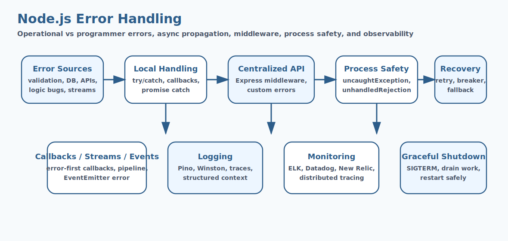

# Node.js Error Handling Interview Questions


This guide covers node.js error handling from interview basics to tricky production scenarios. It follows the corrected format of **100 interview questions for each subtopic**, and every answer includes a real Node.js code example with rotated real-world scenarios so the examples do not repeat verbatim.

## How To Use This Page

- Questions 1-100 cover Types of Errors in Node.js.
- Questions 101-200 cover Try/Catch (Synchronous).
- Questions 201-300 cover Async Error Handling.
- Questions 301-400 cover Centralized Error Middleware (Express).
- Questions 401-500 cover Custom Error Classes.
- Questions 501-600 cover Process-Level Error Handling.
- Questions 601-700 cover Error Handling in Express Routes.
- Questions 701-800 cover Error Handling in Streams.
- Questions 801-900 cover Error Handling in Callbacks.
- Questions 901-1000 cover Error Handling in Event Emitters.
- Questions 1001-1100 cover Error Handling Best Practices.
- Questions 1101-1200 cover Logging & Monitoring.
- Questions 1201-1300 cover Graceful Shutdown.
- Questions 1301-1400 cover Advanced Topics.

## 1. Types of Errors in Node.js

### Q1.1 What is types of errors in node.js in Node.js?

**Answer:**

Types of Errors in Node.js matters in Node.js because it affects how types of errors in node.js affects runtime behavior and delivery decisions. In a real system like a high-traffic Node.js API serving customer traffic behind a load balancer, a strong answer should connect the concept to runtime behavior, delivery trade-offs, production debugging, and the way Node.js applications behave under load or failure. A senior-level answer also explains the operational impact so the answer reflects real Node.js engineering instead of textbook definitions.

**Code Example:**

```js
try {
  JSON.parse('invalid');
} catch (error) {
  console.error(error.message);
}
```

### Q1.2 Why does types of errors in node.js fundamentals matter in real Node.js applications?

**Answer:**

Types of Errors in Node.js fundamentals matters in Node.js because it affects how types of errors in node.js should be understood before tackling deeper production issues. In a real system like a background worker processing queues and scheduled jobs in production, a strong answer should connect the concept to runtime behavior, delivery trade-offs, production debugging, and the way Node.js applications behave under load or failure. A senior-level answer also explains the operational impact so teams can connect the concept to runtime behavior and operational impact.

**Code Example:**

```js
process.on('unhandledRejection', reason => {
  console.error('Unhandled rejection', reason);
});
```

### Q1.3 When should a team focus on types of errors in node.js design?

**Answer:**

Types of Errors in Node.js design matters in Node.js because it affects how types of errors in node.js influences code structure and operational outcomes. In a real system like a CMS platform handling uploads, downloads, and rich admin workflows, a strong answer should connect the concept to runtime behavior, delivery trade-offs, production debugging, and the way Node.js applications behave under load or failure. A senior-level answer also explains the operational impact so production debugging becomes easier because the mechanics are clearer.

**Code Example:**

```js
const asyncHandler = fn => (req, res, next) =>
  Promise.resolve(fn(req, res, next)).catch(next);
```

### Q1.4 How would you explain types of errors in node.js debugging in a production discussion?

**Answer:**

Types of Errors in Node.js debugging matters in Node.js because it affects how teams investigate problems related to types of errors in node.js in production. In a real system like a banking integration service where reliability and observability are tightly controlled, a strong answer should connect the concept to runtime behavior, delivery trade-offs, production debugging, and the way Node.js applications behave under load or failure. A senior-level answer also explains the operational impact so architecture choices become easier to defend in interviews and reviews.

**Code Example:**

```js
const { pipeline } = require('node:stream');
pipeline(readStream, writeStream, err => {
  if (err) console.error(err);
});
```

### Q1.5 What is a common interview trap around types of errors in node.js trade-offs?

**Answer:**

Types of Errors in Node.js trade-offs matters in Node.js because it affects how types of errors in node.js shapes performance, maintainability, or reliability decisions. In a real system like a healthcare backend where safe error handling and data validation matter deeply, a strong answer should connect the concept to runtime behavior, delivery trade-offs, production debugging, and the way Node.js applications behave under load or failure. A senior-level answer also explains the operational impact so performance, correctness, and maintainability are discussed together.

**Code Example:**

```js
process.on('SIGTERM', () => {
  server.close(() => console.log('graceful shutdown complete'));
});
```

### Q1.6 How do you apply types of errors in node.js safely in practice?

**Answer:**

Types of Errors in Node.js matters in Node.js because it affects how types of errors in node.js affects runtime behavior and delivery decisions. In a real system like a logistics platform coordinating events, retries, and distributed workflows, a strong answer should connect the concept to runtime behavior, delivery trade-offs, production debugging, and the way Node.js applications behave under load or failure. A senior-level answer also explains the operational impact so common Node.js pitfalls are easier to prevent before release.

**Code Example:**

```js
try {
  JSON.parse('invalid');
} catch (error) {
  console.error(error.message);
}
```

### Q1.7 What production issue usually exposes weak understanding of types of errors in node.js fundamentals?

**Answer:**

Types of Errors in Node.js fundamentals matters in Node.js because it affects how types of errors in node.js should be understood before tackling deeper production issues. In a real system like an enterprise Express application with many middlewares and shared modules, a strong answer should connect the concept to runtime behavior, delivery trade-offs, production debugging, and the way Node.js applications behave under load or failure. A senior-level answer also explains the operational impact so the codebase stays easier to evolve as traffic and complexity grow.

**Code Example:**

```js
process.on('unhandledRejection', reason => {
  console.error('Unhandled rejection', reason);
});
```

### Q1.8 How would a senior engineer justify types of errors in node.js design to a team?

**Answer:**

Types of Errors in Node.js design matters in Node.js because it affects how types of errors in node.js influences code structure and operational outcomes. In a real system like a real-time dashboard service where event-loop behavior affects user experience, a strong answer should connect the concept to runtime behavior, delivery trade-offs, production debugging, and the way Node.js applications behave under load or failure. A senior-level answer also explains the operational impact so operational trade-offs are visible instead of hidden behind abstractions.

**Code Example:**

```js
const asyncHandler = fn => (req, res, next) =>
  Promise.resolve(fn(req, res, next)).catch(next);
```

### Q1.9 What trade-off does types of errors in node.js debugging introduce?

**Answer:**

Types of Errors in Node.js debugging matters in Node.js because it affects how teams investigate problems related to types of errors in node.js in production. In a real system like a containerized Node.js deployment where startup, memory, and scaling all matter, a strong answer should connect the concept to runtime behavior, delivery trade-offs, production debugging, and the way Node.js applications behave under load or failure. A senior-level answer also explains the operational impact so the example ties Node.js internals to practical delivery concerns.

**Code Example:**

```js
const { pipeline } = require('node:stream');
pipeline(readStream, writeStream, err => {
  if (err) console.error(err);
});
```

### Q1.10 How do you answer a tricky follow-up about types of errors in node.js trade-offs?

**Answer:**

Types of Errors in Node.js trade-offs matters in Node.js because it affects how types of errors in node.js shapes performance, maintainability, or reliability decisions. In a real system like a migration effort from ad hoc scripts to a more maintainable Node.js architecture, a strong answer should connect the concept to runtime behavior, delivery trade-offs, production debugging, and the way Node.js applications behave under load or failure. A senior-level answer also explains the operational impact so new team members can understand the concept from both code and behavior.

**Code Example:**

```js
process.on('SIGTERM', () => {
  server.close(() => console.log('graceful shutdown complete'));
});
```

### Q1.11 What is types of errors in node.js in Node.js?

**Answer:**

Types of Errors in Node.js matters in Node.js because it affects how types of errors in node.js affects runtime behavior and delivery decisions. In a real system like a high-traffic Node.js API serving customer traffic behind a load balancer, a strong answer should connect the concept to runtime behavior, delivery trade-offs, production debugging, and the way Node.js applications behave under load or failure. A senior-level answer also explains the operational impact so the answer reflects real Node.js engineering instead of textbook definitions.

**Code Example:**

```js
try {
  JSON.parse('invalid');
} catch (error) {
  console.error(error.message);
}
```

### Q1.12 Why does types of errors in node.js fundamentals matter in real Node.js applications?

**Answer:**

Types of Errors in Node.js fundamentals matters in Node.js because it affects how types of errors in node.js should be understood before tackling deeper production issues. In a real system like a background worker processing queues and scheduled jobs in production, a strong answer should connect the concept to runtime behavior, delivery trade-offs, production debugging, and the way Node.js applications behave under load or failure. A senior-level answer also explains the operational impact so teams can connect the concept to runtime behavior and operational impact.

**Code Example:**

```js
process.on('unhandledRejection', reason => {
  console.error('Unhandled rejection', reason);
});
```

### Q1.13 When should a team focus on types of errors in node.js design?

**Answer:**

Types of Errors in Node.js design matters in Node.js because it affects how types of errors in node.js influences code structure and operational outcomes. In a real system like a CMS platform handling uploads, downloads, and rich admin workflows, a strong answer should connect the concept to runtime behavior, delivery trade-offs, production debugging, and the way Node.js applications behave under load or failure. A senior-level answer also explains the operational impact so production debugging becomes easier because the mechanics are clearer.

**Code Example:**

```js
const asyncHandler = fn => (req, res, next) =>
  Promise.resolve(fn(req, res, next)).catch(next);
```

### Q1.14 How would you explain types of errors in node.js debugging in a production discussion?

**Answer:**

Types of Errors in Node.js debugging matters in Node.js because it affects how teams investigate problems related to types of errors in node.js in production. In a real system like a banking integration service where reliability and observability are tightly controlled, a strong answer should connect the concept to runtime behavior, delivery trade-offs, production debugging, and the way Node.js applications behave under load or failure. A senior-level answer also explains the operational impact so architecture choices become easier to defend in interviews and reviews.

**Code Example:**

```js
const { pipeline } = require('node:stream');
pipeline(readStream, writeStream, err => {
  if (err) console.error(err);
});
```

### Q1.15 What is a common interview trap around types of errors in node.js trade-offs?

**Answer:**

Types of Errors in Node.js trade-offs matters in Node.js because it affects how types of errors in node.js shapes performance, maintainability, or reliability decisions. In a real system like a healthcare backend where safe error handling and data validation matter deeply, a strong answer should connect the concept to runtime behavior, delivery trade-offs, production debugging, and the way Node.js applications behave under load or failure. A senior-level answer also explains the operational impact so performance, correctness, and maintainability are discussed together.

**Code Example:**

```js
process.on('SIGTERM', () => {
  server.close(() => console.log('graceful shutdown complete'));
});
```

### Q1.16 How do you apply types of errors in node.js safely in practice?

**Answer:**

Types of Errors in Node.js matters in Node.js because it affects how types of errors in node.js affects runtime behavior and delivery decisions. In a real system like a logistics platform coordinating events, retries, and distributed workflows, a strong answer should connect the concept to runtime behavior, delivery trade-offs, production debugging, and the way Node.js applications behave under load or failure. A senior-level answer also explains the operational impact so common Node.js pitfalls are easier to prevent before release.

**Code Example:**

```js
try {
  JSON.parse('invalid');
} catch (error) {
  console.error(error.message);
}
```

### Q1.17 What production issue usually exposes weak understanding of types of errors in node.js fundamentals?

**Answer:**

Types of Errors in Node.js fundamentals matters in Node.js because it affects how types of errors in node.js should be understood before tackling deeper production issues. In a real system like an enterprise Express application with many middlewares and shared modules, a strong answer should connect the concept to runtime behavior, delivery trade-offs, production debugging, and the way Node.js applications behave under load or failure. A senior-level answer also explains the operational impact so the codebase stays easier to evolve as traffic and complexity grow.

**Code Example:**

```js
process.on('unhandledRejection', reason => {
  console.error('Unhandled rejection', reason);
});
```

### Q1.18 How would a senior engineer justify types of errors in node.js design to a team?

**Answer:**

Types of Errors in Node.js design matters in Node.js because it affects how types of errors in node.js influences code structure and operational outcomes. In a real system like a real-time dashboard service where event-loop behavior affects user experience, a strong answer should connect the concept to runtime behavior, delivery trade-offs, production debugging, and the way Node.js applications behave under load or failure. A senior-level answer also explains the operational impact so operational trade-offs are visible instead of hidden behind abstractions.

**Code Example:**

```js
const asyncHandler = fn => (req, res, next) =>
  Promise.resolve(fn(req, res, next)).catch(next);
```

### Q1.19 What trade-off does types of errors in node.js debugging introduce?

**Answer:**

Types of Errors in Node.js debugging matters in Node.js because it affects how teams investigate problems related to types of errors in node.js in production. In a real system like a containerized Node.js deployment where startup, memory, and scaling all matter, a strong answer should connect the concept to runtime behavior, delivery trade-offs, production debugging, and the way Node.js applications behave under load or failure. A senior-level answer also explains the operational impact so the example ties Node.js internals to practical delivery concerns.

**Code Example:**

```js
const { pipeline } = require('node:stream');
pipeline(readStream, writeStream, err => {
  if (err) console.error(err);
});
```

### Q1.20 How do you answer a tricky follow-up about types of errors in node.js trade-offs?

**Answer:**

Types of Errors in Node.js trade-offs matters in Node.js because it affects how types of errors in node.js shapes performance, maintainability, or reliability decisions. In a real system like a migration effort from ad hoc scripts to a more maintainable Node.js architecture, a strong answer should connect the concept to runtime behavior, delivery trade-offs, production debugging, and the way Node.js applications behave under load or failure. A senior-level answer also explains the operational impact so new team members can understand the concept from both code and behavior.

**Code Example:**

```js
process.on('SIGTERM', () => {
  server.close(() => console.log('graceful shutdown complete'));
});
```

### Q1.21 What is types of errors in node.js in Node.js?

**Answer:**

Types of Errors in Node.js matters in Node.js because it affects how types of errors in node.js affects runtime behavior and delivery decisions. In a real system like a high-traffic Node.js API serving customer traffic behind a load balancer, a strong answer should connect the concept to runtime behavior, delivery trade-offs, production debugging, and the way Node.js applications behave under load or failure. A senior-level answer also explains the operational impact so the answer reflects real Node.js engineering instead of textbook definitions.

**Code Example:**

```js
try {
  JSON.parse('invalid');
} catch (error) {
  console.error(error.message);
}
```

### Q1.22 Why does types of errors in node.js fundamentals matter in real Node.js applications?

**Answer:**

Types of Errors in Node.js fundamentals matters in Node.js because it affects how types of errors in node.js should be understood before tackling deeper production issues. In a real system like a background worker processing queues and scheduled jobs in production, a strong answer should connect the concept to runtime behavior, delivery trade-offs, production debugging, and the way Node.js applications behave under load or failure. A senior-level answer also explains the operational impact so teams can connect the concept to runtime behavior and operational impact.

**Code Example:**

```js
process.on('unhandledRejection', reason => {
  console.error('Unhandled rejection', reason);
});
```

### Q1.23 When should a team focus on types of errors in node.js design?

**Answer:**

Types of Errors in Node.js design matters in Node.js because it affects how types of errors in node.js influences code structure and operational outcomes. In a real system like a CMS platform handling uploads, downloads, and rich admin workflows, a strong answer should connect the concept to runtime behavior, delivery trade-offs, production debugging, and the way Node.js applications behave under load or failure. A senior-level answer also explains the operational impact so production debugging becomes easier because the mechanics are clearer.

**Code Example:**

```js
const asyncHandler = fn => (req, res, next) =>
  Promise.resolve(fn(req, res, next)).catch(next);
```

### Q1.24 How would you explain types of errors in node.js debugging in a production discussion?

**Answer:**

Types of Errors in Node.js debugging matters in Node.js because it affects how teams investigate problems related to types of errors in node.js in production. In a real system like a banking integration service where reliability and observability are tightly controlled, a strong answer should connect the concept to runtime behavior, delivery trade-offs, production debugging, and the way Node.js applications behave under load or failure. A senior-level answer also explains the operational impact so architecture choices become easier to defend in interviews and reviews.

**Code Example:**

```js
const { pipeline } = require('node:stream');
pipeline(readStream, writeStream, err => {
  if (err) console.error(err);
});
```

### Q1.25 What is a common interview trap around types of errors in node.js trade-offs?

**Answer:**

Types of Errors in Node.js trade-offs matters in Node.js because it affects how types of errors in node.js shapes performance, maintainability, or reliability decisions. In a real system like a healthcare backend where safe error handling and data validation matter deeply, a strong answer should connect the concept to runtime behavior, delivery trade-offs, production debugging, and the way Node.js applications behave under load or failure. A senior-level answer also explains the operational impact so performance, correctness, and maintainability are discussed together.

**Code Example:**

```js
process.on('SIGTERM', () => {
  server.close(() => console.log('graceful shutdown complete'));
});
```

### Q1.26 How do you apply types of errors in node.js safely in practice?

**Answer:**

Types of Errors in Node.js matters in Node.js because it affects how types of errors in node.js affects runtime behavior and delivery decisions. In a real system like a logistics platform coordinating events, retries, and distributed workflows, a strong answer should connect the concept to runtime behavior, delivery trade-offs, production debugging, and the way Node.js applications behave under load or failure. A senior-level answer also explains the operational impact so common Node.js pitfalls are easier to prevent before release.

**Code Example:**

```js
try {
  JSON.parse('invalid');
} catch (error) {
  console.error(error.message);
}
```

### Q1.27 What production issue usually exposes weak understanding of types of errors in node.js fundamentals?

**Answer:**

Types of Errors in Node.js fundamentals matters in Node.js because it affects how types of errors in node.js should be understood before tackling deeper production issues. In a real system like an enterprise Express application with many middlewares and shared modules, a strong answer should connect the concept to runtime behavior, delivery trade-offs, production debugging, and the way Node.js applications behave under load or failure. A senior-level answer also explains the operational impact so the codebase stays easier to evolve as traffic and complexity grow.

**Code Example:**

```js
process.on('unhandledRejection', reason => {
  console.error('Unhandled rejection', reason);
});
```

### Q1.28 How would a senior engineer justify types of errors in node.js design to a team?

**Answer:**

Types of Errors in Node.js design matters in Node.js because it affects how types of errors in node.js influences code structure and operational outcomes. In a real system like a real-time dashboard service where event-loop behavior affects user experience, a strong answer should connect the concept to runtime behavior, delivery trade-offs, production debugging, and the way Node.js applications behave under load or failure. A senior-level answer also explains the operational impact so operational trade-offs are visible instead of hidden behind abstractions.

**Code Example:**

```js
const asyncHandler = fn => (req, res, next) =>
  Promise.resolve(fn(req, res, next)).catch(next);
```

### Q1.29 What trade-off does types of errors in node.js debugging introduce?

**Answer:**

Types of Errors in Node.js debugging matters in Node.js because it affects how teams investigate problems related to types of errors in node.js in production. In a real system like a containerized Node.js deployment where startup, memory, and scaling all matter, a strong answer should connect the concept to runtime behavior, delivery trade-offs, production debugging, and the way Node.js applications behave under load or failure. A senior-level answer also explains the operational impact so the example ties Node.js internals to practical delivery concerns.

**Code Example:**

```js
const { pipeline } = require('node:stream');
pipeline(readStream, writeStream, err => {
  if (err) console.error(err);
});
```

### Q1.30 How do you answer a tricky follow-up about types of errors in node.js trade-offs?

**Answer:**

Types of Errors in Node.js trade-offs matters in Node.js because it affects how types of errors in node.js shapes performance, maintainability, or reliability decisions. In a real system like a migration effort from ad hoc scripts to a more maintainable Node.js architecture, a strong answer should connect the concept to runtime behavior, delivery trade-offs, production debugging, and the way Node.js applications behave under load or failure. A senior-level answer also explains the operational impact so new team members can understand the concept from both code and behavior.

**Code Example:**

```js
process.on('SIGTERM', () => {
  server.close(() => console.log('graceful shutdown complete'));
});
```

### Q1.31 What is types of errors in node.js in Node.js?

**Answer:**

Types of Errors in Node.js matters in Node.js because it affects how types of errors in node.js affects runtime behavior and delivery decisions. In a real system like a high-traffic Node.js API serving customer traffic behind a load balancer, a strong answer should connect the concept to runtime behavior, delivery trade-offs, production debugging, and the way Node.js applications behave under load or failure. A senior-level answer also explains the operational impact so the answer reflects real Node.js engineering instead of textbook definitions.

**Code Example:**

```js
try {
  JSON.parse('invalid');
} catch (error) {
  console.error(error.message);
}
```

### Q1.32 Why does types of errors in node.js fundamentals matter in real Node.js applications?

**Answer:**

Types of Errors in Node.js fundamentals matters in Node.js because it affects how types of errors in node.js should be understood before tackling deeper production issues. In a real system like a background worker processing queues and scheduled jobs in production, a strong answer should connect the concept to runtime behavior, delivery trade-offs, production debugging, and the way Node.js applications behave under load or failure. A senior-level answer also explains the operational impact so teams can connect the concept to runtime behavior and operational impact.

**Code Example:**

```js
process.on('unhandledRejection', reason => {
  console.error('Unhandled rejection', reason);
});
```

### Q1.33 When should a team focus on types of errors in node.js design?

**Answer:**

Types of Errors in Node.js design matters in Node.js because it affects how types of errors in node.js influences code structure and operational outcomes. In a real system like a CMS platform handling uploads, downloads, and rich admin workflows, a strong answer should connect the concept to runtime behavior, delivery trade-offs, production debugging, and the way Node.js applications behave under load or failure. A senior-level answer also explains the operational impact so production debugging becomes easier because the mechanics are clearer.

**Code Example:**

```js
const asyncHandler = fn => (req, res, next) =>
  Promise.resolve(fn(req, res, next)).catch(next);
```

### Q1.34 How would you explain types of errors in node.js debugging in a production discussion?

**Answer:**

Types of Errors in Node.js debugging matters in Node.js because it affects how teams investigate problems related to types of errors in node.js in production. In a real system like a banking integration service where reliability and observability are tightly controlled, a strong answer should connect the concept to runtime behavior, delivery trade-offs, production debugging, and the way Node.js applications behave under load or failure. A senior-level answer also explains the operational impact so architecture choices become easier to defend in interviews and reviews.

**Code Example:**

```js
const { pipeline } = require('node:stream');
pipeline(readStream, writeStream, err => {
  if (err) console.error(err);
});
```

### Q1.35 What is a common interview trap around types of errors in node.js trade-offs?

**Answer:**

Types of Errors in Node.js trade-offs matters in Node.js because it affects how types of errors in node.js shapes performance, maintainability, or reliability decisions. In a real system like a healthcare backend where safe error handling and data validation matter deeply, a strong answer should connect the concept to runtime behavior, delivery trade-offs, production debugging, and the way Node.js applications behave under load or failure. A senior-level answer also explains the operational impact so performance, correctness, and maintainability are discussed together.

**Code Example:**

```js
process.on('SIGTERM', () => {
  server.close(() => console.log('graceful shutdown complete'));
});
```

### Q1.36 How do you apply types of errors in node.js safely in practice?

**Answer:**

Types of Errors in Node.js matters in Node.js because it affects how types of errors in node.js affects runtime behavior and delivery decisions. In a real system like a logistics platform coordinating events, retries, and distributed workflows, a strong answer should connect the concept to runtime behavior, delivery trade-offs, production debugging, and the way Node.js applications behave under load or failure. A senior-level answer also explains the operational impact so common Node.js pitfalls are easier to prevent before release.

**Code Example:**

```js
try {
  JSON.parse('invalid');
} catch (error) {
  console.error(error.message);
}
```

### Q1.37 What production issue usually exposes weak understanding of types of errors in node.js fundamentals?

**Answer:**

Types of Errors in Node.js fundamentals matters in Node.js because it affects how types of errors in node.js should be understood before tackling deeper production issues. In a real system like an enterprise Express application with many middlewares and shared modules, a strong answer should connect the concept to runtime behavior, delivery trade-offs, production debugging, and the way Node.js applications behave under load or failure. A senior-level answer also explains the operational impact so the codebase stays easier to evolve as traffic and complexity grow.

**Code Example:**

```js
process.on('unhandledRejection', reason => {
  console.error('Unhandled rejection', reason);
});
```

### Q1.38 How would a senior engineer justify types of errors in node.js design to a team?

**Answer:**

Types of Errors in Node.js design matters in Node.js because it affects how types of errors in node.js influences code structure and operational outcomes. In a real system like a real-time dashboard service where event-loop behavior affects user experience, a strong answer should connect the concept to runtime behavior, delivery trade-offs, production debugging, and the way Node.js applications behave under load or failure. A senior-level answer also explains the operational impact so operational trade-offs are visible instead of hidden behind abstractions.

**Code Example:**

```js
const asyncHandler = fn => (req, res, next) =>
  Promise.resolve(fn(req, res, next)).catch(next);
```

### Q1.39 What trade-off does types of errors in node.js debugging introduce?

**Answer:**

Types of Errors in Node.js debugging matters in Node.js because it affects how teams investigate problems related to types of errors in node.js in production. In a real system like a containerized Node.js deployment where startup, memory, and scaling all matter, a strong answer should connect the concept to runtime behavior, delivery trade-offs, production debugging, and the way Node.js applications behave under load or failure. A senior-level answer also explains the operational impact so the example ties Node.js internals to practical delivery concerns.

**Code Example:**

```js
const { pipeline } = require('node:stream');
pipeline(readStream, writeStream, err => {
  if (err) console.error(err);
});
```

### Q1.40 How do you answer a tricky follow-up about types of errors in node.js trade-offs?

**Answer:**

Types of Errors in Node.js trade-offs matters in Node.js because it affects how types of errors in node.js shapes performance, maintainability, or reliability decisions. In a real system like a migration effort from ad hoc scripts to a more maintainable Node.js architecture, a strong answer should connect the concept to runtime behavior, delivery trade-offs, production debugging, and the way Node.js applications behave under load or failure. A senior-level answer also explains the operational impact so new team members can understand the concept from both code and behavior.

**Code Example:**

```js
process.on('SIGTERM', () => {
  server.close(() => console.log('graceful shutdown complete'));
});
```

### Q1.41 What is types of errors in node.js in Node.js?

**Answer:**

Types of Errors in Node.js matters in Node.js because it affects how types of errors in node.js affects runtime behavior and delivery decisions. In a real system like a high-traffic Node.js API serving customer traffic behind a load balancer, a strong answer should connect the concept to runtime behavior, delivery trade-offs, production debugging, and the way Node.js applications behave under load or failure. A senior-level answer also explains the operational impact so the answer reflects real Node.js engineering instead of textbook definitions.

**Code Example:**

```js
try {
  JSON.parse('invalid');
} catch (error) {
  console.error(error.message);
}
```

### Q1.42 Why does types of errors in node.js fundamentals matter in real Node.js applications?

**Answer:**

Types of Errors in Node.js fundamentals matters in Node.js because it affects how types of errors in node.js should be understood before tackling deeper production issues. In a real system like a background worker processing queues and scheduled jobs in production, a strong answer should connect the concept to runtime behavior, delivery trade-offs, production debugging, and the way Node.js applications behave under load or failure. A senior-level answer also explains the operational impact so teams can connect the concept to runtime behavior and operational impact.

**Code Example:**

```js
process.on('unhandledRejection', reason => {
  console.error('Unhandled rejection', reason);
});
```

### Q1.43 When should a team focus on types of errors in node.js design?

**Answer:**

Types of Errors in Node.js design matters in Node.js because it affects how types of errors in node.js influences code structure and operational outcomes. In a real system like a CMS platform handling uploads, downloads, and rich admin workflows, a strong answer should connect the concept to runtime behavior, delivery trade-offs, production debugging, and the way Node.js applications behave under load or failure. A senior-level answer also explains the operational impact so production debugging becomes easier because the mechanics are clearer.

**Code Example:**

```js
const asyncHandler = fn => (req, res, next) =>
  Promise.resolve(fn(req, res, next)).catch(next);
```

### Q1.44 How would you explain types of errors in node.js debugging in a production discussion?

**Answer:**

Types of Errors in Node.js debugging matters in Node.js because it affects how teams investigate problems related to types of errors in node.js in production. In a real system like a banking integration service where reliability and observability are tightly controlled, a strong answer should connect the concept to runtime behavior, delivery trade-offs, production debugging, and the way Node.js applications behave under load or failure. A senior-level answer also explains the operational impact so architecture choices become easier to defend in interviews and reviews.

**Code Example:**

```js
const { pipeline } = require('node:stream');
pipeline(readStream, writeStream, err => {
  if (err) console.error(err);
});
```

### Q1.45 What is a common interview trap around types of errors in node.js trade-offs?

**Answer:**

Types of Errors in Node.js trade-offs matters in Node.js because it affects how types of errors in node.js shapes performance, maintainability, or reliability decisions. In a real system like a healthcare backend where safe error handling and data validation matter deeply, a strong answer should connect the concept to runtime behavior, delivery trade-offs, production debugging, and the way Node.js applications behave under load or failure. A senior-level answer also explains the operational impact so performance, correctness, and maintainability are discussed together.

**Code Example:**

```js
process.on('SIGTERM', () => {
  server.close(() => console.log('graceful shutdown complete'));
});
```

### Q1.46 How do you apply types of errors in node.js safely in practice?

**Answer:**

Types of Errors in Node.js matters in Node.js because it affects how types of errors in node.js affects runtime behavior and delivery decisions. In a real system like a logistics platform coordinating events, retries, and distributed workflows, a strong answer should connect the concept to runtime behavior, delivery trade-offs, production debugging, and the way Node.js applications behave under load or failure. A senior-level answer also explains the operational impact so common Node.js pitfalls are easier to prevent before release.

**Code Example:**

```js
try {
  JSON.parse('invalid');
} catch (error) {
  console.error(error.message);
}
```

### Q1.47 What production issue usually exposes weak understanding of types of errors in node.js fundamentals?

**Answer:**

Types of Errors in Node.js fundamentals matters in Node.js because it affects how types of errors in node.js should be understood before tackling deeper production issues. In a real system like an enterprise Express application with many middlewares and shared modules, a strong answer should connect the concept to runtime behavior, delivery trade-offs, production debugging, and the way Node.js applications behave under load or failure. A senior-level answer also explains the operational impact so the codebase stays easier to evolve as traffic and complexity grow.

**Code Example:**

```js
process.on('unhandledRejection', reason => {
  console.error('Unhandled rejection', reason);
});
```

### Q1.48 How would a senior engineer justify types of errors in node.js design to a team?

**Answer:**

Types of Errors in Node.js design matters in Node.js because it affects how types of errors in node.js influences code structure and operational outcomes. In a real system like a real-time dashboard service where event-loop behavior affects user experience, a strong answer should connect the concept to runtime behavior, delivery trade-offs, production debugging, and the way Node.js applications behave under load or failure. A senior-level answer also explains the operational impact so operational trade-offs are visible instead of hidden behind abstractions.

**Code Example:**

```js
const asyncHandler = fn => (req, res, next) =>
  Promise.resolve(fn(req, res, next)).catch(next);
```

### Q1.49 What trade-off does types of errors in node.js debugging introduce?

**Answer:**

Types of Errors in Node.js debugging matters in Node.js because it affects how teams investigate problems related to types of errors in node.js in production. In a real system like a containerized Node.js deployment where startup, memory, and scaling all matter, a strong answer should connect the concept to runtime behavior, delivery trade-offs, production debugging, and the way Node.js applications behave under load or failure. A senior-level answer also explains the operational impact so the example ties Node.js internals to practical delivery concerns.

**Code Example:**

```js
const { pipeline } = require('node:stream');
pipeline(readStream, writeStream, err => {
  if (err) console.error(err);
});
```

### Q1.50 How do you answer a tricky follow-up about types of errors in node.js trade-offs?

**Answer:**

Types of Errors in Node.js trade-offs matters in Node.js because it affects how types of errors in node.js shapes performance, maintainability, or reliability decisions. In a real system like a migration effort from ad hoc scripts to a more maintainable Node.js architecture, a strong answer should connect the concept to runtime behavior, delivery trade-offs, production debugging, and the way Node.js applications behave under load or failure. A senior-level answer also explains the operational impact so new team members can understand the concept from both code and behavior.

**Code Example:**

```js
process.on('SIGTERM', () => {
  server.close(() => console.log('graceful shutdown complete'));
});
```

### Q1.51 What is types of errors in node.js in Node.js?

**Answer:**

Types of Errors in Node.js matters in Node.js because it affects how types of errors in node.js affects runtime behavior and delivery decisions. In a real system like a high-traffic Node.js API serving customer traffic behind a load balancer, a strong answer should connect the concept to runtime behavior, delivery trade-offs, production debugging, and the way Node.js applications behave under load or failure. A senior-level answer also explains the operational impact so the answer reflects real Node.js engineering instead of textbook definitions.

**Code Example:**

```js
try {
  JSON.parse('invalid');
} catch (error) {
  console.error(error.message);
}
```

### Q1.52 Why does types of errors in node.js fundamentals matter in real Node.js applications?

**Answer:**

Types of Errors in Node.js fundamentals matters in Node.js because it affects how types of errors in node.js should be understood before tackling deeper production issues. In a real system like a background worker processing queues and scheduled jobs in production, a strong answer should connect the concept to runtime behavior, delivery trade-offs, production debugging, and the way Node.js applications behave under load or failure. A senior-level answer also explains the operational impact so teams can connect the concept to runtime behavior and operational impact.

**Code Example:**

```js
process.on('unhandledRejection', reason => {
  console.error('Unhandled rejection', reason);
});
```

### Q1.53 When should a team focus on types of errors in node.js design?

**Answer:**

Types of Errors in Node.js design matters in Node.js because it affects how types of errors in node.js influences code structure and operational outcomes. In a real system like a CMS platform handling uploads, downloads, and rich admin workflows, a strong answer should connect the concept to runtime behavior, delivery trade-offs, production debugging, and the way Node.js applications behave under load or failure. A senior-level answer also explains the operational impact so production debugging becomes easier because the mechanics are clearer.

**Code Example:**

```js
const asyncHandler = fn => (req, res, next) =>
  Promise.resolve(fn(req, res, next)).catch(next);
```

### Q1.54 How would you explain types of errors in node.js debugging in a production discussion?

**Answer:**

Types of Errors in Node.js debugging matters in Node.js because it affects how teams investigate problems related to types of errors in node.js in production. In a real system like a banking integration service where reliability and observability are tightly controlled, a strong answer should connect the concept to runtime behavior, delivery trade-offs, production debugging, and the way Node.js applications behave under load or failure. A senior-level answer also explains the operational impact so architecture choices become easier to defend in interviews and reviews.

**Code Example:**

```js
const { pipeline } = require('node:stream');
pipeline(readStream, writeStream, err => {
  if (err) console.error(err);
});
```

### Q1.55 What is a common interview trap around types of errors in node.js trade-offs?

**Answer:**

Types of Errors in Node.js trade-offs matters in Node.js because it affects how types of errors in node.js shapes performance, maintainability, or reliability decisions. In a real system like a healthcare backend where safe error handling and data validation matter deeply, a strong answer should connect the concept to runtime behavior, delivery trade-offs, production debugging, and the way Node.js applications behave under load or failure. A senior-level answer also explains the operational impact so performance, correctness, and maintainability are discussed together.

**Code Example:**

```js
process.on('SIGTERM', () => {
  server.close(() => console.log('graceful shutdown complete'));
});
```

### Q1.56 How do you apply types of errors in node.js safely in practice?

**Answer:**

Types of Errors in Node.js matters in Node.js because it affects how types of errors in node.js affects runtime behavior and delivery decisions. In a real system like a logistics platform coordinating events, retries, and distributed workflows, a strong answer should connect the concept to runtime behavior, delivery trade-offs, production debugging, and the way Node.js applications behave under load or failure. A senior-level answer also explains the operational impact so common Node.js pitfalls are easier to prevent before release.

**Code Example:**

```js
try {
  JSON.parse('invalid');
} catch (error) {
  console.error(error.message);
}
```

### Q1.57 What production issue usually exposes weak understanding of types of errors in node.js fundamentals?

**Answer:**

Types of Errors in Node.js fundamentals matters in Node.js because it affects how types of errors in node.js should be understood before tackling deeper production issues. In a real system like an enterprise Express application with many middlewares and shared modules, a strong answer should connect the concept to runtime behavior, delivery trade-offs, production debugging, and the way Node.js applications behave under load or failure. A senior-level answer also explains the operational impact so the codebase stays easier to evolve as traffic and complexity grow.

**Code Example:**

```js
process.on('unhandledRejection', reason => {
  console.error('Unhandled rejection', reason);
});
```

### Q1.58 How would a senior engineer justify types of errors in node.js design to a team?

**Answer:**

Types of Errors in Node.js design matters in Node.js because it affects how types of errors in node.js influences code structure and operational outcomes. In a real system like a real-time dashboard service where event-loop behavior affects user experience, a strong answer should connect the concept to runtime behavior, delivery trade-offs, production debugging, and the way Node.js applications behave under load or failure. A senior-level answer also explains the operational impact so operational trade-offs are visible instead of hidden behind abstractions.

**Code Example:**

```js
const asyncHandler = fn => (req, res, next) =>
  Promise.resolve(fn(req, res, next)).catch(next);
```

### Q1.59 What trade-off does types of errors in node.js debugging introduce?

**Answer:**

Types of Errors in Node.js debugging matters in Node.js because it affects how teams investigate problems related to types of errors in node.js in production. In a real system like a containerized Node.js deployment where startup, memory, and scaling all matter, a strong answer should connect the concept to runtime behavior, delivery trade-offs, production debugging, and the way Node.js applications behave under load or failure. A senior-level answer also explains the operational impact so the example ties Node.js internals to practical delivery concerns.

**Code Example:**

```js
const { pipeline } = require('node:stream');
pipeline(readStream, writeStream, err => {
  if (err) console.error(err);
});
```

### Q1.60 How do you answer a tricky follow-up about types of errors in node.js trade-offs?

**Answer:**

Types of Errors in Node.js trade-offs matters in Node.js because it affects how types of errors in node.js shapes performance, maintainability, or reliability decisions. In a real system like a migration effort from ad hoc scripts to a more maintainable Node.js architecture, a strong answer should connect the concept to runtime behavior, delivery trade-offs, production debugging, and the way Node.js applications behave under load or failure. A senior-level answer also explains the operational impact so new team members can understand the concept from both code and behavior.

**Code Example:**

```js
process.on('SIGTERM', () => {
  server.close(() => console.log('graceful shutdown complete'));
});
```

### Q1.61 What is types of errors in node.js in Node.js?

**Answer:**

Types of Errors in Node.js matters in Node.js because it affects how types of errors in node.js affects runtime behavior and delivery decisions. In a real system like a high-traffic Node.js API serving customer traffic behind a load balancer, a strong answer should connect the concept to runtime behavior, delivery trade-offs, production debugging, and the way Node.js applications behave under load or failure. A senior-level answer also explains the operational impact so the answer reflects real Node.js engineering instead of textbook definitions.

**Code Example:**

```js
try {
  JSON.parse('invalid');
} catch (error) {
  console.error(error.message);
}
```

### Q1.62 Why does types of errors in node.js fundamentals matter in real Node.js applications?

**Answer:**

Types of Errors in Node.js fundamentals matters in Node.js because it affects how types of errors in node.js should be understood before tackling deeper production issues. In a real system like a background worker processing queues and scheduled jobs in production, a strong answer should connect the concept to runtime behavior, delivery trade-offs, production debugging, and the way Node.js applications behave under load or failure. A senior-level answer also explains the operational impact so teams can connect the concept to runtime behavior and operational impact.

**Code Example:**

```js
process.on('unhandledRejection', reason => {
  console.error('Unhandled rejection', reason);
});
```

### Q1.63 When should a team focus on types of errors in node.js design?

**Answer:**

Types of Errors in Node.js design matters in Node.js because it affects how types of errors in node.js influences code structure and operational outcomes. In a real system like a CMS platform handling uploads, downloads, and rich admin workflows, a strong answer should connect the concept to runtime behavior, delivery trade-offs, production debugging, and the way Node.js applications behave under load or failure. A senior-level answer also explains the operational impact so production debugging becomes easier because the mechanics are clearer.

**Code Example:**

```js
const asyncHandler = fn => (req, res, next) =>
  Promise.resolve(fn(req, res, next)).catch(next);
```

### Q1.64 How would you explain types of errors in node.js debugging in a production discussion?

**Answer:**

Types of Errors in Node.js debugging matters in Node.js because it affects how teams investigate problems related to types of errors in node.js in production. In a real system like a banking integration service where reliability and observability are tightly controlled, a strong answer should connect the concept to runtime behavior, delivery trade-offs, production debugging, and the way Node.js applications behave under load or failure. A senior-level answer also explains the operational impact so architecture choices become easier to defend in interviews and reviews.

**Code Example:**

```js
const { pipeline } = require('node:stream');
pipeline(readStream, writeStream, err => {
  if (err) console.error(err);
});
```

### Q1.65 What is a common interview trap around types of errors in node.js trade-offs?

**Answer:**

Types of Errors in Node.js trade-offs matters in Node.js because it affects how types of errors in node.js shapes performance, maintainability, or reliability decisions. In a real system like a healthcare backend where safe error handling and data validation matter deeply, a strong answer should connect the concept to runtime behavior, delivery trade-offs, production debugging, and the way Node.js applications behave under load or failure. A senior-level answer also explains the operational impact so performance, correctness, and maintainability are discussed together.

**Code Example:**

```js
process.on('SIGTERM', () => {
  server.close(() => console.log('graceful shutdown complete'));
});
```

### Q1.66 How do you apply types of errors in node.js safely in practice?

**Answer:**

Types of Errors in Node.js matters in Node.js because it affects how types of errors in node.js affects runtime behavior and delivery decisions. In a real system like a logistics platform coordinating events, retries, and distributed workflows, a strong answer should connect the concept to runtime behavior, delivery trade-offs, production debugging, and the way Node.js applications behave under load or failure. A senior-level answer also explains the operational impact so common Node.js pitfalls are easier to prevent before release.

**Code Example:**

```js
try {
  JSON.parse('invalid');
} catch (error) {
  console.error(error.message);
}
```

### Q1.67 What production issue usually exposes weak understanding of types of errors in node.js fundamentals?

**Answer:**

Types of Errors in Node.js fundamentals matters in Node.js because it affects how types of errors in node.js should be understood before tackling deeper production issues. In a real system like an enterprise Express application with many middlewares and shared modules, a strong answer should connect the concept to runtime behavior, delivery trade-offs, production debugging, and the way Node.js applications behave under load or failure. A senior-level answer also explains the operational impact so the codebase stays easier to evolve as traffic and complexity grow.

**Code Example:**

```js
process.on('unhandledRejection', reason => {
  console.error('Unhandled rejection', reason);
});
```

### Q1.68 How would a senior engineer justify types of errors in node.js design to a team?

**Answer:**

Types of Errors in Node.js design matters in Node.js because it affects how types of errors in node.js influences code structure and operational outcomes. In a real system like a real-time dashboard service where event-loop behavior affects user experience, a strong answer should connect the concept to runtime behavior, delivery trade-offs, production debugging, and the way Node.js applications behave under load or failure. A senior-level answer also explains the operational impact so operational trade-offs are visible instead of hidden behind abstractions.

**Code Example:**

```js
const asyncHandler = fn => (req, res, next) =>
  Promise.resolve(fn(req, res, next)).catch(next);
```

### Q1.69 What trade-off does types of errors in node.js debugging introduce?

**Answer:**

Types of Errors in Node.js debugging matters in Node.js because it affects how teams investigate problems related to types of errors in node.js in production. In a real system like a containerized Node.js deployment where startup, memory, and scaling all matter, a strong answer should connect the concept to runtime behavior, delivery trade-offs, production debugging, and the way Node.js applications behave under load or failure. A senior-level answer also explains the operational impact so the example ties Node.js internals to practical delivery concerns.

**Code Example:**

```js
const { pipeline } = require('node:stream');
pipeline(readStream, writeStream, err => {
  if (err) console.error(err);
});
```

### Q1.70 How do you answer a tricky follow-up about types of errors in node.js trade-offs?

**Answer:**

Types of Errors in Node.js trade-offs matters in Node.js because it affects how types of errors in node.js shapes performance, maintainability, or reliability decisions. In a real system like a migration effort from ad hoc scripts to a more maintainable Node.js architecture, a strong answer should connect the concept to runtime behavior, delivery trade-offs, production debugging, and the way Node.js applications behave under load or failure. A senior-level answer also explains the operational impact so new team members can understand the concept from both code and behavior.

**Code Example:**

```js
process.on('SIGTERM', () => {
  server.close(() => console.log('graceful shutdown complete'));
});
```

### Q1.71 What is types of errors in node.js in Node.js?

**Answer:**

Types of Errors in Node.js matters in Node.js because it affects how types of errors in node.js affects runtime behavior and delivery decisions. In a real system like a high-traffic Node.js API serving customer traffic behind a load balancer, a strong answer should connect the concept to runtime behavior, delivery trade-offs, production debugging, and the way Node.js applications behave under load or failure. A senior-level answer also explains the operational impact so the answer reflects real Node.js engineering instead of textbook definitions.

**Code Example:**

```js
try {
  JSON.parse('invalid');
} catch (error) {
  console.error(error.message);
}
```

### Q1.72 Why does types of errors in node.js fundamentals matter in real Node.js applications?

**Answer:**

Types of Errors in Node.js fundamentals matters in Node.js because it affects how types of errors in node.js should be understood before tackling deeper production issues. In a real system like a background worker processing queues and scheduled jobs in production, a strong answer should connect the concept to runtime behavior, delivery trade-offs, production debugging, and the way Node.js applications behave under load or failure. A senior-level answer also explains the operational impact so teams can connect the concept to runtime behavior and operational impact.

**Code Example:**

```js
process.on('unhandledRejection', reason => {
  console.error('Unhandled rejection', reason);
});
```

### Q1.73 When should a team focus on types of errors in node.js design?

**Answer:**

Types of Errors in Node.js design matters in Node.js because it affects how types of errors in node.js influences code structure and operational outcomes. In a real system like a CMS platform handling uploads, downloads, and rich admin workflows, a strong answer should connect the concept to runtime behavior, delivery trade-offs, production debugging, and the way Node.js applications behave under load or failure. A senior-level answer also explains the operational impact so production debugging becomes easier because the mechanics are clearer.

**Code Example:**

```js
const asyncHandler = fn => (req, res, next) =>
  Promise.resolve(fn(req, res, next)).catch(next);
```

### Q1.74 How would you explain types of errors in node.js debugging in a production discussion?

**Answer:**

Types of Errors in Node.js debugging matters in Node.js because it affects how teams investigate problems related to types of errors in node.js in production. In a real system like a banking integration service where reliability and observability are tightly controlled, a strong answer should connect the concept to runtime behavior, delivery trade-offs, production debugging, and the way Node.js applications behave under load or failure. A senior-level answer also explains the operational impact so architecture choices become easier to defend in interviews and reviews.

**Code Example:**

```js
const { pipeline } = require('node:stream');
pipeline(readStream, writeStream, err => {
  if (err) console.error(err);
});
```

### Q1.75 What is a common interview trap around types of errors in node.js trade-offs?

**Answer:**

Types of Errors in Node.js trade-offs matters in Node.js because it affects how types of errors in node.js shapes performance, maintainability, or reliability decisions. In a real system like a healthcare backend where safe error handling and data validation matter deeply, a strong answer should connect the concept to runtime behavior, delivery trade-offs, production debugging, and the way Node.js applications behave under load or failure. A senior-level answer also explains the operational impact so performance, correctness, and maintainability are discussed together.

**Code Example:**

```js
process.on('SIGTERM', () => {
  server.close(() => console.log('graceful shutdown complete'));
});
```

### Q1.76 How do you apply types of errors in node.js safely in practice?

**Answer:**

Types of Errors in Node.js matters in Node.js because it affects how types of errors in node.js affects runtime behavior and delivery decisions. In a real system like a logistics platform coordinating events, retries, and distributed workflows, a strong answer should connect the concept to runtime behavior, delivery trade-offs, production debugging, and the way Node.js applications behave under load or failure. A senior-level answer also explains the operational impact so common Node.js pitfalls are easier to prevent before release.

**Code Example:**

```js
try {
  JSON.parse('invalid');
} catch (error) {
  console.error(error.message);
}
```

### Q1.77 What production issue usually exposes weak understanding of types of errors in node.js fundamentals?

**Answer:**

Types of Errors in Node.js fundamentals matters in Node.js because it affects how types of errors in node.js should be understood before tackling deeper production issues. In a real system like an enterprise Express application with many middlewares and shared modules, a strong answer should connect the concept to runtime behavior, delivery trade-offs, production debugging, and the way Node.js applications behave under load or failure. A senior-level answer also explains the operational impact so the codebase stays easier to evolve as traffic and complexity grow.

**Code Example:**

```js
process.on('unhandledRejection', reason => {
  console.error('Unhandled rejection', reason);
});
```

### Q1.78 How would a senior engineer justify types of errors in node.js design to a team?

**Answer:**

Types of Errors in Node.js design matters in Node.js because it affects how types of errors in node.js influences code structure and operational outcomes. In a real system like a real-time dashboard service where event-loop behavior affects user experience, a strong answer should connect the concept to runtime behavior, delivery trade-offs, production debugging, and the way Node.js applications behave under load or failure. A senior-level answer also explains the operational impact so operational trade-offs are visible instead of hidden behind abstractions.

**Code Example:**

```js
const asyncHandler = fn => (req, res, next) =>
  Promise.resolve(fn(req, res, next)).catch(next);
```

### Q1.79 What trade-off does types of errors in node.js debugging introduce?

**Answer:**

Types of Errors in Node.js debugging matters in Node.js because it affects how teams investigate problems related to types of errors in node.js in production. In a real system like a containerized Node.js deployment where startup, memory, and scaling all matter, a strong answer should connect the concept to runtime behavior, delivery trade-offs, production debugging, and the way Node.js applications behave under load or failure. A senior-level answer also explains the operational impact so the example ties Node.js internals to practical delivery concerns.

**Code Example:**

```js
const { pipeline } = require('node:stream');
pipeline(readStream, writeStream, err => {
  if (err) console.error(err);
});
```

### Q1.80 How do you answer a tricky follow-up about types of errors in node.js trade-offs?

**Answer:**

Types of Errors in Node.js trade-offs matters in Node.js because it affects how types of errors in node.js shapes performance, maintainability, or reliability decisions. In a real system like a migration effort from ad hoc scripts to a more maintainable Node.js architecture, a strong answer should connect the concept to runtime behavior, delivery trade-offs, production debugging, and the way Node.js applications behave under load or failure. A senior-level answer also explains the operational impact so new team members can understand the concept from both code and behavior.

**Code Example:**

```js
process.on('SIGTERM', () => {
  server.close(() => console.log('graceful shutdown complete'));
});
```

### Q1.81 What is types of errors in node.js in Node.js?

**Answer:**

Types of Errors in Node.js matters in Node.js because it affects how types of errors in node.js affects runtime behavior and delivery decisions. In a real system like a high-traffic Node.js API serving customer traffic behind a load balancer, a strong answer should connect the concept to runtime behavior, delivery trade-offs, production debugging, and the way Node.js applications behave under load or failure. A senior-level answer also explains the operational impact so the answer reflects real Node.js engineering instead of textbook definitions.

**Code Example:**

```js
try {
  JSON.parse('invalid');
} catch (error) {
  console.error(error.message);
}
```

### Q1.82 Why does types of errors in node.js fundamentals matter in real Node.js applications?

**Answer:**

Types of Errors in Node.js fundamentals matters in Node.js because it affects how types of errors in node.js should be understood before tackling deeper production issues. In a real system like a background worker processing queues and scheduled jobs in production, a strong answer should connect the concept to runtime behavior, delivery trade-offs, production debugging, and the way Node.js applications behave under load or failure. A senior-level answer also explains the operational impact so teams can connect the concept to runtime behavior and operational impact.

**Code Example:**

```js
process.on('unhandledRejection', reason => {
  console.error('Unhandled rejection', reason);
});
```

### Q1.83 When should a team focus on types of errors in node.js design?

**Answer:**

Types of Errors in Node.js design matters in Node.js because it affects how types of errors in node.js influences code structure and operational outcomes. In a real system like a CMS platform handling uploads, downloads, and rich admin workflows, a strong answer should connect the concept to runtime behavior, delivery trade-offs, production debugging, and the way Node.js applications behave under load or failure. A senior-level answer also explains the operational impact so production debugging becomes easier because the mechanics are clearer.

**Code Example:**

```js
const asyncHandler = fn => (req, res, next) =>
  Promise.resolve(fn(req, res, next)).catch(next);
```

### Q1.84 How would you explain types of errors in node.js debugging in a production discussion?

**Answer:**

Types of Errors in Node.js debugging matters in Node.js because it affects how teams investigate problems related to types of errors in node.js in production. In a real system like a banking integration service where reliability and observability are tightly controlled, a strong answer should connect the concept to runtime behavior, delivery trade-offs, production debugging, and the way Node.js applications behave under load or failure. A senior-level answer also explains the operational impact so architecture choices become easier to defend in interviews and reviews.

**Code Example:**

```js
const { pipeline } = require('node:stream');
pipeline(readStream, writeStream, err => {
  if (err) console.error(err);
});
```

### Q1.85 What is a common interview trap around types of errors in node.js trade-offs?

**Answer:**

Types of Errors in Node.js trade-offs matters in Node.js because it affects how types of errors in node.js shapes performance, maintainability, or reliability decisions. In a real system like a healthcare backend where safe error handling and data validation matter deeply, a strong answer should connect the concept to runtime behavior, delivery trade-offs, production debugging, and the way Node.js applications behave under load or failure. A senior-level answer also explains the operational impact so performance, correctness, and maintainability are discussed together.

**Code Example:**

```js
process.on('SIGTERM', () => {
  server.close(() => console.log('graceful shutdown complete'));
});
```

### Q1.86 How do you apply types of errors in node.js safely in practice?

**Answer:**

Types of Errors in Node.js matters in Node.js because it affects how types of errors in node.js affects runtime behavior and delivery decisions. In a real system like a logistics platform coordinating events, retries, and distributed workflows, a strong answer should connect the concept to runtime behavior, delivery trade-offs, production debugging, and the way Node.js applications behave under load or failure. A senior-level answer also explains the operational impact so common Node.js pitfalls are easier to prevent before release.

**Code Example:**

```js
try {
  JSON.parse('invalid');
} catch (error) {
  console.error(error.message);
}
```

### Q1.87 What production issue usually exposes weak understanding of types of errors in node.js fundamentals?

**Answer:**

Types of Errors in Node.js fundamentals matters in Node.js because it affects how types of errors in node.js should be understood before tackling deeper production issues. In a real system like an enterprise Express application with many middlewares and shared modules, a strong answer should connect the concept to runtime behavior, delivery trade-offs, production debugging, and the way Node.js applications behave under load or failure. A senior-level answer also explains the operational impact so the codebase stays easier to evolve as traffic and complexity grow.

**Code Example:**

```js
process.on('unhandledRejection', reason => {
  console.error('Unhandled rejection', reason);
});
```

### Q1.88 How would a senior engineer justify types of errors in node.js design to a team?

**Answer:**

Types of Errors in Node.js design matters in Node.js because it affects how types of errors in node.js influences code structure and operational outcomes. In a real system like a real-time dashboard service where event-loop behavior affects user experience, a strong answer should connect the concept to runtime behavior, delivery trade-offs, production debugging, and the way Node.js applications behave under load or failure. A senior-level answer also explains the operational impact so operational trade-offs are visible instead of hidden behind abstractions.

**Code Example:**

```js
const asyncHandler = fn => (req, res, next) =>
  Promise.resolve(fn(req, res, next)).catch(next);
```

### Q1.89 What trade-off does types of errors in node.js debugging introduce?

**Answer:**

Types of Errors in Node.js debugging matters in Node.js because it affects how teams investigate problems related to types of errors in node.js in production. In a real system like a containerized Node.js deployment where startup, memory, and scaling all matter, a strong answer should connect the concept to runtime behavior, delivery trade-offs, production debugging, and the way Node.js applications behave under load or failure. A senior-level answer also explains the operational impact so the example ties Node.js internals to practical delivery concerns.

**Code Example:**

```js
const { pipeline } = require('node:stream');
pipeline(readStream, writeStream, err => {
  if (err) console.error(err);
});
```

### Q1.90 How do you answer a tricky follow-up about types of errors in node.js trade-offs?

**Answer:**

Types of Errors in Node.js trade-offs matters in Node.js because it affects how types of errors in node.js shapes performance, maintainability, or reliability decisions. In a real system like a migration effort from ad hoc scripts to a more maintainable Node.js architecture, a strong answer should connect the concept to runtime behavior, delivery trade-offs, production debugging, and the way Node.js applications behave under load or failure. A senior-level answer also explains the operational impact so new team members can understand the concept from both code and behavior.

**Code Example:**

```js
process.on('SIGTERM', () => {
  server.close(() => console.log('graceful shutdown complete'));
});
```

### Q1.91 What is types of errors in node.js in Node.js?

**Answer:**

Types of Errors in Node.js matters in Node.js because it affects how types of errors in node.js affects runtime behavior and delivery decisions. In a real system like a high-traffic Node.js API serving customer traffic behind a load balancer, a strong answer should connect the concept to runtime behavior, delivery trade-offs, production debugging, and the way Node.js applications behave under load or failure. A senior-level answer also explains the operational impact so the answer reflects real Node.js engineering instead of textbook definitions.

**Code Example:**

```js
try {
  JSON.parse('invalid');
} catch (error) {
  console.error(error.message);
}
```

### Q1.92 Why does types of errors in node.js fundamentals matter in real Node.js applications?

**Answer:**

Types of Errors in Node.js fundamentals matters in Node.js because it affects how types of errors in node.js should be understood before tackling deeper production issues. In a real system like a background worker processing queues and scheduled jobs in production, a strong answer should connect the concept to runtime behavior, delivery trade-offs, production debugging, and the way Node.js applications behave under load or failure. A senior-level answer also explains the operational impact so teams can connect the concept to runtime behavior and operational impact.

**Code Example:**

```js
process.on('unhandledRejection', reason => {
  console.error('Unhandled rejection', reason);
});
```

### Q1.93 When should a team focus on types of errors in node.js design?

**Answer:**

Types of Errors in Node.js design matters in Node.js because it affects how types of errors in node.js influences code structure and operational outcomes. In a real system like a CMS platform handling uploads, downloads, and rich admin workflows, a strong answer should connect the concept to runtime behavior, delivery trade-offs, production debugging, and the way Node.js applications behave under load or failure. A senior-level answer also explains the operational impact so production debugging becomes easier because the mechanics are clearer.

**Code Example:**

```js
const asyncHandler = fn => (req, res, next) =>
  Promise.resolve(fn(req, res, next)).catch(next);
```

### Q1.94 How would you explain types of errors in node.js debugging in a production discussion?

**Answer:**

Types of Errors in Node.js debugging matters in Node.js because it affects how teams investigate problems related to types of errors in node.js in production. In a real system like a banking integration service where reliability and observability are tightly controlled, a strong answer should connect the concept to runtime behavior, delivery trade-offs, production debugging, and the way Node.js applications behave under load or failure. A senior-level answer also explains the operational impact so architecture choices become easier to defend in interviews and reviews.

**Code Example:**

```js
const { pipeline } = require('node:stream');
pipeline(readStream, writeStream, err => {
  if (err) console.error(err);
});
```

### Q1.95 What is a common interview trap around types of errors in node.js trade-offs?

**Answer:**

Types of Errors in Node.js trade-offs matters in Node.js because it affects how types of errors in node.js shapes performance, maintainability, or reliability decisions. In a real system like a healthcare backend where safe error handling and data validation matter deeply, a strong answer should connect the concept to runtime behavior, delivery trade-offs, production debugging, and the way Node.js applications behave under load or failure. A senior-level answer also explains the operational impact so performance, correctness, and maintainability are discussed together.

**Code Example:**

```js
process.on('SIGTERM', () => {
  server.close(() => console.log('graceful shutdown complete'));
});
```

### Q1.96 How do you apply types of errors in node.js safely in practice?

**Answer:**

Types of Errors in Node.js matters in Node.js because it affects how types of errors in node.js affects runtime behavior and delivery decisions. In a real system like a logistics platform coordinating events, retries, and distributed workflows, a strong answer should connect the concept to runtime behavior, delivery trade-offs, production debugging, and the way Node.js applications behave under load or failure. A senior-level answer also explains the operational impact so common Node.js pitfalls are easier to prevent before release.

**Code Example:**

```js
try {
  JSON.parse('invalid');
} catch (error) {
  console.error(error.message);
}
```

### Q1.97 What production issue usually exposes weak understanding of types of errors in node.js fundamentals?

**Answer:**

Types of Errors in Node.js fundamentals matters in Node.js because it affects how types of errors in node.js should be understood before tackling deeper production issues. In a real system like an enterprise Express application with many middlewares and shared modules, a strong answer should connect the concept to runtime behavior, delivery trade-offs, production debugging, and the way Node.js applications behave under load or failure. A senior-level answer also explains the operational impact so the codebase stays easier to evolve as traffic and complexity grow.

**Code Example:**

```js
process.on('unhandledRejection', reason => {
  console.error('Unhandled rejection', reason);
});
```

### Q1.98 How would a senior engineer justify types of errors in node.js design to a team?

**Answer:**

Types of Errors in Node.js design matters in Node.js because it affects how types of errors in node.js influences code structure and operational outcomes. In a real system like a real-time dashboard service where event-loop behavior affects user experience, a strong answer should connect the concept to runtime behavior, delivery trade-offs, production debugging, and the way Node.js applications behave under load or failure. A senior-level answer also explains the operational impact so operational trade-offs are visible instead of hidden behind abstractions.

**Code Example:**

```js
const asyncHandler = fn => (req, res, next) =>
  Promise.resolve(fn(req, res, next)).catch(next);
```

### Q1.99 What trade-off does types of errors in node.js debugging introduce?

**Answer:**

Types of Errors in Node.js debugging matters in Node.js because it affects how teams investigate problems related to types of errors in node.js in production. In a real system like a containerized Node.js deployment where startup, memory, and scaling all matter, a strong answer should connect the concept to runtime behavior, delivery trade-offs, production debugging, and the way Node.js applications behave under load or failure. A senior-level answer also explains the operational impact so the example ties Node.js internals to practical delivery concerns.

**Code Example:**

```js
const { pipeline } = require('node:stream');
pipeline(readStream, writeStream, err => {
  if (err) console.error(err);
});
```

### Q1.100 How do you answer a tricky follow-up about types of errors in node.js trade-offs?

**Answer:**

Types of Errors in Node.js trade-offs matters in Node.js because it affects how types of errors in node.js shapes performance, maintainability, or reliability decisions. In a real system like a migration effort from ad hoc scripts to a more maintainable Node.js architecture, a strong answer should connect the concept to runtime behavior, delivery trade-offs, production debugging, and the way Node.js applications behave under load or failure. A senior-level answer also explains the operational impact so new team members can understand the concept from both code and behavior.

**Code Example:**

```js
process.on('SIGTERM', () => {
  server.close(() => console.log('graceful shutdown complete'));
});
```

## 2. Try/Catch (Synchronous)

### Q2.1 What is try/catch (synchronous) in Node.js?

**Answer:**

Try/Catch (Synchronous) matters in Node.js because it affects how try/catch (synchronous) affects runtime behavior and delivery decisions. In a real system like a high-traffic Node.js API serving customer traffic behind a load balancer, a strong answer should connect the concept to runtime behavior, delivery trade-offs, production debugging, and the way Node.js applications behave under load or failure. A senior-level answer also explains the operational impact so the answer reflects real Node.js engineering instead of textbook definitions.

**Code Example:**

```js
console.log({ topic: 'Try/Catch (Synchronous)', question: 101 });
```

### Q2.2 Why does try/catch (synchronous) fundamentals matter in real Node.js applications?

**Answer:**

Try/Catch (Synchronous) fundamentals matters in Node.js because it affects how try/catch (synchronous) should be understood before tackling deeper production issues. In a real system like a background worker processing queues and scheduled jobs in production, a strong answer should connect the concept to runtime behavior, delivery trade-offs, production debugging, and the way Node.js applications behave under load or failure. A senior-level answer also explains the operational impact so teams can connect the concept to runtime behavior and operational impact.

**Code Example:**

```js
function explainTryCatchSynchronous() {
  return 'Try/Catch (Synchronous)';
}
```

### Q2.3 When should a team focus on try/catch (synchronous) design?

**Answer:**

Try/Catch (Synchronous) design matters in Node.js because it affects how try/catch (synchronous) influences code structure and operational outcomes. In a real system like a CMS platform handling uploads, downloads, and rich admin workflows, a strong answer should connect the concept to runtime behavior, delivery trade-offs, production debugging, and the way Node.js applications behave under load or failure. A senior-level answer also explains the operational impact so production debugging becomes easier because the mechanics are clearer.

**Code Example:**

```js
const data = ['alpha', 'beta', 'gamma'];
console.log(data.join(','));
```

### Q2.4 How would you explain try/catch (synchronous) debugging in a production discussion?

**Answer:**

Try/Catch (Synchronous) debugging matters in Node.js because it affects how teams investigate problems related to try/catch (synchronous) in production. In a real system like a banking integration service where reliability and observability are tightly controlled, a strong answer should connect the concept to runtime behavior, delivery trade-offs, production debugging, and the way Node.js applications behave under load or failure. A senior-level answer also explains the operational impact so architecture choices become easier to defend in interviews and reviews.

**Code Example:**

```js
const config = { enabled: true, retries: 3 };
console.log(config);
```

### Q2.5 What is a common interview trap around try/catch (synchronous) trade-offs?

**Answer:**

Try/Catch (Synchronous) trade-offs matters in Node.js because it affects how try/catch (synchronous) shapes performance, maintainability, or reliability decisions. In a real system like a healthcare backend where safe error handling and data validation matter deeply, a strong answer should connect the concept to runtime behavior, delivery trade-offs, production debugging, and the way Node.js applications behave under load or failure. A senior-level answer also explains the operational impact so performance, correctness, and maintainability are discussed together.

**Code Example:**

```js
setTimeout(() => console.log('node example executed'), 10);
```

### Q2.6 How do you apply try/catch (synchronous) safely in practice?

**Answer:**

Try/Catch (Synchronous) matters in Node.js because it affects how try/catch (synchronous) affects runtime behavior and delivery decisions. In a real system like a logistics platform coordinating events, retries, and distributed workflows, a strong answer should connect the concept to runtime behavior, delivery trade-offs, production debugging, and the way Node.js applications behave under load or failure. A senior-level answer also explains the operational impact so common Node.js pitfalls are easier to prevent before release.

**Code Example:**

```js
console.log({ topic: 'Try/Catch (Synchronous)', question: 106 });
```

### Q2.7 What production issue usually exposes weak understanding of try/catch (synchronous) fundamentals?

**Answer:**

Try/Catch (Synchronous) fundamentals matters in Node.js because it affects how try/catch (synchronous) should be understood before tackling deeper production issues. In a real system like an enterprise Express application with many middlewares and shared modules, a strong answer should connect the concept to runtime behavior, delivery trade-offs, production debugging, and the way Node.js applications behave under load or failure. A senior-level answer also explains the operational impact so the codebase stays easier to evolve as traffic and complexity grow.

**Code Example:**

```js
function explainTryCatchSynchronous() {
  return 'Try/Catch (Synchronous)';
}
```

### Q2.8 How would a senior engineer justify try/catch (synchronous) design to a team?

**Answer:**

Try/Catch (Synchronous) design matters in Node.js because it affects how try/catch (synchronous) influences code structure and operational outcomes. In a real system like a real-time dashboard service where event-loop behavior affects user experience, a strong answer should connect the concept to runtime behavior, delivery trade-offs, production debugging, and the way Node.js applications behave under load or failure. A senior-level answer also explains the operational impact so operational trade-offs are visible instead of hidden behind abstractions.

**Code Example:**

```js
const data = ['alpha', 'beta', 'gamma'];
console.log(data.join(','));
```

### Q2.9 What trade-off does try/catch (synchronous) debugging introduce?

**Answer:**

Try/Catch (Synchronous) debugging matters in Node.js because it affects how teams investigate problems related to try/catch (synchronous) in production. In a real system like a containerized Node.js deployment where startup, memory, and scaling all matter, a strong answer should connect the concept to runtime behavior, delivery trade-offs, production debugging, and the way Node.js applications behave under load or failure. A senior-level answer also explains the operational impact so the example ties Node.js internals to practical delivery concerns.

**Code Example:**

```js
const config = { enabled: true, retries: 3 };
console.log(config);
```

### Q2.10 How do you answer a tricky follow-up about try/catch (synchronous) trade-offs?

**Answer:**

Try/Catch (Synchronous) trade-offs matters in Node.js because it affects how try/catch (synchronous) shapes performance, maintainability, or reliability decisions. In a real system like a migration effort from ad hoc scripts to a more maintainable Node.js architecture, a strong answer should connect the concept to runtime behavior, delivery trade-offs, production debugging, and the way Node.js applications behave under load or failure. A senior-level answer also explains the operational impact so new team members can understand the concept from both code and behavior.

**Code Example:**

```js
setTimeout(() => console.log('node example executed'), 10);
```

### Q2.11 What is try/catch (synchronous) in Node.js?

**Answer:**

Try/Catch (Synchronous) matters in Node.js because it affects how try/catch (synchronous) affects runtime behavior and delivery decisions. In a real system like a high-traffic Node.js API serving customer traffic behind a load balancer, a strong answer should connect the concept to runtime behavior, delivery trade-offs, production debugging, and the way Node.js applications behave under load or failure. A senior-level answer also explains the operational impact so the answer reflects real Node.js engineering instead of textbook definitions.

**Code Example:**

```js
console.log({ topic: 'Try/Catch (Synchronous)', question: 111 });
```

### Q2.12 Why does try/catch (synchronous) fundamentals matter in real Node.js applications?

**Answer:**

Try/Catch (Synchronous) fundamentals matters in Node.js because it affects how try/catch (synchronous) should be understood before tackling deeper production issues. In a real system like a background worker processing queues and scheduled jobs in production, a strong answer should connect the concept to runtime behavior, delivery trade-offs, production debugging, and the way Node.js applications behave under load or failure. A senior-level answer also explains the operational impact so teams can connect the concept to runtime behavior and operational impact.

**Code Example:**

```js
function explainTryCatchSynchronous() {
  return 'Try/Catch (Synchronous)';
}
```

### Q2.13 When should a team focus on try/catch (synchronous) design?

**Answer:**

Try/Catch (Synchronous) design matters in Node.js because it affects how try/catch (synchronous) influences code structure and operational outcomes. In a real system like a CMS platform handling uploads, downloads, and rich admin workflows, a strong answer should connect the concept to runtime behavior, delivery trade-offs, production debugging, and the way Node.js applications behave under load or failure. A senior-level answer also explains the operational impact so production debugging becomes easier because the mechanics are clearer.

**Code Example:**

```js
const data = ['alpha', 'beta', 'gamma'];
console.log(data.join(','));
```

### Q2.14 How would you explain try/catch (synchronous) debugging in a production discussion?

**Answer:**

Try/Catch (Synchronous) debugging matters in Node.js because it affects how teams investigate problems related to try/catch (synchronous) in production. In a real system like a banking integration service where reliability and observability are tightly controlled, a strong answer should connect the concept to runtime behavior, delivery trade-offs, production debugging, and the way Node.js applications behave under load or failure. A senior-level answer also explains the operational impact so architecture choices become easier to defend in interviews and reviews.

**Code Example:**

```js
const config = { enabled: true, retries: 3 };
console.log(config);
```

### Q2.15 What is a common interview trap around try/catch (synchronous) trade-offs?

**Answer:**

Try/Catch (Synchronous) trade-offs matters in Node.js because it affects how try/catch (synchronous) shapes performance, maintainability, or reliability decisions. In a real system like a healthcare backend where safe error handling and data validation matter deeply, a strong answer should connect the concept to runtime behavior, delivery trade-offs, production debugging, and the way Node.js applications behave under load or failure. A senior-level answer also explains the operational impact so performance, correctness, and maintainability are discussed together.

**Code Example:**

```js
setTimeout(() => console.log('node example executed'), 10);
```

### Q2.16 How do you apply try/catch (synchronous) safely in practice?

**Answer:**

Try/Catch (Synchronous) matters in Node.js because it affects how try/catch (synchronous) affects runtime behavior and delivery decisions. In a real system like a logistics platform coordinating events, retries, and distributed workflows, a strong answer should connect the concept to runtime behavior, delivery trade-offs, production debugging, and the way Node.js applications behave under load or failure. A senior-level answer also explains the operational impact so common Node.js pitfalls are easier to prevent before release.

**Code Example:**

```js
console.log({ topic: 'Try/Catch (Synchronous)', question: 116 });
```

### Q2.17 What production issue usually exposes weak understanding of try/catch (synchronous) fundamentals?

**Answer:**

Try/Catch (Synchronous) fundamentals matters in Node.js because it affects how try/catch (synchronous) should be understood before tackling deeper production issues. In a real system like an enterprise Express application with many middlewares and shared modules, a strong answer should connect the concept to runtime behavior, delivery trade-offs, production debugging, and the way Node.js applications behave under load or failure. A senior-level answer also explains the operational impact so the codebase stays easier to evolve as traffic and complexity grow.

**Code Example:**

```js
function explainTryCatchSynchronous() {
  return 'Try/Catch (Synchronous)';
}
```

### Q2.18 How would a senior engineer justify try/catch (synchronous) design to a team?

**Answer:**

Try/Catch (Synchronous) design matters in Node.js because it affects how try/catch (synchronous) influences code structure and operational outcomes. In a real system like a real-time dashboard service where event-loop behavior affects user experience, a strong answer should connect the concept to runtime behavior, delivery trade-offs, production debugging, and the way Node.js applications behave under load or failure. A senior-level answer also explains the operational impact so operational trade-offs are visible instead of hidden behind abstractions.

**Code Example:**

```js
const data = ['alpha', 'beta', 'gamma'];
console.log(data.join(','));
```

### Q2.19 What trade-off does try/catch (synchronous) debugging introduce?

**Answer:**

Try/Catch (Synchronous) debugging matters in Node.js because it affects how teams investigate problems related to try/catch (synchronous) in production. In a real system like a containerized Node.js deployment where startup, memory, and scaling all matter, a strong answer should connect the concept to runtime behavior, delivery trade-offs, production debugging, and the way Node.js applications behave under load or failure. A senior-level answer also explains the operational impact so the example ties Node.js internals to practical delivery concerns.

**Code Example:**

```js
const config = { enabled: true, retries: 3 };
console.log(config);
```

### Q2.20 How do you answer a tricky follow-up about try/catch (synchronous) trade-offs?

**Answer:**

Try/Catch (Synchronous) trade-offs matters in Node.js because it affects how try/catch (synchronous) shapes performance, maintainability, or reliability decisions. In a real system like a migration effort from ad hoc scripts to a more maintainable Node.js architecture, a strong answer should connect the concept to runtime behavior, delivery trade-offs, production debugging, and the way Node.js applications behave under load or failure. A senior-level answer also explains the operational impact so new team members can understand the concept from both code and behavior.

**Code Example:**

```js
setTimeout(() => console.log('node example executed'), 10);
```

### Q2.21 What is try/catch (synchronous) in Node.js?

**Answer:**

Try/Catch (Synchronous) matters in Node.js because it affects how try/catch (synchronous) affects runtime behavior and delivery decisions. In a real system like a high-traffic Node.js API serving customer traffic behind a load balancer, a strong answer should connect the concept to runtime behavior, delivery trade-offs, production debugging, and the way Node.js applications behave under load or failure. A senior-level answer also explains the operational impact so the answer reflects real Node.js engineering instead of textbook definitions.

**Code Example:**

```js
console.log({ topic: 'Try/Catch (Synchronous)', question: 121 });
```

### Q2.22 Why does try/catch (synchronous) fundamentals matter in real Node.js applications?

**Answer:**

Try/Catch (Synchronous) fundamentals matters in Node.js because it affects how try/catch (synchronous) should be understood before tackling deeper production issues. In a real system like a background worker processing queues and scheduled jobs in production, a strong answer should connect the concept to runtime behavior, delivery trade-offs, production debugging, and the way Node.js applications behave under load or failure. A senior-level answer also explains the operational impact so teams can connect the concept to runtime behavior and operational impact.

**Code Example:**

```js
function explainTryCatchSynchronous() {
  return 'Try/Catch (Synchronous)';
}
```

### Q2.23 When should a team focus on try/catch (synchronous) design?

**Answer:**

Try/Catch (Synchronous) design matters in Node.js because it affects how try/catch (synchronous) influences code structure and operational outcomes. In a real system like a CMS platform handling uploads, downloads, and rich admin workflows, a strong answer should connect the concept to runtime behavior, delivery trade-offs, production debugging, and the way Node.js applications behave under load or failure. A senior-level answer also explains the operational impact so production debugging becomes easier because the mechanics are clearer.

**Code Example:**

```js
const data = ['alpha', 'beta', 'gamma'];
console.log(data.join(','));
```

### Q2.24 How would you explain try/catch (synchronous) debugging in a production discussion?

**Answer:**

Try/Catch (Synchronous) debugging matters in Node.js because it affects how teams investigate problems related to try/catch (synchronous) in production. In a real system like a banking integration service where reliability and observability are tightly controlled, a strong answer should connect the concept to runtime behavior, delivery trade-offs, production debugging, and the way Node.js applications behave under load or failure. A senior-level answer also explains the operational impact so architecture choices become easier to defend in interviews and reviews.

**Code Example:**

```js
const config = { enabled: true, retries: 3 };
console.log(config);
```

### Q2.25 What is a common interview trap around try/catch (synchronous) trade-offs?

**Answer:**

Try/Catch (Synchronous) trade-offs matters in Node.js because it affects how try/catch (synchronous) shapes performance, maintainability, or reliability decisions. In a real system like a healthcare backend where safe error handling and data validation matter deeply, a strong answer should connect the concept to runtime behavior, delivery trade-offs, production debugging, and the way Node.js applications behave under load or failure. A senior-level answer also explains the operational impact so performance, correctness, and maintainability are discussed together.

**Code Example:**

```js
setTimeout(() => console.log('node example executed'), 10);
```

### Q2.26 How do you apply try/catch (synchronous) safely in practice?

**Answer:**

Try/Catch (Synchronous) matters in Node.js because it affects how try/catch (synchronous) affects runtime behavior and delivery decisions. In a real system like a logistics platform coordinating events, retries, and distributed workflows, a strong answer should connect the concept to runtime behavior, delivery trade-offs, production debugging, and the way Node.js applications behave under load or failure. A senior-level answer also explains the operational impact so common Node.js pitfalls are easier to prevent before release.

**Code Example:**

```js
console.log({ topic: 'Try/Catch (Synchronous)', question: 126 });
```

### Q2.27 What production issue usually exposes weak understanding of try/catch (synchronous) fundamentals?

**Answer:**

Try/Catch (Synchronous) fundamentals matters in Node.js because it affects how try/catch (synchronous) should be understood before tackling deeper production issues. In a real system like an enterprise Express application with many middlewares and shared modules, a strong answer should connect the concept to runtime behavior, delivery trade-offs, production debugging, and the way Node.js applications behave under load or failure. A senior-level answer also explains the operational impact so the codebase stays easier to evolve as traffic and complexity grow.

**Code Example:**

```js
function explainTryCatchSynchronous() {
  return 'Try/Catch (Synchronous)';
}
```

### Q2.28 How would a senior engineer justify try/catch (synchronous) design to a team?

**Answer:**

Try/Catch (Synchronous) design matters in Node.js because it affects how try/catch (synchronous) influences code structure and operational outcomes. In a real system like a real-time dashboard service where event-loop behavior affects user experience, a strong answer should connect the concept to runtime behavior, delivery trade-offs, production debugging, and the way Node.js applications behave under load or failure. A senior-level answer also explains the operational impact so operational trade-offs are visible instead of hidden behind abstractions.

**Code Example:**

```js
const data = ['alpha', 'beta', 'gamma'];
console.log(data.join(','));
```

### Q2.29 What trade-off does try/catch (synchronous) debugging introduce?

**Answer:**

Try/Catch (Synchronous) debugging matters in Node.js because it affects how teams investigate problems related to try/catch (synchronous) in production. In a real system like a containerized Node.js deployment where startup, memory, and scaling all matter, a strong answer should connect the concept to runtime behavior, delivery trade-offs, production debugging, and the way Node.js applications behave under load or failure. A senior-level answer also explains the operational impact so the example ties Node.js internals to practical delivery concerns.

**Code Example:**

```js
const config = { enabled: true, retries: 3 };
console.log(config);
```

### Q2.30 How do you answer a tricky follow-up about try/catch (synchronous) trade-offs?

**Answer:**

Try/Catch (Synchronous) trade-offs matters in Node.js because it affects how try/catch (synchronous) shapes performance, maintainability, or reliability decisions. In a real system like a migration effort from ad hoc scripts to a more maintainable Node.js architecture, a strong answer should connect the concept to runtime behavior, delivery trade-offs, production debugging, and the way Node.js applications behave under load or failure. A senior-level answer also explains the operational impact so new team members can understand the concept from both code and behavior.

**Code Example:**

```js
setTimeout(() => console.log('node example executed'), 10);
```

### Q2.31 What is try/catch (synchronous) in Node.js?

**Answer:**

Try/Catch (Synchronous) matters in Node.js because it affects how try/catch (synchronous) affects runtime behavior and delivery decisions. In a real system like a high-traffic Node.js API serving customer traffic behind a load balancer, a strong answer should connect the concept to runtime behavior, delivery trade-offs, production debugging, and the way Node.js applications behave under load or failure. A senior-level answer also explains the operational impact so the answer reflects real Node.js engineering instead of textbook definitions.

**Code Example:**

```js
console.log({ topic: 'Try/Catch (Synchronous)', question: 131 });
```

### Q2.32 Why does try/catch (synchronous) fundamentals matter in real Node.js applications?

**Answer:**

Try/Catch (Synchronous) fundamentals matters in Node.js because it affects how try/catch (synchronous) should be understood before tackling deeper production issues. In a real system like a background worker processing queues and scheduled jobs in production, a strong answer should connect the concept to runtime behavior, delivery trade-offs, production debugging, and the way Node.js applications behave under load or failure. A senior-level answer also explains the operational impact so teams can connect the concept to runtime behavior and operational impact.

**Code Example:**

```js
function explainTryCatchSynchronous() {
  return 'Try/Catch (Synchronous)';
}
```

### Q2.33 When should a team focus on try/catch (synchronous) design?

**Answer:**

Try/Catch (Synchronous) design matters in Node.js because it affects how try/catch (synchronous) influences code structure and operational outcomes. In a real system like a CMS platform handling uploads, downloads, and rich admin workflows, a strong answer should connect the concept to runtime behavior, delivery trade-offs, production debugging, and the way Node.js applications behave under load or failure. A senior-level answer also explains the operational impact so production debugging becomes easier because the mechanics are clearer.

**Code Example:**

```js
const data = ['alpha', 'beta', 'gamma'];
console.log(data.join(','));
```

### Q2.34 How would you explain try/catch (synchronous) debugging in a production discussion?

**Answer:**

Try/Catch (Synchronous) debugging matters in Node.js because it affects how teams investigate problems related to try/catch (synchronous) in production. In a real system like a banking integration service where reliability and observability are tightly controlled, a strong answer should connect the concept to runtime behavior, delivery trade-offs, production debugging, and the way Node.js applications behave under load or failure. A senior-level answer also explains the operational impact so architecture choices become easier to defend in interviews and reviews.

**Code Example:**

```js
const config = { enabled: true, retries: 3 };
console.log(config);
```

### Q2.35 What is a common interview trap around try/catch (synchronous) trade-offs?

**Answer:**

Try/Catch (Synchronous) trade-offs matters in Node.js because it affects how try/catch (synchronous) shapes performance, maintainability, or reliability decisions. In a real system like a healthcare backend where safe error handling and data validation matter deeply, a strong answer should connect the concept to runtime behavior, delivery trade-offs, production debugging, and the way Node.js applications behave under load or failure. A senior-level answer also explains the operational impact so performance, correctness, and maintainability are discussed together.

**Code Example:**

```js
setTimeout(() => console.log('node example executed'), 10);
```

### Q2.36 How do you apply try/catch (synchronous) safely in practice?

**Answer:**

Try/Catch (Synchronous) matters in Node.js because it affects how try/catch (synchronous) affects runtime behavior and delivery decisions. In a real system like a logistics platform coordinating events, retries, and distributed workflows, a strong answer should connect the concept to runtime behavior, delivery trade-offs, production debugging, and the way Node.js applications behave under load or failure. A senior-level answer also explains the operational impact so common Node.js pitfalls are easier to prevent before release.

**Code Example:**

```js
console.log({ topic: 'Try/Catch (Synchronous)', question: 136 });
```

### Q2.37 What production issue usually exposes weak understanding of try/catch (synchronous) fundamentals?

**Answer:**

Try/Catch (Synchronous) fundamentals matters in Node.js because it affects how try/catch (synchronous) should be understood before tackling deeper production issues. In a real system like an enterprise Express application with many middlewares and shared modules, a strong answer should connect the concept to runtime behavior, delivery trade-offs, production debugging, and the way Node.js applications behave under load or failure. A senior-level answer also explains the operational impact so the codebase stays easier to evolve as traffic and complexity grow.

**Code Example:**

```js
function explainTryCatchSynchronous() {
  return 'Try/Catch (Synchronous)';
}
```

### Q2.38 How would a senior engineer justify try/catch (synchronous) design to a team?

**Answer:**

Try/Catch (Synchronous) design matters in Node.js because it affects how try/catch (synchronous) influences code structure and operational outcomes. In a real system like a real-time dashboard service where event-loop behavior affects user experience, a strong answer should connect the concept to runtime behavior, delivery trade-offs, production debugging, and the way Node.js applications behave under load or failure. A senior-level answer also explains the operational impact so operational trade-offs are visible instead of hidden behind abstractions.

**Code Example:**

```js
const data = ['alpha', 'beta', 'gamma'];
console.log(data.join(','));
```

### Q2.39 What trade-off does try/catch (synchronous) debugging introduce?

**Answer:**

Try/Catch (Synchronous) debugging matters in Node.js because it affects how teams investigate problems related to try/catch (synchronous) in production. In a real system like a containerized Node.js deployment where startup, memory, and scaling all matter, a strong answer should connect the concept to runtime behavior, delivery trade-offs, production debugging, and the way Node.js applications behave under load or failure. A senior-level answer also explains the operational impact so the example ties Node.js internals to practical delivery concerns.

**Code Example:**

```js
const config = { enabled: true, retries: 3 };
console.log(config);
```

### Q2.40 How do you answer a tricky follow-up about try/catch (synchronous) trade-offs?

**Answer:**

Try/Catch (Synchronous) trade-offs matters in Node.js because it affects how try/catch (synchronous) shapes performance, maintainability, or reliability decisions. In a real system like a migration effort from ad hoc scripts to a more maintainable Node.js architecture, a strong answer should connect the concept to runtime behavior, delivery trade-offs, production debugging, and the way Node.js applications behave under load or failure. A senior-level answer also explains the operational impact so new team members can understand the concept from both code and behavior.

**Code Example:**

```js
setTimeout(() => console.log('node example executed'), 10);
```

### Q2.41 What is try/catch (synchronous) in Node.js?

**Answer:**

Try/Catch (Synchronous) matters in Node.js because it affects how try/catch (synchronous) affects runtime behavior and delivery decisions. In a real system like a high-traffic Node.js API serving customer traffic behind a load balancer, a strong answer should connect the concept to runtime behavior, delivery trade-offs, production debugging, and the way Node.js applications behave under load or failure. A senior-level answer also explains the operational impact so the answer reflects real Node.js engineering instead of textbook definitions.

**Code Example:**

```js
console.log({ topic: 'Try/Catch (Synchronous)', question: 141 });
```

### Q2.42 Why does try/catch (synchronous) fundamentals matter in real Node.js applications?

**Answer:**

Try/Catch (Synchronous) fundamentals matters in Node.js because it affects how try/catch (synchronous) should be understood before tackling deeper production issues. In a real system like a background worker processing queues and scheduled jobs in production, a strong answer should connect the concept to runtime behavior, delivery trade-offs, production debugging, and the way Node.js applications behave under load or failure. A senior-level answer also explains the operational impact so teams can connect the concept to runtime behavior and operational impact.

**Code Example:**

```js
function explainTryCatchSynchronous() {
  return 'Try/Catch (Synchronous)';
}
```

### Q2.43 When should a team focus on try/catch (synchronous) design?

**Answer:**

Try/Catch (Synchronous) design matters in Node.js because it affects how try/catch (synchronous) influences code structure and operational outcomes. In a real system like a CMS platform handling uploads, downloads, and rich admin workflows, a strong answer should connect the concept to runtime behavior, delivery trade-offs, production debugging, and the way Node.js applications behave under load or failure. A senior-level answer also explains the operational impact so production debugging becomes easier because the mechanics are clearer.

**Code Example:**

```js
const data = ['alpha', 'beta', 'gamma'];
console.log(data.join(','));
```

### Q2.44 How would you explain try/catch (synchronous) debugging in a production discussion?

**Answer:**

Try/Catch (Synchronous) debugging matters in Node.js because it affects how teams investigate problems related to try/catch (synchronous) in production. In a real system like a banking integration service where reliability and observability are tightly controlled, a strong answer should connect the concept to runtime behavior, delivery trade-offs, production debugging, and the way Node.js applications behave under load or failure. A senior-level answer also explains the operational impact so architecture choices become easier to defend in interviews and reviews.

**Code Example:**

```js
const config = { enabled: true, retries: 3 };
console.log(config);
```

### Q2.45 What is a common interview trap around try/catch (synchronous) trade-offs?

**Answer:**

Try/Catch (Synchronous) trade-offs matters in Node.js because it affects how try/catch (synchronous) shapes performance, maintainability, or reliability decisions. In a real system like a healthcare backend where safe error handling and data validation matter deeply, a strong answer should connect the concept to runtime behavior, delivery trade-offs, production debugging, and the way Node.js applications behave under load or failure. A senior-level answer also explains the operational impact so performance, correctness, and maintainability are discussed together.

**Code Example:**

```js
setTimeout(() => console.log('node example executed'), 10);
```

### Q2.46 How do you apply try/catch (synchronous) safely in practice?

**Answer:**

Try/Catch (Synchronous) matters in Node.js because it affects how try/catch (synchronous) affects runtime behavior and delivery decisions. In a real system like a logistics platform coordinating events, retries, and distributed workflows, a strong answer should connect the concept to runtime behavior, delivery trade-offs, production debugging, and the way Node.js applications behave under load or failure. A senior-level answer also explains the operational impact so common Node.js pitfalls are easier to prevent before release.

**Code Example:**

```js
console.log({ topic: 'Try/Catch (Synchronous)', question: 146 });
```

### Q2.47 What production issue usually exposes weak understanding of try/catch (synchronous) fundamentals?

**Answer:**

Try/Catch (Synchronous) fundamentals matters in Node.js because it affects how try/catch (synchronous) should be understood before tackling deeper production issues. In a real system like an enterprise Express application with many middlewares and shared modules, a strong answer should connect the concept to runtime behavior, delivery trade-offs, production debugging, and the way Node.js applications behave under load or failure. A senior-level answer also explains the operational impact so the codebase stays easier to evolve as traffic and complexity grow.

**Code Example:**

```js
function explainTryCatchSynchronous() {
  return 'Try/Catch (Synchronous)';
}
```

### Q2.48 How would a senior engineer justify try/catch (synchronous) design to a team?

**Answer:**

Try/Catch (Synchronous) design matters in Node.js because it affects how try/catch (synchronous) influences code structure and operational outcomes. In a real system like a real-time dashboard service where event-loop behavior affects user experience, a strong answer should connect the concept to runtime behavior, delivery trade-offs, production debugging, and the way Node.js applications behave under load or failure. A senior-level answer also explains the operational impact so operational trade-offs are visible instead of hidden behind abstractions.

**Code Example:**

```js
const data = ['alpha', 'beta', 'gamma'];
console.log(data.join(','));
```

### Q2.49 What trade-off does try/catch (synchronous) debugging introduce?

**Answer:**

Try/Catch (Synchronous) debugging matters in Node.js because it affects how teams investigate problems related to try/catch (synchronous) in production. In a real system like a containerized Node.js deployment where startup, memory, and scaling all matter, a strong answer should connect the concept to runtime behavior, delivery trade-offs, production debugging, and the way Node.js applications behave under load or failure. A senior-level answer also explains the operational impact so the example ties Node.js internals to practical delivery concerns.

**Code Example:**

```js
const config = { enabled: true, retries: 3 };
console.log(config);
```

### Q2.50 How do you answer a tricky follow-up about try/catch (synchronous) trade-offs?

**Answer:**

Try/Catch (Synchronous) trade-offs matters in Node.js because it affects how try/catch (synchronous) shapes performance, maintainability, or reliability decisions. In a real system like a migration effort from ad hoc scripts to a more maintainable Node.js architecture, a strong answer should connect the concept to runtime behavior, delivery trade-offs, production debugging, and the way Node.js applications behave under load or failure. A senior-level answer also explains the operational impact so new team members can understand the concept from both code and behavior.

**Code Example:**

```js
setTimeout(() => console.log('node example executed'), 10);
```

### Q2.51 What is try/catch (synchronous) in Node.js?

**Answer:**

Try/Catch (Synchronous) matters in Node.js because it affects how try/catch (synchronous) affects runtime behavior and delivery decisions. In a real system like a high-traffic Node.js API serving customer traffic behind a load balancer, a strong answer should connect the concept to runtime behavior, delivery trade-offs, production debugging, and the way Node.js applications behave under load or failure. A senior-level answer also explains the operational impact so the answer reflects real Node.js engineering instead of textbook definitions.

**Code Example:**

```js
console.log({ topic: 'Try/Catch (Synchronous)', question: 151 });
```

### Q2.52 Why does try/catch (synchronous) fundamentals matter in real Node.js applications?

**Answer:**

Try/Catch (Synchronous) fundamentals matters in Node.js because it affects how try/catch (synchronous) should be understood before tackling deeper production issues. In a real system like a background worker processing queues and scheduled jobs in production, a strong answer should connect the concept to runtime behavior, delivery trade-offs, production debugging, and the way Node.js applications behave under load or failure. A senior-level answer also explains the operational impact so teams can connect the concept to runtime behavior and operational impact.

**Code Example:**

```js
function explainTryCatchSynchronous() {
  return 'Try/Catch (Synchronous)';
}
```

### Q2.53 When should a team focus on try/catch (synchronous) design?

**Answer:**

Try/Catch (Synchronous) design matters in Node.js because it affects how try/catch (synchronous) influences code structure and operational outcomes. In a real system like a CMS platform handling uploads, downloads, and rich admin workflows, a strong answer should connect the concept to runtime behavior, delivery trade-offs, production debugging, and the way Node.js applications behave under load or failure. A senior-level answer also explains the operational impact so production debugging becomes easier because the mechanics are clearer.

**Code Example:**

```js
const data = ['alpha', 'beta', 'gamma'];
console.log(data.join(','));
```

### Q2.54 How would you explain try/catch (synchronous) debugging in a production discussion?

**Answer:**

Try/Catch (Synchronous) debugging matters in Node.js because it affects how teams investigate problems related to try/catch (synchronous) in production. In a real system like a banking integration service where reliability and observability are tightly controlled, a strong answer should connect the concept to runtime behavior, delivery trade-offs, production debugging, and the way Node.js applications behave under load or failure. A senior-level answer also explains the operational impact so architecture choices become easier to defend in interviews and reviews.

**Code Example:**

```js
const config = { enabled: true, retries: 3 };
console.log(config);
```

### Q2.55 What is a common interview trap around try/catch (synchronous) trade-offs?

**Answer:**

Try/Catch (Synchronous) trade-offs matters in Node.js because it affects how try/catch (synchronous) shapes performance, maintainability, or reliability decisions. In a real system like a healthcare backend where safe error handling and data validation matter deeply, a strong answer should connect the concept to runtime behavior, delivery trade-offs, production debugging, and the way Node.js applications behave under load or failure. A senior-level answer also explains the operational impact so performance, correctness, and maintainability are discussed together.

**Code Example:**

```js
setTimeout(() => console.log('node example executed'), 10);
```

### Q2.56 How do you apply try/catch (synchronous) safely in practice?

**Answer:**

Try/Catch (Synchronous) matters in Node.js because it affects how try/catch (synchronous) affects runtime behavior and delivery decisions. In a real system like a logistics platform coordinating events, retries, and distributed workflows, a strong answer should connect the concept to runtime behavior, delivery trade-offs, production debugging, and the way Node.js applications behave under load or failure. A senior-level answer also explains the operational impact so common Node.js pitfalls are easier to prevent before release.

**Code Example:**

```js
console.log({ topic: 'Try/Catch (Synchronous)', question: 156 });
```

### Q2.57 What production issue usually exposes weak understanding of try/catch (synchronous) fundamentals?

**Answer:**

Try/Catch (Synchronous) fundamentals matters in Node.js because it affects how try/catch (synchronous) should be understood before tackling deeper production issues. In a real system like an enterprise Express application with many middlewares and shared modules, a strong answer should connect the concept to runtime behavior, delivery trade-offs, production debugging, and the way Node.js applications behave under load or failure. A senior-level answer also explains the operational impact so the codebase stays easier to evolve as traffic and complexity grow.

**Code Example:**

```js
function explainTryCatchSynchronous() {
  return 'Try/Catch (Synchronous)';
}
```

### Q2.58 How would a senior engineer justify try/catch (synchronous) design to a team?

**Answer:**

Try/Catch (Synchronous) design matters in Node.js because it affects how try/catch (synchronous) influences code structure and operational outcomes. In a real system like a real-time dashboard service where event-loop behavior affects user experience, a strong answer should connect the concept to runtime behavior, delivery trade-offs, production debugging, and the way Node.js applications behave under load or failure. A senior-level answer also explains the operational impact so operational trade-offs are visible instead of hidden behind abstractions.

**Code Example:**

```js
const data = ['alpha', 'beta', 'gamma'];
console.log(data.join(','));
```

### Q2.59 What trade-off does try/catch (synchronous) debugging introduce?

**Answer:**

Try/Catch (Synchronous) debugging matters in Node.js because it affects how teams investigate problems related to try/catch (synchronous) in production. In a real system like a containerized Node.js deployment where startup, memory, and scaling all matter, a strong answer should connect the concept to runtime behavior, delivery trade-offs, production debugging, and the way Node.js applications behave under load or failure. A senior-level answer also explains the operational impact so the example ties Node.js internals to practical delivery concerns.

**Code Example:**

```js
const config = { enabled: true, retries: 3 };
console.log(config);
```

### Q2.60 How do you answer a tricky follow-up about try/catch (synchronous) trade-offs?

**Answer:**

Try/Catch (Synchronous) trade-offs matters in Node.js because it affects how try/catch (synchronous) shapes performance, maintainability, or reliability decisions. In a real system like a migration effort from ad hoc scripts to a more maintainable Node.js architecture, a strong answer should connect the concept to runtime behavior, delivery trade-offs, production debugging, and the way Node.js applications behave under load or failure. A senior-level answer also explains the operational impact so new team members can understand the concept from both code and behavior.

**Code Example:**

```js
setTimeout(() => console.log('node example executed'), 10);
```

### Q2.61 What is try/catch (synchronous) in Node.js?

**Answer:**

Try/Catch (Synchronous) matters in Node.js because it affects how try/catch (synchronous) affects runtime behavior and delivery decisions. In a real system like a high-traffic Node.js API serving customer traffic behind a load balancer, a strong answer should connect the concept to runtime behavior, delivery trade-offs, production debugging, and the way Node.js applications behave under load or failure. A senior-level answer also explains the operational impact so the answer reflects real Node.js engineering instead of textbook definitions.

**Code Example:**

```js
console.log({ topic: 'Try/Catch (Synchronous)', question: 161 });
```

### Q2.62 Why does try/catch (synchronous) fundamentals matter in real Node.js applications?

**Answer:**

Try/Catch (Synchronous) fundamentals matters in Node.js because it affects how try/catch (synchronous) should be understood before tackling deeper production issues. In a real system like a background worker processing queues and scheduled jobs in production, a strong answer should connect the concept to runtime behavior, delivery trade-offs, production debugging, and the way Node.js applications behave under load or failure. A senior-level answer also explains the operational impact so teams can connect the concept to runtime behavior and operational impact.

**Code Example:**

```js
function explainTryCatchSynchronous() {
  return 'Try/Catch (Synchronous)';
}
```

### Q2.63 When should a team focus on try/catch (synchronous) design?

**Answer:**

Try/Catch (Synchronous) design matters in Node.js because it affects how try/catch (synchronous) influences code structure and operational outcomes. In a real system like a CMS platform handling uploads, downloads, and rich admin workflows, a strong answer should connect the concept to runtime behavior, delivery trade-offs, production debugging, and the way Node.js applications behave under load or failure. A senior-level answer also explains the operational impact so production debugging becomes easier because the mechanics are clearer.

**Code Example:**

```js
const data = ['alpha', 'beta', 'gamma'];
console.log(data.join(','));
```

### Q2.64 How would you explain try/catch (synchronous) debugging in a production discussion?

**Answer:**

Try/Catch (Synchronous) debugging matters in Node.js because it affects how teams investigate problems related to try/catch (synchronous) in production. In a real system like a banking integration service where reliability and observability are tightly controlled, a strong answer should connect the concept to runtime behavior, delivery trade-offs, production debugging, and the way Node.js applications behave under load or failure. A senior-level answer also explains the operational impact so architecture choices become easier to defend in interviews and reviews.

**Code Example:**

```js
const config = { enabled: true, retries: 3 };
console.log(config);
```

### Q2.65 What is a common interview trap around try/catch (synchronous) trade-offs?

**Answer:**

Try/Catch (Synchronous) trade-offs matters in Node.js because it affects how try/catch (synchronous) shapes performance, maintainability, or reliability decisions. In a real system like a healthcare backend where safe error handling and data validation matter deeply, a strong answer should connect the concept to runtime behavior, delivery trade-offs, production debugging, and the way Node.js applications behave under load or failure. A senior-level answer also explains the operational impact so performance, correctness, and maintainability are discussed together.

**Code Example:**

```js
setTimeout(() => console.log('node example executed'), 10);
```

### Q2.66 How do you apply try/catch (synchronous) safely in practice?

**Answer:**

Try/Catch (Synchronous) matters in Node.js because it affects how try/catch (synchronous) affects runtime behavior and delivery decisions. In a real system like a logistics platform coordinating events, retries, and distributed workflows, a strong answer should connect the concept to runtime behavior, delivery trade-offs, production debugging, and the way Node.js applications behave under load or failure. A senior-level answer also explains the operational impact so common Node.js pitfalls are easier to prevent before release.

**Code Example:**

```js
console.log({ topic: 'Try/Catch (Synchronous)', question: 166 });
```

### Q2.67 What production issue usually exposes weak understanding of try/catch (synchronous) fundamentals?

**Answer:**

Try/Catch (Synchronous) fundamentals matters in Node.js because it affects how try/catch (synchronous) should be understood before tackling deeper production issues. In a real system like an enterprise Express application with many middlewares and shared modules, a strong answer should connect the concept to runtime behavior, delivery trade-offs, production debugging, and the way Node.js applications behave under load or failure. A senior-level answer also explains the operational impact so the codebase stays easier to evolve as traffic and complexity grow.

**Code Example:**

```js
function explainTryCatchSynchronous() {
  return 'Try/Catch (Synchronous)';
}
```

### Q2.68 How would a senior engineer justify try/catch (synchronous) design to a team?

**Answer:**

Try/Catch (Synchronous) design matters in Node.js because it affects how try/catch (synchronous) influences code structure and operational outcomes. In a real system like a real-time dashboard service where event-loop behavior affects user experience, a strong answer should connect the concept to runtime behavior, delivery trade-offs, production debugging, and the way Node.js applications behave under load or failure. A senior-level answer also explains the operational impact so operational trade-offs are visible instead of hidden behind abstractions.

**Code Example:**

```js
const data = ['alpha', 'beta', 'gamma'];
console.log(data.join(','));
```

### Q2.69 What trade-off does try/catch (synchronous) debugging introduce?

**Answer:**

Try/Catch (Synchronous) debugging matters in Node.js because it affects how teams investigate problems related to try/catch (synchronous) in production. In a real system like a containerized Node.js deployment where startup, memory, and scaling all matter, a strong answer should connect the concept to runtime behavior, delivery trade-offs, production debugging, and the way Node.js applications behave under load or failure. A senior-level answer also explains the operational impact so the example ties Node.js internals to practical delivery concerns.

**Code Example:**

```js
const config = { enabled: true, retries: 3 };
console.log(config);
```

### Q2.70 How do you answer a tricky follow-up about try/catch (synchronous) trade-offs?

**Answer:**

Try/Catch (Synchronous) trade-offs matters in Node.js because it affects how try/catch (synchronous) shapes performance, maintainability, or reliability decisions. In a real system like a migration effort from ad hoc scripts to a more maintainable Node.js architecture, a strong answer should connect the concept to runtime behavior, delivery trade-offs, production debugging, and the way Node.js applications behave under load or failure. A senior-level answer also explains the operational impact so new team members can understand the concept from both code and behavior.

**Code Example:**

```js
setTimeout(() => console.log('node example executed'), 10);
```

### Q2.71 What is try/catch (synchronous) in Node.js?

**Answer:**

Try/Catch (Synchronous) matters in Node.js because it affects how try/catch (synchronous) affects runtime behavior and delivery decisions. In a real system like a high-traffic Node.js API serving customer traffic behind a load balancer, a strong answer should connect the concept to runtime behavior, delivery trade-offs, production debugging, and the way Node.js applications behave under load or failure. A senior-level answer also explains the operational impact so the answer reflects real Node.js engineering instead of textbook definitions.

**Code Example:**

```js
console.log({ topic: 'Try/Catch (Synchronous)', question: 171 });
```

### Q2.72 Why does try/catch (synchronous) fundamentals matter in real Node.js applications?

**Answer:**

Try/Catch (Synchronous) fundamentals matters in Node.js because it affects how try/catch (synchronous) should be understood before tackling deeper production issues. In a real system like a background worker processing queues and scheduled jobs in production, a strong answer should connect the concept to runtime behavior, delivery trade-offs, production debugging, and the way Node.js applications behave under load or failure. A senior-level answer also explains the operational impact so teams can connect the concept to runtime behavior and operational impact.

**Code Example:**

```js
function explainTryCatchSynchronous() {
  return 'Try/Catch (Synchronous)';
}
```

### Q2.73 When should a team focus on try/catch (synchronous) design?

**Answer:**

Try/Catch (Synchronous) design matters in Node.js because it affects how try/catch (synchronous) influences code structure and operational outcomes. In a real system like a CMS platform handling uploads, downloads, and rich admin workflows, a strong answer should connect the concept to runtime behavior, delivery trade-offs, production debugging, and the way Node.js applications behave under load or failure. A senior-level answer also explains the operational impact so production debugging becomes easier because the mechanics are clearer.

**Code Example:**

```js
const data = ['alpha', 'beta', 'gamma'];
console.log(data.join(','));
```

### Q2.74 How would you explain try/catch (synchronous) debugging in a production discussion?

**Answer:**

Try/Catch (Synchronous) debugging matters in Node.js because it affects how teams investigate problems related to try/catch (synchronous) in production. In a real system like a banking integration service where reliability and observability are tightly controlled, a strong answer should connect the concept to runtime behavior, delivery trade-offs, production debugging, and the way Node.js applications behave under load or failure. A senior-level answer also explains the operational impact so architecture choices become easier to defend in interviews and reviews.

**Code Example:**

```js
const config = { enabled: true, retries: 3 };
console.log(config);
```

### Q2.75 What is a common interview trap around try/catch (synchronous) trade-offs?

**Answer:**

Try/Catch (Synchronous) trade-offs matters in Node.js because it affects how try/catch (synchronous) shapes performance, maintainability, or reliability decisions. In a real system like a healthcare backend where safe error handling and data validation matter deeply, a strong answer should connect the concept to runtime behavior, delivery trade-offs, production debugging, and the way Node.js applications behave under load or failure. A senior-level answer also explains the operational impact so performance, correctness, and maintainability are discussed together.

**Code Example:**

```js
setTimeout(() => console.log('node example executed'), 10);
```

### Q2.76 How do you apply try/catch (synchronous) safely in practice?

**Answer:**

Try/Catch (Synchronous) matters in Node.js because it affects how try/catch (synchronous) affects runtime behavior and delivery decisions. In a real system like a logistics platform coordinating events, retries, and distributed workflows, a strong answer should connect the concept to runtime behavior, delivery trade-offs, production debugging, and the way Node.js applications behave under load or failure. A senior-level answer also explains the operational impact so common Node.js pitfalls are easier to prevent before release.

**Code Example:**

```js
console.log({ topic: 'Try/Catch (Synchronous)', question: 176 });
```

### Q2.77 What production issue usually exposes weak understanding of try/catch (synchronous) fundamentals?

**Answer:**

Try/Catch (Synchronous) fundamentals matters in Node.js because it affects how try/catch (synchronous) should be understood before tackling deeper production issues. In a real system like an enterprise Express application with many middlewares and shared modules, a strong answer should connect the concept to runtime behavior, delivery trade-offs, production debugging, and the way Node.js applications behave under load or failure. A senior-level answer also explains the operational impact so the codebase stays easier to evolve as traffic and complexity grow.

**Code Example:**

```js
function explainTryCatchSynchronous() {
  return 'Try/Catch (Synchronous)';
}
```

### Q2.78 How would a senior engineer justify try/catch (synchronous) design to a team?

**Answer:**

Try/Catch (Synchronous) design matters in Node.js because it affects how try/catch (synchronous) influences code structure and operational outcomes. In a real system like a real-time dashboard service where event-loop behavior affects user experience, a strong answer should connect the concept to runtime behavior, delivery trade-offs, production debugging, and the way Node.js applications behave under load or failure. A senior-level answer also explains the operational impact so operational trade-offs are visible instead of hidden behind abstractions.

**Code Example:**

```js
const data = ['alpha', 'beta', 'gamma'];
console.log(data.join(','));
```

### Q2.79 What trade-off does try/catch (synchronous) debugging introduce?

**Answer:**

Try/Catch (Synchronous) debugging matters in Node.js because it affects how teams investigate problems related to try/catch (synchronous) in production. In a real system like a containerized Node.js deployment where startup, memory, and scaling all matter, a strong answer should connect the concept to runtime behavior, delivery trade-offs, production debugging, and the way Node.js applications behave under load or failure. A senior-level answer also explains the operational impact so the example ties Node.js internals to practical delivery concerns.

**Code Example:**

```js
const config = { enabled: true, retries: 3 };
console.log(config);
```

### Q2.80 How do you answer a tricky follow-up about try/catch (synchronous) trade-offs?

**Answer:**

Try/Catch (Synchronous) trade-offs matters in Node.js because it affects how try/catch (synchronous) shapes performance, maintainability, or reliability decisions. In a real system like a migration effort from ad hoc scripts to a more maintainable Node.js architecture, a strong answer should connect the concept to runtime behavior, delivery trade-offs, production debugging, and the way Node.js applications behave under load or failure. A senior-level answer also explains the operational impact so new team members can understand the concept from both code and behavior.

**Code Example:**

```js
setTimeout(() => console.log('node example executed'), 10);
```

### Q2.81 What is try/catch (synchronous) in Node.js?

**Answer:**

Try/Catch (Synchronous) matters in Node.js because it affects how try/catch (synchronous) affects runtime behavior and delivery decisions. In a real system like a high-traffic Node.js API serving customer traffic behind a load balancer, a strong answer should connect the concept to runtime behavior, delivery trade-offs, production debugging, and the way Node.js applications behave under load or failure. A senior-level answer also explains the operational impact so the answer reflects real Node.js engineering instead of textbook definitions.

**Code Example:**

```js
console.log({ topic: 'Try/Catch (Synchronous)', question: 181 });
```

### Q2.82 Why does try/catch (synchronous) fundamentals matter in real Node.js applications?

**Answer:**

Try/Catch (Synchronous) fundamentals matters in Node.js because it affects how try/catch (synchronous) should be understood before tackling deeper production issues. In a real system like a background worker processing queues and scheduled jobs in production, a strong answer should connect the concept to runtime behavior, delivery trade-offs, production debugging, and the way Node.js applications behave under load or failure. A senior-level answer also explains the operational impact so teams can connect the concept to runtime behavior and operational impact.

**Code Example:**

```js
function explainTryCatchSynchronous() {
  return 'Try/Catch (Synchronous)';
}
```

### Q2.83 When should a team focus on try/catch (synchronous) design?

**Answer:**

Try/Catch (Synchronous) design matters in Node.js because it affects how try/catch (synchronous) influences code structure and operational outcomes. In a real system like a CMS platform handling uploads, downloads, and rich admin workflows, a strong answer should connect the concept to runtime behavior, delivery trade-offs, production debugging, and the way Node.js applications behave under load or failure. A senior-level answer also explains the operational impact so production debugging becomes easier because the mechanics are clearer.

**Code Example:**

```js
const data = ['alpha', 'beta', 'gamma'];
console.log(data.join(','));
```

### Q2.84 How would you explain try/catch (synchronous) debugging in a production discussion?

**Answer:**

Try/Catch (Synchronous) debugging matters in Node.js because it affects how teams investigate problems related to try/catch (synchronous) in production. In a real system like a banking integration service where reliability and observability are tightly controlled, a strong answer should connect the concept to runtime behavior, delivery trade-offs, production debugging, and the way Node.js applications behave under load or failure. A senior-level answer also explains the operational impact so architecture choices become easier to defend in interviews and reviews.

**Code Example:**

```js
const config = { enabled: true, retries: 3 };
console.log(config);
```

### Q2.85 What is a common interview trap around try/catch (synchronous) trade-offs?

**Answer:**

Try/Catch (Synchronous) trade-offs matters in Node.js because it affects how try/catch (synchronous) shapes performance, maintainability, or reliability decisions. In a real system like a healthcare backend where safe error handling and data validation matter deeply, a strong answer should connect the concept to runtime behavior, delivery trade-offs, production debugging, and the way Node.js applications behave under load or failure. A senior-level answer also explains the operational impact so performance, correctness, and maintainability are discussed together.

**Code Example:**

```js
setTimeout(() => console.log('node example executed'), 10);
```

### Q2.86 How do you apply try/catch (synchronous) safely in practice?

**Answer:**

Try/Catch (Synchronous) matters in Node.js because it affects how try/catch (synchronous) affects runtime behavior and delivery decisions. In a real system like a logistics platform coordinating events, retries, and distributed workflows, a strong answer should connect the concept to runtime behavior, delivery trade-offs, production debugging, and the way Node.js applications behave under load or failure. A senior-level answer also explains the operational impact so common Node.js pitfalls are easier to prevent before release.

**Code Example:**

```js
console.log({ topic: 'Try/Catch (Synchronous)', question: 186 });
```

### Q2.87 What production issue usually exposes weak understanding of try/catch (synchronous) fundamentals?

**Answer:**

Try/Catch (Synchronous) fundamentals matters in Node.js because it affects how try/catch (synchronous) should be understood before tackling deeper production issues. In a real system like an enterprise Express application with many middlewares and shared modules, a strong answer should connect the concept to runtime behavior, delivery trade-offs, production debugging, and the way Node.js applications behave under load or failure. A senior-level answer also explains the operational impact so the codebase stays easier to evolve as traffic and complexity grow.

**Code Example:**

```js
function explainTryCatchSynchronous() {
  return 'Try/Catch (Synchronous)';
}
```

### Q2.88 How would a senior engineer justify try/catch (synchronous) design to a team?

**Answer:**

Try/Catch (Synchronous) design matters in Node.js because it affects how try/catch (synchronous) influences code structure and operational outcomes. In a real system like a real-time dashboard service where event-loop behavior affects user experience, a strong answer should connect the concept to runtime behavior, delivery trade-offs, production debugging, and the way Node.js applications behave under load or failure. A senior-level answer also explains the operational impact so operational trade-offs are visible instead of hidden behind abstractions.

**Code Example:**

```js
const data = ['alpha', 'beta', 'gamma'];
console.log(data.join(','));
```

### Q2.89 What trade-off does try/catch (synchronous) debugging introduce?

**Answer:**

Try/Catch (Synchronous) debugging matters in Node.js because it affects how teams investigate problems related to try/catch (synchronous) in production. In a real system like a containerized Node.js deployment where startup, memory, and scaling all matter, a strong answer should connect the concept to runtime behavior, delivery trade-offs, production debugging, and the way Node.js applications behave under load or failure. A senior-level answer also explains the operational impact so the example ties Node.js internals to practical delivery concerns.

**Code Example:**

```js
const config = { enabled: true, retries: 3 };
console.log(config);
```

### Q2.90 How do you answer a tricky follow-up about try/catch (synchronous) trade-offs?

**Answer:**

Try/Catch (Synchronous) trade-offs matters in Node.js because it affects how try/catch (synchronous) shapes performance, maintainability, or reliability decisions. In a real system like a migration effort from ad hoc scripts to a more maintainable Node.js architecture, a strong answer should connect the concept to runtime behavior, delivery trade-offs, production debugging, and the way Node.js applications behave under load or failure. A senior-level answer also explains the operational impact so new team members can understand the concept from both code and behavior.

**Code Example:**

```js
setTimeout(() => console.log('node example executed'), 10);
```

### Q2.91 What is try/catch (synchronous) in Node.js?

**Answer:**

Try/Catch (Synchronous) matters in Node.js because it affects how try/catch (synchronous) affects runtime behavior and delivery decisions. In a real system like a high-traffic Node.js API serving customer traffic behind a load balancer, a strong answer should connect the concept to runtime behavior, delivery trade-offs, production debugging, and the way Node.js applications behave under load or failure. A senior-level answer also explains the operational impact so the answer reflects real Node.js engineering instead of textbook definitions.

**Code Example:**

```js
console.log({ topic: 'Try/Catch (Synchronous)', question: 191 });
```

### Q2.92 Why does try/catch (synchronous) fundamentals matter in real Node.js applications?

**Answer:**

Try/Catch (Synchronous) fundamentals matters in Node.js because it affects how try/catch (synchronous) should be understood before tackling deeper production issues. In a real system like a background worker processing queues and scheduled jobs in production, a strong answer should connect the concept to runtime behavior, delivery trade-offs, production debugging, and the way Node.js applications behave under load or failure. A senior-level answer also explains the operational impact so teams can connect the concept to runtime behavior and operational impact.

**Code Example:**

```js
function explainTryCatchSynchronous() {
  return 'Try/Catch (Synchronous)';
}
```

### Q2.93 When should a team focus on try/catch (synchronous) design?

**Answer:**

Try/Catch (Synchronous) design matters in Node.js because it affects how try/catch (synchronous) influences code structure and operational outcomes. In a real system like a CMS platform handling uploads, downloads, and rich admin workflows, a strong answer should connect the concept to runtime behavior, delivery trade-offs, production debugging, and the way Node.js applications behave under load or failure. A senior-level answer also explains the operational impact so production debugging becomes easier because the mechanics are clearer.

**Code Example:**

```js
const data = ['alpha', 'beta', 'gamma'];
console.log(data.join(','));
```

### Q2.94 How would you explain try/catch (synchronous) debugging in a production discussion?

**Answer:**

Try/Catch (Synchronous) debugging matters in Node.js because it affects how teams investigate problems related to try/catch (synchronous) in production. In a real system like a banking integration service where reliability and observability are tightly controlled, a strong answer should connect the concept to runtime behavior, delivery trade-offs, production debugging, and the way Node.js applications behave under load or failure. A senior-level answer also explains the operational impact so architecture choices become easier to defend in interviews and reviews.

**Code Example:**

```js
const config = { enabled: true, retries: 3 };
console.log(config);
```

### Q2.95 What is a common interview trap around try/catch (synchronous) trade-offs?

**Answer:**

Try/Catch (Synchronous) trade-offs matters in Node.js because it affects how try/catch (synchronous) shapes performance, maintainability, or reliability decisions. In a real system like a healthcare backend where safe error handling and data validation matter deeply, a strong answer should connect the concept to runtime behavior, delivery trade-offs, production debugging, and the way Node.js applications behave under load or failure. A senior-level answer also explains the operational impact so performance, correctness, and maintainability are discussed together.

**Code Example:**

```js
setTimeout(() => console.log('node example executed'), 10);
```

### Q2.96 How do you apply try/catch (synchronous) safely in practice?

**Answer:**

Try/Catch (Synchronous) matters in Node.js because it affects how try/catch (synchronous) affects runtime behavior and delivery decisions. In a real system like a logistics platform coordinating events, retries, and distributed workflows, a strong answer should connect the concept to runtime behavior, delivery trade-offs, production debugging, and the way Node.js applications behave under load or failure. A senior-level answer also explains the operational impact so common Node.js pitfalls are easier to prevent before release.

**Code Example:**

```js
console.log({ topic: 'Try/Catch (Synchronous)', question: 196 });
```

### Q2.97 What production issue usually exposes weak understanding of try/catch (synchronous) fundamentals?

**Answer:**

Try/Catch (Synchronous) fundamentals matters in Node.js because it affects how try/catch (synchronous) should be understood before tackling deeper production issues. In a real system like an enterprise Express application with many middlewares and shared modules, a strong answer should connect the concept to runtime behavior, delivery trade-offs, production debugging, and the way Node.js applications behave under load or failure. A senior-level answer also explains the operational impact so the codebase stays easier to evolve as traffic and complexity grow.

**Code Example:**

```js
function explainTryCatchSynchronous() {
  return 'Try/Catch (Synchronous)';
}
```

### Q2.98 How would a senior engineer justify try/catch (synchronous) design to a team?

**Answer:**

Try/Catch (Synchronous) design matters in Node.js because it affects how try/catch (synchronous) influences code structure and operational outcomes. In a real system like a real-time dashboard service where event-loop behavior affects user experience, a strong answer should connect the concept to runtime behavior, delivery trade-offs, production debugging, and the way Node.js applications behave under load or failure. A senior-level answer also explains the operational impact so operational trade-offs are visible instead of hidden behind abstractions.

**Code Example:**

```js
const data = ['alpha', 'beta', 'gamma'];
console.log(data.join(','));
```

### Q2.99 What trade-off does try/catch (synchronous) debugging introduce?

**Answer:**

Try/Catch (Synchronous) debugging matters in Node.js because it affects how teams investigate problems related to try/catch (synchronous) in production. In a real system like a containerized Node.js deployment where startup, memory, and scaling all matter, a strong answer should connect the concept to runtime behavior, delivery trade-offs, production debugging, and the way Node.js applications behave under load or failure. A senior-level answer also explains the operational impact so the example ties Node.js internals to practical delivery concerns.

**Code Example:**

```js
const config = { enabled: true, retries: 3 };
console.log(config);
```

### Q2.100 How do you answer a tricky follow-up about try/catch (synchronous) trade-offs?

**Answer:**

Try/Catch (Synchronous) trade-offs matters in Node.js because it affects how try/catch (synchronous) shapes performance, maintainability, or reliability decisions. In a real system like a migration effort from ad hoc scripts to a more maintainable Node.js architecture, a strong answer should connect the concept to runtime behavior, delivery trade-offs, production debugging, and the way Node.js applications behave under load or failure. A senior-level answer also explains the operational impact so new team members can understand the concept from both code and behavior.

**Code Example:**

```js
setTimeout(() => console.log('node example executed'), 10);
```

## 3. Async Error Handling

### Q3.1 What is async error handling in Node.js?

**Answer:**

Async Error Handling matters in Node.js because it affects how async error handling affects runtime behavior and delivery decisions. In a real system like a high-traffic Node.js API serving customer traffic behind a load balancer, a strong answer should connect the concept to runtime behavior, delivery trade-offs, production debugging, and the way Node.js applications behave under load or failure. A senior-level answer also explains the operational impact so the answer reflects real Node.js engineering instead of textbook definitions.

**Code Example:**

```js
try {
  JSON.parse('invalid');
} catch (error) {
  console.error(error.message);
}
```

### Q3.2 Why does async error handling fundamentals matter in real Node.js applications?

**Answer:**

Async Error Handling fundamentals matters in Node.js because it affects how async error handling should be understood before tackling deeper production issues. In a real system like a background worker processing queues and scheduled jobs in production, a strong answer should connect the concept to runtime behavior, delivery trade-offs, production debugging, and the way Node.js applications behave under load or failure. A senior-level answer also explains the operational impact so teams can connect the concept to runtime behavior and operational impact.

**Code Example:**

```js
process.on('unhandledRejection', reason => {
  console.error('Unhandled rejection', reason);
});
```

### Q3.3 When should a team focus on async error handling design?

**Answer:**

Async Error Handling design matters in Node.js because it affects how async error handling influences code structure and operational outcomes. In a real system like a CMS platform handling uploads, downloads, and rich admin workflows, a strong answer should connect the concept to runtime behavior, delivery trade-offs, production debugging, and the way Node.js applications behave under load or failure. A senior-level answer also explains the operational impact so production debugging becomes easier because the mechanics are clearer.

**Code Example:**

```js
const asyncHandler = fn => (req, res, next) =>
  Promise.resolve(fn(req, res, next)).catch(next);
```

### Q3.4 How would you explain async error handling debugging in a production discussion?

**Answer:**

Async Error Handling debugging matters in Node.js because it affects how teams investigate problems related to async error handling in production. In a real system like a banking integration service where reliability and observability are tightly controlled, a strong answer should connect the concept to runtime behavior, delivery trade-offs, production debugging, and the way Node.js applications behave under load or failure. A senior-level answer also explains the operational impact so architecture choices become easier to defend in interviews and reviews.

**Code Example:**

```js
const { pipeline } = require('node:stream');
pipeline(readStream, writeStream, err => {
  if (err) console.error(err);
});
```

### Q3.5 What is a common interview trap around async error handling trade-offs?

**Answer:**

Async Error Handling trade-offs matters in Node.js because it affects how async error handling shapes performance, maintainability, or reliability decisions. In a real system like a healthcare backend where safe error handling and data validation matter deeply, a strong answer should connect the concept to runtime behavior, delivery trade-offs, production debugging, and the way Node.js applications behave under load or failure. A senior-level answer also explains the operational impact so performance, correctness, and maintainability are discussed together.

**Code Example:**

```js
process.on('SIGTERM', () => {
  server.close(() => console.log('graceful shutdown complete'));
});
```

### Q3.6 How do you apply async error handling safely in practice?

**Answer:**

Async Error Handling matters in Node.js because it affects how async error handling affects runtime behavior and delivery decisions. In a real system like a logistics platform coordinating events, retries, and distributed workflows, a strong answer should connect the concept to runtime behavior, delivery trade-offs, production debugging, and the way Node.js applications behave under load or failure. A senior-level answer also explains the operational impact so common Node.js pitfalls are easier to prevent before release.

**Code Example:**

```js
try {
  JSON.parse('invalid');
} catch (error) {
  console.error(error.message);
}
```

### Q3.7 What production issue usually exposes weak understanding of async error handling fundamentals?

**Answer:**

Async Error Handling fundamentals matters in Node.js because it affects how async error handling should be understood before tackling deeper production issues. In a real system like an enterprise Express application with many middlewares and shared modules, a strong answer should connect the concept to runtime behavior, delivery trade-offs, production debugging, and the way Node.js applications behave under load or failure. A senior-level answer also explains the operational impact so the codebase stays easier to evolve as traffic and complexity grow.

**Code Example:**

```js
process.on('unhandledRejection', reason => {
  console.error('Unhandled rejection', reason);
});
```

### Q3.8 How would a senior engineer justify async error handling design to a team?

**Answer:**

Async Error Handling design matters in Node.js because it affects how async error handling influences code structure and operational outcomes. In a real system like a real-time dashboard service where event-loop behavior affects user experience, a strong answer should connect the concept to runtime behavior, delivery trade-offs, production debugging, and the way Node.js applications behave under load or failure. A senior-level answer also explains the operational impact so operational trade-offs are visible instead of hidden behind abstractions.

**Code Example:**

```js
const asyncHandler = fn => (req, res, next) =>
  Promise.resolve(fn(req, res, next)).catch(next);
```

### Q3.9 What trade-off does async error handling debugging introduce?

**Answer:**

Async Error Handling debugging matters in Node.js because it affects how teams investigate problems related to async error handling in production. In a real system like a containerized Node.js deployment where startup, memory, and scaling all matter, a strong answer should connect the concept to runtime behavior, delivery trade-offs, production debugging, and the way Node.js applications behave under load or failure. A senior-level answer also explains the operational impact so the example ties Node.js internals to practical delivery concerns.

**Code Example:**

```js
const { pipeline } = require('node:stream');
pipeline(readStream, writeStream, err => {
  if (err) console.error(err);
});
```

### Q3.10 How do you answer a tricky follow-up about async error handling trade-offs?

**Answer:**

Async Error Handling trade-offs matters in Node.js because it affects how async error handling shapes performance, maintainability, or reliability decisions. In a real system like a migration effort from ad hoc scripts to a more maintainable Node.js architecture, a strong answer should connect the concept to runtime behavior, delivery trade-offs, production debugging, and the way Node.js applications behave under load or failure. A senior-level answer also explains the operational impact so new team members can understand the concept from both code and behavior.

**Code Example:**

```js
process.on('SIGTERM', () => {
  server.close(() => console.log('graceful shutdown complete'));
});
```

### Q3.11 What is async error handling in Node.js?

**Answer:**

Async Error Handling matters in Node.js because it affects how async error handling affects runtime behavior and delivery decisions. In a real system like a high-traffic Node.js API serving customer traffic behind a load balancer, a strong answer should connect the concept to runtime behavior, delivery trade-offs, production debugging, and the way Node.js applications behave under load or failure. A senior-level answer also explains the operational impact so the answer reflects real Node.js engineering instead of textbook definitions.

**Code Example:**

```js
try {
  JSON.parse('invalid');
} catch (error) {
  console.error(error.message);
}
```

### Q3.12 Why does async error handling fundamentals matter in real Node.js applications?

**Answer:**

Async Error Handling fundamentals matters in Node.js because it affects how async error handling should be understood before tackling deeper production issues. In a real system like a background worker processing queues and scheduled jobs in production, a strong answer should connect the concept to runtime behavior, delivery trade-offs, production debugging, and the way Node.js applications behave under load or failure. A senior-level answer also explains the operational impact so teams can connect the concept to runtime behavior and operational impact.

**Code Example:**

```js
process.on('unhandledRejection', reason => {
  console.error('Unhandled rejection', reason);
});
```

### Q3.13 When should a team focus on async error handling design?

**Answer:**

Async Error Handling design matters in Node.js because it affects how async error handling influences code structure and operational outcomes. In a real system like a CMS platform handling uploads, downloads, and rich admin workflows, a strong answer should connect the concept to runtime behavior, delivery trade-offs, production debugging, and the way Node.js applications behave under load or failure. A senior-level answer also explains the operational impact so production debugging becomes easier because the mechanics are clearer.

**Code Example:**

```js
const asyncHandler = fn => (req, res, next) =>
  Promise.resolve(fn(req, res, next)).catch(next);
```

### Q3.14 How would you explain async error handling debugging in a production discussion?

**Answer:**

Async Error Handling debugging matters in Node.js because it affects how teams investigate problems related to async error handling in production. In a real system like a banking integration service where reliability and observability are tightly controlled, a strong answer should connect the concept to runtime behavior, delivery trade-offs, production debugging, and the way Node.js applications behave under load or failure. A senior-level answer also explains the operational impact so architecture choices become easier to defend in interviews and reviews.

**Code Example:**

```js
const { pipeline } = require('node:stream');
pipeline(readStream, writeStream, err => {
  if (err) console.error(err);
});
```

### Q3.15 What is a common interview trap around async error handling trade-offs?

**Answer:**

Async Error Handling trade-offs matters in Node.js because it affects how async error handling shapes performance, maintainability, or reliability decisions. In a real system like a healthcare backend where safe error handling and data validation matter deeply, a strong answer should connect the concept to runtime behavior, delivery trade-offs, production debugging, and the way Node.js applications behave under load or failure. A senior-level answer also explains the operational impact so performance, correctness, and maintainability are discussed together.

**Code Example:**

```js
process.on('SIGTERM', () => {
  server.close(() => console.log('graceful shutdown complete'));
});
```

### Q3.16 How do you apply async error handling safely in practice?

**Answer:**

Async Error Handling matters in Node.js because it affects how async error handling affects runtime behavior and delivery decisions. In a real system like a logistics platform coordinating events, retries, and distributed workflows, a strong answer should connect the concept to runtime behavior, delivery trade-offs, production debugging, and the way Node.js applications behave under load or failure. A senior-level answer also explains the operational impact so common Node.js pitfalls are easier to prevent before release.

**Code Example:**

```js
try {
  JSON.parse('invalid');
} catch (error) {
  console.error(error.message);
}
```

### Q3.17 What production issue usually exposes weak understanding of async error handling fundamentals?

**Answer:**

Async Error Handling fundamentals matters in Node.js because it affects how async error handling should be understood before tackling deeper production issues. In a real system like an enterprise Express application with many middlewares and shared modules, a strong answer should connect the concept to runtime behavior, delivery trade-offs, production debugging, and the way Node.js applications behave under load or failure. A senior-level answer also explains the operational impact so the codebase stays easier to evolve as traffic and complexity grow.

**Code Example:**

```js
process.on('unhandledRejection', reason => {
  console.error('Unhandled rejection', reason);
});
```

### Q3.18 How would a senior engineer justify async error handling design to a team?

**Answer:**

Async Error Handling design matters in Node.js because it affects how async error handling influences code structure and operational outcomes. In a real system like a real-time dashboard service where event-loop behavior affects user experience, a strong answer should connect the concept to runtime behavior, delivery trade-offs, production debugging, and the way Node.js applications behave under load or failure. A senior-level answer also explains the operational impact so operational trade-offs are visible instead of hidden behind abstractions.

**Code Example:**

```js
const asyncHandler = fn => (req, res, next) =>
  Promise.resolve(fn(req, res, next)).catch(next);
```

### Q3.19 What trade-off does async error handling debugging introduce?

**Answer:**

Async Error Handling debugging matters in Node.js because it affects how teams investigate problems related to async error handling in production. In a real system like a containerized Node.js deployment where startup, memory, and scaling all matter, a strong answer should connect the concept to runtime behavior, delivery trade-offs, production debugging, and the way Node.js applications behave under load or failure. A senior-level answer also explains the operational impact so the example ties Node.js internals to practical delivery concerns.

**Code Example:**

```js
const { pipeline } = require('node:stream');
pipeline(readStream, writeStream, err => {
  if (err) console.error(err);
});
```

### Q3.20 How do you answer a tricky follow-up about async error handling trade-offs?

**Answer:**

Async Error Handling trade-offs matters in Node.js because it affects how async error handling shapes performance, maintainability, or reliability decisions. In a real system like a migration effort from ad hoc scripts to a more maintainable Node.js architecture, a strong answer should connect the concept to runtime behavior, delivery trade-offs, production debugging, and the way Node.js applications behave under load or failure. A senior-level answer also explains the operational impact so new team members can understand the concept from both code and behavior.

**Code Example:**

```js
process.on('SIGTERM', () => {
  server.close(() => console.log('graceful shutdown complete'));
});
```

### Q3.21 What is async error handling in Node.js?

**Answer:**

Async Error Handling matters in Node.js because it affects how async error handling affects runtime behavior and delivery decisions. In a real system like a high-traffic Node.js API serving customer traffic behind a load balancer, a strong answer should connect the concept to runtime behavior, delivery trade-offs, production debugging, and the way Node.js applications behave under load or failure. A senior-level answer also explains the operational impact so the answer reflects real Node.js engineering instead of textbook definitions.

**Code Example:**

```js
try {
  JSON.parse('invalid');
} catch (error) {
  console.error(error.message);
}
```

### Q3.22 Why does async error handling fundamentals matter in real Node.js applications?

**Answer:**

Async Error Handling fundamentals matters in Node.js because it affects how async error handling should be understood before tackling deeper production issues. In a real system like a background worker processing queues and scheduled jobs in production, a strong answer should connect the concept to runtime behavior, delivery trade-offs, production debugging, and the way Node.js applications behave under load or failure. A senior-level answer also explains the operational impact so teams can connect the concept to runtime behavior and operational impact.

**Code Example:**

```js
process.on('unhandledRejection', reason => {
  console.error('Unhandled rejection', reason);
});
```

### Q3.23 When should a team focus on async error handling design?

**Answer:**

Async Error Handling design matters in Node.js because it affects how async error handling influences code structure and operational outcomes. In a real system like a CMS platform handling uploads, downloads, and rich admin workflows, a strong answer should connect the concept to runtime behavior, delivery trade-offs, production debugging, and the way Node.js applications behave under load or failure. A senior-level answer also explains the operational impact so production debugging becomes easier because the mechanics are clearer.

**Code Example:**

```js
const asyncHandler = fn => (req, res, next) =>
  Promise.resolve(fn(req, res, next)).catch(next);
```

### Q3.24 How would you explain async error handling debugging in a production discussion?

**Answer:**

Async Error Handling debugging matters in Node.js because it affects how teams investigate problems related to async error handling in production. In a real system like a banking integration service where reliability and observability are tightly controlled, a strong answer should connect the concept to runtime behavior, delivery trade-offs, production debugging, and the way Node.js applications behave under load or failure. A senior-level answer also explains the operational impact so architecture choices become easier to defend in interviews and reviews.

**Code Example:**

```js
const { pipeline } = require('node:stream');
pipeline(readStream, writeStream, err => {
  if (err) console.error(err);
});
```

### Q3.25 What is a common interview trap around async error handling trade-offs?

**Answer:**

Async Error Handling trade-offs matters in Node.js because it affects how async error handling shapes performance, maintainability, or reliability decisions. In a real system like a healthcare backend where safe error handling and data validation matter deeply, a strong answer should connect the concept to runtime behavior, delivery trade-offs, production debugging, and the way Node.js applications behave under load or failure. A senior-level answer also explains the operational impact so performance, correctness, and maintainability are discussed together.

**Code Example:**

```js
process.on('SIGTERM', () => {
  server.close(() => console.log('graceful shutdown complete'));
});
```

### Q3.26 How do you apply async error handling safely in practice?

**Answer:**

Async Error Handling matters in Node.js because it affects how async error handling affects runtime behavior and delivery decisions. In a real system like a logistics platform coordinating events, retries, and distributed workflows, a strong answer should connect the concept to runtime behavior, delivery trade-offs, production debugging, and the way Node.js applications behave under load or failure. A senior-level answer also explains the operational impact so common Node.js pitfalls are easier to prevent before release.

**Code Example:**

```js
try {
  JSON.parse('invalid');
} catch (error) {
  console.error(error.message);
}
```

### Q3.27 What production issue usually exposes weak understanding of async error handling fundamentals?

**Answer:**

Async Error Handling fundamentals matters in Node.js because it affects how async error handling should be understood before tackling deeper production issues. In a real system like an enterprise Express application with many middlewares and shared modules, a strong answer should connect the concept to runtime behavior, delivery trade-offs, production debugging, and the way Node.js applications behave under load or failure. A senior-level answer also explains the operational impact so the codebase stays easier to evolve as traffic and complexity grow.

**Code Example:**

```js
process.on('unhandledRejection', reason => {
  console.error('Unhandled rejection', reason);
});
```

### Q3.28 How would a senior engineer justify async error handling design to a team?

**Answer:**

Async Error Handling design matters in Node.js because it affects how async error handling influences code structure and operational outcomes. In a real system like a real-time dashboard service where event-loop behavior affects user experience, a strong answer should connect the concept to runtime behavior, delivery trade-offs, production debugging, and the way Node.js applications behave under load or failure. A senior-level answer also explains the operational impact so operational trade-offs are visible instead of hidden behind abstractions.

**Code Example:**

```js
const asyncHandler = fn => (req, res, next) =>
  Promise.resolve(fn(req, res, next)).catch(next);
```

### Q3.29 What trade-off does async error handling debugging introduce?

**Answer:**

Async Error Handling debugging matters in Node.js because it affects how teams investigate problems related to async error handling in production. In a real system like a containerized Node.js deployment where startup, memory, and scaling all matter, a strong answer should connect the concept to runtime behavior, delivery trade-offs, production debugging, and the way Node.js applications behave under load or failure. A senior-level answer also explains the operational impact so the example ties Node.js internals to practical delivery concerns.

**Code Example:**

```js
const { pipeline } = require('node:stream');
pipeline(readStream, writeStream, err => {
  if (err) console.error(err);
});
```

### Q3.30 How do you answer a tricky follow-up about async error handling trade-offs?

**Answer:**

Async Error Handling trade-offs matters in Node.js because it affects how async error handling shapes performance, maintainability, or reliability decisions. In a real system like a migration effort from ad hoc scripts to a more maintainable Node.js architecture, a strong answer should connect the concept to runtime behavior, delivery trade-offs, production debugging, and the way Node.js applications behave under load or failure. A senior-level answer also explains the operational impact so new team members can understand the concept from both code and behavior.

**Code Example:**

```js
process.on('SIGTERM', () => {
  server.close(() => console.log('graceful shutdown complete'));
});
```

### Q3.31 What is async error handling in Node.js?

**Answer:**

Async Error Handling matters in Node.js because it affects how async error handling affects runtime behavior and delivery decisions. In a real system like a high-traffic Node.js API serving customer traffic behind a load balancer, a strong answer should connect the concept to runtime behavior, delivery trade-offs, production debugging, and the way Node.js applications behave under load or failure. A senior-level answer also explains the operational impact so the answer reflects real Node.js engineering instead of textbook definitions.

**Code Example:**

```js
try {
  JSON.parse('invalid');
} catch (error) {
  console.error(error.message);
}
```

### Q3.32 Why does async error handling fundamentals matter in real Node.js applications?

**Answer:**

Async Error Handling fundamentals matters in Node.js because it affects how async error handling should be understood before tackling deeper production issues. In a real system like a background worker processing queues and scheduled jobs in production, a strong answer should connect the concept to runtime behavior, delivery trade-offs, production debugging, and the way Node.js applications behave under load or failure. A senior-level answer also explains the operational impact so teams can connect the concept to runtime behavior and operational impact.

**Code Example:**

```js
process.on('unhandledRejection', reason => {
  console.error('Unhandled rejection', reason);
});
```

### Q3.33 When should a team focus on async error handling design?

**Answer:**

Async Error Handling design matters in Node.js because it affects how async error handling influences code structure and operational outcomes. In a real system like a CMS platform handling uploads, downloads, and rich admin workflows, a strong answer should connect the concept to runtime behavior, delivery trade-offs, production debugging, and the way Node.js applications behave under load or failure. A senior-level answer also explains the operational impact so production debugging becomes easier because the mechanics are clearer.

**Code Example:**

```js
const asyncHandler = fn => (req, res, next) =>
  Promise.resolve(fn(req, res, next)).catch(next);
```

### Q3.34 How would you explain async error handling debugging in a production discussion?

**Answer:**

Async Error Handling debugging matters in Node.js because it affects how teams investigate problems related to async error handling in production. In a real system like a banking integration service where reliability and observability are tightly controlled, a strong answer should connect the concept to runtime behavior, delivery trade-offs, production debugging, and the way Node.js applications behave under load or failure. A senior-level answer also explains the operational impact so architecture choices become easier to defend in interviews and reviews.

**Code Example:**

```js
const { pipeline } = require('node:stream');
pipeline(readStream, writeStream, err => {
  if (err) console.error(err);
});
```

### Q3.35 What is a common interview trap around async error handling trade-offs?

**Answer:**

Async Error Handling trade-offs matters in Node.js because it affects how async error handling shapes performance, maintainability, or reliability decisions. In a real system like a healthcare backend where safe error handling and data validation matter deeply, a strong answer should connect the concept to runtime behavior, delivery trade-offs, production debugging, and the way Node.js applications behave under load or failure. A senior-level answer also explains the operational impact so performance, correctness, and maintainability are discussed together.

**Code Example:**

```js
process.on('SIGTERM', () => {
  server.close(() => console.log('graceful shutdown complete'));
});
```

### Q3.36 How do you apply async error handling safely in practice?

**Answer:**

Async Error Handling matters in Node.js because it affects how async error handling affects runtime behavior and delivery decisions. In a real system like a logistics platform coordinating events, retries, and distributed workflows, a strong answer should connect the concept to runtime behavior, delivery trade-offs, production debugging, and the way Node.js applications behave under load or failure. A senior-level answer also explains the operational impact so common Node.js pitfalls are easier to prevent before release.

**Code Example:**

```js
try {
  JSON.parse('invalid');
} catch (error) {
  console.error(error.message);
}
```

### Q3.37 What production issue usually exposes weak understanding of async error handling fundamentals?

**Answer:**

Async Error Handling fundamentals matters in Node.js because it affects how async error handling should be understood before tackling deeper production issues. In a real system like an enterprise Express application with many middlewares and shared modules, a strong answer should connect the concept to runtime behavior, delivery trade-offs, production debugging, and the way Node.js applications behave under load or failure. A senior-level answer also explains the operational impact so the codebase stays easier to evolve as traffic and complexity grow.

**Code Example:**

```js
process.on('unhandledRejection', reason => {
  console.error('Unhandled rejection', reason);
});
```

### Q3.38 How would a senior engineer justify async error handling design to a team?

**Answer:**

Async Error Handling design matters in Node.js because it affects how async error handling influences code structure and operational outcomes. In a real system like a real-time dashboard service where event-loop behavior affects user experience, a strong answer should connect the concept to runtime behavior, delivery trade-offs, production debugging, and the way Node.js applications behave under load or failure. A senior-level answer also explains the operational impact so operational trade-offs are visible instead of hidden behind abstractions.

**Code Example:**

```js
const asyncHandler = fn => (req, res, next) =>
  Promise.resolve(fn(req, res, next)).catch(next);
```

### Q3.39 What trade-off does async error handling debugging introduce?

**Answer:**

Async Error Handling debugging matters in Node.js because it affects how teams investigate problems related to async error handling in production. In a real system like a containerized Node.js deployment where startup, memory, and scaling all matter, a strong answer should connect the concept to runtime behavior, delivery trade-offs, production debugging, and the way Node.js applications behave under load or failure. A senior-level answer also explains the operational impact so the example ties Node.js internals to practical delivery concerns.

**Code Example:**

```js
const { pipeline } = require('node:stream');
pipeline(readStream, writeStream, err => {
  if (err) console.error(err);
});
```

### Q3.40 How do you answer a tricky follow-up about async error handling trade-offs?

**Answer:**

Async Error Handling trade-offs matters in Node.js because it affects how async error handling shapes performance, maintainability, or reliability decisions. In a real system like a migration effort from ad hoc scripts to a more maintainable Node.js architecture, a strong answer should connect the concept to runtime behavior, delivery trade-offs, production debugging, and the way Node.js applications behave under load or failure. A senior-level answer also explains the operational impact so new team members can understand the concept from both code and behavior.

**Code Example:**

```js
process.on('SIGTERM', () => {
  server.close(() => console.log('graceful shutdown complete'));
});
```

### Q3.41 What is async error handling in Node.js?

**Answer:**

Async Error Handling matters in Node.js because it affects how async error handling affects runtime behavior and delivery decisions. In a real system like a high-traffic Node.js API serving customer traffic behind a load balancer, a strong answer should connect the concept to runtime behavior, delivery trade-offs, production debugging, and the way Node.js applications behave under load or failure. A senior-level answer also explains the operational impact so the answer reflects real Node.js engineering instead of textbook definitions.

**Code Example:**

```js
try {
  JSON.parse('invalid');
} catch (error) {
  console.error(error.message);
}
```

### Q3.42 Why does async error handling fundamentals matter in real Node.js applications?

**Answer:**

Async Error Handling fundamentals matters in Node.js because it affects how async error handling should be understood before tackling deeper production issues. In a real system like a background worker processing queues and scheduled jobs in production, a strong answer should connect the concept to runtime behavior, delivery trade-offs, production debugging, and the way Node.js applications behave under load or failure. A senior-level answer also explains the operational impact so teams can connect the concept to runtime behavior and operational impact.

**Code Example:**

```js
process.on('unhandledRejection', reason => {
  console.error('Unhandled rejection', reason);
});
```

### Q3.43 When should a team focus on async error handling design?

**Answer:**

Async Error Handling design matters in Node.js because it affects how async error handling influences code structure and operational outcomes. In a real system like a CMS platform handling uploads, downloads, and rich admin workflows, a strong answer should connect the concept to runtime behavior, delivery trade-offs, production debugging, and the way Node.js applications behave under load or failure. A senior-level answer also explains the operational impact so production debugging becomes easier because the mechanics are clearer.

**Code Example:**

```js
const asyncHandler = fn => (req, res, next) =>
  Promise.resolve(fn(req, res, next)).catch(next);
```

### Q3.44 How would you explain async error handling debugging in a production discussion?

**Answer:**

Async Error Handling debugging matters in Node.js because it affects how teams investigate problems related to async error handling in production. In a real system like a banking integration service where reliability and observability are tightly controlled, a strong answer should connect the concept to runtime behavior, delivery trade-offs, production debugging, and the way Node.js applications behave under load or failure. A senior-level answer also explains the operational impact so architecture choices become easier to defend in interviews and reviews.

**Code Example:**

```js
const { pipeline } = require('node:stream');
pipeline(readStream, writeStream, err => {
  if (err) console.error(err);
});
```

### Q3.45 What is a common interview trap around async error handling trade-offs?

**Answer:**

Async Error Handling trade-offs matters in Node.js because it affects how async error handling shapes performance, maintainability, or reliability decisions. In a real system like a healthcare backend where safe error handling and data validation matter deeply, a strong answer should connect the concept to runtime behavior, delivery trade-offs, production debugging, and the way Node.js applications behave under load or failure. A senior-level answer also explains the operational impact so performance, correctness, and maintainability are discussed together.

**Code Example:**

```js
process.on('SIGTERM', () => {
  server.close(() => console.log('graceful shutdown complete'));
});
```

### Q3.46 How do you apply async error handling safely in practice?

**Answer:**

Async Error Handling matters in Node.js because it affects how async error handling affects runtime behavior and delivery decisions. In a real system like a logistics platform coordinating events, retries, and distributed workflows, a strong answer should connect the concept to runtime behavior, delivery trade-offs, production debugging, and the way Node.js applications behave under load or failure. A senior-level answer also explains the operational impact so common Node.js pitfalls are easier to prevent before release.

**Code Example:**

```js
try {
  JSON.parse('invalid');
} catch (error) {
  console.error(error.message);
}
```

### Q3.47 What production issue usually exposes weak understanding of async error handling fundamentals?

**Answer:**

Async Error Handling fundamentals matters in Node.js because it affects how async error handling should be understood before tackling deeper production issues. In a real system like an enterprise Express application with many middlewares and shared modules, a strong answer should connect the concept to runtime behavior, delivery trade-offs, production debugging, and the way Node.js applications behave under load or failure. A senior-level answer also explains the operational impact so the codebase stays easier to evolve as traffic and complexity grow.

**Code Example:**

```js
process.on('unhandledRejection', reason => {
  console.error('Unhandled rejection', reason);
});
```

### Q3.48 How would a senior engineer justify async error handling design to a team?

**Answer:**

Async Error Handling design matters in Node.js because it affects how async error handling influences code structure and operational outcomes. In a real system like a real-time dashboard service where event-loop behavior affects user experience, a strong answer should connect the concept to runtime behavior, delivery trade-offs, production debugging, and the way Node.js applications behave under load or failure. A senior-level answer also explains the operational impact so operational trade-offs are visible instead of hidden behind abstractions.

**Code Example:**

```js
const asyncHandler = fn => (req, res, next) =>
  Promise.resolve(fn(req, res, next)).catch(next);
```

### Q3.49 What trade-off does async error handling debugging introduce?

**Answer:**

Async Error Handling debugging matters in Node.js because it affects how teams investigate problems related to async error handling in production. In a real system like a containerized Node.js deployment where startup, memory, and scaling all matter, a strong answer should connect the concept to runtime behavior, delivery trade-offs, production debugging, and the way Node.js applications behave under load or failure. A senior-level answer also explains the operational impact so the example ties Node.js internals to practical delivery concerns.

**Code Example:**

```js
const { pipeline } = require('node:stream');
pipeline(readStream, writeStream, err => {
  if (err) console.error(err);
});
```

### Q3.50 How do you answer a tricky follow-up about async error handling trade-offs?

**Answer:**

Async Error Handling trade-offs matters in Node.js because it affects how async error handling shapes performance, maintainability, or reliability decisions. In a real system like a migration effort from ad hoc scripts to a more maintainable Node.js architecture, a strong answer should connect the concept to runtime behavior, delivery trade-offs, production debugging, and the way Node.js applications behave under load or failure. A senior-level answer also explains the operational impact so new team members can understand the concept from both code and behavior.

**Code Example:**

```js
process.on('SIGTERM', () => {
  server.close(() => console.log('graceful shutdown complete'));
});
```

### Q3.51 What is async error handling in Node.js?

**Answer:**

Async Error Handling matters in Node.js because it affects how async error handling affects runtime behavior and delivery decisions. In a real system like a high-traffic Node.js API serving customer traffic behind a load balancer, a strong answer should connect the concept to runtime behavior, delivery trade-offs, production debugging, and the way Node.js applications behave under load or failure. A senior-level answer also explains the operational impact so the answer reflects real Node.js engineering instead of textbook definitions.

**Code Example:**

```js
try {
  JSON.parse('invalid');
} catch (error) {
  console.error(error.message);
}
```

### Q3.52 Why does async error handling fundamentals matter in real Node.js applications?

**Answer:**

Async Error Handling fundamentals matters in Node.js because it affects how async error handling should be understood before tackling deeper production issues. In a real system like a background worker processing queues and scheduled jobs in production, a strong answer should connect the concept to runtime behavior, delivery trade-offs, production debugging, and the way Node.js applications behave under load or failure. A senior-level answer also explains the operational impact so teams can connect the concept to runtime behavior and operational impact.

**Code Example:**

```js
process.on('unhandledRejection', reason => {
  console.error('Unhandled rejection', reason);
});
```

### Q3.53 When should a team focus on async error handling design?

**Answer:**

Async Error Handling design matters in Node.js because it affects how async error handling influences code structure and operational outcomes. In a real system like a CMS platform handling uploads, downloads, and rich admin workflows, a strong answer should connect the concept to runtime behavior, delivery trade-offs, production debugging, and the way Node.js applications behave under load or failure. A senior-level answer also explains the operational impact so production debugging becomes easier because the mechanics are clearer.

**Code Example:**

```js
const asyncHandler = fn => (req, res, next) =>
  Promise.resolve(fn(req, res, next)).catch(next);
```

### Q3.54 How would you explain async error handling debugging in a production discussion?

**Answer:**

Async Error Handling debugging matters in Node.js because it affects how teams investigate problems related to async error handling in production. In a real system like a banking integration service where reliability and observability are tightly controlled, a strong answer should connect the concept to runtime behavior, delivery trade-offs, production debugging, and the way Node.js applications behave under load or failure. A senior-level answer also explains the operational impact so architecture choices become easier to defend in interviews and reviews.

**Code Example:**

```js
const { pipeline } = require('node:stream');
pipeline(readStream, writeStream, err => {
  if (err) console.error(err);
});
```

### Q3.55 What is a common interview trap around async error handling trade-offs?

**Answer:**

Async Error Handling trade-offs matters in Node.js because it affects how async error handling shapes performance, maintainability, or reliability decisions. In a real system like a healthcare backend where safe error handling and data validation matter deeply, a strong answer should connect the concept to runtime behavior, delivery trade-offs, production debugging, and the way Node.js applications behave under load or failure. A senior-level answer also explains the operational impact so performance, correctness, and maintainability are discussed together.

**Code Example:**

```js
process.on('SIGTERM', () => {
  server.close(() => console.log('graceful shutdown complete'));
});
```

### Q3.56 How do you apply async error handling safely in practice?

**Answer:**

Async Error Handling matters in Node.js because it affects how async error handling affects runtime behavior and delivery decisions. In a real system like a logistics platform coordinating events, retries, and distributed workflows, a strong answer should connect the concept to runtime behavior, delivery trade-offs, production debugging, and the way Node.js applications behave under load or failure. A senior-level answer also explains the operational impact so common Node.js pitfalls are easier to prevent before release.

**Code Example:**

```js
try {
  JSON.parse('invalid');
} catch (error) {
  console.error(error.message);
}
```

### Q3.57 What production issue usually exposes weak understanding of async error handling fundamentals?

**Answer:**

Async Error Handling fundamentals matters in Node.js because it affects how async error handling should be understood before tackling deeper production issues. In a real system like an enterprise Express application with many middlewares and shared modules, a strong answer should connect the concept to runtime behavior, delivery trade-offs, production debugging, and the way Node.js applications behave under load or failure. A senior-level answer also explains the operational impact so the codebase stays easier to evolve as traffic and complexity grow.

**Code Example:**

```js
process.on('unhandledRejection', reason => {
  console.error('Unhandled rejection', reason);
});
```

### Q3.58 How would a senior engineer justify async error handling design to a team?

**Answer:**

Async Error Handling design matters in Node.js because it affects how async error handling influences code structure and operational outcomes. In a real system like a real-time dashboard service where event-loop behavior affects user experience, a strong answer should connect the concept to runtime behavior, delivery trade-offs, production debugging, and the way Node.js applications behave under load or failure. A senior-level answer also explains the operational impact so operational trade-offs are visible instead of hidden behind abstractions.

**Code Example:**

```js
const asyncHandler = fn => (req, res, next) =>
  Promise.resolve(fn(req, res, next)).catch(next);
```

### Q3.59 What trade-off does async error handling debugging introduce?

**Answer:**

Async Error Handling debugging matters in Node.js because it affects how teams investigate problems related to async error handling in production. In a real system like a containerized Node.js deployment where startup, memory, and scaling all matter, a strong answer should connect the concept to runtime behavior, delivery trade-offs, production debugging, and the way Node.js applications behave under load or failure. A senior-level answer also explains the operational impact so the example ties Node.js internals to practical delivery concerns.

**Code Example:**

```js
const { pipeline } = require('node:stream');
pipeline(readStream, writeStream, err => {
  if (err) console.error(err);
});
```

### Q3.60 How do you answer a tricky follow-up about async error handling trade-offs?

**Answer:**

Async Error Handling trade-offs matters in Node.js because it affects how async error handling shapes performance, maintainability, or reliability decisions. In a real system like a migration effort from ad hoc scripts to a more maintainable Node.js architecture, a strong answer should connect the concept to runtime behavior, delivery trade-offs, production debugging, and the way Node.js applications behave under load or failure. A senior-level answer also explains the operational impact so new team members can understand the concept from both code and behavior.

**Code Example:**

```js
process.on('SIGTERM', () => {
  server.close(() => console.log('graceful shutdown complete'));
});
```

### Q3.61 What is async error handling in Node.js?

**Answer:**

Async Error Handling matters in Node.js because it affects how async error handling affects runtime behavior and delivery decisions. In a real system like a high-traffic Node.js API serving customer traffic behind a load balancer, a strong answer should connect the concept to runtime behavior, delivery trade-offs, production debugging, and the way Node.js applications behave under load or failure. A senior-level answer also explains the operational impact so the answer reflects real Node.js engineering instead of textbook definitions.

**Code Example:**

```js
try {
  JSON.parse('invalid');
} catch (error) {
  console.error(error.message);
}
```

### Q3.62 Why does async error handling fundamentals matter in real Node.js applications?

**Answer:**

Async Error Handling fundamentals matters in Node.js because it affects how async error handling should be understood before tackling deeper production issues. In a real system like a background worker processing queues and scheduled jobs in production, a strong answer should connect the concept to runtime behavior, delivery trade-offs, production debugging, and the way Node.js applications behave under load or failure. A senior-level answer also explains the operational impact so teams can connect the concept to runtime behavior and operational impact.

**Code Example:**

```js
process.on('unhandledRejection', reason => {
  console.error('Unhandled rejection', reason);
});
```

### Q3.63 When should a team focus on async error handling design?

**Answer:**

Async Error Handling design matters in Node.js because it affects how async error handling influences code structure and operational outcomes. In a real system like a CMS platform handling uploads, downloads, and rich admin workflows, a strong answer should connect the concept to runtime behavior, delivery trade-offs, production debugging, and the way Node.js applications behave under load or failure. A senior-level answer also explains the operational impact so production debugging becomes easier because the mechanics are clearer.

**Code Example:**

```js
const asyncHandler = fn => (req, res, next) =>
  Promise.resolve(fn(req, res, next)).catch(next);
```

### Q3.64 How would you explain async error handling debugging in a production discussion?

**Answer:**

Async Error Handling debugging matters in Node.js because it affects how teams investigate problems related to async error handling in production. In a real system like a banking integration service where reliability and observability are tightly controlled, a strong answer should connect the concept to runtime behavior, delivery trade-offs, production debugging, and the way Node.js applications behave under load or failure. A senior-level answer also explains the operational impact so architecture choices become easier to defend in interviews and reviews.

**Code Example:**

```js
const { pipeline } = require('node:stream');
pipeline(readStream, writeStream, err => {
  if (err) console.error(err);
});
```

### Q3.65 What is a common interview trap around async error handling trade-offs?

**Answer:**

Async Error Handling trade-offs matters in Node.js because it affects how async error handling shapes performance, maintainability, or reliability decisions. In a real system like a healthcare backend where safe error handling and data validation matter deeply, a strong answer should connect the concept to runtime behavior, delivery trade-offs, production debugging, and the way Node.js applications behave under load or failure. A senior-level answer also explains the operational impact so performance, correctness, and maintainability are discussed together.

**Code Example:**

```js
process.on('SIGTERM', () => {
  server.close(() => console.log('graceful shutdown complete'));
});
```

### Q3.66 How do you apply async error handling safely in practice?

**Answer:**

Async Error Handling matters in Node.js because it affects how async error handling affects runtime behavior and delivery decisions. In a real system like a logistics platform coordinating events, retries, and distributed workflows, a strong answer should connect the concept to runtime behavior, delivery trade-offs, production debugging, and the way Node.js applications behave under load or failure. A senior-level answer also explains the operational impact so common Node.js pitfalls are easier to prevent before release.

**Code Example:**

```js
try {
  JSON.parse('invalid');
} catch (error) {
  console.error(error.message);
}
```

### Q3.67 What production issue usually exposes weak understanding of async error handling fundamentals?

**Answer:**

Async Error Handling fundamentals matters in Node.js because it affects how async error handling should be understood before tackling deeper production issues. In a real system like an enterprise Express application with many middlewares and shared modules, a strong answer should connect the concept to runtime behavior, delivery trade-offs, production debugging, and the way Node.js applications behave under load or failure. A senior-level answer also explains the operational impact so the codebase stays easier to evolve as traffic and complexity grow.

**Code Example:**

```js
process.on('unhandledRejection', reason => {
  console.error('Unhandled rejection', reason);
});
```

### Q3.68 How would a senior engineer justify async error handling design to a team?

**Answer:**

Async Error Handling design matters in Node.js because it affects how async error handling influences code structure and operational outcomes. In a real system like a real-time dashboard service where event-loop behavior affects user experience, a strong answer should connect the concept to runtime behavior, delivery trade-offs, production debugging, and the way Node.js applications behave under load or failure. A senior-level answer also explains the operational impact so operational trade-offs are visible instead of hidden behind abstractions.

**Code Example:**

```js
const asyncHandler = fn => (req, res, next) =>
  Promise.resolve(fn(req, res, next)).catch(next);
```

### Q3.69 What trade-off does async error handling debugging introduce?

**Answer:**

Async Error Handling debugging matters in Node.js because it affects how teams investigate problems related to async error handling in production. In a real system like a containerized Node.js deployment where startup, memory, and scaling all matter, a strong answer should connect the concept to runtime behavior, delivery trade-offs, production debugging, and the way Node.js applications behave under load or failure. A senior-level answer also explains the operational impact so the example ties Node.js internals to practical delivery concerns.

**Code Example:**

```js
const { pipeline } = require('node:stream');
pipeline(readStream, writeStream, err => {
  if (err) console.error(err);
});
```

### Q3.70 How do you answer a tricky follow-up about async error handling trade-offs?

**Answer:**

Async Error Handling trade-offs matters in Node.js because it affects how async error handling shapes performance, maintainability, or reliability decisions. In a real system like a migration effort from ad hoc scripts to a more maintainable Node.js architecture, a strong answer should connect the concept to runtime behavior, delivery trade-offs, production debugging, and the way Node.js applications behave under load or failure. A senior-level answer also explains the operational impact so new team members can understand the concept from both code and behavior.

**Code Example:**

```js
process.on('SIGTERM', () => {
  server.close(() => console.log('graceful shutdown complete'));
});
```

### Q3.71 What is async error handling in Node.js?

**Answer:**

Async Error Handling matters in Node.js because it affects how async error handling affects runtime behavior and delivery decisions. In a real system like a high-traffic Node.js API serving customer traffic behind a load balancer, a strong answer should connect the concept to runtime behavior, delivery trade-offs, production debugging, and the way Node.js applications behave under load or failure. A senior-level answer also explains the operational impact so the answer reflects real Node.js engineering instead of textbook definitions.

**Code Example:**

```js
try {
  JSON.parse('invalid');
} catch (error) {
  console.error(error.message);
}
```

### Q3.72 Why does async error handling fundamentals matter in real Node.js applications?

**Answer:**

Async Error Handling fundamentals matters in Node.js because it affects how async error handling should be understood before tackling deeper production issues. In a real system like a background worker processing queues and scheduled jobs in production, a strong answer should connect the concept to runtime behavior, delivery trade-offs, production debugging, and the way Node.js applications behave under load or failure. A senior-level answer also explains the operational impact so teams can connect the concept to runtime behavior and operational impact.

**Code Example:**

```js
process.on('unhandledRejection', reason => {
  console.error('Unhandled rejection', reason);
});
```

### Q3.73 When should a team focus on async error handling design?

**Answer:**

Async Error Handling design matters in Node.js because it affects how async error handling influences code structure and operational outcomes. In a real system like a CMS platform handling uploads, downloads, and rich admin workflows, a strong answer should connect the concept to runtime behavior, delivery trade-offs, production debugging, and the way Node.js applications behave under load or failure. A senior-level answer also explains the operational impact so production debugging becomes easier because the mechanics are clearer.

**Code Example:**

```js
const asyncHandler = fn => (req, res, next) =>
  Promise.resolve(fn(req, res, next)).catch(next);
```

### Q3.74 How would you explain async error handling debugging in a production discussion?

**Answer:**

Async Error Handling debugging matters in Node.js because it affects how teams investigate problems related to async error handling in production. In a real system like a banking integration service where reliability and observability are tightly controlled, a strong answer should connect the concept to runtime behavior, delivery trade-offs, production debugging, and the way Node.js applications behave under load or failure. A senior-level answer also explains the operational impact so architecture choices become easier to defend in interviews and reviews.

**Code Example:**

```js
const { pipeline } = require('node:stream');
pipeline(readStream, writeStream, err => {
  if (err) console.error(err);
});
```

### Q3.75 What is a common interview trap around async error handling trade-offs?

**Answer:**

Async Error Handling trade-offs matters in Node.js because it affects how async error handling shapes performance, maintainability, or reliability decisions. In a real system like a healthcare backend where safe error handling and data validation matter deeply, a strong answer should connect the concept to runtime behavior, delivery trade-offs, production debugging, and the way Node.js applications behave under load or failure. A senior-level answer also explains the operational impact so performance, correctness, and maintainability are discussed together.

**Code Example:**

```js
process.on('SIGTERM', () => {
  server.close(() => console.log('graceful shutdown complete'));
});
```

### Q3.76 How do you apply async error handling safely in practice?

**Answer:**

Async Error Handling matters in Node.js because it affects how async error handling affects runtime behavior and delivery decisions. In a real system like a logistics platform coordinating events, retries, and distributed workflows, a strong answer should connect the concept to runtime behavior, delivery trade-offs, production debugging, and the way Node.js applications behave under load or failure. A senior-level answer also explains the operational impact so common Node.js pitfalls are easier to prevent before release.

**Code Example:**

```js
try {
  JSON.parse('invalid');
} catch (error) {
  console.error(error.message);
}
```

### Q3.77 What production issue usually exposes weak understanding of async error handling fundamentals?

**Answer:**

Async Error Handling fundamentals matters in Node.js because it affects how async error handling should be understood before tackling deeper production issues. In a real system like an enterprise Express application with many middlewares and shared modules, a strong answer should connect the concept to runtime behavior, delivery trade-offs, production debugging, and the way Node.js applications behave under load or failure. A senior-level answer also explains the operational impact so the codebase stays easier to evolve as traffic and complexity grow.

**Code Example:**

```js
process.on('unhandledRejection', reason => {
  console.error('Unhandled rejection', reason);
});
```

### Q3.78 How would a senior engineer justify async error handling design to a team?

**Answer:**

Async Error Handling design matters in Node.js because it affects how async error handling influences code structure and operational outcomes. In a real system like a real-time dashboard service where event-loop behavior affects user experience, a strong answer should connect the concept to runtime behavior, delivery trade-offs, production debugging, and the way Node.js applications behave under load or failure. A senior-level answer also explains the operational impact so operational trade-offs are visible instead of hidden behind abstractions.

**Code Example:**

```js
const asyncHandler = fn => (req, res, next) =>
  Promise.resolve(fn(req, res, next)).catch(next);
```

### Q3.79 What trade-off does async error handling debugging introduce?

**Answer:**

Async Error Handling debugging matters in Node.js because it affects how teams investigate problems related to async error handling in production. In a real system like a containerized Node.js deployment where startup, memory, and scaling all matter, a strong answer should connect the concept to runtime behavior, delivery trade-offs, production debugging, and the way Node.js applications behave under load or failure. A senior-level answer also explains the operational impact so the example ties Node.js internals to practical delivery concerns.

**Code Example:**

```js
const { pipeline } = require('node:stream');
pipeline(readStream, writeStream, err => {
  if (err) console.error(err);
});
```

### Q3.80 How do you answer a tricky follow-up about async error handling trade-offs?

**Answer:**

Async Error Handling trade-offs matters in Node.js because it affects how async error handling shapes performance, maintainability, or reliability decisions. In a real system like a migration effort from ad hoc scripts to a more maintainable Node.js architecture, a strong answer should connect the concept to runtime behavior, delivery trade-offs, production debugging, and the way Node.js applications behave under load or failure. A senior-level answer also explains the operational impact so new team members can understand the concept from both code and behavior.

**Code Example:**

```js
process.on('SIGTERM', () => {
  server.close(() => console.log('graceful shutdown complete'));
});
```

### Q3.81 What is async error handling in Node.js?

**Answer:**

Async Error Handling matters in Node.js because it affects how async error handling affects runtime behavior and delivery decisions. In a real system like a high-traffic Node.js API serving customer traffic behind a load balancer, a strong answer should connect the concept to runtime behavior, delivery trade-offs, production debugging, and the way Node.js applications behave under load or failure. A senior-level answer also explains the operational impact so the answer reflects real Node.js engineering instead of textbook definitions.

**Code Example:**

```js
try {
  JSON.parse('invalid');
} catch (error) {
  console.error(error.message);
}
```

### Q3.82 Why does async error handling fundamentals matter in real Node.js applications?

**Answer:**

Async Error Handling fundamentals matters in Node.js because it affects how async error handling should be understood before tackling deeper production issues. In a real system like a background worker processing queues and scheduled jobs in production, a strong answer should connect the concept to runtime behavior, delivery trade-offs, production debugging, and the way Node.js applications behave under load or failure. A senior-level answer also explains the operational impact so teams can connect the concept to runtime behavior and operational impact.

**Code Example:**

```js
process.on('unhandledRejection', reason => {
  console.error('Unhandled rejection', reason);
});
```

### Q3.83 When should a team focus on async error handling design?

**Answer:**

Async Error Handling design matters in Node.js because it affects how async error handling influences code structure and operational outcomes. In a real system like a CMS platform handling uploads, downloads, and rich admin workflows, a strong answer should connect the concept to runtime behavior, delivery trade-offs, production debugging, and the way Node.js applications behave under load or failure. A senior-level answer also explains the operational impact so production debugging becomes easier because the mechanics are clearer.

**Code Example:**

```js
const asyncHandler = fn => (req, res, next) =>
  Promise.resolve(fn(req, res, next)).catch(next);
```

### Q3.84 How would you explain async error handling debugging in a production discussion?

**Answer:**

Async Error Handling debugging matters in Node.js because it affects how teams investigate problems related to async error handling in production. In a real system like a banking integration service where reliability and observability are tightly controlled, a strong answer should connect the concept to runtime behavior, delivery trade-offs, production debugging, and the way Node.js applications behave under load or failure. A senior-level answer also explains the operational impact so architecture choices become easier to defend in interviews and reviews.

**Code Example:**

```js
const { pipeline } = require('node:stream');
pipeline(readStream, writeStream, err => {
  if (err) console.error(err);
});
```

### Q3.85 What is a common interview trap around async error handling trade-offs?

**Answer:**

Async Error Handling trade-offs matters in Node.js because it affects how async error handling shapes performance, maintainability, or reliability decisions. In a real system like a healthcare backend where safe error handling and data validation matter deeply, a strong answer should connect the concept to runtime behavior, delivery trade-offs, production debugging, and the way Node.js applications behave under load or failure. A senior-level answer also explains the operational impact so performance, correctness, and maintainability are discussed together.

**Code Example:**

```js
process.on('SIGTERM', () => {
  server.close(() => console.log('graceful shutdown complete'));
});
```

### Q3.86 How do you apply async error handling safely in practice?

**Answer:**

Async Error Handling matters in Node.js because it affects how async error handling affects runtime behavior and delivery decisions. In a real system like a logistics platform coordinating events, retries, and distributed workflows, a strong answer should connect the concept to runtime behavior, delivery trade-offs, production debugging, and the way Node.js applications behave under load or failure. A senior-level answer also explains the operational impact so common Node.js pitfalls are easier to prevent before release.

**Code Example:**

```js
try {
  JSON.parse('invalid');
} catch (error) {
  console.error(error.message);
}
```

### Q3.87 What production issue usually exposes weak understanding of async error handling fundamentals?

**Answer:**

Async Error Handling fundamentals matters in Node.js because it affects how async error handling should be understood before tackling deeper production issues. In a real system like an enterprise Express application with many middlewares and shared modules, a strong answer should connect the concept to runtime behavior, delivery trade-offs, production debugging, and the way Node.js applications behave under load or failure. A senior-level answer also explains the operational impact so the codebase stays easier to evolve as traffic and complexity grow.

**Code Example:**

```js
process.on('unhandledRejection', reason => {
  console.error('Unhandled rejection', reason);
});
```

### Q3.88 How would a senior engineer justify async error handling design to a team?

**Answer:**

Async Error Handling design matters in Node.js because it affects how async error handling influences code structure and operational outcomes. In a real system like a real-time dashboard service where event-loop behavior affects user experience, a strong answer should connect the concept to runtime behavior, delivery trade-offs, production debugging, and the way Node.js applications behave under load or failure. A senior-level answer also explains the operational impact so operational trade-offs are visible instead of hidden behind abstractions.

**Code Example:**

```js
const asyncHandler = fn => (req, res, next) =>
  Promise.resolve(fn(req, res, next)).catch(next);
```

### Q3.89 What trade-off does async error handling debugging introduce?

**Answer:**

Async Error Handling debugging matters in Node.js because it affects how teams investigate problems related to async error handling in production. In a real system like a containerized Node.js deployment where startup, memory, and scaling all matter, a strong answer should connect the concept to runtime behavior, delivery trade-offs, production debugging, and the way Node.js applications behave under load or failure. A senior-level answer also explains the operational impact so the example ties Node.js internals to practical delivery concerns.

**Code Example:**

```js
const { pipeline } = require('node:stream');
pipeline(readStream, writeStream, err => {
  if (err) console.error(err);
});
```

### Q3.90 How do you answer a tricky follow-up about async error handling trade-offs?

**Answer:**

Async Error Handling trade-offs matters in Node.js because it affects how async error handling shapes performance, maintainability, or reliability decisions. In a real system like a migration effort from ad hoc scripts to a more maintainable Node.js architecture, a strong answer should connect the concept to runtime behavior, delivery trade-offs, production debugging, and the way Node.js applications behave under load or failure. A senior-level answer also explains the operational impact so new team members can understand the concept from both code and behavior.

**Code Example:**

```js
process.on('SIGTERM', () => {
  server.close(() => console.log('graceful shutdown complete'));
});
```

### Q3.91 What is async error handling in Node.js?

**Answer:**

Async Error Handling matters in Node.js because it affects how async error handling affects runtime behavior and delivery decisions. In a real system like a high-traffic Node.js API serving customer traffic behind a load balancer, a strong answer should connect the concept to runtime behavior, delivery trade-offs, production debugging, and the way Node.js applications behave under load or failure. A senior-level answer also explains the operational impact so the answer reflects real Node.js engineering instead of textbook definitions.

**Code Example:**

```js
try {
  JSON.parse('invalid');
} catch (error) {
  console.error(error.message);
}
```

### Q3.92 Why does async error handling fundamentals matter in real Node.js applications?

**Answer:**

Async Error Handling fundamentals matters in Node.js because it affects how async error handling should be understood before tackling deeper production issues. In a real system like a background worker processing queues and scheduled jobs in production, a strong answer should connect the concept to runtime behavior, delivery trade-offs, production debugging, and the way Node.js applications behave under load or failure. A senior-level answer also explains the operational impact so teams can connect the concept to runtime behavior and operational impact.

**Code Example:**

```js
process.on('unhandledRejection', reason => {
  console.error('Unhandled rejection', reason);
});
```

### Q3.93 When should a team focus on async error handling design?

**Answer:**

Async Error Handling design matters in Node.js because it affects how async error handling influences code structure and operational outcomes. In a real system like a CMS platform handling uploads, downloads, and rich admin workflows, a strong answer should connect the concept to runtime behavior, delivery trade-offs, production debugging, and the way Node.js applications behave under load or failure. A senior-level answer also explains the operational impact so production debugging becomes easier because the mechanics are clearer.

**Code Example:**

```js
const asyncHandler = fn => (req, res, next) =>
  Promise.resolve(fn(req, res, next)).catch(next);
```

### Q3.94 How would you explain async error handling debugging in a production discussion?

**Answer:**

Async Error Handling debugging matters in Node.js because it affects how teams investigate problems related to async error handling in production. In a real system like a banking integration service where reliability and observability are tightly controlled, a strong answer should connect the concept to runtime behavior, delivery trade-offs, production debugging, and the way Node.js applications behave under load or failure. A senior-level answer also explains the operational impact so architecture choices become easier to defend in interviews and reviews.

**Code Example:**

```js
const { pipeline } = require('node:stream');
pipeline(readStream, writeStream, err => {
  if (err) console.error(err);
});
```

### Q3.95 What is a common interview trap around async error handling trade-offs?

**Answer:**

Async Error Handling trade-offs matters in Node.js because it affects how async error handling shapes performance, maintainability, or reliability decisions. In a real system like a healthcare backend where safe error handling and data validation matter deeply, a strong answer should connect the concept to runtime behavior, delivery trade-offs, production debugging, and the way Node.js applications behave under load or failure. A senior-level answer also explains the operational impact so performance, correctness, and maintainability are discussed together.

**Code Example:**

```js
process.on('SIGTERM', () => {
  server.close(() => console.log('graceful shutdown complete'));
});
```

### Q3.96 How do you apply async error handling safely in practice?

**Answer:**

Async Error Handling matters in Node.js because it affects how async error handling affects runtime behavior and delivery decisions. In a real system like a logistics platform coordinating events, retries, and distributed workflows, a strong answer should connect the concept to runtime behavior, delivery trade-offs, production debugging, and the way Node.js applications behave under load or failure. A senior-level answer also explains the operational impact so common Node.js pitfalls are easier to prevent before release.

**Code Example:**

```js
try {
  JSON.parse('invalid');
} catch (error) {
  console.error(error.message);
}
```

### Q3.97 What production issue usually exposes weak understanding of async error handling fundamentals?

**Answer:**

Async Error Handling fundamentals matters in Node.js because it affects how async error handling should be understood before tackling deeper production issues. In a real system like an enterprise Express application with many middlewares and shared modules, a strong answer should connect the concept to runtime behavior, delivery trade-offs, production debugging, and the way Node.js applications behave under load or failure. A senior-level answer also explains the operational impact so the codebase stays easier to evolve as traffic and complexity grow.

**Code Example:**

```js
process.on('unhandledRejection', reason => {
  console.error('Unhandled rejection', reason);
});
```

### Q3.98 How would a senior engineer justify async error handling design to a team?

**Answer:**

Async Error Handling design matters in Node.js because it affects how async error handling influences code structure and operational outcomes. In a real system like a real-time dashboard service where event-loop behavior affects user experience, a strong answer should connect the concept to runtime behavior, delivery trade-offs, production debugging, and the way Node.js applications behave under load or failure. A senior-level answer also explains the operational impact so operational trade-offs are visible instead of hidden behind abstractions.

**Code Example:**

```js
const asyncHandler = fn => (req, res, next) =>
  Promise.resolve(fn(req, res, next)).catch(next);
```

### Q3.99 What trade-off does async error handling debugging introduce?

**Answer:**

Async Error Handling debugging matters in Node.js because it affects how teams investigate problems related to async error handling in production. In a real system like a containerized Node.js deployment where startup, memory, and scaling all matter, a strong answer should connect the concept to runtime behavior, delivery trade-offs, production debugging, and the way Node.js applications behave under load or failure. A senior-level answer also explains the operational impact so the example ties Node.js internals to practical delivery concerns.

**Code Example:**

```js
const { pipeline } = require('node:stream');
pipeline(readStream, writeStream, err => {
  if (err) console.error(err);
});
```

### Q3.100 How do you answer a tricky follow-up about async error handling trade-offs?

**Answer:**

Async Error Handling trade-offs matters in Node.js because it affects how async error handling shapes performance, maintainability, or reliability decisions. In a real system like a migration effort from ad hoc scripts to a more maintainable Node.js architecture, a strong answer should connect the concept to runtime behavior, delivery trade-offs, production debugging, and the way Node.js applications behave under load or failure. A senior-level answer also explains the operational impact so new team members can understand the concept from both code and behavior.

**Code Example:**

```js
process.on('SIGTERM', () => {
  server.close(() => console.log('graceful shutdown complete'));
});
```

## 4. Centralized Error Middleware (Express)

### Q4.1 What is centralized error middleware (express) in Node.js?

**Answer:**

Centralized Error Middleware (Express) matters in Node.js because it affects how centralized error middleware (express) affects runtime behavior and delivery decisions. In a real system like a high-traffic Node.js API serving customer traffic behind a load balancer, a strong answer should connect the concept to runtime behavior, delivery trade-offs, production debugging, and the way Node.js applications behave under load or failure. A senior-level answer also explains the operational impact so the answer reflects real Node.js engineering instead of textbook definitions.

**Code Example:**

```js
try {
  JSON.parse('invalid');
} catch (error) {
  console.error(error.message);
}
```

### Q4.2 Why does centralized error middleware (express) fundamentals matter in real Node.js applications?

**Answer:**

Centralized Error Middleware (Express) fundamentals matters in Node.js because it affects how centralized error middleware (express) should be understood before tackling deeper production issues. In a real system like a background worker processing queues and scheduled jobs in production, a strong answer should connect the concept to runtime behavior, delivery trade-offs, production debugging, and the way Node.js applications behave under load or failure. A senior-level answer also explains the operational impact so teams can connect the concept to runtime behavior and operational impact.

**Code Example:**

```js
process.on('unhandledRejection', reason => {
  console.error('Unhandled rejection', reason);
});
```

### Q4.3 When should a team focus on centralized error middleware (express) design?

**Answer:**

Centralized Error Middleware (Express) design matters in Node.js because it affects how centralized error middleware (express) influences code structure and operational outcomes. In a real system like a CMS platform handling uploads, downloads, and rich admin workflows, a strong answer should connect the concept to runtime behavior, delivery trade-offs, production debugging, and the way Node.js applications behave under load or failure. A senior-level answer also explains the operational impact so production debugging becomes easier because the mechanics are clearer.

**Code Example:**

```js
const asyncHandler = fn => (req, res, next) =>
  Promise.resolve(fn(req, res, next)).catch(next);
```

### Q4.4 How would you explain centralized error middleware (express) debugging in a production discussion?

**Answer:**

Centralized Error Middleware (Express) debugging matters in Node.js because it affects how teams investigate problems related to centralized error middleware (express) in production. In a real system like a banking integration service where reliability and observability are tightly controlled, a strong answer should connect the concept to runtime behavior, delivery trade-offs, production debugging, and the way Node.js applications behave under load or failure. A senior-level answer also explains the operational impact so architecture choices become easier to defend in interviews and reviews.

**Code Example:**

```js
const { pipeline } = require('node:stream');
pipeline(readStream, writeStream, err => {
  if (err) console.error(err);
});
```

### Q4.5 What is a common interview trap around centralized error middleware (express) trade-offs?

**Answer:**

Centralized Error Middleware (Express) trade-offs matters in Node.js because it affects how centralized error middleware (express) shapes performance, maintainability, or reliability decisions. In a real system like a healthcare backend where safe error handling and data validation matter deeply, a strong answer should connect the concept to runtime behavior, delivery trade-offs, production debugging, and the way Node.js applications behave under load or failure. A senior-level answer also explains the operational impact so performance, correctness, and maintainability are discussed together.

**Code Example:**

```js
process.on('SIGTERM', () => {
  server.close(() => console.log('graceful shutdown complete'));
});
```

### Q4.6 How do you apply centralized error middleware (express) safely in practice?

**Answer:**

Centralized Error Middleware (Express) matters in Node.js because it affects how centralized error middleware (express) affects runtime behavior and delivery decisions. In a real system like a logistics platform coordinating events, retries, and distributed workflows, a strong answer should connect the concept to runtime behavior, delivery trade-offs, production debugging, and the way Node.js applications behave under load or failure. A senior-level answer also explains the operational impact so common Node.js pitfalls are easier to prevent before release.

**Code Example:**

```js
try {
  JSON.parse('invalid');
} catch (error) {
  console.error(error.message);
}
```

### Q4.7 What production issue usually exposes weak understanding of centralized error middleware (express) fundamentals?

**Answer:**

Centralized Error Middleware (Express) fundamentals matters in Node.js because it affects how centralized error middleware (express) should be understood before tackling deeper production issues. In a real system like an enterprise Express application with many middlewares and shared modules, a strong answer should connect the concept to runtime behavior, delivery trade-offs, production debugging, and the way Node.js applications behave under load or failure. A senior-level answer also explains the operational impact so the codebase stays easier to evolve as traffic and complexity grow.

**Code Example:**

```js
process.on('unhandledRejection', reason => {
  console.error('Unhandled rejection', reason);
});
```

### Q4.8 How would a senior engineer justify centralized error middleware (express) design to a team?

**Answer:**

Centralized Error Middleware (Express) design matters in Node.js because it affects how centralized error middleware (express) influences code structure and operational outcomes. In a real system like a real-time dashboard service where event-loop behavior affects user experience, a strong answer should connect the concept to runtime behavior, delivery trade-offs, production debugging, and the way Node.js applications behave under load or failure. A senior-level answer also explains the operational impact so operational trade-offs are visible instead of hidden behind abstractions.

**Code Example:**

```js
const asyncHandler = fn => (req, res, next) =>
  Promise.resolve(fn(req, res, next)).catch(next);
```

### Q4.9 What trade-off does centralized error middleware (express) debugging introduce?

**Answer:**

Centralized Error Middleware (Express) debugging matters in Node.js because it affects how teams investigate problems related to centralized error middleware (express) in production. In a real system like a containerized Node.js deployment where startup, memory, and scaling all matter, a strong answer should connect the concept to runtime behavior, delivery trade-offs, production debugging, and the way Node.js applications behave under load or failure. A senior-level answer also explains the operational impact so the example ties Node.js internals to practical delivery concerns.

**Code Example:**

```js
const { pipeline } = require('node:stream');
pipeline(readStream, writeStream, err => {
  if (err) console.error(err);
});
```

### Q4.10 How do you answer a tricky follow-up about centralized error middleware (express) trade-offs?

**Answer:**

Centralized Error Middleware (Express) trade-offs matters in Node.js because it affects how centralized error middleware (express) shapes performance, maintainability, or reliability decisions. In a real system like a migration effort from ad hoc scripts to a more maintainable Node.js architecture, a strong answer should connect the concept to runtime behavior, delivery trade-offs, production debugging, and the way Node.js applications behave under load or failure. A senior-level answer also explains the operational impact so new team members can understand the concept from both code and behavior.

**Code Example:**

```js
process.on('SIGTERM', () => {
  server.close(() => console.log('graceful shutdown complete'));
});
```

### Q4.11 What is centralized error middleware (express) in Node.js?

**Answer:**

Centralized Error Middleware (Express) matters in Node.js because it affects how centralized error middleware (express) affects runtime behavior and delivery decisions. In a real system like a high-traffic Node.js API serving customer traffic behind a load balancer, a strong answer should connect the concept to runtime behavior, delivery trade-offs, production debugging, and the way Node.js applications behave under load or failure. A senior-level answer also explains the operational impact so the answer reflects real Node.js engineering instead of textbook definitions.

**Code Example:**

```js
try {
  JSON.parse('invalid');
} catch (error) {
  console.error(error.message);
}
```

### Q4.12 Why does centralized error middleware (express) fundamentals matter in real Node.js applications?

**Answer:**

Centralized Error Middleware (Express) fundamentals matters in Node.js because it affects how centralized error middleware (express) should be understood before tackling deeper production issues. In a real system like a background worker processing queues and scheduled jobs in production, a strong answer should connect the concept to runtime behavior, delivery trade-offs, production debugging, and the way Node.js applications behave under load or failure. A senior-level answer also explains the operational impact so teams can connect the concept to runtime behavior and operational impact.

**Code Example:**

```js
process.on('unhandledRejection', reason => {
  console.error('Unhandled rejection', reason);
});
```

### Q4.13 When should a team focus on centralized error middleware (express) design?

**Answer:**

Centralized Error Middleware (Express) design matters in Node.js because it affects how centralized error middleware (express) influences code structure and operational outcomes. In a real system like a CMS platform handling uploads, downloads, and rich admin workflows, a strong answer should connect the concept to runtime behavior, delivery trade-offs, production debugging, and the way Node.js applications behave under load or failure. A senior-level answer also explains the operational impact so production debugging becomes easier because the mechanics are clearer.

**Code Example:**

```js
const asyncHandler = fn => (req, res, next) =>
  Promise.resolve(fn(req, res, next)).catch(next);
```

### Q4.14 How would you explain centralized error middleware (express) debugging in a production discussion?

**Answer:**

Centralized Error Middleware (Express) debugging matters in Node.js because it affects how teams investigate problems related to centralized error middleware (express) in production. In a real system like a banking integration service where reliability and observability are tightly controlled, a strong answer should connect the concept to runtime behavior, delivery trade-offs, production debugging, and the way Node.js applications behave under load or failure. A senior-level answer also explains the operational impact so architecture choices become easier to defend in interviews and reviews.

**Code Example:**

```js
const { pipeline } = require('node:stream');
pipeline(readStream, writeStream, err => {
  if (err) console.error(err);
});
```

### Q4.15 What is a common interview trap around centralized error middleware (express) trade-offs?

**Answer:**

Centralized Error Middleware (Express) trade-offs matters in Node.js because it affects how centralized error middleware (express) shapes performance, maintainability, or reliability decisions. In a real system like a healthcare backend where safe error handling and data validation matter deeply, a strong answer should connect the concept to runtime behavior, delivery trade-offs, production debugging, and the way Node.js applications behave under load or failure. A senior-level answer also explains the operational impact so performance, correctness, and maintainability are discussed together.

**Code Example:**

```js
process.on('SIGTERM', () => {
  server.close(() => console.log('graceful shutdown complete'));
});
```

### Q4.16 How do you apply centralized error middleware (express) safely in practice?

**Answer:**

Centralized Error Middleware (Express) matters in Node.js because it affects how centralized error middleware (express) affects runtime behavior and delivery decisions. In a real system like a logistics platform coordinating events, retries, and distributed workflows, a strong answer should connect the concept to runtime behavior, delivery trade-offs, production debugging, and the way Node.js applications behave under load or failure. A senior-level answer also explains the operational impact so common Node.js pitfalls are easier to prevent before release.

**Code Example:**

```js
try {
  JSON.parse('invalid');
} catch (error) {
  console.error(error.message);
}
```

### Q4.17 What production issue usually exposes weak understanding of centralized error middleware (express) fundamentals?

**Answer:**

Centralized Error Middleware (Express) fundamentals matters in Node.js because it affects how centralized error middleware (express) should be understood before tackling deeper production issues. In a real system like an enterprise Express application with many middlewares and shared modules, a strong answer should connect the concept to runtime behavior, delivery trade-offs, production debugging, and the way Node.js applications behave under load or failure. A senior-level answer also explains the operational impact so the codebase stays easier to evolve as traffic and complexity grow.

**Code Example:**

```js
process.on('unhandledRejection', reason => {
  console.error('Unhandled rejection', reason);
});
```

### Q4.18 How would a senior engineer justify centralized error middleware (express) design to a team?

**Answer:**

Centralized Error Middleware (Express) design matters in Node.js because it affects how centralized error middleware (express) influences code structure and operational outcomes. In a real system like a real-time dashboard service where event-loop behavior affects user experience, a strong answer should connect the concept to runtime behavior, delivery trade-offs, production debugging, and the way Node.js applications behave under load or failure. A senior-level answer also explains the operational impact so operational trade-offs are visible instead of hidden behind abstractions.

**Code Example:**

```js
const asyncHandler = fn => (req, res, next) =>
  Promise.resolve(fn(req, res, next)).catch(next);
```

### Q4.19 What trade-off does centralized error middleware (express) debugging introduce?

**Answer:**

Centralized Error Middleware (Express) debugging matters in Node.js because it affects how teams investigate problems related to centralized error middleware (express) in production. In a real system like a containerized Node.js deployment where startup, memory, and scaling all matter, a strong answer should connect the concept to runtime behavior, delivery trade-offs, production debugging, and the way Node.js applications behave under load or failure. A senior-level answer also explains the operational impact so the example ties Node.js internals to practical delivery concerns.

**Code Example:**

```js
const { pipeline } = require('node:stream');
pipeline(readStream, writeStream, err => {
  if (err) console.error(err);
});
```

### Q4.20 How do you answer a tricky follow-up about centralized error middleware (express) trade-offs?

**Answer:**

Centralized Error Middleware (Express) trade-offs matters in Node.js because it affects how centralized error middleware (express) shapes performance, maintainability, or reliability decisions. In a real system like a migration effort from ad hoc scripts to a more maintainable Node.js architecture, a strong answer should connect the concept to runtime behavior, delivery trade-offs, production debugging, and the way Node.js applications behave under load or failure. A senior-level answer also explains the operational impact so new team members can understand the concept from both code and behavior.

**Code Example:**

```js
process.on('SIGTERM', () => {
  server.close(() => console.log('graceful shutdown complete'));
});
```

### Q4.21 What is centralized error middleware (express) in Node.js?

**Answer:**

Centralized Error Middleware (Express) matters in Node.js because it affects how centralized error middleware (express) affects runtime behavior and delivery decisions. In a real system like a high-traffic Node.js API serving customer traffic behind a load balancer, a strong answer should connect the concept to runtime behavior, delivery trade-offs, production debugging, and the way Node.js applications behave under load or failure. A senior-level answer also explains the operational impact so the answer reflects real Node.js engineering instead of textbook definitions.

**Code Example:**

```js
try {
  JSON.parse('invalid');
} catch (error) {
  console.error(error.message);
}
```

### Q4.22 Why does centralized error middleware (express) fundamentals matter in real Node.js applications?

**Answer:**

Centralized Error Middleware (Express) fundamentals matters in Node.js because it affects how centralized error middleware (express) should be understood before tackling deeper production issues. In a real system like a background worker processing queues and scheduled jobs in production, a strong answer should connect the concept to runtime behavior, delivery trade-offs, production debugging, and the way Node.js applications behave under load or failure. A senior-level answer also explains the operational impact so teams can connect the concept to runtime behavior and operational impact.

**Code Example:**

```js
process.on('unhandledRejection', reason => {
  console.error('Unhandled rejection', reason);
});
```

### Q4.23 When should a team focus on centralized error middleware (express) design?

**Answer:**

Centralized Error Middleware (Express) design matters in Node.js because it affects how centralized error middleware (express) influences code structure and operational outcomes. In a real system like a CMS platform handling uploads, downloads, and rich admin workflows, a strong answer should connect the concept to runtime behavior, delivery trade-offs, production debugging, and the way Node.js applications behave under load or failure. A senior-level answer also explains the operational impact so production debugging becomes easier because the mechanics are clearer.

**Code Example:**

```js
const asyncHandler = fn => (req, res, next) =>
  Promise.resolve(fn(req, res, next)).catch(next);
```

### Q4.24 How would you explain centralized error middleware (express) debugging in a production discussion?

**Answer:**

Centralized Error Middleware (Express) debugging matters in Node.js because it affects how teams investigate problems related to centralized error middleware (express) in production. In a real system like a banking integration service where reliability and observability are tightly controlled, a strong answer should connect the concept to runtime behavior, delivery trade-offs, production debugging, and the way Node.js applications behave under load or failure. A senior-level answer also explains the operational impact so architecture choices become easier to defend in interviews and reviews.

**Code Example:**

```js
const { pipeline } = require('node:stream');
pipeline(readStream, writeStream, err => {
  if (err) console.error(err);
});
```

### Q4.25 What is a common interview trap around centralized error middleware (express) trade-offs?

**Answer:**

Centralized Error Middleware (Express) trade-offs matters in Node.js because it affects how centralized error middleware (express) shapes performance, maintainability, or reliability decisions. In a real system like a healthcare backend where safe error handling and data validation matter deeply, a strong answer should connect the concept to runtime behavior, delivery trade-offs, production debugging, and the way Node.js applications behave under load or failure. A senior-level answer also explains the operational impact so performance, correctness, and maintainability are discussed together.

**Code Example:**

```js
process.on('SIGTERM', () => {
  server.close(() => console.log('graceful shutdown complete'));
});
```

### Q4.26 How do you apply centralized error middleware (express) safely in practice?

**Answer:**

Centralized Error Middleware (Express) matters in Node.js because it affects how centralized error middleware (express) affects runtime behavior and delivery decisions. In a real system like a logistics platform coordinating events, retries, and distributed workflows, a strong answer should connect the concept to runtime behavior, delivery trade-offs, production debugging, and the way Node.js applications behave under load or failure. A senior-level answer also explains the operational impact so common Node.js pitfalls are easier to prevent before release.

**Code Example:**

```js
try {
  JSON.parse('invalid');
} catch (error) {
  console.error(error.message);
}
```

### Q4.27 What production issue usually exposes weak understanding of centralized error middleware (express) fundamentals?

**Answer:**

Centralized Error Middleware (Express) fundamentals matters in Node.js because it affects how centralized error middleware (express) should be understood before tackling deeper production issues. In a real system like an enterprise Express application with many middlewares and shared modules, a strong answer should connect the concept to runtime behavior, delivery trade-offs, production debugging, and the way Node.js applications behave under load or failure. A senior-level answer also explains the operational impact so the codebase stays easier to evolve as traffic and complexity grow.

**Code Example:**

```js
process.on('unhandledRejection', reason => {
  console.error('Unhandled rejection', reason);
});
```

### Q4.28 How would a senior engineer justify centralized error middleware (express) design to a team?

**Answer:**

Centralized Error Middleware (Express) design matters in Node.js because it affects how centralized error middleware (express) influences code structure and operational outcomes. In a real system like a real-time dashboard service where event-loop behavior affects user experience, a strong answer should connect the concept to runtime behavior, delivery trade-offs, production debugging, and the way Node.js applications behave under load or failure. A senior-level answer also explains the operational impact so operational trade-offs are visible instead of hidden behind abstractions.

**Code Example:**

```js
const asyncHandler = fn => (req, res, next) =>
  Promise.resolve(fn(req, res, next)).catch(next);
```

### Q4.29 What trade-off does centralized error middleware (express) debugging introduce?

**Answer:**

Centralized Error Middleware (Express) debugging matters in Node.js because it affects how teams investigate problems related to centralized error middleware (express) in production. In a real system like a containerized Node.js deployment where startup, memory, and scaling all matter, a strong answer should connect the concept to runtime behavior, delivery trade-offs, production debugging, and the way Node.js applications behave under load or failure. A senior-level answer also explains the operational impact so the example ties Node.js internals to practical delivery concerns.

**Code Example:**

```js
const { pipeline } = require('node:stream');
pipeline(readStream, writeStream, err => {
  if (err) console.error(err);
});
```

### Q4.30 How do you answer a tricky follow-up about centralized error middleware (express) trade-offs?

**Answer:**

Centralized Error Middleware (Express) trade-offs matters in Node.js because it affects how centralized error middleware (express) shapes performance, maintainability, or reliability decisions. In a real system like a migration effort from ad hoc scripts to a more maintainable Node.js architecture, a strong answer should connect the concept to runtime behavior, delivery trade-offs, production debugging, and the way Node.js applications behave under load or failure. A senior-level answer also explains the operational impact so new team members can understand the concept from both code and behavior.

**Code Example:**

```js
process.on('SIGTERM', () => {
  server.close(() => console.log('graceful shutdown complete'));
});
```

### Q4.31 What is centralized error middleware (express) in Node.js?

**Answer:**

Centralized Error Middleware (Express) matters in Node.js because it affects how centralized error middleware (express) affects runtime behavior and delivery decisions. In a real system like a high-traffic Node.js API serving customer traffic behind a load balancer, a strong answer should connect the concept to runtime behavior, delivery trade-offs, production debugging, and the way Node.js applications behave under load or failure. A senior-level answer also explains the operational impact so the answer reflects real Node.js engineering instead of textbook definitions.

**Code Example:**

```js
try {
  JSON.parse('invalid');
} catch (error) {
  console.error(error.message);
}
```

### Q4.32 Why does centralized error middleware (express) fundamentals matter in real Node.js applications?

**Answer:**

Centralized Error Middleware (Express) fundamentals matters in Node.js because it affects how centralized error middleware (express) should be understood before tackling deeper production issues. In a real system like a background worker processing queues and scheduled jobs in production, a strong answer should connect the concept to runtime behavior, delivery trade-offs, production debugging, and the way Node.js applications behave under load or failure. A senior-level answer also explains the operational impact so teams can connect the concept to runtime behavior and operational impact.

**Code Example:**

```js
process.on('unhandledRejection', reason => {
  console.error('Unhandled rejection', reason);
});
```

### Q4.33 When should a team focus on centralized error middleware (express) design?

**Answer:**

Centralized Error Middleware (Express) design matters in Node.js because it affects how centralized error middleware (express) influences code structure and operational outcomes. In a real system like a CMS platform handling uploads, downloads, and rich admin workflows, a strong answer should connect the concept to runtime behavior, delivery trade-offs, production debugging, and the way Node.js applications behave under load or failure. A senior-level answer also explains the operational impact so production debugging becomes easier because the mechanics are clearer.

**Code Example:**

```js
const asyncHandler = fn => (req, res, next) =>
  Promise.resolve(fn(req, res, next)).catch(next);
```

### Q4.34 How would you explain centralized error middleware (express) debugging in a production discussion?

**Answer:**

Centralized Error Middleware (Express) debugging matters in Node.js because it affects how teams investigate problems related to centralized error middleware (express) in production. In a real system like a banking integration service where reliability and observability are tightly controlled, a strong answer should connect the concept to runtime behavior, delivery trade-offs, production debugging, and the way Node.js applications behave under load or failure. A senior-level answer also explains the operational impact so architecture choices become easier to defend in interviews and reviews.

**Code Example:**

```js
const { pipeline } = require('node:stream');
pipeline(readStream, writeStream, err => {
  if (err) console.error(err);
});
```

### Q4.35 What is a common interview trap around centralized error middleware (express) trade-offs?

**Answer:**

Centralized Error Middleware (Express) trade-offs matters in Node.js because it affects how centralized error middleware (express) shapes performance, maintainability, or reliability decisions. In a real system like a healthcare backend where safe error handling and data validation matter deeply, a strong answer should connect the concept to runtime behavior, delivery trade-offs, production debugging, and the way Node.js applications behave under load or failure. A senior-level answer also explains the operational impact so performance, correctness, and maintainability are discussed together.

**Code Example:**

```js
process.on('SIGTERM', () => {
  server.close(() => console.log('graceful shutdown complete'));
});
```

### Q4.36 How do you apply centralized error middleware (express) safely in practice?

**Answer:**

Centralized Error Middleware (Express) matters in Node.js because it affects how centralized error middleware (express) affects runtime behavior and delivery decisions. In a real system like a logistics platform coordinating events, retries, and distributed workflows, a strong answer should connect the concept to runtime behavior, delivery trade-offs, production debugging, and the way Node.js applications behave under load or failure. A senior-level answer also explains the operational impact so common Node.js pitfalls are easier to prevent before release.

**Code Example:**

```js
try {
  JSON.parse('invalid');
} catch (error) {
  console.error(error.message);
}
```

### Q4.37 What production issue usually exposes weak understanding of centralized error middleware (express) fundamentals?

**Answer:**

Centralized Error Middleware (Express) fundamentals matters in Node.js because it affects how centralized error middleware (express) should be understood before tackling deeper production issues. In a real system like an enterprise Express application with many middlewares and shared modules, a strong answer should connect the concept to runtime behavior, delivery trade-offs, production debugging, and the way Node.js applications behave under load or failure. A senior-level answer also explains the operational impact so the codebase stays easier to evolve as traffic and complexity grow.

**Code Example:**

```js
process.on('unhandledRejection', reason => {
  console.error('Unhandled rejection', reason);
});
```

### Q4.38 How would a senior engineer justify centralized error middleware (express) design to a team?

**Answer:**

Centralized Error Middleware (Express) design matters in Node.js because it affects how centralized error middleware (express) influences code structure and operational outcomes. In a real system like a real-time dashboard service where event-loop behavior affects user experience, a strong answer should connect the concept to runtime behavior, delivery trade-offs, production debugging, and the way Node.js applications behave under load or failure. A senior-level answer also explains the operational impact so operational trade-offs are visible instead of hidden behind abstractions.

**Code Example:**

```js
const asyncHandler = fn => (req, res, next) =>
  Promise.resolve(fn(req, res, next)).catch(next);
```

### Q4.39 What trade-off does centralized error middleware (express) debugging introduce?

**Answer:**

Centralized Error Middleware (Express) debugging matters in Node.js because it affects how teams investigate problems related to centralized error middleware (express) in production. In a real system like a containerized Node.js deployment where startup, memory, and scaling all matter, a strong answer should connect the concept to runtime behavior, delivery trade-offs, production debugging, and the way Node.js applications behave under load or failure. A senior-level answer also explains the operational impact so the example ties Node.js internals to practical delivery concerns.

**Code Example:**

```js
const { pipeline } = require('node:stream');
pipeline(readStream, writeStream, err => {
  if (err) console.error(err);
});
```

### Q4.40 How do you answer a tricky follow-up about centralized error middleware (express) trade-offs?

**Answer:**

Centralized Error Middleware (Express) trade-offs matters in Node.js because it affects how centralized error middleware (express) shapes performance, maintainability, or reliability decisions. In a real system like a migration effort from ad hoc scripts to a more maintainable Node.js architecture, a strong answer should connect the concept to runtime behavior, delivery trade-offs, production debugging, and the way Node.js applications behave under load or failure. A senior-level answer also explains the operational impact so new team members can understand the concept from both code and behavior.

**Code Example:**

```js
process.on('SIGTERM', () => {
  server.close(() => console.log('graceful shutdown complete'));
});
```

### Q4.41 What is centralized error middleware (express) in Node.js?

**Answer:**

Centralized Error Middleware (Express) matters in Node.js because it affects how centralized error middleware (express) affects runtime behavior and delivery decisions. In a real system like a high-traffic Node.js API serving customer traffic behind a load balancer, a strong answer should connect the concept to runtime behavior, delivery trade-offs, production debugging, and the way Node.js applications behave under load or failure. A senior-level answer also explains the operational impact so the answer reflects real Node.js engineering instead of textbook definitions.

**Code Example:**

```js
try {
  JSON.parse('invalid');
} catch (error) {
  console.error(error.message);
}
```

### Q4.42 Why does centralized error middleware (express) fundamentals matter in real Node.js applications?

**Answer:**

Centralized Error Middleware (Express) fundamentals matters in Node.js because it affects how centralized error middleware (express) should be understood before tackling deeper production issues. In a real system like a background worker processing queues and scheduled jobs in production, a strong answer should connect the concept to runtime behavior, delivery trade-offs, production debugging, and the way Node.js applications behave under load or failure. A senior-level answer also explains the operational impact so teams can connect the concept to runtime behavior and operational impact.

**Code Example:**

```js
process.on('unhandledRejection', reason => {
  console.error('Unhandled rejection', reason);
});
```

### Q4.43 When should a team focus on centralized error middleware (express) design?

**Answer:**

Centralized Error Middleware (Express) design matters in Node.js because it affects how centralized error middleware (express) influences code structure and operational outcomes. In a real system like a CMS platform handling uploads, downloads, and rich admin workflows, a strong answer should connect the concept to runtime behavior, delivery trade-offs, production debugging, and the way Node.js applications behave under load or failure. A senior-level answer also explains the operational impact so production debugging becomes easier because the mechanics are clearer.

**Code Example:**

```js
const asyncHandler = fn => (req, res, next) =>
  Promise.resolve(fn(req, res, next)).catch(next);
```

### Q4.44 How would you explain centralized error middleware (express) debugging in a production discussion?

**Answer:**

Centralized Error Middleware (Express) debugging matters in Node.js because it affects how teams investigate problems related to centralized error middleware (express) in production. In a real system like a banking integration service where reliability and observability are tightly controlled, a strong answer should connect the concept to runtime behavior, delivery trade-offs, production debugging, and the way Node.js applications behave under load or failure. A senior-level answer also explains the operational impact so architecture choices become easier to defend in interviews and reviews.

**Code Example:**

```js
const { pipeline } = require('node:stream');
pipeline(readStream, writeStream, err => {
  if (err) console.error(err);
});
```

### Q4.45 What is a common interview trap around centralized error middleware (express) trade-offs?

**Answer:**

Centralized Error Middleware (Express) trade-offs matters in Node.js because it affects how centralized error middleware (express) shapes performance, maintainability, or reliability decisions. In a real system like a healthcare backend where safe error handling and data validation matter deeply, a strong answer should connect the concept to runtime behavior, delivery trade-offs, production debugging, and the way Node.js applications behave under load or failure. A senior-level answer also explains the operational impact so performance, correctness, and maintainability are discussed together.

**Code Example:**

```js
process.on('SIGTERM', () => {
  server.close(() => console.log('graceful shutdown complete'));
});
```

### Q4.46 How do you apply centralized error middleware (express) safely in practice?

**Answer:**

Centralized Error Middleware (Express) matters in Node.js because it affects how centralized error middleware (express) affects runtime behavior and delivery decisions. In a real system like a logistics platform coordinating events, retries, and distributed workflows, a strong answer should connect the concept to runtime behavior, delivery trade-offs, production debugging, and the way Node.js applications behave under load or failure. A senior-level answer also explains the operational impact so common Node.js pitfalls are easier to prevent before release.

**Code Example:**

```js
try {
  JSON.parse('invalid');
} catch (error) {
  console.error(error.message);
}
```

### Q4.47 What production issue usually exposes weak understanding of centralized error middleware (express) fundamentals?

**Answer:**

Centralized Error Middleware (Express) fundamentals matters in Node.js because it affects how centralized error middleware (express) should be understood before tackling deeper production issues. In a real system like an enterprise Express application with many middlewares and shared modules, a strong answer should connect the concept to runtime behavior, delivery trade-offs, production debugging, and the way Node.js applications behave under load or failure. A senior-level answer also explains the operational impact so the codebase stays easier to evolve as traffic and complexity grow.

**Code Example:**

```js
process.on('unhandledRejection', reason => {
  console.error('Unhandled rejection', reason);
});
```

### Q4.48 How would a senior engineer justify centralized error middleware (express) design to a team?

**Answer:**

Centralized Error Middleware (Express) design matters in Node.js because it affects how centralized error middleware (express) influences code structure and operational outcomes. In a real system like a real-time dashboard service where event-loop behavior affects user experience, a strong answer should connect the concept to runtime behavior, delivery trade-offs, production debugging, and the way Node.js applications behave under load or failure. A senior-level answer also explains the operational impact so operational trade-offs are visible instead of hidden behind abstractions.

**Code Example:**

```js
const asyncHandler = fn => (req, res, next) =>
  Promise.resolve(fn(req, res, next)).catch(next);
```

### Q4.49 What trade-off does centralized error middleware (express) debugging introduce?

**Answer:**

Centralized Error Middleware (Express) debugging matters in Node.js because it affects how teams investigate problems related to centralized error middleware (express) in production. In a real system like a containerized Node.js deployment where startup, memory, and scaling all matter, a strong answer should connect the concept to runtime behavior, delivery trade-offs, production debugging, and the way Node.js applications behave under load or failure. A senior-level answer also explains the operational impact so the example ties Node.js internals to practical delivery concerns.

**Code Example:**

```js
const { pipeline } = require('node:stream');
pipeline(readStream, writeStream, err => {
  if (err) console.error(err);
});
```

### Q4.50 How do you answer a tricky follow-up about centralized error middleware (express) trade-offs?

**Answer:**

Centralized Error Middleware (Express) trade-offs matters in Node.js because it affects how centralized error middleware (express) shapes performance, maintainability, or reliability decisions. In a real system like a migration effort from ad hoc scripts to a more maintainable Node.js architecture, a strong answer should connect the concept to runtime behavior, delivery trade-offs, production debugging, and the way Node.js applications behave under load or failure. A senior-level answer also explains the operational impact so new team members can understand the concept from both code and behavior.

**Code Example:**

```js
process.on('SIGTERM', () => {
  server.close(() => console.log('graceful shutdown complete'));
});
```

### Q4.51 What is centralized error middleware (express) in Node.js?

**Answer:**

Centralized Error Middleware (Express) matters in Node.js because it affects how centralized error middleware (express) affects runtime behavior and delivery decisions. In a real system like a high-traffic Node.js API serving customer traffic behind a load balancer, a strong answer should connect the concept to runtime behavior, delivery trade-offs, production debugging, and the way Node.js applications behave under load or failure. A senior-level answer also explains the operational impact so the answer reflects real Node.js engineering instead of textbook definitions.

**Code Example:**

```js
try {
  JSON.parse('invalid');
} catch (error) {
  console.error(error.message);
}
```

### Q4.52 Why does centralized error middleware (express) fundamentals matter in real Node.js applications?

**Answer:**

Centralized Error Middleware (Express) fundamentals matters in Node.js because it affects how centralized error middleware (express) should be understood before tackling deeper production issues. In a real system like a background worker processing queues and scheduled jobs in production, a strong answer should connect the concept to runtime behavior, delivery trade-offs, production debugging, and the way Node.js applications behave under load or failure. A senior-level answer also explains the operational impact so teams can connect the concept to runtime behavior and operational impact.

**Code Example:**

```js
process.on('unhandledRejection', reason => {
  console.error('Unhandled rejection', reason);
});
```

### Q4.53 When should a team focus on centralized error middleware (express) design?

**Answer:**

Centralized Error Middleware (Express) design matters in Node.js because it affects how centralized error middleware (express) influences code structure and operational outcomes. In a real system like a CMS platform handling uploads, downloads, and rich admin workflows, a strong answer should connect the concept to runtime behavior, delivery trade-offs, production debugging, and the way Node.js applications behave under load or failure. A senior-level answer also explains the operational impact so production debugging becomes easier because the mechanics are clearer.

**Code Example:**

```js
const asyncHandler = fn => (req, res, next) =>
  Promise.resolve(fn(req, res, next)).catch(next);
```

### Q4.54 How would you explain centralized error middleware (express) debugging in a production discussion?

**Answer:**

Centralized Error Middleware (Express) debugging matters in Node.js because it affects how teams investigate problems related to centralized error middleware (express) in production. In a real system like a banking integration service where reliability and observability are tightly controlled, a strong answer should connect the concept to runtime behavior, delivery trade-offs, production debugging, and the way Node.js applications behave under load or failure. A senior-level answer also explains the operational impact so architecture choices become easier to defend in interviews and reviews.

**Code Example:**

```js
const { pipeline } = require('node:stream');
pipeline(readStream, writeStream, err => {
  if (err) console.error(err);
});
```

### Q4.55 What is a common interview trap around centralized error middleware (express) trade-offs?

**Answer:**

Centralized Error Middleware (Express) trade-offs matters in Node.js because it affects how centralized error middleware (express) shapes performance, maintainability, or reliability decisions. In a real system like a healthcare backend where safe error handling and data validation matter deeply, a strong answer should connect the concept to runtime behavior, delivery trade-offs, production debugging, and the way Node.js applications behave under load or failure. A senior-level answer also explains the operational impact so performance, correctness, and maintainability are discussed together.

**Code Example:**

```js
process.on('SIGTERM', () => {
  server.close(() => console.log('graceful shutdown complete'));
});
```

### Q4.56 How do you apply centralized error middleware (express) safely in practice?

**Answer:**

Centralized Error Middleware (Express) matters in Node.js because it affects how centralized error middleware (express) affects runtime behavior and delivery decisions. In a real system like a logistics platform coordinating events, retries, and distributed workflows, a strong answer should connect the concept to runtime behavior, delivery trade-offs, production debugging, and the way Node.js applications behave under load or failure. A senior-level answer also explains the operational impact so common Node.js pitfalls are easier to prevent before release.

**Code Example:**

```js
try {
  JSON.parse('invalid');
} catch (error) {
  console.error(error.message);
}
```

### Q4.57 What production issue usually exposes weak understanding of centralized error middleware (express) fundamentals?

**Answer:**

Centralized Error Middleware (Express) fundamentals matters in Node.js because it affects how centralized error middleware (express) should be understood before tackling deeper production issues. In a real system like an enterprise Express application with many middlewares and shared modules, a strong answer should connect the concept to runtime behavior, delivery trade-offs, production debugging, and the way Node.js applications behave under load or failure. A senior-level answer also explains the operational impact so the codebase stays easier to evolve as traffic and complexity grow.

**Code Example:**

```js
process.on('unhandledRejection', reason => {
  console.error('Unhandled rejection', reason);
});
```

### Q4.58 How would a senior engineer justify centralized error middleware (express) design to a team?

**Answer:**

Centralized Error Middleware (Express) design matters in Node.js because it affects how centralized error middleware (express) influences code structure and operational outcomes. In a real system like a real-time dashboard service where event-loop behavior affects user experience, a strong answer should connect the concept to runtime behavior, delivery trade-offs, production debugging, and the way Node.js applications behave under load or failure. A senior-level answer also explains the operational impact so operational trade-offs are visible instead of hidden behind abstractions.

**Code Example:**

```js
const asyncHandler = fn => (req, res, next) =>
  Promise.resolve(fn(req, res, next)).catch(next);
```

### Q4.59 What trade-off does centralized error middleware (express) debugging introduce?

**Answer:**

Centralized Error Middleware (Express) debugging matters in Node.js because it affects how teams investigate problems related to centralized error middleware (express) in production. In a real system like a containerized Node.js deployment where startup, memory, and scaling all matter, a strong answer should connect the concept to runtime behavior, delivery trade-offs, production debugging, and the way Node.js applications behave under load or failure. A senior-level answer also explains the operational impact so the example ties Node.js internals to practical delivery concerns.

**Code Example:**

```js
const { pipeline } = require('node:stream');
pipeline(readStream, writeStream, err => {
  if (err) console.error(err);
});
```

### Q4.60 How do you answer a tricky follow-up about centralized error middleware (express) trade-offs?

**Answer:**

Centralized Error Middleware (Express) trade-offs matters in Node.js because it affects how centralized error middleware (express) shapes performance, maintainability, or reliability decisions. In a real system like a migration effort from ad hoc scripts to a more maintainable Node.js architecture, a strong answer should connect the concept to runtime behavior, delivery trade-offs, production debugging, and the way Node.js applications behave under load or failure. A senior-level answer also explains the operational impact so new team members can understand the concept from both code and behavior.

**Code Example:**

```js
process.on('SIGTERM', () => {
  server.close(() => console.log('graceful shutdown complete'));
});
```

### Q4.61 What is centralized error middleware (express) in Node.js?

**Answer:**

Centralized Error Middleware (Express) matters in Node.js because it affects how centralized error middleware (express) affects runtime behavior and delivery decisions. In a real system like a high-traffic Node.js API serving customer traffic behind a load balancer, a strong answer should connect the concept to runtime behavior, delivery trade-offs, production debugging, and the way Node.js applications behave under load or failure. A senior-level answer also explains the operational impact so the answer reflects real Node.js engineering instead of textbook definitions.

**Code Example:**

```js
try {
  JSON.parse('invalid');
} catch (error) {
  console.error(error.message);
}
```

### Q4.62 Why does centralized error middleware (express) fundamentals matter in real Node.js applications?

**Answer:**

Centralized Error Middleware (Express) fundamentals matters in Node.js because it affects how centralized error middleware (express) should be understood before tackling deeper production issues. In a real system like a background worker processing queues and scheduled jobs in production, a strong answer should connect the concept to runtime behavior, delivery trade-offs, production debugging, and the way Node.js applications behave under load or failure. A senior-level answer also explains the operational impact so teams can connect the concept to runtime behavior and operational impact.

**Code Example:**

```js
process.on('unhandledRejection', reason => {
  console.error('Unhandled rejection', reason);
});
```

### Q4.63 When should a team focus on centralized error middleware (express) design?

**Answer:**

Centralized Error Middleware (Express) design matters in Node.js because it affects how centralized error middleware (express) influences code structure and operational outcomes. In a real system like a CMS platform handling uploads, downloads, and rich admin workflows, a strong answer should connect the concept to runtime behavior, delivery trade-offs, production debugging, and the way Node.js applications behave under load or failure. A senior-level answer also explains the operational impact so production debugging becomes easier because the mechanics are clearer.

**Code Example:**

```js
const asyncHandler = fn => (req, res, next) =>
  Promise.resolve(fn(req, res, next)).catch(next);
```

### Q4.64 How would you explain centralized error middleware (express) debugging in a production discussion?

**Answer:**

Centralized Error Middleware (Express) debugging matters in Node.js because it affects how teams investigate problems related to centralized error middleware (express) in production. In a real system like a banking integration service where reliability and observability are tightly controlled, a strong answer should connect the concept to runtime behavior, delivery trade-offs, production debugging, and the way Node.js applications behave under load or failure. A senior-level answer also explains the operational impact so architecture choices become easier to defend in interviews and reviews.

**Code Example:**

```js
const { pipeline } = require('node:stream');
pipeline(readStream, writeStream, err => {
  if (err) console.error(err);
});
```

### Q4.65 What is a common interview trap around centralized error middleware (express) trade-offs?

**Answer:**

Centralized Error Middleware (Express) trade-offs matters in Node.js because it affects how centralized error middleware (express) shapes performance, maintainability, or reliability decisions. In a real system like a healthcare backend where safe error handling and data validation matter deeply, a strong answer should connect the concept to runtime behavior, delivery trade-offs, production debugging, and the way Node.js applications behave under load or failure. A senior-level answer also explains the operational impact so performance, correctness, and maintainability are discussed together.

**Code Example:**

```js
process.on('SIGTERM', () => {
  server.close(() => console.log('graceful shutdown complete'));
});
```

### Q4.66 How do you apply centralized error middleware (express) safely in practice?

**Answer:**

Centralized Error Middleware (Express) matters in Node.js because it affects how centralized error middleware (express) affects runtime behavior and delivery decisions. In a real system like a logistics platform coordinating events, retries, and distributed workflows, a strong answer should connect the concept to runtime behavior, delivery trade-offs, production debugging, and the way Node.js applications behave under load or failure. A senior-level answer also explains the operational impact so common Node.js pitfalls are easier to prevent before release.

**Code Example:**

```js
try {
  JSON.parse('invalid');
} catch (error) {
  console.error(error.message);
}
```

### Q4.67 What production issue usually exposes weak understanding of centralized error middleware (express) fundamentals?

**Answer:**

Centralized Error Middleware (Express) fundamentals matters in Node.js because it affects how centralized error middleware (express) should be understood before tackling deeper production issues. In a real system like an enterprise Express application with many middlewares and shared modules, a strong answer should connect the concept to runtime behavior, delivery trade-offs, production debugging, and the way Node.js applications behave under load or failure. A senior-level answer also explains the operational impact so the codebase stays easier to evolve as traffic and complexity grow.

**Code Example:**

```js
process.on('unhandledRejection', reason => {
  console.error('Unhandled rejection', reason);
});
```

### Q4.68 How would a senior engineer justify centralized error middleware (express) design to a team?

**Answer:**

Centralized Error Middleware (Express) design matters in Node.js because it affects how centralized error middleware (express) influences code structure and operational outcomes. In a real system like a real-time dashboard service where event-loop behavior affects user experience, a strong answer should connect the concept to runtime behavior, delivery trade-offs, production debugging, and the way Node.js applications behave under load or failure. A senior-level answer also explains the operational impact so operational trade-offs are visible instead of hidden behind abstractions.

**Code Example:**

```js
const asyncHandler = fn => (req, res, next) =>
  Promise.resolve(fn(req, res, next)).catch(next);
```

### Q4.69 What trade-off does centralized error middleware (express) debugging introduce?

**Answer:**

Centralized Error Middleware (Express) debugging matters in Node.js because it affects how teams investigate problems related to centralized error middleware (express) in production. In a real system like a containerized Node.js deployment where startup, memory, and scaling all matter, a strong answer should connect the concept to runtime behavior, delivery trade-offs, production debugging, and the way Node.js applications behave under load or failure. A senior-level answer also explains the operational impact so the example ties Node.js internals to practical delivery concerns.

**Code Example:**

```js
const { pipeline } = require('node:stream');
pipeline(readStream, writeStream, err => {
  if (err) console.error(err);
});
```

### Q4.70 How do you answer a tricky follow-up about centralized error middleware (express) trade-offs?

**Answer:**

Centralized Error Middleware (Express) trade-offs matters in Node.js because it affects how centralized error middleware (express) shapes performance, maintainability, or reliability decisions. In a real system like a migration effort from ad hoc scripts to a more maintainable Node.js architecture, a strong answer should connect the concept to runtime behavior, delivery trade-offs, production debugging, and the way Node.js applications behave under load or failure. A senior-level answer also explains the operational impact so new team members can understand the concept from both code and behavior.

**Code Example:**

```js
process.on('SIGTERM', () => {
  server.close(() => console.log('graceful shutdown complete'));
});
```

### Q4.71 What is centralized error middleware (express) in Node.js?

**Answer:**

Centralized Error Middleware (Express) matters in Node.js because it affects how centralized error middleware (express) affects runtime behavior and delivery decisions. In a real system like a high-traffic Node.js API serving customer traffic behind a load balancer, a strong answer should connect the concept to runtime behavior, delivery trade-offs, production debugging, and the way Node.js applications behave under load or failure. A senior-level answer also explains the operational impact so the answer reflects real Node.js engineering instead of textbook definitions.

**Code Example:**

```js
try {
  JSON.parse('invalid');
} catch (error) {
  console.error(error.message);
}
```

### Q4.72 Why does centralized error middleware (express) fundamentals matter in real Node.js applications?

**Answer:**

Centralized Error Middleware (Express) fundamentals matters in Node.js because it affects how centralized error middleware (express) should be understood before tackling deeper production issues. In a real system like a background worker processing queues and scheduled jobs in production, a strong answer should connect the concept to runtime behavior, delivery trade-offs, production debugging, and the way Node.js applications behave under load or failure. A senior-level answer also explains the operational impact so teams can connect the concept to runtime behavior and operational impact.

**Code Example:**

```js
process.on('unhandledRejection', reason => {
  console.error('Unhandled rejection', reason);
});
```

### Q4.73 When should a team focus on centralized error middleware (express) design?

**Answer:**

Centralized Error Middleware (Express) design matters in Node.js because it affects how centralized error middleware (express) influences code structure and operational outcomes. In a real system like a CMS platform handling uploads, downloads, and rich admin workflows, a strong answer should connect the concept to runtime behavior, delivery trade-offs, production debugging, and the way Node.js applications behave under load or failure. A senior-level answer also explains the operational impact so production debugging becomes easier because the mechanics are clearer.

**Code Example:**

```js
const asyncHandler = fn => (req, res, next) =>
  Promise.resolve(fn(req, res, next)).catch(next);
```

### Q4.74 How would you explain centralized error middleware (express) debugging in a production discussion?

**Answer:**

Centralized Error Middleware (Express) debugging matters in Node.js because it affects how teams investigate problems related to centralized error middleware (express) in production. In a real system like a banking integration service where reliability and observability are tightly controlled, a strong answer should connect the concept to runtime behavior, delivery trade-offs, production debugging, and the way Node.js applications behave under load or failure. A senior-level answer also explains the operational impact so architecture choices become easier to defend in interviews and reviews.

**Code Example:**

```js
const { pipeline } = require('node:stream');
pipeline(readStream, writeStream, err => {
  if (err) console.error(err);
});
```

### Q4.75 What is a common interview trap around centralized error middleware (express) trade-offs?

**Answer:**

Centralized Error Middleware (Express) trade-offs matters in Node.js because it affects how centralized error middleware (express) shapes performance, maintainability, or reliability decisions. In a real system like a healthcare backend where safe error handling and data validation matter deeply, a strong answer should connect the concept to runtime behavior, delivery trade-offs, production debugging, and the way Node.js applications behave under load or failure. A senior-level answer also explains the operational impact so performance, correctness, and maintainability are discussed together.

**Code Example:**

```js
process.on('SIGTERM', () => {
  server.close(() => console.log('graceful shutdown complete'));
});
```

### Q4.76 How do you apply centralized error middleware (express) safely in practice?

**Answer:**

Centralized Error Middleware (Express) matters in Node.js because it affects how centralized error middleware (express) affects runtime behavior and delivery decisions. In a real system like a logistics platform coordinating events, retries, and distributed workflows, a strong answer should connect the concept to runtime behavior, delivery trade-offs, production debugging, and the way Node.js applications behave under load or failure. A senior-level answer also explains the operational impact so common Node.js pitfalls are easier to prevent before release.

**Code Example:**

```js
try {
  JSON.parse('invalid');
} catch (error) {
  console.error(error.message);
}
```

### Q4.77 What production issue usually exposes weak understanding of centralized error middleware (express) fundamentals?

**Answer:**

Centralized Error Middleware (Express) fundamentals matters in Node.js because it affects how centralized error middleware (express) should be understood before tackling deeper production issues. In a real system like an enterprise Express application with many middlewares and shared modules, a strong answer should connect the concept to runtime behavior, delivery trade-offs, production debugging, and the way Node.js applications behave under load or failure. A senior-level answer also explains the operational impact so the codebase stays easier to evolve as traffic and complexity grow.

**Code Example:**

```js
process.on('unhandledRejection', reason => {
  console.error('Unhandled rejection', reason);
});
```

### Q4.78 How would a senior engineer justify centralized error middleware (express) design to a team?

**Answer:**

Centralized Error Middleware (Express) design matters in Node.js because it affects how centralized error middleware (express) influences code structure and operational outcomes. In a real system like a real-time dashboard service where event-loop behavior affects user experience, a strong answer should connect the concept to runtime behavior, delivery trade-offs, production debugging, and the way Node.js applications behave under load or failure. A senior-level answer also explains the operational impact so operational trade-offs are visible instead of hidden behind abstractions.

**Code Example:**

```js
const asyncHandler = fn => (req, res, next) =>
  Promise.resolve(fn(req, res, next)).catch(next);
```

### Q4.79 What trade-off does centralized error middleware (express) debugging introduce?

**Answer:**

Centralized Error Middleware (Express) debugging matters in Node.js because it affects how teams investigate problems related to centralized error middleware (express) in production. In a real system like a containerized Node.js deployment where startup, memory, and scaling all matter, a strong answer should connect the concept to runtime behavior, delivery trade-offs, production debugging, and the way Node.js applications behave under load or failure. A senior-level answer also explains the operational impact so the example ties Node.js internals to practical delivery concerns.

**Code Example:**

```js
const { pipeline } = require('node:stream');
pipeline(readStream, writeStream, err => {
  if (err) console.error(err);
});
```

### Q4.80 How do you answer a tricky follow-up about centralized error middleware (express) trade-offs?

**Answer:**

Centralized Error Middleware (Express) trade-offs matters in Node.js because it affects how centralized error middleware (express) shapes performance, maintainability, or reliability decisions. In a real system like a migration effort from ad hoc scripts to a more maintainable Node.js architecture, a strong answer should connect the concept to runtime behavior, delivery trade-offs, production debugging, and the way Node.js applications behave under load or failure. A senior-level answer also explains the operational impact so new team members can understand the concept from both code and behavior.

**Code Example:**

```js
process.on('SIGTERM', () => {
  server.close(() => console.log('graceful shutdown complete'));
});
```

### Q4.81 What is centralized error middleware (express) in Node.js?

**Answer:**

Centralized Error Middleware (Express) matters in Node.js because it affects how centralized error middleware (express) affects runtime behavior and delivery decisions. In a real system like a high-traffic Node.js API serving customer traffic behind a load balancer, a strong answer should connect the concept to runtime behavior, delivery trade-offs, production debugging, and the way Node.js applications behave under load or failure. A senior-level answer also explains the operational impact so the answer reflects real Node.js engineering instead of textbook definitions.

**Code Example:**

```js
try {
  JSON.parse('invalid');
} catch (error) {
  console.error(error.message);
}
```

### Q4.82 Why does centralized error middleware (express) fundamentals matter in real Node.js applications?

**Answer:**

Centralized Error Middleware (Express) fundamentals matters in Node.js because it affects how centralized error middleware (express) should be understood before tackling deeper production issues. In a real system like a background worker processing queues and scheduled jobs in production, a strong answer should connect the concept to runtime behavior, delivery trade-offs, production debugging, and the way Node.js applications behave under load or failure. A senior-level answer also explains the operational impact so teams can connect the concept to runtime behavior and operational impact.

**Code Example:**

```js
process.on('unhandledRejection', reason => {
  console.error('Unhandled rejection', reason);
});
```

### Q4.83 When should a team focus on centralized error middleware (express) design?

**Answer:**

Centralized Error Middleware (Express) design matters in Node.js because it affects how centralized error middleware (express) influences code structure and operational outcomes. In a real system like a CMS platform handling uploads, downloads, and rich admin workflows, a strong answer should connect the concept to runtime behavior, delivery trade-offs, production debugging, and the way Node.js applications behave under load or failure. A senior-level answer also explains the operational impact so production debugging becomes easier because the mechanics are clearer.

**Code Example:**

```js
const asyncHandler = fn => (req, res, next) =>
  Promise.resolve(fn(req, res, next)).catch(next);
```

### Q4.84 How would you explain centralized error middleware (express) debugging in a production discussion?

**Answer:**

Centralized Error Middleware (Express) debugging matters in Node.js because it affects how teams investigate problems related to centralized error middleware (express) in production. In a real system like a banking integration service where reliability and observability are tightly controlled, a strong answer should connect the concept to runtime behavior, delivery trade-offs, production debugging, and the way Node.js applications behave under load or failure. A senior-level answer also explains the operational impact so architecture choices become easier to defend in interviews and reviews.

**Code Example:**

```js
const { pipeline } = require('node:stream');
pipeline(readStream, writeStream, err => {
  if (err) console.error(err);
});
```

### Q4.85 What is a common interview trap around centralized error middleware (express) trade-offs?

**Answer:**

Centralized Error Middleware (Express) trade-offs matters in Node.js because it affects how centralized error middleware (express) shapes performance, maintainability, or reliability decisions. In a real system like a healthcare backend where safe error handling and data validation matter deeply, a strong answer should connect the concept to runtime behavior, delivery trade-offs, production debugging, and the way Node.js applications behave under load or failure. A senior-level answer also explains the operational impact so performance, correctness, and maintainability are discussed together.

**Code Example:**

```js
process.on('SIGTERM', () => {
  server.close(() => console.log('graceful shutdown complete'));
});
```

### Q4.86 How do you apply centralized error middleware (express) safely in practice?

**Answer:**

Centralized Error Middleware (Express) matters in Node.js because it affects how centralized error middleware (express) affects runtime behavior and delivery decisions. In a real system like a logistics platform coordinating events, retries, and distributed workflows, a strong answer should connect the concept to runtime behavior, delivery trade-offs, production debugging, and the way Node.js applications behave under load or failure. A senior-level answer also explains the operational impact so common Node.js pitfalls are easier to prevent before release.

**Code Example:**

```js
try {
  JSON.parse('invalid');
} catch (error) {
  console.error(error.message);
}
```

### Q4.87 What production issue usually exposes weak understanding of centralized error middleware (express) fundamentals?

**Answer:**

Centralized Error Middleware (Express) fundamentals matters in Node.js because it affects how centralized error middleware (express) should be understood before tackling deeper production issues. In a real system like an enterprise Express application with many middlewares and shared modules, a strong answer should connect the concept to runtime behavior, delivery trade-offs, production debugging, and the way Node.js applications behave under load or failure. A senior-level answer also explains the operational impact so the codebase stays easier to evolve as traffic and complexity grow.

**Code Example:**

```js
process.on('unhandledRejection', reason => {
  console.error('Unhandled rejection', reason);
});
```

### Q4.88 How would a senior engineer justify centralized error middleware (express) design to a team?

**Answer:**

Centralized Error Middleware (Express) design matters in Node.js because it affects how centralized error middleware (express) influences code structure and operational outcomes. In a real system like a real-time dashboard service where event-loop behavior affects user experience, a strong answer should connect the concept to runtime behavior, delivery trade-offs, production debugging, and the way Node.js applications behave under load or failure. A senior-level answer also explains the operational impact so operational trade-offs are visible instead of hidden behind abstractions.

**Code Example:**

```js
const asyncHandler = fn => (req, res, next) =>
  Promise.resolve(fn(req, res, next)).catch(next);
```

### Q4.89 What trade-off does centralized error middleware (express) debugging introduce?

**Answer:**

Centralized Error Middleware (Express) debugging matters in Node.js because it affects how teams investigate problems related to centralized error middleware (express) in production. In a real system like a containerized Node.js deployment where startup, memory, and scaling all matter, a strong answer should connect the concept to runtime behavior, delivery trade-offs, production debugging, and the way Node.js applications behave under load or failure. A senior-level answer also explains the operational impact so the example ties Node.js internals to practical delivery concerns.

**Code Example:**

```js
const { pipeline } = require('node:stream');
pipeline(readStream, writeStream, err => {
  if (err) console.error(err);
});
```

### Q4.90 How do you answer a tricky follow-up about centralized error middleware (express) trade-offs?

**Answer:**

Centralized Error Middleware (Express) trade-offs matters in Node.js because it affects how centralized error middleware (express) shapes performance, maintainability, or reliability decisions. In a real system like a migration effort from ad hoc scripts to a more maintainable Node.js architecture, a strong answer should connect the concept to runtime behavior, delivery trade-offs, production debugging, and the way Node.js applications behave under load or failure. A senior-level answer also explains the operational impact so new team members can understand the concept from both code and behavior.

**Code Example:**

```js
process.on('SIGTERM', () => {
  server.close(() => console.log('graceful shutdown complete'));
});
```

### Q4.91 What is centralized error middleware (express) in Node.js?

**Answer:**

Centralized Error Middleware (Express) matters in Node.js because it affects how centralized error middleware (express) affects runtime behavior and delivery decisions. In a real system like a high-traffic Node.js API serving customer traffic behind a load balancer, a strong answer should connect the concept to runtime behavior, delivery trade-offs, production debugging, and the way Node.js applications behave under load or failure. A senior-level answer also explains the operational impact so the answer reflects real Node.js engineering instead of textbook definitions.

**Code Example:**

```js
try {
  JSON.parse('invalid');
} catch (error) {
  console.error(error.message);
}
```

### Q4.92 Why does centralized error middleware (express) fundamentals matter in real Node.js applications?

**Answer:**

Centralized Error Middleware (Express) fundamentals matters in Node.js because it affects how centralized error middleware (express) should be understood before tackling deeper production issues. In a real system like a background worker processing queues and scheduled jobs in production, a strong answer should connect the concept to runtime behavior, delivery trade-offs, production debugging, and the way Node.js applications behave under load or failure. A senior-level answer also explains the operational impact so teams can connect the concept to runtime behavior and operational impact.

**Code Example:**

```js
process.on('unhandledRejection', reason => {
  console.error('Unhandled rejection', reason);
});
```

### Q4.93 When should a team focus on centralized error middleware (express) design?

**Answer:**

Centralized Error Middleware (Express) design matters in Node.js because it affects how centralized error middleware (express) influences code structure and operational outcomes. In a real system like a CMS platform handling uploads, downloads, and rich admin workflows, a strong answer should connect the concept to runtime behavior, delivery trade-offs, production debugging, and the way Node.js applications behave under load or failure. A senior-level answer also explains the operational impact so production debugging becomes easier because the mechanics are clearer.

**Code Example:**

```js
const asyncHandler = fn => (req, res, next) =>
  Promise.resolve(fn(req, res, next)).catch(next);
```

### Q4.94 How would you explain centralized error middleware (express) debugging in a production discussion?

**Answer:**

Centralized Error Middleware (Express) debugging matters in Node.js because it affects how teams investigate problems related to centralized error middleware (express) in production. In a real system like a banking integration service where reliability and observability are tightly controlled, a strong answer should connect the concept to runtime behavior, delivery trade-offs, production debugging, and the way Node.js applications behave under load or failure. A senior-level answer also explains the operational impact so architecture choices become easier to defend in interviews and reviews.

**Code Example:**

```js
const { pipeline } = require('node:stream');
pipeline(readStream, writeStream, err => {
  if (err) console.error(err);
});
```

### Q4.95 What is a common interview trap around centralized error middleware (express) trade-offs?

**Answer:**

Centralized Error Middleware (Express) trade-offs matters in Node.js because it affects how centralized error middleware (express) shapes performance, maintainability, or reliability decisions. In a real system like a healthcare backend where safe error handling and data validation matter deeply, a strong answer should connect the concept to runtime behavior, delivery trade-offs, production debugging, and the way Node.js applications behave under load or failure. A senior-level answer also explains the operational impact so performance, correctness, and maintainability are discussed together.

**Code Example:**

```js
process.on('SIGTERM', () => {
  server.close(() => console.log('graceful shutdown complete'));
});
```

### Q4.96 How do you apply centralized error middleware (express) safely in practice?

**Answer:**

Centralized Error Middleware (Express) matters in Node.js because it affects how centralized error middleware (express) affects runtime behavior and delivery decisions. In a real system like a logistics platform coordinating events, retries, and distributed workflows, a strong answer should connect the concept to runtime behavior, delivery trade-offs, production debugging, and the way Node.js applications behave under load or failure. A senior-level answer also explains the operational impact so common Node.js pitfalls are easier to prevent before release.

**Code Example:**

```js
try {
  JSON.parse('invalid');
} catch (error) {
  console.error(error.message);
}
```

### Q4.97 What production issue usually exposes weak understanding of centralized error middleware (express) fundamentals?

**Answer:**

Centralized Error Middleware (Express) fundamentals matters in Node.js because it affects how centralized error middleware (express) should be understood before tackling deeper production issues. In a real system like an enterprise Express application with many middlewares and shared modules, a strong answer should connect the concept to runtime behavior, delivery trade-offs, production debugging, and the way Node.js applications behave under load or failure. A senior-level answer also explains the operational impact so the codebase stays easier to evolve as traffic and complexity grow.

**Code Example:**

```js
process.on('unhandledRejection', reason => {
  console.error('Unhandled rejection', reason);
});
```

### Q4.98 How would a senior engineer justify centralized error middleware (express) design to a team?

**Answer:**

Centralized Error Middleware (Express) design matters in Node.js because it affects how centralized error middleware (express) influences code structure and operational outcomes. In a real system like a real-time dashboard service where event-loop behavior affects user experience, a strong answer should connect the concept to runtime behavior, delivery trade-offs, production debugging, and the way Node.js applications behave under load or failure. A senior-level answer also explains the operational impact so operational trade-offs are visible instead of hidden behind abstractions.

**Code Example:**

```js
const asyncHandler = fn => (req, res, next) =>
  Promise.resolve(fn(req, res, next)).catch(next);
```

### Q4.99 What trade-off does centralized error middleware (express) debugging introduce?

**Answer:**

Centralized Error Middleware (Express) debugging matters in Node.js because it affects how teams investigate problems related to centralized error middleware (express) in production. In a real system like a containerized Node.js deployment where startup, memory, and scaling all matter, a strong answer should connect the concept to runtime behavior, delivery trade-offs, production debugging, and the way Node.js applications behave under load or failure. A senior-level answer also explains the operational impact so the example ties Node.js internals to practical delivery concerns.

**Code Example:**

```js
const { pipeline } = require('node:stream');
pipeline(readStream, writeStream, err => {
  if (err) console.error(err);
});
```

### Q4.100 How do you answer a tricky follow-up about centralized error middleware (express) trade-offs?

**Answer:**

Centralized Error Middleware (Express) trade-offs matters in Node.js because it affects how centralized error middleware (express) shapes performance, maintainability, or reliability decisions. In a real system like a migration effort from ad hoc scripts to a more maintainable Node.js architecture, a strong answer should connect the concept to runtime behavior, delivery trade-offs, production debugging, and the way Node.js applications behave under load or failure. A senior-level answer also explains the operational impact so new team members can understand the concept from both code and behavior.

**Code Example:**

```js
process.on('SIGTERM', () => {
  server.close(() => console.log('graceful shutdown complete'));
});
```

## 5. Custom Error Classes

### Q5.1 What is custom error classes in Node.js?

**Answer:**

Custom Error Classes matters in Node.js because it affects how custom error classes affects runtime behavior and delivery decisions. In a real system like a high-traffic Node.js API serving customer traffic behind a load balancer, a strong answer should connect the concept to runtime behavior, delivery trade-offs, production debugging, and the way Node.js applications behave under load or failure. A senior-level answer also explains the operational impact so the answer reflects real Node.js engineering instead of textbook definitions.

**Code Example:**

```js
try {
  JSON.parse('invalid');
} catch (error) {
  console.error(error.message);
}
```

### Q5.2 Why does custom error classes fundamentals matter in real Node.js applications?

**Answer:**

Custom Error Classes fundamentals matters in Node.js because it affects how custom error classes should be understood before tackling deeper production issues. In a real system like a background worker processing queues and scheduled jobs in production, a strong answer should connect the concept to runtime behavior, delivery trade-offs, production debugging, and the way Node.js applications behave under load or failure. A senior-level answer also explains the operational impact so teams can connect the concept to runtime behavior and operational impact.

**Code Example:**

```js
process.on('unhandledRejection', reason => {
  console.error('Unhandled rejection', reason);
});
```

### Q5.3 When should a team focus on custom error classes design?

**Answer:**

Custom Error Classes design matters in Node.js because it affects how custom error classes influences code structure and operational outcomes. In a real system like a CMS platform handling uploads, downloads, and rich admin workflows, a strong answer should connect the concept to runtime behavior, delivery trade-offs, production debugging, and the way Node.js applications behave under load or failure. A senior-level answer also explains the operational impact so production debugging becomes easier because the mechanics are clearer.

**Code Example:**

```js
const asyncHandler = fn => (req, res, next) =>
  Promise.resolve(fn(req, res, next)).catch(next);
```

### Q5.4 How would you explain custom error classes debugging in a production discussion?

**Answer:**

Custom Error Classes debugging matters in Node.js because it affects how teams investigate problems related to custom error classes in production. In a real system like a banking integration service where reliability and observability are tightly controlled, a strong answer should connect the concept to runtime behavior, delivery trade-offs, production debugging, and the way Node.js applications behave under load or failure. A senior-level answer also explains the operational impact so architecture choices become easier to defend in interviews and reviews.

**Code Example:**

```js
const { pipeline } = require('node:stream');
pipeline(readStream, writeStream, err => {
  if (err) console.error(err);
});
```

### Q5.5 What is a common interview trap around custom error classes trade-offs?

**Answer:**

Custom Error Classes trade-offs matters in Node.js because it affects how custom error classes shapes performance, maintainability, or reliability decisions. In a real system like a healthcare backend where safe error handling and data validation matter deeply, a strong answer should connect the concept to runtime behavior, delivery trade-offs, production debugging, and the way Node.js applications behave under load or failure. A senior-level answer also explains the operational impact so performance, correctness, and maintainability are discussed together.

**Code Example:**

```js
process.on('SIGTERM', () => {
  server.close(() => console.log('graceful shutdown complete'));
});
```

### Q5.6 How do you apply custom error classes safely in practice?

**Answer:**

Custom Error Classes matters in Node.js because it affects how custom error classes affects runtime behavior and delivery decisions. In a real system like a logistics platform coordinating events, retries, and distributed workflows, a strong answer should connect the concept to runtime behavior, delivery trade-offs, production debugging, and the way Node.js applications behave under load or failure. A senior-level answer also explains the operational impact so common Node.js pitfalls are easier to prevent before release.

**Code Example:**

```js
try {
  JSON.parse('invalid');
} catch (error) {
  console.error(error.message);
}
```

### Q5.7 What production issue usually exposes weak understanding of custom error classes fundamentals?

**Answer:**

Custom Error Classes fundamentals matters in Node.js because it affects how custom error classes should be understood before tackling deeper production issues. In a real system like an enterprise Express application with many middlewares and shared modules, a strong answer should connect the concept to runtime behavior, delivery trade-offs, production debugging, and the way Node.js applications behave under load or failure. A senior-level answer also explains the operational impact so the codebase stays easier to evolve as traffic and complexity grow.

**Code Example:**

```js
process.on('unhandledRejection', reason => {
  console.error('Unhandled rejection', reason);
});
```

### Q5.8 How would a senior engineer justify custom error classes design to a team?

**Answer:**

Custom Error Classes design matters in Node.js because it affects how custom error classes influences code structure and operational outcomes. In a real system like a real-time dashboard service where event-loop behavior affects user experience, a strong answer should connect the concept to runtime behavior, delivery trade-offs, production debugging, and the way Node.js applications behave under load or failure. A senior-level answer also explains the operational impact so operational trade-offs are visible instead of hidden behind abstractions.

**Code Example:**

```js
const asyncHandler = fn => (req, res, next) =>
  Promise.resolve(fn(req, res, next)).catch(next);
```

### Q5.9 What trade-off does custom error classes debugging introduce?

**Answer:**

Custom Error Classes debugging matters in Node.js because it affects how teams investigate problems related to custom error classes in production. In a real system like a containerized Node.js deployment where startup, memory, and scaling all matter, a strong answer should connect the concept to runtime behavior, delivery trade-offs, production debugging, and the way Node.js applications behave under load or failure. A senior-level answer also explains the operational impact so the example ties Node.js internals to practical delivery concerns.

**Code Example:**

```js
const { pipeline } = require('node:stream');
pipeline(readStream, writeStream, err => {
  if (err) console.error(err);
});
```

### Q5.10 How do you answer a tricky follow-up about custom error classes trade-offs?

**Answer:**

Custom Error Classes trade-offs matters in Node.js because it affects how custom error classes shapes performance, maintainability, or reliability decisions. In a real system like a migration effort from ad hoc scripts to a more maintainable Node.js architecture, a strong answer should connect the concept to runtime behavior, delivery trade-offs, production debugging, and the way Node.js applications behave under load or failure. A senior-level answer also explains the operational impact so new team members can understand the concept from both code and behavior.

**Code Example:**

```js
process.on('SIGTERM', () => {
  server.close(() => console.log('graceful shutdown complete'));
});
```

### Q5.11 What is custom error classes in Node.js?

**Answer:**

Custom Error Classes matters in Node.js because it affects how custom error classes affects runtime behavior and delivery decisions. In a real system like a high-traffic Node.js API serving customer traffic behind a load balancer, a strong answer should connect the concept to runtime behavior, delivery trade-offs, production debugging, and the way Node.js applications behave under load or failure. A senior-level answer also explains the operational impact so the answer reflects real Node.js engineering instead of textbook definitions.

**Code Example:**

```js
try {
  JSON.parse('invalid');
} catch (error) {
  console.error(error.message);
}
```

### Q5.12 Why does custom error classes fundamentals matter in real Node.js applications?

**Answer:**

Custom Error Classes fundamentals matters in Node.js because it affects how custom error classes should be understood before tackling deeper production issues. In a real system like a background worker processing queues and scheduled jobs in production, a strong answer should connect the concept to runtime behavior, delivery trade-offs, production debugging, and the way Node.js applications behave under load or failure. A senior-level answer also explains the operational impact so teams can connect the concept to runtime behavior and operational impact.

**Code Example:**

```js
process.on('unhandledRejection', reason => {
  console.error('Unhandled rejection', reason);
});
```

### Q5.13 When should a team focus on custom error classes design?

**Answer:**

Custom Error Classes design matters in Node.js because it affects how custom error classes influences code structure and operational outcomes. In a real system like a CMS platform handling uploads, downloads, and rich admin workflows, a strong answer should connect the concept to runtime behavior, delivery trade-offs, production debugging, and the way Node.js applications behave under load or failure. A senior-level answer also explains the operational impact so production debugging becomes easier because the mechanics are clearer.

**Code Example:**

```js
const asyncHandler = fn => (req, res, next) =>
  Promise.resolve(fn(req, res, next)).catch(next);
```

### Q5.14 How would you explain custom error classes debugging in a production discussion?

**Answer:**

Custom Error Classes debugging matters in Node.js because it affects how teams investigate problems related to custom error classes in production. In a real system like a banking integration service where reliability and observability are tightly controlled, a strong answer should connect the concept to runtime behavior, delivery trade-offs, production debugging, and the way Node.js applications behave under load or failure. A senior-level answer also explains the operational impact so architecture choices become easier to defend in interviews and reviews.

**Code Example:**

```js
const { pipeline } = require('node:stream');
pipeline(readStream, writeStream, err => {
  if (err) console.error(err);
});
```

### Q5.15 What is a common interview trap around custom error classes trade-offs?

**Answer:**

Custom Error Classes trade-offs matters in Node.js because it affects how custom error classes shapes performance, maintainability, or reliability decisions. In a real system like a healthcare backend where safe error handling and data validation matter deeply, a strong answer should connect the concept to runtime behavior, delivery trade-offs, production debugging, and the way Node.js applications behave under load or failure. A senior-level answer also explains the operational impact so performance, correctness, and maintainability are discussed together.

**Code Example:**

```js
process.on('SIGTERM', () => {
  server.close(() => console.log('graceful shutdown complete'));
});
```

### Q5.16 How do you apply custom error classes safely in practice?

**Answer:**

Custom Error Classes matters in Node.js because it affects how custom error classes affects runtime behavior and delivery decisions. In a real system like a logistics platform coordinating events, retries, and distributed workflows, a strong answer should connect the concept to runtime behavior, delivery trade-offs, production debugging, and the way Node.js applications behave under load or failure. A senior-level answer also explains the operational impact so common Node.js pitfalls are easier to prevent before release.

**Code Example:**

```js
try {
  JSON.parse('invalid');
} catch (error) {
  console.error(error.message);
}
```

### Q5.17 What production issue usually exposes weak understanding of custom error classes fundamentals?

**Answer:**

Custom Error Classes fundamentals matters in Node.js because it affects how custom error classes should be understood before tackling deeper production issues. In a real system like an enterprise Express application with many middlewares and shared modules, a strong answer should connect the concept to runtime behavior, delivery trade-offs, production debugging, and the way Node.js applications behave under load or failure. A senior-level answer also explains the operational impact so the codebase stays easier to evolve as traffic and complexity grow.

**Code Example:**

```js
process.on('unhandledRejection', reason => {
  console.error('Unhandled rejection', reason);
});
```

### Q5.18 How would a senior engineer justify custom error classes design to a team?

**Answer:**

Custom Error Classes design matters in Node.js because it affects how custom error classes influences code structure and operational outcomes. In a real system like a real-time dashboard service where event-loop behavior affects user experience, a strong answer should connect the concept to runtime behavior, delivery trade-offs, production debugging, and the way Node.js applications behave under load or failure. A senior-level answer also explains the operational impact so operational trade-offs are visible instead of hidden behind abstractions.

**Code Example:**

```js
const asyncHandler = fn => (req, res, next) =>
  Promise.resolve(fn(req, res, next)).catch(next);
```

### Q5.19 What trade-off does custom error classes debugging introduce?

**Answer:**

Custom Error Classes debugging matters in Node.js because it affects how teams investigate problems related to custom error classes in production. In a real system like a containerized Node.js deployment where startup, memory, and scaling all matter, a strong answer should connect the concept to runtime behavior, delivery trade-offs, production debugging, and the way Node.js applications behave under load or failure. A senior-level answer also explains the operational impact so the example ties Node.js internals to practical delivery concerns.

**Code Example:**

```js
const { pipeline } = require('node:stream');
pipeline(readStream, writeStream, err => {
  if (err) console.error(err);
});
```

### Q5.20 How do you answer a tricky follow-up about custom error classes trade-offs?

**Answer:**

Custom Error Classes trade-offs matters in Node.js because it affects how custom error classes shapes performance, maintainability, or reliability decisions. In a real system like a migration effort from ad hoc scripts to a more maintainable Node.js architecture, a strong answer should connect the concept to runtime behavior, delivery trade-offs, production debugging, and the way Node.js applications behave under load or failure. A senior-level answer also explains the operational impact so new team members can understand the concept from both code and behavior.

**Code Example:**

```js
process.on('SIGTERM', () => {
  server.close(() => console.log('graceful shutdown complete'));
});
```

### Q5.21 What is custom error classes in Node.js?

**Answer:**

Custom Error Classes matters in Node.js because it affects how custom error classes affects runtime behavior and delivery decisions. In a real system like a high-traffic Node.js API serving customer traffic behind a load balancer, a strong answer should connect the concept to runtime behavior, delivery trade-offs, production debugging, and the way Node.js applications behave under load or failure. A senior-level answer also explains the operational impact so the answer reflects real Node.js engineering instead of textbook definitions.

**Code Example:**

```js
try {
  JSON.parse('invalid');
} catch (error) {
  console.error(error.message);
}
```

### Q5.22 Why does custom error classes fundamentals matter in real Node.js applications?

**Answer:**

Custom Error Classes fundamentals matters in Node.js because it affects how custom error classes should be understood before tackling deeper production issues. In a real system like a background worker processing queues and scheduled jobs in production, a strong answer should connect the concept to runtime behavior, delivery trade-offs, production debugging, and the way Node.js applications behave under load or failure. A senior-level answer also explains the operational impact so teams can connect the concept to runtime behavior and operational impact.

**Code Example:**

```js
process.on('unhandledRejection', reason => {
  console.error('Unhandled rejection', reason);
});
```

### Q5.23 When should a team focus on custom error classes design?

**Answer:**

Custom Error Classes design matters in Node.js because it affects how custom error classes influences code structure and operational outcomes. In a real system like a CMS platform handling uploads, downloads, and rich admin workflows, a strong answer should connect the concept to runtime behavior, delivery trade-offs, production debugging, and the way Node.js applications behave under load or failure. A senior-level answer also explains the operational impact so production debugging becomes easier because the mechanics are clearer.

**Code Example:**

```js
const asyncHandler = fn => (req, res, next) =>
  Promise.resolve(fn(req, res, next)).catch(next);
```

### Q5.24 How would you explain custom error classes debugging in a production discussion?

**Answer:**

Custom Error Classes debugging matters in Node.js because it affects how teams investigate problems related to custom error classes in production. In a real system like a banking integration service where reliability and observability are tightly controlled, a strong answer should connect the concept to runtime behavior, delivery trade-offs, production debugging, and the way Node.js applications behave under load or failure. A senior-level answer also explains the operational impact so architecture choices become easier to defend in interviews and reviews.

**Code Example:**

```js
const { pipeline } = require('node:stream');
pipeline(readStream, writeStream, err => {
  if (err) console.error(err);
});
```

### Q5.25 What is a common interview trap around custom error classes trade-offs?

**Answer:**

Custom Error Classes trade-offs matters in Node.js because it affects how custom error classes shapes performance, maintainability, or reliability decisions. In a real system like a healthcare backend where safe error handling and data validation matter deeply, a strong answer should connect the concept to runtime behavior, delivery trade-offs, production debugging, and the way Node.js applications behave under load or failure. A senior-level answer also explains the operational impact so performance, correctness, and maintainability are discussed together.

**Code Example:**

```js
process.on('SIGTERM', () => {
  server.close(() => console.log('graceful shutdown complete'));
});
```

### Q5.26 How do you apply custom error classes safely in practice?

**Answer:**

Custom Error Classes matters in Node.js because it affects how custom error classes affects runtime behavior and delivery decisions. In a real system like a logistics platform coordinating events, retries, and distributed workflows, a strong answer should connect the concept to runtime behavior, delivery trade-offs, production debugging, and the way Node.js applications behave under load or failure. A senior-level answer also explains the operational impact so common Node.js pitfalls are easier to prevent before release.

**Code Example:**

```js
try {
  JSON.parse('invalid');
} catch (error) {
  console.error(error.message);
}
```

### Q5.27 What production issue usually exposes weak understanding of custom error classes fundamentals?

**Answer:**

Custom Error Classes fundamentals matters in Node.js because it affects how custom error classes should be understood before tackling deeper production issues. In a real system like an enterprise Express application with many middlewares and shared modules, a strong answer should connect the concept to runtime behavior, delivery trade-offs, production debugging, and the way Node.js applications behave under load or failure. A senior-level answer also explains the operational impact so the codebase stays easier to evolve as traffic and complexity grow.

**Code Example:**

```js
process.on('unhandledRejection', reason => {
  console.error('Unhandled rejection', reason);
});
```

### Q5.28 How would a senior engineer justify custom error classes design to a team?

**Answer:**

Custom Error Classes design matters in Node.js because it affects how custom error classes influences code structure and operational outcomes. In a real system like a real-time dashboard service where event-loop behavior affects user experience, a strong answer should connect the concept to runtime behavior, delivery trade-offs, production debugging, and the way Node.js applications behave under load or failure. A senior-level answer also explains the operational impact so operational trade-offs are visible instead of hidden behind abstractions.

**Code Example:**

```js
const asyncHandler = fn => (req, res, next) =>
  Promise.resolve(fn(req, res, next)).catch(next);
```

### Q5.29 What trade-off does custom error classes debugging introduce?

**Answer:**

Custom Error Classes debugging matters in Node.js because it affects how teams investigate problems related to custom error classes in production. In a real system like a containerized Node.js deployment where startup, memory, and scaling all matter, a strong answer should connect the concept to runtime behavior, delivery trade-offs, production debugging, and the way Node.js applications behave under load or failure. A senior-level answer also explains the operational impact so the example ties Node.js internals to practical delivery concerns.

**Code Example:**

```js
const { pipeline } = require('node:stream');
pipeline(readStream, writeStream, err => {
  if (err) console.error(err);
});
```

### Q5.30 How do you answer a tricky follow-up about custom error classes trade-offs?

**Answer:**

Custom Error Classes trade-offs matters in Node.js because it affects how custom error classes shapes performance, maintainability, or reliability decisions. In a real system like a migration effort from ad hoc scripts to a more maintainable Node.js architecture, a strong answer should connect the concept to runtime behavior, delivery trade-offs, production debugging, and the way Node.js applications behave under load or failure. A senior-level answer also explains the operational impact so new team members can understand the concept from both code and behavior.

**Code Example:**

```js
process.on('SIGTERM', () => {
  server.close(() => console.log('graceful shutdown complete'));
});
```

### Q5.31 What is custom error classes in Node.js?

**Answer:**

Custom Error Classes matters in Node.js because it affects how custom error classes affects runtime behavior and delivery decisions. In a real system like a high-traffic Node.js API serving customer traffic behind a load balancer, a strong answer should connect the concept to runtime behavior, delivery trade-offs, production debugging, and the way Node.js applications behave under load or failure. A senior-level answer also explains the operational impact so the answer reflects real Node.js engineering instead of textbook definitions.

**Code Example:**

```js
try {
  JSON.parse('invalid');
} catch (error) {
  console.error(error.message);
}
```

### Q5.32 Why does custom error classes fundamentals matter in real Node.js applications?

**Answer:**

Custom Error Classes fundamentals matters in Node.js because it affects how custom error classes should be understood before tackling deeper production issues. In a real system like a background worker processing queues and scheduled jobs in production, a strong answer should connect the concept to runtime behavior, delivery trade-offs, production debugging, and the way Node.js applications behave under load or failure. A senior-level answer also explains the operational impact so teams can connect the concept to runtime behavior and operational impact.

**Code Example:**

```js
process.on('unhandledRejection', reason => {
  console.error('Unhandled rejection', reason);
});
```

### Q5.33 When should a team focus on custom error classes design?

**Answer:**

Custom Error Classes design matters in Node.js because it affects how custom error classes influences code structure and operational outcomes. In a real system like a CMS platform handling uploads, downloads, and rich admin workflows, a strong answer should connect the concept to runtime behavior, delivery trade-offs, production debugging, and the way Node.js applications behave under load or failure. A senior-level answer also explains the operational impact so production debugging becomes easier because the mechanics are clearer.

**Code Example:**

```js
const asyncHandler = fn => (req, res, next) =>
  Promise.resolve(fn(req, res, next)).catch(next);
```

### Q5.34 How would you explain custom error classes debugging in a production discussion?

**Answer:**

Custom Error Classes debugging matters in Node.js because it affects how teams investigate problems related to custom error classes in production. In a real system like a banking integration service where reliability and observability are tightly controlled, a strong answer should connect the concept to runtime behavior, delivery trade-offs, production debugging, and the way Node.js applications behave under load or failure. A senior-level answer also explains the operational impact so architecture choices become easier to defend in interviews and reviews.

**Code Example:**

```js
const { pipeline } = require('node:stream');
pipeline(readStream, writeStream, err => {
  if (err) console.error(err);
});
```

### Q5.35 What is a common interview trap around custom error classes trade-offs?

**Answer:**

Custom Error Classes trade-offs matters in Node.js because it affects how custom error classes shapes performance, maintainability, or reliability decisions. In a real system like a healthcare backend where safe error handling and data validation matter deeply, a strong answer should connect the concept to runtime behavior, delivery trade-offs, production debugging, and the way Node.js applications behave under load or failure. A senior-level answer also explains the operational impact so performance, correctness, and maintainability are discussed together.

**Code Example:**

```js
process.on('SIGTERM', () => {
  server.close(() => console.log('graceful shutdown complete'));
});
```

### Q5.36 How do you apply custom error classes safely in practice?

**Answer:**

Custom Error Classes matters in Node.js because it affects how custom error classes affects runtime behavior and delivery decisions. In a real system like a logistics platform coordinating events, retries, and distributed workflows, a strong answer should connect the concept to runtime behavior, delivery trade-offs, production debugging, and the way Node.js applications behave under load or failure. A senior-level answer also explains the operational impact so common Node.js pitfalls are easier to prevent before release.

**Code Example:**

```js
try {
  JSON.parse('invalid');
} catch (error) {
  console.error(error.message);
}
```

### Q5.37 What production issue usually exposes weak understanding of custom error classes fundamentals?

**Answer:**

Custom Error Classes fundamentals matters in Node.js because it affects how custom error classes should be understood before tackling deeper production issues. In a real system like an enterprise Express application with many middlewares and shared modules, a strong answer should connect the concept to runtime behavior, delivery trade-offs, production debugging, and the way Node.js applications behave under load or failure. A senior-level answer also explains the operational impact so the codebase stays easier to evolve as traffic and complexity grow.

**Code Example:**

```js
process.on('unhandledRejection', reason => {
  console.error('Unhandled rejection', reason);
});
```

### Q5.38 How would a senior engineer justify custom error classes design to a team?

**Answer:**

Custom Error Classes design matters in Node.js because it affects how custom error classes influences code structure and operational outcomes. In a real system like a real-time dashboard service where event-loop behavior affects user experience, a strong answer should connect the concept to runtime behavior, delivery trade-offs, production debugging, and the way Node.js applications behave under load or failure. A senior-level answer also explains the operational impact so operational trade-offs are visible instead of hidden behind abstractions.

**Code Example:**

```js
const asyncHandler = fn => (req, res, next) =>
  Promise.resolve(fn(req, res, next)).catch(next);
```

### Q5.39 What trade-off does custom error classes debugging introduce?

**Answer:**

Custom Error Classes debugging matters in Node.js because it affects how teams investigate problems related to custom error classes in production. In a real system like a containerized Node.js deployment where startup, memory, and scaling all matter, a strong answer should connect the concept to runtime behavior, delivery trade-offs, production debugging, and the way Node.js applications behave under load or failure. A senior-level answer also explains the operational impact so the example ties Node.js internals to practical delivery concerns.

**Code Example:**

```js
const { pipeline } = require('node:stream');
pipeline(readStream, writeStream, err => {
  if (err) console.error(err);
});
```

### Q5.40 How do you answer a tricky follow-up about custom error classes trade-offs?

**Answer:**

Custom Error Classes trade-offs matters in Node.js because it affects how custom error classes shapes performance, maintainability, or reliability decisions. In a real system like a migration effort from ad hoc scripts to a more maintainable Node.js architecture, a strong answer should connect the concept to runtime behavior, delivery trade-offs, production debugging, and the way Node.js applications behave under load or failure. A senior-level answer also explains the operational impact so new team members can understand the concept from both code and behavior.

**Code Example:**

```js
process.on('SIGTERM', () => {
  server.close(() => console.log('graceful shutdown complete'));
});
```

### Q5.41 What is custom error classes in Node.js?

**Answer:**

Custom Error Classes matters in Node.js because it affects how custom error classes affects runtime behavior and delivery decisions. In a real system like a high-traffic Node.js API serving customer traffic behind a load balancer, a strong answer should connect the concept to runtime behavior, delivery trade-offs, production debugging, and the way Node.js applications behave under load or failure. A senior-level answer also explains the operational impact so the answer reflects real Node.js engineering instead of textbook definitions.

**Code Example:**

```js
try {
  JSON.parse('invalid');
} catch (error) {
  console.error(error.message);
}
```

### Q5.42 Why does custom error classes fundamentals matter in real Node.js applications?

**Answer:**

Custom Error Classes fundamentals matters in Node.js because it affects how custom error classes should be understood before tackling deeper production issues. In a real system like a background worker processing queues and scheduled jobs in production, a strong answer should connect the concept to runtime behavior, delivery trade-offs, production debugging, and the way Node.js applications behave under load or failure. A senior-level answer also explains the operational impact so teams can connect the concept to runtime behavior and operational impact.

**Code Example:**

```js
process.on('unhandledRejection', reason => {
  console.error('Unhandled rejection', reason);
});
```

### Q5.43 When should a team focus on custom error classes design?

**Answer:**

Custom Error Classes design matters in Node.js because it affects how custom error classes influences code structure and operational outcomes. In a real system like a CMS platform handling uploads, downloads, and rich admin workflows, a strong answer should connect the concept to runtime behavior, delivery trade-offs, production debugging, and the way Node.js applications behave under load or failure. A senior-level answer also explains the operational impact so production debugging becomes easier because the mechanics are clearer.

**Code Example:**

```js
const asyncHandler = fn => (req, res, next) =>
  Promise.resolve(fn(req, res, next)).catch(next);
```

### Q5.44 How would you explain custom error classes debugging in a production discussion?

**Answer:**

Custom Error Classes debugging matters in Node.js because it affects how teams investigate problems related to custom error classes in production. In a real system like a banking integration service where reliability and observability are tightly controlled, a strong answer should connect the concept to runtime behavior, delivery trade-offs, production debugging, and the way Node.js applications behave under load or failure. A senior-level answer also explains the operational impact so architecture choices become easier to defend in interviews and reviews.

**Code Example:**

```js
const { pipeline } = require('node:stream');
pipeline(readStream, writeStream, err => {
  if (err) console.error(err);
});
```

### Q5.45 What is a common interview trap around custom error classes trade-offs?

**Answer:**

Custom Error Classes trade-offs matters in Node.js because it affects how custom error classes shapes performance, maintainability, or reliability decisions. In a real system like a healthcare backend where safe error handling and data validation matter deeply, a strong answer should connect the concept to runtime behavior, delivery trade-offs, production debugging, and the way Node.js applications behave under load or failure. A senior-level answer also explains the operational impact so performance, correctness, and maintainability are discussed together.

**Code Example:**

```js
process.on('SIGTERM', () => {
  server.close(() => console.log('graceful shutdown complete'));
});
```

### Q5.46 How do you apply custom error classes safely in practice?

**Answer:**

Custom Error Classes matters in Node.js because it affects how custom error classes affects runtime behavior and delivery decisions. In a real system like a logistics platform coordinating events, retries, and distributed workflows, a strong answer should connect the concept to runtime behavior, delivery trade-offs, production debugging, and the way Node.js applications behave under load or failure. A senior-level answer also explains the operational impact so common Node.js pitfalls are easier to prevent before release.

**Code Example:**

```js
try {
  JSON.parse('invalid');
} catch (error) {
  console.error(error.message);
}
```

### Q5.47 What production issue usually exposes weak understanding of custom error classes fundamentals?

**Answer:**

Custom Error Classes fundamentals matters in Node.js because it affects how custom error classes should be understood before tackling deeper production issues. In a real system like an enterprise Express application with many middlewares and shared modules, a strong answer should connect the concept to runtime behavior, delivery trade-offs, production debugging, and the way Node.js applications behave under load or failure. A senior-level answer also explains the operational impact so the codebase stays easier to evolve as traffic and complexity grow.

**Code Example:**

```js
process.on('unhandledRejection', reason => {
  console.error('Unhandled rejection', reason);
});
```

### Q5.48 How would a senior engineer justify custom error classes design to a team?

**Answer:**

Custom Error Classes design matters in Node.js because it affects how custom error classes influences code structure and operational outcomes. In a real system like a real-time dashboard service where event-loop behavior affects user experience, a strong answer should connect the concept to runtime behavior, delivery trade-offs, production debugging, and the way Node.js applications behave under load or failure. A senior-level answer also explains the operational impact so operational trade-offs are visible instead of hidden behind abstractions.

**Code Example:**

```js
const asyncHandler = fn => (req, res, next) =>
  Promise.resolve(fn(req, res, next)).catch(next);
```

### Q5.49 What trade-off does custom error classes debugging introduce?

**Answer:**

Custom Error Classes debugging matters in Node.js because it affects how teams investigate problems related to custom error classes in production. In a real system like a containerized Node.js deployment where startup, memory, and scaling all matter, a strong answer should connect the concept to runtime behavior, delivery trade-offs, production debugging, and the way Node.js applications behave under load or failure. A senior-level answer also explains the operational impact so the example ties Node.js internals to practical delivery concerns.

**Code Example:**

```js
const { pipeline } = require('node:stream');
pipeline(readStream, writeStream, err => {
  if (err) console.error(err);
});
```

### Q5.50 How do you answer a tricky follow-up about custom error classes trade-offs?

**Answer:**

Custom Error Classes trade-offs matters in Node.js because it affects how custom error classes shapes performance, maintainability, or reliability decisions. In a real system like a migration effort from ad hoc scripts to a more maintainable Node.js architecture, a strong answer should connect the concept to runtime behavior, delivery trade-offs, production debugging, and the way Node.js applications behave under load or failure. A senior-level answer also explains the operational impact so new team members can understand the concept from both code and behavior.

**Code Example:**

```js
process.on('SIGTERM', () => {
  server.close(() => console.log('graceful shutdown complete'));
});
```

### Q5.51 What is custom error classes in Node.js?

**Answer:**

Custom Error Classes matters in Node.js because it affects how custom error classes affects runtime behavior and delivery decisions. In a real system like a high-traffic Node.js API serving customer traffic behind a load balancer, a strong answer should connect the concept to runtime behavior, delivery trade-offs, production debugging, and the way Node.js applications behave under load or failure. A senior-level answer also explains the operational impact so the answer reflects real Node.js engineering instead of textbook definitions.

**Code Example:**

```js
try {
  JSON.parse('invalid');
} catch (error) {
  console.error(error.message);
}
```

### Q5.52 Why does custom error classes fundamentals matter in real Node.js applications?

**Answer:**

Custom Error Classes fundamentals matters in Node.js because it affects how custom error classes should be understood before tackling deeper production issues. In a real system like a background worker processing queues and scheduled jobs in production, a strong answer should connect the concept to runtime behavior, delivery trade-offs, production debugging, and the way Node.js applications behave under load or failure. A senior-level answer also explains the operational impact so teams can connect the concept to runtime behavior and operational impact.

**Code Example:**

```js
process.on('unhandledRejection', reason => {
  console.error('Unhandled rejection', reason);
});
```

### Q5.53 When should a team focus on custom error classes design?

**Answer:**

Custom Error Classes design matters in Node.js because it affects how custom error classes influences code structure and operational outcomes. In a real system like a CMS platform handling uploads, downloads, and rich admin workflows, a strong answer should connect the concept to runtime behavior, delivery trade-offs, production debugging, and the way Node.js applications behave under load or failure. A senior-level answer also explains the operational impact so production debugging becomes easier because the mechanics are clearer.

**Code Example:**

```js
const asyncHandler = fn => (req, res, next) =>
  Promise.resolve(fn(req, res, next)).catch(next);
```

### Q5.54 How would you explain custom error classes debugging in a production discussion?

**Answer:**

Custom Error Classes debugging matters in Node.js because it affects how teams investigate problems related to custom error classes in production. In a real system like a banking integration service where reliability and observability are tightly controlled, a strong answer should connect the concept to runtime behavior, delivery trade-offs, production debugging, and the way Node.js applications behave under load or failure. A senior-level answer also explains the operational impact so architecture choices become easier to defend in interviews and reviews.

**Code Example:**

```js
const { pipeline } = require('node:stream');
pipeline(readStream, writeStream, err => {
  if (err) console.error(err);
});
```

### Q5.55 What is a common interview trap around custom error classes trade-offs?

**Answer:**

Custom Error Classes trade-offs matters in Node.js because it affects how custom error classes shapes performance, maintainability, or reliability decisions. In a real system like a healthcare backend where safe error handling and data validation matter deeply, a strong answer should connect the concept to runtime behavior, delivery trade-offs, production debugging, and the way Node.js applications behave under load or failure. A senior-level answer also explains the operational impact so performance, correctness, and maintainability are discussed together.

**Code Example:**

```js
process.on('SIGTERM', () => {
  server.close(() => console.log('graceful shutdown complete'));
});
```

### Q5.56 How do you apply custom error classes safely in practice?

**Answer:**

Custom Error Classes matters in Node.js because it affects how custom error classes affects runtime behavior and delivery decisions. In a real system like a logistics platform coordinating events, retries, and distributed workflows, a strong answer should connect the concept to runtime behavior, delivery trade-offs, production debugging, and the way Node.js applications behave under load or failure. A senior-level answer also explains the operational impact so common Node.js pitfalls are easier to prevent before release.

**Code Example:**

```js
try {
  JSON.parse('invalid');
} catch (error) {
  console.error(error.message);
}
```

### Q5.57 What production issue usually exposes weak understanding of custom error classes fundamentals?

**Answer:**

Custom Error Classes fundamentals matters in Node.js because it affects how custom error classes should be understood before tackling deeper production issues. In a real system like an enterprise Express application with many middlewares and shared modules, a strong answer should connect the concept to runtime behavior, delivery trade-offs, production debugging, and the way Node.js applications behave under load or failure. A senior-level answer also explains the operational impact so the codebase stays easier to evolve as traffic and complexity grow.

**Code Example:**

```js
process.on('unhandledRejection', reason => {
  console.error('Unhandled rejection', reason);
});
```

### Q5.58 How would a senior engineer justify custom error classes design to a team?

**Answer:**

Custom Error Classes design matters in Node.js because it affects how custom error classes influences code structure and operational outcomes. In a real system like a real-time dashboard service where event-loop behavior affects user experience, a strong answer should connect the concept to runtime behavior, delivery trade-offs, production debugging, and the way Node.js applications behave under load or failure. A senior-level answer also explains the operational impact so operational trade-offs are visible instead of hidden behind abstractions.

**Code Example:**

```js
const asyncHandler = fn => (req, res, next) =>
  Promise.resolve(fn(req, res, next)).catch(next);
```

### Q5.59 What trade-off does custom error classes debugging introduce?

**Answer:**

Custom Error Classes debugging matters in Node.js because it affects how teams investigate problems related to custom error classes in production. In a real system like a containerized Node.js deployment where startup, memory, and scaling all matter, a strong answer should connect the concept to runtime behavior, delivery trade-offs, production debugging, and the way Node.js applications behave under load or failure. A senior-level answer also explains the operational impact so the example ties Node.js internals to practical delivery concerns.

**Code Example:**

```js
const { pipeline } = require('node:stream');
pipeline(readStream, writeStream, err => {
  if (err) console.error(err);
});
```

### Q5.60 How do you answer a tricky follow-up about custom error classes trade-offs?

**Answer:**

Custom Error Classes trade-offs matters in Node.js because it affects how custom error classes shapes performance, maintainability, or reliability decisions. In a real system like a migration effort from ad hoc scripts to a more maintainable Node.js architecture, a strong answer should connect the concept to runtime behavior, delivery trade-offs, production debugging, and the way Node.js applications behave under load or failure. A senior-level answer also explains the operational impact so new team members can understand the concept from both code and behavior.

**Code Example:**

```js
process.on('SIGTERM', () => {
  server.close(() => console.log('graceful shutdown complete'));
});
```

### Q5.61 What is custom error classes in Node.js?

**Answer:**

Custom Error Classes matters in Node.js because it affects how custom error classes affects runtime behavior and delivery decisions. In a real system like a high-traffic Node.js API serving customer traffic behind a load balancer, a strong answer should connect the concept to runtime behavior, delivery trade-offs, production debugging, and the way Node.js applications behave under load or failure. A senior-level answer also explains the operational impact so the answer reflects real Node.js engineering instead of textbook definitions.

**Code Example:**

```js
try {
  JSON.parse('invalid');
} catch (error) {
  console.error(error.message);
}
```

### Q5.62 Why does custom error classes fundamentals matter in real Node.js applications?

**Answer:**

Custom Error Classes fundamentals matters in Node.js because it affects how custom error classes should be understood before tackling deeper production issues. In a real system like a background worker processing queues and scheduled jobs in production, a strong answer should connect the concept to runtime behavior, delivery trade-offs, production debugging, and the way Node.js applications behave under load or failure. A senior-level answer also explains the operational impact so teams can connect the concept to runtime behavior and operational impact.

**Code Example:**

```js
process.on('unhandledRejection', reason => {
  console.error('Unhandled rejection', reason);
});
```

### Q5.63 When should a team focus on custom error classes design?

**Answer:**

Custom Error Classes design matters in Node.js because it affects how custom error classes influences code structure and operational outcomes. In a real system like a CMS platform handling uploads, downloads, and rich admin workflows, a strong answer should connect the concept to runtime behavior, delivery trade-offs, production debugging, and the way Node.js applications behave under load or failure. A senior-level answer also explains the operational impact so production debugging becomes easier because the mechanics are clearer.

**Code Example:**

```js
const asyncHandler = fn => (req, res, next) =>
  Promise.resolve(fn(req, res, next)).catch(next);
```

### Q5.64 How would you explain custom error classes debugging in a production discussion?

**Answer:**

Custom Error Classes debugging matters in Node.js because it affects how teams investigate problems related to custom error classes in production. In a real system like a banking integration service where reliability and observability are tightly controlled, a strong answer should connect the concept to runtime behavior, delivery trade-offs, production debugging, and the way Node.js applications behave under load or failure. A senior-level answer also explains the operational impact so architecture choices become easier to defend in interviews and reviews.

**Code Example:**

```js
const { pipeline } = require('node:stream');
pipeline(readStream, writeStream, err => {
  if (err) console.error(err);
});
```

### Q5.65 What is a common interview trap around custom error classes trade-offs?

**Answer:**

Custom Error Classes trade-offs matters in Node.js because it affects how custom error classes shapes performance, maintainability, or reliability decisions. In a real system like a healthcare backend where safe error handling and data validation matter deeply, a strong answer should connect the concept to runtime behavior, delivery trade-offs, production debugging, and the way Node.js applications behave under load or failure. A senior-level answer also explains the operational impact so performance, correctness, and maintainability are discussed together.

**Code Example:**

```js
process.on('SIGTERM', () => {
  server.close(() => console.log('graceful shutdown complete'));
});
```

### Q5.66 How do you apply custom error classes safely in practice?

**Answer:**

Custom Error Classes matters in Node.js because it affects how custom error classes affects runtime behavior and delivery decisions. In a real system like a logistics platform coordinating events, retries, and distributed workflows, a strong answer should connect the concept to runtime behavior, delivery trade-offs, production debugging, and the way Node.js applications behave under load or failure. A senior-level answer also explains the operational impact so common Node.js pitfalls are easier to prevent before release.

**Code Example:**

```js
try {
  JSON.parse('invalid');
} catch (error) {
  console.error(error.message);
}
```

### Q5.67 What production issue usually exposes weak understanding of custom error classes fundamentals?

**Answer:**

Custom Error Classes fundamentals matters in Node.js because it affects how custom error classes should be understood before tackling deeper production issues. In a real system like an enterprise Express application with many middlewares and shared modules, a strong answer should connect the concept to runtime behavior, delivery trade-offs, production debugging, and the way Node.js applications behave under load or failure. A senior-level answer also explains the operational impact so the codebase stays easier to evolve as traffic and complexity grow.

**Code Example:**

```js
process.on('unhandledRejection', reason => {
  console.error('Unhandled rejection', reason);
});
```

### Q5.68 How would a senior engineer justify custom error classes design to a team?

**Answer:**

Custom Error Classes design matters in Node.js because it affects how custom error classes influences code structure and operational outcomes. In a real system like a real-time dashboard service where event-loop behavior affects user experience, a strong answer should connect the concept to runtime behavior, delivery trade-offs, production debugging, and the way Node.js applications behave under load or failure. A senior-level answer also explains the operational impact so operational trade-offs are visible instead of hidden behind abstractions.

**Code Example:**

```js
const asyncHandler = fn => (req, res, next) =>
  Promise.resolve(fn(req, res, next)).catch(next);
```

### Q5.69 What trade-off does custom error classes debugging introduce?

**Answer:**

Custom Error Classes debugging matters in Node.js because it affects how teams investigate problems related to custom error classes in production. In a real system like a containerized Node.js deployment where startup, memory, and scaling all matter, a strong answer should connect the concept to runtime behavior, delivery trade-offs, production debugging, and the way Node.js applications behave under load or failure. A senior-level answer also explains the operational impact so the example ties Node.js internals to practical delivery concerns.

**Code Example:**

```js
const { pipeline } = require('node:stream');
pipeline(readStream, writeStream, err => {
  if (err) console.error(err);
});
```

### Q5.70 How do you answer a tricky follow-up about custom error classes trade-offs?

**Answer:**

Custom Error Classes trade-offs matters in Node.js because it affects how custom error classes shapes performance, maintainability, or reliability decisions. In a real system like a migration effort from ad hoc scripts to a more maintainable Node.js architecture, a strong answer should connect the concept to runtime behavior, delivery trade-offs, production debugging, and the way Node.js applications behave under load or failure. A senior-level answer also explains the operational impact so new team members can understand the concept from both code and behavior.

**Code Example:**

```js
process.on('SIGTERM', () => {
  server.close(() => console.log('graceful shutdown complete'));
});
```

### Q5.71 What is custom error classes in Node.js?

**Answer:**

Custom Error Classes matters in Node.js because it affects how custom error classes affects runtime behavior and delivery decisions. In a real system like a high-traffic Node.js API serving customer traffic behind a load balancer, a strong answer should connect the concept to runtime behavior, delivery trade-offs, production debugging, and the way Node.js applications behave under load or failure. A senior-level answer also explains the operational impact so the answer reflects real Node.js engineering instead of textbook definitions.

**Code Example:**

```js
try {
  JSON.parse('invalid');
} catch (error) {
  console.error(error.message);
}
```

### Q5.72 Why does custom error classes fundamentals matter in real Node.js applications?

**Answer:**

Custom Error Classes fundamentals matters in Node.js because it affects how custom error classes should be understood before tackling deeper production issues. In a real system like a background worker processing queues and scheduled jobs in production, a strong answer should connect the concept to runtime behavior, delivery trade-offs, production debugging, and the way Node.js applications behave under load or failure. A senior-level answer also explains the operational impact so teams can connect the concept to runtime behavior and operational impact.

**Code Example:**

```js
process.on('unhandledRejection', reason => {
  console.error('Unhandled rejection', reason);
});
```

### Q5.73 When should a team focus on custom error classes design?

**Answer:**

Custom Error Classes design matters in Node.js because it affects how custom error classes influences code structure and operational outcomes. In a real system like a CMS platform handling uploads, downloads, and rich admin workflows, a strong answer should connect the concept to runtime behavior, delivery trade-offs, production debugging, and the way Node.js applications behave under load or failure. A senior-level answer also explains the operational impact so production debugging becomes easier because the mechanics are clearer.

**Code Example:**

```js
const asyncHandler = fn => (req, res, next) =>
  Promise.resolve(fn(req, res, next)).catch(next);
```

### Q5.74 How would you explain custom error classes debugging in a production discussion?

**Answer:**

Custom Error Classes debugging matters in Node.js because it affects how teams investigate problems related to custom error classes in production. In a real system like a banking integration service where reliability and observability are tightly controlled, a strong answer should connect the concept to runtime behavior, delivery trade-offs, production debugging, and the way Node.js applications behave under load or failure. A senior-level answer also explains the operational impact so architecture choices become easier to defend in interviews and reviews.

**Code Example:**

```js
const { pipeline } = require('node:stream');
pipeline(readStream, writeStream, err => {
  if (err) console.error(err);
});
```

### Q5.75 What is a common interview trap around custom error classes trade-offs?

**Answer:**

Custom Error Classes trade-offs matters in Node.js because it affects how custom error classes shapes performance, maintainability, or reliability decisions. In a real system like a healthcare backend where safe error handling and data validation matter deeply, a strong answer should connect the concept to runtime behavior, delivery trade-offs, production debugging, and the way Node.js applications behave under load or failure. A senior-level answer also explains the operational impact so performance, correctness, and maintainability are discussed together.

**Code Example:**

```js
process.on('SIGTERM', () => {
  server.close(() => console.log('graceful shutdown complete'));
});
```

### Q5.76 How do you apply custom error classes safely in practice?

**Answer:**

Custom Error Classes matters in Node.js because it affects how custom error classes affects runtime behavior and delivery decisions. In a real system like a logistics platform coordinating events, retries, and distributed workflows, a strong answer should connect the concept to runtime behavior, delivery trade-offs, production debugging, and the way Node.js applications behave under load or failure. A senior-level answer also explains the operational impact so common Node.js pitfalls are easier to prevent before release.

**Code Example:**

```js
try {
  JSON.parse('invalid');
} catch (error) {
  console.error(error.message);
}
```

### Q5.77 What production issue usually exposes weak understanding of custom error classes fundamentals?

**Answer:**

Custom Error Classes fundamentals matters in Node.js because it affects how custom error classes should be understood before tackling deeper production issues. In a real system like an enterprise Express application with many middlewares and shared modules, a strong answer should connect the concept to runtime behavior, delivery trade-offs, production debugging, and the way Node.js applications behave under load or failure. A senior-level answer also explains the operational impact so the codebase stays easier to evolve as traffic and complexity grow.

**Code Example:**

```js
process.on('unhandledRejection', reason => {
  console.error('Unhandled rejection', reason);
});
```

### Q5.78 How would a senior engineer justify custom error classes design to a team?

**Answer:**

Custom Error Classes design matters in Node.js because it affects how custom error classes influences code structure and operational outcomes. In a real system like a real-time dashboard service where event-loop behavior affects user experience, a strong answer should connect the concept to runtime behavior, delivery trade-offs, production debugging, and the way Node.js applications behave under load or failure. A senior-level answer also explains the operational impact so operational trade-offs are visible instead of hidden behind abstractions.

**Code Example:**

```js
const asyncHandler = fn => (req, res, next) =>
  Promise.resolve(fn(req, res, next)).catch(next);
```

### Q5.79 What trade-off does custom error classes debugging introduce?

**Answer:**

Custom Error Classes debugging matters in Node.js because it affects how teams investigate problems related to custom error classes in production. In a real system like a containerized Node.js deployment where startup, memory, and scaling all matter, a strong answer should connect the concept to runtime behavior, delivery trade-offs, production debugging, and the way Node.js applications behave under load or failure. A senior-level answer also explains the operational impact so the example ties Node.js internals to practical delivery concerns.

**Code Example:**

```js
const { pipeline } = require('node:stream');
pipeline(readStream, writeStream, err => {
  if (err) console.error(err);
});
```

### Q5.80 How do you answer a tricky follow-up about custom error classes trade-offs?

**Answer:**

Custom Error Classes trade-offs matters in Node.js because it affects how custom error classes shapes performance, maintainability, or reliability decisions. In a real system like a migration effort from ad hoc scripts to a more maintainable Node.js architecture, a strong answer should connect the concept to runtime behavior, delivery trade-offs, production debugging, and the way Node.js applications behave under load or failure. A senior-level answer also explains the operational impact so new team members can understand the concept from both code and behavior.

**Code Example:**

```js
process.on('SIGTERM', () => {
  server.close(() => console.log('graceful shutdown complete'));
});
```

### Q5.81 What is custom error classes in Node.js?

**Answer:**

Custom Error Classes matters in Node.js because it affects how custom error classes affects runtime behavior and delivery decisions. In a real system like a high-traffic Node.js API serving customer traffic behind a load balancer, a strong answer should connect the concept to runtime behavior, delivery trade-offs, production debugging, and the way Node.js applications behave under load or failure. A senior-level answer also explains the operational impact so the answer reflects real Node.js engineering instead of textbook definitions.

**Code Example:**

```js
try {
  JSON.parse('invalid');
} catch (error) {
  console.error(error.message);
}
```

### Q5.82 Why does custom error classes fundamentals matter in real Node.js applications?

**Answer:**

Custom Error Classes fundamentals matters in Node.js because it affects how custom error classes should be understood before tackling deeper production issues. In a real system like a background worker processing queues and scheduled jobs in production, a strong answer should connect the concept to runtime behavior, delivery trade-offs, production debugging, and the way Node.js applications behave under load or failure. A senior-level answer also explains the operational impact so teams can connect the concept to runtime behavior and operational impact.

**Code Example:**

```js
process.on('unhandledRejection', reason => {
  console.error('Unhandled rejection', reason);
});
```

### Q5.83 When should a team focus on custom error classes design?

**Answer:**

Custom Error Classes design matters in Node.js because it affects how custom error classes influences code structure and operational outcomes. In a real system like a CMS platform handling uploads, downloads, and rich admin workflows, a strong answer should connect the concept to runtime behavior, delivery trade-offs, production debugging, and the way Node.js applications behave under load or failure. A senior-level answer also explains the operational impact so production debugging becomes easier because the mechanics are clearer.

**Code Example:**

```js
const asyncHandler = fn => (req, res, next) =>
  Promise.resolve(fn(req, res, next)).catch(next);
```

### Q5.84 How would you explain custom error classes debugging in a production discussion?

**Answer:**

Custom Error Classes debugging matters in Node.js because it affects how teams investigate problems related to custom error classes in production. In a real system like a banking integration service where reliability and observability are tightly controlled, a strong answer should connect the concept to runtime behavior, delivery trade-offs, production debugging, and the way Node.js applications behave under load or failure. A senior-level answer also explains the operational impact so architecture choices become easier to defend in interviews and reviews.

**Code Example:**

```js
const { pipeline } = require('node:stream');
pipeline(readStream, writeStream, err => {
  if (err) console.error(err);
});
```

### Q5.85 What is a common interview trap around custom error classes trade-offs?

**Answer:**

Custom Error Classes trade-offs matters in Node.js because it affects how custom error classes shapes performance, maintainability, or reliability decisions. In a real system like a healthcare backend where safe error handling and data validation matter deeply, a strong answer should connect the concept to runtime behavior, delivery trade-offs, production debugging, and the way Node.js applications behave under load or failure. A senior-level answer also explains the operational impact so performance, correctness, and maintainability are discussed together.

**Code Example:**

```js
process.on('SIGTERM', () => {
  server.close(() => console.log('graceful shutdown complete'));
});
```

### Q5.86 How do you apply custom error classes safely in practice?

**Answer:**

Custom Error Classes matters in Node.js because it affects how custom error classes affects runtime behavior and delivery decisions. In a real system like a logistics platform coordinating events, retries, and distributed workflows, a strong answer should connect the concept to runtime behavior, delivery trade-offs, production debugging, and the way Node.js applications behave under load or failure. A senior-level answer also explains the operational impact so common Node.js pitfalls are easier to prevent before release.

**Code Example:**

```js
try {
  JSON.parse('invalid');
} catch (error) {
  console.error(error.message);
}
```

### Q5.87 What production issue usually exposes weak understanding of custom error classes fundamentals?

**Answer:**

Custom Error Classes fundamentals matters in Node.js because it affects how custom error classes should be understood before tackling deeper production issues. In a real system like an enterprise Express application with many middlewares and shared modules, a strong answer should connect the concept to runtime behavior, delivery trade-offs, production debugging, and the way Node.js applications behave under load or failure. A senior-level answer also explains the operational impact so the codebase stays easier to evolve as traffic and complexity grow.

**Code Example:**

```js
process.on('unhandledRejection', reason => {
  console.error('Unhandled rejection', reason);
});
```

### Q5.88 How would a senior engineer justify custom error classes design to a team?

**Answer:**

Custom Error Classes design matters in Node.js because it affects how custom error classes influences code structure and operational outcomes. In a real system like a real-time dashboard service where event-loop behavior affects user experience, a strong answer should connect the concept to runtime behavior, delivery trade-offs, production debugging, and the way Node.js applications behave under load or failure. A senior-level answer also explains the operational impact so operational trade-offs are visible instead of hidden behind abstractions.

**Code Example:**

```js
const asyncHandler = fn => (req, res, next) =>
  Promise.resolve(fn(req, res, next)).catch(next);
```

### Q5.89 What trade-off does custom error classes debugging introduce?

**Answer:**

Custom Error Classes debugging matters in Node.js because it affects how teams investigate problems related to custom error classes in production. In a real system like a containerized Node.js deployment where startup, memory, and scaling all matter, a strong answer should connect the concept to runtime behavior, delivery trade-offs, production debugging, and the way Node.js applications behave under load or failure. A senior-level answer also explains the operational impact so the example ties Node.js internals to practical delivery concerns.

**Code Example:**

```js
const { pipeline } = require('node:stream');
pipeline(readStream, writeStream, err => {
  if (err) console.error(err);
});
```

### Q5.90 How do you answer a tricky follow-up about custom error classes trade-offs?

**Answer:**

Custom Error Classes trade-offs matters in Node.js because it affects how custom error classes shapes performance, maintainability, or reliability decisions. In a real system like a migration effort from ad hoc scripts to a more maintainable Node.js architecture, a strong answer should connect the concept to runtime behavior, delivery trade-offs, production debugging, and the way Node.js applications behave under load or failure. A senior-level answer also explains the operational impact so new team members can understand the concept from both code and behavior.

**Code Example:**

```js
process.on('SIGTERM', () => {
  server.close(() => console.log('graceful shutdown complete'));
});
```

### Q5.91 What is custom error classes in Node.js?

**Answer:**

Custom Error Classes matters in Node.js because it affects how custom error classes affects runtime behavior and delivery decisions. In a real system like a high-traffic Node.js API serving customer traffic behind a load balancer, a strong answer should connect the concept to runtime behavior, delivery trade-offs, production debugging, and the way Node.js applications behave under load or failure. A senior-level answer also explains the operational impact so the answer reflects real Node.js engineering instead of textbook definitions.

**Code Example:**

```js
try {
  JSON.parse('invalid');
} catch (error) {
  console.error(error.message);
}
```

### Q5.92 Why does custom error classes fundamentals matter in real Node.js applications?

**Answer:**

Custom Error Classes fundamentals matters in Node.js because it affects how custom error classes should be understood before tackling deeper production issues. In a real system like a background worker processing queues and scheduled jobs in production, a strong answer should connect the concept to runtime behavior, delivery trade-offs, production debugging, and the way Node.js applications behave under load or failure. A senior-level answer also explains the operational impact so teams can connect the concept to runtime behavior and operational impact.

**Code Example:**

```js
process.on('unhandledRejection', reason => {
  console.error('Unhandled rejection', reason);
});
```

### Q5.93 When should a team focus on custom error classes design?

**Answer:**

Custom Error Classes design matters in Node.js because it affects how custom error classes influences code structure and operational outcomes. In a real system like a CMS platform handling uploads, downloads, and rich admin workflows, a strong answer should connect the concept to runtime behavior, delivery trade-offs, production debugging, and the way Node.js applications behave under load or failure. A senior-level answer also explains the operational impact so production debugging becomes easier because the mechanics are clearer.

**Code Example:**

```js
const asyncHandler = fn => (req, res, next) =>
  Promise.resolve(fn(req, res, next)).catch(next);
```

### Q5.94 How would you explain custom error classes debugging in a production discussion?

**Answer:**

Custom Error Classes debugging matters in Node.js because it affects how teams investigate problems related to custom error classes in production. In a real system like a banking integration service where reliability and observability are tightly controlled, a strong answer should connect the concept to runtime behavior, delivery trade-offs, production debugging, and the way Node.js applications behave under load or failure. A senior-level answer also explains the operational impact so architecture choices become easier to defend in interviews and reviews.

**Code Example:**

```js
const { pipeline } = require('node:stream');
pipeline(readStream, writeStream, err => {
  if (err) console.error(err);
});
```

### Q5.95 What is a common interview trap around custom error classes trade-offs?

**Answer:**

Custom Error Classes trade-offs matters in Node.js because it affects how custom error classes shapes performance, maintainability, or reliability decisions. In a real system like a healthcare backend where safe error handling and data validation matter deeply, a strong answer should connect the concept to runtime behavior, delivery trade-offs, production debugging, and the way Node.js applications behave under load or failure. A senior-level answer also explains the operational impact so performance, correctness, and maintainability are discussed together.

**Code Example:**

```js
process.on('SIGTERM', () => {
  server.close(() => console.log('graceful shutdown complete'));
});
```

### Q5.96 How do you apply custom error classes safely in practice?

**Answer:**

Custom Error Classes matters in Node.js because it affects how custom error classes affects runtime behavior and delivery decisions. In a real system like a logistics platform coordinating events, retries, and distributed workflows, a strong answer should connect the concept to runtime behavior, delivery trade-offs, production debugging, and the way Node.js applications behave under load or failure. A senior-level answer also explains the operational impact so common Node.js pitfalls are easier to prevent before release.

**Code Example:**

```js
try {
  JSON.parse('invalid');
} catch (error) {
  console.error(error.message);
}
```

### Q5.97 What production issue usually exposes weak understanding of custom error classes fundamentals?

**Answer:**

Custom Error Classes fundamentals matters in Node.js because it affects how custom error classes should be understood before tackling deeper production issues. In a real system like an enterprise Express application with many middlewares and shared modules, a strong answer should connect the concept to runtime behavior, delivery trade-offs, production debugging, and the way Node.js applications behave under load or failure. A senior-level answer also explains the operational impact so the codebase stays easier to evolve as traffic and complexity grow.

**Code Example:**

```js
process.on('unhandledRejection', reason => {
  console.error('Unhandled rejection', reason);
});
```

### Q5.98 How would a senior engineer justify custom error classes design to a team?

**Answer:**

Custom Error Classes design matters in Node.js because it affects how custom error classes influences code structure and operational outcomes. In a real system like a real-time dashboard service where event-loop behavior affects user experience, a strong answer should connect the concept to runtime behavior, delivery trade-offs, production debugging, and the way Node.js applications behave under load or failure. A senior-level answer also explains the operational impact so operational trade-offs are visible instead of hidden behind abstractions.

**Code Example:**

```js
const asyncHandler = fn => (req, res, next) =>
  Promise.resolve(fn(req, res, next)).catch(next);
```

### Q5.99 What trade-off does custom error classes debugging introduce?

**Answer:**

Custom Error Classes debugging matters in Node.js because it affects how teams investigate problems related to custom error classes in production. In a real system like a containerized Node.js deployment where startup, memory, and scaling all matter, a strong answer should connect the concept to runtime behavior, delivery trade-offs, production debugging, and the way Node.js applications behave under load or failure. A senior-level answer also explains the operational impact so the example ties Node.js internals to practical delivery concerns.

**Code Example:**

```js
const { pipeline } = require('node:stream');
pipeline(readStream, writeStream, err => {
  if (err) console.error(err);
});
```

### Q5.100 How do you answer a tricky follow-up about custom error classes trade-offs?

**Answer:**

Custom Error Classes trade-offs matters in Node.js because it affects how custom error classes shapes performance, maintainability, or reliability decisions. In a real system like a migration effort from ad hoc scripts to a more maintainable Node.js architecture, a strong answer should connect the concept to runtime behavior, delivery trade-offs, production debugging, and the way Node.js applications behave under load or failure. A senior-level answer also explains the operational impact so new team members can understand the concept from both code and behavior.

**Code Example:**

```js
process.on('SIGTERM', () => {
  server.close(() => console.log('graceful shutdown complete'));
});
```

## 6. Process-Level Error Handling

### Q6.1 What is process-level error handling in Node.js?

**Answer:**

Process-Level Error Handling matters in Node.js because it affects how process-level error handling affects runtime behavior and delivery decisions. In a real system like a high-traffic Node.js API serving customer traffic behind a load balancer, a strong answer should connect the concept to runtime behavior, delivery trade-offs, production debugging, and the way Node.js applications behave under load or failure. A senior-level answer also explains the operational impact so the answer reflects real Node.js engineering instead of textbook definitions.

**Code Example:**

```js
try {
  JSON.parse('invalid');
} catch (error) {
  console.error(error.message);
}
```

### Q6.2 Why does process-level error handling fundamentals matter in real Node.js applications?

**Answer:**

Process-Level Error Handling fundamentals matters in Node.js because it affects how process-level error handling should be understood before tackling deeper production issues. In a real system like a background worker processing queues and scheduled jobs in production, a strong answer should connect the concept to runtime behavior, delivery trade-offs, production debugging, and the way Node.js applications behave under load or failure. A senior-level answer also explains the operational impact so teams can connect the concept to runtime behavior and operational impact.

**Code Example:**

```js
process.on('unhandledRejection', reason => {
  console.error('Unhandled rejection', reason);
});
```

### Q6.3 When should a team focus on process-level error handling design?

**Answer:**

Process-Level Error Handling design matters in Node.js because it affects how process-level error handling influences code structure and operational outcomes. In a real system like a CMS platform handling uploads, downloads, and rich admin workflows, a strong answer should connect the concept to runtime behavior, delivery trade-offs, production debugging, and the way Node.js applications behave under load or failure. A senior-level answer also explains the operational impact so production debugging becomes easier because the mechanics are clearer.

**Code Example:**

```js
const asyncHandler = fn => (req, res, next) =>
  Promise.resolve(fn(req, res, next)).catch(next);
```

### Q6.4 How would you explain process-level error handling debugging in a production discussion?

**Answer:**

Process-Level Error Handling debugging matters in Node.js because it affects how teams investigate problems related to process-level error handling in production. In a real system like a banking integration service where reliability and observability are tightly controlled, a strong answer should connect the concept to runtime behavior, delivery trade-offs, production debugging, and the way Node.js applications behave under load or failure. A senior-level answer also explains the operational impact so architecture choices become easier to defend in interviews and reviews.

**Code Example:**

```js
const { pipeline } = require('node:stream');
pipeline(readStream, writeStream, err => {
  if (err) console.error(err);
});
```

### Q6.5 What is a common interview trap around process-level error handling trade-offs?

**Answer:**

Process-Level Error Handling trade-offs matters in Node.js because it affects how process-level error handling shapes performance, maintainability, or reliability decisions. In a real system like a healthcare backend where safe error handling and data validation matter deeply, a strong answer should connect the concept to runtime behavior, delivery trade-offs, production debugging, and the way Node.js applications behave under load or failure. A senior-level answer also explains the operational impact so performance, correctness, and maintainability are discussed together.

**Code Example:**

```js
process.on('SIGTERM', () => {
  server.close(() => console.log('graceful shutdown complete'));
});
```

### Q6.6 How do you apply process-level error handling safely in practice?

**Answer:**

Process-Level Error Handling matters in Node.js because it affects how process-level error handling affects runtime behavior and delivery decisions. In a real system like a logistics platform coordinating events, retries, and distributed workflows, a strong answer should connect the concept to runtime behavior, delivery trade-offs, production debugging, and the way Node.js applications behave under load or failure. A senior-level answer also explains the operational impact so common Node.js pitfalls are easier to prevent before release.

**Code Example:**

```js
try {
  JSON.parse('invalid');
} catch (error) {
  console.error(error.message);
}
```

### Q6.7 What production issue usually exposes weak understanding of process-level error handling fundamentals?

**Answer:**

Process-Level Error Handling fundamentals matters in Node.js because it affects how process-level error handling should be understood before tackling deeper production issues. In a real system like an enterprise Express application with many middlewares and shared modules, a strong answer should connect the concept to runtime behavior, delivery trade-offs, production debugging, and the way Node.js applications behave under load or failure. A senior-level answer also explains the operational impact so the codebase stays easier to evolve as traffic and complexity grow.

**Code Example:**

```js
process.on('unhandledRejection', reason => {
  console.error('Unhandled rejection', reason);
});
```

### Q6.8 How would a senior engineer justify process-level error handling design to a team?

**Answer:**

Process-Level Error Handling design matters in Node.js because it affects how process-level error handling influences code structure and operational outcomes. In a real system like a real-time dashboard service where event-loop behavior affects user experience, a strong answer should connect the concept to runtime behavior, delivery trade-offs, production debugging, and the way Node.js applications behave under load or failure. A senior-level answer also explains the operational impact so operational trade-offs are visible instead of hidden behind abstractions.

**Code Example:**

```js
const asyncHandler = fn => (req, res, next) =>
  Promise.resolve(fn(req, res, next)).catch(next);
```

### Q6.9 What trade-off does process-level error handling debugging introduce?

**Answer:**

Process-Level Error Handling debugging matters in Node.js because it affects how teams investigate problems related to process-level error handling in production. In a real system like a containerized Node.js deployment where startup, memory, and scaling all matter, a strong answer should connect the concept to runtime behavior, delivery trade-offs, production debugging, and the way Node.js applications behave under load or failure. A senior-level answer also explains the operational impact so the example ties Node.js internals to practical delivery concerns.

**Code Example:**

```js
const { pipeline } = require('node:stream');
pipeline(readStream, writeStream, err => {
  if (err) console.error(err);
});
```

### Q6.10 How do you answer a tricky follow-up about process-level error handling trade-offs?

**Answer:**

Process-Level Error Handling trade-offs matters in Node.js because it affects how process-level error handling shapes performance, maintainability, or reliability decisions. In a real system like a migration effort from ad hoc scripts to a more maintainable Node.js architecture, a strong answer should connect the concept to runtime behavior, delivery trade-offs, production debugging, and the way Node.js applications behave under load or failure. A senior-level answer also explains the operational impact so new team members can understand the concept from both code and behavior.

**Code Example:**

```js
process.on('SIGTERM', () => {
  server.close(() => console.log('graceful shutdown complete'));
});
```

### Q6.11 What is process-level error handling in Node.js?

**Answer:**

Process-Level Error Handling matters in Node.js because it affects how process-level error handling affects runtime behavior and delivery decisions. In a real system like a high-traffic Node.js API serving customer traffic behind a load balancer, a strong answer should connect the concept to runtime behavior, delivery trade-offs, production debugging, and the way Node.js applications behave under load or failure. A senior-level answer also explains the operational impact so the answer reflects real Node.js engineering instead of textbook definitions.

**Code Example:**

```js
try {
  JSON.parse('invalid');
} catch (error) {
  console.error(error.message);
}
```

### Q6.12 Why does process-level error handling fundamentals matter in real Node.js applications?

**Answer:**

Process-Level Error Handling fundamentals matters in Node.js because it affects how process-level error handling should be understood before tackling deeper production issues. In a real system like a background worker processing queues and scheduled jobs in production, a strong answer should connect the concept to runtime behavior, delivery trade-offs, production debugging, and the way Node.js applications behave under load or failure. A senior-level answer also explains the operational impact so teams can connect the concept to runtime behavior and operational impact.

**Code Example:**

```js
process.on('unhandledRejection', reason => {
  console.error('Unhandled rejection', reason);
});
```

### Q6.13 When should a team focus on process-level error handling design?

**Answer:**

Process-Level Error Handling design matters in Node.js because it affects how process-level error handling influences code structure and operational outcomes. In a real system like a CMS platform handling uploads, downloads, and rich admin workflows, a strong answer should connect the concept to runtime behavior, delivery trade-offs, production debugging, and the way Node.js applications behave under load or failure. A senior-level answer also explains the operational impact so production debugging becomes easier because the mechanics are clearer.

**Code Example:**

```js
const asyncHandler = fn => (req, res, next) =>
  Promise.resolve(fn(req, res, next)).catch(next);
```

### Q6.14 How would you explain process-level error handling debugging in a production discussion?

**Answer:**

Process-Level Error Handling debugging matters in Node.js because it affects how teams investigate problems related to process-level error handling in production. In a real system like a banking integration service where reliability and observability are tightly controlled, a strong answer should connect the concept to runtime behavior, delivery trade-offs, production debugging, and the way Node.js applications behave under load or failure. A senior-level answer also explains the operational impact so architecture choices become easier to defend in interviews and reviews.

**Code Example:**

```js
const { pipeline } = require('node:stream');
pipeline(readStream, writeStream, err => {
  if (err) console.error(err);
});
```

### Q6.15 What is a common interview trap around process-level error handling trade-offs?

**Answer:**

Process-Level Error Handling trade-offs matters in Node.js because it affects how process-level error handling shapes performance, maintainability, or reliability decisions. In a real system like a healthcare backend where safe error handling and data validation matter deeply, a strong answer should connect the concept to runtime behavior, delivery trade-offs, production debugging, and the way Node.js applications behave under load or failure. A senior-level answer also explains the operational impact so performance, correctness, and maintainability are discussed together.

**Code Example:**

```js
process.on('SIGTERM', () => {
  server.close(() => console.log('graceful shutdown complete'));
});
```

### Q6.16 How do you apply process-level error handling safely in practice?

**Answer:**

Process-Level Error Handling matters in Node.js because it affects how process-level error handling affects runtime behavior and delivery decisions. In a real system like a logistics platform coordinating events, retries, and distributed workflows, a strong answer should connect the concept to runtime behavior, delivery trade-offs, production debugging, and the way Node.js applications behave under load or failure. A senior-level answer also explains the operational impact so common Node.js pitfalls are easier to prevent before release.

**Code Example:**

```js
try {
  JSON.parse('invalid');
} catch (error) {
  console.error(error.message);
}
```

### Q6.17 What production issue usually exposes weak understanding of process-level error handling fundamentals?

**Answer:**

Process-Level Error Handling fundamentals matters in Node.js because it affects how process-level error handling should be understood before tackling deeper production issues. In a real system like an enterprise Express application with many middlewares and shared modules, a strong answer should connect the concept to runtime behavior, delivery trade-offs, production debugging, and the way Node.js applications behave under load or failure. A senior-level answer also explains the operational impact so the codebase stays easier to evolve as traffic and complexity grow.

**Code Example:**

```js
process.on('unhandledRejection', reason => {
  console.error('Unhandled rejection', reason);
});
```

### Q6.18 How would a senior engineer justify process-level error handling design to a team?

**Answer:**

Process-Level Error Handling design matters in Node.js because it affects how process-level error handling influences code structure and operational outcomes. In a real system like a real-time dashboard service where event-loop behavior affects user experience, a strong answer should connect the concept to runtime behavior, delivery trade-offs, production debugging, and the way Node.js applications behave under load or failure. A senior-level answer also explains the operational impact so operational trade-offs are visible instead of hidden behind abstractions.

**Code Example:**

```js
const asyncHandler = fn => (req, res, next) =>
  Promise.resolve(fn(req, res, next)).catch(next);
```

### Q6.19 What trade-off does process-level error handling debugging introduce?

**Answer:**

Process-Level Error Handling debugging matters in Node.js because it affects how teams investigate problems related to process-level error handling in production. In a real system like a containerized Node.js deployment where startup, memory, and scaling all matter, a strong answer should connect the concept to runtime behavior, delivery trade-offs, production debugging, and the way Node.js applications behave under load or failure. A senior-level answer also explains the operational impact so the example ties Node.js internals to practical delivery concerns.

**Code Example:**

```js
const { pipeline } = require('node:stream');
pipeline(readStream, writeStream, err => {
  if (err) console.error(err);
});
```

### Q6.20 How do you answer a tricky follow-up about process-level error handling trade-offs?

**Answer:**

Process-Level Error Handling trade-offs matters in Node.js because it affects how process-level error handling shapes performance, maintainability, or reliability decisions. In a real system like a migration effort from ad hoc scripts to a more maintainable Node.js architecture, a strong answer should connect the concept to runtime behavior, delivery trade-offs, production debugging, and the way Node.js applications behave under load or failure. A senior-level answer also explains the operational impact so new team members can understand the concept from both code and behavior.

**Code Example:**

```js
process.on('SIGTERM', () => {
  server.close(() => console.log('graceful shutdown complete'));
});
```

### Q6.21 What is process-level error handling in Node.js?

**Answer:**

Process-Level Error Handling matters in Node.js because it affects how process-level error handling affects runtime behavior and delivery decisions. In a real system like a high-traffic Node.js API serving customer traffic behind a load balancer, a strong answer should connect the concept to runtime behavior, delivery trade-offs, production debugging, and the way Node.js applications behave under load or failure. A senior-level answer also explains the operational impact so the answer reflects real Node.js engineering instead of textbook definitions.

**Code Example:**

```js
try {
  JSON.parse('invalid');
} catch (error) {
  console.error(error.message);
}
```

### Q6.22 Why does process-level error handling fundamentals matter in real Node.js applications?

**Answer:**

Process-Level Error Handling fundamentals matters in Node.js because it affects how process-level error handling should be understood before tackling deeper production issues. In a real system like a background worker processing queues and scheduled jobs in production, a strong answer should connect the concept to runtime behavior, delivery trade-offs, production debugging, and the way Node.js applications behave under load or failure. A senior-level answer also explains the operational impact so teams can connect the concept to runtime behavior and operational impact.

**Code Example:**

```js
process.on('unhandledRejection', reason => {
  console.error('Unhandled rejection', reason);
});
```

### Q6.23 When should a team focus on process-level error handling design?

**Answer:**

Process-Level Error Handling design matters in Node.js because it affects how process-level error handling influences code structure and operational outcomes. In a real system like a CMS platform handling uploads, downloads, and rich admin workflows, a strong answer should connect the concept to runtime behavior, delivery trade-offs, production debugging, and the way Node.js applications behave under load or failure. A senior-level answer also explains the operational impact so production debugging becomes easier because the mechanics are clearer.

**Code Example:**

```js
const asyncHandler = fn => (req, res, next) =>
  Promise.resolve(fn(req, res, next)).catch(next);
```

### Q6.24 How would you explain process-level error handling debugging in a production discussion?

**Answer:**

Process-Level Error Handling debugging matters in Node.js because it affects how teams investigate problems related to process-level error handling in production. In a real system like a banking integration service where reliability and observability are tightly controlled, a strong answer should connect the concept to runtime behavior, delivery trade-offs, production debugging, and the way Node.js applications behave under load or failure. A senior-level answer also explains the operational impact so architecture choices become easier to defend in interviews and reviews.

**Code Example:**

```js
const { pipeline } = require('node:stream');
pipeline(readStream, writeStream, err => {
  if (err) console.error(err);
});
```

### Q6.25 What is a common interview trap around process-level error handling trade-offs?

**Answer:**

Process-Level Error Handling trade-offs matters in Node.js because it affects how process-level error handling shapes performance, maintainability, or reliability decisions. In a real system like a healthcare backend where safe error handling and data validation matter deeply, a strong answer should connect the concept to runtime behavior, delivery trade-offs, production debugging, and the way Node.js applications behave under load or failure. A senior-level answer also explains the operational impact so performance, correctness, and maintainability are discussed together.

**Code Example:**

```js
process.on('SIGTERM', () => {
  server.close(() => console.log('graceful shutdown complete'));
});
```

### Q6.26 How do you apply process-level error handling safely in practice?

**Answer:**

Process-Level Error Handling matters in Node.js because it affects how process-level error handling affects runtime behavior and delivery decisions. In a real system like a logistics platform coordinating events, retries, and distributed workflows, a strong answer should connect the concept to runtime behavior, delivery trade-offs, production debugging, and the way Node.js applications behave under load or failure. A senior-level answer also explains the operational impact so common Node.js pitfalls are easier to prevent before release.

**Code Example:**

```js
try {
  JSON.parse('invalid');
} catch (error) {
  console.error(error.message);
}
```

### Q6.27 What production issue usually exposes weak understanding of process-level error handling fundamentals?

**Answer:**

Process-Level Error Handling fundamentals matters in Node.js because it affects how process-level error handling should be understood before tackling deeper production issues. In a real system like an enterprise Express application with many middlewares and shared modules, a strong answer should connect the concept to runtime behavior, delivery trade-offs, production debugging, and the way Node.js applications behave under load or failure. A senior-level answer also explains the operational impact so the codebase stays easier to evolve as traffic and complexity grow.

**Code Example:**

```js
process.on('unhandledRejection', reason => {
  console.error('Unhandled rejection', reason);
});
```

### Q6.28 How would a senior engineer justify process-level error handling design to a team?

**Answer:**

Process-Level Error Handling design matters in Node.js because it affects how process-level error handling influences code structure and operational outcomes. In a real system like a real-time dashboard service where event-loop behavior affects user experience, a strong answer should connect the concept to runtime behavior, delivery trade-offs, production debugging, and the way Node.js applications behave under load or failure. A senior-level answer also explains the operational impact so operational trade-offs are visible instead of hidden behind abstractions.

**Code Example:**

```js
const asyncHandler = fn => (req, res, next) =>
  Promise.resolve(fn(req, res, next)).catch(next);
```

### Q6.29 What trade-off does process-level error handling debugging introduce?

**Answer:**

Process-Level Error Handling debugging matters in Node.js because it affects how teams investigate problems related to process-level error handling in production. In a real system like a containerized Node.js deployment where startup, memory, and scaling all matter, a strong answer should connect the concept to runtime behavior, delivery trade-offs, production debugging, and the way Node.js applications behave under load or failure. A senior-level answer also explains the operational impact so the example ties Node.js internals to practical delivery concerns.

**Code Example:**

```js
const { pipeline } = require('node:stream');
pipeline(readStream, writeStream, err => {
  if (err) console.error(err);
});
```

### Q6.30 How do you answer a tricky follow-up about process-level error handling trade-offs?

**Answer:**

Process-Level Error Handling trade-offs matters in Node.js because it affects how process-level error handling shapes performance, maintainability, or reliability decisions. In a real system like a migration effort from ad hoc scripts to a more maintainable Node.js architecture, a strong answer should connect the concept to runtime behavior, delivery trade-offs, production debugging, and the way Node.js applications behave under load or failure. A senior-level answer also explains the operational impact so new team members can understand the concept from both code and behavior.

**Code Example:**

```js
process.on('SIGTERM', () => {
  server.close(() => console.log('graceful shutdown complete'));
});
```

### Q6.31 What is process-level error handling in Node.js?

**Answer:**

Process-Level Error Handling matters in Node.js because it affects how process-level error handling affects runtime behavior and delivery decisions. In a real system like a high-traffic Node.js API serving customer traffic behind a load balancer, a strong answer should connect the concept to runtime behavior, delivery trade-offs, production debugging, and the way Node.js applications behave under load or failure. A senior-level answer also explains the operational impact so the answer reflects real Node.js engineering instead of textbook definitions.

**Code Example:**

```js
try {
  JSON.parse('invalid');
} catch (error) {
  console.error(error.message);
}
```

### Q6.32 Why does process-level error handling fundamentals matter in real Node.js applications?

**Answer:**

Process-Level Error Handling fundamentals matters in Node.js because it affects how process-level error handling should be understood before tackling deeper production issues. In a real system like a background worker processing queues and scheduled jobs in production, a strong answer should connect the concept to runtime behavior, delivery trade-offs, production debugging, and the way Node.js applications behave under load or failure. A senior-level answer also explains the operational impact so teams can connect the concept to runtime behavior and operational impact.

**Code Example:**

```js
process.on('unhandledRejection', reason => {
  console.error('Unhandled rejection', reason);
});
```

### Q6.33 When should a team focus on process-level error handling design?

**Answer:**

Process-Level Error Handling design matters in Node.js because it affects how process-level error handling influences code structure and operational outcomes. In a real system like a CMS platform handling uploads, downloads, and rich admin workflows, a strong answer should connect the concept to runtime behavior, delivery trade-offs, production debugging, and the way Node.js applications behave under load or failure. A senior-level answer also explains the operational impact so production debugging becomes easier because the mechanics are clearer.

**Code Example:**

```js
const asyncHandler = fn => (req, res, next) =>
  Promise.resolve(fn(req, res, next)).catch(next);
```

### Q6.34 How would you explain process-level error handling debugging in a production discussion?

**Answer:**

Process-Level Error Handling debugging matters in Node.js because it affects how teams investigate problems related to process-level error handling in production. In a real system like a banking integration service where reliability and observability are tightly controlled, a strong answer should connect the concept to runtime behavior, delivery trade-offs, production debugging, and the way Node.js applications behave under load or failure. A senior-level answer also explains the operational impact so architecture choices become easier to defend in interviews and reviews.

**Code Example:**

```js
const { pipeline } = require('node:stream');
pipeline(readStream, writeStream, err => {
  if (err) console.error(err);
});
```

### Q6.35 What is a common interview trap around process-level error handling trade-offs?

**Answer:**

Process-Level Error Handling trade-offs matters in Node.js because it affects how process-level error handling shapes performance, maintainability, or reliability decisions. In a real system like a healthcare backend where safe error handling and data validation matter deeply, a strong answer should connect the concept to runtime behavior, delivery trade-offs, production debugging, and the way Node.js applications behave under load or failure. A senior-level answer also explains the operational impact so performance, correctness, and maintainability are discussed together.

**Code Example:**

```js
process.on('SIGTERM', () => {
  server.close(() => console.log('graceful shutdown complete'));
});
```

### Q6.36 How do you apply process-level error handling safely in practice?

**Answer:**

Process-Level Error Handling matters in Node.js because it affects how process-level error handling affects runtime behavior and delivery decisions. In a real system like a logistics platform coordinating events, retries, and distributed workflows, a strong answer should connect the concept to runtime behavior, delivery trade-offs, production debugging, and the way Node.js applications behave under load or failure. A senior-level answer also explains the operational impact so common Node.js pitfalls are easier to prevent before release.

**Code Example:**

```js
try {
  JSON.parse('invalid');
} catch (error) {
  console.error(error.message);
}
```

### Q6.37 What production issue usually exposes weak understanding of process-level error handling fundamentals?

**Answer:**

Process-Level Error Handling fundamentals matters in Node.js because it affects how process-level error handling should be understood before tackling deeper production issues. In a real system like an enterprise Express application with many middlewares and shared modules, a strong answer should connect the concept to runtime behavior, delivery trade-offs, production debugging, and the way Node.js applications behave under load or failure. A senior-level answer also explains the operational impact so the codebase stays easier to evolve as traffic and complexity grow.

**Code Example:**

```js
process.on('unhandledRejection', reason => {
  console.error('Unhandled rejection', reason);
});
```

### Q6.38 How would a senior engineer justify process-level error handling design to a team?

**Answer:**

Process-Level Error Handling design matters in Node.js because it affects how process-level error handling influences code structure and operational outcomes. In a real system like a real-time dashboard service where event-loop behavior affects user experience, a strong answer should connect the concept to runtime behavior, delivery trade-offs, production debugging, and the way Node.js applications behave under load or failure. A senior-level answer also explains the operational impact so operational trade-offs are visible instead of hidden behind abstractions.

**Code Example:**

```js
const asyncHandler = fn => (req, res, next) =>
  Promise.resolve(fn(req, res, next)).catch(next);
```

### Q6.39 What trade-off does process-level error handling debugging introduce?

**Answer:**

Process-Level Error Handling debugging matters in Node.js because it affects how teams investigate problems related to process-level error handling in production. In a real system like a containerized Node.js deployment where startup, memory, and scaling all matter, a strong answer should connect the concept to runtime behavior, delivery trade-offs, production debugging, and the way Node.js applications behave under load or failure. A senior-level answer also explains the operational impact so the example ties Node.js internals to practical delivery concerns.

**Code Example:**

```js
const { pipeline } = require('node:stream');
pipeline(readStream, writeStream, err => {
  if (err) console.error(err);
});
```

### Q6.40 How do you answer a tricky follow-up about process-level error handling trade-offs?

**Answer:**

Process-Level Error Handling trade-offs matters in Node.js because it affects how process-level error handling shapes performance, maintainability, or reliability decisions. In a real system like a migration effort from ad hoc scripts to a more maintainable Node.js architecture, a strong answer should connect the concept to runtime behavior, delivery trade-offs, production debugging, and the way Node.js applications behave under load or failure. A senior-level answer also explains the operational impact so new team members can understand the concept from both code and behavior.

**Code Example:**

```js
process.on('SIGTERM', () => {
  server.close(() => console.log('graceful shutdown complete'));
});
```

### Q6.41 What is process-level error handling in Node.js?

**Answer:**

Process-Level Error Handling matters in Node.js because it affects how process-level error handling affects runtime behavior and delivery decisions. In a real system like a high-traffic Node.js API serving customer traffic behind a load balancer, a strong answer should connect the concept to runtime behavior, delivery trade-offs, production debugging, and the way Node.js applications behave under load or failure. A senior-level answer also explains the operational impact so the answer reflects real Node.js engineering instead of textbook definitions.

**Code Example:**

```js
try {
  JSON.parse('invalid');
} catch (error) {
  console.error(error.message);
}
```

### Q6.42 Why does process-level error handling fundamentals matter in real Node.js applications?

**Answer:**

Process-Level Error Handling fundamentals matters in Node.js because it affects how process-level error handling should be understood before tackling deeper production issues. In a real system like a background worker processing queues and scheduled jobs in production, a strong answer should connect the concept to runtime behavior, delivery trade-offs, production debugging, and the way Node.js applications behave under load or failure. A senior-level answer also explains the operational impact so teams can connect the concept to runtime behavior and operational impact.

**Code Example:**

```js
process.on('unhandledRejection', reason => {
  console.error('Unhandled rejection', reason);
});
```

### Q6.43 When should a team focus on process-level error handling design?

**Answer:**

Process-Level Error Handling design matters in Node.js because it affects how process-level error handling influences code structure and operational outcomes. In a real system like a CMS platform handling uploads, downloads, and rich admin workflows, a strong answer should connect the concept to runtime behavior, delivery trade-offs, production debugging, and the way Node.js applications behave under load or failure. A senior-level answer also explains the operational impact so production debugging becomes easier because the mechanics are clearer.

**Code Example:**

```js
const asyncHandler = fn => (req, res, next) =>
  Promise.resolve(fn(req, res, next)).catch(next);
```

### Q6.44 How would you explain process-level error handling debugging in a production discussion?

**Answer:**

Process-Level Error Handling debugging matters in Node.js because it affects how teams investigate problems related to process-level error handling in production. In a real system like a banking integration service where reliability and observability are tightly controlled, a strong answer should connect the concept to runtime behavior, delivery trade-offs, production debugging, and the way Node.js applications behave under load or failure. A senior-level answer also explains the operational impact so architecture choices become easier to defend in interviews and reviews.

**Code Example:**

```js
const { pipeline } = require('node:stream');
pipeline(readStream, writeStream, err => {
  if (err) console.error(err);
});
```

### Q6.45 What is a common interview trap around process-level error handling trade-offs?

**Answer:**

Process-Level Error Handling trade-offs matters in Node.js because it affects how process-level error handling shapes performance, maintainability, or reliability decisions. In a real system like a healthcare backend where safe error handling and data validation matter deeply, a strong answer should connect the concept to runtime behavior, delivery trade-offs, production debugging, and the way Node.js applications behave under load or failure. A senior-level answer also explains the operational impact so performance, correctness, and maintainability are discussed together.

**Code Example:**

```js
process.on('SIGTERM', () => {
  server.close(() => console.log('graceful shutdown complete'));
});
```

### Q6.46 How do you apply process-level error handling safely in practice?

**Answer:**

Process-Level Error Handling matters in Node.js because it affects how process-level error handling affects runtime behavior and delivery decisions. In a real system like a logistics platform coordinating events, retries, and distributed workflows, a strong answer should connect the concept to runtime behavior, delivery trade-offs, production debugging, and the way Node.js applications behave under load or failure. A senior-level answer also explains the operational impact so common Node.js pitfalls are easier to prevent before release.

**Code Example:**

```js
try {
  JSON.parse('invalid');
} catch (error) {
  console.error(error.message);
}
```

### Q6.47 What production issue usually exposes weak understanding of process-level error handling fundamentals?

**Answer:**

Process-Level Error Handling fundamentals matters in Node.js because it affects how process-level error handling should be understood before tackling deeper production issues. In a real system like an enterprise Express application with many middlewares and shared modules, a strong answer should connect the concept to runtime behavior, delivery trade-offs, production debugging, and the way Node.js applications behave under load or failure. A senior-level answer also explains the operational impact so the codebase stays easier to evolve as traffic and complexity grow.

**Code Example:**

```js
process.on('unhandledRejection', reason => {
  console.error('Unhandled rejection', reason);
});
```

### Q6.48 How would a senior engineer justify process-level error handling design to a team?

**Answer:**

Process-Level Error Handling design matters in Node.js because it affects how process-level error handling influences code structure and operational outcomes. In a real system like a real-time dashboard service where event-loop behavior affects user experience, a strong answer should connect the concept to runtime behavior, delivery trade-offs, production debugging, and the way Node.js applications behave under load or failure. A senior-level answer also explains the operational impact so operational trade-offs are visible instead of hidden behind abstractions.

**Code Example:**

```js
const asyncHandler = fn => (req, res, next) =>
  Promise.resolve(fn(req, res, next)).catch(next);
```

### Q6.49 What trade-off does process-level error handling debugging introduce?

**Answer:**

Process-Level Error Handling debugging matters in Node.js because it affects how teams investigate problems related to process-level error handling in production. In a real system like a containerized Node.js deployment where startup, memory, and scaling all matter, a strong answer should connect the concept to runtime behavior, delivery trade-offs, production debugging, and the way Node.js applications behave under load or failure. A senior-level answer also explains the operational impact so the example ties Node.js internals to practical delivery concerns.

**Code Example:**

```js
const { pipeline } = require('node:stream');
pipeline(readStream, writeStream, err => {
  if (err) console.error(err);
});
```

### Q6.50 How do you answer a tricky follow-up about process-level error handling trade-offs?

**Answer:**

Process-Level Error Handling trade-offs matters in Node.js because it affects how process-level error handling shapes performance, maintainability, or reliability decisions. In a real system like a migration effort from ad hoc scripts to a more maintainable Node.js architecture, a strong answer should connect the concept to runtime behavior, delivery trade-offs, production debugging, and the way Node.js applications behave under load or failure. A senior-level answer also explains the operational impact so new team members can understand the concept from both code and behavior.

**Code Example:**

```js
process.on('SIGTERM', () => {
  server.close(() => console.log('graceful shutdown complete'));
});
```

### Q6.51 What is process-level error handling in Node.js?

**Answer:**

Process-Level Error Handling matters in Node.js because it affects how process-level error handling affects runtime behavior and delivery decisions. In a real system like a high-traffic Node.js API serving customer traffic behind a load balancer, a strong answer should connect the concept to runtime behavior, delivery trade-offs, production debugging, and the way Node.js applications behave under load or failure. A senior-level answer also explains the operational impact so the answer reflects real Node.js engineering instead of textbook definitions.

**Code Example:**

```js
try {
  JSON.parse('invalid');
} catch (error) {
  console.error(error.message);
}
```

### Q6.52 Why does process-level error handling fundamentals matter in real Node.js applications?

**Answer:**

Process-Level Error Handling fundamentals matters in Node.js because it affects how process-level error handling should be understood before tackling deeper production issues. In a real system like a background worker processing queues and scheduled jobs in production, a strong answer should connect the concept to runtime behavior, delivery trade-offs, production debugging, and the way Node.js applications behave under load or failure. A senior-level answer also explains the operational impact so teams can connect the concept to runtime behavior and operational impact.

**Code Example:**

```js
process.on('unhandledRejection', reason => {
  console.error('Unhandled rejection', reason);
});
```

### Q6.53 When should a team focus on process-level error handling design?

**Answer:**

Process-Level Error Handling design matters in Node.js because it affects how process-level error handling influences code structure and operational outcomes. In a real system like a CMS platform handling uploads, downloads, and rich admin workflows, a strong answer should connect the concept to runtime behavior, delivery trade-offs, production debugging, and the way Node.js applications behave under load or failure. A senior-level answer also explains the operational impact so production debugging becomes easier because the mechanics are clearer.

**Code Example:**

```js
const asyncHandler = fn => (req, res, next) =>
  Promise.resolve(fn(req, res, next)).catch(next);
```

### Q6.54 How would you explain process-level error handling debugging in a production discussion?

**Answer:**

Process-Level Error Handling debugging matters in Node.js because it affects how teams investigate problems related to process-level error handling in production. In a real system like a banking integration service where reliability and observability are tightly controlled, a strong answer should connect the concept to runtime behavior, delivery trade-offs, production debugging, and the way Node.js applications behave under load or failure. A senior-level answer also explains the operational impact so architecture choices become easier to defend in interviews and reviews.

**Code Example:**

```js
const { pipeline } = require('node:stream');
pipeline(readStream, writeStream, err => {
  if (err) console.error(err);
});
```

### Q6.55 What is a common interview trap around process-level error handling trade-offs?

**Answer:**

Process-Level Error Handling trade-offs matters in Node.js because it affects how process-level error handling shapes performance, maintainability, or reliability decisions. In a real system like a healthcare backend where safe error handling and data validation matter deeply, a strong answer should connect the concept to runtime behavior, delivery trade-offs, production debugging, and the way Node.js applications behave under load or failure. A senior-level answer also explains the operational impact so performance, correctness, and maintainability are discussed together.

**Code Example:**

```js
process.on('SIGTERM', () => {
  server.close(() => console.log('graceful shutdown complete'));
});
```

### Q6.56 How do you apply process-level error handling safely in practice?

**Answer:**

Process-Level Error Handling matters in Node.js because it affects how process-level error handling affects runtime behavior and delivery decisions. In a real system like a logistics platform coordinating events, retries, and distributed workflows, a strong answer should connect the concept to runtime behavior, delivery trade-offs, production debugging, and the way Node.js applications behave under load or failure. A senior-level answer also explains the operational impact so common Node.js pitfalls are easier to prevent before release.

**Code Example:**

```js
try {
  JSON.parse('invalid');
} catch (error) {
  console.error(error.message);
}
```

### Q6.57 What production issue usually exposes weak understanding of process-level error handling fundamentals?

**Answer:**

Process-Level Error Handling fundamentals matters in Node.js because it affects how process-level error handling should be understood before tackling deeper production issues. In a real system like an enterprise Express application with many middlewares and shared modules, a strong answer should connect the concept to runtime behavior, delivery trade-offs, production debugging, and the way Node.js applications behave under load or failure. A senior-level answer also explains the operational impact so the codebase stays easier to evolve as traffic and complexity grow.

**Code Example:**

```js
process.on('unhandledRejection', reason => {
  console.error('Unhandled rejection', reason);
});
```

### Q6.58 How would a senior engineer justify process-level error handling design to a team?

**Answer:**

Process-Level Error Handling design matters in Node.js because it affects how process-level error handling influences code structure and operational outcomes. In a real system like a real-time dashboard service where event-loop behavior affects user experience, a strong answer should connect the concept to runtime behavior, delivery trade-offs, production debugging, and the way Node.js applications behave under load or failure. A senior-level answer also explains the operational impact so operational trade-offs are visible instead of hidden behind abstractions.

**Code Example:**

```js
const asyncHandler = fn => (req, res, next) =>
  Promise.resolve(fn(req, res, next)).catch(next);
```

### Q6.59 What trade-off does process-level error handling debugging introduce?

**Answer:**

Process-Level Error Handling debugging matters in Node.js because it affects how teams investigate problems related to process-level error handling in production. In a real system like a containerized Node.js deployment where startup, memory, and scaling all matter, a strong answer should connect the concept to runtime behavior, delivery trade-offs, production debugging, and the way Node.js applications behave under load or failure. A senior-level answer also explains the operational impact so the example ties Node.js internals to practical delivery concerns.

**Code Example:**

```js
const { pipeline } = require('node:stream');
pipeline(readStream, writeStream, err => {
  if (err) console.error(err);
});
```

### Q6.60 How do you answer a tricky follow-up about process-level error handling trade-offs?

**Answer:**

Process-Level Error Handling trade-offs matters in Node.js because it affects how process-level error handling shapes performance, maintainability, or reliability decisions. In a real system like a migration effort from ad hoc scripts to a more maintainable Node.js architecture, a strong answer should connect the concept to runtime behavior, delivery trade-offs, production debugging, and the way Node.js applications behave under load or failure. A senior-level answer also explains the operational impact so new team members can understand the concept from both code and behavior.

**Code Example:**

```js
process.on('SIGTERM', () => {
  server.close(() => console.log('graceful shutdown complete'));
});
```

### Q6.61 What is process-level error handling in Node.js?

**Answer:**

Process-Level Error Handling matters in Node.js because it affects how process-level error handling affects runtime behavior and delivery decisions. In a real system like a high-traffic Node.js API serving customer traffic behind a load balancer, a strong answer should connect the concept to runtime behavior, delivery trade-offs, production debugging, and the way Node.js applications behave under load or failure. A senior-level answer also explains the operational impact so the answer reflects real Node.js engineering instead of textbook definitions.

**Code Example:**

```js
try {
  JSON.parse('invalid');
} catch (error) {
  console.error(error.message);
}
```

### Q6.62 Why does process-level error handling fundamentals matter in real Node.js applications?

**Answer:**

Process-Level Error Handling fundamentals matters in Node.js because it affects how process-level error handling should be understood before tackling deeper production issues. In a real system like a background worker processing queues and scheduled jobs in production, a strong answer should connect the concept to runtime behavior, delivery trade-offs, production debugging, and the way Node.js applications behave under load or failure. A senior-level answer also explains the operational impact so teams can connect the concept to runtime behavior and operational impact.

**Code Example:**

```js
process.on('unhandledRejection', reason => {
  console.error('Unhandled rejection', reason);
});
```

### Q6.63 When should a team focus on process-level error handling design?

**Answer:**

Process-Level Error Handling design matters in Node.js because it affects how process-level error handling influences code structure and operational outcomes. In a real system like a CMS platform handling uploads, downloads, and rich admin workflows, a strong answer should connect the concept to runtime behavior, delivery trade-offs, production debugging, and the way Node.js applications behave under load or failure. A senior-level answer also explains the operational impact so production debugging becomes easier because the mechanics are clearer.

**Code Example:**

```js
const asyncHandler = fn => (req, res, next) =>
  Promise.resolve(fn(req, res, next)).catch(next);
```

### Q6.64 How would you explain process-level error handling debugging in a production discussion?

**Answer:**

Process-Level Error Handling debugging matters in Node.js because it affects how teams investigate problems related to process-level error handling in production. In a real system like a banking integration service where reliability and observability are tightly controlled, a strong answer should connect the concept to runtime behavior, delivery trade-offs, production debugging, and the way Node.js applications behave under load or failure. A senior-level answer also explains the operational impact so architecture choices become easier to defend in interviews and reviews.

**Code Example:**

```js
const { pipeline } = require('node:stream');
pipeline(readStream, writeStream, err => {
  if (err) console.error(err);
});
```

### Q6.65 What is a common interview trap around process-level error handling trade-offs?

**Answer:**

Process-Level Error Handling trade-offs matters in Node.js because it affects how process-level error handling shapes performance, maintainability, or reliability decisions. In a real system like a healthcare backend where safe error handling and data validation matter deeply, a strong answer should connect the concept to runtime behavior, delivery trade-offs, production debugging, and the way Node.js applications behave under load or failure. A senior-level answer also explains the operational impact so performance, correctness, and maintainability are discussed together.

**Code Example:**

```js
process.on('SIGTERM', () => {
  server.close(() => console.log('graceful shutdown complete'));
});
```

### Q6.66 How do you apply process-level error handling safely in practice?

**Answer:**

Process-Level Error Handling matters in Node.js because it affects how process-level error handling affects runtime behavior and delivery decisions. In a real system like a logistics platform coordinating events, retries, and distributed workflows, a strong answer should connect the concept to runtime behavior, delivery trade-offs, production debugging, and the way Node.js applications behave under load or failure. A senior-level answer also explains the operational impact so common Node.js pitfalls are easier to prevent before release.

**Code Example:**

```js
try {
  JSON.parse('invalid');
} catch (error) {
  console.error(error.message);
}
```

### Q6.67 What production issue usually exposes weak understanding of process-level error handling fundamentals?

**Answer:**

Process-Level Error Handling fundamentals matters in Node.js because it affects how process-level error handling should be understood before tackling deeper production issues. In a real system like an enterprise Express application with many middlewares and shared modules, a strong answer should connect the concept to runtime behavior, delivery trade-offs, production debugging, and the way Node.js applications behave under load or failure. A senior-level answer also explains the operational impact so the codebase stays easier to evolve as traffic and complexity grow.

**Code Example:**

```js
process.on('unhandledRejection', reason => {
  console.error('Unhandled rejection', reason);
});
```

### Q6.68 How would a senior engineer justify process-level error handling design to a team?

**Answer:**

Process-Level Error Handling design matters in Node.js because it affects how process-level error handling influences code structure and operational outcomes. In a real system like a real-time dashboard service where event-loop behavior affects user experience, a strong answer should connect the concept to runtime behavior, delivery trade-offs, production debugging, and the way Node.js applications behave under load or failure. A senior-level answer also explains the operational impact so operational trade-offs are visible instead of hidden behind abstractions.

**Code Example:**

```js
const asyncHandler = fn => (req, res, next) =>
  Promise.resolve(fn(req, res, next)).catch(next);
```

### Q6.69 What trade-off does process-level error handling debugging introduce?

**Answer:**

Process-Level Error Handling debugging matters in Node.js because it affects how teams investigate problems related to process-level error handling in production. In a real system like a containerized Node.js deployment where startup, memory, and scaling all matter, a strong answer should connect the concept to runtime behavior, delivery trade-offs, production debugging, and the way Node.js applications behave under load or failure. A senior-level answer also explains the operational impact so the example ties Node.js internals to practical delivery concerns.

**Code Example:**

```js
const { pipeline } = require('node:stream');
pipeline(readStream, writeStream, err => {
  if (err) console.error(err);
});
```

### Q6.70 How do you answer a tricky follow-up about process-level error handling trade-offs?

**Answer:**

Process-Level Error Handling trade-offs matters in Node.js because it affects how process-level error handling shapes performance, maintainability, or reliability decisions. In a real system like a migration effort from ad hoc scripts to a more maintainable Node.js architecture, a strong answer should connect the concept to runtime behavior, delivery trade-offs, production debugging, and the way Node.js applications behave under load or failure. A senior-level answer also explains the operational impact so new team members can understand the concept from both code and behavior.

**Code Example:**

```js
process.on('SIGTERM', () => {
  server.close(() => console.log('graceful shutdown complete'));
});
```

### Q6.71 What is process-level error handling in Node.js?

**Answer:**

Process-Level Error Handling matters in Node.js because it affects how process-level error handling affects runtime behavior and delivery decisions. In a real system like a high-traffic Node.js API serving customer traffic behind a load balancer, a strong answer should connect the concept to runtime behavior, delivery trade-offs, production debugging, and the way Node.js applications behave under load or failure. A senior-level answer also explains the operational impact so the answer reflects real Node.js engineering instead of textbook definitions.

**Code Example:**

```js
try {
  JSON.parse('invalid');
} catch (error) {
  console.error(error.message);
}
```

### Q6.72 Why does process-level error handling fundamentals matter in real Node.js applications?

**Answer:**

Process-Level Error Handling fundamentals matters in Node.js because it affects how process-level error handling should be understood before tackling deeper production issues. In a real system like a background worker processing queues and scheduled jobs in production, a strong answer should connect the concept to runtime behavior, delivery trade-offs, production debugging, and the way Node.js applications behave under load or failure. A senior-level answer also explains the operational impact so teams can connect the concept to runtime behavior and operational impact.

**Code Example:**

```js
process.on('unhandledRejection', reason => {
  console.error('Unhandled rejection', reason);
});
```

### Q6.73 When should a team focus on process-level error handling design?

**Answer:**

Process-Level Error Handling design matters in Node.js because it affects how process-level error handling influences code structure and operational outcomes. In a real system like a CMS platform handling uploads, downloads, and rich admin workflows, a strong answer should connect the concept to runtime behavior, delivery trade-offs, production debugging, and the way Node.js applications behave under load or failure. A senior-level answer also explains the operational impact so production debugging becomes easier because the mechanics are clearer.

**Code Example:**

```js
const asyncHandler = fn => (req, res, next) =>
  Promise.resolve(fn(req, res, next)).catch(next);
```

### Q6.74 How would you explain process-level error handling debugging in a production discussion?

**Answer:**

Process-Level Error Handling debugging matters in Node.js because it affects how teams investigate problems related to process-level error handling in production. In a real system like a banking integration service where reliability and observability are tightly controlled, a strong answer should connect the concept to runtime behavior, delivery trade-offs, production debugging, and the way Node.js applications behave under load or failure. A senior-level answer also explains the operational impact so architecture choices become easier to defend in interviews and reviews.

**Code Example:**

```js
const { pipeline } = require('node:stream');
pipeline(readStream, writeStream, err => {
  if (err) console.error(err);
});
```

### Q6.75 What is a common interview trap around process-level error handling trade-offs?

**Answer:**

Process-Level Error Handling trade-offs matters in Node.js because it affects how process-level error handling shapes performance, maintainability, or reliability decisions. In a real system like a healthcare backend where safe error handling and data validation matter deeply, a strong answer should connect the concept to runtime behavior, delivery trade-offs, production debugging, and the way Node.js applications behave under load or failure. A senior-level answer also explains the operational impact so performance, correctness, and maintainability are discussed together.

**Code Example:**

```js
process.on('SIGTERM', () => {
  server.close(() => console.log('graceful shutdown complete'));
});
```

### Q6.76 How do you apply process-level error handling safely in practice?

**Answer:**

Process-Level Error Handling matters in Node.js because it affects how process-level error handling affects runtime behavior and delivery decisions. In a real system like a logistics platform coordinating events, retries, and distributed workflows, a strong answer should connect the concept to runtime behavior, delivery trade-offs, production debugging, and the way Node.js applications behave under load or failure. A senior-level answer also explains the operational impact so common Node.js pitfalls are easier to prevent before release.

**Code Example:**

```js
try {
  JSON.parse('invalid');
} catch (error) {
  console.error(error.message);
}
```

### Q6.77 What production issue usually exposes weak understanding of process-level error handling fundamentals?

**Answer:**

Process-Level Error Handling fundamentals matters in Node.js because it affects how process-level error handling should be understood before tackling deeper production issues. In a real system like an enterprise Express application with many middlewares and shared modules, a strong answer should connect the concept to runtime behavior, delivery trade-offs, production debugging, and the way Node.js applications behave under load or failure. A senior-level answer also explains the operational impact so the codebase stays easier to evolve as traffic and complexity grow.

**Code Example:**

```js
process.on('unhandledRejection', reason => {
  console.error('Unhandled rejection', reason);
});
```

### Q6.78 How would a senior engineer justify process-level error handling design to a team?

**Answer:**

Process-Level Error Handling design matters in Node.js because it affects how process-level error handling influences code structure and operational outcomes. In a real system like a real-time dashboard service where event-loop behavior affects user experience, a strong answer should connect the concept to runtime behavior, delivery trade-offs, production debugging, and the way Node.js applications behave under load or failure. A senior-level answer also explains the operational impact so operational trade-offs are visible instead of hidden behind abstractions.

**Code Example:**

```js
const asyncHandler = fn => (req, res, next) =>
  Promise.resolve(fn(req, res, next)).catch(next);
```

### Q6.79 What trade-off does process-level error handling debugging introduce?

**Answer:**

Process-Level Error Handling debugging matters in Node.js because it affects how teams investigate problems related to process-level error handling in production. In a real system like a containerized Node.js deployment where startup, memory, and scaling all matter, a strong answer should connect the concept to runtime behavior, delivery trade-offs, production debugging, and the way Node.js applications behave under load or failure. A senior-level answer also explains the operational impact so the example ties Node.js internals to practical delivery concerns.

**Code Example:**

```js
const { pipeline } = require('node:stream');
pipeline(readStream, writeStream, err => {
  if (err) console.error(err);
});
```

### Q6.80 How do you answer a tricky follow-up about process-level error handling trade-offs?

**Answer:**

Process-Level Error Handling trade-offs matters in Node.js because it affects how process-level error handling shapes performance, maintainability, or reliability decisions. In a real system like a migration effort from ad hoc scripts to a more maintainable Node.js architecture, a strong answer should connect the concept to runtime behavior, delivery trade-offs, production debugging, and the way Node.js applications behave under load or failure. A senior-level answer also explains the operational impact so new team members can understand the concept from both code and behavior.

**Code Example:**

```js
process.on('SIGTERM', () => {
  server.close(() => console.log('graceful shutdown complete'));
});
```

### Q6.81 What is process-level error handling in Node.js?

**Answer:**

Process-Level Error Handling matters in Node.js because it affects how process-level error handling affects runtime behavior and delivery decisions. In a real system like a high-traffic Node.js API serving customer traffic behind a load balancer, a strong answer should connect the concept to runtime behavior, delivery trade-offs, production debugging, and the way Node.js applications behave under load or failure. A senior-level answer also explains the operational impact so the answer reflects real Node.js engineering instead of textbook definitions.

**Code Example:**

```js
try {
  JSON.parse('invalid');
} catch (error) {
  console.error(error.message);
}
```

### Q6.82 Why does process-level error handling fundamentals matter in real Node.js applications?

**Answer:**

Process-Level Error Handling fundamentals matters in Node.js because it affects how process-level error handling should be understood before tackling deeper production issues. In a real system like a background worker processing queues and scheduled jobs in production, a strong answer should connect the concept to runtime behavior, delivery trade-offs, production debugging, and the way Node.js applications behave under load or failure. A senior-level answer also explains the operational impact so teams can connect the concept to runtime behavior and operational impact.

**Code Example:**

```js
process.on('unhandledRejection', reason => {
  console.error('Unhandled rejection', reason);
});
```

### Q6.83 When should a team focus on process-level error handling design?

**Answer:**

Process-Level Error Handling design matters in Node.js because it affects how process-level error handling influences code structure and operational outcomes. In a real system like a CMS platform handling uploads, downloads, and rich admin workflows, a strong answer should connect the concept to runtime behavior, delivery trade-offs, production debugging, and the way Node.js applications behave under load or failure. A senior-level answer also explains the operational impact so production debugging becomes easier because the mechanics are clearer.

**Code Example:**

```js
const asyncHandler = fn => (req, res, next) =>
  Promise.resolve(fn(req, res, next)).catch(next);
```

### Q6.84 How would you explain process-level error handling debugging in a production discussion?

**Answer:**

Process-Level Error Handling debugging matters in Node.js because it affects how teams investigate problems related to process-level error handling in production. In a real system like a banking integration service where reliability and observability are tightly controlled, a strong answer should connect the concept to runtime behavior, delivery trade-offs, production debugging, and the way Node.js applications behave under load or failure. A senior-level answer also explains the operational impact so architecture choices become easier to defend in interviews and reviews.

**Code Example:**

```js
const { pipeline } = require('node:stream');
pipeline(readStream, writeStream, err => {
  if (err) console.error(err);
});
```

### Q6.85 What is a common interview trap around process-level error handling trade-offs?

**Answer:**

Process-Level Error Handling trade-offs matters in Node.js because it affects how process-level error handling shapes performance, maintainability, or reliability decisions. In a real system like a healthcare backend where safe error handling and data validation matter deeply, a strong answer should connect the concept to runtime behavior, delivery trade-offs, production debugging, and the way Node.js applications behave under load or failure. A senior-level answer also explains the operational impact so performance, correctness, and maintainability are discussed together.

**Code Example:**

```js
process.on('SIGTERM', () => {
  server.close(() => console.log('graceful shutdown complete'));
});
```

### Q6.86 How do you apply process-level error handling safely in practice?

**Answer:**

Process-Level Error Handling matters in Node.js because it affects how process-level error handling affects runtime behavior and delivery decisions. In a real system like a logistics platform coordinating events, retries, and distributed workflows, a strong answer should connect the concept to runtime behavior, delivery trade-offs, production debugging, and the way Node.js applications behave under load or failure. A senior-level answer also explains the operational impact so common Node.js pitfalls are easier to prevent before release.

**Code Example:**

```js
try {
  JSON.parse('invalid');
} catch (error) {
  console.error(error.message);
}
```

### Q6.87 What production issue usually exposes weak understanding of process-level error handling fundamentals?

**Answer:**

Process-Level Error Handling fundamentals matters in Node.js because it affects how process-level error handling should be understood before tackling deeper production issues. In a real system like an enterprise Express application with many middlewares and shared modules, a strong answer should connect the concept to runtime behavior, delivery trade-offs, production debugging, and the way Node.js applications behave under load or failure. A senior-level answer also explains the operational impact so the codebase stays easier to evolve as traffic and complexity grow.

**Code Example:**

```js
process.on('unhandledRejection', reason => {
  console.error('Unhandled rejection', reason);
});
```

### Q6.88 How would a senior engineer justify process-level error handling design to a team?

**Answer:**

Process-Level Error Handling design matters in Node.js because it affects how process-level error handling influences code structure and operational outcomes. In a real system like a real-time dashboard service where event-loop behavior affects user experience, a strong answer should connect the concept to runtime behavior, delivery trade-offs, production debugging, and the way Node.js applications behave under load or failure. A senior-level answer also explains the operational impact so operational trade-offs are visible instead of hidden behind abstractions.

**Code Example:**

```js
const asyncHandler = fn => (req, res, next) =>
  Promise.resolve(fn(req, res, next)).catch(next);
```

### Q6.89 What trade-off does process-level error handling debugging introduce?

**Answer:**

Process-Level Error Handling debugging matters in Node.js because it affects how teams investigate problems related to process-level error handling in production. In a real system like a containerized Node.js deployment where startup, memory, and scaling all matter, a strong answer should connect the concept to runtime behavior, delivery trade-offs, production debugging, and the way Node.js applications behave under load or failure. A senior-level answer also explains the operational impact so the example ties Node.js internals to practical delivery concerns.

**Code Example:**

```js
const { pipeline } = require('node:stream');
pipeline(readStream, writeStream, err => {
  if (err) console.error(err);
});
```

### Q6.90 How do you answer a tricky follow-up about process-level error handling trade-offs?

**Answer:**

Process-Level Error Handling trade-offs matters in Node.js because it affects how process-level error handling shapes performance, maintainability, or reliability decisions. In a real system like a migration effort from ad hoc scripts to a more maintainable Node.js architecture, a strong answer should connect the concept to runtime behavior, delivery trade-offs, production debugging, and the way Node.js applications behave under load or failure. A senior-level answer also explains the operational impact so new team members can understand the concept from both code and behavior.

**Code Example:**

```js
process.on('SIGTERM', () => {
  server.close(() => console.log('graceful shutdown complete'));
});
```

### Q6.91 What is process-level error handling in Node.js?

**Answer:**

Process-Level Error Handling matters in Node.js because it affects how process-level error handling affects runtime behavior and delivery decisions. In a real system like a high-traffic Node.js API serving customer traffic behind a load balancer, a strong answer should connect the concept to runtime behavior, delivery trade-offs, production debugging, and the way Node.js applications behave under load or failure. A senior-level answer also explains the operational impact so the answer reflects real Node.js engineering instead of textbook definitions.

**Code Example:**

```js
try {
  JSON.parse('invalid');
} catch (error) {
  console.error(error.message);
}
```

### Q6.92 Why does process-level error handling fundamentals matter in real Node.js applications?

**Answer:**

Process-Level Error Handling fundamentals matters in Node.js because it affects how process-level error handling should be understood before tackling deeper production issues. In a real system like a background worker processing queues and scheduled jobs in production, a strong answer should connect the concept to runtime behavior, delivery trade-offs, production debugging, and the way Node.js applications behave under load or failure. A senior-level answer also explains the operational impact so teams can connect the concept to runtime behavior and operational impact.

**Code Example:**

```js
process.on('unhandledRejection', reason => {
  console.error('Unhandled rejection', reason);
});
```

### Q6.93 When should a team focus on process-level error handling design?

**Answer:**

Process-Level Error Handling design matters in Node.js because it affects how process-level error handling influences code structure and operational outcomes. In a real system like a CMS platform handling uploads, downloads, and rich admin workflows, a strong answer should connect the concept to runtime behavior, delivery trade-offs, production debugging, and the way Node.js applications behave under load or failure. A senior-level answer also explains the operational impact so production debugging becomes easier because the mechanics are clearer.

**Code Example:**

```js
const asyncHandler = fn => (req, res, next) =>
  Promise.resolve(fn(req, res, next)).catch(next);
```

### Q6.94 How would you explain process-level error handling debugging in a production discussion?

**Answer:**

Process-Level Error Handling debugging matters in Node.js because it affects how teams investigate problems related to process-level error handling in production. In a real system like a banking integration service where reliability and observability are tightly controlled, a strong answer should connect the concept to runtime behavior, delivery trade-offs, production debugging, and the way Node.js applications behave under load or failure. A senior-level answer also explains the operational impact so architecture choices become easier to defend in interviews and reviews.

**Code Example:**

```js
const { pipeline } = require('node:stream');
pipeline(readStream, writeStream, err => {
  if (err) console.error(err);
});
```

### Q6.95 What is a common interview trap around process-level error handling trade-offs?

**Answer:**

Process-Level Error Handling trade-offs matters in Node.js because it affects how process-level error handling shapes performance, maintainability, or reliability decisions. In a real system like a healthcare backend where safe error handling and data validation matter deeply, a strong answer should connect the concept to runtime behavior, delivery trade-offs, production debugging, and the way Node.js applications behave under load or failure. A senior-level answer also explains the operational impact so performance, correctness, and maintainability are discussed together.

**Code Example:**

```js
process.on('SIGTERM', () => {
  server.close(() => console.log('graceful shutdown complete'));
});
```

### Q6.96 How do you apply process-level error handling safely in practice?

**Answer:**

Process-Level Error Handling matters in Node.js because it affects how process-level error handling affects runtime behavior and delivery decisions. In a real system like a logistics platform coordinating events, retries, and distributed workflows, a strong answer should connect the concept to runtime behavior, delivery trade-offs, production debugging, and the way Node.js applications behave under load or failure. A senior-level answer also explains the operational impact so common Node.js pitfalls are easier to prevent before release.

**Code Example:**

```js
try {
  JSON.parse('invalid');
} catch (error) {
  console.error(error.message);
}
```

### Q6.97 What production issue usually exposes weak understanding of process-level error handling fundamentals?

**Answer:**

Process-Level Error Handling fundamentals matters in Node.js because it affects how process-level error handling should be understood before tackling deeper production issues. In a real system like an enterprise Express application with many middlewares and shared modules, a strong answer should connect the concept to runtime behavior, delivery trade-offs, production debugging, and the way Node.js applications behave under load or failure. A senior-level answer also explains the operational impact so the codebase stays easier to evolve as traffic and complexity grow.

**Code Example:**

```js
process.on('unhandledRejection', reason => {
  console.error('Unhandled rejection', reason);
});
```

### Q6.98 How would a senior engineer justify process-level error handling design to a team?

**Answer:**

Process-Level Error Handling design matters in Node.js because it affects how process-level error handling influences code structure and operational outcomes. In a real system like a real-time dashboard service where event-loop behavior affects user experience, a strong answer should connect the concept to runtime behavior, delivery trade-offs, production debugging, and the way Node.js applications behave under load or failure. A senior-level answer also explains the operational impact so operational trade-offs are visible instead of hidden behind abstractions.

**Code Example:**

```js
const asyncHandler = fn => (req, res, next) =>
  Promise.resolve(fn(req, res, next)).catch(next);
```

### Q6.99 What trade-off does process-level error handling debugging introduce?

**Answer:**

Process-Level Error Handling debugging matters in Node.js because it affects how teams investigate problems related to process-level error handling in production. In a real system like a containerized Node.js deployment where startup, memory, and scaling all matter, a strong answer should connect the concept to runtime behavior, delivery trade-offs, production debugging, and the way Node.js applications behave under load or failure. A senior-level answer also explains the operational impact so the example ties Node.js internals to practical delivery concerns.

**Code Example:**

```js
const { pipeline } = require('node:stream');
pipeline(readStream, writeStream, err => {
  if (err) console.error(err);
});
```

### Q6.100 How do you answer a tricky follow-up about process-level error handling trade-offs?

**Answer:**

Process-Level Error Handling trade-offs matters in Node.js because it affects how process-level error handling shapes performance, maintainability, or reliability decisions. In a real system like a migration effort from ad hoc scripts to a more maintainable Node.js architecture, a strong answer should connect the concept to runtime behavior, delivery trade-offs, production debugging, and the way Node.js applications behave under load or failure. A senior-level answer also explains the operational impact so new team members can understand the concept from both code and behavior.

**Code Example:**

```js
process.on('SIGTERM', () => {
  server.close(() => console.log('graceful shutdown complete'));
});
```

## 7. Error Handling in Express Routes

### Q7.1 What is error handling in express routes in Node.js?

**Answer:**

Error Handling in Express Routes matters in Node.js because it affects how error handling in express routes affects runtime behavior and delivery decisions. In a real system like a high-traffic Node.js API serving customer traffic behind a load balancer, a strong answer should connect the concept to runtime behavior, delivery trade-offs, production debugging, and the way Node.js applications behave under load or failure. A senior-level answer also explains the operational impact so the answer reflects real Node.js engineering instead of textbook definitions.

**Code Example:**

```js
try {
  JSON.parse('invalid');
} catch (error) {
  console.error(error.message);
}
```

### Q7.2 Why does error handling in express routes fundamentals matter in real Node.js applications?

**Answer:**

Error Handling in Express Routes fundamentals matters in Node.js because it affects how error handling in express routes should be understood before tackling deeper production issues. In a real system like a background worker processing queues and scheduled jobs in production, a strong answer should connect the concept to runtime behavior, delivery trade-offs, production debugging, and the way Node.js applications behave under load or failure. A senior-level answer also explains the operational impact so teams can connect the concept to runtime behavior and operational impact.

**Code Example:**

```js
process.on('unhandledRejection', reason => {
  console.error('Unhandled rejection', reason);
});
```

### Q7.3 When should a team focus on error handling in express routes design?

**Answer:**

Error Handling in Express Routes design matters in Node.js because it affects how error handling in express routes influences code structure and operational outcomes. In a real system like a CMS platform handling uploads, downloads, and rich admin workflows, a strong answer should connect the concept to runtime behavior, delivery trade-offs, production debugging, and the way Node.js applications behave under load or failure. A senior-level answer also explains the operational impact so production debugging becomes easier because the mechanics are clearer.

**Code Example:**

```js
const asyncHandler = fn => (req, res, next) =>
  Promise.resolve(fn(req, res, next)).catch(next);
```

### Q7.4 How would you explain error handling in express routes debugging in a production discussion?

**Answer:**

Error Handling in Express Routes debugging matters in Node.js because it affects how teams investigate problems related to error handling in express routes in production. In a real system like a banking integration service where reliability and observability are tightly controlled, a strong answer should connect the concept to runtime behavior, delivery trade-offs, production debugging, and the way Node.js applications behave under load or failure. A senior-level answer also explains the operational impact so architecture choices become easier to defend in interviews and reviews.

**Code Example:**

```js
const { pipeline } = require('node:stream');
pipeline(readStream, writeStream, err => {
  if (err) console.error(err);
});
```

### Q7.5 What is a common interview trap around error handling in express routes trade-offs?

**Answer:**

Error Handling in Express Routes trade-offs matters in Node.js because it affects how error handling in express routes shapes performance, maintainability, or reliability decisions. In a real system like a healthcare backend where safe error handling and data validation matter deeply, a strong answer should connect the concept to runtime behavior, delivery trade-offs, production debugging, and the way Node.js applications behave under load or failure. A senior-level answer also explains the operational impact so performance, correctness, and maintainability are discussed together.

**Code Example:**

```js
process.on('SIGTERM', () => {
  server.close(() => console.log('graceful shutdown complete'));
});
```

### Q7.6 How do you apply error handling in express routes safely in practice?

**Answer:**

Error Handling in Express Routes matters in Node.js because it affects how error handling in express routes affects runtime behavior and delivery decisions. In a real system like a logistics platform coordinating events, retries, and distributed workflows, a strong answer should connect the concept to runtime behavior, delivery trade-offs, production debugging, and the way Node.js applications behave under load or failure. A senior-level answer also explains the operational impact so common Node.js pitfalls are easier to prevent before release.

**Code Example:**

```js
try {
  JSON.parse('invalid');
} catch (error) {
  console.error(error.message);
}
```

### Q7.7 What production issue usually exposes weak understanding of error handling in express routes fundamentals?

**Answer:**

Error Handling in Express Routes fundamentals matters in Node.js because it affects how error handling in express routes should be understood before tackling deeper production issues. In a real system like an enterprise Express application with many middlewares and shared modules, a strong answer should connect the concept to runtime behavior, delivery trade-offs, production debugging, and the way Node.js applications behave under load or failure. A senior-level answer also explains the operational impact so the codebase stays easier to evolve as traffic and complexity grow.

**Code Example:**

```js
process.on('unhandledRejection', reason => {
  console.error('Unhandled rejection', reason);
});
```

### Q7.8 How would a senior engineer justify error handling in express routes design to a team?

**Answer:**

Error Handling in Express Routes design matters in Node.js because it affects how error handling in express routes influences code structure and operational outcomes. In a real system like a real-time dashboard service where event-loop behavior affects user experience, a strong answer should connect the concept to runtime behavior, delivery trade-offs, production debugging, and the way Node.js applications behave under load or failure. A senior-level answer also explains the operational impact so operational trade-offs are visible instead of hidden behind abstractions.

**Code Example:**

```js
const asyncHandler = fn => (req, res, next) =>
  Promise.resolve(fn(req, res, next)).catch(next);
```

### Q7.9 What trade-off does error handling in express routes debugging introduce?

**Answer:**

Error Handling in Express Routes debugging matters in Node.js because it affects how teams investigate problems related to error handling in express routes in production. In a real system like a containerized Node.js deployment where startup, memory, and scaling all matter, a strong answer should connect the concept to runtime behavior, delivery trade-offs, production debugging, and the way Node.js applications behave under load or failure. A senior-level answer also explains the operational impact so the example ties Node.js internals to practical delivery concerns.

**Code Example:**

```js
const { pipeline } = require('node:stream');
pipeline(readStream, writeStream, err => {
  if (err) console.error(err);
});
```

### Q7.10 How do you answer a tricky follow-up about error handling in express routes trade-offs?

**Answer:**

Error Handling in Express Routes trade-offs matters in Node.js because it affects how error handling in express routes shapes performance, maintainability, or reliability decisions. In a real system like a migration effort from ad hoc scripts to a more maintainable Node.js architecture, a strong answer should connect the concept to runtime behavior, delivery trade-offs, production debugging, and the way Node.js applications behave under load or failure. A senior-level answer also explains the operational impact so new team members can understand the concept from both code and behavior.

**Code Example:**

```js
process.on('SIGTERM', () => {
  server.close(() => console.log('graceful shutdown complete'));
});
```

### Q7.11 What is error handling in express routes in Node.js?

**Answer:**

Error Handling in Express Routes matters in Node.js because it affects how error handling in express routes affects runtime behavior and delivery decisions. In a real system like a high-traffic Node.js API serving customer traffic behind a load balancer, a strong answer should connect the concept to runtime behavior, delivery trade-offs, production debugging, and the way Node.js applications behave under load or failure. A senior-level answer also explains the operational impact so the answer reflects real Node.js engineering instead of textbook definitions.

**Code Example:**

```js
try {
  JSON.parse('invalid');
} catch (error) {
  console.error(error.message);
}
```

### Q7.12 Why does error handling in express routes fundamentals matter in real Node.js applications?

**Answer:**

Error Handling in Express Routes fundamentals matters in Node.js because it affects how error handling in express routes should be understood before tackling deeper production issues. In a real system like a background worker processing queues and scheduled jobs in production, a strong answer should connect the concept to runtime behavior, delivery trade-offs, production debugging, and the way Node.js applications behave under load or failure. A senior-level answer also explains the operational impact so teams can connect the concept to runtime behavior and operational impact.

**Code Example:**

```js
process.on('unhandledRejection', reason => {
  console.error('Unhandled rejection', reason);
});
```

### Q7.13 When should a team focus on error handling in express routes design?

**Answer:**

Error Handling in Express Routes design matters in Node.js because it affects how error handling in express routes influences code structure and operational outcomes. In a real system like a CMS platform handling uploads, downloads, and rich admin workflows, a strong answer should connect the concept to runtime behavior, delivery trade-offs, production debugging, and the way Node.js applications behave under load or failure. A senior-level answer also explains the operational impact so production debugging becomes easier because the mechanics are clearer.

**Code Example:**

```js
const asyncHandler = fn => (req, res, next) =>
  Promise.resolve(fn(req, res, next)).catch(next);
```

### Q7.14 How would you explain error handling in express routes debugging in a production discussion?

**Answer:**

Error Handling in Express Routes debugging matters in Node.js because it affects how teams investigate problems related to error handling in express routes in production. In a real system like a banking integration service where reliability and observability are tightly controlled, a strong answer should connect the concept to runtime behavior, delivery trade-offs, production debugging, and the way Node.js applications behave under load or failure. A senior-level answer also explains the operational impact so architecture choices become easier to defend in interviews and reviews.

**Code Example:**

```js
const { pipeline } = require('node:stream');
pipeline(readStream, writeStream, err => {
  if (err) console.error(err);
});
```

### Q7.15 What is a common interview trap around error handling in express routes trade-offs?

**Answer:**

Error Handling in Express Routes trade-offs matters in Node.js because it affects how error handling in express routes shapes performance, maintainability, or reliability decisions. In a real system like a healthcare backend where safe error handling and data validation matter deeply, a strong answer should connect the concept to runtime behavior, delivery trade-offs, production debugging, and the way Node.js applications behave under load or failure. A senior-level answer also explains the operational impact so performance, correctness, and maintainability are discussed together.

**Code Example:**

```js
process.on('SIGTERM', () => {
  server.close(() => console.log('graceful shutdown complete'));
});
```

### Q7.16 How do you apply error handling in express routes safely in practice?

**Answer:**

Error Handling in Express Routes matters in Node.js because it affects how error handling in express routes affects runtime behavior and delivery decisions. In a real system like a logistics platform coordinating events, retries, and distributed workflows, a strong answer should connect the concept to runtime behavior, delivery trade-offs, production debugging, and the way Node.js applications behave under load or failure. A senior-level answer also explains the operational impact so common Node.js pitfalls are easier to prevent before release.

**Code Example:**

```js
try {
  JSON.parse('invalid');
} catch (error) {
  console.error(error.message);
}
```

### Q7.17 What production issue usually exposes weak understanding of error handling in express routes fundamentals?

**Answer:**

Error Handling in Express Routes fundamentals matters in Node.js because it affects how error handling in express routes should be understood before tackling deeper production issues. In a real system like an enterprise Express application with many middlewares and shared modules, a strong answer should connect the concept to runtime behavior, delivery trade-offs, production debugging, and the way Node.js applications behave under load or failure. A senior-level answer also explains the operational impact so the codebase stays easier to evolve as traffic and complexity grow.

**Code Example:**

```js
process.on('unhandledRejection', reason => {
  console.error('Unhandled rejection', reason);
});
```

### Q7.18 How would a senior engineer justify error handling in express routes design to a team?

**Answer:**

Error Handling in Express Routes design matters in Node.js because it affects how error handling in express routes influences code structure and operational outcomes. In a real system like a real-time dashboard service where event-loop behavior affects user experience, a strong answer should connect the concept to runtime behavior, delivery trade-offs, production debugging, and the way Node.js applications behave under load or failure. A senior-level answer also explains the operational impact so operational trade-offs are visible instead of hidden behind abstractions.

**Code Example:**

```js
const asyncHandler = fn => (req, res, next) =>
  Promise.resolve(fn(req, res, next)).catch(next);
```

### Q7.19 What trade-off does error handling in express routes debugging introduce?

**Answer:**

Error Handling in Express Routes debugging matters in Node.js because it affects how teams investigate problems related to error handling in express routes in production. In a real system like a containerized Node.js deployment where startup, memory, and scaling all matter, a strong answer should connect the concept to runtime behavior, delivery trade-offs, production debugging, and the way Node.js applications behave under load or failure. A senior-level answer also explains the operational impact so the example ties Node.js internals to practical delivery concerns.

**Code Example:**

```js
const { pipeline } = require('node:stream');
pipeline(readStream, writeStream, err => {
  if (err) console.error(err);
});
```

### Q7.20 How do you answer a tricky follow-up about error handling in express routes trade-offs?

**Answer:**

Error Handling in Express Routes trade-offs matters in Node.js because it affects how error handling in express routes shapes performance, maintainability, or reliability decisions. In a real system like a migration effort from ad hoc scripts to a more maintainable Node.js architecture, a strong answer should connect the concept to runtime behavior, delivery trade-offs, production debugging, and the way Node.js applications behave under load or failure. A senior-level answer also explains the operational impact so new team members can understand the concept from both code and behavior.

**Code Example:**

```js
process.on('SIGTERM', () => {
  server.close(() => console.log('graceful shutdown complete'));
});
```

### Q7.21 What is error handling in express routes in Node.js?

**Answer:**

Error Handling in Express Routes matters in Node.js because it affects how error handling in express routes affects runtime behavior and delivery decisions. In a real system like a high-traffic Node.js API serving customer traffic behind a load balancer, a strong answer should connect the concept to runtime behavior, delivery trade-offs, production debugging, and the way Node.js applications behave under load or failure. A senior-level answer also explains the operational impact so the answer reflects real Node.js engineering instead of textbook definitions.

**Code Example:**

```js
try {
  JSON.parse('invalid');
} catch (error) {
  console.error(error.message);
}
```

### Q7.22 Why does error handling in express routes fundamentals matter in real Node.js applications?

**Answer:**

Error Handling in Express Routes fundamentals matters in Node.js because it affects how error handling in express routes should be understood before tackling deeper production issues. In a real system like a background worker processing queues and scheduled jobs in production, a strong answer should connect the concept to runtime behavior, delivery trade-offs, production debugging, and the way Node.js applications behave under load or failure. A senior-level answer also explains the operational impact so teams can connect the concept to runtime behavior and operational impact.

**Code Example:**

```js
process.on('unhandledRejection', reason => {
  console.error('Unhandled rejection', reason);
});
```

### Q7.23 When should a team focus on error handling in express routes design?

**Answer:**

Error Handling in Express Routes design matters in Node.js because it affects how error handling in express routes influences code structure and operational outcomes. In a real system like a CMS platform handling uploads, downloads, and rich admin workflows, a strong answer should connect the concept to runtime behavior, delivery trade-offs, production debugging, and the way Node.js applications behave under load or failure. A senior-level answer also explains the operational impact so production debugging becomes easier because the mechanics are clearer.

**Code Example:**

```js
const asyncHandler = fn => (req, res, next) =>
  Promise.resolve(fn(req, res, next)).catch(next);
```

### Q7.24 How would you explain error handling in express routes debugging in a production discussion?

**Answer:**

Error Handling in Express Routes debugging matters in Node.js because it affects how teams investigate problems related to error handling in express routes in production. In a real system like a banking integration service where reliability and observability are tightly controlled, a strong answer should connect the concept to runtime behavior, delivery trade-offs, production debugging, and the way Node.js applications behave under load or failure. A senior-level answer also explains the operational impact so architecture choices become easier to defend in interviews and reviews.

**Code Example:**

```js
const { pipeline } = require('node:stream');
pipeline(readStream, writeStream, err => {
  if (err) console.error(err);
});
```

### Q7.25 What is a common interview trap around error handling in express routes trade-offs?

**Answer:**

Error Handling in Express Routes trade-offs matters in Node.js because it affects how error handling in express routes shapes performance, maintainability, or reliability decisions. In a real system like a healthcare backend where safe error handling and data validation matter deeply, a strong answer should connect the concept to runtime behavior, delivery trade-offs, production debugging, and the way Node.js applications behave under load or failure. A senior-level answer also explains the operational impact so performance, correctness, and maintainability are discussed together.

**Code Example:**

```js
process.on('SIGTERM', () => {
  server.close(() => console.log('graceful shutdown complete'));
});
```

### Q7.26 How do you apply error handling in express routes safely in practice?

**Answer:**

Error Handling in Express Routes matters in Node.js because it affects how error handling in express routes affects runtime behavior and delivery decisions. In a real system like a logistics platform coordinating events, retries, and distributed workflows, a strong answer should connect the concept to runtime behavior, delivery trade-offs, production debugging, and the way Node.js applications behave under load or failure. A senior-level answer also explains the operational impact so common Node.js pitfalls are easier to prevent before release.

**Code Example:**

```js
try {
  JSON.parse('invalid');
} catch (error) {
  console.error(error.message);
}
```

### Q7.27 What production issue usually exposes weak understanding of error handling in express routes fundamentals?

**Answer:**

Error Handling in Express Routes fundamentals matters in Node.js because it affects how error handling in express routes should be understood before tackling deeper production issues. In a real system like an enterprise Express application with many middlewares and shared modules, a strong answer should connect the concept to runtime behavior, delivery trade-offs, production debugging, and the way Node.js applications behave under load or failure. A senior-level answer also explains the operational impact so the codebase stays easier to evolve as traffic and complexity grow.

**Code Example:**

```js
process.on('unhandledRejection', reason => {
  console.error('Unhandled rejection', reason);
});
```

### Q7.28 How would a senior engineer justify error handling in express routes design to a team?

**Answer:**

Error Handling in Express Routes design matters in Node.js because it affects how error handling in express routes influences code structure and operational outcomes. In a real system like a real-time dashboard service where event-loop behavior affects user experience, a strong answer should connect the concept to runtime behavior, delivery trade-offs, production debugging, and the way Node.js applications behave under load or failure. A senior-level answer also explains the operational impact so operational trade-offs are visible instead of hidden behind abstractions.

**Code Example:**

```js
const asyncHandler = fn => (req, res, next) =>
  Promise.resolve(fn(req, res, next)).catch(next);
```

### Q7.29 What trade-off does error handling in express routes debugging introduce?

**Answer:**

Error Handling in Express Routes debugging matters in Node.js because it affects how teams investigate problems related to error handling in express routes in production. In a real system like a containerized Node.js deployment where startup, memory, and scaling all matter, a strong answer should connect the concept to runtime behavior, delivery trade-offs, production debugging, and the way Node.js applications behave under load or failure. A senior-level answer also explains the operational impact so the example ties Node.js internals to practical delivery concerns.

**Code Example:**

```js
const { pipeline } = require('node:stream');
pipeline(readStream, writeStream, err => {
  if (err) console.error(err);
});
```

### Q7.30 How do you answer a tricky follow-up about error handling in express routes trade-offs?

**Answer:**

Error Handling in Express Routes trade-offs matters in Node.js because it affects how error handling in express routes shapes performance, maintainability, or reliability decisions. In a real system like a migration effort from ad hoc scripts to a more maintainable Node.js architecture, a strong answer should connect the concept to runtime behavior, delivery trade-offs, production debugging, and the way Node.js applications behave under load or failure. A senior-level answer also explains the operational impact so new team members can understand the concept from both code and behavior.

**Code Example:**

```js
process.on('SIGTERM', () => {
  server.close(() => console.log('graceful shutdown complete'));
});
```

### Q7.31 What is error handling in express routes in Node.js?

**Answer:**

Error Handling in Express Routes matters in Node.js because it affects how error handling in express routes affects runtime behavior and delivery decisions. In a real system like a high-traffic Node.js API serving customer traffic behind a load balancer, a strong answer should connect the concept to runtime behavior, delivery trade-offs, production debugging, and the way Node.js applications behave under load or failure. A senior-level answer also explains the operational impact so the answer reflects real Node.js engineering instead of textbook definitions.

**Code Example:**

```js
try {
  JSON.parse('invalid');
} catch (error) {
  console.error(error.message);
}
```

### Q7.32 Why does error handling in express routes fundamentals matter in real Node.js applications?

**Answer:**

Error Handling in Express Routes fundamentals matters in Node.js because it affects how error handling in express routes should be understood before tackling deeper production issues. In a real system like a background worker processing queues and scheduled jobs in production, a strong answer should connect the concept to runtime behavior, delivery trade-offs, production debugging, and the way Node.js applications behave under load or failure. A senior-level answer also explains the operational impact so teams can connect the concept to runtime behavior and operational impact.

**Code Example:**

```js
process.on('unhandledRejection', reason => {
  console.error('Unhandled rejection', reason);
});
```

### Q7.33 When should a team focus on error handling in express routes design?

**Answer:**

Error Handling in Express Routes design matters in Node.js because it affects how error handling in express routes influences code structure and operational outcomes. In a real system like a CMS platform handling uploads, downloads, and rich admin workflows, a strong answer should connect the concept to runtime behavior, delivery trade-offs, production debugging, and the way Node.js applications behave under load or failure. A senior-level answer also explains the operational impact so production debugging becomes easier because the mechanics are clearer.

**Code Example:**

```js
const asyncHandler = fn => (req, res, next) =>
  Promise.resolve(fn(req, res, next)).catch(next);
```

### Q7.34 How would you explain error handling in express routes debugging in a production discussion?

**Answer:**

Error Handling in Express Routes debugging matters in Node.js because it affects how teams investigate problems related to error handling in express routes in production. In a real system like a banking integration service where reliability and observability are tightly controlled, a strong answer should connect the concept to runtime behavior, delivery trade-offs, production debugging, and the way Node.js applications behave under load or failure. A senior-level answer also explains the operational impact so architecture choices become easier to defend in interviews and reviews.

**Code Example:**

```js
const { pipeline } = require('node:stream');
pipeline(readStream, writeStream, err => {
  if (err) console.error(err);
});
```

### Q7.35 What is a common interview trap around error handling in express routes trade-offs?

**Answer:**

Error Handling in Express Routes trade-offs matters in Node.js because it affects how error handling in express routes shapes performance, maintainability, or reliability decisions. In a real system like a healthcare backend where safe error handling and data validation matter deeply, a strong answer should connect the concept to runtime behavior, delivery trade-offs, production debugging, and the way Node.js applications behave under load or failure. A senior-level answer also explains the operational impact so performance, correctness, and maintainability are discussed together.

**Code Example:**

```js
process.on('SIGTERM', () => {
  server.close(() => console.log('graceful shutdown complete'));
});
```

### Q7.36 How do you apply error handling in express routes safely in practice?

**Answer:**

Error Handling in Express Routes matters in Node.js because it affects how error handling in express routes affects runtime behavior and delivery decisions. In a real system like a logistics platform coordinating events, retries, and distributed workflows, a strong answer should connect the concept to runtime behavior, delivery trade-offs, production debugging, and the way Node.js applications behave under load or failure. A senior-level answer also explains the operational impact so common Node.js pitfalls are easier to prevent before release.

**Code Example:**

```js
try {
  JSON.parse('invalid');
} catch (error) {
  console.error(error.message);
}
```

### Q7.37 What production issue usually exposes weak understanding of error handling in express routes fundamentals?

**Answer:**

Error Handling in Express Routes fundamentals matters in Node.js because it affects how error handling in express routes should be understood before tackling deeper production issues. In a real system like an enterprise Express application with many middlewares and shared modules, a strong answer should connect the concept to runtime behavior, delivery trade-offs, production debugging, and the way Node.js applications behave under load or failure. A senior-level answer also explains the operational impact so the codebase stays easier to evolve as traffic and complexity grow.

**Code Example:**

```js
process.on('unhandledRejection', reason => {
  console.error('Unhandled rejection', reason);
});
```

### Q7.38 How would a senior engineer justify error handling in express routes design to a team?

**Answer:**

Error Handling in Express Routes design matters in Node.js because it affects how error handling in express routes influences code structure and operational outcomes. In a real system like a real-time dashboard service where event-loop behavior affects user experience, a strong answer should connect the concept to runtime behavior, delivery trade-offs, production debugging, and the way Node.js applications behave under load or failure. A senior-level answer also explains the operational impact so operational trade-offs are visible instead of hidden behind abstractions.

**Code Example:**

```js
const asyncHandler = fn => (req, res, next) =>
  Promise.resolve(fn(req, res, next)).catch(next);
```

### Q7.39 What trade-off does error handling in express routes debugging introduce?

**Answer:**

Error Handling in Express Routes debugging matters in Node.js because it affects how teams investigate problems related to error handling in express routes in production. In a real system like a containerized Node.js deployment where startup, memory, and scaling all matter, a strong answer should connect the concept to runtime behavior, delivery trade-offs, production debugging, and the way Node.js applications behave under load or failure. A senior-level answer also explains the operational impact so the example ties Node.js internals to practical delivery concerns.

**Code Example:**

```js
const { pipeline } = require('node:stream');
pipeline(readStream, writeStream, err => {
  if (err) console.error(err);
});
```

### Q7.40 How do you answer a tricky follow-up about error handling in express routes trade-offs?

**Answer:**

Error Handling in Express Routes trade-offs matters in Node.js because it affects how error handling in express routes shapes performance, maintainability, or reliability decisions. In a real system like a migration effort from ad hoc scripts to a more maintainable Node.js architecture, a strong answer should connect the concept to runtime behavior, delivery trade-offs, production debugging, and the way Node.js applications behave under load or failure. A senior-level answer also explains the operational impact so new team members can understand the concept from both code and behavior.

**Code Example:**

```js
process.on('SIGTERM', () => {
  server.close(() => console.log('graceful shutdown complete'));
});
```

### Q7.41 What is error handling in express routes in Node.js?

**Answer:**

Error Handling in Express Routes matters in Node.js because it affects how error handling in express routes affects runtime behavior and delivery decisions. In a real system like a high-traffic Node.js API serving customer traffic behind a load balancer, a strong answer should connect the concept to runtime behavior, delivery trade-offs, production debugging, and the way Node.js applications behave under load or failure. A senior-level answer also explains the operational impact so the answer reflects real Node.js engineering instead of textbook definitions.

**Code Example:**

```js
try {
  JSON.parse('invalid');
} catch (error) {
  console.error(error.message);
}
```

### Q7.42 Why does error handling in express routes fundamentals matter in real Node.js applications?

**Answer:**

Error Handling in Express Routes fundamentals matters in Node.js because it affects how error handling in express routes should be understood before tackling deeper production issues. In a real system like a background worker processing queues and scheduled jobs in production, a strong answer should connect the concept to runtime behavior, delivery trade-offs, production debugging, and the way Node.js applications behave under load or failure. A senior-level answer also explains the operational impact so teams can connect the concept to runtime behavior and operational impact.

**Code Example:**

```js
process.on('unhandledRejection', reason => {
  console.error('Unhandled rejection', reason);
});
```

### Q7.43 When should a team focus on error handling in express routes design?

**Answer:**

Error Handling in Express Routes design matters in Node.js because it affects how error handling in express routes influences code structure and operational outcomes. In a real system like a CMS platform handling uploads, downloads, and rich admin workflows, a strong answer should connect the concept to runtime behavior, delivery trade-offs, production debugging, and the way Node.js applications behave under load or failure. A senior-level answer also explains the operational impact so production debugging becomes easier because the mechanics are clearer.

**Code Example:**

```js
const asyncHandler = fn => (req, res, next) =>
  Promise.resolve(fn(req, res, next)).catch(next);
```

### Q7.44 How would you explain error handling in express routes debugging in a production discussion?

**Answer:**

Error Handling in Express Routes debugging matters in Node.js because it affects how teams investigate problems related to error handling in express routes in production. In a real system like a banking integration service where reliability and observability are tightly controlled, a strong answer should connect the concept to runtime behavior, delivery trade-offs, production debugging, and the way Node.js applications behave under load or failure. A senior-level answer also explains the operational impact so architecture choices become easier to defend in interviews and reviews.

**Code Example:**

```js
const { pipeline } = require('node:stream');
pipeline(readStream, writeStream, err => {
  if (err) console.error(err);
});
```

### Q7.45 What is a common interview trap around error handling in express routes trade-offs?

**Answer:**

Error Handling in Express Routes trade-offs matters in Node.js because it affects how error handling in express routes shapes performance, maintainability, or reliability decisions. In a real system like a healthcare backend where safe error handling and data validation matter deeply, a strong answer should connect the concept to runtime behavior, delivery trade-offs, production debugging, and the way Node.js applications behave under load or failure. A senior-level answer also explains the operational impact so performance, correctness, and maintainability are discussed together.

**Code Example:**

```js
process.on('SIGTERM', () => {
  server.close(() => console.log('graceful shutdown complete'));
});
```

### Q7.46 How do you apply error handling in express routes safely in practice?

**Answer:**

Error Handling in Express Routes matters in Node.js because it affects how error handling in express routes affects runtime behavior and delivery decisions. In a real system like a logistics platform coordinating events, retries, and distributed workflows, a strong answer should connect the concept to runtime behavior, delivery trade-offs, production debugging, and the way Node.js applications behave under load or failure. A senior-level answer also explains the operational impact so common Node.js pitfalls are easier to prevent before release.

**Code Example:**

```js
try {
  JSON.parse('invalid');
} catch (error) {
  console.error(error.message);
}
```

### Q7.47 What production issue usually exposes weak understanding of error handling in express routes fundamentals?

**Answer:**

Error Handling in Express Routes fundamentals matters in Node.js because it affects how error handling in express routes should be understood before tackling deeper production issues. In a real system like an enterprise Express application with many middlewares and shared modules, a strong answer should connect the concept to runtime behavior, delivery trade-offs, production debugging, and the way Node.js applications behave under load or failure. A senior-level answer also explains the operational impact so the codebase stays easier to evolve as traffic and complexity grow.

**Code Example:**

```js
process.on('unhandledRejection', reason => {
  console.error('Unhandled rejection', reason);
});
```

### Q7.48 How would a senior engineer justify error handling in express routes design to a team?

**Answer:**

Error Handling in Express Routes design matters in Node.js because it affects how error handling in express routes influences code structure and operational outcomes. In a real system like a real-time dashboard service where event-loop behavior affects user experience, a strong answer should connect the concept to runtime behavior, delivery trade-offs, production debugging, and the way Node.js applications behave under load or failure. A senior-level answer also explains the operational impact so operational trade-offs are visible instead of hidden behind abstractions.

**Code Example:**

```js
const asyncHandler = fn => (req, res, next) =>
  Promise.resolve(fn(req, res, next)).catch(next);
```

### Q7.49 What trade-off does error handling in express routes debugging introduce?

**Answer:**

Error Handling in Express Routes debugging matters in Node.js because it affects how teams investigate problems related to error handling in express routes in production. In a real system like a containerized Node.js deployment where startup, memory, and scaling all matter, a strong answer should connect the concept to runtime behavior, delivery trade-offs, production debugging, and the way Node.js applications behave under load or failure. A senior-level answer also explains the operational impact so the example ties Node.js internals to practical delivery concerns.

**Code Example:**

```js
const { pipeline } = require('node:stream');
pipeline(readStream, writeStream, err => {
  if (err) console.error(err);
});
```

### Q7.50 How do you answer a tricky follow-up about error handling in express routes trade-offs?

**Answer:**

Error Handling in Express Routes trade-offs matters in Node.js because it affects how error handling in express routes shapes performance, maintainability, or reliability decisions. In a real system like a migration effort from ad hoc scripts to a more maintainable Node.js architecture, a strong answer should connect the concept to runtime behavior, delivery trade-offs, production debugging, and the way Node.js applications behave under load or failure. A senior-level answer also explains the operational impact so new team members can understand the concept from both code and behavior.

**Code Example:**

```js
process.on('SIGTERM', () => {
  server.close(() => console.log('graceful shutdown complete'));
});
```

### Q7.51 What is error handling in express routes in Node.js?

**Answer:**

Error Handling in Express Routes matters in Node.js because it affects how error handling in express routes affects runtime behavior and delivery decisions. In a real system like a high-traffic Node.js API serving customer traffic behind a load balancer, a strong answer should connect the concept to runtime behavior, delivery trade-offs, production debugging, and the way Node.js applications behave under load or failure. A senior-level answer also explains the operational impact so the answer reflects real Node.js engineering instead of textbook definitions.

**Code Example:**

```js
try {
  JSON.parse('invalid');
} catch (error) {
  console.error(error.message);
}
```

### Q7.52 Why does error handling in express routes fundamentals matter in real Node.js applications?

**Answer:**

Error Handling in Express Routes fundamentals matters in Node.js because it affects how error handling in express routes should be understood before tackling deeper production issues. In a real system like a background worker processing queues and scheduled jobs in production, a strong answer should connect the concept to runtime behavior, delivery trade-offs, production debugging, and the way Node.js applications behave under load or failure. A senior-level answer also explains the operational impact so teams can connect the concept to runtime behavior and operational impact.

**Code Example:**

```js
process.on('unhandledRejection', reason => {
  console.error('Unhandled rejection', reason);
});
```

### Q7.53 When should a team focus on error handling in express routes design?

**Answer:**

Error Handling in Express Routes design matters in Node.js because it affects how error handling in express routes influences code structure and operational outcomes. In a real system like a CMS platform handling uploads, downloads, and rich admin workflows, a strong answer should connect the concept to runtime behavior, delivery trade-offs, production debugging, and the way Node.js applications behave under load or failure. A senior-level answer also explains the operational impact so production debugging becomes easier because the mechanics are clearer.

**Code Example:**

```js
const asyncHandler = fn => (req, res, next) =>
  Promise.resolve(fn(req, res, next)).catch(next);
```

### Q7.54 How would you explain error handling in express routes debugging in a production discussion?

**Answer:**

Error Handling in Express Routes debugging matters in Node.js because it affects how teams investigate problems related to error handling in express routes in production. In a real system like a banking integration service where reliability and observability are tightly controlled, a strong answer should connect the concept to runtime behavior, delivery trade-offs, production debugging, and the way Node.js applications behave under load or failure. A senior-level answer also explains the operational impact so architecture choices become easier to defend in interviews and reviews.

**Code Example:**

```js
const { pipeline } = require('node:stream');
pipeline(readStream, writeStream, err => {
  if (err) console.error(err);
});
```

### Q7.55 What is a common interview trap around error handling in express routes trade-offs?

**Answer:**

Error Handling in Express Routes trade-offs matters in Node.js because it affects how error handling in express routes shapes performance, maintainability, or reliability decisions. In a real system like a healthcare backend where safe error handling and data validation matter deeply, a strong answer should connect the concept to runtime behavior, delivery trade-offs, production debugging, and the way Node.js applications behave under load or failure. A senior-level answer also explains the operational impact so performance, correctness, and maintainability are discussed together.

**Code Example:**

```js
process.on('SIGTERM', () => {
  server.close(() => console.log('graceful shutdown complete'));
});
```

### Q7.56 How do you apply error handling in express routes safely in practice?

**Answer:**

Error Handling in Express Routes matters in Node.js because it affects how error handling in express routes affects runtime behavior and delivery decisions. In a real system like a logistics platform coordinating events, retries, and distributed workflows, a strong answer should connect the concept to runtime behavior, delivery trade-offs, production debugging, and the way Node.js applications behave under load or failure. A senior-level answer also explains the operational impact so common Node.js pitfalls are easier to prevent before release.

**Code Example:**

```js
try {
  JSON.parse('invalid');
} catch (error) {
  console.error(error.message);
}
```

### Q7.57 What production issue usually exposes weak understanding of error handling in express routes fundamentals?

**Answer:**

Error Handling in Express Routes fundamentals matters in Node.js because it affects how error handling in express routes should be understood before tackling deeper production issues. In a real system like an enterprise Express application with many middlewares and shared modules, a strong answer should connect the concept to runtime behavior, delivery trade-offs, production debugging, and the way Node.js applications behave under load or failure. A senior-level answer also explains the operational impact so the codebase stays easier to evolve as traffic and complexity grow.

**Code Example:**

```js
process.on('unhandledRejection', reason => {
  console.error('Unhandled rejection', reason);
});
```

### Q7.58 How would a senior engineer justify error handling in express routes design to a team?

**Answer:**

Error Handling in Express Routes design matters in Node.js because it affects how error handling in express routes influences code structure and operational outcomes. In a real system like a real-time dashboard service where event-loop behavior affects user experience, a strong answer should connect the concept to runtime behavior, delivery trade-offs, production debugging, and the way Node.js applications behave under load or failure. A senior-level answer also explains the operational impact so operational trade-offs are visible instead of hidden behind abstractions.

**Code Example:**

```js
const asyncHandler = fn => (req, res, next) =>
  Promise.resolve(fn(req, res, next)).catch(next);
```

### Q7.59 What trade-off does error handling in express routes debugging introduce?

**Answer:**

Error Handling in Express Routes debugging matters in Node.js because it affects how teams investigate problems related to error handling in express routes in production. In a real system like a containerized Node.js deployment where startup, memory, and scaling all matter, a strong answer should connect the concept to runtime behavior, delivery trade-offs, production debugging, and the way Node.js applications behave under load or failure. A senior-level answer also explains the operational impact so the example ties Node.js internals to practical delivery concerns.

**Code Example:**

```js
const { pipeline } = require('node:stream');
pipeline(readStream, writeStream, err => {
  if (err) console.error(err);
});
```

### Q7.60 How do you answer a tricky follow-up about error handling in express routes trade-offs?

**Answer:**

Error Handling in Express Routes trade-offs matters in Node.js because it affects how error handling in express routes shapes performance, maintainability, or reliability decisions. In a real system like a migration effort from ad hoc scripts to a more maintainable Node.js architecture, a strong answer should connect the concept to runtime behavior, delivery trade-offs, production debugging, and the way Node.js applications behave under load or failure. A senior-level answer also explains the operational impact so new team members can understand the concept from both code and behavior.

**Code Example:**

```js
process.on('SIGTERM', () => {
  server.close(() => console.log('graceful shutdown complete'));
});
```

### Q7.61 What is error handling in express routes in Node.js?

**Answer:**

Error Handling in Express Routes matters in Node.js because it affects how error handling in express routes affects runtime behavior and delivery decisions. In a real system like a high-traffic Node.js API serving customer traffic behind a load balancer, a strong answer should connect the concept to runtime behavior, delivery trade-offs, production debugging, and the way Node.js applications behave under load or failure. A senior-level answer also explains the operational impact so the answer reflects real Node.js engineering instead of textbook definitions.

**Code Example:**

```js
try {
  JSON.parse('invalid');
} catch (error) {
  console.error(error.message);
}
```

### Q7.62 Why does error handling in express routes fundamentals matter in real Node.js applications?

**Answer:**

Error Handling in Express Routes fundamentals matters in Node.js because it affects how error handling in express routes should be understood before tackling deeper production issues. In a real system like a background worker processing queues and scheduled jobs in production, a strong answer should connect the concept to runtime behavior, delivery trade-offs, production debugging, and the way Node.js applications behave under load or failure. A senior-level answer also explains the operational impact so teams can connect the concept to runtime behavior and operational impact.

**Code Example:**

```js
process.on('unhandledRejection', reason => {
  console.error('Unhandled rejection', reason);
});
```

### Q7.63 When should a team focus on error handling in express routes design?

**Answer:**

Error Handling in Express Routes design matters in Node.js because it affects how error handling in express routes influences code structure and operational outcomes. In a real system like a CMS platform handling uploads, downloads, and rich admin workflows, a strong answer should connect the concept to runtime behavior, delivery trade-offs, production debugging, and the way Node.js applications behave under load or failure. A senior-level answer also explains the operational impact so production debugging becomes easier because the mechanics are clearer.

**Code Example:**

```js
const asyncHandler = fn => (req, res, next) =>
  Promise.resolve(fn(req, res, next)).catch(next);
```

### Q7.64 How would you explain error handling in express routes debugging in a production discussion?

**Answer:**

Error Handling in Express Routes debugging matters in Node.js because it affects how teams investigate problems related to error handling in express routes in production. In a real system like a banking integration service where reliability and observability are tightly controlled, a strong answer should connect the concept to runtime behavior, delivery trade-offs, production debugging, and the way Node.js applications behave under load or failure. A senior-level answer also explains the operational impact so architecture choices become easier to defend in interviews and reviews.

**Code Example:**

```js
const { pipeline } = require('node:stream');
pipeline(readStream, writeStream, err => {
  if (err) console.error(err);
});
```

### Q7.65 What is a common interview trap around error handling in express routes trade-offs?

**Answer:**

Error Handling in Express Routes trade-offs matters in Node.js because it affects how error handling in express routes shapes performance, maintainability, or reliability decisions. In a real system like a healthcare backend where safe error handling and data validation matter deeply, a strong answer should connect the concept to runtime behavior, delivery trade-offs, production debugging, and the way Node.js applications behave under load or failure. A senior-level answer also explains the operational impact so performance, correctness, and maintainability are discussed together.

**Code Example:**

```js
process.on('SIGTERM', () => {
  server.close(() => console.log('graceful shutdown complete'));
});
```

### Q7.66 How do you apply error handling in express routes safely in practice?

**Answer:**

Error Handling in Express Routes matters in Node.js because it affects how error handling in express routes affects runtime behavior and delivery decisions. In a real system like a logistics platform coordinating events, retries, and distributed workflows, a strong answer should connect the concept to runtime behavior, delivery trade-offs, production debugging, and the way Node.js applications behave under load or failure. A senior-level answer also explains the operational impact so common Node.js pitfalls are easier to prevent before release.

**Code Example:**

```js
try {
  JSON.parse('invalid');
} catch (error) {
  console.error(error.message);
}
```

### Q7.67 What production issue usually exposes weak understanding of error handling in express routes fundamentals?

**Answer:**

Error Handling in Express Routes fundamentals matters in Node.js because it affects how error handling in express routes should be understood before tackling deeper production issues. In a real system like an enterprise Express application with many middlewares and shared modules, a strong answer should connect the concept to runtime behavior, delivery trade-offs, production debugging, and the way Node.js applications behave under load or failure. A senior-level answer also explains the operational impact so the codebase stays easier to evolve as traffic and complexity grow.

**Code Example:**

```js
process.on('unhandledRejection', reason => {
  console.error('Unhandled rejection', reason);
});
```

### Q7.68 How would a senior engineer justify error handling in express routes design to a team?

**Answer:**

Error Handling in Express Routes design matters in Node.js because it affects how error handling in express routes influences code structure and operational outcomes. In a real system like a real-time dashboard service where event-loop behavior affects user experience, a strong answer should connect the concept to runtime behavior, delivery trade-offs, production debugging, and the way Node.js applications behave under load or failure. A senior-level answer also explains the operational impact so operational trade-offs are visible instead of hidden behind abstractions.

**Code Example:**

```js
const asyncHandler = fn => (req, res, next) =>
  Promise.resolve(fn(req, res, next)).catch(next);
```

### Q7.69 What trade-off does error handling in express routes debugging introduce?

**Answer:**

Error Handling in Express Routes debugging matters in Node.js because it affects how teams investigate problems related to error handling in express routes in production. In a real system like a containerized Node.js deployment where startup, memory, and scaling all matter, a strong answer should connect the concept to runtime behavior, delivery trade-offs, production debugging, and the way Node.js applications behave under load or failure. A senior-level answer also explains the operational impact so the example ties Node.js internals to practical delivery concerns.

**Code Example:**

```js
const { pipeline } = require('node:stream');
pipeline(readStream, writeStream, err => {
  if (err) console.error(err);
});
```

### Q7.70 How do you answer a tricky follow-up about error handling in express routes trade-offs?

**Answer:**

Error Handling in Express Routes trade-offs matters in Node.js because it affects how error handling in express routes shapes performance, maintainability, or reliability decisions. In a real system like a migration effort from ad hoc scripts to a more maintainable Node.js architecture, a strong answer should connect the concept to runtime behavior, delivery trade-offs, production debugging, and the way Node.js applications behave under load or failure. A senior-level answer also explains the operational impact so new team members can understand the concept from both code and behavior.

**Code Example:**

```js
process.on('SIGTERM', () => {
  server.close(() => console.log('graceful shutdown complete'));
});
```

### Q7.71 What is error handling in express routes in Node.js?

**Answer:**

Error Handling in Express Routes matters in Node.js because it affects how error handling in express routes affects runtime behavior and delivery decisions. In a real system like a high-traffic Node.js API serving customer traffic behind a load balancer, a strong answer should connect the concept to runtime behavior, delivery trade-offs, production debugging, and the way Node.js applications behave under load or failure. A senior-level answer also explains the operational impact so the answer reflects real Node.js engineering instead of textbook definitions.

**Code Example:**

```js
try {
  JSON.parse('invalid');
} catch (error) {
  console.error(error.message);
}
```

### Q7.72 Why does error handling in express routes fundamentals matter in real Node.js applications?

**Answer:**

Error Handling in Express Routes fundamentals matters in Node.js because it affects how error handling in express routes should be understood before tackling deeper production issues. In a real system like a background worker processing queues and scheduled jobs in production, a strong answer should connect the concept to runtime behavior, delivery trade-offs, production debugging, and the way Node.js applications behave under load or failure. A senior-level answer also explains the operational impact so teams can connect the concept to runtime behavior and operational impact.

**Code Example:**

```js
process.on('unhandledRejection', reason => {
  console.error('Unhandled rejection', reason);
});
```

### Q7.73 When should a team focus on error handling in express routes design?

**Answer:**

Error Handling in Express Routes design matters in Node.js because it affects how error handling in express routes influences code structure and operational outcomes. In a real system like a CMS platform handling uploads, downloads, and rich admin workflows, a strong answer should connect the concept to runtime behavior, delivery trade-offs, production debugging, and the way Node.js applications behave under load or failure. A senior-level answer also explains the operational impact so production debugging becomes easier because the mechanics are clearer.

**Code Example:**

```js
const asyncHandler = fn => (req, res, next) =>
  Promise.resolve(fn(req, res, next)).catch(next);
```

### Q7.74 How would you explain error handling in express routes debugging in a production discussion?

**Answer:**

Error Handling in Express Routes debugging matters in Node.js because it affects how teams investigate problems related to error handling in express routes in production. In a real system like a banking integration service where reliability and observability are tightly controlled, a strong answer should connect the concept to runtime behavior, delivery trade-offs, production debugging, and the way Node.js applications behave under load or failure. A senior-level answer also explains the operational impact so architecture choices become easier to defend in interviews and reviews.

**Code Example:**

```js
const { pipeline } = require('node:stream');
pipeline(readStream, writeStream, err => {
  if (err) console.error(err);
});
```

### Q7.75 What is a common interview trap around error handling in express routes trade-offs?

**Answer:**

Error Handling in Express Routes trade-offs matters in Node.js because it affects how error handling in express routes shapes performance, maintainability, or reliability decisions. In a real system like a healthcare backend where safe error handling and data validation matter deeply, a strong answer should connect the concept to runtime behavior, delivery trade-offs, production debugging, and the way Node.js applications behave under load or failure. A senior-level answer also explains the operational impact so performance, correctness, and maintainability are discussed together.

**Code Example:**

```js
process.on('SIGTERM', () => {
  server.close(() => console.log('graceful shutdown complete'));
});
```

### Q7.76 How do you apply error handling in express routes safely in practice?

**Answer:**

Error Handling in Express Routes matters in Node.js because it affects how error handling in express routes affects runtime behavior and delivery decisions. In a real system like a logistics platform coordinating events, retries, and distributed workflows, a strong answer should connect the concept to runtime behavior, delivery trade-offs, production debugging, and the way Node.js applications behave under load or failure. A senior-level answer also explains the operational impact so common Node.js pitfalls are easier to prevent before release.

**Code Example:**

```js
try {
  JSON.parse('invalid');
} catch (error) {
  console.error(error.message);
}
```

### Q7.77 What production issue usually exposes weak understanding of error handling in express routes fundamentals?

**Answer:**

Error Handling in Express Routes fundamentals matters in Node.js because it affects how error handling in express routes should be understood before tackling deeper production issues. In a real system like an enterprise Express application with many middlewares and shared modules, a strong answer should connect the concept to runtime behavior, delivery trade-offs, production debugging, and the way Node.js applications behave under load or failure. A senior-level answer also explains the operational impact so the codebase stays easier to evolve as traffic and complexity grow.

**Code Example:**

```js
process.on('unhandledRejection', reason => {
  console.error('Unhandled rejection', reason);
});
```

### Q7.78 How would a senior engineer justify error handling in express routes design to a team?

**Answer:**

Error Handling in Express Routes design matters in Node.js because it affects how error handling in express routes influences code structure and operational outcomes. In a real system like a real-time dashboard service where event-loop behavior affects user experience, a strong answer should connect the concept to runtime behavior, delivery trade-offs, production debugging, and the way Node.js applications behave under load or failure. A senior-level answer also explains the operational impact so operational trade-offs are visible instead of hidden behind abstractions.

**Code Example:**

```js
const asyncHandler = fn => (req, res, next) =>
  Promise.resolve(fn(req, res, next)).catch(next);
```

### Q7.79 What trade-off does error handling in express routes debugging introduce?

**Answer:**

Error Handling in Express Routes debugging matters in Node.js because it affects how teams investigate problems related to error handling in express routes in production. In a real system like a containerized Node.js deployment where startup, memory, and scaling all matter, a strong answer should connect the concept to runtime behavior, delivery trade-offs, production debugging, and the way Node.js applications behave under load or failure. A senior-level answer also explains the operational impact so the example ties Node.js internals to practical delivery concerns.

**Code Example:**

```js
const { pipeline } = require('node:stream');
pipeline(readStream, writeStream, err => {
  if (err) console.error(err);
});
```

### Q7.80 How do you answer a tricky follow-up about error handling in express routes trade-offs?

**Answer:**

Error Handling in Express Routes trade-offs matters in Node.js because it affects how error handling in express routes shapes performance, maintainability, or reliability decisions. In a real system like a migration effort from ad hoc scripts to a more maintainable Node.js architecture, a strong answer should connect the concept to runtime behavior, delivery trade-offs, production debugging, and the way Node.js applications behave under load or failure. A senior-level answer also explains the operational impact so new team members can understand the concept from both code and behavior.

**Code Example:**

```js
process.on('SIGTERM', () => {
  server.close(() => console.log('graceful shutdown complete'));
});
```

### Q7.81 What is error handling in express routes in Node.js?

**Answer:**

Error Handling in Express Routes matters in Node.js because it affects how error handling in express routes affects runtime behavior and delivery decisions. In a real system like a high-traffic Node.js API serving customer traffic behind a load balancer, a strong answer should connect the concept to runtime behavior, delivery trade-offs, production debugging, and the way Node.js applications behave under load or failure. A senior-level answer also explains the operational impact so the answer reflects real Node.js engineering instead of textbook definitions.

**Code Example:**

```js
try {
  JSON.parse('invalid');
} catch (error) {
  console.error(error.message);
}
```

### Q7.82 Why does error handling in express routes fundamentals matter in real Node.js applications?

**Answer:**

Error Handling in Express Routes fundamentals matters in Node.js because it affects how error handling in express routes should be understood before tackling deeper production issues. In a real system like a background worker processing queues and scheduled jobs in production, a strong answer should connect the concept to runtime behavior, delivery trade-offs, production debugging, and the way Node.js applications behave under load or failure. A senior-level answer also explains the operational impact so teams can connect the concept to runtime behavior and operational impact.

**Code Example:**

```js
process.on('unhandledRejection', reason => {
  console.error('Unhandled rejection', reason);
});
```

### Q7.83 When should a team focus on error handling in express routes design?

**Answer:**

Error Handling in Express Routes design matters in Node.js because it affects how error handling in express routes influences code structure and operational outcomes. In a real system like a CMS platform handling uploads, downloads, and rich admin workflows, a strong answer should connect the concept to runtime behavior, delivery trade-offs, production debugging, and the way Node.js applications behave under load or failure. A senior-level answer also explains the operational impact so production debugging becomes easier because the mechanics are clearer.

**Code Example:**

```js
const asyncHandler = fn => (req, res, next) =>
  Promise.resolve(fn(req, res, next)).catch(next);
```

### Q7.84 How would you explain error handling in express routes debugging in a production discussion?

**Answer:**

Error Handling in Express Routes debugging matters in Node.js because it affects how teams investigate problems related to error handling in express routes in production. In a real system like a banking integration service where reliability and observability are tightly controlled, a strong answer should connect the concept to runtime behavior, delivery trade-offs, production debugging, and the way Node.js applications behave under load or failure. A senior-level answer also explains the operational impact so architecture choices become easier to defend in interviews and reviews.

**Code Example:**

```js
const { pipeline } = require('node:stream');
pipeline(readStream, writeStream, err => {
  if (err) console.error(err);
});
```

### Q7.85 What is a common interview trap around error handling in express routes trade-offs?

**Answer:**

Error Handling in Express Routes trade-offs matters in Node.js because it affects how error handling in express routes shapes performance, maintainability, or reliability decisions. In a real system like a healthcare backend where safe error handling and data validation matter deeply, a strong answer should connect the concept to runtime behavior, delivery trade-offs, production debugging, and the way Node.js applications behave under load or failure. A senior-level answer also explains the operational impact so performance, correctness, and maintainability are discussed together.

**Code Example:**

```js
process.on('SIGTERM', () => {
  server.close(() => console.log('graceful shutdown complete'));
});
```

### Q7.86 How do you apply error handling in express routes safely in practice?

**Answer:**

Error Handling in Express Routes matters in Node.js because it affects how error handling in express routes affects runtime behavior and delivery decisions. In a real system like a logistics platform coordinating events, retries, and distributed workflows, a strong answer should connect the concept to runtime behavior, delivery trade-offs, production debugging, and the way Node.js applications behave under load or failure. A senior-level answer also explains the operational impact so common Node.js pitfalls are easier to prevent before release.

**Code Example:**

```js
try {
  JSON.parse('invalid');
} catch (error) {
  console.error(error.message);
}
```

### Q7.87 What production issue usually exposes weak understanding of error handling in express routes fundamentals?

**Answer:**

Error Handling in Express Routes fundamentals matters in Node.js because it affects how error handling in express routes should be understood before tackling deeper production issues. In a real system like an enterprise Express application with many middlewares and shared modules, a strong answer should connect the concept to runtime behavior, delivery trade-offs, production debugging, and the way Node.js applications behave under load or failure. A senior-level answer also explains the operational impact so the codebase stays easier to evolve as traffic and complexity grow.

**Code Example:**

```js
process.on('unhandledRejection', reason => {
  console.error('Unhandled rejection', reason);
});
```

### Q7.88 How would a senior engineer justify error handling in express routes design to a team?

**Answer:**

Error Handling in Express Routes design matters in Node.js because it affects how error handling in express routes influences code structure and operational outcomes. In a real system like a real-time dashboard service where event-loop behavior affects user experience, a strong answer should connect the concept to runtime behavior, delivery trade-offs, production debugging, and the way Node.js applications behave under load or failure. A senior-level answer also explains the operational impact so operational trade-offs are visible instead of hidden behind abstractions.

**Code Example:**

```js
const asyncHandler = fn => (req, res, next) =>
  Promise.resolve(fn(req, res, next)).catch(next);
```

### Q7.89 What trade-off does error handling in express routes debugging introduce?

**Answer:**

Error Handling in Express Routes debugging matters in Node.js because it affects how teams investigate problems related to error handling in express routes in production. In a real system like a containerized Node.js deployment where startup, memory, and scaling all matter, a strong answer should connect the concept to runtime behavior, delivery trade-offs, production debugging, and the way Node.js applications behave under load or failure. A senior-level answer also explains the operational impact so the example ties Node.js internals to practical delivery concerns.

**Code Example:**

```js
const { pipeline } = require('node:stream');
pipeline(readStream, writeStream, err => {
  if (err) console.error(err);
});
```

### Q7.90 How do you answer a tricky follow-up about error handling in express routes trade-offs?

**Answer:**

Error Handling in Express Routes trade-offs matters in Node.js because it affects how error handling in express routes shapes performance, maintainability, or reliability decisions. In a real system like a migration effort from ad hoc scripts to a more maintainable Node.js architecture, a strong answer should connect the concept to runtime behavior, delivery trade-offs, production debugging, and the way Node.js applications behave under load or failure. A senior-level answer also explains the operational impact so new team members can understand the concept from both code and behavior.

**Code Example:**

```js
process.on('SIGTERM', () => {
  server.close(() => console.log('graceful shutdown complete'));
});
```

### Q7.91 What is error handling in express routes in Node.js?

**Answer:**

Error Handling in Express Routes matters in Node.js because it affects how error handling in express routes affects runtime behavior and delivery decisions. In a real system like a high-traffic Node.js API serving customer traffic behind a load balancer, a strong answer should connect the concept to runtime behavior, delivery trade-offs, production debugging, and the way Node.js applications behave under load or failure. A senior-level answer also explains the operational impact so the answer reflects real Node.js engineering instead of textbook definitions.

**Code Example:**

```js
try {
  JSON.parse('invalid');
} catch (error) {
  console.error(error.message);
}
```

### Q7.92 Why does error handling in express routes fundamentals matter in real Node.js applications?

**Answer:**

Error Handling in Express Routes fundamentals matters in Node.js because it affects how error handling in express routes should be understood before tackling deeper production issues. In a real system like a background worker processing queues and scheduled jobs in production, a strong answer should connect the concept to runtime behavior, delivery trade-offs, production debugging, and the way Node.js applications behave under load or failure. A senior-level answer also explains the operational impact so teams can connect the concept to runtime behavior and operational impact.

**Code Example:**

```js
process.on('unhandledRejection', reason => {
  console.error('Unhandled rejection', reason);
});
```

### Q7.93 When should a team focus on error handling in express routes design?

**Answer:**

Error Handling in Express Routes design matters in Node.js because it affects how error handling in express routes influences code structure and operational outcomes. In a real system like a CMS platform handling uploads, downloads, and rich admin workflows, a strong answer should connect the concept to runtime behavior, delivery trade-offs, production debugging, and the way Node.js applications behave under load or failure. A senior-level answer also explains the operational impact so production debugging becomes easier because the mechanics are clearer.

**Code Example:**

```js
const asyncHandler = fn => (req, res, next) =>
  Promise.resolve(fn(req, res, next)).catch(next);
```

### Q7.94 How would you explain error handling in express routes debugging in a production discussion?

**Answer:**

Error Handling in Express Routes debugging matters in Node.js because it affects how teams investigate problems related to error handling in express routes in production. In a real system like a banking integration service where reliability and observability are tightly controlled, a strong answer should connect the concept to runtime behavior, delivery trade-offs, production debugging, and the way Node.js applications behave under load or failure. A senior-level answer also explains the operational impact so architecture choices become easier to defend in interviews and reviews.

**Code Example:**

```js
const { pipeline } = require('node:stream');
pipeline(readStream, writeStream, err => {
  if (err) console.error(err);
});
```

### Q7.95 What is a common interview trap around error handling in express routes trade-offs?

**Answer:**

Error Handling in Express Routes trade-offs matters in Node.js because it affects how error handling in express routes shapes performance, maintainability, or reliability decisions. In a real system like a healthcare backend where safe error handling and data validation matter deeply, a strong answer should connect the concept to runtime behavior, delivery trade-offs, production debugging, and the way Node.js applications behave under load or failure. A senior-level answer also explains the operational impact so performance, correctness, and maintainability are discussed together.

**Code Example:**

```js
process.on('SIGTERM', () => {
  server.close(() => console.log('graceful shutdown complete'));
});
```

### Q7.96 How do you apply error handling in express routes safely in practice?

**Answer:**

Error Handling in Express Routes matters in Node.js because it affects how error handling in express routes affects runtime behavior and delivery decisions. In a real system like a logistics platform coordinating events, retries, and distributed workflows, a strong answer should connect the concept to runtime behavior, delivery trade-offs, production debugging, and the way Node.js applications behave under load or failure. A senior-level answer also explains the operational impact so common Node.js pitfalls are easier to prevent before release.

**Code Example:**

```js
try {
  JSON.parse('invalid');
} catch (error) {
  console.error(error.message);
}
```

### Q7.97 What production issue usually exposes weak understanding of error handling in express routes fundamentals?

**Answer:**

Error Handling in Express Routes fundamentals matters in Node.js because it affects how error handling in express routes should be understood before tackling deeper production issues. In a real system like an enterprise Express application with many middlewares and shared modules, a strong answer should connect the concept to runtime behavior, delivery trade-offs, production debugging, and the way Node.js applications behave under load or failure. A senior-level answer also explains the operational impact so the codebase stays easier to evolve as traffic and complexity grow.

**Code Example:**

```js
process.on('unhandledRejection', reason => {
  console.error('Unhandled rejection', reason);
});
```

### Q7.98 How would a senior engineer justify error handling in express routes design to a team?

**Answer:**

Error Handling in Express Routes design matters in Node.js because it affects how error handling in express routes influences code structure and operational outcomes. In a real system like a real-time dashboard service where event-loop behavior affects user experience, a strong answer should connect the concept to runtime behavior, delivery trade-offs, production debugging, and the way Node.js applications behave under load or failure. A senior-level answer also explains the operational impact so operational trade-offs are visible instead of hidden behind abstractions.

**Code Example:**

```js
const asyncHandler = fn => (req, res, next) =>
  Promise.resolve(fn(req, res, next)).catch(next);
```

### Q7.99 What trade-off does error handling in express routes debugging introduce?

**Answer:**

Error Handling in Express Routes debugging matters in Node.js because it affects how teams investigate problems related to error handling in express routes in production. In a real system like a containerized Node.js deployment where startup, memory, and scaling all matter, a strong answer should connect the concept to runtime behavior, delivery trade-offs, production debugging, and the way Node.js applications behave under load or failure. A senior-level answer also explains the operational impact so the example ties Node.js internals to practical delivery concerns.

**Code Example:**

```js
const { pipeline } = require('node:stream');
pipeline(readStream, writeStream, err => {
  if (err) console.error(err);
});
```

### Q7.100 How do you answer a tricky follow-up about error handling in express routes trade-offs?

**Answer:**

Error Handling in Express Routes trade-offs matters in Node.js because it affects how error handling in express routes shapes performance, maintainability, or reliability decisions. In a real system like a migration effort from ad hoc scripts to a more maintainable Node.js architecture, a strong answer should connect the concept to runtime behavior, delivery trade-offs, production debugging, and the way Node.js applications behave under load or failure. A senior-level answer also explains the operational impact so new team members can understand the concept from both code and behavior.

**Code Example:**

```js
process.on('SIGTERM', () => {
  server.close(() => console.log('graceful shutdown complete'));
});
```

## 8. Error Handling in Streams

### Q8.1 What is error handling in streams in Node.js?

**Answer:**

Error Handling in Streams matters in Node.js because it affects how error handling in streams affects runtime behavior and delivery decisions. In a real system like a high-traffic Node.js API serving customer traffic behind a load balancer, a strong answer should connect the concept to runtime behavior, delivery trade-offs, production debugging, and the way Node.js applications behave under load or failure. A senior-level answer also explains the operational impact so the answer reflects real Node.js engineering instead of textbook definitions.

**Code Example:**

```js
const fs = require('fs');
const stream = fs.createReadStream('large-file.log', { encoding: 'utf8' });

stream.on('data', chunk => {
  console.log(chunk.length);
});
```

### Q8.2 Why does error handling in streams fundamentals matter in real Node.js applications?

**Answer:**

Error Handling in Streams fundamentals matters in Node.js because it affects how error handling in streams should be understood before tackling deeper production issues. In a real system like a background worker processing queues and scheduled jobs in production, a strong answer should connect the concept to runtime behavior, delivery trade-offs, production debugging, and the way Node.js applications behave under load or failure. A senior-level answer also explains the operational impact so teams can connect the concept to runtime behavior and operational impact.

**Code Example:**

```js
const { pipeline } = require('stream');
const fs = require('fs');
const zlib = require('zlib');

pipeline(
  fs.createReadStream('input.txt'),
  zlib.createGzip(),
  fs.createWriteStream('input.txt.gz'),
  err => err && console.error(err)
);
```

### Q8.3 When should a team focus on error handling in streams design?

**Answer:**

Error Handling in Streams design matters in Node.js because it affects how error handling in streams influences code structure and operational outcomes. In a real system like a CMS platform handling uploads, downloads, and rich admin workflows, a strong answer should connect the concept to runtime behavior, delivery trade-offs, production debugging, and the way Node.js applications behave under load or failure. A senior-level answer also explains the operational impact so production debugging becomes easier because the mechanics are clearer.

**Code Example:**

```js
const buffer = Buffer.from('nodejs');
console.log(buffer.toString('hex'));
```

### Q8.4 How would you explain error handling in streams debugging in a production discussion?

**Answer:**

Error Handling in Streams debugging matters in Node.js because it affects how teams investigate problems related to error handling in streams in production. In a real system like a banking integration service where reliability and observability are tightly controlled, a strong answer should connect the concept to runtime behavior, delivery trade-offs, production debugging, and the way Node.js applications behave under load or failure. A senior-level answer also explains the operational impact so architecture choices become easier to defend in interviews and reviews.

**Code Example:**

```js
const fs = require('fs');
const writeStream = fs.createWriteStream('out.log');

if (!writeStream.write('chunk\n')) {
  writeStream.once('drain', () => console.log('resume writes'));
}
```

### Q8.5 What is a common interview trap around error handling in streams trade-offs?

**Answer:**

Error Handling in Streams trade-offs matters in Node.js because it affects how error handling in streams shapes performance, maintainability, or reliability decisions. In a real system like a healthcare backend where safe error handling and data validation matter deeply, a strong answer should connect the concept to runtime behavior, delivery trade-offs, production debugging, and the way Node.js applications behave under load or failure. A senior-level answer also explains the operational impact so performance, correctness, and maintainability are discussed together.

**Code Example:**

```js
const { Transform } = require('stream');
const upper = new Transform({
  transform(chunk, enc, cb) {
    cb(null, chunk.toString().toUpperCase());
  }
});
```

### Q8.6 How do you apply error handling in streams safely in practice?

**Answer:**

Error Handling in Streams matters in Node.js because it affects how error handling in streams affects runtime behavior and delivery decisions. In a real system like a logistics platform coordinating events, retries, and distributed workflows, a strong answer should connect the concept to runtime behavior, delivery trade-offs, production debugging, and the way Node.js applications behave under load or failure. A senior-level answer also explains the operational impact so common Node.js pitfalls are easier to prevent before release.

**Code Example:**

```js
const fs = require('fs');
const stream = fs.createReadStream('large-file.log', { encoding: 'utf8' });

stream.on('data', chunk => {
  console.log(chunk.length);
});
```

### Q8.7 What production issue usually exposes weak understanding of error handling in streams fundamentals?

**Answer:**

Error Handling in Streams fundamentals matters in Node.js because it affects how error handling in streams should be understood before tackling deeper production issues. In a real system like an enterprise Express application with many middlewares and shared modules, a strong answer should connect the concept to runtime behavior, delivery trade-offs, production debugging, and the way Node.js applications behave under load or failure. A senior-level answer also explains the operational impact so the codebase stays easier to evolve as traffic and complexity grow.

**Code Example:**

```js
const { pipeline } = require('stream');
const fs = require('fs');
const zlib = require('zlib');

pipeline(
  fs.createReadStream('input.txt'),
  zlib.createGzip(),
  fs.createWriteStream('input.txt.gz'),
  err => err && console.error(err)
);
```

### Q8.8 How would a senior engineer justify error handling in streams design to a team?

**Answer:**

Error Handling in Streams design matters in Node.js because it affects how error handling in streams influences code structure and operational outcomes. In a real system like a real-time dashboard service where event-loop behavior affects user experience, a strong answer should connect the concept to runtime behavior, delivery trade-offs, production debugging, and the way Node.js applications behave under load or failure. A senior-level answer also explains the operational impact so operational trade-offs are visible instead of hidden behind abstractions.

**Code Example:**

```js
const buffer = Buffer.from('nodejs');
console.log(buffer.toString('hex'));
```

### Q8.9 What trade-off does error handling in streams debugging introduce?

**Answer:**

Error Handling in Streams debugging matters in Node.js because it affects how teams investigate problems related to error handling in streams in production. In a real system like a containerized Node.js deployment where startup, memory, and scaling all matter, a strong answer should connect the concept to runtime behavior, delivery trade-offs, production debugging, and the way Node.js applications behave under load or failure. A senior-level answer also explains the operational impact so the example ties Node.js internals to practical delivery concerns.

**Code Example:**

```js
const fs = require('fs');
const writeStream = fs.createWriteStream('out.log');

if (!writeStream.write('chunk\n')) {
  writeStream.once('drain', () => console.log('resume writes'));
}
```

### Q8.10 How do you answer a tricky follow-up about error handling in streams trade-offs?

**Answer:**

Error Handling in Streams trade-offs matters in Node.js because it affects how error handling in streams shapes performance, maintainability, or reliability decisions. In a real system like a migration effort from ad hoc scripts to a more maintainable Node.js architecture, a strong answer should connect the concept to runtime behavior, delivery trade-offs, production debugging, and the way Node.js applications behave under load or failure. A senior-level answer also explains the operational impact so new team members can understand the concept from both code and behavior.

**Code Example:**

```js
const { Transform } = require('stream');
const upper = new Transform({
  transform(chunk, enc, cb) {
    cb(null, chunk.toString().toUpperCase());
  }
});
```

### Q8.11 What is error handling in streams in Node.js?

**Answer:**

Error Handling in Streams matters in Node.js because it affects how error handling in streams affects runtime behavior and delivery decisions. In a real system like a high-traffic Node.js API serving customer traffic behind a load balancer, a strong answer should connect the concept to runtime behavior, delivery trade-offs, production debugging, and the way Node.js applications behave under load or failure. A senior-level answer also explains the operational impact so the answer reflects real Node.js engineering instead of textbook definitions.

**Code Example:**

```js
const fs = require('fs');
const stream = fs.createReadStream('large-file.log', { encoding: 'utf8' });

stream.on('data', chunk => {
  console.log(chunk.length);
});
```

### Q8.12 Why does error handling in streams fundamentals matter in real Node.js applications?

**Answer:**

Error Handling in Streams fundamentals matters in Node.js because it affects how error handling in streams should be understood before tackling deeper production issues. In a real system like a background worker processing queues and scheduled jobs in production, a strong answer should connect the concept to runtime behavior, delivery trade-offs, production debugging, and the way Node.js applications behave under load or failure. A senior-level answer also explains the operational impact so teams can connect the concept to runtime behavior and operational impact.

**Code Example:**

```js
const { pipeline } = require('stream');
const fs = require('fs');
const zlib = require('zlib');

pipeline(
  fs.createReadStream('input.txt'),
  zlib.createGzip(),
  fs.createWriteStream('input.txt.gz'),
  err => err && console.error(err)
);
```

### Q8.13 When should a team focus on error handling in streams design?

**Answer:**

Error Handling in Streams design matters in Node.js because it affects how error handling in streams influences code structure and operational outcomes. In a real system like a CMS platform handling uploads, downloads, and rich admin workflows, a strong answer should connect the concept to runtime behavior, delivery trade-offs, production debugging, and the way Node.js applications behave under load or failure. A senior-level answer also explains the operational impact so production debugging becomes easier because the mechanics are clearer.

**Code Example:**

```js
const buffer = Buffer.from('nodejs');
console.log(buffer.toString('hex'));
```

### Q8.14 How would you explain error handling in streams debugging in a production discussion?

**Answer:**

Error Handling in Streams debugging matters in Node.js because it affects how teams investigate problems related to error handling in streams in production. In a real system like a banking integration service where reliability and observability are tightly controlled, a strong answer should connect the concept to runtime behavior, delivery trade-offs, production debugging, and the way Node.js applications behave under load or failure. A senior-level answer also explains the operational impact so architecture choices become easier to defend in interviews and reviews.

**Code Example:**

```js
const fs = require('fs');
const writeStream = fs.createWriteStream('out.log');

if (!writeStream.write('chunk\n')) {
  writeStream.once('drain', () => console.log('resume writes'));
}
```

### Q8.15 What is a common interview trap around error handling in streams trade-offs?

**Answer:**

Error Handling in Streams trade-offs matters in Node.js because it affects how error handling in streams shapes performance, maintainability, or reliability decisions. In a real system like a healthcare backend where safe error handling and data validation matter deeply, a strong answer should connect the concept to runtime behavior, delivery trade-offs, production debugging, and the way Node.js applications behave under load or failure. A senior-level answer also explains the operational impact so performance, correctness, and maintainability are discussed together.

**Code Example:**

```js
const { Transform } = require('stream');
const upper = new Transform({
  transform(chunk, enc, cb) {
    cb(null, chunk.toString().toUpperCase());
  }
});
```

### Q8.16 How do you apply error handling in streams safely in practice?

**Answer:**

Error Handling in Streams matters in Node.js because it affects how error handling in streams affects runtime behavior and delivery decisions. In a real system like a logistics platform coordinating events, retries, and distributed workflows, a strong answer should connect the concept to runtime behavior, delivery trade-offs, production debugging, and the way Node.js applications behave under load or failure. A senior-level answer also explains the operational impact so common Node.js pitfalls are easier to prevent before release.

**Code Example:**

```js
const fs = require('fs');
const stream = fs.createReadStream('large-file.log', { encoding: 'utf8' });

stream.on('data', chunk => {
  console.log(chunk.length);
});
```

### Q8.17 What production issue usually exposes weak understanding of error handling in streams fundamentals?

**Answer:**

Error Handling in Streams fundamentals matters in Node.js because it affects how error handling in streams should be understood before tackling deeper production issues. In a real system like an enterprise Express application with many middlewares and shared modules, a strong answer should connect the concept to runtime behavior, delivery trade-offs, production debugging, and the way Node.js applications behave under load or failure. A senior-level answer also explains the operational impact so the codebase stays easier to evolve as traffic and complexity grow.

**Code Example:**

```js
const { pipeline } = require('stream');
const fs = require('fs');
const zlib = require('zlib');

pipeline(
  fs.createReadStream('input.txt'),
  zlib.createGzip(),
  fs.createWriteStream('input.txt.gz'),
  err => err && console.error(err)
);
```

### Q8.18 How would a senior engineer justify error handling in streams design to a team?

**Answer:**

Error Handling in Streams design matters in Node.js because it affects how error handling in streams influences code structure and operational outcomes. In a real system like a real-time dashboard service where event-loop behavior affects user experience, a strong answer should connect the concept to runtime behavior, delivery trade-offs, production debugging, and the way Node.js applications behave under load or failure. A senior-level answer also explains the operational impact so operational trade-offs are visible instead of hidden behind abstractions.

**Code Example:**

```js
const buffer = Buffer.from('nodejs');
console.log(buffer.toString('hex'));
```

### Q8.19 What trade-off does error handling in streams debugging introduce?

**Answer:**

Error Handling in Streams debugging matters in Node.js because it affects how teams investigate problems related to error handling in streams in production. In a real system like a containerized Node.js deployment where startup, memory, and scaling all matter, a strong answer should connect the concept to runtime behavior, delivery trade-offs, production debugging, and the way Node.js applications behave under load or failure. A senior-level answer also explains the operational impact so the example ties Node.js internals to practical delivery concerns.

**Code Example:**

```js
const fs = require('fs');
const writeStream = fs.createWriteStream('out.log');

if (!writeStream.write('chunk\n')) {
  writeStream.once('drain', () => console.log('resume writes'));
}
```

### Q8.20 How do you answer a tricky follow-up about error handling in streams trade-offs?

**Answer:**

Error Handling in Streams trade-offs matters in Node.js because it affects how error handling in streams shapes performance, maintainability, or reliability decisions. In a real system like a migration effort from ad hoc scripts to a more maintainable Node.js architecture, a strong answer should connect the concept to runtime behavior, delivery trade-offs, production debugging, and the way Node.js applications behave under load or failure. A senior-level answer also explains the operational impact so new team members can understand the concept from both code and behavior.

**Code Example:**

```js
const { Transform } = require('stream');
const upper = new Transform({
  transform(chunk, enc, cb) {
    cb(null, chunk.toString().toUpperCase());
  }
});
```

### Q8.21 What is error handling in streams in Node.js?

**Answer:**

Error Handling in Streams matters in Node.js because it affects how error handling in streams affects runtime behavior and delivery decisions. In a real system like a high-traffic Node.js API serving customer traffic behind a load balancer, a strong answer should connect the concept to runtime behavior, delivery trade-offs, production debugging, and the way Node.js applications behave under load or failure. A senior-level answer also explains the operational impact so the answer reflects real Node.js engineering instead of textbook definitions.

**Code Example:**

```js
const fs = require('fs');
const stream = fs.createReadStream('large-file.log', { encoding: 'utf8' });

stream.on('data', chunk => {
  console.log(chunk.length);
});
```

### Q8.22 Why does error handling in streams fundamentals matter in real Node.js applications?

**Answer:**

Error Handling in Streams fundamentals matters in Node.js because it affects how error handling in streams should be understood before tackling deeper production issues. In a real system like a background worker processing queues and scheduled jobs in production, a strong answer should connect the concept to runtime behavior, delivery trade-offs, production debugging, and the way Node.js applications behave under load or failure. A senior-level answer also explains the operational impact so teams can connect the concept to runtime behavior and operational impact.

**Code Example:**

```js
const { pipeline } = require('stream');
const fs = require('fs');
const zlib = require('zlib');

pipeline(
  fs.createReadStream('input.txt'),
  zlib.createGzip(),
  fs.createWriteStream('input.txt.gz'),
  err => err && console.error(err)
);
```

### Q8.23 When should a team focus on error handling in streams design?

**Answer:**

Error Handling in Streams design matters in Node.js because it affects how error handling in streams influences code structure and operational outcomes. In a real system like a CMS platform handling uploads, downloads, and rich admin workflows, a strong answer should connect the concept to runtime behavior, delivery trade-offs, production debugging, and the way Node.js applications behave under load or failure. A senior-level answer also explains the operational impact so production debugging becomes easier because the mechanics are clearer.

**Code Example:**

```js
const buffer = Buffer.from('nodejs');
console.log(buffer.toString('hex'));
```

### Q8.24 How would you explain error handling in streams debugging in a production discussion?

**Answer:**

Error Handling in Streams debugging matters in Node.js because it affects how teams investigate problems related to error handling in streams in production. In a real system like a banking integration service where reliability and observability are tightly controlled, a strong answer should connect the concept to runtime behavior, delivery trade-offs, production debugging, and the way Node.js applications behave under load or failure. A senior-level answer also explains the operational impact so architecture choices become easier to defend in interviews and reviews.

**Code Example:**

```js
const fs = require('fs');
const writeStream = fs.createWriteStream('out.log');

if (!writeStream.write('chunk\n')) {
  writeStream.once('drain', () => console.log('resume writes'));
}
```

### Q8.25 What is a common interview trap around error handling in streams trade-offs?

**Answer:**

Error Handling in Streams trade-offs matters in Node.js because it affects how error handling in streams shapes performance, maintainability, or reliability decisions. In a real system like a healthcare backend where safe error handling and data validation matter deeply, a strong answer should connect the concept to runtime behavior, delivery trade-offs, production debugging, and the way Node.js applications behave under load or failure. A senior-level answer also explains the operational impact so performance, correctness, and maintainability are discussed together.

**Code Example:**

```js
const { Transform } = require('stream');
const upper = new Transform({
  transform(chunk, enc, cb) {
    cb(null, chunk.toString().toUpperCase());
  }
});
```

### Q8.26 How do you apply error handling in streams safely in practice?

**Answer:**

Error Handling in Streams matters in Node.js because it affects how error handling in streams affects runtime behavior and delivery decisions. In a real system like a logistics platform coordinating events, retries, and distributed workflows, a strong answer should connect the concept to runtime behavior, delivery trade-offs, production debugging, and the way Node.js applications behave under load or failure. A senior-level answer also explains the operational impact so common Node.js pitfalls are easier to prevent before release.

**Code Example:**

```js
const fs = require('fs');
const stream = fs.createReadStream('large-file.log', { encoding: 'utf8' });

stream.on('data', chunk => {
  console.log(chunk.length);
});
```

### Q8.27 What production issue usually exposes weak understanding of error handling in streams fundamentals?

**Answer:**

Error Handling in Streams fundamentals matters in Node.js because it affects how error handling in streams should be understood before tackling deeper production issues. In a real system like an enterprise Express application with many middlewares and shared modules, a strong answer should connect the concept to runtime behavior, delivery trade-offs, production debugging, and the way Node.js applications behave under load or failure. A senior-level answer also explains the operational impact so the codebase stays easier to evolve as traffic and complexity grow.

**Code Example:**

```js
const { pipeline } = require('stream');
const fs = require('fs');
const zlib = require('zlib');

pipeline(
  fs.createReadStream('input.txt'),
  zlib.createGzip(),
  fs.createWriteStream('input.txt.gz'),
  err => err && console.error(err)
);
```

### Q8.28 How would a senior engineer justify error handling in streams design to a team?

**Answer:**

Error Handling in Streams design matters in Node.js because it affects how error handling in streams influences code structure and operational outcomes. In a real system like a real-time dashboard service where event-loop behavior affects user experience, a strong answer should connect the concept to runtime behavior, delivery trade-offs, production debugging, and the way Node.js applications behave under load or failure. A senior-level answer also explains the operational impact so operational trade-offs are visible instead of hidden behind abstractions.

**Code Example:**

```js
const buffer = Buffer.from('nodejs');
console.log(buffer.toString('hex'));
```

### Q8.29 What trade-off does error handling in streams debugging introduce?

**Answer:**

Error Handling in Streams debugging matters in Node.js because it affects how teams investigate problems related to error handling in streams in production. In a real system like a containerized Node.js deployment where startup, memory, and scaling all matter, a strong answer should connect the concept to runtime behavior, delivery trade-offs, production debugging, and the way Node.js applications behave under load or failure. A senior-level answer also explains the operational impact so the example ties Node.js internals to practical delivery concerns.

**Code Example:**

```js
const fs = require('fs');
const writeStream = fs.createWriteStream('out.log');

if (!writeStream.write('chunk\n')) {
  writeStream.once('drain', () => console.log('resume writes'));
}
```

### Q8.30 How do you answer a tricky follow-up about error handling in streams trade-offs?

**Answer:**

Error Handling in Streams trade-offs matters in Node.js because it affects how error handling in streams shapes performance, maintainability, or reliability decisions. In a real system like a migration effort from ad hoc scripts to a more maintainable Node.js architecture, a strong answer should connect the concept to runtime behavior, delivery trade-offs, production debugging, and the way Node.js applications behave under load or failure. A senior-level answer also explains the operational impact so new team members can understand the concept from both code and behavior.

**Code Example:**

```js
const { Transform } = require('stream');
const upper = new Transform({
  transform(chunk, enc, cb) {
    cb(null, chunk.toString().toUpperCase());
  }
});
```

### Q8.31 What is error handling in streams in Node.js?

**Answer:**

Error Handling in Streams matters in Node.js because it affects how error handling in streams affects runtime behavior and delivery decisions. In a real system like a high-traffic Node.js API serving customer traffic behind a load balancer, a strong answer should connect the concept to runtime behavior, delivery trade-offs, production debugging, and the way Node.js applications behave under load or failure. A senior-level answer also explains the operational impact so the answer reflects real Node.js engineering instead of textbook definitions.

**Code Example:**

```js
const fs = require('fs');
const stream = fs.createReadStream('large-file.log', { encoding: 'utf8' });

stream.on('data', chunk => {
  console.log(chunk.length);
});
```

### Q8.32 Why does error handling in streams fundamentals matter in real Node.js applications?

**Answer:**

Error Handling in Streams fundamentals matters in Node.js because it affects how error handling in streams should be understood before tackling deeper production issues. In a real system like a background worker processing queues and scheduled jobs in production, a strong answer should connect the concept to runtime behavior, delivery trade-offs, production debugging, and the way Node.js applications behave under load or failure. A senior-level answer also explains the operational impact so teams can connect the concept to runtime behavior and operational impact.

**Code Example:**

```js
const { pipeline } = require('stream');
const fs = require('fs');
const zlib = require('zlib');

pipeline(
  fs.createReadStream('input.txt'),
  zlib.createGzip(),
  fs.createWriteStream('input.txt.gz'),
  err => err && console.error(err)
);
```

### Q8.33 When should a team focus on error handling in streams design?

**Answer:**

Error Handling in Streams design matters in Node.js because it affects how error handling in streams influences code structure and operational outcomes. In a real system like a CMS platform handling uploads, downloads, and rich admin workflows, a strong answer should connect the concept to runtime behavior, delivery trade-offs, production debugging, and the way Node.js applications behave under load or failure. A senior-level answer also explains the operational impact so production debugging becomes easier because the mechanics are clearer.

**Code Example:**

```js
const buffer = Buffer.from('nodejs');
console.log(buffer.toString('hex'));
```

### Q8.34 How would you explain error handling in streams debugging in a production discussion?

**Answer:**

Error Handling in Streams debugging matters in Node.js because it affects how teams investigate problems related to error handling in streams in production. In a real system like a banking integration service where reliability and observability are tightly controlled, a strong answer should connect the concept to runtime behavior, delivery trade-offs, production debugging, and the way Node.js applications behave under load or failure. A senior-level answer also explains the operational impact so architecture choices become easier to defend in interviews and reviews.

**Code Example:**

```js
const fs = require('fs');
const writeStream = fs.createWriteStream('out.log');

if (!writeStream.write('chunk\n')) {
  writeStream.once('drain', () => console.log('resume writes'));
}
```

### Q8.35 What is a common interview trap around error handling in streams trade-offs?

**Answer:**

Error Handling in Streams trade-offs matters in Node.js because it affects how error handling in streams shapes performance, maintainability, or reliability decisions. In a real system like a healthcare backend where safe error handling and data validation matter deeply, a strong answer should connect the concept to runtime behavior, delivery trade-offs, production debugging, and the way Node.js applications behave under load or failure. A senior-level answer also explains the operational impact so performance, correctness, and maintainability are discussed together.

**Code Example:**

```js
const { Transform } = require('stream');
const upper = new Transform({
  transform(chunk, enc, cb) {
    cb(null, chunk.toString().toUpperCase());
  }
});
```

### Q8.36 How do you apply error handling in streams safely in practice?

**Answer:**

Error Handling in Streams matters in Node.js because it affects how error handling in streams affects runtime behavior and delivery decisions. In a real system like a logistics platform coordinating events, retries, and distributed workflows, a strong answer should connect the concept to runtime behavior, delivery trade-offs, production debugging, and the way Node.js applications behave under load or failure. A senior-level answer also explains the operational impact so common Node.js pitfalls are easier to prevent before release.

**Code Example:**

```js
const fs = require('fs');
const stream = fs.createReadStream('large-file.log', { encoding: 'utf8' });

stream.on('data', chunk => {
  console.log(chunk.length);
});
```

### Q8.37 What production issue usually exposes weak understanding of error handling in streams fundamentals?

**Answer:**

Error Handling in Streams fundamentals matters in Node.js because it affects how error handling in streams should be understood before tackling deeper production issues. In a real system like an enterprise Express application with many middlewares and shared modules, a strong answer should connect the concept to runtime behavior, delivery trade-offs, production debugging, and the way Node.js applications behave under load or failure. A senior-level answer also explains the operational impact so the codebase stays easier to evolve as traffic and complexity grow.

**Code Example:**

```js
const { pipeline } = require('stream');
const fs = require('fs');
const zlib = require('zlib');

pipeline(
  fs.createReadStream('input.txt'),
  zlib.createGzip(),
  fs.createWriteStream('input.txt.gz'),
  err => err && console.error(err)
);
```

### Q8.38 How would a senior engineer justify error handling in streams design to a team?

**Answer:**

Error Handling in Streams design matters in Node.js because it affects how error handling in streams influences code structure and operational outcomes. In a real system like a real-time dashboard service where event-loop behavior affects user experience, a strong answer should connect the concept to runtime behavior, delivery trade-offs, production debugging, and the way Node.js applications behave under load or failure. A senior-level answer also explains the operational impact so operational trade-offs are visible instead of hidden behind abstractions.

**Code Example:**

```js
const buffer = Buffer.from('nodejs');
console.log(buffer.toString('hex'));
```

### Q8.39 What trade-off does error handling in streams debugging introduce?

**Answer:**

Error Handling in Streams debugging matters in Node.js because it affects how teams investigate problems related to error handling in streams in production. In a real system like a containerized Node.js deployment where startup, memory, and scaling all matter, a strong answer should connect the concept to runtime behavior, delivery trade-offs, production debugging, and the way Node.js applications behave under load or failure. A senior-level answer also explains the operational impact so the example ties Node.js internals to practical delivery concerns.

**Code Example:**

```js
const fs = require('fs');
const writeStream = fs.createWriteStream('out.log');

if (!writeStream.write('chunk\n')) {
  writeStream.once('drain', () => console.log('resume writes'));
}
```

### Q8.40 How do you answer a tricky follow-up about error handling in streams trade-offs?

**Answer:**

Error Handling in Streams trade-offs matters in Node.js because it affects how error handling in streams shapes performance, maintainability, or reliability decisions. In a real system like a migration effort from ad hoc scripts to a more maintainable Node.js architecture, a strong answer should connect the concept to runtime behavior, delivery trade-offs, production debugging, and the way Node.js applications behave under load or failure. A senior-level answer also explains the operational impact so new team members can understand the concept from both code and behavior.

**Code Example:**

```js
const { Transform } = require('stream');
const upper = new Transform({
  transform(chunk, enc, cb) {
    cb(null, chunk.toString().toUpperCase());
  }
});
```

### Q8.41 What is error handling in streams in Node.js?

**Answer:**

Error Handling in Streams matters in Node.js because it affects how error handling in streams affects runtime behavior and delivery decisions. In a real system like a high-traffic Node.js API serving customer traffic behind a load balancer, a strong answer should connect the concept to runtime behavior, delivery trade-offs, production debugging, and the way Node.js applications behave under load or failure. A senior-level answer also explains the operational impact so the answer reflects real Node.js engineering instead of textbook definitions.

**Code Example:**

```js
const fs = require('fs');
const stream = fs.createReadStream('large-file.log', { encoding: 'utf8' });

stream.on('data', chunk => {
  console.log(chunk.length);
});
```

### Q8.42 Why does error handling in streams fundamentals matter in real Node.js applications?

**Answer:**

Error Handling in Streams fundamentals matters in Node.js because it affects how error handling in streams should be understood before tackling deeper production issues. In a real system like a background worker processing queues and scheduled jobs in production, a strong answer should connect the concept to runtime behavior, delivery trade-offs, production debugging, and the way Node.js applications behave under load or failure. A senior-level answer also explains the operational impact so teams can connect the concept to runtime behavior and operational impact.

**Code Example:**

```js
const { pipeline } = require('stream');
const fs = require('fs');
const zlib = require('zlib');

pipeline(
  fs.createReadStream('input.txt'),
  zlib.createGzip(),
  fs.createWriteStream('input.txt.gz'),
  err => err && console.error(err)
);
```

### Q8.43 When should a team focus on error handling in streams design?

**Answer:**

Error Handling in Streams design matters in Node.js because it affects how error handling in streams influences code structure and operational outcomes. In a real system like a CMS platform handling uploads, downloads, and rich admin workflows, a strong answer should connect the concept to runtime behavior, delivery trade-offs, production debugging, and the way Node.js applications behave under load or failure. A senior-level answer also explains the operational impact so production debugging becomes easier because the mechanics are clearer.

**Code Example:**

```js
const buffer = Buffer.from('nodejs');
console.log(buffer.toString('hex'));
```

### Q8.44 How would you explain error handling in streams debugging in a production discussion?

**Answer:**

Error Handling in Streams debugging matters in Node.js because it affects how teams investigate problems related to error handling in streams in production. In a real system like a banking integration service where reliability and observability are tightly controlled, a strong answer should connect the concept to runtime behavior, delivery trade-offs, production debugging, and the way Node.js applications behave under load or failure. A senior-level answer also explains the operational impact so architecture choices become easier to defend in interviews and reviews.

**Code Example:**

```js
const fs = require('fs');
const writeStream = fs.createWriteStream('out.log');

if (!writeStream.write('chunk\n')) {
  writeStream.once('drain', () => console.log('resume writes'));
}
```

### Q8.45 What is a common interview trap around error handling in streams trade-offs?

**Answer:**

Error Handling in Streams trade-offs matters in Node.js because it affects how error handling in streams shapes performance, maintainability, or reliability decisions. In a real system like a healthcare backend where safe error handling and data validation matter deeply, a strong answer should connect the concept to runtime behavior, delivery trade-offs, production debugging, and the way Node.js applications behave under load or failure. A senior-level answer also explains the operational impact so performance, correctness, and maintainability are discussed together.

**Code Example:**

```js
const { Transform } = require('stream');
const upper = new Transform({
  transform(chunk, enc, cb) {
    cb(null, chunk.toString().toUpperCase());
  }
});
```

### Q8.46 How do you apply error handling in streams safely in practice?

**Answer:**

Error Handling in Streams matters in Node.js because it affects how error handling in streams affects runtime behavior and delivery decisions. In a real system like a logistics platform coordinating events, retries, and distributed workflows, a strong answer should connect the concept to runtime behavior, delivery trade-offs, production debugging, and the way Node.js applications behave under load or failure. A senior-level answer also explains the operational impact so common Node.js pitfalls are easier to prevent before release.

**Code Example:**

```js
const fs = require('fs');
const stream = fs.createReadStream('large-file.log', { encoding: 'utf8' });

stream.on('data', chunk => {
  console.log(chunk.length);
});
```

### Q8.47 What production issue usually exposes weak understanding of error handling in streams fundamentals?

**Answer:**

Error Handling in Streams fundamentals matters in Node.js because it affects how error handling in streams should be understood before tackling deeper production issues. In a real system like an enterprise Express application with many middlewares and shared modules, a strong answer should connect the concept to runtime behavior, delivery trade-offs, production debugging, and the way Node.js applications behave under load or failure. A senior-level answer also explains the operational impact so the codebase stays easier to evolve as traffic and complexity grow.

**Code Example:**

```js
const { pipeline } = require('stream');
const fs = require('fs');
const zlib = require('zlib');

pipeline(
  fs.createReadStream('input.txt'),
  zlib.createGzip(),
  fs.createWriteStream('input.txt.gz'),
  err => err && console.error(err)
);
```

### Q8.48 How would a senior engineer justify error handling in streams design to a team?

**Answer:**

Error Handling in Streams design matters in Node.js because it affects how error handling in streams influences code structure and operational outcomes. In a real system like a real-time dashboard service where event-loop behavior affects user experience, a strong answer should connect the concept to runtime behavior, delivery trade-offs, production debugging, and the way Node.js applications behave under load or failure. A senior-level answer also explains the operational impact so operational trade-offs are visible instead of hidden behind abstractions.

**Code Example:**

```js
const buffer = Buffer.from('nodejs');
console.log(buffer.toString('hex'));
```

### Q8.49 What trade-off does error handling in streams debugging introduce?

**Answer:**

Error Handling in Streams debugging matters in Node.js because it affects how teams investigate problems related to error handling in streams in production. In a real system like a containerized Node.js deployment where startup, memory, and scaling all matter, a strong answer should connect the concept to runtime behavior, delivery trade-offs, production debugging, and the way Node.js applications behave under load or failure. A senior-level answer also explains the operational impact so the example ties Node.js internals to practical delivery concerns.

**Code Example:**

```js
const fs = require('fs');
const writeStream = fs.createWriteStream('out.log');

if (!writeStream.write('chunk\n')) {
  writeStream.once('drain', () => console.log('resume writes'));
}
```

### Q8.50 How do you answer a tricky follow-up about error handling in streams trade-offs?

**Answer:**

Error Handling in Streams trade-offs matters in Node.js because it affects how error handling in streams shapes performance, maintainability, or reliability decisions. In a real system like a migration effort from ad hoc scripts to a more maintainable Node.js architecture, a strong answer should connect the concept to runtime behavior, delivery trade-offs, production debugging, and the way Node.js applications behave under load or failure. A senior-level answer also explains the operational impact so new team members can understand the concept from both code and behavior.

**Code Example:**

```js
const { Transform } = require('stream');
const upper = new Transform({
  transform(chunk, enc, cb) {
    cb(null, chunk.toString().toUpperCase());
  }
});
```

### Q8.51 What is error handling in streams in Node.js?

**Answer:**

Error Handling in Streams matters in Node.js because it affects how error handling in streams affects runtime behavior and delivery decisions. In a real system like a high-traffic Node.js API serving customer traffic behind a load balancer, a strong answer should connect the concept to runtime behavior, delivery trade-offs, production debugging, and the way Node.js applications behave under load or failure. A senior-level answer also explains the operational impact so the answer reflects real Node.js engineering instead of textbook definitions.

**Code Example:**

```js
const fs = require('fs');
const stream = fs.createReadStream('large-file.log', { encoding: 'utf8' });

stream.on('data', chunk => {
  console.log(chunk.length);
});
```

### Q8.52 Why does error handling in streams fundamentals matter in real Node.js applications?

**Answer:**

Error Handling in Streams fundamentals matters in Node.js because it affects how error handling in streams should be understood before tackling deeper production issues. In a real system like a background worker processing queues and scheduled jobs in production, a strong answer should connect the concept to runtime behavior, delivery trade-offs, production debugging, and the way Node.js applications behave under load or failure. A senior-level answer also explains the operational impact so teams can connect the concept to runtime behavior and operational impact.

**Code Example:**

```js
const { pipeline } = require('stream');
const fs = require('fs');
const zlib = require('zlib');

pipeline(
  fs.createReadStream('input.txt'),
  zlib.createGzip(),
  fs.createWriteStream('input.txt.gz'),
  err => err && console.error(err)
);
```

### Q8.53 When should a team focus on error handling in streams design?

**Answer:**

Error Handling in Streams design matters in Node.js because it affects how error handling in streams influences code structure and operational outcomes. In a real system like a CMS platform handling uploads, downloads, and rich admin workflows, a strong answer should connect the concept to runtime behavior, delivery trade-offs, production debugging, and the way Node.js applications behave under load or failure. A senior-level answer also explains the operational impact so production debugging becomes easier because the mechanics are clearer.

**Code Example:**

```js
const buffer = Buffer.from('nodejs');
console.log(buffer.toString('hex'));
```

### Q8.54 How would you explain error handling in streams debugging in a production discussion?

**Answer:**

Error Handling in Streams debugging matters in Node.js because it affects how teams investigate problems related to error handling in streams in production. In a real system like a banking integration service where reliability and observability are tightly controlled, a strong answer should connect the concept to runtime behavior, delivery trade-offs, production debugging, and the way Node.js applications behave under load or failure. A senior-level answer also explains the operational impact so architecture choices become easier to defend in interviews and reviews.

**Code Example:**

```js
const fs = require('fs');
const writeStream = fs.createWriteStream('out.log');

if (!writeStream.write('chunk\n')) {
  writeStream.once('drain', () => console.log('resume writes'));
}
```

### Q8.55 What is a common interview trap around error handling in streams trade-offs?

**Answer:**

Error Handling in Streams trade-offs matters in Node.js because it affects how error handling in streams shapes performance, maintainability, or reliability decisions. In a real system like a healthcare backend where safe error handling and data validation matter deeply, a strong answer should connect the concept to runtime behavior, delivery trade-offs, production debugging, and the way Node.js applications behave under load or failure. A senior-level answer also explains the operational impact so performance, correctness, and maintainability are discussed together.

**Code Example:**

```js
const { Transform } = require('stream');
const upper = new Transform({
  transform(chunk, enc, cb) {
    cb(null, chunk.toString().toUpperCase());
  }
});
```

### Q8.56 How do you apply error handling in streams safely in practice?

**Answer:**

Error Handling in Streams matters in Node.js because it affects how error handling in streams affects runtime behavior and delivery decisions. In a real system like a logistics platform coordinating events, retries, and distributed workflows, a strong answer should connect the concept to runtime behavior, delivery trade-offs, production debugging, and the way Node.js applications behave under load or failure. A senior-level answer also explains the operational impact so common Node.js pitfalls are easier to prevent before release.

**Code Example:**

```js
const fs = require('fs');
const stream = fs.createReadStream('large-file.log', { encoding: 'utf8' });

stream.on('data', chunk => {
  console.log(chunk.length);
});
```

### Q8.57 What production issue usually exposes weak understanding of error handling in streams fundamentals?

**Answer:**

Error Handling in Streams fundamentals matters in Node.js because it affects how error handling in streams should be understood before tackling deeper production issues. In a real system like an enterprise Express application with many middlewares and shared modules, a strong answer should connect the concept to runtime behavior, delivery trade-offs, production debugging, and the way Node.js applications behave under load or failure. A senior-level answer also explains the operational impact so the codebase stays easier to evolve as traffic and complexity grow.

**Code Example:**

```js
const { pipeline } = require('stream');
const fs = require('fs');
const zlib = require('zlib');

pipeline(
  fs.createReadStream('input.txt'),
  zlib.createGzip(),
  fs.createWriteStream('input.txt.gz'),
  err => err && console.error(err)
);
```

### Q8.58 How would a senior engineer justify error handling in streams design to a team?

**Answer:**

Error Handling in Streams design matters in Node.js because it affects how error handling in streams influences code structure and operational outcomes. In a real system like a real-time dashboard service where event-loop behavior affects user experience, a strong answer should connect the concept to runtime behavior, delivery trade-offs, production debugging, and the way Node.js applications behave under load or failure. A senior-level answer also explains the operational impact so operational trade-offs are visible instead of hidden behind abstractions.

**Code Example:**

```js
const buffer = Buffer.from('nodejs');
console.log(buffer.toString('hex'));
```

### Q8.59 What trade-off does error handling in streams debugging introduce?

**Answer:**

Error Handling in Streams debugging matters in Node.js because it affects how teams investigate problems related to error handling in streams in production. In a real system like a containerized Node.js deployment where startup, memory, and scaling all matter, a strong answer should connect the concept to runtime behavior, delivery trade-offs, production debugging, and the way Node.js applications behave under load or failure. A senior-level answer also explains the operational impact so the example ties Node.js internals to practical delivery concerns.

**Code Example:**

```js
const fs = require('fs');
const writeStream = fs.createWriteStream('out.log');

if (!writeStream.write('chunk\n')) {
  writeStream.once('drain', () => console.log('resume writes'));
}
```

### Q8.60 How do you answer a tricky follow-up about error handling in streams trade-offs?

**Answer:**

Error Handling in Streams trade-offs matters in Node.js because it affects how error handling in streams shapes performance, maintainability, or reliability decisions. In a real system like a migration effort from ad hoc scripts to a more maintainable Node.js architecture, a strong answer should connect the concept to runtime behavior, delivery trade-offs, production debugging, and the way Node.js applications behave under load or failure. A senior-level answer also explains the operational impact so new team members can understand the concept from both code and behavior.

**Code Example:**

```js
const { Transform } = require('stream');
const upper = new Transform({
  transform(chunk, enc, cb) {
    cb(null, chunk.toString().toUpperCase());
  }
});
```

### Q8.61 What is error handling in streams in Node.js?

**Answer:**

Error Handling in Streams matters in Node.js because it affects how error handling in streams affects runtime behavior and delivery decisions. In a real system like a high-traffic Node.js API serving customer traffic behind a load balancer, a strong answer should connect the concept to runtime behavior, delivery trade-offs, production debugging, and the way Node.js applications behave under load or failure. A senior-level answer also explains the operational impact so the answer reflects real Node.js engineering instead of textbook definitions.

**Code Example:**

```js
const fs = require('fs');
const stream = fs.createReadStream('large-file.log', { encoding: 'utf8' });

stream.on('data', chunk => {
  console.log(chunk.length);
});
```

### Q8.62 Why does error handling in streams fundamentals matter in real Node.js applications?

**Answer:**

Error Handling in Streams fundamentals matters in Node.js because it affects how error handling in streams should be understood before tackling deeper production issues. In a real system like a background worker processing queues and scheduled jobs in production, a strong answer should connect the concept to runtime behavior, delivery trade-offs, production debugging, and the way Node.js applications behave under load or failure. A senior-level answer also explains the operational impact so teams can connect the concept to runtime behavior and operational impact.

**Code Example:**

```js
const { pipeline } = require('stream');
const fs = require('fs');
const zlib = require('zlib');

pipeline(
  fs.createReadStream('input.txt'),
  zlib.createGzip(),
  fs.createWriteStream('input.txt.gz'),
  err => err && console.error(err)
);
```

### Q8.63 When should a team focus on error handling in streams design?

**Answer:**

Error Handling in Streams design matters in Node.js because it affects how error handling in streams influences code structure and operational outcomes. In a real system like a CMS platform handling uploads, downloads, and rich admin workflows, a strong answer should connect the concept to runtime behavior, delivery trade-offs, production debugging, and the way Node.js applications behave under load or failure. A senior-level answer also explains the operational impact so production debugging becomes easier because the mechanics are clearer.

**Code Example:**

```js
const buffer = Buffer.from('nodejs');
console.log(buffer.toString('hex'));
```

### Q8.64 How would you explain error handling in streams debugging in a production discussion?

**Answer:**

Error Handling in Streams debugging matters in Node.js because it affects how teams investigate problems related to error handling in streams in production. In a real system like a banking integration service where reliability and observability are tightly controlled, a strong answer should connect the concept to runtime behavior, delivery trade-offs, production debugging, and the way Node.js applications behave under load or failure. A senior-level answer also explains the operational impact so architecture choices become easier to defend in interviews and reviews.

**Code Example:**

```js
const fs = require('fs');
const writeStream = fs.createWriteStream('out.log');

if (!writeStream.write('chunk\n')) {
  writeStream.once('drain', () => console.log('resume writes'));
}
```

### Q8.65 What is a common interview trap around error handling in streams trade-offs?

**Answer:**

Error Handling in Streams trade-offs matters in Node.js because it affects how error handling in streams shapes performance, maintainability, or reliability decisions. In a real system like a healthcare backend where safe error handling and data validation matter deeply, a strong answer should connect the concept to runtime behavior, delivery trade-offs, production debugging, and the way Node.js applications behave under load or failure. A senior-level answer also explains the operational impact so performance, correctness, and maintainability are discussed together.

**Code Example:**

```js
const { Transform } = require('stream');
const upper = new Transform({
  transform(chunk, enc, cb) {
    cb(null, chunk.toString().toUpperCase());
  }
});
```

### Q8.66 How do you apply error handling in streams safely in practice?

**Answer:**

Error Handling in Streams matters in Node.js because it affects how error handling in streams affects runtime behavior and delivery decisions. In a real system like a logistics platform coordinating events, retries, and distributed workflows, a strong answer should connect the concept to runtime behavior, delivery trade-offs, production debugging, and the way Node.js applications behave under load or failure. A senior-level answer also explains the operational impact so common Node.js pitfalls are easier to prevent before release.

**Code Example:**

```js
const fs = require('fs');
const stream = fs.createReadStream('large-file.log', { encoding: 'utf8' });

stream.on('data', chunk => {
  console.log(chunk.length);
});
```

### Q8.67 What production issue usually exposes weak understanding of error handling in streams fundamentals?

**Answer:**

Error Handling in Streams fundamentals matters in Node.js because it affects how error handling in streams should be understood before tackling deeper production issues. In a real system like an enterprise Express application with many middlewares and shared modules, a strong answer should connect the concept to runtime behavior, delivery trade-offs, production debugging, and the way Node.js applications behave under load or failure. A senior-level answer also explains the operational impact so the codebase stays easier to evolve as traffic and complexity grow.

**Code Example:**

```js
const { pipeline } = require('stream');
const fs = require('fs');
const zlib = require('zlib');

pipeline(
  fs.createReadStream('input.txt'),
  zlib.createGzip(),
  fs.createWriteStream('input.txt.gz'),
  err => err && console.error(err)
);
```

### Q8.68 How would a senior engineer justify error handling in streams design to a team?

**Answer:**

Error Handling in Streams design matters in Node.js because it affects how error handling in streams influences code structure and operational outcomes. In a real system like a real-time dashboard service where event-loop behavior affects user experience, a strong answer should connect the concept to runtime behavior, delivery trade-offs, production debugging, and the way Node.js applications behave under load or failure. A senior-level answer also explains the operational impact so operational trade-offs are visible instead of hidden behind abstractions.

**Code Example:**

```js
const buffer = Buffer.from('nodejs');
console.log(buffer.toString('hex'));
```

### Q8.69 What trade-off does error handling in streams debugging introduce?

**Answer:**

Error Handling in Streams debugging matters in Node.js because it affects how teams investigate problems related to error handling in streams in production. In a real system like a containerized Node.js deployment where startup, memory, and scaling all matter, a strong answer should connect the concept to runtime behavior, delivery trade-offs, production debugging, and the way Node.js applications behave under load or failure. A senior-level answer also explains the operational impact so the example ties Node.js internals to practical delivery concerns.

**Code Example:**

```js
const fs = require('fs');
const writeStream = fs.createWriteStream('out.log');

if (!writeStream.write('chunk\n')) {
  writeStream.once('drain', () => console.log('resume writes'));
}
```

### Q8.70 How do you answer a tricky follow-up about error handling in streams trade-offs?

**Answer:**

Error Handling in Streams trade-offs matters in Node.js because it affects how error handling in streams shapes performance, maintainability, or reliability decisions. In a real system like a migration effort from ad hoc scripts to a more maintainable Node.js architecture, a strong answer should connect the concept to runtime behavior, delivery trade-offs, production debugging, and the way Node.js applications behave under load or failure. A senior-level answer also explains the operational impact so new team members can understand the concept from both code and behavior.

**Code Example:**

```js
const { Transform } = require('stream');
const upper = new Transform({
  transform(chunk, enc, cb) {
    cb(null, chunk.toString().toUpperCase());
  }
});
```

### Q8.71 What is error handling in streams in Node.js?

**Answer:**

Error Handling in Streams matters in Node.js because it affects how error handling in streams affects runtime behavior and delivery decisions. In a real system like a high-traffic Node.js API serving customer traffic behind a load balancer, a strong answer should connect the concept to runtime behavior, delivery trade-offs, production debugging, and the way Node.js applications behave under load or failure. A senior-level answer also explains the operational impact so the answer reflects real Node.js engineering instead of textbook definitions.

**Code Example:**

```js
const fs = require('fs');
const stream = fs.createReadStream('large-file.log', { encoding: 'utf8' });

stream.on('data', chunk => {
  console.log(chunk.length);
});
```

### Q8.72 Why does error handling in streams fundamentals matter in real Node.js applications?

**Answer:**

Error Handling in Streams fundamentals matters in Node.js because it affects how error handling in streams should be understood before tackling deeper production issues. In a real system like a background worker processing queues and scheduled jobs in production, a strong answer should connect the concept to runtime behavior, delivery trade-offs, production debugging, and the way Node.js applications behave under load or failure. A senior-level answer also explains the operational impact so teams can connect the concept to runtime behavior and operational impact.

**Code Example:**

```js
const { pipeline } = require('stream');
const fs = require('fs');
const zlib = require('zlib');

pipeline(
  fs.createReadStream('input.txt'),
  zlib.createGzip(),
  fs.createWriteStream('input.txt.gz'),
  err => err && console.error(err)
);
```

### Q8.73 When should a team focus on error handling in streams design?

**Answer:**

Error Handling in Streams design matters in Node.js because it affects how error handling in streams influences code structure and operational outcomes. In a real system like a CMS platform handling uploads, downloads, and rich admin workflows, a strong answer should connect the concept to runtime behavior, delivery trade-offs, production debugging, and the way Node.js applications behave under load or failure. A senior-level answer also explains the operational impact so production debugging becomes easier because the mechanics are clearer.

**Code Example:**

```js
const buffer = Buffer.from('nodejs');
console.log(buffer.toString('hex'));
```

### Q8.74 How would you explain error handling in streams debugging in a production discussion?

**Answer:**

Error Handling in Streams debugging matters in Node.js because it affects how teams investigate problems related to error handling in streams in production. In a real system like a banking integration service where reliability and observability are tightly controlled, a strong answer should connect the concept to runtime behavior, delivery trade-offs, production debugging, and the way Node.js applications behave under load or failure. A senior-level answer also explains the operational impact so architecture choices become easier to defend in interviews and reviews.

**Code Example:**

```js
const fs = require('fs');
const writeStream = fs.createWriteStream('out.log');

if (!writeStream.write('chunk\n')) {
  writeStream.once('drain', () => console.log('resume writes'));
}
```

### Q8.75 What is a common interview trap around error handling in streams trade-offs?

**Answer:**

Error Handling in Streams trade-offs matters in Node.js because it affects how error handling in streams shapes performance, maintainability, or reliability decisions. In a real system like a healthcare backend where safe error handling and data validation matter deeply, a strong answer should connect the concept to runtime behavior, delivery trade-offs, production debugging, and the way Node.js applications behave under load or failure. A senior-level answer also explains the operational impact so performance, correctness, and maintainability are discussed together.

**Code Example:**

```js
const { Transform } = require('stream');
const upper = new Transform({
  transform(chunk, enc, cb) {
    cb(null, chunk.toString().toUpperCase());
  }
});
```

### Q8.76 How do you apply error handling in streams safely in practice?

**Answer:**

Error Handling in Streams matters in Node.js because it affects how error handling in streams affects runtime behavior and delivery decisions. In a real system like a logistics platform coordinating events, retries, and distributed workflows, a strong answer should connect the concept to runtime behavior, delivery trade-offs, production debugging, and the way Node.js applications behave under load or failure. A senior-level answer also explains the operational impact so common Node.js pitfalls are easier to prevent before release.

**Code Example:**

```js
const fs = require('fs');
const stream = fs.createReadStream('large-file.log', { encoding: 'utf8' });

stream.on('data', chunk => {
  console.log(chunk.length);
});
```

### Q8.77 What production issue usually exposes weak understanding of error handling in streams fundamentals?

**Answer:**

Error Handling in Streams fundamentals matters in Node.js because it affects how error handling in streams should be understood before tackling deeper production issues. In a real system like an enterprise Express application with many middlewares and shared modules, a strong answer should connect the concept to runtime behavior, delivery trade-offs, production debugging, and the way Node.js applications behave under load or failure. A senior-level answer also explains the operational impact so the codebase stays easier to evolve as traffic and complexity grow.

**Code Example:**

```js
const { pipeline } = require('stream');
const fs = require('fs');
const zlib = require('zlib');

pipeline(
  fs.createReadStream('input.txt'),
  zlib.createGzip(),
  fs.createWriteStream('input.txt.gz'),
  err => err && console.error(err)
);
```

### Q8.78 How would a senior engineer justify error handling in streams design to a team?

**Answer:**

Error Handling in Streams design matters in Node.js because it affects how error handling in streams influences code structure and operational outcomes. In a real system like a real-time dashboard service where event-loop behavior affects user experience, a strong answer should connect the concept to runtime behavior, delivery trade-offs, production debugging, and the way Node.js applications behave under load or failure. A senior-level answer also explains the operational impact so operational trade-offs are visible instead of hidden behind abstractions.

**Code Example:**

```js
const buffer = Buffer.from('nodejs');
console.log(buffer.toString('hex'));
```

### Q8.79 What trade-off does error handling in streams debugging introduce?

**Answer:**

Error Handling in Streams debugging matters in Node.js because it affects how teams investigate problems related to error handling in streams in production. In a real system like a containerized Node.js deployment where startup, memory, and scaling all matter, a strong answer should connect the concept to runtime behavior, delivery trade-offs, production debugging, and the way Node.js applications behave under load or failure. A senior-level answer also explains the operational impact so the example ties Node.js internals to practical delivery concerns.

**Code Example:**

```js
const fs = require('fs');
const writeStream = fs.createWriteStream('out.log');

if (!writeStream.write('chunk\n')) {
  writeStream.once('drain', () => console.log('resume writes'));
}
```

### Q8.80 How do you answer a tricky follow-up about error handling in streams trade-offs?

**Answer:**

Error Handling in Streams trade-offs matters in Node.js because it affects how error handling in streams shapes performance, maintainability, or reliability decisions. In a real system like a migration effort from ad hoc scripts to a more maintainable Node.js architecture, a strong answer should connect the concept to runtime behavior, delivery trade-offs, production debugging, and the way Node.js applications behave under load or failure. A senior-level answer also explains the operational impact so new team members can understand the concept from both code and behavior.

**Code Example:**

```js
const { Transform } = require('stream');
const upper = new Transform({
  transform(chunk, enc, cb) {
    cb(null, chunk.toString().toUpperCase());
  }
});
```

### Q8.81 What is error handling in streams in Node.js?

**Answer:**

Error Handling in Streams matters in Node.js because it affects how error handling in streams affects runtime behavior and delivery decisions. In a real system like a high-traffic Node.js API serving customer traffic behind a load balancer, a strong answer should connect the concept to runtime behavior, delivery trade-offs, production debugging, and the way Node.js applications behave under load or failure. A senior-level answer also explains the operational impact so the answer reflects real Node.js engineering instead of textbook definitions.

**Code Example:**

```js
const fs = require('fs');
const stream = fs.createReadStream('large-file.log', { encoding: 'utf8' });

stream.on('data', chunk => {
  console.log(chunk.length);
});
```

### Q8.82 Why does error handling in streams fundamentals matter in real Node.js applications?

**Answer:**

Error Handling in Streams fundamentals matters in Node.js because it affects how error handling in streams should be understood before tackling deeper production issues. In a real system like a background worker processing queues and scheduled jobs in production, a strong answer should connect the concept to runtime behavior, delivery trade-offs, production debugging, and the way Node.js applications behave under load or failure. A senior-level answer also explains the operational impact so teams can connect the concept to runtime behavior and operational impact.

**Code Example:**

```js
const { pipeline } = require('stream');
const fs = require('fs');
const zlib = require('zlib');

pipeline(
  fs.createReadStream('input.txt'),
  zlib.createGzip(),
  fs.createWriteStream('input.txt.gz'),
  err => err && console.error(err)
);
```

### Q8.83 When should a team focus on error handling in streams design?

**Answer:**

Error Handling in Streams design matters in Node.js because it affects how error handling in streams influences code structure and operational outcomes. In a real system like a CMS platform handling uploads, downloads, and rich admin workflows, a strong answer should connect the concept to runtime behavior, delivery trade-offs, production debugging, and the way Node.js applications behave under load or failure. A senior-level answer also explains the operational impact so production debugging becomes easier because the mechanics are clearer.

**Code Example:**

```js
const buffer = Buffer.from('nodejs');
console.log(buffer.toString('hex'));
```

### Q8.84 How would you explain error handling in streams debugging in a production discussion?

**Answer:**

Error Handling in Streams debugging matters in Node.js because it affects how teams investigate problems related to error handling in streams in production. In a real system like a banking integration service where reliability and observability are tightly controlled, a strong answer should connect the concept to runtime behavior, delivery trade-offs, production debugging, and the way Node.js applications behave under load or failure. A senior-level answer also explains the operational impact so architecture choices become easier to defend in interviews and reviews.

**Code Example:**

```js
const fs = require('fs');
const writeStream = fs.createWriteStream('out.log');

if (!writeStream.write('chunk\n')) {
  writeStream.once('drain', () => console.log('resume writes'));
}
```

### Q8.85 What is a common interview trap around error handling in streams trade-offs?

**Answer:**

Error Handling in Streams trade-offs matters in Node.js because it affects how error handling in streams shapes performance, maintainability, or reliability decisions. In a real system like a healthcare backend where safe error handling and data validation matter deeply, a strong answer should connect the concept to runtime behavior, delivery trade-offs, production debugging, and the way Node.js applications behave under load or failure. A senior-level answer also explains the operational impact so performance, correctness, and maintainability are discussed together.

**Code Example:**

```js
const { Transform } = require('stream');
const upper = new Transform({
  transform(chunk, enc, cb) {
    cb(null, chunk.toString().toUpperCase());
  }
});
```

### Q8.86 How do you apply error handling in streams safely in practice?

**Answer:**

Error Handling in Streams matters in Node.js because it affects how error handling in streams affects runtime behavior and delivery decisions. In a real system like a logistics platform coordinating events, retries, and distributed workflows, a strong answer should connect the concept to runtime behavior, delivery trade-offs, production debugging, and the way Node.js applications behave under load or failure. A senior-level answer also explains the operational impact so common Node.js pitfalls are easier to prevent before release.

**Code Example:**

```js
const fs = require('fs');
const stream = fs.createReadStream('large-file.log', { encoding: 'utf8' });

stream.on('data', chunk => {
  console.log(chunk.length);
});
```

### Q8.87 What production issue usually exposes weak understanding of error handling in streams fundamentals?

**Answer:**

Error Handling in Streams fundamentals matters in Node.js because it affects how error handling in streams should be understood before tackling deeper production issues. In a real system like an enterprise Express application with many middlewares and shared modules, a strong answer should connect the concept to runtime behavior, delivery trade-offs, production debugging, and the way Node.js applications behave under load or failure. A senior-level answer also explains the operational impact so the codebase stays easier to evolve as traffic and complexity grow.

**Code Example:**

```js
const { pipeline } = require('stream');
const fs = require('fs');
const zlib = require('zlib');

pipeline(
  fs.createReadStream('input.txt'),
  zlib.createGzip(),
  fs.createWriteStream('input.txt.gz'),
  err => err && console.error(err)
);
```

### Q8.88 How would a senior engineer justify error handling in streams design to a team?

**Answer:**

Error Handling in Streams design matters in Node.js because it affects how error handling in streams influences code structure and operational outcomes. In a real system like a real-time dashboard service where event-loop behavior affects user experience, a strong answer should connect the concept to runtime behavior, delivery trade-offs, production debugging, and the way Node.js applications behave under load or failure. A senior-level answer also explains the operational impact so operational trade-offs are visible instead of hidden behind abstractions.

**Code Example:**

```js
const buffer = Buffer.from('nodejs');
console.log(buffer.toString('hex'));
```

### Q8.89 What trade-off does error handling in streams debugging introduce?

**Answer:**

Error Handling in Streams debugging matters in Node.js because it affects how teams investigate problems related to error handling in streams in production. In a real system like a containerized Node.js deployment where startup, memory, and scaling all matter, a strong answer should connect the concept to runtime behavior, delivery trade-offs, production debugging, and the way Node.js applications behave under load or failure. A senior-level answer also explains the operational impact so the example ties Node.js internals to practical delivery concerns.

**Code Example:**

```js
const fs = require('fs');
const writeStream = fs.createWriteStream('out.log');

if (!writeStream.write('chunk\n')) {
  writeStream.once('drain', () => console.log('resume writes'));
}
```

### Q8.90 How do you answer a tricky follow-up about error handling in streams trade-offs?

**Answer:**

Error Handling in Streams trade-offs matters in Node.js because it affects how error handling in streams shapes performance, maintainability, or reliability decisions. In a real system like a migration effort from ad hoc scripts to a more maintainable Node.js architecture, a strong answer should connect the concept to runtime behavior, delivery trade-offs, production debugging, and the way Node.js applications behave under load or failure. A senior-level answer also explains the operational impact so new team members can understand the concept from both code and behavior.

**Code Example:**

```js
const { Transform } = require('stream');
const upper = new Transform({
  transform(chunk, enc, cb) {
    cb(null, chunk.toString().toUpperCase());
  }
});
```

### Q8.91 What is error handling in streams in Node.js?

**Answer:**

Error Handling in Streams matters in Node.js because it affects how error handling in streams affects runtime behavior and delivery decisions. In a real system like a high-traffic Node.js API serving customer traffic behind a load balancer, a strong answer should connect the concept to runtime behavior, delivery trade-offs, production debugging, and the way Node.js applications behave under load or failure. A senior-level answer also explains the operational impact so the answer reflects real Node.js engineering instead of textbook definitions.

**Code Example:**

```js
const fs = require('fs');
const stream = fs.createReadStream('large-file.log', { encoding: 'utf8' });

stream.on('data', chunk => {
  console.log(chunk.length);
});
```

### Q8.92 Why does error handling in streams fundamentals matter in real Node.js applications?

**Answer:**

Error Handling in Streams fundamentals matters in Node.js because it affects how error handling in streams should be understood before tackling deeper production issues. In a real system like a background worker processing queues and scheduled jobs in production, a strong answer should connect the concept to runtime behavior, delivery trade-offs, production debugging, and the way Node.js applications behave under load or failure. A senior-level answer also explains the operational impact so teams can connect the concept to runtime behavior and operational impact.

**Code Example:**

```js
const { pipeline } = require('stream');
const fs = require('fs');
const zlib = require('zlib');

pipeline(
  fs.createReadStream('input.txt'),
  zlib.createGzip(),
  fs.createWriteStream('input.txt.gz'),
  err => err && console.error(err)
);
```

### Q8.93 When should a team focus on error handling in streams design?

**Answer:**

Error Handling in Streams design matters in Node.js because it affects how error handling in streams influences code structure and operational outcomes. In a real system like a CMS platform handling uploads, downloads, and rich admin workflows, a strong answer should connect the concept to runtime behavior, delivery trade-offs, production debugging, and the way Node.js applications behave under load or failure. A senior-level answer also explains the operational impact so production debugging becomes easier because the mechanics are clearer.

**Code Example:**

```js
const buffer = Buffer.from('nodejs');
console.log(buffer.toString('hex'));
```

### Q8.94 How would you explain error handling in streams debugging in a production discussion?

**Answer:**

Error Handling in Streams debugging matters in Node.js because it affects how teams investigate problems related to error handling in streams in production. In a real system like a banking integration service where reliability and observability are tightly controlled, a strong answer should connect the concept to runtime behavior, delivery trade-offs, production debugging, and the way Node.js applications behave under load or failure. A senior-level answer also explains the operational impact so architecture choices become easier to defend in interviews and reviews.

**Code Example:**

```js
const fs = require('fs');
const writeStream = fs.createWriteStream('out.log');

if (!writeStream.write('chunk\n')) {
  writeStream.once('drain', () => console.log('resume writes'));
}
```

### Q8.95 What is a common interview trap around error handling in streams trade-offs?

**Answer:**

Error Handling in Streams trade-offs matters in Node.js because it affects how error handling in streams shapes performance, maintainability, or reliability decisions. In a real system like a healthcare backend where safe error handling and data validation matter deeply, a strong answer should connect the concept to runtime behavior, delivery trade-offs, production debugging, and the way Node.js applications behave under load or failure. A senior-level answer also explains the operational impact so performance, correctness, and maintainability are discussed together.

**Code Example:**

```js
const { Transform } = require('stream');
const upper = new Transform({
  transform(chunk, enc, cb) {
    cb(null, chunk.toString().toUpperCase());
  }
});
```

### Q8.96 How do you apply error handling in streams safely in practice?

**Answer:**

Error Handling in Streams matters in Node.js because it affects how error handling in streams affects runtime behavior and delivery decisions. In a real system like a logistics platform coordinating events, retries, and distributed workflows, a strong answer should connect the concept to runtime behavior, delivery trade-offs, production debugging, and the way Node.js applications behave under load or failure. A senior-level answer also explains the operational impact so common Node.js pitfalls are easier to prevent before release.

**Code Example:**

```js
const fs = require('fs');
const stream = fs.createReadStream('large-file.log', { encoding: 'utf8' });

stream.on('data', chunk => {
  console.log(chunk.length);
});
```

### Q8.97 What production issue usually exposes weak understanding of error handling in streams fundamentals?

**Answer:**

Error Handling in Streams fundamentals matters in Node.js because it affects how error handling in streams should be understood before tackling deeper production issues. In a real system like an enterprise Express application with many middlewares and shared modules, a strong answer should connect the concept to runtime behavior, delivery trade-offs, production debugging, and the way Node.js applications behave under load or failure. A senior-level answer also explains the operational impact so the codebase stays easier to evolve as traffic and complexity grow.

**Code Example:**

```js
const { pipeline } = require('stream');
const fs = require('fs');
const zlib = require('zlib');

pipeline(
  fs.createReadStream('input.txt'),
  zlib.createGzip(),
  fs.createWriteStream('input.txt.gz'),
  err => err && console.error(err)
);
```

### Q8.98 How would a senior engineer justify error handling in streams design to a team?

**Answer:**

Error Handling in Streams design matters in Node.js because it affects how error handling in streams influences code structure and operational outcomes. In a real system like a real-time dashboard service where event-loop behavior affects user experience, a strong answer should connect the concept to runtime behavior, delivery trade-offs, production debugging, and the way Node.js applications behave under load or failure. A senior-level answer also explains the operational impact so operational trade-offs are visible instead of hidden behind abstractions.

**Code Example:**

```js
const buffer = Buffer.from('nodejs');
console.log(buffer.toString('hex'));
```

### Q8.99 What trade-off does error handling in streams debugging introduce?

**Answer:**

Error Handling in Streams debugging matters in Node.js because it affects how teams investigate problems related to error handling in streams in production. In a real system like a containerized Node.js deployment where startup, memory, and scaling all matter, a strong answer should connect the concept to runtime behavior, delivery trade-offs, production debugging, and the way Node.js applications behave under load or failure. A senior-level answer also explains the operational impact so the example ties Node.js internals to practical delivery concerns.

**Code Example:**

```js
const fs = require('fs');
const writeStream = fs.createWriteStream('out.log');

if (!writeStream.write('chunk\n')) {
  writeStream.once('drain', () => console.log('resume writes'));
}
```

### Q8.100 How do you answer a tricky follow-up about error handling in streams trade-offs?

**Answer:**

Error Handling in Streams trade-offs matters in Node.js because it affects how error handling in streams shapes performance, maintainability, or reliability decisions. In a real system like a migration effort from ad hoc scripts to a more maintainable Node.js architecture, a strong answer should connect the concept to runtime behavior, delivery trade-offs, production debugging, and the way Node.js applications behave under load or failure. A senior-level answer also explains the operational impact so new team members can understand the concept from both code and behavior.

**Code Example:**

```js
const { Transform } = require('stream');
const upper = new Transform({
  transform(chunk, enc, cb) {
    cb(null, chunk.toString().toUpperCase());
  }
});
```

## 9. Error Handling in Callbacks

### Q9.1 What is error handling in callbacks in Node.js?

**Answer:**

Error Handling in Callbacks matters in Node.js because it affects how error handling in callbacks affects runtime behavior and delivery decisions. In a real system like a high-traffic Node.js API serving customer traffic behind a load balancer, a strong answer should connect the concept to runtime behavior, delivery trade-offs, production debugging, and the way Node.js applications behave under load or failure. A senior-level answer also explains the operational impact so the answer reflects real Node.js engineering instead of textbook definitions.

**Code Example:**

```js
try {
  JSON.parse('invalid');
} catch (error) {
  console.error(error.message);
}
```

### Q9.2 Why does error handling in callbacks fundamentals matter in real Node.js applications?

**Answer:**

Error Handling in Callbacks fundamentals matters in Node.js because it affects how error handling in callbacks should be understood before tackling deeper production issues. In a real system like a background worker processing queues and scheduled jobs in production, a strong answer should connect the concept to runtime behavior, delivery trade-offs, production debugging, and the way Node.js applications behave under load or failure. A senior-level answer also explains the operational impact so teams can connect the concept to runtime behavior and operational impact.

**Code Example:**

```js
process.on('unhandledRejection', reason => {
  console.error('Unhandled rejection', reason);
});
```

### Q9.3 When should a team focus on error handling in callbacks design?

**Answer:**

Error Handling in Callbacks design matters in Node.js because it affects how error handling in callbacks influences code structure and operational outcomes. In a real system like a CMS platform handling uploads, downloads, and rich admin workflows, a strong answer should connect the concept to runtime behavior, delivery trade-offs, production debugging, and the way Node.js applications behave under load or failure. A senior-level answer also explains the operational impact so production debugging becomes easier because the mechanics are clearer.

**Code Example:**

```js
const asyncHandler = fn => (req, res, next) =>
  Promise.resolve(fn(req, res, next)).catch(next);
```

### Q9.4 How would you explain error handling in callbacks debugging in a production discussion?

**Answer:**

Error Handling in Callbacks debugging matters in Node.js because it affects how teams investigate problems related to error handling in callbacks in production. In a real system like a banking integration service where reliability and observability are tightly controlled, a strong answer should connect the concept to runtime behavior, delivery trade-offs, production debugging, and the way Node.js applications behave under load or failure. A senior-level answer also explains the operational impact so architecture choices become easier to defend in interviews and reviews.

**Code Example:**

```js
const { pipeline } = require('node:stream');
pipeline(readStream, writeStream, err => {
  if (err) console.error(err);
});
```

### Q9.5 What is a common interview trap around error handling in callbacks trade-offs?

**Answer:**

Error Handling in Callbacks trade-offs matters in Node.js because it affects how error handling in callbacks shapes performance, maintainability, or reliability decisions. In a real system like a healthcare backend where safe error handling and data validation matter deeply, a strong answer should connect the concept to runtime behavior, delivery trade-offs, production debugging, and the way Node.js applications behave under load or failure. A senior-level answer also explains the operational impact so performance, correctness, and maintainability are discussed together.

**Code Example:**

```js
process.on('SIGTERM', () => {
  server.close(() => console.log('graceful shutdown complete'));
});
```

### Q9.6 How do you apply error handling in callbacks safely in practice?

**Answer:**

Error Handling in Callbacks matters in Node.js because it affects how error handling in callbacks affects runtime behavior and delivery decisions. In a real system like a logistics platform coordinating events, retries, and distributed workflows, a strong answer should connect the concept to runtime behavior, delivery trade-offs, production debugging, and the way Node.js applications behave under load or failure. A senior-level answer also explains the operational impact so common Node.js pitfalls are easier to prevent before release.

**Code Example:**

```js
try {
  JSON.parse('invalid');
} catch (error) {
  console.error(error.message);
}
```

### Q9.7 What production issue usually exposes weak understanding of error handling in callbacks fundamentals?

**Answer:**

Error Handling in Callbacks fundamentals matters in Node.js because it affects how error handling in callbacks should be understood before tackling deeper production issues. In a real system like an enterprise Express application with many middlewares and shared modules, a strong answer should connect the concept to runtime behavior, delivery trade-offs, production debugging, and the way Node.js applications behave under load or failure. A senior-level answer also explains the operational impact so the codebase stays easier to evolve as traffic and complexity grow.

**Code Example:**

```js
process.on('unhandledRejection', reason => {
  console.error('Unhandled rejection', reason);
});
```

### Q9.8 How would a senior engineer justify error handling in callbacks design to a team?

**Answer:**

Error Handling in Callbacks design matters in Node.js because it affects how error handling in callbacks influences code structure and operational outcomes. In a real system like a real-time dashboard service where event-loop behavior affects user experience, a strong answer should connect the concept to runtime behavior, delivery trade-offs, production debugging, and the way Node.js applications behave under load or failure. A senior-level answer also explains the operational impact so operational trade-offs are visible instead of hidden behind abstractions.

**Code Example:**

```js
const asyncHandler = fn => (req, res, next) =>
  Promise.resolve(fn(req, res, next)).catch(next);
```

### Q9.9 What trade-off does error handling in callbacks debugging introduce?

**Answer:**

Error Handling in Callbacks debugging matters in Node.js because it affects how teams investigate problems related to error handling in callbacks in production. In a real system like a containerized Node.js deployment where startup, memory, and scaling all matter, a strong answer should connect the concept to runtime behavior, delivery trade-offs, production debugging, and the way Node.js applications behave under load or failure. A senior-level answer also explains the operational impact so the example ties Node.js internals to practical delivery concerns.

**Code Example:**

```js
const { pipeline } = require('node:stream');
pipeline(readStream, writeStream, err => {
  if (err) console.error(err);
});
```

### Q9.10 How do you answer a tricky follow-up about error handling in callbacks trade-offs?

**Answer:**

Error Handling in Callbacks trade-offs matters in Node.js because it affects how error handling in callbacks shapes performance, maintainability, or reliability decisions. In a real system like a migration effort from ad hoc scripts to a more maintainable Node.js architecture, a strong answer should connect the concept to runtime behavior, delivery trade-offs, production debugging, and the way Node.js applications behave under load or failure. A senior-level answer also explains the operational impact so new team members can understand the concept from both code and behavior.

**Code Example:**

```js
process.on('SIGTERM', () => {
  server.close(() => console.log('graceful shutdown complete'));
});
```

### Q9.11 What is error handling in callbacks in Node.js?

**Answer:**

Error Handling in Callbacks matters in Node.js because it affects how error handling in callbacks affects runtime behavior and delivery decisions. In a real system like a high-traffic Node.js API serving customer traffic behind a load balancer, a strong answer should connect the concept to runtime behavior, delivery trade-offs, production debugging, and the way Node.js applications behave under load or failure. A senior-level answer also explains the operational impact so the answer reflects real Node.js engineering instead of textbook definitions.

**Code Example:**

```js
try {
  JSON.parse('invalid');
} catch (error) {
  console.error(error.message);
}
```

### Q9.12 Why does error handling in callbacks fundamentals matter in real Node.js applications?

**Answer:**

Error Handling in Callbacks fundamentals matters in Node.js because it affects how error handling in callbacks should be understood before tackling deeper production issues. In a real system like a background worker processing queues and scheduled jobs in production, a strong answer should connect the concept to runtime behavior, delivery trade-offs, production debugging, and the way Node.js applications behave under load or failure. A senior-level answer also explains the operational impact so teams can connect the concept to runtime behavior and operational impact.

**Code Example:**

```js
process.on('unhandledRejection', reason => {
  console.error('Unhandled rejection', reason);
});
```

### Q9.13 When should a team focus on error handling in callbacks design?

**Answer:**

Error Handling in Callbacks design matters in Node.js because it affects how error handling in callbacks influences code structure and operational outcomes. In a real system like a CMS platform handling uploads, downloads, and rich admin workflows, a strong answer should connect the concept to runtime behavior, delivery trade-offs, production debugging, and the way Node.js applications behave under load or failure. A senior-level answer also explains the operational impact so production debugging becomes easier because the mechanics are clearer.

**Code Example:**

```js
const asyncHandler = fn => (req, res, next) =>
  Promise.resolve(fn(req, res, next)).catch(next);
```

### Q9.14 How would you explain error handling in callbacks debugging in a production discussion?

**Answer:**

Error Handling in Callbacks debugging matters in Node.js because it affects how teams investigate problems related to error handling in callbacks in production. In a real system like a banking integration service where reliability and observability are tightly controlled, a strong answer should connect the concept to runtime behavior, delivery trade-offs, production debugging, and the way Node.js applications behave under load or failure. A senior-level answer also explains the operational impact so architecture choices become easier to defend in interviews and reviews.

**Code Example:**

```js
const { pipeline } = require('node:stream');
pipeline(readStream, writeStream, err => {
  if (err) console.error(err);
});
```

### Q9.15 What is a common interview trap around error handling in callbacks trade-offs?

**Answer:**

Error Handling in Callbacks trade-offs matters in Node.js because it affects how error handling in callbacks shapes performance, maintainability, or reliability decisions. In a real system like a healthcare backend where safe error handling and data validation matter deeply, a strong answer should connect the concept to runtime behavior, delivery trade-offs, production debugging, and the way Node.js applications behave under load or failure. A senior-level answer also explains the operational impact so performance, correctness, and maintainability are discussed together.

**Code Example:**

```js
process.on('SIGTERM', () => {
  server.close(() => console.log('graceful shutdown complete'));
});
```

### Q9.16 How do you apply error handling in callbacks safely in practice?

**Answer:**

Error Handling in Callbacks matters in Node.js because it affects how error handling in callbacks affects runtime behavior and delivery decisions. In a real system like a logistics platform coordinating events, retries, and distributed workflows, a strong answer should connect the concept to runtime behavior, delivery trade-offs, production debugging, and the way Node.js applications behave under load or failure. A senior-level answer also explains the operational impact so common Node.js pitfalls are easier to prevent before release.

**Code Example:**

```js
try {
  JSON.parse('invalid');
} catch (error) {
  console.error(error.message);
}
```

### Q9.17 What production issue usually exposes weak understanding of error handling in callbacks fundamentals?

**Answer:**

Error Handling in Callbacks fundamentals matters in Node.js because it affects how error handling in callbacks should be understood before tackling deeper production issues. In a real system like an enterprise Express application with many middlewares and shared modules, a strong answer should connect the concept to runtime behavior, delivery trade-offs, production debugging, and the way Node.js applications behave under load or failure. A senior-level answer also explains the operational impact so the codebase stays easier to evolve as traffic and complexity grow.

**Code Example:**

```js
process.on('unhandledRejection', reason => {
  console.error('Unhandled rejection', reason);
});
```

### Q9.18 How would a senior engineer justify error handling in callbacks design to a team?

**Answer:**

Error Handling in Callbacks design matters in Node.js because it affects how error handling in callbacks influences code structure and operational outcomes. In a real system like a real-time dashboard service where event-loop behavior affects user experience, a strong answer should connect the concept to runtime behavior, delivery trade-offs, production debugging, and the way Node.js applications behave under load or failure. A senior-level answer also explains the operational impact so operational trade-offs are visible instead of hidden behind abstractions.

**Code Example:**

```js
const asyncHandler = fn => (req, res, next) =>
  Promise.resolve(fn(req, res, next)).catch(next);
```

### Q9.19 What trade-off does error handling in callbacks debugging introduce?

**Answer:**

Error Handling in Callbacks debugging matters in Node.js because it affects how teams investigate problems related to error handling in callbacks in production. In a real system like a containerized Node.js deployment where startup, memory, and scaling all matter, a strong answer should connect the concept to runtime behavior, delivery trade-offs, production debugging, and the way Node.js applications behave under load or failure. A senior-level answer also explains the operational impact so the example ties Node.js internals to practical delivery concerns.

**Code Example:**

```js
const { pipeline } = require('node:stream');
pipeline(readStream, writeStream, err => {
  if (err) console.error(err);
});
```

### Q9.20 How do you answer a tricky follow-up about error handling in callbacks trade-offs?

**Answer:**

Error Handling in Callbacks trade-offs matters in Node.js because it affects how error handling in callbacks shapes performance, maintainability, or reliability decisions. In a real system like a migration effort from ad hoc scripts to a more maintainable Node.js architecture, a strong answer should connect the concept to runtime behavior, delivery trade-offs, production debugging, and the way Node.js applications behave under load or failure. A senior-level answer also explains the operational impact so new team members can understand the concept from both code and behavior.

**Code Example:**

```js
process.on('SIGTERM', () => {
  server.close(() => console.log('graceful shutdown complete'));
});
```

### Q9.21 What is error handling in callbacks in Node.js?

**Answer:**

Error Handling in Callbacks matters in Node.js because it affects how error handling in callbacks affects runtime behavior and delivery decisions. In a real system like a high-traffic Node.js API serving customer traffic behind a load balancer, a strong answer should connect the concept to runtime behavior, delivery trade-offs, production debugging, and the way Node.js applications behave under load or failure. A senior-level answer also explains the operational impact so the answer reflects real Node.js engineering instead of textbook definitions.

**Code Example:**

```js
try {
  JSON.parse('invalid');
} catch (error) {
  console.error(error.message);
}
```

### Q9.22 Why does error handling in callbacks fundamentals matter in real Node.js applications?

**Answer:**

Error Handling in Callbacks fundamentals matters in Node.js because it affects how error handling in callbacks should be understood before tackling deeper production issues. In a real system like a background worker processing queues and scheduled jobs in production, a strong answer should connect the concept to runtime behavior, delivery trade-offs, production debugging, and the way Node.js applications behave under load or failure. A senior-level answer also explains the operational impact so teams can connect the concept to runtime behavior and operational impact.

**Code Example:**

```js
process.on('unhandledRejection', reason => {
  console.error('Unhandled rejection', reason);
});
```

### Q9.23 When should a team focus on error handling in callbacks design?

**Answer:**

Error Handling in Callbacks design matters in Node.js because it affects how error handling in callbacks influences code structure and operational outcomes. In a real system like a CMS platform handling uploads, downloads, and rich admin workflows, a strong answer should connect the concept to runtime behavior, delivery trade-offs, production debugging, and the way Node.js applications behave under load or failure. A senior-level answer also explains the operational impact so production debugging becomes easier because the mechanics are clearer.

**Code Example:**

```js
const asyncHandler = fn => (req, res, next) =>
  Promise.resolve(fn(req, res, next)).catch(next);
```

### Q9.24 How would you explain error handling in callbacks debugging in a production discussion?

**Answer:**

Error Handling in Callbacks debugging matters in Node.js because it affects how teams investigate problems related to error handling in callbacks in production. In a real system like a banking integration service where reliability and observability are tightly controlled, a strong answer should connect the concept to runtime behavior, delivery trade-offs, production debugging, and the way Node.js applications behave under load or failure. A senior-level answer also explains the operational impact so architecture choices become easier to defend in interviews and reviews.

**Code Example:**

```js
const { pipeline } = require('node:stream');
pipeline(readStream, writeStream, err => {
  if (err) console.error(err);
});
```

### Q9.25 What is a common interview trap around error handling in callbacks trade-offs?

**Answer:**

Error Handling in Callbacks trade-offs matters in Node.js because it affects how error handling in callbacks shapes performance, maintainability, or reliability decisions. In a real system like a healthcare backend where safe error handling and data validation matter deeply, a strong answer should connect the concept to runtime behavior, delivery trade-offs, production debugging, and the way Node.js applications behave under load or failure. A senior-level answer also explains the operational impact so performance, correctness, and maintainability are discussed together.

**Code Example:**

```js
process.on('SIGTERM', () => {
  server.close(() => console.log('graceful shutdown complete'));
});
```

### Q9.26 How do you apply error handling in callbacks safely in practice?

**Answer:**

Error Handling in Callbacks matters in Node.js because it affects how error handling in callbacks affects runtime behavior and delivery decisions. In a real system like a logistics platform coordinating events, retries, and distributed workflows, a strong answer should connect the concept to runtime behavior, delivery trade-offs, production debugging, and the way Node.js applications behave under load or failure. A senior-level answer also explains the operational impact so common Node.js pitfalls are easier to prevent before release.

**Code Example:**

```js
try {
  JSON.parse('invalid');
} catch (error) {
  console.error(error.message);
}
```

### Q9.27 What production issue usually exposes weak understanding of error handling in callbacks fundamentals?

**Answer:**

Error Handling in Callbacks fundamentals matters in Node.js because it affects how error handling in callbacks should be understood before tackling deeper production issues. In a real system like an enterprise Express application with many middlewares and shared modules, a strong answer should connect the concept to runtime behavior, delivery trade-offs, production debugging, and the way Node.js applications behave under load or failure. A senior-level answer also explains the operational impact so the codebase stays easier to evolve as traffic and complexity grow.

**Code Example:**

```js
process.on('unhandledRejection', reason => {
  console.error('Unhandled rejection', reason);
});
```

### Q9.28 How would a senior engineer justify error handling in callbacks design to a team?

**Answer:**

Error Handling in Callbacks design matters in Node.js because it affects how error handling in callbacks influences code structure and operational outcomes. In a real system like a real-time dashboard service where event-loop behavior affects user experience, a strong answer should connect the concept to runtime behavior, delivery trade-offs, production debugging, and the way Node.js applications behave under load or failure. A senior-level answer also explains the operational impact so operational trade-offs are visible instead of hidden behind abstractions.

**Code Example:**

```js
const asyncHandler = fn => (req, res, next) =>
  Promise.resolve(fn(req, res, next)).catch(next);
```

### Q9.29 What trade-off does error handling in callbacks debugging introduce?

**Answer:**

Error Handling in Callbacks debugging matters in Node.js because it affects how teams investigate problems related to error handling in callbacks in production. In a real system like a containerized Node.js deployment where startup, memory, and scaling all matter, a strong answer should connect the concept to runtime behavior, delivery trade-offs, production debugging, and the way Node.js applications behave under load or failure. A senior-level answer also explains the operational impact so the example ties Node.js internals to practical delivery concerns.

**Code Example:**

```js
const { pipeline } = require('node:stream');
pipeline(readStream, writeStream, err => {
  if (err) console.error(err);
});
```

### Q9.30 How do you answer a tricky follow-up about error handling in callbacks trade-offs?

**Answer:**

Error Handling in Callbacks trade-offs matters in Node.js because it affects how error handling in callbacks shapes performance, maintainability, or reliability decisions. In a real system like a migration effort from ad hoc scripts to a more maintainable Node.js architecture, a strong answer should connect the concept to runtime behavior, delivery trade-offs, production debugging, and the way Node.js applications behave under load or failure. A senior-level answer also explains the operational impact so new team members can understand the concept from both code and behavior.

**Code Example:**

```js
process.on('SIGTERM', () => {
  server.close(() => console.log('graceful shutdown complete'));
});
```

### Q9.31 What is error handling in callbacks in Node.js?

**Answer:**

Error Handling in Callbacks matters in Node.js because it affects how error handling in callbacks affects runtime behavior and delivery decisions. In a real system like a high-traffic Node.js API serving customer traffic behind a load balancer, a strong answer should connect the concept to runtime behavior, delivery trade-offs, production debugging, and the way Node.js applications behave under load or failure. A senior-level answer also explains the operational impact so the answer reflects real Node.js engineering instead of textbook definitions.

**Code Example:**

```js
try {
  JSON.parse('invalid');
} catch (error) {
  console.error(error.message);
}
```

### Q9.32 Why does error handling in callbacks fundamentals matter in real Node.js applications?

**Answer:**

Error Handling in Callbacks fundamentals matters in Node.js because it affects how error handling in callbacks should be understood before tackling deeper production issues. In a real system like a background worker processing queues and scheduled jobs in production, a strong answer should connect the concept to runtime behavior, delivery trade-offs, production debugging, and the way Node.js applications behave under load or failure. A senior-level answer also explains the operational impact so teams can connect the concept to runtime behavior and operational impact.

**Code Example:**

```js
process.on('unhandledRejection', reason => {
  console.error('Unhandled rejection', reason);
});
```

### Q9.33 When should a team focus on error handling in callbacks design?

**Answer:**

Error Handling in Callbacks design matters in Node.js because it affects how error handling in callbacks influences code structure and operational outcomes. In a real system like a CMS platform handling uploads, downloads, and rich admin workflows, a strong answer should connect the concept to runtime behavior, delivery trade-offs, production debugging, and the way Node.js applications behave under load or failure. A senior-level answer also explains the operational impact so production debugging becomes easier because the mechanics are clearer.

**Code Example:**

```js
const asyncHandler = fn => (req, res, next) =>
  Promise.resolve(fn(req, res, next)).catch(next);
```

### Q9.34 How would you explain error handling in callbacks debugging in a production discussion?

**Answer:**

Error Handling in Callbacks debugging matters in Node.js because it affects how teams investigate problems related to error handling in callbacks in production. In a real system like a banking integration service where reliability and observability are tightly controlled, a strong answer should connect the concept to runtime behavior, delivery trade-offs, production debugging, and the way Node.js applications behave under load or failure. A senior-level answer also explains the operational impact so architecture choices become easier to defend in interviews and reviews.

**Code Example:**

```js
const { pipeline } = require('node:stream');
pipeline(readStream, writeStream, err => {
  if (err) console.error(err);
});
```

### Q9.35 What is a common interview trap around error handling in callbacks trade-offs?

**Answer:**

Error Handling in Callbacks trade-offs matters in Node.js because it affects how error handling in callbacks shapes performance, maintainability, or reliability decisions. In a real system like a healthcare backend where safe error handling and data validation matter deeply, a strong answer should connect the concept to runtime behavior, delivery trade-offs, production debugging, and the way Node.js applications behave under load or failure. A senior-level answer also explains the operational impact so performance, correctness, and maintainability are discussed together.

**Code Example:**

```js
process.on('SIGTERM', () => {
  server.close(() => console.log('graceful shutdown complete'));
});
```

### Q9.36 How do you apply error handling in callbacks safely in practice?

**Answer:**

Error Handling in Callbacks matters in Node.js because it affects how error handling in callbacks affects runtime behavior and delivery decisions. In a real system like a logistics platform coordinating events, retries, and distributed workflows, a strong answer should connect the concept to runtime behavior, delivery trade-offs, production debugging, and the way Node.js applications behave under load or failure. A senior-level answer also explains the operational impact so common Node.js pitfalls are easier to prevent before release.

**Code Example:**

```js
try {
  JSON.parse('invalid');
} catch (error) {
  console.error(error.message);
}
```

### Q9.37 What production issue usually exposes weak understanding of error handling in callbacks fundamentals?

**Answer:**

Error Handling in Callbacks fundamentals matters in Node.js because it affects how error handling in callbacks should be understood before tackling deeper production issues. In a real system like an enterprise Express application with many middlewares and shared modules, a strong answer should connect the concept to runtime behavior, delivery trade-offs, production debugging, and the way Node.js applications behave under load or failure. A senior-level answer also explains the operational impact so the codebase stays easier to evolve as traffic and complexity grow.

**Code Example:**

```js
process.on('unhandledRejection', reason => {
  console.error('Unhandled rejection', reason);
});
```

### Q9.38 How would a senior engineer justify error handling in callbacks design to a team?

**Answer:**

Error Handling in Callbacks design matters in Node.js because it affects how error handling in callbacks influences code structure and operational outcomes. In a real system like a real-time dashboard service where event-loop behavior affects user experience, a strong answer should connect the concept to runtime behavior, delivery trade-offs, production debugging, and the way Node.js applications behave under load or failure. A senior-level answer also explains the operational impact so operational trade-offs are visible instead of hidden behind abstractions.

**Code Example:**

```js
const asyncHandler = fn => (req, res, next) =>
  Promise.resolve(fn(req, res, next)).catch(next);
```

### Q9.39 What trade-off does error handling in callbacks debugging introduce?

**Answer:**

Error Handling in Callbacks debugging matters in Node.js because it affects how teams investigate problems related to error handling in callbacks in production. In a real system like a containerized Node.js deployment where startup, memory, and scaling all matter, a strong answer should connect the concept to runtime behavior, delivery trade-offs, production debugging, and the way Node.js applications behave under load or failure. A senior-level answer also explains the operational impact so the example ties Node.js internals to practical delivery concerns.

**Code Example:**

```js
const { pipeline } = require('node:stream');
pipeline(readStream, writeStream, err => {
  if (err) console.error(err);
});
```

### Q9.40 How do you answer a tricky follow-up about error handling in callbacks trade-offs?

**Answer:**

Error Handling in Callbacks trade-offs matters in Node.js because it affects how error handling in callbacks shapes performance, maintainability, or reliability decisions. In a real system like a migration effort from ad hoc scripts to a more maintainable Node.js architecture, a strong answer should connect the concept to runtime behavior, delivery trade-offs, production debugging, and the way Node.js applications behave under load or failure. A senior-level answer also explains the operational impact so new team members can understand the concept from both code and behavior.

**Code Example:**

```js
process.on('SIGTERM', () => {
  server.close(() => console.log('graceful shutdown complete'));
});
```

### Q9.41 What is error handling in callbacks in Node.js?

**Answer:**

Error Handling in Callbacks matters in Node.js because it affects how error handling in callbacks affects runtime behavior and delivery decisions. In a real system like a high-traffic Node.js API serving customer traffic behind a load balancer, a strong answer should connect the concept to runtime behavior, delivery trade-offs, production debugging, and the way Node.js applications behave under load or failure. A senior-level answer also explains the operational impact so the answer reflects real Node.js engineering instead of textbook definitions.

**Code Example:**

```js
try {
  JSON.parse('invalid');
} catch (error) {
  console.error(error.message);
}
```

### Q9.42 Why does error handling in callbacks fundamentals matter in real Node.js applications?

**Answer:**

Error Handling in Callbacks fundamentals matters in Node.js because it affects how error handling in callbacks should be understood before tackling deeper production issues. In a real system like a background worker processing queues and scheduled jobs in production, a strong answer should connect the concept to runtime behavior, delivery trade-offs, production debugging, and the way Node.js applications behave under load or failure. A senior-level answer also explains the operational impact so teams can connect the concept to runtime behavior and operational impact.

**Code Example:**

```js
process.on('unhandledRejection', reason => {
  console.error('Unhandled rejection', reason);
});
```

### Q9.43 When should a team focus on error handling in callbacks design?

**Answer:**

Error Handling in Callbacks design matters in Node.js because it affects how error handling in callbacks influences code structure and operational outcomes. In a real system like a CMS platform handling uploads, downloads, and rich admin workflows, a strong answer should connect the concept to runtime behavior, delivery trade-offs, production debugging, and the way Node.js applications behave under load or failure. A senior-level answer also explains the operational impact so production debugging becomes easier because the mechanics are clearer.

**Code Example:**

```js
const asyncHandler = fn => (req, res, next) =>
  Promise.resolve(fn(req, res, next)).catch(next);
```

### Q9.44 How would you explain error handling in callbacks debugging in a production discussion?

**Answer:**

Error Handling in Callbacks debugging matters in Node.js because it affects how teams investigate problems related to error handling in callbacks in production. In a real system like a banking integration service where reliability and observability are tightly controlled, a strong answer should connect the concept to runtime behavior, delivery trade-offs, production debugging, and the way Node.js applications behave under load or failure. A senior-level answer also explains the operational impact so architecture choices become easier to defend in interviews and reviews.

**Code Example:**

```js
const { pipeline } = require('node:stream');
pipeline(readStream, writeStream, err => {
  if (err) console.error(err);
});
```

### Q9.45 What is a common interview trap around error handling in callbacks trade-offs?

**Answer:**

Error Handling in Callbacks trade-offs matters in Node.js because it affects how error handling in callbacks shapes performance, maintainability, or reliability decisions. In a real system like a healthcare backend where safe error handling and data validation matter deeply, a strong answer should connect the concept to runtime behavior, delivery trade-offs, production debugging, and the way Node.js applications behave under load or failure. A senior-level answer also explains the operational impact so performance, correctness, and maintainability are discussed together.

**Code Example:**

```js
process.on('SIGTERM', () => {
  server.close(() => console.log('graceful shutdown complete'));
});
```

### Q9.46 How do you apply error handling in callbacks safely in practice?

**Answer:**

Error Handling in Callbacks matters in Node.js because it affects how error handling in callbacks affects runtime behavior and delivery decisions. In a real system like a logistics platform coordinating events, retries, and distributed workflows, a strong answer should connect the concept to runtime behavior, delivery trade-offs, production debugging, and the way Node.js applications behave under load or failure. A senior-level answer also explains the operational impact so common Node.js pitfalls are easier to prevent before release.

**Code Example:**

```js
try {
  JSON.parse('invalid');
} catch (error) {
  console.error(error.message);
}
```

### Q9.47 What production issue usually exposes weak understanding of error handling in callbacks fundamentals?

**Answer:**

Error Handling in Callbacks fundamentals matters in Node.js because it affects how error handling in callbacks should be understood before tackling deeper production issues. In a real system like an enterprise Express application with many middlewares and shared modules, a strong answer should connect the concept to runtime behavior, delivery trade-offs, production debugging, and the way Node.js applications behave under load or failure. A senior-level answer also explains the operational impact so the codebase stays easier to evolve as traffic and complexity grow.

**Code Example:**

```js
process.on('unhandledRejection', reason => {
  console.error('Unhandled rejection', reason);
});
```

### Q9.48 How would a senior engineer justify error handling in callbacks design to a team?

**Answer:**

Error Handling in Callbacks design matters in Node.js because it affects how error handling in callbacks influences code structure and operational outcomes. In a real system like a real-time dashboard service where event-loop behavior affects user experience, a strong answer should connect the concept to runtime behavior, delivery trade-offs, production debugging, and the way Node.js applications behave under load or failure. A senior-level answer also explains the operational impact so operational trade-offs are visible instead of hidden behind abstractions.

**Code Example:**

```js
const asyncHandler = fn => (req, res, next) =>
  Promise.resolve(fn(req, res, next)).catch(next);
```

### Q9.49 What trade-off does error handling in callbacks debugging introduce?

**Answer:**

Error Handling in Callbacks debugging matters in Node.js because it affects how teams investigate problems related to error handling in callbacks in production. In a real system like a containerized Node.js deployment where startup, memory, and scaling all matter, a strong answer should connect the concept to runtime behavior, delivery trade-offs, production debugging, and the way Node.js applications behave under load or failure. A senior-level answer also explains the operational impact so the example ties Node.js internals to practical delivery concerns.

**Code Example:**

```js
const { pipeline } = require('node:stream');
pipeline(readStream, writeStream, err => {
  if (err) console.error(err);
});
```

### Q9.50 How do you answer a tricky follow-up about error handling in callbacks trade-offs?

**Answer:**

Error Handling in Callbacks trade-offs matters in Node.js because it affects how error handling in callbacks shapes performance, maintainability, or reliability decisions. In a real system like a migration effort from ad hoc scripts to a more maintainable Node.js architecture, a strong answer should connect the concept to runtime behavior, delivery trade-offs, production debugging, and the way Node.js applications behave under load or failure. A senior-level answer also explains the operational impact so new team members can understand the concept from both code and behavior.

**Code Example:**

```js
process.on('SIGTERM', () => {
  server.close(() => console.log('graceful shutdown complete'));
});
```

### Q9.51 What is error handling in callbacks in Node.js?

**Answer:**

Error Handling in Callbacks matters in Node.js because it affects how error handling in callbacks affects runtime behavior and delivery decisions. In a real system like a high-traffic Node.js API serving customer traffic behind a load balancer, a strong answer should connect the concept to runtime behavior, delivery trade-offs, production debugging, and the way Node.js applications behave under load or failure. A senior-level answer also explains the operational impact so the answer reflects real Node.js engineering instead of textbook definitions.

**Code Example:**

```js
try {
  JSON.parse('invalid');
} catch (error) {
  console.error(error.message);
}
```

### Q9.52 Why does error handling in callbacks fundamentals matter in real Node.js applications?

**Answer:**

Error Handling in Callbacks fundamentals matters in Node.js because it affects how error handling in callbacks should be understood before tackling deeper production issues. In a real system like a background worker processing queues and scheduled jobs in production, a strong answer should connect the concept to runtime behavior, delivery trade-offs, production debugging, and the way Node.js applications behave under load or failure. A senior-level answer also explains the operational impact so teams can connect the concept to runtime behavior and operational impact.

**Code Example:**

```js
process.on('unhandledRejection', reason => {
  console.error('Unhandled rejection', reason);
});
```

### Q9.53 When should a team focus on error handling in callbacks design?

**Answer:**

Error Handling in Callbacks design matters in Node.js because it affects how error handling in callbacks influences code structure and operational outcomes. In a real system like a CMS platform handling uploads, downloads, and rich admin workflows, a strong answer should connect the concept to runtime behavior, delivery trade-offs, production debugging, and the way Node.js applications behave under load or failure. A senior-level answer also explains the operational impact so production debugging becomes easier because the mechanics are clearer.

**Code Example:**

```js
const asyncHandler = fn => (req, res, next) =>
  Promise.resolve(fn(req, res, next)).catch(next);
```

### Q9.54 How would you explain error handling in callbacks debugging in a production discussion?

**Answer:**

Error Handling in Callbacks debugging matters in Node.js because it affects how teams investigate problems related to error handling in callbacks in production. In a real system like a banking integration service where reliability and observability are tightly controlled, a strong answer should connect the concept to runtime behavior, delivery trade-offs, production debugging, and the way Node.js applications behave under load or failure. A senior-level answer also explains the operational impact so architecture choices become easier to defend in interviews and reviews.

**Code Example:**

```js
const { pipeline } = require('node:stream');
pipeline(readStream, writeStream, err => {
  if (err) console.error(err);
});
```

### Q9.55 What is a common interview trap around error handling in callbacks trade-offs?

**Answer:**

Error Handling in Callbacks trade-offs matters in Node.js because it affects how error handling in callbacks shapes performance, maintainability, or reliability decisions. In a real system like a healthcare backend where safe error handling and data validation matter deeply, a strong answer should connect the concept to runtime behavior, delivery trade-offs, production debugging, and the way Node.js applications behave under load or failure. A senior-level answer also explains the operational impact so performance, correctness, and maintainability are discussed together.

**Code Example:**

```js
process.on('SIGTERM', () => {
  server.close(() => console.log('graceful shutdown complete'));
});
```

### Q9.56 How do you apply error handling in callbacks safely in practice?

**Answer:**

Error Handling in Callbacks matters in Node.js because it affects how error handling in callbacks affects runtime behavior and delivery decisions. In a real system like a logistics platform coordinating events, retries, and distributed workflows, a strong answer should connect the concept to runtime behavior, delivery trade-offs, production debugging, and the way Node.js applications behave under load or failure. A senior-level answer also explains the operational impact so common Node.js pitfalls are easier to prevent before release.

**Code Example:**

```js
try {
  JSON.parse('invalid');
} catch (error) {
  console.error(error.message);
}
```

### Q9.57 What production issue usually exposes weak understanding of error handling in callbacks fundamentals?

**Answer:**

Error Handling in Callbacks fundamentals matters in Node.js because it affects how error handling in callbacks should be understood before tackling deeper production issues. In a real system like an enterprise Express application with many middlewares and shared modules, a strong answer should connect the concept to runtime behavior, delivery trade-offs, production debugging, and the way Node.js applications behave under load or failure. A senior-level answer also explains the operational impact so the codebase stays easier to evolve as traffic and complexity grow.

**Code Example:**

```js
process.on('unhandledRejection', reason => {
  console.error('Unhandled rejection', reason);
});
```

### Q9.58 How would a senior engineer justify error handling in callbacks design to a team?

**Answer:**

Error Handling in Callbacks design matters in Node.js because it affects how error handling in callbacks influences code structure and operational outcomes. In a real system like a real-time dashboard service where event-loop behavior affects user experience, a strong answer should connect the concept to runtime behavior, delivery trade-offs, production debugging, and the way Node.js applications behave under load or failure. A senior-level answer also explains the operational impact so operational trade-offs are visible instead of hidden behind abstractions.

**Code Example:**

```js
const asyncHandler = fn => (req, res, next) =>
  Promise.resolve(fn(req, res, next)).catch(next);
```

### Q9.59 What trade-off does error handling in callbacks debugging introduce?

**Answer:**

Error Handling in Callbacks debugging matters in Node.js because it affects how teams investigate problems related to error handling in callbacks in production. In a real system like a containerized Node.js deployment where startup, memory, and scaling all matter, a strong answer should connect the concept to runtime behavior, delivery trade-offs, production debugging, and the way Node.js applications behave under load or failure. A senior-level answer also explains the operational impact so the example ties Node.js internals to practical delivery concerns.

**Code Example:**

```js
const { pipeline } = require('node:stream');
pipeline(readStream, writeStream, err => {
  if (err) console.error(err);
});
```

### Q9.60 How do you answer a tricky follow-up about error handling in callbacks trade-offs?

**Answer:**

Error Handling in Callbacks trade-offs matters in Node.js because it affects how error handling in callbacks shapes performance, maintainability, or reliability decisions. In a real system like a migration effort from ad hoc scripts to a more maintainable Node.js architecture, a strong answer should connect the concept to runtime behavior, delivery trade-offs, production debugging, and the way Node.js applications behave under load or failure. A senior-level answer also explains the operational impact so new team members can understand the concept from both code and behavior.

**Code Example:**

```js
process.on('SIGTERM', () => {
  server.close(() => console.log('graceful shutdown complete'));
});
```

### Q9.61 What is error handling in callbacks in Node.js?

**Answer:**

Error Handling in Callbacks matters in Node.js because it affects how error handling in callbacks affects runtime behavior and delivery decisions. In a real system like a high-traffic Node.js API serving customer traffic behind a load balancer, a strong answer should connect the concept to runtime behavior, delivery trade-offs, production debugging, and the way Node.js applications behave under load or failure. A senior-level answer also explains the operational impact so the answer reflects real Node.js engineering instead of textbook definitions.

**Code Example:**

```js
try {
  JSON.parse('invalid');
} catch (error) {
  console.error(error.message);
}
```

### Q9.62 Why does error handling in callbacks fundamentals matter in real Node.js applications?

**Answer:**

Error Handling in Callbacks fundamentals matters in Node.js because it affects how error handling in callbacks should be understood before tackling deeper production issues. In a real system like a background worker processing queues and scheduled jobs in production, a strong answer should connect the concept to runtime behavior, delivery trade-offs, production debugging, and the way Node.js applications behave under load or failure. A senior-level answer also explains the operational impact so teams can connect the concept to runtime behavior and operational impact.

**Code Example:**

```js
process.on('unhandledRejection', reason => {
  console.error('Unhandled rejection', reason);
});
```

### Q9.63 When should a team focus on error handling in callbacks design?

**Answer:**

Error Handling in Callbacks design matters in Node.js because it affects how error handling in callbacks influences code structure and operational outcomes. In a real system like a CMS platform handling uploads, downloads, and rich admin workflows, a strong answer should connect the concept to runtime behavior, delivery trade-offs, production debugging, and the way Node.js applications behave under load or failure. A senior-level answer also explains the operational impact so production debugging becomes easier because the mechanics are clearer.

**Code Example:**

```js
const asyncHandler = fn => (req, res, next) =>
  Promise.resolve(fn(req, res, next)).catch(next);
```

### Q9.64 How would you explain error handling in callbacks debugging in a production discussion?

**Answer:**

Error Handling in Callbacks debugging matters in Node.js because it affects how teams investigate problems related to error handling in callbacks in production. In a real system like a banking integration service where reliability and observability are tightly controlled, a strong answer should connect the concept to runtime behavior, delivery trade-offs, production debugging, and the way Node.js applications behave under load or failure. A senior-level answer also explains the operational impact so architecture choices become easier to defend in interviews and reviews.

**Code Example:**

```js
const { pipeline } = require('node:stream');
pipeline(readStream, writeStream, err => {
  if (err) console.error(err);
});
```

### Q9.65 What is a common interview trap around error handling in callbacks trade-offs?

**Answer:**

Error Handling in Callbacks trade-offs matters in Node.js because it affects how error handling in callbacks shapes performance, maintainability, or reliability decisions. In a real system like a healthcare backend where safe error handling and data validation matter deeply, a strong answer should connect the concept to runtime behavior, delivery trade-offs, production debugging, and the way Node.js applications behave under load or failure. A senior-level answer also explains the operational impact so performance, correctness, and maintainability are discussed together.

**Code Example:**

```js
process.on('SIGTERM', () => {
  server.close(() => console.log('graceful shutdown complete'));
});
```

### Q9.66 How do you apply error handling in callbacks safely in practice?

**Answer:**

Error Handling in Callbacks matters in Node.js because it affects how error handling in callbacks affects runtime behavior and delivery decisions. In a real system like a logistics platform coordinating events, retries, and distributed workflows, a strong answer should connect the concept to runtime behavior, delivery trade-offs, production debugging, and the way Node.js applications behave under load or failure. A senior-level answer also explains the operational impact so common Node.js pitfalls are easier to prevent before release.

**Code Example:**

```js
try {
  JSON.parse('invalid');
} catch (error) {
  console.error(error.message);
}
```

### Q9.67 What production issue usually exposes weak understanding of error handling in callbacks fundamentals?

**Answer:**

Error Handling in Callbacks fundamentals matters in Node.js because it affects how error handling in callbacks should be understood before tackling deeper production issues. In a real system like an enterprise Express application with many middlewares and shared modules, a strong answer should connect the concept to runtime behavior, delivery trade-offs, production debugging, and the way Node.js applications behave under load or failure. A senior-level answer also explains the operational impact so the codebase stays easier to evolve as traffic and complexity grow.

**Code Example:**

```js
process.on('unhandledRejection', reason => {
  console.error('Unhandled rejection', reason);
});
```

### Q9.68 How would a senior engineer justify error handling in callbacks design to a team?

**Answer:**

Error Handling in Callbacks design matters in Node.js because it affects how error handling in callbacks influences code structure and operational outcomes. In a real system like a real-time dashboard service where event-loop behavior affects user experience, a strong answer should connect the concept to runtime behavior, delivery trade-offs, production debugging, and the way Node.js applications behave under load or failure. A senior-level answer also explains the operational impact so operational trade-offs are visible instead of hidden behind abstractions.

**Code Example:**

```js
const asyncHandler = fn => (req, res, next) =>
  Promise.resolve(fn(req, res, next)).catch(next);
```

### Q9.69 What trade-off does error handling in callbacks debugging introduce?

**Answer:**

Error Handling in Callbacks debugging matters in Node.js because it affects how teams investigate problems related to error handling in callbacks in production. In a real system like a containerized Node.js deployment where startup, memory, and scaling all matter, a strong answer should connect the concept to runtime behavior, delivery trade-offs, production debugging, and the way Node.js applications behave under load or failure. A senior-level answer also explains the operational impact so the example ties Node.js internals to practical delivery concerns.

**Code Example:**

```js
const { pipeline } = require('node:stream');
pipeline(readStream, writeStream, err => {
  if (err) console.error(err);
});
```

### Q9.70 How do you answer a tricky follow-up about error handling in callbacks trade-offs?

**Answer:**

Error Handling in Callbacks trade-offs matters in Node.js because it affects how error handling in callbacks shapes performance, maintainability, or reliability decisions. In a real system like a migration effort from ad hoc scripts to a more maintainable Node.js architecture, a strong answer should connect the concept to runtime behavior, delivery trade-offs, production debugging, and the way Node.js applications behave under load or failure. A senior-level answer also explains the operational impact so new team members can understand the concept from both code and behavior.

**Code Example:**

```js
process.on('SIGTERM', () => {
  server.close(() => console.log('graceful shutdown complete'));
});
```

### Q9.71 What is error handling in callbacks in Node.js?

**Answer:**

Error Handling in Callbacks matters in Node.js because it affects how error handling in callbacks affects runtime behavior and delivery decisions. In a real system like a high-traffic Node.js API serving customer traffic behind a load balancer, a strong answer should connect the concept to runtime behavior, delivery trade-offs, production debugging, and the way Node.js applications behave under load or failure. A senior-level answer also explains the operational impact so the answer reflects real Node.js engineering instead of textbook definitions.

**Code Example:**

```js
try {
  JSON.parse('invalid');
} catch (error) {
  console.error(error.message);
}
```

### Q9.72 Why does error handling in callbacks fundamentals matter in real Node.js applications?

**Answer:**

Error Handling in Callbacks fundamentals matters in Node.js because it affects how error handling in callbacks should be understood before tackling deeper production issues. In a real system like a background worker processing queues and scheduled jobs in production, a strong answer should connect the concept to runtime behavior, delivery trade-offs, production debugging, and the way Node.js applications behave under load or failure. A senior-level answer also explains the operational impact so teams can connect the concept to runtime behavior and operational impact.

**Code Example:**

```js
process.on('unhandledRejection', reason => {
  console.error('Unhandled rejection', reason);
});
```

### Q9.73 When should a team focus on error handling in callbacks design?

**Answer:**

Error Handling in Callbacks design matters in Node.js because it affects how error handling in callbacks influences code structure and operational outcomes. In a real system like a CMS platform handling uploads, downloads, and rich admin workflows, a strong answer should connect the concept to runtime behavior, delivery trade-offs, production debugging, and the way Node.js applications behave under load or failure. A senior-level answer also explains the operational impact so production debugging becomes easier because the mechanics are clearer.

**Code Example:**

```js
const asyncHandler = fn => (req, res, next) =>
  Promise.resolve(fn(req, res, next)).catch(next);
```

### Q9.74 How would you explain error handling in callbacks debugging in a production discussion?

**Answer:**

Error Handling in Callbacks debugging matters in Node.js because it affects how teams investigate problems related to error handling in callbacks in production. In a real system like a banking integration service where reliability and observability are tightly controlled, a strong answer should connect the concept to runtime behavior, delivery trade-offs, production debugging, and the way Node.js applications behave under load or failure. A senior-level answer also explains the operational impact so architecture choices become easier to defend in interviews and reviews.

**Code Example:**

```js
const { pipeline } = require('node:stream');
pipeline(readStream, writeStream, err => {
  if (err) console.error(err);
});
```

### Q9.75 What is a common interview trap around error handling in callbacks trade-offs?

**Answer:**

Error Handling in Callbacks trade-offs matters in Node.js because it affects how error handling in callbacks shapes performance, maintainability, or reliability decisions. In a real system like a healthcare backend where safe error handling and data validation matter deeply, a strong answer should connect the concept to runtime behavior, delivery trade-offs, production debugging, and the way Node.js applications behave under load or failure. A senior-level answer also explains the operational impact so performance, correctness, and maintainability are discussed together.

**Code Example:**

```js
process.on('SIGTERM', () => {
  server.close(() => console.log('graceful shutdown complete'));
});
```

### Q9.76 How do you apply error handling in callbacks safely in practice?

**Answer:**

Error Handling in Callbacks matters in Node.js because it affects how error handling in callbacks affects runtime behavior and delivery decisions. In a real system like a logistics platform coordinating events, retries, and distributed workflows, a strong answer should connect the concept to runtime behavior, delivery trade-offs, production debugging, and the way Node.js applications behave under load or failure. A senior-level answer also explains the operational impact so common Node.js pitfalls are easier to prevent before release.

**Code Example:**

```js
try {
  JSON.parse('invalid');
} catch (error) {
  console.error(error.message);
}
```

### Q9.77 What production issue usually exposes weak understanding of error handling in callbacks fundamentals?

**Answer:**

Error Handling in Callbacks fundamentals matters in Node.js because it affects how error handling in callbacks should be understood before tackling deeper production issues. In a real system like an enterprise Express application with many middlewares and shared modules, a strong answer should connect the concept to runtime behavior, delivery trade-offs, production debugging, and the way Node.js applications behave under load or failure. A senior-level answer also explains the operational impact so the codebase stays easier to evolve as traffic and complexity grow.

**Code Example:**

```js
process.on('unhandledRejection', reason => {
  console.error('Unhandled rejection', reason);
});
```

### Q9.78 How would a senior engineer justify error handling in callbacks design to a team?

**Answer:**

Error Handling in Callbacks design matters in Node.js because it affects how error handling in callbacks influences code structure and operational outcomes. In a real system like a real-time dashboard service where event-loop behavior affects user experience, a strong answer should connect the concept to runtime behavior, delivery trade-offs, production debugging, and the way Node.js applications behave under load or failure. A senior-level answer also explains the operational impact so operational trade-offs are visible instead of hidden behind abstractions.

**Code Example:**

```js
const asyncHandler = fn => (req, res, next) =>
  Promise.resolve(fn(req, res, next)).catch(next);
```

### Q9.79 What trade-off does error handling in callbacks debugging introduce?

**Answer:**

Error Handling in Callbacks debugging matters in Node.js because it affects how teams investigate problems related to error handling in callbacks in production. In a real system like a containerized Node.js deployment where startup, memory, and scaling all matter, a strong answer should connect the concept to runtime behavior, delivery trade-offs, production debugging, and the way Node.js applications behave under load or failure. A senior-level answer also explains the operational impact so the example ties Node.js internals to practical delivery concerns.

**Code Example:**

```js
const { pipeline } = require('node:stream');
pipeline(readStream, writeStream, err => {
  if (err) console.error(err);
});
```

### Q9.80 How do you answer a tricky follow-up about error handling in callbacks trade-offs?

**Answer:**

Error Handling in Callbacks trade-offs matters in Node.js because it affects how error handling in callbacks shapes performance, maintainability, or reliability decisions. In a real system like a migration effort from ad hoc scripts to a more maintainable Node.js architecture, a strong answer should connect the concept to runtime behavior, delivery trade-offs, production debugging, and the way Node.js applications behave under load or failure. A senior-level answer also explains the operational impact so new team members can understand the concept from both code and behavior.

**Code Example:**

```js
process.on('SIGTERM', () => {
  server.close(() => console.log('graceful shutdown complete'));
});
```

### Q9.81 What is error handling in callbacks in Node.js?

**Answer:**

Error Handling in Callbacks matters in Node.js because it affects how error handling in callbacks affects runtime behavior and delivery decisions. In a real system like a high-traffic Node.js API serving customer traffic behind a load balancer, a strong answer should connect the concept to runtime behavior, delivery trade-offs, production debugging, and the way Node.js applications behave under load or failure. A senior-level answer also explains the operational impact so the answer reflects real Node.js engineering instead of textbook definitions.

**Code Example:**

```js
try {
  JSON.parse('invalid');
} catch (error) {
  console.error(error.message);
}
```

### Q9.82 Why does error handling in callbacks fundamentals matter in real Node.js applications?

**Answer:**

Error Handling in Callbacks fundamentals matters in Node.js because it affects how error handling in callbacks should be understood before tackling deeper production issues. In a real system like a background worker processing queues and scheduled jobs in production, a strong answer should connect the concept to runtime behavior, delivery trade-offs, production debugging, and the way Node.js applications behave under load or failure. A senior-level answer also explains the operational impact so teams can connect the concept to runtime behavior and operational impact.

**Code Example:**

```js
process.on('unhandledRejection', reason => {
  console.error('Unhandled rejection', reason);
});
```

### Q9.83 When should a team focus on error handling in callbacks design?

**Answer:**

Error Handling in Callbacks design matters in Node.js because it affects how error handling in callbacks influences code structure and operational outcomes. In a real system like a CMS platform handling uploads, downloads, and rich admin workflows, a strong answer should connect the concept to runtime behavior, delivery trade-offs, production debugging, and the way Node.js applications behave under load or failure. A senior-level answer also explains the operational impact so production debugging becomes easier because the mechanics are clearer.

**Code Example:**

```js
const asyncHandler = fn => (req, res, next) =>
  Promise.resolve(fn(req, res, next)).catch(next);
```

### Q9.84 How would you explain error handling in callbacks debugging in a production discussion?

**Answer:**

Error Handling in Callbacks debugging matters in Node.js because it affects how teams investigate problems related to error handling in callbacks in production. In a real system like a banking integration service where reliability and observability are tightly controlled, a strong answer should connect the concept to runtime behavior, delivery trade-offs, production debugging, and the way Node.js applications behave under load or failure. A senior-level answer also explains the operational impact so architecture choices become easier to defend in interviews and reviews.

**Code Example:**

```js
const { pipeline } = require('node:stream');
pipeline(readStream, writeStream, err => {
  if (err) console.error(err);
});
```

### Q9.85 What is a common interview trap around error handling in callbacks trade-offs?

**Answer:**

Error Handling in Callbacks trade-offs matters in Node.js because it affects how error handling in callbacks shapes performance, maintainability, or reliability decisions. In a real system like a healthcare backend where safe error handling and data validation matter deeply, a strong answer should connect the concept to runtime behavior, delivery trade-offs, production debugging, and the way Node.js applications behave under load or failure. A senior-level answer also explains the operational impact so performance, correctness, and maintainability are discussed together.

**Code Example:**

```js
process.on('SIGTERM', () => {
  server.close(() => console.log('graceful shutdown complete'));
});
```

### Q9.86 How do you apply error handling in callbacks safely in practice?

**Answer:**

Error Handling in Callbacks matters in Node.js because it affects how error handling in callbacks affects runtime behavior and delivery decisions. In a real system like a logistics platform coordinating events, retries, and distributed workflows, a strong answer should connect the concept to runtime behavior, delivery trade-offs, production debugging, and the way Node.js applications behave under load or failure. A senior-level answer also explains the operational impact so common Node.js pitfalls are easier to prevent before release.

**Code Example:**

```js
try {
  JSON.parse('invalid');
} catch (error) {
  console.error(error.message);
}
```

### Q9.87 What production issue usually exposes weak understanding of error handling in callbacks fundamentals?

**Answer:**

Error Handling in Callbacks fundamentals matters in Node.js because it affects how error handling in callbacks should be understood before tackling deeper production issues. In a real system like an enterprise Express application with many middlewares and shared modules, a strong answer should connect the concept to runtime behavior, delivery trade-offs, production debugging, and the way Node.js applications behave under load or failure. A senior-level answer also explains the operational impact so the codebase stays easier to evolve as traffic and complexity grow.

**Code Example:**

```js
process.on('unhandledRejection', reason => {
  console.error('Unhandled rejection', reason);
});
```

### Q9.88 How would a senior engineer justify error handling in callbacks design to a team?

**Answer:**

Error Handling in Callbacks design matters in Node.js because it affects how error handling in callbacks influences code structure and operational outcomes. In a real system like a real-time dashboard service where event-loop behavior affects user experience, a strong answer should connect the concept to runtime behavior, delivery trade-offs, production debugging, and the way Node.js applications behave under load or failure. A senior-level answer also explains the operational impact so operational trade-offs are visible instead of hidden behind abstractions.

**Code Example:**

```js
const asyncHandler = fn => (req, res, next) =>
  Promise.resolve(fn(req, res, next)).catch(next);
```

### Q9.89 What trade-off does error handling in callbacks debugging introduce?

**Answer:**

Error Handling in Callbacks debugging matters in Node.js because it affects how teams investigate problems related to error handling in callbacks in production. In a real system like a containerized Node.js deployment where startup, memory, and scaling all matter, a strong answer should connect the concept to runtime behavior, delivery trade-offs, production debugging, and the way Node.js applications behave under load or failure. A senior-level answer also explains the operational impact so the example ties Node.js internals to practical delivery concerns.

**Code Example:**

```js
const { pipeline } = require('node:stream');
pipeline(readStream, writeStream, err => {
  if (err) console.error(err);
});
```

### Q9.90 How do you answer a tricky follow-up about error handling in callbacks trade-offs?

**Answer:**

Error Handling in Callbacks trade-offs matters in Node.js because it affects how error handling in callbacks shapes performance, maintainability, or reliability decisions. In a real system like a migration effort from ad hoc scripts to a more maintainable Node.js architecture, a strong answer should connect the concept to runtime behavior, delivery trade-offs, production debugging, and the way Node.js applications behave under load or failure. A senior-level answer also explains the operational impact so new team members can understand the concept from both code and behavior.

**Code Example:**

```js
process.on('SIGTERM', () => {
  server.close(() => console.log('graceful shutdown complete'));
});
```

### Q9.91 What is error handling in callbacks in Node.js?

**Answer:**

Error Handling in Callbacks matters in Node.js because it affects how error handling in callbacks affects runtime behavior and delivery decisions. In a real system like a high-traffic Node.js API serving customer traffic behind a load balancer, a strong answer should connect the concept to runtime behavior, delivery trade-offs, production debugging, and the way Node.js applications behave under load or failure. A senior-level answer also explains the operational impact so the answer reflects real Node.js engineering instead of textbook definitions.

**Code Example:**

```js
try {
  JSON.parse('invalid');
} catch (error) {
  console.error(error.message);
}
```

### Q9.92 Why does error handling in callbacks fundamentals matter in real Node.js applications?

**Answer:**

Error Handling in Callbacks fundamentals matters in Node.js because it affects how error handling in callbacks should be understood before tackling deeper production issues. In a real system like a background worker processing queues and scheduled jobs in production, a strong answer should connect the concept to runtime behavior, delivery trade-offs, production debugging, and the way Node.js applications behave under load or failure. A senior-level answer also explains the operational impact so teams can connect the concept to runtime behavior and operational impact.

**Code Example:**

```js
process.on('unhandledRejection', reason => {
  console.error('Unhandled rejection', reason);
});
```

### Q9.93 When should a team focus on error handling in callbacks design?

**Answer:**

Error Handling in Callbacks design matters in Node.js because it affects how error handling in callbacks influences code structure and operational outcomes. In a real system like a CMS platform handling uploads, downloads, and rich admin workflows, a strong answer should connect the concept to runtime behavior, delivery trade-offs, production debugging, and the way Node.js applications behave under load or failure. A senior-level answer also explains the operational impact so production debugging becomes easier because the mechanics are clearer.

**Code Example:**

```js
const asyncHandler = fn => (req, res, next) =>
  Promise.resolve(fn(req, res, next)).catch(next);
```

### Q9.94 How would you explain error handling in callbacks debugging in a production discussion?

**Answer:**

Error Handling in Callbacks debugging matters in Node.js because it affects how teams investigate problems related to error handling in callbacks in production. In a real system like a banking integration service where reliability and observability are tightly controlled, a strong answer should connect the concept to runtime behavior, delivery trade-offs, production debugging, and the way Node.js applications behave under load or failure. A senior-level answer also explains the operational impact so architecture choices become easier to defend in interviews and reviews.

**Code Example:**

```js
const { pipeline } = require('node:stream');
pipeline(readStream, writeStream, err => {
  if (err) console.error(err);
});
```

### Q9.95 What is a common interview trap around error handling in callbacks trade-offs?

**Answer:**

Error Handling in Callbacks trade-offs matters in Node.js because it affects how error handling in callbacks shapes performance, maintainability, or reliability decisions. In a real system like a healthcare backend where safe error handling and data validation matter deeply, a strong answer should connect the concept to runtime behavior, delivery trade-offs, production debugging, and the way Node.js applications behave under load or failure. A senior-level answer also explains the operational impact so performance, correctness, and maintainability are discussed together.

**Code Example:**

```js
process.on('SIGTERM', () => {
  server.close(() => console.log('graceful shutdown complete'));
});
```

### Q9.96 How do you apply error handling in callbacks safely in practice?

**Answer:**

Error Handling in Callbacks matters in Node.js because it affects how error handling in callbacks affects runtime behavior and delivery decisions. In a real system like a logistics platform coordinating events, retries, and distributed workflows, a strong answer should connect the concept to runtime behavior, delivery trade-offs, production debugging, and the way Node.js applications behave under load or failure. A senior-level answer also explains the operational impact so common Node.js pitfalls are easier to prevent before release.

**Code Example:**

```js
try {
  JSON.parse('invalid');
} catch (error) {
  console.error(error.message);
}
```

### Q9.97 What production issue usually exposes weak understanding of error handling in callbacks fundamentals?

**Answer:**

Error Handling in Callbacks fundamentals matters in Node.js because it affects how error handling in callbacks should be understood before tackling deeper production issues. In a real system like an enterprise Express application with many middlewares and shared modules, a strong answer should connect the concept to runtime behavior, delivery trade-offs, production debugging, and the way Node.js applications behave under load or failure. A senior-level answer also explains the operational impact so the codebase stays easier to evolve as traffic and complexity grow.

**Code Example:**

```js
process.on('unhandledRejection', reason => {
  console.error('Unhandled rejection', reason);
});
```

### Q9.98 How would a senior engineer justify error handling in callbacks design to a team?

**Answer:**

Error Handling in Callbacks design matters in Node.js because it affects how error handling in callbacks influences code structure and operational outcomes. In a real system like a real-time dashboard service where event-loop behavior affects user experience, a strong answer should connect the concept to runtime behavior, delivery trade-offs, production debugging, and the way Node.js applications behave under load or failure. A senior-level answer also explains the operational impact so operational trade-offs are visible instead of hidden behind abstractions.

**Code Example:**

```js
const asyncHandler = fn => (req, res, next) =>
  Promise.resolve(fn(req, res, next)).catch(next);
```

### Q9.99 What trade-off does error handling in callbacks debugging introduce?

**Answer:**

Error Handling in Callbacks debugging matters in Node.js because it affects how teams investigate problems related to error handling in callbacks in production. In a real system like a containerized Node.js deployment where startup, memory, and scaling all matter, a strong answer should connect the concept to runtime behavior, delivery trade-offs, production debugging, and the way Node.js applications behave under load or failure. A senior-level answer also explains the operational impact so the example ties Node.js internals to practical delivery concerns.

**Code Example:**

```js
const { pipeline } = require('node:stream');
pipeline(readStream, writeStream, err => {
  if (err) console.error(err);
});
```

### Q9.100 How do you answer a tricky follow-up about error handling in callbacks trade-offs?

**Answer:**

Error Handling in Callbacks trade-offs matters in Node.js because it affects how error handling in callbacks shapes performance, maintainability, or reliability decisions. In a real system like a migration effort from ad hoc scripts to a more maintainable Node.js architecture, a strong answer should connect the concept to runtime behavior, delivery trade-offs, production debugging, and the way Node.js applications behave under load or failure. A senior-level answer also explains the operational impact so new team members can understand the concept from both code and behavior.

**Code Example:**

```js
process.on('SIGTERM', () => {
  server.close(() => console.log('graceful shutdown complete'));
});
```

## 10. Error Handling in Event Emitters

### Q10.1 What is error handling in event emitters in Node.js?

**Answer:**

Error Handling in Event Emitters matters in Node.js because it affects how error handling in event emitters affects runtime behavior and delivery decisions. In a real system like a high-traffic Node.js API serving customer traffic behind a load balancer, a strong answer should connect the concept to runtime behavior, delivery trade-offs, production debugging, and the way Node.js applications behave under load or failure. A senior-level answer also explains the operational impact so the answer reflects real Node.js engineering instead of textbook definitions.

**Code Example:**

```js
try {
  JSON.parse('invalid');
} catch (error) {
  console.error(error.message);
}
```

### Q10.2 Why does error handling in event emitters fundamentals matter in real Node.js applications?

**Answer:**

Error Handling in Event Emitters fundamentals matters in Node.js because it affects how error handling in event emitters should be understood before tackling deeper production issues. In a real system like a background worker processing queues and scheduled jobs in production, a strong answer should connect the concept to runtime behavior, delivery trade-offs, production debugging, and the way Node.js applications behave under load or failure. A senior-level answer also explains the operational impact so teams can connect the concept to runtime behavior and operational impact.

**Code Example:**

```js
process.on('unhandledRejection', reason => {
  console.error('Unhandled rejection', reason);
});
```

### Q10.3 When should a team focus on error handling in event emitters design?

**Answer:**

Error Handling in Event Emitters design matters in Node.js because it affects how error handling in event emitters influences code structure and operational outcomes. In a real system like a CMS platform handling uploads, downloads, and rich admin workflows, a strong answer should connect the concept to runtime behavior, delivery trade-offs, production debugging, and the way Node.js applications behave under load or failure. A senior-level answer also explains the operational impact so production debugging becomes easier because the mechanics are clearer.

**Code Example:**

```js
const asyncHandler = fn => (req, res, next) =>
  Promise.resolve(fn(req, res, next)).catch(next);
```

### Q10.4 How would you explain error handling in event emitters debugging in a production discussion?

**Answer:**

Error Handling in Event Emitters debugging matters in Node.js because it affects how teams investigate problems related to error handling in event emitters in production. In a real system like a banking integration service where reliability and observability are tightly controlled, a strong answer should connect the concept to runtime behavior, delivery trade-offs, production debugging, and the way Node.js applications behave under load or failure. A senior-level answer also explains the operational impact so architecture choices become easier to defend in interviews and reviews.

**Code Example:**

```js
const { pipeline } = require('node:stream');
pipeline(readStream, writeStream, err => {
  if (err) console.error(err);
});
```

### Q10.5 What is a common interview trap around error handling in event emitters trade-offs?

**Answer:**

Error Handling in Event Emitters trade-offs matters in Node.js because it affects how error handling in event emitters shapes performance, maintainability, or reliability decisions. In a real system like a healthcare backend where safe error handling and data validation matter deeply, a strong answer should connect the concept to runtime behavior, delivery trade-offs, production debugging, and the way Node.js applications behave under load or failure. A senior-level answer also explains the operational impact so performance, correctness, and maintainability are discussed together.

**Code Example:**

```js
process.on('SIGTERM', () => {
  server.close(() => console.log('graceful shutdown complete'));
});
```

### Q10.6 How do you apply error handling in event emitters safely in practice?

**Answer:**

Error Handling in Event Emitters matters in Node.js because it affects how error handling in event emitters affects runtime behavior and delivery decisions. In a real system like a logistics platform coordinating events, retries, and distributed workflows, a strong answer should connect the concept to runtime behavior, delivery trade-offs, production debugging, and the way Node.js applications behave under load or failure. A senior-level answer also explains the operational impact so common Node.js pitfalls are easier to prevent before release.

**Code Example:**

```js
try {
  JSON.parse('invalid');
} catch (error) {
  console.error(error.message);
}
```

### Q10.7 What production issue usually exposes weak understanding of error handling in event emitters fundamentals?

**Answer:**

Error Handling in Event Emitters fundamentals matters in Node.js because it affects how error handling in event emitters should be understood before tackling deeper production issues. In a real system like an enterprise Express application with many middlewares and shared modules, a strong answer should connect the concept to runtime behavior, delivery trade-offs, production debugging, and the way Node.js applications behave under load or failure. A senior-level answer also explains the operational impact so the codebase stays easier to evolve as traffic and complexity grow.

**Code Example:**

```js
process.on('unhandledRejection', reason => {
  console.error('Unhandled rejection', reason);
});
```

### Q10.8 How would a senior engineer justify error handling in event emitters design to a team?

**Answer:**

Error Handling in Event Emitters design matters in Node.js because it affects how error handling in event emitters influences code structure and operational outcomes. In a real system like a real-time dashboard service where event-loop behavior affects user experience, a strong answer should connect the concept to runtime behavior, delivery trade-offs, production debugging, and the way Node.js applications behave under load or failure. A senior-level answer also explains the operational impact so operational trade-offs are visible instead of hidden behind abstractions.

**Code Example:**

```js
const asyncHandler = fn => (req, res, next) =>
  Promise.resolve(fn(req, res, next)).catch(next);
```

### Q10.9 What trade-off does error handling in event emitters debugging introduce?

**Answer:**

Error Handling in Event Emitters debugging matters in Node.js because it affects how teams investigate problems related to error handling in event emitters in production. In a real system like a containerized Node.js deployment where startup, memory, and scaling all matter, a strong answer should connect the concept to runtime behavior, delivery trade-offs, production debugging, and the way Node.js applications behave under load or failure. A senior-level answer also explains the operational impact so the example ties Node.js internals to practical delivery concerns.

**Code Example:**

```js
const { pipeline } = require('node:stream');
pipeline(readStream, writeStream, err => {
  if (err) console.error(err);
});
```

### Q10.10 How do you answer a tricky follow-up about error handling in event emitters trade-offs?

**Answer:**

Error Handling in Event Emitters trade-offs matters in Node.js because it affects how error handling in event emitters shapes performance, maintainability, or reliability decisions. In a real system like a migration effort from ad hoc scripts to a more maintainable Node.js architecture, a strong answer should connect the concept to runtime behavior, delivery trade-offs, production debugging, and the way Node.js applications behave under load or failure. A senior-level answer also explains the operational impact so new team members can understand the concept from both code and behavior.

**Code Example:**

```js
process.on('SIGTERM', () => {
  server.close(() => console.log('graceful shutdown complete'));
});
```

### Q10.11 What is error handling in event emitters in Node.js?

**Answer:**

Error Handling in Event Emitters matters in Node.js because it affects how error handling in event emitters affects runtime behavior and delivery decisions. In a real system like a high-traffic Node.js API serving customer traffic behind a load balancer, a strong answer should connect the concept to runtime behavior, delivery trade-offs, production debugging, and the way Node.js applications behave under load or failure. A senior-level answer also explains the operational impact so the answer reflects real Node.js engineering instead of textbook definitions.

**Code Example:**

```js
try {
  JSON.parse('invalid');
} catch (error) {
  console.error(error.message);
}
```

### Q10.12 Why does error handling in event emitters fundamentals matter in real Node.js applications?

**Answer:**

Error Handling in Event Emitters fundamentals matters in Node.js because it affects how error handling in event emitters should be understood before tackling deeper production issues. In a real system like a background worker processing queues and scheduled jobs in production, a strong answer should connect the concept to runtime behavior, delivery trade-offs, production debugging, and the way Node.js applications behave under load or failure. A senior-level answer also explains the operational impact so teams can connect the concept to runtime behavior and operational impact.

**Code Example:**

```js
process.on('unhandledRejection', reason => {
  console.error('Unhandled rejection', reason);
});
```

### Q10.13 When should a team focus on error handling in event emitters design?

**Answer:**

Error Handling in Event Emitters design matters in Node.js because it affects how error handling in event emitters influences code structure and operational outcomes. In a real system like a CMS platform handling uploads, downloads, and rich admin workflows, a strong answer should connect the concept to runtime behavior, delivery trade-offs, production debugging, and the way Node.js applications behave under load or failure. A senior-level answer also explains the operational impact so production debugging becomes easier because the mechanics are clearer.

**Code Example:**

```js
const asyncHandler = fn => (req, res, next) =>
  Promise.resolve(fn(req, res, next)).catch(next);
```

### Q10.14 How would you explain error handling in event emitters debugging in a production discussion?

**Answer:**

Error Handling in Event Emitters debugging matters in Node.js because it affects how teams investigate problems related to error handling in event emitters in production. In a real system like a banking integration service where reliability and observability are tightly controlled, a strong answer should connect the concept to runtime behavior, delivery trade-offs, production debugging, and the way Node.js applications behave under load or failure. A senior-level answer also explains the operational impact so architecture choices become easier to defend in interviews and reviews.

**Code Example:**

```js
const { pipeline } = require('node:stream');
pipeline(readStream, writeStream, err => {
  if (err) console.error(err);
});
```

### Q10.15 What is a common interview trap around error handling in event emitters trade-offs?

**Answer:**

Error Handling in Event Emitters trade-offs matters in Node.js because it affects how error handling in event emitters shapes performance, maintainability, or reliability decisions. In a real system like a healthcare backend where safe error handling and data validation matter deeply, a strong answer should connect the concept to runtime behavior, delivery trade-offs, production debugging, and the way Node.js applications behave under load or failure. A senior-level answer also explains the operational impact so performance, correctness, and maintainability are discussed together.

**Code Example:**

```js
process.on('SIGTERM', () => {
  server.close(() => console.log('graceful shutdown complete'));
});
```

### Q10.16 How do you apply error handling in event emitters safely in practice?

**Answer:**

Error Handling in Event Emitters matters in Node.js because it affects how error handling in event emitters affects runtime behavior and delivery decisions. In a real system like a logistics platform coordinating events, retries, and distributed workflows, a strong answer should connect the concept to runtime behavior, delivery trade-offs, production debugging, and the way Node.js applications behave under load or failure. A senior-level answer also explains the operational impact so common Node.js pitfalls are easier to prevent before release.

**Code Example:**

```js
try {
  JSON.parse('invalid');
} catch (error) {
  console.error(error.message);
}
```

### Q10.17 What production issue usually exposes weak understanding of error handling in event emitters fundamentals?

**Answer:**

Error Handling in Event Emitters fundamentals matters in Node.js because it affects how error handling in event emitters should be understood before tackling deeper production issues. In a real system like an enterprise Express application with many middlewares and shared modules, a strong answer should connect the concept to runtime behavior, delivery trade-offs, production debugging, and the way Node.js applications behave under load or failure. A senior-level answer also explains the operational impact so the codebase stays easier to evolve as traffic and complexity grow.

**Code Example:**

```js
process.on('unhandledRejection', reason => {
  console.error('Unhandled rejection', reason);
});
```

### Q10.18 How would a senior engineer justify error handling in event emitters design to a team?

**Answer:**

Error Handling in Event Emitters design matters in Node.js because it affects how error handling in event emitters influences code structure and operational outcomes. In a real system like a real-time dashboard service where event-loop behavior affects user experience, a strong answer should connect the concept to runtime behavior, delivery trade-offs, production debugging, and the way Node.js applications behave under load or failure. A senior-level answer also explains the operational impact so operational trade-offs are visible instead of hidden behind abstractions.

**Code Example:**

```js
const asyncHandler = fn => (req, res, next) =>
  Promise.resolve(fn(req, res, next)).catch(next);
```

### Q10.19 What trade-off does error handling in event emitters debugging introduce?

**Answer:**

Error Handling in Event Emitters debugging matters in Node.js because it affects how teams investigate problems related to error handling in event emitters in production. In a real system like a containerized Node.js deployment where startup, memory, and scaling all matter, a strong answer should connect the concept to runtime behavior, delivery trade-offs, production debugging, and the way Node.js applications behave under load or failure. A senior-level answer also explains the operational impact so the example ties Node.js internals to practical delivery concerns.

**Code Example:**

```js
const { pipeline } = require('node:stream');
pipeline(readStream, writeStream, err => {
  if (err) console.error(err);
});
```

### Q10.20 How do you answer a tricky follow-up about error handling in event emitters trade-offs?

**Answer:**

Error Handling in Event Emitters trade-offs matters in Node.js because it affects how error handling in event emitters shapes performance, maintainability, or reliability decisions. In a real system like a migration effort from ad hoc scripts to a more maintainable Node.js architecture, a strong answer should connect the concept to runtime behavior, delivery trade-offs, production debugging, and the way Node.js applications behave under load or failure. A senior-level answer also explains the operational impact so new team members can understand the concept from both code and behavior.

**Code Example:**

```js
process.on('SIGTERM', () => {
  server.close(() => console.log('graceful shutdown complete'));
});
```

### Q10.21 What is error handling in event emitters in Node.js?

**Answer:**

Error Handling in Event Emitters matters in Node.js because it affects how error handling in event emitters affects runtime behavior and delivery decisions. In a real system like a high-traffic Node.js API serving customer traffic behind a load balancer, a strong answer should connect the concept to runtime behavior, delivery trade-offs, production debugging, and the way Node.js applications behave under load or failure. A senior-level answer also explains the operational impact so the answer reflects real Node.js engineering instead of textbook definitions.

**Code Example:**

```js
try {
  JSON.parse('invalid');
} catch (error) {
  console.error(error.message);
}
```

### Q10.22 Why does error handling in event emitters fundamentals matter in real Node.js applications?

**Answer:**

Error Handling in Event Emitters fundamentals matters in Node.js because it affects how error handling in event emitters should be understood before tackling deeper production issues. In a real system like a background worker processing queues and scheduled jobs in production, a strong answer should connect the concept to runtime behavior, delivery trade-offs, production debugging, and the way Node.js applications behave under load or failure. A senior-level answer also explains the operational impact so teams can connect the concept to runtime behavior and operational impact.

**Code Example:**

```js
process.on('unhandledRejection', reason => {
  console.error('Unhandled rejection', reason);
});
```

### Q10.23 When should a team focus on error handling in event emitters design?

**Answer:**

Error Handling in Event Emitters design matters in Node.js because it affects how error handling in event emitters influences code structure and operational outcomes. In a real system like a CMS platform handling uploads, downloads, and rich admin workflows, a strong answer should connect the concept to runtime behavior, delivery trade-offs, production debugging, and the way Node.js applications behave under load or failure. A senior-level answer also explains the operational impact so production debugging becomes easier because the mechanics are clearer.

**Code Example:**

```js
const asyncHandler = fn => (req, res, next) =>
  Promise.resolve(fn(req, res, next)).catch(next);
```

### Q10.24 How would you explain error handling in event emitters debugging in a production discussion?

**Answer:**

Error Handling in Event Emitters debugging matters in Node.js because it affects how teams investigate problems related to error handling in event emitters in production. In a real system like a banking integration service where reliability and observability are tightly controlled, a strong answer should connect the concept to runtime behavior, delivery trade-offs, production debugging, and the way Node.js applications behave under load or failure. A senior-level answer also explains the operational impact so architecture choices become easier to defend in interviews and reviews.

**Code Example:**

```js
const { pipeline } = require('node:stream');
pipeline(readStream, writeStream, err => {
  if (err) console.error(err);
});
```

### Q10.25 What is a common interview trap around error handling in event emitters trade-offs?

**Answer:**

Error Handling in Event Emitters trade-offs matters in Node.js because it affects how error handling in event emitters shapes performance, maintainability, or reliability decisions. In a real system like a healthcare backend where safe error handling and data validation matter deeply, a strong answer should connect the concept to runtime behavior, delivery trade-offs, production debugging, and the way Node.js applications behave under load or failure. A senior-level answer also explains the operational impact so performance, correctness, and maintainability are discussed together.

**Code Example:**

```js
process.on('SIGTERM', () => {
  server.close(() => console.log('graceful shutdown complete'));
});
```

### Q10.26 How do you apply error handling in event emitters safely in practice?

**Answer:**

Error Handling in Event Emitters matters in Node.js because it affects how error handling in event emitters affects runtime behavior and delivery decisions. In a real system like a logistics platform coordinating events, retries, and distributed workflows, a strong answer should connect the concept to runtime behavior, delivery trade-offs, production debugging, and the way Node.js applications behave under load or failure. A senior-level answer also explains the operational impact so common Node.js pitfalls are easier to prevent before release.

**Code Example:**

```js
try {
  JSON.parse('invalid');
} catch (error) {
  console.error(error.message);
}
```

### Q10.27 What production issue usually exposes weak understanding of error handling in event emitters fundamentals?

**Answer:**

Error Handling in Event Emitters fundamentals matters in Node.js because it affects how error handling in event emitters should be understood before tackling deeper production issues. In a real system like an enterprise Express application with many middlewares and shared modules, a strong answer should connect the concept to runtime behavior, delivery trade-offs, production debugging, and the way Node.js applications behave under load or failure. A senior-level answer also explains the operational impact so the codebase stays easier to evolve as traffic and complexity grow.

**Code Example:**

```js
process.on('unhandledRejection', reason => {
  console.error('Unhandled rejection', reason);
});
```

### Q10.28 How would a senior engineer justify error handling in event emitters design to a team?

**Answer:**

Error Handling in Event Emitters design matters in Node.js because it affects how error handling in event emitters influences code structure and operational outcomes. In a real system like a real-time dashboard service where event-loop behavior affects user experience, a strong answer should connect the concept to runtime behavior, delivery trade-offs, production debugging, and the way Node.js applications behave under load or failure. A senior-level answer also explains the operational impact so operational trade-offs are visible instead of hidden behind abstractions.

**Code Example:**

```js
const asyncHandler = fn => (req, res, next) =>
  Promise.resolve(fn(req, res, next)).catch(next);
```

### Q10.29 What trade-off does error handling in event emitters debugging introduce?

**Answer:**

Error Handling in Event Emitters debugging matters in Node.js because it affects how teams investigate problems related to error handling in event emitters in production. In a real system like a containerized Node.js deployment where startup, memory, and scaling all matter, a strong answer should connect the concept to runtime behavior, delivery trade-offs, production debugging, and the way Node.js applications behave under load or failure. A senior-level answer also explains the operational impact so the example ties Node.js internals to practical delivery concerns.

**Code Example:**

```js
const { pipeline } = require('node:stream');
pipeline(readStream, writeStream, err => {
  if (err) console.error(err);
});
```

### Q10.30 How do you answer a tricky follow-up about error handling in event emitters trade-offs?

**Answer:**

Error Handling in Event Emitters trade-offs matters in Node.js because it affects how error handling in event emitters shapes performance, maintainability, or reliability decisions. In a real system like a migration effort from ad hoc scripts to a more maintainable Node.js architecture, a strong answer should connect the concept to runtime behavior, delivery trade-offs, production debugging, and the way Node.js applications behave under load or failure. A senior-level answer also explains the operational impact so new team members can understand the concept from both code and behavior.

**Code Example:**

```js
process.on('SIGTERM', () => {
  server.close(() => console.log('graceful shutdown complete'));
});
```

### Q10.31 What is error handling in event emitters in Node.js?

**Answer:**

Error Handling in Event Emitters matters in Node.js because it affects how error handling in event emitters affects runtime behavior and delivery decisions. In a real system like a high-traffic Node.js API serving customer traffic behind a load balancer, a strong answer should connect the concept to runtime behavior, delivery trade-offs, production debugging, and the way Node.js applications behave under load or failure. A senior-level answer also explains the operational impact so the answer reflects real Node.js engineering instead of textbook definitions.

**Code Example:**

```js
try {
  JSON.parse('invalid');
} catch (error) {
  console.error(error.message);
}
```

### Q10.32 Why does error handling in event emitters fundamentals matter in real Node.js applications?

**Answer:**

Error Handling in Event Emitters fundamentals matters in Node.js because it affects how error handling in event emitters should be understood before tackling deeper production issues. In a real system like a background worker processing queues and scheduled jobs in production, a strong answer should connect the concept to runtime behavior, delivery trade-offs, production debugging, and the way Node.js applications behave under load or failure. A senior-level answer also explains the operational impact so teams can connect the concept to runtime behavior and operational impact.

**Code Example:**

```js
process.on('unhandledRejection', reason => {
  console.error('Unhandled rejection', reason);
});
```

### Q10.33 When should a team focus on error handling in event emitters design?

**Answer:**

Error Handling in Event Emitters design matters in Node.js because it affects how error handling in event emitters influences code structure and operational outcomes. In a real system like a CMS platform handling uploads, downloads, and rich admin workflows, a strong answer should connect the concept to runtime behavior, delivery trade-offs, production debugging, and the way Node.js applications behave under load or failure. A senior-level answer also explains the operational impact so production debugging becomes easier because the mechanics are clearer.

**Code Example:**

```js
const asyncHandler = fn => (req, res, next) =>
  Promise.resolve(fn(req, res, next)).catch(next);
```

### Q10.34 How would you explain error handling in event emitters debugging in a production discussion?

**Answer:**

Error Handling in Event Emitters debugging matters in Node.js because it affects how teams investigate problems related to error handling in event emitters in production. In a real system like a banking integration service where reliability and observability are tightly controlled, a strong answer should connect the concept to runtime behavior, delivery trade-offs, production debugging, and the way Node.js applications behave under load or failure. A senior-level answer also explains the operational impact so architecture choices become easier to defend in interviews and reviews.

**Code Example:**

```js
const { pipeline } = require('node:stream');
pipeline(readStream, writeStream, err => {
  if (err) console.error(err);
});
```

### Q10.35 What is a common interview trap around error handling in event emitters trade-offs?

**Answer:**

Error Handling in Event Emitters trade-offs matters in Node.js because it affects how error handling in event emitters shapes performance, maintainability, or reliability decisions. In a real system like a healthcare backend where safe error handling and data validation matter deeply, a strong answer should connect the concept to runtime behavior, delivery trade-offs, production debugging, and the way Node.js applications behave under load or failure. A senior-level answer also explains the operational impact so performance, correctness, and maintainability are discussed together.

**Code Example:**

```js
process.on('SIGTERM', () => {
  server.close(() => console.log('graceful shutdown complete'));
});
```

### Q10.36 How do you apply error handling in event emitters safely in practice?

**Answer:**

Error Handling in Event Emitters matters in Node.js because it affects how error handling in event emitters affects runtime behavior and delivery decisions. In a real system like a logistics platform coordinating events, retries, and distributed workflows, a strong answer should connect the concept to runtime behavior, delivery trade-offs, production debugging, and the way Node.js applications behave under load or failure. A senior-level answer also explains the operational impact so common Node.js pitfalls are easier to prevent before release.

**Code Example:**

```js
try {
  JSON.parse('invalid');
} catch (error) {
  console.error(error.message);
}
```

### Q10.37 What production issue usually exposes weak understanding of error handling in event emitters fundamentals?

**Answer:**

Error Handling in Event Emitters fundamentals matters in Node.js because it affects how error handling in event emitters should be understood before tackling deeper production issues. In a real system like an enterprise Express application with many middlewares and shared modules, a strong answer should connect the concept to runtime behavior, delivery trade-offs, production debugging, and the way Node.js applications behave under load or failure. A senior-level answer also explains the operational impact so the codebase stays easier to evolve as traffic and complexity grow.

**Code Example:**

```js
process.on('unhandledRejection', reason => {
  console.error('Unhandled rejection', reason);
});
```

### Q10.38 How would a senior engineer justify error handling in event emitters design to a team?

**Answer:**

Error Handling in Event Emitters design matters in Node.js because it affects how error handling in event emitters influences code structure and operational outcomes. In a real system like a real-time dashboard service where event-loop behavior affects user experience, a strong answer should connect the concept to runtime behavior, delivery trade-offs, production debugging, and the way Node.js applications behave under load or failure. A senior-level answer also explains the operational impact so operational trade-offs are visible instead of hidden behind abstractions.

**Code Example:**

```js
const asyncHandler = fn => (req, res, next) =>
  Promise.resolve(fn(req, res, next)).catch(next);
```

### Q10.39 What trade-off does error handling in event emitters debugging introduce?

**Answer:**

Error Handling in Event Emitters debugging matters in Node.js because it affects how teams investigate problems related to error handling in event emitters in production. In a real system like a containerized Node.js deployment where startup, memory, and scaling all matter, a strong answer should connect the concept to runtime behavior, delivery trade-offs, production debugging, and the way Node.js applications behave under load or failure. A senior-level answer also explains the operational impact so the example ties Node.js internals to practical delivery concerns.

**Code Example:**

```js
const { pipeline } = require('node:stream');
pipeline(readStream, writeStream, err => {
  if (err) console.error(err);
});
```

### Q10.40 How do you answer a tricky follow-up about error handling in event emitters trade-offs?

**Answer:**

Error Handling in Event Emitters trade-offs matters in Node.js because it affects how error handling in event emitters shapes performance, maintainability, or reliability decisions. In a real system like a migration effort from ad hoc scripts to a more maintainable Node.js architecture, a strong answer should connect the concept to runtime behavior, delivery trade-offs, production debugging, and the way Node.js applications behave under load or failure. A senior-level answer also explains the operational impact so new team members can understand the concept from both code and behavior.

**Code Example:**

```js
process.on('SIGTERM', () => {
  server.close(() => console.log('graceful shutdown complete'));
});
```

### Q10.41 What is error handling in event emitters in Node.js?

**Answer:**

Error Handling in Event Emitters matters in Node.js because it affects how error handling in event emitters affects runtime behavior and delivery decisions. In a real system like a high-traffic Node.js API serving customer traffic behind a load balancer, a strong answer should connect the concept to runtime behavior, delivery trade-offs, production debugging, and the way Node.js applications behave under load or failure. A senior-level answer also explains the operational impact so the answer reflects real Node.js engineering instead of textbook definitions.

**Code Example:**

```js
try {
  JSON.parse('invalid');
} catch (error) {
  console.error(error.message);
}
```

### Q10.42 Why does error handling in event emitters fundamentals matter in real Node.js applications?

**Answer:**

Error Handling in Event Emitters fundamentals matters in Node.js because it affects how error handling in event emitters should be understood before tackling deeper production issues. In a real system like a background worker processing queues and scheduled jobs in production, a strong answer should connect the concept to runtime behavior, delivery trade-offs, production debugging, and the way Node.js applications behave under load or failure. A senior-level answer also explains the operational impact so teams can connect the concept to runtime behavior and operational impact.

**Code Example:**

```js
process.on('unhandledRejection', reason => {
  console.error('Unhandled rejection', reason);
});
```

### Q10.43 When should a team focus on error handling in event emitters design?

**Answer:**

Error Handling in Event Emitters design matters in Node.js because it affects how error handling in event emitters influences code structure and operational outcomes. In a real system like a CMS platform handling uploads, downloads, and rich admin workflows, a strong answer should connect the concept to runtime behavior, delivery trade-offs, production debugging, and the way Node.js applications behave under load or failure. A senior-level answer also explains the operational impact so production debugging becomes easier because the mechanics are clearer.

**Code Example:**

```js
const asyncHandler = fn => (req, res, next) =>
  Promise.resolve(fn(req, res, next)).catch(next);
```

### Q10.44 How would you explain error handling in event emitters debugging in a production discussion?

**Answer:**

Error Handling in Event Emitters debugging matters in Node.js because it affects how teams investigate problems related to error handling in event emitters in production. In a real system like a banking integration service where reliability and observability are tightly controlled, a strong answer should connect the concept to runtime behavior, delivery trade-offs, production debugging, and the way Node.js applications behave under load or failure. A senior-level answer also explains the operational impact so architecture choices become easier to defend in interviews and reviews.

**Code Example:**

```js
const { pipeline } = require('node:stream');
pipeline(readStream, writeStream, err => {
  if (err) console.error(err);
});
```

### Q10.45 What is a common interview trap around error handling in event emitters trade-offs?

**Answer:**

Error Handling in Event Emitters trade-offs matters in Node.js because it affects how error handling in event emitters shapes performance, maintainability, or reliability decisions. In a real system like a healthcare backend where safe error handling and data validation matter deeply, a strong answer should connect the concept to runtime behavior, delivery trade-offs, production debugging, and the way Node.js applications behave under load or failure. A senior-level answer also explains the operational impact so performance, correctness, and maintainability are discussed together.

**Code Example:**

```js
process.on('SIGTERM', () => {
  server.close(() => console.log('graceful shutdown complete'));
});
```

### Q10.46 How do you apply error handling in event emitters safely in practice?

**Answer:**

Error Handling in Event Emitters matters in Node.js because it affects how error handling in event emitters affects runtime behavior and delivery decisions. In a real system like a logistics platform coordinating events, retries, and distributed workflows, a strong answer should connect the concept to runtime behavior, delivery trade-offs, production debugging, and the way Node.js applications behave under load or failure. A senior-level answer also explains the operational impact so common Node.js pitfalls are easier to prevent before release.

**Code Example:**

```js
try {
  JSON.parse('invalid');
} catch (error) {
  console.error(error.message);
}
```

### Q10.47 What production issue usually exposes weak understanding of error handling in event emitters fundamentals?

**Answer:**

Error Handling in Event Emitters fundamentals matters in Node.js because it affects how error handling in event emitters should be understood before tackling deeper production issues. In a real system like an enterprise Express application with many middlewares and shared modules, a strong answer should connect the concept to runtime behavior, delivery trade-offs, production debugging, and the way Node.js applications behave under load or failure. A senior-level answer also explains the operational impact so the codebase stays easier to evolve as traffic and complexity grow.

**Code Example:**

```js
process.on('unhandledRejection', reason => {
  console.error('Unhandled rejection', reason);
});
```

### Q10.48 How would a senior engineer justify error handling in event emitters design to a team?

**Answer:**

Error Handling in Event Emitters design matters in Node.js because it affects how error handling in event emitters influences code structure and operational outcomes. In a real system like a real-time dashboard service where event-loop behavior affects user experience, a strong answer should connect the concept to runtime behavior, delivery trade-offs, production debugging, and the way Node.js applications behave under load or failure. A senior-level answer also explains the operational impact so operational trade-offs are visible instead of hidden behind abstractions.

**Code Example:**

```js
const asyncHandler = fn => (req, res, next) =>
  Promise.resolve(fn(req, res, next)).catch(next);
```

### Q10.49 What trade-off does error handling in event emitters debugging introduce?

**Answer:**

Error Handling in Event Emitters debugging matters in Node.js because it affects how teams investigate problems related to error handling in event emitters in production. In a real system like a containerized Node.js deployment where startup, memory, and scaling all matter, a strong answer should connect the concept to runtime behavior, delivery trade-offs, production debugging, and the way Node.js applications behave under load or failure. A senior-level answer also explains the operational impact so the example ties Node.js internals to practical delivery concerns.

**Code Example:**

```js
const { pipeline } = require('node:stream');
pipeline(readStream, writeStream, err => {
  if (err) console.error(err);
});
```

### Q10.50 How do you answer a tricky follow-up about error handling in event emitters trade-offs?

**Answer:**

Error Handling in Event Emitters trade-offs matters in Node.js because it affects how error handling in event emitters shapes performance, maintainability, or reliability decisions. In a real system like a migration effort from ad hoc scripts to a more maintainable Node.js architecture, a strong answer should connect the concept to runtime behavior, delivery trade-offs, production debugging, and the way Node.js applications behave under load or failure. A senior-level answer also explains the operational impact so new team members can understand the concept from both code and behavior.

**Code Example:**

```js
process.on('SIGTERM', () => {
  server.close(() => console.log('graceful shutdown complete'));
});
```

### Q10.51 What is error handling in event emitters in Node.js?

**Answer:**

Error Handling in Event Emitters matters in Node.js because it affects how error handling in event emitters affects runtime behavior and delivery decisions. In a real system like a high-traffic Node.js API serving customer traffic behind a load balancer, a strong answer should connect the concept to runtime behavior, delivery trade-offs, production debugging, and the way Node.js applications behave under load or failure. A senior-level answer also explains the operational impact so the answer reflects real Node.js engineering instead of textbook definitions.

**Code Example:**

```js
try {
  JSON.parse('invalid');
} catch (error) {
  console.error(error.message);
}
```

### Q10.52 Why does error handling in event emitters fundamentals matter in real Node.js applications?

**Answer:**

Error Handling in Event Emitters fundamentals matters in Node.js because it affects how error handling in event emitters should be understood before tackling deeper production issues. In a real system like a background worker processing queues and scheduled jobs in production, a strong answer should connect the concept to runtime behavior, delivery trade-offs, production debugging, and the way Node.js applications behave under load or failure. A senior-level answer also explains the operational impact so teams can connect the concept to runtime behavior and operational impact.

**Code Example:**

```js
process.on('unhandledRejection', reason => {
  console.error('Unhandled rejection', reason);
});
```

### Q10.53 When should a team focus on error handling in event emitters design?

**Answer:**

Error Handling in Event Emitters design matters in Node.js because it affects how error handling in event emitters influences code structure and operational outcomes. In a real system like a CMS platform handling uploads, downloads, and rich admin workflows, a strong answer should connect the concept to runtime behavior, delivery trade-offs, production debugging, and the way Node.js applications behave under load or failure. A senior-level answer also explains the operational impact so production debugging becomes easier because the mechanics are clearer.

**Code Example:**

```js
const asyncHandler = fn => (req, res, next) =>
  Promise.resolve(fn(req, res, next)).catch(next);
```

### Q10.54 How would you explain error handling in event emitters debugging in a production discussion?

**Answer:**

Error Handling in Event Emitters debugging matters in Node.js because it affects how teams investigate problems related to error handling in event emitters in production. In a real system like a banking integration service where reliability and observability are tightly controlled, a strong answer should connect the concept to runtime behavior, delivery trade-offs, production debugging, and the way Node.js applications behave under load or failure. A senior-level answer also explains the operational impact so architecture choices become easier to defend in interviews and reviews.

**Code Example:**

```js
const { pipeline } = require('node:stream');
pipeline(readStream, writeStream, err => {
  if (err) console.error(err);
});
```

### Q10.55 What is a common interview trap around error handling in event emitters trade-offs?

**Answer:**

Error Handling in Event Emitters trade-offs matters in Node.js because it affects how error handling in event emitters shapes performance, maintainability, or reliability decisions. In a real system like a healthcare backend where safe error handling and data validation matter deeply, a strong answer should connect the concept to runtime behavior, delivery trade-offs, production debugging, and the way Node.js applications behave under load or failure. A senior-level answer also explains the operational impact so performance, correctness, and maintainability are discussed together.

**Code Example:**

```js
process.on('SIGTERM', () => {
  server.close(() => console.log('graceful shutdown complete'));
});
```

### Q10.56 How do you apply error handling in event emitters safely in practice?

**Answer:**

Error Handling in Event Emitters matters in Node.js because it affects how error handling in event emitters affects runtime behavior and delivery decisions. In a real system like a logistics platform coordinating events, retries, and distributed workflows, a strong answer should connect the concept to runtime behavior, delivery trade-offs, production debugging, and the way Node.js applications behave under load or failure. A senior-level answer also explains the operational impact so common Node.js pitfalls are easier to prevent before release.

**Code Example:**

```js
try {
  JSON.parse('invalid');
} catch (error) {
  console.error(error.message);
}
```

### Q10.57 What production issue usually exposes weak understanding of error handling in event emitters fundamentals?

**Answer:**

Error Handling in Event Emitters fundamentals matters in Node.js because it affects how error handling in event emitters should be understood before tackling deeper production issues. In a real system like an enterprise Express application with many middlewares and shared modules, a strong answer should connect the concept to runtime behavior, delivery trade-offs, production debugging, and the way Node.js applications behave under load or failure. A senior-level answer also explains the operational impact so the codebase stays easier to evolve as traffic and complexity grow.

**Code Example:**

```js
process.on('unhandledRejection', reason => {
  console.error('Unhandled rejection', reason);
});
```

### Q10.58 How would a senior engineer justify error handling in event emitters design to a team?

**Answer:**

Error Handling in Event Emitters design matters in Node.js because it affects how error handling in event emitters influences code structure and operational outcomes. In a real system like a real-time dashboard service where event-loop behavior affects user experience, a strong answer should connect the concept to runtime behavior, delivery trade-offs, production debugging, and the way Node.js applications behave under load or failure. A senior-level answer also explains the operational impact so operational trade-offs are visible instead of hidden behind abstractions.

**Code Example:**

```js
const asyncHandler = fn => (req, res, next) =>
  Promise.resolve(fn(req, res, next)).catch(next);
```

### Q10.59 What trade-off does error handling in event emitters debugging introduce?

**Answer:**

Error Handling in Event Emitters debugging matters in Node.js because it affects how teams investigate problems related to error handling in event emitters in production. In a real system like a containerized Node.js deployment where startup, memory, and scaling all matter, a strong answer should connect the concept to runtime behavior, delivery trade-offs, production debugging, and the way Node.js applications behave under load or failure. A senior-level answer also explains the operational impact so the example ties Node.js internals to practical delivery concerns.

**Code Example:**

```js
const { pipeline } = require('node:stream');
pipeline(readStream, writeStream, err => {
  if (err) console.error(err);
});
```

### Q10.60 How do you answer a tricky follow-up about error handling in event emitters trade-offs?

**Answer:**

Error Handling in Event Emitters trade-offs matters in Node.js because it affects how error handling in event emitters shapes performance, maintainability, or reliability decisions. In a real system like a migration effort from ad hoc scripts to a more maintainable Node.js architecture, a strong answer should connect the concept to runtime behavior, delivery trade-offs, production debugging, and the way Node.js applications behave under load or failure. A senior-level answer also explains the operational impact so new team members can understand the concept from both code and behavior.

**Code Example:**

```js
process.on('SIGTERM', () => {
  server.close(() => console.log('graceful shutdown complete'));
});
```

### Q10.61 What is error handling in event emitters in Node.js?

**Answer:**

Error Handling in Event Emitters matters in Node.js because it affects how error handling in event emitters affects runtime behavior and delivery decisions. In a real system like a high-traffic Node.js API serving customer traffic behind a load balancer, a strong answer should connect the concept to runtime behavior, delivery trade-offs, production debugging, and the way Node.js applications behave under load or failure. A senior-level answer also explains the operational impact so the answer reflects real Node.js engineering instead of textbook definitions.

**Code Example:**

```js
try {
  JSON.parse('invalid');
} catch (error) {
  console.error(error.message);
}
```

### Q10.62 Why does error handling in event emitters fundamentals matter in real Node.js applications?

**Answer:**

Error Handling in Event Emitters fundamentals matters in Node.js because it affects how error handling in event emitters should be understood before tackling deeper production issues. In a real system like a background worker processing queues and scheduled jobs in production, a strong answer should connect the concept to runtime behavior, delivery trade-offs, production debugging, and the way Node.js applications behave under load or failure. A senior-level answer also explains the operational impact so teams can connect the concept to runtime behavior and operational impact.

**Code Example:**

```js
process.on('unhandledRejection', reason => {
  console.error('Unhandled rejection', reason);
});
```

### Q10.63 When should a team focus on error handling in event emitters design?

**Answer:**

Error Handling in Event Emitters design matters in Node.js because it affects how error handling in event emitters influences code structure and operational outcomes. In a real system like a CMS platform handling uploads, downloads, and rich admin workflows, a strong answer should connect the concept to runtime behavior, delivery trade-offs, production debugging, and the way Node.js applications behave under load or failure. A senior-level answer also explains the operational impact so production debugging becomes easier because the mechanics are clearer.

**Code Example:**

```js
const asyncHandler = fn => (req, res, next) =>
  Promise.resolve(fn(req, res, next)).catch(next);
```

### Q10.64 How would you explain error handling in event emitters debugging in a production discussion?

**Answer:**

Error Handling in Event Emitters debugging matters in Node.js because it affects how teams investigate problems related to error handling in event emitters in production. In a real system like a banking integration service where reliability and observability are tightly controlled, a strong answer should connect the concept to runtime behavior, delivery trade-offs, production debugging, and the way Node.js applications behave under load or failure. A senior-level answer also explains the operational impact so architecture choices become easier to defend in interviews and reviews.

**Code Example:**

```js
const { pipeline } = require('node:stream');
pipeline(readStream, writeStream, err => {
  if (err) console.error(err);
});
```

### Q10.65 What is a common interview trap around error handling in event emitters trade-offs?

**Answer:**

Error Handling in Event Emitters trade-offs matters in Node.js because it affects how error handling in event emitters shapes performance, maintainability, or reliability decisions. In a real system like a healthcare backend where safe error handling and data validation matter deeply, a strong answer should connect the concept to runtime behavior, delivery trade-offs, production debugging, and the way Node.js applications behave under load or failure. A senior-level answer also explains the operational impact so performance, correctness, and maintainability are discussed together.

**Code Example:**

```js
process.on('SIGTERM', () => {
  server.close(() => console.log('graceful shutdown complete'));
});
```

### Q10.66 How do you apply error handling in event emitters safely in practice?

**Answer:**

Error Handling in Event Emitters matters in Node.js because it affects how error handling in event emitters affects runtime behavior and delivery decisions. In a real system like a logistics platform coordinating events, retries, and distributed workflows, a strong answer should connect the concept to runtime behavior, delivery trade-offs, production debugging, and the way Node.js applications behave under load or failure. A senior-level answer also explains the operational impact so common Node.js pitfalls are easier to prevent before release.

**Code Example:**

```js
try {
  JSON.parse('invalid');
} catch (error) {
  console.error(error.message);
}
```

### Q10.67 What production issue usually exposes weak understanding of error handling in event emitters fundamentals?

**Answer:**

Error Handling in Event Emitters fundamentals matters in Node.js because it affects how error handling in event emitters should be understood before tackling deeper production issues. In a real system like an enterprise Express application with many middlewares and shared modules, a strong answer should connect the concept to runtime behavior, delivery trade-offs, production debugging, and the way Node.js applications behave under load or failure. A senior-level answer also explains the operational impact so the codebase stays easier to evolve as traffic and complexity grow.

**Code Example:**

```js
process.on('unhandledRejection', reason => {
  console.error('Unhandled rejection', reason);
});
```

### Q10.68 How would a senior engineer justify error handling in event emitters design to a team?

**Answer:**

Error Handling in Event Emitters design matters in Node.js because it affects how error handling in event emitters influences code structure and operational outcomes. In a real system like a real-time dashboard service where event-loop behavior affects user experience, a strong answer should connect the concept to runtime behavior, delivery trade-offs, production debugging, and the way Node.js applications behave under load or failure. A senior-level answer also explains the operational impact so operational trade-offs are visible instead of hidden behind abstractions.

**Code Example:**

```js
const asyncHandler = fn => (req, res, next) =>
  Promise.resolve(fn(req, res, next)).catch(next);
```

### Q10.69 What trade-off does error handling in event emitters debugging introduce?

**Answer:**

Error Handling in Event Emitters debugging matters in Node.js because it affects how teams investigate problems related to error handling in event emitters in production. In a real system like a containerized Node.js deployment where startup, memory, and scaling all matter, a strong answer should connect the concept to runtime behavior, delivery trade-offs, production debugging, and the way Node.js applications behave under load or failure. A senior-level answer also explains the operational impact so the example ties Node.js internals to practical delivery concerns.

**Code Example:**

```js
const { pipeline } = require('node:stream');
pipeline(readStream, writeStream, err => {
  if (err) console.error(err);
});
```

### Q10.70 How do you answer a tricky follow-up about error handling in event emitters trade-offs?

**Answer:**

Error Handling in Event Emitters trade-offs matters in Node.js because it affects how error handling in event emitters shapes performance, maintainability, or reliability decisions. In a real system like a migration effort from ad hoc scripts to a more maintainable Node.js architecture, a strong answer should connect the concept to runtime behavior, delivery trade-offs, production debugging, and the way Node.js applications behave under load or failure. A senior-level answer also explains the operational impact so new team members can understand the concept from both code and behavior.

**Code Example:**

```js
process.on('SIGTERM', () => {
  server.close(() => console.log('graceful shutdown complete'));
});
```

### Q10.71 What is error handling in event emitters in Node.js?

**Answer:**

Error Handling in Event Emitters matters in Node.js because it affects how error handling in event emitters affects runtime behavior and delivery decisions. In a real system like a high-traffic Node.js API serving customer traffic behind a load balancer, a strong answer should connect the concept to runtime behavior, delivery trade-offs, production debugging, and the way Node.js applications behave under load or failure. A senior-level answer also explains the operational impact so the answer reflects real Node.js engineering instead of textbook definitions.

**Code Example:**

```js
try {
  JSON.parse('invalid');
} catch (error) {
  console.error(error.message);
}
```

### Q10.72 Why does error handling in event emitters fundamentals matter in real Node.js applications?

**Answer:**

Error Handling in Event Emitters fundamentals matters in Node.js because it affects how error handling in event emitters should be understood before tackling deeper production issues. In a real system like a background worker processing queues and scheduled jobs in production, a strong answer should connect the concept to runtime behavior, delivery trade-offs, production debugging, and the way Node.js applications behave under load or failure. A senior-level answer also explains the operational impact so teams can connect the concept to runtime behavior and operational impact.

**Code Example:**

```js
process.on('unhandledRejection', reason => {
  console.error('Unhandled rejection', reason);
});
```

### Q10.73 When should a team focus on error handling in event emitters design?

**Answer:**

Error Handling in Event Emitters design matters in Node.js because it affects how error handling in event emitters influences code structure and operational outcomes. In a real system like a CMS platform handling uploads, downloads, and rich admin workflows, a strong answer should connect the concept to runtime behavior, delivery trade-offs, production debugging, and the way Node.js applications behave under load or failure. A senior-level answer also explains the operational impact so production debugging becomes easier because the mechanics are clearer.

**Code Example:**

```js
const asyncHandler = fn => (req, res, next) =>
  Promise.resolve(fn(req, res, next)).catch(next);
```

### Q10.74 How would you explain error handling in event emitters debugging in a production discussion?

**Answer:**

Error Handling in Event Emitters debugging matters in Node.js because it affects how teams investigate problems related to error handling in event emitters in production. In a real system like a banking integration service where reliability and observability are tightly controlled, a strong answer should connect the concept to runtime behavior, delivery trade-offs, production debugging, and the way Node.js applications behave under load or failure. A senior-level answer also explains the operational impact so architecture choices become easier to defend in interviews and reviews.

**Code Example:**

```js
const { pipeline } = require('node:stream');
pipeline(readStream, writeStream, err => {
  if (err) console.error(err);
});
```

### Q10.75 What is a common interview trap around error handling in event emitters trade-offs?

**Answer:**

Error Handling in Event Emitters trade-offs matters in Node.js because it affects how error handling in event emitters shapes performance, maintainability, or reliability decisions. In a real system like a healthcare backend where safe error handling and data validation matter deeply, a strong answer should connect the concept to runtime behavior, delivery trade-offs, production debugging, and the way Node.js applications behave under load or failure. A senior-level answer also explains the operational impact so performance, correctness, and maintainability are discussed together.

**Code Example:**

```js
process.on('SIGTERM', () => {
  server.close(() => console.log('graceful shutdown complete'));
});
```

### Q10.76 How do you apply error handling in event emitters safely in practice?

**Answer:**

Error Handling in Event Emitters matters in Node.js because it affects how error handling in event emitters affects runtime behavior and delivery decisions. In a real system like a logistics platform coordinating events, retries, and distributed workflows, a strong answer should connect the concept to runtime behavior, delivery trade-offs, production debugging, and the way Node.js applications behave under load or failure. A senior-level answer also explains the operational impact so common Node.js pitfalls are easier to prevent before release.

**Code Example:**

```js
try {
  JSON.parse('invalid');
} catch (error) {
  console.error(error.message);
}
```

### Q10.77 What production issue usually exposes weak understanding of error handling in event emitters fundamentals?

**Answer:**

Error Handling in Event Emitters fundamentals matters in Node.js because it affects how error handling in event emitters should be understood before tackling deeper production issues. In a real system like an enterprise Express application with many middlewares and shared modules, a strong answer should connect the concept to runtime behavior, delivery trade-offs, production debugging, and the way Node.js applications behave under load or failure. A senior-level answer also explains the operational impact so the codebase stays easier to evolve as traffic and complexity grow.

**Code Example:**

```js
process.on('unhandledRejection', reason => {
  console.error('Unhandled rejection', reason);
});
```

### Q10.78 How would a senior engineer justify error handling in event emitters design to a team?

**Answer:**

Error Handling in Event Emitters design matters in Node.js because it affects how error handling in event emitters influences code structure and operational outcomes. In a real system like a real-time dashboard service where event-loop behavior affects user experience, a strong answer should connect the concept to runtime behavior, delivery trade-offs, production debugging, and the way Node.js applications behave under load or failure. A senior-level answer also explains the operational impact so operational trade-offs are visible instead of hidden behind abstractions.

**Code Example:**

```js
const asyncHandler = fn => (req, res, next) =>
  Promise.resolve(fn(req, res, next)).catch(next);
```

### Q10.79 What trade-off does error handling in event emitters debugging introduce?

**Answer:**

Error Handling in Event Emitters debugging matters in Node.js because it affects how teams investigate problems related to error handling in event emitters in production. In a real system like a containerized Node.js deployment where startup, memory, and scaling all matter, a strong answer should connect the concept to runtime behavior, delivery trade-offs, production debugging, and the way Node.js applications behave under load or failure. A senior-level answer also explains the operational impact so the example ties Node.js internals to practical delivery concerns.

**Code Example:**

```js
const { pipeline } = require('node:stream');
pipeline(readStream, writeStream, err => {
  if (err) console.error(err);
});
```

### Q10.80 How do you answer a tricky follow-up about error handling in event emitters trade-offs?

**Answer:**

Error Handling in Event Emitters trade-offs matters in Node.js because it affects how error handling in event emitters shapes performance, maintainability, or reliability decisions. In a real system like a migration effort from ad hoc scripts to a more maintainable Node.js architecture, a strong answer should connect the concept to runtime behavior, delivery trade-offs, production debugging, and the way Node.js applications behave under load or failure. A senior-level answer also explains the operational impact so new team members can understand the concept from both code and behavior.

**Code Example:**

```js
process.on('SIGTERM', () => {
  server.close(() => console.log('graceful shutdown complete'));
});
```

### Q10.81 What is error handling in event emitters in Node.js?

**Answer:**

Error Handling in Event Emitters matters in Node.js because it affects how error handling in event emitters affects runtime behavior and delivery decisions. In a real system like a high-traffic Node.js API serving customer traffic behind a load balancer, a strong answer should connect the concept to runtime behavior, delivery trade-offs, production debugging, and the way Node.js applications behave under load or failure. A senior-level answer also explains the operational impact so the answer reflects real Node.js engineering instead of textbook definitions.

**Code Example:**

```js
try {
  JSON.parse('invalid');
} catch (error) {
  console.error(error.message);
}
```

### Q10.82 Why does error handling in event emitters fundamentals matter in real Node.js applications?

**Answer:**

Error Handling in Event Emitters fundamentals matters in Node.js because it affects how error handling in event emitters should be understood before tackling deeper production issues. In a real system like a background worker processing queues and scheduled jobs in production, a strong answer should connect the concept to runtime behavior, delivery trade-offs, production debugging, and the way Node.js applications behave under load or failure. A senior-level answer also explains the operational impact so teams can connect the concept to runtime behavior and operational impact.

**Code Example:**

```js
process.on('unhandledRejection', reason => {
  console.error('Unhandled rejection', reason);
});
```

### Q10.83 When should a team focus on error handling in event emitters design?

**Answer:**

Error Handling in Event Emitters design matters in Node.js because it affects how error handling in event emitters influences code structure and operational outcomes. In a real system like a CMS platform handling uploads, downloads, and rich admin workflows, a strong answer should connect the concept to runtime behavior, delivery trade-offs, production debugging, and the way Node.js applications behave under load or failure. A senior-level answer also explains the operational impact so production debugging becomes easier because the mechanics are clearer.

**Code Example:**

```js
const asyncHandler = fn => (req, res, next) =>
  Promise.resolve(fn(req, res, next)).catch(next);
```

### Q10.84 How would you explain error handling in event emitters debugging in a production discussion?

**Answer:**

Error Handling in Event Emitters debugging matters in Node.js because it affects how teams investigate problems related to error handling in event emitters in production. In a real system like a banking integration service where reliability and observability are tightly controlled, a strong answer should connect the concept to runtime behavior, delivery trade-offs, production debugging, and the way Node.js applications behave under load or failure. A senior-level answer also explains the operational impact so architecture choices become easier to defend in interviews and reviews.

**Code Example:**

```js
const { pipeline } = require('node:stream');
pipeline(readStream, writeStream, err => {
  if (err) console.error(err);
});
```

### Q10.85 What is a common interview trap around error handling in event emitters trade-offs?

**Answer:**

Error Handling in Event Emitters trade-offs matters in Node.js because it affects how error handling in event emitters shapes performance, maintainability, or reliability decisions. In a real system like a healthcare backend where safe error handling and data validation matter deeply, a strong answer should connect the concept to runtime behavior, delivery trade-offs, production debugging, and the way Node.js applications behave under load or failure. A senior-level answer also explains the operational impact so performance, correctness, and maintainability are discussed together.

**Code Example:**

```js
process.on('SIGTERM', () => {
  server.close(() => console.log('graceful shutdown complete'));
});
```

### Q10.86 How do you apply error handling in event emitters safely in practice?

**Answer:**

Error Handling in Event Emitters matters in Node.js because it affects how error handling in event emitters affects runtime behavior and delivery decisions. In a real system like a logistics platform coordinating events, retries, and distributed workflows, a strong answer should connect the concept to runtime behavior, delivery trade-offs, production debugging, and the way Node.js applications behave under load or failure. A senior-level answer also explains the operational impact so common Node.js pitfalls are easier to prevent before release.

**Code Example:**

```js
try {
  JSON.parse('invalid');
} catch (error) {
  console.error(error.message);
}
```

### Q10.87 What production issue usually exposes weak understanding of error handling in event emitters fundamentals?

**Answer:**

Error Handling in Event Emitters fundamentals matters in Node.js because it affects how error handling in event emitters should be understood before tackling deeper production issues. In a real system like an enterprise Express application with many middlewares and shared modules, a strong answer should connect the concept to runtime behavior, delivery trade-offs, production debugging, and the way Node.js applications behave under load or failure. A senior-level answer also explains the operational impact so the codebase stays easier to evolve as traffic and complexity grow.

**Code Example:**

```js
process.on('unhandledRejection', reason => {
  console.error('Unhandled rejection', reason);
});
```

### Q10.88 How would a senior engineer justify error handling in event emitters design to a team?

**Answer:**

Error Handling in Event Emitters design matters in Node.js because it affects how error handling in event emitters influences code structure and operational outcomes. In a real system like a real-time dashboard service where event-loop behavior affects user experience, a strong answer should connect the concept to runtime behavior, delivery trade-offs, production debugging, and the way Node.js applications behave under load or failure. A senior-level answer also explains the operational impact so operational trade-offs are visible instead of hidden behind abstractions.

**Code Example:**

```js
const asyncHandler = fn => (req, res, next) =>
  Promise.resolve(fn(req, res, next)).catch(next);
```

### Q10.89 What trade-off does error handling in event emitters debugging introduce?

**Answer:**

Error Handling in Event Emitters debugging matters in Node.js because it affects how teams investigate problems related to error handling in event emitters in production. In a real system like a containerized Node.js deployment where startup, memory, and scaling all matter, a strong answer should connect the concept to runtime behavior, delivery trade-offs, production debugging, and the way Node.js applications behave under load or failure. A senior-level answer also explains the operational impact so the example ties Node.js internals to practical delivery concerns.

**Code Example:**

```js
const { pipeline } = require('node:stream');
pipeline(readStream, writeStream, err => {
  if (err) console.error(err);
});
```

### Q10.90 How do you answer a tricky follow-up about error handling in event emitters trade-offs?

**Answer:**

Error Handling in Event Emitters trade-offs matters in Node.js because it affects how error handling in event emitters shapes performance, maintainability, or reliability decisions. In a real system like a migration effort from ad hoc scripts to a more maintainable Node.js architecture, a strong answer should connect the concept to runtime behavior, delivery trade-offs, production debugging, and the way Node.js applications behave under load or failure. A senior-level answer also explains the operational impact so new team members can understand the concept from both code and behavior.

**Code Example:**

```js
process.on('SIGTERM', () => {
  server.close(() => console.log('graceful shutdown complete'));
});
```

### Q10.91 What is error handling in event emitters in Node.js?

**Answer:**

Error Handling in Event Emitters matters in Node.js because it affects how error handling in event emitters affects runtime behavior and delivery decisions. In a real system like a high-traffic Node.js API serving customer traffic behind a load balancer, a strong answer should connect the concept to runtime behavior, delivery trade-offs, production debugging, and the way Node.js applications behave under load or failure. A senior-level answer also explains the operational impact so the answer reflects real Node.js engineering instead of textbook definitions.

**Code Example:**

```js
try {
  JSON.parse('invalid');
} catch (error) {
  console.error(error.message);
}
```

### Q10.92 Why does error handling in event emitters fundamentals matter in real Node.js applications?

**Answer:**

Error Handling in Event Emitters fundamentals matters in Node.js because it affects how error handling in event emitters should be understood before tackling deeper production issues. In a real system like a background worker processing queues and scheduled jobs in production, a strong answer should connect the concept to runtime behavior, delivery trade-offs, production debugging, and the way Node.js applications behave under load or failure. A senior-level answer also explains the operational impact so teams can connect the concept to runtime behavior and operational impact.

**Code Example:**

```js
process.on('unhandledRejection', reason => {
  console.error('Unhandled rejection', reason);
});
```

### Q10.93 When should a team focus on error handling in event emitters design?

**Answer:**

Error Handling in Event Emitters design matters in Node.js because it affects how error handling in event emitters influences code structure and operational outcomes. In a real system like a CMS platform handling uploads, downloads, and rich admin workflows, a strong answer should connect the concept to runtime behavior, delivery trade-offs, production debugging, and the way Node.js applications behave under load or failure. A senior-level answer also explains the operational impact so production debugging becomes easier because the mechanics are clearer.

**Code Example:**

```js
const asyncHandler = fn => (req, res, next) =>
  Promise.resolve(fn(req, res, next)).catch(next);
```

### Q10.94 How would you explain error handling in event emitters debugging in a production discussion?

**Answer:**

Error Handling in Event Emitters debugging matters in Node.js because it affects how teams investigate problems related to error handling in event emitters in production. In a real system like a banking integration service where reliability and observability are tightly controlled, a strong answer should connect the concept to runtime behavior, delivery trade-offs, production debugging, and the way Node.js applications behave under load or failure. A senior-level answer also explains the operational impact so architecture choices become easier to defend in interviews and reviews.

**Code Example:**

```js
const { pipeline } = require('node:stream');
pipeline(readStream, writeStream, err => {
  if (err) console.error(err);
});
```

### Q10.95 What is a common interview trap around error handling in event emitters trade-offs?

**Answer:**

Error Handling in Event Emitters trade-offs matters in Node.js because it affects how error handling in event emitters shapes performance, maintainability, or reliability decisions. In a real system like a healthcare backend where safe error handling and data validation matter deeply, a strong answer should connect the concept to runtime behavior, delivery trade-offs, production debugging, and the way Node.js applications behave under load or failure. A senior-level answer also explains the operational impact so performance, correctness, and maintainability are discussed together.

**Code Example:**

```js
process.on('SIGTERM', () => {
  server.close(() => console.log('graceful shutdown complete'));
});
```

### Q10.96 How do you apply error handling in event emitters safely in practice?

**Answer:**

Error Handling in Event Emitters matters in Node.js because it affects how error handling in event emitters affects runtime behavior and delivery decisions. In a real system like a logistics platform coordinating events, retries, and distributed workflows, a strong answer should connect the concept to runtime behavior, delivery trade-offs, production debugging, and the way Node.js applications behave under load or failure. A senior-level answer also explains the operational impact so common Node.js pitfalls are easier to prevent before release.

**Code Example:**

```js
try {
  JSON.parse('invalid');
} catch (error) {
  console.error(error.message);
}
```

### Q10.97 What production issue usually exposes weak understanding of error handling in event emitters fundamentals?

**Answer:**

Error Handling in Event Emitters fundamentals matters in Node.js because it affects how error handling in event emitters should be understood before tackling deeper production issues. In a real system like an enterprise Express application with many middlewares and shared modules, a strong answer should connect the concept to runtime behavior, delivery trade-offs, production debugging, and the way Node.js applications behave under load or failure. A senior-level answer also explains the operational impact so the codebase stays easier to evolve as traffic and complexity grow.

**Code Example:**

```js
process.on('unhandledRejection', reason => {
  console.error('Unhandled rejection', reason);
});
```

### Q10.98 How would a senior engineer justify error handling in event emitters design to a team?

**Answer:**

Error Handling in Event Emitters design matters in Node.js because it affects how error handling in event emitters influences code structure and operational outcomes. In a real system like a real-time dashboard service where event-loop behavior affects user experience, a strong answer should connect the concept to runtime behavior, delivery trade-offs, production debugging, and the way Node.js applications behave under load or failure. A senior-level answer also explains the operational impact so operational trade-offs are visible instead of hidden behind abstractions.

**Code Example:**

```js
const asyncHandler = fn => (req, res, next) =>
  Promise.resolve(fn(req, res, next)).catch(next);
```

### Q10.99 What trade-off does error handling in event emitters debugging introduce?

**Answer:**

Error Handling in Event Emitters debugging matters in Node.js because it affects how teams investigate problems related to error handling in event emitters in production. In a real system like a containerized Node.js deployment where startup, memory, and scaling all matter, a strong answer should connect the concept to runtime behavior, delivery trade-offs, production debugging, and the way Node.js applications behave under load or failure. A senior-level answer also explains the operational impact so the example ties Node.js internals to practical delivery concerns.

**Code Example:**

```js
const { pipeline } = require('node:stream');
pipeline(readStream, writeStream, err => {
  if (err) console.error(err);
});
```

### Q10.100 How do you answer a tricky follow-up about error handling in event emitters trade-offs?

**Answer:**

Error Handling in Event Emitters trade-offs matters in Node.js because it affects how error handling in event emitters shapes performance, maintainability, or reliability decisions. In a real system like a migration effort from ad hoc scripts to a more maintainable Node.js architecture, a strong answer should connect the concept to runtime behavior, delivery trade-offs, production debugging, and the way Node.js applications behave under load or failure. A senior-level answer also explains the operational impact so new team members can understand the concept from both code and behavior.

**Code Example:**

```js
process.on('SIGTERM', () => {
  server.close(() => console.log('graceful shutdown complete'));
});
```

## 11. Error Handling Best Practices

### Q11.1 What is error handling best practices in Node.js?

**Answer:**

Error Handling Best Practices matters in Node.js because it affects how error handling best practices affects runtime behavior and delivery decisions. In a real system like a high-traffic Node.js API serving customer traffic behind a load balancer, a strong answer should connect the concept to runtime behavior, delivery trade-offs, production debugging, and the way Node.js applications behave under load or failure. A senior-level answer also explains the operational impact so the answer reflects real Node.js engineering instead of textbook definitions.

**Code Example:**

```js
try {
  JSON.parse('invalid');
} catch (error) {
  console.error(error.message);
}
```

### Q11.2 Why does error handling best practices fundamentals matter in real Node.js applications?

**Answer:**

Error Handling Best Practices fundamentals matters in Node.js because it affects how error handling best practices should be understood before tackling deeper production issues. In a real system like a background worker processing queues and scheduled jobs in production, a strong answer should connect the concept to runtime behavior, delivery trade-offs, production debugging, and the way Node.js applications behave under load or failure. A senior-level answer also explains the operational impact so teams can connect the concept to runtime behavior and operational impact.

**Code Example:**

```js
process.on('unhandledRejection', reason => {
  console.error('Unhandled rejection', reason);
});
```

### Q11.3 When should a team focus on error handling best practices design?

**Answer:**

Error Handling Best Practices design matters in Node.js because it affects how error handling best practices influences code structure and operational outcomes. In a real system like a CMS platform handling uploads, downloads, and rich admin workflows, a strong answer should connect the concept to runtime behavior, delivery trade-offs, production debugging, and the way Node.js applications behave under load or failure. A senior-level answer also explains the operational impact so production debugging becomes easier because the mechanics are clearer.

**Code Example:**

```js
const asyncHandler = fn => (req, res, next) =>
  Promise.resolve(fn(req, res, next)).catch(next);
```

### Q11.4 How would you explain error handling best practices debugging in a production discussion?

**Answer:**

Error Handling Best Practices debugging matters in Node.js because it affects how teams investigate problems related to error handling best practices in production. In a real system like a banking integration service where reliability and observability are tightly controlled, a strong answer should connect the concept to runtime behavior, delivery trade-offs, production debugging, and the way Node.js applications behave under load or failure. A senior-level answer also explains the operational impact so architecture choices become easier to defend in interviews and reviews.

**Code Example:**

```js
const { pipeline } = require('node:stream');
pipeline(readStream, writeStream, err => {
  if (err) console.error(err);
});
```

### Q11.5 What is a common interview trap around error handling best practices trade-offs?

**Answer:**

Error Handling Best Practices trade-offs matters in Node.js because it affects how error handling best practices shapes performance, maintainability, or reliability decisions. In a real system like a healthcare backend where safe error handling and data validation matter deeply, a strong answer should connect the concept to runtime behavior, delivery trade-offs, production debugging, and the way Node.js applications behave under load or failure. A senior-level answer also explains the operational impact so performance, correctness, and maintainability are discussed together.

**Code Example:**

```js
process.on('SIGTERM', () => {
  server.close(() => console.log('graceful shutdown complete'));
});
```

### Q11.6 How do you apply error handling best practices safely in practice?

**Answer:**

Error Handling Best Practices matters in Node.js because it affects how error handling best practices affects runtime behavior and delivery decisions. In a real system like a logistics platform coordinating events, retries, and distributed workflows, a strong answer should connect the concept to runtime behavior, delivery trade-offs, production debugging, and the way Node.js applications behave under load or failure. A senior-level answer also explains the operational impact so common Node.js pitfalls are easier to prevent before release.

**Code Example:**

```js
try {
  JSON.parse('invalid');
} catch (error) {
  console.error(error.message);
}
```

### Q11.7 What production issue usually exposes weak understanding of error handling best practices fundamentals?

**Answer:**

Error Handling Best Practices fundamentals matters in Node.js because it affects how error handling best practices should be understood before tackling deeper production issues. In a real system like an enterprise Express application with many middlewares and shared modules, a strong answer should connect the concept to runtime behavior, delivery trade-offs, production debugging, and the way Node.js applications behave under load or failure. A senior-level answer also explains the operational impact so the codebase stays easier to evolve as traffic and complexity grow.

**Code Example:**

```js
process.on('unhandledRejection', reason => {
  console.error('Unhandled rejection', reason);
});
```

### Q11.8 How would a senior engineer justify error handling best practices design to a team?

**Answer:**

Error Handling Best Practices design matters in Node.js because it affects how error handling best practices influences code structure and operational outcomes. In a real system like a real-time dashboard service where event-loop behavior affects user experience, a strong answer should connect the concept to runtime behavior, delivery trade-offs, production debugging, and the way Node.js applications behave under load or failure. A senior-level answer also explains the operational impact so operational trade-offs are visible instead of hidden behind abstractions.

**Code Example:**

```js
const asyncHandler = fn => (req, res, next) =>
  Promise.resolve(fn(req, res, next)).catch(next);
```

### Q11.9 What trade-off does error handling best practices debugging introduce?

**Answer:**

Error Handling Best Practices debugging matters in Node.js because it affects how teams investigate problems related to error handling best practices in production. In a real system like a containerized Node.js deployment where startup, memory, and scaling all matter, a strong answer should connect the concept to runtime behavior, delivery trade-offs, production debugging, and the way Node.js applications behave under load or failure. A senior-level answer also explains the operational impact so the example ties Node.js internals to practical delivery concerns.

**Code Example:**

```js
const { pipeline } = require('node:stream');
pipeline(readStream, writeStream, err => {
  if (err) console.error(err);
});
```

### Q11.10 How do you answer a tricky follow-up about error handling best practices trade-offs?

**Answer:**

Error Handling Best Practices trade-offs matters in Node.js because it affects how error handling best practices shapes performance, maintainability, or reliability decisions. In a real system like a migration effort from ad hoc scripts to a more maintainable Node.js architecture, a strong answer should connect the concept to runtime behavior, delivery trade-offs, production debugging, and the way Node.js applications behave under load or failure. A senior-level answer also explains the operational impact so new team members can understand the concept from both code and behavior.

**Code Example:**

```js
process.on('SIGTERM', () => {
  server.close(() => console.log('graceful shutdown complete'));
});
```

### Q11.11 What is error handling best practices in Node.js?

**Answer:**

Error Handling Best Practices matters in Node.js because it affects how error handling best practices affects runtime behavior and delivery decisions. In a real system like a high-traffic Node.js API serving customer traffic behind a load balancer, a strong answer should connect the concept to runtime behavior, delivery trade-offs, production debugging, and the way Node.js applications behave under load or failure. A senior-level answer also explains the operational impact so the answer reflects real Node.js engineering instead of textbook definitions.

**Code Example:**

```js
try {
  JSON.parse('invalid');
} catch (error) {
  console.error(error.message);
}
```

### Q11.12 Why does error handling best practices fundamentals matter in real Node.js applications?

**Answer:**

Error Handling Best Practices fundamentals matters in Node.js because it affects how error handling best practices should be understood before tackling deeper production issues. In a real system like a background worker processing queues and scheduled jobs in production, a strong answer should connect the concept to runtime behavior, delivery trade-offs, production debugging, and the way Node.js applications behave under load or failure. A senior-level answer also explains the operational impact so teams can connect the concept to runtime behavior and operational impact.

**Code Example:**

```js
process.on('unhandledRejection', reason => {
  console.error('Unhandled rejection', reason);
});
```

### Q11.13 When should a team focus on error handling best practices design?

**Answer:**

Error Handling Best Practices design matters in Node.js because it affects how error handling best practices influences code structure and operational outcomes. In a real system like a CMS platform handling uploads, downloads, and rich admin workflows, a strong answer should connect the concept to runtime behavior, delivery trade-offs, production debugging, and the way Node.js applications behave under load or failure. A senior-level answer also explains the operational impact so production debugging becomes easier because the mechanics are clearer.

**Code Example:**

```js
const asyncHandler = fn => (req, res, next) =>
  Promise.resolve(fn(req, res, next)).catch(next);
```

### Q11.14 How would you explain error handling best practices debugging in a production discussion?

**Answer:**

Error Handling Best Practices debugging matters in Node.js because it affects how teams investigate problems related to error handling best practices in production. In a real system like a banking integration service where reliability and observability are tightly controlled, a strong answer should connect the concept to runtime behavior, delivery trade-offs, production debugging, and the way Node.js applications behave under load or failure. A senior-level answer also explains the operational impact so architecture choices become easier to defend in interviews and reviews.

**Code Example:**

```js
const { pipeline } = require('node:stream');
pipeline(readStream, writeStream, err => {
  if (err) console.error(err);
});
```

### Q11.15 What is a common interview trap around error handling best practices trade-offs?

**Answer:**

Error Handling Best Practices trade-offs matters in Node.js because it affects how error handling best practices shapes performance, maintainability, or reliability decisions. In a real system like a healthcare backend where safe error handling and data validation matter deeply, a strong answer should connect the concept to runtime behavior, delivery trade-offs, production debugging, and the way Node.js applications behave under load or failure. A senior-level answer also explains the operational impact so performance, correctness, and maintainability are discussed together.

**Code Example:**

```js
process.on('SIGTERM', () => {
  server.close(() => console.log('graceful shutdown complete'));
});
```

### Q11.16 How do you apply error handling best practices safely in practice?

**Answer:**

Error Handling Best Practices matters in Node.js because it affects how error handling best practices affects runtime behavior and delivery decisions. In a real system like a logistics platform coordinating events, retries, and distributed workflows, a strong answer should connect the concept to runtime behavior, delivery trade-offs, production debugging, and the way Node.js applications behave under load or failure. A senior-level answer also explains the operational impact so common Node.js pitfalls are easier to prevent before release.

**Code Example:**

```js
try {
  JSON.parse('invalid');
} catch (error) {
  console.error(error.message);
}
```

### Q11.17 What production issue usually exposes weak understanding of error handling best practices fundamentals?

**Answer:**

Error Handling Best Practices fundamentals matters in Node.js because it affects how error handling best practices should be understood before tackling deeper production issues. In a real system like an enterprise Express application with many middlewares and shared modules, a strong answer should connect the concept to runtime behavior, delivery trade-offs, production debugging, and the way Node.js applications behave under load or failure. A senior-level answer also explains the operational impact so the codebase stays easier to evolve as traffic and complexity grow.

**Code Example:**

```js
process.on('unhandledRejection', reason => {
  console.error('Unhandled rejection', reason);
});
```

### Q11.18 How would a senior engineer justify error handling best practices design to a team?

**Answer:**

Error Handling Best Practices design matters in Node.js because it affects how error handling best practices influences code structure and operational outcomes. In a real system like a real-time dashboard service where event-loop behavior affects user experience, a strong answer should connect the concept to runtime behavior, delivery trade-offs, production debugging, and the way Node.js applications behave under load or failure. A senior-level answer also explains the operational impact so operational trade-offs are visible instead of hidden behind abstractions.

**Code Example:**

```js
const asyncHandler = fn => (req, res, next) =>
  Promise.resolve(fn(req, res, next)).catch(next);
```

### Q11.19 What trade-off does error handling best practices debugging introduce?

**Answer:**

Error Handling Best Practices debugging matters in Node.js because it affects how teams investigate problems related to error handling best practices in production. In a real system like a containerized Node.js deployment where startup, memory, and scaling all matter, a strong answer should connect the concept to runtime behavior, delivery trade-offs, production debugging, and the way Node.js applications behave under load or failure. A senior-level answer also explains the operational impact so the example ties Node.js internals to practical delivery concerns.

**Code Example:**

```js
const { pipeline } = require('node:stream');
pipeline(readStream, writeStream, err => {
  if (err) console.error(err);
});
```

### Q11.20 How do you answer a tricky follow-up about error handling best practices trade-offs?

**Answer:**

Error Handling Best Practices trade-offs matters in Node.js because it affects how error handling best practices shapes performance, maintainability, or reliability decisions. In a real system like a migration effort from ad hoc scripts to a more maintainable Node.js architecture, a strong answer should connect the concept to runtime behavior, delivery trade-offs, production debugging, and the way Node.js applications behave under load or failure. A senior-level answer also explains the operational impact so new team members can understand the concept from both code and behavior.

**Code Example:**

```js
process.on('SIGTERM', () => {
  server.close(() => console.log('graceful shutdown complete'));
});
```

### Q11.21 What is error handling best practices in Node.js?

**Answer:**

Error Handling Best Practices matters in Node.js because it affects how error handling best practices affects runtime behavior and delivery decisions. In a real system like a high-traffic Node.js API serving customer traffic behind a load balancer, a strong answer should connect the concept to runtime behavior, delivery trade-offs, production debugging, and the way Node.js applications behave under load or failure. A senior-level answer also explains the operational impact so the answer reflects real Node.js engineering instead of textbook definitions.

**Code Example:**

```js
try {
  JSON.parse('invalid');
} catch (error) {
  console.error(error.message);
}
```

### Q11.22 Why does error handling best practices fundamentals matter in real Node.js applications?

**Answer:**

Error Handling Best Practices fundamentals matters in Node.js because it affects how error handling best practices should be understood before tackling deeper production issues. In a real system like a background worker processing queues and scheduled jobs in production, a strong answer should connect the concept to runtime behavior, delivery trade-offs, production debugging, and the way Node.js applications behave under load or failure. A senior-level answer also explains the operational impact so teams can connect the concept to runtime behavior and operational impact.

**Code Example:**

```js
process.on('unhandledRejection', reason => {
  console.error('Unhandled rejection', reason);
});
```

### Q11.23 When should a team focus on error handling best practices design?

**Answer:**

Error Handling Best Practices design matters in Node.js because it affects how error handling best practices influences code structure and operational outcomes. In a real system like a CMS platform handling uploads, downloads, and rich admin workflows, a strong answer should connect the concept to runtime behavior, delivery trade-offs, production debugging, and the way Node.js applications behave under load or failure. A senior-level answer also explains the operational impact so production debugging becomes easier because the mechanics are clearer.

**Code Example:**

```js
const asyncHandler = fn => (req, res, next) =>
  Promise.resolve(fn(req, res, next)).catch(next);
```

### Q11.24 How would you explain error handling best practices debugging in a production discussion?

**Answer:**

Error Handling Best Practices debugging matters in Node.js because it affects how teams investigate problems related to error handling best practices in production. In a real system like a banking integration service where reliability and observability are tightly controlled, a strong answer should connect the concept to runtime behavior, delivery trade-offs, production debugging, and the way Node.js applications behave under load or failure. A senior-level answer also explains the operational impact so architecture choices become easier to defend in interviews and reviews.

**Code Example:**

```js
const { pipeline } = require('node:stream');
pipeline(readStream, writeStream, err => {
  if (err) console.error(err);
});
```

### Q11.25 What is a common interview trap around error handling best practices trade-offs?

**Answer:**

Error Handling Best Practices trade-offs matters in Node.js because it affects how error handling best practices shapes performance, maintainability, or reliability decisions. In a real system like a healthcare backend where safe error handling and data validation matter deeply, a strong answer should connect the concept to runtime behavior, delivery trade-offs, production debugging, and the way Node.js applications behave under load or failure. A senior-level answer also explains the operational impact so performance, correctness, and maintainability are discussed together.

**Code Example:**

```js
process.on('SIGTERM', () => {
  server.close(() => console.log('graceful shutdown complete'));
});
```

### Q11.26 How do you apply error handling best practices safely in practice?

**Answer:**

Error Handling Best Practices matters in Node.js because it affects how error handling best practices affects runtime behavior and delivery decisions. In a real system like a logistics platform coordinating events, retries, and distributed workflows, a strong answer should connect the concept to runtime behavior, delivery trade-offs, production debugging, and the way Node.js applications behave under load or failure. A senior-level answer also explains the operational impact so common Node.js pitfalls are easier to prevent before release.

**Code Example:**

```js
try {
  JSON.parse('invalid');
} catch (error) {
  console.error(error.message);
}
```

### Q11.27 What production issue usually exposes weak understanding of error handling best practices fundamentals?

**Answer:**

Error Handling Best Practices fundamentals matters in Node.js because it affects how error handling best practices should be understood before tackling deeper production issues. In a real system like an enterprise Express application with many middlewares and shared modules, a strong answer should connect the concept to runtime behavior, delivery trade-offs, production debugging, and the way Node.js applications behave under load or failure. A senior-level answer also explains the operational impact so the codebase stays easier to evolve as traffic and complexity grow.

**Code Example:**

```js
process.on('unhandledRejection', reason => {
  console.error('Unhandled rejection', reason);
});
```

### Q11.28 How would a senior engineer justify error handling best practices design to a team?

**Answer:**

Error Handling Best Practices design matters in Node.js because it affects how error handling best practices influences code structure and operational outcomes. In a real system like a real-time dashboard service where event-loop behavior affects user experience, a strong answer should connect the concept to runtime behavior, delivery trade-offs, production debugging, and the way Node.js applications behave under load or failure. A senior-level answer also explains the operational impact so operational trade-offs are visible instead of hidden behind abstractions.

**Code Example:**

```js
const asyncHandler = fn => (req, res, next) =>
  Promise.resolve(fn(req, res, next)).catch(next);
```

### Q11.29 What trade-off does error handling best practices debugging introduce?

**Answer:**

Error Handling Best Practices debugging matters in Node.js because it affects how teams investigate problems related to error handling best practices in production. In a real system like a containerized Node.js deployment where startup, memory, and scaling all matter, a strong answer should connect the concept to runtime behavior, delivery trade-offs, production debugging, and the way Node.js applications behave under load or failure. A senior-level answer also explains the operational impact so the example ties Node.js internals to practical delivery concerns.

**Code Example:**

```js
const { pipeline } = require('node:stream');
pipeline(readStream, writeStream, err => {
  if (err) console.error(err);
});
```

### Q11.30 How do you answer a tricky follow-up about error handling best practices trade-offs?

**Answer:**

Error Handling Best Practices trade-offs matters in Node.js because it affects how error handling best practices shapes performance, maintainability, or reliability decisions. In a real system like a migration effort from ad hoc scripts to a more maintainable Node.js architecture, a strong answer should connect the concept to runtime behavior, delivery trade-offs, production debugging, and the way Node.js applications behave under load or failure. A senior-level answer also explains the operational impact so new team members can understand the concept from both code and behavior.

**Code Example:**

```js
process.on('SIGTERM', () => {
  server.close(() => console.log('graceful shutdown complete'));
});
```

### Q11.31 What is error handling best practices in Node.js?

**Answer:**

Error Handling Best Practices matters in Node.js because it affects how error handling best practices affects runtime behavior and delivery decisions. In a real system like a high-traffic Node.js API serving customer traffic behind a load balancer, a strong answer should connect the concept to runtime behavior, delivery trade-offs, production debugging, and the way Node.js applications behave under load or failure. A senior-level answer also explains the operational impact so the answer reflects real Node.js engineering instead of textbook definitions.

**Code Example:**

```js
try {
  JSON.parse('invalid');
} catch (error) {
  console.error(error.message);
}
```

### Q11.32 Why does error handling best practices fundamentals matter in real Node.js applications?

**Answer:**

Error Handling Best Practices fundamentals matters in Node.js because it affects how error handling best practices should be understood before tackling deeper production issues. In a real system like a background worker processing queues and scheduled jobs in production, a strong answer should connect the concept to runtime behavior, delivery trade-offs, production debugging, and the way Node.js applications behave under load or failure. A senior-level answer also explains the operational impact so teams can connect the concept to runtime behavior and operational impact.

**Code Example:**

```js
process.on('unhandledRejection', reason => {
  console.error('Unhandled rejection', reason);
});
```

### Q11.33 When should a team focus on error handling best practices design?

**Answer:**

Error Handling Best Practices design matters in Node.js because it affects how error handling best practices influences code structure and operational outcomes. In a real system like a CMS platform handling uploads, downloads, and rich admin workflows, a strong answer should connect the concept to runtime behavior, delivery trade-offs, production debugging, and the way Node.js applications behave under load or failure. A senior-level answer also explains the operational impact so production debugging becomes easier because the mechanics are clearer.

**Code Example:**

```js
const asyncHandler = fn => (req, res, next) =>
  Promise.resolve(fn(req, res, next)).catch(next);
```

### Q11.34 How would you explain error handling best practices debugging in a production discussion?

**Answer:**

Error Handling Best Practices debugging matters in Node.js because it affects how teams investigate problems related to error handling best practices in production. In a real system like a banking integration service where reliability and observability are tightly controlled, a strong answer should connect the concept to runtime behavior, delivery trade-offs, production debugging, and the way Node.js applications behave under load or failure. A senior-level answer also explains the operational impact so architecture choices become easier to defend in interviews and reviews.

**Code Example:**

```js
const { pipeline } = require('node:stream');
pipeline(readStream, writeStream, err => {
  if (err) console.error(err);
});
```

### Q11.35 What is a common interview trap around error handling best practices trade-offs?

**Answer:**

Error Handling Best Practices trade-offs matters in Node.js because it affects how error handling best practices shapes performance, maintainability, or reliability decisions. In a real system like a healthcare backend where safe error handling and data validation matter deeply, a strong answer should connect the concept to runtime behavior, delivery trade-offs, production debugging, and the way Node.js applications behave under load or failure. A senior-level answer also explains the operational impact so performance, correctness, and maintainability are discussed together.

**Code Example:**

```js
process.on('SIGTERM', () => {
  server.close(() => console.log('graceful shutdown complete'));
});
```

### Q11.36 How do you apply error handling best practices safely in practice?

**Answer:**

Error Handling Best Practices matters in Node.js because it affects how error handling best practices affects runtime behavior and delivery decisions. In a real system like a logistics platform coordinating events, retries, and distributed workflows, a strong answer should connect the concept to runtime behavior, delivery trade-offs, production debugging, and the way Node.js applications behave under load or failure. A senior-level answer also explains the operational impact so common Node.js pitfalls are easier to prevent before release.

**Code Example:**

```js
try {
  JSON.parse('invalid');
} catch (error) {
  console.error(error.message);
}
```

### Q11.37 What production issue usually exposes weak understanding of error handling best practices fundamentals?

**Answer:**

Error Handling Best Practices fundamentals matters in Node.js because it affects how error handling best practices should be understood before tackling deeper production issues. In a real system like an enterprise Express application with many middlewares and shared modules, a strong answer should connect the concept to runtime behavior, delivery trade-offs, production debugging, and the way Node.js applications behave under load or failure. A senior-level answer also explains the operational impact so the codebase stays easier to evolve as traffic and complexity grow.

**Code Example:**

```js
process.on('unhandledRejection', reason => {
  console.error('Unhandled rejection', reason);
});
```

### Q11.38 How would a senior engineer justify error handling best practices design to a team?

**Answer:**

Error Handling Best Practices design matters in Node.js because it affects how error handling best practices influences code structure and operational outcomes. In a real system like a real-time dashboard service where event-loop behavior affects user experience, a strong answer should connect the concept to runtime behavior, delivery trade-offs, production debugging, and the way Node.js applications behave under load or failure. A senior-level answer also explains the operational impact so operational trade-offs are visible instead of hidden behind abstractions.

**Code Example:**

```js
const asyncHandler = fn => (req, res, next) =>
  Promise.resolve(fn(req, res, next)).catch(next);
```

### Q11.39 What trade-off does error handling best practices debugging introduce?

**Answer:**

Error Handling Best Practices debugging matters in Node.js because it affects how teams investigate problems related to error handling best practices in production. In a real system like a containerized Node.js deployment where startup, memory, and scaling all matter, a strong answer should connect the concept to runtime behavior, delivery trade-offs, production debugging, and the way Node.js applications behave under load or failure. A senior-level answer also explains the operational impact so the example ties Node.js internals to practical delivery concerns.

**Code Example:**

```js
const { pipeline } = require('node:stream');
pipeline(readStream, writeStream, err => {
  if (err) console.error(err);
});
```

### Q11.40 How do you answer a tricky follow-up about error handling best practices trade-offs?

**Answer:**

Error Handling Best Practices trade-offs matters in Node.js because it affects how error handling best practices shapes performance, maintainability, or reliability decisions. In a real system like a migration effort from ad hoc scripts to a more maintainable Node.js architecture, a strong answer should connect the concept to runtime behavior, delivery trade-offs, production debugging, and the way Node.js applications behave under load or failure. A senior-level answer also explains the operational impact so new team members can understand the concept from both code and behavior.

**Code Example:**

```js
process.on('SIGTERM', () => {
  server.close(() => console.log('graceful shutdown complete'));
});
```

### Q11.41 What is error handling best practices in Node.js?

**Answer:**

Error Handling Best Practices matters in Node.js because it affects how error handling best practices affects runtime behavior and delivery decisions. In a real system like a high-traffic Node.js API serving customer traffic behind a load balancer, a strong answer should connect the concept to runtime behavior, delivery trade-offs, production debugging, and the way Node.js applications behave under load or failure. A senior-level answer also explains the operational impact so the answer reflects real Node.js engineering instead of textbook definitions.

**Code Example:**

```js
try {
  JSON.parse('invalid');
} catch (error) {
  console.error(error.message);
}
```

### Q11.42 Why does error handling best practices fundamentals matter in real Node.js applications?

**Answer:**

Error Handling Best Practices fundamentals matters in Node.js because it affects how error handling best practices should be understood before tackling deeper production issues. In a real system like a background worker processing queues and scheduled jobs in production, a strong answer should connect the concept to runtime behavior, delivery trade-offs, production debugging, and the way Node.js applications behave under load or failure. A senior-level answer also explains the operational impact so teams can connect the concept to runtime behavior and operational impact.

**Code Example:**

```js
process.on('unhandledRejection', reason => {
  console.error('Unhandled rejection', reason);
});
```

### Q11.43 When should a team focus on error handling best practices design?

**Answer:**

Error Handling Best Practices design matters in Node.js because it affects how error handling best practices influences code structure and operational outcomes. In a real system like a CMS platform handling uploads, downloads, and rich admin workflows, a strong answer should connect the concept to runtime behavior, delivery trade-offs, production debugging, and the way Node.js applications behave under load or failure. A senior-level answer also explains the operational impact so production debugging becomes easier because the mechanics are clearer.

**Code Example:**

```js
const asyncHandler = fn => (req, res, next) =>
  Promise.resolve(fn(req, res, next)).catch(next);
```

### Q11.44 How would you explain error handling best practices debugging in a production discussion?

**Answer:**

Error Handling Best Practices debugging matters in Node.js because it affects how teams investigate problems related to error handling best practices in production. In a real system like a banking integration service where reliability and observability are tightly controlled, a strong answer should connect the concept to runtime behavior, delivery trade-offs, production debugging, and the way Node.js applications behave under load or failure. A senior-level answer also explains the operational impact so architecture choices become easier to defend in interviews and reviews.

**Code Example:**

```js
const { pipeline } = require('node:stream');
pipeline(readStream, writeStream, err => {
  if (err) console.error(err);
});
```

### Q11.45 What is a common interview trap around error handling best practices trade-offs?

**Answer:**

Error Handling Best Practices trade-offs matters in Node.js because it affects how error handling best practices shapes performance, maintainability, or reliability decisions. In a real system like a healthcare backend where safe error handling and data validation matter deeply, a strong answer should connect the concept to runtime behavior, delivery trade-offs, production debugging, and the way Node.js applications behave under load or failure. A senior-level answer also explains the operational impact so performance, correctness, and maintainability are discussed together.

**Code Example:**

```js
process.on('SIGTERM', () => {
  server.close(() => console.log('graceful shutdown complete'));
});
```

### Q11.46 How do you apply error handling best practices safely in practice?

**Answer:**

Error Handling Best Practices matters in Node.js because it affects how error handling best practices affects runtime behavior and delivery decisions. In a real system like a logistics platform coordinating events, retries, and distributed workflows, a strong answer should connect the concept to runtime behavior, delivery trade-offs, production debugging, and the way Node.js applications behave under load or failure. A senior-level answer also explains the operational impact so common Node.js pitfalls are easier to prevent before release.

**Code Example:**

```js
try {
  JSON.parse('invalid');
} catch (error) {
  console.error(error.message);
}
```

### Q11.47 What production issue usually exposes weak understanding of error handling best practices fundamentals?

**Answer:**

Error Handling Best Practices fundamentals matters in Node.js because it affects how error handling best practices should be understood before tackling deeper production issues. In a real system like an enterprise Express application with many middlewares and shared modules, a strong answer should connect the concept to runtime behavior, delivery trade-offs, production debugging, and the way Node.js applications behave under load or failure. A senior-level answer also explains the operational impact so the codebase stays easier to evolve as traffic and complexity grow.

**Code Example:**

```js
process.on('unhandledRejection', reason => {
  console.error('Unhandled rejection', reason);
});
```

### Q11.48 How would a senior engineer justify error handling best practices design to a team?

**Answer:**

Error Handling Best Practices design matters in Node.js because it affects how error handling best practices influences code structure and operational outcomes. In a real system like a real-time dashboard service where event-loop behavior affects user experience, a strong answer should connect the concept to runtime behavior, delivery trade-offs, production debugging, and the way Node.js applications behave under load or failure. A senior-level answer also explains the operational impact so operational trade-offs are visible instead of hidden behind abstractions.

**Code Example:**

```js
const asyncHandler = fn => (req, res, next) =>
  Promise.resolve(fn(req, res, next)).catch(next);
```

### Q11.49 What trade-off does error handling best practices debugging introduce?

**Answer:**

Error Handling Best Practices debugging matters in Node.js because it affects how teams investigate problems related to error handling best practices in production. In a real system like a containerized Node.js deployment where startup, memory, and scaling all matter, a strong answer should connect the concept to runtime behavior, delivery trade-offs, production debugging, and the way Node.js applications behave under load or failure. A senior-level answer also explains the operational impact so the example ties Node.js internals to practical delivery concerns.

**Code Example:**

```js
const { pipeline } = require('node:stream');
pipeline(readStream, writeStream, err => {
  if (err) console.error(err);
});
```

### Q11.50 How do you answer a tricky follow-up about error handling best practices trade-offs?

**Answer:**

Error Handling Best Practices trade-offs matters in Node.js because it affects how error handling best practices shapes performance, maintainability, or reliability decisions. In a real system like a migration effort from ad hoc scripts to a more maintainable Node.js architecture, a strong answer should connect the concept to runtime behavior, delivery trade-offs, production debugging, and the way Node.js applications behave under load or failure. A senior-level answer also explains the operational impact so new team members can understand the concept from both code and behavior.

**Code Example:**

```js
process.on('SIGTERM', () => {
  server.close(() => console.log('graceful shutdown complete'));
});
```

### Q11.51 What is error handling best practices in Node.js?

**Answer:**

Error Handling Best Practices matters in Node.js because it affects how error handling best practices affects runtime behavior and delivery decisions. In a real system like a high-traffic Node.js API serving customer traffic behind a load balancer, a strong answer should connect the concept to runtime behavior, delivery trade-offs, production debugging, and the way Node.js applications behave under load or failure. A senior-level answer also explains the operational impact so the answer reflects real Node.js engineering instead of textbook definitions.

**Code Example:**

```js
try {
  JSON.parse('invalid');
} catch (error) {
  console.error(error.message);
}
```

### Q11.52 Why does error handling best practices fundamentals matter in real Node.js applications?

**Answer:**

Error Handling Best Practices fundamentals matters in Node.js because it affects how error handling best practices should be understood before tackling deeper production issues. In a real system like a background worker processing queues and scheduled jobs in production, a strong answer should connect the concept to runtime behavior, delivery trade-offs, production debugging, and the way Node.js applications behave under load or failure. A senior-level answer also explains the operational impact so teams can connect the concept to runtime behavior and operational impact.

**Code Example:**

```js
process.on('unhandledRejection', reason => {
  console.error('Unhandled rejection', reason);
});
```

### Q11.53 When should a team focus on error handling best practices design?

**Answer:**

Error Handling Best Practices design matters in Node.js because it affects how error handling best practices influences code structure and operational outcomes. In a real system like a CMS platform handling uploads, downloads, and rich admin workflows, a strong answer should connect the concept to runtime behavior, delivery trade-offs, production debugging, and the way Node.js applications behave under load or failure. A senior-level answer also explains the operational impact so production debugging becomes easier because the mechanics are clearer.

**Code Example:**

```js
const asyncHandler = fn => (req, res, next) =>
  Promise.resolve(fn(req, res, next)).catch(next);
```

### Q11.54 How would you explain error handling best practices debugging in a production discussion?

**Answer:**

Error Handling Best Practices debugging matters in Node.js because it affects how teams investigate problems related to error handling best practices in production. In a real system like a banking integration service where reliability and observability are tightly controlled, a strong answer should connect the concept to runtime behavior, delivery trade-offs, production debugging, and the way Node.js applications behave under load or failure. A senior-level answer also explains the operational impact so architecture choices become easier to defend in interviews and reviews.

**Code Example:**

```js
const { pipeline } = require('node:stream');
pipeline(readStream, writeStream, err => {
  if (err) console.error(err);
});
```

### Q11.55 What is a common interview trap around error handling best practices trade-offs?

**Answer:**

Error Handling Best Practices trade-offs matters in Node.js because it affects how error handling best practices shapes performance, maintainability, or reliability decisions. In a real system like a healthcare backend where safe error handling and data validation matter deeply, a strong answer should connect the concept to runtime behavior, delivery trade-offs, production debugging, and the way Node.js applications behave under load or failure. A senior-level answer also explains the operational impact so performance, correctness, and maintainability are discussed together.

**Code Example:**

```js
process.on('SIGTERM', () => {
  server.close(() => console.log('graceful shutdown complete'));
});
```

### Q11.56 How do you apply error handling best practices safely in practice?

**Answer:**

Error Handling Best Practices matters in Node.js because it affects how error handling best practices affects runtime behavior and delivery decisions. In a real system like a logistics platform coordinating events, retries, and distributed workflows, a strong answer should connect the concept to runtime behavior, delivery trade-offs, production debugging, and the way Node.js applications behave under load or failure. A senior-level answer also explains the operational impact so common Node.js pitfalls are easier to prevent before release.

**Code Example:**

```js
try {
  JSON.parse('invalid');
} catch (error) {
  console.error(error.message);
}
```

### Q11.57 What production issue usually exposes weak understanding of error handling best practices fundamentals?

**Answer:**

Error Handling Best Practices fundamentals matters in Node.js because it affects how error handling best practices should be understood before tackling deeper production issues. In a real system like an enterprise Express application with many middlewares and shared modules, a strong answer should connect the concept to runtime behavior, delivery trade-offs, production debugging, and the way Node.js applications behave under load or failure. A senior-level answer also explains the operational impact so the codebase stays easier to evolve as traffic and complexity grow.

**Code Example:**

```js
process.on('unhandledRejection', reason => {
  console.error('Unhandled rejection', reason);
});
```

### Q11.58 How would a senior engineer justify error handling best practices design to a team?

**Answer:**

Error Handling Best Practices design matters in Node.js because it affects how error handling best practices influences code structure and operational outcomes. In a real system like a real-time dashboard service where event-loop behavior affects user experience, a strong answer should connect the concept to runtime behavior, delivery trade-offs, production debugging, and the way Node.js applications behave under load or failure. A senior-level answer also explains the operational impact so operational trade-offs are visible instead of hidden behind abstractions.

**Code Example:**

```js
const asyncHandler = fn => (req, res, next) =>
  Promise.resolve(fn(req, res, next)).catch(next);
```

### Q11.59 What trade-off does error handling best practices debugging introduce?

**Answer:**

Error Handling Best Practices debugging matters in Node.js because it affects how teams investigate problems related to error handling best practices in production. In a real system like a containerized Node.js deployment where startup, memory, and scaling all matter, a strong answer should connect the concept to runtime behavior, delivery trade-offs, production debugging, and the way Node.js applications behave under load or failure. A senior-level answer also explains the operational impact so the example ties Node.js internals to practical delivery concerns.

**Code Example:**

```js
const { pipeline } = require('node:stream');
pipeline(readStream, writeStream, err => {
  if (err) console.error(err);
});
```

### Q11.60 How do you answer a tricky follow-up about error handling best practices trade-offs?

**Answer:**

Error Handling Best Practices trade-offs matters in Node.js because it affects how error handling best practices shapes performance, maintainability, or reliability decisions. In a real system like a migration effort from ad hoc scripts to a more maintainable Node.js architecture, a strong answer should connect the concept to runtime behavior, delivery trade-offs, production debugging, and the way Node.js applications behave under load or failure. A senior-level answer also explains the operational impact so new team members can understand the concept from both code and behavior.

**Code Example:**

```js
process.on('SIGTERM', () => {
  server.close(() => console.log('graceful shutdown complete'));
});
```

### Q11.61 What is error handling best practices in Node.js?

**Answer:**

Error Handling Best Practices matters in Node.js because it affects how error handling best practices affects runtime behavior and delivery decisions. In a real system like a high-traffic Node.js API serving customer traffic behind a load balancer, a strong answer should connect the concept to runtime behavior, delivery trade-offs, production debugging, and the way Node.js applications behave under load or failure. A senior-level answer also explains the operational impact so the answer reflects real Node.js engineering instead of textbook definitions.

**Code Example:**

```js
try {
  JSON.parse('invalid');
} catch (error) {
  console.error(error.message);
}
```

### Q11.62 Why does error handling best practices fundamentals matter in real Node.js applications?

**Answer:**

Error Handling Best Practices fundamentals matters in Node.js because it affects how error handling best practices should be understood before tackling deeper production issues. In a real system like a background worker processing queues and scheduled jobs in production, a strong answer should connect the concept to runtime behavior, delivery trade-offs, production debugging, and the way Node.js applications behave under load or failure. A senior-level answer also explains the operational impact so teams can connect the concept to runtime behavior and operational impact.

**Code Example:**

```js
process.on('unhandledRejection', reason => {
  console.error('Unhandled rejection', reason);
});
```

### Q11.63 When should a team focus on error handling best practices design?

**Answer:**

Error Handling Best Practices design matters in Node.js because it affects how error handling best practices influences code structure and operational outcomes. In a real system like a CMS platform handling uploads, downloads, and rich admin workflows, a strong answer should connect the concept to runtime behavior, delivery trade-offs, production debugging, and the way Node.js applications behave under load or failure. A senior-level answer also explains the operational impact so production debugging becomes easier because the mechanics are clearer.

**Code Example:**

```js
const asyncHandler = fn => (req, res, next) =>
  Promise.resolve(fn(req, res, next)).catch(next);
```

### Q11.64 How would you explain error handling best practices debugging in a production discussion?

**Answer:**

Error Handling Best Practices debugging matters in Node.js because it affects how teams investigate problems related to error handling best practices in production. In a real system like a banking integration service where reliability and observability are tightly controlled, a strong answer should connect the concept to runtime behavior, delivery trade-offs, production debugging, and the way Node.js applications behave under load or failure. A senior-level answer also explains the operational impact so architecture choices become easier to defend in interviews and reviews.

**Code Example:**

```js
const { pipeline } = require('node:stream');
pipeline(readStream, writeStream, err => {
  if (err) console.error(err);
});
```

### Q11.65 What is a common interview trap around error handling best practices trade-offs?

**Answer:**

Error Handling Best Practices trade-offs matters in Node.js because it affects how error handling best practices shapes performance, maintainability, or reliability decisions. In a real system like a healthcare backend where safe error handling and data validation matter deeply, a strong answer should connect the concept to runtime behavior, delivery trade-offs, production debugging, and the way Node.js applications behave under load or failure. A senior-level answer also explains the operational impact so performance, correctness, and maintainability are discussed together.

**Code Example:**

```js
process.on('SIGTERM', () => {
  server.close(() => console.log('graceful shutdown complete'));
});
```

### Q11.66 How do you apply error handling best practices safely in practice?

**Answer:**

Error Handling Best Practices matters in Node.js because it affects how error handling best practices affects runtime behavior and delivery decisions. In a real system like a logistics platform coordinating events, retries, and distributed workflows, a strong answer should connect the concept to runtime behavior, delivery trade-offs, production debugging, and the way Node.js applications behave under load or failure. A senior-level answer also explains the operational impact so common Node.js pitfalls are easier to prevent before release.

**Code Example:**

```js
try {
  JSON.parse('invalid');
} catch (error) {
  console.error(error.message);
}
```

### Q11.67 What production issue usually exposes weak understanding of error handling best practices fundamentals?

**Answer:**

Error Handling Best Practices fundamentals matters in Node.js because it affects how error handling best practices should be understood before tackling deeper production issues. In a real system like an enterprise Express application with many middlewares and shared modules, a strong answer should connect the concept to runtime behavior, delivery trade-offs, production debugging, and the way Node.js applications behave under load or failure. A senior-level answer also explains the operational impact so the codebase stays easier to evolve as traffic and complexity grow.

**Code Example:**

```js
process.on('unhandledRejection', reason => {
  console.error('Unhandled rejection', reason);
});
```

### Q11.68 How would a senior engineer justify error handling best practices design to a team?

**Answer:**

Error Handling Best Practices design matters in Node.js because it affects how error handling best practices influences code structure and operational outcomes. In a real system like a real-time dashboard service where event-loop behavior affects user experience, a strong answer should connect the concept to runtime behavior, delivery trade-offs, production debugging, and the way Node.js applications behave under load or failure. A senior-level answer also explains the operational impact so operational trade-offs are visible instead of hidden behind abstractions.

**Code Example:**

```js
const asyncHandler = fn => (req, res, next) =>
  Promise.resolve(fn(req, res, next)).catch(next);
```

### Q11.69 What trade-off does error handling best practices debugging introduce?

**Answer:**

Error Handling Best Practices debugging matters in Node.js because it affects how teams investigate problems related to error handling best practices in production. In a real system like a containerized Node.js deployment where startup, memory, and scaling all matter, a strong answer should connect the concept to runtime behavior, delivery trade-offs, production debugging, and the way Node.js applications behave under load or failure. A senior-level answer also explains the operational impact so the example ties Node.js internals to practical delivery concerns.

**Code Example:**

```js
const { pipeline } = require('node:stream');
pipeline(readStream, writeStream, err => {
  if (err) console.error(err);
});
```

### Q11.70 How do you answer a tricky follow-up about error handling best practices trade-offs?

**Answer:**

Error Handling Best Practices trade-offs matters in Node.js because it affects how error handling best practices shapes performance, maintainability, or reliability decisions. In a real system like a migration effort from ad hoc scripts to a more maintainable Node.js architecture, a strong answer should connect the concept to runtime behavior, delivery trade-offs, production debugging, and the way Node.js applications behave under load or failure. A senior-level answer also explains the operational impact so new team members can understand the concept from both code and behavior.

**Code Example:**

```js
process.on('SIGTERM', () => {
  server.close(() => console.log('graceful shutdown complete'));
});
```

### Q11.71 What is error handling best practices in Node.js?

**Answer:**

Error Handling Best Practices matters in Node.js because it affects how error handling best practices affects runtime behavior and delivery decisions. In a real system like a high-traffic Node.js API serving customer traffic behind a load balancer, a strong answer should connect the concept to runtime behavior, delivery trade-offs, production debugging, and the way Node.js applications behave under load or failure. A senior-level answer also explains the operational impact so the answer reflects real Node.js engineering instead of textbook definitions.

**Code Example:**

```js
try {
  JSON.parse('invalid');
} catch (error) {
  console.error(error.message);
}
```

### Q11.72 Why does error handling best practices fundamentals matter in real Node.js applications?

**Answer:**

Error Handling Best Practices fundamentals matters in Node.js because it affects how error handling best practices should be understood before tackling deeper production issues. In a real system like a background worker processing queues and scheduled jobs in production, a strong answer should connect the concept to runtime behavior, delivery trade-offs, production debugging, and the way Node.js applications behave under load or failure. A senior-level answer also explains the operational impact so teams can connect the concept to runtime behavior and operational impact.

**Code Example:**

```js
process.on('unhandledRejection', reason => {
  console.error('Unhandled rejection', reason);
});
```

### Q11.73 When should a team focus on error handling best practices design?

**Answer:**

Error Handling Best Practices design matters in Node.js because it affects how error handling best practices influences code structure and operational outcomes. In a real system like a CMS platform handling uploads, downloads, and rich admin workflows, a strong answer should connect the concept to runtime behavior, delivery trade-offs, production debugging, and the way Node.js applications behave under load or failure. A senior-level answer also explains the operational impact so production debugging becomes easier because the mechanics are clearer.

**Code Example:**

```js
const asyncHandler = fn => (req, res, next) =>
  Promise.resolve(fn(req, res, next)).catch(next);
```

### Q11.74 How would you explain error handling best practices debugging in a production discussion?

**Answer:**

Error Handling Best Practices debugging matters in Node.js because it affects how teams investigate problems related to error handling best practices in production. In a real system like a banking integration service where reliability and observability are tightly controlled, a strong answer should connect the concept to runtime behavior, delivery trade-offs, production debugging, and the way Node.js applications behave under load or failure. A senior-level answer also explains the operational impact so architecture choices become easier to defend in interviews and reviews.

**Code Example:**

```js
const { pipeline } = require('node:stream');
pipeline(readStream, writeStream, err => {
  if (err) console.error(err);
});
```

### Q11.75 What is a common interview trap around error handling best practices trade-offs?

**Answer:**

Error Handling Best Practices trade-offs matters in Node.js because it affects how error handling best practices shapes performance, maintainability, or reliability decisions. In a real system like a healthcare backend where safe error handling and data validation matter deeply, a strong answer should connect the concept to runtime behavior, delivery trade-offs, production debugging, and the way Node.js applications behave under load or failure. A senior-level answer also explains the operational impact so performance, correctness, and maintainability are discussed together.

**Code Example:**

```js
process.on('SIGTERM', () => {
  server.close(() => console.log('graceful shutdown complete'));
});
```

### Q11.76 How do you apply error handling best practices safely in practice?

**Answer:**

Error Handling Best Practices matters in Node.js because it affects how error handling best practices affects runtime behavior and delivery decisions. In a real system like a logistics platform coordinating events, retries, and distributed workflows, a strong answer should connect the concept to runtime behavior, delivery trade-offs, production debugging, and the way Node.js applications behave under load or failure. A senior-level answer also explains the operational impact so common Node.js pitfalls are easier to prevent before release.

**Code Example:**

```js
try {
  JSON.parse('invalid');
} catch (error) {
  console.error(error.message);
}
```

### Q11.77 What production issue usually exposes weak understanding of error handling best practices fundamentals?

**Answer:**

Error Handling Best Practices fundamentals matters in Node.js because it affects how error handling best practices should be understood before tackling deeper production issues. In a real system like an enterprise Express application with many middlewares and shared modules, a strong answer should connect the concept to runtime behavior, delivery trade-offs, production debugging, and the way Node.js applications behave under load or failure. A senior-level answer also explains the operational impact so the codebase stays easier to evolve as traffic and complexity grow.

**Code Example:**

```js
process.on('unhandledRejection', reason => {
  console.error('Unhandled rejection', reason);
});
```

### Q11.78 How would a senior engineer justify error handling best practices design to a team?

**Answer:**

Error Handling Best Practices design matters in Node.js because it affects how error handling best practices influences code structure and operational outcomes. In a real system like a real-time dashboard service where event-loop behavior affects user experience, a strong answer should connect the concept to runtime behavior, delivery trade-offs, production debugging, and the way Node.js applications behave under load or failure. A senior-level answer also explains the operational impact so operational trade-offs are visible instead of hidden behind abstractions.

**Code Example:**

```js
const asyncHandler = fn => (req, res, next) =>
  Promise.resolve(fn(req, res, next)).catch(next);
```

### Q11.79 What trade-off does error handling best practices debugging introduce?

**Answer:**

Error Handling Best Practices debugging matters in Node.js because it affects how teams investigate problems related to error handling best practices in production. In a real system like a containerized Node.js deployment where startup, memory, and scaling all matter, a strong answer should connect the concept to runtime behavior, delivery trade-offs, production debugging, and the way Node.js applications behave under load or failure. A senior-level answer also explains the operational impact so the example ties Node.js internals to practical delivery concerns.

**Code Example:**

```js
const { pipeline } = require('node:stream');
pipeline(readStream, writeStream, err => {
  if (err) console.error(err);
});
```

### Q11.80 How do you answer a tricky follow-up about error handling best practices trade-offs?

**Answer:**

Error Handling Best Practices trade-offs matters in Node.js because it affects how error handling best practices shapes performance, maintainability, or reliability decisions. In a real system like a migration effort from ad hoc scripts to a more maintainable Node.js architecture, a strong answer should connect the concept to runtime behavior, delivery trade-offs, production debugging, and the way Node.js applications behave under load or failure. A senior-level answer also explains the operational impact so new team members can understand the concept from both code and behavior.

**Code Example:**

```js
process.on('SIGTERM', () => {
  server.close(() => console.log('graceful shutdown complete'));
});
```

### Q11.81 What is error handling best practices in Node.js?

**Answer:**

Error Handling Best Practices matters in Node.js because it affects how error handling best practices affects runtime behavior and delivery decisions. In a real system like a high-traffic Node.js API serving customer traffic behind a load balancer, a strong answer should connect the concept to runtime behavior, delivery trade-offs, production debugging, and the way Node.js applications behave under load or failure. A senior-level answer also explains the operational impact so the answer reflects real Node.js engineering instead of textbook definitions.

**Code Example:**

```js
try {
  JSON.parse('invalid');
} catch (error) {
  console.error(error.message);
}
```

### Q11.82 Why does error handling best practices fundamentals matter in real Node.js applications?

**Answer:**

Error Handling Best Practices fundamentals matters in Node.js because it affects how error handling best practices should be understood before tackling deeper production issues. In a real system like a background worker processing queues and scheduled jobs in production, a strong answer should connect the concept to runtime behavior, delivery trade-offs, production debugging, and the way Node.js applications behave under load or failure. A senior-level answer also explains the operational impact so teams can connect the concept to runtime behavior and operational impact.

**Code Example:**

```js
process.on('unhandledRejection', reason => {
  console.error('Unhandled rejection', reason);
});
```

### Q11.83 When should a team focus on error handling best practices design?

**Answer:**

Error Handling Best Practices design matters in Node.js because it affects how error handling best practices influences code structure and operational outcomes. In a real system like a CMS platform handling uploads, downloads, and rich admin workflows, a strong answer should connect the concept to runtime behavior, delivery trade-offs, production debugging, and the way Node.js applications behave under load or failure. A senior-level answer also explains the operational impact so production debugging becomes easier because the mechanics are clearer.

**Code Example:**

```js
const asyncHandler = fn => (req, res, next) =>
  Promise.resolve(fn(req, res, next)).catch(next);
```

### Q11.84 How would you explain error handling best practices debugging in a production discussion?

**Answer:**

Error Handling Best Practices debugging matters in Node.js because it affects how teams investigate problems related to error handling best practices in production. In a real system like a banking integration service where reliability and observability are tightly controlled, a strong answer should connect the concept to runtime behavior, delivery trade-offs, production debugging, and the way Node.js applications behave under load or failure. A senior-level answer also explains the operational impact so architecture choices become easier to defend in interviews and reviews.

**Code Example:**

```js
const { pipeline } = require('node:stream');
pipeline(readStream, writeStream, err => {
  if (err) console.error(err);
});
```

### Q11.85 What is a common interview trap around error handling best practices trade-offs?

**Answer:**

Error Handling Best Practices trade-offs matters in Node.js because it affects how error handling best practices shapes performance, maintainability, or reliability decisions. In a real system like a healthcare backend where safe error handling and data validation matter deeply, a strong answer should connect the concept to runtime behavior, delivery trade-offs, production debugging, and the way Node.js applications behave under load or failure. A senior-level answer also explains the operational impact so performance, correctness, and maintainability are discussed together.

**Code Example:**

```js
process.on('SIGTERM', () => {
  server.close(() => console.log('graceful shutdown complete'));
});
```

### Q11.86 How do you apply error handling best practices safely in practice?

**Answer:**

Error Handling Best Practices matters in Node.js because it affects how error handling best practices affects runtime behavior and delivery decisions. In a real system like a logistics platform coordinating events, retries, and distributed workflows, a strong answer should connect the concept to runtime behavior, delivery trade-offs, production debugging, and the way Node.js applications behave under load or failure. A senior-level answer also explains the operational impact so common Node.js pitfalls are easier to prevent before release.

**Code Example:**

```js
try {
  JSON.parse('invalid');
} catch (error) {
  console.error(error.message);
}
```

### Q11.87 What production issue usually exposes weak understanding of error handling best practices fundamentals?

**Answer:**

Error Handling Best Practices fundamentals matters in Node.js because it affects how error handling best practices should be understood before tackling deeper production issues. In a real system like an enterprise Express application with many middlewares and shared modules, a strong answer should connect the concept to runtime behavior, delivery trade-offs, production debugging, and the way Node.js applications behave under load or failure. A senior-level answer also explains the operational impact so the codebase stays easier to evolve as traffic and complexity grow.

**Code Example:**

```js
process.on('unhandledRejection', reason => {
  console.error('Unhandled rejection', reason);
});
```

### Q11.88 How would a senior engineer justify error handling best practices design to a team?

**Answer:**

Error Handling Best Practices design matters in Node.js because it affects how error handling best practices influences code structure and operational outcomes. In a real system like a real-time dashboard service where event-loop behavior affects user experience, a strong answer should connect the concept to runtime behavior, delivery trade-offs, production debugging, and the way Node.js applications behave under load or failure. A senior-level answer also explains the operational impact so operational trade-offs are visible instead of hidden behind abstractions.

**Code Example:**

```js
const asyncHandler = fn => (req, res, next) =>
  Promise.resolve(fn(req, res, next)).catch(next);
```

### Q11.89 What trade-off does error handling best practices debugging introduce?

**Answer:**

Error Handling Best Practices debugging matters in Node.js because it affects how teams investigate problems related to error handling best practices in production. In a real system like a containerized Node.js deployment where startup, memory, and scaling all matter, a strong answer should connect the concept to runtime behavior, delivery trade-offs, production debugging, and the way Node.js applications behave under load or failure. A senior-level answer also explains the operational impact so the example ties Node.js internals to practical delivery concerns.

**Code Example:**

```js
const { pipeline } = require('node:stream');
pipeline(readStream, writeStream, err => {
  if (err) console.error(err);
});
```

### Q11.90 How do you answer a tricky follow-up about error handling best practices trade-offs?

**Answer:**

Error Handling Best Practices trade-offs matters in Node.js because it affects how error handling best practices shapes performance, maintainability, or reliability decisions. In a real system like a migration effort from ad hoc scripts to a more maintainable Node.js architecture, a strong answer should connect the concept to runtime behavior, delivery trade-offs, production debugging, and the way Node.js applications behave under load or failure. A senior-level answer also explains the operational impact so new team members can understand the concept from both code and behavior.

**Code Example:**

```js
process.on('SIGTERM', () => {
  server.close(() => console.log('graceful shutdown complete'));
});
```

### Q11.91 What is error handling best practices in Node.js?

**Answer:**

Error Handling Best Practices matters in Node.js because it affects how error handling best practices affects runtime behavior and delivery decisions. In a real system like a high-traffic Node.js API serving customer traffic behind a load balancer, a strong answer should connect the concept to runtime behavior, delivery trade-offs, production debugging, and the way Node.js applications behave under load or failure. A senior-level answer also explains the operational impact so the answer reflects real Node.js engineering instead of textbook definitions.

**Code Example:**

```js
try {
  JSON.parse('invalid');
} catch (error) {
  console.error(error.message);
}
```

### Q11.92 Why does error handling best practices fundamentals matter in real Node.js applications?

**Answer:**

Error Handling Best Practices fundamentals matters in Node.js because it affects how error handling best practices should be understood before tackling deeper production issues. In a real system like a background worker processing queues and scheduled jobs in production, a strong answer should connect the concept to runtime behavior, delivery trade-offs, production debugging, and the way Node.js applications behave under load or failure. A senior-level answer also explains the operational impact so teams can connect the concept to runtime behavior and operational impact.

**Code Example:**

```js
process.on('unhandledRejection', reason => {
  console.error('Unhandled rejection', reason);
});
```

### Q11.93 When should a team focus on error handling best practices design?

**Answer:**

Error Handling Best Practices design matters in Node.js because it affects how error handling best practices influences code structure and operational outcomes. In a real system like a CMS platform handling uploads, downloads, and rich admin workflows, a strong answer should connect the concept to runtime behavior, delivery trade-offs, production debugging, and the way Node.js applications behave under load or failure. A senior-level answer also explains the operational impact so production debugging becomes easier because the mechanics are clearer.

**Code Example:**

```js
const asyncHandler = fn => (req, res, next) =>
  Promise.resolve(fn(req, res, next)).catch(next);
```

### Q11.94 How would you explain error handling best practices debugging in a production discussion?

**Answer:**

Error Handling Best Practices debugging matters in Node.js because it affects how teams investigate problems related to error handling best practices in production. In a real system like a banking integration service where reliability and observability are tightly controlled, a strong answer should connect the concept to runtime behavior, delivery trade-offs, production debugging, and the way Node.js applications behave under load or failure. A senior-level answer also explains the operational impact so architecture choices become easier to defend in interviews and reviews.

**Code Example:**

```js
const { pipeline } = require('node:stream');
pipeline(readStream, writeStream, err => {
  if (err) console.error(err);
});
```

### Q11.95 What is a common interview trap around error handling best practices trade-offs?

**Answer:**

Error Handling Best Practices trade-offs matters in Node.js because it affects how error handling best practices shapes performance, maintainability, or reliability decisions. In a real system like a healthcare backend where safe error handling and data validation matter deeply, a strong answer should connect the concept to runtime behavior, delivery trade-offs, production debugging, and the way Node.js applications behave under load or failure. A senior-level answer also explains the operational impact so performance, correctness, and maintainability are discussed together.

**Code Example:**

```js
process.on('SIGTERM', () => {
  server.close(() => console.log('graceful shutdown complete'));
});
```

### Q11.96 How do you apply error handling best practices safely in practice?

**Answer:**

Error Handling Best Practices matters in Node.js because it affects how error handling best practices affects runtime behavior and delivery decisions. In a real system like a logistics platform coordinating events, retries, and distributed workflows, a strong answer should connect the concept to runtime behavior, delivery trade-offs, production debugging, and the way Node.js applications behave under load or failure. A senior-level answer also explains the operational impact so common Node.js pitfalls are easier to prevent before release.

**Code Example:**

```js
try {
  JSON.parse('invalid');
} catch (error) {
  console.error(error.message);
}
```

### Q11.97 What production issue usually exposes weak understanding of error handling best practices fundamentals?

**Answer:**

Error Handling Best Practices fundamentals matters in Node.js because it affects how error handling best practices should be understood before tackling deeper production issues. In a real system like an enterprise Express application with many middlewares and shared modules, a strong answer should connect the concept to runtime behavior, delivery trade-offs, production debugging, and the way Node.js applications behave under load or failure. A senior-level answer also explains the operational impact so the codebase stays easier to evolve as traffic and complexity grow.

**Code Example:**

```js
process.on('unhandledRejection', reason => {
  console.error('Unhandled rejection', reason);
});
```

### Q11.98 How would a senior engineer justify error handling best practices design to a team?

**Answer:**

Error Handling Best Practices design matters in Node.js because it affects how error handling best practices influences code structure and operational outcomes. In a real system like a real-time dashboard service where event-loop behavior affects user experience, a strong answer should connect the concept to runtime behavior, delivery trade-offs, production debugging, and the way Node.js applications behave under load or failure. A senior-level answer also explains the operational impact so operational trade-offs are visible instead of hidden behind abstractions.

**Code Example:**

```js
const asyncHandler = fn => (req, res, next) =>
  Promise.resolve(fn(req, res, next)).catch(next);
```

### Q11.99 What trade-off does error handling best practices debugging introduce?

**Answer:**

Error Handling Best Practices debugging matters in Node.js because it affects how teams investigate problems related to error handling best practices in production. In a real system like a containerized Node.js deployment where startup, memory, and scaling all matter, a strong answer should connect the concept to runtime behavior, delivery trade-offs, production debugging, and the way Node.js applications behave under load or failure. A senior-level answer also explains the operational impact so the example ties Node.js internals to practical delivery concerns.

**Code Example:**

```js
const { pipeline } = require('node:stream');
pipeline(readStream, writeStream, err => {
  if (err) console.error(err);
});
```

### Q11.100 How do you answer a tricky follow-up about error handling best practices trade-offs?

**Answer:**

Error Handling Best Practices trade-offs matters in Node.js because it affects how error handling best practices shapes performance, maintainability, or reliability decisions. In a real system like a migration effort from ad hoc scripts to a more maintainable Node.js architecture, a strong answer should connect the concept to runtime behavior, delivery trade-offs, production debugging, and the way Node.js applications behave under load or failure. A senior-level answer also explains the operational impact so new team members can understand the concept from both code and behavior.

**Code Example:**

```js
process.on('SIGTERM', () => {
  server.close(() => console.log('graceful shutdown complete'));
});
```

## 12. Logging & Monitoring

### Q12.1 What is logging & monitoring in Node.js?

**Answer:**

Logging & Monitoring matters in Node.js because it affects how logging & monitoring affects runtime behavior and delivery decisions. In a real system like a high-traffic Node.js API serving customer traffic behind a load balancer, a strong answer should connect the concept to runtime behavior, delivery trade-offs, production debugging, and the way Node.js applications behave under load or failure. A senior-level answer also explains the operational impact so the answer reflects real Node.js engineering instead of textbook definitions.

**Code Example:**

```js
console.log({ topic: 'Logging & Monitoring', question: 1101 });
```

### Q12.2 Why does logging & monitoring fundamentals matter in real Node.js applications?

**Answer:**

Logging & Monitoring fundamentals matters in Node.js because it affects how logging & monitoring should be understood before tackling deeper production issues. In a real system like a background worker processing queues and scheduled jobs in production, a strong answer should connect the concept to runtime behavior, delivery trade-offs, production debugging, and the way Node.js applications behave under load or failure. A senior-level answer also explains the operational impact so teams can connect the concept to runtime behavior and operational impact.

**Code Example:**

```js
function explainLoggingMonitoring() {
  return 'Logging & Monitoring';
}
```

### Q12.3 When should a team focus on logging & monitoring design?

**Answer:**

Logging & Monitoring design matters in Node.js because it affects how logging & monitoring influences code structure and operational outcomes. In a real system like a CMS platform handling uploads, downloads, and rich admin workflows, a strong answer should connect the concept to runtime behavior, delivery trade-offs, production debugging, and the way Node.js applications behave under load or failure. A senior-level answer also explains the operational impact so production debugging becomes easier because the mechanics are clearer.

**Code Example:**

```js
const data = ['alpha', 'beta', 'gamma'];
console.log(data.join(','));
```

### Q12.4 How would you explain logging & monitoring debugging in a production discussion?

**Answer:**

Logging & Monitoring debugging matters in Node.js because it affects how teams investigate problems related to logging & monitoring in production. In a real system like a banking integration service where reliability and observability are tightly controlled, a strong answer should connect the concept to runtime behavior, delivery trade-offs, production debugging, and the way Node.js applications behave under load or failure. A senior-level answer also explains the operational impact so architecture choices become easier to defend in interviews and reviews.

**Code Example:**

```js
const config = { enabled: true, retries: 3 };
console.log(config);
```

### Q12.5 What is a common interview trap around logging & monitoring trade-offs?

**Answer:**

Logging & Monitoring trade-offs matters in Node.js because it affects how logging & monitoring shapes performance, maintainability, or reliability decisions. In a real system like a healthcare backend where safe error handling and data validation matter deeply, a strong answer should connect the concept to runtime behavior, delivery trade-offs, production debugging, and the way Node.js applications behave under load or failure. A senior-level answer also explains the operational impact so performance, correctness, and maintainability are discussed together.

**Code Example:**

```js
setTimeout(() => console.log('node example executed'), 10);
```

### Q12.6 How do you apply logging & monitoring safely in practice?

**Answer:**

Logging & Monitoring matters in Node.js because it affects how logging & monitoring affects runtime behavior and delivery decisions. In a real system like a logistics platform coordinating events, retries, and distributed workflows, a strong answer should connect the concept to runtime behavior, delivery trade-offs, production debugging, and the way Node.js applications behave under load or failure. A senior-level answer also explains the operational impact so common Node.js pitfalls are easier to prevent before release.

**Code Example:**

```js
console.log({ topic: 'Logging & Monitoring', question: 1106 });
```

### Q12.7 What production issue usually exposes weak understanding of logging & monitoring fundamentals?

**Answer:**

Logging & Monitoring fundamentals matters in Node.js because it affects how logging & monitoring should be understood before tackling deeper production issues. In a real system like an enterprise Express application with many middlewares and shared modules, a strong answer should connect the concept to runtime behavior, delivery trade-offs, production debugging, and the way Node.js applications behave under load or failure. A senior-level answer also explains the operational impact so the codebase stays easier to evolve as traffic and complexity grow.

**Code Example:**

```js
function explainLoggingMonitoring() {
  return 'Logging & Monitoring';
}
```

### Q12.8 How would a senior engineer justify logging & monitoring design to a team?

**Answer:**

Logging & Monitoring design matters in Node.js because it affects how logging & monitoring influences code structure and operational outcomes. In a real system like a real-time dashboard service where event-loop behavior affects user experience, a strong answer should connect the concept to runtime behavior, delivery trade-offs, production debugging, and the way Node.js applications behave under load or failure. A senior-level answer also explains the operational impact so operational trade-offs are visible instead of hidden behind abstractions.

**Code Example:**

```js
const data = ['alpha', 'beta', 'gamma'];
console.log(data.join(','));
```

### Q12.9 What trade-off does logging & monitoring debugging introduce?

**Answer:**

Logging & Monitoring debugging matters in Node.js because it affects how teams investigate problems related to logging & monitoring in production. In a real system like a containerized Node.js deployment where startup, memory, and scaling all matter, a strong answer should connect the concept to runtime behavior, delivery trade-offs, production debugging, and the way Node.js applications behave under load or failure. A senior-level answer also explains the operational impact so the example ties Node.js internals to practical delivery concerns.

**Code Example:**

```js
const config = { enabled: true, retries: 3 };
console.log(config);
```

### Q12.10 How do you answer a tricky follow-up about logging & monitoring trade-offs?

**Answer:**

Logging & Monitoring trade-offs matters in Node.js because it affects how logging & monitoring shapes performance, maintainability, or reliability decisions. In a real system like a migration effort from ad hoc scripts to a more maintainable Node.js architecture, a strong answer should connect the concept to runtime behavior, delivery trade-offs, production debugging, and the way Node.js applications behave under load or failure. A senior-level answer also explains the operational impact so new team members can understand the concept from both code and behavior.

**Code Example:**

```js
setTimeout(() => console.log('node example executed'), 10);
```

### Q12.11 What is logging & monitoring in Node.js?

**Answer:**

Logging & Monitoring matters in Node.js because it affects how logging & monitoring affects runtime behavior and delivery decisions. In a real system like a high-traffic Node.js API serving customer traffic behind a load balancer, a strong answer should connect the concept to runtime behavior, delivery trade-offs, production debugging, and the way Node.js applications behave under load or failure. A senior-level answer also explains the operational impact so the answer reflects real Node.js engineering instead of textbook definitions.

**Code Example:**

```js
console.log({ topic: 'Logging & Monitoring', question: 1111 });
```

### Q12.12 Why does logging & monitoring fundamentals matter in real Node.js applications?

**Answer:**

Logging & Monitoring fundamentals matters in Node.js because it affects how logging & monitoring should be understood before tackling deeper production issues. In a real system like a background worker processing queues and scheduled jobs in production, a strong answer should connect the concept to runtime behavior, delivery trade-offs, production debugging, and the way Node.js applications behave under load or failure. A senior-level answer also explains the operational impact so teams can connect the concept to runtime behavior and operational impact.

**Code Example:**

```js
function explainLoggingMonitoring() {
  return 'Logging & Monitoring';
}
```

### Q12.13 When should a team focus on logging & monitoring design?

**Answer:**

Logging & Monitoring design matters in Node.js because it affects how logging & monitoring influences code structure and operational outcomes. In a real system like a CMS platform handling uploads, downloads, and rich admin workflows, a strong answer should connect the concept to runtime behavior, delivery trade-offs, production debugging, and the way Node.js applications behave under load or failure. A senior-level answer also explains the operational impact so production debugging becomes easier because the mechanics are clearer.

**Code Example:**

```js
const data = ['alpha', 'beta', 'gamma'];
console.log(data.join(','));
```

### Q12.14 How would you explain logging & monitoring debugging in a production discussion?

**Answer:**

Logging & Monitoring debugging matters in Node.js because it affects how teams investigate problems related to logging & monitoring in production. In a real system like a banking integration service where reliability and observability are tightly controlled, a strong answer should connect the concept to runtime behavior, delivery trade-offs, production debugging, and the way Node.js applications behave under load or failure. A senior-level answer also explains the operational impact so architecture choices become easier to defend in interviews and reviews.

**Code Example:**

```js
const config = { enabled: true, retries: 3 };
console.log(config);
```

### Q12.15 What is a common interview trap around logging & monitoring trade-offs?

**Answer:**

Logging & Monitoring trade-offs matters in Node.js because it affects how logging & monitoring shapes performance, maintainability, or reliability decisions. In a real system like a healthcare backend where safe error handling and data validation matter deeply, a strong answer should connect the concept to runtime behavior, delivery trade-offs, production debugging, and the way Node.js applications behave under load or failure. A senior-level answer also explains the operational impact so performance, correctness, and maintainability are discussed together.

**Code Example:**

```js
setTimeout(() => console.log('node example executed'), 10);
```

### Q12.16 How do you apply logging & monitoring safely in practice?

**Answer:**

Logging & Monitoring matters in Node.js because it affects how logging & monitoring affects runtime behavior and delivery decisions. In a real system like a logistics platform coordinating events, retries, and distributed workflows, a strong answer should connect the concept to runtime behavior, delivery trade-offs, production debugging, and the way Node.js applications behave under load or failure. A senior-level answer also explains the operational impact so common Node.js pitfalls are easier to prevent before release.

**Code Example:**

```js
console.log({ topic: 'Logging & Monitoring', question: 1116 });
```

### Q12.17 What production issue usually exposes weak understanding of logging & monitoring fundamentals?

**Answer:**

Logging & Monitoring fundamentals matters in Node.js because it affects how logging & monitoring should be understood before tackling deeper production issues. In a real system like an enterprise Express application with many middlewares and shared modules, a strong answer should connect the concept to runtime behavior, delivery trade-offs, production debugging, and the way Node.js applications behave under load or failure. A senior-level answer also explains the operational impact so the codebase stays easier to evolve as traffic and complexity grow.

**Code Example:**

```js
function explainLoggingMonitoring() {
  return 'Logging & Monitoring';
}
```

### Q12.18 How would a senior engineer justify logging & monitoring design to a team?

**Answer:**

Logging & Monitoring design matters in Node.js because it affects how logging & monitoring influences code structure and operational outcomes. In a real system like a real-time dashboard service where event-loop behavior affects user experience, a strong answer should connect the concept to runtime behavior, delivery trade-offs, production debugging, and the way Node.js applications behave under load or failure. A senior-level answer also explains the operational impact so operational trade-offs are visible instead of hidden behind abstractions.

**Code Example:**

```js
const data = ['alpha', 'beta', 'gamma'];
console.log(data.join(','));
```

### Q12.19 What trade-off does logging & monitoring debugging introduce?

**Answer:**

Logging & Monitoring debugging matters in Node.js because it affects how teams investigate problems related to logging & monitoring in production. In a real system like a containerized Node.js deployment where startup, memory, and scaling all matter, a strong answer should connect the concept to runtime behavior, delivery trade-offs, production debugging, and the way Node.js applications behave under load or failure. A senior-level answer also explains the operational impact so the example ties Node.js internals to practical delivery concerns.

**Code Example:**

```js
const config = { enabled: true, retries: 3 };
console.log(config);
```

### Q12.20 How do you answer a tricky follow-up about logging & monitoring trade-offs?

**Answer:**

Logging & Monitoring trade-offs matters in Node.js because it affects how logging & monitoring shapes performance, maintainability, or reliability decisions. In a real system like a migration effort from ad hoc scripts to a more maintainable Node.js architecture, a strong answer should connect the concept to runtime behavior, delivery trade-offs, production debugging, and the way Node.js applications behave under load or failure. A senior-level answer also explains the operational impact so new team members can understand the concept from both code and behavior.

**Code Example:**

```js
setTimeout(() => console.log('node example executed'), 10);
```

### Q12.21 What is logging & monitoring in Node.js?

**Answer:**

Logging & Monitoring matters in Node.js because it affects how logging & monitoring affects runtime behavior and delivery decisions. In a real system like a high-traffic Node.js API serving customer traffic behind a load balancer, a strong answer should connect the concept to runtime behavior, delivery trade-offs, production debugging, and the way Node.js applications behave under load or failure. A senior-level answer also explains the operational impact so the answer reflects real Node.js engineering instead of textbook definitions.

**Code Example:**

```js
console.log({ topic: 'Logging & Monitoring', question: 1121 });
```

### Q12.22 Why does logging & monitoring fundamentals matter in real Node.js applications?

**Answer:**

Logging & Monitoring fundamentals matters in Node.js because it affects how logging & monitoring should be understood before tackling deeper production issues. In a real system like a background worker processing queues and scheduled jobs in production, a strong answer should connect the concept to runtime behavior, delivery trade-offs, production debugging, and the way Node.js applications behave under load or failure. A senior-level answer also explains the operational impact so teams can connect the concept to runtime behavior and operational impact.

**Code Example:**

```js
function explainLoggingMonitoring() {
  return 'Logging & Monitoring';
}
```

### Q12.23 When should a team focus on logging & monitoring design?

**Answer:**

Logging & Monitoring design matters in Node.js because it affects how logging & monitoring influences code structure and operational outcomes. In a real system like a CMS platform handling uploads, downloads, and rich admin workflows, a strong answer should connect the concept to runtime behavior, delivery trade-offs, production debugging, and the way Node.js applications behave under load or failure. A senior-level answer also explains the operational impact so production debugging becomes easier because the mechanics are clearer.

**Code Example:**

```js
const data = ['alpha', 'beta', 'gamma'];
console.log(data.join(','));
```

### Q12.24 How would you explain logging & monitoring debugging in a production discussion?

**Answer:**

Logging & Monitoring debugging matters in Node.js because it affects how teams investigate problems related to logging & monitoring in production. In a real system like a banking integration service where reliability and observability are tightly controlled, a strong answer should connect the concept to runtime behavior, delivery trade-offs, production debugging, and the way Node.js applications behave under load or failure. A senior-level answer also explains the operational impact so architecture choices become easier to defend in interviews and reviews.

**Code Example:**

```js
const config = { enabled: true, retries: 3 };
console.log(config);
```

### Q12.25 What is a common interview trap around logging & monitoring trade-offs?

**Answer:**

Logging & Monitoring trade-offs matters in Node.js because it affects how logging & monitoring shapes performance, maintainability, or reliability decisions. In a real system like a healthcare backend where safe error handling and data validation matter deeply, a strong answer should connect the concept to runtime behavior, delivery trade-offs, production debugging, and the way Node.js applications behave under load or failure. A senior-level answer also explains the operational impact so performance, correctness, and maintainability are discussed together.

**Code Example:**

```js
setTimeout(() => console.log('node example executed'), 10);
```

### Q12.26 How do you apply logging & monitoring safely in practice?

**Answer:**

Logging & Monitoring matters in Node.js because it affects how logging & monitoring affects runtime behavior and delivery decisions. In a real system like a logistics platform coordinating events, retries, and distributed workflows, a strong answer should connect the concept to runtime behavior, delivery trade-offs, production debugging, and the way Node.js applications behave under load or failure. A senior-level answer also explains the operational impact so common Node.js pitfalls are easier to prevent before release.

**Code Example:**

```js
console.log({ topic: 'Logging & Monitoring', question: 1126 });
```

### Q12.27 What production issue usually exposes weak understanding of logging & monitoring fundamentals?

**Answer:**

Logging & Monitoring fundamentals matters in Node.js because it affects how logging & monitoring should be understood before tackling deeper production issues. In a real system like an enterprise Express application with many middlewares and shared modules, a strong answer should connect the concept to runtime behavior, delivery trade-offs, production debugging, and the way Node.js applications behave under load or failure. A senior-level answer also explains the operational impact so the codebase stays easier to evolve as traffic and complexity grow.

**Code Example:**

```js
function explainLoggingMonitoring() {
  return 'Logging & Monitoring';
}
```

### Q12.28 How would a senior engineer justify logging & monitoring design to a team?

**Answer:**

Logging & Monitoring design matters in Node.js because it affects how logging & monitoring influences code structure and operational outcomes. In a real system like a real-time dashboard service where event-loop behavior affects user experience, a strong answer should connect the concept to runtime behavior, delivery trade-offs, production debugging, and the way Node.js applications behave under load or failure. A senior-level answer also explains the operational impact so operational trade-offs are visible instead of hidden behind abstractions.

**Code Example:**

```js
const data = ['alpha', 'beta', 'gamma'];
console.log(data.join(','));
```

### Q12.29 What trade-off does logging & monitoring debugging introduce?

**Answer:**

Logging & Monitoring debugging matters in Node.js because it affects how teams investigate problems related to logging & monitoring in production. In a real system like a containerized Node.js deployment where startup, memory, and scaling all matter, a strong answer should connect the concept to runtime behavior, delivery trade-offs, production debugging, and the way Node.js applications behave under load or failure. A senior-level answer also explains the operational impact so the example ties Node.js internals to practical delivery concerns.

**Code Example:**

```js
const config = { enabled: true, retries: 3 };
console.log(config);
```

### Q12.30 How do you answer a tricky follow-up about logging & monitoring trade-offs?

**Answer:**

Logging & Monitoring trade-offs matters in Node.js because it affects how logging & monitoring shapes performance, maintainability, or reliability decisions. In a real system like a migration effort from ad hoc scripts to a more maintainable Node.js architecture, a strong answer should connect the concept to runtime behavior, delivery trade-offs, production debugging, and the way Node.js applications behave under load or failure. A senior-level answer also explains the operational impact so new team members can understand the concept from both code and behavior.

**Code Example:**

```js
setTimeout(() => console.log('node example executed'), 10);
```

### Q12.31 What is logging & monitoring in Node.js?

**Answer:**

Logging & Monitoring matters in Node.js because it affects how logging & monitoring affects runtime behavior and delivery decisions. In a real system like a high-traffic Node.js API serving customer traffic behind a load balancer, a strong answer should connect the concept to runtime behavior, delivery trade-offs, production debugging, and the way Node.js applications behave under load or failure. A senior-level answer also explains the operational impact so the answer reflects real Node.js engineering instead of textbook definitions.

**Code Example:**

```js
console.log({ topic: 'Logging & Monitoring', question: 1131 });
```

### Q12.32 Why does logging & monitoring fundamentals matter in real Node.js applications?

**Answer:**

Logging & Monitoring fundamentals matters in Node.js because it affects how logging & monitoring should be understood before tackling deeper production issues. In a real system like a background worker processing queues and scheduled jobs in production, a strong answer should connect the concept to runtime behavior, delivery trade-offs, production debugging, and the way Node.js applications behave under load or failure. A senior-level answer also explains the operational impact so teams can connect the concept to runtime behavior and operational impact.

**Code Example:**

```js
function explainLoggingMonitoring() {
  return 'Logging & Monitoring';
}
```

### Q12.33 When should a team focus on logging & monitoring design?

**Answer:**

Logging & Monitoring design matters in Node.js because it affects how logging & monitoring influences code structure and operational outcomes. In a real system like a CMS platform handling uploads, downloads, and rich admin workflows, a strong answer should connect the concept to runtime behavior, delivery trade-offs, production debugging, and the way Node.js applications behave under load or failure. A senior-level answer also explains the operational impact so production debugging becomes easier because the mechanics are clearer.

**Code Example:**

```js
const data = ['alpha', 'beta', 'gamma'];
console.log(data.join(','));
```

### Q12.34 How would you explain logging & monitoring debugging in a production discussion?

**Answer:**

Logging & Monitoring debugging matters in Node.js because it affects how teams investigate problems related to logging & monitoring in production. In a real system like a banking integration service where reliability and observability are tightly controlled, a strong answer should connect the concept to runtime behavior, delivery trade-offs, production debugging, and the way Node.js applications behave under load or failure. A senior-level answer also explains the operational impact so architecture choices become easier to defend in interviews and reviews.

**Code Example:**

```js
const config = { enabled: true, retries: 3 };
console.log(config);
```

### Q12.35 What is a common interview trap around logging & monitoring trade-offs?

**Answer:**

Logging & Monitoring trade-offs matters in Node.js because it affects how logging & monitoring shapes performance, maintainability, or reliability decisions. In a real system like a healthcare backend where safe error handling and data validation matter deeply, a strong answer should connect the concept to runtime behavior, delivery trade-offs, production debugging, and the way Node.js applications behave under load or failure. A senior-level answer also explains the operational impact so performance, correctness, and maintainability are discussed together.

**Code Example:**

```js
setTimeout(() => console.log('node example executed'), 10);
```

### Q12.36 How do you apply logging & monitoring safely in practice?

**Answer:**

Logging & Monitoring matters in Node.js because it affects how logging & monitoring affects runtime behavior and delivery decisions. In a real system like a logistics platform coordinating events, retries, and distributed workflows, a strong answer should connect the concept to runtime behavior, delivery trade-offs, production debugging, and the way Node.js applications behave under load or failure. A senior-level answer also explains the operational impact so common Node.js pitfalls are easier to prevent before release.

**Code Example:**

```js
console.log({ topic: 'Logging & Monitoring', question: 1136 });
```

### Q12.37 What production issue usually exposes weak understanding of logging & monitoring fundamentals?

**Answer:**

Logging & Monitoring fundamentals matters in Node.js because it affects how logging & monitoring should be understood before tackling deeper production issues. In a real system like an enterprise Express application with many middlewares and shared modules, a strong answer should connect the concept to runtime behavior, delivery trade-offs, production debugging, and the way Node.js applications behave under load or failure. A senior-level answer also explains the operational impact so the codebase stays easier to evolve as traffic and complexity grow.

**Code Example:**

```js
function explainLoggingMonitoring() {
  return 'Logging & Monitoring';
}
```

### Q12.38 How would a senior engineer justify logging & monitoring design to a team?

**Answer:**

Logging & Monitoring design matters in Node.js because it affects how logging & monitoring influences code structure and operational outcomes. In a real system like a real-time dashboard service where event-loop behavior affects user experience, a strong answer should connect the concept to runtime behavior, delivery trade-offs, production debugging, and the way Node.js applications behave under load or failure. A senior-level answer also explains the operational impact so operational trade-offs are visible instead of hidden behind abstractions.

**Code Example:**

```js
const data = ['alpha', 'beta', 'gamma'];
console.log(data.join(','));
```

### Q12.39 What trade-off does logging & monitoring debugging introduce?

**Answer:**

Logging & Monitoring debugging matters in Node.js because it affects how teams investigate problems related to logging & monitoring in production. In a real system like a containerized Node.js deployment where startup, memory, and scaling all matter, a strong answer should connect the concept to runtime behavior, delivery trade-offs, production debugging, and the way Node.js applications behave under load or failure. A senior-level answer also explains the operational impact so the example ties Node.js internals to practical delivery concerns.

**Code Example:**

```js
const config = { enabled: true, retries: 3 };
console.log(config);
```

### Q12.40 How do you answer a tricky follow-up about logging & monitoring trade-offs?

**Answer:**

Logging & Monitoring trade-offs matters in Node.js because it affects how logging & monitoring shapes performance, maintainability, or reliability decisions. In a real system like a migration effort from ad hoc scripts to a more maintainable Node.js architecture, a strong answer should connect the concept to runtime behavior, delivery trade-offs, production debugging, and the way Node.js applications behave under load or failure. A senior-level answer also explains the operational impact so new team members can understand the concept from both code and behavior.

**Code Example:**

```js
setTimeout(() => console.log('node example executed'), 10);
```

### Q12.41 What is logging & monitoring in Node.js?

**Answer:**

Logging & Monitoring matters in Node.js because it affects how logging & monitoring affects runtime behavior and delivery decisions. In a real system like a high-traffic Node.js API serving customer traffic behind a load balancer, a strong answer should connect the concept to runtime behavior, delivery trade-offs, production debugging, and the way Node.js applications behave under load or failure. A senior-level answer also explains the operational impact so the answer reflects real Node.js engineering instead of textbook definitions.

**Code Example:**

```js
console.log({ topic: 'Logging & Monitoring', question: 1141 });
```

### Q12.42 Why does logging & monitoring fundamentals matter in real Node.js applications?

**Answer:**

Logging & Monitoring fundamentals matters in Node.js because it affects how logging & monitoring should be understood before tackling deeper production issues. In a real system like a background worker processing queues and scheduled jobs in production, a strong answer should connect the concept to runtime behavior, delivery trade-offs, production debugging, and the way Node.js applications behave under load or failure. A senior-level answer also explains the operational impact so teams can connect the concept to runtime behavior and operational impact.

**Code Example:**

```js
function explainLoggingMonitoring() {
  return 'Logging & Monitoring';
}
```

### Q12.43 When should a team focus on logging & monitoring design?

**Answer:**

Logging & Monitoring design matters in Node.js because it affects how logging & monitoring influences code structure and operational outcomes. In a real system like a CMS platform handling uploads, downloads, and rich admin workflows, a strong answer should connect the concept to runtime behavior, delivery trade-offs, production debugging, and the way Node.js applications behave under load or failure. A senior-level answer also explains the operational impact so production debugging becomes easier because the mechanics are clearer.

**Code Example:**

```js
const data = ['alpha', 'beta', 'gamma'];
console.log(data.join(','));
```

### Q12.44 How would you explain logging & monitoring debugging in a production discussion?

**Answer:**

Logging & Monitoring debugging matters in Node.js because it affects how teams investigate problems related to logging & monitoring in production. In a real system like a banking integration service where reliability and observability are tightly controlled, a strong answer should connect the concept to runtime behavior, delivery trade-offs, production debugging, and the way Node.js applications behave under load or failure. A senior-level answer also explains the operational impact so architecture choices become easier to defend in interviews and reviews.

**Code Example:**

```js
const config = { enabled: true, retries: 3 };
console.log(config);
```

### Q12.45 What is a common interview trap around logging & monitoring trade-offs?

**Answer:**

Logging & Monitoring trade-offs matters in Node.js because it affects how logging & monitoring shapes performance, maintainability, or reliability decisions. In a real system like a healthcare backend where safe error handling and data validation matter deeply, a strong answer should connect the concept to runtime behavior, delivery trade-offs, production debugging, and the way Node.js applications behave under load or failure. A senior-level answer also explains the operational impact so performance, correctness, and maintainability are discussed together.

**Code Example:**

```js
setTimeout(() => console.log('node example executed'), 10);
```

### Q12.46 How do you apply logging & monitoring safely in practice?

**Answer:**

Logging & Monitoring matters in Node.js because it affects how logging & monitoring affects runtime behavior and delivery decisions. In a real system like a logistics platform coordinating events, retries, and distributed workflows, a strong answer should connect the concept to runtime behavior, delivery trade-offs, production debugging, and the way Node.js applications behave under load or failure. A senior-level answer also explains the operational impact so common Node.js pitfalls are easier to prevent before release.

**Code Example:**

```js
console.log({ topic: 'Logging & Monitoring', question: 1146 });
```

### Q12.47 What production issue usually exposes weak understanding of logging & monitoring fundamentals?

**Answer:**

Logging & Monitoring fundamentals matters in Node.js because it affects how logging & monitoring should be understood before tackling deeper production issues. In a real system like an enterprise Express application with many middlewares and shared modules, a strong answer should connect the concept to runtime behavior, delivery trade-offs, production debugging, and the way Node.js applications behave under load or failure. A senior-level answer also explains the operational impact so the codebase stays easier to evolve as traffic and complexity grow.

**Code Example:**

```js
function explainLoggingMonitoring() {
  return 'Logging & Monitoring';
}
```

### Q12.48 How would a senior engineer justify logging & monitoring design to a team?

**Answer:**

Logging & Monitoring design matters in Node.js because it affects how logging & monitoring influences code structure and operational outcomes. In a real system like a real-time dashboard service where event-loop behavior affects user experience, a strong answer should connect the concept to runtime behavior, delivery trade-offs, production debugging, and the way Node.js applications behave under load or failure. A senior-level answer also explains the operational impact so operational trade-offs are visible instead of hidden behind abstractions.

**Code Example:**

```js
const data = ['alpha', 'beta', 'gamma'];
console.log(data.join(','));
```

### Q12.49 What trade-off does logging & monitoring debugging introduce?

**Answer:**

Logging & Monitoring debugging matters in Node.js because it affects how teams investigate problems related to logging & monitoring in production. In a real system like a containerized Node.js deployment where startup, memory, and scaling all matter, a strong answer should connect the concept to runtime behavior, delivery trade-offs, production debugging, and the way Node.js applications behave under load or failure. A senior-level answer also explains the operational impact so the example ties Node.js internals to practical delivery concerns.

**Code Example:**

```js
const config = { enabled: true, retries: 3 };
console.log(config);
```

### Q12.50 How do you answer a tricky follow-up about logging & monitoring trade-offs?

**Answer:**

Logging & Monitoring trade-offs matters in Node.js because it affects how logging & monitoring shapes performance, maintainability, or reliability decisions. In a real system like a migration effort from ad hoc scripts to a more maintainable Node.js architecture, a strong answer should connect the concept to runtime behavior, delivery trade-offs, production debugging, and the way Node.js applications behave under load or failure. A senior-level answer also explains the operational impact so new team members can understand the concept from both code and behavior.

**Code Example:**

```js
setTimeout(() => console.log('node example executed'), 10);
```

### Q12.51 What is logging & monitoring in Node.js?

**Answer:**

Logging & Monitoring matters in Node.js because it affects how logging & monitoring affects runtime behavior and delivery decisions. In a real system like a high-traffic Node.js API serving customer traffic behind a load balancer, a strong answer should connect the concept to runtime behavior, delivery trade-offs, production debugging, and the way Node.js applications behave under load or failure. A senior-level answer also explains the operational impact so the answer reflects real Node.js engineering instead of textbook definitions.

**Code Example:**

```js
console.log({ topic: 'Logging & Monitoring', question: 1151 });
```

### Q12.52 Why does logging & monitoring fundamentals matter in real Node.js applications?

**Answer:**

Logging & Monitoring fundamentals matters in Node.js because it affects how logging & monitoring should be understood before tackling deeper production issues. In a real system like a background worker processing queues and scheduled jobs in production, a strong answer should connect the concept to runtime behavior, delivery trade-offs, production debugging, and the way Node.js applications behave under load or failure. A senior-level answer also explains the operational impact so teams can connect the concept to runtime behavior and operational impact.

**Code Example:**

```js
function explainLoggingMonitoring() {
  return 'Logging & Monitoring';
}
```

### Q12.53 When should a team focus on logging & monitoring design?

**Answer:**

Logging & Monitoring design matters in Node.js because it affects how logging & monitoring influences code structure and operational outcomes. In a real system like a CMS platform handling uploads, downloads, and rich admin workflows, a strong answer should connect the concept to runtime behavior, delivery trade-offs, production debugging, and the way Node.js applications behave under load or failure. A senior-level answer also explains the operational impact so production debugging becomes easier because the mechanics are clearer.

**Code Example:**

```js
const data = ['alpha', 'beta', 'gamma'];
console.log(data.join(','));
```

### Q12.54 How would you explain logging & monitoring debugging in a production discussion?

**Answer:**

Logging & Monitoring debugging matters in Node.js because it affects how teams investigate problems related to logging & monitoring in production. In a real system like a banking integration service where reliability and observability are tightly controlled, a strong answer should connect the concept to runtime behavior, delivery trade-offs, production debugging, and the way Node.js applications behave under load or failure. A senior-level answer also explains the operational impact so architecture choices become easier to defend in interviews and reviews.

**Code Example:**

```js
const config = { enabled: true, retries: 3 };
console.log(config);
```

### Q12.55 What is a common interview trap around logging & monitoring trade-offs?

**Answer:**

Logging & Monitoring trade-offs matters in Node.js because it affects how logging & monitoring shapes performance, maintainability, or reliability decisions. In a real system like a healthcare backend where safe error handling and data validation matter deeply, a strong answer should connect the concept to runtime behavior, delivery trade-offs, production debugging, and the way Node.js applications behave under load or failure. A senior-level answer also explains the operational impact so performance, correctness, and maintainability are discussed together.

**Code Example:**

```js
setTimeout(() => console.log('node example executed'), 10);
```

### Q12.56 How do you apply logging & monitoring safely in practice?

**Answer:**

Logging & Monitoring matters in Node.js because it affects how logging & monitoring affects runtime behavior and delivery decisions. In a real system like a logistics platform coordinating events, retries, and distributed workflows, a strong answer should connect the concept to runtime behavior, delivery trade-offs, production debugging, and the way Node.js applications behave under load or failure. A senior-level answer also explains the operational impact so common Node.js pitfalls are easier to prevent before release.

**Code Example:**

```js
console.log({ topic: 'Logging & Monitoring', question: 1156 });
```

### Q12.57 What production issue usually exposes weak understanding of logging & monitoring fundamentals?

**Answer:**

Logging & Monitoring fundamentals matters in Node.js because it affects how logging & monitoring should be understood before tackling deeper production issues. In a real system like an enterprise Express application with many middlewares and shared modules, a strong answer should connect the concept to runtime behavior, delivery trade-offs, production debugging, and the way Node.js applications behave under load or failure. A senior-level answer also explains the operational impact so the codebase stays easier to evolve as traffic and complexity grow.

**Code Example:**

```js
function explainLoggingMonitoring() {
  return 'Logging & Monitoring';
}
```

### Q12.58 How would a senior engineer justify logging & monitoring design to a team?

**Answer:**

Logging & Monitoring design matters in Node.js because it affects how logging & monitoring influences code structure and operational outcomes. In a real system like a real-time dashboard service where event-loop behavior affects user experience, a strong answer should connect the concept to runtime behavior, delivery trade-offs, production debugging, and the way Node.js applications behave under load or failure. A senior-level answer also explains the operational impact so operational trade-offs are visible instead of hidden behind abstractions.

**Code Example:**

```js
const data = ['alpha', 'beta', 'gamma'];
console.log(data.join(','));
```

### Q12.59 What trade-off does logging & monitoring debugging introduce?

**Answer:**

Logging & Monitoring debugging matters in Node.js because it affects how teams investigate problems related to logging & monitoring in production. In a real system like a containerized Node.js deployment where startup, memory, and scaling all matter, a strong answer should connect the concept to runtime behavior, delivery trade-offs, production debugging, and the way Node.js applications behave under load or failure. A senior-level answer also explains the operational impact so the example ties Node.js internals to practical delivery concerns.

**Code Example:**

```js
const config = { enabled: true, retries: 3 };
console.log(config);
```

### Q12.60 How do you answer a tricky follow-up about logging & monitoring trade-offs?

**Answer:**

Logging & Monitoring trade-offs matters in Node.js because it affects how logging & monitoring shapes performance, maintainability, or reliability decisions. In a real system like a migration effort from ad hoc scripts to a more maintainable Node.js architecture, a strong answer should connect the concept to runtime behavior, delivery trade-offs, production debugging, and the way Node.js applications behave under load or failure. A senior-level answer also explains the operational impact so new team members can understand the concept from both code and behavior.

**Code Example:**

```js
setTimeout(() => console.log('node example executed'), 10);
```

### Q12.61 What is logging & monitoring in Node.js?

**Answer:**

Logging & Monitoring matters in Node.js because it affects how logging & monitoring affects runtime behavior and delivery decisions. In a real system like a high-traffic Node.js API serving customer traffic behind a load balancer, a strong answer should connect the concept to runtime behavior, delivery trade-offs, production debugging, and the way Node.js applications behave under load or failure. A senior-level answer also explains the operational impact so the answer reflects real Node.js engineering instead of textbook definitions.

**Code Example:**

```js
console.log({ topic: 'Logging & Monitoring', question: 1161 });
```

### Q12.62 Why does logging & monitoring fundamentals matter in real Node.js applications?

**Answer:**

Logging & Monitoring fundamentals matters in Node.js because it affects how logging & monitoring should be understood before tackling deeper production issues. In a real system like a background worker processing queues and scheduled jobs in production, a strong answer should connect the concept to runtime behavior, delivery trade-offs, production debugging, and the way Node.js applications behave under load or failure. A senior-level answer also explains the operational impact so teams can connect the concept to runtime behavior and operational impact.

**Code Example:**

```js
function explainLoggingMonitoring() {
  return 'Logging & Monitoring';
}
```

### Q12.63 When should a team focus on logging & monitoring design?

**Answer:**

Logging & Monitoring design matters in Node.js because it affects how logging & monitoring influences code structure and operational outcomes. In a real system like a CMS platform handling uploads, downloads, and rich admin workflows, a strong answer should connect the concept to runtime behavior, delivery trade-offs, production debugging, and the way Node.js applications behave under load or failure. A senior-level answer also explains the operational impact so production debugging becomes easier because the mechanics are clearer.

**Code Example:**

```js
const data = ['alpha', 'beta', 'gamma'];
console.log(data.join(','));
```

### Q12.64 How would you explain logging & monitoring debugging in a production discussion?

**Answer:**

Logging & Monitoring debugging matters in Node.js because it affects how teams investigate problems related to logging & monitoring in production. In a real system like a banking integration service where reliability and observability are tightly controlled, a strong answer should connect the concept to runtime behavior, delivery trade-offs, production debugging, and the way Node.js applications behave under load or failure. A senior-level answer also explains the operational impact so architecture choices become easier to defend in interviews and reviews.

**Code Example:**

```js
const config = { enabled: true, retries: 3 };
console.log(config);
```

### Q12.65 What is a common interview trap around logging & monitoring trade-offs?

**Answer:**

Logging & Monitoring trade-offs matters in Node.js because it affects how logging & monitoring shapes performance, maintainability, or reliability decisions. In a real system like a healthcare backend where safe error handling and data validation matter deeply, a strong answer should connect the concept to runtime behavior, delivery trade-offs, production debugging, and the way Node.js applications behave under load or failure. A senior-level answer also explains the operational impact so performance, correctness, and maintainability are discussed together.

**Code Example:**

```js
setTimeout(() => console.log('node example executed'), 10);
```

### Q12.66 How do you apply logging & monitoring safely in practice?

**Answer:**

Logging & Monitoring matters in Node.js because it affects how logging & monitoring affects runtime behavior and delivery decisions. In a real system like a logistics platform coordinating events, retries, and distributed workflows, a strong answer should connect the concept to runtime behavior, delivery trade-offs, production debugging, and the way Node.js applications behave under load or failure. A senior-level answer also explains the operational impact so common Node.js pitfalls are easier to prevent before release.

**Code Example:**

```js
console.log({ topic: 'Logging & Monitoring', question: 1166 });
```

### Q12.67 What production issue usually exposes weak understanding of logging & monitoring fundamentals?

**Answer:**

Logging & Monitoring fundamentals matters in Node.js because it affects how logging & monitoring should be understood before tackling deeper production issues. In a real system like an enterprise Express application with many middlewares and shared modules, a strong answer should connect the concept to runtime behavior, delivery trade-offs, production debugging, and the way Node.js applications behave under load or failure. A senior-level answer also explains the operational impact so the codebase stays easier to evolve as traffic and complexity grow.

**Code Example:**

```js
function explainLoggingMonitoring() {
  return 'Logging & Monitoring';
}
```

### Q12.68 How would a senior engineer justify logging & monitoring design to a team?

**Answer:**

Logging & Monitoring design matters in Node.js because it affects how logging & monitoring influences code structure and operational outcomes. In a real system like a real-time dashboard service where event-loop behavior affects user experience, a strong answer should connect the concept to runtime behavior, delivery trade-offs, production debugging, and the way Node.js applications behave under load or failure. A senior-level answer also explains the operational impact so operational trade-offs are visible instead of hidden behind abstractions.

**Code Example:**

```js
const data = ['alpha', 'beta', 'gamma'];
console.log(data.join(','));
```

### Q12.69 What trade-off does logging & monitoring debugging introduce?

**Answer:**

Logging & Monitoring debugging matters in Node.js because it affects how teams investigate problems related to logging & monitoring in production. In a real system like a containerized Node.js deployment where startup, memory, and scaling all matter, a strong answer should connect the concept to runtime behavior, delivery trade-offs, production debugging, and the way Node.js applications behave under load or failure. A senior-level answer also explains the operational impact so the example ties Node.js internals to practical delivery concerns.

**Code Example:**

```js
const config = { enabled: true, retries: 3 };
console.log(config);
```

### Q12.70 How do you answer a tricky follow-up about logging & monitoring trade-offs?

**Answer:**

Logging & Monitoring trade-offs matters in Node.js because it affects how logging & monitoring shapes performance, maintainability, or reliability decisions. In a real system like a migration effort from ad hoc scripts to a more maintainable Node.js architecture, a strong answer should connect the concept to runtime behavior, delivery trade-offs, production debugging, and the way Node.js applications behave under load or failure. A senior-level answer also explains the operational impact so new team members can understand the concept from both code and behavior.

**Code Example:**

```js
setTimeout(() => console.log('node example executed'), 10);
```

### Q12.71 What is logging & monitoring in Node.js?

**Answer:**

Logging & Monitoring matters in Node.js because it affects how logging & monitoring affects runtime behavior and delivery decisions. In a real system like a high-traffic Node.js API serving customer traffic behind a load balancer, a strong answer should connect the concept to runtime behavior, delivery trade-offs, production debugging, and the way Node.js applications behave under load or failure. A senior-level answer also explains the operational impact so the answer reflects real Node.js engineering instead of textbook definitions.

**Code Example:**

```js
console.log({ topic: 'Logging & Monitoring', question: 1171 });
```

### Q12.72 Why does logging & monitoring fundamentals matter in real Node.js applications?

**Answer:**

Logging & Monitoring fundamentals matters in Node.js because it affects how logging & monitoring should be understood before tackling deeper production issues. In a real system like a background worker processing queues and scheduled jobs in production, a strong answer should connect the concept to runtime behavior, delivery trade-offs, production debugging, and the way Node.js applications behave under load or failure. A senior-level answer also explains the operational impact so teams can connect the concept to runtime behavior and operational impact.

**Code Example:**

```js
function explainLoggingMonitoring() {
  return 'Logging & Monitoring';
}
```

### Q12.73 When should a team focus on logging & monitoring design?

**Answer:**

Logging & Monitoring design matters in Node.js because it affects how logging & monitoring influences code structure and operational outcomes. In a real system like a CMS platform handling uploads, downloads, and rich admin workflows, a strong answer should connect the concept to runtime behavior, delivery trade-offs, production debugging, and the way Node.js applications behave under load or failure. A senior-level answer also explains the operational impact so production debugging becomes easier because the mechanics are clearer.

**Code Example:**

```js
const data = ['alpha', 'beta', 'gamma'];
console.log(data.join(','));
```

### Q12.74 How would you explain logging & monitoring debugging in a production discussion?

**Answer:**

Logging & Monitoring debugging matters in Node.js because it affects how teams investigate problems related to logging & monitoring in production. In a real system like a banking integration service where reliability and observability are tightly controlled, a strong answer should connect the concept to runtime behavior, delivery trade-offs, production debugging, and the way Node.js applications behave under load or failure. A senior-level answer also explains the operational impact so architecture choices become easier to defend in interviews and reviews.

**Code Example:**

```js
const config = { enabled: true, retries: 3 };
console.log(config);
```

### Q12.75 What is a common interview trap around logging & monitoring trade-offs?

**Answer:**

Logging & Monitoring trade-offs matters in Node.js because it affects how logging & monitoring shapes performance, maintainability, or reliability decisions. In a real system like a healthcare backend where safe error handling and data validation matter deeply, a strong answer should connect the concept to runtime behavior, delivery trade-offs, production debugging, and the way Node.js applications behave under load or failure. A senior-level answer also explains the operational impact so performance, correctness, and maintainability are discussed together.

**Code Example:**

```js
setTimeout(() => console.log('node example executed'), 10);
```

### Q12.76 How do you apply logging & monitoring safely in practice?

**Answer:**

Logging & Monitoring matters in Node.js because it affects how logging & monitoring affects runtime behavior and delivery decisions. In a real system like a logistics platform coordinating events, retries, and distributed workflows, a strong answer should connect the concept to runtime behavior, delivery trade-offs, production debugging, and the way Node.js applications behave under load or failure. A senior-level answer also explains the operational impact so common Node.js pitfalls are easier to prevent before release.

**Code Example:**

```js
console.log({ topic: 'Logging & Monitoring', question: 1176 });
```

### Q12.77 What production issue usually exposes weak understanding of logging & monitoring fundamentals?

**Answer:**

Logging & Monitoring fundamentals matters in Node.js because it affects how logging & monitoring should be understood before tackling deeper production issues. In a real system like an enterprise Express application with many middlewares and shared modules, a strong answer should connect the concept to runtime behavior, delivery trade-offs, production debugging, and the way Node.js applications behave under load or failure. A senior-level answer also explains the operational impact so the codebase stays easier to evolve as traffic and complexity grow.

**Code Example:**

```js
function explainLoggingMonitoring() {
  return 'Logging & Monitoring';
}
```

### Q12.78 How would a senior engineer justify logging & monitoring design to a team?

**Answer:**

Logging & Monitoring design matters in Node.js because it affects how logging & monitoring influences code structure and operational outcomes. In a real system like a real-time dashboard service where event-loop behavior affects user experience, a strong answer should connect the concept to runtime behavior, delivery trade-offs, production debugging, and the way Node.js applications behave under load or failure. A senior-level answer also explains the operational impact so operational trade-offs are visible instead of hidden behind abstractions.

**Code Example:**

```js
const data = ['alpha', 'beta', 'gamma'];
console.log(data.join(','));
```

### Q12.79 What trade-off does logging & monitoring debugging introduce?

**Answer:**

Logging & Monitoring debugging matters in Node.js because it affects how teams investigate problems related to logging & monitoring in production. In a real system like a containerized Node.js deployment where startup, memory, and scaling all matter, a strong answer should connect the concept to runtime behavior, delivery trade-offs, production debugging, and the way Node.js applications behave under load or failure. A senior-level answer also explains the operational impact so the example ties Node.js internals to practical delivery concerns.

**Code Example:**

```js
const config = { enabled: true, retries: 3 };
console.log(config);
```

### Q12.80 How do you answer a tricky follow-up about logging & monitoring trade-offs?

**Answer:**

Logging & Monitoring trade-offs matters in Node.js because it affects how logging & monitoring shapes performance, maintainability, or reliability decisions. In a real system like a migration effort from ad hoc scripts to a more maintainable Node.js architecture, a strong answer should connect the concept to runtime behavior, delivery trade-offs, production debugging, and the way Node.js applications behave under load or failure. A senior-level answer also explains the operational impact so new team members can understand the concept from both code and behavior.

**Code Example:**

```js
setTimeout(() => console.log('node example executed'), 10);
```

### Q12.81 What is logging & monitoring in Node.js?

**Answer:**

Logging & Monitoring matters in Node.js because it affects how logging & monitoring affects runtime behavior and delivery decisions. In a real system like a high-traffic Node.js API serving customer traffic behind a load balancer, a strong answer should connect the concept to runtime behavior, delivery trade-offs, production debugging, and the way Node.js applications behave under load or failure. A senior-level answer also explains the operational impact so the answer reflects real Node.js engineering instead of textbook definitions.

**Code Example:**

```js
console.log({ topic: 'Logging & Monitoring', question: 1181 });
```

### Q12.82 Why does logging & monitoring fundamentals matter in real Node.js applications?

**Answer:**

Logging & Monitoring fundamentals matters in Node.js because it affects how logging & monitoring should be understood before tackling deeper production issues. In a real system like a background worker processing queues and scheduled jobs in production, a strong answer should connect the concept to runtime behavior, delivery trade-offs, production debugging, and the way Node.js applications behave under load or failure. A senior-level answer also explains the operational impact so teams can connect the concept to runtime behavior and operational impact.

**Code Example:**

```js
function explainLoggingMonitoring() {
  return 'Logging & Monitoring';
}
```

### Q12.83 When should a team focus on logging & monitoring design?

**Answer:**

Logging & Monitoring design matters in Node.js because it affects how logging & monitoring influences code structure and operational outcomes. In a real system like a CMS platform handling uploads, downloads, and rich admin workflows, a strong answer should connect the concept to runtime behavior, delivery trade-offs, production debugging, and the way Node.js applications behave under load or failure. A senior-level answer also explains the operational impact so production debugging becomes easier because the mechanics are clearer.

**Code Example:**

```js
const data = ['alpha', 'beta', 'gamma'];
console.log(data.join(','));
```

### Q12.84 How would you explain logging & monitoring debugging in a production discussion?

**Answer:**

Logging & Monitoring debugging matters in Node.js because it affects how teams investigate problems related to logging & monitoring in production. In a real system like a banking integration service where reliability and observability are tightly controlled, a strong answer should connect the concept to runtime behavior, delivery trade-offs, production debugging, and the way Node.js applications behave under load or failure. A senior-level answer also explains the operational impact so architecture choices become easier to defend in interviews and reviews.

**Code Example:**

```js
const config = { enabled: true, retries: 3 };
console.log(config);
```

### Q12.85 What is a common interview trap around logging & monitoring trade-offs?

**Answer:**

Logging & Monitoring trade-offs matters in Node.js because it affects how logging & monitoring shapes performance, maintainability, or reliability decisions. In a real system like a healthcare backend where safe error handling and data validation matter deeply, a strong answer should connect the concept to runtime behavior, delivery trade-offs, production debugging, and the way Node.js applications behave under load or failure. A senior-level answer also explains the operational impact so performance, correctness, and maintainability are discussed together.

**Code Example:**

```js
setTimeout(() => console.log('node example executed'), 10);
```

### Q12.86 How do you apply logging & monitoring safely in practice?

**Answer:**

Logging & Monitoring matters in Node.js because it affects how logging & monitoring affects runtime behavior and delivery decisions. In a real system like a logistics platform coordinating events, retries, and distributed workflows, a strong answer should connect the concept to runtime behavior, delivery trade-offs, production debugging, and the way Node.js applications behave under load or failure. A senior-level answer also explains the operational impact so common Node.js pitfalls are easier to prevent before release.

**Code Example:**

```js
console.log({ topic: 'Logging & Monitoring', question: 1186 });
```

### Q12.87 What production issue usually exposes weak understanding of logging & monitoring fundamentals?

**Answer:**

Logging & Monitoring fundamentals matters in Node.js because it affects how logging & monitoring should be understood before tackling deeper production issues. In a real system like an enterprise Express application with many middlewares and shared modules, a strong answer should connect the concept to runtime behavior, delivery trade-offs, production debugging, and the way Node.js applications behave under load or failure. A senior-level answer also explains the operational impact so the codebase stays easier to evolve as traffic and complexity grow.

**Code Example:**

```js
function explainLoggingMonitoring() {
  return 'Logging & Monitoring';
}
```

### Q12.88 How would a senior engineer justify logging & monitoring design to a team?

**Answer:**

Logging & Monitoring design matters in Node.js because it affects how logging & monitoring influences code structure and operational outcomes. In a real system like a real-time dashboard service where event-loop behavior affects user experience, a strong answer should connect the concept to runtime behavior, delivery trade-offs, production debugging, and the way Node.js applications behave under load or failure. A senior-level answer also explains the operational impact so operational trade-offs are visible instead of hidden behind abstractions.

**Code Example:**

```js
const data = ['alpha', 'beta', 'gamma'];
console.log(data.join(','));
```

### Q12.89 What trade-off does logging & monitoring debugging introduce?

**Answer:**

Logging & Monitoring debugging matters in Node.js because it affects how teams investigate problems related to logging & monitoring in production. In a real system like a containerized Node.js deployment where startup, memory, and scaling all matter, a strong answer should connect the concept to runtime behavior, delivery trade-offs, production debugging, and the way Node.js applications behave under load or failure. A senior-level answer also explains the operational impact so the example ties Node.js internals to practical delivery concerns.

**Code Example:**

```js
const config = { enabled: true, retries: 3 };
console.log(config);
```

### Q12.90 How do you answer a tricky follow-up about logging & monitoring trade-offs?

**Answer:**

Logging & Monitoring trade-offs matters in Node.js because it affects how logging & monitoring shapes performance, maintainability, or reliability decisions. In a real system like a migration effort from ad hoc scripts to a more maintainable Node.js architecture, a strong answer should connect the concept to runtime behavior, delivery trade-offs, production debugging, and the way Node.js applications behave under load or failure. A senior-level answer also explains the operational impact so new team members can understand the concept from both code and behavior.

**Code Example:**

```js
setTimeout(() => console.log('node example executed'), 10);
```

### Q12.91 What is logging & monitoring in Node.js?

**Answer:**

Logging & Monitoring matters in Node.js because it affects how logging & monitoring affects runtime behavior and delivery decisions. In a real system like a high-traffic Node.js API serving customer traffic behind a load balancer, a strong answer should connect the concept to runtime behavior, delivery trade-offs, production debugging, and the way Node.js applications behave under load or failure. A senior-level answer also explains the operational impact so the answer reflects real Node.js engineering instead of textbook definitions.

**Code Example:**

```js
console.log({ topic: 'Logging & Monitoring', question: 1191 });
```

### Q12.92 Why does logging & monitoring fundamentals matter in real Node.js applications?

**Answer:**

Logging & Monitoring fundamentals matters in Node.js because it affects how logging & monitoring should be understood before tackling deeper production issues. In a real system like a background worker processing queues and scheduled jobs in production, a strong answer should connect the concept to runtime behavior, delivery trade-offs, production debugging, and the way Node.js applications behave under load or failure. A senior-level answer also explains the operational impact so teams can connect the concept to runtime behavior and operational impact.

**Code Example:**

```js
function explainLoggingMonitoring() {
  return 'Logging & Monitoring';
}
```

### Q12.93 When should a team focus on logging & monitoring design?

**Answer:**

Logging & Monitoring design matters in Node.js because it affects how logging & monitoring influences code structure and operational outcomes. In a real system like a CMS platform handling uploads, downloads, and rich admin workflows, a strong answer should connect the concept to runtime behavior, delivery trade-offs, production debugging, and the way Node.js applications behave under load or failure. A senior-level answer also explains the operational impact so production debugging becomes easier because the mechanics are clearer.

**Code Example:**

```js
const data = ['alpha', 'beta', 'gamma'];
console.log(data.join(','));
```

### Q12.94 How would you explain logging & monitoring debugging in a production discussion?

**Answer:**

Logging & Monitoring debugging matters in Node.js because it affects how teams investigate problems related to logging & monitoring in production. In a real system like a banking integration service where reliability and observability are tightly controlled, a strong answer should connect the concept to runtime behavior, delivery trade-offs, production debugging, and the way Node.js applications behave under load or failure. A senior-level answer also explains the operational impact so architecture choices become easier to defend in interviews and reviews.

**Code Example:**

```js
const config = { enabled: true, retries: 3 };
console.log(config);
```

### Q12.95 What is a common interview trap around logging & monitoring trade-offs?

**Answer:**

Logging & Monitoring trade-offs matters in Node.js because it affects how logging & monitoring shapes performance, maintainability, or reliability decisions. In a real system like a healthcare backend where safe error handling and data validation matter deeply, a strong answer should connect the concept to runtime behavior, delivery trade-offs, production debugging, and the way Node.js applications behave under load or failure. A senior-level answer also explains the operational impact so performance, correctness, and maintainability are discussed together.

**Code Example:**

```js
setTimeout(() => console.log('node example executed'), 10);
```

### Q12.96 How do you apply logging & monitoring safely in practice?

**Answer:**

Logging & Monitoring matters in Node.js because it affects how logging & monitoring affects runtime behavior and delivery decisions. In a real system like a logistics platform coordinating events, retries, and distributed workflows, a strong answer should connect the concept to runtime behavior, delivery trade-offs, production debugging, and the way Node.js applications behave under load or failure. A senior-level answer also explains the operational impact so common Node.js pitfalls are easier to prevent before release.

**Code Example:**

```js
console.log({ topic: 'Logging & Monitoring', question: 1196 });
```

### Q12.97 What production issue usually exposes weak understanding of logging & monitoring fundamentals?

**Answer:**

Logging & Monitoring fundamentals matters in Node.js because it affects how logging & monitoring should be understood before tackling deeper production issues. In a real system like an enterprise Express application with many middlewares and shared modules, a strong answer should connect the concept to runtime behavior, delivery trade-offs, production debugging, and the way Node.js applications behave under load or failure. A senior-level answer also explains the operational impact so the codebase stays easier to evolve as traffic and complexity grow.

**Code Example:**

```js
function explainLoggingMonitoring() {
  return 'Logging & Monitoring';
}
```

### Q12.98 How would a senior engineer justify logging & monitoring design to a team?

**Answer:**

Logging & Monitoring design matters in Node.js because it affects how logging & monitoring influences code structure and operational outcomes. In a real system like a real-time dashboard service where event-loop behavior affects user experience, a strong answer should connect the concept to runtime behavior, delivery trade-offs, production debugging, and the way Node.js applications behave under load or failure. A senior-level answer also explains the operational impact so operational trade-offs are visible instead of hidden behind abstractions.

**Code Example:**

```js
const data = ['alpha', 'beta', 'gamma'];
console.log(data.join(','));
```

### Q12.99 What trade-off does logging & monitoring debugging introduce?

**Answer:**

Logging & Monitoring debugging matters in Node.js because it affects how teams investigate problems related to logging & monitoring in production. In a real system like a containerized Node.js deployment where startup, memory, and scaling all matter, a strong answer should connect the concept to runtime behavior, delivery trade-offs, production debugging, and the way Node.js applications behave under load or failure. A senior-level answer also explains the operational impact so the example ties Node.js internals to practical delivery concerns.

**Code Example:**

```js
const config = { enabled: true, retries: 3 };
console.log(config);
```

### Q12.100 How do you answer a tricky follow-up about logging & monitoring trade-offs?

**Answer:**

Logging & Monitoring trade-offs matters in Node.js because it affects how logging & monitoring shapes performance, maintainability, or reliability decisions. In a real system like a migration effort from ad hoc scripts to a more maintainable Node.js architecture, a strong answer should connect the concept to runtime behavior, delivery trade-offs, production debugging, and the way Node.js applications behave under load or failure. A senior-level answer also explains the operational impact so new team members can understand the concept from both code and behavior.

**Code Example:**

```js
setTimeout(() => console.log('node example executed'), 10);
```

## 13. Graceful Shutdown

### Q13.1 What is graceful shutdown in Node.js?

**Answer:**

Graceful Shutdown matters in Node.js because it affects how graceful shutdown affects runtime behavior and delivery decisions. In a real system like a high-traffic Node.js API serving customer traffic behind a load balancer, a strong answer should connect the concept to runtime behavior, delivery trade-offs, production debugging, and the way Node.js applications behave under load or failure. A senior-level answer also explains the operational impact so the answer reflects real Node.js engineering instead of textbook definitions.

**Code Example:**

```js
try {
  JSON.parse('invalid');
} catch (error) {
  console.error(error.message);
}
```

### Q13.2 Why does graceful shutdown fundamentals matter in real Node.js applications?

**Answer:**

Graceful Shutdown fundamentals matters in Node.js because it affects how graceful shutdown should be understood before tackling deeper production issues. In a real system like a background worker processing queues and scheduled jobs in production, a strong answer should connect the concept to runtime behavior, delivery trade-offs, production debugging, and the way Node.js applications behave under load or failure. A senior-level answer also explains the operational impact so teams can connect the concept to runtime behavior and operational impact.

**Code Example:**

```js
process.on('unhandledRejection', reason => {
  console.error('Unhandled rejection', reason);
});
```

### Q13.3 When should a team focus on graceful shutdown design?

**Answer:**

Graceful Shutdown design matters in Node.js because it affects how graceful shutdown influences code structure and operational outcomes. In a real system like a CMS platform handling uploads, downloads, and rich admin workflows, a strong answer should connect the concept to runtime behavior, delivery trade-offs, production debugging, and the way Node.js applications behave under load or failure. A senior-level answer also explains the operational impact so production debugging becomes easier because the mechanics are clearer.

**Code Example:**

```js
const asyncHandler = fn => (req, res, next) =>
  Promise.resolve(fn(req, res, next)).catch(next);
```

### Q13.4 How would you explain graceful shutdown debugging in a production discussion?

**Answer:**

Graceful Shutdown debugging matters in Node.js because it affects how teams investigate problems related to graceful shutdown in production. In a real system like a banking integration service where reliability and observability are tightly controlled, a strong answer should connect the concept to runtime behavior, delivery trade-offs, production debugging, and the way Node.js applications behave under load or failure. A senior-level answer also explains the operational impact so architecture choices become easier to defend in interviews and reviews.

**Code Example:**

```js
const { pipeline } = require('node:stream');
pipeline(readStream, writeStream, err => {
  if (err) console.error(err);
});
```

### Q13.5 What is a common interview trap around graceful shutdown trade-offs?

**Answer:**

Graceful Shutdown trade-offs matters in Node.js because it affects how graceful shutdown shapes performance, maintainability, or reliability decisions. In a real system like a healthcare backend where safe error handling and data validation matter deeply, a strong answer should connect the concept to runtime behavior, delivery trade-offs, production debugging, and the way Node.js applications behave under load or failure. A senior-level answer also explains the operational impact so performance, correctness, and maintainability are discussed together.

**Code Example:**

```js
process.on('SIGTERM', () => {
  server.close(() => console.log('graceful shutdown complete'));
});
```

### Q13.6 How do you apply graceful shutdown safely in practice?

**Answer:**

Graceful Shutdown matters in Node.js because it affects how graceful shutdown affects runtime behavior and delivery decisions. In a real system like a logistics platform coordinating events, retries, and distributed workflows, a strong answer should connect the concept to runtime behavior, delivery trade-offs, production debugging, and the way Node.js applications behave under load or failure. A senior-level answer also explains the operational impact so common Node.js pitfalls are easier to prevent before release.

**Code Example:**

```js
try {
  JSON.parse('invalid');
} catch (error) {
  console.error(error.message);
}
```

### Q13.7 What production issue usually exposes weak understanding of graceful shutdown fundamentals?

**Answer:**

Graceful Shutdown fundamentals matters in Node.js because it affects how graceful shutdown should be understood before tackling deeper production issues. In a real system like an enterprise Express application with many middlewares and shared modules, a strong answer should connect the concept to runtime behavior, delivery trade-offs, production debugging, and the way Node.js applications behave under load or failure. A senior-level answer also explains the operational impact so the codebase stays easier to evolve as traffic and complexity grow.

**Code Example:**

```js
process.on('unhandledRejection', reason => {
  console.error('Unhandled rejection', reason);
});
```

### Q13.8 How would a senior engineer justify graceful shutdown design to a team?

**Answer:**

Graceful Shutdown design matters in Node.js because it affects how graceful shutdown influences code structure and operational outcomes. In a real system like a real-time dashboard service where event-loop behavior affects user experience, a strong answer should connect the concept to runtime behavior, delivery trade-offs, production debugging, and the way Node.js applications behave under load or failure. A senior-level answer also explains the operational impact so operational trade-offs are visible instead of hidden behind abstractions.

**Code Example:**

```js
const asyncHandler = fn => (req, res, next) =>
  Promise.resolve(fn(req, res, next)).catch(next);
```

### Q13.9 What trade-off does graceful shutdown debugging introduce?

**Answer:**

Graceful Shutdown debugging matters in Node.js because it affects how teams investigate problems related to graceful shutdown in production. In a real system like a containerized Node.js deployment where startup, memory, and scaling all matter, a strong answer should connect the concept to runtime behavior, delivery trade-offs, production debugging, and the way Node.js applications behave under load or failure. A senior-level answer also explains the operational impact so the example ties Node.js internals to practical delivery concerns.

**Code Example:**

```js
const { pipeline } = require('node:stream');
pipeline(readStream, writeStream, err => {
  if (err) console.error(err);
});
```

### Q13.10 How do you answer a tricky follow-up about graceful shutdown trade-offs?

**Answer:**

Graceful Shutdown trade-offs matters in Node.js because it affects how graceful shutdown shapes performance, maintainability, or reliability decisions. In a real system like a migration effort from ad hoc scripts to a more maintainable Node.js architecture, a strong answer should connect the concept to runtime behavior, delivery trade-offs, production debugging, and the way Node.js applications behave under load or failure. A senior-level answer also explains the operational impact so new team members can understand the concept from both code and behavior.

**Code Example:**

```js
process.on('SIGTERM', () => {
  server.close(() => console.log('graceful shutdown complete'));
});
```

### Q13.11 What is graceful shutdown in Node.js?

**Answer:**

Graceful Shutdown matters in Node.js because it affects how graceful shutdown affects runtime behavior and delivery decisions. In a real system like a high-traffic Node.js API serving customer traffic behind a load balancer, a strong answer should connect the concept to runtime behavior, delivery trade-offs, production debugging, and the way Node.js applications behave under load or failure. A senior-level answer also explains the operational impact so the answer reflects real Node.js engineering instead of textbook definitions.

**Code Example:**

```js
try {
  JSON.parse('invalid');
} catch (error) {
  console.error(error.message);
}
```

### Q13.12 Why does graceful shutdown fundamentals matter in real Node.js applications?

**Answer:**

Graceful Shutdown fundamentals matters in Node.js because it affects how graceful shutdown should be understood before tackling deeper production issues. In a real system like a background worker processing queues and scheduled jobs in production, a strong answer should connect the concept to runtime behavior, delivery trade-offs, production debugging, and the way Node.js applications behave under load or failure. A senior-level answer also explains the operational impact so teams can connect the concept to runtime behavior and operational impact.

**Code Example:**

```js
process.on('unhandledRejection', reason => {
  console.error('Unhandled rejection', reason);
});
```

### Q13.13 When should a team focus on graceful shutdown design?

**Answer:**

Graceful Shutdown design matters in Node.js because it affects how graceful shutdown influences code structure and operational outcomes. In a real system like a CMS platform handling uploads, downloads, and rich admin workflows, a strong answer should connect the concept to runtime behavior, delivery trade-offs, production debugging, and the way Node.js applications behave under load or failure. A senior-level answer also explains the operational impact so production debugging becomes easier because the mechanics are clearer.

**Code Example:**

```js
const asyncHandler = fn => (req, res, next) =>
  Promise.resolve(fn(req, res, next)).catch(next);
```

### Q13.14 How would you explain graceful shutdown debugging in a production discussion?

**Answer:**

Graceful Shutdown debugging matters in Node.js because it affects how teams investigate problems related to graceful shutdown in production. In a real system like a banking integration service where reliability and observability are tightly controlled, a strong answer should connect the concept to runtime behavior, delivery trade-offs, production debugging, and the way Node.js applications behave under load or failure. A senior-level answer also explains the operational impact so architecture choices become easier to defend in interviews and reviews.

**Code Example:**

```js
const { pipeline } = require('node:stream');
pipeline(readStream, writeStream, err => {
  if (err) console.error(err);
});
```

### Q13.15 What is a common interview trap around graceful shutdown trade-offs?

**Answer:**

Graceful Shutdown trade-offs matters in Node.js because it affects how graceful shutdown shapes performance, maintainability, or reliability decisions. In a real system like a healthcare backend where safe error handling and data validation matter deeply, a strong answer should connect the concept to runtime behavior, delivery trade-offs, production debugging, and the way Node.js applications behave under load or failure. A senior-level answer also explains the operational impact so performance, correctness, and maintainability are discussed together.

**Code Example:**

```js
process.on('SIGTERM', () => {
  server.close(() => console.log('graceful shutdown complete'));
});
```

### Q13.16 How do you apply graceful shutdown safely in practice?

**Answer:**

Graceful Shutdown matters in Node.js because it affects how graceful shutdown affects runtime behavior and delivery decisions. In a real system like a logistics platform coordinating events, retries, and distributed workflows, a strong answer should connect the concept to runtime behavior, delivery trade-offs, production debugging, and the way Node.js applications behave under load or failure. A senior-level answer also explains the operational impact so common Node.js pitfalls are easier to prevent before release.

**Code Example:**

```js
try {
  JSON.parse('invalid');
} catch (error) {
  console.error(error.message);
}
```

### Q13.17 What production issue usually exposes weak understanding of graceful shutdown fundamentals?

**Answer:**

Graceful Shutdown fundamentals matters in Node.js because it affects how graceful shutdown should be understood before tackling deeper production issues. In a real system like an enterprise Express application with many middlewares and shared modules, a strong answer should connect the concept to runtime behavior, delivery trade-offs, production debugging, and the way Node.js applications behave under load or failure. A senior-level answer also explains the operational impact so the codebase stays easier to evolve as traffic and complexity grow.

**Code Example:**

```js
process.on('unhandledRejection', reason => {
  console.error('Unhandled rejection', reason);
});
```

### Q13.18 How would a senior engineer justify graceful shutdown design to a team?

**Answer:**

Graceful Shutdown design matters in Node.js because it affects how graceful shutdown influences code structure and operational outcomes. In a real system like a real-time dashboard service where event-loop behavior affects user experience, a strong answer should connect the concept to runtime behavior, delivery trade-offs, production debugging, and the way Node.js applications behave under load or failure. A senior-level answer also explains the operational impact so operational trade-offs are visible instead of hidden behind abstractions.

**Code Example:**

```js
const asyncHandler = fn => (req, res, next) =>
  Promise.resolve(fn(req, res, next)).catch(next);
```

### Q13.19 What trade-off does graceful shutdown debugging introduce?

**Answer:**

Graceful Shutdown debugging matters in Node.js because it affects how teams investigate problems related to graceful shutdown in production. In a real system like a containerized Node.js deployment where startup, memory, and scaling all matter, a strong answer should connect the concept to runtime behavior, delivery trade-offs, production debugging, and the way Node.js applications behave under load or failure. A senior-level answer also explains the operational impact so the example ties Node.js internals to practical delivery concerns.

**Code Example:**

```js
const { pipeline } = require('node:stream');
pipeline(readStream, writeStream, err => {
  if (err) console.error(err);
});
```

### Q13.20 How do you answer a tricky follow-up about graceful shutdown trade-offs?

**Answer:**

Graceful Shutdown trade-offs matters in Node.js because it affects how graceful shutdown shapes performance, maintainability, or reliability decisions. In a real system like a migration effort from ad hoc scripts to a more maintainable Node.js architecture, a strong answer should connect the concept to runtime behavior, delivery trade-offs, production debugging, and the way Node.js applications behave under load or failure. A senior-level answer also explains the operational impact so new team members can understand the concept from both code and behavior.

**Code Example:**

```js
process.on('SIGTERM', () => {
  server.close(() => console.log('graceful shutdown complete'));
});
```

### Q13.21 What is graceful shutdown in Node.js?

**Answer:**

Graceful Shutdown matters in Node.js because it affects how graceful shutdown affects runtime behavior and delivery decisions. In a real system like a high-traffic Node.js API serving customer traffic behind a load balancer, a strong answer should connect the concept to runtime behavior, delivery trade-offs, production debugging, and the way Node.js applications behave under load or failure. A senior-level answer also explains the operational impact so the answer reflects real Node.js engineering instead of textbook definitions.

**Code Example:**

```js
try {
  JSON.parse('invalid');
} catch (error) {
  console.error(error.message);
}
```

### Q13.22 Why does graceful shutdown fundamentals matter in real Node.js applications?

**Answer:**

Graceful Shutdown fundamentals matters in Node.js because it affects how graceful shutdown should be understood before tackling deeper production issues. In a real system like a background worker processing queues and scheduled jobs in production, a strong answer should connect the concept to runtime behavior, delivery trade-offs, production debugging, and the way Node.js applications behave under load or failure. A senior-level answer also explains the operational impact so teams can connect the concept to runtime behavior and operational impact.

**Code Example:**

```js
process.on('unhandledRejection', reason => {
  console.error('Unhandled rejection', reason);
});
```

### Q13.23 When should a team focus on graceful shutdown design?

**Answer:**

Graceful Shutdown design matters in Node.js because it affects how graceful shutdown influences code structure and operational outcomes. In a real system like a CMS platform handling uploads, downloads, and rich admin workflows, a strong answer should connect the concept to runtime behavior, delivery trade-offs, production debugging, and the way Node.js applications behave under load or failure. A senior-level answer also explains the operational impact so production debugging becomes easier because the mechanics are clearer.

**Code Example:**

```js
const asyncHandler = fn => (req, res, next) =>
  Promise.resolve(fn(req, res, next)).catch(next);
```

### Q13.24 How would you explain graceful shutdown debugging in a production discussion?

**Answer:**

Graceful Shutdown debugging matters in Node.js because it affects how teams investigate problems related to graceful shutdown in production. In a real system like a banking integration service where reliability and observability are tightly controlled, a strong answer should connect the concept to runtime behavior, delivery trade-offs, production debugging, and the way Node.js applications behave under load or failure. A senior-level answer also explains the operational impact so architecture choices become easier to defend in interviews and reviews.

**Code Example:**

```js
const { pipeline } = require('node:stream');
pipeline(readStream, writeStream, err => {
  if (err) console.error(err);
});
```

### Q13.25 What is a common interview trap around graceful shutdown trade-offs?

**Answer:**

Graceful Shutdown trade-offs matters in Node.js because it affects how graceful shutdown shapes performance, maintainability, or reliability decisions. In a real system like a healthcare backend where safe error handling and data validation matter deeply, a strong answer should connect the concept to runtime behavior, delivery trade-offs, production debugging, and the way Node.js applications behave under load or failure. A senior-level answer also explains the operational impact so performance, correctness, and maintainability are discussed together.

**Code Example:**

```js
process.on('SIGTERM', () => {
  server.close(() => console.log('graceful shutdown complete'));
});
```

### Q13.26 How do you apply graceful shutdown safely in practice?

**Answer:**

Graceful Shutdown matters in Node.js because it affects how graceful shutdown affects runtime behavior and delivery decisions. In a real system like a logistics platform coordinating events, retries, and distributed workflows, a strong answer should connect the concept to runtime behavior, delivery trade-offs, production debugging, and the way Node.js applications behave under load or failure. A senior-level answer also explains the operational impact so common Node.js pitfalls are easier to prevent before release.

**Code Example:**

```js
try {
  JSON.parse('invalid');
} catch (error) {
  console.error(error.message);
}
```

### Q13.27 What production issue usually exposes weak understanding of graceful shutdown fundamentals?

**Answer:**

Graceful Shutdown fundamentals matters in Node.js because it affects how graceful shutdown should be understood before tackling deeper production issues. In a real system like an enterprise Express application with many middlewares and shared modules, a strong answer should connect the concept to runtime behavior, delivery trade-offs, production debugging, and the way Node.js applications behave under load or failure. A senior-level answer also explains the operational impact so the codebase stays easier to evolve as traffic and complexity grow.

**Code Example:**

```js
process.on('unhandledRejection', reason => {
  console.error('Unhandled rejection', reason);
});
```

### Q13.28 How would a senior engineer justify graceful shutdown design to a team?

**Answer:**

Graceful Shutdown design matters in Node.js because it affects how graceful shutdown influences code structure and operational outcomes. In a real system like a real-time dashboard service where event-loop behavior affects user experience, a strong answer should connect the concept to runtime behavior, delivery trade-offs, production debugging, and the way Node.js applications behave under load or failure. A senior-level answer also explains the operational impact so operational trade-offs are visible instead of hidden behind abstractions.

**Code Example:**

```js
const asyncHandler = fn => (req, res, next) =>
  Promise.resolve(fn(req, res, next)).catch(next);
```

### Q13.29 What trade-off does graceful shutdown debugging introduce?

**Answer:**

Graceful Shutdown debugging matters in Node.js because it affects how teams investigate problems related to graceful shutdown in production. In a real system like a containerized Node.js deployment where startup, memory, and scaling all matter, a strong answer should connect the concept to runtime behavior, delivery trade-offs, production debugging, and the way Node.js applications behave under load or failure. A senior-level answer also explains the operational impact so the example ties Node.js internals to practical delivery concerns.

**Code Example:**

```js
const { pipeline } = require('node:stream');
pipeline(readStream, writeStream, err => {
  if (err) console.error(err);
});
```

### Q13.30 How do you answer a tricky follow-up about graceful shutdown trade-offs?

**Answer:**

Graceful Shutdown trade-offs matters in Node.js because it affects how graceful shutdown shapes performance, maintainability, or reliability decisions. In a real system like a migration effort from ad hoc scripts to a more maintainable Node.js architecture, a strong answer should connect the concept to runtime behavior, delivery trade-offs, production debugging, and the way Node.js applications behave under load or failure. A senior-level answer also explains the operational impact so new team members can understand the concept from both code and behavior.

**Code Example:**

```js
process.on('SIGTERM', () => {
  server.close(() => console.log('graceful shutdown complete'));
});
```

### Q13.31 What is graceful shutdown in Node.js?

**Answer:**

Graceful Shutdown matters in Node.js because it affects how graceful shutdown affects runtime behavior and delivery decisions. In a real system like a high-traffic Node.js API serving customer traffic behind a load balancer, a strong answer should connect the concept to runtime behavior, delivery trade-offs, production debugging, and the way Node.js applications behave under load or failure. A senior-level answer also explains the operational impact so the answer reflects real Node.js engineering instead of textbook definitions.

**Code Example:**

```js
try {
  JSON.parse('invalid');
} catch (error) {
  console.error(error.message);
}
```

### Q13.32 Why does graceful shutdown fundamentals matter in real Node.js applications?

**Answer:**

Graceful Shutdown fundamentals matters in Node.js because it affects how graceful shutdown should be understood before tackling deeper production issues. In a real system like a background worker processing queues and scheduled jobs in production, a strong answer should connect the concept to runtime behavior, delivery trade-offs, production debugging, and the way Node.js applications behave under load or failure. A senior-level answer also explains the operational impact so teams can connect the concept to runtime behavior and operational impact.

**Code Example:**

```js
process.on('unhandledRejection', reason => {
  console.error('Unhandled rejection', reason);
});
```

### Q13.33 When should a team focus on graceful shutdown design?

**Answer:**

Graceful Shutdown design matters in Node.js because it affects how graceful shutdown influences code structure and operational outcomes. In a real system like a CMS platform handling uploads, downloads, and rich admin workflows, a strong answer should connect the concept to runtime behavior, delivery trade-offs, production debugging, and the way Node.js applications behave under load or failure. A senior-level answer also explains the operational impact so production debugging becomes easier because the mechanics are clearer.

**Code Example:**

```js
const asyncHandler = fn => (req, res, next) =>
  Promise.resolve(fn(req, res, next)).catch(next);
```

### Q13.34 How would you explain graceful shutdown debugging in a production discussion?

**Answer:**

Graceful Shutdown debugging matters in Node.js because it affects how teams investigate problems related to graceful shutdown in production. In a real system like a banking integration service where reliability and observability are tightly controlled, a strong answer should connect the concept to runtime behavior, delivery trade-offs, production debugging, and the way Node.js applications behave under load or failure. A senior-level answer also explains the operational impact so architecture choices become easier to defend in interviews and reviews.

**Code Example:**

```js
const { pipeline } = require('node:stream');
pipeline(readStream, writeStream, err => {
  if (err) console.error(err);
});
```

### Q13.35 What is a common interview trap around graceful shutdown trade-offs?

**Answer:**

Graceful Shutdown trade-offs matters in Node.js because it affects how graceful shutdown shapes performance, maintainability, or reliability decisions. In a real system like a healthcare backend where safe error handling and data validation matter deeply, a strong answer should connect the concept to runtime behavior, delivery trade-offs, production debugging, and the way Node.js applications behave under load or failure. A senior-level answer also explains the operational impact so performance, correctness, and maintainability are discussed together.

**Code Example:**

```js
process.on('SIGTERM', () => {
  server.close(() => console.log('graceful shutdown complete'));
});
```

### Q13.36 How do you apply graceful shutdown safely in practice?

**Answer:**

Graceful Shutdown matters in Node.js because it affects how graceful shutdown affects runtime behavior and delivery decisions. In a real system like a logistics platform coordinating events, retries, and distributed workflows, a strong answer should connect the concept to runtime behavior, delivery trade-offs, production debugging, and the way Node.js applications behave under load or failure. A senior-level answer also explains the operational impact so common Node.js pitfalls are easier to prevent before release.

**Code Example:**

```js
try {
  JSON.parse('invalid');
} catch (error) {
  console.error(error.message);
}
```

### Q13.37 What production issue usually exposes weak understanding of graceful shutdown fundamentals?

**Answer:**

Graceful Shutdown fundamentals matters in Node.js because it affects how graceful shutdown should be understood before tackling deeper production issues. In a real system like an enterprise Express application with many middlewares and shared modules, a strong answer should connect the concept to runtime behavior, delivery trade-offs, production debugging, and the way Node.js applications behave under load or failure. A senior-level answer also explains the operational impact so the codebase stays easier to evolve as traffic and complexity grow.

**Code Example:**

```js
process.on('unhandledRejection', reason => {
  console.error('Unhandled rejection', reason);
});
```

### Q13.38 How would a senior engineer justify graceful shutdown design to a team?

**Answer:**

Graceful Shutdown design matters in Node.js because it affects how graceful shutdown influences code structure and operational outcomes. In a real system like a real-time dashboard service where event-loop behavior affects user experience, a strong answer should connect the concept to runtime behavior, delivery trade-offs, production debugging, and the way Node.js applications behave under load or failure. A senior-level answer also explains the operational impact so operational trade-offs are visible instead of hidden behind abstractions.

**Code Example:**

```js
const asyncHandler = fn => (req, res, next) =>
  Promise.resolve(fn(req, res, next)).catch(next);
```

### Q13.39 What trade-off does graceful shutdown debugging introduce?

**Answer:**

Graceful Shutdown debugging matters in Node.js because it affects how teams investigate problems related to graceful shutdown in production. In a real system like a containerized Node.js deployment where startup, memory, and scaling all matter, a strong answer should connect the concept to runtime behavior, delivery trade-offs, production debugging, and the way Node.js applications behave under load or failure. A senior-level answer also explains the operational impact so the example ties Node.js internals to practical delivery concerns.

**Code Example:**

```js
const { pipeline } = require('node:stream');
pipeline(readStream, writeStream, err => {
  if (err) console.error(err);
});
```

### Q13.40 How do you answer a tricky follow-up about graceful shutdown trade-offs?

**Answer:**

Graceful Shutdown trade-offs matters in Node.js because it affects how graceful shutdown shapes performance, maintainability, or reliability decisions. In a real system like a migration effort from ad hoc scripts to a more maintainable Node.js architecture, a strong answer should connect the concept to runtime behavior, delivery trade-offs, production debugging, and the way Node.js applications behave under load or failure. A senior-level answer also explains the operational impact so new team members can understand the concept from both code and behavior.

**Code Example:**

```js
process.on('SIGTERM', () => {
  server.close(() => console.log('graceful shutdown complete'));
});
```

### Q13.41 What is graceful shutdown in Node.js?

**Answer:**

Graceful Shutdown matters in Node.js because it affects how graceful shutdown affects runtime behavior and delivery decisions. In a real system like a high-traffic Node.js API serving customer traffic behind a load balancer, a strong answer should connect the concept to runtime behavior, delivery trade-offs, production debugging, and the way Node.js applications behave under load or failure. A senior-level answer also explains the operational impact so the answer reflects real Node.js engineering instead of textbook definitions.

**Code Example:**

```js
try {
  JSON.parse('invalid');
} catch (error) {
  console.error(error.message);
}
```

### Q13.42 Why does graceful shutdown fundamentals matter in real Node.js applications?

**Answer:**

Graceful Shutdown fundamentals matters in Node.js because it affects how graceful shutdown should be understood before tackling deeper production issues. In a real system like a background worker processing queues and scheduled jobs in production, a strong answer should connect the concept to runtime behavior, delivery trade-offs, production debugging, and the way Node.js applications behave under load or failure. A senior-level answer also explains the operational impact so teams can connect the concept to runtime behavior and operational impact.

**Code Example:**

```js
process.on('unhandledRejection', reason => {
  console.error('Unhandled rejection', reason);
});
```

### Q13.43 When should a team focus on graceful shutdown design?

**Answer:**

Graceful Shutdown design matters in Node.js because it affects how graceful shutdown influences code structure and operational outcomes. In a real system like a CMS platform handling uploads, downloads, and rich admin workflows, a strong answer should connect the concept to runtime behavior, delivery trade-offs, production debugging, and the way Node.js applications behave under load or failure. A senior-level answer also explains the operational impact so production debugging becomes easier because the mechanics are clearer.

**Code Example:**

```js
const asyncHandler = fn => (req, res, next) =>
  Promise.resolve(fn(req, res, next)).catch(next);
```

### Q13.44 How would you explain graceful shutdown debugging in a production discussion?

**Answer:**

Graceful Shutdown debugging matters in Node.js because it affects how teams investigate problems related to graceful shutdown in production. In a real system like a banking integration service where reliability and observability are tightly controlled, a strong answer should connect the concept to runtime behavior, delivery trade-offs, production debugging, and the way Node.js applications behave under load or failure. A senior-level answer also explains the operational impact so architecture choices become easier to defend in interviews and reviews.

**Code Example:**

```js
const { pipeline } = require('node:stream');
pipeline(readStream, writeStream, err => {
  if (err) console.error(err);
});
```

### Q13.45 What is a common interview trap around graceful shutdown trade-offs?

**Answer:**

Graceful Shutdown trade-offs matters in Node.js because it affects how graceful shutdown shapes performance, maintainability, or reliability decisions. In a real system like a healthcare backend where safe error handling and data validation matter deeply, a strong answer should connect the concept to runtime behavior, delivery trade-offs, production debugging, and the way Node.js applications behave under load or failure. A senior-level answer also explains the operational impact so performance, correctness, and maintainability are discussed together.

**Code Example:**

```js
process.on('SIGTERM', () => {
  server.close(() => console.log('graceful shutdown complete'));
});
```

### Q13.46 How do you apply graceful shutdown safely in practice?

**Answer:**

Graceful Shutdown matters in Node.js because it affects how graceful shutdown affects runtime behavior and delivery decisions. In a real system like a logistics platform coordinating events, retries, and distributed workflows, a strong answer should connect the concept to runtime behavior, delivery trade-offs, production debugging, and the way Node.js applications behave under load or failure. A senior-level answer also explains the operational impact so common Node.js pitfalls are easier to prevent before release.

**Code Example:**

```js
try {
  JSON.parse('invalid');
} catch (error) {
  console.error(error.message);
}
```

### Q13.47 What production issue usually exposes weak understanding of graceful shutdown fundamentals?

**Answer:**

Graceful Shutdown fundamentals matters in Node.js because it affects how graceful shutdown should be understood before tackling deeper production issues. In a real system like an enterprise Express application with many middlewares and shared modules, a strong answer should connect the concept to runtime behavior, delivery trade-offs, production debugging, and the way Node.js applications behave under load or failure. A senior-level answer also explains the operational impact so the codebase stays easier to evolve as traffic and complexity grow.

**Code Example:**

```js
process.on('unhandledRejection', reason => {
  console.error('Unhandled rejection', reason);
});
```

### Q13.48 How would a senior engineer justify graceful shutdown design to a team?

**Answer:**

Graceful Shutdown design matters in Node.js because it affects how graceful shutdown influences code structure and operational outcomes. In a real system like a real-time dashboard service where event-loop behavior affects user experience, a strong answer should connect the concept to runtime behavior, delivery trade-offs, production debugging, and the way Node.js applications behave under load or failure. A senior-level answer also explains the operational impact so operational trade-offs are visible instead of hidden behind abstractions.

**Code Example:**

```js
const asyncHandler = fn => (req, res, next) =>
  Promise.resolve(fn(req, res, next)).catch(next);
```

### Q13.49 What trade-off does graceful shutdown debugging introduce?

**Answer:**

Graceful Shutdown debugging matters in Node.js because it affects how teams investigate problems related to graceful shutdown in production. In a real system like a containerized Node.js deployment where startup, memory, and scaling all matter, a strong answer should connect the concept to runtime behavior, delivery trade-offs, production debugging, and the way Node.js applications behave under load or failure. A senior-level answer also explains the operational impact so the example ties Node.js internals to practical delivery concerns.

**Code Example:**

```js
const { pipeline } = require('node:stream');
pipeline(readStream, writeStream, err => {
  if (err) console.error(err);
});
```

### Q13.50 How do you answer a tricky follow-up about graceful shutdown trade-offs?

**Answer:**

Graceful Shutdown trade-offs matters in Node.js because it affects how graceful shutdown shapes performance, maintainability, or reliability decisions. In a real system like a migration effort from ad hoc scripts to a more maintainable Node.js architecture, a strong answer should connect the concept to runtime behavior, delivery trade-offs, production debugging, and the way Node.js applications behave under load or failure. A senior-level answer also explains the operational impact so new team members can understand the concept from both code and behavior.

**Code Example:**

```js
process.on('SIGTERM', () => {
  server.close(() => console.log('graceful shutdown complete'));
});
```

### Q13.51 What is graceful shutdown in Node.js?

**Answer:**

Graceful Shutdown matters in Node.js because it affects how graceful shutdown affects runtime behavior and delivery decisions. In a real system like a high-traffic Node.js API serving customer traffic behind a load balancer, a strong answer should connect the concept to runtime behavior, delivery trade-offs, production debugging, and the way Node.js applications behave under load or failure. A senior-level answer also explains the operational impact so the answer reflects real Node.js engineering instead of textbook definitions.

**Code Example:**

```js
try {
  JSON.parse('invalid');
} catch (error) {
  console.error(error.message);
}
```

### Q13.52 Why does graceful shutdown fundamentals matter in real Node.js applications?

**Answer:**

Graceful Shutdown fundamentals matters in Node.js because it affects how graceful shutdown should be understood before tackling deeper production issues. In a real system like a background worker processing queues and scheduled jobs in production, a strong answer should connect the concept to runtime behavior, delivery trade-offs, production debugging, and the way Node.js applications behave under load or failure. A senior-level answer also explains the operational impact so teams can connect the concept to runtime behavior and operational impact.

**Code Example:**

```js
process.on('unhandledRejection', reason => {
  console.error('Unhandled rejection', reason);
});
```

### Q13.53 When should a team focus on graceful shutdown design?

**Answer:**

Graceful Shutdown design matters in Node.js because it affects how graceful shutdown influences code structure and operational outcomes. In a real system like a CMS platform handling uploads, downloads, and rich admin workflows, a strong answer should connect the concept to runtime behavior, delivery trade-offs, production debugging, and the way Node.js applications behave under load or failure. A senior-level answer also explains the operational impact so production debugging becomes easier because the mechanics are clearer.

**Code Example:**

```js
const asyncHandler = fn => (req, res, next) =>
  Promise.resolve(fn(req, res, next)).catch(next);
```

### Q13.54 How would you explain graceful shutdown debugging in a production discussion?

**Answer:**

Graceful Shutdown debugging matters in Node.js because it affects how teams investigate problems related to graceful shutdown in production. In a real system like a banking integration service where reliability and observability are tightly controlled, a strong answer should connect the concept to runtime behavior, delivery trade-offs, production debugging, and the way Node.js applications behave under load or failure. A senior-level answer also explains the operational impact so architecture choices become easier to defend in interviews and reviews.

**Code Example:**

```js
const { pipeline } = require('node:stream');
pipeline(readStream, writeStream, err => {
  if (err) console.error(err);
});
```

### Q13.55 What is a common interview trap around graceful shutdown trade-offs?

**Answer:**

Graceful Shutdown trade-offs matters in Node.js because it affects how graceful shutdown shapes performance, maintainability, or reliability decisions. In a real system like a healthcare backend where safe error handling and data validation matter deeply, a strong answer should connect the concept to runtime behavior, delivery trade-offs, production debugging, and the way Node.js applications behave under load or failure. A senior-level answer also explains the operational impact so performance, correctness, and maintainability are discussed together.

**Code Example:**

```js
process.on('SIGTERM', () => {
  server.close(() => console.log('graceful shutdown complete'));
});
```

### Q13.56 How do you apply graceful shutdown safely in practice?

**Answer:**

Graceful Shutdown matters in Node.js because it affects how graceful shutdown affects runtime behavior and delivery decisions. In a real system like a logistics platform coordinating events, retries, and distributed workflows, a strong answer should connect the concept to runtime behavior, delivery trade-offs, production debugging, and the way Node.js applications behave under load or failure. A senior-level answer also explains the operational impact so common Node.js pitfalls are easier to prevent before release.

**Code Example:**

```js
try {
  JSON.parse('invalid');
} catch (error) {
  console.error(error.message);
}
```

### Q13.57 What production issue usually exposes weak understanding of graceful shutdown fundamentals?

**Answer:**

Graceful Shutdown fundamentals matters in Node.js because it affects how graceful shutdown should be understood before tackling deeper production issues. In a real system like an enterprise Express application with many middlewares and shared modules, a strong answer should connect the concept to runtime behavior, delivery trade-offs, production debugging, and the way Node.js applications behave under load or failure. A senior-level answer also explains the operational impact so the codebase stays easier to evolve as traffic and complexity grow.

**Code Example:**

```js
process.on('unhandledRejection', reason => {
  console.error('Unhandled rejection', reason);
});
```

### Q13.58 How would a senior engineer justify graceful shutdown design to a team?

**Answer:**

Graceful Shutdown design matters in Node.js because it affects how graceful shutdown influences code structure and operational outcomes. In a real system like a real-time dashboard service where event-loop behavior affects user experience, a strong answer should connect the concept to runtime behavior, delivery trade-offs, production debugging, and the way Node.js applications behave under load or failure. A senior-level answer also explains the operational impact so operational trade-offs are visible instead of hidden behind abstractions.

**Code Example:**

```js
const asyncHandler = fn => (req, res, next) =>
  Promise.resolve(fn(req, res, next)).catch(next);
```

### Q13.59 What trade-off does graceful shutdown debugging introduce?

**Answer:**

Graceful Shutdown debugging matters in Node.js because it affects how teams investigate problems related to graceful shutdown in production. In a real system like a containerized Node.js deployment where startup, memory, and scaling all matter, a strong answer should connect the concept to runtime behavior, delivery trade-offs, production debugging, and the way Node.js applications behave under load or failure. A senior-level answer also explains the operational impact so the example ties Node.js internals to practical delivery concerns.

**Code Example:**

```js
const { pipeline } = require('node:stream');
pipeline(readStream, writeStream, err => {
  if (err) console.error(err);
});
```

### Q13.60 How do you answer a tricky follow-up about graceful shutdown trade-offs?

**Answer:**

Graceful Shutdown trade-offs matters in Node.js because it affects how graceful shutdown shapes performance, maintainability, or reliability decisions. In a real system like a migration effort from ad hoc scripts to a more maintainable Node.js architecture, a strong answer should connect the concept to runtime behavior, delivery trade-offs, production debugging, and the way Node.js applications behave under load or failure. A senior-level answer also explains the operational impact so new team members can understand the concept from both code and behavior.

**Code Example:**

```js
process.on('SIGTERM', () => {
  server.close(() => console.log('graceful shutdown complete'));
});
```

### Q13.61 What is graceful shutdown in Node.js?

**Answer:**

Graceful Shutdown matters in Node.js because it affects how graceful shutdown affects runtime behavior and delivery decisions. In a real system like a high-traffic Node.js API serving customer traffic behind a load balancer, a strong answer should connect the concept to runtime behavior, delivery trade-offs, production debugging, and the way Node.js applications behave under load or failure. A senior-level answer also explains the operational impact so the answer reflects real Node.js engineering instead of textbook definitions.

**Code Example:**

```js
try {
  JSON.parse('invalid');
} catch (error) {
  console.error(error.message);
}
```

### Q13.62 Why does graceful shutdown fundamentals matter in real Node.js applications?

**Answer:**

Graceful Shutdown fundamentals matters in Node.js because it affects how graceful shutdown should be understood before tackling deeper production issues. In a real system like a background worker processing queues and scheduled jobs in production, a strong answer should connect the concept to runtime behavior, delivery trade-offs, production debugging, and the way Node.js applications behave under load or failure. A senior-level answer also explains the operational impact so teams can connect the concept to runtime behavior and operational impact.

**Code Example:**

```js
process.on('unhandledRejection', reason => {
  console.error('Unhandled rejection', reason);
});
```

### Q13.63 When should a team focus on graceful shutdown design?

**Answer:**

Graceful Shutdown design matters in Node.js because it affects how graceful shutdown influences code structure and operational outcomes. In a real system like a CMS platform handling uploads, downloads, and rich admin workflows, a strong answer should connect the concept to runtime behavior, delivery trade-offs, production debugging, and the way Node.js applications behave under load or failure. A senior-level answer also explains the operational impact so production debugging becomes easier because the mechanics are clearer.

**Code Example:**

```js
const asyncHandler = fn => (req, res, next) =>
  Promise.resolve(fn(req, res, next)).catch(next);
```

### Q13.64 How would you explain graceful shutdown debugging in a production discussion?

**Answer:**

Graceful Shutdown debugging matters in Node.js because it affects how teams investigate problems related to graceful shutdown in production. In a real system like a banking integration service where reliability and observability are tightly controlled, a strong answer should connect the concept to runtime behavior, delivery trade-offs, production debugging, and the way Node.js applications behave under load or failure. A senior-level answer also explains the operational impact so architecture choices become easier to defend in interviews and reviews.

**Code Example:**

```js
const { pipeline } = require('node:stream');
pipeline(readStream, writeStream, err => {
  if (err) console.error(err);
});
```

### Q13.65 What is a common interview trap around graceful shutdown trade-offs?

**Answer:**

Graceful Shutdown trade-offs matters in Node.js because it affects how graceful shutdown shapes performance, maintainability, or reliability decisions. In a real system like a healthcare backend where safe error handling and data validation matter deeply, a strong answer should connect the concept to runtime behavior, delivery trade-offs, production debugging, and the way Node.js applications behave under load or failure. A senior-level answer also explains the operational impact so performance, correctness, and maintainability are discussed together.

**Code Example:**

```js
process.on('SIGTERM', () => {
  server.close(() => console.log('graceful shutdown complete'));
});
```

### Q13.66 How do you apply graceful shutdown safely in practice?

**Answer:**

Graceful Shutdown matters in Node.js because it affects how graceful shutdown affects runtime behavior and delivery decisions. In a real system like a logistics platform coordinating events, retries, and distributed workflows, a strong answer should connect the concept to runtime behavior, delivery trade-offs, production debugging, and the way Node.js applications behave under load or failure. A senior-level answer also explains the operational impact so common Node.js pitfalls are easier to prevent before release.

**Code Example:**

```js
try {
  JSON.parse('invalid');
} catch (error) {
  console.error(error.message);
}
```

### Q13.67 What production issue usually exposes weak understanding of graceful shutdown fundamentals?

**Answer:**

Graceful Shutdown fundamentals matters in Node.js because it affects how graceful shutdown should be understood before tackling deeper production issues. In a real system like an enterprise Express application with many middlewares and shared modules, a strong answer should connect the concept to runtime behavior, delivery trade-offs, production debugging, and the way Node.js applications behave under load or failure. A senior-level answer also explains the operational impact so the codebase stays easier to evolve as traffic and complexity grow.

**Code Example:**

```js
process.on('unhandledRejection', reason => {
  console.error('Unhandled rejection', reason);
});
```

### Q13.68 How would a senior engineer justify graceful shutdown design to a team?

**Answer:**

Graceful Shutdown design matters in Node.js because it affects how graceful shutdown influences code structure and operational outcomes. In a real system like a real-time dashboard service where event-loop behavior affects user experience, a strong answer should connect the concept to runtime behavior, delivery trade-offs, production debugging, and the way Node.js applications behave under load or failure. A senior-level answer also explains the operational impact so operational trade-offs are visible instead of hidden behind abstractions.

**Code Example:**

```js
const asyncHandler = fn => (req, res, next) =>
  Promise.resolve(fn(req, res, next)).catch(next);
```

### Q13.69 What trade-off does graceful shutdown debugging introduce?

**Answer:**

Graceful Shutdown debugging matters in Node.js because it affects how teams investigate problems related to graceful shutdown in production. In a real system like a containerized Node.js deployment where startup, memory, and scaling all matter, a strong answer should connect the concept to runtime behavior, delivery trade-offs, production debugging, and the way Node.js applications behave under load or failure. A senior-level answer also explains the operational impact so the example ties Node.js internals to practical delivery concerns.

**Code Example:**

```js
const { pipeline } = require('node:stream');
pipeline(readStream, writeStream, err => {
  if (err) console.error(err);
});
```

### Q13.70 How do you answer a tricky follow-up about graceful shutdown trade-offs?

**Answer:**

Graceful Shutdown trade-offs matters in Node.js because it affects how graceful shutdown shapes performance, maintainability, or reliability decisions. In a real system like a migration effort from ad hoc scripts to a more maintainable Node.js architecture, a strong answer should connect the concept to runtime behavior, delivery trade-offs, production debugging, and the way Node.js applications behave under load or failure. A senior-level answer also explains the operational impact so new team members can understand the concept from both code and behavior.

**Code Example:**

```js
process.on('SIGTERM', () => {
  server.close(() => console.log('graceful shutdown complete'));
});
```

### Q13.71 What is graceful shutdown in Node.js?

**Answer:**

Graceful Shutdown matters in Node.js because it affects how graceful shutdown affects runtime behavior and delivery decisions. In a real system like a high-traffic Node.js API serving customer traffic behind a load balancer, a strong answer should connect the concept to runtime behavior, delivery trade-offs, production debugging, and the way Node.js applications behave under load or failure. A senior-level answer also explains the operational impact so the answer reflects real Node.js engineering instead of textbook definitions.

**Code Example:**

```js
try {
  JSON.parse('invalid');
} catch (error) {
  console.error(error.message);
}
```

### Q13.72 Why does graceful shutdown fundamentals matter in real Node.js applications?

**Answer:**

Graceful Shutdown fundamentals matters in Node.js because it affects how graceful shutdown should be understood before tackling deeper production issues. In a real system like a background worker processing queues and scheduled jobs in production, a strong answer should connect the concept to runtime behavior, delivery trade-offs, production debugging, and the way Node.js applications behave under load or failure. A senior-level answer also explains the operational impact so teams can connect the concept to runtime behavior and operational impact.

**Code Example:**

```js
process.on('unhandledRejection', reason => {
  console.error('Unhandled rejection', reason);
});
```

### Q13.73 When should a team focus on graceful shutdown design?

**Answer:**

Graceful Shutdown design matters in Node.js because it affects how graceful shutdown influences code structure and operational outcomes. In a real system like a CMS platform handling uploads, downloads, and rich admin workflows, a strong answer should connect the concept to runtime behavior, delivery trade-offs, production debugging, and the way Node.js applications behave under load or failure. A senior-level answer also explains the operational impact so production debugging becomes easier because the mechanics are clearer.

**Code Example:**

```js
const asyncHandler = fn => (req, res, next) =>
  Promise.resolve(fn(req, res, next)).catch(next);
```

### Q13.74 How would you explain graceful shutdown debugging in a production discussion?

**Answer:**

Graceful Shutdown debugging matters in Node.js because it affects how teams investigate problems related to graceful shutdown in production. In a real system like a banking integration service where reliability and observability are tightly controlled, a strong answer should connect the concept to runtime behavior, delivery trade-offs, production debugging, and the way Node.js applications behave under load or failure. A senior-level answer also explains the operational impact so architecture choices become easier to defend in interviews and reviews.

**Code Example:**

```js
const { pipeline } = require('node:stream');
pipeline(readStream, writeStream, err => {
  if (err) console.error(err);
});
```

### Q13.75 What is a common interview trap around graceful shutdown trade-offs?

**Answer:**

Graceful Shutdown trade-offs matters in Node.js because it affects how graceful shutdown shapes performance, maintainability, or reliability decisions. In a real system like a healthcare backend where safe error handling and data validation matter deeply, a strong answer should connect the concept to runtime behavior, delivery trade-offs, production debugging, and the way Node.js applications behave under load or failure. A senior-level answer also explains the operational impact so performance, correctness, and maintainability are discussed together.

**Code Example:**

```js
process.on('SIGTERM', () => {
  server.close(() => console.log('graceful shutdown complete'));
});
```

### Q13.76 How do you apply graceful shutdown safely in practice?

**Answer:**

Graceful Shutdown matters in Node.js because it affects how graceful shutdown affects runtime behavior and delivery decisions. In a real system like a logistics platform coordinating events, retries, and distributed workflows, a strong answer should connect the concept to runtime behavior, delivery trade-offs, production debugging, and the way Node.js applications behave under load or failure. A senior-level answer also explains the operational impact so common Node.js pitfalls are easier to prevent before release.

**Code Example:**

```js
try {
  JSON.parse('invalid');
} catch (error) {
  console.error(error.message);
}
```

### Q13.77 What production issue usually exposes weak understanding of graceful shutdown fundamentals?

**Answer:**

Graceful Shutdown fundamentals matters in Node.js because it affects how graceful shutdown should be understood before tackling deeper production issues. In a real system like an enterprise Express application with many middlewares and shared modules, a strong answer should connect the concept to runtime behavior, delivery trade-offs, production debugging, and the way Node.js applications behave under load or failure. A senior-level answer also explains the operational impact so the codebase stays easier to evolve as traffic and complexity grow.

**Code Example:**

```js
process.on('unhandledRejection', reason => {
  console.error('Unhandled rejection', reason);
});
```

### Q13.78 How would a senior engineer justify graceful shutdown design to a team?

**Answer:**

Graceful Shutdown design matters in Node.js because it affects how graceful shutdown influences code structure and operational outcomes. In a real system like a real-time dashboard service where event-loop behavior affects user experience, a strong answer should connect the concept to runtime behavior, delivery trade-offs, production debugging, and the way Node.js applications behave under load or failure. A senior-level answer also explains the operational impact so operational trade-offs are visible instead of hidden behind abstractions.

**Code Example:**

```js
const asyncHandler = fn => (req, res, next) =>
  Promise.resolve(fn(req, res, next)).catch(next);
```

### Q13.79 What trade-off does graceful shutdown debugging introduce?

**Answer:**

Graceful Shutdown debugging matters in Node.js because it affects how teams investigate problems related to graceful shutdown in production. In a real system like a containerized Node.js deployment where startup, memory, and scaling all matter, a strong answer should connect the concept to runtime behavior, delivery trade-offs, production debugging, and the way Node.js applications behave under load or failure. A senior-level answer also explains the operational impact so the example ties Node.js internals to practical delivery concerns.

**Code Example:**

```js
const { pipeline } = require('node:stream');
pipeline(readStream, writeStream, err => {
  if (err) console.error(err);
});
```

### Q13.80 How do you answer a tricky follow-up about graceful shutdown trade-offs?

**Answer:**

Graceful Shutdown trade-offs matters in Node.js because it affects how graceful shutdown shapes performance, maintainability, or reliability decisions. In a real system like a migration effort from ad hoc scripts to a more maintainable Node.js architecture, a strong answer should connect the concept to runtime behavior, delivery trade-offs, production debugging, and the way Node.js applications behave under load or failure. A senior-level answer also explains the operational impact so new team members can understand the concept from both code and behavior.

**Code Example:**

```js
process.on('SIGTERM', () => {
  server.close(() => console.log('graceful shutdown complete'));
});
```

### Q13.81 What is graceful shutdown in Node.js?

**Answer:**

Graceful Shutdown matters in Node.js because it affects how graceful shutdown affects runtime behavior and delivery decisions. In a real system like a high-traffic Node.js API serving customer traffic behind a load balancer, a strong answer should connect the concept to runtime behavior, delivery trade-offs, production debugging, and the way Node.js applications behave under load or failure. A senior-level answer also explains the operational impact so the answer reflects real Node.js engineering instead of textbook definitions.

**Code Example:**

```js
try {
  JSON.parse('invalid');
} catch (error) {
  console.error(error.message);
}
```

### Q13.82 Why does graceful shutdown fundamentals matter in real Node.js applications?

**Answer:**

Graceful Shutdown fundamentals matters in Node.js because it affects how graceful shutdown should be understood before tackling deeper production issues. In a real system like a background worker processing queues and scheduled jobs in production, a strong answer should connect the concept to runtime behavior, delivery trade-offs, production debugging, and the way Node.js applications behave under load or failure. A senior-level answer also explains the operational impact so teams can connect the concept to runtime behavior and operational impact.

**Code Example:**

```js
process.on('unhandledRejection', reason => {
  console.error('Unhandled rejection', reason);
});
```

### Q13.83 When should a team focus on graceful shutdown design?

**Answer:**

Graceful Shutdown design matters in Node.js because it affects how graceful shutdown influences code structure and operational outcomes. In a real system like a CMS platform handling uploads, downloads, and rich admin workflows, a strong answer should connect the concept to runtime behavior, delivery trade-offs, production debugging, and the way Node.js applications behave under load or failure. A senior-level answer also explains the operational impact so production debugging becomes easier because the mechanics are clearer.

**Code Example:**

```js
const asyncHandler = fn => (req, res, next) =>
  Promise.resolve(fn(req, res, next)).catch(next);
```

### Q13.84 How would you explain graceful shutdown debugging in a production discussion?

**Answer:**

Graceful Shutdown debugging matters in Node.js because it affects how teams investigate problems related to graceful shutdown in production. In a real system like a banking integration service where reliability and observability are tightly controlled, a strong answer should connect the concept to runtime behavior, delivery trade-offs, production debugging, and the way Node.js applications behave under load or failure. A senior-level answer also explains the operational impact so architecture choices become easier to defend in interviews and reviews.

**Code Example:**

```js
const { pipeline } = require('node:stream');
pipeline(readStream, writeStream, err => {
  if (err) console.error(err);
});
```

### Q13.85 What is a common interview trap around graceful shutdown trade-offs?

**Answer:**

Graceful Shutdown trade-offs matters in Node.js because it affects how graceful shutdown shapes performance, maintainability, or reliability decisions. In a real system like a healthcare backend where safe error handling and data validation matter deeply, a strong answer should connect the concept to runtime behavior, delivery trade-offs, production debugging, and the way Node.js applications behave under load or failure. A senior-level answer also explains the operational impact so performance, correctness, and maintainability are discussed together.

**Code Example:**

```js
process.on('SIGTERM', () => {
  server.close(() => console.log('graceful shutdown complete'));
});
```

### Q13.86 How do you apply graceful shutdown safely in practice?

**Answer:**

Graceful Shutdown matters in Node.js because it affects how graceful shutdown affects runtime behavior and delivery decisions. In a real system like a logistics platform coordinating events, retries, and distributed workflows, a strong answer should connect the concept to runtime behavior, delivery trade-offs, production debugging, and the way Node.js applications behave under load or failure. A senior-level answer also explains the operational impact so common Node.js pitfalls are easier to prevent before release.

**Code Example:**

```js
try {
  JSON.parse('invalid');
} catch (error) {
  console.error(error.message);
}
```

### Q13.87 What production issue usually exposes weak understanding of graceful shutdown fundamentals?

**Answer:**

Graceful Shutdown fundamentals matters in Node.js because it affects how graceful shutdown should be understood before tackling deeper production issues. In a real system like an enterprise Express application with many middlewares and shared modules, a strong answer should connect the concept to runtime behavior, delivery trade-offs, production debugging, and the way Node.js applications behave under load or failure. A senior-level answer also explains the operational impact so the codebase stays easier to evolve as traffic and complexity grow.

**Code Example:**

```js
process.on('unhandledRejection', reason => {
  console.error('Unhandled rejection', reason);
});
```

### Q13.88 How would a senior engineer justify graceful shutdown design to a team?

**Answer:**

Graceful Shutdown design matters in Node.js because it affects how graceful shutdown influences code structure and operational outcomes. In a real system like a real-time dashboard service where event-loop behavior affects user experience, a strong answer should connect the concept to runtime behavior, delivery trade-offs, production debugging, and the way Node.js applications behave under load or failure. A senior-level answer also explains the operational impact so operational trade-offs are visible instead of hidden behind abstractions.

**Code Example:**

```js
const asyncHandler = fn => (req, res, next) =>
  Promise.resolve(fn(req, res, next)).catch(next);
```

### Q13.89 What trade-off does graceful shutdown debugging introduce?

**Answer:**

Graceful Shutdown debugging matters in Node.js because it affects how teams investigate problems related to graceful shutdown in production. In a real system like a containerized Node.js deployment where startup, memory, and scaling all matter, a strong answer should connect the concept to runtime behavior, delivery trade-offs, production debugging, and the way Node.js applications behave under load or failure. A senior-level answer also explains the operational impact so the example ties Node.js internals to practical delivery concerns.

**Code Example:**

```js
const { pipeline } = require('node:stream');
pipeline(readStream, writeStream, err => {
  if (err) console.error(err);
});
```

### Q13.90 How do you answer a tricky follow-up about graceful shutdown trade-offs?

**Answer:**

Graceful Shutdown trade-offs matters in Node.js because it affects how graceful shutdown shapes performance, maintainability, or reliability decisions. In a real system like a migration effort from ad hoc scripts to a more maintainable Node.js architecture, a strong answer should connect the concept to runtime behavior, delivery trade-offs, production debugging, and the way Node.js applications behave under load or failure. A senior-level answer also explains the operational impact so new team members can understand the concept from both code and behavior.

**Code Example:**

```js
process.on('SIGTERM', () => {
  server.close(() => console.log('graceful shutdown complete'));
});
```

### Q13.91 What is graceful shutdown in Node.js?

**Answer:**

Graceful Shutdown matters in Node.js because it affects how graceful shutdown affects runtime behavior and delivery decisions. In a real system like a high-traffic Node.js API serving customer traffic behind a load balancer, a strong answer should connect the concept to runtime behavior, delivery trade-offs, production debugging, and the way Node.js applications behave under load or failure. A senior-level answer also explains the operational impact so the answer reflects real Node.js engineering instead of textbook definitions.

**Code Example:**

```js
try {
  JSON.parse('invalid');
} catch (error) {
  console.error(error.message);
}
```

### Q13.92 Why does graceful shutdown fundamentals matter in real Node.js applications?

**Answer:**

Graceful Shutdown fundamentals matters in Node.js because it affects how graceful shutdown should be understood before tackling deeper production issues. In a real system like a background worker processing queues and scheduled jobs in production, a strong answer should connect the concept to runtime behavior, delivery trade-offs, production debugging, and the way Node.js applications behave under load or failure. A senior-level answer also explains the operational impact so teams can connect the concept to runtime behavior and operational impact.

**Code Example:**

```js
process.on('unhandledRejection', reason => {
  console.error('Unhandled rejection', reason);
});
```

### Q13.93 When should a team focus on graceful shutdown design?

**Answer:**

Graceful Shutdown design matters in Node.js because it affects how graceful shutdown influences code structure and operational outcomes. In a real system like a CMS platform handling uploads, downloads, and rich admin workflows, a strong answer should connect the concept to runtime behavior, delivery trade-offs, production debugging, and the way Node.js applications behave under load or failure. A senior-level answer also explains the operational impact so production debugging becomes easier because the mechanics are clearer.

**Code Example:**

```js
const asyncHandler = fn => (req, res, next) =>
  Promise.resolve(fn(req, res, next)).catch(next);
```

### Q13.94 How would you explain graceful shutdown debugging in a production discussion?

**Answer:**

Graceful Shutdown debugging matters in Node.js because it affects how teams investigate problems related to graceful shutdown in production. In a real system like a banking integration service where reliability and observability are tightly controlled, a strong answer should connect the concept to runtime behavior, delivery trade-offs, production debugging, and the way Node.js applications behave under load or failure. A senior-level answer also explains the operational impact so architecture choices become easier to defend in interviews and reviews.

**Code Example:**

```js
const { pipeline } = require('node:stream');
pipeline(readStream, writeStream, err => {
  if (err) console.error(err);
});
```

### Q13.95 What is a common interview trap around graceful shutdown trade-offs?

**Answer:**

Graceful Shutdown trade-offs matters in Node.js because it affects how graceful shutdown shapes performance, maintainability, or reliability decisions. In a real system like a healthcare backend where safe error handling and data validation matter deeply, a strong answer should connect the concept to runtime behavior, delivery trade-offs, production debugging, and the way Node.js applications behave under load or failure. A senior-level answer also explains the operational impact so performance, correctness, and maintainability are discussed together.

**Code Example:**

```js
process.on('SIGTERM', () => {
  server.close(() => console.log('graceful shutdown complete'));
});
```

### Q13.96 How do you apply graceful shutdown safely in practice?

**Answer:**

Graceful Shutdown matters in Node.js because it affects how graceful shutdown affects runtime behavior and delivery decisions. In a real system like a logistics platform coordinating events, retries, and distributed workflows, a strong answer should connect the concept to runtime behavior, delivery trade-offs, production debugging, and the way Node.js applications behave under load or failure. A senior-level answer also explains the operational impact so common Node.js pitfalls are easier to prevent before release.

**Code Example:**

```js
try {
  JSON.parse('invalid');
} catch (error) {
  console.error(error.message);
}
```

### Q13.97 What production issue usually exposes weak understanding of graceful shutdown fundamentals?

**Answer:**

Graceful Shutdown fundamentals matters in Node.js because it affects how graceful shutdown should be understood before tackling deeper production issues. In a real system like an enterprise Express application with many middlewares and shared modules, a strong answer should connect the concept to runtime behavior, delivery trade-offs, production debugging, and the way Node.js applications behave under load or failure. A senior-level answer also explains the operational impact so the codebase stays easier to evolve as traffic and complexity grow.

**Code Example:**

```js
process.on('unhandledRejection', reason => {
  console.error('Unhandled rejection', reason);
});
```

### Q13.98 How would a senior engineer justify graceful shutdown design to a team?

**Answer:**

Graceful Shutdown design matters in Node.js because it affects how graceful shutdown influences code structure and operational outcomes. In a real system like a real-time dashboard service where event-loop behavior affects user experience, a strong answer should connect the concept to runtime behavior, delivery trade-offs, production debugging, and the way Node.js applications behave under load or failure. A senior-level answer also explains the operational impact so operational trade-offs are visible instead of hidden behind abstractions.

**Code Example:**

```js
const asyncHandler = fn => (req, res, next) =>
  Promise.resolve(fn(req, res, next)).catch(next);
```

### Q13.99 What trade-off does graceful shutdown debugging introduce?

**Answer:**

Graceful Shutdown debugging matters in Node.js because it affects how teams investigate problems related to graceful shutdown in production. In a real system like a containerized Node.js deployment where startup, memory, and scaling all matter, a strong answer should connect the concept to runtime behavior, delivery trade-offs, production debugging, and the way Node.js applications behave under load or failure. A senior-level answer also explains the operational impact so the example ties Node.js internals to practical delivery concerns.

**Code Example:**

```js
const { pipeline } = require('node:stream');
pipeline(readStream, writeStream, err => {
  if (err) console.error(err);
});
```

### Q13.100 How do you answer a tricky follow-up about graceful shutdown trade-offs?

**Answer:**

Graceful Shutdown trade-offs matters in Node.js because it affects how graceful shutdown shapes performance, maintainability, or reliability decisions. In a real system like a migration effort from ad hoc scripts to a more maintainable Node.js architecture, a strong answer should connect the concept to runtime behavior, delivery trade-offs, production debugging, and the way Node.js applications behave under load or failure. A senior-level answer also explains the operational impact so new team members can understand the concept from both code and behavior.

**Code Example:**

```js
process.on('SIGTERM', () => {
  server.close(() => console.log('graceful shutdown complete'));
});
```

## 14. Advanced Topics

### Q14.1 What is advanced topics in Node.js?

**Answer:**

Advanced Topics matters in Node.js because it affects how advanced topics affects runtime behavior and delivery decisions. In a real system like a high-traffic Node.js API serving customer traffic behind a load balancer, a strong answer should connect the concept to runtime behavior, delivery trade-offs, production debugging, and the way Node.js applications behave under load or failure. A senior-level answer also explains the operational impact so the answer reflects real Node.js engineering instead of textbook definitions.

**Code Example:**

```js
console.log({ topic: 'Advanced Topics', question: 1301 });
```

### Q14.2 Why does advanced topics fundamentals matter in real Node.js applications?

**Answer:**

Advanced Topics fundamentals matters in Node.js because it affects how advanced topics should be understood before tackling deeper production issues. In a real system like a background worker processing queues and scheduled jobs in production, a strong answer should connect the concept to runtime behavior, delivery trade-offs, production debugging, and the way Node.js applications behave under load or failure. A senior-level answer also explains the operational impact so teams can connect the concept to runtime behavior and operational impact.

**Code Example:**

```js
function explainAdvancedTopics() {
  return 'Advanced Topics';
}
```

### Q14.3 When should a team focus on advanced topics design?

**Answer:**

Advanced Topics design matters in Node.js because it affects how advanced topics influences code structure and operational outcomes. In a real system like a CMS platform handling uploads, downloads, and rich admin workflows, a strong answer should connect the concept to runtime behavior, delivery trade-offs, production debugging, and the way Node.js applications behave under load or failure. A senior-level answer also explains the operational impact so production debugging becomes easier because the mechanics are clearer.

**Code Example:**

```js
const data = ['alpha', 'beta', 'gamma'];
console.log(data.join(','));
```

### Q14.4 How would you explain advanced topics debugging in a production discussion?

**Answer:**

Advanced Topics debugging matters in Node.js because it affects how teams investigate problems related to advanced topics in production. In a real system like a banking integration service where reliability and observability are tightly controlled, a strong answer should connect the concept to runtime behavior, delivery trade-offs, production debugging, and the way Node.js applications behave under load or failure. A senior-level answer also explains the operational impact so architecture choices become easier to defend in interviews and reviews.

**Code Example:**

```js
const config = { enabled: true, retries: 3 };
console.log(config);
```

### Q14.5 What is a common interview trap around advanced topics trade-offs?

**Answer:**

Advanced Topics trade-offs matters in Node.js because it affects how advanced topics shapes performance, maintainability, or reliability decisions. In a real system like a healthcare backend where safe error handling and data validation matter deeply, a strong answer should connect the concept to runtime behavior, delivery trade-offs, production debugging, and the way Node.js applications behave under load or failure. A senior-level answer also explains the operational impact so performance, correctness, and maintainability are discussed together.

**Code Example:**

```js
setTimeout(() => console.log('node example executed'), 10);
```

### Q14.6 How do you apply advanced topics safely in practice?

**Answer:**

Advanced Topics matters in Node.js because it affects how advanced topics affects runtime behavior and delivery decisions. In a real system like a logistics platform coordinating events, retries, and distributed workflows, a strong answer should connect the concept to runtime behavior, delivery trade-offs, production debugging, and the way Node.js applications behave under load or failure. A senior-level answer also explains the operational impact so common Node.js pitfalls are easier to prevent before release.

**Code Example:**

```js
console.log({ topic: 'Advanced Topics', question: 1306 });
```

### Q14.7 What production issue usually exposes weak understanding of advanced topics fundamentals?

**Answer:**

Advanced Topics fundamentals matters in Node.js because it affects how advanced topics should be understood before tackling deeper production issues. In a real system like an enterprise Express application with many middlewares and shared modules, a strong answer should connect the concept to runtime behavior, delivery trade-offs, production debugging, and the way Node.js applications behave under load or failure. A senior-level answer also explains the operational impact so the codebase stays easier to evolve as traffic and complexity grow.

**Code Example:**

```js
function explainAdvancedTopics() {
  return 'Advanced Topics';
}
```

### Q14.8 How would a senior engineer justify advanced topics design to a team?

**Answer:**

Advanced Topics design matters in Node.js because it affects how advanced topics influences code structure and operational outcomes. In a real system like a real-time dashboard service where event-loop behavior affects user experience, a strong answer should connect the concept to runtime behavior, delivery trade-offs, production debugging, and the way Node.js applications behave under load or failure. A senior-level answer also explains the operational impact so operational trade-offs are visible instead of hidden behind abstractions.

**Code Example:**

```js
const data = ['alpha', 'beta', 'gamma'];
console.log(data.join(','));
```

### Q14.9 What trade-off does advanced topics debugging introduce?

**Answer:**

Advanced Topics debugging matters in Node.js because it affects how teams investigate problems related to advanced topics in production. In a real system like a containerized Node.js deployment where startup, memory, and scaling all matter, a strong answer should connect the concept to runtime behavior, delivery trade-offs, production debugging, and the way Node.js applications behave under load or failure. A senior-level answer also explains the operational impact so the example ties Node.js internals to practical delivery concerns.

**Code Example:**

```js
const config = { enabled: true, retries: 3 };
console.log(config);
```

### Q14.10 How do you answer a tricky follow-up about advanced topics trade-offs?

**Answer:**

Advanced Topics trade-offs matters in Node.js because it affects how advanced topics shapes performance, maintainability, or reliability decisions. In a real system like a migration effort from ad hoc scripts to a more maintainable Node.js architecture, a strong answer should connect the concept to runtime behavior, delivery trade-offs, production debugging, and the way Node.js applications behave under load or failure. A senior-level answer also explains the operational impact so new team members can understand the concept from both code and behavior.

**Code Example:**

```js
setTimeout(() => console.log('node example executed'), 10);
```

### Q14.11 What is advanced topics in Node.js?

**Answer:**

Advanced Topics matters in Node.js because it affects how advanced topics affects runtime behavior and delivery decisions. In a real system like a high-traffic Node.js API serving customer traffic behind a load balancer, a strong answer should connect the concept to runtime behavior, delivery trade-offs, production debugging, and the way Node.js applications behave under load or failure. A senior-level answer also explains the operational impact so the answer reflects real Node.js engineering instead of textbook definitions.

**Code Example:**

```js
console.log({ topic: 'Advanced Topics', question: 1311 });
```

### Q14.12 Why does advanced topics fundamentals matter in real Node.js applications?

**Answer:**

Advanced Topics fundamentals matters in Node.js because it affects how advanced topics should be understood before tackling deeper production issues. In a real system like a background worker processing queues and scheduled jobs in production, a strong answer should connect the concept to runtime behavior, delivery trade-offs, production debugging, and the way Node.js applications behave under load or failure. A senior-level answer also explains the operational impact so teams can connect the concept to runtime behavior and operational impact.

**Code Example:**

```js
function explainAdvancedTopics() {
  return 'Advanced Topics';
}
```

### Q14.13 When should a team focus on advanced topics design?

**Answer:**

Advanced Topics design matters in Node.js because it affects how advanced topics influences code structure and operational outcomes. In a real system like a CMS platform handling uploads, downloads, and rich admin workflows, a strong answer should connect the concept to runtime behavior, delivery trade-offs, production debugging, and the way Node.js applications behave under load or failure. A senior-level answer also explains the operational impact so production debugging becomes easier because the mechanics are clearer.

**Code Example:**

```js
const data = ['alpha', 'beta', 'gamma'];
console.log(data.join(','));
```

### Q14.14 How would you explain advanced topics debugging in a production discussion?

**Answer:**

Advanced Topics debugging matters in Node.js because it affects how teams investigate problems related to advanced topics in production. In a real system like a banking integration service where reliability and observability are tightly controlled, a strong answer should connect the concept to runtime behavior, delivery trade-offs, production debugging, and the way Node.js applications behave under load or failure. A senior-level answer also explains the operational impact so architecture choices become easier to defend in interviews and reviews.

**Code Example:**

```js
const config = { enabled: true, retries: 3 };
console.log(config);
```

### Q14.15 What is a common interview trap around advanced topics trade-offs?

**Answer:**

Advanced Topics trade-offs matters in Node.js because it affects how advanced topics shapes performance, maintainability, or reliability decisions. In a real system like a healthcare backend where safe error handling and data validation matter deeply, a strong answer should connect the concept to runtime behavior, delivery trade-offs, production debugging, and the way Node.js applications behave under load or failure. A senior-level answer also explains the operational impact so performance, correctness, and maintainability are discussed together.

**Code Example:**

```js
setTimeout(() => console.log('node example executed'), 10);
```

### Q14.16 How do you apply advanced topics safely in practice?

**Answer:**

Advanced Topics matters in Node.js because it affects how advanced topics affects runtime behavior and delivery decisions. In a real system like a logistics platform coordinating events, retries, and distributed workflows, a strong answer should connect the concept to runtime behavior, delivery trade-offs, production debugging, and the way Node.js applications behave under load or failure. A senior-level answer also explains the operational impact so common Node.js pitfalls are easier to prevent before release.

**Code Example:**

```js
console.log({ topic: 'Advanced Topics', question: 1316 });
```

### Q14.17 What production issue usually exposes weak understanding of advanced topics fundamentals?

**Answer:**

Advanced Topics fundamentals matters in Node.js because it affects how advanced topics should be understood before tackling deeper production issues. In a real system like an enterprise Express application with many middlewares and shared modules, a strong answer should connect the concept to runtime behavior, delivery trade-offs, production debugging, and the way Node.js applications behave under load or failure. A senior-level answer also explains the operational impact so the codebase stays easier to evolve as traffic and complexity grow.

**Code Example:**

```js
function explainAdvancedTopics() {
  return 'Advanced Topics';
}
```

### Q14.18 How would a senior engineer justify advanced topics design to a team?

**Answer:**

Advanced Topics design matters in Node.js because it affects how advanced topics influences code structure and operational outcomes. In a real system like a real-time dashboard service where event-loop behavior affects user experience, a strong answer should connect the concept to runtime behavior, delivery trade-offs, production debugging, and the way Node.js applications behave under load or failure. A senior-level answer also explains the operational impact so operational trade-offs are visible instead of hidden behind abstractions.

**Code Example:**

```js
const data = ['alpha', 'beta', 'gamma'];
console.log(data.join(','));
```

### Q14.19 What trade-off does advanced topics debugging introduce?

**Answer:**

Advanced Topics debugging matters in Node.js because it affects how teams investigate problems related to advanced topics in production. In a real system like a containerized Node.js deployment where startup, memory, and scaling all matter, a strong answer should connect the concept to runtime behavior, delivery trade-offs, production debugging, and the way Node.js applications behave under load or failure. A senior-level answer also explains the operational impact so the example ties Node.js internals to practical delivery concerns.

**Code Example:**

```js
const config = { enabled: true, retries: 3 };
console.log(config);
```

### Q14.20 How do you answer a tricky follow-up about advanced topics trade-offs?

**Answer:**

Advanced Topics trade-offs matters in Node.js because it affects how advanced topics shapes performance, maintainability, or reliability decisions. In a real system like a migration effort from ad hoc scripts to a more maintainable Node.js architecture, a strong answer should connect the concept to runtime behavior, delivery trade-offs, production debugging, and the way Node.js applications behave under load or failure. A senior-level answer also explains the operational impact so new team members can understand the concept from both code and behavior.

**Code Example:**

```js
setTimeout(() => console.log('node example executed'), 10);
```

### Q14.21 What is advanced topics in Node.js?

**Answer:**

Advanced Topics matters in Node.js because it affects how advanced topics affects runtime behavior and delivery decisions. In a real system like a high-traffic Node.js API serving customer traffic behind a load balancer, a strong answer should connect the concept to runtime behavior, delivery trade-offs, production debugging, and the way Node.js applications behave under load or failure. A senior-level answer also explains the operational impact so the answer reflects real Node.js engineering instead of textbook definitions.

**Code Example:**

```js
console.log({ topic: 'Advanced Topics', question: 1321 });
```

### Q14.22 Why does advanced topics fundamentals matter in real Node.js applications?

**Answer:**

Advanced Topics fundamentals matters in Node.js because it affects how advanced topics should be understood before tackling deeper production issues. In a real system like a background worker processing queues and scheduled jobs in production, a strong answer should connect the concept to runtime behavior, delivery trade-offs, production debugging, and the way Node.js applications behave under load or failure. A senior-level answer also explains the operational impact so teams can connect the concept to runtime behavior and operational impact.

**Code Example:**

```js
function explainAdvancedTopics() {
  return 'Advanced Topics';
}
```

### Q14.23 When should a team focus on advanced topics design?

**Answer:**

Advanced Topics design matters in Node.js because it affects how advanced topics influences code structure and operational outcomes. In a real system like a CMS platform handling uploads, downloads, and rich admin workflows, a strong answer should connect the concept to runtime behavior, delivery trade-offs, production debugging, and the way Node.js applications behave under load or failure. A senior-level answer also explains the operational impact so production debugging becomes easier because the mechanics are clearer.

**Code Example:**

```js
const data = ['alpha', 'beta', 'gamma'];
console.log(data.join(','));
```

### Q14.24 How would you explain advanced topics debugging in a production discussion?

**Answer:**

Advanced Topics debugging matters in Node.js because it affects how teams investigate problems related to advanced topics in production. In a real system like a banking integration service where reliability and observability are tightly controlled, a strong answer should connect the concept to runtime behavior, delivery trade-offs, production debugging, and the way Node.js applications behave under load or failure. A senior-level answer also explains the operational impact so architecture choices become easier to defend in interviews and reviews.

**Code Example:**

```js
const config = { enabled: true, retries: 3 };
console.log(config);
```

### Q14.25 What is a common interview trap around advanced topics trade-offs?

**Answer:**

Advanced Topics trade-offs matters in Node.js because it affects how advanced topics shapes performance, maintainability, or reliability decisions. In a real system like a healthcare backend where safe error handling and data validation matter deeply, a strong answer should connect the concept to runtime behavior, delivery trade-offs, production debugging, and the way Node.js applications behave under load or failure. A senior-level answer also explains the operational impact so performance, correctness, and maintainability are discussed together.

**Code Example:**

```js
setTimeout(() => console.log('node example executed'), 10);
```

### Q14.26 How do you apply advanced topics safely in practice?

**Answer:**

Advanced Topics matters in Node.js because it affects how advanced topics affects runtime behavior and delivery decisions. In a real system like a logistics platform coordinating events, retries, and distributed workflows, a strong answer should connect the concept to runtime behavior, delivery trade-offs, production debugging, and the way Node.js applications behave under load or failure. A senior-level answer also explains the operational impact so common Node.js pitfalls are easier to prevent before release.

**Code Example:**

```js
console.log({ topic: 'Advanced Topics', question: 1326 });
```

### Q14.27 What production issue usually exposes weak understanding of advanced topics fundamentals?

**Answer:**

Advanced Topics fundamentals matters in Node.js because it affects how advanced topics should be understood before tackling deeper production issues. In a real system like an enterprise Express application with many middlewares and shared modules, a strong answer should connect the concept to runtime behavior, delivery trade-offs, production debugging, and the way Node.js applications behave under load or failure. A senior-level answer also explains the operational impact so the codebase stays easier to evolve as traffic and complexity grow.

**Code Example:**

```js
function explainAdvancedTopics() {
  return 'Advanced Topics';
}
```

### Q14.28 How would a senior engineer justify advanced topics design to a team?

**Answer:**

Advanced Topics design matters in Node.js because it affects how advanced topics influences code structure and operational outcomes. In a real system like a real-time dashboard service where event-loop behavior affects user experience, a strong answer should connect the concept to runtime behavior, delivery trade-offs, production debugging, and the way Node.js applications behave under load or failure. A senior-level answer also explains the operational impact so operational trade-offs are visible instead of hidden behind abstractions.

**Code Example:**

```js
const data = ['alpha', 'beta', 'gamma'];
console.log(data.join(','));
```

### Q14.29 What trade-off does advanced topics debugging introduce?

**Answer:**

Advanced Topics debugging matters in Node.js because it affects how teams investigate problems related to advanced topics in production. In a real system like a containerized Node.js deployment where startup, memory, and scaling all matter, a strong answer should connect the concept to runtime behavior, delivery trade-offs, production debugging, and the way Node.js applications behave under load or failure. A senior-level answer also explains the operational impact so the example ties Node.js internals to practical delivery concerns.

**Code Example:**

```js
const config = { enabled: true, retries: 3 };
console.log(config);
```

### Q14.30 How do you answer a tricky follow-up about advanced topics trade-offs?

**Answer:**

Advanced Topics trade-offs matters in Node.js because it affects how advanced topics shapes performance, maintainability, or reliability decisions. In a real system like a migration effort from ad hoc scripts to a more maintainable Node.js architecture, a strong answer should connect the concept to runtime behavior, delivery trade-offs, production debugging, and the way Node.js applications behave under load or failure. A senior-level answer also explains the operational impact so new team members can understand the concept from both code and behavior.

**Code Example:**

```js
setTimeout(() => console.log('node example executed'), 10);
```

### Q14.31 What is advanced topics in Node.js?

**Answer:**

Advanced Topics matters in Node.js because it affects how advanced topics affects runtime behavior and delivery decisions. In a real system like a high-traffic Node.js API serving customer traffic behind a load balancer, a strong answer should connect the concept to runtime behavior, delivery trade-offs, production debugging, and the way Node.js applications behave under load or failure. A senior-level answer also explains the operational impact so the answer reflects real Node.js engineering instead of textbook definitions.

**Code Example:**

```js
console.log({ topic: 'Advanced Topics', question: 1331 });
```

### Q14.32 Why does advanced topics fundamentals matter in real Node.js applications?

**Answer:**

Advanced Topics fundamentals matters in Node.js because it affects how advanced topics should be understood before tackling deeper production issues. In a real system like a background worker processing queues and scheduled jobs in production, a strong answer should connect the concept to runtime behavior, delivery trade-offs, production debugging, and the way Node.js applications behave under load or failure. A senior-level answer also explains the operational impact so teams can connect the concept to runtime behavior and operational impact.

**Code Example:**

```js
function explainAdvancedTopics() {
  return 'Advanced Topics';
}
```

### Q14.33 When should a team focus on advanced topics design?

**Answer:**

Advanced Topics design matters in Node.js because it affects how advanced topics influences code structure and operational outcomes. In a real system like a CMS platform handling uploads, downloads, and rich admin workflows, a strong answer should connect the concept to runtime behavior, delivery trade-offs, production debugging, and the way Node.js applications behave under load or failure. A senior-level answer also explains the operational impact so production debugging becomes easier because the mechanics are clearer.

**Code Example:**

```js
const data = ['alpha', 'beta', 'gamma'];
console.log(data.join(','));
```

### Q14.34 How would you explain advanced topics debugging in a production discussion?

**Answer:**

Advanced Topics debugging matters in Node.js because it affects how teams investigate problems related to advanced topics in production. In a real system like a banking integration service where reliability and observability are tightly controlled, a strong answer should connect the concept to runtime behavior, delivery trade-offs, production debugging, and the way Node.js applications behave under load or failure. A senior-level answer also explains the operational impact so architecture choices become easier to defend in interviews and reviews.

**Code Example:**

```js
const config = { enabled: true, retries: 3 };
console.log(config);
```

### Q14.35 What is a common interview trap around advanced topics trade-offs?

**Answer:**

Advanced Topics trade-offs matters in Node.js because it affects how advanced topics shapes performance, maintainability, or reliability decisions. In a real system like a healthcare backend where safe error handling and data validation matter deeply, a strong answer should connect the concept to runtime behavior, delivery trade-offs, production debugging, and the way Node.js applications behave under load or failure. A senior-level answer also explains the operational impact so performance, correctness, and maintainability are discussed together.

**Code Example:**

```js
setTimeout(() => console.log('node example executed'), 10);
```

### Q14.36 How do you apply advanced topics safely in practice?

**Answer:**

Advanced Topics matters in Node.js because it affects how advanced topics affects runtime behavior and delivery decisions. In a real system like a logistics platform coordinating events, retries, and distributed workflows, a strong answer should connect the concept to runtime behavior, delivery trade-offs, production debugging, and the way Node.js applications behave under load or failure. A senior-level answer also explains the operational impact so common Node.js pitfalls are easier to prevent before release.

**Code Example:**

```js
console.log({ topic: 'Advanced Topics', question: 1336 });
```

### Q14.37 What production issue usually exposes weak understanding of advanced topics fundamentals?

**Answer:**

Advanced Topics fundamentals matters in Node.js because it affects how advanced topics should be understood before tackling deeper production issues. In a real system like an enterprise Express application with many middlewares and shared modules, a strong answer should connect the concept to runtime behavior, delivery trade-offs, production debugging, and the way Node.js applications behave under load or failure. A senior-level answer also explains the operational impact so the codebase stays easier to evolve as traffic and complexity grow.

**Code Example:**

```js
function explainAdvancedTopics() {
  return 'Advanced Topics';
}
```

### Q14.38 How would a senior engineer justify advanced topics design to a team?

**Answer:**

Advanced Topics design matters in Node.js because it affects how advanced topics influences code structure and operational outcomes. In a real system like a real-time dashboard service where event-loop behavior affects user experience, a strong answer should connect the concept to runtime behavior, delivery trade-offs, production debugging, and the way Node.js applications behave under load or failure. A senior-level answer also explains the operational impact so operational trade-offs are visible instead of hidden behind abstractions.

**Code Example:**

```js
const data = ['alpha', 'beta', 'gamma'];
console.log(data.join(','));
```

### Q14.39 What trade-off does advanced topics debugging introduce?

**Answer:**

Advanced Topics debugging matters in Node.js because it affects how teams investigate problems related to advanced topics in production. In a real system like a containerized Node.js deployment where startup, memory, and scaling all matter, a strong answer should connect the concept to runtime behavior, delivery trade-offs, production debugging, and the way Node.js applications behave under load or failure. A senior-level answer also explains the operational impact so the example ties Node.js internals to practical delivery concerns.

**Code Example:**

```js
const config = { enabled: true, retries: 3 };
console.log(config);
```

### Q14.40 How do you answer a tricky follow-up about advanced topics trade-offs?

**Answer:**

Advanced Topics trade-offs matters in Node.js because it affects how advanced topics shapes performance, maintainability, or reliability decisions. In a real system like a migration effort from ad hoc scripts to a more maintainable Node.js architecture, a strong answer should connect the concept to runtime behavior, delivery trade-offs, production debugging, and the way Node.js applications behave under load or failure. A senior-level answer also explains the operational impact so new team members can understand the concept from both code and behavior.

**Code Example:**

```js
setTimeout(() => console.log('node example executed'), 10);
```

### Q14.41 What is advanced topics in Node.js?

**Answer:**

Advanced Topics matters in Node.js because it affects how advanced topics affects runtime behavior and delivery decisions. In a real system like a high-traffic Node.js API serving customer traffic behind a load balancer, a strong answer should connect the concept to runtime behavior, delivery trade-offs, production debugging, and the way Node.js applications behave under load or failure. A senior-level answer also explains the operational impact so the answer reflects real Node.js engineering instead of textbook definitions.

**Code Example:**

```js
console.log({ topic: 'Advanced Topics', question: 1341 });
```

### Q14.42 Why does advanced topics fundamentals matter in real Node.js applications?

**Answer:**

Advanced Topics fundamentals matters in Node.js because it affects how advanced topics should be understood before tackling deeper production issues. In a real system like a background worker processing queues and scheduled jobs in production, a strong answer should connect the concept to runtime behavior, delivery trade-offs, production debugging, and the way Node.js applications behave under load or failure. A senior-level answer also explains the operational impact so teams can connect the concept to runtime behavior and operational impact.

**Code Example:**

```js
function explainAdvancedTopics() {
  return 'Advanced Topics';
}
```

### Q14.43 When should a team focus on advanced topics design?

**Answer:**

Advanced Topics design matters in Node.js because it affects how advanced topics influences code structure and operational outcomes. In a real system like a CMS platform handling uploads, downloads, and rich admin workflows, a strong answer should connect the concept to runtime behavior, delivery trade-offs, production debugging, and the way Node.js applications behave under load or failure. A senior-level answer also explains the operational impact so production debugging becomes easier because the mechanics are clearer.

**Code Example:**

```js
const data = ['alpha', 'beta', 'gamma'];
console.log(data.join(','));
```

### Q14.44 How would you explain advanced topics debugging in a production discussion?

**Answer:**

Advanced Topics debugging matters in Node.js because it affects how teams investigate problems related to advanced topics in production. In a real system like a banking integration service where reliability and observability are tightly controlled, a strong answer should connect the concept to runtime behavior, delivery trade-offs, production debugging, and the way Node.js applications behave under load or failure. A senior-level answer also explains the operational impact so architecture choices become easier to defend in interviews and reviews.

**Code Example:**

```js
const config = { enabled: true, retries: 3 };
console.log(config);
```

### Q14.45 What is a common interview trap around advanced topics trade-offs?

**Answer:**

Advanced Topics trade-offs matters in Node.js because it affects how advanced topics shapes performance, maintainability, or reliability decisions. In a real system like a healthcare backend where safe error handling and data validation matter deeply, a strong answer should connect the concept to runtime behavior, delivery trade-offs, production debugging, and the way Node.js applications behave under load or failure. A senior-level answer also explains the operational impact so performance, correctness, and maintainability are discussed together.

**Code Example:**

```js
setTimeout(() => console.log('node example executed'), 10);
```

### Q14.46 How do you apply advanced topics safely in practice?

**Answer:**

Advanced Topics matters in Node.js because it affects how advanced topics affects runtime behavior and delivery decisions. In a real system like a logistics platform coordinating events, retries, and distributed workflows, a strong answer should connect the concept to runtime behavior, delivery trade-offs, production debugging, and the way Node.js applications behave under load or failure. A senior-level answer also explains the operational impact so common Node.js pitfalls are easier to prevent before release.

**Code Example:**

```js
console.log({ topic: 'Advanced Topics', question: 1346 });
```

### Q14.47 What production issue usually exposes weak understanding of advanced topics fundamentals?

**Answer:**

Advanced Topics fundamentals matters in Node.js because it affects how advanced topics should be understood before tackling deeper production issues. In a real system like an enterprise Express application with many middlewares and shared modules, a strong answer should connect the concept to runtime behavior, delivery trade-offs, production debugging, and the way Node.js applications behave under load or failure. A senior-level answer also explains the operational impact so the codebase stays easier to evolve as traffic and complexity grow.

**Code Example:**

```js
function explainAdvancedTopics() {
  return 'Advanced Topics';
}
```

### Q14.48 How would a senior engineer justify advanced topics design to a team?

**Answer:**

Advanced Topics design matters in Node.js because it affects how advanced topics influences code structure and operational outcomes. In a real system like a real-time dashboard service where event-loop behavior affects user experience, a strong answer should connect the concept to runtime behavior, delivery trade-offs, production debugging, and the way Node.js applications behave under load or failure. A senior-level answer also explains the operational impact so operational trade-offs are visible instead of hidden behind abstractions.

**Code Example:**

```js
const data = ['alpha', 'beta', 'gamma'];
console.log(data.join(','));
```

### Q14.49 What trade-off does advanced topics debugging introduce?

**Answer:**

Advanced Topics debugging matters in Node.js because it affects how teams investigate problems related to advanced topics in production. In a real system like a containerized Node.js deployment where startup, memory, and scaling all matter, a strong answer should connect the concept to runtime behavior, delivery trade-offs, production debugging, and the way Node.js applications behave under load or failure. A senior-level answer also explains the operational impact so the example ties Node.js internals to practical delivery concerns.

**Code Example:**

```js
const config = { enabled: true, retries: 3 };
console.log(config);
```

### Q14.50 How do you answer a tricky follow-up about advanced topics trade-offs?

**Answer:**

Advanced Topics trade-offs matters in Node.js because it affects how advanced topics shapes performance, maintainability, or reliability decisions. In a real system like a migration effort from ad hoc scripts to a more maintainable Node.js architecture, a strong answer should connect the concept to runtime behavior, delivery trade-offs, production debugging, and the way Node.js applications behave under load or failure. A senior-level answer also explains the operational impact so new team members can understand the concept from both code and behavior.

**Code Example:**

```js
setTimeout(() => console.log('node example executed'), 10);
```

### Q14.51 What is advanced topics in Node.js?

**Answer:**

Advanced Topics matters in Node.js because it affects how advanced topics affects runtime behavior and delivery decisions. In a real system like a high-traffic Node.js API serving customer traffic behind a load balancer, a strong answer should connect the concept to runtime behavior, delivery trade-offs, production debugging, and the way Node.js applications behave under load or failure. A senior-level answer also explains the operational impact so the answer reflects real Node.js engineering instead of textbook definitions.

**Code Example:**

```js
console.log({ topic: 'Advanced Topics', question: 1351 });
```

### Q14.52 Why does advanced topics fundamentals matter in real Node.js applications?

**Answer:**

Advanced Topics fundamentals matters in Node.js because it affects how advanced topics should be understood before tackling deeper production issues. In a real system like a background worker processing queues and scheduled jobs in production, a strong answer should connect the concept to runtime behavior, delivery trade-offs, production debugging, and the way Node.js applications behave under load or failure. A senior-level answer also explains the operational impact so teams can connect the concept to runtime behavior and operational impact.

**Code Example:**

```js
function explainAdvancedTopics() {
  return 'Advanced Topics';
}
```

### Q14.53 When should a team focus on advanced topics design?

**Answer:**

Advanced Topics design matters in Node.js because it affects how advanced topics influences code structure and operational outcomes. In a real system like a CMS platform handling uploads, downloads, and rich admin workflows, a strong answer should connect the concept to runtime behavior, delivery trade-offs, production debugging, and the way Node.js applications behave under load or failure. A senior-level answer also explains the operational impact so production debugging becomes easier because the mechanics are clearer.

**Code Example:**

```js
const data = ['alpha', 'beta', 'gamma'];
console.log(data.join(','));
```

### Q14.54 How would you explain advanced topics debugging in a production discussion?

**Answer:**

Advanced Topics debugging matters in Node.js because it affects how teams investigate problems related to advanced topics in production. In a real system like a banking integration service where reliability and observability are tightly controlled, a strong answer should connect the concept to runtime behavior, delivery trade-offs, production debugging, and the way Node.js applications behave under load or failure. A senior-level answer also explains the operational impact so architecture choices become easier to defend in interviews and reviews.

**Code Example:**

```js
const config = { enabled: true, retries: 3 };
console.log(config);
```

### Q14.55 What is a common interview trap around advanced topics trade-offs?

**Answer:**

Advanced Topics trade-offs matters in Node.js because it affects how advanced topics shapes performance, maintainability, or reliability decisions. In a real system like a healthcare backend where safe error handling and data validation matter deeply, a strong answer should connect the concept to runtime behavior, delivery trade-offs, production debugging, and the way Node.js applications behave under load or failure. A senior-level answer also explains the operational impact so performance, correctness, and maintainability are discussed together.

**Code Example:**

```js
setTimeout(() => console.log('node example executed'), 10);
```

### Q14.56 How do you apply advanced topics safely in practice?

**Answer:**

Advanced Topics matters in Node.js because it affects how advanced topics affects runtime behavior and delivery decisions. In a real system like a logistics platform coordinating events, retries, and distributed workflows, a strong answer should connect the concept to runtime behavior, delivery trade-offs, production debugging, and the way Node.js applications behave under load or failure. A senior-level answer also explains the operational impact so common Node.js pitfalls are easier to prevent before release.

**Code Example:**

```js
console.log({ topic: 'Advanced Topics', question: 1356 });
```

### Q14.57 What production issue usually exposes weak understanding of advanced topics fundamentals?

**Answer:**

Advanced Topics fundamentals matters in Node.js because it affects how advanced topics should be understood before tackling deeper production issues. In a real system like an enterprise Express application with many middlewares and shared modules, a strong answer should connect the concept to runtime behavior, delivery trade-offs, production debugging, and the way Node.js applications behave under load or failure. A senior-level answer also explains the operational impact so the codebase stays easier to evolve as traffic and complexity grow.

**Code Example:**

```js
function explainAdvancedTopics() {
  return 'Advanced Topics';
}
```

### Q14.58 How would a senior engineer justify advanced topics design to a team?

**Answer:**

Advanced Topics design matters in Node.js because it affects how advanced topics influences code structure and operational outcomes. In a real system like a real-time dashboard service where event-loop behavior affects user experience, a strong answer should connect the concept to runtime behavior, delivery trade-offs, production debugging, and the way Node.js applications behave under load or failure. A senior-level answer also explains the operational impact so operational trade-offs are visible instead of hidden behind abstractions.

**Code Example:**

```js
const data = ['alpha', 'beta', 'gamma'];
console.log(data.join(','));
```

### Q14.59 What trade-off does advanced topics debugging introduce?

**Answer:**

Advanced Topics debugging matters in Node.js because it affects how teams investigate problems related to advanced topics in production. In a real system like a containerized Node.js deployment where startup, memory, and scaling all matter, a strong answer should connect the concept to runtime behavior, delivery trade-offs, production debugging, and the way Node.js applications behave under load or failure. A senior-level answer also explains the operational impact so the example ties Node.js internals to practical delivery concerns.

**Code Example:**

```js
const config = { enabled: true, retries: 3 };
console.log(config);
```

### Q14.60 How do you answer a tricky follow-up about advanced topics trade-offs?

**Answer:**

Advanced Topics trade-offs matters in Node.js because it affects how advanced topics shapes performance, maintainability, or reliability decisions. In a real system like a migration effort from ad hoc scripts to a more maintainable Node.js architecture, a strong answer should connect the concept to runtime behavior, delivery trade-offs, production debugging, and the way Node.js applications behave under load or failure. A senior-level answer also explains the operational impact so new team members can understand the concept from both code and behavior.

**Code Example:**

```js
setTimeout(() => console.log('node example executed'), 10);
```

### Q14.61 What is advanced topics in Node.js?

**Answer:**

Advanced Topics matters in Node.js because it affects how advanced topics affects runtime behavior and delivery decisions. In a real system like a high-traffic Node.js API serving customer traffic behind a load balancer, a strong answer should connect the concept to runtime behavior, delivery trade-offs, production debugging, and the way Node.js applications behave under load or failure. A senior-level answer also explains the operational impact so the answer reflects real Node.js engineering instead of textbook definitions.

**Code Example:**

```js
console.log({ topic: 'Advanced Topics', question: 1361 });
```

### Q14.62 Why does advanced topics fundamentals matter in real Node.js applications?

**Answer:**

Advanced Topics fundamentals matters in Node.js because it affects how advanced topics should be understood before tackling deeper production issues. In a real system like a background worker processing queues and scheduled jobs in production, a strong answer should connect the concept to runtime behavior, delivery trade-offs, production debugging, and the way Node.js applications behave under load or failure. A senior-level answer also explains the operational impact so teams can connect the concept to runtime behavior and operational impact.

**Code Example:**

```js
function explainAdvancedTopics() {
  return 'Advanced Topics';
}
```

### Q14.63 When should a team focus on advanced topics design?

**Answer:**

Advanced Topics design matters in Node.js because it affects how advanced topics influences code structure and operational outcomes. In a real system like a CMS platform handling uploads, downloads, and rich admin workflows, a strong answer should connect the concept to runtime behavior, delivery trade-offs, production debugging, and the way Node.js applications behave under load or failure. A senior-level answer also explains the operational impact so production debugging becomes easier because the mechanics are clearer.

**Code Example:**

```js
const data = ['alpha', 'beta', 'gamma'];
console.log(data.join(','));
```

### Q14.64 How would you explain advanced topics debugging in a production discussion?

**Answer:**

Advanced Topics debugging matters in Node.js because it affects how teams investigate problems related to advanced topics in production. In a real system like a banking integration service where reliability and observability are tightly controlled, a strong answer should connect the concept to runtime behavior, delivery trade-offs, production debugging, and the way Node.js applications behave under load or failure. A senior-level answer also explains the operational impact so architecture choices become easier to defend in interviews and reviews.

**Code Example:**

```js
const config = { enabled: true, retries: 3 };
console.log(config);
```

### Q14.65 What is a common interview trap around advanced topics trade-offs?

**Answer:**

Advanced Topics trade-offs matters in Node.js because it affects how advanced topics shapes performance, maintainability, or reliability decisions. In a real system like a healthcare backend where safe error handling and data validation matter deeply, a strong answer should connect the concept to runtime behavior, delivery trade-offs, production debugging, and the way Node.js applications behave under load or failure. A senior-level answer also explains the operational impact so performance, correctness, and maintainability are discussed together.

**Code Example:**

```js
setTimeout(() => console.log('node example executed'), 10);
```

### Q14.66 How do you apply advanced topics safely in practice?

**Answer:**

Advanced Topics matters in Node.js because it affects how advanced topics affects runtime behavior and delivery decisions. In a real system like a logistics platform coordinating events, retries, and distributed workflows, a strong answer should connect the concept to runtime behavior, delivery trade-offs, production debugging, and the way Node.js applications behave under load or failure. A senior-level answer also explains the operational impact so common Node.js pitfalls are easier to prevent before release.

**Code Example:**

```js
console.log({ topic: 'Advanced Topics', question: 1366 });
```

### Q14.67 What production issue usually exposes weak understanding of advanced topics fundamentals?

**Answer:**

Advanced Topics fundamentals matters in Node.js because it affects how advanced topics should be understood before tackling deeper production issues. In a real system like an enterprise Express application with many middlewares and shared modules, a strong answer should connect the concept to runtime behavior, delivery trade-offs, production debugging, and the way Node.js applications behave under load or failure. A senior-level answer also explains the operational impact so the codebase stays easier to evolve as traffic and complexity grow.

**Code Example:**

```js
function explainAdvancedTopics() {
  return 'Advanced Topics';
}
```

### Q14.68 How would a senior engineer justify advanced topics design to a team?

**Answer:**

Advanced Topics design matters in Node.js because it affects how advanced topics influences code structure and operational outcomes. In a real system like a real-time dashboard service where event-loop behavior affects user experience, a strong answer should connect the concept to runtime behavior, delivery trade-offs, production debugging, and the way Node.js applications behave under load or failure. A senior-level answer also explains the operational impact so operational trade-offs are visible instead of hidden behind abstractions.

**Code Example:**

```js
const data = ['alpha', 'beta', 'gamma'];
console.log(data.join(','));
```

### Q14.69 What trade-off does advanced topics debugging introduce?

**Answer:**

Advanced Topics debugging matters in Node.js because it affects how teams investigate problems related to advanced topics in production. In a real system like a containerized Node.js deployment where startup, memory, and scaling all matter, a strong answer should connect the concept to runtime behavior, delivery trade-offs, production debugging, and the way Node.js applications behave under load or failure. A senior-level answer also explains the operational impact so the example ties Node.js internals to practical delivery concerns.

**Code Example:**

```js
const config = { enabled: true, retries: 3 };
console.log(config);
```

### Q14.70 How do you answer a tricky follow-up about advanced topics trade-offs?

**Answer:**

Advanced Topics trade-offs matters in Node.js because it affects how advanced topics shapes performance, maintainability, or reliability decisions. In a real system like a migration effort from ad hoc scripts to a more maintainable Node.js architecture, a strong answer should connect the concept to runtime behavior, delivery trade-offs, production debugging, and the way Node.js applications behave under load or failure. A senior-level answer also explains the operational impact so new team members can understand the concept from both code and behavior.

**Code Example:**

```js
setTimeout(() => console.log('node example executed'), 10);
```

### Q14.71 What is advanced topics in Node.js?

**Answer:**

Advanced Topics matters in Node.js because it affects how advanced topics affects runtime behavior and delivery decisions. In a real system like a high-traffic Node.js API serving customer traffic behind a load balancer, a strong answer should connect the concept to runtime behavior, delivery trade-offs, production debugging, and the way Node.js applications behave under load or failure. A senior-level answer also explains the operational impact so the answer reflects real Node.js engineering instead of textbook definitions.

**Code Example:**

```js
console.log({ topic: 'Advanced Topics', question: 1371 });
```

### Q14.72 Why does advanced topics fundamentals matter in real Node.js applications?

**Answer:**

Advanced Topics fundamentals matters in Node.js because it affects how advanced topics should be understood before tackling deeper production issues. In a real system like a background worker processing queues and scheduled jobs in production, a strong answer should connect the concept to runtime behavior, delivery trade-offs, production debugging, and the way Node.js applications behave under load or failure. A senior-level answer also explains the operational impact so teams can connect the concept to runtime behavior and operational impact.

**Code Example:**

```js
function explainAdvancedTopics() {
  return 'Advanced Topics';
}
```

### Q14.73 When should a team focus on advanced topics design?

**Answer:**

Advanced Topics design matters in Node.js because it affects how advanced topics influences code structure and operational outcomes. In a real system like a CMS platform handling uploads, downloads, and rich admin workflows, a strong answer should connect the concept to runtime behavior, delivery trade-offs, production debugging, and the way Node.js applications behave under load or failure. A senior-level answer also explains the operational impact so production debugging becomes easier because the mechanics are clearer.

**Code Example:**

```js
const data = ['alpha', 'beta', 'gamma'];
console.log(data.join(','));
```

### Q14.74 How would you explain advanced topics debugging in a production discussion?

**Answer:**

Advanced Topics debugging matters in Node.js because it affects how teams investigate problems related to advanced topics in production. In a real system like a banking integration service where reliability and observability are tightly controlled, a strong answer should connect the concept to runtime behavior, delivery trade-offs, production debugging, and the way Node.js applications behave under load or failure. A senior-level answer also explains the operational impact so architecture choices become easier to defend in interviews and reviews.

**Code Example:**

```js
const config = { enabled: true, retries: 3 };
console.log(config);
```

### Q14.75 What is a common interview trap around advanced topics trade-offs?

**Answer:**

Advanced Topics trade-offs matters in Node.js because it affects how advanced topics shapes performance, maintainability, or reliability decisions. In a real system like a healthcare backend where safe error handling and data validation matter deeply, a strong answer should connect the concept to runtime behavior, delivery trade-offs, production debugging, and the way Node.js applications behave under load or failure. A senior-level answer also explains the operational impact so performance, correctness, and maintainability are discussed together.

**Code Example:**

```js
setTimeout(() => console.log('node example executed'), 10);
```

### Q14.76 How do you apply advanced topics safely in practice?

**Answer:**

Advanced Topics matters in Node.js because it affects how advanced topics affects runtime behavior and delivery decisions. In a real system like a logistics platform coordinating events, retries, and distributed workflows, a strong answer should connect the concept to runtime behavior, delivery trade-offs, production debugging, and the way Node.js applications behave under load or failure. A senior-level answer also explains the operational impact so common Node.js pitfalls are easier to prevent before release.

**Code Example:**

```js
console.log({ topic: 'Advanced Topics', question: 1376 });
```

### Q14.77 What production issue usually exposes weak understanding of advanced topics fundamentals?

**Answer:**

Advanced Topics fundamentals matters in Node.js because it affects how advanced topics should be understood before tackling deeper production issues. In a real system like an enterprise Express application with many middlewares and shared modules, a strong answer should connect the concept to runtime behavior, delivery trade-offs, production debugging, and the way Node.js applications behave under load or failure. A senior-level answer also explains the operational impact so the codebase stays easier to evolve as traffic and complexity grow.

**Code Example:**

```js
function explainAdvancedTopics() {
  return 'Advanced Topics';
}
```

### Q14.78 How would a senior engineer justify advanced topics design to a team?

**Answer:**

Advanced Topics design matters in Node.js because it affects how advanced topics influences code structure and operational outcomes. In a real system like a real-time dashboard service where event-loop behavior affects user experience, a strong answer should connect the concept to runtime behavior, delivery trade-offs, production debugging, and the way Node.js applications behave under load or failure. A senior-level answer also explains the operational impact so operational trade-offs are visible instead of hidden behind abstractions.

**Code Example:**

```js
const data = ['alpha', 'beta', 'gamma'];
console.log(data.join(','));
```

### Q14.79 What trade-off does advanced topics debugging introduce?

**Answer:**

Advanced Topics debugging matters in Node.js because it affects how teams investigate problems related to advanced topics in production. In a real system like a containerized Node.js deployment where startup, memory, and scaling all matter, a strong answer should connect the concept to runtime behavior, delivery trade-offs, production debugging, and the way Node.js applications behave under load or failure. A senior-level answer also explains the operational impact so the example ties Node.js internals to practical delivery concerns.

**Code Example:**

```js
const config = { enabled: true, retries: 3 };
console.log(config);
```

### Q14.80 How do you answer a tricky follow-up about advanced topics trade-offs?

**Answer:**

Advanced Topics trade-offs matters in Node.js because it affects how advanced topics shapes performance, maintainability, or reliability decisions. In a real system like a migration effort from ad hoc scripts to a more maintainable Node.js architecture, a strong answer should connect the concept to runtime behavior, delivery trade-offs, production debugging, and the way Node.js applications behave under load or failure. A senior-level answer also explains the operational impact so new team members can understand the concept from both code and behavior.

**Code Example:**

```js
setTimeout(() => console.log('node example executed'), 10);
```

### Q14.81 What is advanced topics in Node.js?

**Answer:**

Advanced Topics matters in Node.js because it affects how advanced topics affects runtime behavior and delivery decisions. In a real system like a high-traffic Node.js API serving customer traffic behind a load balancer, a strong answer should connect the concept to runtime behavior, delivery trade-offs, production debugging, and the way Node.js applications behave under load or failure. A senior-level answer also explains the operational impact so the answer reflects real Node.js engineering instead of textbook definitions.

**Code Example:**

```js
console.log({ topic: 'Advanced Topics', question: 1381 });
```

### Q14.82 Why does advanced topics fundamentals matter in real Node.js applications?

**Answer:**

Advanced Topics fundamentals matters in Node.js because it affects how advanced topics should be understood before tackling deeper production issues. In a real system like a background worker processing queues and scheduled jobs in production, a strong answer should connect the concept to runtime behavior, delivery trade-offs, production debugging, and the way Node.js applications behave under load or failure. A senior-level answer also explains the operational impact so teams can connect the concept to runtime behavior and operational impact.

**Code Example:**

```js
function explainAdvancedTopics() {
  return 'Advanced Topics';
}
```

### Q14.83 When should a team focus on advanced topics design?

**Answer:**

Advanced Topics design matters in Node.js because it affects how advanced topics influences code structure and operational outcomes. In a real system like a CMS platform handling uploads, downloads, and rich admin workflows, a strong answer should connect the concept to runtime behavior, delivery trade-offs, production debugging, and the way Node.js applications behave under load or failure. A senior-level answer also explains the operational impact so production debugging becomes easier because the mechanics are clearer.

**Code Example:**

```js
const data = ['alpha', 'beta', 'gamma'];
console.log(data.join(','));
```

### Q14.84 How would you explain advanced topics debugging in a production discussion?

**Answer:**

Advanced Topics debugging matters in Node.js because it affects how teams investigate problems related to advanced topics in production. In a real system like a banking integration service where reliability and observability are tightly controlled, a strong answer should connect the concept to runtime behavior, delivery trade-offs, production debugging, and the way Node.js applications behave under load or failure. A senior-level answer also explains the operational impact so architecture choices become easier to defend in interviews and reviews.

**Code Example:**

```js
const config = { enabled: true, retries: 3 };
console.log(config);
```

### Q14.85 What is a common interview trap around advanced topics trade-offs?

**Answer:**

Advanced Topics trade-offs matters in Node.js because it affects how advanced topics shapes performance, maintainability, or reliability decisions. In a real system like a healthcare backend where safe error handling and data validation matter deeply, a strong answer should connect the concept to runtime behavior, delivery trade-offs, production debugging, and the way Node.js applications behave under load or failure. A senior-level answer also explains the operational impact so performance, correctness, and maintainability are discussed together.

**Code Example:**

```js
setTimeout(() => console.log('node example executed'), 10);
```

### Q14.86 How do you apply advanced topics safely in practice?

**Answer:**

Advanced Topics matters in Node.js because it affects how advanced topics affects runtime behavior and delivery decisions. In a real system like a logistics platform coordinating events, retries, and distributed workflows, a strong answer should connect the concept to runtime behavior, delivery trade-offs, production debugging, and the way Node.js applications behave under load or failure. A senior-level answer also explains the operational impact so common Node.js pitfalls are easier to prevent before release.

**Code Example:**

```js
console.log({ topic: 'Advanced Topics', question: 1386 });
```

### Q14.87 What production issue usually exposes weak understanding of advanced topics fundamentals?

**Answer:**

Advanced Topics fundamentals matters in Node.js because it affects how advanced topics should be understood before tackling deeper production issues. In a real system like an enterprise Express application with many middlewares and shared modules, a strong answer should connect the concept to runtime behavior, delivery trade-offs, production debugging, and the way Node.js applications behave under load or failure. A senior-level answer also explains the operational impact so the codebase stays easier to evolve as traffic and complexity grow.

**Code Example:**

```js
function explainAdvancedTopics() {
  return 'Advanced Topics';
}
```

### Q14.88 How would a senior engineer justify advanced topics design to a team?

**Answer:**

Advanced Topics design matters in Node.js because it affects how advanced topics influences code structure and operational outcomes. In a real system like a real-time dashboard service where event-loop behavior affects user experience, a strong answer should connect the concept to runtime behavior, delivery trade-offs, production debugging, and the way Node.js applications behave under load or failure. A senior-level answer also explains the operational impact so operational trade-offs are visible instead of hidden behind abstractions.

**Code Example:**

```js
const data = ['alpha', 'beta', 'gamma'];
console.log(data.join(','));
```

### Q14.89 What trade-off does advanced topics debugging introduce?

**Answer:**

Advanced Topics debugging matters in Node.js because it affects how teams investigate problems related to advanced topics in production. In a real system like a containerized Node.js deployment where startup, memory, and scaling all matter, a strong answer should connect the concept to runtime behavior, delivery trade-offs, production debugging, and the way Node.js applications behave under load or failure. A senior-level answer also explains the operational impact so the example ties Node.js internals to practical delivery concerns.

**Code Example:**

```js
const config = { enabled: true, retries: 3 };
console.log(config);
```

### Q14.90 How do you answer a tricky follow-up about advanced topics trade-offs?

**Answer:**

Advanced Topics trade-offs matters in Node.js because it affects how advanced topics shapes performance, maintainability, or reliability decisions. In a real system like a migration effort from ad hoc scripts to a more maintainable Node.js architecture, a strong answer should connect the concept to runtime behavior, delivery trade-offs, production debugging, and the way Node.js applications behave under load or failure. A senior-level answer also explains the operational impact so new team members can understand the concept from both code and behavior.

**Code Example:**

```js
setTimeout(() => console.log('node example executed'), 10);
```

### Q14.91 What is advanced topics in Node.js?

**Answer:**

Advanced Topics matters in Node.js because it affects how advanced topics affects runtime behavior and delivery decisions. In a real system like a high-traffic Node.js API serving customer traffic behind a load balancer, a strong answer should connect the concept to runtime behavior, delivery trade-offs, production debugging, and the way Node.js applications behave under load or failure. A senior-level answer also explains the operational impact so the answer reflects real Node.js engineering instead of textbook definitions.

**Code Example:**

```js
console.log({ topic: 'Advanced Topics', question: 1391 });
```

### Q14.92 Why does advanced topics fundamentals matter in real Node.js applications?

**Answer:**

Advanced Topics fundamentals matters in Node.js because it affects how advanced topics should be understood before tackling deeper production issues. In a real system like a background worker processing queues and scheduled jobs in production, a strong answer should connect the concept to runtime behavior, delivery trade-offs, production debugging, and the way Node.js applications behave under load or failure. A senior-level answer also explains the operational impact so teams can connect the concept to runtime behavior and operational impact.

**Code Example:**

```js
function explainAdvancedTopics() {
  return 'Advanced Topics';
}
```

### Q14.93 When should a team focus on advanced topics design?

**Answer:**

Advanced Topics design matters in Node.js because it affects how advanced topics influences code structure and operational outcomes. In a real system like a CMS platform handling uploads, downloads, and rich admin workflows, a strong answer should connect the concept to runtime behavior, delivery trade-offs, production debugging, and the way Node.js applications behave under load or failure. A senior-level answer also explains the operational impact so production debugging becomes easier because the mechanics are clearer.

**Code Example:**

```js
const data = ['alpha', 'beta', 'gamma'];
console.log(data.join(','));
```

### Q14.94 How would you explain advanced topics debugging in a production discussion?

**Answer:**

Advanced Topics debugging matters in Node.js because it affects how teams investigate problems related to advanced topics in production. In a real system like a banking integration service where reliability and observability are tightly controlled, a strong answer should connect the concept to runtime behavior, delivery trade-offs, production debugging, and the way Node.js applications behave under load or failure. A senior-level answer also explains the operational impact so architecture choices become easier to defend in interviews and reviews.

**Code Example:**

```js
const config = { enabled: true, retries: 3 };
console.log(config);
```

### Q14.95 What is a common interview trap around advanced topics trade-offs?

**Answer:**

Advanced Topics trade-offs matters in Node.js because it affects how advanced topics shapes performance, maintainability, or reliability decisions. In a real system like a healthcare backend where safe error handling and data validation matter deeply, a strong answer should connect the concept to runtime behavior, delivery trade-offs, production debugging, and the way Node.js applications behave under load or failure. A senior-level answer also explains the operational impact so performance, correctness, and maintainability are discussed together.

**Code Example:**

```js
setTimeout(() => console.log('node example executed'), 10);
```

### Q14.96 How do you apply advanced topics safely in practice?

**Answer:**

Advanced Topics matters in Node.js because it affects how advanced topics affects runtime behavior and delivery decisions. In a real system like a logistics platform coordinating events, retries, and distributed workflows, a strong answer should connect the concept to runtime behavior, delivery trade-offs, production debugging, and the way Node.js applications behave under load or failure. A senior-level answer also explains the operational impact so common Node.js pitfalls are easier to prevent before release.

**Code Example:**

```js
console.log({ topic: 'Advanced Topics', question: 1396 });
```

### Q14.97 What production issue usually exposes weak understanding of advanced topics fundamentals?

**Answer:**

Advanced Topics fundamentals matters in Node.js because it affects how advanced topics should be understood before tackling deeper production issues. In a real system like an enterprise Express application with many middlewares and shared modules, a strong answer should connect the concept to runtime behavior, delivery trade-offs, production debugging, and the way Node.js applications behave under load or failure. A senior-level answer also explains the operational impact so the codebase stays easier to evolve as traffic and complexity grow.

**Code Example:**

```js
function explainAdvancedTopics() {
  return 'Advanced Topics';
}
```

### Q14.98 How would a senior engineer justify advanced topics design to a team?

**Answer:**

Advanced Topics design matters in Node.js because it affects how advanced topics influences code structure and operational outcomes. In a real system like a real-time dashboard service where event-loop behavior affects user experience, a strong answer should connect the concept to runtime behavior, delivery trade-offs, production debugging, and the way Node.js applications behave under load or failure. A senior-level answer also explains the operational impact so operational trade-offs are visible instead of hidden behind abstractions.

**Code Example:**

```js
const data = ['alpha', 'beta', 'gamma'];
console.log(data.join(','));
```

### Q14.99 What trade-off does advanced topics debugging introduce?

**Answer:**

Advanced Topics debugging matters in Node.js because it affects how teams investigate problems related to advanced topics in production. In a real system like a containerized Node.js deployment where startup, memory, and scaling all matter, a strong answer should connect the concept to runtime behavior, delivery trade-offs, production debugging, and the way Node.js applications behave under load or failure. A senior-level answer also explains the operational impact so the example ties Node.js internals to practical delivery concerns.

**Code Example:**

```js
const config = { enabled: true, retries: 3 };
console.log(config);
```

### Q14.100 How do you answer a tricky follow-up about advanced topics trade-offs?

**Answer:**

Advanced Topics trade-offs matters in Node.js because it affects how advanced topics shapes performance, maintainability, or reliability decisions. In a real system like a migration effort from ad hoc scripts to a more maintainable Node.js architecture, a strong answer should connect the concept to runtime behavior, delivery trade-offs, production debugging, and the way Node.js applications behave under load or failure. A senior-level answer also explains the operational impact so new team members can understand the concept from both code and behavior.

**Code Example:**

```js
setTimeout(() => console.log('node example executed'), 10);
```
